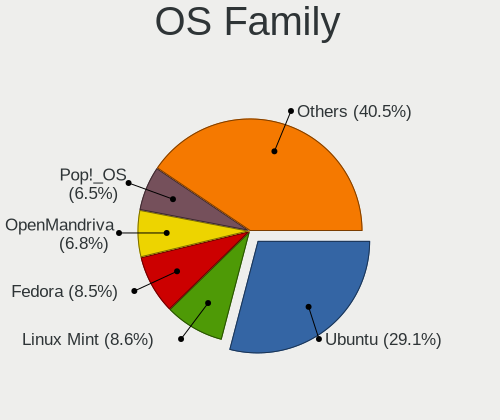
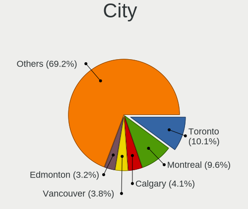
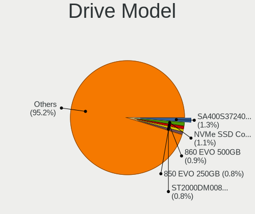
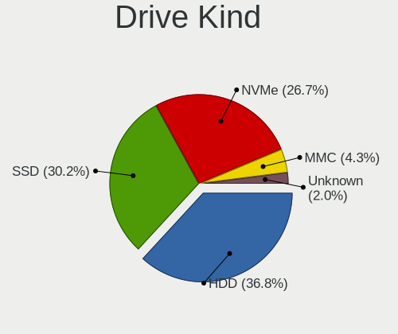
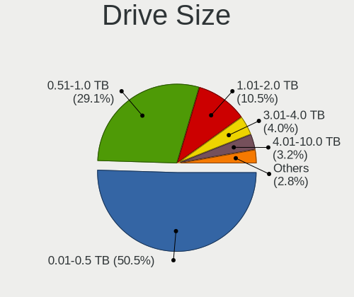
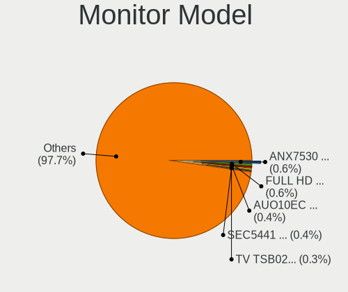
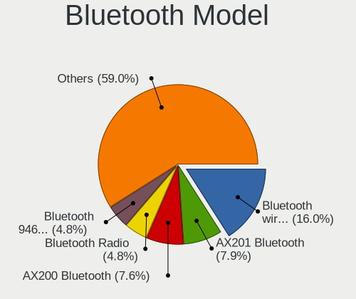
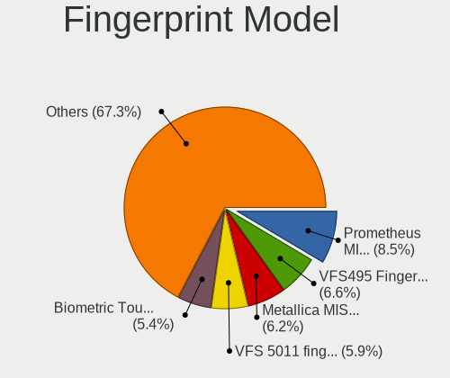
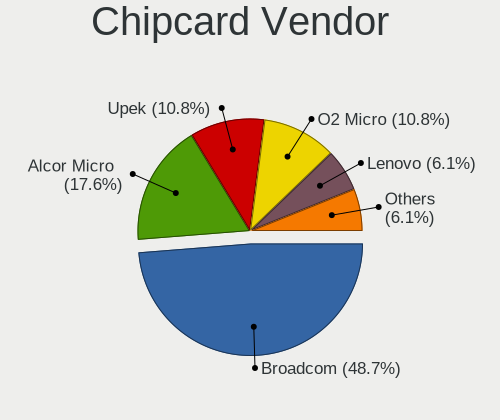

Linux in Canada - Tested Hardware & Statistics
----------------------------------------------

A project to collect tested hardware configurations for Linux in Canada.

Anyone can contribute to this report by the [hw-probe](https://github.com/linuxhw/hw-probe) tool:

    sudo -E hw-probe -all -upload

Please contribute! Especially if your hardware is rare.

This is a report for all computer types. See also reports for [desktops](/Location/Canada/Desktop/README.md) and [notebooks](/Location/Canada/Notebook/README.md).

Contents
--------

* [ Test Cases ](#test-cases)

* [ System ](#system)
  - [ OS                       ](#os)
  - [ OS Family                ](#os-family)
  - [ Kernel                   ](#kernel)
  - [ Kernel Family            ](#kernel-family)
  - [ Kernel Major Ver.        ](#kernel-major-ver)
  - [ Arch                     ](#arch)
  - [ DE                       ](#de)
  - [ Display Server           ](#display-server)
  - [ Display Manager          ](#display-manager)
  - [ OS Lang                  ](#os-lang)
  - [ Boot Mode                ](#boot-mode)
  - [ Filesystem               ](#filesystem)
  - [ Part. scheme             ](#part-scheme)
  - [ Dual Boot with Linux/BSD ](#dual-boot-with-linuxbsd)
  - [ Dual Boot (Win)          ](#dual-boot-win)

* [ Board ](#board)
  - [ Vendor                   ](#vendor)
  - [ Model                    ](#model)
  - [ Model Family             ](#model-family)
  - [ MFG Year                 ](#mfg-year)
  - [ Form Factor              ](#form-factor)
  - [ Secure Boot              ](#secure-boot)
  - [ Coreboot                 ](#coreboot)
  - [ RAM Size                 ](#ram-size)
  - [ RAM Used                 ](#ram-used)
  - [ Total Drives             ](#total-drives)
  - [ Has CD-ROM               ](#has-cd-rom)
  - [ Has Ethernet             ](#has-ethernet)
  - [ Has WiFi                 ](#has-wifi)
  - [ Has Bluetooth            ](#has-bluetooth)

* [ Location ](#location)
  - [ Country                  ](#country)
  - [ City                     ](#city)

* [ Drives ](#drives)
  - [ Drive Vendor             ](#drive-vendor)
  - [ Drive Model              ](#drive-model)
  - [ HDD Vendor               ](#hdd-vendor)
  - [ SSD Vendor               ](#ssd-vendor)
  - [ Drive Kind               ](#drive-kind)
  - [ Drive Connector          ](#drive-connector)
  - [ Drive Size               ](#drive-size)
  - [ Space Total              ](#space-total)
  - [ Space Used               ](#space-used)
  - [ Malfunc. Drives          ](#malfunc-drives)
  - [ Malfunc. Drive Vendor    ](#malfunc-drive-vendor)
  - [ Malfunc. HDD Vendor      ](#malfunc-hdd-vendor)
  - [ Malfunc. Drive Kind      ](#malfunc-drive-kind)
  - [ Failed Drives            ](#failed-drives)
  - [ Failed Drive Vendor      ](#failed-drive-vendor)
  - [ Drive Status             ](#drive-status)

* [ Storage controller ](#storage-controller)
  - [ Storage Vendor           ](#storage-vendor)
  - [ Storage Model            ](#storage-model)
  - [ Storage Kind             ](#storage-kind)

* [ Processor ](#processor)
  - [ CPU Vendor               ](#cpu-vendor)
  - [ CPU Model                ](#cpu-model)
  - [ CPU Model Family         ](#cpu-model-family)
  - [ CPU Cores                ](#cpu-cores)
  - [ CPU Sockets              ](#cpu-sockets)
  - [ CPU Threads              ](#cpu-threads)
  - [ CPU Op-Modes             ](#cpu-op-modes)
  - [ CPU Microcode            ](#cpu-microcode)
  - [ CPU Microarch            ](#cpu-microarch)

* [ Graphics ](#graphics)
  - [ GPU Vendor               ](#gpu-vendor)
  - [ GPU Model                ](#gpu-model)
  - [ GPU Combo                ](#gpu-combo)
  - [ GPU Driver               ](#gpu-driver)
  - [ GPU Memory               ](#gpu-memory)

* [ Monitor ](#monitor)
  - [ Monitor Vendor           ](#monitor-vendor)
  - [ Monitor Model            ](#monitor-model)
  - [ Monitor Resolution       ](#monitor-resolution)
  - [ Monitor Diagonal         ](#monitor-diagonal)
  - [ Monitor Width            ](#monitor-width)
  - [ Aspect Ratio             ](#aspect-ratio)
  - [ Monitor Area             ](#monitor-area)
  - [ Pixel Density            ](#pixel-density)
  - [ Multiple Monitors        ](#multiple-monitors)

* [ Network ](#network)
  - [ Net Controller Vendor    ](#net-controller-vendor)
  - [ Net Controller Model     ](#net-controller-model)
  - [ Wireless Vendor          ](#wireless-vendor)
  - [ Wireless Model           ](#wireless-model)
  - [ Ethernet Vendor          ](#ethernet-vendor)
  - [ Ethernet Model           ](#ethernet-model)
  - [ Net Controller Kind      ](#net-controller-kind)
  - [ Used Controller          ](#used-controller)
  - [ NICs                     ](#nics)
  - [ IPv6                     ](#ipv6)

* [ Bluetooth ](#bluetooth)
  - [ Bluetooth Vendor         ](#bluetooth-vendor)
  - [ Bluetooth Model          ](#bluetooth-model)

* [ Sound ](#sound)
  - [ Sound Vendor             ](#sound-vendor)
  - [ Sound Model              ](#sound-model)

* [ Memory ](#memory)
  - [ Memory Vendor            ](#memory-vendor)
  - [ Memory Model             ](#memory-model)
  - [ Memory Kind              ](#memory-kind)
  - [ Memory Form Factor       ](#memory-form-factor)
  - [ Memory Size              ](#memory-size)
  - [ Memory Speed             ](#memory-speed)

* [ Printers & scanners ](#printers--scanners)
  - [ Printer Vendor           ](#printer-vendor)
  - [ Printer Model            ](#printer-model)
  - [ Scanner Vendor           ](#scanner-vendor)
  - [ Scanner Model            ](#scanner-model)

* [ Camera ](#camera)
  - [ Camera Vendor            ](#camera-vendor)
  - [ Camera Model             ](#camera-model)

* [ Security ](#security)
  - [ Fingerprint Vendor       ](#fingerprint-vendor)
  - [ Fingerprint Model        ](#fingerprint-model)
  - [ Chipcard Vendor          ](#chipcard-vendor)
  - [ Chipcard Model           ](#chipcard-model)

* [ Unsupported ](#unsupported)
  - [ Unsupported Devices      ](#unsupported-devices)
  - [ Unsupported Device Types ](#unsupported-device-types)

Test Cases
----------

Total: 9596

| Vendor        | Model                       | Form-Factor | Probe                                                      | Date         |
|---------------|-----------------------------|-------------|------------------------------------------------------------|--------------|
| HP            | G61                         | Notebook    | [65f7664fe3](https://linux-hardware.org/?probe=65f7664fe3) | Nov 06, 2023 |
| Valve         | Jupiter                     | Notebook    | [aef9c84cf7](https://linux-hardware.org/?probe=aef9c84cf7) | Nov 06, 2023 |
| Valve         | Jupiter                     | Notebook    | [d8ac880948](https://linux-hardware.org/?probe=d8ac880948) | Nov 06, 2023 |
| HP            | Pavilion dv8000 (ET839UA... | Notebook    | [ad7dc81954](https://linux-hardware.org/?probe=ad7dc81954) | Nov 06, 2023 |
| Lenovo        | IdeaPad 320-15ABR 80XS      | Notebook    | [290be8911e](https://linux-hardware.org/?probe=290be8911e) | Nov 06, 2023 |
| ASUSTek       | SABERTOOTH X79              | Desktop     | [c46040087a](https://linux-hardware.org/?probe=c46040087a) | Nov 06, 2023 |
| Lenovo        | ThinkPad T14 Gen 1 20S1S... | Notebook    | [4bf4b470a0](https://linux-hardware.org/?probe=4bf4b470a0) | Nov 05, 2023 |
| Alienware     | 0N43JM A01                  | Desktop     | [7bd0e03c1b](https://linux-hardware.org/?probe=7bd0e03c1b) | Nov 05, 2023 |
| ASUSTek       | G11CD                       | Desktop     | [8fcbd49e37](https://linux-hardware.org/?probe=8fcbd49e37) | Nov 05, 2023 |
| ASUSTek       | PRIME Z370-P II             | Desktop     | [701314a2ff](https://linux-hardware.org/?probe=701314a2ff) | Nov 04, 2023 |
| Acer          | AO532h                      | Notebook    | [0b3d66b04a](https://linux-hardware.org/?probe=0b3d66b04a) | Nov 04, 2023 |
| HP            | EliteBook 840 G4            | Notebook    | [5abff2e87a](https://linux-hardware.org/?probe=5abff2e87a) | Nov 04, 2023 |
| ASUSTek       | H81M-C                      | Desktop     | [cfb51ce306](https://linux-hardware.org/?probe=cfb51ce306) | Nov 03, 2023 |
| MSI           | A68HM-E33 V2                | Desktop     | [f029848e7d](https://linux-hardware.org/?probe=f029848e7d) | Nov 03, 2023 |
| ASUSTek       | VivoBook_ASUSLaptop X515... | Notebook    | [1bdfa38b3e](https://linux-hardware.org/?probe=1bdfa38b3e) | Nov 03, 2023 |
| Apple         | Mac-942B59F58194171B iMa... | All in one  | [684c7d7bf7](https://linux-hardware.org/?probe=684c7d7bf7) | Nov 03, 2023 |
| Acer          | Predator PO3-600 V:1.1      | Desktop     | [9495d53da4](https://linux-hardware.org/?probe=9495d53da4) | Nov 03, 2023 |
| HP            | Stream Laptop 11-ah1XX      | Notebook    | [94cdd979b2](https://linux-hardware.org/?probe=94cdd979b2) | Nov 03, 2023 |
| Dell          | 0MGK50 A02                  | Desktop     | [ca062f44be](https://linux-hardware.org/?probe=ca062f44be) | Nov 03, 2023 |
| HP            | Stream Laptop 11-ah1XX      | Notebook    | [5149df3a58](https://linux-hardware.org/?probe=5149df3a58) | Nov 03, 2023 |
| Lenovo        | ThinkPad X1 Carbon Gen 9... | Notebook    | [3c92af97b9](https://linux-hardware.org/?probe=3c92af97b9) | Nov 02, 2023 |
| Acer          | Aspire TC-885 V:1.1         | Desktop     | [a871f012a2](https://linux-hardware.org/?probe=a871f012a2) | Nov 02, 2023 |
| Lenovo        | ThinkCentre M58p 6234A1U    | Desktop     | [b684f82e3c](https://linux-hardware.org/?probe=b684f82e3c) | Nov 01, 2023 |
| Lenovo        | IdeaPad 320-15IKB 81BG      | Notebook    | [99992393e4](https://linux-hardware.org/?probe=99992393e4) | Nov 01, 2023 |
| Lenovo        | IdeaPad 3 15ABA7 82RN       | Notebook    | [11c06a97d7](https://linux-hardware.org/?probe=11c06a97d7) | Nov 01, 2023 |
| MSI           | B550M PRO-VDH WIFI          | Desktop     | [38d664802f](https://linux-hardware.org/?probe=38d664802f) | Nov 01, 2023 |
| Foxconn       | 2ADA                        | Desktop     | [18271c13c3](https://linux-hardware.org/?probe=18271c13c3) | Nov 01, 2023 |
| ASUSTek       | VivoBook_ASUSLaptop X415... | Notebook    | [8a2a3561ab](https://linux-hardware.org/?probe=8a2a3561ab) | Nov 01, 2023 |
| ASUSTek       | PRIME B450M-A               | Desktop     | [8f885b5a65](https://linux-hardware.org/?probe=8f885b5a65) | Nov 01, 2023 |
| Gigabyte      | B450M DS3H WIFI V2-CF       | Desktop     | [ac2f19109e](https://linux-hardware.org/?probe=ac2f19109e) | Oct 31, 2023 |
| Lenovo        | MAHOBAY NOK                 | Desktop     | [77d9982cf2](https://linux-hardware.org/?probe=77d9982cf2) | Oct 31, 2023 |
| Apple         | MacBookPro8,1               | Notebook    | [0ea1a71a53](https://linux-hardware.org/?probe=0ea1a71a53) | Oct 31, 2023 |
| Win elemen... | M600                        | Desktop     | [205389ccc2](https://linux-hardware.org/?probe=205389ccc2) | Oct 31, 2023 |
| Win elemen... | M600                        | Desktop     | [f1a08307c8](https://linux-hardware.org/?probe=f1a08307c8) | Oct 31, 2023 |
| Lenovo        | ThinkPad T440 20B7S03Q00    | Notebook    | [de24032ac7](https://linux-hardware.org/?probe=de24032ac7) | Oct 30, 2023 |
| Dell          | Latitude 5490               | Notebook    | [63f4fce332](https://linux-hardware.org/?probe=63f4fce332) | Oct 30, 2023 |
| Acer          | Nitro AN515-55              | Notebook    | [0325d9a6e8](https://linux-hardware.org/?probe=0325d9a6e8) | Oct 30, 2023 |
| Dell          | 0KWVT8 A03                  | Desktop     | [b5615554ee](https://linux-hardware.org/?probe=b5615554ee) | Oct 30, 2023 |
| MSI           | MPG X570 GAMING PLUS        | Desktop     | [e231035f6e](https://linux-hardware.org/?probe=e231035f6e) | Oct 30, 2023 |
| ASUSTek       | P8H77-M                     | Desktop     | [d40277c6b4](https://linux-hardware.org/?probe=d40277c6b4) | Oct 30, 2023 |
| Acer          | Nitro AN515-55              | Notebook    | [80e9a059c1](https://linux-hardware.org/?probe=80e9a059c1) | Oct 29, 2023 |
| Lenovo        | ThinkPad T460 20FN002JUS    | Notebook    | [bf9ff8ba5b](https://linux-hardware.org/?probe=bf9ff8ba5b) | Oct 29, 2023 |
| Gigabyte      | B550I AORUS PRO AX          | Desktop     | [7d0eb8f922](https://linux-hardware.org/?probe=7d0eb8f922) | Oct 29, 2023 |
| Acer          | Predator PO3-600 V:1.1      | Desktop     | [a7a54fb14a](https://linux-hardware.org/?probe=a7a54fb14a) | Oct 29, 2023 |
| System76      | Gazelle                     | Notebook    | [3bc4a66a13](https://linux-hardware.org/?probe=3bc4a66a13) | Oct 29, 2023 |
| Acer          | Aspire A315-21              | Notebook    | [7f9b48f63b](https://linux-hardware.org/?probe=7f9b48f63b) | Oct 29, 2023 |
| ASUSTek       | ASUS TUF Gaming F15 FX50... | Notebook    | [22380583c4](https://linux-hardware.org/?probe=22380583c4) | Oct 28, 2023 |
| ASUSTek       | ASUS TUF Gaming F15 FX50... | Notebook    | [b83a355a39](https://linux-hardware.org/?probe=b83a355a39) | Oct 28, 2023 |
| HUAWEI        | MACHD-WXX9                  | Notebook    | [551a5c8aa2](https://linux-hardware.org/?probe=551a5c8aa2) | Oct 28, 2023 |
| MSI           | MPG X570 GAMING PLUS        | Desktop     | [6b8560a943](https://linux-hardware.org/?probe=6b8560a943) | Oct 28, 2023 |
| Lenovo        | IdeaPad S340-15IIL 81VW     | Notebook    | [4468cb093d](https://linux-hardware.org/?probe=4468cb093d) | Oct 28, 2023 |
| Lenovo        | IdeaPad S340-15IIL 81VW     | Notebook    | [c0aef363fa](https://linux-hardware.org/?probe=c0aef363fa) | Oct 28, 2023 |
| MSI           | Boston                      | Desktop     | [66f7505c8b](https://linux-hardware.org/?probe=66f7505c8b) | Oct 27, 2023 |
| Dell          | 0D24M8 A01                  | Desktop     | [5e52949030](https://linux-hardware.org/?probe=5e52949030) | Oct 27, 2023 |
| HP            | 2AF7                        | Desktop     | [3143f79dcd](https://linux-hardware.org/?probe=3143f79dcd) | Oct 27, 2023 |
| HP            | 8054                        | Desktop     | [3f9ecca91a](https://linux-hardware.org/?probe=3f9ecca91a) | Oct 26, 2023 |
| ASUSTek       | TUF Gaming B650-PLUS WIF... | Desktop     | [463b5f73b5](https://linux-hardware.org/?probe=463b5f73b5) | Oct 26, 2023 |
| ASUSTek       | ROG STRIX X570-E GAMING ... | Desktop     | [3b82b142b1](https://linux-hardware.org/?probe=3b82b142b1) | Oct 26, 2023 |
| Dell          | Latitude E6520              | Notebook    | [dbbca588de](https://linux-hardware.org/?probe=dbbca588de) | Oct 26, 2023 |
| Lenovo        | 36EB SDK0J40700 WIN 3258... | Desktop     | [ca4ce5575c](https://linux-hardware.org/?probe=ca4ce5575c) | Oct 26, 2023 |
| HP            | Laptop 15-da0xxx            | Notebook    | [6c18f4a4ef](https://linux-hardware.org/?probe=6c18f4a4ef) | Oct 25, 2023 |
| Pegatron      | Benicia                     | Desktop     | [62373f17e0](https://linux-hardware.org/?probe=62373f17e0) | Oct 25, 2023 |
| Lenovo        | SHARKBAY NOK                | Desktop     | [023bd4d497](https://linux-hardware.org/?probe=023bd4d497) | Oct 25, 2023 |
| ASUSTek       | ZenBook UX434FL             | Notebook    | [139d1a74ed](https://linux-hardware.org/?probe=139d1a74ed) | Oct 25, 2023 |
| Matsushita... | CF-30CTWAZBM                | Notebook    | [4211783dac](https://linux-hardware.org/?probe=4211783dac) | Oct 25, 2023 |
| Dell          | 0D24M8 A01                  | Desktop     | [74e623d263](https://linux-hardware.org/?probe=74e623d263) | Oct 25, 2023 |
| LORD ELECT... | Guso G4x + ICH7 Series M... | Desktop     | [c6f81cf996](https://linux-hardware.org/?probe=c6f81cf996) | Oct 25, 2023 |
| Dell          | Latitude E6420              | Notebook    | [54c82901c0](https://linux-hardware.org/?probe=54c82901c0) | Oct 25, 2023 |
| ASUSTek       | PRIME B450M-A               | Desktop     | [deac292d7d](https://linux-hardware.org/?probe=deac292d7d) | Oct 25, 2023 |
| Lenovo        | ThinkPad P52 20MAS0WG00     | Notebook    | [e7e16a6ac8](https://linux-hardware.org/?probe=e7e16a6ac8) | Oct 25, 2023 |
| SZMZ          | X99M-G2                     | Desktop     | [78bdbc6419](https://linux-hardware.org/?probe=78bdbc6419) | Oct 25, 2023 |
| Lenovo        | IdeaPadFlex 15 20309        | Notebook    | [7476940ad0](https://linux-hardware.org/?probe=7476940ad0) | Oct 25, 2023 |
| Intel         | JSL MRD                     | Desktop     | [1c8a3117b9](https://linux-hardware.org/?probe=1c8a3117b9) | Oct 25, 2023 |
| Toshiba       | Satellite L655              | Notebook    | [504b65f326](https://linux-hardware.org/?probe=504b65f326) | Oct 25, 2023 |
| Toshiba       | Satellite L655              | Notebook    | [6f1c644900](https://linux-hardware.org/?probe=6f1c644900) | Oct 25, 2023 |
| Dell          | 0K9T56 A00                  | All in one  | [e02693091f](https://linux-hardware.org/?probe=e02693091f) | Oct 25, 2023 |
| Dell          | 0K9T56 A00                  | All in one  | [cc8dcd6a8d](https://linux-hardware.org/?probe=cc8dcd6a8d) | Oct 24, 2023 |
| Gigabyte      | B550I AORUS PRO AX          | Desktop     | [38cbc0d5d7](https://linux-hardware.org/?probe=38cbc0d5d7) | Oct 24, 2023 |
| ASRock        | FM2A88X+ Killer             | Desktop     | [c9b5ffd5b8](https://linux-hardware.org/?probe=c9b5ffd5b8) | Oct 24, 2023 |
| ASRock        | B450 Pro4                   | Desktop     | [d4a28890a5](https://linux-hardware.org/?probe=d4a28890a5) | Oct 24, 2023 |
| Dell          | 0WN7Y6 A01                  | Desktop     | [4b2be75f68](https://linux-hardware.org/?probe=4b2be75f68) | Oct 24, 2023 |
| ASUSTek       | ROG STRIX X570-E GAMING     | Desktop     | [29adbcb90f](https://linux-hardware.org/?probe=29adbcb90f) | Oct 24, 2023 |
| HP            | 1589                        | Desktop     | [1a61614ad2](https://linux-hardware.org/?probe=1a61614ad2) | Oct 24, 2023 |
| HP            | Victus by Laptop PC         | Notebook    | [53988c0c73](https://linux-hardware.org/?probe=53988c0c73) | Oct 24, 2023 |
| Lenovo        | ThinkPad T430 2349UA9       | Notebook    | [84883d560d](https://linux-hardware.org/?probe=84883d560d) | Oct 24, 2023 |
| Lenovo        | 371E SDK0J40709 WIN 3259... | All in one  | [47d70a6fcb](https://linux-hardware.org/?probe=47d70a6fcb) | Oct 24, 2023 |
| Gigabyte      | Z390 M GAMING-CF            | Desktop     | [b1f52f8dc1](https://linux-hardware.org/?probe=b1f52f8dc1) | Oct 23, 2023 |
| Dell          | 0WN7Y6 A01                  | Desktop     | [4323d57b2f](https://linux-hardware.org/?probe=4323d57b2f) | Oct 23, 2023 |
| Valve         | Jupiter                     | Notebook    | [fa38785b75](https://linux-hardware.org/?probe=fa38785b75) | Oct 23, 2023 |
| Dell          | XPS 15 7590                 | Notebook    | [e9ecf74d68](https://linux-hardware.org/?probe=e9ecf74d68) | Oct 23, 2023 |
| ASUSTek       | ROG Strix G513RC_G513RC     | Notebook    | [817367d444](https://linux-hardware.org/?probe=817367d444) | Oct 23, 2023 |
| Dell          | Latitude E6520              | Notebook    | [c2fd0014ab](https://linux-hardware.org/?probe=c2fd0014ab) | Oct 23, 2023 |
| Acer          | G33T-AM                     | Desktop     | [7b42f4db1d](https://linux-hardware.org/?probe=7b42f4db1d) | Oct 23, 2023 |
| Lenovo        | ThinkPad T480s 20L8S2SS0... | Notebook    | [9877bb17c1](https://linux-hardware.org/?probe=9877bb17c1) | Oct 23, 2023 |
| MSI           | 970 GAMING                  | Desktop     | [dfcfacf8d5](https://linux-hardware.org/?probe=dfcfacf8d5) | Oct 23, 2023 |
| Dell          | Inspiron 3521               | Notebook    | [43b2c926ef](https://linux-hardware.org/?probe=43b2c926ef) | Oct 22, 2023 |
| ASUSTek       | G750JW                      | Notebook    | [9bafdb8250](https://linux-hardware.org/?probe=9bafdb8250) | Oct 22, 2023 |
| Dell          | XPS 13 9300                 | Notebook    | [ccf935ca37](https://linux-hardware.org/?probe=ccf935ca37) | Oct 22, 2023 |
| Acer          | Aspire A315-23              | Notebook    | [14ed4adf6c](https://linux-hardware.org/?probe=14ed4adf6c) | Oct 22, 2023 |
| Raspberry ... | Raspberry Pi 4 Model B R... | Soc         | [165a6113af](https://linux-hardware.org/?probe=165a6113af) | Oct 22, 2023 |
| Acer          | G33T-AM                     | Desktop     | [70f67a6f11](https://linux-hardware.org/?probe=70f67a6f11) | Oct 22, 2023 |
| ASRock        | B450M/ac R2.0               | Desktop     | [c1313fc22e](https://linux-hardware.org/?probe=c1313fc22e) | Oct 22, 2023 |
| HP            | 2000                        | Notebook    | [743e2b0bdf](https://linux-hardware.org/?probe=743e2b0bdf) | Oct 22, 2023 |
| Apple         | Mac-F4238CC8 PVT            | All in one  | [4227545bf9](https://linux-hardware.org/?probe=4227545bf9) | Oct 21, 2023 |
| Acer          | Aspire 5742                 | Notebook    | [f30dc155bd](https://linux-hardware.org/?probe=f30dc155bd) | Oct 21, 2023 |
| ASUSTek       | P8Z68-V GEN3                | Desktop     | [3216d9052a](https://linux-hardware.org/?probe=3216d9052a) | Oct 21, 2023 |
| Toshiba       | Satellite A660              | Notebook    | [a5e343d353](https://linux-hardware.org/?probe=a5e343d353) | Oct 21, 2023 |
| Dell          | Latitude E6410              | Notebook    | [5b363ffe33](https://linux-hardware.org/?probe=5b363ffe33) | Oct 21, 2023 |
| ASUSTek       | ROG STRIX Z690-E GAMING ... | Desktop     | [8290e4c160](https://linux-hardware.org/?probe=8290e4c160) | Oct 20, 2023 |
| Intel         | D53427RKE G87971-406        | Desktop     | [01b0785dea](https://linux-hardware.org/?probe=01b0785dea) | Oct 20, 2023 |
| ASRock        | B450 Pro4                   | Desktop     | [d8b8f7bafe](https://linux-hardware.org/?probe=d8b8f7bafe) | Oct 20, 2023 |
| Acer          | Aspire 5253                 | Notebook    | [871f28b131](https://linux-hardware.org/?probe=871f28b131) | Oct 20, 2023 |
| Dell          | 0XCR8D A03                  | Desktop     | [84eb6ce25e](https://linux-hardware.org/?probe=84eb6ce25e) | Oct 20, 2023 |
| Dell          | G7 7700                     | Notebook    | [336bd76568](https://linux-hardware.org/?probe=336bd76568) | Oct 20, 2023 |
| Lenovo        | ThinkPad T510 4384DJ3       | Notebook    | [bd0354850e](https://linux-hardware.org/?probe=bd0354850e) | Oct 19, 2023 |
| Lenovo        | ThinkPad T510 4384DJ3       | Notebook    | [85099af926](https://linux-hardware.org/?probe=85099af926) | Oct 19, 2023 |
| ASUSTek       | VivoBook_ASUSLaptop X150... | Notebook    | [2f2d05a226](https://linux-hardware.org/?probe=2f2d05a226) | Oct 19, 2023 |
| HP            | G60                         | Notebook    | [3c3f75c072](https://linux-hardware.org/?probe=3c3f75c072) | Oct 19, 2023 |
| Alienware     | 13                          | Notebook    | [15e7dfbbab](https://linux-hardware.org/?probe=15e7dfbbab) | Oct 19, 2023 |
| HP            | Pavilion dv7                | Notebook    | [13b6b396e9](https://linux-hardware.org/?probe=13b6b396e9) | Oct 18, 2023 |
| Valve         | Jupiter                     | Notebook    | [6eab7fbd58](https://linux-hardware.org/?probe=6eab7fbd58) | Oct 18, 2023 |
| Acidanther... | Mac-AA95B1DDAB278B95 iMa... | All in one  | [d042dee2d6](https://linux-hardware.org/?probe=d042dee2d6) | Oct 18, 2023 |
| Gateway       | NV59                        | Notebook    | [ec598a2d11](https://linux-hardware.org/?probe=ec598a2d11) | Oct 18, 2023 |
| Dell          | 0DPRKF A07                  | Server      | [79c7e6e8be](https://linux-hardware.org/?probe=79c7e6e8be) | Oct 17, 2023 |
| Dell          | XPS 15 9500                 | Notebook    | [7e5d5dd6dd](https://linux-hardware.org/?probe=7e5d5dd6dd) | Oct 17, 2023 |
| ASUSTek       | K30BF_M32BF_A_F_K31BF_6     | Desktop     | [6f8e6d4251](https://linux-hardware.org/?probe=6f8e6d4251) | Oct 17, 2023 |
| Dell          | 0CN7X8 A04                  | Server      | [2926458524](https://linux-hardware.org/?probe=2926458524) | Oct 17, 2023 |
| Dell          | 0CN7X8 A04                  | Server      | [10029a3309](https://linux-hardware.org/?probe=10029a3309) | Oct 17, 2023 |
| Lenovo        | ThinkPad P52 20MAS0WG00     | Notebook    | [edfeee597d](https://linux-hardware.org/?probe=edfeee597d) | Oct 17, 2023 |
| Acer          | Aspire SW5-012              | Notebook    | [848b8d7c20](https://linux-hardware.org/?probe=848b8d7c20) | Oct 17, 2023 |
| ASUSTek       | ZenBook UX425EA_UX425EA     | Notebook    | [d5d89eba92](https://linux-hardware.org/?probe=d5d89eba92) | Oct 17, 2023 |
| Sony          | SVE15128CCW                 | Notebook    | [2d2c699b43](https://linux-hardware.org/?probe=2d2c699b43) | Oct 16, 2023 |
| Dell          | Latitude 7440               | Notebook    | [513083adb4](https://linux-hardware.org/?probe=513083adb4) | Oct 16, 2023 |
| Dell          | Latitude 7440               | Notebook    | [f8d4813ce1](https://linux-hardware.org/?probe=f8d4813ce1) | Oct 16, 2023 |
| Dell          | 01Y1CJ A00                  | Mini pc     | [f01b625d01](https://linux-hardware.org/?probe=f01b625d01) | Oct 16, 2023 |
| ASUSTek       | TUF X299 MARK 2             | Desktop     | [52a3f75a39](https://linux-hardware.org/?probe=52a3f75a39) | Oct 16, 2023 |
| ASUSTek       | VivoBook_ASUSLaptop X170... | Notebook    | [8e489a0275](https://linux-hardware.org/?probe=8e489a0275) | Oct 16, 2023 |
| Alienware     | 13                          | Notebook    | [24ce621e56](https://linux-hardware.org/?probe=24ce621e56) | Oct 16, 2023 |
| Apple         | MacBookPro8,1               | Notebook    | [df7395bd63](https://linux-hardware.org/?probe=df7395bd63) | Oct 16, 2023 |
| Acidanther... | Mac-AA95B1DDAB278B95 iMa... | All in one  | [2ba4da42b0](https://linux-hardware.org/?probe=2ba4da42b0) | Oct 16, 2023 |
| ASUSTek       | VivoBook_ASUSLaptop X170... | Notebook    | [d01a91e5bb](https://linux-hardware.org/?probe=d01a91e5bb) | Oct 15, 2023 |
| Unknown       | V00                         | Mini pc     | [dc88db7cd5](https://linux-hardware.org/?probe=dc88db7cd5) | Oct 15, 2023 |
| Gigabyte      | B85M-D3H                    | Desktop     | [3fca075f42](https://linux-hardware.org/?probe=3fca075f42) | Oct 15, 2023 |
| HP            | ENVY x360 Convertible 15... | Convertible | [675cc419ab](https://linux-hardware.org/?probe=675cc419ab) | Oct 15, 2023 |
| Acer          | Aspire A315-21              | Notebook    | [7476ed8679](https://linux-hardware.org/?probe=7476ed8679) | Oct 15, 2023 |
| Dell          | Inspiron 14 7425 2-in-1     | Convertible | [1fb7256af8](https://linux-hardware.org/?probe=1fb7256af8) | Oct 15, 2023 |
| HP            | 829A                        | Mini pc     | [f9af7b48fe](https://linux-hardware.org/?probe=f9af7b48fe) | Oct 14, 2023 |
| Apple         | Mac-27ADBB7B4CEE8E61 iMa... | All in one  | [9369ff78e6](https://linux-hardware.org/?probe=9369ff78e6) | Oct 14, 2023 |
| HP            | Pavilion dv7                | Notebook    | [ae2789f31f](https://linux-hardware.org/?probe=ae2789f31f) | Oct 14, 2023 |
| HP            | Pavilion dv7                | Notebook    | [de47e931a1](https://linux-hardware.org/?probe=de47e931a1) | Oct 14, 2023 |
| Lenovo        | IdeaPad 320-15IKB 81BG      | Notebook    | [d4be846a3c](https://linux-hardware.org/?probe=d4be846a3c) | Oct 13, 2023 |
| Acer          | Aspire 7750G                | Notebook    | [d634013b16](https://linux-hardware.org/?probe=d634013b16) | Oct 13, 2023 |
| Notebook      | P9XXEN_EF_ED                | Notebook    | [89eae06fc2](https://linux-hardware.org/?probe=89eae06fc2) | Oct 13, 2023 |
| Lenovo        | ThinkCentre M58p 6234AE5    | Desktop     | [67c11d3d06](https://linux-hardware.org/?probe=67c11d3d06) | Oct 13, 2023 |
| ASUSTek       | PRIME H310M-C               | Desktop     | [2696ecde8d](https://linux-hardware.org/?probe=2696ecde8d) | Oct 13, 2023 |
| Acer          | Aspire E5-523               | Notebook    | [e45e982b6e](https://linux-hardware.org/?probe=e45e982b6e) | Oct 13, 2023 |
| HP            | G61                         | Notebook    | [34e955886e](https://linux-hardware.org/?probe=34e955886e) | Oct 13, 2023 |
| Dell          | 0DT5WX A01                  | Desktop     | [8d935c84d1](https://linux-hardware.org/?probe=8d935c84d1) | Oct 13, 2023 |
| HP            | 8430 1000                   | All in one  | [1d37a2c0a1](https://linux-hardware.org/?probe=1d37a2c0a1) | Oct 12, 2023 |
| Gigabyte      | Z370P D3-CF                 | Desktop     | [09d2bdba5b](https://linux-hardware.org/?probe=09d2bdba5b) | Oct 12, 2023 |
| HP            | 805D                        | Desktop     | [8fb0d8213e](https://linux-hardware.org/?probe=8fb0d8213e) | Oct 12, 2023 |
| HP            | 2AF7                        | Desktop     | [662f056de9](https://linux-hardware.org/?probe=662f056de9) | Oct 12, 2023 |
| ASUSTek       | VivoBook_ASUSLaptop X512... | Notebook    | [21e9b8cbc9](https://linux-hardware.org/?probe=21e9b8cbc9) | Oct 11, 2023 |
| Dell          | 0496JX A01                  | Desktop     | [3f7da0905d](https://linux-hardware.org/?probe=3f7da0905d) | Oct 11, 2023 |
| Acer          | Aspire TC-885 V:1.1         | Desktop     | [d5b9290117](https://linux-hardware.org/?probe=d5b9290117) | Oct 11, 2023 |
| Dell          | 00V62H A01                  | Desktop     | [6f3f75599a](https://linux-hardware.org/?probe=6f3f75599a) | Oct 11, 2023 |
| HP            | Pavilion x360 14 Convert... | Convertible | [867535b032](https://linux-hardware.org/?probe=867535b032) | Oct 11, 2023 |
| Dell          | 0XJ8C4 A00                  | Desktop     | [c95c8a8a2e](https://linux-hardware.org/?probe=c95c8a8a2e) | Oct 11, 2023 |
| HP            | Pavilion x360 14 Convert... | Convertible | [5e882a8eff](https://linux-hardware.org/?probe=5e882a8eff) | Oct 11, 2023 |
| HP            | ProLiant SE1220             | Server      | [da67ae4335](https://linux-hardware.org/?probe=da67ae4335) | Oct 11, 2023 |
| Chuwi         | GemiBook XPro               | Notebook    | [b9da20666a](https://linux-hardware.org/?probe=b9da20666a) | Oct 10, 2023 |
| ASUSTek       | ZenBook UX425EA_UX425EA     | Notebook    | [d0abc8a7e8](https://linux-hardware.org/?probe=d0abc8a7e8) | Oct 10, 2023 |
| Gigabyte      | X570 AORUS PRO WIFI         | Desktop     | [3e2e0d58df](https://linux-hardware.org/?probe=3e2e0d58df) | Oct 10, 2023 |
| Lenovo        | ThinkPad L490 20Q6S07X00    | Notebook    | [07ebe46482](https://linux-hardware.org/?probe=07ebe46482) | Oct 10, 2023 |
| Gigabyte      | H55M-USB3                   | Desktop     | [c4ae24b408](https://linux-hardware.org/?probe=c4ae24b408) | Oct 10, 2023 |
| Acer          | Aspire TC-885 V:1.1         | Desktop     | [d7922ca9bd](https://linux-hardware.org/?probe=d7922ca9bd) | Oct 09, 2023 |
| Gateway       | NV59                        | Notebook    | [79392cad25](https://linux-hardware.org/?probe=79392cad25) | Oct 09, 2023 |
| ASRock        | B760M PG Riptide            | Desktop     | [9b5474fee0](https://linux-hardware.org/?probe=9b5474fee0) | Oct 09, 2023 |
| HP            | EliteBook 840 G3            | Notebook    | [29af84698a](https://linux-hardware.org/?probe=29af84698a) | Oct 09, 2023 |
| ASRock        | B550 Phantom Gaming 4/ac    | Desktop     | [b249985c20](https://linux-hardware.org/?probe=b249985c20) | Oct 09, 2023 |
| Lenovo        | ThinkPad T480 20L5CTO1WW    | Notebook    | [60a4c67d48](https://linux-hardware.org/?probe=60a4c67d48) | Oct 09, 2023 |
| ASRock        | B550 Phantom Gaming 4/ac    | Desktop     | [90b88ff378](https://linux-hardware.org/?probe=90b88ff378) | Oct 09, 2023 |
| Lenovo        | ThinkPad T480 20L5CTO1WW    | Notebook    | [65a1ff3587](https://linux-hardware.org/?probe=65a1ff3587) | Oct 09, 2023 |
| Lenovo        | ThinkPad T480 20L5CTO1WW    | Notebook    | [a1ae219e54](https://linux-hardware.org/?probe=a1ae219e54) | Oct 09, 2023 |
| SZMZ          | X99M-G2                     | Desktop     | [212f394b32](https://linux-hardware.org/?probe=212f394b32) | Oct 09, 2023 |
| MSI           | MPG X570 GAMING PRO CARB... | Desktop     | [90041fa012](https://linux-hardware.org/?probe=90041fa012) | Oct 09, 2023 |
| Intel         | S5520HC E26045-454          | Server      | [5f179c5f02](https://linux-hardware.org/?probe=5f179c5f02) | Oct 09, 2023 |
| Acer          | RL100                       | Desktop     | [7b56b1bc11](https://linux-hardware.org/?probe=7b56b1bc11) | Oct 08, 2023 |
| SZMZ          | X99M-G2                     | Desktop     | [586d5eef76](https://linux-hardware.org/?probe=586d5eef76) | Oct 08, 2023 |
| ASUSTek       | ROG STRIX B660-I GAMING ... | Desktop     | [998f01f73b](https://linux-hardware.org/?probe=998f01f73b) | Oct 08, 2023 |
| Dell          | Latitude 7430               | Notebook    | [1de7d3085b](https://linux-hardware.org/?probe=1de7d3085b) | Oct 08, 2023 |
| Acer          | Aspire A515-54              | Notebook    | [30b5d7d52b](https://linux-hardware.org/?probe=30b5d7d52b) | Oct 08, 2023 |
| Gigabyte      | B650I AORUS ULTRA           | Desktop     | [590fa0428f](https://linux-hardware.org/?probe=590fa0428f) | Oct 07, 2023 |
| Apple         | MacBookPro11,1              | Notebook    | [b30fe669c6](https://linux-hardware.org/?probe=b30fe669c6) | Oct 07, 2023 |
| Direkt-Tek    | DTLAPY116-1                 | Notebook    | [aaa295fa26](https://linux-hardware.org/?probe=aaa295fa26) | Oct 06, 2023 |
| Lenovo        | ThinkPad X1 Carbon 6th 2... | Notebook    | [3854d7db80](https://linux-hardware.org/?probe=3854d7db80) | Oct 06, 2023 |
| HP            | Pavilion dv8000 (ET839UA... | Notebook    | [84eebff0a6](https://linux-hardware.org/?probe=84eebff0a6) | Oct 06, 2023 |
| Lenovo        | SHARKBAY 0B98401 PRO        | Desktop     | [ff815f228b](https://linux-hardware.org/?probe=ff815f228b) | Oct 05, 2023 |
| Intel         | X99                         | Desktop     | [61579851ef](https://linux-hardware.org/?probe=61579851ef) | Oct 05, 2023 |
| Dell          | Precision 5540              | Notebook    | [117d31349f](https://linux-hardware.org/?probe=117d31349f) | Oct 05, 2023 |
| Apple         | Mac-27ADBB7B4CEE8E61 iMa... | All in one  | [3c1d8a7607](https://linux-hardware.org/?probe=3c1d8a7607) | Oct 05, 2023 |
| Direkt-Tek    | DTLAPY116-1                 | Notebook    | [09c308ed3d](https://linux-hardware.org/?probe=09c308ed3d) | Oct 05, 2023 |
| Apple         | Mac-27ADBB7B4CEE8E61 iMa... | All in one  | [066163e5e3](https://linux-hardware.org/?probe=066163e5e3) | Oct 05, 2023 |
| MSI           | MPG X570 GAMING PRO CARB... | Desktop     | [a6668a2378](https://linux-hardware.org/?probe=a6668a2378) | Oct 04, 2023 |
| Lenovo        | ThinkPad X1 Carbon 6th 2... | Notebook    | [7700b3d342](https://linux-hardware.org/?probe=7700b3d342) | Oct 04, 2023 |
| MSI           | MPG X570 GAMING PRO CARB... | Desktop     | [de22cbed3e](https://linux-hardware.org/?probe=de22cbed3e) | Oct 04, 2023 |
| ASRock        | B550AM Gaming               | Desktop     | [3ca07820c5](https://linux-hardware.org/?probe=3ca07820c5) | Oct 04, 2023 |
| ASUSTek       | Z87-K                       | Desktop     | [60f9987e7d](https://linux-hardware.org/?probe=60f9987e7d) | Oct 04, 2023 |
| ASUSTek       | M5A99X EVO                  | Desktop     | [a13621c5d3](https://linux-hardware.org/?probe=a13621c5d3) | Oct 04, 2023 |
| Google        | Fleex                       | Notebook    | [534bbe966a](https://linux-hardware.org/?probe=534bbe966a) | Oct 04, 2023 |
| HP            | 3646h                       | Desktop     | [f39e9c8741](https://linux-hardware.org/?probe=f39e9c8741) | Oct 04, 2023 |
| Valve         | Jupiter                     | Notebook    | [4c7b5edf25](https://linux-hardware.org/?probe=4c7b5edf25) | Oct 04, 2023 |
| HP            | EliteBook 850 G1            | Notebook    | [49b19b9f02](https://linux-hardware.org/?probe=49b19b9f02) | Oct 03, 2023 |
| Direkt-Tek    | DTLAPY116-1                 | Notebook    | [eb797a8074](https://linux-hardware.org/?probe=eb797a8074) | Oct 03, 2023 |
| Dell          | Vostro 3550                 | Notebook    | [3d22b8f169](https://linux-hardware.org/?probe=3d22b8f169) | Oct 03, 2023 |
| ASUSTek       | Z97-K                       | Desktop     | [8892c7239e](https://linux-hardware.org/?probe=8892c7239e) | Oct 03, 2023 |
| MSI           | MPG B650I EDGE WIFI         | Desktop     | [30ff6af03d](https://linux-hardware.org/?probe=30ff6af03d) | Oct 03, 2023 |
| Fujitsu       | LIFEBOOK AH531              | Notebook    | [4746fb19fb](https://linux-hardware.org/?probe=4746fb19fb) | Oct 03, 2023 |
| HP            | Pavilion dv8000 (ET839UA... | Notebook    | [dfeeeb9cbc](https://linux-hardware.org/?probe=dfeeeb9cbc) | Oct 03, 2023 |
| Lenovo        | ThinkCentre M58p 7484ANU    | Desktop     | [edc20561a3](https://linux-hardware.org/?probe=edc20561a3) | Oct 03, 2023 |
| Dell          | Precision 5540              | Notebook    | [2bf28ed41e](https://linux-hardware.org/?probe=2bf28ed41e) | Oct 03, 2023 |
| ASUSTek       | PRIME X470-PRO              | Desktop     | [b225569c1d](https://linux-hardware.org/?probe=b225569c1d) | Oct 02, 2023 |
| Intel         | X99                         | Desktop     | [67ec0ac8d0](https://linux-hardware.org/?probe=67ec0ac8d0) | Oct 02, 2023 |
| Apple         | Mac-7BA5B2DFE22DDD8C Mac... | Mini pc     | [2e81483931](https://linux-hardware.org/?probe=2e81483931) | Oct 02, 2023 |
| ASUSTek       | ROG Maximus XI HERO         | Desktop     | [78c54897a1](https://linux-hardware.org/?probe=78c54897a1) | Oct 02, 2023 |
| Pegatron      | 2A9A                        | Desktop     | [f4c8507e2b](https://linux-hardware.org/?probe=f4c8507e2b) | Oct 02, 2023 |
| HP            | 829A                        | Mini pc     | [a08858eeee](https://linux-hardware.org/?probe=a08858eeee) | Oct 02, 2023 |
| Dell          | Inspiron 3543               | Notebook    | [1c681f7a14](https://linux-hardware.org/?probe=1c681f7a14) | Oct 02, 2023 |
| HP            | ENVY x360 Convertible 15... | Convertible | [ae4a8ddc97](https://linux-hardware.org/?probe=ae4a8ddc97) | Oct 01, 2023 |
| Pegatron      | 2ACD                        | Desktop     | [a1babb46d5](https://linux-hardware.org/?probe=a1babb46d5) | Oct 01, 2023 |
| MSI           | B450-A PRO MAX              | Desktop     | [546e058777](https://linux-hardware.org/?probe=546e058777) | Oct 01, 2023 |
| ASUSTek       | G73Jh                       | Notebook    | [0b9b84be03](https://linux-hardware.org/?probe=0b9b84be03) | Oct 01, 2023 |
| MSI           | Z370-A PRO                  | Desktop     | [7c1fdcfb70](https://linux-hardware.org/?probe=7c1fdcfb70) | Oct 01, 2023 |
| Acer          | AOA150                      | Notebook    | [969a729098](https://linux-hardware.org/?probe=969a729098) | Oct 01, 2023 |
| Dell          | 0D24M8 A01                  | Desktop     | [214eb681ad](https://linux-hardware.org/?probe=214eb681ad) | Oct 01, 2023 |
| Acer          | H57M01                      | Desktop     | [77fd0bf30a](https://linux-hardware.org/?probe=77fd0bf30a) | Sep 30, 2023 |
| Apple         | MacBookPro5,3               | Notebook    | [0669d0020d](https://linux-hardware.org/?probe=0669d0020d) | Sep 30, 2023 |
| ASUSTek       | Zenbook UX562UG_UM562UG     | Convertible | [12b00e912f](https://linux-hardware.org/?probe=12b00e912f) | Sep 30, 2023 |
| ASUSTek       | Zenbook UX562UG_UM562UG     | Convertible | [2f6c62d407](https://linux-hardware.org/?probe=2f6c62d407) | Sep 30, 2023 |
| Apple         | MacBookPro5,3               | Notebook    | [d249d5e114](https://linux-hardware.org/?probe=d249d5e114) | Sep 30, 2023 |
| HP            | 8055                        | Desktop     | [3ddf31c78e](https://linux-hardware.org/?probe=3ddf31c78e) | Sep 30, 2023 |
| Acer          | H57M01                      | Desktop     | [d506730eed](https://linux-hardware.org/?probe=d506730eed) | Sep 30, 2023 |
| Acer          | H57M01                      | Desktop     | [ad7b1bf379](https://linux-hardware.org/?probe=ad7b1bf379) | Sep 29, 2023 |
| Apple         | MacBookAir6,1               | Notebook    | [b77b45ce58](https://linux-hardware.org/?probe=b77b45ce58) | Sep 29, 2023 |
| Intel         | B75                         | Desktop     | [a30fa8031b](https://linux-hardware.org/?probe=a30fa8031b) | Sep 29, 2023 |
| Lenovo        | 1031 SBB0J05441 WIN 3305... | Desktop     | [26580dc672](https://linux-hardware.org/?probe=26580dc672) | Sep 29, 2023 |
| ASUSTek       | PRIME X570-PRO              | Desktop     | [74ec125e88](https://linux-hardware.org/?probe=74ec125e88) | Sep 29, 2023 |
| ASUSTek       | PRIME X570-PRO              | Desktop     | [cc8c6efba3](https://linux-hardware.org/?probe=cc8c6efba3) | Sep 28, 2023 |
| ASUSTek       | X505BA                      | Notebook    | [1caa3c5c7e](https://linux-hardware.org/?probe=1caa3c5c7e) | Sep 28, 2023 |
| Lenovo        | Legion 5 17ACH6H 82JY       | Notebook    | [e23bfd302c](https://linux-hardware.org/?probe=e23bfd302c) | Sep 28, 2023 |
| Lenovo        | ThinkPad P15 Gen 1 20ST0... | Notebook    | [1492e2178d](https://linux-hardware.org/?probe=1492e2178d) | Sep 28, 2023 |
| ASUSTek       | ROG Zephyrus G14 GA401IU... | Notebook    | [f86a0719d7](https://linux-hardware.org/?probe=f86a0719d7) | Sep 28, 2023 |
| Dell          | XPS 15 7590                 | Notebook    | [3c87964524](https://linux-hardware.org/?probe=3c87964524) | Sep 28, 2023 |
| ASUSTek       | ROG Flow X13 GV302XU_GV3... | Convertible | [abf12be6ff](https://linux-hardware.org/?probe=abf12be6ff) | Sep 28, 2023 |
| Lenovo        | ThinkPad W540 20BG0016US    | Notebook    | [3ee705f2f3](https://linux-hardware.org/?probe=3ee705f2f3) | Sep 28, 2023 |
| Lenovo        | ThinkPad W540 20BG0016US    | Notebook    | [2b86c9fac4](https://linux-hardware.org/?probe=2b86c9fac4) | Sep 28, 2023 |
| Gigabyte      | B560M AORUS PRO AX          | Desktop     | [2e3d19e919](https://linux-hardware.org/?probe=2e3d19e919) | Sep 28, 2023 |
| Acer          | Swift SF314-42              | Notebook    | [f436f21240](https://linux-hardware.org/?probe=f436f21240) | Sep 27, 2023 |
| Acer          | Aspire TC-885 V:1.1         | Desktop     | [a1a8055117](https://linux-hardware.org/?probe=a1a8055117) | Sep 27, 2023 |
| ASUSTek       | PRIME B360M-A               | Desktop     | [7943462da1](https://linux-hardware.org/?probe=7943462da1) | Sep 27, 2023 |
| Lenovo        | IdeaPad 320-15IKB 81BG      | Notebook    | [17f9208e1a](https://linux-hardware.org/?probe=17f9208e1a) | Sep 27, 2023 |
| Intel         | X79F1 V2.0                  | Desktop     | [919b208284](https://linux-hardware.org/?probe=919b208284) | Sep 27, 2023 |
| Apple         | Mac-77F17D7DA9285301 iMa... | All in one  | [9d86e194aa](https://linux-hardware.org/?probe=9d86e194aa) | Sep 27, 2023 |
| HP            | ENVY x360 Convertible 15... | Convertible | [ded4cabd95](https://linux-hardware.org/?probe=ded4cabd95) | Sep 26, 2023 |
| Dell          | Latitude 5420               | Notebook    | [3a22857022](https://linux-hardware.org/?probe=3a22857022) | Sep 26, 2023 |
| ASUSTek       | VivoBook_ASUS Laptop E41... | Notebook    | [d14e65fadf](https://linux-hardware.org/?probe=d14e65fadf) | Sep 26, 2023 |
| ASUSTek       | VivoBook_ASUS Laptop E41... | Notebook    | [1c764be0e3](https://linux-hardware.org/?probe=1c764be0e3) | Sep 26, 2023 |
| ASUSTek       | Zenbook UM3402YAR_UM3402... | Notebook    | [b8b2b3ff7e](https://linux-hardware.org/?probe=b8b2b3ff7e) | Sep 26, 2023 |
| Lenovo        | Yoga 9 14ITL5 82BG          | Convertible | [87a3517005](https://linux-hardware.org/?probe=87a3517005) | Sep 26, 2023 |
| ASUSTek       | Zenbook UM3402YAR_UM3402... | Notebook    | [9e9ff26362](https://linux-hardware.org/?probe=9e9ff26362) | Sep 26, 2023 |
| HP            | ENVY x360 Convertible 15... | Convertible | [b5951d8a34](https://linux-hardware.org/?probe=b5951d8a34) | Sep 26, 2023 |
| HP            | EliteBook 850 G1            | Notebook    | [55b3c2717b](https://linux-hardware.org/?probe=55b3c2717b) | Sep 25, 2023 |
| Microsoft     | Surface Laptop Go           | Tablet      | [0dca41ca4e](https://linux-hardware.org/?probe=0dca41ca4e) | Sep 25, 2023 |
| Dell          | 05GD68 A00                  | Desktop     | [7112169fc8](https://linux-hardware.org/?probe=7112169fc8) | Sep 25, 2023 |
| Apple         | MacBookPro7,1               | Notebook    | [677446fafa](https://linux-hardware.org/?probe=677446fafa) | Sep 25, 2023 |
| HP            | 1589                        | Desktop     | [3d151e09bb](https://linux-hardware.org/?probe=3d151e09bb) | Sep 25, 2023 |
| Acer          | RL100                       | Desktop     | [13755a17ee](https://linux-hardware.org/?probe=13755a17ee) | Sep 25, 2023 |
| Lenovo        | ThinkPad T60 2623DAU        | Notebook    | [b5edbc8fbf](https://linux-hardware.org/?probe=b5edbc8fbf) | Sep 24, 2023 |
| Lenovo        | ThinkPad T60 2623DAU        | Notebook    | [144d6b3290](https://linux-hardware.org/?probe=144d6b3290) | Sep 24, 2023 |
| HP            | EliteBook 850 G1            | Notebook    | [00bb1a3a44](https://linux-hardware.org/?probe=00bb1a3a44) | Sep 24, 2023 |
| Lenovo        | IdeaPad 3 15IAU7 82RK       | Notebook    | [37ecdee3d3](https://linux-hardware.org/?probe=37ecdee3d3) | Sep 24, 2023 |
| Lenovo        | IdeaPad 3 15IAU7 82RK       | Notebook    | [ecc0e92fb0](https://linux-hardware.org/?probe=ecc0e92fb0) | Sep 24, 2023 |
| ASRock        | N68C-GS FX                  | Desktop     | [f1d9cc16ad](https://linux-hardware.org/?probe=f1d9cc16ad) | Sep 23, 2023 |
| ASUSTek       | VivoBook_ASUS Laptop E41... | Notebook    | [575df2588e](https://linux-hardware.org/?probe=575df2588e) | Sep 23, 2023 |
| HP            | 1494                        | Desktop     | [bb1123c49e](https://linux-hardware.org/?probe=bb1123c49e) | Sep 23, 2023 |
| Lenovo        | IdeaPadFlex 5 14ABR8 82X... | Convertible | [55281e7e89](https://linux-hardware.org/?probe=55281e7e89) | Sep 23, 2023 |
| ASUSTek       | TUF Gaming B550-PLUS WIF... | Desktop     | [6656c28ec7](https://linux-hardware.org/?probe=6656c28ec7) | Sep 23, 2023 |
| Google        | Asuka                       | Notebook    | [cf59aebc4c](https://linux-hardware.org/?probe=cf59aebc4c) | Sep 23, 2023 |
| ASUSTek       | VivoBook_ASUS Laptop E41... | Notebook    | [d6943b89de](https://linux-hardware.org/?probe=d6943b89de) | Sep 23, 2023 |
| HP            | 1494                        | Desktop     | [0e1ff4e8d5](https://linux-hardware.org/?probe=0e1ff4e8d5) | Sep 23, 2023 |
| Apple         | MacBookPro8,1               | Notebook    | [0c1f872edb](https://linux-hardware.org/?probe=0c1f872edb) | Sep 23, 2023 |
| Toshiba       | Satellite C70-B             | Notebook    | [eedf248084](https://linux-hardware.org/?probe=eedf248084) | Sep 23, 2023 |
| Microsoft     | Surface Laptop Go           | Tablet      | [c6211ac3aa](https://linux-hardware.org/?probe=c6211ac3aa) | Sep 22, 2023 |
| Alienware     | m15 R3                      | Notebook    | [d9628d131b](https://linux-hardware.org/?probe=d9628d131b) | Sep 22, 2023 |
| ASUSTek       | GL502VM                     | Notebook    | [ae49f40dca](https://linux-hardware.org/?probe=ae49f40dca) | Sep 22, 2023 |
| Dell          | Latitude 5590               | Notebook    | [068de61e23](https://linux-hardware.org/?probe=068de61e23) | Sep 22, 2023 |
| HP            | 1998                        | Desktop     | [60208f6be9](https://linux-hardware.org/?probe=60208f6be9) | Sep 22, 2023 |
| Lenovo        | Slim 7 14IRP8 83A4          | Notebook    | [b1ccf59045](https://linux-hardware.org/?probe=b1ccf59045) | Sep 21, 2023 |
| Apple         | MacBookPro9,1               | Notebook    | [27f3ee04f8](https://linux-hardware.org/?probe=27f3ee04f8) | Sep 21, 2023 |
| Dell          | 00V62H A01                  | Desktop     | [f6756c2283](https://linux-hardware.org/?probe=f6756c2283) | Sep 21, 2023 |
| Dell          | 0WR7PY A02                  | Desktop     | [5e059c90e1](https://linux-hardware.org/?probe=5e059c90e1) | Sep 21, 2023 |
| HP            | Pavilion g6                 | Notebook    | [11c60c8645](https://linux-hardware.org/?probe=11c60c8645) | Sep 21, 2023 |
| HP            | 81B8 0100                   | All in one  | [c2c1fbebaf](https://linux-hardware.org/?probe=c2c1fbebaf) | Sep 21, 2023 |
| HP            | ProBook 650 G2              | Notebook    | [215bdc7f1c](https://linux-hardware.org/?probe=215bdc7f1c) | Sep 20, 2023 |
| Dell          | Latitude E5550              | Notebook    | [8e67cb247c](https://linux-hardware.org/?probe=8e67cb247c) | Sep 20, 2023 |
| ASUSTek       | M5A78L-M PLUS/USB3          | Desktop     | [8d59e8d305](https://linux-hardware.org/?probe=8d59e8d305) | Sep 20, 2023 |
| Apple         | MacBookPro15,1              | Notebook    | [b74bbced53](https://linux-hardware.org/?probe=b74bbced53) | Sep 20, 2023 |
| Dell          | XPS 9320                    | Notebook    | [611c8a5cc8](https://linux-hardware.org/?probe=611c8a5cc8) | Sep 20, 2023 |
| Lenovo        | ThinkPad T470s 20HFCTO1W... | Notebook    | [f8f954cde7](https://linux-hardware.org/?probe=f8f954cde7) | Sep 20, 2023 |
| HP            | EliteBook x360 1030 G3      | Convertible | [2ce9ce73b5](https://linux-hardware.org/?probe=2ce9ce73b5) | Sep 20, 2023 |
| HP            | 1497                        | Desktop     | [8ea04759fc](https://linux-hardware.org/?probe=8ea04759fc) | Sep 20, 2023 |
| Dell          | Latitude 3190 2-in-1        | Convertible | [fcd8ef31df](https://linux-hardware.org/?probe=fcd8ef31df) | Sep 19, 2023 |
| Lenovo        | ThinkPad L13 Yoga 20R500... | Convertible | [1c48bd9962](https://linux-hardware.org/?probe=1c48bd9962) | Sep 19, 2023 |
| Lenovo        | ThinkPad W540 20BG0014US    | Notebook    | [2d1c5101ea](https://linux-hardware.org/?probe=2d1c5101ea) | Sep 19, 2023 |
| HP            | Laptop 15-ef1xxx            | Notebook    | [5ec304bdb6](https://linux-hardware.org/?probe=5ec304bdb6) | Sep 19, 2023 |
| HP            | 339A                        | Desktop     | [bb4819d02f](https://linux-hardware.org/?probe=bb4819d02f) | Sep 18, 2023 |
| Lenovo        | IdeaPad 320-15IKB 81BG      | Notebook    | [210a1090b3](https://linux-hardware.org/?probe=210a1090b3) | Sep 18, 2023 |
| ASUSTek       | ROG Zephyrus G14 GA402XV... | Notebook    | [7678b8a06e](https://linux-hardware.org/?probe=7678b8a06e) | Sep 18, 2023 |
| ASUSTek       | VivoBook_ASUSLaptop X415... | Notebook    | [cbfe8b032d](https://linux-hardware.org/?probe=cbfe8b032d) | Sep 18, 2023 |
| Gigabyte      | B450M DS3H WIFI-CF          | Desktop     | [9f3bdc24af](https://linux-hardware.org/?probe=9f3bdc24af) | Sep 18, 2023 |
| Gigabyte      | GA-78LMT-USB3               | Desktop     | [cfa7fbd3fe](https://linux-hardware.org/?probe=cfa7fbd3fe) | Sep 18, 2023 |
| Valve         | Jupiter                     | Notebook    | [9b95215db5](https://linux-hardware.org/?probe=9b95215db5) | Sep 17, 2023 |
| ASUSTek       | M32CD_A_F_K20CD_K31CD       | Desktop     | [e73adff0b5](https://linux-hardware.org/?probe=e73adff0b5) | Sep 17, 2023 |
| Acer          | RL100                       | Desktop     | [803bd98e9f](https://linux-hardware.org/?probe=803bd98e9f) | Sep 17, 2023 |
| ASUSTek       | VM42                        | Desktop     | [ca9a3b42d0](https://linux-hardware.org/?probe=ca9a3b42d0) | Sep 17, 2023 |
| HP            | Pavilion g6                 | Notebook    | [dd1ade8736](https://linux-hardware.org/?probe=dd1ade8736) | Sep 17, 2023 |
| ReachingTe... | Dream Quest Office 2021     | Mini pc     | [77c0a6ded9](https://linux-hardware.org/?probe=77c0a6ded9) | Sep 17, 2023 |
| HP            | Laptop 15-da0xxx            | Notebook    | [43081eb0eb](https://linux-hardware.org/?probe=43081eb0eb) | Sep 17, 2023 |
| ASUSTek       | PRIME B660M-A WIFI D4       | Desktop     | [ba8a270a86](https://linux-hardware.org/?probe=ba8a270a86) | Sep 17, 2023 |
| Apple         | MacBookPro11,1              | Notebook    | [82879c821a](https://linux-hardware.org/?probe=82879c821a) | Sep 17, 2023 |
| ASUSTek       | TUF Gaming B550M-PLUS       | Desktop     | [88a398f990](https://linux-hardware.org/?probe=88a398f990) | Sep 17, 2023 |
| Unknown       | Unknown                     | Notebook    | [cc13e0926e](https://linux-hardware.org/?probe=cc13e0926e) | Sep 17, 2023 |
| ASUSTek       | TUF Gaming B550M-PLUS       | Desktop     | [0c7cb04f38](https://linux-hardware.org/?probe=0c7cb04f38) | Sep 16, 2023 |
| ASUSTek       | VivoBook_ASUSLaptop K660... | Notebook    | [9e2d4356b2](https://linux-hardware.org/?probe=9e2d4356b2) | Sep 16, 2023 |
| Gigabyte      | Z270X-UD5-CF                | Desktop     | [5c77a043ae](https://linux-hardware.org/?probe=5c77a043ae) | Sep 15, 2023 |
| Google        | Terra                       | Notebook    | [c96e879351](https://linux-hardware.org/?probe=c96e879351) | Sep 15, 2023 |
| HP            | 829A                        | Mini pc     | [d42ad3bd44](https://linux-hardware.org/?probe=d42ad3bd44) | Sep 15, 2023 |
| Gigabyte      | X670 AORUS ELITE AX         | Desktop     | [f15272f431](https://linux-hardware.org/?probe=f15272f431) | Sep 15, 2023 |
| ASUSTek       | Zenbook UP6502ZD_UP6502Z... | Convertible | [54221437db](https://linux-hardware.org/?probe=54221437db) | Sep 15, 2023 |
| ASRock        | B450M/ac R2.0               | Desktop     | [804b890928](https://linux-hardware.org/?probe=804b890928) | Sep 15, 2023 |
| HP            | ProLiant DL380 G6           | Server      | [a3caa9967a](https://linux-hardware.org/?probe=a3caa9967a) | Sep 14, 2023 |
| MSI           | B450 GAMING PLUS MAX        | Desktop     | [5fae508d12](https://linux-hardware.org/?probe=5fae508d12) | Sep 14, 2023 |
| Dell          | 0XJ8C4 A00                  | Desktop     | [35d0557ca0](https://linux-hardware.org/?probe=35d0557ca0) | Sep 14, 2023 |
| Google        | Terra                       | Notebook    | [3f63d76318](https://linux-hardware.org/?probe=3f63d76318) | Sep 14, 2023 |
| Fujitsu       | STYLISTIC Q702              | Notebook    | [f3ca596dc5](https://linux-hardware.org/?probe=f3ca596dc5) | Sep 14, 2023 |
| Dell          | 0YXT71 A02                  | Desktop     | [f462fe5985](https://linux-hardware.org/?probe=f462fe5985) | Sep 14, 2023 |
| HP            | ENVY Laptop 13-ba1xxx       | Notebook    | [5d79965e45](https://linux-hardware.org/?probe=5d79965e45) | Sep 14, 2023 |
| Dell          | 0XJ8C4 A00                  | Desktop     | [4f9a4f7031](https://linux-hardware.org/?probe=4f9a4f7031) | Sep 14, 2023 |
| HP            | ProBook 650 G2              | Notebook    | [654bee8844](https://linux-hardware.org/?probe=654bee8844) | Sep 14, 2023 |
| HP            | ProBook 6570b               | Notebook    | [fc5c01d215](https://linux-hardware.org/?probe=fc5c01d215) | Sep 14, 2023 |
| ASUSTek       | VivoBook_ASUSLaptop X712... | Notebook    | [9ace0dfae8](https://linux-hardware.org/?probe=9ace0dfae8) | Sep 14, 2023 |
| Valve         | Jupiter                     | Notebook    | [17d891df44](https://linux-hardware.org/?probe=17d891df44) | Sep 13, 2023 |
| Lenovo        | IdeaPadFlex 5 14ARE05 81... | Convertible | [acd8db76a1](https://linux-hardware.org/?probe=acd8db76a1) | Sep 13, 2023 |
| ASUSTek       | ASUS EXPERTBOOK B9400CEA... | Notebook    | [cb29d8cb77](https://linux-hardware.org/?probe=cb29d8cb77) | Sep 13, 2023 |
| AZW           | SER V01                     | Mini pc     | [bbbc14d0c3](https://linux-hardware.org/?probe=bbbc14d0c3) | Sep 13, 2023 |
| MSI           | MAG B650 TOMAHAWK WIFI      | Desktop     | [959fc9f783](https://linux-hardware.org/?probe=959fc9f783) | Sep 13, 2023 |
| MSI           | MAG B650 TOMAHAWK WIFI      | Desktop     | [641089b224](https://linux-hardware.org/?probe=641089b224) | Sep 13, 2023 |
| AZW           | MINI S                      | Desktop     | [b29be994f6](https://linux-hardware.org/?probe=b29be994f6) | Sep 13, 2023 |
| Microsoft     | Surface Laptop Go           | Tablet      | [452d16c55c](https://linux-hardware.org/?probe=452d16c55c) | Sep 13, 2023 |
| ASUSTek       | P5K                         | Desktop     | [e27562d8d0](https://linux-hardware.org/?probe=e27562d8d0) | Sep 12, 2023 |
| Apple         | MacBookPro11,2              | Notebook    | [e38a2e668b](https://linux-hardware.org/?probe=e38a2e668b) | Sep 12, 2023 |
| ASUSTek       | M5A99X EVO                  | Desktop     | [82125c27c9](https://linux-hardware.org/?probe=82125c27c9) | Sep 12, 2023 |
| ASRock        | AB350M Pro4                 | Desktop     | [dbbb941ae1](https://linux-hardware.org/?probe=dbbb941ae1) | Sep 12, 2023 |
| Apple         | MacBookPro9,2               | Notebook    | [77db8877eb](https://linux-hardware.org/?probe=77db8877eb) | Sep 12, 2023 |
| Lenovo        | IdeaPad 330S-14IKB 81F4     | Notebook    | [471faa50e0](https://linux-hardware.org/?probe=471faa50e0) | Sep 12, 2023 |
| Gigabyte      | B660M AORUS PRO AX DDR4     | Desktop     | [23f34b6e50](https://linux-hardware.org/?probe=23f34b6e50) | Sep 12, 2023 |
| Dell          | 0G3HR7 A00                  | Desktop     | [ae2dfec1af](https://linux-hardware.org/?probe=ae2dfec1af) | Sep 11, 2023 |
| HP            | 829A                        | Mini pc     | [dcb9e7ae5b](https://linux-hardware.org/?probe=dcb9e7ae5b) | Sep 11, 2023 |
| Acer          | Swift SF314-512             | Notebook    | [4628c4e630](https://linux-hardware.org/?probe=4628c4e630) | Sep 11, 2023 |
| HP            | 1632                        | Desktop     | [b59eee52a7](https://linux-hardware.org/?probe=b59eee52a7) | Sep 11, 2023 |
| HP            | 1632                        | Desktop     | [5f095c2346](https://linux-hardware.org/?probe=5f095c2346) | Sep 11, 2023 |
| ASUSTek       | ASUS TUF Gaming A15 FA50... | Notebook    | [5b93cd5b36](https://linux-hardware.org/?probe=5b93cd5b36) | Sep 11, 2023 |
| ASUSTek       | PRIME H370-A                | Desktop     | [c757d0e2c3](https://linux-hardware.org/?probe=c757d0e2c3) | Sep 11, 2023 |
| Unknown       | Unknown                     | Notebook    | [4944b22636](https://linux-hardware.org/?probe=4944b22636) | Sep 11, 2023 |
| Apple         | MacBookPro11,2              | Notebook    | [830ca674bb](https://linux-hardware.org/?probe=830ca674bb) | Sep 10, 2023 |
| Lenovo        | ThinkPad X1 Carbon 6th 2... | Notebook    | [6d8ac2101a](https://linux-hardware.org/?probe=6d8ac2101a) | Sep 10, 2023 |
| ASUSTek       | M5A99X EVO                  | Desktop     | [3bc292a4ce](https://linux-hardware.org/?probe=3bc292a4ce) | Sep 10, 2023 |
| Dell          | Precision 5540              | Notebook    | [061e46a96c](https://linux-hardware.org/?probe=061e46a96c) | Sep 10, 2023 |
| ASUSTek       | M51BC                       | Desktop     | [647634e7fb](https://linux-hardware.org/?probe=647634e7fb) | Sep 10, 2023 |
| HP            | Laptop 15-fd0xxx            | Notebook    | [470e6325a3](https://linux-hardware.org/?probe=470e6325a3) | Sep 10, 2023 |
| HP            | ProBook 6570b               | Notebook    | [3ed768081c](https://linux-hardware.org/?probe=3ed768081c) | Sep 09, 2023 |
| BESSTAR Te... | UM700                       | Desktop     | [a93bb80cb8](https://linux-hardware.org/?probe=a93bb80cb8) | Sep 09, 2023 |
| HP            | Pavilion dv8000 (ET839UA... | Notebook    | [6104b2383d](https://linux-hardware.org/?probe=6104b2383d) | Sep 09, 2023 |
| Lenovo        | IdeaPadFlex 5 14ARE05 81... | Convertible | [7e7e94f2af](https://linux-hardware.org/?probe=7e7e94f2af) | Sep 09, 2023 |
| HP            | Laptop 15-dy1xxx            | Notebook    | [ae24b6af25](https://linux-hardware.org/?probe=ae24b6af25) | Sep 09, 2023 |
| Lenovo        | ThinkPad T440s 20AQ005QU... | Notebook    | [0a57a98442](https://linux-hardware.org/?probe=0a57a98442) | Sep 09, 2023 |
| Dell          | 0WK833                      | Desktop     | [5ec8a9e552](https://linux-hardware.org/?probe=5ec8a9e552) | Sep 09, 2023 |
| HP            | 18E7                        | Desktop     | [26c9e200d8](https://linux-hardware.org/?probe=26c9e200d8) | Sep 09, 2023 |
| Dell          | Latitude E6410              | Notebook    | [9b57eaa1eb](https://linux-hardware.org/?probe=9b57eaa1eb) | Sep 09, 2023 |
| Dell          | 0YJPT1 A00                  | Desktop     | [b16e6f8c25](https://linux-hardware.org/?probe=b16e6f8c25) | Sep 08, 2023 |
| MSI           | GP75 Leopard 10SEK          | Notebook    | [11e5581873](https://linux-hardware.org/?probe=11e5581873) | Sep 08, 2023 |
| Dell          | Latitude E6410              | Notebook    | [5371b3f488](https://linux-hardware.org/?probe=5371b3f488) | Sep 08, 2023 |
| Dell          | Latitude E5400              | Notebook    | [0ede91c6cd](https://linux-hardware.org/?probe=0ede91c6cd) | Sep 08, 2023 |
| Apple         | MacBookPro5,5               | Notebook    | [3ab6390052](https://linux-hardware.org/?probe=3ab6390052) | Sep 08, 2023 |
| Gigabyte      | X470 AORUS ULTRA GAMING-... | Desktop     | [860985ecc0](https://linux-hardware.org/?probe=860985ecc0) | Sep 08, 2023 |
| Dell          | Latitude E5400              | Notebook    | [727b5526f9](https://linux-hardware.org/?probe=727b5526f9) | Sep 08, 2023 |
| ASUSTek       | X541UVK                     | Notebook    | [425b748769](https://linux-hardware.org/?probe=425b748769) | Sep 08, 2023 |
| Lenovo        | IdeaPad 3 15ITL05 81X8      | Notebook    | [29c824f7ef](https://linux-hardware.org/?probe=29c824f7ef) | Sep 08, 2023 |
| Compaq Pre... | DC477A-ABA S3100NX NA110    | Desktop     | [8998682eb4](https://linux-hardware.org/?probe=8998682eb4) | Sep 08, 2023 |
| Lenovo        | IdeaPad 3 15ITL05 81X8      | Notebook    | [fd60499219](https://linux-hardware.org/?probe=fd60499219) | Sep 08, 2023 |
| ASUSTek       | Zenbook UP6502ZD_UP6502Z... | Convertible | [77d59088a8](https://linux-hardware.org/?probe=77d59088a8) | Sep 07, 2023 |
| BESSTAR Te... | UM700                       | Desktop     | [d635105967](https://linux-hardware.org/?probe=d635105967) | Sep 07, 2023 |
| Gigabyte      | B85M-D3H                    | Desktop     | [ed1061dbb1](https://linux-hardware.org/?probe=ed1061dbb1) | Sep 07, 2023 |
| Matsushita... | CF-74JCJBDAM                | Notebook    | [0cc1e4014d](https://linux-hardware.org/?probe=0cc1e4014d) | Sep 07, 2023 |
| Google        | Blooguard                   | Notebook    | [c9dec98f0f](https://linux-hardware.org/?probe=c9dec98f0f) | Sep 07, 2023 |
| MSI           | Z390-A PRO                  | Desktop     | [32c21f0b73](https://linux-hardware.org/?probe=32c21f0b73) | Sep 07, 2023 |
| Dell          | 0R96K1 A00                  | Mini pc     | [3498c7ff1c](https://linux-hardware.org/?probe=3498c7ff1c) | Sep 07, 2023 |
| Dell          | 0HMX8D A01                  | Desktop     | [48fa151690](https://linux-hardware.org/?probe=48fa151690) | Sep 06, 2023 |
| Intel         | DN2800MT AAG23738-803       | Desktop     | [8bdf13908a](https://linux-hardware.org/?probe=8bdf13908a) | Sep 06, 2023 |
| Lenovo        | ThinkPad X1C 5th W10DG 2... | Notebook    | [b5f142ae13](https://linux-hardware.org/?probe=b5f142ae13) | Sep 06, 2023 |
| ASUSTek       | ASUS TUF Gaming F15 FX50... | Notebook    | [cf9c65c6f4](https://linux-hardware.org/?probe=cf9c65c6f4) | Sep 06, 2023 |
| Unknown       | HX90                        | Desktop     | [928ebd5aa7](https://linux-hardware.org/?probe=928ebd5aa7) | Sep 06, 2023 |
| MSI           | B550M PRO-VDH WIFI          | Desktop     | [17702812ba](https://linux-hardware.org/?probe=17702812ba) | Sep 06, 2023 |
| Alienware     | 0446JC A01                  | Desktop     | [d0c3088707](https://linux-hardware.org/?probe=d0c3088707) | Sep 06, 2023 |
| HP            | Pavilion dv8000 (ET839UA... | Notebook    | [7b717719f5](https://linux-hardware.org/?probe=7b717719f5) | Sep 05, 2023 |
| Lenovo        | IdeaPad 320-15IKB 81BG      | Notebook    | [5728a3a48b](https://linux-hardware.org/?probe=5728a3a48b) | Sep 05, 2023 |
| Lenovo        | IdeaPad 320-15IKB 81BG      | Notebook    | [fdecc11aba](https://linux-hardware.org/?probe=fdecc11aba) | Sep 05, 2023 |
| Dell          | 073MMW A02                  | Desktop     | [5b5728ae8d](https://linux-hardware.org/?probe=5b5728ae8d) | Sep 05, 2023 |
| HP            | Pavilion dv7                | Notebook    | [2d6aa7667d](https://linux-hardware.org/?probe=2d6aa7667d) | Sep 05, 2023 |
| ASRock        | H470M-STX                   | Desktop     | [97e43e20d7](https://linux-hardware.org/?probe=97e43e20d7) | Sep 05, 2023 |
| Toshiba       | Satellite C650              | Notebook    | [0b87bf5b4b](https://linux-hardware.org/?probe=0b87bf5b4b) | Sep 05, 2023 |
| Lenovo        | ThinkPad Yoga 11e 4th Ge... | Convertible | [5738356b52](https://linux-hardware.org/?probe=5738356b52) | Sep 05, 2023 |
| ASRock        | X570M Pro4                  | Desktop     | [46627e6392](https://linux-hardware.org/?probe=46627e6392) | Sep 04, 2023 |
| HP            | ZBook 15 G2                 | Notebook    | [18d9c74d60](https://linux-hardware.org/?probe=18d9c74d60) | Sep 04, 2023 |
| ASUSTek       | M32CD_A_F_K20CD_K31CD       | Desktop     | [c4334a53b6](https://linux-hardware.org/?probe=c4334a53b6) | Sep 04, 2023 |
| HP            | EliteBook 840 G8 Noteboo... | Notebook    | [2a53f8dc55](https://linux-hardware.org/?probe=2a53f8dc55) | Sep 04, 2023 |
| ASUSTek       | PRIME B550M-A               | Desktop     | [d99ec42689](https://linux-hardware.org/?probe=d99ec42689) | Sep 04, 2023 |
| Lenovo        | SKYBAY SDK0J40705 WIN 34... | Desktop     | [2ba34b459a](https://linux-hardware.org/?probe=2ba34b459a) | Sep 04, 2023 |
| Sony          | VPCEB27FX                   | Notebook    | [268d3a14a7](https://linux-hardware.org/?probe=268d3a14a7) | Sep 04, 2023 |
| MSI           | B450M BAZOOKA MAX WIFI      | Desktop     | [06571c70a0](https://linux-hardware.org/?probe=06571c70a0) | Sep 04, 2023 |
| Lenovo        | ThinkCentre M58p 7484AEF    | Desktop     | [ccffd7e998](https://linux-hardware.org/?probe=ccffd7e998) | Sep 04, 2023 |
| ASUSTek       | VivoBook_ASUSLaptop TP42... | Convertible | [518f9f381b](https://linux-hardware.org/?probe=518f9f381b) | Sep 04, 2023 |
| Acer          | Aspire A515-51              | Notebook    | [91bc08d933](https://linux-hardware.org/?probe=91bc08d933) | Sep 03, 2023 |
| Lenovo        | ThinkPad T550 20CKA00ECD    | Notebook    | [20be702d65](https://linux-hardware.org/?probe=20be702d65) | Sep 03, 2023 |
| HP            | 1825                        | Desktop     | [38d038d2ad](https://linux-hardware.org/?probe=38d038d2ad) | Sep 03, 2023 |
| Apple         | MacBookPro8,2               | Notebook    | [8ed88aa6f1](https://linux-hardware.org/?probe=8ed88aa6f1) | Sep 03, 2023 |
| Gigabyte      | B85M-D3H                    | Desktop     | [f71590bc2b](https://linux-hardware.org/?probe=f71590bc2b) | Sep 03, 2023 |
| Lenovo        | G570 20079                  | Notebook    | [3e995d059e](https://linux-hardware.org/?probe=3e995d059e) | Sep 03, 2023 |
| Google        | Droid                       | Notebook    | [da26431a82](https://linux-hardware.org/?probe=da26431a82) | Sep 03, 2023 |
| Google        | Droid                       | Notebook    | [278861e9e8](https://linux-hardware.org/?probe=278861e9e8) | Sep 03, 2023 |
| Gigabyte      | B450 AORUS M                | Desktop     | [2f09a79291](https://linux-hardware.org/?probe=2f09a79291) | Sep 03, 2023 |
| ASUSTek       | G10DK                       | Desktop     | [d6b74ca876](https://linux-hardware.org/?probe=d6b74ca876) | Sep 03, 2023 |
| Acer          | Aspire A315-21              | Notebook    | [9c71da2165](https://linux-hardware.org/?probe=9c71da2165) | Sep 03, 2023 |
| Gigabyte      | Z170X-Gaming 7              | Desktop     | [e9faf4759d](https://linux-hardware.org/?probe=e9faf4759d) | Sep 03, 2023 |
| Dell          | 096JG8 A01                  | Desktop     | [eaac06d18a](https://linux-hardware.org/?probe=eaac06d18a) | Sep 03, 2023 |
| Intel         | DQ77KB AAG40294-401         | Desktop     | [656df7cddd](https://linux-hardware.org/?probe=656df7cddd) | Sep 02, 2023 |
| HP            | EliteBook 850 G1            | Notebook    | [adacf1a54a](https://linux-hardware.org/?probe=adacf1a54a) | Sep 02, 2023 |
| ReachingTe... | Dream Quest Office 2021     | Mini pc     | [1283f01588](https://linux-hardware.org/?probe=1283f01588) | Sep 02, 2023 |
| MSI           | MPG B560I GAMING EDGE WI... | Desktop     | [d25c5d75c1](https://linux-hardware.org/?probe=d25c5d75c1) | Sep 02, 2023 |
| ASRock        | B650M PG Riptide            | Desktop     | [0f1a250c7f](https://linux-hardware.org/?probe=0f1a250c7f) | Sep 02, 2023 |
| Dell          | Precision 5540              | Notebook    | [3d800b12e0](https://linux-hardware.org/?probe=3d800b12e0) | Sep 02, 2023 |
| HP            | Pavilion dv8000 (ET839UA... | Notebook    | [affa07b412](https://linux-hardware.org/?probe=affa07b412) | Sep 02, 2023 |
| Gigabyte      | B450M DS3H WIFI-CF          | Desktop     | [9f8e38af3e](https://linux-hardware.org/?probe=9f8e38af3e) | Sep 02, 2023 |
| Lenovo        | ThinkPad W510 438923U       | Notebook    | [b0648eccac](https://linux-hardware.org/?probe=b0648eccac) | Sep 02, 2023 |
| ASUSTek       | Vivobook ASUSLaptop TP34... | Convertible | [8194030163](https://linux-hardware.org/?probe=8194030163) | Sep 02, 2023 |
| HP            | ProBook 650 G2              | Notebook    | [a00c4f0a62](https://linux-hardware.org/?probe=a00c4f0a62) | Sep 02, 2023 |
| ASUSTek       | VivoBook 14_ASUS Laptop ... | Notebook    | [28fc3470c8](https://linux-hardware.org/?probe=28fc3470c8) | Sep 01, 2023 |
| Acer          | Aspire E5-571               | Notebook    | [04f5152e0c](https://linux-hardware.org/?probe=04f5152e0c) | Sep 01, 2023 |
| MOTION        | NVX00                       | Notebook    | [8e26121033](https://linux-hardware.org/?probe=8e26121033) | Aug 31, 2023 |
| MSI           | X99A RAIDER                 | Desktop     | [5b79d93d0a](https://linux-hardware.org/?probe=5b79d93d0a) | Aug 31, 2023 |
| Inventec      | 0PY33N A01                  | Mini pc     | [453f0672c9](https://linux-hardware.org/?probe=453f0672c9) | Aug 31, 2023 |
| MSI           | 970 GAMING                  | Desktop     | [f5aaee7de3](https://linux-hardware.org/?probe=f5aaee7de3) | Aug 31, 2023 |
| MSI           | MS-7E06                     | Notebook    | [afd9e6ccb2](https://linux-hardware.org/?probe=afd9e6ccb2) | Aug 30, 2023 |
| HP            | 3647h                       | Desktop     | [50ac4e01a4](https://linux-hardware.org/?probe=50ac4e01a4) | Aug 30, 2023 |
| Dell          | Latitude 3510               | Notebook    | [220b298103](https://linux-hardware.org/?probe=220b298103) | Aug 30, 2023 |
| ASRock        | H470M-STX                   | Desktop     | [8ba058add5](https://linux-hardware.org/?probe=8ba058add5) | Aug 30, 2023 |
| Lenovo        | ThinkPad W520 427637U       | Notebook    | [5f995c7c48](https://linux-hardware.org/?probe=5f995c7c48) | Aug 30, 2023 |
| MSI           | GP72 7RDX                   | Notebook    | [071785ab97](https://linux-hardware.org/?probe=071785ab97) | Aug 30, 2023 |
| Dell          | 0J3C2F A00                  | Desktop     | [9374424bbd](https://linux-hardware.org/?probe=9374424bbd) | Aug 30, 2023 |
| Lenovo        | Yoga 2 Pro 20266            | Notebook    | [958ecd81e5](https://linux-hardware.org/?probe=958ecd81e5) | Aug 30, 2023 |
| Apple         | MacBookPro8,1               | Notebook    | [2e3c70287a](https://linux-hardware.org/?probe=2e3c70287a) | Aug 30, 2023 |
| ASRock        | Z490M Pro4                  | Desktop     | [e07d4a9c90](https://linux-hardware.org/?probe=e07d4a9c90) | Aug 30, 2023 |
| Lenovo        | IdeaPad S540-15IWL GTX 8... | Notebook    | [4904c007c7](https://linux-hardware.org/?probe=4904c007c7) | Aug 29, 2023 |
| MSI           | Z97 GAMING 5                | Desktop     | [36cc5803b3](https://linux-hardware.org/?probe=36cc5803b3) | Aug 29, 2023 |
| Acer          | Swift SF314-512             | Notebook    | [a41a08d4ae](https://linux-hardware.org/?probe=a41a08d4ae) | Aug 29, 2023 |
| ASUSTek       | TUF Gaming FX504GD_FX80G... | Notebook    | [62ff88eaf7](https://linux-hardware.org/?probe=62ff88eaf7) | Aug 29, 2023 |
| MSI           | B550-A PRO                  | Desktop     | [b5ee83c5af](https://linux-hardware.org/?probe=b5ee83c5af) | Aug 29, 2023 |
| Acer          | Aspire 5742                 | Notebook    | [9bbb56c640](https://linux-hardware.org/?probe=9bbb56c640) | Aug 29, 2023 |
| System76      | Galago Pro                  | Notebook    | [31330746e6](https://linux-hardware.org/?probe=31330746e6) | Aug 29, 2023 |
| MSI           | H310M PRO-VD                | Desktop     | [ebcf95d8ae](https://linux-hardware.org/?probe=ebcf95d8ae) | Aug 28, 2023 |
| MSI           | H310M PRO-VD                | Desktop     | [ef8ecfcb2e](https://linux-hardware.org/?probe=ef8ecfcb2e) | Aug 28, 2023 |
| Acer          | Aspire TC-330               | Desktop     | [d8182593c2](https://linux-hardware.org/?probe=d8182593c2) | Aug 28, 2023 |
| Acer          | Aspire M3470                | Desktop     | [60d18d6d6e](https://linux-hardware.org/?probe=60d18d6d6e) | Aug 28, 2023 |
| Toshiba       | Satellite Pro C70-C         | Notebook    | [eb9fbb104c](https://linux-hardware.org/?probe=eb9fbb104c) | Aug 28, 2023 |
| ASUSTek       | Zenbook UM3402YAR_UM3402... | Notebook    | [4bff36d914](https://linux-hardware.org/?probe=4bff36d914) | Aug 28, 2023 |
| MSI           | B85M-G43                    | Desktop     | [96fd52d530](https://linux-hardware.org/?probe=96fd52d530) | Aug 27, 2023 |
| Lenovo        | IdeaPad 320-15IKB 81BG      | Notebook    | [e165507af8](https://linux-hardware.org/?probe=e165507af8) | Aug 27, 2023 |
| Lenovo        | IdeaPad 320-15IKB 81BG      | Notebook    | [329d960437](https://linux-hardware.org/?probe=329d960437) | Aug 27, 2023 |
| Acer          | Aspire M3470                | Desktop     | [7e6d230bf5](https://linux-hardware.org/?probe=7e6d230bf5) | Aug 27, 2023 |
| Apple         | MacBookPro9,1               | Notebook    | [20eda7fab5](https://linux-hardware.org/?probe=20eda7fab5) | Aug 26, 2023 |
| Lenovo        | ThinkPad T420 4236AK9       | Notebook    | [46a647db9b](https://linux-hardware.org/?probe=46a647db9b) | Aug 26, 2023 |
| Dell          | Precision M4600             | Notebook    | [fcc3763c08](https://linux-hardware.org/?probe=fcc3763c08) | Aug 26, 2023 |
| Lenovo        | ThinkPad T410 25222AU       | Notebook    | [fdc78cf5a0](https://linux-hardware.org/?probe=fdc78cf5a0) | Aug 26, 2023 |
| HP            | Laptop 17-ca2xxx            | Notebook    | [f6d894d339](https://linux-hardware.org/?probe=f6d894d339) | Aug 26, 2023 |
| HP            | EliteBook 840 G8 Noteboo... | Notebook    | [f09b86405b](https://linux-hardware.org/?probe=f09b86405b) | Aug 26, 2023 |
| Unknown       | MediaTek kodama sku288      | Soc         | [7c4afe8e55](https://linux-hardware.org/?probe=7c4afe8e55) | Aug 26, 2023 |
| Unknown       | MediaTek kodama sku288      | Soc         | [1b7e6141b6](https://linux-hardware.org/?probe=1b7e6141b6) | Aug 26, 2023 |
| Lenovo        | ThinkPad T14s Gen 3 21CQ... | Notebook    | [3c528e98c6](https://linux-hardware.org/?probe=3c528e98c6) | Aug 26, 2023 |
| Lenovo        | Yoga C940-14IIL 81Q9        | Convertible | [eab204cfc9](https://linux-hardware.org/?probe=eab204cfc9) | Aug 26, 2023 |
| ASUSTek       | P8H77-V LE                  | Desktop     | [03740cd24c](https://linux-hardware.org/?probe=03740cd24c) | Aug 25, 2023 |
| MSI           | B550M PRO-VDH WIFI          | Desktop     | [51d4eefbc9](https://linux-hardware.org/?probe=51d4eefbc9) | Aug 25, 2023 |
| Lenovo        | V15-IIL 82C5                | Notebook    | [cee65701f2](https://linux-hardware.org/?probe=cee65701f2) | Aug 25, 2023 |
| Dell          | Inspiron 5585               | Notebook    | [49a9e7dbf0](https://linux-hardware.org/?probe=49a9e7dbf0) | Aug 25, 2023 |
| Gigabyte      | Z690 AORUS ELITE AX         | Desktop     | [a36ead7d8d](https://linux-hardware.org/?probe=a36ead7d8d) | Aug 25, 2023 |
| Acer          | Aspire 5742                 | Notebook    | [7d896ad750](https://linux-hardware.org/?probe=7d896ad750) | Aug 24, 2023 |
| ASUSTek       | M5A99X EVO R2.0             | Desktop     | [4d01543131](https://linux-hardware.org/?probe=4d01543131) | Aug 24, 2023 |
| System76      | Gazelle                     | Notebook    | [ee67365e0c](https://linux-hardware.org/?probe=ee67365e0c) | Aug 24, 2023 |
| Dell          | Latitude 5510               | Notebook    | [d0b9ab746d](https://linux-hardware.org/?probe=d0b9ab746d) | Aug 24, 2023 |
| Lenovo        | ThinkPad T450s 20BWS2M30... | Notebook    | [052c7eaa90](https://linux-hardware.org/?probe=052c7eaa90) | Aug 24, 2023 |
| ASUSTek       | Z9NA-D6                     | Server      | [4e4302c5f0](https://linux-hardware.org/?probe=4e4302c5f0) | Aug 24, 2023 |
| HP            | ProBook 445 G8 Notebook ... | Notebook    | [19433fe76f](https://linux-hardware.org/?probe=19433fe76f) | Aug 24, 2023 |
| ASUSTek       | VivoBook 14_ASUS Laptop ... | Notebook    | [2431197665](https://linux-hardware.org/?probe=2431197665) | Aug 24, 2023 |
| ASUSTek       | ZenBook Pro Duo UX582HM_... | Notebook    | [2281d96afb](https://linux-hardware.org/?probe=2281d96afb) | Aug 24, 2023 |
| BESSTAR Te... | UM700                       | Desktop     | [bca12d1c12](https://linux-hardware.org/?probe=bca12d1c12) | Aug 24, 2023 |
| HP            | 1589                        | Desktop     | [982f4f1442](https://linux-hardware.org/?probe=982f4f1442) | Aug 24, 2023 |
| HP            | 1589                        | Desktop     | [cd1492c33d](https://linux-hardware.org/?probe=cd1492c33d) | Aug 24, 2023 |
| Gigabyte      | Z390 AORUS PRO WIFI-CF      | Desktop     | [8b76616574](https://linux-hardware.org/?probe=8b76616574) | Aug 24, 2023 |
| ASUSTek       | TUF Gaming B550M-PLUS       | Desktop     | [9a98c147d4](https://linux-hardware.org/?probe=9a98c147d4) | Aug 24, 2023 |
| ASUSTek       | TUF Gaming B550M-PLUS       | Desktop     | [3723979edb](https://linux-hardware.org/?probe=3723979edb) | Aug 24, 2023 |
| AZW           | SER V1.0                    | Mini pc     | [967160a534](https://linux-hardware.org/?probe=967160a534) | Aug 24, 2023 |
| Xplore        | iX104C6                     | Notebook    | [5d8ea1a454](https://linux-hardware.org/?probe=5d8ea1a454) | Aug 24, 2023 |
| Lenovo        | ThinkPad T16 Gen 1 21BVC... | Notebook    | [816f3ce721](https://linux-hardware.org/?probe=816f3ce721) | Aug 24, 2023 |
| HP            | EliteBook 8530w             | Notebook    | [3ee1fe77ce](https://linux-hardware.org/?probe=3ee1fe77ce) | Aug 23, 2023 |
| Raspberry ... | Raspberry Pi                | Soc         | [840f045f31](https://linux-hardware.org/?probe=840f045f31) | Aug 23, 2023 |
| MSI           | GP72 6QF                    | Notebook    | [3afc91a639](https://linux-hardware.org/?probe=3afc91a639) | Aug 23, 2023 |
| HP            | Presario V2000 (ES307UA#... | Notebook    | [6c727b9e00](https://linux-hardware.org/?probe=6c727b9e00) | Aug 23, 2023 |
| Raspberry ... | Raspberry Pi                | Soc         | [d0695420dd](https://linux-hardware.org/?probe=d0695420dd) | Aug 23, 2023 |
| HP            | 18E4                        | Desktop     | [0235c76e04](https://linux-hardware.org/?probe=0235c76e04) | Aug 23, 2023 |
| ASUSTek       | G751JM                      | Notebook    | [7cdb0c52e4](https://linux-hardware.org/?probe=7cdb0c52e4) | Aug 23, 2023 |
| MSI           | B450M BAZOOKA MAX WIFI      | Desktop     | [3bdb30f543](https://linux-hardware.org/?probe=3bdb30f543) | Aug 22, 2023 |
| Lenovo        | H415                        | Desktop     | [e6277f1ab8](https://linux-hardware.org/?probe=e6277f1ab8) | Aug 22, 2023 |
| HP            | EliteBook 2170p             | Notebook    | [0bba785aee](https://linux-hardware.org/?probe=0bba785aee) | Aug 21, 2023 |
| Lenovo        | IdeaPadFlex 5 14ARE05 81... | Convertible | [bed7c98349](https://linux-hardware.org/?probe=bed7c98349) | Aug 21, 2023 |
| Dell          | Latitude 5510               | Notebook    | [e5d8770a77](https://linux-hardware.org/?probe=e5d8770a77) | Aug 21, 2023 |
| Lenovo        | ThinkPad X220 42902WU       | Notebook    | [9fd887dc27](https://linux-hardware.org/?probe=9fd887dc27) | Aug 21, 2023 |
| MSI           | PRO B650M-A WIFI            | Desktop     | [da3f4808a1](https://linux-hardware.org/?probe=da3f4808a1) | Aug 20, 2023 |
| MSI           | H310M PRO-VDH               | Desktop     | [c6f278a589](https://linux-hardware.org/?probe=c6f278a589) | Aug 20, 2023 |
| ASUSTek       | M51BC                       | Desktop     | [4a81412fdd](https://linux-hardware.org/?probe=4a81412fdd) | Aug 20, 2023 |
| HP            | 3032h                       | Desktop     | [f3292df409](https://linux-hardware.org/?probe=f3292df409) | Aug 20, 2023 |
| Gigabyte      | Z270X-UD5-CF                | Desktop     | [04df52e837](https://linux-hardware.org/?probe=04df52e837) | Aug 20, 2023 |
| Toshiba       | Satellite Pro A50-C         | Notebook    | [ed71bba366](https://linux-hardware.org/?probe=ed71bba366) | Aug 19, 2023 |
| HP            | Pavilion dv8000 (ET839UA... | Notebook    | [030cbe1086](https://linux-hardware.org/?probe=030cbe1086) | Aug 19, 2023 |
| ASUSTek       | P5L-MX                      | Desktop     | [f06dbc1b8c](https://linux-hardware.org/?probe=f06dbc1b8c) | Aug 19, 2023 |
| HP            | Pavilion g6                 | Notebook    | [8e7844a79d](https://linux-hardware.org/?probe=8e7844a79d) | Aug 19, 2023 |
| Lenovo        | MAHOBAY NO DPK              | Desktop     | [d109b04177](https://linux-hardware.org/?probe=d109b04177) | Aug 19, 2023 |
| Dell          | 0VNP2H A00                  | Desktop     | [3f5b46c0f1](https://linux-hardware.org/?probe=3f5b46c0f1) | Aug 19, 2023 |
| Lenovo        | ThinkPad X1 Yoga 3rd 20L... | Convertible | [0657120653](https://linux-hardware.org/?probe=0657120653) | Aug 19, 2023 |
| Dell          | 0PU052                      | Desktop     | [2b5816a194](https://linux-hardware.org/?probe=2b5816a194) | Aug 19, 2023 |
| Dell          | 0HT36J A01                  | All in one  | [670a695599](https://linux-hardware.org/?probe=670a695599) | Aug 18, 2023 |
| Dell          | XPS 15 9530                 | Notebook    | [93530d7cb1](https://linux-hardware.org/?probe=93530d7cb1) | Aug 18, 2023 |
| Microsoft     | Surface Laptop Go           | Tablet      | [8bb2d02e4d](https://linux-hardware.org/?probe=8bb2d02e4d) | Aug 18, 2023 |
| ASUSTek       | PRIME B550-PLUS             | Desktop     | [8958908392](https://linux-hardware.org/?probe=8958908392) | Aug 17, 2023 |
| Panasonic     | CF-31AQAAA1M                | Notebook    | [64416dbba5](https://linux-hardware.org/?probe=64416dbba5) | Aug 17, 2023 |
| Acer          | Aspire 5920                 | Notebook    | [31447ef238](https://linux-hardware.org/?probe=31447ef238) | Aug 17, 2023 |
| Acer          | Aspire 5920                 | Notebook    | [8c57c50f82](https://linux-hardware.org/?probe=8c57c50f82) | Aug 17, 2023 |
| Dell          | Precision 5540              | Notebook    | [a0a36884a0](https://linux-hardware.org/?probe=a0a36884a0) | Aug 17, 2023 |
| Dell          | Inspiron 1200               | Notebook    | [2340dcab47](https://linux-hardware.org/?probe=2340dcab47) | Aug 17, 2023 |
| Lenovo        | SDK0E50510 WIN              | Desktop     | [0a48b003bb](https://linux-hardware.org/?probe=0a48b003bb) | Aug 17, 2023 |
| AZW           | SER V1.0                    | Mini pc     | [8c850ed196](https://linux-hardware.org/?probe=8c850ed196) | Aug 17, 2023 |
| AMI           | Cherry Trail CR             | Desktop     | [59385e7c8b](https://linux-hardware.org/?probe=59385e7c8b) | Aug 17, 2023 |
| AZW           | SER V1.0                    | Mini pc     | [4337d3d1e2](https://linux-hardware.org/?probe=4337d3d1e2) | Aug 17, 2023 |
| MSI           | PRO B660M-A WIFI DDR4       | Desktop     | [7c1a42d442](https://linux-hardware.org/?probe=7c1a42d442) | Aug 17, 2023 |
| HP            | 1496                        | Desktop     | [19743e6f33](https://linux-hardware.org/?probe=19743e6f33) | Aug 17, 2023 |
| Dell          | XPS 9320                    | Notebook    | [cb112d9f03](https://linux-hardware.org/?probe=cb112d9f03) | Aug 17, 2023 |
| Gigabyte      | GA-990FXA-UD3               | Desktop     | [0daae7dcb4](https://linux-hardware.org/?probe=0daae7dcb4) | Aug 16, 2023 |
| Gigabyte      | B650 AORUS ELITE AX         | Desktop     | [6aa6913c91](https://linux-hardware.org/?probe=6aa6913c91) | Aug 16, 2023 |
| Lenovo        | IdeaPad 520S-14IKB 81BL     | Notebook    | [a69ad2f7b8](https://linux-hardware.org/?probe=a69ad2f7b8) | Aug 15, 2023 |
| Samsung       | 355V4C/355V4X/355V5C/355... | Notebook    | [2ac8f6838a](https://linux-hardware.org/?probe=2ac8f6838a) | Aug 15, 2023 |
| HP            | ZBook Firefly 14 inch G8... | Notebook    | [65f7a020fe](https://linux-hardware.org/?probe=65f7a020fe) | Aug 14, 2023 |
| Dell          | XPS 13 9360                 | Notebook    | [69b51e3f5a](https://linux-hardware.org/?probe=69b51e3f5a) | Aug 14, 2023 |
| Gigabyte      | H81M-S2PV                   | Desktop     | [0e51f02009](https://linux-hardware.org/?probe=0e51f02009) | Aug 14, 2023 |
| Gigabyte      | GA-990FXA-UD3               | Desktop     | [a8f732a826](https://linux-hardware.org/?probe=a8f732a826) | Aug 14, 2023 |
| ASUSTek       | VivoBook_ASUSLaptop M540... | Notebook    | [24b85b3417](https://linux-hardware.org/?probe=24b85b3417) | Aug 14, 2023 |
| HP            | 18E4                        | Desktop     | [4fd89c22ae](https://linux-hardware.org/?probe=4fd89c22ae) | Aug 14, 2023 |
| Google        | Blooglet                    | Notebook    | [b9967e65c2](https://linux-hardware.org/?probe=b9967e65c2) | Aug 14, 2023 |
| HP            | ProBook 650 G2              | Notebook    | [b310a70636](https://linux-hardware.org/?probe=b310a70636) | Aug 14, 2023 |
| LG Electro... | 17Z90N-V.AA72A8             | Notebook    | [28e815418c](https://linux-hardware.org/?probe=28e815418c) | Aug 13, 2023 |
| MSI           | PRO Z790-A WIFI DDR4        | Desktop     | [ccce0b0c19](https://linux-hardware.org/?probe=ccce0b0c19) | Aug 13, 2023 |
| Microsoft     | Surface Laptop Go           | Tablet      | [d760e3f4c4](https://linux-hardware.org/?probe=d760e3f4c4) | Aug 13, 2023 |
| Apple         | MacBookAir6,2               | Notebook    | [4eeea4cc95](https://linux-hardware.org/?probe=4eeea4cc95) | Aug 13, 2023 |
| HP            | 3646h                       | Desktop     | [b3c30163f9](https://linux-hardware.org/?probe=b3c30163f9) | Aug 13, 2023 |
| HP            | 3646h                       | Desktop     | [180d25235f](https://linux-hardware.org/?probe=180d25235f) | Aug 13, 2023 |
| Lenovo        | IdeaPad Y570 0862           | Notebook    | [0ea140ff49](https://linux-hardware.org/?probe=0ea140ff49) | Aug 12, 2023 |
| Unknown       | Unknown                     | Notebook    | [21abd7288e](https://linux-hardware.org/?probe=21abd7288e) | Aug 12, 2023 |
| CWWK          | CW-J6-6L                    | Desktop     | [8321dcc5ea](https://linux-hardware.org/?probe=8321dcc5ea) | Aug 12, 2023 |
| Dell          | 0FDT3J A01                  | Server      | [fce762afa4](https://linux-hardware.org/?probe=fce762afa4) | Aug 12, 2023 |
| ASUSTek       | ProArt X670E-CREATOR WIF... | Desktop     | [4f6d84a4dd](https://linux-hardware.org/?probe=4f6d84a4dd) | Aug 12, 2023 |
| Microsoft     | Surface Pro 4               | Tablet      | [2b46218f49](https://linux-hardware.org/?probe=2b46218f49) | Aug 11, 2023 |
| Microsoft     | Surface Pro 4               | Tablet      | [77714a2920](https://linux-hardware.org/?probe=77714a2920) | Aug 11, 2023 |
| HP            | Notebook                    | Notebook    | [de8a0230c4](https://linux-hardware.org/?probe=de8a0230c4) | Aug 11, 2023 |
| HP            | EliteBook 840 G1            | Notebook    | [95d93fda2c](https://linux-hardware.org/?probe=95d93fda2c) | Aug 11, 2023 |
| Dell          | 0KV3RP A00                  | Desktop     | [47c45a45e5](https://linux-hardware.org/?probe=47c45a45e5) | Aug 11, 2023 |
| HP            | EliteBook 2560p             | Notebook    | [0b5cf409d8](https://linux-hardware.org/?probe=0b5cf409d8) | Aug 11, 2023 |
| AZW           | Green G4 10                 | Desktop     | [a574280172](https://linux-hardware.org/?probe=a574280172) | Aug 11, 2023 |
| Dell          | Inspiron 3531               | Notebook    | [0384e8a950](https://linux-hardware.org/?probe=0384e8a950) | Aug 11, 2023 |
| ASUSTek       | P8Z68-V LE                  | Desktop     | [a88d7e81e5](https://linux-hardware.org/?probe=a88d7e81e5) | Aug 11, 2023 |
| Google        | Bobba360                    | Notebook    | [128700115a](https://linux-hardware.org/?probe=128700115a) | Aug 10, 2023 |
| MSI           | H310M PRO-VD                | Desktop     | [f542bb8447](https://linux-hardware.org/?probe=f542bb8447) | Aug 10, 2023 |
| Dell          | Latitude 3540               | Notebook    | [496e3ab340](https://linux-hardware.org/?probe=496e3ab340) | Aug 10, 2023 |
| ASUSTek       | ROG STRIX B650-A GAMING ... | Desktop     | [6bf6a38fba](https://linux-hardware.org/?probe=6bf6a38fba) | Aug 10, 2023 |
| Acer          | Aspire TC-885 V:1.1         | Desktop     | [63f0153cfe](https://linux-hardware.org/?probe=63f0153cfe) | Aug 10, 2023 |
| ASUSTek       | PRIME X570-PRO              | Desktop     | [f7fe8fc7f3](https://linux-hardware.org/?probe=f7fe8fc7f3) | Aug 10, 2023 |
| Google        | Snappy                      | Notebook    | [73ecdd5048](https://linux-hardware.org/?probe=73ecdd5048) | Aug 10, 2023 |
| ASUSTek       | VivoBook_ASUSLaptop X170... | Notebook    | [75b55100a9](https://linux-hardware.org/?probe=75b55100a9) | Aug 10, 2023 |
| Dell          | Precision 5540              | Notebook    | [e68fee1e24](https://linux-hardware.org/?probe=e68fee1e24) | Aug 10, 2023 |
| Gateway       | NV57H                       | Notebook    | [826aaf5dd8](https://linux-hardware.org/?probe=826aaf5dd8) | Aug 10, 2023 |
| HP            | ProBook 650 G2              | Notebook    | [8fbbf1483d](https://linux-hardware.org/?probe=8fbbf1483d) | Aug 09, 2023 |
| Unknown       | Unknown                     | Desktop     | [09037ac346](https://linux-hardware.org/?probe=09037ac346) | Aug 09, 2023 |
| Microsoft     | Surface Laptop Go           | Tablet      | [f6040edeb0](https://linux-hardware.org/?probe=f6040edeb0) | Aug 09, 2023 |
| Microsoft     | Surface Laptop Go           | Tablet      | [3b02fcaeb7](https://linux-hardware.org/?probe=3b02fcaeb7) | Aug 09, 2023 |
| Google        | Bobba360                    | Notebook    | [fa4a78b024](https://linux-hardware.org/?probe=fa4a78b024) | Aug 09, 2023 |
| MSI           | PRO B660M-A WIFI DDR4       | Desktop     | [f50b51555f](https://linux-hardware.org/?probe=f50b51555f) | Aug 09, 2023 |
| System76      | Darter Pro                  | Notebook    | [5162d61c01](https://linux-hardware.org/?probe=5162d61c01) | Aug 09, 2023 |
| HP            | ENVY x360 2-in-1 Laptop ... | Convertible | [37b2f22e1f](https://linux-hardware.org/?probe=37b2f22e1f) | Aug 09, 2023 |
| Dell          | Latitude 3350               | Notebook    | [77100b2ef6](https://linux-hardware.org/?probe=77100b2ef6) | Aug 09, 2023 |
| HP            | ProBook 650 G2              | Notebook    | [78859b39fb](https://linux-hardware.org/?probe=78859b39fb) | Aug 09, 2023 |
| ASUSTek       | VivoBook_ASUSLaptop X170... | Notebook    | [f48f680274](https://linux-hardware.org/?probe=f48f680274) | Aug 08, 2023 |
| Dell          | Latitude E5470              | Notebook    | [f64529e38b](https://linux-hardware.org/?probe=f64529e38b) | Aug 08, 2023 |
| ASUSTek       | P5G41T-M                    | Desktop     | [9eccce625b](https://linux-hardware.org/?probe=9eccce625b) | Aug 08, 2023 |
| HP            | Laptop 14-dq3xxx            | Notebook    | [c547f01fbb](https://linux-hardware.org/?probe=c547f01fbb) | Aug 08, 2023 |
| Lenovo        | Legion 5 17ACH6H 82JY       | Notebook    | [088a8fad47](https://linux-hardware.org/?probe=088a8fad47) | Aug 08, 2023 |
| Supermicro    | X10SRG-F                    | Desktop     | [3bdaa7bfef](https://linux-hardware.org/?probe=3bdaa7bfef) | Aug 08, 2023 |
| AZW           | MINI S 10                   | Desktop     | [1de6b9a754](https://linux-hardware.org/?probe=1de6b9a754) | Aug 08, 2023 |
| HP            | Elite x2 1012 G1            | Notebook    | [0ee8428f91](https://linux-hardware.org/?probe=0ee8428f91) | Aug 07, 2023 |
| MSI           | PRO Z790-P WIFI DDR4        | Desktop     | [a79335e604](https://linux-hardware.org/?probe=a79335e604) | Aug 07, 2023 |
| Dell          | Latitude 7300               | Notebook    | [932f04033c](https://linux-hardware.org/?probe=932f04033c) | Aug 07, 2023 |
| MSI           | A68HM-E33 V2                | Desktop     | [047ae922f7](https://linux-hardware.org/?probe=047ae922f7) | Aug 07, 2023 |
| AZW           | SEi                         | Desktop     | [b38e4eec2e](https://linux-hardware.org/?probe=b38e4eec2e) | Aug 07, 2023 |
| HP            | Laptop 15-dy2xxx            | Notebook    | [5777798e8f](https://linux-hardware.org/?probe=5777798e8f) | Aug 07, 2023 |
| Acer          | E1-510                      | Notebook    | [2d6776c4fe](https://linux-hardware.org/?probe=2d6776c4fe) | Aug 06, 2023 |
| MSI           | A68HM-E33 V2                | Desktop     | [341fecf811](https://linux-hardware.org/?probe=341fecf811) | Aug 06, 2023 |
| Lenovo        | ThinkCentre M57 6072BJU     | Desktop     | [9c0231c0f3](https://linux-hardware.org/?probe=9c0231c0f3) | Aug 06, 2023 |
| HP            | EliteBook 840 G5            | Notebook    | [9688966097](https://linux-hardware.org/?probe=9688966097) | Aug 06, 2023 |
| Lenovo        | ThinkPad T420 4180AP3       | Notebook    | [bd989967e7](https://linux-hardware.org/?probe=bd989967e7) | Aug 06, 2023 |
| Apple         | Mac-35C5E08120C7EEAF Mac... | Mini pc     | [feaab502d6](https://linux-hardware.org/?probe=feaab502d6) | Aug 06, 2023 |
| Raspberry ... | Raspberry Pi 4 Model B R... | Soc         | [ce147f9768](https://linux-hardware.org/?probe=ce147f9768) | Aug 06, 2023 |
| Gateway       | SX2185                      | Desktop     | [a6df16b355](https://linux-hardware.org/?probe=a6df16b355) | Aug 05, 2023 |
| Dell          | Inspiron 15 3525            | Notebook    | [0219350ae0](https://linux-hardware.org/?probe=0219350ae0) | Aug 05, 2023 |
| Dell          | Inspiron 15 3525            | Notebook    | [350a405f33](https://linux-hardware.org/?probe=350a405f33) | Aug 05, 2023 |
| MSI           | B450 GAMING PLUS MAX        | Desktop     | [8cc106746a](https://linux-hardware.org/?probe=8cc106746a) | Aug 05, 2023 |
| Apple         | MacBookPro14,1              | Notebook    | [d3630fa2ed](https://linux-hardware.org/?probe=d3630fa2ed) | Aug 05, 2023 |
| ASUSTek       | WS-C621E-SAGE Series        | Server      | [ae0b8a9e36](https://linux-hardware.org/?probe=ae0b8a9e36) | Aug 05, 2023 |
| MSI           | B450 GAMING PLUS MAX        | Desktop     | [4f2449c578](https://linux-hardware.org/?probe=4f2449c578) | Aug 05, 2023 |
| Lenovo        | ThinkPad X131e 33671S2      | Notebook    | [3f83b5efac](https://linux-hardware.org/?probe=3f83b5efac) | Aug 05, 2023 |
| ASUSTek       | Z97-PRO/USB                 | Desktop     | [edd74878c3](https://linux-hardware.org/?probe=edd74878c3) | Aug 05, 2023 |
| Corsair       | Voyager a1600               | Notebook    | [6dea5f2c0c](https://linux-hardware.org/?probe=6dea5f2c0c) | Aug 04, 2023 |
| Lenovo        | ThinkPad 13 2nd Gen 20J2... | Notebook    | [ff55512c0e](https://linux-hardware.org/?probe=ff55512c0e) | Aug 04, 2023 |
| ASUSTek       | ROG STRIX Z690-A GAMING ... | Desktop     | [67cea35f6d](https://linux-hardware.org/?probe=67cea35f6d) | Aug 04, 2023 |
| Lenovo        | 314D SDK0J40697 WIN 3305... | Mini pc     | [1b1f671f30](https://linux-hardware.org/?probe=1b1f671f30) | Aug 04, 2023 |
| Dell          | Inspiron 5720               | Notebook    | [20532065b5](https://linux-hardware.org/?probe=20532065b5) | Aug 04, 2023 |
| Dell          | Inspiron 5720               | Notebook    | [8f6ada13fa](https://linux-hardware.org/?probe=8f6ada13fa) | Aug 04, 2023 |
| ASUSTek       | TUF Gaming X570-PLUS        | Desktop     | [3c3d90d709](https://linux-hardware.org/?probe=3c3d90d709) | Aug 04, 2023 |
| HP            | Laptop 15-fd0xxx            | Notebook    | [8f3b8dea26](https://linux-hardware.org/?probe=8f3b8dea26) | Aug 04, 2023 |
| HP            | EliteBook Folio G1          | Notebook    | [b9bb38ddd4](https://linux-hardware.org/?probe=b9bb38ddd4) | Aug 03, 2023 |
| ASUSTek       | VivoBook_ASUSLaptop X170... | Notebook    | [7d86876920](https://linux-hardware.org/?probe=7d86876920) | Aug 03, 2023 |
| Pegatron      | Eureka3                     | Desktop     | [a999a00c0a](https://linux-hardware.org/?probe=a999a00c0a) | Aug 03, 2023 |
| Dell          | Latitude 5440               | Notebook    | [5791d15bc8](https://linux-hardware.org/?probe=5791d15bc8) | Aug 02, 2023 |
| MSI           | MAG B650M MORTAR WIFI       | Desktop     | [fd259f2acd](https://linux-hardware.org/?probe=fd259f2acd) | Aug 02, 2023 |
| Dell          | Latitude 5540               | Notebook    | [e521b93e2f](https://linux-hardware.org/?probe=e521b93e2f) | Aug 02, 2023 |
| Dell          | Latitude 5440               | Notebook    | [5b0eb512d1](https://linux-hardware.org/?probe=5b0eb512d1) | Aug 02, 2023 |
| HP            | ProBook 650 G4              | Notebook    | [d041df173b](https://linux-hardware.org/?probe=d041df173b) | Aug 02, 2023 |
| Dell          | Inspiron 7706 2n1           | Convertible | [542578b4cf](https://linux-hardware.org/?probe=542578b4cf) | Aug 02, 2023 |
| ASUSTek       | VivoBook_ASUSLaptop X415... | Notebook    | [944afe5083](https://linux-hardware.org/?probe=944afe5083) | Aug 02, 2023 |
| Lenovo        | ThinkPad T470s W10DG 20J... | Notebook    | [74f1782ead](https://linux-hardware.org/?probe=74f1782ead) | Aug 02, 2023 |
| Acer          | Aspire E1-532               | Notebook    | [9042ebc249](https://linux-hardware.org/?probe=9042ebc249) | Aug 01, 2023 |
| HP            | ProLiant DL380p Gen8        | Server      | [53468c11bf](https://linux-hardware.org/?probe=53468c11bf) | Aug 01, 2023 |
| Valve         | Jupiter                     | Notebook    | [896569d1d6](https://linux-hardware.org/?probe=896569d1d6) | Aug 01, 2023 |
| HP            | 18E7                        | Desktop     | [339050cd65](https://linux-hardware.org/?probe=339050cd65) | Aug 01, 2023 |
| Dell          | 09KPNV A01                  | Desktop     | [1768a6834a](https://linux-hardware.org/?probe=1768a6834a) | Aug 01, 2023 |
| ASUSTek       | P6X58D-E                    | Desktop     | [84a5ec2d0b](https://linux-hardware.org/?probe=84a5ec2d0b) | Aug 01, 2023 |
| ASUSTek       | X751LA                      | Notebook    | [928a69b9af](https://linux-hardware.org/?probe=928a69b9af) | Aug 01, 2023 |
| Lenovo        | Yoga 720-13IKB 81C3         | Convertible | [287ea63732](https://linux-hardware.org/?probe=287ea63732) | Aug 01, 2023 |
| Lenovo        | 3000 C100 07612GU           | Notebook    | [3941ecc4f2](https://linux-hardware.org/?probe=3941ecc4f2) | Aug 01, 2023 |
| Dell          | 0HJ054                      | Desktop     | [85ceb83c22](https://linux-hardware.org/?probe=85ceb83c22) | Jul 31, 2023 |
| HP            | ProBook 445 G7              | Notebook    | [96e95e4bd2](https://linux-hardware.org/?probe=96e95e4bd2) | Jul 31, 2023 |
| HP            | EliteBook 840 G2            | Notebook    | [067b112fb8](https://linux-hardware.org/?probe=067b112fb8) | Jul 31, 2023 |
| HP            | Elite x2 1012 G2            | Tablet      | [de727e7124](https://linux-hardware.org/?probe=de727e7124) | Jul 31, 2023 |
| ASRock        | FM2A75 Pro4                 | Desktop     | [831157a9ac](https://linux-hardware.org/?probe=831157a9ac) | Jul 31, 2023 |
| Lenovo        | ThinkPad P50s 20FLCTO1WW    | Notebook    | [1594795f9e](https://linux-hardware.org/?probe=1594795f9e) | Jul 31, 2023 |
| ASUSTek       | P8Z77-V LX                  | Desktop     | [80ab0f5cd2](https://linux-hardware.org/?probe=80ab0f5cd2) | Jul 30, 2023 |
| Lenovo        | ThinkPad T470s 20HGS0DT0... | Notebook    | [bd0d0f2888](https://linux-hardware.org/?probe=bd0d0f2888) | Jul 30, 2023 |
| HP            | ProBook 4540s               | Notebook    | [0fae07b574](https://linux-hardware.org/?probe=0fae07b574) | Jul 30, 2023 |
| Dell          | XPS 15 7590                 | Notebook    | [4f2f49a6b2](https://linux-hardware.org/?probe=4f2f49a6b2) | Jul 30, 2023 |
| BOSGAME       | U56                         | Notebook    | [39d52e51f5](https://linux-hardware.org/?probe=39d52e51f5) | Jul 30, 2023 |
| MSI           | B250 PC MATE                | Desktop     | [9163341ff4](https://linux-hardware.org/?probe=9163341ff4) | Jul 30, 2023 |
| HP            | EliteBook 840 G5            | Notebook    | [c3101b6a76](https://linux-hardware.org/?probe=c3101b6a76) | Jul 30, 2023 |
| HP            | EliteBook 840 G5            | Notebook    | [915938d446](https://linux-hardware.org/?probe=915938d446) | Jul 30, 2023 |
| ASRock        | B450 Pro4 R2.0              | Desktop     | [b49f52b2e1](https://linux-hardware.org/?probe=b49f52b2e1) | Jul 30, 2023 |
| Lenovo        | ThinkPad T470s W10DG 20J... | Notebook    | [74a7a53f6a](https://linux-hardware.org/?probe=74a7a53f6a) | Jul 29, 2023 |
| Lenovo        | ThinkPad E14 Gen 2 20TA0... | Notebook    | [cd073a7899](https://linux-hardware.org/?probe=cd073a7899) | Jul 29, 2023 |
| ASUSTek       | VivoBook_ASUSLaptop X415... | Notebook    | [e62cce964c](https://linux-hardware.org/?probe=e62cce964c) | Jul 29, 2023 |
| HP            | ProBook 455R G6             | Notebook    | [3731e7465c](https://linux-hardware.org/?probe=3731e7465c) | Jul 29, 2023 |
| Dell          | Latitude 5520               | Notebook    | [5151c4275a](https://linux-hardware.org/?probe=5151c4275a) | Jul 29, 2023 |
| ASRockRack    | X470D4U                     | Desktop     | [532a72a722](https://linux-hardware.org/?probe=532a72a722) | Jul 29, 2023 |
| Dell          | 0HD5W2 A01                  | Desktop     | [76394a9fc7](https://linux-hardware.org/?probe=76394a9fc7) | Jul 29, 2023 |
| Framework     | Laptop (12th Gen Intel C... | Notebook    | [d94c3cc0e8](https://linux-hardware.org/?probe=d94c3cc0e8) | Jul 28, 2023 |
| Microsoft     | Surface Pro 8               | Tablet      | [21aa433472](https://linux-hardware.org/?probe=21aa433472) | Jul 28, 2023 |
| HP            | 1825                        | Desktop     | [7bd4e99efa](https://linux-hardware.org/?probe=7bd4e99efa) | Jul 28, 2023 |
| Acer          | Aspire 5810T                | Notebook    | [2d141d703d](https://linux-hardware.org/?probe=2d141d703d) | Jul 28, 2023 |
| MSI           | Katana GF66 11UE            | Notebook    | [78e12df29a](https://linux-hardware.org/?probe=78e12df29a) | Jul 28, 2023 |
| Lenovo        | ThinkPad X220 Tablet 429... | Notebook    | [ea402f269e](https://linux-hardware.org/?probe=ea402f269e) | Jul 28, 2023 |
| Alienware     | m17 R4                      | Notebook    | [eece2da9ed](https://linux-hardware.org/?probe=eece2da9ed) | Jul 27, 2023 |
| Acer          | Aspire 5810T                | Notebook    | [9b7b328324](https://linux-hardware.org/?probe=9b7b328324) | Jul 27, 2023 |
| ASUSTek       | VivoBook_ASUSLaptop X509... | Notebook    | [4152e1f98e](https://linux-hardware.org/?probe=4152e1f98e) | Jul 27, 2023 |
| HP            | 829A                        | Mini pc     | [c78cd4ea03](https://linux-hardware.org/?probe=c78cd4ea03) | Jul 26, 2023 |
| HP            | ProBook 4540s               | Notebook    | [f41d6c4f4b](https://linux-hardware.org/?probe=f41d6c4f4b) | Jul 26, 2023 |
| HP            | G60                         | Notebook    | [4d64158286](https://linux-hardware.org/?probe=4d64158286) | Jul 26, 2023 |
| Lenovo        | Yoga 14sACH 2021 82MS       | Notebook    | [3cb74490f6](https://linux-hardware.org/?probe=3cb74490f6) | Jul 25, 2023 |
| Google        | Droid                       | Notebook    | [ae803483c2](https://linux-hardware.org/?probe=ae803483c2) | Jul 25, 2023 |
| ASUSTek       | ROG STRIX B550-F GAMING ... | Desktop     | [5e77384bb8](https://linux-hardware.org/?probe=5e77384bb8) | Jul 25, 2023 |
| HP            | Laptop 15-db0xxx            | Notebook    | [f01ec95642](https://linux-hardware.org/?probe=f01ec95642) | Jul 25, 2023 |
| HP            | ProBook 4540s               | Notebook    | [5c4b165cea](https://linux-hardware.org/?probe=5c4b165cea) | Jul 25, 2023 |
| HP            | ProBook 4540s               | Notebook    | [4ad8be01ca](https://linux-hardware.org/?probe=4ad8be01ca) | Jul 25, 2023 |
| Lenovo        | ThinkPad T430 2347H91       | Notebook    | [0ed3c4bc6a](https://linux-hardware.org/?probe=0ed3c4bc6a) | Jul 25, 2023 |
| HP            | Laptop 15-fc0xxx            | Notebook    | [5c52eecd16](https://linux-hardware.org/?probe=5c52eecd16) | Jul 25, 2023 |
| HP            | Pavilion dv8000 (ET839UA... | Notebook    | [562e6e1026](https://linux-hardware.org/?probe=562e6e1026) | Jul 25, 2023 |
| Dell          | Latitude 7490               | Notebook    | [066e3b9518](https://linux-hardware.org/?probe=066e3b9518) | Jul 25, 2023 |
| Dell          | 0X501H A00                  | Desktop     | [407c19b590](https://linux-hardware.org/?probe=407c19b590) | Jul 24, 2023 |
| Unknown       | Unknown                     | Desktop     | [a7d120e20a](https://linux-hardware.org/?probe=a7d120e20a) | Jul 24, 2023 |
| Lenovo        | ThinkPad T420s 417152U      | Notebook    | [22e09689b0](https://linux-hardware.org/?probe=22e09689b0) | Jul 24, 2023 |
| Gigabyte      | Z690 AORUS ELITE AX         | Desktop     | [a3284cc458](https://linux-hardware.org/?probe=a3284cc458) | Jul 24, 2023 |
| Apple         | Mac-F226BEC8 PVT            | All in one  | [60c98c273e](https://linux-hardware.org/?probe=60c98c273e) | Jul 24, 2023 |
| ASUSTek       | VivoBook_ASUS Laptop E41... | Notebook    | [032db75736](https://linux-hardware.org/?probe=032db75736) | Jul 23, 2023 |
| Gigabyte      | Z97X-UD5H                   | Desktop     | [3511a9786a](https://linux-hardware.org/?probe=3511a9786a) | Jul 23, 2023 |
| Lenovo        | ThinkPad P53 20QN004BCA     | Notebook    | [04a2ed4bd2](https://linux-hardware.org/?probe=04a2ed4bd2) | Jul 23, 2023 |
| Dell          | 08NPPY A00                  | Desktop     | [63fb3abc69](https://linux-hardware.org/?probe=63fb3abc69) | Jul 23, 2023 |
| Lenovo        | Legion 7 16ITHg6 82K6       | Notebook    | [1ee910fc1c](https://linux-hardware.org/?probe=1ee910fc1c) | Jul 22, 2023 |
| Lenovo        | Legion 7 16ITHg6 82K6       | Notebook    | [d02b0e9f74](https://linux-hardware.org/?probe=d02b0e9f74) | Jul 22, 2023 |
| Gateway       | NV57H                       | Notebook    | [3209dcf267](https://linux-hardware.org/?probe=3209dcf267) | Jul 22, 2023 |
| Gateway       | NV57H                       | Notebook    | [35dac8980f](https://linux-hardware.org/?probe=35dac8980f) | Jul 22, 2023 |
| Apple         | Mac-F4238CC8 PVT            | All in one  | [ce4d5128af](https://linux-hardware.org/?probe=ce4d5128af) | Jul 22, 2023 |
| ASUSTek       | ZenBook UX363EA_UX363EA     | Convertible | [a96fbb9461](https://linux-hardware.org/?probe=a96fbb9461) | Jul 22, 2023 |
| ASRock        | B550M Pro4                  | Desktop     | [46283ad18b](https://linux-hardware.org/?probe=46283ad18b) | Jul 22, 2023 |
| ASRock        | J3355B-ITX                  | Desktop     | [3edbf4710e](https://linux-hardware.org/?probe=3edbf4710e) | Jul 22, 2023 |
| HP            | Pavilion dv7                | Notebook    | [a74719eac2](https://linux-hardware.org/?probe=a74719eac2) | Jul 21, 2023 |
| Lenovo        | ThinkPad P14s Gen 3 21J6... | Notebook    | [27b5dabe8d](https://linux-hardware.org/?probe=27b5dabe8d) | Jul 21, 2023 |
| HP            | 18E7                        | Desktop     | [de29afa344](https://linux-hardware.org/?probe=de29afa344) | Jul 21, 2023 |
| Dell          | 00010C A00                  | Desktop     | [40543af7a5](https://linux-hardware.org/?probe=40543af7a5) | Jul 21, 2023 |
| Lenovo        | 3151 SDK0J40697 WIN 3305... | Mini pc     | [3e6dc436dd](https://linux-hardware.org/?probe=3e6dc436dd) | Jul 21, 2023 |
| Intel         | DP67BG AAG10491-400         | Desktop     | [084b222fa7](https://linux-hardware.org/?probe=084b222fa7) | Jul 21, 2023 |
| Acer          | Aspire TC-780               | Desktop     | [c058e8c58e](https://linux-hardware.org/?probe=c058e8c58e) | Jul 20, 2023 |
| Intel         | DP67BG AAG10491-400         | Desktop     | [e0ff2f40fa](https://linux-hardware.org/?probe=e0ff2f40fa) | Jul 20, 2023 |
| HP            | Pavilion Gaming Laptop 1... | Notebook    | [fb09f582c5](https://linux-hardware.org/?probe=fb09f582c5) | Jul 20, 2023 |
| HP            | Pavilion Gaming Laptop 1... | Notebook    | [2fcc9e6028](https://linux-hardware.org/?probe=2fcc9e6028) | Jul 20, 2023 |
| ASUSTek       | T100TAM                     | Notebook    | [43cb18f0ee](https://linux-hardware.org/?probe=43cb18f0ee) | Jul 20, 2023 |
| Lenovo        | ThinkPad 20JB002BUS         | Tablet      | [ac659620e6](https://linux-hardware.org/?probe=ac659620e6) | Jul 20, 2023 |
| ASUSTek       | ROG CROSSHAIR VIII DARK ... | Desktop     | [cb0ad6375e](https://linux-hardware.org/?probe=cb0ad6375e) | Jul 20, 2023 |
| MSI           | 870-G45                     | Desktop     | [af7442187f](https://linux-hardware.org/?probe=af7442187f) | Jul 20, 2023 |
| ASUSTek       | M11AD                       | Desktop     | [8a8cb2c3e4](https://linux-hardware.org/?probe=8a8cb2c3e4) | Jul 20, 2023 |
| HP            | ENVY x360 Convertible 15... | Convertible | [991cab2fa3](https://linux-hardware.org/?probe=991cab2fa3) | Jul 19, 2023 |
| Lenovo        | ThinkPad 11e 20DAS0C800     | Notebook    | [b894a6d96b](https://linux-hardware.org/?probe=b894a6d96b) | Jul 19, 2023 |
| ASUSTek       | GL502VM                     | Notebook    | [dd46e07611](https://linux-hardware.org/?probe=dd46e07611) | Jul 19, 2023 |
| Microsoft     | Surface Laptop Go           | Tablet      | [91f1d1f94f](https://linux-hardware.org/?probe=91f1d1f94f) | Jul 19, 2023 |
| AZW           | U59                         | Desktop     | [1c919967a8](https://linux-hardware.org/?probe=1c919967a8) | Jul 19, 2023 |
| ASUSTek       | VivoBook_ASUS Laptop X50... | Notebook    | [8cb16d19aa](https://linux-hardware.org/?probe=8cb16d19aa) | Jul 19, 2023 |
| Apple         | MacBookPro11,2              | Notebook    | [3121fc5450](https://linux-hardware.org/?probe=3121fc5450) | Jul 18, 2023 |
| Lenovo        | Legion Pro 7 16IRX8H 82W... | Notebook    | [efd490f52d](https://linux-hardware.org/?probe=efd490f52d) | Jul 18, 2023 |
| Gigabyte      | Z270XP-SLI-CF               | Desktop     | [14478a9226](https://linux-hardware.org/?probe=14478a9226) | Jul 18, 2023 |
| Lenovo        | ThinkCentre M58e 7268C5F    | Desktop     | [e62367803c](https://linux-hardware.org/?probe=e62367803c) | Jul 18, 2023 |
| Lenovo        | ThinkCentre M58e 7268C5F    | Desktop     | [41e06d3720](https://linux-hardware.org/?probe=41e06d3720) | Jul 18, 2023 |
| ASUSTek       | PRIME Z790-P WIFI           | Desktop     | [02f8df2129](https://linux-hardware.org/?probe=02f8df2129) | Jul 18, 2023 |
| ASUSTek       | PRIME Z790-P WIFI           | Desktop     | [e7e056881b](https://linux-hardware.org/?probe=e7e056881b) | Jul 18, 2023 |
| ASRockRack    | X470D4U2-2T                 | Desktop     | [058672ddad](https://linux-hardware.org/?probe=058672ddad) | Jul 18, 2023 |
| HP            | Pavilion Notebook           | Notebook    | [babb224527](https://linux-hardware.org/?probe=babb224527) | Jul 18, 2023 |
| ASUSTek       | M11AD                       | Desktop     | [4019d4eb57](https://linux-hardware.org/?probe=4019d4eb57) | Jul 18, 2023 |
| HP            | Pavilion Laptop 17-ar0xx    | Notebook    | [574cd2e0f8](https://linux-hardware.org/?probe=574cd2e0f8) | Jul 17, 2023 |
| Google        | Phaser360                   | Notebook    | [1e66458514](https://linux-hardware.org/?probe=1e66458514) | Jul 17, 2023 |
| System76      | Serval WS                   | Notebook    | [a916a92726](https://linux-hardware.org/?probe=a916a92726) | Jul 17, 2023 |
| ASUSTek       | X751LA                      | Notebook    | [345fab37ab](https://linux-hardware.org/?probe=345fab37ab) | Jul 17, 2023 |
| Dell          | Latitude E6420              | Notebook    | [7006e50178](https://linux-hardware.org/?probe=7006e50178) | Jul 17, 2023 |
| ASUSTek       | ROG Strix G713PV_G713PV     | Notebook    | [55a5100039](https://linux-hardware.org/?probe=55a5100039) | Jul 16, 2023 |
| ASUSTek       | ROG Strix G713PV_G713PV     | Notebook    | [ad8f031cb2](https://linux-hardware.org/?probe=ad8f031cb2) | Jul 16, 2023 |
| MSI           | MPG B550 GAMING EDGE WIF... | Desktop     | [151797320d](https://linux-hardware.org/?probe=151797320d) | Jul 16, 2023 |
| MSI           | MPG B550 GAMING EDGE WIF... | Desktop     | [e760f4570f](https://linux-hardware.org/?probe=e760f4570f) | Jul 16, 2023 |
| Gateway       | SX2185                      | Desktop     | [1fe932f485](https://linux-hardware.org/?probe=1fe932f485) | Jul 15, 2023 |
| Gateway       | SX2185                      | Desktop     | [00e7bb0f9f](https://linux-hardware.org/?probe=00e7bb0f9f) | Jul 15, 2023 |
| ASUSTek       | 970 PRO GAMING/AURA         | Desktop     | [e8f1a169a1](https://linux-hardware.org/?probe=e8f1a169a1) | Jul 15, 2023 |
| ASUSTek       | PRIME Z490-P                | Desktop     | [9eff556aca](https://linux-hardware.org/?probe=9eff556aca) | Jul 15, 2023 |
| HP            | Pavilion dv7                | Notebook    | [e983b50085](https://linux-hardware.org/?probe=e983b50085) | Jul 15, 2023 |
| MSI           | 870-G45                     | Desktop     | [9fff23ac6a](https://linux-hardware.org/?probe=9fff23ac6a) | Jul 14, 2023 |
| System76      | Pangolin                    | Notebook    | [486df7ead2](https://linux-hardware.org/?probe=486df7ead2) | Jul 14, 2023 |
| Dell          | Precision 5480              | Notebook    | [57d3fff688](https://linux-hardware.org/?probe=57d3fff688) | Jul 14, 2023 |
| ASRock        | B450 Gaming-ITX/ac          | Desktop     | [065aed3358](https://linux-hardware.org/?probe=065aed3358) | Jul 14, 2023 |
| HP            | Pavilion Gaming Laptop 1... | Notebook    | [21fc63e4dd](https://linux-hardware.org/?probe=21fc63e4dd) | Jul 14, 2023 |
| ASRock        | B760M PG Riptide            | Desktop     | [4092f45d41](https://linux-hardware.org/?probe=4092f45d41) | Jul 14, 2023 |
| ASRock        | B760M PG Riptide            | Desktop     | [1ee27caac4](https://linux-hardware.org/?probe=1ee27caac4) | Jul 14, 2023 |
| ASUSTek       | B85M-G                      | Desktop     | [2afe11b7e4](https://linux-hardware.org/?probe=2afe11b7e4) | Jul 13, 2023 |
| HP            | Pavilion Gaming Laptop 1... | Notebook    | [e84bf83ac1](https://linux-hardware.org/?probe=e84bf83ac1) | Jul 13, 2023 |
| ASUSTek       | PRIME X370-PRO              | Desktop     | [3428c47b0c](https://linux-hardware.org/?probe=3428c47b0c) | Jul 13, 2023 |
| Microsoft     | Surface Laptop Go           | Tablet      | [093938a09b](https://linux-hardware.org/?probe=093938a09b) | Jul 13, 2023 |
| ASUSTek       | P8B75-M                     | Desktop     | [df7a7f2c36](https://linux-hardware.org/?probe=df7a7f2c36) | Jul 13, 2023 |
| Panasonic     | CF-S10CDHEDM                | Notebook    | [55204a29c3](https://linux-hardware.org/?probe=55204a29c3) | Jul 12, 2023 |
| Dell          | 09M8Y8 A01                  | Desktop     | [8807f705d0](https://linux-hardware.org/?probe=8807f705d0) | Jul 12, 2023 |
| MSI           | GF65 Thin 10UE              | Notebook    | [414c5bc2c0](https://linux-hardware.org/?probe=414c5bc2c0) | Jul 12, 2023 |
| ASUSTek       | ASUS TUF Gaming F15 FX50... | Notebook    | [15c5dec8dc](https://linux-hardware.org/?probe=15c5dec8dc) | Jul 12, 2023 |
| MSI           | B350M MORTAR                | Desktop     | [41a05302e8](https://linux-hardware.org/?probe=41a05302e8) | Jul 12, 2023 |
| ASUSTek       | P8Z68-V PRO                 | Desktop     | [077367f0bd](https://linux-hardware.org/?probe=077367f0bd) | Jul 12, 2023 |
| Dell          | XPS 13 9305                 | Notebook    | [27df8fc0e5](https://linux-hardware.org/?probe=27df8fc0e5) | Jul 11, 2023 |
| Dell          | 09M8Y8 A01                  | Desktop     | [7a6bfcf1a9](https://linux-hardware.org/?probe=7a6bfcf1a9) | Jul 11, 2023 |
| Dell          | 09M8Y8 A01                  | Desktop     | [2397913be3](https://linux-hardware.org/?probe=2397913be3) | Jul 11, 2023 |
| Dell          | Latitude E5540              | Notebook    | [cdad6cb751](https://linux-hardware.org/?probe=cdad6cb751) | Jul 11, 2023 |
| Lenovo        | IdeaPad Z570 10249UU        | Notebook    | [4179167c95](https://linux-hardware.org/?probe=4179167c95) | Jul 11, 2023 |
| MSI           | MAG B650M MORTAR WIFI       | Desktop     | [ee2dc6ac7b](https://linux-hardware.org/?probe=ee2dc6ac7b) | Jul 11, 2023 |
| MSI           | H310M PRO-VD                | Desktop     | [c44f642440](https://linux-hardware.org/?probe=c44f642440) | Jul 10, 2023 |
| MSI           | GF65 Thin 10UE              | Notebook    | [d73ac20739](https://linux-hardware.org/?probe=d73ac20739) | Jul 10, 2023 |
| MSI           | GF65 Thin 10UE              | Notebook    | [beef3128c2](https://linux-hardware.org/?probe=beef3128c2) | Jul 10, 2023 |
| Gigabyte      | B650 AORUS ELITE AX         | Desktop     | [957c1976c6](https://linux-hardware.org/?probe=957c1976c6) | Jul 10, 2023 |
| Acer          | Aspire V3-571               | Notebook    | [cf25605b3a](https://linux-hardware.org/?probe=cf25605b3a) | Jul 10, 2023 |
| Lenovo        | IdeaPad S340-15IIL 81VW     | Notebook    | [7d5e51d9a8](https://linux-hardware.org/?probe=7d5e51d9a8) | Jul 10, 2023 |
| Acer          | Aspire V3-571               | Notebook    | [3c3c2ac038](https://linux-hardware.org/?probe=3c3c2ac038) | Jul 10, 2023 |
| ASUSTek       | ASUS TUF Gaming F15 FX50... | Notebook    | [707f0b8eeb](https://linux-hardware.org/?probe=707f0b8eeb) | Jul 10, 2023 |
| HP            | 1496                        | Desktop     | [48292f90f9](https://linux-hardware.org/?probe=48292f90f9) | Jul 10, 2023 |
| ASRock        | Z77 Extreme3                | Desktop     | [1312271ad3](https://linux-hardware.org/?probe=1312271ad3) | Jul 10, 2023 |
| HP            | 2B3E                        | All in one  | [9ec58b6284](https://linux-hardware.org/?probe=9ec58b6284) | Jul 09, 2023 |
| ASRockRack    | X470D4U2-2T                 | Desktop     | [59f9ee3ee8](https://linux-hardware.org/?probe=59f9ee3ee8) | Jul 09, 2023 |
| ASUSTek       | ROG CROSSHAIR VIII DARK ... | Desktop     | [1e27d93bb4](https://linux-hardware.org/?probe=1e27d93bb4) | Jul 09, 2023 |
| MSI           | B360M MORTAR TITANIUM       | Desktop     | [31b2aa5991](https://linux-hardware.org/?probe=31b2aa5991) | Jul 08, 2023 |
| ASUSTek       | TUF Gaming X670E-PLUS WI... | Desktop     | [3540170054](https://linux-hardware.org/?probe=3540170054) | Jul 08, 2023 |
| MSI           | GF65 Thin 10UE              | Notebook    | [8dd1516457](https://linux-hardware.org/?probe=8dd1516457) | Jul 08, 2023 |
| ASRockRack    | X470D4U2-2T                 | Desktop     | [a686a6eed6](https://linux-hardware.org/?probe=a686a6eed6) | Jul 08, 2023 |
| MSI           | MPG X570 GAMING PRO CARB... | Desktop     | [4a761f6a66](https://linux-hardware.org/?probe=4a761f6a66) | Jul 08, 2023 |
| Dell          | Latitude 5540               | Notebook    | [1bd623d7b0](https://linux-hardware.org/?probe=1bd623d7b0) | Jul 07, 2023 |
| Acer          | Nitro AN515-57              | Notebook    | [12e3f9ecc7](https://linux-hardware.org/?probe=12e3f9ecc7) | Jul 07, 2023 |
| ASUSTek       | ASUS TUF Gaming F15 FX50... | Notebook    | [46132f9b9c](https://linux-hardware.org/?probe=46132f9b9c) | Jul 07, 2023 |
| Lenovo        | ThinkPad T510 4349RK6       | Notebook    | [e25d3f6783](https://linux-hardware.org/?probe=e25d3f6783) | Jul 07, 2023 |
| Lenovo        | ThinkPad T450s 20BWS0PJ0... | Notebook    | [2345d00757](https://linux-hardware.org/?probe=2345d00757) | Jul 07, 2023 |
| ASUSTek       | PRIME X370-PRO              | Desktop     | [23c5c27995](https://linux-hardware.org/?probe=23c5c27995) | Jul 07, 2023 |
| Dell          | Latitude 3540               | Notebook    | [4ebbd2913f](https://linux-hardware.org/?probe=4ebbd2913f) | Jul 06, 2023 |
| ASUSTek       | GL703VD                     | Notebook    | [68235880f7](https://linux-hardware.org/?probe=68235880f7) | Jul 06, 2023 |
| Framework     | Laptop                      | Notebook    | [ea4c4585d0](https://linux-hardware.org/?probe=ea4c4585d0) | Jul 06, 2023 |
| ASUSTek       | ROG CROSSHAIR VIII DARK ... | Desktop     | [f99a1ccf8f](https://linux-hardware.org/?probe=f99a1ccf8f) | Jul 06, 2023 |
| Apple         | Mac-F221BEC8                | Desktop     | [5e66adbc36](https://linux-hardware.org/?probe=5e66adbc36) | Jul 06, 2023 |
| Dell          | 0C2425 A00                  | Desktop     | [130edcd2b5](https://linux-hardware.org/?probe=130edcd2b5) | Jul 06, 2023 |
| Dell          | XPS 15 9520                 | Notebook    | [f255433162](https://linux-hardware.org/?probe=f255433162) | Jul 06, 2023 |
| Intel         | NUC8BEB J72688-307          | Mini pc     | [a5176fb830](https://linux-hardware.org/?probe=a5176fb830) | Jul 05, 2023 |
| Lenovo        | SHARKBAY 0B98401 PRO        | Desktop     | [d58bb46843](https://linux-hardware.org/?probe=d58bb46843) | Jul 05, 2023 |
| ASUSTek       | TP501UA                     | Notebook    | [ee28aacdd1](https://linux-hardware.org/?probe=ee28aacdd1) | Jul 05, 2023 |
| Lenovo        | ThinkPad T480s 20L70028U... | Notebook    | [46e6f4b081](https://linux-hardware.org/?probe=46e6f4b081) | Jul 05, 2023 |
| Lenovo        | ThinkPad T480s 20L70028U... | Notebook    | [6bf093ef61](https://linux-hardware.org/?probe=6bf093ef61) | Jul 05, 2023 |
| HP            | ProBook 450 G5              | Notebook    | [7a15493631](https://linux-hardware.org/?probe=7a15493631) | Jul 05, 2023 |
| ASUSTek       | ROG CROSSHAIR VIII DARK ... | Desktop     | [3707ca3e1d](https://linux-hardware.org/?probe=3707ca3e1d) | Jul 05, 2023 |
| Lenovo        | ThinkPad P15v Gen 1 20TQ... | Notebook    | [79c5344e62](https://linux-hardware.org/?probe=79c5344e62) | Jul 04, 2023 |
| Microsoft     | Surface Book 2              | Tablet      | [eb928a82c9](https://linux-hardware.org/?probe=eb928a82c9) | Jul 04, 2023 |
| HP            | Pavilion dv7                | Notebook    | [09627980f5](https://linux-hardware.org/?probe=09627980f5) | Jul 04, 2023 |
| Lenovo        | IdeaPad 3 15ADA05 81W1      | Notebook    | [9ec1de725f](https://linux-hardware.org/?probe=9ec1de725f) | Jul 04, 2023 |
| Acer          | Nitro N50-600 V:1.1         | Desktop     | [663261b61f](https://linux-hardware.org/?probe=663261b61f) | Jul 04, 2023 |
| ASUSTek       | Zenbook UM3402YA_UM3402Y... | Notebook    | [5d1b3596c1](https://linux-hardware.org/?probe=5d1b3596c1) | Jul 03, 2023 |
| ASUSTek       | Zenbook UM3402YA_UM3402Y... | Notebook    | [3290dd955a](https://linux-hardware.org/?probe=3290dd955a) | Jul 03, 2023 |
| Toshiba       | TECRA R950                  | Notebook    | [77a720dc31](https://linux-hardware.org/?probe=77a720dc31) | Jul 03, 2023 |
| ASUSTek       | TUF Gaming B550M-PLUS       | Desktop     | [d17e5d7807](https://linux-hardware.org/?probe=d17e5d7807) | Jul 03, 2023 |
| ASUSTek       | TUF Gaming B550M-PLUS       | Desktop     | [29897719d5](https://linux-hardware.org/?probe=29897719d5) | Jul 03, 2023 |
| ASRockRack    | X470D4U2-2T                 | Desktop     | [da271abdd3](https://linux-hardware.org/?probe=da271abdd3) | Jul 03, 2023 |
| ASUSTek       | ROG STRIX X670E-E GAMING... | Desktop     | [364082f281](https://linux-hardware.org/?probe=364082f281) | Jul 03, 2023 |
| Dell          | Latitude 5300 2-in-1        | Convertible | [34832945aa](https://linux-hardware.org/?probe=34832945aa) | Jul 02, 2023 |
| ASUSTek       | TUF B450M-PLUS GAMING       | Desktop     | [4f24850748](https://linux-hardware.org/?probe=4f24850748) | Jul 02, 2023 |
| Dell          | 0Y2MRG A00                  | Desktop     | [e112fcd006](https://linux-hardware.org/?probe=e112fcd006) | Jul 02, 2023 |
| ASRockRack    | X470D4U2-2T                 | Desktop     | [92bf7e658e](https://linux-hardware.org/?probe=92bf7e658e) | Jul 02, 2023 |
| HP            | 1497                        | Desktop     | [e282eb8fe1](https://linux-hardware.org/?probe=e282eb8fe1) | Jul 02, 2023 |
| MSI           | GT72VR 6RD                  | Notebook    | [ea6887d031](https://linux-hardware.org/?probe=ea6887d031) | Jul 01, 2023 |
| Dell          | Latitude 3500               | Notebook    | [8e82f9abda](https://linux-hardware.org/?probe=8e82f9abda) | Jul 01, 2023 |
| Dell          | 09KPNV A01                  | Desktop     | [ca6243303f](https://linux-hardware.org/?probe=ca6243303f) | Jul 01, 2023 |
| Lenovo        | IdeaPad 1 15ADA7 82R1       | Notebook    | [585ee2564e](https://linux-hardware.org/?probe=585ee2564e) | Jul 01, 2023 |
| ASRockRack    | X470D4U2-2T                 | Desktop     | [57424619e8](https://linux-hardware.org/?probe=57424619e8) | Jul 01, 2023 |
| HP            | ENVY m6                     | Notebook    | [b4f8d19895](https://linux-hardware.org/?probe=b4f8d19895) | Jun 30, 2023 |
| HP            | 8158 A01                    | Mini pc     | [6137e1cbbb](https://linux-hardware.org/?probe=6137e1cbbb) | Jun 30, 2023 |
| Gigabyte      | B550 UD AC                  | Desktop     | [7d7d37522c](https://linux-hardware.org/?probe=7d7d37522c) | Jun 30, 2023 |
| Dell          | Latitude E5440              | Notebook    | [1fd8c9652a](https://linux-hardware.org/?probe=1fd8c9652a) | Jun 30, 2023 |
| ASRockRack    | X470D4U2-2T                 | Desktop     | [70ed50862c](https://linux-hardware.org/?probe=70ed50862c) | Jun 30, 2023 |
| ASUSTek       | PRIME Z370-A II             | Desktop     | [5907f43d41](https://linux-hardware.org/?probe=5907f43d41) | Jun 30, 2023 |
| Microsoft     | Surface Go 2                | Tablet      | [ef3b3cf51e](https://linux-hardware.org/?probe=ef3b3cf51e) | Jun 30, 2023 |
| Samsung       | R430/R480                   | Notebook    | [485a09a0d2](https://linux-hardware.org/?probe=485a09a0d2) | Jun 30, 2023 |
| AZW           | MINI S 10                   | Desktop     | [84eec8c276](https://linux-hardware.org/?probe=84eec8c276) | Jun 29, 2023 |
| MSI           | P67A-G43                    | Desktop     | [8e5f71c975](https://linux-hardware.org/?probe=8e5f71c975) | Jun 29, 2023 |
| AZW           | MINI S 10                   | Desktop     | [d1795fbf64](https://linux-hardware.org/?probe=d1795fbf64) | Jun 29, 2023 |
| HP            | 8055                        | Desktop     | [47536e2cde](https://linux-hardware.org/?probe=47536e2cde) | Jun 29, 2023 |
| ASUSTek       | M5A97 R2.0                  | Desktop     | [2dd6be0ddc](https://linux-hardware.org/?probe=2dd6be0ddc) | Jun 29, 2023 |
| Dell          | 0PU052                      | Desktop     | [b4fde65c68](https://linux-hardware.org/?probe=b4fde65c68) | Jun 29, 2023 |
| ASUSTek       | H110M-A                     | Desktop     | [c3118a3d89](https://linux-hardware.org/?probe=c3118a3d89) | Jun 29, 2023 |
| Microsoft     | Surface Laptop Go           | Tablet      | [89f1647ea1](https://linux-hardware.org/?probe=89f1647ea1) | Jun 29, 2023 |
| Lenovo        | ThinkPad Edge E545 20B2S... | Notebook    | [c7e71c8c0b](https://linux-hardware.org/?probe=c7e71c8c0b) | Jun 29, 2023 |
| Lenovo        | ThinkPad Edge E545 20B2S... | Notebook    | [0c3b48af38](https://linux-hardware.org/?probe=0c3b48af38) | Jun 29, 2023 |
| HP            | ProLiant DL160 G6           | Server      | [8a47bef402](https://linux-hardware.org/?probe=8a47bef402) | Jun 29, 2023 |
| Lenovo        | ThinkPad T580 20LAS0DL00    | Notebook    | [5d27a44710](https://linux-hardware.org/?probe=5d27a44710) | Jun 28, 2023 |
| Apple         | MacBookAir7,2               | Notebook    | [92a71d25d7](https://linux-hardware.org/?probe=92a71d25d7) | Jun 28, 2023 |
| Dell          | Latitude 3500               | Notebook    | [e1831984f8](https://linux-hardware.org/?probe=e1831984f8) | Jun 28, 2023 |
| Acer          | Aspire Z3-705               | All in one  | [058c58505d](https://linux-hardware.org/?probe=058c58505d) | Jun 28, 2023 |
| HP            | 8459                        | Desktop     | [7b60320110](https://linux-hardware.org/?probe=7b60320110) | Jun 28, 2023 |
| ASUSTek       | VivoBook_ASUS Laptop E51... | Notebook    | [2debd02f0c](https://linux-hardware.org/?probe=2debd02f0c) | Jun 28, 2023 |
| ASUSTek       | VivoBook_ASUS Laptop E51... | Notebook    | [3b775b8099](https://linux-hardware.org/?probe=3b775b8099) | Jun 28, 2023 |
| ASUSTek       | VivoBook_ASUSLaptop M540... | Notebook    | [9619e6fb09](https://linux-hardware.org/?probe=9619e6fb09) | Jun 27, 2023 |
| Sony          | VPCEB37FD                   | Notebook    | [afe6ac4f32](https://linux-hardware.org/?probe=afe6ac4f32) | Jun 27, 2023 |
| Microsoft     | Surface Laptop Go           | Tablet      | [d0d602b518](https://linux-hardware.org/?probe=d0d602b518) | Jun 27, 2023 |
| MSI           | GP72 7RDX                   | Notebook    | [d61ba42fcf](https://linux-hardware.org/?probe=d61ba42fcf) | Jun 27, 2023 |
| ASUSTek       | TUF B450M-PLUS GAMING       | Desktop     | [9e3cbeb0f5](https://linux-hardware.org/?probe=9e3cbeb0f5) | Jun 27, 2023 |
| HP            | Laptop 15-ef1xxx            | Notebook    | [765d0708eb](https://linux-hardware.org/?probe=765d0708eb) | Jun 26, 2023 |
| ASRock        | G31M-S                      | Desktop     | [2437008395](https://linux-hardware.org/?probe=2437008395) | Jun 26, 2023 |
| Dell          | 0PU052                      | Desktop     | [34eaa7185d](https://linux-hardware.org/?probe=34eaa7185d) | Jun 26, 2023 |
| HP            | 82A2                        | Desktop     | [aa7e838d53](https://linux-hardware.org/?probe=aa7e838d53) | Jun 26, 2023 |
| Lenovo        | IdeaPadFlex 5 14ABR8 82X... | Convertible | [076507dc77](https://linux-hardware.org/?probe=076507dc77) | Jun 26, 2023 |
| Gateway       | NV57H                       | Notebook    | [a49db45595](https://linux-hardware.org/?probe=a49db45595) | Jun 26, 2023 |
| Dell          | XPS 15 7590                 | Notebook    | [dfc817892b](https://linux-hardware.org/?probe=dfc817892b) | Jun 26, 2023 |
| Gateway       | NV57H                       | Notebook    | [ee84597590](https://linux-hardware.org/?probe=ee84597590) | Jun 26, 2023 |
| ASRockRack    | X470D4U2-2T                 | Desktop     | [f36489e090](https://linux-hardware.org/?probe=f36489e090) | Jun 26, 2023 |
| ASUSTek       | VivoBook_ASUS Laptop E41... | Notebook    | [4518a77b73](https://linux-hardware.org/?probe=4518a77b73) | Jun 26, 2023 |
| HP            | ProBook 650 G2              | Notebook    | [d34d125de2](https://linux-hardware.org/?probe=d34d125de2) | Jun 26, 2023 |
| Gigabyte      | 970A-DS3P                   | Desktop     | [77e0f0541a](https://linux-hardware.org/?probe=77e0f0541a) | Jun 26, 2023 |
| HP            | ProBook 650 G2              | Notebook    | [1858ae62ee](https://linux-hardware.org/?probe=1858ae62ee) | Jun 26, 2023 |
| ASUSTek       | VivoBook_ASUSLaptop X510... | Notebook    | [501d3b5530](https://linux-hardware.org/?probe=501d3b5530) | Jun 25, 2023 |
| Lenovo        | ThinkPad T430 2349UA9       | Notebook    | [68117675ab](https://linux-hardware.org/?probe=68117675ab) | Jun 25, 2023 |
| ASUSTek       | E403SA                      | Notebook    | [bdc47269c3](https://linux-hardware.org/?probe=bdc47269c3) | Jun 25, 2023 |
| Lenovo        | ThinkCentre M57 6072BJU     | Desktop     | [0343a0d640](https://linux-hardware.org/?probe=0343a0d640) | Jun 25, 2023 |
| AZW           | SER V1.0                    | Mini pc     | [4493e92d84](https://linux-hardware.org/?probe=4493e92d84) | Jun 25, 2023 |
| ASRockRack    | X470D4U2-2T                 | Desktop     | [cf3b44c0b6](https://linux-hardware.org/?probe=cf3b44c0b6) | Jun 25, 2023 |
| Sony          | VPCEB37FD                   | Notebook    | [e8d24fe375](https://linux-hardware.org/?probe=e8d24fe375) | Jun 25, 2023 |
| Dell          | Inspiron 15-3567            | Notebook    | [614687bba4](https://linux-hardware.org/?probe=614687bba4) | Jun 25, 2023 |
| ASUSTek       | M5A97 R2.0                  | Desktop     | [17c221fa68](https://linux-hardware.org/?probe=17c221fa68) | Jun 24, 2023 |
| ASUSTek       | M5A97 R2.0                  | Desktop     | [6c015f633b](https://linux-hardware.org/?probe=6c015f633b) | Jun 24, 2023 |
| Gigabyte      | B560M AORUS PRO AX          | Desktop     | [090549881a](https://linux-hardware.org/?probe=090549881a) | Jun 24, 2023 |
| ASUSTek       | Berkeley                    | Desktop     | [5d4d2adebe](https://linux-hardware.org/?probe=5d4d2adebe) | Jun 24, 2023 |
| Xplore        | iX104C6                     | Notebook    | [23bb4c656b](https://linux-hardware.org/?probe=23bb4c656b) | Jun 24, 2023 |
| ASUSTek       | ROG STRIX B550-F GAMING     | Desktop     | [f87146e2d5](https://linux-hardware.org/?probe=f87146e2d5) | Jun 23, 2023 |
| HP            | 8055                        | Desktop     | [21f11f538d](https://linux-hardware.org/?probe=21f11f538d) | Jun 23, 2023 |
| HP            | 8055                        | Desktop     | [54e0de7a72](https://linux-hardware.org/?probe=54e0de7a72) | Jun 23, 2023 |
| ASUSTek       | PRIME B550M-A               | Desktop     | [3789bc7deb](https://linux-hardware.org/?probe=3789bc7deb) | Jun 23, 2023 |
| Dell          | XPS 13 9370                 | Notebook    | [7ba7b1dc58](https://linux-hardware.org/?probe=7ba7b1dc58) | Jun 22, 2023 |
| ASUSTek       | ROG CROSSHAIR VIII DARK ... | Desktop     | [abbb1b897d](https://linux-hardware.org/?probe=abbb1b897d) | Jun 22, 2023 |
| Google        | Kefka                       | Notebook    | [2580ed90ee](https://linux-hardware.org/?probe=2580ed90ee) | Jun 22, 2023 |
| ASRock        | NUC-TGL                     | Desktop     | [6dcb1eb43d](https://linux-hardware.org/?probe=6dcb1eb43d) | Jun 22, 2023 |
| ASRock        | B760M PG Riptide            | Desktop     | [08974b3246](https://linux-hardware.org/?probe=08974b3246) | Jun 22, 2023 |
| ASRock        | B760M PG Riptide            | Desktop     | [a6a3ed2eae](https://linux-hardware.org/?probe=a6a3ed2eae) | Jun 21, 2023 |
| HP            | ProBook 450 G2              | Notebook    | [60babdeb16](https://linux-hardware.org/?probe=60babdeb16) | Jun 21, 2023 |
| Microsoft     | Surface Laptop Go           | Tablet      | [481ef14837](https://linux-hardware.org/?probe=481ef14837) | Jun 21, 2023 |
| ASUSTek       | ZenBook UX434IQ_UM433IQ     | Notebook    | [caaf6ce403](https://linux-hardware.org/?probe=caaf6ce403) | Jun 21, 2023 |
| Dell          | 0GM819                      | Desktop     | [5823b51b38](https://linux-hardware.org/?probe=5823b51b38) | Jun 20, 2023 |
| Rockchip      | Orange Pi 5                 | Soc         | [3d50367e9f](https://linux-hardware.org/?probe=3d50367e9f) | Jun 20, 2023 |
| MSI           | Z77A-G41                    | Desktop     | [e7e4924bda](https://linux-hardware.org/?probe=e7e4924bda) | Jun 20, 2023 |
| ASUSTek       | ROG Zephyrus G14 GA401IV... | Notebook    | [e5db90d1b4](https://linux-hardware.org/?probe=e5db90d1b4) | Jun 20, 2023 |
| Apple         | Mac-F221BEC8                | Desktop     | [05b8720dce](https://linux-hardware.org/?probe=05b8720dce) | Jun 19, 2023 |
| Amlogic       | Meson GXL (S905X) P212 D... | Soc         | [7c79fa6641](https://linux-hardware.org/?probe=7c79fa6641) | Jun 19, 2023 |
| Dell          | 0PU052                      | Desktop     | [2eb6dceca9](https://linux-hardware.org/?probe=2eb6dceca9) | Jun 19, 2023 |
| Lenovo        | Legion 5 15ACH6A 82NW       | Notebook    | [f38684c33d](https://linux-hardware.org/?probe=f38684c33d) | Jun 19, 2023 |
| ASUSTek       | PRIME X570-P                | Desktop     | [320b7a9b98](https://linux-hardware.org/?probe=320b7a9b98) | Jun 19, 2023 |
| ASUSTek       | PRIME X570-P                | Desktop     | [32990a28e8](https://linux-hardware.org/?probe=32990a28e8) | Jun 19, 2023 |
| Lenovo        | ThinkBook 15 G4 IAP 21DJ    | Notebook    | [e3ded6b5e4](https://linux-hardware.org/?probe=e3ded6b5e4) | Jun 19, 2023 |
| Apple         | Mac-F226BEC8 PVT            | All in one  | [640ff2ce2e](https://linux-hardware.org/?probe=640ff2ce2e) | Jun 19, 2023 |
| Apple         | MacBookPro8,1               | Notebook    | [70d76362e2](https://linux-hardware.org/?probe=70d76362e2) | Jun 19, 2023 |
| Lenovo        | Yoga 3 Pro-1370 80HE        | Notebook    | [125b4fefa5](https://linux-hardware.org/?probe=125b4fefa5) | Jun 19, 2023 |
| Intel         | NUC6i7KYB H90766-409        | Mini pc     | [0a2b143bf1](https://linux-hardware.org/?probe=0a2b143bf1) | Jun 19, 2023 |
| Dell          | System XPS L502X            | Notebook    | [463e017820](https://linux-hardware.org/?probe=463e017820) | Jun 19, 2023 |
| Lenovo        | ThinkPad E590 20NB001JUS    | Notebook    | [5fb441bf83](https://linux-hardware.org/?probe=5fb441bf83) | Jun 18, 2023 |
| Acer          | Aspire A315-22              | Notebook    | [f977b4851c](https://linux-hardware.org/?probe=f977b4851c) | Jun 18, 2023 |
| MSI           | Z97-G45 GAMING              | Desktop     | [cb20c2c912](https://linux-hardware.org/?probe=cb20c2c912) | Jun 18, 2023 |
| MSI           | PRO Z790-P WIFI DDR4        | Desktop     | [97699ce0ff](https://linux-hardware.org/?probe=97699ce0ff) | Jun 18, 2023 |
| Gigabyte      | B450 AORUS M                | Desktop     | [299db094f8](https://linux-hardware.org/?probe=299db094f8) | Jun 18, 2023 |
| HP            | EliteBook 840 G3            | Notebook    | [e1fc794bc5](https://linux-hardware.org/?probe=e1fc794bc5) | Jun 18, 2023 |
| HP            | Pavilion dv7                | Notebook    | [166b70ddad](https://linux-hardware.org/?probe=166b70ddad) | Jun 18, 2023 |
| ASUSTek       | X553MA                      | Notebook    | [ef0c9e5597](https://linux-hardware.org/?probe=ef0c9e5597) | Jun 18, 2023 |
| Google        | Kefka                       | Notebook    | [86421e3d29](https://linux-hardware.org/?probe=86421e3d29) | Jun 18, 2023 |
| Valve         | Jupiter                     | Notebook    | [9da2af6fe5](https://linux-hardware.org/?probe=9da2af6fe5) | Jun 18, 2023 |
| Microsoft     | Surface Pro 7               | Tablet      | [b61e6bc6d2](https://linux-hardware.org/?probe=b61e6bc6d2) | Jun 17, 2023 |
| HP            | ProBook 445 G7              | Notebook    | [71c3b52599](https://linux-hardware.org/?probe=71c3b52599) | Jun 17, 2023 |
| Lenovo        | ThinkPad E580 20KSCTO1WW    | Notebook    | [d415965e91](https://linux-hardware.org/?probe=d415965e91) | Jun 17, 2023 |
| Dell          | Latitude E6400              | Notebook    | [0f8aca3e72](https://linux-hardware.org/?probe=0f8aca3e72) | Jun 17, 2023 |
| ASRock        | A320M-HDV R4.0              | Desktop     | [e26a82f97f](https://linux-hardware.org/?probe=e26a82f97f) | Jun 17, 2023 |
| Lenovo        | Legion 5 15ACH6A 82NW       | Notebook    | [268b733c44](https://linux-hardware.org/?probe=268b733c44) | Jun 16, 2023 |
| ASUSTek       | ROG STRIX B550-XE GAMING... | Desktop     | [84b103464e](https://linux-hardware.org/?probe=84b103464e) | Jun 16, 2023 |
| ASUSTek       | PRIME B550M-A WIFI II       | Desktop     | [c47a9a7bb8](https://linux-hardware.org/?probe=c47a9a7bb8) | Jun 16, 2023 |
| Acer          | Aspire V3-572P              | Notebook    | [49302da0a9](https://linux-hardware.org/?probe=49302da0a9) | Jun 16, 2023 |
| Apple         | Mac-F227BEC8 PVT            | All in one  | [3b94657fa0](https://linux-hardware.org/?probe=3b94657fa0) | Jun 16, 2023 |
| ASUSTek       | ROG STRIX B450-F GAMING     | Desktop     | [96be22e98f](https://linux-hardware.org/?probe=96be22e98f) | Jun 15, 2023 |
| MSI           | MAG B550M MORTAR            | Desktop     | [9604c6211e](https://linux-hardware.org/?probe=9604c6211e) | Jun 15, 2023 |
| ASUSTek       | ROG STRIX Z690-E GAMING ... | Desktop     | [5a1e944af2](https://linux-hardware.org/?probe=5a1e944af2) | Jun 15, 2023 |
| Lenovo        | IdeaPad Y700-15ISK 80NV     | Notebook    | [3b552a7f4a](https://linux-hardware.org/?probe=3b552a7f4a) | Jun 15, 2023 |
| Apple         | MacBookPro7,1               | Notebook    | [ae4444566b](https://linux-hardware.org/?probe=ae4444566b) | Jun 14, 2023 |
| HP            | 2820h                       | Desktop     | [41fa36550a](https://linux-hardware.org/?probe=41fa36550a) | Jun 14, 2023 |
| Dell          | 0GU083 A00                  | Desktop     | [3d6b3b5013](https://linux-hardware.org/?probe=3d6b3b5013) | Jun 14, 2023 |
| MSI           | MPG X570 GAMING PLUS        | Desktop     | [f6175fd764](https://linux-hardware.org/?probe=f6175fd764) | Jun 14, 2023 |
| ASRock        | Z77 Extreme3                | Desktop     | [143672bf6c](https://linux-hardware.org/?probe=143672bf6c) | Jun 14, 2023 |
| Apple         | MacBookPro5,5               | Notebook    | [b639a64b45](https://linux-hardware.org/?probe=b639a64b45) | Jun 14, 2023 |
| Lenovo        | IdeaPadFlex 5 16IRU8 82Y... | Convertible | [97e81b884c](https://linux-hardware.org/?probe=97e81b884c) | Jun 14, 2023 |
| ASUSTek       | ROG CROSSHAIR VIII DARK ... | Desktop     | [051cebacd1](https://linux-hardware.org/?probe=051cebacd1) | Jun 14, 2023 |
| MSI           | GE62 2QF                    | Notebook    | [aabf8f661a](https://linux-hardware.org/?probe=aabf8f661a) | Jun 14, 2023 |
| ASUSTek       | Zenbook UN5401RA UN5401R... | Convertible | [ad75eab286](https://linux-hardware.org/?probe=ad75eab286) | Jun 13, 2023 |
| Acer          | Aspire 5733                 | Notebook    | [6291133649](https://linux-hardware.org/?probe=6291133649) | Jun 13, 2023 |
| Acer          | Aspire V3-572P              | Notebook    | [12f6b82789](https://linux-hardware.org/?probe=12f6b82789) | Jun 13, 2023 |
| Apple         | MacBookPro5,5               | Notebook    | [b303846ade](https://linux-hardware.org/?probe=b303846ade) | Jun 13, 2023 |
| ASUSTek       | M5A99X EVO R2.0             | Desktop     | [f4f10ca549](https://linux-hardware.org/?probe=f4f10ca549) | Jun 13, 2023 |
| ASRock        | Z77 Extreme3                | Desktop     | [0579a4f6f3](https://linux-hardware.org/?probe=0579a4f6f3) | Jun 13, 2023 |
| Apple         | MacBookPro7,1               | Notebook    | [c1f5bf2148](https://linux-hardware.org/?probe=c1f5bf2148) | Jun 13, 2023 |
| MSI           | B350M MORTAR                | Desktop     | [2b88daaaea](https://linux-hardware.org/?probe=2b88daaaea) | Jun 13, 2023 |
| MSI           | B350M MORTAR                | Desktop     | [c3f70b8f48](https://linux-hardware.org/?probe=c3f70b8f48) | Jun 13, 2023 |
| Dell          | XPS 15 9560                 | Notebook    | [ca84981180](https://linux-hardware.org/?probe=ca84981180) | Jun 12, 2023 |
| Microsoft     | Surface Laptop 4            | Tablet      | [5678f7fb1f](https://linux-hardware.org/?probe=5678f7fb1f) | Jun 12, 2023 |
| Gigabyte      | X570 AORUS ELITE            | Desktop     | [7be8732d39](https://linux-hardware.org/?probe=7be8732d39) | Jun 12, 2023 |
| Fujitsu       | T900                        | Notebook    | [4716750f3f](https://linux-hardware.org/?probe=4716750f3f) | Jun 12, 2023 |
| Apple         | MacBookPro5,5               | Notebook    | [cba5fb51f8](https://linux-hardware.org/?probe=cba5fb51f8) | Jun 11, 2023 |
| ASUSTek       | VivoBook_ASUSLaptop X515... | Notebook    | [3c7683dfc4](https://linux-hardware.org/?probe=3c7683dfc4) | Jun 11, 2023 |
| Dell          | XPS 13 9310                 | Notebook    | [740fb14b2f](https://linux-hardware.org/?probe=740fb14b2f) | Jun 11, 2023 |
| MSI           | Z390-A PRO                  | Desktop     | [8a07e36a48](https://linux-hardware.org/?probe=8a07e36a48) | Jun 11, 2023 |
| ASRockRack    | X470D4U2-2T                 | Desktop     | [8738063b30](https://linux-hardware.org/?probe=8738063b30) | Jun 11, 2023 |
| ASUSTek       | F2A85-V PRO                 | Desktop     | [43991c533e](https://linux-hardware.org/?probe=43991c533e) | Jun 10, 2023 |

...

See full list of test cases in the file [Test_Cases.md](</Location/Canada/All/Test_Cases.md>).

System
------

OS
--

Installed operating systems

| Name               | Computers | Percent |
|--------------------|-----------|---------|
| Ubuntu 20.04       | 822       | 12.41%  |
| Ubuntu 18.04       | 423       | 6.39%   |
| Ubuntu 22.04       | 373       | 5.63%   |
| Pop!_OS 22.04      | 159       | 2.4%    |
| Debian 11          | 138       | 2.08%   |
| Zorin 16           | 129       | 1.95%   |
| OpenMandriva 4.3   | 121       | 1.83%   |
| Linux Mint 20.3    | 119       | 1.8%    |
| Arch Rolling       | 118       | 1.78%   |
| OpenMandriva 4.2   | 116       | 1.75%   |
| Fedora 38          | 110       | 1.66%   |
| Manjaro            | 108       | 1.63%   |
| KDE neon 20.04     | 100       | 1.51%   |
| Xubuntu 20.04      | 97        | 1.46%   |
| ArcoLinux Rolling  | 96        | 1.45%   |
| Pop!_OS 20.04      | 89        | 1.34%   |
| Linux Mint 21.1    | 86        | 1.3%    |
| Pop!_OS 21.04      | 84        | 1.27%   |
| Arch               | 80        | 1.21%   |
| Linux Mint 20.1    | 79        | 1.19%   |
| Linux Mint 19.3    | 76        | 1.15%   |
| Ubuntu 19.10       | 71        | 1.07%   |
| Ubuntu 23.04       | 70        | 1.06%   |
| Zorin 15           | 69        | 1.04%   |
| Ubuntu 21.10       | 69        | 1.04%   |
| OpenMandriva 23.01 | 68        | 1.03%   |
| Fedora 35          | 68        | 1.03%   |
| Ubuntu 20.10       | 67        | 1.01%   |
| Pop!_OS 20.10      | 65        | 0.98%   |
| Linux Mint 20.2    | 65        | 0.98%   |
| Fedora 33          | 65        | 0.98%   |
| Fedora 37          | 63        | 0.95%   |
| OpenMandriva 23.03 | 62        | 0.94%   |
| Linux Mint 20      | 61        | 0.92%   |
| Ubuntu 22.10       | 58        | 0.88%   |
| Fedora 32          | 56        | 0.85%   |
| Ubuntu 21.04       | 53        | 0.8%    |
| Linux Mint 21      | 53        | 0.8%    |
| Fedora 34          | 51        | 0.77%   |
| Ubuntu 19.04       | 48        | 0.72%   |

OS Family
---------

OS without a version

| Name          | Computers | Percent |
|---------------|-----------|---------|
| Ubuntu        | 2003      | 32.01%  |
| Linux Mint    | 572       | 9.14%   |
| Fedora        | 455       | 7.27%   |
| Pop!_OS       | 427       | 6.82%   |
| OpenMandriva  | 426       | 6.81%   |
| Debian        | 260       | 4.16%   |
| Manjaro       | 227       | 3.63%   |
| Zorin         | 207       | 3.31%   |
| Arch          | 192       | 3.07%   |
| Xubuntu       | 159       | 2.54%   |
| KDE neon      | 143       | 2.29%   |
| Kubuntu       | 112       | 1.79%   |
| ArcoLinux     | 103       | 1.65%   |
| ROSA          | 76        | 1.21%   |
| Gentoo        | 63        | 1.01%   |
| openSUSE      | 58        | 0.93%   |
| Elementary    | 57        | 0.91%   |
| EndeavourOS   | 51        | 0.82%   |
| SteamOS       | 46        | 0.74%   |
| Lubuntu       | 38        | 0.61%   |
| Endless       | 36        | 0.58%   |
| Kali          | 34        | 0.54%   |
| Ubuntu MATE   | 33        | 0.53%   |
| CentOS        | 31        | 0.5%    |
| Clear Linux   | 30        | 0.48%   |
| MX            | 29        | 0.46%   |
| Ubuntu Unity  | 28        | 0.45%   |
| BlackPanther  | 28        | 0.45%   |
| Garuda Linux  | 27        | 0.43%   |
| LMDE          | 26        | 0.42%   |
| Nobara        | 25        | 0.4%    |
| Ubuntu Budgie | 22        | 0.35%   |
| Xero          | 15        | 0.24%   |
| Alpine        | 13        | 0.21%   |
| Parrot        | 12        | 0.19%   |
| Peppermint    | 11        | 0.18%   |
| LinuxFX       | 11        | 0.18%   |
| Rocky Linux   | 10        | 0.16%   |
| RHEL          | 9         | 0.14%   |
| Raspbian      | 9         | 0.14%   |

Kernel
------

Version of the Linux kernel

| Version                  | Computers | Percent |
|--------------------------|-----------|---------|
| 5.16.7-desktop-1omv4003  | 113       | 1.53%   |
| 5.10.14-desktop-1omv4002 | 113       | 1.53%   |
| 5.4.0-42-generic         | 92        | 1.25%   |
| 5.15.0-56-generic        | 70        | 0.95%   |
| 6.1.1-desktop-1omv2290   | 62        | 0.84%   |
| 6.2.6-desktop-1omv2390   | 60        | 0.81%   |
| 5.11.0-27-generic        | 59        | 0.8%    |
| 5.15.0-58-generic        | 57        | 0.77%   |
| 5.4.0-58-generic         | 53        | 0.72%   |
| 5.4.0-48-generic         | 50        | 0.68%   |
| 5.3.0-40-generic         | 50        | 0.68%   |
| 5.15.0-52-generic        | 45        | 0.61%   |
| 5.4.0-52-generic         | 44        | 0.6%    |
| 5.4.0-29-generic         | 43        | 0.58%   |
| 5.8.0-7630-generic       | 42        | 0.57%   |
| 5.11.0-40-generic        | 42        | 0.57%   |
| 5.4.0-40-generic         | 38        | 0.51%   |
| 5.0.0-37-generic         | 38        | 0.51%   |
| 6.2.0-26-generic         | 37        | 0.5%    |
| 5.4.0-26-generic         | 36        | 0.49%   |
| 5.13.0-39-generic        | 36        | 0.49%   |
| 5.4.0-54-generic         | 35        | 0.47%   |
| 5.3.0-46-generic         | 35        | 0.47%   |
| 5.15.0-48-generic        | 35        | 0.47%   |
| 6.2.6-76060206-generic   | 34        | 0.46%   |
| 5.15.0-41-generic        | 34        | 0.46%   |
| 5.15.0-47-generic        | 33        | 0.45%   |
| 5.11.0-7620-generic      | 33        | 0.45%   |
| 5.4.0-37-generic         | 32        | 0.43%   |
| 6.2.0-20-generic         | 31        | 0.42%   |
| 5.8.0-50-generic         | 31        | 0.42%   |
| 5.4.0-66-generic         | 30        | 0.41%   |
| 5.15.0-46-generic        | 30        | 0.41%   |
| 5.4.0-45-generic         | 29        | 0.39%   |
| 6.4.11-desktop-1omv2390  | 28        | 0.38%   |
| 5.15.0-69-generic        | 28        | 0.38%   |
| 5.15.0-60-generic        | 28        | 0.38%   |
| 5.4.0-47-generic         | 27        | 0.37%   |
| 5.11.0-38-generic        | 27        | 0.37%   |
| 5.4.0-91-generic         | 26        | 0.35%   |

Kernel Family
-------------

Linux kernel without a distro release

| Version | Computers | Percent |
|---------|-----------|---------|
| 5.4.0   | 1078      | 15.62%  |
| 5.15.0  | 588       | 8.52%   |
| 5.11.0  | 353       | 5.12%   |
| 5.8.0   | 338       | 4.9%    |
| 5.13.0  | 323       | 4.68%   |
| 4.15.0  | 322       | 4.67%   |
| 5.3.0   | 272       | 3.94%   |
| 5.19.0  | 209       | 3.03%   |
| 6.2.0   | 169       | 2.45%   |
| 5.0.0   | 151       | 2.19%   |
| 5.10.0  | 147       | 2.13%   |
| 5.16.7  | 115       | 1.67%   |
| 5.10.14 | 115       | 1.67%   |
| 4.18.0  | 111       | 1.61%   |
| 6.2.6   | 100       | 1.45%   |
| 6.1.1   | 72        | 1.04%   |
| 6.1.0   | 60        | 0.87%   |
| 4.19.0  | 43        | 0.62%   |
| 6.4.11  | 36        | 0.52%   |
| 6.0.12  | 30        | 0.43%   |
| 6.0.0   | 29        | 0.42%   |
| 6.2.9   | 28        | 0.41%   |
| 5.14.0  | 28        | 0.41%   |
| 6.0.6   | 27        | 0.39%   |
| 5.17.5  | 27        | 0.39%   |
| 5.15.5  | 23        | 0.33%   |
| 4.18.16 | 23        | 0.33%   |
| 6.5.5   | 20        | 0.29%   |
| 4.9.20  | 20        | 0.29%   |
| 4.4.0   | 19        | 0.28%   |
| 6.3.5   | 18        | 0.26%   |
| 5.18.0  | 17        | 0.25%   |
| 4.9.60  | 17        | 0.25%   |
| 6.4.12  | 16        | 0.23%   |
| 5.12.4  | 16        | 0.23%   |
| 3.10.0  | 16        | 0.23%   |
| 6.4.6   | 15        | 0.22%   |
| 5.16.13 | 15        | 0.22%   |
| 5.16.0  | 15        | 0.22%   |
| 5.15.11 | 15        | 0.22%   |

Kernel Major Ver.
-----------------

Linux kernel major version

| Version | Computers | Percent |
|---------|-----------|---------|
| 5.4     | 1168      | 17.22%  |
| 5.15    | 775       | 11.43%  |
| 5.8     | 432       | 6.37%   |
| 5.11    | 408       | 6.02%   |
| 5.13    | 378       | 5.57%   |
| 6.2     | 374       | 5.52%   |
| 5.10    | 370       | 5.46%   |
| 4.15    | 323       | 4.76%   |
| 5.3     | 294       | 4.34%   |
| 5.19    | 268       | 3.95%   |
| 6.1     | 228       | 3.36%   |
| 5.16    | 224       | 3.3%    |
| 5.0     | 160       | 2.36%   |
| 6.0     | 154       | 2.27%   |
| 4.18    | 134       | 1.98%   |
| 6.4     | 130       | 1.92%   |
| 5.17    | 99        | 1.46%   |
| 6.3     | 95        | 1.4%    |
| 6.5     | 91        | 1.34%   |
| 5.14    | 87        | 1.28%   |
| 5.9     | 84        | 1.24%   |
| 5.18    | 76        | 1.12%   |
| 5.12    | 72        | 1.06%   |
| 4.9     | 66        | 0.97%   |
| 5.6     | 61        | 0.9%    |
| 4.19    | 58        | 0.86%   |
| 5.7     | 51        | 0.75%   |
| 5.5     | 29        | 0.43%   |
| 4.4     | 23        | 0.34%   |
| 3.10    | 19        | 0.28%   |
| 5.2     | 11        | 0.16%   |
| 6.6     | 6         | 0.09%   |
| 4.1     | 6         | 0.09%   |
| 4.13    | 5         | 0.07%   |
| 5.1     | 4         | 0.06%   |
| 4.14    | 3         | 0.04%   |
| 4.8     | 2         | 0.03%   |
| 4.20    | 2         | 0.03%   |
| 4.16    | 2         | 0.03%   |
| 4.12    | 2         | 0.03%   |

Arch
----

OS architecture (x86_64, i586, etc.)

| Name    | Computers | Percent |
|---------|-----------|---------|
| x86_64  | 5787      | 96.79%  |
| i686    | 123       | 2.06%   |
| aarch64 | 45        | 0.75%   |
| armv7l  | 20        | 0.33%   |
| mips64  | 2         | 0.03%   |
| armv8l  | 1         | 0.02%   |
| Unknown | 1         | 0.02%   |

DE
--

Desktop Environment

| Name                 | Computers | Percent |
|----------------------|-----------|---------|
| GNOME                | 2759      | 43.89%  |
| KDE5                 | 1082      | 17.21%  |
| Unknown              | 754       | 11.99%  |
| X-Cinnamon           | 474       | 7.54%   |
| XFCE                 | 436       | 6.94%   |
| KDE                  | 147       | 2.34%   |
| MATE                 | 140       | 2.23%   |
| Cinnamon             | 76        | 1.21%   |
| KDE4                 | 58        | 0.92%   |
| Pantheon             | 54        | 0.86%   |
| LXQt                 | 51        | 0.81%   |
| i3                   | 43        | 0.68%   |
| Budgie               | 35        | 0.56%   |
| LXDE                 | 33        | 0.52%   |
| Unity                | 31        | 0.49%   |
| GNOME Flashback      | 21        | 0.33%   |
| Deepin               | 14        | 0.22%   |
| GNOME Classic        | 10        | 0.16%   |
| awesome              | 9         | 0.14%   |
| DWM                  | 8         | 0.13%   |
| sway                 | 7         | 0.11%   |
| qtile                | 7         | 0.11%   |
| Openbox              | 5         | 0.08%   |
| Hyprland             | 5         | 0.08%   |
| enlightenment        | 4         | 0.06%   |
| xmonad               | 3         | 0.05%   |
| lightdm-xsession     | 2         | 0.03%   |
| chadwm               | 2         | 0.03%   |
| bspwm                | 2         | 0.03%   |
| xsession             | 1         | 0.02%   |
| wmaker-common        | 1         | 0.02%   |
| ubuntustudio         | 1         | 0.02%   |
| trinity              | 1         | 0.02%   |
| swayLANG=en_CA.UTF-8 | 1         | 0.02%   |
| spectrwm             | 1         | 0.02%   |
| river                | 1         | 0.02%   |
| LXDE-pi-wayfire      | 1         | 0.02%   |
| Lubuntu              | 1         | 0.02%   |
| LeftWM               | 1         | 0.02%   |
| Jwm                  | 1         | 0.02%   |

Display Server
--------------

X11 or Wayland

| Name    | Computers | Percent |
|---------|-----------|---------|
| X11     | 4608      | 74.61%  |
| Wayland | 1025      | 16.6%   |
| Unknown | 380       | 6.15%   |
| Tty     | 158       | 2.56%   |
| Web     | 5         | 0.08%   |

Display Manager
---------------

SDDM, LightDM, etc.

| Name    | Computers | Percent |
|---------|-----------|---------|
| Unknown | 3269      | 52.36%  |
| SDDM    | 914       | 14.64%  |
| GDM3    | 679       | 10.88%  |
| GDM     | 611       | 9.79%   |
| LightDM | 541       | 8.67%   |
| TDM     | 142       | 2.27%   |
| KDM     | 51        | 0.82%   |
| XDM     | 13        | 0.21%   |
| SLiM    | 7         | 0.11%   |
| Ly      | 6         | 0.1%    |
| LXDM    | 5         | 0.08%   |
| GREETD  | 2         | 0.03%   |
| NODM    | 1         | 0.02%   |
| MDM     | 1         | 0.02%   |
| LY-DM   | 1         | 0.02%   |

OS Lang
-------

Language

| Lang       | Computers | Percent |
|------------|-----------|---------|
| en_CA      | 3179      | 51.27%  |
| en_US      | 1692      | 27.29%  |
| Unknown    | 584       | 9.42%   |
| fr_CA      | 420       | 6.77%   |
| C          | 137       | 2.21%   |
| fr_FR      | 67        | 1.08%   |
| en_GB      | 39        | 0.63%   |
| POSIX      | 9         | 0.15%   |
| en_AU      | 9         | 0.15%   |
| C.UTF8     | 9         | 0.15%   |
| zh_CN      | 4         | 0.06%   |
| ru_RU      | 4         | 0.06%   |
| pt_BR      | 4         | 0.06%   |
| hu_HU      | 4         | 0.06%   |
| es_ES      | 4         | 0.06%   |
| en_IN      | 4         | 0.06%   |
| zh_TW      | 3         | 0.05%   |
| uk_UA      | 3         | 0.05%   |
| pa_IN      | 3         | 0.05%   |
| de_DE      | 3         | 0.05%   |
| pl_PL      | 2         | 0.03%   |
| ro_RO      | 1         | 0.02%   |
| nan_TW     | 1         | 0.02%   |
| iu_CA      | 1         | 0.02%   |
| hr_HR      | 1         | 0.02%   |
| ga_IE      | 1         | 0.02%   |
| es_CL      | 1         | 0.02%   |
| es_BO      | 1         | 0.02%   |
| en_ZM      | 1         | 0.02%   |
| en_ZA      | 1         | 0.02%   |
| en_US.UTF8 | 1         | 0.02%   |
| en_NZ      | 1         | 0.02%   |
| en_IE      | 1         | 0.02%   |
| en_FI      | 1         | 0.02%   |
| en_DK      | 1         | 0.02%   |
| de_CH      | 1         | 0.02%   |
| co_FR      | 1         | 0.02%   |
| ar_EG      | 1         | 0.02%   |

Boot Mode
---------

EFI or BIOS

| Mode | Computers | Percent |
|------|-----------|---------|
| BIOS | 3252      | 52.95%  |
| EFI  | 2890      | 47.05%  |

Filesystem
----------

Type of filesystem

| Type    | Computers | Percent |
|---------|-----------|---------|
| Ext4    | 4480      | 72.56%  |
| Btrfs   | 657       | 10.64%  |
| Overlay | 500       | 8.1%    |
| Unknown | 177       | 2.87%   |
| Tmpfs   | 149       | 2.41%   |
| Xfs     | 102       | 1.65%   |
| Zfs     | 57        | 0.92%   |
| Ext2    | 20        | 0.32%   |
| Ext3    | 11        | 0.18%   |
| F2fs    | 9         | 0.15%   |
| Aufs    | 8         | 0.13%   |
| Jfs     | 2         | 0.03%   |
| XXX4    | 1         | 0.02%   |
| Rootfs  | 1         | 0.02%   |

Part. scheme
------------

Scheme of partitioning

| Type    | Computers | Percent |
|---------|-----------|---------|
| Unknown | 3315      | 53.9%   |
| GPT     | 2231      | 36.28%  |
| MBR     | 604       | 9.82%   |

Dual Boot with Linux/BSD
------------------------

Hosting more than one Linux/BSD

| Dual boot | Computers | Percent |
|-----------|-----------|---------|
| No        | 5157      | 84.13%  |
| Yes       | 973       | 15.87%  |

Dual Boot (Win)
---------------

Hosting Linux and Windows

| Dual boot | Computers | Percent |
|-----------|-----------|---------|
| No        | 4492      | 73.53%  |
| Yes       | 1617      | 26.47%  |

Board
-----

Vendor
------

Motherboard manufacturer

| Name                    | Computers | Percent |
|-------------------------|-----------|---------|
| ASUSTek Computer        | 1116      | 18.68%  |
| Dell                    | 862       | 14.43%  |
| Lenovo                  | 801       | 13.41%  |
| Hewlett-Packard         | 744       | 12.46%  |
| Acer                    | 426       | 7.13%   |
| MSI                     | 378       | 6.33%   |
| Gigabyte Technology     | 347       | 5.81%   |
| Apple                   | 216       | 3.62%   |
| ASRock                  | 158       | 2.65%   |
| Toshiba                 | 106       | 1.77%   |
| Intel                   | 89        | 1.49%   |
| Alienware               | 44        | 0.74%   |
| Valve                   | 41        | 0.69%   |
| Unknown                 | 40        | 0.67%   |
| Raspberry Pi Foundation | 39        | 0.65%   |
| Sony                    | 38        | 0.64%   |
| Microsoft               | 38        | 0.64%   |
| Google                  | 38        | 0.64%   |
| Pegatron                | 34        | 0.57%   |
| Gateway                 | 32        | 0.54%   |
| Supermicro              | 30        | 0.5%    |
| Samsung Electronics     | 28        | 0.47%   |
| Foxconn                 | 27        | 0.45%   |
| System76                | 24        | 0.4%    |
| AZW                     | 22        | 0.37%   |
| Panasonic               | 19        | 0.32%   |
| ECS                     | 12        | 0.2%    |
| Biostar                 | 11        | 0.18%   |
| Fujitsu                 | 10        | 0.17%   |
| ZOTAC                   | 9         | 0.15%   |
| Razer                   | 8         | 0.13%   |
| Framework               | 8         | 0.13%   |
| Notebook                | 6         | 0.1%    |
| HUAWEI                  | 6         | 0.1%    |
| ASRockRack              | 6         | 0.1%    |
| AMI                     | 6         | 0.1%    |
| LG Electronics          | 5         | 0.08%   |
| Fanless Mini PC         | 5         | 0.08%   |
| EVGA                    | 5         | 0.08%   |
| eMachines               | 5         | 0.08%   |

Model
-----

Motherboard model

| Name                               | Computers | Percent |
|------------------------------------|-----------|---------|
| ASUS All Series                    | 68        | 1.14%   |
| Unknown                            | 52        | 0.87%   |
| Valve Jupiter                      | 41        | 0.69%   |
| ASUS TUF Gaming X570-PLUS          | 24        | 0.4%    |
| HP Notebook                        | 23        | 0.39%   |
| HP Pavilion g6                     | 20        | 0.33%   |
| Acer Aspire A315-21                | 17        | 0.28%   |
| MSI MS-7C37                        | 16        | 0.27%   |
| Dell Latitude E6410                | 15        | 0.25%   |
| ASUS PRIME B450M-A                 | 15        | 0.25%   |
| Dell XPS 15 7590                   | 14        | 0.23%   |
| Dell OptiPlex 790                  | 14        | 0.23%   |
| Dell Latitude E6420                | 14        | 0.23%   |
| Apple iMac8,1                      | 14        | 0.23%   |
| MSI MS-7C02                        | 13        | 0.22%   |
| Dell XPS 15 9500                   | 13        | 0.22%   |
| Dell OptiPlex 7010                 | 13        | 0.22%   |
| ASRock B450M Pro4                  | 13        | 0.22%   |
| Apple MacBookPro8,1                | 13        | 0.22%   |
| RPi Raspberry Pi                   | 12        | 0.2%    |
| MSI MS-7C95                        | 12        | 0.2%    |
| HP Z400 Workstation                | 12        | 0.2%    |
| HP Pavilion dv6                    | 12        | 0.2%    |
| Dell OptiPlex 9020                 | 12        | 0.2%    |
| Apple MacBookPro9,2                | 12        | 0.2%    |
| Apple iMac7,1                      | 12        | 0.2%    |
| MSI MS-7C56                        | 11        | 0.18%   |
| HP Pavilion 15                     | 11        | 0.18%   |
| MSI MS-7C84                        | 10        | 0.17%   |
| MSI MS-7693                        | 10        | 0.17%   |
| HP Pavilion Notebook               | 10        | 0.17%   |
| HP EliteBook 8460p                 | 10        | 0.17%   |
| Dell OptiPlex 780                  | 10        | 0.17%   |
| ASUS TP410UAR                      | 10        | 0.17%   |
| ASUS ROG STRIX B450-F GAMING       | 10        | 0.17%   |
| ASUS M5A97 R2.0                    | 10        | 0.17%   |
| ASUS M5A97 LE R2.0                 | 10        | 0.17%   |
| RPi Raspberry Pi 4 Model B Rev 1.1 | 9         | 0.15%   |
| MSI MS-7C91                        | 9         | 0.15%   |
| HP Pavilion dv7                    | 9         | 0.15%   |

Model Family
------------

Motherboard model prefix

| Name                | Computers | Percent |
|---------------------|-----------|---------|
| Lenovo ThinkPad     | 400       | 6.7%    |
| Acer Aspire         | 330       | 5.52%   |
| Dell Latitude       | 195       | 3.26%   |
| Dell Inspiron       | 177       | 2.96%   |
| Dell XPS            | 154       | 2.58%   |
| Dell OptiPlex       | 141       | 2.36%   |
| ASUS PRIME          | 138       | 2.31%   |
| ASUS ROG            | 136       | 2.28%   |
| HP Pavilion         | 130       | 2.18%   |
| Lenovo ThinkCentre  | 126       | 2.11%   |
| Lenovo IdeaPad      | 101       | 1.69%   |
| HP Compaq           | 97        | 1.62%   |
| HP EliteBook        | 95        | 1.59%   |
| Toshiba Satellite   | 90        | 1.51%   |
| ASUS VivoBook       | 77        | 1.29%   |
| ASUS TUF            | 70        | 1.17%   |
| ASUS All            | 68        | 1.14%   |
| Dell Precision      | 67        | 1.12%   |
| HP Laptop           | 64        | 1.07%   |
| Unknown             | 52        | 0.87%   |
| HP ENVY             | 48        | 0.8%    |
| HP ProBook          | 47        | 0.79%   |
| Valve Jupiter       | 41        | 0.69%   |
| RPi Raspberry       | 39        | 0.65%   |
| Microsoft Surface   | 38        | 0.64%   |
| ASUS Zenbook        | 36        | 0.6%    |
| HP EliteDesk        | 34        | 0.57%   |
| Dell Vostro         | 33        | 0.55%   |
| Gigabyte X570       | 31        | 0.52%   |
| Dell Studio         | 28        | 0.47%   |
| Lenovo Yoga         | 27        | 0.45%   |
| ASUS M5A97          | 25        | 0.42%   |
| Acer Swift          | 25        | 0.42%   |
| Lenovo Legion       | 24        | 0.4%    |
| Dell PowerEdge      | 24        | 0.4%    |
| HP Notebook         | 23        | 0.39%   |
| Acer Nitro          | 23        | 0.39%   |
| Gigabyte B450       | 22        | 0.37%   |
| ASRock B450M        | 21        | 0.35%   |
| Lenovo ThinkStation | 20        | 0.33%   |

MFG Year
--------

Motherboard manufacture year

| Year    | Computers | Percent |
|---------|-----------|---------|
| 2018    | 528       | 8.84%   |
| 2020    | 526       | 8.81%   |
| 2012    | 501       | 8.39%   |
| 2019    | 487       | 8.15%   |
| 2011    | 473       | 7.92%   |
| 2013    | 419       | 7.01%   |
| 2017    | 380       | 6.36%   |
| 2014    | 350       | 5.86%   |
| 2010    | 333       | 5.58%   |
| 2021    | 296       | 4.96%   |
| 2008    | 275       | 4.6%    |
| 2016    | 265       | 4.44%   |
| 2022    | 264       | 4.42%   |
| 2015    | 246       | 4.12%   |
| 2009    | 246       | 4.12%   |
| 2007    | 173       | 2.9%    |
| 2006    | 73        | 1.22%   |
| 2023    | 56        | 0.94%   |
| Unknown | 51        | 0.85%   |
| 2005    | 23        | 0.39%   |
| 2004    | 6         | 0.1%    |
| 2003    | 1         | 0.02%   |
| 2002    | 1         | 0.02%   |

Form Factor
-----------

Physical design of the computer

| Name           | Computers | Percent |
|----------------|-----------|---------|
| Notebook       | 2778      | 46.51%  |
| Desktop        | 2634      | 44.1%   |
| Convertible    | 172       | 2.88%   |
| All in one     | 118       | 1.98%   |
| Mini pc        | 86        | 1.44%   |
| Server         | 73        | 1.22%   |
| System on chip | 56        | 0.94%   |
| Tablet         | 53        | 0.89%   |
| Phone          | 3         | 0.05%   |

Secure Boot
-----------

Enabled or disabled

| State    | Computers | Percent |
|----------|-----------|---------|
| Disabled | 5632      | 93.55%  |
| Enabled  | 388       | 6.45%   |

Coreboot
--------

Have coreboot on board

| Used | Computers | Percent |
|------|-----------|---------|
| No   | 5915      | 99%     |
| Yes  | 60        | 1%      |

RAM Size
--------

Total RAM memory

| Size in GB      | Computers | Percent |
|-----------------|-----------|---------|
| 16.01-24.0      | 1321      | 21.69%  |
| 4.01-8.0        | 1301      | 21.36%  |
| 8.01-16.0       | 1098      | 18.03%  |
| 3.01-4.0        | 910       | 14.94%  |
| 32.01-64.0      | 746       | 12.25%  |
| 64.01-256.0     | 233       | 3.83%   |
| 1.01-2.0        | 211       | 3.46%   |
| 24.01-32.0      | 131       | 2.15%   |
| 2.01-3.0        | 77        | 1.26%   |
| 0.51-1.0        | 40        | 0.66%   |
| More than 256.0 | 12        | 0.2%    |
| 0.01-0.5        | 8         | 0.13%   |
| Unknown         | 2         | 0.03%   |

RAM Used
--------

Used RAM memory

| Used GB         | Computers | Percent |
|-----------------|-----------|---------|
| 1.01-2.0        | 2230      | 33.18%  |
| 2.01-3.0        | 1637      | 24.36%  |
| 4.01-8.0        | 1070      | 15.92%  |
| 3.01-4.0        | 882       | 13.12%  |
| 0.51-1.0        | 394       | 5.86%   |
| 8.01-16.0       | 313       | 4.66%   |
| 0.01-0.5        | 101       | 1.5%    |
| 16.01-24.0      | 32        | 0.48%   |
| 24.01-32.0      | 26        | 0.39%   |
| 32.01-64.0      | 23        | 0.34%   |
| 64.01-256.0     | 8         | 0.12%   |
| Unknown         | 4         | 0.06%   |
| More than 256.0 | 1         | 0.01%   |

Total Drives
------------

Number of drives on board

| Drives  | Computers | Percent |
|---------|-----------|---------|
| 1       | 3505      | 56.14%  |
| 2       | 1459      | 23.37%  |
| 3       | 549       | 8.79%   |
| 4       | 318       | 5.09%   |
| 5       | 155       | 2.48%   |
| 6       | 81        | 1.3%    |
| 0       | 60        | 0.96%   |
| 7       | 41        | 0.66%   |
| 8       | 24        | 0.38%   |
| 9       | 14        | 0.22%   |
| 11      | 9         | 0.14%   |
| 10      | 8         | 0.13%   |
| 12      | 6         | 0.1%    |
| 13      | 5         | 0.08%   |
| Unknown | 4         | 0.06%   |
| 14      | 2         | 0.03%   |
| 26      | 1         | 0.02%   |
| 19      | 1         | 0.02%   |
| 16      | 1         | 0.02%   |

Has CD-ROM
----------

Has CD-ROM on board

| Presented | Computers | Percent |
|-----------|-----------|---------|
| No        | 3564      | 59.08%  |
| Yes       | 2469      | 40.92%  |

Has Ethernet
------------

Has Ethernet on board

| Presented | Computers | Percent |
|-----------|-----------|---------|
| Yes       | 5178      | 86.43%  |
| No        | 813       | 13.57%  |

Has WiFi
--------

Has WiFi module

| Presented | Computers | Percent |
|-----------|-----------|---------|
| Yes       | 4491      | 74.6%   |
| No        | 1529      | 25.4%   |

Has Bluetooth
-------------

Has Bluetooth module

| Presented | Computers | Percent |
|-----------|-----------|---------|
| Yes       | 3499      | 57.66%  |
| No        | 2569      | 42.34%  |

Location
--------

Country
-------

Geographic location (country)

| Country | Computers | Percent |
|---------|-----------|---------|
| Canada  | 5973      | 100%    |

City
----

Geographic location (city)

| City            | Computers | Percent |
|-----------------|-----------|---------|
| Toronto         | 619       | 9.81%   |
| Montreal        | 609       | 9.65%   |
| Vancouver       | 266       | 4.21%   |
| Calgary         | 249       | 3.94%   |
| Ottawa          | 217       | 3.44%   |
| Edmonton        | 199       | 3.15%   |
| Qubec         | 128       | 2.03%   |
| Winnipeg        | 125       | 1.98%   |
| Mississauga     | 95        | 1.51%   |
| Victoria        | 88        | 1.39%   |
| Surrey          | 76        | 1.2%    |
| Kitchener       | 65        | 1.03%   |
| Brampton        | 65        | 1.03%   |
| London          | 64        | 1.01%   |
| Laval           | 64        | 1.01%   |
| Regina          | 61        | 0.97%   |
| Saskatoon       | 57        | 0.9%    |
| Hamilton        | 54        | 0.86%   |
| Burnaby         | 54        | 0.86%   |
| Oshawa          | 53        | 0.84%   |
| Gatineau        | 50        | 0.79%   |
| Windsor         | 45        | 0.71%   |
| Scarborough     | 45        | 0.71%   |
| Halifax         | 45        | 0.71%   |
| Sherbrooke      | 39        | 0.62%   |
| Kingston        | 39        | 0.62%   |
| Markham         | 35        | 0.55%   |
| Richmond Hill   | 33        | 0.52%   |
| New Westminster | 32        | 0.51%   |
| Oakville        | 31        | 0.49%   |
| Kelowna         | 31        | 0.49%   |
| Trois-Rivires | 30        | 0.48%   |
| Moncton         | 30        | 0.48%   |
| Barrie          | 30        | 0.48%   |
| North Vancouver | 27        | 0.43%   |
| Fredericton     | 27        | 0.43%   |
| Waterloo        | 25        | 0.4%    |
| Red Deer        | 25        | 0.4%    |
| Dartmouth       | 25        | 0.4%    |
| Burlington      | 25        | 0.4%    |

Drives
------

Drive Vendor
------------

Hard drive vendors

| Vendor                      | Computers | Drives | Percent |
|-----------------------------|-----------|--------|---------|
| WDC                         | 1615      | 2716   | 17.6%   |
| Seagate                     | 1570      | 2768   | 17.11%  |
| Samsung Electronics         | 1293      | 2049   | 14.09%  |
| Kingston                    | 558       | 774    | 6.08%   |
| SanDisk                     | 474       | 618    | 5.17%   |
| Toshiba                     | 471       | 619    | 5.13%   |
| Unknown                     | 389       | 537    | 4.24%   |
| Hitachi                     | 300       | 414    | 3.27%   |
| Intel                       | 278       | 416    | 3.03%   |
| Crucial                     | 254       | 369    | 2.77%   |
| A-DATA Technology           | 202       | 275    | 2.2%    |
| SK hynix                    | 192       | 242    | 2.09%   |
| HGST                        | 146       | 190    | 1.59%   |
| Micron Technology           | 109       | 146    | 1.19%   |
| Apple                       | 73        | 90     | 0.8%    |
| SPCC                        | 57        | 76     | 0.62%   |
| Phison                      | 57        | 84     | 0.62%   |
| KIOXIA                      | 49        | 57     | 0.53%   |
| Fujitsu                     | 43        | 61     | 0.47%   |
| China                       | 42        | 46     | 0.46%   |
| Micron/Crucial Technology   | 41        | 61     | 0.45%   |
| Silicon Motion              | 40        | 65     | 0.44%   |
| OCZ                         | 40        | 54     | 0.44%   |
| Corsair                     | 39        | 48     | 0.43%   |
| PNY                         | 35        | 54     | 0.38%   |
| Phison Electronics          | 32        | 38     | 0.35%   |
| LITEONIT                    | 32        | 36     | 0.35%   |
| Kingston Technology Company | 31        | 38     | 0.34%   |
| Team                        | 28        | 36     | 0.31%   |
| Unknown                     | 27        | 27     | 0.29%   |
| Patriot                     | 26        | 32     | 0.28%   |
| Mushkin                     | 26        | 31     | 0.28%   |
| ASMT                        | 26        | 34     | 0.28%   |
| LITEON                      | 25        | 27     | 0.27%   |
| JMicron Technology          | 24        | 33     | 0.26%   |
| KingFast                    | 22        | 26     | 0.24%   |
| Hewlett-Packard             | 22        | 33     | 0.24%   |
| XPG                         | 21        | 30     | 0.23%   |
| Maxtor                      | 19        | 25     | 0.21%   |
| SABRENT                     | 18        | 23     | 0.2%    |

Drive Model
-----------

Hard drive models

| Model                                              | Computers | Percent |
|----------------------------------------------------|-----------|---------|
| Kingston SA400S37240G 240GB SSD                    | 134       | 1.28%   |
| Samsung SSD 860 EVO 500GB                          | 93        | 0.89%   |
| Samsung SSD 850 EVO 250GB                          | 92        | 0.88%   |
| Seagate ST2000DM008-2FR102 2TB                     | 82        | 0.79%   |
| Samsung SSD 850 EVO 500GB                          | 69        | 0.66%   |
| Samsung NVMe SSD Controller SM981/PM981/PM983 1TB  | 67        | 0.64%   |
| Kingston SA400S37120G 120GB SSD                    | 67        | 0.64%   |
| Seagate ST1000DM010-2EP102 1TB                     | 64        | 0.61%   |
| Kingston SA400S37480G 480GB SSD                    | 64        | 0.61%   |
| Samsung SSD 860 EVO 1TB                            | 63        | 0.6%    |
| Unknown MMC Card  64GB                             | 60        | 0.57%   |
| Unknown MMC Card  32GB                             | 60        | 0.57%   |
| Toshiba MQ01ABD100 1TB                             | 57        | 0.55%   |
| SanDisk NVMe SSD Drive 1TB                         | 57        | 0.55%   |
| Unknown SD/MMC/MS PRO 16GB                         | 55        | 0.53%   |
| SanDisk NVMe SSD Drive 500GB                       | 55        | 0.53%   |
| Seagate ST4000DM004-2CV104 4TB                     | 54        | 0.52%   |
| Samsung NVMe SSD Drive 500GB                       | 54        | 0.52%   |
| WDC WDS500G2B0A-00SM50 500GB SSD                   | 53        | 0.51%   |
| Seagate ST1000LM035-1RK172 1TB                     | 52        | 0.5%    |
| Seagate ST500DM002-1BD142 500GB                    | 50        | 0.48%   |
| Seagate ST1000LM024 HN-M101MBB 1TB                 | 49        | 0.47%   |
| WDC WDS100T2B0A-00SM50 1TB SSD                     | 48        | 0.46%   |
| WDC WD10EZEX-08WN4A0 1TB                           | 48        | 0.46%   |
| Kingston SV300S37A120G 120GB SSD                   | 46        | 0.44%   |
| Samsung SSD 860 EVO 250GB                          | 45        | 0.43%   |
| Seagate ST2000DM006-2DM164 2TB                     | 44        | 0.42%   |
| Seagate ST2000DM001-1ER164 2TB                     | 44        | 0.42%   |
| Seagate ST1000LX015-1U7172 1TB                     | 43        | 0.41%   |
| Crucial CT1000MX500SSD1 1TB                        | 43        | 0.41%   |
| Seagate ST1000DM003-1CH162 1TB                     | 42        | 0.4%    |
| HGST HTS721010A9E630 1TB                           | 41        | 0.39%   |
| Seagate Expansion Desk 3TB                         | 40        | 0.38%   |
| Toshiba DT01ACA200 2TB                             | 39        | 0.37%   |
| Seagate ST1000DM003-1ER162 1TB                     | 39        | 0.37%   |
| Toshiba DT01ACA100 1TB                             | 37        | 0.35%   |
| Samsung NVMe SSD Controller PM9A1/PM9A3/980PRO 1TB | 36        | 0.34%   |
| Seagate Expansion 1TB                              | 35        | 0.34%   |
| Kingston SV300S37A240G 240GB SSD                   | 33        | 0.32%   |
| Unknown MMC Card  128GB                            | 32        | 0.31%   |

HDD Vendor
----------

Hard disk drive vendors

| Vendor              | Computers | Drives | Percent |
|---------------------|-----------|--------|---------|
| Seagate             | 1518      | 2648   | 39.18%  |
| WDC                 | 1271      | 2146   | 32.81%  |
| Toshiba             | 378       | 504    | 9.76%   |
| Hitachi             | 300       | 414    | 7.74%   |
| HGST                | 146       | 190    | 3.77%   |
| Samsung Electronics | 60        | 87     | 1.55%   |
| Unknown             | 55        | 78     | 1.42%   |
| Fujitsu             | 43        | 61     | 1.11%   |
| Apple               | 26        | 28     | 0.67%   |
| Maxtor              | 19        | 25     | 0.49%   |
| External            | 14        | 21     | 0.36%   |
| Maxone              | 9         | 11     | 0.23%   |
| JMicron Technology  | 5         | 8      | 0.13%   |
| QNAP                | 3         | 8      | 0.08%   |
| ASMT                | 3         | 5      | 0.08%   |
| USB3.0              | 2         | 3      | 0.05%   |
| USB 3.0             | 2         | 6      | 0.05%   |
| SABRENT             | 2         | 2      | 0.05%   |
| Hewlett-Packard     | 2         | 9      | 0.05%   |
| DAS                 | 2         | 14     | 0.05%   |
| ACASIS              | 2         | 2      | 0.05%   |
| SINTECHI            | 1         | 1      | 0.03%   |
| Quantum             | 1         | 1      | 0.03%   |
| Pioneer             | 1         | 1      | 0.03%   |
| Maxtor 6            | 1         | 1      | 0.03%   |
| MaxDigital          | 1         | 1      | 0.03%   |
| LaCie               | 1         | 1      | 0.03%   |
| KESU                | 1         | 2      | 0.03%   |
| Generic-            | 1         | 1      | 0.03%   |
| DellEMC             | 1         | 8      | 0.03%   |
| DELLBOSS            | 1         | 1      | 0.03%   |
| ASMT109x            | 1         | 1      | 0.03%   |
| ASMedia             | 1         | 1      | 0.03%   |

SSD Vendor
----------

Solid state drive vendors

| Vendor              | Computers | Drives | Percent |
|---------------------|-----------|--------|---------|
| Samsung Electronics | 728       | 1111   | 24.74%  |
| Kingston            | 466       | 641    | 15.83%  |
| WDC                 | 259       | 362    | 8.8%    |
| Crucial             | 228       | 321    | 7.75%   |
| SanDisk             | 182       | 219    | 6.18%   |
| A-DATA Technology   | 176       | 242    | 5.98%   |
| Intel               | 119       | 161    | 4.04%   |
| Micron Technology   | 58        | 84     | 1.97%   |
| SPCC                | 53        | 72     | 1.8%    |
| China               | 42        | 46     | 1.43%   |
| OCZ                 | 39        | 50     | 1.33%   |
| Apple               | 37        | 43     | 1.26%   |
| SK hynix            | 35        | 46     | 1.19%   |
| Seagate             | 35        | 54     | 1.19%   |
| PNY                 | 35        | 54     | 1.19%   |
| LITEONIT            | 32        | 36     | 1.09%   |
| Toshiba             | 30        | 37     | 1.02%   |
| Team                | 26        | 34     | 0.88%   |
| Patriot             | 25        | 31     | 0.85%   |
| Mushkin             | 24        | 29     | 0.82%   |
| Corsair             | 22        | 25     | 0.75%   |
| LITEON              | 21        | 22     | 0.71%   |
| ASMT                | 20        | 23     | 0.68%   |
| Dogfish             | 17        | 22     | 0.58%   |
| SABRENT             | 15        | 20     | 0.51%   |
| TO Exter            | 14        | 16     | 0.48%   |
| Hewlett-Packard     | 14        | 17     | 0.48%   |
| Lexar               | 12        | 17     | 0.41%   |
| OWC                 | 11        | 26     | 0.37%   |
| Timetec             | 9         | 22     | 0.31%   |
| KingFast            | 9         | 9      | 0.31%   |
| NGFF                | 8         | 10     | 0.27%   |
| KingSpec            | 8         | 13     | 0.27%   |
| KingDian            | 8         | 8      | 0.27%   |
| Transcend           | 7         | 8      | 0.24%   |
| Unknown             | 6         | 6      | 0.2%    |
| Vaseky              | 5         | 6      | 0.17%   |
| TCSUNBOW            | 5         | 6      | 0.17%   |
| T-FORCE             | 5         | 6      | 0.17%   |
| WDC WDS             | 4         | 5      | 0.14%   |

Drive Kind
----------

HDD or SSD

| Kind    | Computers | Drives | Percent |
|---------|-----------|--------|---------|
| HDD     | 3181      | 6290   | 39.64%  |
| SSD     | 2500      | 4078   | 31.15%  |
| NVMe    | 1854      | 2850   | 23.1%   |
| MMC     | 333       | 451    | 4.15%   |
| Unknown | 157       | 216    | 1.96%   |

Drive Connector
---------------

SATA, SAS, NVMe, etc.

| Type | Computers | Drives | Percent |
|------|-----------|--------|---------|
| SATA | 4554      | 9760   | 62.76%  |
| NVMe | 1845      | 2820   | 25.43%  |
| SAS  | 524       | 854    | 7.22%   |
| MMC  | 333       | 451    | 4.59%   |

Drive Size
----------

Size of hard drive

| Size in TB | Computers | Drives | Percent |
|------------|-----------|--------|---------|
| 0.01-0.5   | 3219      | 5165   | 51.5%   |
| 0.51-1.0   | 1818      | 2923   | 29.08%  |
| 1.01-2.0   | 615       | 1105   | 9.84%   |
| 3.01-4.0   | 227       | 408    | 3.63%   |
| 2.01-3.0   | 187       | 342    | 2.99%   |
| 4.01-10.0  | 166       | 383    | 2.66%   |
| 10.01-20.0 | 19        | 42     | 0.3%    |

Space Total
-----------

Amount of disk space available on the file system

| Size in GB     | Computers | Percent |
|----------------|-----------|---------|
| 101-250        | 1464      | 22.72%  |
| 251-500        | 1364      | 21.17%  |
| 501-1000       | 1033      | 16.03%  |
| 1001-2000      | 564       | 8.75%   |
| More than 3000 | 502       | 7.79%   |
| 1-20           | 501       | 7.78%   |
| 51-100         | 332       | 5.15%   |
| Unknown        | 234       | 3.63%   |
| 21-50          | 229       | 3.55%   |
| 2001-3000      | 220       | 3.41%   |

Space Used
----------

Amount of used disk space

| Used GB        | Computers | Percent |
|----------------|-----------|---------|
| 1-20           | 2547      | 38.05%  |
| 21-50          | 1122      | 16.76%  |
| 101-250        | 758       | 11.32%  |
| 51-100         | 706       | 10.55%  |
| 251-500        | 471       | 7.04%   |
| 501-1000       | 343       | 5.12%   |
| Unknown        | 234       | 3.5%    |
| 1001-2000      | 233       | 3.48%   |
| More than 3000 | 184       | 2.75%   |
| 2001-3000      | 95        | 1.42%   |
| 0              | 1         | 0.01%   |

Malfunc. Drives
---------------

Drive models with a malfunction

| Model                               | Computers | Drives | Percent |
|-------------------------------------|-----------|--------|---------|
| Seagate ST1000LM024 HN-M101MBB 1TB  | 10        | 11     | 1.75%   |
| Seagate ST500DM002-1BD142 500GB     | 8         | 9      | 1.4%    |
| Toshiba MQ01ABD100 1TB              | 6         | 8      | 1.05%   |
| Seagate ST9500325AS 500GB           | 6         | 6      | 1.05%   |
| Seagate ST500LM000-1EJ162 500GB     | 6         | 6      | 1.05%   |
| Seagate ST31000528AS 1TB            | 6         | 8      | 1.05%   |
| HGST HTS541010A9E680 1TB            | 6         | 6      | 1.05%   |
| WDC WD2500HHTZ-04N21V0 250GB        | 5         | 5      | 0.88%   |
| WDC WD20EARS-00MVWB0 2TB            | 5         | 6      | 0.88%   |
| Seagate ST9500420AS 500GB           | 5         | 5      | 0.88%   |
| Seagate ST500LT012-9WS142 500GB     | 5         | 5      | 0.88%   |
| Seagate ST500LM021-1KJ152 500GB     | 5         | 14     | 0.88%   |
| Seagate ST3500418AS 500GB           | 5         | 6      | 0.88%   |
| Kingston SV300S37A120G 120GB SSD    | 5         | 7      | 0.88%   |
| Hitachi HDS721010CLA332 1TB         | 5         | 5      | 0.88%   |
| HGST HTS725050A7E630 500GB          | 5         | 6      | 0.88%   |
| HGST HTS721010A9E630 1TB            | 5         | 5      | 0.88%   |
| WDC WD40EFRX-68WT0N0 4TB            | 4         | 17     | 0.7%    |
| Toshiba MK2555GSXF 250GB            | 4         | 4      | 0.7%    |
| Seagate ST500LT012-1DG142 500GB     | 4         | 5      | 0.7%    |
| Seagate ST31500341AS 1TB            | 4         | 5      | 0.7%    |
| Seagate ST2000DM001-1CH164 2TB      | 4         | 4      | 0.7%    |
| Seagate ST1000LX015-1U7172 1TB      | 4         | 6      | 0.7%    |
| Seagate ST1000DM003-1ER162 1TB      | 4         | 5      | 0.7%    |
| Samsung Electronics SSD 870 EVO 1TB | 4         | 5      | 0.7%    |
| Intel SSDSA1M080G2LE 80GB           | 4         | 4      | 0.7%    |
| HGST HTS545050A7E680 500GB          | 4         | 4      | 0.7%    |
| WDC WD6400AAKS-22A7B2 640GB         | 3         | 3      | 0.53%   |
| WDC WD30EFRX-68EUZN0 3TB            | 3         | 5      | 0.53%   |
| WDC WD10EZEX-08WN4A0 1TB            | 3         | 3      | 0.53%   |
| WDC WD10EARX-00N0YB0 1TB            | 3         | 4      | 0.53%   |
| WDC WD1001FALS-00J7B1 1TB           | 3         | 4      | 0.53%   |
| Toshiba MK3261GSYN 320GB            | 3         | 3      | 0.53%   |
| Seagate ST9320325AS 320GB           | 3         | 6      | 0.53%   |
| Seagate ST500LM000-1EJ162-SSHD-8GB  | 3         | 3      | 0.53%   |
| Seagate ST3250310AS 250GB           | 3         | 4      | 0.53%   |
| Seagate ST1000LM035-1RK172 1TB      | 3         | 3      | 0.53%   |
| Hitachi HTS541616J9SA00 160GB       | 3         | 3      | 0.53%   |
| Crucial CT1000P1SSD8 1TB            | 3         | 9      | 0.53%   |
| A-DATA Technology SX900 256GB SSD   | 3         | 3      | 0.53%   |

Malfunc. Drive Vendor
---------------------

Vendors of faulty drives

| Vendor                | Computers | Drives | Percent |
|-----------------------|-----------|--------|---------|
| Seagate               | 173       | 240    | 31.57%  |
| WDC                   | 135       | 185    | 24.64%  |
| Hitachi               | 46        | 48     | 8.39%   |
| Toshiba               | 38        | 40     | 6.93%   |
| Samsung Electronics   | 34        | 50     | 6.2%    |
| HGST                  | 22        | 23     | 4.01%   |
| Kingston              | 20        | 27     | 3.65%   |
| Intel                 | 18        | 20     | 3.28%   |
| A-DATA Technology     | 12        | 13     | 2.19%   |
| Crucial               | 11        | 18     | 2.01%   |
| SK hynix              | 3         | 3      | 0.55%   |
| SanDisk               | 3         | 3      | 0.55%   |
| Mushkin               | 3         | 3      | 0.55%   |
| LITEONIT              | 3         | 3      | 0.55%   |
| Fujitsu               | 3         | 11     | 0.55%   |
| Apple                 | 3         | 3      | 0.55%   |
| OCZ                   | 2         | 2      | 0.36%   |
| Maxtor                | 2         | 2      | 0.36%   |
| KingSpec              | 2         | 2      | 0.36%   |
| Hewlett-Packard       | 2         | 2      | 0.36%   |
| China                 | 2         | 2      | 0.36%   |
| ASMT                  | 2         | 3      | 0.36%   |
| Timetec               | 1         | 3      | 0.18%   |
| Super Talent          | 1         | 1      | 0.18%   |
| Realtek Semiconductor | 1         | 1      | 0.18%   |
| Micron Technology     | 1         | 1      | 0.18%   |
| LITEON                | 1         | 1      | 0.18%   |
| LaCie                 | 1         | 1      | 0.18%   |
| Drevo                 | 1         | 1      | 0.18%   |
| DAS                   | 1         | 3      | 0.18%   |
| Corsair               | 1         | 1      | 0.18%   |

Malfunc. HDD Vendor
-------------------

Vendors of faulty HDD drives

| Vendor              | Computers | Drives | Percent |
|---------------------|-----------|--------|---------|
| Seagate             | 173       | 240    | 40.61%  |
| WDC                 | 133       | 182    | 31.22%  |
| Hitachi             | 46        | 48     | 10.8%   |
| Toshiba             | 34        | 36     | 7.98%   |
| HGST                | 22        | 23     | 5.16%   |
| Samsung Electronics | 9         | 18     | 2.11%   |
| Fujitsu             | 3         | 11     | 0.7%    |
| Maxtor              | 2         | 2      | 0.47%   |
| Apple               | 2         | 2      | 0.47%   |
| LaCie               | 1         | 1      | 0.23%   |
| DAS                 | 1         | 3      | 0.23%   |

Malfunc. Drive Kind
-------------------

Kinds of faulty drives

| Kind | Computers | Drives | Percent |
|------|-----------|--------|---------|
| HDD  | 399       | 566    | 76.58%  |
| SSD  | 100       | 119    | 19.19%  |
| NVMe | 22        | 31     | 4.22%   |

Failed Drives
-------------

Failed drive models

| Model                             | Computers | Drives | Percent |
|-----------------------------------|-----------|--------|---------|
| WDC WD2003FYYS-18W0B0 2TB         | 1         | 1      | 16.67%  |
| Samsung Electronics HM160HC 160GB | 1         | 4      | 16.67%  |
| Samsung Electronics HD502HJ 500GB | 1         | 1      | 16.67%  |
| LITEON CA3-8D512 512GB            | 1         | 2      | 16.67%  |
| Intel SSDSA1M160G2HP 160GB        | 1         | 1      | 16.67%  |
| Hewlett-Packard EF0450FARMV 450GB | 1         | 4      | 16.67%  |

Failed Drive Vendor
-------------------

Failed drive vendors

| Vendor              | Computers | Drives | Percent |
|---------------------|-----------|--------|---------|
| Samsung Electronics | 2         | 5      | 33.33%  |
| WDC                 | 1         | 1      | 16.67%  |
| LITEON              | 1         | 2      | 16.67%  |
| Intel               | 1         | 1      | 16.67%  |
| Hewlett-Packard     | 1         | 4      | 16.67%  |

Drive Status
------------

Number of failed and malfunc. drives

| Status   | Computers | Drives | Percent |
|----------|-----------|--------|---------|
| Detected | 3864      | 8692   | 58.84%  |
| Works    | 2193      | 4464   | 33.39%  |
| Malfunc  | 504       | 716    | 7.67%   |
| Failed   | 6         | 13     | 0.09%   |

Storage controller
------------------

Storage Vendor
--------------

Storage controller vendors

| Vendor                           | Computers | Percent |
|----------------------------------|-----------|---------|
| Intel                            | 3788      | 48.85%  |
| AMD                              | 1364      | 17.59%  |
| Samsung Electronics              | 643       | 8.29%   |
| SanDisk                          | 445       | 5.74%   |
| ASMedia Technology               | 178       | 2.3%    |
| SK hynix                         | 151       | 1.95%   |
| Marvell Technology Group         | 140       | 1.81%   |
| Nvidia                           | 123       | 1.59%   |
| Kingston Technology Company      | 121       | 1.56%   |
| Phison Electronics               | 104       | 1.34%   |
| JMicron Technology               | 101       | 1.3%    |
| Micron/Crucial Technology        | 68        | 0.88%   |
| Toshiba America Info Systems     | 67        | 0.86%   |
| ADATA Technology                 | 58        | 0.75%   |
| Silicon Motion                   | 54        | 0.7%    |
| Micron Technology                | 53        | 0.68%   |
| KIOXIA                           | 51        | 0.66%   |
| LSI Logic / Symbios Logic        | 45        | 0.58%   |
| Broadcom / LSI                   | 32        | 0.41%   |
| Realtek Semiconductor            | 25        | 0.32%   |
| Seagate Technology               | 17        | 0.22%   |
| Silicon Image                    | 16        | 0.21%   |
| Union Memory (Shenzhen)          | 13        | 0.17%   |
| VIA Technologies                 | 12        | 0.15%   |
| Hewlett-Packard                  | 10        | 0.13%   |
| Apple                            | 10        | 0.13%   |
| MAXIO Technology (Hangzhou)      | 8         | 0.1%    |
| Lite-On Technology               | 7         | 0.09%   |
| Lenovo                           | 7         | 0.09%   |
| Solid State Storage Technology   | 6         | 0.08%   |
| Shenzhen Longsys Electronics     | 5         | 0.06%   |
| INNOGRIT                         | 5         | 0.06%   |
| HighPoint Technologies           | 4         | 0.05%   |
| Adaptec                          | 4         | 0.05%   |
| Silicon Integrated Systems [SiS] | 3         | 0.04%   |
| O2 Micro                         | 3         | 0.04%   |
| Integrated Technology Express    | 3         | 0.04%   |
| OCZ Technology Group             | 2         | 0.03%   |
| Biwin Storage Technology         | 2         | 0.03%   |
| Yangtze Memory Technologies      | 1         | 0.01%   |

Storage Model
-------------

Storage controller models

| Model                                                                          | Computers | Percent |
|--------------------------------------------------------------------------------|-----------|---------|
| AMD FCH SATA Controller [AHCI mode]                                            | 908       | 10%     |
| Samsung NVMe SSD Controller SM981/PM981/PM983                                  | 314       | 3.46%   |
| Intel 8 Series/C220 Series Chipset Family 6-port SATA Controller 1 [AHCI mode] | 272       | 2.99%   |
| Intel 7 Series Chipset Family 6-port SATA Controller [AHCI mode]               | 227       | 2.5%    |
| Intel Sunrise Point-LP SATA Controller [AHCI mode]                             | 201       | 2.21%   |
| Intel 82801 Mobile SATA Controller [RAID mode]                                 | 197       | 2.17%   |
| AMD 400 Series Chipset SATA Controller                                         | 187       | 2.06%   |
| AMD SB7x0/SB8x0/SB9x0 SATA Controller [AHCI mode]                              | 180       | 1.98%   |
| Intel SATA Controller [RAID mode]                                              | 165       | 1.82%   |
| ASMedia ASM1062 Serial ATA Controller                                          | 163       | 1.79%   |
| Intel 6 Series/C200 Series Chipset Family 6 port Mobile SATA AHCI Controller   | 155       | 1.71%   |
| Intel 6 Series/C200 Series Chipset Family 6 port Desktop SATA AHCI Controller  | 155       | 1.71%   |
| Intel Q170/Q150/B150/H170/H110/Z170/CM236 Chipset SATA Controller [AHCI Mode]  | 136       | 1.5%    |
| Intel 7 Series/C210 Series Chipset Family 6-port SATA Controller [AHCI mode]   | 134       | 1.48%   |
| Intel Volume Management Device NVMe RAID Controller                            | 117       | 1.29%   |
| SanDisk Ultra 3D / WD Blue SN550 NVMe SSD                                      | 112       | 1.23%   |
| AMD SB7x0/SB8x0/SB9x0 IDE Controller                                           | 112       | 1.23%   |
| AMD 500 Series Chipset SATA Controller                                         | 111       | 1.22%   |
| Intel 8 Series SATA Controller 1 [AHCI mode]                                   | 110       | 1.21%   |
| Intel 200 Series PCH SATA controller [AHCI mode]                               | 105       | 1.16%   |
| Intel 82801IBM/IEM (ICH9M/ICH9M-E) 4 port SATA Controller [AHCI mode]          | 104       | 1.14%   |
| Intel 5 Series/3400 Series Chipset 6 port SATA AHCI Controller                 | 101       | 1.11%   |
| Samsung NVMe SSD Controller 980 (DRAM-less)                                    | 99        | 1.09%   |
| SanDisk Extreme Pro / WD Black SN750 / PC SN730 / Red SN700 NVMe SSD           | 96        | 1.06%   |
| Intel 82801HM/HEM (ICH8M/ICH8M-E) IDE Controller                               | 95        | 1.05%   |
| Samsung NVMe SSD Controller SM961/PM961/SM963                                  | 94        | 1.03%   |
| Samsung NVMe SSD Controller PM9A1/PM9A3/980PRO                                 | 93        | 1.02%   |
| Intel Cannon Lake Mobile PCH SATA AHCI Controller                              | 89        | 0.98%   |
| Intel 5 Series/3400 Series Chipset 4 port SATA AHCI Controller                 | 89        | 0.98%   |
| Intel Cannon Lake PCH SATA AHCI Controller                                     | 87        | 0.96%   |
| Intel 82801HM/HEM (ICH8M/ICH8M-E) SATA Controller [AHCI mode]                  | 80        | 0.88%   |
| AMD SB7x0/SB8x0/SB9x0 SATA Controller [IDE mode]                               | 79        | 0.87%   |
| Intel 82801G (ICH7 Family) IDE Controller                                      | 78        | 0.86%   |
| Intel Wildcat Point-LP SATA Controller [AHCI Mode]                             | 77        | 0.85%   |
| Intel NM10/ICH7 Family SATA Controller [IDE mode]                              | 71        | 0.78%   |
| Intel SSD 660P Series                                                          | 67        | 0.74%   |
| Intel C600/X79 series chipset 6-Port SATA AHCI Controller                      | 55        | 0.61%   |
| Intel HM170/QM170 Chipset SATA Controller [AHCI Mode]                          | 54        | 0.59%   |
| Intel Comet Lake SATA AHCI Controller                                          | 54        | 0.59%   |
| SanDisk Extreme Pro / WD Black 2018/SN750/PC SN720 NVMe SSD                    | 52        | 0.57%   |

Storage Kind
------------

Kind of storage controller (IDE, SATA, NVMe, SAS, ...)

| Kind | Computers | Percent |
|------|-----------|---------|
| SATA | 4302      | 55.65%  |
| NVMe | 1860      | 24.06%  |
| IDE  | 891       | 11.53%  |
| RAID | 607       | 7.85%   |
| SAS  | 57        | 0.74%   |
| SCSI | 13        | 0.17%   |

Processor
---------

CPU Vendor
----------

Processor vendors

| Vendor   | Computers | Percent |
|----------|-----------|---------|
| Intel    | 4288      | 71.79%  |
| AMD      | 1617      | 27.07%  |
| ARM      | 61        | 1.02%   |
| Unknown  | 6         | 0.1%    |
| QUALCOMM | 1         | 0.02%   |

CPU Model
---------

Processor models

| Model                                   | Computers | Percent |
|-----------------------------------------|-----------|---------|
| Intel Core i5-8250U CPU @ 1.60GHz       | 69        | 1.15%   |
| AMD Ryzen 5 3600 6-Core Processor       | 52        | 0.87%   |
| Intel Core i7-8750H CPU @ 2.20GHz       | 48        | 0.8%    |
| Intel Core i7-8550U CPU @ 1.80GHz       | 47        | 0.79%   |
| Intel Core i5-2520M CPU @ 2.50GHz       | 45        | 0.75%   |
| Intel Core i5-2400 CPU @ 3.10GHz        | 45        | 0.75%   |
| AMD Ryzen 7 3700X 8-Core Processor      | 43        | 0.72%   |
| Intel Core i7-3770 CPU @ 3.40GHz        | 41        | 0.68%   |
| AMD Custom APU 0405                     | 41        | 0.68%   |
| Intel Core i7-10750H CPU @ 2.60GHz      | 39        | 0.65%   |
| ARM Processor                           | 39        | 0.65%   |
| Intel Core i7-6700 CPU @ 3.40GHz        | 38        | 0.63%   |
| Intel Core i7-4790 CPU @ 3.60GHz        | 38        | 0.63%   |
| Intel 11th Gen Core i7-1165G7 @ 2.80GHz | 38        | 0.63%   |
| AMD Ryzen 9 3900X 12-Core Processor     | 37        | 0.62%   |
| Intel 11th Gen Core i5-1135G7 @ 2.40GHz | 36        | 0.6%    |
| Intel Core i7-7700HQ CPU @ 2.80GHz      | 35        | 0.58%   |
| Intel Core i5-8265U CPU @ 1.60GHz       | 35        | 0.58%   |
| Intel Core i5-6300U CPU @ 2.40GHz       | 35        | 0.58%   |
| Intel Core i5-7200U CPU @ 2.50GHz       | 34        | 0.57%   |
| Intel Core i5-3320M CPU @ 2.60GHz       | 34        | 0.57%   |
| Intel Core 2 Duo CPU E8400 @ 3.00GHz    | 34        | 0.57%   |
| Intel Core i5 CPU M 520 @ 2.40GHz       | 31        | 0.52%   |
| AMD Ryzen 5 5600X 6-Core Processor      | 31        | 0.52%   |
| Intel Core i7-9750H CPU @ 2.60GHz       | 29        | 0.48%   |
| Intel Core i7-4770 CPU @ 3.40GHz        | 29        | 0.48%   |
| Intel Core i7-1065G7 CPU @ 1.30GHz      | 29        | 0.48%   |
| Intel Core i5-3470 CPU @ 3.20GHz        | 29        | 0.48%   |
| AMD Ryzen 5 2600 Six-Core Processor     | 29        | 0.48%   |
| Intel Core i7-4790K CPU @ 4.00GHz       | 28        | 0.47%   |
| Intel Core i5-6200U CPU @ 2.30GHz       | 28        | 0.47%   |
| Intel Core i5-4570 CPU @ 3.20GHz        | 28        | 0.47%   |
| Intel Core i5-3210M CPU @ 2.50GHz       | 27        | 0.45%   |
| Intel Core 2 Quad CPU Q6600 @ 2.40GHz   | 27        | 0.45%   |
| AMD FX-8350 Eight-Core Processor        | 27        | 0.45%   |
| AMD Ryzen 7 4700U with Radeon Graphics  | 26        | 0.43%   |
| Intel Core i7-8650U CPU @ 1.90GHz       | 25        | 0.42%   |
| Intel Core i7-6700HQ CPU @ 2.60GHz      | 25        | 0.42%   |
| Intel Core i5-5200U CPU @ 2.20GHz       | 25        | 0.42%   |
| Intel Core i7-8565U CPU @ 1.80GHz       | 24        | 0.4%    |

CPU Model Family
----------------

Processor model prefix

| Model                   | Computers | Percent |
|-------------------------|-----------|---------|
| Intel Core i5           | 1269      | 21.21%  |
| Intel Core i7           | 1201      | 20.07%  |
| Other                   | 433       | 7.24%   |
| AMD Ryzen 7             | 327       | 5.46%   |
| AMD Ryzen 5             | 314       | 5.25%   |
| Intel Core i3           | 298       | 4.98%   |
| Intel Core 2 Duo        | 279       | 4.66%   |
| Intel Xeon              | 217       | 3.63%   |
| Intel Celeron           | 182       | 3.04%   |
| AMD Ryzen 9             | 129       | 2.16%   |
| AMD FX                  | 117       | 1.96%   |
| Intel Pentium           | 101       | 1.69%   |
| AMD A6                  | 83        | 1.39%   |
| AMD A10                 | 75        | 1.25%   |
| Intel Core 2 Quad       | 73        | 1.22%   |
| Intel Atom              | 71        | 1.19%   |
| Intel Pentium Dual-Core | 60        | 1%      |
| AMD Ryzen 3             | 56        | 0.94%   |
| Intel Core i9           | 53        | 0.89%   |
| AMD A8                  | 45        | 0.75%   |
| Intel Pentium Dual      | 41        | 0.69%   |
| AMD Athlon 64 X2        | 41        | 0.69%   |
| Intel Core 2            | 38        | 0.64%   |
| AMD A4                  | 38        | 0.64%   |
| Intel Genuine           | 22        | 0.37%   |
| AMD Phenom II X4        | 22        | 0.37%   |
| AMD Athlon II X2        | 22        | 0.37%   |
| AMD E                   | 21        | 0.35%   |
| Intel Pentium Silver    | 20        | 0.33%   |
| AMD Phenom II X6        | 19        | 0.32%   |
| AMD Phenom              | 17        | 0.28%   |
| AMD Athlon              | 17        | 0.28%   |
| Intel Pentium D         | 16        | 0.27%   |
| Intel Pentium 4         | 16        | 0.27%   |
| AMD Ryzen Threadripper  | 15        | 0.25%   |
| AMD E2                  | 14        | 0.23%   |
| AMD E1                  | 13        | 0.22%   |
| AMD A12                 | 13        | 0.22%   |
| AMD Ryzen 5 PRO         | 12        | 0.2%    |
| ARM BCM                 | 11        | 0.18%   |

CPU Cores
---------

Number of processor cores

| Number  | Computers | Percent |
|---------|-----------|---------|
| 4       | 2232      | 37.24%  |
| 2       | 2106      | 35.14%  |
| 6       | 618       | 10.31%  |
| 8       | 515       | 8.59%   |
| 12      | 138       | 2.3%    |
| 1       | 118       | 1.97%   |
| 16      | 78        | 1.3%    |
| 3       | 56        | 0.93%   |
| 10      | 49        | 0.82%   |
| 14      | 37        | 0.62%   |
| 24      | 16        | 0.27%   |
| Unknown | 13        | 0.22%   |
| 20      | 9         | 0.15%   |
| 56      | 2         | 0.03%   |
| 128     | 1         | 0.02%   |
| 64      | 1         | 0.02%   |
| 52      | 1         | 0.02%   |
| 28      | 1         | 0.02%   |
| 7       | 1         | 0.02%   |
| 5       | 1         | 0.02%   |

CPU Sockets
-----------

Number of sockets

| Number  | Computers | Percent |
|---------|-----------|---------|
| 1       | 5868      | 98.18%  |
| 2       | 95        | 1.59%   |
| Unknown | 11        | 0.18%   |
| 3       | 3         | 0.05%   |

CPU Threads
-----------

Threads per core (Hyper-Threading)

| Number  | Computers | Percent |
|---------|-----------|---------|
| 2       | 3924      | 65.54%  |
| 1       | 2048      | 34.21%  |
| Unknown | 13        | 0.22%   |
| 12      | 1         | 0.02%   |
| 4       | 1         | 0.02%   |

CPU Op-Modes
------------

CPU Operation Modes (32-bit, 64-bit)

| Op mode        | Computers | Percent |
|----------------|-----------|---------|
| 32-bit, 64-bit | 5817      | 97.06%  |
| Unknown        | 122       | 2.04%   |
| 32-bit         | 44        | 0.73%   |
| 64-bit         | 10        | 0.17%   |

CPU Microcode
-------------

Microcode number

| Number     | Computers | Percent |
|------------|-----------|---------|
| Unknown    | 1945      | 31.11%  |
| 0x306a9    | 307       | 4.91%   |
| 0x206a7    | 293       | 4.69%   |
| 0x306c3    | 240       | 3.84%   |
| 0x1067a    | 190       | 3.04%   |
| 0x906ea    | 139       | 2.22%   |
| 0x506e3    | 107       | 1.71%   |
| 0x806ea    | 100       | 1.6%    |
| 0x08701021 | 98        | 1.57%   |
| 0x40651    | 93        | 1.49%   |
| 0x20655    | 92        | 1.47%   |
| 0x906e9    | 88        | 1.41%   |
| 0x6fd      | 77        | 1.23%   |
| 0x806e9    | 76        | 1.22%   |
| 0x406e3    | 74        | 1.18%   |
| 0x806ec    | 69        | 1.1%    |
| 0x06001119 | 60        | 0.96%   |
| 0x306d4    | 58        | 0.93%   |
| 0x20652    | 58        | 0.93%   |
| 0x10676    | 56        | 0.9%    |
| 0x806c1    | 55        | 0.88%   |
| 0x06000852 | 52        | 0.83%   |
| 0x6fb      | 51        | 0.82%   |
| 0x106e5    | 51        | 0.82%   |
| 0x08701013 | 51        | 0.82%   |
| 0x0800820d | 51        | 0.82%   |
| 0xa0652    | 47        | 0.75%   |
| 0x0a50000c | 47        | 0.75%   |
| 0x010000c8 | 46        | 0.74%   |
| 0x706e5    | 40        | 0.64%   |
| 0x30678    | 39        | 0.62%   |
| 0x08108109 | 39        | 0.62%   |
| 0x906a3    | 37        | 0.59%   |
| 0x906ed    | 36        | 0.58%   |
| 0x406c4    | 36        | 0.58%   |
| 0x206d7    | 36        | 0.58%   |
| 0x106a5    | 32        | 0.51%   |
| 0x206c2    | 31        | 0.5%    |
| 0x06006705 | 31        | 0.5%    |
| 0x03000027 | 29        | 0.46%   |

CPU Microarch
-------------

Microarchitecture

| Name             | Computers | Percent |
|------------------|-----------|---------|
| KabyLake         | 786       | 13.14%  |
| Haswell          | 523       | 8.74%   |
| IvyBridge        | 435       | 7.27%   |
| SandyBridge      | 433       | 7.24%   |
| Penryn           | 322       | 5.38%   |
| Unknown          | 292       | 4.88%   |
| Zen 2            | 288       | 4.81%   |
| Skylake          | 281       | 4.7%    |
| Westmere         | 234       | 3.91%   |
| Core             | 212       | 3.54%   |
| Zen 3            | 210       | 3.51%   |
| Zen+             | 172       | 2.87%   |
| Piledriver       | 164       | 2.74%   |
| CometLake        | 140       | 2.34%   |
| Silvermont       | 135       | 2.26%   |
| K10              | 134       | 2.24%   |
| Zen              | 118       | 1.97%   |
| Nehalem          | 113       | 1.89%   |
| Broadwell        | 113       | 1.89%   |
| TigerLake        | 107       | 1.79%   |
| Excavator        | 102       | 1.7%    |
| Alderlake Hybrid | 95        | 1.59%   |
| Icelake          | 88        | 1.47%   |
| K8 Hammer        | 67        | 1.12%   |
| Goldmont plus    | 61        | 1.02%   |
| Puma             | 42        | 0.7%    |
| K10 Llano        | 42        | 0.7%    |
| Bobcat           | 42        | 0.7%    |
| NetBurst         | 37        | 0.62%   |
| Bulldozer        | 35        | 0.58%   |
| Bonnell          | 30        | 0.5%    |
| Goldmont         | 27        | 0.45%   |
| Steamroller      | 26        | 0.43%   |
| P6               | 26        | 0.43%   |
| Jaguar           | 26        | 0.43%   |
| K8 & K10 hybrid  | 12        | 0.2%    |
| Tremont          | 9         | 0.15%   |
| Gracemont        | 3         | 0.05%   |
| K6               | 1         | 0.02%   |

Graphics
--------

GPU Vendor
----------

Vendors of graphics cards

| Vendor                                       | Computers | Percent |
|----------------------------------------------|-----------|---------|
| Intel                                        | 3042      | 44.89%  |
| Nvidia                                       | 1921      | 28.35%  |
| AMD                                          | 1731      | 25.54%  |
| Matrox Electronics Systems                   | 46        | 0.68%   |
| ASPEED Technology                            | 28        | 0.41%   |
| Silicon Integrated Systems [SiS]             | 3         | 0.04%   |
| XGI Technology (eXtreme Graphics Innovation) | 2         | 0.03%   |
| VIA Technologies                             | 2         | 0.03%   |
| Loongson Technology                          | 1         | 0.01%   |
| ATI Technologies                             | 1         | 0.01%   |

GPU Model
---------

Graphics card models

| Model                                                                                    | Computers | Percent |
|------------------------------------------------------------------------------------------|-----------|---------|
| Intel 2nd Generation Core Processor Family Integrated Graphics Controller                | 281       | 4%      |
| Intel 3rd Gen Core processor Graphics Controller                                         | 200       | 2.84%   |
| AMD Ellesmere [Radeon RX 470/480/570/570X/580/580X/590]                                  | 165       | 2.35%   |
| Intel UHD Graphics 620                                                                   | 160       | 2.28%   |
| Intel Core Processor Integrated Graphics Controller                                      | 143       | 2.03%   |
| Intel Xeon E3-1200 v3/4th Gen Core Processor Integrated Graphics Controller              | 137       | 1.95%   |
| Intel Haswell-ULT Integrated Graphics Controller                                         | 124       | 1.76%   |
| Intel CoffeeLake-H GT2 [UHD Graphics 630]                                                | 105       | 1.49%   |
| Intel TigerLake-LP GT2 [Iris Xe Graphics]                                                | 103       | 1.46%   |
| Intel HD Graphics 530                                                                    | 102       | 1.45%   |
| AMD Picasso/Raven 2 [Radeon Vega Series / Radeon Vega Mobile Series]                     | 98        | 1.39%   |
| Intel Mobile 4 Series Chipset Integrated Graphics Controller                             | 96        | 1.37%   |
| Intel Skylake GT2 [HD Graphics 520]                                                      | 93        | 1.32%   |
| Intel HD Graphics 620                                                                    | 85        | 1.21%   |
| Intel Atom/Celeron/Pentium Processor x5-E8000/J3xxx/N3xxx Integrated Graphics Controller | 81        | 1.15%   |
| Intel 4th Gen Core Processor Integrated Graphics Controller                              | 79        | 1.12%   |
| Intel HD Graphics 5500                                                                   | 78        | 1.11%   |
| AMD Renoir [Radeon RX Vega 6 (Ryzen 4000/5000 Mobile Series)]                            | 75        | 1.07%   |
| Intel WhiskeyLake-U GT2 [UHD Graphics 620]                                               | 74        | 1.05%   |
| AMD Cezanne [Radeon Vega Series / Radeon Vega Mobile Series]                             | 74        | 1.05%   |
| Nvidia GK208B [GeForce GT 710]                                                           | 69        | 0.98%   |
| Intel HD Graphics 630                                                                    | 68        | 0.97%   |
| Nvidia GP107 [GeForce GTX 1050 Ti]                                                       | 65        | 0.92%   |
| Intel Xeon E3-1200 v2/3rd Gen Core processor Graphics Controller                         | 65        | 0.92%   |
| Intel CometLake-H GT2 [UHD Graphics]                                                     | 62        | 0.88%   |
| Intel 4 Series Chipset Integrated Graphics Controller                                    | 60        | 0.85%   |
| Intel CoffeeLake-S GT2 [UHD Graphics 630]                                                | 59        | 0.84%   |
| AMD Stoney [Radeon R2/R3/R4/R5 Graphics]                                                 | 55        | 0.78%   |
| Intel Mobile GM965/GL960 Integrated Graphics Controller (secondary)                      | 53        | 0.75%   |
| Intel Mobile GM965/GL960 Integrated Graphics Controller (primary)                        | 53        | 0.75%   |
| Intel Atom Processor Z36xxx/Z37xxx Series Graphics & Display                             | 52        | 0.74%   |
| AMD Navi 10 [Radeon RX 5600 OEM/5600 XT / 5700/5700 XT]                                  | 51        | 0.73%   |
| Nvidia TU117M [GeForce GTX 1650 Mobile / Max-Q]                                          | 50        | 0.71%   |
| Intel Alder Lake-P GT2 [Iris Xe Graphics]                                                | 49        | 0.7%    |
| Nvidia GP106 [GeForce GTX 1060 6GB]                                                      | 46        | 0.65%   |
| Intel CometLake-U GT2 [UHD Graphics]                                                     | 46        | 0.65%   |
| Intel GeminiLake [UHD Graphics 600]                                                      | 43        | 0.61%   |
| AMD Wani [Radeon R5/R6/R7 Graphics]                                                      | 42        | 0.6%    |
| Nvidia GM107 [GeForce GTX 750 Ti]                                                        | 41        | 0.58%   |
| AMD VanGogh [AMD Custom GPU 0405]                                                        | 41        | 0.58%   |

GPU Combo
---------

Combinations of graphics cards

| Name                      | Computers | Percent |
|---------------------------|-----------|---------|
| 1 x Intel                 | 2318      | 38.38%  |
| 1 x AMD                   | 1462      | 24.21%  |
| 1 x Nvidia                | 1237      | 20.48%  |
| Intel + Nvidia            | 529       | 8.76%   |
| AMD + Nvidia              | 98        | 1.62%   |
| 2 x AMD                   | 84        | 1.39%   |
| Intel + AMD               | 84        | 1.39%   |
| Other                     | 76        | 1.26%   |
| 2 x Nvidia                | 42        | 0.7%    |
| 1 x Matrox                | 35        | 0.58%   |
| 1 x ASPEED                | 22        | 0.36%   |
| 2 x Intel                 | 19        | 0.31%   |
| Nvidia + Matrox           | 9         | 0.15%   |
| Nvidia + ASPEED           | 4         | 0.07%   |
| Intel + 2 x Nvidia        | 4         | 0.07%   |
| 1 x SiS                   | 3         | 0.05%   |
| 1 x VIA                   | 2         | 0.03%   |
| AMD + 2 x Nvidia          | 2         | 0.03%   |
| AMD + Matrox              | 2         | 0.03%   |
| 5 x Nvidia                | 1         | 0.02%   |
| 2 x Loongson Technology   | 1         | 0.02%   |
| 1 x XGI                   | 1         | 0.02%   |
| 1 x Intel + 3 x AMD       | 1         | 0.02%   |
| Intel + ASPEED            | 1         | 0.02%   |
| AMD + XGI                 | 1         | 0.02%   |
| AMD + Nvidia + 1 x ASPEED | 1         | 0.02%   |

GPU Driver
----------

Free vs proprietary

| Driver      | Computers | Percent |
|-------------|-----------|---------|
| Free        | 4685      | 77.04%  |
| Proprietary | 1111      | 18.27%  |
| Unknown     | 285       | 4.69%   |

GPU Memory
----------

Total video memory

| Size in GB | Computers | Percent |
|------------|-----------|---------|
| Unknown    | 3436      | 55.37%  |
| 0.01-0.5   | 726       | 11.7%   |
| 1.01-2.0   | 598       | 9.64%   |
| 0.51-1.0   | 414       | 6.67%   |
| 7.01-8.0   | 359       | 5.79%   |
| 3.01-4.0   | 336       | 5.41%   |
| 5.01-6.0   | 159       | 2.56%   |
| 8.01-16.0  | 112       | 1.8%    |
| 2.01-3.0   | 49        | 0.79%   |
| 16.01-24.0 | 11        | 0.18%   |
| 4.01-5.0   | 4         | 0.06%   |
| 32.01-64.0 | 1         | 0.02%   |

Monitor
-------

Monitor Vendor
--------------

Monitor vendors

| Vendor                  | Computers | Percent |
|-------------------------|-----------|---------|
| Samsung Electronics     | 867       | 13.01%  |
| AU Optronics            | 648       | 9.72%   |
| LG Display              | 468       | 7.02%   |
| Dell                    | 452       | 6.78%   |
| Goldstar                | 405       | 6.08%   |
| Chimei Innolux          | 373       | 5.6%    |
| Acer                    | 367       | 5.51%   |
| BOE                     | 348       | 5.22%   |
| Hewlett-Packard         | 281       | 4.22%   |
| Ancor Communications    | 235       | 3.53%   |
| Apple                   | 189       | 2.84%   |
| BenQ                    | 186       | 2.79%   |
| Sharp                   | 184       | 2.76%   |
| Lenovo                  | 166       | 2.49%   |
| ASUSTek Computer        | 132       | 1.98%   |
| ViewSonic               | 128       | 1.92%   |
| Chi Mei Optoelectronics | 83        | 1.25%   |
| Toshiba                 | 69        | 1.04%   |
| LG Electronics          | 69        | 1.04%   |
| Sony                    | 68        | 1.02%   |
| Philips                 | 65        | 0.98%   |
| Unknown                 | 63        | 0.95%   |
| AOC                     | 58        | 0.87%   |
| PANDA                   | 53        | 0.8%    |
| MSI                     | 33        | 0.5%    |
| InfoVision              | 33        | 0.5%    |
| LG Philips              | 32        | 0.48%   |
| Valve                   | 28        | 0.42%   |
| Panasonic               | 27        | 0.41%   |
| NEC Computers           | 26        | 0.39%   |
| HannStar                | 21        | 0.32%   |
| Gigabyte Technology     | 21        | 0.32%   |
| Unknown                 | 20        | 0.3%    |
| HKC                     | 18        | 0.27%   |
| Insignia                | 16        | 0.24%   |
| Sceptre Tech            | 15        | 0.23%   |
| Gateway                 | 15        | 0.23%   |
| CSO                     | 14        | 0.21%   |
| Hitachi                 | 13        | 0.2%    |
| AUS                     | 13        | 0.2%    |

Monitor Model
-------------

Monitor models

| Model                                                                 | Computers | Percent |
|-----------------------------------------------------------------------|-----------|---------|
| Goldstar FULL HD GSM5B55 1920x1080 480x270mm 21.7-inch                | 38        | 0.54%   |
| AU Optronics LCD Monitor AUO10EC 1366x768 344x193mm 15.5-inch         | 34        | 0.49%   |
| Samsung Electronics LCD Monitor SEC5441 1366x768 309x174mm 14.0-inch  | 32        | 0.46%   |
| Goldstar LG IPS FULLHD GSM5AB8 1920x1080 480x270mm 21.7-inch          | 28        | 0.4%    |
| Valve ANX7530 U VLV3001 800x1280 100x150mm 7.1-inch                   | 26        | 0.37%   |
| Toshiba TSB-TV TSB0206 1360x768 930x520mm 41.9-inch                   | 26        | 0.37%   |
| Chimei Innolux LCD Monitor CMN14D4 1920x1080 309x173mm 13.9-inch      | 22        | 0.31%   |
| LG Display LCD Monitor LGD02DC 1366x768 344x194mm 15.5-inch           | 21        | 0.3%    |
| AU Optronics LCD Monitor AUO70EC 1366x768 344x193mm 15.5-inch         | 20        | 0.29%   |
| AU Optronics LCD Monitor AUO313C 1366x768 309x173mm 13.9-inch         | 20        | 0.29%   |
| Unknown                                                               | 20        | 0.29%   |
| AU Optronics LCD Monitor AUO26EC 1366x768 344x193mm 15.5-inch         | 19        | 0.27%   |
| PANDA LCD Monitor NCP004D 1920x1080 344x194mm 15.5-inch               | 17        | 0.24%   |
| LG Display LCD Monitor LGD0456 1366x768 344x194mm 15.5-inch           | 17        | 0.24%   |
| Chimei Innolux LCD Monitor CMN15F5 1920x1080 344x193mm 15.5-inch      | 17        | 0.24%   |
| Chimei Innolux LCD Monitor CMN15E6 1366x768 344x193mm 15.5-inch       | 17        | 0.24%   |
| Ancor Communications ASUS VS247 ACI249A 1920x1080 521x293mm 23.5-inch | 17        | 0.24%   |
| Goldstar Ultra HD GSM5B09 3840x2160 600x340mm 27.2-inch               | 16        | 0.23%   |
| AU Optronics LCD Monitor AUO21ED 1920x1080 344x194mm 15.5-inch        | 15        | 0.21%   |
| ASUSTek Computer VG245 AUS24A1 1920x1080 531x299mm 24.0-inch          | 15        | 0.21%   |
| Ancor Communications ASUS VE278 ACI27F6 1920x1080 598x336mm 27.0-inch | 15        | 0.21%   |
| Samsung Electronics C32F391 SAM0D34 1920x1080 698x393mm 31.5-inch     | 14        | 0.2%    |
| Lenovo LCD Monitor LEN40B2 1920x1080 344x193mm 15.5-inch              | 14        | 0.2%    |
| Goldstar LG ULTRAWIDE GSM59F1 2560x1080 800x340mm 34.2-inch           | 14        | 0.2%    |
| Goldstar FULL HD GSM5ABA 1920x1080 480x270mm 21.7-inch                | 14        | 0.2%    |
| AU Optronics LCD Monitor AUO22EC 1366x768 344x193mm 15.5-inch         | 14        | 0.2%    |
| Ancor Communications VE247 ACI2493 1920x1080 531x299mm 24.0-inch      | 14        | 0.2%    |
| Sharp LCD Monitor SHP14BA 1920x1080 340x190mm 15.3-inch               | 13        | 0.19%   |
| LG Display LCD Monitor LGD0555 1536x1024 263x175mm 12.4-inch          | 13        | 0.19%   |
| BOE LCD Monitor BOE06A4 1366x768 344x194mm 15.5-inch                  | 13        | 0.19%   |
| AU Optronics LCD Monitor AUO423D 1920x1080 309x173mm 13.9-inch        | 13        | 0.19%   |
| Sharp LCD Monitor SHP14D1 1920x1200 336x210mm 15.6-inch               | 12        | 0.17%   |
| Panasonic LCD Monitor MEI96A2 2880x1620 344x193mm 15.5-inch           | 12        | 0.17%   |
| MSI MAG341CQ MSI1462 3440x1440 797x333mm 34.0-inch                    | 12        | 0.17%   |
| LG Display LCD Monitor LGD046F 1920x1080 345x194mm 15.6-inch          | 12        | 0.17%   |
| Lenovo P24q-10 LEN61A5 2560x1440 527x296mm 23.8-inch                  | 12        | 0.17%   |
| BenQ GW2765 BNQ78D6 2560x1440 600x340mm 27.2-inch                     | 12        | 0.17%   |
| Acer G276HL ACR0300 1920x1080 600x340mm 27.2-inch                     | 12        | 0.17%   |
| Toshiba TV TSB0205 1360x768 886x498mm 40.0-inch                       | 11        | 0.16%   |
| Sharp HDMI SHP0FFB 1920x1080 820x460mm 37.0-inch                      | 11        | 0.16%   |

Monitor Resolution
------------------

Monitor screen resolution

| Resolution         | Computers | Percent |
|--------------------|-----------|---------|
| 1920x1080 (FHD)    | 2566      | 40.04%  |
| 1366x768 (WXGA)    | 968       | 15.1%   |
| 3840x2160 (4K)     | 458       | 7.15%   |
| 2560x1440 (QHD)    | 322       | 5.02%   |
| 1680x1050 (WSXGA+) | 298       | 4.65%   |
| 1600x900 (HD+)     | 265       | 4.13%   |
| 1280x1024 (SXGA)   | 203       | 3.17%   |
| 1920x1200 (WUXGA)  | 189       | 2.95%   |
| 1280x800 (WXGA)    | 165       | 2.57%   |
| 1440x900 (WXGA+)   | 156       | 2.43%   |
| Unknown            | 130       | 2.03%   |
| 3440x1440          | 69        | 1.08%   |
| 1360x768           | 68        | 1.06%   |
| 3840x1080          | 55        | 0.86%   |
| 2560x1080          | 43        | 0.67%   |
| 1920x540           | 39        | 0.61%   |
| 2880x1800          | 38        | 0.59%   |
| 2560x1600          | 35        | 0.55%   |
| 800x1280           | 28        | 0.44%   |
| 1024x768 (XGA)     | 21        | 0.33%   |
| 2736x1824          | 18        | 0.28%   |
| 1600x1200          | 18        | 0.28%   |
| 3840x2400          | 16        | 0.25%   |
| 3200x1800 (QHD+)   | 16        | 0.25%   |
| 1024x600           | 15        | 0.23%   |
| 1280x720 (HD)      | 14        | 0.22%   |
| 2256x1504          | 11        | 0.17%   |
| 2288x1287          | 8         | 0.12%   |
| 2160x1440          | 8         | 0.12%   |
| 5760x1080          | 7         | 0.11%   |
| 3840x1200          | 7         | 0.11%   |
| 3600x1080          | 7         | 0.11%   |
| 3200x2000          | 7         | 0.11%   |
| 1920x1280          | 7         | 0.11%   |
| 7680x2160          | 6         | 0.09%   |
| 4480x1440          | 6         | 0.09%   |
| 2048x1152          | 6         | 0.09%   |
| 3456x2160          | 5         | 0.08%   |
| 3200x1080          | 5         | 0.08%   |
| 5760x2160          | 4         | 0.06%   |

Monitor Diagonal
----------------

Diagonal size in inches

| Inches  | Computers | Percent |
|---------|-----------|---------|
| 15      | 1411      | 21.31%  |
| 27      | 571       | 8.62%   |
| 13      | 499       | 7.54%   |
| 24      | 486       | 7.34%   |
| 23      | 437       | 6.6%    |
| Unknown | 429       | 6.48%   |
| 14      | 412       | 6.22%   |
| 21      | 397       | 6%      |
| 17      | 319       | 4.82%   |
| 19      | 205       | 3.1%    |
| 31      | 196       | 2.96%   |
| 20      | 174       | 2.63%   |
| 22      | 169       | 2.55%   |
| 34      | 97        | 1.47%   |
| 12      | 83        | 1.25%   |
| 18      | 77        | 1.16%   |
| 72      | 70        | 1.06%   |
| 11      | 68        | 1.03%   |
| 84      | 67        | 1.01%   |
| 32      | 39        | 0.59%   |
| 40      | 37        | 0.56%   |
| 54      | 32        | 0.48%   |
| 16      | 30        | 0.45%   |
| 25      | 29        | 0.44%   |
| 74      | 26        | 0.39%   |
| 7       | 26        | 0.39%   |
| 10      | 21        | 0.32%   |
| 37      | 19        | 0.29%   |
| 28      | 17        | 0.26%   |
| 48      | 16        | 0.24%   |
| 26      | 16        | 0.24%   |
| 43      | 15        | 0.23%   |
| 36      | 12        | 0.18%   |
| 39      | 11        | 0.17%   |
| 46      | 9         | 0.14%   |
| 86      | 8         | 0.12%   |
| 49      | 7         | 0.11%   |
| 35      | 7         | 0.11%   |
| 65      | 6         | 0.09%   |
| 52      | 6         | 0.09%   |

Monitor Width
-------------

Physical width

| Width in mm    | Computers | Percent |
|----------------|-----------|---------|
| 301-350        | 2088      | 32.29%  |
| 501-600        | 1346      | 20.82%  |
| 401-500        | 893       | 13.81%  |
| 201-300        | 448       | 6.93%   |
| Unknown        | 429       | 6.63%   |
| 351-400        | 414       | 6.4%    |
| 601-700        | 285       | 4.41%   |
| 1501-2000      | 174       | 2.69%   |
| 701-800        | 150       | 2.32%   |
| 1001-1500      | 102       | 1.58%   |
| 801-900        | 78        | 1.21%   |
| 1-100          | 28        | 0.43%   |
| 901-1000       | 23        | 0.36%   |
| More than 2000 | 5         | 0.08%   |
| 101-200        | 3         | 0.05%   |

Aspect Ratio
------------

Proportional relationship between the width and the height

| Ratio   | Computers | Percent |
|---------|-----------|---------|
| 16/9    | 4126      | 69.81%  |
| 16/10   | 908       | 15.36%  |
| Unknown | 351       | 5.94%   |
| 5/4     | 190       | 3.21%   |
| 21/9    | 107       | 1.81%   |
| 3/2     | 86        | 1.46%   |
| 4/3     | 50        | 0.85%   |
| 0.67    | 26        | 0.44%   |
| 32/9    | 23        | 0.39%   |
| 6/5     | 17        | 0.29%   |
| 0.56    | 7         | 0.12%   |
| 1.96    | 5         | 0.08%   |
| 1.00    | 5         | 0.08%   |
| 3.40    | 2         | 0.03%   |
| 3.73    | 1         | 0.02%   |
| 3.33    | 1         | 0.02%   |
| 3.20    | 1         | 0.02%   |
| 11/10   | 1         | 0.02%   |
| 0.89    | 1         | 0.02%   |
| 0.62    | 1         | 0.02%   |
| 0.45    | 1         | 0.02%   |

Monitor Area
------------

Area in inch

| Area in inch | Computers | Percent |
|----------------|-----------|---------|
| 101-110        | 1388      | 21.3%   |
| 201-250        | 1192      | 18.3%   |
| 81-90          | 696       | 10.68%  |
| 301-350        | 582       | 8.93%   |
| 151-200        | 473       | 7.26%   |
| Unknown        | 429       | 6.58%   |
| 351-500        | 353       | 5.42%   |
| More than 1000 | 252       | 3.87%   |
| 71-80          | 213       | 3.27%   |
| 121-130        | 198       | 3.04%   |
| 251-300        | 169       | 2.59%   |
| 141-150        | 147       | 2.26%   |
| 501-1000       | 135       | 2.07%   |
| 51-60          | 72        | 1.11%   |
| 61-70          | 66        | 1.01%   |
| 111-120        | 45        | 0.69%   |
| 131-140        | 37        | 0.57%   |
| 1-40           | 31        | 0.48%   |
| 41-50          | 19        | 0.29%   |
| 91-100         | 18        | 0.28%   |

Pixel Density
-------------

Pixels per inch

| Density       | Computers | Percent |
|---------------|-----------|---------|
| 51-100        | 2281      | 36.29%  |
| 101-120       | 1533      | 24.39%  |
| 121-160       | 1300      | 20.68%  |
| Unknown       | 429       | 6.83%   |
| 161-240       | 342       | 5.44%   |
| 1-50          | 245       | 3.9%    |
| More than 240 | 155       | 2.47%   |

Multiple Monitors
-----------------

Total monitors connected

| Total | Computers | Percent |
|-------|-----------|---------|
| 1     | 4635      | 75.4%   |
| 2     | 1029      | 16.74%  |
| 0     | 297       | 4.83%   |
| 3     | 167       | 2.72%   |
| 4     | 16        | 0.26%   |
| 5     | 2         | 0.03%   |
| 6     | 1         | 0.02%   |

Network
-------

Net Controller Vendor
---------------------

Controller vendors

| Vendor                          | Computers | Percent |
|---------------------------------|-----------|---------|
| Intel                           | 3182      | 35.49%  |
| Realtek Semiconductor           | 2800      | 31.23%  |
| Qualcomm Atheros                | 945       | 10.54%  |
| Broadcom                        | 597       | 6.66%   |
| Broadcom Limited                | 148       | 1.65%   |
| Marvell Technology Group        | 138       | 1.54%   |
| MediaTek                        | 119       | 1.33%   |
| Ralink                          | 110       | 1.23%   |
| Nvidia                          | 105       | 1.17%   |
| Ralink Technology               | 83        | 0.93%   |
| TP-Link                         | 81        | 0.9%    |
| ASIX Electronics                | 80        | 0.89%   |
| D-Link                          | 70        | 0.78%   |
| Linksys                         | 49        | 0.55%   |
| Samsung Electronics             | 39        | 0.43%   |
| D-Link System                   | 39        | 0.43%   |
| ASUSTek Computer                | 37        | 0.41%   |
| Qualcomm Atheros Communications | 28        | 0.31%   |
| Microsoft                       | 24        | 0.27%   |
| Aquantia                        | 24        | 0.27%   |
| DisplayLink                     | 23        | 0.26%   |
| NetGear                         | 22        | 0.25%   |
| Lenovo                          | 18        | 0.2%    |
| Google                          | 14        | 0.16%   |
| Sierra Wireless                 | 11        | 0.12%   |
| Qualcomm                        | 11        | 0.12%   |
| Belkin Components               | 10        | 0.11%   |
| Mellanox Technologies           | 7         | 0.08%   |
| Dell                            | 7         | 0.08%   |
| Apple                           | 7         | 0.08%   |
| Motorola PCS                    | 6         | 0.07%   |
| AMD                             | 6         | 0.07%   |
| VIA Technologies                | 5         | 0.06%   |
| Microchip Technology            | 5         | 0.06%   |
| Micro Star International        | 5         | 0.06%   |
| Hewlett-Packard                 | 5         | 0.06%   |
| Gemtek                          | 5         | 0.06%   |
| Edimax Technology               | 5         | 0.06%   |
| Arduino SA                      | 5         | 0.06%   |
| LG Electronics                  | 4         | 0.04%   |

Net Controller Model
--------------------

Controller models

| Model                                                             | Computers | Percent |
|-------------------------------------------------------------------|-----------|---------|
| Realtek RTL8111/8168/8411 PCI Express Gigabit Ethernet Controller | 1836      | 17.25%  |
| Intel 82579LM Gigabit Network Connection (Lewisville)             | 333       | 3.13%   |
| Intel Wi-Fi 6 AX200                                               | 305       | 2.87%   |
| Realtek RTL810xE PCI Express Fast Ethernet controller             | 293       | 2.75%   |
| Intel Wireless 8265 / 8275                                        | 192       | 1.8%    |
| Intel I211 Gigabit Network Connection                             | 181       | 1.7%    |
| Realtek RTL8125 2.5GbE Controller                                 | 155       | 1.46%   |
| Realtek RTL8153 Gigabit Ethernet Adapter                          | 153       | 1.44%   |
| Intel Wireless 7260                                               | 139       | 1.31%   |
| Qualcomm Atheros QCA9377 802.11ac Wireless Network Adapter        | 129       | 1.21%   |
| Intel Wireless 7265                                               | 125       | 1.17%   |
| Intel Ethernet Connection I217-LM                                 | 117       | 1.1%    |
| Realtek RTL8822CE 802.11ac PCIe Wireless Network Adapter          | 112       | 1.05%   |
| Intel Dual Band Wireless-AC 3168NGW [Stone Peak]                  | 111       | 1.04%   |
| Intel Ethernet Connection (2) I219-V                              | 103       | 0.97%   |
| Intel Wireless 8260                                               | 102       | 0.96%   |
| Qualcomm Atheros AR9485 Wireless Network Adapter                  | 100       | 0.94%   |
| Intel Centrino Advanced-N 6205 [Taylor Peak]                      | 97        | 0.91%   |
| Qualcomm Atheros QCA9565 / AR9565 Wireless Network Adapter        | 93        | 0.87%   |
| Intel Cannon Lake PCH CNVi WiFi                                   | 93        | 0.87%   |
| Qualcomm Atheros AR9285 Wireless Network Adapter (PCI-Express)    | 90        | 0.85%   |
| Intel Ethernet Controller I225-V                                  | 90        | 0.85%   |
| Qualcomm Atheros QCA6174 802.11ac Wireless Network Adapter        | 83        | 0.78%   |
| Intel Wi-Fi 6 AX201                                               | 83        | 0.78%   |
| Intel Comet Lake PCH CNVi WiFi                                    | 81        | 0.76%   |
| Intel Wireless-AC 9260                                            | 71        | 0.67%   |
| Intel 82579V Gigabit Network Connection                           | 71        | 0.67%   |
| ASIX AX88179 Gigabit Ethernet                                     | 66        | 0.62%   |
| Qualcomm Atheros AR9462 Wireless Network Adapter                  | 65        | 0.61%   |
| Intel Wi-Fi 6 AX210/AX211/AX411 160MHz                            | 63        | 0.59%   |
| Intel Ethernet Connection (7) I219-V                              | 63        | 0.59%   |
| Realtek RTL8821CE 802.11ac PCIe Wireless Network Adapter          | 58        | 0.54%   |
| Intel Alder Lake-P PCH CNVi WiFi                                  | 58        | 0.54%   |
| Intel 82567LM-3 Gigabit Network Connection                        | 58        | 0.54%   |
| Realtek RTL8822BE 802.11a/b/g/n/ac WiFi adapter                   | 57        | 0.54%   |
| Intel Ethernet Connection (2) I219-LM                             | 57        | 0.54%   |
| Intel Wireless 3165                                               | 56        | 0.53%   |
| Intel 82577LM Gigabit Network Connection                          | 56        | 0.53%   |
| Realtek RTL88x2bu [AC1200 Techkey]                                | 54        | 0.51%   |
| Intel Ethernet Connection (4) I219-LM                             | 53        | 0.5%    |

Wireless Vendor
---------------

Wireless vendors

| Vendor                                | Computers | Percent |
|---------------------------------------|-----------|---------|
| Intel                                 | 2208      | 45.77%  |
| Qualcomm Atheros                      | 750       | 15.55%  |
| Realtek Semiconductor                 | 668       | 13.85%  |
| Broadcom                              | 395       | 8.19%   |
| MediaTek                              | 114       | 2.36%   |
| Ralink                                | 110       | 2.28%   |
| Broadcom Limited                      | 89        | 1.84%   |
| Ralink Technology                     | 83        | 1.72%   |
| TP-Link                               | 75        | 1.55%   |
| D-Link                                | 68        | 1.41%   |
| Linksys                               | 47        | 0.97%   |
| ASUSTek Computer                      | 37        | 0.77%   |
| Qualcomm Atheros Communications       | 28        | 0.58%   |
| D-Link System                         | 26        | 0.54%   |
| Marvell Technology Group              | 23        | 0.48%   |
| NetGear                               | 22        | 0.46%   |
| Microsoft                             | 18        | 0.37%   |
| Sierra Wireless                       | 11        | 0.23%   |
| Belkin Components                     | 10        | 0.21%   |
| Qualcomm                              | 9         | 0.19%   |
| Micro Star International              | 5         | 0.1%    |
| Gemtek                                | 5         | 0.1%    |
| Edimax Technology                     | 5         | 0.1%    |
| ZyDAS                                 | 3         | 0.06%   |
| 802.11g Adapter [Linksys WUSB54GC v3] | 3         | 0.06%   |
| TRENDnet                              | 2         | 0.04%   |
| Dell                                  | 2         | 0.04%   |
| Wilocity                              | 1         | 0.02%   |
| Wacom                                 | 1         | 0.02%   |
| Samsung Electronics                   | 1         | 0.02%   |
| Panasonic (Matsushita)                | 1         | 0.02%   |
| Cypress Semiconductor                 | 1         | 0.02%   |
| BUFFALO                               | 1         | 0.02%   |
| Belkin                                | 1         | 0.02%   |
| Accton Technology                     | 1         | 0.02%   |

Wireless Model
--------------

Wireless models

| Model                                                          | Computers | Percent |
|----------------------------------------------------------------|-----------|---------|
| Intel Wi-Fi 6 AX200                                            | 305       | 6.26%   |
| Intel Wireless 8265 / 8275                                     | 192       | 3.94%   |
| Intel Wireless 7260                                            | 139       | 2.85%   |
| Qualcomm Atheros QCA9377 802.11ac Wireless Network Adapter     | 129       | 2.65%   |
| Intel Wireless 7265                                            | 125       | 2.56%   |
| Realtek RTL8822CE 802.11ac PCIe Wireless Network Adapter       | 112       | 2.3%    |
| Intel Dual Band Wireless-AC 3168NGW [Stone Peak]               | 111       | 2.28%   |
| Intel Wireless 8260                                            | 102       | 2.09%   |
| Qualcomm Atheros AR9485 Wireless Network Adapter               | 100       | 2.05%   |
| Intel Centrino Advanced-N 6205 [Taylor Peak]                   | 97        | 1.99%   |
| Qualcomm Atheros QCA9565 / AR9565 Wireless Network Adapter     | 93        | 1.91%   |
| Intel Cannon Lake PCH CNVi WiFi                                | 93        | 1.91%   |
| Qualcomm Atheros AR9285 Wireless Network Adapter (PCI-Express) | 90        | 1.85%   |
| Qualcomm Atheros QCA6174 802.11ac Wireless Network Adapter     | 83        | 1.7%    |
| Intel Wi-Fi 6 AX201                                            | 83        | 1.7%    |
| Intel Comet Lake PCH CNVi WiFi                                 | 81        | 1.66%   |
| Intel Wireless-AC 9260                                         | 71        | 1.46%   |
| Qualcomm Atheros AR9462 Wireless Network Adapter               | 65        | 1.33%   |
| Intel Wi-Fi 6 AX210/AX211/AX411 160MHz                         | 63        | 1.29%   |
| Realtek RTL8821CE 802.11ac PCIe Wireless Network Adapter       | 58        | 1.19%   |
| Realtek RTL8822BE 802.11a/b/g/n/ac WiFi adapter                | 57        | 1.17%   |
| Intel Alder Lake-P PCH CNVi WiFi                               | 57        | 1.17%   |
| Intel Wireless 3165                                            | 56        | 1.15%   |
| Realtek RTL88x2bu [AC1200 Techkey]                             | 54        | 1.11%   |
| Intel Centrino Ultimate-N 6300                                 | 53        | 1.09%   |
| Broadcom BCM4313 802.11bgn Wireless Network Adapter            | 51        | 1.05%   |
| Qualcomm Atheros AR928X Wireless Network Adapter (PCI-Express) | 50        | 1.03%   |
| Intel Cannon Point-LP CNVi [Wireless-AC]                       | 50        | 1.03%   |
| Realtek 802.11ac NIC                                           | 49        | 1.01%   |
| Broadcom BCM4360 802.11ac Dual Band Wireless Network Adapter   | 46        | 0.94%   |
| Intel Ice Lake-LP PCH CNVi WiFi                                | 43        | 0.88%   |
| Intel Comet Lake PCH-LP CNVi WiFi                              | 43        | 0.88%   |
| MediaTek MT7922 802.11ax PCI Express Wireless Network Adapter  | 41        | 0.84%   |
| MediaTek MT7921 802.11ax PCI Express Wireless Network Adapter  | 41        | 0.84%   |
| Intel PRO/Wireless 3945ABG [Golan] Network Connection          | 40        | 0.82%   |
| Realtek RTL8821AE 802.11ac PCIe Wireless Network Adapter       | 39        | 0.8%    |
| Broadcom BCM4331 802.11a/b/g/n                                 | 39        | 0.8%    |
| Broadcom BCM4322 802.11a/b/g/n Wireless LAN Controller         | 39        | 0.8%    |
| Realtek RTL8188CE 802.11b/g/n WiFi Adapter                     | 37        | 0.76%   |
| Realtek RTL8723BE PCIe Wireless Network Adapter                | 36        | 0.74%   |

Ethernet Vendor
---------------

Ethernet vendors

| Vendor                           | Computers | Percent |
|----------------------------------|-----------|---------|
| Realtek Semiconductor            | 2489      | 44.89%  |
| Intel                            | 1861      | 33.56%  |
| Broadcom                         | 314       | 5.66%   |
| Qualcomm Atheros                 | 293       | 5.28%   |
| Marvell Technology Group         | 115       | 2.07%   |
| Nvidia                           | 104       | 1.88%   |
| ASIX Electronics                 | 80        | 1.44%   |
| Broadcom Limited                 | 64        | 1.15%   |
| Samsung Electronics              | 38        | 0.69%   |
| Aquantia                         | 24        | 0.43%   |
| DisplayLink                      | 23        | 0.41%   |
| Lenovo                           | 17        | 0.31%   |
| D-Link System                    | 13        | 0.23%   |
| Google                           | 12        | 0.22%   |
| TP-Link                          | 8         | 0.14%   |
| Mellanox Technologies            | 7         | 0.13%   |
| Apple                            | 7         | 0.13%   |
| VIA Technologies                 | 5         | 0.09%   |
| Hewlett-Packard                  | 5         | 0.09%   |
| Microsoft                        | 4         | 0.07%   |
| MediaTek                         | 4         | 0.07%   |
| LG Electronics                   | 4         | 0.07%   |
| D-Link                           | 4         | 0.07%   |
| Xiaomi                           | 3         | 0.05%   |
| Research In Motion               | 3         | 0.05%   |
| Microchip Technology             | 3         | 0.05%   |
| JMicron Technology               | 3         | 0.05%   |
| Dell                             | 3         | 0.05%   |
| American Megatrends              | 3         | 0.05%   |
| 3Com                             | 3         | 0.05%   |
| Silicon Integrated Systems [SiS] | 2         | 0.04%   |
| Qualcomm                         | 2         | 0.04%   |
| OPPO Electronics                 | 2         | 0.04%   |
| Motorola PCS                     | 2         | 0.04%   |
| Linksys                          | 2         | 0.04%   |
| ICS Advent                       | 2         | 0.04%   |
| IBM                              | 2         | 0.04%   |
| Huawei Technologies              | 2         | 0.04%   |
| HMD Global                       | 2         | 0.04%   |
| Chelsio Communications           | 2         | 0.04%   |

Ethernet Model
--------------

Ethernet models

| Model                                                             | Computers | Percent |
|-------------------------------------------------------------------|-----------|---------|
| Realtek RTL8111/8168/8411 PCI Express Gigabit Ethernet Controller | 1836      | 32.23%  |
| Intel 82579LM Gigabit Network Connection (Lewisville)             | 333       | 5.85%   |
| Realtek RTL810xE PCI Express Fast Ethernet controller             | 293       | 5.14%   |
| Intel I211 Gigabit Network Connection                             | 181       | 3.18%   |
| Realtek RTL8125 2.5GbE Controller                                 | 155       | 2.72%   |
| Realtek RTL8153 Gigabit Ethernet Adapter                          | 153       | 2.69%   |
| Intel Ethernet Connection I217-LM                                 | 117       | 2.05%   |
| Intel Ethernet Connection (2) I219-V                              | 103       | 1.81%   |
| Intel Ethernet Controller I225-V                                  | 90        | 1.58%   |
| Intel 82579V Gigabit Network Connection                           | 71        | 1.25%   |
| ASIX AX88179 Gigabit Ethernet                                     | 66        | 1.16%   |
| Intel Ethernet Connection (7) I219-V                              | 63        | 1.11%   |
| Intel 82567LM-3 Gigabit Network Connection                        | 58        | 1.02%   |
| Intel Ethernet Connection (2) I219-LM                             | 57        | 1%      |
| Intel 82577LM Gigabit Network Connection                          | 56        | 0.98%   |
| Intel Ethernet Connection (4) I219-LM                             | 53        | 0.93%   |
| Intel 82574L Gigabit Network Connection                           | 50        | 0.88%   |
| Broadcom NetXtreme BCM57765 Gigabit Ethernet PCIe                 | 49        | 0.86%   |
| Intel Ethernet Connection I218-LM                                 | 46        | 0.81%   |
| Broadcom NetXtreme BCM5764M Gigabit Ethernet PCIe                 | 44        | 0.77%   |
| Qualcomm Atheros Killer E220x Gigabit Ethernet Controller         | 40        | 0.7%    |
| Intel Ethernet Connection (2) I218-V                              | 40        | 0.7%    |
| Intel Ethernet Connection I219-LM                                 | 37        | 0.65%   |
| Intel Ethernet Connection I217-V                                  | 37        | 0.65%   |
| Intel Ethernet Connection (4) I219-V                              | 35        | 0.61%   |
| Qualcomm Atheros AR8151 v2.0 Gigabit Ethernet                     | 34        | 0.6%    |
| Intel I210 Gigabit Network Connection                             | 34        | 0.6%    |
| Nvidia MCP61 Ethernet                                             | 32        | 0.56%   |
| Qualcomm Atheros Killer E2500 Gigabit Ethernet Controller         | 30        | 0.53%   |
| Marvell Group 88E8058 PCI-E Gigabit Ethernet Controller           | 30        | 0.53%   |
| Realtek RTL-8100/8101L/8139 PCI Fast Ethernet Adapter             | 29        | 0.51%   |
| Intel Ethernet Connection (3) I218-LM                             | 28        | 0.49%   |
| Intel 82567LM Gigabit Network Connection                          | 28        | 0.49%   |
| Broadcom NetLink BCM57780 Gigabit Ethernet PCIe                   | 28        | 0.49%   |
| Nvidia MCP79 Ethernet                                             | 27        | 0.47%   |
| Broadcom NetXtreme BCM57766 Gigabit Ethernet PCIe                 | 27        | 0.47%   |
| Qualcomm Atheros Killer E2400 Gigabit Ethernet Controller         | 25        | 0.44%   |
| Qualcomm Atheros QCA8171 Gigabit Ethernet                         | 24        | 0.42%   |
| Qualcomm Atheros AR8161 Gigabit Ethernet                          | 24        | 0.42%   |
| Qualcomm Atheros AR8121/AR8113/AR8114 Gigabit or Fast Ethernet    | 24        | 0.42%   |

Net Controller Kind
-------------------

Ethernet, WiFi or modem

| Kind     | Computers | Percent |
|----------|-----------|---------|
| Ethernet | 5171      | 53.17%  |
| WiFi     | 4484      | 46.1%   |
| Modem    | 59        | 0.61%   |
| Unknown  | 12        | 0.12%   |

Used Controller
---------------

Currently used network controller

| Kind     | Computers | Percent |
|----------|-----------|---------|
| WiFi     | 3330      | 52.97%  |
| Ethernet | 2957      | 47.03%  |

NICs
----

Total network controllers on board

| Total | Computers | Percent |
|-------|-----------|---------|
| 2     | 3302      | 54.86%  |
| 1     | 2347      | 38.99%  |
| 3     | 183       | 3.04%   |
| 0     | 122       | 2.03%   |
| 4     | 35        | 0.58%   |
| 5     | 13        | 0.22%   |
| 6     | 9         | 0.15%   |
| 12    | 2         | 0.03%   |
| 8     | 2         | 0.03%   |
| 22    | 1         | 0.02%   |
| 21    | 1         | 0.02%   |
| 10    | 1         | 0.02%   |
| 7     | 1         | 0.02%   |

IPv6
----

IPv6 vs IPv4

| Used | Computers | Percent |
|------|-----------|---------|
| No   | 5131      | 84.54%  |
| Yes  | 938       | 15.46%  |

Bluetooth
---------

Bluetooth Vendor
----------------

Controller vendors

| Vendor                          | Computers | Percent |
|---------------------------------|-----------|---------|
| Intel                           | 1742      | 48.63%  |
| Realtek Semiconductor           | 242       | 6.76%   |
| Qualcomm Atheros Communications | 228       | 6.37%   |
| Broadcom                        | 228       | 6.37%   |
| Apple                           | 202       | 5.64%   |
| IMC Networks                    | 183       | 5.11%   |
| Cambridge Silicon Radio         | 179       | 5%      |
| Lite-On Technology              | 136       | 3.8%    |
| Foxconn / Hon Hai               | 99        | 2.76%   |
| ASUSTek Computer                | 96        | 2.68%   |
| Dell                            | 44        | 1.23%   |
| MediaTek                        | 36        | 1.01%   |
| Hewlett-Packard                 | 31        | 0.87%   |
| Marvell Semiconductor           | 21        | 0.59%   |
| Toshiba                         | 16        | 0.45%   |
| Ralink                          | 16        | 0.45%   |
| Dynex                           | 14        | 0.39%   |
| TP-Link                         | 12        | 0.34%   |
| Realtek                         | 11        | 0.31%   |
| Alps Electric                   | 8         | 0.22%   |
| Micro Star International        | 5         | 0.14%   |
| Logitech                        | 5         | 0.14%   |
| USI                             | 3         | 0.08%   |
| Primax Electronics              | 3         | 0.08%   |
| Integrated System Solution      | 3         | 0.08%   |
| Taiyo Yuden                     | 2         | 0.06%   |
| SINO WEALTH                     | 2         | 0.06%   |
| Ralink Technology               | 2         | 0.06%   |
| Zeevo                           | 1         | 0.03%   |
| Qcom                            | 1         | 0.03%   |
| Nintendo                        | 1         | 0.03%   |
| Kensington                      | 1         | 0.03%   |
| ISSC                            | 1         | 0.03%   |
| HTC (High Tech Computer)        | 1         | 0.03%   |
| Fujitsu                         | 1         | 0.03%   |
| Foxconn International           | 1         | 0.03%   |
| Edimax Technology               | 1         | 0.03%   |
| D-Link System                   | 1         | 0.03%   |
| Belkin Components               | 1         | 0.03%   |
| Askey Computer                  | 1         | 0.03%   |

Bluetooth Model
---------------

Controller models

| Model                                                    | Computers | Percent |
|----------------------------------------------------------|-----------|---------|
| Intel Bluetooth wireless interface                       | 608       | 16.94%  |
| Intel AX200 Bluetooth                                    | 291       | 8.11%   |
| Intel AX201 Bluetooth                                    | 272       | 7.58%   |
| Intel Bluetooth 9460/9560 Jefferson Peak (JfP)           | 182       | 5.07%   |
| Cambridge Silicon Radio Bluetooth Dongle (HCI mode)      | 179       | 4.99%   |
| Realtek Bluetooth Radio                                  | 173       | 4.82%   |
| Intel Wireless-AC 3168 Bluetooth                         | 111       | 3.09%   |
| Qualcomm Atheros  Bluetooth Device                       | 110       | 3.06%   |
| IMC Networks Bluetooth Radio                             | 96        | 2.67%   |
| Intel Bluetooth Device                                   | 95        | 2.65%   |
| Apple Bluetooth Host Controller                          | 91        | 2.53%   |
| Intel Wireless-AC 9260 Bluetooth Adapter                 | 67        | 1.87%   |
| Intel Centrino Bluetooth Wireless Transceiver            | 62        | 1.73%   |
| Intel AX210 Bluetooth                                    | 62        | 1.73%   |
| Broadcom BCM20702A0 Bluetooth 4.0                        | 60        | 1.67%   |
| Lite-On Qualcomm Atheros QCA9377 Bluetooth               | 53        | 1.48%   |
| Apple Bluetooth USB Host Controller                      | 44        | 1.23%   |
| Realtek  Bluetooth 4.2 Adapter                           | 43        | 1.2%    |
| Foxconn / Hon Hai Bluetooth Device                       | 41        | 1.14%   |
| Apple Bluetooth HCI                                      | 38        | 1.06%   |
| MediaTek Wireless_Device                                 | 36        | 1%      |
| Lite-On Atheros AR3012 Bluetooth                         | 36        | 1%      |
| Broadcom BCM2045B (BDC-2.1)                              | 36        | 1%      |
| IMC Networks Wireless_Device                             | 34        | 0.95%   |
| Qualcomm Atheros AR3011 Bluetooth                        | 33        | 0.92%   |
| ASUS Broadcom BCM20702A0 Bluetooth                       | 31        | 0.86%   |
| Qualcomm Atheros QCA61x4 Bluetooth 4.0                   | 29        | 0.81%   |
| Apple Built-in Bluetooth 2.0+EDR HCI                     | 28        | 0.78%   |
| Lite-On Bluetooth Device                                 | 24        | 0.67%   |
| IMC Networks Bluetooth Device                            | 23        | 0.64%   |
| Broadcom BCM20702 Bluetooth 4.0 [ThinkPad]               | 22        | 0.61%   |
| Qualcomm Atheros AR3012 Bluetooth 4.0                    | 21        | 0.58%   |
| Foxconn / Hon Hai Wireless_Device                        | 18        | 0.5%    |
| Broadcom HP Portable SoftSailing                         | 18        | 0.5%    |
| Qualcomm Atheros Bluetooth USB Host Controller           | 17        | 0.47%   |
| Ralink RT3290 Bluetooth                                  | 16        | 0.45%   |
| Marvell Bluetooth and Wireless LAN Composite             | 16        | 0.45%   |
| HP Broadcom 2070 Bluetooth Combo                         | 16        | 0.45%   |
| HP Bluetooth 2.0 Interface [Broadcom BCM2045]            | 14        | 0.39%   |
| Dynex Bluetooth 4.0 Adapter [Broadcom, 1.12, BCM20702A0] | 14        | 0.39%   |

Sound
-----

Sound Vendor
------------

Sound card vendors

| Vendor                               | Computers | Percent |
|--------------------------------------|-----------|---------|
| Intel                                | 4067      | 46.9%   |
| AMD                                  | 1967      | 22.68%  |
| Nvidia                               | 1551      | 17.89%  |
| C-Media Electronics                  | 179       | 2.06%   |
| Logitech                             | 99        | 1.14%   |
| Creative Labs                        | 64        | 0.74%   |
| Corsair                              | 37        | 0.43%   |
| Realtek Semiconductor                | 36        | 0.42%   |
| Texas Instruments                    | 33        | 0.38%   |
| JMTek                                | 33        | 0.38%   |
| Focusrite-Novation                   | 31        | 0.36%   |
| Blue Microphones                     | 30        | 0.35%   |
| SteelSeries ApS                      | 28        | 0.32%   |
| Razer USA                            | 28        | 0.32%   |
| Creative Technology                  | 27        | 0.31%   |
| ASUSTek Computer                     | 25        | 0.29%   |
| Kingston Technology                  | 23        | 0.27%   |
| Plantronics                          | 22        | 0.25%   |
| GN Netcom                            | 22        | 0.25%   |
| Lenovo                               | 20        | 0.23%   |
| Samson Technologies                  | 15        | 0.17%   |
| Micro Star International             | 14        | 0.16%   |
| GYROCOM C&C                          | 14        | 0.16%   |
| Generalplus Technology               | 14        | 0.16%   |
| VIA Technologies                     | 12        | 0.14%   |
| Sony                                 | 12        | 0.14%   |
| M-Audio                              | 10        | 0.12%   |
| Thesycon Systemsoftware & Consulting | 9         | 0.1%    |
| Hewlett-Packard                      | 9         | 0.1%    |
| Dell                                 | 9         | 0.1%    |
| Apple                                | 8         | 0.09%   |
| XMOS                                 | 7         | 0.08%   |
| Tenx Technology                      | 7         | 0.08%   |
| SAVITECH                             | 7         | 0.08%   |
| FiiO Electronics Technology          | 7         | 0.08%   |
| Cambridge Silicon Radio              | 7         | 0.08%   |
| Audio-Technica                       | 7         | 0.08%   |
| Yamaha                               | 6         | 0.07%   |
| KTMicro                              | 6         | 0.07%   |
| Bose                                 | 6         | 0.07%   |

Sound Model
-----------

Sound card models

| Model                                                                      | Computers | Percent |
|----------------------------------------------------------------------------|-----------|---------|
| Intel 7 Series/C216 Chipset Family High Definition Audio Controller        | 410       | 4%      |
| AMD Family 17h/19h HD Audio Controller                                     | 406       | 3.96%   |
| Intel 6 Series/C200 Series Chipset Family High Definition Audio Controller | 371       | 3.62%   |
| Intel Sunrise Point-LP HD Audio                                            | 370       | 3.61%   |
| Intel 8 Series/C220 Series Chipset High Definition Audio Controller        | 308       | 3%      |
| AMD Starship/Matisse HD Audio Controller                                   | 305       | 2.98%   |
| AMD SBx00 Azalia (Intel HDA)                                               | 262       | 2.56%   |
| Intel 5 Series/3400 Series Chipset High Definition Audio                   | 248       | 2.42%   |
| AMD FCH Azalia Controller                                                  | 228       | 2.22%   |
| Intel Xeon E3-1200 v3/4th Gen Core Processor HD Audio Controller           | 226       | 2.2%    |
| Intel Cannon Lake PCH cAVS                                                 | 214       | 2.09%   |
| Intel 82801I (ICH9 Family) HD Audio Controller                             | 196       | 1.91%   |
| AMD Renoir Radeon High Definition Audio Controller                         | 194       | 1.89%   |
| AMD Ellesmere HDMI Audio [Radeon RX 470/480 / 570/580/590]                 | 168       | 1.64%   |
| Intel 100 Series/C230 Series Chipset Family HD Audio Controller            | 159       | 1.55%   |
| AMD Family 17h (Models 00h-0fh) HD Audio Controller                        | 142       | 1.39%   |
| Intel Haswell-ULT HD Audio Controller                                      | 128       | 1.25%   |
| Intel 8 Series HD Audio Controller                                         | 128       | 1.25%   |
| AMD Raven/Raven2/Fenghuang HDMI/DP Audio Controller                        | 126       | 1.23%   |
| Intel NM10/ICH7 Family High Definition Audio Controller                    | 125       | 1.22%   |
| Intel 200 Series PCH HD Audio                                              | 117       | 1.14%   |
| Intel 82801H (ICH8 Family) HD Audio Controller                             | 113       | 1.1%    |
| Nvidia GP107GL High Definition Audio Controller                            | 110       | 1.07%   |
| Intel Tiger Lake-LP Smart Sound Technology Audio Controller                | 107       | 1.04%   |
| Intel 82801JI (ICH10 Family) HD Audio Controller                           | 107       | 1.04%   |
| AMD Kabini HDMI/DP Audio                                                   | 107       | 1.04%   |
| Nvidia GK208 HDMI/DP Audio Controller                                      | 103       | 1%      |
| Intel Comet Lake PCH cAVS                                                  | 101       | 0.99%   |
| AMD Family 15h (Models 60h-6fh) Audio Controller                           | 99        | 0.97%   |
| Intel Broadwell-U Audio Controller                                         | 95        | 0.93%   |
| AMD Oland/Hainan/Cape Verde/Pitcairn HDMI Audio [Radeon HD 7000 Series]    | 93        | 0.91%   |
| AMD Navi 21/23 HDMI/DP Audio Controller                                    | 93        | 0.91%   |
| AMD Rembrandt Radeon High Definition Audio Controller                      | 92        | 0.9%    |
| Nvidia TU116 High Definition Audio Controller                              | 89        | 0.87%   |
| Nvidia GP106 High Definition Audio Controller                              | 87        | 0.85%   |
| Nvidia GP104 High Definition Audio Controller                              | 87        | 0.85%   |
| Intel Wildcat Point-LP High Definition Audio Controller                    | 87        | 0.85%   |
| Nvidia TU106 High Definition Audio Controller                              | 86        | 0.84%   |
| Intel Cannon Point-LP High Definition Audio Controller                     | 80        | 0.78%   |
| Nvidia GK107 HDMI Audio Controller                                         | 77        | 0.75%   |

Memory
------

Memory Vendor
-------------

Memory module vendors

| Vendor                     | Computers | Percent |
|----------------------------|-----------|---------|
| Samsung Electronics        | 698       | 19.77%  |
| SK hynix                   | 641       | 18.16%  |
| Kingston                   | 414       | 11.73%  |
| Micron Technology          | 368       | 10.42%  |
| Unknown                    | 332       | 9.41%   |
| G.Skill                    | 243       | 6.88%   |
| Corsair                    | 226       | 6.4%    |
| Crucial                    | 153       | 4.33%   |
| Elpida                     | 63        | 1.78%   |
| Nanya Technology           | 60        | 1.7%    |
| A-DATA Technology          | 57        | 1.61%   |
| Ramaxel Technology         | 53        | 1.5%    |
| Patriot                    | 34        | 0.96%   |
| Unknown                    | 31        | 0.88%   |
| Team                       | 20        | 0.57%   |
| Timetec                    | 11        | 0.31%   |
| Unknown (ABCD)             | 9         | 0.25%   |
| Unifosa                    | 8         | 0.23%   |
| Transcend                  | 8         | 0.23%   |
| ASint Technology           | 8         | 0.23%   |
| Toshiba                    | 6         | 0.17%   |
| ff                         | 6         | 0.17%   |
| 4ea5                       | 6         | 0.17%   |
| Goldkey                    | 5         | 0.14%   |
| Avant                      | 5         | 0.14%   |
| Neo Forza                  | 4         | 0.11%   |
| CSX                        | 4         | 0.11%   |
| Sesame                     | 3         | 0.08%   |
| Qimonda                    | 3         | 0.08%   |
| PNY                        | 3         | 0.08%   |
| OCZ                        | 3         | 0.08%   |
| Hewlett-Packard            | 3         | 0.08%   |
| Unknown (7F7F7F94FFFFFFFF) | 2         | 0.06%   |
| Unknown (0x0C26)           | 2         | 0.06%   |
| SHARETRONIC                | 2         | 0.06%   |
| Mushkin                    | 2         | 0.06%   |
| Lexar                      | 2         | 0.06%   |
| fef5                       | 2         | 0.06%   |
| Axiom                      | 2         | 0.06%   |
| Apacer                     | 2         | 0.06%   |

Memory Model
------------

Memory module models

| Model                                                            | Computers | Percent |
|------------------------------------------------------------------|-----------|---------|
| SK hynix RAM HMA81GS6AFR8N-UH 8GB SODIMM DDR4 2667MT/s           | 35        | 0.91%   |
| Unknown                                                          | 31        | 0.81%   |
| Samsung RAM M471A5244CB0-CTD 4GB SODIMM DDR4 3266MT/s            | 26        | 0.68%   |
| Corsair RAM CMK16GX4M2B3200C16 8GB DIMM DDR4 3600MT/s            | 24        | 0.63%   |
| SK hynix RAM HMA81GS6DJR8N-XN 8GB SODIMM DDR4 3200MT/s           | 22        | 0.58%   |
| Samsung RAM M471B5273DH0-CH9 4GB SODIMM DDR3 1334MT/s            | 22        | 0.58%   |
| SK hynix RAM HMA81GS6JJR8N-VK 8GB SODIMM DDR4 2667MT/s           | 21        | 0.55%   |
| Samsung RAM M471A5244CB0-CWE 4GB SODIMM DDR4 3200MT/s            | 20        | 0.52%   |
| Samsung RAM M471A1K43CB1-CTD 8GB SODIMM DDR4 2667MT/s            | 19        | 0.5%    |
| G.Skill RAM F4-3200C16-16GVK 16GB DIMM DDR4 3600MT/s             | 19        | 0.5%    |
| SK hynix RAM HMT41GS6BFR8A-PB 8192MB SODIMM DDR3 1600MT/s        | 18        | 0.47%   |
| Kingston RAM KHX1600C10D3/8G 8GB DIMM DDR3 1648MT/s              | 18        | 0.47%   |
| Samsung RAM M471B5173QH0-YK0 4GB SODIMM DDR3 1600MT/s            | 17        | 0.44%   |
| Samsung RAM M471A1K43BB1-CRC 8GB SODIMM DDR4 2667MT/s            | 17        | 0.44%   |
| G.Skill RAM F4-3200C16-8GVKB 8GB DIMM DDR4 3866MT/s              | 17        | 0.44%   |
| SK hynix RAM HMT451S6BFR8A-PB 4GB SODIMM DDR3 1600MT/s           | 16        | 0.42%   |
| Samsung RAM M471B1G73QH0-YK0 8GB SODIMM DDR3 1867MT/s            | 16        | 0.42%   |
| Micron RAM 8ATF1G64HZ-3G2J1 8GB SODIMM DDR4 3200MT/s             | 16        | 0.42%   |
| SK hynix RAM HMAA1GS6CJR6N-XN 8GB SODIMM DDR4 3200MT/s           | 15        | 0.39%   |
| Samsung RAM M471B5273CH0-CH9 4GB SODIMM DDR3 1334MT/s            | 15        | 0.39%   |
| Samsung RAM M471B5173DB0-YK0 4GB SODIMM DDR3 1600MT/s            | 15        | 0.39%   |
| Samsung RAM M471B5173EB0-YK0 4GB SODIMM DDR3 1600MT/s            | 14        | 0.37%   |
| Samsung RAM M471A2K43DB1-CWE 16GB SODIMM DDR4 3200MT/s           | 14        | 0.37%   |
| SK hynix RAM HMT351S6CFR8C-PB 4GB SODIMM DDR3 1600MT/s           | 13        | 0.34%   |
| Samsung RAM M471B1G73DB0-YK0 8GB SODIMM DDR3 1600MT/s            | 13        | 0.34%   |
| Samsung RAM M471A2K43CB1-CTD 16GB SODIMM DDR4 8400MT/s           | 13        | 0.34%   |
| Samsung RAM M471A1K43DB1-CWE 8GB SODIMM DDR4 3200MT/s            | 13        | 0.34%   |
| Samsung RAM M471A1K43CB1-CRC 8GB SODIMM DDR4 2667MT/s            | 13        | 0.34%   |
| Samsung RAM M471A1G44AB0-CWE 8GB SODIMM DDR4 3200MT/s            | 13        | 0.34%   |
| Corsair RAM CMK16GX4M2B3000C15 8GB DIMM DDR4 3533MT/s            | 13        | 0.34%   |
| SK hynix RAM HMA851S6AFR6N-UH 4GB SODIMM DDR4 2667MT/s           | 12        | 0.31%   |
| Micron RAM 4ATF51264HZ-2G6E1 4GB SODIMM DDR4 2667MT/s            | 12        | 0.31%   |
| Unknown RAM Module 8GB SODIMM DDR3 1600MT/s                      | 11        | 0.29%   |
| SK hynix RAM HMA851S6AFR6N-UH 4GB SODIMM DDR4 2400MT/s           | 11        | 0.29%   |
| SK hynix RAM HMA81GS6AFR8N-UH 8GB SODIMM DDR4 2400MT/s           | 11        | 0.29%   |
| SK hynix RAM H9CCNNNCLGALAR-NVD 8GB Row Of Chips LPDDR3 2133MT/s | 11        | 0.29%   |
| Samsung RAM M471A1K43DB1-CTD 8GB SODIMM DDR4 2667MT/s            | 11        | 0.29%   |
| Micron RAM 8ATF1G64HZ-2G6E1 8GB SODIMM DDR4 2667MT/s             | 11        | 0.29%   |
| SK hynix RAM HMT451S6AFR8A-PB 4GB SODIMM DDR3 1600MT/s           | 10        | 0.26%   |
| SK hynix RAM HMA41GS6AFR8N-TF 8GB SODIMM DDR4 2667MT/s           | 10        | 0.26%   |

Memory Kind
-----------

Memory module kinds

| Kind            | Computers | Percent |
|-----------------|-----------|---------|
| DDR4            | 1288      | 42.9%   |
| DDR3            | 1063      | 35.41%  |
| DDR2            | 162       | 5.4%    |
| LPDDR4          | 115       | 3.83%   |
| LPDDR3          | 89        | 2.96%   |
| SDRAM           | 81        | 2.7%    |
| Unknown         | 73        | 2.43%   |
| DDR5            | 69        | 2.3%    |
| DDR             | 35        | 1.17%   |
| LPDDR5          | 22        | 0.73%   |
| DRAM            | 4         | 0.13%   |
| Logical non-vol | 1         | 0.03%   |

Memory Form Factor
------------------

Physical design of the memory module

| Name            | Computers | Percent |
|-----------------|-----------|---------|
| SODIMM          | 1461      | 49.19%  |
| DIMM            | 1261      | 42.46%  |
| Row Of Chips    | 207       | 6.97%   |
| Chip            | 20        | 0.67%   |
| Unknown         | 16        | 0.54%   |
| FB-DIMM         | 4         | 0.13%   |
| Proprietary Car | 1         | 0.03%   |

Memory Size
-----------

Memory module size

| Size   | Computers | Percent |
|--------|-----------|---------|
| 8192   | 1245      | 37.3%   |
| 4096   | 860       | 25.76%  |
| 16384  | 507       | 15.19%  |
| 2048   | 442       | 13.24%  |
| 1024   | 134       | 4.01%   |
| 32768  | 124       | 3.71%   |
| 512    | 18        | 0.54%   |
| 65536  | 3         | 0.09%   |
| 256    | 3         | 0.09%   |
| 129408 | 1         | 0.03%   |
| 64     | 1         | 0.03%   |

Memory Speed
------------

Memory module speed

| Speed   | Computers | Percent |
|---------|-----------|---------|
| 1600    | 635       | 19.31%  |
| 3200    | 420       | 12.77%  |
| 2667    | 374       | 11.37%  |
| 1333    | 272       | 8.27%   |
| 2400    | 217       | 6.6%    |
| 2133    | 166       | 5.05%   |
| 3600    | 112       | 3.41%   |
| 1334    | 88        | 2.68%   |
| 667     | 86        | 2.61%   |
| 1867    | 85        | 2.58%   |
| 800     | 75        | 2.28%   |
| 4267    | 55        | 1.67%   |
| 1067    | 53        | 1.61%   |
| Unknown | 51        | 1.55%   |
| 4800    | 40        | 1.22%   |
| 1066    | 40        | 1.22%   |
| 3266    | 36        | 1.09%   |
| 3733    | 30        | 0.91%   |
| 6400    | 29        | 0.88%   |
| 1866    | 26        | 0.79%   |
| 3866    | 25        | 0.76%   |
| 2666    | 25        | 0.76%   |
| 3800    | 24        | 0.73%   |
| 1800    | 22        | 0.67%   |
| 4266    | 17        | 0.52%   |
| 2933    | 17        | 0.52%   |
| 3400    | 16        | 0.49%   |
| 3000    | 16        | 0.49%   |
| 533     | 16        | 0.49%   |
| 4199    | 15        | 0.46%   |
| 8400    | 13        | 0.4%    |
| 3533    | 13        | 0.4%    |
| 975     | 10        | 0.3%    |
| 6000    | 9         | 0.27%   |
| 2800    | 9         | 0.27%   |
| 2465    | 9         | 0.27%   |
| 2048    | 9         | 0.27%   |
| 3666    | 8         | 0.24%   |
| 3534    | 8         | 0.24%   |
| 1639    | 8         | 0.24%   |

Printers & scanners
-------------------

Printer Vendor
--------------

Printer device vendors

| Vendor                   | Computers | Percent |
|--------------------------|-----------|---------|
| Brother Industries       | 78        | 32.64%  |
| Hewlett-Packard          | 66        | 27.62%  |
| Samsung Electronics      | 37        | 15.48%  |
| Canon                    | 31        | 12.97%  |
| Seiko Epson              | 12        | 5.02%   |
| Lexmark International    | 5         | 2.09%   |
| Dymo-CoStar              | 3         | 1.26%   |
| Xerox                    | 2         | 0.84%   |
| Dell                     | 2         | 0.84%   |
| Zhuhai Poskey Technology | 1         | 0.42%   |
| QinHeng Electronics      | 1         | 0.42%   |
| Prolific Technology      | 1         | 0.42%   |

Printer Model
-------------

Printer device models

| Model                                | Computers | Percent |
|--------------------------------------|-----------|---------|
| Brother Printer                      | 11        | 4.49%   |
| HP LaserJet 1020                     | 6         | 2.45%   |
| Brother HL-L2320D series             | 6         | 2.45%   |
| HP LaserJet 1018                     | 5         | 2.04%   |
| Brother HL-L2390DW                   | 5         | 2.04%   |
| Seiko Epson L6160 Series             | 4         | 1.63%   |
| Samsung ML-216x Series Laser Printer | 4         | 1.63%   |
| HP DeskJet 3630 series               | 4         | 1.63%   |
| Brother MFC-J480DW                   | 4         | 1.63%   |
| Brother HL-5370DW series             | 4         | 1.63%   |
| Brother HL-2270DW Laser Printer      | 4         | 1.63%   |
| Samsung ML-1670 Series               | 3         | 1.22%   |
| Samsung M267x 287x Series            | 3         | 1.22%   |
| Samsung C460 Series                  | 3         | 1.22%   |
| HP LaserJet 4250                     | 3         | 1.22%   |
| HP ENVY 4520 series                  | 3         | 1.22%   |
| HP DeskJet 2600 series               | 3         | 1.22%   |
| Canon PIXMA MX920 Series             | 3         | 1.22%   |
| Canon PIXMA MG2900 Series            | 3         | 1.22%   |
| Brother MFC-9130CW                   | 3         | 1.22%   |
| Brother HL-L2360D series             | 3         | 1.22%   |
| Brother DCP-L2540DW                  | 3         | 1.22%   |
| Xerox B210                           | 2         | 0.82%   |
| Seiko Epson WF-3520 Series           | 2         | 0.82%   |
| Seiko Epson ET-3850 Series           | 2         | 0.82%   |
| Samsung SCX-3200 Series              | 2         | 0.82%   |
| Samsung ML-2510 Series               | 2         | 0.82%   |
| Samsung ML-1660 Series               | 2         | 0.82%   |
| Samsung M2070 Series                 | 2         | 0.82%   |
| Samsung M2020 Series                 | 2         | 0.82%   |
| Samsung CLP-310 Color Laser Printer  | 2         | 0.82%   |
| HP OfficeJet 3830 series             | 2         | 0.82%   |
| HP LaserJet Pro M201dw               | 2         | 0.82%   |
| HP LaserJet M101-M106                | 2         | 0.82%   |
| HP DeskJet F4200 series              | 2         | 0.82%   |
| HP DeskJet 3700 series               | 2         | 0.82%   |
| HP Deskjet 3050A                     | 2         | 0.82%   |
| HP Color LaserJet CP1215             | 2         | 0.82%   |
| Dymo-CoStar LabelWriter 450          | 2         | 0.82%   |
| Canon PIXMA MX530 Series             | 2         | 0.82%   |

Scanner Vendor
--------------

Scanner device vendors

| Vendor          | Computers | Percent |
|-----------------|-----------|---------|
| Canon           | 22        | 55%     |
| Hewlett-Packard | 9         | 22.5%   |
| Seiko Epson     | 8         | 20%     |
| AGFA-Gevaert NV | 1         | 2.5%    |

Scanner Model
-------------

Scanner device models

| Model                                                   | Computers | Percent |
|---------------------------------------------------------|-----------|---------|
| Canon CanoScan LiDE 210                                 | 5         | 12.5%   |
| Canon CanoScan LiDE 700F                                | 4         | 10%     |
| Canon CanoScan LiDE 220                                 | 4         | 10%     |
| Seiko Epson GT-X820 [Perfection V600 Photo]             | 2         | 5%      |
| Seiko Epson GT-F720 [GT-S620/Perfection V30/V300 Photo] | 2         | 5%      |
| Seiko Epson GT-8300UF [Perfection 1660 PHOTO]           | 2         | 5%      |
| HP ScanJet 82x0C                                        | 2         | 5%      |
| Canon CanoScan LiDE 120                                 | 2         | 5%      |
| Seiko Epson GT-X750 [Perfection 4490 Photo]             | 1         | 2.5%    |
| Seiko Epson GT-6600U [Perfection 610]                   | 1         | 2.5%    |
| HP ScanJet G4050                                        | 1         | 2.5%    |
| HP ScanJet G4010                                        | 1         | 2.5%    |
| HP ScanJet 5590                                         | 1         | 2.5%    |
| HP ScanJet 5200c                                        | 1         | 2.5%    |
| HP ScanJet 3670                                         | 1         | 2.5%    |
| HP ScanJet 3400cse                                      | 1         | 2.5%    |
| HP ScanJet 2200c                                        | 1         | 2.5%    |
| Canon CanoScan LiDE 70                                  | 1         | 2.5%    |
| Canon CanoScan LiDE 50/LiDE 35/LiDE 40                  | 1         | 2.5%    |
| Canon CanoScan LIDE 25                                  | 1         | 2.5%    |
| Canon CanoScan LiDE 200                                 | 1         | 2.5%    |
| Canon CanoScan LiDE 110                                 | 1         | 2.5%    |
| Canon CanoScan 4200F                                    | 1         | 2.5%    |
| Canon CanoScan                                          | 1         | 2.5%    |
| AGFA-Gevaert NV SnapScan 1212U (?)                      | 1         | 2.5%    |

Camera
------

Camera Vendor
-------------

Camera device vendors

| Vendor                                 | Computers | Percent |
|----------------------------------------|-----------|---------|
| Chicony Electronics                    | 613       | 18.6%   |
| Microdia                               | 329       | 9.98%   |
| Logitech                               | 317       | 9.62%   |
| IMC Networks                           | 285       | 8.65%   |
| Realtek Semiconductor                  | 228       | 6.92%   |
| Apple                                  | 198       | 6.01%   |
| Bison Electronics                      | 170       | 5.16%   |
| Sunplus Innovation Technology          | 169       | 5.13%   |
| Quanta                                 | 119       | 3.61%   |
| Suyin                                  | 105       | 3.19%   |
| Microsoft                              | 80        | 2.43%   |
| Cheng Uei Precision Industry (Foxlink) | 75        | 2.28%   |
| Acer                                   | 52        | 1.58%   |
| Lite-On Technology                     | 46        | 1.4%    |
| Samsung Electronics                    | 45        | 1.37%   |
| Syntek                                 | 42        | 1.27%   |
| Luxvisions Innotech Limited            | 37        | 1.12%   |
| Ricoh                                  | 32        | 0.97%   |
| Silicon Motion                         | 30        | 0.91%   |
| Lenovo                                 | 25        | 0.76%   |
| Importek                               | 21        | 0.64%   |
| Z-Star Microelectronics                | 20        | 0.61%   |
| Sonix Technology                       | 20        | 0.61%   |
| AVerMedia Technologies                 | 19        | 0.58%   |
| Alcor Micro                            | 16        | 0.49%   |
| MacroSilicon                           | 15        | 0.46%   |
| Generalplus Technology                 | 11        | 0.33%   |
| ALi                                    | 10        | 0.3%    |
| OmniVision Technologies                | 9         | 0.27%   |
| HD 2MP WEBCAM                          | 9         | 0.27%   |
| Primax Electronics                     | 8         | 0.24%   |
| LG Electronics                         | 8         | 0.24%   |
| Cubeternet                             | 8         | 0.24%   |
| Creative Technology                    | 7         | 0.21%   |
| Razer USA                              | 6         | 0.18%   |
| Linux Foundation                       | 6         | 0.18%   |
| Huawei Technologies                    | 6         | 0.18%   |
| YGTek                                  | 5         | 0.15%   |
| Hewlett-Packard                        | 5         | 0.15%   |
| Genesys Logic                          | 5         | 0.15%   |

Camera Model
------------

Camera device models

| Model                                   | Computers | Percent |
|-----------------------------------------|-----------|---------|
| Chicony Integrated Camera               | 141       | 4.24%   |
| Microdia Integrated_Webcam_HD           | 123       | 3.7%    |
| IMC Networks USB2.0 HD UVC WebCam       | 106       | 3.19%   |
| Realtek Integrated_Webcam_HD            | 89        | 2.68%   |
| Apple Built-in iSight                   | 71        | 2.14%   |
| Logitech HD Pro Webcam C920             | 68        | 2.05%   |
| Logitech Webcam C270                    | 63        | 1.9%    |
| IMC Networks Integrated Camera          | 58        | 1.75%   |
| Apple iPhone 5/5C/5S/6/SE/7/8/X         | 54        | 1.63%   |
| Chicony HD WebCam                       | 46        | 1.38%   |
| Bison Integrated Camera                 | 46        | 1.38%   |
| Samsung Galaxy series, misc. (MTP mode) | 45        | 1.35%   |
| Sunplus Integrated_Webcam_HD            | 38        | 1.14%   |
| IMC Networks USB2.0 VGA UVC WebCam      | 37        | 1.11%   |
| Apple FaceTime HD Camera (Built-in)     | 37        | 1.11%   |
| Microdia Integrated Webcam              | 34        | 1.02%   |
| Apple FaceTime HD Camera                | 30        | 0.9%    |
| Syntek Integrated Camera                | 29        | 0.87%   |
| Microdia Webcam Vitade AF               | 28        | 0.84%   |
| Sunplus HD WebCam                       | 27        | 0.81%   |
| Logitech C922 Pro Stream Webcam         | 27        | 0.81%   |
| Acer Integrated Camera                  | 25        | 0.75%   |
| Microsoft LifeCam HD-3000               | 24        | 0.72%   |
| Quanta VGA WebCam                       | 23        | 0.69%   |
| Chicony VGA WebCam                      | 23        | 0.69%   |
| Lite-On Integrated Camera               | 22        | 0.66%   |
| Chicony HP TrueVision HD                | 22        | 0.66%   |
| Chicony HP HD Camera                    | 22        | 0.66%   |
| Quanta HD User Facing                   | 21        | 0.63%   |
| Microdia USB 2.0 Camera                 | 20        | 0.6%    |
| Chicony USB2.0 HD UVC WebCam            | 20        | 0.6%    |
| Bison HD Webcam                         | 20        | 0.6%    |
| Quanta HP TrueVision HD Camera          | 19        | 0.57%   |
| Logitech C920 PRO HD Webcam             | 18        | 0.54%   |
| Bison SunplusIT Integrated Camera       | 18        | 0.54%   |
| Bison Lenovo EasyCamera                 | 18        | 0.54%   |
| Chicony Integrated Camera (1280x720@30) | 17        | 0.51%   |
| AVerMedia Live Streamer CAM 313         | 17        | 0.51%   |
| Realtek USB Camera                      | 16        | 0.48%   |
| Chicony USB 2.0 Camera                  | 16        | 0.48%   |

Security
--------

Fingerprint Vendor
------------------

Fingerprint sensor vendors

| Vendor                             | Computers | Percent |
|------------------------------------|-----------|---------|
| Validity Sensors                   | 230       | 37.4%   |
| Synaptics                          | 149       | 24.23%  |
| Shenzhen Goodix Technology         | 62        | 10.08%  |
| Elan Microelectronics              | 47        | 7.64%   |
| Upek                               | 38        | 6.18%   |
| AuthenTec                          | 35        | 5.69%   |
| LighTuning Technology              | 25        | 4.07%   |
| STMicroelectronics                 | 17        | 2.76%   |
| Focal-systems.Corp                 | 4         | 0.65%   |
| Samsung Electronics                | 2         | 0.33%   |
| Realtek USB2.0 Finger Print Bridge | 2         | 0.33%   |
| Microsoft                          | 2         | 0.33%   |
| HOLTEK                             | 1         | 0.16%   |
| Dell                               | 1         | 0.16%   |

Fingerprint Model
-----------------

Fingerprint sensor models

| Model                                                                      | Computers | Percent |
|----------------------------------------------------------------------------|-----------|---------|
| Synaptics Prometheus MIS Touch Fingerprint Reader                          | 50        | 8.13%   |
| Validity Sensors VFS495 Fingerprint Reader                                 | 43        | 6.99%   |
| Validity Sensors VFS 5011 fingerprint sensor                               | 40        | 6.5%    |
| Elan ELAN:Fingerprint                                                      | 39        | 6.34%   |
| Upek Biometric Touchchip/Touchstrip Fingerprint Sensor                     | 37        | 6.02%   |
| Synaptics Metallica MIS Touch Fingerprint Reader                           | 33        | 5.37%   |
| Validity Sensors Synaptics WBDI                                            | 29        | 4.72%   |
| Shenzhen Goodix FingerPrint                                                | 27        | 4.39%   |
| Validity Sensors VFS5011 Fingerprint Reader                                | 20        | 3.25%   |
| Validity Sensors VFS491                                                    | 20        | 3.25%   |
| Shenzhen Goodix Fingerprint Reader                                         | 19        | 3.09%   |
| STMicroelectronics Fingerprint Reader                                      | 17        | 2.76%   |
| Shenzhen Goodix  Fingerprint Device                                        | 16        | 2.6%    |
| Synaptics WBDI                                                             | 15        | 2.44%   |
| Synaptics  WBDI                                                            | 15        | 2.44%   |
| AuthenTec AES2810                                                          | 15        | 2.44%   |
| Validity Sensors VFS471 Fingerprint Reader                                 | 14        | 2.28%   |
| Validity Sensors Fingerprint scanner                                       | 11        | 1.79%   |
| LighTuning EgisTec Touch Fingerprint Sensor                                | 11        | 1.79%   |
| LighTuning ES603 Swipe Fingerprint Sensor                                  | 10        | 1.63%   |
| Validity Sensors VFS7552 Touch Fingerprint Sensor                          | 9         | 1.46%   |
| Validity Sensors VFS7500 Touch Fingerprint Sensor                          | 8         | 1.3%    |
| Validity Sensors VFS301 Fingerprint Reader                                 | 8         | 1.3%    |
| Validity Sensors Synaptics VFS7552 Touch Fingerprint Sensor with PurePrint | 8         | 1.3%    |
| Validity Sensors Swipe Fingerprint Sensor                                  | 7         | 1.14%   |
| AuthenTec Fingerprint Sensor                                               | 7         | 1.14%   |
| AuthenTec AES2501 Fingerprint Sensor                                       | 7         | 1.14%   |
| Synaptics UWP WBDI Device                                                  | 6         | 0.98%   |
| Elan ELAN:ARM-M4                                                           | 6         | 0.98%   |
| Synaptics WBDI Fingerprint Reader USB 086                                  | 5         | 0.81%   |
| Synaptics UWP WBDI                                                         | 5         | 0.81%   |
| Validity Sensors VFS451 Fingerprint Reader                                 | 4         | 0.65%   |
| Synaptics TouchPad                                                         | 4         | 0.65%   |
| Focal-systems.Corp FT9201Fingerprint.                                      | 4         | 0.65%   |
| Validity Sensors VFS101 Fingerprint Reader                                 | 3         | 0.49%   |
| Synaptics WBDI Fingerprint Reader USB 102                                  | 3         | 0.49%   |
| Synaptics Fingerprint reader [HP G6]                                       | 3         | 0.49%   |
| AuthenTec AES2550 Fingerprint Sensor                                       | 3         | 0.49%   |
| AuthenTec AES1600                                                          | 3         | 0.49%   |
| Validity Sensors VFS300 Fingerprint Reader                                 | 2         | 0.33%   |

Chipcard Vendor
---------------

Chipcard module vendors

| Vendor                    | Computers | Percent |
|---------------------------|-----------|---------|
| Broadcom                  | 99        | 46.7%   |
| Alcor Micro               | 41        | 19.34%  |
| O2 Micro                  | 25        | 11.79%  |
| Upek                      | 22        | 10.38%  |
| Lenovo                    | 12        | 5.66%   |
| Gemalto (was Gemplus)     | 4         | 1.89%   |
| Yubico.com                | 2         | 0.94%   |
| SCM Microsystems          | 2         | 0.94%   |
| Aladdin Knowledge Systems | 2         | 0.94%   |
| In Focus Systems          | 1         | 0.47%   |
| Giesecke & Devrient       | 1         | 0.47%   |
| Clay Logic                | 1         | 0.47%   |

Chipcard Model
--------------

Chipcard module models

| Model                                                                        | Computers | Percent |
|------------------------------------------------------------------------------|-----------|---------|
| Broadcom BCM5880 Secure Applications Processor                               | 53        | 25%     |
| Alcor Micro AU9540 Smartcard Reader                                          | 38        | 17.92%  |
| Upek TouchChip Fingerprint Coprocessor (WBF advanced mode)                   | 22        | 10.38%  |
| O2 Micro OZ776 CCID Smartcard Reader                                         | 21        | 9.91%   |
| Broadcom BCM5880 Secure Applications Processor with fingerprint swipe sensor | 19        | 8.96%   |
| Broadcom 5880                                                                | 15        | 7.08%   |
| Lenovo Integrated Smart Card Reader                                          | 12        | 5.66%   |
| Broadcom 58200                                                               | 11        | 5.19%   |
| O2 Micro Oz776 SmartCard Reader                                              | 4         | 1.89%   |
| Gemalto (was Gemplus) GemPC Twin SmartCard Reader                            | 4         | 1.89%   |
| Alcor Micro Watchdata W 1981                                                 | 3         | 1.42%   |
| Aladdin Knowledge Systems Token JC                                           | 2         | 0.94%   |
| Yubico.com Yubikey 4/5 U2F+CCID                                              | 1         | 0.47%   |
| Yubico.com Yubikey 4/5 CCID                                                  | 1         | 0.47%   |
| SCM Microsystems SCR3500 A Contact Reader                                    | 1         | 0.47%   |
| SCM Microsystems SCR331-LC1 / SCR3310 SmartCard Reader                       | 1         | 0.47%   |
| In Focus Systems EMV Smartcard Reader                                        | 1         | 0.47%   |
| Giesecke & Devrient StarSign CUT S                                           | 1         | 0.47%   |
| Clay Logic Nitrokey Pro                                                      | 1         | 0.47%   |
| Broadcom BCM5880 Secure Applications Processor with fingerprint touch sensor | 1         | 0.47%   |

Unsupported
-----------

Unsupported Devices
-------------------

Total unsupported devices on board

| Total | Computers | Percent |
|-------|-----------|---------|
| 0     | 4368      | 71.05%  |
| 1     | 1430      | 23.26%  |
| 2     | 276       | 4.49%   |
| 3     | 47        | 0.76%   |
| 4     | 17        | 0.28%   |
| 5     | 6         | 0.1%    |
| 8     | 2         | 0.03%   |
| 7     | 1         | 0.02%   |
| 6     | 1         | 0.02%   |

Unsupported Device Types
------------------------

Types of unsupported devices

| Type                     | Computers | Percent |
|--------------------------|-----------|---------|
| Fingerprint reader       | 601       | 28.28%  |
| Graphics card            | 443       | 20.85%  |
| Net/wireless             | 305       | 14.35%  |
| Chipcard                 | 194       | 9.13%   |
| Communication controller | 128       | 6.02%   |
| Multimedia controller    | 122       | 5.74%   |
| Unassigned class         | 52        | 2.45%   |
| Bluetooth                | 45        | 2.12%   |
| Camera                   | 41        | 1.93%   |
| Sound                    | 39        | 1.84%   |
| Storage                  | 37        | 1.74%   |
| Net/ethernet             | 28        | 1.32%   |
| Network                  | 17        | 0.8%    |
| Modem                    | 15        | 0.71%   |
| Card reader              | 12        | 0.56%   |
| Dvb card                 | 10        | 0.47%   |
| Storage/ide              | 9         | 0.42%   |
| Firewire controller      | 8         | 0.38%   |
| Storage/raid             | 7         | 0.33%   |
| Flash memory             | 5         | 0.24%   |
| Tv card                  | 3         | 0.14%   |
| Video                    | 1         | 0.05%   |
| Unclassified device      | 1         | 0.05%   |
| Storage/nvme             | 1         | 0.05%   |
| Storage/ata              | 1         | 0.05%   |

