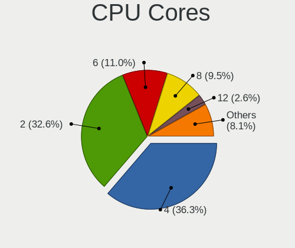
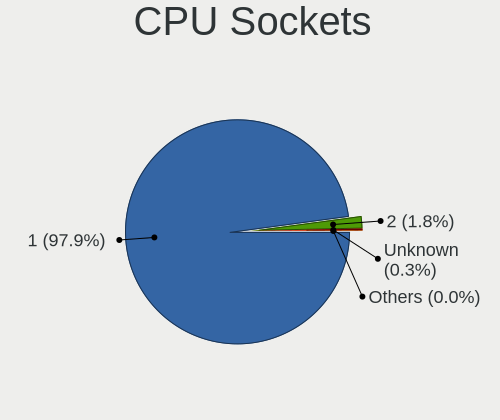
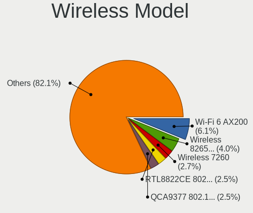
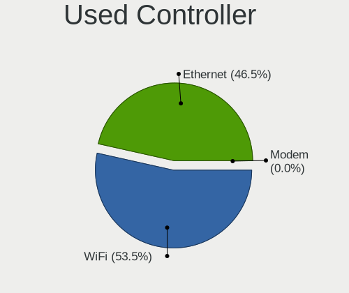
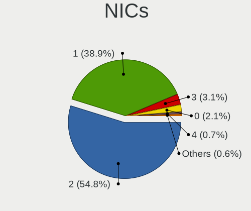
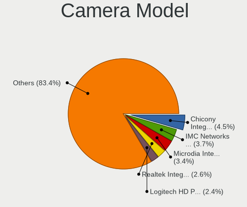

Linux in Canada - Tested Hardware & Statistics
----------------------------------------------

A project to collect tested hardware configurations for Linux in Canada.

Anyone can contribute to this report by the [hw-probe](https://github.com/linuxhw/hw-probe) tool:

    sudo -E hw-probe -all -upload

Please contribute! Especially if your hardware is rare.

This is a report for all computer types. See also reports for [desktops](/Location/Canada/Desktop/README.md) and [notebooks](/Location/Canada/Notebook/README.md).

Contents
--------

* [ Test Cases ](#test-cases)

* [ System ](#system)
  - [ OS                       ](#os)
  - [ OS Family                ](#os-family)
  - [ Kernel                   ](#kernel)
  - [ Kernel Family            ](#kernel-family)
  - [ Kernel Major Ver.        ](#kernel-major-ver)
  - [ Arch                     ](#arch)
  - [ DE                       ](#de)
  - [ Display Server           ](#display-server)
  - [ Display Manager          ](#display-manager)
  - [ OS Lang                  ](#os-lang)
  - [ Boot Mode                ](#boot-mode)
  - [ Filesystem               ](#filesystem)
  - [ Part. scheme             ](#part-scheme)
  - [ Dual Boot with Linux/BSD ](#dual-boot-with-linuxbsd)
  - [ Dual Boot (Win)          ](#dual-boot-win)

* [ Board ](#board)
  - [ Vendor                   ](#vendor)
  - [ Model                    ](#model)
  - [ Model Family             ](#model-family)
  - [ MFG Year                 ](#mfg-year)
  - [ Form Factor              ](#form-factor)
  - [ Secure Boot              ](#secure-boot)
  - [ Coreboot                 ](#coreboot)
  - [ RAM Size                 ](#ram-size)
  - [ RAM Used                 ](#ram-used)
  - [ Total Drives             ](#total-drives)
  - [ Has CD-ROM               ](#has-cd-rom)
  - [ Has Ethernet             ](#has-ethernet)
  - [ Has WiFi                 ](#has-wifi)
  - [ Has Bluetooth            ](#has-bluetooth)

* [ Location ](#location)
  - [ Country                  ](#country)
  - [ City                     ](#city)

* [ Drives ](#drives)
  - [ Drive Vendor             ](#drive-vendor)
  - [ Drive Model              ](#drive-model)
  - [ HDD Vendor               ](#hdd-vendor)
  - [ SSD Vendor               ](#ssd-vendor)
  - [ Drive Kind               ](#drive-kind)
  - [ Drive Connector          ](#drive-connector)
  - [ Drive Size               ](#drive-size)
  - [ Space Total              ](#space-total)
  - [ Space Used               ](#space-used)
  - [ Malfunc. Drives          ](#malfunc-drives)
  - [ Malfunc. Drive Vendor    ](#malfunc-drive-vendor)
  - [ Malfunc. HDD Vendor      ](#malfunc-hdd-vendor)
  - [ Malfunc. Drive Kind      ](#malfunc-drive-kind)
  - [ Failed Drives            ](#failed-drives)
  - [ Failed Drive Vendor      ](#failed-drive-vendor)
  - [ Drive Status             ](#drive-status)

* [ Storage controller ](#storage-controller)
  - [ Storage Vendor           ](#storage-vendor)
  - [ Storage Model            ](#storage-model)
  - [ Storage Kind             ](#storage-kind)

* [ Processor ](#processor)
  - [ CPU Vendor               ](#cpu-vendor)
  - [ CPU Model                ](#cpu-model)
  - [ CPU Model Family         ](#cpu-model-family)
  - [ CPU Cores                ](#cpu-cores)
  - [ CPU Sockets              ](#cpu-sockets)
  - [ CPU Threads              ](#cpu-threads)
  - [ CPU Op-Modes             ](#cpu-op-modes)
  - [ CPU Microcode            ](#cpu-microcode)
  - [ CPU Microarch            ](#cpu-microarch)

* [ Graphics ](#graphics)
  - [ GPU Vendor               ](#gpu-vendor)
  - [ GPU Model                ](#gpu-model)
  - [ GPU Combo                ](#gpu-combo)
  - [ GPU Driver               ](#gpu-driver)
  - [ GPU Memory               ](#gpu-memory)

* [ Monitor ](#monitor)
  - [ Monitor Vendor           ](#monitor-vendor)
  - [ Monitor Model            ](#monitor-model)
  - [ Monitor Resolution       ](#monitor-resolution)
  - [ Monitor Diagonal         ](#monitor-diagonal)
  - [ Monitor Width            ](#monitor-width)
  - [ Aspect Ratio             ](#aspect-ratio)
  - [ Monitor Area             ](#monitor-area)
  - [ Pixel Density            ](#pixel-density)
  - [ Multiple Monitors        ](#multiple-monitors)

* [ Network ](#network)
  - [ Net Controller Vendor    ](#net-controller-vendor)
  - [ Net Controller Model     ](#net-controller-model)
  - [ Wireless Vendor          ](#wireless-vendor)
  - [ Wireless Model           ](#wireless-model)
  - [ Ethernet Vendor          ](#ethernet-vendor)
  - [ Ethernet Model           ](#ethernet-model)
  - [ Net Controller Kind      ](#net-controller-kind)
  - [ Used Controller          ](#used-controller)
  - [ NICs                     ](#nics)
  - [ IPv6                     ](#ipv6)

* [ Bluetooth ](#bluetooth)
  - [ Bluetooth Vendor         ](#bluetooth-vendor)
  - [ Bluetooth Model          ](#bluetooth-model)

* [ Sound ](#sound)
  - [ Sound Vendor             ](#sound-vendor)
  - [ Sound Model              ](#sound-model)

* [ Memory ](#memory)
  - [ Memory Vendor            ](#memory-vendor)
  - [ Memory Model             ](#memory-model)
  - [ Memory Kind              ](#memory-kind)
  - [ Memory Form Factor       ](#memory-form-factor)
  - [ Memory Size              ](#memory-size)
  - [ Memory Speed             ](#memory-speed)

* [ Printers & scanners ](#printers--scanners)
  - [ Printer Vendor           ](#printer-vendor)
  - [ Printer Model            ](#printer-model)
  - [ Scanner Vendor           ](#scanner-vendor)
  - [ Scanner Model            ](#scanner-model)

* [ Camera ](#camera)
  - [ Camera Vendor            ](#camera-vendor)
  - [ Camera Model             ](#camera-model)

* [ Security ](#security)
  - [ Fingerprint Vendor       ](#fingerprint-vendor)
  - [ Fingerprint Model        ](#fingerprint-model)
  - [ Chipcard Vendor          ](#chipcard-vendor)
  - [ Chipcard Model           ](#chipcard-model)

* [ Unsupported ](#unsupported)
  - [ Unsupported Devices      ](#unsupported-devices)
  - [ Unsupported Device Types ](#unsupported-device-types)

Test Cases
----------

Total: 10305

| Vendor        | Model                       | Form-Factor | Probe                                                      | Date         |
|---------------|-----------------------------|-------------|------------------------------------------------------------|--------------|
| Lenovo        | ThinkPad P1 Gen 6 21FV00... | Notebook    | [7b22729e20](https://linux-hardware.org/?probe=7b22729e20) | Feb 02, 2024 |
| HP            | Laptop 17-cp0xxx            | Notebook    | [601c3c2cc4](https://linux-hardware.org/?probe=601c3c2cc4) | Feb 02, 2024 |
| ASUSTek       | N56VZ                       | Notebook    | [2209fe1372](https://linux-hardware.org/?probe=2209fe1372) | Feb 02, 2024 |
| HP            | EliteBook 840 G7 Noteboo... | Notebook    | [6f09cb7800](https://linux-hardware.org/?probe=6f09cb7800) | Feb 02, 2024 |
| Intel         | NUC11PHBi7 M26151-404       | Mini pc     | [db8ba8a942](https://linux-hardware.org/?probe=db8ba8a942) | Feb 01, 2024 |
| Shenzhen M... | F6BFC                       | Desktop     | [3d1b9568a9](https://linux-hardware.org/?probe=3d1b9568a9) | Feb 01, 2024 |
| Lenovo        | ThinkPad X230 Tablet 343... | Notebook    | [1c4d4deade](https://linux-hardware.org/?probe=1c4d4deade) | Feb 01, 2024 |
| Dell          | Vostro 3500                 | Notebook    | [1d57e2e0b1](https://linux-hardware.org/?probe=1d57e2e0b1) | Feb 01, 2024 |
| Apple         | MacBookPro11,3              | Notebook    | [3a809ef1d0](https://linux-hardware.org/?probe=3a809ef1d0) | Jan 31, 2024 |
| Unknown       | Unknown                     | Notebook    | [13b20f5383](https://linux-hardware.org/?probe=13b20f5383) | Jan 31, 2024 |
| Shenzhen M... | F6BFC                       | Desktop     | [c7db1d88f4](https://linux-hardware.org/?probe=c7db1d88f4) | Jan 31, 2024 |
| Dell          | 0GDJXY A00                  | All in one  | [667766f245](https://linux-hardware.org/?probe=667766f245) | Jan 31, 2024 |
| Lenovo        | ThinkPad X1 Carbon 6th (... | Notebook    | [14b81c317f](https://linux-hardware.org/?probe=14b81c317f) | Jan 31, 2024 |
| HP            | ProBook 650 G2              | Notebook    | [cd22b7035d](https://linux-hardware.org/?probe=cd22b7035d) | Jan 30, 2024 |
| Intel         | NUC5i7RYB H73774-102        | Mini pc     | [762753d726](https://linux-hardware.org/?probe=762753d726) | Jan 30, 2024 |
| Lenovo        | ThinkPad P52s 20LCS2Y800    | Notebook    | [cb08606d1d](https://linux-hardware.org/?probe=cb08606d1d) | Jan 30, 2024 |
| ASUSTek       | VivoBook_ASUSLaptop X512... | Notebook    | [bd5392e681](https://linux-hardware.org/?probe=bd5392e681) | Jan 30, 2024 |
| Gigabyte      | AB350-Gaming 3-CF           | Desktop     | [6eceb567fd](https://linux-hardware.org/?probe=6eceb567fd) | Jan 30, 2024 |
| Gigabyte      | AB350-Gaming 3-CF           | Desktop     | [547d3168d9](https://linux-hardware.org/?probe=547d3168d9) | Jan 30, 2024 |
| Gigabyte      | B650 GAMING X AX            | Desktop     | [e4619ce25f](https://linux-hardware.org/?probe=e4619ce25f) | Jan 30, 2024 |
| Lenovo        | ThinkPad P1 Gen 6 21FV00... | Notebook    | [bf8891bdd5](https://linux-hardware.org/?probe=bf8891bdd5) | Jan 30, 2024 |
| HP            | Notebook                    | Notebook    | [6757d33e0e](https://linux-hardware.org/?probe=6757d33e0e) | Jan 30, 2024 |
| HP            | 2ADE                        | Desktop     | [c98c83ddde](https://linux-hardware.org/?probe=c98c83ddde) | Jan 29, 2024 |
| Lenovo        | ThinkPad T14 Gen 2i 20W1... | Notebook    | [b82e78486b](https://linux-hardware.org/?probe=b82e78486b) | Jan 29, 2024 |
| Lenovo        | IdeaPad 730S-13IWL 81JB     | Notebook    | [c0c78e6476](https://linux-hardware.org/?probe=c0c78e6476) | Jan 29, 2024 |
| HP            | 3397                        | Desktop     | [552552b64a](https://linux-hardware.org/?probe=552552b64a) | Jan 29, 2024 |
| MSI           | PRO Z690-A WIFI DDR4        | Desktop     | [e88b2c35d9](https://linux-hardware.org/?probe=e88b2c35d9) | Jan 29, 2024 |
| ASUSTek       | PRIME Z590-V                | Desktop     | [9cfcec4d2d](https://linux-hardware.org/?probe=9cfcec4d2d) | Jan 29, 2024 |
| Rockchip      | RK3588 OPi 5 Plus           | Soc         | [72dee51fa2](https://linux-hardware.org/?probe=72dee51fa2) | Jan 29, 2024 |
| MSI           | MAG X670E TOMAHAWK WIFI     | Desktop     | [e4b1d774f6](https://linux-hardware.org/?probe=e4b1d774f6) | Jan 28, 2024 |
| Unknown       | Unknown                     | Desktop     | [e80d32ade5](https://linux-hardware.org/?probe=e80d32ade5) | Jan 28, 2024 |
| ASUSTek       | VivoBook_ASUS Laptop E41... | Notebook    | [50f8982bd3](https://linux-hardware.org/?probe=50f8982bd3) | Jan 28, 2024 |
| Dell          | 0D24M8 A01                  | Desktop     | [db11402dbf](https://linux-hardware.org/?probe=db11402dbf) | Jan 28, 2024 |
| Lenovo        | SHARKBAY SDK0E50510 WIN     | Desktop     | [f80e16d62d](https://linux-hardware.org/?probe=f80e16d62d) | Jan 28, 2024 |
| Gigabyte      | A520M S2H                   | Desktop     | [960d1543c0](https://linux-hardware.org/?probe=960d1543c0) | Jan 28, 2024 |
| Acer          | Aspire TC-780               | Desktop     | [00c699c62c](https://linux-hardware.org/?probe=00c699c62c) | Jan 28, 2024 |
| ASUSTek       | PRIME A320M-K               | Desktop     | [3d0d9dce8a](https://linux-hardware.org/?probe=3d0d9dce8a) | Jan 28, 2024 |
| NZXT          | N7 B650E                    | Desktop     | [2a31518f97](https://linux-hardware.org/?probe=2a31518f97) | Jan 28, 2024 |
| Lenovo        | Yoga 6 13ALC7 82UD          | Convertible | [018e1f4232](https://linux-hardware.org/?probe=018e1f4232) | Jan 27, 2024 |
| ASUSTek       | ROG STRIX B350-F GAMING     | Desktop     | [1adb0efb30](https://linux-hardware.org/?probe=1adb0efb30) | Jan 27, 2024 |
| HP            | Spectre x360 Convertible    | Convertible | [6ba1d0e853](https://linux-hardware.org/?probe=6ba1d0e853) | Jan 27, 2024 |
| Apple         | MacBookPro11,3              | Notebook    | [efdf2169af](https://linux-hardware.org/?probe=efdf2169af) | Jan 27, 2024 |
| ASUSTek       | NODUSM3                     | Desktop     | [b7a885758d](https://linux-hardware.org/?probe=b7a885758d) | Jan 27, 2024 |
| ASUSTek       | Crosshair IV Formula        | Desktop     | [637f6bd30a](https://linux-hardware.org/?probe=637f6bd30a) | Jan 27, 2024 |
| Raspberry ... | Raspberry Pi 5 Model B R... | Soc         | [5e62a52683](https://linux-hardware.org/?probe=5e62a52683) | Jan 27, 2024 |
| MSI           | MPG B550 GAMING PLUS        | Desktop     | [fcdc8fc8e3](https://linux-hardware.org/?probe=fcdc8fc8e3) | Jan 26, 2024 |
| Apple         | MacBookPro11,3              | Notebook    | [5859ff1ab1](https://linux-hardware.org/?probe=5859ff1ab1) | Jan 26, 2024 |
| ASUSTek       | Zenbook UN5401QAB_UN5401... | Convertible | [9b5946c096](https://linux-hardware.org/?probe=9b5946c096) | Jan 26, 2024 |
| ASUSTek       | Zenbook UN5401QAB_UN5401... | Convertible | [47103de931](https://linux-hardware.org/?probe=47103de931) | Jan 26, 2024 |
| ASUSTek       | PRIME X570-P                | Desktop     | [f0eb2463d7](https://linux-hardware.org/?probe=f0eb2463d7) | Jan 26, 2024 |
| HP            | Pavilion dv6                | Notebook    | [9a15d7d823](https://linux-hardware.org/?probe=9a15d7d823) | Jan 26, 2024 |
| Lenovo        | ThinkPad E420 114155F       | Notebook    | [cdee2fb160](https://linux-hardware.org/?probe=cdee2fb160) | Jan 26, 2024 |
| ASUSTek       | ProArt X670E-CREATOR WIF... | Desktop     | [ea0df7d02b](https://linux-hardware.org/?probe=ea0df7d02b) | Jan 26, 2024 |
| ASUSTek       | ProArt X670E-CREATOR WIF... | Desktop     | [319d0c49cb](https://linux-hardware.org/?probe=319d0c49cb) | Jan 26, 2024 |
| Acer          | Aspire E1-522               | Notebook    | [a43c97b66c](https://linux-hardware.org/?probe=a43c97b66c) | Jan 26, 2024 |
| ASUSTek       | ROG CROSSHAIR X670E HERO    | Desktop     | [e91202934d](https://linux-hardware.org/?probe=e91202934d) | Jan 26, 2024 |
| HP            | ProBook 650 G2              | Notebook    | [169fd21256](https://linux-hardware.org/?probe=169fd21256) | Jan 25, 2024 |
| NZXT          | N7 B650E                    | Desktop     | [9354117703](https://linux-hardware.org/?probe=9354117703) | Jan 25, 2024 |
| Acer          | Swift SF314-43              | Notebook    | [bfbce1457c](https://linux-hardware.org/?probe=bfbce1457c) | Jan 25, 2024 |
| HP            | 2129                        | Desktop     | [9617c50324](https://linux-hardware.org/?probe=9617c50324) | Jan 25, 2024 |
| ASUSTek       | Zenbook UX3402VA_UX3402V... | Notebook    | [136eed1999](https://linux-hardware.org/?probe=136eed1999) | Jan 25, 2024 |
| ASUSTek       | ROG Maximus Z790 HERO       | Desktop     | [7edfb487d5](https://linux-hardware.org/?probe=7edfb487d5) | Jan 25, 2024 |
| MSI           | MS-B9181                    | Desktop     | [6575c3c5ad](https://linux-hardware.org/?probe=6575c3c5ad) | Jan 25, 2024 |
| Acer          | Aspire Z5600                | All in one  | [3735067105](https://linux-hardware.org/?probe=3735067105) | Jan 25, 2024 |
| Lenovo        | ThinkPad T470 20HES18S02    | Notebook    | [9f18c011e4](https://linux-hardware.org/?probe=9f18c011e4) | Jan 25, 2024 |
| HP            | ProBook 445 G8 Notebook ... | Notebook    | [057c708875](https://linux-hardware.org/?probe=057c708875) | Jan 24, 2024 |
| Ciara Tech... | Q77M-XG                     | Desktop     | [aba2d99413](https://linux-hardware.org/?probe=aba2d99413) | Jan 24, 2024 |
| Dell          | 02YYK5 A01                  | Desktop     | [092dabd325](https://linux-hardware.org/?probe=092dabd325) | Jan 23, 2024 |
| ASUSTek       | G750JW                      | Notebook    | [2b196e9839](https://linux-hardware.org/?probe=2b196e9839) | Jan 23, 2024 |
| Lenovo        | ThinkPad T14 Gen 4 21HD0... | Notebook    | [ff7b63a668](https://linux-hardware.org/?probe=ff7b63a668) | Jan 23, 2024 |
| Dell          | Latitude E5420              | Notebook    | [8347319849](https://linux-hardware.org/?probe=8347319849) | Jan 23, 2024 |
| HP            | Laptop 15-dy3xxx            | Notebook    | [ddb53329c6](https://linux-hardware.org/?probe=ddb53329c6) | Jan 23, 2024 |
| Lenovo        | Legion Y540-15IRH 81SX      | Notebook    | [f37a4265ba](https://linux-hardware.org/?probe=f37a4265ba) | Jan 23, 2024 |
| Dell          | 0DF42J A00                  | Desktop     | [f181c086e3](https://linux-hardware.org/?probe=f181c086e3) | Jan 23, 2024 |
| Lenovo        | ThinkPad X250 20CLS60800    | Notebook    | [37338c49f8](https://linux-hardware.org/?probe=37338c49f8) | Jan 23, 2024 |
| Lenovo        | ThinkPad L480 20LTS8CY00    | Notebook    | [a18fc04450](https://linux-hardware.org/?probe=a18fc04450) | Jan 23, 2024 |
| HP            | Pavilion dv5                | Notebook    | [6fdec1f88a](https://linux-hardware.org/?probe=6fdec1f88a) | Jan 23, 2024 |
| ASUSTek       | P8P67 DELUXE                | Desktop     | [545e0a6896](https://linux-hardware.org/?probe=545e0a6896) | Jan 23, 2024 |
| HP            | Elite x2 1012 G1            | Notebook    | [0528733539](https://linux-hardware.org/?probe=0528733539) | Jan 22, 2024 |
| Gigabyte      | A520M S2H                   | Desktop     | [bbfb471169](https://linux-hardware.org/?probe=bbfb471169) | Jan 22, 2024 |
| Dell          | 0DF42J A00                  | Desktop     | [5a172ff7ec](https://linux-hardware.org/?probe=5a172ff7ec) | Jan 22, 2024 |
| MSI           | GP72 6QF                    | Notebook    | [0cbab5c5f1](https://linux-hardware.org/?probe=0cbab5c5f1) | Jan 21, 2024 |
| Dell          | Precision M4800             | Notebook    | [dccdba8512](https://linux-hardware.org/?probe=dccdba8512) | Jan 21, 2024 |
| ASUSTek       | ZenBook UX463FA_UX463FA     | Convertible | [9bef2c44db](https://linux-hardware.org/?probe=9bef2c44db) | Jan 21, 2024 |
| Lenovo        | Legion Slim 7 16APH8 82Y... | Notebook    | [f4d4b6f022](https://linux-hardware.org/?probe=f4d4b6f022) | Jan 21, 2024 |
| MSI           | 760GM-P34                   | Desktop     | [3eb4ebb737](https://linux-hardware.org/?probe=3eb4ebb737) | Jan 21, 2024 |
| Lenovo        | ThinkPad X220 429044U       | Notebook    | [d5fd867450](https://linux-hardware.org/?probe=d5fd867450) | Jan 21, 2024 |
| HP            | Pavilion dv6                | Notebook    | [8e6edcce2d](https://linux-hardware.org/?probe=8e6edcce2d) | Jan 21, 2024 |
| AZW           | SEi                         | Desktop     | [918636f649](https://linux-hardware.org/?probe=918636f649) | Jan 20, 2024 |
| ASRock        | FM2A68M-HD+                 | Desktop     | [63e6c0358d](https://linux-hardware.org/?probe=63e6c0358d) | Jan 20, 2024 |
| Dell          | Latitude 7440               | Notebook    | [2871324f95](https://linux-hardware.org/?probe=2871324f95) | Jan 19, 2024 |
| Panasonic     | CF-31ATAAX1M                | Notebook    | [f9cc94a1c9](https://linux-hardware.org/?probe=f9cc94a1c9) | Jan 19, 2024 |
| Dell          | Latitude 7440               | Notebook    | [5ff30573ae](https://linux-hardware.org/?probe=5ff30573ae) | Jan 19, 2024 |
| Acer          | Nitro AN515-57              | Notebook    | [e9423fb2cd](https://linux-hardware.org/?probe=e9423fb2cd) | Jan 19, 2024 |
| Acer          | Aspire V3-772G              | Notebook    | [e9bc1c5d68](https://linux-hardware.org/?probe=e9bc1c5d68) | Jan 19, 2024 |
| Dell          | 0YGWFV A01                  | Desktop     | [b8474b7f54](https://linux-hardware.org/?probe=b8474b7f54) | Jan 19, 2024 |
| Dell          | 0YGWFV A01                  | Desktop     | [8e54683492](https://linux-hardware.org/?probe=8e54683492) | Jan 19, 2024 |
| MSI           | PRO B650M-P                 | Desktop     | [1dbda223dd](https://linux-hardware.org/?probe=1dbda223dd) | Jan 19, 2024 |
| Acer          | Aspire E5-523               | Notebook    | [02378722b6](https://linux-hardware.org/?probe=02378722b6) | Jan 19, 2024 |
| MSI           | MS-B9181                    | Desktop     | [503f0edf6a](https://linux-hardware.org/?probe=503f0edf6a) | Jan 19, 2024 |
| Lenovo        | ThinkPad X131e 3371AF5      | Notebook    | [1741e3b346](https://linux-hardware.org/?probe=1741e3b346) | Jan 18, 2024 |
| Lenovo        | ThinkPad T490 20N3S8W501    | Notebook    | [399ba4e0e5](https://linux-hardware.org/?probe=399ba4e0e5) | Jan 18, 2024 |
| Rockchip      | RK3588 OPi 5 Plus           | Soc         | [c7872b9640](https://linux-hardware.org/?probe=c7872b9640) | Jan 18, 2024 |
| HP            | Spectre x360 Convertible    | Convertible | [202947ee50](https://linux-hardware.org/?probe=202947ee50) | Jan 18, 2024 |
| Apple         | MacBookPro10,2              | Notebook    | [a819ad5cb5](https://linux-hardware.org/?probe=a819ad5cb5) | Jan 18, 2024 |
| MSI           | GF63 Thin 11UC              | Notebook    | [73b96295fe](https://linux-hardware.org/?probe=73b96295fe) | Jan 18, 2024 |
| Dell          | 0DR845                      | Desktop     | [f591ac32d9](https://linux-hardware.org/?probe=f591ac32d9) | Jan 18, 2024 |
| MSI           | Prestige 13Evo A13M         | Notebook    | [3b3a0ddd43](https://linux-hardware.org/?probe=3b3a0ddd43) | Jan 18, 2024 |
| Gigabyte      | Z790 AORUS MASTER X         | Desktop     | [89387d46ef](https://linux-hardware.org/?probe=89387d46ef) | Jan 18, 2024 |
| Gigabyte      | Z790 AORUS MASTER X         | Desktop     | [c1e2f276ba](https://linux-hardware.org/?probe=c1e2f276ba) | Jan 18, 2024 |
| Panasonic     | CF-52PFN61PM                | Notebook    | [971bbaea1a](https://linux-hardware.org/?probe=971bbaea1a) | Jan 17, 2024 |
| HP            | EliteBook 850 G4            | Notebook    | [df8bb12b29](https://linux-hardware.org/?probe=df8bb12b29) | Jan 17, 2024 |
| Lenovo        | ThinkPad T490 20N3S8W501    | Notebook    | [87e440b878](https://linux-hardware.org/?probe=87e440b878) | Jan 17, 2024 |
| ASUSTek       | Zenbook UM5401QAB_UM5401... | Notebook    | [7b068dc524](https://linux-hardware.org/?probe=7b068dc524) | Jan 17, 2024 |
| Dell          | 0GDJXY A00                  | All in one  | [3ea400d76d](https://linux-hardware.org/?probe=3ea400d76d) | Jan 17, 2024 |
| MSI           | B550M PRO-VDH WIFI          | Desktop     | [781a81dea6](https://linux-hardware.org/?probe=781a81dea6) | Jan 17, 2024 |
| Dell          | XPS 13 9380                 | Notebook    | [15a7a78b43](https://linux-hardware.org/?probe=15a7a78b43) | Jan 16, 2024 |
| Lenovo        | IdeaPadFlex 5 14IRU8 82Y... | Convertible | [c9177a0874](https://linux-hardware.org/?probe=c9177a0874) | Jan 16, 2024 |
| Acer          | Aspire E1-522               | Notebook    | [538c5ee96f](https://linux-hardware.org/?probe=538c5ee96f) | Jan 16, 2024 |
| Gigabyte      | X570 AORUS ELITE            | Desktop     | [ed6bfe4f8f](https://linux-hardware.org/?probe=ed6bfe4f8f) | Jan 16, 2024 |
| ASUSTek       | UN65U                       | Desktop     | [0c9b6c61f2](https://linux-hardware.org/?probe=0c9b6c61f2) | Jan 16, 2024 |
| Acer          | Aspire 5810T                | Notebook    | [69c2f12576](https://linux-hardware.org/?probe=69c2f12576) | Jan 16, 2024 |
| Lenovo        | 3135 SDK0J40697 WIN 3305... | Mini pc     | [e7486a8b06](https://linux-hardware.org/?probe=e7486a8b06) | Jan 16, 2024 |
| Lenovo        | 3135 SDK0J40697 WIN 3305... | Mini pc     | [81403fd0af](https://linux-hardware.org/?probe=81403fd0af) | Jan 16, 2024 |
| Lenovo        | ThinkPad X61 76754BJ        | Notebook    | [42f1380b4e](https://linux-hardware.org/?probe=42f1380b4e) | Jan 15, 2024 |
| Acer          | Swift SF315-52G             | Notebook    | [b1df864ab5](https://linux-hardware.org/?probe=b1df864ab5) | Jan 15, 2024 |
| Unknown       | Unknown                     | Notebook    | [cc6ea90bc9](https://linux-hardware.org/?probe=cc6ea90bc9) | Jan 15, 2024 |
| ASUSTek       | VivoBook_ASUSLaptop M150... | Notebook    | [ff290c247d](https://linux-hardware.org/?probe=ff290c247d) | Jan 15, 2024 |
| ASUSTek       | X550JK                      | Notebook    | [1e70a82b32](https://linux-hardware.org/?probe=1e70a82b32) | Jan 15, 2024 |
| Dell          | Inspiron 3543               | Notebook    | [402af8548c](https://linux-hardware.org/?probe=402af8548c) | Jan 15, 2024 |
| Lenovo        | ThinkPad T430s 2356GUU      | Notebook    | [df4e542b16](https://linux-hardware.org/?probe=df4e542b16) | Jan 15, 2024 |
| MSI           | MAG X670E TOMAHAWK WIFI     | Desktop     | [236dc2d07a](https://linux-hardware.org/?probe=236dc2d07a) | Jan 15, 2024 |
| Intel         | NUC13ANBi5 M89647-203       | Mini pc     | [39377d7997](https://linux-hardware.org/?probe=39377d7997) | Jan 15, 2024 |
| Lenovo        | Yoga 14sACH 2021 82MS       | Notebook    | [4af392aac3](https://linux-hardware.org/?probe=4af392aac3) | Jan 14, 2024 |
| Microsoft     | Surface Pro 7               | Tablet      | [bc6a402c24](https://linux-hardware.org/?probe=bc6a402c24) | Jan 14, 2024 |
| Samsung       | 700Z3C/700Z5C               | Notebook    | [6055feefa2](https://linux-hardware.org/?probe=6055feefa2) | Jan 14, 2024 |
| Intel         | NUC11PHBi7 M26151-404       | Mini pc     | [9d33a3913f](https://linux-hardware.org/?probe=9d33a3913f) | Jan 14, 2024 |
| HP            | ProBook 4540s               | Notebook    | [6b8cd0306a](https://linux-hardware.org/?probe=6b8cd0306a) | Jan 14, 2024 |
| MSI           | B350M MORTAR                | Desktop     | [0462bdbc4d](https://linux-hardware.org/?probe=0462bdbc4d) | Jan 14, 2024 |
| Lenovo        | ThinkPad A285 20MXS0GT00    | Notebook    | [6fe7454ae4](https://linux-hardware.org/?probe=6fe7454ae4) | Jan 14, 2024 |
| MSI           | GE70 2PE                    | Notebook    | [5f5076a207](https://linux-hardware.org/?probe=5f5076a207) | Jan 14, 2024 |
| ASUSTek       | VivoBook_ASUSLaptop K350... | Notebook    | [19467f2a4d](https://linux-hardware.org/?probe=19467f2a4d) | Jan 14, 2024 |
| Dell          | 0GWHMW A00                  | Desktop     | [42cd6629f0](https://linux-hardware.org/?probe=42cd6629f0) | Jan 14, 2024 |
| Dell          | Precision 5540              | Notebook    | [f29887c5e2](https://linux-hardware.org/?probe=f29887c5e2) | Jan 13, 2024 |
| Lenovo        | IdeaPadFlex 5 14ARE05 81... | Convertible | [86fe925b70](https://linux-hardware.org/?probe=86fe925b70) | Jan 13, 2024 |
| HP            | 3048h                       | Desktop     | [352c2d797c](https://linux-hardware.org/?probe=352c2d797c) | Jan 13, 2024 |
| Gigabyte      | GA-MA78GM-US2H              | Desktop     | [2dbb9562af](https://linux-hardware.org/?probe=2dbb9562af) | Jan 13, 2024 |
| Framework     | Laptop                      | Notebook    | [ab77469364](https://linux-hardware.org/?probe=ab77469364) | Jan 13, 2024 |
| HP            | 3048h                       | Desktop     | [f4972d54fd](https://linux-hardware.org/?probe=f4972d54fd) | Jan 13, 2024 |
| Samsung       | 300E5M/300E5L               | Notebook    | [23fdab96e1](https://linux-hardware.org/?probe=23fdab96e1) | Jan 13, 2024 |
| Intel         | X79-SERVER V1.1             | Desktop     | [ec275f8de3](https://linux-hardware.org/?probe=ec275f8de3) | Jan 13, 2024 |
| Apple         | MacBookPro11,3              | Notebook    | [e47ef53e7f](https://linux-hardware.org/?probe=e47ef53e7f) | Jan 13, 2024 |
| MSI           | MPG Z390 GAMING EDGE AC     | Notebook    | [4fc5db3901](https://linux-hardware.org/?probe=4fc5db3901) | Jan 13, 2024 |
| ASUSTek       | ROG Strix G733ZM_G733ZM     | Notebook    | [e4f7fe0969](https://linux-hardware.org/?probe=e4f7fe0969) | Jan 13, 2024 |
| Acer          | Aspire A315-31              | Notebook    | [22135f150d](https://linux-hardware.org/?probe=22135f150d) | Jan 12, 2024 |
| Dell          | 0DR845                      | Desktop     | [5185c062d7](https://linux-hardware.org/?probe=5185c062d7) | Jan 12, 2024 |
| MSI           | PRO Z690-A WIFI DDR4        | Desktop     | [eac19e51a1](https://linux-hardware.org/?probe=eac19e51a1) | Jan 12, 2024 |
| Raspberry ... | Raspberry Pi 4 Model B R... | Soc         | [9daf5ba4ce](https://linux-hardware.org/?probe=9daf5ba4ce) | Jan 12, 2024 |
| MSI           | X470 GAMING PLUS MAX        | Desktop     | [95c2b6739c](https://linux-hardware.org/?probe=95c2b6739c) | Jan 12, 2024 |
| Dell          | 0J2J3Y A00                  | Desktop     | [64716ace60](https://linux-hardware.org/?probe=64716ace60) | Jan 12, 2024 |
| Raspberry ... | Raspberry Pi 4 Model B R... | Soc         | [14074475e8](https://linux-hardware.org/?probe=14074475e8) | Jan 12, 2024 |
| Apple         | Mac-942B59F58194171B iMa... | All in one  | [ab653ac7ff](https://linux-hardware.org/?probe=ab653ac7ff) | Jan 11, 2024 |
| Apple         | Mac-F2268CC8                | All in one  | [146d805b4e](https://linux-hardware.org/?probe=146d805b4e) | Jan 11, 2024 |
| Dell          | Precision 5770              | Notebook    | [5c8b9a5262](https://linux-hardware.org/?probe=5c8b9a5262) | Jan 11, 2024 |
| ASUSTek       | ROG STRIX B550-F GAMING     | Desktop     | [3a45f1d548](https://linux-hardware.org/?probe=3a45f1d548) | Jan 11, 2024 |
| Huanan        | X99-QD4 V1.0                | Desktop     | [9d15015f18](https://linux-hardware.org/?probe=9d15015f18) | Jan 11, 2024 |
| ASUSTek       | ROG STRIX B550-F GAMING     | Desktop     | [36143515d5](https://linux-hardware.org/?probe=36143515d5) | Jan 11, 2024 |
| Acer          | Aspire M3970                | Desktop     | [cbd2c15812](https://linux-hardware.org/?probe=cbd2c15812) | Jan 11, 2024 |
| MSI           | B350M BAZOOKA               | Desktop     | [fab33560f3](https://linux-hardware.org/?probe=fab33560f3) | Jan 10, 2024 |
| ASUSTek       | PRIME Z690-P WIFI           | Desktop     | [864517b348](https://linux-hardware.org/?probe=864517b348) | Jan 10, 2024 |
| ASUSTek       | X550JK                      | Notebook    | [53f8040dbd](https://linux-hardware.org/?probe=53f8040dbd) | Jan 10, 2024 |
| HP            | ProBook 650 G1              | Notebook    | [90b63b0d8a](https://linux-hardware.org/?probe=90b63b0d8a) | Jan 10, 2024 |
| Dell          | 0RW199                      | Desktop     | [a80b1a7541](https://linux-hardware.org/?probe=a80b1a7541) | Jan 10, 2024 |
| ASUSTek       | ROG STRIX B660-A GAMING ... | Desktop     | [47b7a872bb](https://linux-hardware.org/?probe=47b7a872bb) | Jan 10, 2024 |
| ASUSTek       | VivoBook_ASUSLaptop X515... | Notebook    | [48f6f6e2c9](https://linux-hardware.org/?probe=48f6f6e2c9) | Jan 09, 2024 |
| ASUSTek       | P8P67 DELUXE                | Desktop     | [7d5b232fca](https://linux-hardware.org/?probe=7d5b232fca) | Jan 09, 2024 |
| Lenovo        | 312D SDK0J40697 WIN 3305... | Mini pc     | [0059f112c0](https://linux-hardware.org/?probe=0059f112c0) | Jan 09, 2024 |
| ASUSTek       | PRIME Z490-P                | Desktop     | [1ec23b4600](https://linux-hardware.org/?probe=1ec23b4600) | Jan 09, 2024 |
| Unknown       | Unknown                     | Desktop     | [ca7b5632f4](https://linux-hardware.org/?probe=ca7b5632f4) | Jan 09, 2024 |
| ASUSTek       | K53U                        | Notebook    | [df631caaa2](https://linux-hardware.org/?probe=df631caaa2) | Jan 09, 2024 |
| ASRock        | B550 Pro4                   | Desktop     | [7472fa749a](https://linux-hardware.org/?probe=7472fa749a) | Jan 09, 2024 |
| ASUSTek       | ROG STRIX X299-E GAMING     | Desktop     | [eb6c8c66ff](https://linux-hardware.org/?probe=eb6c8c66ff) | Jan 09, 2024 |
| Acer          | FG965M                      | Desktop     | [1c08b35011](https://linux-hardware.org/?probe=1c08b35011) | Jan 09, 2024 |
| ASUSTek       | ROG STRIX Z370-E GAMING     | Desktop     | [282ee2ee2e](https://linux-hardware.org/?probe=282ee2ee2e) | Jan 09, 2024 |
| HP            | Pavilion dv2700             | Notebook    | [957ec4cc30](https://linux-hardware.org/?probe=957ec4cc30) | Jan 09, 2024 |
| Lenovo        | SKYBAY SDK0J40697 WIN 33... | Desktop     | [d5486716d1](https://linux-hardware.org/?probe=d5486716d1) | Jan 09, 2024 |
| HP            | Stream Laptop 11-ah1XX      | Notebook    | [bb9623d23f](https://linux-hardware.org/?probe=bb9623d23f) | Jan 08, 2024 |
| Lenovo        | ThinkPad X1 Carbon 6th 2... | Notebook    | [86ebfc719f](https://linux-hardware.org/?probe=86ebfc719f) | Jan 08, 2024 |
| HP            | EliteBook 840 G8 Noteboo... | Notebook    | [d12278cd24](https://linux-hardware.org/?probe=d12278cd24) | Jan 08, 2024 |
| ASUSTek       | H81M-E                      | Desktop     | [4fc71cdf2e](https://linux-hardware.org/?probe=4fc71cdf2e) | Jan 08, 2024 |
| HP            | Laptop 14                   | Notebook    | [78522b0358](https://linux-hardware.org/?probe=78522b0358) | Jan 07, 2024 |
| Alienware     | 0P0JWX A00                  | Desktop     | [47bd2f6e34](https://linux-hardware.org/?probe=47bd2f6e34) | Jan 07, 2024 |
| Dell          | Latitude E5420              | Notebook    | [40835d5737](https://linux-hardware.org/?probe=40835d5737) | Jan 07, 2024 |
| Dell          | 032W55 A03                  | Desktop     | [97e3c61a8b](https://linux-hardware.org/?probe=97e3c61a8b) | Jan 07, 2024 |
| HP            | 1850                        | Desktop     | [0a05038be5](https://linux-hardware.org/?probe=0a05038be5) | Jan 07, 2024 |
| HP            | ProBook 4540s               | Notebook    | [8549d601f6](https://linux-hardware.org/?probe=8549d601f6) | Jan 07, 2024 |
| MSI           | Z390-A PRO                  | Desktop     | [27f18dc1f7](https://linux-hardware.org/?probe=27f18dc1f7) | Jan 07, 2024 |
| Acer          | Aspire E1-570               | Notebook    | [2d9d0b5619](https://linux-hardware.org/?probe=2d9d0b5619) | Jan 07, 2024 |
| HP            | EliteBook 850 G6            | Notebook    | [605ea399c5](https://linux-hardware.org/?probe=605ea399c5) | Jan 07, 2024 |
| Dell          | 0J2J3Y A00                  | Desktop     | [d702d16667](https://linux-hardware.org/?probe=d702d16667) | Jan 07, 2024 |
| Dell          | 0D735T A00                  | Desktop     | [4f4fe7da0b](https://linux-hardware.org/?probe=4f4fe7da0b) | Jan 06, 2024 |
| Dell          | XPS 15 9570                 | Notebook    | [8ca8b318eb](https://linux-hardware.org/?probe=8ca8b318eb) | Jan 06, 2024 |
| ASUSTek       | ROG Strix G733ZM_G733ZM     | Notebook    | [b753b7e847](https://linux-hardware.org/?probe=b753b7e847) | Jan 06, 2024 |
| Lenovo        | Legion Slim 7 16APH8 82Y... | Notebook    | [33b192a7d0](https://linux-hardware.org/?probe=33b192a7d0) | Jan 06, 2024 |
| Acer          | Aspire E5-722               | Notebook    | [f037171af4](https://linux-hardware.org/?probe=f037171af4) | Jan 06, 2024 |
| HP            | 3047h                       | Desktop     | [f87ea66a75](https://linux-hardware.org/?probe=f87ea66a75) | Jan 06, 2024 |
| HP            | Spectre x360 Convertible... | Convertible | [39f7575967](https://linux-hardware.org/?probe=39f7575967) | Jan 06, 2024 |
| Dell          | Precision 5520              | Notebook    | [1e0e2ac107](https://linux-hardware.org/?probe=1e0e2ac107) | Jan 06, 2024 |
| Apple         | MacBookPro8,3               | Notebook    | [b1467995b6](https://linux-hardware.org/?probe=b1467995b6) | Jan 06, 2024 |
| ASUSTek       | VivoBook_ASUSLaptop M540... | Notebook    | [5fdb8bdac3](https://linux-hardware.org/?probe=5fdb8bdac3) | Jan 06, 2024 |
| Dell          | Precision 5520              | Notebook    | [4ff73a814c](https://linux-hardware.org/?probe=4ff73a814c) | Jan 05, 2024 |
| HP            | Laptop 15-gw0xxx            | Notebook    | [303ecb8cf7](https://linux-hardware.org/?probe=303ecb8cf7) | Jan 05, 2024 |
| Apple         | Mac-F4238CC8 PVT            | All in one  | [f4e4d2f959](https://linux-hardware.org/?probe=f4e4d2f959) | Jan 05, 2024 |
| HP            | ZBook 14u G5                | Notebook    | [33c5c3bf2c](https://linux-hardware.org/?probe=33c5c3bf2c) | Jan 05, 2024 |
| HP            | ZBook 14u G5                | Notebook    | [7774c1745d](https://linux-hardware.org/?probe=7774c1745d) | Jan 05, 2024 |
| Alienware     | M14xR2                      | Notebook    | [191eeae180](https://linux-hardware.org/?probe=191eeae180) | Jan 05, 2024 |
| ASRock        | B650M-HDV/M.2               | Desktop     | [5b48ab3a16](https://linux-hardware.org/?probe=5b48ab3a16) | Jan 05, 2024 |
| Dell          | 0P658H A05                  | Server      | [74f28d91a3](https://linux-hardware.org/?probe=74f28d91a3) | Jan 05, 2024 |
| Shuttle       | FG31 V30                    | Desktop     | [ad4f57194c](https://linux-hardware.org/?probe=ad4f57194c) | Jan 04, 2024 |
| Dell          | 0D24M8 A02                  | Desktop     | [7aacff6afb](https://linux-hardware.org/?probe=7aacff6afb) | Jan 04, 2024 |
| ASUSTek       | PRIME B550-PLUS             | Desktop     | [0113813f07](https://linux-hardware.org/?probe=0113813f07) | Jan 04, 2024 |
| Lenovo        | 3111 SDK0L22692 WIN 3306... | Mini pc     | [b92aadb9b6](https://linux-hardware.org/?probe=b92aadb9b6) | Jan 04, 2024 |
| Apple         | Mac-F65AE981FFA204ED Mac... | Mini pc     | [833dc60681](https://linux-hardware.org/?probe=833dc60681) | Jan 04, 2024 |
| ASUSTek       | P7P55D PRO                  | Desktop     | [ad03a876d3](https://linux-hardware.org/?probe=ad03a876d3) | Jan 04, 2024 |
| ASUSTek       | VivoBook_ASUSLaptop M160... | Notebook    | [197d144ab0](https://linux-hardware.org/?probe=197d144ab0) | Jan 03, 2024 |
| MSI           | MPG B650I EDGE WIFI         | Desktop     | [b86d00d488](https://linux-hardware.org/?probe=b86d00d488) | Jan 03, 2024 |
| Acer          | Aspire 8730                 | Notebook    | [69f291e4be](https://linux-hardware.org/?probe=69f291e4be) | Jan 03, 2024 |
| Lenovo        | 3172 SDK0J40697 WIN 3305... | Mini pc     | [83582f654c](https://linux-hardware.org/?probe=83582f654c) | Jan 03, 2024 |
| ASUSTek       | VivoBook_ASUSLaptop M160... | Notebook    | [c2be0ba0b8](https://linux-hardware.org/?probe=c2be0ba0b8) | Jan 02, 2024 |
| HP            | Pavilion 13 x360 PC         | Notebook    | [c1d7df8730](https://linux-hardware.org/?probe=c1d7df8730) | Jan 02, 2024 |
| Dell          | Inspiron 5521               | Notebook    | [31f27ced42](https://linux-hardware.org/?probe=31f27ced42) | Jan 02, 2024 |
| Toshiba       | Satellite Pro A50-C         | Notebook    | [2b5c053b26](https://linux-hardware.org/?probe=2b5c053b26) | Jan 02, 2024 |
| Dell          | Inspiron 5570               | Notebook    | [ce562f726a](https://linux-hardware.org/?probe=ce562f726a) | Jan 02, 2024 |
| Acer          | Aspire 8730                 | Notebook    | [a435ff1bd6](https://linux-hardware.org/?probe=a435ff1bd6) | Jan 02, 2024 |
| Acer          | Aspire 8730                 | Notebook    | [4db4a265b6](https://linux-hardware.org/?probe=4db4a265b6) | Jan 02, 2024 |
| Lenovo        | G505 20240                  | Notebook    | [ff10a3ab7d](https://linux-hardware.org/?probe=ff10a3ab7d) | Jan 02, 2024 |
| HP            | ProBook 4540s               | Notebook    | [aaebda14c1](https://linux-hardware.org/?probe=aaebda14c1) | Jan 01, 2024 |
| ASUSTek       | P8H77-M                     | Desktop     | [7ae937132b](https://linux-hardware.org/?probe=7ae937132b) | Jan 01, 2024 |
| HP            | EliteBook 850 G4            | Notebook    | [bd25e4866f](https://linux-hardware.org/?probe=bd25e4866f) | Jan 01, 2024 |
| Dell          | 0D24M8 A01                  | Desktop     | [f363c3e115](https://linux-hardware.org/?probe=f363c3e115) | Jan 01, 2024 |
| ASUSTek       | PRIME Z270-A                | Desktop     | [dea2dc38e4](https://linux-hardware.org/?probe=dea2dc38e4) | Jan 01, 2024 |
| Dell          | 0P658H A05                  | Server      | [1ae3680481](https://linux-hardware.org/?probe=1ae3680481) | Jan 01, 2024 |
| ASUSTek       | VivoBook_ASUSLaptop TP42... | Convertible | [fe68cbddbb](https://linux-hardware.org/?probe=fe68cbddbb) | Dec 31, 2023 |
| ASRock        | Z170A-X1                    | Desktop     | [faba481c2b](https://linux-hardware.org/?probe=faba481c2b) | Dec 31, 2023 |
| Supermicro    | X10SL7-F                    | Server      | [5aef85f1c3](https://linux-hardware.org/?probe=5aef85f1c3) | Dec 31, 2023 |
| Alienware     | M17xR3                      | Notebook    | [ed05d87c74](https://linux-hardware.org/?probe=ed05d87c74) | Dec 31, 2023 |
| HP            | Pavilion Laptop 15-eh1xx... | Notebook    | [577f6b15de](https://linux-hardware.org/?probe=577f6b15de) | Dec 31, 2023 |
| Lenovo        | ThinkPad T61 7662CTO        | Notebook    | [d38807fbbe](https://linux-hardware.org/?probe=d38807fbbe) | Dec 31, 2023 |
| Lenovo        | Legion 7 16ARHA7 82UH       | Notebook    | [d694f21feb](https://linux-hardware.org/?probe=d694f21feb) | Dec 31, 2023 |
| Lenovo        | ThinkPad T490 20N3S4PX02    | Notebook    | [0afd47e9fc](https://linux-hardware.org/?probe=0afd47e9fc) | Dec 31, 2023 |
| ASUSTek       | VivoBook_ASUSLaptop K540... | Notebook    | [70c84eadc0](https://linux-hardware.org/?probe=70c84eadc0) | Dec 31, 2023 |
| Apple         | MacBook6,1                  | Notebook    | [ba4ad2bc18](https://linux-hardware.org/?probe=ba4ad2bc18) | Dec 31, 2023 |
| ASUSTek       | VivoBook_ASUSLaptop X170... | Notebook    | [9c355f1603](https://linux-hardware.org/?probe=9c355f1603) | Dec 31, 2023 |
| Apple         | MacBookPro10,2              | Notebook    | [275f675ca4](https://linux-hardware.org/?probe=275f675ca4) | Dec 31, 2023 |
| Lenovo        | ThinkPad X390 20Q0004VUS    | Notebook    | [4bd6b36cd6](https://linux-hardware.org/?probe=4bd6b36cd6) | Dec 30, 2023 |
| Pine Micro... | Pine64 RockPro64 v2.1       | Soc         | [38ff4c1e6c](https://linux-hardware.org/?probe=38ff4c1e6c) | Dec 30, 2023 |
| MSI           | Stealth 16Studio A13VF      | Notebook    | [04acb5230d](https://linux-hardware.org/?probe=04acb5230d) | Dec 30, 2023 |
| Apple         | MacBookAir9,1               | Notebook    | [25fea8aab5](https://linux-hardware.org/?probe=25fea8aab5) | Dec 30, 2023 |
| MSI           | Stealth 16Studio A13VF      | Notebook    | [1fd1d2e727](https://linux-hardware.org/?probe=1fd1d2e727) | Dec 30, 2023 |
| ASUSTek       | M5A78L-M LX3                | Desktop     | [c4b0b7c31a](https://linux-hardware.org/?probe=c4b0b7c31a) | Dec 30, 2023 |
| HP            | 339A                        | Desktop     | [56210b6b8c](https://linux-hardware.org/?probe=56210b6b8c) | Dec 30, 2023 |
| Lenovo        | ThinkPad T61 7662CTO        | Notebook    | [9e025b8cde](https://linux-hardware.org/?probe=9e025b8cde) | Dec 30, 2023 |
| Acer          | Aspire A115-31              | Notebook    | [01aeb12545](https://linux-hardware.org/?probe=01aeb12545) | Dec 29, 2023 |
| HP            | Laptop 17t-cn200            | Notebook    | [4c241f7e1d](https://linux-hardware.org/?probe=4c241f7e1d) | Dec 29, 2023 |
| Lenovo        | 36EB SDK0J40700 WIN 3258... | Desktop     | [7a34810f0e](https://linux-hardware.org/?probe=7a34810f0e) | Dec 29, 2023 |
| Dell          | 09M8Y8 A01                  | Desktop     | [128d8114dc](https://linux-hardware.org/?probe=128d8114dc) | Dec 29, 2023 |
| ASUSTek       | ROG Strix G713QM_G713QM     | Notebook    | [6c5599855c](https://linux-hardware.org/?probe=6c5599855c) | Dec 29, 2023 |
| Dell          | 09M8Y8 A01                  | Desktop     | [57106459a5](https://linux-hardware.org/?probe=57106459a5) | Dec 29, 2023 |
| ASUSTek       | VivoBook_ASUSLaptop M150... | Notebook    | [6a99e4eda2](https://linux-hardware.org/?probe=6a99e4eda2) | Dec 29, 2023 |
| Lenovo        | ThinkPad T450 20BUS05V00    | Notebook    | [3334aeb4e1](https://linux-hardware.org/?probe=3334aeb4e1) | Dec 29, 2023 |
| ASUSTek       | ROG Strix G713QM_G713QM     | Notebook    | [0be6e9ce52](https://linux-hardware.org/?probe=0be6e9ce52) | Dec 29, 2023 |
| HP            | ProBook 650 G2              | Notebook    | [1dd3970627](https://linux-hardware.org/?probe=1dd3970627) | Dec 29, 2023 |
| ASUSTek       | VivoBook_ASUSLaptop M150... | Notebook    | [d6477c7999](https://linux-hardware.org/?probe=d6477c7999) | Dec 28, 2023 |
| Acer          | Aspire 8730                 | Notebook    | [3110584890](https://linux-hardware.org/?probe=3110584890) | Dec 28, 2023 |
| Acer          | Aspire 8730                 | Notebook    | [3a9461e870](https://linux-hardware.org/?probe=3a9461e870) | Dec 28, 2023 |
| Acer          | Aspire A315-41              | Notebook    | [1042d42263](https://linux-hardware.org/?probe=1042d42263) | Dec 28, 2023 |
| Dell          | Inspiron 7720               | Notebook    | [965fc7c4a3](https://linux-hardware.org/?probe=965fc7c4a3) | Dec 28, 2023 |
| Acer          | Aspire A315-41              | Notebook    | [d68aa800c6](https://linux-hardware.org/?probe=d68aa800c6) | Dec 28, 2023 |
| ASUSTek       | ROG Strix G531GT_G531GT     | Notebook    | [3a0b2d2a21](https://linux-hardware.org/?probe=3a0b2d2a21) | Dec 28, 2023 |
| Razer         | Blade                       | Notebook    | [bd2101718d](https://linux-hardware.org/?probe=bd2101718d) | Dec 28, 2023 |
| MSI           | MS-B9311                    | Desktop     | [424154cf65](https://linux-hardware.org/?probe=424154cf65) | Dec 28, 2023 |
| ASUSTek       | Crosshair IV Formula        | Desktop     | [f426fd6d36](https://linux-hardware.org/?probe=f426fd6d36) | Dec 27, 2023 |
| Apple         | MacBookAir9,1               | Notebook    | [13a55dee9a](https://linux-hardware.org/?probe=13a55dee9a) | Dec 27, 2023 |
| Gigabyte      | AERO 15-X9                  | Notebook    | [906642b6ec](https://linux-hardware.org/?probe=906642b6ec) | Dec 27, 2023 |
| Google        | Swanky                      | Notebook    | [12fd273db1](https://linux-hardware.org/?probe=12fd273db1) | Dec 27, 2023 |
| Alienware     | m16 R1 AMD                  | Notebook    | [98aaf575cc](https://linux-hardware.org/?probe=98aaf575cc) | Dec 26, 2023 |
| Lenovo        | 3111 SDK0L22692 WIN 3306... | Mini pc     | [b9c892ba9d](https://linux-hardware.org/?probe=b9c892ba9d) | Dec 26, 2023 |
| Pegatron      | 2A9A                        | Desktop     | [e67022179a](https://linux-hardware.org/?probe=e67022179a) | Dec 26, 2023 |
| Lenovo        | Legion 5 15ARH05 82B5       | Notebook    | [b000376310](https://linux-hardware.org/?probe=b000376310) | Dec 26, 2023 |
| Lenovo        | Legion 5 15ARH05 82B5       | Notebook    | [ff3773b480](https://linux-hardware.org/?probe=ff3773b480) | Dec 26, 2023 |
| Lenovo        | 3111 SDK0L22692 WIN 3306... | Mini pc     | [51976d3313](https://linux-hardware.org/?probe=51976d3313) | Dec 25, 2023 |
| ASUSTek       | ASUS TUF Dash F15 FX517Z... | Notebook    | [c38f5ee95e](https://linux-hardware.org/?probe=c38f5ee95e) | Dec 25, 2023 |
| Gigabyte      | X570 AORUS MASTER           | Desktop     | [e7901d2ec9](https://linux-hardware.org/?probe=e7901d2ec9) | Dec 25, 2023 |
| ASUSTek       | PRIME X570-PRO              | Desktop     | [d6f1c37a34](https://linux-hardware.org/?probe=d6f1c37a34) | Dec 25, 2023 |
| Unknown       | Unknown                     | Notebook    | [a9015bc697](https://linux-hardware.org/?probe=a9015bc697) | Dec 25, 2023 |
| Lenovo        | ThinkPad T540p 20BFS0620... | Notebook    | [5cceadde0c](https://linux-hardware.org/?probe=5cceadde0c) | Dec 25, 2023 |
| ASUSTek       | PRIME H410M-A               | Desktop     | [d6257b5255](https://linux-hardware.org/?probe=d6257b5255) | Dec 25, 2023 |
| ASRock        | B760M Pro RS/D4 WiFi        | Desktop     | [c75f8f9d6f](https://linux-hardware.org/?probe=c75f8f9d6f) | Dec 25, 2023 |
| Unknown       | Apple MacBook Air (13-in... | Notebook    | [1954e2b6a8](https://linux-hardware.org/?probe=1954e2b6a8) | Dec 24, 2023 |
| Samsung       | 930QDB                      | Convertible | [1186a306c8](https://linux-hardware.org/?probe=1186a306c8) | Dec 24, 2023 |
| Apple         | Mac-F4238CC8 PVT            | All in one  | [f76dd451a4](https://linux-hardware.org/?probe=f76dd451a4) | Dec 24, 2023 |
| Dell          | 0WR7PY A02                  | Desktop     | [df3b1f1cc3](https://linux-hardware.org/?probe=df3b1f1cc3) | Dec 24, 2023 |
| Dell          | 0P658H A05                  | Server      | [14a0701959](https://linux-hardware.org/?probe=14a0701959) | Dec 24, 2023 |
| ASUSTek       | VivoBook_ASUS Laptop E41... | Notebook    | [c0ff23eba6](https://linux-hardware.org/?probe=c0ff23eba6) | Dec 24, 2023 |
| HP            | Elite x2 1012 G1            | Notebook    | [b093087b3c](https://linux-hardware.org/?probe=b093087b3c) | Dec 23, 2023 |
| Unknown       | Unknown                     | Notebook    | [a0d7edc452](https://linux-hardware.org/?probe=a0d7edc452) | Dec 23, 2023 |
| HP            | Elite x2 1012 G1            | Notebook    | [c93fffc388](https://linux-hardware.org/?probe=c93fffc388) | Dec 23, 2023 |
| ASRock        | Q1900DC-ITX                 | Desktop     | [ee59bde7c9](https://linux-hardware.org/?probe=ee59bde7c9) | Dec 23, 2023 |
| ASRock        | Q1900DC-ITX                 | Desktop     | [9733217ad2](https://linux-hardware.org/?probe=9733217ad2) | Dec 23, 2023 |
| Gigabyte      | M68MT-S2                    | Desktop     | [ba4e48312e](https://linux-hardware.org/?probe=ba4e48312e) | Dec 23, 2023 |
| ASUSTek       | M4A785-M                    | Desktop     | [fe6c638acc](https://linux-hardware.org/?probe=fe6c638acc) | Dec 23, 2023 |
| Intel         | S5000PSL                    | Server      | [4abb5e39fc](https://linux-hardware.org/?probe=4abb5e39fc) | Dec 23, 2023 |
| HP            | 2ADC                        | Desktop     | [2c9d8d03d2](https://linux-hardware.org/?probe=2c9d8d03d2) | Dec 23, 2023 |
| Gigabyte      | M68MT-S2                    | Desktop     | [e91530e41d](https://linux-hardware.org/?probe=e91530e41d) | Dec 23, 2023 |
| Acer          | Aspire A515-55              | Notebook    | [9412d138fb](https://linux-hardware.org/?probe=9412d138fb) | Dec 23, 2023 |
| Acer          | Aspire A515-55              | Notebook    | [4166459262](https://linux-hardware.org/?probe=4166459262) | Dec 23, 2023 |
| Lenovo        | Yoga 2 Pro 20266            | Notebook    | [201d4ed37f](https://linux-hardware.org/?probe=201d4ed37f) | Dec 23, 2023 |
| Acer          | Aspire R3-131T              | Notebook    | [647b2fddf6](https://linux-hardware.org/?probe=647b2fddf6) | Dec 23, 2023 |
| Dell          | Latitude 5420               | Notebook    | [9858586a84](https://linux-hardware.org/?probe=9858586a84) | Dec 22, 2023 |
| Alienware     | 0P0JWX A00                  | Desktop     | [99d0e56ef1](https://linux-hardware.org/?probe=99d0e56ef1) | Dec 22, 2023 |
| Lenovo        | ThinkBook 14 G3 ACL 21A2    | Notebook    | [b09c4dd8a2](https://linux-hardware.org/?probe=b09c4dd8a2) | Dec 22, 2023 |
| HP            | Pavilion g6                 | Notebook    | [ebdf3d244f](https://linux-hardware.org/?probe=ebdf3d244f) | Dec 22, 2023 |
| HP            | Pavilion g6                 | Notebook    | [b62f9f41d3](https://linux-hardware.org/?probe=b62f9f41d3) | Dec 22, 2023 |
| Lenovo        | MIIX 300-10IBY 80NR         | Tablet      | [456c5b7613](https://linux-hardware.org/?probe=456c5b7613) | Dec 21, 2023 |
| Apple         | Mac-00BE6ED71E35EB86 iMa... | All in one  | [b3c6d4826f](https://linux-hardware.org/?probe=b3c6d4826f) | Dec 21, 2023 |
| Apple         | Mac-00BE6ED71E35EB86 iMa... | All in one  | [3441fd68be](https://linux-hardware.org/?probe=3441fd68be) | Dec 21, 2023 |
| Gigabyte      | Z790 AORUS MASTER X         | Desktop     | [e71bed6be5](https://linux-hardware.org/?probe=e71bed6be5) | Dec 21, 2023 |
| Dell          | Latitude 7420               | Notebook    | [f2b2511de1](https://linux-hardware.org/?probe=f2b2511de1) | Dec 21, 2023 |
| Valve         | Jupiter                     | Notebook    | [6003cb709f](https://linux-hardware.org/?probe=6003cb709f) | Dec 21, 2023 |
| Valve         | Jupiter                     | Notebook    | [186428f160](https://linux-hardware.org/?probe=186428f160) | Dec 21, 2023 |
| Acer          | Aspire M3970                | Desktop     | [5da3b6c46f](https://linux-hardware.org/?probe=5da3b6c46f) | Dec 21, 2023 |
| Google        | Casta                       | Notebook    | [70f6e5e978](https://linux-hardware.org/?probe=70f6e5e978) | Dec 21, 2023 |
| Lenovo        | ThinkPad T470s W10DG 20J... | Notebook    | [faabc05597](https://linux-hardware.org/?probe=faabc05597) | Dec 21, 2023 |
| HC Technol... | HCAR5000-MI                 | Desktop     | [16f9dec3e0](https://linux-hardware.org/?probe=16f9dec3e0) | Dec 20, 2023 |
| ASUSTek       | ROG CROSSHAIR VIII HERO     | Desktop     | [98298e164f](https://linux-hardware.org/?probe=98298e164f) | Dec 20, 2023 |
| HP            | 1632                        | Desktop     | [e9f36a25a0](https://linux-hardware.org/?probe=e9f36a25a0) | Dec 20, 2023 |
| ASRock        | B550 Pro4                   | Desktop     | [786ded3bc9](https://linux-hardware.org/?probe=786ded3bc9) | Dec 20, 2023 |
| Lenovo        | ThinkPad T520 42404AU       | Notebook    | [2b29070879](https://linux-hardware.org/?probe=2b29070879) | Dec 20, 2023 |
| ASUSTek       | ASUS TUF Gaming F15 FX50... | Notebook    | [54ed87ec87](https://linux-hardware.org/?probe=54ed87ec87) | Dec 20, 2023 |
| ASUSTek       | PRIME B550-PLUS             | Desktop     | [85087e0568](https://linux-hardware.org/?probe=85087e0568) | Dec 20, 2023 |
| Apple         | Mac-942B59F58194171B iMa... | All in one  | [322b96bdd0](https://linux-hardware.org/?probe=322b96bdd0) | Dec 20, 2023 |
| Lenovo        | ThinkPad T480s 20L8S3SW0... | Notebook    | [eebb86b95f](https://linux-hardware.org/?probe=eebb86b95f) | Dec 19, 2023 |
| Lenovo        | 313F SEK0N11856 IOT 3288... | Desktop     | [1a65cf0f52](https://linux-hardware.org/?probe=1a65cf0f52) | Dec 19, 2023 |
| Acer          | Aspire M3970                | Desktop     | [5767513b0e](https://linux-hardware.org/?probe=5767513b0e) | Dec 19, 2023 |
| Acer          | Aspire AV15-52              | Notebook    | [daf4aa326d](https://linux-hardware.org/?probe=daf4aa326d) | Dec 19, 2023 |
| Unknown       | X79                         | Desktop     | [167cf0a87f](https://linux-hardware.org/?probe=167cf0a87f) | Dec 19, 2023 |
| Unknown       | X79                         | Desktop     | [3961be9cb6](https://linux-hardware.org/?probe=3961be9cb6) | Dec 19, 2023 |
| MSI           | B450M BAZOOKA               | Desktop     | [0bfcb5be94](https://linux-hardware.org/?probe=0bfcb5be94) | Dec 19, 2023 |
| HP            | 828A                        | Desktop     | [94483ed23a](https://linux-hardware.org/?probe=94483ed23a) | Dec 19, 2023 |
| MSI           | B450 GAMING PLUS MAX        | Desktop     | [ed64e6b1ec](https://linux-hardware.org/?probe=ed64e6b1ec) | Dec 19, 2023 |
| MSI           | Pulse 17 B13VGK             | Notebook    | [71d0660568](https://linux-hardware.org/?probe=71d0660568) | Dec 18, 2023 |
| ASUSTek       | TUF Gaming A520M-PLUS WI... | Desktop     | [8efe53adcb](https://linux-hardware.org/?probe=8efe53adcb) | Dec 18, 2023 |
| ASUSTek       | Zenbook UX3402VA_UX3402V... | Notebook    | [e94e9e0fd9](https://linux-hardware.org/?probe=e94e9e0fd9) | Dec 18, 2023 |
| HP            | 2B45                        | All in one  | [dbc7094ab4](https://linux-hardware.org/?probe=dbc7094ab4) | Dec 18, 2023 |
| ASUSTek       | ROG Strix G513RM_G513RM     | Notebook    | [f47c731a09](https://linux-hardware.org/?probe=f47c731a09) | Dec 18, 2023 |
| HP            | 1632                        | Desktop     | [db207cb310](https://linux-hardware.org/?probe=db207cb310) | Dec 18, 2023 |
| Acer          | Aspire 8730                 | Notebook    | [c7b60bcb33](https://linux-hardware.org/?probe=c7b60bcb33) | Dec 18, 2023 |
| Gateway       | NV54 Series                 | Notebook    | [1bd87c77d2](https://linux-hardware.org/?probe=1bd87c77d2) | Dec 18, 2023 |
| ASRock        | B550 Pro4                   | Desktop     | [1a4597db9e](https://linux-hardware.org/?probe=1a4597db9e) | Dec 18, 2023 |
| Lenovo        | Legion Pro 5 16IRX8 82WK    | Notebook    | [f46bf3981f](https://linux-hardware.org/?probe=f46bf3981f) | Dec 18, 2023 |
| Unknown       | Unknown                     | Notebook    | [81187bebc0](https://linux-hardware.org/?probe=81187bebc0) | Dec 18, 2023 |
| ASUSTek       | ASUS TUF Gaming F15 FX50... | Notebook    | [709891824c](https://linux-hardware.org/?probe=709891824c) | Dec 18, 2023 |
| MSI           | Vector GP77 13VG            | Notebook    | [7b6b5a14f8](https://linux-hardware.org/?probe=7b6b5a14f8) | Dec 18, 2023 |
| AZW           | SER                         | Mini pc     | [2768e13f4c](https://linux-hardware.org/?probe=2768e13f4c) | Dec 18, 2023 |
| Lenovo        | Legion Pro 5 16ARX8 82WM    | Notebook    | [e7ed0c7c8a](https://linux-hardware.org/?probe=e7ed0c7c8a) | Dec 18, 2023 |
| Unknown       | Unknown                     | Soc         | [86e857365e](https://linux-hardware.org/?probe=86e857365e) | Dec 18, 2023 |
| Gigabyte      | B450 AORUS PRO WIFI-CF      | Desktop     | [79c73e5927](https://linux-hardware.org/?probe=79c73e5927) | Dec 17, 2023 |
| ASUSTek       | Zenbook UP6502ZD_UP6502Z... | Convertible | [bf1b382c12](https://linux-hardware.org/?probe=bf1b382c12) | Dec 17, 2023 |
| ASUSTek       | ROG Strix G513RM_G513RM     | Notebook    | [fd17674af7](https://linux-hardware.org/?probe=fd17674af7) | Dec 17, 2023 |
| MSI           | Cyborg 15 A12VF             | Notebook    | [af666cc67d](https://linux-hardware.org/?probe=af666cc67d) | Dec 17, 2023 |
| Acer          | Aspire 4736Z                | Notebook    | [38866fae79](https://linux-hardware.org/?probe=38866fae79) | Dec 17, 2023 |
| MSI           | Vector GP77 13VG            | Notebook    | [267679e074](https://linux-hardware.org/?probe=267679e074) | Dec 17, 2023 |
| Dell          | Precision 5510              | Notebook    | [d723f4a031](https://linux-hardware.org/?probe=d723f4a031) | Dec 17, 2023 |
| Dell          | Latitude E6440              | Notebook    | [b91055b95e](https://linux-hardware.org/?probe=b91055b95e) | Dec 17, 2023 |
| ASUSTek       | ASUS TUF Gaming F17 FX70... | Notebook    | [0018284858](https://linux-hardware.org/?probe=0018284858) | Dec 17, 2023 |
| ASUSTek       | ROG Zephyrus M16 GU603ZM... | Notebook    | [e0fa989ed0](https://linux-hardware.org/?probe=e0fa989ed0) | Dec 17, 2023 |
| ASUSTek       | VivoBook_ASUSLaptop TP42... | Convertible | [46d7cc6a6f](https://linux-hardware.org/?probe=46d7cc6a6f) | Dec 16, 2023 |
| Alienware     | m18 R1                      | Notebook    | [a136406723](https://linux-hardware.org/?probe=a136406723) | Dec 16, 2023 |
| Toshiba       | TECRA Z50-A                 | Notebook    | [8717000b31](https://linux-hardware.org/?probe=8717000b31) | Dec 16, 2023 |
| ASUSTek       | ASUS TUF Gaming F17 FX70... | Notebook    | [f65efa02b6](https://linux-hardware.org/?probe=f65efa02b6) | Dec 16, 2023 |
| HP            | Compaq Presario A900        | Notebook    | [cafb584a35](https://linux-hardware.org/?probe=cafb584a35) | Dec 16, 2023 |
| Dell          | Latitude E7240              | Notebook    | [8fc0b7d8ea](https://linux-hardware.org/?probe=8fc0b7d8ea) | Dec 16, 2023 |
| Dell          | Latitude E6440              | Notebook    | [bfbadf07a9](https://linux-hardware.org/?probe=bfbadf07a9) | Dec 16, 2023 |
| Dell          | Latitude E6440              | Notebook    | [bde33cad70](https://linux-hardware.org/?probe=bde33cad70) | Dec 16, 2023 |
| Dell          | Latitude E6440              | Notebook    | [5d02de18b4](https://linux-hardware.org/?probe=5d02de18b4) | Dec 16, 2023 |
| HP            | ENVY x360 Convertible 15... | Convertible | [b761d5e550](https://linux-hardware.org/?probe=b761d5e550) | Dec 15, 2023 |
| Acer          | Aspire 8730                 | Notebook    | [5f7e5fbfd8](https://linux-hardware.org/?probe=5f7e5fbfd8) | Dec 15, 2023 |
| Acer          | Aspire 8730                 | Notebook    | [8e1f3c1aa9](https://linux-hardware.org/?probe=8e1f3c1aa9) | Dec 15, 2023 |
| Valve         | Jupiter                     | Notebook    | [bef7a2d5b3](https://linux-hardware.org/?probe=bef7a2d5b3) | Dec 15, 2023 |
| ASUSTek       | VivoBook_ASUSLaptop X150... | Notebook    | [d8db62d461](https://linux-hardware.org/?probe=d8db62d461) | Dec 15, 2023 |
| Gigabyte      | X570 AORUS ELITE WIFI       | Desktop     | [8a3e0ce72f](https://linux-hardware.org/?probe=8a3e0ce72f) | Dec 15, 2023 |
| Lenovo        | ThinkPad T470 W10DG 20JN... | Notebook    | [3d4b7d5e8b](https://linux-hardware.org/?probe=3d4b7d5e8b) | Dec 15, 2023 |
| Lenovo        | IdeaPad 1 15IJL7 82LX       | Notebook    | [a0eaa74105](https://linux-hardware.org/?probe=a0eaa74105) | Dec 15, 2023 |
| Lenovo        | IdeaPad 1 15IJL7 82LX       | Notebook    | [db4a7dea97](https://linux-hardware.org/?probe=db4a7dea97) | Dec 15, 2023 |
| Gigabyte      | AERO 15 KD                  | Notebook    | [ef9cf1d767](https://linux-hardware.org/?probe=ef9cf1d767) | Dec 15, 2023 |
| MSI           | B550M PRO-VDH WIFI          | Desktop     | [06a409ecda](https://linux-hardware.org/?probe=06a409ecda) | Dec 15, 2023 |
| Dell          | Precision 5540              | Notebook    | [beae57f4bb](https://linux-hardware.org/?probe=beae57f4bb) | Dec 14, 2023 |
| MSI           | PRO B760-P WIFI DDR4        | Desktop     | [0305f80c2d](https://linux-hardware.org/?probe=0305f80c2d) | Dec 14, 2023 |
| Lenovo        | ThinkPad T480s 20L8S3SW0... | Notebook    | [990fd9f312](https://linux-hardware.org/?probe=990fd9f312) | Dec 14, 2023 |
| Acer          | Aspire M3910                | Desktop     | [f12298a018](https://linux-hardware.org/?probe=f12298a018) | Dec 14, 2023 |
| Lenovo        | ThinkBook 13x G2 IAP 21A... | Notebook    | [2b65b49ba3](https://linux-hardware.org/?probe=2b65b49ba3) | Dec 14, 2023 |
| HP            | Stream Laptop 11-ah1XX      | Notebook    | [309aea6480](https://linux-hardware.org/?probe=309aea6480) | Dec 14, 2023 |
| HP            | 1495                        | Desktop     | [e187132e56](https://linux-hardware.org/?probe=e187132e56) | Dec 14, 2023 |
| Toshiba       | PORTEGE R930                | Notebook    | [e341599417](https://linux-hardware.org/?probe=e341599417) | Dec 14, 2023 |
| HP            | Laptop 17t-cn200            | Notebook    | [ffe76142c0](https://linux-hardware.org/?probe=ffe76142c0) | Dec 14, 2023 |
| HP            | 1495                        | Desktop     | [7c74116b39](https://linux-hardware.org/?probe=7c74116b39) | Dec 13, 2023 |
| AZW           | SER                         | Mini pc     | [e114084bcd](https://linux-hardware.org/?probe=e114084bcd) | Dec 13, 2023 |
| HP            | 8459                        | Desktop     | [e4480089d7](https://linux-hardware.org/?probe=e4480089d7) | Dec 13, 2023 |
| MSI           | MAG B550 TOMAHAWK           | Desktop     | [ae8fb90445](https://linux-hardware.org/?probe=ae8fb90445) | Dec 13, 2023 |
| Dell          | Inspiron 5584               | Notebook    | [525d98e3f0](https://linux-hardware.org/?probe=525d98e3f0) | Dec 13, 2023 |
| HP            | 3048h                       | Desktop     | [bb95017425](https://linux-hardware.org/?probe=bb95017425) | Dec 12, 2023 |
| Gigabyte      | GA-890FXA-UD7               | Desktop     | [92c2bcd902](https://linux-hardware.org/?probe=92c2bcd902) | Dec 12, 2023 |
| Gigabyte      | GA-890FXA-UD7               | Desktop     | [5edcb2dcf9](https://linux-hardware.org/?probe=5edcb2dcf9) | Dec 12, 2023 |
| MSI           | PRO B760-P WIFI DDR4        | Desktop     | [a9059220f3](https://linux-hardware.org/?probe=a9059220f3) | Dec 12, 2023 |
| Valve         | Jupiter                     | Notebook    | [75070d8783](https://linux-hardware.org/?probe=75070d8783) | Dec 12, 2023 |
| AZW           | SER                         | Mini pc     | [35001d9cec](https://linux-hardware.org/?probe=35001d9cec) | Dec 12, 2023 |
| Gigabyte      | X570 AORUS ELITE WIFI       | Desktop     | [0343e0a98e](https://linux-hardware.org/?probe=0343e0a98e) | Dec 11, 2023 |
| Dell          | Vostro 1320                 | Notebook    | [cf44765cd0](https://linux-hardware.org/?probe=cf44765cd0) | Dec 11, 2023 |
| Notebook      | W94_95_97SU2,SUY,-C,-T      | Notebook    | [048ee8c70a](https://linux-hardware.org/?probe=048ee8c70a) | Dec 11, 2023 |
| Apple         | MacBookPro9,2               | Notebook    | [6e230c56bf](https://linux-hardware.org/?probe=6e230c56bf) | Dec 11, 2023 |
| HP            | ProBook 4540s               | Notebook    | [187b090bc8](https://linux-hardware.org/?probe=187b090bc8) | Dec 11, 2023 |
| Unknown       | Unknown                     | Notebook    | [e70fd6bdb5](https://linux-hardware.org/?probe=e70fd6bdb5) | Dec 10, 2023 |
| ASUSTek       | PRIME B250M-A               | Desktop     | [43516f3ae9](https://linux-hardware.org/?probe=43516f3ae9) | Dec 10, 2023 |
| MSI           | GT72VR 6RD                  | Notebook    | [832dd09409](https://linux-hardware.org/?probe=832dd09409) | Dec 10, 2023 |
| MSI           | GT72VR 6RD                  | Notebook    | [b17b809ccf](https://linux-hardware.org/?probe=b17b809ccf) | Dec 10, 2023 |
| Gigabyte      | Z490 VISION G               | Desktop     | [184c82a359](https://linux-hardware.org/?probe=184c82a359) | Dec 10, 2023 |
| Dell          | XPS 15 9500                 | Notebook    | [5910eefbd0](https://linux-hardware.org/?probe=5910eefbd0) | Dec 10, 2023 |
| MSI           | MAG Z390 TOMAHAWK           | Desktop     | [242f306b04](https://linux-hardware.org/?probe=242f306b04) | Dec 10, 2023 |
| Unknown       | Unknown                     | Desktop     | [e3a3265aef](https://linux-hardware.org/?probe=e3a3265aef) | Dec 10, 2023 |
| HP            | 3397                        | Desktop     | [00bdd1f8a2](https://linux-hardware.org/?probe=00bdd1f8a2) | Dec 10, 2023 |
| ASUSTek       | TUF Gaming FX504GD_FX80G... | Notebook    | [324e195003](https://linux-hardware.org/?probe=324e195003) | Dec 10, 2023 |
| ASUSTek       | TUF Gaming FX504GD_FX80G... | Notebook    | [f60e90cfd0](https://linux-hardware.org/?probe=f60e90cfd0) | Dec 10, 2023 |
| ASUSTek       | X550JK                      | Notebook    | [06e9cf1c8d](https://linux-hardware.org/?probe=06e9cf1c8d) | Dec 10, 2023 |
| ASRock        | X99 Professional Gaming ... | Desktop     | [46be0f459d](https://linux-hardware.org/?probe=46be0f459d) | Dec 10, 2023 |
| ASUSTek       | TUF Gaming Z690-PLUS WIF... | Desktop     | [090ebbd9dd](https://linux-hardware.org/?probe=090ebbd9dd) | Dec 10, 2023 |
| HP            | Laptop 14-fq1xxx            | Notebook    | [ef158cd28b](https://linux-hardware.org/?probe=ef158cd28b) | Dec 09, 2023 |
| HP            | 0A9Ch                       | Desktop     | [0dd7ed90d0](https://linux-hardware.org/?probe=0dd7ed90d0) | Dec 09, 2023 |
| HP            | G61                         | Notebook    | [ce104b5b73](https://linux-hardware.org/?probe=ce104b5b73) | Dec 09, 2023 |
| Toshiba       | Satellite L650D             | Notebook    | [90ec46f444](https://linux-hardware.org/?probe=90ec46f444) | Dec 09, 2023 |
| Raspberry ... | Raspberry Pi                | Soc         | [ae61f1039f](https://linux-hardware.org/?probe=ae61f1039f) | Dec 09, 2023 |
| HP            | Pavilion dv8000 (ET839UA... | Notebook    | [b743ce445f](https://linux-hardware.org/?probe=b743ce445f) | Dec 09, 2023 |
| Lenovo        | ThinkCentre M58p 6234AE5    | Desktop     | [4cf3efef96](https://linux-hardware.org/?probe=4cf3efef96) | Dec 09, 2023 |
| Dell          | 0C522T A03                  | Desktop     | [3c06d9b7a8](https://linux-hardware.org/?probe=3c06d9b7a8) | Dec 09, 2023 |
| ASUSTek       | P7P55D                      | Desktop     | [93672594de](https://linux-hardware.org/?probe=93672594de) | Dec 09, 2023 |
| ASUSTek       | VivoBook_ASUSLaptop X415... | Notebook    | [ec6f114cca](https://linux-hardware.org/?probe=ec6f114cca) | Dec 08, 2023 |
| ASUSTek       | TUF Gaming X570-PLUS        | Desktop     | [955f530c70](https://linux-hardware.org/?probe=955f530c70) | Dec 08, 2023 |
| HP            | EliteBook 840 G6            | Notebook    | [b53080f09f](https://linux-hardware.org/?probe=b53080f09f) | Dec 08, 2023 |
| ASUSTek       | PRIME H470M-PLUS            | Desktop     | [5d51e97a7a](https://linux-hardware.org/?probe=5d51e97a7a) | Dec 08, 2023 |
| Toshiba       | Satellite S50D-A            | Notebook    | [eaa6d2bf5e](https://linux-hardware.org/?probe=eaa6d2bf5e) | Dec 07, 2023 |
| Toshiba       | Satellite S50D-A            | Notebook    | [749ddd65d7](https://linux-hardware.org/?probe=749ddd65d7) | Dec 07, 2023 |
| Intel         | S5520HC E26045-454          | Server      | [aeb295f54a](https://linux-hardware.org/?probe=aeb295f54a) | Dec 07, 2023 |
| Dell          | Latitude 7400               | Notebook    | [692f8c13ff](https://linux-hardware.org/?probe=692f8c13ff) | Dec 07, 2023 |
| Alienware     | m18 R1                      | Notebook    | [79c8580eb9](https://linux-hardware.org/?probe=79c8580eb9) | Dec 07, 2023 |
| HP            | ProBook 4540s               | Notebook    | [c1b70f6050](https://linux-hardware.org/?probe=c1b70f6050) | Dec 07, 2023 |
| Lenovo        | ThinkPad X1 Carbon 3444C... | Notebook    | [04bbb5a104](https://linux-hardware.org/?probe=04bbb5a104) | Dec 07, 2023 |
| Valve         | Jupiter                     | Notebook    | [7eec257dd6](https://linux-hardware.org/?probe=7eec257dd6) | Dec 07, 2023 |
| Acer          | Swift SF314-54              | Notebook    | [cfc6e89dca](https://linux-hardware.org/?probe=cfc6e89dca) | Dec 07, 2023 |
| Lenovo        | ThinkPad X13 Yoga Gen 4 ... | Convertible | [ef4f963067](https://linux-hardware.org/?probe=ef4f963067) | Dec 07, 2023 |
| Valve         | Galileo                     | Notebook    | [20b7e72741](https://linux-hardware.org/?probe=20b7e72741) | Dec 06, 2023 |
| ASUSTek       | PRIME B550-PLUS             | Desktop     | [dc05a32f3d](https://linux-hardware.org/?probe=dc05a32f3d) | Dec 06, 2023 |
| HP            | 0AECh D                     | Desktop     | [d58cc2f609](https://linux-hardware.org/?probe=d58cc2f609) | Dec 06, 2023 |
| Alienware     | m18 R1                      | Notebook    | [4a4c2cec97](https://linux-hardware.org/?probe=4a4c2cec97) | Dec 06, 2023 |
| HP            | Pavilion x360 14 Convert... | Convertible | [5de0c29333](https://linux-hardware.org/?probe=5de0c29333) | Dec 06, 2023 |
| Dell          | XPS 13 9380                 | Notebook    | [e0f4aeb360](https://linux-hardware.org/?probe=e0f4aeb360) | Dec 06, 2023 |
| Lenovo        | ThinkPad T490s 20NYS7K90... | Notebook    | [65ec6660cc](https://linux-hardware.org/?probe=65ec6660cc) | Dec 06, 2023 |
| Alienware     | 0VDT73 A00                  | Desktop     | [af5f86d3a2](https://linux-hardware.org/?probe=af5f86d3a2) | Dec 06, 2023 |
| Dell          | 0D24M8 A01                  | Desktop     | [aebf78de41](https://linux-hardware.org/?probe=aebf78de41) | Dec 06, 2023 |
| Apple         | Mac-F2238AC8                | All in one  | [e31bacf81a](https://linux-hardware.org/?probe=e31bacf81a) | Dec 06, 2023 |
| ASUSTek       | ASUS TUF Gaming F15 FX50... | Notebook    | [0cb29ce493](https://linux-hardware.org/?probe=0cb29ce493) | Dec 05, 2023 |
| EVGA          | E685 $                      | Desktop     | [05a5af7dbd](https://linux-hardware.org/?probe=05a5af7dbd) | Dec 05, 2023 |
| Apple         | MacBookPro9,2               | Notebook    | [f665409b48](https://linux-hardware.org/?probe=f665409b48) | Dec 05, 2023 |
| Lenovo        | ThinkPad X390 20Q1S1WB00    | Notebook    | [ab1ae6521e](https://linux-hardware.org/?probe=ab1ae6521e) | Dec 05, 2023 |
| HP            | EliteBook 840 G1            | Notebook    | [1b39d673f8](https://linux-hardware.org/?probe=1b39d673f8) | Dec 05, 2023 |
| Acer          | TravelMate B311-31          | Notebook    | [9611377d0c](https://linux-hardware.org/?probe=9611377d0c) | Dec 05, 2023 |
| Acer          | Aspire XC-704G              | Desktop     | [44c713b05d](https://linux-hardware.org/?probe=44c713b05d) | Dec 05, 2023 |
| MSI           | PRO B550M-VC WIFI           | Desktop     | [6e9785a58a](https://linux-hardware.org/?probe=6e9785a58a) | Dec 05, 2023 |
| Apple         | Mac-F4208DC8 PVT            | Desktop     | [ee36539c94](https://linux-hardware.org/?probe=ee36539c94) | Dec 05, 2023 |
| ASUSTek       | ROG Strix G614JU_G614JU     | Notebook    | [68ec81b134](https://linux-hardware.org/?probe=68ec81b134) | Dec 04, 2023 |
| HP            | Spectre Notebook            | Notebook    | [95b8230b80](https://linux-hardware.org/?probe=95b8230b80) | Dec 04, 2023 |
| ASUSTek       | ASUS TUF Gaming F15 FX50... | Notebook    | [de877c77b2](https://linux-hardware.org/?probe=de877c77b2) | Dec 04, 2023 |
| MSI           | Thin GF63 12VE              | Notebook    | [ada68f6d8a](https://linux-hardware.org/?probe=ada68f6d8a) | Dec 04, 2023 |
| MSI           | GF65 Thin 10SER             | Notebook    | [f382271478](https://linux-hardware.org/?probe=f382271478) | Dec 04, 2023 |
| HP            | Pavilion x360 Convertibl... | Convertible | [11e2a72440](https://linux-hardware.org/?probe=11e2a72440) | Dec 04, 2023 |
| ASUSTek       | ASUS TUF Gaming F15 FX50... | Notebook    | [23cf3c751a](https://linux-hardware.org/?probe=23cf3c751a) | Dec 04, 2023 |
| Lenovo        | Legion 5 15IMH05 82AU       | Notebook    | [890efb3114](https://linux-hardware.org/?probe=890efb3114) | Dec 04, 2023 |
| ASUSTek       | ASUS TUF Gaming F15 FX50... | Notebook    | [22b736c30d](https://linux-hardware.org/?probe=22b736c30d) | Dec 04, 2023 |
| ASUSTek       | PRIME Z270-A                | Desktop     | [836c545bcb](https://linux-hardware.org/?probe=836c545bcb) | Dec 04, 2023 |
| MSI           | MAG Z790 TOMAHAWK WIFI      | Desktop     | [746c6adb3f](https://linux-hardware.org/?probe=746c6adb3f) | Dec 04, 2023 |
| MSI           | MAG Z790 TOMAHAWK WIFI      | Desktop     | [7eaae92099](https://linux-hardware.org/?probe=7eaae92099) | Dec 04, 2023 |
| Foxconn       | 2ADA                        | Desktop     | [836d94ae63](https://linux-hardware.org/?probe=836d94ae63) | Dec 04, 2023 |
| Valve         | Galileo                     | Notebook    | [1760875677](https://linux-hardware.org/?probe=1760875677) | Dec 04, 2023 |
| HP            | ProBook 650 G2              | Notebook    | [16cd39b5e2](https://linux-hardware.org/?probe=16cd39b5e2) | Dec 04, 2023 |
| Microsoft     | Surface Laptop Go           | Tablet      | [d02d11b0df](https://linux-hardware.org/?probe=d02d11b0df) | Dec 04, 2023 |
| HP            | Victus by Gaming Laptop ... | Notebook    | [44542d3f3a](https://linux-hardware.org/?probe=44542d3f3a) | Dec 04, 2023 |
| HP            | ZBook 15 G3                 | Notebook    | [db4ce11de0](https://linux-hardware.org/?probe=db4ce11de0) | Dec 04, 2023 |
| Lenovo        | ThinkPad X1 Carbon Gen 1... | Notebook    | [1af4b60513](https://linux-hardware.org/?probe=1af4b60513) | Dec 03, 2023 |
| Acer          | Aspire 4736Z                | Notebook    | [844b16d408](https://linux-hardware.org/?probe=844b16d408) | Dec 03, 2023 |
| Lenovo        | IdeaPad S540-15IWL GTX 8... | Notebook    | [1b6b67ba62](https://linux-hardware.org/?probe=1b6b67ba62) | Dec 03, 2023 |
| Unknown       | Unknown                     | Notebook    | [ecc015c709](https://linux-hardware.org/?probe=ecc015c709) | Dec 03, 2023 |
| Dell          | Precision 5540              | Notebook    | [b347a82e85](https://linux-hardware.org/?probe=b347a82e85) | Dec 02, 2023 |
| Unknown       | Unknown                     | Notebook    | [112dd093ba](https://linux-hardware.org/?probe=112dd093ba) | Dec 02, 2023 |
| Dell          | 0FDY5C A00                  | Desktop     | [0d5166b475](https://linux-hardware.org/?probe=0d5166b475) | Dec 02, 2023 |
| HP            | Victus by Gaming Laptop ... | Notebook    | [e9e9db4763](https://linux-hardware.org/?probe=e9e9db4763) | Dec 02, 2023 |
| HP            | ZBook 15 G3                 | Notebook    | [c9b71f256a](https://linux-hardware.org/?probe=c9b71f256a) | Dec 02, 2023 |
| Gigabyte      | Z690 UD AX DDR4             | Desktop     | [00159f1b41](https://linux-hardware.org/?probe=00159f1b41) | Dec 01, 2023 |
| Gigabyte      | Z270P-D3-CF                 | Desktop     | [7955929e6a](https://linux-hardware.org/?probe=7955929e6a) | Dec 01, 2023 |
| Acer          | Predator PH317-52           | Notebook    | [013bd43bc7](https://linux-hardware.org/?probe=013bd43bc7) | Dec 01, 2023 |
| ASUSTek       | P5Q                         | Desktop     | [31ac2917e3](https://linux-hardware.org/?probe=31ac2917e3) | Dec 01, 2023 |
| Lenovo        | ThinkPad T14 Gen 2i 20W1... | Notebook    | [6ece5a0c44](https://linux-hardware.org/?probe=6ece5a0c44) | Dec 01, 2023 |
| ASUSTek       | X555QA                      | Notebook    | [0b156341f6](https://linux-hardware.org/?probe=0b156341f6) | Dec 01, 2023 |
| Lenovo        | ThinkPad X13 Yoga Gen 4 ... | Convertible | [596def89b2](https://linux-hardware.org/?probe=596def89b2) | Dec 01, 2023 |
| Acer          | Predator PH317-52           | Notebook    | [abb14dcedb](https://linux-hardware.org/?probe=abb14dcedb) | Dec 01, 2023 |
| Lenovo        | 314D SDK0J40700 WIN 3258... | Mini pc     | [dc1e680db3](https://linux-hardware.org/?probe=dc1e680db3) | Dec 01, 2023 |
| ASUSTek       | X555LAB                     | Notebook    | [b60a0a3ed7](https://linux-hardware.org/?probe=b60a0a3ed7) | Dec 01, 2023 |
| ASUSTek       | T100HAN                     | Notebook    | [8ffd531af0](https://linux-hardware.org/?probe=8ffd531af0) | Dec 01, 2023 |
| HP            | ProBook 650 G2              | Notebook    | [ce6f82a6b0](https://linux-hardware.org/?probe=ce6f82a6b0) | Nov 30, 2023 |
| Dell          | 0C522T A03                  | Desktop     | [988e96f53c](https://linux-hardware.org/?probe=988e96f53c) | Nov 30, 2023 |
| Dell          | 0FDY5C A00                  | Desktop     | [2eaa838401](https://linux-hardware.org/?probe=2eaa838401) | Nov 30, 2023 |
| HP            | 339A                        | Desktop     | [4fcb99cea8](https://linux-hardware.org/?probe=4fcb99cea8) | Nov 30, 2023 |
| HP            | 339A                        | Desktop     | [54a6ec2199](https://linux-hardware.org/?probe=54a6ec2199) | Nov 30, 2023 |
| Apple         | Mac-031B6874CF7F642A iMa... | All in one  | [ddfb472b98](https://linux-hardware.org/?probe=ddfb472b98) | Nov 29, 2023 |
| Lenovo        | ThinkPad T480s 20L8SA3Q0... | Notebook    | [94a4aacf4f](https://linux-hardware.org/?probe=94a4aacf4f) | Nov 29, 2023 |
| Dell          | 0Y2MRG A00                  | Desktop     | [f9ef74f243](https://linux-hardware.org/?probe=f9ef74f243) | Nov 29, 2023 |
| Intel         | NUC11PHBi7 M26151-405       | Mini pc     | [ae68cd33fb](https://linux-hardware.org/?probe=ae68cd33fb) | Nov 29, 2023 |
| Dell          | Precision 3550              | Notebook    | [935b0dba56](https://linux-hardware.org/?probe=935b0dba56) | Nov 28, 2023 |
| HP            | Victus by Gaming Laptop ... | Notebook    | [b01d99f799](https://linux-hardware.org/?probe=b01d99f799) | Nov 28, 2023 |
| Intel         | JSL MRD                     | Desktop     | [70d1c012c2](https://linux-hardware.org/?probe=70d1c012c2) | Nov 28, 2023 |
| Dell          | 0T7D40 A01                  | Desktop     | [6c16a6716b](https://linux-hardware.org/?probe=6c16a6716b) | Nov 28, 2023 |
| Apple         | MacBookPro11,1              | Notebook    | [e8fadc04f4](https://linux-hardware.org/?probe=e8fadc04f4) | Nov 28, 2023 |
| Lenovo        | ThinkPad T470s W10DG 20J... | Notebook    | [62b0e92532](https://linux-hardware.org/?probe=62b0e92532) | Nov 28, 2023 |
| Gigabyte      | Z87X-D3H-CF                 | Desktop     | [7d6885561f](https://linux-hardware.org/?probe=7d6885561f) | Nov 28, 2023 |
| Gigabyte      | Z87X-D3H-CF                 | Desktop     | [e106315577](https://linux-hardware.org/?probe=e106315577) | Nov 28, 2023 |
| Dell          | Latitude E6520              | Notebook    | [a03b74a3d3](https://linux-hardware.org/?probe=a03b74a3d3) | Nov 28, 2023 |
| ASUSTek       | P8Z68-M PRO                 | Desktop     | [aedaf10575](https://linux-hardware.org/?probe=aedaf10575) | Nov 27, 2023 |
| Intel         | JSL MRD                     | Desktop     | [6c635f4665](https://linux-hardware.org/?probe=6c635f4665) | Nov 27, 2023 |
| HP            | Pavilion Laptop 15-eg3xx... | Notebook    | [93d9d89a9a](https://linux-hardware.org/?probe=93d9d89a9a) | Nov 27, 2023 |
| Lenovo        | ThinkPad E15 Gen 4 21ED0... | Notebook    | [3fe11b3243](https://linux-hardware.org/?probe=3fe11b3243) | Nov 27, 2023 |
| MSI           | GP60 2QE                    | Notebook    | [f45ab6d514](https://linux-hardware.org/?probe=f45ab6d514) | Nov 27, 2023 |
| ASUSTek       | CM1435                      | Desktop     | [deceba2322](https://linux-hardware.org/?probe=deceba2322) | Nov 27, 2023 |
| Lenovo        | Legion 5 17ACH6H 82JY       | Notebook    | [abbb97fea2](https://linux-hardware.org/?probe=abbb97fea2) | Nov 27, 2023 |
| Intel         | HM570                       | Desktop     | [69eb6aa616](https://linux-hardware.org/?probe=69eb6aa616) | Nov 27, 2023 |
| HP            | Spectre x360 2-in-1 Lapt... | Convertible | [e8db39fbff](https://linux-hardware.org/?probe=e8db39fbff) | Nov 27, 2023 |
| Acer          | Nitro AN515-53              | Notebook    | [0a47341bcf](https://linux-hardware.org/?probe=0a47341bcf) | Nov 27, 2023 |
| HP            | Laptop 15-dy5xxx            | Notebook    | [4169d58764](https://linux-hardware.org/?probe=4169d58764) | Nov 27, 2023 |
| HP            | EliteBook 840 G8 Noteboo... | Notebook    | [9f8aab70f1](https://linux-hardware.org/?probe=9f8aab70f1) | Nov 27, 2023 |
| Dell          | Latitude 5590               | Notebook    | [cd823db120](https://linux-hardware.org/?probe=cd823db120) | Nov 26, 2023 |
| HP            | Notebook                    | Notebook    | [d13874e201](https://linux-hardware.org/?probe=d13874e201) | Nov 26, 2023 |
| HP            | Pavilion dv7                | Notebook    | [c617d0a2d4](https://linux-hardware.org/?probe=c617d0a2d4) | Nov 26, 2023 |
| HP            | Notebook                    | Notebook    | [6d348c3a7a](https://linux-hardware.org/?probe=6d348c3a7a) | Nov 26, 2023 |
| Gigabyte      | X570 AORUS MASTER           | Desktop     | [9ad0ef5810](https://linux-hardware.org/?probe=9ad0ef5810) | Nov 26, 2023 |
| BCM           | RX67Q                       | Desktop     | [59c8825b99](https://linux-hardware.org/?probe=59c8825b99) | Nov 26, 2023 |
| HP            | EliteBook x360 1040 G6      | Convertible | [5bf94efca1](https://linux-hardware.org/?probe=5bf94efca1) | Nov 26, 2023 |
| HP            | Laptop 14-dk1xxx            | Notebook    | [eb3634e98f](https://linux-hardware.org/?probe=eb3634e98f) | Nov 26, 2023 |
| ASRock        | 4X4-4000 Series             | Desktop     | [d9c6907311](https://linux-hardware.org/?probe=d9c6907311) | Nov 26, 2023 |
| Toshiba       | Satellite L300D             | Notebook    | [5910ef90fd](https://linux-hardware.org/?probe=5910ef90fd) | Nov 26, 2023 |
| ASUSTek       | PRIME B760M-A D4            | Desktop     | [ef4ad69c79](https://linux-hardware.org/?probe=ef4ad69c79) | Nov 26, 2023 |
| HP            | Stream Laptop 11-ah1XX      | Notebook    | [1e704edcd6](https://linux-hardware.org/?probe=1e704edcd6) | Nov 26, 2023 |
| retsamarre... | 000-F4423-FBA004-2000-N     | Tablet      | [5f97496a76](https://linux-hardware.org/?probe=5f97496a76) | Nov 26, 2023 |
| Valve         | Jupiter                     | Notebook    | [7f42b09854](https://linux-hardware.org/?probe=7f42b09854) | Nov 26, 2023 |
| HP            | Spectre x360 2-in-1 Lapt... | Convertible | [6b2515be9b](https://linux-hardware.org/?probe=6b2515be9b) | Nov 26, 2023 |
| MSI           | B450M MORTAR TITANIUM       | Desktop     | [6e4c9833cd](https://linux-hardware.org/?probe=6e4c9833cd) | Nov 26, 2023 |
| Lenovo        | ThinkPad T490 20N3S4VV00    | Notebook    | [1106c092a2](https://linux-hardware.org/?probe=1106c092a2) | Nov 26, 2023 |
| Acidanther... | Mac-AA95B1DDAB278B95 iMa... | All in one  | [b9c7f5de5b](https://linux-hardware.org/?probe=b9c7f5de5b) | Nov 26, 2023 |
| Panasonic     | CF-53JALZY1M                | Notebook    | [e90faa0f97](https://linux-hardware.org/?probe=e90faa0f97) | Nov 26, 2023 |
| Apple         | MacBookPro9,2               | Notebook    | [ab9cf7394e](https://linux-hardware.org/?probe=ab9cf7394e) | Nov 25, 2023 |
| ASUSTek       | ROG STRIX X670E-E GAMING... | Desktop     | [325261bf0d](https://linux-hardware.org/?probe=325261bf0d) | Nov 25, 2023 |
| Lenovo        | Yoga 7 14IRL8 82YL          | Convertible | [57fee73d0a](https://linux-hardware.org/?probe=57fee73d0a) | Nov 25, 2023 |
| Acer          | Predator PO3-620            | Desktop     | [a052f2ee36](https://linux-hardware.org/?probe=a052f2ee36) | Nov 25, 2023 |
| Lenovo        | ThinkPad T470p 20J6000TA... | Notebook    | [0bccb463ab](https://linux-hardware.org/?probe=0bccb463ab) | Nov 25, 2023 |
| ASUSTek       | Zenbook UM3402YA_UM3402Y... | Notebook    | [6c397edda9](https://linux-hardware.org/?probe=6c397edda9) | Nov 25, 2023 |
| ASUSTek       | Vivobook Go E1504FA_E150... | Notebook    | [cc4ce2ca20](https://linux-hardware.org/?probe=cc4ce2ca20) | Nov 25, 2023 |
| Gigabyte      | B650 GAMING X AX            | Desktop     | [c79d47b7b4](https://linux-hardware.org/?probe=c79d47b7b4) | Nov 24, 2023 |
| Intel         | NUC11PHBi7 M26151-405       | Mini pc     | [cb4bc04f74](https://linux-hardware.org/?probe=cb4bc04f74) | Nov 24, 2023 |
| Google        | Droid                       | Notebook    | [b04324334b](https://linux-hardware.org/?probe=b04324334b) | Nov 24, 2023 |
| ASUSTek       | ROG STRIX X670E-A GAMING... | Desktop     | [8bb53007a4](https://linux-hardware.org/?probe=8bb53007a4) | Nov 24, 2023 |
| HP            | OMEN Laptop 15-ek0xxx       | Notebook    | [2a29f65958](https://linux-hardware.org/?probe=2a29f65958) | Nov 24, 2023 |
| Apple         | Mac-F221BEC8                | Desktop     | [4d9238845b](https://linux-hardware.org/?probe=4d9238845b) | Nov 24, 2023 |
| HP            | OMEN Laptop 15-ek0xxx       | Notebook    | [1dea02682f](https://linux-hardware.org/?probe=1dea02682f) | Nov 24, 2023 |
| Microsoft     | Surface Laptop Go           | Tablet      | [eaa5c5a6ba](https://linux-hardware.org/?probe=eaa5c5a6ba) | Nov 23, 2023 |
| MSI           | GF65 Thin 10UE              | Notebook    | [1eb750acac](https://linux-hardware.org/?probe=1eb750acac) | Nov 23, 2023 |
| Acidanther... | Mac-AA95B1DDAB278B95 iMa... | All in one  | [552942b2d7](https://linux-hardware.org/?probe=552942b2d7) | Nov 23, 2023 |
| AZW           | Green G4 10                 | Desktop     | [e41477f9c4](https://linux-hardware.org/?probe=e41477f9c4) | Nov 23, 2023 |
| Acer          | Nitro N50-610               | Desktop     | [d51c803308](https://linux-hardware.org/?probe=d51c803308) | Nov 23, 2023 |
| Lenovo        | ThinkPad X1 Carbon 7th 2... | Notebook    | [2e2bb5865d](https://linux-hardware.org/?probe=2e2bb5865d) | Nov 23, 2023 |
| ASUSTek       | VivoBook_ASUSLaptop K660... | Notebook    | [be47adc197](https://linux-hardware.org/?probe=be47adc197) | Nov 23, 2023 |
| Unknown       | Unknown                     | Notebook    | [de65da2f94](https://linux-hardware.org/?probe=de65da2f94) | Nov 23, 2023 |
| Unknown       | Unknown                     | Notebook    | [0c65e69853](https://linux-hardware.org/?probe=0c65e69853) | Nov 23, 2023 |
| Lenovo        | ThinkPad X1 Carbon 7th 2... | Notebook    | [c4d2e974ae](https://linux-hardware.org/?probe=c4d2e974ae) | Nov 23, 2023 |
| Acer          | Aspire 5733                 | Notebook    | [7b6e215012](https://linux-hardware.org/?probe=7b6e215012) | Nov 22, 2023 |
| ASUSTek       | PRIME Z270-A                | Desktop     | [2669814618](https://linux-hardware.org/?probe=2669814618) | Nov 22, 2023 |
| Lenovo        | Legion Pro 5 16IRX8 82WK    | Notebook    | [1862966cbe](https://linux-hardware.org/?probe=1862966cbe) | Nov 22, 2023 |
| Lenovo        | ThinkPad X1 Extreme 20MG... | Notebook    | [9f4829b792](https://linux-hardware.org/?probe=9f4829b792) | Nov 22, 2023 |
| Dell          | Latitude 7480               | Notebook    | [e6a9139a06](https://linux-hardware.org/?probe=e6a9139a06) | Nov 22, 2023 |
| MSI           | PRO Z790-A WIFI             | Desktop     | [4949a4bc03](https://linux-hardware.org/?probe=4949a4bc03) | Nov 22, 2023 |
| MSI           | PRO Z790-A WIFI             | Desktop     | [e5b0fd761f](https://linux-hardware.org/?probe=e5b0fd761f) | Nov 22, 2023 |
| Dell          | Latitude E6400              | Notebook    | [adb43d89ab](https://linux-hardware.org/?probe=adb43d89ab) | Nov 22, 2023 |
| Dell          | Latitude 7480               | Notebook    | [9cc316e781](https://linux-hardware.org/?probe=9cc316e781) | Nov 22, 2023 |
| HP            | Pavilion dv8000 (ET839UA... | Notebook    | [5f281a926a](https://linux-hardware.org/?probe=5f281a926a) | Nov 22, 2023 |
| Acer          | Aspire One 721              | Notebook    | [e50838c5ff](https://linux-hardware.org/?probe=e50838c5ff) | Nov 22, 2023 |
| Dell          | Latitude E6540              | Notebook    | [6fe2a2a1dd](https://linux-hardware.org/?probe=6fe2a2a1dd) | Nov 22, 2023 |
| Dell          | Latitude E6400              | Notebook    | [96e98f8c80](https://linux-hardware.org/?probe=96e98f8c80) | Nov 22, 2023 |
| Microsoft     | Surface Laptop Go           | Tablet      | [79c38d7dd7](https://linux-hardware.org/?probe=79c38d7dd7) | Nov 22, 2023 |
| AZW           | Green G5                    | Desktop     | [ad48753316](https://linux-hardware.org/?probe=ad48753316) | Nov 22, 2023 |
| Soyo          | SY-N3150L Quad              | Desktop     | [7fd72fcced](https://linux-hardware.org/?probe=7fd72fcced) | Nov 21, 2023 |
| ASRock        | B450 Pro4                   | Desktop     | [5ca9f6c5df](https://linux-hardware.org/?probe=5ca9f6c5df) | Nov 21, 2023 |
| HP            | EliteBook 840 G8 Noteboo... | Notebook    | [3b815bebf3](https://linux-hardware.org/?probe=3b815bebf3) | Nov 21, 2023 |
| Lenovo        | ThinkPad T500 20552CU       | Notebook    | [7389e9e37c](https://linux-hardware.org/?probe=7389e9e37c) | Nov 21, 2023 |
| Acer          | Aspire 5733                 | Notebook    | [348094cd98](https://linux-hardware.org/?probe=348094cd98) | Nov 21, 2023 |
| ASUSTek       | B150M-ET M2 SERIES          | Desktop     | [a999563329](https://linux-hardware.org/?probe=a999563329) | Nov 21, 2023 |
| Microsoft     | Surface Pro                 | Tablet      | [f9136272f9](https://linux-hardware.org/?probe=f9136272f9) | Nov 21, 2023 |
| Dell          | 0WN7Y6 A01                  | Desktop     | [ec7c6f22d3](https://linux-hardware.org/?probe=ec7c6f22d3) | Nov 20, 2023 |
| Apple         | MacBookPro14,3              | Notebook    | [3664fc3164](https://linux-hardware.org/?probe=3664fc3164) | Nov 20, 2023 |
| Xunlong       | Orange Pi Zero              | Soc         | [935a3a8a38](https://linux-hardware.org/?probe=935a3a8a38) | Nov 20, 2023 |
| Dell          | 0D6H9T A02                  | Desktop     | [034fe5ff39](https://linux-hardware.org/?probe=034fe5ff39) | Nov 20, 2023 |
| ASUSTek       | VivoBook_ASUSLaptop K350... | Notebook    | [2b84d65d1a](https://linux-hardware.org/?probe=2b84d65d1a) | Nov 20, 2023 |
| Lenovo        | ThinkPad X230 2320JPU       | Notebook    | [10e0d2e090](https://linux-hardware.org/?probe=10e0d2e090) | Nov 20, 2023 |
| Apple         | MacBookAir6,2               | Notebook    | [9274d4e825](https://linux-hardware.org/?probe=9274d4e825) | Nov 20, 2023 |
| Dell          | 0WPMFG A00                  | Desktop     | [9cf9520fc3](https://linux-hardware.org/?probe=9cf9520fc3) | Nov 20, 2023 |
| Dell          | Inspiron 15 7000 Gaming     | Notebook    | [7183e48f52](https://linux-hardware.org/?probe=7183e48f52) | Nov 20, 2023 |
| Toshiba       | Satellite L755              | Notebook    | [9392b89fe2](https://linux-hardware.org/?probe=9392b89fe2) | Nov 20, 2023 |
| Toshiba       | Satellite L755              | Notebook    | [e2c96d8a97](https://linux-hardware.org/?probe=e2c96d8a97) | Nov 20, 2023 |
| Acer          | Predator PO3-630            | Desktop     | [8919926380](https://linux-hardware.org/?probe=8919926380) | Nov 20, 2023 |
| MSI           | Z270I GAMING PRO CARBON ... | Desktop     | [855aed38cb](https://linux-hardware.org/?probe=855aed38cb) | Nov 19, 2023 |
| ASRock        | B450 Pro4                   | Desktop     | [98f95c1aee](https://linux-hardware.org/?probe=98f95c1aee) | Nov 19, 2023 |
| Apple         | Mac-F226BEC8 PVT            | All in one  | [37b66f81af](https://linux-hardware.org/?probe=37b66f81af) | Nov 19, 2023 |
| HP            | ZBook Firefly 16 inch G1... | Notebook    | [e27aa36a0d](https://linux-hardware.org/?probe=e27aa36a0d) | Nov 19, 2023 |
| Apple         | Mac-F226BEC8 PVT            | All in one  | [e3414be346](https://linux-hardware.org/?probe=e3414be346) | Nov 18, 2023 |
| HP            | Laptop 15-ef3xxx            | Notebook    | [196040012f](https://linux-hardware.org/?probe=196040012f) | Nov 18, 2023 |
| Acer          | WG43M                       | Desktop     | [14b62509e7](https://linux-hardware.org/?probe=14b62509e7) | Nov 18, 2023 |
| MSI           | PRO Z790-P WIFI             | Desktop     | [cd76caef55](https://linux-hardware.org/?probe=cd76caef55) | Nov 18, 2023 |
| HP            | ProBook 5330m               | Notebook    | [80cf29bda5](https://linux-hardware.org/?probe=80cf29bda5) | Nov 18, 2023 |
| HP            | ProBook 5330m               | Notebook    | [6a176f629c](https://linux-hardware.org/?probe=6a176f629c) | Nov 18, 2023 |
| HP            | Pavilion dv7                | Notebook    | [4c482baa30](https://linux-hardware.org/?probe=4c482baa30) | Nov 18, 2023 |
| HP            | Pavilion dv7                | Notebook    | [e05cf328e2](https://linux-hardware.org/?probe=e05cf328e2) | Nov 18, 2023 |
| Dell          | Latitude E6230              | Notebook    | [2a2d7c242e](https://linux-hardware.org/?probe=2a2d7c242e) | Nov 18, 2023 |
| Dell          | XPS 13 7390                 | Notebook    | [4735287055](https://linux-hardware.org/?probe=4735287055) | Nov 18, 2023 |
| ASUSTek       | M5A97                       | Desktop     | [e5673cd079](https://linux-hardware.org/?probe=e5673cd079) | Nov 18, 2023 |
| Acer          | H57M01                      | Desktop     | [3f362e7745](https://linux-hardware.org/?probe=3f362e7745) | Nov 18, 2023 |
| MSI           | PRO Z790-P WIFI             | Desktop     | [7d24f51b79](https://linux-hardware.org/?probe=7d24f51b79) | Nov 18, 2023 |
| Acer          | Veriton X490G               | Desktop     | [70b7224a38](https://linux-hardware.org/?probe=70b7224a38) | Nov 17, 2023 |
| MSI           | Z97 GAMING 7                | Desktop     | [739c27fcff](https://linux-hardware.org/?probe=739c27fcff) | Nov 17, 2023 |
| HP            | Laptop 15-ef3xxx            | Notebook    | [e20df9a48a](https://linux-hardware.org/?probe=e20df9a48a) | Nov 17, 2023 |
| ASUSTek       | VivoBook_ASUSLaptop X170... | Notebook    | [a8dd03176b](https://linux-hardware.org/?probe=a8dd03176b) | Nov 16, 2023 |
| ASRock        | B550 Pro4                   | Desktop     | [72ddcbd728](https://linux-hardware.org/?probe=72ddcbd728) | Nov 16, 2023 |
| Dell          | XPS 15 9510                 | Notebook    | [8414c926f0](https://linux-hardware.org/?probe=8414c926f0) | Nov 16, 2023 |
| HP            | Pavilion g7                 | Notebook    | [9f8b6f3432](https://linux-hardware.org/?probe=9f8b6f3432) | Nov 16, 2023 |
| HP            | Pavilion g7                 | Notebook    | [0c4816a4f2](https://linux-hardware.org/?probe=0c4816a4f2) | Nov 16, 2023 |
| Lenovo        | 3172 SDK0J40697 WIN 3305... | Mini pc     | [712df5240a](https://linux-hardware.org/?probe=712df5240a) | Nov 16, 2023 |
| Acer          | Aspire E5-553               | Notebook    | [a8349dda46](https://linux-hardware.org/?probe=a8349dda46) | Nov 16, 2023 |
| CWWK          | CW-AD4L-N V1                | Desktop     | [494b815098](https://linux-hardware.org/?probe=494b815098) | Nov 16, 2023 |
| Dell          | XPS 13 9360                 | Notebook    | [e0bc805f38](https://linux-hardware.org/?probe=e0bc805f38) | Nov 16, 2023 |
| Dell          | Latitude E6440              | Notebook    | [a0a06323e0](https://linux-hardware.org/?probe=a0a06323e0) | Nov 16, 2023 |
| Lenovo        | MAHOBAY NO DPK              | Desktop     | [fe31319dba](https://linux-hardware.org/?probe=fe31319dba) | Nov 15, 2023 |
| MSI           | GF65 Thin 10UE              | Notebook    | [04d65c8c40](https://linux-hardware.org/?probe=04d65c8c40) | Nov 15, 2023 |
| ASUSTek       | ROG Strix G513QE_G513QE     | Notebook    | [455efd5541](https://linux-hardware.org/?probe=455efd5541) | Nov 15, 2023 |
| ASUSTek       | P5G41T-M                    | Desktop     | [5ee5424fe6](https://linux-hardware.org/?probe=5ee5424fe6) | Nov 15, 2023 |
| Acer          | Aspire AV15-52              | Notebook    | [0eb415a325](https://linux-hardware.org/?probe=0eb415a325) | Nov 15, 2023 |
| Dell          | Latitude E6540              | Notebook    | [6ee01afb58](https://linux-hardware.org/?probe=6ee01afb58) | Nov 15, 2023 |
| ASUSTek       | VivoBook_ASUSLaptop K660... | Notebook    | [98dd1a4a4f](https://linux-hardware.org/?probe=98dd1a4a4f) | Nov 15, 2023 |
| ASUSTek       | TUF Gaming Z790-PLUS WIF... | Desktop     | [6a5b4cf051](https://linux-hardware.org/?probe=6a5b4cf051) | Nov 15, 2023 |
| Google        | Nami                        | Notebook    | [53f0d03d36](https://linux-hardware.org/?probe=53f0d03d36) | Nov 15, 2023 |
| Dell          | Precision 5540              | Notebook    | [dd020f9dbe](https://linux-hardware.org/?probe=dd020f9dbe) | Nov 14, 2023 |
| Apple         | Mac-F42786A9 DVT            | All in one  | [b981810279](https://linux-hardware.org/?probe=b981810279) | Nov 14, 2023 |
| Apple         | Mac-942B5BF58194151B        | All in one  | [a5e39a21b3](https://linux-hardware.org/?probe=a5e39a21b3) | Nov 14, 2023 |
| Apple         | Mac-942B5BF58194151B        | All in one  | [876ee6f071](https://linux-hardware.org/?probe=876ee6f071) | Nov 14, 2023 |
| Dell          | Precision 5540              | Notebook    | [a809cf8ae4](https://linux-hardware.org/?probe=a809cf8ae4) | Nov 14, 2023 |
| Intel Clie... | LAPRC710                    | Notebook    | [75dbf98926](https://linux-hardware.org/?probe=75dbf98926) | Nov 14, 2023 |
| Dell          | 0FJM8V A03                  | Server      | [358c84ceae](https://linux-hardware.org/?probe=358c84ceae) | Nov 14, 2023 |
| HP            | Pavilion Notebook           | Notebook    | [1b2ee4df88](https://linux-hardware.org/?probe=1b2ee4df88) | Nov 13, 2023 |
| Valve         | Jupiter                     | Notebook    | [638956d8a1](https://linux-hardware.org/?probe=638956d8a1) | Nov 13, 2023 |
| Dell          | Vostro 3480                 | Notebook    | [4eae719332](https://linux-hardware.org/?probe=4eae719332) | Nov 13, 2023 |
| Dell          | Latitude 5289               | Convertible | [334f1922ea](https://linux-hardware.org/?probe=334f1922ea) | Nov 13, 2023 |
| Dell          | Latitude E6430              | Notebook    | [ac45698de6](https://linux-hardware.org/?probe=ac45698de6) | Nov 13, 2023 |
| Lenovo        | Legion Pro 5 16ARX8 82WM    | Notebook    | [b65b59b050](https://linux-hardware.org/?probe=b65b59b050) | Nov 13, 2023 |
| OEM           | B75 Ver:1.41                | Desktop     | [a706806180](https://linux-hardware.org/?probe=a706806180) | Nov 12, 2023 |
| ASUSTek       | VivoBook_ASUSLaptop TP42... | Convertible | [d9dde0a949](https://linux-hardware.org/?probe=d9dde0a949) | Nov 12, 2023 |
| Gigabyte      | B550M DS3H AC               | Desktop     | [f3b49f17b1](https://linux-hardware.org/?probe=f3b49f17b1) | Nov 12, 2023 |
| HP            | EliteBook 8440p             | Notebook    | [f3be98d9fc](https://linux-hardware.org/?probe=f3be98d9fc) | Nov 12, 2023 |
| HP            | Laptop 14-cf0xxx            | Notebook    | [ff911a411f](https://linux-hardware.org/?probe=ff911a411f) | Nov 12, 2023 |
| Google        | Edgar                       | Notebook    | [838bd73737](https://linux-hardware.org/?probe=838bd73737) | Nov 12, 2023 |
| HP            | Pavilion dv9500             | Notebook    | [1cbc855f91](https://linux-hardware.org/?probe=1cbc855f91) | Nov 12, 2023 |
| Google        | Edgar                       | Notebook    | [42f8059f62](https://linux-hardware.org/?probe=42f8059f62) | Nov 11, 2023 |
| Gigabyte      | X570 AORUS ELITE            | Desktop     | [3da6776443](https://linux-hardware.org/?probe=3da6776443) | Nov 11, 2023 |
| Dell          | 0J4NFV A01                  | Desktop     | [d77b36d8b7](https://linux-hardware.org/?probe=d77b36d8b7) | Nov 11, 2023 |
| Gateway       | NV57H                       | Notebook    | [e5f084f72c](https://linux-hardware.org/?probe=e5f084f72c) | Nov 11, 2023 |
| Lenovo        | IdeaPad 330-15IKB 81DE      | Notebook    | [ccbd44cb8b](https://linux-hardware.org/?probe=ccbd44cb8b) | Nov 11, 2023 |
| Dell          | Latitude E5420              | Notebook    | [ac31e56717](https://linux-hardware.org/?probe=ac31e56717) | Nov 11, 2023 |
| Apple         | Mac-F42786A9 DVT            | All in one  | [ee52e2cb99](https://linux-hardware.org/?probe=ee52e2cb99) | Nov 11, 2023 |
| Intel         | S5520HC E26045-454          | Server      | [d9a8e46b60](https://linux-hardware.org/?probe=d9a8e46b60) | Nov 11, 2023 |
| MSI           | MAG B550 TOMAHAWK           | Desktop     | [145330a105](https://linux-hardware.org/?probe=145330a105) | Nov 11, 2023 |
| MSI           | MAG B550 TOMAHAWK           | Desktop     | [cf0d635016](https://linux-hardware.org/?probe=cf0d635016) | Nov 11, 2023 |
| HP            | ProBook 650 G2              | Notebook    | [c4fc402545](https://linux-hardware.org/?probe=c4fc402545) | Nov 11, 2023 |
| HP            | ProBook 650 G2              | Notebook    | [0523c4d3fd](https://linux-hardware.org/?probe=0523c4d3fd) | Nov 11, 2023 |
| ASUSTek       | X555QA                      | Notebook    | [8775266ad7](https://linux-hardware.org/?probe=8775266ad7) | Nov 10, 2023 |
| ASRock        | B760M PG Riptide            | Desktop     | [6c0d3672d5](https://linux-hardware.org/?probe=6c0d3672d5) | Nov 10, 2023 |
| Dell          | XPS 13 9370                 | Notebook    | [dadc0b1102](https://linux-hardware.org/?probe=dadc0b1102) | Nov 10, 2023 |
| MSI           | Z97 GAMING 7                | Desktop     | [0e9b33eef5](https://linux-hardware.org/?probe=0e9b33eef5) | Nov 10, 2023 |
| ASUSTek       | PRIME B550-PLUS             | Desktop     | [4023c4bc2d](https://linux-hardware.org/?probe=4023c4bc2d) | Nov 09, 2023 |
| ASRock        | X570 Phantom Gaming 4       | Desktop     | [0172afec34](https://linux-hardware.org/?probe=0172afec34) | Nov 09, 2023 |
| Lenovo        | ThinkPad P16s Gen 2 21K9... | Notebook    | [80062f7576](https://linux-hardware.org/?probe=80062f7576) | Nov 09, 2023 |
| Lenovo        | ThinkPad T430s 23553J2      | Notebook    | [d035513169](https://linux-hardware.org/?probe=d035513169) | Nov 09, 2023 |
| HP            | Pavilion Notebook           | Notebook    | [c8c4c09226](https://linux-hardware.org/?probe=c8c4c09226) | Nov 08, 2023 |
| Lenovo        | IdeaPadFlex 5 14ITL05 82... | Convertible | [e73f300089](https://linux-hardware.org/?probe=e73f300089) | Nov 08, 2023 |
| Acer          | Aspire 5732Z                | Notebook    | [7bd71c0cfe](https://linux-hardware.org/?probe=7bd71c0cfe) | Nov 08, 2023 |
| Acer          | Aspire 5732Z                | Notebook    | [18ea83581a](https://linux-hardware.org/?probe=18ea83581a) | Nov 08, 2023 |
| Valve         | Jupiter                     | Notebook    | [848dfcb217](https://linux-hardware.org/?probe=848dfcb217) | Nov 08, 2023 |
| HP            | 158B                        | Desktop     | [b8bd2429fa](https://linux-hardware.org/?probe=b8bd2429fa) | Nov 07, 2023 |
| HP            | 82B4                        | Desktop     | [495ab5bbad](https://linux-hardware.org/?probe=495ab5bbad) | Nov 07, 2023 |
| Dell          | 032W55 A03                  | Desktop     | [8d3db7f790](https://linux-hardware.org/?probe=8d3db7f790) | Nov 07, 2023 |
| HP            | G61                         | Notebook    | [65f7664fe3](https://linux-hardware.org/?probe=65f7664fe3) | Nov 06, 2023 |
| Valve         | Jupiter                     | Notebook    | [aef9c84cf7](https://linux-hardware.org/?probe=aef9c84cf7) | Nov 06, 2023 |
| Valve         | Jupiter                     | Notebook    | [d8ac880948](https://linux-hardware.org/?probe=d8ac880948) | Nov 06, 2023 |
| HP            | Pavilion dv8000 (ET839UA... | Notebook    | [ad7dc81954](https://linux-hardware.org/?probe=ad7dc81954) | Nov 06, 2023 |
| Lenovo        | IdeaPad 320-15ABR 80XS      | Notebook    | [290be8911e](https://linux-hardware.org/?probe=290be8911e) | Nov 06, 2023 |
| ASUSTek       | SABERTOOTH X79              | Desktop     | [c46040087a](https://linux-hardware.org/?probe=c46040087a) | Nov 06, 2023 |
| Lenovo        | ThinkPad T14 Gen 1 20S1S... | Notebook    | [4bf4b470a0](https://linux-hardware.org/?probe=4bf4b470a0) | Nov 05, 2023 |
| Alienware     | 0N43JM A01                  | Desktop     | [7bd0e03c1b](https://linux-hardware.org/?probe=7bd0e03c1b) | Nov 05, 2023 |
| ASUSTek       | G11CD                       | Desktop     | [8fcbd49e37](https://linux-hardware.org/?probe=8fcbd49e37) | Nov 05, 2023 |
| ASUSTek       | PRIME Z370-P II             | Desktop     | [701314a2ff](https://linux-hardware.org/?probe=701314a2ff) | Nov 04, 2023 |
| Acer          | AO532h                      | Notebook    | [0b3d66b04a](https://linux-hardware.org/?probe=0b3d66b04a) | Nov 04, 2023 |
| HP            | EliteBook 840 G4            | Notebook    | [5abff2e87a](https://linux-hardware.org/?probe=5abff2e87a) | Nov 04, 2023 |
| ASUSTek       | H81M-C                      | Desktop     | [cfb51ce306](https://linux-hardware.org/?probe=cfb51ce306) | Nov 03, 2023 |
| MSI           | A68HM-E33 V2                | Desktop     | [f029848e7d](https://linux-hardware.org/?probe=f029848e7d) | Nov 03, 2023 |
| ASUSTek       | VivoBook_ASUSLaptop X515... | Notebook    | [1bdfa38b3e](https://linux-hardware.org/?probe=1bdfa38b3e) | Nov 03, 2023 |
| Apple         | Mac-942B59F58194171B iMa... | All in one  | [684c7d7bf7](https://linux-hardware.org/?probe=684c7d7bf7) | Nov 03, 2023 |
| Acer          | Predator PO3-600 V:1.1      | Desktop     | [9495d53da4](https://linux-hardware.org/?probe=9495d53da4) | Nov 03, 2023 |
| HP            | Stream Laptop 11-ah1XX      | Notebook    | [94cdd979b2](https://linux-hardware.org/?probe=94cdd979b2) | Nov 03, 2023 |
| Dell          | 0MGK50 A02                  | Desktop     | [ca062f44be](https://linux-hardware.org/?probe=ca062f44be) | Nov 03, 2023 |
| HP            | Stream Laptop 11-ah1XX      | Notebook    | [5149df3a58](https://linux-hardware.org/?probe=5149df3a58) | Nov 03, 2023 |
| Lenovo        | ThinkPad X1 Carbon Gen 9... | Notebook    | [3c92af97b9](https://linux-hardware.org/?probe=3c92af97b9) | Nov 02, 2023 |
| Acer          | Aspire TC-885 V:1.1         | Desktop     | [a871f012a2](https://linux-hardware.org/?probe=a871f012a2) | Nov 02, 2023 |
| Lenovo        | ThinkCentre M58p 6234A1U    | Desktop     | [b684f82e3c](https://linux-hardware.org/?probe=b684f82e3c) | Nov 01, 2023 |
| Lenovo        | IdeaPad 320-15IKB 81BG      | Notebook    | [99992393e4](https://linux-hardware.org/?probe=99992393e4) | Nov 01, 2023 |
| Lenovo        | IdeaPad 3 15ABA7 82RN       | Notebook    | [11c06a97d7](https://linux-hardware.org/?probe=11c06a97d7) | Nov 01, 2023 |
| MSI           | B550M PRO-VDH WIFI          | Desktop     | [38d664802f](https://linux-hardware.org/?probe=38d664802f) | Nov 01, 2023 |
| Foxconn       | 2ADA                        | Desktop     | [18271c13c3](https://linux-hardware.org/?probe=18271c13c3) | Nov 01, 2023 |
| ASUSTek       | VivoBook_ASUSLaptop X415... | Notebook    | [8a2a3561ab](https://linux-hardware.org/?probe=8a2a3561ab) | Nov 01, 2023 |
| ASUSTek       | PRIME B450M-A               | Desktop     | [8f885b5a65](https://linux-hardware.org/?probe=8f885b5a65) | Nov 01, 2023 |
| Gigabyte      | B450M DS3H WIFI V2-CF       | Desktop     | [ac2f19109e](https://linux-hardware.org/?probe=ac2f19109e) | Oct 31, 2023 |
| Lenovo        | MAHOBAY NOK                 | Desktop     | [77d9982cf2](https://linux-hardware.org/?probe=77d9982cf2) | Oct 31, 2023 |
| Apple         | MacBookPro8,1               | Notebook    | [0ea1a71a53](https://linux-hardware.org/?probe=0ea1a71a53) | Oct 31, 2023 |
| Win elemen... | M600                        | Desktop     | [205389ccc2](https://linux-hardware.org/?probe=205389ccc2) | Oct 31, 2023 |
| Win elemen... | M600                        | Desktop     | [f1a08307c8](https://linux-hardware.org/?probe=f1a08307c8) | Oct 31, 2023 |
| Lenovo        | ThinkPad T440 20B7S03Q00    | Notebook    | [de24032ac7](https://linux-hardware.org/?probe=de24032ac7) | Oct 30, 2023 |
| Dell          | Latitude 5490               | Notebook    | [63f4fce332](https://linux-hardware.org/?probe=63f4fce332) | Oct 30, 2023 |
| Acer          | Nitro AN515-55              | Notebook    | [0325d9a6e8](https://linux-hardware.org/?probe=0325d9a6e8) | Oct 30, 2023 |
| Dell          | 0KWVT8 A03                  | Desktop     | [b5615554ee](https://linux-hardware.org/?probe=b5615554ee) | Oct 30, 2023 |
| MSI           | MPG X570 GAMING PLUS        | Desktop     | [e231035f6e](https://linux-hardware.org/?probe=e231035f6e) | Oct 30, 2023 |
| ASUSTek       | P8H77-M                     | Desktop     | [d40277c6b4](https://linux-hardware.org/?probe=d40277c6b4) | Oct 30, 2023 |
| Acer          | Nitro AN515-55              | Notebook    | [80e9a059c1](https://linux-hardware.org/?probe=80e9a059c1) | Oct 29, 2023 |
| Lenovo        | ThinkPad T460 20FN002JUS    | Notebook    | [bf9ff8ba5b](https://linux-hardware.org/?probe=bf9ff8ba5b) | Oct 29, 2023 |
| Gigabyte      | B550I AORUS PRO AX          | Desktop     | [7d0eb8f922](https://linux-hardware.org/?probe=7d0eb8f922) | Oct 29, 2023 |
| Acer          | Predator PO3-600 V:1.1      | Desktop     | [a7a54fb14a](https://linux-hardware.org/?probe=a7a54fb14a) | Oct 29, 2023 |
| System76      | Gazelle                     | Notebook    | [3bc4a66a13](https://linux-hardware.org/?probe=3bc4a66a13) | Oct 29, 2023 |
| Acer          | Aspire A315-21              | Notebook    | [7f9b48f63b](https://linux-hardware.org/?probe=7f9b48f63b) | Oct 29, 2023 |
| ASUSTek       | ASUS TUF Gaming F15 FX50... | Notebook    | [22380583c4](https://linux-hardware.org/?probe=22380583c4) | Oct 28, 2023 |
| ASUSTek       | ASUS TUF Gaming F15 FX50... | Notebook    | [b83a355a39](https://linux-hardware.org/?probe=b83a355a39) | Oct 28, 2023 |
| HUAWEI        | MACHD-WXX9                  | Notebook    | [551a5c8aa2](https://linux-hardware.org/?probe=551a5c8aa2) | Oct 28, 2023 |
| MSI           | MPG X570 GAMING PLUS        | Desktop     | [6b8560a943](https://linux-hardware.org/?probe=6b8560a943) | Oct 28, 2023 |
| Lenovo        | IdeaPad S340-15IIL 81VW     | Notebook    | [4468cb093d](https://linux-hardware.org/?probe=4468cb093d) | Oct 28, 2023 |
| Lenovo        | IdeaPad S340-15IIL 81VW     | Notebook    | [c0aef363fa](https://linux-hardware.org/?probe=c0aef363fa) | Oct 28, 2023 |
| MSI           | Boston                      | Desktop     | [66f7505c8b](https://linux-hardware.org/?probe=66f7505c8b) | Oct 27, 2023 |
| Dell          | 0D24M8 A01                  | Desktop     | [5e52949030](https://linux-hardware.org/?probe=5e52949030) | Oct 27, 2023 |
| HP            | 2AF7                        | Desktop     | [3143f79dcd](https://linux-hardware.org/?probe=3143f79dcd) | Oct 27, 2023 |
| HP            | 8054                        | Desktop     | [3f9ecca91a](https://linux-hardware.org/?probe=3f9ecca91a) | Oct 26, 2023 |
| ASUSTek       | TUF Gaming B650-PLUS WIF... | Desktop     | [463b5f73b5](https://linux-hardware.org/?probe=463b5f73b5) | Oct 26, 2023 |
| ASUSTek       | ROG STRIX X570-E GAMING ... | Desktop     | [3b82b142b1](https://linux-hardware.org/?probe=3b82b142b1) | Oct 26, 2023 |
| Dell          | Latitude E6520              | Notebook    | [dbbca588de](https://linux-hardware.org/?probe=dbbca588de) | Oct 26, 2023 |
| Lenovo        | 36EB SDK0J40700 WIN 3258... | Desktop     | [ca4ce5575c](https://linux-hardware.org/?probe=ca4ce5575c) | Oct 26, 2023 |
| HP            | Laptop 15-da0xxx            | Notebook    | [6c18f4a4ef](https://linux-hardware.org/?probe=6c18f4a4ef) | Oct 25, 2023 |
| Pegatron      | Benicia                     | Desktop     | [62373f17e0](https://linux-hardware.org/?probe=62373f17e0) | Oct 25, 2023 |
| Lenovo        | SHARKBAY NOK                | Desktop     | [023bd4d497](https://linux-hardware.org/?probe=023bd4d497) | Oct 25, 2023 |
| ASUSTek       | ZenBook UX434FL             | Notebook    | [139d1a74ed](https://linux-hardware.org/?probe=139d1a74ed) | Oct 25, 2023 |
| Matsushita... | CF-30CTWAZBM                | Notebook    | [4211783dac](https://linux-hardware.org/?probe=4211783dac) | Oct 25, 2023 |
| Dell          | 0D24M8 A01                  | Desktop     | [74e623d263](https://linux-hardware.org/?probe=74e623d263) | Oct 25, 2023 |
| LORD ELECT... | Guso G4x + ICH7 Series M... | Desktop     | [c6f81cf996](https://linux-hardware.org/?probe=c6f81cf996) | Oct 25, 2023 |
| Dell          | Latitude E6420              | Notebook    | [54c82901c0](https://linux-hardware.org/?probe=54c82901c0) | Oct 25, 2023 |
| ASUSTek       | PRIME B450M-A               | Desktop     | [deac292d7d](https://linux-hardware.org/?probe=deac292d7d) | Oct 25, 2023 |
| Lenovo        | ThinkPad P52 20MAS0WG00     | Notebook    | [e7e16a6ac8](https://linux-hardware.org/?probe=e7e16a6ac8) | Oct 25, 2023 |
| SZMZ          | X99M-G2                     | Desktop     | [78bdbc6419](https://linux-hardware.org/?probe=78bdbc6419) | Oct 25, 2023 |
| Lenovo        | IdeaPadFlex 15 20309        | Notebook    | [7476940ad0](https://linux-hardware.org/?probe=7476940ad0) | Oct 25, 2023 |
| Intel         | JSL MRD                     | Desktop     | [1c8a3117b9](https://linux-hardware.org/?probe=1c8a3117b9) | Oct 25, 2023 |
| Toshiba       | Satellite L655              | Notebook    | [504b65f326](https://linux-hardware.org/?probe=504b65f326) | Oct 25, 2023 |
| Toshiba       | Satellite L655              | Notebook    | [6f1c644900](https://linux-hardware.org/?probe=6f1c644900) | Oct 25, 2023 |
| Dell          | 0K9T56 A00                  | All in one  | [e02693091f](https://linux-hardware.org/?probe=e02693091f) | Oct 25, 2023 |
| Dell          | 0K9T56 A00                  | All in one  | [cc8dcd6a8d](https://linux-hardware.org/?probe=cc8dcd6a8d) | Oct 24, 2023 |
| Gigabyte      | B550I AORUS PRO AX          | Desktop     | [38cbc0d5d7](https://linux-hardware.org/?probe=38cbc0d5d7) | Oct 24, 2023 |
| ASRock        | FM2A88X+ Killer             | Desktop     | [c9b5ffd5b8](https://linux-hardware.org/?probe=c9b5ffd5b8) | Oct 24, 2023 |
| ASRock        | B450 Pro4                   | Desktop     | [d4a28890a5](https://linux-hardware.org/?probe=d4a28890a5) | Oct 24, 2023 |
| Dell          | 0WN7Y6 A01                  | Desktop     | [4b2be75f68](https://linux-hardware.org/?probe=4b2be75f68) | Oct 24, 2023 |
| ASUSTek       | ROG STRIX X570-E GAMING     | Desktop     | [29adbcb90f](https://linux-hardware.org/?probe=29adbcb90f) | Oct 24, 2023 |
| HP            | 1589                        | Desktop     | [1a61614ad2](https://linux-hardware.org/?probe=1a61614ad2) | Oct 24, 2023 |
| HP            | Victus by Laptop PC         | Notebook    | [53988c0c73](https://linux-hardware.org/?probe=53988c0c73) | Oct 24, 2023 |
| Lenovo        | ThinkPad T430 2349UA9       | Notebook    | [84883d560d](https://linux-hardware.org/?probe=84883d560d) | Oct 24, 2023 |
| Lenovo        | 371E SDK0J40709 WIN 3259... | All in one  | [47d70a6fcb](https://linux-hardware.org/?probe=47d70a6fcb) | Oct 24, 2023 |
| Gigabyte      | Z390 M GAMING-CF            | Desktop     | [b1f52f8dc1](https://linux-hardware.org/?probe=b1f52f8dc1) | Oct 23, 2023 |
| Dell          | 0WN7Y6 A01                  | Desktop     | [4323d57b2f](https://linux-hardware.org/?probe=4323d57b2f) | Oct 23, 2023 |
| Valve         | Jupiter                     | Notebook    | [fa38785b75](https://linux-hardware.org/?probe=fa38785b75) | Oct 23, 2023 |
| Dell          | XPS 15 7590                 | Notebook    | [e9ecf74d68](https://linux-hardware.org/?probe=e9ecf74d68) | Oct 23, 2023 |
| ASUSTek       | ROG Strix G513RC_G513RC     | Notebook    | [817367d444](https://linux-hardware.org/?probe=817367d444) | Oct 23, 2023 |
| Dell          | Latitude E6520              | Notebook    | [c2fd0014ab](https://linux-hardware.org/?probe=c2fd0014ab) | Oct 23, 2023 |
| Acer          | G33T-AM                     | Desktop     | [7b42f4db1d](https://linux-hardware.org/?probe=7b42f4db1d) | Oct 23, 2023 |
| Lenovo        | ThinkPad T480s 20L8S2SS0... | Notebook    | [9877bb17c1](https://linux-hardware.org/?probe=9877bb17c1) | Oct 23, 2023 |
| MSI           | 970 GAMING                  | Desktop     | [dfcfacf8d5](https://linux-hardware.org/?probe=dfcfacf8d5) | Oct 23, 2023 |
| Dell          | Inspiron 3521               | Notebook    | [43b2c926ef](https://linux-hardware.org/?probe=43b2c926ef) | Oct 22, 2023 |
| ASUSTek       | G750JW                      | Notebook    | [9bafdb8250](https://linux-hardware.org/?probe=9bafdb8250) | Oct 22, 2023 |
| Dell          | XPS 13 9300                 | Notebook    | [ccf935ca37](https://linux-hardware.org/?probe=ccf935ca37) | Oct 22, 2023 |
| Acer          | Aspire A315-23              | Notebook    | [14ed4adf6c](https://linux-hardware.org/?probe=14ed4adf6c) | Oct 22, 2023 |
| Raspberry ... | Raspberry Pi 4 Model B R... | Soc         | [165a6113af](https://linux-hardware.org/?probe=165a6113af) | Oct 22, 2023 |
| Acer          | G33T-AM                     | Desktop     | [70f67a6f11](https://linux-hardware.org/?probe=70f67a6f11) | Oct 22, 2023 |
| ASRock        | B450M/ac R2.0               | Desktop     | [c1313fc22e](https://linux-hardware.org/?probe=c1313fc22e) | Oct 22, 2023 |
| HP            | 2000                        | Notebook    | [743e2b0bdf](https://linux-hardware.org/?probe=743e2b0bdf) | Oct 22, 2023 |
| Apple         | Mac-F4238CC8 PVT            | All in one  | [4227545bf9](https://linux-hardware.org/?probe=4227545bf9) | Oct 21, 2023 |
| Acer          | Aspire 5742                 | Notebook    | [f30dc155bd](https://linux-hardware.org/?probe=f30dc155bd) | Oct 21, 2023 |
| ASUSTek       | P8Z68-V GEN3                | Desktop     | [3216d9052a](https://linux-hardware.org/?probe=3216d9052a) | Oct 21, 2023 |
| Toshiba       | Satellite A660              | Notebook    | [a5e343d353](https://linux-hardware.org/?probe=a5e343d353) | Oct 21, 2023 |
| Dell          | Latitude E6410              | Notebook    | [5b363ffe33](https://linux-hardware.org/?probe=5b363ffe33) | Oct 21, 2023 |
| ASUSTek       | ROG STRIX Z690-E GAMING ... | Desktop     | [8290e4c160](https://linux-hardware.org/?probe=8290e4c160) | Oct 20, 2023 |
| Intel         | D53427RKE G87971-406        | Desktop     | [01b0785dea](https://linux-hardware.org/?probe=01b0785dea) | Oct 20, 2023 |
| ASRock        | B450 Pro4                   | Desktop     | [d8b8f7bafe](https://linux-hardware.org/?probe=d8b8f7bafe) | Oct 20, 2023 |
| Acer          | Aspire 5253                 | Notebook    | [871f28b131](https://linux-hardware.org/?probe=871f28b131) | Oct 20, 2023 |
| Dell          | 0XCR8D A03                  | Desktop     | [84eb6ce25e](https://linux-hardware.org/?probe=84eb6ce25e) | Oct 20, 2023 |
| Dell          | G7 7700                     | Notebook    | [336bd76568](https://linux-hardware.org/?probe=336bd76568) | Oct 20, 2023 |
| Lenovo        | ThinkPad T510 4384DJ3       | Notebook    | [bd0354850e](https://linux-hardware.org/?probe=bd0354850e) | Oct 19, 2023 |
| Lenovo        | ThinkPad T510 4384DJ3       | Notebook    | [85099af926](https://linux-hardware.org/?probe=85099af926) | Oct 19, 2023 |
| ASUSTek       | VivoBook_ASUSLaptop X150... | Notebook    | [2f2d05a226](https://linux-hardware.org/?probe=2f2d05a226) | Oct 19, 2023 |
| HP            | G60                         | Notebook    | [3c3f75c072](https://linux-hardware.org/?probe=3c3f75c072) | Oct 19, 2023 |
| Alienware     | 13                          | Notebook    | [15e7dfbbab](https://linux-hardware.org/?probe=15e7dfbbab) | Oct 19, 2023 |
| HP            | Pavilion dv7                | Notebook    | [13b6b396e9](https://linux-hardware.org/?probe=13b6b396e9) | Oct 18, 2023 |
| Valve         | Jupiter                     | Notebook    | [6eab7fbd58](https://linux-hardware.org/?probe=6eab7fbd58) | Oct 18, 2023 |
| Acidanther... | Mac-AA95B1DDAB278B95 iMa... | All in one  | [d042dee2d6](https://linux-hardware.org/?probe=d042dee2d6) | Oct 18, 2023 |
| Gateway       | NV59                        | Notebook    | [ec598a2d11](https://linux-hardware.org/?probe=ec598a2d11) | Oct 18, 2023 |
| Dell          | 0DPRKF A07                  | Server      | [79c7e6e8be](https://linux-hardware.org/?probe=79c7e6e8be) | Oct 17, 2023 |
| Dell          | XPS 15 9500                 | Notebook    | [7e5d5dd6dd](https://linux-hardware.org/?probe=7e5d5dd6dd) | Oct 17, 2023 |
| ASUSTek       | K30BF_M32BF_A_F_K31BF_6     | Desktop     | [6f8e6d4251](https://linux-hardware.org/?probe=6f8e6d4251) | Oct 17, 2023 |
| Dell          | 0CN7X8 A04                  | Server      | [2926458524](https://linux-hardware.org/?probe=2926458524) | Oct 17, 2023 |
| Dell          | 0CN7X8 A04                  | Server      | [10029a3309](https://linux-hardware.org/?probe=10029a3309) | Oct 17, 2023 |
| Lenovo        | ThinkPad P52 20MAS0WG00     | Notebook    | [edfeee597d](https://linux-hardware.org/?probe=edfeee597d) | Oct 17, 2023 |
| Acer          | Aspire SW5-012              | Notebook    | [848b8d7c20](https://linux-hardware.org/?probe=848b8d7c20) | Oct 17, 2023 |
| ASUSTek       | ZenBook UX425EA_UX425EA     | Notebook    | [d5d89eba92](https://linux-hardware.org/?probe=d5d89eba92) | Oct 17, 2023 |
| Sony          | SVE15128CCW                 | Notebook    | [2d2c699b43](https://linux-hardware.org/?probe=2d2c699b43) | Oct 16, 2023 |
| Dell          | Latitude 7440               | Notebook    | [513083adb4](https://linux-hardware.org/?probe=513083adb4) | Oct 16, 2023 |
| Dell          | Latitude 7440               | Notebook    | [f8d4813ce1](https://linux-hardware.org/?probe=f8d4813ce1) | Oct 16, 2023 |
| Dell          | 01Y1CJ A00                  | Mini pc     | [f01b625d01](https://linux-hardware.org/?probe=f01b625d01) | Oct 16, 2023 |
| ASUSTek       | TUF X299 MARK 2             | Desktop     | [52a3f75a39](https://linux-hardware.org/?probe=52a3f75a39) | Oct 16, 2023 |
| ASUSTek       | VivoBook_ASUSLaptop X170... | Notebook    | [8e489a0275](https://linux-hardware.org/?probe=8e489a0275) | Oct 16, 2023 |
| Alienware     | 13                          | Notebook    | [24ce621e56](https://linux-hardware.org/?probe=24ce621e56) | Oct 16, 2023 |
| Apple         | MacBookPro8,1               | Notebook    | [df7395bd63](https://linux-hardware.org/?probe=df7395bd63) | Oct 16, 2023 |
| Acidanther... | Mac-AA95B1DDAB278B95 iMa... | All in one  | [2ba4da42b0](https://linux-hardware.org/?probe=2ba4da42b0) | Oct 16, 2023 |
| ASUSTek       | VivoBook_ASUSLaptop X170... | Notebook    | [d01a91e5bb](https://linux-hardware.org/?probe=d01a91e5bb) | Oct 15, 2023 |
| Unknown       | V00                         | Mini pc     | [dc88db7cd5](https://linux-hardware.org/?probe=dc88db7cd5) | Oct 15, 2023 |
| Gigabyte      | B85M-D3H                    | Desktop     | [3fca075f42](https://linux-hardware.org/?probe=3fca075f42) | Oct 15, 2023 |
| HP            | ENVY x360 Convertible 15... | Convertible | [675cc419ab](https://linux-hardware.org/?probe=675cc419ab) | Oct 15, 2023 |
| Acer          | Aspire A315-21              | Notebook    | [7476ed8679](https://linux-hardware.org/?probe=7476ed8679) | Oct 15, 2023 |
| Dell          | Inspiron 14 7425 2-in-1     | Convertible | [1fb7256af8](https://linux-hardware.org/?probe=1fb7256af8) | Oct 15, 2023 |
| HP            | 829A                        | Mini pc     | [f9af7b48fe](https://linux-hardware.org/?probe=f9af7b48fe) | Oct 14, 2023 |
| Apple         | Mac-27ADBB7B4CEE8E61 iMa... | All in one  | [9369ff78e6](https://linux-hardware.org/?probe=9369ff78e6) | Oct 14, 2023 |
| HP            | Pavilion dv7                | Notebook    | [ae2789f31f](https://linux-hardware.org/?probe=ae2789f31f) | Oct 14, 2023 |
| HP            | Pavilion dv7                | Notebook    | [de47e931a1](https://linux-hardware.org/?probe=de47e931a1) | Oct 14, 2023 |
| Lenovo        | IdeaPad 320-15IKB 81BG      | Notebook    | [d4be846a3c](https://linux-hardware.org/?probe=d4be846a3c) | Oct 13, 2023 |
| Acer          | Aspire 7750G                | Notebook    | [d634013b16](https://linux-hardware.org/?probe=d634013b16) | Oct 13, 2023 |
| Notebook      | P9XXEN_EF_ED                | Notebook    | [89eae06fc2](https://linux-hardware.org/?probe=89eae06fc2) | Oct 13, 2023 |
| Lenovo        | ThinkCentre M58p 6234AE5    | Desktop     | [67c11d3d06](https://linux-hardware.org/?probe=67c11d3d06) | Oct 13, 2023 |
| ASUSTek       | PRIME H310M-C               | Desktop     | [2696ecde8d](https://linux-hardware.org/?probe=2696ecde8d) | Oct 13, 2023 |
| Acer          | Aspire E5-523               | Notebook    | [e45e982b6e](https://linux-hardware.org/?probe=e45e982b6e) | Oct 13, 2023 |
| HP            | G61                         | Notebook    | [34e955886e](https://linux-hardware.org/?probe=34e955886e) | Oct 13, 2023 |
| Dell          | 0DT5WX A01                  | Desktop     | [8d935c84d1](https://linux-hardware.org/?probe=8d935c84d1) | Oct 13, 2023 |
| HP            | 8430 1000                   | All in one  | [1d37a2c0a1](https://linux-hardware.org/?probe=1d37a2c0a1) | Oct 12, 2023 |
| Gigabyte      | Z370P D3-CF                 | Desktop     | [09d2bdba5b](https://linux-hardware.org/?probe=09d2bdba5b) | Oct 12, 2023 |
| HP            | 805D                        | Desktop     | [8fb0d8213e](https://linux-hardware.org/?probe=8fb0d8213e) | Oct 12, 2023 |
| HP            | 2AF7                        | Desktop     | [662f056de9](https://linux-hardware.org/?probe=662f056de9) | Oct 12, 2023 |
| ASUSTek       | VivoBook_ASUSLaptop X512... | Notebook    | [21e9b8cbc9](https://linux-hardware.org/?probe=21e9b8cbc9) | Oct 11, 2023 |
| Dell          | 0496JX A01                  | Desktop     | [3f7da0905d](https://linux-hardware.org/?probe=3f7da0905d) | Oct 11, 2023 |
| Acer          | Aspire TC-885 V:1.1         | Desktop     | [d5b9290117](https://linux-hardware.org/?probe=d5b9290117) | Oct 11, 2023 |
| Dell          | 00V62H A01                  | Desktop     | [6f3f75599a](https://linux-hardware.org/?probe=6f3f75599a) | Oct 11, 2023 |
| HP            | Pavilion x360 14 Convert... | Convertible | [867535b032](https://linux-hardware.org/?probe=867535b032) | Oct 11, 2023 |
| Dell          | 0XJ8C4 A00                  | Desktop     | [c95c8a8a2e](https://linux-hardware.org/?probe=c95c8a8a2e) | Oct 11, 2023 |
| HP            | Pavilion x360 14 Convert... | Convertible | [5e882a8eff](https://linux-hardware.org/?probe=5e882a8eff) | Oct 11, 2023 |
| HP            | ProLiant SE1220             | Server      | [da67ae4335](https://linux-hardware.org/?probe=da67ae4335) | Oct 11, 2023 |
| Chuwi         | GemiBook XPro               | Notebook    | [b9da20666a](https://linux-hardware.org/?probe=b9da20666a) | Oct 10, 2023 |
| ASUSTek       | ZenBook UX425EA_UX425EA     | Notebook    | [d0abc8a7e8](https://linux-hardware.org/?probe=d0abc8a7e8) | Oct 10, 2023 |
| Gigabyte      | X570 AORUS PRO WIFI         | Desktop     | [3e2e0d58df](https://linux-hardware.org/?probe=3e2e0d58df) | Oct 10, 2023 |
| Lenovo        | ThinkPad L490 20Q6S07X00    | Notebook    | [07ebe46482](https://linux-hardware.org/?probe=07ebe46482) | Oct 10, 2023 |
| Gigabyte      | H55M-USB3                   | Desktop     | [c4ae24b408](https://linux-hardware.org/?probe=c4ae24b408) | Oct 10, 2023 |
| Acer          | Aspire TC-885 V:1.1         | Desktop     | [d7922ca9bd](https://linux-hardware.org/?probe=d7922ca9bd) | Oct 09, 2023 |
| Gateway       | NV59                        | Notebook    | [79392cad25](https://linux-hardware.org/?probe=79392cad25) | Oct 09, 2023 |
| ASRock        | B760M PG Riptide            | Desktop     | [9b5474fee0](https://linux-hardware.org/?probe=9b5474fee0) | Oct 09, 2023 |
| HP            | EliteBook 840 G3            | Notebook    | [29af84698a](https://linux-hardware.org/?probe=29af84698a) | Oct 09, 2023 |
| ASRock        | B550 Phantom Gaming 4/ac    | Desktop     | [b249985c20](https://linux-hardware.org/?probe=b249985c20) | Oct 09, 2023 |
| Lenovo        | ThinkPad T480 20L5CTO1WW    | Notebook    | [60a4c67d48](https://linux-hardware.org/?probe=60a4c67d48) | Oct 09, 2023 |
| ASRock        | B550 Phantom Gaming 4/ac    | Desktop     | [90b88ff378](https://linux-hardware.org/?probe=90b88ff378) | Oct 09, 2023 |
| Lenovo        | ThinkPad T480 20L5CTO1WW    | Notebook    | [65a1ff3587](https://linux-hardware.org/?probe=65a1ff3587) | Oct 09, 2023 |
| Lenovo        | ThinkPad T480 20L5CTO1WW    | Notebook    | [a1ae219e54](https://linux-hardware.org/?probe=a1ae219e54) | Oct 09, 2023 |
| SZMZ          | X99M-G2                     | Desktop     | [212f394b32](https://linux-hardware.org/?probe=212f394b32) | Oct 09, 2023 |
| MSI           | MPG X570 GAMING PRO CARB... | Desktop     | [90041fa012](https://linux-hardware.org/?probe=90041fa012) | Oct 09, 2023 |
| Intel         | S5520HC E26045-454          | Server      | [5f179c5f02](https://linux-hardware.org/?probe=5f179c5f02) | Oct 09, 2023 |
| Acer          | RL100                       | Desktop     | [7b56b1bc11](https://linux-hardware.org/?probe=7b56b1bc11) | Oct 08, 2023 |
| SZMZ          | X99M-G2                     | Desktop     | [586d5eef76](https://linux-hardware.org/?probe=586d5eef76) | Oct 08, 2023 |
| ASUSTek       | ROG STRIX B660-I GAMING ... | Desktop     | [998f01f73b](https://linux-hardware.org/?probe=998f01f73b) | Oct 08, 2023 |
| Dell          | Latitude 7430               | Notebook    | [1de7d3085b](https://linux-hardware.org/?probe=1de7d3085b) | Oct 08, 2023 |
| Acer          | Aspire A515-54              | Notebook    | [30b5d7d52b](https://linux-hardware.org/?probe=30b5d7d52b) | Oct 08, 2023 |
| Gigabyte      | B650I AORUS ULTRA           | Desktop     | [590fa0428f](https://linux-hardware.org/?probe=590fa0428f) | Oct 07, 2023 |
| Apple         | MacBookPro11,1              | Notebook    | [b30fe669c6](https://linux-hardware.org/?probe=b30fe669c6) | Oct 07, 2023 |
| Direkt-Tek    | DTLAPY116-1                 | Notebook    | [aaa295fa26](https://linux-hardware.org/?probe=aaa295fa26) | Oct 06, 2023 |
| Lenovo        | ThinkPad X1 Carbon 6th 2... | Notebook    | [3854d7db80](https://linux-hardware.org/?probe=3854d7db80) | Oct 06, 2023 |
| HP            | Pavilion dv8000 (ET839UA... | Notebook    | [84eebff0a6](https://linux-hardware.org/?probe=84eebff0a6) | Oct 06, 2023 |
| Lenovo        | SHARKBAY 0B98401 PRO        | Desktop     | [ff815f228b](https://linux-hardware.org/?probe=ff815f228b) | Oct 05, 2023 |
| Intel         | X99                         | Desktop     | [61579851ef](https://linux-hardware.org/?probe=61579851ef) | Oct 05, 2023 |
| Dell          | Precision 5540              | Notebook    | [117d31349f](https://linux-hardware.org/?probe=117d31349f) | Oct 05, 2023 |
| Apple         | Mac-27ADBB7B4CEE8E61 iMa... | All in one  | [3c1d8a7607](https://linux-hardware.org/?probe=3c1d8a7607) | Oct 05, 2023 |
| Direkt-Tek    | DTLAPY116-1                 | Notebook    | [09c308ed3d](https://linux-hardware.org/?probe=09c308ed3d) | Oct 05, 2023 |
| Apple         | Mac-27ADBB7B4CEE8E61 iMa... | All in one  | [066163e5e3](https://linux-hardware.org/?probe=066163e5e3) | Oct 05, 2023 |
| MSI           | MPG X570 GAMING PRO CARB... | Desktop     | [a6668a2378](https://linux-hardware.org/?probe=a6668a2378) | Oct 04, 2023 |
| Lenovo        | ThinkPad X1 Carbon 6th 2... | Notebook    | [7700b3d342](https://linux-hardware.org/?probe=7700b3d342) | Oct 04, 2023 |
| MSI           | MPG X570 GAMING PRO CARB... | Desktop     | [de22cbed3e](https://linux-hardware.org/?probe=de22cbed3e) | Oct 04, 2023 |
| ASRock        | B550AM Gaming               | Desktop     | [3ca07820c5](https://linux-hardware.org/?probe=3ca07820c5) | Oct 04, 2023 |
| ASUSTek       | Z87-K                       | Desktop     | [60f9987e7d](https://linux-hardware.org/?probe=60f9987e7d) | Oct 04, 2023 |
| ASUSTek       | M5A99X EVO                  | Desktop     | [a13621c5d3](https://linux-hardware.org/?probe=a13621c5d3) | Oct 04, 2023 |
| Google        | Fleex                       | Notebook    | [534bbe966a](https://linux-hardware.org/?probe=534bbe966a) | Oct 04, 2023 |
| HP            | 3646h                       | Desktop     | [f39e9c8741](https://linux-hardware.org/?probe=f39e9c8741) | Oct 04, 2023 |
| Valve         | Jupiter                     | Notebook    | [4c7b5edf25](https://linux-hardware.org/?probe=4c7b5edf25) | Oct 04, 2023 |
| HP            | EliteBook 850 G1            | Notebook    | [49b19b9f02](https://linux-hardware.org/?probe=49b19b9f02) | Oct 03, 2023 |
| Direkt-Tek    | DTLAPY116-1                 | Notebook    | [eb797a8074](https://linux-hardware.org/?probe=eb797a8074) | Oct 03, 2023 |
| Dell          | Vostro 3550                 | Notebook    | [3d22b8f169](https://linux-hardware.org/?probe=3d22b8f169) | Oct 03, 2023 |
| ASUSTek       | Z97-K                       | Desktop     | [8892c7239e](https://linux-hardware.org/?probe=8892c7239e) | Oct 03, 2023 |
| MSI           | MPG B650I EDGE WIFI         | Desktop     | [30ff6af03d](https://linux-hardware.org/?probe=30ff6af03d) | Oct 03, 2023 |
| Fujitsu       | LIFEBOOK AH531              | Notebook    | [4746fb19fb](https://linux-hardware.org/?probe=4746fb19fb) | Oct 03, 2023 |
| HP            | Pavilion dv8000 (ET839UA... | Notebook    | [dfeeeb9cbc](https://linux-hardware.org/?probe=dfeeeb9cbc) | Oct 03, 2023 |
| Lenovo        | ThinkCentre M58p 7484ANU    | Desktop     | [edc20561a3](https://linux-hardware.org/?probe=edc20561a3) | Oct 03, 2023 |
| Dell          | Precision 5540              | Notebook    | [2bf28ed41e](https://linux-hardware.org/?probe=2bf28ed41e) | Oct 03, 2023 |
| ASUSTek       | PRIME X470-PRO              | Desktop     | [b225569c1d](https://linux-hardware.org/?probe=b225569c1d) | Oct 02, 2023 |
| Intel         | X99                         | Desktop     | [67ec0ac8d0](https://linux-hardware.org/?probe=67ec0ac8d0) | Oct 02, 2023 |
| Apple         | Mac-7BA5B2DFE22DDD8C Mac... | Mini pc     | [2e81483931](https://linux-hardware.org/?probe=2e81483931) | Oct 02, 2023 |
| ASUSTek       | ROG Maximus XI HERO         | Desktop     | [78c54897a1](https://linux-hardware.org/?probe=78c54897a1) | Oct 02, 2023 |
| Pegatron      | 2A9A                        | Desktop     | [f4c8507e2b](https://linux-hardware.org/?probe=f4c8507e2b) | Oct 02, 2023 |
| HP            | 829A                        | Mini pc     | [a08858eeee](https://linux-hardware.org/?probe=a08858eeee) | Oct 02, 2023 |
| Dell          | Inspiron 3543               | Notebook    | [1c681f7a14](https://linux-hardware.org/?probe=1c681f7a14) | Oct 02, 2023 |
| HP            | ENVY x360 Convertible 15... | Convertible | [ae4a8ddc97](https://linux-hardware.org/?probe=ae4a8ddc97) | Oct 01, 2023 |
| Pegatron      | 2ACD                        | Desktop     | [a1babb46d5](https://linux-hardware.org/?probe=a1babb46d5) | Oct 01, 2023 |
| MSI           | B450-A PRO MAX              | Desktop     | [546e058777](https://linux-hardware.org/?probe=546e058777) | Oct 01, 2023 |
| ASUSTek       | G73Jh                       | Notebook    | [0b9b84be03](https://linux-hardware.org/?probe=0b9b84be03) | Oct 01, 2023 |
| MSI           | Z370-A PRO                  | Desktop     | [7c1fdcfb70](https://linux-hardware.org/?probe=7c1fdcfb70) | Oct 01, 2023 |
| Acer          | AOA150                      | Notebook    | [969a729098](https://linux-hardware.org/?probe=969a729098) | Oct 01, 2023 |
| Dell          | 0D24M8 A01                  | Desktop     | [214eb681ad](https://linux-hardware.org/?probe=214eb681ad) | Oct 01, 2023 |
| Acer          | H57M01                      | Desktop     | [77fd0bf30a](https://linux-hardware.org/?probe=77fd0bf30a) | Sep 30, 2023 |
| Apple         | MacBookPro5,3               | Notebook    | [0669d0020d](https://linux-hardware.org/?probe=0669d0020d) | Sep 30, 2023 |
| ASUSTek       | Zenbook UX562UG_UM562UG     | Convertible | [12b00e912f](https://linux-hardware.org/?probe=12b00e912f) | Sep 30, 2023 |
| ASUSTek       | Zenbook UX562UG_UM562UG     | Convertible | [2f6c62d407](https://linux-hardware.org/?probe=2f6c62d407) | Sep 30, 2023 |
| Apple         | MacBookPro5,3               | Notebook    | [d249d5e114](https://linux-hardware.org/?probe=d249d5e114) | Sep 30, 2023 |
| HP            | 8055                        | Desktop     | [3ddf31c78e](https://linux-hardware.org/?probe=3ddf31c78e) | Sep 30, 2023 |
| Acer          | H57M01                      | Desktop     | [d506730eed](https://linux-hardware.org/?probe=d506730eed) | Sep 30, 2023 |
| Acer          | H57M01                      | Desktop     | [ad7b1bf379](https://linux-hardware.org/?probe=ad7b1bf379) | Sep 29, 2023 |
| Apple         | MacBookAir6,1               | Notebook    | [b77b45ce58](https://linux-hardware.org/?probe=b77b45ce58) | Sep 29, 2023 |
| Intel         | B75                         | Desktop     | [a30fa8031b](https://linux-hardware.org/?probe=a30fa8031b) | Sep 29, 2023 |
| Lenovo        | 1031 SBB0J05441 WIN 3305... | Desktop     | [26580dc672](https://linux-hardware.org/?probe=26580dc672) | Sep 29, 2023 |
| ASUSTek       | PRIME X570-PRO              | Desktop     | [74ec125e88](https://linux-hardware.org/?probe=74ec125e88) | Sep 29, 2023 |
| ASUSTek       | PRIME X570-PRO              | Desktop     | [cc8c6efba3](https://linux-hardware.org/?probe=cc8c6efba3) | Sep 28, 2023 |
| ASUSTek       | X505BA                      | Notebook    | [1caa3c5c7e](https://linux-hardware.org/?probe=1caa3c5c7e) | Sep 28, 2023 |
| Lenovo        | Legion 5 17ACH6H 82JY       | Notebook    | [e23bfd302c](https://linux-hardware.org/?probe=e23bfd302c) | Sep 28, 2023 |
| Lenovo        | ThinkPad P15 Gen 1 20ST0... | Notebook    | [1492e2178d](https://linux-hardware.org/?probe=1492e2178d) | Sep 28, 2023 |
| ASUSTek       | ROG Zephyrus G14 GA401IU... | Notebook    | [f86a0719d7](https://linux-hardware.org/?probe=f86a0719d7) | Sep 28, 2023 |
| Dell          | XPS 15 7590                 | Notebook    | [3c87964524](https://linux-hardware.org/?probe=3c87964524) | Sep 28, 2023 |
| ASUSTek       | ROG Flow X13 GV302XU_GV3... | Convertible | [abf12be6ff](https://linux-hardware.org/?probe=abf12be6ff) | Sep 28, 2023 |
| Lenovo        | ThinkPad W540 20BG0016US    | Notebook    | [3ee705f2f3](https://linux-hardware.org/?probe=3ee705f2f3) | Sep 28, 2023 |
| Lenovo        | ThinkPad W540 20BG0016US    | Notebook    | [2b86c9fac4](https://linux-hardware.org/?probe=2b86c9fac4) | Sep 28, 2023 |
| Gigabyte      | B560M AORUS PRO AX          | Desktop     | [2e3d19e919](https://linux-hardware.org/?probe=2e3d19e919) | Sep 28, 2023 |
| Acer          | Swift SF314-42              | Notebook    | [f436f21240](https://linux-hardware.org/?probe=f436f21240) | Sep 27, 2023 |
| Acer          | Aspire TC-885 V:1.1         | Desktop     | [a1a8055117](https://linux-hardware.org/?probe=a1a8055117) | Sep 27, 2023 |
| ASUSTek       | PRIME B360M-A               | Desktop     | [7943462da1](https://linux-hardware.org/?probe=7943462da1) | Sep 27, 2023 |
| Lenovo        | IdeaPad 320-15IKB 81BG      | Notebook    | [17f9208e1a](https://linux-hardware.org/?probe=17f9208e1a) | Sep 27, 2023 |
| Intel         | X79F1 V2.0                  | Desktop     | [919b208284](https://linux-hardware.org/?probe=919b208284) | Sep 27, 2023 |
| Apple         | Mac-77F17D7DA9285301 iMa... | All in one  | [9d86e194aa](https://linux-hardware.org/?probe=9d86e194aa) | Sep 27, 2023 |
| HP            | ENVY x360 Convertible 15... | Convertible | [ded4cabd95](https://linux-hardware.org/?probe=ded4cabd95) | Sep 26, 2023 |
| Dell          | Latitude 5420               | Notebook    | [3a22857022](https://linux-hardware.org/?probe=3a22857022) | Sep 26, 2023 |
| ASUSTek       | VivoBook_ASUS Laptop E41... | Notebook    | [d14e65fadf](https://linux-hardware.org/?probe=d14e65fadf) | Sep 26, 2023 |
| ASUSTek       | VivoBook_ASUS Laptop E41... | Notebook    | [1c764be0e3](https://linux-hardware.org/?probe=1c764be0e3) | Sep 26, 2023 |
| ASUSTek       | Zenbook UM3402YAR_UM3402... | Notebook    | [b8b2b3ff7e](https://linux-hardware.org/?probe=b8b2b3ff7e) | Sep 26, 2023 |
| Lenovo        | Yoga 9 14ITL5 82BG          | Convertible | [87a3517005](https://linux-hardware.org/?probe=87a3517005) | Sep 26, 2023 |
| ASUSTek       | Zenbook UM3402YAR_UM3402... | Notebook    | [9e9ff26362](https://linux-hardware.org/?probe=9e9ff26362) | Sep 26, 2023 |
| HP            | ENVY x360 Convertible 15... | Convertible | [b5951d8a34](https://linux-hardware.org/?probe=b5951d8a34) | Sep 26, 2023 |
| HP            | EliteBook 850 G1            | Notebook    | [55b3c2717b](https://linux-hardware.org/?probe=55b3c2717b) | Sep 25, 2023 |
| Microsoft     | Surface Laptop Go           | Tablet      | [0dca41ca4e](https://linux-hardware.org/?probe=0dca41ca4e) | Sep 25, 2023 |
| Dell          | 05GD68 A00                  | Desktop     | [7112169fc8](https://linux-hardware.org/?probe=7112169fc8) | Sep 25, 2023 |
| Apple         | MacBookPro7,1               | Notebook    | [677446fafa](https://linux-hardware.org/?probe=677446fafa) | Sep 25, 2023 |
| HP            | 1589                        | Desktop     | [3d151e09bb](https://linux-hardware.org/?probe=3d151e09bb) | Sep 25, 2023 |
| Acer          | RL100                       | Desktop     | [13755a17ee](https://linux-hardware.org/?probe=13755a17ee) | Sep 25, 2023 |
| Lenovo        | ThinkPad T60 2623DAU        | Notebook    | [b5edbc8fbf](https://linux-hardware.org/?probe=b5edbc8fbf) | Sep 24, 2023 |
| Lenovo        | ThinkPad T60 2623DAU        | Notebook    | [144d6b3290](https://linux-hardware.org/?probe=144d6b3290) | Sep 24, 2023 |
| HP            | EliteBook 850 G1            | Notebook    | [00bb1a3a44](https://linux-hardware.org/?probe=00bb1a3a44) | Sep 24, 2023 |
| Lenovo        | IdeaPad 3 15IAU7 82RK       | Notebook    | [37ecdee3d3](https://linux-hardware.org/?probe=37ecdee3d3) | Sep 24, 2023 |
| Lenovo        | IdeaPad 3 15IAU7 82RK       | Notebook    | [ecc0e92fb0](https://linux-hardware.org/?probe=ecc0e92fb0) | Sep 24, 2023 |
| ASRock        | N68C-GS FX                  | Desktop     | [f1d9cc16ad](https://linux-hardware.org/?probe=f1d9cc16ad) | Sep 23, 2023 |
| ASUSTek       | VivoBook_ASUS Laptop E41... | Notebook    | [575df2588e](https://linux-hardware.org/?probe=575df2588e) | Sep 23, 2023 |
| HP            | 1494                        | Desktop     | [bb1123c49e](https://linux-hardware.org/?probe=bb1123c49e) | Sep 23, 2023 |
| Lenovo        | IdeaPadFlex 5 14ABR8 82X... | Convertible | [55281e7e89](https://linux-hardware.org/?probe=55281e7e89) | Sep 23, 2023 |
| ASUSTek       | TUF Gaming B550-PLUS WIF... | Desktop     | [6656c28ec7](https://linux-hardware.org/?probe=6656c28ec7) | Sep 23, 2023 |
| Google        | Asuka                       | Notebook    | [cf59aebc4c](https://linux-hardware.org/?probe=cf59aebc4c) | Sep 23, 2023 |
| ASUSTek       | VivoBook_ASUS Laptop E41... | Notebook    | [d6943b89de](https://linux-hardware.org/?probe=d6943b89de) | Sep 23, 2023 |
| HP            | 1494                        | Desktop     | [0e1ff4e8d5](https://linux-hardware.org/?probe=0e1ff4e8d5) | Sep 23, 2023 |
| Apple         | MacBookPro8,1               | Notebook    | [0c1f872edb](https://linux-hardware.org/?probe=0c1f872edb) | Sep 23, 2023 |
| Toshiba       | Satellite C70-B             | Notebook    | [eedf248084](https://linux-hardware.org/?probe=eedf248084) | Sep 23, 2023 |

...

See full list of test cases in the file [Test_Cases.md](</Location/Canada/All/Test_Cases.md>).

System
------

OS
--

Installed operating systems

| Name                | Computers | Percent |
|---------------------|-----------|---------|
| Ubuntu 20.04        | 833       | 11.67%  |
| Ubuntu 22.04        | 437       | 6.12%   |
| Ubuntu 18.04        | 423       | 5.93%   |
| Pop!_OS 22.04       | 178       | 2.49%   |
| Debian 11           | 142       | 1.99%   |
| Zorin 16            | 138       | 1.93%   |
| Arch Rolling        | 133       | 1.86%   |
| OpenMandriva 4.3    | 121       | 1.69%   |
| Linux Mint 20.3     | 121       | 1.69%   |
| OpenMandriva 4.2    | 117       | 1.64%   |
| Manjaro             | 114       | 1.6%    |
| ArcoLinux Rolling   | 114       | 1.6%    |
| Fedora 38           | 113       | 1.58%   |
| KDE neon 20.04      | 100       | 1.4%    |
| Xubuntu 20.04       | 98        | 1.37%   |
| Pop!_OS 20.04       | 89        | 1.25%   |
| Linux Mint 21.1     | 88        | 1.23%   |
| Pop!_OS 21.04       | 84        | 1.18%   |
| Linux Mint 20.1     | 81        | 1.13%   |
| Arch                | 80        | 1.12%   |
| Debian 12           | 77        | 1.08%   |
| Linux Mint 19.3     | 76        | 1.06%   |
| Linux Mint 21.2     | 73        | 1.02%   |
| Ubuntu 23.04        | 71        | 0.99%   |
| Ubuntu 19.10        | 71        | 0.99%   |
| Zorin 15            | 69        | 0.97%   |
| Ubuntu 21.10        | 69        | 0.97%   |
| OpenMandriva 23.01  | 69        | 0.97%   |
| Fedora 35           | 68        | 0.95%   |
| Ubuntu 20.10        | 67        | 0.94%   |
| Linux Mint 20.2     | 66        | 0.92%   |
| Pop!_OS 20.10       | 65        | 0.91%   |
| Fedora 33           | 65        | 0.91%   |
| Fedora 37           | 63        | 0.88%   |
| OpenMandriva 23.03  | 62        | 0.87%   |
| Linux Mint 20       | 61        | 0.85%   |
| Fedora 39           | 61        | 0.85%   |
| Ubuntu 22.10        | 58        | 0.81%   |
| EndeavourOS Rolling | 58        | 0.81%   |
| Fedora 32           | 56        | 0.78%   |

OS Family
---------

OS without a version

| Name          | Computers | Percent |
|---------------|-----------|---------|
| Ubuntu        | 2108      | 31.25%  |
| Linux Mint    | 615       | 9.12%   |
| Fedora        | 509       | 7.55%   |
| OpenMandriva  | 451       | 6.69%   |
| Pop!_OS       | 446       | 6.61%   |
| Debian        | 324       | 4.8%    |
| Manjaro       | 240       | 3.56%   |
| Zorin         | 223       | 3.31%   |
| Arch          | 207       | 3.07%   |
| Xubuntu       | 166       | 2.46%   |
| KDE neon      | 150       | 2.22%   |
| Kubuntu       | 122       | 1.81%   |
| ArcoLinux     | 121       | 1.79%   |
| ROSA          | 76        | 1.13%   |
| openSUSE      | 69        | 1.02%   |
| Gentoo        | 66        | 0.98%   |
| EndeavourOS   | 62        | 0.92%   |
| Elementary    | 58        | 0.86%   |
| SteamOS       | 55        | 0.82%   |
| Kali          | 43        | 0.64%   |
| Lubuntu       | 42        | 0.62%   |
| Endless       | 38        | 0.56%   |
| Ubuntu MATE   | 34        | 0.5%    |
| MX            | 34        | 0.5%    |
| Nobara        | 32        | 0.47%   |
| CentOS        | 31        | 0.46%   |
| LMDE          | 30        | 0.44%   |
| Garuda Linux  | 30        | 0.44%   |
| Clear Linux   | 30        | 0.44%   |
| Ubuntu Unity  | 29        | 0.43%   |
| BlackPanther  | 28        | 0.42%   |
| Ubuntu Budgie | 23        | 0.34%   |
| Xero          | 15        | 0.22%   |
| Parrot        | 15        | 0.22%   |
| Alpine        | 13        | 0.19%   |
| Peppermint    | 11        | 0.16%   |
| LinuxFX       | 11        | 0.16%   |
| Rocky Linux   | 10        | 0.15%   |
| RHEL          | 10        | 0.15%   |
| Raspbian      | 9         | 0.13%   |

Kernel
------

Version of the Linux kernel

| Version                  | Computers | Percent |
|--------------------------|-----------|---------|
| 5.10.14-desktop-1omv4002 | 114       | 1.44%   |
| 5.16.7-desktop-1omv4003  | 113       | 1.42%   |
| 5.4.0-42-generic         | 92        | 1.16%   |
| 5.15.0-56-generic        | 70        | 0.88%   |
| 6.1.1-desktop-1omv2290   | 63        | 0.79%   |
| 6.2.6-desktop-1omv2390   | 60        | 0.76%   |
| 5.11.0-27-generic        | 59        | 0.74%   |
| 5.15.0-58-generic        | 57        | 0.72%   |
| 5.4.0-58-generic         | 53        | 0.67%   |
| 5.4.0-48-generic         | 50        | 0.63%   |
| 5.3.0-40-generic         | 50        | 0.63%   |
| 5.15.0-52-generic        | 45        | 0.57%   |
| 6.5.0-14-generic         | 44        | 0.55%   |
| 5.4.0-52-generic         | 44        | 0.55%   |
| 5.4.0-29-generic         | 43        | 0.54%   |
| 5.8.0-7630-generic       | 42        | 0.53%   |
| 5.11.0-40-generic        | 42        | 0.53%   |
| 6.2.0-26-generic         | 41        | 0.52%   |
| 5.4.0-40-generic         | 38        | 0.48%   |
| 5.0.0-37-generic         | 38        | 0.48%   |
| 5.4.0-26-generic         | 36        | 0.45%   |
| 5.13.0-39-generic        | 36        | 0.45%   |
| 5.4.0-54-generic         | 35        | 0.44%   |
| 5.3.0-46-generic         | 35        | 0.44%   |
| 5.15.0-48-generic        | 35        | 0.44%   |
| 6.2.6-76060206-generic   | 34        | 0.43%   |
| 5.15.0-41-generic        | 34        | 0.43%   |
| 6.4.11-desktop-1omv2390  | 33        | 0.42%   |
| 5.15.0-91-generic        | 33        | 0.42%   |
| 5.15.0-47-generic        | 33        | 0.42%   |
| 5.11.0-7620-generic      | 33        | 0.42%   |
| 6.2.0-20-generic         | 32        | 0.4%    |
| 5.4.0-37-generic         | 32        | 0.4%    |
| 5.8.0-50-generic         | 31        | 0.39%   |
| 5.4.0-66-generic         | 30        | 0.38%   |
| 5.15.0-46-generic        | 30        | 0.38%   |
| 5.4.0-45-generic         | 29        | 0.37%   |
| 5.15.0-60-generic        | 29        | 0.37%   |
| 5.15.0-69-generic        | 28        | 0.35%   |
| 5.10.10-64               | 28        | 0.35%   |

Kernel Family
-------------

Linux kernel without a distro release

| Version | Computers | Percent |
|---------|-----------|---------|
| 5.4.0   | 1085      | 14.59%  |
| 5.15.0  | 652       | 8.77%   |
| 5.11.0  | 353       | 4.75%   |
| 5.8.0   | 338       | 4.54%   |
| 5.13.0  | 326       | 4.38%   |
| 4.15.0  | 324       | 4.36%   |
| 5.3.0   | 272       | 3.66%   |
| 6.2.0   | 228       | 3.07%   |
| 5.19.0  | 210       | 2.82%   |
| 5.0.0   | 151       | 2.03%   |
| 5.10.0  | 149       | 2%      |
| 5.10.14 | 116       | 1.56%   |
| 5.16.7  | 115       | 1.55%   |
| 4.18.0  | 112       | 1.51%   |
| 6.2.6   | 100       | 1.34%   |
| 6.5.0   | 97        | 1.3%    |
| 6.1.0   | 92        | 1.24%   |
| 6.1.1   | 73        | 0.98%   |
| 4.19.0  | 43        | 0.58%   |
| 6.4.11  | 42        | 0.56%   |
| 6.5.6   | 35        | 0.47%   |
| 6.6.2   | 33        | 0.44%   |
| 5.14.0  | 32        | 0.43%   |
| 5.10.10 | 31        | 0.42%   |
| 6.0.12  | 30        | 0.4%    |
| 6.0.0   | 30        | 0.4%    |
| 6.2.9   | 29        | 0.39%   |
| 6.0.6   | 27        | 0.36%   |
| 5.17.5  | 27        | 0.36%   |
| 5.15.5  | 23        | 0.31%   |
| 4.18.16 | 23        | 0.31%   |
| 6.5.5   | 21        | 0.28%   |
| 4.9.20  | 20        | 0.27%   |
| 4.4.0   | 20        | 0.27%   |
| 5.18.0  | 19        | 0.26%   |
| 6.3.5   | 18        | 0.24%   |
| 4.9.60  | 17        | 0.23%   |
| 6.4.12  | 16        | 0.22%   |
| 5.16.13 | 16        | 0.22%   |
| 5.12.4  | 16        | 0.22%   |

Kernel Major Ver.
-----------------

Linux kernel major version

| Version | Computers | Percent |
|---------|-----------|---------|
| 5.4     | 1175      | 16.07%  |
| 5.15    | 841       | 11.5%   |
| 6.2     | 436       | 5.96%   |
| 5.8     | 432       | 5.91%   |
| 5.11    | 408       | 5.58%   |
| 5.10    | 402       | 5.5%    |
| 5.13    | 381       | 5.21%   |
| 4.15    | 325       | 4.45%   |
| 5.3     | 294       | 4.02%   |
| 6.1     | 280       | 3.83%   |
| 5.19    | 269       | 3.68%   |
| 6.5     | 233       | 3.19%   |
| 5.16    | 224       | 3.06%   |
| 5.0     | 160       | 2.19%   |
| 6.0     | 155       | 2.12%   |
| 6.4     | 138       | 1.89%   |
| 4.18    | 135       | 1.85%   |
| 6.6     | 133       | 1.82%   |
| 5.17    | 99        | 1.35%   |
| 6.3     | 98        | 1.34%   |
| 5.14    | 92        | 1.26%   |
| 5.9     | 84        | 1.15%   |
| 5.18    | 78        | 1.07%   |
| 5.12    | 72        | 0.98%   |
| 4.9     | 66        | 0.9%    |
| 5.6     | 61        | 0.83%   |
| 4.19    | 58        | 0.79%   |
| 5.7     | 51        | 0.7%    |
| 5.5     | 29        | 0.4%    |
| 4.4     | 24        | 0.33%   |
| 3.10    | 19        | 0.26%   |
| 6.7     | 15        | 0.21%   |
| 5.2     | 11        | 0.15%   |
| 4.1     | 6         | 0.08%   |
| 4.13    | 5         | 0.07%   |
| 5.1     | 4         | 0.05%   |
| 4.14    | 3         | 0.04%   |
| 4.8     | 2         | 0.03%   |
| 4.20    | 2         | 0.03%   |
| 4.16    | 2         | 0.03%   |

Arch
----

OS architecture (x86_64, i586, etc.)

| Name    | Computers | Percent |
|---------|-----------|---------|
| x86_64  | 6248      | 96.87%  |
| i686    | 126       | 1.95%   |
| aarch64 | 51        | 0.79%   |
| armv7l  | 21        | 0.33%   |
| mips64  | 2         | 0.03%   |
| armv8l  | 1         | 0.02%   |
| Unknown | 1         | 0.02%   |

DE
--

Desktop Environment

| Name                 | Computers | Percent |
|----------------------|-----------|---------|
| GNOME                | 2957      | 43.65%  |
| KDE5                 | 1200      | 17.71%  |
| Unknown              | 771       | 11.38%  |
| X-Cinnamon           | 517       | 7.63%   |
| XFCE                 | 486       | 7.17%   |
| KDE                  | 148       | 2.18%   |
| MATE                 | 147       | 2.17%   |
| Cinnamon             | 80        | 1.18%   |
| LXDE                 | 61        | 0.9%    |
| KDE4                 | 58        | 0.86%   |
| LXQt                 | 56        | 0.83%   |
| Pantheon             | 55        | 0.81%   |
| i3                   | 44        | 0.65%   |
| Budgie               | 37        | 0.55%   |
| Unity                | 32        | 0.47%   |
| GNOME Flashback      | 21        | 0.31%   |
| Deepin               | 14        | 0.21%   |
| GNOME Classic        | 12        | 0.18%   |
| sway                 | 9         | 0.13%   |
| awesome              | 9         | 0.13%   |
| Hyprland             | 8         | 0.12%   |
| DWM                  | 8         | 0.12%   |
| qtile                | 7         | 0.1%    |
| Openbox              | 5         | 0.07%   |
| Enlightenment        | 5         | 0.07%   |
| xmonad               | 3         | 0.04%   |
| lightdm-xsession     | 3         | 0.04%   |
| LXDE-pi-wayfire      | 2         | 0.03%   |
| Endless:GNOME        | 2         | 0.03%   |
| Cutefish             | 2         | 0.03%   |
| chadwm               | 2         | 0.03%   |
| bspwm                | 2         | 0.03%   |
| xsession             | 1         | 0.01%   |
| wmaker-common        | 1         | 0.01%   |
| ubuntustudio         | 1         | 0.01%   |
| trinity              | 1         | 0.01%   |
| swayLANG=en_CA.UTF-8 | 1         | 0.01%   |
| spectrwm             | 1         | 0.01%   |
| river                | 1         | 0.01%   |
| Lubuntu              | 1         | 0.01%   |

Display Server
--------------

X11 or Wayland

| Name    | Computers | Percent |
|---------|-----------|---------|
| X11     | 4886      | 73.25%  |
| Wayland | 1211      | 18.16%  |
| Unknown | 386       | 5.79%   |
| Tty     | 181       | 2.71%   |
| Web     | 6         | 0.09%   |

Display Manager
---------------

SDDM, LightDM, etc.

| Name    | Computers | Percent |
|---------|-----------|---------|
| Unknown | 3442      | 51.13%  |
| SDDM    | 1004      | 14.91%  |
| GDM3    | 782       | 11.62%  |
| GDM     | 633       | 9.4%    |
| LightDM | 609       | 9.05%   |
| TDM     | 142       | 2.11%   |
| KDM     | 52        | 0.77%   |
| NODM    | 30        | 0.45%   |
| XDM     | 14        | 0.21%   |
| SLiM    | 7         | 0.1%    |
| Ly      | 6         | 0.09%   |
| LXDM    | 5         | 0.07%   |
| GREETD  | 4         | 0.06%   |
| MDM     | 1         | 0.01%   |
| LY-DM   | 1         | 0.01%   |

OS Lang
-------

Language

| Lang       | Computers | Percent |
|------------|-----------|---------|
| en_CA      | 3401      | 50.88%  |
| en_US      | 1887      | 28.23%  |
| Unknown    | 586       | 8.77%   |
| fr_CA      | 447       | 6.69%   |
| C          | 153       | 2.29%   |
| fr_FR      | 75        | 1.12%   |
| en_GB      | 45        | 0.67%   |
| POSIX      | 10        | 0.15%   |
| C.UTF8     | 10        | 0.15%   |
| en_AU      | 9         | 0.13%   |
| zh_CN      | 5         | 0.07%   |
| en_IN      | 5         | 0.07%   |
| ru_RU      | 4         | 0.06%   |
| pt_BR      | 4         | 0.06%   |
| hu_HU      | 4         | 0.06%   |
| es_ES      | 4         | 0.06%   |
| zh_TW      | 3         | 0.04%   |
| uk_UA      | 3         | 0.04%   |
| pa_IN      | 3         | 0.04%   |
| de_DE      | 3         | 0.04%   |
| pl_PL      | 2         | 0.03%   |
| tr_TR      | 1         | 0.01%   |
| ro_RO      | 1         | 0.01%   |
| nan_TW     | 1         | 0.01%   |
| ja_JP      | 1         | 0.01%   |
| iu_CA      | 1         | 0.01%   |
| it_IT      | 1         | 0.01%   |
| hr_HR      | 1         | 0.01%   |
| ga_IE      | 1         | 0.01%   |
| es_CL      | 1         | 0.01%   |
| es_BO      | 1         | 0.01%   |
| es_AR      | 1         | 0.01%   |
| en_ZM      | 1         | 0.01%   |
| en_ZA      | 1         | 0.01%   |
| en_US.UTF8 | 1         | 0.01%   |
| en_NZ      | 1         | 0.01%   |
| en_IE      | 1         | 0.01%   |
| en_FI      | 1         | 0.01%   |
| en_DK      | 1         | 0.01%   |
| en_BW      | 1         | 0.01%   |

Boot Mode
---------

EFI or BIOS

| Mode | Computers | Percent |
|------|-----------|---------|
| BIOS | 3477      | 52.48%  |
| EFI  | 3148      | 47.52%  |

Filesystem
----------

Type of filesystem

| Type    | Computers | Percent |
|---------|-----------|---------|
| Ext4    | 4737      | 71.1%   |
| Btrfs   | 758       | 11.38%  |
| Overlay | 522       | 7.84%   |
| Tmpfs   | 216       | 3.24%   |
| Unknown | 177       | 2.66%   |
| Xfs     | 107       | 1.61%   |
| Zfs     | 63        | 0.95%   |
| Rootfs  | 29        | 0.44%   |
| Ext2    | 20        | 0.3%    |
| Ext3    | 12        | 0.18%   |
| F2fs    | 9         | 0.14%   |
| Aufs    | 9         | 0.14%   |
| Jfs     | 2         | 0.03%   |
| XXX4    | 1         | 0.02%   |

Part. scheme
------------

Scheme of partitioning

| Type    | Computers | Percent |
|---------|-----------|---------|
| Unknown | 3473      | 52.38%  |
| GPT     | 2507      | 37.81%  |
| MBR     | 651       | 9.82%   |

Dual Boot with Linux/BSD
------------------------

Hosting more than one Linux/BSD

| Dual boot | Computers | Percent |
|-----------|-----------|---------|
| No        | 5576      | 84.34%  |
| Yes       | 1035      | 15.66%  |

Dual Boot (Win)
---------------

Hosting Linux and Windows

| Dual boot | Computers | Percent |
|-----------|-----------|---------|
| No        | 4850      | 73.57%  |
| Yes       | 1742      | 26.43%  |

Board
-----

Vendor
------

Motherboard manufacturer

| Name                    | Computers | Percent |
|-------------------------|-----------|---------|
| ASUSTek Computer        | 1200      | 18.62%  |
| Dell                    | 917       | 14.23%  |
| Lenovo                  | 873       | 13.55%  |
| Hewlett-Packard         | 806       | 12.51%  |
| Acer                    | 459       | 7.12%   |
| MSI                     | 413       | 6.41%   |
| Gigabyte Technology     | 365       | 5.66%   |
| Apple                   | 239       | 3.71%   |
| ASRock                  | 167       | 2.59%   |
| Toshiba                 | 112       | 1.74%   |
| Intel                   | 97        | 1.51%   |
| Alienware               | 51        | 0.79%   |
| Unknown                 | 51        | 0.79%   |
| Valve                   | 50        | 0.78%   |
| Raspberry Pi Foundation | 41        | 0.64%   |
| Google                  | 41        | 0.64%   |
| Microsoft               | 40        | 0.62%   |
| Sony                    | 38        | 0.59%   |
| Pegatron                | 34        | 0.53%   |
| Gateway                 | 34        | 0.53%   |
| Supermicro              | 31        | 0.48%   |
| Samsung Electronics     | 30        | 0.47%   |
| Foxconn                 | 28        | 0.43%   |
| AZW                     | 26        | 0.4%    |
| System76                | 24        | 0.37%   |
| Panasonic               | 22        | 0.34%   |
| ECS                     | 12        | 0.19%   |
| Biostar                 | 11        | 0.17%   |
| Fujitsu                 | 10        | 0.16%   |
| ZOTAC                   | 9         | 0.14%   |
| Razer                   | 9         | 0.14%   |
| Framework               | 9         | 0.14%   |
| Notebook                | 7         | 0.11%   |
| HUAWEI                  | 6         | 0.09%   |
| EVGA                    | 6         | 0.09%   |
| ASRockRack              | 6         | 0.09%   |
| AMI                     | 6         | 0.09%   |
| LG Electronics          | 5         | 0.08%   |
| Fanless Mini PC         | 5         | 0.08%   |
| eMachines               | 5         | 0.08%   |

Model
-----

Motherboard model

| Name                         | Computers | Percent |
|------------------------------|-----------|---------|
| ASUS All Series              | 69        | 1.07%   |
| Unknown                      | 63        | 0.98%   |
| Valve Jupiter                | 48        | 0.74%   |
| HP NOTEBOOK                  | 25        | 0.39%   |
| ASUS TUF Gaming X570-PLUS    | 25        | 0.39%   |
| HP Pavilion g6               | 20        | 0.31%   |
| Acer Aspire A315-21          | 17        | 0.26%   |
| MSI MS-7C37                  | 16        | 0.25%   |
| MSI MS-7C95                  | 15        | 0.23%   |
| Dell Latitude E6410          | 15        | 0.23%   |
| ASUS PRIME B450M-A           | 15        | 0.23%   |
| Apple iMac8,1                | 15        | 0.23%   |
| Dell XPS 15 9500             | 14        | 0.22%   |
| Dell XPS 15 7590             | 14        | 0.22%   |
| Dell OptiPlex 790            | 14        | 0.22%   |
| Dell OptiPlex 7010           | 14        | 0.22%   |
| Dell Latitude E6420          | 14        | 0.22%   |
| Apple MacBookPro9,2          | 14        | 0.22%   |
| RPi Raspberry Pi             | 13        | 0.2%    |
| MSI MS-7C02                  | 13        | 0.2%    |
| HP Pavilion dv6              | 13        | 0.2%    |
| ASRock B450M Pro4            | 13        | 0.2%    |
| Apple MacBookPro8,1          | 13        | 0.2%    |
| Apple iMac7,1                | 13        | 0.2%    |
| MSI MS-7C56                  | 12        | 0.19%   |
| HP Z400 Workstation          | 12        | 0.19%   |
| HP Pavilion Notebook         | 12        | 0.19%   |
| Dell OptiPlex 9020           | 12        | 0.19%   |
| HP Pavilion 15               | 11        | 0.17%   |
| MSI MS-7C91                  | 10        | 0.16%   |
| MSI MS-7C84                  | 10        | 0.16%   |
| MSI MS-7693                  | 10        | 0.16%   |
| HP EliteBook 8460p           | 10        | 0.16%   |
| HP Compaq Pro 6300 SFF       | 10        | 0.16%   |
| Gigabyte B450 AORUS PRO WIFI | 10        | 0.16%   |
| Dell OptiPlex 780            | 10        | 0.16%   |
| Dell OptiPlex 755            | 10        | 0.16%   |
| ASUS TP410UAR                | 10        | 0.16%   |
| ASUS ROG STRIX B450-F GAMING | 10        | 0.16%   |
| ASUS PRIME X570-P            | 10        | 0.16%   |

Model Family
------------

Motherboard model prefix

| Name                | Computers | Percent |
|---------------------|-----------|---------|
| Lenovo ThinkPad     | 442       | 6.86%   |
| Acer Aspire         | 353       | 5.48%   |
| Dell Latitude       | 208       | 3.23%   |
| Dell Inspiron       | 184       | 2.86%   |
| Dell XPS            | 164       | 2.55%   |
| Dell OptiPlex       | 152       | 2.36%   |
| ASUS ROG            | 152       | 2.36%   |
| ASUS PRIME          | 148       | 2.3%    |
| HP Pavilion         | 141       | 2.19%   |
| Lenovo ThinkCentre  | 130       | 2.02%   |
| Lenovo IdeaPad      | 105       | 1.63%   |
| HP Compaq           | 104       | 1.61%   |
| HP EliteBook        | 102       | 1.58%   |
| Toshiba Satellite   | 94        | 1.46%   |
| ASUS VivoBook       | 94        | 1.46%   |
| Dell Precision      | 76        | 1.18%   |
| HP Laptop           | 74        | 1.15%   |
| ASUS TUF            | 74        | 1.15%   |
| ASUS All            | 69        | 1.07%   |
| Unknown             | 63        | 0.98%   |
| HP ProBook          | 50        | 0.78%   |
| HP ENVY             | 49        | 0.76%   |
| Valve Jupiter       | 48        | 0.74%   |
| ASUS Zenbook        | 42        | 0.65%   |
| RPi Raspberry       | 41        | 0.64%   |
| Microsoft Surface   | 40        | 0.62%   |
| Gigabyte X570       | 36        | 0.56%   |
| Dell Vostro         | 36        | 0.56%   |
| HP EliteDesk        | 34        | 0.53%   |
| Lenovo Legion       | 33        | 0.51%   |
| Lenovo Yoga         | 30        | 0.47%   |
| Dell Studio         | 28        | 0.43%   |
| Acer Swift          | 28        | 0.43%   |
| Dell PowerEdge      | 26        | 0.4%    |
| ASUS M5A97          | 26        | 0.4%    |
| Acer Nitro          | 26        | 0.4%    |
| HP Notebook         | 25        | 0.39%   |
| ASUS ASUS           | 24        | 0.37%   |
| Lenovo ThinkStation | 23        | 0.36%   |
| Gigabyte B450       | 23        | 0.36%   |

MFG Year
--------

Motherboard manufacture year

| Year    | Computers | Percent |
|---------|-----------|---------|
| 2020    | 555       | 8.61%   |
| 2018    | 552       | 8.57%   |
| 2012    | 531       | 8.24%   |
| 2019    | 524       | 8.13%   |
| 2011    | 494       | 7.67%   |
| 2013    | 440       | 6.83%   |
| 2017    | 410       | 6.36%   |
| 2014    | 373       | 5.79%   |
| 2010    | 348       | 5.4%    |
| 2021    | 335       | 5.2%    |
| 2022    | 317       | 4.92%   |
| 2008    | 288       | 4.47%   |
| 2016    | 281       | 4.36%   |
| 2009    | 264       | 4.1%    |
| 2015    | 260       | 4.03%   |
| 2007    | 190       | 2.95%   |
| 2023    | 118       | 1.83%   |
| 2006    | 75        | 1.16%   |
| Unknown | 58        | 0.9%    |
| 2005    | 23        | 0.36%   |
| 2004    | 6         | 0.09%   |
| 2003    | 1         | 0.02%   |
| 2002    | 1         | 0.02%   |

Form Factor
-----------

Physical design of the computer

| Name           | Computers | Percent |
|----------------|-----------|---------|
| Notebook       | 3040      | 47.18%  |
| Desktop        | 2790      | 43.3%   |
| Convertible    | 189       | 2.93%   |
| All in one     | 127       | 1.97%   |
| Mini pc        | 98        | 1.52%   |
| Server         | 78        | 1.21%   |
| System on chip | 62        | 0.96%   |
| Tablet         | 57        | 0.88%   |
| Phone          | 3         | 0.05%   |

Secure Boot
-----------

Enabled or disabled

| State    | Computers | Percent |
|----------|-----------|---------|
| Disabled | 6067      | 93.42%  |
| Enabled  | 427       | 6.58%   |

Coreboot
--------

Have coreboot on board

| Used | Computers | Percent |
|------|-----------|---------|
| No   | 6382      | 98.99%  |
| Yes  | 65        | 1.01%   |

RAM Size
--------

Total RAM memory

| Size in GB      | Computers | Percent |
|-----------------|-----------|---------|
| 16.01-24.0      | 1421      | 21.63%  |
| 4.01-8.0        | 1400      | 21.31%  |
| 8.01-16.0       | 1202      | 18.29%  |
| 3.01-4.0        | 956       | 14.55%  |
| 32.01-64.0      | 811       | 12.34%  |
| 64.01-256.0     | 275       | 4.19%   |
| 1.01-2.0        | 217       | 3.3%    |
| 24.01-32.0      | 145       | 2.21%   |
| 2.01-3.0        | 80        | 1.22%   |
| 0.51-1.0        | 40        | 0.61%   |
| More than 256.0 | 13        | 0.2%    |
| 0.01-0.5        | 9         | 0.14%   |
| Unknown         | 2         | 0.03%   |

RAM Used
--------

Used RAM memory

| Used GB         | Computers | Percent |
|-----------------|-----------|---------|
| 1.01-2.0        | 2360      | 32.54%  |
| 2.01-3.0        | 1768      | 24.38%  |
| 4.01-8.0        | 1177      | 16.23%  |
| 3.01-4.0        | 965       | 13.31%  |
| 0.51-1.0        | 423       | 5.83%   |
| 8.01-16.0       | 352       | 4.85%   |
| 0.01-0.5        | 103       | 1.42%   |
| 16.01-24.0      | 40        | 0.55%   |
| 24.01-32.0      | 28        | 0.39%   |
| 32.01-64.0      | 23        | 0.32%   |
| 64.01-256.0     | 8         | 0.11%   |
| Unknown         | 4         | 0.06%   |
| More than 256.0 | 1         | 0.01%   |

Total Drives
------------

Number of drives on board

| Drives  | Computers | Percent |
|---------|-----------|---------|
| 1       | 3792      | 56.24%  |
| 2       | 1579      | 23.42%  |
| 3       | 583       | 8.65%   |
| 4       | 332       | 4.92%   |
| 5       | 165       | 2.45%   |
| 6       | 91        | 1.35%   |
| 0       | 68        | 1.01%   |
| 7       | 44        | 0.65%   |
| 8       | 28        | 0.42%   |
| 9       | 18        | 0.27%   |
| 11      | 9         | 0.13%   |
| 10      | 9         | 0.13%   |
| 12      | 7         | 0.1%    |
| 13      | 6         | 0.09%   |
| Unknown | 4         | 0.06%   |
| 16      | 2         | 0.03%   |
| 14      | 2         | 0.03%   |
| 26      | 1         | 0.01%   |
| 25      | 1         | 0.01%   |
| 21      | 1         | 0.01%   |
| 19      | 1         | 0.01%   |

Has CD-ROM
----------

Has CD-ROM on board

| Presented | Computers | Percent |
|-----------|-----------|---------|
| No        | 3892      | 59.75%  |
| Yes       | 2622      | 40.25%  |

Has Ethernet
------------

Has Ethernet on board

| Presented | Computers | Percent |
|-----------|-----------|---------|
| Yes       | 5568      | 86.14%  |
| No        | 896       | 13.86%  |

Has WiFi
--------

Has WiFi module

| Presented | Computers | Percent |
|-----------|-----------|---------|
| Yes       | 4884      | 75.18%  |
| No        | 1612      | 24.82%  |

Has Bluetooth
-------------

Has Bluetooth module

| Presented | Computers | Percent |
|-----------|-----------|---------|
| Yes       | 3834      | 58.58%  |
| No        | 2711      | 41.42%  |

Location
--------

Country
-------

Geographic location (country)

| Country | Computers | Percent |
|---------|-----------|---------|
| Canada  | 6444      | 100%    |

City
----

Geographic location (city)

| City            | Computers | Percent |
|-----------------|-----------|---------|
| Toronto         | 690       | 10.14%  |
| Montreal        | 652       | 9.58%   |
| Calgary         | 278       | 4.08%   |
| Vancouver       | 277       | 4.07%   |
| Ottawa          | 225       | 3.3%    |
| Edmonton        | 215       | 3.16%   |
| Qubec         | 147       | 2.16%   |
| Winnipeg        | 142       | 2.09%   |
| Mississauga     | 102       | 1.5%    |
| Victoria        | 95        | 1.4%    |
| Surrey          | 83        | 1.22%   |
| Kitchener       | 71        | 1.04%   |
| London          | 69        | 1.01%   |
| Brampton        | 68        | 1%      |
| Laval           | 66        | 0.97%   |
| Regina          | 65        | 0.95%   |
| Burnaby         | 62        | 0.91%   |
| Saskatoon       | 60        | 0.88%   |
| Oshawa          | 58        | 0.85%   |
| Hamilton        | 57        | 0.84%   |
| Gatineau        | 54        | 0.79%   |
| Windsor         | 48        | 0.71%   |
| Halifax         | 48        | 0.71%   |
| Scarborough     | 46        | 0.68%   |
| Sherbrooke      | 41        | 0.6%    |
| Kingston        | 41        | 0.6%    |
| Markham         | 37        | 0.54%   |
| Richmond Hill   | 34        | 0.5%    |
| Kelowna         | 34        | 0.5%    |
| New Westminster | 33        | 0.48%   |
| Oakville        | 32        | 0.47%   |
| Moncton         | 32        | 0.47%   |
| Barrie          | 31        | 0.46%   |
| Trois-Rivires | 30        | 0.44%   |
| Levis           | 30        | 0.44%   |
| Dartmouth       | 30        | 0.44%   |
| North Vancouver | 29        | 0.43%   |
| Fredericton     | 28        | 0.41%   |
| Waterloo        | 27        | 0.4%    |
| Red Deer        | 27        | 0.4%    |

Drives
------

Drive Vendor
------------

Hard drive vendors

| Vendor                      | Computers | Drives | Percent |
|-----------------------------|-----------|--------|---------|
| WDC                         | 1708      | 2885   | 17.27%  |
| Seagate                     | 1656      | 2937   | 16.74%  |
| Samsung Electronics         | 1403      | 2212   | 14.18%  |
| Kingston                    | 598       | 825    | 6.05%   |
| SanDisk                     | 528       | 686    | 5.34%   |
| Toshiba                     | 503       | 663    | 5.09%   |
| Unknown                     | 420       | 607    | 4.25%   |
| Hitachi                     | 321       | 442    | 3.25%   |
| Intel                       | 305       | 455    | 3.08%   |
| Crucial                     | 273       | 398    | 2.76%   |
| SK hynix                    | 210       | 264    | 2.12%   |
| A-DATA Technology           | 210       | 287    | 2.12%   |
| HGST                        | 150       | 194    | 1.52%   |
| Micron Technology           | 129       | 167    | 1.3%    |
| Apple                       | 86        | 105    | 0.87%   |
| SPCC                        | 62        | 82     | 0.63%   |
| Phison                      | 60        | 88     | 0.61%   |
| KIOXIA                      | 58        | 66     | 0.59%   |
| Fujitsu                     | 48        | 69     | 0.49%   |
| Kingston Technology Company | 47        | 57     | 0.48%   |
| China                       | 46        | 51     | 0.47%   |
| Phison Electronics          | 44        | 51     | 0.44%   |
| Micron/Crucial Technology   | 44        | 65     | 0.44%   |
| Corsair                     | 41        | 50     | 0.41%   |
| Silicon Motion              | 40        | 65     | 0.4%    |
| PNY                         | 40        | 63     | 0.4%    |
| OCZ                         | 40        | 54     | 0.4%    |
| Unknown                     | 35        | 36     | 0.35%   |
| LITEONIT                    | 34        | 39     | 0.34%   |
| Patriot                     | 31        | 37     | 0.31%   |
| Team                        | 30        | 38     | 0.3%    |
| JMicron Technology          | 28        | 37     | 0.28%   |
| ASMT                        | 28        | 36     | 0.28%   |
| Mushkin                     | 27        | 33     | 0.27%   |
| LITEON                      | 25        | 28     | 0.25%   |
| Hewlett-Packard             | 24        | 36     | 0.24%   |
| KingFast                    | 23        | 27     | 0.23%   |
| XPG                         | 21        | 30     | 0.21%   |
| ADATA Technology            | 20        | 32     | 0.2%    |
| SABRENT                     | 19        | 24     | 0.19%   |

Drive Model
-----------

Hard drive models

| Model                                              | Computers | Percent |
|----------------------------------------------------|-----------|---------|
| Kingston SA400S37240G 240GB SSD                    | 143       | 1.27%   |
| Samsung SSD 860 EVO 500GB                          | 96        | 0.85%   |
| Samsung SSD 850 EVO 250GB                          | 95        | 0.84%   |
| Samsung NVMe SSD Controller SM981/PM981/PM983 1TB  | 85        | 0.75%   |
| Seagate ST2000DM008-2FR102 2TB                     | 84        | 0.74%   |
| Samsung SSD 860 EVO 1TB                            | 71        | 0.63%   |
| Samsung SSD 850 EVO 500GB                          | 71        | 0.63%   |
| Kingston SA400S37480G 480GB SSD                    | 71        | 0.63%   |
| Kingston SA400S37120G 120GB SSD                    | 71        | 0.63%   |
| Unknown MMC Card  64GB                             | 65        | 0.58%   |
| Seagate ST1000DM010-2EP102 1TB                     | 65        | 0.58%   |
| SanDisk NVMe SSD Drive 1TB                         | 64        | 0.57%   |
| Toshiba MQ01ABD100 1TB                             | 62        | 0.55%   |
| WDC WDS500G2B0A-00SM50 500GB SSD                   | 60        | 0.53%   |
| Unknown MMC Card  32GB                             | 60        | 0.53%   |
| Seagate ST4000DM004-2CV104 4TB                     | 59        | 0.52%   |
| Unknown SD/MMC/MS PRO 256GB                        | 57        | 0.5%    |
| SanDisk NVMe SSD Drive 500GB                       | 56        | 0.5%    |
| Seagate ST1000LM035-1RK172 1TB                     | 54        | 0.48%   |
| Samsung NVMe SSD Drive 500GB                       | 54        | 0.48%   |
| Seagate ST500DM002-1BD142 500GB                    | 53        | 0.47%   |
| Seagate ST1000LM024 HN-M101MBB 1TB                 | 53        | 0.47%   |
| Samsung NVMe SSD Controller PM9A1/PM9A3/980PRO 2TB | 51        | 0.45%   |
| WDC WDS100T2B0A-00SM50 1TB SSD                     | 50        | 0.44%   |
| WDC WD10EZEX-08WN4A0 1TB                           | 50        | 0.44%   |
| Seagate ST2000DM001-1ER164 2TB                     | 49        | 0.43%   |
| Kingston SV300S37A120G 120GB SSD                   | 49        | 0.43%   |
| Seagate ST2000DM006-2DM164 2TB                     | 47        | 0.42%   |
| Samsung SSD 860 EVO 250GB                          | 46        | 0.41%   |
| Crucial CT1000MX500SSD1 1TB                        | 46        | 0.41%   |
| Seagate ST1000DM003-1CH162 1TB                     | 45        | 0.4%    |
| Seagate ST1000LX015-1U7172 1TB                     | 43        | 0.38%   |
| Seagate Expansion Desk 8TB                         | 43        | 0.38%   |
| HGST HTS721010A9E630 1TB                           | 43        | 0.38%   |
| Seagate ST1000DM003-1ER162 1TB                     | 42        | 0.37%   |
| Toshiba DT01ACA100 1TB                             | 41        | 0.36%   |
| Toshiba DT01ACA200 2TB                             | 40        | 0.35%   |
| Seagate Expansion 1TB                              | 39        | 0.35%   |
| Unknown MMC Card  128GB                            | 37        | 0.33%   |
| Seagate ST3500418AS 500GB                          | 35        | 0.31%   |

HDD Vendor
----------

Hard disk drive vendors

| Vendor              | Computers | Drives | Percent |
|---------------------|-----------|--------|---------|
| Seagate             | 1602      | 2811   | 38.78%  |
| WDC                 | 1340      | 2279   | 32.44%  |
| Toshiba             | 402       | 537    | 9.73%   |
| Hitachi             | 321       | 442    | 7.77%   |
| HGST                | 150       | 194    | 3.63%   |
| Samsung Electronics | 63        | 93     | 1.53%   |
| Unknown             | 57        | 82     | 1.38%   |
| Fujitsu             | 48        | 69     | 1.16%   |
| Apple               | 31        | 33     | 0.75%   |
| Maxtor              | 19        | 25     | 0.46%   |
| TO Exter            | 18        | 20     | 0.44%   |
| JMicron Technology  | 16        | 22     | 0.39%   |
| External            | 16        | 23     | 0.39%   |
| Maxone              | 9         | 11     | 0.22%   |
| ASMT                | 4         | 10     | 0.1%    |
| QNAP                | 3         | 8      | 0.07%   |
| Hewlett-Packard     | 3         | 11     | 0.07%   |
| USB3.0              | 2         | 3      | 0.05%   |
| USB 3.0             | 2         | 6      | 0.05%   |
| StoreJet            | 2         | 2      | 0.05%   |
| SABRENT             | 2         | 2      | 0.05%   |
| DAS                 | 2         | 14     | 0.05%   |
| ACASIS              | 2         | 2      | 0.05%   |
| Unknown (CF)        | 1         | 1      | 0.02%   |
| SINTECHI            | 1         | 1      | 0.02%   |
| Quantum             | 1         | 1      | 0.02%   |
| Maxtor 6            | 1         | 1      | 0.02%   |
| MaxDigital          | 1         | 1      | 0.02%   |
| LaCie               | 1         | 1      | 0.02%   |
| KESU                | 1         | 2      | 0.02%   |
| Inateck             | 1         | 1      | 0.02%   |
| IBM-ESXS            | 1         | 2      | 0.02%   |
| HGST HTS            | 1         | 1      | 0.02%   |
| H/W                 | 1         | 7      | 0.02%   |
| Generic-            | 1         | 1      | 0.02%   |
| FC-1307             | 1         | 1      | 0.02%   |
| DellEMC             | 1         | 8      | 0.02%   |
| DELLBOSS            | 1         | 1      | 0.02%   |
| ASMT109x            | 1         | 1      | 0.02%   |
| ASMedia             | 1         | 1      | 0.02%   |

SSD Vendor
----------

Solid state drive vendors

| Vendor              | Computers | Drives | Percent |
|---------------------|-----------|--------|---------|
| Samsung Electronics | 774       | 1173   | 24.81%  |
| Kingston            | 498       | 680    | 15.96%  |
| WDC                 | 280       | 385    | 8.97%   |
| Crucial             | 241       | 340    | 7.72%   |
| SanDisk             | 193       | 233    | 6.19%   |
| A-DATA Technology   | 182       | 251    | 5.83%   |
| Intel               | 126       | 175    | 4.04%   |
| Micron Technology   | 61        | 87     | 1.96%   |
| SPCC                | 58        | 78     | 1.86%   |
| China               | 46        | 51     | 1.47%   |
| Apple               | 42        | 48     | 1.35%   |
| PNY                 | 40        | 63     | 1.28%   |
| SK hynix            | 39        | 50     | 1.25%   |
| OCZ                 | 39        | 50     | 1.25%   |
| Seagate             | 37        | 57     | 1.19%   |
| LITEONIT            | 34        | 39     | 1.09%   |
| Toshiba             | 31        | 38     | 0.99%   |
| Patriot             | 30        | 36     | 0.96%   |
| Team                | 27        | 35     | 0.87%   |
| Mushkin             | 25        | 31     | 0.8%    |
| Corsair             | 24        | 27     | 0.77%   |
| LITEON              | 21        | 23     | 0.67%   |
| ASMT                | 21        | 23     | 0.67%   |
| Dogfish             | 18        | 23     | 0.58%   |
| SABRENT             | 16        | 21     | 0.51%   |
| Lexar               | 14        | 21     | 0.45%   |
| Hewlett-Packard     | 14        | 17     | 0.45%   |
| OWC                 | 11        | 26     | 0.35%   |
| Timetec             | 10        | 28     | 0.32%   |
| KingSpec            | 9         | 14     | 0.29%   |
| KingFast            | 9         | 9      | 0.29%   |
| KingDian            | 9         | 9      | 0.29%   |
| Transcend           | 8         | 9      | 0.26%   |
| NGFF                | 8         | 10     | 0.26%   |
| Unknown             | 7         | 7      | 0.22%   |
| Vaseky              | 6         | 7      | 0.19%   |
| TCSUNBOW            | 5         | 6      | 0.16%   |
| T-FORCE             | 5         | 6      | 0.16%   |
| WDC WDS             | 4         | 5      | 0.13%   |
| TSA                 | 4         | 4      | 0.13%   |

Drive Kind
----------

HDD or SSD

| Kind    | Computers | Drives | Percent |
|---------|-----------|--------|---------|
| HDD     | 3370      | 6731   | 38.98%  |
| SSD     | 2654      | 4313   | 30.7%   |
| NVMe    | 2089      | 3181   | 24.16%  |
| MMC     | 364       | 505    | 4.21%   |
| Unknown | 168       | 245    | 1.94%   |

Drive Connector
---------------

SATA, SAS, NVMe, etc.

| Type | Computers | Drives | Percent |
|------|-----------|--------|---------|
| SATA | 4826      | 10338  | 61.52%  |
| NVMe | 2084      | 3163   | 26.56%  |
| SAS  | 571       | 969    | 7.28%   |
| MMC  | 364       | 505    | 4.64%   |

Drive Size
----------

Size of hard drive

| Size in TB | Computers | Drives | Percent |
|------------|-----------|--------|---------|
| 0.01-0.5   | 3415      | 5470   | 51.52%  |
| 0.51-1.0   | 1957      | 3185   | 29.53%  |
| 1.01-2.0   | 642       | 1164   | 9.69%   |
| 3.01-4.0   | 219       | 408    | 3.3%    |
| 4.01-10.0  | 215       | 462    | 3.24%   |
| 2.01-3.0   | 158       | 303    | 2.38%   |
| 10.01-20.0 | 22        | 52     | 0.33%   |

Space Total
-----------

Amount of disk space available on the file system

| Size in GB     | Computers | Percent |
|----------------|-----------|---------|
| 101-250        | 1570      | 22.59%  |
| 251-500        | 1473      | 21.19%  |
| 501-1000       | 1112      | 16%     |
| 1001-2000      | 611       | 8.79%   |
| More than 3000 | 558       | 8.03%   |
| 1-20           | 540       | 7.77%   |
| 51-100         | 363       | 5.22%   |
| Unknown        | 246       | 3.54%   |
| 21-50          | 239       | 3.44%   |
| 2001-3000      | 239       | 3.44%   |

Space Used
----------

Amount of used disk space

| Used GB        | Computers | Percent |
|----------------|-----------|---------|
| 1-20           | 2738      | 37.95%  |
| 21-50          | 1204      | 16.69%  |
| 101-250        | 822       | 11.39%  |
| 51-100         | 762       | 10.56%  |
| 251-500        | 508       | 7.04%   |
| 501-1000       | 373       | 5.17%   |
| 1001-2000      | 259       | 3.59%   |
| Unknown        | 246       | 3.41%   |
| More than 3000 | 199       | 2.76%   |
| 2001-3000      | 102       | 1.41%   |
| 0              | 1         | 0.01%   |

Malfunc. Drives
---------------

Drive models with a malfunction

| Model                               | Computers | Drives | Percent |
|-------------------------------------|-----------|--------|---------|
| Seagate ST1000LM024 HN-M101MBB 1TB  | 11        | 12     | 1.78%   |
| Seagate ST500DM002-1BD142 500GB     | 8         | 9      | 1.3%    |
| Seagate ST9500325AS 500GB           | 7         | 7      | 1.13%   |
| Toshiba MQ01ABD100 1TB              | 6         | 8      | 0.97%   |
| Seagate ST9500420AS 500GB           | 6         | 6      | 0.97%   |
| Seagate ST500LM000-1EJ162 500GB     | 6         | 6      | 0.97%   |
| Seagate ST3500418AS 500GB           | 6         | 7      | 0.97%   |
| Seagate ST31000528AS 1TB            | 6         | 8      | 0.97%   |
| HGST HTS721010A9E630 1TB            | 6         | 6      | 0.97%   |
| HGST HTS541010A9E680 1TB            | 6         | 6      | 0.97%   |
| WDC WD2500HHTZ-04N21V0 250GB        | 5         | 5      | 0.81%   |
| WDC WD20EARS-00MVWB0 2TB            | 5         | 6      | 0.81%   |
| Seagate ST500LT012-9WS142 500GB     | 5         | 5      | 0.81%   |
| Seagate ST500LM021-1KJ152 500GB     | 5         | 14     | 0.81%   |
| Kingston SV300S37A120G 120GB SSD    | 5         | 7      | 0.81%   |
| Hitachi HDS721010CLA332 1TB         | 5         | 5      | 0.81%   |
| HGST HTS725050A7E630 500GB          | 5         | 6      | 0.81%   |
| HGST HTS545050A7E680 500GB          | 5         | 5      | 0.81%   |
| WDC WD40EFRX-68WT0N0 4TB            | 4         | 17     | 0.65%   |
| Toshiba MK3261GSYN 320GB            | 4         | 4      | 0.65%   |
| Toshiba MK2555GSXF 250GB            | 4         | 4      | 0.65%   |
| Seagate ST500LT012-1DG142 500GB     | 4         | 5      | 0.65%   |
| Seagate ST31500341AS 1TB            | 4         | 5      | 0.65%   |
| Seagate ST2000DM001-1CH164 2TB      | 4         | 4      | 0.65%   |
| Seagate ST1000LX015-1U7172 1TB      | 4         | 6      | 0.65%   |
| Seagate ST1000LM035-1RK172 1TB      | 4         | 4      | 0.65%   |
| Seagate ST1000DM003-1ER162 1TB      | 4         | 5      | 0.65%   |
| Samsung Electronics SSD 870 EVO 1TB | 4         | 5      | 0.65%   |
| Intel SSDSA1M080G2LE 80GB           | 4         | 4      | 0.65%   |
| WDC WD6400AAKS-22A7B2 640GB         | 3         | 3      | 0.49%   |
| WDC WD5000AAKS-00UU3A0 500GB        | 3         | 3      | 0.49%   |
| WDC WD30EFRX-68EUZN0 3TB            | 3         | 5      | 0.49%   |
| WDC WD20EARX-00PASB0 2TB            | 3         | 3      | 0.49%   |
| WDC WD10EZEX-08WN4A0 1TB            | 3         | 3      | 0.49%   |
| WDC WD10EARX-00N0YB0 1TB            | 3         | 4      | 0.49%   |
| WDC WD1001FALS-00J7B1 1TB           | 3         | 4      | 0.49%   |
| Seagate ST9320325AS 320GB           | 3         | 6      | 0.49%   |
| Seagate ST500LM000-1EJ162-SSHD-8GB  | 3         | 3      | 0.49%   |
| Seagate ST3250310AS 250GB           | 3         | 4      | 0.49%   |
| Seagate ST1000DM003-9YN162 1TB      | 3         | 4      | 0.49%   |

Malfunc. Drive Vendor
---------------------

Vendors of faulty drives

| Vendor                      | Computers | Drives | Percent |
|-----------------------------|-----------|--------|---------|
| Seagate                     | 186       | 255    | 31.47%  |
| WDC                         | 144       | 198    | 24.37%  |
| Hitachi                     | 52        | 58     | 8.8%    |
| Toshiba                     | 40        | 42     | 6.77%   |
| Samsung Electronics         | 34        | 51     | 5.75%   |
| HGST                        | 24        | 25     | 4.06%   |
| Kingston                    | 22        | 29     | 3.72%   |
| Intel                       | 18        | 20     | 3.05%   |
| A-DATA Technology           | 13        | 14     | 2.2%    |
| Crucial                     | 12        | 19     | 2.03%   |
| SK hynix                    | 5         | 5      | 0.85%   |
| Apple                       | 5         | 5      | 0.85%   |
| Sandisk                     | 3         | 3      | 0.51%   |
| Mushkin                     | 3         | 3      | 0.51%   |
| LITEONIT                    | 3         | 3      | 0.51%   |
| Fujitsu                     | 3         | 12     | 0.51%   |
| OCZ                         | 2         | 2      | 0.34%   |
| Maxtor                      | 2         | 2      | 0.34%   |
| KingSpec                    | 2         | 2      | 0.34%   |
| Hewlett-Packard             | 2         | 2      | 0.34%   |
| Corsair                     | 2         | 2      | 0.34%   |
| China                       | 2         | 2      | 0.34%   |
| ASMT                        | 2         | 3      | 0.34%   |
| UMIS                        | 1         | 1      | 0.17%   |
| Timetec                     | 1         | 6      | 0.17%   |
| Super Talent                | 1         | 1      | 0.17%   |
| Realtek Semiconductor       | 1         | 1      | 0.17%   |
| Micron Technology           | 1         | 1      | 0.17%   |
| LITEON                      | 1         | 1      | 0.17%   |
| LaCie                       | 1         | 1      | 0.17%   |
| Kingston Technology Company | 1         | 1      | 0.17%   |
| Drevo                       | 1         | 1      | 0.17%   |
| DAS                         | 1         | 3      | 0.17%   |

Malfunc. HDD Vendor
-------------------

Vendors of faulty HDD drives

| Vendor              | Computers | Drives | Percent |
|---------------------|-----------|--------|---------|
| Seagate             | 186       | 255    | 40.43%  |
| WDC                 | 142       | 195    | 30.87%  |
| Hitachi             | 52        | 58     | 11.3%   |
| Toshiba             | 36        | 38     | 7.83%   |
| HGST                | 24        | 25     | 5.22%   |
| Samsung Electronics | 9         | 18     | 1.96%   |
| Fujitsu             | 3         | 12     | 0.65%   |
| Apple               | 3         | 3      | 0.65%   |
| Maxtor              | 2         | 2      | 0.43%   |
| LaCie               | 1         | 1      | 0.22%   |
| DAS                 | 1         | 3      | 0.22%   |
| ASMT                | 1         | 2      | 0.22%   |

Malfunc. Drive Kind
-------------------

Kinds of faulty drives

| Kind | Computers | Drives | Percent |
|------|-----------|--------|---------|
| HDD  | 428       | 612    | 76.43%  |
| SSD  | 106       | 127    | 18.93%  |
| NVMe | 26        | 35     | 4.64%   |

Failed Drives
-------------

Failed drive models

| Model                             | Computers | Drives | Percent |
|-----------------------------------|-----------|--------|---------|
| WDC WD2003FYYS-18W0B0 2TB         | 1         | 1      | 16.67%  |
| Samsung Electronics HM160HC 160GB | 1         | 5      | 16.67%  |
| Samsung Electronics HD502HJ 500GB | 1         | 1      | 16.67%  |
| LITEON CA3-8D512 512GB            | 1         | 2      | 16.67%  |
| Intel SSDSA1M160G2HP 160GB        | 1         | 1      | 16.67%  |
| Hewlett-Packard EF0450FARMV 450GB | 1         | 4      | 16.67%  |

Failed Drive Vendor
-------------------

Failed drive vendors

| Vendor              | Computers | Drives | Percent |
|---------------------|-----------|--------|---------|
| Samsung Electronics | 2         | 6      | 33.33%  |
| WDC                 | 1         | 1      | 16.67%  |
| LITEON              | 1         | 2      | 16.67%  |
| Intel               | 1         | 1      | 16.67%  |
| Hewlett-Packard     | 1         | 4      | 16.67%  |

Drive Status
------------

Number of failed and malfunc. drives

| Status   | Computers | Drives | Percent |
|----------|-----------|--------|---------|
| Detected | 4139      | 9294   | 58.35%  |
| Works    | 2408      | 4893   | 33.94%  |
| Malfunc  | 541       | 774    | 7.63%   |
| Failed   | 6         | 14     | 0.08%   |

Storage controller
------------------

Storage Vendor
--------------

Storage controller vendors

| Vendor                           | Computers | Percent |
|----------------------------------|-----------|---------|
| Intel                            | 4063      | 48.36%  |
| AMD                              | 1442      | 17.16%  |
| Samsung Electronics              | 717       | 8.53%   |
| SanDisk                          | 496       | 5.9%    |
| ASMedia Technology               | 192       | 2.29%   |
| SK hynix                         | 164       | 1.95%   |
| Marvell Technology Group         | 147       | 1.75%   |
| Kingston Technology Company      | 144       | 1.71%   |
| Nvidia                           | 128       | 1.52%   |
| Phison Electronics               | 119       | 1.42%   |
| JMicron Technology               | 112       | 1.33%   |
| Micron/Crucial Technology        | 77        | 0.92%   |
| Toshiba America Info Systems     | 74        | 0.88%   |
| Micron Technology                | 70        | 0.83%   |
| ADATA Technology                 | 64        | 0.76%   |
| KIOXIA                           | 60        | 0.71%   |
| Silicon Motion                   | 56        | 0.67%   |
| LSI Logic / Symbios Logic        | 47        | 0.56%   |
| Broadcom / LSI                   | 37        | 0.44%   |
| Realtek Semiconductor            | 26        | 0.31%   |
| Seagate Technology               | 19        | 0.23%   |
| Silicon Image                    | 16        | 0.19%   |
| MAXIO Technology (Hangzhou)      | 15        | 0.18%   |
| Union Memory (Shenzhen)          | 14        | 0.17%   |
| VIA Technologies                 | 12        | 0.14%   |
| Apple                            | 12        | 0.14%   |
| Hewlett-Packard                  | 10        | 0.12%   |
| Lite-On Technology               | 9         | 0.11%   |
| Solid State Storage Technology   | 7         | 0.08%   |
| Shenzhen Longsys Electronics     | 7         | 0.08%   |
| Lenovo                           | 7         | 0.08%   |
| Adaptec                          | 6         | 0.07%   |
| INNOGRIT                         | 5         | 0.06%   |
| HighPoint Technologies           | 4         | 0.05%   |
| Solidigm                         | 3         | 0.04%   |
| Silicon Integrated Systems [SiS] | 3         | 0.04%   |
| O2 Micro                         | 3         | 0.04%   |
| Integrated Technology Express    | 3         | 0.04%   |
| OCZ Technology Group             | 2         | 0.02%   |
| Biwin Storage Technology         | 2         | 0.02%   |

Storage Model
-------------

Storage controller models

| Model                                                                          | Computers | Percent |
|--------------------------------------------------------------------------------|-----------|---------|
| AMD FCH SATA Controller [AHCI mode]                                            | 918       | 9.35%   |
| Samsung NVMe SSD Controller SM981/PM981/PM983                                  | 334       | 3.4%    |
| Intel 8 Series/C220 Series Chipset Family 6-port SATA Controller 1 [AHCI mode] | 289       | 2.95%   |
| Intel 7 Series Chipset Family 6-port SATA Controller [AHCI mode]               | 242       | 2.47%   |
| Intel Sunrise Point-LP SATA Controller [AHCI mode]                             | 214       | 2.18%   |
| Intel 82801 Mobile SATA Controller [RAID mode]                                 | 213       | 2.17%   |
| AMD 400 Series Chipset SATA Controller                                         | 191       | 1.95%   |
| Intel SATA Controller [RAID Mode]                                              | 190       | 1.94%   |
| AMD SB7x0/SB8x0/SB9x0 SATA Controller [AHCI mode]                              | 187       | 1.91%   |
| ASMedia ASM1061/ASM1062 Serial ATA Controller                                  | 175       | 1.78%   |
| Intel 6 Series/C200 Series Chipset Family 6 port Desktop SATA AHCI Controller  | 167       | 1.7%    |
| Intel 6 Series/C200 Series Chipset Family 6 port Mobile SATA AHCI Controller   | 165       | 1.68%   |
| Intel Q170/Q150/B150/H170/H110/Z170/CM236 Chipset SATA Controller [AHCI Mode]  | 143       | 1.46%   |
| Intel 7 Series/C210 Series Chipset Family 6-port SATA Controller [AHCI mode]   | 139       | 1.42%   |
| Intel Volume Management Device NVMe RAID Controller                            | 136       | 1.39%   |
| AMD 500 Series Chipset SATA Controller                                         | 122       | 1.24%   |
| AMD SB7x0/SB8x0/SB9x0 IDE Controller                                           | 121       | 1.23%   |
| SanDisk Ultra 3D / WD Blue SN550 NVMe SSD                                      | 119       | 1.21%   |
| Intel 200 Series PCH SATA controller [AHCI mode]                               | 117       | 1.19%   |
| Intel 8 Series SATA Controller 1 [AHCI mode]                                   | 116       | 1.18%   |
| Samsung NVMe SSD Controller PM9A1/PM9A3/980PRO                                 | 112       | 1.14%   |
| Samsung NVMe SSD Controller 980 (DRAM-less)                                    | 111       | 1.13%   |
| Intel 82801IBM/IEM (ICH9M/ICH9M-E) 4 port SATA Controller [AHCI mode]          | 111       | 1.13%   |
| Intel 5 Series/3400 Series Chipset 6 port SATA AHCI Controller                 | 109       | 1.11%   |
| Samsung NVMe SSD Controller SM961/PM961/SM963                                  | 103       | 1.05%   |
| SanDisk Extreme Pro / WD Black SN750 / PC SN730 / Red SN700 NVMe SSD           | 100       | 1.02%   |
| Intel 82801HM/HEM (ICH8M/ICH8M-E) IDE Controller                               | 100       | 1.02%   |
| Intel Cannon Lake Mobile PCH SATA AHCI Controller                              | 93        | 0.95%   |
| Intel Cannon Lake PCH SATA AHCI Controller                                     | 92        | 0.94%   |
| Intel 5 Series/3400 Series Chipset 4 port SATA AHCI Controller                 | 90        | 0.92%   |
| Intel 82801HM/HEM (ICH8M/ICH8M-E) SATA Controller [AHCI mode]                  | 85        | 0.87%   |
| AMD SB7x0/SB8x0/SB9x0 SATA Controller [IDE mode]                               | 85        | 0.87%   |
| Intel Wildcat Point-LP SATA Controller [AHCI Mode]                             | 82        | 0.84%   |
| Intel 82801G (ICH7 Family) IDE Controller                                      | 81        | 0.83%   |
| Intel NM10/ICH7 Family SATA Controller [IDE mode]                              | 73        | 0.74%   |
| Intel SSD 660P Series                                                          | 70        | 0.71%   |
| Intel Comet Lake SATA AHCI Controller                                          | 61        | 0.62%   |
| JMicron JMB363 SATA/IDE Controller                                             | 60        | 0.61%   |
| Intel HM170/QM170 Chipset SATA Controller [AHCI Mode]                          | 56        | 0.57%   |
| Intel C600/X79 series chipset 6-Port SATA AHCI Controller                      | 56        | 0.57%   |

Storage Kind
------------

Kind of storage controller (IDE, SATA, NVMe, SAS, ...)

| Kind | Computers | Percent |
|------|-----------|---------|
| SATA | 4584      | 54.71%  |
| NVMe | 2101      | 25.08%  |
| IDE  | 936       | 11.17%  |
| RAID | 680       | 8.12%   |
| SAS  | 62        | 0.74%   |
| SCSI | 15        | 0.18%   |

Processor
---------

CPU Vendor
----------

Processor vendors

| Vendor   | Computers | Percent |
|----------|-----------|---------|
| Intel    | 4631      | 71.87%  |
| AMD      | 1738      | 26.97%  |
| ARM      | 66        | 1.02%   |
| Unknown  | 7         | 0.11%   |
| QUALCOMM | 2         | 0.03%   |

CPU Model
---------

Processor models

| Model                                   | Computers | Percent |
|-----------------------------------------|-----------|---------|
| Intel Core i5-8250U CPU @ 1.60GHz       | 75        | 1.16%   |
| AMD Ryzen 5 3600 6-Core Processor       | 53        | 0.82%   |
| Intel Core i7-8750H CPU @ 2.20GHz       | 50        | 0.77%   |
| AMD Custom APU 0405                     | 50        | 0.77%   |
| Intel Core i7-8550U CPU @ 1.80GHz       | 49        | 0.76%   |
| Intel Core i5-2520M CPU @ 2.50GHz       | 49        | 0.76%   |
| Intel Core i5-2400 CPU @ 3.10GHz        | 46        | 0.71%   |
| Intel Core i7-10750H CPU @ 2.60GHz      | 45        | 0.7%    |
| AMD Ryzen 7 3700X 8-Core Processor      | 45        | 0.7%    |
| ARM Processor                           | 43        | 0.67%   |
| Intel Core i7-3770 CPU @ 3.40GHz        | 42        | 0.65%   |
| Intel Core i5-8265U CPU @ 1.60GHz       | 41        | 0.63%   |
| Intel 11th Gen Core i7-1165G7 @ 2.80GHz | 41        | 0.63%   |
| Intel Core i7-6700 CPU @ 3.40GHz        | 40        | 0.62%   |
| Intel Core i7-4790 CPU @ 3.60GHz        | 40        | 0.62%   |
| AMD Ryzen 9 3900X 12-Core Processor     | 39        | 0.6%    |
| Intel Core i5-7200U CPU @ 2.50GHz       | 38        | 0.59%   |
| Intel 11th Gen Core i5-1135G7 @ 2.40GHz | 38        | 0.59%   |
| Intel Core i5-6300U CPU @ 2.40GHz       | 37        | 0.57%   |
| Intel Core i5-3320M CPU @ 2.60GHz       | 37        | 0.57%   |
| Intel Core i7-7700HQ CPU @ 2.80GHz      | 36        | 0.56%   |
| Intel Core i5-3470 CPU @ 3.20GHz        | 35        | 0.54%   |
| Intel Core 2 Duo CPU E8400 @ 3.00GHz    | 35        | 0.54%   |
| Intel Core i5 CPU M 520 @ 2.40GHz       | 34        | 0.53%   |
| AMD Ryzen 5 5600X 6-Core Processor      | 32        | 0.5%    |
| Intel Core i7-9750H CPU @ 2.60GHz       | 31        | 0.48%   |
| Intel Core i5-3210M CPU @ 2.50GHz       | 31        | 0.48%   |
| Intel Core i7-1065G7 CPU @ 1.30GHz      | 30        | 0.46%   |
| AMD Ryzen 5 2600 Six-Core Processor     | 30        | 0.46%   |
| Intel Core i7-8650U CPU @ 1.90GHz       | 29        | 0.45%   |
| Intel Core i7-4770 CPU @ 3.40GHz        | 29        | 0.45%   |
| Intel Core i7-4790K CPU @ 4.00GHz       | 28        | 0.43%   |
| Intel Core i5-6200U CPU @ 2.30GHz       | 28        | 0.43%   |
| Intel Core i5-4570 CPU @ 3.20GHz        | 28        | 0.43%   |
| Intel Core i7-6700HQ CPU @ 2.60GHz      | 27        | 0.42%   |
| Intel Core 2 Quad CPU Q6600 @ 2.40GHz   | 27        | 0.42%   |
| AMD Ryzen 7 5800X 8-Core Processor      | 27        | 0.42%   |
| AMD FX-8350 Eight-Core Processor        | 27        | 0.42%   |
| Intel Core i7-2600K CPU @ 3.40GHz       | 26        | 0.4%    |
| Intel Core i5-5200U CPU @ 2.20GHz       | 26        | 0.4%    |

CPU Model Family
----------------

Processor model prefix

| Model                   | Computers | Percent |
|-------------------------|-----------|---------|
| Intel Core i5           | 1370      | 21.21%  |
| Intel Core i7           | 1284      | 19.88%  |
| Other                   | 526       | 8.14%   |
| AMD Ryzen 7             | 363       | 5.62%   |
| AMD Ryzen 5             | 345       | 5.34%   |
| Intel Core i3           | 313       | 4.85%   |
| Intel Core 2 Duo        | 294       | 4.55%   |
| Intel Xeon              | 236       | 3.65%   |
| Intel Celeron           | 196       | 3.03%   |
| AMD Ryzen 9             | 139       | 2.15%   |
| AMD FX                  | 120       | 1.86%   |
| Intel Pentium           | 102       | 1.58%   |
| AMD A6                  | 83        | 1.29%   |
| Intel Core 2 Quad       | 78        | 1.21%   |
| AMD A10                 | 78        | 1.21%   |
| Intel Atom              | 75        | 1.16%   |
| Intel Pentium Dual-Core | 62        | 0.96%   |
| AMD Ryzen 3             | 59        | 0.91%   |
| Intel Core i9           | 56        | 0.87%   |
| AMD A8                  | 49        | 0.76%   |
| Intel Pentium Dual      | 42        | 0.65%   |
| AMD Athlon 64 X2        | 42        | 0.65%   |
| AMD A4                  | 40        | 0.62%   |
| Intel Core 2            | 39        | 0.6%    |
| Intel Genuine           | 23        | 0.36%   |
| AMD Phenom II X4        | 23        | 0.36%   |
| AMD Phenom II X6        | 22        | 0.34%   |
| AMD Athlon II X2        | 22        | 0.34%   |
| Intel Pentium Silver    | 21        | 0.33%   |
| AMD E                   | 21        | 0.33%   |
| AMD Athlon              | 19        | 0.29%   |
| AMD Phenom              | 17        | 0.26%   |
| Intel Pentium D         | 16        | 0.25%   |
| Intel Pentium 4         | 16        | 0.25%   |
| AMD Ryzen Threadripper  | 15        | 0.23%   |
| AMD E2                  | 15        | 0.23%   |
| AMD E1                  | 15        | 0.23%   |
| AMD A12                 | 14        | 0.22%   |
| AMD Ryzen 5 PRO         | 13        | 0.2%    |
| ARM BCM                 | 11        | 0.17%   |

CPU Cores
---------

Number of processor cores

| Number  | Computers | Percent |
|---------|-----------|---------|
| 4       | 2391      | 36.98%  |
| 2       | 2224      | 34.4%   |
| 6       | 677       | 10.47%  |
| 8       | 571       | 8.83%   |
| 12      | 152       | 2.35%   |
| 1       | 121       | 1.87%   |
| 16      | 89        | 1.38%   |
| 10      | 70        | 1.08%   |
| 14      | 59        | 0.91%   |
| 3       | 57        | 0.88%   |
| 24      | 21        | 0.32%   |
| Unknown | 14        | 0.22%   |
| 20      | 12        | 0.19%   |
| 56      | 2         | 0.03%   |
| 128     | 1         | 0.02%   |
| 64      | 1         | 0.02%   |
| 52      | 1         | 0.02%   |
| 28      | 1         | 0.02%   |
| 7       | 1         | 0.02%   |
| 5       | 1         | 0.02%   |

CPU Sockets
-----------

Number of sockets

| Number  | Computers | Percent |
|---------|-----------|---------|
| 1       | 6323      | 98.06%  |
| 2       | 109       | 1.69%   |
| Unknown | 12        | 0.19%   |
| 3       | 3         | 0.05%   |
| 4       | 1         | 0.02%   |

CPU Threads
-----------

Threads per core (Hyper-Threading)

| Number  | Computers | Percent |
|---------|-----------|---------|
| 2       | 4261      | 65.97%  |
| 1       | 2182      | 33.78%  |
| Unknown | 14        | 0.22%   |
| 12      | 1         | 0.02%   |
| 4       | 1         | 0.02%   |

CPU Op-Modes
------------

CPU Operation Modes (32-bit, 64-bit)

| Op mode        | Computers | Percent |
|----------------|-----------|---------|
| 32-bit, 64-bit | 6285      | 97.22%  |
| Unknown        | 123       | 1.9%    |
| 32-bit         | 44        | 0.68%   |
| 64-bit         | 13        | 0.2%    |

CPU Microcode
-------------

Microcode number

| Number     | Computers | Percent |
|------------|-----------|---------|
| Unknown    | 2250      | 33.37%  |
| 0x306a9    | 315       | 4.67%   |
| 0x206a7    | 302       | 4.48%   |
| 0x306c3    | 245       | 3.63%   |
| 0x1067a    | 194       | 2.88%   |
| 0x906ea    | 142       | 2.11%   |
| 0x506e3    | 111       | 1.65%   |
| 0x806ea    | 103       | 1.53%   |
| 0x08701021 | 101       | 1.5%    |
| 0x40651    | 95        | 1.41%   |
| 0x20655    | 94        | 1.39%   |
| 0x906e9    | 90        | 1.33%   |
| 0x806e9    | 78        | 1.16%   |
| 0x6fd      | 77        | 1.14%   |
| 0x406e3    | 75        | 1.11%   |
| 0x806ec    | 73        | 1.08%   |
| 0x06001119 | 61        | 0.9%    |
| 0x306d4    | 58        | 0.86%   |
| 0x20652    | 58        | 0.86%   |
| 0x10676    | 57        | 0.85%   |
| 0x806c1    | 55        | 0.82%   |
| 0x06000852 | 53        | 0.79%   |
| 0x6fb      | 52        | 0.77%   |
| 0x106e5    | 52        | 0.77%   |
| 0x0800820d | 52        | 0.77%   |
| 0x0a50000c | 51        | 0.76%   |
| 0x08701013 | 51        | 0.76%   |
| 0xa0652    | 49        | 0.73%   |
| 0x010000c8 | 49        | 0.73%   |
| 0x906a3    | 43        | 0.64%   |
| 0x706e5    | 41        | 0.61%   |
| 0x08108109 | 41        | 0.61%   |
| 0x30678    | 40        | 0.59%   |
| 0x906ed    | 38        | 0.56%   |
| 0x406c4    | 36        | 0.53%   |
| 0x206d7    | 36        | 0.53%   |
| 0x206c2    | 32        | 0.47%   |
| 0x106a5    | 32        | 0.47%   |
| 0x0a601203 | 31        | 0.46%   |
| 0x0a50000d | 31        | 0.46%   |

CPU Microarch
-------------

Microarchitecture

| Name             | Computers | Percent |
|------------------|-----------|---------|
| KabyLake         | 854       | 13.23%  |
| Haswell          | 553       | 8.56%   |
| IvyBridge        | 464       | 7.19%   |
| SandyBridge      | 457       | 7.08%   |
| Unknown          | 375       | 5.81%   |
| Penryn           | 341       | 5.28%   |
| Zen 2            | 299       | 4.63%   |
| Skylake          | 298       | 4.62%   |
| Westmere         | 247       | 3.83%   |
| Zen 3            | 241       | 3.73%   |
| Core             | 221       | 3.42%   |
| Zen+             | 178       | 2.76%   |
| Piledriver       | 169       | 2.62%   |
| CometLake        | 154       | 2.39%   |
| Silvermont       | 143       | 2.21%   |
| K10              | 143       | 2.21%   |
| Alderlake Hybrid | 128       | 1.98%   |
| Zen              | 124       | 1.92%   |
| Broadwell        | 121       | 1.87%   |
| Nehalem          | 117       | 1.81%   |
| TigerLake        | 114       | 1.77%   |
| Excavator        | 106       | 1.64%   |
| Icelake          | 98        | 1.52%   |
| K8 Hammer        | 69        | 1.07%   |
| Goldmont plus    | 68        | 1.05%   |
| Puma             | 44        | 0.68%   |
| Bobcat           | 44        | 0.68%   |
| K10 Llano        | 42        | 0.65%   |
| NetBurst         | 37        | 0.57%   |
| Bulldozer        | 37        | 0.57%   |
| Bonnell          | 30        | 0.46%   |
| Jaguar           | 29        | 0.45%   |
| Goldmont         | 29        | 0.45%   |
| Steamroller      | 26        | 0.4%    |
| P6               | 26        | 0.4%    |
| K8 & K10 hybrid  | 13        | 0.2%    |
| Tremont          | 11        | 0.17%   |
| Gracemont        | 6         | 0.09%   |
| K6               | 1         | 0.02%   |

Graphics
--------

GPU Vendor
----------

Vendors of graphics cards

| Vendor                                       | Computers | Percent |
|----------------------------------------------|-----------|---------|
| Intel                                        | 3305      | 45.03%  |
| Nvidia                                       | 2083      | 28.38%  |
| AMD                                          | 1865      | 25.41%  |
| Matrox Electronics Systems                   | 48        | 0.65%   |
| ASPEED Technology                            | 29        | 0.4%    |
| Silicon Integrated Systems [SiS]             | 3         | 0.04%   |
| XGI Technology (eXtreme Graphics Innovation) | 2         | 0.03%   |
| VIA Technologies                             | 2         | 0.03%   |
| Loongson Technology                          | 1         | 0.01%   |
| ATI Technologies                             | 1         | 0.01%   |

GPU Model
---------

Graphics card models

| Model                                                                                    | Computers | Percent |
|------------------------------------------------------------------------------------------|-----------|---------|
| Intel 2nd Generation Core Processor Family Integrated Graphics Controller                | 297       | 3.9%    |
| Intel 3rd Gen Core processor Graphics Controller                                         | 217       | 2.85%   |
| Intel UHD Graphics 620                                                                   | 173       | 2.27%   |
| AMD Ellesmere [Radeon RX 470/480/570/570X/580/580X/590]                                  | 172       | 2.26%   |
| Intel Core Processor Integrated Graphics Controller                                      | 150       | 1.97%   |
| Intel Xeon E3-1200 v3/4th Gen Core Processor Integrated Graphics Controller              | 140       | 1.84%   |
| Intel Haswell-ULT Integrated Graphics Controller                                         | 131       | 1.72%   |
| Intel CoffeeLake-H GT2 [UHD Graphics 630]                                                | 111       | 1.46%   |
| Intel TigerLake-LP GT2 [Iris Xe Graphics]                                                | 110       | 1.45%   |
| Intel HD Graphics 530                                                                    | 110       | 1.45%   |
| Intel Mobile 4 Series Chipset Integrated Graphics Controller                             | 102       | 1.34%   |
| AMD Picasso/Raven 2 [Radeon Vega Series / Radeon Vega Mobile Series]                     | 102       | 1.34%   |
| Intel Skylake GT2 [HD Graphics 520]                                                      | 97        | 1.27%   |
| Intel HD Graphics 620                                                                    | 92        | 1.21%   |
| Intel WhiskeyLake-U GT2 [UHD Graphics 620]                                               | 89        | 1.17%   |
| Intel 4th Gen Core Processor Integrated Graphics Controller                              | 89        | 1.17%   |
| Intel Atom/Celeron/Pentium Processor x5-E8000/J3xxx/N3xxx Integrated Graphics Controller | 86        | 1.13%   |
| AMD Cezanne [Radeon Vega Series / Radeon Vega Mobile Series]                             | 84        | 1.1%    |
| Intel HD Graphics 5500                                                                   | 82        | 1.08%   |
| AMD Renoir [Radeon RX Vega 6 (Ryzen 4000/5000 Mobile Series)]                            | 78        | 1.03%   |
| Intel HD Graphics 630                                                                    | 77        | 1.01%   |
| Nvidia GK208B [GeForce GT 710]                                                           | 71        | 0.93%   |
| Intel Xeon E3-1200 v2/3rd Gen Core processor Graphics Controller                         | 71        | 0.93%   |
| Intel CometLake-H GT2 [UHD Graphics]                                                     | 67        | 0.88%   |
| Nvidia GP107 [GeForce GTX 1050 Ti]                                                       | 66        | 0.87%   |
| Intel CoffeeLake-S GT2 [UHD Graphics 630]                                                | 63        | 0.83%   |
| Intel 4 Series Chipset Integrated Graphics Controller                                    | 61        | 0.8%    |
| Intel Alder Lake-P GT2 [Iris Xe Graphics]                                                | 59        | 0.78%   |
| AMD Stoney [Radeon R2/R3/R4/R5 Graphics]                                                 | 56        | 0.74%   |
| Intel Mobile GM965/GL960 Integrated Graphics Controller (secondary)                      | 55        | 0.72%   |
| Intel Mobile GM965/GL960 Integrated Graphics Controller (primary)                        | 55        | 0.72%   |
| Intel Atom Processor Z36xxx/Z37xxx Series Graphics & Display                             | 55        | 0.72%   |
| Nvidia TU117M [GeForce GTX 1650 Mobile / Max-Q]                                          | 54        | 0.71%   |
| AMD Navi 10 [Radeon RX 5600 OEM/5600 XT / 5700/5700 XT]                                  | 53        | 0.7%    |
| Intel GeminiLake [UHD Graphics 600]                                                      | 50        | 0.66%   |
| Intel CometLake-U GT2 [UHD Graphics]                                                     | 50        | 0.66%   |
| Nvidia GP106 [GeForce GTX 1060 6GB]                                                      | 48        | 0.63%   |
| AMD VanGogh [AMD Custom GPU 0405]                                                        | 48        | 0.63%   |
| AMD Wani [Radeon R5/R6/R7 Graphics]                                                      | 45        | 0.59%   |
| Nvidia GM107 [GeForce GTX 750 Ti]                                                        | 42        | 0.55%   |

GPU Combo
---------

Combinations of graphics cards

| Name                      | Computers | Percent |
|---------------------------|-----------|---------|
| 1 x Intel                 | 2495      | 38.3%   |
| 1 x AMD                   | 1567      | 24.06%  |
| 1 x Nvidia                | 1319      | 20.25%  |
| Intel + Nvidia            | 595       | 9.13%   |
| AMD + Nvidia              | 112       | 1.72%   |
| Intel + AMD               | 93        | 1.43%   |
| 2 x AMD                   | 92        | 1.41%   |
| Other                     | 83        | 1.27%   |
| 2 x Nvidia                | 42        | 0.64%   |
| 1 x Matrox                | 37        | 0.57%   |
| 1 x ASPEED                | 23        | 0.35%   |
| 2 x Intel                 | 22        | 0.34%   |
| Nvidia + Matrox           | 9         | 0.14%   |
| Nvidia + ASPEED           | 4         | 0.06%   |
| Intel + 2 x Nvidia        | 4         | 0.06%   |
| 1 x SiS                   | 3         | 0.05%   |
| 1 x VIA                   | 2         | 0.03%   |
| AMD + 2 x Nvidia          | 2         | 0.03%   |
| AMD + Matrox              | 2         | 0.03%   |
| 5 x Nvidia                | 1         | 0.02%   |
| 2 x Loongson Technology   | 1         | 0.02%   |
| 2 x AMD + 1 x Nvidia      | 1         | 0.02%   |
| 1 x XGI                   | 1         | 0.02%   |
| 1 x Intel + 3 x AMD       | 1         | 0.02%   |
| Intel + ASPEED            | 1         | 0.02%   |
| AMD + XGI                 | 1         | 0.02%   |
| AMD + Nvidia + 1 x ASPEED | 1         | 0.02%   |

GPU Driver
----------

Free vs proprietary

| Driver      | Computers | Percent |
|-------------|-----------|---------|
| Free        | 5043      | 76.88%  |
| Proprietary | 1192      | 18.17%  |
| Unknown     | 325       | 4.95%   |

GPU Memory
----------

Total video memory

| Size in GB | Computers | Percent |
|------------|-----------|---------|
| Unknown    | 3766      | 56.29%  |
| 0.01-0.5   | 773       | 11.55%  |
| 1.01-2.0   | 619       | 9.25%   |
| 0.51-1.0   | 431       | 6.44%   |
| 7.01-8.0   | 385       | 5.75%   |
| 3.01-4.0   | 349       | 5.22%   |
| 5.01-6.0   | 168       | 2.51%   |
| 8.01-16.0  | 129       | 1.93%   |
| 2.01-3.0   | 52        | 0.78%   |
| 16.01-24.0 | 13        | 0.19%   |
| 4.01-5.0   | 4         | 0.06%   |
| 32.01-64.0 | 1         | 0.01%   |

Monitor
-------

Monitor Vendor
--------------

Monitor vendors

| Vendor                  | Computers | Percent |
|-------------------------|-----------|---------|
| Samsung Electronics     | 939       | 13.1%   |
| AU Optronics            | 706       | 9.85%   |
| LG Display              | 495       | 6.9%    |
| Dell                    | 487       | 6.79%   |
| Goldstar                | 439       | 6.12%   |
| Chimei Innolux          | 414       | 5.77%   |
| Acer                    | 400       | 5.58%   |
| BOE                     | 387       | 5.4%    |
| Hewlett-Packard         | 290       | 4.04%   |
| Ancor Communications    | 239       | 3.33%   |
| Apple                   | 211       | 2.94%   |
| BenQ                    | 196       | 2.73%   |
| Sharp                   | 193       | 2.69%   |
| Lenovo                  | 176       | 2.45%   |
| ASUSTek Computer        | 144       | 2.01%   |
| ViewSonic               | 138       | 1.92%   |
| Chi Mei Optoelectronics | 85        | 1.19%   |
| Toshiba                 | 74        | 1.03%   |
| Sony                    | 73        | 1.02%   |
| LG Electronics          | 72        | 1%      |
| Philips                 | 68        | 0.95%   |
| Unknown                 | 64        | 0.89%   |
| AOC                     | 60        | 0.84%   |
| PANDA                   | 56        | 0.78%   |
| InfoVision              | 38        | 0.53%   |
| Valve                   | 36        | 0.5%    |
| LG Philips              | 35        | 0.49%   |
| MSI                     | 34        | 0.47%   |
| NEC Computers           | 30        | 0.42%   |
| Panasonic               | 28        | 0.39%   |
| Gigabyte Technology     | 24        | 0.33%   |
| HannStar                | 21        | 0.29%   |
| Unknown                 | 21        | 0.29%   |
| HKC                     | 20        | 0.28%   |
| Insignia                | 19        | 0.26%   |
| Sceptre Tech            | 17        | 0.24%   |
| CSO                     | 17        | 0.24%   |
| Gateway                 | 15        | 0.21%   |
| Hitachi                 | 14        | 0.2%    |
| Vizio                   | 13        | 0.18%   |

Monitor Model
-------------

Monitor models

| Model                                                                 | Computers | Percent |
|-----------------------------------------------------------------------|-----------|---------|
| Goldstar FULL HD GSM5B55 1920x1080 480x270mm 21.7-inch                | 39        | 0.52%   |
| AU Optronics LCD Monitor AUO10EC 1366x768 344x193mm 15.5-inch         | 35        | 0.46%   |
| Valve ANX7530 U VLV3001 800x1280 100x150mm 7.1-inch                   | 32        | 0.42%   |
| Samsung Electronics LCD Monitor SEC5441 1366x768 344x194mm 15.5-inch  | 32        | 0.42%   |
| Toshiba TV TSB0206 1920x1080                                          | 28        | 0.37%   |
| Goldstar IPS FULLHD GSM5AB8 1920x1080 480x270mm 21.7-inch             | 28        | 0.37%   |
| Chimei Innolux LCD Monitor CMN14D4 1920x1080 309x173mm 13.9-inch      | 24        | 0.32%   |
| LG Display LCD Monitor LGD02DC 1366x768 344x194mm 15.5-inch           | 22        | 0.29%   |
| AU Optronics LCD Monitor AUO26EC 1366x768 344x193mm 15.5-inch         | 22        | 0.29%   |
| AU Optronics LCD Monitor AUO70EC 1366x768 344x193mm 15.5-inch         | 21        | 0.28%   |
| Unknown                                                               | 21        | 0.28%   |
| Chimei Innolux LCD Monitor CMN15F5 1920x1080 344x193mm 15.5-inch      | 20        | 0.27%   |
| AU Optronics LCD Monitor AUO313C 1366x768 309x173mm 13.9-inch         | 20        | 0.27%   |
| PANDA LCD Monitor NCP004D 1920x1080 344x194mm 15.5-inch               | 18        | 0.24%   |
| LG Display LCD Monitor LGD0456 1366x768 344x194mm 15.5-inch           | 17        | 0.23%   |
| Goldstar Ultra HD GSM5B09 3840x2160 600x340mm 27.2-inch               | 17        | 0.23%   |
| Chimei Innolux LCD Monitor CMN15E6 1366x768 344x193mm 15.5-inch       | 17        | 0.23%   |
| Ancor Communications ASUS VS247 ACI249A 1920x1080 521x293mm 23.5-inch | 17        | 0.23%   |
| Goldstar FULL HD GSM5ABA 1920x1080 480x270mm 21.7-inch                | 16        | 0.21%   |
| Samsung Electronics C32F391 SAM0D34 1920x1080 698x393mm 31.5-inch     | 15        | 0.2%    |
| LG Display LCD Monitor LGD0555 1536x1024 263x175mm 12.4-inch          | 15        | 0.2%    |
| Goldstar ULTRAWIDE GSM59F1 2560x1080 673x284mm 28.8-inch              | 15        | 0.2%    |
| Chimei Innolux LCD Monitor CMN1521 1920x1080 344x193mm 15.5-inch      | 15        | 0.2%    |
| AU Optronics LCD Monitor AUO21ED 1920x1080 344x193mm 15.5-inch        | 15        | 0.2%    |
| ASUSTek Computer VG245 AUS24A1 1920x1080 531x299mm 24.0-inch          | 15        | 0.2%    |
| Ancor Communications ASUS VE278 ACI27F6 1920x1080 598x336mm 27.0-inch | 15        | 0.2%    |
| Lenovo LCD Monitor LEN40B2 1920x1080 344x193mm 15.5-inch              | 14        | 0.19%   |
| BOE LCD Monitor BOE06A4 1366x768 344x194mm 15.5-inch                  | 14        | 0.19%   |
| AU Optronics LCD Monitor AUO22EC 1366x768 344x193mm 15.5-inch         | 14        | 0.19%   |
| Ancor Communications VE247 ACI2493 1920x1080 531x299mm 24.0-inch      | 14        | 0.19%   |
| Sharp LCD Monitor SHP14BA 1920x1080 344x194mm 15.5-inch               | 13        | 0.17%   |
| Chimei Innolux LCD Monitor CMN1735 1920x1080 382x215mm 17.3-inch      | 13        | 0.17%   |
| AU Optronics LCD Monitor AUO423D 1920x1080 309x173mm 13.9-inch        | 13        | 0.17%   |
| Sharp LCD Monitor SHP14D1 1920x1200 336x210mm 15.6-inch               | 12        | 0.16%   |
| Samsung Electronics LCD Monitor SDC4C48 1920x1080 344x194mm 15.5-inch | 12        | 0.16%   |
| Panasonic VVX14P048M00 MEI96A2 3000x2000 285x190mm 13.5-inch          | 12        | 0.16%   |
| MSI MAG341CQ MSI1462 3440x1440 797x333mm 34.0-inch                    | 12        | 0.16%   |
| LG Display LCD Monitor LGD046F 1920x1080 345x194mm 15.6-inch          | 12        | 0.16%   |
| Lenovo P24q-10 LEN61A5 2560x1440 527x296mm 23.8-inch                  | 12        | 0.16%   |
| Hewlett-Packard w2207 HWP26A9 1680x1050 473x296mm 22.0-inch           | 12        | 0.16%   |

Monitor Resolution
------------------

Monitor screen resolution

| Resolution         | Computers | Percent |
|--------------------|-----------|---------|
| 1920x1080 (FHD)    | 2778      | 40.32%  |
| 1366x768 (WXGA)    | 1024      | 14.86%  |
| 3840x2160 (4K)     | 495       | 7.18%   |
| 2560x1440 (QHD)    | 352       | 5.11%   |
| 1680x1050 (WSXGA+) | 314       | 4.56%   |
| 1600x900 (HD+)     | 285       | 4.14%   |
| 1280x1024 (SXGA)   | 213       | 3.09%   |
| 1920x1200 (WUXGA)  | 205       | 2.98%   |
| 1280x800 (WXGA)    | 170       | 2.47%   |
| 1440x900 (WXGA+)   | 167       | 2.42%   |
| Unknown            | 133       | 1.93%   |
| 3440x1440          | 75        | 1.09%   |
| 1360x768           | 71        | 1.03%   |
| 3840x1080          | 59        | 0.86%   |
| 2560x1080          | 48        | 0.7%    |
| 2560x1600          | 47        | 0.68%   |
| 2880x1800          | 45        | 0.65%   |
| 1920x540           | 39        | 0.57%   |
| 800x1280           | 36        | 0.52%   |
| 1600x1200          | 21        | 0.3%    |
| 1024x768 (XGA)     | 21        | 0.3%    |
| 2736x1824          | 20        | 0.29%   |
| 3200x1800 (QHD+)   | 19        | 0.28%   |
| 3840x2400          | 18        | 0.26%   |
| 1024x600           | 15        | 0.22%   |
| 1280x720 (HD)      | 14        | 0.2%    |
| 2256x1504          | 12        | 0.17%   |
| 3200x2000          | 8         | 0.12%   |
| 2288x1287          | 8         | 0.12%   |
| 2160x1440          | 8         | 0.12%   |
| 1920x1280          | 8         | 0.12%   |
| 5760x1080          | 7         | 0.1%    |
| 3840x1200          | 7         | 0.1%    |
| 3600x1080          | 7         | 0.1%    |
| 7680x2160          | 6         | 0.09%   |
| 4480x1440          | 6         | 0.09%   |
| 2048x1152          | 6         | 0.09%   |
| 5760x2160          | 5         | 0.07%   |
| 3456x2160          | 5         | 0.07%   |
| 3200x1080          | 5         | 0.07%   |

Monitor Diagonal
----------------

Diagonal size in inches

| Inches  | Computers | Percent |
|---------|-----------|---------|
| 15      | 1504      | 21.11%  |
| 27      | 626       | 8.79%   |
| 13      | 546       | 7.67%   |
| 24      | 519       | 7.29%   |
| 23      | 462       | 6.49%   |
| 14      | 454       | 6.37%   |
| Unknown | 445       | 6.25%   |
| 21      | 422       | 5.92%   |
| 17      | 343       | 4.82%   |
| 31      | 218       | 3.06%   |
| 19      | 216       | 3.03%   |
| 20      | 193       | 2.71%   |
| 22      | 176       | 2.47%   |
| 34      | 107       | 1.5%    |
| 12      | 93        | 1.31%   |
| 18      | 83        | 1.17%   |
| 84      | 74        | 1.04%   |
| 11      | 73        | 1.02%   |
| 72      | 72        | 1.01%   |
| 16      | 43        | 0.6%    |
| 40      | 40        | 0.56%   |
| 32      | 39        | 0.55%   |
| 7       | 34        | 0.48%   |
| 54      | 32        | 0.45%   |
| 25      | 30        | 0.42%   |
| 74      | 28        | 0.39%   |
| 10      | 21        | 0.29%   |
| 37      | 19        | 0.27%   |
| 28      | 18        | 0.25%   |
| 26      | 17        | 0.24%   |
| 48      | 16        | 0.22%   |
| 43      | 15        | 0.21%   |
| 36      | 12        | 0.17%   |
| 39      | 11        | 0.15%   |
| 86      | 9         | 0.13%   |
| 46      | 9         | 0.13%   |
| 49      | 8         | 0.11%   |
| 42      | 8         | 0.11%   |
| 35      | 8         | 0.11%   |
| 75      | 7         | 0.1%    |

Monitor Width
-------------

Physical width

| Width in mm    | Computers | Percent |
|----------------|-----------|---------|
| 301-350        | 2260      | 32.47%  |
| 501-600        | 1449      | 20.82%  |
| 401-500        | 950       | 13.65%  |
| 201-300        | 489       | 7.02%   |
| Unknown        | 445       | 6.39%   |
| 351-400        | 443       | 6.36%   |
| 601-700        | 316       | 4.54%   |
| 1501-2000      | 188       | 2.7%    |
| 701-800        | 160       | 2.3%    |
| 1001-1500      | 108       | 1.55%   |
| 801-900        | 82        | 1.18%   |
| 1-100          | 36        | 0.52%   |
| 901-1000       | 27        | 0.39%   |
| More than 2000 | 5         | 0.07%   |
| 101-200        | 3         | 0.04%   |

Aspect Ratio
------------

Proportional relationship between the width and the height

| Ratio   | Computers | Percent |
|---------|-----------|---------|
| 16/9    | 4444      | 69.91%  |
| 16/10   | 985       | 15.49%  |
| Unknown | 361       | 5.68%   |
| 5/4     | 199       | 3.13%   |
| 21/9    | 116       | 1.82%   |
| 3/2     | 91        | 1.43%   |
| 4/3     | 53        | 0.83%   |
| 0.67    | 32        | 0.5%    |
| 32/9    | 26        | 0.41%   |
| 6/5     | 17        | 0.27%   |
| 0.56    | 8         | 0.13%   |
| 1.96    | 5         | 0.08%   |
| 1.00    | 5         | 0.08%   |
| 0.62    | 3         | 0.05%   |
| 3.40    | 2         | 0.03%   |
| 0.89    | 2         | 0.03%   |
| 3.73    | 1         | 0.02%   |
| 3.33    | 1         | 0.02%   |
| 3.20    | 1         | 0.02%   |
| 2.00    | 1         | 0.02%   |
| 11/10   | 1         | 0.02%   |
| 0.80    | 1         | 0.02%   |
| 0.75    | 1         | 0.02%   |
| 0.45    | 1         | 0.02%   |

Monitor Area
------------

Area in inch

| Area in inch | Computers | Percent |
|----------------|-----------|---------|
| 101-110        | 1480      | 21.1%   |
| 201-250        | 1264      | 18.02%  |
| 81-90          | 763       | 10.88%  |
| 301-350        | 638       | 9.1%    |
| 151-200        | 508       | 7.24%   |
| Unknown        | 445       | 6.35%   |
| 351-500        | 386       | 5.5%    |
| More than 1000 | 271       | 3.86%   |
| 71-80          | 235       | 3.35%   |
| 121-130        | 216       | 3.08%   |
| 251-300        | 180       | 2.57%   |
| 141-150        | 155       | 2.21%   |
| 501-1000       | 145       | 2.07%   |
| 51-60          | 77        | 1.1%    |
| 61-70          | 73        | 1.04%   |
| 111-120        | 57        | 0.81%   |
| 131-140        | 40        | 0.57%   |
| 1-40           | 39        | 0.56%   |
| 91-100         | 22        | 0.31%   |
| 41-50          | 19        | 0.27%   |

Pixel Density
-------------

Pixels per inch

| Density       | Computers | Percent |
|---------------|-----------|---------|
| 51-100        | 2429      | 35.94%  |
| 101-120       | 1634      | 24.18%  |
| 121-160       | 1434      | 21.22%  |
| Unknown       | 445       | 6.58%   |
| 161-240       | 391       | 5.79%   |
| 1-50          | 256       | 3.79%   |
| More than 240 | 169       | 2.5%    |

Multiple Monitors
-----------------

Total monitors connected

| Total | Computers | Percent |
|-------|-----------|---------|
| 1     | 4976      | 74.98%  |
| 2     | 1118      | 16.85%  |
| 0     | 344       | 5.18%   |
| 3     | 178       | 2.68%   |
| 4     | 17        | 0.26%   |
| 5     | 2         | 0.03%   |
| 6     | 1         | 0.02%   |

Network
-------

Net Controller Vendor
---------------------

Controller vendors

| Vendor                          | Computers | Percent |
|---------------------------------|-----------|---------|
| Intel                           | 3455      | 35.65%  |
| Realtek Semiconductor           | 3028      | 31.25%  |
| Qualcomm Atheros                | 997       | 10.29%  |
| Broadcom                        | 641       | 6.61%   |
| Broadcom Limited                | 159       | 1.64%   |
| Marvell Technology Group        | 146       | 1.51%   |
| MediaTek                        | 142       | 1.47%   |
| Ralink                          | 116       | 1.2%    |
| Nvidia                          | 110       | 1.14%   |
| TP-Link                         | 89        | 0.92%   |
| Ralink Technology               | 87        | 0.9%    |
| ASIX Electronics                | 87        | 0.9%    |
| D-Link                          | 76        | 0.78%   |
| Linksys                         | 51        | 0.53%   |
| Samsung Electronics             | 44        | 0.45%   |
| D-Link System                   | 41        | 0.42%   |
| ASUSTek Computer                | 39        | 0.4%    |
| DisplayLink                     | 31        | 0.32%   |
| Qualcomm Atheros Communications | 30        | 0.31%   |
| Microsoft                       | 27        | 0.28%   |
| NetGear                         | 26        | 0.27%   |
| Aquantia                        | 26        | 0.27%   |
| Lenovo                          | 19        | 0.2%    |
| Qualcomm                        | 14        | 0.14%   |
| Google                          | 14        | 0.14%   |
| Sierra Wireless                 | 13        | 0.13%   |
| Belkin Components               | 10        | 0.1%    |
| Mellanox Technologies           | 7         | 0.07%   |
| Dell                            | 7         | 0.07%   |
| Apple                           | 7         | 0.07%   |
| Motorola PCS                    | 6         | 0.06%   |
| AMD                             | 6         | 0.06%   |
| VIA Technologies                | 5         | 0.05%   |
| Microchip Technology            | 5         | 0.05%   |
| Micro Star International        | 5         | 0.05%   |
| Hewlett-Packard                 | 5         | 0.05%   |
| Gemtek                          | 5         | 0.05%   |
| Edimax Technology               | 5         | 0.05%   |
| Arduino SA                      | 5         | 0.05%   |
| LG Electronics                  | 4         | 0.04%   |

Net Controller Model
--------------------

Controller models

| Model                                                                  | Computers | Percent |
|------------------------------------------------------------------------|-----------|---------|
| Realtek RTL8111/8168/8211/8411 PCI Express Gigabit Ethernet Controller | 1953      | 16.96%  |
| Intel 82579LM Gigabit Network Connection (Lewisville)                  | 353       | 3.07%   |
| Intel Wi-Fi 6 AX200                                                    | 330       | 2.87%   |
| Realtek RTL810xE PCI Express Fast Ethernet controller                  | 306       | 2.66%   |
| Intel Wireless 8265 / 8275                                             | 210       | 1.82%   |
| Intel I211 Gigabit Network Connection                                  | 193       | 1.68%   |
| Realtek RTL8125 2.5GbE Controller                                      | 182       | 1.58%   |
| Realtek RTL8153 Gigabit Ethernet Adapter                               | 174       | 1.51%   |
| Intel Wireless 7260                                                    | 151       | 1.31%   |
| Qualcomm Atheros QCA9377 802.11ac Wireless Network Adapter             | 141       | 1.22%   |
| Intel Wireless 7265                                                    | 135       | 1.17%   |
| Intel Ethernet Connection I217-LM                                      | 125       | 1.09%   |
| Realtek RTL8822CE 802.11ac PCIe Wireless Network Adapter               | 122       | 1.06%   |
| Intel Dual Band Wireless-AC 3168NGW [Stone Peak]                       | 116       | 1.01%   |
| Intel Ethernet Connection (2) I219-V                                   | 112       | 0.97%   |
| Intel Wireless 8260                                                    | 109       | 0.95%   |
| Intel Centrino Advanced-N 6205 [Taylor Peak]                           | 105       | 0.91%   |
| Intel Ethernet Controller I225-V                                       | 104       | 0.9%    |
| Qualcomm Atheros AR9485 Wireless Network Adapter                       | 100       | 0.87%   |
| Intel Cannon Lake PCH CNVi WiFi                                        | 99        | 0.86%   |
| Qualcomm Atheros QCA9565 / AR9565 Wireless Network Adapter             | 98        | 0.85%   |
| Qualcomm Atheros AR9285 Wireless Network Adapter (PCI-Express)         | 92        | 0.8%    |
| Intel Comet Lake PCH CNVi WiFi                                         | 91        | 0.79%   |
| Qualcomm Atheros QCA6174 802.11ac Wireless Network Adapter             | 89        | 0.77%   |
| Intel Wi-Fi 6 AX201                                                    | 88        | 0.76%   |
| Intel Wi-Fi 6E(802.11ax) AX210/AX1675* 2x2 [Typhoon Peak]              | 76        | 0.66%   |
| Intel Wi-Fi 5(802.11ac) Wireless-AC 9x6x [Thunder Peak]                | 73        | 0.63%   |
| Intel Alder Lake-P PCH CNVi WiFi                                       | 73        | 0.63%   |
| Intel 82579V Gigabit Network Connection                                | 73        | 0.63%   |
| ASIX AX88179 Gigabit Ethernet                                          | 73        | 0.63%   |
| Qualcomm Atheros AR9462 Wireless Network Adapter                       | 67        | 0.58%   |
| Intel Ethernet Connection (7) I219-V                                   | 66        | 0.57%   |
| Realtek RTL8821CE 802.11ac PCIe Wireless Network Adapter               | 64        | 0.56%   |
| Realtek RTL8822BE 802.11a/b/g/n/ac WiFi adapter                        | 63        | 0.55%   |
| Intel Ethernet Connection (4) I219-LM                                  | 61        | 0.53%   |
| Intel Wireless 3165                                                    | 59        | 0.51%   |
| Intel Ethernet Connection (2) I219-LM                                  | 59        | 0.51%   |
| Intel 82577LM Gigabit Network Connection                               | 59        | 0.51%   |
| Intel 82567LM-3 Gigabit Network Connection                             | 59        | 0.51%   |
| Intel Cannon Point-LP CNVi [Wireless-AC]                               | 58        | 0.5%    |

Wireless Vendor
---------------

Wireless vendors

| Vendor                                | Computers | Percent |
|---------------------------------------|-----------|---------|
| Intel                                 | 2426      | 46.22%  |
| Qualcomm Atheros                      | 788       | 15.01%  |
| Realtek Semiconductor                 | 732       | 13.95%  |
| Broadcom                              | 425       | 8.1%    |
| MediaTek                              | 137       | 2.61%   |
| Ralink                                | 116       | 2.21%   |
| Broadcom Limited                      | 95        | 1.81%   |
| Ralink Technology                     | 87        | 1.66%   |
| TP-Link                               | 82        | 1.56%   |
| D-Link                                | 74        | 1.41%   |
| Linksys                               | 49        | 0.93%   |
| ASUSTek Computer                      | 39        | 0.74%   |
| Qualcomm Atheros Communications       | 30        | 0.57%   |
| D-Link System                         | 28        | 0.53%   |
| NetGear                               | 26        | 0.5%    |
| Marvell Technology Group              | 24        | 0.46%   |
| Microsoft                             | 21        | 0.4%    |
| Sierra Wireless                       | 13        | 0.25%   |
| Qualcomm                              | 12        | 0.23%   |
| Belkin Components                     | 10        | 0.19%   |
| Micro Star International              | 5         | 0.1%    |
| Gemtek                                | 5         | 0.1%    |
| Edimax Technology                     | 5         | 0.1%    |
| 802.11g Adapter [Linksys WUSB54GC v3] | 4         | 0.08%   |
| ZyDAS                                 | 3         | 0.06%   |
| TRENDnet                              | 2         | 0.04%   |
| Dell                                  | 2         | 0.04%   |
| Wilocity                              | 1         | 0.02%   |
| Wacom                                 | 1         | 0.02%   |
| Samsung Electronics                   | 1         | 0.02%   |
| Qualcomm Technologies                 | 1         | 0.02%   |
| Panasonic (Matsushita)                | 1         | 0.02%   |
| Cypress Semiconductor                 | 1         | 0.02%   |
| BUFFALO                               | 1         | 0.02%   |
| Belkin                                | 1         | 0.02%   |
| Accton Technology                     | 1         | 0.02%   |

Wireless Model
--------------

Wireless models

| Model                                                          | Computers | Percent |
|----------------------------------------------------------------|-----------|---------|
| Intel Wi-Fi 6 AX200                                            | 330       | 6.22%   |
| Intel Wireless 8265 / 8275                                     | 210       | 3.96%   |
| Intel Wireless 7260                                            | 151       | 2.85%   |
| Qualcomm Atheros QCA9377 802.11ac Wireless Network Adapter     | 141       | 2.66%   |
| Intel Wireless 7265                                            | 135       | 2.55%   |
| Realtek RTL8822CE 802.11ac PCIe Wireless Network Adapter       | 122       | 2.3%    |
| Intel Dual Band Wireless-AC 3168NGW [Stone Peak]               | 116       | 2.19%   |
| Intel Wireless 8260                                            | 109       | 2.06%   |
| Intel Centrino Advanced-N 6205 [Taylor Peak]                   | 105       | 1.98%   |
| Qualcomm Atheros AR9485 Wireless Network Adapter               | 100       | 1.89%   |
| Intel Cannon Lake PCH CNVi WiFi                                | 99        | 1.87%   |
| Qualcomm Atheros QCA9565 / AR9565 Wireless Network Adapter     | 98        | 1.85%   |
| Qualcomm Atheros AR9285 Wireless Network Adapter (PCI-Express) | 92        | 1.74%   |
| Intel Comet Lake PCH CNVi WiFi                                 | 91        | 1.72%   |
| Qualcomm Atheros QCA6174 802.11ac Wireless Network Adapter     | 89        | 1.68%   |
| Intel Wi-Fi 6 AX201                                            | 88        | 1.66%   |
| Intel Wi-Fi 6E(802.11ax) AX210/AX1675* 2x2 [Typhoon Peak]      | 76        | 1.43%   |
| Intel Wi-Fi 5(802.11ac) Wireless-AC 9x6x [Thunder Peak]        | 73        | 1.38%   |
| Intel Alder Lake-P PCH CNVi WiFi                               | 73        | 1.38%   |
| Qualcomm Atheros AR9462 Wireless Network Adapter               | 67        | 1.26%   |
| Realtek RTL8821CE 802.11ac PCIe Wireless Network Adapter       | 64        | 1.21%   |
| Realtek RTL8822BE 802.11a/b/g/n/ac WiFi adapter                | 63        | 1.19%   |
| Intel Wireless 3165                                            | 59        | 1.11%   |
| Intel Cannon Point-LP CNVi [Wireless-AC]                       | 58        | 1.09%   |
| Intel Centrino Ultimate-N 6300                                 | 56        | 1.06%   |
| Realtek RTL88x2bu [AC1200 Techkey]                             | 55        | 1.04%   |
| Realtek 802.11ac NIC                                           | 55        | 1.04%   |
| Qualcomm Atheros AR928X Wireless Network Adapter (PCI-Express) | 55        | 1.04%   |
| Broadcom BCM4313 802.11bgn Wireless Network Adapter            | 54        | 1.02%   |
| Broadcom BCM4360 802.11ac Dual Band Wireless Network Adapter   | 50        | 0.94%   |
| MediaTek MT7922 802.11ax PCI Express Wireless Network Adapter  | 49        | 0.92%   |
| MediaTek MT7921 802.11ax PCI Express Wireless Network Adapter  | 48        | 0.91%   |
| Intel Ice Lake-LP PCH CNVi WiFi                                | 46        | 0.87%   |
| Intel Comet Lake PCH-LP CNVi WiFi                              | 46        | 0.87%   |
| Broadcom BCM4331 802.11a/b/g/n                                 | 44        | 0.83%   |
| Realtek RTL8821AE 802.11ac PCIe Wireless Network Adapter       | 41        | 0.77%   |
| Realtek RTL8188CE 802.11b/g/n WiFi Adapter                     | 40        | 0.75%   |
| Intel PRO/Wireless 3945ABG [Golan] Network Connection          | 40        | 0.75%   |
| Broadcom BCM4322 802.11a/b/g/n Wireless LAN Controller         | 40        | 0.75%   |
| Realtek RTL8723BE PCIe Wireless Network Adapter                | 37        | 0.7%    |

Ethernet Vendor
---------------

Ethernet vendors

| Vendor                           | Computers | Percent |
|----------------------------------|-----------|---------|
| Realtek Semiconductor            | 2677      | 44.9%   |
| Intel                            | 2003      | 33.6%   |
| Broadcom                         | 337       | 5.65%   |
| Qualcomm Atheros                 | 312       | 5.23%   |
| Marvell Technology Group         | 122       | 2.05%   |
| Nvidia                           | 109       | 1.83%   |
| ASIX Electronics                 | 87        | 1.46%   |
| Broadcom Limited                 | 69        | 1.16%   |
| Samsung Electronics              | 43        | 0.72%   |
| DisplayLink                      | 31        | 0.52%   |
| Aquantia                         | 26        | 0.44%   |
| Lenovo                           | 17        | 0.29%   |
| D-Link System                    | 13        | 0.22%   |
| Google                           | 12        | 0.2%    |
| TP-Link                          | 9         | 0.15%   |
| Mellanox Technologies            | 7         | 0.12%   |
| Apple                            | 7         | 0.12%   |
| VIA Technologies                 | 5         | 0.08%   |
| Hewlett-Packard                  | 5         | 0.08%   |
| Microsoft                        | 4         | 0.07%   |
| MediaTek                         | 4         | 0.07%   |
| LG Electronics                   | 4         | 0.07%   |
| D-Link                           | 4         | 0.07%   |
| 3Com                             | 4         | 0.07%   |
| Xiaomi                           | 3         | 0.05%   |
| Research In Motion               | 3         | 0.05%   |
| Microchip Technology             | 3         | 0.05%   |
| JMicron Technology               | 3         | 0.05%   |
| Dell                             | 3         | 0.05%   |
| Chelsio Communications           | 3         | 0.05%   |
| American Megatrends              | 3         | 0.05%   |
| Solarflare Communications        | 2         | 0.03%   |
| Silicon Integrated Systems [SiS] | 2         | 0.03%   |
| Qualcomm                         | 2         | 0.03%   |
| OPPO Electronics                 | 2         | 0.03%   |
| Motorola PCS                     | 2         | 0.03%   |
| Linksys                          | 2         | 0.03%   |
| ICS Advent                       | 2         | 0.03%   |
| IBM                              | 2         | 0.03%   |
| Huawei Technologies              | 2         | 0.03%   |

Ethernet Model
--------------

Ethernet models

| Model                                                                  | Computers | Percent |
|------------------------------------------------------------------------|-----------|---------|
| Realtek RTL8111/8168/8211/8411 PCI Express Gigabit Ethernet Controller | 1953      | 31.85%  |
| Intel 82579LM Gigabit Network Connection (Lewisville)                  | 353       | 5.76%   |
| Realtek RTL810xE PCI Express Fast Ethernet controller                  | 306       | 4.99%   |
| Intel I211 Gigabit Network Connection                                  | 193       | 3.15%   |
| Realtek RTL8125 2.5GbE Controller                                      | 182       | 2.97%   |
| Realtek RTL8153 Gigabit Ethernet Adapter                               | 174       | 2.84%   |
| Intel Ethernet Connection I217-LM                                      | 125       | 2.04%   |
| Intel Ethernet Connection (2) I219-V                                   | 112       | 1.83%   |
| Intel Ethernet Controller I225-V                                       | 104       | 1.7%    |
| Intel 82579V Gigabit Network Connection                                | 73        | 1.19%   |
| ASIX AX88179 Gigabit Ethernet                                          | 73        | 1.19%   |
| Intel Ethernet Connection (7) I219-V                                   | 66        | 1.08%   |
| Intel Ethernet Connection (4) I219-LM                                  | 61        | 0.99%   |
| Intel Ethernet Connection (2) I219-LM                                  | 59        | 0.96%   |
| Intel 82577LM Gigabit Network Connection                               | 59        | 0.96%   |
| Intel 82567LM-3 Gigabit Network Connection                             | 59        | 0.96%   |
| Intel 82574L Gigabit Network Connection                                | 54        | 0.88%   |
| Broadcom NetXtreme BCM57765 Gigabit Ethernet PCIe                      | 53        | 0.86%   |
| Intel Ethernet Connection I218-LM                                      | 48        | 0.78%   |
| Broadcom NetXtreme BCM5764M Gigabit Ethernet PCIe                      | 47        | 0.77%   |
| Qualcomm Atheros Killer E220x Gigabit Ethernet Controller              | 43        | 0.7%    |
| Intel Ethernet Connection (2) I218-V                                   | 41        | 0.67%   |
| Intel Ethernet Connection I219-LM                                      | 40        | 0.65%   |
| Intel Ethernet Connection I217-V                                       | 39        | 0.64%   |
| Qualcomm Atheros AR8151 v2.0 Gigabit Ethernet                          | 37        | 0.6%    |
| Intel I210 Gigabit Network Connection                                  | 37        | 0.6%    |
| Intel Ethernet Connection (4) I219-V                                   | 36        | 0.59%   |
| Nvidia MCP61 Ethernet                                                  | 33        | 0.54%   |
| Marvell Group 88E8058 PCI-E Gigabit Ethernet Controller                | 32        | 0.52%   |
| Qualcomm Atheros Killer E2500 Gigabit Ethernet Controller              | 31        | 0.51%   |
| Realtek RTL-8100/8101L/8139 PCI Fast Ethernet Adapter                  | 30        | 0.49%   |
| Intel Ethernet Connection (3) I218-LM                                  | 30        | 0.49%   |
| Intel 82567LM Gigabit Network Connection                               | 30        | 0.49%   |
| Broadcom NetXtreme BCM57766 Gigabit Ethernet PCIe                      | 30        | 0.49%   |
| Nvidia MCP79 Ethernet                                                  | 29        | 0.47%   |
| Broadcom NetLink BCM57780 Gigabit Ethernet PCIe                        | 29        | 0.47%   |
| Samsung Galaxy series, misc. (tethering mode)                          | 26        | 0.42%   |
| Qualcomm Atheros QCA8171 Gigabit Ethernet                              | 26        | 0.42%   |
| Qualcomm Atheros Killer E2400 Gigabit Ethernet Controller              | 26        | 0.42%   |
| Qualcomm Atheros AR8121/AR8113/AR8114 Gigabit or Fast Ethernet         | 26        | 0.42%   |

Net Controller Kind
-------------------

Ethernet, WiFi or modem

| Kind     | Computers | Percent |
|----------|-----------|---------|
| Ethernet | 5560      | 52.86%  |
| WiFi     | 4877      | 46.37%  |
| Modem    | 65        | 0.62%   |
| Unknown  | 16        | 0.15%   |

Used Controller
---------------

Currently used network controller

| Kind     | Computers | Percent |
|----------|-----------|---------|
| WiFi     | 3619      | 53.31%  |
| Ethernet | 3170      | 46.69%  |

NICs
----

Total network controllers on board

| Total | Computers | Percent |
|-------|-----------|---------|
| 2     | 3577      | 55.08%  |
| 1     | 2514      | 38.71%  |
| 3     | 200       | 3.08%   |
| 0     | 133       | 2.05%   |
| 4     | 38        | 0.59%   |
| 5     | 13        | 0.2%    |
| 6     | 10        | 0.15%   |
| 12    | 2         | 0.03%   |
| 8     | 2         | 0.03%   |
| 22    | 1         | 0.02%   |
| 21    | 1         | 0.02%   |
| 17    | 1         | 0.02%   |
| 10    | 1         | 0.02%   |
| 7     | 1         | 0.02%   |

IPv6
----

IPv6 vs IPv4

| Used | Computers | Percent |
|------|-----------|---------|
| No   | 5487      | 83.81%  |
| Yes  | 1060      | 16.19%  |

Bluetooth
---------

Bluetooth Vendor
----------------

Controller vendors

| Vendor                          | Computers | Percent |
|---------------------------------|-----------|---------|
| Intel                           | 1926      | 49.07%  |
| Realtek Semiconductor           | 265       | 6.75%   |
| Broadcom                        | 250       | 6.37%   |
| Qualcomm Atheros Communications | 239       | 6.09%   |
| Apple                           | 221       | 5.63%   |
| IMC Networks                    | 204       | 5.2%    |
| Cambridge Silicon Radio         | 187       | 4.76%   |
| Lite-On Technology              | 147       | 3.75%   |
| Foxconn / Hon Hai               | 114       | 2.9%    |
| ASUSTek Computer                | 101       | 2.57%   |
| Dell                            | 46        | 1.17%   |
| MediaTek                        | 41        | 1.04%   |
| Hewlett-Packard                 | 37        | 0.94%   |
| Marvell Semiconductor           | 22        | 0.56%   |
| Toshiba                         | 17        | 0.43%   |
| Ralink                          | 17        | 0.43%   |
| Dynex                           | 15        | 0.38%   |
| TP-Link                         | 14        | 0.36%   |
| Realtek                         | 12        | 0.31%   |
| Alps Electric                   | 11        | 0.28%   |
| Micro Star International        | 5         | 0.13%   |
| Logitech                        | 5         | 0.13%   |
| USI                             | 4         | 0.1%    |
| Primax Electronics              | 3         | 0.08%   |
| Integrated System Solution      | 3         | 0.08%   |
| Taiyo Yuden                     | 2         | 0.05%   |
| SINO WEALTH                     | 2         | 0.05%   |
| Ralink Technology               | 2         | 0.05%   |
| Actions                         | 2         | 0.05%   |
| Zeevo                           | 1         | 0.03%   |
| Qcom                            | 1         | 0.03%   |
| Nintendo                        | 1         | 0.03%   |
| Kensington                      | 1         | 0.03%   |
| HTC (High Tech Computer)        | 1         | 0.03%   |
| Fujitsu                         | 1         | 0.03%   |
| Foxconn International           | 1         | 0.03%   |
| Edimax Technology               | 1         | 0.03%   |
| D-Link System                   | 1         | 0.03%   |
| Belkin Components               | 1         | 0.03%   |
| Askey Computer                  | 1         | 0.03%   |

Bluetooth Model
---------------

Controller models

| Model                                                    | Computers | Percent |
|----------------------------------------------------------|-----------|---------|
| Intel Bluetooth wireless interface                       | 658       | 16.73%  |
| Intel AX200 Bluetooth                                    | 313       | 7.96%   |
| Intel AX201 Bluetooth                                    | 305       | 7.75%   |
| Realtek Bluetooth Radio                                  | 202       | 5.13%   |
| Intel Bluetooth 9460/9560 Jefferson Peak (JfP)           | 196       | 4.98%   |
| Cambridge Silicon Radio Bluetooth Dongle (HCI mode)      | 187       | 4.75%   |
| Intel Bluetooth Device                                   | 135       | 3.43%   |
| Qualcomm Atheros  Bluetooth Device                       | 118       | 3%      |
| Intel Wireless-AC 3168 Bluetooth                         | 116       | 2.95%   |
| IMC Networks Bluetooth Radio                             | 109       | 2.77%   |
| Apple Bluetooth Host Controller                          | 99        | 2.52%   |
| Intel AX210 Bluetooth                                    | 74        | 1.88%   |
| Intel Wireless-AC 9260 Bluetooth Adapter                 | 69        | 1.75%   |
| Intel Centrino Bluetooth Wireless Transceiver            | 69        | 1.75%   |
| Broadcom BCM20702A0 Bluetooth 4.0                        | 65        | 1.65%   |
| Lite-On Qualcomm Atheros QCA9377 Bluetooth               | 59        | 1.5%    |
| Apple Bluetooth USB Host Controller                      | 49        | 1.25%   |
| Foxconn / Hon Hai Bluetooth Device                       | 48        | 1.22%   |
| Realtek  Bluetooth 4.2 Adapter                           | 45        | 1.14%   |
| MediaTek Wireless_Device                                 | 41        | 1.04%   |
| IMC Networks Wireless_Device                             | 41        | 1.04%   |
| Apple Bluetooth HCI                                      | 41        | 1.04%   |
| Broadcom BCM2045B (BDC-2.1)                              | 38        | 0.97%   |
| Lite-On Atheros AR3012 Bluetooth                         | 37        | 0.94%   |
| Qualcomm Atheros AR3011 Bluetooth                        | 34        | 0.86%   |
| ASUS Broadcom BCM20702A0 Bluetooth                       | 34        | 0.86%   |
| Apple Built-in Bluetooth 2.0+EDR HCI                     | 31        | 0.79%   |
| Qualcomm Atheros QCA61x4 Bluetooth 4.0                   | 30        | 0.76%   |
| Broadcom BCM20702 Bluetooth 4.0 [ThinkPad]               | 27        | 0.69%   |
| Lite-On Bluetooth Device                                 | 25        | 0.64%   |
| Foxconn / Hon Hai Wireless_Device                        | 24        | 0.61%   |
| IMC Networks Bluetooth Device                            | 23        | 0.58%   |
| Qualcomm Atheros AR3012 Bluetooth 4.0                    | 21        | 0.53%   |
| HP Broadcom 2070 Bluetooth Combo                         | 20        | 0.51%   |
| Broadcom HP Portable SoftSailing                         | 18        | 0.46%   |
| Ralink RT3290 Bluetooth                                  | 17        | 0.43%   |
| Qualcomm Atheros Bluetooth USB Host Controller           | 17        | 0.43%   |
| Marvell Bluetooth and Wireless LAN Composite             | 17        | 0.43%   |
| HP Bluetooth 2.0 Interface [Broadcom BCM2045]            | 16        | 0.41%   |
| Dynex Bluetooth 4.0 Adapter [Broadcom, 1.12, BCM20702A0] | 15        | 0.38%   |

Sound
-----

Sound Vendor
------------

Sound card vendors

| Vendor                               | Computers | Percent |
|--------------------------------------|-----------|---------|
| Intel                                | 4396      | 46.94%  |
| AMD                                  | 2107      | 22.5%   |
| Nvidia                               | 1684      | 17.98%  |
| C-Media Electronics                  | 192       | 2.05%   |
| Logitech                             | 108       | 1.15%   |
| Creative Labs                        | 65        | 0.69%   |
| Realtek Semiconductor                | 40        | 0.43%   |
| JMTek                                | 37        | 0.4%    |
| Corsair                              | 37        | 0.4%    |
| Texas Instruments                    | 36        | 0.38%   |
| SteelSeries ApS                      | 33        | 0.35%   |
| Focusrite-Novation                   | 32        | 0.34%   |
| ASUSTek Computer                     | 32        | 0.34%   |
| Razer USA                            | 31        | 0.33%   |
| Blue Microphones                     | 31        | 0.33%   |
| Creative Technology                  | 29        | 0.31%   |
| Kingston Technology                  | 26        | 0.28%   |
| GN Netcom                            | 24        | 0.26%   |
| Plantronics                          | 22        | 0.23%   |
| Lenovo                               | 22        | 0.23%   |
| Micro Star International             | 16        | 0.17%   |
| GYROCOM C&C                          | 16        | 0.17%   |
| Samson Technologies                  | 15        | 0.16%   |
| Generalplus Technology               | 14        | 0.15%   |
| Sony                                 | 13        | 0.14%   |
| Hewlett-Packard                      | 13        | 0.14%   |
| VIA Technologies                     | 12        | 0.13%   |
| M-Audio                              | 11        | 0.12%   |
| KTMicro                              | 11        | 0.12%   |
| Apple                                | 11        | 0.12%   |
| Thesycon Systemsoftware & Consulting | 10        | 0.11%   |
| Dell                                 | 9         | 0.1%    |
| Tenx Technology                      | 8         | 0.09%   |
| Bose                                 | 8         | 0.09%   |
| XMOS                                 | 7         | 0.07%   |
| SAVITECH                             | 7         | 0.07%   |
| FiiO Electronics Technology          | 7         | 0.07%   |
| Cambridge Silicon Radio              | 7         | 0.07%   |
| Audio-Technica                       | 7         | 0.07%   |
| Yamaha                               | 6         | 0.06%   |

Sound Model
-----------

Sound card models

| Model                                                                      | Computers | Percent |
|----------------------------------------------------------------------------|-----------|---------|
| AMD Family 17h/19h HD Audio Controller                                     | 463       | 4.18%   |
| Intel 7 Series/C216 Chipset Family High Definition Audio Controller        | 436       | 3.94%   |
| Intel Sunrise Point-LP HD Audio                                            | 396       | 3.58%   |
| Intel 6 Series/C200 Series Chipset Family High Definition Audio Controller | 393       | 3.55%   |
| Intel 8 Series/C220 Series Chipset High Definition Audio Controller        | 327       | 2.95%   |
| AMD Starship/Matisse HD Audio Controller                                   | 323       | 2.92%   |
| AMD SBx00 Azalia (Intel HDA)                                               | 275       | 2.49%   |
| Intel 5 Series/3400 Series Chipset High Definition Audio                   | 260       | 2.35%   |
| Intel Xeon E3-1200 v3/4th Gen Core Processor HD Audio Controller           | 239       | 2.16%   |
| AMD FCH Azalia Controller                                                  | 238       | 2.15%   |
| Intel Cannon Lake PCH cAVS                                                 | 226       | 2.04%   |
| AMD Renoir Radeon High Definition Audio Controller                         | 223       | 2.02%   |
| Intel 82801I (ICH9 Family) HD Audio Controller                             | 205       | 1.85%   |
| AMD Ellesmere HDMI Audio [Radeon RX 470/480 / 570/580/590]                 | 176       | 1.59%   |
| Intel 100 Series/C230 Series Chipset Family HD Audio Controller            | 169       | 1.53%   |
| AMD Family 17h (Models 00h-0fh) HD Audio Controller                        | 147       | 1.33%   |
| Intel 8 Series HD Audio Controller                                         | 136       | 1.23%   |
| Intel Haswell-ULT HD Audio Controller                                      | 135       | 1.22%   |
| Intel 200 Series PCH HD Audio                                              | 132       | 1.19%   |
| AMD Raven/Raven2/Fenghuang HDMI/DP Audio Controller                        | 132       | 1.19%   |
| Intel NM10/ICH7 Family High Definition Audio Controller                    | 128       | 1.16%   |
| Intel 82801H (ICH8 Family) HD Audio Controller                             | 120       | 1.08%   |
| Nvidia GP107GL High Definition Audio Controller                            | 118       | 1.07%   |
| AMD Rembrandt Radeon High Definition Audio Controller                      | 117       | 1.06%   |
| AMD Kabini HDMI/DP Audio                                                   | 115       | 1.04%   |
| Intel Tiger Lake-LP Smart Sound Technology Audio Controller                | 114       | 1.03%   |
| Intel Comet Lake PCH cAVS                                                  | 114       | 1.03%   |
| Intel 82801JI (ICH10 Family) HD Audio Controller                           | 111       | 1%      |
| Nvidia GK208 HDMI/DP Audio Controller                                      | 106       | 0.96%   |
| AMD Navi 21/23 HDMI/DP Audio Controller                                    | 106       | 0.96%   |
| AMD Family 15h (Models 60h-6fh) Audio Controller                           | 103       | 0.93%   |
| Intel Broadwell-U Audio Controller                                         | 100       | 0.9%    |
| Intel Cannon Point-LP High Definition Audio Controller                     | 95        | 0.86%   |
| Nvidia TU116 High Definition Audio Controller                              | 94        | 0.85%   |
| AMD Oland/Hainan/Cape Verde/Pitcairn HDMI Audio [Radeon HD 7000 Series]    | 94        | 0.85%   |
| Nvidia TU106 High Definition Audio Controller                              | 92        | 0.83%   |
| Intel Wildcat Point-LP High Definition Audio Controller                    | 92        | 0.83%   |
| Nvidia GP106 High Definition Audio Controller                              | 91        | 0.82%   |
| Nvidia GP104 High Definition Audio Controller                              | 90        | 0.81%   |
| Nvidia GK107 HDMI Audio Controller                                         | 85        | 0.77%   |

Memory
------

Memory Vendor
-------------

Memory module vendors

| Vendor                       | Computers | Percent |
|------------------------------|-----------|---------|
| Samsung Electronics          | 760       | 19.71%  |
| SK hynix                     | 708       | 18.37%  |
| Kingston                     | 437       | 11.34%  |
| Micron Technology            | 412       | 10.69%  |
| Unknown                      | 353       | 9.16%   |
| G.Skill                      | 261       | 6.77%   |
| Corsair                      | 245       | 6.36%   |
| Crucial                      | 175       | 4.54%   |
| Elpida                       | 67        | 1.74%   |
| Nanya Technology             | 63        | 1.63%   |
| A-DATA Technology            | 61        | 1.58%   |
| Ramaxel Technology           | 55        | 1.43%   |
| Patriot                      | 37        | 0.96%   |
| Unknown                      | 35        | 0.91%   |
| Team                         | 27        | 0.7%    |
| Timetec                      | 14        | 0.36%   |
| Unknown (ABCD)               | 11        | 0.29%   |
| Transcend                    | 9         | 0.23%   |
| ASint Technology             | 9         | 0.23%   |
| Unifosa                      | 8         | 0.21%   |
| Toshiba                      | 6         | 0.16%   |
| Goldkey                      | 6         | 0.16%   |
| ff                           | 6         | 0.16%   |
| 4ea5                         | 6         | 0.16%   |
| Avant                        | 5         | 0.13%   |
| Neo Forza                    | 4         | 0.1%    |
| CSX                          | 4         | 0.1%    |
| Sesame                       | 3         | 0.08%   |
| Qimonda                      | 3         | 0.08%   |
| PNY                          | 3         | 0.08%   |
| Patriot Memory (PDP Systems) | 3         | 0.08%   |
| OCZ                          | 3         | 0.08%   |
| Hewlett-Packard              | 3         | 0.08%   |
| Unknown (7F7F7F94FFFFFFFF)   | 2         | 0.05%   |
| Unknown (0x0C26)             | 2         | 0.05%   |
| Unknown (0x0080)             | 2         | 0.05%   |
| SHARETRONIC                  | 2         | 0.05%   |
| Mushkin                      | 2         | 0.05%   |
| Lexar                        | 2         | 0.05%   |
| fef5                         | 2         | 0.05%   |

Memory Model
------------

Memory module models

| Model                                                               | Computers | Percent |
|---------------------------------------------------------------------|-----------|---------|
| SK hynix RAM HMA81GS6AFR8N-UH 8GB SODIMM DDR4 2667MT/s              | 38        | 0.91%   |
| Unknown                                                             | 35        | 0.84%   |
| Corsair RAM CMK16GX4M2B3200C16 8GB DIMM DDR4 3600MT/s               | 27        | 0.65%   |
| Samsung RAM M471A5244CB0-CTD 4096MB SODIMM DDR4 3266MT/s            | 26        | 0.62%   |
| SK hynix RAM HMA81GS6DJR8N-XN 8GB SODIMM DDR4 3200MT/s              | 24        | 0.58%   |
| SK hynix RAM HMT41GS6BFR8A-PB 8GB SODIMM DDR3 1600MT/s              | 23        | 0.55%   |
| SK hynix RAM HMT451S6BFR8A-PB 4GB SODIMM DDR3 1600MT/s              | 22        | 0.53%   |
| SK hynix RAM HMA81GS6JJR8N-VK 8GB SODIMM DDR4 2667MT/s              | 22        | 0.53%   |
| Samsung RAM M471B5273DH0-CH9 4GB SODIMM DDR3 1334MT/s               | 22        | 0.53%   |
| Samsung RAM M471A5244CB0-CWE 4GB SODIMM DDR4 3200MT/s               | 20        | 0.48%   |
| Samsung RAM M471A1K43CB1-CTD 8GB SODIMM DDR4 2667MT/s               | 20        | 0.48%   |
| Samsung RAM M471B1G73QH0-YK0 8GB SODIMM DDR3 1600MT/s               | 19        | 0.46%   |
| Samsung RAM M471A1K43BB1-CRC 8GB SODIMM DDR4 2667MT/s               | 19        | 0.46%   |
| Kingston RAM KHX1600C10D3/8G 8GB DIMM DDR3 1648MT/s                 | 19        | 0.46%   |
| G.Skill RAM F4-3200C16-16GVK 16GB DIMM DDR4 3600MT/s                | 19        | 0.46%   |
| G.Skill RAM F4-3200C16-8GVKB 8GB DIMM DDR4 3866MT/s                 | 18        | 0.43%   |
| SK hynix RAM HMAA1GS6CJR6N-XN 8GB SODIMM DDR4 3200MT/s              | 17        | 0.41%   |
| Samsung RAM M471B5173QH0-YK0 4096MB SODIMM DDR3 1600MT/s            | 17        | 0.41%   |
| Samsung RAM M471B5273CH0-CH9 4GB SODIMM DDR3 1334MT/s               | 16        | 0.38%   |
| Samsung RAM M471B5173DB0-YK0 4GB SODIMM DDR3 1600MT/s               | 16        | 0.38%   |
| Samsung RAM M471A1K43EB1-CWE 8GB SODIMM DDR4 3200MT/s               | 16        | 0.38%   |
| Micron RAM 8ATF1G64HZ-3G2J1 8GB SODIMM DDR4 3200MT/s                | 16        | 0.38%   |
| Samsung RAM M471B5173EB0-YK0 4GB SODIMM DDR3 1600MT/s               | 15        | 0.36%   |
| Samsung RAM M471A2K43DB1-CWE 16GB SODIMM DDR4 3200MT/s              | 15        | 0.36%   |
| Samsung RAM M471A1K43CB1-CRC 8GB SODIMM DDR4 2667MT/s               | 15        | 0.36%   |
| SK hynix RAM HMT351S6CFR8C-PB 4GB SODIMM DDR3 1600MT/s              | 14        | 0.34%   |
| Samsung RAM M471B1G73DB0-YK0 8GB SODIMM DDR3 1600MT/s               | 14        | 0.34%   |
| Samsung RAM M471A1G44AB0-CWE 8GB SODIMM DDR4 3200MT/s               | 14        | 0.34%   |
| Micron RAM 4ATF51264HZ-2G6E1 4GB SODIMM DDR4 2667MT/s               | 14        | 0.34%   |
| Samsung RAM M471A2K43CB1-CTD 16GB SODIMM DDR4 8400MT/s              | 13        | 0.31%   |
| Samsung RAM M471A1K43DB1-CWE 8GB SODIMM DDR4 3200MT/s               | 13        | 0.31%   |
| Corsair RAM CMK16GX4M2B3000C15 8GB DIMM DDR4 3533MT/s               | 13        | 0.31%   |
| Unknown RAM Module 8GB SODIMM DDR3 1600MT/s                         | 12        | 0.29%   |
| SK hynix RAM HMA851S6AFR6N-UH 4GB SODIMM DDR4 2667MT/s              | 12        | 0.29%   |
| SK hynix RAM HMA851S6AFR6N-UH 4GB SODIMM DDR4 2400MT/s              | 12        | 0.29%   |
| SK hynix RAM HMA81GS6AFR8N-UH 8GB SODIMM DDR4 2400MT/s              | 12        | 0.29%   |
| Samsung RAM M471A1K43DB1-CTD 8GB SODIMM DDR4 2667MT/s               | 12        | 0.29%   |
| SK hynix RAM HMT451S6AFR8A-PB 4GB SODIMM DDR3 1600MT/s              | 11        | 0.26%   |
| SK hynix RAM H9CCNNNCLGALAR-NVD 8192MB Row Of Chips LPDDR3 2133MT/s | 11        | 0.26%   |
| Micron RAM 8ATF1G64HZ-2G6E1 8GB SODIMM DDR4 2667MT/s                | 11        | 0.26%   |

Memory Kind
-----------

Memory module kinds

| Kind            | Computers | Percent |
|-----------------|-----------|---------|
| DDR4            | 1406      | 42.96%  |
| DDR3            | 1128      | 34.46%  |
| DDR2            | 174       | 5.32%   |
| LPDDR4          | 125       | 3.82%   |
| DDR5            | 106       | 3.24%   |
| LPDDR3          | 97        | 2.96%   |
| SDRAM           | 82        | 2.51%   |
| Unknown         | 79        | 2.41%   |
| DDR             | 38        | 1.16%   |
| LPDDR5          | 33        | 1.01%   |
| DRAM            | 4         | 0.12%   |
| Logical non-vol | 1         | 0.03%   |

Memory Form Factor
------------------

Physical design of the memory module

| Name            | Computers | Percent |
|-----------------|-----------|---------|
| SODIMM          | 1631      | 50.32%  |
| DIMM            | 1332      | 41.1%   |
| Row Of Chips    | 231       | 7.13%   |
| Chip            | 21        | 0.65%   |
| Unknown         | 17        | 0.52%   |
| FB-DIMM         | 7         | 0.22%   |
| RIMM            | 1         | 0.03%   |
| Proprietary Car | 1         | 0.03%   |

Memory Size
-----------

Memory module size

| Size   | Computers | Percent |
|--------|-----------|---------|
| 8192   | 1362      | 37.47%  |
| 4096   | 923       | 25.39%  |
| 16384  | 567       | 15.6%   |
| 2048   | 471       | 12.96%  |
| 32768  | 148       | 4.07%   |
| 1024   | 136       | 3.74%   |
| 512    | 19        | 0.52%   |
| 65536  | 3         | 0.08%   |
| 256    | 3         | 0.08%   |
| 129408 | 1         | 0.03%   |
| 49152  | 1         | 0.03%   |
| 64     | 1         | 0.03%   |

Memory Speed
------------

Memory module speed

| Speed   | Computers | Percent |
|---------|-----------|---------|
| 1600    | 673       | 18.78%  |
| 3200    | 480       | 13.4%   |
| 2667    | 398       | 11.11%  |
| 1333    | 294       | 8.21%   |
| 2400    | 235       | 6.56%   |
| 2133    | 175       | 4.88%   |
| 3600    | 124       | 3.46%   |
| 1334    | 94        | 2.62%   |
| 667     | 93        | 2.6%    |
| 1867    | 88        | 2.46%   |
| 800     | 82        | 2.29%   |
| 4800    | 57        | 1.59%   |
| 4267    | 57        | 1.59%   |
| 1067    | 57        | 1.59%   |
| Unknown | 52        | 1.45%   |
| 6400    | 41        | 1.14%   |
| 1066    | 41        | 1.14%   |
| 3733    | 36        | 1%      |
| 3800    | 34        | 0.95%   |
| 3266    | 33        | 0.92%   |
| 1866    | 27        | 0.75%   |
| 3866    | 26        | 0.73%   |
| 2666    | 25        | 0.7%    |
| 1800    | 24        | 0.67%   |
| 5600    | 21        | 0.59%   |
| 4266    | 18        | 0.5%    |
| 2933    | 18        | 0.5%    |
| 3000    | 17        | 0.47%   |
| 533     | 16        | 0.45%   |
| 4199    | 15        | 0.42%   |
| 3400    | 14        | 0.39%   |
| 8400    | 13        | 0.36%   |
| 3533    | 13        | 0.36%   |
| 975     | 12        | 0.33%   |
| 3666    | 11        | 0.31%   |
| 3534    | 10        | 0.28%   |
| 6000    | 9         | 0.25%   |
| 5200    | 9         | 0.25%   |
| 2465    | 9         | 0.25%   |
| 2048    | 9         | 0.25%   |

Printers & scanners
-------------------

Printer Vendor
--------------

Printer device vendors

| Vendor                   | Computers | Percent |
|--------------------------|-----------|---------|
| Brother Industries       | 82        | 32.41%  |
| Hewlett-Packard          | 71        | 28.06%  |
| Samsung Electronics      | 37        | 14.62%  |
| Canon                    | 33        | 13.04%  |
| Seiko Epson              | 13        | 5.14%   |
| Lexmark International    | 6         | 2.37%   |
| Dymo-CoStar              | 4         | 1.58%   |
| Xerox                    | 2         | 0.79%   |
| Dell                     | 2         | 0.79%   |
| Zhuhai Poskey Technology | 1         | 0.4%    |
| QinHeng Electronics      | 1         | 0.4%    |
| Prolific Technology      | 1         | 0.4%    |

Printer Model
-------------

Printer device models

| Model                                | Computers | Percent |
|--------------------------------------|-----------|---------|
| Brother Printer                      | 11        | 4.25%   |
| HP LaserJet 1020                     | 7         | 2.7%    |
| Brother HL-L2320D series             | 6         | 2.32%   |
| HP LaserJet 1018                     | 5         | 1.93%   |
| Brother HL-L2390DW                   | 5         | 1.93%   |
| Seiko Epson L6160 Series             | 4         | 1.54%   |
| Samsung ML-216x Series Laser Printer | 4         | 1.54%   |
| HP DeskJet 3630 series               | 4         | 1.54%   |
| Brother MFC-J480DW                   | 4         | 1.54%   |
| Brother HL-5370DW series             | 4         | 1.54%   |
| Brother HL-2270DW Laser Printer      | 4         | 1.54%   |
| Samsung ML-1670 Series               | 3         | 1.16%   |
| Samsung M267x 287x Series            | 3         | 1.16%   |
| Samsung C460 Series                  | 3         | 1.16%   |
| HP LaserJet 4250                     | 3         | 1.16%   |
| HP ENVY 4520 series                  | 3         | 1.16%   |
| HP DeskJet 2600 series               | 3         | 1.16%   |
| Dymo-CoStar LabelWriter 450          | 3         | 1.16%   |
| Canon PIXMA MX920 Series             | 3         | 1.16%   |
| Canon PIXMA MG2900 Series            | 3         | 1.16%   |
| Brother MFC-9130CW                   | 3         | 1.16%   |
| Brother HL-L2360D series             | 3         | 1.16%   |
| Brother DCP-L2540DW                  | 3         | 1.16%   |
| Xerox B210                           | 2         | 0.77%   |
| Seiko Epson WF-3520 Series           | 2         | 0.77%   |
| Seiko Epson L6270 Series             | 2         | 0.77%   |
| Samsung SCX-3200 Series              | 2         | 0.77%   |
| Samsung ML-2510 Series               | 2         | 0.77%   |
| Samsung ML-1660 Series               | 2         | 0.77%   |
| Samsung M2070 Series                 | 2         | 0.77%   |
| Samsung M2020 Series                 | 2         | 0.77%   |
| Samsung CLP-310 Color Laser Printer  | 2         | 0.77%   |
| HP OfficeJet 3830 series             | 2         | 0.77%   |
| HP LaserJet Pro M201dw               | 2         | 0.77%   |
| HP LaserJet M101-M106                | 2         | 0.77%   |
| HP ENVY 5000 series                  | 2         | 0.77%   |
| HP DeskJet F4200 series              | 2         | 0.77%   |
| HP DeskJet 3700 series               | 2         | 0.77%   |
| HP Deskjet 3050A                     | 2         | 0.77%   |
| HP Color LaserJet CP1215             | 2         | 0.77%   |

Scanner Vendor
--------------

Scanner device vendors

| Vendor          | Computers | Percent |
|-----------------|-----------|---------|
| Canon           | 22        | 55%     |
| Hewlett-Packard | 9         | 22.5%   |
| Seiko Epson     | 8         | 20%     |
| AGFA-Gevaert NV | 1         | 2.5%    |

Scanner Model
-------------

Scanner device models

| Model                                                   | Computers | Percent |
|---------------------------------------------------------|-----------|---------|
| Canon CanoScan LiDE 210                                 | 5         | 12.5%   |
| Canon CanoScan LiDE 700F                                | 4         | 10%     |
| Canon CanoScan LiDE 220                                 | 4         | 10%     |
| Seiko Epson GT-X820 [Perfection V600 Photo]             | 2         | 5%      |
| Seiko Epson GT-F720 [GT-S620/Perfection V30/V300 Photo] | 2         | 5%      |
| Seiko Epson GT-8300UF [Perfection 1660 PHOTO]           | 2         | 5%      |
| HP ScanJet 82x0C                                        | 2         | 5%      |
| Canon CanoScan LiDE 120                                 | 2         | 5%      |
| Seiko Epson GT-X750 [Perfection 4490 Photo]             | 1         | 2.5%    |
| Seiko Epson GT-6600U [Perfection 610]                   | 1         | 2.5%    |
| HP ScanJet G4050                                        | 1         | 2.5%    |
| HP ScanJet G4010                                        | 1         | 2.5%    |
| HP ScanJet 5590                                         | 1         | 2.5%    |
| HP ScanJet 5200c                                        | 1         | 2.5%    |
| HP ScanJet 3670                                         | 1         | 2.5%    |
| HP ScanJet 3400cse                                      | 1         | 2.5%    |
| HP ScanJet 2200c                                        | 1         | 2.5%    |
| Canon CanoScan LiDE 70                                  | 1         | 2.5%    |
| Canon CanoScan LiDE 50/LiDE 35/LiDE 40                  | 1         | 2.5%    |
| Canon CanoScan LIDE 25                                  | 1         | 2.5%    |
| Canon CanoScan LiDE 200                                 | 1         | 2.5%    |
| Canon CanoScan LiDE 110                                 | 1         | 2.5%    |
| Canon CanoScan 4200F                                    | 1         | 2.5%    |
| Canon CanoScan                                          | 1         | 2.5%    |
| AGFA-Gevaert NV SnapScan 1212U (?)                      | 1         | 2.5%    |

Camera
------

Camera Vendor
-------------

Camera device vendors

| Vendor                                 | Computers | Percent |
|----------------------------------------|-----------|---------|
| Chicony Electronics                    | 664       | 18.54%  |
| Microdia                               | 352       | 9.83%   |
| Logitech                               | 335       | 9.35%   |
| IMC Networks                           | 311       | 8.68%   |
| Realtek Semiconductor                  | 249       | 6.95%   |
| Apple                                  | 214       | 5.98%   |
| Sunplus Innovation Technology          | 180       | 5.03%   |
| Bison Electronics                      | 155       | 4.33%   |
| Quanta                                 | 131       | 3.66%   |
| Suyin                                  | 110       | 3.07%   |
| Acer                                   | 91        | 2.54%   |
| Microsoft                              | 88        | 2.46%   |
| Cheng Uei Precision Industry (Foxlink) | 80        | 2.23%   |
| Lite-On Technology                     | 54        | 1.51%   |
| Luxvisions Innotech Limited            | 49        | 1.37%   |
| Samsung Electronics                    | 48        | 1.34%   |
| Syntek                                 | 47        | 1.31%   |
| Ricoh                                  | 32        | 0.89%   |
| Silicon Motion                         | 31        | 0.87%   |
| Sonix Technology                       | 29        | 0.81%   |
| Lenovo                                 | 25        | 0.7%    |
| Z-Star Microelectronics                | 22        | 0.61%   |
| Importek                               | 22        | 0.61%   |
| AVerMedia Technologies                 | 19        | 0.53%   |
| Alcor Micro                            | 18        | 0.5%    |
| MacroSilicon                           | 17        | 0.47%   |
| Generalplus Technology                 | 11        | 0.31%   |
| webcamvendor                           | 10        | 0.28%   |
| ALi                                    | 10        | 0.28%   |
| OmniVision Technologies                | 9         | 0.25%   |
| Primax Electronics                     | 8         | 0.22%   |
| LG Electronics                         | 8         | 0.22%   |
| Cubeternet                             | 8         | 0.22%   |
| Creative Technology                    | 7         | 0.2%    |
| WaveRider Communications               | 6         | 0.17%   |
| Razer USA                              | 6         | 0.17%   |
| Linux Foundation                       | 6         | 0.17%   |
| Huawei Technologies                    | 6         | 0.17%   |
| YGTek                                  | 5         | 0.14%   |
| Hewlett-Packard                        | 5         | 0.14%   |

Camera Model
------------

Camera device models

| Model                                    | Computers | Percent |
|------------------------------------------|-----------|---------|
| Chicony Integrated Camera                | 153       | 4.24%   |
| Microdia Integrated_Webcam_HD            | 129       | 3.57%   |
| IMC Networks USB2.0 HD UVC WebCam        | 124       | 3.43%   |
| Realtek Integrated_Webcam_HD             | 98        | 2.71%   |
| Apple Built-in iSight                    | 76        | 2.1%    |
| Logitech HD Pro Webcam C920              | 73        | 2.02%   |
| Logitech Webcam C270                     | 65        | 1.8%    |
| IMC Networks Integrated Camera           | 63        | 1.74%   |
| Chicony HD WebCam                        | 59        | 1.63%   |
| Apple iPhone 5/5C/5S/6/SE/7/8/X/XR       | 58        | 1.61%   |
| Bison Integrated Camera                  | 53        | 1.47%   |
| Samsung Galaxy series, misc. (MTP mode)  | 48        | 1.33%   |
| Sunplus Integrated_Webcam_HD             | 41        | 1.14%   |
| Apple FaceTime HD Camera (Built-in)      | 41        | 1.14%   |
| IMC Networks USB2.0 VGA UVC WebCam       | 38        | 1.05%   |
| Microdia Integrated Webcam               | 36        | 1%      |
| Syntek Integrated Camera                 | 33        | 0.91%   |
| Apple FaceTime HD Camera                 | 33        | 0.91%   |
| Microdia Webcam Vitade AF                | 29        | 0.8%    |
| Sunplus HD WebCam                        | 28        | 0.78%   |
| Logitech C922 Pro Stream Webcam          | 27        | 0.75%   |
| Lite-On Integrated Camera                | 27        | 0.75%   |
| Microsoft LifeCam HD-3000                | 26        | 0.72%   |
| Acer Integrated Camera                   | 26        | 0.72%   |
| Microdia USB 2.0 Camera                  | 25        | 0.69%   |
| Chicony HP TrueVision HD                 | 25        | 0.69%   |
| Quanta VGA WebCam                        | 23        | 0.64%   |
| Quanta HD User Facing                    | 23        | 0.64%   |
| Chicony VGA WebCam                       | 23        | 0.64%   |
| Chicony HP HD Camera                     | 23        | 0.64%   |
| Realtek USB Camera                       | 21        | 0.58%   |
| Logitech C920 PRO HD Webcam              | 21        | 0.58%   |
| Acer SunplusIT Integrated Camera         | 21        | 0.58%   |
| Quanta HP TrueVision HD Camera           | 20        | 0.55%   |
| Chicony USB2.0 HD UVC WebCam             | 20        | 0.55%   |
| Chicony Integrated Camera (1280x720@30)  | 20        | 0.55%   |
| Chicony TOSHIBA Web Camera - HD          | 18        | 0.5%    |
| Chicony HD User Facing                   | 18        | 0.5%    |
| Bison Lenovo EasyCamera                  | 18        | 0.5%    |
| Suyin Acer/HP Integrated Webcam [CN0314] | 17        | 0.47%   |

Security
--------

Fingerprint Vendor
------------------

Fingerprint sensor vendors

| Vendor                             | Computers | Percent |
|------------------------------------|-----------|---------|
| Validity Sensors                   | 241       | 35.86%  |
| Synaptics                          | 167       | 24.85%  |
| Shenzhen Goodix Technology         | 65        | 9.67%   |
| Elan Microelectronics              | 62        | 9.23%   |
| Upek                               | 40        | 5.95%   |
| AuthenTec                          | 38        | 5.65%   |
| LighTuning Technology              | 27        | 4.02%   |
| STMicroelectronics                 | 18        | 2.68%   |
| Realtek USB2.0 Finger Print Bridge | 4         | 0.6%    |
| Focal-systems.Corp                 | 4         | 0.6%    |
| Samsung Electronics                | 2         | 0.3%    |
| Microsoft                          | 2         | 0.3%    |
| HOLTEK                             | 1         | 0.15%   |
| Dell                               | 1         | 0.15%   |

Fingerprint Model
-----------------

Fingerprint sensor models

| Model                                                                      | Computers | Percent |
|----------------------------------------------------------------------------|-----------|---------|
| Synaptics Prometheus MIS Touch Fingerprint Reader                          | 53        | 7.89%   |
| Elan ELAN:Fingerprint                                                      | 46        | 6.85%   |
| Validity Sensors VFS495 Fingerprint Reader                                 | 45        | 6.7%    |
| Validity Sensors VFS 5011 fingerprint sensor                               | 40        | 5.95%   |
| Synaptics Metallica MIS Touch Fingerprint Reader                           | 40        | 5.95%   |
| Upek Biometric Touchchip/Touchstrip Fingerprint Sensor                     | 39        | 5.8%    |
| Validity Sensors Synaptics WBDI                                            | 32        | 4.76%   |
| Shenzhen Goodix FingerPrint                                                | 28        | 4.17%   |
| Validity Sensors VFS5011 Fingerprint Reader                                | 20        | 2.98%   |
| Validity Sensors VFS491                                                    | 20        | 2.98%   |
| Shenzhen Goodix Fingerprint Reader                                         | 20        | 2.98%   |
| STMicroelectronics Fingerprint Reader                                      | 18        | 2.68%   |
| Shenzhen Goodix  FingerPrint Device                                        | 17        | 2.53%   |
| Synaptics WBDI                                                             | 16        | 2.38%   |
| Validity Sensors VFS471 Fingerprint Reader                                 | 15        | 2.23%   |
| Synaptics  WBDI                                                            | 15        | 2.23%   |
| AuthenTec AES2810                                                          | 15        | 2.23%   |
| Elan ELAN:ARM-M4                                                           | 14        | 2.08%   |
| LighTuning EgisTec Touch Fingerprint Sensor                                | 13        | 1.93%   |
| Validity Sensors Fingerprint scanner                                       | 11        | 1.64%   |
| LighTuning ES603 Swipe Fingerprint Sensor                                  | 10        | 1.49%   |
| Validity Sensors VFS7552 Touch Fingerprint Sensor                          | 9         | 1.34%   |
| Validity Sensors VFS301 Fingerprint Reader                                 | 9         | 1.34%   |
| Validity Sensors Synaptics VFS7552 Touch Fingerprint Sensor with PurePrint | 9         | 1.34%   |
| AuthenTec AES2501 Fingerprint Sensor                                       | 9         | 1.34%   |
| Validity Sensors VFS7500 Touch Fingerprint Sensor                          | 8         | 1.19%   |
| AuthenTec Fingerprint Sensor                                               | 8         | 1.19%   |
| Validity Sensors Swipe Fingerprint Sensor                                  | 7         | 1.04%   |
| Synaptics UWP WBDI Device                                                  | 6         | 0.89%   |
| Synaptics UWP WBDI                                                         | 6         | 0.89%   |
| Synaptics Fingerprint reader [HP G6]                                       | 6         | 0.89%   |
| Synaptics WBDI Fingerprint Reader USB 086                                  | 5         | 0.74%   |
| Validity Sensors VFS451 Fingerprint Reader                                 | 4         | 0.6%    |
| Validity Sensors VFS101 Fingerprint Reader                                 | 4         | 0.6%    |
| Synaptics WBDI Fingerprint Reader USB 102                                  | 4         | 0.6%    |
| Synaptics TouchPad                                                         | 4         | 0.6%    |
| Realtek USB2.0 Finger Print Bridge FocalTech Fingerprint Device            | 4         | 0.6%    |
| Focal-systems.Corp FT9201Fingerprint.                                  | 4         | 0.6%    |
| Validity Sensors VFS300 Fingerprint Reader                                 | 3         | 0.45%   |
| Validity Sensors VFS Fingerprint sensor                                    | 3         | 0.45%   |

Chipcard Vendor
---------------

Chipcard module vendors

| Vendor                    | Computers | Percent |
|---------------------------|-----------|---------|
| Broadcom                  | 107       | 46.12%  |
| Alcor Micro               | 47        | 20.26%  |
| O2 Micro                  | 27        | 11.64%  |
| Upek                      | 25        | 10.78%  |
| Lenovo                    | 13        | 5.6%    |
| Gemalto (was Gemplus)     | 4         | 1.72%   |
| Yubico.com                | 2         | 0.86%   |
| SCM Microsystems          | 2         | 0.86%   |
| Aladdin Knowledge Systems | 2         | 0.86%   |
| In Focus Systems          | 1         | 0.43%   |
| Giesecke & Devrient       | 1         | 0.43%   |
| Clay Logic                | 1         | 0.43%   |

Chipcard Model
--------------

Chipcard module models

| Model                                                                        | Computers | Percent |
|------------------------------------------------------------------------------|-----------|---------|
| Broadcom BCM5880 Secure Applications Processor                               | 54        | 23.28%  |
| Alcor Micro AU9540 Smartcard Reader                                          | 44        | 18.97%  |
| Upek TouchChip Fingerprint Coprocessor (WBF advanced mode)                   | 25        | 10.78%  |
| O2 Micro OZ776 CCID Smartcard Reader                                         | 23        | 9.91%   |
| Broadcom BCM5880 Secure Applications Processor with fingerprint swipe sensor | 21        | 9.05%   |
| Broadcom 5880                                                                | 16        | 6.9%    |
| Broadcom 58200                                                               | 15        | 6.47%   |
| Lenovo Integrated Smart Card Reader                                          | 13        | 5.6%    |
| O2 Micro Oz776 SmartCard Reader                                              | 4         | 1.72%   |
| Gemalto (was Gemplus) GemPC Twin SmartCard Reader                            | 4         | 1.72%   |
| Alcor Micro Watchdata W 1981                                                 | 3         | 1.29%   |
| Aladdin Knowledge Systems Token JC                                           | 2         | 0.86%   |
| Yubico.com Yubikey 4/5 U2F+CCID                                              | 1         | 0.43%   |
| Yubico.com Yubikey 4/5 CCID                                                  | 1         | 0.43%   |
| SCM Microsystems SCR3500 A Contact Reader                                    | 1         | 0.43%   |
| SCM Microsystems SCR331-LC1 / SCR3310 SmartCard Reader                       | 1         | 0.43%   |
| In Focus Systems EMV Smartcard Reader                                        | 1         | 0.43%   |
| Giesecke & Devrient StarSign CUT S                                           | 1         | 0.43%   |
| Clay Logic Nitrokey Pro                                                      | 1         | 0.43%   |
| Broadcom BCM5880 Secure Applications Processor with fingerprint touch sensor | 1         | 0.43%   |

Unsupported
-----------

Unsupported Devices
-------------------

Total unsupported devices on board

| Total | Computers | Percent |
|-------|-----------|---------|
| 0     | 4663      | 70.34%  |
| 1     | 1566      | 23.62%  |
| 2     | 303       | 4.57%   |
| 3     | 56        | 0.84%   |
| 4     | 20        | 0.3%    |
| 5     | 13        | 0.2%    |
| 6     | 5         | 0.08%   |
| 8     | 2         | 0.03%   |
| 7     | 1         | 0.02%   |

Unsupported Device Types
------------------------

Types of unsupported devices

| Type                     | Computers | Percent |
|--------------------------|-----------|---------|
| Fingerprint reader       | 656       | 27.49%  |
| Graphics card            | 510       | 21.37%  |
| Net/wireless             | 343       | 14.38%  |
| Chipcard                 | 211       | 8.84%   |
| Communication controller | 148       | 6.2%    |
| Multimedia controller    | 136       | 5.7%    |
| Unassigned class         | 55        | 2.31%   |
| Sound                    | 55        | 2.31%   |
| Camera                   | 50        | 2.1%    |
| Bluetooth                | 48        | 2.01%   |
| Storage                  | 40        | 1.68%   |
| Net/ethernet             | 30        | 1.26%   |
| Network                  | 20        | 0.84%   |
| Modem                    | 16        | 0.67%   |
| Storage/raid             | 13        | 0.54%   |
| Card reader              | 13        | 0.54%   |
| Dvb card                 | 10        | 0.42%   |
| Storage/ide              | 9         | 0.38%   |
| Firewire controller      | 8         | 0.34%   |
| Flash memory             | 6         | 0.25%   |
| Tv card                  | 3         | 0.13%   |
| Video                    | 2         | 0.08%   |
| Storage/nvme             | 2         | 0.08%   |
| Unclassified device      | 1         | 0.04%   |
| Storage/ata              | 1         | 0.04%   |

