Linux in Canada - Tested Hardware & Statistics (Desktops)
---------------------------------------------------------

A project to collect tested hardware configurations for Linux in Canada.

Anyone can contribute to this report by the [hw-probe](https://github.com/linuxhw/hw-probe) tool:

    sudo -E hw-probe -all -upload

Please contribute! Especially if your hardware is rare.

Contents
--------

* [ Test Cases ](#test-cases)

* [ System ](#system)
  - [ OS                       ](#os)
  - [ OS Family                ](#os-family)
  - [ Kernel                   ](#kernel)
  - [ Kernel Family            ](#kernel-family)
  - [ Kernel Major Ver.        ](#kernel-major-ver)
  - [ Arch                     ](#arch)
  - [ DE                       ](#de)
  - [ Display Server           ](#display-server)
  - [ Display Manager          ](#display-manager)
  - [ OS Lang                  ](#os-lang)
  - [ Boot Mode                ](#boot-mode)
  - [ Filesystem               ](#filesystem)
  - [ Part. scheme             ](#part-scheme)
  - [ Dual Boot with Linux/BSD ](#dual-boot-with-linuxbsd)
  - [ Dual Boot (Win)          ](#dual-boot-win)

* [ Board ](#board)
  - [ Vendor                   ](#vendor)
  - [ Model                    ](#model)
  - [ Model Family             ](#model-family)
  - [ MFG Year                 ](#mfg-year)
  - [ Form Factor              ](#form-factor)
  - [ Secure Boot              ](#secure-boot)
  - [ Coreboot                 ](#coreboot)
  - [ RAM Size                 ](#ram-size)
  - [ RAM Used                 ](#ram-used)
  - [ Total Drives             ](#total-drives)
  - [ Has CD-ROM               ](#has-cd-rom)
  - [ Has Ethernet             ](#has-ethernet)
  - [ Has WiFi                 ](#has-wifi)
  - [ Has Bluetooth            ](#has-bluetooth)

* [ Location ](#location)
  - [ Country                  ](#country)
  - [ City                     ](#city)

* [ Drives ](#drives)
  - [ Drive Vendor             ](#drive-vendor)
  - [ Drive Model              ](#drive-model)
  - [ HDD Vendor               ](#hdd-vendor)
  - [ SSD Vendor               ](#ssd-vendor)
  - [ Drive Kind               ](#drive-kind)
  - [ Drive Connector          ](#drive-connector)
  - [ Drive Size               ](#drive-size)
  - [ Space Total              ](#space-total)
  - [ Space Used               ](#space-used)
  - [ Malfunc. Drives          ](#malfunc-drives)
  - [ Malfunc. Drive Vendor    ](#malfunc-drive-vendor)
  - [ Malfunc. HDD Vendor      ](#malfunc-hdd-vendor)
  - [ Malfunc. Drive Kind      ](#malfunc-drive-kind)
  - [ Failed Drives            ](#failed-drives)
  - [ Failed Drive Vendor      ](#failed-drive-vendor)
  - [ Drive Status             ](#drive-status)

* [ Storage controller ](#storage-controller)
  - [ Storage Vendor           ](#storage-vendor)
  - [ Storage Model            ](#storage-model)
  - [ Storage Kind             ](#storage-kind)

* [ Processor ](#processor)
  - [ CPU Vendor               ](#cpu-vendor)
  - [ CPU Model                ](#cpu-model)
  - [ CPU Model Family         ](#cpu-model-family)
  - [ CPU Cores                ](#cpu-cores)
  - [ CPU Sockets              ](#cpu-sockets)
  - [ CPU Threads              ](#cpu-threads)
  - [ CPU Op-Modes             ](#cpu-op-modes)
  - [ CPU Microcode            ](#cpu-microcode)
  - [ CPU Microarch            ](#cpu-microarch)

* [ Graphics ](#graphics)
  - [ GPU Vendor               ](#gpu-vendor)
  - [ GPU Model                ](#gpu-model)
  - [ GPU Combo                ](#gpu-combo)
  - [ GPU Driver               ](#gpu-driver)
  - [ GPU Memory               ](#gpu-memory)

* [ Monitor ](#monitor)
  - [ Monitor Vendor           ](#monitor-vendor)
  - [ Monitor Model            ](#monitor-model)
  - [ Monitor Resolution       ](#monitor-resolution)
  - [ Monitor Diagonal         ](#monitor-diagonal)
  - [ Monitor Width            ](#monitor-width)
  - [ Aspect Ratio             ](#aspect-ratio)
  - [ Monitor Area             ](#monitor-area)
  - [ Pixel Density            ](#pixel-density)
  - [ Multiple Monitors        ](#multiple-monitors)

* [ Network ](#network)
  - [ Net Controller Vendor    ](#net-controller-vendor)
  - [ Net Controller Model     ](#net-controller-model)
  - [ Wireless Vendor          ](#wireless-vendor)
  - [ Wireless Model           ](#wireless-model)
  - [ Ethernet Vendor          ](#ethernet-vendor)
  - [ Ethernet Model           ](#ethernet-model)
  - [ Net Controller Kind      ](#net-controller-kind)
  - [ Used Controller          ](#used-controller)
  - [ NICs                     ](#nics)
  - [ IPv6                     ](#ipv6)

* [ Bluetooth ](#bluetooth)
  - [ Bluetooth Vendor         ](#bluetooth-vendor)
  - [ Bluetooth Model          ](#bluetooth-model)

* [ Sound ](#sound)
  - [ Sound Vendor             ](#sound-vendor)
  - [ Sound Model              ](#sound-model)

* [ Memory ](#memory)
  - [ Memory Vendor            ](#memory-vendor)
  - [ Memory Model             ](#memory-model)
  - [ Memory Kind              ](#memory-kind)
  - [ Memory Form Factor       ](#memory-form-factor)
  - [ Memory Size              ](#memory-size)
  - [ Memory Speed             ](#memory-speed)

* [ Printers & scanners ](#printers--scanners)
  - [ Printer Vendor           ](#printer-vendor)
  - [ Printer Model            ](#printer-model)
  - [ Scanner Vendor           ](#scanner-vendor)
  - [ Scanner Model            ](#scanner-model)

* [ Camera ](#camera)
  - [ Camera Vendor            ](#camera-vendor)
  - [ Camera Model             ](#camera-model)

* [ Security ](#security)
  - [ Fingerprint Vendor       ](#fingerprint-vendor)
  - [ Fingerprint Model        ](#fingerprint-model)
  - [ Chipcard Vendor          ](#chipcard-vendor)
  - [ Chipcard Model           ](#chipcard-model)

* [ Unsupported ](#unsupported)
  - [ Unsupported Devices      ](#unsupported-devices)
  - [ Unsupported Device Types ](#unsupported-device-types)

Test Cases
----------

Total: 6640

| Vendor        | Model                       | Probe                                                      | Date         |
|---------------|-----------------------------|------------------------------------------------------------|--------------|
| MSI           | MAG X570 TOMAHAWK WIFI      | [a0e3f92e44](https://linux-hardware.org/?probe=a0e3f92e44) | Jan 03, 2026 |
| Lenovo        | 102F SDK0J40705 WIN 3425... | [924ff8981c](https://linux-hardware.org/?probe=924ff8981c) | Jan 03, 2026 |
| Gigabyte      | B860I AORUS PRO ICE         | [488c9ccfe9](https://linux-hardware.org/?probe=488c9ccfe9) | Jan 02, 2026 |
| ASUSTek       | K30BF_M32BF_A_F_K31BF_6     | [817b603100](https://linux-hardware.org/?probe=817b603100) | Jan 02, 2026 |
| Intel         | DP55WB AAE64798-205         | [af9b6f3c3e](https://linux-hardware.org/?probe=af9b6f3c3e) | Jan 02, 2026 |
| Gigabyte      | B850 GAMING WIFI6           | [418e88fe0e](https://linux-hardware.org/?probe=418e88fe0e) | Jan 02, 2026 |
| ASUSTek       | ROG Maximus Z690 HERO       | [7fca3541c8](https://linux-hardware.org/?probe=7fca3541c8) | Jan 01, 2026 |
| Gigabyte      | X470 AORUS GAMING 5 WIFI... | [161461f892](https://linux-hardware.org/?probe=161461f892) | Dec 31, 2025 |
| ASUSTek       | ROG STRIX Z590-A GAMING ... | [f96abb2dda](https://linux-hardware.org/?probe=f96abb2dda) | Dec 31, 2025 |
| ASUSTek       | ROG STRIX X570-E GAMING     | [5296502637](https://linux-hardware.org/?probe=5296502637) | Dec 31, 2025 |
| MSI           | PRO B550M-VC WIFI           | [db733fc5f0](https://linux-hardware.org/?probe=db733fc5f0) | Dec 31, 2025 |
| Gigabyte      | X470 AORUS GAMING 5 WIFI... | [4a16cabb34](https://linux-hardware.org/?probe=4a16cabb34) | Dec 31, 2025 |
| ASUSTek       | ROG CROSSHAIR VII HERO      | [229b87cd3b](https://linux-hardware.org/?probe=229b87cd3b) | Dec 31, 2025 |
| Dell          | 0R790T A00                  | [34f76aa611](https://linux-hardware.org/?probe=34f76aa611) | Dec 30, 2025 |
| Dell          | 0X501H A02                  | [cc3ddc1dc4](https://linux-hardware.org/?probe=cc3ddc1dc4) | Dec 30, 2025 |
| Gigabyte      | 990FXA-UD3                  | [60443ef738](https://linux-hardware.org/?probe=60443ef738) | Dec 30, 2025 |
| Dell          | 0N826N A01                  | [1060b6119d](https://linux-hardware.org/?probe=1060b6119d) | Dec 30, 2025 |
| MSI           | B250I GAMING PRO AC         | [63204cfa38](https://linux-hardware.org/?probe=63204cfa38) | Dec 30, 2025 |
| Gigabyte      | 990FXA-UD3                  | [bd9db1c966](https://linux-hardware.org/?probe=bd9db1c966) | Dec 30, 2025 |
| Dell          | 0782GW A01                  | [c9b1471d87](https://linux-hardware.org/?probe=c9b1471d87) | Dec 30, 2025 |
| Dell          | 0N826N A01                  | [8786cbb890](https://linux-hardware.org/?probe=8786cbb890) | Dec 29, 2025 |
| ASRock        | H570 Phantom Gaming 4       | [7ac24d13b7](https://linux-hardware.org/?probe=7ac24d13b7) | Dec 29, 2025 |
| Lenovo        | ThinkCentre M57 6071ADU     | [08990918a9](https://linux-hardware.org/?probe=08990918a9) | Dec 29, 2025 |
| ASUSTek       | ROG STRIX Z590-A GAMING ... | [f86f6fc513](https://linux-hardware.org/?probe=f86f6fc513) | Dec 28, 2025 |
| ASUSTek       | P8P67 LE                    | [c54d345642](https://linux-hardware.org/?probe=c54d345642) | Dec 28, 2025 |
| MACHINIST     | X99-MR9A-PRO V3.0           | [717ecc77b0](https://linux-hardware.org/?probe=717ecc77b0) | Dec 28, 2025 |
| ASUSTek       | TUF Gaming B850-PLUS WIF... | [7f5c50a84b](https://linux-hardware.org/?probe=7f5c50a84b) | Dec 28, 2025 |
| Dell          | 05GD68 A00                  | [cb1bcd5a3b](https://linux-hardware.org/?probe=cb1bcd5a3b) | Dec 26, 2025 |
| ASUSTek       | Q87M-E                      | [8fc854cac4](https://linux-hardware.org/?probe=8fc854cac4) | Dec 26, 2025 |
| Gigabyte      | X870E AORUS ELITE WIFI7     | [ecedb4f58f](https://linux-hardware.org/?probe=ecedb4f58f) | Dec 26, 2025 |
| ASUSTek       | G15DK                       | [6a002b0832](https://linux-hardware.org/?probe=6a002b0832) | Dec 26, 2025 |
| AZW           | SER V1.0                    | [bbda7a958c](https://linux-hardware.org/?probe=bbda7a958c) | Dec 25, 2025 |
| MSI           | PRO B650-S WIFI             | [032fbe9268](https://linux-hardware.org/?probe=032fbe9268) | Dec 25, 2025 |
| ASUSTek       | PRIME Z890-P WIFI           | [b7b8a23137](https://linux-hardware.org/?probe=b7b8a23137) | Dec 25, 2025 |
| HP            | 0AECh D                     | [c75277efa7](https://linux-hardware.org/?probe=c75277efa7) | Dec 25, 2025 |
| Alienware     | 0P0JWX A00                  | [34e2d16401](https://linux-hardware.org/?probe=34e2d16401) | Dec 24, 2025 |
| Gigabyte      | Z97X-UD3H-CF                | [6ee709c5dc](https://linux-hardware.org/?probe=6ee709c5dc) | Dec 24, 2025 |
| ASUSTek       | PRIME B250-PLUS             | [6a722bf072](https://linux-hardware.org/?probe=6a722bf072) | Dec 23, 2025 |
| MSI           | PRO B760-VC WIFI 7 BULK     | [f0b6bc913a](https://linux-hardware.org/?probe=f0b6bc913a) | Dec 23, 2025 |
| Gigabyte      | H370M DS3H-CF               | [ec32110fd9](https://linux-hardware.org/?probe=ec32110fd9) | Dec 23, 2025 |
| ASUSTek       | ROG STRIX B550-A GAMING     | [35f5c71126](https://linux-hardware.org/?probe=35f5c71126) | Dec 22, 2025 |
| Gigabyte      | Z590 AORUS PRO AX           | [3136522eeb](https://linux-hardware.org/?probe=3136522eeb) | Dec 22, 2025 |
| ASUSTek       | H170-PRO                    | [a42006cc29](https://linux-hardware.org/?probe=a42006cc29) | Dec 22, 2025 |
| Acer          | Aspire XC-603               | [dba7add0c3](https://linux-hardware.org/?probe=dba7add0c3) | Dec 22, 2025 |
| ASRock        | X470 Taichi                 | [c8ff3b62f2](https://linux-hardware.org/?probe=c8ff3b62f2) | Dec 21, 2025 |
| ASRock        | Z690 Phantom Gaming 4/D5    | [a87b9a6690](https://linux-hardware.org/?probe=a87b9a6690) | Dec 21, 2025 |
| ASUSTek       | TUF Gaming Z590-PLUS        | [f321f55847](https://linux-hardware.org/?probe=f321f55847) | Dec 21, 2025 |
| ASUSTek       | SABERTOOTH Z87              | [7cf367f714](https://linux-hardware.org/?probe=7cf367f714) | Dec 21, 2025 |
| Dell          | 05GD68 A00                  | [3fd8abb596](https://linux-hardware.org/?probe=3fd8abb596) | Dec 21, 2025 |
| Dell          | 0GXM1W A00                  | [1401efa358](https://linux-hardware.org/?probe=1401efa358) | Dec 21, 2025 |
| HP            | 829D                        | [a15ae41d8d](https://linux-hardware.org/?probe=a15ae41d8d) | Dec 20, 2025 |
| Unknown       | Unknown                     | [058e813173](https://linux-hardware.org/?probe=058e813173) | Dec 20, 2025 |
| Gigabyte      | Z97X-SLI-CF                 | [6b503ef89b](https://linux-hardware.org/?probe=6b503ef89b) | Dec 20, 2025 |
| Supermicro    | X8SAX                       | [072af8f5fb](https://linux-hardware.org/?probe=072af8f5fb) | Dec 20, 2025 |
| Alienware     | 02JGX1 A01                  | [252566aa09](https://linux-hardware.org/?probe=252566aa09) | Dec 20, 2025 |
| Dell          | 0XJ8C4 A00                  | [160ee8dbbf](https://linux-hardware.org/?probe=160ee8dbbf) | Dec 20, 2025 |
| ASUSTek       | ROG STRIX B550-F GAMING ... | [ce646b7748](https://linux-hardware.org/?probe=ce646b7748) | Dec 20, 2025 |
| Gigabyte      | Z390 AORUS PRO WIFI-CF      | [78336a3a35](https://linux-hardware.org/?probe=78336a3a35) | Dec 20, 2025 |
| MACHINIST     | X99-MR9A-PRO V3.0           | [540a5059a7](https://linux-hardware.org/?probe=540a5059a7) | Dec 19, 2025 |
| Intel         | D54250WYK H13922-303        | [43b32cc34b](https://linux-hardware.org/?probe=43b32cc34b) | Dec 19, 2025 |
| Shenzhen A... | KSM1                        | [191a20f668](https://linux-hardware.org/?probe=191a20f668) | Dec 19, 2025 |
| Gigabyte      | B550 AORUS PRO AC           | [c30a49cde4](https://linux-hardware.org/?probe=c30a49cde4) | Dec 18, 2025 |
| Gigabyte      | X870E AORUS PRO ICE         | [44aaa1503a](https://linux-hardware.org/?probe=44aaa1503a) | Dec 18, 2025 |
| ASUSTek       | M5A78L-M PLUS/USB3          | [6241b95237](https://linux-hardware.org/?probe=6241b95237) | Dec 18, 2025 |
| Gigabyte      | B650M C V2-Y1               | [cb73486c26](https://linux-hardware.org/?probe=cb73486c26) | Dec 17, 2025 |
| HP            | 3398                        | [8fab1e3add](https://linux-hardware.org/?probe=8fab1e3add) | Dec 17, 2025 |
| ASRock        | B450M Steel Legend          | [0ed8ad94c7](https://linux-hardware.org/?probe=0ed8ad94c7) | Dec 17, 2025 |
| ASUSTek       | PRIME X870-P WIFI           | [2a64cb1cf2](https://linux-hardware.org/?probe=2a64cb1cf2) | Dec 17, 2025 |
| ASUSTek       | ROG CROSSHAIR VIII FORMU... | [d7dadfa8db](https://linux-hardware.org/?probe=d7dadfa8db) | Dec 16, 2025 |
| HP            | 1589                        | [7c2525bbbc](https://linux-hardware.org/?probe=7c2525bbbc) | Dec 16, 2025 |
| Lenovo        | 30BC SDK0J40705 WIN 3425... | [cce1476dee](https://linux-hardware.org/?probe=cce1476dee) | Dec 16, 2025 |
| ASUSTek       | PRIME B550M-A WIFI II       | [de7894ef05](https://linux-hardware.org/?probe=de7894ef05) | Dec 16, 2025 |
| Unknown       | Unknown                     | [0b0325e732](https://linux-hardware.org/?probe=0b0325e732) | Dec 16, 2025 |
| Dell          | 0M6C7G A00                  | [a3a9ffab33](https://linux-hardware.org/?probe=a3a9ffab33) | Dec 16, 2025 |
| Dell          | 0MN1TX A03                  | [4c4db8fa1b](https://linux-hardware.org/?probe=4c4db8fa1b) | Dec 15, 2025 |
| Gigabyte      | H110M-A-CF                  | [4480297f2a](https://linux-hardware.org/?probe=4480297f2a) | Dec 15, 2025 |
| HP            | 828A                        | [632a634adf](https://linux-hardware.org/?probe=632a634adf) | Dec 15, 2025 |
| ASRock        | B450M Pro4-F                | [c87ba34148](https://linux-hardware.org/?probe=c87ba34148) | Dec 14, 2025 |
| ASRock        | B550 Phantom Gaming 4/ac    | [2b6b9529d5](https://linux-hardware.org/?probe=2b6b9529d5) | Dec 14, 2025 |
| ASRock        | X870E Nova WiFi             | [a4b9786c4a](https://linux-hardware.org/?probe=a4b9786c4a) | Dec 13, 2025 |
| ASUSTek       | PRIME H670-PLUS D4          | [35431cdf1b](https://linux-hardware.org/?probe=35431cdf1b) | Dec 12, 2025 |
| Gigabyte      | Z390 I AORUS PRO WIFI-CF    | [3584c933ad](https://linux-hardware.org/?probe=3584c933ad) | Dec 12, 2025 |
| Dell          | 0PC5F7 A01                  | [969795b820](https://linux-hardware.org/?probe=969795b820) | Dec 12, 2025 |
| ASUSTek       | TUF Gaming B850-PLUS WIF... | [69ed4b2945](https://linux-hardware.org/?probe=69ed4b2945) | Dec 12, 2025 |
| IBM           | 8215D1U                     | [85921d3314](https://linux-hardware.org/?probe=85921d3314) | Dec 11, 2025 |
| MSI           | PRO B850-P WIFI             | [82a7766524](https://linux-hardware.org/?probe=82a7766524) | Dec 10, 2025 |
| Dell          | 05DN3X A00                  | [d1bed92752](https://linux-hardware.org/?probe=d1bed92752) | Dec 10, 2025 |
| Dell          | 05DN3X A00                  | [c5c4efd670](https://linux-hardware.org/?probe=c5c4efd670) | Dec 10, 2025 |
| ASUSTek       | PRIME B550-PLUS             | [d092d97a31](https://linux-hardware.org/?probe=d092d97a31) | Dec 10, 2025 |
| ASUSTek       | TUF Gaming X570-PLUS        | [0aa72bbcee](https://linux-hardware.org/?probe=0aa72bbcee) | Dec 10, 2025 |
| Acer          | Aspire X1935                | [55352f33a9](https://linux-hardware.org/?probe=55352f33a9) | Dec 10, 2025 |
| Gigabyte      | GA-770T-USB3                | [fef6d2be97](https://linux-hardware.org/?probe=fef6d2be97) | Dec 10, 2025 |
| ASUSTek       | PRIME A320M-K               | [5fe1c39fef](https://linux-hardware.org/?probe=5fe1c39fef) | Dec 09, 2025 |
| Pegatron      | Benicia                     | [a9edbfec55](https://linux-hardware.org/?probe=a9edbfec55) | Dec 09, 2025 |
| Gigabyte      | X870E AORUS PRO ICE         | [619993e266](https://linux-hardware.org/?probe=619993e266) | Dec 08, 2025 |
| Dell          | 0D735T A00                  | [9043104b40](https://linux-hardware.org/?probe=9043104b40) | Dec 08, 2025 |
| ASUSTek       | M51BC                       | [1f87a81ca4](https://linux-hardware.org/?probe=1f87a81ca4) | Dec 08, 2025 |
| ASUSTek       | TUF H370-PRO GAMING         | [db315d2714](https://linux-hardware.org/?probe=db315d2714) | Dec 08, 2025 |
| ASUSTek       | PRIME X670E-PRO WIFI        | [59704e13be](https://linux-hardware.org/?probe=59704e13be) | Dec 07, 2025 |
| Gigabyte      | X570 AORUS MASTER           | [4caec7192d](https://linux-hardware.org/?probe=4caec7192d) | Dec 07, 2025 |
| Gigabyte      | X570 AORUS MASTER           | [32979f82e0](https://linux-hardware.org/?probe=32979f82e0) | Dec 07, 2025 |
| MSI           | MPG B550 GAMING PLUS        | [d60c022572](https://linux-hardware.org/?probe=d60c022572) | Dec 07, 2025 |
| Dell          | 0T7D40 A01                  | [ba6a0add71](https://linux-hardware.org/?probe=ba6a0add71) | Dec 07, 2025 |
| MSI           | MPG B550 GAMING PLUS        | [3138dced71](https://linux-hardware.org/?probe=3138dced71) | Dec 07, 2025 |
| MSI           | MAG X570 TOMAHAWK WIFI      | [2d9dbfb378](https://linux-hardware.org/?probe=2d9dbfb378) | Dec 07, 2025 |
| Alienware     | 0TYR0X A00                  | [8edeedd7c8](https://linux-hardware.org/?probe=8edeedd7c8) | Dec 07, 2025 |
| ASUSTek       | PRIME B450M-A II            | [ecaba614ac](https://linux-hardware.org/?probe=ecaba614ac) | Dec 07, 2025 |
| JINGSHA       | X99S D4 PLUS                | [825c4975fd](https://linux-hardware.org/?probe=825c4975fd) | Dec 06, 2025 |
| ASUSTek       | PRIME B250-PLUS             | [99e8ab09e5](https://linux-hardware.org/?probe=99e8ab09e5) | Dec 06, 2025 |
| Gigabyte      | GA-MA785GT-UD3H             | [d8e2a0f122](https://linux-hardware.org/?probe=d8e2a0f122) | Dec 06, 2025 |
| Dell          | 0KJCC5 A00                  | [08890ea5f5](https://linux-hardware.org/?probe=08890ea5f5) | Dec 06, 2025 |
| Gigabyte      | Z890 GAMING X WIFI7         | [9d59f8a18c](https://linux-hardware.org/?probe=9d59f8a18c) | Dec 05, 2025 |
| ASUSTek       | P8P67                       | [72ccd9271d](https://linux-hardware.org/?probe=72ccd9271d) | Dec 05, 2025 |
| ASUSTek       | PRIME B550-PLUS AC-HES      | [6c7c91d188](https://linux-hardware.org/?probe=6c7c91d188) | Dec 05, 2025 |
| ASRock        | B450M Steel Legend          | [56621430b7](https://linux-hardware.org/?probe=56621430b7) | Dec 05, 2025 |
| ASUSTek       | M51BC                       | [bb7861e221](https://linux-hardware.org/?probe=bb7861e221) | Dec 05, 2025 |
| MSI           | MAG B550 TOMAHAWK           | [62990359f2](https://linux-hardware.org/?probe=62990359f2) | Dec 04, 2025 |
| Gigabyte      | Z790 AORUS ELITE X AX       | [65d6940abc](https://linux-hardware.org/?probe=65d6940abc) | Dec 04, 2025 |
| Gigabyte      | B650 AORUS ELITE AX         | [0b1960f34f](https://linux-hardware.org/?probe=0b1960f34f) | Dec 04, 2025 |
| MSI           | Z170A PC MATE               | [4aa4b7b07e](https://linux-hardware.org/?probe=4aa4b7b07e) | Dec 04, 2025 |
| MSI           | Z170A PC MATE               | [4726fae678](https://linux-hardware.org/?probe=4726fae678) | Dec 04, 2025 |
| Gigabyte      | X570S AORUS MASTER          | [23109f5b66](https://linux-hardware.org/?probe=23109f5b66) | Dec 04, 2025 |
| ASRock        | X670E Steel Legend          | [4144b7cafc](https://linux-hardware.org/?probe=4144b7cafc) | Dec 04, 2025 |
| ASUSTek       | PRIME B450M-A II            | [b618a90c1a](https://linux-hardware.org/?probe=b618a90c1a) | Dec 04, 2025 |
| ASUSTek       | PRIME B450M-A               | [24fdb42027](https://linux-hardware.org/?probe=24fdb42027) | Dec 04, 2025 |
| MSI           | PRO Z690-A                  | [5dadc77f5d](https://linux-hardware.org/?probe=5dadc77f5d) | Dec 03, 2025 |
| ASUSTek       | PRIME X670E-PRO WIFI        | [3ea11d6313](https://linux-hardware.org/?probe=3ea11d6313) | Dec 03, 2025 |
| Acer          | Aspire XC-830               | [06c3e8b23d](https://linux-hardware.org/?probe=06c3e8b23d) | Dec 03, 2025 |
| Lenovo        | SHARKBAY NOK                | [22f84c0960](https://linux-hardware.org/?probe=22f84c0960) | Dec 03, 2025 |
| Pegatron      | Benicia                     | [7cd2a02f33](https://linux-hardware.org/?probe=7cd2a02f33) | Dec 03, 2025 |
| MSI           | PRO B550M-VC WIFI           | [f97cde147e](https://linux-hardware.org/?probe=f97cde147e) | Dec 03, 2025 |
| HP            | 3396                        | [77dd14d836](https://linux-hardware.org/?probe=77dd14d836) | Dec 03, 2025 |
| ASUSTek       | ROG STRIX X670E-A GAMING... | [2b6e5f0f94](https://linux-hardware.org/?probe=2b6e5f0f94) | Dec 03, 2025 |
| ASUSTek       | PRIME B760M-A AX6 II        | [2247b8675a](https://linux-hardware.org/?probe=2247b8675a) | Dec 02, 2025 |
| AZW           | ME mini                     | [3a429175de](https://linux-hardware.org/?probe=3a429175de) | Dec 02, 2025 |
| Gigabyte      | B550M DS3H AC               | [0aa34b4b44](https://linux-hardware.org/?probe=0aa34b4b44) | Dec 02, 2025 |
| Intel         | X99-D4-V5 BSF Ver:1.00      | [e954ec2a59](https://linux-hardware.org/?probe=e954ec2a59) | Dec 02, 2025 |
| Dell          | 09KPNV A01                  | [cbd2ef4ccf](https://linux-hardware.org/?probe=cbd2ef4ccf) | Dec 01, 2025 |
| ASUSTek       | P8H67-M PRO                 | [b20bfa7edc](https://linux-hardware.org/?probe=b20bfa7edc) | Dec 01, 2025 |
| MSI           | MAG B650 TOMAHAWK WIFI      | [867ff6bd2d](https://linux-hardware.org/?probe=867ff6bd2d) | Nov 30, 2025 |
| Acer          | Aspire TC-1760              | [1e383a6e65](https://linux-hardware.org/?probe=1e383a6e65) | Nov 30, 2025 |
| Intel         | DH55TC AAE70932-302         | [a90cba8c91](https://linux-hardware.org/?probe=a90cba8c91) | Nov 30, 2025 |
| ASUSTek       | CM6870                      | [c626fb7e6a](https://linux-hardware.org/?probe=c626fb7e6a) | Nov 29, 2025 |
| Shenzhen M... | DRFXI                       | [a38c3b9d67](https://linux-hardware.org/?probe=a38c3b9d67) | Nov 29, 2025 |
| Dell          | 0YNVJG A02                  | [42b030f53f](https://linux-hardware.org/?probe=42b030f53f) | Nov 29, 2025 |
| Gigabyte      | B550 AORUS ELITE AX V2      | [6bcfd8baa3](https://linux-hardware.org/?probe=6bcfd8baa3) | Nov 29, 2025 |
| MSI           | MAG X870E TOMAHAWK WIFI     | [13abac14fc](https://linux-hardware.org/?probe=13abac14fc) | Nov 29, 2025 |
| MSI           | B450 GAMING PLUS MAX        | [abadafe92b](https://linux-hardware.org/?probe=abadafe92b) | Nov 29, 2025 |
| ASUSTek       | TUF Gaming B550-PLUS        | [25fbf6a2bf](https://linux-hardware.org/?probe=25fbf6a2bf) | Nov 29, 2025 |
| ASUSTek       | PRIME X670E-PRO WIFI        | [3f76e55ff0](https://linux-hardware.org/?probe=3f76e55ff0) | Nov 28, 2025 |
| ASUSTek       | M51BC                       | [6f984ae5a3](https://linux-hardware.org/?probe=6f984ae5a3) | Nov 28, 2025 |
| Intel         | DX79SI AAG28808-600         | [3a531a1592](https://linux-hardware.org/?probe=3a531a1592) | Nov 28, 2025 |
| Lenovo        | SHARKBAY NOK                | [2fe0b25e72](https://linux-hardware.org/?probe=2fe0b25e72) | Nov 27, 2025 |
| Lenovo        | ThinkCentre M91 4518E4U     | [fd367117dc](https://linux-hardware.org/?probe=fd367117dc) | Nov 26, 2025 |
| Dell          | 0X8DXD A01                  | [b95b3b7d67](https://linux-hardware.org/?probe=b95b3b7d67) | Nov 26, 2025 |
| Bosgame       | ARB51                       | [999c7eb8df](https://linux-hardware.org/?probe=999c7eb8df) | Nov 26, 2025 |
| ASUSTek       | Z10PE-D16 WS                | [f5c888f3fa](https://linux-hardware.org/?probe=f5c888f3fa) | Nov 26, 2025 |
| MSI           | B450M BAZOOKA V2            | [58350ccc6d](https://linux-hardware.org/?probe=58350ccc6d) | Nov 26, 2025 |
| Gigabyte      | B550 AORUS PRO AC           | [3d798cfec1](https://linux-hardware.org/?probe=3d798cfec1) | Nov 26, 2025 |
| ASUSTek       | TUF Gaming X570-PLUS        | [6d33a7b49d](https://linux-hardware.org/?probe=6d33a7b49d) | Nov 26, 2025 |
| Dell          | 03V3TG A00                  | [ac029d4ef6](https://linux-hardware.org/?probe=ac029d4ef6) | Nov 25, 2025 |
| MSI           | PRO B550M-VC WIFI           | [fca2414b00](https://linux-hardware.org/?probe=fca2414b00) | Nov 25, 2025 |
| Gigabyte      | Z690M AORUS ELITE DDR4      | [654f24da3f](https://linux-hardware.org/?probe=654f24da3f) | Nov 25, 2025 |
| MSI           | A88X-G45 GAMING             | [116c288959](https://linux-hardware.org/?probe=116c288959) | Nov 25, 2025 |
| HP            | 2B16                        | [0bec49d344](https://linux-hardware.org/?probe=0bec49d344) | Nov 25, 2025 |
| MSI           | MAG B650 TOMAHAWK WIFI      | [5f26212622](https://linux-hardware.org/?probe=5f26212622) | Nov 25, 2025 |
| MSI           | MAG X870 TOMAHAWK WIFI      | [c0c4703d58](https://linux-hardware.org/?probe=c0c4703d58) | Nov 24, 2025 |
| ASUSTek       | ROG STRIX X570-E GAMING     | [193d6ddc2b](https://linux-hardware.org/?probe=193d6ddc2b) | Nov 24, 2025 |
| Alienware     | 02XRCM A02                  | [df36f96373](https://linux-hardware.org/?probe=df36f96373) | Nov 24, 2025 |
| ASUSTek       | PRIME B550M-A               | [cec2a0935b](https://linux-hardware.org/?probe=cec2a0935b) | Nov 24, 2025 |
| Alienware     | 02XRCM A02                  | [9d5cdb13d8](https://linux-hardware.org/?probe=9d5cdb13d8) | Nov 24, 2025 |
| Intel         | X99                         | [7c7e1c2f5d](https://linux-hardware.org/?probe=7c7e1c2f5d) | Nov 23, 2025 |
| Gigabyte      | Z370 AORUS Gaming 7         | [98d7df989f](https://linux-hardware.org/?probe=98d7df989f) | Nov 23, 2025 |
| ASUSTek       | Z97-A-USB31                 | [e38627cb6e](https://linux-hardware.org/?probe=e38627cb6e) | Nov 22, 2025 |
| System76      | Thelio Major thelio-majo... | [8ff11d5aab](https://linux-hardware.org/?probe=8ff11d5aab) | Nov 22, 2025 |
| Gigabyte      | B550M DS3H AC               | [73e7926cf6](https://linux-hardware.org/?probe=73e7926cf6) | Nov 22, 2025 |
| Dell          | 05GD68 A00                  | [9271475fbf](https://linux-hardware.org/?probe=9271475fbf) | Nov 22, 2025 |
| ASUSTek       | B850 MAX GAMING WIFI W      | [bcb4dfc1ed](https://linux-hardware.org/?probe=bcb4dfc1ed) | Nov 21, 2025 |
| Dell          | 03KWTV A00                  | [f79d538c93](https://linux-hardware.org/?probe=f79d538c93) | Nov 21, 2025 |
| Intel         | DQ67SW AAG12527-306         | [0935c78fcf](https://linux-hardware.org/?probe=0935c78fcf) | Nov 21, 2025 |
| ASUSTek       | PRIME B460M-A R2.0          | [3808def1d0](https://linux-hardware.org/?probe=3808def1d0) | Nov 20, 2025 |
| ASUSTek       | TUF Gaming X570-PLUS        | [ff4e6dba71](https://linux-hardware.org/?probe=ff4e6dba71) | Nov 20, 2025 |
| Acer          | Veriton X6660G V:1.0        | [00dd9c73c5](https://linux-hardware.org/?probe=00dd9c73c5) | Nov 20, 2025 |
| ASRock        | Z690 PG Riptide             | [9e9b650a38](https://linux-hardware.org/?probe=9e9b650a38) | Nov 20, 2025 |
| MSI           | MAG X870E TOMAHAWK WIFI     | [5a4efe2cbc](https://linux-hardware.org/?probe=5a4efe2cbc) | Nov 19, 2025 |
| ASUSTek       | PRIME X570-PRO              | [16173eaf73](https://linux-hardware.org/?probe=16173eaf73) | Nov 18, 2025 |
| ASUSTek       | PRIME B550M-A WIFI II       | [d7ef0cd5ce](https://linux-hardware.org/?probe=d7ef0cd5ce) | Nov 18, 2025 |
| MSI           | 970 GAMING                  | [7f2144ed0e](https://linux-hardware.org/?probe=7f2144ed0e) | Nov 18, 2025 |
| ASUSTek       | Z87-A                       | [2526aecc7d](https://linux-hardware.org/?probe=2526aecc7d) | Nov 18, 2025 |
| ASUSTek       | CM6340                      | [4cac6f6b9c](https://linux-hardware.org/?probe=4cac6f6b9c) | Nov 17, 2025 |
| System76      | Thelio thelio-r1            | [39e4998b22](https://linux-hardware.org/?probe=39e4998b22) | Nov 17, 2025 |
| ASUSTek       | M5A97 LE R2.0               | [d7548d05f0](https://linux-hardware.org/?probe=d7548d05f0) | Nov 16, 2025 |
| ASRock        | B550 Phantom Gaming 4       | [e662180d18](https://linux-hardware.org/?probe=e662180d18) | Nov 16, 2025 |
| ASUSTek       | Z97-E                       | [2c087a95e3](https://linux-hardware.org/?probe=2c087a95e3) | Nov 16, 2025 |
| Dell          | 0WG855                      | [f6c177a817](https://linux-hardware.org/?probe=f6c177a817) | Nov 16, 2025 |
| ASUSTek       | M5A97 LE R2.0               | [f4358a9eaa](https://linux-hardware.org/?probe=f4358a9eaa) | Nov 16, 2025 |
| ASRock        | A320M-HDV R3.0              | [934c014409](https://linux-hardware.org/?probe=934c014409) | Nov 16, 2025 |
| Lenovo        | 1036 NO DPK                 | [9fbf129d71](https://linux-hardware.org/?probe=9fbf129d71) | Nov 15, 2025 |
| Acer          | Veriton M4620G v1.0         | [3bef1d4ddb](https://linux-hardware.org/?probe=3bef1d4ddb) | Nov 15, 2025 |
| Acer          | Veriton M4620G v1.0         | [4ef1d432bb](https://linux-hardware.org/?probe=4ef1d432bb) | Nov 15, 2025 |
| HP            | 2AF8                        | [4088be1bce](https://linux-hardware.org/?probe=4088be1bce) | Nov 15, 2025 |
| Dell          | 0WG855                      | [e5d63f2fb1](https://linux-hardware.org/?probe=e5d63f2fb1) | Nov 14, 2025 |
| MSI           | MPG X570 GAMING PLUS        | [cc336f258c](https://linux-hardware.org/?probe=cc336f258c) | Nov 14, 2025 |
| ASUSTek       | PRIME X870-P WIFI           | [9eb2d09a09](https://linux-hardware.org/?probe=9eb2d09a09) | Nov 14, 2025 |
| Gigabyte      | B450 AORUS PRO WIFI-CF      | [b5d93b90a5](https://linux-hardware.org/?probe=b5d93b90a5) | Nov 13, 2025 |
| ASUSTek       | SABERTOOTH Z170 S           | [3cbf396e1b](https://linux-hardware.org/?probe=3cbf396e1b) | Nov 13, 2025 |
| ASUSTek       | ROG Maximus X FORMULA       | [2db4d1e97a](https://linux-hardware.org/?probe=2db4d1e97a) | Nov 12, 2025 |
| ASUSTek       | PRIME B550M-A               | [a7f5c3b9aa](https://linux-hardware.org/?probe=a7f5c3b9aa) | Nov 12, 2025 |
| MSI           | PRO Z690-A DDR4             | [0a91c25d86](https://linux-hardware.org/?probe=0a91c25d86) | Nov 12, 2025 |
| MSI           | PRO Z690-A DDR4             | [438b7edb7f](https://linux-hardware.org/?probe=438b7edb7f) | Nov 12, 2025 |
| BESSTAR Te... | TH50                        | [eccb66ccd4](https://linux-hardware.org/?probe=eccb66ccd4) | Nov 11, 2025 |
| Gigabyte      | Z68X-UD3H-B3                | [9e194638db](https://linux-hardware.org/?probe=9e194638db) | Nov 11, 2025 |
| HP            | 8653 A                      | [942c8f75aa](https://linux-hardware.org/?probe=942c8f75aa) | Nov 11, 2025 |
| HP            | 8653 A                      | [44e86b8d02](https://linux-hardware.org/?probe=44e86b8d02) | Nov 11, 2025 |
| Dell          | 05XGC8 A01                  | [c86a6772d8](https://linux-hardware.org/?probe=c86a6772d8) | Nov 11, 2025 |
| Dell          | Precision T5610             | [94e36b1031](https://linux-hardware.org/?probe=94e36b1031) | Nov 10, 2025 |
| Lenovo        | SHARKBAY NOK                | [5abf31ef63](https://linux-hardware.org/?probe=5abf31ef63) | Nov 10, 2025 |
| HP            | 18E4                        | [ff31ef1dbc](https://linux-hardware.org/?probe=ff31ef1dbc) | Nov 10, 2025 |
| ASUSTek       | PRIME X870-P WIFI           | [fa5f0d246e](https://linux-hardware.org/?probe=fa5f0d246e) | Nov 10, 2025 |
| MSI           | PRO B660M-A WIFI DDR4       | [2a014c5671](https://linux-hardware.org/?probe=2a014c5671) | Nov 10, 2025 |
| Gigabyte      | Z170MX-Gaming 5             | [605ec1fff1](https://linux-hardware.org/?probe=605ec1fff1) | Nov 09, 2025 |
| HP            | 3399                        | [c04505a4c2](https://linux-hardware.org/?probe=c04505a4c2) | Nov 09, 2025 |
| Gigabyte      | Z170X-Gaming 3              | [08275f650d](https://linux-hardware.org/?probe=08275f650d) | Nov 09, 2025 |
| ASUSTek       | M3N78-VM                    | [9be3ef5ddf](https://linux-hardware.org/?probe=9be3ef5ddf) | Nov 09, 2025 |
| HP            | 3047h                       | [02a5910f4c](https://linux-hardware.org/?probe=02a5910f4c) | Nov 09, 2025 |
| ASUSTek       | PRIME X570-PRO              | [3515666434](https://linux-hardware.org/?probe=3515666434) | Nov 09, 2025 |
| ASRock        | X870E Nova WiFi             | [937f0af0bd](https://linux-hardware.org/?probe=937f0af0bd) | Nov 07, 2025 |
| MSI           | B350M GAMING PRO            | [4be7577872](https://linux-hardware.org/?probe=4be7577872) | Nov 07, 2025 |
| ASUSTek       | ROG Maximus X HERO          | [1c83849e66](https://linux-hardware.org/?probe=1c83849e66) | Nov 06, 2025 |
| ASUSTek       | ROG Maximus X HERO          | [d55cef6f3f](https://linux-hardware.org/?probe=d55cef6f3f) | Nov 06, 2025 |
| ASUSTek       | PRIME B250-PLUS             | [dce524e3e4](https://linux-hardware.org/?probe=dce524e3e4) | Nov 06, 2025 |
| MSI           | 970A-G43                    | [ca40d798a7](https://linux-hardware.org/?probe=ca40d798a7) | Nov 06, 2025 |
| Pegatron      | 2AC2                        | [b3d6e8fc94](https://linux-hardware.org/?probe=b3d6e8fc94) | Nov 06, 2025 |
| Pegatron      | 2AC2                        | [61caebad2f](https://linux-hardware.org/?probe=61caebad2f) | Nov 05, 2025 |
| MSI           | B450 GAMING PRO CARBON A... | [4a538cefdc](https://linux-hardware.org/?probe=4a538cefdc) | Nov 05, 2025 |
| ASUSTek       | ROG Maximus Z790 HERO       | [0816baec67](https://linux-hardware.org/?probe=0816baec67) | Nov 05, 2025 |
| MSI           | MAG Z890 TOMAHAWK WIFI      | [e2c77b5cb0](https://linux-hardware.org/?probe=e2c77b5cb0) | Nov 05, 2025 |
| MSI           | PRO B650-S WIFI             | [2da77b7e44](https://linux-hardware.org/?probe=2da77b7e44) | Nov 05, 2025 |
| Alienware     | 0P0JWX A00                  | [6f36e82596](https://linux-hardware.org/?probe=6f36e82596) | Nov 05, 2025 |
| MSI           | B450 TOMAHAWK               | [a2ea7f2034](https://linux-hardware.org/?probe=a2ea7f2034) | Nov 04, 2025 |
| ASUSTek       | TUF Gaming X570-PLUS        | [ab5952a7ff](https://linux-hardware.org/?probe=ab5952a7ff) | Nov 04, 2025 |
| HP            | 3397                        | [23d85947e6](https://linux-hardware.org/?probe=23d85947e6) | Nov 04, 2025 |
| HP            | 3397                        | [8887659176](https://linux-hardware.org/?probe=8887659176) | Nov 04, 2025 |
| Acer          | Aspire XC-866 V:2.0         | [7d176898cb](https://linux-hardware.org/?probe=7d176898cb) | Nov 04, 2025 |
| ASUSTek       | X870 AYW GAMING WIFI W      | [b3b7619608](https://linux-hardware.org/?probe=b3b7619608) | Nov 03, 2025 |
| Dell          | 03KWTV A00                  | [347052ddbf](https://linux-hardware.org/?probe=347052ddbf) | Nov 03, 2025 |
| ASUSTek       | B85M-G R2.0                 | [5d1fc9cb50](https://linux-hardware.org/?probe=5d1fc9cb50) | Nov 03, 2025 |
| Dell          | 0FDY5C A00                  | [fad94c902a](https://linux-hardware.org/?probe=fad94c902a) | Nov 02, 2025 |
| Gigabyte      | Z790 AORUS MASTER           | [81a1eb2988](https://linux-hardware.org/?probe=81a1eb2988) | Nov 02, 2025 |
| ASUSTek       | M11AD                       | [ccb7869123](https://linux-hardware.org/?probe=ccb7869123) | Nov 02, 2025 |
| MSI           | Z370-A PRO                  | [dffaff01d4](https://linux-hardware.org/?probe=dffaff01d4) | Nov 02, 2025 |
| ASUSTek       | M11AD                       | [f5fa6c4819](https://linux-hardware.org/?probe=f5fa6c4819) | Nov 02, 2025 |
| ASUSTek       | PRIME B250-PLUS             | [c6290d7912](https://linux-hardware.org/?probe=c6290d7912) | Nov 01, 2025 |
| MSI           | B450M PRO-VDH MAX           | [1db545ee34](https://linux-hardware.org/?probe=1db545ee34) | Nov 01, 2025 |
| ASUSTek       | Z170-E                      | [e4178ae6f7](https://linux-hardware.org/?probe=e4178ae6f7) | Nov 01, 2025 |
| ASRock        | Z690 Phantom Gaming 4/D5    | [90ac3c541d](https://linux-hardware.org/?probe=90ac3c541d) | Nov 01, 2025 |
| Gigabyte      | P55-UD3R                    | [558ccecc98](https://linux-hardware.org/?probe=558ccecc98) | Nov 01, 2025 |
| Lenovo        | 1064 SDK0T76528 WIN 3556... | [8d678bcf17](https://linux-hardware.org/?probe=8d678bcf17) | Nov 01, 2025 |
| Lenovo        | 1036 NO DPK                 | [7a9d71408a](https://linux-hardware.org/?probe=7a9d71408a) | Nov 01, 2025 |
| Dell          | 09KPNV A01                  | [6e23a8f730](https://linux-hardware.org/?probe=6e23a8f730) | Nov 01, 2025 |
| Acer          | Aspire TC-605               | [4856a3fc64](https://linux-hardware.org/?probe=4856a3fc64) | Nov 01, 2025 |
| Gigabyte      | H110M-S2PV-CF               | [bf8d09698f](https://linux-hardware.org/?probe=bf8d09698f) | Nov 01, 2025 |
| Acer          | Aspire TC-1785              | [e351d8c72c](https://linux-hardware.org/?probe=e351d8c72c) | Nov 01, 2025 |
| ASRock        | B450M-HDV R4.0              | [72c3fea033](https://linux-hardware.org/?probe=72c3fea033) | Oct 31, 2025 |
| Gigabyte      | Z97X-SOC-CF                 | [5b683efd20](https://linux-hardware.org/?probe=5b683efd20) | Oct 31, 2025 |
| ASRock        | B550M-ITX/ac                | [50092dd050](https://linux-hardware.org/?probe=50092dd050) | Oct 31, 2025 |
| Bosgame       | ADB20                       | [6e7c997f48](https://linux-hardware.org/?probe=6e7c997f48) | Oct 31, 2025 |
| Dell          | 0X501H A03                  | [30c7433f25](https://linux-hardware.org/?probe=30c7433f25) | Oct 31, 2025 |
| MSI           | X570-A PRO                  | [860e489530](https://linux-hardware.org/?probe=860e489530) | Oct 31, 2025 |
| ASUSTek       | PRIME B450M-A II            | [e0573c71d1](https://linux-hardware.org/?probe=e0573c71d1) | Oct 30, 2025 |
| MSI           | Z77A-GD65                   | [4c8d727756](https://linux-hardware.org/?probe=4c8d727756) | Oct 29, 2025 |
| MSI           | A320M-A PRO MAX             | [d55826ca19](https://linux-hardware.org/?probe=d55826ca19) | Oct 29, 2025 |
| ASUSTek       | TUF Gaming X570-PLUS        | [3dc2629d36](https://linux-hardware.org/?probe=3dc2629d36) | Oct 29, 2025 |
| Shenzhen M... | AHBNB OEM                   | [a23d3903c5](https://linux-hardware.org/?probe=a23d3903c5) | Oct 29, 2025 |
| ASUSTek       | M5A97 R2.0                  | [9a2a41d0e0](https://linux-hardware.org/?probe=9a2a41d0e0) | Oct 28, 2025 |
| MSI           | MAG Z490 TOMAHAWK           | [4d04fc1f85](https://linux-hardware.org/?probe=4d04fc1f85) | Oct 28, 2025 |
| Dell          | 0KV3RP A00                  | [794c6868d9](https://linux-hardware.org/?probe=794c6868d9) | Oct 27, 2025 |
| Acer          | Aspire TC-710 V:1.1         | [1773f4bf83](https://linux-hardware.org/?probe=1773f4bf83) | Oct 27, 2025 |
| ASUSTek       | H87I-PLUS                   | [9b7fbb5929](https://linux-hardware.org/?probe=9b7fbb5929) | Oct 27, 2025 |
| MSI           | X470 GAMING PLUS            | [c5b066312f](https://linux-hardware.org/?probe=c5b066312f) | Oct 27, 2025 |
| ASUSTek       | TUF B450M-PLUS GAMING       | [ae286ee20f](https://linux-hardware.org/?probe=ae286ee20f) | Oct 26, 2025 |
| MSI           | MPG X570 GAMING PLUS        | [516111e305](https://linux-hardware.org/?probe=516111e305) | Oct 26, 2025 |
| MSI           | MPG X570 GAMING PLUS        | [0873bb44c2](https://linux-hardware.org/?probe=0873bb44c2) | Oct 26, 2025 |
| ASUSTek       | GRYPHON Z87                 | [8a3a176bbc](https://linux-hardware.org/?probe=8a3a176bbc) | Oct 26, 2025 |
| Intel         | X99                         | [627067dbe2](https://linux-hardware.org/?probe=627067dbe2) | Oct 26, 2025 |
| ASUSTek       | PRIME B650-PLUS WIFI        | [96252c54de](https://linux-hardware.org/?probe=96252c54de) | Oct 25, 2025 |
| ASUSTek       | G16CHR                      | [8db7d60555](https://linux-hardware.org/?probe=8db7d60555) | Oct 24, 2025 |
| ASUSTek       | Z8NA-D6                     | [461ecb938d](https://linux-hardware.org/?probe=461ecb938d) | Oct 24, 2025 |
| Dell          | 06XMFM A01                  | [97d64ee689](https://linux-hardware.org/?probe=97d64ee689) | Oct 22, 2025 |
| Trigkey       | Green G4 10                 | [0d85a226f1](https://linux-hardware.org/?probe=0d85a226f1) | Oct 22, 2025 |
| ASRock        | B560M-ITX/ac                | [7c0c2db094](https://linux-hardware.org/?probe=7c0c2db094) | Oct 21, 2025 |
| ASUSTek       | PRIME B550M-A WIFI II       | [dd70fdf93b](https://linux-hardware.org/?probe=dd70fdf93b) | Oct 21, 2025 |
| Gigabyte      | B650M C V2-Y1               | [474962530b](https://linux-hardware.org/?probe=474962530b) | Oct 20, 2025 |
| Huanan        | X79-4MT (INTEL Xeon E5/C... | [0835c7c585](https://linux-hardware.org/?probe=0835c7c585) | Oct 20, 2025 |
| ASUSTek       | Rampage III Formula         | [cc23025782](https://linux-hardware.org/?probe=cc23025782) | Oct 19, 2025 |
| MSI           | MAG B550 TOMAHAWK           | [c3626f6d99](https://linux-hardware.org/?probe=c3626f6d99) | Oct 19, 2025 |
| MSI           | B460M PRO                   | [ec31907e08](https://linux-hardware.org/?probe=ec31907e08) | Oct 19, 2025 |
| ASUSTek       | Z87-C                       | [be0e7b70cc](https://linux-hardware.org/?probe=be0e7b70cc) | Oct 19, 2025 |
| Gigabyte      | X570 AORUS ELITE            | [a72270a0e9](https://linux-hardware.org/?probe=a72270a0e9) | Oct 18, 2025 |
| ASUSTek       | TUF Gaming X570-PLUS        | [89f08611a2](https://linux-hardware.org/?probe=89f08611a2) | Oct 18, 2025 |
| ASUSTek       | TUF Gaming X570-PLUS        | [49f299d448](https://linux-hardware.org/?probe=49f299d448) | Oct 18, 2025 |
| AZW           | MINI S                      | [a4eff472c1](https://linux-hardware.org/?probe=a4eff472c1) | Oct 17, 2025 |
| ASUSTek       | PRIME B550M-A               | [5ff2c6093d](https://linux-hardware.org/?probe=5ff2c6093d) | Oct 17, 2025 |
| Gigabyte      | B550 AORUS PRO AC           | [05c732af8b](https://linux-hardware.org/?probe=05c732af8b) | Oct 16, 2025 |
| Lenovo        | ThinkCentre M91 4518E4U     | [bc5b9860a8](https://linux-hardware.org/?probe=bc5b9860a8) | Oct 16, 2025 |
| ASUSTek       | TUF Gaming X570-PLUS        | [005a1980d4](https://linux-hardware.org/?probe=005a1980d4) | Oct 16, 2025 |
| Gigabyte      | B250-HD3P-CF                | [6b50bc9cdb](https://linux-hardware.org/?probe=6b50bc9cdb) | Oct 16, 2025 |
| HP            | 805B                        | [4bc4bb5613](https://linux-hardware.org/?probe=4bc4bb5613) | Oct 15, 2025 |
| Lenovo        | ThinkCentre M91 4518E4U     | [069781d43a](https://linux-hardware.org/?probe=069781d43a) | Oct 15, 2025 |
| ASUSTek       | P8Z77-V PRO/THUNDERBOLT     | [09bc518552](https://linux-hardware.org/?probe=09bc518552) | Oct 15, 2025 |
| Unknown       | Unknown                     | [25bf9651ec](https://linux-hardware.org/?probe=25bf9651ec) | Oct 13, 2025 |
| ASUSTek       | PRIME B460M-A               | [5e569ff89c](https://linux-hardware.org/?probe=5e569ff89c) | Oct 13, 2025 |
| MSI           | B450M PRO-VDH MAX           | [c8361a991e](https://linux-hardware.org/?probe=c8361a991e) | Oct 13, 2025 |
| ASUSTek       | PRIME B460M-A R2.0          | [40ae69592e](https://linux-hardware.org/?probe=40ae69592e) | Oct 13, 2025 |
| Panasonic     | JS-970                      | [7275f28c46](https://linux-hardware.org/?probe=7275f28c46) | Oct 13, 2025 |
| Dell          | 0X501H A00                  | [649295ef7e](https://linux-hardware.org/?probe=649295ef7e) | Oct 13, 2025 |
| Gigabyte      | Z68XP-UD3                   | [78c5c0c3e2](https://linux-hardware.org/?probe=78c5c0c3e2) | Oct 13, 2025 |
| ASUSTek       | PRIME B450M-K               | [b2d5b4f47e](https://linux-hardware.org/?probe=b2d5b4f47e) | Oct 13, 2025 |
| ASUSTek       | ProArt Z490-CREATOR 10G     | [4264fa2a4e](https://linux-hardware.org/?probe=4264fa2a4e) | Oct 12, 2025 |
| Gigabyte      | H81M-S2PV                   | [0f9ca486d8](https://linux-hardware.org/?probe=0f9ca486d8) | Oct 12, 2025 |
| Dell          | 0JP3NX A00                  | [42c4188d79](https://linux-hardware.org/?probe=42c4188d79) | Oct 11, 2025 |
| Unknown       | Unknown                     | [01f7783d06](https://linux-hardware.org/?probe=01f7783d06) | Oct 10, 2025 |
| MSI           | B250 PC MATE                | [940142d593](https://linux-hardware.org/?probe=940142d593) | Oct 10, 2025 |
| ASUSTek       | Z8NA-D6                     | [bcd7e901ab](https://linux-hardware.org/?probe=bcd7e901ab) | Oct 09, 2025 |
| Dell          | 05XGC8 A01                  | [09c868c37f](https://linux-hardware.org/?probe=09c868c37f) | Oct 09, 2025 |
| ASUSTek       | K30AD_M31AD_M51AD_M32AD     | [c38b979622](https://linux-hardware.org/?probe=c38b979622) | Oct 09, 2025 |
| ASUSTek       | K30BF_M32BF_A_F_K31BF_6     | [01c70ebead](https://linux-hardware.org/?probe=01c70ebead) | Oct 08, 2025 |
| ASUSTek       | K30BF_M32BF_A_F_K31BF_6     | [a63cbfae70](https://linux-hardware.org/?probe=a63cbfae70) | Oct 08, 2025 |
| ASUSTek       | G16CHR                      | [31ac78b062](https://linux-hardware.org/?probe=31ac78b062) | Oct 07, 2025 |
| MSI           | X870E GAMING PLUS WIFI      | [ae4a6b7908](https://linux-hardware.org/?probe=ae4a6b7908) | Oct 06, 2025 |
| Gigabyte      | B450 AORUS PRO WIFI-CF      | [845e34f857](https://linux-hardware.org/?probe=845e34f857) | Oct 06, 2025 |
| MSI           | X470 GAMING PLUS            | [38b8b9ad23](https://linux-hardware.org/?probe=38b8b9ad23) | Oct 06, 2025 |
| ASUSTek       | ProArt X870E-CREATOR WIF... | [d8a7e0e7f4](https://linux-hardware.org/?probe=d8a7e0e7f4) | Oct 05, 2025 |
| ASUSTek       | ProArt X870E-CREATOR WIF... | [72de9e45f9](https://linux-hardware.org/?probe=72de9e45f9) | Oct 05, 2025 |
| MSI           | MPG Z490M GAMING EDGE WI... | [851326d7b6](https://linux-hardware.org/?probe=851326d7b6) | Oct 05, 2025 |
| Dell          | 0Y2MRG A00                  | [9b9fb63797](https://linux-hardware.org/?probe=9b9fb63797) | Oct 05, 2025 |
| Acer          | Veriton X490G               | [7ce362f41f](https://linux-hardware.org/?probe=7ce362f41f) | Oct 05, 2025 |
| ASUSTek       | SABERTOOTH 990FX R2.0       | [417295d51f](https://linux-hardware.org/?probe=417295d51f) | Oct 04, 2025 |
| HP            | 18E4                        | [c6505ff217](https://linux-hardware.org/?probe=c6505ff217) | Oct 04, 2025 |
| ASUSTek       | P5K-E                       | [2f4b1364a0](https://linux-hardware.org/?probe=2f4b1364a0) | Oct 04, 2025 |
| Unknown       | Unknown                     | [4ceff03669](https://linux-hardware.org/?probe=4ceff03669) | Oct 04, 2025 |
| ASUSTek       | ROG STRIX B450-F GAMING     | [20cb0e21da](https://linux-hardware.org/?probe=20cb0e21da) | Oct 04, 2025 |
| Unknown       | HX90                        | [c281c3c17d](https://linux-hardware.org/?probe=c281c3c17d) | Oct 04, 2025 |
| HP            | 3646h                       | [a45e3b1124](https://linux-hardware.org/?probe=a45e3b1124) | Oct 03, 2025 |
| ASUSTek       | TUF Gaming Z590-PLUS WIF... | [d334208f34](https://linux-hardware.org/?probe=d334208f34) | Oct 02, 2025 |
| Alienware     | 0R3FWM A00                  | [2b89cc9f8c](https://linux-hardware.org/?probe=2b89cc9f8c) | Oct 02, 2025 |
| MSI           | MPG B650 EDGE WIFI          | [6683127275](https://linux-hardware.org/?probe=6683127275) | Oct 01, 2025 |
| ASRock        | A520M-HDV                   | [a22983a092](https://linux-hardware.org/?probe=a22983a092) | Oct 01, 2025 |
| HP            | 8054                        | [aadf3c7b58](https://linux-hardware.org/?probe=aadf3c7b58) | Oct 01, 2025 |
| MSI           | IONA                        | [14bfad868f](https://linux-hardware.org/?probe=14bfad868f) | Sep 30, 2025 |
| ASUSTek       | ROG CROSSHAIR X870E HERO    | [894715d173](https://linux-hardware.org/?probe=894715d173) | Sep 29, 2025 |
| ASUSTek       | ROG STRIX B550-F GAMING     | [936ad4fa87](https://linux-hardware.org/?probe=936ad4fa87) | Sep 29, 2025 |
| Dell          | 0KWVT8 A02                  | [1d2cb597ee](https://linux-hardware.org/?probe=1d2cb597ee) | Sep 28, 2025 |
| ASUSTek       | M4A89GTD-PRO/USB3           | [b261158545](https://linux-hardware.org/?probe=b261158545) | Sep 28, 2025 |
| Lenovo        | MAHOBAY NO DPK              | [16ef4b8f5a](https://linux-hardware.org/?probe=16ef4b8f5a) | Sep 28, 2025 |
| ASUSTek       | ROG STRIX B550-XE GAMING... | [4f72b82235](https://linux-hardware.org/?probe=4f72b82235) | Sep 28, 2025 |
| ASRock        | AB350 Pro4                  | [b495403219](https://linux-hardware.org/?probe=b495403219) | Sep 27, 2025 |
| Dell          | 0KWVT8 A03                  | [1efac7354e](https://linux-hardware.org/?probe=1efac7354e) | Sep 27, 2025 |
| ASUSTek       | A88XM-PLUS                  | [9a81a0b88c](https://linux-hardware.org/?probe=9a81a0b88c) | Sep 27, 2025 |
| Gigabyte      | B450 AORUS PRO WIFI-CF      | [4015f2f885](https://linux-hardware.org/?probe=4015f2f885) | Sep 27, 2025 |
| MSI           | MPG B650 EDGE WIFI          | [bad38cf3ad](https://linux-hardware.org/?probe=bad38cf3ad) | Sep 26, 2025 |
| ASUSTek       | P5K-E                       | [c5e4c9926f](https://linux-hardware.org/?probe=c5e4c9926f) | Sep 26, 2025 |
| MSI           | PRO Z790-VC WIFI            | [90d883b2b8](https://linux-hardware.org/?probe=90d883b2b8) | Sep 25, 2025 |
| HP            | 8437                        | [92b43295a4](https://linux-hardware.org/?probe=92b43295a4) | Sep 25, 2025 |
| ASUSTek       | PRIME X570-PRO              | [dfbc6a92d2](https://linux-hardware.org/?probe=dfbc6a92d2) | Sep 24, 2025 |
| MSI           | B550M PRO-VDH WIFI          | [e6d8259335](https://linux-hardware.org/?probe=e6d8259335) | Sep 23, 2025 |
| MSI           | Z87-G45 GAMING              | [3ac910ac15](https://linux-hardware.org/?probe=3ac910ac15) | Sep 23, 2025 |
| Unknown       | Unknown                     | [cea001636e](https://linux-hardware.org/?probe=cea001636e) | Sep 23, 2025 |
| ASRock        | A520M-ITX/ac                | [ef4938e7d7](https://linux-hardware.org/?probe=ef4938e7d7) | Sep 23, 2025 |
| ASUSTek       | ROG STRIX B550-XE GAMING... | [e336cad3fe](https://linux-hardware.org/?probe=e336cad3fe) | Sep 22, 2025 |
| MSI           | 970 GAMING                  | [7bd49c26d6](https://linux-hardware.org/?probe=7bd49c26d6) | Sep 21, 2025 |
| Lenovo        | 30BC SDK0J40697 WIN 3305... | [6f349e5245](https://linux-hardware.org/?probe=6f349e5245) | Sep 21, 2025 |
| ASUSTek       | TUF Gaming X570-PLUS        | [183d352a78](https://linux-hardware.org/?probe=183d352a78) | Sep 21, 2025 |
| Gigabyte      | X570 AORUS ELITE WIFI       | [774b6963c6](https://linux-hardware.org/?probe=774b6963c6) | Sep 20, 2025 |
| ASRock        | Z97 Anniversary             | [a218d434eb](https://linux-hardware.org/?probe=a218d434eb) | Sep 20, 2025 |
| MSI           | B150M PRO-VD                | [06d3be3dae](https://linux-hardware.org/?probe=06d3be3dae) | Sep 20, 2025 |
| Dell          | Precision T5610             | [c700c1a6a7](https://linux-hardware.org/?probe=c700c1a6a7) | Sep 19, 2025 |
| ASUSTek       | ROG STRIX X299-E GAMING     | [2837b76eb1](https://linux-hardware.org/?probe=2837b76eb1) | Sep 18, 2025 |
| HP            | 0AE4h C                     | [5587e93986](https://linux-hardware.org/?probe=5587e93986) | Sep 18, 2025 |
| HP            | 0AE4h C                     | [5e56563867](https://linux-hardware.org/?probe=5e56563867) | Sep 18, 2025 |
| Gigabyte      | X870E AORUS PRO             | [801c3ebe10](https://linux-hardware.org/?probe=801c3ebe10) | Sep 17, 2025 |
| ASUSTek       | TUF Gaming B650M-E WIFI     | [38c82884a6](https://linux-hardware.org/?probe=38c82884a6) | Sep 17, 2025 |
| Lenovo        | MAHOBAY NO DPK              | [6e8658f69e](https://linux-hardware.org/?probe=6e8658f69e) | Sep 15, 2025 |
| MSI           | MS-B9311                    | [adf73da028](https://linux-hardware.org/?probe=adf73da028) | Sep 15, 2025 |
| HP            | 802F                        | [d3c9ad72f3](https://linux-hardware.org/?probe=d3c9ad72f3) | Sep 15, 2025 |
| ASUSTek       | TUF Gaming X570-PRO         | [ed8b3c7001](https://linux-hardware.org/?probe=ed8b3c7001) | Sep 15, 2025 |
| HP            | 82B4                        | [419f39d7dd](https://linux-hardware.org/?probe=419f39d7dd) | Sep 14, 2025 |
| ASUSTek       | P8Z77-V LK                  | [6c6fe02e8c](https://linux-hardware.org/?probe=6c6fe02e8c) | Sep 14, 2025 |
| ASUSTek       | P8Z77-V LK                  | [29d10c3330](https://linux-hardware.org/?probe=29d10c3330) | Sep 14, 2025 |
| Unknown       | Unknown                     | [ff9e637a1c](https://linux-hardware.org/?probe=ff9e637a1c) | Sep 14, 2025 |
| ASUSTek       | TUF Gaming B650M-E WIFI     | [71b3cdb50b](https://linux-hardware.org/?probe=71b3cdb50b) | Sep 13, 2025 |
| Gigabyte      | Z790 UD AC                  | [8d460a2581](https://linux-hardware.org/?probe=8d460a2581) | Sep 13, 2025 |
| Dell          | Precision T5610             | [ce321e3bb3](https://linux-hardware.org/?probe=ce321e3bb3) | Sep 12, 2025 |
| Gigabyte      | B650M AORUS ELITE AX        | [d624736db0](https://linux-hardware.org/?probe=d624736db0) | Sep 12, 2025 |
| Lenovo        | 0B98401 WIN                 | [36b08eab6b](https://linux-hardware.org/?probe=36b08eab6b) | Sep 12, 2025 |
| HP            | 2129                        | [705c2c309d](https://linux-hardware.org/?probe=705c2c309d) | Sep 11, 2025 |
| Gigabyte      | B550 AORUS ELITE AX V2      | [9c1b6bc5c5](https://linux-hardware.org/?probe=9c1b6bc5c5) | Sep 09, 2025 |
| Acer          | Predator PO3-640            | [fb107870ad](https://linux-hardware.org/?probe=fb107870ad) | Sep 09, 2025 |
| ASUSTek       | TUF Gaming A620M-PLUS WI... | [19cc75ae02](https://linux-hardware.org/?probe=19cc75ae02) | Sep 09, 2025 |
| ASUSTek       | ROG STRIX B550-XE GAMING... | [4d5fcfeff1](https://linux-hardware.org/?probe=4d5fcfeff1) | Sep 08, 2025 |
| Gigabyte      | Z77M-D3H-MVP                | [4bcd2fd632](https://linux-hardware.org/?probe=4bcd2fd632) | Sep 08, 2025 |
| HP            | 3646h                       | [4ee4a2ae15](https://linux-hardware.org/?probe=4ee4a2ae15) | Sep 08, 2025 |
| HP            | 3646h                       | [6fb4e1a634](https://linux-hardware.org/?probe=6fb4e1a634) | Sep 08, 2025 |
| Lenovo        | ThinkCentre M90p 5864AG3    | [c97989ba6c](https://linux-hardware.org/?probe=c97989ba6c) | Sep 07, 2025 |
| ASUSTek       | ROG STRIX X299-E GAMING     | [b5e53a246b](https://linux-hardware.org/?probe=b5e53a246b) | Sep 07, 2025 |
| Dell          | 0WG864                      | [c55abfe21b](https://linux-hardware.org/?probe=c55abfe21b) | Sep 07, 2025 |
| MSI           | MAG Z490 TOMAHAWK           | [21e0156ce8](https://linux-hardware.org/?probe=21e0156ce8) | Sep 06, 2025 |
| Gigabyte      | Z77M-D3H-MVP                | [c2785e94dc](https://linux-hardware.org/?probe=c2785e94dc) | Sep 06, 2025 |
| ASUSTek       | ROG Maximus Z690 HERO       | [10fb1285a0](https://linux-hardware.org/?probe=10fb1285a0) | Sep 06, 2025 |
| ASUSTek       | ROG Maximus Z690 HERO       | [e557cbbfbb](https://linux-hardware.org/?probe=e557cbbfbb) | Sep 06, 2025 |
| ASUSTek       | ROG Maximus Z690 HERO       | [895224a702](https://linux-hardware.org/?probe=895224a702) | Sep 06, 2025 |
| Intel         | X79M-S                      | [b0fa9f6861](https://linux-hardware.org/?probe=b0fa9f6861) | Sep 06, 2025 |
| MSI           | IONA                        | [6ad0e2d4b0](https://linux-hardware.org/?probe=6ad0e2d4b0) | Sep 06, 2025 |
| Lenovo        | 3106 SDK0J40697 WIN 3305... | [6a040bb4b0](https://linux-hardware.org/?probe=6a040bb4b0) | Sep 05, 2025 |
| ASUSTek       | ROG STRIX X299-E GAMING     | [a596e23b45](https://linux-hardware.org/?probe=a596e23b45) | Sep 05, 2025 |
| MSI           | B850 GAMING PLUS WIFI       | [eda9ac73ce](https://linux-hardware.org/?probe=eda9ac73ce) | Sep 05, 2025 |
| ASUSTek       | ROG STRIX X299-E GAMING     | [7ba94fa594](https://linux-hardware.org/?probe=7ba94fa594) | Sep 05, 2025 |
| ASRock        | B550M Phantom Gaming 4      | [3dc2308936](https://linux-hardware.org/?probe=3dc2308936) | Sep 05, 2025 |
| MSI           | B850 GAMING PLUS WIFI       | [7e03567a20](https://linux-hardware.org/?probe=7e03567a20) | Sep 05, 2025 |
| Gigabyte      | 970A-DS3P                   | [d9df10f356](https://linux-hardware.org/?probe=d9df10f356) | Sep 05, 2025 |
| ASRock        | B660 Pro RS                 | [c8fb5f1d28](https://linux-hardware.org/?probe=c8fb5f1d28) | Sep 04, 2025 |
| ASRock        | AB350M Pro4                 | [fdd91a2583](https://linux-hardware.org/?probe=fdd91a2583) | Sep 03, 2025 |
| MSI           | PRO B550M-VC WIFI           | [5cb1b2cf8b](https://linux-hardware.org/?probe=5cb1b2cf8b) | Sep 03, 2025 |
| HP            | 3397                        | [d8093add34](https://linux-hardware.org/?probe=d8093add34) | Sep 03, 2025 |
| MSI           | Z270 GAMING PLUS            | [91a274d3b4](https://linux-hardware.org/?probe=91a274d3b4) | Sep 02, 2025 |
| Dell          | 04Y8V0 A02                  | [14bdbe625c](https://linux-hardware.org/?probe=14bdbe625c) | Sep 02, 2025 |
| ASUSTek       | ROG STRIX B550-F GAMING     | [3335033252](https://linux-hardware.org/?probe=3335033252) | Sep 01, 2025 |
| ASUSTek       | TUF Gaming X570-PRO         | [6c591fe39e](https://linux-hardware.org/?probe=6c591fe39e) | Sep 01, 2025 |
| Dell          | 0W0CHX A01                  | [90bef353c4](https://linux-hardware.org/?probe=90bef353c4) | Sep 01, 2025 |
| Gigabyte      | B650 GAMING X AX            | [7f42d13a5b](https://linux-hardware.org/?probe=7f42d13a5b) | Sep 01, 2025 |
| Gigabyte      | Z87N-WIFI                   | [063e37399a](https://linux-hardware.org/?probe=063e37399a) | Sep 01, 2025 |
| ASUSTek       | X99-DELUXE                  | [c5ee2e4cef](https://linux-hardware.org/?probe=c5ee2e4cef) | Sep 01, 2025 |
| Lenovo        | ThinkCentre M81 7518E1U     | [c9663f2a50](https://linux-hardware.org/?probe=c9663f2a50) | Sep 01, 2025 |
| ASUSTek       | M5A99X EVO R2.0             | [be630728bc](https://linux-hardware.org/?probe=be630728bc) | Sep 01, 2025 |
| ASUSTek       | TUF Gaming B650M-E WIFI     | [b6596cb022](https://linux-hardware.org/?probe=b6596cb022) | Sep 01, 2025 |
| Dell          | 0M6C7G A00                  | [139bb6d192](https://linux-hardware.org/?probe=139bb6d192) | Sep 01, 2025 |
| HP            | 8595                        | [eb546aab25](https://linux-hardware.org/?probe=eb546aab25) | Aug 31, 2025 |
| ASUSTek       | M4A88TD-M/USB3              | [8c6662ad36](https://linux-hardware.org/?probe=8c6662ad36) | Aug 30, 2025 |
| MSI           | PRO Z690-P DDR4             | [fbcfdc2ecf](https://linux-hardware.org/?probe=fbcfdc2ecf) | Aug 30, 2025 |
| Shenzhen M... | DRBAA                       | [5a03af8cd2](https://linux-hardware.org/?probe=5a03af8cd2) | Aug 29, 2025 |
| Lenovo        | 3132 SDK0J40697 WIN 3305... | [162c5a4355](https://linux-hardware.org/?probe=162c5a4355) | Aug 29, 2025 |
| Lenovo        | 3132 SDK0J40697 WIN 3305... | [a09e98c585](https://linux-hardware.org/?probe=a09e98c585) | Aug 29, 2025 |
| Gigabyte      | B550 AORUS ELITE AX V2      | [00a4eee281](https://linux-hardware.org/?probe=00a4eee281) | Aug 29, 2025 |
| ASUSTek       | TUF Gaming A620M-PLUS WI... | [53224e63e6](https://linux-hardware.org/?probe=53224e63e6) | Aug 28, 2025 |
| ASUSTek       | P8P67 LE                    | [09a1b6c8e9](https://linux-hardware.org/?probe=09a1b6c8e9) | Aug 28, 2025 |
| HP            | 2AF7                        | [ba5ca22319](https://linux-hardware.org/?probe=ba5ca22319) | Aug 28, 2025 |
| Intel         | DP55KG AAE47218-403         | [559404b1b1](https://linux-hardware.org/?probe=559404b1b1) | Aug 28, 2025 |
| ASUSTek       | P6T6 WS REVOLUTION          | [fcd38b29d8](https://linux-hardware.org/?probe=fcd38b29d8) | Aug 27, 2025 |
| Dell          | 0M6C7G A00                  | [9755995cb3](https://linux-hardware.org/?probe=9755995cb3) | Aug 27, 2025 |
| ASUSTek       | X99-A                       | [23f232dcae](https://linux-hardware.org/?probe=23f232dcae) | Aug 27, 2025 |
| Gigabyte      | B550M DS3H AC               | [2fbe580403](https://linux-hardware.org/?probe=2fbe580403) | Aug 27, 2025 |
| Intel         | ADL-F10                     | [22d52957f3](https://linux-hardware.org/?probe=22d52957f3) | Aug 26, 2025 |
| ASUSTek       | Maximus VIII HERO           | [1336e577bd](https://linux-hardware.org/?probe=1336e577bd) | Aug 26, 2025 |
| Lenovo        | 30D2 SDK0J40705 WIN 3425... | [9c0d1356ce](https://linux-hardware.org/?probe=9c0d1356ce) | Aug 26, 2025 |
| MSI           | B450M PRO-VDH MAX           | [d5c5626d19](https://linux-hardware.org/?probe=d5c5626d19) | Aug 25, 2025 |
| Lenovo        | 30D2 SDK0J40705 WIN 3425... | [d24bc77ad8](https://linux-hardware.org/?probe=d24bc77ad8) | Aug 25, 2025 |
| ASUSTek       | B85M-G                      | [589502f984](https://linux-hardware.org/?probe=589502f984) | Aug 24, 2025 |
| ASUSTek       | M5A97 R2.0                  | [6d9dd134a7](https://linux-hardware.org/?probe=6d9dd134a7) | Aug 24, 2025 |
| ASUSTek       | ROG STRIX B550-F GAMING     | [d507e6e482](https://linux-hardware.org/?probe=d507e6e482) | Aug 24, 2025 |
| ASUSTek       | ROG STRIX B450-F GAMING     | [8605043e9f](https://linux-hardware.org/?probe=8605043e9f) | Aug 24, 2025 |
| Bosgame       | ARB51                       | [dcb7fc5248](https://linux-hardware.org/?probe=dcb7fc5248) | Aug 23, 2025 |
| ASUSTek       | ProArt B760-CREATOR D4      | [7e96a291c7](https://linux-hardware.org/?probe=7e96a291c7) | Aug 23, 2025 |
| ASUSTek       | P5K-E                       | [402ebca272](https://linux-hardware.org/?probe=402ebca272) | Aug 22, 2025 |
| ASUSTek       | P8P67 DELUXE                | [f46380e7d1](https://linux-hardware.org/?probe=f46380e7d1) | Aug 22, 2025 |
| ASUSTek       | TUF Gaming B650M-E WIFI     | [cd62ae369e](https://linux-hardware.org/?probe=cd62ae369e) | Aug 21, 2025 |
| Gigabyte      | Z790 AORUS ELITE AX         | [95c8f6ce85](https://linux-hardware.org/?probe=95c8f6ce85) | Aug 21, 2025 |
| Dell          | 0773VG A00                  | [c99a64ff46](https://linux-hardware.org/?probe=c99a64ff46) | Aug 21, 2025 |
| Acer          | Nitro N50-640               | [773fb2c52a](https://linux-hardware.org/?probe=773fb2c52a) | Aug 19, 2025 |
| Gigabyte      | Z790 UD AC                  | [f10be76cf0](https://linux-hardware.org/?probe=f10be76cf0) | Aug 19, 2025 |
| ASRock        | A520M-HDV                   | [ffb1cc7089](https://linux-hardware.org/?probe=ffb1cc7089) | Aug 19, 2025 |
| ASUSTek       | ROG STRIX B550-F GAMING     | [45339db027](https://linux-hardware.org/?probe=45339db027) | Aug 19, 2025 |
| Dell          | 08NPPY A00                  | [2ee30e0b91](https://linux-hardware.org/?probe=2ee30e0b91) | Aug 18, 2025 |
| MACHINIST     | X99-RS9 V5.1                | [44c59f0008](https://linux-hardware.org/?probe=44c59f0008) | Aug 17, 2025 |
| Unknown       | Unknown                     | [b05c33ee5b](https://linux-hardware.org/?probe=b05c33ee5b) | Aug 16, 2025 |
| ASUSTek       | Salmon                      | [a14f85a070](https://linux-hardware.org/?probe=a14f85a070) | Aug 16, 2025 |
| Alienware     | Aurora R15 AMD              | [5b007cc5dd](https://linux-hardware.org/?probe=5b007cc5dd) | Aug 15, 2025 |
| Gigabyte      | B550 AORUS ELITE AX V2      | [cbf5ee487d](https://linux-hardware.org/?probe=cbf5ee487d) | Aug 15, 2025 |
| ASUSTek       | ROG CROSSHAIR X870E EXTR... | [8572767c08](https://linux-hardware.org/?probe=8572767c08) | Aug 14, 2025 |
| ASRock        | B550 Pro4                   | [eef954465c](https://linux-hardware.org/?probe=eef954465c) | Aug 13, 2025 |
| ASUSTek       | AM1M-A                      | [5ee5ee5477](https://linux-hardware.org/?probe=5ee5ee5477) | Aug 13, 2025 |
| Pegatron      | 2AB5                        | [ceeee8013a](https://linux-hardware.org/?probe=ceeee8013a) | Aug 13, 2025 |
| ASUSTek       | PRIME Z790M-PLUS            | [819fb15c41](https://linux-hardware.org/?probe=819fb15c41) | Aug 12, 2025 |
| ASUSTek       | PRIME Z390-A                | [166c05bdef](https://linux-hardware.org/?probe=166c05bdef) | Aug 12, 2025 |
| MSI           | B550-A PRO                  | [dc83f0e1c2](https://linux-hardware.org/?probe=dc83f0e1c2) | Aug 12, 2025 |
| ASUSTek       | PE2100U-C7136ES             | [521e02eb6f](https://linux-hardware.org/?probe=521e02eb6f) | Aug 11, 2025 |
| Gigabyte      | B850 AORUS ELITE WIFI7 I... | [1dc71d3bb7](https://linux-hardware.org/?probe=1dc71d3bb7) | Aug 11, 2025 |
| ASUSTek       | G15CK                       | [2348962c1e](https://linux-hardware.org/?probe=2348962c1e) | Aug 11, 2025 |
| Gigabyte      | EX58-UD5                    | [b02301b21b](https://linux-hardware.org/?probe=b02301b21b) | Aug 10, 2025 |
| ASRock        | B450 Pro4 R2.0              | [1dc3b13108](https://linux-hardware.org/?probe=1dc3b13108) | Aug 10, 2025 |
| Intel         | DH77KC AAG39641-400         | [5260fbfe8b](https://linux-hardware.org/?probe=5260fbfe8b) | Aug 10, 2025 |
| Gigabyte      | X870E AORUS PRO             | [30deeb7910](https://linux-hardware.org/?probe=30deeb7910) | Aug 09, 2025 |
| MSI           | PRO B650-S WIFI             | [ecc01b12cd](https://linux-hardware.org/?probe=ecc01b12cd) | Aug 09, 2025 |
| MSI           | H81I                        | [f30e91ec8e](https://linux-hardware.org/?probe=f30e91ec8e) | Aug 09, 2025 |
| Quanta        | 2AE9 011                    | [dfc417ba3d](https://linux-hardware.org/?probe=dfc417ba3d) | Aug 08, 2025 |
| Gigabyte      | X870E AORUS PRO             | [f7aba75caf](https://linux-hardware.org/?probe=f7aba75caf) | Aug 08, 2025 |
| HP            | 83E1                        | [d2e53d0a36](https://linux-hardware.org/?probe=d2e53d0a36) | Aug 08, 2025 |
| ASUSTek       | ROG STRIX X670E-E GAMING... | [a7866bf54a](https://linux-hardware.org/?probe=a7866bf54a) | Aug 08, 2025 |
| Gigabyte      | Z68XP-UD3                   | [ae21a8d5b4](https://linux-hardware.org/?probe=ae21a8d5b4) | Aug 08, 2025 |
| Dell          | 0JP3NX A01                  | [178d388c18](https://linux-hardware.org/?probe=178d388c18) | Aug 08, 2025 |
| MSI           | B350M PRO-VH PLUS           | [5fff86d04a](https://linux-hardware.org/?probe=5fff86d04a) | Aug 07, 2025 |
| ASUSTek       | ROG STRIX B450-F GAMING     | [b1679266c4](https://linux-hardware.org/?probe=b1679266c4) | Aug 07, 2025 |
| HP            | 83E1                        | [b403de5bbf](https://linux-hardware.org/?probe=b403de5bbf) | Aug 07, 2025 |
| ASRock        | B550M Pro4                  | [49afce4b1e](https://linux-hardware.org/?probe=49afce4b1e) | Aug 07, 2025 |
| TYAN Compu... | S8030GM4NE-2T-HOV 5411T6... | [1fb937a107](https://linux-hardware.org/?probe=1fb937a107) | Aug 06, 2025 |
| Dell          | 0D28YY A00                  | [4c9e4c51b3](https://linux-hardware.org/?probe=4c9e4c51b3) | Aug 05, 2025 |
| ASUSTek       | H110-PLUS                   | [c0563be9c9](https://linux-hardware.org/?probe=c0563be9c9) | Aug 05, 2025 |
| Lenovo        | MAHOBAY NO DPK              | [8f89e96ae1](https://linux-hardware.org/?probe=8f89e96ae1) | Aug 05, 2025 |
| Unknown       | GB1C                        | [36e74d6db5](https://linux-hardware.org/?probe=36e74d6db5) | Aug 05, 2025 |
| Gigabyte      | G1.Guerrilla                | [1d70f31076](https://linux-hardware.org/?probe=1d70f31076) | Aug 05, 2025 |
| Acer          | Aspire X3950                | [c0ddd5584d](https://linux-hardware.org/?probe=c0ddd5584d) | Aug 04, 2025 |
| Gigabyte      | Z390 AORUS PRO WIFI-CF      | [c6b1add72d](https://linux-hardware.org/?probe=c6b1add72d) | Aug 02, 2025 |
| Gigabyte      | Z390 AORUS PRO WIFI-CF      | [ac5d560000](https://linux-hardware.org/?probe=ac5d560000) | Aug 02, 2025 |
| ASRock        | X670E Steel Legend          | [b839318de9](https://linux-hardware.org/?probe=b839318de9) | Jul 31, 2025 |
| ASUSTek       | ProArt B760-CREATOR WIFI    | [dbb9689cb8](https://linux-hardware.org/?probe=dbb9689cb8) | Jul 31, 2025 |
| EVGA          | 132-BL-E758 Tylersburg      | [c089b24242](https://linux-hardware.org/?probe=c089b24242) | Jul 31, 2025 |
| ASUSTek       | CM6870                      | [02973bf4ae](https://linux-hardware.org/?probe=02973bf4ae) | Jul 31, 2025 |
| Gigabyte      | B85M-D3V Plus               | [bed970ae53](https://linux-hardware.org/?probe=bed970ae53) | Jul 30, 2025 |
| ASUSTek       | Z170-DELUXE                 | [d9245e1b83](https://linux-hardware.org/?probe=d9245e1b83) | Jul 29, 2025 |
| Gigabyte      | 970A-DS3P                   | [f9427d9e1f](https://linux-hardware.org/?probe=f9427d9e1f) | Jul 29, 2025 |
| MSI           | B550M PRO-VDH WIFI          | [05123fa110](https://linux-hardware.org/?probe=05123fa110) | Jul 29, 2025 |
| Dell          | 08HPGT A01                  | [0f0e3af571](https://linux-hardware.org/?probe=0f0e3af571) | Jul 29, 2025 |
| MSI           | B550M PRO-VDH WIFI          | [191f9cd459](https://linux-hardware.org/?probe=191f9cd459) | Jul 29, 2025 |
| Gigabyte      | Z390 GAMING X-CF            | [c8d3a6781d](https://linux-hardware.org/?probe=c8d3a6781d) | Jul 28, 2025 |
| ASUSTek       | TUF Gaming B650M-E WIFI     | [eba6ea6186](https://linux-hardware.org/?probe=eba6ea6186) | Jul 28, 2025 |
| ASUSTek       | ROG STRIX B550-F GAMING     | [5e7be0f69e](https://linux-hardware.org/?probe=5e7be0f69e) | Jul 27, 2025 |
| MSI           | PRO B550M-VC WIFI           | [810ff80c8c](https://linux-hardware.org/?probe=810ff80c8c) | Jul 26, 2025 |
| Lenovo        | MAHOBAY NO DPK              | [bd0842b62f](https://linux-hardware.org/?probe=bd0842b62f) | Jul 25, 2025 |
| Dell          | 0RY206                      | [bd30d0bd64](https://linux-hardware.org/?probe=bd30d0bd64) | Jul 25, 2025 |
| Dell          | 0RY206                      | [3840466365](https://linux-hardware.org/?probe=3840466365) | Jul 25, 2025 |
| ASUSTek       | M4A89GTD-PRO/USB3           | [92481c861e](https://linux-hardware.org/?probe=92481c861e) | Jul 24, 2025 |
| HP            | 3048h                       | [d8203b8843](https://linux-hardware.org/?probe=d8203b8843) | Jul 22, 2025 |
| Unknown       | Unknown                     | [d931c666d3](https://linux-hardware.org/?probe=d931c666d3) | Jul 22, 2025 |
| Dell          | 04Y8V0 A02                  | [03fe9f487b](https://linux-hardware.org/?probe=03fe9f487b) | Jul 22, 2025 |
| MACHINIST     | X99-RS9 V5.1                | [1463963b21](https://linux-hardware.org/?probe=1463963b21) | Jul 21, 2025 |
| Gigabyte      | B650M GAMING PLUS WIFI      | [91ba62f0e7](https://linux-hardware.org/?probe=91ba62f0e7) | Jul 20, 2025 |
| Gigabyte      | B650M GAMING PLUS WIFI      | [3b72ed4907](https://linux-hardware.org/?probe=3b72ed4907) | Jul 20, 2025 |
| Gigabyte      | X870 GAMING X WIFI7         | [a79b7b98b4](https://linux-hardware.org/?probe=a79b7b98b4) | Jul 20, 2025 |
| Gigabyte      | B650 EAGLE AX               | [acc112c8b6](https://linux-hardware.org/?probe=acc112c8b6) | Jul 20, 2025 |
| MSI           | X99A RAIDER                 | [f7d52dfddb](https://linux-hardware.org/?probe=f7d52dfddb) | Jul 19, 2025 |
| ASRock        | X870E Nova WiFi             | [26510ce374](https://linux-hardware.org/?probe=26510ce374) | Jul 19, 2025 |
| HP            | 87C3                        | [61dcd169fd](https://linux-hardware.org/?probe=61dcd169fd) | Jul 18, 2025 |
| MSI           | MPG Z390 GAMING EDGE AC     | [f7a5b40282](https://linux-hardware.org/?probe=f7a5b40282) | Jul 18, 2025 |
| ASUSTek       | TUF Gaming B650M-E WIFI     | [826266c454](https://linux-hardware.org/?probe=826266c454) | Jul 17, 2025 |
| Dell          | 0K3CM7 A00                  | [f608df5b68](https://linux-hardware.org/?probe=f608df5b68) | Jul 17, 2025 |
| Gigabyte      | X870E AORUS ELITE WIFI7     | [263c3bf494](https://linux-hardware.org/?probe=263c3bf494) | Jul 16, 2025 |
| Acer          | Aspire TC-885 V:1.1         | [33e6bdebef](https://linux-hardware.org/?probe=33e6bdebef) | Jul 16, 2025 |
| ASUSTek       | Maximus VIII HERO           | [6e1dd7fff9](https://linux-hardware.org/?probe=6e1dd7fff9) | Jul 16, 2025 |
| Dell          | 0WWJRX A01                  | [e4836d5c33](https://linux-hardware.org/?probe=e4836d5c33) | Jul 16, 2025 |
| ASUSTek       | A88X-PLUS                   | [0796daf3bb](https://linux-hardware.org/?probe=0796daf3bb) | Jul 16, 2025 |
| ASUSTek       | M4A88TD-M/USB3              | [7b8c3d265d](https://linux-hardware.org/?probe=7b8c3d265d) | Jul 15, 2025 |
| Dell          | 0KWVT8 A03                  | [ec33e74ac1](https://linux-hardware.org/?probe=ec33e74ac1) | Jul 15, 2025 |
| Lenovo        | SHARKBAY 0B98401 WIN        | [ef32b92282](https://linux-hardware.org/?probe=ef32b92282) | Jul 14, 2025 |
| Dell          | 0K3CM7 A00                  | [854494fb54](https://linux-hardware.org/?probe=854494fb54) | Jul 14, 2025 |
| Dell          | 0YNVJG A02                  | [518f1222b3](https://linux-hardware.org/?probe=518f1222b3) | Jul 14, 2025 |
| Dell          | 0CRH6C A02                  | [93d94d44db](https://linux-hardware.org/?probe=93d94d44db) | Jul 13, 2025 |
| ASRock        | X99 Extreme4                | [ae956fc1ad](https://linux-hardware.org/?probe=ae956fc1ad) | Jul 13, 2025 |
| MSI           | MAG B760 TOMAHAWK WIFI D... | [8085b0b1f7](https://linux-hardware.org/?probe=8085b0b1f7) | Jul 13, 2025 |
| Lenovo        | 3717 SDK0R32862 WIN 3258... | [0f822656e1](https://linux-hardware.org/?probe=0f822656e1) | Jul 13, 2025 |
| ASUSTek       | P7P55D PREMIUM              | [260f3355b5](https://linux-hardware.org/?probe=260f3355b5) | Jul 13, 2025 |
| ASUSTek       | ROG STRIX Z690-G GAMING ... | [d0f2fa4a9e](https://linux-hardware.org/?probe=d0f2fa4a9e) | Jul 12, 2025 |
| Gigabyte      | 990FXA-UD3                  | [9cfec40599](https://linux-hardware.org/?probe=9cfec40599) | Jul 12, 2025 |
| MSI           | PRO B650M-P                 | [513a057b90](https://linux-hardware.org/?probe=513a057b90) | Jul 12, 2025 |
| Dell          | 042P49 A02                  | [2cb118d9ee](https://linux-hardware.org/?probe=2cb118d9ee) | Jul 11, 2025 |
| ASUSTek       | ROG STRIX Z790-E GAMING ... | [d3d72d0f7d](https://linux-hardware.org/?probe=d3d72d0f7d) | Jul 11, 2025 |
| ASUSTek       | PRIME X670-P WIFI           | [dc7426a790](https://linux-hardware.org/?probe=dc7426a790) | Jul 10, 2025 |
| Gigabyte      | B550M DS3H                  | [fb2aea4607](https://linux-hardware.org/?probe=fb2aea4607) | Jul 10, 2025 |
| Dell          | 0D28YY A03                  | [69ab5183bd](https://linux-hardware.org/?probe=69ab5183bd) | Jul 10, 2025 |
| MSI           | PRO X670-P WIFI             | [6d425cc66c](https://linux-hardware.org/?probe=6d425cc66c) | Jul 09, 2025 |
| ASUSTek       | PRIME Z390-P                | [8084b51ab1](https://linux-hardware.org/?probe=8084b51ab1) | Jul 09, 2025 |
| ASUSTek       | Z87-PLUS                    | [70cc4bfea3](https://linux-hardware.org/?probe=70cc4bfea3) | Jul 09, 2025 |
| Gigabyte      | Z68XP-UD3                   | [e5d45197c2](https://linux-hardware.org/?probe=e5d45197c2) | Jul 09, 2025 |
| ASUSTek       | P5Q SE PLUS                 | [91f9acedd9](https://linux-hardware.org/?probe=91f9acedd9) | Jul 08, 2025 |
| HP            | 1495                        | [a601425937](https://linux-hardware.org/?probe=a601425937) | Jul 08, 2025 |
| MSI           | B450 TOMAHAWK MAX           | [3ee3415de7](https://linux-hardware.org/?probe=3ee3415de7) | Jul 08, 2025 |
| MSI           | MAG B760 TOMAHAWK WIFI D... | [4bf60b6ef8](https://linux-hardware.org/?probe=4bf60b6ef8) | Jul 08, 2025 |
| MSI           | FM2-A55M-E33                | [1e98277645](https://linux-hardware.org/?probe=1e98277645) | Jul 08, 2025 |
| Gigabyte      | 990FXA-UD3                  | [7215c6946a](https://linux-hardware.org/?probe=7215c6946a) | Jul 08, 2025 |
| Gigabyte      | B450 I AORUS PRO WIFI-CF    | [29fa526fc3](https://linux-hardware.org/?probe=29fa526fc3) | Jul 08, 2025 |
| MSI           | X670E GAMING PLUS WIFI      | [b94de36660](https://linux-hardware.org/?probe=b94de36660) | Jul 08, 2025 |
| MSI           | PRO Z890-P WIFI             | [1bd90ee2ca](https://linux-hardware.org/?probe=1bd90ee2ca) | Jul 07, 2025 |
| ASUSTek       | A88X-PLUS                   | [101e019320](https://linux-hardware.org/?probe=101e019320) | Jul 07, 2025 |
| ASRock        | A520M-HDV                   | [2d35181c9b](https://linux-hardware.org/?probe=2d35181c9b) | Jul 07, 2025 |
| Google        | Panther                     | [12096368b4](https://linux-hardware.org/?probe=12096368b4) | Jul 07, 2025 |
| ASUSTek       | TUF Gaming A620M-PLUS WI... | [924105ba6c](https://linux-hardware.org/?probe=924105ba6c) | Jul 06, 2025 |
| Lenovo        | 3750 SDK0T76461 WIN 3422... | [d71f310bab](https://linux-hardware.org/?probe=d71f310bab) | Jul 06, 2025 |
| ASUSTek       | Maximus VIII HERO           | [29096bc355](https://linux-hardware.org/?probe=29096bc355) | Jul 06, 2025 |
| MSI           | PRO Z690-A DDR4             | [81e81ffd72](https://linux-hardware.org/?probe=81e81ffd72) | Jul 06, 2025 |
| MSI           | PRO B650-S WIFI             | [02e22cb744](https://linux-hardware.org/?probe=02e22cb744) | Jul 06, 2025 |
| Acer          | Aspire TC-885 V:1.1         | [2d20f04571](https://linux-hardware.org/?probe=2d20f04571) | Jul 05, 2025 |
| Dell          | 0MG3PY A00                  | [b830bfd46c](https://linux-hardware.org/?probe=b830bfd46c) | Jul 05, 2025 |
| Gigabyte      | B75M-D3H                    | [79d33406bf](https://linux-hardware.org/?probe=79d33406bf) | Jul 05, 2025 |
| MSI           | B550 GAMING GEN3            | [11ba4236ba](https://linux-hardware.org/?probe=11ba4236ba) | Jul 04, 2025 |
| ASRock        | AB350 Pro4                  | [d818bc25d0](https://linux-hardware.org/?probe=d818bc25d0) | Jul 03, 2025 |
| HP            | 18E7                        | [23177af3cc](https://linux-hardware.org/?probe=23177af3cc) | Jul 03, 2025 |
| MACHINIST     | E5-MR9A PRO V1.2            | [acb8023671](https://linux-hardware.org/?probe=acb8023671) | Jul 02, 2025 |
| Dell          | 05DN3X A00                  | [d1e5359f29](https://linux-hardware.org/?probe=d1e5359f29) | Jul 02, 2025 |
| HP            | 8D31 SMVB                   | [64de38e7e9](https://linux-hardware.org/?probe=64de38e7e9) | Jul 02, 2025 |
| MSI           | MAG B550 TOMAHAWK           | [dee065de80](https://linux-hardware.org/?probe=dee065de80) | Jul 02, 2025 |
| ASUSTek       | PRIME Z590-A                | [7ebad198d2](https://linux-hardware.org/?probe=7ebad198d2) | Jul 01, 2025 |
| HP            | 1495                        | [d3381a724e](https://linux-hardware.org/?probe=d3381a724e) | Jun 29, 2025 |
| Dell          | 0N826N A00                  | [5e9a425fe6](https://linux-hardware.org/?probe=5e9a425fe6) | Jun 29, 2025 |
| Dell          | 0N826N A00                  | [4b010d0fed](https://linux-hardware.org/?probe=4b010d0fed) | Jun 29, 2025 |
| ASUSTek       | TUF Gaming A620M-PLUS WI... | [93f71536f8](https://linux-hardware.org/?probe=93f71536f8) | Jun 29, 2025 |
| ASUSTek       | TUF Gaming B650M-E WIFI     | [66c2708c16](https://linux-hardware.org/?probe=66c2708c16) | Jun 27, 2025 |
| ASUSTek       | Maximus VIII HERO           | [1a45678ca0](https://linux-hardware.org/?probe=1a45678ca0) | Jun 27, 2025 |
| Gigabyte      | X870E AORUS MASTER          | [75c4105789](https://linux-hardware.org/?probe=75c4105789) | Jun 26, 2025 |
| Gigabyte      | X870E AORUS MASTER          | [2cc67af943](https://linux-hardware.org/?probe=2cc67af943) | Jun 26, 2025 |
| Lenovo        | SHARKBAY SDK0E50510 PRO     | [957dcfdf5e](https://linux-hardware.org/?probe=957dcfdf5e) | Jun 26, 2025 |
| MSI           | Z390-A PRO                  | [918933b1ee](https://linux-hardware.org/?probe=918933b1ee) | Jun 26, 2025 |
| ASRock        | H610M-HVS                   | [aa00fc26c5](https://linux-hardware.org/?probe=aa00fc26c5) | Jun 26, 2025 |
| Gigabyte      | H87N-WIFI                   | [876b04bd93](https://linux-hardware.org/?probe=876b04bd93) | Jun 26, 2025 |
| Shenzhen M... | DRBAA                       | [6ce596a394](https://linux-hardware.org/?probe=6ce596a394) | Jun 26, 2025 |
| Dell          | 0Y7WYT A00                  | [3fdb8b02ff](https://linux-hardware.org/?probe=3fdb8b02ff) | Jun 25, 2025 |
| ASUSTek       | TUF Gaming A520M-PLUS WI... | [c3ef6325cd](https://linux-hardware.org/?probe=c3ef6325cd) | Jun 25, 2025 |
| ASRock        | X870E Nova WiFi             | [5e74210a12](https://linux-hardware.org/?probe=5e74210a12) | Jun 25, 2025 |
| Lenovo        | MAHOBAY NO DPK              | [1b716bb3fd](https://linux-hardware.org/?probe=1b716bb3fd) | Jun 25, 2025 |
| Shenzhen M... | AHBNB OEM                   | [c3a53b3365](https://linux-hardware.org/?probe=c3a53b3365) | Jun 25, 2025 |
| Gigabyte      | B550 AORUS ELITE AX V2      | [b7913c116b](https://linux-hardware.org/?probe=b7913c116b) | Jun 24, 2025 |
| ASRock        | X870E Nova WiFi             | [124970c04d](https://linux-hardware.org/?probe=124970c04d) | Jun 24, 2025 |
| ASUSTek       | A_F_K20BF                   | [b8f3510901](https://linux-hardware.org/?probe=b8f3510901) | Jun 24, 2025 |
| ASUSTek       | A_F_K20BF                   | [1fde450ccf](https://linux-hardware.org/?probe=1fde450ccf) | Jun 24, 2025 |
| Shenzhen M... | AHBNB OEM                   | [7dacdc2bcb](https://linux-hardware.org/?probe=7dacdc2bcb) | Jun 24, 2025 |
| Alienware     | 02XRCM A02                  | [ef7941561c](https://linux-hardware.org/?probe=ef7941561c) | Jun 24, 2025 |
| Canonical     | LXD pc-q35-8.2              | [eee5cdc2cc](https://linux-hardware.org/?probe=eee5cdc2cc) | Jun 24, 2025 |
| AZW           | SEi                         | [500132e4b8](https://linux-hardware.org/?probe=500132e4b8) | Jun 24, 2025 |
| Gigabyte      | H87N-WIFI                   | [20cd95e615](https://linux-hardware.org/?probe=20cd95e615) | Jun 23, 2025 |
| Dell          | 0D28YY A00                  | [9aabbf52b5](https://linux-hardware.org/?probe=9aabbf52b5) | Jun 23, 2025 |
| Dell          | 0GXM1W A00                  | [b849048fed](https://linux-hardware.org/?probe=b849048fed) | Jun 23, 2025 |
| ASUSTek       | ROG STRIX Z690-G GAMING ... | [cb6309bd7f](https://linux-hardware.org/?probe=cb6309bd7f) | Jun 22, 2025 |
| MSI           | PRO B650-S WIFI             | [9ea106eaea](https://linux-hardware.org/?probe=9ea106eaea) | Jun 22, 2025 |
| AZW           | SEi                         | [2b8b6e7072](https://linux-hardware.org/?probe=2b8b6e7072) | Jun 22, 2025 |
| Acer          | Aspire TC-885 V:1.1         | [8564ef1d1f](https://linux-hardware.org/?probe=8564ef1d1f) | Jun 22, 2025 |
| MSI           | X470 GAMING PRO             | [2fbe85ef9f](https://linux-hardware.org/?probe=2fbe85ef9f) | Jun 21, 2025 |
| Gigabyte      | B550 GAMING X V2            | [051b988c34](https://linux-hardware.org/?probe=051b988c34) | Jun 21, 2025 |
| Gigabyte      | Z77X-UD3H                   | [9494028e2a](https://linux-hardware.org/?probe=9494028e2a) | Jun 21, 2025 |
| MSI           | MAG B550 TOMAHAWK           | [c0e254dbff](https://linux-hardware.org/?probe=c0e254dbff) | Jun 20, 2025 |
| ASRock        | X870 Pro RS                 | [9029c7060c](https://linux-hardware.org/?probe=9029c7060c) | Jun 20, 2025 |
| Dell          | 0NW6H5 A00                  | [f33c1d25f1](https://linux-hardware.org/?probe=f33c1d25f1) | Jun 19, 2025 |
| Lenovo        | 3106 SDK0J40697 WIN 3305... | [8f6733522c](https://linux-hardware.org/?probe=8f6733522c) | Jun 19, 2025 |
| Pegatron      | Benicia                     | [8b739c40af](https://linux-hardware.org/?probe=8b739c40af) | Jun 18, 2025 |
| ASUSTek       | TUF Gaming Z790-PLUS WIF... | [f0ccea1195](https://linux-hardware.org/?probe=f0ccea1195) | Jun 18, 2025 |
| HP            | 843B                        | [8c8c3f20ba](https://linux-hardware.org/?probe=8c8c3f20ba) | Jun 18, 2025 |
| HP            | 8704                        | [b71858b13b](https://linux-hardware.org/?probe=b71858b13b) | Jun 17, 2025 |
| MSI           | B450 TOMAHAWK MAX II        | [8456164da3](https://linux-hardware.org/?probe=8456164da3) | Jun 17, 2025 |
| MSI           | PRO B760M-P DDR4            | [cc4384bb80](https://linux-hardware.org/?probe=cc4384bb80) | Jun 16, 2025 |
| Hardkernel    | ODROID-H3                   | [5641a21965](https://linux-hardware.org/?probe=5641a21965) | Jun 15, 2025 |
| ASUSTek       | K30BF_M32BF_A_F_K31BF_6     | [12d2ac86dd](https://linux-hardware.org/?probe=12d2ac86dd) | Jun 15, 2025 |
| ASUSTek       | K30BF_M32BF_A_F_K31BF_6     | [eeb2494deb](https://linux-hardware.org/?probe=eeb2494deb) | Jun 15, 2025 |
| ASRock        | X399 Professional Gaming    | [2ce6ffbe80](https://linux-hardware.org/?probe=2ce6ffbe80) | Jun 15, 2025 |
| ASUSTek       | Z87-PRO                     | [e79ed6a062](https://linux-hardware.org/?probe=e79ed6a062) | Jun 15, 2025 |
| Intel         | DP55KG AAE47218-404         | [99fdf20b56](https://linux-hardware.org/?probe=99fdf20b56) | Jun 15, 2025 |
| MSI           | X470 GAMING PLUS            | [b3a318108d](https://linux-hardware.org/?probe=b3a318108d) | Jun 14, 2025 |
| Dell          | 0HD5W2 A00                  | [19c0e76313](https://linux-hardware.org/?probe=19c0e76313) | Jun 14, 2025 |
| Dell          | 0XJ8C4 A00                  | [5089d2625a](https://linux-hardware.org/?probe=5089d2625a) | Jun 14, 2025 |
| ASUSTek       | PRIME Z490-A                | [5340f9a647](https://linux-hardware.org/?probe=5340f9a647) | Jun 14, 2025 |
| ASUSTek       | TUF Gaming X670E-PLUS WI... | [c8d2c745e9](https://linux-hardware.org/?probe=c8d2c745e9) | Jun 13, 2025 |
| AZW           | SER V1                      | [f2ca5fda54](https://linux-hardware.org/?probe=f2ca5fda54) | Jun 13, 2025 |
| ASUSTek       | ROG STRIX B450-F GAMING     | [7dcbfa2a23](https://linux-hardware.org/?probe=7dcbfa2a23) | Jun 13, 2025 |
| Acer          | Aspire TC-780               | [cae9f730ed](https://linux-hardware.org/?probe=cae9f730ed) | Jun 13, 2025 |
| ASUSTek       | P8Z77-V LK                  | [afc0366621](https://linux-hardware.org/?probe=afc0366621) | Jun 13, 2025 |
| Acer          | Aspire TC-120               | [cad2837510](https://linux-hardware.org/?probe=cad2837510) | Jun 13, 2025 |
| MSI           | MAG Z790 TOMAHAWK WIFI      | [9d55e88565](https://linux-hardware.org/?probe=9d55e88565) | Jun 12, 2025 |
| ASUSTek       | TUF Gaming B550-PLUS WIF... | [c8d81fb5f6](https://linux-hardware.org/?probe=c8d81fb5f6) | Jun 12, 2025 |
| ASRock        | B450M Pro4                  | [f39c0bcca8](https://linux-hardware.org/?probe=f39c0bcca8) | Jun 12, 2025 |
| Gigabyte      | X570S AORUS PRO AX          | [c8c9cc4291](https://linux-hardware.org/?probe=c8c9cc4291) | Jun 12, 2025 |
| MSI           | PRO B650-S WIFI             | [a79b8e2c68](https://linux-hardware.org/?probe=a79b8e2c68) | Jun 11, 2025 |
| ASRock        | X470 Master SLI/ac          | [a1264ca784](https://linux-hardware.org/?probe=a1264ca784) | Jun 11, 2025 |
| Gigabyte      | B450M DS3H-CF               | [753ece25f5](https://linux-hardware.org/?probe=753ece25f5) | Jun 11, 2025 |
| Gigabyte      | B550 GAMING X V2            | [e32bed1bdb](https://linux-hardware.org/?probe=e32bed1bdb) | Jun 11, 2025 |
| Bosgame       | ACB19D                      | [56ba04960d](https://linux-hardware.org/?probe=56ba04960d) | Jun 10, 2025 |
| Bosgame       | ACB19D                      | [06b7875924](https://linux-hardware.org/?probe=06b7875924) | Jun 10, 2025 |
| Intel         | Alder Lake-H PCH E1.0G      | [9c62fb3077](https://linux-hardware.org/?probe=9c62fb3077) | Jun 10, 2025 |
| ASRockRack    | X470D4U2-2T                 | [eb0fbb49a2](https://linux-hardware.org/?probe=eb0fbb49a2) | Jun 10, 2025 |
| ASRock        | B650 PG Lightning           | [5e3e0a7928](https://linux-hardware.org/?probe=5e3e0a7928) | Jun 10, 2025 |
| ASUSTek       | PRIME X670-P WIFI           | [bfdb165b8a](https://linux-hardware.org/?probe=bfdb165b8a) | Jun 10, 2025 |
| ASUSTek       | PRIME Z490-A                | [3c4bf78a6d](https://linux-hardware.org/?probe=3c4bf78a6d) | Jun 09, 2025 |
| Gigabyte      | P55M-UD2                    | [3cda1fc85e](https://linux-hardware.org/?probe=3cda1fc85e) | Jun 08, 2025 |
| Dell          | 0M9KCM A01                  | [9eb433abdc](https://linux-hardware.org/?probe=9eb433abdc) | Jun 08, 2025 |
| MSI           | B650 GAMING PLUS WIFI       | [0588f43b10](https://linux-hardware.org/?probe=0588f43b10) | Jun 08, 2025 |
| ASUSTek       | PRIME A520M-A II            | [b3d7d5882d](https://linux-hardware.org/?probe=b3d7d5882d) | Jun 08, 2025 |
| MSI           | B550M PRO-VDH WIFI          | [b2e349c930](https://linux-hardware.org/?probe=b2e349c930) | Jun 08, 2025 |
| ASUSTek       | P8Z77-V LK                  | [185eb4b85b](https://linux-hardware.org/?probe=185eb4b85b) | Jun 08, 2025 |
| ASRock        | B850I Lightning WiFi        | [49562683aa](https://linux-hardware.org/?probe=49562683aa) | Jun 08, 2025 |
| Intel         | X99                         | [a74dc7fb22](https://linux-hardware.org/?probe=a74dc7fb22) | Jun 05, 2025 |
| Lenovo        | 30D2 SDK0J40705 WIN 3425... | [9e2c4d1233](https://linux-hardware.org/?probe=9e2c4d1233) | Jun 05, 2025 |
| ASRock        | B450 Steel Legend           | [e24b6c0e5e](https://linux-hardware.org/?probe=e24b6c0e5e) | Jun 05, 2025 |
| MSI           | B550M PRO-VDH WIFI          | [dd29e4a4d6](https://linux-hardware.org/?probe=dd29e4a4d6) | Jun 05, 2025 |
| ASRock        | X299 Creator                | [c6fabf2fdc](https://linux-hardware.org/?probe=c6fabf2fdc) | Jun 05, 2025 |
| ASUSTek       | P7P55D PRO                  | [7dad314295](https://linux-hardware.org/?probe=7dad314295) | Jun 05, 2025 |
| MSI           | B450I GAMING PLUS AC        | [873fee0c9b](https://linux-hardware.org/?probe=873fee0c9b) | Jun 05, 2025 |
| ASUSTek       | P8H77-M                     | [8ee0ecfe75](https://linux-hardware.org/?probe=8ee0ecfe75) | Jun 04, 2025 |
| ASUSTek       | ROG STRIX X670E-E GAMING... | [996ce11fd3](https://linux-hardware.org/?probe=996ce11fd3) | Jun 04, 2025 |
| Dell          | 0KWVT8 A03                  | [e1162ddfa2](https://linux-hardware.org/?probe=e1162ddfa2) | Jun 04, 2025 |
| Acer          | Aspire TC-780               | [be38e5604d](https://linux-hardware.org/?probe=be38e5604d) | Jun 04, 2025 |
| ASUSTek       | ROG STRIX B550-A GAMING     | [84bcd494bf](https://linux-hardware.org/?probe=84bcd494bf) | Jun 04, 2025 |
| JGINYUE       | B760I Snow Dream D5 V1.0    | [33bd50dccf](https://linux-hardware.org/?probe=33bd50dccf) | Jun 03, 2025 |
| AZW           | SER V1                      | [09aa398732](https://linux-hardware.org/?probe=09aa398732) | Jun 03, 2025 |
| MSI           | Z370M GAMING PRO AC         | [0b2fb930cd](https://linux-hardware.org/?probe=0b2fb930cd) | Jun 03, 2025 |
| ASUSTek       | PRIME B550M-A WIFI II       | [a91802a300](https://linux-hardware.org/?probe=a91802a300) | Jun 03, 2025 |
| Dell          | 05DN3X A00                  | [2f1b3ae292](https://linux-hardware.org/?probe=2f1b3ae292) | Jun 03, 2025 |
| Pegatron      | VIOLET                      | [268debafc0](https://linux-hardware.org/?probe=268debafc0) | Jun 02, 2025 |
| MSI           | B350M GAMING PRO            | [ee068db9c5](https://linux-hardware.org/?probe=ee068db9c5) | Jun 02, 2025 |
| ASUSTek       | P5G41T-M LX PLUS            | [4d765b16a4](https://linux-hardware.org/?probe=4d765b16a4) | Jun 01, 2025 |
| HP            | 8055                        | [3c440455e6](https://linux-hardware.org/?probe=3c440455e6) | Jun 01, 2025 |
| ASUSTek       | M4A89GTD-PRO/USB3           | [63322b963a](https://linux-hardware.org/?probe=63322b963a) | Jun 01, 2025 |
| ASUSTek       | TUF Gaming B550M-PLUS       | [b465cbcff3](https://linux-hardware.org/?probe=b465cbcff3) | Jun 01, 2025 |
| Dell          | 05DN3X A00                  | [dbb98d557e](https://linux-hardware.org/?probe=dbb98d557e) | May 31, 2025 |
| MSI           | PRO B550M-VC WIFI           | [3de6252e8e](https://linux-hardware.org/?probe=3de6252e8e) | May 31, 2025 |
| Dell          | 05DN3X A00                  | [8290463223](https://linux-hardware.org/?probe=8290463223) | May 31, 2025 |
| ASUSTek       | ROG STRIX Z390-H GAMING     | [1a34152187](https://linux-hardware.org/?probe=1a34152187) | May 31, 2025 |
| ASUSTek       | ROG STRIX Z390-H GAMING     | [aed0bac70b](https://linux-hardware.org/?probe=aed0bac70b) | May 31, 2025 |
| ASUSTek       | PRIME B450M-A II            | [992927a2d8](https://linux-hardware.org/?probe=992927a2d8) | May 31, 2025 |
| ASUSTek       | Crosshair V Formula         | [669384795d](https://linux-hardware.org/?probe=669384795d) | May 31, 2025 |
| T-bao         | MINI PC                     | [a677368aad](https://linux-hardware.org/?probe=a677368aad) | May 30, 2025 |
| MSI           | B550M PRO-VDH WIFI          | [2360b62c24](https://linux-hardware.org/?probe=2360b62c24) | May 30, 2025 |
| ASUSTek       | G13CHR                      | [2026aa8df1](https://linux-hardware.org/?probe=2026aa8df1) | May 30, 2025 |
| MSI           | Z370M GAMING PRO AC         | [cae5d347a4](https://linux-hardware.org/?probe=cae5d347a4) | May 29, 2025 |
| MSI           | B550-A PRO                  | [79f397dc31](https://linux-hardware.org/?probe=79f397dc31) | May 29, 2025 |
| MSI           | Z370M GAMING PRO AC         | [76275e1583](https://linux-hardware.org/?probe=76275e1583) | May 29, 2025 |
| Lenovo        | 30D2 SDK0J40705 WIN 3425... | [5f70fe73d7](https://linux-hardware.org/?probe=5f70fe73d7) | May 29, 2025 |
| HP            | 2B44                        | [dd8bb8131b](https://linux-hardware.org/?probe=dd8bb8131b) | May 29, 2025 |
| MSI           | MAG B850 TOMAHAWK MAX WI... | [662ede9f75](https://linux-hardware.org/?probe=662ede9f75) | May 29, 2025 |
| ASUSTek       | ROG STRIX B550-F GAMING     | [0d36481304](https://linux-hardware.org/?probe=0d36481304) | May 29, 2025 |
| HP            | 2B44                        | [5fd93c846f](https://linux-hardware.org/?probe=5fd93c846f) | May 29, 2025 |
| Alienware     | 0PGRP5 A01                  | [cbb696895f](https://linux-hardware.org/?probe=cbb696895f) | May 28, 2025 |
| ASUSTek       | TUF Gaming Z690-PLUS WIF... | [62bfc2c846](https://linux-hardware.org/?probe=62bfc2c846) | May 28, 2025 |
| ASUSTek       | ProArt X670E-CREATOR WIF... | [ea1ca11ad0](https://linux-hardware.org/?probe=ea1ca11ad0) | May 27, 2025 |
| ASUSTek       | P8P67 LE                    | [5a7a8cb931](https://linux-hardware.org/?probe=5a7a8cb931) | May 27, 2025 |
| Gigabyte      | 990FXA-UD3                  | [68f5419435](https://linux-hardware.org/?probe=68f5419435) | May 27, 2025 |
| ASRock        | X870E Nova WiFi             | [eb5b35fbdc](https://linux-hardware.org/?probe=eb5b35fbdc) | May 27, 2025 |
| Foxconn       | 2AB1                        | [c5631aa660](https://linux-hardware.org/?probe=c5631aa660) | May 26, 2025 |
| Red Hat       | RHEL RHEL-9.0.0 PC          | [75de2fbfac](https://linux-hardware.org/?probe=75de2fbfac) | May 26, 2025 |
| Dell          | 0DF42J A00                  | [26aa7ad5de](https://linux-hardware.org/?probe=26aa7ad5de) | May 25, 2025 |
| ASRock        | X570 Phantom Gaming 4       | [c99a23d995](https://linux-hardware.org/?probe=c99a23d995) | May 25, 2025 |
| ASUSTek       | G13CHR                      | [39474aeadf](https://linux-hardware.org/?probe=39474aeadf) | May 25, 2025 |
| Pegatron      | Benicia                     | [7dadc53929](https://linux-hardware.org/?probe=7dadc53929) | May 25, 2025 |
| ASUSTek       | Z87-K                       | [7a9946c3a8](https://linux-hardware.org/?probe=7a9946c3a8) | May 24, 2025 |
| Lenovo        | 30D2 SDK0J40705 WIN 3425... | [ba4cf4afbc](https://linux-hardware.org/?probe=ba4cf4afbc) | May 24, 2025 |
| ASUSTek       | ROG STRIX B450-F GAMING     | [7224a48bf9](https://linux-hardware.org/?probe=7224a48bf9) | May 23, 2025 |
| HP            | 83E1                        | [60dce81962](https://linux-hardware.org/?probe=60dce81962) | May 22, 2025 |
| HP            | 1495                        | [239bd17ee8](https://linux-hardware.org/?probe=239bd17ee8) | May 22, 2025 |
| Dell          | 0VHWTR A02                  | [c701a309ab](https://linux-hardware.org/?probe=c701a309ab) | May 21, 2025 |
| ASUSTek       | P7P55D                      | [584ddbacd6](https://linux-hardware.org/?probe=584ddbacd6) | May 21, 2025 |
| HP            | 339A                        | [e053ae54c5](https://linux-hardware.org/?probe=e053ae54c5) | May 21, 2025 |
| Apple         | Mac-F42C88C8 Proto1         | [78cfade24e](https://linux-hardware.org/?probe=78cfade24e) | May 20, 2025 |
| HP            | 18E7                        | [dc19fa634f](https://linux-hardware.org/?probe=dc19fa634f) | May 20, 2025 |
| ASUSTek       | TUF Gaming B650-E WIFI      | [fb4cfe7c14](https://linux-hardware.org/?probe=fb4cfe7c14) | May 19, 2025 |
| MSI           | B450I GAMING PLUS AC        | [c0dedbf39f](https://linux-hardware.org/?probe=c0dedbf39f) | May 19, 2025 |
| ASUSTek       | ROG STRIX Z790-I GAMING ... | [6ccda32396](https://linux-hardware.org/?probe=6ccda32396) | May 19, 2025 |
| ASUSTek       | M4A89GTD-PRO/USB3           | [8457bdb2ca](https://linux-hardware.org/?probe=8457bdb2ca) | May 19, 2025 |
| Dell          | 0T10XW A01                  | [275f1bf4e1](https://linux-hardware.org/?probe=275f1bf4e1) | May 18, 2025 |
| ASUSTek       | G13CH                       | [6f624e2b18](https://linux-hardware.org/?probe=6f624e2b18) | May 18, 2025 |
| ASUSTek       | TUF Gaming X570-PLUS        | [6ec6968344](https://linux-hardware.org/?probe=6ec6968344) | May 17, 2025 |
| ASUSTek       | ROG STRIX B550-A GAMING     | [6542eea559](https://linux-hardware.org/?probe=6542eea559) | May 17, 2025 |
| ASUSTek       | P8Z77-V PRO                 | [527bdd8c6e](https://linux-hardware.org/?probe=527bdd8c6e) | May 17, 2025 |
| ASUSTek       | ROG STRIX B550-F GAMING ... | [7c0692d5d9](https://linux-hardware.org/?probe=7c0692d5d9) | May 17, 2025 |
| Gigabyte      | B550 GAMING X V2            | [3e43cb2c05](https://linux-hardware.org/?probe=3e43cb2c05) | May 17, 2025 |
| Dell          | 0XCR8D A00                  | [2282081e24](https://linux-hardware.org/?probe=2282081e24) | May 16, 2025 |
| ASRock        | B550 Phantom Gaming 4       | [b5693adc92](https://linux-hardware.org/?probe=b5693adc92) | May 16, 2025 |
| ASRock        | Z68 Extreme7 Gen3           | [12bd27756b](https://linux-hardware.org/?probe=12bd27756b) | May 16, 2025 |
| HC Technol... | HCAR5000-MI                 | [62f6b85d96](https://linux-hardware.org/?probe=62f6b85d96) | May 16, 2025 |
| Intel         | X99                         | [14f83a3418](https://linux-hardware.org/?probe=14f83a3418) | May 16, 2025 |
| Lenovo        | 102F SDK0Q40112 WIN 3305... | [c1ec2e0abb](https://linux-hardware.org/?probe=c1ec2e0abb) | May 15, 2025 |
| MSI           | PRO B550M-VC WIFI           | [3a5cce5cee](https://linux-hardware.org/?probe=3a5cce5cee) | May 15, 2025 |
| ASUSTek       | ROG STRIX Z390-E GAMING     | [54aa50eec7](https://linux-hardware.org/?probe=54aa50eec7) | May 15, 2025 |
| ASUSTek       | ROG STRIX B450-F GAMING ... | [fe63802a60](https://linux-hardware.org/?probe=fe63802a60) | May 14, 2025 |
| MACHINIST     | X99 PR9                     | [065d419b39](https://linux-hardware.org/?probe=065d419b39) | May 14, 2025 |
| Pegatron      | Maureen                     | [79fa348dfe](https://linux-hardware.org/?probe=79fa348dfe) | May 14, 2025 |
| Dell          | 05GD68 A00                  | [a44a3824b7](https://linux-hardware.org/?probe=a44a3824b7) | May 14, 2025 |
| MSI           | MPG X570 GAMING EDGE WIF... | [e5990aac2d](https://linux-hardware.org/?probe=e5990aac2d) | May 13, 2025 |
| MSI           | MPG X570 GAMING EDGE WIF... | [4c87e2ccab](https://linux-hardware.org/?probe=4c87e2ccab) | May 13, 2025 |
| Lenovo        | ThinkCentre A70 7844P8U     | [2d7ed367d9](https://linux-hardware.org/?probe=2d7ed367d9) | May 13, 2025 |
| Gigabyte      | AB350-Gaming-CF             | [bb45bbd399](https://linux-hardware.org/?probe=bb45bbd399) | May 12, 2025 |
| ASUSTek       | ROG STRIX B550-F GAMING     | [926d9e3881](https://linux-hardware.org/?probe=926d9e3881) | May 12, 2025 |
| ASRock        | B660M Pro RS                | [f8b335e4f3](https://linux-hardware.org/?probe=f8b335e4f3) | May 12, 2025 |
| Gigabyte      | X570 AORUS MASTER           | [4d03863c72](https://linux-hardware.org/?probe=4d03863c72) | May 12, 2025 |
| Gigabyte      | B450 AORUS M                | [acba565d5f](https://linux-hardware.org/?probe=acba565d5f) | May 12, 2025 |
| JGINYUE       | B760I Snow Dream D5 V1.0    | [be605753e2](https://linux-hardware.org/?probe=be605753e2) | May 11, 2025 |
| Dell          | 0T7D40 A00                  | [98347b168e](https://linux-hardware.org/?probe=98347b168e) | May 11, 2025 |
| MSI           | PRO X670-P WIFI             | [0dfbad54bf](https://linux-hardware.org/?probe=0dfbad54bf) | May 11, 2025 |
| ASUSTek       | Pro WS WRX80E-SAGE SE WI... | [ffff5b99f7](https://linux-hardware.org/?probe=ffff5b99f7) | May 11, 2025 |
| MSI           | PRO X670-P WIFI             | [7db489c807](https://linux-hardware.org/?probe=7db489c807) | May 11, 2025 |
| Gigabyte      | X870E AORUS MASTER          | [7189b63521](https://linux-hardware.org/?probe=7189b63521) | May 11, 2025 |
| Gigabyte      | B650 AORUS ELITE AX ICE     | [d6cc9e761c](https://linux-hardware.org/?probe=d6cc9e761c) | May 10, 2025 |
| ASUSTek       | PRIME B450M-A II            | [f68a6799c5](https://linux-hardware.org/?probe=f68a6799c5) | May 10, 2025 |
| Gigabyte      | B550 UD AC-Y1               | [01ce7f4ada](https://linux-hardware.org/?probe=01ce7f4ada) | May 10, 2025 |
| MSI           | MEG X570 UNIFY              | [13e18ea882](https://linux-hardware.org/?probe=13e18ea882) | May 09, 2025 |
| Dell          | 05GD68 A00                  | [80aa2ec2af](https://linux-hardware.org/?probe=80aa2ec2af) | May 09, 2025 |
| HP            | 8704                        | [97cc85c994](https://linux-hardware.org/?probe=97cc85c994) | May 07, 2025 |
| HP            | 8704                        | [99764236f6](https://linux-hardware.org/?probe=99764236f6) | May 07, 2025 |
| HP            | 8704                        | [2db7266ee6](https://linux-hardware.org/?probe=2db7266ee6) | May 07, 2025 |
| HP            | 3398                        | [d630a0ad8c](https://linux-hardware.org/?probe=d630a0ad8c) | May 06, 2025 |
| Gigabyte      | Z97X-UD3H-CF                | [f1cd39c1c1](https://linux-hardware.org/?probe=f1cd39c1c1) | May 06, 2025 |
| HP            | 3646h                       | [45f808f48e](https://linux-hardware.org/?probe=45f808f48e) | May 06, 2025 |
| Gigabyte      | Z790 AORUS ELITE AX         | [e2f2513e48](https://linux-hardware.org/?probe=e2f2513e48) | May 06, 2025 |
| MSI           | PRO Z690-A WIFI DDR4        | [1288dcbc33](https://linux-hardware.org/?probe=1288dcbc33) | May 05, 2025 |
| Gigabyte      | Z68X-UD3H-B3                | [21471345fb](https://linux-hardware.org/?probe=21471345fb) | May 05, 2025 |
| MSI           | B560M-A PRO                 | [8a3048c428](https://linux-hardware.org/?probe=8a3048c428) | May 05, 2025 |
| Nvidia        | MCP7A 2                     | [954d650e8c](https://linux-hardware.org/?probe=954d650e8c) | May 05, 2025 |
| HP            | 8105                        | [97fc7de91b](https://linux-hardware.org/?probe=97fc7de91b) | May 05, 2025 |
| Gigabyte      | Z890 AORUS MASTER           | [028a179a01](https://linux-hardware.org/?probe=028a179a01) | May 05, 2025 |
| MSI           | X470 GAMING PRO CARBON      | [14b9a80d08](https://linux-hardware.org/?probe=14b9a80d08) | May 04, 2025 |
| ASUSTek       | ROG STRIX X570-E GAMING     | [add8af650c](https://linux-hardware.org/?probe=add8af650c) | May 04, 2025 |
| ASUSTek       | ROG STRIX X470-F GAMING     | [a3c37bfdc3](https://linux-hardware.org/?probe=a3c37bfdc3) | May 04, 2025 |
| HP            | 18E4                        | [00174810f5](https://linux-hardware.org/?probe=00174810f5) | May 04, 2025 |
| ASUSTek       | P7P55D                      | [864a6700f5](https://linux-hardware.org/?probe=864a6700f5) | May 03, 2025 |
| ASUSTek       | SABERTOOTH 990FX R2.0       | [47aa3a80b3](https://linux-hardware.org/?probe=47aa3a80b3) | May 03, 2025 |
| ASUSTek       | ROG STRIX X570-E GAMING     | [9ba3d7efd0](https://linux-hardware.org/?probe=9ba3d7efd0) | May 03, 2025 |
| Foxconn       | 2AB1                        | [de60f764f6](https://linux-hardware.org/?probe=de60f764f6) | May 02, 2025 |
| ASUSTek       | PRIME X570-PRO              | [2544bc4876](https://linux-hardware.org/?probe=2544bc4876) | May 02, 2025 |
| Gigabyte      | H310M A-CF                  | [f9224280e7](https://linux-hardware.org/?probe=f9224280e7) | May 01, 2025 |
| ASUSTek       | Z170-A                      | [dbb5e848ab](https://linux-hardware.org/?probe=dbb5e848ab) | May 01, 2025 |
| Dell          | 09KPNV A01                  | [dafc5a3e99](https://linux-hardware.org/?probe=dafc5a3e99) | May 01, 2025 |
| Gigabyte      | X870 GAMING X WIFI7         | [2af18fcd9c](https://linux-hardware.org/?probe=2af18fcd9c) | May 01, 2025 |
| ASUSTek       | Maximus VIII HERO           | [37cbd2416e](https://linux-hardware.org/?probe=37cbd2416e) | Apr 30, 2025 |
| ASUSTek       | P8Z77-V PRO                 | [c82787ceb8](https://linux-hardware.org/?probe=c82787ceb8) | Apr 30, 2025 |
| HP            | 18E4                        | [9a05f283a5](https://linux-hardware.org/?probe=9a05f283a5) | Apr 30, 2025 |
| ASUSTek       | Maximus VIII HERO           | [8d971924ec](https://linux-hardware.org/?probe=8d971924ec) | Apr 29, 2025 |
| Gigabyte      | G41MT-S2PT                  | [20fa722073](https://linux-hardware.org/?probe=20fa722073) | Apr 29, 2025 |
| MSI           | MPG X570 GAMING EDGE WIF... | [e2a256bc36](https://linux-hardware.org/?probe=e2a256bc36) | Apr 29, 2025 |
| ASUSTek       | ROG STRIX Z690-A GAMING ... | [9a483cb383](https://linux-hardware.org/?probe=9a483cb383) | Apr 29, 2025 |
| Lenovo        | 3106 SDK0J40697 WIN 3305... | [e9ee5c7ac4](https://linux-hardware.org/?probe=e9ee5c7ac4) | Apr 28, 2025 |
| HP            | 8055                        | [d7c05aeb4c](https://linux-hardware.org/?probe=d7c05aeb4c) | Apr 28, 2025 |
| Dell          | 0XCR8D A03                  | [b33d7281cd](https://linux-hardware.org/?probe=b33d7281cd) | Apr 28, 2025 |
| ASUSTek       | ROG STRIX Z690-A GAMING ... | [4b292d83dc](https://linux-hardware.org/?probe=4b292d83dc) | Apr 28, 2025 |
| MSI           | B550M PRO-VDH WIFI          | [45210b8c51](https://linux-hardware.org/?probe=45210b8c51) | Apr 28, 2025 |
| Dell          | 0YJPT1 A00                  | [a6eebecc28](https://linux-hardware.org/?probe=a6eebecc28) | Apr 28, 2025 |
| MSI           | MPG Z390 GAMING EDGE AC     | [4cbffd077d](https://linux-hardware.org/?probe=4cbffd077d) | Apr 27, 2025 |
| MSI           | MPG X570 GAMING PLUS        | [28a9be478c](https://linux-hardware.org/?probe=28a9be478c) | Apr 27, 2025 |
| ASUSTek       | TUF Gaming X570-PLUS        | [dc1c337c1e](https://linux-hardware.org/?probe=dc1c337c1e) | Apr 27, 2025 |
| MSI           | MS-7380                     | [c09cd704b6](https://linux-hardware.org/?probe=c09cd704b6) | Apr 27, 2025 |
| Intel         | X99                         | [bf397efe84](https://linux-hardware.org/?probe=bf397efe84) | Apr 27, 2025 |
| ASRock        | B550M Pro4                  | [58bfaeaad3](https://linux-hardware.org/?probe=58bfaeaad3) | Apr 27, 2025 |
| ASRock        | A620I Lightning WiFi        | [bdcd1a963b](https://linux-hardware.org/?probe=bdcd1a963b) | Apr 27, 2025 |
| ASUSTek       | P8H77-I                     | [ed5929ee7b](https://linux-hardware.org/?probe=ed5929ee7b) | Apr 26, 2025 |
| Dell          | 0M5WNK A00                  | [bbc42b51e1](https://linux-hardware.org/?probe=bbc42b51e1) | Apr 25, 2025 |
| ASUSTek       | PRIME B450M-A II            | [e71e4b4060](https://linux-hardware.org/?probe=e71e4b4060) | Apr 25, 2025 |
| ASUSTek       | PRIME B560M-A               | [d595687294](https://linux-hardware.org/?probe=d595687294) | Apr 24, 2025 |
| MSI           | B550M PRO-VDH WIFI          | [002f721c97](https://linux-hardware.org/?probe=002f721c97) | Apr 23, 2025 |
| HP            | 212B                        | [a9cd65d5a5](https://linux-hardware.org/?probe=a9cd65d5a5) | Apr 23, 2025 |
| MSI           | PRO X670-P WIFI             | [3bb150b006](https://linux-hardware.org/?probe=3bb150b006) | Apr 23, 2025 |
| MSI           | PRO Z790-S WIFI             | [ec13d99704](https://linux-hardware.org/?probe=ec13d99704) | Apr 23, 2025 |
| MSI           | PRO B650-S WIFI             | [06491291c2](https://linux-hardware.org/?probe=06491291c2) | Apr 22, 2025 |
| Unknown       | X79                         | [65762f33ef](https://linux-hardware.org/?probe=65762f33ef) | Apr 22, 2025 |
| ASUSTek       | Maximus VI IMPACT           | [408a5cc5f4](https://linux-hardware.org/?probe=408a5cc5f4) | Apr 22, 2025 |
| ASUSTek       | ROG STRIX Z390-E GAMING     | [88bf9bb715](https://linux-hardware.org/?probe=88bf9bb715) | Apr 22, 2025 |
| Gigabyte      | H61M-HD2                    | [c4fad7f66b](https://linux-hardware.org/?probe=c4fad7f66b) | Apr 22, 2025 |
| ASUSTek       | TUF Gaming Z790-BTF WIFI    | [7cf1d2ff98](https://linux-hardware.org/?probe=7cf1d2ff98) | Apr 21, 2025 |
| MSI           | PRO B550M-VC WIFI           | [e5f50806f7](https://linux-hardware.org/?probe=e5f50806f7) | Apr 21, 2025 |
| AZW           | U59                         | [a0d321de12](https://linux-hardware.org/?probe=a0d321de12) | Apr 21, 2025 |
| Alienware     | 07W25T A00                  | [a8bcaf7ea1](https://linux-hardware.org/?probe=a8bcaf7ea1) | Apr 19, 2025 |
| ASUSTek       | ROG STRIX B650E-F GAMING... | [16e3db7fb2](https://linux-hardware.org/?probe=16e3db7fb2) | Apr 19, 2025 |
| Dell          | 0M5DCD A00                  | [f51a09478e](https://linux-hardware.org/?probe=f51a09478e) | Apr 19, 2025 |
| Dell          | 0M3F6C A01                  | [f8918cc669](https://linux-hardware.org/?probe=f8918cc669) | Apr 19, 2025 |
| Dell          | 0WR7PY A03                  | [9589d76c94](https://linux-hardware.org/?probe=9589d76c94) | Apr 19, 2025 |
| ASUSTek       | Maximus VI IMPACT           | [c9f2ce5f83](https://linux-hardware.org/?probe=c9f2ce5f83) | Apr 18, 2025 |
| MSI           | MPG X570 GAMING EDGE WIF... | [9e62eb33c8](https://linux-hardware.org/?probe=9e62eb33c8) | Apr 17, 2025 |
| ASUSTek       | P8Z77-V DELUXE              | [839ae90ea9](https://linux-hardware.org/?probe=839ae90ea9) | Apr 17, 2025 |
| ASUSTek       | P8Z77-V DELUXE              | [46bb130943](https://linux-hardware.org/?probe=46bb130943) | Apr 17, 2025 |
| HP            | 8951                        | [03b9ee2b93](https://linux-hardware.org/?probe=03b9ee2b93) | Apr 17, 2025 |
| ASUSTek       | TUF Gaming X570-PLUS        | [2026275022](https://linux-hardware.org/?probe=2026275022) | Apr 17, 2025 |
| Dell          | 0KRC95 A01                  | [f688aa42ab](https://linux-hardware.org/?probe=f688aa42ab) | Apr 17, 2025 |
| MSI           | PRO H610M-G WIFI            | [1fca7d9e31](https://linux-hardware.org/?probe=1fca7d9e31) | Apr 15, 2025 |
| ASUSTek       | B150M-A/M.2                 | [2d225cb8c1](https://linux-hardware.org/?probe=2d225cb8c1) | Apr 15, 2025 |
| Lenovo        | 376A SDK0T76461 WIN 3422... | [60f26300b5](https://linux-hardware.org/?probe=60f26300b5) | Apr 15, 2025 |
| Lenovo        | 36EB SDK0J40700 WIN 3258... | [df6b89ee99](https://linux-hardware.org/?probe=df6b89ee99) | Apr 15, 2025 |
| Gigabyte      | Z390 UD                     | [1753f52781](https://linux-hardware.org/?probe=1753f52781) | Apr 15, 2025 |
| MSI           | PRO Z790-S WIFI             | [4903d64d85](https://linux-hardware.org/?probe=4903d64d85) | Apr 14, 2025 |
| Intel         | X79 (INTEL Xeon E5/Corei... | [4336b8fae7](https://linux-hardware.org/?probe=4336b8fae7) | Apr 13, 2025 |
| ASUSTek       | PRIME B450M-A               | [63689e3f27](https://linux-hardware.org/?probe=63689e3f27) | Apr 13, 2025 |
| ASUSTek       | ROG STRIX X870E-E GAMING... | [0c6d675a18](https://linux-hardware.org/?probe=0c6d675a18) | Apr 13, 2025 |
| Gigabyte      | B650I AORUS ULTRA           | [fee962ca39](https://linux-hardware.org/?probe=fee962ca39) | Apr 13, 2025 |
| ASUSTek       | ROG Maximus XII APEX        | [a925d73585](https://linux-hardware.org/?probe=a925d73585) | Apr 13, 2025 |
| ASUSTek       | PRIME B460M-A               | [aa2be47570](https://linux-hardware.org/?probe=aa2be47570) | Apr 13, 2025 |
| Acer          | Aspire TC-605               | [a576743419](https://linux-hardware.org/?probe=a576743419) | Apr 12, 2025 |
| Acer          | Aspire TC-605               | [ac0c76dc2a](https://linux-hardware.org/?probe=ac0c76dc2a) | Apr 12, 2025 |
| ASUSTek       | PRIME Z690M-PLUS D4         | [62aef4b4cc](https://linux-hardware.org/?probe=62aef4b4cc) | Apr 11, 2025 |
| ASUSTek       | TUF Gaming A520M-PLUS WI... | [9f43e20ed7](https://linux-hardware.org/?probe=9f43e20ed7) | Apr 10, 2025 |
| ASUSTek       | ROG Maximus Z790 HERO       | [34eee3f027](https://linux-hardware.org/?probe=34eee3f027) | Apr 10, 2025 |
| Apple         | Mac-F60DEB81FF30ACF6 Mac... | [1f16c7af30](https://linux-hardware.org/?probe=1f16c7af30) | Apr 10, 2025 |
| ASUSTek       | ROG Maximus Z790 HERO       | [a7c83dc8eb](https://linux-hardware.org/?probe=a7c83dc8eb) | Apr 10, 2025 |
| ASRock        | B85M-HDS                    | [05473d39b2](https://linux-hardware.org/?probe=05473d39b2) | Apr 10, 2025 |
| Dell          | 0WV424 A00                  | [2c49c292b4](https://linux-hardware.org/?probe=2c49c292b4) | Apr 09, 2025 |
| ASUSTek       | ROG STRIX X670E-E GAMING... | [df2e83be81](https://linux-hardware.org/?probe=df2e83be81) | Apr 09, 2025 |
| Dell          | 006CX9 A02                  | [b0e8c75b5b](https://linux-hardware.org/?probe=b0e8c75b5b) | Apr 09, 2025 |
| Lenovo        | SHARKBAY SDK0E50510 WIN     | [9bd2b43b4f](https://linux-hardware.org/?probe=9bd2b43b4f) | Apr 09, 2025 |
| ASUSTek       | ROG CROSSHAIR VII HERO      | [156543235a](https://linux-hardware.org/?probe=156543235a) | Apr 08, 2025 |
| MSI           | PRO B550M-VC WIFI           | [bad2090385](https://linux-hardware.org/?probe=bad2090385) | Apr 08, 2025 |
| MSI           | B85M-E33                    | [b8b4fe873d](https://linux-hardware.org/?probe=b8b4fe873d) | Apr 08, 2025 |
| ASUSTek       | ROG Maximus X HERO          | [6889f4ff69](https://linux-hardware.org/?probe=6889f4ff69) | Apr 08, 2025 |
| ASRock        | B660M-HDV                   | [1f19d4d93a](https://linux-hardware.org/?probe=1f19d4d93a) | Apr 07, 2025 |
| Gigabyte      | Z170-HD3P-CF                | [e499f3bde2](https://linux-hardware.org/?probe=e499f3bde2) | Apr 07, 2025 |
| AZW           | MINI S                      | [ddb8a93f09](https://linux-hardware.org/?probe=ddb8a93f09) | Apr 07, 2025 |
| AZW           | MINI S                      | [aa866f2759](https://linux-hardware.org/?probe=aa866f2759) | Apr 07, 2025 |
| Acer          | Nitro N50-640               | [4f48188cf7](https://linux-hardware.org/?probe=4f48188cf7) | Apr 07, 2025 |
| HP            | 18E5                        | [3650e8299a](https://linux-hardware.org/?probe=3650e8299a) | Apr 06, 2025 |
| HP            | 18E5                        | [cddd3c610d](https://linux-hardware.org/?probe=cddd3c610d) | Apr 06, 2025 |
| MSI           | MPG X870E CARBON WIFI       | [99b6790955](https://linux-hardware.org/?probe=99b6790955) | Apr 06, 2025 |
| Gigabyte      | Z270N-WIFI-CF               | [e7b5ee8696](https://linux-hardware.org/?probe=e7b5ee8696) | Apr 05, 2025 |
| MSI           | MPG X570 GAMING PLUS        | [e046593918](https://linux-hardware.org/?probe=e046593918) | Apr 05, 2025 |
| ASUSTek       | B85M-E                      | [fe16e03e29](https://linux-hardware.org/?probe=fe16e03e29) | Apr 05, 2025 |
| ASUSTek       | M51BC                       | [ae7ae68e47](https://linux-hardware.org/?probe=ae7ae68e47) | Apr 05, 2025 |
| Dell          | 0KWVT8 A03                  | [6d2312554f](https://linux-hardware.org/?probe=6d2312554f) | Apr 05, 2025 |
| ASUSTek       | Maximus VII FORMULA         | [e79378bb00](https://linux-hardware.org/?probe=e79378bb00) | Apr 05, 2025 |
| Dell          | 006CX9 A02                  | [9dfe2b7429](https://linux-hardware.org/?probe=9dfe2b7429) | Apr 04, 2025 |
| ASUSTek       | PRIME X670-P WIFI           | [0fdf37faf3](https://linux-hardware.org/?probe=0fdf37faf3) | Apr 04, 2025 |
| ASUSTek       | TUF Gaming X570-PLUS        | [24cd47cef4](https://linux-hardware.org/?probe=24cd47cef4) | Apr 04, 2025 |
| ASUSTek       | TUF Gaming Z790-BTF WIFI    | [3e28c0d951](https://linux-hardware.org/?probe=3e28c0d951) | Apr 04, 2025 |
| Acer          | Aspire X1920                | [d27bf8a8a3](https://linux-hardware.org/?probe=d27bf8a8a3) | Apr 04, 2025 |
| HP            | 304Bh                       | [d0170a8b59](https://linux-hardware.org/?probe=d0170a8b59) | Apr 02, 2025 |
| ASUSTek       | B85M-E                      | [fbec02f214](https://linux-hardware.org/?probe=fbec02f214) | Apr 01, 2025 |
| Dell          | 0KV62T A00                  | [a5cf496252](https://linux-hardware.org/?probe=a5cf496252) | Apr 01, 2025 |
| ASUSTek       | P8Z77-I DELUXE              | [825a196f9d](https://linux-hardware.org/?probe=825a196f9d) | Apr 01, 2025 |
| Dell          | 09KPNV A01                  | [944e8f3e5a](https://linux-hardware.org/?probe=944e8f3e5a) | Apr 01, 2025 |
| Gigabyte      | H81M-S2PV                   | [7388a404af](https://linux-hardware.org/?probe=7388a404af) | Apr 01, 2025 |
| Lenovo        | ThinkCentre M58p 6234AE5    | [cb0da72d77](https://linux-hardware.org/?probe=cb0da72d77) | Apr 01, 2025 |
| Gigabyte      | Z270N-WIFI-CF               | [8bd9c00c9c](https://linux-hardware.org/?probe=8bd9c00c9c) | Mar 31, 2025 |
| MSI           | B760 GAMING PLUS WIFI       | [73732a2f7c](https://linux-hardware.org/?probe=73732a2f7c) | Mar 30, 2025 |
| MSI           | B550-A PRO                  | [45df89b157](https://linux-hardware.org/?probe=45df89b157) | Mar 29, 2025 |
| ASRock        | X300M-STX                   | [a305286066](https://linux-hardware.org/?probe=a305286066) | Mar 29, 2025 |
| Gigabyte      | GA-MA785GM-US2H             | [01847d9548](https://linux-hardware.org/?probe=01847d9548) | Mar 29, 2025 |
| Dell          | 006CX9 A02                  | [6660d03216](https://linux-hardware.org/?probe=6660d03216) | Mar 28, 2025 |
| Dell          | 006CX9 A02                  | [4f2533ac03](https://linux-hardware.org/?probe=4f2533ac03) | Mar 28, 2025 |
| Gigabyte      | B450 I AORUS PRO WIFI-CF    | [83e9fed915](https://linux-hardware.org/?probe=83e9fed915) | Mar 28, 2025 |
| HP            | 1497                        | [a6252a2fea](https://linux-hardware.org/?probe=a6252a2fea) | Mar 28, 2025 |
| Intel         | DG33FB AAD81072-306         | [ef324f9bc4](https://linux-hardware.org/?probe=ef324f9bc4) | Mar 28, 2025 |
| Gigabyte      | X570 UD                     | [4bc34205e2](https://linux-hardware.org/?probe=4bc34205e2) | Mar 28, 2025 |
| HP            | 3397                        | [0a661e4614](https://linux-hardware.org/?probe=0a661e4614) | Mar 27, 2025 |
| Acer          | Aspire GX-785               | [2d8c4716c3](https://linux-hardware.org/?probe=2d8c4716c3) | Mar 27, 2025 |
| ASUSTek       | TUF Gaming Z790-BTF WIFI    | [57d19d194d](https://linux-hardware.org/?probe=57d19d194d) | Mar 27, 2025 |
| HP            | 339A                        | [07eb1d1ace](https://linux-hardware.org/?probe=07eb1d1ace) | Mar 27, 2025 |
| MSI           | PRO B650-S WIFI             | [da1c1d7dbb](https://linux-hardware.org/?probe=da1c1d7dbb) | Mar 26, 2025 |
| Gigabyte      | GA-MA785GM-US2H             | [5e00b5e726](https://linux-hardware.org/?probe=5e00b5e726) | Mar 25, 2025 |
| ASUSTek       | TUF Gaming Z790-PLUS WIF... | [87ac06ed4e](https://linux-hardware.org/?probe=87ac06ed4e) | Mar 25, 2025 |
| Gigabyte      | B85M-DS3H-A                 | [0c1f5816a5](https://linux-hardware.org/?probe=0c1f5816a5) | Mar 24, 2025 |
| MSI           | MAG B460M MORTAR            | [279bdfc1a5](https://linux-hardware.org/?probe=279bdfc1a5) | Mar 23, 2025 |
| ASUSTek       | ROG STRIX X670E-A GAMING... | [c09985dd93](https://linux-hardware.org/?probe=c09985dd93) | Mar 22, 2025 |
| Gigabyte      | B550 AORUS ELITE AX V2      | [5318f0902c](https://linux-hardware.org/?probe=5318f0902c) | Mar 22, 2025 |
| MSI           | MPG X570 GAMING PLUS        | [c2cfe3d1a9](https://linux-hardware.org/?probe=c2cfe3d1a9) | Mar 22, 2025 |
| MSI           | B550M PRO-VDH WIFI          | [907a69d45d](https://linux-hardware.org/?probe=907a69d45d) | Mar 22, 2025 |
| MSI           | MAG X670E TOMAHAWK WIFI     | [d979a1b192](https://linux-hardware.org/?probe=d979a1b192) | Mar 21, 2025 |
| Gigabyte      | B760 DS3H AC                | [a1afc0bfe0](https://linux-hardware.org/?probe=a1afc0bfe0) | Mar 21, 2025 |
| Gigabyte      | X570 UD                     | [b3ce75d285](https://linux-hardware.org/?probe=b3ce75d285) | Mar 21, 2025 |
| HP            | 2B3C                        | [d781623c1a](https://linux-hardware.org/?probe=d781623c1a) | Mar 20, 2025 |
| ASUSTek       | Z97-K                       | [8e562c126b](https://linux-hardware.org/?probe=8e562c126b) | Mar 20, 2025 |
| MSI           | PRO Z690-A                  | [1b861aa565](https://linux-hardware.org/?probe=1b861aa565) | Mar 20, 2025 |
| Gigabyte      | X570 AORUS ELITE            | [80881d170f](https://linux-hardware.org/?probe=80881d170f) | Mar 19, 2025 |
| Lenovo        | SHARKBAY SDK0E50510 PRO     | [0f5c15b203](https://linux-hardware.org/?probe=0f5c15b203) | Mar 18, 2025 |
| Gigabyte      | X870E AORUS MASTER          | [abe1a93b4c](https://linux-hardware.org/?probe=abe1a93b4c) | Mar 18, 2025 |
| MSI           | 2A9C                        | [55691a17bf](https://linux-hardware.org/?probe=55691a17bf) | Mar 17, 2025 |
| MSI           | MS-B9311                    | [70f1834f58](https://linux-hardware.org/?probe=70f1834f58) | Mar 17, 2025 |
| Dell          | 096JG8 A00                  | [95d666648e](https://linux-hardware.org/?probe=95d666648e) | Mar 17, 2025 |
| ASUSTek       | TUF Gaming X570-PLUS        | [7a6a5478cd](https://linux-hardware.org/?probe=7a6a5478cd) | Mar 17, 2025 |
| ASUSTek       | H97-PLUS                    | [54fc7b61cd](https://linux-hardware.org/?probe=54fc7b61cd) | Mar 17, 2025 |
| Gigabyte      | Z590 VISION G               | [4cdce7d815](https://linux-hardware.org/?probe=4cdce7d815) | Mar 17, 2025 |
| Lenovo        | 1036 SDK0Q40104 WIN 3305... | [275913962b](https://linux-hardware.org/?probe=275913962b) | Mar 16, 2025 |
| AZW           | MINI S                      | [db2efe1146](https://linux-hardware.org/?probe=db2efe1146) | Mar 16, 2025 |
| ASUSTek       | PRIME B450M-A               | [7bfeb22dea](https://linux-hardware.org/?probe=7bfeb22dea) | Mar 15, 2025 |
| ASRock        | B450M Pro4 R2.0             | [6ee826654b](https://linux-hardware.org/?probe=6ee826654b) | Mar 15, 2025 |
| Lenovo        | MAHOBAY Win8 Pro DPK TPG    | [cb3edd1bbe](https://linux-hardware.org/?probe=cb3edd1bbe) | Mar 15, 2025 |
| MSI           | Z370-A PRO                  | [2d8a6b25f1](https://linux-hardware.org/?probe=2d8a6b25f1) | Mar 15, 2025 |
| Gigabyte      | Z87MX-D3H-CF                | [efe8de5b7c](https://linux-hardware.org/?probe=efe8de5b7c) | Mar 14, 2025 |
| Dell          | 0HHV7N A00                  | [3a50df2774](https://linux-hardware.org/?probe=3a50df2774) | Mar 14, 2025 |
| Pegatron      | Benicia                     | [a89fd1e247](https://linux-hardware.org/?probe=a89fd1e247) | Mar 14, 2025 |
| ASRock        | X370 Gaming K4              | [27b50fb207](https://linux-hardware.org/?probe=27b50fb207) | Mar 13, 2025 |
| ASUSTek       | ROG STRIX X670E-E GAMING... | [70e8be32a5](https://linux-hardware.org/?probe=70e8be32a5) | Mar 13, 2025 |
| MSI           | X470 GAMING PLUS            | [1db0ab7b17](https://linux-hardware.org/?probe=1db0ab7b17) | Mar 13, 2025 |
| ASUSTek       | ROG STRIX X570-E GAMING     | [23d771bf6b](https://linux-hardware.org/?probe=23d771bf6b) | Mar 13, 2025 |
| Dell          | 0KV3RP A00                  | [863b3dcb22](https://linux-hardware.org/?probe=863b3dcb22) | Mar 12, 2025 |
| Dell          | 0KV3RP A00                  | [204f6b727b](https://linux-hardware.org/?probe=204f6b727b) | Mar 12, 2025 |
| Acer          | Aspire TC-710 V:1.1         | [86d6a63530](https://linux-hardware.org/?probe=86d6a63530) | Mar 12, 2025 |
| MSI           | B550M PRO-VDH WIFI          | [afabc18cce](https://linux-hardware.org/?probe=afabc18cce) | Mar 11, 2025 |
| Shenzhen M... | AHBNB OEM                   | [4e03680f9c](https://linux-hardware.org/?probe=4e03680f9c) | Mar 11, 2025 |
| OEM           | BTC B250                    | [564a1dd80c](https://linux-hardware.org/?probe=564a1dd80c) | Mar 11, 2025 |
| Dell          | 0YC03K A04                  | [d9ff8c395a](https://linux-hardware.org/?probe=d9ff8c395a) | Mar 11, 2025 |
| HP            | 339A                        | [bd1602bb61](https://linux-hardware.org/?probe=bd1602bb61) | Mar 11, 2025 |
| ASUSTek       | TUF Gaming B650M-E WIFI     | [9fefee2056](https://linux-hardware.org/?probe=9fefee2056) | Mar 10, 2025 |
| Dell          | 0YXT71 A00                  | [7d63f282d6](https://linux-hardware.org/?probe=7d63f282d6) | Mar 10, 2025 |
| MSI           | MEG Z790 GODLIKE            | [4bada990b4](https://linux-hardware.org/?probe=4bada990b4) | Mar 09, 2025 |
| ASUSTek       | TUF Gaming Z790-PLUS WIF... | [4ad67baef4](https://linux-hardware.org/?probe=4ad67baef4) | Mar 09, 2025 |
| ASUSTek       | TUF Gaming Z790-PLUS WIF... | [b2c25191ed](https://linux-hardware.org/?probe=b2c25191ed) | Mar 09, 2025 |
| MSI           | PRO B550M-VC WIFI           | [3450954091](https://linux-hardware.org/?probe=3450954091) | Mar 09, 2025 |
| Acer          | Aspire TC-705               | [fa860980e9](https://linux-hardware.org/?probe=fa860980e9) | Mar 08, 2025 |
| Lenovo        | 30D0 SDK0J40697 WIN 3305... | [b02cc78785](https://linux-hardware.org/?probe=b02cc78785) | Mar 08, 2025 |
| Apple         | Mac-F221BEC8                | [4781be175c](https://linux-hardware.org/?probe=4781be175c) | Mar 08, 2025 |
| ASUSTek       | G16CHR                      | [156e3ddbd1](https://linux-hardware.org/?probe=156e3ddbd1) | Mar 08, 2025 |
| Protectli     | VP6670                      | [7c07b72670](https://linux-hardware.org/?probe=7c07b72670) | Mar 08, 2025 |
| ASUSTek       | Z97-K                       | [1eb26966f2](https://linux-hardware.org/?probe=1eb26966f2) | Mar 08, 2025 |
| ASUSTek       | Z97-K                       | [bf5ac2b8e1](https://linux-hardware.org/?probe=bf5ac2b8e1) | Mar 08, 2025 |
| ASUSTek       | G13CH                       | [380129e459](https://linux-hardware.org/?probe=380129e459) | Mar 08, 2025 |
| MSI           | Z370-A PRO                  | [8d96c4ef33](https://linux-hardware.org/?probe=8d96c4ef33) | Mar 08, 2025 |
| ASUSTek       | ProArt X870E-CREATOR WIF... | [b1a227c464](https://linux-hardware.org/?probe=b1a227c464) | Mar 07, 2025 |
| MSI           | PRO H610M-G                 | [b726ced39f](https://linux-hardware.org/?probe=b726ced39f) | Mar 07, 2025 |
| HP            | 1495                        | [8d3ec4272c](https://linux-hardware.org/?probe=8d3ec4272c) | Mar 07, 2025 |
| ASUSTek       | M4N68T-M-V2                 | [e86a4dfb59](https://linux-hardware.org/?probe=e86a4dfb59) | Mar 06, 2025 |
| ASUSTek       | ROG STRIX B550-F GAMING ... | [9eaaeede89](https://linux-hardware.org/?probe=9eaaeede89) | Mar 06, 2025 |
| MSI           | MAG B550 TOMAHAWK           | [3da0e6e3f1](https://linux-hardware.org/?probe=3da0e6e3f1) | Mar 06, 2025 |
| Acer          | Aspire XC-605               | [143ef39958](https://linux-hardware.org/?probe=143ef39958) | Mar 05, 2025 |
| AZW           | MINI S 10                   | [05d0faad1c](https://linux-hardware.org/?probe=05d0faad1c) | Mar 05, 2025 |
| Gigabyte      | AB350N-Gaming WIFI-CF       | [031a7ca727](https://linux-hardware.org/?probe=031a7ca727) | Mar 04, 2025 |
| HP            | 2129                        | [8f85165e07](https://linux-hardware.org/?probe=8f85165e07) | Mar 04, 2025 |

...

See full list of test cases in the file [Test_Cases.md](</Location/Canada/Desktop/Test_Cases.md>).

System
------

OS
--

Installed operating systems

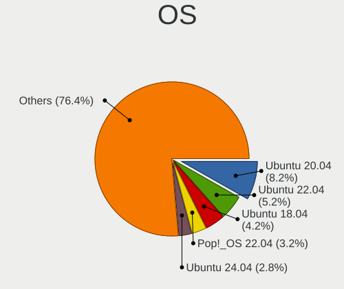

| Name                         | Desktops | Percent |
|------------------------------|----------|---------|
| Ubuntu 20.04                 | 390      | 8.21%   |
| Ubuntu 22.04                 | 248      | 5.22%   |
| Ubuntu 18.04                 | 202      | 4.25%   |
| Pop!_OS 22.04                | 150      | 3.16%   |
| Ubuntu 24.04                 | 133      | 2.8%    |
| Arch Rolling                 | 117      | 2.46%   |
| Debian 12                    | 94       | 1.98%   |
| Zorin 17                     | 75       | 1.58%   |
| Manjaro                      | 70       | 1.47%   |
| Linux Mint 22.1              | 66       | 1.39%   |
| Debian 11                    | 66       | 1.39%   |
| ArcoLinux Rolling            | 64       | 1.35%   |
| Zorin 16                     | 62       | 1.3%    |
| OpenMandriva 4.2             | 62       | 1.3%    |
| OpenMandriva 24.12           | 62       | 1.3%    |
| Linux Mint 20.3              | 58       | 1.22%   |
| OpenMandriva 4.3             | 57       | 1.2%    |
| Xubuntu 20.04                | 50       | 1.05%   |
| Fedora 42                    | 50       | 1.05%   |
| Pop!_OS 20.04                | 49       | 1.03%   |
| Fedora 41                    | 49       | 1.03%   |
| Fedora 38                    | 48       | 1.01%   |
| Linux Mint 20.1              | 45       | 0.95%   |
| Linux Mint 21.3              | 44       | 0.93%   |
| KDE neon 20.04               | 43       | 0.9%    |
| OpenMandriva 23.01           | 42       | 0.88%   |
| Pop!_OS 21.04                | 41       | 0.86%   |
| Linux Mint 21.1              | 40       | 0.84%   |
| Ubuntu 23.04                 | 38       | 0.8%    |
| OpenMandriva 23.03           | 38       | 0.8%    |
| EndeavourOS Rolling          | 38       | 0.8%    |
| Fedora 40                    | 37       | 0.78%   |
| Fedora 39                    | 37       | 0.78%   |
| OpenMandriva 25.90           | 36       | 0.76%   |
| Linux Mint 22.2              | 36       | 0.76%   |
| Bazzite 42                   | 36       | 0.76%   |
| Linux Mint 21.2              | 35       | 0.74%   |
| openSUSE Tumbleweed-XXXXXXXX | 33       | 0.69%   |
| OpenMandriva 25.06           | 33       | 0.69%   |
| Linux Mint 19.3              | 33       | 0.69%   |

OS Family
---------

OS without a version

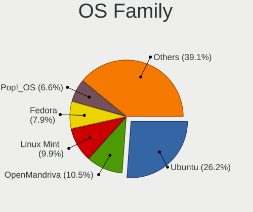

| Name          | Desktops | Percent |
|---------------|----------|---------|
| Ubuntu        | 1165     | 26.16%  |
| OpenMandriva  | 467      | 10.49%  |
| Linux Mint    | 440      | 9.88%   |
| Fedora        | 350      | 7.86%   |
| Pop!_OS       | 292      | 6.56%   |
| Debian        | 222      | 4.99%   |
| Zorin         | 188      | 4.22%   |
| Arch          | 144      | 3.23%   |
| Manjaro       | 142      | 3.19%   |
| Xubuntu       | 93       | 2.09%   |
| Kubuntu       | 81       | 1.82%   |
| KDE neon      | 81       | 1.82%   |
| Bazzite       | 73       | 1.64%   |
| ArcoLinux     | 67       | 1.5%    |
| Nobara        | 47       | 1.06%   |
| openSUSE      | 46       | 1.03%   |
| ROSA          | 41       | 0.92%   |
| EndeavourOS   | 40       | 0.9%    |
| Gentoo        | 38       | 0.85%   |
| Garuda Linux  | 30       | 0.67%   |
| Elementary    | 28       | 0.63%   |
| Lubuntu       | 24       | 0.54%   |
| LMDE          | 22       | 0.49%   |
| CentOS        | 22       | 0.49%   |
| Ubuntu MATE   | 21       | 0.47%   |
| NixOS         | 20       | 0.45%   |
| CachyOS       | 20       | 0.45%   |
| Endless       | 16       | 0.36%   |
| Ubuntu Unity  | 15       | 0.34%   |
| BlackPanther  | 13       | 0.29%   |
| MX            | 12       | 0.27%   |
| Rocky Linux   | 11       | 0.25%   |
| Ubuntu Budgie | 9        | 0.2%    |
| Kali          | 9        | 0.2%    |
| Clear Linux   | 9        | 0.2%    |
| RHEL          | 8        | 0.18%   |
| AlmaLinux     | 8        | 0.18%   |
| Xero          | 7        | 0.16%   |
| SteamOS       | 6        | 0.13%   |
| Solus         | 6        | 0.13%   |

Kernel
------

Version of the Linux kernel

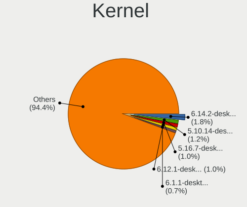

| Version                  | Desktops | Percent |
|--------------------------|----------|---------|
| 6.14.2-desktop-3omv2590  | 93       | 1.76%   |
| 5.10.14-desktop-1omv4002 | 61       | 1.15%   |
| 5.16.7-desktop-1omv4003  | 55       | 1.04%   |
| 6.12.1-desktop-1omv2490  | 51       | 0.96%   |
| 6.1.1-desktop-1omv2290   | 37       | 0.7%    |
| 6.8.0-51-generic         | 36       | 0.68%   |
| 6.2.6-desktop-1omv2390   | 36       | 0.68%   |
| 6.9.3-76060903-generic   | 35       | 0.66%   |
| 5.4.0-42-generic         | 34       | 0.64%   |
| 6.6.2-desktop-1omv2390   | 33       | 0.62%   |
| 5.15.0-58-generic        | 30       | 0.57%   |
| 5.4.0-58-generic         | 29       | 0.55%   |
| 5.15.0-56-generic        | 29       | 0.55%   |
| 6.8.0-52-generic         | 27       | 0.51%   |
| 5.4.0-48-generic         | 25       | 0.47%   |
| 5.11.0-40-generic        | 24       | 0.45%   |
| 6.12.9-desktop-1omv2490  | 23       | 0.43%   |
| 5.13.0-39-generic        | 23       | 0.43%   |
| 5.4.0-52-generic         | 22       | 0.42%   |
| 6.14.0-33-generic        | 21       | 0.4%    |
| 5.8.0-7630-generic       | 20       | 0.38%   |
| 5.4.0-54-generic         | 20       | 0.38%   |
| 5.3.0-40-generic         | 20       | 0.38%   |
| 5.15.0-48-generic        | 20       | 0.38%   |
| 5.11.0-7620-generic      | 20       | 0.38%   |
| 6.8.0-60-generic         | 19       | 0.36%   |
| 6.2.0-20-generic         | 19       | 0.36%   |
| 5.15.0-91-generic        | 19       | 0.36%   |
| 6.8.0-40-generic         | 18       | 0.34%   |
| 6.5.0-14-generic         | 18       | 0.34%   |
| 6.2.0-26-generic         | 18       | 0.34%   |
| 6.14.0-37-generic        | 18       | 0.34%   |
| 6.12.10-76061203-generic | 18       | 0.34%   |
| 5.4.0-66-generic         | 18       | 0.34%   |
| 5.4.0-29-generic         | 18       | 0.34%   |
| 5.4.0-26-generic         | 18       | 0.34%   |
| 5.15.0-52-generic        | 18       | 0.34%   |
| 6.8.0-45-generic         | 17       | 0.32%   |
| 6.8.0-49-generic         | 16       | 0.3%    |
| 6.5.0-28-generic         | 16       | 0.3%    |

Kernel Family
-------------

Linux kernel without a distro release

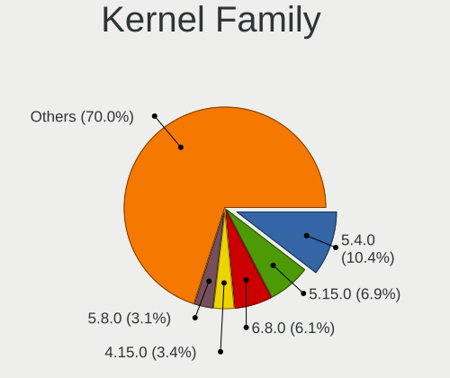

| Version | Desktops | Percent |
|---------|----------|---------|
| 5.4.0   | 517      | 10.43%  |
| 5.15.0  | 344      | 6.94%   |
| 6.8.0   | 304      | 6.13%   |
| 4.15.0  | 168      | 3.39%   |
| 5.8.0   | 152      | 3.07%   |
| 5.11.0  | 140      | 2.82%   |
| 5.13.0  | 125      | 2.52%   |
| 6.5.0   | 124      | 2.5%    |
| 6.14.0  | 119      | 2.4%    |
| 5.3.0   | 109      | 2.2%    |
| 6.14.2  | 102      | 2.06%   |
| 6.2.0   | 98       | 1.98%   |
| 6.1.0   | 95       | 1.92%   |
| 5.19.0  | 93       | 1.88%   |
| 5.10.0  | 65       | 1.31%   |
| 4.18.0  | 65       | 1.31%   |
| 6.11.0  | 62       | 1.25%   |
| 5.10.14 | 62       | 1.25%   |
| 5.16.7  | 55       | 1.11%   |
| 5.0.0   | 55       | 1.11%   |
| 6.12.1  | 54       | 1.09%   |
| 6.2.6   | 53       | 1.07%   |
| 6.1.1   | 42       | 0.85%   |
| 6.6.2   | 40       | 0.81%   |
| 6.9.3   | 39       | 0.79%   |
| 6.17.7  | 28       | 0.56%   |
| 6.12.9  | 28       | 0.56%   |
| 6.12.10 | 22       | 0.44%   |
| 6.14.6  | 21       | 0.42%   |
| 6.4.11  | 20       | 0.4%    |
| 4.19.0  | 17       | 0.34%   |
| 6.16.4  | 16       | 0.32%   |
| 6.12.6  | 16       | 0.32%   |
| 6.0.12  | 16       | 0.32%   |
| 4.4.0   | 16       | 0.32%   |
| 6.5.6   | 15       | 0.3%    |
| 6.0.6   | 15       | 0.3%    |
| 5.14.0  | 15       | 0.3%    |
| 6.17.9  | 14       | 0.28%   |
| 6.0.0   | 14       | 0.28%   |

Kernel Major Ver.
-----------------

Linux kernel major version

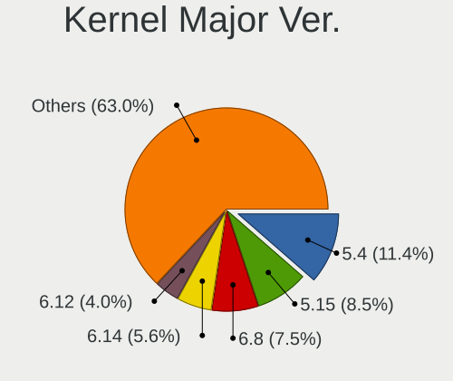

| Version | Desktops | Percent |
|---------|----------|---------|
| 5.4     | 556      | 11.41%  |
| 5.15    | 414      | 8.49%   |
| 6.8     | 364      | 7.47%   |
| 6.14    | 275      | 5.64%   |
| 6.12    | 194      | 3.98%   |
| 6.2     | 193      | 3.96%   |
| 5.8     | 193      | 3.96%   |
| 6.5     | 190      | 3.9%    |
| 6.1     | 183      | 3.75%   |
| 5.10    | 177      | 3.63%   |
| 4.15    | 168      | 3.45%   |
| 5.11    | 167      | 3.43%   |
| 5.13    | 152      | 3.12%   |
| 5.19    | 124      | 2.54%   |
| 5.3     | 121      | 2.48%   |
| 6.6     | 118      | 2.42%   |
| 6.11    | 117      | 2.4%    |
| 5.16    | 96       | 1.97%   |
| 6.17    | 93       | 1.91%   |
| 4.18    | 77       | 1.58%   |
| 6.9     | 68       | 1.4%    |
| 6.0     | 68       | 1.4%    |
| 6.4     | 65       | 1.33%   |
| 5.0     | 60       | 1.23%   |
| 6.10    | 50       | 1.03%   |
| 6.3     | 48       | 0.98%   |
| 5.14    | 46       | 0.94%   |
| 6.16    | 44       | 0.9%    |
| 6.15    | 44       | 0.9%    |
| 6.13    | 43       | 0.88%   |
| 5.12    | 38       | 0.78%   |
| 4.9     | 36       | 0.74%   |
| 5.9     | 35       | 0.72%   |
| 5.17    | 35       | 0.72%   |
| 6.7     | 34       | 0.7%    |
| 5.18    | 34       | 0.7%    |
| 5.6     | 31       | 0.64%   |
| 5.7     | 24       | 0.49%   |
| 4.19    | 23       | 0.47%   |
| 4.4     | 16       | 0.33%   |

Arch
----

OS architecture (x86_64, i586, etc.)

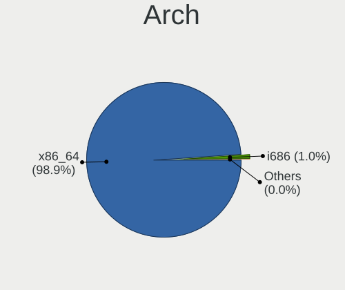

| Name        | Desktops | Percent |
|-------------|----------|---------|
| x86_64      | 4193     | 98.91%  |
| i686        | 41       | 0.97%   |
| mips64      | 2        | 0.05%   |
| ppc         | 1        | 0.02%   |
| loongarch64 | 1        | 0.02%   |
| armv7l      | 1        | 0.02%   |

DE
--

Desktop Environment

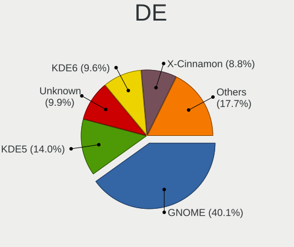

| Name              | Desktops | Percent |
|-------------------|----------|---------|
| GNOME             | 1800     | 40.12%  |
| KDE5              | 628      | 14%     |
| Unknown           | 443      | 9.87%   |
| KDE6              | 430      | 9.58%   |
| X-Cinnamon        | 393      | 8.76%   |
| XFCE              | 271      | 6.04%   |
| MATE              | 88       | 1.96%   |
| KDE               | 86       | 1.92%   |
| LXQt              | 48       | 1.07%   |
| Cinnamon          | 45       | 1%      |
| KDE4              | 42       | 0.94%   |
| Pantheon          | 27       | 0.6%    |
| i3                | 23       | 0.51%   |
| Budgie            | 20       | 0.45%   |
| LXDE              | 17       | 0.38%   |
| Hyprland          | 17       | 0.38%   |
| Unity             | 15       | 0.33%   |
| GNOME Flashback   | 13       | 0.29%   |
| GNOME Classic     | 12       | 0.27%   |
| COSMIC            | 12       | 0.27%   |
| sway              | 8        | 0.18%   |
| Deepin            | 7        | 0.16%   |
| awesome           | 6        | 0.13%   |
| Openbox           | 4        | 0.09%   |
| Endless:GNOME     | 4        | 0.09%   |
| lightdm-xsession  | 3        | 0.07%   |
| xmonad            | 2        | 0.04%   |
| trinity           | 2        | 0.04%   |
| qtile             | 2        | 0.04%   |
| Enlightenment     | 2        | 0.04%   |
| DWM               | 2        | 0.04%   |
| Cutefish          | 2        | 0.04%   |
| X-Generic         | 1        | 0.02%   |
| WindowMaker       | 1        | 0.02%   |
| ubuntustudio      | 1        | 0.02%   |
| river             | 1        | 0.02%   |
| pika:GNOME        | 1        | 0.02%   |
| onyx:GNOME        | 1        | 0.02%   |
| LXQt:niri:wlroots | 1        | 0.02%   |
| Lubuntu           | 1        | 0.02%   |

Display Server
--------------

X11 or Wayland

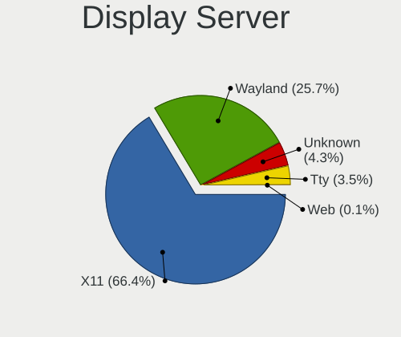

| Name    | Desktops | Percent |
|---------|----------|---------|
| X11     | 2932     | 66.41%  |
| Wayland | 1134     | 25.69%  |
| Unknown | 192      | 4.35%   |
| Tty     | 154      | 3.49%   |
| Web     | 3        | 0.07%   |

Display Manager
---------------

SDDM, LightDM, etc.

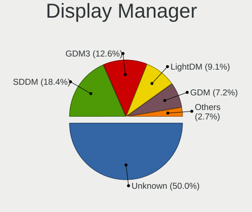

| Name                  | Desktops | Percent |
|-----------------------|----------|---------|
| Unknown               | 2207     | 49.99%  |
| SDDM                  | 814      | 18.44%  |
| GDM3                  | 558      | 12.64%  |
| LightDM               | 400      | 9.06%   |
| GDM                   | 319      | 7.23%   |
| TDM                   | 59       | 1.34%   |
| KDM                   | 26       | 0.59%   |
| XDM                   | 8        | 0.18%   |
| SLiM                  | 7        | 0.16%   |
| GREETD                | 7        | 0.16%   |
| NODM                  | 4        | 0.09%   |
| DISPLAY-MANAGER-START | 3        | 0.07%   |
| MDM                   | 1        | 0.02%   |
| LXDM                  | 1        | 0.02%   |
| COSMIC-GREETER        | 1        | 0.02%   |

OS Lang
-------

Language

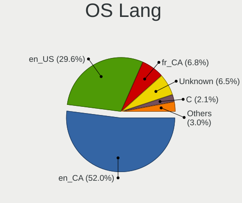

| Lang       | Desktops | Percent |
|------------|----------|---------|
| en_CA      | 2295     | 52.03%  |
| en_US      | 1304     | 29.56%  |
| fr_CA      | 300      | 6.8%    |
| Unknown    | 287      | 6.51%   |
| C          | 94       | 2.13%   |
| fr_FR      | 46       | 1.04%   |
| en_GB      | 40       | 0.91%   |
| en_AU      | 6        | 0.14%   |
| de_DE      | 6        | 0.14%   |
| zh_CN      | 4        | 0.09%   |
| POSIX      | 4        | 0.09%   |
| C.UTF8     | 3        | 0.07%   |
| zh_TW      | 2        | 0.05%   |
| ru_RU      | 2        | 0.05%   |
| pa_IN      | 2        | 0.05%   |
| ja_JP      | 2        | 0.05%   |
| zh_HK      | 1        | 0.02%   |
| uk_UA      | 1        | 0.02%   |
| pt_BR      | 1        | 0.02%   |
| iu_CA      | 1        | 0.02%   |
| it_IT      | 1        | 0.02%   |
| hu_HU      | 1        | 0.02%   |
| es_ES      | 1        | 0.02%   |
| es_BO      | 1        | 0.02%   |
| es_AR      | 1        | 0.02%   |
| en_ZM      | 1        | 0.02%   |
| en_US.UTF8 | 1        | 0.02%   |
| en_IN      | 1        | 0.02%   |
| en_IE      | 1        | 0.02%   |
| de_CH      | 1        | 0.02%   |

Boot Mode
---------

EFI or BIOS

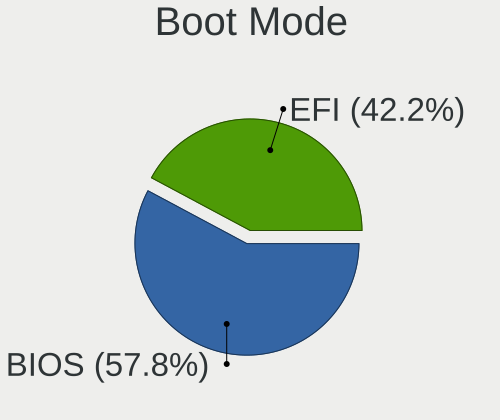

| Mode | Desktops | Percent |
|------|----------|---------|
| BIOS | 2527     | 57.81%  |
| EFI  | 1844     | 42.19%  |

Filesystem
----------

Type of filesystem

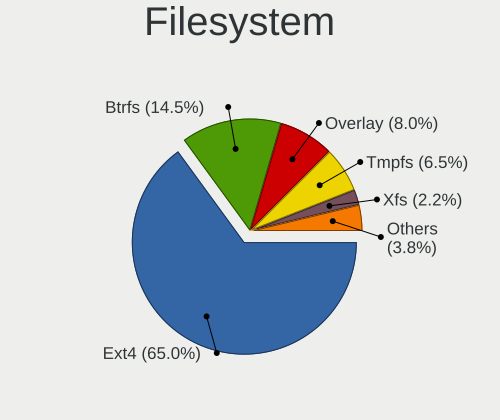

| Type    | Desktops | Percent |
|---------|----------|---------|
| Ext4    | 2868     | 64.98%  |
| Btrfs   | 641      | 14.52%  |
| Overlay | 353      | 8%      |
| Tmpfs   | 288      | 6.52%   |
| Xfs     | 98       | 2.22%   |
| Unknown | 91       | 2.06%   |
| Zfs     | 39       | 0.88%   |
| Ext2    | 11       | 0.25%   |
| Ext3    | 9        | 0.2%    |
| F2fs    | 7        | 0.16%   |
| Rootfs  | 6        | 0.14%   |
| Jfs     | 2        | 0.05%   |
| XXX4    | 1        | 0.02%   |

Part. scheme
------------

Scheme of partitioning

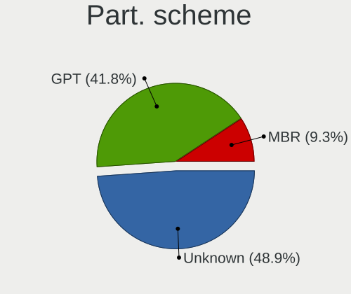

| Type    | Desktops | Percent |
|---------|----------|---------|
| Unknown | 2141     | 48.89%  |
| GPT     | 1832     | 41.84%  |
| MBR     | 406      | 9.27%   |

Dual Boot with Linux/BSD
------------------------

Hosting more than one Linux/BSD

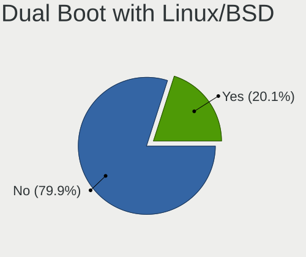

| Dual boot | Desktops | Percent |
|-----------|----------|---------|
| No        | 3493     | 79.95%  |
| Yes       | 876      | 20.05%  |

Dual Boot (Win)
---------------

Hosting Linux and Windows

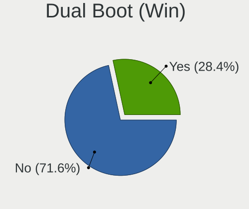

| Dual boot | Desktops | Percent |
|-----------|----------|---------|
| No        | 3119     | 71.62%  |
| Yes       | 1236     | 28.38%  |

Board
-----

Vendor
------

Motherboard manufacturer

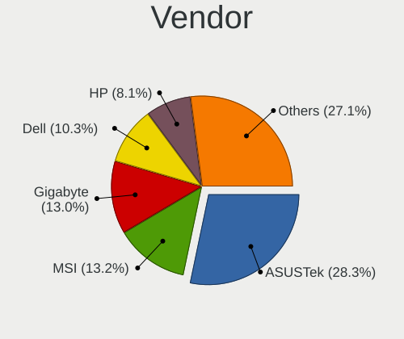

| Name                                 | Desktops | Percent |
|--------------------------------------|----------|---------|
| ASUSTek Computer                     | 1198     | 28.28%  |
| MSI                                  | 560      | 13.22%  |
| Gigabyte Technology                  | 552      | 13.03%  |
| Dell                                 | 437      | 10.32%  |
| Hewlett-Packard                      | 343      | 8.1%    |
| ASRock                               | 269      | 6.35%   |
| Lenovo                               | 219      | 5.17%   |
| Acer                                 | 174      | 4.11%   |
| Intel                                | 90       | 2.12%   |
| Unknown                              | 45       | 1.06%   |
| Pegatron                             | 43       | 1.02%   |
| Foxconn                              | 34       | 0.8%    |
| Alienware                            | 33       | 0.78%   |
| AZW                                  | 26       | 0.61%   |
| Apple                                | 20       | 0.47%   |
| Supermicro                           | 15       | 0.35%   |
| Gateway                              | 15       | 0.35%   |
| Biostar                              | 13       | 0.31%   |
| ECS                                  | 12       | 0.28%   |
| Shenzhen Meigao Electronic Equipment | 9        | 0.21%   |
| ASRockRack                           | 9        | 0.21%   |
| MACHINIST                            | 8        | 0.19%   |
| EVGA                                 | 7        | 0.17%   |
| Huanan                               | 6        | 0.14%   |
| BESSTAR Tech                         | 5        | 0.12%   |
| ZOTAC                                | 4        | 0.09%   |
| TYAN Computer                        | 4        | 0.09%   |
| System76                             | 4        | 0.09%   |
| Bosgame                              | 4        | 0.09%   |
| XFX                                  | 3        | 0.07%   |
| Shuttle                              | 3        | 0.07%   |
| OEM_MB                               | 3        | 0.07%   |
| OEM                                  | 3        | 0.07%   |
| IBM                                  | 3        | 0.07%   |
| Google                               | 3        | 0.07%   |
| CWWK                                 | 3        | 0.07%   |
| AMI                                  | 3        | 0.07%   |
| Wistron                              | 2        | 0.05%   |
| Win element                          | 2        | 0.05%   |
| Trigkey                              | 2        | 0.05%   |

Model
-----

Motherboard model

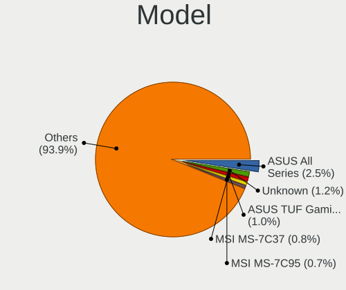

| Name                           | Desktops | Percent |
|--------------------------------|----------|---------|
| ASUS All Series                | 105      | 2.48%   |
| Unknown                        | 49       | 1.16%   |
| ASUS TUF Gaming X570-PLUS      | 43       | 1.02%   |
| MSI MS-7C37                    | 34       | 0.8%    |
| MSI MS-7C95                    | 29       | 0.68%   |
| MSI MS-7C56                    | 24       | 0.57%   |
| Dell OptiPlex 7010             | 23       | 0.54%   |
| MSI MS-7C02                    | 20       | 0.47%   |
| ASUS PRIME B450M-A             | 20       | 0.47%   |
| Dell OptiPlex 9020             | 19       | 0.45%   |
| ASUS ROG STRIX B450-F GAMING   | 17       | 0.4%    |
| ASRock B450M Pro4              | 17       | 0.4%    |
| MSI MS-7C84                    | 16       | 0.38%   |
| MSI MS-7693                    | 16       | 0.38%   |
| Dell OptiPlex 790              | 16       | 0.38%   |
| ASUS ROG STRIX B550-F GAMING   | 16       | 0.38%   |
| MSI MS-7C91                    | 15       | 0.35%   |
| HP Compaq Elite 8300 SFF       | 15       | 0.35%   |
| Gigabyte B450 AORUS PRO WIFI   | 15       | 0.35%   |
| ASUS PRIME X570-P              | 15       | 0.35%   |
| ASUS M5A97 R2.0                | 15       | 0.35%   |
| Gigabyte X570 AORUS ELITE      | 14       | 0.33%   |
| MSI MS-7B79                    | 13       | 0.31%   |
| MSI MS-7A38                    | 13       | 0.31%   |
| HP Z400 Workstation            | 13       | 0.31%   |
| Dell XPS 8700                  | 13       | 0.31%   |
| MSI MS-7D25                    | 12       | 0.28%   |
| MSI MS-7B86                    | 12       | 0.28%   |
| HP Compaq 8200 Elite SFF PC    | 12       | 0.28%   |
| Gigabyte X570 AORUS MASTER     | 12       | 0.28%   |
| Gigabyte X570 AORUS ELITE WIFI | 12       | 0.28%   |
| Dell OptiPlex 7040             | 12       | 0.28%   |
| ASUS ROG STRIX X570-E GAMING   | 12       | 0.28%   |
| HP EliteDesk 800 G1 SFF        | 11       | 0.26%   |
| HP Compaq Pro 6300 SFF         | 11       | 0.26%   |
| Dell XPS 8940                  | 11       | 0.26%   |
| Dell OptiPlex 755              | 11       | 0.26%   |
| ASUS PRIME B550-PLUS           | 11       | 0.26%   |
| ASUS PRIME A320M-K             | 11       | 0.26%   |
| ASUS M5A97 LE R2.0             | 11       | 0.26%   |

Model Family
------------

Motherboard model prefix

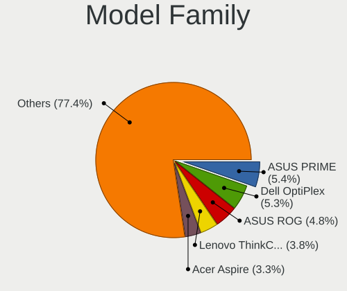

| Name                | Desktops | Percent |
|---------------------|----------|---------|
| ASUS PRIME          | 227      | 5.36%   |
| Dell OptiPlex       | 226      | 5.34%   |
| ASUS ROG            | 204      | 4.82%   |
| Lenovo ThinkCentre  | 160      | 3.78%   |
| Acer Aspire         | 141      | 3.33%   |
| ASUS TUF            | 120      | 2.83%   |
| HP Compaq           | 118      | 2.79%   |
| ASUS All            | 105      | 2.48%   |
| Dell XPS            | 56       | 1.32%   |
| Dell Precision      | 55       | 1.3%    |
| HP EliteDesk        | 54       | 1.27%   |
| Gigabyte X570       | 54       | 1.27%   |
| Unknown             | 49       | 1.16%   |
| Dell Inspiron       | 39       | 0.92%   |
| Gigabyte B450       | 35       | 0.83%   |
| MSI MS-7C37         | 34       | 0.8%    |
| Lenovo ThinkStation | 32       | 0.76%   |
| ASUS M5A97          | 32       | 0.76%   |
| ASRock B450M        | 32       | 0.76%   |
| MSI MS-7C95         | 29       | 0.68%   |
| HP ProDesk          | 29       | 0.68%   |
| Gigabyte B550       | 26       | 0.61%   |
| Gigabyte Z390       | 25       | 0.59%   |
| ASUS P8Z77-V        | 25       | 0.59%   |
| Alienware Aurora    | 25       | 0.59%   |
| MSI MS-7C56         | 24       | 0.57%   |
| ASUS SABERTOOTH     | 23       | 0.54%   |
| Dell Studio         | 21       | 0.5%    |
| MSI MS-7C02         | 20       | 0.47%   |
| Dell Vostro         | 18       | 0.42%   |
| MSI MS-7C84         | 16       | 0.38%   |
| MSI MS-7693         | 16       | 0.38%   |
| MSI MS-7C91         | 15       | 0.35%   |
| HP Pavilion         | 14       | 0.33%   |
| Gigabyte B450M      | 14       | 0.33%   |
| ASUS P8P67          | 14       | 0.33%   |
| ASUS Maximus        | 14       | 0.33%   |
| ASUS CROSSHAIR      | 14       | 0.33%   |
| MSI MS-7B79         | 13       | 0.31%   |
| MSI MS-7A38         | 13       | 0.31%   |

MFG Year
--------

Motherboard manufacture year

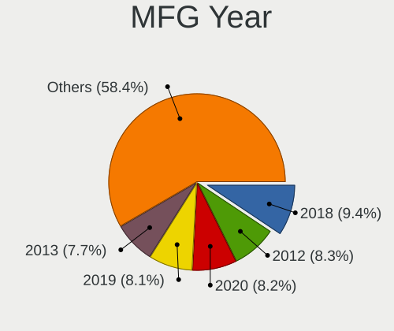

| Year    | Desktops | Percent |
|---------|----------|---------|
| 2018    | 397      | 9.37%   |
| 2012    | 352      | 8.31%   |
| 2020    | 346      | 8.17%   |
| 2019    | 343      | 8.1%    |
| 2013    | 326      | 7.7%    |
| 2011    | 264      | 6.23%   |
| 2014    | 244      | 5.76%   |
| 2022    | 231      | 5.45%   |
| 2017    | 218      | 5.15%   |
| 2021    | 203      | 4.79%   |
| 2010    | 198      | 4.67%   |
| 2009    | 194      | 4.58%   |
| 2016    | 174      | 4.11%   |
| 2015    | 162      | 3.82%   |
| 2008    | 155      | 3.66%   |
| 2023    | 131      | 3.09%   |
| 2007    | 103      | 2.43%   |
| 2024    | 92       | 2.17%   |
| 2006    | 53       | 1.25%   |
| 2025    | 21       | 0.5%    |
| 2005    | 15       | 0.35%   |
| 2004    | 6        | 0.14%   |
| Unknown | 6        | 0.14%   |
| 2003    | 1        | 0.02%   |
| 2002    | 1        | 0.02%   |

Form Factor
-----------

Physical design of the computer

| Name    | Desktops | Percent |
|---------|----------|---------|
| Desktop | 4236     | 100%    |

Secure Boot
-----------

Enabled or disabled

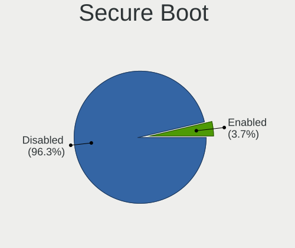

| State    | Desktops | Percent |
|----------|----------|---------|
| Disabled | 4103     | 96.31%  |
| Enabled  | 157      | 3.69%   |

Coreboot
--------

Have coreboot on board

| Used | Desktops | Percent |
|------|----------|---------|
| No   | 4230     | 99.81%  |
| Yes  | 8        | 0.19%   |

RAM Size
--------

Total RAM memory

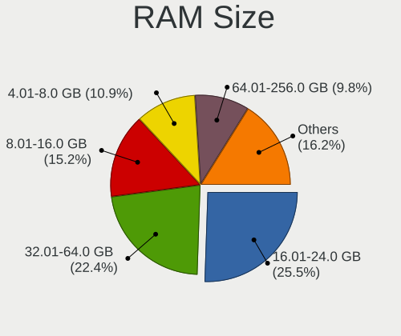

| Size in GB      | Desktops | Percent |
|-----------------|----------|---------|
| 16.01-24.0      | 1111     | 25.53%  |
| 32.01-64.0      | 973      | 22.36%  |
| 8.01-16.0       | 662      | 15.21%  |
| 4.01-8.0        | 475      | 10.91%  |
| 64.01-256.0     | 428      | 9.83%   |
| 3.01-4.0        | 360      | 8.27%   |
| 24.01-32.0      | 206      | 4.73%   |
| 1.01-2.0        | 78       | 1.79%   |
| 2.01-3.0        | 30       | 0.69%   |
| 0.51-1.0        | 17       | 0.39%   |
| More than 256.0 | 10       | 0.23%   |
| 0.01-0.5        | 1        | 0.02%   |
| Unknown         | 1        | 0.02%   |

RAM Used
--------

Used RAM memory

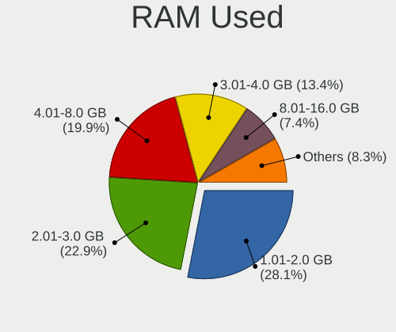

| Used GB     | Desktops | Percent |
|-------------|----------|---------|
| 1.01-2.0    | 1351     | 28.06%  |
| 2.01-3.0    | 1104     | 22.93%  |
| 4.01-8.0    | 956      | 19.86%  |
| 3.01-4.0    | 647      | 13.44%  |
| 8.01-16.0   | 358      | 7.44%   |
| 0.51-1.0    | 224      | 4.65%   |
| 16.01-24.0  | 64       | 1.33%   |
| 0.01-0.5    | 47       | 0.98%   |
| 24.01-32.0  | 34       | 0.71%   |
| 32.01-64.0  | 25       | 0.52%   |
| 64.01-256.0 | 3        | 0.06%   |
| Unknown     | 1        | 0.02%   |

Total Drives
------------

Number of drives on board

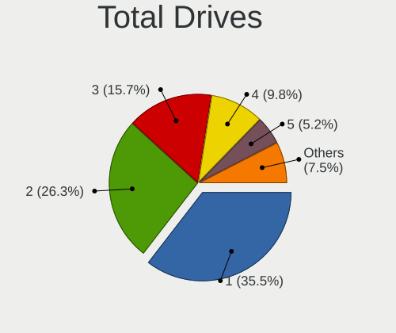

| Drives | Desktops | Percent |
|--------|----------|---------|
| 1      | 1599     | 35.48%  |
| 2      | 1185     | 26.29%  |
| 3      | 707      | 15.69%  |
| 4      | 443      | 9.83%   |
| 5      | 233      | 5.17%   |
| 6      | 133      | 2.95%   |
| 7      | 66       | 1.46%   |
| 8      | 41       | 0.91%   |
| 0      | 39       | 0.87%   |
| 9      | 21       | 0.47%   |
| 10     | 11       | 0.24%   |
| 11     | 10       | 0.22%   |
| 12     | 7        | 0.16%   |
| 13     | 6        | 0.13%   |
| 27     | 1        | 0.02%   |
| 26     | 1        | 0.02%   |
| 25     | 1        | 0.02%   |
| 22     | 1        | 0.02%   |
| 16     | 1        | 0.02%   |
| 14     | 1        | 0.02%   |

Has CD-ROM
----------

Has CD-ROM on board

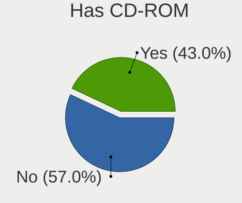

| Presented | Desktops | Percent |
|-----------|----------|---------|
| No        | 2453     | 57.01%  |
| Yes       | 1850     | 42.99%  |

Has Ethernet
------------

Has Ethernet on board

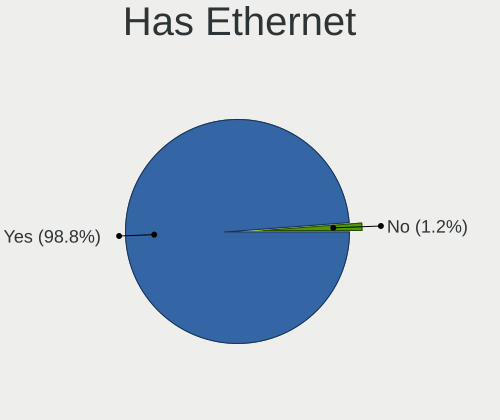

| Presented | Desktops | Percent |
|-----------|----------|---------|
| Yes       | 4185     | 98.8%   |
| No        | 51       | 1.2%    |

Has WiFi
--------

Has WiFi module

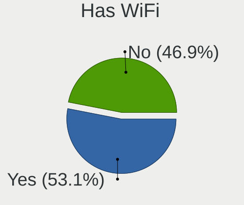

| Presented | Desktops | Percent |
|-----------|----------|---------|
| Yes       | 2286     | 53.05%  |
| No        | 2023     | 46.95%  |

Has Bluetooth
-------------

Has Bluetooth module

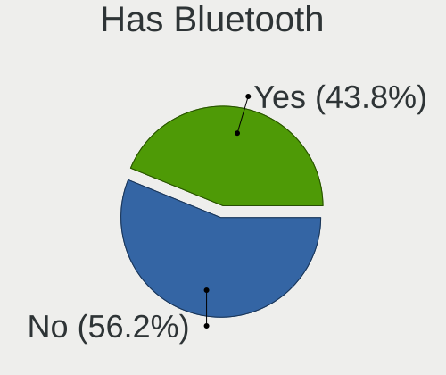

| Presented | Desktops | Percent |
|-----------|----------|---------|
| No        | 2425     | 56.16%  |
| Yes       | 1893     | 43.84%  |

Location
--------

Country
-------

Geographic location (country)

| Country | Desktops | Percent |
|---------|----------|---------|
| Canada  | 4236     | 100%    |

City
----

Geographic location (city)

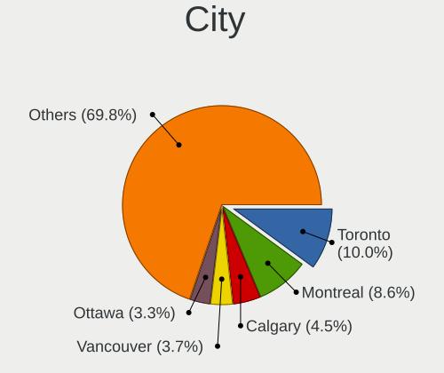

| City            | Desktops | Percent |
|-----------------|----------|---------|
| Toronto         | 451      | 10.05%  |
| Montreal        | 388      | 8.64%   |
| Calgary         | 204      | 4.54%   |
| Vancouver       | 164      | 3.65%   |
| Ottawa          | 150      | 3.34%   |
| Edmonton        | 130      | 2.9%    |
| Winnipeg        | 101      | 2.25%   |
| Québec         | 77       | 1.72%   |
| Mississauga     | 64       | 1.43%   |
| London          | 53       | 1.18%   |
| Kitchener       | 53       | 1.18%   |
| Victoria        | 50       | 1.11%   |
| Surrey          | 49       | 1.09%   |
| Laval           | 45       | 1%      |
| Scarborough     | 44       | 0.98%   |
| Saskatoon       | 44       | 0.98%   |
| Hamilton        | 43       | 0.96%   |
| Gatineau        | 39       | 0.87%   |
| Regina          | 36       | 0.8%    |
| Windsor         | 34       | 0.76%   |
| Oshawa          | 34       | 0.76%   |
| Brampton        | 33       | 0.74%   |
| Sherbrooke      | 31       | 0.69%   |
| Halifax         | 30       | 0.67%   |
| Burnaby         | 28       | 0.62%   |
| Richmond Hill   | 27       | 0.6%    |
| Trois-Rivières | 25       | 0.56%   |
| Oakville        | 25       | 0.56%   |
| Dartmouth       | 25       | 0.56%   |
| Kingston        | 24       | 0.53%   |
| Kelowna         | 24       | 0.53%   |
| Sherwood Park   | 22       | 0.49%   |
| Moncton         | 22       | 0.49%   |
| Langley         | 22       | 0.49%   |
| Burlington      | 22       | 0.49%   |
| Guelph          | 21       | 0.47%   |
| Barrie          | 21       | 0.47%   |
| Thunder Bay     | 19       | 0.42%   |
| Markham         | 19       | 0.42%   |
| North Vancouver | 18       | 0.4%    |

Drives
------

Drive Vendor
------------

Hard drive vendors

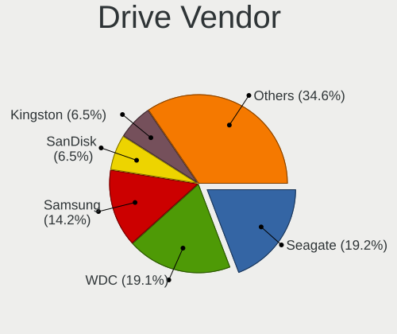

| Vendor                      | Desktops | Drives | Percent |
|-----------------------------|----------|--------|---------|
| Seagate                     | 1582     | 2971   | 19.2%   |
| WDC                         | 1578     | 3040   | 19.15%  |
| Samsung Electronics         | 1167     | 2054   | 14.16%  |
| SanDisk                     | 534      | 772    | 6.48%   |
| Kingston                    | 532      | 790    | 6.46%   |
| Toshiba                     | 275      | 397    | 3.34%   |
| Crucial                     | 266      | 385    | 3.23%   |
| Hitachi                     | 223      | 339    | 2.71%   |
| A-DATA Technology           | 188      | 265    | 2.28%   |
| Intel                       | 169      | 259    | 2.05%   |
| Unknown                     | 116      | 209    | 1.41%   |
| Phison Electronics          | 79       | 101    | 0.96%   |
| Micron/Crucial Technology   | 73       | 112    | 0.89%   |
| SPCC                        | 68       | 92     | 0.83%   |
| Kingston Technology Company | 68       | 95     | 0.83%   |
| HGST                        | 63       | 92     | 0.76%   |
| Micron Technology           | 62       | 73     | 0.75%   |
| SK hynix                    | 56       | 67     | 0.68%   |
| China                       | 51       | 57     | 0.62%   |
| Team                        | 50       | 65     | 0.61%   |
| Patriot                     | 49       | 65     | 0.59%   |
| Corsair                     | 49       | 62     | 0.59%   |
| Phison                      | 47       | 79     | 0.57%   |
| Realtek Semiconductor       | 44       | 55     | 0.53%   |
| OCZ                         | 43       | 60     | 0.52%   |
| MAXIO Technology (Hangzhou) | 41       | 54     | 0.5%    |
| Silicon Motion              | 39       | 69     | 0.47%   |
| ADATA Technology            | 39       | 56     | 0.47%   |
| PNY                         | 35       | 50     | 0.42%   |
| JMicron Technology          | 31       | 53     | 0.38%   |
| Hewlett-Packard             | 28       | 51     | 0.34%   |
| Mushkin                     | 25       | 30     | 0.3%    |
| Lexar                       | 24       | 32     | 0.29%   |
| Maxtor                      | 23       | 30     | 0.28%   |
| Fanxiang                    | 21       | 26     | 0.25%   |
| ASMT                        | 21       | 41     | 0.25%   |
| XPG                         | 19       | 28     | 0.23%   |
| Timetec                     | 19       | 46     | 0.23%   |
| KingFast                    | 19       | 21     | 0.23%   |
| T-FORCE                     | 17       | 18     | 0.21%   |

Drive Model
-----------

Hard drive models

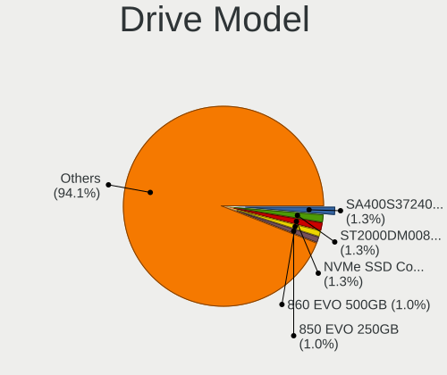

| Model                                              | Desktops | Percent |
|----------------------------------------------------|----------|---------|
| Kingston SA400S37240G 240GB SSD                    | 131      | 1.31%   |
| Seagate ST2000DM008-2FR102 2TB                     | 130      | 1.3%    |
| Samsung NVMe SSD Controller SM981/PM981/PM983 1TB  | 129      | 1.29%   |
| Samsung SSD 860 EVO 500GB                          | 103      | 1.03%   |
| Samsung SSD 850 EVO 250GB                          | 100      | 1%      |
| Seagate ST1000DM010-2EP102 1TB                     | 92       | 0.92%   |
| Seagate ST4000DM004-2CV104 4TB                     | 85       | 0.85%   |
| Samsung SSD 860 EVO 1TB                            | 74       | 0.74%   |
| Samsung SSD 850 EVO 500GB                          | 72       | 0.72%   |
| Kingston SA400S37480G 480GB SSD                    | 71       | 0.71%   |
| Samsung NVMe SSD Controller PM9A1/PM9A3/980PRO 1TB | 68       | 0.68%   |
| Kingston SA400S37120G 120GB SSD                    | 66       | 0.66%   |
| Seagate ST500DM002-1BD142 500GB                    | 65       | 0.65%   |
| Unknown SD/MMC/MS PRO 2GB                          | 64       | 0.64%   |
| WDC WD10EZEX-08WN4A0 1TB                           | 62       | 0.62%   |
| Seagate ST1000DM003-1CH162 1TB                     | 60       | 0.6%    |
| WDC WDS100T2B0A-00SM50 1TB SSD                     | 59       | 0.59%   |
| Seagate ST2000DM006-2DM164 2TB                     | 58       | 0.58%   |
| SanDisk NVMe SSD Drive 1TB                         | 58       | 0.58%   |
| WDC WDS500G2B0A-00SM50 500GB                       | 57       | 0.57%   |
| Seagate ST2000DM001-1ER164 2TB                     | 56       | 0.56%   |
| Toshiba DT01ACA100 1TB                             | 54       | 0.54%   |
| Seagate ST1000DM003-1ER162 1TB                     | 53       | 0.53%   |
| Samsung SSD 870 EVO 1TB                            | 51       | 0.51%   |
| Toshiba DT01ACA200 2TB                             | 50       | 0.5%    |
| Crucial CT1000MX500SSD1 1TB                        | 50       | 0.5%    |
| Sandisk WD Blue SN550 NVMe SSD 1024GB              | 45       | 0.45%   |
| SanDisk NVMe SSD Drive 500GB                       | 45       | 0.45%   |
| Seagate Expansion Desk 4TB                         | 42       | 0.42%   |
| Samsung SSD 870 EVO 500GB                          | 42       | 0.42%   |
| Kingston SV300S37A120G 120GB SSD                   | 40       | 0.4%    |
| Samsung NVMe SSD Drive 500GB                       | 38       | 0.38%   |
| Seagate ST2000DM001-1CH164 2TB                     | 37       | 0.37%   |
| Sandisk WD Black SN750 / PC SN730 NVMe SSD 500GB   | 37       | 0.37%   |
| WDC WD40EZRZ-00GXCB0 4TB                           | 36       | 0.36%   |
| Seagate ST3500418AS 500GB                          | 36       | 0.36%   |
| Seagate ST31000528AS 1TB                           | 36       | 0.36%   |
| Seagate ST1000DM003-1SB102 1TB                     | 35       | 0.35%   |
| Samsung SSD 860 EVO 250GB                          | 34       | 0.34%   |
| Seagate ST8000DM004-2CX188 8TB                     | 33       | 0.33%   |

HDD Vendor
----------

Hard disk drive vendors

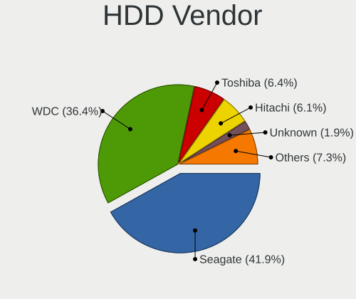

| Vendor              | Desktops | Drives | Percent |
|---------------------|----------|--------|---------|
| Seagate             | 1535     | 2841   | 41.93%  |
| WDC                 | 1333     | 2528   | 36.41%  |
| Toshiba             | 236      | 346    | 6.45%   |
| Hitachi             | 223      | 339    | 6.09%   |
| Unknown             | 68       | 97     | 1.86%   |
| HGST                | 62       | 91     | 1.69%   |
| Samsung Electronics | 61       | 78     | 1.67%   |
| Maxtor              | 23       | 30     | 0.63%   |
| External            | 14       | 22     | 0.38%   |
| JMicron Technology  | 13       | 19     | 0.36%   |
| ASMT                | 13       | 33     | 0.36%   |
| TO Exter            | 12       | 13     | 0.33%   |
| Fujitsu             | 9        | 10     | 0.25%   |
| Apple               | 9        | 13     | 0.25%   |
| Hewlett-Packard     | 8        | 25     | 0.22%   |
| Maxone              | 5        | 6      | 0.14%   |
| T-FORCE             | 4        | 5      | 0.11%   |
| QNAP                | 3        | 8      | 0.08%   |
| USB3.0              | 2        | 3      | 0.05%   |
| USB 3.1             | 2        | 2      | 0.05%   |
| SATAFIRM            | 2        | 2      | 0.05%   |
| SABRENT             | 2        | 2      | 0.05%   |
| H/W                 | 2        | 11     | 0.05%   |
| USB 3.0             | 1        | 4      | 0.03%   |
| Synology            | 1        | 2      | 0.03%   |
| Shenzhen            | 1        | 2      | 0.03%   |
| Quantum             | 1        | 1      | 0.03%   |
| QEMU                | 1        | 1      | 0.03%   |
| MSFT                | 1        | 1      | 0.03%   |
| Maxtor 6            | 1        | 1      | 0.03%   |
| MaxDigital          | 1        | 1      | 0.03%   |
| LaCie               | 1        | 1      | 0.03%   |
| KESU                | 1        | 2      | 0.03%   |
| Inateck             | 1        | 1      | 0.03%   |
| HPE                 | 1        | 1      | 0.03%   |
| HGST HTS            | 1        | 1      | 0.03%   |
| FC-1307             | 1        | 1      | 0.03%   |
| DAS                 | 1        | 9      | 0.03%   |
| ASMT109x            | 1        | 1      | 0.03%   |
| ASMedia             | 1        | 1      | 0.03%   |

SSD Vendor
----------

Solid state drive vendors

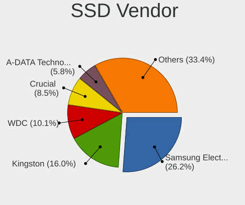

| Vendor              | Desktops | Drives | Percent |
|---------------------|----------|--------|---------|
| Samsung Electronics | 732      | 1141   | 26.15%  |
| Kingston            | 449      | 647    | 16.04%  |
| WDC                 | 284      | 397    | 10.15%  |
| Crucial             | 237      | 340    | 8.47%   |
| A-DATA Technology   | 163      | 234    | 5.82%   |
| SanDisk             | 124      | 152    | 4.43%   |
| Intel               | 83       | 117    | 2.97%   |
| SPCC                | 61       | 83     | 2.18%   |
| China               | 51       | 57     | 1.82%   |
| Patriot             | 45       | 61     | 1.61%   |
| Seagate             | 44       | 65     | 1.57%   |
| OCZ                 | 42       | 56     | 1.5%    |
| Team                | 41       | 54     | 1.46%   |
| PNY                 | 35       | 50     | 1.25%   |
| Corsair             | 29       | 34     | 1.04%   |
| Micron Technology   | 28       | 36     | 1%      |
| Mushkin             | 24       | 29     | 0.86%   |
| Lexar               | 22       | 30     | 0.79%   |
| Toshiba             | 21       | 27     | 0.75%   |
| SK hynix            | 19       | 22     | 0.68%   |
| Timetec             | 16       | 43     | 0.57%   |
| LITEONIT            | 16       | 20     | 0.57%   |
| Hewlett-Packard     | 16       | 21     | 0.57%   |
| SABRENT             | 15       | 26     | 0.54%   |
| Dogfish             | 12       | 13     | 0.43%   |
| Fanxiang            | 11       | 15     | 0.39%   |
| T-FORCE             | 9        | 9      | 0.32%   |
| LITEON              | 9        | 10     | 0.32%   |
| Unknown             | 9        | 9      | 0.32%   |
| Transcend           | 8        | 11     | 0.29%   |
| KingFast            | 8        | 8      | 0.29%   |
| OWC                 | 7        | 18     | 0.25%   |
| JMicron Technology  | 7        | 8      | 0.25%   |
| ASMT                | 7        | 7      | 0.25%   |
| KingSpec            | 6        | 9      | 0.21%   |
| KingDian            | 5        | 6      | 0.18%   |
| HAJAAN              | 5        | 5      | 0.18%   |
| Vaseky              | 4        | 5      | 0.14%   |
| TCSUNBOW            | 4        | 4      | 0.14%   |
| Plextor             | 4        | 5      | 0.14%   |

Drive Kind
----------

HDD or SSD

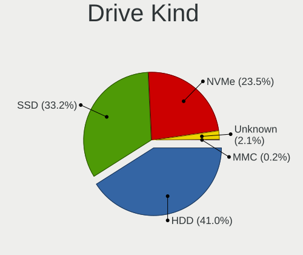

| Kind    | Desktops | Drives | Percent |
|---------|----------|--------|---------|
| HDD     | 2756     | 6558   | 41.03%  |
| SSD     | 2231     | 3987   | 33.21%  |
| NVMe    | 1577     | 2931   | 23.48%  |
| Unknown | 141      | 237    | 2.1%    |
| MMC     | 12       | 16     | 0.18%   |

Drive Connector
---------------

SATA, SAS, NVMe, etc.

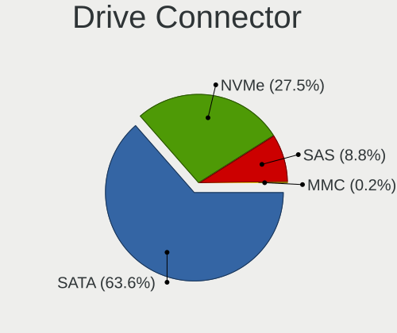

| Type | Desktops | Drives | Percent |
|------|----------|--------|---------|
| SATA | 3635     | 9856   | 63.56%  |
| NVMe | 1571     | 2860   | 27.47%  |
| SAS  | 501      | 997    | 8.76%   |
| MMC  | 12       | 16     | 0.21%   |

Drive Size
----------

Size of hard drive

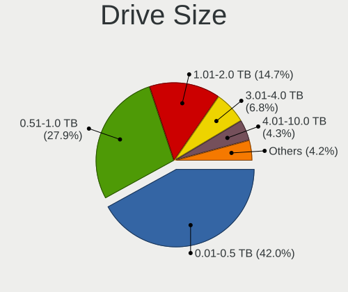

| Size in TB | Desktops | Drives | Percent |
|------------|----------|--------|---------|
| 0.01-0.5   | 2451     | 4435   | 42%     |
| 0.51-1.0   | 1629     | 2838   | 27.91%  |
| 1.01-2.0   | 860      | 1553   | 14.74%  |
| 3.01-4.0   | 396      | 747    | 6.79%   |
| 4.01-10.0  | 253      | 484    | 4.34%   |
| 2.01-3.0   | 207      | 387    | 3.55%   |
| 10.01-20.0 | 38       | 94     | 0.65%   |
| 20.01-50.0 | 2        | 7      | 0.03%   |

Space Total
-----------

Amount of disk space available on the file system

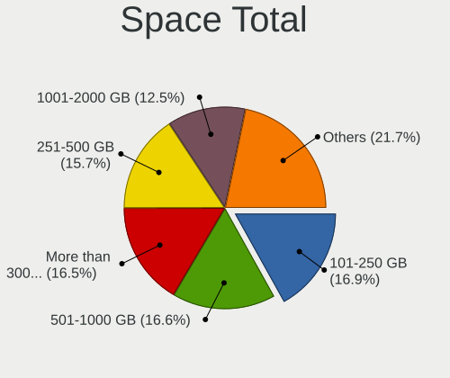

| Size in GB     | Desktops | Percent |
|----------------|----------|---------|
| 101-250        | 783      | 16.91%  |
| 501-1000       | 768      | 16.59%  |
| More than 3000 | 763      | 16.48%  |
| 251-500        | 728      | 15.72%  |
| 1001-2000      | 581      | 12.55%  |
| 1-20           | 286      | 6.18%   |
| 2001-3000      | 285      | 6.16%   |
| Unknown        | 192      | 4.15%   |
| 51-100         | 153      | 3.3%    |
| 21-50          | 91       | 1.97%   |

Space Used
----------

Amount of used disk space

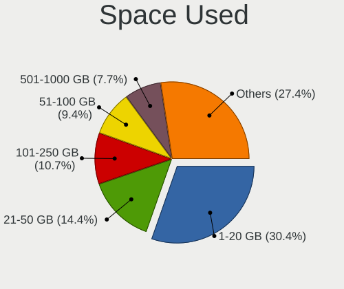

| Used GB        | Desktops | Percent |
|----------------|----------|---------|
| 1-20           | 1460     | 30.37%  |
| 21-50          | 691      | 14.37%  |
| 101-250        | 516      | 10.73%  |
| 51-100         | 453      | 9.42%   |
| 251-500        | 371      | 7.72%   |
| 501-1000       | 371      | 7.72%   |
| 1001-2000      | 326      | 6.78%   |
| More than 3000 | 281      | 5.85%   |
| Unknown        | 192      | 3.99%   |
| 2001-3000      | 141      | 2.93%   |
| 0              | 5        | 0.1%    |

Malfunc. Drives
---------------

Drive models with a malfunction

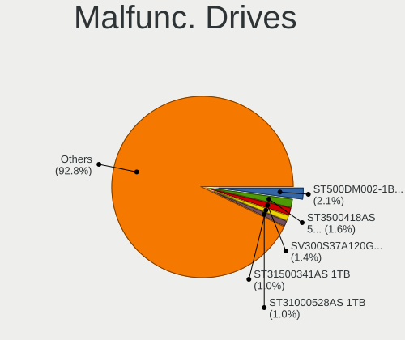

| Model                               | Desktops | Drives | Percent |
|-------------------------------------|----------|--------|---------|
| Seagate ST500DM002-1BD142 500GB     | 12       | 14     | 2.09%   |
| Seagate ST3500418AS 500GB           | 9        | 11     | 1.57%   |
| Kingston SV300S37A120G 120GB SSD    | 8        | 12     | 1.4%    |
| Seagate ST31500341AS 1TB            | 6        | 7      | 1.05%   |
| Seagate ST31000528AS 1TB            | 6        | 8      | 1.05%   |
| Hitachi HDS721010CLA332 1TB         | 6        | 6      | 1.05%   |
| HGST HTS725050A7E630 500GB          | 6        | 6      | 1.05%   |
| WDC WD40EFRX-68WT0N0 4TB            | 5        | 18     | 0.87%   |
| WDC WD2500HHTZ-04N21V0 250GB        | 5        | 5      | 0.87%   |
| WDC WD20EARS-00MVWB0 2TB            | 5        | 6      | 0.87%   |
| WDC WD1001FALS-00J7B1 1TB           | 5        | 6      | 0.87%   |
| Seagate ST1000DM003-9YN162 1TB      | 5        | 7      | 0.87%   |
| Seagate ST1000DM003-1ER162 1TB      | 5        | 6      | 0.87%   |
| Samsung Electronics SSD 870 EVO 1TB | 5        | 8      | 0.87%   |
| WDC WD30EFRX-68EUZN0 3TB            | 4        | 6      | 0.7%    |
| WDC WD10EZEX-08WN4A0 1TB            | 4        | 4      | 0.7%    |
| Toshiba MK2555GSXF 250GB            | 4        | 4      | 0.7%    |
| Toshiba DT01ACA100 1TB              | 4        | 5      | 0.7%    |
| Seagate ST500LM021-1KJ152 500GB     | 4        | 13     | 0.7%    |
| Seagate ST2000DM006-2DM164 2TB      | 4        | 4      | 0.7%    |
| Kingston SV300S37A240G 240GB SSD    | 4        | 5      | 0.7%    |
| Kingston SA400S37120G 120GB SSD     | 4        | 5      | 0.7%    |
| Intel SSDSA1M080G2LE 80GB           | 4        | 4      | 0.7%    |
| WDC WD6400AAKS-22A7B2 640GB         | 3        | 3      | 0.52%   |
| WDC WD5000AAKX-00ERMA0 500GB        | 3        | 3      | 0.52%   |
| WDC WD5000AAKS-00UU3A0 500GB        | 3        | 3      | 0.52%   |
| WDC WD40EZRX-00SPEB0 4TB            | 3        | 4      | 0.52%   |
| WDC WD40EFRX-68N32N0 4TB            | 3        | 10     | 0.52%   |
| WDC WD20EARS-00J2GB0 2TB            | 3        | 3      | 0.52%   |
| WDC WD10EZEX-60ZF5A0 1TB            | 3        | 3      | 0.52%   |
| WDC WD10EARX-00N0YB0 1TB            | 3        | 4      | 0.52%   |
| Seagate ST9500420AS 500GB           | 3        | 3      | 0.52%   |
| Seagate ST8000DM004-2CX188 8TB      | 3        | 5      | 0.52%   |
| Seagate ST500LT012-1DG142 500GB     | 3        | 3      | 0.52%   |
| Seagate ST380815AS 80GB             | 3        | 3      | 0.52%   |
| Seagate ST3750528AS 752GB           | 3        | 3      | 0.52%   |
| Seagate ST3250310AS 250GB           | 3        | 4      | 0.52%   |
| Seagate ST31000524AS 1TB            | 3        | 3      | 0.52%   |
| Seagate ST31000333AS 1TB            | 3        | 3      | 0.52%   |
| Seagate ST3000DM001-1ER166 3TB      | 3        | 6      | 0.52%   |

Malfunc. Drive Vendor
---------------------

Vendors of faulty drives

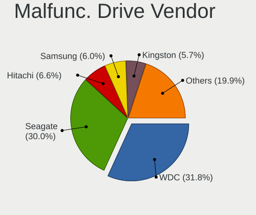

| Vendor                | Desktops | Drives | Percent |
|-----------------------|----------|--------|---------|
| WDC                   | 174      | 250    | 31.81%  |
| Seagate               | 164      | 223    | 29.98%  |
| Hitachi               | 36       | 42     | 6.58%   |
| Samsung Electronics   | 33       | 39     | 6.03%   |
| Kingston              | 31       | 44     | 5.67%   |
| Toshiba               | 24       | 26     | 4.39%   |
| A-DATA Technology     | 14       | 15     | 2.56%   |
| Intel                 | 13       | 15     | 2.38%   |
| Crucial               | 13       | 18     | 2.38%   |
| HGST                  | 6        | 6      | 1.1%    |
| Maxtor                | 5        | 5      | 0.91%   |
| Hewlett-Packard       | 5        | 8      | 0.91%   |
| OCZ                   | 3        | 3      | 0.55%   |
| Mushkin               | 3        | 3      | 0.55%   |
| SK hynix              | 2        | 2      | 0.37%   |
| SanDisk               | 2        | 2      | 0.37%   |
| LITEONIT              | 2        | 2      | 0.37%   |
| Fujitsu               | 2        | 2      | 0.37%   |
| China                 | 2        | 2      | 0.37%   |
| Team                  | 1        | 1      | 0.18%   |
| SPCC                  | 1        | 2      | 0.18%   |
| Realtek Semiconductor | 1        | 1      | 0.18%   |
| Patriot               | 1        | 1      | 0.18%   |
| Micron Technology     | 1        | 1      | 0.18%   |
| Lexar                 | 1        | 1      | 0.18%   |
| KingSpec              | 1        | 1      | 0.18%   |
| Fanxiang              | 1        | 2      | 0.18%   |
| Drevo                 | 1        | 1      | 0.18%   |
| DAS                   | 1        | 3      | 0.18%   |
| Corsair               | 1        | 1      | 0.18%   |
| ASMT                  | 1        | 2      | 0.18%   |
| Apple                 | 1        | 1      | 0.18%   |

Malfunc. HDD Vendor
-------------------

Vendors of faulty HDD drives

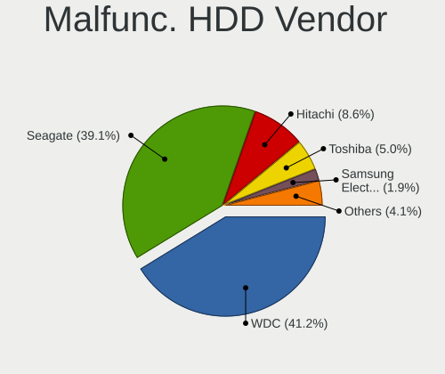

| Vendor              | Desktops | Drives | Percent |
|---------------------|----------|--------|---------|
| WDC                 | 172      | 247    | 41.25%  |
| Seagate             | 163      | 222    | 39.09%  |
| Hitachi             | 36       | 42     | 8.63%   |
| Toshiba             | 21       | 23     | 5.04%   |
| Samsung Electronics | 8        | 9      | 1.92%   |
| HGST                | 6        | 6      | 1.44%   |
| Maxtor              | 5        | 5      | 1.2%    |
| Fujitsu             | 2        | 2      | 0.48%   |
| Hewlett-Packard     | 1        | 1      | 0.24%   |
| DAS                 | 1        | 3      | 0.24%   |
| ASMT                | 1        | 2      | 0.24%   |
| Apple               | 1        | 1      | 0.24%   |

Malfunc. Drive Kind
-------------------

Kinds of faulty drives

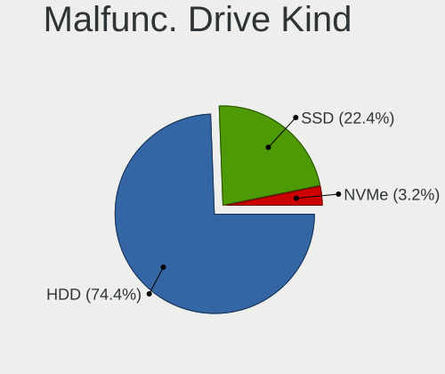

| Kind | Desktops | Drives | Percent |
|------|----------|--------|---------|
| HDD  | 372      | 563    | 74.4%   |
| SSD  | 112      | 145    | 22.4%   |
| NVMe | 16       | 17     | 3.2%    |

Failed Drives
-------------

Failed drive models

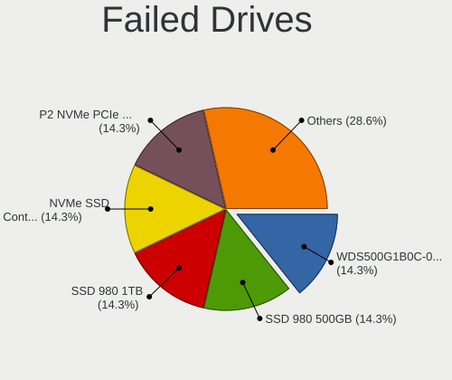

| Model                                                            | Desktops | Drives | Percent |
|------------------------------------------------------------------|----------|--------|---------|
| WDC WDS500G1B0C-00S6U0 500GB                                     | 1        | 1      | 14.29%  |
| Samsung Electronics SSD 980 500GB                                | 1        | 1      | 14.29%  |
| Samsung Electronics SSD 980 1TB                                  | 1        | 1      | 14.29%  |
| Samsung Electronics NVMe SSD Controller SM961/PM961/SM963 1024GB | 1        | 1      | 14.29%  |
| Micron/Crucial Technology P2 NVMe PCIe SSD 2TB                   | 1        | 1      | 14.29%  |
| Intel SSDSA1M160G2HP 160GB                                       | 1        | 1      | 14.29%  |
| Hewlett-Packard EF0450FARMV 450GB                                | 1        | 4      | 14.29%  |

Failed Drive Vendor
-------------------

Failed drive vendors

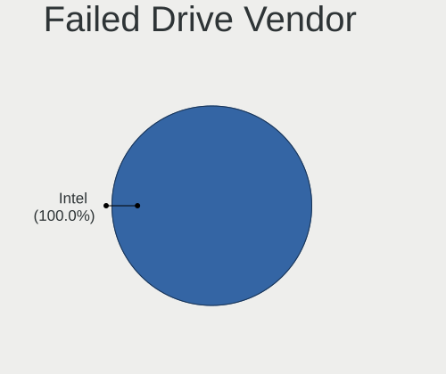

| Vendor                    | Desktops | Drives | Percent |
|---------------------------|----------|--------|---------|
| Samsung Electronics       | 3        | 3      | 42.86%  |
| WDC                       | 1        | 1      | 14.29%  |
| Micron/Crucial Technology | 1        | 1      | 14.29%  |
| Intel                     | 1        | 1      | 14.29%  |
| Hewlett-Packard           | 1        | 4      | 14.29%  |

Drive Status
------------

Number of failed and malfunc. drives

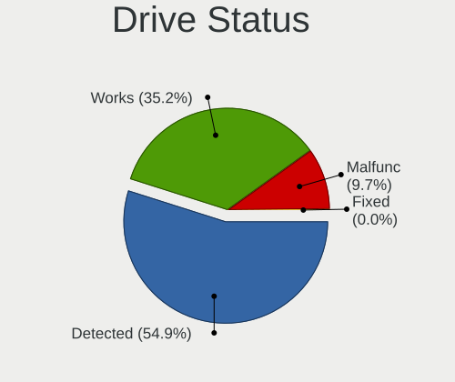

| Status   | Desktops | Drives | Percent |
|----------|----------|--------|---------|
| Detected | 2671     | 8377   | 54.9%   |
| Works    | 1712     | 4616   | 35.19%  |
| Malfunc  | 474      | 725    | 9.74%   |
| Failed   | 7        | 10     | 0.14%   |
| Fixed    | 1        | 1      | 0.02%   |

Storage controller
------------------

Storage Vendor
--------------

Storage controller vendors

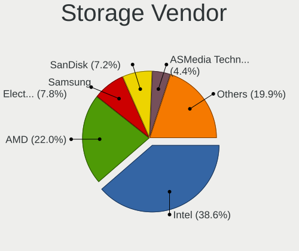

| Vendor                           | Desktops | Percent |
|----------------------------------|----------|---------|
| Intel                            | 2634     | 38.63%  |
| AMD                              | 1502     | 22.03%  |
| Samsung Electronics              | 529      | 7.76%   |
| SanDisk                          | 494      | 7.24%   |
| ASMedia Technology               | 300      | 4.4%    |
| Marvell Technology Group         | 180      | 2.64%   |
| Kingston Technology Company      | 154      | 2.26%   |
| Phison Electronics               | 145      | 2.13%   |
| JMicron Technology               | 142      | 2.08%   |
| Micron/Crucial Technology        | 102      | 1.5%    |
| Nvidia                           | 89       | 1.31%   |
| ADATA Technology                 | 78       | 1.14%   |
| Realtek Semiconductor            | 57       | 0.84%   |
| Silicon Motion                   | 55       | 0.81%   |
| MAXIO Technology (Hangzhou)      | 47       | 0.69%   |
| SK hynix                         | 36       | 0.53%   |
| Micron Technology                | 35       | 0.51%   |
| LSI Logic / Symbios Logic        | 33       | 0.48%   |
| Broadcom / LSI                   | 33       | 0.48%   |
| Seagate Technology               | 26       | 0.38%   |
| Toshiba America Info Systems     | 23       | 0.34%   |
| Shenzhen Longsys Electronics     | 20       | 0.29%   |
| Silicon Image                    | 18       | 0.26%   |
| VIA Technologies                 | 16       | 0.23%   |
| KIOXIA                           | 12       | 0.18%   |
| INNOGRIT                         | 9        | 0.13%   |
| Adaptec                          | 6        | 0.09%   |
| Netac Technology                 | 5        | 0.07%   |
| HighPoint Technologies           | 5        | 0.07%   |
| Silicon Integrated Systems [SiS] | 4        | 0.06%   |
| Solidigm                         | 3        | 0.04%   |
| Integrated Technology Express    | 3        | 0.04%   |
| Hosin Global Electronics         | 3        | 0.04%   |
| Hewlett-Packard                  | 3        | 0.04%   |
| Biwin Storage Technology         | 3        | 0.04%   |
| ULi Electronics                  | 2        | 0.03%   |
| Loongson Technology              | 2        | 0.03%   |
| Apple                            | 2        | 0.03%   |
| Solid State Storage Technology   | 1        | 0.01%   |
| Red Hat                          | 1        | 0.01%   |

Storage Model
-------------

Storage controller models

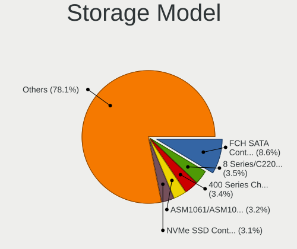

| Model                                                                                   | Desktops | Percent |
|-----------------------------------------------------------------------------------------|----------|---------|
| AMD FCH SATA Controller [AHCI mode]                                                     | 710      | 8.63%   |
| Intel 8 Series/C220 Series Chipset Family 6-port SATA Controller 1 [AHCI mode]          | 288      | 3.5%    |
| AMD 400 Series Chipset SATA Controller                                                  | 281      | 3.41%   |
| ASMedia ASM1061/ASM1062 Serial ATA Controller                                           | 265      | 3.22%   |
| Samsung NVMe SSD Controller SM981/PM981/PM983                                           | 255      | 3.1%    |
| Intel SATA Controller [RAID Mode]                                                       | 250      | 3.04%   |
| AMD 500 Series Chipset SATA Controller                                                  | 246      | 2.99%   |
| Intel 6 Series/C200 Series Chipset Family 6 port Desktop SATA AHCI Controller           | 192      | 2.33%   |
| Intel 7 Series/C210 Series Chipset Family 6-port SATA Controller [AHCI mode]            | 186      | 2.26%   |
| Intel Q170/Q150/B150/H170/H110/Z170/CM236 Chipset SATA Controller [AHCI Mode]           | 182      | 2.21%   |
| AMD 600 Series Chipset SATA Controller                                                  | 175      | 2.13%   |
| Intel 200 Series PCH SATA controller [AHCI mode]                                        | 167      | 2.03%   |
| AMD SB7x0/SB8x0/SB9x0 SATA Controller [AHCI mode]                                       | 166      | 2.02%   |
| Intel Cannon Lake PCH SATA AHCI Controller                                              | 136      | 1.65%   |
| AMD SB7x0/SB8x0/SB9x0 IDE Controller                                                    | 130      | 1.58%   |
| Samsung NVMe SSD Controller PM9A1/PM9A3/980PRO                                          | 114      | 1.39%   |
| SanDisk Ultra 3D / WD PC SN530, IX SN530, Blue SN550 NVMe SSD (DRAM-less)               | 102      | 1.24%   |
| Intel Alder Lake-S PCH SATA Controller [AHCI Mode]                                      | 95       | 1.15%   |
| AMD SB7x0/SB8x0/SB9x0 SATA Controller [IDE mode]                                        | 94       | 1.14%   |
| SanDisk WD SN560/SN740/SN770/SN5000 NVMe SSD                                            | 93       | 1.13%   |
| Sandisk WD Black SN850X NVMe SSD                                                        | 88       | 1.07%   |
| Intel Raptor Lake SATA AHCI Controller                                                  | 85       | 1.03%   |
| Intel NM10/ICH7 Family SATA Controller [IDE mode]                                       | 84       | 1.02%   |
| JMicron JMB363 SATA/IDE Controller                                                      | 81       | 0.98%   |
| SanDisk Extreme Pro / WD Black SN750 / PC SN730 / Red SN700 NVMe SSD                    | 75       | 0.91%   |
| Intel 9 Series Chipset Family SATA Controller [AHCI Mode]                               | 74       | 0.9%    |
| Samsung NVMe SSD Controller SM961/PM961/SM963                                           | 68       | 0.83%   |
| Intel Comet Lake SATA AHCI Controller                                                   | 64       | 0.78%   |
| Intel 82801JI (ICH10 Family) SATA AHCI Controller                                       | 64       | 0.78%   |
| Intel 82801G (ICH7 Family) IDE Controller                                               | 62       | 0.75%   |
| Marvell Group 88SE9172 SATA 6Gb/s Controller                                            | 57       | 0.69%   |
| AMD 300 Series Chipset SATA Controller                                                  | 57       | 0.69%   |
| Samsung NVMe SSD Controller 980 (DRAM-less)                                             | 55       | 0.67%   |
| Intel C600/X79 series chipset 6-Port SATA AHCI Controller                               | 55       | 0.67%   |
| Intel 82801I (ICH9 Family) 2 port SATA Controller [IDE mode]                            | 55       | 0.67%   |
| Intel 4 Series Chipset PT IDER Controller                                               | 54       | 0.66%   |
| Phison E16 PCIe4 NVMe Controller                                                        | 53       | 0.64%   |
| ADATA XPG SX8200 Pro PCIe Gen3x4 M.2 2280 Solid State Drive                             | 52       | 0.63%   |
| Intel SSD 660P Series                                                                   | 50       | 0.61%   |
| Intel 6 Series/C200 Series Chipset Family Desktop SATA Controller (IDE mode, ports 4-5) | 50       | 0.61%   |

Storage Kind
------------

Kind of storage controller (IDE, SATA, NVMe, SAS, ...)

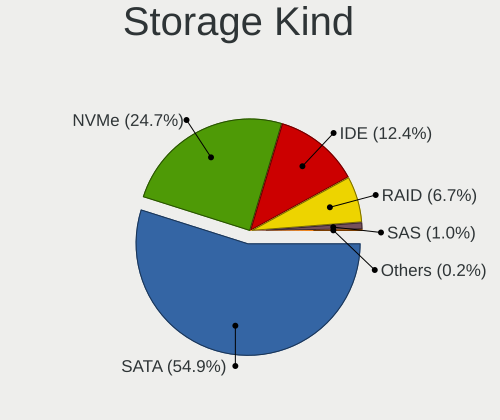

| Kind | Desktops | Percent |
|------|----------|---------|
| SATA | 3517     | 54.88%  |
| NVMe | 1585     | 24.73%  |
| IDE  | 796      | 12.42%  |
| RAID | 431      | 6.73%   |
| SAS  | 63       | 0.98%   |
| SCSI | 16       | 0.25%   |

Processor
---------

CPU Vendor
----------

Processor vendors

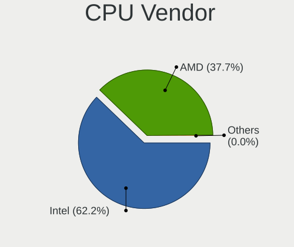

| Vendor       | Desktops | Percent |
|--------------|----------|---------|
| Intel        | 2635     | 62.19%  |
| AMD          | 1596     | 37.67%  |
| Unknown      | 3        | 0.07%   |
| PowerBook4,1 | 1        | 0.02%   |
| Loongson     | 1        | 0.02%   |
| ARM          | 1        | 0.02%   |

CPU Model
---------

Processor models

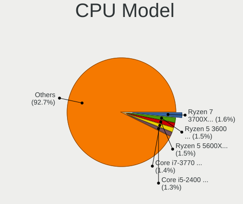

| Model                                  | Desktops | Percent |
|----------------------------------------|----------|---------|
| AMD Ryzen 7 3700X 8-Core Processor     | 67       | 1.57%   |
| AMD Ryzen 5 3600 6-Core Processor      | 66       | 1.55%   |
| AMD Ryzen 5 5600X 6-Core Processor     | 63       | 1.48%   |
| Intel Core i7-3770 CPU @ 3.40GHz       | 59       | 1.38%   |
| Intel Core i5-2400 CPU @ 3.10GHz       | 56       | 1.31%   |
| AMD Ryzen 7 5800X 8-Core Processor     | 56       | 1.31%   |
| Intel Core i7-6700 CPU @ 3.40GHz       | 54       | 1.27%   |
| Intel Core i7-4790 CPU @ 3.60GHz       | 53       | 1.24%   |
| AMD Ryzen 9 3900X 12-Core Processor    | 50       | 1.17%   |
| Intel Core i5-3470 CPU @ 3.20GHz       | 43       | 1.01%   |
| AMD Ryzen 9 5900X 12-Core Processor    | 42       | 0.99%   |
| Intel Core i7-4770 CPU @ 3.40GHz       | 41       | 0.96%   |
| Intel Core 2 Duo CPU E8400 @ 3.00GHz   | 39       | 0.91%   |
| AMD Ryzen 5 2600 Six-Core Processor    | 39       | 0.91%   |
| Intel Core i5-6500 CPU @ 3.20GHz       | 37       | 0.87%   |
| AMD FX-8350 Eight-Core Processor       | 37       | 0.87%   |
| Intel Core i7-4790K CPU @ 4.00GHz      | 36       | 0.84%   |
| AMD Ryzen 9 5950X 16-Core Processor    | 36       | 0.84%   |
| AMD Ryzen 7 5700G with Radeon Graphics | 35       | 0.82%   |
| Intel Core i7-2600K CPU @ 3.40GHz      | 34       | 0.8%    |
| Intel Core i5-4570 CPU @ 3.20GHz       | 34       | 0.8%    |
| AMD Ryzen 7 3800X 8-Core Processor     | 34       | 0.8%    |
| Intel Core 2 Quad CPU Q6600 @ 2.40GHz  | 32       | 0.75%   |
| Intel Core i7-2600 CPU @ 3.40GHz       | 31       | 0.73%   |
| AMD Ryzen 7 2700X Eight-Core Processor | 31       | 0.73%   |
| AMD Ryzen 5 3600X 6-Core Processor     | 31       | 0.73%   |
| Intel Core i5-4590 CPU @ 3.30GHz       | 29       | 0.68%   |
| Intel Core i7-8700K CPU @ 3.70GHz      | 28       | 0.66%   |
| Intel Core i7-8700 CPU @ 3.20GHz       | 28       | 0.66%   |
| Intel Core i7-7700 CPU @ 3.60GHz       | 28       | 0.66%   |
| AMD FX-6300 Six-Core Processor         | 27       | 0.63%   |
| Intel Core i5-8400 CPU @ 2.80GHz       | 26       | 0.61%   |
| Intel Core i5-3570K CPU @ 3.40GHz      | 26       | 0.61%   |
| Intel Core i5-4460 CPU @ 3.20GHz       | 25       | 0.59%   |
| Intel Core i7-9700K CPU @ 3.60GHz      | 24       | 0.56%   |
| Intel Core i7-6700K CPU @ 4.00GHz      | 24       | 0.56%   |
| AMD FX-8320 Eight-Core Processor       | 24       | 0.56%   |
| Intel Core i5 CPU 650 @ 3.20GHz        | 23       | 0.54%   |
| AMD Ryzen 7 5800X3D 8-Core Processor   | 23       | 0.54%   |
| Intel 12th Gen Core i7-12700K          | 22       | 0.52%   |

CPU Model Family
----------------

Processor model prefix

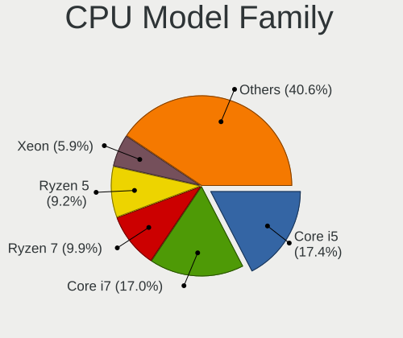

| Model                   | Desktops | Percent |
|-------------------------|----------|---------|
| Intel Core i5           | 740      | 17.4%   |
| Intel Core i7           | 724      | 17.02%  |
| AMD Ryzen 7             | 421      | 9.9%    |
| AMD Ryzen 5             | 392      | 9.21%   |
| Intel Xeon              | 249      | 5.85%   |
| Other                   | 239      | 5.62%   |
| AMD Ryzen 9             | 220      | 5.17%   |
| Intel Core i3           | 170      | 4%      |
| AMD FX                  | 145      | 3.41%   |
| Intel Core 2 Duo        | 114      | 2.68%   |
| Intel Core 2 Quad       | 94       | 2.21%   |
| Intel Celeron           | 65       | 1.53%   |
| Intel Core i9           | 64       | 1.5%    |
| AMD A10                 | 54       | 1.27%   |
| AMD Ryzen 3             | 42       | 0.99%   |
| Intel Pentium Dual-Core | 41       | 0.96%   |
| AMD Athlon 64 X2        | 41       | 0.96%   |
| Intel Pentium           | 40       | 0.94%   |
| AMD Phenom II X6        | 31       | 0.73%   |
| AMD Phenom II X4        | 30       | 0.71%   |
| AMD A8                  | 29       | 0.68%   |
| AMD A6                  | 25       | 0.59%   |
| AMD Ryzen Threadripper  | 23       | 0.54%   |
| Intel Core 2            | 22       | 0.52%   |
| AMD Athlon II X2        | 22       | 0.52%   |
| AMD Phenom              | 21       | 0.49%   |
| Intel Atom              | 19       | 0.45%   |
| Intel Pentium Dual      | 18       | 0.42%   |
| Intel Pentium D         | 18       | 0.42%   |
| Intel Pentium 4         | 17       | 0.4%    |
| AMD Athlon              | 12       | 0.28%   |
| AMD Phenom II X2        | 11       | 0.26%   |
| AMD Athlon II X4        | 11       | 0.26%   |
| AMD Athlon II X3        | 11       | 0.26%   |
| AMD A4                  | 11       | 0.26%   |
| Intel Core              | 8        | 0.19%   |
| Intel Pentium Gold      | 7        | 0.16%   |
| AMD Athlon X4           | 7        | 0.16%   |
| Intel Pentium Silver    | 5        | 0.12%   |
| AMD E                   | 5        | 0.12%   |

CPU Cores
---------

Number of processor cores

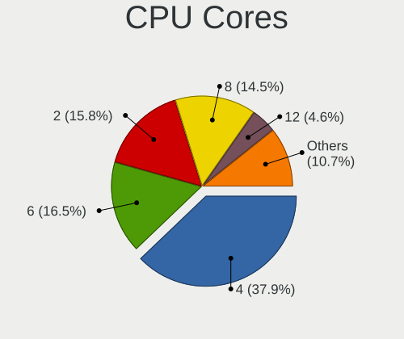

| Number  | Desktops | Percent |
|---------|----------|---------|
| 4       | 1617     | 37.85%  |
| 6       | 705      | 16.5%   |
| 2       | 677      | 15.85%  |
| 8       | 620      | 14.51%  |
| 12      | 195      | 4.56%   |
| 16      | 138      | 3.23%   |
| 10      | 68       | 1.59%   |
| 3       | 65       | 1.52%   |
| 1       | 58       | 1.36%   |
| 24      | 46       | 1.08%   |
| 20      | 32       | 0.75%   |
| 14      | 31       | 0.73%   |
| 18      | 5        | 0.12%   |
| Unknown | 3        | 0.07%   |
| 64      | 2        | 0.05%   |
| 40      | 2        | 0.05%   |
| 28      | 2        | 0.05%   |
| 5       | 2        | 0.05%   |
| 128     | 1        | 0.02%   |
| 44      | 1        | 0.02%   |
| 36      | 1        | 0.02%   |
| 32      | 1        | 0.02%   |

CPU Sockets
-----------

Number of sockets

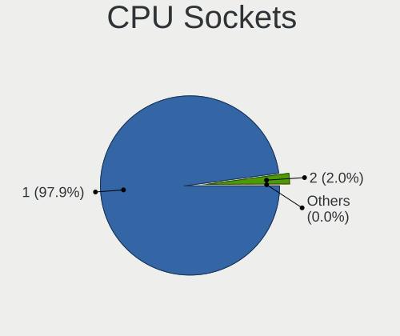

| Number  | Desktops | Percent |
|---------|----------|---------|
| 1       | 4148     | 97.88%  |
| 2       | 86       | 2.03%   |
| 24      | 1        | 0.02%   |
| 20      | 1        | 0.02%   |
| 4       | 1        | 0.02%   |
| Unknown | 1        | 0.02%   |

CPU Threads
-----------

Threads per core (Hyper-Threading)

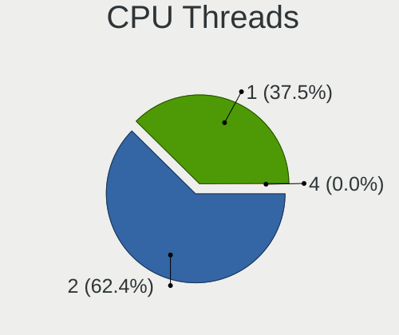

| Number  | Desktops | Percent |
|---------|----------|---------|
| 2       | 2657     | 62.4%   |
| 1       | 1597     | 37.51%  |
| Unknown | 3        | 0.07%   |
| 4       | 1        | 0.02%   |

CPU Op-Modes
------------

CPU Operation Modes (32-bit, 64-bit)

| Op mode        | Desktops | Percent |
|----------------|----------|---------|
| 32-bit, 64-bit | 4202     | 99.01%  |
| Unknown        | 35       | 0.82%   |
| 32-bit         | 7        | 0.16%   |

CPU Microcode
-------------

Microcode number

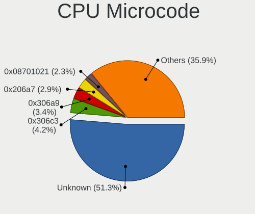

| Number     | Desktops | Percent |
|------------|----------|---------|
| Unknown    | 2281     | 51.32%  |
| 0x306c3    | 186      | 4.18%   |
| 0x306a9    | 149      | 3.35%   |
| 0x206a7    | 130      | 2.92%   |
| 0x08701021 | 104      | 2.34%   |
| 0x1067a    | 100      | 2.25%   |
| 0x506e3    | 83       | 1.87%   |
| 0x906ea    | 69       | 1.55%   |
| 0x06000852 | 56       | 1.26%   |
| 0x0800820d | 55       | 1.24%   |
| 0x08701013 | 53       | 1.19%   |
| 0x906e9    | 40       | 0.9%    |
| 0x6fb      | 40       | 0.9%    |
| 0x106e5    | 33       | 0.74%   |
| 0x010000c8 | 32       | 0.72%   |
| 0x106a5    | 31       | 0.7%    |
| 0x206d7    | 30       | 0.67%   |
| 0x0a601203 | 30       | 0.67%   |
| 0x0a201016 | 30       | 0.67%   |
| 0x06001119 | 30       | 0.67%   |
| 0x6fd      | 29       | 0.65%   |
| 0xa0655    | 28       | 0.63%   |
| 0x08001138 | 28       | 0.63%   |
| 0x0600063e | 25       | 0.56%   |
| 0x906ed    | 24       | 0.54%   |
| 0x0a201009 | 23       | 0.52%   |
| 0x08001137 | 23       | 0.52%   |
| 0x306f2    | 22       | 0.49%   |
| 0x206c2    | 22       | 0.49%   |
| 0x0a20120a | 22       | 0.49%   |
| 0x90672    | 21       | 0.47%   |
| 0x0a50000d | 20       | 0.45%   |
| 0x06003106 | 20       | 0.45%   |
| 0x010000dc | 19       | 0.43%   |
| 0xa0653    | 18       | 0.4%    |
| 0x10676    | 18       | 0.4%    |
| 0xb0671    | 17       | 0.38%   |
| 0x20655    | 17       | 0.38%   |
| 0x08108109 | 17       | 0.38%   |
| 0x20652    | 16       | 0.36%   |

CPU Microarch
-------------

Microarchitecture

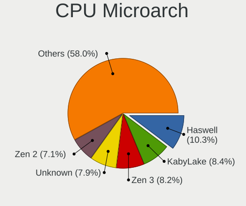

| Name             | Desktops | Percent |
|------------------|----------|---------|
| Haswell          | 440      | 10.34%  |
| KabyLake         | 358      | 8.41%   |
| Zen 3            | 350      | 8.22%   |
| Unknown          | 336      | 7.89%   |
| Zen 2            | 303      | 7.12%   |
| IvyBridge        | 286      | 6.72%   |
| SandyBridge      | 271      | 6.37%   |
| Skylake          | 221      | 5.19%   |
| Penryn           | 204      | 4.79%   |
| Piledriver       | 161      | 3.78%   |
| K10              | 149      | 3.5%    |
| Zen+             | 145      | 3.41%   |
| Core             | 120      | 2.82%   |
| Zen              | 117      | 2.75%   |
| CometLake        | 110      | 2.58%   |
| Nehalem          | 109      | 2.56%   |
| Alderlake Hybrid | 109      | 2.56%   |
| Westmere         | 97       | 2.28%   |
| K8 Hammer        | 48       | 1.13%   |
| NetBurst         | 40       | 0.94%   |
| Bulldozer        | 36       | 0.85%   |
| Steamroller      | 35       | 0.82%   |
| Broadwell        | 32       | 0.75%   |
| Icelake          | 27       | 0.63%   |
| Silvermont       | 25       | 0.59%   |
| Excavator        | 23       | 0.54%   |
| K10 Llano        | 20       | 0.47%   |
| Gracemont        | 17       | 0.4%    |
| Goldmont         | 11       | 0.26%   |
| Goldmont plus    | 10       | 0.23%   |
| Bonnell          | 10       | 0.23%   |
| Tremont          | 9        | 0.21%   |
| Jaguar           | 7        | 0.16%   |
| Bobcat           | 7        | 0.16%   |
| Puma             | 6        | 0.14%   |
| Lunarlake Hybrid | 4        | 0.09%   |
| TigerLake        | 2        | 0.05%   |
| Sapphire Rapids  | 1        | 0.02%   |
| K6               | 1        | 0.02%   |

Graphics
--------

GPU Vendor
----------

Vendors of graphics cards

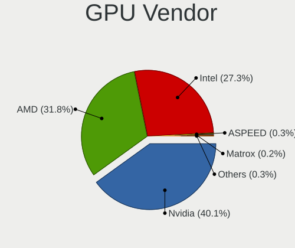

| Vendor                                       | Desktops | Percent |
|----------------------------------------------|----------|---------|
| Nvidia                                       | 1861     | 40.06%  |
| AMD                                          | 1476     | 31.77%  |
| Intel                                        | 1269     | 27.31%  |
| ASPEED Technology                            | 16       | 0.34%   |
| Matrox Electronics Systems                   | 11       | 0.24%   |
| Silicon Integrated Systems [SiS]             | 4        | 0.09%   |
| Red Hat                                      | 3        | 0.06%   |
| XGI Technology (eXtreme Graphics Innovation) | 2        | 0.04%   |
| VIA Technologies                             | 2        | 0.04%   |
| Loongson Technology                          | 1        | 0.02%   |
| ATI Technologies                             | 1        | 0.02%   |

GPU Model
---------

Graphics card models

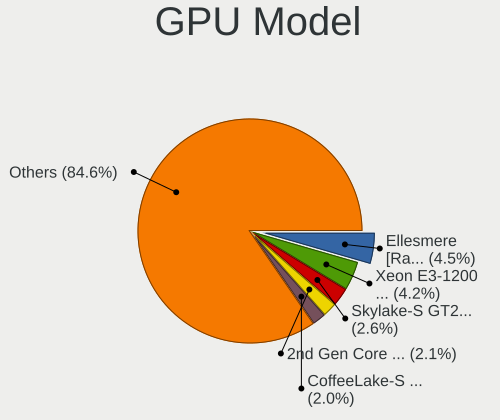

| Model                                                                       | Desktops | Percent |
|-----------------------------------------------------------------------------|----------|---------|
| AMD Ellesmere [Radeon RX 470/480/570/570X/580/580X/590]                     | 218      | 4.47%   |
| Intel Xeon E3-1200 v3/4th Gen Core Processor Integrated Graphics Controller | 205      | 4.21%   |
| Intel Skylake-S GT2 [HD Graphics 530]                                       | 129      | 2.65%   |
| Intel 2nd Generation Core Processor Family Integrated Graphics Controller   | 103      | 2.11%   |
| Intel CoffeeLake-S GT2 [UHD Graphics 630]                                   | 96       | 1.97%   |
| AMD Raphael                                                                 | 93       | 1.91%   |
| Intel Xeon E3-1200 v2/3rd Gen Core processor Graphics Controller            | 92       | 1.89%   |
| Nvidia GP107 [GeForce GTX 1050 Ti]                                          | 89       | 1.83%   |
| Nvidia GK208B [GeForce GT 710]                                              | 87       | 1.78%   |
| AMD Navi 10 [Radeon RX 5600 OEM/5600 XT / 5700/5700 XT]                     | 77       | 1.58%   |
| Intel 4 Series Chipset Integrated Graphics Controller                       | 71       | 1.46%   |
| Nvidia GP106 [GeForce GTX 1060 6GB]                                         | 66       | 1.35%   |
| Nvidia GP104 [GeForce GTX 1070]                                             | 57       | 1.17%   |
| AMD Navi 22 [Radeon RX 6700/6700 XT/6750 XT / 6800M/6850M XT]               | 54       | 1.11%   |
| Intel Kaby Lake-S GT2 [HD Graphics 630]                                     | 51       | 1.05%   |
| AMD Navi 23 [Radeon RX 6600/6600 XT/6600M]                                  | 50       | 1.03%   |
| Intel IvyBridge GT2 [HD Graphics 4000]                                      | 49       | 1.01%   |
| AMD Navi 31 [Radeon RX 7900 XT/7900 XTX/7900 GRE/7900M]                     | 49       | 1.01%   |
| AMD Cezanne [Radeon Vega Series / Radeon Vega Mobile Series]                | 48       | 0.98%   |
| Nvidia GM107 [GeForce GTX 750 Ti]                                           | 47       | 0.96%   |
| AMD Navi 21 [Radeon RX 6800/6800 XT / 6900 XT]                              | 47       | 0.96%   |
| AMD Cedar [Radeon HD 5000/6000/7350/8350 Series]                            | 47       | 0.96%   |
| Nvidia GA106 [GeForce RTX 3060 Lite Hash Rate]                              | 46       | 0.94%   |
| Intel CometLake-S GT2 [UHD Graphics 630]                                    | 46       | 0.94%   |
| Nvidia TU117 [GeForce GTX 1650]                                             | 44       | 0.9%    |
| AMD Granite Ridge [Radeon Graphics]                                         | 43       | 0.88%   |
| Intel Raptor Lake-S GT1 [UHD Graphics 770]                                  | 40       | 0.82%   |
| Intel Alder Lake-S GT1 [UHD Graphics 770]                                   | 40       | 0.82%   |
| Nvidia GM204 [GeForce GTX 970]                                              | 38       | 0.78%   |
| Nvidia GT218 [GeForce 210]                                                  | 37       | 0.76%   |
| Nvidia GP108 [GeForce GT 1030]                                              | 37       | 0.76%   |
| Nvidia GP102 [GeForce GTX 1080 Ti]                                          | 37       | 0.76%   |
| AMD Navi 32 [Radeon RX 7700 XT / 7800 XT]                                   | 37       | 0.76%   |
| Nvidia GM206 [GeForce GTX 960]                                              | 36       | 0.74%   |
| Nvidia GP104 [GeForce GTX 1080]                                             | 35       | 0.72%   |
| Nvidia TU116 [GeForce GTX 1660 SUPER]                                       | 33       | 0.68%   |
| Nvidia GK208B [GeForce GT 730]                                              | 32       | 0.66%   |
| Nvidia TU104 [GeForce RTX 2070 SUPER]                                       | 31       | 0.64%   |
| Nvidia GF119 [GeForce GT 610]                                               | 30       | 0.62%   |
| Intel Core Processor Integrated Graphics Controller                         | 30       | 0.62%   |

GPU Combo
---------

Combinations of graphics cards

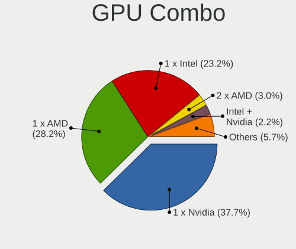

| Name                      | Desktops | Percent |
|---------------------------|----------|---------|
| 1 x Nvidia                | 1629     | 37.67%  |
| 1 x AMD                   | 1221     | 28.24%  |
| 1 x Intel                 | 1004     | 23.22%  |
| 2 x AMD                   | 128      | 2.96%   |
| Intel + Nvidia            | 97       | 2.24%   |
| AMD + Nvidia              | 91       | 2.1%    |
| 2 x Nvidia                | 42       | 0.97%   |
| Intel + AMD               | 38       | 0.88%   |
| 2 x Intel                 | 15       | 0.35%   |
| 1 x ASPEED                | 11       | 0.25%   |
| Other                     | 9        | 0.21%   |
| 1 x Matrox                | 9        | 0.21%   |
| 1 x SiS                   | 4        | 0.09%   |
| Intel + 2 x Nvidia        | 3        | 0.07%   |
| AMD + 2 x Nvidia          | 3        | 0.07%   |
| 1 x VIA                   | 2        | 0.05%   |
| 1 x Red Hat               | 2        | 0.05%   |
| Nvidia + ASPEED           | 2        | 0.05%   |
| Intel + ASPEED            | 2        | 0.05%   |
| AMD + Matrox              | 2        | 0.05%   |
| 5 x Nvidia                | 1        | 0.02%   |
| 4 x Nvidia                | 1        | 0.02%   |
| 3 x AMD                   | 1        | 0.02%   |
| 2 x Loongson Technology   | 1        | 0.02%   |
| 2 x AMD + 1 x Nvidia      | 1        | 0.02%   |
| 1 x XGI                   | 1        | 0.02%   |
| 1 x Intel + 3 x AMD       | 1        | 0.02%   |
| Intel + Red Hat           | 1        | 0.02%   |
| AMD + XGI                 | 1        | 0.02%   |
| AMD + Nvidia + 1 x ASPEED | 1        | 0.02%   |

GPU Driver
----------

Free vs proprietary

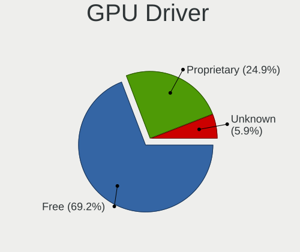

| Driver      | Desktops | Percent |
|-------------|----------|---------|
| Free        | 3011     | 69.2%   |
| Proprietary | 1083     | 24.89%  |
| Unknown     | 257      | 5.91%   |

GPU Memory
----------

Total video memory

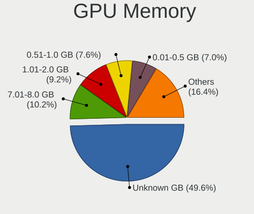

| Size in GB | Desktops | Percent |
|------------|----------|---------|
| Unknown    | 2210     | 49.56%  |
| 7.01-8.0   | 457      | 10.25%  |
| 1.01-2.0   | 409      | 9.17%   |
| 0.51-1.0   | 337      | 7.56%   |
| 0.01-0.5   | 313      | 7.02%   |
| 3.01-4.0   | 250      | 5.61%   |
| 8.01-16.0  | 243      | 5.45%   |
| 5.01-6.0   | 157      | 3.52%   |
| 2.01-3.0   | 41       | 0.92%   |
| 16.01-24.0 | 34       | 0.76%   |
| 4.01-5.0   | 6        | 0.13%   |
| 32.01-64.0 | 1        | 0.02%   |
| 24.01-32.0 | 1        | 0.02%   |

Monitor
-------

Monitor Vendor
--------------

Monitor vendors

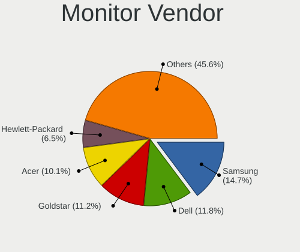

| Vendor               | Desktops | Percent |
|----------------------|----------|---------|
| Samsung Electronics  | 714      | 14.74%  |
| Dell                 | 571      | 11.79%  |
| Goldstar             | 543      | 11.21%  |
| Acer                 | 491      | 10.14%  |
| Hewlett-Packard      | 317      | 6.54%   |
| Ancor Communications | 278      | 5.74%   |
| BenQ                 | 232      | 4.79%   |
| ASUSTek Computer     | 223      | 4.6%    |
| ViewSonic            | 150      | 3.1%    |
| MSI                  | 84       | 1.73%   |
| Sony                 | 76       | 1.57%   |
| AOC                  | 76       | 1.57%   |
| LG Electronics       | 74       | 1.53%   |
| Lenovo               | 74       | 1.53%   |
| Unknown              | 73       | 1.51%   |
| Philips              | 69       | 1.42%   |
| Toshiba              | 66       | 1.36%   |
| Gigabyte Technology  | 50       | 1.03%   |
| Sharp                | 39       | 0.81%   |
| NEC Computers        | 31       | 0.64%   |
| HKC                  | 30       | 0.62%   |
| Unknown              | 27       | 0.56%   |
| Insignia             | 23       | 0.47%   |
| Hitachi              | 23       | 0.47%   |
| Vizio                | 21       | 0.43%   |
| Sceptre Tech         | 20       | 0.41%   |
| Gateway              | 18       | 0.37%   |
| DENON                | 17       | 0.35%   |
| Apple                | 17       | 0.35%   |
| HannStar             | 16       | 0.33%   |
| Panasonic            | 14       | 0.29%   |
| AUS                  | 14       | 0.29%   |
| eMachines            | 11       | 0.23%   |
| Seiki                | 10       | 0.21%   |
| ___                  | 9        | 0.19%   |
| RTK                  | 9        | 0.19%   |
| Onkyo                | 9        | 0.19%   |
| MStar                | 9        | 0.19%   |
| Microstep            | 8        | 0.17%   |
| AOpen                | 8        | 0.17%   |

Monitor Model
-------------

Monitor models

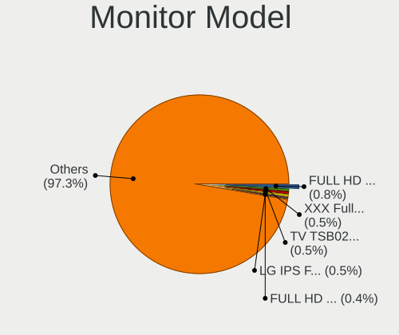

| Model                                                                 | Desktops | Percent |
|-----------------------------------------------------------------------|----------|---------|
| Goldstar FULL HD GSM5B55 1920x1080 480x270mm 21.7-inch                | 41       | 0.78%   |
| Unknown                                                               | 27       | 0.51%   |
| Toshiba TV TSB0206 1920x1080                                          | 26       | 0.5%    |
| Goldstar LG IPS FULLHD GSM5AB8 1920x1080 480x270mm 21.7-inch          | 26       | 0.5%    |
| Goldstar FULL HD GSM5ABA 1920x1080 480x270mm 21.7-inch                | 20       | 0.38%   |
| Ancor Communications VE247 ACI2493 1920x1080 530x300mm 24.0-inch      | 20       | 0.38%   |
| Ancor Communications ASUS VS247 ACI249A 1920x1080 521x293mm 23.5-inch | 18       | 0.34%   |
| Ancor Communications ASUS VE278 ACI27F6 1920x1080 598x336mm 27.0-inch | 17       | 0.32%   |
| Unknown LCD Monitor FFFF 2288x1287 2550x2550mm 142.0-inch             | 16       | 0.3%    |
| Samsung Electronics C32F391 SAM0D34 1920x1080 698x393mm 31.5-inch     | 16       | 0.3%    |
| Goldstar HDR 4K GSM7707 3840x2160 600x340mm 27.2-inch                 | 16       | 0.3%    |
| BenQ GW2765 BNQ78D6 2560x1440 597x336mm 27.0-inch                     | 16       | 0.3%    |
| ASUSTek Computer VG245 AUS24A1 1920x1080 531x299mm 24.0-inch          | 16       | 0.3%    |
| Samsung Electronics U28E590 SAM0C4D 3840x2160 607x345mm 27.5-inch     | 15       | 0.29%   |
| Samsung Electronics S24F350 SAM0D20 1920x1080 521x293mm 23.5-inch     | 15       | 0.29%   |
| Goldstar LG ULTRAWIDE GSM59F1 2560x1080 670x280mm 28.6-inch           | 15       | 0.29%   |
| Dell E228WFP DELD015 1680x1050 473x296mm 22.0-inch                    | 14       | 0.27%   |
| ASUSTek Computer VP28U AUS28B1 3840x2160 621x341mm 27.9-inch          | 14       | 0.27%   |
| Hewlett-Packard w2207 HWP26A9 1680x1050 473x296mm 22.0-inch           | 13       | 0.25%   |
| Goldstar Ultra HD GSM5B09 3840x2160 600x340mm 27.2-inch               | 13       | 0.25%   |
| Goldstar HDR 4K GSM7706 3840x2160 600x340mm 27.2-inch                 | 13       | 0.25%   |
| ASUSTek Computer VG27A AUS2722 2560x1440 597x336mm 27.0-inch          | 13       | 0.25%   |
| MSI Optix MAG27CQ MSI1462 2560x1440 597x336mm 27.0-inch               | 12       | 0.23%   |
| Acer G276HL ACR0300 1920x1080 598x336mm 27.0-inch                     | 12       | 0.23%   |
| Hitachi HISENSE HEC0030 3840x2160 1872x1053mm 84.6-inch               | 11       | 0.21%   |
| Goldstar 27GL850 GSM5B7F 2560x1440 597x336mm 27.0-inch                | 11       | 0.21%   |
| BenQ GL2460 BNQ78CE 1920x1080 531x299mm 24.0-inch                     | 11       | 0.21%   |
| Acer S230HL ACR0280 1920x1080 509x286mm 23.0-inch                     | 11       | 0.21%   |
| Samsung Electronics C27F390 SAM0D32 1920x1080 598x336mm 27.0-inch     | 10       | 0.19%   |
| ASUSTek Computer VP228 AUS22A1 1920x1080 476x268mm 21.5-inch          | 10       | 0.19%   |
| ASUSTek Computer VG289 AUS28BA 3840x2160 621x341mm 27.9-inch          | 10       | 0.19%   |
| Ancor Communications PA248 ACI24B1 1920x1200 546x352mm 25.6-inch      | 10       | 0.19%   |
| Ancor Communications MX279 ACI27C3 1920x1080 598x336mm 27.0-inch      | 10       | 0.19%   |
| Acer X223W ACR0050 1680x1050 474x296mm 22.0-inch                      | 10       | 0.19%   |
| Sharp LC-43LB371C SHP4353 1920x1080 940x529mm 42.5-inch               | 9        | 0.17%   |
| Sharp HDMI SHP0FFB 1920x1080 820x460mm 37.0-inch                      | 9        | 0.17%   |
| Hitachi HISENSE HEC002F 3840x2160 1872x1053mm 84.6-inch               | 9        | 0.17%   |
| Goldstar LG TV SSCR2 GSMC0C8 3840x2160                                | 9        | 0.17%   |
| Ancor Communications VE228 ACI22FA 1920x1080 477x268mm 21.5-inch      | 9        | 0.17%   |
| Toshiba TV TSB0200 1920x1080 410x230mm 18.5-inch                      | 8        | 0.15%   |

Monitor Resolution
------------------

Monitor screen resolution

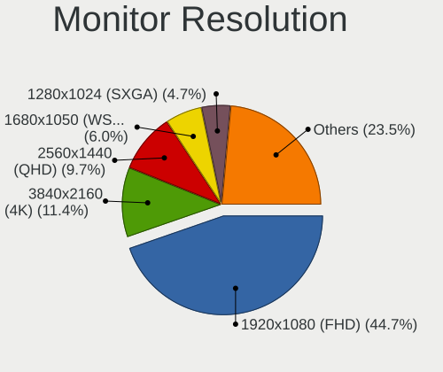

| Resolution         | Desktops | Percent |
|--------------------|----------|---------|
| 1920x1080 (FHD)    | 2092     | 44.7%   |
| 3840x2160 (4K)     | 532      | 11.37%  |
| 2560x1440 (QHD)    | 453      | 9.68%   |
| 1680x1050 (WSXGA+) | 281      | 6%      |
| 1280x1024 (SXGA)   | 221      | 4.72%   |
| 1920x1200 (WUXGA)  | 131      | 2.8%    |
| Unknown            | 130      | 2.78%   |
| 1600x900 (HD+)     | 117      | 2.5%    |
| 1440x900 (WXGA+)   | 107      | 2.29%   |
| 3440x1440          | 105      | 2.24%   |
| 1360x768           | 68       | 1.45%   |
| 3840x1080          | 63       | 1.35%   |
| 1366x768 (WXGA)    | 62       | 1.32%   |
| 2560x1080          | 61       | 1.3%    |
| 1920x540           | 44       | 0.94%   |
| 1600x1200          | 28       | 0.6%    |
| 2288x1287          | 17       | 0.36%   |
| 1024x768 (XGA)     | 13       | 0.28%   |
| 3600x1080          | 10       | 0.21%   |
| 1280x720 (HD)      | 10       | 0.21%   |
| 2560x1600          | 8        | 0.17%   |
| 2048x1152          | 8        | 0.17%   |
| 5760x1080          | 7        | 0.15%   |
| 1280x960           | 7        | 0.15%   |
| 4480x1440          | 6        | 0.13%   |
| 3840x1200          | 6        | 0.13%   |
| 5760x2160          | 5        | 0.11%   |
| 3840x1600          | 5        | 0.11%   |
| 3200x1080          | 5        | 0.11%   |
| 2560x2880          | 5        | 0.11%   |
| 7680x2160          | 4        | 0.09%   |
| 5120x1440          | 4        | 0.09%   |
| 5360x1440          | 3        | 0.06%   |
| 3280x1080          | 3        | 0.06%   |
| 2560x1397          | 3        | 0.06%   |
| 1400x1050          | 3        | 0.06%   |
| 1280x768           | 3        | 0.06%   |
| 6400x2160          | 2        | 0.04%   |
| 4480x1080          | 2        | 0.04%   |
| 3840x2560          | 2        | 0.04%   |

Monitor Diagonal
----------------

Diagonal size in inches

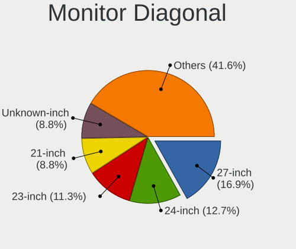

| Inches  | Desktops | Percent |
|---------|----------|---------|
| 27      | 809      | 16.87%  |
| 24      | 607      | 12.66%  |
| 23      | 543      | 11.32%  |
| 21      | 423      | 8.82%   |
| Unknown | 421      | 8.78%   |
| 31      | 351      | 7.32%   |
| 19      | 229      | 4.77%   |
| 20      | 190      | 3.96%   |
| 22      | 181      | 3.77%   |
| 34      | 137      | 2.86%   |
| 84      | 102      | 2.13%   |
| 17      | 100      | 2.09%   |
| 72      | 68       | 1.42%   |
| 18      | 65       | 1.36%   |
| 32      | 57       | 1.19%   |
| 40      | 40       | 0.83%   |
| 54      | 35       | 0.73%   |
| 26      | 33       | 0.69%   |
| 74      | 31       | 0.65%   |
| 15      | 31       | 0.65%   |
| 25      | 29       | 0.6%    |
| 28      | 20       | 0.42%   |
| 29      | 19       | 0.4%    |
| 48      | 18       | 0.38%   |
| 37      | 18       | 0.38%   |
| 142     | 16       | 0.33%   |
| 36      | 16       | 0.33%   |
| 65      | 15       | 0.31%   |
| 14      | 14       | 0.29%   |
| 35      | 13       | 0.27%   |
| 46      | 12       | 0.25%   |
| 42      | 12       | 0.25%   |
| 52      | 11       | 0.23%   |
| 49      | 11       | 0.23%   |
| 43      | 11       | 0.23%   |
| 39      | 10       | 0.21%   |
| 63      | 8        | 0.17%   |
| 41      | 8        | 0.17%   |
| 57      | 7        | 0.15%   |
| 75      | 6        | 0.13%   |

Monitor Width
-------------

Physical width

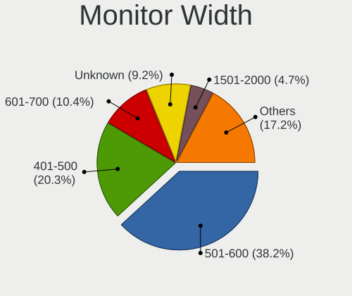

| Width in mm    | Desktops | Percent |
|----------------|----------|---------|
| 501-600        | 1747     | 38.17%  |
| 401-500        | 929      | 20.3%   |
| 601-700        | 474      | 10.36%  |
| Unknown        | 421      | 9.2%    |
| 1501-2000      | 217      | 4.74%   |
| 701-800        | 211      | 4.61%   |
| 1001-1500      | 148      | 3.23%   |
| 351-400        | 142      | 3.1%    |
| 301-350        | 132      | 2.88%   |
| 801-900        | 86       | 1.88%   |
| 901-1000       | 34       | 0.74%   |
| 201-300        | 19       | 0.42%   |
| More than 2000 | 16       | 0.35%   |
| 101-200        | 1        | 0.02%   |

Aspect Ratio
------------

Proportional relationship between the width and the height

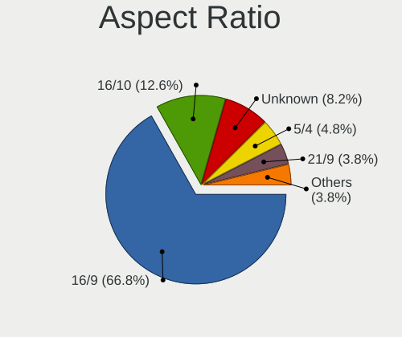

| Ratio   | Desktops | Percent |
|---------|----------|---------|
| 16/9    | 2833     | 66.83%  |
| 16/10   | 534      | 12.6%   |
| Unknown | 346      | 8.16%   |
| 5/4     | 205      | 4.84%   |
| 21/9    | 159      | 3.75%   |
| 4/3     | 54       | 1.27%   |
| 32/9    | 35       | 0.83%   |
| 3/2     | 22       | 0.52%   |
| 1.00    | 18       | 0.42%   |
| 6/5     | 16       | 0.38%   |
| 1.96    | 6        | 0.14%   |
| 0.89    | 5        | 0.12%   |
| 2.69    | 1        | 0.02%   |
| 2.00    | 1        | 0.02%   |
| 11/10   | 1        | 0.02%   |
| 0.80    | 1        | 0.02%   |
| 0.75    | 1        | 0.02%   |
| 0.56    | 1        | 0.02%   |

Monitor Area
------------

Area in inch²

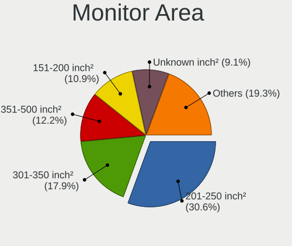

| Area in inch² | Desktops | Percent |
|----------------|----------|---------|
| 201-250        | 1420     | 30.58%  |
| 301-350        | 833      | 17.94%  |
| 351-500        | 566      | 12.19%  |
| 151-200        | 506      | 10.9%   |
| Unknown        | 421      | 9.07%   |
| More than 1000 | 335      | 7.22%   |
| 251-300        | 196      | 4.22%   |
| 501-1000       | 169      | 3.64%   |
| 141-150        | 133      | 2.86%   |
| 101-110        | 33       | 0.71%   |
| 81-90          | 8        | 0.17%   |
| 71-80          | 4        | 0.09%   |
| 131-140        | 4        | 0.09%   |
| 121-130        | 4        | 0.09%   |
| 111-120        | 4        | 0.09%   |
| 61-70          | 3        | 0.06%   |
| 51-60          | 2        | 0.04%   |
| 1-40           | 1        | 0.02%   |
| 91-100         | 1        | 0.02%   |

Pixel Density
-------------

Pixels per inch

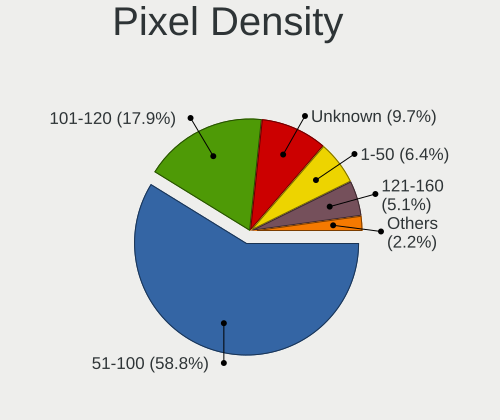

| Density       | Desktops | Percent |
|---------------|----------|---------|
| 51-100        | 2570     | 58.8%   |
| 101-120       | 782      | 17.89%  |
| Unknown       | 422      | 9.65%   |
| 1-50          | 279      | 6.38%   |
| 121-160       | 223      | 5.1%    |
| 161-240       | 90       | 2.06%   |
| More than 240 | 5        | 0.11%   |

Multiple Monitors
-----------------

Total monitors connected

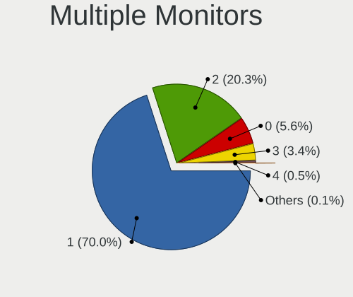

| Total | Desktops | Percent |
|-------|----------|---------|
| 1     | 3073     | 70.03%  |
| 2     | 892      | 20.33%  |
| 0     | 245      | 5.58%   |
| 3     | 151      | 3.44%   |
| 4     | 22       | 0.5%    |
| 5     | 4        | 0.09%   |
| 6     | 1        | 0.02%   |

Network
-------

Net Controller Vendor
---------------------

Controller vendors

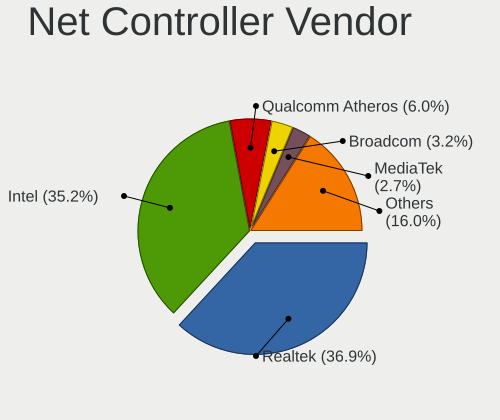

| Vendor                                | Desktops | Percent |
|---------------------------------------|----------|---------|
| Realtek Semiconductor                 | 2361     | 36.88%  |
| Intel                                 | 2254     | 35.21%  |
| Qualcomm Atheros                      | 385      | 6.01%   |
| Broadcom                              | 203      | 3.17%   |
| MediaTek                              | 174      | 2.72%   |
| Ralink                                | 108      | 1.69%   |
| TP-Link                               | 91       | 1.42%   |
| Ralink Technology                     | 80       | 1.25%   |
| Nvidia                                | 78       | 1.22%   |
| D-Link                                | 67       | 1.05%   |
| Marvell Technology Group              | 51       | 0.8%    |
| Aquantia                              | 46       | 0.72%   |
| Microsoft                             | 40       | 0.62%   |
| ASUSTek Computer                      | 39       | 0.61%   |
| D-Link System                         | 38       | 0.59%   |
| Linksys                               | 36       | 0.56%   |
| Samsung Electronics                   | 32       | 0.5%    |
| Broadcom Limited                      | 31       | 0.48%   |
| ASIX Electronics                      | 31       | 0.48%   |
| NetGear                               | 26       | 0.41%   |
| Qualcomm Technologies                 | 20       | 0.31%   |
| Qualcomm Atheros Communications       | 18       | 0.28%   |
| DisplayLink                           | 16       | 0.25%   |
| Google                                | 13       | 0.2%    |
| Belkin Components                     | 12       | 0.19%   |
| Mellanox Technologies                 | 11       | 0.17%   |
| Apple                                 | 8        | 0.12%   |
| VIA Technologies                      | 7        | 0.11%   |
| Micro Star International              | 6        | 0.09%   |
| Motorola PCS                          | 5        | 0.08%   |
| InterBiometrics                       | 5        | 0.08%   |
| Gemtek                                | 5        | 0.08%   |
| Edimax Technology                     | 5        | 0.08%   |
| American Megatrends                   | 5        | 0.08%   |
| Solarflare Communications             | 4        | 0.06%   |
| QinHeng Electronics                   | 4        | 0.06%   |
| Netchip Technology                    | 4        | 0.06%   |
| Arduino SA                            | 4        | 0.06%   |
| 802.11g Adapter [Linksys WUSB54GC v3] | 4        | 0.06%   |
| 3Com                                  | 4        | 0.06%   |

Net Controller Model
--------------------

Controller models

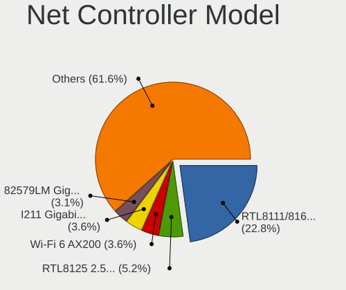

| Model                                                                  | Desktops | Percent |
|------------------------------------------------------------------------|----------|---------|
| Realtek RTL8111/8168/8211/8411 PCI Express Gigabit Ethernet Controller | 1694     | 22.85%  |
| Realtek RTL8125 2.5GbE Controller                                      | 382      | 5.15%   |
| Intel Wi-Fi 6 AX200                                                    | 270      | 3.64%   |
| Intel I211 Gigabit Network Connection                                  | 268      | 3.61%   |
| Intel 82579LM Gigabit Network Connection (Lewisville)                  | 231      | 3.12%   |
| Intel Ethernet Controller I225-V                                       | 172      | 2.32%   |
| Intel Ethernet Connection (2) I219-V                                   | 150      | 2.02%   |
| Intel Dual Band Wireless-AC 3168NGW [Stone Peak]                       | 135      | 1.82%   |
| Intel Ethernet Connection I217-LM                                      | 112      | 1.51%   |
| Intel Wi-Fi 6E(802.11ax) AX210/AX1675* 2x2 [Typhoon Peak]              | 103      | 1.39%   |
| MediaTek MT7922 802.11ax PCI Express Wireless Network Adapter          | 84       | 1.13%   |
| Intel Ethernet Connection (7) I219-V                                   | 81       | 1.09%   |
| Intel 82579V Gigabit Network Connection                                | 74       | 1%      |
| Intel Wi-Fi 5(802.11ac) Wireless-AC 9x6x [Thunder Peak]                | 72       | 0.97%   |
| Intel Ethernet Connection (2) I219-LM                                  | 70       | 0.94%   |
| Intel 82567LM-3 Gigabit Network Connection                             | 63       | 0.85%   |
| Intel 82574L Gigabit Network Connection                                | 61       | 0.82%   |
| Realtek 802.11ac NIC                                                   | 58       | 0.78%   |
| Intel 700 Series Chipset CNVi WiFi                                     | 58       | 0.78%   |
| Intel Ethernet Connection I217-V                                       | 57       | 0.77%   |
| Intel Ethernet Connection (2) I218-V                                   | 56       | 0.76%   |
| Realtek RTL88x2bu [AC1200 Techkey]                                     | 55       | 0.74%   |
| Intel Cannon Lake PCH CNVi WiFi                                        | 54       | 0.73%   |
| Intel Ethernet Controller I226-V                                       | 47       | 0.63%   |
| Intel Alder Lake-S PCH CNVi WiFi                                       | 46       | 0.62%   |
| Realtek RTL810xE PCI Express Fast Ethernet controller                  | 45       | 0.61%   |
| Qualcomm Atheros Killer E220x Gigabit Ethernet Controller              | 43       | 0.58%   |
| Qualcomm Atheros AR9485 Wireless Network Adapter                       | 43       | 0.58%   |
| Qualcomm Atheros AR9462 Wireless Network Adapter                       | 43       | 0.58%   |
| Broadcom BCM4360 802.11ac Dual Band Wireless Network Adapter           | 40       | 0.54%   |
| Intel Wireless 7265                                                    | 39       | 0.53%   |
| Ralink MT7601U Wireless Adapter                                        | 38       | 0.51%   |
| Intel Wireless 7260                                                    | 38       | 0.51%   |
| Nvidia MCP61 Ethernet                                                  | 37       | 0.5%    |
| MediaTek MT7921K (RZ608) Wi-Fi 6E 80MHz                                | 37       | 0.5%    |
| Realtek RTL8821AE 802.11ac PCIe Wireless Network Adapter               | 35       | 0.47%   |
| Qualcomm Atheros QCA9377 802.11ac Wireless Network Adapter             | 34       | 0.46%   |
| Realtek RTL8821CE 802.11ac PCIe Wireless Network Adapter               | 33       | 0.45%   |
| Intel Comet Lake PCH CNVi WiFi                                         | 33       | 0.45%   |
| Ralink RT3090 Wireless 802.11n 1T/1R PCIe                              | 32       | 0.43%   |

Wireless Vendor
---------------

Wireless vendors

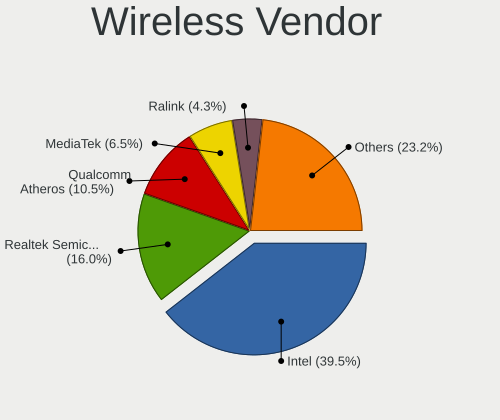

| Vendor                                | Desktops | Percent |
|---------------------------------------|----------|---------|
| Intel                                 | 984      | 39.45%  |
| Realtek Semiconductor                 | 398      | 15.96%  |
| Qualcomm Atheros                      | 263      | 10.55%  |
| MediaTek                              | 162      | 6.5%    |
| Ralink                                | 108      | 4.33%   |
| Broadcom                              | 96       | 3.85%   |
| TP-Link                               | 89       | 3.57%   |
| Ralink Technology                     | 80       | 3.21%   |
| D-Link                                | 67       | 2.69%   |
| ASUSTek Computer                      | 39       | 1.56%   |
| Microsoft                             | 38       | 1.52%   |
| Linksys                               | 36       | 1.44%   |
| NetGear                               | 26       | 1.04%   |
| D-Link System                         | 24       | 0.96%   |
| Qualcomm Atheros Communications       | 18       | 0.72%   |
| Broadcom Limited                      | 13       | 0.52%   |
| Belkin Components                     | 11       | 0.44%   |
| Qualcomm Technologies                 | 8        | 0.32%   |
| Micro Star International              | 6        | 0.24%   |
| Gemtek                                | 5        | 0.2%    |
| Edimax Technology                     | 5        | 0.2%    |
| Marvell Technology Group              | 4        | 0.16%   |
| 802.11g Adapter [Linksys WUSB54GC v3] | 4        | 0.16%   |
| ZyDAS                                 | 3        | 0.12%   |
| Wilocity                              | 1        | 0.04%   |
| Wacom                                 | 1        | 0.04%   |
| Sierra Wireless                       | 1        | 0.04%   |
| Samsung Electronics                   | 1        | 0.04%   |
| Realtek                               | 1        | 0.04%   |
| BUFFALO                               | 1        | 0.04%   |
| Belkin                                | 1        | 0.04%   |

Wireless Model
--------------

Wireless models

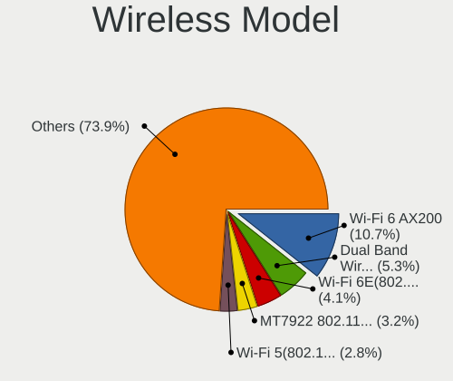

| Model                                                                | Desktops | Percent |
|----------------------------------------------------------------------|----------|---------|
| Intel Wi-Fi 6 AX200                                                  | 270      | 10.66%  |
| Intel Dual Band Wireless-AC 3168NGW [Stone Peak]                     | 135      | 5.33%   |
| Intel Wi-Fi 6E(802.11ax) AX210/AX1675* 2x2 [Typhoon Peak]            | 103      | 4.06%   |
| MediaTek MT7922 802.11ax PCI Express Wireless Network Adapter        | 81       | 3.2%    |
| Intel Wi-Fi 5(802.11ac) Wireless-AC 9x6x [Thunder Peak]              | 72       | 2.84%   |
| Realtek 802.11ac NIC                                                 | 58       | 2.29%   |
| Intel 700 Series Chipset CNVi WiFi                                   | 58       | 2.29%   |
| Realtek RTL88x2bu [AC1200 Techkey]                                   | 55       | 2.17%   |
| Intel Cannon Lake PCH CNVi WiFi                                      | 54       | 2.13%   |
| Qualcomm Atheros AR9485 Wireless Network Adapter                     | 43       | 1.7%    |
| Qualcomm Atheros AR9462 Wireless Network Adapter                     | 43       | 1.7%    |
| Broadcom BCM4360 802.11ac Dual Band Wireless Network Adapter         | 40       | 1.58%   |
| Intel Wireless 7265                                                  | 39       | 1.54%   |
| Ralink MT7601U Wireless Adapter                                      | 38       | 1.5%    |
| Intel Wireless 7260                                                  | 38       | 1.5%    |
| MediaTek MT7921K (RZ608) Wi-Fi 6E 80MHz                              | 37       | 1.46%   |
| Realtek RTL8821AE 802.11ac PCIe Wireless Network Adapter             | 35       | 1.38%   |
| Qualcomm Atheros QCA9377 802.11ac Wireless Network Adapter           | 34       | 1.34%   |
| Realtek RTL8821CE 802.11ac PCIe Wireless Network Adapter             | 33       | 1.3%    |
| Intel Comet Lake PCH CNVi WiFi                                       | 33       | 1.3%    |
| Ralink RT3090 Wireless 802.11n 1T/1R PCIe                            | 32       | 1.26%   |
| Intel Wireless 8260                                                  | 31       | 1.22%   |
| Intel Alder Lake-S PCH CNVi WiFi                                     | 31       | 1.22%   |
| Intel Wireless 8265 / 8275                                           | 29       | 1.14%   |
| Realtek RTL8822BE 802.11a/b/g/n/ac WiFi adapter                      | 28       | 1.1%    |
| Realtek RTL8188EUS 802.11n Wireless Network Adapter                  | 28       | 1.1%    |
| Intel Wireless 3165                                                  | 28       | 1.1%    |
| Qualcomm Atheros AR93xx Wireless Network Adapter                     | 27       | 1.07%   |
| TP-Link 802.11ac NIC                                                 | 21       | 0.83%   |
| Qualcomm Atheros AR928X Wireless Network Adapter (PCI-Express)       | 21       | 0.83%   |
| Qualcomm Atheros AR9287 Wireless Network Adapter (PCI-Express)       | 21       | 0.83%   |
| Realtek RTL8852CE PCIe 802.11ax Wireless Network Controller          | 19       | 0.75%   |
| Realtek RTL8812AE 802.11ac PCIe Wireless Network Adapter             | 19       | 0.75%   |
| D-Link 802.11ac NIC                                                  | 18       | 0.71%   |
| Realtek RTL8852BE PCIe 802.11ax Wireless Network Controller          | 16       | 0.63%   |
| Ralink RT5370 Wireless Adapter                                       | 16       | 0.63%   |
| Realtek RTL8192EU 802.11b/g/n WLAN Adapter                           | 15       | 0.59%   |
| Microsoft Xbox Wireless Adapter for Windows                          | 15       | 0.59%   |
| MediaTek MT7902 802.11ax PCIe Wireless Network Adapter [Filogic 310] | 15       | 0.59%   |
| Realtek RTL8192CU 802.11n WLAN Adapter                               | 14       | 0.55%   |

Ethernet Vendor
---------------

Ethernet vendors

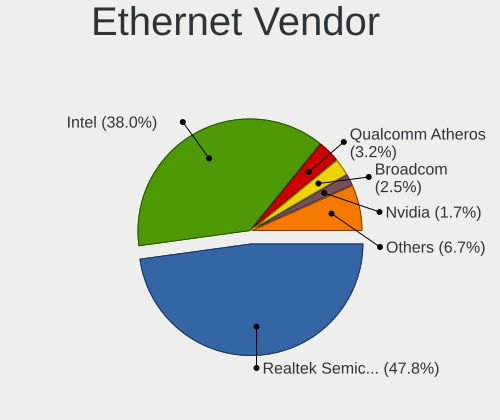

| Vendor                                 | Desktops | Percent |
|----------------------------------------|----------|---------|
| Realtek Semiconductor                  | 2206     | 47.83%  |
| Intel                                  | 1753     | 38.01%  |
| Qualcomm Atheros                       | 149      | 3.23%   |
| Broadcom                               | 117      | 2.54%   |
| Nvidia                                 | 78       | 1.69%   |
| Marvell Technology Group               | 48       | 1.04%   |
| Aquantia                               | 46       | 1%      |
| Samsung Electronics                    | 31       | 0.67%   |
| ASIX Electronics                       | 31       | 0.67%   |
| Broadcom Limited                       | 18       | 0.39%   |
| DisplayLink                            | 16       | 0.35%   |
| D-Link System                          | 14       | 0.3%    |
| Qualcomm Technologies                  | 12       | 0.26%   |
| Google                                 | 12       | 0.26%   |
| Mellanox Technologies                  | 11       | 0.24%   |
| MediaTek                               | 11       | 0.24%   |
| VIA Technologies                       | 7        | 0.15%   |
| Apple                                  | 7        | 0.15%   |
| Motorola PCS                           | 5        | 0.11%   |
| American Megatrends                    | 5        | 0.11%   |
| Solarflare Communications              | 4        | 0.09%   |
| 3Com                                   | 4        | 0.09%   |
| TP-Link                                | 3        | 0.07%   |
| Silicon Integrated Systems [SiS]       | 3        | 0.07%   |
| LG Electronics                         | 3        | 0.07%   |
| Microsoft                              | 2        | 0.04%   |
| Chelsio Communications                 | 2        | 0.04%   |
| ADMtek                                 | 2        | 0.04%   |
| ZTE WCDMA Technologies MSM             | 1        | 0.02%   |
| Sundance Technology Inc / IC Plus      | 1        | 0.02%   |
| Sony Ericsson Mobile Communications AB | 1        | 0.02%   |
| OPPO Electronics                       | 1        | 0.02%   |
| NetXen Incorporated                    | 1        | 0.02%   |
| Loongson Technology                    | 1        | 0.02%   |
| ICS Advent                             | 1        | 0.02%   |
| Huawei Technologies                    | 1        | 0.02%   |
| HMD Global                             | 1        | 0.02%   |
| Databook                               | 1        | 0.02%   |
| Belkin Components                      | 1        | 0.02%   |
| Accton Technology                      | 1        | 0.02%   |

Ethernet Model
--------------

Ethernet models

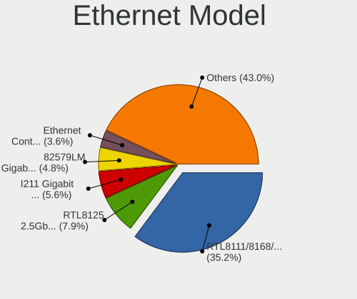

| Model                                                                          | Desktops | Percent |
|--------------------------------------------------------------------------------|----------|---------|
| Realtek RTL8111/8168/8211/8411 PCI Express Gigabit Ethernet Controller         | 1694     | 35.17%  |
| Realtek RTL8125 2.5GbE Controller                                              | 382      | 7.93%   |
| Intel I211 Gigabit Network Connection                                          | 268      | 5.56%   |
| Intel 82579LM Gigabit Network Connection (Lewisville)                          | 231      | 4.8%    |
| Intel Ethernet Controller I225-V                                               | 172      | 3.57%   |
| Intel Ethernet Connection (2) I219-V                                           | 150      | 3.11%   |
| Intel Ethernet Connection I217-LM                                              | 112      | 2.33%   |
| Intel Ethernet Connection (7) I219-V                                           | 81       | 1.68%   |
| Intel 82579V Gigabit Network Connection                                        | 74       | 1.54%   |
| Intel Ethernet Connection (2) I219-LM                                          | 70       | 1.45%   |
| Intel 82567LM-3 Gigabit Network Connection                                     | 63       | 1.31%   |
| Intel 82574L Gigabit Network Connection                                        | 61       | 1.27%   |
| Intel Ethernet Connection I217-V                                               | 57       | 1.18%   |
| Intel Ethernet Connection (2) I218-V                                           | 56       | 1.16%   |
| Intel Ethernet Controller I226-V                                               | 47       | 0.98%   |
| Realtek RTL810xE PCI Express Fast Ethernet controller                          | 45       | 0.93%   |
| Qualcomm Atheros Killer E220x Gigabit Ethernet Controller                      | 43       | 0.89%   |
| Nvidia MCP61 Ethernet                                                          | 37       | 0.77%   |
| Intel I210 Gigabit Network Connection                                          | 30       | 0.62%   |
| Realtek RTL8153 Gigabit Ethernet Adapter                                       | 29       | 0.6%    |
| Marvell Group 88E8056 PCI-E Gigabit Ethernet Controller                        | 27       | 0.56%   |
| Intel 82566DM-2 Gigabit Network Connection                                     | 27       | 0.56%   |
| Aquantia AQtion AQC107 NBase-T/IEEE 802.3an Ethernet Controller [Atlantic 10G] | 27       | 0.56%   |
| Realtek Killer E2600 GbE Controller                                            | 24       | 0.5%    |
| Broadcom NetXtreme BCM5764M Gigabit Ethernet PCIe                              | 24       | 0.5%    |
| Qualcomm Atheros AR8161 Gigabit Ethernet                                       | 23       | 0.48%   |
| Intel 82578DC Gigabit Network Connection                                       | 22       | 0.46%   |
| Realtek RTL8126 5GbE Controller                                                | 21       | 0.44%   |
| Realtek Killer E3000 2.5GbE Controller                                         | 21       | 0.44%   |
| Samsung Galaxy series, misc. (tethering mode)                                  | 20       | 0.42%   |
| Intel Ethernet Connection (2) I218-LM                                          | 20       | 0.42%   |
| ASIX AX88179 Gigabit Ethernet                                                  | 20       | 0.42%   |
| Intel Ethernet Connection (7) I219-LM                                          | 19       | 0.39%   |
| Qualcomm Atheros AR8121/AR8113/AR8114 Gigabit or Fast Ethernet                 | 17       | 0.35%   |
| Intel Ethernet Connection (14) I219-V                                          | 17       | 0.35%   |
| Intel 82578DM Gigabit Network Connection                                       | 17       | 0.35%   |
| Broadcom NetXtreme BCM5761 Gigabit Ethernet PCIe                               | 17       | 0.35%   |
| Realtek RTL-8100/8101L/8139 PCI Fast Ethernet Adapter                          | 16       | 0.33%   |
| Qualcomm Atheros Killer E2500 Gigabit Ethernet Controller                      | 15       | 0.31%   |
| Qualcomm Atheros Killer E2400 Gigabit Ethernet Controller                      | 15       | 0.31%   |

Net Controller Kind
-------------------

Ethernet, WiFi or modem

| Kind     | Desktops | Percent |
|----------|----------|---------|
| Ethernet | 4185     | 64.12%  |
| WiFi     | 2281     | 34.95%  |
| Modem    | 52       | 0.8%    |
| Unknown  | 9        | 0.14%   |

Used Controller
---------------

Currently used network controller

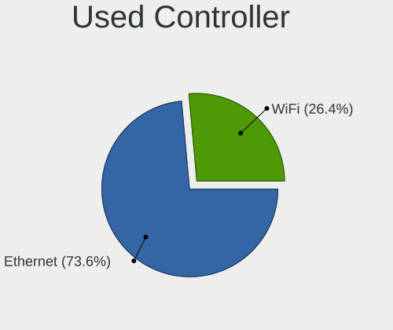

| Kind     | Desktops | Percent |
|----------|----------|---------|
| Ethernet | 3288     | 73.56%  |
| WiFi     | 1182     | 26.44%  |

NICs
----

Total network controllers on board

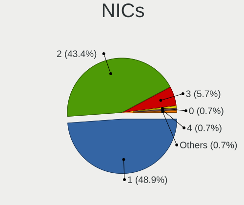

| Total | Desktops | Percent |
|-------|----------|---------|
| 1     | 2102     | 48.86%  |
| 2     | 1865     | 43.35%  |
| 3     | 246      | 5.72%   |
| 0     | 30       | 0.7%    |
| 4     | 28       | 0.65%   |
| 5     | 20       | 0.46%   |
| 6     | 6        | 0.14%   |
| 21    | 1        | 0.02%   |
| 17    | 1        | 0.02%   |
| 12    | 1        | 0.02%   |
| 8     | 1        | 0.02%   |
| 7     | 1        | 0.02%   |

IPv6
----

IPv6 vs IPv4

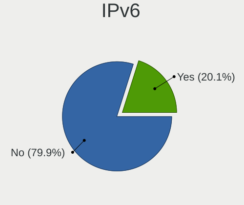

| Used | Desktops | Percent |
|------|----------|---------|
| No   | 3437     | 79.87%  |
| Yes  | 866      | 20.13%  |

Bluetooth
---------

Bluetooth Vendor
----------------

Controller vendors

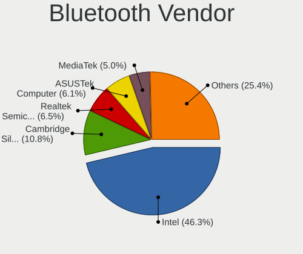

| Vendor                          | Desktops | Percent |
|---------------------------------|----------|---------|
| Intel                           | 916      | 46.31%  |
| Cambridge Silicon Radio         | 213      | 10.77%  |
| Realtek Semiconductor           | 129      | 6.52%   |
| ASUSTek Computer                | 120      | 6.07%   |
| MediaTek                        | 98       | 4.95%   |
| Broadcom                        | 97       | 4.9%    |
| IMC Networks                    | 93       | 4.7%    |
| Qualcomm Atheros Communications | 82       | 4.15%   |
| Foxconn / Hon Hai               | 55       | 2.78%   |
| TP-Link                         | 48       | 2.43%   |
| Lite-On Technology              | 23       | 1.16%   |
| Apple                           | 22       | 1.11%   |
| Dynex                           | 17       | 0.86%   |
| Realtek                         | 16       | 0.81%   |
| Actions                         | 8        | 0.4%    |
| Micro Star International        | 6        | 0.3%    |
| Unknown                         | 5        | 0.25%   |
| Edimax Technology               | 4        | 0.2%    |
| Dell                            | 4        | 0.2%    |
| Primax Electronics              | 3        | 0.15%   |
| Logitech                        | 3        | 0.15%   |
| Toshiba                         | 2        | 0.1%    |
| Ralink                          | 2        | 0.1%    |
| Integrated System Solution      | 2        | 0.1%    |
| Hewlett-Packard                 | 2        | 0.1%    |
| Zeevo                           | 1        | 0.05%   |
| SiW                             | 1        | 0.05%   |
| SINO WEALTH                     | 1        | 0.05%   |
| Nintendo                        | 1        | 0.05%   |
| Marvell Semiconductor           | 1        | 0.05%   |
| HTC (High Tech Computer)        | 1        | 0.05%   |
| Belkin Components               | 1        | 0.05%   |
| AICSemi                         | 1        | 0.05%   |

Bluetooth Model
---------------

Controller models

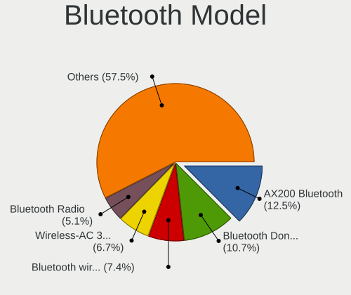

| Model                                                    | Desktops | Percent |
|----------------------------------------------------------|----------|---------|
| Intel AX200 Bluetooth                                    | 248      | 12.51%  |
| Cambridge Silicon Radio Bluetooth Dongle (HCI mode)      | 213      | 10.75%  |
| Intel Bluetooth wireless interface                       | 146      | 7.37%   |
| Intel Wireless-AC 3168 Bluetooth                         | 133      | 6.71%   |
| Realtek Bluetooth Radio                                  | 102      | 5.15%   |
| MediaTek Wireless_Device                                 | 98       | 4.94%   |
| Intel AX210 Bluetooth                                    | 92       | 4.64%   |
| Intel AX201 Bluetooth                                    | 90       | 4.54%   |
| Intel Wireless-AC 9260 Bluetooth Adapter                 | 71       | 3.58%   |
| Intel Bluetooth Device                                   | 69       | 3.48%   |
| Broadcom BCM20702A0 Bluetooth 4.0                        | 66       | 3.33%   |
| Intel Bluetooth 9460/9560 Jefferson Peak (JfP)           | 61       | 3.08%   |
| IMC Networks Bluetooth Radio                             | 53       | 2.67%   |
| TP-Link TP-T@- UB500 Adapter                             | 48       | 2.42%   |
| ASUS Broadcom BCM20702A0 Bluetooth                       | 36       | 1.82%   |
| Qualcomm Atheros  Bluetooth Device                       | 35       | 1.77%   |
| IMC Networks Wireless_Device                             | 31       | 1.56%   |
| Foxconn / Hon Hai Wireless_Device                        | 29       | 1.46%   |
| ASUS ASUS USB-BT500                                      | 24       | 1.21%   |
| Foxconn / Hon Hai Bluetooth Device                       | 22       | 1.11%   |
| ASUS Bluetooth Radio                                     | 21       | 1.06%   |
| Qualcomm Atheros Bluetooth USB Host Controller           | 18       | 0.91%   |
| Qualcomm Atheros AR3011 Bluetooth                        | 17       | 0.86%   |
| Dynex Bluetooth 4.0 Adapter [Broadcom, 1.12, BCM20702A0] | 17       | 0.86%   |
| Realtek Bluetooth Radio                                  | 16       | 0.81%   |
| Lite-On Bluetooth Device                                 | 16       | 0.81%   |
| Realtek  Bluetooth 4.2 Adapter                           | 13       | 0.66%   |
| ASUS BCM20702A0                                          | 12       | 0.61%   |
| ASUS Bluetooth Device                                    | 10       | 0.5%    |
| Apple Bluetooth Host Controller                          | 9        | 0.45%   |
| Actions general adapter                                  | 8        | 0.4%    |
| Realtek Bluetooth 5.3 Radio                              | 7        | 0.35%   |
| Intel Centrino Bluetooth Wireless Transceiver            | 7        | 0.35%   |
| IMC Networks Bluetooth Device                            | 7        | 0.35%   |
| ASUS Broadcom BCM20702 Single-Chip Bluetooth 4.0 + LE    | 7        | 0.35%   |
| ASUS Bluetooth Adapter                                   | 7        | 0.35%   |
| Apple Built-in Bluetooth 2.0+EDR HCI                     | 7        | 0.35%   |
| Qualcomm Atheros AR9462 Bluetooth                        | 6        | 0.3%    |
| Micro Star International Bluetooth Device                | 6        | 0.3%    |
| Broadcom HP Portable Bumble Bee                          | 5        | 0.25%   |

Sound
-----

Sound Vendor
------------

Sound card vendors

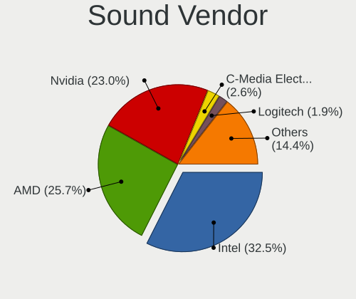

| Vendor                               | Desktops | Percent |
|--------------------------------------|----------|---------|
| Intel                                | 2522     | 32.47%  |
| AMD                                  | 1995     | 25.68%  |
| Nvidia                               | 1783     | 22.95%  |
| C-Media Electronics                  | 199      | 2.56%   |
| Logitech                             | 148      | 1.91%   |
| Creative Labs                        | 100      | 1.29%   |
| ASUSTek Computer                     | 56       | 0.72%   |
| Corsair                              | 50       | 0.64%   |
| SteelSeries ApS                      | 46       | 0.59%   |
| Razer USA                            | 46       | 0.59%   |
| Focusrite-Novation                   | 44       | 0.57%   |
| Micro Star International             | 43       | 0.55%   |
| Texas Instruments                    | 42       | 0.54%   |
| JMTek                                | 41       | 0.53%   |
| Blue Microphones                     | 36       | 0.46%   |
| Kingston Technology                  | 34       | 0.44%   |
| Generalplus Technology               | 25       | 0.32%   |
| Creative Technology                  | 25       | 0.32%   |
| Hewlett-Packard                      | 24       | 0.31%   |
| Realtek Semiconductor                | 20       | 0.26%   |
| VIA Technologies                     | 19       | 0.24%   |
| KTMicro                              | 16       | 0.21%   |
| GYROCOM C&C                          | 16       | 0.21%   |
| Thesycon Systemsoftware & Consulting | 15       | 0.19%   |
| Sony                                 | 15       | 0.19%   |
| Samson Technologies                  | 15       | 0.19%   |
| GN Netcom                            | 13       | 0.17%   |
| M-Audio                              | 12       | 0.15%   |
| BEHRINGER International              | 12       | 0.15%   |
| Audio-Technica                       | 12       | 0.15%   |
| Jieli Technology                     | 11       | 0.14%   |
| Astro Gaming                         | 11       | 0.14%   |
| Yamaha                               | 10       | 0.13%   |
| Plantronics                          | 10       | 0.13%   |
| Giga-Byte Technology                 | 10       | 0.13%   |
| Elgato Systems                       | 10       | 0.13%   |
| XMOS                                 | 9        | 0.12%   |
| SAVITECH                             | 9        | 0.12%   |
| FiiO Electronics Technology          | 9        | 0.12%   |
| ASRock                               | 8        | 0.1%    |

Sound Model
-----------

Sound card models

| Model                                                                      | Desktops | Percent |
|----------------------------------------------------------------------------|----------|---------|
| AMD Starship/Matisse HD Audio Controller                                   | 541      | 5.93%   |
| Intel 8 Series/C220 Series Chipset High Definition Audio Controller        | 313      | 3.43%   |
| AMD Ryzen HD Audio Controller                                              | 312      | 3.42%   |
| AMD SBx00 Azalia (Intel HDA)                                               | 262      | 2.87%   |
| Intel 6 Series/C200 Series Chipset Family High Definition Audio Controller | 243      | 2.66%   |
| AMD Ellesmere HDMI Audio [Radeon RX 470/480 / 570/580/590]                 | 234      | 2.57%   |
| Intel 7 Series/C216 Chipset Family High Definition Audio Controller        | 225      | 2.47%   |
| Intel Xeon E3-1200 v3/4th Gen Core Processor HD Audio Controller           | 224      | 2.46%   |
| Intel 100 Series/C230 Series Chipset Family HD Audio Controller            | 197      | 2.16%   |
| AMD Family 17h (Models 00h-0fh) HD Audio Controller                        | 197      | 2.16%   |
| Intel 200 Series PCH HD Audio                                              | 193      | 2.12%   |
| AMD Navi 21/23 HDMI/DP Audio Controller                                    | 185      | 2.03%   |
| Intel Cannon Lake PCH cAVS                                                 | 151      | 1.66%   |
| AMD Radeon High Definition Audio Controller                                | 150      | 1.64%   |
| Intel 82801JI (ICH10 Family) HD Audio Controller                           | 140      | 1.54%   |
| Nvidia GK208 HDMI/DP Audio Controller                                      | 127      | 1.39%   |
| Nvidia GP107GL High Definition Audio Controller                            | 125      | 1.37%   |
| AMD FCH Azalia Controller                                                  | 120      | 1.32%   |
| Nvidia GP104 High Definition Audio Controller                              | 111      | 1.22%   |
| AMD Oland/Hainan/Cape Verde/Pitcairn HDMI Audio [Radeon HD 7000 Series]    | 106      | 1.16%   |
| AMD Navi 31 HDMI/DP Audio                                                  | 104      | 1.14%   |
| Nvidia GP106 High Definition Audio Controller                              | 102      | 1.12%   |
| Nvidia TU116 High Definition Audio Controller                              | 100      | 1.1%    |
| Intel 5 Series/3400 Series Chipset High Definition Audio                   | 98       | 1.07%   |
| Intel 82801I (ICH9 Family) HD Audio Controller                             | 95       | 1.04%   |
| AMD Renoir/Cezanne HDMI/DP Audio Controller                                | 95       | 1.04%   |
| Intel Alder Lake-S HD Audio Controller                                     | 93       | 1.02%   |
| AMD Navi 10 HDMI Audio                                                     | 88       | 0.96%   |
| Nvidia TU106 High Definition Audio Controller                              | 87       | 0.95%   |
| Intel Raptor Lake High Definition Audio Controller                         | 85       | 0.93%   |
| Nvidia GA102 High Definition Audio Controller                              | 82       | 0.9%    |
| Nvidia GA104 High Definition Audio Controller                              | 81       | 0.89%   |
| Intel NM10/ICH7 Family High Definition Audio Controller                    | 80       | 0.88%   |
| Intel 9 Series Chipset Family HD Audio Controller                          | 75       | 0.82%   |
| Nvidia GM107 High Definition Audio Controller [GeForce 940MX]              | 72       | 0.79%   |
| Nvidia GA106 High Definition Audio Controller                              | 68       | 0.75%   |
| Nvidia TU104 HD Audio Controller                                           | 67       | 0.73%   |
| Intel C600/X79 series chipset High Definition Audio Controller             | 64       | 0.7%    |
| Intel C610/X99 series chipset HD Audio Controller                          | 61       | 0.67%   |
| Intel 82801JD/DO (ICH10 Family) HD Audio Controller                        | 61       | 0.67%   |

Memory
------

Memory Vendor
-------------

Memory module vendors

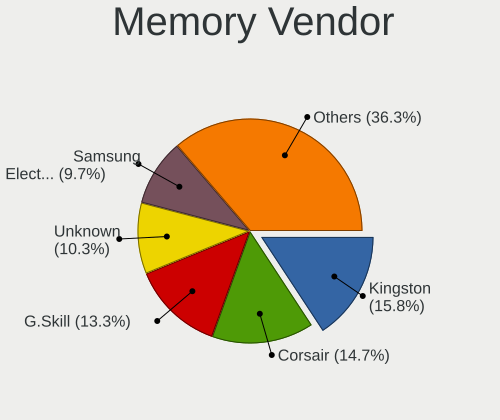

| Vendor                                  | Desktops | Percent |
|-----------------------------------------|----------|---------|
| Kingston                                | 388      | 15.75%  |
| Corsair                                 | 363      | 14.74%  |
| G.Skill                                 | 328      | 13.32%  |
| Unknown                                 | 253      | 10.27%  |
| Samsung Electronics                     | 238      | 9.66%   |
| SK hynix                                | 231      | 9.38%   |
| Micron Technology                       | 136      | 5.52%   |
| Crucial                                 | 110      | 4.47%   |
| Team                                    | 64       | 2.6%    |
| A-DATA Technology                       | 54       | 2.19%   |
| Unknown                                 | 49       | 1.99%   |
| Patriot                                 | 39       | 1.58%   |
| Nanya Technology                        | 35       | 1.42%   |
| Ramaxel Technology                      | 31       | 1.26%   |
| Elpida                                  | 27       | 1.1%    |
| Timetec                                 | 13       | 0.53%   |
| Unifosa                                 | 10       | 0.41%   |
| Transcend                               | 7        | 0.28%   |
| ASint Technology                        | 7        | 0.28%   |
| Patriot Memory (PDP Systems)            | 5        | 0.2%    |
| Unknown (ABCD)                          | 3        | 0.12%   |
| Unknown (0x0B45)                        | 3        | 0.12%   |
| Silicon Power                           | 3        | 0.12%   |
| PNY                                     | 3        | 0.12%   |
| CSX                                     | 3        | 0.12%   |
| Avant                                   | 3        | 0.12%   |
| Unknown (0x7FFF)                        | 2        | 0.08%   |
| Thermaltake                             | 2        | 0.08%   |
| Super Talent                            | 2        | 0.08%   |
| Silicon Power Computer & Communications | 2        | 0.08%   |
| Sesame                                  | 2        | 0.08%   |
| Red Hat                                 | 2        | 0.08%   |
| Qimonda                                 | 2        | 0.08%   |
| Patriot Memory                          | 2        | 0.08%   |
| OCZ                                     | 2        | 0.08%   |
| Mushkin                                 | 2        | 0.08%   |
| Lexar                                   | 2        | 0.08%   |
| GeIL                                    | 2        | 0.08%   |
| Atermiter                               | 2        | 0.08%   |
| Unknown (0x9801)                        | 1        | 0.04%   |

Memory Model
------------

Memory module models

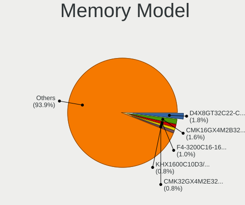

| Model                                                  | Desktops | Percent |
|--------------------------------------------------------|----------|---------|
| Unknown                                                | 49       | 1.81%   |
| Corsair RAM CMK16GX4M2B3200C16 8GB DIMM DDR4 3600MT/s  | 43       | 1.59%   |
| G.Skill RAM F4-3200C16-16GVK 16GB DIMM DDR4 3600MT/s   | 28       | 1.03%   |
| Kingston RAM KHX1600C10D3/8G 8GB DIMM DDR3 2133MT/s    | 23       | 0.85%   |
| Corsair RAM CMK32GX4M2E3200C16 16GB DIMM DDR4 3600MT/s | 21       | 0.78%   |
| G.Skill RAM F4-3200C16-8GVKB 8GB DIMM DDR4 4000MT/s    | 20       | 0.74%   |
| Corsair RAM CMK32GX4M2D3600C18 16GB DIMM DDR4 3800MT/s | 17       | 0.63%   |
| Corsair RAM CMK16GX4M2B3000C15 8GB DIMM DDR4 3600MT/s  | 17       | 0.63%   |
| A-DATA RAM DDR4 3200 16GB DIMM DDR4 3600MT/s           | 16       | 0.59%   |
| Kingston RAM KHX1600C9D3/4GX 4GB DIMM DDR3 1867MT/s    | 14       | 0.52%   |
| Corsair RAM CMK32GX4M2B3200C16 16GB DIMM DDR4 3800MT/s | 14       | 0.52%   |
| SK hynix RAM HMT351U6CFR8C-PB 4GB DIMM DDR3 1800MT/s   | 13       | 0.48%   |
| Unknown RAM Module 4GB DIMM 1333MT/s                   | 12       | 0.44%   |
| Team RAM TEAMGROUP-UD4-3200 8GB DIMM DDR4 3800MT/s     | 12       | 0.44%   |
| SK hynix RAM HMT451U6AFR8C-PB 4GB DIMM DDR3 1600MT/s   | 12       | 0.44%   |
| G.Skill RAM F4-3600C16-16GVKC 16GB DIMM DDR4 3866MT/s  | 12       | 0.44%   |
| G.Skill RAM F4-3200C16-8GTZR 8GB DIMM DDR4 3200MT/s    | 11       | 0.41%   |
| Corsair RAM CMZ8GX3M2A1600C9 4GB DIMM SDRAM 1800MT/s   | 11       | 0.41%   |
| Corsair RAM CMK16GX4M2D3600C18 8GB DIMM DDR4 4000MT/s  | 11       | 0.41%   |
| Unknown RAM Module 4GB DIMM DDR3 1333MT/s              | 10       | 0.37%   |
| SK hynix RAM HMA41GU6AFR8N-TF 8GB DIMM DDR4 2465MT/s   | 10       | 0.37%   |
| Samsung RAM M378B5673FH0-CH9 2GB DIMM DDR3 1600MT/s    | 10       | 0.37%   |
| Samsung RAM M378B5173DB0-CK0 4096MB DIMM DDR3 1600MT/s | 10       | 0.37%   |
| Samsung RAM M378B1G73DB0-CK0 8GB DIMM DDR3 1600MT/s    | 10       | 0.37%   |
| Kingston RAM KF3200C16D4/16GX 16GB DIMM DDR4 3733MT/s  | 10       | 0.37%   |
| Corsair RAM CMW16GX4M2C3200C16 8GB DIMM DDR4 3733MT/s  | 10       | 0.37%   |
| Corsair RAM CMK16GX4M2Z3200C16 8GB DIMM DDR4 3200MT/s  | 10       | 0.37%   |
| Team RAM UD5-6000 16GB DIMM DDR5 6000MT/s              | 9        | 0.33%   |
| Team RAM TEAMGROUP-UD4-3600 16GB DIMM DDR4 4000MT/s    | 9        | 0.33%   |
| SK hynix RAM HMT351U6EFR8C-PB 4GB DIMM DDR3 1600MT/s   | 9        | 0.33%   |
| G.Skill RAM F3-12800CL10-8GBXL 8GB DIMM DDR3 1600MT/s  | 9        | 0.33%   |
| Unknown RAM Module 4096MB DIMM 1333MT/s                | 8        | 0.3%    |
| Unknown RAM Module 2GB DIMM DDR2 800MT/s               | 8        | 0.3%    |
| Unknown RAM Module 2048MB DIMM 1333MT/s                | 8        | 0.3%    |
| SK hynix RAM HMT451U6BFR8C-PB 4GB DIMM DDR3 1600MT/s   | 8        | 0.3%    |
| SK hynix RAM HMT451U6BFR8A-PB 4GB DIMM DDR3 1600MT/s   | 8        | 0.3%    |
| Samsung RAM M378B5173QH0-CK0 4GB DIMM DDR3             | 8        | 0.3%    |
| Samsung RAM M378B1G73EB0-YK0 8GB DIMM DDR3 1600MT/s    | 8        | 0.3%    |
| Kingston RAM KHX1866C10D3/8G 8GB DIMM DDR3 1867MT/s    | 8        | 0.3%    |
| G.Skill RAM F5-6000J3038F16G 16GB DIMM DDR5 6000MT/s   | 8        | 0.3%    |

Memory Kind
-----------

Memory module kinds

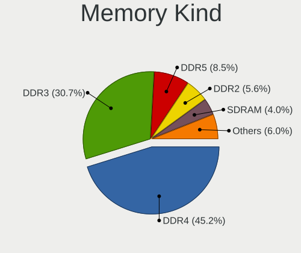

| Kind    | Desktops | Percent |
|---------|----------|---------|
| DDR4    | 966      | 45.2%   |
| DDR3    | 656      | 30.7%   |
| DDR5    | 181      | 8.47%   |
| DDR2    | 120      | 5.62%   |
| SDRAM   | 85       | 3.98%   |
| Unknown | 77       | 3.6%    |
| DDR     | 33       | 1.54%   |
| DRAM    | 8        | 0.37%   |
| LPDDR4  | 5        | 0.23%   |
| RAM     | 3        | 0.14%   |
| LPDDR5  | 3        | 0.14%   |

Memory Form Factor
------------------

Physical design of the memory module

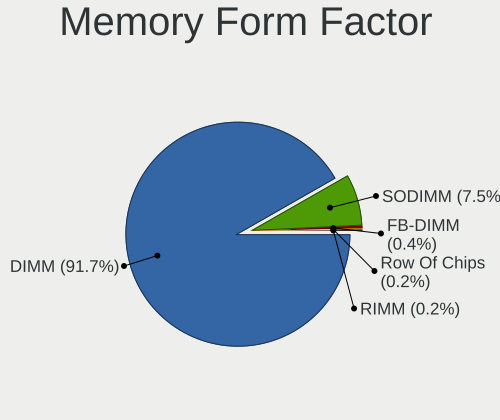

| Name         | Desktops | Percent |
|--------------|----------|---------|
| DIMM         | 1921     | 91.74%  |
| SODIMM       | 157      | 7.5%    |
| FB-DIMM      | 8        | 0.38%   |
| Row Of Chips | 4        | 0.19%   |
| RIMM         | 4        | 0.19%   |

Memory Size
-----------

Memory module size

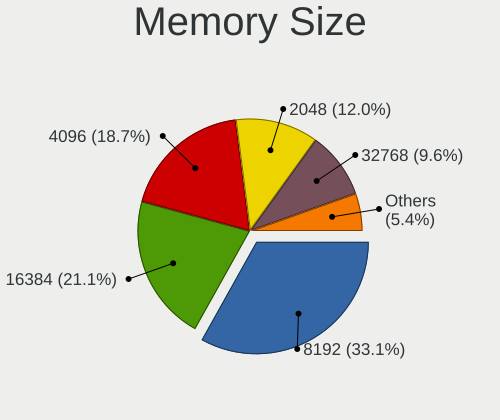

| Size  | Desktops | Percent |
|-------|----------|---------|
| 8192  | 774      | 33.11%  |
| 16384 | 494      | 21.13%  |
| 4096  | 438      | 18.73%  |
| 2048  | 280      | 11.98%  |
| 32768 | 225      | 9.62%   |
| 1024  | 96       | 4.11%   |
| 512   | 17       | 0.73%   |
| 49152 | 8        | 0.34%   |
| 24576 | 3        | 0.13%   |
| 65536 | 1        | 0.04%   |
| 256   | 1        | 0.04%   |
| 64    | 1        | 0.04%   |

Memory Speed
------------

Memory module speed

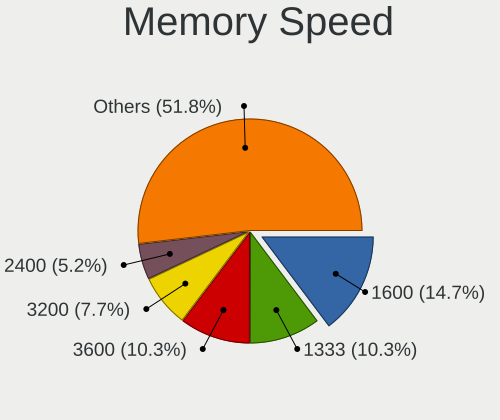

| Speed   | Desktops | Percent |
|---------|----------|---------|
| 1600    | 349      | 14.73%  |
| 1333    | 244      | 10.3%   |
| 3600    | 243      | 10.26%  |
| 3200    | 182      | 7.68%   |
| 2400    | 123      | 5.19%   |
| 2133    | 120      | 5.07%   |
| 2667    | 101      | 4.26%   |
| 800     | 82       | 3.46%   |
| 6000    | 63       | 2.66%   |
| 3800    | 63       | 2.66%   |
| 667     | 55       | 2.32%   |
| 4000    | 52       | 2.2%    |
| 3733    | 46       | 1.94%   |
| 1867    | 40       | 1.69%   |
| 1800    | 39       | 1.65%   |
| 5600    | 32       | 1.35%   |
| 1866    | 32       | 1.35%   |
| 2666    | 31       | 1.31%   |
| 3000    | 30       | 1.27%   |
| Unknown | 28       | 1.18%   |
| 3400    | 26       | 1.1%    |
| 1066    | 26       | 1.1%    |
| 6400    | 22       | 0.93%   |
| 4800    | 22       | 0.93%   |
| 2933    | 21       | 0.89%   |
| 1067    | 21       | 0.89%   |
| 3866    | 19       | 0.8%    |
| 5200    | 18       | 0.76%   |
| 3466    | 15       | 0.63%   |
| 1639    | 12       | 0.51%   |
| 400     | 11       | 0.46%   |
| 2465    | 10       | 0.42%   |
| 2000    | 10       | 0.42%   |
| 3266    | 9        | 0.38%   |
| 2048    | 9        | 0.38%   |
| 1648    | 9        | 0.38%   |
| 533     | 9        | 0.38%   |
| 12800   | 8        | 0.34%   |
| 5800    | 8        | 0.34%   |
| 3100    | 8        | 0.34%   |

Printers & scanners
-------------------

Printer Vendor
--------------

Printer device vendors

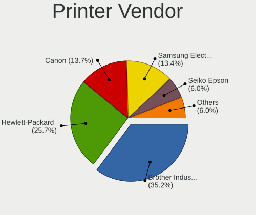

| Vendor                   | Desktops | Percent |
|--------------------------|----------|---------|
| Brother Industries       | 100      | 35.21%  |
| Hewlett-Packard          | 73       | 25.7%   |
| Canon                    | 39       | 13.73%  |
| Samsung Electronics      | 38       | 13.38%  |
| Seiko Epson              | 17       | 5.99%   |
| Lexmark International    | 6        | 2.11%   |
| Dymo-CoStar              | 5        | 1.76%   |
| Zhuhai Poskey Technology | 1        | 0.35%   |
| Zebra                    | 1        | 0.35%   |
| Xerox                    | 1        | 0.35%   |
| STMicroelectronics       | 1        | 0.35%   |
| Pantum                   | 1        | 0.35%   |
| Dell                     | 1        | 0.35%   |

Printer Model
-------------

Printer device models

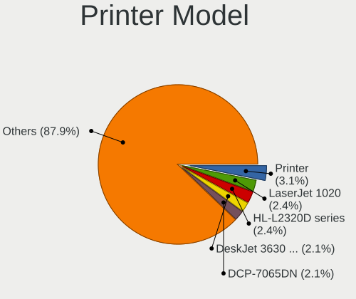

| Model                                | Desktops | Percent |
|--------------------------------------|----------|---------|
| Brother Printer                      | 9        | 3.11%   |
| HP LaserJet 1020                     | 7        | 2.42%   |
| Brother HL-L2320D series             | 7        | 2.42%   |
| HP DeskJet 3630 series               | 6        | 2.08%   |
| Brother DCP-7065DN                   | 6        | 2.08%   |
| Samsung ML-216x Series Laser Printer | 5        | 1.73%   |
| Brother MFC-J480DW                   | 5        | 1.73%   |
| Brother HL-L2390DW                   | 5        | 1.73%   |
| Brother HL-5370DW series             | 5        | 1.73%   |
| Seiko Epson ET-3750 Series           | 4        | 1.38%   |
| Samsung ML-1670 Series               | 4        | 1.38%   |
| Brother HL-L2360D series             | 4        | 1.38%   |
| Seiko Epson L6270 Series             | 3        | 1.04%   |
| Samsung C460 Series                  | 3        | 1.04%   |
| HP LaserJet 4250                     | 3        | 1.04%   |
| HP LaserJet 1018                     | 3        | 1.04%   |
| HP ENVY 5000 series                  | 3        | 1.04%   |
| HP DeskJet 2600 series               | 3        | 1.04%   |
| Dymo-CoStar LabelWriter 450          | 3        | 1.04%   |
| Canon PIXMA MX920 Series             | 3        | 1.04%   |
| Canon PIXMA MX490 Series             | 3        | 1.04%   |
| Canon MF4410                         | 3        | 1.04%   |
| Brother MFC-J485DW                   | 3        | 1.04%   |
| Brother MFC-9130CW                   | 3        | 1.04%   |
| Brother MFC-7360N                    | 3        | 1.04%   |
| Brother HL-L2370DW series            | 3        | 1.04%   |
| Brother HL-2270DW Laser Printer      | 3        | 1.04%   |
| Brother DCP-L2540DW                  | 3        | 1.04%   |
| Brother DCP-L2520DW                  | 3        | 1.04%   |
| Seiko Epson XP-4100 Series           | 2        | 0.69%   |
| Seiko Epson ET-3710 Series           | 2        | 0.69%   |
| Seiko Epson EPSON WF-3520 Series     | 2        | 0.69%   |
| Samsung SCX-3200 Series              | 2        | 0.69%   |
| Samsung ML-1865                      | 2        | 0.69%   |
| Samsung ML-1660 Series               | 2        | 0.69%   |
| Samsung CLP-310 Color Laser Printer  | 2        | 0.69%   |
| HP LaserJet Pro M201dw               | 2        | 0.69%   |
| HP LaserJet P2015 series             | 2        | 0.69%   |
| HP LaserJet CP1025nw                 | 2        | 0.69%   |
| HP LaserJet 1320                     | 2        | 0.69%   |

Scanner Vendor
--------------

Scanner device vendors

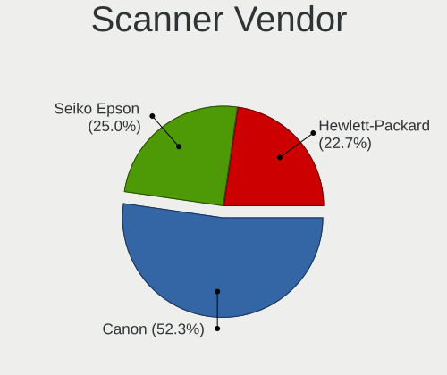

| Vendor          | Desktops | Percent |
|-----------------|----------|---------|
| Canon           | 23       | 52.27%  |
| Seiko Epson     | 11       | 25%     |
| Hewlett-Packard | 10       | 22.73%  |

Scanner Model
-------------

Scanner device models

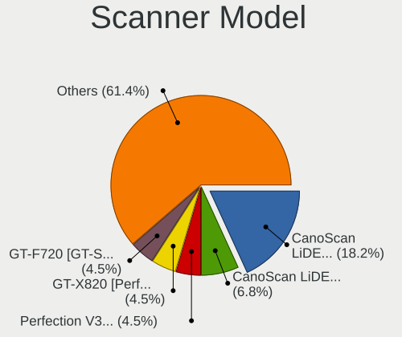

| Model                                                   | Desktops | Percent |
|---------------------------------------------------------|----------|---------|
| Canon CanoScan LiDE 210                                 | 8        | 18.18%  |
| Canon CanoScan LiDE 220                                 | 3        | 6.82%   |
| Seiko Epson Perfection V37/V370                         | 2        | 4.55%   |
| Seiko Epson GT-X820 [Perfection V600 Photo]             | 2        | 4.55%   |
| Seiko Epson GT-F720 [GT-S620/Perfection V30/V300 Photo] | 2        | 4.55%   |
| Seiko Epson GT-8300UF [Perfection 1660 PHOTO]           | 2        | 4.55%   |
| HP ScanJet 82x0C                                        | 2        | 4.55%   |
| Canon CanoScan LiDE 700F                                | 2        | 4.55%   |
| Canon CanoScan LiDE 50/LiDE 35/LiDE 40                  | 2        | 4.55%   |
| Canon CanoScan LiDE 200                                 | 2        | 4.55%   |
| Seiko Epson GT-X750 [Perfection 4490 Photo]             | 1        | 2.27%   |
| Seiko Epson GT-9300UF [Perfection 2400 PHOTO]           | 1        | 2.27%   |
| Seiko Epson GT-6600U [Perfection 610]                   | 1        | 2.27%   |
| HP ScanJet G4050                                        | 1        | 2.27%   |
| HP ScanJet G4010                                        | 1        | 2.27%   |
| HP ScanJet 5590                                         | 1        | 2.27%   |
| HP ScanJet 5200c                                        | 1        | 2.27%   |
| HP ScanJet 3670                                         | 1        | 2.27%   |
| HP ScanJet 3400cse                                      | 1        | 2.27%   |
| HP ScanJet 2300c                                        | 1        | 2.27%   |
| HP ScanJet 2200c                                        | 1        | 2.27%   |
| Canon CanoScan N1240U/LiDE 30                           | 1        | 2.27%   |
| Canon CanoScan LiDE 70                                  | 1        | 2.27%   |
| Canon CanoScan LIDE 25                                  | 1        | 2.27%   |
| Canon CanoScan LiDE 110                                 | 1        | 2.27%   |
| Canon CanoScan 1220U                                    | 1        | 2.27%   |
| Canon CanoScan                                          | 1        | 2.27%   |

Camera
------

Camera Vendor
-------------

Camera device vendors

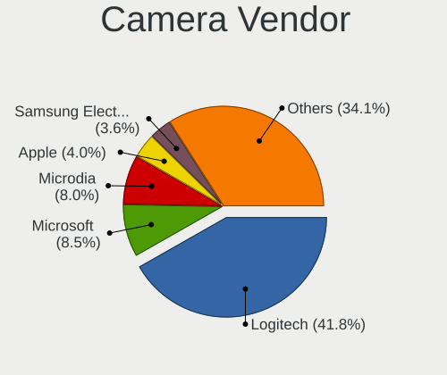

| Vendor                        | Desktops | Percent |
|-------------------------------|----------|---------|
| Logitech                      | 406      | 41.77%  |
| Microsoft                     | 83       | 8.54%   |
| Microdia                      | 78       | 8.02%   |
| Apple                         | 39       | 4.01%   |
| Samsung Electronics           | 35       | 3.6%    |
| AVerMedia Technologies        | 28       | 2.88%   |
| Realtek Semiconductor         | 24       | 2.47%   |
| Chicony Electronics           | 22       | 2.26%   |
| Sunplus Innovation Technology | 21       | 2.16%   |
| Creative Technology           | 18       | 1.85%   |
| webcam                        | 17       | 1.75%   |
| Generalplus Technology        | 15       | 1.54%   |
| MacroSilicon                  | 14       | 1.44%   |
| Razer USA                     | 13       | 1.34%   |
| Z-Star Microelectronics       | 12       | 1.23%   |
| Linux Foundation              | 9        | 0.93%   |
| Cubeternet                    | 8        | 0.82%   |
| WaveRider Communications      | 7        | 0.72%   |
| Huawei Technologies           | 6        | 0.62%   |
| eMeet                         | 6        | 0.62%   |
| GEMBIRD                       | 5        | 0.51%   |
| ARC International             | 5        | 0.51%   |
| YGTek                         | 4        | 0.41%   |
| Valve Software                | 4        | 0.41%   |
| Ruision                       | 4        | 0.41%   |
| LG Electronics                | 4        | 0.41%   |
| KYE Systems (Mouse Systems)   | 4        | 0.41%   |
| Intel                         | 4        | 0.41%   |
| Aveo Technology               | 4        | 0.41%   |
| SunplusIT                     | 3        | 0.31%   |
| Sonix Technology              | 3        | 0.31%   |
| Novatek Microelectronics      | 3        | 0.31%   |
| Hewlett-Packard               | 3        | 0.31%   |
| Genesys Logic                 | 3        | 0.31%   |
| Anker PowerConf C200          | 3        | 0.31%   |
| Unknown                       | 3        | 0.31%   |
| webcamvendor                  | 2        | 0.21%   |
| USB CAMERA                    | 2        | 0.21%   |
| Unknown                       | 2        | 0.21%   |
| OmniVision Technologies       | 2        | 0.21%   |

Camera Model
------------

Camera device models

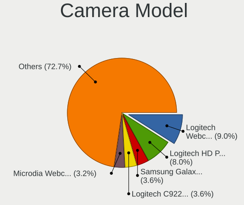

| Model                                   | Desktops | Percent |
|-----------------------------------------|----------|---------|
| Logitech Webcam C270                    | 88       | 9.01%   |
| Logitech HD Pro Webcam C920             | 78       | 7.98%   |
| Samsung Galaxy series, misc. (MTP mode) | 35       | 3.58%   |
| Logitech C922 Pro Stream Webcam         | 35       | 3.58%   |
| Microdia Webcam Vitade AF               | 31       | 3.17%   |
| Apple iPhone 5/5C/5S/6/SE/7/8/X         | 30       | 3.07%   |
| Logitech C920 PRO HD Webcam             | 28       | 2.87%   |
| Microsoft LifeCam HD-3000               | 27       | 2.76%   |
| Microdia USB 2.0 Camera                 | 24       | 2.46%   |
| AVerMedia Live Streamer CAM 313         | 23       | 2.35%   |
| Logitech BRIO Ultra HD Webcam           | 22       | 2.25%   |
| webcam webcam                           | 17       | 1.74%   |
| Microsoft LifeCam Cinema                | 17       | 1.74%   |
| Logitech Webcam C930e                   | 17       | 1.74%   |
| Logitech HD Webcam C615                 | 16       | 1.64%   |
| Logitech HD Webcam C525                 | 13       | 1.33%   |
| Logitech Webcam C310                    | 12       | 1.23%   |
| Logitech QuickCam Pro 9000              | 12       | 1.23%   |
| Generalplus GENERAL WEBCAM              | 12       | 1.23%   |
| MacroSilicon USB Video                  | 10       | 1.02%   |
| Sunplus FULL HD webcam                  | 9        | 0.92%   |
| Logitech Webcam C170                    | 9        | 0.92%   |
| Linux Foundation EEM Gadget             | 9        | 0.92%   |
| Razer USA Gaming Webcam [Kiyo]          | 8        | 0.82%   |
| Microsoft LifeCam VX-2000               | 8        | 0.82%   |
| Microdia USB Camera                     | 7        | 0.72%   |
| Logitech Webcam Pro 9000                | 7        | 0.72%   |
| Logitech HD Webcam C910                 | 7        | 0.72%   |
| Realtek FULL HD 1080P Webcam            | 6        | 0.61%   |
| Microsoft LifeCam VX-5000               | 6        | 0.61%   |
| Microsoft LifeCam Studio                | 6        | 0.61%   |
| Logitech Logitech Webcam C925e          | 6        | 0.61%   |
| Logitech C505 HD Webcam                 | 6        | 0.61%   |
| Huawei HiCamera                         | 6        | 0.61%   |
| WaveRider USB 2.0 Camera                | 5        | 0.51%   |
| Microdia USB Live camera                | 5        | 0.51%   |
| Logitech Webcam C200                    | 5        | 0.51%   |
| Logitech StreamCam                      | 5        | 0.51%   |
| Logitech HD Webcam C510                 | 5        | 0.51%   |
| Chicony HP High Definition 1MP Webcam   | 5        | 0.51%   |

Security
--------

Fingerprint Vendor
------------------

Fingerprint sensor vendors

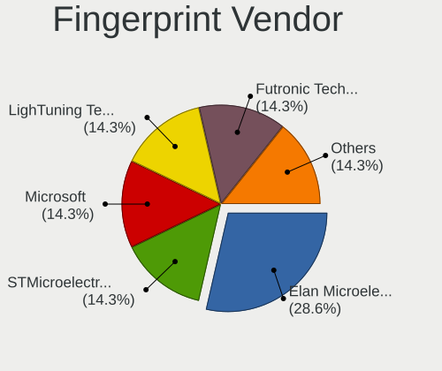

| Vendor                | Desktops | Percent |
|-----------------------|----------|---------|
| Elan Microelectronics | 2        | 28.57%  |
| STMicroelectronics    | 1        | 14.29%  |
| Microsoft             | 1        | 14.29%  |
| LighTuning Technology | 1        | 14.29%  |
| Futronic Technology   | 1        | 14.29%  |
| DigitalPersona        | 1        | 14.29%  |

Fingerprint Model
-----------------

Fingerprint sensor models

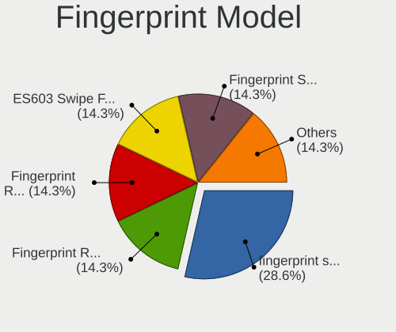

| Model                                       | Desktops | Percent |
|---------------------------------------------|----------|---------|
| Elan fingerprint sensor [FeinTech FPS00200] | 2        | 28.57%  |
| STMicroelectronics Fingerprint Reader       | 1        | 14.29%  |
| Microsoft Fingerprint Reader                | 1        | 14.29%  |
| LighTuning ES603 Swipe Fingerprint Sensor   | 1        | 14.29%  |
| Futronic Fingerprint Scanner Model FS88     | 1        | 14.29%  |
| DigitalPersona Fingerprint Reader           | 1        | 14.29%  |

Chipcard Vendor
---------------

Chipcard module vendors

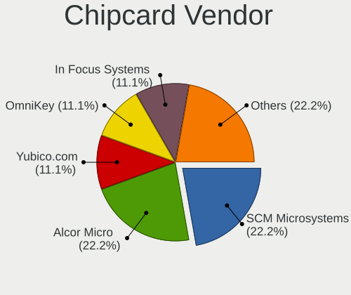

| Vendor                    | Desktops | Percent |
|---------------------------|----------|---------|
| SCM Microsystems          | 2        | 22.22%  |
| Alcor Micro               | 2        | 22.22%  |
| Yubico.com                | 1        | 11.11%  |
| OmniKey                   | 1        | 11.11%  |
| In Focus Systems          | 1        | 11.11%  |
| Clay Logic                | 1        | 11.11%  |
| Aladdin Knowledge Systems | 1        | 11.11%  |

Chipcard Model
--------------

Chipcard module models

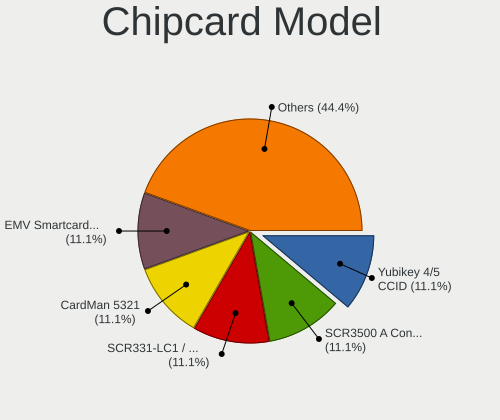

| Model                                                  | Desktops | Percent |
|--------------------------------------------------------|----------|---------|
| Yubico.com Yubikey 4/5 CCID                            | 1        | 11.11%  |
| SCM Microsystems SCR3500 A Contact Reader              | 1        | 11.11%  |
| SCM Microsystems SCR331-LC1 / SCR3310 SmartCard Reader | 1        | 11.11%  |
| OmniKey CardMan 5321                                   | 1        | 11.11%  |
| In Focus Systems EMV Smartcard Reader                  | 1        | 11.11%  |
| Clay Logic Nitrokey Pro                                | 1        | 11.11%  |
| Alcor Micro Watchdata W 1981                           | 1        | 11.11%  |
| Alcor Micro AU9540 Smartcard Reader                    | 1        | 11.11%  |
| Aladdin Knowledge Systems Token JC                     | 1        | 11.11%  |

Unsupported
-----------

Unsupported Devices
-------------------

Total unsupported devices on board

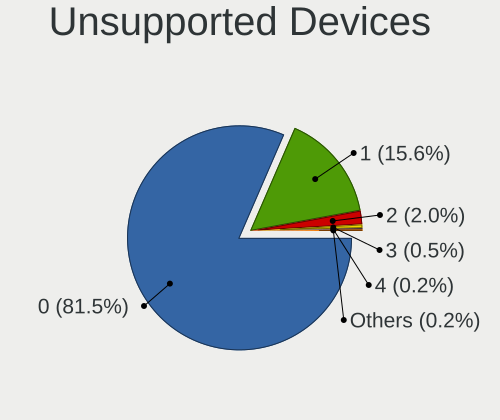

| Total | Desktops | Percent |
|-------|----------|---------|
| 0     | 3556     | 81.5%   |
| 1     | 680      | 15.59%  |
| 2     | 86       | 1.97%   |
| 3     | 23       | 0.53%   |
| 4     | 8        | 0.18%   |
| 5     | 6        | 0.14%   |
| 8     | 2        | 0.05%   |
| 6     | 2        | 0.05%   |

Unsupported Device Types
------------------------

Types of unsupported devices

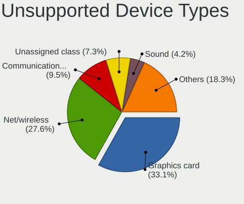

| Type                     | Desktops | Percent |
|--------------------------|----------|---------|
| Graphics card            | 306      | 33.12%  |
| Net/wireless             | 255      | 27.6%   |
| Communication controller | 88       | 9.52%   |
| Unassigned class         | 67       | 7.25%   |
| Sound                    | 39       | 4.22%   |
| Multimedia controller    | 25       | 2.71%   |
| Camera                   | 23       | 2.49%   |
| Bluetooth                | 23       | 2.49%   |
| Net/ethernet             | 20       | 2.16%   |
| Storage/raid             | 14       | 1.52%   |
| Network                  | 14       | 1.52%   |
| Dvb card                 | 10       | 1.08%   |
| Storage/ide              | 7        | 0.76%   |
| Modem                    | 6        | 0.65%   |
| Fingerprint reader       | 6        | 0.65%   |
| Chipcard                 | 6        | 0.65%   |
| Firewire controller      | 4        | 0.43%   |
| Tv card                  | 3        | 0.32%   |
| Card reader              | 3        | 0.32%   |
| Video                    | 2        | 0.22%   |
| Storage/nvme             | 1        | 0.11%   |
| Storage/ata              | 1        | 0.11%   |
| Storage                  | 1        | 0.11%   |

