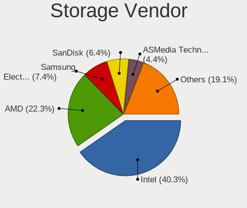
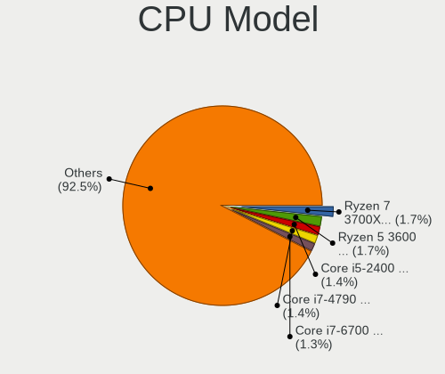
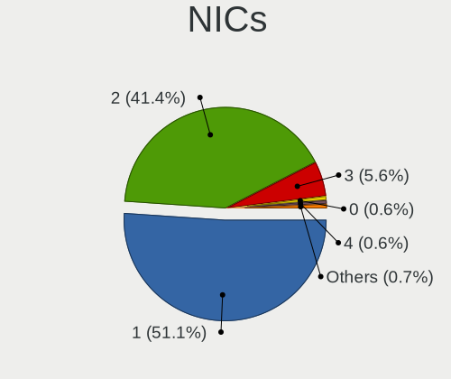
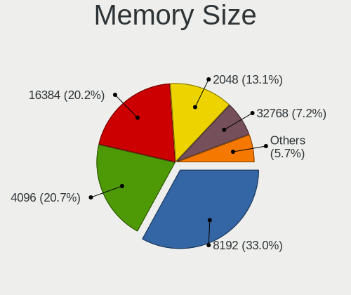
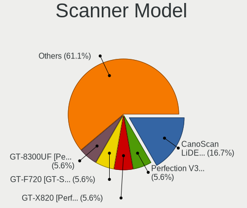
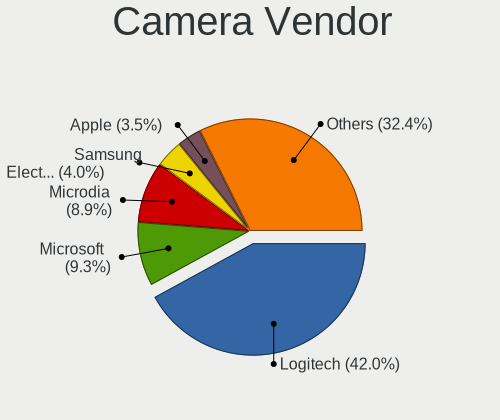

Linux in Canada - Tested Hardware & Statistics (Desktops)
---------------------------------------------------------

A project to collect tested hardware configurations for Linux in Canada.

Anyone can contribute to this report by the [hw-probe](https://github.com/linuxhw/hw-probe) tool:

    sudo -E hw-probe -all -upload

Please contribute! Especially if your hardware is rare.

Contents
--------

* [ Test Cases ](#test-cases)

* [ System ](#system)
  - [ OS                       ](#os)
  - [ OS Family                ](#os-family)
  - [ Kernel                   ](#kernel)
  - [ Kernel Family            ](#kernel-family)
  - [ Kernel Major Ver.        ](#kernel-major-ver)
  - [ Arch                     ](#arch)
  - [ DE                       ](#de)
  - [ Display Server           ](#display-server)
  - [ Display Manager          ](#display-manager)
  - [ OS Lang                  ](#os-lang)
  - [ Boot Mode                ](#boot-mode)
  - [ Filesystem               ](#filesystem)
  - [ Part. scheme             ](#part-scheme)
  - [ Dual Boot with Linux/BSD ](#dual-boot-with-linuxbsd)
  - [ Dual Boot (Win)          ](#dual-boot-win)

* [ Board ](#board)
  - [ Vendor                   ](#vendor)
  - [ Model                    ](#model)
  - [ Model Family             ](#model-family)
  - [ MFG Year                 ](#mfg-year)
  - [ Form Factor              ](#form-factor)
  - [ Secure Boot              ](#secure-boot)
  - [ Coreboot                 ](#coreboot)
  - [ RAM Size                 ](#ram-size)
  - [ RAM Used                 ](#ram-used)
  - [ Total Drives             ](#total-drives)
  - [ Has CD-ROM               ](#has-cd-rom)
  - [ Has Ethernet             ](#has-ethernet)
  - [ Has WiFi                 ](#has-wifi)
  - [ Has Bluetooth            ](#has-bluetooth)

* [ Location ](#location)
  - [ Country                  ](#country)
  - [ City                     ](#city)

* [ Drives ](#drives)
  - [ Drive Vendor             ](#drive-vendor)
  - [ Drive Model              ](#drive-model)
  - [ HDD Vendor               ](#hdd-vendor)
  - [ SSD Vendor               ](#ssd-vendor)
  - [ Drive Kind               ](#drive-kind)
  - [ Drive Connector          ](#drive-connector)
  - [ Drive Size               ](#drive-size)
  - [ Space Total              ](#space-total)
  - [ Space Used               ](#space-used)
  - [ Malfunc. Drives          ](#malfunc-drives)
  - [ Malfunc. Drive Vendor    ](#malfunc-drive-vendor)
  - [ Malfunc. HDD Vendor      ](#malfunc-hdd-vendor)
  - [ Malfunc. Drive Kind      ](#malfunc-drive-kind)
  - [ Failed Drives            ](#failed-drives)
  - [ Failed Drive Vendor      ](#failed-drive-vendor)
  - [ Drive Status             ](#drive-status)

* [ Storage controller ](#storage-controller)
  - [ Storage Vendor           ](#storage-vendor)
  - [ Storage Model            ](#storage-model)
  - [ Storage Kind             ](#storage-kind)

* [ Processor ](#processor)
  - [ CPU Vendor               ](#cpu-vendor)
  - [ CPU Model                ](#cpu-model)
  - [ CPU Model Family         ](#cpu-model-family)
  - [ CPU Cores                ](#cpu-cores)
  - [ CPU Sockets              ](#cpu-sockets)
  - [ CPU Threads              ](#cpu-threads)
  - [ CPU Op-Modes             ](#cpu-op-modes)
  - [ CPU Microcode            ](#cpu-microcode)
  - [ CPU Microarch            ](#cpu-microarch)

* [ Graphics ](#graphics)
  - [ GPU Vendor               ](#gpu-vendor)
  - [ GPU Model                ](#gpu-model)
  - [ GPU Combo                ](#gpu-combo)
  - [ GPU Driver               ](#gpu-driver)
  - [ GPU Memory               ](#gpu-memory)

* [ Monitor ](#monitor)
  - [ Monitor Vendor           ](#monitor-vendor)
  - [ Monitor Model            ](#monitor-model)
  - [ Monitor Resolution       ](#monitor-resolution)
  - [ Monitor Diagonal         ](#monitor-diagonal)
  - [ Monitor Width            ](#monitor-width)
  - [ Aspect Ratio             ](#aspect-ratio)
  - [ Monitor Area             ](#monitor-area)
  - [ Pixel Density            ](#pixel-density)
  - [ Multiple Monitors        ](#multiple-monitors)

* [ Network ](#network)
  - [ Net Controller Vendor    ](#net-controller-vendor)
  - [ Net Controller Model     ](#net-controller-model)
  - [ Wireless Vendor          ](#wireless-vendor)
  - [ Wireless Model           ](#wireless-model)
  - [ Ethernet Vendor          ](#ethernet-vendor)
  - [ Ethernet Model           ](#ethernet-model)
  - [ Net Controller Kind      ](#net-controller-kind)
  - [ Used Controller          ](#used-controller)
  - [ NICs                     ](#nics)
  - [ IPv6                     ](#ipv6)

* [ Bluetooth ](#bluetooth)
  - [ Bluetooth Vendor         ](#bluetooth-vendor)
  - [ Bluetooth Model          ](#bluetooth-model)

* [ Sound ](#sound)
  - [ Sound Vendor             ](#sound-vendor)
  - [ Sound Model              ](#sound-model)

* [ Memory ](#memory)
  - [ Memory Vendor            ](#memory-vendor)
  - [ Memory Model             ](#memory-model)
  - [ Memory Kind              ](#memory-kind)
  - [ Memory Form Factor       ](#memory-form-factor)
  - [ Memory Size              ](#memory-size)
  - [ Memory Speed             ](#memory-speed)

* [ Printers & scanners ](#printers--scanners)
  - [ Printer Vendor           ](#printer-vendor)
  - [ Printer Model            ](#printer-model)
  - [ Scanner Vendor           ](#scanner-vendor)
  - [ Scanner Model            ](#scanner-model)

* [ Camera ](#camera)
  - [ Camera Vendor            ](#camera-vendor)
  - [ Camera Model             ](#camera-model)

* [ Security ](#security)
  - [ Fingerprint Vendor       ](#fingerprint-vendor)
  - [ Fingerprint Model        ](#fingerprint-model)
  - [ Chipcard Vendor          ](#chipcard-vendor)
  - [ Chipcard Model           ](#chipcard-model)

* [ Unsupported ](#unsupported)
  - [ Unsupported Devices      ](#unsupported-devices)
  - [ Unsupported Device Types ](#unsupported-device-types)

Test Cases
----------

Total: 4724

| Vendor        | Model                       | Probe                                                      | Date         |
|---------------|-----------------------------|------------------------------------------------------------|--------------|
| Lenovo        | 110536U ThinkServer TS13... | [d3196733cd](https://linux-hardware.org/?probe=d3196733cd) | May 08, 2024 |
| ASUSTek       | PRIME X570-P                | [43cb45f5c4](https://linux-hardware.org/?probe=43cb45f5c4) | May 08, 2024 |
| MSI           | B550-A PRO                  | [acfeddfe20](https://linux-hardware.org/?probe=acfeddfe20) | May 08, 2024 |
| Lenovo        | SHARKBAY NOK                | [bc53340b58](https://linux-hardware.org/?probe=bc53340b58) | May 07, 2024 |
| Lenovo        | SHARKBAY NOK                | [f41f238d9f](https://linux-hardware.org/?probe=f41f238d9f) | May 07, 2024 |
| Unknown       | HOTTAB                      | [aadecb497e](https://linux-hardware.org/?probe=aadecb497e) | May 07, 2024 |
| Dell          | 0F3KHR A01                  | [583ca0d285](https://linux-hardware.org/?probe=583ca0d285) | May 05, 2024 |
| ASUSTek       | TUF Gaming X570-PLUS        | [f0e6546433](https://linux-hardware.org/?probe=f0e6546433) | May 05, 2024 |
| HP            | 8054                        | [bc7d8e8b56](https://linux-hardware.org/?probe=bc7d8e8b56) | May 04, 2024 |
| ASRock        | A520M-HDV                   | [f0d3e66a28](https://linux-hardware.org/?probe=f0d3e66a28) | May 04, 2024 |
| Unknown       | Unknown                     | [1a175146c0](https://linux-hardware.org/?probe=1a175146c0) | May 04, 2024 |
| ASRock        | Z77 Extreme3                | [447d8518d6](https://linux-hardware.org/?probe=447d8518d6) | May 04, 2024 |
| ASUSTek       | ROG STRIX Z690-A GAMING ... | [9f7202da23](https://linux-hardware.org/?probe=9f7202da23) | May 04, 2024 |
| Gigabyte      | B450 AORUS ELITE            | [8a157b99f2](https://linux-hardware.org/?probe=8a157b99f2) | May 04, 2024 |
| Unknown       | Unknown                     | [fd0ceb7e75](https://linux-hardware.org/?probe=fd0ceb7e75) | May 03, 2024 |
| Foxconn       | 2A92                        | [0ddf7baafd](https://linux-hardware.org/?probe=0ddf7baafd) | May 03, 2024 |
| HP            | 82FE 11                     | [417dc3a68d](https://linux-hardware.org/?probe=417dc3a68d) | May 02, 2024 |
| Dell          | 0RW203 A00                  | [3fb1f4e9f9](https://linux-hardware.org/?probe=3fb1f4e9f9) | May 01, 2024 |
| Gigabyte      | 990FXA-UD5                  | [3ca3bc5d3f](https://linux-hardware.org/?probe=3ca3bc5d3f) | May 01, 2024 |
| MSI           | B450 TOMAHAWK MAX           | [164f516c10](https://linux-hardware.org/?probe=164f516c10) | Apr 30, 2024 |
| MSI           | B450 TOMAHAWK MAX           | [38975e46ec](https://linux-hardware.org/?probe=38975e46ec) | Apr 30, 2024 |
| Gigabyte      | 990FXA-UD5                  | [ccf4678d12](https://linux-hardware.org/?probe=ccf4678d12) | Apr 30, 2024 |
| ASRock        | B550 Phantom Gaming 4       | [fe30f88923](https://linux-hardware.org/?probe=fe30f88923) | Apr 30, 2024 |
| Gigabyte      | B450 AORUS ELITE V2         | [b9f81199c9](https://linux-hardware.org/?probe=b9f81199c9) | Apr 30, 2024 |
| ASUSTek       | Maximus Formula             | [c26c507db2](https://linux-hardware.org/?probe=c26c507db2) | Apr 30, 2024 |
| HP            | 2129                        | [40fa42996a](https://linux-hardware.org/?probe=40fa42996a) | Apr 29, 2024 |
| MSI           | B550M PRO-VDH WIFI          | [31af2ca036](https://linux-hardware.org/?probe=31af2ca036) | Apr 28, 2024 |
| AZW           | U59                         | [d310713234](https://linux-hardware.org/?probe=d310713234) | Apr 28, 2024 |
| HP            | 2129                        | [03800251ed](https://linux-hardware.org/?probe=03800251ed) | Apr 28, 2024 |
| Gigabyte      | AB350M-DS3H-CF              | [38c0cc58a5](https://linux-hardware.org/?probe=38c0cc58a5) | Apr 27, 2024 |
| Lenovo        | 3768 SDK0T76463 WIN 3422... | [01e2eecd25](https://linux-hardware.org/?probe=01e2eecd25) | Apr 26, 2024 |
| ASRock        | Z77 Extreme3                | [83083ad34f](https://linux-hardware.org/?probe=83083ad34f) | Apr 26, 2024 |
| AZW           | MINI S                      | [0c4be52f43](https://linux-hardware.org/?probe=0c4be52f43) | Apr 26, 2024 |
| Acer          | FX58M                       | [d8aec92fe1](https://linux-hardware.org/?probe=d8aec92fe1) | Apr 25, 2024 |
| ASUSTek       | PRIME Z590M-PLUS            | [38bbe3657e](https://linux-hardware.org/?probe=38bbe3657e) | Apr 25, 2024 |
| HP            | 0B54h D                     | [a6c876a042](https://linux-hardware.org/?probe=a6c876a042) | Apr 25, 2024 |
| Gigabyte      | B660 GAMING X AX DDR4       | [84b2ad73d1](https://linux-hardware.org/?probe=84b2ad73d1) | Apr 25, 2024 |
| ASRock        | B450 Pro4                   | [a43f744651](https://linux-hardware.org/?probe=a43f744651) | Apr 24, 2024 |
| MSI           | Z97 PC Mate                 | [1d5f001265](https://linux-hardware.org/?probe=1d5f001265) | Apr 24, 2024 |
| MSI           | B450 GAMING PRO CARBON M... | [26f465d651](https://linux-hardware.org/?probe=26f465d651) | Apr 24, 2024 |
| MSI           | PRO B550-VC                 | [d4d863e59c](https://linux-hardware.org/?probe=d4d863e59c) | Apr 23, 2024 |
| ASUSTek       | Rampage V EXTREME           | [f0732b1851](https://linux-hardware.org/?probe=f0732b1851) | Apr 23, 2024 |
| ASUSTek       | TUF Gaming X570-PLUS        | [12f44c7a5a](https://linux-hardware.org/?probe=12f44c7a5a) | Apr 23, 2024 |
| ASUSTek       | Q87T                        | [2c7eb11783](https://linux-hardware.org/?probe=2c7eb11783) | Apr 23, 2024 |
| Gigabyte      | X570 AORUS ELITE            | [a06e5411c0](https://linux-hardware.org/?probe=a06e5411c0) | Apr 23, 2024 |
| ASUSTek       | ROG STRIX X570-E GAMING     | [bc20931e37](https://linux-hardware.org/?probe=bc20931e37) | Apr 23, 2024 |
| MSI           | MAG Z790 TOMAHAWK WIFI      | [35e248e8bd](https://linux-hardware.org/?probe=35e248e8bd) | Apr 22, 2024 |
| HP            | 82FE 11                     | [8275c83127](https://linux-hardware.org/?probe=8275c83127) | Apr 21, 2024 |
| HP            | 0B54h D                     | [e712695ed7](https://linux-hardware.org/?probe=e712695ed7) | Apr 20, 2024 |
| ASUSTek       | ProArt B550-CREATOR         | [37bd870888](https://linux-hardware.org/?probe=37bd870888) | Apr 19, 2024 |
| STGAUBRON     | ZRD5104                     | [79c814fd30](https://linux-hardware.org/?probe=79c814fd30) | Apr 19, 2024 |
| Gigabyte      | AB350M-DS3H-CF              | [9624739b2f](https://linux-hardware.org/?probe=9624739b2f) | Apr 19, 2024 |
| ASUSTek       | G10CES                      | [a040e8acd4](https://linux-hardware.org/?probe=a040e8acd4) | Apr 18, 2024 |
| ASUSTek       | M5A97 R2.0                  | [ba42f42f14](https://linux-hardware.org/?probe=ba42f42f14) | Apr 17, 2024 |
| MSI           | B550M PRO-VDH WIFI          | [e5f340aec0](https://linux-hardware.org/?probe=e5f340aec0) | Apr 17, 2024 |
| MSI           | MPG B550I GAMING EDGE WI... | [ddf96b058d](https://linux-hardware.org/?probe=ddf96b058d) | Apr 17, 2024 |
| MSI           | MAG Z790 TOMAHAWK WIFI      | [0bf4de97cf](https://linux-hardware.org/?probe=0bf4de97cf) | Apr 17, 2024 |
| Dell          | 0MWYPT A01                  | [1dcea45437](https://linux-hardware.org/?probe=1dcea45437) | Apr 16, 2024 |
| ASUSTek       | Q87T                        | [fdcc988e3a](https://linux-hardware.org/?probe=fdcc988e3a) | Apr 16, 2024 |
| ASRock        | B650M Pro RS WiFi           | [eb9f0768cf](https://linux-hardware.org/?probe=eb9f0768cf) | Apr 16, 2024 |
| MSI           | MAG X670E TOMAHAWK WIFI     | [d4b692ce92](https://linux-hardware.org/?probe=d4b692ce92) | Apr 15, 2024 |
| ASUSTek       | P5Q                         | [2a2880460d](https://linux-hardware.org/?probe=2a2880460d) | Apr 15, 2024 |
| MSI           | H81M-E34                    | [61891eff16](https://linux-hardware.org/?probe=61891eff16) | Apr 15, 2024 |
| Pegatron      | 2ACD                        | [897550ea8a](https://linux-hardware.org/?probe=897550ea8a) | Apr 14, 2024 |
| Dell          | 03KWTV A02                  | [c4e734036d](https://linux-hardware.org/?probe=c4e734036d) | Apr 13, 2024 |
| HP            | 8459                        | [2db1190eca](https://linux-hardware.org/?probe=2db1190eca) | Apr 13, 2024 |
| MSI           | B450M MORTAR TITANIUM       | [951b22300e](https://linux-hardware.org/?probe=951b22300e) | Apr 12, 2024 |
| HP            | 2B2B                        | [e5c1d16bde](https://linux-hardware.org/?probe=e5c1d16bde) | Apr 12, 2024 |
| Dell          | 002KVM A00                  | [85ad08c5db](https://linux-hardware.org/?probe=85ad08c5db) | Apr 11, 2024 |
| Apple         | Mac-F60DEB81FF30ACF6 Mac... | [f80d29d22d](https://linux-hardware.org/?probe=f80d29d22d) | Apr 11, 2024 |
| ASRock        | 4X4-4000 Series             | [933f5300ab](https://linux-hardware.org/?probe=933f5300ab) | Apr 11, 2024 |
| ASUSTek       | M4A78-E                     | [206d758570](https://linux-hardware.org/?probe=206d758570) | Apr 10, 2024 |
| ASUSTek       | PD500TC                     | [2d86ec4d4e](https://linux-hardware.org/?probe=2d86ec4d4e) | Apr 10, 2024 |
| Gigabyte      | TRX40 DESIGNARE             | [e86ef24429](https://linux-hardware.org/?probe=e86ef24429) | Apr 10, 2024 |
| Dell          | 030VXY A01                  | [793be088c2](https://linux-hardware.org/?probe=793be088c2) | Apr 09, 2024 |
| Dell          | 030VXY A01                  | [64ed2bb4d3](https://linux-hardware.org/?probe=64ed2bb4d3) | Apr 09, 2024 |
| ASUSTek       | Crosshair IV Formula        | [e62581b4c5](https://linux-hardware.org/?probe=e62581b4c5) | Apr 09, 2024 |
| MSI           | B550M PRO-VDH WIFI          | [ebc11c966d](https://linux-hardware.org/?probe=ebc11c966d) | Apr 07, 2024 |
| MSI           | B550M PRO-VDH WIFI          | [c917535f70](https://linux-hardware.org/?probe=c917535f70) | Apr 06, 2024 |
| Dell          | 0WG855                      | [f5a1d09496](https://linux-hardware.org/?probe=f5a1d09496) | Apr 06, 2024 |
| ASUSTek       | M4A785-M                    | [dae4d8f0c7](https://linux-hardware.org/?probe=dae4d8f0c7) | Apr 05, 2024 |
| MSI           | PRO B550M-VC WIFI           | [f8d2db509c](https://linux-hardware.org/?probe=f8d2db509c) | Apr 05, 2024 |
| ASUSTek       | PRIME H410M-A               | [1cb1d0f6bf](https://linux-hardware.org/?probe=1cb1d0f6bf) | Apr 05, 2024 |
| ASUSTek       | M4A785-M                    | [1a3e173e11](https://linux-hardware.org/?probe=1a3e173e11) | Apr 05, 2024 |
| Dell          | 07N90W A02                  | [4d11f26d4c](https://linux-hardware.org/?probe=4d11f26d4c) | Apr 04, 2024 |
| Dell          | 0PU052                      | [6555bfeb7b](https://linux-hardware.org/?probe=6555bfeb7b) | Apr 04, 2024 |
| HP            | 2175                        | [d21c1aaf46](https://linux-hardware.org/?probe=d21c1aaf46) | Apr 04, 2024 |
| ASUSTek       | PRIME H570-PLUS             | [69279a9792](https://linux-hardware.org/?probe=69279a9792) | Apr 04, 2024 |
| MSI           | B450M PRO-VDH MAX           | [f939a8ab03](https://linux-hardware.org/?probe=f939a8ab03) | Apr 04, 2024 |
| ASRock        | X470 Master SLI/ac          | [00654fb268](https://linux-hardware.org/?probe=00654fb268) | Apr 04, 2024 |
| ASRock        | X470 Master SLI/ac          | [aaec2396a7](https://linux-hardware.org/?probe=aaec2396a7) | Apr 03, 2024 |
| ASRock        | B650M Pro RS WiFi           | [e0b3cba959](https://linux-hardware.org/?probe=e0b3cba959) | Apr 03, 2024 |
| ASRock        | B650M Pro RS WiFi           | [60c648fc52](https://linux-hardware.org/?probe=60c648fc52) | Apr 03, 2024 |
| HP            | 828A                        | [953ba8e322](https://linux-hardware.org/?probe=953ba8e322) | Apr 03, 2024 |
| ASUSTek       | P5G41T-M                    | [731881f720](https://linux-hardware.org/?probe=731881f720) | Apr 02, 2024 |
| Intel         | X99                         | [b9d21bc637](https://linux-hardware.org/?probe=b9d21bc637) | Apr 02, 2024 |
| MSI           | MPG B550I GAMING EDGE WI... | [98c3893edd](https://linux-hardware.org/?probe=98c3893edd) | Apr 01, 2024 |
| Dell          | 032W55 A03                  | [5943c24943](https://linux-hardware.org/?probe=5943c24943) | Apr 01, 2024 |
| ASUSTek       | P8Z77-V PREMIUM             | [3c3064e23a](https://linux-hardware.org/?probe=3c3064e23a) | Mar 31, 2024 |
| HP            | 8459                        | [d4e0767589](https://linux-hardware.org/?probe=d4e0767589) | Mar 31, 2024 |
| MSI           | MS-B9181                    | [1ae3e9b8ba](https://linux-hardware.org/?probe=1ae3e9b8ba) | Mar 30, 2024 |
| ASUSTek       | PRIME Z690M-PLUS D4         | [0c67b02957](https://linux-hardware.org/?probe=0c67b02957) | Mar 30, 2024 |
| Lenovo        | 1059 SDK0T76530 WIN 3556... | [39db39fb8a](https://linux-hardware.org/?probe=39db39fb8a) | Mar 30, 2024 |
| HP            | 8463                        | [dd77e7dc68](https://linux-hardware.org/?probe=dd77e7dc68) | Mar 30, 2024 |
| ASUSTek       | ROG STRIX B450-F GAMING ... | [c8e50aef4c](https://linux-hardware.org/?probe=c8e50aef4c) | Mar 30, 2024 |
| ASUSTek       | ROG STRIX B450-F GAMING ... | [dc808b758c](https://linux-hardware.org/?probe=dc808b758c) | Mar 30, 2024 |
| Gigabyte      | H55M-S2V                    | [b6b0564fdc](https://linux-hardware.org/?probe=b6b0564fdc) | Mar 29, 2024 |
| ASUSTek       | TUF Gaming X570-PLUS        | [00e4cbdc6e](https://linux-hardware.org/?probe=00e4cbdc6e) | Mar 29, 2024 |
| XFX           | MB-750I-72P9                | [fc5cf282c8](https://linux-hardware.org/?probe=fc5cf282c8) | Mar 27, 2024 |
| MSI           | PRO Z790-S WIFI             | [ecaa8a51cb](https://linux-hardware.org/?probe=ecaa8a51cb) | Mar 26, 2024 |
| ASUSTek       | P8B75-M                     | [a67e18a770](https://linux-hardware.org/?probe=a67e18a770) | Mar 25, 2024 |
| HP            | 3646h                       | [94d980596e](https://linux-hardware.org/?probe=94d980596e) | Mar 25, 2024 |
| ASUSTek       | TUF Gaming X570-PLUS        | [efbd82bed8](https://linux-hardware.org/?probe=efbd82bed8) | Mar 25, 2024 |
| Dell          | 0DR845                      | [81bc347039](https://linux-hardware.org/?probe=81bc347039) | Mar 25, 2024 |
| Gigabyte      | F2A85XM-HD3                 | [8f33c0377d](https://linux-hardware.org/?probe=8f33c0377d) | Mar 25, 2024 |
| Gigabyte      | F2A85XM-HD3                 | [98d28a50e5](https://linux-hardware.org/?probe=98d28a50e5) | Mar 25, 2024 |
| Dell          | 0KWVT8 A00                  | [ae811bf4d9](https://linux-hardware.org/?probe=ae811bf4d9) | Mar 24, 2024 |
| MSI           | B550M PRO-VDH WIFI          | [773df1edad](https://linux-hardware.org/?probe=773df1edad) | Mar 24, 2024 |
| Gigabyte      | A520M S2H                   | [9e6a2e1fee](https://linux-hardware.org/?probe=9e6a2e1fee) | Mar 24, 2024 |
| HP            | 18E4                        | [e47f65729a](https://linux-hardware.org/?probe=e47f65729a) | Mar 23, 2024 |
| ASUSTek       | ROG STRIX X570-E GAMING     | [2e37fef15e](https://linux-hardware.org/?probe=2e37fef15e) | Mar 23, 2024 |
| Acer          | RS880M05                    | [d4f039d786](https://linux-hardware.org/?probe=d4f039d786) | Mar 23, 2024 |
| HP            | 1905                        | [6e80318f95](https://linux-hardware.org/?probe=6e80318f95) | Mar 22, 2024 |
| HP            | 82FE 11                     | [c64d48592f](https://linux-hardware.org/?probe=c64d48592f) | Mar 22, 2024 |
| HP            | 82FE 11                     | [6686bf6633](https://linux-hardware.org/?probe=6686bf6633) | Mar 22, 2024 |
| HP            | 82FE 11                     | [6e4489e812](https://linux-hardware.org/?probe=6e4489e812) | Mar 22, 2024 |
| Lenovo        | Bantry CRB SDK0E50510 WI... | [3a158f6014](https://linux-hardware.org/?probe=3a158f6014) | Mar 21, 2024 |
| ASUSTek       | TUF Gaming X570-PLUS        | [d53232b16e](https://linux-hardware.org/?probe=d53232b16e) | Mar 19, 2024 |
| MSI           | MPG B550 GAMING PLUS        | [37a57d5b70](https://linux-hardware.org/?probe=37a57d5b70) | Mar 19, 2024 |
| ASRock        | B450M Pro4 R2.0             | [09cc580df1](https://linux-hardware.org/?probe=09cc580df1) | Mar 19, 2024 |
| ASUSTek       | ROG STRIX B450-F GAMING ... | [cb3904b8ec](https://linux-hardware.org/?probe=cb3904b8ec) | Mar 19, 2024 |
| ASUSTek       | ROG STRIX B450-F GAMING ... | [5b8baf227c](https://linux-hardware.org/?probe=5b8baf227c) | Mar 18, 2024 |
| MSI           | MAG B650 TOMAHAWK WIFI      | [50b41d2570](https://linux-hardware.org/?probe=50b41d2570) | Mar 18, 2024 |
| MSI           | MAG B650 TOMAHAWK WIFI      | [cca929ae4e](https://linux-hardware.org/?probe=cca929ae4e) | Mar 18, 2024 |
| MSI           | X99A RAIDER                 | [8d5dfb7293](https://linux-hardware.org/?probe=8d5dfb7293) | Mar 18, 2024 |
| Intel         | Unknown                     | [4ec95381a2](https://linux-hardware.org/?probe=4ec95381a2) | Mar 18, 2024 |
| ASUSTek       | PRIME H310M-A               | [95e2b24425](https://linux-hardware.org/?probe=95e2b24425) | Mar 18, 2024 |
| Supermicro    | X10DAI                      | [f50171c58c](https://linux-hardware.org/?probe=f50171c58c) | Mar 18, 2024 |
| Gigabyte      | X570 AORUS MASTER           | [ee3281cbda](https://linux-hardware.org/?probe=ee3281cbda) | Mar 17, 2024 |
| Lenovo        | 310B SDK0J40697 WIN 3305... | [2f763edf96](https://linux-hardware.org/?probe=2f763edf96) | Mar 16, 2024 |
| ASRock        | X470 Master SLI/ac          | [4080e4f60b](https://linux-hardware.org/?probe=4080e4f60b) | Mar 15, 2024 |
| Gigabyte      | B550M DS3H AC               | [1c1be18d2b](https://linux-hardware.org/?probe=1c1be18d2b) | Mar 14, 2024 |
| Alienware     | 07HV66 A01                  | [b94fccbefa](https://linux-hardware.org/?probe=b94fccbefa) | Mar 13, 2024 |
| Gigabyte      | GA-MA790GP-DS4H             | [9ffb06c47b](https://linux-hardware.org/?probe=9ffb06c47b) | Mar 13, 2024 |
| NZXT          | N7 B650E                    | [66453a8f80](https://linux-hardware.org/?probe=66453a8f80) | Mar 12, 2024 |
| NZXT          | N7 B650E                    | [b788fa656b](https://linux-hardware.org/?probe=b788fa656b) | Mar 12, 2024 |
| ASUSTek       | PRIME B450M-A               | [edad3b75e7](https://linux-hardware.org/?probe=edad3b75e7) | Mar 12, 2024 |
| MSI           | 760GM-P34                   | [cef041a8ee](https://linux-hardware.org/?probe=cef041a8ee) | Mar 10, 2024 |
| ASRockRack    | B550D4U-2T R1.00            | [79de662be3](https://linux-hardware.org/?probe=79de662be3) | Mar 10, 2024 |
| HP            | 8054                        | [669647a8ee](https://linux-hardware.org/?probe=669647a8ee) | Mar 10, 2024 |
| ASUSTek       | PRIME B250-PLUS             | [7dd55cb803](https://linux-hardware.org/?probe=7dd55cb803) | Mar 09, 2024 |
| Dell          | 0KWVT8 A00                  | [c80fca1d72](https://linux-hardware.org/?probe=c80fca1d72) | Mar 09, 2024 |
| Gigabyte      | H110M-S2H-CF                | [31c6c9c883](https://linux-hardware.org/?probe=31c6c9c883) | Mar 09, 2024 |
| ASUSTek       | PRIME B550-PLUS             | [adab411eb7](https://linux-hardware.org/?probe=adab411eb7) | Mar 09, 2024 |
| ASUSTek       | PRIME Z490-P                | [f208bbae00](https://linux-hardware.org/?probe=f208bbae00) | Mar 08, 2024 |
| Gigabyte      | G1.Guerrilla                | [24f2da961a](https://linux-hardware.org/?probe=24f2da961a) | Mar 08, 2024 |
| Gigabyte      | Z390 AORUS ELITE-CF         | [e1d8f91062](https://linux-hardware.org/?probe=e1d8f91062) | Mar 08, 2024 |
| ASUSTek       | PRIME Z490-P                | [b4f141c9da](https://linux-hardware.org/?probe=b4f141c9da) | Mar 08, 2024 |
| ASUSTek       | P8Z77-V PRO                 | [b18d2c6cab](https://linux-hardware.org/?probe=b18d2c6cab) | Mar 08, 2024 |
| Gigabyte      | AX370-Gaming K5-CF          | [72315b2955](https://linux-hardware.org/?probe=72315b2955) | Mar 08, 2024 |
| MSI           | MPG X570 GAMING PLUS        | [b07882e6fb](https://linux-hardware.org/?probe=b07882e6fb) | Mar 07, 2024 |
| Dell          | 0G214D A00                  | [36603554a5](https://linux-hardware.org/?probe=36603554a5) | Mar 07, 2024 |
| Gigabyte      | B650 GAMING X AX            | [fc15cf0d4a](https://linux-hardware.org/?probe=fc15cf0d4a) | Mar 07, 2024 |
| ASUSTek       | P8Z77-M                     | [031b9032f6](https://linux-hardware.org/?probe=031b9032f6) | Mar 06, 2024 |
| ASUSTek       | ROG STRIX X670E-A GAMING... | [70d9f1030b](https://linux-hardware.org/?probe=70d9f1030b) | Mar 05, 2024 |
| Gigabyte      | G1.Guerrilla                | [a6cb9cdd68](https://linux-hardware.org/?probe=a6cb9cdd68) | Mar 05, 2024 |
| Gigabyte      | Z390 AORUS ELITE-CF         | [39216b08cb](https://linux-hardware.org/?probe=39216b08cb) | Mar 04, 2024 |
| ASUSTek       | P7P55D                      | [2b9fe60339](https://linux-hardware.org/?probe=2b9fe60339) | Mar 04, 2024 |
| Gigabyte      | H110M-S2H-CF                | [ee26b5bb3e](https://linux-hardware.org/?probe=ee26b5bb3e) | Mar 04, 2024 |
| Dell          | 0Y2MRG A01                  | [e86dfdef50](https://linux-hardware.org/?probe=e86dfdef50) | Mar 04, 2024 |
| Red Hat       | RHEL RHEL-9.0.0 PC          | [0e55d35354](https://linux-hardware.org/?probe=0e55d35354) | Mar 03, 2024 |
| Dell          | 0D24M8 A01                  | [7e04cbe20c](https://linux-hardware.org/?probe=7e04cbe20c) | Mar 03, 2024 |
| Dell          | 0D24M8 A01                  | [554a7aa150](https://linux-hardware.org/?probe=554a7aa150) | Mar 03, 2024 |
| MSI           | MAG Z790 TOMAHAWK MAX WI... | [8f67947698](https://linux-hardware.org/?probe=8f67947698) | Mar 03, 2024 |
| Dell          | 0PC5F7 A02                  | [fdfe4e3348](https://linux-hardware.org/?probe=fdfe4e3348) | Mar 03, 2024 |
| ASUSTek       | Z170-A                      | [5c7cfb2969](https://linux-hardware.org/?probe=5c7cfb2969) | Mar 02, 2024 |
| ASUSTek       | P5Q                         | [93b54d8b77](https://linux-hardware.org/?probe=93b54d8b77) | Mar 02, 2024 |
| Acer          | Aspire TC-895 V:1.0         | [377b782537](https://linux-hardware.org/?probe=377b782537) | Mar 02, 2024 |
| ASRock        | X470 Master SLI/ac          | [d35d9477d1](https://linux-hardware.org/?probe=d35d9477d1) | Mar 01, 2024 |
| Gigabyte      | GA-MA790GP-DS4H             | [0bdc619992](https://linux-hardware.org/?probe=0bdc619992) | Feb 28, 2024 |
| Dell          | 0WN7Y6 A01                  | [61d8f666ac](https://linux-hardware.org/?probe=61d8f666ac) | Feb 28, 2024 |
| Dell          | 088DT1 A00                  | [b90ae646ef](https://linux-hardware.org/?probe=b90ae646ef) | Feb 28, 2024 |
| Dell          | 088DT1 A00                  | [5b1d5fb4e5](https://linux-hardware.org/?probe=5b1d5fb4e5) | Feb 28, 2024 |
| MSI           | MAG Z790 TOMAHAWK WIFI      | [2db1da621c](https://linux-hardware.org/?probe=2db1da621c) | Feb 27, 2024 |
| Dell          | 0WG855                      | [c2124dbf37](https://linux-hardware.org/?probe=c2124dbf37) | Feb 26, 2024 |
| ASUSTek       | F2A85-M                     | [a78b141db1](https://linux-hardware.org/?probe=a78b141db1) | Feb 26, 2024 |
| ASRock        | H97 Pro4                    | [e61edc1917](https://linux-hardware.org/?probe=e61edc1917) | Feb 25, 2024 |
| Lenovo        | Bantry CRB SDK0E50510 WI... | [135f36e475](https://linux-hardware.org/?probe=135f36e475) | Feb 25, 2024 |
| ASRock        | B450M Steel Legend          | [650af37e87](https://linux-hardware.org/?probe=650af37e87) | Feb 23, 2024 |
| Foxconn       | 2A92                        | [d85d263b4b](https://linux-hardware.org/?probe=d85d263b4b) | Feb 23, 2024 |
| MACHINIST     | E5-MR9A V1.0                | [c248350cc4](https://linux-hardware.org/?probe=c248350cc4) | Feb 22, 2024 |
| ASUSTek       | Q87M-E                      | [016c4bf7e8](https://linux-hardware.org/?probe=016c4bf7e8) | Feb 21, 2024 |
| ASUSTek       | PRIME B250-PLUS             | [b817affd91](https://linux-hardware.org/?probe=b817affd91) | Feb 21, 2024 |
| ASUSTek       | ROG Maximus Z790 HERO       | [25e28af814](https://linux-hardware.org/?probe=25e28af814) | Feb 21, 2024 |
| Gigabyte      | B550 AORUS ELITE AX V2      | [f8bb2afc13](https://linux-hardware.org/?probe=f8bb2afc13) | Feb 20, 2024 |
| ASUSTek       | Q87M-E                      | [144032070f](https://linux-hardware.org/?probe=144032070f) | Feb 19, 2024 |
| ASUSTek       | PRIME B250-PLUS             | [e250fb8e26](https://linux-hardware.org/?probe=e250fb8e26) | Feb 19, 2024 |
| Dell          | 02YYK5 A01                  | [3598444e61](https://linux-hardware.org/?probe=3598444e61) | Feb 18, 2024 |
| ASRock        | B450M Steel Legend          | [2d7aaba177](https://linux-hardware.org/?probe=2d7aaba177) | Feb 18, 2024 |
| MACHINIST     | X99-RS9 V2.0                | [5c28f4a60c](https://linux-hardware.org/?probe=5c28f4a60c) | Feb 16, 2024 |
| MACHINIST     | X99-RS9 V2.0                | [94268481d6](https://linux-hardware.org/?probe=94268481d6) | Feb 16, 2024 |
| Gigabyte      | X570 AORUS MASTER           | [04f68f7039](https://linux-hardware.org/?probe=04f68f7039) | Feb 16, 2024 |
| Acer          | Aspire TC-603               | [a715d81d90](https://linux-hardware.org/?probe=a715d81d90) | Feb 14, 2024 |
| Pegatron      | 2ACF                        | [69fdacb3b9](https://linux-hardware.org/?probe=69fdacb3b9) | Feb 14, 2024 |
| ASUSTek       | Berkeley                    | [0192b193c3](https://linux-hardware.org/?probe=0192b193c3) | Feb 14, 2024 |
| HP            | 2B2C                        | [a39c469e43](https://linux-hardware.org/?probe=a39c469e43) | Feb 13, 2024 |
| Dell          | 0KWVT8 A03                  | [fccfb9d8c0](https://linux-hardware.org/?probe=fccfb9d8c0) | Feb 12, 2024 |
| MSI           | PRO Z790-P WIFI             | [d0d0461518](https://linux-hardware.org/?probe=d0d0461518) | Feb 12, 2024 |
| ASRock        | B450M Steel Legend          | [1aa5c0b38e](https://linux-hardware.org/?probe=1aa5c0b38e) | Feb 11, 2024 |
| MSI           | Z97 GAMING 5                | [1ee5263a83](https://linux-hardware.org/?probe=1ee5263a83) | Feb 11, 2024 |
| ASUSTek       | PRIME B550M-A WIFI II       | [d3db9471c5](https://linux-hardware.org/?probe=d3db9471c5) | Feb 11, 2024 |
| ASUSTek       | B250 MINING EXPERT          | [3eb8ad659a](https://linux-hardware.org/?probe=3eb8ad659a) | Feb 11, 2024 |
| ASUSTek       | PRIME B250-PLUS             | [a74c0fa95f](https://linux-hardware.org/?probe=a74c0fa95f) | Feb 10, 2024 |
| Gigabyte      | B450 AORUS M                | [6c71a0e270](https://linux-hardware.org/?probe=6c71a0e270) | Feb 09, 2024 |
| ASRock        | B450M Pro4 R2.0             | [7d2c7283c4](https://linux-hardware.org/?probe=7d2c7283c4) | Feb 09, 2024 |
| HP            | 8951                        | [f66c879001](https://linux-hardware.org/?probe=f66c879001) | Feb 08, 2024 |
| MSI           | B550M PRO-VDH WIFI          | [85c4dfa0f4](https://linux-hardware.org/?probe=85c4dfa0f4) | Feb 07, 2024 |
| ASUSTek       | ROG STRIX B760-I GAMING ... | [9330504797](https://linux-hardware.org/?probe=9330504797) | Feb 07, 2024 |
| Lenovo        | SKYBAY SDK0J40697 WIN 33... | [406eaa8d7a](https://linux-hardware.org/?probe=406eaa8d7a) | Feb 07, 2024 |
| Dell          | 0WN7Y6 A01                  | [8b5a2a98cf](https://linux-hardware.org/?probe=8b5a2a98cf) | Feb 06, 2024 |
| ASUSTek       | ROG STRIX B550-A GAMING     | [66099025e0](https://linux-hardware.org/?probe=66099025e0) | Feb 06, 2024 |
| ASRock        | H97 Pro4                    | [38b13ade3f](https://linux-hardware.org/?probe=38b13ade3f) | Feb 05, 2024 |
| ASRock        | AB350 Gaming-ITX/ac         | [5051c554ea](https://linux-hardware.org/?probe=5051c554ea) | Feb 05, 2024 |
| ASUSTek       | PRIME H470M-PLUS            | [a26110a2f5](https://linux-hardware.org/?probe=a26110a2f5) | Feb 04, 2024 |
| Gigabyte      | X570 AORUS MASTER           | [bda104dc07](https://linux-hardware.org/?probe=bda104dc07) | Feb 04, 2024 |
| Gigabyte      | Z790 AORUS MASTER X         | [c35fdb0865](https://linux-hardware.org/?probe=c35fdb0865) | Feb 04, 2024 |
| Dell          | 0WG855                      | [71b3a13008](https://linux-hardware.org/?probe=71b3a13008) | Feb 04, 2024 |
| Dell          | 0WG855                      | [d72c3b8402](https://linux-hardware.org/?probe=d72c3b8402) | Feb 04, 2024 |
| Shenzhen M... | F6BFC                       | [489a0859f2](https://linux-hardware.org/?probe=489a0859f2) | Feb 03, 2024 |
| Shenzhen M... | F6BFC                       | [3d1b9568a9](https://linux-hardware.org/?probe=3d1b9568a9) | Feb 01, 2024 |
| Shenzhen M... | F6BFC                       | [c7db1d88f4](https://linux-hardware.org/?probe=c7db1d88f4) | Jan 31, 2024 |
| Gigabyte      | AB350-Gaming 3-CF           | [6eceb567fd](https://linux-hardware.org/?probe=6eceb567fd) | Jan 30, 2024 |
| Gigabyte      | AB350-Gaming 3-CF           | [547d3168d9](https://linux-hardware.org/?probe=547d3168d9) | Jan 30, 2024 |
| Gigabyte      | B650 GAMING X AX            | [e4619ce25f](https://linux-hardware.org/?probe=e4619ce25f) | Jan 30, 2024 |
| HP            | 2ADE                        | [c98c83ddde](https://linux-hardware.org/?probe=c98c83ddde) | Jan 29, 2024 |
| HP            | 3397                        | [552552b64a](https://linux-hardware.org/?probe=552552b64a) | Jan 29, 2024 |
| MSI           | PRO Z690-A WIFI DDR4        | [e88b2c35d9](https://linux-hardware.org/?probe=e88b2c35d9) | Jan 29, 2024 |
| ASUSTek       | PRIME Z590-V                | [9cfcec4d2d](https://linux-hardware.org/?probe=9cfcec4d2d) | Jan 29, 2024 |
| MSI           | MAG X670E TOMAHAWK WIFI     | [e4b1d774f6](https://linux-hardware.org/?probe=e4b1d774f6) | Jan 28, 2024 |
| Unknown       | Unknown                     | [e80d32ade5](https://linux-hardware.org/?probe=e80d32ade5) | Jan 28, 2024 |
| Dell          | 0D24M8 A01                  | [db11402dbf](https://linux-hardware.org/?probe=db11402dbf) | Jan 28, 2024 |
| Lenovo        | SHARKBAY SDK0E50510 WIN     | [f80e16d62d](https://linux-hardware.org/?probe=f80e16d62d) | Jan 28, 2024 |
| Gigabyte      | A520M S2H                   | [960d1543c0](https://linux-hardware.org/?probe=960d1543c0) | Jan 28, 2024 |
| Acer          | Aspire TC-780               | [00c699c62c](https://linux-hardware.org/?probe=00c699c62c) | Jan 28, 2024 |
| ASUSTek       | PRIME A320M-K               | [3d0d9dce8a](https://linux-hardware.org/?probe=3d0d9dce8a) | Jan 28, 2024 |
| NZXT          | N7 B650E                    | [2a31518f97](https://linux-hardware.org/?probe=2a31518f97) | Jan 28, 2024 |
| ASUSTek       | ROG STRIX B350-F GAMING     | [1adb0efb30](https://linux-hardware.org/?probe=1adb0efb30) | Jan 27, 2024 |
| ASUSTek       | NODUSM3                     | [b7a885758d](https://linux-hardware.org/?probe=b7a885758d) | Jan 27, 2024 |
| ASUSTek       | Crosshair IV Formula        | [637f6bd30a](https://linux-hardware.org/?probe=637f6bd30a) | Jan 27, 2024 |
| MSI           | MPG B550 GAMING PLUS        | [fcdc8fc8e3](https://linux-hardware.org/?probe=fcdc8fc8e3) | Jan 26, 2024 |
| ASUSTek       | PRIME X570-P                | [f0eb2463d7](https://linux-hardware.org/?probe=f0eb2463d7) | Jan 26, 2024 |
| ASUSTek       | ProArt X670E-CREATOR WIF... | [ea0df7d02b](https://linux-hardware.org/?probe=ea0df7d02b) | Jan 26, 2024 |
| ASUSTek       | ProArt X670E-CREATOR WIF... | [319d0c49cb](https://linux-hardware.org/?probe=319d0c49cb) | Jan 26, 2024 |
| ASUSTek       | ROG CROSSHAIR X670E HERO    | [e91202934d](https://linux-hardware.org/?probe=e91202934d) | Jan 26, 2024 |
| NZXT          | N7 B650E                    | [9354117703](https://linux-hardware.org/?probe=9354117703) | Jan 25, 2024 |
| HP            | 2129                        | [9617c50324](https://linux-hardware.org/?probe=9617c50324) | Jan 25, 2024 |
| ASUSTek       | ROG Maximus Z790 HERO       | [7edfb487d5](https://linux-hardware.org/?probe=7edfb487d5) | Jan 25, 2024 |
| MSI           | MS-B9181                    | [6575c3c5ad](https://linux-hardware.org/?probe=6575c3c5ad) | Jan 25, 2024 |
| Ciara Tech... | Q77M-XG                     | [aba2d99413](https://linux-hardware.org/?probe=aba2d99413) | Jan 24, 2024 |
| Dell          | 02YYK5 A01                  | [092dabd325](https://linux-hardware.org/?probe=092dabd325) | Jan 23, 2024 |
| Dell          | 0DF42J A00                  | [f181c086e3](https://linux-hardware.org/?probe=f181c086e3) | Jan 23, 2024 |
| ASUSTek       | P8P67 DELUXE                | [545e0a6896](https://linux-hardware.org/?probe=545e0a6896) | Jan 23, 2024 |
| Gigabyte      | A520M S2H                   | [bbfb471169](https://linux-hardware.org/?probe=bbfb471169) | Jan 22, 2024 |
| Dell          | 0DF42J A00                  | [5a172ff7ec](https://linux-hardware.org/?probe=5a172ff7ec) | Jan 22, 2024 |
| MSI           | 760GM-P34                   | [3eb4ebb737](https://linux-hardware.org/?probe=3eb4ebb737) | Jan 21, 2024 |
| AZW           | SEi                         | [918636f649](https://linux-hardware.org/?probe=918636f649) | Jan 20, 2024 |
| ASRock        | FM2A68M-HD+                 | [63e6c0358d](https://linux-hardware.org/?probe=63e6c0358d) | Jan 20, 2024 |
| Dell          | 0YGWFV A01                  | [b8474b7f54](https://linux-hardware.org/?probe=b8474b7f54) | Jan 19, 2024 |
| Dell          | 0YGWFV A01                  | [8e54683492](https://linux-hardware.org/?probe=8e54683492) | Jan 19, 2024 |
| MSI           | PRO B650M-P                 | [1dbda223dd](https://linux-hardware.org/?probe=1dbda223dd) | Jan 19, 2024 |
| MSI           | MS-B9181                    | [503f0edf6a](https://linux-hardware.org/?probe=503f0edf6a) | Jan 19, 2024 |
| Dell          | 0DR845                      | [f591ac32d9](https://linux-hardware.org/?probe=f591ac32d9) | Jan 18, 2024 |
| Gigabyte      | Z790 AORUS MASTER X         | [89387d46ef](https://linux-hardware.org/?probe=89387d46ef) | Jan 18, 2024 |
| Gigabyte      | Z790 AORUS MASTER X         | [c1e2f276ba](https://linux-hardware.org/?probe=c1e2f276ba) | Jan 18, 2024 |
| MSI           | B550M PRO-VDH WIFI          | [781a81dea6](https://linux-hardware.org/?probe=781a81dea6) | Jan 17, 2024 |
| Gigabyte      | X570 AORUS ELITE            | [ed6bfe4f8f](https://linux-hardware.org/?probe=ed6bfe4f8f) | Jan 16, 2024 |
| ASUSTek       | UN65U                       | [0c9b6c61f2](https://linux-hardware.org/?probe=0c9b6c61f2) | Jan 16, 2024 |
| MSI           | MAG X670E TOMAHAWK WIFI     | [236dc2d07a](https://linux-hardware.org/?probe=236dc2d07a) | Jan 15, 2024 |
| MSI           | B350M MORTAR                | [0462bdbc4d](https://linux-hardware.org/?probe=0462bdbc4d) | Jan 14, 2024 |
| Dell          | 0GWHMW A00                  | [42cd6629f0](https://linux-hardware.org/?probe=42cd6629f0) | Jan 14, 2024 |
| HP            | 3048h                       | [352c2d797c](https://linux-hardware.org/?probe=352c2d797c) | Jan 13, 2024 |
| Gigabyte      | GA-MA78GM-US2H              | [2dbb9562af](https://linux-hardware.org/?probe=2dbb9562af) | Jan 13, 2024 |
| HP            | 3048h                       | [f4972d54fd](https://linux-hardware.org/?probe=f4972d54fd) | Jan 13, 2024 |
| Intel         | X79-SERVER V1.1             | [ec275f8de3](https://linux-hardware.org/?probe=ec275f8de3) | Jan 13, 2024 |
| Dell          | 0DR845                      | [5185c062d7](https://linux-hardware.org/?probe=5185c062d7) | Jan 12, 2024 |
| MSI           | PRO Z690-A WIFI DDR4        | [eac19e51a1](https://linux-hardware.org/?probe=eac19e51a1) | Jan 12, 2024 |
| MSI           | X470 GAMING PLUS MAX        | [95c2b6739c](https://linux-hardware.org/?probe=95c2b6739c) | Jan 12, 2024 |
| Dell          | 0J2J3Y A00                  | [64716ace60](https://linux-hardware.org/?probe=64716ace60) | Jan 12, 2024 |
| ASUSTek       | ROG STRIX B550-F GAMING     | [3a45f1d548](https://linux-hardware.org/?probe=3a45f1d548) | Jan 11, 2024 |
| Huanan        | X99-QD4 V1.0                | [9d15015f18](https://linux-hardware.org/?probe=9d15015f18) | Jan 11, 2024 |
| ASUSTek       | ROG STRIX B550-F GAMING     | [36143515d5](https://linux-hardware.org/?probe=36143515d5) | Jan 11, 2024 |
| Acer          | Aspire M3970                | [cbd2c15812](https://linux-hardware.org/?probe=cbd2c15812) | Jan 11, 2024 |
| MSI           | B350M BAZOOKA               | [fab33560f3](https://linux-hardware.org/?probe=fab33560f3) | Jan 10, 2024 |
| ASUSTek       | PRIME Z690-P WIFI           | [864517b348](https://linux-hardware.org/?probe=864517b348) | Jan 10, 2024 |
| Dell          | 0RW199                      | [a80b1a7541](https://linux-hardware.org/?probe=a80b1a7541) | Jan 10, 2024 |
| ASUSTek       | ROG STRIX B660-A GAMING ... | [47b7a872bb](https://linux-hardware.org/?probe=47b7a872bb) | Jan 10, 2024 |
| ASUSTek       | P8P67 DELUXE                | [7d5b232fca](https://linux-hardware.org/?probe=7d5b232fca) | Jan 09, 2024 |
| ASUSTek       | PRIME Z490-P                | [1ec23b4600](https://linux-hardware.org/?probe=1ec23b4600) | Jan 09, 2024 |
| Unknown       | Unknown                     | [ca7b5632f4](https://linux-hardware.org/?probe=ca7b5632f4) | Jan 09, 2024 |
| ASRock        | B550 Pro4                   | [7472fa749a](https://linux-hardware.org/?probe=7472fa749a) | Jan 09, 2024 |
| ASUSTek       | ROG STRIX X299-E GAMING     | [eb6c8c66ff](https://linux-hardware.org/?probe=eb6c8c66ff) | Jan 09, 2024 |
| Acer          | FG965M                      | [1c08b35011](https://linux-hardware.org/?probe=1c08b35011) | Jan 09, 2024 |
| ASUSTek       | ROG STRIX Z370-E GAMING     | [282ee2ee2e](https://linux-hardware.org/?probe=282ee2ee2e) | Jan 09, 2024 |
| Lenovo        | SKYBAY SDK0J40697 WIN 33... | [d5486716d1](https://linux-hardware.org/?probe=d5486716d1) | Jan 09, 2024 |
| ASUSTek       | H81M-E                      | [4fc71cdf2e](https://linux-hardware.org/?probe=4fc71cdf2e) | Jan 08, 2024 |
| Alienware     | 0P0JWX A00                  | [47bd2f6e34](https://linux-hardware.org/?probe=47bd2f6e34) | Jan 07, 2024 |
| Dell          | 032W55 A03                  | [97e3c61a8b](https://linux-hardware.org/?probe=97e3c61a8b) | Jan 07, 2024 |
| HP            | 1850                        | [0a05038be5](https://linux-hardware.org/?probe=0a05038be5) | Jan 07, 2024 |
| MSI           | Z390-A PRO                  | [27f18dc1f7](https://linux-hardware.org/?probe=27f18dc1f7) | Jan 07, 2024 |
| Dell          | 0J2J3Y A00                  | [d702d16667](https://linux-hardware.org/?probe=d702d16667) | Jan 07, 2024 |
| Dell          | 0D735T A00                  | [4f4fe7da0b](https://linux-hardware.org/?probe=4f4fe7da0b) | Jan 06, 2024 |
| HP            | 3047h                       | [f87ea66a75](https://linux-hardware.org/?probe=f87ea66a75) | Jan 06, 2024 |
| ASRock        | B650M-HDV/M.2               | [5b48ab3a16](https://linux-hardware.org/?probe=5b48ab3a16) | Jan 05, 2024 |
| Shuttle       | FG31 V30                    | [ad4f57194c](https://linux-hardware.org/?probe=ad4f57194c) | Jan 04, 2024 |
| Dell          | 0D24M8 A02                  | [7aacff6afb](https://linux-hardware.org/?probe=7aacff6afb) | Jan 04, 2024 |
| ASUSTek       | PRIME B550-PLUS             | [0113813f07](https://linux-hardware.org/?probe=0113813f07) | Jan 04, 2024 |
| ASUSTek       | P7P55D PRO                  | [ad03a876d3](https://linux-hardware.org/?probe=ad03a876d3) | Jan 04, 2024 |
| MSI           | MPG B650I EDGE WIFI         | [b86d00d488](https://linux-hardware.org/?probe=b86d00d488) | Jan 03, 2024 |
| ASUSTek       | P8H77-M                     | [7ae937132b](https://linux-hardware.org/?probe=7ae937132b) | Jan 01, 2024 |
| Dell          | 0D24M8 A01                  | [f363c3e115](https://linux-hardware.org/?probe=f363c3e115) | Jan 01, 2024 |
| ASUSTek       | PRIME Z270-A                | [dea2dc38e4](https://linux-hardware.org/?probe=dea2dc38e4) | Jan 01, 2024 |
| ASRock        | Z170A-X1                    | [faba481c2b](https://linux-hardware.org/?probe=faba481c2b) | Dec 31, 2023 |
| ASUSTek       | M5A78L-M LX3                | [c4b0b7c31a](https://linux-hardware.org/?probe=c4b0b7c31a) | Dec 30, 2023 |
| HP            | 339A                        | [56210b6b8c](https://linux-hardware.org/?probe=56210b6b8c) | Dec 30, 2023 |
| Lenovo        | 36EB SDK0J40700 WIN 3258... | [7a34810f0e](https://linux-hardware.org/?probe=7a34810f0e) | Dec 29, 2023 |
| Dell          | 09M8Y8 A01                  | [128d8114dc](https://linux-hardware.org/?probe=128d8114dc) | Dec 29, 2023 |
| Dell          | 09M8Y8 A01                  | [57106459a5](https://linux-hardware.org/?probe=57106459a5) | Dec 29, 2023 |
| MSI           | MS-B9311                    | [424154cf65](https://linux-hardware.org/?probe=424154cf65) | Dec 28, 2023 |
| ASUSTek       | Crosshair IV Formula        | [f426fd6d36](https://linux-hardware.org/?probe=f426fd6d36) | Dec 27, 2023 |
| Pegatron      | 2A9A                        | [e67022179a](https://linux-hardware.org/?probe=e67022179a) | Dec 26, 2023 |
| Gigabyte      | X570 AORUS MASTER           | [e7901d2ec9](https://linux-hardware.org/?probe=e7901d2ec9) | Dec 25, 2023 |
| ASUSTek       | PRIME X570-PRO              | [d6f1c37a34](https://linux-hardware.org/?probe=d6f1c37a34) | Dec 25, 2023 |
| ASUSTek       | PRIME H410M-A               | [d6257b5255](https://linux-hardware.org/?probe=d6257b5255) | Dec 25, 2023 |
| ASRock        | B760M Pro RS/D4 WiFi        | [c75f8f9d6f](https://linux-hardware.org/?probe=c75f8f9d6f) | Dec 25, 2023 |
| Dell          | 0WR7PY A02                  | [df3b1f1cc3](https://linux-hardware.org/?probe=df3b1f1cc3) | Dec 24, 2023 |
| ASRock        | Q1900DC-ITX                 | [ee59bde7c9](https://linux-hardware.org/?probe=ee59bde7c9) | Dec 23, 2023 |
| ASRock        | Q1900DC-ITX                 | [9733217ad2](https://linux-hardware.org/?probe=9733217ad2) | Dec 23, 2023 |
| Gigabyte      | M68MT-S2                    | [ba4e48312e](https://linux-hardware.org/?probe=ba4e48312e) | Dec 23, 2023 |
| ASUSTek       | M4A785-M                    | [fe6c638acc](https://linux-hardware.org/?probe=fe6c638acc) | Dec 23, 2023 |
| HP            | 2ADC                        | [2c9d8d03d2](https://linux-hardware.org/?probe=2c9d8d03d2) | Dec 23, 2023 |
| Gigabyte      | M68MT-S2                    | [e91530e41d](https://linux-hardware.org/?probe=e91530e41d) | Dec 23, 2023 |
| Alienware     | 0P0JWX A00                  | [99d0e56ef1](https://linux-hardware.org/?probe=99d0e56ef1) | Dec 22, 2023 |
| Gigabyte      | Z790 AORUS MASTER X         | [e71bed6be5](https://linux-hardware.org/?probe=e71bed6be5) | Dec 21, 2023 |
| Acer          | Aspire M3970                | [5da3b6c46f](https://linux-hardware.org/?probe=5da3b6c46f) | Dec 21, 2023 |
| HC Technol... | HCAR5000-MI                 | [16f9dec3e0](https://linux-hardware.org/?probe=16f9dec3e0) | Dec 20, 2023 |
| ASUSTek       | ROG CROSSHAIR VIII HERO     | [98298e164f](https://linux-hardware.org/?probe=98298e164f) | Dec 20, 2023 |
| HP            | 1632                        | [e9f36a25a0](https://linux-hardware.org/?probe=e9f36a25a0) | Dec 20, 2023 |
| ASRock        | B550 Pro4                   | [786ded3bc9](https://linux-hardware.org/?probe=786ded3bc9) | Dec 20, 2023 |
| ASUSTek       | PRIME B550-PLUS             | [85087e0568](https://linux-hardware.org/?probe=85087e0568) | Dec 20, 2023 |
| Lenovo        | 313F SEK0N11856 IOT 3288... | [1a65cf0f52](https://linux-hardware.org/?probe=1a65cf0f52) | Dec 19, 2023 |
| Acer          | Aspire M3970                | [5767513b0e](https://linux-hardware.org/?probe=5767513b0e) | Dec 19, 2023 |
| Unknown       | X79                         | [167cf0a87f](https://linux-hardware.org/?probe=167cf0a87f) | Dec 19, 2023 |
| Unknown       | X79                         | [3961be9cb6](https://linux-hardware.org/?probe=3961be9cb6) | Dec 19, 2023 |
| MSI           | B450M BAZOOKA               | [0bfcb5be94](https://linux-hardware.org/?probe=0bfcb5be94) | Dec 19, 2023 |
| HP            | 828A                        | [94483ed23a](https://linux-hardware.org/?probe=94483ed23a) | Dec 19, 2023 |
| MSI           | B450 GAMING PLUS MAX        | [ed64e6b1ec](https://linux-hardware.org/?probe=ed64e6b1ec) | Dec 19, 2023 |
| ASUSTek       | TUF Gaming A520M-PLUS WI... | [8efe53adcb](https://linux-hardware.org/?probe=8efe53adcb) | Dec 18, 2023 |
| HP            | 1632                        | [db207cb310](https://linux-hardware.org/?probe=db207cb310) | Dec 18, 2023 |
| ASRock        | B550 Pro4                   | [1a4597db9e](https://linux-hardware.org/?probe=1a4597db9e) | Dec 18, 2023 |
| Gigabyte      | B450 AORUS PRO WIFI-CF      | [79c73e5927](https://linux-hardware.org/?probe=79c73e5927) | Dec 17, 2023 |
| Gigabyte      | X570 AORUS ELITE WIFI       | [8a3e0ce72f](https://linux-hardware.org/?probe=8a3e0ce72f) | Dec 15, 2023 |
| MSI           | B550M PRO-VDH WIFI          | [06a409ecda](https://linux-hardware.org/?probe=06a409ecda) | Dec 15, 2023 |
| MSI           | PRO B760-P WIFI DDR4        | [0305f80c2d](https://linux-hardware.org/?probe=0305f80c2d) | Dec 14, 2023 |
| Acer          | Aspire M3910                | [f12298a018](https://linux-hardware.org/?probe=f12298a018) | Dec 14, 2023 |
| HP            | 1495                        | [e187132e56](https://linux-hardware.org/?probe=e187132e56) | Dec 14, 2023 |
| HP            | 1495                        | [7c74116b39](https://linux-hardware.org/?probe=7c74116b39) | Dec 13, 2023 |
| HP            | 8459                        | [e4480089d7](https://linux-hardware.org/?probe=e4480089d7) | Dec 13, 2023 |
| MSI           | MAG B550 TOMAHAWK           | [ae8fb90445](https://linux-hardware.org/?probe=ae8fb90445) | Dec 13, 2023 |
| HP            | 3048h                       | [bb95017425](https://linux-hardware.org/?probe=bb95017425) | Dec 12, 2023 |
| Gigabyte      | GA-890FXA-UD7               | [92c2bcd902](https://linux-hardware.org/?probe=92c2bcd902) | Dec 12, 2023 |
| Gigabyte      | GA-890FXA-UD7               | [5edcb2dcf9](https://linux-hardware.org/?probe=5edcb2dcf9) | Dec 12, 2023 |
| MSI           | PRO B760-P WIFI DDR4        | [a9059220f3](https://linux-hardware.org/?probe=a9059220f3) | Dec 12, 2023 |
| Gigabyte      | X570 AORUS ELITE WIFI       | [0343e0a98e](https://linux-hardware.org/?probe=0343e0a98e) | Dec 11, 2023 |
| ASUSTek       | PRIME B250M-A               | [43516f3ae9](https://linux-hardware.org/?probe=43516f3ae9) | Dec 10, 2023 |
| Gigabyte      | Z490 VISION G               | [184c82a359](https://linux-hardware.org/?probe=184c82a359) | Dec 10, 2023 |
| MSI           | MAG Z390 TOMAHAWK           | [242f306b04](https://linux-hardware.org/?probe=242f306b04) | Dec 10, 2023 |
| Unknown       | Unknown                     | [e3a3265aef](https://linux-hardware.org/?probe=e3a3265aef) | Dec 10, 2023 |
| HP            | 3397                        | [00bdd1f8a2](https://linux-hardware.org/?probe=00bdd1f8a2) | Dec 10, 2023 |
| ASRock        | X99 Professional Gaming ... | [46be0f459d](https://linux-hardware.org/?probe=46be0f459d) | Dec 10, 2023 |
| ASUSTek       | TUF Gaming Z690-PLUS WIF... | [090ebbd9dd](https://linux-hardware.org/?probe=090ebbd9dd) | Dec 10, 2023 |
| HP            | 0A9Ch                       | [0dd7ed90d0](https://linux-hardware.org/?probe=0dd7ed90d0) | Dec 09, 2023 |
| Lenovo        | ThinkCentre M58p 6234AE5    | [4cf3efef96](https://linux-hardware.org/?probe=4cf3efef96) | Dec 09, 2023 |
| Dell          | 0C522T A03                  | [3c06d9b7a8](https://linux-hardware.org/?probe=3c06d9b7a8) | Dec 09, 2023 |
| ASUSTek       | P7P55D                      | [93672594de](https://linux-hardware.org/?probe=93672594de) | Dec 09, 2023 |
| ASUSTek       | TUF Gaming X570-PLUS        | [955f530c70](https://linux-hardware.org/?probe=955f530c70) | Dec 08, 2023 |
| ASUSTek       | PRIME H470M-PLUS            | [5d51e97a7a](https://linux-hardware.org/?probe=5d51e97a7a) | Dec 08, 2023 |
| ASUSTek       | PRIME B550-PLUS             | [dc05a32f3d](https://linux-hardware.org/?probe=dc05a32f3d) | Dec 06, 2023 |
| HP            | 0AECh D                     | [d58cc2f609](https://linux-hardware.org/?probe=d58cc2f609) | Dec 06, 2023 |
| Alienware     | 0VDT73 A00                  | [af5f86d3a2](https://linux-hardware.org/?probe=af5f86d3a2) | Dec 06, 2023 |
| Dell          | 0D24M8 A01                  | [aebf78de41](https://linux-hardware.org/?probe=aebf78de41) | Dec 06, 2023 |
| EVGA          | E685 $                      | [05a5af7dbd](https://linux-hardware.org/?probe=05a5af7dbd) | Dec 05, 2023 |
| Acer          | Aspire XC-704G              | [44c713b05d](https://linux-hardware.org/?probe=44c713b05d) | Dec 05, 2023 |
| MSI           | PRO B550M-VC WIFI           | [6e9785a58a](https://linux-hardware.org/?probe=6e9785a58a) | Dec 05, 2023 |
| Apple         | Mac-F4208DC8 PVT            | [ee36539c94](https://linux-hardware.org/?probe=ee36539c94) | Dec 05, 2023 |
| ASUSTek       | PRIME Z270-A                | [836c545bcb](https://linux-hardware.org/?probe=836c545bcb) | Dec 04, 2023 |
| MSI           | MAG Z790 TOMAHAWK WIFI      | [746c6adb3f](https://linux-hardware.org/?probe=746c6adb3f) | Dec 04, 2023 |
| MSI           | MAG Z790 TOMAHAWK WIFI      | [7eaae92099](https://linux-hardware.org/?probe=7eaae92099) | Dec 04, 2023 |
| Foxconn       | 2ADA                        | [836d94ae63](https://linux-hardware.org/?probe=836d94ae63) | Dec 04, 2023 |
| Dell          | 0FDY5C A00                  | [0d5166b475](https://linux-hardware.org/?probe=0d5166b475) | Dec 02, 2023 |
| Gigabyte      | Z690 UD AX DDR4             | [00159f1b41](https://linux-hardware.org/?probe=00159f1b41) | Dec 01, 2023 |
| Gigabyte      | Z270P-D3-CF                 | [7955929e6a](https://linux-hardware.org/?probe=7955929e6a) | Dec 01, 2023 |
| ASUSTek       | P5Q                         | [31ac2917e3](https://linux-hardware.org/?probe=31ac2917e3) | Dec 01, 2023 |
| Dell          | 0C522T A03                  | [988e96f53c](https://linux-hardware.org/?probe=988e96f53c) | Nov 30, 2023 |
| Dell          | 0FDY5C A00                  | [2eaa838401](https://linux-hardware.org/?probe=2eaa838401) | Nov 30, 2023 |
| HP            | 339A                        | [4fcb99cea8](https://linux-hardware.org/?probe=4fcb99cea8) | Nov 30, 2023 |
| HP            | 339A                        | [54a6ec2199](https://linux-hardware.org/?probe=54a6ec2199) | Nov 30, 2023 |
| Dell          | 0Y2MRG A00                  | [f9ef74f243](https://linux-hardware.org/?probe=f9ef74f243) | Nov 29, 2023 |
| Intel         | JSL MRD                     | [70d1c012c2](https://linux-hardware.org/?probe=70d1c012c2) | Nov 28, 2023 |
| Dell          | 0T7D40 A01                  | [6c16a6716b](https://linux-hardware.org/?probe=6c16a6716b) | Nov 28, 2023 |
| Gigabyte      | Z87X-D3H-CF                 | [7d6885561f](https://linux-hardware.org/?probe=7d6885561f) | Nov 28, 2023 |
| Gigabyte      | Z87X-D3H-CF                 | [e106315577](https://linux-hardware.org/?probe=e106315577) | Nov 28, 2023 |
| ASUSTek       | P8Z68-M PRO                 | [aedaf10575](https://linux-hardware.org/?probe=aedaf10575) | Nov 27, 2023 |
| Intel         | JSL MRD                     | [6c635f4665](https://linux-hardware.org/?probe=6c635f4665) | Nov 27, 2023 |
| ASUSTek       | CM1435                      | [deceba2322](https://linux-hardware.org/?probe=deceba2322) | Nov 27, 2023 |
| Intel         | HM570                       | [69eb6aa616](https://linux-hardware.org/?probe=69eb6aa616) | Nov 27, 2023 |
| Gigabyte      | X570 AORUS MASTER           | [9ad0ef5810](https://linux-hardware.org/?probe=9ad0ef5810) | Nov 26, 2023 |
| BCM           | RX67Q                       | [59c8825b99](https://linux-hardware.org/?probe=59c8825b99) | Nov 26, 2023 |
| ASRock        | 4X4-4000 Series             | [d9c6907311](https://linux-hardware.org/?probe=d9c6907311) | Nov 26, 2023 |
| ASUSTek       | PRIME B760M-A D4            | [ef4ad69c79](https://linux-hardware.org/?probe=ef4ad69c79) | Nov 26, 2023 |
| MSI           | B450M MORTAR TITANIUM       | [6e4c9833cd](https://linux-hardware.org/?probe=6e4c9833cd) | Nov 26, 2023 |
| ASUSTek       | ROG STRIX X670E-E GAMING... | [325261bf0d](https://linux-hardware.org/?probe=325261bf0d) | Nov 25, 2023 |
| Acer          | Predator PO3-620            | [a052f2ee36](https://linux-hardware.org/?probe=a052f2ee36) | Nov 25, 2023 |
| Gigabyte      | B650 GAMING X AX            | [c79d47b7b4](https://linux-hardware.org/?probe=c79d47b7b4) | Nov 24, 2023 |
| ASUSTek       | ROG STRIX X670E-A GAMING... | [8bb53007a4](https://linux-hardware.org/?probe=8bb53007a4) | Nov 24, 2023 |
| Apple         | Mac-F221BEC8                | [4d9238845b](https://linux-hardware.org/?probe=4d9238845b) | Nov 24, 2023 |
| AZW           | Green G4 10                 | [e41477f9c4](https://linux-hardware.org/?probe=e41477f9c4) | Nov 23, 2023 |
| Acer          | Nitro N50-610               | [d51c803308](https://linux-hardware.org/?probe=d51c803308) | Nov 23, 2023 |
| ASUSTek       | PRIME Z270-A                | [2669814618](https://linux-hardware.org/?probe=2669814618) | Nov 22, 2023 |
| MSI           | PRO Z790-A WIFI             | [4949a4bc03](https://linux-hardware.org/?probe=4949a4bc03) | Nov 22, 2023 |
| MSI           | PRO Z790-A WIFI             | [e5b0fd761f](https://linux-hardware.org/?probe=e5b0fd761f) | Nov 22, 2023 |
| AZW           | Green G5                    | [ad48753316](https://linux-hardware.org/?probe=ad48753316) | Nov 22, 2023 |
| Soyo          | SY-N3150L Quad              | [7fd72fcced](https://linux-hardware.org/?probe=7fd72fcced) | Nov 21, 2023 |
| ASRock        | B450 Pro4                   | [5ca9f6c5df](https://linux-hardware.org/?probe=5ca9f6c5df) | Nov 21, 2023 |
| ASUSTek       | B150M-ET M2 SERIES          | [a999563329](https://linux-hardware.org/?probe=a999563329) | Nov 21, 2023 |
| Dell          | 0WN7Y6 A01                  | [ec7c6f22d3](https://linux-hardware.org/?probe=ec7c6f22d3) | Nov 20, 2023 |
| Dell          | 0D6H9T A02                  | [034fe5ff39](https://linux-hardware.org/?probe=034fe5ff39) | Nov 20, 2023 |
| Dell          | 0WPMFG A00                  | [9cf9520fc3](https://linux-hardware.org/?probe=9cf9520fc3) | Nov 20, 2023 |
| Acer          | Predator PO3-630            | [8919926380](https://linux-hardware.org/?probe=8919926380) | Nov 20, 2023 |
| MSI           | Z270I GAMING PRO CARBON ... | [855aed38cb](https://linux-hardware.org/?probe=855aed38cb) | Nov 19, 2023 |
| ASRock        | B450 Pro4                   | [98f95c1aee](https://linux-hardware.org/?probe=98f95c1aee) | Nov 19, 2023 |
| Acer          | WG43M                       | [14b62509e7](https://linux-hardware.org/?probe=14b62509e7) | Nov 18, 2023 |
| MSI           | PRO Z790-P WIFI             | [cd76caef55](https://linux-hardware.org/?probe=cd76caef55) | Nov 18, 2023 |
| ASUSTek       | M5A97                       | [e5673cd079](https://linux-hardware.org/?probe=e5673cd079) | Nov 18, 2023 |
| Acer          | H57M01                      | [3f362e7745](https://linux-hardware.org/?probe=3f362e7745) | Nov 18, 2023 |
| MSI           | PRO Z790-P WIFI             | [7d24f51b79](https://linux-hardware.org/?probe=7d24f51b79) | Nov 18, 2023 |
| Acer          | Veriton X490G               | [70b7224a38](https://linux-hardware.org/?probe=70b7224a38) | Nov 17, 2023 |
| MSI           | Z97 GAMING 7                | [739c27fcff](https://linux-hardware.org/?probe=739c27fcff) | Nov 17, 2023 |
| ASRock        | B550 Pro4                   | [72ddcbd728](https://linux-hardware.org/?probe=72ddcbd728) | Nov 16, 2023 |
| CWWK          | CW-AD4L-N V1                | [494b815098](https://linux-hardware.org/?probe=494b815098) | Nov 16, 2023 |
| Lenovo        | MAHOBAY NO DPK              | [fe31319dba](https://linux-hardware.org/?probe=fe31319dba) | Nov 15, 2023 |
| ASUSTek       | P5G41T-M                    | [5ee5424fe6](https://linux-hardware.org/?probe=5ee5424fe6) | Nov 15, 2023 |
| ASUSTek       | TUF Gaming Z790-PLUS WIF... | [6a5b4cf051](https://linux-hardware.org/?probe=6a5b4cf051) | Nov 15, 2023 |
| OEM           | B75 Ver:1.41                | [a706806180](https://linux-hardware.org/?probe=a706806180) | Nov 12, 2023 |
| Gigabyte      | B550M DS3H AC               | [f3b49f17b1](https://linux-hardware.org/?probe=f3b49f17b1) | Nov 12, 2023 |
| Gigabyte      | X570 AORUS ELITE            | [3da6776443](https://linux-hardware.org/?probe=3da6776443) | Nov 11, 2023 |
| Dell          | 0J4NFV A01                  | [d77b36d8b7](https://linux-hardware.org/?probe=d77b36d8b7) | Nov 11, 2023 |
| MSI           | MAG B550 TOMAHAWK           | [145330a105](https://linux-hardware.org/?probe=145330a105) | Nov 11, 2023 |
| MSI           | MAG B550 TOMAHAWK           | [cf0d635016](https://linux-hardware.org/?probe=cf0d635016) | Nov 11, 2023 |
| ASRock        | B760M PG Riptide            | [6c0d3672d5](https://linux-hardware.org/?probe=6c0d3672d5) | Nov 10, 2023 |
| MSI           | Z97 GAMING 7                | [0e9b33eef5](https://linux-hardware.org/?probe=0e9b33eef5) | Nov 10, 2023 |
| ASUSTek       | PRIME B550-PLUS             | [4023c4bc2d](https://linux-hardware.org/?probe=4023c4bc2d) | Nov 09, 2023 |
| ASRock        | X570 Phantom Gaming 4       | [0172afec34](https://linux-hardware.org/?probe=0172afec34) | Nov 09, 2023 |
| HP            | 158B                        | [b8bd2429fa](https://linux-hardware.org/?probe=b8bd2429fa) | Nov 07, 2023 |
| HP            | 82B4                        | [495ab5bbad](https://linux-hardware.org/?probe=495ab5bbad) | Nov 07, 2023 |
| Dell          | 032W55 A03                  | [8d3db7f790](https://linux-hardware.org/?probe=8d3db7f790) | Nov 07, 2023 |
| ASUSTek       | SABERTOOTH X79              | [c46040087a](https://linux-hardware.org/?probe=c46040087a) | Nov 06, 2023 |
| Alienware     | 0N43JM A01                  | [7bd0e03c1b](https://linux-hardware.org/?probe=7bd0e03c1b) | Nov 05, 2023 |
| ASUSTek       | G11CD                       | [8fcbd49e37](https://linux-hardware.org/?probe=8fcbd49e37) | Nov 05, 2023 |
| ASUSTek       | PRIME Z370-P II             | [701314a2ff](https://linux-hardware.org/?probe=701314a2ff) | Nov 04, 2023 |
| ASUSTek       | H81M-C                      | [cfb51ce306](https://linux-hardware.org/?probe=cfb51ce306) | Nov 03, 2023 |
| MSI           | A68HM-E33 V2                | [f029848e7d](https://linux-hardware.org/?probe=f029848e7d) | Nov 03, 2023 |
| Acer          | Predator PO3-600 V:1.1      | [9495d53da4](https://linux-hardware.org/?probe=9495d53da4) | Nov 03, 2023 |
| Dell          | 0MGK50 A02                  | [ca062f44be](https://linux-hardware.org/?probe=ca062f44be) | Nov 03, 2023 |
| Acer          | Aspire TC-885 V:1.1         | [a871f012a2](https://linux-hardware.org/?probe=a871f012a2) | Nov 02, 2023 |
| Lenovo        | ThinkCentre M58p 6234A1U    | [b684f82e3c](https://linux-hardware.org/?probe=b684f82e3c) | Nov 01, 2023 |
| MSI           | B550M PRO-VDH WIFI          | [38d664802f](https://linux-hardware.org/?probe=38d664802f) | Nov 01, 2023 |
| Foxconn       | 2ADA                        | [18271c13c3](https://linux-hardware.org/?probe=18271c13c3) | Nov 01, 2023 |
| ASUSTek       | PRIME B450M-A               | [8f885b5a65](https://linux-hardware.org/?probe=8f885b5a65) | Nov 01, 2023 |
| Gigabyte      | B450M DS3H WIFI V2-CF       | [ac2f19109e](https://linux-hardware.org/?probe=ac2f19109e) | Oct 31, 2023 |
| Lenovo        | MAHOBAY NOK                 | [77d9982cf2](https://linux-hardware.org/?probe=77d9982cf2) | Oct 31, 2023 |
| Win elemen... | M600                        | [205389ccc2](https://linux-hardware.org/?probe=205389ccc2) | Oct 31, 2023 |
| Win elemen... | M600                        | [f1a08307c8](https://linux-hardware.org/?probe=f1a08307c8) | Oct 31, 2023 |
| Dell          | 0KWVT8 A03                  | [b5615554ee](https://linux-hardware.org/?probe=b5615554ee) | Oct 30, 2023 |
| MSI           | MPG X570 GAMING PLUS        | [e231035f6e](https://linux-hardware.org/?probe=e231035f6e) | Oct 30, 2023 |
| ASUSTek       | P8H77-M                     | [d40277c6b4](https://linux-hardware.org/?probe=d40277c6b4) | Oct 30, 2023 |
| Gigabyte      | B550I AORUS PRO AX          | [7d0eb8f922](https://linux-hardware.org/?probe=7d0eb8f922) | Oct 29, 2023 |
| Acer          | Predator PO3-600 V:1.1      | [a7a54fb14a](https://linux-hardware.org/?probe=a7a54fb14a) | Oct 29, 2023 |
| MSI           | MPG X570 GAMING PLUS        | [6b8560a943](https://linux-hardware.org/?probe=6b8560a943) | Oct 28, 2023 |
| MSI           | Boston                      | [66f7505c8b](https://linux-hardware.org/?probe=66f7505c8b) | Oct 27, 2023 |
| Dell          | 0D24M8 A01                  | [5e52949030](https://linux-hardware.org/?probe=5e52949030) | Oct 27, 2023 |
| HP            | 2AF7                        | [3143f79dcd](https://linux-hardware.org/?probe=3143f79dcd) | Oct 27, 2023 |
| HP            | 8054                        | [3f9ecca91a](https://linux-hardware.org/?probe=3f9ecca91a) | Oct 26, 2023 |
| ASUSTek       | TUF Gaming B650-PLUS WIF... | [463b5f73b5](https://linux-hardware.org/?probe=463b5f73b5) | Oct 26, 2023 |
| ASUSTek       | ROG STRIX X570-E GAMING ... | [3b82b142b1](https://linux-hardware.org/?probe=3b82b142b1) | Oct 26, 2023 |
| Lenovo        | 36EB SDK0J40700 WIN 3258... | [ca4ce5575c](https://linux-hardware.org/?probe=ca4ce5575c) | Oct 26, 2023 |
| Pegatron      | Benicia                     | [62373f17e0](https://linux-hardware.org/?probe=62373f17e0) | Oct 25, 2023 |
| Lenovo        | SHARKBAY NOK                | [023bd4d497](https://linux-hardware.org/?probe=023bd4d497) | Oct 25, 2023 |
| Dell          | 0D24M8 A01                  | [74e623d263](https://linux-hardware.org/?probe=74e623d263) | Oct 25, 2023 |
| LORD ELECT... | Guso G4x + ICH7 Series M... | [c6f81cf996](https://linux-hardware.org/?probe=c6f81cf996) | Oct 25, 2023 |
| ASUSTek       | PRIME B450M-A               | [deac292d7d](https://linux-hardware.org/?probe=deac292d7d) | Oct 25, 2023 |
| SZMZ          | X99M-G2                     | [78bdbc6419](https://linux-hardware.org/?probe=78bdbc6419) | Oct 25, 2023 |
| Intel         | JSL MRD                     | [1c8a3117b9](https://linux-hardware.org/?probe=1c8a3117b9) | Oct 25, 2023 |
| Gigabyte      | B550I AORUS PRO AX          | [38cbc0d5d7](https://linux-hardware.org/?probe=38cbc0d5d7) | Oct 24, 2023 |
| ASRock        | FM2A88X+ Killer             | [c9b5ffd5b8](https://linux-hardware.org/?probe=c9b5ffd5b8) | Oct 24, 2023 |
| ASRock        | B450 Pro4                   | [d4a28890a5](https://linux-hardware.org/?probe=d4a28890a5) | Oct 24, 2023 |
| Dell          | 0WN7Y6 A01                  | [4b2be75f68](https://linux-hardware.org/?probe=4b2be75f68) | Oct 24, 2023 |
| ASUSTek       | ROG STRIX X570-E GAMING     | [29adbcb90f](https://linux-hardware.org/?probe=29adbcb90f) | Oct 24, 2023 |
| HP            | 1589                        | [1a61614ad2](https://linux-hardware.org/?probe=1a61614ad2) | Oct 24, 2023 |
| Gigabyte      | Z390 M GAMING-CF            | [b1f52f8dc1](https://linux-hardware.org/?probe=b1f52f8dc1) | Oct 23, 2023 |
| Dell          | 0WN7Y6 A01                  | [4323d57b2f](https://linux-hardware.org/?probe=4323d57b2f) | Oct 23, 2023 |
| Acer          | G33T-AM                     | [7b42f4db1d](https://linux-hardware.org/?probe=7b42f4db1d) | Oct 23, 2023 |
| MSI           | 970 GAMING                  | [dfcfacf8d5](https://linux-hardware.org/?probe=dfcfacf8d5) | Oct 23, 2023 |
| Acer          | G33T-AM                     | [70f67a6f11](https://linux-hardware.org/?probe=70f67a6f11) | Oct 22, 2023 |
| ASRock        | B450M/ac R2.0               | [c1313fc22e](https://linux-hardware.org/?probe=c1313fc22e) | Oct 22, 2023 |
| ASUSTek       | P8Z68-V GEN3                | [3216d9052a](https://linux-hardware.org/?probe=3216d9052a) | Oct 21, 2023 |
| ASUSTek       | ROG STRIX Z690-E GAMING ... | [8290e4c160](https://linux-hardware.org/?probe=8290e4c160) | Oct 20, 2023 |
| Intel         | D53427RKE G87971-406        | [01b0785dea](https://linux-hardware.org/?probe=01b0785dea) | Oct 20, 2023 |
| ASRock        | B450 Pro4                   | [d8b8f7bafe](https://linux-hardware.org/?probe=d8b8f7bafe) | Oct 20, 2023 |
| Dell          | 0XCR8D A03                  | [84eb6ce25e](https://linux-hardware.org/?probe=84eb6ce25e) | Oct 20, 2023 |
| ASUSTek       | K30BF_M32BF_A_F_K31BF_6     | [6f8e6d4251](https://linux-hardware.org/?probe=6f8e6d4251) | Oct 17, 2023 |
| ASUSTek       | TUF X299 MARK 2             | [52a3f75a39](https://linux-hardware.org/?probe=52a3f75a39) | Oct 16, 2023 |
| Gigabyte      | B85M-D3H                    | [3fca075f42](https://linux-hardware.org/?probe=3fca075f42) | Oct 15, 2023 |
| Lenovo        | ThinkCentre M58p 6234AE5    | [67c11d3d06](https://linux-hardware.org/?probe=67c11d3d06) | Oct 13, 2023 |
| ASUSTek       | PRIME H310M-C               | [2696ecde8d](https://linux-hardware.org/?probe=2696ecde8d) | Oct 13, 2023 |
| Dell          | 0DT5WX A01                  | [8d935c84d1](https://linux-hardware.org/?probe=8d935c84d1) | Oct 13, 2023 |
| Gigabyte      | Z370P D3-CF                 | [09d2bdba5b](https://linux-hardware.org/?probe=09d2bdba5b) | Oct 12, 2023 |
| HP            | 805D                        | [8fb0d8213e](https://linux-hardware.org/?probe=8fb0d8213e) | Oct 12, 2023 |
| HP            | 2AF7                        | [662f056de9](https://linux-hardware.org/?probe=662f056de9) | Oct 12, 2023 |
| Dell          | 0496JX A01                  | [3f7da0905d](https://linux-hardware.org/?probe=3f7da0905d) | Oct 11, 2023 |
| Acer          | Aspire TC-885 V:1.1         | [d5b9290117](https://linux-hardware.org/?probe=d5b9290117) | Oct 11, 2023 |
| Dell          | 00V62H A01                  | [6f3f75599a](https://linux-hardware.org/?probe=6f3f75599a) | Oct 11, 2023 |
| Dell          | 0XJ8C4 A00                  | [c95c8a8a2e](https://linux-hardware.org/?probe=c95c8a8a2e) | Oct 11, 2023 |
| Gigabyte      | X570 AORUS PRO WIFI         | [3e2e0d58df](https://linux-hardware.org/?probe=3e2e0d58df) | Oct 10, 2023 |
| Gigabyte      | H55M-USB3                   | [c4ae24b408](https://linux-hardware.org/?probe=c4ae24b408) | Oct 10, 2023 |
| Acer          | Aspire TC-885 V:1.1         | [d7922ca9bd](https://linux-hardware.org/?probe=d7922ca9bd) | Oct 09, 2023 |
| ASRock        | B760M PG Riptide            | [9b5474fee0](https://linux-hardware.org/?probe=9b5474fee0) | Oct 09, 2023 |
| ASRock        | B550 Phantom Gaming 4/ac    | [b249985c20](https://linux-hardware.org/?probe=b249985c20) | Oct 09, 2023 |
| ASRock        | B550 Phantom Gaming 4/ac    | [90b88ff378](https://linux-hardware.org/?probe=90b88ff378) | Oct 09, 2023 |
| SZMZ          | X99M-G2                     | [212f394b32](https://linux-hardware.org/?probe=212f394b32) | Oct 09, 2023 |
| MSI           | MPG X570 GAMING PRO CARB... | [90041fa012](https://linux-hardware.org/?probe=90041fa012) | Oct 09, 2023 |
| Acer          | RL100                       | [7b56b1bc11](https://linux-hardware.org/?probe=7b56b1bc11) | Oct 08, 2023 |
| SZMZ          | X99M-G2                     | [586d5eef76](https://linux-hardware.org/?probe=586d5eef76) | Oct 08, 2023 |
| ASUSTek       | ROG STRIX B660-I GAMING ... | [998f01f73b](https://linux-hardware.org/?probe=998f01f73b) | Oct 08, 2023 |
| Gigabyte      | B650I AORUS ULTRA           | [590fa0428f](https://linux-hardware.org/?probe=590fa0428f) | Oct 07, 2023 |
| Lenovo        | SHARKBAY 0B98401 PRO        | [ff815f228b](https://linux-hardware.org/?probe=ff815f228b) | Oct 05, 2023 |
| Intel         | X99                         | [61579851ef](https://linux-hardware.org/?probe=61579851ef) | Oct 05, 2023 |
| MSI           | MPG X570 GAMING PRO CARB... | [a6668a2378](https://linux-hardware.org/?probe=a6668a2378) | Oct 04, 2023 |
| MSI           | MPG X570 GAMING PRO CARB... | [de22cbed3e](https://linux-hardware.org/?probe=de22cbed3e) | Oct 04, 2023 |
| ASRock        | B550AM Gaming               | [3ca07820c5](https://linux-hardware.org/?probe=3ca07820c5) | Oct 04, 2023 |
| ASUSTek       | Z87-K                       | [60f9987e7d](https://linux-hardware.org/?probe=60f9987e7d) | Oct 04, 2023 |
| ASUSTek       | M5A99X EVO                  | [a13621c5d3](https://linux-hardware.org/?probe=a13621c5d3) | Oct 04, 2023 |
| HP            | 3646h                       | [f39e9c8741](https://linux-hardware.org/?probe=f39e9c8741) | Oct 04, 2023 |
| ASUSTek       | Z97-K                       | [8892c7239e](https://linux-hardware.org/?probe=8892c7239e) | Oct 03, 2023 |
| MSI           | MPG B650I EDGE WIFI         | [30ff6af03d](https://linux-hardware.org/?probe=30ff6af03d) | Oct 03, 2023 |
| Lenovo        | ThinkCentre M58p 7484ANU    | [edc20561a3](https://linux-hardware.org/?probe=edc20561a3) | Oct 03, 2023 |
| ASUSTek       | PRIME X470-PRO              | [b225569c1d](https://linux-hardware.org/?probe=b225569c1d) | Oct 02, 2023 |
| Intel         | X99                         | [67ec0ac8d0](https://linux-hardware.org/?probe=67ec0ac8d0) | Oct 02, 2023 |
| ASUSTek       | ROG Maximus XI HERO         | [78c54897a1](https://linux-hardware.org/?probe=78c54897a1) | Oct 02, 2023 |
| Pegatron      | 2A9A                        | [f4c8507e2b](https://linux-hardware.org/?probe=f4c8507e2b) | Oct 02, 2023 |
| Pegatron      | 2ACD                        | [a1babb46d5](https://linux-hardware.org/?probe=a1babb46d5) | Oct 01, 2023 |
| MSI           | B450-A PRO MAX              | [546e058777](https://linux-hardware.org/?probe=546e058777) | Oct 01, 2023 |
| MSI           | Z370-A PRO                  | [7c1fdcfb70](https://linux-hardware.org/?probe=7c1fdcfb70) | Oct 01, 2023 |
| Dell          | 0D24M8 A01                  | [214eb681ad](https://linux-hardware.org/?probe=214eb681ad) | Oct 01, 2023 |
| Acer          | H57M01                      | [77fd0bf30a](https://linux-hardware.org/?probe=77fd0bf30a) | Sep 30, 2023 |
| HP            | 8055                        | [3ddf31c78e](https://linux-hardware.org/?probe=3ddf31c78e) | Sep 30, 2023 |
| Acer          | H57M01                      | [d506730eed](https://linux-hardware.org/?probe=d506730eed) | Sep 30, 2023 |
| Acer          | H57M01                      | [ad7b1bf379](https://linux-hardware.org/?probe=ad7b1bf379) | Sep 29, 2023 |
| Intel         | B75                         | [a30fa8031b](https://linux-hardware.org/?probe=a30fa8031b) | Sep 29, 2023 |
| Lenovo        | 1031 SBB0J05441 WIN 3305... | [26580dc672](https://linux-hardware.org/?probe=26580dc672) | Sep 29, 2023 |
| ASUSTek       | PRIME X570-PRO              | [74ec125e88](https://linux-hardware.org/?probe=74ec125e88) | Sep 29, 2023 |
| ASUSTek       | PRIME X570-PRO              | [cc8c6efba3](https://linux-hardware.org/?probe=cc8c6efba3) | Sep 28, 2023 |
| Gigabyte      | B560M AORUS PRO AX          | [2e3d19e919](https://linux-hardware.org/?probe=2e3d19e919) | Sep 28, 2023 |
| Acer          | Aspire TC-885 V:1.1         | [a1a8055117](https://linux-hardware.org/?probe=a1a8055117) | Sep 27, 2023 |
| ASUSTek       | PRIME B360M-A               | [7943462da1](https://linux-hardware.org/?probe=7943462da1) | Sep 27, 2023 |
| Intel         | X79F1 V2.0                  | [919b208284](https://linux-hardware.org/?probe=919b208284) | Sep 27, 2023 |
| Dell          | 05GD68 A00                  | [7112169fc8](https://linux-hardware.org/?probe=7112169fc8) | Sep 25, 2023 |
| HP            | 1589                        | [3d151e09bb](https://linux-hardware.org/?probe=3d151e09bb) | Sep 25, 2023 |
| Acer          | RL100                       | [13755a17ee](https://linux-hardware.org/?probe=13755a17ee) | Sep 25, 2023 |
| ASRock        | N68C-GS FX                  | [f1d9cc16ad](https://linux-hardware.org/?probe=f1d9cc16ad) | Sep 23, 2023 |
| HP            | 1494                        | [bb1123c49e](https://linux-hardware.org/?probe=bb1123c49e) | Sep 23, 2023 |
| ASUSTek       | TUF Gaming B550-PLUS WIF... | [6656c28ec7](https://linux-hardware.org/?probe=6656c28ec7) | Sep 23, 2023 |
| HP            | 1494                        | [0e1ff4e8d5](https://linux-hardware.org/?probe=0e1ff4e8d5) | Sep 23, 2023 |
| HP            | 1998                        | [60208f6be9](https://linux-hardware.org/?probe=60208f6be9) | Sep 22, 2023 |
| Dell          | 00V62H A01                  | [f6756c2283](https://linux-hardware.org/?probe=f6756c2283) | Sep 21, 2023 |
| Dell          | 0WR7PY A02                  | [5e059c90e1](https://linux-hardware.org/?probe=5e059c90e1) | Sep 21, 2023 |
| ASUSTek       | M5A78L-M PLUS/USB3          | [8d59e8d305](https://linux-hardware.org/?probe=8d59e8d305) | Sep 20, 2023 |
| HP            | 1497                        | [8ea04759fc](https://linux-hardware.org/?probe=8ea04759fc) | Sep 20, 2023 |
| HP            | 339A                        | [bb4819d02f](https://linux-hardware.org/?probe=bb4819d02f) | Sep 18, 2023 |
| Gigabyte      | B450M DS3H WIFI-CF          | [9f3bdc24af](https://linux-hardware.org/?probe=9f3bdc24af) | Sep 18, 2023 |
| Gigabyte      | GA-78LMT-USB3               | [cfa7fbd3fe](https://linux-hardware.org/?probe=cfa7fbd3fe) | Sep 18, 2023 |
| ASUSTek       | M32CD_A_F_K20CD_K31CD       | [e73adff0b5](https://linux-hardware.org/?probe=e73adff0b5) | Sep 17, 2023 |
| Acer          | RL100                       | [803bd98e9f](https://linux-hardware.org/?probe=803bd98e9f) | Sep 17, 2023 |
| ASUSTek       | VM42                        | [ca9a3b42d0](https://linux-hardware.org/?probe=ca9a3b42d0) | Sep 17, 2023 |
| ASUSTek       | PRIME B660M-A WIFI D4       | [ba8a270a86](https://linux-hardware.org/?probe=ba8a270a86) | Sep 17, 2023 |
| ASUSTek       | TUF Gaming B550M-PLUS       | [88a398f990](https://linux-hardware.org/?probe=88a398f990) | Sep 17, 2023 |
| ASUSTek       | TUF Gaming B550M-PLUS       | [0c7cb04f38](https://linux-hardware.org/?probe=0c7cb04f38) | Sep 16, 2023 |
| Gigabyte      | Z270X-UD5-CF                | [5c77a043ae](https://linux-hardware.org/?probe=5c77a043ae) | Sep 15, 2023 |
| Gigabyte      | X670 AORUS ELITE AX         | [f15272f431](https://linux-hardware.org/?probe=f15272f431) | Sep 15, 2023 |
| ASRock        | B450M/ac R2.0               | [804b890928](https://linux-hardware.org/?probe=804b890928) | Sep 15, 2023 |
| MSI           | B450 GAMING PLUS MAX        | [5fae508d12](https://linux-hardware.org/?probe=5fae508d12) | Sep 14, 2023 |
| Dell          | 0XJ8C4 A00                  | [35d0557ca0](https://linux-hardware.org/?probe=35d0557ca0) | Sep 14, 2023 |
| Dell          | 0YXT71 A02                  | [f462fe5985](https://linux-hardware.org/?probe=f462fe5985) | Sep 14, 2023 |
| Dell          | 0XJ8C4 A00                  | [4f9a4f7031](https://linux-hardware.org/?probe=4f9a4f7031) | Sep 14, 2023 |
| MSI           | MAG B650 TOMAHAWK WIFI      | [959fc9f783](https://linux-hardware.org/?probe=959fc9f783) | Sep 13, 2023 |
| MSI           | MAG B650 TOMAHAWK WIFI      | [641089b224](https://linux-hardware.org/?probe=641089b224) | Sep 13, 2023 |
| AZW           | MINI S                      | [b29be994f6](https://linux-hardware.org/?probe=b29be994f6) | Sep 13, 2023 |
| ASUSTek       | P5K                         | [e27562d8d0](https://linux-hardware.org/?probe=e27562d8d0) | Sep 12, 2023 |
| ASUSTek       | M5A99X EVO                  | [82125c27c9](https://linux-hardware.org/?probe=82125c27c9) | Sep 12, 2023 |
| ASRock        | AB350M Pro4                 | [dbbb941ae1](https://linux-hardware.org/?probe=dbbb941ae1) | Sep 12, 2023 |
| Gigabyte      | B660M AORUS PRO AX DDR4     | [23f34b6e50](https://linux-hardware.org/?probe=23f34b6e50) | Sep 12, 2023 |
| Dell          | 0G3HR7 A00                  | [ae2dfec1af](https://linux-hardware.org/?probe=ae2dfec1af) | Sep 11, 2023 |
| HP            | 1632                        | [b59eee52a7](https://linux-hardware.org/?probe=b59eee52a7) | Sep 11, 2023 |
| HP            | 1632                        | [5f095c2346](https://linux-hardware.org/?probe=5f095c2346) | Sep 11, 2023 |
| ASUSTek       | PRIME H370-A                | [c757d0e2c3](https://linux-hardware.org/?probe=c757d0e2c3) | Sep 11, 2023 |
| ASUSTek       | M5A99X EVO                  | [3bc292a4ce](https://linux-hardware.org/?probe=3bc292a4ce) | Sep 10, 2023 |
| ASUSTek       | M51BC                       | [647634e7fb](https://linux-hardware.org/?probe=647634e7fb) | Sep 10, 2023 |
| BESSTAR Te... | UM700                       | [a93bb80cb8](https://linux-hardware.org/?probe=a93bb80cb8) | Sep 09, 2023 |
| Dell          | 0WK833                      | [5ec8a9e552](https://linux-hardware.org/?probe=5ec8a9e552) | Sep 09, 2023 |
| HP            | 18E7                        | [26c9e200d8](https://linux-hardware.org/?probe=26c9e200d8) | Sep 09, 2023 |
| Dell          | 0YJPT1 A00                  | [b16e6f8c25](https://linux-hardware.org/?probe=b16e6f8c25) | Sep 08, 2023 |
| Gigabyte      | X470 AORUS ULTRA GAMING-... | [860985ecc0](https://linux-hardware.org/?probe=860985ecc0) | Sep 08, 2023 |
| Compaq Pre... | DC477A-ABA S3100NX NA110    | [8998682eb4](https://linux-hardware.org/?probe=8998682eb4) | Sep 08, 2023 |
| BESSTAR Te... | UM700                       | [d635105967](https://linux-hardware.org/?probe=d635105967) | Sep 07, 2023 |
| MSI           | Z390-A PRO                  | [32c21f0b73](https://linux-hardware.org/?probe=32c21f0b73) | Sep 07, 2023 |
| Dell          | 0HMX8D A01                  | [48fa151690](https://linux-hardware.org/?probe=48fa151690) | Sep 06, 2023 |
| Intel         | DN2800MT AAG23738-803       | [8bdf13908a](https://linux-hardware.org/?probe=8bdf13908a) | Sep 06, 2023 |
| Unknown       | HX90                        | [928ebd5aa7](https://linux-hardware.org/?probe=928ebd5aa7) | Sep 06, 2023 |
| MSI           | B550M PRO-VDH WIFI          | [17702812ba](https://linux-hardware.org/?probe=17702812ba) | Sep 06, 2023 |
| Alienware     | 0446JC A01                  | [d0c3088707](https://linux-hardware.org/?probe=d0c3088707) | Sep 06, 2023 |
| Dell          | 073MMW A02                  | [5b5728ae8d](https://linux-hardware.org/?probe=5b5728ae8d) | Sep 05, 2023 |
| ASRock        | H470M-STX                   | [97e43e20d7](https://linux-hardware.org/?probe=97e43e20d7) | Sep 05, 2023 |
| ASRock        | X570M Pro4                  | [46627e6392](https://linux-hardware.org/?probe=46627e6392) | Sep 04, 2023 |
| ASUSTek       | M32CD_A_F_K20CD_K31CD       | [c4334a53b6](https://linux-hardware.org/?probe=c4334a53b6) | Sep 04, 2023 |
| ASUSTek       | PRIME B550M-A               | [d99ec42689](https://linux-hardware.org/?probe=d99ec42689) | Sep 04, 2023 |
| Lenovo        | SKYBAY SDK0J40705 WIN 34... | [2ba34b459a](https://linux-hardware.org/?probe=2ba34b459a) | Sep 04, 2023 |
| MSI           | B450M BAZOOKA MAX WIFI      | [06571c70a0](https://linux-hardware.org/?probe=06571c70a0) | Sep 04, 2023 |
| Lenovo        | ThinkCentre M58p 7484AEF    | [ccffd7e998](https://linux-hardware.org/?probe=ccffd7e998) | Sep 04, 2023 |
| HP            | 1825                        | [38d038d2ad](https://linux-hardware.org/?probe=38d038d2ad) | Sep 03, 2023 |
| Gigabyte      | B450 AORUS M                | [2f09a79291](https://linux-hardware.org/?probe=2f09a79291) | Sep 03, 2023 |
| ASUSTek       | G10DK                       | [d6b74ca876](https://linux-hardware.org/?probe=d6b74ca876) | Sep 03, 2023 |
| Gigabyte      | Z170X-Gaming 7              | [e9faf4759d](https://linux-hardware.org/?probe=e9faf4759d) | Sep 03, 2023 |
| Dell          | 096JG8 A01                  | [eaac06d18a](https://linux-hardware.org/?probe=eaac06d18a) | Sep 03, 2023 |
| Intel         | DQ77KB AAG40294-401         | [656df7cddd](https://linux-hardware.org/?probe=656df7cddd) | Sep 02, 2023 |
| MSI           | MPG B560I GAMING EDGE WI... | [d25c5d75c1](https://linux-hardware.org/?probe=d25c5d75c1) | Sep 02, 2023 |
| ASRock        | B650M PG Riptide            | [0f1a250c7f](https://linux-hardware.org/?probe=0f1a250c7f) | Sep 02, 2023 |
| Gigabyte      | B450M DS3H WIFI-CF          | [9f8e38af3e](https://linux-hardware.org/?probe=9f8e38af3e) | Sep 02, 2023 |
| MSI           | X99A RAIDER                 | [5b79d93d0a](https://linux-hardware.org/?probe=5b79d93d0a) | Aug 31, 2023 |
| MSI           | 970 GAMING                  | [f5aaee7de3](https://linux-hardware.org/?probe=f5aaee7de3) | Aug 31, 2023 |
| HP            | 3647h                       | [50ac4e01a4](https://linux-hardware.org/?probe=50ac4e01a4) | Aug 30, 2023 |
| ASRock        | H470M-STX                   | [8ba058add5](https://linux-hardware.org/?probe=8ba058add5) | Aug 30, 2023 |
| Dell          | 0J3C2F A00                  | [9374424bbd](https://linux-hardware.org/?probe=9374424bbd) | Aug 30, 2023 |
| ASRock        | Z490M Pro4                  | [e07d4a9c90](https://linux-hardware.org/?probe=e07d4a9c90) | Aug 30, 2023 |
| MSI           | Z97 GAMING 5                | [36cc5803b3](https://linux-hardware.org/?probe=36cc5803b3) | Aug 29, 2023 |
| MSI           | B550-A PRO                  | [b5ee83c5af](https://linux-hardware.org/?probe=b5ee83c5af) | Aug 29, 2023 |
| MSI           | H310M PRO-VD                | [ebcf95d8ae](https://linux-hardware.org/?probe=ebcf95d8ae) | Aug 28, 2023 |
| MSI           | H310M PRO-VD                | [ef8ecfcb2e](https://linux-hardware.org/?probe=ef8ecfcb2e) | Aug 28, 2023 |
| Acer          | Aspire TC-330               | [d8182593c2](https://linux-hardware.org/?probe=d8182593c2) | Aug 28, 2023 |
| Acer          | Aspire M3470                | [60d18d6d6e](https://linux-hardware.org/?probe=60d18d6d6e) | Aug 28, 2023 |
| MSI           | B85M-G43                    | [96fd52d530](https://linux-hardware.org/?probe=96fd52d530) | Aug 27, 2023 |
| Acer          | Aspire M3470                | [7e6d230bf5](https://linux-hardware.org/?probe=7e6d230bf5) | Aug 27, 2023 |
| ASUSTek       | P8H77-V LE                  | [03740cd24c](https://linux-hardware.org/?probe=03740cd24c) | Aug 25, 2023 |
| MSI           | B550M PRO-VDH WIFI          | [51d4eefbc9](https://linux-hardware.org/?probe=51d4eefbc9) | Aug 25, 2023 |
| Gigabyte      | Z690 AORUS ELITE AX         | [a36ead7d8d](https://linux-hardware.org/?probe=a36ead7d8d) | Aug 25, 2023 |
| ASUSTek       | M5A99X EVO R2.0             | [4d01543131](https://linux-hardware.org/?probe=4d01543131) | Aug 24, 2023 |
| BESSTAR Te... | UM700                       | [bca12d1c12](https://linux-hardware.org/?probe=bca12d1c12) | Aug 24, 2023 |
| HP            | 1589                        | [982f4f1442](https://linux-hardware.org/?probe=982f4f1442) | Aug 24, 2023 |
| HP            | 1589                        | [cd1492c33d](https://linux-hardware.org/?probe=cd1492c33d) | Aug 24, 2023 |
| Gigabyte      | Z390 AORUS PRO WIFI-CF      | [8b76616574](https://linux-hardware.org/?probe=8b76616574) | Aug 24, 2023 |
| ASUSTek       | TUF Gaming B550M-PLUS       | [9a98c147d4](https://linux-hardware.org/?probe=9a98c147d4) | Aug 24, 2023 |
| ASUSTek       | TUF Gaming B550M-PLUS       | [3723979edb](https://linux-hardware.org/?probe=3723979edb) | Aug 24, 2023 |
| HP            | 18E4                        | [0235c76e04](https://linux-hardware.org/?probe=0235c76e04) | Aug 23, 2023 |
| MSI           | B450M BAZOOKA MAX WIFI      | [3bdb30f543](https://linux-hardware.org/?probe=3bdb30f543) | Aug 22, 2023 |
| Lenovo        | H415                        | [e6277f1ab8](https://linux-hardware.org/?probe=e6277f1ab8) | Aug 22, 2023 |
| MSI           | PRO B650M-A WIFI            | [da3f4808a1](https://linux-hardware.org/?probe=da3f4808a1) | Aug 20, 2023 |
| MSI           | H310M PRO-VDH               | [c6f278a589](https://linux-hardware.org/?probe=c6f278a589) | Aug 20, 2023 |
| ASUSTek       | M51BC                       | [4a81412fdd](https://linux-hardware.org/?probe=4a81412fdd) | Aug 20, 2023 |
| HP            | 3032h                       | [f3292df409](https://linux-hardware.org/?probe=f3292df409) | Aug 20, 2023 |
| Gigabyte      | Z270X-UD5-CF                | [04df52e837](https://linux-hardware.org/?probe=04df52e837) | Aug 20, 2023 |
| ASUSTek       | P5L-MX                      | [f06dbc1b8c](https://linux-hardware.org/?probe=f06dbc1b8c) | Aug 19, 2023 |
| Lenovo        | MAHOBAY NO DPK              | [d109b04177](https://linux-hardware.org/?probe=d109b04177) | Aug 19, 2023 |
| Dell          | 0VNP2H A00                  | [3f5b46c0f1](https://linux-hardware.org/?probe=3f5b46c0f1) | Aug 19, 2023 |
| Dell          | 0PU052                      | [2b5816a194](https://linux-hardware.org/?probe=2b5816a194) | Aug 19, 2023 |
| ASUSTek       | PRIME B550-PLUS             | [8958908392](https://linux-hardware.org/?probe=8958908392) | Aug 17, 2023 |
| Lenovo        | SDK0E50510 WIN              | [0a48b003bb](https://linux-hardware.org/?probe=0a48b003bb) | Aug 17, 2023 |
| AMI           | Cherry Trail CR             | [59385e7c8b](https://linux-hardware.org/?probe=59385e7c8b) | Aug 17, 2023 |
| MSI           | PRO B660M-A WIFI DDR4       | [7c1a42d442](https://linux-hardware.org/?probe=7c1a42d442) | Aug 17, 2023 |
| HP            | 1496                        | [19743e6f33](https://linux-hardware.org/?probe=19743e6f33) | Aug 17, 2023 |
| Gigabyte      | GA-990FXA-UD3               | [0daae7dcb4](https://linux-hardware.org/?probe=0daae7dcb4) | Aug 16, 2023 |
| Gigabyte      | B650 AORUS ELITE AX         | [6aa6913c91](https://linux-hardware.org/?probe=6aa6913c91) | Aug 16, 2023 |
| Gigabyte      | H81M-S2PV                   | [0e51f02009](https://linux-hardware.org/?probe=0e51f02009) | Aug 14, 2023 |
| Gigabyte      | GA-990FXA-UD3               | [a8f732a826](https://linux-hardware.org/?probe=a8f732a826) | Aug 14, 2023 |
| HP            | 18E4                        | [4fd89c22ae](https://linux-hardware.org/?probe=4fd89c22ae) | Aug 14, 2023 |
| MSI           | PRO Z790-A WIFI DDR4        | [ccce0b0c19](https://linux-hardware.org/?probe=ccce0b0c19) | Aug 13, 2023 |
| HP            | 3646h                       | [b3c30163f9](https://linux-hardware.org/?probe=b3c30163f9) | Aug 13, 2023 |
| HP            | 3646h                       | [180d25235f](https://linux-hardware.org/?probe=180d25235f) | Aug 13, 2023 |
| CWWK          | CW-J6-6L                    | [8321dcc5ea](https://linux-hardware.org/?probe=8321dcc5ea) | Aug 12, 2023 |
| ASUSTek       | ProArt X670E-CREATOR WIF... | [4f6d84a4dd](https://linux-hardware.org/?probe=4f6d84a4dd) | Aug 12, 2023 |
| Dell          | 0KV3RP A00                  | [47c45a45e5](https://linux-hardware.org/?probe=47c45a45e5) | Aug 11, 2023 |
| AZW           | Green G4 10                 | [a574280172](https://linux-hardware.org/?probe=a574280172) | Aug 11, 2023 |
| ASUSTek       | P8Z68-V LE                  | [a88d7e81e5](https://linux-hardware.org/?probe=a88d7e81e5) | Aug 11, 2023 |
| MSI           | H310M PRO-VD                | [f542bb8447](https://linux-hardware.org/?probe=f542bb8447) | Aug 10, 2023 |
| ASUSTek       | ROG STRIX B650-A GAMING ... | [6bf6a38fba](https://linux-hardware.org/?probe=6bf6a38fba) | Aug 10, 2023 |
| Acer          | Aspire TC-885 V:1.1         | [63f0153cfe](https://linux-hardware.org/?probe=63f0153cfe) | Aug 10, 2023 |
| ASUSTek       | PRIME X570-PRO              | [f7fe8fc7f3](https://linux-hardware.org/?probe=f7fe8fc7f3) | Aug 10, 2023 |
| Unknown       | Unknown                     | [09037ac346](https://linux-hardware.org/?probe=09037ac346) | Aug 09, 2023 |
| MSI           | PRO B660M-A WIFI DDR4       | [f50b51555f](https://linux-hardware.org/?probe=f50b51555f) | Aug 09, 2023 |
| ASUSTek       | P5G41T-M                    | [9eccce625b](https://linux-hardware.org/?probe=9eccce625b) | Aug 08, 2023 |
| Supermicro    | X10SRG-F                    | [3bdaa7bfef](https://linux-hardware.org/?probe=3bdaa7bfef) | Aug 08, 2023 |
| AZW           | MINI S 10                   | [1de6b9a754](https://linux-hardware.org/?probe=1de6b9a754) | Aug 08, 2023 |
| MSI           | PRO Z790-P WIFI DDR4        | [a79335e604](https://linux-hardware.org/?probe=a79335e604) | Aug 07, 2023 |
| MSI           | A68HM-E33 V2                | [047ae922f7](https://linux-hardware.org/?probe=047ae922f7) | Aug 07, 2023 |
| AZW           | SEi                         | [b38e4eec2e](https://linux-hardware.org/?probe=b38e4eec2e) | Aug 07, 2023 |
| MSI           | A68HM-E33 V2                | [341fecf811](https://linux-hardware.org/?probe=341fecf811) | Aug 06, 2023 |
| Lenovo        | ThinkCentre M57 6072BJU     | [9c0231c0f3](https://linux-hardware.org/?probe=9c0231c0f3) | Aug 06, 2023 |
| Gateway       | SX2185                      | [a6df16b355](https://linux-hardware.org/?probe=a6df16b355) | Aug 05, 2023 |
| MSI           | B450 GAMING PLUS MAX        | [8cc106746a](https://linux-hardware.org/?probe=8cc106746a) | Aug 05, 2023 |
| MSI           | B450 GAMING PLUS MAX        | [4f2449c578](https://linux-hardware.org/?probe=4f2449c578) | Aug 05, 2023 |
| ASUSTek       | Z97-PRO/USB                 | [edd74878c3](https://linux-hardware.org/?probe=edd74878c3) | Aug 05, 2023 |
| ASUSTek       | ROG STRIX Z690-A GAMING ... | [67cea35f6d](https://linux-hardware.org/?probe=67cea35f6d) | Aug 04, 2023 |
| ASUSTek       | TUF Gaming X570-PLUS        | [3c3d90d709](https://linux-hardware.org/?probe=3c3d90d709) | Aug 04, 2023 |
| Pegatron      | Eureka3                     | [a999a00c0a](https://linux-hardware.org/?probe=a999a00c0a) | Aug 03, 2023 |
| MSI           | MAG B650M MORTAR WIFI       | [fd259f2acd](https://linux-hardware.org/?probe=fd259f2acd) | Aug 02, 2023 |
| HP            | 18E7                        | [339050cd65](https://linux-hardware.org/?probe=339050cd65) | Aug 01, 2023 |
| Dell          | 09KPNV A01                  | [1768a6834a](https://linux-hardware.org/?probe=1768a6834a) | Aug 01, 2023 |
| ASUSTek       | P6X58D-E                    | [84a5ec2d0b](https://linux-hardware.org/?probe=84a5ec2d0b) | Aug 01, 2023 |
| Dell          | 0HJ054                      | [85ceb83c22](https://linux-hardware.org/?probe=85ceb83c22) | Jul 31, 2023 |
| ASRock        | FM2A75 Pro4                 | [831157a9ac](https://linux-hardware.org/?probe=831157a9ac) | Jul 31, 2023 |
| ASUSTek       | P8Z77-V LX                  | [80ab0f5cd2](https://linux-hardware.org/?probe=80ab0f5cd2) | Jul 30, 2023 |
| MSI           | B250 PC MATE                | [9163341ff4](https://linux-hardware.org/?probe=9163341ff4) | Jul 30, 2023 |
| ASRock        | B450 Pro4 R2.0              | [b49f52b2e1](https://linux-hardware.org/?probe=b49f52b2e1) | Jul 30, 2023 |
| ASRockRack    | X470D4U                     | [532a72a722](https://linux-hardware.org/?probe=532a72a722) | Jul 29, 2023 |
| Dell          | 0HD5W2 A01                  | [76394a9fc7](https://linux-hardware.org/?probe=76394a9fc7) | Jul 29, 2023 |
| HP            | 1825                        | [7bd4e99efa](https://linux-hardware.org/?probe=7bd4e99efa) | Jul 28, 2023 |
| ASUSTek       | ROG STRIX B550-F GAMING ... | [5e77384bb8](https://linux-hardware.org/?probe=5e77384bb8) | Jul 25, 2023 |
| Dell          | 0X501H A00                  | [407c19b590](https://linux-hardware.org/?probe=407c19b590) | Jul 24, 2023 |
| Unknown       | Unknown                     | [a7d120e20a](https://linux-hardware.org/?probe=a7d120e20a) | Jul 24, 2023 |
| Gigabyte      | Z690 AORUS ELITE AX         | [a3284cc458](https://linux-hardware.org/?probe=a3284cc458) | Jul 24, 2023 |
| Gigabyte      | Z97X-UD5H                   | [3511a9786a](https://linux-hardware.org/?probe=3511a9786a) | Jul 23, 2023 |
| Dell          | 08NPPY A00                  | [63fb3abc69](https://linux-hardware.org/?probe=63fb3abc69) | Jul 23, 2023 |
| ASRock        | B550M Pro4                  | [46283ad18b](https://linux-hardware.org/?probe=46283ad18b) | Jul 22, 2023 |
| ASRock        | J3355B-ITX                  | [3edbf4710e](https://linux-hardware.org/?probe=3edbf4710e) | Jul 22, 2023 |
| HP            | 18E7                        | [de29afa344](https://linux-hardware.org/?probe=de29afa344) | Jul 21, 2023 |
| Dell          | 00010C A00                  | [40543af7a5](https://linux-hardware.org/?probe=40543af7a5) | Jul 21, 2023 |
| Intel         | DP67BG AAG10491-400         | [084b222fa7](https://linux-hardware.org/?probe=084b222fa7) | Jul 21, 2023 |
| Acer          | Aspire TC-780               | [c058e8c58e](https://linux-hardware.org/?probe=c058e8c58e) | Jul 20, 2023 |
| Intel         | DP67BG AAG10491-400         | [e0ff2f40fa](https://linux-hardware.org/?probe=e0ff2f40fa) | Jul 20, 2023 |
| ASUSTek       | ROG CROSSHAIR VIII DARK ... | [cb0ad6375e](https://linux-hardware.org/?probe=cb0ad6375e) | Jul 20, 2023 |
| MSI           | 870-G45                     | [af7442187f](https://linux-hardware.org/?probe=af7442187f) | Jul 20, 2023 |
| ASUSTek       | M11AD                       | [8a8cb2c3e4](https://linux-hardware.org/?probe=8a8cb2c3e4) | Jul 20, 2023 |
| AZW           | U59                         | [1c919967a8](https://linux-hardware.org/?probe=1c919967a8) | Jul 19, 2023 |
| ASRock        | B550 Phantom Gaming 4       | [14478a9226](https://linux-hardware.org/?probe=14478a9226) | Jul 18, 2023 |
| Lenovo        | ThinkCentre M58e 7268C5F    | [e62367803c](https://linux-hardware.org/?probe=e62367803c) | Jul 18, 2023 |
| Lenovo        | ThinkCentre M58e 7268C5F    | [41e06d3720](https://linux-hardware.org/?probe=41e06d3720) | Jul 18, 2023 |
| ASUSTek       | PRIME Z790-P WIFI           | [02f8df2129](https://linux-hardware.org/?probe=02f8df2129) | Jul 18, 2023 |
| ASUSTek       | PRIME Z790-P WIFI           | [e7e056881b](https://linux-hardware.org/?probe=e7e056881b) | Jul 18, 2023 |
| ASRockRack    | X470D4U2-2T                 | [058672ddad](https://linux-hardware.org/?probe=058672ddad) | Jul 18, 2023 |
| ASUSTek       | M11AD                       | [4019d4eb57](https://linux-hardware.org/?probe=4019d4eb57) | Jul 18, 2023 |
| MSI           | MPG B550 GAMING EDGE WIF... | [151797320d](https://linux-hardware.org/?probe=151797320d) | Jul 16, 2023 |
| MSI           | MPG B550 GAMING EDGE WIF... | [e760f4570f](https://linux-hardware.org/?probe=e760f4570f) | Jul 16, 2023 |
| Gateway       | SX2185                      | [1fe932f485](https://linux-hardware.org/?probe=1fe932f485) | Jul 15, 2023 |
| Gateway       | SX2185                      | [00e7bb0f9f](https://linux-hardware.org/?probe=00e7bb0f9f) | Jul 15, 2023 |
| ASUSTek       | 970 PRO GAMING/AURA         | [e8f1a169a1](https://linux-hardware.org/?probe=e8f1a169a1) | Jul 15, 2023 |
| ASUSTek       | PRIME Z490-P                | [9eff556aca](https://linux-hardware.org/?probe=9eff556aca) | Jul 15, 2023 |
| MSI           | 870-G45                     | [9fff23ac6a](https://linux-hardware.org/?probe=9fff23ac6a) | Jul 14, 2023 |
| ASRock        | B450 Gaming-ITX/ac          | [065aed3358](https://linux-hardware.org/?probe=065aed3358) | Jul 14, 2023 |
| ASRock        | B760M PG Riptide            | [4092f45d41](https://linux-hardware.org/?probe=4092f45d41) | Jul 14, 2023 |
| ASRock        | B760M PG Riptide            | [1ee27caac4](https://linux-hardware.org/?probe=1ee27caac4) | Jul 14, 2023 |
| ASUSTek       | B85M-G                      | [2afe11b7e4](https://linux-hardware.org/?probe=2afe11b7e4) | Jul 13, 2023 |
| ASUSTek       | PRIME X370-PRO              | [3428c47b0c](https://linux-hardware.org/?probe=3428c47b0c) | Jul 13, 2023 |
| ASUSTek       | P8B75-M                     | [df7a7f2c36](https://linux-hardware.org/?probe=df7a7f2c36) | Jul 13, 2023 |
| Dell          | 09M8Y8 A01                  | [8807f705d0](https://linux-hardware.org/?probe=8807f705d0) | Jul 12, 2023 |
| MSI           | B350M MORTAR                | [41a05302e8](https://linux-hardware.org/?probe=41a05302e8) | Jul 12, 2023 |
| ASUSTek       | P8Z68-V PRO                 | [077367f0bd](https://linux-hardware.org/?probe=077367f0bd) | Jul 12, 2023 |
| Dell          | 09M8Y8 A01                  | [7a6bfcf1a9](https://linux-hardware.org/?probe=7a6bfcf1a9) | Jul 11, 2023 |
| Dell          | 09M8Y8 A01                  | [2397913be3](https://linux-hardware.org/?probe=2397913be3) | Jul 11, 2023 |
| MSI           | MAG B650M MORTAR WIFI       | [ee2dc6ac7b](https://linux-hardware.org/?probe=ee2dc6ac7b) | Jul 11, 2023 |
| MSI           | H310M PRO-VD                | [c44f642440](https://linux-hardware.org/?probe=c44f642440) | Jul 10, 2023 |
| Gigabyte      | B650 AORUS ELITE AX         | [957c1976c6](https://linux-hardware.org/?probe=957c1976c6) | Jul 10, 2023 |
| HP            | 1496                        | [48292f90f9](https://linux-hardware.org/?probe=48292f90f9) | Jul 10, 2023 |
| ASRock        | Z77 Extreme3                | [1312271ad3](https://linux-hardware.org/?probe=1312271ad3) | Jul 10, 2023 |
| ASRockRack    | X470D4U2-2T                 | [59f9ee3ee8](https://linux-hardware.org/?probe=59f9ee3ee8) | Jul 09, 2023 |
| ASUSTek       | ROG CROSSHAIR VIII DARK ... | [1e27d93bb4](https://linux-hardware.org/?probe=1e27d93bb4) | Jul 09, 2023 |
| MSI           | B360M MORTAR TITANIUM       | [31b2aa5991](https://linux-hardware.org/?probe=31b2aa5991) | Jul 08, 2023 |
| ASUSTek       | TUF Gaming X670E-PLUS WI... | [3540170054](https://linux-hardware.org/?probe=3540170054) | Jul 08, 2023 |
| ASRockRack    | X470D4U2-2T                 | [a686a6eed6](https://linux-hardware.org/?probe=a686a6eed6) | Jul 08, 2023 |
| MSI           | MPG X570 GAMING PRO CARB... | [4a761f6a66](https://linux-hardware.org/?probe=4a761f6a66) | Jul 08, 2023 |
| ASUSTek       | PRIME X370-PRO              | [23c5c27995](https://linux-hardware.org/?probe=23c5c27995) | Jul 07, 2023 |
| ASUSTek       | ROG CROSSHAIR VIII DARK ... | [f99a1ccf8f](https://linux-hardware.org/?probe=f99a1ccf8f) | Jul 06, 2023 |
| Apple         | Mac-F221BEC8                | [5e66adbc36](https://linux-hardware.org/?probe=5e66adbc36) | Jul 06, 2023 |
| Dell          | 0C2425 A00                  | [130edcd2b5](https://linux-hardware.org/?probe=130edcd2b5) | Jul 06, 2023 |
| Lenovo        | SHARKBAY 0B98401 PRO        | [d58bb46843](https://linux-hardware.org/?probe=d58bb46843) | Jul 05, 2023 |
| ASUSTek       | ROG CROSSHAIR VIII DARK ... | [3707ca3e1d](https://linux-hardware.org/?probe=3707ca3e1d) | Jul 05, 2023 |
| Acer          | Nitro N50-600 V:1.1         | [663261b61f](https://linux-hardware.org/?probe=663261b61f) | Jul 04, 2023 |
| ASUSTek       | TUF Gaming B550M-PLUS       | [d17e5d7807](https://linux-hardware.org/?probe=d17e5d7807) | Jul 03, 2023 |
| ASUSTek       | TUF Gaming B550M-PLUS       | [29897719d5](https://linux-hardware.org/?probe=29897719d5) | Jul 03, 2023 |
| ASRockRack    | X470D4U2-2T                 | [da271abdd3](https://linux-hardware.org/?probe=da271abdd3) | Jul 03, 2023 |
| ASUSTek       | ROG STRIX X670E-E GAMING... | [364082f281](https://linux-hardware.org/?probe=364082f281) | Jul 03, 2023 |
| ASUSTek       | TUF B450M-PLUS GAMING       | [4f24850748](https://linux-hardware.org/?probe=4f24850748) | Jul 02, 2023 |
| Dell          | 0Y2MRG A00                  | [e112fcd006](https://linux-hardware.org/?probe=e112fcd006) | Jul 02, 2023 |
| ASRockRack    | X470D4U2-2T                 | [92bf7e658e](https://linux-hardware.org/?probe=92bf7e658e) | Jul 02, 2023 |
| HP            | 1497                        | [e282eb8fe1](https://linux-hardware.org/?probe=e282eb8fe1) | Jul 02, 2023 |
| Dell          | 09KPNV A01                  | [ca6243303f](https://linux-hardware.org/?probe=ca6243303f) | Jul 01, 2023 |
| ASRockRack    | X470D4U2-2T                 | [57424619e8](https://linux-hardware.org/?probe=57424619e8) | Jul 01, 2023 |
| Gigabyte      | B550 UD AC                  | [7d7d37522c](https://linux-hardware.org/?probe=7d7d37522c) | Jun 30, 2023 |
| ASRockRack    | X470D4U2-2T                 | [70ed50862c](https://linux-hardware.org/?probe=70ed50862c) | Jun 30, 2023 |
| ASUSTek       | PRIME Z370-A II             | [5907f43d41](https://linux-hardware.org/?probe=5907f43d41) | Jun 30, 2023 |
| AZW           | MINI S 10                   | [84eec8c276](https://linux-hardware.org/?probe=84eec8c276) | Jun 29, 2023 |
| MSI           | P67A-G43                    | [8e5f71c975](https://linux-hardware.org/?probe=8e5f71c975) | Jun 29, 2023 |
| AZW           | MINI S 10                   | [d1795fbf64](https://linux-hardware.org/?probe=d1795fbf64) | Jun 29, 2023 |
| HP            | 8055                        | [47536e2cde](https://linux-hardware.org/?probe=47536e2cde) | Jun 29, 2023 |
| ASUSTek       | M5A97 R2.0                  | [2dd6be0ddc](https://linux-hardware.org/?probe=2dd6be0ddc) | Jun 29, 2023 |
| Dell          | 0PU052                      | [b4fde65c68](https://linux-hardware.org/?probe=b4fde65c68) | Jun 29, 2023 |
| ASUSTek       | H110M-A                     | [c3118a3d89](https://linux-hardware.org/?probe=c3118a3d89) | Jun 29, 2023 |
| HP            | 8459                        | [7b60320110](https://linux-hardware.org/?probe=7b60320110) | Jun 28, 2023 |
| ASUSTek       | TUF B450M-PLUS GAMING       | [9e3cbeb0f5](https://linux-hardware.org/?probe=9e3cbeb0f5) | Jun 27, 2023 |
| ASRock        | G31M-S                      | [2437008395](https://linux-hardware.org/?probe=2437008395) | Jun 26, 2023 |
| Dell          | 0PU052                      | [34eaa7185d](https://linux-hardware.org/?probe=34eaa7185d) | Jun 26, 2023 |
| HP            | 82A2                        | [aa7e838d53](https://linux-hardware.org/?probe=aa7e838d53) | Jun 26, 2023 |
| ASRockRack    | X470D4U2-2T                 | [f36489e090](https://linux-hardware.org/?probe=f36489e090) | Jun 26, 2023 |
| Gigabyte      | 970A-DS3P                   | [77e0f0541a](https://linux-hardware.org/?probe=77e0f0541a) | Jun 26, 2023 |
| Lenovo        | ThinkCentre M57 6072BJU     | [0343a0d640](https://linux-hardware.org/?probe=0343a0d640) | Jun 25, 2023 |
| ASRockRack    | X470D4U2-2T                 | [cf3b44c0b6](https://linux-hardware.org/?probe=cf3b44c0b6) | Jun 25, 2023 |
| ASUSTek       | M5A97 R2.0                  | [17c221fa68](https://linux-hardware.org/?probe=17c221fa68) | Jun 24, 2023 |
| ASUSTek       | M5A97 R2.0                  | [6c015f633b](https://linux-hardware.org/?probe=6c015f633b) | Jun 24, 2023 |
| Gigabyte      | B560M AORUS PRO AX          | [090549881a](https://linux-hardware.org/?probe=090549881a) | Jun 24, 2023 |
| ASUSTek       | Berkeley                    | [5d4d2adebe](https://linux-hardware.org/?probe=5d4d2adebe) | Jun 24, 2023 |
| ASUSTek       | ROG STRIX B550-F GAMING     | [f87146e2d5](https://linux-hardware.org/?probe=f87146e2d5) | Jun 23, 2023 |
| HP            | 8055                        | [21f11f538d](https://linux-hardware.org/?probe=21f11f538d) | Jun 23, 2023 |
| HP            | 8055                        | [54e0de7a72](https://linux-hardware.org/?probe=54e0de7a72) | Jun 23, 2023 |
| ASUSTek       | PRIME B550M-A               | [3789bc7deb](https://linux-hardware.org/?probe=3789bc7deb) | Jun 23, 2023 |
| ASUSTek       | ROG CROSSHAIR VIII DARK ... | [abbb1b897d](https://linux-hardware.org/?probe=abbb1b897d) | Jun 22, 2023 |
| ASRock        | NUC-TGL                     | [6dcb1eb43d](https://linux-hardware.org/?probe=6dcb1eb43d) | Jun 22, 2023 |
| ASRock        | B760M PG Riptide            | [08974b3246](https://linux-hardware.org/?probe=08974b3246) | Jun 22, 2023 |
| ASRock        | B760M PG Riptide            | [a6a3ed2eae](https://linux-hardware.org/?probe=a6a3ed2eae) | Jun 21, 2023 |
| Dell          | 0GM819                      | [5823b51b38](https://linux-hardware.org/?probe=5823b51b38) | Jun 20, 2023 |
| MSI           | Z77A-G41                    | [e7e4924bda](https://linux-hardware.org/?probe=e7e4924bda) | Jun 20, 2023 |
| Apple         | Mac-F221BEC8                | [05b8720dce](https://linux-hardware.org/?probe=05b8720dce) | Jun 19, 2023 |
| Dell          | 0PU052                      | [2eb6dceca9](https://linux-hardware.org/?probe=2eb6dceca9) | Jun 19, 2023 |
| ASUSTek       | PRIME X570-P                | [320b7a9b98](https://linux-hardware.org/?probe=320b7a9b98) | Jun 19, 2023 |
| ASUSTek       | PRIME X570-P                | [32990a28e8](https://linux-hardware.org/?probe=32990a28e8) | Jun 19, 2023 |
| MSI           | Z97-G45 GAMING              | [cb20c2c912](https://linux-hardware.org/?probe=cb20c2c912) | Jun 18, 2023 |
| MSI           | PRO Z790-P WIFI DDR4        | [97699ce0ff](https://linux-hardware.org/?probe=97699ce0ff) | Jun 18, 2023 |
| Gigabyte      | B450 AORUS M                | [299db094f8](https://linux-hardware.org/?probe=299db094f8) | Jun 18, 2023 |
| ASRock        | A320M-HDV R4.0              | [e26a82f97f](https://linux-hardware.org/?probe=e26a82f97f) | Jun 17, 2023 |
| ASUSTek       | ROG STRIX B550-XE GAMING... | [84b103464e](https://linux-hardware.org/?probe=84b103464e) | Jun 16, 2023 |
| ASUSTek       | PRIME B550M-A WIFI II       | [c47a9a7bb8](https://linux-hardware.org/?probe=c47a9a7bb8) | Jun 16, 2023 |
| ASUSTek       | ROG STRIX B450-F GAMING     | [96be22e98f](https://linux-hardware.org/?probe=96be22e98f) | Jun 15, 2023 |
| MSI           | MAG B550M MORTAR            | [9604c6211e](https://linux-hardware.org/?probe=9604c6211e) | Jun 15, 2023 |
| ASUSTek       | ROG STRIX Z690-E GAMING ... | [5a1e944af2](https://linux-hardware.org/?probe=5a1e944af2) | Jun 15, 2023 |
| HP            | 2820h                       | [41fa36550a](https://linux-hardware.org/?probe=41fa36550a) | Jun 14, 2023 |
| Dell          | 0GU083 A00                  | [3d6b3b5013](https://linux-hardware.org/?probe=3d6b3b5013) | Jun 14, 2023 |
| MSI           | MPG X570 GAMING PLUS        | [f6175fd764](https://linux-hardware.org/?probe=f6175fd764) | Jun 14, 2023 |
| ASRock        | Z77 Extreme3                | [143672bf6c](https://linux-hardware.org/?probe=143672bf6c) | Jun 14, 2023 |
| ASUSTek       | ROG CROSSHAIR VIII DARK ... | [051cebacd1](https://linux-hardware.org/?probe=051cebacd1) | Jun 14, 2023 |
| ASUSTek       | M5A99X EVO R2.0             | [f4f10ca549](https://linux-hardware.org/?probe=f4f10ca549) | Jun 13, 2023 |
| ASRock        | Z77 Extreme3                | [0579a4f6f3](https://linux-hardware.org/?probe=0579a4f6f3) | Jun 13, 2023 |
| MSI           | B350M MORTAR                | [2b88daaaea](https://linux-hardware.org/?probe=2b88daaaea) | Jun 13, 2023 |
| MSI           | B350M MORTAR                | [c3f70b8f48](https://linux-hardware.org/?probe=c3f70b8f48) | Jun 13, 2023 |
| Gigabyte      | X570 AORUS ELITE            | [7be8732d39](https://linux-hardware.org/?probe=7be8732d39) | Jun 12, 2023 |
| MSI           | Z390-A PRO                  | [8a07e36a48](https://linux-hardware.org/?probe=8a07e36a48) | Jun 11, 2023 |
| ASRockRack    | X470D4U2-2T                 | [8738063b30](https://linux-hardware.org/?probe=8738063b30) | Jun 11, 2023 |
| ASUSTek       | F2A85-V PRO                 | [43991c533e](https://linux-hardware.org/?probe=43991c533e) | Jun 10, 2023 |
| MSI           | MS-B9321                    | [a7a878dbe6](https://linux-hardware.org/?probe=a7a878dbe6) | Jun 10, 2023 |
| ASRock        | B550AM Gaming               | [eca79c3bbb](https://linux-hardware.org/?probe=eca79c3bbb) | Jun 10, 2023 |
| Unknown       | Unknown                     | [4c9c3d929b](https://linux-hardware.org/?probe=4c9c3d929b) | Jun 10, 2023 |
| ASRockRack    | X470D4U2-2T                 | [8e10de95af](https://linux-hardware.org/?probe=8e10de95af) | Jun 10, 2023 |
| MSI           | MPG X570 GAMING EDGE WIF... | [0e34d2ee28](https://linux-hardware.org/?probe=0e34d2ee28) | Jun 09, 2023 |
| MSI           | B350M MORTAR                | [6e5323aa42](https://linux-hardware.org/?probe=6e5323aa42) | Jun 09, 2023 |
| MSI           | B350M MORTAR                | [fc4b07cbb0](https://linux-hardware.org/?probe=fc4b07cbb0) | Jun 09, 2023 |
| Gigabyte      | X570 AORUS ELITE            | [8173a6e67f](https://linux-hardware.org/?probe=8173a6e67f) | Jun 08, 2023 |
| MSI           | MPG X570 GAMING PRO CARB... | [20d28155d8](https://linux-hardware.org/?probe=20d28155d8) | Jun 08, 2023 |
| MSI           | MPG X570 GAMING PRO CARB... | [517cbd7f48](https://linux-hardware.org/?probe=517cbd7f48) | Jun 08, 2023 |
| MSI           | B350M GAMING PRO            | [eb3fbddd2c](https://linux-hardware.org/?probe=eb3fbddd2c) | Jun 06, 2023 |
| HP            | 83E1                        | [227e410c6f](https://linux-hardware.org/?probe=227e410c6f) | Jun 06, 2023 |
| Lenovo        | 30D0 NOK                    | [045b011b7a](https://linux-hardware.org/?probe=045b011b7a) | Jun 06, 2023 |
| ASUSTek       | PRIME H370M-PLUS            | [bbbe24d6b6](https://linux-hardware.org/?probe=bbbe24d6b6) | Jun 06, 2023 |
| ASRockRack    | X470D4U2-2T                 | [9c282e76a6](https://linux-hardware.org/?probe=9c282e76a6) | Jun 06, 2023 |
| MSI           | 990FXA GAMING               | [1c99e1316c](https://linux-hardware.org/?probe=1c99e1316c) | Jun 05, 2023 |
| MSI           | 990FXA GAMING               | [60fb09bf5e](https://linux-hardware.org/?probe=60fb09bf5e) | Jun 05, 2023 |
| MSI           | B250 GAMING PRO CARBON      | [32da3735d9](https://linux-hardware.org/?probe=32da3735d9) | Jun 05, 2023 |
| ASRockRack    | X470D4U2-2T                 | [4592ff63f3](https://linux-hardware.org/?probe=4592ff63f3) | Jun 05, 2023 |
| MSI           | PRO Z790-P WIFI             | [fb0c1a4922](https://linux-hardware.org/?probe=fb0c1a4922) | Jun 04, 2023 |
| Lenovo        | SHARKBAY SDK0E50510 WIN     | [a90856c944](https://linux-hardware.org/?probe=a90856c944) | Jun 04, 2023 |
| MSI           | B150M MORTAR                | [3fc6303165](https://linux-hardware.org/?probe=3fc6303165) | Jun 03, 2023 |
| MSI           | B250 GAMING PRO CARBON      | [ef7acf6baa](https://linux-hardware.org/?probe=ef7acf6baa) | Jun 03, 2023 |
| ASUSTek       | TUF Gaming X570-PLUS        | [21b7236d20](https://linux-hardware.org/?probe=21b7236d20) | Jun 03, 2023 |
| ASUSTek       | TUF Gaming X570-PLUS        | [d6561ecd7b](https://linux-hardware.org/?probe=d6561ecd7b) | Jun 02, 2023 |
| ASUSTek       | Maximus Formula             | [6a70fa0a86](https://linux-hardware.org/?probe=6a70fa0a86) | Jun 02, 2023 |
| Alienware     | 0N43JM A00                  | [047bfb6e8e](https://linux-hardware.org/?probe=047bfb6e8e) | Jun 02, 2023 |
| Acer          | Aspire XC-780               | [7789b12750](https://linux-hardware.org/?probe=7789b12750) | Jun 02, 2023 |
| MSI           | MAG X670E TOMAHAWK WIFI     | [7070e55aa0](https://linux-hardware.org/?probe=7070e55aa0) | Jun 01, 2023 |
| ASRockRack    | X470D4U2-2T                 | [9a28272d6e](https://linux-hardware.org/?probe=9a28272d6e) | Jun 01, 2023 |
| MSI           | MEG X670E ACE               | [8bc281486e](https://linux-hardware.org/?probe=8bc281486e) | May 31, 2023 |
| Gigabyte      | X570 AORUS ELITE            | [3b9639141c](https://linux-hardware.org/?probe=3b9639141c) | May 31, 2023 |
| ASUSTek       | ROG STRIX Z690-G GAMING ... | [32a85827df](https://linux-hardware.org/?probe=32a85827df) | May 31, 2023 |
| ASRock        | Z77 Extreme3                | [e45b1707bd](https://linux-hardware.org/?probe=e45b1707bd) | May 31, 2023 |
| ASRockRack    | X470D4U2-2T                 | [cffbd92b9f](https://linux-hardware.org/?probe=cffbd92b9f) | May 31, 2023 |
| Dell          | 0N4YC8 A00                  | [4a3e8c4d6f](https://linux-hardware.org/?probe=4a3e8c4d6f) | May 31, 2023 |
| ASUSTek       | PRIME B550-PLUS             | [698e3b5e35](https://linux-hardware.org/?probe=698e3b5e35) | May 30, 2023 |
| ASRockRack    | X470D4U2-2T                 | [399cce0d30](https://linux-hardware.org/?probe=399cce0d30) | May 30, 2023 |
| ASRock        | Z77 Extreme3                | [67c96085bf](https://linux-hardware.org/?probe=67c96085bf) | May 30, 2023 |
| ASUSTek       | F2A85-M                     | [1793fc9d72](https://linux-hardware.org/?probe=1793fc9d72) | May 30, 2023 |
| ASUSTek       | F2A85-M                     | [94fda2dea0](https://linux-hardware.org/?probe=94fda2dea0) | May 30, 2023 |
| ASRock        | B450M Pro4                  | [c98400b6eb](https://linux-hardware.org/?probe=c98400b6eb) | May 30, 2023 |
| ASRockRack    | X470D4U2-2T                 | [531455206b](https://linux-hardware.org/?probe=531455206b) | May 29, 2023 |
| MSI           | MAG X570 TOMAHAWK WIFI      | [8b1445b47c](https://linux-hardware.org/?probe=8b1445b47c) | May 29, 2023 |
| MSI           | MAG X570 TOMAHAWK WIFI      | [06318d2354](https://linux-hardware.org/?probe=06318d2354) | May 29, 2023 |
| Gigabyte      | X670 AORUS ELITE AX         | [c24eb2f7dd](https://linux-hardware.org/?probe=c24eb2f7dd) | May 29, 2023 |
| MSI           | B350M GAMING PRO            | [52517395ca](https://linux-hardware.org/?probe=52517395ca) | May 29, 2023 |
| Lenovo        | ThinkCentre M58p 6137AU8    | [bd80dea70f](https://linux-hardware.org/?probe=bd80dea70f) | May 29, 2023 |
| ASRock        | A320M-HDV R4.0              | [e2e38da09f](https://linux-hardware.org/?probe=e2e38da09f) | May 28, 2023 |
| ASRock        | B550 Pro4                   | [741e0e805b](https://linux-hardware.org/?probe=741e0e805b) | May 27, 2023 |
| ASRock        | X670E Steel Legend          | [b2672eb1db](https://linux-hardware.org/?probe=b2672eb1db) | May 27, 2023 |
| ASUSTek       | ROG STRIX B660-I GAMING ... | [906e585809](https://linux-hardware.org/?probe=906e585809) | May 27, 2023 |
| Dell          | 0K095G A02                  | [f11b8418c9](https://linux-hardware.org/?probe=f11b8418c9) | May 26, 2023 |
| Gigabyte      | B660M AORUS PRO AX DDR4     | [5b0dffc2c3](https://linux-hardware.org/?probe=5b0dffc2c3) | May 26, 2023 |
| Acer          | Aspire M3910                | [f4dedc13f9](https://linux-hardware.org/?probe=f4dedc13f9) | May 25, 2023 |
| Gigabyte      | MFLP5IP-00                  | [52e1964d2c](https://linux-hardware.org/?probe=52e1964d2c) | May 25, 2023 |
| Lenovo        | SHARKBAY 0B98401 WIN        | [1523787171](https://linux-hardware.org/?probe=1523787171) | May 24, 2023 |
| Lenovo        | SHARKBAY 0B98401 PRO        | [89d040ffaf](https://linux-hardware.org/?probe=89d040ffaf) | May 24, 2023 |
| Lenovo        | SHARKBAY 0B98401 WIN        | [0a2dc161fe](https://linux-hardware.org/?probe=0a2dc161fe) | May 24, 2023 |
| ASRock        | A320M-HDV R4.0              | [deff44e62e](https://linux-hardware.org/?probe=deff44e62e) | May 24, 2023 |
| Gigabyte      | X570 AORUS ELITE            | [ed936908c9](https://linux-hardware.org/?probe=ed936908c9) | May 23, 2023 |
| HP            | 81B3                        | [6b35d06402](https://linux-hardware.org/?probe=6b35d06402) | May 23, 2023 |
| HP            | 158A                        | [a605d12e2d](https://linux-hardware.org/?probe=a605d12e2d) | May 23, 2023 |
| HP            | 158A                        | [a1770c45b0](https://linux-hardware.org/?probe=a1770c45b0) | May 23, 2023 |
| ASRockRack    | X470D4U2-2T                 | [12a444a75a](https://linux-hardware.org/?probe=12a444a75a) | May 23, 2023 |
| HP            | 0AECh D                     | [06f56df636](https://linux-hardware.org/?probe=06f56df636) | May 23, 2023 |
| Gigabyte      | Z97X-UD3H-CF                | [719fbbd5a5](https://linux-hardware.org/?probe=719fbbd5a5) | May 23, 2023 |
| ASUSTek       | PRIME X570-PRO              | [aa33ddd283](https://linux-hardware.org/?probe=aa33ddd283) | May 23, 2023 |
| ASRockRack    | X470D4U2-2T                 | [0f9deafb62](https://linux-hardware.org/?probe=0f9deafb62) | May 22, 2023 |
| HP            | 18E4                        | [5601900c8b](https://linux-hardware.org/?probe=5601900c8b) | May 22, 2023 |
| Unknown       | DT138IB                     | [130e17f9e3](https://linux-hardware.org/?probe=130e17f9e3) | May 21, 2023 |
| ASUSTek       | P7P55-M                     | [1c5c9709dd](https://linux-hardware.org/?probe=1c5c9709dd) | May 21, 2023 |
| ASUSTek       | ROG STRIX Z590-E GAMING ... | [b6465d2950](https://linux-hardware.org/?probe=b6465d2950) | May 21, 2023 |
| Dell          | 0YP9G7 A00                  | [18853bc139](https://linux-hardware.org/?probe=18853bc139) | May 21, 2023 |
| Gigabyte      | Z390 UD                     | [867806192a](https://linux-hardware.org/?probe=867806192a) | May 21, 2023 |
| Dell          | 0VNP2H A00                  | [298317e388](https://linux-hardware.org/?probe=298317e388) | May 21, 2023 |
| Dell          | 0HHV7N A00                  | [a3a157f327](https://linux-hardware.org/?probe=a3a157f327) | May 21, 2023 |
| ASRock        | Z77 Extreme3                | [b60db9bc14](https://linux-hardware.org/?probe=b60db9bc14) | May 20, 2023 |
| Gigabyte      | B650 AORUS ELITE AX         | [5ae19394fc](https://linux-hardware.org/?probe=5ae19394fc) | May 20, 2023 |
| Gigabyte      | B650 AORUS ELITE AX         | [14548bc77a](https://linux-hardware.org/?probe=14548bc77a) | May 20, 2023 |
| ASRock        | A320M-HDV R4.0              | [b07192ce16](https://linux-hardware.org/?probe=b07192ce16) | May 19, 2023 |
| ASUSTek       | Z170-A                      | [e168b46b94](https://linux-hardware.org/?probe=e168b46b94) | May 19, 2023 |
| MSI           | MEG X570 UNIFY              | [b001b01a08](https://linux-hardware.org/?probe=b001b01a08) | May 19, 2023 |
| MSI           | MS-B9311                    | [3cfc1fbb83](https://linux-hardware.org/?probe=3cfc1fbb83) | May 19, 2023 |
| ASUSTek       | ROG STRIX Z590-E GAMING ... | [31568d83f7](https://linux-hardware.org/?probe=31568d83f7) | May 18, 2023 |
| HP            | 18E9                        | [2128541eb5](https://linux-hardware.org/?probe=2128541eb5) | May 18, 2023 |
| ASUSTek       | F1A75-M PRO/CSM             | [e0ebac1371](https://linux-hardware.org/?probe=e0ebac1371) | May 18, 2023 |
| Lenovo        | MAHOBAY NOK                 | [a33efd912c](https://linux-hardware.org/?probe=a33efd912c) | May 18, 2023 |
| Dell          | 0VNP2H A00                  | [85da02478a](https://linux-hardware.org/?probe=85da02478a) | May 17, 2023 |
| ASUSTek       | D700SC                      | [eab212a67d](https://linux-hardware.org/?probe=eab212a67d) | May 17, 2023 |
| ASRock        | Z97 Professional            | [7d0ecd3359](https://linux-hardware.org/?probe=7d0ecd3359) | May 17, 2023 |
| EVGA          | 151-HE-E999                 | [aa87f447d5](https://linux-hardware.org/?probe=aa87f447d5) | May 16, 2023 |
| ASUSTek       | PRIME B650M-A AX            | [c7c487333a](https://linux-hardware.org/?probe=c7c487333a) | May 16, 2023 |
| Gigabyte      | Z390 AORUS PRO WIFI-CF      | [afbef25815](https://linux-hardware.org/?probe=afbef25815) | May 16, 2023 |
| HP            | 18E4                        | [7560196205](https://linux-hardware.org/?probe=7560196205) | May 16, 2023 |
| MSI           | 3664h                       | [b45eee9c3a](https://linux-hardware.org/?probe=b45eee9c3a) | May 16, 2023 |
| Gigabyte      | X570 AORUS ELITE            | [aeb8c0e04f](https://linux-hardware.org/?probe=aeb8c0e04f) | May 16, 2023 |
| Supermicro    | H12DSU-iN                   | [05b2b86f35](https://linux-hardware.org/?probe=05b2b86f35) | May 15, 2023 |
| HP            | 18E9                        | [59a47f84ec](https://linux-hardware.org/?probe=59a47f84ec) | May 15, 2023 |
| ASUSTek       | M4A89GTD-PRO/USB3           | [5c97b405b5](https://linux-hardware.org/?probe=5c97b405b5) | May 15, 2023 |
| ASRockRack    | X470D4U2-2T                 | [465488c540](https://linux-hardware.org/?probe=465488c540) | May 15, 2023 |
| EVGA          | 151-HE-E999                 | [a431f34e2b](https://linux-hardware.org/?probe=a431f34e2b) | May 14, 2023 |
| Dell          | 0KRC95 A02                  | [7380a83f05](https://linux-hardware.org/?probe=7380a83f05) | May 14, 2023 |
| Gigabyte      | GA-970A-UD3                 | [24c81ddf59](https://linux-hardware.org/?probe=24c81ddf59) | May 14, 2023 |
| ASRock        | B450M Pro4                  | [1f657b2f59](https://linux-hardware.org/?probe=1f657b2f59) | May 14, 2023 |
| Gigabyte      | X570S AERO G                | [0f70383aab](https://linux-hardware.org/?probe=0f70383aab) | May 14, 2023 |
| Gigabyte      | X570 AORUS PRO WIFI         | [760b21cf70](https://linux-hardware.org/?probe=760b21cf70) | May 14, 2023 |
| ASRockRack    | X470D4U2-2T                 | [413d3b7b92](https://linux-hardware.org/?probe=413d3b7b92) | May 14, 2023 |
| ASUSTek       | PRIME B450M-A               | [784de41090](https://linux-hardware.org/?probe=784de41090) | May 14, 2023 |
| ASUSTek       | PRIME B450M-A               | [e3dedcbd6a](https://linux-hardware.org/?probe=e3dedcbd6a) | May 14, 2023 |
| HP            | 18E4                        | [4dc91feab7](https://linux-hardware.org/?probe=4dc91feab7) | May 14, 2023 |
| ASRockRack    | X470D4U2-2T                 | [2a69d13961](https://linux-hardware.org/?probe=2a69d13961) | May 13, 2023 |
| ASRockRack    | X470D4U2-2T                 | [208afe074a](https://linux-hardware.org/?probe=208afe074a) | May 12, 2023 |
| ASRock        | Z270 Killer SLI/ac          | [0953c12312](https://linux-hardware.org/?probe=0953c12312) | May 12, 2023 |
| ASUSTek       | F1A75-M PRO/CSM             | [f9a67e4a1f](https://linux-hardware.org/?probe=f9a67e4a1f) | May 11, 2023 |
| ASUSTek       | F1A75-M PRO/CSM             | [18a4110763](https://linux-hardware.org/?probe=18a4110763) | May 11, 2023 |
| ASUSTek       | TUF Gaming X570-PLUS        | [0ae43bcc58](https://linux-hardware.org/?probe=0ae43bcc58) | May 11, 2023 |
| Gigabyte      | 970A-DS3P                   | [1e4f2a0daf](https://linux-hardware.org/?probe=1e4f2a0daf) | May 10, 2023 |
| HP            | 18E4                        | [2a528dc758](https://linux-hardware.org/?probe=2a528dc758) | May 10, 2023 |
| ASUSTek       | ROG STRIX B460-I GAMING     | [3a9528f661](https://linux-hardware.org/?probe=3a9528f661) | May 10, 2023 |
| ASRock        | Z97 Extreme4                | [5803f15c1d](https://linux-hardware.org/?probe=5803f15c1d) | May 09, 2023 |
| ASRock        | AB350 Pro4                  | [baa9914fa3](https://linux-hardware.org/?probe=baa9914fa3) | May 09, 2023 |
| ASRockRack    | X470D4U2-2T                 | [64bd100bb5](https://linux-hardware.org/?probe=64bd100bb5) | May 09, 2023 |
| ASUSTek       | P5KPL-VM                    | [f173eb5463](https://linux-hardware.org/?probe=f173eb5463) | May 09, 2023 |
| Lenovo        | MAHOBAY                     | [9726453f00](https://linux-hardware.org/?probe=9726453f00) | May 09, 2023 |
| ASUSTek       | ROG CROSSHAIR VIII HERO     | [47fea42b65](https://linux-hardware.org/?probe=47fea42b65) | May 09, 2023 |
| Acer          | Aspire TC-1760              | [24664f3383](https://linux-hardware.org/?probe=24664f3383) | May 09, 2023 |
| ASUSTek       | P8Z77-I DELUXE              | [c40e865226](https://linux-hardware.org/?probe=c40e865226) | May 08, 2023 |
| ASUSTek       | TUF Gaming X570-PLUS        | [d055c2e022](https://linux-hardware.org/?probe=d055c2e022) | May 08, 2023 |
| ASRockRack    | X470D4U2-2T                 | [28a1f44a1e](https://linux-hardware.org/?probe=28a1f44a1e) | May 08, 2023 |
| ASUSTek       | PRIME B550-PLUS             | [d58e08c9ab](https://linux-hardware.org/?probe=d58e08c9ab) | May 07, 2023 |
| Datto         | SSD                         | [c086218bd4](https://linux-hardware.org/?probe=c086218bd4) | May 07, 2023 |
| HP            | 339A                        | [8b646a0fa1](https://linux-hardware.org/?probe=8b646a0fa1) | May 07, 2023 |
| HP            | 339A                        | [e23aaae239](https://linux-hardware.org/?probe=e23aaae239) | May 07, 2023 |
| Gigabyte      | Z170X-Gaming 7              | [8c5b603452](https://linux-hardware.org/?probe=8c5b603452) | May 07, 2023 |
| MSI           | H310M PRO-VD                | [33b7a6ba7c](https://linux-hardware.org/?probe=33b7a6ba7c) | May 06, 2023 |
| Alienware     | 0R3FWM A00                  | [c6dbe0270a](https://linux-hardware.org/?probe=c6dbe0270a) | May 06, 2023 |
| ASUSTek       | ROG STRIX B550-F GAMING     | [1143344e93](https://linux-hardware.org/?probe=1143344e93) | May 06, 2023 |
| ASRock        | Z97 Extreme4                | [7b83def3e1](https://linux-hardware.org/?probe=7b83def3e1) | May 06, 2023 |

...

See full list of test cases in the file [Test_Cases.md](</Location/Canada/Desktop/Test_Cases.md>).

System
------

OS
--

Installed operating systems

| Name                         | Desktops | Percent |
|------------------------------|----------|---------|
| Ubuntu 20.04                 | 383      | 11.68%  |
| Ubuntu 22.04                 | 208      | 6.35%   |
| Ubuntu 18.04                 | 201      | 6.13%   |
| Pop!_OS 22.04                | 84       | 2.56%   |
| Arch Rolling                 | 66       | 2.01%   |
| OpenMandriva 4.2             | 62       | 1.89%   |
| Debian 11                    | 62       | 1.89%   |
| Zorin 16                     | 58       | 1.77%   |
| OpenMandriva 4.3             | 57       | 1.74%   |
| Manjaro                      | 55       | 1.68%   |
| Linux Mint 20.3              | 55       | 1.68%   |
| ArcoLinux Rolling            | 55       | 1.68%   |
| Xubuntu 20.04                | 50       | 1.53%   |
| Pop!_OS 20.04                | 49       | 1.49%   |
| Fedora 38                    | 48       | 1.46%   |
| Linux Mint 20.1              | 45       | 1.37%   |
| KDE neon 20.04               | 43       | 1.31%   |
| Pop!_OS 21.04                | 41       | 1.25%   |
| OpenMandriva 23.01           | 41       | 1.25%   |
| Linux Mint 21.1              | 38       | 1.16%   |
| Debian 12                    | 38       | 1.16%   |
| OpenMandriva 23.03           | 37       | 1.13%   |
| Linux Mint 21.2              | 33       | 1.01%   |
| Linux Mint 19.3              | 33       | 1.01%   |
| Fedora 39                    | 33       | 1.01%   |
| Fedora 33                    | 33       | 1.01%   |
| Ubuntu 23.04                 | 31       | 0.95%   |
| Linux Mint 20                | 31       | 0.95%   |
| Linux Mint 20.2              | 30       | 0.92%   |
| Pop!_OS 20.10                | 29       | 0.88%   |
| Arch                         | 28       | 0.85%   |
| Ubuntu 22.10                 | 27       | 0.82%   |
| Fedora 32                    | 27       | 0.82%   |
| Ubuntu 19.10                 | 25       | 0.76%   |
| openSUSE Tumbleweed-XXXXXXXX | 25       | 0.76%   |
| Fedora 34                    | 25       | 0.76%   |
| Ubuntu 23.10                 | 24       | 0.73%   |
| Ubuntu 21.10                 | 24       | 0.73%   |
| Ubuntu 20.10                 | 24       | 0.73%   |
| Zorin 15                     | 23       | 0.7%    |

OS Family
---------

OS without a version

| Name          | Desktops | Percent |
|---------------|----------|---------|
| Ubuntu        | 958      | 31.11%  |
| Linux Mint    | 289      | 9.39%   |
| OpenMandriva  | 239      | 7.76%   |
| Fedora        | 221      | 7.18%   |
| Pop!_OS       | 216      | 7.02%   |
| Debian        | 143      | 4.64%   |
| Manjaro       | 120      | 3.9%    |
| Zorin         | 93       | 3.02%   |
| Arch          | 93       | 3.02%   |
| Xubuntu       | 82       | 2.66%   |
| KDE neon      | 69       | 2.24%   |
| ArcoLinux     | 58       | 1.88%   |
| Kubuntu       | 55       | 1.79%   |
| ROSA          | 38       | 1.23%   |
| openSUSE      | 33       | 1.07%   |
| Gentoo        | 30       | 0.97%   |
| Nobara        | 23       | 0.75%   |
| EndeavourOS   | 22       | 0.71%   |
| Elementary    | 22       | 0.71%   |
| CentOS        | 21       | 0.68%   |
| Ubuntu MATE   | 18       | 0.58%   |
| LMDE          | 17       | 0.55%   |
| Lubuntu       | 16       | 0.52%   |
| Garuda Linux  | 16       | 0.52%   |
| Endless       | 15       | 0.49%   |
| Ubuntu Unity  | 14       | 0.45%   |
| BlackPanther  | 12       | 0.39%   |
| Ubuntu Budgie | 9        | 0.29%   |
| Clear Linux   | 8        | 0.26%   |
| Xero          | 7        | 0.23%   |
| MX            | 7        | 0.23%   |
| Kali          | 7        | 0.23%   |
| Rocky Linux   | 6        | 0.19%   |
| RHEL          | 6        | 0.19%   |
| Solus         | 5        | 0.16%   |
| RHCOS         | 5        | 0.16%   |
| NixOS         | 5        | 0.16%   |
| Linux Lite    | 5        | 0.16%   |
| Slackware     | 4        | 0.13%   |
| Reborn OS     | 4        | 0.13%   |

Kernel
------

Version of the Linux kernel

| Version                  | Desktops | Percent |
|--------------------------|----------|---------|
| 5.10.14-desktop-1omv4002 | 61       | 1.66%   |
| 5.16.7-desktop-1omv4003  | 55       | 1.5%    |
| 6.1.1-desktop-1omv2290   | 36       | 0.98%   |
| 6.2.6-desktop-1omv2390   | 35       | 0.95%   |
| 5.4.0-42-generic         | 34       | 0.93%   |
| 5.15.0-58-generic        | 30       | 0.82%   |
| 5.4.0-58-generic         | 29       | 0.79%   |
| 5.15.0-56-generic        | 29       | 0.79%   |
| 5.4.0-48-generic         | 25       | 0.68%   |
| 5.11.0-40-generic        | 24       | 0.65%   |
| 5.13.0-39-generic        | 23       | 0.63%   |
| 5.4.0-52-generic         | 22       | 0.6%    |
| 5.8.0-7630-generic       | 20       | 0.55%   |
| 5.4.0-54-generic         | 20       | 0.55%   |
| 5.3.0-40-generic         | 20       | 0.55%   |
| 5.15.0-48-generic        | 20       | 0.55%   |
| 5.11.0-7620-generic      | 20       | 0.55%   |
| 6.2.0-26-generic         | 18       | 0.49%   |
| 5.4.0-66-generic         | 18       | 0.49%   |
| 5.4.0-29-generic         | 18       | 0.49%   |
| 5.4.0-26-generic         | 18       | 0.49%   |
| 5.15.0-91-generic        | 18       | 0.49%   |
| 6.5.0-14-generic         | 17       | 0.46%   |
| 5.15.0-52-generic        | 17       | 0.46%   |
| 6.2.0-20-generic         | 16       | 0.44%   |
| 5.8.0-50-generic         | 16       | 0.44%   |
| 5.4.0-7634-generic       | 16       | 0.44%   |
| 5.4.0-56-generic         | 16       | 0.44%   |
| 5.15.0-47-generic        | 16       | 0.44%   |
| 5.4.0-37-generic         | 15       | 0.41%   |
| 5.4.0-33-generic         | 15       | 0.41%   |
| 5.15.0-41-generic        | 15       | 0.41%   |
| 5.0.0-37-generic         | 15       | 0.41%   |
| 6.6.2-desktop-1omv2390   | 14       | 0.38%   |
| 6.4.11-desktop-1omv2390  | 14       | 0.38%   |
| 6.2.6-76060206-generic   | 14       | 0.38%   |
| 5.4.0-74-generic         | 14       | 0.38%   |
| 5.4.0-40-generic         | 14       | 0.38%   |
| 5.3.0-46-generic         | 14       | 0.38%   |
| 5.19.0-35-generic        | 14       | 0.38%   |

Kernel Family
-------------

Linux kernel without a distro release

| Version | Desktops | Percent |
|---------|----------|---------|
| 5.4.0   | 512      | 15%     |
| 5.15.0  | 305      | 8.94%   |
| 4.15.0  | 166      | 4.86%   |
| 5.8.0   | 151      | 4.42%   |
| 5.11.0  | 140      | 4.1%    |
| 5.13.0  | 125      | 3.66%   |
| 5.3.0   | 109      | 3.19%   |
| 6.2.0   | 89       | 2.61%   |
| 5.19.0  | 88       | 2.58%   |
| 6.5.0   | 84       | 2.46%   |
| 5.10.14 | 62       | 1.82%   |
| 5.10.0  | 61       | 1.79%   |
| 4.18.0  | 56       | 1.64%   |
| 5.16.7  | 55       | 1.61%   |
| 5.0.0   | 55       | 1.61%   |
| 6.2.6   | 52       | 1.52%   |
| 6.1.1   | 41       | 1.2%    |
| 6.1.0   | 39       | 1.14%   |
| 6.6.2   | 21       | 0.62%   |
| 6.4.11  | 19       | 0.56%   |
| 4.19.0  | 17       | 0.5%    |
| 6.0.12  | 16       | 0.47%   |
| 6.0.6   | 15       | 0.44%   |
| 4.4.0   | 15       | 0.44%   |
| 6.5.6   | 14       | 0.41%   |
| 6.0.0   | 14       | 0.41%   |
| 5.14.0  | 13       | 0.38%   |
| 3.10.0  | 13       | 0.38%   |
| 5.17.5  | 12       | 0.35%   |
| 6.2.9   | 11       | 0.32%   |
| 4.9.20  | 11       | 0.32%   |
| 4.18.16 | 11       | 0.32%   |
| 6.5.5   | 10       | 0.29%   |
| 5.16.11 | 10       | 0.29%   |
| 5.12.4  | 10       | 0.29%   |
| 6.6.10  | 9        | 0.26%   |
| 6.5.8   | 9        | 0.26%   |
| 6.3.4   | 9        | 0.26%   |
| 4.9.60  | 9        | 0.26%   |
| 6.8.7   | 8        | 0.23%   |

Kernel Major Ver.
-----------------

Linux kernel major version

| Version | Desktops | Percent |
|---------|----------|---------|
| 5.4     | 551      | 16.39%  |
| 5.15    | 376      | 11.19%  |
| 5.8     | 192      | 5.71%   |
| 6.2     | 183      | 5.44%   |
| 5.10    | 173      | 5.15%   |
| 5.11    | 167      | 4.97%   |
| 4.15    | 166      | 4.94%   |
| 5.13    | 152      | 4.52%   |
| 6.5     | 147      | 4.37%   |
| 6.1     | 125      | 3.72%   |
| 5.3     | 121      | 3.6%    |
| 5.19    | 117      | 3.48%   |
| 5.16    | 96       | 2.86%   |
| 6.6     | 73       | 2.17%   |
| 6.0     | 68       | 2.02%   |
| 4.18    | 67       | 1.99%   |
| 5.0     | 60       | 1.79%   |
| 6.4     | 58       | 1.73%   |
| 6.3     | 49       | 1.46%   |
| 5.14    | 42       | 1.25%   |
| 5.12    | 38       | 1.13%   |
| 4.9     | 36       | 1.07%   |
| 5.9     | 35       | 1.04%   |
| 5.17    | 35       | 1.04%   |
| 5.18    | 34       | 1.01%   |
| 6.7     | 31       | 0.92%   |
| 5.6     | 30       | 0.89%   |
| 6.8     | 29       | 0.86%   |
| 5.7     | 24       | 0.71%   |
| 4.19    | 23       | 0.68%   |
| 4.4     | 15       | 0.45%   |
| 5.5     | 14       | 0.42%   |
| 3.10    | 13       | 0.39%   |
| 5.2     | 6        | 0.18%   |
| 4.13    | 4        | 0.12%   |
| 4.1     | 4        | 0.12%   |
| 5.1     | 1        | 0.03%   |
| 4.17    | 1        | 0.03%   |
| 4.16    | 1        | 0.03%   |
| 4.14    | 1        | 0.03%   |

Arch
----

OS architecture (x86_64, i586, etc.)

| Name   | Desktops | Percent |
|--------|----------|---------|
| x86_64 | 2898     | 98.54%  |
| i686   | 40       | 1.36%   |
| mips64 | 2        | 0.07%   |
| armv7l | 1        | 0.03%   |

DE
--

Desktop Environment

| Name             | Desktops | Percent |
|------------------|----------|---------|
| GNOME            | 1319     | 42.59%  |
| KDE5             | 558      | 18.02%  |
| Unknown          | 369      | 11.91%  |
| X-Cinnamon       | 243      | 7.85%   |
| XFCE             | 210      | 6.78%   |
| KDE              | 71       | 2.29%   |
| MATE             | 66       | 2.13%   |
| Cinnamon         | 34       | 1.1%    |
| LXQt             | 33       | 1.07%   |
| KDE4             | 32       | 1.03%   |
| Pantheon         | 21       | 0.68%   |
| i3               | 19       | 0.61%   |
| Budgie           | 19       | 0.61%   |
| LXDE             | 15       | 0.48%   |
| Unity            | 14       | 0.45%   |
| GNOME Flashback  | 12       | 0.39%   |
| KDE6             | 9        | 0.29%   |
| GNOME Classic    | 9        | 0.29%   |
| Deepin           | 7        | 0.23%   |
| awesome          | 6        | 0.19%   |
| Hyprland         | 5        | 0.16%   |
| sway             | 4        | 0.13%   |
| Endless:GNOME    | 4        | 0.13%   |
| Openbox          | 2        | 0.06%   |
| lightdm-xsession | 2        | 0.06%   |
| DWM              | 2        | 0.06%   |
| Cutefish         | 2        | 0.06%   |
| xmonad           | 1        | 0.03%   |
| X-Generic        | 1        | 0.03%   |
| ubuntustudio     | 1        | 0.03%   |
| trinity          | 1        | 0.03%   |
| river            | 1        | 0.03%   |
| qtile            | 1        | 0.03%   |
| pika:GNOME       | 1        | 0.03%   |
| Lubuntu          | 1        | 0.03%   |
| LeftWM           | 1        | 0.03%   |
| herbstluftwm     | 1        | 0.03%   |

Display Server
--------------

X11 or Wayland

| Name    | Desktops | Percent |
|---------|----------|---------|
| X11     | 2279     | 74.72%  |
| Wayland | 497      | 16.3%   |
| Unknown | 167      | 5.48%   |
| Tty     | 105      | 3.44%   |
| Web     | 2        | 0.07%   |

Display Manager
---------------

SDDM, LightDM, etc.

| Name    | Desktops | Percent |
|---------|----------|---------|
| Unknown | 1600     | 52.24%  |
| SDDM    | 476      | 15.54%  |
| GDM3    | 349      | 11.39%  |
| LightDM | 266      | 8.68%   |
| GDM     | 265      | 8.65%   |
| TDM     | 58       | 1.89%   |
| KDM     | 26       | 0.85%   |
| XDM     | 7        | 0.23%   |
| SLiM    | 7        | 0.23%   |
| NODM    | 4        | 0.13%   |
| GREETD  | 3        | 0.1%    |
| MDM     | 1        | 0.03%   |
| LXDM    | 1        | 0.03%   |

OS Lang
-------

Language

| Lang       | Desktops | Percent |
|------------|----------|---------|
| en_CA      | 1603     | 52.54%  |
| en_US      | 823      | 26.97%  |
| Unknown    | 274      | 8.98%   |
| fr_CA      | 207      | 6.78%   |
| C          | 55       | 1.8%    |
| fr_FR      | 35       | 1.15%   |
| en_GB      | 23       | 0.75%   |
| en_AU      | 4        | 0.13%   |
| POSIX      | 3        | 0.1%    |
| zh_TW      | 2        | 0.07%   |
| zh_CN      | 2        | 0.07%   |
| ru_RU      | 2        | 0.07%   |
| pa_IN      | 2        | 0.07%   |
| de_DE      | 2        | 0.07%   |
| C.UTF8     | 2        | 0.07%   |
| uk_UA      | 1        | 0.03%   |
| pt_BR      | 1        | 0.03%   |
| ja_JP      | 1        | 0.03%   |
| iu_CA      | 1        | 0.03%   |
| hu_HU      | 1        | 0.03%   |
| es_ES      | 1        | 0.03%   |
| es_BO      | 1        | 0.03%   |
| en_ZM      | 1        | 0.03%   |
| en_US.UTF8 | 1        | 0.03%   |
| en_IN      | 1        | 0.03%   |
| en_IE      | 1        | 0.03%   |
| de_CH      | 1        | 0.03%   |

Boot Mode
---------

EFI or BIOS

| Mode | Desktops | Percent |
|------|----------|---------|
| BIOS | 1744     | 57.67%  |
| EFI  | 1280     | 42.33%  |

Filesystem
----------

Type of filesystem

| Type    | Desktops | Percent |
|---------|----------|---------|
| Ext4    | 2141     | 69.94%  |
| Btrfs   | 329      | 10.75%  |
| Overlay | 250      | 8.17%   |
| Tmpfs   | 123      | 4.02%   |
| Unknown | 89       | 2.91%   |
| Xfs     | 69       | 2.25%   |
| Zfs     | 30       | 0.98%   |
| Ext2    | 10       | 0.33%   |
| Ext3    | 7        | 0.23%   |
| F2fs    | 6        | 0.2%    |
| Rootfs  | 4        | 0.13%   |
| Jfs     | 2        | 0.07%   |
| XXX4    | 1        | 0.03%   |

Part. scheme
------------

Scheme of partitioning

| Type    | Desktops | Percent |
|---------|----------|---------|
| Unknown | 1586     | 52.31%  |
| GPT     | 1118     | 36.87%  |
| MBR     | 328      | 10.82%  |

Dual Boot with Linux/BSD
------------------------

Hosting more than one Linux/BSD

| Dual boot | Desktops | Percent |
|-----------|----------|---------|
| No        | 2426     | 79.91%  |
| Yes       | 610      | 20.09%  |

Dual Boot (Win)
---------------

Hosting Linux and Windows

| Dual boot | Desktops | Percent |
|-----------|----------|---------|
| No        | 2110     | 69.73%  |
| Yes       | 916      | 30.27%  |

Board
-----

Vendor
------

Motherboard manufacturer

| Name                                 | Desktops | Percent |
|--------------------------------------|----------|---------|
| ASUSTek Computer                     | 844      | 28.73%  |
| Gigabyte Technology                  | 375      | 12.76%  |
| MSI                                  | 346      | 11.78%  |
| Dell                                 | 310      | 10.55%  |
| Hewlett-Packard                      | 250      | 8.51%   |
| ASRock                               | 179      | 6.09%   |
| Lenovo                               | 160      | 5.45%   |
| Acer                                 | 138      | 4.7%    |
| Intel                                | 62       | 2.11%   |
| Pegatron                             | 33       | 1.12%   |
| Foxconn                              | 29       | 0.99%   |
| Unknown                              | 25       | 0.85%   |
| Alienware                            | 23       | 0.78%   |
| Apple                                | 15       | 0.51%   |
| Gateway                              | 14       | 0.48%   |
| AZW                                  | 13       | 0.44%   |
| Supermicro                           | 12       | 0.41%   |
| ECS                                  | 12       | 0.41%   |
| Biostar                              | 11       | 0.37%   |
| EVGA                                 | 6        | 0.2%    |
| ASRockRack                           | 6        | 0.2%    |
| BESSTAR Tech                         | 5        | 0.17%   |
| ZOTAC                                | 4        | 0.14%   |
| Huanan                               | 4        | 0.14%   |
| XFX                                  | 3        | 0.1%    |
| TYAN Computer                        | 3        | 0.1%    |
| Shuttle                              | 3        | 0.1%    |
| MACHINIST                            | 3        | 0.1%    |
| CWWK                                 | 3        | 0.1%    |
| AMI                                  | 3        | 0.1%    |
| Win element                          | 2        | 0.07%   |
| Shenzhen Meigao Electronic Equipment | 2        | 0.07%   |
| OEM_MB                               | 2        | 0.07%   |
| NZXT                                 | 2        | 0.07%   |
| IBM                                  | 2        | 0.07%   |
| eMachines                            | 2        | 0.07%   |
| Wistron                              | 1        | 0.03%   |
| WeiBu                                | 1        | 0.03%   |
| SZMZ                                 | 1        | 0.03%   |
| System76                             | 1        | 0.03%   |

Model
-----

Motherboard model

| Name                           | Desktops | Percent |
|--------------------------------|----------|---------|
| ASUS All Series                | 71       | 2.42%   |
| ASUS TUF Gaming X570-PLUS      | 29       | 0.99%   |
| Unknown                        | 29       | 0.99%   |
| MSI MS-7C95                    | 18       | 0.61%   |
| MSI MS-7C37                    | 17       | 0.58%   |
| ASUS PRIME B450M-A             | 16       | 0.54%   |
| MSI MS-7C56                    | 15       | 0.51%   |
| MSI MS-7C02                    | 14       | 0.48%   |
| Dell OptiPlex 790              | 14       | 0.48%   |
| Dell OptiPlex 7010             | 14       | 0.48%   |
| Dell OptiPlex 9020             | 13       | 0.44%   |
| ASRock B450M Pro4              | 13       | 0.44%   |
| HP Z400 Workstation            | 12       | 0.41%   |
| Dell OptiPlex 755              | 11       | 0.37%   |
| ASUS PRIME X570-P              | 11       | 0.37%   |
| ASUS M5A97 R2.0                | 11       | 0.37%   |
| MSI MS-7C91                    | 10       | 0.34%   |
| MSI MS-7C84                    | 10       | 0.34%   |
| MSI MS-7693                    | 10       | 0.34%   |
| HP Compaq Pro 6300 SFF         | 10       | 0.34%   |
| Gigabyte X570 AORUS MASTER     | 10       | 0.34%   |
| Gigabyte X570 AORUS ELITE      | 10       | 0.34%   |
| Gigabyte B450 AORUS PRO WIFI   | 10       | 0.34%   |
| Dell OptiPlex 780              | 10       | 0.34%   |
| ASUS ROG STRIX B450-F GAMING   | 10       | 0.34%   |
| ASUS M5A97 LE R2.0             | 10       | 0.34%   |
| MSI MS-7B86                    | 9        | 0.31%   |
| HP Compaq Elite 8300 SFF       | 9        | 0.31%   |
| Dell XPS 8700                  | 9        | 0.31%   |
| ASUS PRIME A320M-K             | 9        | 0.31%   |
| ASUS M5A99FX PRO R2.0          | 9        | 0.31%   |
| MSI MS-7B79                    | 8        | 0.27%   |
| MSI MS-7A38                    | 8        | 0.27%   |
| Gigabyte X570 AORUS ELITE WIFI | 8        | 0.27%   |
| Dell OptiPlex 760              | 8        | 0.27%   |
| ASUS PRIME B550-PLUS           | 8        | 0.27%   |
| ASUS M5A99X EVO R2.0           | 8        | 0.27%   |
| MSI MS-7B93                    | 7        | 0.24%   |
| MSI MS-7B85                    | 7        | 0.24%   |
| MSI MS-7885                    | 7        | 0.24%   |

Model Family
------------

Motherboard model prefix

| Name                   | Desktops | Percent |
|------------------------|----------|---------|
| Dell OptiPlex          | 157      | 5.34%   |
| ASUS PRIME             | 157      | 5.34%   |
| Lenovo ThinkCentre     | 121      | 4.12%   |
| ASUS ROG               | 119      | 4.05%   |
| Acer Aspire            | 113      | 3.85%   |
| HP Compaq              | 92       | 3.13%   |
| ASUS All               | 71       | 2.42%   |
| ASUS TUF               | 66       | 2.25%   |
| Dell XPS               | 40       | 1.36%   |
| Gigabyte X570          | 39       | 1.33%   |
| Dell Precision         | 39       | 1.33%   |
| HP EliteDesk           | 32       | 1.09%   |
| Unknown                | 29       | 0.99%   |
| Dell Inspiron          | 28       | 0.95%   |
| ASUS M5A97             | 27       | 0.92%   |
| Gigabyte B450          | 26       | 0.88%   |
| ASRock B450M           | 24       | 0.82%   |
| Lenovo ThinkStation    | 21       | 0.71%   |
| ASUS SABERTOOTH        | 20       | 0.68%   |
| Gigabyte Z390          | 19       | 0.65%   |
| MSI MS-7C95            | 18       | 0.61%   |
| HP ProDesk             | 18       | 0.61%   |
| MSI MS-7C37            | 17       | 0.58%   |
| Dell Vostro            | 17       | 0.58%   |
| ASUS P8Z77-V           | 17       | 0.58%   |
| Alienware Aurora       | 17       | 0.58%   |
| MSI MS-7C56            | 15       | 0.51%   |
| Dell Studio            | 15       | 0.51%   |
| MSI MS-7C02            | 14       | 0.48%   |
| HP Z400                | 12       | 0.41%   |
| ASUS CROSSHAIR         | 12       | 0.41%   |
| HP Pavilion            | 11       | 0.37%   |
| Gigabyte GA-78LMT-USB3 | 11       | 0.37%   |
| Gigabyte B550          | 11       | 0.37%   |
| Gigabyte B450M         | 11       | 0.37%   |
| ASUS M5A78L-M          | 11       | 0.37%   |
| ASRock B450            | 11       | 0.37%   |
| MSI MS-7C91            | 10       | 0.34%   |
| MSI MS-7C84            | 10       | 0.34%   |
| MSI MS-7693            | 10       | 0.34%   |

MFG Year
--------

Motherboard manufacture year

| Year    | Desktops | Percent |
|---------|----------|---------|
| 2018    | 280      | 9.53%   |
| 2012    | 271      | 9.22%   |
| 2020    | 240      | 8.17%   |
| 2019    | 240      | 8.17%   |
| 2013    | 237      | 8.07%   |
| 2011    | 219      | 7.45%   |
| 2014    | 180      | 6.13%   |
| 2017    | 168      | 5.72%   |
| 2009    | 158      | 5.38%   |
| 2010    | 157      | 5.34%   |
| 2008    | 136      | 4.63%   |
| 2022    | 120      | 4.08%   |
| 2021    | 117      | 3.98%   |
| 2015    | 113      | 3.85%   |
| 2016    | 110      | 3.74%   |
| 2007    | 90       | 3.06%   |
| 2006    | 46       | 1.57%   |
| 2023    | 30       | 1.02%   |
| 2005    | 14       | 0.48%   |
| 2004    | 4        | 0.14%   |
| Unknown | 4        | 0.14%   |
| 2024    | 2        | 0.07%   |
| 2003    | 1        | 0.03%   |
| 2002    | 1        | 0.03%   |

Form Factor
-----------

Physical design of the computer

| Name    | Desktops | Percent |
|---------|----------|---------|
| Desktop | 2938     | 100%    |

Secure Boot
-----------

Enabled or disabled

| State    | Desktops | Percent |
|----------|----------|---------|
| Disabled | 2852     | 96.55%  |
| Enabled  | 102      | 3.45%   |

Coreboot
--------

Have coreboot on board

| Used | Desktops | Percent |
|------|----------|---------|
| No   | 2935     | 99.83%  |
| Yes  | 5        | 0.17%   |

RAM Size
--------

Total RAM memory

| Size in GB      | Desktops | Percent |
|-----------------|----------|---------|
| 16.01-24.0      | 801      | 26.58%  |
| 32.01-64.0      | 593      | 19.67%  |
| 8.01-16.0       | 513      | 17.02%  |
| 4.01-8.0        | 355      | 11.78%  |
| 3.01-4.0        | 300      | 9.95%   |
| 64.01-256.0     | 226      | 7.5%    |
| 24.01-32.0      | 107      | 3.55%   |
| 1.01-2.0        | 73       | 2.42%   |
| 2.01-3.0        | 26       | 0.86%   |
| 0.51-1.0        | 15       | 0.5%    |
| More than 256.0 | 3        | 0.1%    |
| 0.01-0.5        | 1        | 0.03%   |
| Unknown         | 1        | 0.03%   |

RAM Used
--------

Used RAM memory

| Used GB     | Desktops | Percent |
|-------------|----------|---------|
| 1.01-2.0    | 1056     | 31.66%  |
| 2.01-3.0    | 771      | 23.12%  |
| 4.01-8.0    | 578      | 17.33%  |
| 3.01-4.0    | 435      | 13.04%  |
| 8.01-16.0   | 213      | 6.39%   |
| 0.51-1.0    | 182      | 5.46%   |
| 0.01-0.5    | 38       | 1.14%   |
| 16.01-24.0  | 23       | 0.69%   |
| 32.01-64.0  | 18       | 0.54%   |
| 24.01-32.0  | 18       | 0.54%   |
| 64.01-256.0 | 2        | 0.06%   |
| Unknown     | 1        | 0.03%   |

Total Drives
------------

Number of drives on board

| Drives | Desktops | Percent |
|--------|----------|---------|
| 1      | 1135     | 36.2%   |
| 2      | 809      | 25.81%  |
| 3      | 471      | 15.02%  |
| 4      | 315      | 10.05%  |
| 5      | 166      | 5.3%    |
| 6      | 88       | 2.81%   |
| 7      | 45       | 1.44%   |
| 0      | 33       | 1.05%   |
| 8      | 27       | 0.86%   |
| 9      | 17       | 0.54%   |
| 11     | 8        | 0.26%   |
| 10     | 8        | 0.26%   |
| 13     | 5        | 0.16%   |
| 12     | 4        | 0.13%   |
| 27     | 1        | 0.03%   |
| 26     | 1        | 0.03%   |
| 25     | 1        | 0.03%   |
| 14     | 1        | 0.03%   |

Has CD-ROM
----------

Has CD-ROM on board

| Presented | Desktops | Percent |
|-----------|----------|---------|
| No        | 1566     | 52.44%  |
| Yes       | 1420     | 47.56%  |

Has Ethernet
------------

Has Ethernet on board

| Presented | Desktops | Percent |
|-----------|----------|---------|
| Yes       | 2904     | 98.84%  |
| No        | 34       | 1.16%   |

Has WiFi
--------

Has WiFi module

| Presented | Desktops | Percent |
|-----------|----------|---------|
| Yes       | 1536     | 51.44%  |
| No        | 1450     | 48.56%  |

Has Bluetooth
-------------

Has Bluetooth module

| Presented | Desktops | Percent |
|-----------|----------|---------|
| No        | 1814     | 60.63%  |
| Yes       | 1178     | 39.37%  |

Location
--------

Country
-------

Geographic location (country)

| Country | Desktops | Percent |
|---------|----------|---------|
| Canada  | 2938     | 100%    |

City
----

Geographic location (city)

| City            | Desktops | Percent |
|-----------------|----------|---------|
| Toronto         | 309      | 9.93%   |
| Montreal        | 287      | 9.23%   |
| Vancouver       | 123      | 3.95%   |
| Calgary         | 121      | 3.89%   |
| Ottawa          | 108      | 3.47%   |
| Edmonton        | 93       | 2.99%   |
| Winnipeg        | 63       | 2.03%   |
| Qubec         | 51       | 1.64%   |
| Mississauga     | 44       | 1.41%   |
| Surrey          | 38       | 1.22%   |
| Saskatoon       | 35       | 1.13%   |
| Laval           | 35       | 1.13%   |
| Kitchener       | 33       | 1.06%   |
| London          | 32       | 1.03%   |
| Victoria        | 31       | 1%      |
| Oshawa          | 29       | 0.93%   |
| Hamilton        | 27       | 0.87%   |
| Gatineau        | 27       | 0.87%   |
| Scarborough     | 26       | 0.84%   |
| Windsor         | 25       | 0.8%    |
| Regina          | 23       | 0.74%   |
| Burnaby         | 22       | 0.71%   |
| Sherbrooke      | 20       | 0.64%   |
| Kingston        | 20       | 0.64%   |
| Brampton        | 20       | 0.64%   |
| Trois-Rivires | 19       | 0.61%   |
| Oakville        | 18       | 0.58%   |
| Halifax         | 18       | 0.58%   |
| Richmond Hill   | 17       | 0.55%   |
| Kelowna         | 17       | 0.55%   |
| Barrie          | 16       | 0.51%   |
| Red Deer        | 15       | 0.48%   |
| North Vancouver | 15       | 0.48%   |
| Sherwood Park   | 14       | 0.45%   |
| Markham         | 14       | 0.45%   |
| Waterloo        | 13       | 0.42%   |
| Thunder Bay     | 13       | 0.42%   |
| Langley         | 13       | 0.42%   |
| Guelph          | 13       | 0.42%   |
| Dartmouth       | 13       | 0.42%   |

Drives
------

Drive Vendor
------------

Hard drive vendors

| Vendor                      | Desktops | Drives | Percent |
|-----------------------------|----------|--------|---------|
| Seagate                     | 1203     | 2265   | 21.42%  |
| WDC                         | 1195     | 2260   | 21.28%  |
| Samsung Electronics         | 737      | 1266   | 13.12%  |
| Kingston                    | 363      | 531    | 6.46%   |
| SanDisk                     | 286      | 402    | 5.09%   |
| Toshiba                     | 188      | 272    | 3.35%   |
| Hitachi                     | 188      | 286    | 3.35%   |
| Crucial                     | 182      | 262    | 3.24%   |
| A-DATA Technology           | 155      | 214    | 2.76%   |
| Intel                       | 128      | 197    | 2.28%   |
| Unknown                     | 80       | 142    | 1.42%   |
| Phison                      | 43       | 69     | 0.77%   |
| HGST                        | 41       | 56     | 0.73%   |
| SPCC                        | 35       | 41     | 0.62%   |
| Micron Technology           | 35       | 42     | 0.62%   |
| Corsair                     | 35       | 44     | 0.62%   |
| OCZ                         | 34       | 48     | 0.61%   |
| Phison Electronics          | 33       | 37     | 0.59%   |
| Silicon Motion              | 30       | 53     | 0.53%   |
| Micron/Crucial Technology   | 30       | 51     | 0.53%   |
| SK hynix                    | 29       | 34     | 0.52%   |
| PNY                         | 27       | 40     | 0.48%   |
| China                       | 27       | 31     | 0.48%   |
| Team                        | 24       | 31     | 0.43%   |
| Kingston Technology Company | 23       | 34     | 0.41%   |
| Patriot                     | 22       | 28     | 0.39%   |
| Mushkin                     | 22       | 26     | 0.39%   |
| Hewlett-Packard             | 22       | 43     | 0.39%   |
| Maxtor                      | 20       | 26     | 0.36%   |
| JMicron Technology          | 19       | 25     | 0.34%   |
| ADATA Technology            | 18       | 32     | 0.32%   |
| XPG                         | 17       | 26     | 0.3%    |
| KingFast                    | 16       | 18     | 0.28%   |
| ASMT                        | 16       | 21     | 0.28%   |
| Realtek Semiconductor       | 15       | 18     | 0.27%   |
| TO Exter                    | 11       | 11     | 0.2%    |
| SABRENT                     | 11       | 15     | 0.2%    |
| MAXIO Technology (Hangzhou) | 10       | 11     | 0.18%   |
| LITEONIT                    | 10       | 11     | 0.18%   |
| Lexar                       | 10       | 16     | 0.18%   |

Drive Model
-----------

Hard drive models

| Model                                              | Desktops | Percent |
|----------------------------------------------------|----------|---------|
| Seagate ST2000DM008-2FR102 2TB                     | 91       | 1.33%   |
| Kingston SA400S37240G 240GB SSD                    | 87       | 1.27%   |
| Samsung SSD 850 EVO 250GB                          | 79       | 1.16%   |
| Samsung SSD 860 EVO 500GB                          | 70       | 1.02%   |
| Seagate ST1000DM010-2EP102 1TB                     | 66       | 0.97%   |
| Seagate ST4000DM004-2CV104 4TB                     | 60       | 0.88%   |
| Samsung SSD 850 EVO 500GB                          | 56       | 0.82%   |
| Seagate ST500DM002-1BD142 500GB                    | 55       | 0.8%    |
| Samsung NVMe SSD Controller SM981/PM981/PM983 1TB  | 54       | 0.79%   |
| WDC WD10EZEX-08WN4A0 1TB                           | 50       | 0.73%   |
| Seagate ST2000DM001-1ER164 2TB                     | 49       | 0.72%   |
| Kingston SA400S37480G 480GB SSD                    | 49       | 0.72%   |
| Kingston SA400S37120G 120GB SSD                    | 48       | 0.7%    |
| Unknown SD/MMC/MS PRO 128GB                        | 47       | 0.69%   |
| Seagate ST2000DM006-2DM164 2TB                     | 47       | 0.69%   |
| Seagate ST1000DM003-1CH162 1TB                     | 47       | 0.69%   |
| SanDisk NVMe SSD Drive 1TB                         | 44       | 0.64%   |
| Toshiba DT01ACA100 1TB                             | 43       | 0.63%   |
| Seagate ST1000DM003-1ER162 1TB                     | 43       | 0.63%   |
| SanDisk NVMe SSD Drive 500GB                       | 42       | 0.61%   |
| Samsung SSD 860 EVO 1TB                            | 42       | 0.61%   |
| WDC WDS100T2B0A-00SM50 1TB SSD                     | 41       | 0.6%    |
| WDC WDS500G2B0A-00SM50 500GB SSD                   | 39       | 0.57%   |
| Toshiba DT01ACA200 2TB                             | 39       | 0.57%   |
| Samsung NVMe SSD Drive 500GB                       | 38       | 0.56%   |
| Seagate Expansion+ Desk 4TB                        | 36       | 0.53%   |
| Crucial CT1000MX500SSD1 1TB                        | 32       | 0.47%   |
| Seagate ST31000528AS 1TB                           | 31       | 0.45%   |
| WDC WD20EARS-00MVWB0 2TB                           | 30       | 0.44%   |
| Seagate ST3500418AS 500GB                          | 30       | 0.44%   |
| Kingston SV300S37A120G 120GB SSD                   | 30       | 0.44%   |
| Seagate ST8000DM004-2CX188 8TB                     | 29       | 0.42%   |
| Seagate ST2000DM001-1CH164 2TB                     | 29       | 0.42%   |
| Samsung SSD 860 EVO 250GB                          | 28       | 0.41%   |
| Samsung NVMe SSD Controller PM9A1/PM9A3/980PRO 1TB | 28       | 0.41%   |
| WDC WD40EZRZ-00GXCB0 4TB                           | 27       | 0.39%   |
| Seagate ST1000DM003-1SB102 1TB                     | 27       | 0.39%   |
| Seagate Expansion 2TB                              | 25       | 0.37%   |
| Hitachi HDS721010CLA332 1TB                        | 24       | 0.35%   |
| Samsung SSD 870 EVO 1TB                            | 23       | 0.34%   |

HDD Vendor
----------

Hard disk drive vendors

| Vendor              | Desktops | Drives | Percent |
|---------------------|----------|--------|---------|
| Seagate             | 1170     | 2177   | 41.94%  |
| WDC                 | 1026     | 1917   | 36.77%  |
| Hitachi             | 188      | 286    | 6.74%   |
| Toshiba             | 170      | 244    | 6.09%   |
| Unknown             | 48       | 72     | 1.72%   |
| Samsung Electronics | 46       | 61     | 1.65%   |
| HGST                | 41       | 56     | 1.47%   |
| Maxtor              | 20       | 26     | 0.72%   |
| JMicron Technology  | 12       | 17     | 0.43%   |
| TO Exter            | 11       | 11     | 0.39%   |
| SABRENT             | 10       | 14     | 0.36%   |
| Fujitsu             | 8        | 9      | 0.29%   |
| Hewlett-Packard     | 6        | 21     | 0.22%   |
| Maxone              | 5        | 6      | 0.18%   |
| ASMT                | 5        | 10     | 0.18%   |
| Apple               | 5        | 5      | 0.18%   |
| QNAP                | 3        | 8      | 0.11%   |
| USB3.0              | 2        | 3      | 0.07%   |
| USB 3.0             | 1        | 4      | 0.04%   |
| Unknown (CF)        | 1        | 1      | 0.04%   |
| Quantum             | 1        | 1      | 0.04%   |
| Maxtor 6            | 1        | 1      | 0.04%   |
| MaxDigital          | 1        | 1      | 0.04%   |
| KESU                | 1        | 2      | 0.04%   |
| HGST HTS            | 1        | 1      | 0.04%   |
| H/W                 | 1        | 7      | 0.04%   |
| FC-1307             | 1        | 1      | 0.04%   |
| External            | 1        | 1      | 0.04%   |
| DAS                 | 1        | 9      | 0.04%   |
| ASMT109x            | 1        | 1      | 0.04%   |
| ASMedia             | 1        | 1      | 0.04%   |
| ACASIS              | 1        | 1      | 0.04%   |

SSD Vendor
----------

Solid state drive vendors

| Vendor              | Desktops | Drives | Percent |
|---------------------|----------|--------|---------|
| Samsung Electronics | 485      | 761    | 25.98%  |
| Kingston            | 308      | 446    | 16.5%   |
| WDC                 | 189      | 254    | 10.12%  |
| Crucial             | 162      | 228    | 8.68%   |
| A-DATA Technology   | 133      | 186    | 7.12%   |
| SanDisk             | 85       | 104    | 4.55%   |
| Intel               | 68       | 92     | 3.64%   |
| OCZ                 | 33       | 44     | 1.77%   |
| SPCC                | 32       | 38     | 1.71%   |
| Seagate             | 28       | 42     | 1.5%    |
| PNY                 | 27       | 40     | 1.45%   |
| China               | 27       | 31     | 1.45%   |
| Micron Technology   | 22       | 28     | 1.18%   |
| Team                | 21       | 27     | 1.12%   |
| Patriot             | 21       | 27     | 1.12%   |
| Mushkin             | 21       | 25     | 1.12%   |
| Corsair             | 20       | 23     | 1.07%   |
| Hewlett-Packard     | 12       | 17     | 0.64%   |
| Toshiba             | 11       | 15     | 0.59%   |
| SK hynix            | 10       | 12     | 0.54%   |
| LITEONIT            | 10       | 11     | 0.54%   |
| Lexar               | 10       | 16     | 0.54%   |
| ASMT                | 10       | 10     | 0.54%   |
| External            | 8        | 12     | 0.43%   |
| Dogfish             | 8        | 9      | 0.43%   |
| OWC                 | 6        | 17     | 0.32%   |
| KingFast            | 6        | 6      | 0.32%   |
| Transcend           | 5        | 5      | 0.27%   |
| Timetec             | 5        | 17     | 0.27%   |
| LITEON              | 5        | 6      | 0.27%   |
| Vaseky              | 4        | 5      | 0.21%   |
| TCSUNBOW            | 4        | 4      | 0.21%   |
| KingSpec            | 4        | 7      | 0.21%   |
| KingDian            | 4        | 4      | 0.21%   |
| Unknown             | 4        | 4      | 0.21%   |
| T-FORCE             | 3        | 3      | 0.16%   |
| TSA                 | 2        | 3      | 0.11%   |
| SUNEAST             | 2        | 2      | 0.11%   |
| Radeon              | 2        | 3      | 0.11%   |
| Plextor             | 2        | 3      | 0.11%   |

Drive Kind
----------

HDD or SSD

| Kind    | Desktops | Drives | Percent |
|---------|----------|--------|---------|
| HDD     | 2071     | 4975   | 45.32%  |
| SSD     | 1509     | 2645   | 33.02%  |
| NVMe    | 891      | 1568   | 19.5%   |
| Unknown | 90       | 144    | 1.97%   |
| MMC     | 9        | 13     | 0.2%    |

Drive Connector
---------------

SATA, SAS, NVMe, etc.

| Type | Desktops | Drives | Percent |
|------|----------|--------|---------|
| SATA | 2623     | 7130   | 67.62%  |
| NVMe | 888      | 1546   | 22.89%  |
| SAS  | 359      | 656    | 9.25%   |
| MMC  | 9        | 13     | 0.23%   |

Drive Size
----------

Size of hard drive

| Size in TB | Desktops | Drives | Percent |
|------------|----------|--------|---------|
| 0.01-0.5   | 1859     | 3375   | 44.15%  |
| 0.51-1.0   | 1147     | 2012   | 27.24%  |
| 1.01-2.0   | 606      | 1081   | 14.39%  |
| 3.01-4.0   | 250      | 450    | 5.94%   |
| 4.01-10.0  | 165      | 344    | 3.92%   |
| 2.01-3.0   | 162      | 307    | 3.85%   |
| 10.01-20.0 | 22       | 51     | 0.52%   |

Space Total
-----------

Amount of disk space available on the file system

| Size in GB     | Desktops | Percent |
|----------------|----------|---------|
| 101-250        | 585      | 18.24%  |
| 251-500        | 521      | 16.25%  |
| 501-1000       | 513      | 16%     |
| More than 3000 | 477      | 14.87%  |
| 1001-2000      | 393      | 12.25%  |
| 1-20           | 204      | 6.36%   |
| 2001-3000      | 194      | 6.05%   |
| Unknown        | 122      | 3.8%    |
| 51-100         | 120      | 3.74%   |
| 21-50          | 78       | 2.43%   |

Space Used
----------

Amount of used disk space

| Used GB        | Desktops | Percent |
|----------------|----------|---------|
| 1-20           | 1085     | 32.58%  |
| 21-50          | 486      | 14.59%  |
| 101-250        | 360      | 10.81%  |
| 51-100         | 297      | 8.92%   |
| 501-1000       | 249      | 7.48%   |
| 251-500        | 244      | 7.33%   |
| 1001-2000      | 215      | 6.46%   |
| More than 3000 | 177      | 5.32%   |
| Unknown        | 122      | 3.66%   |
| 2001-3000      | 94       | 2.82%   |
| 0              | 1        | 0.03%   |

Malfunc. Drives
---------------

Drive models with a malfunction

| Model                                | Desktops | Drives | Percent |
|--------------------------------------|----------|--------|---------|
| Seagate ST500DM002-1BD142 500GB      | 10       | 11     | 2.4%    |
| Seagate ST3500418AS 500GB            | 6        | 7      | 1.44%   |
| WDC WD2500HHTZ-04N21V0 250GB         | 5        | 5      | 1.2%    |
| WDC WD20EARS-00MVWB0 2TB             | 5        | 6      | 1.2%    |
| Seagate ST31000528AS 1TB             | 5        | 7      | 1.2%    |
| Seagate ST1000DM003-1ER162 1TB       | 5        | 6      | 1.2%    |
| Kingston SV300S37A120G 120GB SSD     | 5        | 7      | 1.2%    |
| Hitachi HDS721010CLA332 1TB          | 5        | 5      | 1.2%    |
| WDC WD40EFRX-68WT0N0 4TB             | 4        | 17     | 0.96%   |
| Toshiba MK2555GSXF 250GB             | 4        | 4      | 0.96%   |
| Seagate ST500LM021-1KJ152 500GB      | 4        | 11     | 0.96%   |
| Seagate ST31500341AS 1TB             | 4        | 5      | 0.96%   |
| Intel SSDSA1M080G2LE 80GB            | 4        | 4      | 0.96%   |
| WDC WD6400AAKS-22A7B2 640GB          | 3        | 3      | 0.72%   |
| WDC WD5000AAKS-00UU3A0 500GB         | 3        | 3      | 0.72%   |
| WDC WD30EFRX-68EUZN0 3TB             | 3        | 5      | 0.72%   |
| WDC WD10EZEX-08WN4A0 1TB             | 3        | 3      | 0.72%   |
| WDC WD10EARX-00N0YB0 1TB             | 3        | 4      | 0.72%   |
| WDC WD1001FALS-00J7B1 1TB            | 3        | 4      | 0.72%   |
| Seagate ST9500420AS 500GB            | 3        | 3      | 0.72%   |
| Seagate ST3250310AS 250GB            | 3        | 4      | 0.72%   |
| Seagate ST2000DM001-1CH164 2TB       | 3        | 3      | 0.72%   |
| Seagate ST2000DL003-9VT166 2TB       | 3        | 3      | 0.72%   |
| Seagate ST1000DM003-9YN162 1TB       | 3        | 5      | 0.72%   |
| Samsung Electronics SSD 870 EVO 1TB  | 3        | 4      | 0.72%   |
| Kingston SV300S37A240G 240GB SSD     | 3        | 3      | 0.72%   |
| Kingston SA400S37120G 120GB SSD      | 3        | 4      | 0.72%   |
| HGST HTS725050A7E630 500GB           | 3        | 3      | 0.72%   |
| WDC WD6400AAKS-65Z7B0 640GB          | 2        | 3      | 0.48%   |
| WDC WD5000AAKX-22ERMA0 500GB         | 2        | 2      | 0.48%   |
| WDC WD5000AAKX-08U6AA0 500GB         | 2        | 2      | 0.48%   |
| WDC WD5000AAKX-00ERMA0 500GB         | 2        | 2      | 0.48%   |
| WDC WD30EZRX-00MMMB0 3TB             | 2        | 6      | 0.48%   |
| WDC WD20EZRZ-00Z5HB0 2TB             | 2        | 2      | 0.48%   |
| WDC WD20EARX-00PASB0 2TB             | 2        | 2      | 0.48%   |
| WDC WD20EARS-00J2GB0 2TB             | 2        | 2      | 0.48%   |
| WDC WD1003FBYZ-010FB0 1TB            | 2        | 6      | 0.48%   |
| Toshiba THNSNK128GCS8 SATA 128GB SSD | 2        | 2      | 0.48%   |
| Toshiba DT01ACA100 1TB               | 2        | 2      | 0.48%   |
| Seagate ST9500325AS 500GB            | 2        | 2      | 0.48%   |

Malfunc. Drive Vendor
---------------------

Vendors of faulty drives

| Vendor                | Desktops | Drives | Percent |
|-----------------------|----------|--------|---------|
| Seagate               | 129      | 178    | 32.74%  |
| WDC                   | 126      | 179    | 31.98%  |
| Hitachi               | 31       | 37     | 7.87%   |
| Samsung Electronics   | 24       | 27     | 6.09%   |
| Kingston              | 20       | 27     | 5.08%   |
| Toshiba               | 13       | 13     | 3.3%    |
| Intel                 | 9        | 10     | 2.28%   |
| A-DATA Technology     | 8        | 9      | 2.03%   |
| Crucial               | 7        | 8      | 1.78%   |
| Hewlett-Packard       | 4        | 7      | 1.02%   |
| Mushkin               | 3        | 3      | 0.76%   |
| Maxtor                | 3        | 3      | 0.76%   |
| HGST                  | 3        | 3      | 0.76%   |
| LITEONIT              | 2        | 2      | 0.51%   |
| China                 | 2        | 2      | 0.51%   |
| SK hynix              | 1        | 1      | 0.25%   |
| SanDisk               | 1        | 1      | 0.25%   |
| Realtek Semiconductor | 1        | 1      | 0.25%   |
| OCZ                   | 1        | 1      | 0.25%   |
| KingSpec              | 1        | 1      | 0.25%   |
| Fujitsu               | 1        | 1      | 0.25%   |
| Drevo                 | 1        | 1      | 0.25%   |
| DAS                   | 1        | 3      | 0.25%   |
| Corsair               | 1        | 1      | 0.25%   |
| ASMT                  | 1        | 2      | 0.25%   |

Malfunc. HDD Vendor
-------------------

Vendors of faulty HDD drives

| Vendor              | Desktops | Drives | Percent |
|---------------------|----------|--------|---------|
| Seagate             | 129      | 178    | 41.08%  |
| WDC                 | 126      | 179    | 40.13%  |
| Hitachi             | 31       | 37     | 9.87%   |
| Toshiba             | 11       | 11     | 3.5%    |
| Samsung Electronics | 7        | 8      | 2.23%   |
| Maxtor              | 3        | 3      | 0.96%   |
| HGST                | 3        | 3      | 0.96%   |
| Hewlett-Packard     | 1        | 1      | 0.32%   |
| Fujitsu             | 1        | 1      | 0.32%   |
| DAS                 | 1        | 3      | 0.32%   |
| ASMT                | 1        | 2      | 0.32%   |

Malfunc. Drive Kind
-------------------

Kinds of faulty drives

| Kind | Desktops | Drives | Percent |
|------|----------|--------|---------|
| HDD  | 280      | 426    | 77.78%  |
| SSD  | 68       | 83     | 18.89%  |
| NVMe | 12       | 12     | 3.33%   |

Failed Drives
-------------

Failed drive models

| Model                             | Desktops | Drives | Percent |
|-----------------------------------|----------|--------|---------|
| Intel SSDSA1M160G2HP 160GB        | 1        | 1      | 50%     |
| Hewlett-Packard EF0450FARMV 450GB | 1        | 4      | 50%     |

Failed Drive Vendor
-------------------

Failed drive vendors

| Vendor          | Desktops | Drives | Percent |
|-----------------|----------|--------|---------|
| Intel           | 1        | 1      | 50%     |
| Hewlett-Packard | 1        | 4      | 50%     |

Drive Status
------------

Number of failed and malfunc. drives

| Status   | Desktops | Drives | Percent |
|----------|----------|--------|---------|
| Detected | 1898     | 5758   | 56.19%  |
| Works    | 1137     | 3061   | 33.66%  |
| Malfunc  | 341      | 521    | 10.09%  |
| Failed   | 2        | 5      | 0.06%   |

Storage controller
------------------

Storage Vendor
--------------

Storage controller vendors

| Vendor                           | Desktops | Percent |
|----------------------------------|----------|---------|
| Intel                            | 1853     | 41.39%  |
| AMD                              | 1008     | 22.52%  |
| Samsung Electronics              | 302      | 6.75%   |
| SanDisk                          | 270      | 6.03%   |
| ASMedia Technology               | 195      | 4.36%   |
| Marvell Technology Group         | 136      | 3.04%   |
| JMicron Technology               | 113      | 2.52%   |
| Phison Electronics               | 88       | 1.97%   |
| Nvidia                           | 77       | 1.72%   |
| Kingston Technology Company      | 77       | 1.72%   |
| ADATA Technology                 | 53       | 1.18%   |
| Micron/Crucial Technology        | 52       | 1.16%   |
| Silicon Motion                   | 41       | 0.92%   |
| LSI Logic / Symbios Logic        | 28       | 0.63%   |
| Realtek Semiconductor            | 23       | 0.51%   |
| Broadcom / LSI                   | 21       | 0.47%   |
| SK hynix                         | 19       | 0.42%   |
| Silicon Image                    | 16       | 0.36%   |
| Seagate Technology               | 16       | 0.36%   |
| VIA Technologies                 | 13       | 0.29%   |
| Micron Technology                | 13       | 0.29%   |
| MAXIO Technology (Hangzhou)      | 13       | 0.29%   |
| Toshiba America Info Systems     | 11       | 0.25%   |
| Shenzhen Longsys Electronics     | 6        | 0.13%   |
| KIOXIA                           | 5        | 0.11%   |
| HighPoint Technologies           | 4        | 0.09%   |
| Adaptec                          | 4        | 0.09%   |
| Silicon Integrated Systems [SiS] | 3        | 0.07%   |
| Integrated Technology Express    | 3        | 0.07%   |
| INNOGRIT                         | 3        | 0.07%   |
| Hewlett-Packard                  | 3        | 0.07%   |
| ULi Electronics                  | 1        | 0.02%   |
| Promise Technology               | 1        | 0.02%   |
| OCZ Technology Group             | 1        | 0.02%   |
| Netac Technology                 | 1        | 0.02%   |
| Loongson Technology              | 1        | 0.02%   |
| Lite-On Technology               | 1        | 0.02%   |
| Enmotus                          | 1        | 0.02%   |
| Apple                            | 1        | 0.02%   |

Storage Model
-------------

Storage controller models

| Model                                                                                   | Desktops | Percent |
|-----------------------------------------------------------------------------------------|----------|---------|
| AMD FCH SATA Controller [AHCI mode]                                                     | 531      | 9.54%   |
| Intel 8 Series/C220 Series Chipset Family 6-port SATA Controller 1 [AHCI mode]          | 202      | 3.63%   |
| AMD 400 Series Chipset SATA Controller                                                  | 202      | 3.63%   |
| Intel SATA Controller [RAID mode]                                                       | 193      | 3.47%   |
| ASMedia ASM1061/ASM1062 Serial ATA Controller                                           | 179      | 3.22%   |
| Samsung NVMe SSD Controller SM981/PM981/PM983                                           | 165      | 2.96%   |
| Intel 6 Series/C200 Series Chipset Family 6 port Desktop SATA AHCI Controller           | 151      | 2.71%   |
| Intel 7 Series/C210 Series Chipset Family 6-port SATA Controller [AHCI mode]            | 139      | 2.5%    |
| AMD 500 Series Chipset SATA Controller                                                  | 139      | 2.5%    |
| AMD SB7x0/SB8x0/SB9x0 SATA Controller [AHCI mode]                                       | 135      | 2.43%   |
| Intel Q170/Q150/B150/H170/H110/Z170/CM236 Chipset SATA Controller [AHCI Mode]           | 115      | 2.07%   |
| Intel 200 Series PCH SATA controller [AHCI mode]                                        | 114      | 2.05%   |
| AMD SB7x0/SB8x0/SB9x0 IDE Controller                                                    | 110      | 1.98%   |
| Intel Cannon Lake PCH SATA AHCI Controller                                              | 89       | 1.6%    |
| AMD SB7x0/SB8x0/SB9x0 SATA Controller [IDE mode]                                        | 80       | 1.44%   |
| SanDisk Ultra 3D / WD Blue SN550 NVMe SSD                                               | 73       | 1.31%   |
| Intel NM10/ICH7 Family SATA Controller [IDE mode]                                       | 72       | 1.29%   |
| JMicron JMB363 SATA/IDE Controller                                                      | 64       | 1.15%   |
| Samsung NVMe SSD Controller PM9A1/PM9A3/980PRO                                          | 61       | 1.1%    |
| Intel 82801G (ICH7 Family) IDE Controller                                               | 58       | 1.04%   |
| Intel 9 Series Chipset Family SATA Controller [AHCI Mode]                               | 53       | 0.95%   |
| Samsung NVMe SSD Controller SM961/PM961/SM963                                           | 52       | 0.93%   |
| Intel 4 Series Chipset PT IDER Controller                                               | 51       | 0.92%   |
| SanDisk Extreme Pro / WD Black SN750 / PC SN730 / Red SN700 NVMe SSD                    | 50       | 0.9%    |
| Intel Alder Lake-S PCH SATA Controller [AHCI Mode]                                      | 48       | 0.86%   |
| AMD 600 Series Chipset SATA Controller                                                  | 48       | 0.86%   |
| Intel 82801JI (ICH10 Family) SATA AHCI Controller                                       | 47       | 0.84%   |
| Intel 82801I (ICH9 Family) 2 port SATA Controller [IDE mode]                            | 47       | 0.84%   |
| AMD 300 Series Chipset SATA Controller                                                  | 45       | 0.81%   |
| Intel Comet Lake SATA AHCI Controller                                                   | 42       | 0.75%   |
| Phison E16 PCIe4 NVMe Controller                                                        | 41       | 0.74%   |
| Marvell Group 88SE9172 SATA 6Gb/s Controller                                            | 41       | 0.74%   |
| Intel C600/X79 series chipset 6-Port SATA AHCI Controller                               | 41       | 0.74%   |
| ADATA XPG SX8200 Pro PCIe Gen3x4 M.2 2280 Solid State Drive                             | 41       | 0.74%   |
| SanDisk WD Black SN770 / PC SN740 256GB / PC SN560 (DRAM-less) NVMe SSD                 | 40       | 0.72%   |
| Intel 82801JD/DO (ICH10 Family) SATA AHCI Controller                                    | 40       | 0.72%   |
| Intel 5 Series/3400 Series Chipset 6 port SATA AHCI Controller                          | 40       | 0.72%   |
| Intel 6 Series/C200 Series Chipset Family Desktop SATA Controller (IDE mode, ports 4-5) | 39       | 0.7%    |
| Intel 6 Series/C200 Series Chipset Family Desktop SATA Controller (IDE mode, ports 0-3) | 39       | 0.7%    |
| Nvidia MCP61 SATA Controller                                                            | 37       | 0.66%   |

Storage Kind
------------

Kind of storage controller (IDE, SATA, NVMe, SAS, ...)

| Kind | Desktops | Percent |
|------|----------|---------|
| SATA | 2366     | 54.95%  |
| NVMe | 902      | 20.95%  |
| IDE  | 665      | 15.44%  |
| RAID | 318      | 7.39%   |
| SAS  | 44       | 1.02%   |
| SCSI | 11       | 0.26%   |

Processor
---------

CPU Vendor
----------

Processor vendors

| Vendor  | Desktops | Percent |
|---------|----------|---------|
| Intel   | 1855     | 63.12%  |
| AMD     | 1080     | 36.75%  |
| Unknown | 3        | 0.1%    |
| ARM     | 1        | 0.03%   |

CPU Model
---------

Processor models

| Model                                  | Desktops | Percent |
|----------------------------------------|----------|---------|
| AMD Ryzen 5 3600 6-Core Processor      | 52       | 1.76%   |
| AMD Ryzen 7 3700X 8-Core Processor     | 48       | 1.62%   |
| Intel Core i5-2400 CPU @ 3.10GHz       | 45       | 1.52%   |
| Intel Core i7-4790 CPU @ 3.60GHz       | 43       | 1.46%   |
| Intel Core i7-3770 CPU @ 3.40GHz       | 43       | 1.46%   |
| Intel Core i7-6700 CPU @ 3.40GHz       | 41       | 1.39%   |
| AMD Ryzen 9 3900X 12-Core Processor    | 39       | 1.32%   |
| Intel Core 2 Duo CPU E8400 @ 3.00GHz   | 36       | 1.22%   |
| AMD Ryzen 5 5600X 6-Core Processor     | 36       | 1.22%   |
| Intel Core i5-3470 CPU @ 3.20GHz       | 35       | 1.18%   |
| AMD Ryzen 7 5800X 8-Core Processor     | 32       | 1.08%   |
| Intel Core i7-4770 CPU @ 3.40GHz       | 31       | 1.05%   |
| AMD Ryzen 5 2600 Six-Core Processor    | 31       | 1.05%   |
| Intel Core 2 Quad CPU Q6600 @ 2.40GHz  | 30       | 1.02%   |
| AMD Ryzen 9 5900X 12-Core Processor    | 30       | 1.02%   |
| Intel Core i7-4790K CPU @ 4.00GHz      | 29       | 0.98%   |
| AMD FX-8350 Eight-Core Processor       | 28       | 0.95%   |
| Intel Core i7-2600K CPU @ 3.40GHz      | 26       | 0.88%   |
| AMD Ryzen 7 3800X 8-Core Processor     | 26       | 0.88%   |
| AMD Ryzen 5 3600X 6-Core Processor     | 26       | 0.88%   |
| Intel Core i5-4570 CPU @ 3.20GHz       | 25       | 0.85%   |
| AMD Ryzen 7 5700G with Radeon Graphics | 24       | 0.81%   |
| AMD FX-6300 Six-Core Processor         | 23       | 0.78%   |
| Intel Core i7-2600 CPU @ 3.40GHz       | 22       | 0.74%   |
| Intel Core i7-8700K CPU @ 3.70GHz      | 21       | 0.71%   |
| AMD FX-8320 Eight-Core Processor       | 21       | 0.71%   |
| Intel Core i5-3570K CPU @ 3.40GHz      | 20       | 0.68%   |
| AMD Ryzen 7 2700X Eight-Core Processor | 20       | 0.68%   |
| Intel Core i5-8400 CPU @ 2.80GHz       | 19       | 0.64%   |
| Intel Core i5-4590 CPU @ 3.30GHz       | 19       | 0.64%   |
| Intel Core i7-7700K CPU @ 4.20GHz      | 18       | 0.61%   |
| Intel Core i5-6500 CPU @ 3.20GHz       | 18       | 0.61%   |
| Intel Core i5-4460 CPU @ 3.20GHz       | 18       | 0.61%   |
| Intel Core i5 CPU 650 @ 3.20GHz        | 17       | 0.58%   |
| AMD Ryzen 5 5600G with Radeon Graphics | 17       | 0.58%   |
| Intel Core i7-9700K CPU @ 3.60GHz      | 16       | 0.54%   |
| Intel Core i7-8700 CPU @ 3.20GHz       | 16       | 0.54%   |
| Intel Core i7-7700 CPU @ 3.60GHz       | 16       | 0.54%   |
| Intel Core i5-3570 CPU @ 3.40GHz       | 16       | 0.54%   |
| Intel Core i5-10400 CPU @ 2.90GHz      | 15       | 0.51%   |

CPU Model Family
----------------

Processor model prefix

| Model                   | Desktops | Percent |
|-------------------------|----------|---------|
| Intel Core i5           | 519      | 17.59%  |
| Intel Core i7           | 513      | 17.38%  |
| AMD Ryzen 5             | 257      | 8.71%   |
| AMD Ryzen 7             | 237      | 8.03%   |
| Intel Xeon              | 176      | 5.96%   |
| AMD Ryzen 9             | 126      | 4.27%   |
| Intel Core i3           | 125      | 4.24%   |
| AMD FX                  | 122      | 4.13%   |
| Other                   | 121      | 4.1%    |
| Intel Core 2 Duo        | 100      | 3.39%   |
| Intel Core 2 Quad       | 79       | 2.68%   |
| Intel Celeron           | 50       | 1.69%   |
| Intel Core i9           | 39       | 1.32%   |
| AMD A10                 | 38       | 1.29%   |
| AMD Athlon 64 X2        | 36       | 1.22%   |
| AMD Ryzen 3             | 32       | 1.08%   |
| Intel Pentium Dual-Core | 31       | 1.05%   |
| Intel Pentium           | 29       | 0.98%   |
| AMD A8                  | 24       | 0.81%   |
| AMD A6                  | 24       | 0.81%   |
| AMD Phenom II X6        | 23       | 0.78%   |
| AMD Phenom II X4        | 23       | 0.78%   |
| AMD Athlon II X2        | 21       | 0.71%   |
| Intel Core 2            | 20       | 0.68%   |
| Intel Pentium Dual      | 17       | 0.58%   |
| AMD Phenom              | 17       | 0.58%   |
| Intel Pentium D         | 16       | 0.54%   |
| Intel Atom              | 16       | 0.54%   |
| AMD Ryzen Threadripper  | 16       | 0.54%   |
| Intel Pentium 4         | 15       | 0.51%   |
| AMD Athlon II X3        | 11       | 0.37%   |
| AMD Athlon              | 10       | 0.34%   |
| AMD A4                  | 10       | 0.34%   |
| AMD Phenom II X2        | 9        | 0.3%    |
| AMD Athlon II X4        | 9        | 0.3%    |
| AMD Athlon X4           | 6        | 0.2%    |
| Intel Pentium Gold      | 5        | 0.17%   |
| AMD E                   | 5        | 0.17%   |
| Intel Pentium Silver    | 2        | 0.07%   |
| AMD Sempron             | 2        | 0.07%   |

CPU Cores
---------

Number of processor cores

| Number  | Desktops | Percent |
|---------|----------|---------|
| 4       | 1201     | 40.59%  |
| 2       | 555      | 18.76%  |
| 6       | 460      | 15.55%  |
| 8       | 363      | 12.27%  |
| 12      | 117      | 3.95%   |
| 16      | 73       | 2.47%   |
| 3       | 57       | 1.93%   |
| 1       | 52       | 1.76%   |
| 10      | 36       | 1.22%   |
| 24      | 19       | 0.64%   |
| 20      | 12       | 0.41%   |
| 14      | 6        | 0.2%    |
| Unknown | 3        | 0.1%    |
| 5       | 2        | 0.07%   |
| 128     | 1        | 0.03%   |
| 40      | 1        | 0.03%   |
| 18      | 1        | 0.03%   |

CPU Sockets
-----------

Number of sockets

| Number  | Desktops | Percent |
|---------|----------|---------|
| 1       | 2872     | 97.72%  |
| 2       | 66       | 2.25%   |
| Unknown | 1        | 0.03%   |

CPU Threads
-----------

Threads per core (Hyper-Threading)

| Number  | Desktops | Percent |
|---------|----------|---------|
| 2       | 1779     | 60.41%  |
| 1       | 1162     | 39.46%  |
| Unknown | 3        | 0.1%    |
| 4       | 1        | 0.03%   |

CPU Op-Modes
------------

CPU Operation Modes (32-bit, 64-bit)

| Op mode        | Desktops | Percent |
|----------------|----------|---------|
| 32-bit, 64-bit | 2904     | 98.57%  |
| Unknown        | 36       | 1.22%   |
| 32-bit         | 6        | 0.2%    |

CPU Microcode
-------------

Microcode number

| Number     | Desktops | Percent |
|------------|----------|---------|
| Unknown    | 1034     | 33.46%  |
| 0x306c3    | 181      | 5.86%   |
| 0x306a9    | 142      | 4.6%    |
| 0x206a7    | 127      | 4.11%   |
| 0x08701021 | 102      | 3.3%    |
| 0x1067a    | 98       | 3.17%   |
| 0x506e3    | 77       | 2.49%   |
| 0x906ea    | 62       | 2.01%   |
| 0x06000852 | 54       | 1.75%   |
| 0x08701013 | 53       | 1.72%   |
| 0x0800820d | 53       | 1.72%   |
| 0x906e9    | 40       | 1.29%   |
| 0x6fb      | 38       | 1.23%   |
| 0x010000c8 | 32       | 1.04%   |
| 0x106a5    | 31       | 1%      |
| 0x106e5    | 30       | 0.97%   |
| 0x0a601203 | 29       | 0.94%   |
| 0x0a201016 | 29       | 0.94%   |
| 0x06001119 | 29       | 0.94%   |
| 0x6fd      | 28       | 0.91%   |
| 0x206d7    | 28       | 0.91%   |
| 0xa0655    | 26       | 0.84%   |
| 0x0600063e | 25       | 0.81%   |
| 0x906ed    | 24       | 0.78%   |
| 0x0a201009 | 23       | 0.74%   |
| 0x08001138 | 23       | 0.74%   |
| 0x08001137 | 23       | 0.74%   |
| 0x206c2    | 21       | 0.68%   |
| 0x0a20120a | 21       | 0.68%   |
| 0x306f2    | 20       | 0.65%   |
| 0x0a50000d | 20       | 0.65%   |
| 0x90672    | 19       | 0.61%   |
| 0xa0653    | 18       | 0.58%   |
| 0x10676    | 18       | 0.58%   |
| 0x06003106 | 18       | 0.58%   |
| 0x010000dc | 18       | 0.58%   |
| 0x08108109 | 17       | 0.55%   |
| 0x20655    | 16       | 0.52%   |
| 0x20652    | 16       | 0.52%   |
| 0x906ec    | 15       | 0.49%   |

CPU Microarch
-------------

Microarchitecture

| Name             | Desktops | Percent |
|------------------|----------|---------|
| Haswell          | 308      | 10.45%  |
| KabyLake         | 241      | 8.18%   |
| Zen 2            | 232      | 7.87%   |
| SandyBridge      | 217      | 7.36%   |
| IvyBridge        | 214      | 7.26%   |
| Zen 3            | 188      | 6.38%   |
| Penryn           | 169      | 5.73%   |
| Skylake          | 137      | 4.65%   |
| Piledriver       | 131      | 4.45%   |
| K10              | 122      | 4.14%   |
| Unknown          | 112      | 3.8%    |
| Core             | 110      | 3.73%   |
| Zen+             | 108      | 3.66%   |
| Zen              | 95       | 3.22%   |
| Nehalem          | 87       | 2.95%   |
| Westmere         | 76       | 2.58%   |
| CometLake        | 73       | 2.48%   |
| Alderlake Hybrid | 44       | 1.49%   |
| K8 Hammer        | 41       | 1.39%   |
| NetBurst         | 36       | 1.22%   |
| Bulldozer        | 34       | 1.15%   |
| Steamroller      | 22       | 0.75%   |
| Silvermont       | 22       | 0.75%   |
| Excavator        | 20       | 0.68%   |
| Icelake          | 19       | 0.64%   |
| K10 Llano        | 18       | 0.61%   |
| Broadwell        | 18       | 0.61%   |
| Goldmont         | 8        | 0.27%   |
| Bonnell          | 8        | 0.27%   |
| Jaguar           | 6        | 0.2%    |
| Gracemont        | 6        | 0.2%    |
| Goldmont plus    | 6        | 0.2%    |
| Bobcat           | 6        | 0.2%    |
| Tremont          | 5        | 0.17%   |
| Puma             | 5        | 0.17%   |
| TigerLake        | 2        | 0.07%   |
| K6               | 1        | 0.03%   |

Graphics
--------

GPU Vendor
----------

Vendors of graphics cards

| Vendor                                       | Desktops | Percent |
|----------------------------------------------|----------|---------|
| Nvidia                                       | 1286     | 40.39%  |
| AMD                                          | 999      | 31.38%  |
| Intel                                        | 871      | 27.36%  |
| ASPEED Technology                            | 10       | 0.31%   |
| Matrox Electronics Systems                   | 8        | 0.25%   |
| Silicon Integrated Systems [SiS]             | 3        | 0.09%   |
| XGI Technology (eXtreme Graphics Innovation) | 2        | 0.06%   |
| VIA Technologies                             | 2        | 0.06%   |
| Red Hat                                      | 1        | 0.03%   |
| Loongson Technology                          | 1        | 0.03%   |
| ATI Technologies                             | 1        | 0.03%   |

GPU Model
---------

Graphics card models

| Model                                                                       | Desktops | Percent |
|-----------------------------------------------------------------------------|----------|---------|
| AMD Ellesmere [Radeon RX 470/480/570/570X/580/580X/590]                     | 168      | 5.07%   |
| Intel Xeon E3-1200 v3/4th Gen Core Processor Integrated Graphics Controller | 145      | 4.37%   |
| Intel 2nd Generation Core Processor Family Integrated Graphics Controller   | 86       | 2.59%   |
| Intel HD Graphics 530                                                       | 75       | 2.26%   |
| Nvidia GK208B [GeForce GT 710]                                              | 73       | 2.2%    |
| Intel Xeon E3-1200 v2/3rd Gen Core processor Graphics Controller            | 69       | 2.08%   |
| Nvidia GP107 [GeForce GTX 1050 Ti]                                          | 67       | 2.02%   |
| Intel 4 Series Chipset Integrated Graphics Controller                       | 62       | 1.87%   |
| Intel CoffeeLake-S GT2 [UHD Graphics 630]                                   | 61       | 1.84%   |
| AMD Navi 10 [Radeon RX 5600 OEM/5600 XT / 5700/5700 XT]                     | 54       | 1.63%   |
| Nvidia GP106 [GeForce GTX 1060 6GB]                                         | 49       | 1.48%   |
| Nvidia GP104 [GeForce GTX 1070]                                             | 42       | 1.27%   |
| Nvidia GM107 [GeForce GTX 750 Ti]                                           | 42       | 1.27%   |
| AMD Raphael                                                                 | 40       | 1.21%   |
| Intel IvyBridge GT2 [HD Graphics 4000]                                      | 38       | 1.15%   |
| AMD Cedar [Radeon HD 5000/6000/7350/8350 Series]                            | 38       | 1.15%   |
| AMD Cezanne [Radeon Vega Series / Radeon Vega Mobile Series]                | 35       | 1.06%   |
| Intel CometLake-S GT2 [UHD Graphics 630]                                    | 32       | 0.97%   |
| Intel HD Graphics 630                                                       | 31       | 0.93%   |
| Nvidia GT218 [GeForce 210]                                                  | 30       | 0.9%    |
| Nvidia GM204 [GeForce GTX 970]                                              | 30       | 0.9%    |
| Nvidia GP102 [GeForce GTX 1080 Ti]                                          | 29       | 0.87%   |
| AMD Navi 22 [Radeon RX 6700/6700 XT/6750 XT / 6800M/6850M XT]               | 29       | 0.87%   |
| Nvidia GP104 [GeForce GTX 1080]                                             | 27       | 0.81%   |
| Nvidia GK208B [GeForce GT 730]                                              | 27       | 0.81%   |
| AMD Navi 23 [Radeon RX 6600/6600 XT/6600M]                                  | 27       | 0.81%   |
| AMD Navi 21 [Radeon RX 6800/6800 XT / 6900 XT]                              | 27       | 0.81%   |
| Nvidia GP108 [GeForce GT 1030]                                              | 26       | 0.78%   |
| Nvidia GM206 [GeForce GTX 960]                                              | 26       | 0.78%   |
| Nvidia TU117 [GeForce GTX 1650]                                             | 25       | 0.75%   |
| Nvidia GF119 [GeForce GT 610]                                               | 25       | 0.75%   |
| Intel Core Processor Integrated Graphics Controller                         | 24       | 0.72%   |
| Nvidia TU116 [GeForce GTX 1660 SUPER]                                       | 23       | 0.69%   |
| Nvidia TU104 [GeForce RTX 2070 SUPER]                                       | 22       | 0.66%   |
| AMD Picasso/Raven 2 [Radeon Vega Series / Radeon Vega Mobile Series]        | 22       | 0.66%   |
| AMD Caicos [Radeon HD 6450/7450/8450 / R5 230 OEM]                          | 22       | 0.66%   |
| Nvidia TU116 [GeForce GTX 1660]                                             | 21       | 0.63%   |
| Nvidia GP106 [GeForce GTX 1060 3GB]                                         | 21       | 0.63%   |
| Intel 4th Generation Core Processor Family Integrated Graphics Controller   | 20       | 0.6%    |
| Intel AlderLake-S GT1                                                       | 18       | 0.54%   |

GPU Combo
---------

Combinations of graphics cards

| Name                      | Desktops | Percent |
|---------------------------|----------|---------|
| 1 x Nvidia                | 1150     | 38.37%  |
| 1 x AMD                   | 870      | 29.03%  |
| 1 x Intel                 | 714      | 23.82%  |
| 2 x AMD                   | 56       | 1.87%   |
| Intel + Nvidia            | 50       | 1.67%   |
| AMD + Nvidia              | 48       | 1.6%    |
| 2 x Nvidia                | 36       | 1.2%    |
| Intel + AMD               | 22       | 0.73%   |
| 2 x Intel                 | 10       | 0.33%   |
| 1 x ASPEED                | 8        | 0.27%   |
| Other                     | 6        | 0.2%    |
| 1 x Matrox                | 6        | 0.2%    |
| 1 x SiS                   | 3        | 0.1%    |
| Intel + 2 x Nvidia        | 3        | 0.1%    |
| 1 x VIA                   | 2        | 0.07%   |
| AMD + 2 x Nvidia          | 2        | 0.07%   |
| AMD + Matrox              | 2        | 0.07%   |
| 5 x Nvidia                | 1        | 0.03%   |
| 2 x Loongson Technology   | 1        | 0.03%   |
| 2 x AMD + 1 x Nvidia      | 1        | 0.03%   |
| 1 x XGI                   | 1        | 0.03%   |
| 1 x Red Hat               | 1        | 0.03%   |
| Nvidia + ASPEED           | 1        | 0.03%   |
| 1 x Intel + 3 x AMD       | 1        | 0.03%   |
| AMD + XGI                 | 1        | 0.03%   |
| AMD + Nvidia + 1 x ASPEED | 1        | 0.03%   |

GPU Driver
----------

Free vs proprietary

| Driver      | Desktops | Percent |
|-------------|----------|---------|
| Free        | 2051     | 68.18%  |
| Proprietary | 800      | 26.6%   |
| Unknown     | 157      | 5.22%   |

GPU Memory
----------

Total video memory

| Size in GB | Desktops | Percent |
|------------|----------|---------|
| Unknown    | 1317     | 42.65%  |
| 1.01-2.0   | 349      | 11.3%   |
| 7.01-8.0   | 347      | 11.24%  |
| 0.51-1.0   | 290      | 9.39%   |
| 0.01-0.5   | 271      | 8.78%   |
| 3.01-4.0   | 205      | 6.64%   |
| 5.01-6.0   | 125      | 4.05%   |
| 8.01-16.0  | 125      | 4.05%   |
| 2.01-3.0   | 39       | 1.26%   |
| 16.01-24.0 | 15       | 0.49%   |
| 4.01-5.0   | 4        | 0.13%   |
| 24.01-32.0 | 1        | 0.03%   |

Monitor
-------

Monitor Vendor
--------------

Monitor vendors

| Vendor               | Desktops | Percent |
|----------------------|----------|---------|
| Samsung Electronics  | 492      | 15.06%  |
| Dell                 | 376      | 11.51%  |
| Goldstar             | 346      | 10.59%  |
| Acer                 | 345      | 10.56%  |
| Hewlett-Packard      | 224      | 6.86%   |
| Ancor Communications | 209      | 6.4%    |
| BenQ                 | 156      | 4.78%   |
| ASUSTek Computer     | 112      | 3.43%   |
| ViewSonic            | 111      | 3.4%    |
| LG Electronics       | 69       | 2.11%   |
| Unknown              | 61       | 1.87%   |
| Philips              | 55       | 1.68%   |
| Lenovo               | 52       | 1.59%   |
| Sony                 | 50       | 1.53%   |
| AOC                  | 49       | 1.5%    |
| Toshiba              | 43       | 1.32%   |
| Sharp                | 31       | 0.95%   |
| MSI                  | 29       | 0.89%   |
| NEC Computers        | 24       | 0.73%   |
| Gigabyte Technology  | 24       | 0.73%   |
| Unknown              | 19       | 0.58%   |
| HKC                  | 16       | 0.49%   |
| Sceptre Tech         | 15       | 0.46%   |
| Gateway              | 14       | 0.43%   |
| Insignia             | 13       | 0.4%    |
| Hitachi              | 13       | 0.4%    |
| AUS                  | 13       | 0.4%    |
| HannStar             | 12       | 0.37%   |
| Vizio                | 11       | 0.34%   |
| Panasonic            | 10       | 0.31%   |
| DENON                | 10       | 0.31%   |
| Seiki                | 9        | 0.28%   |
| eMachines            | 8        | 0.24%   |
| Apple                | 8        | 0.24%   |
| ___                  | 7        | 0.21%   |
| Microstep            | 7        | 0.21%   |
| RTK                  | 6        | 0.18%   |
| RCA                  | 6        | 0.18%   |
| AU Optronics         | 6        | 0.18%   |
| Unknown (AAA)        | 5        | 0.15%   |

Monitor Model
-------------

Monitor models

| Model                                                                 | Desktops | Percent |
|-----------------------------------------------------------------------|----------|---------|
| Goldstar FULL HD GSM5B55 1920x1080 480x270mm 21.7-inch                | 27       | 0.76%   |
| Goldstar IPS FULLHD GSM5AB8 1920x1080 480x270mm 21.7-inch             | 20       | 0.56%   |
| Unknown                                                               | 19       | 0.53%   |
| Samsung Electronics C32F391 SAM0D34 1920x1080 698x393mm 31.5-inch     | 14       | 0.39%   |
| Ancor Communications ASUS VS247 ACI249A 1920x1080 521x293mm 23.5-inch | 14       | 0.39%   |
| Toshiba TV TSB0206 1920x1080                                          | 13       | 0.36%   |
| Goldstar FULL HD GSM5ABA 1920x1080 480x270mm 21.7-inch                | 13       | 0.36%   |
| BenQ GW2765 BNQ78D6 2560x1440 597x336mm 27.0-inch                     | 13       | 0.36%   |
| Ancor Communications VE247 ACI2493 1920x1080 531x299mm 24.0-inch      | 13       | 0.36%   |
| Samsung Electronics S24F350 SAM0D20 1920x1080 521x293mm 23.5-inch     | 12       | 0.34%   |
| Hewlett-Packard w2207 HWP26A9 1680x1050 470x300mm 22.0-inch           | 12       | 0.34%   |
| ASUSTek Computer VG245 AUS24A1 1920x1080 531x299mm 24.0-inch          | 12       | 0.34%   |
| Ancor Communications ASUS VE278 ACI27F6 1920x1080 598x336mm 27.0-inch | 12       | 0.34%   |
| Goldstar ULTRAWIDE GSM59F1 2560x1080 673x284mm 28.8-inch              | 11       | 0.31%   |
| Goldstar Ultra HD GSM5B09 3840x2160 600x340mm 27.2-inch               | 11       | 0.31%   |
| Acer G276HL ACR0300 1920x1080 598x336mm 27.0-inch                     | 10       | 0.28%   |
| Sharp HDMI SHP0FFB 1920x1080 820x460mm 37.0-inch                      | 9        | 0.25%   |
| MSI Optix MAG24C MSI1462 1920x1080 521x293mm 23.5-inch                | 9        | 0.25%   |
| Goldstar HDR 4K GSM7707 3840x2160 600x340mm 27.2-inch                 | 9        | 0.25%   |
| Dell E228WFP DELD015 1680x1050 473x296mm 22.0-inch                    | 9        | 0.25%   |
| Ancor Communications PA248 ACI24B1 1920x1200 550x350mm 25.7-inch      | 9        | 0.25%   |
| Acer X223W ACR0050 1680x1050 474x296mm 22.0-inch                      | 9        | 0.25%   |
| Unknown LCD Monitor FFFF 2288x1287 2550x2550mm 142.0-inch             | 8        | 0.22%   |
| Goldstar HDR 4K GSM7706 3840x2160 600x340mm 27.2-inch                 | 8        | 0.22%   |
| Samsung Electronics U28E590 SAM0C4D 3840x2160 607x345mm 27.5-inch     | 7        | 0.2%    |
| Samsung Electronics LCD Monitor SAM07BA 1920x1080 480x270mm 21.7-inch | 7        | 0.2%    |
| Dell U2312HM DEL4072 1920x1080 510x287mm 23.0-inch                    | 7        | 0.2%    |
| Dell P2411H DELA06D 1920x1080 531x299mm 24.0-inch                     | 7        | 0.2%    |
| BenQ GL2460 BNQ78CE 1920x1080 531x299mm 24.0-inch                     | 7        | 0.2%    |
| ASUSTek Computer VP28U AUS28B1 3840x2160 621x341mm 27.9-inch          | 7        | 0.2%    |
| Acer S230HL ACR0280 1920x1080 509x286mm 23.0-inch                     | 7        | 0.2%    |
| Toshiba TV TSB0205 1360x768 886x498mm 40.0-inch                       | 6        | 0.17%   |
| Sony TV SNYF301 1920x1080                                             | 6        | 0.17%   |
| Sharp LC-43LB371U SHP4353 1920x1080 940x529mm 42.5-inch               | 6        | 0.17%   |
| Samsung Electronics LCD Monitor SAM0F13 3840x2160 950x540mm 43.0-inch | 6        | 0.17%   |
| Samsung Electronics LCD Monitor SAM07BC 1360x768                      | 6        | 0.17%   |
| LG Electronics LCD Monitor LG TV 1920x1080                            | 6        | 0.17%   |
| Hitachi HISENSE HEC002F 3840x2160 1872x1053mm 84.6-inch               | 6        | 0.17%   |
| Hewlett-Packard w2007 HWP26A7 1680x1050 433x271mm 20.1-inch           | 6        | 0.17%   |
| Goldstar W2242 GSM5678 1680x1050 474x296mm 22.0-inch                  | 6        | 0.17%   |

Monitor Resolution
------------------

Monitor screen resolution

| Resolution         | Desktops | Percent |
|--------------------|----------|---------|
| 1920x1080 (FHD)    | 1399     | 43.8%   |
| 3840x2160 (4K)     | 306      | 9.58%   |
| 2560x1440 (QHD)    | 245      | 7.67%   |
| 1680x1050 (WSXGA+) | 233      | 7.29%   |
| 1280x1024 (SXGA)   | 189      | 5.92%   |
| Unknown            | 118      | 3.69%   |
| 1920x1200 (WUXGA)  | 95       | 2.97%   |
| 1600x900 (HD+)     | 91       | 2.85%   |
| 1440x900 (WXGA+)   | 87       | 2.72%   |
| 1360x768           | 59       | 1.85%   |
| 3440x1440          | 58       | 1.82%   |
| 3840x1080          | 52       | 1.63%   |
| 1366x768 (WXGA)    | 45       | 1.41%   |
| 2560x1080          | 32       | 1%      |
| 1920x540           | 25       | 0.78%   |
| 1600x1200          | 17       | 0.53%   |
| 2288x1287          | 9        | 0.28%   |
| 1280x720 (HD)      | 9        | 0.28%   |
| 3600x1080          | 8        | 0.25%   |
| 1024x768 (XGA)     | 8        | 0.25%   |
| 5760x1080          | 7        | 0.22%   |
| 2048x1152          | 7        | 0.22%   |
| 4480x1440          | 6        | 0.19%   |
| 5760x2160          | 5        | 0.16%   |
| 3840x1200          | 5        | 0.16%   |
| 3200x1080          | 5        | 0.16%   |
| 2560x1600          | 5        | 0.16%   |
| 7680x2160          | 4        | 0.13%   |
| 5120x1440          | 4        | 0.13%   |
| 5360x1440          | 3        | 0.09%   |
| 3840x1600          | 3        | 0.09%   |
| 3280x1080          | 3        | 0.09%   |
| 1400x1050          | 3        | 0.09%   |
| 1280x960           | 3        | 0.09%   |
| 4480x1080          | 2        | 0.06%   |
| 3520x1200          | 2        | 0.06%   |
| 2560x2880          | 2        | 0.06%   |
| 1280x768           | 2        | 0.06%   |
| 8320x2160          | 1        | 0.03%   |
| 7360x2160          | 1        | 0.03%   |

Monitor Diagonal
----------------

Diagonal size in inches

| Inches  | Desktops | Percent |
|---------|----------|---------|
| 27      | 477      | 14.79%  |
| 24      | 395      | 12.24%  |
| Unknown | 369      | 11.44%  |
| 23      | 357      | 11.07%  |
| 21      | 318      | 9.86%   |
| 19      | 184      | 5.7%    |
| 31      | 181      | 5.61%   |
| 22      | 147      | 4.56%   |
| 20      | 147      | 4.56%   |
| 17      | 87       | 2.7%    |
| 34      | 74       | 2.29%   |
| 84      | 58       | 1.8%    |
| 72      | 55       | 1.7%    |
| 18      | 54       | 1.67%   |
| 40      | 30       | 0.93%   |
| 32      | 30       | 0.93%   |
| 25      | 22       | 0.68%   |
| 15      | 22       | 0.68%   |
| 54      | 21       | 0.65%   |
| 37      | 14       | 0.43%   |
| 28      | 14       | 0.43%   |
| 74      | 13       | 0.4%    |
| 48      | 12       | 0.37%   |
| 43      | 10       | 0.31%   |
| 26      | 10       | 0.31%   |
| 14      | 10       | 0.31%   |
| 46      | 9        | 0.28%   |
| 36      | 9        | 0.28%   |
| 142     | 8        | 0.25%   |
| 39      | 8        | 0.25%   |
| 35      | 8        | 0.25%   |
| 52      | 6        | 0.19%   |
| 49      | 6        | 0.19%   |
| 42      | 5        | 0.15%   |
| 29      | 5        | 0.15%   |
| 13      | 5        | 0.15%   |
| 75      | 4        | 0.12%   |
| 64      | 4        | 0.12%   |
| 60      | 4        | 0.12%   |
| 57      | 4        | 0.12%   |

Monitor Width
-------------

Physical width

| Width in mm    | Desktops | Percent |
|----------------|----------|---------|
| 501-600        | 1100     | 35.43%  |
| 401-500        | 723      | 23.29%  |
| Unknown        | 369      | 11.88%  |
| 601-700        | 260      | 8.37%   |
| 1501-2000      | 134      | 4.32%   |
| 351-400        | 116      | 3.74%   |
| 701-800        | 113      | 3.64%   |
| 301-350        | 109      | 3.51%   |
| 1001-1500      | 77       | 2.48%   |
| 801-900        | 64       | 2.06%   |
| 901-1000       | 19       | 0.61%   |
| 201-300        | 13       | 0.42%   |
| More than 2000 | 8        | 0.26%   |

Aspect Ratio
------------

Proportional relationship between the width and the height

| Ratio   | Desktops | Percent |
|---------|----------|---------|
| 16/9    | 1814     | 62.36%  |
| 16/10   | 414      | 14.23%  |
| Unknown | 319      | 10.97%  |
| 5/4     | 174      | 5.98%   |
| 21/9    | 83       | 2.85%   |
| 4/3     | 35       | 1.2%    |
| 32/9    | 21       | 0.72%   |
| 3/2     | 18       | 0.62%   |
| 6/5     | 13       | 0.45%   |
| 1.00    | 9        | 0.31%   |
| 1.96    | 3        | 0.1%    |
| 0.89    | 2        | 0.07%   |
| 2.00    | 1        | 0.03%   |
| 11/10   | 1        | 0.03%   |
| 0.80    | 1        | 0.03%   |
| 0.75    | 1        | 0.03%   |

Monitor Area
------------

Area in inch

| Area in inch | Desktops | Percent |
|----------------|----------|---------|
| 201-250        | 984      | 31.41%  |
| 301-350        | 485      | 15.48%  |
| 151-200        | 397      | 12.67%  |
| Unknown        | 369      | 11.78%  |
| 351-500        | 302      | 9.64%   |
| More than 1000 | 191      | 6.1%    |
| 251-300        | 135      | 4.31%   |
| 141-150        | 115      | 3.67%   |
| 501-1000       | 111      | 3.54%   |
| 101-110        | 21       | 0.67%   |
| 81-90          | 7        | 0.22%   |
| 71-80          | 4        | 0.13%   |
| 131-140        | 4        | 0.13%   |
| 111-120        | 3        | 0.1%    |
| 121-130        | 2        | 0.06%   |
| 91-100         | 2        | 0.06%   |
| 51-60          | 1        | 0.03%   |

Pixel Density
-------------

Pixels per inch

| Density       | Desktops | Percent |
|---------------|----------|---------|
| 51-100        | 1728     | 58.4%   |
| 101-120       | 504      | 17.03%  |
| Unknown       | 370      | 12.5%   |
| 1-50          | 175      | 5.91%   |
| 121-160       | 133      | 4.49%   |
| 161-240       | 47       | 1.59%   |
| More than 240 | 2        | 0.07%   |

Multiple Monitors
-----------------

Total monitors connected

| Total | Desktops | Percent |
|-------|----------|---------|
| 1     | 2158     | 71.06%  |
| 2     | 569      | 18.74%  |
| 0     | 192      | 6.32%   |
| 3     | 99       | 3.26%   |
| 4     | 16       | 0.53%   |
| 5     | 2        | 0.07%   |
| 6     | 1        | 0.03%   |

Network
-------

Net Controller Vendor
---------------------

Controller vendors

| Vendor                           | Desktops | Percent |
|----------------------------------|----------|---------|
| Realtek Semiconductor            | 1572     | 35.87%  |
| Intel                            | 1562     | 35.65%  |
| Qualcomm Atheros                 | 298      | 6.8%    |
| Broadcom                         | 161      | 3.67%   |
| Ralink                           | 89       | 2.03%   |
| Nvidia                           | 67       | 1.53%   |
| Ralink Technology                | 64       | 1.46%   |
| MediaTek                         | 63       | 1.44%   |
| D-Link                           | 50       | 1.14%   |
| TP-Link                          | 48       | 1.1%    |
| Marvell Technology Group         | 45       | 1.03%   |
| D-Link System                    | 33       | 0.75%   |
| Linksys                          | 30       | 0.68%   |
| ASUSTek Computer                 | 26       | 0.59%   |
| Aquantia                         | 24       | 0.55%   |
| Microsoft                        | 23       | 0.52%   |
| Broadcom Limited                 | 23       | 0.52%   |
| Samsung Electronics              | 22       | 0.5%    |
| ASIX Electronics                 | 20       | 0.46%   |
| NetGear                          | 19       | 0.43%   |
| Qualcomm Atheros Communications  | 18       | 0.41%   |
| Belkin Components                | 10       | 0.23%   |
| Mellanox Technologies            | 8        | 0.18%   |
| DisplayLink                      | 8        | 0.18%   |
| VIA Technologies                 | 5        | 0.11%   |
| Micro Star International         | 5        | 0.11%   |
| Google                           | 5        | 0.11%   |
| Gemtek                           | 5        | 0.11%   |
| Netchip Technology               | 4        | 0.09%   |
| Motorola PCS                     | 4        | 0.09%   |
| Edimax Technology                | 4        | 0.09%   |
| 3Com                             | 4        | 0.09%   |
| ZyDAS                            | 3        | 0.07%   |
| Arduino SA                       | 3        | 0.07%   |
| Apple                            | 3        | 0.07%   |
| American Megatrends              | 3        | 0.07%   |
| STMicroelectronics               | 2        | 0.05%   |
| Solarflare Communications        | 2        | 0.05%   |
| Silicon Integrated Systems [SiS] | 2        | 0.05%   |
| Sigma Designs                    | 2        | 0.05%   |

Net Controller Model
--------------------

Controller models

| Model                                                                  | Desktops | Percent |
|------------------------------------------------------------------------|----------|---------|
| Realtek RTL8111/8168/8211/8411 PCI Express Gigabit Ethernet Controller | 1196     | 23.79%  |
| Intel I211 Gigabit Network Connection                                  | 204      | 4.06%   |
| Intel Wi-Fi 6 AX200                                                    | 201      | 4%      |
| Intel 82579LM Gigabit Network Connection (Lewisville)                  | 178      | 3.54%   |
| Realtek RTL8125 2.5GbE Controller                                      | 174      | 3.46%   |
| Intel Ethernet Connection (2) I219-V                                   | 110      | 2.19%   |
| Intel Dual Band Wireless-AC 3168NGW [Stone Peak]                       | 100      | 1.99%   |
| Intel Ethernet Controller I225-V                                       | 96       | 1.91%   |
| Intel Ethernet Connection I217-LM                                      | 85       | 1.69%   |
| Intel 82579V Gigabit Network Connection                                | 59       | 1.17%   |
| Intel 82567LM-3 Gigabit Network Connection                             | 59       | 1.17%   |
| Intel Ethernet Connection (7) I219-V                                   | 58       | 1.15%   |
| Intel 82574L Gigabit Network Connection                                | 48       | 0.95%   |
| Intel Wi-Fi 6E(802.11ax) AX210/AX1675* 2x2 [Typhoon Peak]              | 47       | 0.93%   |
| Intel Wi-Fi 5(802.11ac) Wireless-AC 9x6x [Thunder Peak]                | 47       | 0.93%   |
| Intel Ethernet Connection (2) I218-V                                   | 44       | 0.88%   |
| Realtek RTL88x2bu [AC1200 Techkey]                                     | 43       | 0.86%   |
| Intel Ethernet Connection (2) I219-LM                                  | 41       | 0.82%   |
| Intel Ethernet Connection I217-V                                       | 37       | 0.74%   |
| Intel Cannon Lake PCH CNVi WiFi                                        | 37       | 0.74%   |
| Qualcomm Atheros AR9485 Wireless Network Adapter                       | 35       | 0.7%    |
| Realtek RTL810xE PCI Express Fast Ethernet controller                  | 34       | 0.68%   |
| Realtek 802.11ac NIC                                                   | 33       | 0.66%   |
| Nvidia MCP61 Ethernet                                                  | 33       | 0.66%   |
| Qualcomm Atheros AR9462 Wireless Network Adapter                       | 32       | 0.64%   |
| Qualcomm Atheros Killer E220x Gigabit Ethernet Controller              | 31       | 0.62%   |
| Broadcom BCM4360 802.11ac Dual Band Wireless Network Adapter           | 31       | 0.62%   |
| Intel Wireless 7260                                                    | 30       | 0.6%    |
| Intel Alder Lake-S PCH CNVi WiFi                                       | 30       | 0.6%    |
| MediaTek MT7922 802.11ax PCI Express Wireless Network Adapter          | 28       | 0.56%   |
| Ralink MT7601U Wireless Adapter                                        | 27       | 0.54%   |
| Ralink RT3090 Wireless 802.11n 1T/1R PCIe                              | 27       | 0.54%   |
| Intel 82566DM-2 Gigabit Network Connection                             | 26       | 0.52%   |
| Intel Comet Lake PCH CNVi WiFi                                         | 24       | 0.48%   |
| Qualcomm Atheros QCA9377 802.11ac Wireless Network Adapter             | 23       | 0.46%   |
| Qualcomm Atheros AR93xx Wireless Network Adapter                       | 23       | 0.46%   |
| Marvell Group 88E8056 PCI-E Gigabit Ethernet Controller                | 23       | 0.46%   |
| Realtek RTL8821AE 802.11ac PCIe Wireless Network Adapter               | 22       | 0.44%   |
| MediaTek MT7921K (RZ608) Wi-Fi 6E 80MHz                                | 22       | 0.44%   |
| Broadcom NetXtreme BCM5764M Gigabit Ethernet PCIe                      | 22       | 0.44%   |

Wireless Vendor
---------------

Wireless vendors

| Vendor                                | Desktops | Percent |
|---------------------------------------|----------|---------|
| Intel                                 | 652      | 38.69%  |
| Realtek Semiconductor                 | 260      | 15.43%  |
| Qualcomm Atheros                      | 207      | 12.28%  |
| Ralink                                | 89       | 5.28%   |
| Broadcom                              | 71       | 4.21%   |
| Ralink Technology                     | 64       | 3.8%    |
| MediaTek                              | 61       | 3.62%   |
| D-Link                                | 50       | 2.97%   |
| TP-Link                               | 47       | 2.79%   |
| Linksys                               | 30       | 1.78%   |
| ASUSTek Computer                      | 26       | 1.54%   |
| Microsoft                             | 22       | 1.31%   |
| D-Link System                         | 20       | 1.19%   |
| NetGear                               | 19       | 1.13%   |
| Qualcomm Atheros Communications       | 18       | 1.07%   |
| Belkin Components                     | 10       | 0.59%   |
| Broadcom Limited                      | 9        | 0.53%   |
| Micro Star International              | 5        | 0.3%    |
| Gemtek                                | 5        | 0.3%    |
| Edimax Technology                     | 4        | 0.24%   |
| ZyDAS                                 | 3        | 0.18%   |
| Marvell Technology Group              | 3        | 0.18%   |
| Qualcomm Technologies                 | 2        | 0.12%   |
| 802.11g Adapter [Linksys WUSB54GC v3] | 2        | 0.12%   |
| Wilocity                              | 1        | 0.06%   |
| Wacom                                 | 1        | 0.06%   |
| Sierra Wireless                       | 1        | 0.06%   |
| Samsung Electronics                   | 1        | 0.06%   |
| BUFFALO                               | 1        | 0.06%   |
| Belkin                                | 1        | 0.06%   |

Wireless Model
--------------

Wireless models

| Model                                                          | Desktops | Percent |
|----------------------------------------------------------------|----------|---------|
| Intel Wi-Fi 6 AX200                                            | 201      | 11.76%  |
| Intel Dual Band Wireless-AC 3168NGW [Stone Peak]               | 100      | 5.85%   |
| Intel Wi-Fi 6E(802.11ax) AX210/AX1675* 2x2 [Typhoon Peak]      | 47       | 2.75%   |
| Intel Wi-Fi 5(802.11ac) Wireless-AC 9x6x [Thunder Peak]        | 47       | 2.75%   |
| Realtek RTL88x2bu [AC1200 Techkey]                             | 43       | 2.52%   |
| Intel Cannon Lake PCH CNVi WiFi                                | 37       | 2.17%   |
| Qualcomm Atheros AR9485 Wireless Network Adapter               | 35       | 2.05%   |
| Realtek 802.11ac NIC                                           | 33       | 1.93%   |
| Qualcomm Atheros AR9462 Wireless Network Adapter               | 32       | 1.87%   |
| Broadcom BCM4360 802.11ac Dual Band Wireless Network Adapter   | 31       | 1.81%   |
| Intel Wireless 7260                                            | 30       | 1.76%   |
| Intel Alder Lake-S PCH CNVi WiFi                               | 30       | 1.76%   |
| MediaTek MT7922 802.11ax PCI Express Wireless Network Adapter  | 28       | 1.64%   |
| Ralink MT7601U Wireless Adapter                                | 27       | 1.58%   |
| Ralink RT3090 Wireless 802.11n 1T/1R PCIe                      | 27       | 1.58%   |
| Intel Comet Lake PCH CNVi WiFi                                 | 24       | 1.4%    |
| Qualcomm Atheros QCA9377 802.11ac Wireless Network Adapter     | 23       | 1.35%   |
| Qualcomm Atheros AR93xx Wireless Network Adapter               | 23       | 1.35%   |
| Realtek RTL8821AE 802.11ac PCIe Wireless Network Adapter       | 22       | 1.29%   |
| MediaTek MT7921K (RZ608) Wi-Fi 6E 80MHz                        | 22       | 1.29%   |
| Intel Wireless 8260                                            | 21       | 1.23%   |
| Intel Raptor Lake-S PCH CNVi WiFi                              | 20       | 1.17%   |
| Realtek RTL8822BE 802.11a/b/g/n/ac WiFi adapter                | 19       | 1.11%   |
| Qualcomm Atheros AR9287 Wireless Network Adapter (PCI-Express) | 19       | 1.11%   |
| Intel Wireless 7265                                            | 19       | 1.11%   |
| Intel Wireless 8265 / 8275                                     | 18       | 1.05%   |
| Realtek RTL8188EUS 802.11n Wireless Network Adapter            | 17       | 0.99%   |
| Intel Wireless 3165                                            | 17       | 0.99%   |
| Realtek RTL8821CE 802.11ac PCIe Wireless Network Adapter       | 16       | 0.94%   |
| Realtek RTL8812AE 802.11ac PCIe Wireless Network Adapter       | 16       | 0.94%   |
| Ralink RT5370 Wireless Adapter                                 | 14       | 0.82%   |
| Realtek RTL8192EU 802.11b/g/n WLAN Adapter                     | 13       | 0.76%   |
| Qualcomm Atheros AR9271 802.11n                                | 12       | 0.7%    |
| Qualcomm Atheros AR928X Wireless Network Adapter (PCI-Express) | 12       | 0.7%    |
| D-Link 802.11ac NIC                                            | 12       | 0.7%    |
| TP-Link 802.11ac NIC                                           | 11       | 0.64%   |
| Realtek RTL8192CU 802.11n WLAN Adapter                         | 10       | 0.59%   |
| Ralink RT2870/RT3070 Wireless Adapter                          | 10       | 0.59%   |
| Microsoft Xbox Wireless Adapter for Windows                    | 10       | 0.59%   |
| Broadcom BCM4352 802.11ac Dual Band Wireless Network Adapter   | 10       | 0.59%   |

Ethernet Vendor
---------------

Ethernet vendors

| Vendor                                 | Desktops | Percent |
|----------------------------------------|----------|---------|
| Realtek Semiconductor                  | 1459     | 46.11%  |
| Intel                                  | 1238     | 39.13%  |
| Qualcomm Atheros                       | 113      | 3.57%   |
| Broadcom                               | 96       | 3.03%   |
| Nvidia                                 | 67       | 2.12%   |
| Marvell Technology Group               | 42       | 1.33%   |
| Aquantia                               | 24       | 0.76%   |
| Samsung Electronics                    | 21       | 0.66%   |
| ASIX Electronics                       | 20       | 0.63%   |
| Broadcom Limited                       | 14       | 0.44%   |
| D-Link System                          | 13       | 0.41%   |
| Mellanox Technologies                  | 8        | 0.25%   |
| DisplayLink                            | 8        | 0.25%   |
| VIA Technologies                       | 5        | 0.16%   |
| Google                                 | 4        | 0.13%   |
| 3Com                                   | 4        | 0.13%   |
| Apple                                  | 3        | 0.09%   |
| American Megatrends                    | 3        | 0.09%   |
| TP-Link                                | 2        | 0.06%   |
| Solarflare Communications              | 2        | 0.06%   |
| Silicon Integrated Systems [SiS]       | 2        | 0.06%   |
| MediaTek                               | 2        | 0.06%   |
| LG Electronics                         | 2        | 0.06%   |
| Chelsio Communications                 | 2        | 0.06%   |
| Sundance Technology Inc / IC Plus      | 1        | 0.03%   |
| Sony Ericsson Mobile Communications AB | 1        | 0.03%   |
| OPPO Electronics                       | 1        | 0.03%   |
| Motorola PCS                           | 1        | 0.03%   |
| Microsoft                              | 1        | 0.03%   |
| Huawei Technologies                    | 1        | 0.03%   |
| HMD Global                             | 1        | 0.03%   |
| Databook                               | 1        | 0.03%   |
| ADMtek                                 | 1        | 0.03%   |
| Accton Technology                      | 1        | 0.03%   |

Ethernet Model
--------------

Ethernet models

| Model                                                                          | Desktops | Percent |
|--------------------------------------------------------------------------------|----------|---------|
| Realtek RTL8111/8168/8211/8411 PCI Express Gigabit Ethernet Controller         | 1196     | 36.49%  |
| Intel I211 Gigabit Network Connection                                          | 204      | 6.22%   |
| Intel 82579LM Gigabit Network Connection (Lewisville)                          | 178      | 5.43%   |
| Realtek RTL8125 2.5GbE Controller                                              | 174      | 5.31%   |
| Intel Ethernet Connection (2) I219-V                                           | 110      | 3.36%   |
| Intel Ethernet Controller I225-V                                               | 96       | 2.93%   |
| Intel Ethernet Connection I217-LM                                              | 85       | 2.59%   |
| Intel 82579V Gigabit Network Connection                                        | 59       | 1.8%    |
| Intel 82567LM-3 Gigabit Network Connection                                     | 59       | 1.8%    |
| Intel Ethernet Connection (7) I219-V                                           | 58       | 1.77%   |
| Intel 82574L Gigabit Network Connection                                        | 48       | 1.46%   |
| Intel Ethernet Connection (2) I218-V                                           | 44       | 1.34%   |
| Intel Ethernet Connection (2) I219-LM                                          | 41       | 1.25%   |
| Intel Ethernet Connection I217-V                                               | 37       | 1.13%   |
| Realtek RTL810xE PCI Express Fast Ethernet controller                          | 34       | 1.04%   |
| Nvidia MCP61 Ethernet                                                          | 33       | 1.01%   |
| Qualcomm Atheros Killer E220x Gigabit Ethernet Controller                      | 31       | 0.95%   |
| Intel 82566DM-2 Gigabit Network Connection                                     | 26       | 0.79%   |
| Marvell Group 88E8056 PCI-E Gigabit Ethernet Controller                        | 23       | 0.7%    |
| Broadcom NetXtreme BCM5764M Gigabit Ethernet PCIe                              | 22       | 0.67%   |
| Intel I210 Gigabit Network Connection                                          | 20       | 0.61%   |
| Realtek RTL8153 Gigabit Ethernet Adapter                                       | 17       | 0.52%   |
| Aquantia AQtion AQC107 NBase-T/IEEE 802.3an Ethernet Controller [Atlantic 10G] | 16       | 0.49%   |
| Qualcomm Atheros AR8161 Gigabit Ethernet                                       | 15       | 0.46%   |
| Intel 82578DM Gigabit Network Connection                                       | 15       | 0.46%   |
| Intel 82578DC Gigabit Network Connection                                       | 15       | 0.46%   |
| Realtek RTL-8100/8101L/8139 PCI Fast Ethernet Adapter                          | 14       | 0.43%   |
| Qualcomm Atheros AR8121/AR8113/AR8114 Gigabit or Fast Ethernet                 | 14       | 0.43%   |
| Samsung Galaxy series, misc. (tethering mode)                                  | 13       | 0.4%    |
| Realtek Killer E3000 2.5GbE Controller                                         | 13       | 0.4%    |
| Realtek Killer E2600 GbE Controller                                            | 13       | 0.4%    |
| Intel Ethernet Controller I226-V                                               | 13       | 0.4%    |
| Intel Ethernet Connection (2) I218-LM                                          | 13       | 0.4%    |
| Qualcomm Atheros Killer E2500 Gigabit Ethernet Controller                      | 12       | 0.37%   |
| Nvidia MCP77 Ethernet                                                          | 12       | 0.37%   |
| Intel Ethernet Connection (14) I219-V                                          | 12       | 0.37%   |
| Intel 82566DC-2 Gigabit Network Connection                                     | 12       | 0.37%   |
| Intel 82562V-2 10/100 Network Connection                                       | 12       | 0.37%   |
| Broadcom NetXtreme BCM5761 Gigabit Ethernet PCIe                               | 12       | 0.37%   |
| Realtek RTL8169 PCI Gigabit Ethernet Controller                                | 11       | 0.34%   |

Net Controller Kind
-------------------

Ethernet, WiFi or modem

| Kind     | Desktops | Percent |
|----------|----------|---------|
| Ethernet | 2904     | 64.88%  |
| WiFi     | 1533     | 34.25%  |
| Modem    | 34       | 0.76%   |
| Unknown  | 5        | 0.11%   |

Used Controller
---------------

Currently used network controller

| Kind     | Desktops | Percent |
|----------|----------|---------|
| Ethernet | 2289     | 73.58%  |
| WiFi     | 822      | 26.42%  |

NICs
----

Total network controllers on board

| Total | Desktops | Percent |
|-------|----------|---------|
| 1     | 1555     | 52.15%  |
| 2     | 1205     | 40.41%  |
| 3     | 164      | 5.5%    |
| 0     | 20       | 0.67%   |
| 4     | 17       | 0.57%   |
| 5     | 13       | 0.44%   |
| 6     | 4        | 0.13%   |
| 21    | 1        | 0.03%   |
| 17    | 1        | 0.03%   |
| 12    | 1        | 0.03%   |
| 8     | 1        | 0.03%   |

IPv6
----

IPv6 vs IPv4

| Used | Desktops | Percent |
|------|----------|---------|
| No   | 2518     | 84.38%  |
| Yes  | 466      | 15.62%  |

Bluetooth
---------

Bluetooth Vendor
----------------

Controller vendors

| Vendor                          | Desktops | Percent |
|---------------------------------|----------|---------|
| Intel                           | 594      | 48.69%  |
| Cambridge Silicon Radio         | 160      | 13.11%  |
| ASUSTek Computer                | 89       | 7.3%    |
| Broadcom                        | 72       | 5.9%    |
| Qualcomm Atheros Communications | 62       | 5.08%   |
| Realtek Semiconductor           | 57       | 4.67%   |
| MediaTek                        | 40       | 3.28%   |
| IMC Networks                    | 36       | 2.95%   |
| Lite-On Technology              | 18       | 1.48%   |
| Apple                           | 18       | 1.48%   |
| TP-Link                         | 13       | 1.07%   |
| Dynex                           | 13       | 1.07%   |
| Realtek                         | 9        | 0.74%   |
| Foxconn / Hon Hai               | 9        | 0.74%   |
| Micro Star International        | 5        | 0.41%   |
| Dell                            | 4        | 0.33%   |
| Logitech                        | 3        | 0.25%   |
| Toshiba                         | 2        | 0.16%   |
| Ralink                          | 2        | 0.16%   |
| Primax Electronics              | 2        | 0.16%   |
| Integrated System Solution      | 2        | 0.16%   |
| Edimax Technology               | 2        | 0.16%   |
| Zeevo                           | 1        | 0.08%   |
| SiW                             | 1        | 0.08%   |
| Nintendo                        | 1        | 0.08%   |
| Marvell Semiconductor           | 1        | 0.08%   |
| HTC (High Tech Computer)        | 1        | 0.08%   |
| Belkin Components               | 1        | 0.08%   |
| Actions                         | 1        | 0.08%   |
| Unknown                         | 1        | 0.08%   |

Bluetooth Model
---------------

Controller models

| Model                                                    | Desktops | Percent |
|----------------------------------------------------------|----------|---------|
| Intel AX200 Bluetooth                                    | 184      | 15.07%  |
| Cambridge Silicon Radio Bluetooth Dongle (HCI mode)      | 160      | 13.1%   |
| Intel Wireless-AC 3168 Bluetooth                         | 99       | 8.11%   |
| Intel Bluetooth wireless interface                       | 61       | 5%      |
| Intel AX201 Bluetooth                                    | 56       | 4.59%   |
| Broadcom BCM20702A0 Bluetooth 4.0                        | 50       | 4.1%    |
| Intel Wireless-AC 9260 Bluetooth Adapter                 | 47       | 3.85%   |
| Realtek Bluetooth Radio                                  | 45       | 3.69%   |
| Intel AX210 Bluetooth                                    | 45       | 3.69%   |
| MediaTek Wireless_Device                                 | 40       | 3.28%   |
| Intel Bluetooth 9460/9560 Jefferson Peak (JfP)           | 40       | 3.28%   |
| Intel Bluetooth Device                                   | 33       | 2.7%    |
| ASUS Broadcom BCM20702A0 Bluetooth                       | 31       | 2.54%   |
| Intel AX211 Bluetooth                                    | 24       | 1.97%   |
| Qualcomm Atheros  Bluetooth Device                       | 23       | 1.88%   |
| IMC Networks Bluetooth Radio                             | 22       | 1.8%    |
| Qualcomm Atheros AR3011 Bluetooth                        | 16       | 1.31%   |
| Qualcomm Atheros Bluetooth USB Host Controller           | 14       | 1.15%   |
| TP-Link UB500 Adapter                                    | 13       | 1.06%   |
| Dynex Bluetooth 4.0 Adapter [Broadcom, 1.12, BCM20702A0] | 13       | 1.06%   |
| ASUS Bluetooth Radio                                     | 13       | 1.06%   |
| Lite-On Bluetooth Device                                 | 12       | 0.98%   |
| ASUS ASUS USB-BT500                                      | 12       | 0.98%   |
| ASUS BCM20702A0                                          | 10       | 0.82%   |
| Realtek Bluetooth Radio                                  | 9        | 0.74%   |
| ASUS Bluetooth Device                                    | 9        | 0.74%   |
| IMC Networks Wireless_Device                             | 7        | 0.57%   |
| ASUS Bluetooth Adapter                                   | 7        | 0.57%   |
| Apple Bluetooth Host Controller                          | 7        | 0.57%   |
| Realtek  Bluetooth 4.2 Adapter                           | 6        | 0.49%   |
| Foxconn / Hon Hai Wireless_Device                        | 6        | 0.49%   |
| Qualcomm Atheros AR9462 Bluetooth                        | 5        | 0.41%   |
| Micro Star International Bluetooth Device                | 5        | 0.41%   |
| Intel Centrino Bluetooth Wireless Transceiver            | 5        | 0.41%   |
| IMC Networks Bluetooth Device                            | 5        | 0.41%   |
| ASUS Broadcom BCM20702 Single-Chip Bluetooth 4.0 + LE    | 5        | 0.41%   |
| Apple Built-in Bluetooth 2.0+EDR HCI                     | 5        | 0.41%   |
| Lite-On Bluetooth Radio                                  | 4        | 0.33%   |
| Broadcom HP Bluethunder                                  | 4        | 0.33%   |
| Broadcom BCM2045 Bluetooth                               | 4        | 0.33%   |

Sound
-----

Sound Vendor
------------

Sound card vendors

| Vendor                                          | Desktops | Percent |
|-------------------------------------------------|----------|---------|
| Intel                                           | 1757     | 33.63%  |
| AMD                                             | 1359     | 26.01%  |
| Nvidia                                          | 1221     | 23.37%  |
| C-Media Electronics                             | 156      | 2.99%   |
| Logitech                                        | 81       | 1.55%   |
| Creative Labs                                   | 71       | 1.36%   |
| Corsair                                         | 33       | 0.63%   |
| Texas Instruments                               | 31       | 0.59%   |
| ASUSTek Computer                                | 28       | 0.54%   |
| SteelSeries ApS                                 | 26       | 0.5%    |
| Razer USA                                       | 26       | 0.5%    |
| JMTek                                           | 26       | 0.5%    |
| Blue Microphones                                | 26       | 0.5%    |
| Focusrite-Novation                              | 24       | 0.46%   |
| Micro Star International                        | 20       | 0.38%   |
| Kingston Technology                             | 19       | 0.36%   |
| Creative Technology                             | 19       | 0.36%   |
| GYROCOM C&C                                     | 14       | 0.27%   |
| VIA Technologies                                | 13       | 0.25%   |
| Samson Technologies                             | 13       | 0.25%   |
| Realtek Semiconductor                           | 11       | 0.21%   |
| M-Audio                                         | 11       | 0.21%   |
| Generalplus Technology                          | 10       | 0.19%   |
| Thesycon Systemsoftware & Consulting            | 9        | 0.17%   |
| Plantronics                                     | 9        | 0.17%   |
| GN Netcom                                       | 9        | 0.17%   |
| Sony                                            | 8        | 0.15%   |
| Yamaha                                          | 6        | 0.11%   |
| Tenx Technology                                 | 6        | 0.11%   |
| SAVITECH                                        | 6        | 0.11%   |
| FiiO Electronics Technology                     | 6        | 0.11%   |
| Bose                                            | 6        | 0.11%   |
| Audio-Technica                                  | 6        | 0.11%   |
| XMOS                                            | 5        | 0.1%    |
| KTMicro                                         | 5        | 0.1%    |
| Hewlett-Packard                                 | 5        | 0.1%    |
| Dell                                            | 5        | 0.1%    |
| Cambridge Silicon Radio                         | 5        | 0.1%    |
| Medeli Electronics                              | 4        | 0.08%   |
| Licensed by Sony Computer Entertainment America | 4        | 0.08%   |

Sound Model
-----------

Sound card models

| Model                                                                      | Desktops | Percent |
|----------------------------------------------------------------------------|----------|---------|
| AMD Starship/Matisse HD Audio Controller                                   | 351      | 5.79%   |
| Intel 8 Series/C220 Series Chipset High Definition Audio Controller        | 217      | 3.58%   |
| AMD SBx00 Azalia (Intel HDA)                                               | 215      | 3.55%   |
| Intel 6 Series/C200 Series Chipset Family High Definition Audio Controller | 191      | 3.15%   |
| AMD Ellesmere HDMI Audio [Radeon RX 470/480 / 570/580/590]                 | 173      | 2.85%   |
| Intel 7 Series/C216 Chipset Family High Definition Audio Controller        | 170      | 2.8%    |
| Intel Xeon E3-1200 v3/4th Gen Core Processor HD Audio Controller           | 153      | 2.52%   |
| AMD Family 17h (Models 00h-0fh) HD Audio Controller                        | 150      | 2.47%   |
| AMD Family 17h/19h HD Audio Controller                                     | 141      | 2.33%   |
| Intel 200 Series PCH HD Audio                                              | 128      | 2.11%   |
| Intel 100 Series/C230 Series Chipset Family HD Audio Controller            | 124      | 2.05%   |
| Intel 82801JI (ICH10 Family) HD Audio Controller                           | 112      | 1.85%   |
| Nvidia GK208 HDMI/DP Audio Controller                                      | 108      | 1.78%   |
| AMD Navi 21/23 HDMI/DP Audio Controller                                    | 106      | 1.75%   |
| Intel Cannon Lake PCH cAVS                                                 | 98       | 1.62%   |
| AMD FCH Azalia Controller                                                  | 95       | 1.57%   |
| Nvidia GP107GL High Definition Audio Controller                            | 91       | 1.5%    |
| Nvidia GP104 High Definition Audio Controller                              | 82       | 1.35%   |
| AMD Oland/Hainan/Cape Verde/Pitcairn HDMI Audio [Radeon HD 7000 Series]    | 82       | 1.35%   |
| Intel 82801I (ICH9 Family) HD Audio Controller                             | 80       | 1.32%   |
| Intel 5 Series/3400 Series Chipset High Definition Audio                   | 78       | 1.29%   |
| Nvidia GP106 High Definition Audio Controller                              | 74       | 1.22%   |
| Nvidia TU116 High Definition Audio Controller                              | 72       | 1.19%   |
| Intel NM10/ICH7 Family High Definition Audio Controller                    | 69       | 1.14%   |
| AMD Navi 10 HDMI Audio                                                     | 63       | 1.04%   |
| Nvidia TU106 High Definition Audio Controller                              | 60       | 0.99%   |
| Nvidia GM107 High Definition Audio Controller [GeForce 940MX]              | 60       | 0.99%   |
| Intel 82801JD/DO (ICH10 Family) HD Audio Controller                        | 57       | 0.94%   |
| AMD Renoir Radeon High Definition Audio Controller                         | 57       | 0.94%   |
| Intel 9 Series Chipset Family HD Audio Controller                          | 53       | 0.87%   |
| Nvidia GA104 High Definition Audio Controller                              | 51       | 0.84%   |
| Intel C600/X79 series chipset High Definition Audio Controller             | 51       | 0.84%   |
| Nvidia TU104 HD Audio Controller                                           | 47       | 0.78%   |
| Nvidia GF119 HDMI Audio Controller                                         | 46       | 0.76%   |
| Intel Alder Lake-S HD Audio Controller                                     | 46       | 0.76%   |
| AMD Cedar HDMI Audio [Radeon HD 5400/6300/7300 Series]                     | 46       | 0.76%   |
| AMD Rembrandt Radeon High Definition Audio Controller                      | 44       | 0.73%   |
| Nvidia High Definition Audio Controller                                    | 42       | 0.69%   |
| Nvidia GK104 HDMI Audio Controller                                         | 41       | 0.68%   |
| Intel Comet Lake PCH cAVS                                                  | 41       | 0.68%   |

Memory
------

Memory Vendor
-------------

Memory module vendors

| Vendor                                  | Desktops | Percent |
|-----------------------------------------|----------|---------|
| Kingston                                | 281      | 16.54%  |
| Corsair                                 | 232      | 13.66%  |
| G.Skill                                 | 225      | 13.24%  |
| Unknown                                 | 207      | 12.18%  |
| SK hynix                                | 168      | 9.89%   |
| Samsung Electronics                     | 156      | 9.18%   |
| Micron Technology                       | 101      | 5.94%   |
| Crucial                                 | 81       | 4.77%   |
| A-DATA Technology                       | 34       | 2%      |
| Nanya Technology                        | 30       | 1.77%   |
| Patriot                                 | 28       | 1.65%   |
| Ramaxel Technology                      | 26       | 1.53%   |
| Team                                    | 23       | 1.35%   |
| Elpida                                  | 23       | 1.35%   |
| Unknown                                 | 21       | 1.24%   |
| Unifosa                                 | 7        | 0.41%   |
| Transcend                               | 6        | 0.35%   |
| ASint Technology                        | 6        | 0.35%   |
| Timetec                                 | 3        | 0.18%   |
| Patriot Memory (PDP Systems)            | 3        | 0.18%   |
| Sesame                                  | 2        | 0.12%   |
| Qimonda                                 | 2        | 0.12%   |
| OCZ                                     | 2        | 0.12%   |
| Mushkin                                 | 2        | 0.12%   |
| CSX                                     | 2        | 0.12%   |
| Avant                                   | 2        | 0.12%   |
| Unknown (ABCD)                          | 1        | 0.06%   |
| Unknown (0x7FFF)                        | 1        | 0.06%   |
| Unknown (0x7F61)                        | 1        | 0.06%   |
| Unknown (0x0C26)                        | 1        | 0.06%   |
| Unknown (0x0080)                        | 1        | 0.06%   |
| Unknown (009E80B380CE)                  | 1        | 0.06%   |
| Undefi                                  | 1        | 0.06%   |
| Toshiba                                 | 1        | 0.06%   |
| Thermaltake                             | 1        | 0.06%   |
| Super Talent                            | 1        | 0.06%   |
| Silicon Power Computer & Communications | 1        | 0.06%   |
| Red Hat                                 | 1        | 0.06%   |
| PNY                                     | 1        | 0.06%   |
| Innodisk                                | 1        | 0.06%   |

Memory Model
------------

Memory module models

| Model                                                  | Desktops | Percent |
|--------------------------------------------------------|----------|---------|
| Corsair RAM CMK16GX4M2B3200C16 8GB DIMM DDR4 3600MT/s  | 28       | 1.48%   |
| Unknown                                                | 21       | 1.11%   |
| Kingston RAM KHX1600C10D3/8G 8GB DIMM DDR3 1648MT/s    | 20       | 1.06%   |
| G.Skill RAM F4-3200C16-16GVK 16GB DIMM DDR4 3600MT/s   | 19       | 1.01%   |
| G.Skill RAM F4-3200C16-8GVKB 8GB DIMM DDR4 3866MT/s    | 18       | 0.95%   |
| Corsair RAM CMK16GX4M2B3000C15 8GB DIMM DDR4 3600MT/s  | 13       | 0.69%   |
| Corsair RAM CMK32GX4M2E3200C16 16GB DIMM DDR4 3534MT/s | 10       | 0.53%   |
| Unknown RAM Module 4GB DIMM DDR3 1333MT/s              | 9        | 0.48%   |
| SK hynix RAM HMA41GU6AFR8N-TF 8GB DIMM DDR4 2465MT/s   | 9        | 0.48%   |
| Samsung RAM M378B5173DB0-CK0 4GB DIMM DDR3 1600MT/s    | 9        | 0.48%   |
| Kingston RAM KHX1600C9D3/4GX 4GB DIMM DDR3 1600MT/s    | 9        | 0.48%   |
| Kingston RAM KF3200C16D4/16GX 16GB DIMM DDR4 3200MT/s  | 9        | 0.48%   |
| G.Skill RAM F4-3600C16-16GVKC 16GB DIMM DDR4 3866MT/s  | 9        | 0.48%   |
| G.Skill RAM F4-3200C16-8GTZR 8GB DIMM DDR4 3200MT/s    | 9        | 0.48%   |
| Corsair RAM CMK32GX4M2B3200C16 16GB DIMM DDR4 3800MT/s | 9        | 0.48%   |
| Unknown RAM Module 4GB DIMM 1333MT/s                   | 8        | 0.42%   |
| Unknown RAM Module 4096MB DIMM 1333MT/s                | 8        | 0.42%   |
| Unknown RAM Module 2048MB DIMM 1333MT/s                | 8        | 0.42%   |
| SK hynix RAM HMT451U6AFR8C-PB 4GB DIMM DDR3 1600MT/s   | 8        | 0.42%   |
| SK hynix RAM HMT351U6CFR8C-PB 4GB DIMM DDR3 1800MT/s   | 8        | 0.42%   |
| G.Skill RAM F3-12800CL10-8GBXL 8GB DIMM DDR3 1600MT/s  | 8        | 0.42%   |
| Corsair RAM CMK32GX4M2D3600C18 16GB DIMM DDR4 3800MT/s | 8        | 0.42%   |
| A-DATA RAM DDR4 3200 8GB DIMM DDR4 3600MT/s            | 8        | 0.42%   |
| SK hynix RAM HMT351U6EFR8C-PB 4GB DIMM DDR3 1600MT/s   | 7        | 0.37%   |
| Samsung RAM M378B5673FH0-CH9 2GB DIMM DDR3 1600MT/s    | 7        | 0.37%   |
| Samsung RAM M378B1G73DB0-CK0 8192MB DIMM DDR3 2133MT/s | 7        | 0.37%   |
| Nanya RAM NT4GC64B8HG0NF-CG 4GB DIMM DDR3 1333MT/s     | 7        | 0.37%   |
| Micron RAM 16JTF51264AZ-1G6M1 4GB DIMM DDR3 1600MT/s   | 7        | 0.37%   |
| G.Skill RAM F4-3000C16-8GISB 8192MB DIMM DDR4 3200MT/s | 7        | 0.37%   |
| Crucial RAM BLS8G3D1609DS1S00. 8GB DIMM DDR3 1800MT/s  | 7        | 0.37%   |
| Corsair RAM CMZ8GX3M2A1600C9 4GB DIMM DDR3 1800MT/s    | 7        | 0.37%   |
| Corsair RAM CMK16GX4M2Z3200C16 8GB DIMM DDR4 3200MT/s  | 7        | 0.37%   |
| Corsair RAM CMK16GX4M2D3600C18 8GB DIMM DDR4 3600MT/s  | 7        | 0.37%   |
| Unknown RAM Module 8192MB DIMM DDR3 1600MT/s           | 6        | 0.32%   |
| Unknown RAM Module 2GB DIMM DDR2 1067MT/s              | 6        | 0.32%   |
| Unknown RAM Module 1024MB DIMM DDR2 667MT/s            | 6        | 0.32%   |
| Team RAM TEAMGROUP-UD4-3200 8GB DIMM DDR4 3800MT/s     | 6        | 0.32%   |
| SK hynix RAM HMT451U6BFR8C-PB 4GB DIMM DDR3 1600MT/s   | 6        | 0.32%   |
| SK hynix RAM HMT451U6BFR8A-PB 4GB DIMM DDR3 1600MT/s   | 6        | 0.32%   |
| Samsung RAM M378B5173QH0-CK0 4GB DIMM DDR3 1600MT/s    | 6        | 0.32%   |

Memory Kind
-----------

Memory module kinds

| Kind    | Desktops | Percent |
|---------|----------|---------|
| DDR4    | 642      | 44%     |
| DDR3    | 508      | 34.82%  |
| DDR2    | 96       | 6.58%   |
| DDR5    | 60       | 4.11%   |
| Unknown | 59       | 4.04%   |
| SDRAM   | 57       | 3.91%   |
| DDR     | 27       | 1.85%   |
| DRAM    | 5        | 0.34%   |
| LPDDR4  | 3        | 0.21%   |
| RAM     | 1        | 0.07%   |
| LPDDR5  | 1        | 0.07%   |

Memory Form Factor
------------------

Physical design of the memory module

| Name         | Desktops | Percent |
|--------------|----------|---------|
| DIMM         | 1328     | 92.8%   |
| SODIMM       | 92       | 6.43%   |
| FB-DIMM      | 7        | 0.49%   |
| Row Of Chips | 3        | 0.21%   |
| RIMM         | 1        | 0.07%   |

Memory Size
-----------

Memory module size

| Size  | Desktops | Percent |
|-------|----------|---------|
| 8192  | 549      | 33.87%  |
| 4096  | 351      | 21.65%  |
| 16384 | 300      | 18.51%  |
| 2048  | 223      | 13.76%  |
| 32768 | 99       | 6.11%   |
| 1024  | 80       | 4.94%   |
| 512   | 15       | 0.93%   |
| 65536 | 1        | 0.06%   |
| 49152 | 1        | 0.06%   |
| 256   | 1        | 0.06%   |
| 64    | 1        | 0.06%   |

Memory Speed
------------

Memory module speed

| Speed   | Desktops | Percent |
|---------|----------|---------|
| 1600    | 258      | 15.88%  |
| 1333    | 206      | 12.68%  |
| 3600    | 146      | 8.98%   |
| 3200    | 127      | 7.82%   |
| 2400    | 85       | 5.23%   |
| 2667    | 68       | 4.18%   |
| 800     | 63       | 3.88%   |
| 2133    | 61       | 3.75%   |
| 667     | 49       | 3.02%   |
| 1867    | 47       | 2.89%   |
| 3800    | 37       | 2.28%   |
| 3866    | 30       | 1.85%   |
| 1800    | 28       | 1.72%   |
| 1866    | 26       | 1.6%    |
| 3733    | 24       | 1.48%   |
| Unknown | 24       | 1.48%   |
| 1066    | 23       | 1.42%   |
| 2666    | 21       | 1.29%   |
| 3400    | 20       | 1.23%   |
| 2933    | 18       | 1.11%   |
| 4800    | 17       | 1.05%   |
| 3000    | 17       | 1.05%   |
| 1067    | 16       | 0.98%   |
| 3666    | 13       | 0.8%    |
| 6400    | 11       | 0.68%   |
| 6000    | 10       | 0.62%   |
| 5200    | 10       | 0.62%   |
| 3534    | 10       | 0.62%   |
| 2465    | 9        | 0.55%   |
| 5600    | 8        | 0.49%   |
| 2000    | 8        | 0.49%   |
| 3466    | 7        | 0.43%   |
| 3100    | 7        | 0.43%   |
| 3066    | 7        | 0.43%   |
| 533     | 7        | 0.43%   |
| 400     | 7        | 0.43%   |
| 4000    | 6        | 0.37%   |
| 3266    | 6        | 0.37%   |
| 2800    | 6        | 0.37%   |
| 1648    | 6        | 0.37%   |

Printers & scanners
-------------------

Printer Vendor
--------------

Printer device vendors

| Vendor                   | Desktops | Percent |
|--------------------------|----------|---------|
| Brother Industries       | 73       | 34.6%   |
| Hewlett-Packard          | 57       | 27.01%  |
| Samsung Electronics      | 28       | 13.27%  |
| Canon                    | 28       | 13.27%  |
| Seiko Epson              | 13       | 6.16%   |
| Lexmark International    | 6        | 2.84%   |
| Dymo-CoStar              | 3        | 1.42%   |
| Zhuhai Poskey Technology | 1        | 0.47%   |
| STMicroelectronics       | 1        | 0.47%   |
| Dell                     | 1        | 0.47%   |

Printer Model
-------------

Printer device models

| Model                                | Desktops | Percent |
|--------------------------------------|----------|---------|
| Brother Printer                      | 11       | 5.14%   |
| HP LaserJet 1020                     | 6        | 2.8%    |
| Brother HL-L2320D series             | 6        | 2.8%    |
| Brother HL-L2390DW                   | 5        | 2.34%   |
| Seiko Epson L6160 Series             | 4        | 1.87%   |
| Samsung ML-216x Series Laser Printer | 4        | 1.87%   |
| HP DeskJet 3630 series               | 4        | 1.87%   |
| Brother HL-5370DW series             | 4        | 1.87%   |
| Samsung ML-1670 Series               | 3        | 1.4%    |
| Samsung C460 Series                  | 3        | 1.4%    |
| HP LaserJet 4250                     | 3        | 1.4%    |
| HP LaserJet 1018                     | 3        | 1.4%    |
| HP DeskJet 2600 series               | 3        | 1.4%    |
| Canon PIXMA MX920 Series             | 3        | 1.4%    |
| Brother MFC-J480DW                   | 3        | 1.4%    |
| Brother MFC-9130CW                   | 3        | 1.4%    |
| Brother HL-L2360D series             | 3        | 1.4%    |
| Brother HL-2270DW Laser Printer      | 3        | 1.4%    |
| Brother DCP-L2540DW                  | 3        | 1.4%    |
| Seiko Epson WF-3520 Series           | 2        | 0.93%   |
| Seiko Epson ET-3850 Series           | 2        | 0.93%   |
| Samsung SCX-3200 Series              | 2        | 0.93%   |
| Samsung ML-1660 Series               | 2        | 0.93%   |
| Samsung CLP-310 Color Laser Printer  | 2        | 0.93%   |
| HP LaserJet Pro M201dw               | 2        | 0.93%   |
| HP ENVY 5000 series                  | 2        | 0.93%   |
| HP ENVY 4520 series                  | 2        | 0.93%   |
| HP DeskJet F4200 series              | 2        | 0.93%   |
| HP DeskJet 3700 series               | 2        | 0.93%   |
| HP Deskjet 3050A                     | 2        | 0.93%   |
| HP Color LaserJet CP1215             | 2        | 0.93%   |
| Dymo-CoStar LabelWriter 450          | 2        | 0.93%   |
| Canon MF4410                         | 2        | 0.93%   |
| Canon MF3010                         | 2        | 0.93%   |
| Brother MFC-J6530DW                  | 2        | 0.93%   |
| Brother MFC-J485DW                   | 2        | 0.93%   |
| Brother HL-L3290CDW                  | 2        | 0.93%   |
| Brother HL-L2370DW series            | 2        | 0.93%   |
| Brother HL-2140 series               | 2        | 0.93%   |
| Zhuhai Poskey Printer                | 1        | 0.47%   |

Scanner Vendor
--------------

Scanner device vendors

| Vendor          | Desktops | Percent |
|-----------------|----------|---------|
| Canon           | 14       | 45.16%  |
| Hewlett-Packard | 9        | 29.03%  |
| Seiko Epson     | 8        | 25.81%  |

Scanner Model
-------------

Scanner device models

| Model                                                   | Desktops | Percent |
|---------------------------------------------------------|----------|---------|
| Canon CanoScan LiDE 210                                 | 5        | 16.13%  |
| Seiko Epson GT-X820 [Perfection V600 Photo]             | 2        | 6.45%   |
| Seiko Epson GT-F720 [GT-S620/Perfection V30/V300 Photo] | 2        | 6.45%   |
| Seiko Epson GT-8300UF [Perfection 1660 PHOTO]           | 2        | 6.45%   |
| HP ScanJet 82x0C                                        | 2        | 6.45%   |
| Canon CanoScan LiDE 220                                 | 2        | 6.45%   |
| Seiko Epson GT-X750 [Perfection 4490 Photo]             | 1        | 3.23%   |
| Seiko Epson GT-6600U [Perfection 610]                   | 1        | 3.23%   |
| HP ScanJet G4050                                        | 1        | 3.23%   |
| HP ScanJet G4010                                        | 1        | 3.23%   |
| HP ScanJet 5590                                         | 1        | 3.23%   |
| HP ScanJet 5200c                                        | 1        | 3.23%   |
| HP ScanJet 3670                                         | 1        | 3.23%   |
| HP ScanJet 3400cse                                      | 1        | 3.23%   |
| HP ScanJet 2200c                                        | 1        | 3.23%   |
| Canon CanoScan LiDE 700F                                | 1        | 3.23%   |
| Canon CanoScan LiDE 70                                  | 1        | 3.23%   |
| Canon CanoScan LiDE 50/LiDE 35/LiDE 40                  | 1        | 3.23%   |
| Canon CanoScan LIDE 25                                  | 1        | 3.23%   |
| Canon CanoScan LiDE 200                                 | 1        | 3.23%   |
| Canon CanoScan LiDE 110                                 | 1        | 3.23%   |
| Canon CanoScan                                          | 1        | 3.23%   |

Camera
------

Camera Vendor
-------------

Camera device vendors

| Vendor                        | Desktops | Percent |
|-------------------------------|----------|---------|
| Logitech                      | 278      | 41.87%  |
| Microsoft                     | 68       | 10.24%  |
| Microdia                      | 60       | 9.04%   |
| Samsung Electronics           | 28       | 4.22%   |
| Apple                         | 24       | 3.61%   |
| Realtek Semiconductor         | 21       | 3.16%   |
| AVerMedia Technologies        | 17       | 2.56%   |
| Chicony Electronics           | 13       | 1.96%   |
| Z-Star Microelectronics       | 12       | 1.81%   |
| Sunplus Innovation Technology | 11       | 1.66%   |
| MacroSilicon                  | 10       | 1.51%   |
| Generalplus Technology        | 10       | 1.51%   |
| 2M UVC CAMERA                 | 10       | 1.51%   |
| Cubeternet                    | 8        | 1.2%    |
| Creative Technology           | 8        | 1.2%    |
| Razer USA                     | 7        | 1.05%   |
| Linux Foundation              | 6        | 0.9%    |
| WaveRider Communications      | 5        | 0.75%   |
| Huawei Technologies           | 5        | 0.75%   |
| GEMBIRD                       | 5        | 0.75%   |
| LG Electronics                | 4        | 0.6%    |
| Aveo Technology               | 4        | 0.6%    |
| ARC International             | 4        | 0.6%    |
| Valve Software                | 3        | 0.45%   |
| Hewlett-Packard               | 3        | 0.45%   |
| Genesys Logic                 | 3        | 0.45%   |
| eMeet                         | 3        | 0.45%   |
| Unknown                       | 3        | 0.45%   |
| YGTek                         | 2        | 0.3%    |
| Sonix Technology              | 2        | 0.3%    |
| Ruision                       | 2        | 0.3%    |
| Nintendo                      | 2        | 0.3%    |
| Jieli Technology              | 2        | 0.3%    |
| Intel                         | 2        | 0.3%    |
| IMC Networks                  | 2        | 0.3%    |
| webcamvendor                  | 1        | 0.15%   |
| ValueHD                       | 1        | 0.15%   |
| Unknown                       | 1        | 0.15%   |
| Sunplus IT                    | 1        | 0.15%   |
| Quanta                        | 1        | 0.15%   |

Camera Model
------------

Camera device models

| Model                                   | Desktops | Percent |
|-----------------------------------------|----------|---------|
| Logitech Webcam C270                    | 59       | 8.86%   |
| Logitech HD Pro Webcam C920             | 59       | 8.86%   |
| Samsung Galaxy series, misc. (MTP mode) | 28       | 4.2%    |
| Microdia Webcam Vitade AF               | 25       | 3.75%   |
| Microsoft LifeCam HD-3000               | 22       | 3.3%    |
| Logitech C922 Pro Stream Webcam         | 20       | 3%      |
| Apple iPhone 5/5C/5S/6/SE/7/8/X         | 20       | 3%      |
| Microdia USB 2.0 Camera                 | 19       | 2.85%   |
| Logitech C920 PRO HD Webcam             | 15       | 2.25%   |
| AVerMedia Live Streamer CAM 313         | 15       | 2.25%   |
| Microsoft LifeCam Cinema                | 13       | 1.95%   |
| Logitech Webcam C930e                   | 13       | 1.95%   |
| Logitech BRIO Ultra HD Webcam           | 12       | 1.8%    |
| Logitech HD Webcam C615                 | 11       | 1.65%   |
| Logitech QuickCam Pro 9000              | 10       | 1.5%    |
| 2M UVC CAMERA NexiGo N60 FHD Webcam     | 10       | 1.5%    |
| Logitech HD Webcam C525                 | 9        | 1.35%   |
| MacroSilicon MiraBox Capture            | 8        | 1.2%    |
| Logitech Webcam C170                    | 8        | 1.2%    |
| Generalplus CAMERA - UVC                | 8        | 1.2%    |
| Sunplus Full HD webcam                  | 7        | 1.05%   |
| Realtek FULL HD 1080P Webcam            | 7        | 1.05%   |
| Microsoft LifeCam VX-2000               | 7        | 1.05%   |
| Logitech Webcam C310                    | 7        | 1.05%   |
| Linux Foundation EEM Gadget             | 6        | 0.9%    |
| WaveRider USB 2.0 Camera                | 5        | 0.75%   |
| Razer USA Gaming Webcam [Kiyo]          | 5        | 0.75%   |
| Microsoft LifeCam VX-5000               | 5        | 0.75%   |
| Logitech Webcam Pro 9000                | 5        | 0.75%   |
| Logitech Webcam C925e                   | 5        | 0.75%   |
| Logitech HD Webcam C910                 | 5        | 0.75%   |
| Huawei HiCamera                         | 5        | 0.75%   |
| Microsoft LifeCam Studio                | 4        | 0.6%    |
| Microdia USB Live camera                | 4        | 0.6%    |
| Microdia USB Camera                     | 4        | 0.6%    |
| Logitech Webcam C200                    | 4        | 0.6%    |
| Logitech HD Webcam C510                 | 4        | 0.6%    |
| ARC International Camera                | 4        | 0.6%    |
| Z-Star Lenovo USB 2.0 UVC Camera        | 3        | 0.45%   |
| Z-Star Integrated Camera                | 3        | 0.45%   |

Security
--------

Fingerprint Vendor
------------------

Fingerprint sensor vendors

| Vendor                | Desktops | Percent |
|-----------------------|----------|---------|
| Elan Microelectronics | 2        | 40%     |
| STMicroelectronics    | 1        | 20%     |
| Microsoft             | 1        | 20%     |
| LighTuning Technology | 1        | 20%     |

Fingerprint Model
-----------------

Fingerprint sensor models

| Model                                       | Desktops | Percent |
|---------------------------------------------|----------|---------|
| Elan fingerprint sensor [FeinTech FPS00200] | 2        | 40%     |
| STMicroelectronics Fingerprint Reader       | 1        | 20%     |
| Microsoft Fingerprint Reader                | 1        | 20%     |
| LighTuning ES603 Swipe Fingerprint Sensor   | 1        | 20%     |

Chipcard Vendor
---------------

Chipcard module vendors

| Vendor                    | Desktops | Percent |
|---------------------------|----------|---------|
| SCM Microsystems          | 2        | 25%     |
| Alcor Micro               | 2        | 25%     |
| Yubico.com                | 1        | 12.5%   |
| In Focus Systems          | 1        | 12.5%   |
| Clay Logic                | 1        | 12.5%   |
| Aladdin Knowledge Systems | 1        | 12.5%   |

Chipcard Model
--------------

Chipcard module models

| Model                                                  | Desktops | Percent |
|--------------------------------------------------------|----------|---------|
| Yubico.com Yubikey 4/5 CCID                            | 1        | 12.5%   |
| SCM Microsystems SCR3500 A Contact Reader              | 1        | 12.5%   |
| SCM Microsystems SCR331-LC1 / SCR3310 SmartCard Reader | 1        | 12.5%   |
| In Focus Systems EMV Smartcard Reader                  | 1        | 12.5%   |
| Clay Logic Nitrokey Pro                                | 1        | 12.5%   |
| Alcor Micro Watchdata W 1981                           | 1        | 12.5%   |
| Alcor Micro AU9540 Smartcard Reader                    | 1        | 12.5%   |
| Aladdin Knowledge Systems Token JC                     | 1        | 12.5%   |

Unsupported
-----------

Unsupported Devices
-------------------

Total unsupported devices on board

| Total | Desktops | Percent |
|-------|----------|---------|
| 0     | 2444     | 80.63%  |
| 1     | 498      | 16.43%  |
| 2     | 62       | 2.05%   |
| 3     | 14       | 0.46%   |
| 4     | 6        | 0.2%    |
| 5     | 5        | 0.16%   |
| 8     | 2        | 0.07%   |

Unsupported Device Types
------------------------

Types of unsupported devices

| Type                     | Desktops | Percent |
|--------------------------|----------|---------|
| Graphics card            | 229      | 34.13%  |
| Net/wireless             | 177      | 26.38%  |
| Communication controller | 71       | 10.58%  |
| Unassigned class         | 42       | 6.26%   |
| Sound                    | 28       | 4.17%   |
| Multimedia controller    | 20       | 2.98%   |
| Bluetooth                | 20       | 2.98%   |
| Net/ethernet             | 13       | 1.94%   |
| Camera                   | 13       | 1.94%   |
| Network                  | 10       | 1.49%   |
| Storage/raid             | 9        | 1.34%   |
| Storage/ide              | 7        | 1.04%   |
| Dvb card                 | 7        | 1.04%   |
| Chipcard                 | 5        | 0.75%   |
| Modem                    | 4        | 0.6%    |
| Fingerprint reader       | 4        | 0.6%    |
| Firewire controller      | 3        | 0.45%   |
| Video                    | 2        | 0.3%    |
| Tv card                  | 2        | 0.3%    |
| Card reader              | 2        | 0.3%    |
| Storage/nvme             | 1        | 0.15%   |
| Storage/ata              | 1        | 0.15%   |
| Storage                  | 1        | 0.15%   |

