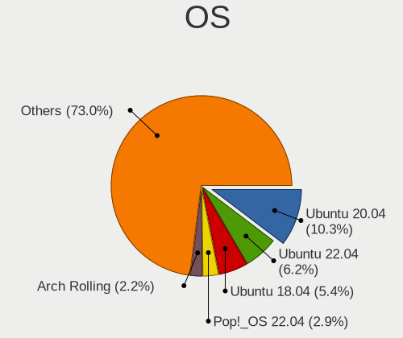
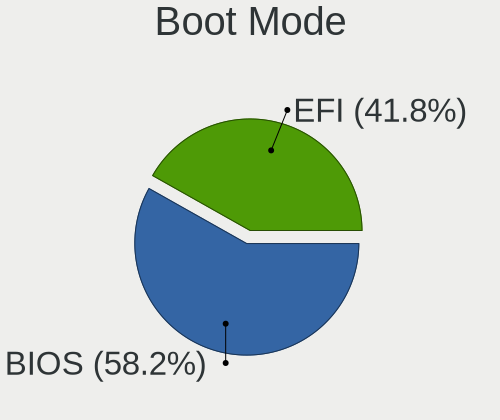
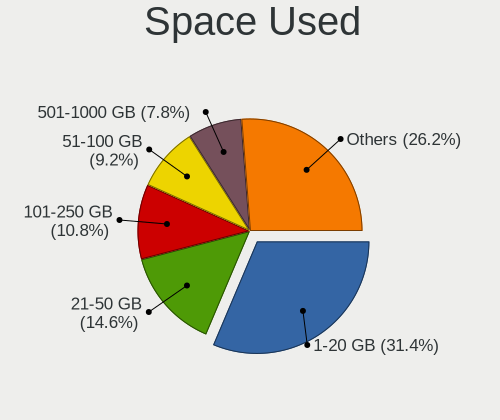
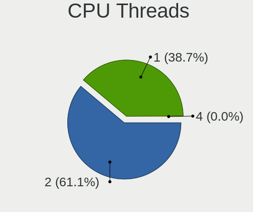
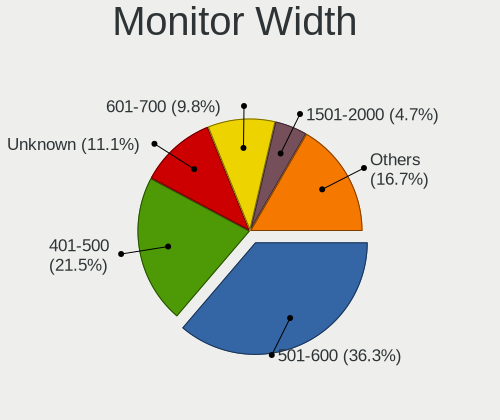
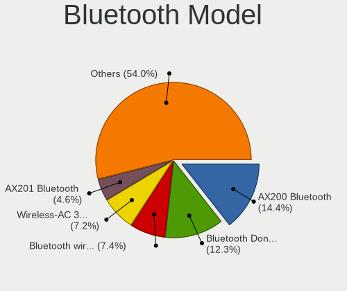
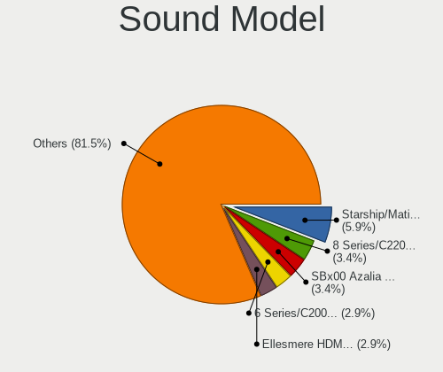
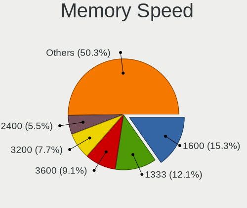
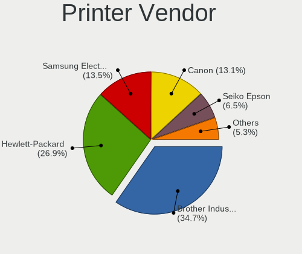

Linux in Canada - Tested Hardware & Statistics (Desktops)
---------------------------------------------------------

A project to collect tested hardware configurations for Linux in Canada.

Anyone can contribute to this report by the [hw-probe](https://github.com/linuxhw/hw-probe) tool:

    sudo -E hw-probe -all -upload

Please contribute! Especially if your hardware is rare.

Contents
--------

* [ Test Cases ](#test-cases)

* [ System ](#system)
  - [ OS                       ](#os)
  - [ OS Family                ](#os-family)
  - [ Kernel                   ](#kernel)
  - [ Kernel Family            ](#kernel-family)
  - [ Kernel Major Ver.        ](#kernel-major-ver)
  - [ Arch                     ](#arch)
  - [ DE                       ](#de)
  - [ Display Server           ](#display-server)
  - [ Display Manager          ](#display-manager)
  - [ OS Lang                  ](#os-lang)
  - [ Boot Mode                ](#boot-mode)
  - [ Filesystem               ](#filesystem)
  - [ Part. scheme             ](#part-scheme)
  - [ Dual Boot with Linux/BSD ](#dual-boot-with-linuxbsd)
  - [ Dual Boot (Win)          ](#dual-boot-win)

* [ Board ](#board)
  - [ Vendor                   ](#vendor)
  - [ Model                    ](#model)
  - [ Model Family             ](#model-family)
  - [ MFG Year                 ](#mfg-year)
  - [ Form Factor              ](#form-factor)
  - [ Secure Boot              ](#secure-boot)
  - [ Coreboot                 ](#coreboot)
  - [ RAM Size                 ](#ram-size)
  - [ RAM Used                 ](#ram-used)
  - [ Total Drives             ](#total-drives)
  - [ Has CD-ROM               ](#has-cd-rom)
  - [ Has Ethernet             ](#has-ethernet)
  - [ Has WiFi                 ](#has-wifi)
  - [ Has Bluetooth            ](#has-bluetooth)

* [ Location ](#location)
  - [ Country                  ](#country)
  - [ City                     ](#city)

* [ Drives ](#drives)
  - [ Drive Vendor             ](#drive-vendor)
  - [ Drive Model              ](#drive-model)
  - [ HDD Vendor               ](#hdd-vendor)
  - [ SSD Vendor               ](#ssd-vendor)
  - [ Drive Kind               ](#drive-kind)
  - [ Drive Connector          ](#drive-connector)
  - [ Drive Size               ](#drive-size)
  - [ Space Total              ](#space-total)
  - [ Space Used               ](#space-used)
  - [ Malfunc. Drives          ](#malfunc-drives)
  - [ Malfunc. Drive Vendor    ](#malfunc-drive-vendor)
  - [ Malfunc. HDD Vendor      ](#malfunc-hdd-vendor)
  - [ Malfunc. Drive Kind      ](#malfunc-drive-kind)
  - [ Failed Drives            ](#failed-drives)
  - [ Failed Drive Vendor      ](#failed-drive-vendor)
  - [ Drive Status             ](#drive-status)

* [ Storage controller ](#storage-controller)
  - [ Storage Vendor           ](#storage-vendor)
  - [ Storage Model            ](#storage-model)
  - [ Storage Kind             ](#storage-kind)

* [ Processor ](#processor)
  - [ CPU Vendor               ](#cpu-vendor)
  - [ CPU Model                ](#cpu-model)
  - [ CPU Model Family         ](#cpu-model-family)
  - [ CPU Cores                ](#cpu-cores)
  - [ CPU Sockets              ](#cpu-sockets)
  - [ CPU Threads              ](#cpu-threads)
  - [ CPU Op-Modes             ](#cpu-op-modes)
  - [ CPU Microcode            ](#cpu-microcode)
  - [ CPU Microarch            ](#cpu-microarch)

* [ Graphics ](#graphics)
  - [ GPU Vendor               ](#gpu-vendor)
  - [ GPU Model                ](#gpu-model)
  - [ GPU Combo                ](#gpu-combo)
  - [ GPU Driver               ](#gpu-driver)
  - [ GPU Memory               ](#gpu-memory)

* [ Monitor ](#monitor)
  - [ Monitor Vendor           ](#monitor-vendor)
  - [ Monitor Model            ](#monitor-model)
  - [ Monitor Resolution       ](#monitor-resolution)
  - [ Monitor Diagonal         ](#monitor-diagonal)
  - [ Monitor Width            ](#monitor-width)
  - [ Aspect Ratio             ](#aspect-ratio)
  - [ Monitor Area             ](#monitor-area)
  - [ Pixel Density            ](#pixel-density)
  - [ Multiple Monitors        ](#multiple-monitors)

* [ Network ](#network)
  - [ Net Controller Vendor    ](#net-controller-vendor)
  - [ Net Controller Model     ](#net-controller-model)
  - [ Wireless Vendor          ](#wireless-vendor)
  - [ Wireless Model           ](#wireless-model)
  - [ Ethernet Vendor          ](#ethernet-vendor)
  - [ Ethernet Model           ](#ethernet-model)
  - [ Net Controller Kind      ](#net-controller-kind)
  - [ Used Controller          ](#used-controller)
  - [ NICs                     ](#nics)
  - [ IPv6                     ](#ipv6)

* [ Bluetooth ](#bluetooth)
  - [ Bluetooth Vendor         ](#bluetooth-vendor)
  - [ Bluetooth Model          ](#bluetooth-model)

* [ Sound ](#sound)
  - [ Sound Vendor             ](#sound-vendor)
  - [ Sound Model              ](#sound-model)

* [ Memory ](#memory)
  - [ Memory Vendor            ](#memory-vendor)
  - [ Memory Model             ](#memory-model)
  - [ Memory Kind              ](#memory-kind)
  - [ Memory Form Factor       ](#memory-form-factor)
  - [ Memory Size              ](#memory-size)
  - [ Memory Speed             ](#memory-speed)

* [ Printers & scanners ](#printers--scanners)
  - [ Printer Vendor           ](#printer-vendor)
  - [ Printer Model            ](#printer-model)
  - [ Scanner Vendor           ](#scanner-vendor)
  - [ Scanner Model            ](#scanner-model)

* [ Camera ](#camera)
  - [ Camera Vendor            ](#camera-vendor)
  - [ Camera Model             ](#camera-model)

* [ Security ](#security)
  - [ Fingerprint Vendor       ](#fingerprint-vendor)
  - [ Fingerprint Model        ](#fingerprint-model)
  - [ Chipcard Vendor          ](#chipcard-vendor)
  - [ Chipcard Model           ](#chipcard-model)

* [ Unsupported ](#unsupported)
  - [ Unsupported Devices      ](#unsupported-devices)
  - [ Unsupported Device Types ](#unsupported-device-types)

Test Cases
----------

Total: 2981

| Vendor        | Model                       | Probe                                                      | Date         |
|---------------|-----------------------------|------------------------------------------------------------|--------------|
| ASRock        | Z77 Extreme3                | [c92633e1ee](https://linux-hardware.org/?probe=c92633e1ee) | Oct 01, 2022 |
| ASRock        | Z77 Extreme3                | [ada9e56162](https://linux-hardware.org/?probe=ada9e56162) | Oct 01, 2022 |
| ASRock        | X570 Steel Legend           | [40e65e38cf](https://linux-hardware.org/?probe=40e65e38cf) | Sep 30, 2022 |
| HP            | 3398                        | [2f7b1d28b4](https://linux-hardware.org/?probe=2f7b1d28b4) | Sep 30, 2022 |
| HP            | 1496                        | [e89f06542b](https://linux-hardware.org/?probe=e89f06542b) | Sep 30, 2022 |
| Lenovo        | SHARKBAY NOK                | [aa0eeeda6b](https://linux-hardware.org/?probe=aa0eeeda6b) | Sep 29, 2022 |
| ASUSTek       | PRIME Z270-A                | [4118e245a3](https://linux-hardware.org/?probe=4118e245a3) | Sep 29, 2022 |
| Acer          | Veriton X6610G              | [66733e59e2](https://linux-hardware.org/?probe=66733e59e2) | Sep 29, 2022 |
| Lenovo        | 1031 SBB0J05441 WIN 3305... | [75c8af47c2](https://linux-hardware.org/?probe=75c8af47c2) | Sep 29, 2022 |
| MSI           | Z87-GD65 GAMING             | [fe6539c021](https://linux-hardware.org/?probe=fe6539c021) | Sep 28, 2022 |
| HP            | 212B                        | [38aa6e5478](https://linux-hardware.org/?probe=38aa6e5478) | Sep 28, 2022 |
| Gigabyte      | Z690I AORUS ULTRA DDR4      | [7af967061b](https://linux-hardware.org/?probe=7af967061b) | Sep 27, 2022 |
| Intel         | DP35DP AAD81073-208         | [031ff09179](https://linux-hardware.org/?probe=031ff09179) | Sep 27, 2022 |
| ASUSTek       | P8H61-M LE/CSM              | [45031620df](https://linux-hardware.org/?probe=45031620df) | Sep 27, 2022 |
| Gateway       | IPISB-VR                    | [21ee50eb69](https://linux-hardware.org/?probe=21ee50eb69) | Sep 24, 2022 |
| ASUSTek       | SABERTOOTH P67              | [164ad85233](https://linux-hardware.org/?probe=164ad85233) | Sep 23, 2022 |
| MSI           | 870-G45                     | [082307d0ce](https://linux-hardware.org/?probe=082307d0ce) | Sep 22, 2022 |
| HP            | 8309                        | [118f235878](https://linux-hardware.org/?probe=118f235878) | Sep 22, 2022 |
| Gigabyte      | EP45-UD3R                   | [920bf9a750](https://linux-hardware.org/?probe=920bf9a750) | Sep 22, 2022 |
| Lenovo        | 1052 NOK                    | [28cd1416fe](https://linux-hardware.org/?probe=28cd1416fe) | Sep 22, 2022 |
| Acer          | Aspire M3450                | [ff7d0a2394](https://linux-hardware.org/?probe=ff7d0a2394) | Sep 21, 2022 |
| ASRock        | Z77 Extreme3                | [deb21d492d](https://linux-hardware.org/?probe=deb21d492d) | Sep 21, 2022 |
| ASUSTek       | A68HM-K                     | [966ae734c2](https://linux-hardware.org/?probe=966ae734c2) | Sep 20, 2022 |
| Gigabyte      | B450 I AORUS PRO WIFI-CF    | [df0348739e](https://linux-hardware.org/?probe=df0348739e) | Sep 20, 2022 |
| Gigabyte      | X570 AORUS MASTER           | [424e3ded44](https://linux-hardware.org/?probe=424e3ded44) | Sep 19, 2022 |
| Gigabyte      | A520M DS3H AC               | [9d26eb4243](https://linux-hardware.org/?probe=9d26eb4243) | Sep 19, 2022 |
| Unknown       | T3 MRD                      | [1f60a4d202](https://linux-hardware.org/?probe=1f60a4d202) | Sep 19, 2022 |
| ASUSTek       | Z97-A                       | [d984474cba](https://linux-hardware.org/?probe=d984474cba) | Sep 19, 2022 |
| MSI           | X570-A PRO                  | [cabf88c8be](https://linux-hardware.org/?probe=cabf88c8be) | Sep 19, 2022 |
| ASUSTek       | F2A85-V PRO                 | [943bb9e023](https://linux-hardware.org/?probe=943bb9e023) | Sep 19, 2022 |
| ASUSTek       | SABERTOOTH P67              | [579f73fc88](https://linux-hardware.org/?probe=579f73fc88) | Sep 19, 2022 |
| ASUSTek       | TUF B350M-PLUS GAMING       | [27d1f0c593](https://linux-hardware.org/?probe=27d1f0c593) | Sep 19, 2022 |
| ASUSTek       | PRIME X570-PRO              | [06f5febda2](https://linux-hardware.org/?probe=06f5febda2) | Sep 19, 2022 |
| BESSTAR Te... | TH50                        | [916e9d7e5e](https://linux-hardware.org/?probe=916e9d7e5e) | Sep 18, 2022 |
| MSI           | 870-G45                     | [e371716311](https://linux-hardware.org/?probe=e371716311) | Sep 18, 2022 |
| Unknown       | T3 MRD                      | [b10823b50f](https://linux-hardware.org/?probe=b10823b50f) | Sep 17, 2022 |
| MSI           | 870-G45                     | [74af87b0c5](https://linux-hardware.org/?probe=74af87b0c5) | Sep 17, 2022 |
| MSI           | 870-G45                     | [f360a57f01](https://linux-hardware.org/?probe=f360a57f01) | Sep 17, 2022 |
| ASUSTek       | ROG STRIX B450-F GAMING     | [1b40e531b5](https://linux-hardware.org/?probe=1b40e531b5) | Sep 17, 2022 |
| Lenovo        | MAHOBAY NOK                 | [cce010fd53](https://linux-hardware.org/?probe=cce010fd53) | Sep 16, 2022 |
| ASUSTek       | LITHIUM                     | [3aab1aa49f](https://linux-hardware.org/?probe=3aab1aa49f) | Sep 16, 2022 |
| HP            | 1998                        | [f3ef7a85fe](https://linux-hardware.org/?probe=f3ef7a85fe) | Sep 16, 2022 |
| ASUSTek       | ROG STRIX B450-I GAMING     | [31f9854044](https://linux-hardware.org/?probe=31f9854044) | Sep 16, 2022 |
| AZW           | GK mini                     | [19b8b4dc85](https://linux-hardware.org/?probe=19b8b4dc85) | Sep 15, 2022 |
| ASUSTek       | TUF Gaming X570-PLUS        | [a4dad191d2](https://linux-hardware.org/?probe=a4dad191d2) | Sep 15, 2022 |
| IBT.ca (IB... | MI836                       | [a180af0292](https://linux-hardware.org/?probe=a180af0292) | Sep 15, 2022 |
| IBT.ca (IB... | MI836                       | [a6d16593cc](https://linux-hardware.org/?probe=a6d16593cc) | Sep 15, 2022 |
| ASUSTek       | PRIME Z270-A                | [2642647feb](https://linux-hardware.org/?probe=2642647feb) | Sep 14, 2022 |
| HP            | 1998                        | [bf93a500f4](https://linux-hardware.org/?probe=bf93a500f4) | Sep 14, 2022 |
| Lenovo        | 1031 SBB0J05441 WIN 3305... | [f614aa6ae7](https://linux-hardware.org/?probe=f614aa6ae7) | Sep 14, 2022 |
| Lenovo        | 1031 SBB0J05441 WIN 3305... | [fc1d1cb3bc](https://linux-hardware.org/?probe=fc1d1cb3bc) | Sep 14, 2022 |
| Dell          | 0DR845                      | [158b3832bc](https://linux-hardware.org/?probe=158b3832bc) | Sep 13, 2022 |
| HP            | 3031h                       | [9312c20d49](https://linux-hardware.org/?probe=9312c20d49) | Sep 13, 2022 |
| HP            | 3031h                       | [1bbfd867b0](https://linux-hardware.org/?probe=1bbfd867b0) | Sep 13, 2022 |
| Dell          | 0DR845                      | [f65bf44380](https://linux-hardware.org/?probe=f65bf44380) | Sep 13, 2022 |
| DFI           | HD631-Q87CRM                | [b7ed9b1d64](https://linux-hardware.org/?probe=b7ed9b1d64) | Sep 12, 2022 |
| ECS           | Nettle3                     | [23f7f8708c](https://linux-hardware.org/?probe=23f7f8708c) | Sep 12, 2022 |
| HP            | 1998                        | [37cd896e72](https://linux-hardware.org/?probe=37cd896e72) | Sep 10, 2022 |
| HP            | 1998                        | [3da9c3ef8e](https://linux-hardware.org/?probe=3da9c3ef8e) | Sep 10, 2022 |
| ASRock        | B450M Pro4                  | [9ce6958b9c](https://linux-hardware.org/?probe=9ce6958b9c) | Sep 09, 2022 |
| IBT.ca (IB... | MI836                       | [6155d5bd47](https://linux-hardware.org/?probe=6155d5bd47) | Sep 09, 2022 |
| MSI           | MPG X570 GAMING EDGE WIF... | [f714986404](https://linux-hardware.org/?probe=f714986404) | Sep 08, 2022 |
| MSI           | B350M PRO-VDH               | [e5067297e8](https://linux-hardware.org/?probe=e5067297e8) | Sep 07, 2022 |
| ASUSTek       | ET2040I                     | [44ab433428](https://linux-hardware.org/?probe=44ab433428) | Sep 06, 2022 |
| ASUSTek       | PRIME B560-PLUS             | [989e0d5d57](https://linux-hardware.org/?probe=989e0d5d57) | Sep 06, 2022 |
| ASUSTek       | PRIME B560-PLUS             | [f51b1f139e](https://linux-hardware.org/?probe=f51b1f139e) | Sep 06, 2022 |
| ASUSTek       | ROG STRIX X470-F GAMING     | [ab4f06e457](https://linux-hardware.org/?probe=ab4f06e457) | Sep 05, 2022 |
| Gigabyte      | X570 AORUS PRO WIFI         | [e12af15c84](https://linux-hardware.org/?probe=e12af15c84) | Sep 05, 2022 |
| ASUSTek       | Q170M-C                     | [6710f3ecd0](https://linux-hardware.org/?probe=6710f3ecd0) | Sep 04, 2022 |
| ASUSTek       | KCMA-D8                     | [df5fdfccf0](https://linux-hardware.org/?probe=df5fdfccf0) | Sep 04, 2022 |
| HP            | 2ADC                        | [d9e5d2b511](https://linux-hardware.org/?probe=d9e5d2b511) | Sep 04, 2022 |
| Intel         | DQ67SW AAG12527-306         | [9ab6c11be2](https://linux-hardware.org/?probe=9ab6c11be2) | Sep 04, 2022 |
| MSI           | H81M-E34                    | [0fa7f79fdc](https://linux-hardware.org/?probe=0fa7f79fdc) | Sep 03, 2022 |
| Acer          | Aspire M3910                | [17c1079582](https://linux-hardware.org/?probe=17c1079582) | Sep 02, 2022 |
| Gigabyte      | GA-870A-UD3                 | [27840cf8d2](https://linux-hardware.org/?probe=27840cf8d2) | Sep 02, 2022 |
| Acer          | Aspire TC-605               | [fa13174432](https://linux-hardware.org/?probe=fa13174432) | Sep 02, 2022 |
| Acer          | Aspire TC-605               | [5ff2a41fcd](https://linux-hardware.org/?probe=5ff2a41fcd) | Sep 01, 2022 |
| Dell          | 0R6PCT A01                  | [02af50752e](https://linux-hardware.org/?probe=02af50752e) | Sep 01, 2022 |
| Acer          | Aspire TC-605               | [fdc6b95d8b](https://linux-hardware.org/?probe=fdc6b95d8b) | Sep 01, 2022 |
| ASUSTek       | ROG STRIX X470-F GAMING     | [a2878122de](https://linux-hardware.org/?probe=a2878122de) | Sep 01, 2022 |
| ASUSTek       | ROG STRIX X470-F GAMING     | [836d60c547](https://linux-hardware.org/?probe=836d60c547) | Sep 01, 2022 |
| ASRock        | B450M Pro4-F                | [d48b9efca4](https://linux-hardware.org/?probe=d48b9efca4) | Sep 01, 2022 |
| JGINYUE       | B85I PLUS V2.1              | [d171691ef3](https://linux-hardware.org/?probe=d171691ef3) | Aug 31, 2022 |
| Gigabyte      | H370 AORUS GAMING 3 WIFI... | [413bd5a721](https://linux-hardware.org/?probe=413bd5a721) | Aug 29, 2022 |
| Lenovo        | MAHOBAY NO DPK              | [9274f5e876](https://linux-hardware.org/?probe=9274f5e876) | Aug 29, 2022 |
| ASUSTek       | TUF Z390-PLUS GAMING        | [3ce9a33fed](https://linux-hardware.org/?probe=3ce9a33fed) | Aug 28, 2022 |
| ASUSTek       | TUF Z390-PLUS GAMING        | [2adf8e9ff6](https://linux-hardware.org/?probe=2adf8e9ff6) | Aug 28, 2022 |
| Gigabyte      | B450 I AORUS PRO WIFI-CF    | [a328df0016](https://linux-hardware.org/?probe=a328df0016) | Aug 28, 2022 |
| ASUSTek       | TUF Gaming X570-PLUS        | [505d987d1e](https://linux-hardware.org/?probe=505d987d1e) | Aug 28, 2022 |
| ASUSTek       | TUF Gaming B550-PLUS        | [704ce84e6a](https://linux-hardware.org/?probe=704ce84e6a) | Aug 27, 2022 |
| Intel         | DH87RL AAG74240-401         | [814718547c](https://linux-hardware.org/?probe=814718547c) | Aug 27, 2022 |
| HP            | 18E4                        | [13d5c6848a](https://linux-hardware.org/?probe=13d5c6848a) | Aug 24, 2022 |
| Dell          | 0F5C5X A00                  | [80cfa18cfd](https://linux-hardware.org/?probe=80cfa18cfd) | Aug 24, 2022 |
| ASUSTek       | TUF Gaming X570-PLUS        | [d1cae6aca8](https://linux-hardware.org/?probe=d1cae6aca8) | Aug 24, 2022 |
| Dell          | 0F5C5X A00                  | [5e62f9adde](https://linux-hardware.org/?probe=5e62f9adde) | Aug 24, 2022 |
| Dell          | 0YJPT1 A00                  | [1de0aeba8f](https://linux-hardware.org/?probe=1de0aeba8f) | Aug 22, 2022 |
| ASUSTek       | Z97-P                       | [bcd3bcb389](https://linux-hardware.org/?probe=bcd3bcb389) | Aug 22, 2022 |
| ASUSTek       | ROG STRIX Z690-E GAMING ... | [5f90bb65a6](https://linux-hardware.org/?probe=5f90bb65a6) | Aug 21, 2022 |
| ASUSTek       | M4A78-E                     | [76028e78e9](https://linux-hardware.org/?probe=76028e78e9) | Aug 19, 2022 |
| Intel         | DH87RL AAG74240-401         | [ebc0328fe0](https://linux-hardware.org/?probe=ebc0328fe0) | Aug 19, 2022 |
| ASUSTek       | PRIME Z390-A                | [e03daeba5f](https://linux-hardware.org/?probe=e03daeba5f) | Aug 18, 2022 |
| Dell          | 054KM3 A01                  | [3f966fdafa](https://linux-hardware.org/?probe=3f966fdafa) | Aug 17, 2022 |
| Intel         | DH87RL AAG74240-401         | [a8c5b732f4](https://linux-hardware.org/?probe=a8c5b732f4) | Aug 17, 2022 |
| Acer          | Aspire TC-885 V:1.1         | [1ab8003e04](https://linux-hardware.org/?probe=1ab8003e04) | Aug 17, 2022 |
| Acer          | Aspire TC-885 V:1.1         | [2a3c6446e5](https://linux-hardware.org/?probe=2a3c6446e5) | Aug 17, 2022 |
| ASUSTek       | PRIME H370-A                | [da477254e7](https://linux-hardware.org/?probe=da477254e7) | Aug 16, 2022 |
| Dell          | 0PC5F7 A03                  | [56ee42afe3](https://linux-hardware.org/?probe=56ee42afe3) | Aug 15, 2022 |
| ASUSTek       | K30AD_M31AD_M51AD_M32AD     | [239daef655](https://linux-hardware.org/?probe=239daef655) | Aug 15, 2022 |
| ASUSTek       | TUF Gaming B550-PLUS        | [e75de6c205](https://linux-hardware.org/?probe=e75de6c205) | Aug 15, 2022 |
| ASUSTek       | B85M-G                      | [b44e802677](https://linux-hardware.org/?probe=b44e802677) | Aug 14, 2022 |
| HP            | 805D                        | [54f4e0fdb0](https://linux-hardware.org/?probe=54f4e0fdb0) | Aug 14, 2022 |
| MSI           | MS-B9351                    | [a5b1950761](https://linux-hardware.org/?probe=a5b1950761) | Aug 14, 2022 |
| MSI           | MS-B9351                    | [fbf08d2d76](https://linux-hardware.org/?probe=fbf08d2d76) | Aug 14, 2022 |
| ASRock        | B450M Pro4                  | [286fd1791a](https://linux-hardware.org/?probe=286fd1791a) | Aug 14, 2022 |
| Dell          | 07PR60 A02                  | [7ed59c8c10](https://linux-hardware.org/?probe=7ed59c8c10) | Aug 12, 2022 |
| ASUSTek       | P5GC-MX                     | [346a48750b](https://linux-hardware.org/?probe=346a48750b) | Aug 12, 2022 |
| ASUSTek       | G10DK                       | [2401d4af44](https://linux-hardware.org/?probe=2401d4af44) | Aug 08, 2022 |
| ASUSTek       | PRIME B550M-A               | [64e8ddf1c9](https://linux-hardware.org/?probe=64e8ddf1c9) | Aug 07, 2022 |
| Dell          | 0NV0M7 A02                  | [dbf000aacd](https://linux-hardware.org/?probe=dbf000aacd) | Aug 06, 2022 |
| Gigabyte      | X570 AORUS MASTER           | [dca6f9dfbd](https://linux-hardware.org/?probe=dca6f9dfbd) | Aug 06, 2022 |
| ASUSTek       | PRIME B450M-A               | [3b290b6c0b](https://linux-hardware.org/?probe=3b290b6c0b) | Aug 04, 2022 |
| ASUSTek       | PRIME B350M-E               | [f9e07e62c2](https://linux-hardware.org/?probe=f9e07e62c2) | Aug 04, 2022 |
| Biostar       | TA880GU3+                   | [323c68d80f](https://linux-hardware.org/?probe=323c68d80f) | Aug 03, 2022 |
| HP            | 339A                        | [27ddbfd51d](https://linux-hardware.org/?probe=27ddbfd51d) | Aug 03, 2022 |
| HP            | 8433 11                     | [cd790281b5](https://linux-hardware.org/?probe=cd790281b5) | Aug 02, 2022 |
| Lenovo        | 102F SDK0E50510 WIN 2625... | [80512402c0](https://linux-hardware.org/?probe=80512402c0) | Aug 02, 2022 |
| Gigabyte      | Z690I AORUS ULTRA DDR4      | [4bd0f9e461](https://linux-hardware.org/?probe=4bd0f9e461) | Aug 02, 2022 |
| Dell          | 0GXM1W A01                  | [91d2f28256](https://linux-hardware.org/?probe=91d2f28256) | Aug 01, 2022 |
| Dell          | 0GXM1W A01                  | [ab895fc1a2](https://linux-hardware.org/?probe=ab895fc1a2) | Aug 01, 2022 |
| Apple         | Mac-F221BEC8                | [13cbc87486](https://linux-hardware.org/?probe=13cbc87486) | Jul 31, 2022 |
| ASUSTek       | PRIME Z490-A                | [a1923838e1](https://linux-hardware.org/?probe=a1923838e1) | Jul 31, 2022 |
| ASUSTek       | TUF Gaming X570-PLUS        | [22b4bcc010](https://linux-hardware.org/?probe=22b4bcc010) | Jul 31, 2022 |
| EVGA          | 134-KS-E377                 | [2624cfe274](https://linux-hardware.org/?probe=2624cfe274) | Jul 30, 2022 |
| Apple         | Mac-F42C88C8 Proto1         | [cc3deb0a17](https://linux-hardware.org/?probe=cc3deb0a17) | Jul 30, 2022 |
| Dell          | 0WMJ54 A01                  | [7682000c35](https://linux-hardware.org/?probe=7682000c35) | Jul 30, 2022 |
| HP            | 339A                        | [7f2505acd4](https://linux-hardware.org/?probe=7f2505acd4) | Jul 30, 2022 |
| ASUSTek       | ROG STRIX B450-F GAMING     | [38fae80720](https://linux-hardware.org/?probe=38fae80720) | Jul 29, 2022 |
| BESSTAR Te... | DMAF5 V1.0                  | [a6237b3a28](https://linux-hardware.org/?probe=a6237b3a28) | Jul 29, 2022 |
| Gigabyte      | Z170XP-SLI-CF               | [5a12531bf9](https://linux-hardware.org/?probe=5a12531bf9) | Jul 29, 2022 |
| ASUSTek       | G10DK                       | [70a71d84a6](https://linux-hardware.org/?probe=70a71d84a6) | Jul 28, 2022 |
| HP            | 18E6                        | [60d1a8e6da](https://linux-hardware.org/?probe=60d1a8e6da) | Jul 28, 2022 |
| Lenovo        | SHARKBAY SDK0E50510 WIN     | [da54317b9a](https://linux-hardware.org/?probe=da54317b9a) | Jul 27, 2022 |
| Dell          | 05DN3X A00                  | [e4c1d0bdeb](https://linux-hardware.org/?probe=e4c1d0bdeb) | Jul 27, 2022 |
| Dell          | 0WMJ54 A01                  | [fc499e7600](https://linux-hardware.org/?probe=fc499e7600) | Jul 27, 2022 |
| Dell          | 042P49 A01                  | [f9003ad850](https://linux-hardware.org/?probe=f9003ad850) | Jul 26, 2022 |
| ASUSTek       | M51BC                       | [4d6af73032](https://linux-hardware.org/?probe=4d6af73032) | Jul 26, 2022 |
| ASUSTek       | TUF Gaming A520M-PLUS WI... | [b61b6b5fa5](https://linux-hardware.org/?probe=b61b6b5fa5) | Jul 26, 2022 |
| ASUSTek       | PRIME B450M-A               | [4812de622f](https://linux-hardware.org/?probe=4812de622f) | Jul 26, 2022 |
| Gateway       | DX4840                      | [0df8a716b1](https://linux-hardware.org/?probe=0df8a716b1) | Jul 24, 2022 |
| MSI           | 970 GAMING                  | [bf2a870952](https://linux-hardware.org/?probe=bf2a870952) | Jul 23, 2022 |
| MSI           | MEG X570 ACE                | [f13fde648e](https://linux-hardware.org/?probe=f13fde648e) | Jul 23, 2022 |
| Pegatron      | 2ACD                        | [c8ce65cd26](https://linux-hardware.org/?probe=c8ce65cd26) | Jul 23, 2022 |
| ASUSTek       | P8P67 PRO                   | [54e6e291bd](https://linux-hardware.org/?probe=54e6e291bd) | Jul 22, 2022 |
| Dell          | 0WMJ54 A01                  | [dace7a0b12](https://linux-hardware.org/?probe=dace7a0b12) | Jul 21, 2022 |
| ASUSTek       | ROG STRIX B550-I GAMING     | [2e97c3de0b](https://linux-hardware.org/?probe=2e97c3de0b) | Jul 21, 2022 |
| ASUSTek       | ROG STRIX B550-I GAMING     | [d567131bf9](https://linux-hardware.org/?probe=d567131bf9) | Jul 21, 2022 |
| ASUSTek       | ROG STRIX Z370-E GAMING     | [9689ac8020](https://linux-hardware.org/?probe=9689ac8020) | Jul 21, 2022 |
| HP            | 158B                        | [017875f5a5](https://linux-hardware.org/?probe=017875f5a5) | Jul 21, 2022 |
| Unknown       | T3 MRD                      | [afbe55b100](https://linux-hardware.org/?probe=afbe55b100) | Jul 20, 2022 |
| Dell          | 04Y8V0 A02                  | [f843e569ed](https://linux-hardware.org/?probe=f843e569ed) | Jul 20, 2022 |
| Lenovo        | SHARKBAY 0B98401 WIN        | [0ce9af7993](https://linux-hardware.org/?probe=0ce9af7993) | Jul 20, 2022 |
| MSI           | B450M MORTAR TITANIUM       | [6aac7a75e7](https://linux-hardware.org/?probe=6aac7a75e7) | Jul 18, 2022 |
| MSI           | MEG B550 UNIFY              | [d6ecbbbfda](https://linux-hardware.org/?probe=d6ecbbbfda) | Jul 17, 2022 |
| Gigabyte      | Z97X-Gaming 3               | [ec770759cd](https://linux-hardware.org/?probe=ec770759cd) | Jul 17, 2022 |
| Gigabyte      | F2A85XM-D3H                 | [38ebe8f368](https://linux-hardware.org/?probe=38ebe8f368) | Jul 17, 2022 |
| Gigabyte      | F2A85XM-D3H                 | [129bcce64f](https://linux-hardware.org/?probe=129bcce64f) | Jul 17, 2022 |
| Gigabyte      | B250M-DS3H-CF               | [236812ea49](https://linux-hardware.org/?probe=236812ea49) | Jul 17, 2022 |
| ASUSTek       | M51BC                       | [d5a6b5628b](https://linux-hardware.org/?probe=d5a6b5628b) | Jul 14, 2022 |
| ASRock        | Z77 Pro4-M                  | [69b486ea31](https://linux-hardware.org/?probe=69b486ea31) | Jul 14, 2022 |
| Lenovo        | SHARKBAY 0B98401 PRO        | [386dd1ac4b](https://linux-hardware.org/?probe=386dd1ac4b) | Jul 14, 2022 |
| MSI           | A320M PRO-VH PLUS           | [e007a2fbc2](https://linux-hardware.org/?probe=e007a2fbc2) | Jul 13, 2022 |
| MSI           | B450 GAMING PRO CARBON M... | [a6d5a615d0](https://linux-hardware.org/?probe=a6d5a615d0) | Jul 13, 2022 |
| ASUSTek       | TUF Gaming X570-PLUS        | [43e78c262a](https://linux-hardware.org/?probe=43e78c262a) | Jul 12, 2022 |
| Acidanther... | Mac-27AD2F918AE68F61 Mac... | [fdae528732](https://linux-hardware.org/?probe=fdae528732) | Jul 12, 2022 |
| ASUSTek       | TUF Gaming X570-PLUS        | [063f846aad](https://linux-hardware.org/?probe=063f846aad) | Jul 12, 2022 |
| OEM_MB        | NARRA3                      | [845bdfd72c](https://linux-hardware.org/?probe=845bdfd72c) | Jul 11, 2022 |
| Dell          | 09WH54 A00                  | [8570e35470](https://linux-hardware.org/?probe=8570e35470) | Jul 11, 2022 |
| Acer          | Nitro N50-610               | [48c007b4e2](https://linux-hardware.org/?probe=48c007b4e2) | Jul 10, 2022 |
| Gigabyte      | Z270M-D3H-CF                | [df9ed91803](https://linux-hardware.org/?probe=df9ed91803) | Jul 10, 2022 |
| MSI           | 2AE0                        | [4732ee97fb](https://linux-hardware.org/?probe=4732ee97fb) | Jul 10, 2022 |
| Apple         | Mac-F221BEC8                | [2efb274f31](https://linux-hardware.org/?probe=2efb274f31) | Jul 10, 2022 |
| MSI           | B450-A PRO MAX              | [00495f3422](https://linux-hardware.org/?probe=00495f3422) | Jul 09, 2022 |
| Dell          | 0R849J A01                  | [3ea68d63c3](https://linux-hardware.org/?probe=3ea68d63c3) | Jul 08, 2022 |
| MSI           | MPG X570 GAMING PRO CARB... | [5dc09a66d8](https://linux-hardware.org/?probe=5dc09a66d8) | Jul 08, 2022 |
| ASUSTek       | M51BC                       | [fd0a9ef1c8](https://linux-hardware.org/?probe=fd0a9ef1c8) | Jul 08, 2022 |
| ASUSTek       | M51BC                       | [cc2f84d5d3](https://linux-hardware.org/?probe=cc2f84d5d3) | Jul 08, 2022 |
| ASUSTek       | P7H55-M PRO                 | [35e1af0d15](https://linux-hardware.org/?probe=35e1af0d15) | Jul 08, 2022 |
| ASRock        | B450M Pro4                  | [ff75212757](https://linux-hardware.org/?probe=ff75212757) | Jul 07, 2022 |
| MSI           | MPG B560I GAMING EDGE WI... | [ebaa969297](https://linux-hardware.org/?probe=ebaa969297) | Jul 06, 2022 |
| ASRock        | B550 Phantom Gaming 4       | [7a6f484b16](https://linux-hardware.org/?probe=7a6f484b16) | Jul 06, 2022 |
| ASUSTek       | M5A99FX PRO R2.0            | [d14ad254ca](https://linux-hardware.org/?probe=d14ad254ca) | Jul 05, 2022 |
| ASRock        | G41C-GS R2.0                | [a9a0f46cc7](https://linux-hardware.org/?probe=a9a0f46cc7) | Jul 05, 2022 |
| MSI           | Z170-A PRO                  | [24a76119e1](https://linux-hardware.org/?probe=24a76119e1) | Jul 04, 2022 |
| MSI           | 970A SLI Krait Edition      | [3199c023cb](https://linux-hardware.org/?probe=3199c023cb) | Jul 04, 2022 |
| Dell          | 0M6C7G A00                  | [5eee0db64f](https://linux-hardware.org/?probe=5eee0db64f) | Jul 03, 2022 |
| ASUSTek       | PRIME X570-P                | [1a729c627d](https://linux-hardware.org/?probe=1a729c627d) | Jul 03, 2022 |
| Acer          | Aspire TC-280               | [7322461b76](https://linux-hardware.org/?probe=7322461b76) | Jul 03, 2022 |
| Acer          | Aspire TC-280               | [0e497c1c13](https://linux-hardware.org/?probe=0e497c1c13) | Jul 02, 2022 |
| ASRock        | B450M Pro4                  | [64eae559ae](https://linux-hardware.org/?probe=64eae559ae) | Jul 02, 2022 |
| ASRock        | Z97 Anniversary             | [1e650b504d](https://linux-hardware.org/?probe=1e650b504d) | Jul 01, 2022 |
| Dell          | 0HJ054                      | [bb9d7a3a58](https://linux-hardware.org/?probe=bb9d7a3a58) | Jun 30, 2022 |
| Dell          | 0M858N A01                  | [6cc8dcd51e](https://linux-hardware.org/?probe=6cc8dcd51e) | Jun 29, 2022 |
| MSI           | MAG X570 TOMAHAWK WIFI      | [cf7b4fb7e1](https://linux-hardware.org/?probe=cf7b4fb7e1) | Jun 29, 2022 |
| MSI           | H310M PRO-VD                | [1aec9e08e9](https://linux-hardware.org/?probe=1aec9e08e9) | Jun 28, 2022 |
| MSI           | H310M PRO-VD                | [1812911a41](https://linux-hardware.org/?probe=1812911a41) | Jun 28, 2022 |
| ASRock        | A320M-HDV R4.0              | [547346f0a9](https://linux-hardware.org/?probe=547346f0a9) | Jun 26, 2022 |
| MSI           | MPG X570S EDGE MAX WIFI     | [2c1f55aa8f](https://linux-hardware.org/?probe=2c1f55aa8f) | Jun 23, 2022 |
| ASUSTek       | P5W DH Deluxe               | [71f0d32783](https://linux-hardware.org/?probe=71f0d32783) | Jun 23, 2022 |
| Gigabyte      | Z77X-UD3H                   | [7d7828a253](https://linux-hardware.org/?probe=7d7828a253) | Jun 23, 2022 |
| ASRock        | A320M-HDV R4.0              | [cf4479fbe9](https://linux-hardware.org/?probe=cf4479fbe9) | Jun 22, 2022 |
| ASUSTek       | PRIME Z370-A                | [8dca736a46](https://linux-hardware.org/?probe=8dca736a46) | Jun 21, 2022 |
| Gigabyte      | B450 AORUS PRO WIFI-CF      | [834bed6eda](https://linux-hardware.org/?probe=834bed6eda) | Jun 21, 2022 |
| ASUSTek       | P8Z77-V                     | [e32a4e0214](https://linux-hardware.org/?probe=e32a4e0214) | Jun 20, 2022 |
| MSI           | H310M PRO-VD                | [6516a467b5](https://linux-hardware.org/?probe=6516a467b5) | Jun 17, 2022 |
| ASUSTek       | P8B75-M                     | [9ab6f4690f](https://linux-hardware.org/?probe=9ab6f4690f) | Jun 16, 2022 |
| Gigabyte      | Z68X-UD3H-B3                | [bce90f59c8](https://linux-hardware.org/?probe=bce90f59c8) | Jun 16, 2022 |
| Gigabyte      | Z68X-UD3H-B3                | [6c1c388f3a](https://linux-hardware.org/?probe=6c1c388f3a) | Jun 15, 2022 |
| MSI           | B450 TOMAHAWK               | [e11d001f52](https://linux-hardware.org/?probe=e11d001f52) | Jun 15, 2022 |
| ASRock        | H310M-ITX/ac                | [17063e8cc6](https://linux-hardware.org/?probe=17063e8cc6) | Jun 15, 2022 |
| Acer          | Aspire X1400                | [a90701fd86](https://linux-hardware.org/?probe=a90701fd86) | Jun 15, 2022 |
| Lenovo        | 0B98401 PRO                 | [23de86aa97](https://linux-hardware.org/?probe=23de86aa97) | Jun 14, 2022 |
| Dell          | 0D28YY A00                  | [18487dbcb1](https://linux-hardware.org/?probe=18487dbcb1) | Jun 14, 2022 |
| Alienware     | 0R3FWM A00                  | [6690a39447](https://linux-hardware.org/?probe=6690a39447) | Jun 13, 2022 |
| ASUSTek       | PRIME B550M-A               | [14b9e721b7](https://linux-hardware.org/?probe=14b9e721b7) | Jun 11, 2022 |
| ASUSTek       | PRIME B450M-A II            | [148d14437b](https://linux-hardware.org/?probe=148d14437b) | Jun 10, 2022 |
| ASUSTek       | PRIME X470-PRO              | [693e499a6d](https://linux-hardware.org/?probe=693e499a6d) | Jun 10, 2022 |
| ASUSTek       | M5A97 R2.0                  | [e92127f694](https://linux-hardware.org/?probe=e92127f694) | Jun 10, 2022 |
| Gigabyte      | Z97X-SLI-CF                 | [294890a076](https://linux-hardware.org/?probe=294890a076) | Jun 10, 2022 |
| Gigabyte      | GA-78LMT-USB3 SEx           | [9c7b34c996](https://linux-hardware.org/?probe=9c7b34c996) | Jun 09, 2022 |
| Gigabyte      | AB350M-Gaming 3-CF          | [c18fee9219](https://linux-hardware.org/?probe=c18fee9219) | Jun 08, 2022 |
| Dell          | 0WR7PY A03                  | [630d0bc381](https://linux-hardware.org/?probe=630d0bc381) | Jun 08, 2022 |
| Intel         | DG33FB AAD81072-306         | [78abe45a29](https://linux-hardware.org/?probe=78abe45a29) | Jun 08, 2022 |
| Lenovo        | ThinkStation S20 410599U    | [072870fb4e](https://linux-hardware.org/?probe=072870fb4e) | Jun 07, 2022 |
| HP            | 8433 11                     | [fa4c4f5c0e](https://linux-hardware.org/?probe=fa4c4f5c0e) | Jun 07, 2022 |
| Lenovo        | ThinkStation S20 410599U    | [20df21f5d9](https://linux-hardware.org/?probe=20df21f5d9) | Jun 07, 2022 |
| Unknown       | Unknown                     | [44afb95fbb](https://linux-hardware.org/?probe=44afb95fbb) | Jun 06, 2022 |
| Dell          | 0KWVT8 A03                  | [5745c8b787](https://linux-hardware.org/?probe=5745c8b787) | Jun 06, 2022 |
| MSI           | MPG X570S CARBON MAX WIF... | [0d57c069a8](https://linux-hardware.org/?probe=0d57c069a8) | Jun 05, 2022 |
| Gigabyte      | GA-990FXA-UD3               | [e636b14f58](https://linux-hardware.org/?probe=e636b14f58) | Jun 05, 2022 |
| ASRock        | Z97 Anniversary             | [b6a332c085](https://linux-hardware.org/?probe=b6a332c085) | Jun 04, 2022 |
| Gigabyte      | X570 AORUS ELITE            | [9404638832](https://linux-hardware.org/?probe=9404638832) | Jun 03, 2022 |
| HP            | 3397                        | [775c6990fd](https://linux-hardware.org/?probe=775c6990fd) | Jun 03, 2022 |
| HP            | 3397                        | [2f3fb08195](https://linux-hardware.org/?probe=2f3fb08195) | Jun 03, 2022 |
| BESSTAR Te... | UM700                       | [ea24f8341e](https://linux-hardware.org/?probe=ea24f8341e) | Jun 02, 2022 |
| BESSTAR Te... | UM700                       | [d3799b37d7](https://linux-hardware.org/?probe=d3799b37d7) | Jun 02, 2022 |
| Gigabyte      | B450 AORUS PRO WIFI-CF      | [c50bbae3e1](https://linux-hardware.org/?probe=c50bbae3e1) | Jun 02, 2022 |
| MACHINIST     | X79 (INTEL Xeon E5/Corei... | [536c6e19de](https://linux-hardware.org/?probe=536c6e19de) | Jun 01, 2022 |
| HP            | 339A                        | [c3c520f59b](https://linux-hardware.org/?probe=c3c520f59b) | Jun 01, 2022 |
| ASUSTek       | F2A85-M                     | [82b4935292](https://linux-hardware.org/?probe=82b4935292) | Jun 01, 2022 |
| Dell          | 0R6PCT A01                  | [08c460e0a3](https://linux-hardware.org/?probe=08c460e0a3) | May 30, 2022 |
| Dell          | 0R6PCT A01                  | [89aadb96f3](https://linux-hardware.org/?probe=89aadb96f3) | May 30, 2022 |
| ASUSTek       | M5A97 R2.0                  | [5e75c2d00d](https://linux-hardware.org/?probe=5e75c2d00d) | May 29, 2022 |
| ASUSTek       | M5A97 R2.0                  | [ae1874ffd5](https://linux-hardware.org/?probe=ae1874ffd5) | May 29, 2022 |
| ASUSTek       | ROG Maximus X HERO          | [33a2de91a2](https://linux-hardware.org/?probe=33a2de91a2) | May 29, 2022 |
| MSI           | MPG B550 GAMING EDGE WIF... | [c07bfd58f1](https://linux-hardware.org/?probe=c07bfd58f1) | May 29, 2022 |
| ASUSTek       | ROG STRIX Z690-A GAMING ... | [1416d5a87d](https://linux-hardware.org/?probe=1416d5a87d) | May 29, 2022 |
| MSI           | MPG X570S CARBON MAX WIF... | [a4f2a9b24b](https://linux-hardware.org/?probe=a4f2a9b24b) | May 27, 2022 |
| MSI           | MPG X570S CARBON MAX WIF... | [3143793e8f](https://linux-hardware.org/?probe=3143793e8f) | May 27, 2022 |
| Gigabyte      | AB350-Gaming 3-CF           | [63690e08a1](https://linux-hardware.org/?probe=63690e08a1) | May 27, 2022 |
| ASUSTek       | 970 PRO GAMING/AURA         | [24b4b7cb04](https://linux-hardware.org/?probe=24b4b7cb04) | May 26, 2022 |
| Lenovo        | ThinkCentre M90p 5864AL2    | [679cfd5a27](https://linux-hardware.org/?probe=679cfd5a27) | May 26, 2022 |
| ASUSTek       | PRIME X570-P                | [db51e7c435](https://linux-hardware.org/?probe=db51e7c435) | May 26, 2022 |
| Gigabyte      | AB350-Gaming 3-CF           | [c9c34c5c6f](https://linux-hardware.org/?probe=c9c34c5c6f) | May 26, 2022 |
| Dell          | 0YJPT1 A00                  | [f4afc8ed1d](https://linux-hardware.org/?probe=f4afc8ed1d) | May 25, 2022 |
| Gigabyte      | B550 AORUS PRO AC           | [7260e3bf3b](https://linux-hardware.org/?probe=7260e3bf3b) | May 24, 2022 |
| ASUSTek       | PRIME B660M-A AC D4         | [286688e46b](https://linux-hardware.org/?probe=286688e46b) | May 23, 2022 |
| Gigabyte      | Z390 UD                     | [d49bf6427c](https://linux-hardware.org/?probe=d49bf6427c) | May 23, 2022 |
| MSI           | 2AE0                        | [ea14a764bb](https://linux-hardware.org/?probe=ea14a764bb) | May 22, 2022 |
| HP            | 3398                        | [d7e6c0c903](https://linux-hardware.org/?probe=d7e6c0c903) | May 22, 2022 |
| Gigabyte      | X470 AORUS ULTRA GAMING-... | [42338941c5](https://linux-hardware.org/?probe=42338941c5) | May 21, 2022 |
| Intel         | DQ77MK AAG39642-400         | [f694bcfbc5](https://linux-hardware.org/?probe=f694bcfbc5) | May 21, 2022 |
| Dell          | 0D6H9T A02                  | [3f87c84f7a](https://linux-hardware.org/?probe=3f87c84f7a) | May 20, 2022 |
| ASUSTek       | PRIME B550M-A               | [1d5fec86a8](https://linux-hardware.org/?probe=1d5fec86a8) | May 20, 2022 |
| HP            | 8704                        | [84fd199efc](https://linux-hardware.org/?probe=84fd199efc) | May 17, 2022 |
| MSI           | H310M PRO-VD                | [70a3302b36](https://linux-hardware.org/?probe=70a3302b36) | May 17, 2022 |
| MSI           | H310M PRO-VD                | [a04d3bd332](https://linux-hardware.org/?probe=a04d3bd332) | May 17, 2022 |
| HP            | 8704                        | [863dcbe2ae](https://linux-hardware.org/?probe=863dcbe2ae) | May 17, 2022 |
| Dell          | 0T656F A01                  | [2df08f807d](https://linux-hardware.org/?probe=2df08f807d) | May 15, 2022 |
| Gigabyte      | X570S AORUS MASTER          | [b061586ff0](https://linux-hardware.org/?probe=b061586ff0) | May 14, 2022 |
| ASUSTek       | F2A85-V PRO                 | [35209e0a61](https://linux-hardware.org/?probe=35209e0a61) | May 14, 2022 |
| ASUSTek       | Acacia                      | [4b633150fa](https://linux-hardware.org/?probe=4b633150fa) | May 14, 2022 |
| ASUSTek       | ROG CROSSHAIR VIII DARK ... | [2d1e8a0642](https://linux-hardware.org/?probe=2d1e8a0642) | May 14, 2022 |
| ASRock        | B450M Pro4-F                | [423fbd3a54](https://linux-hardware.org/?probe=423fbd3a54) | May 14, 2022 |
| HP            | 8704                        | [979caa0192](https://linux-hardware.org/?probe=979caa0192) | May 13, 2022 |
| ASUSTek       | B85M-G                      | [6dee77b5ca](https://linux-hardware.org/?probe=6dee77b5ca) | May 13, 2022 |
| Acer          | Aspire X3400                | [9dd76b4599](https://linux-hardware.org/?probe=9dd76b4599) | May 13, 2022 |
| Acer          | Aspire X3400                | [b590b149fc](https://linux-hardware.org/?probe=b590b149fc) | May 13, 2022 |
| Lenovo        | 0B98401 PRO                 | [ee225906fc](https://linux-hardware.org/?probe=ee225906fc) | May 12, 2022 |
| MSI           | Z390-A PRO                  | [58c45bf845](https://linux-hardware.org/?probe=58c45bf845) | May 12, 2022 |
| Gigabyte      | GA-78LMT-USB3               | [5de8d1f805](https://linux-hardware.org/?probe=5de8d1f805) | May 11, 2022 |
| Lenovo        | 0B98401 PRO                 | [16911d5e64](https://linux-hardware.org/?probe=16911d5e64) | May 11, 2022 |
| MSI           | X470 GAMING PLUS            | [565dfeea66](https://linux-hardware.org/?probe=565dfeea66) | May 11, 2022 |
| Gigabyte      | X570 AORUS MASTER           | [c5bad2fcf9](https://linux-hardware.org/?probe=c5bad2fcf9) | May 10, 2022 |
| MSI           | A68HM-E33 V2                | [dedc4ce0d5](https://linux-hardware.org/?probe=dedc4ce0d5) | May 10, 2022 |
| ASUSTek       | PRIME Z370-A                | [e930eaf7f8](https://linux-hardware.org/?probe=e930eaf7f8) | May 10, 2022 |
| Gigabyte      | B365M GAMING HD             | [5590d9a0f3](https://linux-hardware.org/?probe=5590d9a0f3) | May 10, 2022 |
| Dell          | 0Y2MRG A00                  | [ab85a57857](https://linux-hardware.org/?probe=ab85a57857) | May 10, 2022 |
| MSI           | MAG B550 TORPEDO            | [1899727b8b](https://linux-hardware.org/?probe=1899727b8b) | May 09, 2022 |
| ASUSTek       | P5QL PRO                    | [9ea782b1d2](https://linux-hardware.org/?probe=9ea782b1d2) | May 08, 2022 |
| ASUSTek       | ROG CROSSHAIR VIII HERO     | [180dd73bd6](https://linux-hardware.org/?probe=180dd73bd6) | May 07, 2022 |
| HP            | 3397                        | [157ef440d8](https://linux-hardware.org/?probe=157ef440d8) | May 06, 2022 |
| MSI           | H310M PRO-VD                | [5f977ecef6](https://linux-hardware.org/?probe=5f977ecef6) | May 06, 2022 |
| Gigabyte      | Z370P D3-CF                 | [8a561e2442](https://linux-hardware.org/?probe=8a561e2442) | May 05, 2022 |
| ASUSTek       | VM42                        | [cb73da6c51](https://linux-hardware.org/?probe=cb73da6c51) | May 05, 2022 |
| ASUSTek       | VM42                        | [1fb131686b](https://linux-hardware.org/?probe=1fb131686b) | May 05, 2022 |
| MSI           | Z390-A PRO                  | [21e3f8a718](https://linux-hardware.org/?probe=21e3f8a718) | May 05, 2022 |
| ASUSTek       | PRIME Z690-P WIFI D4        | [a23da6e2be](https://linux-hardware.org/?probe=a23da6e2be) | May 05, 2022 |
| MSI           | Z390-A PRO                  | [145317db95](https://linux-hardware.org/?probe=145317db95) | May 05, 2022 |
| ASRock        | X570 Extreme4               | [98e5f20999](https://linux-hardware.org/?probe=98e5f20999) | May 04, 2022 |
| ASUSTek       | Rampage III Extreme         | [30ff3d44b0](https://linux-hardware.org/?probe=30ff3d44b0) | May 04, 2022 |
| HP            | 2AF7                        | [de6583780a](https://linux-hardware.org/?probe=de6583780a) | May 04, 2022 |
| Gigabyte      | B75M-HD3                    | [7dc76bf420](https://linux-hardware.org/?probe=7dc76bf420) | May 04, 2022 |
| HP            | 2AF7                        | [ee82d627d6](https://linux-hardware.org/?probe=ee82d627d6) | May 04, 2022 |
| Acer          | Aspire XC-230               | [b80fa8b04f](https://linux-hardware.org/?probe=b80fa8b04f) | May 03, 2022 |
| Gigabyte      | B365M GAMING HD             | [637890bd75](https://linux-hardware.org/?probe=637890bd75) | May 03, 2022 |
| MSI           | B450 GAMING PLUS            | [a792e309de](https://linux-hardware.org/?probe=a792e309de) | May 02, 2022 |
| Apple         | Mac-F42C88C8 Proto1         | [3edd5f05f7](https://linux-hardware.org/?probe=3edd5f05f7) | Apr 30, 2022 |
| ASUSTek       | TUF Gaming X570-PLUS        | [f157b373a1](https://linux-hardware.org/?probe=f157b373a1) | Apr 29, 2022 |
| ASUSTek       | TUF Gaming X570-PLUS        | [f339d2405b](https://linux-hardware.org/?probe=f339d2405b) | Apr 29, 2022 |
| Dell          | 0VNP2H A00                  | [bb480c7f9c](https://linux-hardware.org/?probe=bb480c7f9c) | Apr 29, 2022 |
| Alienware     | 07W25T A00                  | [b989838f70](https://linux-hardware.org/?probe=b989838f70) | Apr 29, 2022 |
| HP            | 8433 11                     | [a5b829538b](https://linux-hardware.org/?probe=a5b829538b) | Apr 29, 2022 |
| HP            | 1495                        | [b6e482940f](https://linux-hardware.org/?probe=b6e482940f) | Apr 28, 2022 |
| HP            | 1495                        | [632386ed8d](https://linux-hardware.org/?probe=632386ed8d) | Apr 28, 2022 |
| Dell          | 0R1PCR A00                  | [feec38a0f5](https://linux-hardware.org/?probe=feec38a0f5) | Apr 27, 2022 |
| ASUSTek       | M51BC                       | [f997f2d1c1](https://linux-hardware.org/?probe=f997f2d1c1) | Apr 27, 2022 |
| ASUSTek       | SABERTOOTH Z170 S           | [21663dc8b3](https://linux-hardware.org/?probe=21663dc8b3) | Apr 27, 2022 |
| MSI           | B450M PRO-VDH MAX           | [185c64fa0d](https://linux-hardware.org/?probe=185c64fa0d) | Apr 27, 2022 |
| Gigabyte      | GA-880GM-UD2H               | [3c53a0e59d](https://linux-hardware.org/?probe=3c53a0e59d) | Apr 27, 2022 |
| Gigabyte      | G1.Sniper A88X-CF           | [68fdd1e81a](https://linux-hardware.org/?probe=68fdd1e81a) | Apr 27, 2022 |
| Dell          | 06JWJY A01                  | [938679bafe](https://linux-hardware.org/?probe=938679bafe) | Apr 26, 2022 |
| Apple         | Mac-F42C88C8 Proto1         | [486215d495](https://linux-hardware.org/?probe=486215d495) | Apr 26, 2022 |
| HP            | 3397                        | [754e703cc5](https://linux-hardware.org/?probe=754e703cc5) | Apr 25, 2022 |
| Dell          | 0J3C2F A02                  | [833d1610d5](https://linux-hardware.org/?probe=833d1610d5) | Apr 25, 2022 |
| Dell          | 0HY9JP A00                  | [9a884ccaa8](https://linux-hardware.org/?probe=9a884ccaa8) | Apr 23, 2022 |
| MSI           | Z77A-GD65                   | [75dc6c44e5](https://linux-hardware.org/?probe=75dc6c44e5) | Apr 23, 2022 |
| ASUSTek       | PRIME B560-PLUS             | [8e31efa5fa](https://linux-hardware.org/?probe=8e31efa5fa) | Apr 23, 2022 |
| ASUSTek       | CROSSHAIR II FORMULA        | [d35c4838f2](https://linux-hardware.org/?probe=d35c4838f2) | Apr 22, 2022 |
| ASUSTek       | CROSSHAIR II FORMULA        | [61e0546ed7](https://linux-hardware.org/?probe=61e0546ed7) | Apr 22, 2022 |
| Gateway       | SX2185                      | [d22bb794a1](https://linux-hardware.org/?probe=d22bb794a1) | Apr 22, 2022 |
| ASUSTek       | TUF Gaming X570-PRO         | [8e0d54760d](https://linux-hardware.org/?probe=8e0d54760d) | Apr 22, 2022 |
| Gigabyte      | Z97X-UD5H                   | [15bba912da](https://linux-hardware.org/?probe=15bba912da) | Apr 21, 2022 |
| MSI           | B550-A PRO                  | [212c60ebc5](https://linux-hardware.org/?probe=212c60ebc5) | Apr 21, 2022 |
| Lenovo        | ThinkStation XXXX 415852... | [afabe3060d](https://linux-hardware.org/?probe=afabe3060d) | Apr 21, 2022 |
| ASUSTek       | 970 PRO GAMING/AURA         | [9a6d4db5b7](https://linux-hardware.org/?probe=9a6d4db5b7) | Apr 21, 2022 |
| ASUSTek       | M4A785-M                    | [03878be4ec](https://linux-hardware.org/?probe=03878be4ec) | Apr 20, 2022 |
| Dell          | 0HJ054                      | [8289626c00](https://linux-hardware.org/?probe=8289626c00) | Apr 20, 2022 |
| ASUSTek       | P5GC-MX                     | [810607b312](https://linux-hardware.org/?probe=810607b312) | Apr 20, 2022 |
| ASUSTek       | P8Z77-V                     | [40e958c5e1](https://linux-hardware.org/?probe=40e958c5e1) | Apr 19, 2022 |
| HP            | 82B4                        | [d15212b522](https://linux-hardware.org/?probe=d15212b522) | Apr 19, 2022 |
| HP            | 2820h                       | [21046a0077](https://linux-hardware.org/?probe=21046a0077) | Apr 19, 2022 |
| HP            | 82B4                        | [c3ed060808](https://linux-hardware.org/?probe=c3ed060808) | Apr 19, 2022 |
| ASUSTek       | ROG STRIX B550-F GAMING     | [4c8ca0d53f](https://linux-hardware.org/?probe=4c8ca0d53f) | Apr 18, 2022 |
| ASRock        | Z68 Extreme4                | [36da46e911](https://linux-hardware.org/?probe=36da46e911) | Apr 18, 2022 |
| ASUSTek       | P5GC-MX                     | [55cd1e5c8f](https://linux-hardware.org/?probe=55cd1e5c8f) | Apr 17, 2022 |
| MSI           | 970 GAMING                  | [10ad704b03](https://linux-hardware.org/?probe=10ad704b03) | Apr 16, 2022 |
| ASUSTek       | PRIME Z690-P WIFI D4        | [0d1f53febb](https://linux-hardware.org/?probe=0d1f53febb) | Apr 16, 2022 |
| Lenovo        | SHARKBAY 0B98401 WIN        | [90486ad164](https://linux-hardware.org/?probe=90486ad164) | Apr 15, 2022 |
| ASUSTek       | A55M-E                      | [76a80df275](https://linux-hardware.org/?probe=76a80df275) | Apr 15, 2022 |
| ASUSTek       | A55M-E                      | [74b8687993](https://linux-hardware.org/?probe=74b8687993) | Apr 15, 2022 |
| ASUSTek       | M5A97 R2.0                  | [37e172faec](https://linux-hardware.org/?probe=37e172faec) | Apr 14, 2022 |
| ASUSTek       | TUF Gaming X570-PLUS        | [247cd43da9](https://linux-hardware.org/?probe=247cd43da9) | Apr 14, 2022 |
| MSI           | B450 TOMAHAWK MAX           | [843c3d4758](https://linux-hardware.org/?probe=843c3d4758) | Apr 14, 2022 |
| Gigabyte      | B85M-D3H                    | [a0c2314e31](https://linux-hardware.org/?probe=a0c2314e31) | Apr 14, 2022 |
| ASRock        | AB350 Pro4                  | [137e25f240](https://linux-hardware.org/?probe=137e25f240) | Apr 14, 2022 |
| MSI           | X79A-GD45 Plus              | [fd93542a14](https://linux-hardware.org/?probe=fd93542a14) | Apr 14, 2022 |
| ASUSTek       | Crosshair V Formula         | [3b66db6997](https://linux-hardware.org/?probe=3b66db6997) | Apr 14, 2022 |
| ASUSTek       | PRIME H570M-PLUS            | [5e6ce90c93](https://linux-hardware.org/?probe=5e6ce90c93) | Apr 13, 2022 |
| Dell          | 0K240Y A01                  | [76d4fbf0a6](https://linux-hardware.org/?probe=76d4fbf0a6) | Apr 13, 2022 |
| ASUSTek       | PRIME Z590M-PLUS            | [a0b6dfe7e4](https://linux-hardware.org/?probe=a0b6dfe7e4) | Apr 13, 2022 |
| ASRock        | X570M Pro4                  | [b7373e1f8f](https://linux-hardware.org/?probe=b7373e1f8f) | Apr 13, 2022 |
| MSI           | X470 GAMING PLUS            | [5100c45b65](https://linux-hardware.org/?probe=5100c45b65) | Apr 13, 2022 |
| ASUSTek       | TUF B450M-PLUS GAMING       | [c28c553d03](https://linux-hardware.org/?probe=c28c553d03) | Apr 13, 2022 |
| ASUSTek       | H81M-E                      | [b26d147ae3](https://linux-hardware.org/?probe=b26d147ae3) | Apr 13, 2022 |
| ASUSTek       | PRIME Z370-P                | [3b91a78742](https://linux-hardware.org/?probe=3b91a78742) | Apr 13, 2022 |
| ASUSTek       | TUF B450-PLUS GAMING        | [533b8a9f83](https://linux-hardware.org/?probe=533b8a9f83) | Apr 13, 2022 |
| ASUSTek       | ROG STRIX B550-I GAMING     | [13ad3d5cb4](https://linux-hardware.org/?probe=13ad3d5cb4) | Apr 13, 2022 |
| MSI           | MPG X570 GAMING PLUS        | [e05e4dc47b](https://linux-hardware.org/?probe=e05e4dc47b) | Apr 13, 2022 |
| Lenovo        | ThinkCentre M90p 5536A76    | [f594adac1d](https://linux-hardware.org/?probe=f594adac1d) | Apr 13, 2022 |
| Dell          | 0XCR8D A00                  | [d0f55067b0](https://linux-hardware.org/?probe=d0f55067b0) | Apr 13, 2022 |
| Gigabyte      | B450 AORUS ELITE            | [1ff04268cf](https://linux-hardware.org/?probe=1ff04268cf) | Apr 13, 2022 |
| Acer          | Nitro N50-610               | [46b46c842f](https://linux-hardware.org/?probe=46b46c842f) | Apr 13, 2022 |
| ASUSTek       | ROG CROSSHAIR VIII DARK ... | [71d793e054](https://linux-hardware.org/?probe=71d793e054) | Apr 13, 2022 |
| Dell          | 042P49 A02                  | [f7b6132f34](https://linux-hardware.org/?probe=f7b6132f34) | Apr 13, 2022 |
| ASUSTek       | ROG STRIX B550-I GAMING     | [438f675016](https://linux-hardware.org/?probe=438f675016) | Apr 13, 2022 |
| MSI           | B450M PRO-VDH MAX           | [3656e85663](https://linux-hardware.org/?probe=3656e85663) | Apr 12, 2022 |
| ASUSTek       | M51BC                       | [4c52c99ee9](https://linux-hardware.org/?probe=4c52c99ee9) | Apr 12, 2022 |
| Dell          | 0N867P A01                  | [749dc04756](https://linux-hardware.org/?probe=749dc04756) | Apr 12, 2022 |
| ASUSTek       | PRIME B550-PLUS             | [be0d616e99](https://linux-hardware.org/?probe=be0d616e99) | Apr 12, 2022 |
| ASUSTek       | M51BC                       | [162850d6b3](https://linux-hardware.org/?probe=162850d6b3) | Apr 12, 2022 |
| ASUSTek       | PRIME B450M-A               | [921b858e18](https://linux-hardware.org/?probe=921b858e18) | Apr 11, 2022 |
| Gigabyte      | AB350M-DS3H-CF              | [3d3f67170e](https://linux-hardware.org/?probe=3d3f67170e) | Apr 11, 2022 |
| Lenovo        | ThinkCentre M58p 7484ANU    | [2d7d0de436](https://linux-hardware.org/?probe=2d7d0de436) | Apr 10, 2022 |
| MSI           | B450 GAMING PRO CARBON M... | [63df7871b0](https://linux-hardware.org/?probe=63df7871b0) | Apr 10, 2022 |
| MSI           | B450 GAMING PRO CARBON M... | [6884809c79](https://linux-hardware.org/?probe=6884809c79) | Apr 10, 2022 |
| MSI           | MPG B550 GAMING EDGE WIF... | [28114b7924](https://linux-hardware.org/?probe=28114b7924) | Apr 10, 2022 |
| MSI           | MAG Z690 TOMAHAWK WIFI D... | [1638359c7b](https://linux-hardware.org/?probe=1638359c7b) | Apr 10, 2022 |
| ASUSTek       | PRIME Z390-A                | [9f3f45d840](https://linux-hardware.org/?probe=9f3f45d840) | Apr 09, 2022 |
| HP            | 18E5                        | [5c24443112](https://linux-hardware.org/?probe=5c24443112) | Apr 09, 2022 |
| Acer          | Veriton M6660G V:1.0        | [a41ffdc22b](https://linux-hardware.org/?probe=a41ffdc22b) | Apr 09, 2022 |
| HP            | 1998                        | [0ed4dbebcb](https://linux-hardware.org/?probe=0ed4dbebcb) | Apr 08, 2022 |
| ASUSTek       | PRIME Z390-A                | [8ac05d8917](https://linux-hardware.org/?probe=8ac05d8917) | Apr 07, 2022 |
| Gigabyte      | B365M GAMING HD             | [94b6fc5131](https://linux-hardware.org/?probe=94b6fc5131) | Apr 07, 2022 |
| ASUSTek       | M51BC                       | [e205187536](https://linux-hardware.org/?probe=e205187536) | Apr 07, 2022 |
| Lenovo        | SHARKBAY 0B98401 PRO        | [a09ecdae05](https://linux-hardware.org/?probe=a09ecdae05) | Apr 07, 2022 |
| ASRock        | Z390 Phantom Gaming 4S/a... | [836d139ea0](https://linux-hardware.org/?probe=836d139ea0) | Apr 07, 2022 |
| Apple         | Mac-F42C88C8 Proto1         | [d1f213c4f0](https://linux-hardware.org/?probe=d1f213c4f0) | Apr 07, 2022 |
| Unknown       | Unknown                     | [c8049ac14a](https://linux-hardware.org/?probe=c8049ac14a) | Apr 06, 2022 |
| ASUSTek       | P5GC-MX                     | [ce2aaa12ab](https://linux-hardware.org/?probe=ce2aaa12ab) | Apr 06, 2022 |
| MSI           | MAG B660 TOMAHAWK WIFI D... | [cc10884386](https://linux-hardware.org/?probe=cc10884386) | Apr 06, 2022 |
| Gigabyte      | H270N-WIFI-CF               | [fe6d2db0dd](https://linux-hardware.org/?probe=fe6d2db0dd) | Apr 05, 2022 |
| MSI           | MAG B660 TOMAHAWK WIFI D... | [65c7660b74](https://linux-hardware.org/?probe=65c7660b74) | Apr 05, 2022 |
| ASUSTek       | Z97-A-USB31                 | [cd6f73403e](https://linux-hardware.org/?probe=cd6f73403e) | Apr 05, 2022 |
| Acer          | Aspire XC-603               | [ef344607ad](https://linux-hardware.org/?probe=ef344607ad) | Apr 04, 2022 |
| ASRock        | Z270 Killer SLI/ac          | [cd29715a0d](https://linux-hardware.org/?probe=cd29715a0d) | Apr 04, 2022 |
| MSI           | MPG X570 GAMING PLUS        | [73ecbc62b1](https://linux-hardware.org/?probe=73ecbc62b1) | Apr 04, 2022 |
| Apple         | Mac-F221BEC8                | [e72fc44e1d](https://linux-hardware.org/?probe=e72fc44e1d) | Apr 03, 2022 |
| Gigabyte      | B450 I AORUS PRO WIFI-CF    | [fc477a4cb4](https://linux-hardware.org/?probe=fc477a4cb4) | Apr 02, 2022 |
| Gigabyte      | B450 I AORUS PRO WIFI-CF    | [23b384fa80](https://linux-hardware.org/?probe=23b384fa80) | Apr 02, 2022 |
| Unknown       | Unknown                     | [9ea14bf201](https://linux-hardware.org/?probe=9ea14bf201) | Apr 02, 2022 |
| Gigabyte      | Q77M-D2H                    | [ecbd26a0e1](https://linux-hardware.org/?probe=ecbd26a0e1) | Apr 02, 2022 |
| ASUSTek       | Z97-A-USB31                 | [6f40a4ebce](https://linux-hardware.org/?probe=6f40a4ebce) | Apr 02, 2022 |
| Gigabyte      | H97M-D3H                    | [72d527b649](https://linux-hardware.org/?probe=72d527b649) | Apr 02, 2022 |
| ASUSTek       | M5A97 R2.0                  | [069ce7ef8f](https://linux-hardware.org/?probe=069ce7ef8f) | Mar 31, 2022 |
| Lenovo        | ThinkCentre M81 5049E7F     | [cfb0af9c1b](https://linux-hardware.org/?probe=cfb0af9c1b) | Mar 29, 2022 |
| ASUSTek       | M5A99FX PRO R2.0            | [a10bdc00e2](https://linux-hardware.org/?probe=a10bdc00e2) | Mar 28, 2022 |
| ASRock        | B365M Pro4                  | [6920de7907](https://linux-hardware.org/?probe=6920de7907) | Mar 28, 2022 |
| Gigabyte      | GA-770T-USB3                | [787cb334c2](https://linux-hardware.org/?probe=787cb334c2) | Mar 28, 2022 |
| Gigabyte      | X570 AORUS PRO WIFI         | [5dae1dd2a5](https://linux-hardware.org/?probe=5dae1dd2a5) | Mar 28, 2022 |
| HP            | 339A                        | [e3c5312cd4](https://linux-hardware.org/?probe=e3c5312cd4) | Mar 28, 2022 |
| Lenovo        | ThinkCentre M55p 8811VQV    | [dc2a995551](https://linux-hardware.org/?probe=dc2a995551) | Mar 27, 2022 |
| ASUSTek       | ROG STRIX B350-I GAMING     | [36e8a83674](https://linux-hardware.org/?probe=36e8a83674) | Mar 27, 2022 |
| MSI           | X79A-GD45 Plus              | [e12c979369](https://linux-hardware.org/?probe=e12c979369) | Mar 27, 2022 |
| MSI           | X79A-GD45 Plus              | [23eab958e6](https://linux-hardware.org/?probe=23eab958e6) | Mar 27, 2022 |
| AAEON         | IMBA-H110A V1.0             | [9c0577803f](https://linux-hardware.org/?probe=9c0577803f) | Mar 27, 2022 |
| AAEON         | IMBA-H110A V1.0             | [a296d4597c](https://linux-hardware.org/?probe=a296d4597c) | Mar 27, 2022 |
| HP            | 339A                        | [8795c4a222](https://linux-hardware.org/?probe=8795c4a222) | Mar 27, 2022 |
| MSI           | PRO Z690-P DDR4             | [7aac216113](https://linux-hardware.org/?probe=7aac216113) | Mar 26, 2022 |
| ASUSTek       | B85M-G                      | [1d78876e0c](https://linux-hardware.org/?probe=1d78876e0c) | Mar 26, 2022 |
| ASUSTek       | TUF Gaming B560M-PLUS WI... | [a68ce8edaf](https://linux-hardware.org/?probe=a68ce8edaf) | Mar 26, 2022 |
| Gigabyte      | X570 AORUS PRO WIFI         | [dc2a2c1054](https://linux-hardware.org/?probe=dc2a2c1054) | Mar 25, 2022 |
| ASUSTek       | SABERTOOTH X58              | [bce45f36b9](https://linux-hardware.org/?probe=bce45f36b9) | Mar 25, 2022 |
| Pegatron      | Benicia                     | [cb852b48fb](https://linux-hardware.org/?probe=cb852b48fb) | Mar 25, 2022 |
| Acer          | Veriton M6660G V:1.0        | [ee5d755daf](https://linux-hardware.org/?probe=ee5d755daf) | Mar 24, 2022 |
| ASUSTek       | ROG STRIX X470-F GAMING     | [55171208ed](https://linux-hardware.org/?probe=55171208ed) | Mar 24, 2022 |
| ASUSTek       | ROG STRIX B550-F GAMING     | [d7c46f54dc](https://linux-hardware.org/?probe=d7c46f54dc) | Mar 24, 2022 |
| Gigabyte      | B560 DS3H AC-Y1             | [f1007aa153](https://linux-hardware.org/?probe=f1007aa153) | Mar 24, 2022 |
| Alienware     | 0R3FWM A00                  | [fcbc77d9e4](https://linux-hardware.org/?probe=fcbc77d9e4) | Mar 24, 2022 |
| Lenovo        | ThinkStation C20 426593U    | [50bcf21472](https://linux-hardware.org/?probe=50bcf21472) | Mar 23, 2022 |
| ASUSTek       | 970 PRO GAMING/AURA         | [39b19d4ecf](https://linux-hardware.org/?probe=39b19d4ecf) | Mar 22, 2022 |
| HP            | 3397                        | [51dd330f09](https://linux-hardware.org/?probe=51dd330f09) | Mar 22, 2022 |
| Acer          | Veriton M6660G V:1.0        | [228974c486](https://linux-hardware.org/?probe=228974c486) | Mar 22, 2022 |
| Dell          | 0K3CM7 A00                  | [8f5ec6c004](https://linux-hardware.org/?probe=8f5ec6c004) | Mar 22, 2022 |
| HP            | 0AECh D                     | [2fa93f9b4e](https://linux-hardware.org/?probe=2fa93f9b4e) | Mar 22, 2022 |
| ASUSTek       | ROG STRIX B450-F GAMING     | [66f133fcf0](https://linux-hardware.org/?probe=66f133fcf0) | Mar 22, 2022 |
| ASUSTek       | SABERTOOTH X79              | [9e6ccdc0e4](https://linux-hardware.org/?probe=9e6ccdc0e4) | Mar 21, 2022 |
| Lenovo        | MAHOBAY Win8 Pro DPK TPG    | [3c97963539](https://linux-hardware.org/?probe=3c97963539) | Mar 21, 2022 |
| HP            | 3397                        | [60dc930e32](https://linux-hardware.org/?probe=60dc930e32) | Mar 20, 2022 |
| ASUSTek       | H170 PRO GAMING             | [8ce1eed900](https://linux-hardware.org/?probe=8ce1eed900) | Mar 20, 2022 |
| Lenovo        | 314F SDK0J40697 WIN 3305... | [9cdf9a4b0b](https://linux-hardware.org/?probe=9cdf9a4b0b) | Mar 19, 2022 |
| ASRock        | B560M-ITX/ac                | [58d3e7c461](https://linux-hardware.org/?probe=58d3e7c461) | Mar 18, 2022 |
| ASUSTek       | ROG Maximus X HERO          | [d2378fc2ac](https://linux-hardware.org/?probe=d2378fc2ac) | Mar 18, 2022 |
| Apple         | Mac-F42C88C8 Proto1         | [f43e92acdd](https://linux-hardware.org/?probe=f43e92acdd) | Mar 18, 2022 |
| Alienware     | 0PGRP5 A02                  | [8a28919b48](https://linux-hardware.org/?probe=8a28919b48) | Mar 17, 2022 |
| Gigabyte      | X570 AORUS ELITE WIFI       | [355c14014e](https://linux-hardware.org/?probe=355c14014e) | Mar 17, 2022 |
| Alienware     | 0PGRP5 A02                  | [de0e243d72](https://linux-hardware.org/?probe=de0e243d72) | Mar 16, 2022 |
| ASUSTek       | PRIME B450M-A               | [2d053651b5](https://linux-hardware.org/?probe=2d053651b5) | Mar 16, 2022 |
| MSI           | MAG X570 TOMAHAWK WIFI      | [11bc08ed1f](https://linux-hardware.org/?probe=11bc08ed1f) | Mar 16, 2022 |
| ASUSTek       | A68HM-K                     | [4491d23e02](https://linux-hardware.org/?probe=4491d23e02) | Mar 16, 2022 |
| TYAN Compu... | D2568 S26361-D2568-A11      | [fd7cbc2300](https://linux-hardware.org/?probe=fd7cbc2300) | Mar 15, 2022 |
| MSI           | X99A SLI PLUS               | [3e6960fead](https://linux-hardware.org/?probe=3e6960fead) | Mar 14, 2022 |
| HP            | 0AE8h C                     | [d3980b5b59](https://linux-hardware.org/?probe=d3980b5b59) | Mar 14, 2022 |
| ASUSTek       | H87-PLUS                    | [41d61ba64b](https://linux-hardware.org/?probe=41d61ba64b) | Mar 14, 2022 |
| MSI           | B450M BAZOOKA V2            | [3dcd349d64](https://linux-hardware.org/?probe=3dcd349d64) | Mar 14, 2022 |
| Gigabyte      | B660M AORUS PRO AX DDR4     | [e062006ffe](https://linux-hardware.org/?probe=e062006ffe) | Mar 13, 2022 |
| Biostar       | TZ590-BTC DUO               | [fa2f8683b7](https://linux-hardware.org/?probe=fa2f8683b7) | Mar 13, 2022 |
| Acer          | Aspire M3420                | [ab930c70e0](https://linux-hardware.org/?probe=ab930c70e0) | Mar 13, 2022 |
| Dell          | 0RW199                      | [2298b1db14](https://linux-hardware.org/?probe=2298b1db14) | Mar 13, 2022 |
| ASUSTek       | Maximus VII HERO            | [f21f05d1ab](https://linux-hardware.org/?probe=f21f05d1ab) | Mar 13, 2022 |
| Lenovo        | ThinkCentre M90p 5536K6M    | [353245bef3](https://linux-hardware.org/?probe=353245bef3) | Mar 12, 2022 |
| ASUSTek       | TUF Z390-PLUS GAMING        | [92a248bac7](https://linux-hardware.org/?probe=92a248bac7) | Mar 11, 2022 |
| ASUSTek       | TUF Z390-PLUS GAMING        | [b2c8c04a66](https://linux-hardware.org/?probe=b2c8c04a66) | Mar 11, 2022 |
| HP            | 1497                        | [3c01ac84d3](https://linux-hardware.org/?probe=3c01ac84d3) | Mar 11, 2022 |
| ASUSTek       | PRIME B450M-A               | [b179a5048f](https://linux-hardware.org/?probe=b179a5048f) | Mar 10, 2022 |
| ASUSTek       | H110M-E/M.2                 | [0a6b13d126](https://linux-hardware.org/?probe=0a6b13d126) | Mar 10, 2022 |
| ASUSTek       | H110M-E/M.2                 | [d998726441](https://linux-hardware.org/?probe=d998726441) | Mar 10, 2022 |
| Dell          | 088DT1 A01                  | [7d57d04480](https://linux-hardware.org/?probe=7d57d04480) | Mar 09, 2022 |
| Dell          | 0427JK A00                  | [96996cefb1](https://linux-hardware.org/?probe=96996cefb1) | Mar 09, 2022 |
| ASUSTek       | P8Z77-V LK                  | [5c984c6d9a](https://linux-hardware.org/?probe=5c984c6d9a) | Mar 09, 2022 |
| ASUSTek       | P8Z77-V LK                  | [40d2eced72](https://linux-hardware.org/?probe=40d2eced72) | Mar 09, 2022 |
| MSI           | X79A-GD45                   | [ab71ffe574](https://linux-hardware.org/?probe=ab71ffe574) | Mar 09, 2022 |
| ASRock        | H670M-ITX/ax                | [066930734a](https://linux-hardware.org/?probe=066930734a) | Mar 07, 2022 |
| HP            | 2AFB                        | [59ed587f49](https://linux-hardware.org/?probe=59ed587f49) | Mar 06, 2022 |
| ASUSTek       | P5QC                        | [2f4a501c6a](https://linux-hardware.org/?probe=2f4a501c6a) | Mar 05, 2022 |
| MSI           | X470 GAMING PLUS MAX        | [91bb2e28fe](https://linux-hardware.org/?probe=91bb2e28fe) | Mar 05, 2022 |
| Dell          | 0427JK A00                  | [11b2bc7970](https://linux-hardware.org/?probe=11b2bc7970) | Mar 04, 2022 |
| Lenovo        | SHARKBAY 0B98401 WIN        | [1a5f917071](https://linux-hardware.org/?probe=1a5f917071) | Mar 04, 2022 |
| Gigabyte      | X570 AORUS ELITE            | [000e4e07d6](https://linux-hardware.org/?probe=000e4e07d6) | Mar 03, 2022 |
| HP            | 0A9Ch                       | [0403520776](https://linux-hardware.org/?probe=0403520776) | Mar 03, 2022 |
| HP            | 2AFB                        | [a44da1443a](https://linux-hardware.org/?probe=a44da1443a) | Mar 03, 2022 |
| ASUSTek       | LITHIUM                     | [94a08d2468](https://linux-hardware.org/?probe=94a08d2468) | Mar 02, 2022 |
| MSI           | B350 TOMAHAWK ARCTIC        | [933aecdfff](https://linux-hardware.org/?probe=933aecdfff) | Mar 02, 2022 |
| Lenovo        | MAHOBAY NO DPK              | [4f264071dd](https://linux-hardware.org/?probe=4f264071dd) | Mar 01, 2022 |
| Foxconn       | 2A92                        | [d41fb8dda1](https://linux-hardware.org/?probe=d41fb8dda1) | Feb 28, 2022 |
| ASUSTek       | X99-DELUXE                  | [27513a5e2d](https://linux-hardware.org/?probe=27513a5e2d) | Feb 28, 2022 |
| HP            | 2AFB                        | [dc64c96b48](https://linux-hardware.org/?probe=dc64c96b48) | Feb 28, 2022 |
| Dell          | 0HY9JP A02                  | [398b45ed60](https://linux-hardware.org/?probe=398b45ed60) | Feb 27, 2022 |
| ASUSTek       | TUF Gaming X570-PLUS        | [03f2fa46f2](https://linux-hardware.org/?probe=03f2fa46f2) | Feb 26, 2022 |
| MSI           | MAG X570 TOMAHAWK WIFI      | [922a24d848](https://linux-hardware.org/?probe=922a24d848) | Feb 25, 2022 |
| Dell          | 042P49 A02                  | [9efbb51081](https://linux-hardware.org/?probe=9efbb51081) | Feb 25, 2022 |
| Gigabyte      | GA-MA785GM-US2H             | [ded367a62c](https://linux-hardware.org/?probe=ded367a62c) | Feb 25, 2022 |
| Lenovo        | 30BC SDK0J40697 WIN 3305... | [b6891f77df](https://linux-hardware.org/?probe=b6891f77df) | Feb 24, 2022 |
| Dell          | 00V62H A01                  | [e6564282e5](https://linux-hardware.org/?probe=e6564282e5) | Feb 23, 2022 |
| ASUSTek       | ROG STRIX B450-F GAMING     | [a4e64da15a](https://linux-hardware.org/?probe=a4e64da15a) | Feb 22, 2022 |
| Alienware     | 0FPV4P A00                  | [a80e15326f](https://linux-hardware.org/?probe=a80e15326f) | Feb 20, 2022 |
| Unknown       | Intel X79                   | [4da7793470](https://linux-hardware.org/?probe=4da7793470) | Feb 20, 2022 |
| ASUSTek       | Maximus IV GENE-Z/GEN3      | [9244fdd04c](https://linux-hardware.org/?probe=9244fdd04c) | Feb 20, 2022 |
| Intel         | D2550MUD2 AAG73892-600      | [bcae2aafa6](https://linux-hardware.org/?probe=bcae2aafa6) | Feb 20, 2022 |
| MSI           | PRO Z690-A                  | [3767b10050](https://linux-hardware.org/?probe=3767b10050) | Feb 20, 2022 |
| Dell          | 03NVJ6 A03                  | [88a9e6e59c](https://linux-hardware.org/?probe=88a9e6e59c) | Feb 19, 2022 |
| ASUSTek       | M4A78LT-M-LE                | [a4aca283a8](https://linux-hardware.org/?probe=a4aca283a8) | Feb 19, 2022 |
| HP            | 1497                        | [afdb7b3de7](https://linux-hardware.org/?probe=afdb7b3de7) | Feb 19, 2022 |
| Alienware     | 07W25T A00                  | [645416ce96](https://linux-hardware.org/?probe=645416ce96) | Feb 19, 2022 |
| HP            | 828A                        | [e947d909e2](https://linux-hardware.org/?probe=e947d909e2) | Feb 18, 2022 |
| ASRock        | B450M-HDV R4.0              | [78d585ee32](https://linux-hardware.org/?probe=78d585ee32) | Feb 18, 2022 |
| Dell          | 0J3C2F A02                  | [bbd3dfcc18](https://linux-hardware.org/?probe=bbd3dfcc18) | Feb 17, 2022 |
| Gigabyte      | AB350-Gaming 3-CF           | [3dc3e4c8c8](https://linux-hardware.org/?probe=3dc3e4c8c8) | Feb 17, 2022 |
| Gigabyte      | M61PME-S2P                  | [37f7024a37](https://linux-hardware.org/?probe=37f7024a37) | Feb 17, 2022 |
| Gigabyte      | AB350-Gaming 3-CF           | [913928e6e9](https://linux-hardware.org/?probe=913928e6e9) | Feb 16, 2022 |
| ASUSTek       | M5A97 EVO                   | [c80545d294](https://linux-hardware.org/?probe=c80545d294) | Feb 16, 2022 |
| ASUSTek       | M5A97 EVO                   | [98e8879090](https://linux-hardware.org/?probe=98e8879090) | Feb 16, 2022 |
| HP            | 18E5                        | [5832416e72](https://linux-hardware.org/?probe=5832416e72) | Feb 16, 2022 |
| ASUSTek       | PRIME Z370-P II             | [2780adec26](https://linux-hardware.org/?probe=2780adec26) | Feb 16, 2022 |
| ASRock        | H97M Pro4                   | [dfa4523477](https://linux-hardware.org/?probe=dfa4523477) | Feb 16, 2022 |
| Gigabyte      | B550M AORUS PRO-P           | [f3d0b52776](https://linux-hardware.org/?probe=f3d0b52776) | Feb 15, 2022 |
| HP            | 2AF8                        | [b336741b02](https://linux-hardware.org/?probe=b336741b02) | Feb 14, 2022 |
| ASUSTek       | PRIME X570-P                | [d9407827ef](https://linux-hardware.org/?probe=d9407827ef) | Feb 13, 2022 |
| MSI           | B350 TOMAHAWK ARCTIC        | [b0829a9cb6](https://linux-hardware.org/?probe=b0829a9cb6) | Feb 13, 2022 |
| ASUSTek       | Berkeley                    | [e189134b88](https://linux-hardware.org/?probe=e189134b88) | Feb 12, 2022 |
| Acer          | Aspire TC-330               | [07a9d7bbd1](https://linux-hardware.org/?probe=07a9d7bbd1) | Feb 12, 2022 |
| Gigabyte      | B460 HD3                    | [f3368b9129](https://linux-hardware.org/?probe=f3368b9129) | Feb 11, 2022 |
| Gateway       | FX6860                      | [c5d971a94c](https://linux-hardware.org/?probe=c5d971a94c) | Feb 11, 2022 |
| Pegatron      | NARRA5                      | [63b943e081](https://linux-hardware.org/?probe=63b943e081) | Feb 10, 2022 |
| Pegatron      | NARRA5                      | [b44567ac7d](https://linux-hardware.org/?probe=b44567ac7d) | Feb 10, 2022 |
| Acer          | Aspire X1470                | [323c95ffdc](https://linux-hardware.org/?probe=323c95ffdc) | Feb 10, 2022 |
| ASUSTek       | Q87M-E                      | [a34ad8b81e](https://linux-hardware.org/?probe=a34ad8b81e) | Feb 09, 2022 |
| ASRock        | X570M Pro4                  | [ebf8ed89a1](https://linux-hardware.org/?probe=ebf8ed89a1) | Feb 09, 2022 |
| AOpen         | i945GCt-DN 558ET10I120      | [b18526bb51](https://linux-hardware.org/?probe=b18526bb51) | Feb 09, 2022 |
| Gigabyte      | 970A-D3P                    | [23ac2f5563](https://linux-hardware.org/?probe=23ac2f5563) | Feb 08, 2022 |
| Dell          | 0HP962                      | [3dd3f98208](https://linux-hardware.org/?probe=3dd3f98208) | Feb 08, 2022 |
| Gigabyte      | AB350-Gaming-CF             | [11369f4292](https://linux-hardware.org/?probe=11369f4292) | Feb 08, 2022 |
| Gigabyte      | Z690I AORUS ULTRA DDR4      | [583f0f5bcc](https://linux-hardware.org/?probe=583f0f5bcc) | Feb 08, 2022 |
| Shuttle       | FH270                       | [d43be8b1a4](https://linux-hardware.org/?probe=d43be8b1a4) | Feb 08, 2022 |
| HP            | 82F2                        | [75ddf923ec](https://linux-hardware.org/?probe=75ddf923ec) | Feb 07, 2022 |
| Dell          | 0CKCXH A04                  | [a9815c1942](https://linux-hardware.org/?probe=a9815c1942) | Feb 07, 2022 |
| Intel         | D2550MUD2 AAG73892-600      | [487aa43e66](https://linux-hardware.org/?probe=487aa43e66) | Feb 07, 2022 |
| ASUSTek       | P5Q                         | [52e57261d3](https://linux-hardware.org/?probe=52e57261d3) | Feb 07, 2022 |
| Intel         | D2550MUD2 AAG73892-600      | [a87409099b](https://linux-hardware.org/?probe=a87409099b) | Feb 07, 2022 |
| ASUSTek       | Maximus VIII HERO           | [e0da1ac4f2](https://linux-hardware.org/?probe=e0da1ac4f2) | Feb 06, 2022 |
| ASUSTek       | P5Q                         | [1fc7c3bed9](https://linux-hardware.org/?probe=1fc7c3bed9) | Feb 06, 2022 |
| MSI           | 2AE0                        | [e9c3abdda9](https://linux-hardware.org/?probe=e9c3abdda9) | Feb 06, 2022 |
| ASUSTek       | P8H61-M LE/CSM              | [9315814633](https://linux-hardware.org/?probe=9315814633) | Feb 06, 2022 |
| MSI           | B450M GAMING PLUS           | [5bcf69d905](https://linux-hardware.org/?probe=5bcf69d905) | Feb 06, 2022 |
| Lenovo        | 30BC SDK0J40697 WIN 3305... | [4c27e1f600](https://linux-hardware.org/?probe=4c27e1f600) | Feb 05, 2022 |
| Gigabyte      | B560M AORUS PRO AX          | [055aea6734](https://linux-hardware.org/?probe=055aea6734) | Feb 05, 2022 |
| Gigabyte      | X170-Extreme ECC            | [0ffb32b32d](https://linux-hardware.org/?probe=0ffb32b32d) | Feb 05, 2022 |
| MSI           | MPG B550 GAMING PLUS        | [e6ff5f1893](https://linux-hardware.org/?probe=e6ff5f1893) | Feb 04, 2022 |
| MSI           | A320M-A PRO MAX             | [6f0d60dffa](https://linux-hardware.org/?probe=6f0d60dffa) | Feb 04, 2022 |
| ASUSTek       | P8H61-M LX PLUS             | [943e822e1c](https://linux-hardware.org/?probe=943e822e1c) | Feb 04, 2022 |
| ASUSTek       | P8H77-M                     | [9f9151546a](https://linux-hardware.org/?probe=9f9151546a) | Feb 03, 2022 |
| ASUSTek       | P8H77-M                     | [401d8111bd](https://linux-hardware.org/?probe=401d8111bd) | Feb 03, 2022 |
| Gigabyte      | GA-880GA-UD3H               | [a62e52fe98](https://linux-hardware.org/?probe=a62e52fe98) | Feb 03, 2022 |
| ASUSTek       | SABERTOOTH X79              | [52d5157fd9](https://linux-hardware.org/?probe=52d5157fd9) | Feb 02, 2022 |
| ASUSTek       | SABERTOOTH X79              | [c70d2672d3](https://linux-hardware.org/?probe=c70d2672d3) | Feb 02, 2022 |
| HP            | 1905                        | [8014fae46e](https://linux-hardware.org/?probe=8014fae46e) | Feb 02, 2022 |
| ASRock        | B450 Pro4                   | [01eb76fa65](https://linux-hardware.org/?probe=01eb76fa65) | Feb 01, 2022 |
| ASUSTek       | P8H61-M LE/CSM              | [b4c7f57d86](https://linux-hardware.org/?probe=b4c7f57d86) | Feb 01, 2022 |
| Dell          | 0T2HR0 A02                  | [2cfe7d7f31](https://linux-hardware.org/?probe=2cfe7d7f31) | Jan 31, 2022 |
| Lenovo        | SHARKBAY 0B98401 WIN        | [96e168beb8](https://linux-hardware.org/?probe=96e168beb8) | Jan 31, 2022 |
| MSI           | B450-A PRO MAX              | [8ee3d68631](https://linux-hardware.org/?probe=8ee3d68631) | Jan 30, 2022 |
| Gigabyte      | A520M S2H                   | [ccbf2ec4f5](https://linux-hardware.org/?probe=ccbf2ec4f5) | Jan 29, 2022 |
| ASUSTek       | P5G41T-M LX PLUS            | [f3a447ef83](https://linux-hardware.org/?probe=f3a447ef83) | Jan 29, 2022 |
| MSI           | A68HM-E33 V2                | [42abbebf28](https://linux-hardware.org/?probe=42abbebf28) | Jan 29, 2022 |
| Dell          | 0PP150 A00                  | [e8326f9b39](https://linux-hardware.org/?probe=e8326f9b39) | Jan 29, 2022 |
| Acer          | EG43M                       | [c1f5473ce0](https://linux-hardware.org/?probe=c1f5473ce0) | Jan 28, 2022 |
| Acer          | Aspire X1800                | [913dd4dcac](https://linux-hardware.org/?probe=913dd4dcac) | Jan 27, 2022 |
| ASUSTek       | SABERTOOTH X79              | [e7e1ef7da5](https://linux-hardware.org/?probe=e7e1ef7da5) | Jan 27, 2022 |
| ASUSTek       | M51BC                       | [b491c2ea72](https://linux-hardware.org/?probe=b491c2ea72) | Jan 27, 2022 |
| MSI           | Z170A KRAIT GAMING 3X       | [b628f59fb9](https://linux-hardware.org/?probe=b628f59fb9) | Jan 26, 2022 |
| Gigabyte      | X570 AORUS PRO WIFI         | [9e892d9ea3](https://linux-hardware.org/?probe=9e892d9ea3) | Jan 26, 2022 |
| ASUSTek       | ROG STRIX Z390-E GAMING     | [00cdb626d7](https://linux-hardware.org/?probe=00cdb626d7) | Jan 26, 2022 |
| ASUSTek       | SABERTOOTH X79              | [1a7bb804ea](https://linux-hardware.org/?probe=1a7bb804ea) | Jan 25, 2022 |
| Gigabyte      | B450 I AORUS PRO WIFI-CF    | [a2ed61ffcd](https://linux-hardware.org/?probe=a2ed61ffcd) | Jan 24, 2022 |
| Gigabyte      | AB350M-Gaming 3-CF          | [f48fe5a028](https://linux-hardware.org/?probe=f48fe5a028) | Jan 24, 2022 |
| Dell          | 0WF810                      | [254dc6cb82](https://linux-hardware.org/?probe=254dc6cb82) | Jan 24, 2022 |
| ASUSTek       | A68HM-K                     | [00cd805015](https://linux-hardware.org/?probe=00cd805015) | Jan 23, 2022 |
| Gigabyte      | GA-870A-UD3                 | [5f82282e71](https://linux-hardware.org/?probe=5f82282e71) | Jan 23, 2022 |
| Gigabyte      | GA-78LMT-USB3 SEx           | [3db2b36704](https://linux-hardware.org/?probe=3db2b36704) | Jan 23, 2022 |
| Gigabyte      | H97M-D3H                    | [1930d43eed](https://linux-hardware.org/?probe=1930d43eed) | Jan 22, 2022 |
| Intel         | DQ67EP AAG12529-306         | [f9da2268d2](https://linux-hardware.org/?probe=f9da2268d2) | Jan 22, 2022 |
| Lenovo        | Win8 STD MM DPK IPG         | [fd86396422](https://linux-hardware.org/?probe=fd86396422) | Jan 22, 2022 |
| Gigabyte      | B550M DS3H                  | [3bde56dd51](https://linux-hardware.org/?probe=3bde56dd51) | Jan 22, 2022 |
| HP            | 3396                        | [ab9f7e40a6](https://linux-hardware.org/?probe=ab9f7e40a6) | Jan 21, 2022 |
| Acer          | Aspire XC-230               | [432efbf702](https://linux-hardware.org/?probe=432efbf702) | Jan 21, 2022 |
| BESSTAR Te... | HM50                        | [ddc2e44fcc](https://linux-hardware.org/?probe=ddc2e44fcc) | Jan 21, 2022 |
| Acer          | Aspire XC-230               | [89352dde8f](https://linux-hardware.org/?probe=89352dde8f) | Jan 19, 2022 |
| Gigabyte      | GA-MA785GM-US2H             | [6aa075ea12](https://linux-hardware.org/?probe=6aa075ea12) | Jan 19, 2022 |
| MSI           | B450 TOMAHAWK MAX II        | [488d339e77](https://linux-hardware.org/?probe=488d339e77) | Jan 19, 2022 |
| Gigabyte      | GA-880GA-UD3H               | [ca7197e116](https://linux-hardware.org/?probe=ca7197e116) | Jan 18, 2022 |
| QTQD          | Unknown                     | [c339476e37](https://linux-hardware.org/?probe=c339476e37) | Jan 18, 2022 |
| MSI           | B550M PRO-VDH WIFI          | [7451fd2f02](https://linux-hardware.org/?probe=7451fd2f02) | Jan 17, 2022 |
| Acer          | Predator G5900              | [ac6748b172](https://linux-hardware.org/?probe=ac6748b172) | Jan 17, 2022 |
| HP            | 828A                        | [63316bc040](https://linux-hardware.org/?probe=63316bc040) | Jan 16, 2022 |
| HP            | 828A                        | [5ecf3c1b51](https://linux-hardware.org/?probe=5ecf3c1b51) | Jan 15, 2022 |
| ZOTAC         | NM10                        | [d758728651](https://linux-hardware.org/?probe=d758728651) | Jan 14, 2022 |
| Acer          | Aspire XC-230               | [ba7ea12461](https://linux-hardware.org/?probe=ba7ea12461) | Jan 14, 2022 |
| Dell          | 040DDP A01                  | [ddbef6d68b](https://linux-hardware.org/?probe=ddbef6d68b) | Jan 14, 2022 |
| MSI           | B450-A PRO MAX              | [8b83c9806c](https://linux-hardware.org/?probe=8b83c9806c) | Jan 13, 2022 |
| ASUSTek       | P5KPL-AM SE                 | [e4d4e112f7](https://linux-hardware.org/?probe=e4d4e112f7) | Jan 13, 2022 |
| MSI           | MS-7A66                     | [fcddf8cda4](https://linux-hardware.org/?probe=fcddf8cda4) | Jan 13, 2022 |
| Acer          | WG43M                       | [af76e9bcfe](https://linux-hardware.org/?probe=af76e9bcfe) | Jan 12, 2022 |
| ASRock        | A320M/ac                    | [e90a9a04aa](https://linux-hardware.org/?probe=e90a9a04aa) | Jan 12, 2022 |
| MSI           | A320M-A PRO MAX             | [8428db012e](https://linux-hardware.org/?probe=8428db012e) | Jan 12, 2022 |
| Acer          | WG43M                       | [5784b66aee](https://linux-hardware.org/?probe=5784b66aee) | Jan 12, 2022 |
| ASUSTek       | P8Z77-M                     | [3ab1711306](https://linux-hardware.org/?probe=3ab1711306) | Jan 12, 2022 |
| ASRock        | Z170A-X1                    | [99bcd2b28a](https://linux-hardware.org/?probe=99bcd2b28a) | Jan 12, 2022 |
| Foxconn       | nT-A3000 series FAB         | [bcfd2d89c2](https://linux-hardware.org/?probe=bcfd2d89c2) | Jan 11, 2022 |
| Dell          | 0F6X5P A00                  | [a684938c75](https://linux-hardware.org/?probe=a684938c75) | Jan 11, 2022 |
| Lenovo        | SHARKBAY NOK                | [1713b32795](https://linux-hardware.org/?probe=1713b32795) | Jan 11, 2022 |
| Intel         | D2550MUD2 AAG73892-600      | [7a18fc5ecf](https://linux-hardware.org/?probe=7a18fc5ecf) | Jan 11, 2022 |
| MSI           | 2AE0                        | [ae5c421eef](https://linux-hardware.org/?probe=ae5c421eef) | Jan 10, 2022 |
| Gigabyte      | GA-880GA-UD3H               | [2db1c3f62d](https://linux-hardware.org/?probe=2db1c3f62d) | Jan 10, 2022 |
| MSI           | MAG X570 TOMAHAWK WIFI      | [e4b074e70c](https://linux-hardware.org/?probe=e4b074e70c) | Jan 10, 2022 |
| ASUSTek       | Maximus VII GENE            | [0462560ab2](https://linux-hardware.org/?probe=0462560ab2) | Jan 10, 2022 |
| ASUSTek       | G15DK                       | [96380d6800](https://linux-hardware.org/?probe=96380d6800) | Jan 10, 2022 |
| HP            | 0B54h D                     | [ac4cda5f96](https://linux-hardware.org/?probe=ac4cda5f96) | Jan 09, 2022 |
| HP            | 0B54h D                     | [753fc0ec27](https://linux-hardware.org/?probe=753fc0ec27) | Jan 09, 2022 |
| Gigabyte      | B450 AORUS PRO WIFI-CF      | [c8e28c5df0](https://linux-hardware.org/?probe=c8e28c5df0) | Jan 09, 2022 |
| MSI           | MPG X570 GAMING PRO CARB... | [6759388aa1](https://linux-hardware.org/?probe=6759388aa1) | Jan 09, 2022 |
| MSI           | MPG X570 GAMING PRO CARB... | [6a368aefbd](https://linux-hardware.org/?probe=6a368aefbd) | Jan 09, 2022 |
| Acer          | F672CR R01-A4               | [a2fa0bacec](https://linux-hardware.org/?probe=a2fa0bacec) | Jan 08, 2022 |
| Acer          | F672CR R01-A4               | [6c449b4b3c](https://linux-hardware.org/?probe=6c449b4b3c) | Jan 08, 2022 |
| Unknown       | Unknown                     | [bccc675fea](https://linux-hardware.org/?probe=bccc675fea) | Jan 08, 2022 |
| Dell          | 042P49 A02                  | [b2a3538121](https://linux-hardware.org/?probe=b2a3538121) | Jan 08, 2022 |
| MSI           | B550M PRO-VDH WIFI          | [6d9f4a84f8](https://linux-hardware.org/?probe=6d9f4a84f8) | Jan 07, 2022 |
| Dell          | 0WR7PY A02                  | [6ef0cffa6b](https://linux-hardware.org/?probe=6ef0cffa6b) | Jan 06, 2022 |
| MSI           | Z390-A PRO                  | [65a22e49d8](https://linux-hardware.org/?probe=65a22e49d8) | Jan 05, 2022 |
| Gigabyte      | X570 AORUS PRO WIFI         | [ad7422345b](https://linux-hardware.org/?probe=ad7422345b) | Jan 04, 2022 |
| ASUSTek       | PRIME Z370-A                | [9150e92f84](https://linux-hardware.org/?probe=9150e92f84) | Jan 04, 2022 |
| MSI           | MPG X570 GAMING PLUS        | [c30b1e6110](https://linux-hardware.org/?probe=c30b1e6110) | Jan 02, 2022 |
| MSI           | MPG X570 GAMING PLUS        | [eeb310ed49](https://linux-hardware.org/?probe=eeb310ed49) | Jan 02, 2022 |
| ASRock        | B450M Steel Legend          | [81a98f588a](https://linux-hardware.org/?probe=81a98f588a) | Jan 02, 2022 |
| ASUSTek       | P7H55-M PRO                 | [5ae8552af0](https://linux-hardware.org/?probe=5ae8552af0) | Jan 01, 2022 |
| ASRock        | B450 Steel Legend           | [9a67c15230](https://linux-hardware.org/?probe=9a67c15230) | Dec 31, 2021 |
| ASUSTek       | M51BC                       | [bdf0263352](https://linux-hardware.org/?probe=bdf0263352) | Dec 31, 2021 |
| ASUSTek       | M5A97 R2.0                  | [52e697edc3](https://linux-hardware.org/?probe=52e697edc3) | Dec 29, 2021 |
| Foxconn       | D270S/D250S MP              | [82580ebcb5](https://linux-hardware.org/?probe=82580ebcb5) | Dec 28, 2021 |
| ASUSTek       | TUF Gaming B550M-PLUS       | [5f67c759fe](https://linux-hardware.org/?probe=5f67c759fe) | Dec 28, 2021 |
| HP            | 828A                        | [c5e0a5a464](https://linux-hardware.org/?probe=c5e0a5a464) | Dec 28, 2021 |
| Gigabyte      | B560M AORUS PRO AX          | [becfdd4806](https://linux-hardware.org/?probe=becfdd4806) | Dec 28, 2021 |
| Supermicro    | X9SCL/X9SCMA                | [a6c8c234ee](https://linux-hardware.org/?probe=a6c8c234ee) | Dec 27, 2021 |
| Gigabyte      | M61PME-S2                   | [f7fd55088e](https://linux-hardware.org/?probe=f7fd55088e) | Dec 27, 2021 |
| HP            | 0AA0h                       | [8786bc36f4](https://linux-hardware.org/?probe=8786bc36f4) | Dec 27, 2021 |
| MSI           | B450I GAMING PLUS MAX WI... | [9cb5033472](https://linux-hardware.org/?probe=9cb5033472) | Dec 26, 2021 |
| ASUSTek       | ROG STRIX X470-F GAMING     | [7adc0ed4ef](https://linux-hardware.org/?probe=7adc0ed4ef) | Dec 24, 2021 |
| MSI           | B250M BAZOOKA               | [af10afb79b](https://linux-hardware.org/?probe=af10afb79b) | Dec 23, 2021 |
| ASUSTek       | M5A97 LE R2.0               | [60dacbeece](https://linux-hardware.org/?probe=60dacbeece) | Dec 22, 2021 |
| ASUSTek       | M51BC                       | [b99c7b90e7](https://linux-hardware.org/?probe=b99c7b90e7) | Dec 21, 2021 |
| ASUSTek       | M5A97 LE R2.0               | [4bc10ff46d](https://linux-hardware.org/?probe=4bc10ff46d) | Dec 21, 2021 |
| ASUSTek       | P5K                         | [d890a56b60](https://linux-hardware.org/?probe=d890a56b60) | Dec 20, 2021 |
| MSI           | H310M PRO-VD                | [8d882031dc](https://linux-hardware.org/?probe=8d882031dc) | Dec 20, 2021 |
| MSI           | H310M PRO-VD                | [b1e22517f3](https://linux-hardware.org/?probe=b1e22517f3) | Dec 19, 2021 |
| Alienware     | 0PGRP5 A02                  | [850abe6665](https://linux-hardware.org/?probe=850abe6665) | Dec 19, 2021 |
| ASUSTek       | M51BC                       | [cc33b3c3de](https://linux-hardware.org/?probe=cc33b3c3de) | Dec 19, 2021 |
| Gigabyte      | AB350-Gaming 3-CF           | [69570e76ba](https://linux-hardware.org/?probe=69570e76ba) | Dec 19, 2021 |
| HP            | 0B4Ch D                     | [627db696e0](https://linux-hardware.org/?probe=627db696e0) | Dec 18, 2021 |
| TYAN Compu... | S2925                       | [139d3a4d16](https://linux-hardware.org/?probe=139d3a4d16) | Dec 18, 2021 |
| Dell          | 0WG864                      | [b56e9d7403](https://linux-hardware.org/?probe=b56e9d7403) | Dec 18, 2021 |
| Lenovo        | SHARKBAY SDK0E50510 WIN     | [adbc02c1c1](https://linux-hardware.org/?probe=adbc02c1c1) | Dec 18, 2021 |
| ASUSTek       | P5K                         | [34dacc17d4](https://linux-hardware.org/?probe=34dacc17d4) | Dec 17, 2021 |
| ASUSTek       | P5K                         | [3d5aa826f0](https://linux-hardware.org/?probe=3d5aa826f0) | Dec 17, 2021 |
| MSI           | MAG B460 TORPEDO            | [a26f1ed9a0](https://linux-hardware.org/?probe=a26f1ed9a0) | Dec 17, 2021 |
| ASUSTek       | M51BC                       | [3b94a0dee8](https://linux-hardware.org/?probe=3b94a0dee8) | Dec 16, 2021 |
| ASUSTek       | Pro Q570M-C                 | [d868c52b5a](https://linux-hardware.org/?probe=d868c52b5a) | Dec 15, 2021 |
| ASRock        | B450M-HDV R4.0              | [ce8c760880](https://linux-hardware.org/?probe=ce8c760880) | Dec 15, 2021 |
| ASUSTek       | P5K                         | [f64b97f5d7](https://linux-hardware.org/?probe=f64b97f5d7) | Dec 15, 2021 |
| Lenovo        | ThinkStation C20 426593U    | [8c9d779e45](https://linux-hardware.org/?probe=8c9d779e45) | Dec 14, 2021 |
| ASUSTek       | M51BC                       | [6a878ff21a](https://linux-hardware.org/?probe=6a878ff21a) | Dec 14, 2021 |
| MSI           | X79A-GD45                   | [99352e5362](https://linux-hardware.org/?probe=99352e5362) | Dec 13, 2021 |
| Lenovo        | ThinkStation C20 426593U    | [641af2bfa6](https://linux-hardware.org/?probe=641af2bfa6) | Dec 13, 2021 |
| MSI           | B450 GAMING PRO CARBON A... | [6aa9f4ce8d](https://linux-hardware.org/?probe=6aa9f4ce8d) | Dec 13, 2021 |
| Acer          | EM61SM/EM61PM               | [2e90062d9a](https://linux-hardware.org/?probe=2e90062d9a) | Dec 12, 2021 |
| ASUSTek       | Z170-A                      | [aff0dfa906](https://linux-hardware.org/?probe=aff0dfa906) | Dec 12, 2021 |
| ASUSTek       | M51BC                       | [11ff47f723](https://linux-hardware.org/?probe=11ff47f723) | Dec 12, 2021 |
| MSI           | MAG X570 TOMAHAWK WIFI      | [00b5d9eba5](https://linux-hardware.org/?probe=00b5d9eba5) | Dec 12, 2021 |
| ASUSTek       | M51BC                       | [0dd637c0b8](https://linux-hardware.org/?probe=0dd637c0b8) | Dec 12, 2021 |
| ASUSTek       | TUF Gaming X570-PLUS        | [ed5c21cccd](https://linux-hardware.org/?probe=ed5c21cccd) | Dec 11, 2021 |
| MSI           | MAG X570 TOMAHAWK WIFI      | [684572bd8a](https://linux-hardware.org/?probe=684572bd8a) | Dec 11, 2021 |
| Dell          | 02YYK5 A01                  | [1301218290](https://linux-hardware.org/?probe=1301218290) | Dec 11, 2021 |
| ASUSTek       | M3N78-EM                    | [bf180c5c33](https://linux-hardware.org/?probe=bf180c5c33) | Dec 11, 2021 |
| Foxconn       | 2AB1                        | [02da179970](https://linux-hardware.org/?probe=02da179970) | Dec 10, 2021 |
| Pegatron      | 2AC2A                       | [ee58205006](https://linux-hardware.org/?probe=ee58205006) | Dec 09, 2021 |
| Intel         | DH55TC AAE70932-302         | [26bd22464a](https://linux-hardware.org/?probe=26bd22464a) | Dec 08, 2021 |
| Dell          | 040DDP A01                  | [6808d41bfe](https://linux-hardware.org/?probe=6808d41bfe) | Dec 08, 2021 |
| Lenovo        | 3138 SDK0J40697 WIN 3305... | [40165bd4c5](https://linux-hardware.org/?probe=40165bd4c5) | Dec 08, 2021 |
| Lenovo        | 3138 SDK0J40697 WIN 3305... | [4f48680edc](https://linux-hardware.org/?probe=4f48680edc) | Dec 08, 2021 |
| Gigabyte      | G31M-S2L                    | [9de4293114](https://linux-hardware.org/?probe=9de4293114) | Dec 06, 2021 |
| Gigabyte      | AB350-Gaming 3-CF           | [1c81e561e7](https://linux-hardware.org/?probe=1c81e561e7) | Dec 06, 2021 |
| Dell          | 0WG261                      | [21617413f1](https://linux-hardware.org/?probe=21617413f1) | Dec 04, 2021 |
| Dell          | 0WG261                      | [95facf9dd4](https://linux-hardware.org/?probe=95facf9dd4) | Dec 04, 2021 |
| MSI           | B450 TOMAHAWK MAX           | [940525ab25](https://linux-hardware.org/?probe=940525ab25) | Dec 04, 2021 |
| Lenovo        | 30D0 NOK                    | [c6be2b51f3](https://linux-hardware.org/?probe=c6be2b51f3) | Dec 03, 2021 |
| Gateway       | SX2185                      | [70e907b207](https://linux-hardware.org/?probe=70e907b207) | Dec 02, 2021 |
| ASRock        | A520M-HDV                   | [e7404b1511](https://linux-hardware.org/?probe=e7404b1511) | Dec 02, 2021 |
| HP            | 212B                        | [a0a339a202](https://linux-hardware.org/?probe=a0a339a202) | Dec 02, 2021 |
| HP            | 212B                        | [c9ef6f86d9](https://linux-hardware.org/?probe=c9ef6f86d9) | Dec 02, 2021 |
| Dell          | 0PU052                      | [a943d9f217](https://linux-hardware.org/?probe=a943d9f217) | Dec 01, 2021 |
| HP            | 0A98h                       | [4d7bded9bf](https://linux-hardware.org/?probe=4d7bded9bf) | Nov 30, 2021 |
| MSI           | IONA                        | [67baa8e7a8](https://linux-hardware.org/?probe=67baa8e7a8) | Nov 30, 2021 |
| MSI           | MPG X570 GAMING PRO CARB... | [b809af8bf2](https://linux-hardware.org/?probe=b809af8bf2) | Nov 29, 2021 |
| ASUSTek       | A68HM-K                     | [29e9d64420](https://linux-hardware.org/?probe=29e9d64420) | Nov 29, 2021 |
| ASUSTek       | P5E-VM DO                   | [6c61c57e1d](https://linux-hardware.org/?probe=6c61c57e1d) | Nov 28, 2021 |
| HP            | 18E7                        | [4e517ee57d](https://linux-hardware.org/?probe=4e517ee57d) | Nov 28, 2021 |
| ASUSTek       | ROG Maximus XIII HERO       | [36fa5a689f](https://linux-hardware.org/?probe=36fa5a689f) | Nov 28, 2021 |
| Dell          | 0WN7Y6 A01                  | [f51a3541c8](https://linux-hardware.org/?probe=f51a3541c8) | Nov 28, 2021 |
| Gigabyte      | B450 AORUS PRO WIFI-CF      | [f34bca522a](https://linux-hardware.org/?probe=f34bca522a) | Nov 28, 2021 |
| Gigabyte      | X570 AORUS MASTER           | [d813ffb878](https://linux-hardware.org/?probe=d813ffb878) | Nov 28, 2021 |
| ASUSTek       | TUF Gaming B460M-PLUS       | [13b8dd7109](https://linux-hardware.org/?probe=13b8dd7109) | Nov 28, 2021 |
| ASUSTek       | SABERTOOTH X58              | [5192024675](https://linux-hardware.org/?probe=5192024675) | Nov 28, 2021 |
| ASUSTek       | P5E-VM DO                   | [a754ed7b33](https://linux-hardware.org/?probe=a754ed7b33) | Nov 27, 2021 |
| Dell          | 0M9KCM A02                  | [1ea102b078](https://linux-hardware.org/?probe=1ea102b078) | Nov 27, 2021 |
| Dell          | 0M9KCM A02                  | [1c90b8d298](https://linux-hardware.org/?probe=1c90b8d298) | Nov 27, 2021 |
| ASRock        | A320M-HDV R4.0              | [59f124bbad](https://linux-hardware.org/?probe=59f124bbad) | Nov 27, 2021 |
| ASUSTek       | SABERTOOTH X58              | [5615c3d1e5](https://linux-hardware.org/?probe=5615c3d1e5) | Nov 27, 2021 |
| Foxconn       | 2AB1                        | [09a8a91f9e](https://linux-hardware.org/?probe=09a8a91f9e) | Nov 26, 2021 |
| ASUSTek       | P8H61-M LX PLUS             | [aeacc62bc1](https://linux-hardware.org/?probe=aeacc62bc1) | Nov 26, 2021 |
| Dell          | 0HY9JP A02                  | [4b65b967b3](https://linux-hardware.org/?probe=4b65b967b3) | Nov 25, 2021 |
| ASUSTek       | P7H55-M PRO                 | [5af76e9a00](https://linux-hardware.org/?probe=5af76e9a00) | Nov 25, 2021 |
| Gigabyte      | Z390 GAMING X-CF            | [34e71f1e27](https://linux-hardware.org/?probe=34e71f1e27) | Nov 25, 2021 |
| ASUSTek       | ROG CROSSHAIR VIII DARK ... | [b0329b0b3f](https://linux-hardware.org/?probe=b0329b0b3f) | Nov 25, 2021 |
| Supermicro    | X7SPA-HF                    | [ed0f945b8c](https://linux-hardware.org/?probe=ed0f945b8c) | Nov 25, 2021 |
| Alienware     | 0PGRP5 A02                  | [97fd215252](https://linux-hardware.org/?probe=97fd215252) | Nov 24, 2021 |
| Alienware     | 0PGRP5 A02                  | [49635e7ac5](https://linux-hardware.org/?probe=49635e7ac5) | Nov 24, 2021 |
| Alienware     | 0PGRP5 A02                  | [7cd68be1db](https://linux-hardware.org/?probe=7cd68be1db) | Nov 24, 2021 |
| ASUSTek       | TUF Gaming Z490-PLUS        | [35779ad04b](https://linux-hardware.org/?probe=35779ad04b) | Nov 24, 2021 |
| Gigabyte      | GA-870A-UD3                 | [896279284e](https://linux-hardware.org/?probe=896279284e) | Nov 24, 2021 |
| MSI           | A55M-E33                    | [e6616870b6](https://linux-hardware.org/?probe=e6616870b6) | Nov 24, 2021 |
| MSI           | Z170A KRAIT GAMING 3X       | [959acbf5bd](https://linux-hardware.org/?probe=959acbf5bd) | Nov 23, 2021 |
| ASUSTek       | H81M-E                      | [57a46b31c6](https://linux-hardware.org/?probe=57a46b31c6) | Nov 23, 2021 |
| ASUSTek       | Acacia                      | [d455c3a986](https://linux-hardware.org/?probe=d455c3a986) | Nov 23, 2021 |
| Gigabyte      | GA-870A-UD3                 | [c4eed7c2d5](https://linux-hardware.org/?probe=c4eed7c2d5) | Nov 23, 2021 |
| Gigabyte      | A520I AC                    | [ae985a32ad](https://linux-hardware.org/?probe=ae985a32ad) | Nov 23, 2021 |
| Dell          | 0PU052                      | [a41541bab5](https://linux-hardware.org/?probe=a41541bab5) | Nov 23, 2021 |
| Lenovo        | 36EB SDK0R32862 WIN 3258... | [ab35c5c468](https://linux-hardware.org/?probe=ab35c5c468) | Nov 23, 2021 |
| Dell          | 0M017G A00                  | [da444f9b8f](https://linux-hardware.org/?probe=da444f9b8f) | Nov 22, 2021 |
| ASUSTek       | ROG STRIX X570-E GAMING     | [f1ffb15cce](https://linux-hardware.org/?probe=f1ffb15cce) | Nov 22, 2021 |
| ASUSTek       | M5A78L-M LX PLUS            | [e8c286f335](https://linux-hardware.org/?probe=e8c286f335) | Nov 21, 2021 |
| Gigabyte      | H55M-UD2H                   | [16e0d2d71a](https://linux-hardware.org/?probe=16e0d2d71a) | Nov 21, 2021 |
| ASUSTek       | H87M-E                      | [d69611bb86](https://linux-hardware.org/?probe=d69611bb86) | Nov 20, 2021 |
| Gigabyte      | B450 AORUS PRO WIFI-CF      | [ea97b42312](https://linux-hardware.org/?probe=ea97b42312) | Nov 20, 2021 |
| Dell          | 0M9KCM A02                  | [0a32a05b5c](https://linux-hardware.org/?probe=0a32a05b5c) | Nov 19, 2021 |
| Pegatron      | 2AD5                        | [28722b08e1](https://linux-hardware.org/?probe=28722b08e1) | Nov 19, 2021 |
| HP            | 18EA                        | [ffbc26c0f1](https://linux-hardware.org/?probe=ffbc26c0f1) | Nov 19, 2021 |
| Apple         | Mac-F60DEB81FF30ACF6 Mac... | [9c21f32633](https://linux-hardware.org/?probe=9c21f32633) | Nov 19, 2021 |
| MSI           | B450 TOMAHAWK               | [6a1607ab9d](https://linux-hardware.org/?probe=6a1607ab9d) | Nov 18, 2021 |
| Foxconn       | 2AB1                        | [f965bf0bd8](https://linux-hardware.org/?probe=f965bf0bd8) | Nov 18, 2021 |
| MSI           | B360-A PRO                  | [370677c14b](https://linux-hardware.org/?probe=370677c14b) | Nov 18, 2021 |
| Intel         | DQ67EP AAG12529-306         | [5289e8537a](https://linux-hardware.org/?probe=5289e8537a) | Nov 18, 2021 |
| ASUSTek       | TUF Z390-PLUS GAMING        | [564b32a300](https://linux-hardware.org/?probe=564b32a300) | Nov 18, 2021 |
| ASUSTek       | TUF Z390-PLUS GAMING        | [05cd3a031c](https://linux-hardware.org/?probe=05cd3a031c) | Nov 18, 2021 |
| Gigabyte      | H97M-D3H                    | [f6dc8337e7](https://linux-hardware.org/?probe=f6dc8337e7) | Nov 18, 2021 |
| ASUSTek       | P8H67-M PRO                 | [019ff66515](https://linux-hardware.org/?probe=019ff66515) | Nov 18, 2021 |
| Dell          | 0M9KCM A02                  | [e19037ab0d](https://linux-hardware.org/?probe=e19037ab0d) | Nov 18, 2021 |
| Acer          | Aspire XC600 v1.0           | [2f1bc07165](https://linux-hardware.org/?probe=2f1bc07165) | Nov 17, 2021 |
| Apple         | Mac-F4208DC8 PVT            | [3369764322](https://linux-hardware.org/?probe=3369764322) | Nov 17, 2021 |
| ASUSTek       | P8H67-M PRO                 | [b378b1b259](https://linux-hardware.org/?probe=b378b1b259) | Nov 17, 2021 |
| MSI           | B450-A PRO MAX              | [e2f079c2ac](https://linux-hardware.org/?probe=e2f079c2ac) | Nov 16, 2021 |
| ASUSTek       | P8H67-M LE                  | [e8f5452c3a](https://linux-hardware.org/?probe=e8f5452c3a) | Nov 16, 2021 |
| ASUSTek       | P8H67-M LE                  | [4288c7ddbf](https://linux-hardware.org/?probe=4288c7ddbf) | Nov 16, 2021 |
| ASRock        | H470 Phantom Gaming 4       | [07ef26c830](https://linux-hardware.org/?probe=07ef26c830) | Nov 16, 2021 |
| HP            | 8054                        | [9f5560c4b7](https://linux-hardware.org/?probe=9f5560c4b7) | Nov 16, 2021 |
| ASUSTek       | M5A99FX PRO R2.0            | [fc12beb786](https://linux-hardware.org/?probe=fc12beb786) | Nov 16, 2021 |
| ASUSTek       | M5A99FX PRO R2.0            | [877d892aae](https://linux-hardware.org/?probe=877d892aae) | Nov 15, 2021 |
| Gigabyte      | Z270X-UD5-CF                | [1cb519830f](https://linux-hardware.org/?probe=1cb519830f) | Nov 15, 2021 |
| Gigabyte      | H170-D3HP-CF                | [e90a1881c7](https://linux-hardware.org/?probe=e90a1881c7) | Nov 14, 2021 |
| ASUSTek       | Rampage V EXTREME           | [ce76d0a885](https://linux-hardware.org/?probe=ce76d0a885) | Nov 14, 2021 |
| Gigabyte      | AB350-Gaming-CF             | [3c48ca93dc](https://linux-hardware.org/?probe=3c48ca93dc) | Nov 14, 2021 |
| Gigabyte      | AB350-Gaming-CF             | [6f480cf2f9](https://linux-hardware.org/?probe=6f480cf2f9) | Nov 13, 2021 |
| ASUSTek       | Acacia                      | [32ed78e029](https://linux-hardware.org/?probe=32ed78e029) | Nov 13, 2021 |
| ASRock        | X570 Extreme4               | [e49fdf2db4](https://linux-hardware.org/?probe=e49fdf2db4) | Nov 13, 2021 |
| ASUSTek       | Acacia                      | [6e30191e4e](https://linux-hardware.org/?probe=6e30191e4e) | Nov 12, 2021 |
| ASRock        | B450M Pro4-F                | [83ad065463](https://linux-hardware.org/?probe=83ad065463) | Nov 12, 2021 |
| HP            | 8433 11                     | [a20dfe0cc7](https://linux-hardware.org/?probe=a20dfe0cc7) | Nov 12, 2021 |
| Foxconn       | 2AB1                        | [d21a50bb5d](https://linux-hardware.org/?probe=d21a50bb5d) | Nov 11, 2021 |
| MSI           | B450 TOMAHAWK MAX           | [d4e0c3f03e](https://linux-hardware.org/?probe=d4e0c3f03e) | Nov 11, 2021 |
| MSI           | B450 GAMING PRO CARBON A... | [c8e4265515](https://linux-hardware.org/?probe=c8e4265515) | Nov 11, 2021 |
| ASUSTek       | TUF Gaming B450-PLUS II     | [a0a97a2258](https://linux-hardware.org/?probe=a0a97a2258) | Nov 11, 2021 |
| HP            | 8054                        | [527560a653](https://linux-hardware.org/?probe=527560a653) | Nov 10, 2021 |
| HP            | 1494                        | [b748a69ed1](https://linux-hardware.org/?probe=b748a69ed1) | Nov 10, 2021 |
| ASUSTek       | ROG STRIX Z490-H GAMING     | [6219a911b9](https://linux-hardware.org/?probe=6219a911b9) | Nov 10, 2021 |
| Lenovo        | ThinkCentre M55p 8808CM8    | [3be3f941c0](https://linux-hardware.org/?probe=3be3f941c0) | Nov 10, 2021 |
| Lenovo        | ThinkCentre M55p 8808CM8    | [5b31c0f6af](https://linux-hardware.org/?probe=5b31c0f6af) | Nov 10, 2021 |
| Shuttle       | FA76 V10                    | [2ae53b7137](https://linux-hardware.org/?probe=2ae53b7137) | Nov 10, 2021 |
| ASUSTek       | P8Z77-V DELUXE              | [c282b081a0](https://linux-hardware.org/?probe=c282b081a0) | Nov 09, 2021 |
| ASUSTek       | M4A78-E                     | [dd8a96b615](https://linux-hardware.org/?probe=dd8a96b615) | Nov 09, 2021 |
| ASUSTek       | M4A78-E                     | [89aff3881c](https://linux-hardware.org/?probe=89aff3881c) | Nov 09, 2021 |
| ASUSTek       | PRIME X470-PRO              | [cd42c62b14](https://linux-hardware.org/?probe=cd42c62b14) | Nov 09, 2021 |
| ASUSTek       | X99-A                       | [99d97fbc79](https://linux-hardware.org/?probe=99d97fbc79) | Nov 09, 2021 |
| Gigabyte      | B450M DS3H-CF               | [68ffad39cf](https://linux-hardware.org/?probe=68ffad39cf) | Nov 09, 2021 |
| ASUSTek       | M4A77TD                     | [6c78049d4f](https://linux-hardware.org/?probe=6c78049d4f) | Nov 09, 2021 |
| Gigabyte      | GA-78LMT-USB3               | [f59ff36e50](https://linux-hardware.org/?probe=f59ff36e50) | Nov 09, 2021 |
| Acer          | Aspire XC-230               | [6ccebdc02f](https://linux-hardware.org/?probe=6ccebdc02f) | Nov 09, 2021 |
| ASUSTek       | ROG STRIX Z490-H GAMING     | [9f4639af3b](https://linux-hardware.org/?probe=9f4639af3b) | Nov 08, 2021 |
| MSI           | X99A SLI PLUS               | [8d4a878fcf](https://linux-hardware.org/?probe=8d4a878fcf) | Nov 08, 2021 |
| Dell          | 0HY9JP A02                  | [d3e0c93641](https://linux-hardware.org/?probe=d3e0c93641) | Nov 08, 2021 |
| Lenovo        | ThinkStation C20 426593U    | [c9e5138184](https://linux-hardware.org/?probe=c9e5138184) | Nov 07, 2021 |
| ASUSTek       | ROG STRIX X570-F GAMING     | [33edfd55cc](https://linux-hardware.org/?probe=33edfd55cc) | Nov 07, 2021 |
| ASUSTek       | PRIME B550M-A               | [ef16e3ad0f](https://linux-hardware.org/?probe=ef16e3ad0f) | Nov 07, 2021 |
| Lenovo        | ThinkStation C20 426593U    | [5d0bad7c15](https://linux-hardware.org/?probe=5d0bad7c15) | Nov 06, 2021 |
| MSI           | B450 TOMAHAWK MAX           | [f57575ffaf](https://linux-hardware.org/?probe=f57575ffaf) | Nov 06, 2021 |
| Dell          | 0C8810                      | [8ebbd4cedd](https://linux-hardware.org/?probe=8ebbd4cedd) | Nov 06, 2021 |
| HP            | Compaq 8200 Elite SFF PC    | [8227932323](https://linux-hardware.org/?probe=8227932323) | Nov 06, 2021 |
| MSI           | H370 GAMING PRO CARBON      | [8c1c7347fd](https://linux-hardware.org/?probe=8c1c7347fd) | Nov 05, 2021 |
| MSI           | B450 TOMAHAWK MAX           | [3e4d5dd09d](https://linux-hardware.org/?probe=3e4d5dd09d) | Nov 05, 2021 |
| Acer          | Aspire XC-230               | [5ec278c995](https://linux-hardware.org/?probe=5ec278c995) | Nov 05, 2021 |
| ASUSTek       | M5A97 R2.0                  | [d3dc0d2eec](https://linux-hardware.org/?probe=d3dc0d2eec) | Nov 04, 2021 |
| Dell          | 0NW73C A00                  | [b02dd0e75e](https://linux-hardware.org/?probe=b02dd0e75e) | Nov 04, 2021 |
| ASUSTek       | PRIME B350-PLUS             | [0d90849d1d](https://linux-hardware.org/?probe=0d90849d1d) | Nov 04, 2021 |
| MSI           | 3664h                       | [f2547bae94](https://linux-hardware.org/?probe=f2547bae94) | Nov 03, 2021 |
| ASUSTek       | P5K                         | [874b0098d9](https://linux-hardware.org/?probe=874b0098d9) | Nov 03, 2021 |
| ASUSTek       | Z87-A                       | [a2b819180e](https://linux-hardware.org/?probe=a2b819180e) | Nov 03, 2021 |
| ASUSTek       | P9X79 PRO                   | [cddfbdfda2](https://linux-hardware.org/?probe=cddfbdfda2) | Nov 03, 2021 |
| ASUSTek       | ROG ZENITH EXTREME          | [00c400ee08](https://linux-hardware.org/?probe=00c400ee08) | Nov 03, 2021 |
| Gigabyte      | EP45-UD3R                   | [30d809be04](https://linux-hardware.org/?probe=30d809be04) | Nov 03, 2021 |
| ASUSTek       | M11BB                       | [4e5696b7e0](https://linux-hardware.org/?probe=4e5696b7e0) | Nov 02, 2021 |
| Lenovo        | 30BC SDK0J40697 WIN 3305... | [f3b1068713](https://linux-hardware.org/?probe=f3b1068713) | Oct 31, 2021 |
| MSI           | MEG X299 CREATION           | [f1ca31b777](https://linux-hardware.org/?probe=f1ca31b777) | Oct 31, 2021 |
| Dell          | 0HY9JP A02                  | [c5719c54c2](https://linux-hardware.org/?probe=c5719c54c2) | Oct 30, 2021 |
| MSI           | 3664h                       | [7d44291de8](https://linux-hardware.org/?probe=7d44291de8) | Oct 30, 2021 |
| Lenovo        | 30BC SDK0J40697 WIN 3305... | [179bbb4416](https://linux-hardware.org/?probe=179bbb4416) | Oct 29, 2021 |
| ASRock        | P67 Extreme4                | [a70eb2d3f8](https://linux-hardware.org/?probe=a70eb2d3f8) | Oct 29, 2021 |
| ASRock        | P67 Extreme4                | [0a07f4c735](https://linux-hardware.org/?probe=0a07f4c735) | Oct 29, 2021 |
| HP            | 1495                        | [28835849f0](https://linux-hardware.org/?probe=28835849f0) | Oct 29, 2021 |
| Huanan        | X79-4M V3.0                 | [60f5b34bdd](https://linux-hardware.org/?probe=60f5b34bdd) | Oct 29, 2021 |
| ASUSTek       | LEONITE                     | [42098ee0e7](https://linux-hardware.org/?probe=42098ee0e7) | Oct 29, 2021 |
| Dell          | 0773VG A00                  | [f17f22efdc](https://linux-hardware.org/?probe=f17f22efdc) | Oct 28, 2021 |
| Acer          | Predator G5900              | [f1aa7841ad](https://linux-hardware.org/?probe=f1aa7841ad) | Oct 27, 2021 |
| Gigabyte      | 970A-DS3P                   | [c62f9b7a28](https://linux-hardware.org/?probe=c62f9b7a28) | Oct 26, 2021 |
| ASUSTek       | P8H61-M LX3 PLUS R2.0       | [87abf841b5](https://linux-hardware.org/?probe=87abf841b5) | Oct 26, 2021 |
| Dell          | 0M9KCM A02                  | [79e64ff0d3](https://linux-hardware.org/?probe=79e64ff0d3) | Oct 26, 2021 |
| Foxconn       | 2AB1                        | [49aef5b72e](https://linux-hardware.org/?probe=49aef5b72e) | Oct 26, 2021 |
| Lenovo        | ThinkCentre M58p 6138FG9    | [74363f1551](https://linux-hardware.org/?probe=74363f1551) | Oct 25, 2021 |
| Lenovo        | ThinkCentre M58p 6138FG9    | [4b14f061d2](https://linux-hardware.org/?probe=4b14f061d2) | Oct 24, 2021 |
| Pegatron      | 2AC2A                       | [05d8adc377](https://linux-hardware.org/?probe=05d8adc377) | Oct 22, 2021 |
| ASUSTek       | P8Z77-M                     | [5e8e54739e](https://linux-hardware.org/?probe=5e8e54739e) | Oct 22, 2021 |
| ASUSTek       | PRIME B450-PLUS             | [9d3397a8d0](https://linux-hardware.org/?probe=9d3397a8d0) | Oct 21, 2021 |
| Gigabyte      | Z490 GAMING X AX            | [6094f1229f](https://linux-hardware.org/?probe=6094f1229f) | Oct 21, 2021 |
| ASUSTek       | P8Z77-M                     | [407fede3b4](https://linux-hardware.org/?probe=407fede3b4) | Oct 21, 2021 |
| Gigabyte      | GA-990FXA-UD5               | [37ade7dacf](https://linux-hardware.org/?probe=37ade7dacf) | Oct 20, 2021 |
| Lenovo        | SHARKBAY 0B98401 WIN        | [f87d6f598e](https://linux-hardware.org/?probe=f87d6f598e) | Oct 20, 2021 |
| Gigabyte      | H61M-S1                     | [9978664bd7](https://linux-hardware.org/?probe=9978664bd7) | Oct 19, 2021 |
| Gigabyte      | H61M-S1                     | [b0fb0061f2](https://linux-hardware.org/?probe=b0fb0061f2) | Oct 19, 2021 |
| Gigabyte      | AX370-Gaming K7             | [018fc7035a](https://linux-hardware.org/?probe=018fc7035a) | Oct 18, 2021 |
| MSI           | A88XM-E35                   | [3797338b82](https://linux-hardware.org/?probe=3797338b82) | Oct 18, 2021 |
| MSI           | MEG X299 CREATION           | [ef28564455](https://linux-hardware.org/?probe=ef28564455) | Oct 18, 2021 |
| Acer          | Aspire XC600 v1.0           | [56dd661396](https://linux-hardware.org/?probe=56dd661396) | Oct 18, 2021 |
| HP            | 1998                        | [3228ce7734](https://linux-hardware.org/?probe=3228ce7734) | Oct 18, 2021 |
| ASUSTek       | TUF Z270 MARK 2             | [37523e831d](https://linux-hardware.org/?probe=37523e831d) | Oct 17, 2021 |
| Gigabyte      | B550I AORUS PRO AX          | [3539f57219](https://linux-hardware.org/?probe=3539f57219) | Oct 17, 2021 |
| MSI           | B350 TOMAHAWK               | [cb6caefa10](https://linux-hardware.org/?probe=cb6caefa10) | Oct 17, 2021 |
| Gateway       | H57M01                      | [fda18dabd0](https://linux-hardware.org/?probe=fda18dabd0) | Oct 16, 2021 |
| ASUSTek       | P8Z77-V LK                  | [f1b8348661](https://linux-hardware.org/?probe=f1b8348661) | Oct 16, 2021 |
| Dell          | 0YXG0N A00                  | [26f4f12047](https://linux-hardware.org/?probe=26f4f12047) | Oct 16, 2021 |
| Dell          | 0G214D A00                  | [69857eb3a8](https://linux-hardware.org/?probe=69857eb3a8) | Oct 16, 2021 |
| ASUSTek       | Acacia                      | [bcb9322f96](https://linux-hardware.org/?probe=bcb9322f96) | Oct 16, 2021 |
| Pegatron      | 2AC2A                       | [b59ab42003](https://linux-hardware.org/?probe=b59ab42003) | Oct 16, 2021 |
| Gigabyte      | B450 AORUS M                | [e025ccbf40](https://linux-hardware.org/?probe=e025ccbf40) | Oct 15, 2021 |
| ASUSTek       | P8H61-M LE/CSM              | [4f5c2e2452](https://linux-hardware.org/?probe=4f5c2e2452) | Oct 15, 2021 |
| MSI           | ZH77A-G43                   | [28f89c8dcf](https://linux-hardware.org/?probe=28f89c8dcf) | Oct 14, 2021 |
| ASUSTek       | P8Z77-V PRO                 | [35a339ab74](https://linux-hardware.org/?probe=35a339ab74) | Oct 14, 2021 |
| ASUSTek       | PRIME B550M-A               | [2ff2eb607a](https://linux-hardware.org/?probe=2ff2eb607a) | Oct 14, 2021 |
| ASUSTek       | M5A97 R2.0                  | [3074d8f202](https://linux-hardware.org/?probe=3074d8f202) | Oct 14, 2021 |
| Lenovo        | MAHOBAY                     | [2529e14d59](https://linux-hardware.org/?probe=2529e14d59) | Oct 14, 2021 |
| Dell          | 0773VG A02                  | [ecd9b7c720](https://linux-hardware.org/?probe=ecd9b7c720) | Oct 14, 2021 |
| Pegatron      | 2AC2A                       | [d48e266fc2](https://linux-hardware.org/?probe=d48e266fc2) | Oct 14, 2021 |
| Pegatron      | 2AC2A                       | [cf5752bb45](https://linux-hardware.org/?probe=cf5752bb45) | Oct 13, 2021 |
| ASUSTek       | M5A97 R2.0                  | [138ad65457](https://linux-hardware.org/?probe=138ad65457) | Oct 12, 2021 |
| Gigabyte      | Z390 AORUS XTREME-CF        | [fa2633454a](https://linux-hardware.org/?probe=fa2633454a) | Oct 12, 2021 |
| Acer          | Nitro N50-600 V:1.1         | [c3e994ebda](https://linux-hardware.org/?probe=c3e994ebda) | Oct 12, 2021 |
| Gigabyte      | B450 AORUS ELITE V2         | [c49cbf2f7a](https://linux-hardware.org/?probe=c49cbf2f7a) | Oct 11, 2021 |
| MSI           | MEG X299 CREATION           | [ff4b7f815d](https://linux-hardware.org/?probe=ff4b7f815d) | Oct 10, 2021 |
| Dell          | 0YXG0N A00                  | [04754c50ac](https://linux-hardware.org/?probe=04754c50ac) | Oct 10, 2021 |
| Acer          | Aspire XC600 v1.0           | [e770d8dd7c](https://linux-hardware.org/?probe=e770d8dd7c) | Oct 10, 2021 |
| ASUSTek       | Acacia                      | [d065c7d528](https://linux-hardware.org/?probe=d065c7d528) | Oct 10, 2021 |
| MSI           | P67A-GD65                   | [13a07c6b4d](https://linux-hardware.org/?probe=13a07c6b4d) | Oct 09, 2021 |
| Gigabyte      | 990FXA-UD3                  | [5ca587f628](https://linux-hardware.org/?probe=5ca587f628) | Oct 09, 2021 |
| Gigabyte      | X170-Extreme ECC            | [c67b0490d7](https://linux-hardware.org/?probe=c67b0490d7) | Oct 08, 2021 |
| ASUSTek       | ROG STRIX B550-F GAMING     | [b3d0295208](https://linux-hardware.org/?probe=b3d0295208) | Oct 08, 2021 |
| ASUSTek       | P8H61-M LX PLUS             | [d3bcc8c786](https://linux-hardware.org/?probe=d3bcc8c786) | Oct 07, 2021 |
| Lenovo        | ThinkStation C20 426593U    | [849ca2da3d](https://linux-hardware.org/?probe=849ca2da3d) | Oct 06, 2021 |
| Lenovo        | SHARKBAY 0B98401 WIN        | [4130972fcf](https://linux-hardware.org/?probe=4130972fcf) | Oct 06, 2021 |
| Dell          | 06D7TR A02                  | [1bf5ca8609](https://linux-hardware.org/?probe=1bf5ca8609) | Oct 05, 2021 |
| ASRock        | H370M-ITX/ac                | [84ef17b3a6](https://linux-hardware.org/?probe=84ef17b3a6) | Oct 04, 2021 |
| Pegatron      | Benicia                     | [796e723ab5](https://linux-hardware.org/?probe=796e723ab5) | Oct 03, 2021 |
| Dell          | 0200DY A01                  | [cb9c05064d](https://linux-hardware.org/?probe=cb9c05064d) | Oct 03, 2021 |
| ASUSTek       | ROG STRIX X470-F GAMING     | [0dbbd996c3](https://linux-hardware.org/?probe=0dbbd996c3) | Oct 03, 2021 |
| ASUSTek       | Acacia                      | [401bfdffc0](https://linux-hardware.org/?probe=401bfdffc0) | Oct 02, 2021 |
| MSI           | MAG B460 TORPEDO            | [705e7c6317](https://linux-hardware.org/?probe=705e7c6317) | Sep 30, 2021 |
| HP            | 1589                        | [3aa8308f22](https://linux-hardware.org/?probe=3aa8308f22) | Sep 30, 2021 |
| HP            | 1589                        | [bb74383cbf](https://linux-hardware.org/?probe=bb74383cbf) | Sep 30, 2021 |
| HP            | 3397                        | [56aad06c92](https://linux-hardware.org/?probe=56aad06c92) | Sep 30, 2021 |
| Dell          | 02YYK5 A01                  | [cfa08eb391](https://linux-hardware.org/?probe=cfa08eb391) | Sep 29, 2021 |
| ASUSTek       | Z170-DELUXE                 | [8df5c6d4a8](https://linux-hardware.org/?probe=8df5c6d4a8) | Sep 28, 2021 |
| Gigabyte      | P35-S3G                     | [ca159a695a](https://linux-hardware.org/?probe=ca159a695a) | Sep 28, 2021 |
| Dell          | 0N826N A03                  | [fc1d74c246](https://linux-hardware.org/?probe=fc1d74c246) | Sep 27, 2021 |
| HP            | 8433 11                     | [4ce1dd7449](https://linux-hardware.org/?probe=4ce1dd7449) | Sep 27, 2021 |
| Alienware     | 0N43JM A00                  | [39b64b9e97](https://linux-hardware.org/?probe=39b64b9e97) | Sep 27, 2021 |
| Dell          | 0TP406                      | [39f9e67ae2](https://linux-hardware.org/?probe=39f9e67ae2) | Sep 26, 2021 |
| Dell          | 0TP406                      | [ec64e7dbad](https://linux-hardware.org/?probe=ec64e7dbad) | Sep 26, 2021 |
| Acer          | Nitro N50-600 V:1.1         | [d3c50b3461](https://linux-hardware.org/?probe=d3c50b3461) | Sep 26, 2021 |
| Intel         | DG31PR AAD97573-206         | [060da3d3ab](https://linux-hardware.org/?probe=060da3d3ab) | Sep 26, 2021 |
| ASUSTek       | P5L-MX                      | [6b722285dd](https://linux-hardware.org/?probe=6b722285dd) | Sep 26, 2021 |
| Intel         | DZ77RE-75K AAG39010-302     | [069c508e80](https://linux-hardware.org/?probe=069c508e80) | Sep 25, 2021 |
| ASUSTek       | P5Q-PRO                     | [84016450a8](https://linux-hardware.org/?probe=84016450a8) | Sep 25, 2021 |
| ASUSTek       | P5Q-PRO                     | [6802376ebe](https://linux-hardware.org/?probe=6802376ebe) | Sep 25, 2021 |
| ASUSTek       | M11BB                       | [71aec0f690](https://linux-hardware.org/?probe=71aec0f690) | Sep 24, 2021 |
| ASUSTek       | P5GV-MX                     | [608cb84fbb](https://linux-hardware.org/?probe=608cb84fbb) | Sep 24, 2021 |
| HP            | 3647h                       | [06f5943ab9](https://linux-hardware.org/?probe=06f5943ab9) | Sep 24, 2021 |
| ASUSTek       | CG8480                      | [46987eb4c8](https://linux-hardware.org/?probe=46987eb4c8) | Sep 23, 2021 |
| ASUSTek       | M32CD_A_F_K20CD_K31CD       | [bc7d0dc232](https://linux-hardware.org/?probe=bc7d0dc232) | Sep 22, 2021 |
| Intel         | DG31PR AAD97573-205         | [2c022c21f0](https://linux-hardware.org/?probe=2c022c21f0) | Sep 22, 2021 |
| ASUSTek       | ROG STRIX B550-A GAMING     | [ad1519a144](https://linux-hardware.org/?probe=ad1519a144) | Sep 22, 2021 |
| ASUSTek       | ROG STRIX B550-A GAMING     | [fd2b87b406](https://linux-hardware.org/?probe=fd2b87b406) | Sep 22, 2021 |
| ASRock        | X370 Killer SLI             | [b3c691aae1](https://linux-hardware.org/?probe=b3c691aae1) | Sep 22, 2021 |
| HP            | 8265                        | [f840aed42d](https://linux-hardware.org/?probe=f840aed42d) | Sep 21, 2021 |
| MSI           | P67A-GD65                   | [b23b139081](https://linux-hardware.org/?probe=b23b139081) | Sep 20, 2021 |
| MSI           | P67A-GD65                   | [e42a9da750](https://linux-hardware.org/?probe=e42a9da750) | Sep 20, 2021 |
| ASUSTek       | P8P67 LE                    | [f1f9411050](https://linux-hardware.org/?probe=f1f9411050) | Sep 19, 2021 |
| Dell          | 00V62H A01                  | [e8e6af7531](https://linux-hardware.org/?probe=e8e6af7531) | Sep 19, 2021 |
| Lenovo        | ThinkStation C20 426593U    | [8ffa4dd273](https://linux-hardware.org/?probe=8ffa4dd273) | Sep 18, 2021 |
| NCR           | Pocono                      | [bbd821ad81](https://linux-hardware.org/?probe=bbd821ad81) | Sep 18, 2021 |
| Acer          | Aspire XC-830               | [c2479661bc](https://linux-hardware.org/?probe=c2479661bc) | Sep 18, 2021 |
| Lenovo        | ThinkStation C20 426593U    | [60555ce93d](https://linux-hardware.org/?probe=60555ce93d) | Sep 16, 2021 |
| ASUSTek       | P6X58D-E                    | [1c61b20dd4](https://linux-hardware.org/?probe=1c61b20dd4) | Sep 16, 2021 |
| MSI           | B450 GAMING PLUS MAX        | [19ff7bdd15](https://linux-hardware.org/?probe=19ff7bdd15) | Sep 16, 2021 |
| EVGA          | 111-SS-E172                 | [b9c8f1f9e8](https://linux-hardware.org/?probe=b9c8f1f9e8) | Sep 15, 2021 |
| Intel         | X99                         | [814b3326d1](https://linux-hardware.org/?probe=814b3326d1) | Sep 15, 2021 |
| MSI           | B550M PRO-VDH WIFI          | [f96522f918](https://linux-hardware.org/?probe=f96522f918) | Sep 14, 2021 |
| Acer          | Aspire X3470                | [1a3f77423d](https://linux-hardware.org/?probe=1a3f77423d) | Sep 13, 2021 |
| Acer          | Aspire X3470                | [f53f569155](https://linux-hardware.org/?probe=f53f569155) | Sep 13, 2021 |
| Gigabyte      | Z370 AORUS Gaming 7         | [e34f9189f6](https://linux-hardware.org/?probe=e34f9189f6) | Sep 12, 2021 |
| HP            | 82FE 11                     | [65852b4eb5](https://linux-hardware.org/?probe=65852b4eb5) | Sep 12, 2021 |
| ASUSTek       | PRIME A320M-K               | [8fffd0ffdf](https://linux-hardware.org/?probe=8fffd0ffdf) | Sep 11, 2021 |
| Gigabyte      | GA-MA785GM-US2H             | [4036778458](https://linux-hardware.org/?probe=4036778458) | Sep 11, 2021 |
| MSI           | B350 TOMAHAWK               | [ee81fd995e](https://linux-hardware.org/?probe=ee81fd995e) | Sep 10, 2021 |
| MSI           | B350 TOMAHAWK               | [ea741ff4f6](https://linux-hardware.org/?probe=ea741ff4f6) | Sep 10, 2021 |
| HP            | 0A98h                       | [986db869b7](https://linux-hardware.org/?probe=986db869b7) | Sep 10, 2021 |
| HP            | 0A98h                       | [8aab61a7af](https://linux-hardware.org/?probe=8aab61a7af) | Sep 10, 2021 |
| Lenovo        | ThinkStation C20 426593U    | [c06b4b30a0](https://linux-hardware.org/?probe=c06b4b30a0) | Sep 10, 2021 |
| Gigabyte      | GA-890GPA-UD3H              | [bd88876ddf](https://linux-hardware.org/?probe=bd88876ddf) | Sep 08, 2021 |
| ASUSTek       | P8Z77-V                     | [9567fe6335](https://linux-hardware.org/?probe=9567fe6335) | Sep 07, 2021 |
| ASUSTek       | P5Q3 DELUXE                 | [c28925fc13](https://linux-hardware.org/?probe=c28925fc13) | Sep 07, 2021 |
| Acer          | Aspire XC-830               | [859878d1b2](https://linux-hardware.org/?probe=859878d1b2) | Sep 06, 2021 |
| Lenovo        | NO DPK                      | [99b572de7f](https://linux-hardware.org/?probe=99b572de7f) | Sep 06, 2021 |
| Acer          | Aspire TC-330               | [ba59f93f45](https://linux-hardware.org/?probe=ba59f93f45) | Sep 06, 2021 |
| ASUSTek       | P6X58D-E                    | [ee58e16f17](https://linux-hardware.org/?probe=ee58e16f17) | Sep 06, 2021 |
| ASUSTek       | P6X58D-E                    | [c18c52cd70](https://linux-hardware.org/?probe=c18c52cd70) | Sep 06, 2021 |
| ASUSTek       | Z97-A                       | [533807d53e](https://linux-hardware.org/?probe=533807d53e) | Sep 06, 2021 |
| ASUSTek       | M2N-E                       | [1b02673a1a](https://linux-hardware.org/?probe=1b02673a1a) | Sep 06, 2021 |
| ASUSTek       | M5A97                       | [28754f0456](https://linux-hardware.org/?probe=28754f0456) | Sep 06, 2021 |
| ASUSTek       | Z170-A                      | [5ea5578ae2](https://linux-hardware.org/?probe=5ea5578ae2) | Sep 06, 2021 |
| ASUSTek       | Z170-A                      | [bc52a93dd2](https://linux-hardware.org/?probe=bc52a93dd2) | Sep 06, 2021 |
| ASUSTek       | B85M-G R2.0                 | [01c2377263](https://linux-hardware.org/?probe=01c2377263) | Sep 05, 2021 |
| ASUSTek       | P6X58D-E                    | [f1300c2d55](https://linux-hardware.org/?probe=f1300c2d55) | Sep 05, 2021 |
| Gigabyte      | B450 AORUS PRO WIFI-CF      | [47c82c1ecd](https://linux-hardware.org/?probe=47c82c1ecd) | Sep 04, 2021 |
| ASUSTek       | ROG STRIX X470-F GAMING     | [db5cf19c4f](https://linux-hardware.org/?probe=db5cf19c4f) | Sep 04, 2021 |
| MSI           | MPG B550I GAMING EDGE WI... | [40be76674a](https://linux-hardware.org/?probe=40be76674a) | Sep 04, 2021 |
| Gigabyte      | B450M DS3H-CF               | [27990f30fd](https://linux-hardware.org/?probe=27990f30fd) | Sep 03, 2021 |
| ASUSTek       | PRIME X570-P                | [2249c5110d](https://linux-hardware.org/?probe=2249c5110d) | Sep 03, 2021 |
| ASUSTek       | PRIME X570-P                | [10053be0c4](https://linux-hardware.org/?probe=10053be0c4) | Sep 03, 2021 |
| ASUSTek       | P8Z68-V LX                  | [899954b326](https://linux-hardware.org/?probe=899954b326) | Sep 02, 2021 |
| Google        | Panther                     | [aef76824a2](https://linux-hardware.org/?probe=aef76824a2) | Sep 02, 2021 |
| MSI           | AMETHYST-M                  | [0d6ac3071c](https://linux-hardware.org/?probe=0d6ac3071c) | Sep 02, 2021 |
| MSI           | MEG X570 ACE                | [f393dc1e30](https://linux-hardware.org/?probe=f393dc1e30) | Sep 01, 2021 |
| Pegatron      | TRUCKEE                     | [68f16e9542](https://linux-hardware.org/?probe=68f16e9542) | Sep 01, 2021 |
| Gigabyte      | B550 AORUS ELITE            | [e014d83782](https://linux-hardware.org/?probe=e014d83782) | Aug 31, 2021 |
| MSI           | MS-7360                     | [7b04316091](https://linux-hardware.org/?probe=7b04316091) | Aug 30, 2021 |
| ASUSTek       | P6X58D-E                    | [a2c8bb417d](https://linux-hardware.org/?probe=a2c8bb417d) | Aug 29, 2021 |
| ASRock        | Z270 Killer SLI/ac          | [90d1808d1f](https://linux-hardware.org/?probe=90d1808d1f) | Aug 29, 2021 |
| ASUSTek       | P6X58D-E                    | [593479bed8](https://linux-hardware.org/?probe=593479bed8) | Aug 28, 2021 |
| ASRock        | H97M Pro4                   | [1851f8c2c3](https://linux-hardware.org/?probe=1851f8c2c3) | Aug 28, 2021 |
| MSI           | B450-A PRO MAX              | [b0f3ea8e48](https://linux-hardware.org/?probe=b0f3ea8e48) | Aug 27, 2021 |
| ASRock        | Z390 Phantom Gaming 4-IB    | [b01269fbc1](https://linux-hardware.org/?probe=b01269fbc1) | Aug 27, 2021 |
| ASRock        | Z390 Phantom Gaming 4-IB    | [538b975735](https://linux-hardware.org/?probe=538b975735) | Aug 27, 2021 |
| Gigabyte      | B450 AORUS PRO WIFI-CF      | [63104dc43a](https://linux-hardware.org/?probe=63104dc43a) | Aug 26, 2021 |
| Gigabyte      | 990FXA-UD3                  | [2f9e0312b5](https://linux-hardware.org/?probe=2f9e0312b5) | Aug 26, 2021 |
| Lenovo        | ThinkStation C20 426593U    | [1c75e967eb](https://linux-hardware.org/?probe=1c75e967eb) | Aug 24, 2021 |
| Lenovo        | SHARKBAY 0B98401 PRO        | [fae18649fd](https://linux-hardware.org/?probe=fae18649fd) | Aug 24, 2021 |
| Lenovo        | SHARKBAY 0B98401 PRO        | [f0824b7193](https://linux-hardware.org/?probe=f0824b7193) | Aug 24, 2021 |
| Acer          | Aspire TC-885 V:1.1         | [8d43ff5f35](https://linux-hardware.org/?probe=8d43ff5f35) | Aug 23, 2021 |
| Acer          | Aspire TC-885 V:1.1         | [23fcf2122e](https://linux-hardware.org/?probe=23fcf2122e) | Aug 23, 2021 |

...

See full list of test cases in the file [Test_Cases.md](</Location/Canada/Desktop/Test_Cases.md>).

System
------

OS
--

Installed operating systems

| Name              | Desktops | Percent |
|-------------------|----------|---------|
| Ubuntu 20.04      | 358      | 17.05%  |
| Ubuntu 18.04      | 199      | 9.48%   |
| OpenMandriva 4.2  | 62       | 2.95%   |
| Ubuntu 22.04      | 48       | 2.29%   |
| Pop!_OS 20.04     | 48       | 2.29%   |
| Xubuntu 20.04     | 46       | 2.19%   |
| OpenMandriva 4.3  | 45       | 2.14%   |
| Linux Mint 20.3   | 44       | 2.1%    |
| Linux Mint 20.1   | 43       | 2.05%   |
| Pop!_OS 21.04     | 41       | 1.95%   |
| KDE neon 20.04    | 41       | 1.95%   |
| Manjaro           | 39       | 1.86%   |
| Linux Mint 19.3   | 33       | 1.57%   |
| Fedora 33         | 32       | 1.52%   |
| Arch              | 30       | 1.43%   |
| Pop!_OS 20.10     | 29       | 1.38%   |
| Linux Mint 20     | 29       | 1.38%   |
| Linux Mint 20.2   | 28       | 1.33%   |
| Fedora 32         | 27       | 1.29%   |
| Arch Rolling      | 26       | 1.24%   |
| Ubuntu 19.10      | 25       | 1.19%   |
| Fedora 34         | 25       | 1.19%   |
| ArcoLinux Rolling | 25       | 1.19%   |
| Zorin 16          | 24       | 1.14%   |
| Ubuntu 21.10      | 24       | 1.14%   |
| Ubuntu 20.10      | 24       | 1.14%   |
| Zorin 15          | 23       | 1.1%    |
| Debian 11         | 22       | 1.05%   |
| Ubuntu 21.04      | 21       | 1%      |
| Pop!_OS 21.10     | 21       | 1%      |
| Fedora 35         | 21       | 1%      |
| Pop!_OS 22.04     | 19       | 0.9%    |
| Ubuntu 19.04      | 18       | 0.86%   |
| Debian 10         | 17       | 0.81%   |
| Linux Mint 19.2   | 14       | 0.67%   |
| OpenMandriva 4.50 | 13       | 0.62%   |
| Ubuntu 16.04      | 12       | 0.57%   |
| ROSA R9           | 12       | 0.57%   |
| Kubuntu 20.04     | 12       | 0.57%   |
| Gentoo 2.7        | 12       | 0.57%   |

OS Family
---------

OS without a version

| Name          | Desktops | Percent |
|---------------|----------|---------|
| Ubuntu        | 708      | 35.56%  |
| Linux Mint    | 190      | 9.54%   |
| Pop!_OS       | 152      | 7.63%   |
| OpenMandriva  | 123      | 6.18%   |
| Fedora        | 121      | 6.08%   |
| Manjaro       | 92       | 4.62%   |
| Xubuntu       | 66       | 3.31%   |
| Debian        | 56       | 2.81%   |
| Arch          | 56       | 2.81%   |
| Zorin         | 51       | 2.56%   |
| KDE neon      | 46       | 2.31%   |
| ROSA          | 37       | 1.86%   |
| Kubuntu       | 30       | 1.51%   |
| ArcoLinux     | 26       | 1.31%   |
| Gentoo        | 19       | 0.95%   |
| CentOS        | 18       | 0.9%    |
| Elementary    | 16       | 0.8%    |
| Ubuntu MATE   | 15       | 0.75%   |
| Lubuntu       | 15       | 0.75%   |
| openSUSE      | 13       | 0.65%   |
| BlackPanther  | 12       | 0.6%    |
| Ubuntu Unity  | 11       | 0.55%   |
| Endless       | 11       | 0.55%   |
| EndeavourOS   | 11       | 0.55%   |
| LMDE          | 9        | 0.45%   |
| Ubuntu Budgie | 8        | 0.4%    |
| Clear Linux   | 7        | 0.35%   |
| Solus         | 5        | 0.25%   |
| RHCOS         | 5        | 0.25%   |
| Reborn OS     | 4        | 0.2%    |
| Nobara        | 4        | 0.2%    |
| Makulu        | 4        | 0.2%    |
| LinuxFX       | 4        | 0.2%    |
| Garuda Linux  | 4        | 0.2%    |
| Slackware     | 3        | 0.15%   |
| RHEL          | 3        | 0.15%   |
| Mageia        | 3        | 0.15%   |
| Linux Lite    | 3        | 0.15%   |
| Peppermint    | 2        | 0.1%    |
| Parrot        | 2        | 0.1%    |

Kernel
------

Version of the Linux kernel

| Version                         | Desktops | Percent |
|---------------------------------|----------|---------|
| 5.10.14-desktop-1omv4002        | 61       | 2.61%   |
| 5.16.7-desktop-1omv4003         | 44       | 1.88%   |
| 5.4.0-42-generic                | 34       | 1.45%   |
| 5.4.0-58-generic                | 29       | 1.24%   |
| 5.4.0-48-generic                | 25       | 1.07%   |
| 5.11.0-40-generic               | 24       | 1.03%   |
| 5.4.0-52-generic                | 22       | 0.94%   |
| 5.13.0-39-generic               | 22       | 0.94%   |
| 5.8.0-7630-generic              | 20       | 0.85%   |
| 5.3.0-40-generic                | 20       | 0.85%   |
| 5.11.0-7620-generic             | 20       | 0.85%   |
| 5.4.0-54-generic                | 19       | 0.81%   |
| 5.4.0-66-generic                | 18       | 0.77%   |
| 5.4.0-29-generic                | 18       | 0.77%   |
| 5.4.0-26-generic                | 18       | 0.77%   |
| 5.8.0-50-generic                | 16       | 0.68%   |
| 5.4.0-7634-generic              | 16       | 0.68%   |
| 5.4.0-56-generic                | 16       | 0.68%   |
| 5.4.0-37-generic                | 15       | 0.64%   |
| 5.4.0-33-generic                | 15       | 0.64%   |
| 5.0.0-37-generic                | 15       | 0.64%   |
| 5.4.0-74-generic                | 14       | 0.6%    |
| 5.4.0-40-generic                | 14       | 0.6%    |
| 5.3.0-46-generic                | 14       | 0.6%    |
| 5.15.0-47-generic               | 14       | 0.6%    |
| 5.15.0-41-generic               | 14       | 0.6%    |
| 5.8.0-44-generic                | 12       | 0.51%   |
| 5.3.0-42-generic                | 12       | 0.51%   |
| 5.13.0-40-generic               | 12       | 0.51%   |
| 4.9.20-nrj-desktop-1rosa-x86_64 | 12       | 0.51%   |
| 5.4.0-47-generic                | 11       | 0.47%   |
| 5.11.0-27-generic               | 11       | 0.47%   |
| 4.18.16-desktop-1bP             | 11       | 0.47%   |
| 4.15.0-58-generic               | 11       | 0.47%   |
| 5.8.0-7642-generic              | 10       | 0.43%   |
| 5.8.0-59-generic                | 10       | 0.43%   |
| 5.8.0-45-generic                | 10       | 0.43%   |
| 5.8.0-41-generic                | 10       | 0.43%   |
| 5.4.0-81-generic                | 10       | 0.43%   |
| 5.4.0-73-generic                | 10       | 0.43%   |

Kernel Family
-------------

Linux kernel without a distro release

| Version | Desktops | Percent |
|---------|----------|---------|
| 5.4.0   | 488      | 22.45%  |
| 4.15.0  | 162      | 7.45%   |
| 5.8.0   | 151      | 6.95%   |
| 5.11.0  | 141      | 6.49%   |
| 5.13.0  | 121      | 5.57%   |
| 5.3.0   | 109      | 5.01%   |
| 5.15.0  | 76       | 3.5%    |
| 5.10.14 | 62       | 2.85%   |
| 5.0.0   | 55       | 2.53%   |
| 4.18.0  | 50       | 2.3%    |
| 5.16.7  | 44       | 2.02%   |
| 5.10.0  | 26       | 1.2%    |
| 4.19.0  | 17       | 0.78%   |
| 4.4.0   | 13       | 0.6%    |
| 5.17.5  | 12       | 0.55%   |
| 4.9.20  | 12       | 0.55%   |
| 4.18.16 | 11       | 0.51%   |
| 3.10.0  | 11       | 0.51%   |
| 5.16.11 | 9        | 0.41%   |
| 5.12.4  | 9        | 0.41%   |
| 4.9.60  | 9        | 0.41%   |
| 5.15.5  | 8        | 0.37%   |
| 5.5.7   | 7        | 0.32%   |
| 5.4.12  | 7        | 0.32%   |
| 5.19.9  | 7        | 0.32%   |
| 5.15.7  | 6        | 0.28%   |
| 5.14.0  | 6        | 0.28%   |
| 5.13.19 | 6        | 0.28%   |
| 5.11.16 | 6        | 0.28%   |
| 5.9.16  | 5        | 0.23%   |
| 5.9.1   | 5        | 0.23%   |
| 5.9.0   | 5        | 0.23%   |
| 5.8.15  | 5        | 0.23%   |
| 5.7.0   | 5        | 0.23%   |
| 5.6.0   | 5        | 0.23%   |
| 5.18.12 | 5        | 0.23%   |
| 5.18.10 | 5        | 0.23%   |
| 5.17.9  | 5        | 0.23%   |
| 5.17.1  | 5        | 0.23%   |
| 5.16.18 | 5        | 0.23%   |

Kernel Major Ver.
-----------------

Linux kernel major version

| Version | Desktops | Percent |
|---------|----------|---------|
| 5.4     | 527      | 24.59%  |
| 5.8     | 192      | 8.96%   |
| 5.11    | 168      | 7.84%   |
| 4.15    | 162      | 7.56%   |
| 5.13    | 148      | 6.91%   |
| 5.10    | 134      | 6.25%   |
| 5.15    | 128      | 5.97%   |
| 5.3     | 120      | 5.6%    |
| 5.16    | 83       | 3.87%   |
| 4.18    | 61       | 2.85%   |
| 5.0     | 60       | 2.8%    |
| 5.12    | 37       | 1.73%   |
| 5.9     | 36       | 1.68%   |
| 5.17    | 35       | 1.63%   |
| 4.9     | 35       | 1.63%   |
| 5.18    | 32       | 1.49%   |
| 5.6     | 30       | 1.4%    |
| 5.14    | 30       | 1.4%    |
| 5.7     | 24       | 1.12%   |
| 4.19    | 23       | 1.07%   |
| 5.19    | 18       | 0.84%   |
| 5.5     | 14       | 0.65%   |
| 4.4     | 13       | 0.61%   |
| 3.10    | 11       | 0.51%   |
| 5.2     | 6        | 0.28%   |
| 4.13    | 4        | 0.19%   |
| 4.1     | 4        | 0.19%   |
| 6.0     | 1        | 0.05%   |
| 5.1     | 1        | 0.05%   |
| 4.17    | 1        | 0.05%   |
| 4.16    | 1        | 0.05%   |
| 4.14    | 1        | 0.05%   |
| 4.12    | 1        | 0.05%   |
| 4.11    | 1        | 0.05%   |
| 4.10    | 1        | 0.05%   |

Arch
----

OS architecture (x86_64, i586, etc.)

| Name   | Desktops | Percent |
|--------|----------|---------|
| x86_64 | 1868     | 98.06%  |
| i686   | 35       | 1.84%   |
| mips64 | 1        | 0.05%   |
| armv7l | 1        | 0.05%   |

DE
--

Desktop Environment

| Name             | Desktops | Percent |
|------------------|----------|---------|
| GNOME            | 857      | 42.62%  |
| Unknown          | 290      | 14.42%  |
| KDE5             | 282      | 14.02%  |
| X-Cinnamon       | 149      | 7.41%   |
| XFCE             | 143      | 7.11%   |
| KDE              | 67       | 3.33%   |
| MATE             | 50       | 2.49%   |
| KDE4             | 30       | 1.49%   |
| Cinnamon         | 26       | 1.29%   |
| LXQt             | 19       | 0.94%   |
| Budgie           | 16       | 0.8%    |
| Pantheon         | 15       | 0.75%   |
| i3               | 15       | 0.75%   |
| Unity            | 11       | 0.55%   |
| GNOME Flashback  | 9        | 0.45%   |
| LXDE             | 8        | 0.4%    |
| GNOME Classic    | 5        | 0.25%   |
| Deepin           | 5        | 0.25%   |
| Openbox          | 2        | 0.1%    |
| DWM              | 2        | 0.1%    |
| awesome          | 2        | 0.1%    |
| ubuntustudio     | 1        | 0.05%   |
| trinity          | 1        | 0.05%   |
| sway             | 1        | 0.05%   |
| river            | 1        | 0.05%   |
| qtile            | 1        | 0.05%   |
| Lubuntu          | 1        | 0.05%   |
| lightdm-xsession | 1        | 0.05%   |
| LeftWM           | 1        | 0.05%   |

Display Server
--------------

X11 or Wayland

| Name    | Desktops | Percent |
|---------|----------|---------|
| X11     | 1612     | 82.58%  |
| Wayland | 166      | 8.5%    |
| Unknown | 133      | 6.81%   |
| Tty     | 40       | 2.05%   |
| Web     | 1        | 0.05%   |

Display Manager
---------------

SDDM, LightDM, etc.

| Name    | Desktops | Percent |
|---------|----------|---------|
| Unknown | 1171     | 59.44%  |
| SDDM    | 258      | 13.1%   |
| GDM     | 195      | 9.9%    |
| LightDM | 132      | 6.7%    |
| GDM3    | 115      | 5.84%   |
| TDM     | 58       | 2.94%   |
| KDM     | 25       | 1.27%   |
| SLiM    | 7        | 0.36%   |
| XDM     | 6        | 0.3%    |
| MDM     | 1        | 0.05%   |
| LXDM    | 1        | 0.05%   |
| GREETD  | 1        | 0.05%   |

OS Lang
-------

Language

| Lang       | Desktops | Percent |
|------------|----------|---------|
| en_CA      | 1048     | 53.2%   |
| en_US      | 434      | 22.03%  |
| Unknown    | 262      | 13.3%   |
| fr_CA      | 143      | 7.26%   |
| C          | 31       | 1.57%   |
| fr_FR      | 22       | 1.12%   |
| en_GB      | 7        | 0.36%   |
| en_AU      | 4        | 0.2%    |
| zh_CN      | 2        | 0.1%    |
| ru_RU      | 2        | 0.1%    |
| POSIX      | 2        | 0.1%    |
| de_DE      | 2        | 0.1%    |
| zh_TW      | 1        | 0.05%   |
| uk_UA      | 1        | 0.05%   |
| pt_BR      | 1        | 0.05%   |
| pa_IN      | 1        | 0.05%   |
| iu_CA      | 1        | 0.05%   |
| hu_HU      | 1        | 0.05%   |
| es_ES      | 1        | 0.05%   |
| en_ZM      | 1        | 0.05%   |
| en_US.UTF8 | 1        | 0.05%   |
| de_CH      | 1        | 0.05%   |
| C.UTF8     | 1        | 0.05%   |

Boot Mode
---------

EFI or BIOS

| Mode | Desktops | Percent |
|------|----------|---------|
| BIOS | 1187     | 60.75%  |
| EFI  | 767      | 39.25%  |

Filesystem
----------

Type of filesystem

| Type    | Desktops | Percent |
|---------|----------|---------|
| Ext4    | 1498     | 76.47%  |
| Overlay | 152      | 7.76%   |
| Btrfs   | 134      | 6.84%   |
| Unknown | 89       | 4.54%   |
| Xfs     | 45       | 2.3%    |
| Zfs     | 15       | 0.77%   |
| Ext2    | 10       | 0.51%   |
| Ext3    | 6        | 0.31%   |
| F2fs    | 5        | 0.26%   |
| Tmpfs   | 2        | 0.1%    |
| Jfs     | 2        | 0.1%    |
| XXX4    | 1        | 0.05%   |

Part. scheme
------------

Scheme of partitioning

| Type    | Desktops | Percent |
|---------|----------|---------|
| Unknown | 1229     | 63.19%  |
| GPT     | 504      | 25.91%  |
| MBR     | 212      | 10.9%   |

Dual Boot with Linux/BSD
------------------------

Hosting more than one Linux/BSD

| Dual boot | Desktops | Percent |
|-----------|----------|---------|
| No        | 1563     | 79.83%  |
| Yes       | 395      | 20.17%  |

Dual Boot (Win)
---------------

Hosting Linux and Windows

| Dual boot | Desktops | Percent |
|-----------|----------|---------|
| No        | 1346     | 68.95%  |
| Yes       | 606      | 31.05%  |

Board
-----

Vendor
------

Motherboard manufacturer

| Name                      | Desktops | Percent |
|---------------------------|----------|---------|
| ASUSTek Computer          | 541      | 28.44%  |
| Gigabyte Technology       | 263      | 13.83%  |
| MSI                       | 208      | 10.94%  |
| Dell                      | 198      | 10.41%  |
| Hewlett-Packard           | 164      | 8.62%   |
| Lenovo                    | 108      | 5.68%   |
| ASRock                    | 105      | 5.52%   |
| Acer                      | 102      | 5.36%   |
| Intel                     | 43       | 2.26%   |
| Foxconn                   | 23       | 1.21%   |
| Pegatron                  | 22       | 1.16%   |
| Gateway                   | 14       | 0.74%   |
| Unknown                   | 14       | 0.74%   |
| Alienware                 | 13       | 0.68%   |
| Biostar                   | 10       | 0.53%   |
| ECS                       | 9        | 0.47%   |
| Apple                     | 8        | 0.42%   |
| Supermicro                | 7        | 0.37%   |
| ZOTAC                     | 4        | 0.21%   |
| EVGA                      | 4        | 0.21%   |
| BESSTAR Tech              | 4        | 0.21%   |
| TYAN Computer             | 3        | 0.16%   |
| Huanan                    | 3        | 0.16%   |
| XFX                       | 2        | 0.11%   |
| Shuttle                   | 2        | 0.11%   |
| OEM_MB                    | 2        | 0.11%   |
| Minix                     | 2        | 0.11%   |
| eMachines                 | 2        | 0.11%   |
| AMI                       | 2        | 0.11%   |
| System76                  | 1        | 0.05%   |
| Sun Microsystems          | 1        | 0.05%   |
| Samsung Electronics       | 1        | 0.05%   |
| Quanta                    | 1        | 0.05%   |
| QTQD                      | 1        | 0.05%   |
| PCChips                   | 1        | 0.05%   |
| NCR                       | 1        | 0.05%   |
| MACHINIST                 | 1        | 0.05%   |
| JGINYUE                   | 1        | 0.05%   |
| IntegralTech              | 1        | 0.05%   |
| IBT.ca (IBT Technologies) | 1        | 0.05%   |

Model
-----

Motherboard model

| Name                           | Desktops | Percent |
|--------------------------------|----------|---------|
| ASUS All Series                | 48       | 2.52%   |
| ASUS TUF Gaming X570-PLUS      | 17       | 0.89%   |
| Unknown                        | 17       | 0.89%   |
| MSI MS-7C02                    | 13       | 0.68%   |
| Dell OptiPlex 790              | 13       | 0.68%   |
| MSI MS-7C37                    | 12       | 0.63%   |
| HP Z400 Workstation            | 11       | 0.58%   |
| ASUS PRIME B450M-A             | 11       | 0.58%   |
| MSI MS-7C84                    | 9        | 0.47%   |
| Dell OptiPlex 780              | 9        | 0.47%   |
| ASUS ROG STRIX B450-F GAMING   | 9        | 0.47%   |
| ASUS M5A99FX PRO R2.0          | 9        | 0.47%   |
| ASUS M5A97 LE R2.0             | 9        | 0.47%   |
| ASRock B450M Pro4              | 9        | 0.47%   |
| MSI MS-7693                    | 8        | 0.42%   |
| Dell OptiPlex 7010             | 8        | 0.42%   |
| ASUS M5A97 R2.0                | 8        | 0.42%   |
| MSI MS-7C56                    | 7        | 0.37%   |
| HP Compaq Pro 6300 SFF         | 7        | 0.37%   |
| HP Compaq 8200 Elite SFF PC    | 7        | 0.37%   |
| Gigabyte B450 AORUS PRO WIFI   | 7        | 0.37%   |
| Dell OptiPlex 760              | 7        | 0.37%   |
| ASUS PRIME X570-P              | 7        | 0.37%   |
| MSI MS-7C95                    | 6        | 0.32%   |
| MSI MS-7B86                    | 6        | 0.32%   |
| MSI MS-7B85                    | 6        | 0.32%   |
| MSI MS-7B79                    | 6        | 0.32%   |
| MSI MS-7885                    | 6        | 0.32%   |
| MSI MS-7721                    | 6        | 0.32%   |
| HP EliteDesk 800 G1 SFF        | 6        | 0.32%   |
| HP Compaq Elite 8300 SFF       | 6        | 0.32%   |
| Gigabyte X570 AORUS ELITE WIFI | 6        | 0.32%   |
| Gigabyte GA-78LMT-USB3         | 6        | 0.32%   |
| Gigabyte B450M DS3H            | 6        | 0.32%   |
| Gateway DX4860                 | 6        | 0.32%   |
| Dell XPS 8940                  | 6        | 0.32%   |
| Dell XPS 8700                  | 6        | 0.32%   |
| Dell Studio XPS 9100           | 6        | 0.32%   |
| Dell OptiPlex 990              | 6        | 0.32%   |
| Dell OptiPlex 9020             | 6        | 0.32%   |

Model Family
------------

Motherboard model prefix

| Name                   | Desktops | Percent |
|------------------------|----------|---------|
| Dell OptiPlex          | 97       | 5.1%    |
| Acer Aspire            | 86       | 4.52%   |
| ASUS PRIME             | 84       | 4.42%   |
| Lenovo ThinkCentre     | 83       | 4.36%   |
| HP Compaq              | 67       | 3.52%   |
| ASUS ROG               | 64       | 3.36%   |
| ASUS All               | 48       | 2.52%   |
| ASUS TUF               | 39       | 2.05%   |
| Dell XPS               | 28       | 1.47%   |
| Gigabyte X570          | 24       | 1.26%   |
| ASUS M5A97             | 22       | 1.16%   |
| Dell Inspiron          | 20       | 1.05%   |
| HP EliteDesk           | 19       | 1%      |
| Lenovo ThinkStation    | 18       | 0.95%   |
| Dell Precision         | 18       | 0.95%   |
| Gigabyte B450          | 17       | 0.89%   |
| Unknown                | 17       | 0.89%   |
| ASUS SABERTOOTH        | 16       | 0.84%   |
| ASRock B450M           | 15       | 0.79%   |
| ASUS P8Z77-V           | 14       | 0.74%   |
| MSI MS-7C02            | 13       | 0.68%   |
| Gigabyte Z390          | 13       | 0.68%   |
| Dell Studio            | 13       | 0.68%   |
| MSI MS-7C37            | 12       | 0.63%   |
| Dell Vostro            | 12       | 0.63%   |
| HP Z400                | 11       | 0.58%   |
| MSI MS-7C84            | 9        | 0.47%   |
| Gigabyte GA-78LMT-USB3 | 9        | 0.47%   |
| ASUS M5A99FX           | 9        | 0.47%   |
| MSI MS-7693            | 8        | 0.42%   |
| HP ProDesk             | 8        | 0.42%   |
| Gigabyte B450M         | 8        | 0.42%   |
| ASUS M5A78L-M          | 8        | 0.42%   |
| Alienware Aurora       | 8        | 0.42%   |
| MSI MS-7C56            | 7        | 0.37%   |
| HP Pavilion            | 7        | 0.37%   |
| ASUS P8Z68-V           | 7        | 0.37%   |
| ASUS P8P67             | 7        | 0.37%   |
| ASUS P8H61-M           | 7        | 0.37%   |
| ASUS CROSSHAIR         | 7        | 0.37%   |

MFG Year
--------

Motherboard manufacture year

| Year    | Desktops | Percent |
|---------|----------|---------|
| 2018    | 197      | 10.36%  |
| 2012    | 185      | 9.73%   |
| 2019    | 162      | 8.52%   |
| 2011    | 161      | 8.46%   |
| 2013    | 158      | 8.31%   |
| 2020    | 132      | 6.94%   |
| 2010    | 130      | 6.83%   |
| 2017    | 121      | 6.36%   |
| 2014    | 119      | 6.26%   |
| 2009    | 109      | 5.73%   |
| 2008    | 108      | 5.68%   |
| 2007    | 68       | 3.58%   |
| 2015    | 66       | 3.47%   |
| 2016    | 62       | 3.26%   |
| 2021    | 52       | 2.73%   |
| 2006    | 37       | 1.95%   |
| 2022    | 15       | 0.79%   |
| 2005    | 13       | 0.68%   |
| 2004    | 4        | 0.21%   |
| Unknown | 3        | 0.16%   |

Form Factor
-----------

Physical design of the computer

| Name    | Desktops | Percent |
|---------|----------|---------|
| Desktop | 1902     | 100%    |

Secure Boot
-----------

Enabled or disabled

| State    | Desktops | Percent |
|----------|----------|---------|
| Disabled | 1856     | 96.97%  |
| Enabled  | 58       | 3.03%   |

Coreboot
--------

Have coreboot on board

| Used | Desktops | Percent |
|------|----------|---------|
| No   | 1899     | 99.84%  |
| Yes  | 3        | 0.16%   |

RAM Size
--------

Total RAM memory

| Size in GB      | Desktops | Percent |
|-----------------|----------|---------|
| 16.01-24.0      | 540      | 27.82%  |
| 8.01-16.0       | 366      | 18.86%  |
| 32.01-64.0      | 323      | 16.64%  |
| 3.01-4.0        | 236      | 12.16%  |
| 4.01-8.0        | 234      | 12.06%  |
| 64.01-256.0     | 95       | 4.89%   |
| 24.01-32.0      | 58       | 2.99%   |
| 1.01-2.0        | 55       | 2.83%   |
| 2.01-3.0        | 20       | 1.03%   |
| 0.51-1.0        | 12       | 0.62%   |
| More than 256.0 | 1        | 0.05%   |
| Unknown         | 1        | 0.05%   |

RAM Used
--------

Used RAM memory

| Used GB     | Desktops | Percent |
|-------------|----------|---------|
| 1.01-2.0    | 774      | 36.25%  |
| 2.01-3.0    | 492      | 23.04%  |
| 4.01-8.0    | 313      | 14.66%  |
| 3.01-4.0    | 256      | 11.99%  |
| 0.51-1.0    | 137      | 6.42%   |
| 8.01-16.0   | 108      | 5.06%   |
| 0.01-0.5    | 24       | 1.12%   |
| 32.01-64.0  | 11       | 0.52%   |
| 24.01-32.0  | 11       | 0.52%   |
| 16.01-24.0  | 7        | 0.33%   |
| 64.01-256.0 | 1        | 0.05%   |
| Unknown     | 1        | 0.05%   |

Total Drives
------------

Number of drives on board

| Drives | Desktops | Percent |
|--------|----------|---------|
| 1      | 757      | 37.51%  |
| 2      | 504      | 24.98%  |
| 3      | 309      | 15.31%  |
| 4      | 204      | 10.11%  |
| 5      | 104      | 5.15%   |
| 6      | 49       | 2.43%   |
| 7      | 31       | 1.54%   |
| 0      | 25       | 1.24%   |
| 8      | 16       | 0.79%   |
| 9      | 9        | 0.45%   |
| 10     | 5        | 0.25%   |
| 11     | 3        | 0.15%   |
| 13     | 1        | 0.05%   |
| 12     | 1        | 0.05%   |

Has CD-ROM
----------

Has CD-ROM on board

| Presented | Desktops | Percent |
|-----------|----------|---------|
| Yes       | 1026     | 53.02%  |
| No        | 909      | 46.98%  |

Has Ethernet
------------

Has Ethernet on board

| Presented | Desktops | Percent |
|-----------|----------|---------|
| Yes       | 1884     | 99.05%  |
| No        | 18       | 0.95%   |

Has WiFi
--------

Has WiFi module

| Presented | Desktops | Percent |
|-----------|----------|---------|
| No        | 998      | 51.68%  |
| Yes       | 933      | 48.32%  |

Has Bluetooth
-------------

Has Bluetooth module

| Presented | Desktops | Percent |
|-----------|----------|---------|
| No        | 1257     | 64.96%  |
| Yes       | 678      | 35.04%  |

Location
--------

Country
-------

Geographic location (country)

| Country | Desktops | Percent |
|---------|----------|---------|
| Canada  | 1902     | 100%    |

City
----

Geographic location (city)

| City            | Desktops | Percent |
|-----------------|----------|---------|
| Toronto         | 192      | 9.56%   |
| Montreal        | 188      | 9.36%   |
| Vancouver       | 89       | 4.43%   |
| Ottawa          | 84       | 4.18%   |
| Calgary         | 78       | 3.88%   |
| Edmonton        | 60       | 2.99%   |
| Winnipeg        | 32       | 1.59%   |
| Qubec         | 31       | 1.54%   |
| Surrey          | 27       | 1.34%   |
| Saskatoon       | 24       | 1.2%    |
| Mississauga     | 24       | 1.2%    |
| Kitchener       | 22       | 1.1%    |
| Hamilton        | 21       | 1.05%   |
| Victoria        | 18       | 0.9%    |
| Oshawa          | 18       | 0.9%    |
| Gatineau        | 18       | 0.9%    |
| Windsor         | 17       | 0.85%   |
| London          | 17       | 0.85%   |
| Laval           | 17       | 0.85%   |
| Sherbrooke      | 15       | 0.75%   |
| Halifax         | 15       | 0.75%   |
| Trois-Rivires | 14       | 0.7%    |
| Scarborough     | 14       | 0.7%    |
| Burnaby         | 14       | 0.7%    |
| Regina          | 13       | 0.65%   |
| Kingston        | 12       | 0.6%    |
| Barrie          | 12       | 0.6%    |
| Richmond Hill   | 11       | 0.55%   |
| Oakville        | 11       | 0.55%   |
| North Vancouver | 11       | 0.55%   |
| Kelowna         | 11       | 0.55%   |
| Brampton        | 11       | 0.55%   |
| Sherwood Park   | 10       | 0.5%    |
| Coquitlam       | 10       | 0.5%    |
| Chilliwack      | 10       | 0.5%    |
| Airdrie         | 10       | 0.5%    |
| Thunder Bay     | 9        | 0.45%   |
| Spruce Grove    | 9        | 0.45%   |
| Red Deer        | 9        | 0.45%   |
| Prince George   | 9        | 0.45%   |

Drives
------

Drive Vendor
------------

Hard drive vendors

| Vendor                    | Desktops | Drives | Percent |
|---------------------------|----------|--------|---------|
| Seagate                   | 820      | 1514   | 23.28%  |
| WDC                       | 812      | 1456   | 23.05%  |
| Samsung Electronics       | 441      | 730    | 12.52%  |
| Kingston                  | 223      | 321    | 6.33%   |
| Hitachi                   | 134      | 184    | 3.8%    |
| SanDisk                   | 132      | 167    | 3.75%   |
| Toshiba                   | 119      | 165    | 3.38%   |
| Crucial                   | 111      | 155    | 3.15%   |
| A-DATA Technology         | 111      | 149    | 3.15%   |
| Intel                     | 80       | 128    | 2.27%   |
| Unknown                   | 57       | 86     | 1.62%   |
| Phison                    | 37       | 60     | 1.05%   |
| OCZ                       | 27       | 34     | 0.77%   |
| HGST                      | 24       | 34     | 0.68%   |
| Corsair                   | 23       | 29     | 0.65%   |
| Micron Technology         | 21       | 25     | 0.6%    |
| SK hynix                  | 18       | 19     | 0.51%   |
| Silicon Motion            | 16       | 24     | 0.45%   |
| Patriot                   | 16       | 19     | 0.45%   |
| Maxtor                    | 16       | 22     | 0.45%   |
| PNY                       | 15       | 21     | 0.43%   |
| Mushkin                   | 15       | 17     | 0.43%   |
| Micron/Crucial Technology | 15       | 22     | 0.43%   |
| XPG                       | 14       | 22     | 0.4%    |
| SPCC                      | 14       | 17     | 0.4%    |
| Team                      | 13       | 13     | 0.37%   |
| Hewlett-Packard           | 11       | 14     | 0.31%   |
| China                     | 11       | 14     | 0.31%   |
| ASMT                      | 11       | 14     | 0.31%   |
| LITEONIT                  | 9        | 10     | 0.26%   |
| KingFast                  | 8        | 9      | 0.23%   |
| JMicron Technology        | 8        | 12     | 0.23%   |
| SABRENT                   | 6        | 8      | 0.17%   |
| TO Exter                  | 5        | 5      | 0.14%   |
| Realtek Semiconductor     | 5        | 6      | 0.14%   |
| Fujitsu                   | 5        | 6      | 0.14%   |
| External                  | 5        | 9      | 0.14%   |
| Transcend                 | 4        | 4      | 0.11%   |
| TCSUNBOW                  | 4        | 4      | 0.11%   |
| T-FORCE                   | 4        | 4      | 0.11%   |

Drive Model
-----------

Hard drive models

| Model                            | Desktops | Percent |
|----------------------------------|----------|---------|
| Seagate ST2000DM008-2FR102 2TB   | 59       | 1.38%   |
| Samsung SSD 850 EVO 250GB        | 55       | 1.29%   |
| Kingston SA400S37240G 240GB SSD  | 53       | 1.24%   |
| Samsung SSD 860 EVO 500GB        | 43       | 1.01%   |
| Seagate ST1000DM010-2EP102 1TB   | 40       | 0.94%   |
| Seagate ST500DM002-1BD142 500GB  | 39       | 0.92%   |
| Samsung NVMe SSD Drive 500GB     | 38       | 0.89%   |
| Seagate ST4000DM004-2CV104 4TB   | 37       | 0.87%   |
| Samsung SSD 850 EVO 500GB        | 36       | 0.85%   |
| Seagate ST2000DM006-2DM164 2TB   | 35       | 0.82%   |
| SanDisk NVMe SSD Drive 500GB     | 35       | 0.82%   |
| WDC WD10EZEX-08WN4A0 1TB         | 34       | 0.8%    |
| Unknown SD/MMC/MS PRO 2GB        | 34       | 0.8%    |
| Seagate ST2000DM001-1ER164 2TB   | 34       | 0.8%    |
| Kingston SA400S37120G 120GB SSD  | 33       | 0.77%   |
| WDC WDS500G2B0A-00SM50 500GB SSD | 31       | 0.73%   |
| Seagate ST1000DM003-1ER162 1TB   | 31       | 0.73%   |
| Seagate ST1000DM003-1CH162 1TB   | 31       | 0.73%   |
| Kingston SA400S37480G 480GB SSD  | 30       | 0.7%    |
| Toshiba DT01ACA200 2TB           | 29       | 0.68%   |
| SanDisk NVMe SSD Drive 1TB       | 28       | 0.66%   |
| Samsung SSD 860 EVO 1TB          | 28       | 0.66%   |
| WDC WD20EARS-00MVWB0 2TB         | 26       | 0.61%   |
| Seagate ST3500418AS 500GB        | 26       | 0.61%   |
| Seagate ST31000528AS 1TB         | 26       | 0.61%   |
| WDC WDS100T2B0A-00SM50 1TB SSD   | 25       | 0.59%   |
| Toshiba DT01ACA100 1TB           | 25       | 0.59%   |
| Seagate Expansion Desk 2TB       | 25       | 0.59%   |
| Kingston SV300S37A120G 120GB SSD | 24       | 0.56%   |
| Seagate ST8000DM004-2CX188 8TB   | 23       | 0.54%   |
| Seagate ST2000DM001-1CH164 2TB   | 22       | 0.52%   |
| Samsung SSD 860 EVO 250GB        | 21       | 0.49%   |
| Hitachi HDS721010CLA332 1TB      | 20       | 0.47%   |
| Crucial CT1000MX500SSD1 1TB      | 20       | 0.47%   |
| Seagate ST1000DM003-1SB102 1TB   | 18       | 0.42%   |
| Samsung NVMe SSD Drive 1TB       | 18       | 0.42%   |
| Seagate ST31000524AS 1TB         | 17       | 0.4%    |
| Samsung SSD 840 EVO 250GB        | 17       | 0.4%    |
| Seagate Expansion 1TB            | 16       | 0.38%   |
| WDC WD40EZRZ-00GXCB0 4TB         | 15       | 0.35%   |

HDD Vendor
----------

Hard disk drive vendors

| Vendor              | Desktops | Drives | Percent |
|---------------------|----------|--------|---------|
| Seagate             | 796      | 1455   | 42.25%  |
| WDC                 | 705      | 1238   | 37.42%  |
| Hitachi             | 134      | 184    | 7.11%   |
| Toshiba             | 110      | 155    | 5.84%   |
| Unknown             | 34       | 46     | 1.8%    |
| Samsung Electronics | 32       | 43     | 1.7%    |
| HGST                | 24       | 34     | 1.27%   |
| Maxtor              | 16       | 22     | 0.85%   |
| ASMT                | 6        | 9      | 0.32%   |
| Fujitsu             | 5        | 6      | 0.27%   |
| JMicron Technology  | 4        | 4      | 0.21%   |
| Apple               | 3        | 3      | 0.16%   |
| Maxone              | 2        | 3      | 0.11%   |
| USB3.0              | 1        | 2      | 0.05%   |
| USB 3.0             | 1        | 3      | 0.05%   |
| SATAFIRM            | 1        | 1      | 0.05%   |
| Quantum             | 1        | 1      | 0.05%   |
| QNAP                | 1        | 6      | 0.05%   |
| PHD 3.0             | 1        | 1      | 0.05%   |
| Maxtor 6            | 1        | 1      | 0.05%   |
| MaxDigital          | 1        | 1      | 0.05%   |
| KESU                | 1        | 2      | 0.05%   |
| Hewlett-Packard     | 1        | 1      | 0.05%   |
| External            | 1        | 1      | 0.05%   |
| DAS                 | 1        | 9      | 0.05%   |
| ASMT109x            | 1        | 1      | 0.05%   |

SSD Vendor
----------

Solid state drive vendors

| Vendor              | Desktops | Drives | Percent |
|---------------------|----------|--------|---------|
| Samsung Electronics | 303      | 479    | 25.63%  |
| Kingston            | 196      | 285    | 16.58%  |
| WDC                 | 117      | 162    | 9.9%    |
| Crucial             | 100      | 134    | 8.46%   |
| A-DATA Technology   | 97       | 130    | 8.21%   |
| SanDisk             | 58       | 70     | 4.91%   |
| Intel               | 47       | 62     | 3.98%   |
| OCZ                 | 26       | 30     | 2.2%    |
| Seagate             | 22       | 30     | 1.86%   |
| Patriot             | 16       | 19     | 1.35%   |
| Micron Technology   | 16       | 19     | 1.35%   |
| PNY                 | 15       | 21     | 1.27%   |
| Mushkin             | 14       | 16     | 1.18%   |
| Corsair             | 14       | 16     | 1.18%   |
| Team                | 13       | 13     | 1.1%    |
| SPCC                | 12       | 15     | 1.02%   |
| China               | 11       | 14     | 0.93%   |
| LITEONIT            | 9        | 10     | 0.76%   |
| Hewlett-Packard     | 8        | 10     | 0.68%   |
| Toshiba             | 6        | 6      | 0.51%   |
| TO Exter            | 5        | 5      | 0.42%   |
| SK hynix            | 5        | 5      | 0.42%   |
| ASMT                | 5        | 5      | 0.42%   |
| Transcend           | 4        | 4      | 0.34%   |
| TCSUNBOW            | 4        | 4      | 0.34%   |
| OWC                 | 4        | 11     | 0.34%   |
| LITEON              | 4        | 4      | 0.34%   |
| Lexar               | 4        | 5      | 0.34%   |
| KingFast            | 3        | 3      | 0.25%   |
| KingDian            | 3        | 3      | 0.25%   |
| Dogfish             | 3        | 3      | 0.25%   |
| Vaseky              | 2        | 3      | 0.17%   |
| T-FORCE             | 2        | 2      | 0.17%   |
| SUNEAST             | 2        | 2      | 0.17%   |
| OCZ-VERTEX3         | 2        | 2      | 0.17%   |
| Drevo               | 2        | 2      | 0.17%   |
| ZOTAC               | 1        | 2      | 0.08%   |
| WDC WDBA            | 1        | 1      | 0.08%   |
| Verbatim            | 1        | 1      | 0.08%   |
| Value               | 1        | 1      | 0.08%   |

Drive Kind
----------

HDD or SSD

| Kind    | Desktops | Drives | Percent |
|---------|----------|--------|---------|
| HDD     | 1406     | 3232   | 48.73%  |
| SSD     | 962      | 1637   | 33.34%  |
| NVMe    | 454      | 734    | 15.74%  |
| Unknown | 57       | 85     | 1.98%   |
| MMC     | 6        | 8      | 0.21%   |

Drive Connector
---------------

SATA, SAS, NVMe, etc.

| Type | Desktops | Drives | Percent |
|------|----------|--------|---------|
| SATA | 1762     | 4625   | 72.36%  |
| NVMe | 445      | 709    | 18.28%  |
| SAS  | 222      | 354    | 9.12%   |
| MMC  | 6        | 8      | 0.25%   |

Drive Size
----------

Size of hard drive

| Size in TB | Desktops | Drives | Percent |
|------------|----------|--------|---------|
| 0.01-0.5   | 1278     | 2276   | 46.1%   |
| 0.51-1.0   | 764      | 1309   | 27.56%  |
| 1.01-2.0   | 397      | 689    | 14.32%  |
| 3.01-4.0   | 133      | 210    | 4.8%    |
| 4.01-10.0  | 100      | 187    | 3.61%   |
| 2.01-3.0   | 95       | 190    | 3.43%   |
| 10.01-20.0 | 5        | 8      | 0.18%   |

Space Total
-----------

Amount of disk space available on the file system

| Size in GB     | Desktops | Percent |
|----------------|----------|---------|
| 101-250        | 413      | 19.97%  |
| 251-500        | 352      | 17.02%  |
| 501-1000       | 318      | 15.38%  |
| More than 3000 | 264      | 12.77%  |
| 1001-2000      | 250      | 12.09%  |
| 2001-3000      | 129      | 6.24%   |
| 1-20           | 127      | 6.14%   |
| Unknown        | 82       | 3.97%   |
| 51-100         | 74       | 3.58%   |
| 21-50          | 59       | 2.85%   |

Space Used
----------

Amount of used disk space

| Used GB        | Desktops | Percent |
|----------------|----------|---------|
| 1-20           | 744      | 34.7%   |
| 21-50          | 309      | 14.41%  |
| 101-250        | 232      | 10.82%  |
| 51-100         | 183      | 8.54%   |
| 251-500        | 160      | 7.46%   |
| 501-1000       | 150      | 7%      |
| 1001-2000      | 130      | 6.06%   |
| More than 3000 | 102      | 4.76%   |
| Unknown        | 82       | 3.82%   |
| 2001-3000      | 52       | 2.43%   |

Malfunc. Drives
---------------

Drive models with a malfunction

| Model                               | Desktops | Drives | Percent |
|-------------------------------------|----------|--------|---------|
| Seagate ST500DM002-1BD142 500GB     | 8        | 9      | 3.07%   |
| WDC WD2500HHTZ-04N21V0 250GB        | 5        | 5      | 1.92%   |
| WDC WD20EARS-00MVWB0 2TB            | 5        | 6      | 1.92%   |
| Seagate ST3500418AS 500GB           | 5        | 5      | 1.92%   |
| Seagate ST31000528AS 1TB            | 4        | 4      | 1.53%   |
| Kingston SV300S37A120G 120GB SSD    | 4        | 6      | 1.53%   |
| Intel SSDSA1M080G2LE 80GB           | 4        | 4      | 1.53%   |
| WDC WD40EFRX-68WT0N0 4TB            | 3        | 16     | 1.15%   |
| WDC WD10EARX-00N0YB0 1TB            | 3        | 4      | 1.15%   |
| Seagate ST9500420AS 500GB           | 3        | 3      | 1.15%   |
| Seagate ST31500341AS 1TB            | 3        | 3      | 1.15%   |
| Seagate ST1000DM003-1ER162 1TB      | 3        | 4      | 1.15%   |
| Hitachi HDS721010CLA332 1TB         | 3        | 3      | 1.15%   |
| WDC WD6400AAKS-22A7B2 640GB         | 2        | 2      | 0.77%   |
| WDC WD30EFRX-68EUZN0 3TB            | 2        | 2      | 0.77%   |
| WDC WD20EZRZ-00Z5HB0 2TB            | 2        | 2      | 0.77%   |
| WDC WD10EZEX-08WN4A0 1TB            | 2        | 2      | 0.77%   |
| Seagate ST8000DM004-2CX188 8TB      | 2        | 4      | 0.77%   |
| Seagate ST500LT012-1DG142 500GB     | 2        | 2      | 0.77%   |
| Seagate ST500LM021-1KJ152 500GB     | 2        | 2      | 0.77%   |
| Seagate ST500LM000-1EJ162 500GB     | 2        | 2      | 0.77%   |
| Seagate ST380013AS 80GB             | 2        | 2      | 0.77%   |
| Seagate ST3500630AS 500GB           | 2        | 2      | 0.77%   |
| Seagate ST3500410AS 500GB           | 2        | 2      | 0.77%   |
| Seagate ST3250823AS 250GB           | 2        | 2      | 0.77%   |
| Seagate ST32000542AS 2TB            | 2        | 3      | 0.77%   |
| Seagate ST31000524AS 1TB            | 2        | 2      | 0.77%   |
| Seagate ST31000333AS 1TB            | 2        | 2      | 0.77%   |
| Seagate ST2000DM001-1CH164 2TB      | 2        | 2      | 0.77%   |
| Samsung Electronics SSD 870 EVO 1TB | 2        | 2      | 0.77%   |
| Samsung Electronics HD642JJ 640GB   | 2        | 2      | 0.77%   |
| Samsung Electronics HD103SI 1TB     | 2        | 2      | 0.77%   |
| Hitachi HUS724030ALE641 3TB         | 2        | 3      | 0.77%   |
| HGST HTS725050A7E630 500GB          | 2        | 2      | 0.77%   |
| Crucial CT240M500SSD1 240GB         | 2        | 2      | 0.77%   |
| A-DATA Technology SU800 512GB SSD   | 2        | 2      | 0.77%   |
| WDC WD800JD-22LSA0 80GB             | 1        | 1      | 0.38%   |
| WDC WD800JD-00HKA0 80GB             | 1        | 1      | 0.38%   |
| WDC WD800AAJS-60B4A0 80GB           | 1        | 1      | 0.38%   |
| WDC WD7501AALS-00J7B0 752GB         | 1        | 1      | 0.38%   |

Malfunc. Drive Vendor
---------------------

Vendors of faulty drives

| Vendor              | Desktops | Drives | Percent |
|---------------------|----------|--------|---------|
| WDC                 | 87       | 118    | 34.94%  |
| Seagate             | 84       | 105    | 33.73%  |
| Samsung Electronics | 16       | 17     | 6.43%   |
| Hitachi             | 16       | 17     | 6.43%   |
| Kingston            | 12       | 17     | 4.82%   |
| Intel               | 7        | 7      | 2.81%   |
| A-DATA Technology   | 5        | 5      | 2.01%   |
| Toshiba             | 4        | 4      | 1.61%   |
| Crucial             | 4        | 5      | 1.61%   |
| Mushkin             | 2        | 2      | 0.8%    |
| LITEONIT            | 2        | 2      | 0.8%    |
| HGST                | 2        | 2      | 0.8%    |
| SK hynix            | 1        | 1      | 0.4%    |
| OCZ                 | 1        | 1      | 0.4%    |
| Maxtor              | 1        | 1      | 0.4%    |
| Hewlett-Packard     | 1        | 1      | 0.4%    |
| Fujitsu             | 1        | 1      | 0.4%    |
| Drevo               | 1        | 1      | 0.4%    |
| DAS                 | 1        | 3      | 0.4%    |
| ASMT                | 1        | 2      | 0.4%    |

Malfunc. HDD Vendor
-------------------

Vendors of faulty HDD drives

| Vendor              | Desktops | Drives | Percent |
|---------------------|----------|--------|---------|
| WDC                 | 87       | 118    | 42.86%  |
| Seagate             | 84       | 105    | 41.38%  |
| Hitachi             | 16       | 17     | 7.88%   |
| Samsung Electronics | 7        | 8      | 3.45%   |
| Toshiba             | 3        | 3      | 1.48%   |
| HGST                | 2        | 2      | 0.99%   |
| Maxtor              | 1        | 1      | 0.49%   |
| Fujitsu             | 1        | 1      | 0.49%   |
| DAS                 | 1        | 3      | 0.49%   |
| ASMT                | 1        | 2      | 0.49%   |

Malfunc. Drive Kind
-------------------

Kinds of faulty drives

| Kind | Desktops | Drives | Percent |
|------|----------|--------|---------|
| HDD  | 185      | 260    | 80.09%  |
| SSD  | 41       | 47     | 17.75%  |
| NVMe | 5        | 5      | 2.16%   |

Failed Drives
-------------

Failed drive models

| Model                      | Desktops | Drives | Percent |
|----------------------------|----------|--------|---------|
| Intel SSDSA1M160G2HP 160GB | 1        | 1      | 100%    |

Failed Drive Vendor
-------------------

Failed drive vendors

| Vendor | Desktops | Drives | Percent |
|--------|----------|--------|---------|
| Intel  | 1        | 1      | 100%    |

Drive Status
------------

Number of failed and malfunc. drives

| Status   | Desktops | Drives | Percent |
|----------|----------|--------|---------|
| Detected | 1298     | 3788   | 59.93%  |
| Works    | 648      | 1595   | 29.92%  |
| Malfunc  | 219      | 312    | 10.11%  |
| Failed   | 1        | 1      | 0.05%   |

Storage controller
------------------

Storage Vendor
--------------

Storage controller vendors

| Vendor                           | Desktops | Percent |
|----------------------------------|----------|---------|
| Intel                            | 1210     | 43.98%  |
| AMD                              | 634      | 23.05%  |
| Samsung Electronics              | 163      | 5.93%   |
| ASMedia Technology               | 118      | 4.29%   |
| SanDisk                          | 117      | 4.25%   |
| Marvell Technology Group         | 100      | 3.64%   |
| JMicron Technology               | 75       | 2.73%   |
| Nvidia                           | 64       | 2.33%   |
| Phison Electronics               | 49       | 1.78%   |
| Kingston Technology Company      | 29       | 1.05%   |
| ADATA Technology                 | 28       | 1.02%   |
| Micron/Crucial Technology        | 27       | 0.98%   |
| Silicon Motion                   | 22       | 0.8%    |
| LSI Logic / Symbios Logic        | 18       | 0.65%   |
| SK hynix                         | 13       | 0.47%   |
| Silicon Image                    | 12       | 0.44%   |
| Broadcom / LSI                   | 12       | 0.44%   |
| Realtek Semiconductor            | 10       | 0.36%   |
| Seagate Technology               | 8        | 0.29%   |
| VIA Technologies                 | 7        | 0.25%   |
| Micron Technology                | 5        | 0.18%   |
| Toshiba America Info Systems     | 4        | 0.15%   |
| HighPoint Technologies           | 4        | 0.15%   |
| Silicon Integrated Systems [SiS] | 3        | 0.11%   |
| KIOXIA                           | 3        | 0.11%   |
| Integrated Technology Express    | 3        | 0.11%   |
| Adaptec                          | 3        | 0.11%   |
| Unknown                          | 2        | 0.07%   |
| Hewlett-Packard                  | 2        | 0.07%   |
| ULi Electronics                  | 1        | 0.04%   |
| Shenzhen Longsys Electronics     | 1        | 0.04%   |
| Promise Technology               | 1        | 0.04%   |
| OCZ Technology Group             | 1        | 0.04%   |
| Loongson Technology              | 1        | 0.04%   |
| Apple                            | 1        | 0.04%   |

Storage Model
-------------

Storage controller models

| Model                                                                                   | Desktops | Percent |
|-----------------------------------------------------------------------------------------|----------|---------|
| AMD FCH SATA Controller [AHCI mode]                                                     | 374      | 10.64%  |
| AMD 400 Series Chipset SATA Controller                                                  | 143      | 4.07%   |
| Intel 8 Series/C220 Series Chipset Family 6-port SATA Controller 1 [AHCI mode]          | 127      | 3.61%   |
| Intel SATA Controller [RAID mode]                                                       | 119      | 3.39%   |
| ASMedia ASM1062 Serial ATA Controller                                                   | 112      | 3.19%   |
| Intel 6 Series/C200 Series Chipset Family 6 port Desktop SATA AHCI Controller           | 109      | 3.1%    |
| Samsung NVMe SSD Controller SM981/PM981/PM983                                           | 101      | 2.87%   |
| Intel 7 Series/C210 Series Chipset Family 6-port SATA Controller [AHCI mode]            | 96       | 2.73%   |
| AMD SB7x0/SB8x0/SB9x0 SATA Controller [AHCI mode]                                       | 93       | 2.65%   |
| AMD SB7x0/SB8x0/SB9x0 IDE Controller                                                    | 81       | 2.31%   |
| Intel Q170/Q150/B150/H170/H110/Z170/CM236 Chipset SATA Controller [AHCI Mode]           | 78       | 2.22%   |
| Intel 200 Series PCH SATA controller [AHCI mode]                                        | 70       | 1.99%   |
| AMD SB7x0/SB8x0/SB9x0 SATA Controller [IDE mode]                                        | 62       | 1.76%   |
| AMD 500 Series Chipset SATA Controller                                                  | 57       | 1.62%   |
| Intel NM10/ICH7 Family SATA Controller [IDE mode]                                       | 55       | 1.57%   |
| Intel Cannon Lake PCH SATA AHCI Controller                                              | 54       | 1.54%   |
| Intel 82801G (ICH7 Family) IDE Controller                                               | 45       | 1.28%   |
| SanDisk WD Blue SN550 NVMe SSD                                                          | 44       | 1.25%   |
| JMicron JMB363 SATA/IDE Controller                                                      | 40       | 1.14%   |
| Intel 82801I (ICH9 Family) 2 port SATA Controller [IDE mode]                            | 38       | 1.08%   |
| Intel 4 Series Chipset PT IDER Controller                                               | 38       | 1.08%   |
| Intel 82801JI (ICH10 Family) SATA AHCI Controller                                       | 35       | 1%      |
| AMD 300 Series Chipset SATA Controller                                                  | 34       | 0.97%   |
| Samsung NVMe SSD Controller SM961/PM961/SM963                                           | 33       | 0.94%   |
| Nvidia MCP61 SATA Controller                                                            | 33       | 0.94%   |
| Intel 6 Series/C200 Series Chipset Family Desktop SATA Controller (IDE mode, ports 4-5) | 31       | 0.88%   |
| Intel 6 Series/C200 Series Chipset Family Desktop SATA Controller (IDE mode, ports 0-3) | 31       | 0.88%   |
| SanDisk WD Black SN750 / PC SN730 NVMe SSD                                              | 30       | 0.85%   |
| Intel C600/X79 series chipset 6-Port SATA AHCI Controller                               | 30       | 0.85%   |
| Intel 9 Series Chipset Family SATA Controller [AHCI Mode]                               | 30       | 0.85%   |
| Intel 82801JI (ICH10 Family) 4 port SATA IDE Controller #1                              | 30       | 0.85%   |
| Intel 82801JI (ICH10 Family) 2 port SATA IDE Controller #2                              | 30       | 0.85%   |
| Phison E16 PCIe4 NVMe Controller                                                        | 29       | 0.83%   |
| Marvell Group 88SE9172 SATA 6Gb/s Controller                                            | 29       | 0.83%   |
| Intel 82801IR/IO/IH (ICH9R/DO/DH) 4 port SATA Controller [IDE mode]                     | 29       | 0.83%   |
| Intel 5 Series/3400 Series Chipset 6 port SATA AHCI Controller                          | 29       | 0.83%   |
| Intel 82801JD/DO (ICH10 Family) SATA AHCI Controller                                    | 28       | 0.8%    |
| ADATA XPG SX8200 Pro PCIe Gen3x4 M.2 2280 Solid State Drive                             | 27       | 0.77%   |
| Intel SSD 660P Series                                                                   | 26       | 0.74%   |
| Nvidia MCP61 IDE                                                                        | 25       | 0.71%   |

Storage Kind
------------

Kind of storage controller (IDE, SATA, NVMe, SAS, ...)

| Kind | Desktops | Percent |
|------|----------|---------|
| SATA | 1491     | 55.59%  |
| IDE  | 502      | 18.72%  |
| NVMe | 459      | 17.11%  |
| RAID | 195      | 7.27%   |
| SAS  | 24       | 0.89%   |
| SCSI | 11       | 0.41%   |

Processor
---------

CPU Vendor
----------

Processor vendors

| Vendor  | Desktops | Percent |
|---------|----------|---------|
| Intel   | 1211     | 63.67%  |
| AMD     | 688      | 36.17%  |
| Unknown | 2        | 0.11%   |
| ARM     | 1        | 0.05%   |

CPU Model
---------

Processor models

| Model                                  | Desktops | Percent |
|----------------------------------------|----------|---------|
| AMD Ryzen 5 3600 6-Core Processor      | 43       | 2.25%   |
| Intel Core i5-2400 CPU @ 3.10GHz       | 34       | 1.78%   |
| Intel Core i7-6700 CPU @ 3.40GHz       | 32       | 1.68%   |
| AMD Ryzen 9 3900X 12-Core Processor    | 31       | 1.62%   |
| AMD Ryzen 7 3700X 8-Core Processor     | 31       | 1.62%   |
| Intel Core i7-3770 CPU @ 3.40GHz       | 30       | 1.57%   |
| Intel Core i7-4790 CPU @ 3.60GHz       | 26       | 1.36%   |
| Intel Core 2 Duo CPU E8400 @ 3.00GHz   | 26       | 1.36%   |
| Intel Core 2 Quad CPU Q6600 @ 2.40GHz  | 23       | 1.21%   |
| Intel Core i5-3470 CPU @ 3.20GHz       | 22       | 1.15%   |
| AMD Ryzen 5 2600 Six-Core Processor    | 22       | 1.15%   |
| Intel Core i5-4570 CPU @ 3.20GHz       | 19       | 1%      |
| AMD FX-8350 Eight-Core Processor       | 19       | 1%      |
| AMD Ryzen 5 5600X 6-Core Processor     | 18       | 0.94%   |
| Intel Core i7-8700K CPU @ 3.70GHz      | 17       | 0.89%   |
| Intel Core i7-4770 CPU @ 3.40GHz       | 17       | 0.89%   |
| Intel Core i7-2600K CPU @ 3.40GHz      | 17       | 0.89%   |
| Intel Core i7-4790K CPU @ 4.00GHz      | 16       | 0.84%   |
| Intel Core i7-2600 CPU @ 3.40GHz       | 16       | 0.84%   |
| Intel Core i5-3570K CPU @ 3.40GHz      | 16       | 0.84%   |
| AMD Ryzen 5 3600X 6-Core Processor     | 16       | 0.84%   |
| AMD Ryzen 9 5900X 12-Core Processor    | 15       | 0.79%   |
| AMD FX-8320 Eight-Core Processor       | 15       | 0.79%   |
| AMD FX-6300 Six-Core Processor         | 15       | 0.79%   |
| Intel Core i5 CPU 650 @ 3.20GHz        | 14       | 0.73%   |
| AMD Ryzen 7 2700X Eight-Core Processor | 14       | 0.73%   |
| AMD Ryzen 7 2700 Eight-Core Processor  | 13       | 0.68%   |
| Intel Core i7-8700 CPU @ 3.20GHz       | 12       | 0.63%   |
| AMD Ryzen 7 5800X 8-Core Processor     | 12       | 0.63%   |
| AMD Ryzen 7 3800X 8-Core Processor     | 12       | 0.63%   |
| AMD Ryzen 7 1700 Eight-Core Processor  | 12       | 0.63%   |
| Intel Core i9-9900K CPU @ 3.60GHz      | 11       | 0.58%   |
| Intel Core i7-7700K CPU @ 4.20GHz      | 11       | 0.58%   |
| Intel Core i7-7700 CPU @ 3.60GHz       | 11       | 0.58%   |
| Intel Core i7 CPU 920 @ 2.67GHz        | 11       | 0.58%   |
| Intel Core i5-8400 CPU @ 2.80GHz       | 11       | 0.58%   |
| Intel Core i5-4590 CPU @ 3.30GHz       | 11       | 0.58%   |
| Intel Core i5-3570 CPU @ 3.40GHz       | 11       | 0.58%   |
| AMD Ryzen 5 2600X Six-Core Processor   | 11       | 0.58%   |
| Intel Core i7-9700K CPU @ 3.60GHz      | 10       | 0.52%   |

CPU Model Family
----------------

Processor model prefix

| Model                   | Desktops | Percent |
|-------------------------|----------|---------|
| Intel Core i7           | 346      | 18.15%  |
| Intel Core i5           | 329      | 17.26%  |
| AMD Ryzen 5             | 157      | 8.24%   |
| AMD Ryzen 7             | 123      | 6.45%   |
| Intel Xeon              | 108      | 5.67%   |
| Intel Core i3           | 86       | 4.51%   |
| AMD FX                  | 86       | 4.51%   |
| Intel Core 2 Duo        | 73       | 3.83%   |
| AMD Ryzen 9             | 64       | 3.36%   |
| Intel Core 2 Quad       | 58       | 3.04%   |
| Other                   | 39       | 2.05%   |
| Intel Celeron           | 32       | 1.68%   |
| AMD Athlon 64 X2        | 30       | 1.57%   |
| Intel Pentium Dual-Core | 26       | 1.36%   |
| AMD A10                 | 26       | 1.36%   |
| Intel Core i9           | 24       | 1.26%   |
| AMD Ryzen 3             | 24       | 1.26%   |
| Intel Pentium           | 23       | 1.21%   |
| AMD Phenom II X4        | 19       | 1%      |
| AMD Athlon II X2        | 19       | 1%      |
| Intel Core 2            | 18       | 0.94%   |
| AMD Phenom              | 17       | 0.89%   |
| AMD A8                  | 17       | 0.89%   |
| AMD A6                  | 16       | 0.84%   |
| Intel Pentium Dual      | 15       | 0.79%   |
| Intel Pentium D         | 15       | 0.79%   |
| Intel Pentium 4         | 13       | 0.68%   |
| AMD Phenom II X6        | 13       | 0.68%   |
| Intel Atom              | 12       | 0.63%   |
| AMD Ryzen Threadripper  | 12       | 0.63%   |
| AMD Athlon              | 10       | 0.52%   |
| AMD Athlon II X3        | 8        | 0.42%   |
| AMD Athlon II X4        | 7        | 0.37%   |
| AMD A4                  | 6        | 0.31%   |
| AMD Phenom II X2        | 5        | 0.26%   |
| AMD Athlon X4           | 5        | 0.26%   |
| Intel Pentium Gold      | 4        | 0.21%   |
| AMD E                   | 3        | 0.16%   |
| Intel Pentium Silver    | 2        | 0.1%    |
| AMD Sempron             | 2        | 0.1%    |

CPU Cores
---------

Number of processor cores

| Number  | Desktops | Percent |
|---------|----------|---------|
| 4       | 807      | 42.23%  |
| 2       | 417      | 21.82%  |
| 6       | 285      | 14.91%  |
| 8       | 197      | 10.31%  |
| 12      | 71       | 3.72%   |
| 3       | 42       | 2.2%    |
| 1       | 38       | 1.99%   |
| 16      | 26       | 1.36%   |
| 10      | 16       | 0.84%   |
| 24      | 5        | 0.26%   |
| 20      | 4        | 0.21%   |
| Unknown | 3        | 0.16%   |

CPU Sockets
-----------

Number of sockets

| Number  | Desktops | Percent |
|---------|----------|---------|
| 1       | 1861     | 97.79%  |
| 2       | 41       | 2.15%   |
| Unknown | 1        | 0.05%   |

CPU Threads
-----------

Threads per core (Hyper-Threading)

| Number  | Desktops | Percent |
|---------|----------|---------|
| 2       | 1103     | 57.96%  |
| 1       | 797      | 41.88%  |
| Unknown | 3        | 0.16%   |

CPU Op-Modes
------------

CPU Operation Modes (32-bit, 64-bit)

| Op mode        | Desktops | Percent |
|----------------|----------|---------|
| 32-bit, 64-bit | 1873     | 98.06%  |
| Unknown        | 34       | 1.78%   |
| 32-bit         | 3        | 0.16%   |

CPU Microcode
-------------

Microcode number

| Number     | Desktops | Percent |
|------------|----------|---------|
| Unknown    | 456      | 23.02%  |
| 0x306c3    | 131      | 6.61%   |
| 0x306a9    | 106      | 5.35%   |
| 0x206a7    | 106      | 5.35%   |
| 0x1067a    | 86       | 4.34%   |
| 0x08701021 | 78       | 3.94%   |
| 0x506e3    | 61       | 3.08%   |
| 0x906ea    | 52       | 2.62%   |
| 0x08701013 | 47       | 2.37%   |
| 0x06000852 | 42       | 2.12%   |
| 0x0800820d | 41       | 2.07%   |
| 0x6fb      | 35       | 1.77%   |
| 0x906e9    | 32       | 1.62%   |
| 0x106a5    | 30       | 1.51%   |
| 0x010000c8 | 29       | 1.46%   |
| 0x06001119 | 27       | 1.36%   |
| 0x106e5    | 25       | 1.26%   |
| 0x206d7    | 24       | 1.21%   |
| 0x6fd      | 21       | 1.06%   |
| 0x08001137 | 20       | 1.01%   |
| 0x0600063e | 20       | 1.01%   |
| 0x0a201009 | 19       | 0.96%   |
| 0xa0655    | 17       | 0.86%   |
| 0x306f2    | 17       | 0.86%   |
| 0x906ed    | 16       | 0.81%   |
| 0x206c2    | 16       | 0.81%   |
| 0x10676    | 16       | 0.81%   |
| 0x0a201016 | 16       | 0.81%   |
| 0x20655    | 14       | 0.71%   |
| 0x20652    | 14       | 0.71%   |
| 0x08108109 | 14       | 0.71%   |
| 0x08001138 | 14       | 0.71%   |
| 0xa0653    | 12       | 0.61%   |
| 0x906ec    | 12       | 0.61%   |
| 0x010000dc | 12       | 0.61%   |
| 0x90672    | 11       | 0.56%   |
| 0x06003106 | 11       | 0.56%   |
| 0x01000083 | 11       | 0.56%   |
| 0x010000db | 10       | 0.5%    |
| 0xa0671    | 9        | 0.45%   |

CPU Microarch
-------------

Microarchitecture

| Name             | Desktops | Percent |
|------------------|----------|---------|
| Haswell          | 192      | 10.09%  |
| Zen 2            | 160      | 8.41%   |
| SandyBridge      | 158      | 8.3%    |
| KabyLake         | 151      | 7.93%   |
| IvyBridge        | 144      | 7.57%   |
| Penryn           | 127      | 6.67%   |
| K10              | 96       | 5.04%   |
| Piledriver       | 91       | 4.78%   |
| Skylake          | 86       | 4.52%   |
| Core             | 84       | 4.41%   |
| Zen+             | 80       | 4.2%    |
| Zen              | 80       | 4.2%    |
| Nehalem          | 71       | 3.73%   |
| Zen 3            | 66       | 3.47%   |
| Westmere         | 53       | 2.79%   |
| CometLake        | 42       | 2.21%   |
| K8 Hammer        | 35       | 1.84%   |
| NetBurst         | 33       | 1.73%   |
| Bulldozer        | 28       | 1.47%   |
| Silvermont       | 18       | 0.95%   |
| Unknown          | 17       | 0.89%   |
| Steamroller      | 14       | 0.74%   |
| Excavator        | 14       | 0.74%   |
| K10 Llano        | 10       | 0.53%   |
| Alderlake Hybrid | 10       | 0.53%   |
| Icelake          | 7        | 0.37%   |
| Broadwell        | 7        | 0.37%   |
| Bonnell          | 6        | 0.32%   |
| Jaguar           | 5        | 0.26%   |
| Goldmont plus    | 5        | 0.26%   |
| Puma             | 4        | 0.21%   |
| Bobcat           | 4        | 0.21%   |
| Goldmont         | 3        | 0.16%   |
| Tremont          | 1        | 0.05%   |
| TigerLake        | 1        | 0.05%   |

Graphics
--------

GPU Vendor
----------

Vendors of graphics cards

| Vendor                                       | Desktops | Percent |
|----------------------------------------------|----------|---------|
| Nvidia                                       | 850      | 41.95%  |
| AMD                                          | 632      | 31.19%  |
| Intel                                        | 527      | 26.01%  |
| Matrox Electronics Systems                   | 5        | 0.25%   |
| Silicon Integrated Systems [SiS]             | 3        | 0.15%   |
| ASPEED Technology                            | 3        | 0.15%   |
| XGI Technology (eXtreme Graphics Innovation) | 2        | 0.1%    |
| VIA Technologies                             | 2        | 0.1%    |
| Loongson Technology                          | 1        | 0.05%   |
| ATI Technologies                             | 1        | 0.05%   |

GPU Model
---------

Graphics card models

| Model                                                                       | Desktops | Percent |
|-----------------------------------------------------------------------------|----------|---------|
| AMD Ellesmere [Radeon RX 470/480/570/570X/580/580X/590]                     | 122      | 5.79%   |
| Intel Xeon E3-1200 v3/4th Gen Core Processor Integrated Graphics Controller | 79       | 3.75%   |
| Intel 2nd Generation Core Processor Family Integrated Graphics Controller   | 59       | 2.8%    |
| Nvidia GK208B [GeForce GT 710]                                              | 53       | 2.51%   |
| Nvidia GP107 [GeForce GTX 1050 Ti]                                          | 48       | 2.28%   |
| Intel HD Graphics 530                                                       | 46       | 2.18%   |
| Intel 4 Series Chipset Integrated Graphics Controller                       | 46       | 2.18%   |
| Intel Xeon E3-1200 v2/3rd Gen Core processor Graphics Controller            | 42       | 1.99%   |
| Intel CoffeeLake-S GT2 [UHD Graphics 630]                                   | 40       | 1.9%    |
| AMD Navi 10 [Radeon RX 5600 OEM/5600 XT / 5700/5700 XT]                     | 39       | 1.85%   |
| Nvidia GP106 [GeForce GTX 1060 6GB]                                         | 35       | 1.66%   |
| AMD Cedar [Radeon HD 5000/6000/7350/8350 Series]                            | 34       | 1.61%   |
| Nvidia GP104 [GeForce GTX 1070]                                             | 29       | 1.38%   |
| Intel IvyBridge GT2 [HD Graphics 4000]                                      | 29       | 1.38%   |
| Nvidia GM107 [GeForce GTX 750 Ti]                                           | 27       | 1.28%   |
| Nvidia GK208B [GeForce GT 730]                                              | 25       | 1.19%   |
| Nvidia GT218 [GeForce 210]                                                  | 23       | 1.09%   |
| Nvidia GP102 [GeForce GTX 1080 Ti]                                          | 23       | 1.09%   |
| Nvidia GM204 [GeForce GTX 970]                                              | 23       | 1.09%   |
| Nvidia GM206 [GeForce GTX 960]                                              | 20       | 0.95%   |
| Intel CometLake-S GT2 [UHD Graphics 630]                                    | 20       | 0.95%   |
| Nvidia TU117 [GeForce GTX 1650]                                             | 18       | 0.85%   |
| Nvidia GP106 [GeForce GTX 1060 3GB]                                         | 18       | 0.85%   |
| Nvidia GF119 [GeForce GT 610]                                               | 18       | 0.85%   |
| Nvidia GP108 [GeForce GT 1030]                                              | 16       | 0.76%   |
| Nvidia GP104 [GeForce GTX 1080]                                             | 16       | 0.76%   |
| Nvidia C61 [GeForce 6150SE nForce 430]                                      | 16       | 0.76%   |
| AMD Picasso/Raven 2 [Radeon Vega Series / Radeon Vega Mobile Series]        | 16       | 0.76%   |
| Intel Core Processor Integrated Graphics Controller                         | 15       | 0.71%   |
| AMD Raven Ridge [Radeon Vega Series / Radeon Vega Mobile Series]            | 15       | 0.71%   |
| AMD Caicos [Radeon HD 6450/7450/8450 / R5 230 OEM]                          | 15       | 0.71%   |
| Nvidia TU116 [GeForce GTX 1660]                                             | 14       | 0.66%   |
| Nvidia TU116 [GeForce GTX 1660 SUPER]                                       | 14       | 0.66%   |
| Nvidia TU104 [GeForce RTX 2070 SUPER]                                       | 14       | 0.66%   |
| Intel 82945G/GZ Integrated Graphics Controller                              | 13       | 0.62%   |
| AMD Juniper XT [Radeon HD 5770]                                             | 13       | 0.62%   |
| Nvidia GK104 [GeForce GTX 760]                                              | 12       | 0.57%   |
| Intel HD Graphics 630                                                       | 12       | 0.57%   |
| Intel 82G33/G31 Express Integrated Graphics Controller                      | 12       | 0.57%   |
| AMD Cape Verde XT [Radeon HD 7770/8760 / R7 250X]                           | 12       | 0.57%   |

GPU Combo
---------

Combinations of graphics cards

| Name                      | Desktops | Percent |
|---------------------------|----------|---------|
| 1 x Nvidia                | 784      | 40.5%   |
| 1 x AMD                   | 572      | 29.55%  |
| 1 x Intel                 | 449      | 23.19%  |
| 2 x AMD                   | 30       | 1.55%   |
| 2 x Nvidia                | 29       | 1.5%    |
| Intel + Nvidia            | 23       | 1.19%   |
| Intel + AMD               | 13       | 0.67%   |
| AMD + Nvidia              | 13       | 0.67%   |
| 1 x Matrox                | 4        | 0.21%   |
| 1 x SiS                   | 3        | 0.15%   |
| Other                     | 2        | 0.1%    |
| 1 x VIA                   | 2        | 0.1%    |
| Intel + 2 x Nvidia        | 2        | 0.1%    |
| 1 x ASPEED                | 2        | 0.1%    |
| 5 x Nvidia                | 1        | 0.05%   |
| 2 x Loongson Technology   | 1        | 0.05%   |
| 1 x XGI                   | 1        | 0.05%   |
| 1 x Intel + 3 x AMD       | 1        | 0.05%   |
| AMD + 2 x Nvidia          | 1        | 0.05%   |
| AMD + XGI                 | 1        | 0.05%   |
| AMD + Nvidia + 1 x ASPEED | 1        | 0.05%   |
| AMD + Matrox              | 1        | 0.05%   |

GPU Driver
----------

Free vs proprietary

| Driver      | Desktops | Percent |
|-------------|----------|---------|
| Free        | 1321     | 67.88%  |
| Proprietary | 529      | 27.18%  |
| Unknown     | 96       | 4.93%   |

GPU Memory
----------

Total video memory

| Size in GB | Desktops | Percent |
|------------|----------|---------|
| Unknown    | 735      | 36.84%  |
| 1.01-2.0   | 274      | 13.73%  |
| 0.51-1.0   | 234      | 11.73%  |
| 7.01-8.0   | 224      | 11.23%  |
| 0.01-0.5   | 207      | 10.38%  |
| 3.01-4.0   | 150      | 7.52%   |
| 5.01-6.0   | 86       | 4.31%   |
| 8.01-16.0  | 51       | 2.56%   |
| 2.01-3.0   | 31       | 1.55%   |
| 4.01-5.0   | 2        | 0.1%    |
| 16.01-24.0 | 1        | 0.05%   |

Monitor
-------

Monitor Vendor
--------------

Monitor vendors

| Vendor               | Desktops | Percent |
|----------------------|----------|---------|
| Samsung Electronics  | 319      | 15.05%  |
| Dell                 | 250      | 11.79%  |
| Goldstar             | 224      | 10.57%  |
| Acer                 | 205      | 9.67%   |
| Hewlett-Packard      | 160      | 7.55%   |
| Ancor Communications | 145      | 6.84%   |
| BenQ                 | 111      | 5.24%   |
| ViewSonic            | 76       | 3.58%   |
| LG Electronics       | 59       | 2.78%   |
| ASUSTek Computer     | 51       | 2.41%   |
| Unknown              | 47       | 2.22%   |
| Philips              | 41       | 1.93%   |
| AOC                  | 34       | 1.6%    |
| Toshiba              | 31       | 1.46%   |
| Sony                 | 30       | 1.42%   |
| Lenovo               | 25       | 1.18%   |
| Sharp                | 23       | 1.08%   |
| NEC Computers        | 17       | 0.8%    |
| MSI                  | 15       | 0.71%   |
| HannStar             | 11       | 0.52%   |
| AUS                  | 11       | 0.52%   |
| Insignia             | 10       | 0.47%   |
| Gigabyte Technology  | 10       | 0.47%   |
| Gateway              | 10       | 0.47%   |
| Vizio                | 8        | 0.38%   |
| Sceptre Tech         | 8        | 0.38%   |
| Panasonic            | 8        | 0.38%   |
| DENON                | 8        | 0.38%   |
| Unknown              | 8        | 0.38%   |
| HKC                  | 7        | 0.33%   |
| Hitachi              | 7        | 0.33%   |
| ___                  | 6        | 0.28%   |
| Apple                | 6        | 0.28%   |
| Microstep            | 5        | 0.24%   |
| Westinghouse         | 4        | 0.19%   |
| MStar                | 4        | 0.19%   |
| Lenovo Group Limited | 4        | 0.19%   |
| IBM                  | 4        | 0.19%   |
| HPN                  | 4        | 0.19%   |
| eMachines            | 4        | 0.19%   |

Monitor Model
-------------

Monitor models

| Model                                                                  | Desktops | Percent |
|------------------------------------------------------------------------|----------|---------|
| Goldstar FULL HD GSM5B55 1920x1080 480x270mm 21.7-inch                 | 18       | 0.78%   |
| Goldstar IPS FULLHD GSM5AB8 1920x1080 480x270mm 21.7-inch              | 13       | 0.56%   |
| Goldstar FULL HD GSM5ABA 1920x1080 480x270mm 21.7-inch                 | 12       | 0.52%   |
| Ancor Communications ASUS VS247 ACI249A 1920x1080 521x293mm 23.5-inch  | 11       | 0.47%   |
| BenQ GW2765 BNQ78D6 2560x1440 597x336mm 27.0-inch                      | 10       | 0.43%   |
| Toshiba TV TSB0206 1920x1080 886x498mm 40.0-inch                       | 9        | 0.39%   |
| MSI Optix MAG27C MSI1462 1920x1080 598x336mm 27.0-inch                 | 8        | 0.35%   |
| Goldstar Ultra HD GSM5B09 3840x2160 600x340mm 27.2-inch                | 8        | 0.35%   |
| Ancor Communications VE247 ACI2493 1920x1080 531x299mm 24.0-inch       | 8        | 0.35%   |
| Ancor Communications ASUS VE278 ACI27F6 1920x1080 598x336mm 27.0-inch  | 8        | 0.35%   |
| Unknown                                                                | 8        | 0.35%   |
| Sharp HDMI SHP0FFB 1920x1080 820x460mm 37.0-inch                       | 7        | 0.3%    |
| Hewlett-Packard w2207 HWP26A9 1680x1050 473x296mm 22.0-inch            | 7        | 0.3%    |
| Goldstar HDR 4K GSM7707 3840x2160 600x340mm 27.2-inch                  | 7        | 0.3%    |
| Dell U2312HM DEL4072 1920x1080 510x287mm 23.0-inch                     | 7        | 0.3%    |
| Dell P2411H DELA06D 1920x1080 531x299mm 24.0-inch                      | 7        | 0.3%    |
| Dell E228WFP DELD015 1680x1050 473x296mm 22.0-inch                     | 7        | 0.3%    |
| ASUSTek Computer VG245 AUS24A1 1920x1080 531x299mm 24.0-inch           | 7        | 0.3%    |
| Acer G276HL ACR0300 1920x1080 598x336mm 27.0-inch                      | 7        | 0.3%    |
| Samsung Electronics U28E590 SAM0C4D 3840x2160 607x345mm 27.5-inch      | 6        | 0.26%   |
| Samsung Electronics C32F391 SAM0D34 1920x1080 698x393mm 31.5-inch      | 6        | 0.26%   |
| LG Electronics LCD Monitor LG TV 1920x1080                             | 6        | 0.26%   |
| Goldstar ULTRAWIDE GSM59F1 2560x1080 673x284mm 28.8-inch               | 6        | 0.26%   |
| Goldstar LG HDR 4K GSM7706 3840x2160 600x340mm 27.2-inch               | 6        | 0.26%   |
| Ancor Communications PA248 ACI24B1 1920x1200 546x352mm 25.6-inch       | 6        | 0.26%   |
| Acer S242HL ACR0216 1920x1080 531x299mm 24.0-inch                      | 6        | 0.26%   |
| Acer P166HQL ACR0280 1366x768 344x194mm 15.5-inch                      | 6        | 0.26%   |
| Unknown LCD Monitor SAMSUNG 1920x1080                                  | 5        | 0.22%   |
| Sharp LC50LBU591C SHP4353 3840x2160 800x450mm 36.1-inch                | 5        | 0.22%   |
| Samsung Electronics LCD Monitor SAM07BA 1920x1080 1020x570mm 46.0-inch | 5        | 0.22%   |
| LG Electronics LCD Monitor LG TV                                       | 5        | 0.22%   |
| LG Electronics LCD Monitor LG IPS FULLHD 1920x1080                     | 5        | 0.22%   |
| Hewlett-Packard w2007 HWP26A6 1680x1050 433x271mm 20.1-inch            | 5        | 0.22%   |
| Goldstar W2242 GSM5678 1680x1050 474x296mm 22.0-inch                   | 5        | 0.22%   |
| Goldstar W2242 GSM5677 1680x1050 474x296mm 22.0-inch                   | 5        | 0.22%   |
| Goldstar IPS FULLHD GSM5AB6 1920x1080 480x270mm 21.7-inch              | 5        | 0.22%   |
| Acer K272HL ACR0523 1920x1080 598x336mm 27.0-inch                      | 5        | 0.22%   |
| ___ LCDTV16 ___0101 1920x1080                                          | 4        | 0.17%   |
| Unknown LCDTV16 0101 1920x1080 1600x900mm 72.3-inch                    | 4        | 0.17%   |
| Toshiba TV TSB0205 1360x765                                            | 4        | 0.17%   |

Monitor Resolution
------------------

Monitor screen resolution

| Resolution         | Desktops | Percent |
|--------------------|----------|---------|
| 1920x1080 (FHD)    | 916      | 44.08%  |
| 3840x2160 (4K)     | 173      | 8.33%   |
| 1680x1050 (WSXGA+) | 166      | 7.99%   |
| 1280x1024 (SXGA)   | 148      | 7.12%   |
| 2560x1440 (QHD)    | 117      | 5.63%   |
| Unknown            | 91       | 4.38%   |
| 1920x1200 (WUXGA)  | 67       | 3.22%   |
| 1440x900 (WXGA+)   | 59       | 2.84%   |
| 1600x900 (HD+)     | 57       | 2.74%   |
| 1360x768           | 40       | 1.92%   |
| 3840x1080          | 38       | 1.83%   |
| 1366x768 (WXGA)    | 37       | 1.78%   |
| 3440x1440          | 34       | 1.64%   |
| 1920x540           | 15       | 0.72%   |
| 2560x1080          | 14       | 0.67%   |
| 1600x1200          | 10       | 0.48%   |
| 3600x1080          | 7        | 0.34%   |
| 1280x720 (HD)      | 6        | 0.29%   |
| 5760x1080          | 5        | 0.24%   |
| 3840x1200          | 5        | 0.24%   |
| 3200x1080          | 5        | 0.24%   |
| 2048x1152          | 5        | 0.24%   |
| 1024x768 (XGA)     | 4        | 0.19%   |
| 7680x2160          | 3        | 0.14%   |
| 5760x2160          | 3        | 0.14%   |
| 5120x1440          | 3        | 0.14%   |
| 4480x1440          | 3        | 0.14%   |
| 1280x960           | 3        | 0.14%   |
| 5360x1440          | 2        | 0.1%    |
| 4480x1080          | 2        | 0.1%    |
| 3280x1080          | 2        | 0.1%    |
| 2560x1600          | 2        | 0.1%    |
| 2288x1287          | 2        | 0.1%    |
| 1400x1050          | 2        | 0.1%    |
| 1280x768           | 2        | 0.1%    |
| 8320x2160          | 1        | 0.05%   |
| 7360x2160          | 1        | 0.05%   |
| 6400x2160          | 1        | 0.05%   |
| 5200x2160          | 1        | 0.05%   |
| 5120x1080          | 1        | 0.05%   |

Monitor Diagonal
----------------

Diagonal size in inches

| Inches  | Desktops | Percent |
|---------|----------|---------|
| Unknown | 292      | 14.03%  |
| 27      | 274      | 13.17%  |
| 23      | 248      | 11.92%  |
| 24      | 234      | 11.24%  |
| 21      | 218      | 10.48%  |
| 19      | 131      | 6.3%    |
| 22      | 102      | 4.9%    |
| 20      | 90       | 4.32%   |
| 31      | 84       | 4.04%   |
| 17      | 72       | 3.46%   |
| 18      | 44       | 2.11%   |
| 34      | 37       | 1.78%   |
| 72      | 34       | 1.63%   |
| 84      | 31       | 1.49%   |
| 32      | 22       | 1.06%   |
| 40      | 16       | 0.77%   |
| 25      | 14       | 0.67%   |
| 15      | 12       | 0.58%   |
| 37      | 11       | 0.53%   |
| 74      | 9        | 0.43%   |
| 54      | 9        | 0.43%   |
| 26      | 8        | 0.38%   |
| 49      | 7        | 0.34%   |
| 43      | 7        | 0.34%   |
| 48      | 6        | 0.29%   |
| 46      | 6        | 0.29%   |
| 28      | 6        | 0.29%   |
| 14      | 6        | 0.29%   |
| 52      | 4        | 0.19%   |
| 47      | 4        | 0.19%   |
| 39      | 4        | 0.19%   |
| 35      | 4        | 0.19%   |
| 69      | 3        | 0.14%   |
| 42      | 3        | 0.14%   |
| 38      | 3        | 0.14%   |
| 29      | 3        | 0.14%   |
| 65      | 2        | 0.1%    |
| 61      | 2        | 0.1%    |
| 57      | 2        | 0.1%    |
| 41      | 2        | 0.1%    |

Monitor Width
-------------

Physical width

| Width in mm    | Desktops | Percent |
|----------------|----------|---------|
| 501-600        | 680      | 33.9%   |
| 401-500        | 494      | 24.63%  |
| Unknown        | 292      | 14.56%  |
| 601-700        | 127      | 6.33%   |
| 351-400        | 87       | 4.34%   |
| 301-350        | 83       | 4.14%   |
| 1501-2000      | 77       | 3.84%   |
| 701-800        | 61       | 3.04%   |
| 1001-1500      | 47       | 2.34%   |
| 801-900        | 38       | 1.89%   |
| 901-1000       | 13       | 0.65%   |
| 201-300        | 6        | 0.3%    |
| More than 2000 | 1        | 0.05%   |

Aspect Ratio
------------

Proportional relationship between the width and the height

| Ratio   | Desktops | Percent |
|---------|----------|---------|
| 16/9    | 1119     | 58.62%  |
| 16/10   | 283      | 14.82%  |
| Unknown | 259      | 13.57%  |
| 5/4     | 136      | 7.12%   |
| 21/9    | 42       | 2.2%    |
| 4/3     | 25       | 1.31%   |
| 3/2     | 16       | 0.84%   |
| 32/9    | 14       | 0.73%   |
| 6/5     | 12       | 0.63%   |
| 1.96    | 2        | 0.1%    |
| 1.00    | 1        | 0.05%   |

Monitor Area
------------

Area in inch

| Area in inch | Desktops | Percent |
|----------------|----------|---------|
| 201-250        | 652      | 32.36%  |
| Unknown        | 292      | 14.49%  |
| 301-350        | 280      | 13.9%   |
| 151-200        | 273      | 13.55%  |
| 351-500        | 151      | 7.49%   |
| More than 1000 | 104      | 5.16%   |
| 141-150        | 97       | 4.81%   |
| 251-300        | 74       | 3.67%   |
| 501-1000       | 68       | 3.37%   |
| 101-110        | 10       | 0.5%    |
| 81-90          | 4        | 0.2%    |
| 131-140        | 3        | 0.15%   |
| 111-120        | 3        | 0.15%   |
| 71-80          | 2        | 0.1%    |
| 121-130        | 1        | 0.05%   |
| 91-100         | 1        | 0.05%   |

Pixel Density
-------------

Pixels per inch

| Density | Desktops | Percent |
|---------|----------|---------|
| 51-100  | 1113     | 57.76%  |
| 101-120 | 319      | 16.55%  |
| Unknown | 292      | 15.15%  |
| 1-50    | 107      | 5.55%   |
| 121-160 | 67       | 3.48%   |
| 161-240 | 29       | 1.5%    |

Multiple Monitors
-----------------

Total monitors connected

| Total | Desktops | Percent |
|-------|----------|---------|
| 1     | 1428     | 73.19%  |
| 2     | 350      | 17.94%  |
| 0     | 102      | 5.23%   |
| 3     | 60       | 3.08%   |
| 4     | 8        | 0.41%   |
| 5     | 2        | 0.1%    |
| 6     | 1        | 0.05%   |

Network
-------

Net Controller Vendor
---------------------

Controller vendors

| Vendor                                | Desktops | Percent |
|---------------------------------------|----------|---------|
| Realtek Semiconductor                 | 999      | 35.67%  |
| Intel                                 | 973      | 34.74%  |
| Qualcomm Atheros                      | 222      | 7.93%   |
| Broadcom                              | 118      | 4.21%   |
| Ralink                                | 64       | 2.28%   |
| Nvidia                                | 56       | 2%      |
| Ralink Technology                     | 50       | 1.79%   |
| D-Link                                | 34       | 1.21%   |
| Marvell Technology Group              | 30       | 1.07%   |
| TP-Link                               | 24       | 0.86%   |
| D-Link System                         | 24       | 0.86%   |
| ASUSTek Computer                      | 18       | 0.64%   |
| Linksys                               | 17       | 0.61%   |
| Samsung Electronics                   | 16       | 0.57%   |
| Broadcom Limited                      | 16       | 0.57%   |
| Qualcomm Atheros Communications       | 14       | 0.5%    |
| NetGear                               | 14       | 0.5%    |
| Microsoft                             | 14       | 0.5%    |
| Aquantia                              | 14       | 0.5%    |
| ASIX Electronics                      | 12       | 0.43%   |
| Belkin Components                     | 9        | 0.32%   |
| MediaTek                              | 5        | 0.18%   |
| VIA Technologies                      | 4        | 0.14%   |
| Micro Star International              | 4        | 0.14%   |
| ZyDAS                                 | 3        | 0.11%   |
| Motorola PCS                          | 3        | 0.11%   |
| Gemtek                                | 3        | 0.11%   |
| Edimax Technology                     | 3        | 0.11%   |
| Arduino SA                            | 3        | 0.11%   |
| Silicon Integrated Systems [SiS]      | 2        | 0.07%   |
| Netchip Technology                    | 2        | 0.07%   |
| LG Electronics                        | 2        | 0.07%   |
| InterBiometrics                       | 2        | 0.07%   |
| Google                                | 2        | 0.07%   |
| 802.11g Adapter [Linksys WUSB54GC v3] | 2        | 0.07%   |
| 3Com                                  | 2        | 0.07%   |
| Wilocity                              | 1        | 0.04%   |
| Wacom                                 | 1        | 0.04%   |
| Sundance Technology Inc / IC Plus     | 1        | 0.04%   |
| STMicroelectronics                    | 1        | 0.04%   |

Net Controller Model
--------------------

Controller models

| Model                                                             | Desktops | Percent |
|-------------------------------------------------------------------|----------|---------|
| Realtek RTL8111/8168/8411 PCI Express Gigabit Ethernet Controller | 794      | 25.2%   |
| Intel I211 Gigabit Network Connection                             | 140      | 4.44%   |
| Intel 82579LM Gigabit Network Connection (Lewisville)             | 126      | 4%      |
| Intel Wi-Fi 6 AX200                                               | 111      | 3.52%   |
| Intel Ethernet Connection (2) I219-V                              | 79       | 2.51%   |
| Realtek RTL8125 2.5GbE Controller                                 | 66       | 2.09%   |
| Intel Dual Band Wireless-AC 3168NGW [Stone Peak]                  | 66       | 2.09%   |
| Intel 82567LM-3 Gigabit Network Connection                        | 45       | 1.43%   |
| Intel Ethernet Connection I217-LM                                 | 44       | 1.4%    |
| Realtek 802.11ac NIC                                              | 42       | 1.33%   |
| Intel 82579V Gigabit Network Connection                           | 42       | 1.33%   |
| Intel Ethernet Connection (7) I219-V                              | 36       | 1.14%   |
| Intel Wireless-AC 9260                                            | 32       | 1.02%   |
| Intel Ethernet Controller I225-V                                  | 31       | 0.98%   |
| Intel 82574L Gigabit Network Connection                           | 31       | 0.98%   |
| Qualcomm Atheros AR9462 Wireless Network Adapter                  | 29       | 0.92%   |
| Nvidia MCP61 Ethernet                                             | 29       | 0.92%   |
| Intel Ethernet Connection (2) I218-V                              | 28       | 0.89%   |
| Realtek RTL810xE PCI Express Fast Ethernet controller             | 27       | 0.86%   |
| Qualcomm Atheros AR9485 Wireless Network Adapter                  | 27       | 0.86%   |
| Ralink RT3090 Wireless 802.11n 1T/1R PCIe                         | 25       | 0.79%   |
| Intel Ethernet Connection I217-V                                  | 25       | 0.79%   |
| Intel Ethernet Connection (2) I219-LM                             | 24       | 0.76%   |
| Intel Cannon Lake PCH CNVi WiFi                                   | 23       | 0.73%   |
| Ralink MT7601U Wireless Adapter                                   | 21       | 0.67%   |
| Broadcom BCM4360 802.11ac Wireless Network Adapter                | 20       | 0.63%   |
| Intel Comet Lake PCH CNVi WiFi                                    | 19       | 0.6%    |
| Marvell Group 88E8056 PCI-E Gigabit Ethernet Controller           | 18       | 0.57%   |
| Intel 82566DM-2 Gigabit Network Connection                        | 18       | 0.57%   |
| Broadcom NetXtreme BCM5764M Gigabit Ethernet PCIe                 | 18       | 0.57%   |
| Qualcomm Atheros AR9287 Wireless Network Adapter (PCI-Express)    | 17       | 0.54%   |
| Qualcomm Atheros Killer E220x Gigabit Ethernet Controller         | 16       | 0.51%   |
| Qualcomm Atheros AR93xx Wireless Network Adapter                  | 16       | 0.51%   |
| Realtek RTL8821AE 802.11ac PCIe Wireless Network Adapter          | 15       | 0.48%   |
| Qualcomm Atheros QCA9377 802.11ac Wireless Network Adapter        | 15       | 0.48%   |
| Intel Wireless 8260                                               | 15       | 0.48%   |
| Intel Wireless 7260                                               | 14       | 0.44%   |
| Realtek RTL8822BE 802.11a/b/g/n/ac WiFi adapter                   | 13       | 0.41%   |
| Intel Wireless 7265                                               | 13       | 0.41%   |
| Intel 82578DM Gigabit Network Connection                          | 13       | 0.41%   |

Wireless Vendor
---------------

Wireless vendors

| Vendor                                | Desktops | Percent |
|---------------------------------------|----------|---------|
| Intel                                 | 348      | 34.08%  |
| Realtek Semiconductor                 | 160      | 15.67%  |
| Qualcomm Atheros                      | 160      | 15.67%  |
| Ralink                                | 64       | 6.27%   |
| Broadcom                              | 53       | 5.19%   |
| Ralink Technology                     | 50       | 4.9%    |
| D-Link                                | 34       | 3.33%   |
| TP-Link                               | 24       | 2.35%   |
| ASUSTek Computer                      | 18       | 1.76%   |
| Linksys                               | 17       | 1.67%   |
| Qualcomm Atheros Communications       | 14       | 1.37%   |
| NetGear                               | 14       | 1.37%   |
| Microsoft                             | 13       | 1.27%   |
| D-Link System                         | 12       | 1.18%   |
| Belkin Components                     | 9        | 0.88%   |
| Broadcom Limited                      | 7        | 0.69%   |
| Micro Star International              | 4        | 0.39%   |
| MediaTek                              | 4        | 0.39%   |
| ZyDAS                                 | 3        | 0.29%   |
| Gemtek                                | 3        | 0.29%   |
| Edimax Technology                     | 3        | 0.29%   |
| Marvell Technology Group              | 2        | 0.2%    |
| 802.11g Adapter [Linksys WUSB54GC v3] | 2        | 0.2%    |
| Wilocity                              | 1        | 0.1%    |
| Wacom                                 | 1        | 0.1%    |
| BUFFALO                               | 1        | 0.1%    |

Wireless Model
--------------

Wireless models

| Model                                                                                         | Desktops | Percent |
|-----------------------------------------------------------------------------------------------|----------|---------|
| Intel Wi-Fi 6 AX200                                                                           | 111      | 10.72%  |
| Intel Dual Band Wireless-AC 3168NGW [Stone Peak]                                              | 66       | 6.38%   |
| Realtek 802.11ac NIC                                                                          | 42       | 4.06%   |
| Intel Wireless-AC 9260                                                                        | 32       | 3.09%   |
| Qualcomm Atheros AR9462 Wireless Network Adapter                                              | 29       | 2.8%    |
| Qualcomm Atheros AR9485 Wireless Network Adapter                                              | 27       | 2.61%   |
| Ralink RT3090 Wireless 802.11n 1T/1R PCIe                                                     | 25       | 2.42%   |
| Intel Cannon Lake PCH CNVi WiFi                                                               | 23       | 2.22%   |
| Ralink MT7601U Wireless Adapter                                                               | 21       | 2.03%   |
| Broadcom BCM4360 802.11ac Wireless Network Adapter                                            | 20       | 1.93%   |
| Intel Comet Lake PCH CNVi WiFi                                                                | 19       | 1.84%   |
| Qualcomm Atheros AR9287 Wireless Network Adapter (PCI-Express)                                | 17       | 1.64%   |
| Qualcomm Atheros AR93xx Wireless Network Adapter                                              | 16       | 1.55%   |
| Realtek RTL8821AE 802.11ac PCIe Wireless Network Adapter                                      | 15       | 1.45%   |
| Qualcomm Atheros QCA9377 802.11ac Wireless Network Adapter                                    | 15       | 1.45%   |
| Intel Wireless 8260                                                                           | 15       | 1.45%   |
| Intel Wireless 7260                                                                           | 14       | 1.35%   |
| Realtek RTL8822BE 802.11a/b/g/n/ac WiFi adapter                                               | 13       | 1.26%   |
| Intel Wireless 7265                                                                           | 13       | 1.26%   |
| Ralink RT5370 Wireless Adapter                                                                | 12       | 1.16%   |
| Realtek RTL8188EUS 802.11n Wireless Network Adapter                                           | 11       | 1.06%   |
| Intel Wi-Fi 6 AX210/AX211/AX411 160MHz                                                        | 11       | 1.06%   |
| Realtek RTL8812AE 802.11ac PCIe Wireless Network Adapter                                      | 10       | 0.97%   |
| Qualcomm Atheros AR9271 802.11n                                                               | 10       | 0.97%   |
| Intel Wireless 8265 / 8275                                                                    | 10       | 0.97%   |
| Intel Alder Lake-S PCH CNVi WiFi                                                              | 10       | 0.97%   |
| Qualcomm Atheros AR928X Wireless Network Adapter (PCI-Express)                                | 9        | 0.87%   |
| Intel Wireless 3165                                                                           | 9        | 0.87%   |
| Broadcom BCM4352 802.11ac Wireless Network Adapter                                            | 9        | 0.87%   |
| Realtek RTL8192EU 802.11b/g/n WLAN Adapter                                                    | 8        | 0.77%   |
| Realtek RTL8192CU 802.11n WLAN Adapter                                                        | 8        | 0.77%   |
| D-Link 802.11ac NIC                                                                           | 8        | 0.77%   |
| Realtek RTL8821CE 802.11ac PCIe Wireless Network Adapter                                      | 7        | 0.68%   |
| Ralink RT2870/RT3070 Wireless Adapter                                                         | 7        | 0.68%   |
| Ralink RT5390R 802.11bgn PCIe Wireless Network Adapter                                        | 7        | 0.68%   |
| NetGear A6210                                                                                 | 7        | 0.68%   |
| D-Link DWA-182 Wireless AC Dualband Adapter(rev.C) [Realtek RTL8812AU]                        | 7        | 0.68%   |
| D-Link 802.11 n WLAN                                                                          | 7        | 0.68%   |
| Realtek RTL8192EE PCIe Wireless Network Adapter                                               | 6        | 0.58%   |
| Realtek Realtek 8812AU/8821AU 802.11ac WLAN Adapter [USB Wireless Dual-Band Adapter 2.4/5Ghz] | 6        | 0.58%   |

Ethernet Vendor
---------------

Ethernet vendors

| Vendor                                 | Desktops | Percent |
|----------------------------------------|----------|---------|
| Realtek Semiconductor                  | 925      | 45.5%   |
| Intel                                  | 793      | 39.01%  |
| Qualcomm Atheros                       | 78       | 3.84%   |
| Broadcom                               | 69       | 3.39%   |
| Nvidia                                 | 56       | 2.75%   |
| Marvell Technology Group               | 28       | 1.38%   |
| Samsung Electronics                    | 16       | 0.79%   |
| Aquantia                               | 14       | 0.69%   |
| D-Link System                          | 12       | 0.59%   |
| ASIX Electronics                       | 12       | 0.59%   |
| Broadcom Limited                       | 9        | 0.44%   |
| VIA Technologies                       | 4        | 0.2%    |
| Silicon Integrated Systems [SiS]       | 2        | 0.1%    |
| LG Electronics                         | 2        | 0.1%    |
| 3Com                                   | 2        | 0.1%    |
| TP-Link                                | 1        | 0.05%   |
| Sundance Technology Inc / IC Plus      | 1        | 0.05%   |
| Sony Ericsson Mobile Communications AB | 1        | 0.05%   |
| Microsoft                              | 1        | 0.05%   |
| MediaTek                               | 1        | 0.05%   |
| Huawei Technologies                    | 1        | 0.05%   |
| Google                                 | 1        | 0.05%   |
| DisplayLink                            | 1        | 0.05%   |
| Apple                                  | 1        | 0.05%   |
| ADMtek                                 | 1        | 0.05%   |
| Accton Technology                      | 1        | 0.05%   |

Ethernet Model
--------------

Ethernet models

| Model                                                             | Desktops | Percent |
|-------------------------------------------------------------------|----------|---------|
| Realtek RTL8111/8168/8411 PCI Express Gigabit Ethernet Controller | 794      | 37.99%  |
| Intel I211 Gigabit Network Connection                             | 140      | 6.7%    |
| Intel 82579LM Gigabit Network Connection (Lewisville)             | 126      | 6.03%   |
| Intel Ethernet Connection (2) I219-V                              | 79       | 3.78%   |
| Realtek RTL8125 2.5GbE Controller                                 | 65       | 3.11%   |
| Intel 82567LM-3 Gigabit Network Connection                        | 45       | 2.15%   |
| Intel Ethernet Connection I217-LM                                 | 44       | 2.11%   |
| Intel 82579V Gigabit Network Connection                           | 42       | 2.01%   |
| Intel Ethernet Connection (7) I219-V                              | 36       | 1.72%   |
| Intel Ethernet Controller I225-V                                  | 31       | 1.48%   |
| Intel 82574L Gigabit Network Connection                           | 31       | 1.48%   |
| Nvidia MCP61 Ethernet                                             | 29       | 1.39%   |
| Intel Ethernet Connection (2) I218-V                              | 28       | 1.34%   |
| Realtek RTL810xE PCI Express Fast Ethernet controller             | 27       | 1.29%   |
| Intel Ethernet Connection I217-V                                  | 25       | 1.2%    |
| Intel Ethernet Connection (2) I219-LM                             | 24       | 1.15%   |
| Marvell Group 88E8056 PCI-E Gigabit Ethernet Controller           | 18       | 0.86%   |
| Intel 82566DM-2 Gigabit Network Connection                        | 18       | 0.86%   |
| Broadcom NetXtreme BCM5764M Gigabit Ethernet PCIe                 | 18       | 0.86%   |
| Qualcomm Atheros Killer E220x Gigabit Ethernet Controller         | 16       | 0.77%   |
| Intel 82578DM Gigabit Network Connection                          | 13       | 0.62%   |
| Realtek RTL-8100/8101L/8139 PCI Fast Ethernet Adapter             | 12       | 0.57%   |
| Qualcomm Atheros AR8161 Gigabit Ethernet                          | 12       | 0.57%   |
| Intel 82578DC Gigabit Network Connection                          | 12       | 0.57%   |
| Aquantia AQC107 NBase-T/IEEE 802.3bz Ethernet Controller [AQtion] | 12       | 0.57%   |
| Qualcomm Atheros AR8121/AR8113/AR8114 Gigabit or Fast Ethernet    | 11       | 0.53%   |
| Intel I210 Gigabit Network Connection                             | 11       | 0.53%   |
| Intel 82562V-2 10/100 Network Connection                          | 11       | 0.53%   |
| Samsung Galaxy series, misc. (tethering mode)                     | 10       | 0.48%   |
| Nvidia MCP77 Ethernet                                             | 10       | 0.48%   |
| Intel Ethernet Connection (2) I218-LM                             | 10       | 0.48%   |
| Realtek Killer E2600 Gigabit Ethernet Controller                  | 9        | 0.43%   |
| Qualcomm Atheros Killer E2500 Gigabit Ethernet Controller         | 9        | 0.43%   |
| Intel 82566DC-2 Gigabit Network Connection                        | 9        | 0.43%   |
| Realtek RTL8169 PCI Gigabit Ethernet Controller                   | 8        | 0.38%   |
| Intel NM10/ICH7 Family LAN Controller                             | 8        | 0.38%   |
| Intel 82567V-2 Gigabit Network Connection                         | 8        | 0.38%   |
| Broadcom NetXtreme BCM5761 Gigabit Ethernet PCIe                  | 8        | 0.38%   |
| Realtek RTL8153 Gigabit Ethernet Adapter                          | 7        | 0.33%   |
| Qualcomm Atheros Attansic L1 Gigabit Ethernet                     | 7        | 0.33%   |

Net Controller Kind
-------------------

Ethernet, WiFi or modem

| Kind     | Desktops | Percent |
|----------|----------|---------|
| Ethernet | 1884     | 66.29%  |
| WiFi     | 932      | 32.79%  |
| Modem    | 21       | 0.74%   |
| Unknown  | 5        | 0.18%   |

Used Controller
---------------

Currently used network controller

| Kind     | Desktops | Percent |
|----------|----------|---------|
| Ethernet | 1505     | 74.8%   |
| WiFi     | 507      | 25.2%   |

NICs
----

Total network controllers on board

| Total | Desktops | Percent |
|-------|----------|---------|
| 1     | 1093     | 56.81%  |
| 2     | 710      | 36.9%   |
| 3     | 92       | 4.78%   |
| 0     | 11       | 0.57%   |
| 5     | 9        | 0.47%   |
| 4     | 7        | 0.36%   |
| 21    | 1        | 0.05%   |
| 6     | 1        | 0.05%   |

IPv6
----

IPv6 vs IPv4

| Used | Desktops | Percent |
|------|----------|---------|
| No   | 1707     | 88.54%  |
| Yes  | 221      | 11.46%  |

Bluetooth
---------

Bluetooth Vendor
----------------

Controller vendors

| Vendor                          | Desktops | Percent |
|---------------------------------|----------|---------|
| Intel                           | 324      | 46.42%  |
| Cambridge Silicon Radio         | 106      | 15.19%  |
| ASUSTek Computer                | 58       | 8.31%   |
| Broadcom                        | 55       | 7.88%   |
| Qualcomm Atheros Communications | 43       | 6.16%   |
| Realtek Semiconductor           | 29       | 4.15%   |
| IMC Networks                    | 20       | 2.87%   |
| Lite-On Technology              | 15       | 2.15%   |
| Apple                           | 11       | 1.58%   |
| Dynex                           | 10       | 1.43%   |
| Micro Star International        | 4        | 0.57%   |
| Dell                            | 4        | 0.57%   |
| Logitech                        | 3        | 0.43%   |
| Toshiba                         | 2        | 0.29%   |
| Realtek                         | 2        | 0.29%   |
| Primax Electronics              | 2        | 0.29%   |
| Integrated System Solution      | 2        | 0.29%   |
| Zeevo                           | 1        | 0.14%   |
| TP-Link                         | 1        | 0.14%   |
| Ralink                          | 1        | 0.14%   |
| MediaTek                        | 1        | 0.14%   |
| Marvell Semiconductor           | 1        | 0.14%   |
| HTC (High Tech Computer)        | 1        | 0.14%   |
| Edimax Technology               | 1        | 0.14%   |
| Belkin Components               | 1        | 0.14%   |

Bluetooth Model
---------------

Controller models

| Model                                                        | Desktops | Percent |
|--------------------------------------------------------------|----------|---------|
| Intel AX200 Bluetooth                                        | 106      | 15.19%  |
| Cambridge Silicon Radio Bluetooth Dongle (HCI mode)          | 106      | 15.19%  |
| Intel Wireless-AC 3168 Bluetooth                             | 65       | 9.31%   |
| Intel Bluetooth wireless interface                           | 54       | 7.74%   |
| Broadcom BCM20702A0 Bluetooth 4.0                            | 40       | 5.73%   |
| Intel Wireless-AC 9260 Bluetooth Adapter                     | 34       | 4.87%   |
| Intel Bluetooth 9460/9560 Jefferson Peak (JfP)               | 26       | 3.72%   |
| Intel AX201 Bluetooth                                        | 25       | 3.58%   |
| ASUS Broadcom BCM20702A0 Bluetooth                           | 22       | 3.15%   |
| Realtek Bluetooth Radio                                      | 21       | 3.01%   |
| Qualcomm Atheros  Bluetooth Device                           | 15       | 2.15%   |
| IMC Networks Bluetooth Radio                                 | 14       | 2.01%   |
| Intel AX210 Bluetooth                                        | 12       | 1.72%   |
| Qualcomm Atheros AR3011 Bluetooth                            | 11       | 1.58%   |
| Lite-On Bluetooth Device                                     | 11       | 1.58%   |
| Qualcomm Atheros Bluetooth USB Host Controller               | 10       | 1.43%   |
| Dynex BCM20702A0                                             | 10       | 1.43%   |
| ASUS Bluetooth Radio                                         | 10       | 1.43%   |
| Realtek  Bluetooth 4.2 Adapter                               | 7        | 1%      |
| ASUS Bluetooth Device                                        | 7        | 1%      |
| ASUS BCM20702A0                                              | 7        | 1%      |
| ASUS Bluetooth Adapter                                       | 5        | 0.72%   |
| Micro Star International Bluetooth Device                    | 4        | 0.57%   |
| IMC Networks Bluetooth Device                                | 4        | 0.57%   |
| Broadcom HP Bluethunder                                      | 4        | 0.57%   |
| Apple Bluetooth USB Host Controller                          | 4        | 0.57%   |
| Qualcomm Atheros AR9462 Bluetooth                            | 3        | 0.43%   |
| Logitech BT Mini-Receiver (HCI mode)                         | 3        | 0.43%   |
| Lite-On Bluetooth Radio                                      | 3        | 0.43%   |
| Broadcom 2045 Bluetooth 2.0 USB-UHE Device with trace filter | 3        | 0.43%   |
| ASUS Broadcom BCM20702 Single-Chip Bluetooth 4.0 + LE        | 3        | 0.43%   |
| Apple Built-in Bluetooth 2.0+EDR HCI                         | 3        | 0.43%   |
| Apple Bluetooth HCI                                          | 3        | 0.43%   |
| Toshiba Atheros AR3012 Bluetooth                             | 2        | 0.29%   |
| Realtek Bluetooth Radio                                      | 2        | 0.29%   |
| Qualcomm Atheros AR3012 Bluetooth 4.0                        | 2        | 0.29%   |
| Primax Rocketfish RF-FLBTAD Bluetooth Adapter                | 2        | 0.29%   |
| Integrated System Solution KY-BT100 Bluetooth Adapter        | 2        | 0.29%   |
| Dell BT Mini-Receiver                                        | 2        | 0.29%   |
| Dell Broadcom BCM20702A0 Bluetooth                           | 2        | 0.29%   |

Sound
-----

Sound Vendor
------------

Sound card vendors

| Vendor                                          | Desktops | Percent |
|-------------------------------------------------|----------|---------|
| Intel                                           | 1143     | 34.02%  |
| AMD                                             | 870      | 25.89%  |
| Nvidia                                          | 799      | 23.78%  |
| C-Media Electronics                             | 110      | 3.27%   |
| Creative Labs                                   | 52       | 1.55%   |
| Logitech                                        | 50       | 1.49%   |
| Texas Instruments                               | 22       | 0.65%   |
| Corsair                                         | 22       | 0.65%   |
| Blue Microphones                                | 17       | 0.51%   |
| SteelSeries ApS                                 | 14       | 0.42%   |
| JMTek                                           | 14       | 0.42%   |
| Focusrite-Novation                              | 14       | 0.42%   |
| GYROCOM C&C                                     | 12       | 0.36%   |
| Razer USA                                       | 11       | 0.33%   |
| Kingston Technology                             | 11       | 0.33%   |
| Creative Technology                             | 11       | 0.33%   |
| Samson Technologies                             | 10       | 0.3%    |
| VIA Technologies                                | 8        | 0.24%   |
| Sony                                            | 8        | 0.24%   |
| M-Audio                                         | 8        | 0.24%   |
| ASUSTek Computer                                | 8        | 0.24%   |
| Generalplus Technology                          | 7        | 0.21%   |
| Yamaha                                          | 6        | 0.18%   |
| SAVITECH                                        | 6        | 0.18%   |
| FiiO Electronics Technology                     | 6        | 0.18%   |
| Plantronics                                     | 5        | 0.15%   |
| Bose                                            | 5        | 0.15%   |
| XMOS                                            | 4        | 0.12%   |
| Tenx Technology                                 | 4        | 0.12%   |
| Micro Star International                        | 4        | 0.12%   |
| Licensed by Sony Computer Entertainment America | 4        | 0.12%   |
| GN Netcom                                       | 4        | 0.12%   |
| Dell                                            | 4        | 0.12%   |
| Cambridge Silicon Radio                         | 4        | 0.12%   |
| Audio-Technica                                  | 4        | 0.12%   |
| Valve Software                                  | 3        | 0.09%   |
| Thesycon Systemsoftware & Consulting            | 3        | 0.09%   |
| Silicon Integrated Systems [SiS]                | 3        | 0.09%   |
| Asahi Kasei Microsystems                        | 3        | 0.09%   |
| Turtle Beach                                    | 2        | 0.06%   |

Sound Model
-----------

Sound card models

| Model                                                                      | Desktops | Percent |
|----------------------------------------------------------------------------|----------|---------|
| AMD Starship/Matisse HD Audio Controller                                   | 209      | 5.44%   |
| AMD SBx00 Azalia (Intel HDA)                                               | 159      | 4.14%   |
| Intel 6 Series/C200 Series Chipset Family High Definition Audio Controller | 140      | 3.64%   |
| Intel 8 Series/C220 Series Chipset High Definition Audio Controller        | 133      | 3.46%   |
| AMD Ellesmere HDMI Audio [Radeon RX 470/480 / 570/580/590]                 | 122      | 3.17%   |
| Intel 7 Series/C216 Chipset Family High Definition Audio Controller        | 116      | 3.02%   |
| AMD Family 17h (Models 00h-0fh) HD Audio Controller                        | 116      | 3.02%   |
| Intel 82801JI (ICH10 Family) HD Audio Controller                           | 89       | 2.32%   |
| Intel Xeon E3-1200 v3/4th Gen Core Processor HD Audio Controller           | 86       | 2.24%   |
| Nvidia GK208 HDMI/DP Audio Controller                                      | 85       | 2.21%   |
| Intel 100 Series/C230 Series Chipset Family HD Audio Controller            | 80       | 2.08%   |
| Intel 200 Series PCH HD Audio                                              | 79       | 2.06%   |
| AMD FCH Azalia Controller                                                  | 67       | 1.74%   |
| AMD Oland/Hainan/Cape Verde/Pitcairn HDMI Audio [Radeon HD 7000 Series]    | 66       | 1.72%   |
| Nvidia GP107GL High Definition Audio Controller                            | 63       | 1.64%   |
| Intel Cannon Lake PCH cAVS                                                 | 62       | 1.61%   |
| Intel 82801I (ICH9 Family) HD Audio Controller                             | 61       | 1.59%   |
| Intel 5 Series/3400 Series Chipset High Definition Audio                   | 58       | 1.51%   |
| Nvidia GP104 High Definition Audio Controller                              | 55       | 1.43%   |
| Nvidia GP106 High Definition Audio Controller                              | 54       | 1.4%    |
| AMD Family 17h/19h HD Audio Controller                                     | 52       | 1.35%   |
| Intel NM10/ICH7 Family High Definition Audio Controller                    | 51       | 1.33%   |
| AMD Navi 10 HDMI Audio                                                     | 48       | 1.25%   |
| Nvidia TU116 High Definition Audio Controller                              | 45       | 1.17%   |
| Intel 82801JD/DO (ICH10 Family) HD Audio Controller                        | 42       | 1.09%   |
| AMD Cedar HDMI Audio [Radeon HD 5400/6300/7300 Series]                     | 42       | 1.09%   |
| Nvidia GM107 High Definition Audio Controller [GeForce 940MX]              | 39       | 1.01%   |
| Intel C600/X79 series chipset High Definition Audio Controller             | 36       | 0.94%   |
| Nvidia TU106 High Definition Audio Controller                              | 33       | 0.86%   |
| Nvidia TU104 HD Audio Controller                                           | 32       | 0.83%   |
| Nvidia MCP61 High Definition Audio                                         | 32       | 0.83%   |
| Nvidia High Definition Audio Controller                                    | 32       | 0.83%   |
| AMD Raven/Raven2/Fenghuang HDMI/DP Audio Controller                        | 31       | 0.81%   |
| Nvidia GM204 High Definition Audio Controller                              | 30       | 0.78%   |
| Nvidia GK107 HDMI Audio Controller                                         | 30       | 0.78%   |
| Nvidia GK104 HDMI Audio Controller                                         | 30       | 0.78%   |
| Nvidia GF119 HDMI Audio Controller                                         | 30       | 0.78%   |
| Intel 9 Series Chipset Family HD Audio Controller                          | 30       | 0.78%   |
| Intel C610/X99 series chipset HD Audio Controller                          | 28       | 0.73%   |
| Nvidia GM206 High Definition Audio Controller                              | 27       | 0.7%    |

Memory
------

Memory Vendor
-------------

Memory module vendors

| Vendor              | Desktops | Percent |
|---------------------|----------|---------|
| Kingston            | 180      | 17.42%  |
| Unknown             | 150      | 14.52%  |
| G.Skill             | 135      | 13.07%  |
| Corsair             | 128      | 12.39%  |
| SK hynix            | 105      | 10.16%  |
| Samsung Electronics | 87       | 8.42%   |
| Micron Technology   | 58       | 5.61%   |
| Crucial             | 51       | 4.94%   |
| Nanya Technology    | 24       | 2.32%   |
| A-DATA Technology   | 20       | 1.94%   |
| Elpida              | 16       | 1.55%   |
| Ramaxel Technology  | 15       | 1.45%   |
| Patriot             | 15       | 1.45%   |
| Team                | 7        | 0.68%   |
| Unifosa             | 6        | 0.58%   |
| Unknown             | 5        | 0.48%   |
| Transcend           | 4        | 0.39%   |
| ASint Technology    | 4        | 0.39%   |
| Timetec             | 3        | 0.29%   |
| Qimonda             | 2        | 0.19%   |
| OCZ                 | 2        | 0.19%   |
| Mushkin             | 2        | 0.19%   |
| CSX                 | 2        | 0.19%   |
| Toshiba             | 1        | 0.1%    |
| Thermaltake         | 1        | 0.1%    |
| Super Talent        | 1        | 0.1%    |
| Sesame              | 1        | 0.1%    |
| Innodisk            | 1        | 0.1%    |
| Infineon            | 1        | 0.1%    |
| HBS                 | 1        | 0.1%    |
| Goldenmars          | 1        | 0.1%    |
| Avant               | 1        | 0.1%    |
| Asgard              | 1        | 0.1%    |
| Apacer              | 1        | 0.1%    |
| AMD                 | 1        | 0.1%    |

Memory Model
------------

Memory module models

| Model                                                    | Desktops | Percent |
|----------------------------------------------------------|----------|---------|
| G.Skill RAM F4-3200C16-16GVK 16GB DIMM DDR4 3600MT/s     | 15       | 1.29%   |
| Corsair RAM CMK16GX4M2B3200C16 8GB DIMM DDR4 3600MT/s    | 15       | 1.29%   |
| G.Skill RAM F4-3200C16-8GVKB 8GB DIMM DDR4 3200MT/s      | 12       | 1.03%   |
| Unknown RAM Module 2048MB DIMM 1333MT/s                  | 8        | 0.69%   |
| Kingston RAM KHX1600C10D3/8G 8GB DIMM DDR3 1600MT/s      | 8        | 0.69%   |
| Unknown RAM Module 4096MB DIMM 1333MT/s                  | 7        | 0.6%    |
| Samsung RAM M378B5173DB0-CK0 4GB DIMM DDR3 1600MT/s      | 7        | 0.6%    |
| G.Skill RAM F4-3600C16-16GVKC 16GB DIMM DDR4 3866MT/s    | 7        | 0.6%    |
| Corsair RAM CMK16GX4M2Z3200C16 8192MB DIMM DDR4 3200MT/s | 7        | 0.6%    |
| Corsair RAM CMK16GX4M2B3000C15 8GB DIMM DDR4 3200MT/s    | 7        | 0.6%    |
| Unknown RAM Module 1024MB DIMM DDR2 667MT/s              | 6        | 0.52%   |
| Samsung RAM M378B5673FH0-CH9 2GB DIMM DDR3 1600MT/s      | 6        | 0.52%   |
| Micron RAM 16JTF51264AZ-1G6M1 4GB DIMM DDR3 1600MT/s     | 6        | 0.52%   |
| G.Skill RAM F4-3200C16-8GTZR 8GB DIMM DDR4 3200MT/s      | 6        | 0.52%   |
| Corsair RAM CMZ8GX3M2A1600C9 4096MB DIMM DDR3 1600MT/s   | 6        | 0.52%   |
| Corsair RAM CMK32GX4M2B3200C16 16GB DIMM DDR4 3400MT/s   | 6        | 0.52%   |
| A-DATA RAM DDR4 3200 16GB DIMM DDR4 3400MT/s             | 6        | 0.52%   |
| Unknown RAM Module 4GB DIMM DDR3 1333MT/s                | 5        | 0.43%   |
| SK hynix RAM HMA41GU6AFR8N-TF 8GB DIMM DDR4 2465MT/s     | 5        | 0.43%   |
| Nanya RAM NT4GC64B8HG0NF-CG 4096MB DIMM DDR3 1333MT/s    | 5        | 0.43%   |
| Kingston RAM KHX3200C16D4/32GX 32GB DIMM DDR4 3200MT/s   | 5        | 0.43%   |
| Kingston RAM KHX1600C9D3/4GX 4GB DIMM DDR3 2400MT/s      | 5        | 0.43%   |
| Kingston RAM KHX1600C10D3/8GX 8GB DIMM DDR3 1600MT/s     | 5        | 0.43%   |
| Corsair RAM CMW32GX4M2C3200C16 16GB DIMM DDR4 3200MT/s   | 5        | 0.43%   |
| Corsair RAM CMK32GX4M2E3200C16 16GB DIMM DDR4 3200MT/s   | 5        | 0.43%   |
| Unknown                                                  | 5        | 0.43%   |
| Unknown RAM Module 8192MB DIMM DDR3 1600MT/s             | 4        | 0.34%   |
| Unknown RAM Module 4096MB DIMM DDR3 1333MT/s             | 4        | 0.34%   |
| Unknown RAM Module 2048MB DIMM SDRAM                     | 4        | 0.34%   |
| Unknown RAM Module 2048MB DIMM DDR2 800MT/s              | 4        | 0.34%   |
| SK hynix RAM HMT451U6BFR8C-PB 4GB DIMM DDR3 1600MT/s     | 4        | 0.34%   |
| SK hynix RAM HMT451U6BFR8A-PB 4GB DIMM DDR3 1600MT/s     | 4        | 0.34%   |
| SK hynix RAM HMT325U6CFR8C-PB 2GB DIMM DDR3 1600MT/s     | 4        | 0.34%   |
| Samsung RAM M378B1G73EB0-YK0 8GB DIMM DDR3 1600MT/s      | 4        | 0.34%   |
| Samsung RAM M378B1G73DB0-CK0 8192MB DIMM DDR3 2133MT/s   | 4        | 0.34%   |
| Patriot RAM 2400 C16 Series 16GB DIMM DDR4 2400MT/s      | 4        | 0.34%   |
| Nanya RAM NT4GC64B8HG0NF-DI 4GB DIMM DDR3 1600MT/s       | 4        | 0.34%   |
| Kingston RAM KHX3200C16D4/8GX 8GB DIMM DDR4 3600MT/s     | 4        | 0.34%   |
| Kingston RAM KHX2666C16/8G 8GB DIMM DDR4 3466MT/s        | 4        | 0.34%   |
| G.Skill RAM F4-3600C18-8GTZRX 8GB DIMM DDR4 3600MT/s     | 4        | 0.34%   |

Memory Kind
-----------

Memory module kinds

| Kind    | Desktops | Percent |
|---------|----------|---------|
| DDR4    | 388      | 43.94%  |
| DDR3    | 319      | 36.13%  |
| DDR2    | 69       | 7.81%   |
| Unknown | 48       | 5.44%   |
| SDRAM   | 37       | 4.19%   |
| DDR     | 21       | 2.38%   |
| DRAM    | 1        | 0.11%   |

Memory Form Factor
------------------

Physical design of the memory module

| Name    | Desktops | Percent |
|---------|----------|---------|
| DIMM    | 823      | 95.25%  |
| SODIMM  | 38       | 4.4%    |
| FB-DIMM | 3        | 0.35%   |

Memory Size
-----------

Memory module size

| Size  | Desktops | Percent |
|-------|----------|---------|
| 8192  | 347      | 35.19%  |
| 4096  | 226      | 22.92%  |
| 2048  | 163      | 16.53%  |
| 16384 | 147      | 14.91%  |
| 1024  | 62       | 6.29%   |
| 32768 | 32       | 3.25%   |
| 512   | 9        | 0.91%   |

Memory Speed
------------

Memory module speed

| Speed   | Desktops | Percent |
|---------|----------|---------|
| 1600    | 165      | 16.98%  |
| 1333    | 149      | 15.33%  |
| 3200    | 85       | 8.74%   |
| 3600    | 77       | 7.92%   |
| 2400    | 57       | 5.86%   |
| 800     | 49       | 5.04%   |
| 2133    | 44       | 4.53%   |
| 2667    | 35       | 3.6%    |
| 667     | 33       | 3.4%    |
| 3466    | 23       | 2.37%   |
| 1066    | 21       | 2.16%   |
| 2666    | 20       | 2.06%   |
| 1867    | 20       | 2.06%   |
| Unknown | 18       | 1.85%   |
| 3400    | 15       | 1.54%   |
| 3000    | 15       | 1.54%   |
| 1866    | 12       | 1.23%   |
| 2933    | 11       | 1.13%   |
| 3800    | 10       | 1.03%   |
| 1067    | 10       | 1.03%   |
| 3733    | 9        | 0.93%   |
| 3866    | 7        | 0.72%   |
| 2000    | 6        | 0.62%   |
| 400     | 6        | 0.62%   |
| 2800    | 5        | 0.51%   |
| 2465    | 5        | 0.51%   |
| 1800    | 5        | 0.51%   |
| 533     | 5        | 0.51%   |
| 49926   | 4        | 0.41%   |
| 3100    | 4        | 0.41%   |
| 2733    | 4        | 0.41%   |
| 2048    | 4        | 0.41%   |
| 1639    | 4        | 0.41%   |
| 1334    | 4        | 0.41%   |
| 3334    | 3        | 0.31%   |
| 3333    | 3        | 0.31%   |
| 3066    | 3        | 0.31%   |
| 2187    | 3        | 0.31%   |
| 4133    | 2        | 0.21%   |
| 3007    | 2        | 0.21%   |

Printers & scanners
-------------------

Printer Vendor
--------------

Printer device vendors

| Vendor                   | Desktops | Percent |
|--------------------------|----------|---------|
| Brother Industries       | 55       | 37.67%  |
| Hewlett-Packard          | 41       | 28.08%  |
| Canon                    | 19       | 13.01%  |
| Samsung Electronics      | 17       | 11.64%  |
| Seiko Epson              | 8        | 5.48%   |
| Lexmark International    | 2        | 1.37%   |
| Dymo-CoStar              | 2        | 1.37%   |
| Zhuhai Poskey Technology | 1        | 0.68%   |
| Dell                     | 1        | 0.68%   |

Printer Model
-------------

Printer device models

| Model                                | Desktops | Percent |
|--------------------------------------|----------|---------|
| Brother Printer                      | 8        | 5.37%   |
| Seiko Epson ET-3750 Series           | 4        | 2.68%   |
| HP LaserJet 1020                     | 4        | 2.68%   |
| Brother HL-L2320D series             | 4        | 2.68%   |
| Brother HL-5370DW series             | 4        | 2.68%   |
| Samsung ML-1670 Series               | 3        | 2.01%   |
| HP LaserJet 1018                     | 3        | 2.01%   |
| HP DeskJet 3630 series               | 3        | 2.01%   |
| Brother MFC-J480DW                   | 3        | 2.01%   |
| Brother MFC-9130CW                   | 3        | 2.01%   |
| Brother HL-L2390DW                   | 3        | 2.01%   |
| Brother HL-L2360D series             | 3        | 2.01%   |
| Brother DCP-L2540DW                  | 3        | 2.01%   |
| Samsung ML-216x Series Laser Printer | 2        | 1.34%   |
| Samsung ML-1660 Series               | 2        | 1.34%   |
| HP LaserJet Pro M202dw               | 2        | 1.34%   |
| HP LaserJet 4250                     | 2        | 1.34%   |
| HP ENVY 4520 series                  | 2        | 1.34%   |
| HP DeskJet 3700 series               | 2        | 1.34%   |
| HP DeskJet 2620 All-in-One Printer   | 2        | 1.34%   |
| Dymo-CoStar LabelWriter 450          | 2        | 1.34%   |
| Canon PIXMA MX920 Series             | 2        | 1.34%   |
| Brother MFC-J485DW                   | 2        | 1.34%   |
| Brother HL-L3290CDW series           | 2        | 1.34%   |
| Brother HL-2270DW Laser Printer      | 2        | 1.34%   |
| Brother HL-2140 series               | 2        | 1.34%   |
| Zhuhai Poskey Printer                | 1        | 0.67%   |
| Seiko Epson XP-4100 Series           | 1        | 0.67%   |
| Seiko Epson WF-3520 Series           | 1        | 0.67%   |
| Seiko Epson L3160 Series             | 1        | 0.67%   |
| Seiko Epson ET-4760 Series           | 1        | 0.67%   |
| Seiko Epson ET-3850 Series           | 1        | 0.67%   |
| Samsung SCX-483x 5x3x Series         | 1        | 0.67%   |
| Samsung SCX-3200 Series              | 1        | 0.67%   |
| Samsung ML-1865                      | 1        | 0.67%   |
| Samsung ML-1740 Printer              | 1        | 0.67%   |
| Samsung M301x Series                 | 1        | 0.67%   |
| Samsung M267x 287x Series            | 1        | 0.67%   |
| Samsung CLX-3180 Series              | 1        | 0.67%   |
| Samsung CLP-310 Color Laser Printer  | 1        | 0.67%   |

Scanner Vendor
--------------

Scanner device vendors

| Vendor          | Desktops | Percent |
|-----------------|----------|---------|
| Canon           | 11       | 50%     |
| Hewlett-Packard | 6        | 27.27%  |
| Seiko Epson     | 5        | 22.73%  |

Scanner Model
-------------

Scanner device models

| Model                                                   | Desktops | Percent |
|---------------------------------------------------------|----------|---------|
| Canon CanoScan LiDE 210                                 | 3        | 13.64%  |
| Seiko Epson GT-X820 [Perfection V600 Photo]             | 2        | 9.09%   |
| Canon CanoScan LiDE 220                                 | 2        | 9.09%   |
| Seiko Epson GT-X750 [Perfection 4490 Photo]             | 1        | 4.55%   |
| Seiko Epson GT-F720 [GT-S620/Perfection V30/V300 Photo] | 1        | 4.55%   |
| Seiko Epson GT-8300UF [Perfection 1660 PHOTO]           | 1        | 4.55%   |
| HP ScanJet G4050                                        | 1        | 4.55%   |
| HP ScanJet G4010                                        | 1        | 4.55%   |
| HP ScanJet 82x0C                                        | 1        | 4.55%   |
| HP ScanJet 5590                                         | 1        | 4.55%   |
| HP ScanJet 3670                                         | 1        | 4.55%   |
| HP ScanJet 2200c                                        | 1        | 4.55%   |
| Canon CanoScan LiDE 700F                                | 1        | 4.55%   |
| Canon CanoScan LiDE 70                                  | 1        | 4.55%   |
| Canon CanoScan LiDE 50/LiDE 35/LiDE 40                  | 1        | 4.55%   |
| Canon CanoScan LiDE 200                                 | 1        | 4.55%   |
| Canon CanoScan LiDE 110                                 | 1        | 4.55%   |
| Canon CanoScan                                          | 1        | 4.55%   |

Camera
------

Camera Vendor
-------------

Camera device vendors

| Vendor                                 | Desktops | Percent |
|----------------------------------------|----------|---------|
| Logitech                               | 180      | 43.58%  |
| Microsoft                              | 48       | 11.62%  |
| Microdia                               | 39       | 9.44%   |
| Samsung Electronics                    | 16       | 3.87%   |
| Apple                                  | 16       | 3.87%   |
| Realtek Semiconductor                  | 14       | 3.39%   |
| AVerMedia Technologies                 | 11       | 2.66%   |
| Chicony Electronics                    | 10       | 2.42%   |
| Z-Star Microelectronics                | 7        | 1.69%   |
| MacroSilicon                           | 6        | 1.45%   |
| Cubeternet                             | 6        | 1.45%   |
| Creative Technology                    | 6        | 1.45%   |
| 2M UVC CAMERA                          | 5        | 1.21%   |
| Sunplus Innovation Technology          | 4        | 0.97%   |
| Huawei Technologies                    | 4        | 0.97%   |
| Valve Software                         | 3        | 0.73%   |
| Linux Foundation                       | 3        | 0.73%   |
| LG Electronics                         | 3        | 0.73%   |
| Hewlett-Packard                        | 3        | 0.73%   |
| Genesys Logic                          | 3        | 0.73%   |
| Generalplus Technology                 | 3        | 0.73%   |
| GEMBIRD                                | 3        | 0.73%   |
| Razer USA                              | 2        | 0.48%   |
| Jieli Technology                       | 2        | 0.48%   |
| Aveo Technology                        | 2        | 0.48%   |
| ARC International                      | 2        | 0.48%   |
| YGTek                                  | 1        | 0.24%   |
| Unknown                                | 1        | 0.24%   |
| Sonix Technology                       | 1        | 0.24%   |
| Ruision                                | 1        | 0.24%   |
| OmniVision Technologies                | 1        | 0.24%   |
| Olympus Optical                        | 1        | 0.24%   |
| Nintendo                               | 1        | 0.24%   |
| Intel                                  | 1        | 0.24%   |
| IMC Networks                           | 1        | 0.24%   |
| Dynex                                  | 1        | 0.24%   |
| Cheng Uei Precision Industry (Foxlink) | 1        | 0.24%   |
| Canon                                  | 1        | 0.24%   |

Camera Model
------------

Camera device models

| Model                               | Desktops | Percent |
|-------------------------------------|----------|---------|
| Logitech HD Pro Webcam C920         | 40       | 9.66%   |
| Logitech Webcam C270                | 37       | 8.94%   |
| Microdia Webcam Vitade AF           | 18       | 4.35%   |
| Microsoft LifeCam HD-3000           | 17       | 4.11%   |
| Samsung Galaxy A5 (MTP)             | 16       | 3.86%   |
| Logitech C922 Pro Stream Webcam     | 14       | 3.38%   |
| Apple iPhone5/5C/5S/6               | 13       | 3.14%   |
| Logitech HD Webcam C615             | 10       | 2.42%   |
| Logitech Webcam C930e               | 9        | 2.17%   |
| AVerMedia Live Streamer CAM 313     | 9        | 2.17%   |
| Logitech QuickCam Pro 9000          | 8        | 1.93%   |
| Microsoft LifeCam Cinema            | 7        | 1.69%   |
| Microdia CameraA                    | 7        | 1.69%   |
| Logitech BRIO Ultra HD Webcam       | 7        | 1.69%   |
| Microdia USB 2.0 Camera             | 6        | 1.45%   |
| Logitech HD Webcam C525             | 6        | 1.45%   |
| Microsoft LifeCam VX-2000           | 5        | 1.21%   |
| MacroSilicon USB Video              | 5        | 1.21%   |
| 2M UVC CAMERA NexiGo N60 FHD Webcam | 5        | 1.21%   |
| Microsoft LifeCam VX-5000           | 4        | 0.97%   |
| Logitech Webcam Pro 9000            | 4        | 0.97%   |
| Logitech Webcam C925e               | 4        | 0.97%   |
| Logitech Webcam C170                | 4        | 0.97%   |
| Logitech C920 PRO HD Webcam         | 4        | 0.97%   |
| Huawei HiCamera                     | 4        | 0.97%   |
| Z-Star Lenovo USB 2.0 UVC Camera    | 3        | 0.72%   |
| Valve Software 3D Camera            | 3        | 0.72%   |
| Realtek FULL HD 1080P Webcam        | 3        | 0.72%   |
| Microsoft LifeCam VX-800            | 3        | 0.72%   |
| Microsoft LifeCam Studio            | 3        | 0.72%   |
| Logitech Webcam C310                | 3        | 0.72%   |
| Logitech Webcam C200                | 3        | 0.72%   |
| Logitech HD Webcam C910             | 3        | 0.72%   |
| Logitech HD Webcam C510             | 3        | 0.72%   |
| Linux Foundation EEM Gadget         | 3        | 0.72%   |
| Generalplus GENERAL WEBCAM          | 3        | 0.72%   |
| Cubeternet GL-UPC822 UVC WebCam     | 3        | 0.72%   |
| Creative Live! Cam Chat HD [VF0700] | 3        | 0.72%   |
| Chicony HP Deluxe Webcam KQ246AA    | 3        | 0.72%   |
| Sunplus PAPALOOK_229AF              | 2        | 0.48%   |

Security
--------

Fingerprint Vendor
------------------

Fingerprint sensor vendors

| Vendor                | Desktops | Percent |
|-----------------------|----------|---------|
| STMicroelectronics    | 1        | 25%     |
| Microsoft             | 1        | 25%     |
| LighTuning Technology | 1        | 25%     |
| Elan Microelectronics | 1        | 25%     |

Fingerprint Model
-----------------

Fingerprint sensor models

| Model                                       | Desktops | Percent |
|---------------------------------------------|----------|---------|
| STMicroelectronics Fingerprint Reader       | 1        | 25%     |
| Microsoft Fingerprint Reader                | 1        | 25%     |
| LighTuning ES603 Swipe Fingerprint Sensor   | 1        | 25%     |
| Elan fingerprint sensor [FeinTech FPS00200] | 1        | 25%     |

Chipcard Vendor
---------------

Chipcard module vendors

| Vendor                    | Desktops | Percent |
|---------------------------|----------|---------|
| SCM Microsystems          | 2        | 28.57%  |
| Yubico.com                | 1        | 14.29%  |
| In Focus Systems          | 1        | 14.29%  |
| Clay Logic                | 1        | 14.29%  |
| Alcor Micro               | 1        | 14.29%  |
| Aladdin Knowledge Systems | 1        | 14.29%  |

Chipcard Model
--------------

Chipcard module models

| Model                                                  | Desktops | Percent |
|--------------------------------------------------------|----------|---------|
| Yubico.com Yubikey 4/5 CCID                            | 1        | 14.29%  |
| SCM Microsystems SCR3500 A Contact Reader              | 1        | 14.29%  |
| SCM Microsystems SCR331-LC1 / SCR3310 SmartCard Reader | 1        | 14.29%  |
| In Focus Systems EMV Smartcard Reader                  | 1        | 14.29%  |
| Clay Logic Nitrokey Pro                                | 1        | 14.29%  |
| Alcor Micro AU9540 Smartcard Reader                    | 1        | 14.29%  |
| Aladdin Knowledge Systems Token JC                     | 1        | 14.29%  |

Unsupported
-----------

Unsupported Devices
-------------------

Total unsupported devices on board

| Total | Desktops | Percent |
|-------|----------|---------|
| 0     | 1603     | 81.95%  |
| 1     | 300      | 15.34%  |
| 2     | 37       | 1.89%   |
| 3     | 8        | 0.41%   |
| 4     | 4        | 0.2%    |
| 8     | 2        | 0.1%    |
| 5     | 2        | 0.1%    |

Unsupported Device Types
------------------------

Types of unsupported devices

| Type                     | Desktops | Percent |
|--------------------------|----------|---------|
| Graphics card            | 120      | 29.48%  |
| Net/wireless             | 118      | 28.99%  |
| Communication controller | 42       | 10.32%  |
| Unassigned class         | 29       | 7.13%   |
| Sound                    | 20       | 4.91%   |
| Multimedia controller    | 13       | 3.19%   |
| Bluetooth                | 12       | 2.95%   |
| Net/ethernet             | 8        | 1.97%   |
| Network                  | 7        | 1.72%   |
| Storage/raid             | 6        | 1.47%   |
| Dvb card                 | 6        | 1.47%   |
| Storage/ide              | 5        | 1.23%   |
| Camera                   | 5        | 1.23%   |
| Chipcard                 | 4        | 0.98%   |
| Modem                    | 3        | 0.74%   |
| Fingerprint reader       | 3        | 0.74%   |
| Firewire controller      | 2        | 0.49%   |
| Video                    | 1        | 0.25%   |
| Tv card                  | 1        | 0.25%   |
| Storage/nvme             | 1        | 0.25%   |
| Storage                  | 1        | 0.25%   |

