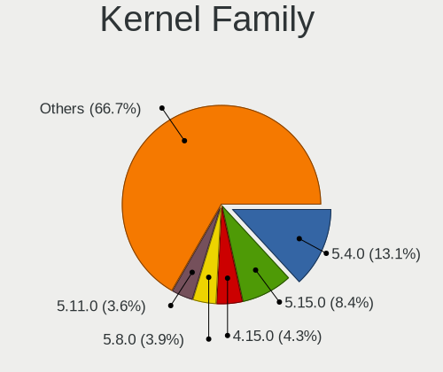
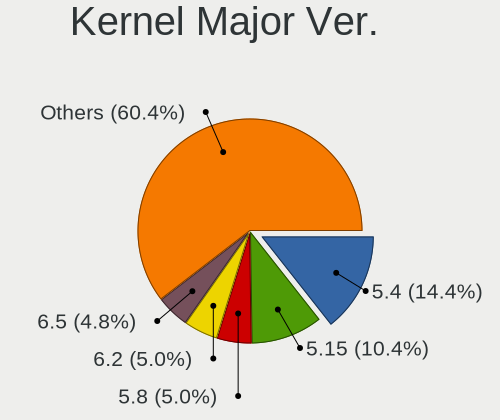
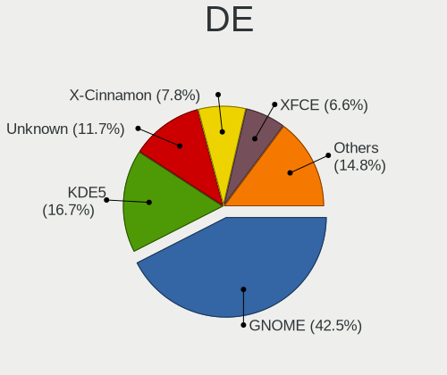
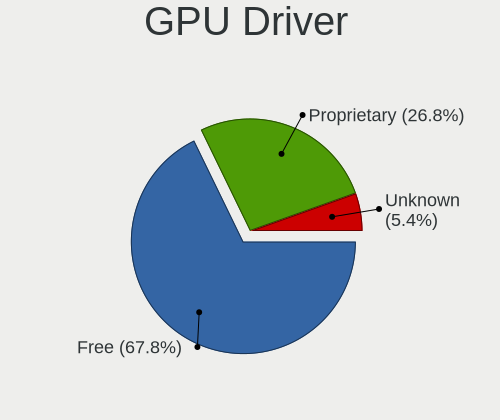
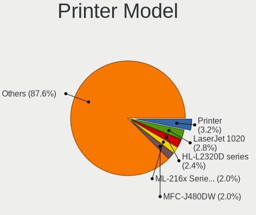

Linux in Canada - Tested Hardware & Statistics (Desktops)
---------------------------------------------------------

A project to collect tested hardware configurations for Linux in Canada.

Anyone can contribute to this report by the [hw-probe](https://github.com/linuxhw/hw-probe) tool:

    sudo -E hw-probe -all -upload

Please contribute! Especially if your hardware is rare.

Contents
--------

* [ Test Cases ](#test-cases)

* [ System ](#system)
  - [ OS                       ](#os)
  - [ OS Family                ](#os-family)
  - [ Kernel                   ](#kernel)
  - [ Kernel Family            ](#kernel-family)
  - [ Kernel Major Ver.        ](#kernel-major-ver)
  - [ Arch                     ](#arch)
  - [ DE                       ](#de)
  - [ Display Server           ](#display-server)
  - [ Display Manager          ](#display-manager)
  - [ OS Lang                  ](#os-lang)
  - [ Boot Mode                ](#boot-mode)
  - [ Filesystem               ](#filesystem)
  - [ Part. scheme             ](#part-scheme)
  - [ Dual Boot with Linux/BSD ](#dual-boot-with-linuxbsd)
  - [ Dual Boot (Win)          ](#dual-boot-win)

* [ Board ](#board)
  - [ Vendor                   ](#vendor)
  - [ Model                    ](#model)
  - [ Model Family             ](#model-family)
  - [ MFG Year                 ](#mfg-year)
  - [ Form Factor              ](#form-factor)
  - [ Secure Boot              ](#secure-boot)
  - [ Coreboot                 ](#coreboot)
  - [ RAM Size                 ](#ram-size)
  - [ RAM Used                 ](#ram-used)
  - [ Total Drives             ](#total-drives)
  - [ Has CD-ROM               ](#has-cd-rom)
  - [ Has Ethernet             ](#has-ethernet)
  - [ Has WiFi                 ](#has-wifi)
  - [ Has Bluetooth            ](#has-bluetooth)

* [ Location ](#location)
  - [ Country                  ](#country)
  - [ City                     ](#city)

* [ Drives ](#drives)
  - [ Drive Vendor             ](#drive-vendor)
  - [ Drive Model              ](#drive-model)
  - [ HDD Vendor               ](#hdd-vendor)
  - [ SSD Vendor               ](#ssd-vendor)
  - [ Drive Kind               ](#drive-kind)
  - [ Drive Connector          ](#drive-connector)
  - [ Drive Size               ](#drive-size)
  - [ Space Total              ](#space-total)
  - [ Space Used               ](#space-used)
  - [ Malfunc. Drives          ](#malfunc-drives)
  - [ Malfunc. Drive Vendor    ](#malfunc-drive-vendor)
  - [ Malfunc. HDD Vendor      ](#malfunc-hdd-vendor)
  - [ Malfunc. Drive Kind      ](#malfunc-drive-kind)
  - [ Failed Drives            ](#failed-drives)
  - [ Failed Drive Vendor      ](#failed-drive-vendor)
  - [ Drive Status             ](#drive-status)

* [ Storage controller ](#storage-controller)
  - [ Storage Vendor           ](#storage-vendor)
  - [ Storage Model            ](#storage-model)
  - [ Storage Kind             ](#storage-kind)

* [ Processor ](#processor)
  - [ CPU Vendor               ](#cpu-vendor)
  - [ CPU Model                ](#cpu-model)
  - [ CPU Model Family         ](#cpu-model-family)
  - [ CPU Cores                ](#cpu-cores)
  - [ CPU Sockets              ](#cpu-sockets)
  - [ CPU Threads              ](#cpu-threads)
  - [ CPU Op-Modes             ](#cpu-op-modes)
  - [ CPU Microcode            ](#cpu-microcode)
  - [ CPU Microarch            ](#cpu-microarch)

* [ Graphics ](#graphics)
  - [ GPU Vendor               ](#gpu-vendor)
  - [ GPU Model                ](#gpu-model)
  - [ GPU Combo                ](#gpu-combo)
  - [ GPU Driver               ](#gpu-driver)
  - [ GPU Memory               ](#gpu-memory)

* [ Monitor ](#monitor)
  - [ Monitor Vendor           ](#monitor-vendor)
  - [ Monitor Model            ](#monitor-model)
  - [ Monitor Resolution       ](#monitor-resolution)
  - [ Monitor Diagonal         ](#monitor-diagonal)
  - [ Monitor Width            ](#monitor-width)
  - [ Aspect Ratio             ](#aspect-ratio)
  - [ Monitor Area             ](#monitor-area)
  - [ Pixel Density            ](#pixel-density)
  - [ Multiple Monitors        ](#multiple-monitors)

* [ Network ](#network)
  - [ Net Controller Vendor    ](#net-controller-vendor)
  - [ Net Controller Model     ](#net-controller-model)
  - [ Wireless Vendor          ](#wireless-vendor)
  - [ Wireless Model           ](#wireless-model)
  - [ Ethernet Vendor          ](#ethernet-vendor)
  - [ Ethernet Model           ](#ethernet-model)
  - [ Net Controller Kind      ](#net-controller-kind)
  - [ Used Controller          ](#used-controller)
  - [ NICs                     ](#nics)
  - [ IPv6                     ](#ipv6)

* [ Bluetooth ](#bluetooth)
  - [ Bluetooth Vendor         ](#bluetooth-vendor)
  - [ Bluetooth Model          ](#bluetooth-model)

* [ Sound ](#sound)
  - [ Sound Vendor             ](#sound-vendor)
  - [ Sound Model              ](#sound-model)

* [ Memory ](#memory)
  - [ Memory Vendor            ](#memory-vendor)
  - [ Memory Model             ](#memory-model)
  - [ Memory Kind              ](#memory-kind)
  - [ Memory Form Factor       ](#memory-form-factor)
  - [ Memory Size              ](#memory-size)
  - [ Memory Speed             ](#memory-speed)

* [ Printers & scanners ](#printers--scanners)
  - [ Printer Vendor           ](#printer-vendor)
  - [ Printer Model            ](#printer-model)
  - [ Scanner Vendor           ](#scanner-vendor)
  - [ Scanner Model            ](#scanner-model)

* [ Camera ](#camera)
  - [ Camera Vendor            ](#camera-vendor)
  - [ Camera Model             ](#camera-model)

* [ Security ](#security)
  - [ Fingerprint Vendor       ](#fingerprint-vendor)
  - [ Fingerprint Model        ](#fingerprint-model)
  - [ Chipcard Vendor          ](#chipcard-vendor)
  - [ Chipcard Model           ](#chipcard-model)

* [ Unsupported ](#unsupported)
  - [ Unsupported Devices      ](#unsupported-devices)
  - [ Unsupported Device Types ](#unsupported-device-types)

Test Cases
----------

Total: 4104

| Vendor        | Model                       | Probe                                                      | Date         |
|---------------|-----------------------------|------------------------------------------------------------|--------------|
| BESSTAR Te... | UM700                       | [d635105967](https://linux-hardware.org/?probe=d635105967) | Sep 07, 2023 |
| ASUSTek       | Z87M-PLUS                   | [ed1061dbb1](https://linux-hardware.org/?probe=ed1061dbb1) | Sep 07, 2023 |
| MSI           | Z390-A PRO                  | [32c21f0b73](https://linux-hardware.org/?probe=32c21f0b73) | Sep 07, 2023 |
| Dell          | 0HMX8D A01                  | [48fa151690](https://linux-hardware.org/?probe=48fa151690) | Sep 06, 2023 |
| Intel         | DN2800MT AAG23738-803       | [8bdf13908a](https://linux-hardware.org/?probe=8bdf13908a) | Sep 06, 2023 |
| Unknown       | HX90                        | [928ebd5aa7](https://linux-hardware.org/?probe=928ebd5aa7) | Sep 06, 2023 |
| MSI           | B550M PRO-VDH WIFI          | [17702812ba](https://linux-hardware.org/?probe=17702812ba) | Sep 06, 2023 |
| Alienware     | 0446JC A01                  | [d0c3088707](https://linux-hardware.org/?probe=d0c3088707) | Sep 06, 2023 |
| Dell          | 073MMW A02                  | [5b5728ae8d](https://linux-hardware.org/?probe=5b5728ae8d) | Sep 05, 2023 |
| ASRock        | H470M-STX                   | [97e43e20d7](https://linux-hardware.org/?probe=97e43e20d7) | Sep 05, 2023 |
| ASRock        | X570M Pro4                  | [46627e6392](https://linux-hardware.org/?probe=46627e6392) | Sep 04, 2023 |
| ASUSTek       | M32CD_A_F_K20CD_K31CD       | [c4334a53b6](https://linux-hardware.org/?probe=c4334a53b6) | Sep 04, 2023 |
| ASUSTek       | PRIME B550M-A               | [d99ec42689](https://linux-hardware.org/?probe=d99ec42689) | Sep 04, 2023 |
| Lenovo        | SKYBAY SDK0J40705 WIN 34... | [2ba34b459a](https://linux-hardware.org/?probe=2ba34b459a) | Sep 04, 2023 |
| MSI           | B450M BAZOOKA MAX WIFI      | [06571c70a0](https://linux-hardware.org/?probe=06571c70a0) | Sep 04, 2023 |
| Lenovo        | ThinkCentre M58p 7484AEF    | [ccffd7e998](https://linux-hardware.org/?probe=ccffd7e998) | Sep 04, 2023 |
| HP            | 1825                        | [38d038d2ad](https://linux-hardware.org/?probe=38d038d2ad) | Sep 03, 2023 |
| ASUSTek       | Z87M-PLUS                   | [f71590bc2b](https://linux-hardware.org/?probe=f71590bc2b) | Sep 03, 2023 |
| Gigabyte      | B450 AORUS M                | [2f09a79291](https://linux-hardware.org/?probe=2f09a79291) | Sep 03, 2023 |
| ASUSTek       | G10DK                       | [d6b74ca876](https://linux-hardware.org/?probe=d6b74ca876) | Sep 03, 2023 |
| Gigabyte      | Z170X-Gaming 7              | [e9faf4759d](https://linux-hardware.org/?probe=e9faf4759d) | Sep 03, 2023 |
| Dell          | 096JG8 A01                  | [eaac06d18a](https://linux-hardware.org/?probe=eaac06d18a) | Sep 03, 2023 |
| Intel         | DQ77KB AAG40294-401         | [656df7cddd](https://linux-hardware.org/?probe=656df7cddd) | Sep 02, 2023 |
| MSI           | MPG B560I GAMING EDGE WI... | [d25c5d75c1](https://linux-hardware.org/?probe=d25c5d75c1) | Sep 02, 2023 |
| ASRock        | B650M PG Riptide            | [0f1a250c7f](https://linux-hardware.org/?probe=0f1a250c7f) | Sep 02, 2023 |
| Gigabyte      | B450M DS3H WIFI-CF          | [9f8e38af3e](https://linux-hardware.org/?probe=9f8e38af3e) | Sep 02, 2023 |
| MSI           | X99A RAIDER                 | [5b79d93d0a](https://linux-hardware.org/?probe=5b79d93d0a) | Aug 31, 2023 |
| MSI           | 970 GAMING                  | [f5aaee7de3](https://linux-hardware.org/?probe=f5aaee7de3) | Aug 31, 2023 |
| HP            | 3647h                       | [50ac4e01a4](https://linux-hardware.org/?probe=50ac4e01a4) | Aug 30, 2023 |
| ASRock        | H470M-STX                   | [8ba058add5](https://linux-hardware.org/?probe=8ba058add5) | Aug 30, 2023 |
| Dell          | 0J3C2F A00                  | [9374424bbd](https://linux-hardware.org/?probe=9374424bbd) | Aug 30, 2023 |
| ASRock        | Z490M Pro4                  | [e07d4a9c90](https://linux-hardware.org/?probe=e07d4a9c90) | Aug 30, 2023 |
| MSI           | Z97 GAMING 5                | [36cc5803b3](https://linux-hardware.org/?probe=36cc5803b3) | Aug 29, 2023 |
| MSI           | B550-A PRO                  | [b5ee83c5af](https://linux-hardware.org/?probe=b5ee83c5af) | Aug 29, 2023 |
| MSI           | H310M PRO-VD                | [ebcf95d8ae](https://linux-hardware.org/?probe=ebcf95d8ae) | Aug 28, 2023 |
| MSI           | H310M PRO-VD                | [ef8ecfcb2e](https://linux-hardware.org/?probe=ef8ecfcb2e) | Aug 28, 2023 |
| Acer          | Aspire TC-330               | [d8182593c2](https://linux-hardware.org/?probe=d8182593c2) | Aug 28, 2023 |
| Acer          | Aspire M3470                | [60d18d6d6e](https://linux-hardware.org/?probe=60d18d6d6e) | Aug 28, 2023 |
| MSI           | B85M-G43                    | [96fd52d530](https://linux-hardware.org/?probe=96fd52d530) | Aug 27, 2023 |
| Acer          | Aspire M3470                | [7e6d230bf5](https://linux-hardware.org/?probe=7e6d230bf5) | Aug 27, 2023 |
| ASUSTek       | P8H77-V LE                  | [03740cd24c](https://linux-hardware.org/?probe=03740cd24c) | Aug 25, 2023 |
| MSI           | B550M PRO-VDH WIFI          | [51d4eefbc9](https://linux-hardware.org/?probe=51d4eefbc9) | Aug 25, 2023 |
| Gigabyte      | Z690 AORUS ELITE AX         | [a36ead7d8d](https://linux-hardware.org/?probe=a36ead7d8d) | Aug 25, 2023 |
| ASUSTek       | M5A99X EVO R2.0             | [4d01543131](https://linux-hardware.org/?probe=4d01543131) | Aug 24, 2023 |
| BESSTAR Te... | UM700                       | [bca12d1c12](https://linux-hardware.org/?probe=bca12d1c12) | Aug 24, 2023 |
| HP            | 1589                        | [982f4f1442](https://linux-hardware.org/?probe=982f4f1442) | Aug 24, 2023 |
| HP            | 1589                        | [cd1492c33d](https://linux-hardware.org/?probe=cd1492c33d) | Aug 24, 2023 |
| Gigabyte      | Z390 AORUS PRO WIFI-CF      | [8b76616574](https://linux-hardware.org/?probe=8b76616574) | Aug 24, 2023 |
| ASUSTek       | TUF Gaming B550M-PLUS       | [9a98c147d4](https://linux-hardware.org/?probe=9a98c147d4) | Aug 24, 2023 |
| ASUSTek       | TUF Gaming B550M-PLUS       | [3723979edb](https://linux-hardware.org/?probe=3723979edb) | Aug 24, 2023 |
| HP            | 18E4                        | [0235c76e04](https://linux-hardware.org/?probe=0235c76e04) | Aug 23, 2023 |
| MSI           | B450M BAZOOKA MAX WIFI      | [3bdb30f543](https://linux-hardware.org/?probe=3bdb30f543) | Aug 22, 2023 |
| Lenovo        | H415                        | [e6277f1ab8](https://linux-hardware.org/?probe=e6277f1ab8) | Aug 22, 2023 |
| MSI           | PRO B650M-A WIFI            | [da3f4808a1](https://linux-hardware.org/?probe=da3f4808a1) | Aug 20, 2023 |
| MSI           | H310M PRO-VDH               | [c6f278a589](https://linux-hardware.org/?probe=c6f278a589) | Aug 20, 2023 |
| ASUSTek       | M51BC                       | [4a81412fdd](https://linux-hardware.org/?probe=4a81412fdd) | Aug 20, 2023 |
| HP            | 3032h                       | [f3292df409](https://linux-hardware.org/?probe=f3292df409) | Aug 20, 2023 |
| Gigabyte      | Z270X-UD5-CF                | [04df52e837](https://linux-hardware.org/?probe=04df52e837) | Aug 20, 2023 |
| ASUSTek       | P5L-MX                      | [f06dbc1b8c](https://linux-hardware.org/?probe=f06dbc1b8c) | Aug 19, 2023 |
| Lenovo        | MAHOBAY NO DPK              | [d109b04177](https://linux-hardware.org/?probe=d109b04177) | Aug 19, 2023 |
| Dell          | 0VNP2H A00                  | [3f5b46c0f1](https://linux-hardware.org/?probe=3f5b46c0f1) | Aug 19, 2023 |
| Dell          | 0PU052                      | [2b5816a194](https://linux-hardware.org/?probe=2b5816a194) | Aug 19, 2023 |
| ASUSTek       | PRIME B550-PLUS             | [8958908392](https://linux-hardware.org/?probe=8958908392) | Aug 17, 2023 |
| Lenovo        | SDK0E50510 WIN              | [0a48b003bb](https://linux-hardware.org/?probe=0a48b003bb) | Aug 17, 2023 |
| AMI           | Cherry Trail CR             | [59385e7c8b](https://linux-hardware.org/?probe=59385e7c8b) | Aug 17, 2023 |
| MSI           | PRO B660M-A WIFI DDR4       | [7c1a42d442](https://linux-hardware.org/?probe=7c1a42d442) | Aug 17, 2023 |
| HP            | 1496                        | [19743e6f33](https://linux-hardware.org/?probe=19743e6f33) | Aug 17, 2023 |
| Gigabyte      | GA-990FXA-UD3               | [0daae7dcb4](https://linux-hardware.org/?probe=0daae7dcb4) | Aug 16, 2023 |
| Gigabyte      | B650 AORUS ELITE AX         | [6aa6913c91](https://linux-hardware.org/?probe=6aa6913c91) | Aug 16, 2023 |
| Gigabyte      | H81M-S2PV                   | [0e51f02009](https://linux-hardware.org/?probe=0e51f02009) | Aug 14, 2023 |
| Gigabyte      | GA-990FXA-UD3               | [a8f732a826](https://linux-hardware.org/?probe=a8f732a826) | Aug 14, 2023 |
| HP            | 18E4                        | [4fd89c22ae](https://linux-hardware.org/?probe=4fd89c22ae) | Aug 14, 2023 |
| MSI           | PRO Z790-A WIFI DDR4        | [ccce0b0c19](https://linux-hardware.org/?probe=ccce0b0c19) | Aug 13, 2023 |
| HP            | 3646h                       | [b3c30163f9](https://linux-hardware.org/?probe=b3c30163f9) | Aug 13, 2023 |
| HP            | 3646h                       | [180d25235f](https://linux-hardware.org/?probe=180d25235f) | Aug 13, 2023 |
| CWWK          | CW-J6-6L                    | [8321dcc5ea](https://linux-hardware.org/?probe=8321dcc5ea) | Aug 12, 2023 |
| ASUSTek       | ProArt X670E-CREATOR WIF... | [4f6d84a4dd](https://linux-hardware.org/?probe=4f6d84a4dd) | Aug 12, 2023 |
| Dell          | 0KV3RP A00                  | [47c45a45e5](https://linux-hardware.org/?probe=47c45a45e5) | Aug 11, 2023 |
| AZW           | Green G4 10                 | [a574280172](https://linux-hardware.org/?probe=a574280172) | Aug 11, 2023 |
| ASUSTek       | P8Z68-V LE                  | [a88d7e81e5](https://linux-hardware.org/?probe=a88d7e81e5) | Aug 11, 2023 |
| MSI           | H310M PRO-VD                | [f542bb8447](https://linux-hardware.org/?probe=f542bb8447) | Aug 10, 2023 |
| ASUSTek       | ROG STRIX B650-A GAMING ... | [6bf6a38fba](https://linux-hardware.org/?probe=6bf6a38fba) | Aug 10, 2023 |
| Acer          | Aspire TC-885 V:1.1         | [63f0153cfe](https://linux-hardware.org/?probe=63f0153cfe) | Aug 10, 2023 |
| ASUSTek       | PRIME X570-PRO              | [f7fe8fc7f3](https://linux-hardware.org/?probe=f7fe8fc7f3) | Aug 10, 2023 |
| Unknown       | Unknown                     | [09037ac346](https://linux-hardware.org/?probe=09037ac346) | Aug 09, 2023 |
| MSI           | PRO B660M-A WIFI DDR4       | [f50b51555f](https://linux-hardware.org/?probe=f50b51555f) | Aug 09, 2023 |
| ASUSTek       | P5G41T-M                    | [9eccce625b](https://linux-hardware.org/?probe=9eccce625b) | Aug 08, 2023 |
| Supermicro    | X10SRG-F                    | [3bdaa7bfef](https://linux-hardware.org/?probe=3bdaa7bfef) | Aug 08, 2023 |
| AZW           | MINI S 10                   | [1de6b9a754](https://linux-hardware.org/?probe=1de6b9a754) | Aug 08, 2023 |
| MSI           | PRO Z790-P WIFI DDR4        | [a79335e604](https://linux-hardware.org/?probe=a79335e604) | Aug 07, 2023 |
| MSI           | A68HM-E33 V2                | [047ae922f7](https://linux-hardware.org/?probe=047ae922f7) | Aug 07, 2023 |
| AZW           | SEi                         | [b38e4eec2e](https://linux-hardware.org/?probe=b38e4eec2e) | Aug 07, 2023 |
| MSI           | A68HM-E33 V2                | [341fecf811](https://linux-hardware.org/?probe=341fecf811) | Aug 06, 2023 |
| Lenovo        | ThinkCentre M57 6072BJU     | [9c0231c0f3](https://linux-hardware.org/?probe=9c0231c0f3) | Aug 06, 2023 |
| Gateway       | SX2185                      | [a6df16b355](https://linux-hardware.org/?probe=a6df16b355) | Aug 05, 2023 |
| MSI           | B450 GAMING PLUS MAX        | [8cc106746a](https://linux-hardware.org/?probe=8cc106746a) | Aug 05, 2023 |
| MSI           | B450 GAMING PLUS MAX        | [4f2449c578](https://linux-hardware.org/?probe=4f2449c578) | Aug 05, 2023 |
| ASUSTek       | Z97-PRO/USB                 | [edd74878c3](https://linux-hardware.org/?probe=edd74878c3) | Aug 05, 2023 |
| ASUSTek       | ROG STRIX Z690-A GAMING ... | [67cea35f6d](https://linux-hardware.org/?probe=67cea35f6d) | Aug 04, 2023 |
| ASUSTek       | TUF Gaming X570-PLUS        | [3c3d90d709](https://linux-hardware.org/?probe=3c3d90d709) | Aug 04, 2023 |
| Pegatron      | Eureka3                     | [a999a00c0a](https://linux-hardware.org/?probe=a999a00c0a) | Aug 03, 2023 |
| MSI           | MAG B650M MORTAR WIFI       | [fd259f2acd](https://linux-hardware.org/?probe=fd259f2acd) | Aug 02, 2023 |
| HP            | 18E7                        | [339050cd65](https://linux-hardware.org/?probe=339050cd65) | Aug 01, 2023 |
| Dell          | 09KPNV A01                  | [1768a6834a](https://linux-hardware.org/?probe=1768a6834a) | Aug 01, 2023 |
| ASUSTek       | P6X58D-E                    | [84a5ec2d0b](https://linux-hardware.org/?probe=84a5ec2d0b) | Aug 01, 2023 |
| Dell          | 0HJ054                      | [85ceb83c22](https://linux-hardware.org/?probe=85ceb83c22) | Jul 31, 2023 |
| ASRock        | FM2A75 Pro4                 | [831157a9ac](https://linux-hardware.org/?probe=831157a9ac) | Jul 31, 2023 |
| ASUSTek       | P8Z77-V LX                  | [80ab0f5cd2](https://linux-hardware.org/?probe=80ab0f5cd2) | Jul 30, 2023 |
| MSI           | B250 PC MATE                | [9163341ff4](https://linux-hardware.org/?probe=9163341ff4) | Jul 30, 2023 |
| ASRock        | B450 Pro4 R2.0              | [b49f52b2e1](https://linux-hardware.org/?probe=b49f52b2e1) | Jul 30, 2023 |
| ASRockRack    | X470D4U                     | [532a72a722](https://linux-hardware.org/?probe=532a72a722) | Jul 29, 2023 |
| Dell          | 0HD5W2 A01                  | [76394a9fc7](https://linux-hardware.org/?probe=76394a9fc7) | Jul 29, 2023 |
| HP            | 1825                        | [7bd4e99efa](https://linux-hardware.org/?probe=7bd4e99efa) | Jul 28, 2023 |
| ASUSTek       | ROG STRIX B550-F GAMING ... | [5e77384bb8](https://linux-hardware.org/?probe=5e77384bb8) | Jul 25, 2023 |
| Dell          | 0X501H A00                  | [407c19b590](https://linux-hardware.org/?probe=407c19b590) | Jul 24, 2023 |
| Unknown       | Unknown                     | [a7d120e20a](https://linux-hardware.org/?probe=a7d120e20a) | Jul 24, 2023 |
| Gigabyte      | Z690 AORUS ELITE AX         | [a3284cc458](https://linux-hardware.org/?probe=a3284cc458) | Jul 24, 2023 |
| Gigabyte      | Z97X-UD5H                   | [3511a9786a](https://linux-hardware.org/?probe=3511a9786a) | Jul 23, 2023 |
| Dell          | 08NPPY A00                  | [63fb3abc69](https://linux-hardware.org/?probe=63fb3abc69) | Jul 23, 2023 |
| ASRock        | B550M Pro4                  | [46283ad18b](https://linux-hardware.org/?probe=46283ad18b) | Jul 22, 2023 |
| ASRock        | J3355B-ITX                  | [3edbf4710e](https://linux-hardware.org/?probe=3edbf4710e) | Jul 22, 2023 |
| HP            | 18E7                        | [de29afa344](https://linux-hardware.org/?probe=de29afa344) | Jul 21, 2023 |
| Dell          | 00010C A00                  | [40543af7a5](https://linux-hardware.org/?probe=40543af7a5) | Jul 21, 2023 |
| Intel         | DP67BG AAG10491-400         | [084b222fa7](https://linux-hardware.org/?probe=084b222fa7) | Jul 21, 2023 |
| Acer          | Aspire TC-780               | [c058e8c58e](https://linux-hardware.org/?probe=c058e8c58e) | Jul 20, 2023 |
| Intel         | DP67BG AAG10491-400         | [e0ff2f40fa](https://linux-hardware.org/?probe=e0ff2f40fa) | Jul 20, 2023 |
| ASUSTek       | ROG CROSSHAIR VIII DARK ... | [cb0ad6375e](https://linux-hardware.org/?probe=cb0ad6375e) | Jul 20, 2023 |
| MSI           | 870-G45                     | [af7442187f](https://linux-hardware.org/?probe=af7442187f) | Jul 20, 2023 |
| ASUSTek       | M11AD                       | [8a8cb2c3e4](https://linux-hardware.org/?probe=8a8cb2c3e4) | Jul 20, 2023 |
| AZW           | U59                         | [1c919967a8](https://linux-hardware.org/?probe=1c919967a8) | Jul 19, 2023 |
| Gigabyte      | Z270XP-SLI-CF               | [14478a9226](https://linux-hardware.org/?probe=14478a9226) | Jul 18, 2023 |
| Lenovo        | ThinkCentre M58e 7268C5F    | [e62367803c](https://linux-hardware.org/?probe=e62367803c) | Jul 18, 2023 |
| Lenovo        | ThinkCentre M58e 7268C5F    | [41e06d3720](https://linux-hardware.org/?probe=41e06d3720) | Jul 18, 2023 |
| ASUSTek       | PRIME Z790-P WIFI           | [02f8df2129](https://linux-hardware.org/?probe=02f8df2129) | Jul 18, 2023 |
| ASUSTek       | PRIME Z790-P WIFI           | [e7e056881b](https://linux-hardware.org/?probe=e7e056881b) | Jul 18, 2023 |
| ASRockRack    | X470D4U2-2T                 | [058672ddad](https://linux-hardware.org/?probe=058672ddad) | Jul 18, 2023 |
| ASUSTek       | M11AD                       | [4019d4eb57](https://linux-hardware.org/?probe=4019d4eb57) | Jul 18, 2023 |
| MSI           | MPG B550 GAMING EDGE WIF... | [151797320d](https://linux-hardware.org/?probe=151797320d) | Jul 16, 2023 |
| MSI           | MPG B550 GAMING EDGE WIF... | [e760f4570f](https://linux-hardware.org/?probe=e760f4570f) | Jul 16, 2023 |
| Gateway       | SX2185                      | [1fe932f485](https://linux-hardware.org/?probe=1fe932f485) | Jul 15, 2023 |
| Gateway       | SX2185                      | [00e7bb0f9f](https://linux-hardware.org/?probe=00e7bb0f9f) | Jul 15, 2023 |
| ASUSTek       | 970 PRO GAMING/AURA         | [e8f1a169a1](https://linux-hardware.org/?probe=e8f1a169a1) | Jul 15, 2023 |
| ASUSTek       | PRIME Z490-P                | [9eff556aca](https://linux-hardware.org/?probe=9eff556aca) | Jul 15, 2023 |
| MSI           | 870-G45                     | [9fff23ac6a](https://linux-hardware.org/?probe=9fff23ac6a) | Jul 14, 2023 |
| ASRock        | B450 Gaming-ITX/ac          | [065aed3358](https://linux-hardware.org/?probe=065aed3358) | Jul 14, 2023 |
| ASRock        | B760M PG Riptide            | [4092f45d41](https://linux-hardware.org/?probe=4092f45d41) | Jul 14, 2023 |
| ASRock        | B760M PG Riptide            | [1ee27caac4](https://linux-hardware.org/?probe=1ee27caac4) | Jul 14, 2023 |
| ASUSTek       | B85M-G                      | [2afe11b7e4](https://linux-hardware.org/?probe=2afe11b7e4) | Jul 13, 2023 |
| ASUSTek       | PRIME X370-PRO              | [3428c47b0c](https://linux-hardware.org/?probe=3428c47b0c) | Jul 13, 2023 |
| ASUSTek       | P8B75-M                     | [df7a7f2c36](https://linux-hardware.org/?probe=df7a7f2c36) | Jul 13, 2023 |
| Dell          | 09M8Y8 A01                  | [8807f705d0](https://linux-hardware.org/?probe=8807f705d0) | Jul 12, 2023 |
| MSI           | B350M MORTAR                | [41a05302e8](https://linux-hardware.org/?probe=41a05302e8) | Jul 12, 2023 |
| ASUSTek       | P8Z68-V PRO                 | [077367f0bd](https://linux-hardware.org/?probe=077367f0bd) | Jul 12, 2023 |
| Dell          | 09M8Y8 A01                  | [7a6bfcf1a9](https://linux-hardware.org/?probe=7a6bfcf1a9) | Jul 11, 2023 |
| Dell          | 09M8Y8 A01                  | [2397913be3](https://linux-hardware.org/?probe=2397913be3) | Jul 11, 2023 |
| MSI           | MAG B650M MORTAR WIFI       | [ee2dc6ac7b](https://linux-hardware.org/?probe=ee2dc6ac7b) | Jul 11, 2023 |
| MSI           | H310M PRO-VD                | [c44f642440](https://linux-hardware.org/?probe=c44f642440) | Jul 10, 2023 |
| Gigabyte      | B650 AORUS ELITE AX         | [957c1976c6](https://linux-hardware.org/?probe=957c1976c6) | Jul 10, 2023 |
| HP            | 1496                        | [48292f90f9](https://linux-hardware.org/?probe=48292f90f9) | Jul 10, 2023 |
| ASRock        | Z77 Extreme3                | [1312271ad3](https://linux-hardware.org/?probe=1312271ad3) | Jul 10, 2023 |
| ASRockRack    | X470D4U2-2T                 | [59f9ee3ee8](https://linux-hardware.org/?probe=59f9ee3ee8) | Jul 09, 2023 |
| ASUSTek       | ROG CROSSHAIR VIII DARK ... | [1e27d93bb4](https://linux-hardware.org/?probe=1e27d93bb4) | Jul 09, 2023 |
| MSI           | B360M MORTAR TITANIUM       | [31b2aa5991](https://linux-hardware.org/?probe=31b2aa5991) | Jul 08, 2023 |
| ASUSTek       | TUF Gaming X670E-PLUS WI... | [3540170054](https://linux-hardware.org/?probe=3540170054) | Jul 08, 2023 |
| ASRockRack    | X470D4U2-2T                 | [a686a6eed6](https://linux-hardware.org/?probe=a686a6eed6) | Jul 08, 2023 |
| MSI           | MPG X570 GAMING PRO CARB... | [4a761f6a66](https://linux-hardware.org/?probe=4a761f6a66) | Jul 08, 2023 |
| ASUSTek       | PRIME X370-PRO              | [23c5c27995](https://linux-hardware.org/?probe=23c5c27995) | Jul 07, 2023 |
| ASUSTek       | ROG CROSSHAIR VIII DARK ... | [f99a1ccf8f](https://linux-hardware.org/?probe=f99a1ccf8f) | Jul 06, 2023 |
| Apple         | Mac-F221BEC8                | [5e66adbc36](https://linux-hardware.org/?probe=5e66adbc36) | Jul 06, 2023 |
| Dell          | 0C2425 A00                  | [130edcd2b5](https://linux-hardware.org/?probe=130edcd2b5) | Jul 06, 2023 |
| Lenovo        | SHARKBAY 0B98401 PRO        | [d58bb46843](https://linux-hardware.org/?probe=d58bb46843) | Jul 05, 2023 |
| ASUSTek       | ROG CROSSHAIR VIII DARK ... | [3707ca3e1d](https://linux-hardware.org/?probe=3707ca3e1d) | Jul 05, 2023 |
| Acer          | Nitro N50-600 V:1.1         | [663261b61f](https://linux-hardware.org/?probe=663261b61f) | Jul 04, 2023 |
| ASUSTek       | TUF Gaming B550M-PLUS       | [d17e5d7807](https://linux-hardware.org/?probe=d17e5d7807) | Jul 03, 2023 |
| ASUSTek       | TUF Gaming B550M-PLUS       | [29897719d5](https://linux-hardware.org/?probe=29897719d5) | Jul 03, 2023 |
| ASRockRack    | X470D4U2-2T                 | [da271abdd3](https://linux-hardware.org/?probe=da271abdd3) | Jul 03, 2023 |
| ASUSTek       | ROG STRIX X670E-E GAMING... | [364082f281](https://linux-hardware.org/?probe=364082f281) | Jul 03, 2023 |
| ASUSTek       | TUF B450M-PLUS GAMING       | [4f24850748](https://linux-hardware.org/?probe=4f24850748) | Jul 02, 2023 |
| Dell          | 0Y2MRG A00                  | [e112fcd006](https://linux-hardware.org/?probe=e112fcd006) | Jul 02, 2023 |
| ASRockRack    | X470D4U2-2T                 | [92bf7e658e](https://linux-hardware.org/?probe=92bf7e658e) | Jul 02, 2023 |
| HP            | 1497                        | [e282eb8fe1](https://linux-hardware.org/?probe=e282eb8fe1) | Jul 02, 2023 |
| Dell          | 09KPNV A01                  | [ca6243303f](https://linux-hardware.org/?probe=ca6243303f) | Jul 01, 2023 |
| ASRockRack    | X470D4U2-2T                 | [57424619e8](https://linux-hardware.org/?probe=57424619e8) | Jul 01, 2023 |
| Gigabyte      | B550 UD AC                  | [7d7d37522c](https://linux-hardware.org/?probe=7d7d37522c) | Jun 30, 2023 |
| ASRockRack    | X470D4U2-2T                 | [70ed50862c](https://linux-hardware.org/?probe=70ed50862c) | Jun 30, 2023 |
| ASUSTek       | PRIME Z370-A II             | [5907f43d41](https://linux-hardware.org/?probe=5907f43d41) | Jun 30, 2023 |
| AZW           | MINI S 10                   | [84eec8c276](https://linux-hardware.org/?probe=84eec8c276) | Jun 29, 2023 |
| MSI           | P67A-G43                    | [8e5f71c975](https://linux-hardware.org/?probe=8e5f71c975) | Jun 29, 2023 |
| AZW           | MINI S 10                   | [d1795fbf64](https://linux-hardware.org/?probe=d1795fbf64) | Jun 29, 2023 |
| HP            | 8055                        | [47536e2cde](https://linux-hardware.org/?probe=47536e2cde) | Jun 29, 2023 |
| ASUSTek       | M5A97 R2.0                  | [2dd6be0ddc](https://linux-hardware.org/?probe=2dd6be0ddc) | Jun 29, 2023 |
| Dell          | 0PU052                      | [b4fde65c68](https://linux-hardware.org/?probe=b4fde65c68) | Jun 29, 2023 |
| ASUSTek       | H110M-A                     | [c3118a3d89](https://linux-hardware.org/?probe=c3118a3d89) | Jun 29, 2023 |
| HP            | 8459                        | [7b60320110](https://linux-hardware.org/?probe=7b60320110) | Jun 28, 2023 |
| ASUSTek       | TUF B450M-PLUS GAMING       | [9e3cbeb0f5](https://linux-hardware.org/?probe=9e3cbeb0f5) | Jun 27, 2023 |
| ASRock        | G31M-S                      | [2437008395](https://linux-hardware.org/?probe=2437008395) | Jun 26, 2023 |
| Dell          | 0PU052                      | [34eaa7185d](https://linux-hardware.org/?probe=34eaa7185d) | Jun 26, 2023 |
| HP            | 82A2                        | [aa7e838d53](https://linux-hardware.org/?probe=aa7e838d53) | Jun 26, 2023 |
| ASRockRack    | X470D4U2-2T                 | [f36489e090](https://linux-hardware.org/?probe=f36489e090) | Jun 26, 2023 |
| Gigabyte      | 970A-DS3P                   | [77e0f0541a](https://linux-hardware.org/?probe=77e0f0541a) | Jun 26, 2023 |
| Lenovo        | ThinkCentre M57 6072BJU     | [0343a0d640](https://linux-hardware.org/?probe=0343a0d640) | Jun 25, 2023 |
| ASRockRack    | X470D4U2-2T                 | [cf3b44c0b6](https://linux-hardware.org/?probe=cf3b44c0b6) | Jun 25, 2023 |
| ASUSTek       | M5A97 R2.0                  | [17c221fa68](https://linux-hardware.org/?probe=17c221fa68) | Jun 24, 2023 |
| ASUSTek       | M5A97 R2.0                  | [6c015f633b](https://linux-hardware.org/?probe=6c015f633b) | Jun 24, 2023 |
| Gigabyte      | B560M AORUS PRO AX          | [090549881a](https://linux-hardware.org/?probe=090549881a) | Jun 24, 2023 |
| ASUSTek       | Berkeley                    | [5d4d2adebe](https://linux-hardware.org/?probe=5d4d2adebe) | Jun 24, 2023 |
| ASUSTek       | ROG STRIX B550-F GAMING     | [f87146e2d5](https://linux-hardware.org/?probe=f87146e2d5) | Jun 23, 2023 |
| HP            | 8055                        | [21f11f538d](https://linux-hardware.org/?probe=21f11f538d) | Jun 23, 2023 |
| HP            | 8055                        | [54e0de7a72](https://linux-hardware.org/?probe=54e0de7a72) | Jun 23, 2023 |
| ASUSTek       | PRIME B550M-A               | [3789bc7deb](https://linux-hardware.org/?probe=3789bc7deb) | Jun 23, 2023 |
| ASUSTek       | ROG CROSSHAIR VIII DARK ... | [abbb1b897d](https://linux-hardware.org/?probe=abbb1b897d) | Jun 22, 2023 |
| ASRock        | NUC-TGL                     | [6dcb1eb43d](https://linux-hardware.org/?probe=6dcb1eb43d) | Jun 22, 2023 |
| ASRock        | B760M PG Riptide            | [08974b3246](https://linux-hardware.org/?probe=08974b3246) | Jun 22, 2023 |
| ASRock        | B760M PG Riptide            | [a6a3ed2eae](https://linux-hardware.org/?probe=a6a3ed2eae) | Jun 21, 2023 |
| Dell          | 0GM819                      | [5823b51b38](https://linux-hardware.org/?probe=5823b51b38) | Jun 20, 2023 |
| MSI           | Z77A-G41                    | [e7e4924bda](https://linux-hardware.org/?probe=e7e4924bda) | Jun 20, 2023 |
| Apple         | Mac-F221BEC8                | [05b8720dce](https://linux-hardware.org/?probe=05b8720dce) | Jun 19, 2023 |
| Dell          | 0PU052                      | [2eb6dceca9](https://linux-hardware.org/?probe=2eb6dceca9) | Jun 19, 2023 |
| ASUSTek       | PRIME X570-P                | [320b7a9b98](https://linux-hardware.org/?probe=320b7a9b98) | Jun 19, 2023 |
| ASUSTek       | PRIME X570-P                | [32990a28e8](https://linux-hardware.org/?probe=32990a28e8) | Jun 19, 2023 |
| MSI           | Z97-G45 GAMING              | [cb20c2c912](https://linux-hardware.org/?probe=cb20c2c912) | Jun 18, 2023 |
| MSI           | PRO Z790-P WIFI DDR4        | [97699ce0ff](https://linux-hardware.org/?probe=97699ce0ff) | Jun 18, 2023 |
| Gigabyte      | B450 AORUS M                | [299db094f8](https://linux-hardware.org/?probe=299db094f8) | Jun 18, 2023 |
| ASRock        | A320M-HDV R4.0              | [e26a82f97f](https://linux-hardware.org/?probe=e26a82f97f) | Jun 17, 2023 |
| ASUSTek       | ROG STRIX B550-XE GAMING... | [84b103464e](https://linux-hardware.org/?probe=84b103464e) | Jun 16, 2023 |
| ASUSTek       | PRIME B550M-A WIFI II       | [c47a9a7bb8](https://linux-hardware.org/?probe=c47a9a7bb8) | Jun 16, 2023 |
| ASUSTek       | ROG STRIX B450-F GAMING     | [96be22e98f](https://linux-hardware.org/?probe=96be22e98f) | Jun 15, 2023 |
| MSI           | MAG B550M MORTAR            | [9604c6211e](https://linux-hardware.org/?probe=9604c6211e) | Jun 15, 2023 |
| ASUSTek       | ROG STRIX Z690-E GAMING ... | [5a1e944af2](https://linux-hardware.org/?probe=5a1e944af2) | Jun 15, 2023 |
| HP            | 2820h                       | [41fa36550a](https://linux-hardware.org/?probe=41fa36550a) | Jun 14, 2023 |
| Dell          | 0GU083 A00                  | [3d6b3b5013](https://linux-hardware.org/?probe=3d6b3b5013) | Jun 14, 2023 |
| MSI           | MPG X570 GAMING PLUS        | [f6175fd764](https://linux-hardware.org/?probe=f6175fd764) | Jun 14, 2023 |
| ASRock        | Z77 Extreme3                | [143672bf6c](https://linux-hardware.org/?probe=143672bf6c) | Jun 14, 2023 |
| ASUSTek       | ROG CROSSHAIR VIII DARK ... | [051cebacd1](https://linux-hardware.org/?probe=051cebacd1) | Jun 14, 2023 |
| ASUSTek       | M5A99X EVO R2.0             | [f4f10ca549](https://linux-hardware.org/?probe=f4f10ca549) | Jun 13, 2023 |
| ASRock        | Z77 Extreme3                | [0579a4f6f3](https://linux-hardware.org/?probe=0579a4f6f3) | Jun 13, 2023 |
| MSI           | B350M MORTAR                | [2b88daaaea](https://linux-hardware.org/?probe=2b88daaaea) | Jun 13, 2023 |
| MSI           | B350M MORTAR                | [c3f70b8f48](https://linux-hardware.org/?probe=c3f70b8f48) | Jun 13, 2023 |
| Gigabyte      | X570 AORUS ELITE            | [7be8732d39](https://linux-hardware.org/?probe=7be8732d39) | Jun 12, 2023 |
| MSI           | Z390-A PRO                  | [8a07e36a48](https://linux-hardware.org/?probe=8a07e36a48) | Jun 11, 2023 |
| ASRockRack    | X470D4U2-2T                 | [8738063b30](https://linux-hardware.org/?probe=8738063b30) | Jun 11, 2023 |
| ASUSTek       | F2A85-V PRO                 | [43991c533e](https://linux-hardware.org/?probe=43991c533e) | Jun 10, 2023 |
| MSI           | MS-B9321                    | [a7a878dbe6](https://linux-hardware.org/?probe=a7a878dbe6) | Jun 10, 2023 |
| ASRock        | B550AM Gaming               | [eca79c3bbb](https://linux-hardware.org/?probe=eca79c3bbb) | Jun 10, 2023 |
| Unknown       | Unknown                     | [4c9c3d929b](https://linux-hardware.org/?probe=4c9c3d929b) | Jun 10, 2023 |
| ASRockRack    | X470D4U2-2T                 | [8e10de95af](https://linux-hardware.org/?probe=8e10de95af) | Jun 10, 2023 |
| MSI           | MPG X570 GAMING EDGE WIF... | [0e34d2ee28](https://linux-hardware.org/?probe=0e34d2ee28) | Jun 09, 2023 |
| MSI           | B350M MORTAR                | [6e5323aa42](https://linux-hardware.org/?probe=6e5323aa42) | Jun 09, 2023 |
| MSI           | B350M MORTAR                | [fc4b07cbb0](https://linux-hardware.org/?probe=fc4b07cbb0) | Jun 09, 2023 |
| Gigabyte      | X570 AORUS ELITE            | [8173a6e67f](https://linux-hardware.org/?probe=8173a6e67f) | Jun 08, 2023 |
| MSI           | MPG X570 GAMING PRO CARB... | [20d28155d8](https://linux-hardware.org/?probe=20d28155d8) | Jun 08, 2023 |
| MSI           | MPG X570 GAMING PRO CARB... | [517cbd7f48](https://linux-hardware.org/?probe=517cbd7f48) | Jun 08, 2023 |
| MSI           | B350M GAMING PRO            | [eb3fbddd2c](https://linux-hardware.org/?probe=eb3fbddd2c) | Jun 06, 2023 |
| HP            | 83E1                        | [227e410c6f](https://linux-hardware.org/?probe=227e410c6f) | Jun 06, 2023 |
| Lenovo        | 30D0 NOK                    | [045b011b7a](https://linux-hardware.org/?probe=045b011b7a) | Jun 06, 2023 |
| ASUSTek       | PRIME H370M-PLUS            | [bbbe24d6b6](https://linux-hardware.org/?probe=bbbe24d6b6) | Jun 06, 2023 |
| ASRockRack    | X470D4U2-2T                 | [9c282e76a6](https://linux-hardware.org/?probe=9c282e76a6) | Jun 06, 2023 |
| MSI           | 990FXA GAMING               | [1c99e1316c](https://linux-hardware.org/?probe=1c99e1316c) | Jun 05, 2023 |
| MSI           | 990FXA GAMING               | [60fb09bf5e](https://linux-hardware.org/?probe=60fb09bf5e) | Jun 05, 2023 |
| MSI           | B250 GAMING PRO CARBON      | [32da3735d9](https://linux-hardware.org/?probe=32da3735d9) | Jun 05, 2023 |
| ASRockRack    | X470D4U2-2T                 | [4592ff63f3](https://linux-hardware.org/?probe=4592ff63f3) | Jun 05, 2023 |
| MSI           | PRO Z790-P WIFI             | [fb0c1a4922](https://linux-hardware.org/?probe=fb0c1a4922) | Jun 04, 2023 |
| Lenovo        | SHARKBAY SDK0E50510 WIN     | [a90856c944](https://linux-hardware.org/?probe=a90856c944) | Jun 04, 2023 |
| MSI           | B150M MORTAR                | [3fc6303165](https://linux-hardware.org/?probe=3fc6303165) | Jun 03, 2023 |
| MSI           | B250 GAMING PRO CARBON      | [ef7acf6baa](https://linux-hardware.org/?probe=ef7acf6baa) | Jun 03, 2023 |
| ASUSTek       | TUF Gaming X570-PLUS        | [21b7236d20](https://linux-hardware.org/?probe=21b7236d20) | Jun 03, 2023 |
| ASUSTek       | TUF Gaming X570-PLUS        | [d6561ecd7b](https://linux-hardware.org/?probe=d6561ecd7b) | Jun 02, 2023 |
| ASUSTek       | Maximus Formula             | [6a70fa0a86](https://linux-hardware.org/?probe=6a70fa0a86) | Jun 02, 2023 |
| Alienware     | 0N43JM A00                  | [047bfb6e8e](https://linux-hardware.org/?probe=047bfb6e8e) | Jun 02, 2023 |
| Acer          | Aspire XC-780               | [7789b12750](https://linux-hardware.org/?probe=7789b12750) | Jun 02, 2023 |
| MSI           | MAG X670E TOMAHAWK WIFI     | [7070e55aa0](https://linux-hardware.org/?probe=7070e55aa0) | Jun 01, 2023 |
| ASRockRack    | X470D4U2-2T                 | [9a28272d6e](https://linux-hardware.org/?probe=9a28272d6e) | Jun 01, 2023 |
| MSI           | MEG X670E ACE               | [8bc281486e](https://linux-hardware.org/?probe=8bc281486e) | May 31, 2023 |
| Gigabyte      | X570 AORUS ELITE            | [3b9639141c](https://linux-hardware.org/?probe=3b9639141c) | May 31, 2023 |
| ASUSTek       | ROG STRIX Z690-G GAMING ... | [32a85827df](https://linux-hardware.org/?probe=32a85827df) | May 31, 2023 |
| ASRock        | Z77 Extreme3                | [e45b1707bd](https://linux-hardware.org/?probe=e45b1707bd) | May 31, 2023 |
| ASRockRack    | X470D4U2-2T                 | [cffbd92b9f](https://linux-hardware.org/?probe=cffbd92b9f) | May 31, 2023 |
| Dell          | 0N4YC8 A00                  | [4a3e8c4d6f](https://linux-hardware.org/?probe=4a3e8c4d6f) | May 31, 2023 |
| ASUSTek       | PRIME B550-PLUS             | [698e3b5e35](https://linux-hardware.org/?probe=698e3b5e35) | May 30, 2023 |
| ASRockRack    | X470D4U2-2T                 | [399cce0d30](https://linux-hardware.org/?probe=399cce0d30) | May 30, 2023 |
| ASRock        | Z77 Extreme3                | [67c96085bf](https://linux-hardware.org/?probe=67c96085bf) | May 30, 2023 |
| ASUSTek       | F2A85-M                     | [1793fc9d72](https://linux-hardware.org/?probe=1793fc9d72) | May 30, 2023 |
| ASUSTek       | F2A85-M                     | [94fda2dea0](https://linux-hardware.org/?probe=94fda2dea0) | May 30, 2023 |
| ASRock        | B450M Pro4                  | [c98400b6eb](https://linux-hardware.org/?probe=c98400b6eb) | May 30, 2023 |
| ASRockRack    | X470D4U2-2T                 | [531455206b](https://linux-hardware.org/?probe=531455206b) | May 29, 2023 |
| MSI           | MAG X570 TOMAHAWK WIFI      | [8b1445b47c](https://linux-hardware.org/?probe=8b1445b47c) | May 29, 2023 |
| MSI           | MAG X570 TOMAHAWK WIFI      | [06318d2354](https://linux-hardware.org/?probe=06318d2354) | May 29, 2023 |
| Gigabyte      | X670 AORUS ELITE AX         | [c24eb2f7dd](https://linux-hardware.org/?probe=c24eb2f7dd) | May 29, 2023 |
| MSI           | B350M GAMING PRO            | [52517395ca](https://linux-hardware.org/?probe=52517395ca) | May 29, 2023 |
| Lenovo        | ThinkCentre M58p 6137AU8    | [bd80dea70f](https://linux-hardware.org/?probe=bd80dea70f) | May 29, 2023 |
| ASRock        | A320M-HDV R4.0              | [e2e38da09f](https://linux-hardware.org/?probe=e2e38da09f) | May 28, 2023 |
| ASRock        | B550 Pro4                   | [741e0e805b](https://linux-hardware.org/?probe=741e0e805b) | May 27, 2023 |
| ASRock        | X670E Steel Legend          | [b2672eb1db](https://linux-hardware.org/?probe=b2672eb1db) | May 27, 2023 |
| ASUSTek       | ROG STRIX B660-I GAMING ... | [906e585809](https://linux-hardware.org/?probe=906e585809) | May 27, 2023 |
| Dell          | 0K095G A02                  | [f11b8418c9](https://linux-hardware.org/?probe=f11b8418c9) | May 26, 2023 |
| Gigabyte      | B660M AORUS PRO AX DDR4     | [5b0dffc2c3](https://linux-hardware.org/?probe=5b0dffc2c3) | May 26, 2023 |
| Acer          | Aspire M3910                | [f4dedc13f9](https://linux-hardware.org/?probe=f4dedc13f9) | May 25, 2023 |
| Gigabyte      | MFLP5IP-00                  | [52e1964d2c](https://linux-hardware.org/?probe=52e1964d2c) | May 25, 2023 |
| Lenovo        | SHARKBAY 0B98401 WIN        | [1523787171](https://linux-hardware.org/?probe=1523787171) | May 24, 2023 |
| Lenovo        | SHARKBAY 0B98401 PRO        | [89d040ffaf](https://linux-hardware.org/?probe=89d040ffaf) | May 24, 2023 |
| Lenovo        | SHARKBAY 0B98401 WIN        | [0a2dc161fe](https://linux-hardware.org/?probe=0a2dc161fe) | May 24, 2023 |
| ASRock        | A320M-HDV R4.0              | [deff44e62e](https://linux-hardware.org/?probe=deff44e62e) | May 24, 2023 |
| Gigabyte      | X570 AORUS ELITE            | [ed936908c9](https://linux-hardware.org/?probe=ed936908c9) | May 23, 2023 |
| HP            | 81B3                        | [6b35d06402](https://linux-hardware.org/?probe=6b35d06402) | May 23, 2023 |
| HP            | 158A                        | [a605d12e2d](https://linux-hardware.org/?probe=a605d12e2d) | May 23, 2023 |
| HP            | 158A                        | [a1770c45b0](https://linux-hardware.org/?probe=a1770c45b0) | May 23, 2023 |
| ASRockRack    | X470D4U2-2T                 | [12a444a75a](https://linux-hardware.org/?probe=12a444a75a) | May 23, 2023 |
| HP            | 0AECh D                     | [06f56df636](https://linux-hardware.org/?probe=06f56df636) | May 23, 2023 |
| Gigabyte      | Z97X-UD3H-CF                | [719fbbd5a5](https://linux-hardware.org/?probe=719fbbd5a5) | May 23, 2023 |
| ASUSTek       | PRIME X570-PRO              | [aa33ddd283](https://linux-hardware.org/?probe=aa33ddd283) | May 23, 2023 |
| ASRockRack    | X470D4U2-2T                 | [0f9deafb62](https://linux-hardware.org/?probe=0f9deafb62) | May 22, 2023 |
| HP            | 18E4                        | [5601900c8b](https://linux-hardware.org/?probe=5601900c8b) | May 22, 2023 |
| Unknown       | DT138IB                     | [130e17f9e3](https://linux-hardware.org/?probe=130e17f9e3) | May 21, 2023 |
| ASUSTek       | P7P55-M                     | [1c5c9709dd](https://linux-hardware.org/?probe=1c5c9709dd) | May 21, 2023 |
| ASUSTek       | ROG STRIX Z590-E GAMING ... | [b6465d2950](https://linux-hardware.org/?probe=b6465d2950) | May 21, 2023 |
| Dell          | 0YP9G7 A00                  | [18853bc139](https://linux-hardware.org/?probe=18853bc139) | May 21, 2023 |
| Gigabyte      | Z390 UD                     | [867806192a](https://linux-hardware.org/?probe=867806192a) | May 21, 2023 |
| Dell          | 0VNP2H A00                  | [298317e388](https://linux-hardware.org/?probe=298317e388) | May 21, 2023 |
| Dell          | 0HHV7N A00                  | [a3a157f327](https://linux-hardware.org/?probe=a3a157f327) | May 21, 2023 |
| ASRock        | Z77 Extreme3                | [b60db9bc14](https://linux-hardware.org/?probe=b60db9bc14) | May 20, 2023 |
| Gigabyte      | B650 AORUS ELITE AX         | [5ae19394fc](https://linux-hardware.org/?probe=5ae19394fc) | May 20, 2023 |
| Gigabyte      | B650 AORUS ELITE AX         | [14548bc77a](https://linux-hardware.org/?probe=14548bc77a) | May 20, 2023 |
| ASRock        | A320M-HDV R4.0              | [b07192ce16](https://linux-hardware.org/?probe=b07192ce16) | May 19, 2023 |
| ASUSTek       | Z170-A                      | [e168b46b94](https://linux-hardware.org/?probe=e168b46b94) | May 19, 2023 |
| MSI           | MEG X570 UNIFY              | [b001b01a08](https://linux-hardware.org/?probe=b001b01a08) | May 19, 2023 |
| MSI           | MS-B9311                    | [3cfc1fbb83](https://linux-hardware.org/?probe=3cfc1fbb83) | May 19, 2023 |
| ASUSTek       | ROG STRIX Z590-E GAMING ... | [31568d83f7](https://linux-hardware.org/?probe=31568d83f7) | May 18, 2023 |
| HP            | 18E9                        | [2128541eb5](https://linux-hardware.org/?probe=2128541eb5) | May 18, 2023 |
| ASUSTek       | F1A75-M PRO/CSM             | [e0ebac1371](https://linux-hardware.org/?probe=e0ebac1371) | May 18, 2023 |
| Lenovo        | MAHOBAY NOK                 | [a33efd912c](https://linux-hardware.org/?probe=a33efd912c) | May 18, 2023 |
| Dell          | 0VNP2H A00                  | [85da02478a](https://linux-hardware.org/?probe=85da02478a) | May 17, 2023 |
| ASUSTek       | D700SC                      | [eab212a67d](https://linux-hardware.org/?probe=eab212a67d) | May 17, 2023 |
| ASRock        | Z97 Professional            | [7d0ecd3359](https://linux-hardware.org/?probe=7d0ecd3359) | May 17, 2023 |
| EVGA          | 151-HE-E999                 | [aa87f447d5](https://linux-hardware.org/?probe=aa87f447d5) | May 16, 2023 |
| ASUSTek       | PRIME B650M-A AX            | [c7c487333a](https://linux-hardware.org/?probe=c7c487333a) | May 16, 2023 |
| Gigabyte      | Z390 AORUS PRO WIFI-CF      | [afbef25815](https://linux-hardware.org/?probe=afbef25815) | May 16, 2023 |
| HP            | 18E4                        | [7560196205](https://linux-hardware.org/?probe=7560196205) | May 16, 2023 |
| MSI           | 3664h                       | [b45eee9c3a](https://linux-hardware.org/?probe=b45eee9c3a) | May 16, 2023 |
| Gigabyte      | X570 AORUS ELITE            | [aeb8c0e04f](https://linux-hardware.org/?probe=aeb8c0e04f) | May 16, 2023 |
| Supermicro    | H12DSU-iN                   | [05b2b86f35](https://linux-hardware.org/?probe=05b2b86f35) | May 15, 2023 |
| HP            | 18E9                        | [59a47f84ec](https://linux-hardware.org/?probe=59a47f84ec) | May 15, 2023 |
| ASUSTek       | M4A89GTD-PRO/USB3           | [5c97b405b5](https://linux-hardware.org/?probe=5c97b405b5) | May 15, 2023 |
| ASRockRack    | X470D4U2-2T                 | [465488c540](https://linux-hardware.org/?probe=465488c540) | May 15, 2023 |
| EVGA          | 151-HE-E999                 | [a431f34e2b](https://linux-hardware.org/?probe=a431f34e2b) | May 14, 2023 |
| Dell          | 0KRC95 A02                  | [7380a83f05](https://linux-hardware.org/?probe=7380a83f05) | May 14, 2023 |
| Gigabyte      | GA-970A-UD3                 | [24c81ddf59](https://linux-hardware.org/?probe=24c81ddf59) | May 14, 2023 |
| ASRock        | B450M Pro4                  | [1f657b2f59](https://linux-hardware.org/?probe=1f657b2f59) | May 14, 2023 |
| Gigabyte      | X570S AERO G                | [0f70383aab](https://linux-hardware.org/?probe=0f70383aab) | May 14, 2023 |
| Gigabyte      | X570 AORUS PRO WIFI         | [760b21cf70](https://linux-hardware.org/?probe=760b21cf70) | May 14, 2023 |
| ASRockRack    | X470D4U2-2T                 | [413d3b7b92](https://linux-hardware.org/?probe=413d3b7b92) | May 14, 2023 |
| ASUSTek       | PRIME B450M-A               | [784de41090](https://linux-hardware.org/?probe=784de41090) | May 14, 2023 |
| ASUSTek       | PRIME B450M-A               | [e3dedcbd6a](https://linux-hardware.org/?probe=e3dedcbd6a) | May 14, 2023 |
| HP            | 18E4                        | [4dc91feab7](https://linux-hardware.org/?probe=4dc91feab7) | May 14, 2023 |
| ASRockRack    | X470D4U2-2T                 | [2a69d13961](https://linux-hardware.org/?probe=2a69d13961) | May 13, 2023 |
| ASRockRack    | X470D4U2-2T                 | [208afe074a](https://linux-hardware.org/?probe=208afe074a) | May 12, 2023 |
| ASRock        | Z270 Killer SLI/ac          | [0953c12312](https://linux-hardware.org/?probe=0953c12312) | May 12, 2023 |
| ASUSTek       | F1A75-M PRO/CSM             | [f9a67e4a1f](https://linux-hardware.org/?probe=f9a67e4a1f) | May 11, 2023 |
| ASUSTek       | F1A75-M PRO/CSM             | [18a4110763](https://linux-hardware.org/?probe=18a4110763) | May 11, 2023 |
| ASUSTek       | TUF Gaming X570-PLUS        | [0ae43bcc58](https://linux-hardware.org/?probe=0ae43bcc58) | May 11, 2023 |
| Gigabyte      | 970A-DS3P                   | [1e4f2a0daf](https://linux-hardware.org/?probe=1e4f2a0daf) | May 10, 2023 |
| HP            | 18E4                        | [2a528dc758](https://linux-hardware.org/?probe=2a528dc758) | May 10, 2023 |
| ASUSTek       | ROG STRIX B460-I GAMING     | [3a9528f661](https://linux-hardware.org/?probe=3a9528f661) | May 10, 2023 |
| ASRock        | Z97 Extreme4                | [5803f15c1d](https://linux-hardware.org/?probe=5803f15c1d) | May 09, 2023 |
| ASRock        | AB350 Pro4                  | [baa9914fa3](https://linux-hardware.org/?probe=baa9914fa3) | May 09, 2023 |
| ASRockRack    | X470D4U2-2T                 | [64bd100bb5](https://linux-hardware.org/?probe=64bd100bb5) | May 09, 2023 |
| ASUSTek       | P5KPL-VM                    | [f173eb5463](https://linux-hardware.org/?probe=f173eb5463) | May 09, 2023 |
| Lenovo        | MAHOBAY                     | [9726453f00](https://linux-hardware.org/?probe=9726453f00) | May 09, 2023 |
| ASUSTek       | ROG CROSSHAIR VIII HERO     | [47fea42b65](https://linux-hardware.org/?probe=47fea42b65) | May 09, 2023 |
| Acer          | Aspire TC-1760              | [24664f3383](https://linux-hardware.org/?probe=24664f3383) | May 09, 2023 |
| ASUSTek       | P8Z77-I DELUXE              | [c40e865226](https://linux-hardware.org/?probe=c40e865226) | May 08, 2023 |
| ASUSTek       | TUF Gaming X570-PLUS        | [d055c2e022](https://linux-hardware.org/?probe=d055c2e022) | May 08, 2023 |
| ASRockRack    | X470D4U2-2T                 | [28a1f44a1e](https://linux-hardware.org/?probe=28a1f44a1e) | May 08, 2023 |
| ASUSTek       | PRIME B550-PLUS             | [d58e08c9ab](https://linux-hardware.org/?probe=d58e08c9ab) | May 07, 2023 |
| Datto         | SSD                         | [c086218bd4](https://linux-hardware.org/?probe=c086218bd4) | May 07, 2023 |
| HP            | 339A                        | [8b646a0fa1](https://linux-hardware.org/?probe=8b646a0fa1) | May 07, 2023 |
| HP            | 339A                        | [e23aaae239](https://linux-hardware.org/?probe=e23aaae239) | May 07, 2023 |
| Gigabyte      | Z170X-Gaming 7              | [8c5b603452](https://linux-hardware.org/?probe=8c5b603452) | May 07, 2023 |
| MSI           | H310M PRO-VD                | [33b7a6ba7c](https://linux-hardware.org/?probe=33b7a6ba7c) | May 06, 2023 |
| Alienware     | 0R3FWM A00                  | [c6dbe0270a](https://linux-hardware.org/?probe=c6dbe0270a) | May 06, 2023 |
| ASUSTek       | ROG STRIX B550-F GAMING     | [1143344e93](https://linux-hardware.org/?probe=1143344e93) | May 06, 2023 |
| ASRock        | Z97 Extreme4                | [7b83def3e1](https://linux-hardware.org/?probe=7b83def3e1) | May 06, 2023 |
| MSI           | MAG B550 TOMAHAWK           | [f0bc6ca2dd](https://linux-hardware.org/?probe=f0bc6ca2dd) | May 05, 2023 |
| ASRock        | Z77 Extreme3                | [0da080327f](https://linux-hardware.org/?probe=0da080327f) | May 05, 2023 |
| Dell          | 02YYK5 A01                  | [6ea350c49d](https://linux-hardware.org/?probe=6ea350c49d) | May 05, 2023 |
| Dell          | 02YYK5 A01                  | [f688c82ff2](https://linux-hardware.org/?probe=f688c82ff2) | May 05, 2023 |
| ASUSTek       | ROG CROSSHAIR VIII HERO     | [424f0dca9d](https://linux-hardware.org/?probe=424f0dca9d) | May 04, 2023 |
| HP            | 18E4                        | [d1344e36dd](https://linux-hardware.org/?probe=d1344e36dd) | May 03, 2023 |
| MSI           | PRO B550M-VC WIFI           | [f677ec7e51](https://linux-hardware.org/?probe=f677ec7e51) | May 03, 2023 |
| ASUSTek       | M5A99X EVO                  | [63015eecb0](https://linux-hardware.org/?probe=63015eecb0) | May 03, 2023 |
| ASUSTek       | P8H67-M PRO                 | [ee72f0090b](https://linux-hardware.org/?probe=ee72f0090b) | May 03, 2023 |
| Pegatron      | TRUCKEE                     | [7beeddc27c](https://linux-hardware.org/?probe=7beeddc27c) | May 03, 2023 |
| ASUSTek       | Z97-PRO GAMER               | [2da8ff7129](https://linux-hardware.org/?probe=2da8ff7129) | May 03, 2023 |
| HP            | 198E                        | [9c02a85763](https://linux-hardware.org/?probe=9c02a85763) | May 02, 2023 |
| Dell          | 0D735T A00                  | [3070f4e7da](https://linux-hardware.org/?probe=3070f4e7da) | May 02, 2023 |
| ASRockRack    | X470D4U2-2T                 | [2849b9a200](https://linux-hardware.org/?probe=2849b9a200) | May 02, 2023 |
| ASUSTek       | P8H67-M PRO                 | [1362f2e3df](https://linux-hardware.org/?probe=1362f2e3df) | May 02, 2023 |
| HP            | 3031h                       | [84140549cd](https://linux-hardware.org/?probe=84140549cd) | May 01, 2023 |
| EVGA          | 151-HE-E999                 | [b293ade39d](https://linux-hardware.org/?probe=b293ade39d) | May 01, 2023 |
| Lenovo        | ThinkCentre M71e 5033A1U    | [2e39bbf0cf](https://linux-hardware.org/?probe=2e39bbf0cf) | May 01, 2023 |
| HP            | 3033h                       | [31a4e00c60](https://linux-hardware.org/?probe=31a4e00c60) | May 01, 2023 |
| HP            | 3648h                       | [38ab69c4e2](https://linux-hardware.org/?probe=38ab69c4e2) | May 01, 2023 |
| ASRock        | Z77 Extreme3                | [e89da96576](https://linux-hardware.org/?probe=e89da96576) | May 01, 2023 |
| ASRock        | Z77 Extreme3                | [0aa06876c7](https://linux-hardware.org/?probe=0aa06876c7) | May 01, 2023 |
| Dell          | 09KPNV A01                  | [45dad4b8e9](https://linux-hardware.org/?probe=45dad4b8e9) | May 01, 2023 |
| ASRockRack    | X470D4U2-2T                 | [34e7df2c84](https://linux-hardware.org/?probe=34e7df2c84) | May 01, 2023 |
| ASUSTek       | TUF Gaming X570-PLUS        | [2a2bf698ed](https://linux-hardware.org/?probe=2a2bf698ed) | May 01, 2023 |
| ASUSTek       | ROG STRIX X399-E GAMING     | [a3c89effff](https://linux-hardware.org/?probe=a3c89effff) | May 01, 2023 |
| ASRock        | Z77 Extreme3                | [1298b74530](https://linux-hardware.org/?probe=1298b74530) | Apr 30, 2023 |
| ASRockRack    | X470D4U2-2T                 | [f46e9f6ba7](https://linux-hardware.org/?probe=f46e9f6ba7) | Apr 30, 2023 |
| HP            | 828A                        | [f1590b355f](https://linux-hardware.org/?probe=f1590b355f) | Apr 30, 2023 |
| HP            | 18E4                        | [da858ea464](https://linux-hardware.org/?probe=da858ea464) | Apr 30, 2023 |
| MSI           | H310M PRO-VD                | [c2e2e1d130](https://linux-hardware.org/?probe=c2e2e1d130) | Apr 30, 2023 |
| ASRock        | B450 Pro4 R2.0              | [1d00cc1f78](https://linux-hardware.org/?probe=1d00cc1f78) | Apr 29, 2023 |
| Lenovo        | XXXX 3000 H210              | [96644846f5](https://linux-hardware.org/?probe=96644846f5) | Apr 29, 2023 |
| Apple         | Mac-F221BEC8                | [033718212c](https://linux-hardware.org/?probe=033718212c) | Apr 28, 2023 |
| ASUSTek       | ROG CROSSHAIR VIII HERO     | [f1679a62d0](https://linux-hardware.org/?probe=f1679a62d0) | Apr 28, 2023 |
| Apple         | Mac-F221BEC8                | [3342a295e8](https://linux-hardware.org/?probe=3342a295e8) | Apr 28, 2023 |
| ASRock        | H170A-X1                    | [a89448e417](https://linux-hardware.org/?probe=a89448e417) | Apr 28, 2023 |
| Apple         | Mac-F60DEB81FF30ACF6 Mac... | [49033dd76c](https://linux-hardware.org/?probe=49033dd76c) | Apr 27, 2023 |
| ASRockRack    | X470D4U2-2T                 | [9fdfb825c7](https://linux-hardware.org/?probe=9fdfb825c7) | Apr 27, 2023 |
| ASUSTek       | CM6330_CM6630_CM6730_CM6... | [f3b21405ff](https://linux-hardware.org/?probe=f3b21405ff) | Apr 27, 2023 |
| Gigabyte      | Z170X-Gaming 7              | [4363ca582a](https://linux-hardware.org/?probe=4363ca582a) | Apr 26, 2023 |
| Gigabyte      | Z170X-Gaming 7              | [f5de49d5b3](https://linux-hardware.org/?probe=f5de49d5b3) | Apr 26, 2023 |
| HP            | 8309                        | [cde28bd710](https://linux-hardware.org/?probe=cde28bd710) | Apr 26, 2023 |
| ASRockRack    | X470D4U2-2T                 | [b24f39801d](https://linux-hardware.org/?probe=b24f39801d) | Apr 26, 2023 |
| ASUSTek       | PRIME X570-P                | [7967ed6e8f](https://linux-hardware.org/?probe=7967ed6e8f) | Apr 25, 2023 |
| Dell          | 0PC5F7 A02                  | [c897ecd954](https://linux-hardware.org/?probe=c897ecd954) | Apr 25, 2023 |
| ASUSTek       | M5A97 R2.0                  | [4231d023e9](https://linux-hardware.org/?probe=4231d023e9) | Apr 25, 2023 |
| ASUSTek       | ProArt X670E-CREATOR WIF... | [f878b7d23a](https://linux-hardware.org/?probe=f878b7d23a) | Apr 25, 2023 |
| ASUSTek       | B85M-E                      | [135216cc27](https://linux-hardware.org/?probe=135216cc27) | Apr 25, 2023 |
| Lenovo        | SHARKBAY 0B98401 PRO        | [d9ad034d8c](https://linux-hardware.org/?probe=d9ad034d8c) | Apr 24, 2023 |
| Lenovo        | SHARKBAY 0B98401 WIN        | [6531aafbfe](https://linux-hardware.org/?probe=6531aafbfe) | Apr 24, 2023 |
| Gigabyte      | F2A88X-UP4                  | [06859fe586](https://linux-hardware.org/?probe=06859fe586) | Apr 23, 2023 |
| Gigabyte      | Z170X-Gaming 7              | [cd11cc0e25](https://linux-hardware.org/?probe=cd11cc0e25) | Apr 23, 2023 |
| ASRock        | Z690 Pro RS                 | [acb9cde3d7](https://linux-hardware.org/?probe=acb9cde3d7) | Apr 23, 2023 |
| ASUSTek       | B85M-E                      | [9a0f95336c](https://linux-hardware.org/?probe=9a0f95336c) | Apr 23, 2023 |
| ASUSTek       | P8H77-I                     | [e2276c080b](https://linux-hardware.org/?probe=e2276c080b) | Apr 22, 2023 |
| ASUSTek       | ROG STRIX X670E-E GAMING... | [ea9dd842c0](https://linux-hardware.org/?probe=ea9dd842c0) | Apr 22, 2023 |
| MSI           | B550-A PRO                  | [06bc639254](https://linux-hardware.org/?probe=06bc639254) | Apr 22, 2023 |
| Dell          | 0WN7Y6 A01                  | [cc1233b9b9](https://linux-hardware.org/?probe=cc1233b9b9) | Apr 21, 2023 |
| Lenovo        | 102F SDK0J40705 WIN 3425... | [15cc4335c7](https://linux-hardware.org/?probe=15cc4335c7) | Apr 21, 2023 |
| HP            | 1905                        | [9e047f751d](https://linux-hardware.org/?probe=9e047f751d) | Apr 21, 2023 |
| MSI           | MAG Z490 TOMAHAWK           | [97eec10e18](https://linux-hardware.org/?probe=97eec10e18) | Apr 21, 2023 |
| MSI           | Z97 PC Mate                 | [f1345bd185](https://linux-hardware.org/?probe=f1345bd185) | Apr 21, 2023 |
| MSI           | MAG X570S TOMAHAWK MAX W... | [8e7095e453](https://linux-hardware.org/?probe=8e7095e453) | Apr 20, 2023 |
| Gigabyte      | Z270XP-SLI-CF               | [1383ab9981](https://linux-hardware.org/?probe=1383ab9981) | Apr 20, 2023 |
| ASUSTek       | Maximus VIII HERO           | [f83e11ca39](https://linux-hardware.org/?probe=f83e11ca39) | Apr 20, 2023 |
| ASUSTek       | G10DK                       | [7310d7f91b](https://linux-hardware.org/?probe=7310d7f91b) | Apr 19, 2023 |
| MSI           | H110M PRO-D                 | [cc76c44731](https://linux-hardware.org/?probe=cc76c44731) | Apr 19, 2023 |
| ASUSTek       | B85M-E                      | [748e08d7c7](https://linux-hardware.org/?probe=748e08d7c7) | Apr 19, 2023 |
| Intel         | DH61AG AAG23736-504         | [9a853b9c86](https://linux-hardware.org/?probe=9a853b9c86) | Apr 19, 2023 |
| Dell          | 0KRC95 A00                  | [99ea2c7790](https://linux-hardware.org/?probe=99ea2c7790) | Apr 18, 2023 |
| Acer          | Aspire TC-885 V:1.1         | [9539ccfd4d](https://linux-hardware.org/?probe=9539ccfd4d) | Apr 18, 2023 |
| MSI           | Z97 GAMING 5                | [152e32b151](https://linux-hardware.org/?probe=152e32b151) | Apr 17, 2023 |
| Biostar       | TA880GU3+                   | [ee629553e7](https://linux-hardware.org/?probe=ee629553e7) | Apr 17, 2023 |
| Biostar       | TA880GU3+                   | [3553ce4185](https://linux-hardware.org/?probe=3553ce4185) | Apr 17, 2023 |
| ASUSTek       | P8H77-M                     | [6364dbb93a](https://linux-hardware.org/?probe=6364dbb93a) | Apr 16, 2023 |
| ASRock        | X670E Pro RS                | [cfc2be8311](https://linux-hardware.org/?probe=cfc2be8311) | Apr 16, 2023 |
| ASRock        | X670E Pro RS                | [be0c962cda](https://linux-hardware.org/?probe=be0c962cda) | Apr 16, 2023 |
| ASUSTek       | ROG STRIX B550-A GAMING     | [3fb8069a1b](https://linux-hardware.org/?probe=3fb8069a1b) | Apr 16, 2023 |
| ASUSTek       | TUF Gaming X570-PLUS        | [cb21111c89](https://linux-hardware.org/?probe=cb21111c89) | Apr 16, 2023 |
| ASRock        | A320M-HDV R4.0              | [d78a3541af](https://linux-hardware.org/?probe=d78a3541af) | Apr 14, 2023 |
| Gigabyte      | X570 AORUS ELITE WIFI       | [9f723bfac9](https://linux-hardware.org/?probe=9f723bfac9) | Apr 14, 2023 |
| MSI           | MPG X570S EDGE MAX WIFI     | [df59296148](https://linux-hardware.org/?probe=df59296148) | Apr 13, 2023 |
| ASUSTek       | PRIME Z270-P                | [3ac19a6abf](https://linux-hardware.org/?probe=3ac19a6abf) | Apr 13, 2023 |
| ASUSTek       | SABERTOOTH P67              | [c1f5858d5f](https://linux-hardware.org/?probe=c1f5858d5f) | Apr 13, 2023 |
| Gigabyte      | P55A-UD4P                   | [ae144ff4c8](https://linux-hardware.org/?probe=ae144ff4c8) | Apr 12, 2023 |
| Dell          | 0XD433 A00                  | [e0a30bf441](https://linux-hardware.org/?probe=e0a30bf441) | Apr 12, 2023 |
| ASUSTek       | PRIME B450M-A               | [9fbd01e856](https://linux-hardware.org/?probe=9fbd01e856) | Apr 12, 2023 |
| Intel         | SHARKBAY                    | [3bb10a5574](https://linux-hardware.org/?probe=3bb10a5574) | Apr 12, 2023 |
| ASUSTek       | TUF Gaming X570-PLUS        | [f5241c853f](https://linux-hardware.org/?probe=f5241c853f) | Apr 12, 2023 |
| ASRockRack    | X470D4U2-2T                 | [9dd9a74143](https://linux-hardware.org/?probe=9dd9a74143) | Apr 12, 2023 |
| ASUSTek       | ROG STRIX B460-I GAMING     | [14db4e6f1d](https://linux-hardware.org/?probe=14db4e6f1d) | Apr 11, 2023 |
| ASRock        | A320M-HDV R4.0              | [8eaf410d51](https://linux-hardware.org/?probe=8eaf410d51) | Apr 11, 2023 |
| ASUSTek       | P8H67-M PRO                 | [1627e0654a](https://linux-hardware.org/?probe=1627e0654a) | Apr 11, 2023 |
| ASUSTek       | P8H67-M PRO                 | [57aa7d103d](https://linux-hardware.org/?probe=57aa7d103d) | Apr 11, 2023 |
| ASRock        | B550M-HDV                   | [b10bf3690e](https://linux-hardware.org/?probe=b10bf3690e) | Apr 11, 2023 |
| Intel         | SHARKBAY                    | [4b50be64da](https://linux-hardware.org/?probe=4b50be64da) | Apr 11, 2023 |
| ASUSTek       | PRIME Z690-A                | [b434d4a0b5](https://linux-hardware.org/?probe=b434d4a0b5) | Apr 11, 2023 |
| HP            | 18E4                        | [54c681affc](https://linux-hardware.org/?probe=54c681affc) | Apr 10, 2023 |
| Lenovo        | SHARKBAY SDK0E50510 WIN     | [e35ed3cb0d](https://linux-hardware.org/?probe=e35ed3cb0d) | Apr 10, 2023 |
| ASUSTek       | B85M-E                      | [fe9976de62](https://linux-hardware.org/?probe=fe9976de62) | Apr 09, 2023 |
| ASUSTek       | PRIME B450-PLUS             | [3b665833d1](https://linux-hardware.org/?probe=3b665833d1) | Apr 09, 2023 |
| ASUSTek       | M5A78L-M LX3                | [5125228dd1](https://linux-hardware.org/?probe=5125228dd1) | Apr 08, 2023 |
| Apple         | Mac-F4208DC8 PVT            | [cf325779ee](https://linux-hardware.org/?probe=cf325779ee) | Apr 08, 2023 |
| Gigabyte      | B650 AORUS PRO AX           | [5a044a37f7](https://linux-hardware.org/?probe=5a044a37f7) | Apr 07, 2023 |
| Gigabyte      | B650 AORUS PRO AX           | [81a8d7a1fc](https://linux-hardware.org/?probe=81a8d7a1fc) | Apr 07, 2023 |
| Gigabyte      | B550 AORUS PRO AC           | [cd157a6ebf](https://linux-hardware.org/?probe=cd157a6ebf) | Apr 06, 2023 |
| Gigabyte      | GA-MA785GM-US2H             | [11edc2be88](https://linux-hardware.org/?probe=11edc2be88) | Apr 06, 2023 |
| ASRockRack    | X470D4U2-2T                 | [d699519c30](https://linux-hardware.org/?probe=d699519c30) | Apr 06, 2023 |
| Gigabyte      | F2A88XN-WIFI                | [ea7a921618](https://linux-hardware.org/?probe=ea7a921618) | Apr 06, 2023 |
| Gigabyte      | F2A88XN-WIFI                | [125f93468e](https://linux-hardware.org/?probe=125f93468e) | Apr 06, 2023 |
| ASUSTek       | ROG STRIX B650E-F GAMING... | [fb8ef4b4af](https://linux-hardware.org/?probe=fb8ef4b4af) | Apr 06, 2023 |
| ASUSTek       | PRIME A320M-K               | [8b92d25f91](https://linux-hardware.org/?probe=8b92d25f91) | Apr 06, 2023 |
| ASUSTek       | Z87M-PLUS                   | [a17064a0db](https://linux-hardware.org/?probe=a17064a0db) | Apr 06, 2023 |
| ASUSTek       | Z87M-PLUS                   | [f1e8cec7f8](https://linux-hardware.org/?probe=f1e8cec7f8) | Apr 06, 2023 |
| ASUSTek       | ROG STRIX B450-F GAMING     | [ca7faa89ba](https://linux-hardware.org/?probe=ca7faa89ba) | Apr 05, 2023 |
| HP            | 3397                        | [2c3fa64234](https://linux-hardware.org/?probe=2c3fa64234) | Apr 05, 2023 |
| ASUSTek       | ROG STRIX B450-I GAMING     | [7dc5bea17c](https://linux-hardware.org/?probe=7dc5bea17c) | Apr 05, 2023 |
| ASUSTek       | K30BF_M32BF_A_F_K31BF_6     | [4505cd8ddc](https://linux-hardware.org/?probe=4505cd8ddc) | Apr 05, 2023 |
| ASUSTek       | P8Z77-I DELUXE              | [d8dc8a37b1](https://linux-hardware.org/?probe=d8dc8a37b1) | Apr 04, 2023 |
| Gigabyte      | GA-A75M-D2H                 | [9885a8adee](https://linux-hardware.org/?probe=9885a8adee) | Apr 04, 2023 |
| Dell          | 0DF42J A00                  | [056818267b](https://linux-hardware.org/?probe=056818267b) | Apr 04, 2023 |
| MSI           | Z390-A PRO                  | [60583d2cb0](https://linux-hardware.org/?probe=60583d2cb0) | Apr 04, 2023 |
| Pegatron      | Benicia                     | [96ba9b6040](https://linux-hardware.org/?probe=96ba9b6040) | Apr 04, 2023 |
| MSI           | H81M-E34                    | [5e24c6a44a](https://linux-hardware.org/?probe=5e24c6a44a) | Apr 03, 2023 |
| ASUSTek       | PRIME B450M-A               | [734efd13d3](https://linux-hardware.org/?probe=734efd13d3) | Apr 03, 2023 |
| WeiBu         | ADL-N Prod                  | [9b96a245f1](https://linux-hardware.org/?probe=9b96a245f1) | Apr 02, 2023 |
| Lenovo        | ThinkCentre M91p 4518RH1    | [ead0ecfb3a](https://linux-hardware.org/?probe=ead0ecfb3a) | Apr 02, 2023 |
| Acer          | Aspire TC-885 V:1.1         | [25c3fdc9f7](https://linux-hardware.org/?probe=25c3fdc9f7) | Apr 02, 2023 |
| ASRockRack    | X470D4U2-2T                 | [fbd686e3e2](https://linux-hardware.org/?probe=fbd686e3e2) | Apr 02, 2023 |
| Shenzhen M... | F7BAA                       | [e2725a09c9](https://linux-hardware.org/?probe=e2725a09c9) | Apr 02, 2023 |
| Acer          | Aspire TC-885 V:1.1         | [8b4f79808a](https://linux-hardware.org/?probe=8b4f79808a) | Apr 01, 2023 |
| Dell          | 09KPNV A01                  | [2b25e4872f](https://linux-hardware.org/?probe=2b25e4872f) | Apr 01, 2023 |
| ASUSTek       | PRIME B550M-A WIFI II       | [ad3ead1116](https://linux-hardware.org/?probe=ad3ead1116) | Apr 01, 2023 |
| ASRockRack    | X470D4U2-2T                 | [acb0f81194](https://linux-hardware.org/?probe=acb0f81194) | Apr 01, 2023 |
| ASUSTek       | P8Z77-V PREMIUM             | [d774a892d1](https://linux-hardware.org/?probe=d774a892d1) | Apr 01, 2023 |
| Apple         | Mac-F4208DC8 PVT            | [f05009caac](https://linux-hardware.org/?probe=f05009caac) | Apr 01, 2023 |
| Gigabyte      | Z170X-Gaming 7              | [f7c90851ac](https://linux-hardware.org/?probe=f7c90851ac) | Apr 01, 2023 |
| ASUSTek       | TS10                        | [054de4f36a](https://linux-hardware.org/?probe=054de4f36a) | Mar 31, 2023 |
| Wistron       | ProLiant ML110 G5           | [925759c41c](https://linux-hardware.org/?probe=925759c41c) | Mar 31, 2023 |
| MSI           | 970 GAMING                  | [d729a0a559](https://linux-hardware.org/?probe=d729a0a559) | Mar 31, 2023 |
| ASUSTek       | H97-PLUS                    | [5f163f6a24](https://linux-hardware.org/?probe=5f163f6a24) | Mar 31, 2023 |
| ASUSTek       | UN65U                       | [70d0f8f069](https://linux-hardware.org/?probe=70d0f8f069) | Mar 31, 2023 |
| ASRock        | A320M-HDV R4.0              | [f5e2675cdd](https://linux-hardware.org/?probe=f5e2675cdd) | Mar 30, 2023 |
| ASUSTek       | F2A85-M                     | [4d6ae3ef0f](https://linux-hardware.org/?probe=4d6ae3ef0f) | Mar 30, 2023 |
| Shuttle       | FH270                       | [83c990d212](https://linux-hardware.org/?probe=83c990d212) | Mar 30, 2023 |
| MSI           | Z97 PC Mate                 | [1e3ec03234](https://linux-hardware.org/?probe=1e3ec03234) | Mar 30, 2023 |
| MSI           | Z97 PC Mate                 | [fe068bd78d](https://linux-hardware.org/?probe=fe068bd78d) | Mar 30, 2023 |
| MSI           | H81M-E34                    | [ac06c6037f](https://linux-hardware.org/?probe=ac06c6037f) | Mar 30, 2023 |
| MSI           | B550M PRO-VDH WIFI          | [aaeb2f2269](https://linux-hardware.org/?probe=aaeb2f2269) | Mar 29, 2023 |
| Dell          | 042P49 A01                  | [9a4f4be1ab](https://linux-hardware.org/?probe=9a4f4be1ab) | Mar 29, 2023 |
| Dell          | 09KPNV A01                  | [6024b90eea](https://linux-hardware.org/?probe=6024b90eea) | Mar 29, 2023 |
| Intel         | 945GCT-M                    | [d7e65e945e](https://linux-hardware.org/?probe=d7e65e945e) | Mar 29, 2023 |
| ECS           | G31T-M                      | [d6149cbd0d](https://linux-hardware.org/?probe=d6149cbd0d) | Mar 29, 2023 |
| HP            | 0AACh                       | [e313c99b98](https://linux-hardware.org/?probe=e313c99b98) | Mar 28, 2023 |
| Gigabyte      | B450 AORUS PRO WIFI-CF      | [19ffc63f56](https://linux-hardware.org/?probe=19ffc63f56) | Mar 28, 2023 |
| MSI           | B550-A PRO                  | [999219f420](https://linux-hardware.org/?probe=999219f420) | Mar 28, 2023 |
| MSI           | MAG B660M MORTAR WIFI DD... | [11cb22743c](https://linux-hardware.org/?probe=11cb22743c) | Mar 27, 2023 |
| Apple         | Mac-F4208DC8 PVT            | [cdb2c38b76](https://linux-hardware.org/?probe=cdb2c38b76) | Mar 27, 2023 |
| Gigabyte      | X570 AORUS PRO WIFI         | [14380327b0](https://linux-hardware.org/?probe=14380327b0) | Mar 27, 2023 |
| HP            | 0AACh                       | [f354a2f03e](https://linux-hardware.org/?probe=f354a2f03e) | Mar 27, 2023 |
| Lenovo        | 36EB SDK0R32862 WIN 3258... | [943075edf7](https://linux-hardware.org/?probe=943075edf7) | Mar 27, 2023 |
| ASUSTek       | PRIME Z270-P                | [6f41d8a22c](https://linux-hardware.org/?probe=6f41d8a22c) | Mar 27, 2023 |
| ASRockRack    | X470D4U2-2T                 | [d96c0cfcd9](https://linux-hardware.org/?probe=d96c0cfcd9) | Mar 27, 2023 |
| Acer          | Aspire M3910                | [8cc87c48d1](https://linux-hardware.org/?probe=8cc87c48d1) | Mar 27, 2023 |
| HP            | 18E4                        | [5d10e73e1d](https://linux-hardware.org/?probe=5d10e73e1d) | Mar 26, 2023 |
| ASUSTek       | TUF Gaming B550-PLUS        | [b084807397](https://linux-hardware.org/?probe=b084807397) | Mar 26, 2023 |
| ASUSTek       | TUF Gaming B550-PLUS        | [bc38c5ed22](https://linux-hardware.org/?probe=bc38c5ed22) | Mar 26, 2023 |
| Gigabyte      | B550 AORUS PRO AC           | [8decb2b6c4](https://linux-hardware.org/?probe=8decb2b6c4) | Mar 26, 2023 |
| ASUSTek       | PRIME B250M-A               | [3772f7397b](https://linux-hardware.org/?probe=3772f7397b) | Mar 26, 2023 |
| ASUSTek       | PRIME B250M-A               | [915cac124b](https://linux-hardware.org/?probe=915cac124b) | Mar 26, 2023 |
| ASRockRack    | X470D4U2-2T                 | [da489de02c](https://linux-hardware.org/?probe=da489de02c) | Mar 26, 2023 |
| ASUSTek       | PRIME Z390-A                | [b9095b98c4](https://linux-hardware.org/?probe=b9095b98c4) | Mar 25, 2023 |
| Dell          | 0PU052                      | [ccea2ad8e8](https://linux-hardware.org/?probe=ccea2ad8e8) | Mar 25, 2023 |
| Dell          | 02YYK5 A01                  | [aeb58a6898](https://linux-hardware.org/?probe=aeb58a6898) | Mar 24, 2023 |
| Apple         | Mac-F4208DC8 PVT            | [fea1e4cf50](https://linux-hardware.org/?probe=fea1e4cf50) | Mar 24, 2023 |
| Apple         | Mac-F4208DC8 PVT            | [b5cecce6b9](https://linux-hardware.org/?probe=b5cecce6b9) | Mar 24, 2023 |
| MSI           | MPG Z590 GAMING FORCE       | [7a3319972e](https://linux-hardware.org/?probe=7a3319972e) | Mar 23, 2023 |
| ASUSTek       | ROG STRIX B550-A GAMING     | [0c587f1f7f](https://linux-hardware.org/?probe=0c587f1f7f) | Mar 22, 2023 |
| HP            | 339A                        | [a09a5bd5a9](https://linux-hardware.org/?probe=a09a5bd5a9) | Mar 22, 2023 |
| Biostar       | TZ77A                       | [9484c73494](https://linux-hardware.org/?probe=9484c73494) | Mar 21, 2023 |
| BESSTAR Te... | TH50                        | [7165e2c0d0](https://linux-hardware.org/?probe=7165e2c0d0) | Mar 21, 2023 |
| MSI           | Z370-A PRO                  | [87bce00c67](https://linux-hardware.org/?probe=87bce00c67) | Mar 21, 2023 |
| ASRock        | A320M-HDV R4.0              | [db7d70cd41](https://linux-hardware.org/?probe=db7d70cd41) | Mar 20, 2023 |
| ASUSTek       | M51BC                       | [65db0797b0](https://linux-hardware.org/?probe=65db0797b0) | Mar 19, 2023 |
| ASUSTek       | M5A78L-M LX3                | [fdedfdf220](https://linux-hardware.org/?probe=fdedfdf220) | Mar 19, 2023 |
| ASRockRack    | X470D4U2-2T                 | [d21d79ee06](https://linux-hardware.org/?probe=d21d79ee06) | Mar 19, 2023 |
| Intel         | 945GCT-M                    | [ac83eeefb9](https://linux-hardware.org/?probe=ac83eeefb9) | Mar 19, 2023 |
| ASUSTek       | P5K                         | [5f34498a89](https://linux-hardware.org/?probe=5f34498a89) | Mar 19, 2023 |
| HP            | 18E8                        | [bf7c3c9080](https://linux-hardware.org/?probe=bf7c3c9080) | Mar 18, 2023 |
| ASRockRack    | X470D4U2-2T                 | [17e455c4df](https://linux-hardware.org/?probe=17e455c4df) | Mar 18, 2023 |
| ASRock        | Z390 Phantom Gaming 6       | [33fb26b354](https://linux-hardware.org/?probe=33fb26b354) | Mar 17, 2023 |
| ASUSTek       | P7H55-M PRO                 | [0c7a43b36b](https://linux-hardware.org/?probe=0c7a43b36b) | Mar 17, 2023 |
| ASUSTek       | PRIME B550M-A WIFI II       | [d21c2315d1](https://linux-hardware.org/?probe=d21c2315d1) | Mar 17, 2023 |
| ASUSTek       | P5QPL-AM                    | [e89d2059c0](https://linux-hardware.org/?probe=e89d2059c0) | Mar 16, 2023 |
| ASUSTek       | M4A785TD-V EVO              | [1674c37cf9](https://linux-hardware.org/?probe=1674c37cf9) | Mar 16, 2023 |
| Dell          | 0W0CHX A01                  | [29197fc6e4](https://linux-hardware.org/?probe=29197fc6e4) | Mar 15, 2023 |
| HP            | 21D0                        | [9b7d2f0a4f](https://linux-hardware.org/?probe=9b7d2f0a4f) | Mar 15, 2023 |
| Supermicro    | X9DRD-C/iT+                 | [57c78aa4db](https://linux-hardware.org/?probe=57c78aa4db) | Mar 15, 2023 |
| Gigabyte      | B550 VISION D-P             | [4707dc8ed6](https://linux-hardware.org/?probe=4707dc8ed6) | Mar 15, 2023 |
| ASUSTek       | ROG STRIX B550-A GAMING     | [cd389d99a0](https://linux-hardware.org/?probe=cd389d99a0) | Mar 14, 2023 |
| MSI           | H81M-E34                    | [4cad3cfe12](https://linux-hardware.org/?probe=4cad3cfe12) | Mar 14, 2023 |
| ASUSTek       | PRIME Z270-A                | [047e561901](https://linux-hardware.org/?probe=047e561901) | Mar 14, 2023 |
| ASRock        | B550M-HDV                   | [2b942e22c2](https://linux-hardware.org/?probe=2b942e22c2) | Mar 13, 2023 |
| ASRock        | B550M-HDV                   | [e2379c1008](https://linux-hardware.org/?probe=e2379c1008) | Mar 13, 2023 |
| ASUSTek       | PRIME H410M-A               | [1f67ba4519](https://linux-hardware.org/?probe=1f67ba4519) | Mar 13, 2023 |
| ASRockRack    | X470D4U2-2T                 | [7d42741fac](https://linux-hardware.org/?probe=7d42741fac) | Mar 12, 2023 |
| Gigabyte      | Z170X-UD3 Ultra-CF          | [fa2be7de30](https://linux-hardware.org/?probe=fa2be7de30) | Mar 11, 2023 |
| ASRockRack    | X470D4U2-2T                 | [c5419b8b27](https://linux-hardware.org/?probe=c5419b8b27) | Mar 11, 2023 |
| HP            | 0AACh                       | [83f0c7df93](https://linux-hardware.org/?probe=83f0c7df93) | Mar 10, 2023 |
| ASUSTek       | PRIME B550-PLUS             | [dbdadff4f2](https://linux-hardware.org/?probe=dbdadff4f2) | Mar 10, 2023 |
| Gigabyte      | Z77X-UD3H                   | [e4fe786b7a](https://linux-hardware.org/?probe=e4fe786b7a) | Mar 10, 2023 |
| ASRock        | B450 Steel Legend           | [e183f14e7e](https://linux-hardware.org/?probe=e183f14e7e) | Mar 10, 2023 |
| ASUSTek       | K30BF_M32BF_A_F_K31BF       | [1140b33d95](https://linux-hardware.org/?probe=1140b33d95) | Mar 09, 2023 |
| Apple         | Mac-F4208DC8 PVT            | [515a056886](https://linux-hardware.org/?probe=515a056886) | Mar 09, 2023 |
| MSI           | B450 GAMING PLUS            | [5fd5c7db62](https://linux-hardware.org/?probe=5fd5c7db62) | Mar 09, 2023 |
| HP            | 8591                        | [1620787dc3](https://linux-hardware.org/?probe=1620787dc3) | Mar 08, 2023 |
| ASUSTek       | SABERTOOTH 990FX R2.0       | [b99222314c](https://linux-hardware.org/?probe=b99222314c) | Mar 08, 2023 |
| Lenovo        | MAHOBAY 0B98401 PRO         | [1162f373d9](https://linux-hardware.org/?probe=1162f373d9) | Mar 08, 2023 |
| Lenovo        | ThinkCentre M91p 4524B61    | [ed46b4c885](https://linux-hardware.org/?probe=ed46b4c885) | Mar 07, 2023 |
| Lenovo        | ThinkCentre M91p 4524B61    | [87a3321cf9](https://linux-hardware.org/?probe=87a3321cf9) | Mar 07, 2023 |
| ASUSTek       | P5GC-MX                     | [c7ccf3de7b](https://linux-hardware.org/?probe=c7ccf3de7b) | Mar 07, 2023 |
| ASRockRack    | X470D4U2-2T                 | [70b5b39ce8](https://linux-hardware.org/?probe=70b5b39ce8) | Mar 07, 2023 |
| ASUSTek       | ROG STRIX X570-I GAMING     | [6493617e39](https://linux-hardware.org/?probe=6493617e39) | Mar 07, 2023 |
| Gigabyte      | B450M DS3H-CF               | [c6f9f5a58d](https://linux-hardware.org/?probe=c6f9f5a58d) | Mar 06, 2023 |
| ECS           | X58B-A                      | [e074c61884](https://linux-hardware.org/?probe=e074c61884) | Mar 06, 2023 |
| ASUSTek       | ROG STRIX X570-I GAMING     | [5f35f09385](https://linux-hardware.org/?probe=5f35f09385) | Mar 06, 2023 |
| ASRockRack    | X470D4U2-2T                 | [77ca3b430b](https://linux-hardware.org/?probe=77ca3b430b) | Mar 06, 2023 |
| HP            | 18E4                        | [a277b636c1](https://linux-hardware.org/?probe=a277b636c1) | Mar 05, 2023 |
| ASUSTek       | ROG STRIX X570-I GAMING     | [ccca18039f](https://linux-hardware.org/?probe=ccca18039f) | Mar 05, 2023 |
| Gigabyte      | Z87X-UD3H-CF                | [f0b9f4e39f](https://linux-hardware.org/?probe=f0b9f4e39f) | Mar 05, 2023 |
| HP            | 828A                        | [a6609046b5](https://linux-hardware.org/?probe=a6609046b5) | Mar 05, 2023 |
| HP            | 0AA0h                       | [657f888891](https://linux-hardware.org/?probe=657f888891) | Mar 04, 2023 |
| Gigabyte      | Z77P-D3                     | [8c0488a140](https://linux-hardware.org/?probe=8c0488a140) | Mar 04, 2023 |
| ASRockRack    | X470D4U2-2T                 | [a750fc7c24](https://linux-hardware.org/?probe=a750fc7c24) | Mar 04, 2023 |
| Gigabyte      | Z77P-D3                     | [6258e45123](https://linux-hardware.org/?probe=6258e45123) | Mar 04, 2023 |
| MSI           | MPG X570 GAMING PLUS        | [0e106ed41e](https://linux-hardware.org/?probe=0e106ed41e) | Mar 04, 2023 |
| Apple         | Mac-F4208DC8 PVT            | [01de5e633e](https://linux-hardware.org/?probe=01de5e633e) | Mar 04, 2023 |
| MSI           | MPG X570 GAMING PLUS        | [a8904b4cc0](https://linux-hardware.org/?probe=a8904b4cc0) | Mar 04, 2023 |
| Acer          | Aspire M3970                | [2708d5fa99](https://linux-hardware.org/?probe=2708d5fa99) | Mar 03, 2023 |
| Win elemen... | M600                        | [36ce350e0c](https://linux-hardware.org/?probe=36ce350e0c) | Mar 03, 2023 |
| ASRockRack    | X470D4U2-2T                 | [0a8ce98d46](https://linux-hardware.org/?probe=0a8ce98d46) | Mar 03, 2023 |
| HP            | 212B                        | [a64d1078d4](https://linux-hardware.org/?probe=a64d1078d4) | Mar 03, 2023 |
| Gigabyte      | Z77P-D3                     | [3cabf6cbe4](https://linux-hardware.org/?probe=3cabf6cbe4) | Mar 03, 2023 |
| Dell          | 0D6H9T A02                  | [0027e59622](https://linux-hardware.org/?probe=0027e59622) | Mar 02, 2023 |
| MSI           | MAG B550 TOMAHAWK           | [4d68c19c3e](https://linux-hardware.org/?probe=4d68c19c3e) | Mar 02, 2023 |
| HP            | 212B                        | [f771bfe252](https://linux-hardware.org/?probe=f771bfe252) | Mar 02, 2023 |
| HP            | 18E4                        | [8e76736e7e](https://linux-hardware.org/?probe=8e76736e7e) | Mar 02, 2023 |
| ASUSTek       | M5A78L-M/USB3               | [903b322b17](https://linux-hardware.org/?probe=903b322b17) | Mar 01, 2023 |
| ASRockRack    | X470D4U2-2T                 | [92300b45fe](https://linux-hardware.org/?probe=92300b45fe) | Mar 01, 2023 |
| Gigabyte      | Z390 UD                     | [006fbf48e9](https://linux-hardware.org/?probe=006fbf48e9) | Mar 01, 2023 |
| Gigabyte      | GA-880GA-UD3H               | [483db5a7bd](https://linux-hardware.org/?probe=483db5a7bd) | Feb 28, 2023 |
| MSI           | MPG Z390M GAMING EDGE AC    | [d0813971b9](https://linux-hardware.org/?probe=d0813971b9) | Feb 28, 2023 |
| ASRockRack    | E3C246D4U2-2T               | [1ad2cb5102](https://linux-hardware.org/?probe=1ad2cb5102) | Feb 28, 2023 |
| ASRockRack    | X470D4U2-2T                 | [6ccb40f64d](https://linux-hardware.org/?probe=6ccb40f64d) | Feb 28, 2023 |
| Lenovo        | SKYBAY SDK0J40697 WIN 33... | [75e0fb99ed](https://linux-hardware.org/?probe=75e0fb99ed) | Feb 28, 2023 |
| ASRock        | Z790 PG Lightning           | [86c7144757](https://linux-hardware.org/?probe=86c7144757) | Feb 27, 2023 |
| HP            | 18E4                        | [cab6d807e9](https://linux-hardware.org/?probe=cab6d807e9) | Feb 27, 2023 |
| Unknown       | HX90                        | [bc8bed9135](https://linux-hardware.org/?probe=bc8bed9135) | Feb 27, 2023 |
| Dell          | 0WMJ54 A01                  | [7f907fadb7](https://linux-hardware.org/?probe=7f907fadb7) | Feb 27, 2023 |
| Dell          | 0WMJ54 A01                  | [766991da5e](https://linux-hardware.org/?probe=766991da5e) | Feb 27, 2023 |
| ASUSTek       | B150 PRO GAMING/AURA        | [618e3d30fc](https://linux-hardware.org/?probe=618e3d30fc) | Feb 27, 2023 |
| MSI           | MPG Z390 GAMING EDGE AC     | [a3b8430bad](https://linux-hardware.org/?probe=a3b8430bad) | Feb 26, 2023 |
| HP            | 18E4                        | [5c7c3413c9](https://linux-hardware.org/?probe=5c7c3413c9) | Feb 26, 2023 |
| Sapphire      | PE-AM2RS690V2               | [8aa6cda98e](https://linux-hardware.org/?probe=8aa6cda98e) | Feb 26, 2023 |
| Dell          | 0G3HR7 A00                  | [33723c8b80](https://linux-hardware.org/?probe=33723c8b80) | Feb 25, 2023 |
| Gigabyte      | Z68MA-D2H-B3                | [c863d76de9](https://linux-hardware.org/?probe=c863d76de9) | Feb 25, 2023 |
| Protectli     | VP2420                      | [ea5f851cf3](https://linux-hardware.org/?probe=ea5f851cf3) | Feb 25, 2023 |
| MSI           | PRO Z790-P WIFI DDR4        | [59b7e1da6d](https://linux-hardware.org/?probe=59b7e1da6d) | Feb 25, 2023 |
| Dell          | 0XCR8D A02                  | [6053547fd3](https://linux-hardware.org/?probe=6053547fd3) | Feb 25, 2023 |
| ASRockRack    | X470D4U2-2T                 | [fb42cba088](https://linux-hardware.org/?probe=fb42cba088) | Feb 25, 2023 |
| Intel         | JSL MRD                     | [84a33f3c84](https://linux-hardware.org/?probe=84a33f3c84) | Feb 24, 2023 |
| Unknown       | Unknown                     | [5070b384cc](https://linux-hardware.org/?probe=5070b384cc) | Feb 24, 2023 |
| ASRockRack    | X470D4U2-2T                 | [59ec61666a](https://linux-hardware.org/?probe=59ec61666a) | Feb 24, 2023 |
| MSI           | A320M-A PRO MAX             | [e162d5848c](https://linux-hardware.org/?probe=e162d5848c) | Feb 24, 2023 |
| AZW           | U59                         | [b574c32b53](https://linux-hardware.org/?probe=b574c32b53) | Feb 24, 2023 |
| Gateway       | SX2185                      | [32ab171e53](https://linux-hardware.org/?probe=32ab171e53) | Feb 23, 2023 |
| ASUSTek       | P5K                         | [2fb7f1713b](https://linux-hardware.org/?probe=2fb7f1713b) | Feb 23, 2023 |
| MSI           | MPG Z790 CARBON WIFI        | [e0687d11bb](https://linux-hardware.org/?probe=e0687d11bb) | Feb 23, 2023 |
| MSI           | MPG Z790 CARBON WIFI        | [49e71eb5b4](https://linux-hardware.org/?probe=49e71eb5b4) | Feb 22, 2023 |
| Acer          | Aspire X3470                | [659a1f31bd](https://linux-hardware.org/?probe=659a1f31bd) | Feb 22, 2023 |
| CWWK          | CW-J6-6L                    | [7599e919d9](https://linux-hardware.org/?probe=7599e919d9) | Feb 22, 2023 |
| CWWK          | CW-J6-6L                    | [d003c3ed81](https://linux-hardware.org/?probe=d003c3ed81) | Feb 22, 2023 |
| Acer          | Aspire TC-605               | [7234bd12f6](https://linux-hardware.org/?probe=7234bd12f6) | Feb 22, 2023 |
| Dell          | 00V62H A01                  | [ade0244936](https://linux-hardware.org/?probe=ade0244936) | Feb 21, 2023 |
| ASUSTek       | ROG STRIX B450-I GAMING     | [04130aaf41](https://linux-hardware.org/?probe=04130aaf41) | Feb 20, 2023 |
| ASUSTek       | ROG STRIX B760-I GAMING ... | [40ae7724b9](https://linux-hardware.org/?probe=40ae7724b9) | Feb 20, 2023 |
| Dell          | 0D24M8 A01                  | [924264cbec](https://linux-hardware.org/?probe=924264cbec) | Feb 20, 2023 |
| AZW           | GK mini                     | [6fc9af1346](https://linux-hardware.org/?probe=6fc9af1346) | Feb 20, 2023 |
| Lenovo        | ThinkCentre M58 8910B4U     | [03c8e6d135](https://linux-hardware.org/?probe=03c8e6d135) | Feb 19, 2023 |
| Intel         | X79                         | [28c9b2590c](https://linux-hardware.org/?probe=28c9b2590c) | Feb 18, 2023 |
| Intel         | X79                         | [89c51847f9](https://linux-hardware.org/?probe=89c51847f9) | Feb 18, 2023 |
| ASRockRack    | X470D4U2-2T                 | [2a2dfe19fc](https://linux-hardware.org/?probe=2a2dfe19fc) | Feb 18, 2023 |
| ASUSTek       | PRIME B550-PLUS             | [feae434e9e](https://linux-hardware.org/?probe=feae434e9e) | Feb 18, 2023 |
| ASRock        | B360M Xtreme                | [0804d226b0](https://linux-hardware.org/?probe=0804d226b0) | Feb 17, 2023 |
| ASRockRack    | X470D4U2-2T                 | [c913edda07](https://linux-hardware.org/?probe=c913edda07) | Feb 17, 2023 |
| HP            | 1825                        | [858ebd3baf](https://linux-hardware.org/?probe=858ebd3baf) | Feb 17, 2023 |
| Gigabyte      | X570 AORUS ELITE            | [4101f152f5](https://linux-hardware.org/?probe=4101f152f5) | Feb 17, 2023 |
| Gigabyte      | Z68MA-D2H-B3                | [395a5da0fb](https://linux-hardware.org/?probe=395a5da0fb) | Feb 17, 2023 |
| MSI           | B450-A PRO MAX              | [92901492fc](https://linux-hardware.org/?probe=92901492fc) | Feb 16, 2023 |
| ASUSTek       | PRIME B550M-A               | [361eb28148](https://linux-hardware.org/?probe=361eb28148) | Feb 16, 2023 |
| BESSTAR Te... | DMAF5 V1.0                  | [af47a30d6a](https://linux-hardware.org/?probe=af47a30d6a) | Feb 15, 2023 |
| IBM           | 811328U                     | [dc9536a0f2](https://linux-hardware.org/?probe=dc9536a0f2) | Feb 14, 2023 |
| IBM           | 811328U                     | [6ad9b1f22a](https://linux-hardware.org/?probe=6ad9b1f22a) | Feb 14, 2023 |
| Pegatron      | Narra6                      | [13f0acba4c](https://linux-hardware.org/?probe=13f0acba4c) | Feb 14, 2023 |
| ASRock        | X370 Gaming X               | [2b9a026876](https://linux-hardware.org/?probe=2b9a026876) | Feb 14, 2023 |
| ASUSTek       | PRIME B550-PLUS             | [9de6fe5d90](https://linux-hardware.org/?probe=9de6fe5d90) | Feb 14, 2023 |
| ASUSTek       | M5A99X EVO R2.0             | [43d2279955](https://linux-hardware.org/?probe=43d2279955) | Feb 14, 2023 |
| ASUSTek       | ProArt Z490-CREATOR 10G     | [500a5cf614](https://linux-hardware.org/?probe=500a5cf614) | Feb 14, 2023 |
| HP            | 83EE                        | [f83f333b3c](https://linux-hardware.org/?probe=f83f333b3c) | Feb 14, 2023 |
| ASUSTek       | PRIME B550-PLUS             | [68463d6d4b](https://linux-hardware.org/?probe=68463d6d4b) | Feb 13, 2023 |
| ASUSTek       | Rampage IV EXTREME          | [60ddb51b98](https://linux-hardware.org/?probe=60ddb51b98) | Feb 13, 2023 |
| Lenovo        | 4030                        | [a0052fd936](https://linux-hardware.org/?probe=a0052fd936) | Feb 12, 2023 |
| ASRock        | B650M PG Riptide            | [bf986cc448](https://linux-hardware.org/?probe=bf986cc448) | Feb 12, 2023 |
| ASUSTek       | PRIME B450M-A               | [866ad6408c](https://linux-hardware.org/?probe=866ad6408c) | Feb 12, 2023 |
| ASRockRack    | X470D4U2-2T                 | [3e048e046a](https://linux-hardware.org/?probe=3e048e046a) | Feb 12, 2023 |
| ASUSTek       | ROG STRIX B450-F GAMING     | [a034121d24](https://linux-hardware.org/?probe=a034121d24) | Feb 12, 2023 |
| Pegatron      | Narra6                      | [77bed4b6f3](https://linux-hardware.org/?probe=77bed4b6f3) | Feb 12, 2023 |
| MSI           | A520M-A PRO                 | [7092ef977d](https://linux-hardware.org/?probe=7092ef977d) | Feb 11, 2023 |
| ASRockRack    | X470D4U2-2T                 | [9a81107301](https://linux-hardware.org/?probe=9a81107301) | Feb 11, 2023 |
| ASUSTek       | ROG STRIX B450-I GAMING     | [266a3eff3f](https://linux-hardware.org/?probe=266a3eff3f) | Feb 10, 2023 |
| ASUSTek       | ROG STRIX B450-I GAMING     | [18b84d9ea2](https://linux-hardware.org/?probe=18b84d9ea2) | Feb 10, 2023 |
| ASUSTek       | PRIME B360M-A               | [663cbf83ff](https://linux-hardware.org/?probe=663cbf83ff) | Feb 10, 2023 |
| ASUSTek       | PRIME Z270-P                | [ed180eeb68](https://linux-hardware.org/?probe=ed180eeb68) | Feb 09, 2023 |
| ASUSTek       | PRIME Z270-P                | [fff827c027](https://linux-hardware.org/?probe=fff827c027) | Feb 09, 2023 |
| Acer          | Aspire M3970                | [718cc13462](https://linux-hardware.org/?probe=718cc13462) | Feb 09, 2023 |
| ASUSTek       | M4A785TD-V EVO              | [aaa509fed7](https://linux-hardware.org/?probe=aaa509fed7) | Feb 09, 2023 |
| ASUSTek       | SABERTOOTH P67              | [148b3b0adc](https://linux-hardware.org/?probe=148b3b0adc) | Feb 09, 2023 |
| ASUSTek       | TUF Gaming B550M-PLUS       | [7ad97f8b6d](https://linux-hardware.org/?probe=7ad97f8b6d) | Feb 09, 2023 |
| ASUSTek       | P8Z68-V PRO                 | [7b17cbd936](https://linux-hardware.org/?probe=7b17cbd936) | Feb 08, 2023 |
| ASRockRack    | X470D4U2-2T                 | [0593b2bac6](https://linux-hardware.org/?probe=0593b2bac6) | Feb 08, 2023 |
| ASUSTek       | B150 PRO GAMING D3          | [8178f6bf56](https://linux-hardware.org/?probe=8178f6bf56) | Feb 08, 2023 |
| MSI           | MPG X570 GAMING EDGE WIF... | [feeed093c0](https://linux-hardware.org/?probe=feeed093c0) | Feb 07, 2023 |
| ASRockRack    | X470D4U2-2T                 | [a019143fe9](https://linux-hardware.org/?probe=a019143fe9) | Feb 07, 2023 |
| Acer          | Aspire TC-1760              | [b7fdb6cd73](https://linux-hardware.org/?probe=b7fdb6cd73) | Feb 06, 2023 |
| Gigabyte      | Z390 AORUS ULTRA-CF         | [70f715ffb4](https://linux-hardware.org/?probe=70f715ffb4) | Feb 06, 2023 |
| Gigabyte      | Z390 AORUS ULTRA-CF         | [f7ca9a94c5](https://linux-hardware.org/?probe=f7ca9a94c5) | Feb 06, 2023 |
| Gigabyte      | B550 AORUS PRO AC           | [c73a4ad56a](https://linux-hardware.org/?probe=c73a4ad56a) | Feb 06, 2023 |
| AZW           | U59                         | [b97c4f6277](https://linux-hardware.org/?probe=b97c4f6277) | Feb 06, 2023 |
| ASUSTek       | Z97M-PLUS                   | [99a4bb9e50](https://linux-hardware.org/?probe=99a4bb9e50) | Feb 05, 2023 |
| ASUSTek       | PRIME Z690-P WIFI D4        | [2543adebba](https://linux-hardware.org/?probe=2543adebba) | Feb 05, 2023 |
| Gigabyte      | B450 AORUS M                | [c35fa9b7f5](https://linux-hardware.org/?probe=c35fa9b7f5) | Feb 05, 2023 |
| ASUSTek       | PRO H410M-C                 | [486f19af99](https://linux-hardware.org/?probe=486f19af99) | Feb 04, 2023 |
| MSI           | 870-G45                     | [92b840c75e](https://linux-hardware.org/?probe=92b840c75e) | Feb 04, 2023 |
| ASRockRack    | X470D4U2-2T                 | [768696d7b8](https://linux-hardware.org/?probe=768696d7b8) | Feb 04, 2023 |
| HP            | 0AACh                       | [86d994993f](https://linux-hardware.org/?probe=86d994993f) | Feb 03, 2023 |
| ASRockRack    | X470D4U2-2T                 | [6bb0e68672](https://linux-hardware.org/?probe=6bb0e68672) | Feb 03, 2023 |
| MSI           | MPG X570 GAMING PRO CARB... | [afadbdee59](https://linux-hardware.org/?probe=afadbdee59) | Feb 03, 2023 |
| Lenovo        | MAHOBAY 0B98401 PRO         | [93630ab2ea](https://linux-hardware.org/?probe=93630ab2ea) | Feb 03, 2023 |
| ASRock        | H510M-HVS                   | [c2bdc49f09](https://linux-hardware.org/?probe=c2bdc49f09) | Feb 03, 2023 |
| ASRockRack    | X470D4U2-2T                 | [f6ad918c7e](https://linux-hardware.org/?probe=f6ad918c7e) | Feb 02, 2023 |
| ASUSTek       | PRIME B550M-A               | [ef1817a829](https://linux-hardware.org/?probe=ef1817a829) | Feb 02, 2023 |
| Gigabyte      | GA-MA785GM-US2H             | [d2696b9042](https://linux-hardware.org/?probe=d2696b9042) | Feb 02, 2023 |
| ASUSTek       | ProArt X670E-CREATOR WIF... | [f2919f7135](https://linux-hardware.org/?probe=f2919f7135) | Feb 01, 2023 |
| HP            | 0AACh                       | [f41abcf7f9](https://linux-hardware.org/?probe=f41abcf7f9) | Feb 01, 2023 |
| Dell          | 09KPNV A01                  | [5dcda0d3e5](https://linux-hardware.org/?probe=5dcda0d3e5) | Feb 01, 2023 |
| ASUSTek       | Z87-A                       | [1b880dbac2](https://linux-hardware.org/?probe=1b880dbac2) | Feb 01, 2023 |
| ASRockRack    | X470D4U2-2T                 | [602482d070](https://linux-hardware.org/?probe=602482d070) | Feb 01, 2023 |
| ASUSTek       | ProArt X670E-CREATOR WIF... | [ffe1cabad7](https://linux-hardware.org/?probe=ffe1cabad7) | Feb 01, 2023 |
| ASUSTek       | PRIME B550-PLUS             | [bea57d418a](https://linux-hardware.org/?probe=bea57d418a) | Feb 01, 2023 |
| ASUSTek       | ProArt X670E-CREATOR WIF... | [4f8642280f](https://linux-hardware.org/?probe=4f8642280f) | Feb 01, 2023 |
| Dell          | 0PU052                      | [d2f241353d](https://linux-hardware.org/?probe=d2f241353d) | Feb 01, 2023 |
| Intel         | DG965OT AAD75595-200        | [8ab85c58be](https://linux-hardware.org/?probe=8ab85c58be) | Feb 01, 2023 |
| ASUSTek       | PRIME B550-PLUS             | [23b27dab7d](https://linux-hardware.org/?probe=23b27dab7d) | Feb 01, 2023 |
| HP            | 0AACh                       | [32961ffb11](https://linux-hardware.org/?probe=32961ffb11) | Jan 31, 2023 |
| HP            | 0AACh                       | [94baf3c57c](https://linux-hardware.org/?probe=94baf3c57c) | Jan 31, 2023 |
| ASUSTek       | ROG STRIX B450-I GAMING     | [d59770af38](https://linux-hardware.org/?probe=d59770af38) | Jan 31, 2023 |
| ASUSTek       | ROG STRIX B450-I GAMING     | [3a5ae3d1e8](https://linux-hardware.org/?probe=3a5ae3d1e8) | Jan 31, 2023 |
| ASRockRack    | X470D4U2-2T                 | [af3cf25119](https://linux-hardware.org/?probe=af3cf25119) | Jan 31, 2023 |
| ASUSTek       | PRIME B550-PLUS             | [989e45d84b](https://linux-hardware.org/?probe=989e45d84b) | Jan 31, 2023 |
| MSI           | 870-G45                     | [cda1aade14](https://linux-hardware.org/?probe=cda1aade14) | Jan 31, 2023 |
| ASUSTek       | ProArt X670E-CREATOR WIF... | [6e7d6aae31](https://linux-hardware.org/?probe=6e7d6aae31) | Jan 31, 2023 |
| Dell          | 0NW6H5 A00                  | [6296345ebb](https://linux-hardware.org/?probe=6296345ebb) | Jan 31, 2023 |
| HP            | 339A                        | [e3078cd4d7](https://linux-hardware.org/?probe=e3078cd4d7) | Jan 31, 2023 |
| ASUSTek       | PRIME B360M-A               | [1196b501d5](https://linux-hardware.org/?probe=1196b501d5) | Jan 31, 2023 |
| ASUSTek       | P8H77-V LE                  | [9edd1a1969](https://linux-hardware.org/?probe=9edd1a1969) | Jan 30, 2023 |
| Intel         | DQ77MK AAG39642-500         | [3e004045f7](https://linux-hardware.org/?probe=3e004045f7) | Jan 30, 2023 |
| Lenovo        | SHARKBAY 0B98401 WIN        | [cbfcb68cc6](https://linux-hardware.org/?probe=cbfcb68cc6) | Jan 30, 2023 |
| ASRockRack    | X470D4U2-2T                 | [ec76a40223](https://linux-hardware.org/?probe=ec76a40223) | Jan 30, 2023 |
| ASUSTek       | PRIME B450M-A               | [f0000c6ae7](https://linux-hardware.org/?probe=f0000c6ae7) | Jan 30, 2023 |
| ASRockRack    | X470D4U2-2T                 | [6b99585bc0](https://linux-hardware.org/?probe=6b99585bc0) | Jan 29, 2023 |
| ASUSTek       | PRIME B450M-A II            | [104fb04e91](https://linux-hardware.org/?probe=104fb04e91) | Jan 29, 2023 |
| ASUSTek       | B150M-C                     | [6eb1a5b38e](https://linux-hardware.org/?probe=6eb1a5b38e) | Jan 29, 2023 |
| ASRock        | B450M Pro4 R2.0             | [9f2e4066f6](https://linux-hardware.org/?probe=9f2e4066f6) | Jan 29, 2023 |
| ASRock        | B450M Pro4 R2.0             | [f2bf9c3c82](https://linux-hardware.org/?probe=f2bf9c3c82) | Jan 28, 2023 |
| ASUSTek       | ROG STRIX B650E-F GAMING... | [2d2e42ae23](https://linux-hardware.org/?probe=2d2e42ae23) | Jan 28, 2023 |
| MSI           | 760GM-P23                   | [0da956ecde](https://linux-hardware.org/?probe=0da956ecde) | Jan 28, 2023 |
| MSI           | 760GM-P23                   | [e00bd18cc2](https://linux-hardware.org/?probe=e00bd18cc2) | Jan 28, 2023 |
| ASUSTek       | PRIME Z590-A                | [f328fab9f1](https://linux-hardware.org/?probe=f328fab9f1) | Jan 27, 2023 |
| Dell          | 057FFP A01                  | [ec0e3da69d](https://linux-hardware.org/?probe=ec0e3da69d) | Jan 27, 2023 |
| Gigabyte      | X670 AORUS ELITE AX         | [06c6af6032](https://linux-hardware.org/?probe=06c6af6032) | Jan 27, 2023 |
| ASUSTek       | P5K                         | [6d496e6965](https://linux-hardware.org/?probe=6d496e6965) | Jan 27, 2023 |
| ASUSTek       | PRIME X299-DELUXE II        | [c7e2bde422](https://linux-hardware.org/?probe=c7e2bde422) | Jan 27, 2023 |
| ASRock        | B450 Steel Legend           | [c2a36422b4](https://linux-hardware.org/?probe=c2a36422b4) | Jan 27, 2023 |
| Gigabyte      | X670 AORUS ELITE AX         | [38e4843e09](https://linux-hardware.org/?probe=38e4843e09) | Jan 27, 2023 |
| Gigabyte      | GA-MA770-UD3                | [6766a92ee5](https://linux-hardware.org/?probe=6766a92ee5) | Jan 27, 2023 |
| HP            | Compaq 8200 Elite SFF PC    | [73f629ca61](https://linux-hardware.org/?probe=73f629ca61) | Jan 27, 2023 |
| MSI           | X99A SLI PLUS               | [931a186515](https://linux-hardware.org/?probe=931a186515) | Jan 26, 2023 |
| ASRockRack    | X470D4U2-2T                 | [b9f3d19faa](https://linux-hardware.org/?probe=b9f3d19faa) | Jan 26, 2023 |
| ASUSTek       | Z87-A                       | [755bed02ff](https://linux-hardware.org/?probe=755bed02ff) | Jan 25, 2023 |
| ASUSTek       | Z87-A                       | [6ccfafe0d6](https://linux-hardware.org/?probe=6ccfafe0d6) | Jan 24, 2023 |
| Gigabyte      | Z390 AORUS ULTRA-CF         | [0300fb4b9a](https://linux-hardware.org/?probe=0300fb4b9a) | Jan 24, 2023 |
| ASUSTek       | Z87-PRO                     | [ea0a73ca90](https://linux-hardware.org/?probe=ea0a73ca90) | Jan 24, 2023 |
| Gigabyte      | B450M DS3H-CF               | [610ffedb4c](https://linux-hardware.org/?probe=610ffedb4c) | Jan 24, 2023 |
| Lenovo        | 36E9 SDK0T08861 WIN 3305... | [82705366d7](https://linux-hardware.org/?probe=82705366d7) | Jan 24, 2023 |
| ASUSTek       | Z87-PRO                     | [8bbff4abbd](https://linux-hardware.org/?probe=8bbff4abbd) | Jan 24, 2023 |
| HP            | 339A                        | [a2784a6575](https://linux-hardware.org/?probe=a2784a6575) | Jan 24, 2023 |
| ASRockRack    | X470D4U2-2T                 | [71a9255bc8](https://linux-hardware.org/?probe=71a9255bc8) | Jan 24, 2023 |
| ASRockRack    | X470D4U2-2T                 | [e327d1dea4](https://linux-hardware.org/?probe=e327d1dea4) | Jan 24, 2023 |
| ASRockRack    | X470D4U2-2T                 | [f62d0d9183](https://linux-hardware.org/?probe=f62d0d9183) | Jan 24, 2023 |
| ASRock        | 990FX Killer                | [b6bd3a3bdb](https://linux-hardware.org/?probe=b6bd3a3bdb) | Jan 23, 2023 |
| ASUSTek       | P5K                         | [dc5b823cb5](https://linux-hardware.org/?probe=dc5b823cb5) | Jan 22, 2023 |
| ASUSTek       | P8P67 LE                    | [6afc30df3b](https://linux-hardware.org/?probe=6afc30df3b) | Jan 22, 2023 |
| MSI           | MPG Z390M GAMING EDGE AC    | [085d30a350](https://linux-hardware.org/?probe=085d30a350) | Jan 21, 2023 |
| ASUSTek       | P6T SE                      | [011553878f](https://linux-hardware.org/?probe=011553878f) | Jan 21, 2023 |
| Alienware     | 0N43JM A00                  | [06a6ec74c0](https://linux-hardware.org/?probe=06a6ec74c0) | Jan 20, 2023 |
| Lenovo        | SHARKBAY 0B98401 WIN        | [68a73ee517](https://linux-hardware.org/?probe=68a73ee517) | Jan 19, 2023 |
| ASUSTek       | P6T SE                      | [d13ca33fcf](https://linux-hardware.org/?probe=d13ca33fcf) | Jan 18, 2023 |
| ASUSTek       | PRIME X570-P                | [8af55733d7](https://linux-hardware.org/?probe=8af55733d7) | Jan 18, 2023 |
| ASUSTek       | ROG CROSSHAIR VIII DARK ... | [9a99559833](https://linux-hardware.org/?probe=9a99559833) | Jan 18, 2023 |
| Lenovo        | MAHOBAY NO DPK              | [dfac4d4f79](https://linux-hardware.org/?probe=dfac4d4f79) | Jan 17, 2023 |
| ASUSTek       | Z97-A                       | [c1b01960be](https://linux-hardware.org/?probe=c1b01960be) | Jan 17, 2023 |
| Gigabyte      | B450M DS3H-CF               | [d173b719da](https://linux-hardware.org/?probe=d173b719da) | Jan 17, 2023 |
| Foxconn       | nT-A3000 series FAB         | [0bdefb0a4f](https://linux-hardware.org/?probe=0bdefb0a4f) | Jan 17, 2023 |
| ASUSTek       | P5K-E                       | [2b7ce8a40b](https://linux-hardware.org/?probe=2b7ce8a40b) | Jan 17, 2023 |
| MSI           | B450 GAMING PRO CARBON A... | [c5387e7fd9](https://linux-hardware.org/?probe=c5387e7fd9) | Jan 17, 2023 |
| Foxconn       | ALOE                        | [0b3564ef16](https://linux-hardware.org/?probe=0b3564ef16) | Jan 16, 2023 |
| Lenovo        | MAHOBAY NO DPK              | [69b469a6fb](https://linux-hardware.org/?probe=69b469a6fb) | Jan 16, 2023 |
| MSI           | 990FXA-GD80                 | [bbddcc3653](https://linux-hardware.org/?probe=bbddcc3653) | Jan 16, 2023 |
| ASUSTek       | PRIME X370-PRO              | [9b1e965bca](https://linux-hardware.org/?probe=9b1e965bca) | Jan 16, 2023 |
| HP            | 8643 SMVB                   | [4572999070](https://linux-hardware.org/?probe=4572999070) | Jan 16, 2023 |
| ASRock        | A320M-HDV R4.0              | [f7422d49df](https://linux-hardware.org/?probe=f7422d49df) | Jan 15, 2023 |
| ASUSTek       | GD30CI                      | [7d1227f25f](https://linux-hardware.org/?probe=7d1227f25f) | Jan 15, 2023 |
| ASUSTek       | GD30CI                      | [2ed7e76dbe](https://linux-hardware.org/?probe=2ed7e76dbe) | Jan 15, 2023 |
| Dell          | 0WK833                      | [100d6694e5](https://linux-hardware.org/?probe=100d6694e5) | Jan 15, 2023 |
| ASUSTek       | Crosshair IV Formula        | [227b58bf8f](https://linux-hardware.org/?probe=227b58bf8f) | Jan 15, 2023 |
| ASUSTek       | Crosshair IV Formula        | [23748f30aa](https://linux-hardware.org/?probe=23748f30aa) | Jan 15, 2023 |
| Lenovo        | SHARKBAY SDK0E50510 WIN     | [202535bce7](https://linux-hardware.org/?probe=202535bce7) | Jan 15, 2023 |
| ASUSTek       | P5B-VM                      | [53b563ef2f](https://linux-hardware.org/?probe=53b563ef2f) | Jan 15, 2023 |
| Dell          | 0UW457 A04                  | [0c637493cc](https://linux-hardware.org/?probe=0c637493cc) | Jan 15, 2023 |
| ASUSTek       | P8H61-M LE/CSM              | [06aff9f10a](https://linux-hardware.org/?probe=06aff9f10a) | Jan 14, 2023 |
| MSI           | X99A SLI PLUS               | [4ab9753ab5](https://linux-hardware.org/?probe=4ab9753ab5) | Jan 14, 2023 |
| MSI           | B450 GAMING PRO CARBON M... | [c01da2fcf9](https://linux-hardware.org/?probe=c01da2fcf9) | Jan 14, 2023 |
| MSI           | B450 GAMING PRO CARBON M... | [d4a8ff871f](https://linux-hardware.org/?probe=d4a8ff871f) | Jan 14, 2023 |
| Lenovo        | ThinkCentre XXXX 7360EHF    | [fdfe8c5881](https://linux-hardware.org/?probe=fdfe8c5881) | Jan 13, 2023 |
| ASRock        | 970M Pro3                   | [ed62a9383e](https://linux-hardware.org/?probe=ed62a9383e) | Jan 13, 2023 |
| Acer          | Aspire X1800                | [16f6ad749f](https://linux-hardware.org/?probe=16f6ad749f) | Jan 13, 2023 |
| Dell          | 0UW457 A04                  | [4c5689de9c](https://linux-hardware.org/?probe=4c5689de9c) | Jan 13, 2023 |
| Lenovo        | SHARKBAY SDK0E50510 WIN     | [d7c612580f](https://linux-hardware.org/?probe=d7c612580f) | Jan 13, 2023 |
| Acer          | Aspire X1800                | [929228726d](https://linux-hardware.org/?probe=929228726d) | Jan 13, 2023 |
| ASRock        | B450M Pro4                  | [da5cb78b32](https://linux-hardware.org/?probe=da5cb78b32) | Jan 12, 2023 |
| ASUSTek       | M3N78-VM                    | [dad2489f95](https://linux-hardware.org/?probe=dad2489f95) | Jan 12, 2023 |
| ASUSTek       | P5K                         | [ec9ba21c49](https://linux-hardware.org/?probe=ec9ba21c49) | Jan 12, 2023 |
| ASUSTek       | TUF Gaming X570-PRO         | [1706cf55cf](https://linux-hardware.org/?probe=1706cf55cf) | Jan 12, 2023 |
| ASRockRack    | E3C246D4U2-2T               | [354d25ae30](https://linux-hardware.org/?probe=354d25ae30) | Jan 12, 2023 |
| Acer          | Aspire M3450                | [0ed84a21b2](https://linux-hardware.org/?probe=0ed84a21b2) | Jan 12, 2023 |
| ASUSTek       | G11CD                       | [f39178befb](https://linux-hardware.org/?probe=f39178befb) | Jan 12, 2023 |
| Dell          | 0DXJD9 A01                  | [78549912fa](https://linux-hardware.org/?probe=78549912fa) | Jan 12, 2023 |
| ECS           | A55F-M2                     | [b891de98a1](https://linux-hardware.org/?probe=b891de98a1) | Jan 11, 2023 |
| ASUSTek       | Z97-E/USB                   | [b4b3e05975](https://linux-hardware.org/?probe=b4b3e05975) | Jan 11, 2023 |
| HP            | 18E4                        | [600d82b264](https://linux-hardware.org/?probe=600d82b264) | Jan 11, 2023 |
| Lenovo        | SHARKBAY 0B98401 WIN        | [747c3d8c1f](https://linux-hardware.org/?probe=747c3d8c1f) | Jan 11, 2023 |
| Lenovo        | 370A SDK0J40700 WIN 3258... | [1705a3f042](https://linux-hardware.org/?probe=1705a3f042) | Jan 11, 2023 |
| HP            | 18E4                        | [3386d53667](https://linux-hardware.org/?probe=3386d53667) | Jan 10, 2023 |
| HP            | 8433 11                     | [2036bb2c1a](https://linux-hardware.org/?probe=2036bb2c1a) | Jan 10, 2023 |
| ASUSTek       | P5K                         | [64c746ef0b](https://linux-hardware.org/?probe=64c746ef0b) | Jan 10, 2023 |
| ASUSTek       | B85M-E                      | [66ffdd11c5](https://linux-hardware.org/?probe=66ffdd11c5) | Jan 10, 2023 |
| ASUSTek       | B85M-E                      | [0a2fd6c8e7](https://linux-hardware.org/?probe=0a2fd6c8e7) | Jan 10, 2023 |
| ASUSTek       | P7H55-M PRO                 | [f2895e4b94](https://linux-hardware.org/?probe=f2895e4b94) | Jan 09, 2023 |
| ASRockRack    | X470D4U                     | [0e51eb7caa](https://linux-hardware.org/?probe=0e51eb7caa) | Jan 09, 2023 |
| Dell          | 0HD5W2 A01                  | [a14e62fdf8](https://linux-hardware.org/?probe=a14e62fdf8) | Jan 09, 2023 |
| Dell          | 084J0R A00                  | [7aaeb8fbfc](https://linux-hardware.org/?probe=7aaeb8fbfc) | Jan 08, 2023 |
| HP            | 2B05                        | [a6f3a8c157](https://linux-hardware.org/?probe=a6f3a8c157) | Jan 08, 2023 |
| Gigabyte      | B450 AORUS M                | [e8e8ca3959](https://linux-hardware.org/?probe=e8e8ca3959) | Jan 08, 2023 |
| Gigabyte      | H81M-S2PV                   | [2dfeda8d20](https://linux-hardware.org/?probe=2dfeda8d20) | Jan 08, 2023 |
| Gigabyte      | X570S I AORUS PRO AX        | [2b8206db29](https://linux-hardware.org/?probe=2b8206db29) | Jan 08, 2023 |
| Gigabyte      | X570S I AORUS PRO AX        | [68fe02a04c](https://linux-hardware.org/?probe=68fe02a04c) | Jan 08, 2023 |
| MSI           | MPG X570S EDGE MAX WIFI     | [15f31fc9a5](https://linux-hardware.org/?probe=15f31fc9a5) | Jan 07, 2023 |
| ASRock        | H470M-STX                   | [60b8fb9dc4](https://linux-hardware.org/?probe=60b8fb9dc4) | Jan 07, 2023 |
| ASUSTek       | M4A785-M                    | [be50406f89](https://linux-hardware.org/?probe=be50406f89) | Jan 07, 2023 |
| ASUSTek       | Z97-C                       | [2b61136e8d](https://linux-hardware.org/?probe=2b61136e8d) | Jan 07, 2023 |
| ASRock        | B550 Phantom Gaming 4       | [1720ed7ed6](https://linux-hardware.org/?probe=1720ed7ed6) | Jan 06, 2023 |
| ASUSTek       | ROG CROSSHAIR VIII HERO     | [1608711aa0](https://linux-hardware.org/?probe=1608711aa0) | Jan 06, 2023 |
| MSI           | Z97 GAMING 5                | [1edff66d1a](https://linux-hardware.org/?probe=1edff66d1a) | Jan 06, 2023 |
| MSI           | MPG B550 GAMING EDGE WIF... | [f9f6df3b14](https://linux-hardware.org/?probe=f9f6df3b14) | Jan 06, 2023 |
| Dell          | 096JG8 A01                  | [1c58ea8841](https://linux-hardware.org/?probe=1c58ea8841) | Jan 05, 2023 |
| ASUSTek       | P5WD2-E Premium             | [c97e28eb76](https://linux-hardware.org/?probe=c97e28eb76) | Jan 05, 2023 |
| Dell          | 096JG8 A01                  | [90cbbe6b1d](https://linux-hardware.org/?probe=90cbbe6b1d) | Jan 04, 2023 |
| Lenovo        | 1031 SBB0J05441 WIN 3305... | [0ff94735bd](https://linux-hardware.org/?probe=0ff94735bd) | Jan 04, 2023 |
| ASUSTek       | PRIME B650M-A AX            | [872a58377f](https://linux-hardware.org/?probe=872a58377f) | Jan 04, 2023 |
| HP            | 1998                        | [7c067688db](https://linux-hardware.org/?probe=7c067688db) | Jan 04, 2023 |
| HP            | 1998                        | [1eb07196f7](https://linux-hardware.org/?probe=1eb07196f7) | Jan 04, 2023 |
| ASUSTek       | SABERTOOTH Z77              | [5c352967e4](https://linux-hardware.org/?probe=5c352967e4) | Jan 04, 2023 |
| Dell          | 0M9KCM A02                  | [dc9d77448b](https://linux-hardware.org/?probe=dc9d77448b) | Jan 04, 2023 |
| Dell          | 096JG8 A01                  | [2e047c3ad5](https://linux-hardware.org/?probe=2e047c3ad5) | Jan 04, 2023 |
| Pegatron      | 2ACF                        | [50da80ab44](https://linux-hardware.org/?probe=50da80ab44) | Jan 04, 2023 |
| Lenovo        | MAHOBAY No DPK              | [b829ec9d52](https://linux-hardware.org/?probe=b829ec9d52) | Jan 03, 2023 |
| ASUSTek       | PRIME B550M-A               | [386eb7bc28](https://linux-hardware.org/?probe=386eb7bc28) | Jan 02, 2023 |
| HP            | 0AACh                       | [216ba22b5a](https://linux-hardware.org/?probe=216ba22b5a) | Jan 02, 2023 |
| ASUSTek       | SABERTOOTH Z77              | [f85aeab3e5](https://linux-hardware.org/?probe=f85aeab3e5) | Jan 02, 2023 |
| ASUSTek       | ROG STRIX B550-I GAMING     | [0e4b6aa6c2](https://linux-hardware.org/?probe=0e4b6aa6c2) | Jan 02, 2023 |
| ASUSTek       | M5A99X EVO R2.0             | [b613cd1179](https://linux-hardware.org/?probe=b613cd1179) | Jan 02, 2023 |
| HP            | 0AACh                       | [0730634b36](https://linux-hardware.org/?probe=0730634b36) | Jan 02, 2023 |
| ASUSTek       | F2A85-V PRO                 | [f252f31761](https://linux-hardware.org/?probe=f252f31761) | Jan 01, 2023 |
| MSI           | PRO B550-VC                 | [f5574e6e00](https://linux-hardware.org/?probe=f5574e6e00) | Jan 01, 2023 |
| Gigabyte      | B450 AORUS PRO WIFI-CF      | [b79de349a9](https://linux-hardware.org/?probe=b79de349a9) | Jan 01, 2023 |
| HP            | 18E4                        | [c83c8341e3](https://linux-hardware.org/?probe=c83c8341e3) | Jan 01, 2023 |
| Acer          | Predator PO3-600 V:1.1      | [e5f5073bcd](https://linux-hardware.org/?probe=e5f5073bcd) | Dec 31, 2022 |
| MSI           | A88X-G45 GAMING             | [891e0757ed](https://linux-hardware.org/?probe=891e0757ed) | Dec 31, 2022 |
| MSI           | A88X-G45 GAMING             | [bdb45edaad](https://linux-hardware.org/?probe=bdb45edaad) | Dec 31, 2022 |
| HP            | 18E4                        | [1b1eccbbe1](https://linux-hardware.org/?probe=1b1eccbbe1) | Dec 31, 2022 |
| Gigabyte      | GA-78LMT-USB3 SEx           | [b0dd8fc6b5](https://linux-hardware.org/?probe=b0dd8fc6b5) | Dec 31, 2022 |
| Foxconn       | 2ADA                        | [92ce347d5f](https://linux-hardware.org/?probe=92ce347d5f) | Dec 31, 2022 |
| Dell          | 0XPDFK A01                  | [37d47ff0dc](https://linux-hardware.org/?probe=37d47ff0dc) | Dec 30, 2022 |
| Acer          | Aspire XC-885 V:1.1         | [4f3bc75747](https://linux-hardware.org/?probe=4f3bc75747) | Dec 30, 2022 |
| Acer          | Aspire XC-885 V:1.1         | [e0f8b8c7b9](https://linux-hardware.org/?probe=e0f8b8c7b9) | Dec 30, 2022 |
| ASUSTek       | PRIME X399-A                | [d8ae46ad2b](https://linux-hardware.org/?probe=d8ae46ad2b) | Dec 30, 2022 |
| Dell          | 0UW457 A04                  | [047e7036d4](https://linux-hardware.org/?probe=047e7036d4) | Dec 29, 2022 |
| Dell          | 0VRWRC A00                  | [2135b5161f](https://linux-hardware.org/?probe=2135b5161f) | Dec 28, 2022 |
| ASUSTek       | M4N72-E                     | [1902350147](https://linux-hardware.org/?probe=1902350147) | Dec 28, 2022 |
| ASUSTek       | PRIME X570-P                | [fba6e6e090](https://linux-hardware.org/?probe=fba6e6e090) | Dec 27, 2022 |
| Acer          | Aspire M3970                | [c2232f44d6](https://linux-hardware.org/?probe=c2232f44d6) | Dec 27, 2022 |
| Acer          | Aspire XC-885 V:1.1         | [bfc68f7816](https://linux-hardware.org/?probe=bfc68f7816) | Dec 27, 2022 |
| HP            | 3397                        | [c546bb007b](https://linux-hardware.org/?probe=c546bb007b) | Dec 26, 2022 |
| HP            | 3397                        | [4286520907](https://linux-hardware.org/?probe=4286520907) | Dec 26, 2022 |
| Gigabyte      | GA-970A-D3                  | [82b0efdce8](https://linux-hardware.org/?probe=82b0efdce8) | Dec 25, 2022 |
| Gigabyte      | B660M AORUS PRO AX DDR4     | [7b965d8da8](https://linux-hardware.org/?probe=7b965d8da8) | Dec 25, 2022 |
| ASRock        | Z390 Phantom Gaming 6       | [61be8271df](https://linux-hardware.org/?probe=61be8271df) | Dec 25, 2022 |
| ASUSTek       | ROG STRIX B550-F GAMING ... | [dc6cc81a73](https://linux-hardware.org/?probe=dc6cc81a73) | Dec 24, 2022 |
| ASUSTek       | ROG STRIX Z690-A GAMING ... | [7fe5933133](https://linux-hardware.org/?probe=7fe5933133) | Dec 23, 2022 |
| ASUSTek       | 970 PRO GAMING/AURA         | [723811132a](https://linux-hardware.org/?probe=723811132a) | Dec 23, 2022 |
| Dell          | 0T10XW A00                  | [b8f7268dcf](https://linux-hardware.org/?probe=b8f7268dcf) | Dec 22, 2022 |
| Gigabyte      | B75M-D3H                    | [77bf96f401](https://linux-hardware.org/?probe=77bf96f401) | Dec 20, 2022 |
| ASUSTek       | P8P67 PRO                   | [51c1da3d29](https://linux-hardware.org/?probe=51c1da3d29) | Dec 20, 2022 |
| Supermicro    | X9DR3-F                     | [0a1557ab4a](https://linux-hardware.org/?probe=0a1557ab4a) | Dec 20, 2022 |
| Dell          | 0MN1TX A00                  | [f2ae430663](https://linux-hardware.org/?probe=f2ae430663) | Dec 20, 2022 |
| HP            | 18E7                        | [c3b91e80df](https://linux-hardware.org/?probe=c3b91e80df) | Dec 20, 2022 |
| MSI           | H81M-E34                    | [3aa811568d](https://linux-hardware.org/?probe=3aa811568d) | Dec 19, 2022 |
| MSI           | B450M PRO-VDH MAX           | [d5d8eaf2b9](https://linux-hardware.org/?probe=d5d8eaf2b9) | Dec 19, 2022 |
| Dell          | 09KPNV A01                  | [a4c5e58eec](https://linux-hardware.org/?probe=a4c5e58eec) | Dec 19, 2022 |
| GIFA Indus... | TM-J3355-2G2L               | [526697a9d0](https://linux-hardware.org/?probe=526697a9d0) | Dec 19, 2022 |
| Gigabyte      | Z790 AORUS MASTER           | [a5f6a25d72](https://linux-hardware.org/?probe=a5f6a25d72) | Dec 19, 2022 |
| Gigabyte      | Z790 AORUS MASTER           | [2b955ca3b3](https://linux-hardware.org/?probe=2b955ca3b3) | Dec 19, 2022 |
| Gigabyte      | X79-UP4                     | [900fd62aaf](https://linux-hardware.org/?probe=900fd62aaf) | Dec 19, 2022 |
| Gigabyte      | X79-UP4                     | [b34721e6cb](https://linux-hardware.org/?probe=b34721e6cb) | Dec 19, 2022 |
| Alienware     | 02XRCM A02                  | [ece4e302f1](https://linux-hardware.org/?probe=ece4e302f1) | Dec 18, 2022 |
| ASUSTek       | M51BC                       | [78a6f49d22](https://linux-hardware.org/?probe=78a6f49d22) | Dec 18, 2022 |
| MSI           | B550-A PRO                  | [db7b91ac2f](https://linux-hardware.org/?probe=db7b91ac2f) | Dec 17, 2022 |
| ASUSTek       | ROG CROSSHAIR VIII HERO     | [2a0f5be3bf](https://linux-hardware.org/?probe=2a0f5be3bf) | Dec 17, 2022 |
| ASUSTek       | TUF Z270 MARK 2             | [1bb7d1bffe](https://linux-hardware.org/?probe=1bb7d1bffe) | Dec 17, 2022 |
| ASUSTek       | M51BC                       | [3b744c3d0c](https://linux-hardware.org/?probe=3b744c3d0c) | Dec 16, 2022 |
| ASUSTek       | M5A97 LE R2.0               | [fc8f4624a4](https://linux-hardware.org/?probe=fc8f4624a4) | Dec 16, 2022 |
| MSI           | Z170A PC MATE               | [e6f5c32627](https://linux-hardware.org/?probe=e6f5c32627) | Dec 15, 2022 |
| HP            | 18E4                        | [26757adc9d](https://linux-hardware.org/?probe=26757adc9d) | Dec 15, 2022 |
| HP            | 18E4                        | [ba6bef79d5](https://linux-hardware.org/?probe=ba6bef79d5) | Dec 15, 2022 |
| MSI           | A88X-G45 GAMING             | [7b92a8398f](https://linux-hardware.org/?probe=7b92a8398f) | Dec 15, 2022 |
| ASUSTek       | PRIME A320M-K               | [e647deca28](https://linux-hardware.org/?probe=e647deca28) | Dec 14, 2022 |
| Dell          | 0R6PCT A01                  | [c0c28e38d0](https://linux-hardware.org/?probe=c0c28e38d0) | Dec 14, 2022 |
| ASUSTek       | PRIME Z590-A                | [2d1d10e6b9](https://linux-hardware.org/?probe=2d1d10e6b9) | Dec 14, 2022 |
| MSI           | B250 GAMING M3              | [cf050915a5](https://linux-hardware.org/?probe=cf050915a5) | Dec 14, 2022 |
| HP            | 18E4                        | [00f1e4a14a](https://linux-hardware.org/?probe=00f1e4a14a) | Dec 14, 2022 |
| ASUSTek       | P8H77-M                     | [32901a2ae5](https://linux-hardware.org/?probe=32901a2ae5) | Dec 13, 2022 |
| Dell          | 0X9M3X A04                  | [c3ad967780](https://linux-hardware.org/?probe=c3ad967780) | Dec 13, 2022 |
| Dell          | 0X9M3X A04                  | [a6ca46d45a](https://linux-hardware.org/?probe=a6ca46d45a) | Dec 13, 2022 |
| Dell          | 0X9M3X A04                  | [4059f02137](https://linux-hardware.org/?probe=4059f02137) | Dec 13, 2022 |
| Dell          | 0X9M3X A04                  | [f89f577056](https://linux-hardware.org/?probe=f89f577056) | Dec 13, 2022 |
| Dell          | 0X9M3X A04                  | [667ee69b40](https://linux-hardware.org/?probe=667ee69b40) | Dec 13, 2022 |
| Acer          | Aspire T3-100               | [918ad73eb1](https://linux-hardware.org/?probe=918ad73eb1) | Dec 13, 2022 |
| ASUSTek       | TUF Gaming X570-PLUS        | [e583774bc6](https://linux-hardware.org/?probe=e583774bc6) | Dec 13, 2022 |
| ASRock        | Z390 Phantom Gaming 6       | [51ddf66bff](https://linux-hardware.org/?probe=51ddf66bff) | Dec 12, 2022 |
| MSI           | MPG B550 GAMING EDGE WIF... | [9537bff125](https://linux-hardware.org/?probe=9537bff125) | Dec 11, 2022 |
| ASUSTek       | ProArt X570-CREATOR WIFI    | [51263f4a54](https://linux-hardware.org/?probe=51263f4a54) | Dec 11, 2022 |
| ASUSTek       | P5K                         | [7cef6adb1e](https://linux-hardware.org/?probe=7cef6adb1e) | Dec 11, 2022 |
| HP            | 8860 A                      | [c039452bd4](https://linux-hardware.org/?probe=c039452bd4) | Dec 11, 2022 |
| ASUSTek       | ProArt X570-CREATOR WIFI    | [1a83431b77](https://linux-hardware.org/?probe=1a83431b77) | Dec 11, 2022 |
| Gigabyte      | Z97X-SLI-CF                 | [4e829bc252](https://linux-hardware.org/?probe=4e829bc252) | Dec 10, 2022 |
| ASRock        | Z390 Phantom Gaming 6       | [fc58d30c61](https://linux-hardware.org/?probe=fc58d30c61) | Dec 10, 2022 |
| HP            | 18E4                        | [418a689ae5](https://linux-hardware.org/?probe=418a689ae5) | Dec 10, 2022 |
| ASUSTek       | P5K                         | [9db010e6f2](https://linux-hardware.org/?probe=9db010e6f2) | Dec 10, 2022 |
| ASUSTek       | TUF Gaming B550-PLUS        | [e61897fa56](https://linux-hardware.org/?probe=e61897fa56) | Dec 09, 2022 |
| Gigabyte      | 990FXA-UD3                  | [b2aa17a680](https://linux-hardware.org/?probe=b2aa17a680) | Dec 09, 2022 |
| Gigabyte      | 990FXA-UD3                  | [416ad70d66](https://linux-hardware.org/?probe=416ad70d66) | Dec 08, 2022 |
| Lenovo        | Annapurna CRB NOK           | [548e2f6cd0](https://linux-hardware.org/?probe=548e2f6cd0) | Dec 08, 2022 |
| ASUSTek       | P5K                         | [832ef547a1](https://linux-hardware.org/?probe=832ef547a1) | Dec 08, 2022 |
| Gigabyte      | 990FXA-UD3                  | [6ff5feb92c](https://linux-hardware.org/?probe=6ff5feb92c) | Dec 06, 2022 |
| MSI           | B150M MORTAR                | [9a87b35e1c](https://linux-hardware.org/?probe=9a87b35e1c) | Dec 06, 2022 |
| Gigabyte      | 990FXA-UD3                  | [c0f26cbe79](https://linux-hardware.org/?probe=c0f26cbe79) | Dec 06, 2022 |
| Gigabyte      | 990FXA-UD3                  | [54d896b9ed](https://linux-hardware.org/?probe=54d896b9ed) | Dec 06, 2022 |
| HP            | 18E4                        | [e897549786](https://linux-hardware.org/?probe=e897549786) | Dec 06, 2022 |
| ASRock        | Z390 Phantom Gaming 6       | [cda3502c1e](https://linux-hardware.org/?probe=cda3502c1e) | Dec 06, 2022 |
| HP            | 18E4                        | [b12969b62f](https://linux-hardware.org/?probe=b12969b62f) | Dec 06, 2022 |
| Lenovo        | 0x36A017AA 31900058 STD     | [ccc212b757](https://linux-hardware.org/?probe=ccc212b757) | Dec 06, 2022 |
| Lenovo        | SHARKBAY 0B98401 WIN        | [1421946e24](https://linux-hardware.org/?probe=1421946e24) | Dec 05, 2022 |
| ASUSTek       | ROG STRIX X670E-I GAMING... | [b9d333782f](https://linux-hardware.org/?probe=b9d333782f) | Dec 05, 2022 |
| ASRock        | 970M Pro3                   | [8fc8a7552b](https://linux-hardware.org/?probe=8fc8a7552b) | Dec 04, 2022 |
| ASUSTek       | P8H67-M PRO                 | [a57440ec11](https://linux-hardware.org/?probe=a57440ec11) | Dec 04, 2022 |
| ASUSTek       | A8N32-SLI-Deluxe            | [831d9e3a99](https://linux-hardware.org/?probe=831d9e3a99) | Dec 04, 2022 |
| ASUSTek       | A8N32-SLI-Deluxe            | [6ac526e02a](https://linux-hardware.org/?probe=6ac526e02a) | Dec 04, 2022 |
| Dell          | 0DFRFW A01                  | [a3ee070c79](https://linux-hardware.org/?probe=a3ee070c79) | Dec 03, 2022 |
| Dell          | 0DFRFW A01                  | [45543562ff](https://linux-hardware.org/?probe=45543562ff) | Dec 03, 2022 |
| ASRock        | Z390 Phantom Gaming 6       | [bee1776fbf](https://linux-hardware.org/?probe=bee1776fbf) | Dec 03, 2022 |
| HP            | 1494                        | [d9dd7b9fc1](https://linux-hardware.org/?probe=d9dd7b9fc1) | Dec 03, 2022 |
| Pegatron      | 2AC2                        | [29d43d4af8](https://linux-hardware.org/?probe=29d43d4af8) | Dec 03, 2022 |
| ASUSTek       | P7P55D PRO                  | [b566591b3c](https://linux-hardware.org/?probe=b566591b3c) | Dec 02, 2022 |
| Lenovo        | MAHOBAY NOK                 | [dfd11598ed](https://linux-hardware.org/?probe=dfd11598ed) | Dec 02, 2022 |
| ASUSTek       | ROG STRIX X670E-E GAMING... | [3c05de2bb5](https://linux-hardware.org/?probe=3c05de2bb5) | Dec 02, 2022 |
| ASUSTek       | ROG STRIX X670E-E GAMING... | [17e6d4dbb5](https://linux-hardware.org/?probe=17e6d4dbb5) | Dec 02, 2022 |
| ASRock        | H97 Pro4                    | [0e0ed0822c](https://linux-hardware.org/?probe=0e0ed0822c) | Dec 02, 2022 |
| ASRock        | H97 Pro4                    | [adeb151478](https://linux-hardware.org/?probe=adeb151478) | Dec 02, 2022 |
| HP            | 18E4                        | [b0254c66c7](https://linux-hardware.org/?probe=b0254c66c7) | Dec 01, 2022 |
| Pegatron      | 2AC2                        | [3d92c6cbc8](https://linux-hardware.org/?probe=3d92c6cbc8) | Dec 01, 2022 |
| Dell          | 0WWJRX A00                  | [83ef480c7d](https://linux-hardware.org/?probe=83ef480c7d) | Nov 30, 2022 |
| ASUSTek       | Z170-E                      | [5e68d23175](https://linux-hardware.org/?probe=5e68d23175) | Nov 30, 2022 |
| ASUSTek       | ROG STRIX Z690-A GAMING ... | [6b21f343c3](https://linux-hardware.org/?probe=6b21f343c3) | Nov 30, 2022 |
| ASUSTek       | P8H77-M                     | [4aafb7e858](https://linux-hardware.org/?probe=4aafb7e858) | Nov 29, 2022 |
| ASRock        | Z77 Extreme3                | [e473c1c45c](https://linux-hardware.org/?probe=e473c1c45c) | Nov 29, 2022 |
| Lenovo        | 1031 SBB0J05441 WIN 3305... | [cc75562371](https://linux-hardware.org/?probe=cc75562371) | Nov 29, 2022 |
| Lenovo        | 1031 SBB0J05441 WIN 3305... | [a6ea0d5259](https://linux-hardware.org/?probe=a6ea0d5259) | Nov 29, 2022 |
| ASRock        | B550 Phantom Gaming 4/ac    | [66525e5501](https://linux-hardware.org/?probe=66525e5501) | Nov 29, 2022 |
| Dell          | 09WH54 A00                  | [2700be5b4a](https://linux-hardware.org/?probe=2700be5b4a) | Nov 28, 2022 |

...

See full list of test cases in the file [Test_Cases.md](</Location/Canada/Desktop/Test_Cases.md>).

System
------

OS
--

Installed operating systems

| Name               | Desktops | Percent |
|--------------------|----------|---------|
| Ubuntu 20.04       | 376      | 13.29%  |
| Ubuntu 18.04       | 201      | 7.1%    |
| Ubuntu 22.04       | 145      | 5.12%   |
| Pop!_OS 22.04      | 66       | 2.33%   |
| OpenMandriva 4.2   | 62       | 2.19%   |
| Debian 11          | 60       | 2.12%   |
| OpenMandriva 4.3   | 56       | 1.98%   |
| Linux Mint 20.3    | 55       | 1.94%   |
| Arch Rolling       | 50       | 1.77%   |
| Xubuntu 20.04      | 49       | 1.73%   |
| Pop!_OS 20.04      | 49       | 1.73%   |
| Manjaro            | 47       | 1.66%   |
| Zorin 16           | 45       | 1.59%   |
| Linux Mint 20.1    | 43       | 1.52%   |
| KDE neon 20.04     | 43       | 1.52%   |
| ArcoLinux Rolling  | 43       | 1.52%   |
| Pop!_OS 21.04      | 41       | 1.45%   |
| OpenMandriva 23.01 | 40       | 1.41%   |
| Linux Mint 21.1    | 37       | 1.31%   |
| OpenMandriva 23.03 | 36       | 1.27%   |
| Linux Mint 19.3    | 33       | 1.17%   |
| Fedora 38          | 33       | 1.17%   |
| Fedora 33          | 33       | 1.17%   |
| Linux Mint 20      | 30       | 1.06%   |
| Pop!_OS 20.10      | 29       | 1.02%   |
| Linux Mint 20.2    | 29       | 1.02%   |
| Arch               | 28       | 0.99%   |
| Fedora 32          | 27       | 0.95%   |
| Ubuntu 22.10       | 26       | 0.92%   |
| Ubuntu 19.10       | 25       | 0.88%   |
| Fedora 34          | 25       | 0.88%   |
| Ubuntu 23.04       | 24       | 0.85%   |
| Ubuntu 21.10       | 24       | 0.85%   |
| Ubuntu 20.10       | 24       | 0.85%   |
| Zorin 15           | 23       | 0.81%   |
| Ubuntu 21.04       | 21       | 0.74%   |
| Pop!_OS 21.10      | 21       | 0.74%   |
| Fedora 35          | 21       | 0.74%   |
| OpenMandriva 4.50  | 19       | 0.67%   |
| Fedora 36          | 19       | 0.67%   |

OS Family
---------

OS without a version

| Name          | Desktops | Percent |
|---------------|----------|---------|
| Ubuntu        | 861      | 32.38%  |
| Linux Mint    | 251      | 9.44%   |
| OpenMandriva  | 218      | 8.2%    |
| Pop!_OS       | 199      | 7.48%   |
| Fedora        | 169      | 6.36%   |
| Debian        | 109      | 4.1%    |
| Manjaro       | 107      | 4.02%   |
| Arch          | 77       | 2.9%    |
| Xubuntu       | 76       | 2.86%   |
| Zorin         | 72       | 2.71%   |
| KDE neon      | 62       | 2.33%   |
| ArcoLinux     | 46       | 1.73%   |
| Kubuntu       | 44       | 1.65%   |
| ROSA          | 38       | 1.43%   |
| Gentoo        | 26       | 0.98%   |
| openSUSE      | 23       | 0.86%   |
| CentOS        | 20       | 0.75%   |
| Elementary    | 19       | 0.71%   |
| Ubuntu MATE   | 17       | 0.64%   |
| EndeavourOS   | 17       | 0.64%   |
| Lubuntu       | 15       | 0.56%   |
| LMDE          | 14       | 0.53%   |
| Ubuntu Unity  | 13       | 0.49%   |
| Nobara        | 12       | 0.45%   |
| BlackPanther  | 12       | 0.45%   |
| Endless       | 11       | 0.41%   |
| Ubuntu Budgie | 8        | 0.3%    |
| Garuda Linux  | 8        | 0.3%    |
| Clear Linux   | 8        | 0.3%    |
| MX            | 7        | 0.26%   |
| RHEL          | 6        | 0.23%   |
| Xero          | 5        | 0.19%   |
| Solus         | 5        | 0.19%   |
| Rocky Linux   | 5        | 0.19%   |
| RHCOS         | 5        | 0.19%   |
| Linux Lite    | 5        | 0.19%   |
| Reborn OS     | 4        | 0.15%   |
| Makulu        | 4        | 0.15%   |
| LinuxFX       | 4        | 0.15%   |
| Slackware     | 3        | 0.11%   |

Kernel
------

Version of the Linux kernel

| Version                  | Desktops | Percent |
|--------------------------|----------|---------|
| 5.10.14-desktop-1omv4002 | 61       | 1.93%   |
| 5.16.7-desktop-1omv4003  | 54       | 1.71%   |
| 6.1.1-desktop-1omv2290   | 35       | 1.11%   |
| 6.2.6-desktop-1omv2390   | 34       | 1.08%   |
| 5.4.0-42-generic         | 34       | 1.08%   |
| 5.15.0-56-generic        | 30       | 0.95%   |
| 5.4.0-58-generic         | 29       | 0.92%   |
| 5.15.0-58-generic        | 29       | 0.92%   |
| 5.4.0-48-generic         | 25       | 0.79%   |
| 5.11.0-40-generic        | 24       | 0.76%   |
| 5.13.0-39-generic        | 23       | 0.73%   |
| 5.4.0-52-generic         | 22       | 0.7%    |
| 5.8.0-7630-generic       | 20       | 0.63%   |
| 5.4.0-54-generic         | 20       | 0.63%   |
| 5.3.0-40-generic         | 20       | 0.63%   |
| 5.15.0-48-generic        | 20       | 0.63%   |
| 5.11.0-7620-generic      | 20       | 0.63%   |
| 5.4.0-66-generic         | 18       | 0.57%   |
| 5.4.0-29-generic         | 18       | 0.57%   |
| 5.4.0-26-generic         | 18       | 0.57%   |
| 5.15.0-52-generic        | 17       | 0.54%   |
| 5.8.0-50-generic         | 16       | 0.51%   |
| 5.4.0-7634-generic       | 16       | 0.51%   |
| 5.4.0-56-generic         | 16       | 0.51%   |
| 5.15.0-47-generic        | 16       | 0.51%   |
| 6.2.0-26-generic         | 15       | 0.47%   |
| 6.2.0-20-generic         | 15       | 0.47%   |
| 5.4.0-37-generic         | 15       | 0.47%   |
| 5.4.0-33-generic         | 15       | 0.47%   |
| 5.15.0-41-generic        | 15       | 0.47%   |
| 5.0.0-37-generic         | 15       | 0.47%   |
| 6.2.6-76060206-generic   | 14       | 0.44%   |
| 5.4.0-74-generic         | 14       | 0.44%   |
| 5.4.0-40-generic         | 14       | 0.44%   |
| 5.3.0-46-generic         | 14       | 0.44%   |
| 5.15.0-69-generic        | 14       | 0.44%   |
| 6.0.6-76060006-generic   | 13       | 0.41%   |
| 5.19.0-35-generic        | 13       | 0.41%   |
| 5.8.0-44-generic         | 12       | 0.38%   |
| 5.3.0-42-generic         | 12       | 0.38%   |

Kernel Family
-------------

Linux kernel without a distro release

| Version | Desktops | Percent |
|---------|----------|---------|
| 5.4.0   | 507      | 17.25%  |
| 5.15.0  | 241      | 8.2%    |
| 4.15.0  | 165      | 5.61%   |
| 5.8.0   | 151      | 5.14%   |
| 5.11.0  | 141      | 4.8%    |
| 5.13.0  | 125      | 4.25%   |
| 5.3.0   | 109      | 3.71%   |
| 5.19.0  | 85       | 2.89%   |
| 5.10.14 | 62       | 2.11%   |
| 5.10.0  | 59       | 2.01%   |
| 5.0.0   | 55       | 1.87%   |
| 4.18.0  | 55       | 1.87%   |
| 5.16.7  | 54       | 1.84%   |
| 6.2.6   | 51       | 1.74%   |
| 6.1.1   | 40       | 1.36%   |
| 6.2.0   | 39       | 1.33%   |
| 4.19.0  | 17       | 0.58%   |
| 6.1.0   | 16       | 0.54%   |
| 6.0.12  | 16       | 0.54%   |
| 6.0.6   | 15       | 0.51%   |
| 4.4.0   | 14       | 0.48%   |
| 6.0.0   | 13       | 0.44%   |
| 5.17.5  | 12       | 0.41%   |
| 5.14.0  | 12       | 0.41%   |
| 4.9.20  | 12       | 0.41%   |
| 3.10.0  | 12       | 0.41%   |
| 6.4.11  | 11       | 0.37%   |
| 4.18.16 | 11       | 0.37%   |
| 5.12.4  | 10       | 0.34%   |
| 6.3.4   | 9        | 0.31%   |
| 5.16.11 | 9        | 0.31%   |
| 4.9.60  | 9        | 0.31%   |
| 6.3.5   | 8        | 0.27%   |
| 6.2.9   | 8        | 0.27%   |
| 5.15.5  | 8        | 0.27%   |
| 6.3.2   | 7        | 0.24%   |
| 5.5.7   | 7        | 0.24%   |
| 5.4.12  | 7        | 0.24%   |
| 5.19.9  | 7        | 0.24%   |
| 6.4.8   | 6        | 0.2%    |

Kernel Major Ver.
-----------------

Linux kernel major version

| Version | Desktops | Percent |
|---------|----------|---------|
| 5.4     | 546      | 18.86%  |
| 5.15    | 310      | 10.71%  |
| 5.8     | 192      | 6.63%   |
| 5.11    | 168      | 5.8%    |
| 5.10    | 168      | 5.8%    |
| 4.15    | 165      | 5.7%    |
| 5.13    | 152      | 5.25%   |
| 6.2     | 127      | 4.39%   |
| 5.3     | 121      | 4.18%   |
| 5.19    | 114      | 3.94%   |
| 6.1     | 97       | 3.35%   |
| 5.16    | 94       | 3.25%   |
| 6.0     | 67       | 2.31%   |
| 4.18    | 66       | 2.28%   |
| 5.0     | 60       | 2.07%   |
| 6.3     | 47       | 1.62%   |
| 5.14    | 40       | 1.38%   |
| 6.4     | 39       | 1.35%   |
| 5.12    | 38       | 1.31%   |
| 5.9     | 36       | 1.24%   |
| 4.9     | 36       | 1.24%   |
| 5.17    | 35       | 1.21%   |
| 5.18    | 34       | 1.17%   |
| 5.6     | 30       | 1.04%   |
| 5.7     | 24       | 0.83%   |
| 4.19    | 23       | 0.79%   |
| 5.5     | 14       | 0.48%   |
| 4.4     | 14       | 0.48%   |
| 3.10    | 12       | 0.41%   |
| 5.2     | 6        | 0.21%   |
| 6.5     | 5        | 0.17%   |
| 4.13    | 4        | 0.14%   |
| 4.1     | 4        | 0.14%   |
| 5.1     | 1        | 0.03%   |
| 4.17    | 1        | 0.03%   |
| 4.16    | 1        | 0.03%   |
| 4.14    | 1        | 0.03%   |
| 4.12    | 1        | 0.03%   |
| 4.11    | 1        | 0.03%   |
| 4.10    | 1        | 0.03%   |

Arch
----

OS architecture (x86_64, i586, etc.)

| Name   | Desktops | Percent |
|--------|----------|---------|
| x86_64 | 2503     | 98.47%  |
| i686   | 36       | 1.42%   |
| mips64 | 2        | 0.08%   |
| armv7l | 1        | 0.04%   |

DE
--

Desktop Environment

| Name             | Desktops | Percent |
|------------------|----------|---------|
| GNOME            | 1135     | 42.35%  |
| KDE5             | 474      | 17.69%  |
| Unknown          | 340      | 12.69%  |
| X-Cinnamon       | 213      | 7.95%   |
| XFCE             | 178      | 6.64%   |
| KDE              | 67       | 2.5%    |
| MATE             | 59       | 2.2%    |
| Cinnamon         | 32       | 1.19%   |
| KDE4             | 30       | 1.12%   |
| LXQt             | 26       | 0.97%   |
| i3               | 19       | 0.71%   |
| Pantheon         | 18       | 0.67%   |
| Budgie           | 16       | 0.6%    |
| Unity            | 13       | 0.49%   |
| LXDE             | 12       | 0.45%   |
| GNOME Flashback  | 11       | 0.41%   |
| GNOME Classic    | 8        | 0.3%    |
| Deepin           | 7        | 0.26%   |
| awesome          | 4        | 0.15%   |
| sway             | 2        | 0.07%   |
| Openbox          | 2        | 0.07%   |
| Hyprland         | 2        | 0.07%   |
| DWM              | 2        | 0.07%   |
| ubuntustudio     | 1        | 0.04%   |
| trinity          | 1        | 0.04%   |
| river            | 1        | 0.04%   |
| qtile            | 1        | 0.04%   |
| Lubuntu          | 1        | 0.04%   |
| lightdm-xsession | 1        | 0.04%   |
| LeftWM           | 1        | 0.04%   |
| herbstluftwm     | 1        | 0.04%   |
| Cutefish         | 1        | 0.04%   |
| bspwm            | 1        | 0.04%   |

Display Server
--------------

X11 or Wayland

| Name    | Desktops | Percent |
|---------|----------|---------|
| X11     | 2052     | 78.23%  |
| Wayland | 335      | 12.77%  |
| Unknown | 156      | 5.95%   |
| Tty     | 78       | 2.97%   |
| Web     | 2        | 0.08%   |

Display Manager
---------------

SDDM, LightDM, etc.

| Name    | Desktops | Percent |
|---------|----------|---------|
| Unknown | 1424     | 53.8%   |
| SDDM    | 410      | 15.49%  |
| GDM3    | 260      | 9.82%   |
| GDM     | 239      | 9.03%   |
| LightDM | 212      | 8.01%   |
| TDM     | 58       | 2.19%   |
| KDM     | 25       | 0.94%   |
| XDM     | 7        | 0.26%   |
| SLiM    | 7        | 0.26%   |
| GREETD  | 2        | 0.08%   |
| NODM    | 1        | 0.04%   |
| MDM     | 1        | 0.04%   |
| LXDM    | 1        | 0.04%   |

OS Lang
-------

Language

| Lang       | Desktops | Percent |
|------------|----------|---------|
| en_CA      | 1397     | 53.04%  |
| en_US      | 671      | 25.47%  |
| Unknown    | 269      | 10.21%  |
| fr_CA      | 178      | 6.76%   |
| C          | 44       | 1.67%   |
| fr_FR      | 30       | 1.14%   |
| en_GB      | 16       | 0.61%   |
| en_AU      | 4        | 0.15%   |
| POSIX      | 3        | 0.11%   |
| zh_TW      | 2        | 0.08%   |
| zh_CN      | 2        | 0.08%   |
| ru_RU      | 2        | 0.08%   |
| pa_IN      | 2        | 0.08%   |
| de_DE      | 2        | 0.08%   |
| C.UTF8     | 2        | 0.08%   |
| uk_UA      | 1        | 0.04%   |
| pt_BR      | 1        | 0.04%   |
| iu_CA      | 1        | 0.04%   |
| hu_HU      | 1        | 0.04%   |
| es_ES      | 1        | 0.04%   |
| es_BO      | 1        | 0.04%   |
| en_ZM      | 1        | 0.04%   |
| en_US.UTF8 | 1        | 0.04%   |
| en_IN      | 1        | 0.04%   |
| de_CH      | 1        | 0.04%   |

Boot Mode
---------

EFI or BIOS

| Mode | Desktops | Percent |
|------|----------|---------|
| BIOS | 1534     | 58.68%  |
| EFI  | 1080     | 41.32%  |

Filesystem
----------

Type of filesystem

| Type    | Desktops | Percent |
|---------|----------|---------|
| Ext4    | 1920     | 72.92%  |
| Btrfs   | 234      | 8.89%   |
| Overlay | 230      | 8.74%   |
| Unknown | 89       | 3.38%   |
| Xfs     | 60       | 2.28%   |
| Tmpfs   | 51       | 1.94%   |
| Zfs     | 23       | 0.87%   |
| Ext2    | 10       | 0.38%   |
| F2fs    | 6        | 0.23%   |
| Ext3    | 6        | 0.23%   |
| Jfs     | 2        | 0.08%   |
| XXX4    | 1        | 0.04%   |
| Rootfs  | 1        | 0.04%   |

Part. scheme
------------

Scheme of partitioning

| Type    | Desktops | Percent |
|---------|----------|---------|
| Unknown | 1432     | 54.68%  |
| GPT     | 893      | 34.1%   |
| MBR     | 294      | 11.23%  |

Dual Boot with Linux/BSD
------------------------

Hosting more than one Linux/BSD

| Dual boot | Desktops | Percent |
|-----------|----------|---------|
| No        | 2085     | 79.64%  |
| Yes       | 533      | 20.36%  |

Dual Boot (Win)
---------------

Hosting Linux and Windows

| Dual boot | Desktops | Percent |
|-----------|----------|---------|
| No        | 1808     | 69.25%  |
| Yes       | 803      | 30.75%  |

Board
-----

Vendor
------

Motherboard manufacturer

| Name                                 | Desktops | Percent |
|--------------------------------------|----------|---------|
| ASUSTek Computer                     | 741      | 29.18%  |
| Gigabyte Technology                  | 325      | 12.8%   |
| MSI                                  | 298      | 11.74%  |
| Dell                                 | 263      | 10.36%  |
| Hewlett-Packard                      | 212      | 8.35%   |
| ASRock                               | 151      | 5.95%   |
| Lenovo                               | 145      | 5.71%   |
| Acer                                 | 119      | 4.69%   |
| Intel                                | 54       | 2.13%   |
| Pegatron                             | 30       | 1.18%   |
| Foxconn                              | 26       | 1.02%   |
| Unknown                              | 20       | 0.79%   |
| Alienware                            | 19       | 0.75%   |
| Gateway                              | 14       | 0.55%   |
| Apple                                | 13       | 0.51%   |
| ECS                                  | 12       | 0.47%   |
| Supermicro                           | 11       | 0.43%   |
| Biostar                              | 11       | 0.43%   |
| AZW                                  | 9        | 0.35%   |
| EVGA                                 | 5        | 0.2%    |
| BESSTAR Tech                         | 5        | 0.2%    |
| ASRockRack                           | 5        | 0.2%    |
| ZOTAC                                | 4        | 0.16%   |
| TYAN Computer                        | 3        | 0.12%   |
| Huanan                               | 3        | 0.12%   |
| AMI                                  | 3        | 0.12%   |
| XFX                                  | 2        | 0.08%   |
| Shuttle                              | 2        | 0.08%   |
| OEM_MB                               | 2        | 0.08%   |
| Minix                                | 2        | 0.08%   |
| IBM                                  | 2        | 0.08%   |
| eMachines                            | 2        | 0.08%   |
| CWWK                                 | 2        | 0.08%   |
| Wistron                              | 1        | 0.04%   |
| Win element                          | 1        | 0.04%   |
| WeiBu                                | 1        | 0.04%   |
| System76                             | 1        | 0.04%   |
| Sun Microsystems                     | 1        | 0.04%   |
| Shenzhen Meigao Electronic Equipment | 1        | 0.04%   |
| Sapphire                             | 1        | 0.04%   |

Model
-----

Motherboard model

| Name                           | Desktops | Percent |
|--------------------------------|----------|---------|
| ASUS All Series                | 66       | 2.6%    |
| ASUS TUF Gaming X570-PLUS      | 24       | 0.95%   |
| Unknown                        | 23       | 0.91%   |
| MSI MS-7C37                    | 15       | 0.59%   |
| Dell OptiPlex 790              | 14       | 0.55%   |
| ASUS PRIME B450M-A             | 14       | 0.55%   |
| MSI MS-7C02                    | 13       | 0.51%   |
| ASRock B450M Pro4              | 13       | 0.51%   |
| MSI MS-7C95                    | 12       | 0.47%   |
| HP Z400 Workstation            | 12       | 0.47%   |
| MSI MS-7C56                    | 11       | 0.43%   |
| Dell OptiPlex 7010             | 11       | 0.43%   |
| MSI MS-7C84                    | 10       | 0.39%   |
| Dell OptiPlex 9020             | 10       | 0.39%   |
| Dell OptiPlex 780              | 10       | 0.39%   |
| ASUS ROG STRIX B450-F GAMING   | 10       | 0.39%   |
| ASUS M5A97 R2.0                | 10       | 0.39%   |
| ASUS M5A97 LE R2.0             | 10       | 0.39%   |
| MSI MS-7C91                    | 9        | 0.35%   |
| MSI MS-7693                    | 9        | 0.35%   |
| Gigabyte B450 AORUS PRO WIFI   | 9        | 0.35%   |
| Dell OptiPlex 755              | 9        | 0.35%   |
| ASUS PRIME X570-P              | 9        | 0.35%   |
| ASUS M5A99FX PRO R2.0          | 9        | 0.35%   |
| MSI MS-7B86                    | 8        | 0.32%   |
| HP Compaq Pro 6300 SFF         | 8        | 0.32%   |
| HP Compaq Elite 8300 SFF       | 8        | 0.32%   |
| ASUS PRIME A320M-K             | 8        | 0.32%   |
| ASUS M5A99X EVO R2.0           | 8        | 0.32%   |
| MSI MS-7B93                    | 7        | 0.28%   |
| MSI MS-7B85                    | 7        | 0.28%   |
| MSI MS-7B79                    | 7        | 0.28%   |
| MSI MS-7885                    | 7        | 0.28%   |
| MSI MS-7721                    | 7        | 0.28%   |
| HP EliteDesk 800 G1 SFF        | 7        | 0.28%   |
| HP Compaq 8200 Elite SFF PC    | 7        | 0.28%   |
| Gigabyte X570 AORUS ELITE WIFI | 7        | 0.28%   |
| Gigabyte X570 AORUS ELITE      | 7        | 0.28%   |
| Gigabyte B450M DS3H            | 7        | 0.28%   |
| Dell XPS 8940                  | 7        | 0.28%   |

Model Family
------------

Motherboard model prefix

| Name                   | Desktops | Percent |
|------------------------|----------|---------|
| Dell OptiPlex          | 131      | 5.16%   |
| ASUS PRIME             | 130      | 5.12%   |
| Lenovo ThinkCentre     | 112      | 4.41%   |
| Acer Aspire            | 101      | 3.98%   |
| ASUS ROG               | 98       | 3.86%   |
| HP Compaq              | 82       | 3.23%   |
| ASUS All               | 66       | 2.6%    |
| ASUS TUF               | 55       | 2.17%   |
| Dell XPS               | 32       | 1.26%   |
| Dell Precision         | 31       | 1.22%   |
| Gigabyte X570          | 30       | 1.18%   |
| HP EliteDesk           | 28       | 1.1%    |
| Dell Inspiron          | 25       | 0.98%   |
| ASUS M5A97             | 25       | 0.98%   |
| Unknown                | 23       | 0.91%   |
| Gigabyte B450          | 22       | 0.87%   |
| ASRock B450M           | 20       | 0.79%   |
| Lenovo ThinkStation    | 19       | 0.75%   |
| ASUS SABERTOOTH        | 19       | 0.75%   |
| Gigabyte Z390          | 16       | 0.63%   |
| Dell Vostro            | 16       | 0.63%   |
| ASUS P8Z77-V           | 16       | 0.63%   |
| MSI MS-7C37            | 15       | 0.59%   |
| HP ProDesk             | 15       | 0.59%   |
| Dell Studio            | 15       | 0.59%   |
| MSI MS-7C02            | 13       | 0.51%   |
| Alienware Aurora       | 13       | 0.51%   |
| MSI MS-7C95            | 12       | 0.47%   |
| HP Z400                | 12       | 0.47%   |
| MSI MS-7C56            | 11       | 0.43%   |
| MSI MS-7C84            | 10       | 0.39%   |
| Gigabyte GA-78LMT-USB3 | 10       | 0.39%   |
| Gigabyte B550          | 10       | 0.39%   |
| Gigabyte B450M         | 10       | 0.39%   |
| ASUS M5A78L-M          | 10       | 0.39%   |
| ASRock B450            | 10       | 0.39%   |
| MSI MS-7C91            | 9        | 0.35%   |
| MSI MS-7693            | 9        | 0.35%   |
| HP Pavilion            | 9        | 0.35%   |
| ASUS P8Z68-V           | 9        | 0.35%   |

MFG Year
--------

Motherboard manufacture year

| Year    | Desktops | Percent |
|---------|----------|---------|
| 2018    | 250      | 9.85%   |
| 2012    | 240      | 9.45%   |
| 2013    | 217      | 8.55%   |
| 2019    | 206      | 8.11%   |
| 2011    | 204      | 8.03%   |
| 2020    | 197      | 7.76%   |
| 2014    | 160      | 6.3%    |
| 2010    | 142      | 5.59%   |
| 2017    | 141      | 5.55%   |
| 2009    | 139      | 5.47%   |
| 2008    | 126      | 4.96%   |
| 2016    | 95       | 3.74%   |
| 2015    | 94       | 3.7%    |
| 2021    | 90       | 3.54%   |
| 2007    | 84       | 3.31%   |
| 2022    | 78       | 3.07%   |
| 2006    | 43       | 1.69%   |
| 2005    | 14       | 0.55%   |
| 2023    | 10       | 0.39%   |
| 2004    | 4        | 0.16%   |
| Unknown | 4        | 0.16%   |
| 2003    | 1        | 0.04%   |

Form Factor
-----------

Physical design of the computer

| Name    | Desktops | Percent |
|---------|----------|---------|
| Desktop | 2539     | 100%    |

Secure Boot
-----------

Enabled or disabled

| State    | Desktops | Percent |
|----------|----------|---------|
| Disabled | 2471     | 96.75%  |
| Enabled  | 83       | 3.25%   |

Coreboot
--------

Have coreboot on board

| Used | Desktops | Percent |
|------|----------|---------|
| No   | 2536     | 99.84%  |
| Yes  | 4        | 0.16%   |

RAM Size
--------

Total RAM memory

| Size in GB      | Desktops | Percent |
|-----------------|----------|---------|
| 16.01-24.0      | 705      | 27.16%  |
| 32.01-64.0      | 488      | 18.8%   |
| 8.01-16.0       | 450      | 17.33%  |
| 4.01-8.0        | 306      | 11.79%  |
| 3.01-4.0        | 283      | 10.9%   |
| 64.01-256.0     | 164      | 6.32%   |
| 24.01-32.0      | 89       | 3.43%   |
| 1.01-2.0        | 68       | 2.62%   |
| 2.01-3.0        | 25       | 0.96%   |
| 0.51-1.0        | 14       | 0.54%   |
| More than 256.0 | 2        | 0.08%   |
| 0.01-0.5        | 1        | 0.04%   |
| Unknown         | 1        | 0.04%   |

RAM Used
--------

Used RAM memory

| Used GB     | Desktops | Percent |
|-------------|----------|---------|
| 1.01-2.0    | 946      | 32.94%  |
| 2.01-3.0    | 674      | 23.47%  |
| 4.01-8.0    | 469      | 16.33%  |
| 3.01-4.0    | 358      | 12.47%  |
| 8.01-16.0   | 170      | 5.92%   |
| 0.51-1.0    | 168      | 5.85%   |
| 0.01-0.5    | 35       | 1.22%   |
| 32.01-64.0  | 18       | 0.63%   |
| 16.01-24.0  | 17       | 0.59%   |
| 24.01-32.0  | 14       | 0.49%   |
| 64.01-256.0 | 2        | 0.07%   |
| Unknown     | 1        | 0.03%   |

Total Drives
------------

Number of drives on board

| Drives | Desktops | Percent |
|--------|----------|---------|
| 1      | 985      | 36.49%  |
| 2      | 687      | 25.45%  |
| 3      | 409      | 15.15%  |
| 4      | 278      | 10.3%   |
| 5      | 142      | 5.26%   |
| 6      | 73       | 2.7%    |
| 7      | 38       | 1.41%   |
| 0      | 29       | 1.07%   |
| 8      | 22       | 0.82%   |
| 9      | 13       | 0.48%   |
| 11     | 8        | 0.3%    |
| 10     | 7        | 0.26%   |
| 13     | 4        | 0.15%   |
| 12     | 3        | 0.11%   |
| 26     | 1        | 0.04%   |

Has CD-ROM
----------

Has CD-ROM on board

| Presented | Desktops | Percent |
|-----------|----------|---------|
| No        | 1310     | 50.76%  |
| Yes       | 1271     | 49.24%  |

Has Ethernet
------------

Has Ethernet on board

| Presented | Desktops | Percent |
|-----------|----------|---------|
| Yes       | 2511     | 98.9%   |
| No        | 28       | 1.1%    |

Has WiFi
--------

Has WiFi module

| Presented | Desktops | Percent |
|-----------|----------|---------|
| No        | 1290     | 50.04%  |
| Yes       | 1288     | 49.96%  |

Has Bluetooth
-------------

Has Bluetooth module

| Presented | Desktops | Percent |
|-----------|----------|---------|
| No        | 1611     | 62.35%  |
| Yes       | 973      | 37.65%  |

Location
--------

Country
-------

Geographic location (country)

| Country | Desktops | Percent |
|---------|----------|---------|
| Canada  | 2539     | 100%    |

City
----

Geographic location (city)

| City            | Desktops | Percent |
|-----------------|----------|---------|
| Toronto         | 257      | 9.54%   |
| Montreal        | 243      | 9.02%   |
| Vancouver       | 114      | 4.23%   |
| Ottawa          | 104      | 3.86%   |
| Calgary         | 100      | 3.71%   |
| Edmonton        | 78       | 2.9%    |
| Winnipeg        | 49       | 1.82%   |
| Qubec         | 48       | 1.78%   |
| Surrey          | 35       | 1.3%    |
| Mississauga     | 33       | 1.22%   |
| Saskatoon       | 29       | 1.08%   |
| Laval           | 28       | 1.04%   |
| Kitchener       | 28       | 1.04%   |
| Oshawa          | 27       | 1%      |
| Victoria        | 26       | 0.97%   |
| Hamilton        | 25       | 0.93%   |
| Gatineau        | 25       | 0.93%   |
| London          | 24       | 0.89%   |
| Windsor         | 21       | 0.78%   |
| Regina          | 21       | 0.78%   |
| Sherbrooke      | 19       | 0.71%   |
| Scarborough     | 19       | 0.71%   |
| Trois-Rivires | 18       | 0.67%   |
| Halifax         | 18       | 0.67%   |
| Burnaby         | 18       | 0.67%   |
| Oakville        | 17       | 0.63%   |
| Brampton        | 17       | 0.63%   |
| Kingston        | 16       | 0.59%   |
| Richmond Hill   | 15       | 0.56%   |
| Kelowna         | 15       | 0.56%   |
| North Vancouver | 14       | 0.52%   |
| Barrie          | 14       | 0.52%   |
| Thornhill       | 13       | 0.48%   |
| Sherwood Park   | 12       | 0.45%   |
| Red Deer        | 12       | 0.45%   |
| Burlington      | 12       | 0.45%   |
| Airdrie         | 12       | 0.45%   |
| Waterloo        | 11       | 0.41%   |
| Thunder Bay     | 11       | 0.41%   |
| Spruce Grove    | 11       | 0.41%   |

Drives
------

Drive Vendor
------------

Hard drive vendors

| Vendor                      | Desktops | Drives | Percent |
|-----------------------------|----------|--------|---------|
| WDC                         | 1058     | 1977   | 21.99%  |
| Seagate                     | 1050     | 1984   | 21.82%  |
| Samsung Electronics         | 629      | 1082   | 13.07%  |
| Kingston                    | 316      | 459    | 6.57%   |
| SanDisk                     | 223      | 302    | 4.64%   |
| Hitachi                     | 166      | 253    | 3.45%   |
| Toshiba                     | 164      | 227    | 3.41%   |
| Crucial                     | 156      | 229    | 3.24%   |
| A-DATA Technology           | 138      | 189    | 2.87%   |
| Intel                       | 114      | 178    | 2.37%   |
| Unknown                     | 65       | 101    | 1.35%   |
| Phison                      | 41       | 66     | 0.85%   |
| HGST                        | 37       | 52     | 0.77%   |
| OCZ                         | 31       | 45     | 0.64%   |
| Corsair                     | 31       | 40     | 0.64%   |
| Micron Technology           | 30       | 37     | 0.62%   |
| SK hynix                    | 27       | 31     | 0.56%   |
| SPCC                        | 26       | 30     | 0.54%   |
| Silicon Motion              | 26       | 49     | 0.54%   |
| Micron/Crucial Technology   | 25       | 43     | 0.52%   |
| PNY                         | 23       | 33     | 0.48%   |
| Mushkin                     | 19       | 21     | 0.39%   |
| Maxtor                      | 19       | 25     | 0.39%   |
| Team                        | 18       | 24     | 0.37%   |
| Patriot                     | 18       | 23     | 0.37%   |
| XPG                         | 17       | 26     | 0.35%   |
| Phison Electronics          | 17       | 20     | 0.35%   |
| Hewlett-Packard             | 17       | 27     | 0.35%   |
| China                       | 17       | 20     | 0.35%   |
| KingFast                    | 14       | 15     | 0.29%   |
| JMicron Technology          | 14       | 20     | 0.29%   |
| ASMT                        | 13       | 16     | 0.27%   |
| Realtek Semiconductor       | 11       | 13     | 0.23%   |
| Kingston Technology Company | 11       | 14     | 0.23%   |
| ADATA Technology            | 11       | 16     | 0.23%   |
| SABRENT                     | 9        | 13     | 0.19%   |
| LITEONIT                    | 9        | 10     | 0.19%   |
| Lexar                       | 8        | 10     | 0.17%   |
| Dogfish                     | 8        | 8      | 0.17%   |
| TO Exter                    | 7        | 7      | 0.15%   |

Drive Model
-----------

Hard drive models

| Model                                               | Desktops | Percent |
|-----------------------------------------------------|----------|---------|
| Kingston SA400S37240G 240GB SSD                     | 74       | 1.27%   |
| Seagate ST2000DM008-2FR102 2TB                      | 73       | 1.25%   |
| Samsung SSD 850 EVO 250GB                           | 71       | 1.22%   |
| Seagate ST1000DM010-2EP102 1TB                      | 62       | 1.07%   |
| Samsung SSD 860 EVO 500GB                           | 60       | 1.03%   |
| Seagate ST4000DM004-2CV104 4TB                      | 52       | 0.89%   |
| Samsung SSD 850 EVO 500GB                           | 50       | 0.86%   |
| Seagate ST500DM002-1BD142 500GB                     | 47       | 0.81%   |
| WDC WD10EZEX-08WN4A0 1TB                            | 46       | 0.79%   |
| Seagate ST2000DM006-2DM164 2TB                      | 42       | 0.72%   |
| Kingston SA400S37120G 120GB SSD                     | 42       | 0.72%   |
| Kingston SA400S37480G 480GB SSD                     | 41       | 0.7%    |
| Seagate ST2000DM001-1ER164 2TB                      | 40       | 0.69%   |
| Seagate ST1000DM003-1CH162 1TB                      | 40       | 0.69%   |
| SanDisk NVMe SSD Drive 500GB                        | 40       | 0.69%   |
| Unknown SD/MMC/MS PRO 1GB                           | 39       | 0.67%   |
| SanDisk NVMe SSD Drive 1TB                          | 38       | 0.65%   |
| Samsung NVMe SSD Drive 500GB                        | 38       | 0.65%   |
| Toshiba DT01ACA200 2TB                              | 37       | 0.64%   |
| Samsung SSD 860 EVO 1TB                             | 37       | 0.64%   |
| WDC WDS500G2B0A-00SM50 500GB SSD                    | 36       | 0.62%   |
| Seagate ST1000DM003-1ER162 1TB                      | 36       | 0.62%   |
| Toshiba DT01ACA100 1TB                              | 35       | 0.6%    |
| WDC WDS100T2B0A-00SM50 1TB SSD                      | 33       | 0.57%   |
| Seagate Expansion Desk 2TB                          | 33       | 0.57%   |
| Samsung NVMe SSD Controller SM981/PM981/PM983 500GB | 31       | 0.53%   |
| WDC WD20EARS-00MVWB0 2TB                            | 29       | 0.5%    |
| Seagate ST31000528AS 1TB                            | 28       | 0.48%   |
| Seagate ST2000DM001-1CH164 2TB                      | 28       | 0.48%   |
| Seagate ST8000DM004-2CX188 8TB                      | 27       | 0.46%   |
| Seagate ST3500418AS 500GB                           | 27       | 0.46%   |
| Kingston SV300S37A120G 120GB SSD                    | 27       | 0.46%   |
| Crucial CT1000MX500SSD1 1TB                         | 26       | 0.45%   |
| Samsung SSD 860 EVO 250GB                           | 25       | 0.43%   |
| WDC WD40EZRZ-00GXCB0 4TB                            | 24       | 0.41%   |
| Hitachi HDS721010CLA332 1TB                         | 24       | 0.41%   |
| Seagate ST1000DM003-1SB102 1TB                      | 23       | 0.4%    |
| Seagate ST31000524AS 1TB                            | 21       | 0.36%   |
| Seagate Expansion 2TB                               | 20       | 0.34%   |
| Samsung SSD 870 EVO 1TB                             | 20       | 0.34%   |

HDD Vendor
----------

Hard disk drive vendors

| Vendor              | Desktops | Drives | Percent |
|---------------------|----------|--------|---------|
| Seagate             | 1018     | 1902   | 41.86%  |
| WDC                 | 908      | 1669   | 37.34%  |
| Hitachi             | 166      | 253    | 6.83%   |
| Toshiba             | 150      | 210    | 6.17%   |
| Samsung Electronics | 43       | 56     | 1.77%   |
| Unknown             | 39       | 57     | 1.6%    |
| HGST                | 37       | 52     | 1.52%   |
| Maxtor              | 19       | 25     | 0.78%   |
| SABRENT             | 9        | 13     | 0.37%   |
| External            | 6        | 10     | 0.25%   |
| Fujitsu             | 5        | 6      | 0.21%   |
| ASMT                | 5        | 7      | 0.21%   |
| JMicron Technology  | 4        | 6      | 0.16%   |
| QNAP                | 3        | 8      | 0.12%   |
| Maxone              | 3        | 4      | 0.12%   |
| Apple               | 3        | 3      | 0.12%   |
| Hewlett-Packard     | 2        | 9      | 0.08%   |
| USB3.0              | 1        | 2      | 0.04%   |
| USB 3.0             | 1        | 4      | 0.04%   |
| Quantum             | 1        | 1      | 0.04%   |
| Pioneer             | 1        | 1      | 0.04%   |
| PHD 3.0             | 1        | 1      | 0.04%   |
| Maxtor 6            | 1        | 1      | 0.04%   |
| MaxDigital          | 1        | 1      | 0.04%   |
| KESU                | 1        | 2      | 0.04%   |
| DAS                 | 1        | 9      | 0.04%   |
| ASMT109x            | 1        | 1      | 0.04%   |
| ASMedia             | 1        | 1      | 0.04%   |
| ACASIS              | 1        | 1      | 0.04%   |

SSD Vendor
----------

Solid state drive vendors

| Vendor              | Desktops | Drives | Percent |
|---------------------|----------|--------|---------|
| Samsung Electronics | 425      | 673    | 26.04%  |
| Kingston            | 269      | 390    | 16.48%  |
| WDC                 | 171      | 234    | 10.48%  |
| Crucial             | 140      | 201    | 8.58%   |
| A-DATA Technology   | 119      | 165    | 7.29%   |
| SanDisk             | 77       | 93     | 4.72%   |
| Intel               | 62       | 83     | 3.8%    |
| OCZ                 | 30       | 41     | 1.84%   |
| Seagate             | 26       | 39     | 1.59%   |
| SPCC                | 24       | 28     | 1.47%   |
| PNY                 | 23       | 33     | 1.41%   |
| Micron Technology   | 20       | 26     | 1.23%   |
| Mushkin             | 18       | 20     | 1.1%    |
| Team                | 17       | 23     | 1.04%   |
| Patriot             | 17       | 22     | 1.04%   |
| Corsair             | 17       | 20     | 1.04%   |
| China               | 17       | 20     | 1.04%   |
| Hewlett-Packard     | 11       | 13     | 0.67%   |
| Toshiba             | 9        | 10     | 0.55%   |
| SK hynix            | 9        | 11     | 0.55%   |
| LITEONIT            | 9        | 10     | 0.55%   |
| Lexar               | 8        | 10     | 0.49%   |
| Dogfish             | 8        | 8      | 0.49%   |
| TO Exter            | 7        | 7      | 0.43%   |
| ASMT                | 7        | 8      | 0.43%   |
| OWC                 | 6        | 17     | 0.37%   |
| KingFast            | 6        | 6      | 0.37%   |
| LITEON              | 5        | 5      | 0.31%   |
| JMicron Technology  | 5        | 8      | 0.31%   |
| Transcend           | 4        | 4      | 0.25%   |
| TCSUNBOW            | 4        | 4      | 0.25%   |
| KingSpec            | 4        | 7      | 0.25%   |
| KingDian            | 4        | 4      | 0.25%   |
| Vaseky              | 3        | 4      | 0.18%   |
| Timetec             | 3        | 11     | 0.18%   |
| T-FORCE             | 3        | 3      | 0.18%   |
| SUNEAST             | 2        | 2      | 0.12%   |
| Plextor             | 2        | 3      | 0.12%   |
| OCZ-VERTEX3         | 2        | 2      | 0.12%   |
| Drevo               | 2        | 2      | 0.12%   |

Drive Kind
----------

HDD or SSD

| Kind    | Desktops | Drives | Percent |
|---------|----------|--------|---------|
| HDD     | 1819     | 4315   | 46.26%  |
| SSD     | 1320     | 2317   | 33.57%  |
| NVMe    | 702      | 1224   | 17.85%  |
| Unknown | 82       | 112    | 2.09%   |
| MMC     | 9        | 12     | 0.23%   |

Drive Connector
---------------

SATA, SAS, NVMe, etc.

| Type | Desktops | Drives | Percent |
|------|----------|--------|---------|
| SATA | 2300     | 6254   | 69.53%  |
| NVMe | 701      | 1212   | 21.19%  |
| SAS  | 298      | 502    | 9.01%   |
| MMC  | 9        | 12     | 0.27%   |

Drive Size
----------

Size of hard drive

| Size in TB | Desktops | Drives | Percent |
|------------|----------|--------|---------|
| 0.01-0.5   | 1635     | 2937   | 44.62%  |
| 0.51-1.0   | 1009     | 1775   | 27.54%  |
| 1.01-2.0   | 528      | 958    | 14.41%  |
| 3.01-4.0   | 182      | 323    | 4.97%   |
| 4.01-10.0  | 153      | 333    | 4.18%   |
| 2.01-3.0   | 142      | 269    | 3.88%   |
| 10.01-20.0 | 15       | 37     | 0.41%   |

Space Total
-----------

Amount of disk space available on the file system

| Size in GB     | Desktops | Percent |
|----------------|----------|---------|
| 101-250        | 526      | 19.07%  |
| 251-500        | 452      | 16.39%  |
| 501-1000       | 440      | 15.95%  |
| More than 3000 | 380      | 13.78%  |
| 1001-2000      | 337      | 12.22%  |
| 1-20           | 174      | 6.31%   |
| 2001-3000      | 162      | 5.87%   |
| Unknown        | 109      | 3.95%   |
| 51-100         | 103      | 3.73%   |
| 21-50          | 75       | 2.72%   |

Space Used
----------

Amount of used disk space

| Used GB        | Desktops | Percent |
|----------------|----------|---------|
| 1-20           | 975      | 33.89%  |
| 21-50          | 420      | 14.6%   |
| 101-250        | 310      | 10.78%  |
| 51-100         | 251      | 8.72%   |
| 251-500        | 211      | 7.33%   |
| 501-1000       | 203      | 7.06%   |
| 1001-2000      | 177      | 6.15%   |
| More than 3000 | 144      | 5.01%   |
| Unknown        | 109      | 3.79%   |
| 2001-3000      | 76       | 2.64%   |
| 0              | 1        | 0.03%   |

Malfunc. Drives
---------------

Drive models with a malfunction

| Model                               | Desktops | Drives | Percent |
|-------------------------------------|----------|--------|---------|
| Seagate ST500DM002-1BD142 500GB     | 8        | 9      | 2.25%   |
| WDC WD2500HHTZ-04N21V0 250GB        | 5        | 5      | 1.4%    |
| WDC WD20EARS-00MVWB0 2TB            | 5        | 6      | 1.4%    |
| Seagate ST3500418AS 500GB           | 5        | 6      | 1.4%    |
| Seagate ST31000528AS 1TB            | 5        | 7      | 1.4%    |
| Kingston SV300S37A120G 120GB SSD    | 5        | 7      | 1.4%    |
| Hitachi HDS721010CLA332 1TB         | 5        | 5      | 1.4%    |
| WDC WD40EFRX-68WT0N0 4TB            | 4        | 17     | 1.12%   |
| Toshiba MK2555GSXF 250GB            | 4        | 4      | 1.12%   |
| Seagate ST31500341AS 1TB            | 4        | 4      | 1.12%   |
| Intel SSDSA1M080G2LE 80GB           | 4        | 4      | 1.12%   |
| WDC WD6400AAKS-22A7B2 640GB         | 3        | 3      | 0.84%   |
| WDC WD30EFRX-68EUZN0 3TB            | 3        | 5      | 0.84%   |
| WDC WD10EZEX-08WN4A0 1TB            | 3        | 3      | 0.84%   |
| WDC WD10EARX-00N0YB0 1TB            | 3        | 4      | 0.84%   |
| WDC WD1001FALS-00J7B1 1TB           | 3        | 4      | 0.84%   |
| Seagate ST9500420AS 500GB           | 3        | 3      | 0.84%   |
| Seagate ST500LM021-1KJ152 500GB     | 3        | 9      | 0.84%   |
| Seagate ST3250310AS 250GB           | 3        | 4      | 0.84%   |
| Seagate ST2000DM001-1CH164 2TB      | 3        | 3      | 0.84%   |
| Seagate ST1000DM003-1ER162 1TB      | 3        | 4      | 0.84%   |
| Samsung Electronics SSD 870 EVO 1TB | 3        | 4      | 0.84%   |
| HGST HTS725050A7E630 500GB          | 3        | 3      | 0.84%   |
| WDC WD6400AAKS-65Z7B0 640GB         | 2        | 3      | 0.56%   |
| WDC WD5000AAKX-00ERMA0 500GB        | 2        | 2      | 0.56%   |
| WDC WD30EZRX-00MMMB0 3TB            | 2        | 6      | 0.56%   |
| WDC WD20EZRZ-00Z5HB0 2TB            | 2        | 2      | 0.56%   |
| WDC WD20EARS-00J2GB0 2TB            | 2        | 2      | 0.56%   |
| Seagate ST910021AS 100GB            | 2        | 2      | 0.56%   |
| Seagate ST8000DM004-2CX188 8TB      | 2        | 4      | 0.56%   |
| Seagate ST500LT012-1DG142 500GB     | 2        | 2      | 0.56%   |
| Seagate ST500LM000-1EJ162-SSHD-8GB  | 2        | 2      | 0.56%   |
| Seagate ST500LM000-1EJ162 500GB     | 2        | 2      | 0.56%   |
| Seagate ST380815AS 80GB             | 2        | 2      | 0.56%   |
| Seagate ST380013AS 80GB             | 2        | 2      | 0.56%   |
| Seagate ST3750528AS 752GB           | 2        | 2      | 0.56%   |
| Seagate ST3500630AS 500GB           | 2        | 2      | 0.56%   |
| Seagate ST3500410AS 500GB           | 2        | 2      | 0.56%   |
| Seagate ST3250823AS 250GB           | 2        | 2      | 0.56%   |
| Seagate ST32000542AS 2TB            | 2        | 3      | 0.56%   |

Malfunc. Drive Vendor
---------------------

Vendors of faulty drives

| Vendor                | Desktops | Drives | Percent |
|-----------------------|----------|--------|---------|
| WDC                   | 112      | 155    | 33.14%  |
| Seagate               | 109      | 152    | 32.25%  |
| Hitachi               | 25       | 27     | 7.4%    |
| Samsung Electronics   | 21       | 24     | 6.21%   |
| Kingston              | 17       | 24     | 5.03%   |
| Toshiba               | 10       | 10     | 2.96%   |
| Intel                 | 9        | 10     | 2.66%   |
| A-DATA Technology     | 7        | 8      | 2.07%   |
| Crucial               | 6        | 7      | 1.78%   |
| Mushkin               | 3        | 3      | 0.89%   |
| HGST                  | 3        | 3      | 0.89%   |
| Maxtor                | 2        | 2      | 0.59%   |
| LITEONIT              | 2        | 2      | 0.59%   |
| Hewlett-Packard       | 2        | 2      | 0.59%   |
| China                 | 2        | 2      | 0.59%   |
| SK hynix              | 1        | 1      | 0.3%    |
| Realtek Semiconductor | 1        | 1      | 0.3%    |
| OCZ                   | 1        | 1      | 0.3%    |
| KingSpec              | 1        | 1      | 0.3%    |
| Fujitsu               | 1        | 1      | 0.3%    |
| Drevo                 | 1        | 1      | 0.3%    |
| DAS                   | 1        | 3      | 0.3%    |
| ASMT                  | 1        | 2      | 0.3%    |

Malfunc. HDD Vendor
-------------------

Vendors of faulty HDD drives

| Vendor              | Desktops | Drives | Percent |
|---------------------|----------|--------|---------|
| WDC                 | 112      | 155    | 41.64%  |
| Seagate             | 109      | 152    | 40.52%  |
| Hitachi             | 25       | 27     | 9.29%   |
| Toshiba             | 9        | 9      | 3.35%   |
| Samsung Electronics | 7        | 8      | 2.6%    |
| HGST                | 3        | 3      | 1.12%   |
| Maxtor              | 2        | 2      | 0.74%   |
| Fujitsu             | 1        | 1      | 0.37%   |
| DAS                 | 1        | 3      | 0.37%   |

Malfunc. Drive Kind
-------------------

Kinds of faulty drives

| Kind | Desktops | Drives | Percent |
|------|----------|--------|---------|
| HDD  | 244      | 360    | 78.21%  |
| SSD  | 58       | 72     | 18.59%  |
| NVMe | 10       | 10     | 3.21%   |

Failed Drives
-------------

Failed drive models

| Model                             | Desktops | Drives | Percent |
|-----------------------------------|----------|--------|---------|
| Intel SSDSA1M160G2HP 160GB        | 1        | 1      | 50%     |
| Hewlett-Packard EF0450FARMV 450GB | 1        | 4      | 50%     |

Failed Drive Vendor
-------------------

Failed drive vendors

| Vendor          | Desktops | Drives | Percent |
|-----------------|----------|--------|---------|
| Intel           | 1        | 1      | 50%     |
| Hewlett-Packard | 1        | 4      | 50%     |

Drive Status
------------

Number of failed and malfunc. drives

| Status   | Desktops | Drives | Percent |
|----------|----------|--------|---------|
| Detected | 1649     | 4989   | 56.63%  |
| Works    | 964      | 2544   | 33.1%   |
| Malfunc  | 297      | 442    | 10.2%   |
| Failed   | 2        | 5      | 0.07%   |

Storage controller
------------------

Storage Vendor
--------------

Storage controller vendors

| Vendor                           | Desktops | Percent |
|----------------------------------|----------|---------|
| Intel                            | 1609     | 42.35%  |
| AMD                              | 863      | 22.72%  |
| Samsung Electronics              | 247      | 6.5%    |
| SanDisk                          | 204      | 5.37%   |
| ASMedia Technology               | 164      | 4.32%   |
| Marvell Technology Group         | 125      | 3.29%   |
| JMicron Technology               | 93       | 2.45%   |
| Nvidia                           | 72       | 1.9%    |
| Phison Electronics               | 69       | 1.82%   |
| Kingston Technology Company      | 58       | 1.53%   |
| ADATA Technology                 | 44       | 1.16%   |
| Micron/Crucial Technology        | 41       | 1.08%   |
| Silicon Motion                   | 35       | 0.92%   |
| LSI Logic / Symbios Logic        | 26       | 0.68%   |
| SK hynix                         | 18       | 0.47%   |
| Realtek Semiconductor            | 17       | 0.45%   |
| Broadcom / LSI                   | 17       | 0.45%   |
| Silicon Image                    | 16       | 0.42%   |
| Seagate Technology               | 14       | 0.37%   |
| VIA Technologies                 | 11       | 0.29%   |
| Micron Technology                | 10       | 0.26%   |
| Toshiba America Info Systems     | 8        | 0.21%   |
| MAXIO Technology (Hangzhou)      | 5        | 0.13%   |
| KIOXIA                           | 4        | 0.11%   |
| HighPoint Technologies           | 4        | 0.11%   |
| Silicon Integrated Systems [SiS] | 3        | 0.08%   |
| Shenzhen Longsys Electronics     | 3        | 0.08%   |
| Integrated Technology Express    | 3        | 0.08%   |
| INNOGRIT                         | 3        | 0.08%   |
| Hewlett-Packard                  | 3        | 0.08%   |
| Adaptec                          | 3        | 0.08%   |
| ULi Electronics                  | 1        | 0.03%   |
| Promise Technology               | 1        | 0.03%   |
| OCZ Technology Group             | 1        | 0.03%   |
| Netac Technology                 | 1        | 0.03%   |
| Loongson Technology              | 1        | 0.03%   |
| Enmotus                          | 1        | 0.03%   |
| Apple                            | 1        | 0.03%   |

Storage Model
-------------

Storage controller models

| Model                                                                                   | Desktops | Percent |
|-----------------------------------------------------------------------------------------|----------|---------|
| AMD FCH SATA Controller [AHCI mode]                                                     | 500      | 10.49%  |
| AMD 400 Series Chipset SATA Controller                                                  | 178      | 3.73%   |
| Intel 8 Series/C220 Series Chipset Family 6-port SATA Controller 1 [AHCI mode]          | 177      | 3.71%   |
| Intel SATA Controller [RAID mode]                                                       | 155      | 3.25%   |
| ASMedia ASM1062 Serial ATA Controller                                                   | 153      | 3.21%   |
| Samsung NVMe SSD Controller SM981/PM981/PM983                                           | 140      | 2.94%   |
| Intel 6 Series/C200 Series Chipset Family 6 port Desktop SATA AHCI Controller           | 132      | 2.77%   |
| Intel 7 Series/C210 Series Chipset Family 6-port SATA Controller [AHCI mode]            | 126      | 2.64%   |
| AMD SB7x0/SB8x0/SB9x0 SATA Controller [AHCI mode]                                       | 124      | 2.6%    |
| AMD 500 Series Chipset SATA Controller                                                  | 107      | 2.24%   |
| Intel Q170/Q150/B150/H170/H110/Z170/CM236 Chipset SATA Controller [AHCI Mode]           | 102      | 2.14%   |
| AMD SB7x0/SB8x0/SB9x0 IDE Controller                                                    | 99       | 2.08%   |
| Intel 200 Series PCH SATA controller [AHCI mode]                                        | 94       | 1.97%   |
| Intel Cannon Lake PCH SATA AHCI Controller                                              | 76       | 1.59%   |
| AMD SB7x0/SB8x0/SB9x0 SATA Controller [IDE mode]                                        | 72       | 1.51%   |
| Intel NM10/ICH7 Family SATA Controller [IDE mode]                                       | 67       | 1.41%   |
| SanDisk WD Blue SN550 NVMe SSD                                                          | 60       | 1.26%   |
| Intel 82801G (ICH7 Family) IDE Controller                                               | 55       | 1.15%   |
| JMicron JMB363 SATA/IDE Controller                                                      | 49       | 1.03%   |
| Intel 9 Series Chipset Family SATA Controller [AHCI Mode]                               | 48       | 1.01%   |
| Intel 82801I (ICH9 Family) 2 port SATA Controller [IDE mode]                            | 46       | 0.96%   |
| Intel 4 Series Chipset PT IDER Controller                                               | 46       | 0.96%   |
| Samsung NVMe SSD Controller SM961/PM961/SM963                                           | 44       | 0.92%   |
| Samsung NVMe SSD Controller PM9A1/PM9A3/980PRO                                          | 43       | 0.9%    |
| SanDisk WD Black SN750 / PC SN730 NVMe SSD                                              | 42       | 0.88%   |
| Intel 82801JI (ICH10 Family) SATA AHCI Controller                                       | 42       | 0.88%   |
| Marvell Group 88SE9172 SATA 6Gb/s Controller                                            | 40       | 0.84%   |
| Intel C600/X79 series chipset 6-Port SATA AHCI Controller                               | 39       | 0.82%   |
| Intel 6 Series/C200 Series Chipset Family Desktop SATA Controller (IDE mode, ports 4-5) | 39       | 0.82%   |
| Intel 6 Series/C200 Series Chipset Family Desktop SATA Controller (IDE mode, ports 0-3) | 39       | 0.82%   |
| ADATA XPG SX8200 Pro PCIe Gen3x4 M.2 2280 Solid State Drive                             | 38       | 0.8%    |
| Phison E16 PCIe4 NVMe Controller                                                        | 36       | 0.76%   |
| AMD 300 Series Chipset SATA Controller                                                  | 36       | 0.76%   |
| Intel Alder Lake-S PCH SATA Controller [AHCI Mode]                                      | 35       | 0.73%   |
| Intel 82801JD/DO (ICH10 Family) SATA AHCI Controller                                    | 35       | 0.73%   |
| Intel 82801IR/IO/IH (ICH9R/DO/DH) 4 port SATA Controller [IDE mode]                     | 35       | 0.73%   |
| Nvidia MCP61 SATA Controller                                                            | 34       | 0.71%   |
| Intel Comet Lake SATA AHCI Controller                                                   | 34       | 0.71%   |
| Intel 82801JI (ICH10 Family) 4 port SATA IDE Controller #1                              | 33       | 0.69%   |
| Intel 5 Series/3400 Series Chipset 6 port SATA AHCI Controller                          | 33       | 0.69%   |

Storage Kind
------------

Kind of storage controller (IDE, SATA, NVMe, SAS, ...)

| Kind | Desktops | Percent |
|------|----------|---------|
| SATA | 2026     | 55.31%  |
| NVMe | 715      | 19.52%  |
| IDE  | 604      | 16.49%  |
| RAID | 269      | 7.34%   |
| SAS  | 38       | 1.04%   |
| SCSI | 11       | 0.3%    |

Processor
---------

CPU Vendor
----------

Processor vendors

| Vendor  | Desktops | Percent |
|---------|----------|---------|
| Intel   | 1609     | 63.37%  |
| AMD     | 926      | 36.47%  |
| Unknown | 3        | 0.12%   |
| ARM     | 1        | 0.04%   |

CPU Model
---------

Processor models

| Model                                  | Desktops | Percent |
|----------------------------------------|----------|---------|
| AMD Ryzen 5 3600 6-Core Processor      | 50       | 1.96%   |
| Intel Core i5-2400 CPU @ 3.10GHz       | 43       | 1.69%   |
| Intel Core i7-3770 CPU @ 3.40GHz       | 40       | 1.57%   |
| AMD Ryzen 7 3700X 8-Core Processor     | 40       | 1.57%   |
| AMD Ryzen 9 3900X 12-Core Processor    | 37       | 1.45%   |
| Intel Core i7-6700 CPU @ 3.40GHz       | 36       | 1.41%   |
| Intel Core i7-4790 CPU @ 3.60GHz       | 35       | 1.37%   |
| Intel Core 2 Duo CPU E8400 @ 3.00GHz   | 31       | 1.22%   |
| AMD Ryzen 5 5600X 6-Core Processor     | 30       | 1.18%   |
| AMD Ryzen 5 2600 Six-Core Processor    | 29       | 1.14%   |
| Intel Core i7-4770 CPU @ 3.40GHz       | 27       | 1.06%   |
| Intel Core i5-3470 CPU @ 3.20GHz       | 27       | 1.06%   |
| Intel Core 2 Quad CPU Q6600 @ 2.40GHz  | 26       | 1.02%   |
| AMD FX-8350 Eight-Core Processor       | 26       | 1.02%   |
| Intel Core i7-4790K CPU @ 4.00GHz      | 25       | 0.98%   |
| Intel Core i5-4570 CPU @ 3.20GHz       | 25       | 0.98%   |
| Intel Core i7-2600K CPU @ 3.40GHz      | 23       | 0.9%    |
| AMD Ryzen 9 5900X 12-Core Processor    | 23       | 0.9%    |
| AMD Ryzen 7 5800X 8-Core Processor     | 21       | 0.82%   |
| AMD Ryzen 5 3600X 6-Core Processor     | 21       | 0.82%   |
| AMD FX-8320 Eight-Core Processor       | 21       | 0.82%   |
| AMD FX-6300 Six-Core Processor         | 21       | 0.82%   |
| Intel Core i7-8700K CPU @ 3.70GHz      | 20       | 0.78%   |
| AMD Ryzen 7 3800X 8-Core Processor     | 20       | 0.78%   |
| Intel Core i7-2600 CPU @ 3.40GHz       | 19       | 0.75%   |
| Intel Core i5-3570K CPU @ 3.40GHz      | 19       | 0.75%   |
| AMD Ryzen 7 5700G with Radeon Graphics | 19       | 0.75%   |
| Intel Core i5-4590 CPU @ 3.30GHz       | 18       | 0.71%   |
| AMD Ryzen 7 2700X Eight-Core Processor | 18       | 0.71%   |
| Intel Core i5-4460 CPU @ 3.20GHz       | 17       | 0.67%   |
| Intel Core i7-7700K CPU @ 4.20GHz      | 16       | 0.63%   |
| Intel Core i5 CPU 650 @ 3.20GHz        | 16       | 0.63%   |
| Intel Core i5-6500 CPU @ 3.20GHz       | 15       | 0.59%   |
| AMD Ryzen 5 5600G with Radeon Graphics | 15       | 0.59%   |
| Intel Core i5-8400 CPU @ 2.80GHz       | 14       | 0.55%   |
| AMD Ryzen 7 2700 Eight-Core Processor  | 14       | 0.55%   |
| Intel Core i9-9900K CPU @ 3.60GHz      | 13       | 0.51%   |
| Intel Core i7-9700K CPU @ 3.60GHz      | 13       | 0.51%   |
| Intel Core i7-8700 CPU @ 3.20GHz       | 13       | 0.51%   |
| Intel Core i7-7700 CPU @ 3.60GHz       | 13       | 0.51%   |

CPU Model Family
----------------

Processor model prefix

| Model                   | Desktops | Percent |
|-------------------------|----------|---------|
| Intel Core i7           | 450      | 17.67%  |
| Intel Core i5           | 448      | 17.59%  |
| AMD Ryzen 5             | 219      | 8.6%    |
| AMD Ryzen 7             | 186      | 7.3%    |
| Intel Xeon              | 147      | 5.77%   |
| AMD FX                  | 113      | 4.44%   |
| Intel Core i3           | 112      | 4.4%    |
| AMD Ryzen 9             | 99       | 3.89%   |
| Intel Core 2 Duo        | 92       | 3.61%   |
| Other                   | 85       | 3.34%   |
| Intel Core 2 Quad       | 68       | 2.67%   |
| Intel Celeron           | 43       | 1.69%   |
| Intel Core i9           | 34       | 1.33%   |
| AMD Athlon 64 X2        | 34       | 1.33%   |
| AMD A10                 | 33       | 1.3%    |
| Intel Pentium Dual-Core | 30       | 1.18%   |
| AMD Ryzen 3             | 30       | 1.18%   |
| Intel Pentium           | 28       | 1.1%    |
| AMD A6                  | 23       | 0.9%    |
| AMD Phenom II X4        | 22       | 0.86%   |
| AMD Athlon II X2        | 21       | 0.82%   |
| AMD A8                  | 21       | 0.82%   |
| Intel Core 2            | 20       | 0.79%   |
| AMD Phenom II X6        | 18       | 0.71%   |
| AMD Phenom              | 17       | 0.67%   |
| Intel Pentium Dual      | 16       | 0.63%   |
| Intel Pentium D         | 16       | 0.63%   |
| Intel Pentium 4         | 15       | 0.59%   |
| Intel Atom              | 15       | 0.59%   |
| AMD Ryzen Threadripper  | 15       | 0.59%   |
| AMD Athlon              | 10       | 0.39%   |
| AMD Athlon II X3        | 9        | 0.35%   |
| AMD Phenom II X2        | 8        | 0.31%   |
| AMD A4                  | 8        | 0.31%   |
| AMD Athlon II X4        | 7        | 0.27%   |
| AMD Athlon X4           | 6        | 0.24%   |
| Intel Pentium Gold      | 5        | 0.2%    |
| AMD E                   | 5        | 0.2%    |
| Intel Pentium Silver    | 2        | 0.08%   |
| AMD Sempron             | 2        | 0.08%   |

CPU Cores
---------

Number of processor cores

| Number  | Desktops | Percent |
|---------|----------|---------|
| 4       | 1062     | 41.61%  |
| 2       | 514      | 20.14%  |
| 6       | 393      | 15.4%   |
| 8       | 287      | 11.25%  |
| 12      | 96       | 3.76%   |
| 16      | 56       | 2.19%   |
| 3       | 52       | 2.04%   |
| 1       | 45       | 1.76%   |
| 10      | 26       | 1.02%   |
| 24      | 12       | 0.47%   |
| 20      | 5        | 0.2%    |
| Unknown | 3        | 0.12%   |
| 128     | 1        | 0.04%   |

CPU Sockets
-----------

Number of sockets

| Number  | Desktops | Percent |
|---------|----------|---------|
| 1       | 2489     | 97.99%  |
| 2       | 50       | 1.97%   |
| Unknown | 1        | 0.04%   |

CPU Threads
-----------

Threads per core (Hyper-Threading)

| Number  | Desktops | Percent |
|---------|----------|---------|
| 2       | 1511     | 59.42%  |
| 1       | 1028     | 40.42%  |
| Unknown | 3        | 0.12%   |
| 4       | 1        | 0.04%   |

CPU Op-Modes
------------

CPU Operation Modes (32-bit, 64-bit)

| Op mode        | Desktops | Percent |
|----------------|----------|---------|
| 32-bit, 64-bit | 2507     | 98.43%  |
| Unknown        | 36       | 1.41%   |
| 32-bit         | 4        | 0.16%   |

CPU Microcode
-------------

Microcode number

| Number     | Desktops | Percent |
|------------|----------|---------|
| Unknown    | 751      | 28.2%   |
| 0x306c3    | 170      | 6.38%   |
| 0x306a9    | 134      | 5.03%   |
| 0x206a7    | 120      | 4.51%   |
| 0x1067a    | 94       | 3.53%   |
| 0x08701021 | 94       | 3.53%   |
| 0x506e3    | 75       | 2.82%   |
| 0x906ea    | 60       | 2.25%   |
| 0x06000852 | 52       | 1.95%   |
| 0x08701013 | 51       | 1.92%   |
| 0x0800820d | 50       | 1.88%   |
| 0x906e9    | 38       | 1.43%   |
| 0x6fb      | 37       | 1.39%   |
| 0x106a5    | 31       | 1.16%   |
| 0x010000c8 | 30       | 1.13%   |
| 0x106e5    | 29       | 1.09%   |
| 0x206d7    | 28       | 1.05%   |
| 0x06001119 | 28       | 1.05%   |
| 0x6fd      | 27       | 1.01%   |
| 0xa0655    | 26       | 0.98%   |
| 0x0a201016 | 26       | 0.98%   |
| 0x906ed    | 24       | 0.9%    |
| 0x0600063e | 23       | 0.86%   |
| 0x0a601203 | 22       | 0.83%   |
| 0x08001137 | 22       | 0.83%   |
| 0x206c2    | 21       | 0.79%   |
| 0x0a201009 | 21       | 0.79%   |
| 0x08001138 | 19       | 0.71%   |
| 0x90672    | 18       | 0.68%   |
| 0x306f2    | 18       | 0.68%   |
| 0x10676    | 18       | 0.68%   |
| 0x0a20120a | 16       | 0.6%    |
| 0x08108109 | 16       | 0.6%    |
| 0x06003106 | 16       | 0.6%    |
| 0xa0653    | 15       | 0.56%   |
| 0x906ec    | 15       | 0.56%   |
| 0x20655    | 15       | 0.56%   |
| 0x20652    | 15       | 0.56%   |
| 0x010000dc | 15       | 0.56%   |
| 0x0a50000d | 14       | 0.53%   |

CPU Microarch
-------------

Microarchitecture

| Name             | Desktops | Percent |
|------------------|----------|---------|
| Haswell          | 268      | 10.55%  |
| KabyLake         | 205      | 8.07%   |
| Zen 2            | 202      | 7.95%   |
| SandyBridge      | 196      | 7.71%   |
| IvyBridge        | 191      | 7.52%   |
| Penryn           | 151      | 5.94%   |
| Zen 3            | 136      | 5.35%   |
| Piledriver       | 119      | 4.68%   |
| Skylake          | 118      | 4.64%   |
| K10              | 110      | 4.33%   |
| Core             | 101      | 3.97%   |
| Zen+             | 100      | 3.94%   |
| Zen              | 87       | 3.42%   |
| Nehalem          | 80       | 3.15%   |
| Unknown          | 71       | 2.79%   |
| Westmere         | 68       | 2.68%   |
| CometLake        | 60       | 2.36%   |
| K8 Hammer        | 39       | 1.53%   |
| NetBurst         | 36       | 1.42%   |
| Bulldozer        | 32       | 1.26%   |
| Alderlake Hybrid | 26       | 1.02%   |
| Steamroller      | 20       | 0.79%   |
| Silvermont       | 20       | 0.79%   |
| K10 Llano        | 17       | 0.67%   |
| Excavator        | 16       | 0.63%   |
| Broadwell        | 14       | 0.55%   |
| Icelake          | 13       | 0.51%   |
| Goldmont         | 7        | 0.28%   |
| Bonnell          | 7        | 0.28%   |
| Jaguar           | 6        | 0.24%   |
| Goldmont plus    | 6        | 0.24%   |
| Bobcat           | 6        | 0.24%   |
| Puma             | 5        | 0.2%    |
| Tremont          | 4        | 0.16%   |
| TigerLake        | 2        | 0.08%   |
| Gracemont        | 2        | 0.08%   |

Graphics
--------

GPU Vendor
----------

Vendors of graphics cards

| Vendor                                       | Desktops | Percent |
|----------------------------------------------|----------|---------|
| Nvidia                                       | 1114     | 40.72%  |
| AMD                                          | 856      | 31.29%  |
| Intel                                        | 740      | 27.05%  |
| ASPEED Technology                            | 9        | 0.33%   |
| Matrox Electronics Systems                   | 8        | 0.29%   |
| Silicon Integrated Systems [SiS]             | 3        | 0.11%   |
| XGI Technology (eXtreme Graphics Innovation) | 2        | 0.07%   |
| VIA Technologies                             | 2        | 0.07%   |
| Loongson Technology                          | 1        | 0.04%   |
| ATI Technologies                             | 1        | 0.04%   |

GPU Model
---------

Graphics card models

| Model                                                                       | Desktops | Percent |
|-----------------------------------------------------------------------------|----------|---------|
| AMD Ellesmere [Radeon RX 470/480/570/570X/580/580X/590]                     | 151      | 5.3%    |
| Intel Xeon E3-1200 v3/4th Gen Core Processor Integrated Graphics Controller | 126      | 4.42%   |
| Intel 2nd Generation Core Processor Family Integrated Graphics Controller   | 77       | 2.7%    |
| Nvidia GP107 [GeForce GTX 1050 Ti]                                          | 64       | 2.25%   |
| Nvidia GK208B [GeForce GT 710]                                              | 64       | 2.25%   |
| Intel HD Graphics 530                                                       | 63       | 2.21%   |
| Intel Xeon E3-1200 v2/3rd Gen Core processor Graphics Controller            | 58       | 2.04%   |
| Intel 4 Series Chipset Integrated Graphics Controller                       | 55       | 1.93%   |
| Intel CoffeeLake-S GT2 [UHD Graphics 630]                                   | 54       | 1.9%    |
| AMD Navi 10 [Radeon RX 5600 OEM/5600 XT / 5700/5700 XT]                     | 48       | 1.68%   |
| Nvidia GP106 [GeForce GTX 1060 6GB]                                         | 42       | 1.47%   |
| Nvidia GM107 [GeForce GTX 750 Ti]                                           | 39       | 1.37%   |
| Nvidia GP104 [GeForce GTX 1070]                                             | 37       | 1.3%    |
| AMD Cedar [Radeon HD 5000/6000/7350/8350 Series]                            | 37       | 1.3%    |
| Intel IvyBridge GT2 [HD Graphics 4000]                                      | 36       | 1.26%   |
| AMD Cezanne [Radeon Vega Series / Radeon Vega Mobile Series]                | 29       | 1.02%   |
| Nvidia GT218 [GeForce 210]                                                  | 28       | 0.98%   |
| Nvidia GP102 [GeForce GTX 1080 Ti]                                          | 27       | 0.95%   |
| Nvidia GM206 [GeForce GTX 960]                                              | 26       | 0.91%   |
| Nvidia GM204 [GeForce GTX 970]                                              | 26       | 0.91%   |
| Nvidia GK208B [GeForce GT 730]                                              | 26       | 0.91%   |
| Intel CometLake-S GT2 [UHD Graphics 630]                                    | 26       | 0.91%   |
| Nvidia GP104 [GeForce GTX 1080]                                             | 25       | 0.88%   |
| Nvidia GF119 [GeForce GT 610]                                               | 24       | 0.84%   |
| AMD Raphael                                                                 | 24       | 0.84%   |
| Nvidia TU117 [GeForce GTX 1650]                                             | 23       | 0.81%   |
| AMD Navi 21 [Radeon RX 6800/6800 XT / 6900 XT]                              | 23       | 0.81%   |
| Nvidia GP108 [GeForce GT 1030]                                              | 22       | 0.77%   |
| AMD Navi 22 [Radeon RX 6700/6700 XT/6750 XT / 6800M/6850M XT]               | 22       | 0.77%   |
| Nvidia TU116 [GeForce GTX 1660]                                             | 20       | 0.7%    |
| Nvidia TU116 [GeForce GTX 1660 SUPER]                                       | 20       | 0.7%    |
| Nvidia TU104 [GeForce RTX 2070 SUPER]                                       | 20       | 0.7%    |
| Intel Core Processor Integrated Graphics Controller                         | 20       | 0.7%    |
| AMD Picasso/Raven 2 [Radeon Vega Series / Radeon Vega Mobile Series]        | 20       | 0.7%    |
| Intel HD Graphics 630                                                       | 19       | 0.67%   |
| AMD Caicos [Radeon HD 6450/7450/8450 / R5 230 OEM]                          | 19       | 0.67%   |
| Nvidia GP106 [GeForce GTX 1060 3GB]                                         | 18       | 0.63%   |
| Intel 4th Generation Core Processor Family Integrated Graphics Controller   | 18       | 0.63%   |
| Intel 82G33/G31 Express Integrated Graphics Controller                      | 17       | 0.6%    |
| Nvidia C61 [GeForce 6150SE nForce 430]                                      | 16       | 0.56%   |

GPU Combo
---------

Combinations of graphics cards

| Name                      | Desktops | Percent |
|---------------------------|----------|---------|
| 1 x Nvidia                | 1006     | 38.9%   |
| 1 x AMD                   | 755      | 29.2%   |
| 1 x Intel                 | 612      | 23.67%  |
| 2 x AMD                   | 45       | 1.74%   |
| 2 x Nvidia                | 35       | 1.35%   |
| Intel + Nvidia            | 35       | 1.35%   |
| AMD + Nvidia              | 35       | 1.35%   |
| Intel + AMD               | 17       | 0.66%   |
| 2 x Intel                 | 9        | 0.35%   |
| 1 x ASPEED                | 7        | 0.27%   |
| 1 x Matrox                | 6        | 0.23%   |
| Other                     | 5        | 0.19%   |
| 1 x SiS                   | 3        | 0.12%   |
| Intel + 2 x Nvidia        | 3        | 0.12%   |
| 1 x VIA                   | 2        | 0.08%   |
| AMD + 2 x Nvidia          | 2        | 0.08%   |
| AMD + Matrox              | 2        | 0.08%   |
| 5 x Nvidia                | 1        | 0.04%   |
| 2 x Loongson Technology   | 1        | 0.04%   |
| 1 x XGI                   | 1        | 0.04%   |
| Nvidia + ASPEED           | 1        | 0.04%   |
| 1 x Intel + 3 x AMD       | 1        | 0.04%   |
| AMD + XGI                 | 1        | 0.04%   |
| AMD + Nvidia + 1 x ASPEED | 1        | 0.04%   |

GPU Driver
----------

Free vs proprietary

| Driver      | Desktops | Percent |
|-------------|----------|---------|
| Free        | 1780     | 68.59%  |
| Proprietary | 690      | 26.59%  |
| Unknown     | 125      | 4.82%   |

GPU Memory
----------

Total video memory

| Size in GB | Desktops | Percent |
|------------|----------|---------|
| Unknown    | 1080     | 40.49%  |
| 1.01-2.0   | 326      | 12.22%  |
| 7.01-8.0   | 295      | 11.06%  |
| 0.51-1.0   | 271      | 10.16%  |
| 0.01-0.5   | 253      | 9.49%   |
| 3.01-4.0   | 187      | 7.01%   |
| 5.01-6.0   | 111      | 4.16%   |
| 8.01-16.0  | 95       | 3.56%   |
| 2.01-3.0   | 36       | 1.35%   |
| 16.01-24.0 | 9        | 0.34%   |
| 4.01-5.0   | 4        | 0.15%   |

Monitor
-------

Monitor Vendor
--------------

Monitor vendors

| Vendor               | Desktops | Percent |
|----------------------|----------|---------|
| Samsung Electronics  | 405      | 14.47%  |
| Dell                 | 314      | 11.22%  |
| Goldstar             | 296      | 10.58%  |
| Acer                 | 292      | 10.44%  |
| Hewlett-Packard      | 199      | 7.11%   |
| Ancor Communications | 189      | 6.75%   |
| BenQ                 | 139      | 4.97%   |
| ViewSonic            | 100      | 3.57%   |
| ASUSTek Computer     | 94       | 3.36%   |
| LG Electronics       | 67       | 2.39%   |
| Unknown              | 55       | 1.97%   |
| Philips              | 48       | 1.72%   |
| Sony                 | 41       | 1.47%   |
| Lenovo               | 41       | 1.47%   |
| AOC                  | 41       | 1.47%   |
| Toshiba              | 38       | 1.36%   |
| Sharp                | 31       | 1.11%   |
| MSI                  | 27       | 0.96%   |
| NEC Computers        | 19       | 0.68%   |
| Gigabyte Technology  | 17       | 0.61%   |
| Unknown              | 17       | 0.61%   |
| Sceptre Tech         | 14       | 0.5%    |
| Gateway              | 14       | 0.5%    |
| AUS                  | 13       | 0.46%   |
| HannStar             | 12       | 0.43%   |
| Insignia             | 10       | 0.36%   |
| HKC                  | 10       | 0.36%   |
| Hitachi              | 10       | 0.36%   |
| Vizio                | 9        | 0.32%   |
| DENON                | 9        | 0.32%   |
| Panasonic            | 8        | 0.29%   |
| ___                  | 7        | 0.25%   |
| Seiki                | 7        | 0.25%   |
| Microstep            | 7        | 0.25%   |
| eMachines            | 7        | 0.25%   |
| Apple                | 7        | 0.25%   |
| Element              | 6        | 0.21%   |
| Unknown (AAA)        | 5        | 0.18%   |
| RCA                  | 5        | 0.18%   |
| Onkyo                | 5        | 0.18%   |

Monitor Model
-------------

Monitor models

| Model                                                                 | Desktops | Percent |
|-----------------------------------------------------------------------|----------|---------|
| Goldstar FULL HD GSM5B55 1920x1080 480x270mm 21.7-inch                | 26       | 0.85%   |
| Goldstar IPS FULLHD GSM5AB8 1920x1080 480x270mm 21.7-inch             | 18       | 0.59%   |
| Unknown                                                               | 17       | 0.56%   |
| Ancor Communications ASUS VS247 ACI249A 1920x1080 521x293mm 23.5-inch | 14       | 0.46%   |
| Goldstar FULL HD GSM5ABA 1920x1080 480x270mm 21.7-inch                | 12       | 0.39%   |
| Toshiba TV TSB0206 1920x1080                                          | 11       | 0.36%   |
| Samsung Electronics C32F391 SAM0D34 1920x1080 698x393mm 31.5-inch     | 11       | 0.36%   |
| BenQ GW2765 BNQ78D6 2560x1440 597x336mm 27.0-inch                     | 11       | 0.36%   |
| ASUSTek Computer VG245 AUS24A1 1920x1080 531x299mm 24.0-inch          | 11       | 0.36%   |
| Ancor Communications VE247 ACI2493 1920x1080 531x299mm 24.0-inch      | 11       | 0.36%   |
| Samsung Electronics S24F350 SAM0D20 1920x1080 521x293mm 23.5-inch     | 10       | 0.33%   |
| Hewlett-Packard w2207 HWP26A9 1680x1050 473x296mm 22.0-inch           | 10       | 0.33%   |
| Goldstar Ultra HD GSM5B09 3840x2160 600x340mm 27.2-inch               | 10       | 0.33%   |
| Ancor Communications ASUS VE278 ACI27F6 1920x1080 598x336mm 27.0-inch | 10       | 0.33%   |
| Acer G276HL ACR0300 1920x1080 600x340mm 27.2-inch                     | 10       | 0.33%   |
| Sharp HDMI SHP0FFB 1920x1080 820x460mm 37.0-inch                      | 9        | 0.29%   |
| MSI Optix MAG27C MSI1462 1920x1080 598x336mm 27.0-inch                | 9        | 0.29%   |
| Dell E228WFP DELD015 1680x1050 473x296mm 22.0-inch                    | 9        | 0.29%   |
| Goldstar ULTRAWIDE GSM59F1 2560x1080 673x284mm 28.8-inch              | 8        | 0.26%   |
| Ancor Communications PA248 ACI24B1 1920x1200 546x352mm 25.6-inch      | 8        | 0.26%   |
| Goldstar HDR 4K GSM7707 3840x2160 600x340mm 27.2-inch                 | 7        | 0.23%   |
| Goldstar HDR 4K GSM7706 3840x2160 600x340mm 27.2-inch                 | 7        | 0.23%   |
| Dell U2312HM DEL4072 1920x1080 510x287mm 23.0-inch                    | 7        | 0.23%   |
| Dell P2411H DELA06D 1920x1080 531x299mm 24.0-inch                     | 7        | 0.23%   |
| ASUSTek Computer VP28U AUS28B1 3840x2160 621x341mm 27.9-inch          | 7        | 0.23%   |
| Acer X223W ACR0050 1680x1050 474x296mm 22.0-inch                      | 7        | 0.23%   |
| Acer S230HL ACR0280 1920x1080 509x286mm 23.0-inch                     | 7        | 0.23%   |
| Toshiba TV TSB0205 1360x768 886x498mm 40.0-inch                       | 6        | 0.2%    |
| Sony TV SNYF301 1920x1080                                             | 6        | 0.2%    |
| Sharp LC55LBU591C SHP4353 3840x2160 800x450mm 36.1-inch               | 6        | 0.2%    |
| Samsung Electronics U28E590 SAM0C4D 3840x2160 607x345mm 27.5-inch     | 6        | 0.2%    |
| LG Electronics LCD Monitor LG TV 1920x1080                            | 6        | 0.2%    |
| Goldstar W2242 GSM5678 1680x1050 474x296mm 22.0-inch                  | 6        | 0.2%    |
| Goldstar W2242 GSM5677 1680x1050 474x296mm 22.0-inch                  | 6        | 0.2%    |
| BenQ GL2460 BNQ78CE 1920x1080 531x299mm 24.0-inch                     | 6        | 0.2%    |
| Ancor Communications VE228 ACI22FA 1920x1080 477x268mm 21.5-inch      | 6        | 0.2%    |
| Ancor Communications MX279 ACI27C3 1920x1080 600x340mm 27.2-inch      | 6        | 0.2%    |
| Ancor Communications ASUS VP278 ACI27C8 1920x1080 598x336mm 27.0-inch | 6        | 0.2%    |
| Ancor Communications ASUS VP247 ACI24C7 1920x1080 521x293mm 23.5-inch | 6        | 0.2%    |
| Ancor Communications ASUS MG28U ACI28A7 3840x2160 620x340mm 27.8-inch | 6        | 0.2%    |

Monitor Resolution
------------------

Monitor screen resolution

| Resolution         | Desktops | Percent |
|--------------------|----------|---------|
| 1920x1080 (FHD)    | 1203     | 43.81%  |
| 3840x2160 (4K)     | 251      | 9.14%   |
| 1680x1050 (WSXGA+) | 203      | 7.39%   |
| 2560x1440 (QHD)    | 195      | 7.1%    |
| 1280x1024 (SXGA)   | 166      | 6.05%   |
| Unknown            | 112      | 4.08%   |
| 1920x1200 (WUXGA)  | 84       | 3.06%   |
| 1600x900 (HD+)     | 79       | 2.88%   |
| 1440x900 (WXGA+)   | 77       | 2.8%    |
| 3440x1440          | 51       | 1.86%   |
| 1360x768           | 51       | 1.86%   |
| 3840x1080          | 47       | 1.71%   |
| 1366x768 (WXGA)    | 44       | 1.6%    |
| 2560x1080          | 24       | 0.87%   |
| 1920x540           | 23       | 0.84%   |
| 1600x1200          | 13       | 0.47%   |
| 1280x720 (HD)      | 8        | 0.29%   |
| 5760x1080          | 7        | 0.25%   |
| 3600x1080          | 7        | 0.25%   |
| 1024x768 (XGA)     | 7        | 0.25%   |
| 4480x1440          | 6        | 0.22%   |
| 3840x1200          | 5        | 0.18%   |
| 3200x1080          | 5        | 0.18%   |
| 2048x1152          | 5        | 0.18%   |
| 7680x2160          | 4        | 0.15%   |
| 5760x2160          | 4        | 0.15%   |
| 5120x1440          | 4        | 0.15%   |
| 2288x1287          | 4        | 0.15%   |
| 5360x1440          | 3        | 0.11%   |
| 3280x1080          | 3        | 0.11%   |
| 2560x1600          | 3        | 0.11%   |
| 1280x960           | 3        | 0.11%   |
| 4480x1080          | 2        | 0.07%   |
| 3840x1600          | 2        | 0.07%   |
| 3520x1200          | 2        | 0.07%   |
| 1400x1050          | 2        | 0.07%   |
| 1280x768           | 2        | 0.07%   |
| 8320x2160          | 1        | 0.04%   |
| 7360x2160          | 1        | 0.04%   |
| 6400x2160          | 1        | 0.04%   |

Monitor Diagonal
----------------

Diagonal size in inches

| Inches  | Desktops | Percent |
|---------|----------|---------|
| 27      | 391      | 14.15%  |
| Unknown | 343      | 12.41%  |
| 24      | 328      | 11.87%  |
| 23      | 314      | 11.36%  |
| 21      | 286      | 10.35%  |
| 19      | 164      | 5.94%   |
| 31      | 139      | 5.03%   |
| 22      | 128      | 4.63%   |
| 20      | 120      | 4.34%   |
| 17      | 77       | 2.79%   |
| 34      | 60       | 2.17%   |
| 72      | 52       | 1.88%   |
| 18      | 50       | 1.81%   |
| 84      | 43       | 1.56%   |
| 32      | 26       | 0.94%   |
| 40      | 22       | 0.8%    |
| 54      | 18       | 0.65%   |
| 25      | 18       | 0.65%   |
| 15      | 18       | 0.65%   |
| 37      | 14       | 0.51%   |
| 28      | 13       | 0.47%   |
| 74      | 11       | 0.4%    |
| 48      | 10       | 0.36%   |
| 43      | 10       | 0.36%   |
| 14      | 10       | 0.36%   |
| 26      | 9        | 0.33%   |
| 39      | 8        | 0.29%   |
| 36      | 8        | 0.29%   |
| 35      | 7        | 0.25%   |
| 49      | 6        | 0.22%   |
| 46      | 6        | 0.22%   |
| 52      | 5        | 0.18%   |
| 65      | 4        | 0.14%   |
| 13      | 4        | 0.14%   |
| 142     | 3        | 0.11%   |
| 69      | 3        | 0.11%   |
| 64      | 3        | 0.11%   |
| 57      | 3        | 0.11%   |
| 42      | 3        | 0.11%   |
| 38      | 3        | 0.11%   |

Monitor Width
-------------

Physical width

| Width in mm    | Desktops | Percent |
|----------------|----------|---------|
| 501-600        | 923      | 34.7%   |
| 401-500        | 641      | 24.1%   |
| Unknown        | 343      | 12.89%  |
| 601-700        | 204      | 7.67%   |
| 1501-2000      | 111      | 4.17%   |
| 351-400        | 100      | 3.76%   |
| 301-350        | 97       | 3.65%   |
| 701-800        | 94       | 3.53%   |
| 1001-1500      | 65       | 2.44%   |
| 801-900        | 55       | 2.07%   |
| 901-1000       | 15       | 0.56%   |
| 201-300        | 9        | 0.34%   |
| More than 2000 | 3        | 0.11%   |

Aspect Ratio
------------

Proportional relationship between the width and the height

| Ratio   | Desktops | Percent |
|---------|----------|---------|
| 16/9    | 1539     | 61.44%  |
| 16/10   | 358      | 14.29%  |
| Unknown | 301      | 12.02%  |
| 5/4     | 154      | 6.15%   |
| 21/9    | 70       | 2.79%   |
| 4/3     | 28       | 1.12%   |
| 3/2     | 18       | 0.72%   |
| 32/9    | 17       | 0.68%   |
| 6/5     | 12       | 0.48%   |
| 1.96    | 3        | 0.12%   |
| 1.00    | 3        | 0.12%   |
| 11/10   | 1        | 0.04%   |
| 0.89    | 1        | 0.04%   |

Monitor Area
------------

Area in inch

| Area in inch | Desktops | Percent |
|----------------|----------|---------|
| 201-250        | 854      | 31.81%  |
| 301-350        | 398      | 14.82%  |
| 151-200        | 346      | 12.89%  |
| Unknown        | 343      | 12.77%  |
| 351-500        | 240      | 8.94%   |
| More than 1000 | 158      | 5.88%   |
| 251-300        | 114      | 4.25%   |
| 141-150        | 106      | 3.95%   |
| 501-1000       | 90       | 3.35%   |
| 101-110        | 16       | 0.6%    |
| 81-90          | 8        | 0.3%    |
| 71-80          | 3        | 0.11%   |
| 131-140        | 3        | 0.11%   |
| 111-120        | 3        | 0.11%   |
| 121-130        | 2        | 0.07%   |
| 91-100         | 1        | 0.04%   |

Pixel Density
-------------

Pixels per inch

| Density       | Desktops | Percent |
|---------------|----------|---------|
| 51-100        | 1470     | 57.69%  |
| 101-120       | 442      | 17.35%  |
| Unknown       | 343      | 13.46%  |
| 1-50          | 151      | 5.93%   |
| 121-160       | 101      | 3.96%   |
| 161-240       | 40       | 1.57%   |
| More than 240 | 1        | 0.04%   |

Multiple Monitors
-----------------

Total monitors connected

| Total | Desktops | Percent |
|-------|----------|---------|
| 1     | 1889     | 72.18%  |
| 2     | 475      | 18.15%  |
| 0     | 153      | 5.85%   |
| 3     | 84       | 3.21%   |
| 4     | 13       | 0.5%    |
| 5     | 2        | 0.08%   |
| 6     | 1        | 0.04%   |

Network
-------

Net Controller Vendor
---------------------

Controller vendors

| Vendor                           | Desktops | Percent |
|----------------------------------|----------|---------|
| Realtek Semiconductor            | 1344     | 35.84%  |
| Intel                            | 1327     | 35.39%  |
| Qualcomm Atheros                 | 273      | 7.28%   |
| Broadcom                         | 147      | 3.92%   |
| Ralink                           | 76       | 2.03%   |
| Nvidia                           | 62       | 1.65%   |
| Ralink Technology                | 58       | 1.55%   |
| D-Link                           | 44       | 1.17%   |
| Marvell Technology Group         | 39       | 1.04%   |
| TP-Link                          | 36       | 0.96%   |
| MediaTek                         | 36       | 0.96%   |
| D-Link System                    | 28       | 0.75%   |
| Linksys                          | 27       | 0.72%   |
| ASUSTek Computer                 | 24       | 0.64%   |
| Samsung Electronics              | 21       | 0.56%   |
| Aquantia                         | 21       | 0.56%   |
| Broadcom Limited                 | 20       | 0.53%   |
| Qualcomm Atheros Communications  | 17       | 0.45%   |
| Microsoft                        | 16       | 0.43%   |
| NetGear                          | 15       | 0.4%    |
| ASIX Electronics                 | 15       | 0.4%    |
| Belkin Components                | 10       | 0.27%   |
| Mellanox Technologies            | 7        | 0.19%   |
| VIA Technologies                 | 5        | 0.13%   |
| Micro Star International         | 5        | 0.13%   |
| Motorola PCS                     | 4        | 0.11%   |
| Gemtek                           | 4        | 0.11%   |
| DisplayLink                      | 4        | 0.11%   |
| ZyDAS                            | 3        | 0.08%   |
| Google                           | 3        | 0.08%   |
| Edimax Technology                | 3        | 0.08%   |
| Arduino SA                       | 3        | 0.08%   |
| Apple                            | 3        | 0.08%   |
| 3Com                             | 3        | 0.08%   |
| STMicroelectronics               | 2        | 0.05%   |
| Silicon Integrated Systems [SiS] | 2        | 0.05%   |
| Sigma Designs                    | 2        | 0.05%   |
| QinHeng Electronics              | 2        | 0.05%   |
| Netchip Technology               | 2        | 0.05%   |
| Microchip Technology             | 2        | 0.05%   |

Net Controller Model
--------------------

Controller models

| Model                                                             | Desktops | Percent |
|-------------------------------------------------------------------|----------|---------|
| Realtek RTL8111/8168/8411 PCI Express Gigabit Ethernet Controller | 1046     | 24.41%  |
| Intel I211 Gigabit Network Connection                             | 173      | 4.04%   |
| Intel Wi-Fi 6 AX200                                               | 166      | 3.87%   |
| Intel 82579LM Gigabit Network Connection (Lewisville)             | 157      | 3.66%   |
| Realtek RTL8125 2.5GbE Controller                                 | 128      | 2.99%   |
| Intel Ethernet Connection (2) I219-V                              | 97       | 2.26%   |
| Intel Dual Band Wireless-AC 3168NGW [Stone Peak]                  | 83       | 1.94%   |
| Intel Ethernet Controller I225-V                                  | 76       | 1.77%   |
| Intel Ethernet Connection I217-LM                                 | 71       | 1.66%   |
| Intel 82567LM-3 Gigabit Network Connection                        | 55       | 1.28%   |
| Intel 82579V Gigabit Network Connection                           | 54       | 1.26%   |
| Intel Ethernet Connection (7) I219-V                              | 51       | 1.19%   |
| Intel 82574L Gigabit Network Connection                           | 44       | 1.03%   |
| Intel Wireless-AC 9260                                            | 43       | 1%      |
| Intel Ethernet Connection (2) I218-V                              | 40       | 0.93%   |
| Realtek RTL88x2bu [AC1200 Techkey]                                | 38       | 0.89%   |
| Intel Ethernet Connection I217-V                                  | 35       | 0.82%   |
| Intel Ethernet Connection (2) I219-LM                             | 34       | 0.79%   |
| Qualcomm Atheros AR9462 Wireless Network Adapter                  | 32       | 0.75%   |
| Intel Cannon Lake PCH CNVi WiFi                                   | 32       | 0.75%   |
| Realtek RTL810xE PCI Express Fast Ethernet controller             | 31       | 0.72%   |
| Qualcomm Atheros AR9485 Wireless Network Adapter                  | 31       | 0.72%   |
| Intel Wi-Fi 6 AX210/AX211/AX411 160MHz                            | 31       | 0.72%   |
| Nvidia MCP61 Ethernet                                             | 30       | 0.7%    |
| Broadcom BCM4360 802.11ac Wireless Network Adapter                | 29       | 0.68%   |
| Ralink RT3090 Wireless 802.11n 1T/1R PCIe                         | 27       | 0.63%   |
| Qualcomm Atheros Killer E220x Gigabit Ethernet Controller         | 27       | 0.63%   |
| Intel Wireless 7260                                               | 27       | 0.63%   |
| Ralink MT7601U Wireless Adapter                                   | 25       | 0.58%   |
| Realtek 802.11ac NIC                                              | 24       | 0.56%   |
| Intel 82566DM-2 Gigabit Network Connection                        | 24       | 0.56%   |
| Marvell Group 88E8056 PCI-E Gigabit Ethernet Controller           | 22       | 0.51%   |
| Intel Alder Lake-S PCH CNVi WiFi                                  | 22       | 0.51%   |
| Qualcomm Atheros QCA9377 802.11ac Wireless Network Adapter        | 21       | 0.49%   |
| Qualcomm Atheros AR93xx Wireless Network Adapter                  | 20       | 0.47%   |
| Intel Comet Lake PCH CNVi WiFi                                    | 20       | 0.47%   |
| Broadcom NetXtreme BCM5764M Gigabit Ethernet PCIe                 | 20       | 0.47%   |
| Realtek RTL8821AE 802.11ac PCIe Wireless Network Adapter          | 19       | 0.44%   |
| Intel Wireless 8260                                               | 19       | 0.44%   |
| Qualcomm Atheros AR9287 Wireless Network Adapter (PCI-Express)    | 18       | 0.42%   |

Wireless Vendor
---------------

Wireless vendors

| Vendor                                | Desktops | Percent |
|---------------------------------------|----------|---------|
| Intel                                 | 529      | 37.6%   |
| Realtek Semiconductor                 | 217      | 15.42%  |
| Qualcomm Atheros                      | 191      | 13.57%  |
| Ralink                                | 76       | 5.4%    |
| Broadcom                              | 67       | 4.76%   |
| Ralink Technology                     | 58       | 4.12%   |
| D-Link                                | 44       | 3.13%   |
| TP-Link                               | 35       | 2.49%   |
| MediaTek                              | 34       | 2.42%   |
| Linksys                               | 27       | 1.92%   |
| ASUSTek Computer                      | 24       | 1.71%   |
| Qualcomm Atheros Communications       | 17       | 1.21%   |
| NetGear                               | 15       | 1.07%   |
| Microsoft                             | 15       | 1.07%   |
| D-Link System                         | 15       | 1.07%   |
| Belkin Components                     | 10       | 0.71%   |
| Broadcom Limited                      | 8        | 0.57%   |
| Micro Star International              | 5        | 0.36%   |
| Gemtek                                | 4        | 0.28%   |
| ZyDAS                                 | 3        | 0.21%   |
| Marvell Technology Group              | 3        | 0.21%   |
| Edimax Technology                     | 3        | 0.21%   |
| 802.11g Adapter [Linksys WUSB54GC v3] | 2        | 0.14%   |
| Wilocity                              | 1        | 0.07%   |
| Wacom                                 | 1        | 0.07%   |
| Samsung Electronics                   | 1        | 0.07%   |
| BUFFALO                               | 1        | 0.07%   |
| Belkin                                | 1        | 0.07%   |

Wireless Model
--------------

Wireless models

| Model                                                          | Desktops | Percent |
|----------------------------------------------------------------|----------|---------|
| Intel Wi-Fi 6 AX200                                            | 166      | 11.62%  |
| Intel Dual Band Wireless-AC 3168NGW [Stone Peak]               | 83       | 5.81%   |
| Intel Wireless-AC 9260                                         | 43       | 3.01%   |
| Realtek RTL88x2bu [AC1200 Techkey]                             | 38       | 2.66%   |
| Qualcomm Atheros AR9462 Wireless Network Adapter               | 32       | 2.24%   |
| Intel Cannon Lake PCH CNVi WiFi                                | 32       | 2.24%   |
| Qualcomm Atheros AR9485 Wireless Network Adapter               | 31       | 2.17%   |
| Intel Wi-Fi 6 AX210/AX211/AX411 160MHz                         | 31       | 2.17%   |
| Broadcom BCM4360 802.11ac Wireless Network Adapter             | 29       | 2.03%   |
| Ralink RT3090 Wireless 802.11n 1T/1R PCIe                      | 27       | 1.89%   |
| Intel Wireless 7260                                            | 27       | 1.89%   |
| Ralink MT7601U Wireless Adapter                                | 25       | 1.75%   |
| Realtek 802.11ac NIC                                           | 24       | 1.68%   |
| Intel Alder Lake-S PCH CNVi WiFi                               | 22       | 1.54%   |
| Qualcomm Atheros QCA9377 802.11ac Wireless Network Adapter     | 21       | 1.47%   |
| Qualcomm Atheros AR93xx Wireless Network Adapter               | 20       | 1.4%    |
| Intel Comet Lake PCH CNVi WiFi                                 | 20       | 1.4%    |
| Realtek RTL8821AE 802.11ac PCIe Wireless Network Adapter       | 19       | 1.33%   |
| Intel Wireless 8260                                            | 19       | 1.33%   |
| Qualcomm Atheros AR9287 Wireless Network Adapter (PCI-Express) | 18       | 1.26%   |
| Realtek RTL8822BE 802.11a/b/g/n/ac WiFi adapter                | 16       | 1.12%   |
| MediaTek MT7922 802.11ax PCI Express Wireless Network Adapter  | 16       | 1.12%   |
| Intel Wireless 7265                                            | 15       | 1.05%   |
| Realtek RTL8812AE 802.11ac PCIe Wireless Network Adapter       | 14       | 0.98%   |
| Intel Wireless 8265 / 8275                                     | 14       | 0.98%   |
| Intel Wireless 3165                                            | 14       | 0.98%   |
| Realtek RTL8188EUS 802.11n Wireless Network Adapter            | 13       | 0.91%   |
| Ralink RT5370 Wireless Adapter                                 | 13       | 0.91%   |
| Qualcomm Atheros AR928X Wireless Network Adapter (PCI-Express) | 12       | 0.84%   |
| Realtek RTL8192EU 802.11b/g/n WLAN Adapter                     | 11       | 0.77%   |
| Qualcomm Atheros AR9271 802.11n                                | 11       | 0.77%   |
| D-Link 802.11ac NIC                                            | 11       | 0.77%   |
| Realtek RTL8821CE 802.11ac PCIe Wireless Network Adapter       | 10       | 0.7%    |
| MediaTek MT7921K (RZ608) Wi-Fi 6E 80MHz                        | 10       | 0.7%    |
| Broadcom BCM4352 802.11ac Wireless Network Adapter             | 10       | 0.7%    |
| Realtek RTL8822CE 802.11ac PCIe Wireless Network Adapter       | 9        | 0.63%   |
| Realtek RTL8192CU 802.11n WLAN Adapter                         | 9        | 0.63%   |
| Ralink RT5390R 802.11bgn PCIe Wireless Network Adapter         | 9        | 0.63%   |
| Intel 700 Series Chipset Family Wi-Fi                          | 9        | 0.63%   |
| Realtek RTL8192EE PCIe Wireless Network Adapter                | 8        | 0.56%   |

Ethernet Vendor
---------------

Ethernet vendors

| Vendor                                 | Desktops | Percent |
|----------------------------------------|----------|---------|
| Realtek Semiconductor                  | 1252     | 45.88%  |
| Intel                                  | 1064     | 38.99%  |
| Qualcomm Atheros                       | 102      | 3.74%   |
| Broadcom                               | 86       | 3.15%   |
| Nvidia                                 | 62       | 2.27%   |
| Marvell Technology Group               | 36       | 1.32%   |
| Aquantia                               | 21       | 0.77%   |
| Samsung Electronics                    | 20       | 0.73%   |
| ASIX Electronics                       | 15       | 0.55%   |
| D-Link System                          | 13       | 0.48%   |
| Broadcom Limited                       | 12       | 0.44%   |
| Mellanox Technologies                  | 7        | 0.26%   |
| VIA Technologies                       | 5        | 0.18%   |
| DisplayLink                            | 4        | 0.15%   |
| Apple                                  | 3        | 0.11%   |
| 3Com                                   | 3        | 0.11%   |
| TP-Link                                | 2        | 0.07%   |
| Silicon Integrated Systems [SiS]       | 2        | 0.07%   |
| MediaTek                               | 2        | 0.07%   |
| LG Electronics                         | 2        | 0.07%   |
| Google                                 | 2        | 0.07%   |
| American Megatrends                    | 2        | 0.07%   |
| Sundance Technology Inc / IC Plus      | 1        | 0.04%   |
| Sony Ericsson Mobile Communications AB | 1        | 0.04%   |
| Solarflare Communications              | 1        | 0.04%   |
| OPPO Electronics                       | 1        | 0.04%   |
| Motorola PCS                           | 1        | 0.04%   |
| Microsoft                              | 1        | 0.04%   |
| Huawei Technologies                    | 1        | 0.04%   |
| HMD Global                             | 1        | 0.04%   |
| Databook                               | 1        | 0.04%   |
| Chelsio Communications                 | 1        | 0.04%   |
| ADMtek                                 | 1        | 0.04%   |
| Accton Technology                      | 1        | 0.04%   |

Ethernet Model
--------------

Ethernet models

| Model                                                             | Desktops | Percent |
|-------------------------------------------------------------------|----------|---------|
| Realtek RTL8111/8168/8411 PCI Express Gigabit Ethernet Controller | 1046     | 37.05%  |
| Intel I211 Gigabit Network Connection                             | 173      | 6.13%   |
| Intel 82579LM Gigabit Network Connection (Lewisville)             | 157      | 5.56%   |
| Realtek RTL8125 2.5GbE Controller                                 | 128      | 4.53%   |
| Intel Ethernet Connection (2) I219-V                              | 97       | 3.44%   |
| Intel Ethernet Controller I225-V                                  | 76       | 2.69%   |
| Intel Ethernet Connection I217-LM                                 | 71       | 2.52%   |
| Intel 82567LM-3 Gigabit Network Connection                        | 55       | 1.95%   |
| Intel 82579V Gigabit Network Connection                           | 54       | 1.91%   |
| Intel Ethernet Connection (7) I219-V                              | 51       | 1.81%   |
| Intel 82574L Gigabit Network Connection                           | 44       | 1.56%   |
| Intel Ethernet Connection (2) I218-V                              | 40       | 1.42%   |
| Intel Ethernet Connection I217-V                                  | 35       | 1.24%   |
| Intel Ethernet Connection (2) I219-LM                             | 34       | 1.2%    |
| Realtek RTL810xE PCI Express Fast Ethernet controller             | 31       | 1.1%    |
| Nvidia MCP61 Ethernet                                             | 30       | 1.06%   |
| Qualcomm Atheros Killer E220x Gigabit Ethernet Controller         | 27       | 0.96%   |
| Intel 82566DM-2 Gigabit Network Connection                        | 24       | 0.85%   |
| Marvell Group 88E8056 PCI-E Gigabit Ethernet Controller           | 22       | 0.78%   |
| Broadcom NetXtreme BCM5764M Gigabit Ethernet PCIe                 | 20       | 0.71%   |
| Realtek RTL8153 Gigabit Ethernet Adapter                          | 15       | 0.53%   |
| Qualcomm Atheros AR8161 Gigabit Ethernet                          | 15       | 0.53%   |
| Intel I210 Gigabit Network Connection                             | 15       | 0.53%   |
| Aquantia AQC107 NBase-T/IEEE 802.3bz Ethernet Controller [AQtion] | 15       | 0.53%   |
| Intel 82578DM Gigabit Network Connection                          | 14       | 0.5%    |
| Samsung Galaxy series, misc. (tethering mode)                     | 13       | 0.46%   |
| Realtek RTL-8100/8101L/8139 PCI Fast Ethernet Adapter             | 13       | 0.46%   |
| Qualcomm Atheros AR8121/AR8113/AR8114 Gigabit or Fast Ethernet    | 12       | 0.43%   |
| Nvidia MCP77 Ethernet                                             | 12       | 0.43%   |
| Intel 82578DC Gigabit Network Connection                          | 12       | 0.43%   |
| Intel 82562V-2 10/100 Network Connection                          | 12       | 0.43%   |
| Realtek Killer E3000 2.5GbE Controller                            | 11       | 0.39%   |
| Realtek Killer E2600 Gigabit Ethernet Controller                  | 11       | 0.39%   |
| Qualcomm Atheros Killer E2500 Gigabit Ethernet Controller         | 11       | 0.39%   |
| Intel Ethernet Connection (2) I218-LM                             | 11       | 0.39%   |
| Broadcom NetXtreme BCM5761 Gigabit Ethernet PCIe                  | 11       | 0.39%   |
| Realtek RTL8169 PCI Gigabit Ethernet Controller                   | 10       | 0.35%   |
| Qualcomm Atheros Attansic L1 Gigabit Ethernet                     | 10       | 0.35%   |
| Intel 82566DC-2 Gigabit Network Connection                        | 10       | 0.35%   |
| Intel NM10/ICH7 Family LAN Controller                             | 9        | 0.32%   |

Net Controller Kind
-------------------

Ethernet, WiFi or modem

| Kind     | Desktops | Percent |
|----------|----------|---------|
| Ethernet | 2511     | 65.53%  |
| WiFi     | 1286     | 33.56%  |
| Modem    | 30       | 0.78%   |
| Unknown  | 5        | 0.13%   |

Used Controller
---------------

Currently used network controller

| Kind     | Desktops | Percent |
|----------|----------|---------|
| Ethernet | 2001     | 74.64%  |
| WiFi     | 680      | 25.36%  |

NICs
----

Total network controllers on board

| Total | Desktops | Percent |
|-------|----------|---------|
| 1     | 1388     | 53.94%  |
| 2     | 1005     | 39.06%  |
| 3     | 135      | 5.25%   |
| 0     | 14       | 0.54%   |
| 4     | 13       | 0.51%   |
| 5     | 12       | 0.47%   |
| 6     | 3        | 0.12%   |
| 21    | 1        | 0.04%   |
| 12    | 1        | 0.04%   |
| 8     | 1        | 0.04%   |

IPv6
----

IPv6 vs IPv4

| Used | Desktops | Percent |
|------|----------|---------|
| No   | 2222     | 86.26%  |
| Yes  | 354      | 13.74%  |

Bluetooth
---------

Bluetooth Vendor
----------------

Controller vendors

| Vendor                          | Desktops | Percent |
|---------------------------------|----------|---------|
| Intel                           | 483      | 48.06%  |
| Cambridge Silicon Radio         | 140      | 13.93%  |
| ASUSTek Computer                | 77       | 7.66%   |
| Broadcom                        | 65       | 6.47%   |
| Qualcomm Atheros Communications | 55       | 5.47%   |
| Realtek Semiconductor           | 43       | 4.28%   |
| IMC Networks                    | 29       | 2.89%   |
| MediaTek                        | 21       | 2.09%   |
| Lite-On Technology              | 17       | 1.69%   |
| Apple                           | 16       | 1.59%   |
| Dynex                           | 12       | 1.19%   |
| TP-Link                         | 9        | 0.9%    |
| Realtek                         | 7        | 0.7%    |
| Micro Star International        | 5        | 0.5%    |
| Foxconn / Hon Hai               | 5        | 0.5%    |
| Dell                            | 4        | 0.4%    |
| Logitech                        | 3        | 0.3%    |
| Toshiba                         | 2        | 0.2%    |
| Primax Electronics              | 2        | 0.2%    |
| Integrated System Solution      | 2        | 0.2%    |
| Zeevo                           | 1        | 0.1%    |
| Ralink                          | 1        | 0.1%    |
| Nintendo                        | 1        | 0.1%    |
| Marvell Semiconductor           | 1        | 0.1%    |
| ISSC                            | 1        | 0.1%    |
| HTC (High Tech Computer)        | 1        | 0.1%    |
| Edimax Technology               | 1        | 0.1%    |
| Belkin Components               | 1        | 0.1%    |

Bluetooth Model
---------------

Controller models

| Model                                                        | Desktops | Percent |
|--------------------------------------------------------------|----------|---------|
| Intel AX200 Bluetooth                                        | 156      | 15.51%  |
| Cambridge Silicon Radio Bluetooth Dongle (HCI mode)          | 140      | 13.92%  |
| Intel Bluetooth Device                                       | 94       | 9.34%   |
| Intel Bluetooth wireless interface                           | 77       | 7.65%   |
| Broadcom BCM20702A0 Bluetooth 4.0                            | 46       | 4.57%   |
| Intel Wireless-AC 9260 Bluetooth Adapter                     | 43       | 4.27%   |
| Intel AX201 Bluetooth                                        | 43       | 4.27%   |
| Intel Bluetooth 9460/9560 Jefferson Peak (JfP)               | 35       | 3.48%   |
| Realtek Bluetooth Radio                                      | 32       | 3.18%   |
| Intel AX210 Bluetooth                                        | 31       | 3.08%   |
| ASUS Broadcom BCM20702A0 Bluetooth                           | 29       | 2.88%   |
| Qualcomm Atheros  Bluetooth Device                           | 21       | 2.09%   |
| MediaTek Wireless_Device                                     | 21       | 2.09%   |
| IMC Networks Bluetooth Radio                                 | 18       | 1.79%   |
| Qualcomm Atheros AR3011 Bluetooth                            | 14       | 1.39%   |
| Qualcomm Atheros Bluetooth USB Host Controller               | 12       | 1.19%   |
| Lite-On Bluetooth Device                                     | 12       | 1.19%   |
| Dynex Bluetooth 4.0 Adapter [Broadcom, 1.12, BCM20702A0]     | 12       | 1.19%   |
| ASUS Bluetooth Radio                                         | 10       | 0.99%   |
| ASUS BCM20702A0                                              | 10       | 0.99%   |
| TP-Link UB5A Adapter                                         | 9        | 0.89%   |
| ASUS Bluetooth Device                                        | 9        | 0.89%   |
| Realtek  Bluetooth 4.2 Adapter                               | 8        | 0.8%    |
| Realtek Bluetooth Radio                                      | 7        | 0.7%    |
| ASUS ASUS USB-BT500                                          | 7        | 0.7%    |
| Apple Bluetooth Host Controller                              | 7        | 0.7%    |
| ASUS Bluetooth Adapter                                       | 6        | 0.6%    |
| Micro Star International Bluetooth Device                    | 5        | 0.5%    |
| IMC Networks Bluetooth Device                                | 5        | 0.5%    |
| Qualcomm Atheros AR9462 Bluetooth                            | 4        | 0.4%    |
| Lite-On Bluetooth Radio                                      | 4        | 0.4%    |
| Intel Centrino Bluetooth Wireless Transceiver                | 4        | 0.4%    |
| IMC Networks Wireless_Device                                 | 4        | 0.4%    |
| Foxconn / Hon Hai Wireless_Device                            | 4        | 0.4%    |
| Broadcom HP Bluethunder                                      | 4        | 0.4%    |
| Broadcom BCM2045 Bluetooth                                   | 4        | 0.4%    |
| Broadcom 2045 Bluetooth 2.0 USB-UHE Device with trace filter | 4        | 0.4%    |
| ASUS Broadcom BCM20702 Single-Chip Bluetooth 4.0 + LE        | 4        | 0.4%    |
| Apple Built-in Bluetooth 2.0+EDR HCI                         | 4        | 0.4%    |
| Logitech BT Mini-Receiver (HCI mode)                         | 3        | 0.3%    |

Sound
-----

Sound Vendor
------------

Sound card vendors

| Vendor                                          | Desktops | Percent |
|-------------------------------------------------|----------|---------|
| Intel                                           | 1517     | 33.72%  |
| AMD                                             | 1172     | 26.05%  |
| Nvidia                                          | 1057     | 23.49%  |
| C-Media Electronics                             | 136      | 3.02%   |
| Logitech                                        | 67       | 1.49%   |
| Creative Labs                                   | 63       | 1.4%    |
| Corsair                                         | 30       | 0.67%   |
| Texas Instruments                               | 28       | 0.62%   |
| JMTek                                           | 23       | 0.51%   |
| Blue Microphones                                | 23       | 0.51%   |
| Razer USA                                       | 22       | 0.49%   |
| ASUSTek Computer                                | 22       | 0.49%   |
| SteelSeries ApS                                 | 20       | 0.44%   |
| Focusrite-Novation                              | 20       | 0.44%   |
| Kingston Technology                             | 16       | 0.36%   |
| Creative Technology                             | 16       | 0.36%   |
| GYROCOM C&C                                     | 13       | 0.29%   |
| Samson Technologies                             | 12       | 0.27%   |
| Micro Star International                        | 12       | 0.27%   |
| VIA Technologies                                | 11       | 0.24%   |
| M-Audio                                         | 10       | 0.22%   |
| Plantronics                                     | 9        | 0.2%    |
| Generalplus Technology                          | 9        | 0.2%    |
| Sony                                            | 8        | 0.18%   |
| Realtek Semiconductor                           | 8        | 0.18%   |
| GN Netcom                                       | 7        | 0.16%   |
| Yamaha                                          | 6        | 0.13%   |
| Thesycon Systemsoftware & Consulting            | 6        | 0.13%   |
| SAVITECH                                        | 6        | 0.13%   |
| FiiO Electronics Technology                     | 6        | 0.13%   |
| XMOS                                            | 5        | 0.11%   |
| Tenx Technology                                 | 5        | 0.11%   |
| Dell                                            | 5        | 0.11%   |
| Cambridge Silicon Radio                         | 5        | 0.11%   |
| Bose                                            | 5        | 0.11%   |
| Audio-Technica                                  | 5        | 0.11%   |
| Medeli Electronics                              | 4        | 0.09%   |
| Licensed by Sony Computer Entertainment America | 4        | 0.09%   |
| KTMicro                                         | 4        | 0.09%   |
| Valve Software                                  | 3        | 0.07%   |

Sound Model
-----------

Sound card models

| Model                                                                      | Desktops | Percent |
|----------------------------------------------------------------------------|----------|---------|
| AMD Starship/Matisse HD Audio Controller                                   | 290      | 5.58%   |
| AMD SBx00 Azalia (Intel HDA)                                               | 197      | 3.79%   |
| Intel 8 Series/C220 Series Chipset High Definition Audio Controller        | 189      | 3.63%   |
| Intel 6 Series/C200 Series Chipset Family High Definition Audio Controller | 172      | 3.31%   |
| Intel 7 Series/C216 Chipset Family High Definition Audio Controller        | 153      | 2.94%   |
| AMD Ellesmere HDMI Audio [Radeon RX 470/480 / 570/580/590]                 | 153      | 2.94%   |
| AMD Family 17h (Models 00h-0fh) HD Audio Controller                        | 138      | 2.65%   |
| Intel Xeon E3-1200 v3/4th Gen Core Processor HD Audio Controller           | 136      | 2.62%   |
| Intel 100 Series/C230 Series Chipset Family HD Audio Controller            | 107      | 2.06%   |
| Intel 200 Series PCH HD Audio                                              | 106      | 2.04%   |
| Intel 82801JI (ICH10 Family) HD Audio Controller                           | 104      | 2%      |
| AMD Family 17h/19h HD Audio Controller                                     | 103      | 1.98%   |
| Nvidia GK208 HDMI/DP Audio Controller                                      | 97       | 1.87%   |
| AMD FCH Azalia Controller                                                  | 87       | 1.67%   |
| Nvidia GP107GL High Definition Audio Controller                            | 85       | 1.63%   |
| Intel Cannon Lake PCH cAVS                                                 | 83       | 1.6%    |
| AMD Oland/Hainan/Cape Verde/Pitcairn HDMI Audio [Radeon HD 7000 Series]    | 77       | 1.48%   |
| AMD Navi 21/23 HDMI/DP Audio Controller                                    | 77       | 1.48%   |
| Nvidia GP104 High Definition Audio Controller                              | 75       | 1.44%   |
| Intel 82801I (ICH9 Family) HD Audio Controller                             | 74       | 1.42%   |
| Intel 5 Series/3400 Series Chipset High Definition Audio                   | 68       | 1.31%   |
| Nvidia TU116 High Definition Audio Controller                              | 66       | 1.27%   |
| Intel NM10/ICH7 Family High Definition Audio Controller                    | 64       | 1.23%   |
| Nvidia GP106 High Definition Audio Controller                              | 63       | 1.21%   |
| AMD Navi 10 HDMI Audio                                                     | 56       | 1.08%   |
| Nvidia GM107 High Definition Audio Controller [GeForce 940MX]              | 53       | 1.02%   |
| Intel 82801JD/DO (ICH10 Family) HD Audio Controller                        | 52       | 1%      |
| Nvidia TU106 High Definition Audio Controller                              | 50       | 0.96%   |
| Intel 9 Series Chipset Family HD Audio Controller                          | 47       | 0.9%    |
| Intel C600/X79 series chipset High Definition Audio Controller             | 45       | 0.87%   |
| AMD Cedar HDMI Audio [Radeon HD 5400/6300/7300 Series]                     | 45       | 0.87%   |
| Nvidia TU104 HD Audio Controller                                           | 43       | 0.83%   |
| Nvidia GF119 HDMI Audio Controller                                         | 42       | 0.81%   |
| AMD Renoir Radeon High Definition Audio Controller                         | 40       | 0.77%   |
| Nvidia High Definition Audio Controller                                    | 38       | 0.73%   |
| Nvidia GM206 High Definition Audio Controller                              | 37       | 0.71%   |
| Nvidia GK107 HDMI Audio Controller                                         | 37       | 0.71%   |
| Nvidia GK104 HDMI Audio Controller                                         | 37       | 0.71%   |
| AMD Raven/Raven2/Fenghuang HDMI/DP Audio Controller                        | 35       | 0.67%   |
| Nvidia GM204 High Definition Audio Controller                              | 34       | 0.65%   |

Memory
------

Memory Vendor
-------------

Memory module vendors

| Vendor              | Desktops | Percent |
|---------------------|----------|---------|
| Kingston            | 251      | 17.2%   |
| G.Skill             | 199      | 13.64%  |
| Corsair             | 194      | 13.3%   |
| Unknown             | 188      | 12.89%  |
| SK hynix            | 140      | 9.6%    |
| Samsung Electronics | 130      | 8.91%   |
| Micron Technology   | 82       | 5.62%   |
| Crucial             | 66       | 4.52%   |
| A-DATA Technology   | 31       | 2.12%   |
| Nanya Technology    | 28       | 1.92%   |
| Patriot             | 25       | 1.71%   |
| Ramaxel Technology  | 23       | 1.58%   |
| Elpida              | 22       | 1.51%   |
| Team                | 18       | 1.23%   |
| Unknown             | 13       | 0.89%   |
| Unifosa             | 7        | 0.48%   |
| Transcend           | 5        | 0.34%   |
| ASint Technology    | 5        | 0.34%   |
| Timetec             | 3        | 0.21%   |
| Sesame              | 2        | 0.14%   |
| Qimonda             | 2        | 0.14%   |
| OCZ                 | 2        | 0.14%   |
| Mushkin             | 2        | 0.14%   |
| CSX                 | 2        | 0.14%   |
| Avant               | 2        | 0.14%   |
| Unknown (ABCD)      | 1        | 0.07%   |
| Unknown (0x7FFF)    | 1        | 0.07%   |
| Unknown (0x7F61)    | 1        | 0.07%   |
| Unknown (0x0C26)    | 1        | 0.07%   |
| Undefi              | 1        | 0.07%   |
| Toshiba             | 1        | 0.07%   |
| Thermaltake         | 1        | 0.07%   |
| Super Talent        | 1        | 0.07%   |
| Innodisk            | 1        | 0.07%   |
| Infineon            | 1        | 0.07%   |
| Hewlett-Packard     | 1        | 0.07%   |
| HBS                 | 1        | 0.07%   |
| Goldenmars          | 1        | 0.07%   |
| GeIL                | 1        | 0.07%   |
| Asgard              | 1        | 0.07%   |

Memory Model
------------

Memory module models

| Model                                                   | Desktops | Percent |
|---------------------------------------------------------|----------|---------|
| Corsair RAM CMK16GX4M2B3200C16 8GB DIMM DDR4 3600MT/s   | 22       | 1.35%   |
| G.Skill RAM F4-3200C16-16GVK 16384MB DIMM DDR4 3600MT/s | 19       | 1.16%   |
| Kingston RAM KHX1600C10D3/8G 4GB DIMM DDR3 1600MT/s     | 18       | 1.1%    |
| G.Skill RAM F4-3200C16-8GVKB 8192MB DIMM DDR4 3866MT/s  | 17       | 1.04%   |
| Corsair RAM CMK16GX4M2B3000C15 8GB DIMM DDR4 3533MT/s   | 13       | 0.8%    |
| Unknown                                                 | 13       | 0.8%    |
| Samsung RAM M378B5173DB0-CK0 4GB DIMM DDR3 1600MT/s     | 9        | 0.55%   |
| Unknown RAM Module 4096MB DIMM 1333MT/s                 | 8        | 0.49%   |
| Unknown RAM Module 2048MB DIMM 1333MT/s                 | 8        | 0.49%   |
| SK hynix RAM HMA41GU6AFR8N-TF 8GB DIMM DDR4 2465MT/s    | 8        | 0.49%   |
| G.Skill RAM F4-3600C16-16GVKC 16GB DIMM DDR4 3866MT/s   | 8        | 0.49%   |
| Corsair RAM CMK32GX4M2E3200C16 16GB DIMM DDR4 3534MT/s  | 8        | 0.49%   |
| Unknown RAM Module 4GB DIMM DDR3 1333MT/s               | 7        | 0.43%   |
| Samsung RAM M378B5673FH0-CH9 2GB DIMM DDR3 1600MT/s     | 7        | 0.43%   |
| Nanya RAM NT4GC64B8HG0NF-CG 4GB DIMM DDR3 1333MT/s      | 7        | 0.43%   |
| Kingston RAM KHX1600C9D3/4GX 4GB DIMM DDR3 1600MT/s     | 7        | 0.43%   |
| Kingston RAM KF3200C16D4/16GX 16GB DIMM DDR4 3200MT/s   | 7        | 0.43%   |
| G.Skill RAM F4-3200C16-8GTZR 8GB DIMM DDR4 3200MT/s     | 7        | 0.43%   |
| G.Skill RAM F3-12800CL10-8GBXL 8GB DIMM DDR3 1600MT/s   | 7        | 0.43%   |
| Corsair RAM CMZ8GX3M2A1600C9 4096MB DIMM DDR3 1800MT/s  | 7        | 0.43%   |
| Corsair RAM CMK32GX4M2B3200C16 16GB DIMM DDR4 3400MT/s  | 7        | 0.43%   |
| Corsair RAM CMK16GX4M2Z3200C16 8GB DIMM DDR4 3200MT/s   | 7        | 0.43%   |
| Unknown RAM Module 1024MB DIMM DDR2 667MT/s             | 6        | 0.37%   |
| SK hynix RAM HMT451U6BFR8A-PB 4GB DIMM DDR3 1648MT/s    | 6        | 0.37%   |
| SK hynix RAM HMT451U6AFR8C-PB 4GB DIMM DDR3 1600MT/s    | 6        | 0.37%   |
| Samsung RAM M378B1G73DB0-CK0 8GB DIMM DDR3 2133MT/s     | 6        | 0.37%   |
| Micron RAM 16JTF51264AZ-1G6M1 4GB DIMM DDR3 1600MT/s    | 6        | 0.37%   |
| Kingston RAM KHX1600C10D3/8GX 8GB DIMM DDR3 1600MT/s    | 6        | 0.37%   |
| Corsair RAM CMK32GX4M2A2666C16 16GB DIMM DDR4 3100MT/s  | 6        | 0.37%   |
| A-DATA RAM DDR4 3200 8GB DIMM DDR4 3600MT/s             | 6        | 0.37%   |
| Unknown RAM Module 8192MB DIMM DDR3 1600MT/s            | 5        | 0.31%   |
| Unknown RAM Module 4GB DIMM DDR3 1600MT/s               | 5        | 0.31%   |
| Unknown RAM Module 4GB DIMM 1333MT/s                    | 5        | 0.31%   |
| Unknown RAM Module 4096MB DIMM DDR3 1333MT/s            | 5        | 0.31%   |
| Unknown RAM Module 2048MB DIMM DDR2 800MT/s             | 5        | 0.31%   |
| Team RAM TEAMGROUP-UD4-3200 8GB DIMM DDR4 3800MT/s      | 5        | 0.31%   |
| SK hynix RAM HMT451U6BFR8C-PB 4GB DIMM DDR3 1600MT/s    | 5        | 0.31%   |
| SK hynix RAM HMT351U6CFR8C-PB 4GB DIMM DDR3 1800MT/s    | 5        | 0.31%   |
| Samsung RAM M378B5773DH0-CH9 2GB DIMM DDR3 1333MT/s     | 5        | 0.31%   |
| Samsung RAM M378B5173QH0-CK0 4GB DIMM DDR3 1600MT/s     | 5        | 0.31%   |

Memory Kind
-----------

Memory module kinds

| Kind    | Desktops | Percent |
|---------|----------|---------|
| DDR4    | 547      | 43.45%  |
| DDR3    | 456      | 36.22%  |
| DDR2    | 87       | 6.91%   |
| SDRAM   | 55       | 4.37%   |
| Unknown | 51       | 4.05%   |
| DDR5    | 34       | 2.7%    |
| DDR     | 25       | 1.99%   |
| LPDDR4  | 3        | 0.24%   |
| DRAM    | 1        | 0.08%   |

Memory Form Factor
------------------

Physical design of the memory module

| Name         | Desktops | Percent |
|--------------|----------|---------|
| DIMM         | 1157     | 93.91%  |
| SODIMM       | 69       | 5.6%    |
| FB-DIMM      | 4        | 0.32%   |
| Row Of Chips | 2        | 0.16%   |

Memory Size
-----------

Memory module size

| Size  | Desktops | Percent |
|-------|----------|---------|
| 8192  | 490      | 35.05%  |
| 4096  | 308      | 22.03%  |
| 16384 | 231      | 16.52%  |
| 2048  | 206      | 14.74%  |
| 1024  | 76       | 5.44%   |
| 32768 | 72       | 5.15%   |
| 512   | 13       | 0.93%   |
| 65536 | 1        | 0.07%   |
| 64    | 1        | 0.07%   |

Memory Speed
------------

Memory module speed

| Speed   | Desktops | Percent |
|---------|----------|---------|
| 1600    | 232      | 16.57%  |
| 1333    | 186      | 13.29%  |
| 3200    | 115      | 8.21%   |
| 3600    | 108      | 7.71%   |
| 2400    | 74       | 5.29%   |
| 2667    | 60       | 4.29%   |
| 2133    | 59       | 4.21%   |
| 800     | 59       | 4.21%   |
| 667     | 44       | 3.14%   |
| 1867    | 40       | 2.86%   |
| 3866    | 25       | 1.79%   |
| 3800    | 23       | 1.64%   |
| 1866    | 23       | 1.64%   |
| 1066    | 22       | 1.57%   |
| 1800    | 21       | 1.5%    |
| Unknown | 21       | 1.5%    |
| 3733    | 16       | 1.14%   |
| 2666    | 16       | 1.14%   |
| 3400    | 15       | 1.07%   |
| 3000    | 15       | 1.07%   |
| 2933    | 14       | 1%      |
| 1067    | 14       | 1%      |
| 3533    | 13       | 0.93%   |
| 4800    | 12       | 0.86%   |
| 3666    | 8        | 0.57%   |
| 3534    | 8        | 0.57%   |
| 3266    | 8        | 0.57%   |
| 2800    | 8        | 0.57%   |
| 2465    | 8        | 0.57%   |
| 3100    | 7        | 0.5%    |
| 2000    | 7        | 0.5%    |
| 533     | 7        | 0.5%    |
| 5200    | 6        | 0.43%   |
| 3466    | 6        | 0.43%   |
| 1648    | 6        | 0.43%   |
| 400     | 6        | 0.43%   |
| 49926   | 5        | 0.36%   |
| 6400    | 5        | 0.36%   |
| 5800    | 5        | 0.36%   |
| 3933    | 5        | 0.36%   |

Printers & scanners
-------------------

Printer Vendor
--------------

Printer device vendors

| Vendor                   | Desktops | Percent |
|--------------------------|----------|---------|
| Brother Industries       | 64       | 34.59%  |
| Hewlett-Packard          | 51       | 27.57%  |
| Samsung Electronics      | 25       | 13.51%  |
| Canon                    | 24       | 12.97%  |
| Seiko Epson              | 12       | 6.49%   |
| Lexmark International    | 4        | 2.16%   |
| Dymo-CoStar              | 3        | 1.62%   |
| Zhuhai Poskey Technology | 1        | 0.54%   |
| Dell                     | 1        | 0.54%   |

Printer Model
-------------

Printer device models

| Model                                | Desktops | Percent |
|--------------------------------------|----------|---------|
| Brother Printer                      | 9        | 4.79%   |
| Brother HL-L2320D series             | 6        | 3.19%   |
| HP LaserJet 1020                     | 5        | 2.66%   |
| Seiko Epson L6160 Series             | 4        | 2.13%   |
| Brother HL-L2390DW                   | 4        | 2.13%   |
| Brother HL-5370DW series             | 4        | 2.13%   |
| Samsung ML-216x Series Laser Printer | 3        | 1.6%    |
| Samsung ML-1670 Series               | 3        | 1.6%    |
| HP LaserJet 4250                     | 3        | 1.6%    |
| HP LaserJet 1018                     | 3        | 1.6%    |
| HP DeskJet 3630 series               | 3        | 1.6%    |
| Canon PIXMA MX920 Series             | 3        | 1.6%    |
| Brother MFC-J480DW                   | 3        | 1.6%    |
| Brother MFC-9130CW                   | 3        | 1.6%    |
| Brother HL-L2360D series             | 3        | 1.6%    |
| Brother HL-2270DW Laser Printer      | 3        | 1.6%    |
| Brother DCP-L2540DW                  | 3        | 1.6%    |
| Seiko Epson WF-3520 Series           | 2        | 1.06%   |
| Seiko Epson ET-3850 Series           | 2        | 1.06%   |
| Samsung SCX-3200 Series              | 2        | 1.06%   |
| Samsung ML-1660 Series               | 2        | 1.06%   |
| Samsung CLP-310 Color Laser Printer  | 2        | 1.06%   |
| Samsung C460 Series                  | 2        | 1.06%   |
| HP LaserJet Pro M201dw               | 2        | 1.06%   |
| HP ENVY 4520 series                  | 2        | 1.06%   |
| HP DeskJet F4200 series              | 2        | 1.06%   |
| HP DeskJet 3700 series               | 2        | 1.06%   |
| HP Deskjet 3050A                     | 2        | 1.06%   |
| HP DeskJet 2600 series               | 2        | 1.06%   |
| HP Color LaserJet CP1215             | 2        | 1.06%   |
| Dymo-CoStar LabelWriter 450          | 2        | 1.06%   |
| Canon MF4410                         | 2        | 1.06%   |
| Brother MFC-J485DW                   | 2        | 1.06%   |
| Brother HL-L3290CDW series           | 2        | 1.06%   |
| Brother HL-L2370DW series            | 2        | 1.06%   |
| Brother HL-2140 series               | 2        | 1.06%   |
| Zhuhai Poskey Printer                | 1        | 0.53%   |
| Seiko Epson XP-7100 Series           | 1        | 0.53%   |
| Seiko Epson XP-4100 Series           | 1        | 0.53%   |
| Seiko Epson ET-4760 Series           | 1        | 0.53%   |

Scanner Vendor
--------------

Scanner device vendors

| Vendor          | Desktops | Percent |
|-----------------|----------|---------|
| Canon           | 14       | 46.67%  |
| Hewlett-Packard | 9        | 30%     |
| Seiko Epson     | 7        | 23.33%  |

Scanner Model
-------------

Scanner device models

| Model                                                   | Desktops | Percent |
|---------------------------------------------------------|----------|---------|
| Canon CanoScan LiDE 210                                 | 5        | 16.67%  |
| Seiko Epson GT-X820 [Perfection V600 Photo]             | 2        | 6.67%   |
| Seiko Epson GT-8300UF [Perfection 1660 PHOTO]           | 2        | 6.67%   |
| HP ScanJet 82x0C                                        | 2        | 6.67%   |
| Canon CanoScan LiDE 220                                 | 2        | 6.67%   |
| Seiko Epson GT-X750 [Perfection 4490 Photo]             | 1        | 3.33%   |
| Seiko Epson GT-F720 [GT-S620/Perfection V30/V300 Photo] | 1        | 3.33%   |
| Seiko Epson GT-6600U [Perfection 610]                   | 1        | 3.33%   |
| HP ScanJet G4050                                        | 1        | 3.33%   |
| HP ScanJet G4010                                        | 1        | 3.33%   |
| HP ScanJet 5590                                         | 1        | 3.33%   |
| HP ScanJet 5200c                                        | 1        | 3.33%   |
| HP ScanJet 3670                                         | 1        | 3.33%   |
| HP ScanJet 3400cse                                      | 1        | 3.33%   |
| HP ScanJet 2200c                                        | 1        | 3.33%   |
| Canon CanoScan LiDE 700F                                | 1        | 3.33%   |
| Canon CanoScan LiDE 70                                  | 1        | 3.33%   |
| Canon CanoScan LiDE 50/LiDE 35/LiDE 40                  | 1        | 3.33%   |
| Canon CanoScan LIDE 25                                  | 1        | 3.33%   |
| Canon CanoScan LiDE 200                                 | 1        | 3.33%   |
| Canon CanoScan LiDE 110                                 | 1        | 3.33%   |
| Canon CanoScan                                          | 1        | 3.33%   |

Camera
------

Camera Vendor
-------------

Camera device vendors

| Vendor                        | Desktops | Percent |
|-------------------------------|----------|---------|
| Logitech                      | 245      | 43.52%  |
| Microsoft                     | 60       | 10.66%  |
| Microdia                      | 50       | 8.88%   |
| Apple                         | 23       | 4.09%   |
| Samsung Electronics           | 22       | 3.91%   |
| Realtek Semiconductor         | 19       | 3.37%   |
| AVerMedia Technologies        | 14       | 2.49%   |
| Chicony Electronics           | 11       | 1.95%   |
| Z-Star Microelectronics       | 10       | 1.78%   |
| 2M UVC CAMERA                 | 9        | 1.6%    |
| MacroSilicon                  | 8        | 1.42%   |
| Generalplus Technology        | 8        | 1.42%   |
| Cubeternet                    | 8        | 1.42%   |
| Sunplus Innovation Technology | 6        | 1.07%   |
| Creative Technology           | 6        | 1.07%   |
| Linux Foundation              | 5        | 0.89%   |
| Razer USA                     | 4        | 0.71%   |
| LG Electronics                | 4        | 0.71%   |
| Huawei Technologies           | 4        | 0.71%   |
| GEMBIRD                       | 4        | 0.71%   |
| WaveRider Communications      | 3        | 0.53%   |
| Valve Software                | 3        | 0.53%   |
| Hewlett-Packard               | 3        | 0.53%   |
| Genesys Logic                 | 3        | 0.53%   |
| Aveo Technology               | 3        | 0.53%   |
| Unknown                       | 3        | 0.53%   |
| Jieli Technology              | 2        | 0.36%   |
| Intel                         | 2        | 0.36%   |
| Fifine K420                   | 2        | 0.36%   |
| ARC International             | 2        | 0.36%   |
| ValueHD                       | 1        | 0.18%   |
| Sonix Technology              | 1        | 0.18%   |
| Ruision                       | 1        | 0.18%   |
| Quanta                        | 1        | 0.18%   |
| Pixart Imaging                | 1        | 0.18%   |
| OmniVision Technologies       | 1        | 0.18%   |
| Olympus Optical               | 1        | 0.18%   |
| Nintendo                      | 1        | 0.18%   |
| Luxvisions Innotech Limited   | 1        | 0.18%   |
| IMC Networks                  | 1        | 0.18%   |

Camera Model
------------

Camera device models

| Model                                   | Desktops | Percent |
|-----------------------------------------|----------|---------|
| Logitech HD Pro Webcam C920             | 64       | 11.33%  |
| Logitech Webcam C270                    | 50       | 8.85%   |
| Microdia Webcam Vitade AF               | 23       | 4.07%   |
| Samsung Galaxy series, misc. (MTP mode) | 22       | 3.89%   |
| Microsoft LifeCam HD-3000               | 21       | 3.72%   |
| Logitech C922 Pro Stream Webcam         | 19       | 3.36%   |
| Apple iPhone 5/5C/5S/6/SE/7/8/X         | 19       | 3.36%   |
| AVerMedia Live Streamer CAM 313         | 12       | 2.12%   |
| Logitech HD Webcam C615                 | 11       | 1.95%   |
| Microsoft LifeCam Cinema                | 10       | 1.77%   |
| Microdia GC02M2                         | 10       | 1.77%   |
| Logitech Webcam C930e                   | 10       | 1.77%   |
| Logitech BRIO Ultra HD Webcam           | 10       | 1.77%   |
| Logitech QuickCam Pro 9000              | 9        | 1.59%   |
| 2M UVC CAMERA Web Camera                | 9        | 1.59%   |
| Logitech Webcam C170                    | 8        | 1.42%   |
| Logitech HD Webcam C525                 | 8        | 1.42%   |
| Realtek FULL HD 1080P Webcam            | 7        | 1.24%   |
| Microdia USB 2.0 Camera                 | 7        | 1.24%   |
| MacroSilicon USB Video                  | 7        | 1.24%   |
| Microsoft LifeCam VX-2000               | 6        | 1.06%   |
| Generalplus CAMERA - UVC                | 6        | 1.06%   |
| Logitech Webcam Pro 9000                | 5        | 0.88%   |
| Logitech Webcam C925e                   | 5        | 0.88%   |
| Logitech Webcam C310                    | 5        | 0.88%   |
| Linux Foundation EEM Gadget             | 5        | 0.88%   |
| Microsoft LifeCam VX-5000               | 4        | 0.71%   |
| Logitech Webcam C200                    | 4        | 0.71%   |
| Logitech HD Webcam C910                 | 4        | 0.71%   |
| Logitech HD Webcam C510                 | 4        | 0.71%   |
| Huawei HiCamera                         | 4        | 0.71%   |
| Z-Star Lenovo USB 2.0 UVC Camera        | 3        | 0.53%   |
| Z-Star Integrated Camera                | 3        | 0.53%   |
| WaveRider USB 2.0 Camera                | 3        | 0.53%   |
| Valve Software 3D Camera                | 3        | 0.53%   |
| Realtek USB Camera                      | 3        | 0.53%   |
| Realtek Streamplify CAM                 | 3        | 0.53%   |
| Razer USA Gaming Webcam [Kiyo]          | 3        | 0.53%   |
| Microsoft Xbox NUI Camera               | 3        | 0.53%   |
| Microsoft LifeCam VX-800                | 3        | 0.53%   |

Security
--------

Fingerprint Vendor
------------------

Fingerprint sensor vendors

| Vendor                | Desktops | Percent |
|-----------------------|----------|---------|
| Elan Microelectronics | 2        | 33.33%  |
| Synaptics             | 1        | 16.67%  |
| STMicroelectronics    | 1        | 16.67%  |
| Microsoft             | 1        | 16.67%  |
| LighTuning Technology | 1        | 16.67%  |

Fingerprint Model
-----------------

Fingerprint sensor models

| Model                                                     | Desktops | Percent |
|-----------------------------------------------------------|----------|---------|
| Elan fingerprint sensor [FeinTech FPS00200]               | 2        | 33.33%  |
| Synaptics  FS7604 Touch Fingerprint Sensor with PurePrint | 1        | 16.67%  |
| STMicroelectronics Fingerprint Reader                     | 1        | 16.67%  |
| Microsoft Fingerprint Reader                              | 1        | 16.67%  |
| LighTuning ES603 Swipe Fingerprint Sensor                 | 1        | 16.67%  |

Chipcard Vendor
---------------

Chipcard module vendors

| Vendor                    | Desktops | Percent |
|---------------------------|----------|---------|
| SCM Microsystems          | 2        | 25%     |
| Alcor Micro               | 2        | 25%     |
| Yubico.com                | 1        | 12.5%   |
| In Focus Systems          | 1        | 12.5%   |
| Clay Logic                | 1        | 12.5%   |
| Aladdin Knowledge Systems | 1        | 12.5%   |

Chipcard Model
--------------

Chipcard module models

| Model                                                  | Desktops | Percent |
|--------------------------------------------------------|----------|---------|
| Yubico.com Yubikey 4/5 CCID                            | 1        | 12.5%   |
| SCM Microsystems SCR3500 A Contact Reader              | 1        | 12.5%   |
| SCM Microsystems SCR331-LC1 / SCR3310 SmartCard Reader | 1        | 12.5%   |
| In Focus Systems EMV Smartcard Reader                  | 1        | 12.5%   |
| Clay Logic Nitrokey Pro                                | 1        | 12.5%   |
| Alcor Micro Watchdata W 1981                           | 1        | 12.5%   |
| Alcor Micro AU9540 Smartcard Reader                    | 1        | 12.5%   |
| Aladdin Knowledge Systems Token JC                     | 1        | 12.5%   |

Unsupported
-----------

Unsupported Devices
-------------------

Total unsupported devices on board

| Total | Desktops | Percent |
|-------|----------|---------|
| 0     | 2124     | 81.1%   |
| 1     | 424      | 16.19%  |
| 2     | 49       | 1.87%   |
| 3     | 11       | 0.42%   |
| 4     | 6        | 0.23%   |
| 5     | 3        | 0.11%   |
| 8     | 2        | 0.08%   |

Unsupported Device Types
------------------------

Types of unsupported devices

| Type                     | Desktops | Percent |
|--------------------------|----------|---------|
| Graphics card            | 180      | 31.86%  |
| Net/wireless             | 160      | 28.32%  |
| Communication controller | 58       | 10.27%  |
| Unassigned class         | 35       | 6.19%   |
| Sound                    | 23       | 4.07%   |
| Bluetooth                | 17       | 3.01%   |
| Multimedia controller    | 16       | 2.83%   |
| Net/ethernet             | 12       | 2.12%   |
| Camera                   | 10       | 1.77%   |
| Network                  | 9        | 1.59%   |
| Storage/raid             | 7        | 1.24%   |
| Storage/ide              | 7        | 1.24%   |
| Dvb card                 | 7        | 1.24%   |
| Fingerprint reader       | 5        | 0.88%   |
| Chipcard                 | 5        | 0.88%   |
| Modem                    | 4        | 0.71%   |
| Firewire controller      | 3        | 0.53%   |
| Tv card                  | 2        | 0.35%   |
| Video                    | 1        | 0.18%   |
| Storage/nvme             | 1        | 0.18%   |
| Storage/ata              | 1        | 0.18%   |
| Storage                  | 1        | 0.18%   |
| Card reader              | 1        | 0.18%   |

