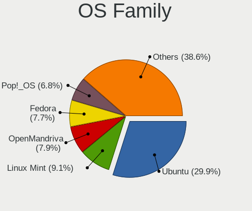
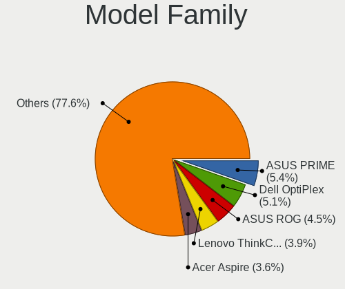
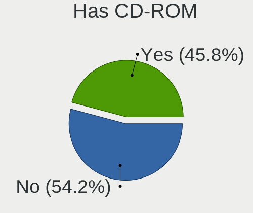
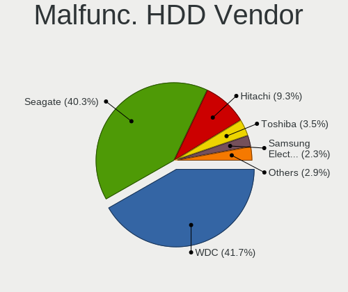
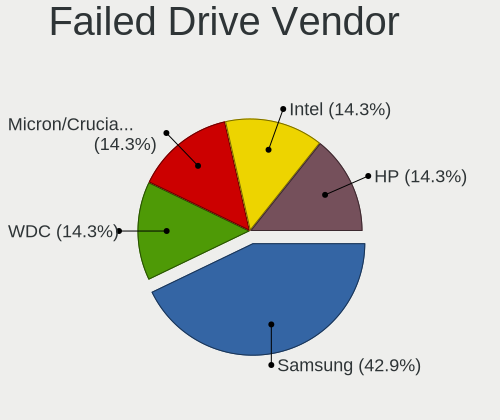
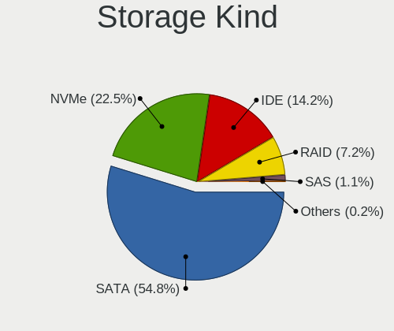
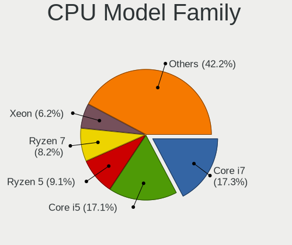
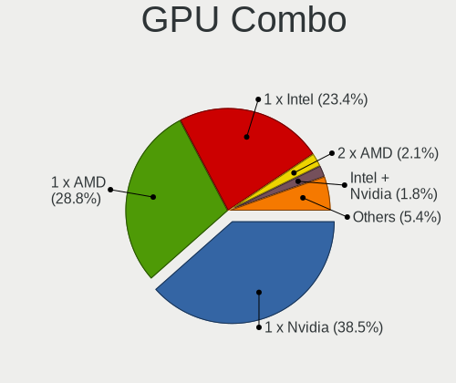
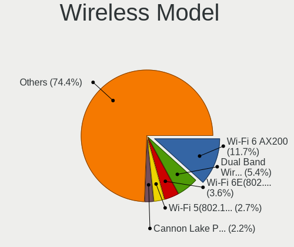
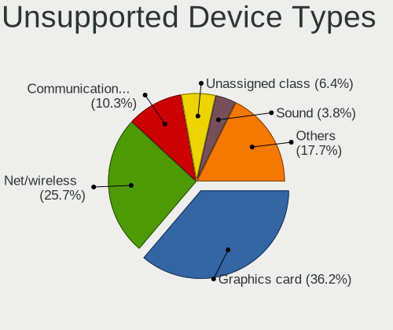

Linux in Canada - Tested Hardware & Statistics (Desktops)
---------------------------------------------------------

A project to collect tested hardware configurations for Linux in Canada.

Anyone can contribute to this report by the [hw-probe](https://github.com/linuxhw/hw-probe) tool:

    sudo -E hw-probe -all -upload

Please contribute! Especially if your hardware is rare.

Contents
--------

* [ Test Cases ](#test-cases)

* [ System ](#system)
  - [ OS                       ](#os)
  - [ OS Family                ](#os-family)
  - [ Kernel                   ](#kernel)
  - [ Kernel Family            ](#kernel-family)
  - [ Kernel Major Ver.        ](#kernel-major-ver)
  - [ Arch                     ](#arch)
  - [ DE                       ](#de)
  - [ Display Server           ](#display-server)
  - [ Display Manager          ](#display-manager)
  - [ OS Lang                  ](#os-lang)
  - [ Boot Mode                ](#boot-mode)
  - [ Filesystem               ](#filesystem)
  - [ Part. scheme             ](#part-scheme)
  - [ Dual Boot with Linux/BSD ](#dual-boot-with-linuxbsd)
  - [ Dual Boot (Win)          ](#dual-boot-win)

* [ Board ](#board)
  - [ Vendor                   ](#vendor)
  - [ Model                    ](#model)
  - [ Model Family             ](#model-family)
  - [ MFG Year                 ](#mfg-year)
  - [ Form Factor              ](#form-factor)
  - [ Secure Boot              ](#secure-boot)
  - [ Coreboot                 ](#coreboot)
  - [ RAM Size                 ](#ram-size)
  - [ RAM Used                 ](#ram-used)
  - [ Total Drives             ](#total-drives)
  - [ Has CD-ROM               ](#has-cd-rom)
  - [ Has Ethernet             ](#has-ethernet)
  - [ Has WiFi                 ](#has-wifi)
  - [ Has Bluetooth            ](#has-bluetooth)

* [ Location ](#location)
  - [ Country                  ](#country)
  - [ City                     ](#city)

* [ Drives ](#drives)
  - [ Drive Vendor             ](#drive-vendor)
  - [ Drive Model              ](#drive-model)
  - [ HDD Vendor               ](#hdd-vendor)
  - [ SSD Vendor               ](#ssd-vendor)
  - [ Drive Kind               ](#drive-kind)
  - [ Drive Connector          ](#drive-connector)
  - [ Drive Size               ](#drive-size)
  - [ Space Total              ](#space-total)
  - [ Space Used               ](#space-used)
  - [ Malfunc. Drives          ](#malfunc-drives)
  - [ Malfunc. Drive Vendor    ](#malfunc-drive-vendor)
  - [ Malfunc. HDD Vendor      ](#malfunc-hdd-vendor)
  - [ Malfunc. Drive Kind      ](#malfunc-drive-kind)
  - [ Failed Drives            ](#failed-drives)
  - [ Failed Drive Vendor      ](#failed-drive-vendor)
  - [ Drive Status             ](#drive-status)

* [ Storage controller ](#storage-controller)
  - [ Storage Vendor           ](#storage-vendor)
  - [ Storage Model            ](#storage-model)
  - [ Storage Kind             ](#storage-kind)

* [ Processor ](#processor)
  - [ CPU Vendor               ](#cpu-vendor)
  - [ CPU Model                ](#cpu-model)
  - [ CPU Model Family         ](#cpu-model-family)
  - [ CPU Cores                ](#cpu-cores)
  - [ CPU Sockets              ](#cpu-sockets)
  - [ CPU Threads              ](#cpu-threads)
  - [ CPU Op-Modes             ](#cpu-op-modes)
  - [ CPU Microcode            ](#cpu-microcode)
  - [ CPU Microarch            ](#cpu-microarch)

* [ Graphics ](#graphics)
  - [ GPU Vendor               ](#gpu-vendor)
  - [ GPU Model                ](#gpu-model)
  - [ GPU Combo                ](#gpu-combo)
  - [ GPU Driver               ](#gpu-driver)
  - [ GPU Memory               ](#gpu-memory)

* [ Monitor ](#monitor)
  - [ Monitor Vendor           ](#monitor-vendor)
  - [ Monitor Model            ](#monitor-model)
  - [ Monitor Resolution       ](#monitor-resolution)
  - [ Monitor Diagonal         ](#monitor-diagonal)
  - [ Monitor Width            ](#monitor-width)
  - [ Aspect Ratio             ](#aspect-ratio)
  - [ Monitor Area             ](#monitor-area)
  - [ Pixel Density            ](#pixel-density)
  - [ Multiple Monitors        ](#multiple-monitors)

* [ Network ](#network)
  - [ Net Controller Vendor    ](#net-controller-vendor)
  - [ Net Controller Model     ](#net-controller-model)
  - [ Wireless Vendor          ](#wireless-vendor)
  - [ Wireless Model           ](#wireless-model)
  - [ Ethernet Vendor          ](#ethernet-vendor)
  - [ Ethernet Model           ](#ethernet-model)
  - [ Net Controller Kind      ](#net-controller-kind)
  - [ Used Controller          ](#used-controller)
  - [ NICs                     ](#nics)
  - [ IPv6                     ](#ipv6)

* [ Bluetooth ](#bluetooth)
  - [ Bluetooth Vendor         ](#bluetooth-vendor)
  - [ Bluetooth Model          ](#bluetooth-model)

* [ Sound ](#sound)
  - [ Sound Vendor             ](#sound-vendor)
  - [ Sound Model              ](#sound-model)

* [ Memory ](#memory)
  - [ Memory Vendor            ](#memory-vendor)
  - [ Memory Model             ](#memory-model)
  - [ Memory Kind              ](#memory-kind)
  - [ Memory Form Factor       ](#memory-form-factor)
  - [ Memory Size              ](#memory-size)
  - [ Memory Speed             ](#memory-speed)

* [ Printers & scanners ](#printers--scanners)
  - [ Printer Vendor           ](#printer-vendor)
  - [ Printer Model            ](#printer-model)
  - [ Scanner Vendor           ](#scanner-vendor)
  - [ Scanner Model            ](#scanner-model)

* [ Camera ](#camera)
  - [ Camera Vendor            ](#camera-vendor)
  - [ Camera Model             ](#camera-model)

* [ Security ](#security)
  - [ Fingerprint Vendor       ](#fingerprint-vendor)
  - [ Fingerprint Model        ](#fingerprint-model)
  - [ Chipcard Vendor          ](#chipcard-vendor)
  - [ Chipcard Model           ](#chipcard-model)

* [ Unsupported ](#unsupported)
  - [ Unsupported Devices      ](#unsupported-devices)
  - [ Unsupported Device Types ](#unsupported-device-types)

Test Cases
----------

Total: 5369

| Vendor        | Model                       | Probe                                                      | Date         |
|---------------|-----------------------------|------------------------------------------------------------|--------------|
| Lenovo        | 0B98401 PRO                 | [319423b279](https://linux-hardware.org/?probe=319423b279) | Jan 06, 2025 |
| ASUSTek       | K30BF_M32BF_A_F_K31BF_6     | [0b29006a62](https://linux-hardware.org/?probe=0b29006a62) | Jan 06, 2025 |
| Bosgame       | ARB37                       | [8785fe342f](https://linux-hardware.org/?probe=8785fe342f) | Jan 05, 2025 |
| Gigabyte      | GA-970A-D3                  | [cd33aa866c](https://linux-hardware.org/?probe=cd33aa866c) | Jan 05, 2025 |
| ASUSTek       | H110M-E/M.2                 | [ff2e84ab02](https://linux-hardware.org/?probe=ff2e84ab02) | Jan 05, 2025 |
| Gigabyte      | X570 AORUS ELITE WIFI       | [d80a8fd406](https://linux-hardware.org/?probe=d80a8fd406) | Jan 05, 2025 |
| Gigabyte      | G41MT-S2PT                  | [d4592a5f61](https://linux-hardware.org/?probe=d4592a5f61) | Jan 05, 2025 |
| Acer          | Aspire X1470                | [e645634cdf](https://linux-hardware.org/?probe=e645634cdf) | Jan 04, 2025 |
| ABIT          | AT8 32X                     | [e613a45614](https://linux-hardware.org/?probe=e613a45614) | Jan 03, 2025 |
| Acer          | Aspire X1470                | [5546dd82bb](https://linux-hardware.org/?probe=5546dd82bb) | Jan 03, 2025 |
| MSI           | PRO B650-S WIFI             | [bf20a2de9e](https://linux-hardware.org/?probe=bf20a2de9e) | Jan 03, 2025 |
| MSI           | PRO B650-VC WIFI II         | [a86933b617](https://linux-hardware.org/?probe=a86933b617) | Jan 02, 2025 |
| MSI           | B350M MORTAR                | [f946508536](https://linux-hardware.org/?probe=f946508536) | Jan 02, 2025 |
| MSI           | MPG B760I EDGE WIFI         | [8d39826a67](https://linux-hardware.org/?probe=8d39826a67) | Jan 02, 2025 |
| MSI           | 970 GAMING                  | [c77ab27b22](https://linux-hardware.org/?probe=c77ab27b22) | Jan 01, 2025 |
| ASUSTek       | ROG STRIX B450-F GAMING ... | [29a8b52eec](https://linux-hardware.org/?probe=29a8b52eec) | Jan 01, 2025 |
| MSI           | MAG B650 TOMAHAWK WIFI      | [f3b82ea58b](https://linux-hardware.org/?probe=f3b82ea58b) | Jan 01, 2025 |
| Intel         | DH87RL AAG74240-402         | [047af1c88e](https://linux-hardware.org/?probe=047af1c88e) | Jan 01, 2025 |
| HP            | 2AF3                        | [27a5a9b662](https://linux-hardware.org/?probe=27a5a9b662) | Jan 01, 2025 |
| ASUSTek       | ROG STRIX B550-F GAMING     | [9802b59126](https://linux-hardware.org/?probe=9802b59126) | Jan 01, 2025 |
| ASUSTek       | P5Q SE PLUS                 | [2e5a12a36b](https://linux-hardware.org/?probe=2e5a12a36b) | Jan 01, 2025 |
| Foxconn       | 2AB1                        | [d937af7e89](https://linux-hardware.org/?probe=d937af7e89) | Jan 01, 2025 |
| Gigabyte      | H81M-S2PH                   | [8e18f9641a](https://linux-hardware.org/?probe=8e18f9641a) | Dec 31, 2024 |
| ASUSTek       | TUF Gaming Z790-PLUS WIF... | [cdbb6290eb](https://linux-hardware.org/?probe=cdbb6290eb) | Dec 31, 2024 |
| Acer          | Veriton X490G               | [0ce5ae0e9c](https://linux-hardware.org/?probe=0ce5ae0e9c) | Dec 31, 2024 |
| Gigabyte      | GA-MA790GP-DS4H             | [ba9e4bcced](https://linux-hardware.org/?probe=ba9e4bcced) | Dec 31, 2024 |
| ASUSTek       | ROG STRIX B650E-I GAMING... | [a66ac9e217](https://linux-hardware.org/?probe=a66ac9e217) | Dec 31, 2024 |
| ASUSTek       | TUF Gaming B550-PLUS WIF... | [9f7d158933](https://linux-hardware.org/?probe=9f7d158933) | Dec 30, 2024 |
| ASUSTek       | P5GZ-MX                     | [62e974ebee](https://linux-hardware.org/?probe=62e974ebee) | Dec 30, 2024 |
| MSI           | 990FXA-GD80                 | [8b2f125314](https://linux-hardware.org/?probe=8b2f125314) | Dec 30, 2024 |
| ASUSTek       | ROG STRIX B650E-F GAMING... | [2bd762eeb7](https://linux-hardware.org/?probe=2bd762eeb7) | Dec 30, 2024 |
| ASUSTek       | ROG Maximus X HERO          | [be780cbd32](https://linux-hardware.org/?probe=be780cbd32) | Dec 30, 2024 |
| Dell          | 02YYK5 A01                  | [2a39e2e698](https://linux-hardware.org/?probe=2a39e2e698) | Dec 29, 2024 |
| ASUSTek       | Z97-K                       | [53f0c1c555](https://linux-hardware.org/?probe=53f0c1c555) | Dec 29, 2024 |
| Gigabyte      | Z97X-Gaming 5               | [dc533b139f](https://linux-hardware.org/?probe=dc533b139f) | Dec 29, 2024 |
| Gigabyte      | B550 AORUS ELITE AX V3      | [3ff4946888](https://linux-hardware.org/?probe=3ff4946888) | Dec 29, 2024 |
| HP            | 3397                        | [e063572f7c](https://linux-hardware.org/?probe=e063572f7c) | Dec 28, 2024 |
| Pegatron      | Benicia                     | [e061c1cadc](https://linux-hardware.org/?probe=e061c1cadc) | Dec 28, 2024 |
| MSI           | B350M MORTAR                | [8f912c3cb7](https://linux-hardware.org/?probe=8f912c3cb7) | Dec 28, 2024 |
| Dell          | 0R790T A00                  | [e4545e5825](https://linux-hardware.org/?probe=e4545e5825) | Dec 28, 2024 |
| Dell          | 096JG8 A01                  | [4324dc90bf](https://linux-hardware.org/?probe=4324dc90bf) | Dec 28, 2024 |
| HP            | 8462                        | [d0e8315b62](https://linux-hardware.org/?probe=d0e8315b62) | Dec 28, 2024 |
| ASUSTek       | TUF Gaming B550M-ZAKU       | [2f86029430](https://linux-hardware.org/?probe=2f86029430) | Dec 27, 2024 |
| MSI           | B550M PRO-VDH WIFI          | [27f73d7e4e](https://linux-hardware.org/?probe=27f73d7e4e) | Dec 27, 2024 |
| Dell          | 05XGC8 A01                  | [59297e30b7](https://linux-hardware.org/?probe=59297e30b7) | Dec 27, 2024 |
| Dell          | 05XGC8 A01                  | [4714a00d4c](https://linux-hardware.org/?probe=4714a00d4c) | Dec 27, 2024 |
| Foxconn       | 2AB1                        | [70925114c3](https://linux-hardware.org/?probe=70925114c3) | Dec 26, 2024 |
| MSI           | MAG X570 TOMAHAWK WIFI      | [1a60e8fb7a](https://linux-hardware.org/?probe=1a60e8fb7a) | Dec 26, 2024 |
| ASRock        | B650M Pro RS WiFi           | [368bda5cc8](https://linux-hardware.org/?probe=368bda5cc8) | Dec 26, 2024 |
| ASUSTek       | TUF Gaming B550M-PLUS       | [bcd19d252b](https://linux-hardware.org/?probe=bcd19d252b) | Dec 25, 2024 |
| Gigabyte      | Z390 UD                     | [bbcf88b5f3](https://linux-hardware.org/?probe=bbcf88b5f3) | Dec 25, 2024 |
| ASUSTek       | PRIME Z390-A                | [1202e9754d](https://linux-hardware.org/?probe=1202e9754d) | Dec 25, 2024 |
| Gigabyte      | B450 AORUS M                | [df8f0ba147](https://linux-hardware.org/?probe=df8f0ba147) | Dec 24, 2024 |
| Gigabyte      | EP45-DS3R                   | [a27723c275](https://linux-hardware.org/?probe=a27723c275) | Dec 24, 2024 |
| Dell          | 06FW8P A02                  | [42c00b7a8a](https://linux-hardware.org/?probe=42c00b7a8a) | Dec 24, 2024 |
| Wistron       | ProLiant ML110 G6           | [1609625a37](https://linux-hardware.org/?probe=1609625a37) | Dec 24, 2024 |
| ASUSTek       | P5K Deluxe                  | [af438d2cae](https://linux-hardware.org/?probe=af438d2cae) | Dec 23, 2024 |
| Acer          | RS780HVF                    | [bbc9e843db](https://linux-hardware.org/?probe=bbc9e843db) | Dec 23, 2024 |
| Dell          | 0M6C7G A00                  | [375865cd09](https://linux-hardware.org/?probe=375865cd09) | Dec 23, 2024 |
| HP            | 8462                        | [4837f873a4](https://linux-hardware.org/?probe=4837f873a4) | Dec 23, 2024 |
| MSI           | PRO B760M-P DDR4            | [a649caaa82](https://linux-hardware.org/?probe=a649caaa82) | Dec 23, 2024 |
| ASUSTek       | P8Z77-V LE                  | [468d9fdcd3](https://linux-hardware.org/?probe=468d9fdcd3) | Dec 22, 2024 |
| Gigabyte      | F2A85XM-D3H                 | [5d6d1c59a4](https://linux-hardware.org/?probe=5d6d1c59a4) | Dec 21, 2024 |
| MSI           | PRO B650M-A WIFI            | [8cd738bd8a](https://linux-hardware.org/?probe=8cd738bd8a) | Dec 21, 2024 |
| HP            | 81C5 MVB                    | [77cb2466d4](https://linux-hardware.org/?probe=77cb2466d4) | Dec 21, 2024 |
| Gigabyte      | X570 AORUS PRO WIFI         | [9d2496eed1](https://linux-hardware.org/?probe=9d2496eed1) | Dec 21, 2024 |
| ASUSTek       | ROG STRIX Z390-I GAMING     | [b202efa3e6](https://linux-hardware.org/?probe=b202efa3e6) | Dec 20, 2024 |
| Gigabyte      | H81M-H                      | [c89e4827ed](https://linux-hardware.org/?probe=c89e4827ed) | Dec 20, 2024 |
| ASUSTek       | PRIME B450M-A               | [6c13efa61f](https://linux-hardware.org/?probe=6c13efa61f) | Dec 20, 2024 |
| Unknown       | Unknown                     | [ee566f8f11](https://linux-hardware.org/?probe=ee566f8f11) | Dec 19, 2024 |
| Gigabyte      | H370M DS3H-CF               | [8eb604caeb](https://linux-hardware.org/?probe=8eb604caeb) | Dec 19, 2024 |
| MSI           | C236A WORKSTATION           | [49ab170cda](https://linux-hardware.org/?probe=49ab170cda) | Dec 18, 2024 |
| Intel         | IPC-ADN2L                   | [456aa729c1](https://linux-hardware.org/?probe=456aa729c1) | Dec 18, 2024 |
| MSI           | C236A WORKSTATION           | [ddec979f1d](https://linux-hardware.org/?probe=ddec979f1d) | Dec 18, 2024 |
| Dell          | 02YYK5 A01                  | [160fadff40](https://linux-hardware.org/?probe=160fadff40) | Dec 18, 2024 |
| MSI           | B150 GAMING M3              | [eb7d688010](https://linux-hardware.org/?probe=eb7d688010) | Dec 18, 2024 |
| ASUSTek       | X99-A                       | [69f91227bf](https://linux-hardware.org/?probe=69f91227bf) | Dec 18, 2024 |
| Dell          | 0MWYPT A02                  | [ee147a7018](https://linux-hardware.org/?probe=ee147a7018) | Dec 18, 2024 |
| Lenovo        | 1064 SDK0T76528 WIN 3556... | [f140f9811e](https://linux-hardware.org/?probe=f140f9811e) | Dec 17, 2024 |
| ASUSTek       | TUF Gaming X570-PLUS        | [3830383cb9](https://linux-hardware.org/?probe=3830383cb9) | Dec 17, 2024 |
| MSI           | MPG X570 GAMING PLUS        | [a157381033](https://linux-hardware.org/?probe=a157381033) | Dec 17, 2024 |
| Gigabyte      | X870 EAGLE WIFI7            | [0b96421b6c](https://linux-hardware.org/?probe=0b96421b6c) | Dec 17, 2024 |
| Lenovo        | SHARKBAY SDK0E50512 STD     | [c3e53139a7](https://linux-hardware.org/?probe=c3e53139a7) | Dec 17, 2024 |
| HP            | 1494                        | [4af4907cff](https://linux-hardware.org/?probe=4af4907cff) | Dec 16, 2024 |
| Lenovo        | SHARKBAY SDK0E50510 WIN     | [781fc0f1cb](https://linux-hardware.org/?probe=781fc0f1cb) | Dec 16, 2024 |
| ASRock        | X399 Taichi                 | [d271480a05](https://linux-hardware.org/?probe=d271480a05) | Dec 15, 2024 |
| Dell          | 0WR1RF A05                  | [dfe93dbaf4](https://linux-hardware.org/?probe=dfe93dbaf4) | Dec 15, 2024 |
| ASUSTek       | ROG STRIX B450-F GAMING ... | [3058988b56](https://linux-hardware.org/?probe=3058988b56) | Dec 15, 2024 |
| Intel         | X99 V1.0                    | [8819c1d648](https://linux-hardware.org/?probe=8819c1d648) | Dec 14, 2024 |
| ASUSTek       | TUF Gaming B650M-E WIFI     | [2a73c0dba0](https://linux-hardware.org/?probe=2a73c0dba0) | Dec 14, 2024 |
| ASUSTek       | ROG STRIX B550-A GAMING     | [4f591d2875](https://linux-hardware.org/?probe=4f591d2875) | Dec 14, 2024 |
| Gigabyte      | EP43-DS3L                   | [8e265a79bd](https://linux-hardware.org/?probe=8e265a79bd) | Dec 14, 2024 |
| MSI           | MPG X570 GAMING PLUS        | [231ffcb252](https://linux-hardware.org/?probe=231ffcb252) | Dec 13, 2024 |
| Lenovo        | SHARKBAY SDK0E50510 PRO     | [8ece88c179](https://linux-hardware.org/?probe=8ece88c179) | Dec 13, 2024 |
| ASUSTek       | Z97-K                       | [8096f8f1b6](https://linux-hardware.org/?probe=8096f8f1b6) | Dec 12, 2024 |
| Dell          | 0WG855                      | [c87b7a95df](https://linux-hardware.org/?probe=c87b7a95df) | Dec 12, 2024 |
| Lenovo        | 30BC SDK0J40697 WIN 3305... | [2790c6fce6](https://linux-hardware.org/?probe=2790c6fce6) | Dec 11, 2024 |
| Lenovo        | 3106 SDK0J40697 WIN 3305... | [bece5c47df](https://linux-hardware.org/?probe=bece5c47df) | Dec 11, 2024 |
| Lenovo        | 3106 SDK0J40697 WIN 3305... | [391bc43492](https://linux-hardware.org/?probe=391bc43492) | Dec 11, 2024 |
| MSI           | PRO Z690-A DDR4             | [d281690253](https://linux-hardware.org/?probe=d281690253) | Dec 10, 2024 |
| Gigabyte      | X570 AORUS PRO WIFI         | [27824c7505](https://linux-hardware.org/?probe=27824c7505) | Dec 09, 2024 |
| ASRock        | B650M Pro RS WiFi           | [e56c27202c](https://linux-hardware.org/?probe=e56c27202c) | Dec 08, 2024 |
| ASUSTek       | ROG STRIX Z690-E GAMING ... | [529a4efc44](https://linux-hardware.org/?probe=529a4efc44) | Dec 07, 2024 |
| ASUSTek       | ROG CROSSHAIR VIII DARK ... | [015acb690e](https://linux-hardware.org/?probe=015acb690e) | Dec 07, 2024 |
| ASUSTek       | PRIME Z790-P WIFI           | [7745cda9b8](https://linux-hardware.org/?probe=7745cda9b8) | Dec 05, 2024 |
| ASUSTek       | ROG STRIX B450-F GAMING     | [1b34f91a7e](https://linux-hardware.org/?probe=1b34f91a7e) | Dec 04, 2024 |
| ASUSTek       | ROG STRIX B450-F GAMING     | [c8b86d2a3e](https://linux-hardware.org/?probe=c8b86d2a3e) | Dec 04, 2024 |
| HP            | 81C5 MVB                    | [d7883f568b](https://linux-hardware.org/?probe=d7883f568b) | Dec 04, 2024 |
| MSI           | B350 TOMAHAWK               | [7909d61813](https://linux-hardware.org/?probe=7909d61813) | Dec 04, 2024 |
| MSI           | MPG X570 GAMING PLUS        | [23325c9670](https://linux-hardware.org/?probe=23325c9670) | Dec 03, 2024 |
| Dell          | 0KYJ8C A02                  | [0e01c8cfa2](https://linux-hardware.org/?probe=0e01c8cfa2) | Dec 03, 2024 |
| ASUSTek       | PRIME Z790-P WIFI           | [5c0dd2a9de](https://linux-hardware.org/?probe=5c0dd2a9de) | Dec 03, 2024 |
| ASUSTek       | M5A78L-M LX3                | [28ba9ba8b9](https://linux-hardware.org/?probe=28ba9ba8b9) | Dec 03, 2024 |
| Dell          | 0Y2MRG A00                  | [d935bd26bb](https://linux-hardware.org/?probe=d935bd26bb) | Dec 02, 2024 |
| MSI           | MPG X570 GAMING PLUS        | [ad5a11492c](https://linux-hardware.org/?probe=ad5a11492c) | Dec 02, 2024 |
| ASUSTek       | PRIME B550-PLUS             | [c430b5f9c4](https://linux-hardware.org/?probe=c430b5f9c4) | Dec 02, 2024 |
| ASUSTek       | PRIME X670E-PRO WIFI        | [2612abfcee](https://linux-hardware.org/?probe=2612abfcee) | Dec 02, 2024 |
| ASUSTek       | P8Z77-V PRO                 | [d064733dcb](https://linux-hardware.org/?probe=d064733dcb) | Dec 02, 2024 |
| MSI           | B550-A PRO                  | [1fe6f379ce](https://linux-hardware.org/?probe=1fe6f379ce) | Dec 01, 2024 |
| Dell          | 09KPNV A01                  | [051e0cc9e2](https://linux-hardware.org/?probe=051e0cc9e2) | Dec 01, 2024 |
| ASUSTek       | TUF Gaming X570-PLUS        | [bc30579f14](https://linux-hardware.org/?probe=bc30579f14) | Dec 01, 2024 |
| ASUSTek       | PRIME B760M-A AX            | [62a02c2c7d](https://linux-hardware.org/?probe=62a02c2c7d) | Dec 01, 2024 |
| HP            | 872B                        | [4dd45a2a3c](https://linux-hardware.org/?probe=4dd45a2a3c) | Dec 01, 2024 |
| MSI           | Z77A-G45                    | [4ff6c04aeb](https://linux-hardware.org/?probe=4ff6c04aeb) | Nov 30, 2024 |
| Gigabyte      | B550M DS3H                  | [7e9d488336](https://linux-hardware.org/?probe=7e9d488336) | Nov 29, 2024 |
| Dell          | 0WG855                      | [89f19d38c8](https://linux-hardware.org/?probe=89f19d38c8) | Nov 29, 2024 |
| MSI           | MPG X570 GAMING PLUS        | [0e4f7f6345](https://linux-hardware.org/?probe=0e4f7f6345) | Nov 28, 2024 |
| ASUSTek       | PRIME B760M-A AX            | [fe713f1069](https://linux-hardware.org/?probe=fe713f1069) | Nov 28, 2024 |
| Biostar       | N68SA-M2S                   | [5938203e56](https://linux-hardware.org/?probe=5938203e56) | Nov 28, 2024 |
| Dell          | 0KWVT8 A00                  | [bd9c6385dd](https://linux-hardware.org/?probe=bd9c6385dd) | Nov 28, 2024 |
| Lenovo        | ThinkCentre M81 7517A2F     | [51de0395d0](https://linux-hardware.org/?probe=51de0395d0) | Nov 27, 2024 |
| Gigabyte      | 990FXA-UD3                  | [28b0d5272c](https://linux-hardware.org/?probe=28b0d5272c) | Nov 27, 2024 |
| Gigabyte      | 990FXA-UD3                  | [32e941719a](https://linux-hardware.org/?probe=32e941719a) | Nov 26, 2024 |
| ASUSTek       | ROG STRIX X570-E GAMING     | [6aeed4ada0](https://linux-hardware.org/?probe=6aeed4ada0) | Nov 26, 2024 |
| Lenovo        | ThinkCentre M81 7517A2F     | [6ae2f479e0](https://linux-hardware.org/?probe=6ae2f479e0) | Nov 26, 2024 |
| MSI           | B550M PRO-VDH WIFI          | [04e6ca41f2](https://linux-hardware.org/?probe=04e6ca41f2) | Nov 26, 2024 |
| ASUSTek       | ROG STRIX B450-F GAMING ... | [53f28f7bf8](https://linux-hardware.org/?probe=53f28f7bf8) | Nov 26, 2024 |
| Lenovo        | SHARKBAY SDK0E50510 PRO     | [cf9779abe7](https://linux-hardware.org/?probe=cf9779abe7) | Nov 26, 2024 |
| Gigabyte      | X570 AORUS ELITE            | [36d1ef2cc9](https://linux-hardware.org/?probe=36d1ef2cc9) | Nov 25, 2024 |
| ASUSTek       | M11AD                       | [b3222c19f5](https://linux-hardware.org/?probe=b3222c19f5) | Nov 25, 2024 |
| ASUSTek       | M11AD                       | [63ed444411](https://linux-hardware.org/?probe=63ed444411) | Nov 25, 2024 |
| Dell          | 0KWVT8 A00                  | [790161652a](https://linux-hardware.org/?probe=790161652a) | Nov 25, 2024 |
| ASRock        | Z490M-ITX/ac                | [82194a4d3a](https://linux-hardware.org/?probe=82194a4d3a) | Nov 24, 2024 |
| Intel         | X99                         | [67148a7875](https://linux-hardware.org/?probe=67148a7875) | Nov 23, 2024 |
| MSI           | B550M PRO-VDH WIFI          | [75f0b56d0c](https://linux-hardware.org/?probe=75f0b56d0c) | Nov 22, 2024 |
| HP            | 82F1                        | [93b6f2c1a1](https://linux-hardware.org/?probe=93b6f2c1a1) | Nov 22, 2024 |
| HP            | 82F1                        | [d837edb5bd](https://linux-hardware.org/?probe=d837edb5bd) | Nov 22, 2024 |
| ASUSTek       | PRIME H310M-E R2.0          | [50100703aa](https://linux-hardware.org/?probe=50100703aa) | Nov 22, 2024 |
| AZW           | Green G4 10                 | [7e4268122e](https://linux-hardware.org/?probe=7e4268122e) | Nov 21, 2024 |
| MSI           | PRO B650M-A WIFI            | [03ad8b0cca](https://linux-hardware.org/?probe=03ad8b0cca) | Nov 21, 2024 |
| ASUSTek       | Z170-A                      | [268e62aeb8](https://linux-hardware.org/?probe=268e62aeb8) | Nov 20, 2024 |
| ASRock        | X670E PG Lightning          | [07a38ec669](https://linux-hardware.org/?probe=07a38ec669) | Nov 19, 2024 |
| ASRock        | A88M-G                      | [e4a3dceece](https://linux-hardware.org/?probe=e4a3dceece) | Nov 19, 2024 |
| ASUSTek       | K30BF_M32BF_A_F_K31BF_6     | [eb0ca23199](https://linux-hardware.org/?probe=eb0ca23199) | Nov 19, 2024 |
| MSI           | B550M PRO-VDH WIFI          | [a268500cd9](https://linux-hardware.org/?probe=a268500cd9) | Nov 18, 2024 |
| Supermicro    | X10DAI                      | [4bc3d45af0](https://linux-hardware.org/?probe=4bc3d45af0) | Nov 18, 2024 |
| Biostar       | TZ77XE4                     | [a524ca5608](https://linux-hardware.org/?probe=a524ca5608) | Nov 17, 2024 |
| MSI           | B350M GAMING PRO            | [670a45ebbf](https://linux-hardware.org/?probe=670a45ebbf) | Nov 17, 2024 |
| Lenovo        | 1048 SDK0J40697 WIN 3305... | [090ac64ee1](https://linux-hardware.org/?probe=090ac64ee1) | Nov 17, 2024 |
| HP            | 805A                        | [4d0512b55a](https://linux-hardware.org/?probe=4d0512b55a) | Nov 16, 2024 |
| ASUSTek       | Z87-A                       | [e328a6c955](https://linux-hardware.org/?probe=e328a6c955) | Nov 16, 2024 |
| MSI           | B450 TOMAHAWK               | [5cfa0d5e7e](https://linux-hardware.org/?probe=5cfa0d5e7e) | Nov 15, 2024 |
| MSI           | MAG X570 TOMAHAWK WIFI      | [f05f3326c4](https://linux-hardware.org/?probe=f05f3326c4) | Nov 15, 2024 |
| MSI           | B450 TOMAHAWK               | [81e0e8472f](https://linux-hardware.org/?probe=81e0e8472f) | Nov 15, 2024 |
| ASRock        | Z790M-ITX WiFi              | [bf89edbddc](https://linux-hardware.org/?probe=bf89edbddc) | Nov 14, 2024 |
| HP            | 18E4                        | [f92165bb21](https://linux-hardware.org/?probe=f92165bb21) | Nov 14, 2024 |
| MSI           | B450 GAMING PRO CARBON M... | [2c0c09c053](https://linux-hardware.org/?probe=2c0c09c053) | Nov 14, 2024 |
| ASRock        | B450M Pro4-F                | [e9612bb012](https://linux-hardware.org/?probe=e9612bb012) | Nov 13, 2024 |
| ASUSTek       | PRIME B760M-A AX            | [a2e1723c04](https://linux-hardware.org/?probe=a2e1723c04) | Nov 13, 2024 |
| Gigabyte      | G1.Guerrilla                | [73ef034954](https://linux-hardware.org/?probe=73ef034954) | Nov 12, 2024 |
| Unknown       | Unknown                     | [706ea4dec5](https://linux-hardware.org/?probe=706ea4dec5) | Nov 12, 2024 |
| MSI           | PRO B550M-VC WIFI           | [666f6b86ca](https://linux-hardware.org/?probe=666f6b86ca) | Nov 12, 2024 |
| ASUSTek       | ROG STRIX B550-F GAMING     | [0b1609a35a](https://linux-hardware.org/?probe=0b1609a35a) | Nov 12, 2024 |
| ASRock        | AB350M Pro4                 | [ecb92e995e](https://linux-hardware.org/?probe=ecb92e995e) | Nov 11, 2024 |
| MSI           | Z370 PC PRO                 | [518166326c](https://linux-hardware.org/?probe=518166326c) | Nov 11, 2024 |
| MSI           | Z370 PC PRO                 | [9aef95d1fb](https://linux-hardware.org/?probe=9aef95d1fb) | Nov 11, 2024 |
| MSI           | Z370 PC PRO                 | [7252e66a9b](https://linux-hardware.org/?probe=7252e66a9b) | Nov 11, 2024 |
| ASUSTek       | P8Z77-V PRO                 | [d4267ac21d](https://linux-hardware.org/?probe=d4267ac21d) | Nov 10, 2024 |
| Gigabyte      | Z77X-UD3H                   | [51c37de3d0](https://linux-hardware.org/?probe=51c37de3d0) | Nov 10, 2024 |
| Pegatron      | 2ACB                        | [cd03619b7b](https://linux-hardware.org/?probe=cd03619b7b) | Nov 10, 2024 |
| Dell          | 0GXM1W A00                  | [5ee7f2cc70](https://linux-hardware.org/?probe=5ee7f2cc70) | Nov 10, 2024 |
| MSI           | X570-A PRO                  | [6ab5d34ad2](https://linux-hardware.org/?probe=6ab5d34ad2) | Nov 10, 2024 |
| ASUSTek       | ROG STRIX Z890-A GAMING ... | [5fbf701ed7](https://linux-hardware.org/?probe=5fbf701ed7) | Nov 10, 2024 |
| ASUSTek       | PRIME B760M-A AX            | [1af3427ba7](https://linux-hardware.org/?probe=1af3427ba7) | Nov 10, 2024 |
| MSI           | X570-A PRO                  | [2cc8104b78](https://linux-hardware.org/?probe=2cc8104b78) | Nov 09, 2024 |
| Lenovo        | SKYBAY SDK0J40705 WIN 34... | [9d7404555c](https://linux-hardware.org/?probe=9d7404555c) | Nov 09, 2024 |
| MSI           | PRO B650M-A WIFI            | [8ffc595e6d](https://linux-hardware.org/?probe=8ffc595e6d) | Nov 09, 2024 |
| Lenovo        | SHARKBAY SDK0E50510 WIN     | [d9617a8ee3](https://linux-hardware.org/?probe=d9617a8ee3) | Nov 09, 2024 |
| Gigabyte      | B650 AORUS ELITE AX         | [fe7551c06a](https://linux-hardware.org/?probe=fe7551c06a) | Nov 08, 2024 |
| MSI           | PRO Z690-A WIFI             | [4b69f7cf5d](https://linux-hardware.org/?probe=4b69f7cf5d) | Nov 08, 2024 |
| MSI           | PRO Z690-A WIFI             | [3e78ebd007](https://linux-hardware.org/?probe=3e78ebd007) | Nov 08, 2024 |
| MSI           | PRO B660-A DDR4             | [723518a192](https://linux-hardware.org/?probe=723518a192) | Nov 08, 2024 |
| ASUSTek       | PRIME A320M-K               | [0f2501a96e](https://linux-hardware.org/?probe=0f2501a96e) | Nov 07, 2024 |
| Intel         | X99                         | [55e94f9a71](https://linux-hardware.org/?probe=55e94f9a71) | Nov 07, 2024 |
| HP            | 18E4                        | [f25610c188](https://linux-hardware.org/?probe=f25610c188) | Nov 07, 2024 |
| Dell          | 0WN7Y6 A01                  | [cc23916a73](https://linux-hardware.org/?probe=cc23916a73) | Nov 06, 2024 |
| ASUSTek       | PRIME X570-P                | [8a99b0cee1](https://linux-hardware.org/?probe=8a99b0cee1) | Nov 06, 2024 |
| Gigabyte      | B550 AORUS ELITE AX V2      | [c53cffc662](https://linux-hardware.org/?probe=c53cffc662) | Nov 06, 2024 |
| ASUSTek       | P8Z77-V LE PLUS             | [c592713c7c](https://linux-hardware.org/?probe=c592713c7c) | Nov 06, 2024 |
| Pegatron      | 2ACB                        | [4fdc43d013](https://linux-hardware.org/?probe=4fdc43d013) | Nov 04, 2024 |
| HP            | 2129                        | [0a6a53a99f](https://linux-hardware.org/?probe=0a6a53a99f) | Nov 04, 2024 |
| Huanan        | H81 V2.1                    | [c2ea66a759](https://linux-hardware.org/?probe=c2ea66a759) | Nov 03, 2024 |
| MSI           | PRO B650M-A WIFI            | [4972061de5](https://linux-hardware.org/?probe=4972061de5) | Nov 03, 2024 |
| ASUSTek       | PRIME B450M-A               | [33c991f543](https://linux-hardware.org/?probe=33c991f543) | Nov 03, 2024 |
| HP            | 1495                        | [a844f7d854](https://linux-hardware.org/?probe=a844f7d854) | Nov 03, 2024 |
| Dell          | 096JG8 A01                  | [8b9351f3b8](https://linux-hardware.org/?probe=8b9351f3b8) | Nov 03, 2024 |
| ASUSTek       | B85M-E                      | [d1b1d2f52d](https://linux-hardware.org/?probe=d1b1d2f52d) | Nov 02, 2024 |
| ASRock        | B550M Pro4                  | [66f7a1ee14](https://linux-hardware.org/?probe=66f7a1ee14) | Nov 01, 2024 |
| Dell          | 09KPNV A01                  | [3bcb0ea60e](https://linux-hardware.org/?probe=3bcb0ea60e) | Nov 01, 2024 |
| MSI           | Z590 PRO WIFI               | [76739cf7da](https://linux-hardware.org/?probe=76739cf7da) | Nov 01, 2024 |
| Acer          | Nitro N50-600 V:1.1         | [bcb82dda58](https://linux-hardware.org/?probe=bcb82dda58) | Nov 01, 2024 |
| Dell          | 0X30MX A00                  | [c5943809d9](https://linux-hardware.org/?probe=c5943809d9) | Nov 01, 2024 |
| ASUSTek       | PRIME X670E-PRO WIFI        | [07c831fabd](https://linux-hardware.org/?probe=07c831fabd) | Nov 01, 2024 |
| HP            | 805A                        | [92461038c0](https://linux-hardware.org/?probe=92461038c0) | Oct 31, 2024 |
| Huanan        | H81 V2.1                    | [e3f7e9ca81](https://linux-hardware.org/?probe=e3f7e9ca81) | Oct 31, 2024 |
| Lenovo        | 1064 NOK                    | [51a7e04d09](https://linux-hardware.org/?probe=51a7e04d09) | Oct 31, 2024 |
| Dell          | 0VHRW1 A03                  | [9b8fd451d4](https://linux-hardware.org/?probe=9b8fd451d4) | Oct 31, 2024 |
| MSI           | A320M-A PRO MAX             | [37d93fcb8c](https://linux-hardware.org/?probe=37d93fcb8c) | Oct 31, 2024 |
| Intel         | D53427RKE G87790-407        | [86c849e615](https://linux-hardware.org/?probe=86c849e615) | Oct 30, 2024 |
| ASUSTek       | NODUSM3                     | [36de51e23d](https://linux-hardware.org/?probe=36de51e23d) | Oct 30, 2024 |
| ASRock        | B450M Pro4                  | [51a760c162](https://linux-hardware.org/?probe=51a760c162) | Oct 30, 2024 |
| Pegatron      | 2AD5                        | [9d4b633a6a](https://linux-hardware.org/?probe=9d4b633a6a) | Oct 29, 2024 |
| ASUSTek       | TUF Gaming X570-PLUS        | [9425b3345e](https://linux-hardware.org/?probe=9425b3345e) | Oct 29, 2024 |
| MSI           | MPG X570 GAMING PLUS        | [6ba1445c64](https://linux-hardware.org/?probe=6ba1445c64) | Oct 29, 2024 |
| ASUSTek       | P8Z77-V LE PLUS             | [34c1bd3c07](https://linux-hardware.org/?probe=34c1bd3c07) | Oct 29, 2024 |
| Dell          | 02N3WF A02                  | [999d7f5894](https://linux-hardware.org/?probe=999d7f5894) | Oct 28, 2024 |
| ASUSTek       | ROG STRIX B450-F GAMING ... | [1299a69914](https://linux-hardware.org/?probe=1299a69914) | Oct 28, 2024 |
| MSI           | MAG X670E TOMAHAWK WIFI     | [1f24cc9f1f](https://linux-hardware.org/?probe=1f24cc9f1f) | Oct 27, 2024 |
| Dell          | 0VHRW1 A03                  | [b25320751b](https://linux-hardware.org/?probe=b25320751b) | Oct 27, 2024 |
| ASUSTek       | ROG STRIX Z690-I GAMING ... | [304a589192](https://linux-hardware.org/?probe=304a589192) | Oct 26, 2024 |
| ASRock        | TRX40 Creator               | [362fb93f71](https://linux-hardware.org/?probe=362fb93f71) | Oct 25, 2024 |
| ASUSTek       | TUF X299 MARK 2             | [ae70b45707](https://linux-hardware.org/?probe=ae70b45707) | Oct 25, 2024 |
| Lenovo        | SHARKBAY 0B98401 PRO        | [abc719cbd3](https://linux-hardware.org/?probe=abc719cbd3) | Oct 24, 2024 |
| ASUSTek       | M5A99X EVO R2.0             | [e163c13a04](https://linux-hardware.org/?probe=e163c13a04) | Oct 23, 2024 |
| Gigabyte      | Z790 AORUS MASTER X         | [f86e1fe5ee](https://linux-hardware.org/?probe=f86e1fe5ee) | Oct 23, 2024 |
| Unknown       | X79                         | [a454957608](https://linux-hardware.org/?probe=a454957608) | Oct 23, 2024 |
| ASUSTek       | TUF Gaming A520M-PLUS WI... | [2abaa0bdb5](https://linux-hardware.org/?probe=2abaa0bdb5) | Oct 22, 2024 |
| ASUSTek       | TUF Gaming A520M-PLUS WI... | [b65d1cf85e](https://linux-hardware.org/?probe=b65d1cf85e) | Oct 22, 2024 |
| Lenovo        | 3768 SDK0T76463 WIN 3422... | [4c80185de1](https://linux-hardware.org/?probe=4c80185de1) | Oct 22, 2024 |
| Shenzhen M... | AHWSA                       | [087fb9ab45](https://linux-hardware.org/?probe=087fb9ab45) | Oct 20, 2024 |
| ASUSTek       | ROG STRIX B450-F GAMING     | [34b8e69dcc](https://linux-hardware.org/?probe=34b8e69dcc) | Oct 20, 2024 |
| MSI           | MPG Z590M GAMING EDGE WI... | [36f15d5e0a](https://linux-hardware.org/?probe=36f15d5e0a) | Oct 20, 2024 |
| Dell          | 0KV3RP A00                  | [416d9daf78](https://linux-hardware.org/?probe=416d9daf78) | Oct 19, 2024 |
| MSI           | B85M-G43                    | [03dc91172a](https://linux-hardware.org/?probe=03dc91172a) | Oct 19, 2024 |
| BESSTAR Te... | UM700                       | [4adb7c3490](https://linux-hardware.org/?probe=4adb7c3490) | Oct 19, 2024 |
| ASUSTek       | H61M-K                      | [50de29919f](https://linux-hardware.org/?probe=50de29919f) | Oct 19, 2024 |
| MACHINIST     | X99-MR9A PRO MAX V5.1       | [d7e2cffa85](https://linux-hardware.org/?probe=d7e2cffa85) | Oct 19, 2024 |
| Dell          | 02YYK5 A01                  | [2e236bea68](https://linux-hardware.org/?probe=2e236bea68) | Oct 19, 2024 |
| ASRock        | A520M-ITX/ac                | [257fe67fab](https://linux-hardware.org/?probe=257fe67fab) | Oct 19, 2024 |
| Dell          | 0R6PCT A01                  | [0f66ad55b1](https://linux-hardware.org/?probe=0f66ad55b1) | Oct 19, 2024 |
| MSI           | PRO B550M-VC WIFI           | [45d96e7a1e](https://linux-hardware.org/?probe=45d96e7a1e) | Oct 18, 2024 |
| Dell          | 07F37C A00                  | [10c1d68877](https://linux-hardware.org/?probe=10c1d68877) | Oct 17, 2024 |
| MSI           | MPG X570 GAMING PLUS        | [5dca39ff49](https://linux-hardware.org/?probe=5dca39ff49) | Oct 17, 2024 |
| Gigabyte      | Z790 AORUS MASTER X         | [31611b8c3f](https://linux-hardware.org/?probe=31611b8c3f) | Oct 17, 2024 |
| Dell          | 0R6PCT A01                  | [331f6c6d06](https://linux-hardware.org/?probe=331f6c6d06) | Oct 17, 2024 |
| HP            | 339A                        | [d5dbdecdd0](https://linux-hardware.org/?probe=d5dbdecdd0) | Oct 17, 2024 |
| Lenovo        | 30D0 SDK0J40697 WIN 3305... | [890124e315](https://linux-hardware.org/?probe=890124e315) | Oct 16, 2024 |
| ASUSTek       | ROG STRIX B450-F GAMING ... | [107ed71ce3](https://linux-hardware.org/?probe=107ed71ce3) | Oct 15, 2024 |
| Pegatron      | EVE                         | [da15891544](https://linux-hardware.org/?probe=da15891544) | Oct 15, 2024 |
| Acer          | Aspire TC-710 V:1.1         | [f08a4f01c7](https://linux-hardware.org/?probe=f08a4f01c7) | Oct 15, 2024 |
| ASUSTek       | M4A78-E                     | [2c29f9d339](https://linux-hardware.org/?probe=2c29f9d339) | Oct 15, 2024 |
| MSI           | B350M PRO-VDH               | [30906c6788](https://linux-hardware.org/?probe=30906c6788) | Oct 15, 2024 |
| ASUSTek       | PRIME B450M-A II            | [bc9f2b478b](https://linux-hardware.org/?probe=bc9f2b478b) | Oct 14, 2024 |
| ASUSTek       | TUF Gaming X570-PLUS        | [a5e021d250](https://linux-hardware.org/?probe=a5e021d250) | Oct 14, 2024 |
| MSI           | Z170A KRAIT GAMING 3X       | [f4858fabec](https://linux-hardware.org/?probe=f4858fabec) | Oct 14, 2024 |
| Gigabyte      | X670 AORUS ELITE AX         | [907aac3378](https://linux-hardware.org/?probe=907aac3378) | Oct 14, 2024 |
| HP            | 828A                        | [94d2315155](https://linux-hardware.org/?probe=94d2315155) | Oct 13, 2024 |
| AZW           | Green G4 10                 | [116a4f7500](https://linux-hardware.org/?probe=116a4f7500) | Oct 13, 2024 |
| ASUSTek       | PRIME X570-P                | [beeb197b20](https://linux-hardware.org/?probe=beeb197b20) | Oct 13, 2024 |
| Dell          | 08HPGT A01                  | [2d59485776](https://linux-hardware.org/?probe=2d59485776) | Oct 13, 2024 |
| ASUSTek       | ROG STRIX X670E-E GAMING... | [cd25610fad](https://linux-hardware.org/?probe=cd25610fad) | Oct 13, 2024 |
| ASUSTek       | ROG STRIX X670E-E GAMING... | [b3287dc0ce](https://linux-hardware.org/?probe=b3287dc0ce) | Oct 13, 2024 |
| MSI           | MS-B9351                    | [9ab378024d](https://linux-hardware.org/?probe=9ab378024d) | Oct 13, 2024 |
| Lenovo        | SHARKBAY SDK0E50510 WIN     | [f45d5fb501](https://linux-hardware.org/?probe=f45d5fb501) | Oct 12, 2024 |
| MSI           | B350M GAMING PRO            | [66ad8c2e85](https://linux-hardware.org/?probe=66ad8c2e85) | Oct 12, 2024 |
| ASUSTek       | PRIME Z690-P D4             | [e04a0b2efa](https://linux-hardware.org/?probe=e04a0b2efa) | Oct 12, 2024 |
| ASUSTek       | Maximus IV GENE-Z/GEN3      | [4d57a6b4ae](https://linux-hardware.org/?probe=4d57a6b4ae) | Oct 12, 2024 |
| MSI           | B350M PRO-VDH               | [c0997f792a](https://linux-hardware.org/?probe=c0997f792a) | Oct 12, 2024 |
| ASRock        | 970 Extreme4                | [8b4d44364f](https://linux-hardware.org/?probe=8b4d44364f) | Oct 11, 2024 |
| Dell          | 07WP95 A02                  | [b6698d1180](https://linux-hardware.org/?probe=b6698d1180) | Oct 11, 2024 |
| ASUSTek       | ROG STRIX B450-F GAMING ... | [cad5ed956e](https://linux-hardware.org/?probe=cad5ed956e) | Oct 11, 2024 |
| Gigabyte      | B760 GAMING X AX            | [4c27caad39](https://linux-hardware.org/?probe=4c27caad39) | Oct 11, 2024 |
| Gigabyte      | B760 GAMING X AX            | [61d1060034](https://linux-hardware.org/?probe=61d1060034) | Oct 11, 2024 |
| Lenovo        | SHARKBAY SDK0E50510 WIN     | [e6b4955912](https://linux-hardware.org/?probe=e6b4955912) | Oct 11, 2024 |
| MSI           | B550-A PRO                  | [f853483a69](https://linux-hardware.org/?probe=f853483a69) | Oct 10, 2024 |
| HP            | 83E1                        | [b0b3463e39](https://linux-hardware.org/?probe=b0b3463e39) | Oct 10, 2024 |
| HP            | 18E4                        | [aba6068d59](https://linux-hardware.org/?probe=aba6068d59) | Oct 09, 2024 |
| MSI           | MPG X570 GAMING PLUS        | [be147f67ae](https://linux-hardware.org/?probe=be147f67ae) | Oct 09, 2024 |
| ASUSTek       | ROG STRIX B550-F GAMING     | [1fc0dd6939](https://linux-hardware.org/?probe=1fc0dd6939) | Oct 09, 2024 |
| Dell          | 0HHV7N A00                  | [dac9fa757b](https://linux-hardware.org/?probe=dac9fa757b) | Oct 09, 2024 |
| Lenovo        | 3102 SDK0J40705 WIN 3425... | [c5c62657ee](https://linux-hardware.org/?probe=c5c62657ee) | Oct 08, 2024 |
| Unknown       | Unknown                     | [290c3faa24](https://linux-hardware.org/?probe=290c3faa24) | Oct 08, 2024 |
| Unknown       | Unknown                     | [ae49c8f2cb](https://linux-hardware.org/?probe=ae49c8f2cb) | Oct 08, 2024 |
| MSI           | B250M PRO-VDH               | [804981ff9b](https://linux-hardware.org/?probe=804981ff9b) | Oct 08, 2024 |
| ASUSTek       | ROG STRIX B450-F GAMING ... | [37cc7a86a2](https://linux-hardware.org/?probe=37cc7a86a2) | Oct 07, 2024 |
| Gigabyte      | X570 AORUS ELITE WIFI       | [7e908345aa](https://linux-hardware.org/?probe=7e908345aa) | Oct 07, 2024 |
| Alienware     | 0446JC A01                  | [7bc596b378](https://linux-hardware.org/?probe=7bc596b378) | Oct 07, 2024 |
| ASUSTek       | H110-PLUS                   | [1ed40dc81e](https://linux-hardware.org/?probe=1ed40dc81e) | Oct 06, 2024 |
| ASUSTek       | M4A78 PRO                   | [3fefc80707](https://linux-hardware.org/?probe=3fefc80707) | Oct 05, 2024 |
| MSI           | MAG Z790 TOMAHAWK MAX WI... | [9538d0528d](https://linux-hardware.org/?probe=9538d0528d) | Oct 05, 2024 |
| MSI           | MAG B650 TOMAHAWK WIFI      | [016ba8b04a](https://linux-hardware.org/?probe=016ba8b04a) | Oct 05, 2024 |
| MSI           | PRO B650M-A WIFI            | [5067c0a598](https://linux-hardware.org/?probe=5067c0a598) | Oct 05, 2024 |
| ASUSTek       | TUF Gaming X570-PLUS        | [64e32d6a96](https://linux-hardware.org/?probe=64e32d6a96) | Oct 04, 2024 |
| Alienware     | 0446JC A01                  | [60b8cc6ef1](https://linux-hardware.org/?probe=60b8cc6ef1) | Oct 03, 2024 |
| Gigabyte      | F2A58M-DS2                  | [fde26d77b8](https://linux-hardware.org/?probe=fde26d77b8) | Oct 02, 2024 |
| ASUSTek       | M5A99FX PRO R2.0            | [eca6363c57](https://linux-hardware.org/?probe=eca6363c57) | Oct 02, 2024 |
| ASUSTek       | PRIME B360M-A               | [e2dcd58441](https://linux-hardware.org/?probe=e2dcd58441) | Oct 01, 2024 |
| ASUSTek       | PRIME B360M-A               | [89b4f3b9c8](https://linux-hardware.org/?probe=89b4f3b9c8) | Oct 01, 2024 |
| Acer          | Aspire TC-710 V:1.1         | [243099814f](https://linux-hardware.org/?probe=243099814f) | Oct 01, 2024 |
| Dell          | 09KPNV A01                  | [0bf238b504](https://linux-hardware.org/?probe=0bf238b504) | Oct 01, 2024 |
| ASUSTek       | M5A99FX PRO R2.0            | [3b48795f8e](https://linux-hardware.org/?probe=3b48795f8e) | Sep 30, 2024 |
| ASUSTek       | ROG Maximus Z790 HERO       | [222039e7cf](https://linux-hardware.org/?probe=222039e7cf) | Sep 30, 2024 |
| HP            | 3397                        | [63009f600f](https://linux-hardware.org/?probe=63009f600f) | Sep 30, 2024 |
| ASUSTek       | PRIME X570-P                | [a91806d831](https://linux-hardware.org/?probe=a91806d831) | Sep 29, 2024 |
| MSI           | X99A GODLIKE GAMING CARB... | [832c7301cc](https://linux-hardware.org/?probe=832c7301cc) | Sep 29, 2024 |
| ASRock        | J3355B-ITX                  | [3d82bcbf1c](https://linux-hardware.org/?probe=3d82bcbf1c) | Sep 29, 2024 |
| Gigabyte      | B250M-D3H-CF                | [17ac9d48e1](https://linux-hardware.org/?probe=17ac9d48e1) | Sep 29, 2024 |
| ASRock        | J3355B-ITX                  | [2e9ef6e2bc](https://linux-hardware.org/?probe=2e9ef6e2bc) | Sep 29, 2024 |
| ASUSTek       | PRIME Z370-A                | [f7015fc694](https://linux-hardware.org/?probe=f7015fc694) | Sep 29, 2024 |
| AZW           | Green G4 10                 | [5c7f8d70c3](https://linux-hardware.org/?probe=5c7f8d70c3) | Sep 28, 2024 |
| HP            | 1998                        | [66cfdcc9ec](https://linux-hardware.org/?probe=66cfdcc9ec) | Sep 27, 2024 |
| MSI           | H310M PRO-VD                | [d320597f7c](https://linux-hardware.org/?probe=d320597f7c) | Sep 27, 2024 |
| Gigabyte      | B250M-D3H-CF                | [654e108066](https://linux-hardware.org/?probe=654e108066) | Sep 27, 2024 |
| Gigabyte      | B450M DS3H-CF               | [cacb731a72](https://linux-hardware.org/?probe=cacb731a72) | Sep 27, 2024 |
| MSI           | PRO Z690-A DDR4             | [ba1ef8f0ae](https://linux-hardware.org/?probe=ba1ef8f0ae) | Sep 25, 2024 |
| MSI           | PRO Z690-A DDR4             | [da7400591d](https://linux-hardware.org/?probe=da7400591d) | Sep 25, 2024 |
| Gigabyte      | B650 AORUS ELITE AX ICE     | [8cab47a383](https://linux-hardware.org/?probe=8cab47a383) | Sep 25, 2024 |
| ASUSTek       | M5A78L-M LX PLUS            | [8d920340a6](https://linux-hardware.org/?probe=8d920340a6) | Sep 25, 2024 |
| Dell          | 0WG855                      | [c4979ad3c8](https://linux-hardware.org/?probe=c4979ad3c8) | Sep 24, 2024 |
| Unknown       | Intel X79                   | [9322450451](https://linux-hardware.org/?probe=9322450451) | Sep 24, 2024 |
| Unknown       | Intel X79                   | [cc2faeb160](https://linux-hardware.org/?probe=cc2faeb160) | Sep 23, 2024 |
| ASUSTek       | M4A78T-E                    | [c32bc077b2](https://linux-hardware.org/?probe=c32bc077b2) | Sep 23, 2024 |
| ASUSTek       | PRIME X570-PRO              | [3fd40f9ad4](https://linux-hardware.org/?probe=3fd40f9ad4) | Sep 21, 2024 |
| ASUSTek       | ROG ZENITH II EXTREME AL... | [ec463380e9](https://linux-hardware.org/?probe=ec463380e9) | Sep 20, 2024 |
| ASRock        | B450 Pro4                   | [0a8a3f4679](https://linux-hardware.org/?probe=0a8a3f4679) | Sep 18, 2024 |
| HP            | 18E4                        | [9776d5aa4a](https://linux-hardware.org/?probe=9776d5aa4a) | Sep 18, 2024 |
| HP            | 8054                        | [37a4790243](https://linux-hardware.org/?probe=37a4790243) | Sep 17, 2024 |
| ASUSTek       | TUF Gaming X570-PLUS        | [c89ae91f7e](https://linux-hardware.org/?probe=c89ae91f7e) | Sep 16, 2024 |
| Gigabyte      | Z390 UD                     | [a69ad92a61](https://linux-hardware.org/?probe=a69ad92a61) | Sep 16, 2024 |
| Acer          | Aspire X1800                | [04a5ffe407](https://linux-hardware.org/?probe=04a5ffe407) | Sep 16, 2024 |
| Dell          | 0FDY5C A00                  | [08357fda0b](https://linux-hardware.org/?probe=08357fda0b) | Sep 16, 2024 |
| Dell          | 0FDY5C A00                  | [bb64856fba](https://linux-hardware.org/?probe=bb64856fba) | Sep 16, 2024 |
| Dell          | 0MGK50 A02                  | [c77fca48aa](https://linux-hardware.org/?probe=c77fca48aa) | Sep 16, 2024 |
| Dell          | 088DT1 A01                  | [4121f94162](https://linux-hardware.org/?probe=4121f94162) | Sep 15, 2024 |
| AZW           | Green G4 10                 | [d3c0256929](https://linux-hardware.org/?probe=d3c0256929) | Sep 15, 2024 |
| Dell          | 0MGK50 A02                  | [f135e80c90](https://linux-hardware.org/?probe=f135e80c90) | Sep 14, 2024 |
| ASUSTek       | PRIME B560M-A AC            | [f17efbf0eb](https://linux-hardware.org/?probe=f17efbf0eb) | Sep 14, 2024 |
| OEM           | HN B85 Ver:1.4              | [9805a265f7](https://linux-hardware.org/?probe=9805a265f7) | Sep 14, 2024 |
| ASUSTek       | TUF Gaming X570-PLUS        | [19a2e3f88d](https://linux-hardware.org/?probe=19a2e3f88d) | Sep 13, 2024 |
| MSI           | 970 GAMING                  | [6ad84e9163](https://linux-hardware.org/?probe=6ad84e9163) | Sep 13, 2024 |
| Dell          | 08HPGT A01                  | [115e048b01](https://linux-hardware.org/?probe=115e048b01) | Sep 13, 2024 |
| Apple         | Mac-27AD2F918AE68F61 Mac... | [5dfd73cf81](https://linux-hardware.org/?probe=5dfd73cf81) | Sep 12, 2024 |
| HP            | 1632                        | [4a2e175472](https://linux-hardware.org/?probe=4a2e175472) | Sep 12, 2024 |
| Gigabyte      | Z390 UD                     | [2ac856efbb](https://linux-hardware.org/?probe=2ac856efbb) | Sep 12, 2024 |
| Acer          | Aspire XC-230               | [25af744fe6](https://linux-hardware.org/?probe=25af744fe6) | Sep 11, 2024 |
| ASUSTek       | ROG STRIX B550-A GAMING     | [ea066794d9](https://linux-hardware.org/?probe=ea066794d9) | Sep 11, 2024 |
| ASRock        | B550 Phantom Gaming 4       | [8b4b16d6c1](https://linux-hardware.org/?probe=8b4b16d6c1) | Sep 11, 2024 |
| ASRock        | Z390 Pro4                   | [ae24d0086f](https://linux-hardware.org/?probe=ae24d0086f) | Sep 11, 2024 |
| ASRockRack    | E3C246D4U2-2T               | [8a90694fa1](https://linux-hardware.org/?probe=8a90694fa1) | Sep 11, 2024 |
| Gigabyte      | Z68X-UD4-B3                 | [cd72028c04](https://linux-hardware.org/?probe=cd72028c04) | Sep 10, 2024 |
| ASRock        | X399 Taichi                 | [17d92d46bd](https://linux-hardware.org/?probe=17d92d46bd) | Sep 09, 2024 |
| ASUSTek       | M51BC                       | [5c0e68a9cf](https://linux-hardware.org/?probe=5c0e68a9cf) | Sep 09, 2024 |
| MSI           | IONA                        | [9b2a61dd73](https://linux-hardware.org/?probe=9b2a61dd73) | Sep 09, 2024 |
| ASUSTek       | ROG STRIX X570-E GAMING     | [1912bfe794](https://linux-hardware.org/?probe=1912bfe794) | Sep 08, 2024 |
| HP            | 8653 A                      | [e9d9155809](https://linux-hardware.org/?probe=e9d9155809) | Sep 07, 2024 |
| MSI           | A75MA-G55                   | [af2eee6aeb](https://linux-hardware.org/?probe=af2eee6aeb) | Sep 07, 2024 |
| MSI           | PRO B550M-VC WIFI           | [c5969aacc7](https://linux-hardware.org/?probe=c5969aacc7) | Sep 06, 2024 |
| ASUSTek       | X99-A                       | [5e83ee6039](https://linux-hardware.org/?probe=5e83ee6039) | Sep 05, 2024 |
| HP            | 1791                        | [1bd7f12e61](https://linux-hardware.org/?probe=1bd7f12e61) | Sep 05, 2024 |
| HP            | 1589                        | [a21e698c3c](https://linux-hardware.org/?probe=a21e698c3c) | Sep 05, 2024 |
| ASRock        | B450M Pro4                  | [0914402155](https://linux-hardware.org/?probe=0914402155) | Sep 05, 2024 |
| MSI           | Z270 GAMING PLUS            | [5699b4657d](https://linux-hardware.org/?probe=5699b4657d) | Sep 04, 2024 |
| ASUSTek       | ROG STRIX X470-F GAMING     | [7ebdefecdb](https://linux-hardware.org/?probe=7ebdefecdb) | Sep 04, 2024 |
| ASRockRack    | E3C246D4U2-2T               | [5e5d56e397](https://linux-hardware.org/?probe=5e5d56e397) | Sep 03, 2024 |
| HP            | 18E4                        | [cfd0218d87](https://linux-hardware.org/?probe=cfd0218d87) | Sep 03, 2024 |
| ASRock        | B660M Pro RS                | [15cb87a4a4](https://linux-hardware.org/?probe=15cb87a4a4) | Sep 01, 2024 |
| HP            | 1791                        | [73deeb4fdb](https://linux-hardware.org/?probe=73deeb4fdb) | Sep 01, 2024 |
| Supermicro    | X9DAi                       | [f84f7e7927](https://linux-hardware.org/?probe=f84f7e7927) | Sep 01, 2024 |
| ASRock        | Z690 Pro RS                 | [ab1e0d0b70](https://linux-hardware.org/?probe=ab1e0d0b70) | Sep 01, 2024 |
| ASRock        | B660 Pro RS                 | [d51849c1f3](https://linux-hardware.org/?probe=d51849c1f3) | Sep 01, 2024 |
| HP            | 1589                        | [f3d101d67d](https://linux-hardware.org/?probe=f3d101d67d) | Sep 01, 2024 |
| Dell          | 09KPNV A01                  | [dbbc4339df](https://linux-hardware.org/?probe=dbbc4339df) | Sep 01, 2024 |
| Dell          | 0MGK50 A02                  | [4609e527b3](https://linux-hardware.org/?probe=4609e527b3) | Sep 01, 2024 |
| ASRock        | Z790 Pro RS                 | [c1c1975995](https://linux-hardware.org/?probe=c1c1975995) | Sep 01, 2024 |
| ASRock        | B660 Pro RS                 | [31ffd0c8cd](https://linux-hardware.org/?probe=31ffd0c8cd) | Sep 01, 2024 |
| MSI           | MPG X570 GAMING PLUS        | [d9466094dd](https://linux-hardware.org/?probe=d9466094dd) | Sep 01, 2024 |
| AZW           | Green G4 10                 | [2bdab7b720](https://linux-hardware.org/?probe=2bdab7b720) | Aug 31, 2024 |
| System76      | Thelio thelio-b2            | [283fcb4ac5](https://linux-hardware.org/?probe=283fcb4ac5) | Aug 30, 2024 |
| Red Hat       | RHEL RHEL-9.4.0 PC          | [e6e7ef1720](https://linux-hardware.org/?probe=e6e7ef1720) | Aug 29, 2024 |
| Gigabyte      | X670 AORUS ELITE AX         | [95b0d22a8a](https://linux-hardware.org/?probe=95b0d22a8a) | Aug 29, 2024 |
| Dell          | 07N90W A02                  | [678eed9a97](https://linux-hardware.org/?probe=678eed9a97) | Aug 28, 2024 |
| ASUSTek       | M4A89GTD-PRO/USB3           | [9a26259ff4](https://linux-hardware.org/?probe=9a26259ff4) | Aug 28, 2024 |
| Gigabyte      | Z790 GAMING X AX            | [1ea143160c](https://linux-hardware.org/?probe=1ea143160c) | Aug 28, 2024 |
| Gigabyte      | B660 GAMING X AX DDR4       | [d9f6f3838f](https://linux-hardware.org/?probe=d9f6f3838f) | Aug 27, 2024 |
| Lenovo        | 36EB SDK0J40700 WIN 3258... | [7976200bb6](https://linux-hardware.org/?probe=7976200bb6) | Aug 26, 2024 |
| Apple         | Mac-F60DEB81FF30ACF6 Mac... | [a18bada495](https://linux-hardware.org/?probe=a18bada495) | Aug 25, 2024 |
| MSI           | MAG Z790 TOMAHAWK WIFI      | [626d6cb97a](https://linux-hardware.org/?probe=626d6cb97a) | Aug 25, 2024 |
| Dell          | 0KHP4K A02                  | [39ebf6c92e](https://linux-hardware.org/?probe=39ebf6c92e) | Aug 25, 2024 |
| Gigabyte      | Z790 GAMING X AX            | [fe3e647c59](https://linux-hardware.org/?probe=fe3e647c59) | Aug 25, 2024 |
| ASRock        | B450M-HDV R4.0              | [30c8ac7aa5](https://linux-hardware.org/?probe=30c8ac7aa5) | Aug 25, 2024 |
| ASRock        | A320M-HDV                   | [4a207d02b6](https://linux-hardware.org/?probe=4a207d02b6) | Aug 25, 2024 |
| ASUSTek       | M4A89GTD-PRO/USB3           | [8df91fa5eb](https://linux-hardware.org/?probe=8df91fa5eb) | Aug 24, 2024 |
| ASUSTek       | PRIME B550-PLUS             | [609a68e8c4](https://linux-hardware.org/?probe=609a68e8c4) | Aug 24, 2024 |
| ASUSTek       | Maximus VIII HERO           | [b66200f3af](https://linux-hardware.org/?probe=b66200f3af) | Aug 21, 2024 |
| AZW           | Green G4 10                 | [083b688f2a](https://linux-hardware.org/?probe=083b688f2a) | Aug 21, 2024 |
| ASUSTek       | ROG Maximus Z790 HERO       | [67add3495a](https://linux-hardware.org/?probe=67add3495a) | Aug 21, 2024 |
| ASUSTek       | G11CD                       | [65c3c212bf](https://linux-hardware.org/?probe=65c3c212bf) | Aug 21, 2024 |
| ASUSTek       | G11CD                       | [fb621c854f](https://linux-hardware.org/?probe=fb621c854f) | Aug 21, 2024 |
| ASRock        | Z97 Anniversary             | [9255d13688](https://linux-hardware.org/?probe=9255d13688) | Aug 20, 2024 |
| ASRock        | B560M Pro4/ac               | [34918f112e](https://linux-hardware.org/?probe=34918f112e) | Aug 20, 2024 |
| AZW           | U59                         | [1029128edf](https://linux-hardware.org/?probe=1029128edf) | Aug 19, 2024 |
| MSI           | B550-A PRO                  | [f364a0d615](https://linux-hardware.org/?probe=f364a0d615) | Aug 19, 2024 |
| HP            | 18E4                        | [ea4ccb8656](https://linux-hardware.org/?probe=ea4ccb8656) | Aug 18, 2024 |
| ASUSTek       | P5K                         | [d953ab0a02](https://linux-hardware.org/?probe=d953ab0a02) | Aug 18, 2024 |
| Lenovo        | SHARKBAY NOK                | [e1547539b5](https://linux-hardware.org/?probe=e1547539b5) | Aug 18, 2024 |
| ASUSTek       | G10CES                      | [79d766a4ae](https://linux-hardware.org/?probe=79d766a4ae) | Aug 17, 2024 |
| MSI           | PRO B760-P WIFI DDR4        | [f016b8e504](https://linux-hardware.org/?probe=f016b8e504) | Aug 17, 2024 |
| MSI           | PRO B760-P WIFI DDR4        | [5dfed557cd](https://linux-hardware.org/?probe=5dfed557cd) | Aug 17, 2024 |
| ASUSTek       | G10CES                      | [004289d0e9](https://linux-hardware.org/?probe=004289d0e9) | Aug 16, 2024 |
| Dell          | 0M6C7G A00                  | [1cc2213cb3](https://linux-hardware.org/?probe=1cc2213cb3) | Aug 16, 2024 |
| MSI           | H310M PRO-VD                | [afc63d8f80](https://linux-hardware.org/?probe=afc63d8f80) | Aug 16, 2024 |
| Dell          | 0M6C7G A00                  | [15d2eb7ffa](https://linux-hardware.org/?probe=15d2eb7ffa) | Aug 16, 2024 |
| AZW           | Green G4 10                 | [dfab81d5fa](https://linux-hardware.org/?probe=dfab81d5fa) | Aug 16, 2024 |
| HP            | 2215                        | [e5fc32619e](https://linux-hardware.org/?probe=e5fc32619e) | Aug 15, 2024 |
| Gigabyte      | Z690 AORUS ELITE AX         | [6f571d4c24](https://linux-hardware.org/?probe=6f571d4c24) | Aug 14, 2024 |
| Gigabyte      | A520I AC                    | [b0a10c69d4](https://linux-hardware.org/?probe=b0a10c69d4) | Aug 14, 2024 |
| ASUSTek       | Maximus VIII HERO           | [de7ad64690](https://linux-hardware.org/?probe=de7ad64690) | Aug 14, 2024 |
| AZW           | Green G4 10                 | [0614bbbfd3](https://linux-hardware.org/?probe=0614bbbfd3) | Aug 13, 2024 |
| MSI           | 970 GAMING                  | [786a046c3d](https://linux-hardware.org/?probe=786a046c3d) | Aug 13, 2024 |
| HP            | 8594                        | [af9c1a4e84](https://linux-hardware.org/?probe=af9c1a4e84) | Aug 12, 2024 |
| HP            | 1632                        | [cc18537981](https://linux-hardware.org/?probe=cc18537981) | Aug 12, 2024 |
| Lenovo        | SHARKBAY NOK                | [252c8e2141](https://linux-hardware.org/?probe=252c8e2141) | Aug 12, 2024 |
| Lenovo        | SHARKBAY NOK                | [ffa9a817fa](https://linux-hardware.org/?probe=ffa9a817fa) | Aug 12, 2024 |
| MSI           | MPG B760I EDGE WIFI         | [1fa3b8f384](https://linux-hardware.org/?probe=1fa3b8f384) | Aug 11, 2024 |
| Gigabyte      | B560M AORUS PRO AX          | [bd2c1fe201](https://linux-hardware.org/?probe=bd2c1fe201) | Aug 11, 2024 |
| HP            | 2215                        | [74e73be00f](https://linux-hardware.org/?probe=74e73be00f) | Aug 10, 2024 |
| AZW           | MINI S                      | [252b8b6735](https://linux-hardware.org/?probe=252b8b6735) | Aug 10, 2024 |
| Lenovo        | Bantry CRB SDK0J40709 WI... | [a5b5a441e6](https://linux-hardware.org/?probe=a5b5a441e6) | Aug 10, 2024 |
| Gigabyte      | B550 AORUS ELITE AX V2      | [e164b97c6b](https://linux-hardware.org/?probe=e164b97c6b) | Aug 09, 2024 |
| ASUSTek       | ROG STRIX B760-I GAMING ... | [d9ac4eeac7](https://linux-hardware.org/?probe=d9ac4eeac7) | Aug 09, 2024 |
| HP            | 18E4                        | [9517b72bdb](https://linux-hardware.org/?probe=9517b72bdb) | Aug 08, 2024 |
| MSI           | PRO Z790-A WIFI             | [8fed693674](https://linux-hardware.org/?probe=8fed693674) | Aug 07, 2024 |
| ASUSTek       | Maximus VIII HERO           | [6016928948](https://linux-hardware.org/?probe=6016928948) | Aug 07, 2024 |
| Gigabyte      | X570 AORUS ELITE            | [9ba8f17a6e](https://linux-hardware.org/?probe=9ba8f17a6e) | Aug 06, 2024 |
| Gigabyte      | B560M AORUS PRO AX          | [ad142aa4d2](https://linux-hardware.org/?probe=ad142aa4d2) | Aug 06, 2024 |
| ASUSTek       | PRIME X670-P WIFI           | [009890f900](https://linux-hardware.org/?probe=009890f900) | Aug 06, 2024 |
| MSI           | B250M PRO-VDH               | [e9e024a2ba](https://linux-hardware.org/?probe=e9e024a2ba) | Aug 05, 2024 |
| ASUSTek       | P9X79 DELUXE                | [efd3c222e7](https://linux-hardware.org/?probe=efd3c222e7) | Aug 05, 2024 |
| MSI           | MPG X570 GAMING PLUS        | [e5bcb293a4](https://linux-hardware.org/?probe=e5bcb293a4) | Aug 05, 2024 |
| Google        | Teemo                       | [9e7513d377](https://linux-hardware.org/?probe=9e7513d377) | Aug 04, 2024 |
| Lenovo        | SKYBAY SDK0J40705 WIN 34... | [a449eca4ed](https://linux-hardware.org/?probe=a449eca4ed) | Aug 04, 2024 |
| Acer          | Aspire XC-603               | [23210e4d9f](https://linux-hardware.org/?probe=23210e4d9f) | Aug 04, 2024 |
| Gigabyte      | B650 AORUS ELITE AX ICE     | [b78a0e3a63](https://linux-hardware.org/?probe=b78a0e3a63) | Aug 02, 2024 |
| MSI           | H310M PRO-VD                | [53de8a87bb](https://linux-hardware.org/?probe=53de8a87bb) | Aug 02, 2024 |
| ASUSTek       | M4A88TD-M/USB3              | [bcbea866c5](https://linux-hardware.org/?probe=bcbea866c5) | Aug 02, 2024 |
| Loongson      | 3C6000-7A2000-2w-EVB-V1.... | [9c750794c5](https://linux-hardware.org/?probe=9c750794c5) | Aug 02, 2024 |
| ASUSTek       | Z97-E                       | [8875552098](https://linux-hardware.org/?probe=8875552098) | Aug 02, 2024 |
| Unknown       | Unknown                     | [216b38851e](https://linux-hardware.org/?probe=216b38851e) | Aug 01, 2024 |
| MSI           | PRO Z690-A WIFI             | [ed51c58043](https://linux-hardware.org/?probe=ed51c58043) | Jul 31, 2024 |
| ASRock        | H97M Pro4                   | [cd600c9e8f](https://linux-hardware.org/?probe=cd600c9e8f) | Jul 30, 2024 |
| ASUSTek       | TUF B450-PLUS GAMING        | [31ebd0364c](https://linux-hardware.org/?probe=31ebd0364c) | Jul 30, 2024 |
| MSI           | PRO Z790-P WIFI             | [9a1c33177c](https://linux-hardware.org/?probe=9a1c33177c) | Jul 29, 2024 |
| Lenovo        | SKYBAY SDK0J40705 WIN 34... | [b6be1e68b7](https://linux-hardware.org/?probe=b6be1e68b7) | Jul 29, 2024 |
| AZW           | Green G4 10                 | [e49041a669](https://linux-hardware.org/?probe=e49041a669) | Jul 28, 2024 |
| Unknown       | Unknown                     | [a0459fd494](https://linux-hardware.org/?probe=a0459fd494) | Jul 28, 2024 |
| AZW           | Green G4 10                 | [65c8eda74f](https://linux-hardware.org/?probe=65c8eda74f) | Jul 28, 2024 |
| Google        | Panther                     | [3752a2a7dc](https://linux-hardware.org/?probe=3752a2a7dc) | Jul 27, 2024 |
| ASUSTek       | ROG STRIX B450-F GAMING     | [de366feafd](https://linux-hardware.org/?probe=de366feafd) | Jul 27, 2024 |
| ASUSTek       | P5K Premium                 | [19111e1187](https://linux-hardware.org/?probe=19111e1187) | Jul 27, 2024 |
| Acer          | H57M01                      | [a5d0b5cb23](https://linux-hardware.org/?probe=a5d0b5cb23) | Jul 27, 2024 |
| ASRock        | B450M Pro4                  | [ff8ace1fcd](https://linux-hardware.org/?probe=ff8ace1fcd) | Jul 26, 2024 |
| MACHINIST     | E5-MR9A V1.0                | [1057b7a91d](https://linux-hardware.org/?probe=1057b7a91d) | Jul 25, 2024 |
| Trigkey       | Green G4 10                 | [92b4d436cf](https://linux-hardware.org/?probe=92b4d436cf) | Jul 22, 2024 |
| MSI           | MAG Z790 TOMAHAWK WIFI      | [c031d1b6ab](https://linux-hardware.org/?probe=c031d1b6ab) | Jul 22, 2024 |
| Gigabyte      | H97N                        | [54fca016c9](https://linux-hardware.org/?probe=54fca016c9) | Jul 22, 2024 |
| MSI           | B450 GAMING PRO CARBON M... | [4ee3f73fe2](https://linux-hardware.org/?probe=4ee3f73fe2) | Jul 22, 2024 |
| ASRock        | B650M Pro RS WiFi           | [361baaba70](https://linux-hardware.org/?probe=361baaba70) | Jul 20, 2024 |
| ASRock        | B650M Pro RS WiFi           | [c960624909](https://linux-hardware.org/?probe=c960624909) | Jul 20, 2024 |
| Unknown       | Unknown                     | [29cbfe4e17](https://linux-hardware.org/?probe=29cbfe4e17) | Jul 19, 2024 |
| MSI           | B360M BAZOOKA               | [ab7eeada16](https://linux-hardware.org/?probe=ab7eeada16) | Jul 19, 2024 |
| MSI           | A320M GRENADE               | [99dd157a16](https://linux-hardware.org/?probe=99dd157a16) | Jul 19, 2024 |
| Foxconn       | 45CMX/45GMX/45CMX-K         | [c37a3faed2](https://linux-hardware.org/?probe=c37a3faed2) | Jul 18, 2024 |
| ASUSTek       | PRIME B560-PLUS             | [4f05ba0751](https://linux-hardware.org/?probe=4f05ba0751) | Jul 18, 2024 |
| HP            | 2ADC                        | [bbb526fb8b](https://linux-hardware.org/?probe=bbb526fb8b) | Jul 17, 2024 |
| Dell          | 07F37C A00                  | [65e747e381](https://linux-hardware.org/?probe=65e747e381) | Jul 17, 2024 |
| ASRock        | FM2A88X+ Killer             | [58ed3fd66a](https://linux-hardware.org/?probe=58ed3fd66a) | Jul 16, 2024 |
| ASRock        | B550M Pro SE                | [ff98e2b24e](https://linux-hardware.org/?probe=ff98e2b24e) | Jul 15, 2024 |
| Dell          | 0PU052                      | [19730d55ac](https://linux-hardware.org/?probe=19730d55ac) | Jul 15, 2024 |
| Dell          | 0T7787                      | [1cb4fdcd44](https://linux-hardware.org/?probe=1cb4fdcd44) | Jul 14, 2024 |
| Gigabyte      | GA-990FXA-UD3               | [63f8996e52](https://linux-hardware.org/?probe=63f8996e52) | Jul 14, 2024 |
| Unknown       | AB07C                       | [067f22d989](https://linux-hardware.org/?probe=067f22d989) | Jul 14, 2024 |
| ASRock        | A520M-HDV                   | [3f3d7a94db](https://linux-hardware.org/?probe=3f3d7a94db) | Jul 13, 2024 |
| ASUSTek       | ROG Maximus XIII HERO       | [a5f4d39e7a](https://linux-hardware.org/?probe=a5f4d39e7a) | Jul 13, 2024 |
| Lenovo        | SKYBAY SDK0J40697 WIN 33... | [03b1e14dfa](https://linux-hardware.org/?probe=03b1e14dfa) | Jul 13, 2024 |
| Gigabyte      | Z690 AERO G DDR4            | [3ada57e9c6](https://linux-hardware.org/?probe=3ada57e9c6) | Jul 12, 2024 |
| Acer          | Nitro N50-640               | [13c7257d2a](https://linux-hardware.org/?probe=13c7257d2a) | Jul 12, 2024 |
| ASRock        | FM2A88X+ Killer             | [86c220fd26](https://linux-hardware.org/?probe=86c220fd26) | Jul 12, 2024 |
| Dell          | 0PU052                      | [fded9ada09](https://linux-hardware.org/?probe=fded9ada09) | Jul 11, 2024 |
| MSI           | MPG X570 GAMING PLUS        | [775d104dd5](https://linux-hardware.org/?probe=775d104dd5) | Jul 10, 2024 |
| ASUSTek       | PRIME H270M-PLUS            | [c0faa014a2](https://linux-hardware.org/?probe=c0faa014a2) | Jul 10, 2024 |
| HP            | 18E4                        | [06c1b94fc6](https://linux-hardware.org/?probe=06c1b94fc6) | Jul 10, 2024 |
| Acer          | Nitro N50-640               | [039ce972ff](https://linux-hardware.org/?probe=039ce972ff) | Jul 10, 2024 |
| ASUSTek       | PRIME B660-PLUS D4          | [449e0dbd90](https://linux-hardware.org/?probe=449e0dbd90) | Jul 10, 2024 |
| MSI           | B450 TOMAHAWK MAX           | [71a4de6be5](https://linux-hardware.org/?probe=71a4de6be5) | Jul 09, 2024 |
| HP            | 3397                        | [f61f5a3eed](https://linux-hardware.org/?probe=f61f5a3eed) | Jul 08, 2024 |
| HP            | 3397                        | [dbc19f376e](https://linux-hardware.org/?probe=dbc19f376e) | Jul 08, 2024 |
| ASUSTek       | 970 PRO GAMING/AURA         | [e502a2dc08](https://linux-hardware.org/?probe=e502a2dc08) | Jul 07, 2024 |
| Dell          | 0CRH6C A02                  | [c983ea9227](https://linux-hardware.org/?probe=c983ea9227) | Jul 07, 2024 |
| ASUSTek       | M4A88TD-M/USB3              | [563210b65a](https://linux-hardware.org/?probe=563210b65a) | Jul 06, 2024 |
| Lenovo        | ThinkCentre M58p 6138DK1    | [2602a6847c](https://linux-hardware.org/?probe=2602a6847c) | Jul 05, 2024 |
| Dell          | 0M6C7G A00                  | [f889c9924d](https://linux-hardware.org/?probe=f889c9924d) | Jul 04, 2024 |
| ASUSTek       | M2N68-VM                    | [580a7baecc](https://linux-hardware.org/?probe=580a7baecc) | Jul 04, 2024 |
| Intel         | DG45ID AAE27729-307         | [5565af7fcf](https://linux-hardware.org/?probe=5565af7fcf) | Jul 03, 2024 |
| MSI           | MPG Z790I EDGE WIFI         | [59eeefe57f](https://linux-hardware.org/?probe=59eeefe57f) | Jul 03, 2024 |
| ASUSTek       | G15CK                       | [463d143c7b](https://linux-hardware.org/?probe=463d143c7b) | Jul 01, 2024 |
| Gateway       | IPISB-VR                    | [05a6264db9](https://linux-hardware.org/?probe=05a6264db9) | Jun 30, 2024 |
| Intel         | DQ965GF AAD41676-305        | [87f45fdd4f](https://linux-hardware.org/?probe=87f45fdd4f) | Jun 30, 2024 |
| Unknown       | Unknown                     | [78c3ce951e](https://linux-hardware.org/?probe=78c3ce951e) | Jun 30, 2024 |
| Dell          | 0C4H12 A00                  | [5c1c566f58](https://linux-hardware.org/?probe=5c1c566f58) | Jun 30, 2024 |
| MSI           | Boston                      | [e3b05b98e0](https://linux-hardware.org/?probe=e3b05b98e0) | Jun 29, 2024 |
| ASRock        | Z68 Extreme3 Gen3           | [540a16eae4](https://linux-hardware.org/?probe=540a16eae4) | Jun 28, 2024 |
| Acer          | Nitro N50-600 V:1.1         | [67616a4253](https://linux-hardware.org/?probe=67616a4253) | Jun 28, 2024 |
| Dell          | 0R849J A03                  | [cef342ddae](https://linux-hardware.org/?probe=cef342ddae) | Jun 27, 2024 |
| HP            | 8266                        | [aaa33ac939](https://linux-hardware.org/?probe=aaa33ac939) | Jun 27, 2024 |
| Dell          | 0PU052                      | [6f7f59e0f8](https://linux-hardware.org/?probe=6f7f59e0f8) | Jun 27, 2024 |
| MSI           | Boston                      | [125700081d](https://linux-hardware.org/?probe=125700081d) | Jun 27, 2024 |
| HP            | 18E4                        | [7d01b714e6](https://linux-hardware.org/?probe=7d01b714e6) | Jun 25, 2024 |
| ASRock        | B550M Pro4                  | [e3b0c409d9](https://linux-hardware.org/?probe=e3b0c409d9) | Jun 25, 2024 |
| MSI           | MPG X570 GAMING PLUS        | [51cb7dcc5c](https://linux-hardware.org/?probe=51cb7dcc5c) | Jun 25, 2024 |
| Acer          | FX58M                       | [d17ad6dfdf](https://linux-hardware.org/?probe=d17ad6dfdf) | Jun 24, 2024 |
| Acer          | FX58M                       | [12d25a0b03](https://linux-hardware.org/?probe=12d25a0b03) | Jun 24, 2024 |
| Dell          | 03KWTV A02                  | [f2a685b26a](https://linux-hardware.org/?probe=f2a685b26a) | Jun 24, 2024 |
| Lenovo        | SKYBAY SDK0J40705 WIN 34... | [a3be576623](https://linux-hardware.org/?probe=a3be576623) | Jun 23, 2024 |
| MSI           | B450 GAMING PRO CARBON A... | [23590b5a8b](https://linux-hardware.org/?probe=23590b5a8b) | Jun 23, 2024 |
| ASRock        | X670E PG Lightning          | [3002643e52](https://linux-hardware.org/?probe=3002643e52) | Jun 23, 2024 |
| MSI           | 785GTM-E45                  | [50af260321](https://linux-hardware.org/?probe=50af260321) | Jun 22, 2024 |
| MSI           | B550-A PRO                  | [cfd5a5e504](https://linux-hardware.org/?probe=cfd5a5e504) | Jun 22, 2024 |
| ASUSTek       | TUF Gaming B450M-PRO S      | [164cc5266c](https://linux-hardware.org/?probe=164cc5266c) | Jun 22, 2024 |
| ASUSTek       | ROG Rampage VI APEX         | [8d05f2626f](https://linux-hardware.org/?probe=8d05f2626f) | Jun 22, 2024 |
| MSI           | X570-A PRO                  | [e2964b52f8](https://linux-hardware.org/?probe=e2964b52f8) | Jun 21, 2024 |
| Acer          | WG43M                       | [569adc14fc](https://linux-hardware.org/?probe=569adc14fc) | Jun 20, 2024 |
| Dell          | 088DT1 A01                  | [35d8e69b80](https://linux-hardware.org/?probe=35d8e69b80) | Jun 20, 2024 |
| Dell          | 07N90W A02                  | [f39be95b60](https://linux-hardware.org/?probe=f39be95b60) | Jun 20, 2024 |
| MSI           | MPG X570 GAMING PLUS        | [de04fdf07e](https://linux-hardware.org/?probe=de04fdf07e) | Jun 20, 2024 |
| ASUSTek       | VM62                        | [98d599f76e](https://linux-hardware.org/?probe=98d599f76e) | Jun 20, 2024 |
| Acer          | Aspire GX-785               | [0443e90a42](https://linux-hardware.org/?probe=0443e90a42) | Jun 17, 2024 |
| ASUSTek       | H97M-E                      | [68655de6d7](https://linux-hardware.org/?probe=68655de6d7) | Jun 16, 2024 |
| ASUSTek       | Maximus VII HERO            | [aba1c7e44f](https://linux-hardware.org/?probe=aba1c7e44f) | Jun 16, 2024 |
| ASUSTek       | Maximus VII HERO            | [2c9d74b7d3](https://linux-hardware.org/?probe=2c9d74b7d3) | Jun 16, 2024 |
| Alienware     | 0N43JM A01                  | [d4b0548ee4](https://linux-hardware.org/?probe=d4b0548ee4) | Jun 15, 2024 |
| Gigabyte      | Z790 AORUS ELITE AX         | [1221242e81](https://linux-hardware.org/?probe=1221242e81) | Jun 14, 2024 |
| HP            | 158B                        | [08c3418305](https://linux-hardware.org/?probe=08c3418305) | Jun 13, 2024 |
| Intel         | DG45ID AAE27729-307         | [ca7b20defc](https://linux-hardware.org/?probe=ca7b20defc) | Jun 13, 2024 |
| MSI           | MPG X570 GAMING EDGE WIF... | [5790548050](https://linux-hardware.org/?probe=5790548050) | Jun 11, 2024 |
| ASUSTek       | TUF Gaming X570-PRO         | [d232ad51cd](https://linux-hardware.org/?probe=d232ad51cd) | Jun 11, 2024 |
| ASUSTek       | B85M-G                      | [b1d8951248](https://linux-hardware.org/?probe=b1d8951248) | Jun 11, 2024 |
| Gigabyte      | Z77N-WIFI                   | [482f64e89f](https://linux-hardware.org/?probe=482f64e89f) | Jun 10, 2024 |
| MSI           | B550M PRO-VDH WIFI          | [6220ce1c69](https://linux-hardware.org/?probe=6220ce1c69) | Jun 10, 2024 |
| MSI           | MPG X570 GAMING PLUS        | [5928f6ecb9](https://linux-hardware.org/?probe=5928f6ecb9) | Jun 10, 2024 |
| Shenzhen M... | AHWSA                       | [045c9b575c](https://linux-hardware.org/?probe=045c9b575c) | Jun 09, 2024 |
| ASUSTek       | TUF Gaming B650-PLUS WIF... | [f4cadd1885](https://linux-hardware.org/?probe=f4cadd1885) | Jun 09, 2024 |
| Gigabyte      | Z390 AORUS ELITE-CF         | [4cf9ebee56](https://linux-hardware.org/?probe=4cf9ebee56) | Jun 08, 2024 |
| HP            | 8917                        | [051b3cf905](https://linux-hardware.org/?probe=051b3cf905) | Jun 08, 2024 |
| Foxconn       | 2ADA                        | [51f073dd0c](https://linux-hardware.org/?probe=51f073dd0c) | Jun 08, 2024 |
| Gigabyte      | X79-UD3                     | [bee3e86391](https://linux-hardware.org/?probe=bee3e86391) | Jun 08, 2024 |
| Gigabyte      | Z790 AORUS MASTER           | [7817d930fa](https://linux-hardware.org/?probe=7817d930fa) | Jun 07, 2024 |
| HP            | 18E4                        | [2de7534b5a](https://linux-hardware.org/?probe=2de7534b5a) | Jun 07, 2024 |
| ASUSTek       | M51AC                       | [8b39e8a250](https://linux-hardware.org/?probe=8b39e8a250) | Jun 06, 2024 |
| Acer          | Aspire TC-875 V:1.0         | [a0af76e094](https://linux-hardware.org/?probe=a0af76e094) | Jun 06, 2024 |
| Acer          | Aspire TC-875 V:1.0         | [2548147856](https://linux-hardware.org/?probe=2548147856) | Jun 06, 2024 |
| ASUSTek       | ROG CROSSHAIR VIII DARK ... | [1fcc150d74](https://linux-hardware.org/?probe=1fcc150d74) | Jun 06, 2024 |
| ASL           | MIER R880G JHS632           | [b1f56c5fff](https://linux-hardware.org/?probe=b1f56c5fff) | Jun 06, 2024 |
| ASRock        | EP2C602-2L+/D16             | [71b56e0c28](https://linux-hardware.org/?probe=71b56e0c28) | Jun 05, 2024 |
| HP            | 1998                        | [00c947e607](https://linux-hardware.org/?probe=00c947e607) | Jun 05, 2024 |
| HP            | 1998                        | [04e116c090](https://linux-hardware.org/?probe=04e116c090) | Jun 05, 2024 |
| HP            | 1998                        | [bf50a71cc6](https://linux-hardware.org/?probe=bf50a71cc6) | Jun 05, 2024 |
| Gigabyte      | B360 AORUS GAMING 3 WIFI... | [d5e26ee6c3](https://linux-hardware.org/?probe=d5e26ee6c3) | Jun 05, 2024 |
| MSI           | Z97 PC Mate                 | [1ff6721cbc](https://linux-hardware.org/?probe=1ff6721cbc) | Jun 05, 2024 |
| HP            | 21D0                        | [f49c2233d4](https://linux-hardware.org/?probe=f49c2233d4) | Jun 04, 2024 |
| Foxconn       | 45CMX/45GMX/45CMX-K         | [7a15774eda](https://linux-hardware.org/?probe=7a15774eda) | Jun 04, 2024 |
| Dell          | 032W55 A03                  | [0bf4dbd092](https://linux-hardware.org/?probe=0bf4dbd092) | Jun 04, 2024 |
| ASRock        | X399M Taichi                | [929dd2727f](https://linux-hardware.org/?probe=929dd2727f) | Jun 03, 2024 |
| MSI           | B360M PRO-VDH               | [efc2cfe0f8](https://linux-hardware.org/?probe=efc2cfe0f8) | Jun 03, 2024 |
| MSI           | B360M PRO-VDH               | [9b6a932264](https://linux-hardware.org/?probe=9b6a932264) | Jun 03, 2024 |
| MSI           | MEG Z790 GODLIKE            | [6b9d6fe6a2](https://linux-hardware.org/?probe=6b9d6fe6a2) | Jun 02, 2024 |
| MSI           | B365M PRO-VDH               | [14edaf1e7f](https://linux-hardware.org/?probe=14edaf1e7f) | Jun 02, 2024 |
| MSI           | B365M PRO-VDH               | [ffc93e1209](https://linux-hardware.org/?probe=ffc93e1209) | Jun 02, 2024 |
| MSI           | 970A-G43                    | [07891e0f6e](https://linux-hardware.org/?probe=07891e0f6e) | May 31, 2024 |
| Dell          | 0VNP2H A00                  | [80ba41bc8e](https://linux-hardware.org/?probe=80ba41bc8e) | May 30, 2024 |
| Lenovo        | MAHOBAY                     | [00e6135e76](https://linux-hardware.org/?probe=00e6135e76) | May 29, 2024 |
| Pegatron      | 2A9A                        | [00fc6647ba](https://linux-hardware.org/?probe=00fc6647ba) | May 28, 2024 |
| HP            | 18E7                        | [04e640b3f7](https://linux-hardware.org/?probe=04e640b3f7) | May 28, 2024 |
| MSI           | B550M PRO-VDH WIFI          | [e7d0e8cc9f](https://linux-hardware.org/?probe=e7d0e8cc9f) | May 27, 2024 |
| Intel         | D33217GKE G76540-207        | [1e57038280](https://linux-hardware.org/?probe=1e57038280) | May 27, 2024 |
| MSI           | X99A GODLIKE GAMING CARB... | [b93de9cc86](https://linux-hardware.org/?probe=b93de9cc86) | May 27, 2024 |
| Dell          | 0CRH6C A01                  | [9d92d084e8](https://linux-hardware.org/?probe=9d92d084e8) | May 27, 2024 |
| MSI           | H61M-P21                    | [2ac57816ba](https://linux-hardware.org/?probe=2ac57816ba) | May 26, 2024 |
| MSI           | PRO B550M-VC WIFI           | [130c3de32a](https://linux-hardware.org/?probe=130c3de32a) | May 25, 2024 |
| ASUSTek       | PRIME X670E-PRO WIFI        | [294f10e7ec](https://linux-hardware.org/?probe=294f10e7ec) | May 25, 2024 |
| ASUSTek       | ROG STRIX B550-F GAMING ... | [6c7c56ff88](https://linux-hardware.org/?probe=6c7c56ff88) | May 25, 2024 |
| MSI           | B450 TOMAHAWK MAX II        | [957c0eb5a9](https://linux-hardware.org/?probe=957c0eb5a9) | May 24, 2024 |
| MSI           | B450 TOMAHAWK MAX II        | [e272ca0091](https://linux-hardware.org/?probe=e272ca0091) | May 24, 2024 |
| ASUSTek       | TUF Gaming Z790-PLUS WIF... | [48ceac17eb](https://linux-hardware.org/?probe=48ceac17eb) | May 24, 2024 |
| MSI           | X370 SLI PLUS               | [37a2fae280](https://linux-hardware.org/?probe=37a2fae280) | May 24, 2024 |
| MSI           | B450 GAMING PLUS MAX        | [1d15655bed](https://linux-hardware.org/?probe=1d15655bed) | May 24, 2024 |
| MSI           | A320M-A PRO                 | [3457c8d498](https://linux-hardware.org/?probe=3457c8d498) | May 24, 2024 |
| ASUSTek       | ROG STRIX B450-F GAMING     | [c2cb0c1b2a](https://linux-hardware.org/?probe=c2cb0c1b2a) | May 23, 2024 |
| MSI           | MPG X570 GAMING PLUS        | [69dad0d312](https://linux-hardware.org/?probe=69dad0d312) | May 23, 2024 |
| MSI           | Z370-A PRO                  | [d12f8347d5](https://linux-hardware.org/?probe=d12f8347d5) | May 23, 2024 |
| MSI           | Z370-A PRO                  | [ce321e41db](https://linux-hardware.org/?probe=ce321e41db) | May 23, 2024 |
| MSI           | H310M PRO-VDH PLUS          | [643f194265](https://linux-hardware.org/?probe=643f194265) | May 23, 2024 |
| ASRock        | B550M Pro4                  | [9595fba03a](https://linux-hardware.org/?probe=9595fba03a) | May 22, 2024 |
| ASRock        | AB350 Pro4                  | [b2a29d9fe9](https://linux-hardware.org/?probe=b2a29d9fe9) | May 22, 2024 |
| Dell          | 0D24M8 A01                  | [6afbf971e0](https://linux-hardware.org/?probe=6afbf971e0) | May 21, 2024 |
| ASUSTek       | PRIME B460M-A               | [0784354fb1](https://linux-hardware.org/?probe=0784354fb1) | May 21, 2024 |
| ASUSTek       | ROG STRIX B550-A GAMING     | [30bf8fb88d](https://linux-hardware.org/?probe=30bf8fb88d) | May 20, 2024 |
| ASUSTek       | ROG STRIX B550-A GAMING     | [7290a9caef](https://linux-hardware.org/?probe=7290a9caef) | May 20, 2024 |
| ASUSTek       | M4A87TD EVO                 | [1f8a04ca1a](https://linux-hardware.org/?probe=1f8a04ca1a) | May 20, 2024 |
| ASUSTek       | PRIME H370-A                | [a8ece004b8](https://linux-hardware.org/?probe=a8ece004b8) | May 18, 2024 |
| Dell          | 0DF42J A00                  | [dc9f14663c](https://linux-hardware.org/?probe=dc9f14663c) | May 18, 2024 |
| ASRock        | AB350 Pro4                  | [54212701e5](https://linux-hardware.org/?probe=54212701e5) | May 17, 2024 |
| ASUSTek       | ROG STRIX B550-F GAMING     | [3a252c1b3a](https://linux-hardware.org/?probe=3a252c1b3a) | May 17, 2024 |
| MSI           | B350M GAMING PRO            | [f8d4e9050a](https://linux-hardware.org/?probe=f8d4e9050a) | May 16, 2024 |
| Dell          | 08NPPY A00                  | [3e313633af](https://linux-hardware.org/?probe=3e313633af) | May 16, 2024 |
| MSI           | MPG B550 GAMING PLUS        | [ca4d9ec436](https://linux-hardware.org/?probe=ca4d9ec436) | May 16, 2024 |
| ASUSTek       | ROG STRIX B450-F GAMING     | [ea49781cb7](https://linux-hardware.org/?probe=ea49781cb7) | May 15, 2024 |
| ASUSTek       | Q87T                        | [6fda8ece6f](https://linux-hardware.org/?probe=6fda8ece6f) | May 15, 2024 |
| MSI           | Z97 PC Mate                 | [60672407b2](https://linux-hardware.org/?probe=60672407b2) | May 15, 2024 |
| ASUSTek       | Rampage Formula             | [9ee6cc9a3a](https://linux-hardware.org/?probe=9ee6cc9a3a) | May 15, 2024 |
| ASUSTek       | PRIME X570-P                | [9916469d82](https://linux-hardware.org/?probe=9916469d82) | May 14, 2024 |
| ASUSTek       | Benicia                     | [b35fe58600](https://linux-hardware.org/?probe=b35fe58600) | May 14, 2024 |
| ASRock        | B550 Phantom Gaming-ITX/... | [31c23bfc00](https://linux-hardware.org/?probe=31c23bfc00) | May 14, 2024 |
| Dell          | 0MN1TX A03                  | [54ecdd12b2](https://linux-hardware.org/?probe=54ecdd12b2) | May 13, 2024 |
| Gigabyte      | X570S AORUS MASTER          | [249d632a13](https://linux-hardware.org/?probe=249d632a13) | May 13, 2024 |
| Pegatron      | 2ACF                        | [e205c6c8ae](https://linux-hardware.org/?probe=e205c6c8ae) | May 12, 2024 |
| ASRock        | B450M-HDV R4.0              | [98bccb6b90](https://linux-hardware.org/?probe=98bccb6b90) | May 12, 2024 |
| ASUSTek       | PRIME B550M-A               | [6ea2eb1002](https://linux-hardware.org/?probe=6ea2eb1002) | May 11, 2024 |
| MSI           | B550M PRO-VDH WIFI          | [107f24a56c](https://linux-hardware.org/?probe=107f24a56c) | May 11, 2024 |
| Acer          | Nitro N50-610               | [65d2c6c18a](https://linux-hardware.org/?probe=65d2c6c18a) | May 11, 2024 |
| Dell          | 08HPGT A01                  | [4f65ad380e](https://linux-hardware.org/?probe=4f65ad380e) | May 10, 2024 |
| Dell          | 0WN7Y6 A02                  | [47dd23d80b](https://linux-hardware.org/?probe=47dd23d80b) | May 10, 2024 |
| Gigabyte      | B450M DS3H-CF               | [aa6e2569b0](https://linux-hardware.org/?probe=aa6e2569b0) | May 10, 2024 |
| Dell          | 0X501H A03                  | [29d6e943e8](https://linux-hardware.org/?probe=29d6e943e8) | May 10, 2024 |
| ASUSTek       | PRIME H370-A                | [c1a4231ea2](https://linux-hardware.org/?probe=c1a4231ea2) | May 09, 2024 |
| MSI           | Z490-A PRO                  | [79ec6e2044](https://linux-hardware.org/?probe=79ec6e2044) | May 09, 2024 |
| ASUSTek       | Rampage Formula             | [b75788b6aa](https://linux-hardware.org/?probe=b75788b6aa) | May 09, 2024 |
| Dell          | 0WN7Y6 A02                  | [b9f5637605](https://linux-hardware.org/?probe=b9f5637605) | May 09, 2024 |
| Lenovo        | 1031 SBB0J05441 WIN 3305... | [9c249a4203](https://linux-hardware.org/?probe=9c249a4203) | May 09, 2024 |
| Lenovo        | 110536U ThinkServer TS13... | [d3196733cd](https://linux-hardware.org/?probe=d3196733cd) | May 08, 2024 |
| ASUSTek       | PRIME X570-P                | [43cb45f5c4](https://linux-hardware.org/?probe=43cb45f5c4) | May 08, 2024 |
| MSI           | B550-A PRO                  | [acfeddfe20](https://linux-hardware.org/?probe=acfeddfe20) | May 08, 2024 |
| Lenovo        | SHARKBAY NOK                | [bc53340b58](https://linux-hardware.org/?probe=bc53340b58) | May 07, 2024 |
| Lenovo        | SHARKBAY NOK                | [f41f238d9f](https://linux-hardware.org/?probe=f41f238d9f) | May 07, 2024 |
| Unknown       | HOTTAB                      | [aadecb497e](https://linux-hardware.org/?probe=aadecb497e) | May 07, 2024 |
| Dell          | 0F3KHR A01                  | [583ca0d285](https://linux-hardware.org/?probe=583ca0d285) | May 05, 2024 |
| ASUSTek       | TUF Gaming X570-PLUS        | [f0e6546433](https://linux-hardware.org/?probe=f0e6546433) | May 05, 2024 |
| HP            | 8054                        | [bc7d8e8b56](https://linux-hardware.org/?probe=bc7d8e8b56) | May 04, 2024 |
| ASRock        | A520M-HDV                   | [f0d3e66a28](https://linux-hardware.org/?probe=f0d3e66a28) | May 04, 2024 |
| Unknown       | Unknown                     | [1a175146c0](https://linux-hardware.org/?probe=1a175146c0) | May 04, 2024 |
| ASRock        | Z77 Extreme3                | [447d8518d6](https://linux-hardware.org/?probe=447d8518d6) | May 04, 2024 |
| ASUSTek       | ROG STRIX Z690-A GAMING ... | [9f7202da23](https://linux-hardware.org/?probe=9f7202da23) | May 04, 2024 |
| Gigabyte      | B450 AORUS ELITE            | [8a157b99f2](https://linux-hardware.org/?probe=8a157b99f2) | May 04, 2024 |
| Unknown       | Unknown                     | [fd0ceb7e75](https://linux-hardware.org/?probe=fd0ceb7e75) | May 03, 2024 |
| Foxconn       | 2A92                        | [0ddf7baafd](https://linux-hardware.org/?probe=0ddf7baafd) | May 03, 2024 |
| HP            | 82FE 11                     | [417dc3a68d](https://linux-hardware.org/?probe=417dc3a68d) | May 02, 2024 |
| Dell          | 0RW203 A00                  | [3fb1f4e9f9](https://linux-hardware.org/?probe=3fb1f4e9f9) | May 01, 2024 |
| Gigabyte      | 990FXA-UD5                  | [3ca3bc5d3f](https://linux-hardware.org/?probe=3ca3bc5d3f) | May 01, 2024 |
| MSI           | B450 TOMAHAWK MAX           | [164f516c10](https://linux-hardware.org/?probe=164f516c10) | Apr 30, 2024 |
| MSI           | B450 TOMAHAWK MAX           | [38975e46ec](https://linux-hardware.org/?probe=38975e46ec) | Apr 30, 2024 |
| Gigabyte      | 990FXA-UD5                  | [ccf4678d12](https://linux-hardware.org/?probe=ccf4678d12) | Apr 30, 2024 |
| ASRock        | B550 Phantom Gaming 4       | [fe30f88923](https://linux-hardware.org/?probe=fe30f88923) | Apr 30, 2024 |
| Gigabyte      | B450 AORUS ELITE V2         | [b9f81199c9](https://linux-hardware.org/?probe=b9f81199c9) | Apr 30, 2024 |
| ASUSTek       | Maximus Formula             | [c26c507db2](https://linux-hardware.org/?probe=c26c507db2) | Apr 30, 2024 |
| HP            | 2129                        | [40fa42996a](https://linux-hardware.org/?probe=40fa42996a) | Apr 29, 2024 |
| MSI           | B550M PRO-VDH WIFI          | [31af2ca036](https://linux-hardware.org/?probe=31af2ca036) | Apr 28, 2024 |
| AZW           | U59                         | [d310713234](https://linux-hardware.org/?probe=d310713234) | Apr 28, 2024 |
| HP            | 2129                        | [03800251ed](https://linux-hardware.org/?probe=03800251ed) | Apr 28, 2024 |
| Gigabyte      | AB350M-DS3H-CF              | [38c0cc58a5](https://linux-hardware.org/?probe=38c0cc58a5) | Apr 27, 2024 |
| Lenovo        | 3768 SDK0T76463 WIN 3422... | [01e2eecd25](https://linux-hardware.org/?probe=01e2eecd25) | Apr 26, 2024 |
| ASRock        | Z77 Extreme3                | [83083ad34f](https://linux-hardware.org/?probe=83083ad34f) | Apr 26, 2024 |
| AZW           | MINI S                      | [0c4be52f43](https://linux-hardware.org/?probe=0c4be52f43) | Apr 26, 2024 |
| Acer          | FX58M                       | [d8aec92fe1](https://linux-hardware.org/?probe=d8aec92fe1) | Apr 25, 2024 |
| ASUSTek       | PRIME Z590M-PLUS            | [38bbe3657e](https://linux-hardware.org/?probe=38bbe3657e) | Apr 25, 2024 |
| HP            | 0B54h D                     | [a6c876a042](https://linux-hardware.org/?probe=a6c876a042) | Apr 25, 2024 |
| Gigabyte      | B660 GAMING X AX DDR4       | [84b2ad73d1](https://linux-hardware.org/?probe=84b2ad73d1) | Apr 25, 2024 |
| ASRock        | B450 Pro4                   | [a43f744651](https://linux-hardware.org/?probe=a43f744651) | Apr 24, 2024 |
| MSI           | Z97 PC Mate                 | [1d5f001265](https://linux-hardware.org/?probe=1d5f001265) | Apr 24, 2024 |
| MSI           | B450 GAMING PRO CARBON M... | [26f465d651](https://linux-hardware.org/?probe=26f465d651) | Apr 24, 2024 |
| MSI           | PRO B550-VC                 | [d4d863e59c](https://linux-hardware.org/?probe=d4d863e59c) | Apr 23, 2024 |
| ASUSTek       | Rampage V EXTREME           | [f0732b1851](https://linux-hardware.org/?probe=f0732b1851) | Apr 23, 2024 |
| ASUSTek       | TUF Gaming X570-PLUS        | [12f44c7a5a](https://linux-hardware.org/?probe=12f44c7a5a) | Apr 23, 2024 |
| ASUSTek       | Q87T                        | [2c7eb11783](https://linux-hardware.org/?probe=2c7eb11783) | Apr 23, 2024 |
| Gigabyte      | X570 AORUS ELITE            | [a06e5411c0](https://linux-hardware.org/?probe=a06e5411c0) | Apr 23, 2024 |
| ASUSTek       | ROG STRIX X570-E GAMING     | [bc20931e37](https://linux-hardware.org/?probe=bc20931e37) | Apr 23, 2024 |
| MSI           | MAG Z790 TOMAHAWK WIFI      | [35e248e8bd](https://linux-hardware.org/?probe=35e248e8bd) | Apr 22, 2024 |
| HP            | 82FE 11                     | [8275c83127](https://linux-hardware.org/?probe=8275c83127) | Apr 21, 2024 |
| HP            | 0B54h D                     | [e712695ed7](https://linux-hardware.org/?probe=e712695ed7) | Apr 20, 2024 |
| ASUSTek       | ProArt B550-CREATOR         | [37bd870888](https://linux-hardware.org/?probe=37bd870888) | Apr 19, 2024 |
| STGAUBRON     | ZRD5104                     | [79c814fd30](https://linux-hardware.org/?probe=79c814fd30) | Apr 19, 2024 |
| Gigabyte      | AB350M-DS3H-CF              | [9624739b2f](https://linux-hardware.org/?probe=9624739b2f) | Apr 19, 2024 |
| ASUSTek       | G10CES                      | [a040e8acd4](https://linux-hardware.org/?probe=a040e8acd4) | Apr 18, 2024 |
| ASUSTek       | M5A97 R2.0                  | [ba42f42f14](https://linux-hardware.org/?probe=ba42f42f14) | Apr 17, 2024 |
| MSI           | B550M PRO-VDH WIFI          | [e5f340aec0](https://linux-hardware.org/?probe=e5f340aec0) | Apr 17, 2024 |
| MSI           | MPG B550I GAMING EDGE WI... | [ddf96b058d](https://linux-hardware.org/?probe=ddf96b058d) | Apr 17, 2024 |
| MSI           | MAG Z790 TOMAHAWK WIFI      | [0bf4de97cf](https://linux-hardware.org/?probe=0bf4de97cf) | Apr 17, 2024 |
| Dell          | 0MWYPT A01                  | [1dcea45437](https://linux-hardware.org/?probe=1dcea45437) | Apr 16, 2024 |
| ASUSTek       | Q87T                        | [fdcc988e3a](https://linux-hardware.org/?probe=fdcc988e3a) | Apr 16, 2024 |
| ASRock        | B650M Pro RS WiFi           | [eb9f0768cf](https://linux-hardware.org/?probe=eb9f0768cf) | Apr 16, 2024 |
| MSI           | MAG X670E TOMAHAWK WIFI     | [d4b692ce92](https://linux-hardware.org/?probe=d4b692ce92) | Apr 15, 2024 |
| ASUSTek       | P5Q                         | [2a2880460d](https://linux-hardware.org/?probe=2a2880460d) | Apr 15, 2024 |
| MSI           | H81M-E34                    | [61891eff16](https://linux-hardware.org/?probe=61891eff16) | Apr 15, 2024 |
| Pegatron      | 2ACD                        | [897550ea8a](https://linux-hardware.org/?probe=897550ea8a) | Apr 14, 2024 |
| Dell          | 03KWTV A02                  | [c4e734036d](https://linux-hardware.org/?probe=c4e734036d) | Apr 13, 2024 |
| HP            | 8459                        | [2db1190eca](https://linux-hardware.org/?probe=2db1190eca) | Apr 13, 2024 |
| MSI           | B450M MORTAR TITANIUM       | [951b22300e](https://linux-hardware.org/?probe=951b22300e) | Apr 12, 2024 |
| HP            | 2B2B                        | [e5c1d16bde](https://linux-hardware.org/?probe=e5c1d16bde) | Apr 12, 2024 |
| Dell          | 002KVM A00                  | [85ad08c5db](https://linux-hardware.org/?probe=85ad08c5db) | Apr 11, 2024 |
| Apple         | Mac-F60DEB81FF30ACF6 Mac... | [f80d29d22d](https://linux-hardware.org/?probe=f80d29d22d) | Apr 11, 2024 |
| ASRock        | 4X4-4000 Series             | [933f5300ab](https://linux-hardware.org/?probe=933f5300ab) | Apr 11, 2024 |
| ASUSTek       | M4A78-E                     | [206d758570](https://linux-hardware.org/?probe=206d758570) | Apr 10, 2024 |
| ASUSTek       | PD500TC                     | [2d86ec4d4e](https://linux-hardware.org/?probe=2d86ec4d4e) | Apr 10, 2024 |
| Gigabyte      | TRX40 DESIGNARE             | [e86ef24429](https://linux-hardware.org/?probe=e86ef24429) | Apr 10, 2024 |
| Dell          | 030VXY A01                  | [793be088c2](https://linux-hardware.org/?probe=793be088c2) | Apr 09, 2024 |
| Dell          | 030VXY A01                  | [64ed2bb4d3](https://linux-hardware.org/?probe=64ed2bb4d3) | Apr 09, 2024 |
| ASUSTek       | Crosshair IV Formula        | [e62581b4c5](https://linux-hardware.org/?probe=e62581b4c5) | Apr 09, 2024 |
| MSI           | B550M PRO-VDH WIFI          | [ebc11c966d](https://linux-hardware.org/?probe=ebc11c966d) | Apr 07, 2024 |
| MSI           | B550M PRO-VDH WIFI          | [c917535f70](https://linux-hardware.org/?probe=c917535f70) | Apr 06, 2024 |
| Dell          | 0WG855                      | [f5a1d09496](https://linux-hardware.org/?probe=f5a1d09496) | Apr 06, 2024 |
| ASUSTek       | M4A785-M                    | [dae4d8f0c7](https://linux-hardware.org/?probe=dae4d8f0c7) | Apr 05, 2024 |
| MSI           | PRO B550M-VC WIFI           | [f8d2db509c](https://linux-hardware.org/?probe=f8d2db509c) | Apr 05, 2024 |
| ASUSTek       | PRIME H410M-A               | [1cb1d0f6bf](https://linux-hardware.org/?probe=1cb1d0f6bf) | Apr 05, 2024 |
| ASUSTek       | M4A785-M                    | [1a3e173e11](https://linux-hardware.org/?probe=1a3e173e11) | Apr 05, 2024 |
| Dell          | 07N90W A02                  | [4d11f26d4c](https://linux-hardware.org/?probe=4d11f26d4c) | Apr 04, 2024 |
| Dell          | 0PU052                      | [6555bfeb7b](https://linux-hardware.org/?probe=6555bfeb7b) | Apr 04, 2024 |
| HP            | 2175                        | [d21c1aaf46](https://linux-hardware.org/?probe=d21c1aaf46) | Apr 04, 2024 |
| ASUSTek       | PRIME H570-PLUS             | [69279a9792](https://linux-hardware.org/?probe=69279a9792) | Apr 04, 2024 |
| MSI           | B450M PRO-VDH MAX           | [f939a8ab03](https://linux-hardware.org/?probe=f939a8ab03) | Apr 04, 2024 |
| ASRock        | X470 Master SLI/ac          | [00654fb268](https://linux-hardware.org/?probe=00654fb268) | Apr 04, 2024 |
| ASRock        | X470 Master SLI/ac          | [aaec2396a7](https://linux-hardware.org/?probe=aaec2396a7) | Apr 03, 2024 |
| ASRock        | B650M Pro RS WiFi           | [e0b3cba959](https://linux-hardware.org/?probe=e0b3cba959) | Apr 03, 2024 |
| ASRock        | B650M Pro RS WiFi           | [60c648fc52](https://linux-hardware.org/?probe=60c648fc52) | Apr 03, 2024 |
| HP            | 828A                        | [953ba8e322](https://linux-hardware.org/?probe=953ba8e322) | Apr 03, 2024 |
| ASUSTek       | P5G41T-M                    | [731881f720](https://linux-hardware.org/?probe=731881f720) | Apr 02, 2024 |
| Intel         | X99                         | [b9d21bc637](https://linux-hardware.org/?probe=b9d21bc637) | Apr 02, 2024 |
| MSI           | MPG B550I GAMING EDGE WI... | [98c3893edd](https://linux-hardware.org/?probe=98c3893edd) | Apr 01, 2024 |
| Dell          | 032W55 A03                  | [5943c24943](https://linux-hardware.org/?probe=5943c24943) | Apr 01, 2024 |
| ASUSTek       | P8Z77-V PREMIUM             | [3c3064e23a](https://linux-hardware.org/?probe=3c3064e23a) | Mar 31, 2024 |
| HP            | 8459                        | [d4e0767589](https://linux-hardware.org/?probe=d4e0767589) | Mar 31, 2024 |
| MSI           | MS-B9181                    | [1ae3e9b8ba](https://linux-hardware.org/?probe=1ae3e9b8ba) | Mar 30, 2024 |
| ASUSTek       | PRIME Z690M-PLUS D4         | [0c67b02957](https://linux-hardware.org/?probe=0c67b02957) | Mar 30, 2024 |
| Lenovo        | 1059 SDK0T76530 WIN 3556... | [39db39fb8a](https://linux-hardware.org/?probe=39db39fb8a) | Mar 30, 2024 |
| HP            | 8463                        | [dd77e7dc68](https://linux-hardware.org/?probe=dd77e7dc68) | Mar 30, 2024 |
| ASUSTek       | ROG STRIX B450-F GAMING ... | [c8e50aef4c](https://linux-hardware.org/?probe=c8e50aef4c) | Mar 30, 2024 |
| ASUSTek       | ROG STRIX B450-F GAMING ... | [dc808b758c](https://linux-hardware.org/?probe=dc808b758c) | Mar 30, 2024 |
| Gigabyte      | H55M-S2V                    | [b6b0564fdc](https://linux-hardware.org/?probe=b6b0564fdc) | Mar 29, 2024 |
| ASUSTek       | TUF Gaming X570-PLUS        | [00e4cbdc6e](https://linux-hardware.org/?probe=00e4cbdc6e) | Mar 29, 2024 |
| XFX           | MB-750I-72P9                | [fc5cf282c8](https://linux-hardware.org/?probe=fc5cf282c8) | Mar 27, 2024 |
| MSI           | PRO Z790-S WIFI             | [ecaa8a51cb](https://linux-hardware.org/?probe=ecaa8a51cb) | Mar 26, 2024 |
| ASUSTek       | P8B75-M                     | [a67e18a770](https://linux-hardware.org/?probe=a67e18a770) | Mar 25, 2024 |
| HP            | 3646h                       | [94d980596e](https://linux-hardware.org/?probe=94d980596e) | Mar 25, 2024 |
| ASUSTek       | TUF Gaming X570-PLUS        | [efbd82bed8](https://linux-hardware.org/?probe=efbd82bed8) | Mar 25, 2024 |
| Dell          | 0DR845                      | [81bc347039](https://linux-hardware.org/?probe=81bc347039) | Mar 25, 2024 |
| Gigabyte      | F2A85XM-HD3                 | [8f33c0377d](https://linux-hardware.org/?probe=8f33c0377d) | Mar 25, 2024 |
| Gigabyte      | F2A85XM-HD3                 | [98d28a50e5](https://linux-hardware.org/?probe=98d28a50e5) | Mar 25, 2024 |
| Dell          | 0KWVT8 A00                  | [ae811bf4d9](https://linux-hardware.org/?probe=ae811bf4d9) | Mar 24, 2024 |
| MSI           | B550M PRO-VDH WIFI          | [773df1edad](https://linux-hardware.org/?probe=773df1edad) | Mar 24, 2024 |
| Gigabyte      | A520M S2H                   | [9e6a2e1fee](https://linux-hardware.org/?probe=9e6a2e1fee) | Mar 24, 2024 |
| HP            | 18E4                        | [e47f65729a](https://linux-hardware.org/?probe=e47f65729a) | Mar 23, 2024 |
| ASUSTek       | ROG STRIX X570-E GAMING     | [2e37fef15e](https://linux-hardware.org/?probe=2e37fef15e) | Mar 23, 2024 |
| Acer          | RS880M05                    | [d4f039d786](https://linux-hardware.org/?probe=d4f039d786) | Mar 23, 2024 |
| HP            | 1905                        | [6e80318f95](https://linux-hardware.org/?probe=6e80318f95) | Mar 22, 2024 |
| HP            | 82FE 11                     | [c64d48592f](https://linux-hardware.org/?probe=c64d48592f) | Mar 22, 2024 |
| HP            | 82FE 11                     | [6686bf6633](https://linux-hardware.org/?probe=6686bf6633) | Mar 22, 2024 |
| HP            | 82FE 11                     | [6e4489e812](https://linux-hardware.org/?probe=6e4489e812) | Mar 22, 2024 |
| Lenovo        | Bantry CRB SDK0E50510 WI... | [3a158f6014](https://linux-hardware.org/?probe=3a158f6014) | Mar 21, 2024 |
| ASUSTek       | TUF Gaming X570-PLUS        | [d53232b16e](https://linux-hardware.org/?probe=d53232b16e) | Mar 19, 2024 |
| MSI           | MPG B550 GAMING PLUS        | [37a57d5b70](https://linux-hardware.org/?probe=37a57d5b70) | Mar 19, 2024 |
| ASRock        | B450M Pro4 R2.0             | [09cc580df1](https://linux-hardware.org/?probe=09cc580df1) | Mar 19, 2024 |
| ASUSTek       | ROG STRIX B450-F GAMING ... | [cb3904b8ec](https://linux-hardware.org/?probe=cb3904b8ec) | Mar 19, 2024 |
| ASUSTek       | ROG STRIX B450-F GAMING ... | [5b8baf227c](https://linux-hardware.org/?probe=5b8baf227c) | Mar 18, 2024 |
| MSI           | MAG B650 TOMAHAWK WIFI      | [50b41d2570](https://linux-hardware.org/?probe=50b41d2570) | Mar 18, 2024 |
| MSI           | MAG B650 TOMAHAWK WIFI      | [cca929ae4e](https://linux-hardware.org/?probe=cca929ae4e) | Mar 18, 2024 |
| MSI           | X99A RAIDER                 | [8d5dfb7293](https://linux-hardware.org/?probe=8d5dfb7293) | Mar 18, 2024 |
| Intel         | Unknown                     | [4ec95381a2](https://linux-hardware.org/?probe=4ec95381a2) | Mar 18, 2024 |
| ASUSTek       | PRIME H310M-A               | [95e2b24425](https://linux-hardware.org/?probe=95e2b24425) | Mar 18, 2024 |
| Supermicro    | X10DAI                      | [f50171c58c](https://linux-hardware.org/?probe=f50171c58c) | Mar 18, 2024 |
| Gigabyte      | X570 AORUS MASTER           | [ee3281cbda](https://linux-hardware.org/?probe=ee3281cbda) | Mar 17, 2024 |
| Lenovo        | 310B SDK0J40697 WIN 3305... | [2f763edf96](https://linux-hardware.org/?probe=2f763edf96) | Mar 16, 2024 |
| ASRock        | X470 Master SLI/ac          | [4080e4f60b](https://linux-hardware.org/?probe=4080e4f60b) | Mar 15, 2024 |
| Gigabyte      | B550M DS3H AC               | [1c1be18d2b](https://linux-hardware.org/?probe=1c1be18d2b) | Mar 14, 2024 |
| Alienware     | 07HV66 A01                  | [b94fccbefa](https://linux-hardware.org/?probe=b94fccbefa) | Mar 13, 2024 |
| Gigabyte      | GA-MA790GP-DS4H             | [9ffb06c47b](https://linux-hardware.org/?probe=9ffb06c47b) | Mar 13, 2024 |
| NZXT          | N7 B650E                    | [66453a8f80](https://linux-hardware.org/?probe=66453a8f80) | Mar 12, 2024 |
| NZXT          | N7 B650E                    | [b788fa656b](https://linux-hardware.org/?probe=b788fa656b) | Mar 12, 2024 |
| ASUSTek       | PRIME B450M-A               | [edad3b75e7](https://linux-hardware.org/?probe=edad3b75e7) | Mar 12, 2024 |
| MSI           | 760GM-P34                   | [cef041a8ee](https://linux-hardware.org/?probe=cef041a8ee) | Mar 10, 2024 |
| ASRockRack    | B550D4U-2T R1.00            | [79de662be3](https://linux-hardware.org/?probe=79de662be3) | Mar 10, 2024 |
| HP            | 8054                        | [669647a8ee](https://linux-hardware.org/?probe=669647a8ee) | Mar 10, 2024 |
| ASUSTek       | PRIME B250-PLUS             | [7dd55cb803](https://linux-hardware.org/?probe=7dd55cb803) | Mar 09, 2024 |
| Dell          | 0KWVT8 A00                  | [c80fca1d72](https://linux-hardware.org/?probe=c80fca1d72) | Mar 09, 2024 |
| Gigabyte      | H110M-S2H-CF                | [31c6c9c883](https://linux-hardware.org/?probe=31c6c9c883) | Mar 09, 2024 |
| ASUSTek       | PRIME B550-PLUS             | [adab411eb7](https://linux-hardware.org/?probe=adab411eb7) | Mar 09, 2024 |
| ASUSTek       | PRIME Z490-P                | [f208bbae00](https://linux-hardware.org/?probe=f208bbae00) | Mar 08, 2024 |
| Gigabyte      | G1.Guerrilla                | [24f2da961a](https://linux-hardware.org/?probe=24f2da961a) | Mar 08, 2024 |
| Gigabyte      | Z390 AORUS ELITE-CF         | [e1d8f91062](https://linux-hardware.org/?probe=e1d8f91062) | Mar 08, 2024 |
| ASUSTek       | PRIME Z490-P                | [b4f141c9da](https://linux-hardware.org/?probe=b4f141c9da) | Mar 08, 2024 |
| ASUSTek       | P8Z77-V PRO                 | [b18d2c6cab](https://linux-hardware.org/?probe=b18d2c6cab) | Mar 08, 2024 |
| Gigabyte      | AX370-Gaming K5-CF          | [72315b2955](https://linux-hardware.org/?probe=72315b2955) | Mar 08, 2024 |
| MSI           | MPG X570 GAMING PLUS        | [b07882e6fb](https://linux-hardware.org/?probe=b07882e6fb) | Mar 07, 2024 |
| Dell          | 0G214D A00                  | [36603554a5](https://linux-hardware.org/?probe=36603554a5) | Mar 07, 2024 |
| Gigabyte      | B650 GAMING X AX            | [fc15cf0d4a](https://linux-hardware.org/?probe=fc15cf0d4a) | Mar 07, 2024 |
| ASUSTek       | P8Z77-M                     | [031b9032f6](https://linux-hardware.org/?probe=031b9032f6) | Mar 06, 2024 |
| ASUSTek       | ROG STRIX X670E-A GAMING... | [70d9f1030b](https://linux-hardware.org/?probe=70d9f1030b) | Mar 05, 2024 |
| Gigabyte      | G1.Guerrilla                | [a6cb9cdd68](https://linux-hardware.org/?probe=a6cb9cdd68) | Mar 05, 2024 |
| Gigabyte      | Z390 AORUS ELITE-CF         | [39216b08cb](https://linux-hardware.org/?probe=39216b08cb) | Mar 04, 2024 |
| ASUSTek       | P7P55D                      | [2b9fe60339](https://linux-hardware.org/?probe=2b9fe60339) | Mar 04, 2024 |
| Gigabyte      | H110M-S2H-CF                | [ee26b5bb3e](https://linux-hardware.org/?probe=ee26b5bb3e) | Mar 04, 2024 |
| Dell          | 0Y2MRG A01                  | [e86dfdef50](https://linux-hardware.org/?probe=e86dfdef50) | Mar 04, 2024 |
| Red Hat       | RHEL RHEL-9.0.0 PC          | [0e55d35354](https://linux-hardware.org/?probe=0e55d35354) | Mar 03, 2024 |
| Dell          | 0D24M8 A01                  | [7e04cbe20c](https://linux-hardware.org/?probe=7e04cbe20c) | Mar 03, 2024 |
| Dell          | 0D24M8 A01                  | [554a7aa150](https://linux-hardware.org/?probe=554a7aa150) | Mar 03, 2024 |
| MSI           | MAG Z790 TOMAHAWK MAX WI... | [8f67947698](https://linux-hardware.org/?probe=8f67947698) | Mar 03, 2024 |
| Dell          | 0PC5F7 A02                  | [fdfe4e3348](https://linux-hardware.org/?probe=fdfe4e3348) | Mar 03, 2024 |
| ASUSTek       | Z170-A                      | [5c7cfb2969](https://linux-hardware.org/?probe=5c7cfb2969) | Mar 02, 2024 |
| ASUSTek       | P5Q                         | [93b54d8b77](https://linux-hardware.org/?probe=93b54d8b77) | Mar 02, 2024 |
| Acer          | Aspire TC-895 V:1.0         | [377b782537](https://linux-hardware.org/?probe=377b782537) | Mar 02, 2024 |
| ASRock        | X470 Master SLI/ac          | [d35d9477d1](https://linux-hardware.org/?probe=d35d9477d1) | Mar 01, 2024 |
| Gigabyte      | GA-MA790GP-DS4H             | [0bdc619992](https://linux-hardware.org/?probe=0bdc619992) | Feb 28, 2024 |
| Dell          | 0WN7Y6 A01                  | [61d8f666ac](https://linux-hardware.org/?probe=61d8f666ac) | Feb 28, 2024 |
| Dell          | 088DT1 A00                  | [b90ae646ef](https://linux-hardware.org/?probe=b90ae646ef) | Feb 28, 2024 |
| Dell          | 088DT1 A00                  | [5b1d5fb4e5](https://linux-hardware.org/?probe=5b1d5fb4e5) | Feb 28, 2024 |
| MSI           | MAG Z790 TOMAHAWK WIFI      | [2db1da621c](https://linux-hardware.org/?probe=2db1da621c) | Feb 27, 2024 |
| Dell          | 0WG855                      | [c2124dbf37](https://linux-hardware.org/?probe=c2124dbf37) | Feb 26, 2024 |
| ASUSTek       | F2A85-M                     | [a78b141db1](https://linux-hardware.org/?probe=a78b141db1) | Feb 26, 2024 |
| ASRock        | H97 Pro4                    | [e61edc1917](https://linux-hardware.org/?probe=e61edc1917) | Feb 25, 2024 |
| Lenovo        | Bantry CRB SDK0E50510 WI... | [135f36e475](https://linux-hardware.org/?probe=135f36e475) | Feb 25, 2024 |
| ASRock        | B450M Steel Legend          | [650af37e87](https://linux-hardware.org/?probe=650af37e87) | Feb 23, 2024 |
| Foxconn       | 2A92                        | [d85d263b4b](https://linux-hardware.org/?probe=d85d263b4b) | Feb 23, 2024 |
| MACHINIST     | E5-MR9A V1.0                | [c248350cc4](https://linux-hardware.org/?probe=c248350cc4) | Feb 22, 2024 |
| ASUSTek       | Q87M-E                      | [016c4bf7e8](https://linux-hardware.org/?probe=016c4bf7e8) | Feb 21, 2024 |
| ASUSTek       | PRIME B250-PLUS             | [b817affd91](https://linux-hardware.org/?probe=b817affd91) | Feb 21, 2024 |
| ASUSTek       | ROG Maximus Z790 HERO       | [25e28af814](https://linux-hardware.org/?probe=25e28af814) | Feb 21, 2024 |
| Gigabyte      | B550 AORUS ELITE AX V2      | [f8bb2afc13](https://linux-hardware.org/?probe=f8bb2afc13) | Feb 20, 2024 |
| ASUSTek       | Q87M-E                      | [144032070f](https://linux-hardware.org/?probe=144032070f) | Feb 19, 2024 |
| ASUSTek       | PRIME B250-PLUS             | [e250fb8e26](https://linux-hardware.org/?probe=e250fb8e26) | Feb 19, 2024 |
| Dell          | 02YYK5 A01                  | [3598444e61](https://linux-hardware.org/?probe=3598444e61) | Feb 18, 2024 |
| ASRock        | B450M Steel Legend          | [2d7aaba177](https://linux-hardware.org/?probe=2d7aaba177) | Feb 18, 2024 |
| MACHINIST     | X99-RS9 V2.0                | [5c28f4a60c](https://linux-hardware.org/?probe=5c28f4a60c) | Feb 16, 2024 |
| MACHINIST     | X99-RS9 V2.0                | [94268481d6](https://linux-hardware.org/?probe=94268481d6) | Feb 16, 2024 |
| Gigabyte      | X570 AORUS MASTER           | [04f68f7039](https://linux-hardware.org/?probe=04f68f7039) | Feb 16, 2024 |
| Acer          | Aspire TC-603               | [a715d81d90](https://linux-hardware.org/?probe=a715d81d90) | Feb 14, 2024 |
| Pegatron      | 2ACF                        | [69fdacb3b9](https://linux-hardware.org/?probe=69fdacb3b9) | Feb 14, 2024 |
| ASUSTek       | Berkeley                    | [0192b193c3](https://linux-hardware.org/?probe=0192b193c3) | Feb 14, 2024 |
| HP            | 2B2C                        | [a39c469e43](https://linux-hardware.org/?probe=a39c469e43) | Feb 13, 2024 |
| Dell          | 0KWVT8 A03                  | [fccfb9d8c0](https://linux-hardware.org/?probe=fccfb9d8c0) | Feb 12, 2024 |
| MSI           | PRO Z790-P WIFI             | [d0d0461518](https://linux-hardware.org/?probe=d0d0461518) | Feb 12, 2024 |
| ASRock        | B450M Steel Legend          | [1aa5c0b38e](https://linux-hardware.org/?probe=1aa5c0b38e) | Feb 11, 2024 |
| MSI           | Z97 GAMING 5                | [1ee5263a83](https://linux-hardware.org/?probe=1ee5263a83) | Feb 11, 2024 |
| ASUSTek       | PRIME B550M-A WIFI II       | [d3db9471c5](https://linux-hardware.org/?probe=d3db9471c5) | Feb 11, 2024 |
| ASUSTek       | B250 MINING EXPERT          | [3eb8ad659a](https://linux-hardware.org/?probe=3eb8ad659a) | Feb 11, 2024 |
| ASUSTek       | PRIME B250-PLUS             | [a74c0fa95f](https://linux-hardware.org/?probe=a74c0fa95f) | Feb 10, 2024 |
| Gigabyte      | B450 AORUS M                | [6c71a0e270](https://linux-hardware.org/?probe=6c71a0e270) | Feb 09, 2024 |
| ASRock        | B450M Pro4 R2.0             | [7d2c7283c4](https://linux-hardware.org/?probe=7d2c7283c4) | Feb 09, 2024 |
| HP            | 8951                        | [f66c879001](https://linux-hardware.org/?probe=f66c879001) | Feb 08, 2024 |
| MSI           | B550M PRO-VDH WIFI          | [85c4dfa0f4](https://linux-hardware.org/?probe=85c4dfa0f4) | Feb 07, 2024 |
| ASUSTek       | ROG STRIX B760-I GAMING ... | [9330504797](https://linux-hardware.org/?probe=9330504797) | Feb 07, 2024 |
| Lenovo        | SKYBAY SDK0J40697 WIN 33... | [406eaa8d7a](https://linux-hardware.org/?probe=406eaa8d7a) | Feb 07, 2024 |
| Dell          | 0WN7Y6 A01                  | [8b5a2a98cf](https://linux-hardware.org/?probe=8b5a2a98cf) | Feb 06, 2024 |
| ASUSTek       | ROG STRIX B550-A GAMING     | [66099025e0](https://linux-hardware.org/?probe=66099025e0) | Feb 06, 2024 |
| ASRock        | H97 Pro4                    | [38b13ade3f](https://linux-hardware.org/?probe=38b13ade3f) | Feb 05, 2024 |
| ASRock        | AB350 Gaming-ITX/ac         | [5051c554ea](https://linux-hardware.org/?probe=5051c554ea) | Feb 05, 2024 |
| ASUSTek       | PRIME H470M-PLUS            | [a26110a2f5](https://linux-hardware.org/?probe=a26110a2f5) | Feb 04, 2024 |
| Gigabyte      | X570 AORUS MASTER           | [bda104dc07](https://linux-hardware.org/?probe=bda104dc07) | Feb 04, 2024 |
| Gigabyte      | Z790 AORUS MASTER X         | [c35fdb0865](https://linux-hardware.org/?probe=c35fdb0865) | Feb 04, 2024 |
| Dell          | 0WG855                      | [71b3a13008](https://linux-hardware.org/?probe=71b3a13008) | Feb 04, 2024 |
| Dell          | 0WG855                      | [d72c3b8402](https://linux-hardware.org/?probe=d72c3b8402) | Feb 04, 2024 |
| Shenzhen M... | F6BFC                       | [489a0859f2](https://linux-hardware.org/?probe=489a0859f2) | Feb 03, 2024 |
| Shenzhen M... | F6BFC                       | [3d1b9568a9](https://linux-hardware.org/?probe=3d1b9568a9) | Feb 01, 2024 |
| Shenzhen M... | F6BFC                       | [c7db1d88f4](https://linux-hardware.org/?probe=c7db1d88f4) | Jan 31, 2024 |
| Gigabyte      | AB350-Gaming 3-CF           | [6eceb567fd](https://linux-hardware.org/?probe=6eceb567fd) | Jan 30, 2024 |
| Gigabyte      | AB350-Gaming 3-CF           | [547d3168d9](https://linux-hardware.org/?probe=547d3168d9) | Jan 30, 2024 |
| Gigabyte      | B650 GAMING X AX            | [e4619ce25f](https://linux-hardware.org/?probe=e4619ce25f) | Jan 30, 2024 |
| HP            | 2ADE                        | [c98c83ddde](https://linux-hardware.org/?probe=c98c83ddde) | Jan 29, 2024 |
| HP            | 3397                        | [552552b64a](https://linux-hardware.org/?probe=552552b64a) | Jan 29, 2024 |
| MSI           | PRO Z690-A WIFI DDR4        | [e88b2c35d9](https://linux-hardware.org/?probe=e88b2c35d9) | Jan 29, 2024 |
| ASUSTek       | PRIME Z590-V                | [9cfcec4d2d](https://linux-hardware.org/?probe=9cfcec4d2d) | Jan 29, 2024 |
| MSI           | MAG X670E TOMAHAWK WIFI     | [e4b1d774f6](https://linux-hardware.org/?probe=e4b1d774f6) | Jan 28, 2024 |
| Unknown       | Unknown                     | [e80d32ade5](https://linux-hardware.org/?probe=e80d32ade5) | Jan 28, 2024 |
| Dell          | 0D24M8 A01                  | [db11402dbf](https://linux-hardware.org/?probe=db11402dbf) | Jan 28, 2024 |
| Lenovo        | SHARKBAY SDK0E50510 WIN     | [f80e16d62d](https://linux-hardware.org/?probe=f80e16d62d) | Jan 28, 2024 |
| Gigabyte      | A520M S2H                   | [960d1543c0](https://linux-hardware.org/?probe=960d1543c0) | Jan 28, 2024 |
| Acer          | Aspire TC-780               | [00c699c62c](https://linux-hardware.org/?probe=00c699c62c) | Jan 28, 2024 |
| ASUSTek       | PRIME A320M-K               | [3d0d9dce8a](https://linux-hardware.org/?probe=3d0d9dce8a) | Jan 28, 2024 |
| NZXT          | N7 B650E                    | [2a31518f97](https://linux-hardware.org/?probe=2a31518f97) | Jan 28, 2024 |
| ASUSTek       | ROG STRIX B350-F GAMING     | [1adb0efb30](https://linux-hardware.org/?probe=1adb0efb30) | Jan 27, 2024 |
| ASUSTek       | NODUSM3                     | [b7a885758d](https://linux-hardware.org/?probe=b7a885758d) | Jan 27, 2024 |
| ASUSTek       | Crosshair IV Formula        | [637f6bd30a](https://linux-hardware.org/?probe=637f6bd30a) | Jan 27, 2024 |
| MSI           | MPG B550 GAMING PLUS        | [fcdc8fc8e3](https://linux-hardware.org/?probe=fcdc8fc8e3) | Jan 26, 2024 |
| ASUSTek       | PRIME X570-P                | [f0eb2463d7](https://linux-hardware.org/?probe=f0eb2463d7) | Jan 26, 2024 |
| ASUSTek       | ProArt X670E-CREATOR WIF... | [ea0df7d02b](https://linux-hardware.org/?probe=ea0df7d02b) | Jan 26, 2024 |
| ASUSTek       | ProArt X670E-CREATOR WIF... | [319d0c49cb](https://linux-hardware.org/?probe=319d0c49cb) | Jan 26, 2024 |
| ASUSTek       | ROG CROSSHAIR X670E HERO    | [e91202934d](https://linux-hardware.org/?probe=e91202934d) | Jan 26, 2024 |
| NZXT          | N7 B650E                    | [9354117703](https://linux-hardware.org/?probe=9354117703) | Jan 25, 2024 |
| HP            | 2129                        | [9617c50324](https://linux-hardware.org/?probe=9617c50324) | Jan 25, 2024 |
| ASUSTek       | ROG Maximus Z790 HERO       | [7edfb487d5](https://linux-hardware.org/?probe=7edfb487d5) | Jan 25, 2024 |
| MSI           | MS-B9181                    | [6575c3c5ad](https://linux-hardware.org/?probe=6575c3c5ad) | Jan 25, 2024 |
| Ciara Tech... | Q77M-XG                     | [aba2d99413](https://linux-hardware.org/?probe=aba2d99413) | Jan 24, 2024 |
| Dell          | 02YYK5 A01                  | [092dabd325](https://linux-hardware.org/?probe=092dabd325) | Jan 23, 2024 |
| Dell          | 0DF42J A00                  | [f181c086e3](https://linux-hardware.org/?probe=f181c086e3) | Jan 23, 2024 |
| ASUSTek       | P8P67 DELUXE                | [545e0a6896](https://linux-hardware.org/?probe=545e0a6896) | Jan 23, 2024 |
| Gigabyte      | A520M S2H                   | [bbfb471169](https://linux-hardware.org/?probe=bbfb471169) | Jan 22, 2024 |
| Dell          | 0DF42J A00                  | [5a172ff7ec](https://linux-hardware.org/?probe=5a172ff7ec) | Jan 22, 2024 |
| MSI           | 760GM-P34                   | [3eb4ebb737](https://linux-hardware.org/?probe=3eb4ebb737) | Jan 21, 2024 |
| AZW           | SEi                         | [918636f649](https://linux-hardware.org/?probe=918636f649) | Jan 20, 2024 |
| ASRock        | FM2A68M-HD+                 | [63e6c0358d](https://linux-hardware.org/?probe=63e6c0358d) | Jan 20, 2024 |
| Dell          | 0YGWFV A01                  | [b8474b7f54](https://linux-hardware.org/?probe=b8474b7f54) | Jan 19, 2024 |
| Dell          | 0YGWFV A01                  | [8e54683492](https://linux-hardware.org/?probe=8e54683492) | Jan 19, 2024 |
| MSI           | PRO B650M-P                 | [1dbda223dd](https://linux-hardware.org/?probe=1dbda223dd) | Jan 19, 2024 |
| MSI           | MS-B9181                    | [503f0edf6a](https://linux-hardware.org/?probe=503f0edf6a) | Jan 19, 2024 |
| Dell          | 0DR845                      | [f591ac32d9](https://linux-hardware.org/?probe=f591ac32d9) | Jan 18, 2024 |
| Gigabyte      | Z790 AORUS MASTER X         | [89387d46ef](https://linux-hardware.org/?probe=89387d46ef) | Jan 18, 2024 |
| Gigabyte      | Z790 AORUS MASTER X         | [c1e2f276ba](https://linux-hardware.org/?probe=c1e2f276ba) | Jan 18, 2024 |
| MSI           | B550M PRO-VDH WIFI          | [781a81dea6](https://linux-hardware.org/?probe=781a81dea6) | Jan 17, 2024 |
| Gigabyte      | X570 AORUS ELITE            | [ed6bfe4f8f](https://linux-hardware.org/?probe=ed6bfe4f8f) | Jan 16, 2024 |
| ASUSTek       | UN65U                       | [0c9b6c61f2](https://linux-hardware.org/?probe=0c9b6c61f2) | Jan 16, 2024 |
| MSI           | MAG X670E TOMAHAWK WIFI     | [236dc2d07a](https://linux-hardware.org/?probe=236dc2d07a) | Jan 15, 2024 |
| MSI           | B350M MORTAR                | [0462bdbc4d](https://linux-hardware.org/?probe=0462bdbc4d) | Jan 14, 2024 |
| Dell          | 0GWHMW A00                  | [42cd6629f0](https://linux-hardware.org/?probe=42cd6629f0) | Jan 14, 2024 |
| HP            | 3048h                       | [352c2d797c](https://linux-hardware.org/?probe=352c2d797c) | Jan 13, 2024 |
| Gigabyte      | GA-MA78GM-US2H              | [2dbb9562af](https://linux-hardware.org/?probe=2dbb9562af) | Jan 13, 2024 |
| HP            | 3048h                       | [f4972d54fd](https://linux-hardware.org/?probe=f4972d54fd) | Jan 13, 2024 |
| Intel         | X79-SERVER V1.1             | [ec275f8de3](https://linux-hardware.org/?probe=ec275f8de3) | Jan 13, 2024 |
| Dell          | 0DR845                      | [5185c062d7](https://linux-hardware.org/?probe=5185c062d7) | Jan 12, 2024 |
| MSI           | PRO Z690-A WIFI DDR4        | [eac19e51a1](https://linux-hardware.org/?probe=eac19e51a1) | Jan 12, 2024 |
| MSI           | X470 GAMING PLUS MAX        | [95c2b6739c](https://linux-hardware.org/?probe=95c2b6739c) | Jan 12, 2024 |
| Dell          | 0J2J3Y A00                  | [64716ace60](https://linux-hardware.org/?probe=64716ace60) | Jan 12, 2024 |
| ASUSTek       | ROG STRIX B550-F GAMING     | [3a45f1d548](https://linux-hardware.org/?probe=3a45f1d548) | Jan 11, 2024 |
| Huanan        | X99-QD4 V1.0                | [9d15015f18](https://linux-hardware.org/?probe=9d15015f18) | Jan 11, 2024 |
| ASUSTek       | ROG STRIX B550-F GAMING     | [36143515d5](https://linux-hardware.org/?probe=36143515d5) | Jan 11, 2024 |
| Acer          | Aspire M3970                | [cbd2c15812](https://linux-hardware.org/?probe=cbd2c15812) | Jan 11, 2024 |
| MSI           | B350M BAZOOKA               | [fab33560f3](https://linux-hardware.org/?probe=fab33560f3) | Jan 10, 2024 |
| ASUSTek       | PRIME Z690-P WIFI           | [864517b348](https://linux-hardware.org/?probe=864517b348) | Jan 10, 2024 |
| Dell          | 0RW199                      | [a80b1a7541](https://linux-hardware.org/?probe=a80b1a7541) | Jan 10, 2024 |
| ASUSTek       | ROG STRIX B660-A GAMING ... | [47b7a872bb](https://linux-hardware.org/?probe=47b7a872bb) | Jan 10, 2024 |
| ASUSTek       | P8P67 DELUXE                | [7d5b232fca](https://linux-hardware.org/?probe=7d5b232fca) | Jan 09, 2024 |
| ASUSTek       | PRIME Z490-P                | [1ec23b4600](https://linux-hardware.org/?probe=1ec23b4600) | Jan 09, 2024 |
| Unknown       | Unknown                     | [ca7b5632f4](https://linux-hardware.org/?probe=ca7b5632f4) | Jan 09, 2024 |
| ASRock        | B550 Pro4                   | [7472fa749a](https://linux-hardware.org/?probe=7472fa749a) | Jan 09, 2024 |
| ASUSTek       | ROG STRIX X299-E GAMING     | [eb6c8c66ff](https://linux-hardware.org/?probe=eb6c8c66ff) | Jan 09, 2024 |
| Acer          | FG965M                      | [1c08b35011](https://linux-hardware.org/?probe=1c08b35011) | Jan 09, 2024 |
| ASUSTek       | ROG STRIX Z370-E GAMING     | [282ee2ee2e](https://linux-hardware.org/?probe=282ee2ee2e) | Jan 09, 2024 |
| Lenovo        | SKYBAY SDK0J40697 WIN 33... | [d5486716d1](https://linux-hardware.org/?probe=d5486716d1) | Jan 09, 2024 |
| ASUSTek       | H81M-E                      | [4fc71cdf2e](https://linux-hardware.org/?probe=4fc71cdf2e) | Jan 08, 2024 |
| Alienware     | 0P0JWX A00                  | [47bd2f6e34](https://linux-hardware.org/?probe=47bd2f6e34) | Jan 07, 2024 |
| Dell          | 032W55 A03                  | [97e3c61a8b](https://linux-hardware.org/?probe=97e3c61a8b) | Jan 07, 2024 |
| HP            | 1850                        | [0a05038be5](https://linux-hardware.org/?probe=0a05038be5) | Jan 07, 2024 |
| MSI           | Z390-A PRO                  | [27f18dc1f7](https://linux-hardware.org/?probe=27f18dc1f7) | Jan 07, 2024 |
| Dell          | 0J2J3Y A00                  | [d702d16667](https://linux-hardware.org/?probe=d702d16667) | Jan 07, 2024 |
| Dell          | 0D735T A00                  | [4f4fe7da0b](https://linux-hardware.org/?probe=4f4fe7da0b) | Jan 06, 2024 |
| HP            | 3047h                       | [f87ea66a75](https://linux-hardware.org/?probe=f87ea66a75) | Jan 06, 2024 |
| ASRock        | B650M-HDV/M.2               | [5b48ab3a16](https://linux-hardware.org/?probe=5b48ab3a16) | Jan 05, 2024 |
| Shuttle       | FG31 V30                    | [ad4f57194c](https://linux-hardware.org/?probe=ad4f57194c) | Jan 04, 2024 |
| Dell          | 0D24M8 A02                  | [7aacff6afb](https://linux-hardware.org/?probe=7aacff6afb) | Jan 04, 2024 |
| ASUSTek       | PRIME B550-PLUS             | [0113813f07](https://linux-hardware.org/?probe=0113813f07) | Jan 04, 2024 |
| ASUSTek       | P7P55D PRO                  | [ad03a876d3](https://linux-hardware.org/?probe=ad03a876d3) | Jan 04, 2024 |
| MSI           | MPG B650I EDGE WIFI         | [b86d00d488](https://linux-hardware.org/?probe=b86d00d488) | Jan 03, 2024 |
| ASUSTek       | P8H77-M                     | [7ae937132b](https://linux-hardware.org/?probe=7ae937132b) | Jan 01, 2024 |
| Dell          | 0D24M8 A01                  | [f363c3e115](https://linux-hardware.org/?probe=f363c3e115) | Jan 01, 2024 |
| ASUSTek       | PRIME Z270-A                | [dea2dc38e4](https://linux-hardware.org/?probe=dea2dc38e4) | Jan 01, 2024 |
| ASRock        | Z170A-X1                    | [faba481c2b](https://linux-hardware.org/?probe=faba481c2b) | Dec 31, 2023 |
| ASUSTek       | M5A78L-M LX3                | [c4b0b7c31a](https://linux-hardware.org/?probe=c4b0b7c31a) | Dec 30, 2023 |
| HP            | 339A                        | [56210b6b8c](https://linux-hardware.org/?probe=56210b6b8c) | Dec 30, 2023 |
| Lenovo        | 36EB SDK0J40700 WIN 3258... | [7a34810f0e](https://linux-hardware.org/?probe=7a34810f0e) | Dec 29, 2023 |
| Dell          | 09M8Y8 A01                  | [128d8114dc](https://linux-hardware.org/?probe=128d8114dc) | Dec 29, 2023 |
| Dell          | 09M8Y8 A01                  | [57106459a5](https://linux-hardware.org/?probe=57106459a5) | Dec 29, 2023 |
| MSI           | MS-B9311                    | [424154cf65](https://linux-hardware.org/?probe=424154cf65) | Dec 28, 2023 |
| ASUSTek       | Crosshair IV Formula        | [f426fd6d36](https://linux-hardware.org/?probe=f426fd6d36) | Dec 27, 2023 |
| Pegatron      | 2A9A                        | [e67022179a](https://linux-hardware.org/?probe=e67022179a) | Dec 26, 2023 |
| Gigabyte      | X570 AORUS MASTER           | [e7901d2ec9](https://linux-hardware.org/?probe=e7901d2ec9) | Dec 25, 2023 |
| ASUSTek       | PRIME X570-PRO              | [d6f1c37a34](https://linux-hardware.org/?probe=d6f1c37a34) | Dec 25, 2023 |
| ASUSTek       | PRIME H410M-A               | [d6257b5255](https://linux-hardware.org/?probe=d6257b5255) | Dec 25, 2023 |
| ASRock        | B760M Pro RS/D4 WiFi        | [c75f8f9d6f](https://linux-hardware.org/?probe=c75f8f9d6f) | Dec 25, 2023 |
| Dell          | 0WR7PY A02                  | [df3b1f1cc3](https://linux-hardware.org/?probe=df3b1f1cc3) | Dec 24, 2023 |
| ASRock        | Q1900DC-ITX                 | [ee59bde7c9](https://linux-hardware.org/?probe=ee59bde7c9) | Dec 23, 2023 |
| ASRock        | Q1900DC-ITX                 | [9733217ad2](https://linux-hardware.org/?probe=9733217ad2) | Dec 23, 2023 |
| Gigabyte      | M68MT-S2                    | [ba4e48312e](https://linux-hardware.org/?probe=ba4e48312e) | Dec 23, 2023 |
| ASUSTek       | M4A785-M                    | [fe6c638acc](https://linux-hardware.org/?probe=fe6c638acc) | Dec 23, 2023 |
| HP            | 2ADC                        | [2c9d8d03d2](https://linux-hardware.org/?probe=2c9d8d03d2) | Dec 23, 2023 |
| Gigabyte      | M68MT-S2                    | [e91530e41d](https://linux-hardware.org/?probe=e91530e41d) | Dec 23, 2023 |
| Alienware     | 0P0JWX A00                  | [99d0e56ef1](https://linux-hardware.org/?probe=99d0e56ef1) | Dec 22, 2023 |
| Gigabyte      | Z790 AORUS MASTER X         | [e71bed6be5](https://linux-hardware.org/?probe=e71bed6be5) | Dec 21, 2023 |
| Acer          | Aspire M3970                | [5da3b6c46f](https://linux-hardware.org/?probe=5da3b6c46f) | Dec 21, 2023 |
| HC Technol... | HCAR5000-MI                 | [16f9dec3e0](https://linux-hardware.org/?probe=16f9dec3e0) | Dec 20, 2023 |
| ASUSTek       | ROG CROSSHAIR VIII HERO     | [98298e164f](https://linux-hardware.org/?probe=98298e164f) | Dec 20, 2023 |
| HP            | 1632                        | [e9f36a25a0](https://linux-hardware.org/?probe=e9f36a25a0) | Dec 20, 2023 |
| ASRock        | B550 Pro4                   | [786ded3bc9](https://linux-hardware.org/?probe=786ded3bc9) | Dec 20, 2023 |
| ASUSTek       | PRIME B550-PLUS             | [85087e0568](https://linux-hardware.org/?probe=85087e0568) | Dec 20, 2023 |
| Lenovo        | 313F SEK0N11856 IOT 3288... | [1a65cf0f52](https://linux-hardware.org/?probe=1a65cf0f52) | Dec 19, 2023 |
| Acer          | Aspire M3970                | [5767513b0e](https://linux-hardware.org/?probe=5767513b0e) | Dec 19, 2023 |
| Unknown       | X79                         | [167cf0a87f](https://linux-hardware.org/?probe=167cf0a87f) | Dec 19, 2023 |
| Unknown       | X79                         | [3961be9cb6](https://linux-hardware.org/?probe=3961be9cb6) | Dec 19, 2023 |

...

See full list of test cases in the file [Test_Cases.md](</Location/Canada/Desktop/Test_Cases.md>).

System
------

OS
--

Installed operating systems

| Name                         | Desktops | Percent |
|------------------------------|----------|---------|
| Ubuntu 20.04                 | 388      | 10.34%  |
| Ubuntu 22.04                 | 234      | 6.24%   |
| Ubuntu 18.04                 | 201      | 5.36%   |
| Pop!_OS 22.04                | 108      | 2.88%   |
| Arch Rolling                 | 83       | 2.21%   |
| Manjaro                      | 66       | 1.76%   |
| Debian 11                    | 65       | 1.73%   |
| Zorin 16                     | 62       | 1.65%   |
| OpenMandriva 4.2             | 62       | 1.65%   |
| ArcoLinux Rolling            | 61       | 1.63%   |
| Debian 12                    | 58       | 1.55%   |
| Ubuntu 24.04                 | 57       | 1.52%   |
| OpenMandriva 4.3             | 57       | 1.52%   |
| Linux Mint 20.3              | 56       | 1.49%   |
| Xubuntu 20.04                | 50       | 1.33%   |
| Pop!_OS 20.04                | 49       | 1.31%   |
| Fedora 38                    | 48       | 1.28%   |
| Linux Mint 20.1              | 45       | 1.2%    |
| KDE neon 20.04               | 43       | 1.15%   |
| Pop!_OS 21.04                | 41       | 1.09%   |
| OpenMandriva 23.01           | 41       | 1.09%   |
| Linux Mint 21.1              | 39       | 1.04%   |
| OpenMandriva 23.03           | 38       | 1.01%   |
| Ubuntu 23.04                 | 37       | 0.99%   |
| Fedora 40                    | 37       | 0.99%   |
| Fedora 39                    | 36       | 0.96%   |
| Linux Mint 21.2              | 34       | 0.91%   |
| Zorin 17                     | 33       | 0.88%   |
| Linux Mint 21.3              | 33       | 0.88%   |
| Linux Mint 19.3              | 33       | 0.88%   |
| Fedora 33                    | 33       | 0.88%   |
| Linux Mint 20                | 32       | 0.85%   |
| openSUSE Tumbleweed-XXXXXXXX | 30       | 0.8%    |
| Linux Mint 20.2              | 30       | 0.8%    |
| Pop!_OS 20.10                | 29       | 0.77%   |
| EndeavourOS Rolling          | 29       | 0.77%   |
| Ubuntu 22.10                 | 28       | 0.75%   |
| Arch                         | 28       | 0.75%   |
| Fedora 32                    | 27       | 0.72%   |
| Ubuntu 23.10                 | 25       | 0.67%   |

OS Family
---------

OS without a version

| Name          | Desktops | Percent |
|---------------|----------|---------|
| Ubuntu        | 1052     | 29.89%  |
| Linux Mint    | 321      | 9.12%   |
| OpenMandriva  | 279      | 7.93%   |
| Fedora        | 270      | 7.67%   |
| Pop!_OS       | 241      | 6.85%   |
| Debian        | 170      | 4.83%   |
| Manjaro       | 133      | 3.78%   |
| Zorin         | 118      | 3.35%   |
| Arch          | 110      | 3.13%   |
| Xubuntu       | 87       | 2.47%   |
| KDE neon      | 74       | 2.1%    |
| ArcoLinux     | 64       | 1.82%   |
| Kubuntu       | 63       | 1.79%   |
| ROSA          | 39       | 1.11%   |
| openSUSE      | 39       | 1.11%   |
| Nobara        | 39       | 1.11%   |
| Gentoo        | 35       | 0.99%   |
| EndeavourOS   | 31       | 0.88%   |
| Garuda Linux  | 24       | 0.68%   |
| Elementary    | 24       | 0.68%   |
| CentOS        | 22       | 0.63%   |
| Ubuntu MATE   | 19       | 0.54%   |
| Lubuntu       | 19       | 0.54%   |
| LMDE          | 17       | 0.48%   |
| Endless       | 16       | 0.45%   |
| Ubuntu Unity  | 14       | 0.4%    |
| BlackPanther  | 12       | 0.34%   |
| Rocky Linux   | 10       | 0.28%   |
| Bazzite       | 10       | 0.28%   |
| Ubuntu Budgie | 9        | 0.26%   |
| NixOS         | 9        | 0.26%   |
| MX            | 9        | 0.26%   |
| Clear Linux   | 9        | 0.26%   |
| Xero          | 7        | 0.2%    |
| RHEL          | 7        | 0.2%    |
| Kali          | 7        | 0.2%    |
| AlmaLinux     | 7        | 0.2%    |
| Linux Lite    | 6        | 0.17%   |
| Solus         | 5        | 0.14%   |
| RHCOS         | 5        | 0.14%   |

Kernel
------

Version of the Linux kernel

| Version                  | Desktops | Percent |
|--------------------------|----------|---------|
| 5.10.14-desktop-1omv4002 | 61       | 1.45%   |
| 5.16.7-desktop-1omv4003  | 55       | 1.31%   |
| 6.2.6-desktop-1omv2390   | 36       | 0.86%   |
| 6.1.1-desktop-1omv2290   | 36       | 0.86%   |
| 5.4.0-42-generic         | 34       | 0.81%   |
| 5.15.0-58-generic        | 30       | 0.71%   |
| 5.4.0-58-generic         | 29       | 0.69%   |
| 5.15.0-56-generic        | 29       | 0.69%   |
| 5.4.0-48-generic         | 25       | 0.6%    |
| 6.6.2-desktop-1omv2390   | 24       | 0.57%   |
| 5.11.0-40-generic        | 24       | 0.57%   |
| 5.13.0-39-generic        | 23       | 0.55%   |
| 6.9.3-76060903-generic   | 22       | 0.52%   |
| 5.4.0-52-generic         | 22       | 0.52%   |
| 5.8.0-7630-generic       | 20       | 0.48%   |
| 5.4.0-54-generic         | 20       | 0.48%   |
| 5.3.0-40-generic         | 20       | 0.48%   |
| 5.15.0-48-generic        | 20       | 0.48%   |
| 5.11.0-7620-generic      | 20       | 0.48%   |
| 6.2.0-20-generic         | 19       | 0.45%   |
| 6.5.0-14-generic         | 18       | 0.43%   |
| 6.2.0-26-generic         | 18       | 0.43%   |
| 5.4.0-66-generic         | 18       | 0.43%   |
| 5.4.0-29-generic         | 18       | 0.43%   |
| 5.4.0-26-generic         | 18       | 0.43%   |
| 5.15.0-91-generic        | 18       | 0.43%   |
| 5.15.0-52-generic        | 18       | 0.43%   |
| 6.8.0-45-generic         | 17       | 0.41%   |
| 6.5.0-28-generic         | 16       | 0.38%   |
| 5.8.0-50-generic         | 16       | 0.38%   |
| 5.4.0-7634-generic       | 16       | 0.38%   |
| 5.4.0-56-generic         | 16       | 0.38%   |
| 5.15.0-47-generic        | 16       | 0.38%   |
| 6.8.0-49-generic         | 15       | 0.36%   |
| 6.8.0-40-generic         | 15       | 0.36%   |
| 6.5.0-35-generic         | 15       | 0.36%   |
| 6.4.11-desktop-1omv2390  | 15       | 0.36%   |
| 5.4.0-37-generic         | 15       | 0.36%   |
| 5.4.0-33-generic         | 15       | 0.36%   |
| 5.15.0-41-generic        | 15       | 0.36%   |

Kernel Family
-------------

Linux kernel without a distro release

| Version | Desktops | Percent |
|---------|----------|---------|
| 5.4.0   | 515      | 13.14%  |
| 5.15.0  | 330      | 8.42%   |
| 4.15.0  | 167      | 4.26%   |
| 5.8.0   | 152      | 3.88%   |
| 5.11.0  | 140      | 3.57%   |
| 5.13.0  | 125      | 3.19%   |
| 6.8.0   | 123      | 3.14%   |
| 6.5.0   | 121      | 3.09%   |
| 5.3.0   | 109      | 2.78%   |
| 6.2.0   | 96       | 2.45%   |
| 5.19.0  | 93       | 2.37%   |
| 5.10.0  | 64       | 1.63%   |
| 4.18.0  | 63       | 1.61%   |
| 5.10.14 | 62       | 1.58%   |
| 6.1.0   | 56       | 1.43%   |
| 5.16.7  | 55       | 1.4%    |
| 5.0.0   | 55       | 1.4%    |
| 6.2.6   | 53       | 1.35%   |
| 6.1.1   | 41       | 1.05%   |
| 6.6.2   | 31       | 0.79%   |
| 6.9.3   | 26       | 0.66%   |
| 6.4.11  | 20       | 0.51%   |
| 6.12.1  | 17       | 0.43%   |
| 4.19.0  | 17       | 0.43%   |
| 6.0.12  | 16       | 0.41%   |
| 6.5.6   | 15       | 0.38%   |
| 6.0.6   | 15       | 0.38%   |
| 4.4.0   | 15       | 0.38%   |
| 6.0.0   | 14       | 0.36%   |
| 5.14.0  | 14       | 0.36%   |
| 3.10.0  | 14       | 0.36%   |
| 6.8.7   | 13       | 0.33%   |
| 6.11.5  | 13       | 0.33%   |
| 6.11.0  | 13       | 0.33%   |
| 6.8.5   | 12       | 0.31%   |
| 5.17.5  | 12       | 0.31%   |
| 6.2.9   | 11       | 0.28%   |
| 4.9.20  | 11       | 0.28%   |
| 4.18.16 | 11       | 0.28%   |
| 6.5.5   | 10       | 0.26%   |

Kernel Major Ver.
-----------------

Linux kernel major version

| Version | Desktops | Percent |
|---------|----------|---------|
| 5.4     | 554      | 14.38%  |
| 5.15    | 400      | 10.38%  |
| 5.8     | 193      | 5.01%   |
| 6.2     | 191      | 4.96%   |
| 6.5     | 186      | 4.83%   |
| 6.8     | 179      | 4.65%   |
| 5.10    | 176      | 4.57%   |
| 5.11    | 167      | 4.34%   |
| 4.15    | 167      | 4.34%   |
| 5.13    | 152      | 3.95%   |
| 6.1     | 142      | 3.69%   |
| 5.19    | 123      | 3.19%   |
| 5.3     | 121      | 3.14%   |
| 6.6     | 103      | 2.67%   |
| 5.16    | 96       | 2.49%   |
| 4.18    | 74       | 1.92%   |
| 6.0     | 68       | 1.77%   |
| 6.4     | 62       | 1.61%   |
| 5.0     | 60       | 1.56%   |
| 6.11    | 59       | 1.53%   |
| 6.9     | 53       | 1.38%   |
| 6.3     | 48       | 1.25%   |
| 6.10    | 44       | 1.14%   |
| 5.14    | 44       | 1.14%   |
| 5.12    | 38       | 0.99%   |
| 6.12    | 37       | 0.96%   |
| 4.9     | 36       | 0.93%   |
| 5.9     | 35       | 0.91%   |
| 5.17    | 35       | 0.91%   |
| 5.18    | 34       | 0.88%   |
| 6.7     | 33       | 0.86%   |
| 5.6     | 30       | 0.78%   |
| 5.7     | 24       | 0.62%   |
| 4.19    | 23       | 0.6%    |
| 4.4     | 15       | 0.39%   |
| 5.5     | 14       | 0.36%   |
| 3.10    | 14       | 0.36%   |
| 5.2     | 6        | 0.16%   |
| 4.13    | 4        | 0.1%    |
| 4.1     | 4        | 0.1%    |

Arch
----

OS architecture (x86_64, i586, etc.)

| Name        | Desktops | Percent |
|-------------|----------|---------|
| x86_64      | 3310     | 98.69%  |
| i686        | 40       | 1.19%   |
| mips64      | 2        | 0.06%   |
| loongarch64 | 1        | 0.03%   |
| armv7l      | 1        | 0.03%   |

DE
--

Desktop Environment

| Name             | Desktops | Percent |
|------------------|----------|---------|
| GNOME            | 1507     | 42.5%   |
| KDE5             | 591      | 16.67%  |
| Unknown          | 415      | 11.7%   |
| X-Cinnamon       | 275      | 7.76%   |
| XFCE             | 233      | 6.57%   |
| KDE6             | 88       | 2.48%   |
| MATE             | 78       | 2.2%    |
| KDE              | 75       | 2.12%   |
| LXQt             | 40       | 1.13%   |
| Cinnamon         | 38       | 1.07%   |
| KDE4             | 35       | 0.99%   |
| Pantheon         | 23       | 0.65%   |
| i3               | 21       | 0.59%   |
| Budgie           | 19       | 0.54%   |
| LXDE             | 16       | 0.45%   |
| Unity            | 14       | 0.39%   |
| GNOME Flashback  | 12       | 0.34%   |
| GNOME Classic    | 11       | 0.31%   |
| Hyprland         | 9        | 0.25%   |
| Deepin           | 7        | 0.2%    |
| awesome          | 6        | 0.17%   |
| sway             | 4        | 0.11%   |
| Endless:GNOME    | 4        | 0.11%   |
| lightdm-xsession | 3        | 0.08%   |
| xmonad           | 2        | 0.06%   |
| Openbox          | 2        | 0.06%   |
| DWM              | 2        | 0.06%   |
| Cutefish         | 2        | 0.06%   |
| COSMIC           | 2        | 0.06%   |
| X-Generic        | 1        | 0.03%   |
| WindowMaker      | 1        | 0.03%   |
| ubuntustudio     | 1        | 0.03%   |
| trinity          | 1        | 0.03%   |
| river            | 1        | 0.03%   |
| qtile            | 1        | 0.03%   |
| pika:GNOME       | 1        | 0.03%   |
| onyx:GNOME       | 1        | 0.03%   |
| Lubuntu          | 1        | 0.03%   |
| LeftWM           | 1        | 0.03%   |
| herbstluftwm     | 1        | 0.03%   |

Display Server
--------------

X11 or Wayland

| Name    | Desktops | Percent |
|---------|----------|---------|
| X11     | 2481     | 71.27%  |
| Wayland | 700      | 20.11%  |
| Unknown | 176      | 5.06%   |
| Tty     | 121      | 3.48%   |
| Web     | 3        | 0.09%   |

Display Manager
---------------

SDDM, LightDM, etc.

| Name    | Desktops | Percent |
|---------|----------|---------|
| Unknown | 1792     | 51.26%  |
| SDDM    | 555      | 15.88%  |
| GDM3    | 441      | 12.61%  |
| LightDM | 317      | 9.07%   |
| GDM     | 283      | 8.09%   |
| TDM     | 58       | 1.66%   |
| KDM     | 26       | 0.74%   |
| XDM     | 7        | 0.2%    |
| SLiM    | 7        | 0.2%    |
| NODM    | 4        | 0.11%   |
| GREETD  | 4        | 0.11%   |
| MDM     | 1        | 0.03%   |
| LXDM    | 1        | 0.03%   |

OS Lang
-------

Language

| Lang       | Desktops | Percent |
|------------|----------|---------|
| en_CA      | 1811     | 51.91%  |
| en_US      | 976      | 27.97%  |
| Unknown    | 281      | 8.05%   |
| fr_CA      | 245      | 7.02%   |
| C          | 68       | 1.95%   |
| fr_FR      | 41       | 1.18%   |
| en_GB      | 30       | 0.86%   |
| POSIX      | 4        | 0.11%   |
| en_AU      | 4        | 0.11%   |
| zh_CN      | 3        | 0.09%   |
| de_DE      | 3        | 0.09%   |
| zh_TW      | 2        | 0.06%   |
| ru_RU      | 2        | 0.06%   |
| pa_IN      | 2        | 0.06%   |
| ja_JP      | 2        | 0.06%   |
| C.UTF8     | 2        | 0.06%   |
| uk_UA      | 1        | 0.03%   |
| pt_BR      | 1        | 0.03%   |
| iu_CA      | 1        | 0.03%   |
| it_IT      | 1        | 0.03%   |
| hu_HU      | 1        | 0.03%   |
| es_ES      | 1        | 0.03%   |
| es_BO      | 1        | 0.03%   |
| es_AR      | 1        | 0.03%   |
| en_ZM      | 1        | 0.03%   |
| en_US.UTF8 | 1        | 0.03%   |
| en_IN      | 1        | 0.03%   |
| en_IE      | 1        | 0.03%   |
| de_CH      | 1        | 0.03%   |

Boot Mode
---------

EFI or BIOS

| Mode | Desktops | Percent |
|------|----------|---------|
| BIOS | 2012     | 58.17%  |
| EFI  | 1447     | 41.83%  |

Filesystem
----------

Type of filesystem

| Type    | Desktops | Percent |
|---------|----------|---------|
| Ext4    | 2351     | 67.25%  |
| Btrfs   | 434      | 12.41%  |
| Overlay | 274      | 7.84%   |
| Tmpfs   | 202      | 5.78%   |
| Unknown | 90       | 2.57%   |
| Xfs     | 80       | 2.29%   |
| Zfs     | 33       | 0.94%   |
| Ext2    | 10       | 0.29%   |
| F2fs    | 7        | 0.2%    |
| Ext3    | 7        | 0.2%    |
| Rootfs  | 5        | 0.14%   |
| Jfs     | 2        | 0.06%   |
| XXX4    | 1        | 0.03%   |

Part. scheme
------------

Scheme of partitioning

| Type    | Desktops | Percent |
|---------|----------|---------|
| Unknown | 1758     | 50.74%  |
| GPT     | 1353     | 39.05%  |
| MBR     | 354      | 10.22%  |

Dual Boot with Linux/BSD
------------------------

Hosting more than one Linux/BSD

| Dual boot | Desktops | Percent |
|-----------|----------|---------|
| No        | 2756     | 79.77%  |
| Yes       | 699      | 20.23%  |

Dual Boot (Win)
---------------

Hosting Linux and Windows

| Dual boot | Desktops | Percent |
|-----------|----------|---------|
| No        | 2425     | 70.29%  |
| Yes       | 1025     | 29.71%  |

Board
-----

Vendor
------

Motherboard manufacturer

| Name                                 | Desktops | Percent |
|--------------------------------------|----------|---------|
| ASUSTek Computer                     | 957      | 28.56%  |
| MSI                                  | 425      | 12.68%  |
| Gigabyte Technology                  | 418      | 12.47%  |
| Dell                                 | 346      | 10.33%  |
| Hewlett-Packard                      | 278      | 8.3%    |
| ASRock                               | 217      | 6.48%   |
| Lenovo                               | 177      | 5.28%   |
| Acer                                 | 148      | 4.42%   |
| Intel                                | 71       | 2.12%   |
| Pegatron                             | 37       | 1.1%    |
| Unknown                              | 34       | 1.01%   |
| Foxconn                              | 31       | 0.93%   |
| Alienware                            | 24       | 0.72%   |
| AZW                                  | 16       | 0.48%   |
| Apple                                | 16       | 0.48%   |
| Gateway                              | 15       | 0.45%   |
| Supermicro                           | 13       | 0.39%   |
| Biostar                              | 13       | 0.39%   |
| ECS                                  | 12       | 0.36%   |
| ASRockRack                           | 8        | 0.24%   |
| EVGA                                 | 6        | 0.18%   |
| Huanan                               | 5        | 0.15%   |
| BESSTAR Tech                         | 5        | 0.15%   |
| ZOTAC                                | 4        | 0.12%   |
| MACHINIST                            | 4        | 0.12%   |
| XFX                                  | 3        | 0.09%   |
| TYAN Computer                        | 3        | 0.09%   |
| Shuttle                              | 3        | 0.09%   |
| Shenzhen Meigao Electronic Equipment | 3        | 0.09%   |
| Google                               | 3        | 0.09%   |
| CWWK                                 | 3        | 0.09%   |
| AMI                                  | 3        | 0.09%   |
| Wistron                              | 2        | 0.06%   |
| Win element                          | 2        | 0.06%   |
| System76                             | 2        | 0.06%   |
| Red Hat                              | 2        | 0.06%   |
| OEM_MB                               | 2        | 0.06%   |
| OEM                                  | 2        | 0.06%   |
| NZXT                                 | 2        | 0.06%   |
| IBM                                  | 2        | 0.06%   |

Model
-----

Motherboard model

| Name                           | Desktops | Percent |
|--------------------------------|----------|---------|
| ASUS All Series                | 79       | 2.36%   |
| Unknown                        | 38       | 1.13%   |
| ASUS TUF Gaming X570-PLUS      | 33       | 0.98%   |
| MSI MS-7C37                    | 25       | 0.75%   |
| MSI MS-7C95                    | 22       | 0.66%   |
| MSI MS-7C56                    | 19       | 0.57%   |
| ASUS PRIME B450M-A             | 18       | 0.54%   |
| MSI MS-7C02                    | 17       | 0.51%   |
| Dell OptiPlex 7010             | 16       | 0.48%   |
| ASRock B450M Pro4              | 16       | 0.48%   |
| ASUS PRIME X570-P              | 15       | 0.45%   |
| MSI MS-7693                    | 14       | 0.42%   |
| Dell OptiPlex 790              | 14       | 0.42%   |
| ASUS ROG STRIX B450-F GAMING   | 14       | 0.42%   |
| Dell OptiPlex 9020             | 13       | 0.39%   |
| MSI MS-7C84                    | 12       | 0.36%   |
| HP Z400 Workstation            | 12       | 0.36%   |
| HP Compaq Elite 8300 SFF       | 12       | 0.36%   |
| Gigabyte X570 AORUS ELITE      | 12       | 0.36%   |
| HP EliteDesk 800 G1 SFF        | 11       | 0.33%   |
| Dell OptiPlex 755              | 11       | 0.33%   |
| ASUS ROG STRIX B550-F GAMING   | 11       | 0.33%   |
| ASUS M5A97 R2.0                | 11       | 0.33%   |
| MSI MS-7C91                    | 10       | 0.3%    |
| MSI MS-7B86                    | 10       | 0.3%    |
| HP Compaq Pro 6300 SFF         | 10       | 0.3%    |
| Gigabyte X570 AORUS MASTER     | 10       | 0.3%    |
| Gigabyte B450 AORUS PRO WIFI   | 10       | 0.3%    |
| Dell OptiPlex 780              | 10       | 0.3%    |
| ASUS PRIME B550-PLUS           | 10       | 0.3%    |
| ASUS PRIME A320M-K             | 10       | 0.3%    |
| ASUS M5A99FX PRO R2.0          | 10       | 0.3%    |
| ASUS M5A97 LE R2.0             | 10       | 0.3%    |
| MSI MS-7A38                    | 9        | 0.27%   |
| Gigabyte X570 AORUS ELITE WIFI | 9        | 0.27%   |
| Gigabyte B450M DS3H            | 9        | 0.27%   |
| Dell XPS 8700                  | 9        | 0.27%   |
| ASUS ROG STRIX X570-E GAMING   | 9        | 0.27%   |
| ASUS M5A99X EVO R2.0           | 9        | 0.27%   |
| MSI MS-7B85                    | 8        | 0.24%   |

Model Family
------------

Motherboard model prefix

| Name                   | Desktops | Percent |
|------------------------|----------|---------|
| ASUS PRIME             | 180      | 5.37%   |
| Dell OptiPlex          | 170      | 5.07%   |
| ASUS ROG               | 152      | 4.54%   |
| Lenovo ThinkCentre     | 130      | 3.88%   |
| Acer Aspire            | 119      | 3.55%   |
| HP Compaq              | 97       | 2.89%   |
| ASUS TUF               | 81       | 2.42%   |
| ASUS All               | 79       | 2.36%   |
| Dell Precision         | 49       | 1.46%   |
| Gigabyte X570          | 44       | 1.31%   |
| HP EliteDesk           | 43       | 1.28%   |
| Dell XPS               | 43       | 1.28%   |
| Unknown                | 38       | 1.13%   |
| Dell Inspiron          | 31       | 0.93%   |
| ASRock B450M           | 28       | 0.84%   |
| Lenovo ThinkStation    | 27       | 0.81%   |
| ASUS M5A97             | 27       | 0.81%   |
| Gigabyte B450          | 26       | 0.78%   |
| MSI MS-7C37            | 25       | 0.75%   |
| MSI MS-7C95            | 22       | 0.66%   |
| Gigabyte Z390          | 20       | 0.6%    |
| ASUS SABERTOOTH        | 20       | 0.6%    |
| MSI MS-7C56            | 19       | 0.57%   |
| HP ProDesk             | 19       | 0.57%   |
| ASUS P8Z77-V           | 19       | 0.57%   |
| Dell Vostro            | 18       | 0.54%   |
| Alienware Aurora       | 18       | 0.54%   |
| MSI MS-7C02            | 17       | 0.51%   |
| Dell Studio            | 17       | 0.51%   |
| MSI MS-7693            | 14       | 0.42%   |
| Gigabyte B550          | 14       | 0.42%   |
| Gigabyte B450M         | 13       | 0.39%   |
| MSI MS-7C84            | 12       | 0.36%   |
| HP Z400                | 12       | 0.36%   |
| HP Pavilion            | 12       | 0.36%   |
| ASUS M5A78L-M          | 12       | 0.36%   |
| ASUS CROSSHAIR         | 12       | 0.36%   |
| ASRock B450            | 12       | 0.36%   |
| Gigabyte GA-78LMT-USB3 | 11       | 0.33%   |
| ASUS Maximus           | 11       | 0.33%   |

MFG Year
--------

Motherboard manufacture year

| Year    | Desktops | Percent |
|---------|----------|---------|
| 2018    | 309      | 9.22%   |
| 2012    | 293      | 8.74%   |
| 2020    | 278      | 8.3%    |
| 2019    | 274      | 8.18%   |
| 2013    | 256      | 7.64%   |
| 2011    | 238      | 7.1%    |
| 2014    | 210      | 6.27%   |
| 2017    | 188      | 5.61%   |
| 2010    | 173      | 5.16%   |
| 2009    | 170      | 5.07%   |
| 2022    | 164      | 4.89%   |
| 2021    | 146      | 4.36%   |
| 2008    | 144      | 4.3%    |
| 2016    | 140      | 4.18%   |
| 2015    | 115      | 3.43%   |
| 2007    | 94       | 2.81%   |
| 2023    | 60       | 1.79%   |
| 2006    | 50       | 1.49%   |
| 2024    | 24       | 0.72%   |
| 2005    | 14       | 0.42%   |
| Unknown | 5        | 0.15%   |
| 2004    | 4        | 0.12%   |
| 2003    | 1        | 0.03%   |
| 2002    | 1        | 0.03%   |

Form Factor
-----------

Physical design of the computer

| Name    | Desktops | Percent |
|---------|----------|---------|
| Desktop | 3351     | 100%    |

Secure Boot
-----------

Enabled or disabled

| State    | Desktops | Percent |
|----------|----------|---------|
| Disabled | 3257     | 96.65%  |
| Enabled  | 113      | 3.35%   |

Coreboot
--------

Have coreboot on board

| Used | Desktops | Percent |
|------|----------|---------|
| No   | 3346     | 99.79%  |
| Yes  | 7        | 0.21%   |

RAM Size
--------

Total RAM memory

| Size in GB      | Desktops | Percent |
|-----------------|----------|---------|
| 16.01-24.0      | 901      | 26.17%  |
| 32.01-64.0      | 712      | 20.68%  |
| 8.01-16.0       | 557      | 16.18%  |
| 4.01-8.0        | 386      | 11.21%  |
| 3.01-4.0        | 326      | 9.47%   |
| 64.01-256.0     | 300      | 8.71%   |
| 24.01-32.0      | 136      | 3.95%   |
| 1.01-2.0        | 75       | 2.18%   |
| 2.01-3.0        | 28       | 0.81%   |
| 0.51-1.0        | 15       | 0.44%   |
| More than 256.0 | 5        | 0.15%   |
| 0.01-0.5        | 1        | 0.03%   |
| Unknown         | 1        | 0.03%   |

RAM Used
--------

Used RAM memory

| Used GB     | Desktops | Percent |
|-------------|----------|---------|
| 1.01-2.0    | 1145     | 30%     |
| 2.01-3.0    | 875      | 22.92%  |
| 4.01-8.0    | 705      | 18.47%  |
| 3.01-4.0    | 511      | 13.39%  |
| 8.01-16.0   | 259      | 6.79%   |
| 0.51-1.0    | 193      | 5.06%   |
| 0.01-0.5    | 42       | 1.1%    |
| 16.01-24.0  | 39       | 1.02%   |
| 24.01-32.0  | 25       | 0.65%   |
| 32.01-64.0  | 20       | 0.52%   |
| 64.01-256.0 | 2        | 0.05%   |
| Unknown     | 1        | 0.03%   |

Total Drives
------------

Number of drives on board

| Drives | Desktops | Percent |
|--------|----------|---------|
| 1      | 1268     | 35.48%  |
| 2      | 946      | 26.47%  |
| 3      | 557      | 15.58%  |
| 4      | 354      | 9.9%    |
| 5      | 179      | 5.01%   |
| 6      | 103      | 2.88%   |
| 7      | 51       | 1.43%   |
| 0      | 34       | 0.95%   |
| 8      | 28       | 0.78%   |
| 9      | 19       | 0.53%   |
| 11     | 10       | 0.28%   |
| 10     | 10       | 0.28%   |
| 13     | 5        | 0.14%   |
| 12     | 5        | 0.14%   |
| 27     | 1        | 0.03%   |
| 26     | 1        | 0.03%   |
| 25     | 1        | 0.03%   |
| 16     | 1        | 0.03%   |
| 14     | 1        | 0.03%   |

Has CD-ROM
----------

Has CD-ROM on board

| Presented | Desktops | Percent |
|-----------|----------|---------|
| No        | 1846     | 54.15%  |
| Yes       | 1563     | 45.85%  |

Has Ethernet
------------

Has Ethernet on board

| Presented | Desktops | Percent |
|-----------|----------|---------|
| Yes       | 3312     | 98.84%  |
| No        | 39       | 1.16%   |

Has WiFi
--------

Has WiFi module

| Presented | Desktops | Percent |
|-----------|----------|---------|
| Yes       | 1759     | 51.61%  |
| No        | 1649     | 48.39%  |

Has Bluetooth
-------------

Has Bluetooth module

| Presented | Desktops | Percent |
|-----------|----------|---------|
| No        | 2017     | 59.03%  |
| Yes       | 1400     | 40.97%  |

Location
--------

Country
-------

Geographic location (country)

| Country | Desktops | Percent |
|---------|----------|---------|
| Canada  | 3351     | 100%    |

City
----

Geographic location (city)

| City            | Desktops | Percent |
|-----------------|----------|---------|
| Toronto         | 351      | 9.87%   |
| Montreal        | 319      | 8.97%   |
| Calgary         | 144      | 4.05%   |
| Vancouver       | 140      | 3.93%   |
| Ottawa          | 118      | 3.32%   |
| Edmonton        | 104      | 2.92%   |
| Winnipeg        | 74       | 2.08%   |
| Qubec         | 65       | 1.83%   |
| Mississauga     | 52       | 1.46%   |
| Surrey          | 42       | 1.18%   |
| Kitchener       | 42       | 1.18%   |
| Victoria        | 40       | 1.12%   |
| Saskatoon       | 40       | 1.12%   |
| London          | 39       | 1.1%    |
| Laval           | 38       | 1.07%   |
| Hamilton        | 34       | 0.96%   |
| Oshawa          | 33       | 0.93%   |
| Gatineau        | 33       | 0.93%   |
| Scarborough     | 31       | 0.87%   |
| Windsor         | 27       | 0.76%   |
| Regina          | 25       | 0.7%    |
| Burnaby         | 25       | 0.7%    |
| Brampton        | 25       | 0.7%    |
| Sherbrooke      | 23       | 0.65%   |
| Trois-Rivires | 22       | 0.62%   |
| Richmond Hill   | 22       | 0.62%   |
| Kingston        | 22       | 0.62%   |
| Halifax         | 22       | 0.62%   |
| Oakville        | 19       | 0.53%   |
| Kelowna         | 19       | 0.53%   |
| Dartmouth       | 17       | 0.48%   |
| Sorel-Tracy     | 16       | 0.45%   |
| Red Deer        | 16       | 0.45%   |
| North Vancouver | 16       | 0.45%   |
| Langley         | 16       | 0.45%   |
| Kamloops        | 16       | 0.45%   |
| Barrie          | 16       | 0.45%   |
| Waterloo        | 15       | 0.42%   |
| Spruce Grove    | 15       | 0.42%   |
| Sherwood Park   | 15       | 0.42%   |

Drives
------

Drive Vendor
------------

Hard drive vendors

| Vendor                      | Desktops | Drives | Percent |
|-----------------------------|----------|--------|---------|
| Seagate                     | 1333     | 2510   | 20.6%   |
| WDC                         | 1332     | 2516   | 20.59%  |
| Samsung Electronics         | 892      | 1557   | 13.79%  |
| Kingston                    | 415      | 619    | 6.41%   |
| Sandisk                     | 360      | 508    | 5.56%   |
| Toshiba                     | 218      | 309    | 3.37%   |
| Crucial                     | 207      | 298    | 3.2%    |
| Hitachi                     | 197      | 301    | 3.04%   |
| A-DATA Technology           | 166      | 228    | 2.57%   |
| Intel                       | 144      | 221    | 2.23%   |
| Unknown                     | 91       | 167    | 1.41%   |
| Phison Electronics          | 51       | 59     | 0.79%   |
| HGST                        | 49       | 65     | 0.76%   |
| SPCC                        | 46       | 55     | 0.71%   |
| Phison                      | 44       | 75     | 0.68%   |
| Micron/Crucial Technology   | 42       | 67     | 0.65%   |
| OCZ                         | 38       | 52     | 0.59%   |
| Micron Technology           | 38       | 46     | 0.59%   |
| Corsair                     | 36       | 46     | 0.56%   |
| SK hynix                    | 35       | 41     | 0.54%   |
| Kingston Technology Company | 34       | 49     | 0.53%   |
| China                       | 33       | 38     | 0.51%   |
| Silicon Motion              | 32       | 58     | 0.49%   |
| Team                        | 31       | 42     | 0.48%   |
| PNY                         | 31       | 45     | 0.48%   |
| Patriot                     | 29       | 38     | 0.45%   |
| JMicron Technology          | 26       | 38     | 0.4%    |
| Realtek Semiconductor       | 25       | 31     | 0.39%   |
| Hewlett-Packard             | 25       | 47     | 0.39%   |
| Mushkin                     | 23       | 27     | 0.36%   |
| ADATA Technology            | 22       | 37     | 0.34%   |
| Maxtor                      | 21       | 28     | 0.32%   |
| XPG                         | 18       | 27     | 0.28%   |
| ASMT                        | 18       | 24     | 0.28%   |
| MAXIO Technology (Hangzhou) | 17       | 23     | 0.26%   |
| KingFast                    | 16       | 18     | 0.25%   |
| Timetec                     | 14       | 35     | 0.22%   |
| SABRENT                     | 14       | 24     | 0.22%   |
| LITEONIT                    | 12       | 13     | 0.19%   |
| Unknown                     | 12       | 12     | 0.19%   |

Drive Model
-----------

Hard drive models

| Model                                                | Desktops | Percent |
|------------------------------------------------------|----------|---------|
| Kingston SA400S37240G 240GB SSD                      | 107      | 1.36%   |
| Seagate ST2000DM008-2FR102 2TB                       | 103      | 1.31%   |
| Samsung SSD 860 EVO 500GB                            | 85       | 1.08%   |
| Samsung SSD 850 EVO 250GB                            | 84       | 1.07%   |
| Samsung NVMe SSD Controller SM981/PM981/PM983 512GB  | 82       | 1.04%   |
| Seagate ST1000DM010-2EP102 1TB                       | 74       | 0.94%   |
| Seagate ST4000DM004-2CV104 4TB                       | 68       | 0.87%   |
| Samsung SSD 850 EVO 500GB                            | 66       | 0.84%   |
| Seagate ST500DM002-1BD142 500GB                      | 59       | 0.75%   |
| WDC WD10EZEX-08WN4A0 1TB                             | 54       | 0.69%   |
| Samsung SSD 860 EVO 1TB                              | 54       | 0.69%   |
| Kingston SA400S37480G 480GB SSD                      | 53       | 0.67%   |
| Unknown SD/MMC/MS PRO 128GB                          | 52       | 0.66%   |
| Kingston SA400S37120G 120GB SSD                      | 52       | 0.66%   |
| Seagate ST1000DM003-1CH162 1TB                       | 51       | 0.65%   |
| Seagate ST2000DM001-1ER164 2TB                       | 50       | 0.64%   |
| WDC WDS100T2B0A-00SM50 1TB SSD                       | 49       | 0.62%   |
| Toshiba DT01ACA100 1TB                               | 49       | 0.62%   |
| Seagate ST2000DM006-2DM164 2TB                       | 49       | 0.62%   |
| WDC WDS500G2B0A-00SM50 500GB SSD                     | 47       | 0.6%    |
| SanDisk NVMe SSD Drive 1TB                           | 45       | 0.57%   |
| Seagate ST1000DM003-1ER162 1TB                       | 44       | 0.56%   |
| SanDisk NVMe SSD Drive 500GB                         | 43       | 0.55%   |
| Samsung NVMe SSD Controller PM9A1/PM9A3/980PRO 512GB | 43       | 0.55%   |
| Toshiba DT01ACA200 2TB                               | 42       | 0.53%   |
| Seagate Expansion Desk 5TB                           | 39       | 0.5%    |
| Samsung NVMe SSD Drive 500GB                         | 38       | 0.48%   |
| Crucial CT1000MX500SSD1 1TB                          | 35       | 0.45%   |
| Seagate ST31000528AS 1TB                             | 32       | 0.41%   |
| Seagate ST2000DM001-1CH164 2TB                       | 32       | 0.41%   |
| Samsung SSD 870 EVO 1TB                              | 32       | 0.41%   |
| WDC WD40EZRZ-00GXCB0 4TB                             | 31       | 0.39%   |
| WDC WD20EARS-00MVWB0 2TB                             | 31       | 0.39%   |
| Seagate ST3500418AS 500GB                            | 31       | 0.39%   |
| Seagate ST1000DM003-1SB102 1TB                       | 31       | 0.39%   |
| Sandisk WD Blue SN550 NVMe SSD 256GB                 | 31       | 0.39%   |
| Kingston SV300S37A120G 120GB SSD                     | 31       | 0.39%   |
| Samsung SSD 860 EVO 250GB                            | 30       | 0.38%   |
| Seagate ST8000DM004-2CX188 8TB                       | 29       | 0.37%   |
| Seagate Expansion 1TB                                | 28       | 0.36%   |

HDD Vendor
----------

Hard disk drive vendors

| Vendor              | Desktops | Drives | Percent |
|---------------------|----------|--------|---------|
| Seagate             | 1295     | 2414   | 41.73%  |
| WDC                 | 1133     | 2117   | 36.51%  |
| Hitachi             | 197      | 301    | 6.35%   |
| Toshiba             | 193      | 274    | 6.22%   |
| Unknown             | 53       | 79     | 1.71%   |
| Samsung Electronics | 51       | 67     | 1.64%   |
| HGST                | 48       | 64     | 1.55%   |
| Maxtor              | 21       | 28     | 0.68%   |
| JMicron Technology  | 16       | 23     | 0.52%   |
| SABRENT             | 13       | 23     | 0.42%   |
| ASMT                | 13       | 16     | 0.42%   |
| TO Exter            | 11       | 12     | 0.35%   |
| External            | 10       | 14     | 0.32%   |
| Hewlett-Packard     | 8        | 24     | 0.26%   |
| Fujitsu             | 8        | 9      | 0.26%   |
| Apple               | 7        | 10     | 0.23%   |
| Maxone              | 5        | 6      | 0.16%   |
| QNAP                | 3        | 8      | 0.1%    |
| USB3.0              | 2        | 3      | 0.06%   |
| USB 3.0             | 1        | 4      | 0.03%   |
| Unknown (CF)        | 1        | 1      | 0.03%   |
| Synology            | 1        | 2      | 0.03%   |
| Shenzhen            | 1        | 2      | 0.03%   |
| Quantum             | 1        | 1      | 0.03%   |
| Maxtor 6            | 1        | 1      | 0.03%   |
| MaxDigital          | 1        | 1      | 0.03%   |
| KESU                | 1        | 2      | 0.03%   |
| HGST HTS            | 1        | 1      | 0.03%   |
| H/W                 | 1        | 7      | 0.03%   |
| FC-1307             | 1        | 1      | 0.03%   |
| DAS                 | 1        | 9      | 0.03%   |
| ASMT109x            | 1        | 1      | 0.03%   |
| ASMedia             | 1        | 1      | 0.03%   |
| ACASIS              | 1        | 1      | 0.03%   |
| Unknown             | 1        | 1      | 0.03%   |

SSD Vendor
----------

Solid state drive vendors

| Vendor              | Desktops | Drives | Percent |
|---------------------|----------|--------|---------|
| Samsung Electronics | 572      | 898    | 26.7%   |
| Kingston            | 350      | 509    | 16.34%  |
| WDC                 | 222      | 300    | 10.36%  |
| Crucial             | 183      | 260    | 8.54%   |
| A-DATA Technology   | 144      | 200    | 6.72%   |
| SanDisk             | 100      | 120    | 4.67%   |
| Intel               | 73       | 100    | 3.41%   |
| SPCC                | 42       | 50     | 1.96%   |
| OCZ                 | 37       | 48     | 1.73%   |
| China               | 33       | 38     | 1.54%   |
| PNY                 | 31       | 45     | 1.45%   |
| Seagate             | 30       | 44     | 1.4%    |
| Patriot             | 27       | 36     | 1.26%   |
| Team                | 26       | 36     | 1.21%   |
| Micron Technology   | 24       | 31     | 1.12%   |
| Mushkin             | 22       | 26     | 1.03%   |
| Corsair             | 21       | 25     | 0.98%   |
| Toshiba             | 14       | 18     | 0.65%   |
| Hewlett-Packard     | 13       | 18     | 0.61%   |
| LITEONIT            | 12       | 13     | 0.56%   |
| Timetec             | 11       | 32     | 0.51%   |
| SK hynix            | 10       | 13     | 0.47%   |
| Lexar               | 10       | 16     | 0.47%   |
| Dogfish             | 9        | 10     | 0.42%   |
| Transcend           | 8        | 10     | 0.37%   |
| OWC                 | 7        | 18     | 0.33%   |
| LITEON              | 6        | 7      | 0.28%   |
| KingFast            | 6        | 6      | 0.28%   |
| Fanxiang            | 6        | 8      | 0.28%   |
| Unknown             | 6        | 6      | 0.28%   |
| KingSpec            | 5        | 8      | 0.23%   |
| KingDian            | 5        | 6      | 0.23%   |
| Vaseky              | 4        | 5      | 0.19%   |
| TCSUNBOW            | 4        | 4      | 0.19%   |
| ASMT                | 4        | 7      | 0.19%   |
| T-FORCE             | 3        | 3      | 0.14%   |
| Radeon              | 3        | 4      | 0.14%   |
| WDC WDS5            | 2        | 2      | 0.09%   |
| WDC WDS1            | 2        | 3      | 0.09%   |
| TSA                 | 2        | 3      | 0.09%   |

Drive Kind
----------

HDD or SSD

| Kind    | Desktops | Drives | Percent |
|---------|----------|--------|---------|
| HDD     | 2304     | 5528   | 43.78%  |
| SSD     | 1721     | 3051   | 32.7%   |
| NVMe    | 1112     | 2001   | 21.13%  |
| Unknown | 115      | 186    | 2.19%   |
| MMC     | 11       | 15     | 0.21%   |

Drive Connector
---------------

SATA, SAS, NVMe, etc.

| Type | Desktops | Drives | Percent |
|------|----------|--------|---------|
| SATA | 2943     | 8021   | 65.74%  |
| NVMe | 1110     | 1965   | 24.79%  |
| SAS  | 413      | 780    | 9.22%   |
| MMC  | 11       | 15     | 0.25%   |

Drive Size
----------

Size of hard drive

| Size in TB | Desktops | Drives | Percent |
|------------|----------|--------|---------|
| 0.01-0.5   | 2045     | 3710   | 43.16%  |
| 0.51-1.0   | 1316     | 2306   | 27.78%  |
| 1.01-2.0   | 687      | 1244   | 14.5%   |
| 3.01-4.0   | 278      | 491    | 5.87%   |
| 4.01-10.0  | 212      | 436    | 4.47%   |
| 2.01-3.0   | 171      | 323    | 3.61%   |
| 10.01-20.0 | 29       | 69     | 0.61%   |

Space Total
-----------

Amount of disk space available on the file system

| Size in GB     | Desktops | Percent |
|----------------|----------|---------|
| 101-250        | 646      | 17.6%   |
| 501-1000       | 609      | 16.59%  |
| 251-500        | 590      | 16.07%  |
| More than 3000 | 558      | 15.2%   |
| 1001-2000      | 463      | 12.61%  |
| 1-20           | 231      | 6.29%   |
| 2001-3000      | 224      | 6.1%    |
| Unknown        | 137      | 3.73%   |
| 51-100         | 129      | 3.51%   |
| 21-50          | 84       | 2.29%   |

Space Used
----------

Amount of used disk space

| Used GB        | Desktops | Percent |
|----------------|----------|---------|
| 1-20           | 1196     | 31.37%  |
| 21-50          | 555      | 14.56%  |
| 101-250        | 412      | 10.81%  |
| 51-100         | 352      | 9.23%   |
| 501-1000       | 297      | 7.79%   |
| 251-500        | 291      | 7.63%   |
| 1001-2000      | 251      | 6.58%   |
| More than 3000 | 208      | 5.46%   |
| Unknown        | 137      | 3.59%   |
| 2001-3000      | 112      | 2.94%   |
| 0              | 1        | 0.03%   |

Malfunc. Drives
---------------

Drive models with a malfunction

| Model                               | Desktops | Drives | Percent |
|-------------------------------------|----------|--------|---------|
| Seagate ST500DM002-1BD142 500GB     | 11       | 13     | 2.38%   |
| Seagate ST3500418AS 500GB           | 7        | 8      | 1.51%   |
| WDC WD40EFRX-68WT0N0 4TB            | 5        | 18     | 1.08%   |
| WDC WD2500HHTZ-04N21V0 250GB        | 5        | 5      | 1.08%   |
| WDC WD20EARS-00MVWB0 2TB            | 5        | 6      | 1.08%   |
| Seagate ST31500341AS 1TB            | 5        | 6      | 1.08%   |
| Seagate ST31000528AS 1TB            | 5        | 7      | 1.08%   |
| Seagate ST1000DM003-1ER162 1TB      | 5        | 6      | 1.08%   |
| Kingston SV300S37A120G 120GB SSD    | 5        | 7      | 1.08%   |
| Hitachi HDS721010CLA332 1TB         | 5        | 5      | 1.08%   |
| WDC WD10EZEX-08WN4A0 1TB            | 4        | 4      | 0.86%   |
| WDC WD1001FALS-00J7B1 1TB           | 4        | 5      | 0.86%   |
| Toshiba MK2555GSXF 250GB            | 4        | 4      | 0.86%   |
| Seagate ST500LM021-1KJ152 500GB     | 4        | 13     | 0.86%   |
| Intel SSDSA1M080G2LE 80GB           | 4        | 4      | 0.86%   |
| HGST HTS725050A7E630 500GB          | 4        | 4      | 0.86%   |
| WDC WD6400AAKS-22A7B2 640GB         | 3        | 3      | 0.65%   |
| WDC WD5000AAKX-00ERMA0 500GB        | 3        | 3      | 0.65%   |
| WDC WD5000AAKS-00UU3A0 500GB        | 3        | 3      | 0.65%   |
| WDC WD30EFRX-68EUZN0 3TB            | 3        | 5      | 0.65%   |
| WDC WD20EARS-00J2GB0 2TB            | 3        | 3      | 0.65%   |
| WDC WD10EARX-00N0YB0 1TB            | 3        | 4      | 0.65%   |
| Seagate ST9500420AS 500GB           | 3        | 3      | 0.65%   |
| Seagate ST380815AS 80GB             | 3        | 3      | 0.65%   |
| Seagate ST3250310AS 250GB           | 3        | 4      | 0.65%   |
| Seagate ST2000DM001-1CH164 2TB      | 3        | 3      | 0.65%   |
| Seagate ST2000DL003-9VT166 2TB      | 3        | 3      | 0.65%   |
| Seagate ST1000DM003-9YN162 1TB      | 3        | 5      | 0.65%   |
| Samsung Electronics SSD 870 EVO 1TB | 3        | 6      | 0.65%   |
| Kingston SV300S37A240G 240GB SSD    | 3        | 4      | 0.65%   |
| Kingston SA400S37240G 240GB SSD     | 3        | 3      | 0.65%   |
| Kingston SA400S37120G 120GB SSD     | 3        | 4      | 0.65%   |
| WDC WD6400AAKS-65Z7B0 640GB         | 2        | 4      | 0.43%   |
| WDC WD5000AAKX-22ERMA0 500GB        | 2        | 2      | 0.43%   |
| WDC WD5000AAKX-08U6AA0 500GB        | 2        | 2      | 0.43%   |
| WDC WD40EFRX-68N32N0 4TB            | 2        | 3      | 0.43%   |
| WDC WD30EZRX-00MMMB0 3TB            | 2        | 6      | 0.43%   |
| WDC WD20EZRZ-00Z5HB0 2TB            | 2        | 2      | 0.43%   |
| WDC WD20EFRX-68EUZN0 2TB            | 2        | 3      | 0.43%   |
| WDC WD20EARX-00PASB0 2TB            | 2        | 2      | 0.43%   |

Malfunc. Drive Vendor
---------------------

Vendors of faulty drives

| Vendor                | Desktops | Drives | Percent |
|-----------------------|----------|--------|---------|
| WDC                   | 144      | 203    | 32.8%   |
| Seagate               | 139      | 196    | 31.66%  |
| Hitachi               | 32       | 38     | 7.29%   |
| Samsung Electronics   | 27       | 32     | 6.15%   |
| Kingston              | 22       | 30     | 5.01%   |
| Toshiba               | 14       | 14     | 3.19%   |
| A-DATA Technology     | 11       | 12     | 2.51%   |
| Intel                 | 10       | 11     | 2.28%   |
| Crucial               | 9        | 11     | 2.05%   |
| HGST                  | 4        | 4      | 0.91%   |
| Hewlett-Packard       | 4        | 7      | 0.91%   |
| Mushkin               | 3        | 3      | 0.68%   |
| Maxtor                | 3        | 3      | 0.68%   |
| OCZ                   | 2        | 2      | 0.46%   |
| LITEONIT              | 2        | 2      | 0.46%   |
| China                 | 2        | 2      | 0.46%   |
| SPCC                  | 1        | 1      | 0.23%   |
| SK hynix              | 1        | 1      | 0.23%   |
| SanDisk               | 1        | 1      | 0.23%   |
| Realtek Semiconductor | 1        | 1      | 0.23%   |
| KingSpec              | 1        | 1      | 0.23%   |
| Fujitsu               | 1        | 1      | 0.23%   |
| Fanxiang              | 1        | 2      | 0.23%   |
| Drevo                 | 1        | 1      | 0.23%   |
| DAS                   | 1        | 3      | 0.23%   |
| Corsair               | 1        | 1      | 0.23%   |
| ASMT                  | 1        | 2      | 0.23%   |

Malfunc. HDD Vendor
-------------------

Vendors of faulty HDD drives

| Vendor              | Desktops | Drives | Percent |
|---------------------|----------|--------|---------|
| WDC                 | 144      | 203    | 41.74%  |
| Seagate             | 139      | 196    | 40.29%  |
| Hitachi             | 32       | 38     | 9.28%   |
| Toshiba             | 12       | 12     | 3.48%   |
| Samsung Electronics | 8        | 9      | 2.32%   |
| HGST                | 4        | 4      | 1.16%   |
| Maxtor              | 3        | 3      | 0.87%   |
| Hewlett-Packard     | 1        | 1      | 0.29%   |
| Fujitsu             | 1        | 1      | 0.29%   |
| DAS                 | 1        | 3      | 0.29%   |

Malfunc. Drive Kind
-------------------

Kinds of faulty drives

| Kind | Desktops | Drives | Percent |
|------|----------|--------|---------|
| HDD  | 308      | 470    | 76.81%  |
| SSD  | 80       | 102    | 19.95%  |
| NVMe | 13       | 13     | 3.24%   |

Failed Drives
-------------

Failed drive models

| Model                                                           | Desktops | Drives | Percent |
|-----------------------------------------------------------------|----------|--------|---------|
| WDC WDS500G1B0C-00S6U0 500GB                                    | 1        | 1      | 14.29%  |
| Samsung Electronics SSD 980 500GB                               | 1        | 1      | 14.29%  |
| Samsung Electronics SSD 980 1TB                                 | 1        | 1      | 14.29%  |
| Samsung Electronics NVMe SSD Controller SM961/PM961/SM963 256GB | 1        | 1      | 14.29%  |
| Micron/Crucial Technology P2 NVMe PCIe SSD 500GB                | 1        | 1      | 14.29%  |
| Intel SSDSA1M160G2HP 160GB                                      | 1        | 1      | 14.29%  |
| Hewlett-Packard EF0450FARMV 450GB                               | 1        | 4      | 14.29%  |

Failed Drive Vendor
-------------------

Failed drive vendors

| Vendor                    | Desktops | Drives | Percent |
|---------------------------|----------|--------|---------|
| Samsung Electronics       | 3        | 3      | 42.86%  |
| WDC                       | 1        | 1      | 14.29%  |
| Micron/Crucial Technology | 1        | 1      | 14.29%  |
| Intel                     | 1        | 1      | 14.29%  |
| Hewlett-Packard           | 1        | 4      | 14.29%  |

Drive Status
------------

Number of failed and malfunc. drives

| Status   | Desktops | Drives | Percent |
|----------|----------|--------|---------|
| Detected | 2161     | 6628   | 56.07%  |
| Works    | 1306     | 3557   | 33.89%  |
| Malfunc  | 379      | 585    | 9.83%   |
| Failed   | 7        | 10     | 0.18%   |
| Fixed    | 1        | 1      | 0.03%   |

Storage controller
------------------

Storage Vendor
--------------

Storage controller vendors

| Vendor                           | Desktops | Percent |
|----------------------------------|----------|---------|
| Intel                            | 2103     | 40.34%  |
| AMD                              | 1165     | 22.35%  |
| Samsung Electronics              | 387      | 7.42%   |
| SanDisk                          | 335      | 6.43%   |
| ASMedia Technology               | 227      | 4.35%   |
| Marvell Technology Group         | 150      | 2.88%   |
| JMicron Technology               | 123      | 2.36%   |
| Phison Electronics               | 108      | 2.07%   |
| Kingston Technology Company      | 100      | 1.92%   |
| Nvidia                           | 80       | 1.53%   |
| Micron/Crucial Technology        | 67       | 1.29%   |
| ADATA Technology                 | 58       | 1.11%   |
| Silicon Motion                   | 44       | 0.84%   |
| Realtek Semiconductor            | 34       | 0.65%   |
| LSI Logic / Symbios Logic        | 31       | 0.59%   |
| Broadcom / LSI                   | 26       | 0.5%    |
| SK hynix                         | 24       | 0.46%   |
| MAXIO Technology (Hangzhou)      | 21       | 0.4%    |
| Seagate Technology               | 19       | 0.36%   |
| Silicon Image                    | 17       | 0.33%   |
| VIA Technologies                 | 15       | 0.29%   |
| Toshiba America Info Systems     | 15       | 0.29%   |
| Micron Technology                | 14       | 0.27%   |
| Shenzhen Longsys Electronics     | 9        | 0.17%   |
| KIOXIA                           | 7        | 0.13%   |
| HighPoint Technologies           | 4        | 0.08%   |
| Adaptec                          | 4        | 0.08%   |
| Silicon Integrated Systems [SiS] | 3        | 0.06%   |
| Integrated Technology Express    | 3        | 0.06%   |
| INNOGRIT                         | 3        | 0.06%   |
| Hewlett-Packard                  | 3        | 0.06%   |
| ULi Electronics                  | 2        | 0.04%   |
| Loongson Technology              | 2        | 0.04%   |
| Apple                            | 2        | 0.04%   |
| Solid State Storage Technology   | 1        | 0.02%   |
| Promise Technology               | 1        | 0.02%   |
| OCZ Technology Group             | 1        | 0.02%   |
| Netac Technology                 | 1        | 0.02%   |
| Lite-On Technology               | 1        | 0.02%   |
| Lenovo                           | 1        | 0.02%   |

Storage Model
-------------

Storage controller models

| Model                                                                                   | Desktops | Percent |
|-----------------------------------------------------------------------------------------|----------|---------|
| AMD FCH SATA Controller [AHCI mode]                                                     | 597      | 9.3%    |
| Intel 8 Series/C220 Series Chipset Family 6-port SATA Controller 1 [AHCI mode]          | 225      | 3.5%    |
| AMD 400 Series Chipset SATA Controller                                                  | 224      | 3.49%   |
| Intel SATA Controller [RAID Mode]                                                       | 207      | 3.22%   |
| ASMedia ASM1061/ASM1062 Serial ATA Controller                                           | 205      | 3.19%   |
| Samsung NVMe SSD Controller SM981/PM981/PM983                                           | 202      | 3.15%   |
| AMD 500 Series Chipset SATA Controller                                                  | 174      | 2.71%   |
| Intel 6 Series/C200 Series Chipset Family 6 port Desktop SATA AHCI Controller           | 161      | 2.51%   |
| Intel 7 Series/C210 Series Chipset Family 6-port SATA Controller [AHCI mode]            | 150      | 2.34%   |
| AMD SB7x0/SB8x0/SB9x0 SATA Controller [AHCI mode]                                       | 146      | 2.27%   |
| Intel Q170/Q150/B150/H170/H110/Z170/CM236 Chipset SATA Controller [AHCI Mode]           | 135      | 2.1%    |
| Intel 200 Series PCH SATA controller [AHCI mode]                                        | 133      | 2.07%   |
| AMD SB7x0/SB8x0/SB9x0 IDE Controller                                                    | 123      | 1.92%   |
| Intel Cannon Lake PCH SATA AHCI Controller                                              | 107      | 1.67%   |
| AMD SB7x0/SB8x0/SB9x0 SATA Controller [IDE mode]                                        | 91       | 1.42%   |
| SanDisk Ultra 3D / WD PC SN530, IX SN530, Blue SN550 NVMe SSD (DRAM-less)               | 84       | 1.31%   |
| Samsung NVMe SSD Controller PM9A1/PM9A3/980PRO                                          | 81       | 1.26%   |
| Intel NM10/ICH7 Family SATA Controller [IDE mode]                                       | 77       | 1.2%    |
| AMD 600 Series Chipset SATA Controller                                                  | 74       | 1.15%   |
| JMicron JMB363 SATA/IDE Controller                                                      | 68       | 1.06%   |
| Intel Alder Lake-S PCH SATA Controller [AHCI Mode]                                      | 66       | 1.03%   |
| Samsung NVMe SSD Controller SM961/PM961/SM963                                           | 63       | 0.98%   |
| Intel 9 Series Chipset Family SATA Controller [AHCI Mode]                               | 60       | 0.93%   |
| SanDisk Extreme Pro / WD Black SN750 / PC SN730 / Red SN700 NVMe SSD                    | 59       | 0.92%   |
| Intel 82801G (ICH7 Family) IDE Controller                                               | 59       | 0.92%   |
| Intel 82801JI (ICH10 Family) SATA AHCI Controller                                       | 55       | 0.86%   |
| SanDisk WD Black SN770 / PC SN740 256GB / PC SN560 (DRAM-less) NVMe SSD                 | 54       | 0.84%   |
| Intel 4 Series Chipset PT IDER Controller                                               | 51       | 0.79%   |
| Intel Comet Lake SATA AHCI Controller                                                   | 50       | 0.78%   |
| AMD 300 Series Chipset SATA Controller                                                  | 50       | 0.78%   |
| Intel C600/X79 series chipset 6-Port SATA AHCI Controller                               | 49       | 0.76%   |
| Intel 82801I (ICH9 Family) 2 port SATA Controller [IDE mode]                            | 49       | 0.76%   |
| Intel Raptor Lake SATA AHCI Controller                                                  | 48       | 0.75%   |
| Marvell Group 88SE9172 SATA 6Gb/s Controller                                            | 46       | 0.72%   |
| Phison E16 PCIe4 NVMe Controller                                                        | 45       | 0.7%    |
| Sandisk WD Black SN850X NVMe SSD                                                        | 44       | 0.69%   |
| ADATA XPG SX8200 Pro PCIe Gen3x4 M.2 2280 Solid State Drive                             | 43       | 0.67%   |
| Intel SSD 660P Series                                                                   | 41       | 0.64%   |
| Intel 6 Series/C200 Series Chipset Family Desktop SATA Controller (IDE mode, ports 4-5) | 41       | 0.64%   |
| Intel 6 Series/C200 Series Chipset Family Desktop SATA Controller (IDE mode, ports 0-3) | 41       | 0.64%   |

Storage Kind
------------

Kind of storage controller (IDE, SATA, NVMe, SAS, ...)

| Kind | Desktops | Percent |
|------|----------|---------|
| SATA | 2732     | 54.77%  |
| NVMe | 1124     | 22.53%  |
| IDE  | 709      | 14.21%  |
| RAID | 357      | 7.16%   |
| SAS  | 54       | 1.08%   |
| SCSI | 12       | 0.24%   |

Processor
---------

CPU Vendor
----------

Processor vendors

| Vendor   | Desktops | Percent |
|----------|----------|---------|
| Intel    | 2104     | 62.77%  |
| AMD      | 1243     | 37.08%  |
| Unknown  | 3        | 0.09%   |
| Loongson | 1        | 0.03%   |
| ARM      | 1        | 0.03%   |

CPU Model
---------

Processor models

| Model                                  | Desktops | Percent |
|----------------------------------------|----------|---------|
| AMD Ryzen 7 3700X 8-Core Processor     | 57       | 1.69%   |
| AMD Ryzen 5 3600 6-Core Processor      | 56       | 1.66%   |
| Intel Core i5-2400 CPU @ 3.10GHz       | 48       | 1.42%   |
| Intel Core i7-4790 CPU @ 3.60GHz       | 47       | 1.39%   |
| Intel Core i7-6700 CPU @ 3.40GHz       | 45       | 1.34%   |
| Intel Core i7-3770 CPU @ 3.40GHz       | 45       | 1.34%   |
| AMD Ryzen 9 3900X 12-Core Processor    | 44       | 1.31%   |
| AMD Ryzen 5 5600X 6-Core Processor     | 43       | 1.28%   |
| Intel Core 2 Duo CPU E8400 @ 3.00GHz   | 38       | 1.13%   |
| Intel Core i7-4770 CPU @ 3.40GHz       | 35       | 1.04%   |
| Intel Core i5-3470 CPU @ 3.20GHz       | 35       | 1.04%   |
| AMD Ryzen 7 5800X 8-Core Processor     | 35       | 1.04%   |
| AMD Ryzen 5 2600 Six-Core Processor    | 35       | 1.04%   |
| Intel Core i7-4790K CPU @ 4.00GHz      | 32       | 0.95%   |
| Intel Core 2 Quad CPU Q6600 @ 2.40GHz  | 31       | 0.92%   |
| AMD Ryzen 9 5900X 12-Core Processor    | 31       | 0.92%   |
| AMD FX-8350 Eight-Core Processor       | 31       | 0.92%   |
| AMD Ryzen 7 3800X 8-Core Processor     | 28       | 0.83%   |
| Intel Core i7-2600K CPU @ 3.40GHz      | 27       | 0.8%    |
| Intel Core i5-4570 CPU @ 3.20GHz       | 27       | 0.8%    |
| AMD Ryzen 5 3600X 6-Core Processor     | 27       | 0.8%    |
| AMD Ryzen 9 5950X 16-Core Processor    | 26       | 0.77%   |
| AMD Ryzen 7 5700G with Radeon Graphics | 26       | 0.77%   |
| Intel Core i7-8700K CPU @ 3.70GHz      | 24       | 0.71%   |
| Intel Core i7-2600 CPU @ 3.40GHz       | 24       | 0.71%   |
| AMD FX-6300 Six-Core Processor         | 24       | 0.71%   |
| Intel Core i5-6500 CPU @ 3.20GHz       | 23       | 0.68%   |
| Intel Core i5-3570K CPU @ 3.40GHz      | 23       | 0.68%   |
| AMD Ryzen 7 2700X Eight-Core Processor | 23       | 0.68%   |
| AMD FX-8320 Eight-Core Processor       | 23       | 0.68%   |
| Intel Core i7-8700 CPU @ 3.20GHz       | 22       | 0.65%   |
| Intel Core i5-4590 CPU @ 3.30GHz       | 22       | 0.65%   |
| Intel Core i7-7700 CPU @ 3.60GHz       | 21       | 0.62%   |
| Intel Core i5-8400 CPU @ 2.80GHz       | 20       | 0.59%   |
| Intel Core i5-4460 CPU @ 3.20GHz       | 20       | 0.59%   |
| Intel Core i7-7700K CPU @ 4.20GHz      | 19       | 0.56%   |
| AMD Ryzen 5 5600G with Radeon Graphics | 19       | 0.56%   |
| Intel Core i7-9700K CPU @ 3.60GHz      | 18       | 0.53%   |
| Intel Core i5-3570 CPU @ 3.40GHz       | 18       | 0.53%   |
| Intel Core i5-10400 CPU @ 2.90GHz      | 18       | 0.53%   |

CPU Model Family
----------------

Processor model prefix

| Model                   | Desktops | Percent |
|-------------------------|----------|---------|
| Intel Core i7           | 581      | 17.27%  |
| Intel Core i5           | 574      | 17.06%  |
| AMD Ryzen 5             | 305      | 9.06%   |
| AMD Ryzen 7             | 277      | 8.23%   |
| Intel Xeon              | 207      | 6.15%   |
| Other                   | 165      | 4.9%    |
| AMD Ryzen 9             | 155      | 4.61%   |
| Intel Core i3           | 133      | 3.95%   |
| AMD FX                  | 131      | 3.89%   |
| Intel Core 2 Duo        | 107      | 3.18%   |
| Intel Core 2 Quad       | 83       | 2.47%   |
| Intel Celeron           | 59       | 1.75%   |
| Intel Core i9           | 47       | 1.4%    |
| AMD A10                 | 41       | 1.22%   |
| AMD Athlon 64 X2        | 37       | 1.1%    |
| AMD Ryzen 3             | 36       | 1.07%   |
| Intel Pentium Dual-Core | 35       | 1.04%   |
| Intel Pentium           | 33       | 0.98%   |
| AMD Phenom II X6        | 27       | 0.8%    |
| AMD Phenom II X4        | 27       | 0.8%    |
| AMD A8                  | 27       | 0.8%    |
| AMD A6                  | 25       | 0.74%   |
| Intel Core 2            | 21       | 0.62%   |
| AMD Athlon II X2        | 21       | 0.62%   |
| AMD Ryzen Threadripper  | 20       | 0.59%   |
| AMD Phenom              | 20       | 0.59%   |
| Intel Pentium Dual      | 17       | 0.51%   |
| Intel Pentium D         | 17       | 0.51%   |
| Intel Atom              | 17       | 0.51%   |
| Intel Pentium 4         | 16       | 0.48%   |
| AMD Athlon II X4        | 11       | 0.33%   |
| AMD Athlon II X3        | 11       | 0.33%   |
| AMD Athlon              | 11       | 0.33%   |
| AMD A4                  | 11       | 0.33%   |
| AMD Phenom II X2        | 9        | 0.27%   |
| Intel Pentium Gold      | 6        | 0.18%   |
| AMD Athlon X4           | 6        | 0.18%   |
| AMD E                   | 5        | 0.15%   |
| Intel Genuine           | 3        | 0.09%   |
| AMD Sempron             | 3        | 0.09%   |

CPU Cores
---------

Number of processor cores

| Number  | Desktops | Percent |
|---------|----------|---------|
| 4       | 1324     | 39.22%  |
| 2       | 598      | 17.71%  |
| 6       | 551      | 16.32%  |
| 8       | 433      | 12.83%  |
| 12      | 141      | 4.18%   |
| 16      | 95       | 2.81%   |
| 3       | 60       | 1.78%   |
| 1       | 55       | 1.63%   |
| 10      | 45       | 1.33%   |
| 24      | 33       | 0.98%   |
| 20      | 15       | 0.44%   |
| 14      | 13       | 0.39%   |
| 18      | 4        | 0.12%   |
| Unknown | 3        | 0.09%   |
| 5       | 2        | 0.06%   |
| 128     | 1        | 0.03%   |
| 64      | 1        | 0.03%   |
| 40      | 1        | 0.03%   |
| 28      | 1        | 0.03%   |

CPU Sockets
-----------

Number of sockets

| Number  | Desktops | Percent |
|---------|----------|---------|
| 1       | 3276     | 97.73%  |
| 2       | 74       | 2.21%   |
| 20      | 1        | 0.03%   |
| Unknown | 1        | 0.03%   |

CPU Threads
-----------

Threads per core (Hyper-Threading)

| Number  | Desktops | Percent |
|---------|----------|---------|
| 2       | 2055     | 61.14%  |
| 1       | 1302     | 38.74%  |
| Unknown | 3        | 0.09%   |
| 4       | 1        | 0.03%   |

CPU Op-Modes
------------

CPU Operation Modes (32-bit, 64-bit)

| Op mode        | Desktops | Percent |
|----------------|----------|---------|
| 32-bit, 64-bit | 3318     | 98.78%  |
| Unknown        | 35       | 1.04%   |
| 32-bit         | 6        | 0.18%   |

CPU Microcode
-------------

Microcode number

| Number     | Desktops | Percent |
|------------|----------|---------|
| Unknown    | 1419     | 40.2%   |
| 0x306c3    | 181      | 5.13%   |
| 0x306a9    | 144      | 4.08%   |
| 0x206a7    | 129      | 3.65%   |
| 0x08701021 | 104      | 2.95%   |
| 0x1067a    | 100      | 2.83%   |
| 0x506e3    | 79       | 2.24%   |
| 0x906ea    | 68       | 1.93%   |
| 0x06000852 | 55       | 1.56%   |
| 0x0800820d | 54       | 1.53%   |
| 0x08701013 | 53       | 1.5%    |
| 0x906e9    | 40       | 1.13%   |
| 0x6fb      | 38       | 1.08%   |
| 0x010000c8 | 32       | 0.91%   |
| 0x106e5    | 31       | 0.88%   |
| 0x106a5    | 31       | 0.88%   |
| 0x206d7    | 30       | 0.85%   |
| 0x06001119 | 30       | 0.85%   |
| 0x6fd      | 29       | 0.82%   |
| 0x0a601203 | 29       | 0.82%   |
| 0x0a201016 | 29       | 0.82%   |
| 0xa0655    | 27       | 0.76%   |
| 0x08001138 | 27       | 0.76%   |
| 0x0600063e | 25       | 0.71%   |
| 0x906ed    | 24       | 0.68%   |
| 0x0a201009 | 23       | 0.65%   |
| 0x08001137 | 23       | 0.65%   |
| 0x306f2    | 21       | 0.59%   |
| 0x206c2    | 21       | 0.59%   |
| 0x0a20120a | 21       | 0.59%   |
| 0x90672    | 20       | 0.57%   |
| 0x0a50000d | 20       | 0.57%   |
| 0x06003106 | 20       | 0.57%   |
| 0x010000dc | 19       | 0.54%   |
| 0xa0653    | 18       | 0.51%   |
| 0x10676    | 18       | 0.51%   |
| 0x08108109 | 17       | 0.48%   |
| 0x20655    | 16       | 0.45%   |
| 0x20652    | 16       | 0.45%   |
| 0xb0671    | 15       | 0.42%   |

CPU Microarch
-------------

Microarchitecture

| Name             | Desktops | Percent |
|------------------|----------|---------|
| Haswell          | 344      | 10.23%  |
| KabyLake         | 283      | 8.42%   |
| Zen 2            | 261      | 7.76%   |
| SandyBridge      | 235      | 6.99%   |
| Zen 3            | 234      | 6.96%   |
| IvyBridge        | 234      | 6.96%   |
| Penryn           | 183      | 5.44%   |
| Unknown          | 169      | 5.03%   |
| Skylake          | 162      | 4.82%   |
| Piledriver       | 141      | 4.19%   |
| K10              | 138      | 4.1%    |
| Zen+             | 122      | 3.63%   |
| Core             | 114      | 3.39%   |
| Zen              | 105      | 3.12%   |
| Nehalem          | 91       | 2.71%   |
| CometLake        | 87       | 2.59%   |
| Westmere         | 81       | 2.41%   |
| Alderlake Hybrid | 69       | 2.05%   |
| K8 Hammer        | 43       | 1.28%   |
| NetBurst         | 38       | 1.13%   |
| Bulldozer        | 35       | 1.04%   |
| Steamroller      | 27       | 0.8%    |
| Silvermont       | 23       | 0.68%   |
| Broadwell        | 22       | 0.65%   |
| Excavator        | 21       | 0.62%   |
| K10 Llano        | 20       | 0.59%   |
| Icelake          | 20       | 0.59%   |
| Goldmont         | 10       | 0.3%    |
| Gracemont        | 9        | 0.27%   |
| Goldmont plus    | 8        | 0.24%   |
| Bonnell          | 8        | 0.24%   |
| Tremont          | 6        | 0.18%   |
| Jaguar           | 6        | 0.18%   |
| Bobcat           | 6        | 0.18%   |
| Puma             | 5        | 0.15%   |
| TigerLake        | 2        | 0.06%   |
| K6               | 1        | 0.03%   |

Graphics
--------

GPU Vendor
----------

Vendors of graphics cards

| Vendor                                       | Desktops | Percent |
|----------------------------------------------|----------|---------|
| Nvidia                                       | 1480     | 40.54%  |
| AMD                                          | 1145     | 31.36%  |
| Intel                                        | 993      | 27.2%   |
| ASPEED Technology                            | 13       | 0.36%   |
| Matrox Electronics Systems                   | 9        | 0.25%   |
| Silicon Integrated Systems [SiS]             | 3        | 0.08%   |
| XGI Technology (eXtreme Graphics Innovation) | 2        | 0.05%   |
| VIA Technologies                             | 2        | 0.05%   |
| Red Hat                                      | 2        | 0.05%   |
| Loongson Technology                          | 1        | 0.03%   |
| ATI Technologies                             | 1        | 0.03%   |

GPU Model
---------

Graphics card models

| Model                                                                       | Desktops | Percent |
|-----------------------------------------------------------------------------|----------|---------|
| AMD Ellesmere [Radeon RX 470/480/570/570X/580/580X/590]                     | 189      | 4.96%   |
| Intel Xeon E3-1200 v3/4th Gen Core Processor Integrated Graphics Controller | 167      | 4.38%   |
| Intel 2nd Generation Core Processor Family Integrated Graphics Controller   | 91       | 2.39%   |
| Intel HD Graphics 530                                                       | 89       | 2.34%   |
| Nvidia GK208B [GeForce GT 710]                                              | 76       | 2%      |
| Nvidia GP107 [GeForce GTX 1050 Ti]                                          | 75       | 1.97%   |
| Intel Xeon E3-1200 v2/3rd Gen Core processor Graphics Controller            | 74       | 1.94%   |
| Intel CoffeeLake-S GT2 [UHD Graphics 630]                                   | 72       | 1.89%   |
| AMD Navi 10 [Radeon RX 5600 OEM/5600 XT / 5700/5700 XT]                     | 65       | 1.71%   |
| Intel 4 Series Chipset Integrated Graphics Controller                       | 64       | 1.68%   |
| AMD Raphael                                                                 | 59       | 1.55%   |
| Nvidia GP106 [GeForce GTX 1060 6GB]                                         | 54       | 1.42%   |
| Nvidia GP104 [GeForce GTX 1070]                                             | 44       | 1.16%   |
| Nvidia GM107 [GeForce GTX 750 Ti]                                           | 43       | 1.13%   |
| Intel IvyBridge GT2 [HD Graphics 4000]                                      | 41       | 1.08%   |
| AMD Cedar [Radeon HD 5000/6000/7350/8350 Series]                            | 40       | 1.05%   |
| AMD Cezanne [Radeon Vega Series / Radeon Vega Mobile Series]                | 38       | 1%      |
| Nvidia TU117 [GeForce GTX 1650]                                             | 37       | 0.97%   |
| Intel CometLake-S GT2 [UHD Graphics 630]                                    | 37       | 0.97%   |
| Intel HD Graphics 630                                                       | 36       | 0.95%   |
| Nvidia GT218 [GeForce 210]                                                  | 34       | 0.89%   |
| AMD Navi 23 [Radeon RX 6600/6600 XT/6600M]                                  | 33       | 0.87%   |
| AMD Navi 22 [Radeon RX 6700/6700 XT/6750 XT / 6800M/6850M XT]               | 32       | 0.84%   |
| AMD Navi 21 [Radeon RX 6800/6800 XT / 6900 XT]                              | 32       | 0.84%   |
| Nvidia GP108 [GeForce GT 1030]                                              | 31       | 0.81%   |
| Nvidia GP104 [GeForce GTX 1080]                                             | 31       | 0.81%   |
| Nvidia GP102 [GeForce GTX 1080 Ti]                                          | 31       | 0.81%   |
| Nvidia GM204 [GeForce GTX 970]                                              | 31       | 0.81%   |
| Nvidia GK208B [GeForce GT 730]                                              | 28       | 0.74%   |
| Nvidia GF119 [GeForce GT 610]                                               | 28       | 0.74%   |
| Nvidia GM206 [GeForce GTX 960]                                              | 27       | 0.71%   |
| Nvidia TU116 [GeForce GTX 1660 SUPER]                                       | 26       | 0.68%   |
| Intel Core Processor Integrated Graphics Controller                         | 25       | 0.66%   |
| Nvidia GA106 [GeForce RTX 3060 Lite Hash Rate]                              | 24       | 0.63%   |
| Intel Raptor Lake-S GT1 [UHD Graphics 770]                                  | 24       | 0.63%   |
| Intel AlderLake-S GT1                                                       | 24       | 0.63%   |
| Nvidia TU104 [GeForce RTX 2070 SUPER]                                       | 23       | 0.6%    |
| Nvidia GP106 [GeForce GTX 1060 3GB]                                         | 23       | 0.6%    |
| AMD Picasso/Raven 2 [Radeon Vega Series / Radeon Vega Mobile Series]        | 23       | 0.6%    |
| Nvidia TU116 [GeForce GTX 1660]                                             | 22       | 0.58%   |

GPU Combo
---------

Combinations of graphics cards

| Name                      | Desktops | Percent |
|---------------------------|----------|---------|
| 1 x Nvidia                | 1317     | 38.46%  |
| 1 x AMD                   | 986      | 28.8%   |
| 1 x Intel                 | 801      | 23.39%  |
| 2 x AMD                   | 73       | 2.13%   |
| Intel + Nvidia            | 62       | 1.81%   |
| AMD + Nvidia              | 61       | 1.78%   |
| 2 x Nvidia                | 39       | 1.14%   |
| Intel + AMD               | 26       | 0.76%   |
| 2 x Intel                 | 11       | 0.32%   |
| 1 x ASPEED                | 9        | 0.26%   |
| Other                     | 7        | 0.2%    |
| 1 x Matrox                | 7        | 0.2%    |
| 1 x SiS                   | 3        | 0.09%   |
| Intel + 2 x Nvidia        | 3        | 0.09%   |
| 1 x VIA                   | 2        | 0.06%   |
| 1 x Red Hat               | 2        | 0.06%   |
| Intel + ASPEED            | 2        | 0.06%   |
| AMD + 2 x Nvidia          | 2        | 0.06%   |
| AMD + Matrox              | 2        | 0.06%   |
| 5 x Nvidia                | 1        | 0.03%   |
| 4 x Nvidia                | 1        | 0.03%   |
| 2 x Loongson Technology   | 1        | 0.03%   |
| 2 x AMD + 1 x Nvidia      | 1        | 0.03%   |
| 1 x XGI                   | 1        | 0.03%   |
| Nvidia + ASPEED           | 1        | 0.03%   |
| 1 x Intel + 3 x AMD       | 1        | 0.03%   |
| AMD + XGI                 | 1        | 0.03%   |
| AMD + Nvidia + 1 x ASPEED | 1        | 0.03%   |

GPU Driver
----------

Free vs proprietary

| Driver      | Desktops | Percent |
|-------------|----------|---------|
| Free        | 2328     | 67.79%  |
| Proprietary | 919      | 26.76%  |
| Unknown     | 187      | 5.45%   |

GPU Memory
----------

Total video memory

| Size in GB | Desktops | Percent |
|------------|----------|---------|
| Unknown    | 1588     | 45%     |
| 7.01-8.0   | 383      | 10.85%  |
| 1.01-2.0   | 367      | 10.4%   |
| 0.51-1.0   | 308      | 8.73%   |
| 0.01-0.5   | 286      | 8.1%    |
| 3.01-4.0   | 221      | 6.26%   |
| 8.01-16.0  | 171      | 4.85%   |
| 5.01-6.0   | 139      | 3.94%   |
| 2.01-3.0   | 39       | 1.11%   |
| 16.01-24.0 | 20       | 0.57%   |
| 4.01-5.0   | 6        | 0.17%   |
| 24.01-32.0 | 1        | 0.03%   |

Monitor
-------

Monitor Vendor
--------------

Monitor vendors

| Vendor               | Desktops | Percent |
|----------------------|----------|---------|
| Samsung Electronics  | 561      | 14.87%  |
| Dell                 | 431      | 11.42%  |
| Goldstar             | 412      | 10.92%  |
| Acer                 | 387      | 10.26%  |
| Hewlett-Packard      | 257      | 6.81%   |
| Ancor Communications | 227      | 6.02%   |
| BenQ                 | 179      | 4.74%   |
| ASUSTek Computer     | 139      | 3.68%   |
| ViewSonic            | 126      | 3.34%   |
| LG Electronics       | 73       | 1.93%   |
| Unknown              | 65       | 1.72%   |
| Philips              | 63       | 1.67%   |
| AOC                  | 62       | 1.64%   |
| Lenovo               | 59       | 1.56%   |
| Sony                 | 58       | 1.54%   |
| Toshiba              | 47       | 1.25%   |
| MSI                  | 43       | 1.14%   |
| Gigabyte Technology  | 34       | 0.9%    |
| Sharp                | 33       | 0.87%   |
| Unknown              | 26       | 0.69%   |
| NEC Computers        | 25       | 0.66%   |
| HKC                  | 21       | 0.56%   |
| Sceptre Tech         | 18       | 0.48%   |
| Insignia             | 18       | 0.48%   |
| Hitachi              | 18       | 0.48%   |
| Gateway              | 17       | 0.45%   |
| DENON                | 15       | 0.4%    |
| Vizio                | 14       | 0.37%   |
| HannStar             | 14       | 0.37%   |
| AUS                  | 14       | 0.37%   |
| Panasonic            | 11       | 0.29%   |
| Apple                | 11       | 0.29%   |
| eMachines            | 10       | 0.27%   |
| Seiki                | 9        | 0.24%   |
| ___                  | 8        | 0.21%   |
| RTK                  | 8        | 0.21%   |
| RCA                  | 7        | 0.19%   |
| Onkyo                | 7        | 0.19%   |
| Microstep            | 7        | 0.19%   |
| Lenovo Group Limited | 7        | 0.19%   |

Monitor Model
-------------

Monitor models

| Model                                                                 | Desktops | Percent |
|-----------------------------------------------------------------------|----------|---------|
| Goldstar FULL HD GSM5B55 1920x1080 480x270mm 21.7-inch                | 36       | 0.88%   |
| Unknown                                                               | 26       | 0.63%   |
| Goldstar IPS FULLHD GSM5AB8 1920x1080 480x270mm 21.7-inch             | 22       | 0.54%   |
| Toshiba TV TSB0206 1920x1080 1600x1000mm 74.3-inch                    | 16       | 0.39%   |
| Goldstar FULL HD GSM5ABA 1920x1080 480x270mm 21.7-inch                | 15       | 0.37%   |
| Ancor Communications VE247 ACI2493 1920x1080 531x299mm 24.0-inch      | 15       | 0.37%   |
| Samsung Electronics C32F391 SAM0D34 1920x1080 698x393mm 31.5-inch     | 14       | 0.34%   |
| BenQ GW2765 BNQ78D6 2560x1440 597x336mm 27.0-inch                     | 14       | 0.34%   |
| ASUSTek Computer VG245 AUS24A1 1920x1080 531x299mm 24.0-inch          | 14       | 0.34%   |
| Ancor Communications ASUS VS247 ACI249A 1920x1080 521x293mm 23.5-inch | 14       | 0.34%   |
| Goldstar HDR 4K GSM7707 3840x2160 600x340mm 27.2-inch                 | 13       | 0.32%   |
| Ancor Communications ASUS VE278 ACI27F6 1920x1080 598x336mm 27.0-inch | 13       | 0.32%   |
| Samsung Electronics S24F350 SAM0D20 1920x1080 521x293mm 23.5-inch     | 12       | 0.29%   |
| Hewlett-Packard w2207 HWP26A9 1680x1050 473x296mm 22.0-inch           | 12       | 0.29%   |
| MSI Optix MAG27CQ MSI1462 2560x1440 597x336mm 27.0-inch               | 11       | 0.27%   |
| Goldstar ULTRAWIDE GSM59F1 2560x1080 677x290mm 29.0-inch              | 11       | 0.27%   |
| Goldstar Ultra HD GSM5B09 3840x2160 600x340mm 27.2-inch               | 11       | 0.27%   |
| Acer G276HL ACR0300 1920x1080 598x336mm 27.0-inch                     | 11       | 0.27%   |
| Acer X223W ACR0050 1680x1050 474x296mm 22.0-inch                      | 10       | 0.24%   |
| Unknown LCD Monitor FFFF 2288x1287 2550x2550mm 142.0-inch             | 9        | 0.22%   |
| Sharp HDMI SHP0FFB 1920x1080 820x460mm 37.0-inch                      | 9        | 0.22%   |
| Samsung Electronics U28E590 SAM0C4D 3840x2160 607x345mm 27.5-inch     | 9        | 0.22%   |
| Dell E228WFP DELD015 1680x1050 473x296mm 22.0-inch                    | 9        | 0.22%   |
| ASUSTek Computer VP28U AUS28B1 3840x2160 621x341mm 27.9-inch          | 9        | 0.22%   |
| Ancor Communications PA248 ACI24B1 1920x1200 546x352mm 25.6-inch      | 9        | 0.22%   |
| Acer P166HQL ACR0280 1366x768 344x194mm 15.5-inch                     | 9        | 0.22%   |
| Hitachi HISENSE HEC002F 3840x2160 1872x1053mm 84.6-inch               | 8        | 0.19%   |
| Hewlett-Packard w2007 HWP26A7 1680x1050 433x271mm 20.1-inch           | 8        | 0.19%   |
| Goldstar HDR 4K GSM7706 3840x2160 600x340mm 27.2-inch                 | 8        | 0.19%   |
| Goldstar FULL HD GSM5B54 1920x1080 480x270mm 21.7-inch                | 8        | 0.19%   |
| Dell U2717D DEL40EA 2560x1440 597x336mm 27.0-inch                     | 8        | 0.19%   |
| Dell U2312HM DEL4072 1920x1080 510x287mm 23.0-inch                    | 8        | 0.19%   |
| Ancor Communications MX279 ACI27C3 1920x1080 598x336mm 27.0-inch      | 8        | 0.19%   |
| Samsung Electronics LCD Monitor SAM0F13 3840x2160 950x540mm 43.0-inch | 7        | 0.17%   |
| Samsung Electronics LCD Monitor SAM07BA 1920x1080 480x270mm 21.7-inch | 7        | 0.17%   |
| Samsung Electronics LCD Monitor SAM0503 1920x1080                     | 7        | 0.17%   |
| Hitachi HISENSE HEC0030 3840x2160 1872x1053mm 84.6-inch               | 7        | 0.17%   |
| Goldstar LG TV SSCR2 GSMC0C8 3840x2160                                | 7        | 0.17%   |
| Dell P2411H DELA06D 1920x1080 531x299mm 24.0-inch                     | 7        | 0.17%   |
| BenQ GL2460 BNQ78CE 1920x1080 531x299mm 24.0-inch                     | 7        | 0.17%   |

Monitor Resolution
------------------

Monitor screen resolution

| Resolution         | Desktops | Percent |
|--------------------|----------|---------|
| 1920x1080 (FHD)    | 1613     | 43.96%  |
| 3840x2160 (4K)     | 388      | 10.58%  |
| 2560x1440 (QHD)    | 305      | 8.31%   |
| 1680x1050 (WSXGA+) | 245      | 6.68%   |
| 1280x1024 (SXGA)   | 198      | 5.4%    |
| Unknown            | 127      | 3.46%   |
| 1920x1200 (WUXGA)  | 102      | 2.78%   |
| 1600x900 (HD+)     | 102      | 2.78%   |
| 1440x900 (WXGA+)   | 94       | 2.56%   |
| 3440x1440          | 74       | 2.02%   |
| 1360x768           | 61       | 1.66%   |
| 3840x1080          | 55       | 1.5%    |
| 1366x768 (WXGA)    | 51       | 1.39%   |
| 2560x1080          | 40       | 1.09%   |
| 1920x540           | 29       | 0.79%   |
| 1600x1200          | 24       | 0.65%   |
| 3600x1080          | 10       | 0.27%   |
| 2288x1287          | 10       | 0.27%   |
| 2048x1152          | 10       | 0.27%   |
| 1280x720 (HD)      | 10       | 0.27%   |
| 1024x768 (XGA)     | 9        | 0.25%   |
| 5760x1080          | 7        | 0.19%   |
| 4480x1440          | 6        | 0.16%   |
| 3840x1200          | 6        | 0.16%   |
| 2560x1600          | 6        | 0.16%   |
| 5760x2160          | 5        | 0.14%   |
| 3200x1080          | 5        | 0.14%   |
| 7680x2160          | 4        | 0.11%   |
| 5120x1440          | 4        | 0.11%   |
| 1280x960           | 4        | 0.11%   |
| 5360x1440          | 3        | 0.08%   |
| 3840x1600          | 3        | 0.08%   |
| 3280x1080          | 3        | 0.08%   |
| 1400x1050          | 3        | 0.08%   |
| 1280x768           | 3        | 0.08%   |
| 6400x2160          | 2        | 0.05%   |
| 4480x1080          | 2        | 0.05%   |
| 3520x1200          | 2        | 0.05%   |
| 3360x1080          | 2        | 0.05%   |
| 2560x2880          | 2        | 0.05%   |

Monitor Diagonal
----------------

Diagonal size in inches

| Inches  | Desktops | Percent |
|---------|----------|---------|
| 27      | 573      | 15.39%  |
| 24      | 449      | 12.06%  |
| 23      | 423      | 11.36%  |
| Unknown | 396      | 10.64%  |
| 21      | 330      | 8.86%   |
| 31      | 258      | 6.93%   |
| 19      | 201      | 5.4%    |
| 20      | 167      | 4.49%   |
| 22      | 155      | 4.16%   |
| 34      | 93       | 2.5%    |
| 17      | 90       | 2.42%   |
| 84      | 76       | 2.04%   |
| 72      | 64       | 1.72%   |
| 18      | 59       | 1.58%   |
| 32      | 36       | 0.97%   |
| 40      | 32       | 0.86%   |
| 54      | 25       | 0.67%   |
| 25      | 25       | 0.67%   |
| 15      | 24       | 0.64%   |
| 74      | 18       | 0.48%   |
| 28      | 17       | 0.46%   |
| 37      | 16       | 0.43%   |
| 48      | 14       | 0.38%   |
| 26      | 14       | 0.38%   |
| 36      | 13       | 0.35%   |
| 43      | 12       | 0.32%   |
| 14      | 12       | 0.32%   |
| 35      | 11       | 0.3%    |
| 46      | 10       | 0.27%   |
| 142     | 9        | 0.24%   |
| 52      | 8        | 0.21%   |
| 39      | 8        | 0.21%   |
| 29      | 8        | 0.21%   |
| 49      | 6        | 0.16%   |
| 42      | 6        | 0.16%   |
| 13      | 6        | 0.16%   |
| 60      | 5        | 0.13%   |
| 57      | 5        | 0.13%   |
| 16      | 5        | 0.13%   |
| 75      | 4        | 0.11%   |

Monitor Width
-------------

Physical width

| Width in mm    | Desktops | Percent |
|----------------|----------|---------|
| 501-600        | 1295     | 36.25%  |
| 401-500        | 769      | 21.53%  |
| Unknown        | 396      | 11.09%  |
| 601-700        | 349      | 9.77%   |
| 1501-2000      | 168      | 4.7%    |
| 701-800        | 143      | 4%      |
| 351-400        | 127      | 3.56%   |
| 301-350        | 116      | 3.25%   |
| 1001-1500      | 91       | 2.55%   |
| 801-900        | 72       | 2.02%   |
| 901-1000       | 23       | 0.64%   |
| 201-300        | 14       | 0.39%   |
| More than 2000 | 9        | 0.25%   |

Aspect Ratio
------------

Proportional relationship between the width and the height

| Ratio   | Desktops | Percent |
|---------|----------|---------|
| 16/9    | 2140     | 64.28%  |
| 16/10   | 445      | 13.37%  |
| Unknown | 337      | 10.12%  |
| 5/4     | 182      | 5.47%   |
| 21/9    | 106      | 3.18%   |
| 4/3     | 40       | 1.2%    |
| 32/9    | 23       | 0.69%   |
| 3/2     | 18       | 0.54%   |
| 6/5     | 14       | 0.42%   |
| 1.00    | 11       | 0.33%   |
| 1.96    | 5        | 0.15%   |
| 0.89    | 2        | 0.06%   |
| 2.69    | 1        | 0.03%   |
| 2.00    | 1        | 0.03%   |
| 11/10   | 1        | 0.03%   |
| 0.80    | 1        | 0.03%   |
| 0.75    | 1        | 0.03%   |
| 0.56    | 1        | 0.03%   |

Monitor Area
------------

Area in inch

| Area in inch | Desktops | Percent |
|----------------|----------|---------|
| 201-250        | 1105     | 30.55%  |
| 301-350        | 588      | 16.26%  |
| 151-200        | 438      | 12.11%  |
| 351-500        | 403      | 11.14%  |
| Unknown        | 396      | 10.95%  |
| More than 1000 | 237      | 6.55%   |
| 251-300        | 148      | 4.09%   |
| 501-1000       | 129      | 3.57%   |
| 141-150        | 121      | 3.35%   |
| 101-110        | 27       | 0.75%   |
| 81-90          | 8        | 0.22%   |
| 71-80          | 4        | 0.11%   |
| 131-140        | 4        | 0.11%   |
| 121-130        | 3        | 0.08%   |
| 111-120        | 3        | 0.08%   |
| 51-60          | 2        | 0.06%   |
| 91-100         | 1        | 0.03%   |

Pixel Density
-------------

Pixels per inch

| Density       | Desktops | Percent |
|---------------|----------|---------|
| 51-100        | 2004     | 58.96%  |
| 101-120       | 565      | 16.62%  |
| Unknown       | 397      | 11.68%  |
| 1-50          | 204      | 6%      |
| 121-160       | 166      | 4.88%   |
| 161-240       | 59       | 1.74%   |
| More than 240 | 4        | 0.12%   |

Multiple Monitors
-----------------

Total monitors connected

| Total | Desktops | Percent |
|-------|----------|---------|
| 1     | 2450     | 70.61%  |
| 2     | 670      | 19.31%  |
| 0     | 213      | 6.14%   |
| 3     | 114      | 3.29%   |
| 4     | 19       | 0.55%   |
| 5     | 3        | 0.09%   |
| 6     | 1        | 0.03%   |

Network
-------

Net Controller Vendor
---------------------

Controller vendors

| Vendor                          | Desktops | Percent |
|---------------------------------|----------|---------|
| Realtek Semiconductor           | 1818     | 36.19%  |
| Intel                           | 1784     | 35.52%  |
| Qualcomm Atheros                | 324      | 6.45%   |
| Broadcom                        | 178      | 3.54%   |
| Ralink                          | 98       | 1.95%   |
| MediaTek                        | 89       | 1.77%   |
| Nvidia                          | 69       | 1.37%   |
| TP-Link                         | 67       | 1.33%   |
| Ralink Technology               | 67       | 1.33%   |
| D-Link                          | 54       | 1.08%   |
| Marvell Technology Group        | 49       | 0.98%   |
| Linksys                         | 35       | 0.7%    |
| D-Link System                   | 35       | 0.7%    |
| ASUSTek Computer                | 32       | 0.64%   |
| Aquantia                        | 31       | 0.62%   |
| Microsoft                       | 29       | 0.58%   |
| Samsung Electronics             | 24       | 0.48%   |
| Broadcom Limited                | 24       | 0.48%   |
| ASIX Electronics                | 24       | 0.48%   |
| NetGear                         | 22       | 0.44%   |
| Qualcomm Atheros Communications | 18       | 0.36%   |
| DisplayLink                     | 13       | 0.26%   |
| Belkin Components               | 11       | 0.22%   |
| Mellanox Technologies           | 9        | 0.18%   |
| Google                          | 6        | 0.12%   |
| VIA Technologies                | 5        | 0.1%    |
| Micro Star International        | 5        | 0.1%    |
| Gemtek                          | 5        | 0.1%    |
| Edimax Technology               | 5        | 0.1%    |
| Apple                           | 5        | 0.1%    |
| American Megatrends             | 5        | 0.1%    |
| Netchip Technology              | 4        | 0.08%   |
| Motorola PCS                    | 4        | 0.08%   |
| 3Com                            | 4        | 0.08%   |
| ZyDAS                           | 3        | 0.06%   |
| Solarflare Communications       | 3        | 0.06%   |
| Sigma Designs                   | 3        | 0.06%   |
| LG Electronics                  | 3        | 0.06%   |
| InterBiometrics                 | 3        | 0.06%   |
| Arduino SA                      | 3        | 0.06%   |

Net Controller Model
--------------------

Controller models

| Model                                                                  | Desktops | Percent |
|------------------------------------------------------------------------|----------|---------|
| Realtek RTL8111/8168/8211/8411 PCI Express Gigabit Ethernet Controller | 1365     | 23.55%  |
| Realtek RTL8125 2.5GbE Controller                                      | 235      | 4.06%   |
| Intel Wi-Fi 6 AX200                                                    | 229      | 3.95%   |
| Intel I211 Gigabit Network Connection                                  | 223      | 3.85%   |
| Intel 82579LM Gigabit Network Connection (Lewisville)                  | 195      | 3.36%   |
| Intel Ethernet Controller I225-V                                       | 125      | 2.16%   |
| Intel Ethernet Connection (2) I219-V                                   | 123      | 2.12%   |
| Intel Dual Band Wireless-AC 3168NGW [Stone Peak]                       | 106      | 1.83%   |
| Intel Ethernet Connection I217-LM                                      | 95       | 1.64%   |
| Intel Wi-Fi 6E(802.11ax) AX210/AX1675* 2x2 [Typhoon Peak]              | 71       | 1.23%   |
| Intel Ethernet Connection (7) I219-V                                   | 63       | 1.09%   |
| Intel 82579V Gigabit Network Connection                                | 63       | 1.09%   |
| Intel 82567LM-3 Gigabit Network Connection                             | 59       | 1.02%   |
| Intel 82574L Gigabit Network Connection                                | 53       | 0.91%   |
| Intel Wi-Fi 5(802.11ac) Wireless-AC 9x6x [Thunder Peak]                | 52       | 0.9%    |
| Intel Ethernet Connection (2) I219-LM                                  | 49       | 0.85%   |
| Intel Ethernet Connection (2) I218-V                                   | 49       | 0.85%   |
| MediaTek MT7922 802.11ax PCI Express Wireless Network Adapter          | 47       | 0.81%   |
| Intel Cannon Lake PCH CNVi WiFi                                        | 44       | 0.76%   |
| Realtek RTL88x2bu [AC1200 Techkey]                                     | 43       | 0.74%   |
| Realtek 802.11ac NIC                                                   | 42       | 0.72%   |
| Intel Ethernet Connection I217-V                                       | 40       | 0.69%   |
| Realtek RTL810xE PCI Express Fast Ethernet controller                  | 38       | 0.66%   |
| Qualcomm Atheros AR9462 Wireless Network Adapter                       | 36       | 0.62%   |
| Qualcomm Atheros Killer E220x Gigabit Ethernet Controller              | 35       | 0.6%    |
| Qualcomm Atheros AR9485 Wireless Network Adapter                       | 35       | 0.6%    |
| Intel Raptor Lake-S PCH CNVi WiFi                                      | 35       | 0.6%    |
| Intel Alder Lake-S PCH CNVi WiFi                                       | 35       | 0.6%    |
| Nvidia MCP61 Ethernet                                                  | 34       | 0.59%   |
| Broadcom BCM4360 802.11ac Dual Band Wireless Network Adapter           | 33       | 0.57%   |
| Intel Wireless 7260                                                    | 32       | 0.55%   |
| Ralink MT7601U Wireless Adapter                                        | 29       | 0.5%    |
| Ralink RT3090 Wireless 802.11n 1T/1R PCIe                              | 28       | 0.48%   |
| Intel Comet Lake PCH CNVi WiFi                                         | 28       | 0.48%   |
| Realtek RTL8821AE 802.11ac PCIe Wireless Network Adapter               | 27       | 0.47%   |
| MediaTek MT7921K (RZ608) Wi-Fi 6E 80MHz                                | 27       | 0.47%   |
| Intel Wireless 7265                                                    | 27       | 0.47%   |
| Qualcomm Atheros QCA9377 802.11ac Wireless Network Adapter             | 26       | 0.45%   |
| Intel 82566DM-2 Gigabit Network Connection                             | 26       | 0.45%   |
| Marvell Group 88E8056 PCI-E Gigabit Ethernet Controller                | 25       | 0.43%   |

Wireless Vendor
---------------

Wireless vendors

| Vendor                                | Desktops | Percent |
|---------------------------------------|----------|---------|
| Intel                                 | 763      | 39.51%  |
| Realtek Semiconductor                 | 303      | 15.69%  |
| Qualcomm Atheros                      | 221      | 11.44%  |
| Ralink                                | 98       | 5.08%   |
| Broadcom                              | 78       | 4.04%   |
| MediaTek                              | 75       | 3.88%   |
| Ralink Technology                     | 67       | 3.47%   |
| TP-Link                               | 66       | 3.42%   |
| D-Link                                | 54       | 2.8%    |
| Linksys                               | 35       | 1.81%   |
| ASUSTek Computer                      | 32       | 1.66%   |
| Microsoft                             | 27       | 1.4%    |
| NetGear                               | 22       | 1.14%   |
| D-Link System                         | 21       | 1.09%   |
| Qualcomm Atheros Communications       | 18       | 0.93%   |
| Belkin Components                     | 10       | 0.52%   |
| Broadcom Limited                      | 9        | 0.47%   |
| Micro Star International              | 5        | 0.26%   |
| Gemtek                                | 5        | 0.26%   |
| Edimax Technology                     | 5        | 0.26%   |
| ZyDAS                                 | 3        | 0.16%   |
| Marvell Technology Group              | 3        | 0.16%   |
| Qualcomm Technologies                 | 2        | 0.1%    |
| 802.11g Adapter [Linksys WUSB54GC v3] | 2        | 0.1%    |
| Wilocity                              | 1        | 0.05%   |
| Wacom                                 | 1        | 0.05%   |
| Sierra Wireless                       | 1        | 0.05%   |
| Samsung Electronics                   | 1        | 0.05%   |
| Realtek                               | 1        | 0.05%   |
| BUFFALO                               | 1        | 0.05%   |
| Belkin                                | 1        | 0.05%   |

Wireless Model
--------------

Wireless models

| Model                                                          | Desktops | Percent |
|----------------------------------------------------------------|----------|---------|
| Intel Wi-Fi 6 AX200                                            | 229      | 11.68%  |
| Intel Dual Band Wireless-AC 3168NGW [Stone Peak]               | 106      | 5.41%   |
| Intel Wi-Fi 6E(802.11ax) AX210/AX1675* 2x2 [Typhoon Peak]      | 71       | 3.62%   |
| Intel Wi-Fi 5(802.11ac) Wireless-AC 9x6x [Thunder Peak]        | 52       | 2.65%   |
| Intel Cannon Lake PCH CNVi WiFi                                | 44       | 2.24%   |
| Realtek RTL88x2bu [AC1200 Techkey]                             | 43       | 2.19%   |
| Realtek 802.11ac NIC                                           | 42       | 2.14%   |
| Qualcomm Atheros AR9462 Wireless Network Adapter               | 36       | 1.84%   |
| MediaTek MT7922 802.11ax PCI Express Wireless Network Adapter  | 36       | 1.84%   |
| Qualcomm Atheros AR9485 Wireless Network Adapter               | 35       | 1.78%   |
| Intel Raptor Lake-S PCH CNVi WiFi                              | 35       | 1.78%   |
| Intel Alder Lake-S PCH CNVi WiFi                               | 35       | 1.78%   |
| Broadcom BCM4360 802.11ac Dual Band Wireless Network Adapter   | 33       | 1.68%   |
| Intel Wireless 7260                                            | 32       | 1.63%   |
| Ralink MT7601U Wireless Adapter                                | 29       | 1.48%   |
| Ralink RT3090 Wireless 802.11n 1T/1R PCIe                      | 28       | 1.43%   |
| Intel Comet Lake PCH CNVi WiFi                                 | 28       | 1.43%   |
| Realtek RTL8821AE 802.11ac PCIe Wireless Network Adapter       | 27       | 1.38%   |
| MediaTek MT7921K (RZ608) Wi-Fi 6E 80MHz                        | 27       | 1.38%   |
| Intel Wireless 7265                                            | 27       | 1.38%   |
| Qualcomm Atheros QCA9377 802.11ac Wireless Network Adapter     | 26       | 1.33%   |
| Qualcomm Atheros AR93xx Wireless Network Adapter               | 24       | 1.22%   |
| Intel Wireless 8260                                            | 24       | 1.22%   |
| Realtek RTL8821CE 802.11ac PCIe Wireless Network Adapter       | 23       | 1.17%   |
| Realtek RTL8822BE 802.11a/b/g/n/ac WiFi adapter                | 21       | 1.07%   |
| Realtek RTL8188EUS 802.11n Wireless Network Adapter            | 20       | 1.02%   |
| Qualcomm Atheros AR9287 Wireless Network Adapter (PCI-Express) | 20       | 1.02%   |
| Microsoft Xbox Wireless Adapter for Windows                    | 20       | 1.02%   |
| Intel Wireless 8265 / 8275                                     | 20       | 1.02%   |
| Intel Wireless 3165                                            | 20       | 1.02%   |
| Realtek RTL8812AE 802.11ac PCIe Wireless Network Adapter       | 17       | 0.87%   |
| Qualcomm Atheros AR928X Wireless Network Adapter (PCI-Express) | 15       | 0.76%   |
| TP-Link 802.11ac NIC                                           | 14       | 0.71%   |
| Ralink RT5370 Wireless Adapter                                 | 14       | 0.71%   |
| Realtek RTL8192EU 802.11b/g/n WLAN Adapter                     | 13       | 0.66%   |
| Realtek RTL8192CU 802.11n WLAN Adapter                         | 13       | 0.66%   |
| D-Link 802.11ac NIC                                            | 13       | 0.66%   |
| Ralink RT5390 Wireless 802.11n 1T/1R PCIe                      | 12       | 0.61%   |
| Qualcomm Atheros AR9271 802.11n                                | 12       | 0.61%   |
| Realtek RTL8822CE 802.11ac PCIe Wireless Network Adapter       | 10       | 0.51%   |

Ethernet Vendor
---------------

Ethernet vendors

| Vendor                                 | Desktops | Percent |
|----------------------------------------|----------|---------|
| Realtek Semiconductor                  | 1696     | 46.68%  |
| Intel                                  | 1403     | 38.62%  |
| Qualcomm Atheros                       | 126      | 3.47%   |
| Broadcom                               | 108      | 2.97%   |
| Nvidia                                 | 69       | 1.9%    |
| Marvell Technology Group               | 46       | 1.27%   |
| Aquantia                               | 31       | 0.85%   |
| ASIX Electronics                       | 24       | 0.66%   |
| Broadcom Limited                       | 15       | 0.41%   |
| Samsung Electronics                    | 14       | 0.39%   |
| MediaTek                               | 14       | 0.39%   |
| D-Link System                          | 14       | 0.39%   |
| DisplayLink                            | 13       | 0.36%   |
| Mellanox Technologies                  | 9        | 0.25%   |
| VIA Technologies                       | 5        | 0.14%   |
| American Megatrends                    | 5        | 0.14%   |
| Motorola PCS                           | 4        | 0.11%   |
| Google                                 | 4        | 0.11%   |
| Apple                                  | 4        | 0.11%   |
| 3Com                                   | 4        | 0.11%   |
| Solarflare Communications              | 3        | 0.08%   |
| LG Electronics                         | 3        | 0.08%   |
| TP-Link                                | 2        | 0.06%   |
| Silicon Integrated Systems [SiS]       | 2        | 0.06%   |
| Microsoft                              | 2        | 0.06%   |
| Chelsio Communications                 | 2        | 0.06%   |
| Sundance Technology Inc / IC Plus      | 1        | 0.03%   |
| Sony Ericsson Mobile Communications AB | 1        | 0.03%   |
| OPPO Electronics                       | 1        | 0.03%   |
| NetXen Incorporated                    | 1        | 0.03%   |
| Loongson Technology                    | 1        | 0.03%   |
| Huawei Technologies                    | 1        | 0.03%   |
| HMD Global                             | 1        | 0.03%   |
| Databook                               | 1        | 0.03%   |
| Belkin Components                      | 1        | 0.03%   |
| ADMtek                                 | 1        | 0.03%   |
| Accton Technology                      | 1        | 0.03%   |

Ethernet Model
--------------

Ethernet models

| Model                                                                          | Desktops | Percent |
|--------------------------------------------------------------------------------|----------|---------|
| Realtek RTL8111/8168/8211/8411 PCI Express Gigabit Ethernet Controller         | 1365     | 36.14%  |
| Realtek RTL8125 2.5GbE Controller                                              | 235      | 6.22%   |
| Intel I211 Gigabit Network Connection                                          | 223      | 5.9%    |
| Intel 82579LM Gigabit Network Connection (Lewisville)                          | 195      | 5.16%   |
| Intel Ethernet Controller I225-V                                               | 125      | 3.31%   |
| Intel Ethernet Connection (2) I219-V                                           | 123      | 3.26%   |
| Intel Ethernet Connection I217-LM                                              | 95       | 2.52%   |
| Intel Ethernet Connection (7) I219-V                                           | 63       | 1.67%   |
| Intel 82579V Gigabit Network Connection                                        | 63       | 1.67%   |
| Intel 82567LM-3 Gigabit Network Connection                                     | 59       | 1.56%   |
| Intel 82574L Gigabit Network Connection                                        | 53       | 1.4%    |
| Intel Ethernet Connection (2) I219-LM                                          | 49       | 1.3%    |
| Intel Ethernet Connection (2) I218-V                                           | 49       | 1.3%    |
| Intel Ethernet Connection I217-V                                               | 40       | 1.06%   |
| Realtek RTL810xE PCI Express Fast Ethernet controller                          | 38       | 1.01%   |
| Qualcomm Atheros Killer E220x Gigabit Ethernet Controller                      | 35       | 0.93%   |
| Nvidia MCP61 Ethernet                                                          | 34       | 0.9%    |
| Intel 82566DM-2 Gigabit Network Connection                                     | 26       | 0.69%   |
| Marvell Group 88E8056 PCI-E Gigabit Ethernet Controller                        | 25       | 0.66%   |
| Intel I210 Gigabit Network Connection                                          | 24       | 0.64%   |
| Intel Ethernet Controller I226-V                                               | 23       | 0.61%   |
| Broadcom NetXtreme BCM5764M Gigabit Ethernet PCIe                              | 22       | 0.58%   |
| Aquantia AQtion AQC107 NBase-T/IEEE 802.3an Ethernet Controller [Atlantic 10G] | 20       | 0.53%   |
| Realtek RTL8153 Gigabit Ethernet Adapter                                       | 19       | 0.5%    |
| Qualcomm Atheros AR8161 Gigabit Ethernet                                       | 18       | 0.48%   |
| Realtek Killer E2600 GbE Controller                                            | 17       | 0.45%   |
| Qualcomm Atheros AR8121/AR8113/AR8114 Gigabit or Fast Ethernet                 | 16       | 0.42%   |
| Intel 82578DC Gigabit Network Connection                                       | 16       | 0.42%   |
| Realtek RTL-8100/8101L/8139 PCI Fast Ethernet Adapter                          | 15       | 0.4%    |
| Realtek Killer E3000 2.5GbE Controller                                         | 15       | 0.4%    |
| Intel 82578DM Gigabit Network Connection                                       | 15       | 0.4%    |
| Broadcom NetXtreme BCM5761 Gigabit Ethernet PCIe                               | 15       | 0.4%    |
| Samsung Galaxy series, misc. (tethering mode)                                  | 14       | 0.37%   |
| Intel Ethernet Connection (2) I218-LM                                          | 14       | 0.37%   |
| Intel Ethernet Connection (14) I219-V                                          | 14       | 0.37%   |
| ASIX AX88179 Gigabit Ethernet                                                  | 14       | 0.37%   |
| Qualcomm Atheros Killer E2400 Gigabit Ethernet Controller                      | 13       | 0.34%   |
| Realtek RTL8169 PCI Gigabit Ethernet Controller                                | 12       | 0.32%   |
| Qualcomm Atheros Killer E2500 Gigabit Ethernet Controller                      | 12       | 0.32%   |
| Nvidia MCP77 Ethernet                                                          | 12       | 0.32%   |

Net Controller Kind
-------------------

Ethernet, WiFi or modem

| Kind     | Desktops | Percent |
|----------|----------|---------|
| Ethernet | 3312     | 64.66%  |
| WiFi     | 1754     | 34.24%  |
| Modem    | 53       | 1.03%   |
| Unknown  | 3        | 0.06%   |

Used Controller
---------------

Currently used network controller

| Kind     | Desktops | Percent |
|----------|----------|---------|
| Ethernet | 2614     | 73.8%   |
| WiFi     | 928      | 26.2%   |

NICs
----

Total network controllers on board

| Total | Desktops | Percent |
|-------|----------|---------|
| 1     | 1740     | 51.07%  |
| 2     | 1410     | 41.39%  |
| 3     | 190      | 5.58%   |
| 0     | 22       | 0.65%   |
| 4     | 20       | 0.59%   |
| 5     | 16       | 0.47%   |
| 6     | 4        | 0.12%   |
| 21    | 1        | 0.03%   |
| 17    | 1        | 0.03%   |
| 12    | 1        | 0.03%   |
| 8     | 1        | 0.03%   |
| 7     | 1        | 0.03%   |

IPv6
----

IPv6 vs IPv4

| Used | Desktops | Percent |
|------|----------|---------|
| No   | 2819     | 82.84%  |
| Yes  | 584      | 17.16%  |

Bluetooth
---------

Bluetooth Vendor
----------------

Controller vendors

| Vendor                          | Desktops | Percent |
|---------------------------------|----------|---------|
| Intel                           | 704      | 48.45%  |
| Cambridge Silicon Radio         | 179      | 12.32%  |
| ASUSTek Computer                | 95       | 6.54%   |
| Realtek Semiconductor           | 84       | 5.78%   |
| Broadcom                        | 80       | 5.51%   |
| Qualcomm Atheros Communications | 67       | 4.61%   |
| MediaTek                        | 61       | 4.2%    |
| IMC Networks                    | 46       | 3.17%   |
| TP-Link                         | 25       | 1.72%   |
| Lite-On Technology              | 19       | 1.31%   |
| Apple                           | 18       | 1.24%   |
| Foxconn / Hon Hai               | 14       | 0.96%   |
| Dynex                           | 14       | 0.96%   |
| Realtek                         | 11       | 0.76%   |
| Micro Star International        | 5        | 0.34%   |
| Dell                            | 4        | 0.28%   |
| Actions                         | 4        | 0.28%   |
| Logitech                        | 3        | 0.21%   |
| Edimax Technology               | 3        | 0.21%   |
| Toshiba                         | 2        | 0.14%   |
| Ralink                          | 2        | 0.14%   |
| Primax Electronics              | 2        | 0.14%   |
| Integrated System Solution      | 2        | 0.14%   |
| Unknown                         | 2        | 0.14%   |
| Zeevo                           | 1        | 0.07%   |
| SiW                             | 1        | 0.07%   |
| Nintendo                        | 1        | 0.07%   |
| Marvell Semiconductor           | 1        | 0.07%   |
| HTC (High Tech Computer)        | 1        | 0.07%   |
| Hewlett-Packard                 | 1        | 0.07%   |
| Belkin Components               | 1        | 0.07%   |

Bluetooth Model
---------------

Controller models

| Model                                                        | Desktops | Percent |
|--------------------------------------------------------------|----------|---------|
| Intel AX200 Bluetooth                                        | 210      | 14.44%  |
| Cambridge Silicon Radio Bluetooth Dongle (HCI mode)          | 179      | 12.31%  |
| Intel Bluetooth wireless interface                           | 108      | 7.43%   |
| Intel Wireless-AC 3168 Bluetooth                             | 105      | 7.22%   |
| Intel AX201 Bluetooth                                        | 67       | 4.61%   |
| Realtek Bluetooth Radio                                      | 66       | 4.54%   |
| Intel AX210 Bluetooth                                        | 66       | 4.54%   |
| MediaTek Wireless_Device                                     | 61       | 4.2%    |
| Broadcom BCM20702A0 Bluetooth 4.0                            | 55       | 3.78%   |
| Intel Wireless-AC 9260 Bluetooth Adapter                     | 52       | 3.58%   |
| Intel Bluetooth 9460/9560 Jefferson Peak (JfP)               | 49       | 3.37%   |
| Intel AX211 Bluetooth                                        | 40       | 2.75%   |
| ASUS Broadcom BCM20702A0 Bluetooth                           | 32       | 2.2%    |
| IMC Networks Bluetooth Radio                                 | 30       | 2.06%   |
| Qualcomm Atheros  Bluetooth Device                           | 26       | 1.79%   |
| TP-Link TP-Link Bluetooth USB Adapter                        | 25       | 1.72%   |
| Qualcomm Atheros AR3011 Bluetooth                            | 16       | 1.1%    |
| ASUS Bluetooth Radio                                         | 16       | 1.1%    |
| Qualcomm Atheros Bluetooth USB Host Controller               | 14       | 0.96%   |
| Dynex Bluetooth 4.0 Adapter [Broadcom, 1.12, BCM20702A0]     | 14       | 0.96%   |
| ASUS ASUS USB-BT500                                          | 14       | 0.96%   |
| Lite-On Bluetooth Device                                     | 13       | 0.89%   |
| Realtek Bluetooth Radio                                      | 11       | 0.76%   |
| Realtek  Bluetooth 4.2 Adapter                               | 10       | 0.69%   |
| Foxconn / Hon Hai Wireless_Device                            | 10       | 0.69%   |
| ASUS BCM20702A0                                              | 10       | 0.69%   |
| ASUS Bluetooth Device                                        | 9        | 0.62%   |
| IMC Networks Wireless_Device                                 | 8        | 0.55%   |
| ASUS Bluetooth Adapter                                       | 7        | 0.48%   |
| Apple Bluetooth Host Controller                              | 7        | 0.48%   |
| Qualcomm Atheros AR9462 Bluetooth                            | 6        | 0.41%   |
| Intel Centrino Bluetooth Wireless Transceiver                | 6        | 0.41%   |
| IMC Networks Bluetooth Device                                | 6        | 0.41%   |
| Micro Star International Bluetooth Device                    | 5        | 0.34%   |
| Broadcom HP Bluethunder                                      | 5        | 0.34%   |
| Broadcom 2045 Bluetooth 2.0 USB-UHE Device with trace filter | 5        | 0.34%   |
| ASUS Broadcom BCM20702 Single-Chip Bluetooth 4.0 + LE        | 5        | 0.34%   |
| Apple Built-in Bluetooth 2.0+EDR HCI                         | 5        | 0.34%   |
| Lite-On Bluetooth Radio                                      | 4        | 0.28%   |
| Broadcom HP Portable Bumble Bee                              | 4        | 0.28%   |

Sound
-----

Sound Vendor
------------

Sound card vendors

| Vendor                               | Desktops | Percent |
|--------------------------------------|----------|---------|
| Intel                                | 1998     | 33.16%  |
| AMD                                  | 1560     | 25.89%  |
| Nvidia                               | 1410     | 23.4%   |
| C-Media Electronics                  | 169      | 2.8%    |
| Logitech                             | 99       | 1.64%   |
| Creative Labs                        | 78       | 1.29%   |
| Corsair                              | 41       | 0.68%   |
| ASUSTek Computer                     | 38       | 0.63%   |
| Texas Instruments                    | 34       | 0.56%   |
| JMTek                                | 33       | 0.55%   |
| Razer USA                            | 32       | 0.53%   |
| Focusrite-Novation                   | 31       | 0.51%   |
| SteelSeries ApS                      | 28       | 0.46%   |
| Micro Star International             | 28       | 0.46%   |
| Blue Microphones                     | 28       | 0.46%   |
| Kingston Technology                  | 23       | 0.38%   |
| Creative Technology                  | 21       | 0.35%   |
| VIA Technologies                     | 15       | 0.25%   |
| Samson Technologies                  | 15       | 0.25%   |
| GYROCOM C&C                          | 15       | 0.25%   |
| Generalplus Technology               | 15       | 0.25%   |
| Realtek Semiconductor                | 12       | 0.2%    |
| M-Audio                              | 12       | 0.2%    |
| Thesycon Systemsoftware & Consulting | 11       | 0.18%   |
| KTMicro                              | 11       | 0.18%   |
| Plantronics                          | 9        | 0.15%   |
| Jieli Technology                     | 9        | 0.15%   |
| GN Netcom                            | 9        | 0.15%   |
| Sony                                 | 8        | 0.13%   |
| Astro Gaming                         | 8        | 0.13%   |
| XMOS                                 | 7        | 0.12%   |
| SAVITECH                             | 7        | 0.12%   |
| Hewlett-Packard                      | 7        | 0.12%   |
| Bose                                 | 7        | 0.12%   |
| Audio-Technica                       | 7        | 0.12%   |
| Yamaha                               | 6        | 0.1%    |
| Tenx Technology                      | 6        | 0.1%    |
| FiiO Electronics Technology          | 6        | 0.1%    |
| Dell                                 | 6        | 0.1%    |
| RODE Microphones                     | 5        | 0.08%   |

Sound Model
-----------

Sound card models

| Model                                                                      | Desktops | Percent |
|----------------------------------------------------------------------------|----------|---------|
| AMD Starship/Matisse HD Audio Controller                                   | 413      | 5.89%   |
| Intel 8 Series/C220 Series Chipset High Definition Audio Controller        | 242      | 3.45%   |
| AMD SBx00 Azalia (Intel HDA)                                               | 238      | 3.39%   |
| Intel 6 Series/C200 Series Chipset Family High Definition Audio Controller | 204      | 2.91%   |
| AMD Ellesmere HDMI Audio [Radeon RX 470/480 / 570/580/590]                 | 202      | 2.88%   |
| Intel 7 Series/C216 Chipset Family High Definition Audio Controller        | 184      | 2.62%   |
| AMD Family 17h/19h/1ah HD Audio Controller                                 | 178      | 2.54%   |
| Intel Xeon E3-1200 v3/4th Gen Core Processor HD Audio Controller           | 176      | 2.51%   |
| AMD Family 17h (Models 00h-0fh) HD Audio Controller                        | 170      | 2.42%   |
| Intel 200 Series PCH HD Audio                                              | 149      | 2.12%   |
| Intel 100 Series/C230 Series Chipset Family HD Audio Controller            | 146      | 2.08%   |
| AMD Navi 21/23 HDMI/DP Audio Controller                                    | 126      | 1.8%    |
| Intel 82801JI (ICH10 Family) HD Audio Controller                           | 122      | 1.74%   |
| Intel Cannon Lake PCH cAVS                                                 | 117      | 1.67%   |
| Nvidia GK208 HDMI/DP Audio Controller                                      | 112      | 1.6%    |
| Nvidia GP107GL High Definition Audio Controller                            | 105      | 1.5%    |
| AMD FCH Azalia Controller                                                  | 104      | 1.48%   |
| Nvidia GP104 High Definition Audio Controller                              | 89       | 1.27%   |
| AMD Oland/Hainan/Cape Verde/Pitcairn HDMI Audio [Radeon HD 7000 Series]    | 87       | 1.24%   |
| Nvidia GP106 High Definition Audio Controller                              | 84       | 1.2%    |
| Intel 82801I (ICH9 Family) HD Audio Controller                             | 84       | 1.2%    |
| Intel 5 Series/3400 Series Chipset High Definition Audio                   | 80       | 1.14%   |
| Nvidia TU116 High Definition Audio Controller                              | 79       | 1.13%   |
| Intel NM10/ICH7 Family High Definition Audio Controller                    | 74       | 1.05%   |
| AMD Navi 10 HDMI Audio                                                     | 74       | 1.05%   |
| Nvidia TU106 High Definition Audio Controller                              | 72       | 1.03%   |
| AMD Renoir Radeon High Definition Audio Controller                         | 68       | 0.97%   |
| AMD Rembrandt Radeon High Definition Audio Controller                      | 67       | 0.95%   |
| Intel Alder Lake-S HD Audio Controller                                     | 64       | 0.91%   |
| Nvidia GM107 High Definition Audio Controller [GeForce 940MX]              | 63       | 0.9%    |
| Intel C600/X79 series chipset High Definition Audio Controller             | 60       | 0.86%   |
| Intel 9 Series Chipset Family HD Audio Controller                          | 59       | 0.84%   |
| Nvidia GA104 High Definition Audio Controller                              | 58       | 0.83%   |
| Nvidia GA102 High Definition Audio Controller                              | 58       | 0.83%   |
| Intel 82801JD/DO (ICH10 Family) HD Audio Controller                        | 57       | 0.81%   |
| Nvidia TU104 HD Audio Controller                                           | 52       | 0.74%   |
| Nvidia GF119 HDMI Audio Controller                                         | 51       | 0.73%   |
| Intel Comet Lake PCH cAVS                                                  | 49       | 0.7%    |
| AMD Cedar HDMI Audio [Radeon HD 5400/6300/7300 Series]                     | 48       | 0.68%   |
| Nvidia High Definition Audio Controller                                    | 47       | 0.67%   |

Memory
------

Memory Vendor
-------------

Memory module vendors

| Vendor                                  | Desktops | Percent |
|-----------------------------------------|----------|---------|
| Kingston                                | 312      | 16.09%  |
| Corsair                                 | 279      | 14.39%  |
| G.Skill                                 | 256      | 13.2%   |
| Unknown                                 | 222      | 11.45%  |
| SK hynix                                | 184      | 9.49%   |
| Samsung Electronics                     | 179      | 9.23%   |
| Micron Technology                       | 112      | 5.78%   |
| Crucial                                 | 90       | 4.64%   |
| A-DATA Technology                       | 44       | 2.27%   |
| Team                                    | 37       | 1.91%   |
| Patriot                                 | 33       | 1.7%    |
| Nanya Technology                        | 32       | 1.65%   |
| Ramaxel Technology                      | 29       | 1.5%    |
| Unknown                                 | 26       | 1.34%   |
| Elpida                                  | 25       | 1.29%   |
| Unifosa                                 | 8        | 0.41%   |
| Transcend                               | 6        | 0.31%   |
| ASint Technology                        | 6        | 0.31%   |
| Timetec                                 | 5        | 0.26%   |
| Patriot Memory (PDP Systems)            | 4        | 0.21%   |
| Unknown (ABCD)                          | 3        | 0.15%   |
| CSX                                     | 3        | 0.15%   |
| Silicon Power Computer & Communications | 2        | 0.1%    |
| Silicon Power                           | 2        | 0.1%    |
| Sesame                                  | 2        | 0.1%    |
| Red Hat                                 | 2        | 0.1%    |
| Qimonda                                 | 2        | 0.1%    |
| OCZ                                     | 2        | 0.1%    |
| Mushkin                                 | 2        | 0.1%    |
| Avant                                   | 2        | 0.1%    |
| Unknown (0x7FFF)                        | 1        | 0.05%   |
| Unknown (0x7F61)                        | 1        | 0.05%   |
| Unknown (0x0C26)                        | 1        | 0.05%   |
| Unknown (0x0080)                        | 1        | 0.05%   |
| Unknown (009E80B380CE)                  | 1        | 0.05%   |
| Undefined-00E3                          | 1        | 0.05%   |
| Undefi                                  | 1        | 0.05%   |
| Toshiba                                 | 1        | 0.05%   |
| Thermaltake                             | 1        | 0.05%   |
| Super Talent                            | 1        | 0.05%   |

Memory Model
------------

Memory module models

| Model                                                  | Desktops | Percent |
|--------------------------------------------------------|----------|---------|
| Corsair RAM CMK16GX4M2B3200C16 8GB DIMM DDR4 3600MT/s  | 31       | 1.44%   |
| Unknown                                                | 26       | 1.21%   |
| G.Skill RAM F4-3200C16-16GVK 16GB DIMM DDR4 3600MT/s   | 23       | 1.07%   |
| Kingston RAM KHX1600C10D3/8G 8GB DIMM DDR3 1600MT/s    | 20       | 0.93%   |
| G.Skill RAM F4-3200C16-8GVKB 8GB DIMM DDR4 4000MT/s    | 18       | 0.84%   |
| Corsair RAM CMK32GX4M2E3200C16 16GB DIMM DDR4 3534MT/s | 17       | 0.79%   |
| Corsair RAM CMK16GX4M2B3000C15 8GB DIMM DDR4 3600MT/s  | 14       | 0.65%   |
| Corsair RAM CMK32GX4M2B3200C16 16GB DIMM DDR4 3800MT/s | 13       | 0.61%   |
| G.Skill RAM F4-3600C16-16GVKC 16GB DIMM DDR4 3866MT/s  | 12       | 0.56%   |
| Corsair RAM CMK32GX4M2D3600C18 16GB DIMM DDR4 3800MT/s | 12       | 0.56%   |
| A-DATA RAM DDR4 3200 8GB DIMM DDR4 3600MT/s            | 12       | 0.56%   |
| Unknown RAM Module 4GB DIMM DDR3 1333MT/s              | 10       | 0.47%   |
| SK hynix RAM HMT351U6CFR8C-PB 4GB DIMM DDR3 1800MT/s   | 10       | 0.47%   |
| Samsung RAM M378B5173DB0-CK0 4096MB DIMM DDR3 1600MT/s | 10       | 0.47%   |
| G.Skill RAM F4-3200C16-8GTZR 8GB DIMM DDR4 3200MT/s    | 10       | 0.47%   |
| Unknown RAM Module 4GB DIMM 1333MT/s                   | 9        | 0.42%   |
| SK hynix RAM HMA41GU6AFR8N-TF 8GB DIMM DDR4 2465MT/s   | 9        | 0.42%   |
| Kingston RAM KHX1600C9D3/4GX 4GB DIMM DDR3 1800MT/s    | 9        | 0.42%   |
| Kingston RAM KF3200C16D4/16GX 16GB DIMM DDR4 3200MT/s  | 9        | 0.42%   |
| Unknown RAM Module 4096MB DIMM 1333MT/s                | 8        | 0.37%   |
| Unknown RAM Module 2048MB DIMM 1333MT/s                | 8        | 0.37%   |
| SK hynix RAM HMT451U6AFR8C-PB 4GB DIMM DDR3 1600MT/s   | 8        | 0.37%   |
| Samsung RAM M378B1G73DB0-CK0 8GB DIMM DDR3 2133MT/s    | 8        | 0.37%   |
| G.Skill RAM F3-12800CL10-8GBXL 8GB DIMM DDR3 1600MT/s  | 8        | 0.37%   |
| Corsair RAM CMK16GX4M2Z3200C16 8GB DIMM DDR4 3200MT/s  | 8        | 0.37%   |
| Corsair RAM CMK16GX4M2D3600C18 8GB DIMM DDR4 3600MT/s  | 8        | 0.37%   |
| Team RAM TEAMGROUP-UD4-3200 8GB DIMM DDR4 3800MT/s     | 7        | 0.33%   |
| SK hynix RAM HMT451U6BFR8A-PB 4GB DIMM DDR3 1600MT/s   | 7        | 0.33%   |
| SK hynix RAM HMT351U6EFR8C-PB 4GB DIMM DDR3 1600MT/s   | 7        | 0.33%   |
| Samsung RAM M378B5673FH0-CH9 2GB DIMM DDR3 1600MT/s    | 7        | 0.33%   |
| Samsung RAM M378B1G73EB0-YK0 8GB DIMM DDR3 1600MT/s    | 7        | 0.33%   |
| Nanya RAM NT4GC64B8HG0NF-CG 4GB DIMM DDR3 1333MT/s     | 7        | 0.33%   |
| Micron RAM 16JTF51264AZ-1G6M1 4GB DIMM DDR3 1600MT/s   | 7        | 0.33%   |
| G.Skill RAM F4-3000C16-8GISB 8GB DIMM DDR4 3200MT/s    | 7        | 0.33%   |
| Crucial RAM BLS8G3D1609DS1S00. 8GB DIMM DDR3 1800MT/s  | 7        | 0.33%   |
| Corsair RAM CMZ8GX3M2A1600C9 4GB DIMM DDR3 1800MT/s    | 7        | 0.33%   |
| Corsair RAM CMK16GX4M2A2666C16 8GB DIMM DDR4 3400MT/s  | 7        | 0.33%   |
| Unknown RAM Module 8192MB DIMM DDR3 1600MT/s           | 6        | 0.28%   |
| Unknown RAM Module 2GB DIMM DDR2 800MT/s               | 6        | 0.28%   |
| Unknown RAM Module 2GB DIMM DDR2 1067MT/s              | 6        | 0.28%   |

Memory Kind
-----------

Memory module kinds

| Kind    | Desktops | Percent |
|---------|----------|---------|
| DDR4    | 747      | 44.81%  |
| DDR3    | 557      | 33.41%  |
| DDR2    | 107      | 6.42%   |
| DDR5    | 88       | 5.28%   |
| Unknown | 64       | 3.84%   |
| SDRAM   | 60       | 3.6%    |
| DDR     | 29       | 1.74%   |
| DRAM    | 6        | 0.36%   |
| LPDDR4  | 5        | 0.3%    |
| RAM     | 2        | 0.12%   |
| LPDDR5  | 2        | 0.12%   |

Memory Form Factor
------------------

Physical design of the memory module

| Name         | Desktops | Percent |
|--------------|----------|---------|
| DIMM         | 1516     | 92.61%  |
| SODIMM       | 109      | 6.66%   |
| FB-DIMM      | 7        | 0.43%   |
| Row Of Chips | 4        | 0.24%   |
| RIMM         | 1        | 0.06%   |

Memory Size
-----------

Memory module size

| Size  | Desktops | Percent |
|-------|----------|---------|
| 8192  | 610      | 32.99%  |
| 4096  | 382      | 20.66%  |
| 16384 | 374      | 20.23%  |
| 2048  | 243      | 13.14%  |
| 32768 | 134      | 7.25%   |
| 1024  | 86       | 4.65%   |
| 512   | 15       | 0.81%   |
| 65536 | 1        | 0.05%   |
| 49152 | 1        | 0.05%   |
| 24576 | 1        | 0.05%   |
| 256   | 1        | 0.05%   |
| 64    | 1        | 0.05%   |

Memory Speed
------------

Memory module speed

| Speed   | Desktops | Percent |
|---------|----------|---------|
| 1600    | 284      | 15.25%  |
| 1333    | 226      | 12.14%  |
| 3600    | 169      | 9.08%   |
| 3200    | 144      | 7.73%   |
| 2400    | 103      | 5.53%   |
| 2667    | 78       | 4.19%   |
| 800     | 71       | 3.81%   |
| 2133    | 70       | 3.76%   |
| 667     | 52       | 2.79%   |
| 1867    | 51       | 2.74%   |
| 3800    | 49       | 2.63%   |
| 3733    | 31       | 1.66%   |
| 1800    | 30       | 1.61%   |
| 4000    | 26       | 1.4%    |
| 1866    | 26       | 1.4%    |
| Unknown | 26       | 1.4%    |
| 6000    | 24       | 1.29%   |
| 3000    | 24       | 1.29%   |
| 1066    | 23       | 1.24%   |
| 3400    | 21       | 1.13%   |
| 2666    | 21       | 1.13%   |
| 2933    | 20       | 1.07%   |
| 3534    | 17       | 0.91%   |
| 1067    | 16       | 0.86%   |
| 5600    | 15       | 0.81%   |
| 5200    | 15       | 0.81%   |
| 3866    | 15       | 0.81%   |
| 3666    | 15       | 0.81%   |
| 6400    | 12       | 0.64%   |
| 4800    | 12       | 0.64%   |
| 3466    | 12       | 0.64%   |
| 2465    | 9        | 0.48%   |
| 2000    | 9        | 0.48%   |
| 1639    | 9        | 0.48%   |
| 533     | 8        | 0.43%   |
| 3100    | 7        | 0.38%   |
| 3066    | 7        | 0.38%   |
| 1648    | 7        | 0.38%   |
| 400     | 7        | 0.38%   |
| 5800    | 6        | 0.32%   |

Printers & scanners
-------------------

Printer Vendor
--------------

Printer device vendors

| Vendor                   | Desktops | Percent |
|--------------------------|----------|---------|
| Brother Industries       | 85       | 34.69%  |
| Hewlett-Packard          | 66       | 26.94%  |
| Samsung Electronics      | 33       | 13.47%  |
| Canon                    | 32       | 13.06%  |
| Seiko Epson              | 16       | 6.53%   |
| Lexmark International    | 6        | 2.45%   |
| Dymo-CoStar              | 3        | 1.22%   |
| Zhuhai Poskey Technology | 1        | 0.41%   |
| Xerox                    | 1        | 0.41%   |
| STMicroelectronics       | 1        | 0.41%   |
| Dell                     | 1        | 0.41%   |

Printer Model
-------------

Printer device models

| Model                                | Desktops | Percent |
|--------------------------------------|----------|---------|
| Brother Printer                      | 8        | 3.21%   |
| HP LaserJet 1020                     | 7        | 2.81%   |
| Brother HL-L2320D series             | 6        | 2.41%   |
| Samsung ML-216x Series Laser Printer | 5        | 2.01%   |
| Brother MFC-J480DW                   | 5        | 2.01%   |
| Brother HL-L2390DW                   | 5        | 2.01%   |
| Brother HL-5370DW series             | 5        | 2.01%   |
| Brother DCP-7065DN                   | 5        | 2.01%   |
| Seiko Epson ET-3750 Series           | 4        | 1.61%   |
| HP DeskJet 3630 series               | 4        | 1.61%   |
| Seiko Epson L6270 Series             | 3        | 1.2%    |
| Samsung ML-1670 Series               | 3        | 1.2%    |
| Samsung C460 Series                  | 3        | 1.2%    |
| HP LaserJet 4250                     | 3        | 1.2%    |
| HP LaserJet 1018                     | 3        | 1.2%    |
| HP DeskJet 2620 All-in-One Printer   | 3        | 1.2%    |
| Canon PIXMA MX920 Series             | 3        | 1.2%    |
| Canon PIXMA MX490 Series             | 3        | 1.2%    |
| Brother MFC-9130CW                   | 3        | 1.2%    |
| Brother MFC-7360N                    | 3        | 1.2%    |
| Brother HL-L2370DW series            | 3        | 1.2%    |
| Brother HL-L2360D series             | 3        | 1.2%    |
| Brother HL-2270DW Laser Printer      | 3        | 1.2%    |
| Brother DCP-L2540DW                  | 3        | 1.2%    |
| Seiko Epson XP-4100 Series           | 2        | 0.8%    |
| Seiko Epson WF-3520 Series           | 2        | 0.8%    |
| Samsung SCX-3200 Series              | 2        | 0.8%    |
| Samsung ML-1660 Series               | 2        | 0.8%    |
| Samsung CLP-310 Color Laser Printer  | 2        | 0.8%    |
| HP LaserJet Pro M201dw               | 2        | 0.8%    |
| HP LaserJet P2015 series             | 2        | 0.8%    |
| HP LaserJet 1320                     | 2        | 0.8%    |
| HP ENVY 5000 series                  | 2        | 0.8%    |
| HP ENVY 4520 series                  | 2        | 0.8%    |
| HP DeskJet F4200 series              | 2        | 0.8%    |
| HP DeskJet 3700 series               | 2        | 0.8%    |
| HP Deskjet 3510 series               | 2        | 0.8%    |
| HP Deskjet 3050A                     | 2        | 0.8%    |
| HP Color LaserJet CP1215             | 2        | 0.8%    |
| Dymo-CoStar LabelWriter 450          | 2        | 0.8%    |

Scanner Vendor
--------------

Scanner device vendors

| Vendor          | Desktops | Percent |
|-----------------|----------|---------|
| Canon           | 16       | 44.44%  |
| Seiko Epson     | 11       | 30.56%  |
| Hewlett-Packard | 9        | 25%     |

Scanner Model
-------------

Scanner device models

| Model                                                   | Desktops | Percent |
|---------------------------------------------------------|----------|---------|
| Canon CanoScan LiDE 210                                 | 6        | 16.67%  |
| Seiko Epson Perfection V37/V370                         | 2        | 5.56%   |
| Seiko Epson GT-X820 [Perfection V600 Photo]             | 2        | 5.56%   |
| Seiko Epson GT-F720 [GT-S620/Perfection V30/V300 Photo] | 2        | 5.56%   |
| Seiko Epson GT-8300UF [Perfection 1660 PHOTO]           | 2        | 5.56%   |
| HP ScanJet 82x0C                                        | 2        | 5.56%   |
| Canon CanoScan LiDE 700F                                | 2        | 5.56%   |
| Canon CanoScan LiDE 220                                 | 2        | 5.56%   |
| Seiko Epson GT-X750 [Perfection 4490 Photo]             | 1        | 2.78%   |
| Seiko Epson GT-9300UF [Perfection 2400 PHOTO]           | 1        | 2.78%   |
| Seiko Epson GT-6600U [Perfection 610]                   | 1        | 2.78%   |
| HP ScanJet G4050                                        | 1        | 2.78%   |
| HP ScanJet G4010                                        | 1        | 2.78%   |
| HP ScanJet 5590                                         | 1        | 2.78%   |
| HP ScanJet 5200c                                        | 1        | 2.78%   |
| HP ScanJet 3670                                         | 1        | 2.78%   |
| HP ScanJet 3400cse                                      | 1        | 2.78%   |
| HP ScanJet 2200c                                        | 1        | 2.78%   |
| Canon CanoScan LiDE 70                                  | 1        | 2.78%   |
| Canon CanoScan LiDE 50/LiDE 35/LiDE 40                  | 1        | 2.78%   |
| Canon CanoScan LIDE 25                                  | 1        | 2.78%   |
| Canon CanoScan LiDE 200                                 | 1        | 2.78%   |
| Canon CanoScan LiDE 110                                 | 1        | 2.78%   |
| Canon CanoScan                                          | 1        | 2.78%   |

Camera
------

Camera Vendor
-------------

Camera device vendors

| Vendor                        | Desktops | Percent |
|-------------------------------|----------|---------|
| Logitech                      | 327      | 42.03%  |
| Microsoft                     | 72       | 9.25%   |
| Microdia                      | 69       | 8.87%   |
| Samsung Electronics           | 31       | 3.98%   |
| Apple                         | 27       | 3.47%   |
| AVerMedia Technologies        | 23       | 2.96%   |
| Realtek Semiconductor         | 21       | 2.7%    |
| Chicony Electronics           | 16       | 2.06%   |
| Sunplus Innovation Technology | 15       | 1.93%   |
| Generalplus Technology        | 14       | 1.8%    |
| 2M UVC CAMERA                 | 14       | 1.8%    |
| Z-Star Microelectronics       | 12       | 1.54%   |
| MacroSilicon                  | 12       | 1.54%   |
| Razer USA                     | 11       | 1.41%   |
| Creative Technology           | 11       | 1.41%   |
| Cubeternet                    | 8        | 1.03%   |
| Linux Foundation              | 7        | 0.9%    |
| WaveRider Communications      | 6        | 0.77%   |
| Huawei Technologies           | 5        | 0.64%   |
| GEMBIRD                       | 5        | 0.64%   |
| LG Electronics                | 4        | 0.51%   |
| Aveo Technology               | 4        | 0.51%   |
| ARC International             | 4        | 0.51%   |
| Valve Software                | 3        | 0.39%   |
| Hewlett-Packard               | 3        | 0.39%   |
| Genesys Logic                 | 3        | 0.39%   |
| eMeet                         | 3        | 0.39%   |
| Unknown                       | 3        | 0.39%   |
| YGTek                         | 2        | 0.26%   |
| SunplusIT                     | 2        | 0.26%   |
| Sonix Technology              | 2        | 0.26%   |
| Ruision                       | 2        | 0.26%   |
| Nintendo                      | 2        | 0.26%   |
| Nexight                       | 2        | 0.26%   |
| Jieli Technology              | 2        | 0.26%   |
| Intel                         | 2        | 0.26%   |
| IMC Networks                  | 2        | 0.26%   |
| webcamvendor                  | 1        | 0.13%   |
| ValueHD                       | 1        | 0.13%   |
| Unknown                       | 1        | 0.13%   |

Camera Model
------------

Camera device models

| Model                                   | Desktops | Percent |
|-----------------------------------------|----------|---------|
| Logitech HD Pro Webcam C920             | 81       | 10.36%  |
| Logitech Webcam C270                    | 75       | 9.59%   |
| Samsung Galaxy series, misc. (MTP mode) | 31       | 3.96%   |
| Microdia Webcam Vitade AF               | 29       | 3.71%   |
| Logitech C922 Pro Stream Webcam         | 26       | 3.32%   |
| Microsoft LifeCam HD-3000               | 22       | 2.81%   |
| Microdia USB 2.0 Camera                 | 22       | 2.81%   |
| Apple iPhone 5/5C/5S/6/SE/7/8/X/XR      | 22       | 2.81%   |
| AVerMedia Live Streamer CAM 313         | 20       | 2.56%   |
| Microsoft LifeCam Cinema                | 15       | 1.92%   |
| Logitech BRIO Ultra HD Webcam           | 15       | 1.92%   |
| Logitech Webcam C930e                   | 14       | 1.79%   |
| 2M UVC CAMERA NexiGo N60 FHD Webcam     | 14       | 1.79%   |
| Logitech HD Webcam C615                 | 13       | 1.66%   |
| Logitech QuickCam Pro 9000              | 12       | 1.53%   |
| Logitech HD Webcam C525                 | 12       | 1.53%   |
| Generalplus GENERAL WEBCAM              | 12       | 1.53%   |
| MacroSilicon USB Video                  | 9        | 1.15%   |
| Logitech Webcam C170                    | 9        | 1.15%   |
| Logitech Webcam C310                    | 8        | 1.02%   |
| Sunplus Full HD webcam                  | 7        | 0.9%    |
| Realtek FULL HD 1080P Webcam            | 7        | 0.9%    |
| Razer USA Gaming Webcam [Kiyo]          | 7        | 0.9%    |
| Microsoft LifeCam VX-2000               | 7        | 0.9%    |
| Linux Foundation EEM Gadget             | 7        | 0.9%    |
| Microsoft LifeCam VX-5000               | 6        | 0.77%   |
| Logitech HD Webcam C910                 | 6        | 0.77%   |
| WaveRider USB 2.0 Camera                | 5        | 0.64%   |
| Microsoft LifeCam Studio                | 5        | 0.64%   |
| Logitech Webcam Pro 9000                | 5        | 0.64%   |
| Logitech Logitech Webcam C925e          | 5        | 0.64%   |
| Logitech HD Webcam C510                 | 5        | 0.64%   |
| Huawei HiCamera                         | 5        | 0.64%   |
| Microdia USB Live camera                | 4        | 0.51%   |
| Microdia USB Camera                     | 4        | 0.51%   |
| Logitech Webcam C200                    | 4        | 0.51%   |
| Logitech StreamCam                      | 4        | 0.51%   |
| Logitech QuickCam Communicate MP/S5500  | 4        | 0.51%   |
| Chicony HP Deluxe Webcam KQ246AA        | 4        | 0.51%   |
| ARC International Camera                | 4        | 0.51%   |

Security
--------

Fingerprint Vendor
------------------

Fingerprint sensor vendors

| Vendor                | Desktops | Percent |
|-----------------------|----------|---------|
| Elan Microelectronics | 2        | 40%     |
| STMicroelectronics    | 1        | 20%     |
| Microsoft             | 1        | 20%     |
| LighTuning Technology | 1        | 20%     |

Fingerprint Model
-----------------

Fingerprint sensor models

| Model                                       | Desktops | Percent |
|---------------------------------------------|----------|---------|
| Elan fingerprint sensor [FeinTech FPS00200] | 2        | 40%     |
| STMicroelectronics Fingerprint Reader       | 1        | 20%     |
| Microsoft Fingerprint Reader                | 1        | 20%     |
| LighTuning ES603 Swipe Fingerprint Sensor   | 1        | 20%     |

Chipcard Vendor
---------------

Chipcard module vendors

| Vendor                    | Desktops | Percent |
|---------------------------|----------|---------|
| SCM Microsystems          | 2        | 25%     |
| Alcor Micro               | 2        | 25%     |
| Yubico.com                | 1        | 12.5%   |
| In Focus Systems          | 1        | 12.5%   |
| Clay Logic                | 1        | 12.5%   |
| Aladdin Knowledge Systems | 1        | 12.5%   |

Chipcard Model
--------------

Chipcard module models

| Model                                                  | Desktops | Percent |
|--------------------------------------------------------|----------|---------|
| Yubico.com Yubikey 4/5 CCID                            | 1        | 12.5%   |
| SCM Microsystems SCR3500 A Contact Reader              | 1        | 12.5%   |
| SCM Microsystems SCR331-LC1 / SCR3310 SmartCard Reader | 1        | 12.5%   |
| In Focus Systems EMV Smartcard Reader                  | 1        | 12.5%   |
| Clay Logic Nitrokey Pro                                | 1        | 12.5%   |
| Alcor Micro Watchdata W 1981                           | 1        | 12.5%   |
| Alcor Micro AU9540 Smartcard Reader                    | 1        | 12.5%   |
| Aladdin Knowledge Systems Token JC                     | 1        | 12.5%   |

Unsupported
-----------

Unsupported Devices
-------------------

Total unsupported devices on board

| Total | Desktops | Percent |
|-------|----------|---------|
| 0     | 2774     | 80.22%  |
| 1     | 573      | 16.57%  |
| 2     | 80       | 2.31%   |
| 3     | 16       | 0.46%   |
| 4     | 6        | 0.17%   |
| 5     | 5        | 0.14%   |
| 8     | 2        | 0.06%   |
| 6     | 2        | 0.06%   |

Unsupported Device Types
------------------------

Types of unsupported devices

| Type                     | Desktops | Percent |
|--------------------------|----------|---------|
| Graphics card            | 285      | 36.21%  |
| Net/wireless             | 202      | 25.67%  |
| Communication controller | 81       | 10.29%  |
| Unassigned class         | 50       | 6.35%   |
| Sound                    | 30       | 3.81%   |
| Bluetooth                | 22       | 2.8%    |
| Multimedia controller    | 21       | 2.67%   |
| Camera                   | 17       | 2.16%   |
| Net/ethernet             | 15       | 1.91%   |
| Network                  | 12       | 1.52%   |
| Storage/raid             | 11       | 1.4%    |
| Dvb card                 | 8        | 1.02%   |
| Storage/ide              | 7        | 0.89%   |
| Chipcard                 | 5        | 0.64%   |
| Modem                    | 4        | 0.51%   |
| Fingerprint reader       | 4        | 0.51%   |
| Tv card                  | 3        | 0.38%   |
| Firewire controller      | 3        | 0.38%   |
| Video                    | 2        | 0.25%   |
| Card reader              | 2        | 0.25%   |
| Storage/nvme             | 1        | 0.13%   |
| Storage/ata              | 1        | 0.13%   |
| Storage                  | 1        | 0.13%   |

