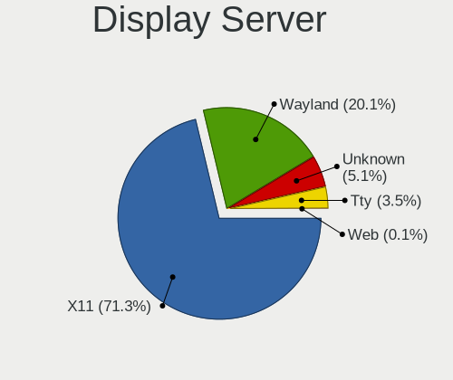
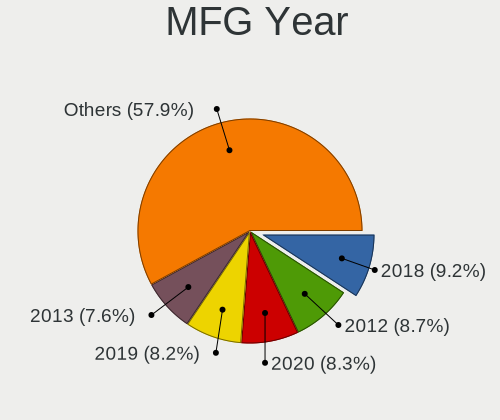
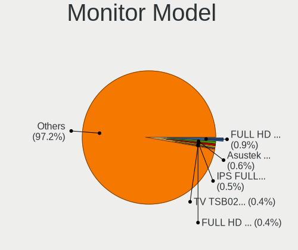
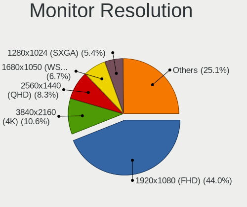
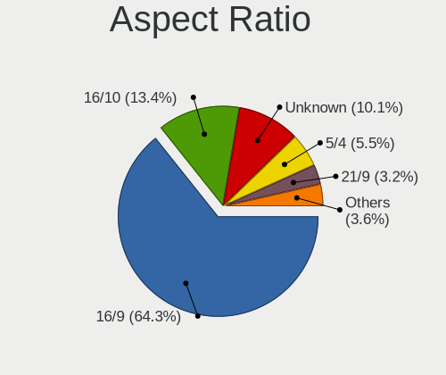
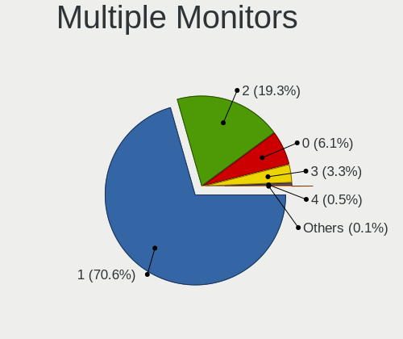

Linux in Canada - Tested Hardware & Statistics (Desktops)
---------------------------------------------------------

A project to collect tested hardware configurations for Linux in Canada.

Anyone can contribute to this report by the [hw-probe](https://github.com/linuxhw/hw-probe) tool:

    sudo -E hw-probe -all -upload

Please contribute! Especially if your hardware is rare.

Contents
--------

* [ Test Cases ](#test-cases)

* [ System ](#system)
  - [ OS                       ](#os)
  - [ OS Family                ](#os-family)
  - [ Kernel                   ](#kernel)
  - [ Kernel Family            ](#kernel-family)
  - [ Kernel Major Ver.        ](#kernel-major-ver)
  - [ Arch                     ](#arch)
  - [ DE                       ](#de)
  - [ Display Server           ](#display-server)
  - [ Display Manager          ](#display-manager)
  - [ OS Lang                  ](#os-lang)
  - [ Boot Mode                ](#boot-mode)
  - [ Filesystem               ](#filesystem)
  - [ Part. scheme             ](#part-scheme)
  - [ Dual Boot with Linux/BSD ](#dual-boot-with-linuxbsd)
  - [ Dual Boot (Win)          ](#dual-boot-win)

* [ Board ](#board)
  - [ Vendor                   ](#vendor)
  - [ Model                    ](#model)
  - [ Model Family             ](#model-family)
  - [ MFG Year                 ](#mfg-year)
  - [ Form Factor              ](#form-factor)
  - [ Secure Boot              ](#secure-boot)
  - [ Coreboot                 ](#coreboot)
  - [ RAM Size                 ](#ram-size)
  - [ RAM Used                 ](#ram-used)
  - [ Total Drives             ](#total-drives)
  - [ Has CD-ROM               ](#has-cd-rom)
  - [ Has Ethernet             ](#has-ethernet)
  - [ Has WiFi                 ](#has-wifi)
  - [ Has Bluetooth            ](#has-bluetooth)

* [ Location ](#location)
  - [ Country                  ](#country)
  - [ City                     ](#city)

* [ Drives ](#drives)
  - [ Drive Vendor             ](#drive-vendor)
  - [ Drive Model              ](#drive-model)
  - [ HDD Vendor               ](#hdd-vendor)
  - [ SSD Vendor               ](#ssd-vendor)
  - [ Drive Kind               ](#drive-kind)
  - [ Drive Connector          ](#drive-connector)
  - [ Drive Size               ](#drive-size)
  - [ Space Total              ](#space-total)
  - [ Space Used               ](#space-used)
  - [ Malfunc. Drives          ](#malfunc-drives)
  - [ Malfunc. Drive Vendor    ](#malfunc-drive-vendor)
  - [ Malfunc. HDD Vendor      ](#malfunc-hdd-vendor)
  - [ Malfunc. Drive Kind      ](#malfunc-drive-kind)
  - [ Failed Drives            ](#failed-drives)
  - [ Failed Drive Vendor      ](#failed-drive-vendor)
  - [ Drive Status             ](#drive-status)

* [ Storage controller ](#storage-controller)
  - [ Storage Vendor           ](#storage-vendor)
  - [ Storage Model            ](#storage-model)
  - [ Storage Kind             ](#storage-kind)

* [ Processor ](#processor)
  - [ CPU Vendor               ](#cpu-vendor)
  - [ CPU Model                ](#cpu-model)
  - [ CPU Model Family         ](#cpu-model-family)
  - [ CPU Cores                ](#cpu-cores)
  - [ CPU Sockets              ](#cpu-sockets)
  - [ CPU Threads              ](#cpu-threads)
  - [ CPU Op-Modes             ](#cpu-op-modes)
  - [ CPU Microcode            ](#cpu-microcode)
  - [ CPU Microarch            ](#cpu-microarch)

* [ Graphics ](#graphics)
  - [ GPU Vendor               ](#gpu-vendor)
  - [ GPU Model                ](#gpu-model)
  - [ GPU Combo                ](#gpu-combo)
  - [ GPU Driver               ](#gpu-driver)
  - [ GPU Memory               ](#gpu-memory)

* [ Monitor ](#monitor)
  - [ Monitor Vendor           ](#monitor-vendor)
  - [ Monitor Model            ](#monitor-model)
  - [ Monitor Resolution       ](#monitor-resolution)
  - [ Monitor Diagonal         ](#monitor-diagonal)
  - [ Monitor Width            ](#monitor-width)
  - [ Aspect Ratio             ](#aspect-ratio)
  - [ Monitor Area             ](#monitor-area)
  - [ Pixel Density            ](#pixel-density)
  - [ Multiple Monitors        ](#multiple-monitors)

* [ Network ](#network)
  - [ Net Controller Vendor    ](#net-controller-vendor)
  - [ Net Controller Model     ](#net-controller-model)
  - [ Wireless Vendor          ](#wireless-vendor)
  - [ Wireless Model           ](#wireless-model)
  - [ Ethernet Vendor          ](#ethernet-vendor)
  - [ Ethernet Model           ](#ethernet-model)
  - [ Net Controller Kind      ](#net-controller-kind)
  - [ Used Controller          ](#used-controller)
  - [ NICs                     ](#nics)
  - [ IPv6                     ](#ipv6)

* [ Bluetooth ](#bluetooth)
  - [ Bluetooth Vendor         ](#bluetooth-vendor)
  - [ Bluetooth Model          ](#bluetooth-model)

* [ Sound ](#sound)
  - [ Sound Vendor             ](#sound-vendor)
  - [ Sound Model              ](#sound-model)

* [ Memory ](#memory)
  - [ Memory Vendor            ](#memory-vendor)
  - [ Memory Model             ](#memory-model)
  - [ Memory Kind              ](#memory-kind)
  - [ Memory Form Factor       ](#memory-form-factor)
  - [ Memory Size              ](#memory-size)
  - [ Memory Speed             ](#memory-speed)

* [ Printers & scanners ](#printers--scanners)
  - [ Printer Vendor           ](#printer-vendor)
  - [ Printer Model            ](#printer-model)
  - [ Scanner Vendor           ](#scanner-vendor)
  - [ Scanner Model            ](#scanner-model)

* [ Camera ](#camera)
  - [ Camera Vendor            ](#camera-vendor)
  - [ Camera Model             ](#camera-model)

* [ Security ](#security)
  - [ Fingerprint Vendor       ](#fingerprint-vendor)
  - [ Fingerprint Model        ](#fingerprint-model)
  - [ Chipcard Vendor          ](#chipcard-vendor)
  - [ Chipcard Model           ](#chipcard-model)

* [ Unsupported ](#unsupported)
  - [ Unsupported Devices      ](#unsupported-devices)
  - [ Unsupported Device Types ](#unsupported-device-types)

Test Cases
----------

Total: 2905

| Vendor        | Model                       | Probe                                                      | Date         |
|---------------|-----------------------------|------------------------------------------------------------|--------------|
| Acer          | Aspire TC-605               | [5ff2a41fcd](https://linux-hardware.org/?probe=5ff2a41fcd) | Sep 01, 2022 |
| Dell          | 0R6PCT A01                  | [02af50752e](https://linux-hardware.org/?probe=02af50752e) | Sep 01, 2022 |
| Acer          | Aspire TC-605               | [fdc6b95d8b](https://linux-hardware.org/?probe=fdc6b95d8b) | Sep 01, 2022 |
| ASUSTek       | ROG STRIX X470-F GAMING     | [a2878122de](https://linux-hardware.org/?probe=a2878122de) | Sep 01, 2022 |
| ASUSTek       | ROG STRIX X470-F GAMING     | [836d60c547](https://linux-hardware.org/?probe=836d60c547) | Sep 01, 2022 |
| ASRock        | B450M Pro4-F                | [d48b9efca4](https://linux-hardware.org/?probe=d48b9efca4) | Sep 01, 2022 |
| JGINYUE       | B85I PLUS V2.1              | [d171691ef3](https://linux-hardware.org/?probe=d171691ef3) | Aug 31, 2022 |
| Gigabyte      | H370 AORUS GAMING 3 WIFI... | [413bd5a721](https://linux-hardware.org/?probe=413bd5a721) | Aug 29, 2022 |
| Lenovo        | MAHOBAY NO DPK              | [9274f5e876](https://linux-hardware.org/?probe=9274f5e876) | Aug 29, 2022 |
| ASUSTek       | TUF Z390-PLUS GAMING        | [3ce9a33fed](https://linux-hardware.org/?probe=3ce9a33fed) | Aug 28, 2022 |
| ASUSTek       | TUF Z390-PLUS GAMING        | [2adf8e9ff6](https://linux-hardware.org/?probe=2adf8e9ff6) | Aug 28, 2022 |
| Gigabyte      | B450 I AORUS PRO WIFI-CF    | [a328df0016](https://linux-hardware.org/?probe=a328df0016) | Aug 28, 2022 |
| ASUSTek       | TUF Gaming X570-PLUS        | [505d987d1e](https://linux-hardware.org/?probe=505d987d1e) | Aug 28, 2022 |
| ASUSTek       | TUF Gaming B550-PLUS        | [704ce84e6a](https://linux-hardware.org/?probe=704ce84e6a) | Aug 27, 2022 |
| Intel         | DH87RL AAG74240-401         | [814718547c](https://linux-hardware.org/?probe=814718547c) | Aug 27, 2022 |
| HP            | 18E4                        | [13d5c6848a](https://linux-hardware.org/?probe=13d5c6848a) | Aug 24, 2022 |
| Dell          | 0F5C5X A00                  | [80cfa18cfd](https://linux-hardware.org/?probe=80cfa18cfd) | Aug 24, 2022 |
| ASUSTek       | TUF Gaming X570-PLUS        | [d1cae6aca8](https://linux-hardware.org/?probe=d1cae6aca8) | Aug 24, 2022 |
| Dell          | 0F5C5X A00                  | [5e62f9adde](https://linux-hardware.org/?probe=5e62f9adde) | Aug 24, 2022 |
| Dell          | 0YJPT1 A00                  | [1de0aeba8f](https://linux-hardware.org/?probe=1de0aeba8f) | Aug 22, 2022 |
| ASUSTek       | Z97-P                       | [bcd3bcb389](https://linux-hardware.org/?probe=bcd3bcb389) | Aug 22, 2022 |
| ASUSTek       | ROG STRIX Z690-E GAMING ... | [5f90bb65a6](https://linux-hardware.org/?probe=5f90bb65a6) | Aug 21, 2022 |
| ASUSTek       | M4A78-E                     | [76028e78e9](https://linux-hardware.org/?probe=76028e78e9) | Aug 19, 2022 |
| Intel         | DH87RL AAG74240-401         | [ebc0328fe0](https://linux-hardware.org/?probe=ebc0328fe0) | Aug 19, 2022 |
| ASUSTek       | PRIME Z390-A                | [e03daeba5f](https://linux-hardware.org/?probe=e03daeba5f) | Aug 18, 2022 |
| Dell          | 054KM3 A01                  | [3f966fdafa](https://linux-hardware.org/?probe=3f966fdafa) | Aug 17, 2022 |
| Intel         | DH87RL AAG74240-401         | [a8c5b732f4](https://linux-hardware.org/?probe=a8c5b732f4) | Aug 17, 2022 |
| Acer          | Aspire TC-885 V:1.1         | [1ab8003e04](https://linux-hardware.org/?probe=1ab8003e04) | Aug 17, 2022 |
| Acer          | Aspire TC-885 V:1.1         | [2a3c6446e5](https://linux-hardware.org/?probe=2a3c6446e5) | Aug 17, 2022 |
| ASUSTek       | PRIME H370-A                | [da477254e7](https://linux-hardware.org/?probe=da477254e7) | Aug 16, 2022 |
| Dell          | 0PC5F7 A03                  | [56ee42afe3](https://linux-hardware.org/?probe=56ee42afe3) | Aug 15, 2022 |
| ASUSTek       | K30AD_M31AD_M51AD_M32AD     | [239daef655](https://linux-hardware.org/?probe=239daef655) | Aug 15, 2022 |
| ASUSTek       | TUF Gaming B550-PLUS        | [e75de6c205](https://linux-hardware.org/?probe=e75de6c205) | Aug 15, 2022 |
| ASUSTek       | B85M-G                      | [b44e802677](https://linux-hardware.org/?probe=b44e802677) | Aug 14, 2022 |
| HP            | 805D                        | [54f4e0fdb0](https://linux-hardware.org/?probe=54f4e0fdb0) | Aug 14, 2022 |
| MSI           | MS-B9351                    | [a5b1950761](https://linux-hardware.org/?probe=a5b1950761) | Aug 14, 2022 |
| MSI           | MS-B9351                    | [fbf08d2d76](https://linux-hardware.org/?probe=fbf08d2d76) | Aug 14, 2022 |
| ASRock        | B450M Pro4                  | [286fd1791a](https://linux-hardware.org/?probe=286fd1791a) | Aug 14, 2022 |
| Dell          | 07PR60 A02                  | [7ed59c8c10](https://linux-hardware.org/?probe=7ed59c8c10) | Aug 12, 2022 |
| ASUSTek       | P5GC-MX                     | [346a48750b](https://linux-hardware.org/?probe=346a48750b) | Aug 12, 2022 |
| ASUSTek       | G10DK                       | [2401d4af44](https://linux-hardware.org/?probe=2401d4af44) | Aug 08, 2022 |
| ASUSTek       | PRIME B550M-A               | [64e8ddf1c9](https://linux-hardware.org/?probe=64e8ddf1c9) | Aug 07, 2022 |
| Dell          | 0NV0M7 A02                  | [dbf000aacd](https://linux-hardware.org/?probe=dbf000aacd) | Aug 06, 2022 |
| Gigabyte      | X570 AORUS MASTER           | [dca6f9dfbd](https://linux-hardware.org/?probe=dca6f9dfbd) | Aug 06, 2022 |
| ASUSTek       | PRIME B450M-A               | [3b290b6c0b](https://linux-hardware.org/?probe=3b290b6c0b) | Aug 04, 2022 |
| ASUSTek       | PRIME B350M-E               | [f9e07e62c2](https://linux-hardware.org/?probe=f9e07e62c2) | Aug 04, 2022 |
| Biostar       | TA880GU3+                   | [323c68d80f](https://linux-hardware.org/?probe=323c68d80f) | Aug 03, 2022 |
| HP            | 339A                        | [27ddbfd51d](https://linux-hardware.org/?probe=27ddbfd51d) | Aug 03, 2022 |
| HP            | 8433 11                     | [cd790281b5](https://linux-hardware.org/?probe=cd790281b5) | Aug 02, 2022 |
| Lenovo        | 102F SDK0E50510 WIN 2625... | [80512402c0](https://linux-hardware.org/?probe=80512402c0) | Aug 02, 2022 |
| Gigabyte      | Z690I AORUS ULTRA DDR4      | [4bd0f9e461](https://linux-hardware.org/?probe=4bd0f9e461) | Aug 02, 2022 |
| Dell          | 0GXM1W A01                  | [91d2f28256](https://linux-hardware.org/?probe=91d2f28256) | Aug 01, 2022 |
| Dell          | 0GXM1W A01                  | [ab895fc1a2](https://linux-hardware.org/?probe=ab895fc1a2) | Aug 01, 2022 |
| Apple         | Mac-F221BEC8                | [13cbc87486](https://linux-hardware.org/?probe=13cbc87486) | Jul 31, 2022 |
| ASUSTek       | PRIME Z490-A                | [a1923838e1](https://linux-hardware.org/?probe=a1923838e1) | Jul 31, 2022 |
| ASUSTek       | TUF Gaming X570-PLUS        | [22b4bcc010](https://linux-hardware.org/?probe=22b4bcc010) | Jul 31, 2022 |
| EVGA          | 134-KS-E377                 | [2624cfe274](https://linux-hardware.org/?probe=2624cfe274) | Jul 30, 2022 |
| Apple         | Mac-F42C88C8 Proto1         | [cc3deb0a17](https://linux-hardware.org/?probe=cc3deb0a17) | Jul 30, 2022 |
| Dell          | 0WMJ54 A01                  | [7682000c35](https://linux-hardware.org/?probe=7682000c35) | Jul 30, 2022 |
| HP            | 339A                        | [7f2505acd4](https://linux-hardware.org/?probe=7f2505acd4) | Jul 30, 2022 |
| ASUSTek       | ROG STRIX B450-F GAMING     | [38fae80720](https://linux-hardware.org/?probe=38fae80720) | Jul 29, 2022 |
| BESSTAR Te... | DMAF5 V1.0                  | [a6237b3a28](https://linux-hardware.org/?probe=a6237b3a28) | Jul 29, 2022 |
| Gigabyte      | Z170XP-SLI-CF               | [5a12531bf9](https://linux-hardware.org/?probe=5a12531bf9) | Jul 29, 2022 |
| ASUSTek       | G10DK                       | [70a71d84a6](https://linux-hardware.org/?probe=70a71d84a6) | Jul 28, 2022 |
| HP            | 18E6                        | [60d1a8e6da](https://linux-hardware.org/?probe=60d1a8e6da) | Jul 28, 2022 |
| Lenovo        | SHARKBAY SDK0E50510 WIN     | [da54317b9a](https://linux-hardware.org/?probe=da54317b9a) | Jul 27, 2022 |
| Dell          | 05DN3X A00                  | [e4c1d0bdeb](https://linux-hardware.org/?probe=e4c1d0bdeb) | Jul 27, 2022 |
| Dell          | 0WMJ54 A01                  | [fc499e7600](https://linux-hardware.org/?probe=fc499e7600) | Jul 27, 2022 |
| Dell          | 042P49 A01                  | [f9003ad850](https://linux-hardware.org/?probe=f9003ad850) | Jul 26, 2022 |
| ASUSTek       | M51BC                       | [4d6af73032](https://linux-hardware.org/?probe=4d6af73032) | Jul 26, 2022 |
| ASUSTek       | TUF Gaming A520M-PLUS WI... | [b61b6b5fa5](https://linux-hardware.org/?probe=b61b6b5fa5) | Jul 26, 2022 |
| ASUSTek       | PRIME B450M-A               | [4812de622f](https://linux-hardware.org/?probe=4812de622f) | Jul 26, 2022 |
| Gateway       | DX4840                      | [0df8a716b1](https://linux-hardware.org/?probe=0df8a716b1) | Jul 24, 2022 |
| MSI           | 970 GAMING                  | [bf2a870952](https://linux-hardware.org/?probe=bf2a870952) | Jul 23, 2022 |
| MSI           | MEG X570 ACE                | [f13fde648e](https://linux-hardware.org/?probe=f13fde648e) | Jul 23, 2022 |
| Pegatron      | 2ACD                        | [c8ce65cd26](https://linux-hardware.org/?probe=c8ce65cd26) | Jul 23, 2022 |
| ASUSTek       | P8P67 PRO                   | [54e6e291bd](https://linux-hardware.org/?probe=54e6e291bd) | Jul 22, 2022 |
| Dell          | 0WMJ54 A01                  | [dace7a0b12](https://linux-hardware.org/?probe=dace7a0b12) | Jul 21, 2022 |
| ASUSTek       | ROG STRIX B550-I GAMING     | [2e97c3de0b](https://linux-hardware.org/?probe=2e97c3de0b) | Jul 21, 2022 |
| ASUSTek       | ROG STRIX B550-I GAMING     | [d567131bf9](https://linux-hardware.org/?probe=d567131bf9) | Jul 21, 2022 |
| ASUSTek       | ROG STRIX Z370-E GAMING     | [9689ac8020](https://linux-hardware.org/?probe=9689ac8020) | Jul 21, 2022 |
| HP            | 158B                        | [017875f5a5](https://linux-hardware.org/?probe=017875f5a5) | Jul 21, 2022 |
| Unknown       | T3 MRD                      | [afbe55b100](https://linux-hardware.org/?probe=afbe55b100) | Jul 20, 2022 |
| Dell          | 04Y8V0 A02                  | [f843e569ed](https://linux-hardware.org/?probe=f843e569ed) | Jul 20, 2022 |
| Lenovo        | SHARKBAY 0B98401 WIN        | [0ce9af7993](https://linux-hardware.org/?probe=0ce9af7993) | Jul 20, 2022 |
| MSI           | B450M MORTAR TITANIUM       | [6aac7a75e7](https://linux-hardware.org/?probe=6aac7a75e7) | Jul 18, 2022 |
| MSI           | MEG B550 UNIFY              | [d6ecbbbfda](https://linux-hardware.org/?probe=d6ecbbbfda) | Jul 17, 2022 |
| Gigabyte      | Z97X-Gaming 3               | [ec770759cd](https://linux-hardware.org/?probe=ec770759cd) | Jul 17, 2022 |
| Gigabyte      | F2A85XM-D3H                 | [38ebe8f368](https://linux-hardware.org/?probe=38ebe8f368) | Jul 17, 2022 |
| Gigabyte      | F2A85XM-D3H                 | [129bcce64f](https://linux-hardware.org/?probe=129bcce64f) | Jul 17, 2022 |
| Gigabyte      | B250M-DS3H-CF               | [236812ea49](https://linux-hardware.org/?probe=236812ea49) | Jul 17, 2022 |
| ASUSTek       | M51BC                       | [d5a6b5628b](https://linux-hardware.org/?probe=d5a6b5628b) | Jul 14, 2022 |
| ASRock        | Z77 Pro4-M                  | [69b486ea31](https://linux-hardware.org/?probe=69b486ea31) | Jul 14, 2022 |
| Lenovo        | SHARKBAY 0B98401 PRO        | [386dd1ac4b](https://linux-hardware.org/?probe=386dd1ac4b) | Jul 14, 2022 |
| MSI           | A320M PRO-VH PLUS           | [e007a2fbc2](https://linux-hardware.org/?probe=e007a2fbc2) | Jul 13, 2022 |
| MSI           | B450 GAMING PRO CARBON M... | [a6d5a615d0](https://linux-hardware.org/?probe=a6d5a615d0) | Jul 13, 2022 |
| ASUSTek       | TUF Gaming X570-PLUS        | [43e78c262a](https://linux-hardware.org/?probe=43e78c262a) | Jul 12, 2022 |
| Acidanther... | Mac-27AD2F918AE68F61 Mac... | [fdae528732](https://linux-hardware.org/?probe=fdae528732) | Jul 12, 2022 |
| ASUSTek       | TUF Gaming X570-PLUS        | [063f846aad](https://linux-hardware.org/?probe=063f846aad) | Jul 12, 2022 |
| OEM_MB        | NARRA3                      | [845bdfd72c](https://linux-hardware.org/?probe=845bdfd72c) | Jul 11, 2022 |
| Dell          | 09WH54 A00                  | [8570e35470](https://linux-hardware.org/?probe=8570e35470) | Jul 11, 2022 |
| Acer          | Nitro N50-610               | [48c007b4e2](https://linux-hardware.org/?probe=48c007b4e2) | Jul 10, 2022 |
| Gigabyte      | Z270M-D3H-CF                | [df9ed91803](https://linux-hardware.org/?probe=df9ed91803) | Jul 10, 2022 |
| MSI           | 2AE0                        | [4732ee97fb](https://linux-hardware.org/?probe=4732ee97fb) | Jul 10, 2022 |
| Apple         | Mac-F221BEC8                | [2efb274f31](https://linux-hardware.org/?probe=2efb274f31) | Jul 10, 2022 |
| MSI           | B450-A PRO MAX              | [00495f3422](https://linux-hardware.org/?probe=00495f3422) | Jul 09, 2022 |
| Dell          | 0R849J A01                  | [3ea68d63c3](https://linux-hardware.org/?probe=3ea68d63c3) | Jul 08, 2022 |
| MSI           | MPG X570 GAMING PRO CARB... | [5dc09a66d8](https://linux-hardware.org/?probe=5dc09a66d8) | Jul 08, 2022 |
| ASUSTek       | M51BC                       | [fd0a9ef1c8](https://linux-hardware.org/?probe=fd0a9ef1c8) | Jul 08, 2022 |
| ASUSTek       | M51BC                       | [cc2f84d5d3](https://linux-hardware.org/?probe=cc2f84d5d3) | Jul 08, 2022 |
| ASUSTek       | P7H55-M PRO                 | [35e1af0d15](https://linux-hardware.org/?probe=35e1af0d15) | Jul 08, 2022 |
| ASRock        | B450M Pro4                  | [ff75212757](https://linux-hardware.org/?probe=ff75212757) | Jul 07, 2022 |
| MSI           | MPG B560I GAMING EDGE WI... | [ebaa969297](https://linux-hardware.org/?probe=ebaa969297) | Jul 06, 2022 |
| ASRock        | B550 Phantom Gaming 4       | [7a6f484b16](https://linux-hardware.org/?probe=7a6f484b16) | Jul 06, 2022 |
| ASUSTek       | M5A99FX PRO R2.0            | [d14ad254ca](https://linux-hardware.org/?probe=d14ad254ca) | Jul 05, 2022 |
| ASRock        | G41C-GS R2.0                | [a9a0f46cc7](https://linux-hardware.org/?probe=a9a0f46cc7) | Jul 05, 2022 |
| MSI           | Z170-A PRO                  | [24a76119e1](https://linux-hardware.org/?probe=24a76119e1) | Jul 04, 2022 |
| MSI           | 970A SLI Krait Edition      | [3199c023cb](https://linux-hardware.org/?probe=3199c023cb) | Jul 04, 2022 |
| Dell          | 0M6C7G A00                  | [5eee0db64f](https://linux-hardware.org/?probe=5eee0db64f) | Jul 03, 2022 |
| ASUSTek       | PRIME X570-P                | [1a729c627d](https://linux-hardware.org/?probe=1a729c627d) | Jul 03, 2022 |
| Acer          | Aspire TC-280               | [7322461b76](https://linux-hardware.org/?probe=7322461b76) | Jul 03, 2022 |
| Acer          | Aspire TC-280               | [0e497c1c13](https://linux-hardware.org/?probe=0e497c1c13) | Jul 02, 2022 |
| ASRock        | B450M Pro4                  | [64eae559ae](https://linux-hardware.org/?probe=64eae559ae) | Jul 02, 2022 |
| ASRock        | Z97 Anniversary             | [1e650b504d](https://linux-hardware.org/?probe=1e650b504d) | Jul 01, 2022 |
| Dell          | 0HJ054                      | [bb9d7a3a58](https://linux-hardware.org/?probe=bb9d7a3a58) | Jun 30, 2022 |
| Dell          | 0M858N A01                  | [6cc8dcd51e](https://linux-hardware.org/?probe=6cc8dcd51e) | Jun 29, 2022 |
| MSI           | MAG X570 TOMAHAWK WIFI      | [cf7b4fb7e1](https://linux-hardware.org/?probe=cf7b4fb7e1) | Jun 29, 2022 |
| MSI           | H310M PRO-VD                | [1aec9e08e9](https://linux-hardware.org/?probe=1aec9e08e9) | Jun 28, 2022 |
| MSI           | H310M PRO-VD                | [1812911a41](https://linux-hardware.org/?probe=1812911a41) | Jun 28, 2022 |
| ASRock        | A320M-HDV R4.0              | [547346f0a9](https://linux-hardware.org/?probe=547346f0a9) | Jun 26, 2022 |
| MSI           | MPG X570S EDGE MAX WIFI     | [2c1f55aa8f](https://linux-hardware.org/?probe=2c1f55aa8f) | Jun 23, 2022 |
| ASUSTek       | P5W DH Deluxe               | [71f0d32783](https://linux-hardware.org/?probe=71f0d32783) | Jun 23, 2022 |
| Gigabyte      | Z77X-UD3H                   | [7d7828a253](https://linux-hardware.org/?probe=7d7828a253) | Jun 23, 2022 |
| ASRock        | A320M-HDV R4.0              | [cf4479fbe9](https://linux-hardware.org/?probe=cf4479fbe9) | Jun 22, 2022 |
| ASUSTek       | PRIME Z370-A                | [8dca736a46](https://linux-hardware.org/?probe=8dca736a46) | Jun 21, 2022 |
| Gigabyte      | B450 AORUS PRO WIFI-CF      | [834bed6eda](https://linux-hardware.org/?probe=834bed6eda) | Jun 21, 2022 |
| ASUSTek       | P8Z77-V                     | [e32a4e0214](https://linux-hardware.org/?probe=e32a4e0214) | Jun 20, 2022 |
| MSI           | H310M PRO-VD                | [6516a467b5](https://linux-hardware.org/?probe=6516a467b5) | Jun 17, 2022 |
| ASUSTek       | P8B75-M                     | [9ab6f4690f](https://linux-hardware.org/?probe=9ab6f4690f) | Jun 16, 2022 |
| Gigabyte      | Z68X-UD3H-B3                | [bce90f59c8](https://linux-hardware.org/?probe=bce90f59c8) | Jun 16, 2022 |
| Gigabyte      | Z68X-UD3H-B3                | [6c1c388f3a](https://linux-hardware.org/?probe=6c1c388f3a) | Jun 15, 2022 |
| MSI           | B450 TOMAHAWK               | [e11d001f52](https://linux-hardware.org/?probe=e11d001f52) | Jun 15, 2022 |
| ASRock        | H310M-ITX/ac                | [17063e8cc6](https://linux-hardware.org/?probe=17063e8cc6) | Jun 15, 2022 |
| Acer          | Aspire X1400                | [a90701fd86](https://linux-hardware.org/?probe=a90701fd86) | Jun 15, 2022 |
| Lenovo        | 0B98401 PRO                 | [23de86aa97](https://linux-hardware.org/?probe=23de86aa97) | Jun 14, 2022 |
| Dell          | 0D28YY A00                  | [18487dbcb1](https://linux-hardware.org/?probe=18487dbcb1) | Jun 14, 2022 |
| Alienware     | 0R3FWM A00                  | [6690a39447](https://linux-hardware.org/?probe=6690a39447) | Jun 13, 2022 |
| ASUSTek       | PRIME B550M-A               | [14b9e721b7](https://linux-hardware.org/?probe=14b9e721b7) | Jun 11, 2022 |
| ASUSTek       | PRIME B450M-A II            | [148d14437b](https://linux-hardware.org/?probe=148d14437b) | Jun 10, 2022 |
| ASUSTek       | PRIME X470-PRO              | [693e499a6d](https://linux-hardware.org/?probe=693e499a6d) | Jun 10, 2022 |
| ASUSTek       | M5A97 R2.0                  | [e92127f694](https://linux-hardware.org/?probe=e92127f694) | Jun 10, 2022 |
| Gigabyte      | Z97X-SLI-CF                 | [294890a076](https://linux-hardware.org/?probe=294890a076) | Jun 10, 2022 |
| Gigabyte      | GA-78LMT-USB3 SEx           | [9c7b34c996](https://linux-hardware.org/?probe=9c7b34c996) | Jun 09, 2022 |
| Gigabyte      | AB350M-Gaming 3-CF          | [c18fee9219](https://linux-hardware.org/?probe=c18fee9219) | Jun 08, 2022 |
| Dell          | 0WR7PY A03                  | [630d0bc381](https://linux-hardware.org/?probe=630d0bc381) | Jun 08, 2022 |
| Intel         | DG33FB AAD81072-306         | [78abe45a29](https://linux-hardware.org/?probe=78abe45a29) | Jun 08, 2022 |
| Lenovo        | ThinkStation S20 410599U    | [072870fb4e](https://linux-hardware.org/?probe=072870fb4e) | Jun 07, 2022 |
| HP            | 8433 11                     | [fa4c4f5c0e](https://linux-hardware.org/?probe=fa4c4f5c0e) | Jun 07, 2022 |
| Lenovo        | ThinkStation S20 410599U    | [20df21f5d9](https://linux-hardware.org/?probe=20df21f5d9) | Jun 07, 2022 |
| Unknown       | Unknown                     | [44afb95fbb](https://linux-hardware.org/?probe=44afb95fbb) | Jun 06, 2022 |
| Dell          | 0KWVT8 A03                  | [5745c8b787](https://linux-hardware.org/?probe=5745c8b787) | Jun 06, 2022 |
| MSI           | MPG X570S CARBON MAX WIF... | [0d57c069a8](https://linux-hardware.org/?probe=0d57c069a8) | Jun 05, 2022 |
| Gigabyte      | GA-990FXA-UD3               | [e636b14f58](https://linux-hardware.org/?probe=e636b14f58) | Jun 05, 2022 |
| ASRock        | Z97 Anniversary             | [b6a332c085](https://linux-hardware.org/?probe=b6a332c085) | Jun 04, 2022 |
| Gigabyte      | X570 AORUS ELITE            | [9404638832](https://linux-hardware.org/?probe=9404638832) | Jun 03, 2022 |
| HP            | 3397                        | [775c6990fd](https://linux-hardware.org/?probe=775c6990fd) | Jun 03, 2022 |
| HP            | 3397                        | [2f3fb08195](https://linux-hardware.org/?probe=2f3fb08195) | Jun 03, 2022 |
| BESSTAR Te... | UM700                       | [ea24f8341e](https://linux-hardware.org/?probe=ea24f8341e) | Jun 02, 2022 |
| BESSTAR Te... | UM700                       | [d3799b37d7](https://linux-hardware.org/?probe=d3799b37d7) | Jun 02, 2022 |
| Gigabyte      | B450 AORUS PRO WIFI-CF      | [c50bbae3e1](https://linux-hardware.org/?probe=c50bbae3e1) | Jun 02, 2022 |
| MACHINIST     | X79 (INTEL Xeon E5/Corei... | [536c6e19de](https://linux-hardware.org/?probe=536c6e19de) | Jun 01, 2022 |
| HP            | 339A                        | [c3c520f59b](https://linux-hardware.org/?probe=c3c520f59b) | Jun 01, 2022 |
| ASUSTek       | F2A85-M                     | [82b4935292](https://linux-hardware.org/?probe=82b4935292) | Jun 01, 2022 |
| Dell          | 0R6PCT A01                  | [08c460e0a3](https://linux-hardware.org/?probe=08c460e0a3) | May 30, 2022 |
| Dell          | 0R6PCT A01                  | [89aadb96f3](https://linux-hardware.org/?probe=89aadb96f3) | May 30, 2022 |
| ASUSTek       | M5A97 R2.0                  | [5e75c2d00d](https://linux-hardware.org/?probe=5e75c2d00d) | May 29, 2022 |
| ASUSTek       | M5A97 R2.0                  | [ae1874ffd5](https://linux-hardware.org/?probe=ae1874ffd5) | May 29, 2022 |
| ASUSTek       | ROG Maximus X HERO          | [33a2de91a2](https://linux-hardware.org/?probe=33a2de91a2) | May 29, 2022 |
| MSI           | MPG B550 GAMING EDGE WIF... | [c07bfd58f1](https://linux-hardware.org/?probe=c07bfd58f1) | May 29, 2022 |
| ASUSTek       | ROG STRIX Z690-A GAMING ... | [1416d5a87d](https://linux-hardware.org/?probe=1416d5a87d) | May 29, 2022 |
| MSI           | MPG X570S CARBON MAX WIF... | [a4f2a9b24b](https://linux-hardware.org/?probe=a4f2a9b24b) | May 27, 2022 |
| MSI           | MPG X570S CARBON MAX WIF... | [3143793e8f](https://linux-hardware.org/?probe=3143793e8f) | May 27, 2022 |
| Gigabyte      | AB350-Gaming 3-CF           | [63690e08a1](https://linux-hardware.org/?probe=63690e08a1) | May 27, 2022 |
| ASUSTek       | 970 PRO GAMING/AURA         | [24b4b7cb04](https://linux-hardware.org/?probe=24b4b7cb04) | May 26, 2022 |
| Lenovo        | ThinkCentre M90p 5864AL2    | [679cfd5a27](https://linux-hardware.org/?probe=679cfd5a27) | May 26, 2022 |
| ASUSTek       | PRIME X570-P                | [db51e7c435](https://linux-hardware.org/?probe=db51e7c435) | May 26, 2022 |
| Gigabyte      | AB350-Gaming 3-CF           | [c9c34c5c6f](https://linux-hardware.org/?probe=c9c34c5c6f) | May 26, 2022 |
| Dell          | 0YJPT1 A00                  | [f4afc8ed1d](https://linux-hardware.org/?probe=f4afc8ed1d) | May 25, 2022 |
| Gigabyte      | B550 AORUS PRO AC           | [7260e3bf3b](https://linux-hardware.org/?probe=7260e3bf3b) | May 24, 2022 |
| ASUSTek       | PRIME B660M-A AC D4         | [286688e46b](https://linux-hardware.org/?probe=286688e46b) | May 23, 2022 |
| Gigabyte      | Z390 UD                     | [d49bf6427c](https://linux-hardware.org/?probe=d49bf6427c) | May 23, 2022 |
| MSI           | 2AE0                        | [ea14a764bb](https://linux-hardware.org/?probe=ea14a764bb) | May 22, 2022 |
| HP            | 3398                        | [d7e6c0c903](https://linux-hardware.org/?probe=d7e6c0c903) | May 22, 2022 |
| Gigabyte      | X470 AORUS ULTRA GAMING-... | [42338941c5](https://linux-hardware.org/?probe=42338941c5) | May 21, 2022 |
| Intel         | DQ77MK AAG39642-400         | [f694bcfbc5](https://linux-hardware.org/?probe=f694bcfbc5) | May 21, 2022 |
| Dell          | 0D6H9T A02                  | [3f87c84f7a](https://linux-hardware.org/?probe=3f87c84f7a) | May 20, 2022 |
| ASUSTek       | PRIME B550M-A               | [1d5fec86a8](https://linux-hardware.org/?probe=1d5fec86a8) | May 20, 2022 |
| HP            | 8704                        | [84fd199efc](https://linux-hardware.org/?probe=84fd199efc) | May 17, 2022 |
| MSI           | H310M PRO-VD                | [70a3302b36](https://linux-hardware.org/?probe=70a3302b36) | May 17, 2022 |
| MSI           | H310M PRO-VD                | [a04d3bd332](https://linux-hardware.org/?probe=a04d3bd332) | May 17, 2022 |
| HP            | 8704                        | [863dcbe2ae](https://linux-hardware.org/?probe=863dcbe2ae) | May 17, 2022 |
| Dell          | 0T656F A01                  | [2df08f807d](https://linux-hardware.org/?probe=2df08f807d) | May 15, 2022 |
| Gigabyte      | X570S AORUS MASTER          | [b061586ff0](https://linux-hardware.org/?probe=b061586ff0) | May 14, 2022 |
| ASUSTek       | F2A85-V PRO                 | [35209e0a61](https://linux-hardware.org/?probe=35209e0a61) | May 14, 2022 |
| ASUSTek       | Acacia                      | [4b633150fa](https://linux-hardware.org/?probe=4b633150fa) | May 14, 2022 |
| ASUSTek       | ROG CROSSHAIR VIII DARK ... | [2d1e8a0642](https://linux-hardware.org/?probe=2d1e8a0642) | May 14, 2022 |
| ASRock        | B450M Pro4-F                | [423fbd3a54](https://linux-hardware.org/?probe=423fbd3a54) | May 14, 2022 |
| HP            | 8704                        | [979caa0192](https://linux-hardware.org/?probe=979caa0192) | May 13, 2022 |
| ASUSTek       | B85M-G                      | [6dee77b5ca](https://linux-hardware.org/?probe=6dee77b5ca) | May 13, 2022 |
| Acer          | Aspire X3400                | [9dd76b4599](https://linux-hardware.org/?probe=9dd76b4599) | May 13, 2022 |
| Acer          | Aspire X3400                | [b590b149fc](https://linux-hardware.org/?probe=b590b149fc) | May 13, 2022 |
| Lenovo        | 0B98401 PRO                 | [ee225906fc](https://linux-hardware.org/?probe=ee225906fc) | May 12, 2022 |
| MSI           | Z390-A PRO                  | [58c45bf845](https://linux-hardware.org/?probe=58c45bf845) | May 12, 2022 |
| Gigabyte      | GA-78LMT-USB3               | [5de8d1f805](https://linux-hardware.org/?probe=5de8d1f805) | May 11, 2022 |
| Lenovo        | 0B98401 PRO                 | [16911d5e64](https://linux-hardware.org/?probe=16911d5e64) | May 11, 2022 |
| MSI           | X470 GAMING PLUS            | [565dfeea66](https://linux-hardware.org/?probe=565dfeea66) | May 11, 2022 |
| Gigabyte      | X570 AORUS MASTER           | [c5bad2fcf9](https://linux-hardware.org/?probe=c5bad2fcf9) | May 10, 2022 |
| MSI           | A68HM-E33 V2                | [dedc4ce0d5](https://linux-hardware.org/?probe=dedc4ce0d5) | May 10, 2022 |
| ASUSTek       | PRIME Z370-A                | [e930eaf7f8](https://linux-hardware.org/?probe=e930eaf7f8) | May 10, 2022 |
| Gigabyte      | B365M GAMING HD             | [5590d9a0f3](https://linux-hardware.org/?probe=5590d9a0f3) | May 10, 2022 |
| Dell          | 0Y2MRG A00                  | [ab85a57857](https://linux-hardware.org/?probe=ab85a57857) | May 10, 2022 |
| MSI           | MAG B550 TORPEDO            | [1899727b8b](https://linux-hardware.org/?probe=1899727b8b) | May 09, 2022 |
| ASUSTek       | P5QL PRO                    | [9ea782b1d2](https://linux-hardware.org/?probe=9ea782b1d2) | May 08, 2022 |
| ASUSTek       | ROG CROSSHAIR VIII HERO     | [180dd73bd6](https://linux-hardware.org/?probe=180dd73bd6) | May 07, 2022 |
| HP            | 3397                        | [157ef440d8](https://linux-hardware.org/?probe=157ef440d8) | May 06, 2022 |
| MSI           | H310M PRO-VD                | [5f977ecef6](https://linux-hardware.org/?probe=5f977ecef6) | May 06, 2022 |
| Gigabyte      | Z370P D3-CF                 | [8a561e2442](https://linux-hardware.org/?probe=8a561e2442) | May 05, 2022 |
| ASUSTek       | VM42                        | [cb73da6c51](https://linux-hardware.org/?probe=cb73da6c51) | May 05, 2022 |
| ASUSTek       | VM42                        | [1fb131686b](https://linux-hardware.org/?probe=1fb131686b) | May 05, 2022 |
| MSI           | Z390-A PRO                  | [21e3f8a718](https://linux-hardware.org/?probe=21e3f8a718) | May 05, 2022 |
| ASUSTek       | PRIME Z690-P WIFI D4        | [a23da6e2be](https://linux-hardware.org/?probe=a23da6e2be) | May 05, 2022 |
| MSI           | Z390-A PRO                  | [145317db95](https://linux-hardware.org/?probe=145317db95) | May 05, 2022 |
| ASRock        | X570 Extreme4               | [98e5f20999](https://linux-hardware.org/?probe=98e5f20999) | May 04, 2022 |
| ASUSTek       | Rampage III Extreme         | [30ff3d44b0](https://linux-hardware.org/?probe=30ff3d44b0) | May 04, 2022 |
| HP            | 2AF7                        | [de6583780a](https://linux-hardware.org/?probe=de6583780a) | May 04, 2022 |
| Gigabyte      | B75M-HD3                    | [7dc76bf420](https://linux-hardware.org/?probe=7dc76bf420) | May 04, 2022 |
| HP            | 2AF7                        | [ee82d627d6](https://linux-hardware.org/?probe=ee82d627d6) | May 04, 2022 |
| Acer          | Aspire XC-230               | [b80fa8b04f](https://linux-hardware.org/?probe=b80fa8b04f) | May 03, 2022 |
| Gigabyte      | B365M GAMING HD             | [637890bd75](https://linux-hardware.org/?probe=637890bd75) | May 03, 2022 |
| MSI           | B450 GAMING PLUS            | [a792e309de](https://linux-hardware.org/?probe=a792e309de) | May 02, 2022 |
| Apple         | Mac-F42C88C8 Proto1         | [3edd5f05f7](https://linux-hardware.org/?probe=3edd5f05f7) | Apr 30, 2022 |
| ASUSTek       | TUF Gaming X570-PLUS        | [f157b373a1](https://linux-hardware.org/?probe=f157b373a1) | Apr 29, 2022 |
| ASUSTek       | TUF Gaming X570-PLUS        | [f339d2405b](https://linux-hardware.org/?probe=f339d2405b) | Apr 29, 2022 |
| Dell          | 0VNP2H A00                  | [bb480c7f9c](https://linux-hardware.org/?probe=bb480c7f9c) | Apr 29, 2022 |
| Alienware     | 07W25T A00                  | [b989838f70](https://linux-hardware.org/?probe=b989838f70) | Apr 29, 2022 |
| HP            | 8433 11                     | [a5b829538b](https://linux-hardware.org/?probe=a5b829538b) | Apr 29, 2022 |
| HP            | 1495                        | [b6e482940f](https://linux-hardware.org/?probe=b6e482940f) | Apr 28, 2022 |
| HP            | 1495                        | [632386ed8d](https://linux-hardware.org/?probe=632386ed8d) | Apr 28, 2022 |
| Dell          | 0R1PCR A00                  | [feec38a0f5](https://linux-hardware.org/?probe=feec38a0f5) | Apr 27, 2022 |
| ASUSTek       | M51BC                       | [f997f2d1c1](https://linux-hardware.org/?probe=f997f2d1c1) | Apr 27, 2022 |
| ASUSTek       | SABERTOOTH Z170 S           | [21663dc8b3](https://linux-hardware.org/?probe=21663dc8b3) | Apr 27, 2022 |
| MSI           | B450M PRO-VDH MAX           | [185c64fa0d](https://linux-hardware.org/?probe=185c64fa0d) | Apr 27, 2022 |
| Gigabyte      | GA-880GM-UD2H               | [3c53a0e59d](https://linux-hardware.org/?probe=3c53a0e59d) | Apr 27, 2022 |
| Gigabyte      | G1.Sniper A88X-CF           | [68fdd1e81a](https://linux-hardware.org/?probe=68fdd1e81a) | Apr 27, 2022 |
| Dell          | 06JWJY A01                  | [938679bafe](https://linux-hardware.org/?probe=938679bafe) | Apr 26, 2022 |
| Apple         | Mac-F42C88C8 Proto1         | [486215d495](https://linux-hardware.org/?probe=486215d495) | Apr 26, 2022 |
| HP            | 3397                        | [754e703cc5](https://linux-hardware.org/?probe=754e703cc5) | Apr 25, 2022 |
| Dell          | 0J3C2F A02                  | [833d1610d5](https://linux-hardware.org/?probe=833d1610d5) | Apr 25, 2022 |
| Dell          | 0HY9JP A00                  | [9a884ccaa8](https://linux-hardware.org/?probe=9a884ccaa8) | Apr 23, 2022 |
| MSI           | Z77A-GD65                   | [75dc6c44e5](https://linux-hardware.org/?probe=75dc6c44e5) | Apr 23, 2022 |
| ASUSTek       | PRIME B560-PLUS             | [8e31efa5fa](https://linux-hardware.org/?probe=8e31efa5fa) | Apr 23, 2022 |
| ASUSTek       | CROSSHAIR II FORMULA        | [d35c4838f2](https://linux-hardware.org/?probe=d35c4838f2) | Apr 22, 2022 |
| ASUSTek       | CROSSHAIR II FORMULA        | [61e0546ed7](https://linux-hardware.org/?probe=61e0546ed7) | Apr 22, 2022 |
| Gateway       | SX2185                      | [d22bb794a1](https://linux-hardware.org/?probe=d22bb794a1) | Apr 22, 2022 |
| ASUSTek       | TUF Gaming X570-PRO         | [8e0d54760d](https://linux-hardware.org/?probe=8e0d54760d) | Apr 22, 2022 |
| Gigabyte      | Z97X-UD5H                   | [15bba912da](https://linux-hardware.org/?probe=15bba912da) | Apr 21, 2022 |
| MSI           | B550-A PRO                  | [212c60ebc5](https://linux-hardware.org/?probe=212c60ebc5) | Apr 21, 2022 |
| Lenovo        | ThinkStation XXXX 415852... | [afabe3060d](https://linux-hardware.org/?probe=afabe3060d) | Apr 21, 2022 |
| ASUSTek       | 970 PRO GAMING/AURA         | [9a6d4db5b7](https://linux-hardware.org/?probe=9a6d4db5b7) | Apr 21, 2022 |
| ASUSTek       | M4A785-M                    | [03878be4ec](https://linux-hardware.org/?probe=03878be4ec) | Apr 20, 2022 |
| Dell          | 0HJ054                      | [8289626c00](https://linux-hardware.org/?probe=8289626c00) | Apr 20, 2022 |
| ASUSTek       | P5GC-MX                     | [810607b312](https://linux-hardware.org/?probe=810607b312) | Apr 20, 2022 |
| ASUSTek       | P8Z77-V                     | [40e958c5e1](https://linux-hardware.org/?probe=40e958c5e1) | Apr 19, 2022 |
| HP            | 82B4                        | [d15212b522](https://linux-hardware.org/?probe=d15212b522) | Apr 19, 2022 |
| HP            | 2820h                       | [21046a0077](https://linux-hardware.org/?probe=21046a0077) | Apr 19, 2022 |
| HP            | 82B4                        | [c3ed060808](https://linux-hardware.org/?probe=c3ed060808) | Apr 19, 2022 |
| ASUSTek       | ROG STRIX B550-F GAMING     | [4c8ca0d53f](https://linux-hardware.org/?probe=4c8ca0d53f) | Apr 18, 2022 |
| ASRock        | Z68 Extreme4                | [36da46e911](https://linux-hardware.org/?probe=36da46e911) | Apr 18, 2022 |
| ASUSTek       | P5GC-MX                     | [55cd1e5c8f](https://linux-hardware.org/?probe=55cd1e5c8f) | Apr 17, 2022 |
| MSI           | 970 GAMING                  | [10ad704b03](https://linux-hardware.org/?probe=10ad704b03) | Apr 16, 2022 |
| ASUSTek       | PRIME Z690-P WIFI D4        | [0d1f53febb](https://linux-hardware.org/?probe=0d1f53febb) | Apr 16, 2022 |
| Lenovo        | SHARKBAY 0B98401 WIN        | [90486ad164](https://linux-hardware.org/?probe=90486ad164) | Apr 15, 2022 |
| ASUSTek       | A55M-E                      | [76a80df275](https://linux-hardware.org/?probe=76a80df275) | Apr 15, 2022 |
| ASUSTek       | A55M-E                      | [74b8687993](https://linux-hardware.org/?probe=74b8687993) | Apr 15, 2022 |
| ASUSTek       | M5A97 R2.0                  | [37e172faec](https://linux-hardware.org/?probe=37e172faec) | Apr 14, 2022 |
| ASUSTek       | TUF Gaming X570-PLUS        | [247cd43da9](https://linux-hardware.org/?probe=247cd43da9) | Apr 14, 2022 |
| MSI           | B450 TOMAHAWK MAX           | [843c3d4758](https://linux-hardware.org/?probe=843c3d4758) | Apr 14, 2022 |
| Gigabyte      | B85M-D3H                    | [a0c2314e31](https://linux-hardware.org/?probe=a0c2314e31) | Apr 14, 2022 |
| ASRock        | AB350 Pro4                  | [137e25f240](https://linux-hardware.org/?probe=137e25f240) | Apr 14, 2022 |
| MSI           | X79A-GD45 Plus              | [fd93542a14](https://linux-hardware.org/?probe=fd93542a14) | Apr 14, 2022 |
| ASUSTek       | Crosshair V Formula         | [3b66db6997](https://linux-hardware.org/?probe=3b66db6997) | Apr 14, 2022 |
| ASUSTek       | PRIME H570M-PLUS            | [5e6ce90c93](https://linux-hardware.org/?probe=5e6ce90c93) | Apr 13, 2022 |
| Dell          | 0K240Y A01                  | [76d4fbf0a6](https://linux-hardware.org/?probe=76d4fbf0a6) | Apr 13, 2022 |
| ASUSTek       | PRIME Z590M-PLUS            | [a0b6dfe7e4](https://linux-hardware.org/?probe=a0b6dfe7e4) | Apr 13, 2022 |
| ASRock        | X570M Pro4                  | [b7373e1f8f](https://linux-hardware.org/?probe=b7373e1f8f) | Apr 13, 2022 |
| MSI           | X470 GAMING PLUS            | [5100c45b65](https://linux-hardware.org/?probe=5100c45b65) | Apr 13, 2022 |
| ASUSTek       | TUF B450M-PLUS GAMING       | [c28c553d03](https://linux-hardware.org/?probe=c28c553d03) | Apr 13, 2022 |
| ASUSTek       | H81M-E                      | [b26d147ae3](https://linux-hardware.org/?probe=b26d147ae3) | Apr 13, 2022 |
| ASUSTek       | PRIME Z370-P                | [3b91a78742](https://linux-hardware.org/?probe=3b91a78742) | Apr 13, 2022 |
| ASUSTek       | TUF B450-PLUS GAMING        | [533b8a9f83](https://linux-hardware.org/?probe=533b8a9f83) | Apr 13, 2022 |
| ASUSTek       | ROG STRIX B550-I GAMING     | [13ad3d5cb4](https://linux-hardware.org/?probe=13ad3d5cb4) | Apr 13, 2022 |
| MSI           | MPG X570 GAMING PLUS        | [e05e4dc47b](https://linux-hardware.org/?probe=e05e4dc47b) | Apr 13, 2022 |
| Lenovo        | ThinkCentre M90p 5536A76    | [f594adac1d](https://linux-hardware.org/?probe=f594adac1d) | Apr 13, 2022 |
| Dell          | 0XCR8D A00                  | [d0f55067b0](https://linux-hardware.org/?probe=d0f55067b0) | Apr 13, 2022 |
| Gigabyte      | B450 AORUS ELITE            | [1ff04268cf](https://linux-hardware.org/?probe=1ff04268cf) | Apr 13, 2022 |
| Acer          | Nitro N50-610               | [46b46c842f](https://linux-hardware.org/?probe=46b46c842f) | Apr 13, 2022 |
| ASUSTek       | ROG CROSSHAIR VIII DARK ... | [71d793e054](https://linux-hardware.org/?probe=71d793e054) | Apr 13, 2022 |
| Dell          | 042P49 A02                  | [f7b6132f34](https://linux-hardware.org/?probe=f7b6132f34) | Apr 13, 2022 |
| ASUSTek       | ROG STRIX B550-I GAMING     | [438f675016](https://linux-hardware.org/?probe=438f675016) | Apr 13, 2022 |
| MSI           | B450M PRO-VDH MAX           | [3656e85663](https://linux-hardware.org/?probe=3656e85663) | Apr 12, 2022 |
| ASUSTek       | M51BC                       | [4c52c99ee9](https://linux-hardware.org/?probe=4c52c99ee9) | Apr 12, 2022 |
| Dell          | 0N867P A01                  | [749dc04756](https://linux-hardware.org/?probe=749dc04756) | Apr 12, 2022 |
| ASUSTek       | PRIME B550-PLUS             | [be0d616e99](https://linux-hardware.org/?probe=be0d616e99) | Apr 12, 2022 |
| ASUSTek       | M51BC                       | [162850d6b3](https://linux-hardware.org/?probe=162850d6b3) | Apr 12, 2022 |
| ASUSTek       | PRIME B450M-A               | [921b858e18](https://linux-hardware.org/?probe=921b858e18) | Apr 11, 2022 |
| Gigabyte      | AB350M-DS3H-CF              | [3d3f67170e](https://linux-hardware.org/?probe=3d3f67170e) | Apr 11, 2022 |
| Lenovo        | ThinkCentre M58p 7484ANU    | [2d7d0de436](https://linux-hardware.org/?probe=2d7d0de436) | Apr 10, 2022 |
| MSI           | B450 GAMING PRO CARBON M... | [63df7871b0](https://linux-hardware.org/?probe=63df7871b0) | Apr 10, 2022 |
| MSI           | B450 GAMING PRO CARBON M... | [6884809c79](https://linux-hardware.org/?probe=6884809c79) | Apr 10, 2022 |
| MSI           | MPG B550 GAMING EDGE WIF... | [28114b7924](https://linux-hardware.org/?probe=28114b7924) | Apr 10, 2022 |
| MSI           | MAG Z690 TOMAHAWK WIFI D... | [1638359c7b](https://linux-hardware.org/?probe=1638359c7b) | Apr 10, 2022 |
| ASUSTek       | PRIME Z390-A                | [9f3f45d840](https://linux-hardware.org/?probe=9f3f45d840) | Apr 09, 2022 |
| HP            | 18E5                        | [5c24443112](https://linux-hardware.org/?probe=5c24443112) | Apr 09, 2022 |
| Acer          | Veriton M6660G V:1.0        | [a41ffdc22b](https://linux-hardware.org/?probe=a41ffdc22b) | Apr 09, 2022 |
| HP            | 1998                        | [0ed4dbebcb](https://linux-hardware.org/?probe=0ed4dbebcb) | Apr 08, 2022 |
| ASUSTek       | PRIME Z390-A                | [8ac05d8917](https://linux-hardware.org/?probe=8ac05d8917) | Apr 07, 2022 |
| Gigabyte      | B365M GAMING HD             | [94b6fc5131](https://linux-hardware.org/?probe=94b6fc5131) | Apr 07, 2022 |
| ASUSTek       | M51BC                       | [e205187536](https://linux-hardware.org/?probe=e205187536) | Apr 07, 2022 |
| Lenovo        | SHARKBAY 0B98401 PRO        | [a09ecdae05](https://linux-hardware.org/?probe=a09ecdae05) | Apr 07, 2022 |
| ASRock        | Z390 Phantom Gaming 4S/a... | [836d139ea0](https://linux-hardware.org/?probe=836d139ea0) | Apr 07, 2022 |
| Apple         | Mac-F42C88C8 Proto1         | [d1f213c4f0](https://linux-hardware.org/?probe=d1f213c4f0) | Apr 07, 2022 |
| Unknown       | Unknown                     | [c8049ac14a](https://linux-hardware.org/?probe=c8049ac14a) | Apr 06, 2022 |
| ASUSTek       | P5GC-MX                     | [ce2aaa12ab](https://linux-hardware.org/?probe=ce2aaa12ab) | Apr 06, 2022 |
| MSI           | MAG B660 TOMAHAWK WIFI D... | [cc10884386](https://linux-hardware.org/?probe=cc10884386) | Apr 06, 2022 |
| Gigabyte      | H270N-WIFI-CF               | [fe6d2db0dd](https://linux-hardware.org/?probe=fe6d2db0dd) | Apr 05, 2022 |
| MSI           | MAG B660 TOMAHAWK WIFI D... | [65c7660b74](https://linux-hardware.org/?probe=65c7660b74) | Apr 05, 2022 |
| ASUSTek       | Z97-A-USB31                 | [cd6f73403e](https://linux-hardware.org/?probe=cd6f73403e) | Apr 05, 2022 |
| Acer          | Aspire XC-603               | [ef344607ad](https://linux-hardware.org/?probe=ef344607ad) | Apr 04, 2022 |
| ASRock        | Z270 Killer SLI/ac          | [cd29715a0d](https://linux-hardware.org/?probe=cd29715a0d) | Apr 04, 2022 |
| MSI           | MPG X570 GAMING PLUS        | [73ecbc62b1](https://linux-hardware.org/?probe=73ecbc62b1) | Apr 04, 2022 |
| Apple         | Mac-F221BEC8                | [e72fc44e1d](https://linux-hardware.org/?probe=e72fc44e1d) | Apr 03, 2022 |
| Gigabyte      | B450 I AORUS PRO WIFI-CF    | [fc477a4cb4](https://linux-hardware.org/?probe=fc477a4cb4) | Apr 02, 2022 |
| Gigabyte      | B450 I AORUS PRO WIFI-CF    | [23b384fa80](https://linux-hardware.org/?probe=23b384fa80) | Apr 02, 2022 |
| Unknown       | Unknown                     | [9ea14bf201](https://linux-hardware.org/?probe=9ea14bf201) | Apr 02, 2022 |
| Gigabyte      | Q77M-D2H                    | [ecbd26a0e1](https://linux-hardware.org/?probe=ecbd26a0e1) | Apr 02, 2022 |
| ASUSTek       | Z97-A-USB31                 | [6f40a4ebce](https://linux-hardware.org/?probe=6f40a4ebce) | Apr 02, 2022 |
| Gigabyte      | H97M-D3H                    | [72d527b649](https://linux-hardware.org/?probe=72d527b649) | Apr 02, 2022 |
| ASUSTek       | M5A97 R2.0                  | [069ce7ef8f](https://linux-hardware.org/?probe=069ce7ef8f) | Mar 31, 2022 |
| Lenovo        | ThinkCentre M81 5049E7F     | [cfb0af9c1b](https://linux-hardware.org/?probe=cfb0af9c1b) | Mar 29, 2022 |
| ASUSTek       | M5A99FX PRO R2.0            | [a10bdc00e2](https://linux-hardware.org/?probe=a10bdc00e2) | Mar 28, 2022 |
| ASRock        | B365M Pro4                  | [6920de7907](https://linux-hardware.org/?probe=6920de7907) | Mar 28, 2022 |
| Gigabyte      | GA-770T-USB3                | [787cb334c2](https://linux-hardware.org/?probe=787cb334c2) | Mar 28, 2022 |
| Gigabyte      | X570 AORUS PRO WIFI         | [5dae1dd2a5](https://linux-hardware.org/?probe=5dae1dd2a5) | Mar 28, 2022 |
| HP            | 339A                        | [e3c5312cd4](https://linux-hardware.org/?probe=e3c5312cd4) | Mar 28, 2022 |
| Lenovo        | ThinkCentre M55p 8811VQV    | [dc2a995551](https://linux-hardware.org/?probe=dc2a995551) | Mar 27, 2022 |
| ASUSTek       | ROG STRIX B350-I GAMING     | [36e8a83674](https://linux-hardware.org/?probe=36e8a83674) | Mar 27, 2022 |
| MSI           | X79A-GD45 Plus              | [e12c979369](https://linux-hardware.org/?probe=e12c979369) | Mar 27, 2022 |
| MSI           | X79A-GD45 Plus              | [23eab958e6](https://linux-hardware.org/?probe=23eab958e6) | Mar 27, 2022 |
| AAEON         | IMBA-H110A V1.0             | [9c0577803f](https://linux-hardware.org/?probe=9c0577803f) | Mar 27, 2022 |
| AAEON         | IMBA-H110A V1.0             | [a296d4597c](https://linux-hardware.org/?probe=a296d4597c) | Mar 27, 2022 |
| HP            | 339A                        | [8795c4a222](https://linux-hardware.org/?probe=8795c4a222) | Mar 27, 2022 |
| MSI           | PRO Z690-P DDR4             | [7aac216113](https://linux-hardware.org/?probe=7aac216113) | Mar 26, 2022 |
| ASUSTek       | B85M-G                      | [1d78876e0c](https://linux-hardware.org/?probe=1d78876e0c) | Mar 26, 2022 |
| ASUSTek       | TUF Gaming B560M-PLUS WI... | [a68ce8edaf](https://linux-hardware.org/?probe=a68ce8edaf) | Mar 26, 2022 |
| Gigabyte      | X570 AORUS PRO WIFI         | [dc2a2c1054](https://linux-hardware.org/?probe=dc2a2c1054) | Mar 25, 2022 |
| ASUSTek       | SABERTOOTH X58              | [bce45f36b9](https://linux-hardware.org/?probe=bce45f36b9) | Mar 25, 2022 |
| Pegatron      | Benicia                     | [cb852b48fb](https://linux-hardware.org/?probe=cb852b48fb) | Mar 25, 2022 |
| Acer          | Veriton M6660G V:1.0        | [ee5d755daf](https://linux-hardware.org/?probe=ee5d755daf) | Mar 24, 2022 |
| ASUSTek       | ROG STRIX X470-F GAMING     | [55171208ed](https://linux-hardware.org/?probe=55171208ed) | Mar 24, 2022 |
| ASUSTek       | ROG STRIX B550-F GAMING     | [d7c46f54dc](https://linux-hardware.org/?probe=d7c46f54dc) | Mar 24, 2022 |
| Gigabyte      | B560 DS3H AC-Y1             | [f1007aa153](https://linux-hardware.org/?probe=f1007aa153) | Mar 24, 2022 |
| Alienware     | 0R3FWM A00                  | [fcbc77d9e4](https://linux-hardware.org/?probe=fcbc77d9e4) | Mar 24, 2022 |
| Lenovo        | ThinkStation C20 426593U    | [50bcf21472](https://linux-hardware.org/?probe=50bcf21472) | Mar 23, 2022 |
| ASUSTek       | 970 PRO GAMING/AURA         | [39b19d4ecf](https://linux-hardware.org/?probe=39b19d4ecf) | Mar 22, 2022 |
| HP            | 3397                        | [51dd330f09](https://linux-hardware.org/?probe=51dd330f09) | Mar 22, 2022 |
| Acer          | Veriton M6660G V:1.0        | [228974c486](https://linux-hardware.org/?probe=228974c486) | Mar 22, 2022 |
| Dell          | 0K3CM7 A00                  | [8f5ec6c004](https://linux-hardware.org/?probe=8f5ec6c004) | Mar 22, 2022 |
| HP            | 0AECh D                     | [2fa93f9b4e](https://linux-hardware.org/?probe=2fa93f9b4e) | Mar 22, 2022 |
| ASUSTek       | ROG STRIX B450-F GAMING     | [66f133fcf0](https://linux-hardware.org/?probe=66f133fcf0) | Mar 22, 2022 |
| ASUSTek       | SABERTOOTH X79              | [9e6ccdc0e4](https://linux-hardware.org/?probe=9e6ccdc0e4) | Mar 21, 2022 |
| Lenovo        | MAHOBAY Win8 Pro DPK TPG    | [3c97963539](https://linux-hardware.org/?probe=3c97963539) | Mar 21, 2022 |
| HP            | 3397                        | [60dc930e32](https://linux-hardware.org/?probe=60dc930e32) | Mar 20, 2022 |
| ASUSTek       | H170 PRO GAMING             | [8ce1eed900](https://linux-hardware.org/?probe=8ce1eed900) | Mar 20, 2022 |
| Lenovo        | 314F SDK0J40697 WIN 3305... | [9cdf9a4b0b](https://linux-hardware.org/?probe=9cdf9a4b0b) | Mar 19, 2022 |
| ASRock        | B560M-ITX/ac                | [58d3e7c461](https://linux-hardware.org/?probe=58d3e7c461) | Mar 18, 2022 |
| ASUSTek       | ROG Maximus X HERO          | [d2378fc2ac](https://linux-hardware.org/?probe=d2378fc2ac) | Mar 18, 2022 |
| Apple         | Mac-F42C88C8 Proto1         | [f43e92acdd](https://linux-hardware.org/?probe=f43e92acdd) | Mar 18, 2022 |
| Alienware     | 0PGRP5 A02                  | [8a28919b48](https://linux-hardware.org/?probe=8a28919b48) | Mar 17, 2022 |
| Gigabyte      | X570 AORUS ELITE WIFI       | [355c14014e](https://linux-hardware.org/?probe=355c14014e) | Mar 17, 2022 |
| Alienware     | 0PGRP5 A02                  | [de0e243d72](https://linux-hardware.org/?probe=de0e243d72) | Mar 16, 2022 |
| ASUSTek       | PRIME B450M-A               | [2d053651b5](https://linux-hardware.org/?probe=2d053651b5) | Mar 16, 2022 |
| MSI           | MAG X570 TOMAHAWK WIFI      | [11bc08ed1f](https://linux-hardware.org/?probe=11bc08ed1f) | Mar 16, 2022 |
| ASUSTek       | A68HM-K                     | [4491d23e02](https://linux-hardware.org/?probe=4491d23e02) | Mar 16, 2022 |
| TYAN Compu... | D2568 S26361-D2568-A11      | [fd7cbc2300](https://linux-hardware.org/?probe=fd7cbc2300) | Mar 15, 2022 |
| MSI           | X99A SLI PLUS               | [3e6960fead](https://linux-hardware.org/?probe=3e6960fead) | Mar 14, 2022 |
| HP            | 0AE8h C                     | [d3980b5b59](https://linux-hardware.org/?probe=d3980b5b59) | Mar 14, 2022 |
| ASUSTek       | H87-PLUS                    | [41d61ba64b](https://linux-hardware.org/?probe=41d61ba64b) | Mar 14, 2022 |
| MSI           | B450M BAZOOKA V2            | [3dcd349d64](https://linux-hardware.org/?probe=3dcd349d64) | Mar 14, 2022 |
| Gigabyte      | B660M AORUS PRO AX DDR4     | [e062006ffe](https://linux-hardware.org/?probe=e062006ffe) | Mar 13, 2022 |
| Biostar       | TZ590-BTC DUO               | [fa2f8683b7](https://linux-hardware.org/?probe=fa2f8683b7) | Mar 13, 2022 |
| Acer          | Aspire M3420                | [ab930c70e0](https://linux-hardware.org/?probe=ab930c70e0) | Mar 13, 2022 |
| Dell          | 0RW199                      | [2298b1db14](https://linux-hardware.org/?probe=2298b1db14) | Mar 13, 2022 |
| ASUSTek       | Maximus VII HERO            | [f21f05d1ab](https://linux-hardware.org/?probe=f21f05d1ab) | Mar 13, 2022 |
| Lenovo        | ThinkCentre M90p 5536K6M    | [353245bef3](https://linux-hardware.org/?probe=353245bef3) | Mar 12, 2022 |
| ASUSTek       | TUF Z390-PLUS GAMING        | [92a248bac7](https://linux-hardware.org/?probe=92a248bac7) | Mar 11, 2022 |
| ASUSTek       | TUF Z390-PLUS GAMING        | [b2c8c04a66](https://linux-hardware.org/?probe=b2c8c04a66) | Mar 11, 2022 |
| HP            | 1497                        | [3c01ac84d3](https://linux-hardware.org/?probe=3c01ac84d3) | Mar 11, 2022 |
| ASUSTek       | PRIME B450M-A               | [b179a5048f](https://linux-hardware.org/?probe=b179a5048f) | Mar 10, 2022 |
| ASUSTek       | H110M-E/M.2                 | [0a6b13d126](https://linux-hardware.org/?probe=0a6b13d126) | Mar 10, 2022 |
| ASUSTek       | H110M-E/M.2                 | [d998726441](https://linux-hardware.org/?probe=d998726441) | Mar 10, 2022 |
| Dell          | 088DT1 A01                  | [7d57d04480](https://linux-hardware.org/?probe=7d57d04480) | Mar 09, 2022 |
| Dell          | 0427JK A00                  | [96996cefb1](https://linux-hardware.org/?probe=96996cefb1) | Mar 09, 2022 |
| ASUSTek       | P8Z77-V LK                  | [5c984c6d9a](https://linux-hardware.org/?probe=5c984c6d9a) | Mar 09, 2022 |
| ASUSTek       | P8Z77-V LK                  | [40d2eced72](https://linux-hardware.org/?probe=40d2eced72) | Mar 09, 2022 |
| MSI           | X79A-GD45                   | [ab71ffe574](https://linux-hardware.org/?probe=ab71ffe574) | Mar 09, 2022 |
| ASRock        | H670M-ITX/ax                | [066930734a](https://linux-hardware.org/?probe=066930734a) | Mar 07, 2022 |
| HP            | 2AFB                        | [59ed587f49](https://linux-hardware.org/?probe=59ed587f49) | Mar 06, 2022 |
| ASUSTek       | P5QC                        | [2f4a501c6a](https://linux-hardware.org/?probe=2f4a501c6a) | Mar 05, 2022 |
| MSI           | X470 GAMING PLUS MAX        | [91bb2e28fe](https://linux-hardware.org/?probe=91bb2e28fe) | Mar 05, 2022 |
| Dell          | 0427JK A00                  | [11b2bc7970](https://linux-hardware.org/?probe=11b2bc7970) | Mar 04, 2022 |
| Lenovo        | SHARKBAY 0B98401 WIN        | [1a5f917071](https://linux-hardware.org/?probe=1a5f917071) | Mar 04, 2022 |
| Gigabyte      | X570 AORUS ELITE            | [000e4e07d6](https://linux-hardware.org/?probe=000e4e07d6) | Mar 03, 2022 |
| HP            | 0A9Ch                       | [0403520776](https://linux-hardware.org/?probe=0403520776) | Mar 03, 2022 |
| HP            | 2AFB                        | [a44da1443a](https://linux-hardware.org/?probe=a44da1443a) | Mar 03, 2022 |
| ASUSTek       | LITHIUM                     | [94a08d2468](https://linux-hardware.org/?probe=94a08d2468) | Mar 02, 2022 |
| MSI           | B350 TOMAHAWK ARCTIC        | [933aecdfff](https://linux-hardware.org/?probe=933aecdfff) | Mar 02, 2022 |
| Lenovo        | MAHOBAY NO DPK              | [4f264071dd](https://linux-hardware.org/?probe=4f264071dd) | Mar 01, 2022 |
| Foxconn       | 2A92                        | [d41fb8dda1](https://linux-hardware.org/?probe=d41fb8dda1) | Feb 28, 2022 |
| ASUSTek       | X99-DELUXE                  | [27513a5e2d](https://linux-hardware.org/?probe=27513a5e2d) | Feb 28, 2022 |
| HP            | 2AFB                        | [dc64c96b48](https://linux-hardware.org/?probe=dc64c96b48) | Feb 28, 2022 |
| Dell          | 0HY9JP A02                  | [398b45ed60](https://linux-hardware.org/?probe=398b45ed60) | Feb 27, 2022 |
| ASUSTek       | TUF Gaming X570-PLUS        | [03f2fa46f2](https://linux-hardware.org/?probe=03f2fa46f2) | Feb 26, 2022 |
| MSI           | MAG X570 TOMAHAWK WIFI      | [922a24d848](https://linux-hardware.org/?probe=922a24d848) | Feb 25, 2022 |
| Dell          | 042P49 A02                  | [9efbb51081](https://linux-hardware.org/?probe=9efbb51081) | Feb 25, 2022 |
| Gigabyte      | GA-MA785GM-US2H             | [ded367a62c](https://linux-hardware.org/?probe=ded367a62c) | Feb 25, 2022 |
| Lenovo        | 30BC SDK0J40697 WIN 3305... | [b6891f77df](https://linux-hardware.org/?probe=b6891f77df) | Feb 24, 2022 |
| Dell          | 00V62H A01                  | [e6564282e5](https://linux-hardware.org/?probe=e6564282e5) | Feb 23, 2022 |
| ASUSTek       | ROG STRIX B450-F GAMING     | [a4e64da15a](https://linux-hardware.org/?probe=a4e64da15a) | Feb 22, 2022 |
| Alienware     | 0FPV4P A00                  | [a80e15326f](https://linux-hardware.org/?probe=a80e15326f) | Feb 20, 2022 |
| Unknown       | Intel X79                   | [4da7793470](https://linux-hardware.org/?probe=4da7793470) | Feb 20, 2022 |
| ASUSTek       | Maximus IV GENE-Z/GEN3      | [9244fdd04c](https://linux-hardware.org/?probe=9244fdd04c) | Feb 20, 2022 |
| Intel         | D2550MUD2 AAG73892-600      | [bcae2aafa6](https://linux-hardware.org/?probe=bcae2aafa6) | Feb 20, 2022 |
| MSI           | PRO Z690-A                  | [3767b10050](https://linux-hardware.org/?probe=3767b10050) | Feb 20, 2022 |
| Dell          | 03NVJ6 A03                  | [88a9e6e59c](https://linux-hardware.org/?probe=88a9e6e59c) | Feb 19, 2022 |
| ASUSTek       | M4A78LT-M-LE                | [a4aca283a8](https://linux-hardware.org/?probe=a4aca283a8) | Feb 19, 2022 |
| HP            | 1497                        | [afdb7b3de7](https://linux-hardware.org/?probe=afdb7b3de7) | Feb 19, 2022 |
| Alienware     | 07W25T A00                  | [645416ce96](https://linux-hardware.org/?probe=645416ce96) | Feb 19, 2022 |
| HP            | 828A                        | [e947d909e2](https://linux-hardware.org/?probe=e947d909e2) | Feb 18, 2022 |
| ASRock        | B450M-HDV R4.0              | [78d585ee32](https://linux-hardware.org/?probe=78d585ee32) | Feb 18, 2022 |
| Dell          | 0J3C2F A02                  | [bbd3dfcc18](https://linux-hardware.org/?probe=bbd3dfcc18) | Feb 17, 2022 |
| Gigabyte      | AB350-Gaming 3-CF           | [3dc3e4c8c8](https://linux-hardware.org/?probe=3dc3e4c8c8) | Feb 17, 2022 |
| Gigabyte      | M61PME-S2P                  | [37f7024a37](https://linux-hardware.org/?probe=37f7024a37) | Feb 17, 2022 |
| Gigabyte      | AB350-Gaming 3-CF           | [913928e6e9](https://linux-hardware.org/?probe=913928e6e9) | Feb 16, 2022 |
| ASUSTek       | M5A97 EVO                   | [c80545d294](https://linux-hardware.org/?probe=c80545d294) | Feb 16, 2022 |
| ASUSTek       | M5A97 EVO                   | [98e8879090](https://linux-hardware.org/?probe=98e8879090) | Feb 16, 2022 |
| HP            | 18E5                        | [5832416e72](https://linux-hardware.org/?probe=5832416e72) | Feb 16, 2022 |
| ASUSTek       | PRIME Z370-P II             | [2780adec26](https://linux-hardware.org/?probe=2780adec26) | Feb 16, 2022 |
| ASRock        | H97M Pro4                   | [dfa4523477](https://linux-hardware.org/?probe=dfa4523477) | Feb 16, 2022 |
| Gigabyte      | B550M AORUS PRO-P           | [f3d0b52776](https://linux-hardware.org/?probe=f3d0b52776) | Feb 15, 2022 |
| HP            | 2AF8                        | [b336741b02](https://linux-hardware.org/?probe=b336741b02) | Feb 14, 2022 |
| ASUSTek       | PRIME X570-P                | [d9407827ef](https://linux-hardware.org/?probe=d9407827ef) | Feb 13, 2022 |
| MSI           | B350 TOMAHAWK ARCTIC        | [b0829a9cb6](https://linux-hardware.org/?probe=b0829a9cb6) | Feb 13, 2022 |
| ASUSTek       | Berkeley                    | [e189134b88](https://linux-hardware.org/?probe=e189134b88) | Feb 12, 2022 |
| Acer          | Aspire TC-330               | [07a9d7bbd1](https://linux-hardware.org/?probe=07a9d7bbd1) | Feb 12, 2022 |
| Gigabyte      | B460 HD3                    | [f3368b9129](https://linux-hardware.org/?probe=f3368b9129) | Feb 11, 2022 |
| Gateway       | FX6860                      | [c5d971a94c](https://linux-hardware.org/?probe=c5d971a94c) | Feb 11, 2022 |
| Pegatron      | NARRA5                      | [63b943e081](https://linux-hardware.org/?probe=63b943e081) | Feb 10, 2022 |
| Pegatron      | NARRA5                      | [b44567ac7d](https://linux-hardware.org/?probe=b44567ac7d) | Feb 10, 2022 |
| Acer          | Aspire X1470                | [323c95ffdc](https://linux-hardware.org/?probe=323c95ffdc) | Feb 10, 2022 |
| ASUSTek       | Q87M-E                      | [a34ad8b81e](https://linux-hardware.org/?probe=a34ad8b81e) | Feb 09, 2022 |
| ASRock        | X570M Pro4                  | [ebf8ed89a1](https://linux-hardware.org/?probe=ebf8ed89a1) | Feb 09, 2022 |
| AOpen         | i945GCt-DN 558ET10I120      | [b18526bb51](https://linux-hardware.org/?probe=b18526bb51) | Feb 09, 2022 |
| Gigabyte      | 970A-D3P                    | [23ac2f5563](https://linux-hardware.org/?probe=23ac2f5563) | Feb 08, 2022 |
| Dell          | 0HP962                      | [3dd3f98208](https://linux-hardware.org/?probe=3dd3f98208) | Feb 08, 2022 |
| Gigabyte      | AB350-Gaming-CF             | [11369f4292](https://linux-hardware.org/?probe=11369f4292) | Feb 08, 2022 |
| Gigabyte      | Z690I AORUS ULTRA DDR4      | [583f0f5bcc](https://linux-hardware.org/?probe=583f0f5bcc) | Feb 08, 2022 |
| Shuttle       | FH270                       | [d43be8b1a4](https://linux-hardware.org/?probe=d43be8b1a4) | Feb 08, 2022 |
| HP            | 82F2                        | [75ddf923ec](https://linux-hardware.org/?probe=75ddf923ec) | Feb 07, 2022 |
| Dell          | 0CKCXH A04                  | [a9815c1942](https://linux-hardware.org/?probe=a9815c1942) | Feb 07, 2022 |
| Intel         | D2550MUD2 AAG73892-600      | [487aa43e66](https://linux-hardware.org/?probe=487aa43e66) | Feb 07, 2022 |
| ASUSTek       | P5Q                         | [52e57261d3](https://linux-hardware.org/?probe=52e57261d3) | Feb 07, 2022 |
| Intel         | D2550MUD2 AAG73892-600      | [a87409099b](https://linux-hardware.org/?probe=a87409099b) | Feb 07, 2022 |
| ASUSTek       | Maximus VIII HERO           | [e0da1ac4f2](https://linux-hardware.org/?probe=e0da1ac4f2) | Feb 06, 2022 |
| ASUSTek       | P5Q                         | [1fc7c3bed9](https://linux-hardware.org/?probe=1fc7c3bed9) | Feb 06, 2022 |
| MSI           | 2AE0                        | [e9c3abdda9](https://linux-hardware.org/?probe=e9c3abdda9) | Feb 06, 2022 |
| ASUSTek       | P8H61-M LE/CSM              | [9315814633](https://linux-hardware.org/?probe=9315814633) | Feb 06, 2022 |
| MSI           | B450M GAMING PLUS           | [5bcf69d905](https://linux-hardware.org/?probe=5bcf69d905) | Feb 06, 2022 |
| Lenovo        | 30BC SDK0J40697 WIN 3305... | [4c27e1f600](https://linux-hardware.org/?probe=4c27e1f600) | Feb 05, 2022 |
| Gigabyte      | B560M AORUS PRO AX          | [055aea6734](https://linux-hardware.org/?probe=055aea6734) | Feb 05, 2022 |
| Gigabyte      | X170-Extreme ECC            | [0ffb32b32d](https://linux-hardware.org/?probe=0ffb32b32d) | Feb 05, 2022 |
| MSI           | MPG B550 GAMING PLUS        | [e6ff5f1893](https://linux-hardware.org/?probe=e6ff5f1893) | Feb 04, 2022 |
| MSI           | A320M-A PRO MAX             | [6f0d60dffa](https://linux-hardware.org/?probe=6f0d60dffa) | Feb 04, 2022 |
| ASUSTek       | P8H61-M LX PLUS             | [943e822e1c](https://linux-hardware.org/?probe=943e822e1c) | Feb 04, 2022 |
| ASUSTek       | P8H77-M                     | [9f9151546a](https://linux-hardware.org/?probe=9f9151546a) | Feb 03, 2022 |
| ASUSTek       | P8H77-M                     | [401d8111bd](https://linux-hardware.org/?probe=401d8111bd) | Feb 03, 2022 |
| Gigabyte      | GA-880GA-UD3H               | [a62e52fe98](https://linux-hardware.org/?probe=a62e52fe98) | Feb 03, 2022 |
| ASUSTek       | SABERTOOTH X79              | [52d5157fd9](https://linux-hardware.org/?probe=52d5157fd9) | Feb 02, 2022 |
| ASUSTek       | SABERTOOTH X79              | [c70d2672d3](https://linux-hardware.org/?probe=c70d2672d3) | Feb 02, 2022 |
| HP            | 1905                        | [8014fae46e](https://linux-hardware.org/?probe=8014fae46e) | Feb 02, 2022 |
| ASRock        | B450 Pro4                   | [01eb76fa65](https://linux-hardware.org/?probe=01eb76fa65) | Feb 01, 2022 |
| ASUSTek       | P8H61-M LE/CSM              | [b4c7f57d86](https://linux-hardware.org/?probe=b4c7f57d86) | Feb 01, 2022 |
| Dell          | 0T2HR0 A02                  | [2cfe7d7f31](https://linux-hardware.org/?probe=2cfe7d7f31) | Jan 31, 2022 |
| Lenovo        | SHARKBAY 0B98401 WIN        | [96e168beb8](https://linux-hardware.org/?probe=96e168beb8) | Jan 31, 2022 |
| MSI           | B450-A PRO MAX              | [8ee3d68631](https://linux-hardware.org/?probe=8ee3d68631) | Jan 30, 2022 |
| Gigabyte      | A520M S2H                   | [ccbf2ec4f5](https://linux-hardware.org/?probe=ccbf2ec4f5) | Jan 29, 2022 |
| ASUSTek       | P5G41T-M LX PLUS            | [f3a447ef83](https://linux-hardware.org/?probe=f3a447ef83) | Jan 29, 2022 |
| MSI           | A68HM-E33 V2                | [42abbebf28](https://linux-hardware.org/?probe=42abbebf28) | Jan 29, 2022 |
| Dell          | 0PP150 A00                  | [e8326f9b39](https://linux-hardware.org/?probe=e8326f9b39) | Jan 29, 2022 |
| Acer          | EG43M                       | [c1f5473ce0](https://linux-hardware.org/?probe=c1f5473ce0) | Jan 28, 2022 |
| Acer          | Aspire X1800                | [913dd4dcac](https://linux-hardware.org/?probe=913dd4dcac) | Jan 27, 2022 |
| ASUSTek       | SABERTOOTH X79              | [e7e1ef7da5](https://linux-hardware.org/?probe=e7e1ef7da5) | Jan 27, 2022 |
| ASUSTek       | M51BC                       | [b491c2ea72](https://linux-hardware.org/?probe=b491c2ea72) | Jan 27, 2022 |
| MSI           | Z170A KRAIT GAMING 3X       | [b628f59fb9](https://linux-hardware.org/?probe=b628f59fb9) | Jan 26, 2022 |
| Gigabyte      | X570 AORUS PRO WIFI         | [9e892d9ea3](https://linux-hardware.org/?probe=9e892d9ea3) | Jan 26, 2022 |
| ASUSTek       | ROG STRIX Z390-E GAMING     | [00cdb626d7](https://linux-hardware.org/?probe=00cdb626d7) | Jan 26, 2022 |
| ASUSTek       | SABERTOOTH X79              | [1a7bb804ea](https://linux-hardware.org/?probe=1a7bb804ea) | Jan 25, 2022 |
| Gigabyte      | B450 I AORUS PRO WIFI-CF    | [a2ed61ffcd](https://linux-hardware.org/?probe=a2ed61ffcd) | Jan 24, 2022 |
| Gigabyte      | AB350M-Gaming 3-CF          | [f48fe5a028](https://linux-hardware.org/?probe=f48fe5a028) | Jan 24, 2022 |
| Dell          | 0WF810                      | [254dc6cb82](https://linux-hardware.org/?probe=254dc6cb82) | Jan 24, 2022 |
| ASUSTek       | A68HM-K                     | [00cd805015](https://linux-hardware.org/?probe=00cd805015) | Jan 23, 2022 |
| Gigabyte      | GA-870A-UD3                 | [5f82282e71](https://linux-hardware.org/?probe=5f82282e71) | Jan 23, 2022 |
| Gigabyte      | GA-78LMT-USB3 SEx           | [3db2b36704](https://linux-hardware.org/?probe=3db2b36704) | Jan 23, 2022 |
| Gigabyte      | H97M-D3H                    | [1930d43eed](https://linux-hardware.org/?probe=1930d43eed) | Jan 22, 2022 |
| Intel         | DQ67EP AAG12529-306         | [f9da2268d2](https://linux-hardware.org/?probe=f9da2268d2) | Jan 22, 2022 |
| Lenovo        | Win8 STD MM DPK IPG         | [fd86396422](https://linux-hardware.org/?probe=fd86396422) | Jan 22, 2022 |
| Gigabyte      | B550M DS3H                  | [3bde56dd51](https://linux-hardware.org/?probe=3bde56dd51) | Jan 22, 2022 |
| HP            | 3396                        | [ab9f7e40a6](https://linux-hardware.org/?probe=ab9f7e40a6) | Jan 21, 2022 |
| Acer          | Aspire XC-230               | [432efbf702](https://linux-hardware.org/?probe=432efbf702) | Jan 21, 2022 |
| BESSTAR Te... | HM50                        | [ddc2e44fcc](https://linux-hardware.org/?probe=ddc2e44fcc) | Jan 21, 2022 |
| Acer          | Aspire XC-230               | [89352dde8f](https://linux-hardware.org/?probe=89352dde8f) | Jan 19, 2022 |
| Gigabyte      | GA-MA785GM-US2H             | [6aa075ea12](https://linux-hardware.org/?probe=6aa075ea12) | Jan 19, 2022 |
| MSI           | B450 TOMAHAWK MAX II        | [488d339e77](https://linux-hardware.org/?probe=488d339e77) | Jan 19, 2022 |
| Gigabyte      | GA-880GA-UD3H               | [ca7197e116](https://linux-hardware.org/?probe=ca7197e116) | Jan 18, 2022 |
| QTQD          | Unknown                     | [c339476e37](https://linux-hardware.org/?probe=c339476e37) | Jan 18, 2022 |
| MSI           | B550M PRO-VDH WIFI          | [7451fd2f02](https://linux-hardware.org/?probe=7451fd2f02) | Jan 17, 2022 |
| Acer          | Predator G5900              | [ac6748b172](https://linux-hardware.org/?probe=ac6748b172) | Jan 17, 2022 |
| HP            | 828A                        | [63316bc040](https://linux-hardware.org/?probe=63316bc040) | Jan 16, 2022 |
| HP            | 828A                        | [5ecf3c1b51](https://linux-hardware.org/?probe=5ecf3c1b51) | Jan 15, 2022 |
| ZOTAC         | NM10                        | [d758728651](https://linux-hardware.org/?probe=d758728651) | Jan 14, 2022 |
| Acer          | Aspire XC-230               | [ba7ea12461](https://linux-hardware.org/?probe=ba7ea12461) | Jan 14, 2022 |
| Dell          | 040DDP A01                  | [ddbef6d68b](https://linux-hardware.org/?probe=ddbef6d68b) | Jan 14, 2022 |
| MSI           | B450-A PRO MAX              | [8b83c9806c](https://linux-hardware.org/?probe=8b83c9806c) | Jan 13, 2022 |
| ASUSTek       | P5KPL-AM SE                 | [e4d4e112f7](https://linux-hardware.org/?probe=e4d4e112f7) | Jan 13, 2022 |
| MSI           | MS-7A66                     | [fcddf8cda4](https://linux-hardware.org/?probe=fcddf8cda4) | Jan 13, 2022 |
| Acer          | WG43M                       | [af76e9bcfe](https://linux-hardware.org/?probe=af76e9bcfe) | Jan 12, 2022 |
| ASRock        | A320M/ac                    | [e90a9a04aa](https://linux-hardware.org/?probe=e90a9a04aa) | Jan 12, 2022 |
| MSI           | A320M-A PRO MAX             | [8428db012e](https://linux-hardware.org/?probe=8428db012e) | Jan 12, 2022 |
| Acer          | WG43M                       | [5784b66aee](https://linux-hardware.org/?probe=5784b66aee) | Jan 12, 2022 |
| ASUSTek       | P8Z77-M                     | [3ab1711306](https://linux-hardware.org/?probe=3ab1711306) | Jan 12, 2022 |
| ASRock        | Z170A-X1                    | [99bcd2b28a](https://linux-hardware.org/?probe=99bcd2b28a) | Jan 12, 2022 |
| Foxconn       | nT-A3000 series FAB         | [bcfd2d89c2](https://linux-hardware.org/?probe=bcfd2d89c2) | Jan 11, 2022 |
| Dell          | 0F6X5P A00                  | [a684938c75](https://linux-hardware.org/?probe=a684938c75) | Jan 11, 2022 |
| Lenovo        | SHARKBAY NOK                | [1713b32795](https://linux-hardware.org/?probe=1713b32795) | Jan 11, 2022 |
| Intel         | D2550MUD2 AAG73892-600      | [7a18fc5ecf](https://linux-hardware.org/?probe=7a18fc5ecf) | Jan 11, 2022 |
| MSI           | 2AE0                        | [ae5c421eef](https://linux-hardware.org/?probe=ae5c421eef) | Jan 10, 2022 |
| Gigabyte      | GA-880GA-UD3H               | [2db1c3f62d](https://linux-hardware.org/?probe=2db1c3f62d) | Jan 10, 2022 |
| MSI           | MAG X570 TOMAHAWK WIFI      | [e4b074e70c](https://linux-hardware.org/?probe=e4b074e70c) | Jan 10, 2022 |
| ASUSTek       | Maximus VII GENE            | [0462560ab2](https://linux-hardware.org/?probe=0462560ab2) | Jan 10, 2022 |
| ASUSTek       | G15DK                       | [96380d6800](https://linux-hardware.org/?probe=96380d6800) | Jan 10, 2022 |
| HP            | 0B54h D                     | [ac4cda5f96](https://linux-hardware.org/?probe=ac4cda5f96) | Jan 09, 2022 |
| HP            | 0B54h D                     | [753fc0ec27](https://linux-hardware.org/?probe=753fc0ec27) | Jan 09, 2022 |
| Gigabyte      | B450 AORUS PRO WIFI-CF      | [c8e28c5df0](https://linux-hardware.org/?probe=c8e28c5df0) | Jan 09, 2022 |
| MSI           | MPG X570 GAMING PRO CARB... | [6759388aa1](https://linux-hardware.org/?probe=6759388aa1) | Jan 09, 2022 |
| MSI           | MPG X570 GAMING PRO CARB... | [6a368aefbd](https://linux-hardware.org/?probe=6a368aefbd) | Jan 09, 2022 |
| Acer          | F672CR R01-A4               | [a2fa0bacec](https://linux-hardware.org/?probe=a2fa0bacec) | Jan 08, 2022 |
| Acer          | F672CR R01-A4               | [6c449b4b3c](https://linux-hardware.org/?probe=6c449b4b3c) | Jan 08, 2022 |
| Unknown       | Unknown                     | [bccc675fea](https://linux-hardware.org/?probe=bccc675fea) | Jan 08, 2022 |
| Dell          | 042P49 A02                  | [b2a3538121](https://linux-hardware.org/?probe=b2a3538121) | Jan 08, 2022 |
| MSI           | B550M PRO-VDH WIFI          | [6d9f4a84f8](https://linux-hardware.org/?probe=6d9f4a84f8) | Jan 07, 2022 |
| Dell          | 0WR7PY A02                  | [6ef0cffa6b](https://linux-hardware.org/?probe=6ef0cffa6b) | Jan 06, 2022 |
| MSI           | Z390-A PRO                  | [65a22e49d8](https://linux-hardware.org/?probe=65a22e49d8) | Jan 05, 2022 |
| Gigabyte      | X570 AORUS PRO WIFI         | [ad7422345b](https://linux-hardware.org/?probe=ad7422345b) | Jan 04, 2022 |
| ASUSTek       | PRIME Z370-A                | [9150e92f84](https://linux-hardware.org/?probe=9150e92f84) | Jan 04, 2022 |
| MSI           | MPG X570 GAMING PLUS        | [c30b1e6110](https://linux-hardware.org/?probe=c30b1e6110) | Jan 02, 2022 |
| MSI           | MPG X570 GAMING PLUS        | [eeb310ed49](https://linux-hardware.org/?probe=eeb310ed49) | Jan 02, 2022 |
| ASRock        | B450M Steel Legend          | [81a98f588a](https://linux-hardware.org/?probe=81a98f588a) | Jan 02, 2022 |
| ASUSTek       | P7H55-M PRO                 | [5ae8552af0](https://linux-hardware.org/?probe=5ae8552af0) | Jan 01, 2022 |
| ASRock        | B450 Steel Legend           | [9a67c15230](https://linux-hardware.org/?probe=9a67c15230) | Dec 31, 2021 |
| ASUSTek       | M51BC                       | [bdf0263352](https://linux-hardware.org/?probe=bdf0263352) | Dec 31, 2021 |
| ASUSTek       | M5A97 R2.0                  | [52e697edc3](https://linux-hardware.org/?probe=52e697edc3) | Dec 29, 2021 |
| Foxconn       | D270S/D250S MP              | [82580ebcb5](https://linux-hardware.org/?probe=82580ebcb5) | Dec 28, 2021 |
| ASUSTek       | TUF Gaming B550M-PLUS       | [5f67c759fe](https://linux-hardware.org/?probe=5f67c759fe) | Dec 28, 2021 |
| HP            | 828A                        | [c5e0a5a464](https://linux-hardware.org/?probe=c5e0a5a464) | Dec 28, 2021 |
| Gigabyte      | B560M AORUS PRO AX          | [becfdd4806](https://linux-hardware.org/?probe=becfdd4806) | Dec 28, 2021 |
| Supermicro    | X9SCL/X9SCMA                | [a6c8c234ee](https://linux-hardware.org/?probe=a6c8c234ee) | Dec 27, 2021 |
| Gigabyte      | M61PME-S2                   | [f7fd55088e](https://linux-hardware.org/?probe=f7fd55088e) | Dec 27, 2021 |
| HP            | 0AA0h                       | [8786bc36f4](https://linux-hardware.org/?probe=8786bc36f4) | Dec 27, 2021 |
| MSI           | B450I GAMING PLUS MAX WI... | [9cb5033472](https://linux-hardware.org/?probe=9cb5033472) | Dec 26, 2021 |
| ASUSTek       | ROG STRIX X470-F GAMING     | [7adc0ed4ef](https://linux-hardware.org/?probe=7adc0ed4ef) | Dec 24, 2021 |
| MSI           | B250M BAZOOKA               | [af10afb79b](https://linux-hardware.org/?probe=af10afb79b) | Dec 23, 2021 |
| ASUSTek       | M5A97 LE R2.0               | [60dacbeece](https://linux-hardware.org/?probe=60dacbeece) | Dec 22, 2021 |
| ASUSTek       | M51BC                       | [b99c7b90e7](https://linux-hardware.org/?probe=b99c7b90e7) | Dec 21, 2021 |
| ASUSTek       | M5A97 LE R2.0               | [4bc10ff46d](https://linux-hardware.org/?probe=4bc10ff46d) | Dec 21, 2021 |
| ASUSTek       | P5K                         | [d890a56b60](https://linux-hardware.org/?probe=d890a56b60) | Dec 20, 2021 |
| MSI           | H310M PRO-VD                | [8d882031dc](https://linux-hardware.org/?probe=8d882031dc) | Dec 20, 2021 |
| MSI           | H310M PRO-VD                | [b1e22517f3](https://linux-hardware.org/?probe=b1e22517f3) | Dec 19, 2021 |
| Alienware     | 0PGRP5 A02                  | [850abe6665](https://linux-hardware.org/?probe=850abe6665) | Dec 19, 2021 |
| ASUSTek       | M51BC                       | [cc33b3c3de](https://linux-hardware.org/?probe=cc33b3c3de) | Dec 19, 2021 |
| Gigabyte      | AB350-Gaming 3-CF           | [69570e76ba](https://linux-hardware.org/?probe=69570e76ba) | Dec 19, 2021 |
| HP            | 0B4Ch D                     | [627db696e0](https://linux-hardware.org/?probe=627db696e0) | Dec 18, 2021 |
| TYAN Compu... | S2925                       | [139d3a4d16](https://linux-hardware.org/?probe=139d3a4d16) | Dec 18, 2021 |
| Dell          | 0WG864                      | [b56e9d7403](https://linux-hardware.org/?probe=b56e9d7403) | Dec 18, 2021 |
| Lenovo        | SHARKBAY SDK0E50510 WIN     | [adbc02c1c1](https://linux-hardware.org/?probe=adbc02c1c1) | Dec 18, 2021 |
| ASUSTek       | P5K                         | [34dacc17d4](https://linux-hardware.org/?probe=34dacc17d4) | Dec 17, 2021 |
| ASUSTek       | P5K                         | [3d5aa826f0](https://linux-hardware.org/?probe=3d5aa826f0) | Dec 17, 2021 |
| MSI           | MAG B460 TORPEDO            | [a26f1ed9a0](https://linux-hardware.org/?probe=a26f1ed9a0) | Dec 17, 2021 |
| ASUSTek       | M51BC                       | [3b94a0dee8](https://linux-hardware.org/?probe=3b94a0dee8) | Dec 16, 2021 |
| ASUSTek       | Pro Q570M-C                 | [d868c52b5a](https://linux-hardware.org/?probe=d868c52b5a) | Dec 15, 2021 |
| ASRock        | B450M-HDV R4.0              | [ce8c760880](https://linux-hardware.org/?probe=ce8c760880) | Dec 15, 2021 |
| ASUSTek       | P5K                         | [f64b97f5d7](https://linux-hardware.org/?probe=f64b97f5d7) | Dec 15, 2021 |
| Lenovo        | ThinkStation C20 426593U    | [8c9d779e45](https://linux-hardware.org/?probe=8c9d779e45) | Dec 14, 2021 |
| ASUSTek       | M51BC                       | [6a878ff21a](https://linux-hardware.org/?probe=6a878ff21a) | Dec 14, 2021 |
| MSI           | X79A-GD45                   | [99352e5362](https://linux-hardware.org/?probe=99352e5362) | Dec 13, 2021 |
| Lenovo        | ThinkStation C20 426593U    | [641af2bfa6](https://linux-hardware.org/?probe=641af2bfa6) | Dec 13, 2021 |
| MSI           | B450 GAMING PRO CARBON A... | [6aa9f4ce8d](https://linux-hardware.org/?probe=6aa9f4ce8d) | Dec 13, 2021 |
| Acer          | EM61SM/EM61PM               | [2e90062d9a](https://linux-hardware.org/?probe=2e90062d9a) | Dec 12, 2021 |
| ASUSTek       | Z170-A                      | [aff0dfa906](https://linux-hardware.org/?probe=aff0dfa906) | Dec 12, 2021 |
| ASUSTek       | M51BC                       | [11ff47f723](https://linux-hardware.org/?probe=11ff47f723) | Dec 12, 2021 |
| MSI           | MAG X570 TOMAHAWK WIFI      | [00b5d9eba5](https://linux-hardware.org/?probe=00b5d9eba5) | Dec 12, 2021 |
| ASUSTek       | M51BC                       | [0dd637c0b8](https://linux-hardware.org/?probe=0dd637c0b8) | Dec 12, 2021 |
| ASUSTek       | TUF Gaming X570-PLUS        | [ed5c21cccd](https://linux-hardware.org/?probe=ed5c21cccd) | Dec 11, 2021 |
| MSI           | MAG X570 TOMAHAWK WIFI      | [684572bd8a](https://linux-hardware.org/?probe=684572bd8a) | Dec 11, 2021 |
| Dell          | 02YYK5 A01                  | [1301218290](https://linux-hardware.org/?probe=1301218290) | Dec 11, 2021 |
| ASUSTek       | M3N78-EM                    | [bf180c5c33](https://linux-hardware.org/?probe=bf180c5c33) | Dec 11, 2021 |
| Foxconn       | 2AB1                        | [02da179970](https://linux-hardware.org/?probe=02da179970) | Dec 10, 2021 |
| Pegatron      | 2AC2A                       | [ee58205006](https://linux-hardware.org/?probe=ee58205006) | Dec 09, 2021 |
| Intel         | DH55TC AAE70932-302         | [26bd22464a](https://linux-hardware.org/?probe=26bd22464a) | Dec 08, 2021 |
| Dell          | 040DDP A01                  | [6808d41bfe](https://linux-hardware.org/?probe=6808d41bfe) | Dec 08, 2021 |
| Lenovo        | 3138 SDK0J40697 WIN 3305... | [40165bd4c5](https://linux-hardware.org/?probe=40165bd4c5) | Dec 08, 2021 |
| Lenovo        | 3138 SDK0J40697 WIN 3305... | [4f48680edc](https://linux-hardware.org/?probe=4f48680edc) | Dec 08, 2021 |
| Gigabyte      | G31M-S2L                    | [9de4293114](https://linux-hardware.org/?probe=9de4293114) | Dec 06, 2021 |
| Gigabyte      | AB350-Gaming 3-CF           | [1c81e561e7](https://linux-hardware.org/?probe=1c81e561e7) | Dec 06, 2021 |
| Dell          | 0WG261                      | [21617413f1](https://linux-hardware.org/?probe=21617413f1) | Dec 04, 2021 |
| Dell          | 0WG261                      | [95facf9dd4](https://linux-hardware.org/?probe=95facf9dd4) | Dec 04, 2021 |
| MSI           | B450 TOMAHAWK MAX           | [940525ab25](https://linux-hardware.org/?probe=940525ab25) | Dec 04, 2021 |
| Lenovo        | 30D0 NOK                    | [c6be2b51f3](https://linux-hardware.org/?probe=c6be2b51f3) | Dec 03, 2021 |
| Gateway       | SX2185                      | [70e907b207](https://linux-hardware.org/?probe=70e907b207) | Dec 02, 2021 |
| ASRock        | A520M-HDV                   | [e7404b1511](https://linux-hardware.org/?probe=e7404b1511) | Dec 02, 2021 |
| HP            | 212B                        | [a0a339a202](https://linux-hardware.org/?probe=a0a339a202) | Dec 02, 2021 |
| HP            | 212B                        | [c9ef6f86d9](https://linux-hardware.org/?probe=c9ef6f86d9) | Dec 02, 2021 |
| Dell          | 0PU052                      | [a943d9f217](https://linux-hardware.org/?probe=a943d9f217) | Dec 01, 2021 |
| HP            | 0A98h                       | [4d7bded9bf](https://linux-hardware.org/?probe=4d7bded9bf) | Nov 30, 2021 |
| MSI           | IONA                        | [67baa8e7a8](https://linux-hardware.org/?probe=67baa8e7a8) | Nov 30, 2021 |
| MSI           | MPG X570 GAMING PRO CARB... | [b809af8bf2](https://linux-hardware.org/?probe=b809af8bf2) | Nov 29, 2021 |
| ASUSTek       | A68HM-K                     | [29e9d64420](https://linux-hardware.org/?probe=29e9d64420) | Nov 29, 2021 |
| ASUSTek       | P5E-VM DO                   | [6c61c57e1d](https://linux-hardware.org/?probe=6c61c57e1d) | Nov 28, 2021 |
| HP            | 18E7                        | [4e517ee57d](https://linux-hardware.org/?probe=4e517ee57d) | Nov 28, 2021 |
| ASUSTek       | ROG Maximus XIII HERO       | [36fa5a689f](https://linux-hardware.org/?probe=36fa5a689f) | Nov 28, 2021 |
| Dell          | 0WN7Y6 A01                  | [f51a3541c8](https://linux-hardware.org/?probe=f51a3541c8) | Nov 28, 2021 |
| Gigabyte      | B450 AORUS PRO WIFI-CF      | [f34bca522a](https://linux-hardware.org/?probe=f34bca522a) | Nov 28, 2021 |
| Gigabyte      | X570 AORUS MASTER           | [d813ffb878](https://linux-hardware.org/?probe=d813ffb878) | Nov 28, 2021 |
| ASUSTek       | TUF Gaming B460M-PLUS       | [13b8dd7109](https://linux-hardware.org/?probe=13b8dd7109) | Nov 28, 2021 |
| ASUSTek       | SABERTOOTH X58              | [5192024675](https://linux-hardware.org/?probe=5192024675) | Nov 28, 2021 |
| ASUSTek       | P5E-VM DO                   | [a754ed7b33](https://linux-hardware.org/?probe=a754ed7b33) | Nov 27, 2021 |
| Dell          | 0M9KCM A02                  | [1ea102b078](https://linux-hardware.org/?probe=1ea102b078) | Nov 27, 2021 |
| Dell          | 0M9KCM A02                  | [1c90b8d298](https://linux-hardware.org/?probe=1c90b8d298) | Nov 27, 2021 |
| ASRock        | A320M-HDV R4.0              | [59f124bbad](https://linux-hardware.org/?probe=59f124bbad) | Nov 27, 2021 |
| ASUSTek       | SABERTOOTH X58              | [5615c3d1e5](https://linux-hardware.org/?probe=5615c3d1e5) | Nov 27, 2021 |
| Foxconn       | 2AB1                        | [09a8a91f9e](https://linux-hardware.org/?probe=09a8a91f9e) | Nov 26, 2021 |
| ASUSTek       | P8H61-M LX PLUS             | [aeacc62bc1](https://linux-hardware.org/?probe=aeacc62bc1) | Nov 26, 2021 |
| Dell          | 0HY9JP A02                  | [4b65b967b3](https://linux-hardware.org/?probe=4b65b967b3) | Nov 25, 2021 |
| ASUSTek       | P7H55-M PRO                 | [5af76e9a00](https://linux-hardware.org/?probe=5af76e9a00) | Nov 25, 2021 |
| Gigabyte      | Z390 GAMING X-CF            | [34e71f1e27](https://linux-hardware.org/?probe=34e71f1e27) | Nov 25, 2021 |
| ASUSTek       | ROG CROSSHAIR VIII DARK ... | [b0329b0b3f](https://linux-hardware.org/?probe=b0329b0b3f) | Nov 25, 2021 |
| Supermicro    | X7SPA-HF                    | [ed0f945b8c](https://linux-hardware.org/?probe=ed0f945b8c) | Nov 25, 2021 |
| Alienware     | 0PGRP5 A02                  | [97fd215252](https://linux-hardware.org/?probe=97fd215252) | Nov 24, 2021 |
| Alienware     | 0PGRP5 A02                  | [49635e7ac5](https://linux-hardware.org/?probe=49635e7ac5) | Nov 24, 2021 |
| Alienware     | 0PGRP5 A02                  | [7cd68be1db](https://linux-hardware.org/?probe=7cd68be1db) | Nov 24, 2021 |
| ASUSTek       | TUF Gaming Z490-PLUS        | [35779ad04b](https://linux-hardware.org/?probe=35779ad04b) | Nov 24, 2021 |
| Gigabyte      | GA-870A-UD3                 | [896279284e](https://linux-hardware.org/?probe=896279284e) | Nov 24, 2021 |
| MSI           | A55M-E33                    | [e6616870b6](https://linux-hardware.org/?probe=e6616870b6) | Nov 24, 2021 |
| MSI           | Z170A KRAIT GAMING 3X       | [959acbf5bd](https://linux-hardware.org/?probe=959acbf5bd) | Nov 23, 2021 |
| ASUSTek       | H81M-E                      | [57a46b31c6](https://linux-hardware.org/?probe=57a46b31c6) | Nov 23, 2021 |
| ASUSTek       | Acacia                      | [d455c3a986](https://linux-hardware.org/?probe=d455c3a986) | Nov 23, 2021 |
| Gigabyte      | GA-870A-UD3                 | [c4eed7c2d5](https://linux-hardware.org/?probe=c4eed7c2d5) | Nov 23, 2021 |
| Gigabyte      | A520I AC                    | [ae985a32ad](https://linux-hardware.org/?probe=ae985a32ad) | Nov 23, 2021 |
| Dell          | 0PU052                      | [a41541bab5](https://linux-hardware.org/?probe=a41541bab5) | Nov 23, 2021 |
| Lenovo        | 36EB SDK0R32862 WIN 3258... | [ab35c5c468](https://linux-hardware.org/?probe=ab35c5c468) | Nov 23, 2021 |
| Dell          | 0M017G A00                  | [da444f9b8f](https://linux-hardware.org/?probe=da444f9b8f) | Nov 22, 2021 |
| ASUSTek       | ROG STRIX X570-E GAMING     | [f1ffb15cce](https://linux-hardware.org/?probe=f1ffb15cce) | Nov 22, 2021 |
| ASUSTek       | M5A78L-M LX PLUS            | [e8c286f335](https://linux-hardware.org/?probe=e8c286f335) | Nov 21, 2021 |
| Gigabyte      | H55M-UD2H                   | [16e0d2d71a](https://linux-hardware.org/?probe=16e0d2d71a) | Nov 21, 2021 |
| ASUSTek       | H87M-E                      | [d69611bb86](https://linux-hardware.org/?probe=d69611bb86) | Nov 20, 2021 |
| Gigabyte      | B450 AORUS PRO WIFI-CF      | [ea97b42312](https://linux-hardware.org/?probe=ea97b42312) | Nov 20, 2021 |
| Dell          | 0M9KCM A02                  | [0a32a05b5c](https://linux-hardware.org/?probe=0a32a05b5c) | Nov 19, 2021 |
| Pegatron      | 2AD5                        | [28722b08e1](https://linux-hardware.org/?probe=28722b08e1) | Nov 19, 2021 |
| HP            | 18EA                        | [ffbc26c0f1](https://linux-hardware.org/?probe=ffbc26c0f1) | Nov 19, 2021 |
| Apple         | Mac-F60DEB81FF30ACF6 Mac... | [9c21f32633](https://linux-hardware.org/?probe=9c21f32633) | Nov 19, 2021 |
| MSI           | B450 TOMAHAWK               | [6a1607ab9d](https://linux-hardware.org/?probe=6a1607ab9d) | Nov 18, 2021 |
| Foxconn       | 2AB1                        | [f965bf0bd8](https://linux-hardware.org/?probe=f965bf0bd8) | Nov 18, 2021 |
| MSI           | B360-A PRO                  | [370677c14b](https://linux-hardware.org/?probe=370677c14b) | Nov 18, 2021 |
| Intel         | DQ67EP AAG12529-306         | [5289e8537a](https://linux-hardware.org/?probe=5289e8537a) | Nov 18, 2021 |
| ASUSTek       | TUF Z390-PLUS GAMING        | [564b32a300](https://linux-hardware.org/?probe=564b32a300) | Nov 18, 2021 |
| ASUSTek       | TUF Z390-PLUS GAMING        | [05cd3a031c](https://linux-hardware.org/?probe=05cd3a031c) | Nov 18, 2021 |
| Gigabyte      | H97M-D3H                    | [f6dc8337e7](https://linux-hardware.org/?probe=f6dc8337e7) | Nov 18, 2021 |
| ASUSTek       | P8H67-M PRO                 | [019ff66515](https://linux-hardware.org/?probe=019ff66515) | Nov 18, 2021 |
| Dell          | 0M9KCM A02                  | [e19037ab0d](https://linux-hardware.org/?probe=e19037ab0d) | Nov 18, 2021 |
| Acer          | Aspire XC600 v1.0           | [2f1bc07165](https://linux-hardware.org/?probe=2f1bc07165) | Nov 17, 2021 |
| Apple         | Mac-F4208DC8 PVT            | [3369764322](https://linux-hardware.org/?probe=3369764322) | Nov 17, 2021 |
| ASUSTek       | P8H67-M PRO                 | [b378b1b259](https://linux-hardware.org/?probe=b378b1b259) | Nov 17, 2021 |
| MSI           | B450-A PRO MAX              | [e2f079c2ac](https://linux-hardware.org/?probe=e2f079c2ac) | Nov 16, 2021 |
| ASUSTek       | P8H67-M LE                  | [e8f5452c3a](https://linux-hardware.org/?probe=e8f5452c3a) | Nov 16, 2021 |
| ASUSTek       | P8H67-M LE                  | [4288c7ddbf](https://linux-hardware.org/?probe=4288c7ddbf) | Nov 16, 2021 |
| ASRock        | H470 Phantom Gaming 4       | [07ef26c830](https://linux-hardware.org/?probe=07ef26c830) | Nov 16, 2021 |
| HP            | 8054                        | [9f5560c4b7](https://linux-hardware.org/?probe=9f5560c4b7) | Nov 16, 2021 |
| ASUSTek       | M5A99FX PRO R2.0            | [fc12beb786](https://linux-hardware.org/?probe=fc12beb786) | Nov 16, 2021 |
| ASUSTek       | M5A99FX PRO R2.0            | [877d892aae](https://linux-hardware.org/?probe=877d892aae) | Nov 15, 2021 |
| Gigabyte      | Z270X-UD5-CF                | [1cb519830f](https://linux-hardware.org/?probe=1cb519830f) | Nov 15, 2021 |
| Gigabyte      | H170-D3HP-CF                | [e90a1881c7](https://linux-hardware.org/?probe=e90a1881c7) | Nov 14, 2021 |
| ASUSTek       | Rampage V EXTREME           | [ce76d0a885](https://linux-hardware.org/?probe=ce76d0a885) | Nov 14, 2021 |
| Gigabyte      | AB350-Gaming-CF             | [3c48ca93dc](https://linux-hardware.org/?probe=3c48ca93dc) | Nov 14, 2021 |
| Gigabyte      | AB350-Gaming-CF             | [6f480cf2f9](https://linux-hardware.org/?probe=6f480cf2f9) | Nov 13, 2021 |
| ASUSTek       | Acacia                      | [32ed78e029](https://linux-hardware.org/?probe=32ed78e029) | Nov 13, 2021 |
| ASRock        | X570 Extreme4               | [e49fdf2db4](https://linux-hardware.org/?probe=e49fdf2db4) | Nov 13, 2021 |
| ASUSTek       | Acacia                      | [6e30191e4e](https://linux-hardware.org/?probe=6e30191e4e) | Nov 12, 2021 |
| ASRock        | B450M Pro4-F                | [83ad065463](https://linux-hardware.org/?probe=83ad065463) | Nov 12, 2021 |
| HP            | 8433 11                     | [a20dfe0cc7](https://linux-hardware.org/?probe=a20dfe0cc7) | Nov 12, 2021 |
| Foxconn       | 2AB1                        | [d21a50bb5d](https://linux-hardware.org/?probe=d21a50bb5d) | Nov 11, 2021 |
| MSI           | B450 TOMAHAWK MAX           | [d4e0c3f03e](https://linux-hardware.org/?probe=d4e0c3f03e) | Nov 11, 2021 |
| MSI           | B450 GAMING PRO CARBON A... | [c8e4265515](https://linux-hardware.org/?probe=c8e4265515) | Nov 11, 2021 |
| ASUSTek       | TUF Gaming B450-PLUS II     | [a0a97a2258](https://linux-hardware.org/?probe=a0a97a2258) | Nov 11, 2021 |
| HP            | 8054                        | [527560a653](https://linux-hardware.org/?probe=527560a653) | Nov 10, 2021 |
| HP            | 1494                        | [b748a69ed1](https://linux-hardware.org/?probe=b748a69ed1) | Nov 10, 2021 |
| ASUSTek       | ROG STRIX Z490-H GAMING     | [6219a911b9](https://linux-hardware.org/?probe=6219a911b9) | Nov 10, 2021 |
| Lenovo        | ThinkCentre M55p 8808CM8    | [3be3f941c0](https://linux-hardware.org/?probe=3be3f941c0) | Nov 10, 2021 |
| Lenovo        | ThinkCentre M55p 8808CM8    | [5b31c0f6af](https://linux-hardware.org/?probe=5b31c0f6af) | Nov 10, 2021 |
| Shuttle       | FA76 V10                    | [2ae53b7137](https://linux-hardware.org/?probe=2ae53b7137) | Nov 10, 2021 |
| ASUSTek       | P8Z77-V DELUXE              | [c282b081a0](https://linux-hardware.org/?probe=c282b081a0) | Nov 09, 2021 |
| ASUSTek       | M4A78-E                     | [dd8a96b615](https://linux-hardware.org/?probe=dd8a96b615) | Nov 09, 2021 |
| ASUSTek       | M4A78-E                     | [89aff3881c](https://linux-hardware.org/?probe=89aff3881c) | Nov 09, 2021 |
| ASUSTek       | PRIME X470-PRO              | [cd42c62b14](https://linux-hardware.org/?probe=cd42c62b14) | Nov 09, 2021 |
| ASUSTek       | X99-A                       | [99d97fbc79](https://linux-hardware.org/?probe=99d97fbc79) | Nov 09, 2021 |
| Gigabyte      | B450M DS3H-CF               | [68ffad39cf](https://linux-hardware.org/?probe=68ffad39cf) | Nov 09, 2021 |
| ASUSTek       | M4A77TD                     | [6c78049d4f](https://linux-hardware.org/?probe=6c78049d4f) | Nov 09, 2021 |
| Gigabyte      | GA-78LMT-USB3               | [f59ff36e50](https://linux-hardware.org/?probe=f59ff36e50) | Nov 09, 2021 |
| Acer          | Aspire XC-230               | [6ccebdc02f](https://linux-hardware.org/?probe=6ccebdc02f) | Nov 09, 2021 |
| ASUSTek       | ROG STRIX Z490-H GAMING     | [9f4639af3b](https://linux-hardware.org/?probe=9f4639af3b) | Nov 08, 2021 |
| MSI           | X99A SLI PLUS               | [8d4a878fcf](https://linux-hardware.org/?probe=8d4a878fcf) | Nov 08, 2021 |
| Dell          | 0HY9JP A02                  | [d3e0c93641](https://linux-hardware.org/?probe=d3e0c93641) | Nov 08, 2021 |
| Lenovo        | ThinkStation C20 426593U    | [c9e5138184](https://linux-hardware.org/?probe=c9e5138184) | Nov 07, 2021 |
| ASUSTek       | ROG STRIX X570-F GAMING     | [33edfd55cc](https://linux-hardware.org/?probe=33edfd55cc) | Nov 07, 2021 |
| ASUSTek       | PRIME B550M-A               | [ef16e3ad0f](https://linux-hardware.org/?probe=ef16e3ad0f) | Nov 07, 2021 |
| Lenovo        | ThinkStation C20 426593U    | [5d0bad7c15](https://linux-hardware.org/?probe=5d0bad7c15) | Nov 06, 2021 |
| MSI           | B450 TOMAHAWK MAX           | [f57575ffaf](https://linux-hardware.org/?probe=f57575ffaf) | Nov 06, 2021 |
| Dell          | 0C8810                      | [8ebbd4cedd](https://linux-hardware.org/?probe=8ebbd4cedd) | Nov 06, 2021 |
| HP            | Compaq 8200 Elite SFF PC    | [8227932323](https://linux-hardware.org/?probe=8227932323) | Nov 06, 2021 |
| MSI           | H370 GAMING PRO CARBON      | [8c1c7347fd](https://linux-hardware.org/?probe=8c1c7347fd) | Nov 05, 2021 |
| MSI           | B450 TOMAHAWK MAX           | [3e4d5dd09d](https://linux-hardware.org/?probe=3e4d5dd09d) | Nov 05, 2021 |
| Acer          | Aspire XC-230               | [5ec278c995](https://linux-hardware.org/?probe=5ec278c995) | Nov 05, 2021 |
| ASUSTek       | M5A97 R2.0                  | [d3dc0d2eec](https://linux-hardware.org/?probe=d3dc0d2eec) | Nov 04, 2021 |
| Dell          | 0NW73C A00                  | [b02dd0e75e](https://linux-hardware.org/?probe=b02dd0e75e) | Nov 04, 2021 |
| ASUSTek       | PRIME B350-PLUS             | [0d90849d1d](https://linux-hardware.org/?probe=0d90849d1d) | Nov 04, 2021 |
| MSI           | 3664h                       | [f2547bae94](https://linux-hardware.org/?probe=f2547bae94) | Nov 03, 2021 |
| ASUSTek       | P5K                         | [874b0098d9](https://linux-hardware.org/?probe=874b0098d9) | Nov 03, 2021 |
| ASUSTek       | Z87-A                       | [a2b819180e](https://linux-hardware.org/?probe=a2b819180e) | Nov 03, 2021 |
| ASUSTek       | P9X79 PRO                   | [cddfbdfda2](https://linux-hardware.org/?probe=cddfbdfda2) | Nov 03, 2021 |
| ASUSTek       | ROG ZENITH EXTREME          | [00c400ee08](https://linux-hardware.org/?probe=00c400ee08) | Nov 03, 2021 |
| Gigabyte      | EP45-UD3R                   | [30d809be04](https://linux-hardware.org/?probe=30d809be04) | Nov 03, 2021 |
| ASUSTek       | M11BB                       | [4e5696b7e0](https://linux-hardware.org/?probe=4e5696b7e0) | Nov 02, 2021 |
| Lenovo        | 30BC SDK0J40697 WIN 3305... | [f3b1068713](https://linux-hardware.org/?probe=f3b1068713) | Oct 31, 2021 |
| MSI           | MEG X299 CREATION           | [f1ca31b777](https://linux-hardware.org/?probe=f1ca31b777) | Oct 31, 2021 |
| Dell          | 0HY9JP A02                  | [c5719c54c2](https://linux-hardware.org/?probe=c5719c54c2) | Oct 30, 2021 |
| MSI           | 3664h                       | [7d44291de8](https://linux-hardware.org/?probe=7d44291de8) | Oct 30, 2021 |
| Lenovo        | 30BC SDK0J40697 WIN 3305... | [179bbb4416](https://linux-hardware.org/?probe=179bbb4416) | Oct 29, 2021 |
| ASRock        | P67 Extreme4                | [a70eb2d3f8](https://linux-hardware.org/?probe=a70eb2d3f8) | Oct 29, 2021 |
| ASRock        | P67 Extreme4                | [0a07f4c735](https://linux-hardware.org/?probe=0a07f4c735) | Oct 29, 2021 |
| HP            | 1495                        | [28835849f0](https://linux-hardware.org/?probe=28835849f0) | Oct 29, 2021 |
| Huanan        | X79-4M V3.0                 | [60f5b34bdd](https://linux-hardware.org/?probe=60f5b34bdd) | Oct 29, 2021 |
| ASUSTek       | LEONITE                     | [42098ee0e7](https://linux-hardware.org/?probe=42098ee0e7) | Oct 29, 2021 |
| Dell          | 0773VG A00                  | [f17f22efdc](https://linux-hardware.org/?probe=f17f22efdc) | Oct 28, 2021 |
| Acer          | Predator G5900              | [f1aa7841ad](https://linux-hardware.org/?probe=f1aa7841ad) | Oct 27, 2021 |
| Gigabyte      | 970A-DS3P                   | [c62f9b7a28](https://linux-hardware.org/?probe=c62f9b7a28) | Oct 26, 2021 |
| ASUSTek       | P8H61-M LX3 PLUS R2.0       | [87abf841b5](https://linux-hardware.org/?probe=87abf841b5) | Oct 26, 2021 |
| Dell          | 0M9KCM A02                  | [79e64ff0d3](https://linux-hardware.org/?probe=79e64ff0d3) | Oct 26, 2021 |
| Foxconn       | 2AB1                        | [49aef5b72e](https://linux-hardware.org/?probe=49aef5b72e) | Oct 26, 2021 |
| Lenovo        | ThinkCentre M58p 6138FG9    | [74363f1551](https://linux-hardware.org/?probe=74363f1551) | Oct 25, 2021 |
| Lenovo        | ThinkCentre M58p 6138FG9    | [4b14f061d2](https://linux-hardware.org/?probe=4b14f061d2) | Oct 24, 2021 |
| Pegatron      | 2AC2A                       | [05d8adc377](https://linux-hardware.org/?probe=05d8adc377) | Oct 22, 2021 |
| ASUSTek       | P8Z77-M                     | [5e8e54739e](https://linux-hardware.org/?probe=5e8e54739e) | Oct 22, 2021 |
| ASUSTek       | PRIME B450-PLUS             | [9d3397a8d0](https://linux-hardware.org/?probe=9d3397a8d0) | Oct 21, 2021 |
| Gigabyte      | Z490 GAMING X AX            | [6094f1229f](https://linux-hardware.org/?probe=6094f1229f) | Oct 21, 2021 |
| ASUSTek       | P8Z77-M                     | [407fede3b4](https://linux-hardware.org/?probe=407fede3b4) | Oct 21, 2021 |
| Gigabyte      | GA-990FXA-UD5               | [37ade7dacf](https://linux-hardware.org/?probe=37ade7dacf) | Oct 20, 2021 |
| Lenovo        | SHARKBAY 0B98401 WIN        | [f87d6f598e](https://linux-hardware.org/?probe=f87d6f598e) | Oct 20, 2021 |
| Gigabyte      | H61M-S1                     | [9978664bd7](https://linux-hardware.org/?probe=9978664bd7) | Oct 19, 2021 |
| Gigabyte      | H61M-S1                     | [b0fb0061f2](https://linux-hardware.org/?probe=b0fb0061f2) | Oct 19, 2021 |
| Gigabyte      | AX370-Gaming K7             | [018fc7035a](https://linux-hardware.org/?probe=018fc7035a) | Oct 18, 2021 |
| MSI           | A88XM-E35                   | [3797338b82](https://linux-hardware.org/?probe=3797338b82) | Oct 18, 2021 |
| MSI           | MEG X299 CREATION           | [ef28564455](https://linux-hardware.org/?probe=ef28564455) | Oct 18, 2021 |
| Acer          | Aspire XC600 v1.0           | [56dd661396](https://linux-hardware.org/?probe=56dd661396) | Oct 18, 2021 |
| HP            | 1998                        | [3228ce7734](https://linux-hardware.org/?probe=3228ce7734) | Oct 18, 2021 |
| ASUSTek       | TUF Z270 MARK 2             | [37523e831d](https://linux-hardware.org/?probe=37523e831d) | Oct 17, 2021 |
| Gigabyte      | B550I AORUS PRO AX          | [3539f57219](https://linux-hardware.org/?probe=3539f57219) | Oct 17, 2021 |
| MSI           | B350 TOMAHAWK               | [cb6caefa10](https://linux-hardware.org/?probe=cb6caefa10) | Oct 17, 2021 |
| Gateway       | H57M01                      | [fda18dabd0](https://linux-hardware.org/?probe=fda18dabd0) | Oct 16, 2021 |
| ASUSTek       | P8Z77-V LK                  | [f1b8348661](https://linux-hardware.org/?probe=f1b8348661) | Oct 16, 2021 |
| Dell          | 0YXG0N A00                  | [26f4f12047](https://linux-hardware.org/?probe=26f4f12047) | Oct 16, 2021 |
| Dell          | 0G214D A00                  | [69857eb3a8](https://linux-hardware.org/?probe=69857eb3a8) | Oct 16, 2021 |
| ASUSTek       | Acacia                      | [bcb9322f96](https://linux-hardware.org/?probe=bcb9322f96) | Oct 16, 2021 |
| Pegatron      | 2AC2A                       | [b59ab42003](https://linux-hardware.org/?probe=b59ab42003) | Oct 16, 2021 |
| Gigabyte      | B450 AORUS M                | [e025ccbf40](https://linux-hardware.org/?probe=e025ccbf40) | Oct 15, 2021 |
| ASUSTek       | P8H61-M LE/CSM              | [4f5c2e2452](https://linux-hardware.org/?probe=4f5c2e2452) | Oct 15, 2021 |
| MSI           | ZH77A-G43                   | [28f89c8dcf](https://linux-hardware.org/?probe=28f89c8dcf) | Oct 14, 2021 |
| ASUSTek       | P8Z77-V PRO                 | [35a339ab74](https://linux-hardware.org/?probe=35a339ab74) | Oct 14, 2021 |
| ASUSTek       | PRIME B550M-A               | [2ff2eb607a](https://linux-hardware.org/?probe=2ff2eb607a) | Oct 14, 2021 |
| ASUSTek       | M5A97 R2.0                  | [3074d8f202](https://linux-hardware.org/?probe=3074d8f202) | Oct 14, 2021 |
| Lenovo        | MAHOBAY                     | [2529e14d59](https://linux-hardware.org/?probe=2529e14d59) | Oct 14, 2021 |
| Dell          | 0773VG A02                  | [ecd9b7c720](https://linux-hardware.org/?probe=ecd9b7c720) | Oct 14, 2021 |
| Pegatron      | 2AC2A                       | [d48e266fc2](https://linux-hardware.org/?probe=d48e266fc2) | Oct 14, 2021 |
| Pegatron      | 2AC2A                       | [cf5752bb45](https://linux-hardware.org/?probe=cf5752bb45) | Oct 13, 2021 |
| ASUSTek       | M5A97 R2.0                  | [138ad65457](https://linux-hardware.org/?probe=138ad65457) | Oct 12, 2021 |
| Gigabyte      | Z390 AORUS XTREME-CF        | [fa2633454a](https://linux-hardware.org/?probe=fa2633454a) | Oct 12, 2021 |
| Acer          | Nitro N50-600 V:1.1         | [c3e994ebda](https://linux-hardware.org/?probe=c3e994ebda) | Oct 12, 2021 |
| Gigabyte      | B450 AORUS ELITE V2         | [c49cbf2f7a](https://linux-hardware.org/?probe=c49cbf2f7a) | Oct 11, 2021 |
| MSI           | MEG X299 CREATION           | [ff4b7f815d](https://linux-hardware.org/?probe=ff4b7f815d) | Oct 10, 2021 |
| Dell          | 0YXG0N A00                  | [04754c50ac](https://linux-hardware.org/?probe=04754c50ac) | Oct 10, 2021 |
| Acer          | Aspire XC600 v1.0           | [e770d8dd7c](https://linux-hardware.org/?probe=e770d8dd7c) | Oct 10, 2021 |
| ASUSTek       | Acacia                      | [d065c7d528](https://linux-hardware.org/?probe=d065c7d528) | Oct 10, 2021 |
| MSI           | P67A-GD65                   | [13a07c6b4d](https://linux-hardware.org/?probe=13a07c6b4d) | Oct 09, 2021 |
| Gigabyte      | 990FXA-UD3                  | [5ca587f628](https://linux-hardware.org/?probe=5ca587f628) | Oct 09, 2021 |
| Gigabyte      | X170-Extreme ECC            | [c67b0490d7](https://linux-hardware.org/?probe=c67b0490d7) | Oct 08, 2021 |
| ASUSTek       | ROG STRIX B550-F GAMING     | [b3d0295208](https://linux-hardware.org/?probe=b3d0295208) | Oct 08, 2021 |
| ASUSTek       | P8H61-M LX PLUS             | [d3bcc8c786](https://linux-hardware.org/?probe=d3bcc8c786) | Oct 07, 2021 |
| Lenovo        | ThinkStation C20 426593U    | [849ca2da3d](https://linux-hardware.org/?probe=849ca2da3d) | Oct 06, 2021 |
| Lenovo        | SHARKBAY 0B98401 WIN        | [4130972fcf](https://linux-hardware.org/?probe=4130972fcf) | Oct 06, 2021 |
| Dell          | 06D7TR A02                  | [1bf5ca8609](https://linux-hardware.org/?probe=1bf5ca8609) | Oct 05, 2021 |
| ASRock        | H370M-ITX/ac                | [84ef17b3a6](https://linux-hardware.org/?probe=84ef17b3a6) | Oct 04, 2021 |
| Pegatron      | Benicia                     | [796e723ab5](https://linux-hardware.org/?probe=796e723ab5) | Oct 03, 2021 |
| Dell          | 0200DY A01                  | [cb9c05064d](https://linux-hardware.org/?probe=cb9c05064d) | Oct 03, 2021 |
| ASUSTek       | ROG STRIX X470-F GAMING     | [0dbbd996c3](https://linux-hardware.org/?probe=0dbbd996c3) | Oct 03, 2021 |
| ASUSTek       | Acacia                      | [401bfdffc0](https://linux-hardware.org/?probe=401bfdffc0) | Oct 02, 2021 |
| MSI           | MAG B460 TORPEDO            | [705e7c6317](https://linux-hardware.org/?probe=705e7c6317) | Sep 30, 2021 |
| HP            | 1589                        | [3aa8308f22](https://linux-hardware.org/?probe=3aa8308f22) | Sep 30, 2021 |
| HP            | 1589                        | [bb74383cbf](https://linux-hardware.org/?probe=bb74383cbf) | Sep 30, 2021 |
| HP            | 3397                        | [56aad06c92](https://linux-hardware.org/?probe=56aad06c92) | Sep 30, 2021 |
| Dell          | 02YYK5 A01                  | [cfa08eb391](https://linux-hardware.org/?probe=cfa08eb391) | Sep 29, 2021 |
| ASUSTek       | Z170-DELUXE                 | [8df5c6d4a8](https://linux-hardware.org/?probe=8df5c6d4a8) | Sep 28, 2021 |
| Gigabyte      | P35-S3G                     | [ca159a695a](https://linux-hardware.org/?probe=ca159a695a) | Sep 28, 2021 |
| Dell          | 0N826N A03                  | [fc1d74c246](https://linux-hardware.org/?probe=fc1d74c246) | Sep 27, 2021 |
| HP            | 8433 11                     | [4ce1dd7449](https://linux-hardware.org/?probe=4ce1dd7449) | Sep 27, 2021 |
| Alienware     | 0N43JM A00                  | [39b64b9e97](https://linux-hardware.org/?probe=39b64b9e97) | Sep 27, 2021 |
| Dell          | 0TP406                      | [39f9e67ae2](https://linux-hardware.org/?probe=39f9e67ae2) | Sep 26, 2021 |
| Dell          | 0TP406                      | [ec64e7dbad](https://linux-hardware.org/?probe=ec64e7dbad) | Sep 26, 2021 |
| Acer          | Nitro N50-600 V:1.1         | [d3c50b3461](https://linux-hardware.org/?probe=d3c50b3461) | Sep 26, 2021 |
| Intel         | DG31PR AAD97573-206         | [060da3d3ab](https://linux-hardware.org/?probe=060da3d3ab) | Sep 26, 2021 |
| ASUSTek       | P5L-MX                      | [6b722285dd](https://linux-hardware.org/?probe=6b722285dd) | Sep 26, 2021 |
| Intel         | DZ77RE-75K AAG39010-302     | [069c508e80](https://linux-hardware.org/?probe=069c508e80) | Sep 25, 2021 |
| ASUSTek       | P5Q-PRO                     | [84016450a8](https://linux-hardware.org/?probe=84016450a8) | Sep 25, 2021 |
| ASUSTek       | P5Q-PRO                     | [6802376ebe](https://linux-hardware.org/?probe=6802376ebe) | Sep 25, 2021 |
| ASUSTek       | M11BB                       | [71aec0f690](https://linux-hardware.org/?probe=71aec0f690) | Sep 24, 2021 |
| ASUSTek       | P5GV-MX                     | [608cb84fbb](https://linux-hardware.org/?probe=608cb84fbb) | Sep 24, 2021 |
| HP            | 3647h                       | [06f5943ab9](https://linux-hardware.org/?probe=06f5943ab9) | Sep 24, 2021 |
| ASUSTek       | CG8480                      | [46987eb4c8](https://linux-hardware.org/?probe=46987eb4c8) | Sep 23, 2021 |
| ASUSTek       | M32CD_A_F_K20CD_K31CD       | [bc7d0dc232](https://linux-hardware.org/?probe=bc7d0dc232) | Sep 22, 2021 |
| Intel         | DG31PR AAD97573-205         | [2c022c21f0](https://linux-hardware.org/?probe=2c022c21f0) | Sep 22, 2021 |
| ASUSTek       | ROG STRIX B550-A GAMING     | [ad1519a144](https://linux-hardware.org/?probe=ad1519a144) | Sep 22, 2021 |
| ASUSTek       | ROG STRIX B550-A GAMING     | [fd2b87b406](https://linux-hardware.org/?probe=fd2b87b406) | Sep 22, 2021 |
| ASRock        | X370 Killer SLI             | [b3c691aae1](https://linux-hardware.org/?probe=b3c691aae1) | Sep 22, 2021 |
| HP            | 8265                        | [f840aed42d](https://linux-hardware.org/?probe=f840aed42d) | Sep 21, 2021 |
| MSI           | P67A-GD65                   | [b23b139081](https://linux-hardware.org/?probe=b23b139081) | Sep 20, 2021 |
| MSI           | P67A-GD65                   | [e42a9da750](https://linux-hardware.org/?probe=e42a9da750) | Sep 20, 2021 |
| ASUSTek       | P8P67 LE                    | [f1f9411050](https://linux-hardware.org/?probe=f1f9411050) | Sep 19, 2021 |
| Dell          | 00V62H A01                  | [e8e6af7531](https://linux-hardware.org/?probe=e8e6af7531) | Sep 19, 2021 |
| Lenovo        | ThinkStation C20 426593U    | [8ffa4dd273](https://linux-hardware.org/?probe=8ffa4dd273) | Sep 18, 2021 |
| NCR           | Pocono                      | [bbd821ad81](https://linux-hardware.org/?probe=bbd821ad81) | Sep 18, 2021 |
| Acer          | Aspire XC-830               | [c2479661bc](https://linux-hardware.org/?probe=c2479661bc) | Sep 18, 2021 |
| Lenovo        | ThinkStation C20 426593U    | [60555ce93d](https://linux-hardware.org/?probe=60555ce93d) | Sep 16, 2021 |
| ASUSTek       | P6X58D-E                    | [1c61b20dd4](https://linux-hardware.org/?probe=1c61b20dd4) | Sep 16, 2021 |
| MSI           | B450 GAMING PLUS MAX        | [19ff7bdd15](https://linux-hardware.org/?probe=19ff7bdd15) | Sep 16, 2021 |
| EVGA          | 111-SS-E172                 | [b9c8f1f9e8](https://linux-hardware.org/?probe=b9c8f1f9e8) | Sep 15, 2021 |
| Intel         | X99                         | [814b3326d1](https://linux-hardware.org/?probe=814b3326d1) | Sep 15, 2021 |
| MSI           | B550M PRO-VDH WIFI          | [f96522f918](https://linux-hardware.org/?probe=f96522f918) | Sep 14, 2021 |
| Acer          | Aspire X3470                | [1a3f77423d](https://linux-hardware.org/?probe=1a3f77423d) | Sep 13, 2021 |
| Acer          | Aspire X3470                | [f53f569155](https://linux-hardware.org/?probe=f53f569155) | Sep 13, 2021 |
| Gigabyte      | Z370 AORUS Gaming 7         | [e34f9189f6](https://linux-hardware.org/?probe=e34f9189f6) | Sep 12, 2021 |
| HP            | 82FE 11                     | [65852b4eb5](https://linux-hardware.org/?probe=65852b4eb5) | Sep 12, 2021 |
| ASUSTek       | PRIME A320M-K               | [8fffd0ffdf](https://linux-hardware.org/?probe=8fffd0ffdf) | Sep 11, 2021 |
| Gigabyte      | GA-MA785GM-US2H             | [4036778458](https://linux-hardware.org/?probe=4036778458) | Sep 11, 2021 |
| MSI           | B350 TOMAHAWK               | [ee81fd995e](https://linux-hardware.org/?probe=ee81fd995e) | Sep 10, 2021 |
| MSI           | B350 TOMAHAWK               | [ea741ff4f6](https://linux-hardware.org/?probe=ea741ff4f6) | Sep 10, 2021 |
| HP            | 0A98h                       | [986db869b7](https://linux-hardware.org/?probe=986db869b7) | Sep 10, 2021 |
| HP            | 0A98h                       | [8aab61a7af](https://linux-hardware.org/?probe=8aab61a7af) | Sep 10, 2021 |
| Lenovo        | ThinkStation C20 426593U    | [c06b4b30a0](https://linux-hardware.org/?probe=c06b4b30a0) | Sep 10, 2021 |
| Gigabyte      | GA-890GPA-UD3H              | [bd88876ddf](https://linux-hardware.org/?probe=bd88876ddf) | Sep 08, 2021 |
| ASUSTek       | P8Z77-V                     | [9567fe6335](https://linux-hardware.org/?probe=9567fe6335) | Sep 07, 2021 |
| ASUSTek       | P5Q3 DELUXE                 | [c28925fc13](https://linux-hardware.org/?probe=c28925fc13) | Sep 07, 2021 |
| Acer          | Aspire XC-830               | [859878d1b2](https://linux-hardware.org/?probe=859878d1b2) | Sep 06, 2021 |
| Lenovo        | NO DPK                      | [99b572de7f](https://linux-hardware.org/?probe=99b572de7f) | Sep 06, 2021 |
| Acer          | Aspire TC-330               | [ba59f93f45](https://linux-hardware.org/?probe=ba59f93f45) | Sep 06, 2021 |
| ASUSTek       | P6X58D-E                    | [ee58e16f17](https://linux-hardware.org/?probe=ee58e16f17) | Sep 06, 2021 |
| ASUSTek       | P6X58D-E                    | [c18c52cd70](https://linux-hardware.org/?probe=c18c52cd70) | Sep 06, 2021 |
| ASUSTek       | Z97-A                       | [533807d53e](https://linux-hardware.org/?probe=533807d53e) | Sep 06, 2021 |
| ASUSTek       | M2N-E                       | [1b02673a1a](https://linux-hardware.org/?probe=1b02673a1a) | Sep 06, 2021 |
| ASUSTek       | M5A97                       | [28754f0456](https://linux-hardware.org/?probe=28754f0456) | Sep 06, 2021 |
| ASUSTek       | Z170-A                      | [5ea5578ae2](https://linux-hardware.org/?probe=5ea5578ae2) | Sep 06, 2021 |
| ASUSTek       | Z170-A                      | [bc52a93dd2](https://linux-hardware.org/?probe=bc52a93dd2) | Sep 06, 2021 |
| ASUSTek       | B85M-G R2.0                 | [01c2377263](https://linux-hardware.org/?probe=01c2377263) | Sep 05, 2021 |
| ASUSTek       | P6X58D-E                    | [f1300c2d55](https://linux-hardware.org/?probe=f1300c2d55) | Sep 05, 2021 |
| Gigabyte      | B450 AORUS PRO WIFI-CF      | [47c82c1ecd](https://linux-hardware.org/?probe=47c82c1ecd) | Sep 04, 2021 |
| ASUSTek       | ROG STRIX X470-F GAMING     | [db5cf19c4f](https://linux-hardware.org/?probe=db5cf19c4f) | Sep 04, 2021 |
| MSI           | MPG B550I GAMING EDGE WI... | [40be76674a](https://linux-hardware.org/?probe=40be76674a) | Sep 04, 2021 |
| Gigabyte      | B450M DS3H-CF               | [27990f30fd](https://linux-hardware.org/?probe=27990f30fd) | Sep 03, 2021 |
| ASUSTek       | PRIME X570-P                | [2249c5110d](https://linux-hardware.org/?probe=2249c5110d) | Sep 03, 2021 |
| ASUSTek       | PRIME X570-P                | [10053be0c4](https://linux-hardware.org/?probe=10053be0c4) | Sep 03, 2021 |
| ASUSTek       | P8Z68-V LX                  | [899954b326](https://linux-hardware.org/?probe=899954b326) | Sep 02, 2021 |
| Google        | Panther                     | [aef76824a2](https://linux-hardware.org/?probe=aef76824a2) | Sep 02, 2021 |
| MSI           | AMETHYST-M                  | [0d6ac3071c](https://linux-hardware.org/?probe=0d6ac3071c) | Sep 02, 2021 |
| MSI           | MEG X570 ACE                | [f393dc1e30](https://linux-hardware.org/?probe=f393dc1e30) | Sep 01, 2021 |
| Pegatron      | TRUCKEE                     | [68f16e9542](https://linux-hardware.org/?probe=68f16e9542) | Sep 01, 2021 |
| Gigabyte      | B550 AORUS ELITE            | [e014d83782](https://linux-hardware.org/?probe=e014d83782) | Aug 31, 2021 |
| MSI           | MS-7360                     | [7b04316091](https://linux-hardware.org/?probe=7b04316091) | Aug 30, 2021 |
| ASUSTek       | P6X58D-E                    | [a2c8bb417d](https://linux-hardware.org/?probe=a2c8bb417d) | Aug 29, 2021 |
| ASRock        | Z270 Killer SLI/ac          | [90d1808d1f](https://linux-hardware.org/?probe=90d1808d1f) | Aug 29, 2021 |
| ASUSTek       | P6X58D-E                    | [593479bed8](https://linux-hardware.org/?probe=593479bed8) | Aug 28, 2021 |
| ASRock        | H97M Pro4                   | [1851f8c2c3](https://linux-hardware.org/?probe=1851f8c2c3) | Aug 28, 2021 |
| MSI           | B450-A PRO MAX              | [b0f3ea8e48](https://linux-hardware.org/?probe=b0f3ea8e48) | Aug 27, 2021 |
| ASRock        | Z390 Phantom Gaming 4-IB    | [b01269fbc1](https://linux-hardware.org/?probe=b01269fbc1) | Aug 27, 2021 |
| ASRock        | Z390 Phantom Gaming 4-IB    | [538b975735](https://linux-hardware.org/?probe=538b975735) | Aug 27, 2021 |
| Gigabyte      | B450 AORUS PRO WIFI-CF      | [63104dc43a](https://linux-hardware.org/?probe=63104dc43a) | Aug 26, 2021 |
| Gigabyte      | 990FXA-UD3                  | [2f9e0312b5](https://linux-hardware.org/?probe=2f9e0312b5) | Aug 26, 2021 |
| Lenovo        | ThinkStation C20 426593U    | [1c75e967eb](https://linux-hardware.org/?probe=1c75e967eb) | Aug 24, 2021 |
| Lenovo        | SHARKBAY 0B98401 PRO        | [fae18649fd](https://linux-hardware.org/?probe=fae18649fd) | Aug 24, 2021 |
| Lenovo        | SHARKBAY 0B98401 PRO        | [f0824b7193](https://linux-hardware.org/?probe=f0824b7193) | Aug 24, 2021 |
| Acer          | Aspire TC-885 V:1.1         | [8d43ff5f35](https://linux-hardware.org/?probe=8d43ff5f35) | Aug 23, 2021 |
| Acer          | Aspire TC-885 V:1.1         | [23fcf2122e](https://linux-hardware.org/?probe=23fcf2122e) | Aug 23, 2021 |
| Dell          | 0FM586                      | [f89ea0d2eb](https://linux-hardware.org/?probe=f89ea0d2eb) | Aug 23, 2021 |
| Dell          | 0U7084                      | [9be8fda2ac](https://linux-hardware.org/?probe=9be8fda2ac) | Aug 22, 2021 |
| ASUSTek       | H170M-PLUS                  | [5ca1b0d1a7](https://linux-hardware.org/?probe=5ca1b0d1a7) | Aug 22, 2021 |
| Acer          | Nitro N50-600 V:1.1         | [4d3b89de1b](https://linux-hardware.org/?probe=4d3b89de1b) | Aug 22, 2021 |
| ASRock        | A300M-STX                   | [2d352bca80](https://linux-hardware.org/?probe=2d352bca80) | Aug 22, 2021 |
| HP            | 3047h                       | [83bcb476ff](https://linux-hardware.org/?probe=83bcb476ff) | Aug 21, 2021 |
| Gigabyte      | Z77X-UD5H                   | [2187d44ef1](https://linux-hardware.org/?probe=2187d44ef1) | Aug 21, 2021 |
| Gigabyte      | B550I AORUS PRO AX          | [8de01a96f4](https://linux-hardware.org/?probe=8de01a96f4) | Aug 19, 2021 |
| ASRock        | X399 Taichi                 | [efead486a3](https://linux-hardware.org/?probe=efead486a3) | Aug 18, 2021 |
| Gigabyte      | 2AC8                        | [76b1688580](https://linux-hardware.org/?probe=76b1688580) | Aug 18, 2021 |
| Dell          | 0D28YY A02                  | [873afd1003](https://linux-hardware.org/?probe=873afd1003) | Aug 17, 2021 |
| ASRock        | Z270 Killer SLI/ac          | [027b87fe35](https://linux-hardware.org/?probe=027b87fe35) | Aug 17, 2021 |
| Gigabyte      | B450M DS3H-CF               | [cabe0be4fc](https://linux-hardware.org/?probe=cabe0be4fc) | Aug 17, 2021 |
| MSI           | MPG X570 GAMING EDGE WIF... | [3501d4479e](https://linux-hardware.org/?probe=3501d4479e) | Aug 17, 2021 |
| ASUSTek       | PRIME B550-PLUS             | [cf348cec5f](https://linux-hardware.org/?probe=cf348cec5f) | Aug 16, 2021 |
| Acer          | H57M01                      | [cd24012069](https://linux-hardware.org/?probe=cd24012069) | Aug 16, 2021 |
| Gigabyte      | X299 AORUS Gaming 7         | [fd73d8f751](https://linux-hardware.org/?probe=fd73d8f751) | Aug 16, 2021 |
| ASUSTek       | ROG STRIX B450-F GAMING     | [7b753e19c5](https://linux-hardware.org/?probe=7b753e19c5) | Aug 16, 2021 |
| ASRock        | G31M-S                      | [bb468923e2](https://linux-hardware.org/?probe=bb468923e2) | Aug 15, 2021 |
| ASUSTek       | B85-PLUS                    | [10fd5746f0](https://linux-hardware.org/?probe=10fd5746f0) | Aug 14, 2021 |
| ASUSTek       | SABERTOOTH 990FX R2.0       | [02b246850f](https://linux-hardware.org/?probe=02b246850f) | Aug 14, 2021 |
| ASRock        | A300M-STX                   | [3ff1b8f6dc](https://linux-hardware.org/?probe=3ff1b8f6dc) | Aug 14, 2021 |
| Gigabyte      | B460M DS3H AC V2-Y1         | [e2d8270403](https://linux-hardware.org/?probe=e2d8270403) | Aug 13, 2021 |
| Gigabyte      | B460M DS3H AC V2-Y1         | [e9e0bafaee](https://linux-hardware.org/?probe=e9e0bafaee) | Aug 13, 2021 |
| Gigabyte      | B450 AORUS PRO WIFI-CF      | [483b4f6d82](https://linux-hardware.org/?probe=483b4f6d82) | Aug 13, 2021 |
| Dell          | 03NVJ6 A01                  | [ef0028e285](https://linux-hardware.org/?probe=ef0028e285) | Aug 12, 2021 |
| Acer          | Aspire TC-705               | [bbf5c161d3](https://linux-hardware.org/?probe=bbf5c161d3) | Aug 12, 2021 |
| HP            | 3048h                       | [28cbe7812e](https://linux-hardware.org/?probe=28cbe7812e) | Aug 12, 2021 |
| ASUSTek       | PRIME B450M-K               | [ad5dc694ec](https://linux-hardware.org/?probe=ad5dc694ec) | Aug 12, 2021 |
| Gateway       | TBGM01                      | [c1dfaddfec](https://linux-hardware.org/?probe=c1dfaddfec) | Aug 11, 2021 |
| HP            | 8767 A                      | [926ac56be9](https://linux-hardware.org/?probe=926ac56be9) | Aug 10, 2021 |
| Pegatron      | Benicia                     | [489158aa31](https://linux-hardware.org/?probe=489158aa31) | Aug 10, 2021 |
| Gigabyte      | Z170X-Gaming 3              | [c45161e9cf](https://linux-hardware.org/?probe=c45161e9cf) | Aug 10, 2021 |
| Dell          | 0WR7PY A03                  | [c47d35e195](https://linux-hardware.org/?probe=c47d35e195) | Aug 10, 2021 |
| ASUSTek       | TUF Gaming B550M-PLUS       | [52089ad997](https://linux-hardware.org/?probe=52089ad997) | Aug 09, 2021 |
| Lenovo        | ThinkStation XXXX 41R558... | [7f5169ba14](https://linux-hardware.org/?probe=7f5169ba14) | Aug 08, 2021 |
| ASUSTek       | Rampage IV EXTREME          | [18258a2ddc](https://linux-hardware.org/?probe=18258a2ddc) | Aug 08, 2021 |
| ASUSTek       | M3A78-CM                    | [ac8d9b86e4](https://linux-hardware.org/?probe=ac8d9b86e4) | Aug 07, 2021 |
| Foxconn       | 2AB1                        | [b726ceaba4](https://linux-hardware.org/?probe=b726ceaba4) | Aug 07, 2021 |
| ASUSTek       | M3A78-CM                    | [dec151a823](https://linux-hardware.org/?probe=dec151a823) | Aug 07, 2021 |
| ASRock        | B450M Pro4                  | [8c4d05cd4c](https://linux-hardware.org/?probe=8c4d05cd4c) | Aug 07, 2021 |
| ASUSTek       | ROG STRIX X570-E GAMING     | [f74df24802](https://linux-hardware.org/?probe=f74df24802) | Aug 05, 2021 |
| ASUSTek       | CROSSHAIR VI HERO           | [ad77581f1e](https://linux-hardware.org/?probe=ad77581f1e) | Aug 04, 2021 |
| ASUSTek       | PRIME B250M-A               | [e82bbe8b1e](https://linux-hardware.org/?probe=e82bbe8b1e) | Aug 02, 2021 |
| ASUSTek       | Lancaster                   | [7c955ee689](https://linux-hardware.org/?probe=7c955ee689) | Aug 02, 2021 |
| MSI           | A55M-E33                    | [be1a7f3ecc](https://linux-hardware.org/?probe=be1a7f3ecc) | Aug 01, 2021 |
| ASUSTek       | PRIME H310M-A R2.0          | [682ad8f090](https://linux-hardware.org/?probe=682ad8f090) | Aug 01, 2021 |
| Acer          | Aspire XC-603G              | [8a37f28ecc](https://linux-hardware.org/?probe=8a37f28ecc) | Jul 31, 2021 |
| MSI           | H510M PRO                   | [6b204e25a9](https://linux-hardware.org/?probe=6b204e25a9) | Jul 29, 2021 |
| MSI           | B550-A PRO                  | [34c603c294](https://linux-hardware.org/?probe=34c603c294) | Jul 27, 2021 |
| ASUSTek       | Lancaster                   | [03d7312da2](https://linux-hardware.org/?probe=03d7312da2) | Jul 27, 2021 |
| Acer          | Aspire M3970                | [ac7e90cae0](https://linux-hardware.org/?probe=ac7e90cae0) | Jul 26, 2021 |
| ASRock        | X570 Steel Legend           | [b040663b7c](https://linux-hardware.org/?probe=b040663b7c) | Jul 26, 2021 |
| Gigabyte      | B450 AORUS M                | [41b4ea65d2](https://linux-hardware.org/?probe=41b4ea65d2) | Jul 26, 2021 |
| Supermicro    | X8STi                       | [ace2d84680](https://linux-hardware.org/?probe=ace2d84680) | Jul 26, 2021 |
| ASUSTek       | M3A78-CM                    | [b09f776aa6](https://linux-hardware.org/?probe=b09f776aa6) | Jul 26, 2021 |
| ASUSTek       | M3A78-CM                    | [ec54584b79](https://linux-hardware.org/?probe=ec54584b79) | Jul 26, 2021 |
| Gigabyte      | B75M-D3H                    | [3beb3704cf](https://linux-hardware.org/?probe=3beb3704cf) | Jul 25, 2021 |
| Intel         | DP55WB AAE64798-206         | [9c9e82f80f](https://linux-hardware.org/?probe=9c9e82f80f) | Jul 25, 2021 |
| MSI           | H110I PRO AC                | [08094a9121](https://linux-hardware.org/?probe=08094a9121) | Jul 25, 2021 |
| Gigabyte      | Z270-HD3P-CF                | [3063bf1f36](https://linux-hardware.org/?probe=3063bf1f36) | Jul 24, 2021 |
| ASUSTek       | TUF Gaming Z490-PLUS        | [b676c10a3c](https://linux-hardware.org/?probe=b676c10a3c) | Jul 24, 2021 |
| System76      | Thelio thelio-r1            | [2cb5f0f3e4](https://linux-hardware.org/?probe=2cb5f0f3e4) | Jul 24, 2021 |
| MSI           | B550-A PRO                  | [79d445c232](https://linux-hardware.org/?probe=79d445c232) | Jul 24, 2021 |
| Intel         | DH55TC AAE70932-204         | [7bcb48ddc6](https://linux-hardware.org/?probe=7bcb48ddc6) | Jul 23, 2021 |
| MSI           | 3664h                       | [8141885507](https://linux-hardware.org/?probe=8141885507) | Jul 23, 2021 |
| ASUSTek       | M5A78L-M PLUS/USB3          | [04f3b034dd](https://linux-hardware.org/?probe=04f3b034dd) | Jul 21, 2021 |
| HP            | 304Ah                       | [5642b38035](https://linux-hardware.org/?probe=5642b38035) | Jul 21, 2021 |
| Dell          | 0427JK A00                  | [9f7f0f9c6a](https://linux-hardware.org/?probe=9f7f0f9c6a) | Jul 21, 2021 |
| ASRock        | B560M-ITX/ac                | [9305966b39](https://linux-hardware.org/?probe=9305966b39) | Jul 20, 2021 |
| MSI           | B550-A PRO                  | [9a3f1edfcc](https://linux-hardware.org/?probe=9a3f1edfcc) | Jul 20, 2021 |
| MSI           | B550-A PRO                  | [584fb52ce1](https://linux-hardware.org/?probe=584fb52ce1) | Jul 20, 2021 |
| MSI           | B550-A PRO                  | [f9d4dde47d](https://linux-hardware.org/?probe=f9d4dde47d) | Jul 20, 2021 |
| EVGA          | 132-BL-E758 Tylersburg      | [14b2ea3d87](https://linux-hardware.org/?probe=14b2ea3d87) | Jul 20, 2021 |
| Dell          | 0J3C2F A00                  | [d413c546f9](https://linux-hardware.org/?probe=d413c546f9) | Jul 19, 2021 |
| ASUSTek       | A68HM-PLUS                  | [449f7f1571](https://linux-hardware.org/?probe=449f7f1571) | Jul 19, 2021 |
| ASUSTek       | A68HM-PLUS                  | [3dfe4af6ab](https://linux-hardware.org/?probe=3dfe4af6ab) | Jul 19, 2021 |
| ASUSTek       | SABERTOOTH P67              | [703fe01ed3](https://linux-hardware.org/?probe=703fe01ed3) | Jul 18, 2021 |
| ASRock        | B450M Pro4-F                | [0fccb42877](https://linux-hardware.org/?probe=0fccb42877) | Jul 18, 2021 |
| Gigabyte      | AB350-Gaming 3-CF           | [8026da144d](https://linux-hardware.org/?probe=8026da144d) | Jul 18, 2021 |
| ASUSTek       | B85M-E                      | [2c91dcc0d9](https://linux-hardware.org/?probe=2c91dcc0d9) | Jul 18, 2021 |
| HP            | 0AE4h C                     | [e151b18393](https://linux-hardware.org/?probe=e151b18393) | Jul 18, 2021 |
| Huanan        | X99-TF V2.0                 | [69f4400ea6](https://linux-hardware.org/?probe=69f4400ea6) | Jul 18, 2021 |
| ASRock        | E3C226D2I                   | [31efbef433](https://linux-hardware.org/?probe=31efbef433) | Jul 17, 2021 |
| Gigabyte      | H110M-A-CF                  | [2ce4dd83b8](https://linux-hardware.org/?probe=2ce4dd83b8) | Jul 17, 2021 |
| Gigabyte      | B560M AORUS PRO AX          | [38067d7d6d](https://linux-hardware.org/?probe=38067d7d6d) | Jul 15, 2021 |
| ASUSTek       | PRIME B350-PLUS             | [47f53fa26d](https://linux-hardware.org/?probe=47f53fa26d) | Jul 14, 2021 |
| Dell          | 0MWYPT A00                  | [3577268e97](https://linux-hardware.org/?probe=3577268e97) | Jul 14, 2021 |
| Gigabyte      | GA-970A-D3                  | [203de826dd](https://linux-hardware.org/?probe=203de826dd) | Jul 14, 2021 |
| ASUSTek       | PRIME B350-PLUS             | [dd69528371](https://linux-hardware.org/?probe=dd69528371) | Jul 14, 2021 |
| Gigabyte      | GA-970A-D3                  | [b0e6e89ac8](https://linux-hardware.org/?probe=b0e6e89ac8) | Jul 13, 2021 |
| HP            | 0A64h                       | [317c62b0b9](https://linux-hardware.org/?probe=317c62b0b9) | Jul 13, 2021 |
| HP            | 0A64h                       | [7495976a12](https://linux-hardware.org/?probe=7495976a12) | Jul 13, 2021 |
| HP            | 83EE                        | [33810da820](https://linux-hardware.org/?probe=33810da820) | Jul 12, 2021 |
| Biostar       | TZ68K+                      | [1547ca7da5](https://linux-hardware.org/?probe=1547ca7da5) | Jul 12, 2021 |
| HP            | 1497                        | [12f471ea0d](https://linux-hardware.org/?probe=12f471ea0d) | Jul 12, 2021 |
| Lenovo        | MAHOBAY                     | [2cf6c68c60](https://linux-hardware.org/?probe=2cf6c68c60) | Jul 11, 2021 |
| Acer          | WMCP78M                     | [3c4134e3b4](https://linux-hardware.org/?probe=3c4134e3b4) | Jul 11, 2021 |
| MSI           | B450 GAMING PRO CARBON M... | [1d0b4fa44d](https://linux-hardware.org/?probe=1d0b4fa44d) | Jul 09, 2021 |
| HP            | 83EE                        | [f9f4af77e6](https://linux-hardware.org/?probe=f9f4af77e6) | Jul 09, 2021 |
| Gigabyte      | GA-890GPA-UD3H              | [785027f8f6](https://linux-hardware.org/?probe=785027f8f6) | Jul 08, 2021 |
| Gigabyte      | GA-E7AUM-DS2H               | [c497cfb178](https://linux-hardware.org/?probe=c497cfb178) | Jul 07, 2021 |
| HP            | 0A9Ch                       | [e3159a6511](https://linux-hardware.org/?probe=e3159a6511) | Jul 07, 2021 |
| Acer          | Aspire TC-603               | [8c70f3f1c2](https://linux-hardware.org/?probe=8c70f3f1c2) | Jul 07, 2021 |
| Dell          | 0PP150 A00                  | [b028b9acd0](https://linux-hardware.org/?probe=b028b9acd0) | Jul 05, 2021 |
| MSI           | B550M PRO-VDH WIFI          | [c6439235c1](https://linux-hardware.org/?probe=c6439235c1) | Jul 05, 2021 |
| MSI           | MS-B9321                    | [93243d00da](https://linux-hardware.org/?probe=93243d00da) | Jul 03, 2021 |
| ASUSTek       | P8Z77-M                     | [77f78fba9c](https://linux-hardware.org/?probe=77f78fba9c) | Jul 03, 2021 |
| Acer          | Aspire TC-603               | [46ba3598ad](https://linux-hardware.org/?probe=46ba3598ad) | Jul 03, 2021 |
| Dell          | 0XJ8C4 A00                  | [7118c9c15f](https://linux-hardware.org/?probe=7118c9c15f) | Jul 03, 2021 |
| Gigabyte      | P67A-UD7-B3                 | [addc902804](https://linux-hardware.org/?probe=addc902804) | Jul 02, 2021 |
| Gigabyte      | P67A-UD7-B3                 | [324f73d0c1](https://linux-hardware.org/?probe=324f73d0c1) | Jul 02, 2021 |
| Acer          | RS740DVF                    | [f158f5c750](https://linux-hardware.org/?probe=f158f5c750) | Jul 02, 2021 |
| Acer          | Aspire TC-895 V:1.0         | [d1016299ed](https://linux-hardware.org/?probe=d1016299ed) | Jul 01, 2021 |
| Gigabyte      | B550 AORUS ELITE V2         | [05a19759e5](https://linux-hardware.org/?probe=05a19759e5) | Jul 01, 2021 |
| Dell          | 0K068D A00                  | [63a723c1c1](https://linux-hardware.org/?probe=63a723c1c1) | Jul 01, 2021 |
| ASUSTek       | M5A99FX PRO R2.0            | [a5b5bdeef1](https://linux-hardware.org/?probe=a5b5bdeef1) | Jun 30, 2021 |
| Unknown       | 1.0                         | [e44bed775c](https://linux-hardware.org/?probe=e44bed775c) | Jun 29, 2021 |
| Gigabyte      | M57SLI-S4                   | [3bc31fb2c1](https://linux-hardware.org/?probe=3bc31fb2c1) | Jun 29, 2021 |
| Unknown       | 1.0                         | [04fc0cafca](https://linux-hardware.org/?probe=04fc0cafca) | Jun 28, 2021 |
| ASRock        | B550 Phantom Gaming 4/ac    | [0a190b5aa4](https://linux-hardware.org/?probe=0a190b5aa4) | Jun 28, 2021 |
| Gateway       | DX4860                      | [c8fd0a13b5](https://linux-hardware.org/?probe=c8fd0a13b5) | Jun 28, 2021 |
| Acer          | Aspire XC-230               | [e9aa2357bc](https://linux-hardware.org/?probe=e9aa2357bc) | Jun 28, 2021 |
| Gigabyte      | X570 I AORUS PRO WIFI       | [52f51bf4d7](https://linux-hardware.org/?probe=52f51bf4d7) | Jun 28, 2021 |
| Intel         | DQ67SW AAG12527-309         | [9a91b453ff](https://linux-hardware.org/?probe=9a91b453ff) | Jun 28, 2021 |
| ASUSTek       | ROG CROSSHAIR VII HERO      | [e6a1412110](https://linux-hardware.org/?probe=e6a1412110) | Jun 28, 2021 |
| Dell          | 05DN3X A00                  | [d0fb4fb2ad](https://linux-hardware.org/?probe=d0fb4fb2ad) | Jun 27, 2021 |
| Gigabyte      | B85-HD3                     | [ccecebc0ac](https://linux-hardware.org/?probe=ccecebc0ac) | Jun 27, 2021 |
| Gigabyte      | X570 AORUS ELITE WIFI       | [408f6e55dc](https://linux-hardware.org/?probe=408f6e55dc) | Jun 27, 2021 |
| MSI           | 2AE0                        | [9fb814da1c](https://linux-hardware.org/?probe=9fb814da1c) | Jun 25, 2021 |
| IBM           | 8215D1U                     | [5d966df1d5](https://linux-hardware.org/?probe=5d966df1d5) | Jun 24, 2021 |
| Acer          | Aspire XC-230               | [fa91447a2a](https://linux-hardware.org/?probe=fa91447a2a) | Jun 24, 2021 |
| ASUSTek       | P5N73-AM                    | [2ef1027334](https://linux-hardware.org/?probe=2ef1027334) | Jun 24, 2021 |
| Pegatron      | Benicia                     | [f1067eef15](https://linux-hardware.org/?probe=f1067eef15) | Jun 23, 2021 |
| HP            | 1998                        | [38232421be](https://linux-hardware.org/?probe=38232421be) | Jun 22, 2021 |
| Gigabyte      | GA-MA785GM-US2H             | [3768d5f058](https://linux-hardware.org/?probe=3768d5f058) | Jun 19, 2021 |
| MSI           | H110M ECO                   | [5fe09898e5](https://linux-hardware.org/?probe=5fe09898e5) | Jun 18, 2021 |
| ASRock        | NUC-8265U                   | [8a9bc571da](https://linux-hardware.org/?probe=8a9bc571da) | Jun 18, 2021 |
| MSI           | 2A9C                        | [db003454e7](https://linux-hardware.org/?probe=db003454e7) | Jun 18, 2021 |
| Dell          | 0NKW6Y A02                  | [332e6daeb9](https://linux-hardware.org/?probe=332e6daeb9) | Jun 17, 2021 |
| Dell          | 0WG855                      | [02b09ef628](https://linux-hardware.org/?probe=02b09ef628) | Jun 17, 2021 |
| MSI           | MAG X570 TOMAHAWK WIFI      | [caee94b554](https://linux-hardware.org/?probe=caee94b554) | Jun 16, 2021 |
| ASUSTek       | ROG STRIX X470-F GAMING     | [815b6ba33d](https://linux-hardware.org/?probe=815b6ba33d) | Jun 16, 2021 |
| MSI           | Z87-G41 PC Mate             | [5222e08feb](https://linux-hardware.org/?probe=5222e08feb) | Jun 15, 2021 |
| Dell          | 0XJ8C4 A00                  | [422e6ba950](https://linux-hardware.org/?probe=422e6ba950) | Jun 15, 2021 |
| ASUSTek       | P7P55D-E PRO                | [9a91c78c7a](https://linux-hardware.org/?probe=9a91c78c7a) | Jun 14, 2021 |
| Intel         | DH55PJ AAE93812-302         | [00d6079e31](https://linux-hardware.org/?probe=00d6079e31) | Jun 12, 2021 |
| Intel         | DH55PJ AAE93812-302         | [945cb0164b](https://linux-hardware.org/?probe=945cb0164b) | Jun 12, 2021 |
| Dell          | 0F5C5X A00                  | [c4f0c146f6](https://linux-hardware.org/?probe=c4f0c146f6) | Jun 12, 2021 |
| HP            | 1998                        | [a08e38fe91](https://linux-hardware.org/?probe=a08e38fe91) | Jun 11, 2021 |
| ASUSTek       | Maximus VI HERO             | [699d10613e](https://linux-hardware.org/?probe=699d10613e) | Jun 11, 2021 |
| ASUSTek       | H110M-E/M.2                 | [3f7bc0b63d](https://linux-hardware.org/?probe=3f7bc0b63d) | Jun 10, 2021 |
| ASUSTek       | M4A78LT-M-LE                | [1da1f78159](https://linux-hardware.org/?probe=1da1f78159) | Jun 10, 2021 |
| Dell          | 0TP412                      | [d7f5daec09](https://linux-hardware.org/?probe=d7f5daec09) | Jun 10, 2021 |
| Acer          | Aspire XC-230               | [20257e1d41](https://linux-hardware.org/?probe=20257e1d41) | Jun 08, 2021 |
| MSI           | Z390-A PRO                  | [1676db4354](https://linux-hardware.org/?probe=1676db4354) | Jun 08, 2021 |
| MSI           | Z390-A PRO                  | [a7076b135e](https://linux-hardware.org/?probe=a7076b135e) | Jun 08, 2021 |
| Gigabyte      | Z87X-UD3H-CF                | [7975067b14](https://linux-hardware.org/?probe=7975067b14) | Jun 07, 2021 |
| MSI           | B450 GAMING PRO CARBON M... | [40ffcc55d4](https://linux-hardware.org/?probe=40ffcc55d4) | Jun 07, 2021 |
| ECS           | P4M900T-M2                  | [1627d493ea](https://linux-hardware.org/?probe=1627d493ea) | Jun 06, 2021 |
| MSI           | MPG X570 GAMING PLUS        | [5e73374bbc](https://linux-hardware.org/?probe=5e73374bbc) | Jun 06, 2021 |
| Intel         | H61                         | [607d6e5e33](https://linux-hardware.org/?probe=607d6e5e33) | Jun 05, 2021 |
| Intel         | H61                         | [8ed3e75d2d](https://linux-hardware.org/?probe=8ed3e75d2d) | Jun 05, 2021 |
| HP            | 1998                        | [68978259f3](https://linux-hardware.org/?probe=68978259f3) | Jun 05, 2021 |
| HP            | 1998                        | [617a033a6e](https://linux-hardware.org/?probe=617a033a6e) | Jun 04, 2021 |
| Gigabyte      | 970A-UD3P                   | [ca9626f2da](https://linux-hardware.org/?probe=ca9626f2da) | Jun 04, 2021 |
| Gigabyte      | X570 I AORUS PRO WIFI       | [db78e09514](https://linux-hardware.org/?probe=db78e09514) | Jun 03, 2021 |
| Gigabyte      | A520M S2H                   | [f10a48e6cf](https://linux-hardware.org/?probe=f10a48e6cf) | Jun 03, 2021 |
| Gigabyte      | A520M S2H                   | [63be8e2205](https://linux-hardware.org/?probe=63be8e2205) | Jun 03, 2021 |
| Dell          | 0427JK A00                  | [0cde3de43d](https://linux-hardware.org/?probe=0cde3de43d) | Jun 03, 2021 |
| HP            | 8265                        | [2469ca65b1](https://linux-hardware.org/?probe=2469ca65b1) | Jun 02, 2021 |
| Acer          | Aspire XC-230               | [0298fa0732](https://linux-hardware.org/?probe=0298fa0732) | Jun 02, 2021 |
| HP            | 1497                        | [c4afe7aabf](https://linux-hardware.org/?probe=c4afe7aabf) | Jun 02, 2021 |
| Acer          | EG31M R01-A3                | [58c95200b2](https://linux-hardware.org/?probe=58c95200b2) | Jun 01, 2021 |
| Pegatron      | Benicia                     | [23d227c928](https://linux-hardware.org/?probe=23d227c928) | Jun 01, 2021 |
| ASUSTek       | K30BF_M32BF_A_F_K31BF_6     | [8961ca91b3](https://linux-hardware.org/?probe=8961ca91b3) | May 31, 2021 |
| MSI           | MPG X570 GAMING PRO CARB... | [acd068603b](https://linux-hardware.org/?probe=acd068603b) | May 31, 2021 |
| Acer          | Aspire XC-230               | [4594f040e1](https://linux-hardware.org/?probe=4594f040e1) | May 31, 2021 |
| Apple         | Mac-F42C88C8 Proto1         | [a0d316eb3e](https://linux-hardware.org/?probe=a0d316eb3e) | May 31, 2021 |
| MSI           | B85-G43 GAMING              | [01196f313e](https://linux-hardware.org/?probe=01196f313e) | May 31, 2021 |
| Gigabyte      | B450 AORUS M                | [804cee7367](https://linux-hardware.org/?probe=804cee7367) | May 31, 2021 |
| ASUSTek       | ROG STRIX X570-E GAMING     | [65310866eb](https://linux-hardware.org/?probe=65310866eb) | May 31, 2021 |
| NCR           | Pocono                      | [73bfada83a](https://linux-hardware.org/?probe=73bfada83a) | May 30, 2021 |
| MSI           | A320M GRENADE               | [d2fa60e459](https://linux-hardware.org/?probe=d2fa60e459) | May 30, 2021 |
| MSI           | H110M ECO                   | [01302e3bb9](https://linux-hardware.org/?probe=01302e3bb9) | May 30, 2021 |
| ASUSTek       | B85M-E                      | [ed22adfd9f](https://linux-hardware.org/?probe=ed22adfd9f) | May 29, 2021 |
| ASUSTek       | PRIME X570-P                | [2cb43ec28b](https://linux-hardware.org/?probe=2cb43ec28b) | May 29, 2021 |
| Gigabyte      | GA-970A-D3                  | [74d6e4ffa4](https://linux-hardware.org/?probe=74d6e4ffa4) | May 29, 2021 |
| Acer          | F690GVM                     | [1de7d0104a](https://linux-hardware.org/?probe=1de7d0104a) | May 28, 2021 |
| Dell          | 0JCTF8 A00                  | [d26ea79b14](https://linux-hardware.org/?probe=d26ea79b14) | May 27, 2021 |
| MSI           | X470 GAMING PLUS            | [b8d3749011](https://linux-hardware.org/?probe=b8d3749011) | May 27, 2021 |
| Intel         | DH61WW AAG23116-301         | [101d9a6e6c](https://linux-hardware.org/?probe=101d9a6e6c) | May 26, 2021 |
| Lenovo        | ThinkCentre M58p 6138DK1    | [0d516e5c8a](https://linux-hardware.org/?probe=0d516e5c8a) | May 25, 2021 |
| Gateway       | IPISB-VR                    | [2c05a7db2c](https://linux-hardware.org/?probe=2c05a7db2c) | May 25, 2021 |
| Lenovo        | ThinkCentre M58 7373ANU     | [f0ab2754bf](https://linux-hardware.org/?probe=f0ab2754bf) | May 24, 2021 |
| ASUSTek       | B85M-E                      | [f3308a2008](https://linux-hardware.org/?probe=f3308a2008) | May 24, 2021 |
| ASUSTek       | ROG STRIX X470-F GAMING     | [6783333b0d](https://linux-hardware.org/?probe=6783333b0d) | May 24, 2021 |
| HP            | 1998                        | [713b4d6252](https://linux-hardware.org/?probe=713b4d6252) | May 24, 2021 |
| HP            | 1998                        | [ec90bce953](https://linux-hardware.org/?probe=ec90bce953) | May 23, 2021 |
| Gigabyte      | X399 AORUS Gaming 7         | [f732bb7902](https://linux-hardware.org/?probe=f732bb7902) | May 22, 2021 |
| ASUSTek       | K8V-MX                      | [10db975ab9](https://linux-hardware.org/?probe=10db975ab9) | May 22, 2021 |
| ASUSTek       | K8V-MX                      | [23e5683056](https://linux-hardware.org/?probe=23e5683056) | May 22, 2021 |
| ASUSTek       | P8P67 PRO                   | [9a3781f9a3](https://linux-hardware.org/?probe=9a3781f9a3) | May 21, 2021 |
| ASUSTek       | PRIME X470-PRO              | [8c22cac892](https://linux-hardware.org/?probe=8c22cac892) | May 21, 2021 |
| ASUSTek       | ROG CROSSHAIR VII HERO      | [609c071902](https://linux-hardware.org/?probe=609c071902) | May 21, 2021 |
| Samsung       | DeskTop System              | [5f7fa12392](https://linux-hardware.org/?probe=5f7fa12392) | May 21, 2021 |
| Samsung       | DeskTop System              | [4591d38397](https://linux-hardware.org/?probe=4591d38397) | May 21, 2021 |
| Acer          | Aspire XC-230               | [31e0dabfb9](https://linux-hardware.org/?probe=31e0dabfb9) | May 20, 2021 |
| ASUSTek       | ROG STRIX Z390-E GAMING     | [e18d5bc827](https://linux-hardware.org/?probe=e18d5bc827) | May 20, 2021 |
| Gigabyte      | AB350-Gaming 3-CF           | [4a87825add](https://linux-hardware.org/?probe=4a87825add) | May 20, 2021 |
| Gigabyte      | AB350-Gaming 3-CF           | [74172b19b1](https://linux-hardware.org/?probe=74172b19b1) | May 20, 2021 |
| HP            | 8055                        | [d4e8b6181f](https://linux-hardware.org/?probe=d4e8b6181f) | May 19, 2021 |
| HP            | 1497                        | [6485b0af2a](https://linux-hardware.org/?probe=6485b0af2a) | May 19, 2021 |
| MSI           | B450 TOMAHAWK MAX           | [a42bee6110](https://linux-hardware.org/?probe=a42bee6110) | May 19, 2021 |
| Intel         | DQ45CB AAE30148-302         | [95642c55fc](https://linux-hardware.org/?probe=95642c55fc) | May 19, 2021 |
| Acer          | H57M01                      | [8b9e2fb5f2](https://linux-hardware.org/?probe=8b9e2fb5f2) | May 19, 2021 |
| ASRock        | B450M Pro4-F                | [d0b165dab9](https://linux-hardware.org/?probe=d0b165dab9) | May 18, 2021 |
| Dell          | 0KWVT8 A03                  | [cd49abe808](https://linux-hardware.org/?probe=cd49abe808) | May 18, 2021 |
| HP            | 1497                        | [d5fa51e4ea](https://linux-hardware.org/?probe=d5fa51e4ea) | May 18, 2021 |
| Dell          | 0KWVT8 A03                  | [ebf7c07ab3](https://linux-hardware.org/?probe=ebf7c07ab3) | May 18, 2021 |
| ASUSTek       | TUF Gaming X570-PLUS        | [ef45c7f25a](https://linux-hardware.org/?probe=ef45c7f25a) | May 18, 2021 |
| MSI           | B450-A PRO MAX              | [e94076c272](https://linux-hardware.org/?probe=e94076c272) | May 18, 2021 |
| ASRock        | Z97E-ITX/ac                 | [b6812b6242](https://linux-hardware.org/?probe=b6812b6242) | May 17, 2021 |
| MSI           | B450-A PRO MAX              | [3ca22b69d1](https://linux-hardware.org/?probe=3ca22b69d1) | May 17, 2021 |
| HP            | 18E7                        | [3045530e64](https://linux-hardware.org/?probe=3045530e64) | May 17, 2021 |
| MSI           | H110I PRO AC                | [17722fe0bf](https://linux-hardware.org/?probe=17722fe0bf) | May 17, 2021 |
| Gigabyte      | Z370N WIFI-CF               | [ca8565e246](https://linux-hardware.org/?probe=ca8565e246) | May 17, 2021 |
| Acer          | H57M01                      | [a80686767d](https://linux-hardware.org/?probe=a80686767d) | May 16, 2021 |
| Gigabyte      | H110-D3A-CF                 | [8993d6b2c9](https://linux-hardware.org/?probe=8993d6b2c9) | May 16, 2021 |
| MSI           | X570-A PRO                  | [16c877dbfe](https://linux-hardware.org/?probe=16c877dbfe) | May 16, 2021 |
| Acer          | Aspire E500                 | [21833c414e](https://linux-hardware.org/?probe=21833c414e) | May 16, 2021 |
| Gigabyte      | Z370 AORUS Gaming 7         | [d5afec876d](https://linux-hardware.org/?probe=d5afec876d) | May 15, 2021 |
| Acer          | Aspire E500                 | [50a708e093](https://linux-hardware.org/?probe=50a708e093) | May 15, 2021 |
| MSI           | A320M GRENADE               | [143436ebd4](https://linux-hardware.org/?probe=143436ebd4) | May 15, 2021 |
| MSI           | A320M GRENADE               | [7a36abeac4](https://linux-hardware.org/?probe=7a36abeac4) | May 15, 2021 |
| Lenovo        | MAHOBAY                     | [0299025f98](https://linux-hardware.org/?probe=0299025f98) | May 15, 2021 |
| ASUSTek       | M5A97                       | [3853338a60](https://linux-hardware.org/?probe=3853338a60) | May 14, 2021 |
| Foxconn       | 2ADA                        | [716fa00268](https://linux-hardware.org/?probe=716fa00268) | May 13, 2021 |
| MSI           | H310M PRO-VD                | [be3b72e745](https://linux-hardware.org/?probe=be3b72e745) | May 12, 2021 |
| MSI           | B350M GAMING PRO            | [565e8ea07c](https://linux-hardware.org/?probe=565e8ea07c) | May 12, 2021 |
| HP            | 0AA8h                       | [05a670078d](https://linux-hardware.org/?probe=05a670078d) | May 12, 2021 |
| ASUSTek       | TUF Gaming Z490-PLUS        | [7fcd5a81a0](https://linux-hardware.org/?probe=7fcd5a81a0) | May 11, 2021 |
| ASUSTek       | TUF Gaming Z490-PLUS        | [2fb86d5263](https://linux-hardware.org/?probe=2fb86d5263) | May 11, 2021 |
| ASUSTek       | PRIME Z370-A II             | [6b8b61937f](https://linux-hardware.org/?probe=6b8b61937f) | May 10, 2021 |
| ASUSTek       | PRIME Z370-A II             | [6724960cf9](https://linux-hardware.org/?probe=6724960cf9) | May 10, 2021 |
| ASUSTek       | TUF Gaming X570-PLUS        | [0fc971f278](https://linux-hardware.org/?probe=0fc971f278) | May 10, 2021 |
| Dell          | 0NW73C A00                  | [486ff98735](https://linux-hardware.org/?probe=486ff98735) | May 10, 2021 |
| Acer          | Aspire XC-230               | [73c9019a57](https://linux-hardware.org/?probe=73c9019a57) | May 10, 2021 |
| Dell          | 0NW73C A00                  | [4b9950d182](https://linux-hardware.org/?probe=4b9950d182) | May 09, 2021 |
| ASUSTek       | ProArt Z490-CREATOR 10G     | [717ec23ce4](https://linux-hardware.org/?probe=717ec23ce4) | May 09, 2021 |
| Acer          | H57M01                      | [ec79128c45](https://linux-hardware.org/?probe=ec79128c45) | May 09, 2021 |
| MSI           | H310M PRO-VD                | [3b0efc8897](https://linux-hardware.org/?probe=3b0efc8897) | May 09, 2021 |
| MSI           | MPG X570 GAMING PLUS        | [8fa671455e](https://linux-hardware.org/?probe=8fa671455e) | May 08, 2021 |
| ASUSTek       | Q87M-E                      | [c6f266f354](https://linux-hardware.org/?probe=c6f266f354) | May 08, 2021 |
| ASUSTek       | Q87M-E                      | [858cc5f0d4](https://linux-hardware.org/?probe=858cc5f0d4) | May 08, 2021 |
| Foxconn       | 2A8C                        | [8bc912035e](https://linux-hardware.org/?probe=8bc912035e) | May 08, 2021 |
| Dell          | 0200DY A01                  | [426fc0381c](https://linux-hardware.org/?probe=426fc0381c) | May 08, 2021 |
| ASUSTek       | PRIME B460M-A               | [a65a4354b9](https://linux-hardware.org/?probe=a65a4354b9) | May 07, 2021 |
| ASUSTek       | Crosshair V Formula         | [0fd87c485e](https://linux-hardware.org/?probe=0fd87c485e) | May 07, 2021 |
| Lenovo        | ThinkStation D30 4223B35    | [e3c6a7b793](https://linux-hardware.org/?probe=e3c6a7b793) | May 06, 2021 |
| ASUSTek       | TUF Gaming B550-PLUS        | [2a644076b6](https://linux-hardware.org/?probe=2a644076b6) | May 06, 2021 |
| Pegatron      | 2AC2A                       | [67466a3849](https://linux-hardware.org/?probe=67466a3849) | May 06, 2021 |
| ASUSTek       | TUF Gaming X570-PLUS        | [f0aca47810](https://linux-hardware.org/?probe=f0aca47810) | May 06, 2021 |
| MSI           | 970 GAMING                  | [3ac0abda9c](https://linux-hardware.org/?probe=3ac0abda9c) | May 06, 2021 |
| Alienware     | 07JNH0 A00                  | [bea2c0b6f8](https://linux-hardware.org/?probe=bea2c0b6f8) | May 05, 2021 |
| Acer          | Aspire XC-230               | [111ffb89f9](https://linux-hardware.org/?probe=111ffb89f9) | May 05, 2021 |
| Acer          | Aspire XC-230               | [1d17eb3dc4](https://linux-hardware.org/?probe=1d17eb3dc4) | May 05, 2021 |
| Gigabyte      | Z590 AORUS ELITE AX         | [48d1110975](https://linux-hardware.org/?probe=48d1110975) | May 05, 2021 |
| Dell          | 0VYXHD A00                  | [12f62738e6](https://linux-hardware.org/?probe=12f62738e6) | May 02, 2021 |
| HP            | 3029h                       | [f0912110eb](https://linux-hardware.org/?probe=f0912110eb) | May 02, 2021 |
| ASUSTek       | P8Z77-V PRO                 | [42dfa54e80](https://linux-hardware.org/?probe=42dfa54e80) | May 01, 2021 |
| Gigabyte      | B450M DS3H-CF               | [d3c2eec92b](https://linux-hardware.org/?probe=d3c2eec92b) | May 01, 2021 |
| Dell          | 0T10XW A02                  | [177577aba3](https://linux-hardware.org/?probe=177577aba3) | May 01, 2021 |
| Acer          | FIH57                       | [9c3e383ea5](https://linux-hardware.org/?probe=9c3e383ea5) | Apr 30, 2021 |
| Gigabyte      | X570 AORUS MASTER           | [f2e3521766](https://linux-hardware.org/?probe=f2e3521766) | Apr 30, 2021 |
| Lenovo        | ThinkCentre M57p 6073B31    | [6930d33f0c](https://linux-hardware.org/?probe=6930d33f0c) | Apr 30, 2021 |
| Lenovo        | SKYBAY SDK0J40705 WIN 34... | [7743b27212](https://linux-hardware.org/?probe=7743b27212) | Apr 30, 2021 |
| MSI           | H310M PRO-VDH               | [20663d5cf8](https://linux-hardware.org/?probe=20663d5cf8) | Apr 30, 2021 |
| Lenovo        | ThinkCentre M57 6071ADF     | [aeb8467831](https://linux-hardware.org/?probe=aeb8467831) | Apr 30, 2021 |
| Gigabyte      | B450 AORUS ELITE V2         | [a09dab9f9b](https://linux-hardware.org/?probe=a09dab9f9b) | Apr 29, 2021 |
| ASUSTek       | P8P67 PRO                   | [9773b22f94](https://linux-hardware.org/?probe=9773b22f94) | Apr 29, 2021 |
| HP            | 0AA8h                       | [5c4fd824be](https://linux-hardware.org/?probe=5c4fd824be) | Apr 28, 2021 |
| ASUSTek       | ProArt Z490-CREATOR 10G     | [705edd6319](https://linux-hardware.org/?probe=705edd6319) | Apr 28, 2021 |
| HP            | 0AA8h                       | [4db2c25cef](https://linux-hardware.org/?probe=4db2c25cef) | Apr 28, 2021 |
| ASUSTek       | P8P67 PRO                   | [d2e0b77a9d](https://linux-hardware.org/?probe=d2e0b77a9d) | Apr 28, 2021 |
| Lenovo        | ThinkStation C20 426593U    | [dd68978e2b](https://linux-hardware.org/?probe=dd68978e2b) | Apr 28, 2021 |
| Gigabyte      | Z87X-OC Force-CF            | [c339545a11](https://linux-hardware.org/?probe=c339545a11) | Apr 28, 2021 |
| HP            | 0AE4h C                     | [0ae817bce9](https://linux-hardware.org/?probe=0ae817bce9) | Apr 28, 2021 |
| Lenovo        | ThinkStation C20 426593U    | [7ee064e334](https://linux-hardware.org/?probe=7ee064e334) | Apr 27, 2021 |
| Biostar       | A880GU3                     | [7c3cadb886](https://linux-hardware.org/?probe=7c3cadb886) | Apr 26, 2021 |
| ASRock        | B550M Steel Legend          | [e2125b5e62](https://linux-hardware.org/?probe=e2125b5e62) | Apr 26, 2021 |
| ASUSTek       | PRIME Z370-A II             | [bad3f3a390](https://linux-hardware.org/?probe=bad3f3a390) | Apr 26, 2021 |
| ASRock        | B550 Phantom Gaming 4/ac    | [c1b51f4738](https://linux-hardware.org/?probe=c1b51f4738) | Apr 25, 2021 |
| MSI           | X99A SLI PLUS               | [09b0fbcf47](https://linux-hardware.org/?probe=09b0fbcf47) | Apr 25, 2021 |
| Gigabyte      | Z490 AORUS ELITE AC         | [9e5290c918](https://linux-hardware.org/?probe=9e5290c918) | Apr 25, 2021 |
| Gigabyte      | Z490 AORUS ELITE AC         | [574da50030](https://linux-hardware.org/?probe=574da50030) | Apr 25, 2021 |
| Huanan        | X99-TF V2.0                 | [0059812cf8](https://linux-hardware.org/?probe=0059812cf8) | Apr 24, 2021 |
| Gigabyte      | Z170X-Gaming 5              | [54a619054a](https://linux-hardware.org/?probe=54a619054a) | Apr 24, 2021 |
| HP            | 339A                        | [a1df28b0b9](https://linux-hardware.org/?probe=a1df28b0b9) | Apr 24, 2021 |
| ASRock        | X470 Master SLI/ac          | [9c4206aafa](https://linux-hardware.org/?probe=9c4206aafa) | Apr 24, 2021 |
| MSI           | B450 TOMAHAWK MAX           | [4b629f7e69](https://linux-hardware.org/?probe=4b629f7e69) | Apr 23, 2021 |
| Gigabyte      | GA-78LMT-USB3               | [ea55e16824](https://linux-hardware.org/?probe=ea55e16824) | Apr 23, 2021 |
| Gigabyte      | B550 AORUS ELITE AX V2      | [dcf8f2f112](https://linux-hardware.org/?probe=dcf8f2f112) | Apr 21, 2021 |
| Lenovo        | ThinkCentre M58p 7484ANF    | [9436d80a3c](https://linux-hardware.org/?probe=9436d80a3c) | Apr 21, 2021 |
| Gigabyte      | Z390 UD                     | [08c5ac3a58](https://linux-hardware.org/?probe=08c5ac3a58) | Apr 20, 2021 |
| ASRock        | B450M Steel Legend          | [2866e22d60](https://linux-hardware.org/?probe=2866e22d60) | Apr 20, 2021 |
| Dell          | 088DT1 A01                  | [724f9724ae](https://linux-hardware.org/?probe=724f9724ae) | Apr 20, 2021 |
| Gigabyte      | G1.Assassin2                | [7dc713cd9f](https://linux-hardware.org/?probe=7dc713cd9f) | Apr 19, 2021 |
| ASUSTek       | M5A97 LE R2.0               | [ce7d902782](https://linux-hardware.org/?probe=ce7d902782) | Apr 19, 2021 |
| Acer          | Aspire X3470                | [0616ffafa3](https://linux-hardware.org/?probe=0616ffafa3) | Apr 19, 2021 |
| ASUSTek       | P8Z77-V PRO                 | [43f5601be2](https://linux-hardware.org/?probe=43f5601be2) | Apr 18, 2021 |
| ASRock        | B450 Pro4                   | [c642353f62](https://linux-hardware.org/?probe=c642353f62) | Apr 18, 2021 |
| HP            | 339A                        | [dae2b2d8c7](https://linux-hardware.org/?probe=dae2b2d8c7) | Apr 18, 2021 |
| ASUSTek       | P8Z77-V LK                  | [867aeec482](https://linux-hardware.org/?probe=867aeec482) | Apr 17, 2021 |
| Dell          | 0F6X5P A00                  | [2966d19839](https://linux-hardware.org/?probe=2966d19839) | Apr 17, 2021 |
| Foxconn       | 2A8C                        | [eef914bebc](https://linux-hardware.org/?probe=eef914bebc) | Apr 16, 2021 |
| Foxconn       | 2A8C                        | [4789156358](https://linux-hardware.org/?probe=4789156358) | Apr 16, 2021 |
| ASUSTek       | B85M-E                      | [857c7e45e0](https://linux-hardware.org/?probe=857c7e45e0) | Apr 16, 2021 |
| Lenovo        | ThinkCentre M57 6071ADF     | [e491a96157](https://linux-hardware.org/?probe=e491a96157) | Apr 16, 2021 |
| Lenovo        | ThinkCentre M57 6071ADF     | [d997531604](https://linux-hardware.org/?probe=d997531604) | Apr 16, 2021 |
| MSI           | Z97 GAMING 5                | [21501b34c2](https://linux-hardware.org/?probe=21501b34c2) | Apr 15, 2021 |
| Gigabyte      | B550 AORUS ELITE AX V2      | [df029eb2a3](https://linux-hardware.org/?probe=df029eb2a3) | Apr 14, 2021 |
| Dell          | 0D6H9T A03                  | [6955f01fee](https://linux-hardware.org/?probe=6955f01fee) | Apr 14, 2021 |
| ASUSTek       | PRIME X570-PRO              | [3f7cbcea74](https://linux-hardware.org/?probe=3f7cbcea74) | Apr 14, 2021 |
| Gigabyte      | B550 AORUS ELITE AX V2      | [22ce8fc01c](https://linux-hardware.org/?probe=22ce8fc01c) | Apr 13, 2021 |
| ASUSTek       | ProArt Z490-CREATOR 10G     | [e4640ec151](https://linux-hardware.org/?probe=e4640ec151) | Apr 13, 2021 |
| ASUSTek       | ProArt Z490-CREATOR 10G     | [dbe14e408a](https://linux-hardware.org/?probe=dbe14e408a) | Apr 13, 2021 |
| Gigabyte      | X570 AORUS XTREME           | [136e5d26e2](https://linux-hardware.org/?probe=136e5d26e2) | Apr 13, 2021 |
| ASUSTek       | P7P55D-E LX                 | [d8226de108](https://linux-hardware.org/?probe=d8226de108) | Apr 13, 2021 |
| Pegatron      | 2AC2A                       | [87fa4f3888](https://linux-hardware.org/?probe=87fa4f3888) | Apr 13, 2021 |
| Dell          | 0D6H9T A03                  | [cbfb4a3b56](https://linux-hardware.org/?probe=cbfb4a3b56) | Apr 13, 2021 |
| Gateway       | IPISB-VR                    | [afd237df78](https://linux-hardware.org/?probe=afd237df78) | Apr 12, 2021 |
| MSI           | 2AE0                        | [4ed9208c77](https://linux-hardware.org/?probe=4ed9208c77) | Apr 11, 2021 |
| MSI           | 2AE0                        | [2cfeda2042](https://linux-hardware.org/?probe=2cfeda2042) | Apr 11, 2021 |
| HP            | 2B2C                        | [379f0cc286](https://linux-hardware.org/?probe=379f0cc286) | Apr 11, 2021 |
| ASUSTek       | ROG STRIX X470-F GAMING     | [f13e7e2705](https://linux-hardware.org/?probe=f13e7e2705) | Apr 11, 2021 |
| ASRock        | B450 Pro4                   | [e97c041e12](https://linux-hardware.org/?probe=e97c041e12) | Apr 10, 2021 |
| Intel         | DQ67SW AAG12527-309         | [8fd2974998](https://linux-hardware.org/?probe=8fd2974998) | Apr 09, 2021 |
| Supermicro    | X9DAX                       | [dabc79444d](https://linux-hardware.org/?probe=dabc79444d) | Apr 08, 2021 |
| MSI           | Z97 GAMING 5                | [946c22503a](https://linux-hardware.org/?probe=946c22503a) | Apr 07, 2021 |
| Gigabyte      | G31M-ES2L                   | [6f51e88157](https://linux-hardware.org/?probe=6f51e88157) | Apr 07, 2021 |
| MSI           | B350M GAMING PRO            | [de5a14a4f3](https://linux-hardware.org/?probe=de5a14a4f3) | Apr 06, 2021 |
| MSI           | B450 TOMAHAWK MAX           | [08ee5a6cf7](https://linux-hardware.org/?probe=08ee5a6cf7) | Apr 04, 2021 |
| ASUSTek       | PRIME B560M-A               | [a487078d9f](https://linux-hardware.org/?probe=a487078d9f) | Apr 02, 2021 |
| MSI           | H310M PRO-VD                | [3e9ffb0994](https://linux-hardware.org/?probe=3e9ffb0994) | Apr 02, 2021 |
| Pegatron      | Benicia                     | [d428e157c0](https://linux-hardware.org/?probe=d428e157c0) | Apr 02, 2021 |
| ASUSTek       | P7P55-M                     | [56c5023a44](https://linux-hardware.org/?probe=56c5023a44) | Apr 02, 2021 |
| ASRock        | A300M-STX                   | [87655d962f](https://linux-hardware.org/?probe=87655d962f) | Apr 01, 2021 |
| Gigabyte      | X399 AORUS PRO-CF           | [859b432941](https://linux-hardware.org/?probe=859b432941) | Apr 01, 2021 |
| Gigabyte      | X570 AORUS XTREME           | [51cca183b1](https://linux-hardware.org/?probe=51cca183b1) | Mar 31, 2021 |
| ASRock        | AM1H-ITX                    | [19e04f01e6](https://linux-hardware.org/?probe=19e04f01e6) | Mar 31, 2021 |
| Foxconn       | 2ADA                        | [8e0a8e4df3](https://linux-hardware.org/?probe=8e0a8e4df3) | Mar 30, 2021 |
| Gigabyte      | Z87X-OC Force-CF            | [54a9323696](https://linux-hardware.org/?probe=54a9323696) | Mar 30, 2021 |
| HP            | 339A                        | [7dad87088a](https://linux-hardware.org/?probe=7dad87088a) | Mar 30, 2021 |
| MSI           | X470 GAMING PRO CARBON      | [9d8d1276f0](https://linux-hardware.org/?probe=9d8d1276f0) | Mar 29, 2021 |
| ASUSTek       | ROG STRIX X570-E GAMING     | [03d1a82735](https://linux-hardware.org/?probe=03d1a82735) | Mar 29, 2021 |
| ASUSTek       | M5A97 LE R2.0               | [a8d52f4df8](https://linux-hardware.org/?probe=a8d52f4df8) | Mar 28, 2021 |
| Dell          | 0NW73C A00                  | [1dbc5fde91](https://linux-hardware.org/?probe=1dbc5fde91) | Mar 27, 2021 |
| Dell          | 0NW73C A00                  | [e8a72b38a0](https://linux-hardware.org/?probe=e8a72b38a0) | Mar 27, 2021 |
| ASUSTek       | M4A77TD                     | [05b8bd6a8a](https://linux-hardware.org/?probe=05b8bd6a8a) | Mar 27, 2021 |
| Lenovo        | SHARKBAY 0B98401 WIN        | [dd0a730661](https://linux-hardware.org/?probe=dd0a730661) | Mar 27, 2021 |
| Gigabyte      | X170-Extreme ECC            | [d7777e8651](https://linux-hardware.org/?probe=d7777e8651) | Mar 26, 2021 |
| HP            | 18E4                        | [d97f86a6f8](https://linux-hardware.org/?probe=d97f86a6f8) | Mar 26, 2021 |
| Dell          | 0HY9JP A00                  | [58f10789e2](https://linux-hardware.org/?probe=58f10789e2) | Mar 25, 2021 |
| Dell          | 0HY9JP A02                  | [acf06e07b8](https://linux-hardware.org/?probe=acf06e07b8) | Mar 25, 2021 |
| Dell          | 0HY9JP A02                  | [0d4fdf27cd](https://linux-hardware.org/?probe=0d4fdf27cd) | Mar 25, 2021 |
| Gigabyte      | G41MT-S2P                   | [3f7c38ba94](https://linux-hardware.org/?probe=3f7c38ba94) | Mar 24, 2021 |
| Dell          | 0T656F A02                  | [d4e142f9af](https://linux-hardware.org/?probe=d4e142f9af) | Mar 24, 2021 |
| HP            | 1495                        | [39c57fb9b4](https://linux-hardware.org/?probe=39c57fb9b4) | Mar 24, 2021 |
| HP            | 1495                        | [16838bd760](https://linux-hardware.org/?probe=16838bd760) | Mar 24, 2021 |
| Gigabyte      | H87M-D3H                    | [bbb1c512b3](https://linux-hardware.org/?probe=bbb1c512b3) | Mar 23, 2021 |
| ASUSTek       | ROG STRIX B450-F GAMING     | [bd38c9cb84](https://linux-hardware.org/?probe=bd38c9cb84) | Mar 23, 2021 |
| MSI           | 970 GAMING                  | [b5e66fbde7](https://linux-hardware.org/?probe=b5e66fbde7) | Mar 22, 2021 |
| Pegatron      | 2AC2A                       | [68b6a9c14f](https://linux-hardware.org/?probe=68b6a9c14f) | Mar 22, 2021 |
| ASUSTek       | Z8NA-D6                     | [7167d3456a](https://linux-hardware.org/?probe=7167d3456a) | Mar 22, 2021 |
| ASUSTek       | P8Z77-V                     | [b20b58c211](https://linux-hardware.org/?probe=b20b58c211) | Mar 22, 2021 |
| ASUSTek       | P5QPL-VM EPU                | [ccf38a9ea5](https://linux-hardware.org/?probe=ccf38a9ea5) | Mar 21, 2021 |
| Gateway       | DX4860                      | [aae4ab7b38](https://linux-hardware.org/?probe=aae4ab7b38) | Mar 21, 2021 |
| Dell          | 09M8Y8 A02                  | [2e15f00820](https://linux-hardware.org/?probe=2e15f00820) | Mar 21, 2021 |
| Gigabyte      | GA-970A-DS3                 | [a461015ac1](https://linux-hardware.org/?probe=a461015ac1) | Mar 21, 2021 |
| Dell          | 09KPNV A01                  | [dd6bbc0b76](https://linux-hardware.org/?probe=dd6bbc0b76) | Mar 21, 2021 |
| Dell          | 0HY9JP A00                  | [7155e4ef04](https://linux-hardware.org/?probe=7155e4ef04) | Mar 21, 2021 |
| Dell          | 0HY9JP A00                  | [96ed1c15e9](https://linux-hardware.org/?probe=96ed1c15e9) | Mar 21, 2021 |
| HP            | 3398                        | [adc9970d79](https://linux-hardware.org/?probe=adc9970d79) | Mar 20, 2021 |
| MSI           | PRESTIGE X570 CREATION      | [ce50045764](https://linux-hardware.org/?probe=ce50045764) | Mar 20, 2021 |
| Acer          | Aspire X3400                | [08681c1e94](https://linux-hardware.org/?probe=08681c1e94) | Mar 20, 2021 |
| Dell          | 07HXY6 A01                  | [6f116ecc61](https://linux-hardware.org/?probe=6f116ecc61) | Mar 20, 2021 |
| Dell          | 07HXY6 A01                  | [88dffe4156](https://linux-hardware.org/?probe=88dffe4156) | Mar 20, 2021 |
| Acer          | Predator G3-605             | [daf205affb](https://linux-hardware.org/?probe=daf205affb) | Mar 20, 2021 |
| ASUSTek       | PRIME A320M-K               | [f8158b205a](https://linux-hardware.org/?probe=f8158b205a) | Mar 20, 2021 |
| Gigabyte      | H110-D3A-CF                 | [3a935344f1](https://linux-hardware.org/?probe=3a935344f1) | Mar 20, 2021 |
| ASUSTek       | PRIME X370-PRO              | [213878ee04](https://linux-hardware.org/?probe=213878ee04) | Mar 20, 2021 |
| ASUSTek       | P7P55D-E LX                 | [83f55d5bf7](https://linux-hardware.org/?probe=83f55d5bf7) | Mar 20, 2021 |
| ASUSTek       | P8P67 DELUXE                | [3a3874784c](https://linux-hardware.org/?probe=3a3874784c) | Mar 19, 2021 |
| HP            | 0B54h D                     | [6eedb26906](https://linux-hardware.org/?probe=6eedb26906) | Mar 19, 2021 |
| HP            | 2B2C                        | [9327f339b4](https://linux-hardware.org/?probe=9327f339b4) | Mar 19, 2021 |
| HP            | 2B2C                        | [037ced488e](https://linux-hardware.org/?probe=037ced488e) | Mar 19, 2021 |
| Pegatron      | VIOLET                      | [97b60b69c9](https://linux-hardware.org/?probe=97b60b69c9) | Mar 19, 2021 |
| Gigabyte      | B85-HD3                     | [d31980d6a5](https://linux-hardware.org/?probe=d31980d6a5) | Mar 19, 2021 |
| Gigabyte      | X399 AORUS PRO-CF           | [1c264e35b4](https://linux-hardware.org/?probe=1c264e35b4) | Mar 18, 2021 |
| Dell          | 0M858N A01                  | [6ddb3dd318](https://linux-hardware.org/?probe=6ddb3dd318) | Mar 17, 2021 |
| Foxconn       | 2ADA                        | [8bd33fa616](https://linux-hardware.org/?probe=8bd33fa616) | Mar 17, 2021 |
| HP            | 0B4Ch D                     | [771a7d83ec](https://linux-hardware.org/?probe=771a7d83ec) | Mar 17, 2021 |
| MSI           | CSM-H87M-G43                | [54901be1da](https://linux-hardware.org/?probe=54901be1da) | Mar 17, 2021 |
| ASUSTek       | Z87-PRO                     | [143214dbab](https://linux-hardware.org/?probe=143214dbab) | Mar 16, 2021 |
| Acer          | Aspire XC-230               | [88e3ad186c](https://linux-hardware.org/?probe=88e3ad186c) | Mar 16, 2021 |
| Dell          | 0KV3RP A00                  | [ba655d9380](https://linux-hardware.org/?probe=ba655d9380) | Mar 16, 2021 |
| ASUSTek       | SABERTOOTH P67              | [4deb05a094](https://linux-hardware.org/?probe=4deb05a094) | Mar 16, 2021 |
| ASUSTek       | M5A97 LE R2.0               | [163e0f7c02](https://linux-hardware.org/?probe=163e0f7c02) | Mar 15, 2021 |
| ASUSTek       | H81M-D PLUS                 | [9bc015180c](https://linux-hardware.org/?probe=9bc015180c) | Mar 15, 2021 |
| ASUSTek       | H81M-D PLUS                 | [3fbffca7d4](https://linux-hardware.org/?probe=3fbffca7d4) | Mar 15, 2021 |
| ASRock        | 775Dual-VSTA                | [6f870bccf3](https://linux-hardware.org/?probe=6f870bccf3) | Mar 13, 2021 |
| Dell          | 0WR7PY A00                  | [fc44cef8ae](https://linux-hardware.org/?probe=fc44cef8ae) | Mar 13, 2021 |
| Pegatron      | 2AC2                        | [784e9ad260](https://linux-hardware.org/?probe=784e9ad260) | Mar 13, 2021 |
| ASUSTek       | X79-DELUXE                  | [3deaa2091d](https://linux-hardware.org/?probe=3deaa2091d) | Mar 13, 2021 |
| HP            | 18E7                        | [c0793d8023](https://linux-hardware.org/?probe=c0793d8023) | Mar 13, 2021 |
| MSI           | B550M PRO-VDH WIFI          | [87e0683c91](https://linux-hardware.org/?probe=87e0683c91) | Mar 13, 2021 |
| ASUSTek       | ROG Maximus XI EXTREME      | [c8e782aae8](https://linux-hardware.org/?probe=c8e782aae8) | Mar 12, 2021 |
| HP            | 2AF7                        | [e0639ea4a5](https://linux-hardware.org/?probe=e0639ea4a5) | Mar 11, 2021 |
| Gigabyte      | X170-Extreme ECC            | [51f5100fe1](https://linux-hardware.org/?probe=51f5100fe1) | Mar 11, 2021 |
| HP            | 2AF7                        | [fb8d76722c](https://linux-hardware.org/?probe=fb8d76722c) | Mar 11, 2021 |
| ASUSTek       | Maximus VI HERO             | [8ca3789a9e](https://linux-hardware.org/?probe=8ca3789a9e) | Mar 11, 2021 |
| Gigabyte      | H61M-S2PV                   | [b3f1231074](https://linux-hardware.org/?probe=b3f1231074) | Mar 11, 2021 |
| MSI           | X570-A PRO                  | [96cddb72a6](https://linux-hardware.org/?probe=96cddb72a6) | Mar 10, 2021 |
| ASUSTek       | M5A99FX PRO R2.0            | [c4237133e9](https://linux-hardware.org/?probe=c4237133e9) | Mar 10, 2021 |
| ASUSTek       | Basswood                    | [2be03a7119](https://linux-hardware.org/?probe=2be03a7119) | Mar 09, 2021 |
| Acer          | Aspire X1920                | [e1f4e97ea4](https://linux-hardware.org/?probe=e1f4e97ea4) | Mar 09, 2021 |
| ASRock        | B250M-HDV                   | [62861aa980](https://linux-hardware.org/?probe=62861aa980) | Mar 09, 2021 |
| ASUSTek       | P6T7 WS SUPERCOMPUTER       | [d681e60dd4](https://linux-hardware.org/?probe=d681e60dd4) | Mar 09, 2021 |
| Alienware     | 0H869M A00                  | [28760e307c](https://linux-hardware.org/?probe=28760e307c) | Mar 08, 2021 |
| Lenovo        | SHARKBAY SDK0J40700 WIN     | [e8626654b5](https://linux-hardware.org/?probe=e8626654b5) | Mar 08, 2021 |
| ASUSTek       | Z87-PRO                     | [0b65ebb3d8](https://linux-hardware.org/?probe=0b65ebb3d8) | Mar 08, 2021 |
| ASUSTek       | P6T7 WS SUPERCOMPUTER       | [1ffbb7a82c](https://linux-hardware.org/?probe=1ffbb7a82c) | Mar 08, 2021 |
| ASUSTek       | Z87-PRO                     | [3188d15f06](https://linux-hardware.org/?probe=3188d15f06) | Mar 08, 2021 |
| HP            | 1825                        | [6bacad453b](https://linux-hardware.org/?probe=6bacad453b) | Mar 07, 2021 |
| HP            | 1825                        | [ee4c38d855](https://linux-hardware.org/?probe=ee4c38d855) | Mar 07, 2021 |
| Gigabyte      | B450 AORUS PRO WIFI-CF      | [218af28e73](https://linux-hardware.org/?probe=218af28e73) | Mar 07, 2021 |
| Gigabyte      | B450 AORUS ELITE            | [f404ce6892](https://linux-hardware.org/?probe=f404ce6892) | Mar 07, 2021 |
| Gigabyte      | Z87X-OC Force-CF            | [ed0273fa7c](https://linux-hardware.org/?probe=ed0273fa7c) | Mar 07, 2021 |
| Dell          | 0XCR8D A03                  | [de63f8f2cd](https://linux-hardware.org/?probe=de63f8f2cd) | Mar 07, 2021 |
| Dell          | 0TP412                      | [6d1196646b](https://linux-hardware.org/?probe=6d1196646b) | Mar 06, 2021 |
| Gigabyte      | B450M DS3H-CF               | [9161109236](https://linux-hardware.org/?probe=9161109236) | Mar 06, 2021 |
| Acer          | Aspire GX-785               | [f9bff3e5ad](https://linux-hardware.org/?probe=f9bff3e5ad) | Mar 06, 2021 |
| Gigabyte      | Z87X-OC Force-CF            | [00a56609a0](https://linux-hardware.org/?probe=00a56609a0) | Mar 06, 2021 |
| Gigabyte      | MZBAYAP-00                  | [84a3575b2a](https://linux-hardware.org/?probe=84a3575b2a) | Mar 06, 2021 |
| Acer          | WMCP78M                     | [94cde50175](https://linux-hardware.org/?probe=94cde50175) | Mar 06, 2021 |
| Gigabyte      | 970A-DS3P                   | [0b1d5aa023](https://linux-hardware.org/?probe=0b1d5aa023) | Mar 05, 2021 |
| Acer          | Aspire TC-105               | [c87047835b](https://linux-hardware.org/?probe=c87047835b) | Mar 04, 2021 |
| ASUSTek       | H81M-A                      | [fe05062f2b](https://linux-hardware.org/?probe=fe05062f2b) | Mar 04, 2021 |
| HP            | 1998                        | [3479356a0f](https://linux-hardware.org/?probe=3479356a0f) | Mar 04, 2021 |
| Lenovo        | MAHOBAY                     | [2c2911a149](https://linux-hardware.org/?probe=2c2911a149) | Mar 04, 2021 |
| ASUSTek       | ROG Maximus X HERO          | [3a77e5ef23](https://linux-hardware.org/?probe=3a77e5ef23) | Mar 03, 2021 |
| Acer          | Aspire X3400                | [37dca6b989](https://linux-hardware.org/?probe=37dca6b989) | Mar 03, 2021 |
| Acer          | Aspire X3400                | [f3b3d767e3](https://linux-hardware.org/?probe=f3b3d767e3) | Mar 02, 2021 |
| Gigabyte      | GA-970A-D3                  | [5bac59673b](https://linux-hardware.org/?probe=5bac59673b) | Mar 02, 2021 |
| Gigabyte      | H77M-D3H                    | [19c2e248e7](https://linux-hardware.org/?probe=19c2e248e7) | Mar 01, 2021 |
| ASUSTek       | ROG STRIX Z370-E GAMING     | [2c70420a2c](https://linux-hardware.org/?probe=2c70420a2c) | Mar 01, 2021 |
| Gigabyte      | B450M DS3H WIFI-CF          | [4af373baba](https://linux-hardware.org/?probe=4af373baba) | Mar 01, 2021 |
| Gigabyte      | M61PME-S2P                  | [39f661106f](https://linux-hardware.org/?probe=39f661106f) | Mar 01, 2021 |
| Lenovo        | ThinkCentre M58 7373RG4     | [0505d9e707](https://linux-hardware.org/?probe=0505d9e707) | Mar 01, 2021 |
| ASUSTek       | B85M-G                      | [65a39ddc43](https://linux-hardware.org/?probe=65a39ddc43) | Mar 01, 2021 |
| Gigabyte      | Z87X-OC Force-CF            | [29d0bbb6de](https://linux-hardware.org/?probe=29d0bbb6de) | Feb 28, 2021 |
| HP            | 2AF7                        | [19f5e546e8](https://linux-hardware.org/?probe=19f5e546e8) | Feb 28, 2021 |
| Dell          | 0D881F A06                  | [b0bf0d2ebb](https://linux-hardware.org/?probe=b0bf0d2ebb) | Feb 28, 2021 |
| Gigabyte      | B450M DS3H WIFI-CF          | [36d52646a6](https://linux-hardware.org/?probe=36d52646a6) | Feb 28, 2021 |
| Gigabyte      | Z87X-OC Force-CF            | [95b975a273](https://linux-hardware.org/?probe=95b975a273) | Feb 28, 2021 |
| Gigabyte      | GA-990FXA-UD3               | [f2cc8fae4d](https://linux-hardware.org/?probe=f2cc8fae4d) | Feb 27, 2021 |
| MSI           | 970A-G46                    | [e175f00ebb](https://linux-hardware.org/?probe=e175f00ebb) | Feb 26, 2021 |
| ASUSTek       | M5A99FX PRO R2.0            | [3d8b191be9](https://linux-hardware.org/?probe=3d8b191be9) | Feb 26, 2021 |
| Gigabyte      | Z170X-Gaming 3              | [1987d792ee](https://linux-hardware.org/?probe=1987d792ee) | Feb 26, 2021 |
| Gigabyte      | Z87X-OC Force-CF            | [1bef4132d8](https://linux-hardware.org/?probe=1bef4132d8) | Feb 26, 2021 |
| Dell          | 0RY007                      | [9e7470cc86](https://linux-hardware.org/?probe=9e7470cc86) | Feb 25, 2021 |
| Acer          | Aspire M3420                | [4a460d2b3d](https://linux-hardware.org/?probe=4a460d2b3d) | Feb 25, 2021 |
| Pegatron      | 2AAE                        | [18a55d58ec](https://linux-hardware.org/?probe=18a55d58ec) | Feb 25, 2021 |
| ASUSTek       | ROG STRIX Z370-E GAMING     | [5a17c0b238](https://linux-hardware.org/?probe=5a17c0b238) | Feb 24, 2021 |
| MSI           | MPG X570 GAMING EDGE WIF... | [ea96ce3fda](https://linux-hardware.org/?probe=ea96ce3fda) | Feb 24, 2021 |
| Dell          | 0Y2MRG A00                  | [7fd2dab6df](https://linux-hardware.org/?probe=7fd2dab6df) | Feb 23, 2021 |
| MSI           | 970 GAMING                  | [062ccac9ff](https://linux-hardware.org/?probe=062ccac9ff) | Feb 22, 2021 |
| Gigabyte      | Z490 AORUS XTREME           | [78d71ec4a3](https://linux-hardware.org/?probe=78d71ec4a3) | Feb 22, 2021 |
| Gigabyte      | Z490 AORUS XTREME           | [cfc160c199](https://linux-hardware.org/?probe=cfc160c199) | Feb 22, 2021 |
| ASUSTek       | PRIME Z390-A                | [f34203618a](https://linux-hardware.org/?probe=f34203618a) | Feb 22, 2021 |
| MSI           | H310M PRO-VD                | [275ac52a2e](https://linux-hardware.org/?probe=275ac52a2e) | Feb 22, 2021 |
| ASUSTek       | P5K                         | [26b7e4d025](https://linux-hardware.org/?probe=26b7e4d025) | Feb 22, 2021 |
| ASUSTek       | P9X79 DELUXE                | [fdcfcc10c8](https://linux-hardware.org/?probe=fdcfcc10c8) | Feb 22, 2021 |
| MSI           | B550M PRO-VDH WIFI          | [81d7c87ac2](https://linux-hardware.org/?probe=81d7c87ac2) | Feb 21, 2021 |
| Dell          | 06D7TR A02                  | [34a33c927c](https://linux-hardware.org/?probe=34a33c927c) | Feb 21, 2021 |
| MSI           | MEG X570 ACE                | [f7d269799f](https://linux-hardware.org/?probe=f7d269799f) | Feb 21, 2021 |
| MSI           | MEG X570 ACE                | [1e88fe8cbb](https://linux-hardware.org/?probe=1e88fe8cbb) | Feb 21, 2021 |
| Gigabyte      | GA-MA78LM-S2H               | [3c7a02319a](https://linux-hardware.org/?probe=3c7a02319a) | Feb 21, 2021 |
| ASUSTek       | P8Z77-V LK                  | [844694329f](https://linux-hardware.org/?probe=844694329f) | Feb 21, 2021 |
| MSI           | 970 GAMING                  | [266bd1e6d9](https://linux-hardware.org/?probe=266bd1e6d9) | Feb 21, 2021 |
| MSI           | 970 GAMING                  | [9516abf718](https://linux-hardware.org/?probe=9516abf718) | Feb 21, 2021 |
| MSI           | MAG B550M MORTAR            | [75b029c815](https://linux-hardware.org/?probe=75b029c815) | Feb 21, 2021 |
| Acer          | Aspire M3420                | [0b969e7049](https://linux-hardware.org/?probe=0b969e7049) | Feb 20, 2021 |
| Gigabyte      | Z390 AORUS ULTRA-CF         | [d46ba038da](https://linux-hardware.org/?probe=d46ba038da) | Feb 20, 2021 |
| Gigabyte      | Z390 AORUS ULTRA-CF         | [25e7cf879e](https://linux-hardware.org/?probe=25e7cf879e) | Feb 20, 2021 |
| Dell          | 0DF42J A00                  | [f7fd36e7fd](https://linux-hardware.org/?probe=f7fd36e7fd) | Feb 20, 2021 |
| Gigabyte      | GA-880GA-UD3H               | [1f66aadacf](https://linux-hardware.org/?probe=1f66aadacf) | Feb 20, 2021 |
| Gigabyte      | X570 AORUS ELITE WIFI       | [d1f52ba806](https://linux-hardware.org/?probe=d1f52ba806) | Feb 19, 2021 |
| ASUSTek       | F1A55-M LX PLUS R2.0        | [e43be940f1](https://linux-hardware.org/?probe=e43be940f1) | Feb 19, 2021 |
| Gigabyte      | GA-990FXA-UD3               | [cccf34b8c6](https://linux-hardware.org/?probe=cccf34b8c6) | Feb 19, 2021 |
| ASUSTek       | H61M-A                      | [2b8de1db1f](https://linux-hardware.org/?probe=2b8de1db1f) | Feb 19, 2021 |
| ASUSTek       | P8P67                       | [fbaf774d0b](https://linux-hardware.org/?probe=fbaf774d0b) | Feb 18, 2021 |
| MSI           | 970 GAMING                  | [7caa821c6d](https://linux-hardware.org/?probe=7caa821c6d) | Feb 18, 2021 |
| Gigabyte      | GA-78LMT-USB3               | [d1e38fd613](https://linux-hardware.org/?probe=d1e38fd613) | Feb 18, 2021 |
| ASUSTek       | P5K SE/EPU                  | [3ffa418a2e](https://linux-hardware.org/?probe=3ffa418a2e) | Feb 18, 2021 |
| ASRock        | X399 Taichi                 | [a127191500](https://linux-hardware.org/?probe=a127191500) | Feb 18, 2021 |
| Gigabyte      | GA-970A-D3                  | [cd5456efd8](https://linux-hardware.org/?probe=cd5456efd8) | Feb 18, 2021 |
| AMI           | Cherry Trail CR             | [19fdc12616](https://linux-hardware.org/?probe=19fdc12616) | Feb 18, 2021 |
| ASUSTek       | P8P67                       | [4ed7c50fcd](https://linux-hardware.org/?probe=4ed7c50fcd) | Feb 18, 2021 |
| ASUSTek       | P7P55D-E LX                 | [55170d3db9](https://linux-hardware.org/?probe=55170d3db9) | Feb 18, 2021 |
| ASUSTek       | TUF Gaming X570-PLUS        | [f9b4d57c67](https://linux-hardware.org/?probe=f9b4d57c67) | Feb 18, 2021 |
| MSI           | A320M-A PRO MAX             | [47727f2cab](https://linux-hardware.org/?probe=47727f2cab) | Feb 17, 2021 |
| AMI           | Cherry Trail CR             | [8de24e49c5](https://linux-hardware.org/?probe=8de24e49c5) | Feb 17, 2021 |
| ASRock        | Z490 Phantom Gaming-ITX/... | [b6c62b74f9](https://linux-hardware.org/?probe=b6c62b74f9) | Feb 16, 2021 |
| ASRock        | 970 Extreme3 R2.0           | [b1b2aa0a96](https://linux-hardware.org/?probe=b1b2aa0a96) | Feb 16, 2021 |
| ASUSTek       | PRIME Z390-A                | [665031b629](https://linux-hardware.org/?probe=665031b629) | Feb 16, 2021 |
| ASUSTek       | ROG STRIX Z370-E GAMING     | [e0ab9539ce](https://linux-hardware.org/?probe=e0ab9539ce) | Feb 16, 2021 |
| ASUSTek       | PRIME H310M-D               | [0f2485a6cb](https://linux-hardware.org/?probe=0f2485a6cb) | Feb 15, 2021 |
| HP            | 18E7                        | [1bb5584dab](https://linux-hardware.org/?probe=1bb5584dab) | Feb 15, 2021 |
| ECS           | Asterope                    | [0f8a05c749](https://linux-hardware.org/?probe=0f8a05c749) | Feb 15, 2021 |
| Dell          | 0J3C2F A00                  | [ae3400bd93](https://linux-hardware.org/?probe=ae3400bd93) | Feb 15, 2021 |
| ASUSTek       | CROSSHAIR VI HERO           | [e922c9676c](https://linux-hardware.org/?probe=e922c9676c) | Feb 15, 2021 |
| ASUSTek       | CROSSHAIR VI HERO           | [5d8fef93d0](https://linux-hardware.org/?probe=5d8fef93d0) | Feb 15, 2021 |
| Lenovo        | 36EB SDK0R32862 WIN 3258... | [0bfdaf4e85](https://linux-hardware.org/?probe=0bfdaf4e85) | Feb 15, 2021 |
| Dell          | 0M863N A00                  | [300431594a](https://linux-hardware.org/?probe=300431594a) | Feb 14, 2021 |
| Dell          | 0HY9JP A02                  | [ed0b1ea0a5](https://linux-hardware.org/?probe=ed0b1ea0a5) | Feb 14, 2021 |
| Gigabyte      | B450M DS3H WIFI-CF          | [b85038f8fb](https://linux-hardware.org/?probe=b85038f8fb) | Feb 14, 2021 |
| Acer          | Aspire XC-603               | [34a56aa66e](https://linux-hardware.org/?probe=34a56aa66e) | Feb 14, 2021 |
| HP            | 339A                        | [f666d3cdea](https://linux-hardware.org/?probe=f666d3cdea) | Feb 14, 2021 |
| ASUSTek       | PRIME B450M-A               | [59db4030bc](https://linux-hardware.org/?probe=59db4030bc) | Feb 14, 2021 |
| ASUSTek       | M5A78L-M PLUS/USB3          | [8e682f4ead](https://linux-hardware.org/?probe=8e682f4ead) | Feb 14, 2021 |
| Alienware     | 0NWN7M A00                  | [e1bc8d1cdd](https://linux-hardware.org/?probe=e1bc8d1cdd) | Feb 14, 2021 |
| Dell          | 0CU409                      | [a6d24be0b3](https://linux-hardware.org/?probe=a6d24be0b3) | Feb 13, 2021 |
| HP            | 339A                        | [9558c4f6bf](https://linux-hardware.org/?probe=9558c4f6bf) | Feb 12, 2021 |
| Gigabyte      | 970A-DS3P                   | [c0a2cf7743](https://linux-hardware.org/?probe=c0a2cf7743) | Feb 10, 2021 |
| Gigabyte      | 970A-DS3P                   | [a377fdac0c](https://linux-hardware.org/?probe=a377fdac0c) | Feb 09, 2021 |
| Gigabyte      | X99-UD4-CF                  | [ef68b33e40](https://linux-hardware.org/?probe=ef68b33e40) | Feb 09, 2021 |
| Gigabyte      | X99-UD4-CF                  | [225ddaaec9](https://linux-hardware.org/?probe=225ddaaec9) | Feb 09, 2021 |
| Lenovo        | ThinkCentre M58 8910B4U     | [1ac9efa4af](https://linux-hardware.org/?probe=1ac9efa4af) | Feb 08, 2021 |
| Gigabyte      | GA-970A-D3                  | [162b1c972a](https://linux-hardware.org/?probe=162b1c972a) | Feb 08, 2021 |
| MSI           | MAG X570 TOMAHAWK WIFI      | [cef326fa21](https://linux-hardware.org/?probe=cef326fa21) | Feb 08, 2021 |
| ASUSTek       | P8Z68-V LX                  | [9fc9b672d0](https://linux-hardware.org/?probe=9fc9b672d0) | Feb 07, 2021 |
| ASUSTek       | PRIME B450M-A               | [041c5bffa5](https://linux-hardware.org/?probe=041c5bffa5) | Feb 07, 2021 |
| ASUSTek       | P7P55 WS SUPERCOMPUTER      | [acbf8ef1e7](https://linux-hardware.org/?probe=acbf8ef1e7) | Feb 07, 2021 |
| ASUSTek       | A68HM-K                     | [0ad4aa43aa](https://linux-hardware.org/?probe=0ad4aa43aa) | Feb 07, 2021 |
| ASUSTek       | P5G41-M LE                  | [760db7896e](https://linux-hardware.org/?probe=760db7896e) | Feb 07, 2021 |
| ASUSTek       | PRIME TRX40-PRO             | [36279facce](https://linux-hardware.org/?probe=36279facce) | Feb 07, 2021 |
| ASUSTek       | P8Z77-V LX                  | [8d6f14ec05](https://linux-hardware.org/?probe=8d6f14ec05) | Feb 07, 2021 |
| ASUSTek       | A68HM-K                     | [f9db83939d](https://linux-hardware.org/?probe=f9db83939d) | Feb 06, 2021 |
| ASUSTek       | M5A97 LE R2.0               | [1e9b2bf7d9](https://linux-hardware.org/?probe=1e9b2bf7d9) | Feb 06, 2021 |
| Intel         | DQ77MK AAG39642-301         | [1c8922446a](https://linux-hardware.org/?probe=1c8922446a) | Feb 05, 2021 |
| HP            | 339A                        | [341ab39c21](https://linux-hardware.org/?probe=341ab39c21) | Feb 04, 2021 |
| HP            | 339A                        | [9fdc79703e](https://linux-hardware.org/?probe=9fdc79703e) | Feb 04, 2021 |
| Intel         | S3000AH D40859-207          | [1661f6766f](https://linux-hardware.org/?probe=1661f6766f) | Feb 04, 2021 |
| Unknown       | Intel X79                   | [2aff5579a3](https://linux-hardware.org/?probe=2aff5579a3) | Feb 04, 2021 |
| ASUSTek       | PRIME TRX40-PRO             | [f074275ca5](https://linux-hardware.org/?probe=f074275ca5) | Feb 03, 2021 |
| Lenovo        | ThinkCentre M90p 5498RV4    | [d8dd613258](https://linux-hardware.org/?probe=d8dd613258) | Feb 02, 2021 |
| Unknown       | Unknown                     | [94d77e9dd0](https://linux-hardware.org/?probe=94d77e9dd0) | Feb 02, 2021 |
| Dell          | 0C27VV A02                  | [d43c1423a2](https://linux-hardware.org/?probe=d43c1423a2) | Feb 01, 2021 |
| ASUSTek       | M5A97 LE R2.0               | [a90befc9cb](https://linux-hardware.org/?probe=a90befc9cb) | Jan 31, 2021 |
| ASUSTek       | K31CD-K                     | [8e5e2d00df](https://linux-hardware.org/?probe=8e5e2d00df) | Jan 31, 2021 |
| ASUSTek       | Z97-A                       | [11a03bdc51](https://linux-hardware.org/?probe=11a03bdc51) | Jan 31, 2021 |
| ASRock        | SKL-NUC                     | [0e1ca2bbcd](https://linux-hardware.org/?probe=0e1ca2bbcd) | Jan 31, 2021 |
| ASUSTek       | P8H67-M LE                  | [01ed0b07ef](https://linux-hardware.org/?probe=01ed0b07ef) | Jan 31, 2021 |
| Minix         | NEO Z83-4 V1.1              | [09c3d95876](https://linux-hardware.org/?probe=09c3d95876) | Jan 31, 2021 |
| ASUSTek       | P7P55D-E LX                 | [dcfcadb84a](https://linux-hardware.org/?probe=dcfcadb84a) | Jan 30, 2021 |
| ASUSTek       | P7P55D-E LX                 | [99c7263b04](https://linux-hardware.org/?probe=99c7263b04) | Jan 30, 2021 |
| ASUSTek       | TUF Gaming X570-PRO         | [0ce80f1f8e](https://linux-hardware.org/?probe=0ce80f1f8e) | Jan 30, 2021 |
| ASUSTek       | ROG STRIX Z490-E GAMING     | [311bd06970](https://linux-hardware.org/?probe=311bd06970) | Jan 30, 2021 |
| Minix         | NEO Z83-4 V1.1              | [8578161c03](https://linux-hardware.org/?probe=8578161c03) | Jan 30, 2021 |
| Dell          | 0C522T A03                  | [3f7a2f3572](https://linux-hardware.org/?probe=3f7a2f3572) | Jan 30, 2021 |
| ASUSTek       | M32CD_A_F_K20CD_K31CD       | [34221ac5f6](https://linux-hardware.org/?probe=34221ac5f6) | Jan 29, 2021 |
| Gigabyte      | MZBSWAP-00                  | [970493cf1b](https://linux-hardware.org/?probe=970493cf1b) | Jan 29, 2021 |
| Intel         | DQ77MK AAG39642-301         | [2c719a0f75](https://linux-hardware.org/?probe=2c719a0f75) | Jan 27, 2021 |
| ASUSTek       | M11AD                       | [a29bd6924d](https://linux-hardware.org/?probe=a29bd6924d) | Jan 27, 2021 |
| ASUSTek       | TUF Gaming Z490-PLUS        | [24573359cd](https://linux-hardware.org/?probe=24573359cd) | Jan 27, 2021 |
| ASUSTek       | Z170M-PLUS                  | [635b6bf356](https://linux-hardware.org/?probe=635b6bf356) | Jan 26, 2021 |
| HP            | 0B4Ch D                     | [8dbfc04e27](https://linux-hardware.org/?probe=8dbfc04e27) | Jan 26, 2021 |
| Intel         | DQ77MK AAG39642-301         | [edf1e9c078](https://linux-hardware.org/?probe=edf1e9c078) | Jan 26, 2021 |
| Intel         | B75                         | [2864853fe3](https://linux-hardware.org/?probe=2864853fe3) | Jan 26, 2021 |
| ASUSTek       | TUF Gaming Z490-PLUS        | [acb45bc4d7](https://linux-hardware.org/?probe=acb45bc4d7) | Jan 26, 2021 |
| ASRock        | B450 Pro4                   | [b78244d995](https://linux-hardware.org/?probe=b78244d995) | Jan 26, 2021 |
| Gigabyte      | X570 AORUS ELITE WIFI       | [facbe80782](https://linux-hardware.org/?probe=facbe80782) | Jan 26, 2021 |
| ASUSTek       | P5L-MX                      | [63cabb6bf4](https://linux-hardware.org/?probe=63cabb6bf4) | Jan 25, 2021 |
| Lenovo        | ThinkStation C20 426593U    | [170314a6fc](https://linux-hardware.org/?probe=170314a6fc) | Jan 25, 2021 |
| Dell          | 0C27VV A02                  | [56cf006dba](https://linux-hardware.org/?probe=56cf006dba) | Jan 25, 2021 |
| NCR           | Pocono                      | [8bd94573e3](https://linux-hardware.org/?probe=8bd94573e3) | Jan 25, 2021 |
| MSI           | Creator TRX40               | [8adb484d2c](https://linux-hardware.org/?probe=8adb484d2c) | Jan 25, 2021 |
| ASRock        | X570 Phantom Gaming 4       | [d287ed1d70](https://linux-hardware.org/?probe=d287ed1d70) | Jan 25, 2021 |
| Lenovo        | ThinkStation C20 426593U    | [a253ca24c8](https://linux-hardware.org/?probe=a253ca24c8) | Jan 25, 2021 |
| ASUSTek       | LEONITE                     | [925edcdddc](https://linux-hardware.org/?probe=925edcdddc) | Jan 24, 2021 |
| ASUSTek       | P5N-D                       | [cac7f8ae52](https://linux-hardware.org/?probe=cac7f8ae52) | Jan 23, 2021 |
| ASUSTek       | P5N-D                       | [b637c75d21](https://linux-hardware.org/?probe=b637c75d21) | Jan 23, 2021 |
| ASUSTek       | P8Z77-V PRO                 | [12efc59120](https://linux-hardware.org/?probe=12efc59120) | Jan 23, 2021 |
| AMI           | Cherry Trail CR             | [ceb565abff](https://linux-hardware.org/?probe=ceb565abff) | Jan 23, 2021 |
| ASUSTek       | Z87-PRO                     | [2f97830bb6](https://linux-hardware.org/?probe=2f97830bb6) | Jan 23, 2021 |
| ASUSTek       | F2A85-V PRO                 | [06dca9aa78](https://linux-hardware.org/?probe=06dca9aa78) | Jan 23, 2021 |
| Dell          | 0NW73C A00                  | [e6158e7745](https://linux-hardware.org/?probe=e6158e7745) | Jan 23, 2021 |
| ASUSTek       | P9X79 DELUXE                | [c6804af0bc](https://linux-hardware.org/?probe=c6804af0bc) | Jan 22, 2021 |
| ASUSTek       | CROSSHAIR VI HERO           | [e30ab2ec3a](https://linux-hardware.org/?probe=e30ab2ec3a) | Jan 22, 2021 |
| ASUSTek       | CROSSHAIR VI HERO           | [6afc1467ec](https://linux-hardware.org/?probe=6afc1467ec) | Jan 21, 2021 |
| Pegatron      | 2AC2A                       | [c80b26e32c](https://linux-hardware.org/?probe=c80b26e32c) | Jan 21, 2021 |
| MSI           | X470 GAMING PLUS            | [48fda84b8c](https://linux-hardware.org/?probe=48fda84b8c) | Jan 21, 2021 |
| Lenovo        | ThinkCentre M58p 6138DK1    | [0e521e1e62](https://linux-hardware.org/?probe=0e521e1e62) | Jan 21, 2021 |
| ASUSTek       | TUF Gaming X570-PLUS        | [86fc987528](https://linux-hardware.org/?probe=86fc987528) | Jan 20, 2021 |
| ASUSTek       | TUF Gaming X570-PLUS        | [dfbe717eb9](https://linux-hardware.org/?probe=dfbe717eb9) | Jan 20, 2021 |
| ASUSTek       | TUF Gaming X570-PLUS        | [36f8023cd3](https://linux-hardware.org/?probe=36f8023cd3) | Jan 20, 2021 |
| Lenovo        | ThinkCentre M58p 6138DK1    | [a504a17cf7](https://linux-hardware.org/?probe=a504a17cf7) | Jan 20, 2021 |
| Lenovo        | SKYBAY SDK0J40705 WIN 34... | [37059887db](https://linux-hardware.org/?probe=37059887db) | Jan 19, 2021 |
| Lenovo        | 30BE SDK0J40697 WIN 3305... | [eab9d99742](https://linux-hardware.org/?probe=eab9d99742) | Jan 19, 2021 |
| Lenovo        | SKYBAY SDK0J40705 WIN 34... | [fe01db6243](https://linux-hardware.org/?probe=fe01db6243) | Jan 19, 2021 |
| Lenovo        | 30BE SDK0J40697 WIN 3305... | [cd75d76c4a](https://linux-hardware.org/?probe=cd75d76c4a) | Jan 19, 2021 |
| Lenovo        | 30BE SDK0J40697 WIN 3305... | [6c808978db](https://linux-hardware.org/?probe=6c808978db) | Jan 19, 2021 |
| Lenovo        | SKYBAY SDK0J40705 WIN 34... | [c16ce0700c](https://linux-hardware.org/?probe=c16ce0700c) | Jan 19, 2021 |
| Lenovo        | 30BE SDK0J40705 WIN 3425... | [ae799a0113](https://linux-hardware.org/?probe=ae799a0113) | Jan 19, 2021 |
| Lenovo        | SKYBAY SDK0J40705 WIN 34... | [a58a54a268](https://linux-hardware.org/?probe=a58a54a268) | Jan 19, 2021 |
| Lenovo        | ThinkStation C20 426593U    | [04624aa5fe](https://linux-hardware.org/?probe=04624aa5fe) | Jan 19, 2021 |
| Pegatron      | Benicia                     | [d49d986229](https://linux-hardware.org/?probe=d49d986229) | Jan 19, 2021 |
| ASUSTek       | Acacia                      | [1ec9e34121](https://linux-hardware.org/?probe=1ec9e34121) | Jan 18, 2021 |
| Acer          | Aspire TC-220               | [24a37f7eff](https://linux-hardware.org/?probe=24a37f7eff) | Jan 18, 2021 |
| ASUSTek       | M5A78L-M PLUS/USB3          | [63739b3320](https://linux-hardware.org/?probe=63739b3320) | Jan 18, 2021 |
| ASUSTek       | TUF Gaming X570-PLUS        | [be1d0a044e](https://linux-hardware.org/?probe=be1d0a044e) | Jan 18, 2021 |
| ASUSTek       | P5QPL-VM EPU                | [235019a8c1](https://linux-hardware.org/?probe=235019a8c1) | Jan 18, 2021 |
| ASUSTek       | P5QPL-VM EPU                | [e0b6fb42bc](https://linux-hardware.org/?probe=e0b6fb42bc) | Jan 18, 2021 |
| ASUSTek       | P8P67                       | [98f8f62a17](https://linux-hardware.org/?probe=98f8f62a17) | Jan 18, 2021 |
| ASRock        | B450M Pro4                  | [745f58a9fb](https://linux-hardware.org/?probe=745f58a9fb) | Jan 18, 2021 |
| ASRock        | B450M Pro4                  | [7d977caba5](https://linux-hardware.org/?probe=7d977caba5) | Jan 18, 2021 |
| Unknown       | Unknown                     | [12987dd140](https://linux-hardware.org/?probe=12987dd140) | Jan 18, 2021 |
| Unknown       | Unknown                     | [511d8a9322](https://linux-hardware.org/?probe=511d8a9322) | Jan 18, 2021 |
| Lenovo        | ThinkCentre M91p 7033A25    | [a4b3e2413d](https://linux-hardware.org/?probe=a4b3e2413d) | Jan 17, 2021 |
| Pegatron      | 2AC2A                       | [8a5448bc07](https://linux-hardware.org/?probe=8a5448bc07) | Jan 17, 2021 |
| Lenovo        | ThinkStation C20 426593U    | [00c83e0f4b](https://linux-hardware.org/?probe=00c83e0f4b) | Jan 17, 2021 |
| Gigabyte      | GA-MA785GM-US2H             | [e150131c51](https://linux-hardware.org/?probe=e150131c51) | Jan 16, 2021 |
| Lenovo        | ThinkStation C20 426593U    | [adf70bcffe](https://linux-hardware.org/?probe=adf70bcffe) | Jan 16, 2021 |
| Lenovo        | ThinkCentre M81 5049PF4     | [df512f3409](https://linux-hardware.org/?probe=df512f3409) | Jan 16, 2021 |
| Lenovo        | ThinkCentre M81 5049PF4     | [fa3ebeb5b4](https://linux-hardware.org/?probe=fa3ebeb5b4) | Jan 16, 2021 |
| HP            | 3397                        | [873d1717be](https://linux-hardware.org/?probe=873d1717be) | Jan 15, 2021 |
| HP            | 2B47                        | [66a96f411c](https://linux-hardware.org/?probe=66a96f411c) | Jan 15, 2021 |
| HP            | 2B47                        | [3d56d55cdb](https://linux-hardware.org/?probe=3d56d55cdb) | Jan 15, 2021 |
| Acer          | Aspire XC-603               | [11ca41d3dd](https://linux-hardware.org/?probe=11ca41d3dd) | Jan 15, 2021 |
| ASRock        | Z490 Phantom Gaming-ITX/... | [c67eb9e264](https://linux-hardware.org/?probe=c67eb9e264) | Jan 15, 2021 |
| MSI           | X99A SLI PLUS               | [753dee1d8f](https://linux-hardware.org/?probe=753dee1d8f) | Jan 15, 2021 |
| HP            | 0B4Ch D                     | [f75fcdec65](https://linux-hardware.org/?probe=f75fcdec65) | Jan 14, 2021 |
| ASUSTek       | Q87M-E                      | [e95dad9e90](https://linux-hardware.org/?probe=e95dad9e90) | Jan 14, 2021 |
| ASUSTek       | PRIME Z270-AR               | [f497b3c314](https://linux-hardware.org/?probe=f497b3c314) | Jan 13, 2021 |
| Lenovo        | ThinkStation C20 426593U    | [5995b8bdf9](https://linux-hardware.org/?probe=5995b8bdf9) | Jan 13, 2021 |
| ASUSTek       | PRIME X570-P                | [46d229e8ca](https://linux-hardware.org/?probe=46d229e8ca) | Jan 13, 2021 |
| ASUSTek       | GD30CI                      | [201c54f6b8](https://linux-hardware.org/?probe=201c54f6b8) | Jan 12, 2021 |
| ASUSTek       | P8Z77-V LK                  | [39a6064312](https://linux-hardware.org/?probe=39a6064312) | Jan 12, 2021 |
| ASUSTek       | M5A97                       | [da09d7ccb2](https://linux-hardware.org/?probe=da09d7ccb2) | Jan 12, 2021 |
| Lenovo        | ThinkStation C20 426593U    | [78a4982d5f](https://linux-hardware.org/?probe=78a4982d5f) | Jan 11, 2021 |
| ASUSTek       | P8Z68-V PRO                 | [86c7eb6c5b](https://linux-hardware.org/?probe=86c7eb6c5b) | Jan 11, 2021 |
| Lenovo        | ThinkStation C20 426593U    | [d798d76c9a](https://linux-hardware.org/?probe=d798d76c9a) | Jan 11, 2021 |
| Lenovo        | ThinkStation C20 426593U    | [6de78c3913](https://linux-hardware.org/?probe=6de78c3913) | Jan 11, 2021 |
| Lenovo        | ThinkStation C20 426593U    | [e2cd4bfc82](https://linux-hardware.org/?probe=e2cd4bfc82) | Jan 11, 2021 |
| Lenovo        | ThinkStation C20 426593U    | [b1f63cba19](https://linux-hardware.org/?probe=b1f63cba19) | Jan 11, 2021 |
| Gigabyte      | X570 AORUS PRO WIFI         | [e081c11999](https://linux-hardware.org/?probe=e081c11999) | Jan 11, 2021 |
| MSI           | AMETHYST-M                  | [b242ecc226](https://linux-hardware.org/?probe=b242ecc226) | Jan 11, 2021 |
| ASUSTek       | PRIME Z370-A II             | [7db683848a](https://linux-hardware.org/?probe=7db683848a) | Jan 11, 2021 |
| ASUSTek       | H170M-PLUS                  | [b58089cdc0](https://linux-hardware.org/?probe=b58089cdc0) | Jan 10, 2021 |
| ASUSTek       | H170M-PLUS                  | [4b2ebf31bd](https://linux-hardware.org/?probe=4b2ebf31bd) | Jan 10, 2021 |
| TYAN Compu... | S2925                       | [42678be77c](https://linux-hardware.org/?probe=42678be77c) | Jan 10, 2021 |
| TYAN Compu... | S2925                       | [6f5eae8476](https://linux-hardware.org/?probe=6f5eae8476) | Jan 10, 2021 |
| ASRock        | X399 Professional Gaming    | [cc3cbc6c76](https://linux-hardware.org/?probe=cc3cbc6c76) | Jan 10, 2021 |
| Dell          | 0TP412                      | [34ec59a513](https://linux-hardware.org/?probe=34ec59a513) | Jan 09, 2021 |
| ASUSTek       | GD30CI                      | [4f2d51ec4b](https://linux-hardware.org/?probe=4f2d51ec4b) | Jan 09, 2021 |
| Pegatron      | 2AC2A                       | [c76bbefc71](https://linux-hardware.org/?probe=c76bbefc71) | Jan 09, 2021 |
| Gigabyte      | B450 AORUS ELITE            | [1796a84503](https://linux-hardware.org/?probe=1796a84503) | Jan 09, 2021 |
| ASUSTek       | M5A97 R2.0                  | [207a5d48bd](https://linux-hardware.org/?probe=207a5d48bd) | Jan 09, 2021 |
| HP            | 2B34                        | [f9003b47a5](https://linux-hardware.org/?probe=f9003b47a5) | Jan 08, 2021 |
| Gigabyte      | Z170X-Gaming 3              | [2b38348e54](https://linux-hardware.org/?probe=2b38348e54) | Jan 07, 2021 |
| ASUSTek       | PRIME X570-P                | [7c6ed2ea12](https://linux-hardware.org/?probe=7c6ed2ea12) | Jan 06, 2021 |
| Acer          | Veriton M4630G V:1.0        | [f39a879820](https://linux-hardware.org/?probe=f39a879820) | Jan 05, 2021 |
| ASUSTek       | ROG STRIX B550-E GAMING     | [ca4d73ecf6](https://linux-hardware.org/?probe=ca4d73ecf6) | Jan 04, 2021 |
| MSI           | X99A GAMING 7               | [2a8eb70036](https://linux-hardware.org/?probe=2a8eb70036) | Jan 03, 2021 |
| ASRock        | X570 Phantom Gaming 4       | [b1bc7e70bc](https://linux-hardware.org/?probe=b1bc7e70bc) | Jan 03, 2021 |
| Unknown       | 1.0                         | [4ab5706ac3](https://linux-hardware.org/?probe=4ab5706ac3) | Jan 03, 2021 |
| Pegatron      | 2AC2A                       | [6dbd029143](https://linux-hardware.org/?probe=6dbd029143) | Jan 03, 2021 |
| Unknown       | 1.0                         | [f5f828c1fb](https://linux-hardware.org/?probe=f5f828c1fb) | Jan 02, 2021 |
| Lenovo        | ThinkStation C20 426593U    | [2a9edf7f55](https://linux-hardware.org/?probe=2a9edf7f55) | Jan 02, 2021 |
| ASRock        | Z490 Phantom Gaming-ITX/... | [7cbe833d48](https://linux-hardware.org/?probe=7cbe833d48) | Jan 01, 2021 |
| ASRock        | Z490 Phantom Gaming-ITX/... | [2ab9a0063e](https://linux-hardware.org/?probe=2ab9a0063e) | Jan 01, 2021 |
| Gigabyte      | GA-890GPA-UD3H              | [697ab837e0](https://linux-hardware.org/?probe=697ab837e0) | Jan 01, 2021 |
| MSI           | 2AE0                        | [1219098ad4](https://linux-hardware.org/?probe=1219098ad4) | Jan 01, 2021 |
| Pegatron      | 2AC2A                       | [7dd04be8aa](https://linux-hardware.org/?probe=7dd04be8aa) | Jan 01, 2021 |
| MSI           | 2AE0                        | [ea32dcdc70](https://linux-hardware.org/?probe=ea32dcdc70) | Jan 01, 2021 |
| Dell          | 05XGC8 A00                  | [f622b56781](https://linux-hardware.org/?probe=f622b56781) | Dec 31, 2020 |
| ASUSTek       | SABERTOOTH P67              | [95b18aeadd](https://linux-hardware.org/?probe=95b18aeadd) | Dec 31, 2020 |
| Lenovo        | ThinkStation C20 426593U    | [a3268c99a5](https://linux-hardware.org/?probe=a3268c99a5) | Dec 31, 2020 |
| Lenovo        | ThinkStation C20 426593U    | [bdad6f9b58](https://linux-hardware.org/?probe=bdad6f9b58) | Dec 30, 2020 |
| HP            | 18E7                        | [55632c856e](https://linux-hardware.org/?probe=55632c856e) | Dec 29, 2020 |
| Acer          | Aspire TC-885 V:1.1         | [8bb874f33f](https://linux-hardware.org/?probe=8bb874f33f) | Dec 29, 2020 |
| Dell          | 073MMW A01                  | [dd55fbcf15](https://linux-hardware.org/?probe=dd55fbcf15) | Dec 29, 2020 |
| Dell          | 073MMW A01                  | [7d8e32fd4e](https://linux-hardware.org/?probe=7d8e32fd4e) | Dec 29, 2020 |
| ASUSTek       | A55M-E                      | [f966bda251](https://linux-hardware.org/?probe=f966bda251) | Dec 29, 2020 |
| ASUSTek       | A55M-E                      | [b60870d2e1](https://linux-hardware.org/?probe=b60870d2e1) | Dec 29, 2020 |
| HP            | 3396                        | [6eaa0a7e82](https://linux-hardware.org/?probe=6eaa0a7e82) | Dec 29, 2020 |
| ASUSTek       | CROSSHAIR VI HERO           | [4d38505383](https://linux-hardware.org/?probe=4d38505383) | Dec 28, 2020 |
| MSI           | A320M GRENADE               | [3c0747f80e](https://linux-hardware.org/?probe=3c0747f80e) | Dec 27, 2020 |
| ASUSTek       | P8Z68-V                     | [3a553168b5](https://linux-hardware.org/?probe=3a553168b5) | Dec 27, 2020 |
| MSI           | A320M GRENADE               | [f4a6325594](https://linux-hardware.org/?probe=f4a6325594) | Dec 27, 2020 |
| Dell          | 088DT1 A01                  | [ca48c20657](https://linux-hardware.org/?probe=ca48c20657) | Dec 27, 2020 |
| ASUSTek       | M5A99FX PRO R2.0            | [44ef249731](https://linux-hardware.org/?probe=44ef249731) | Dec 26, 2020 |
| ASUSTek       | Z170-A                      | [770514d611](https://linux-hardware.org/?probe=770514d611) | Dec 26, 2020 |
| ASUSTek       | Z170-A                      | [30055e340a](https://linux-hardware.org/?probe=30055e340a) | Dec 26, 2020 |
| ASUSTek       | B250 MINING EXPERT          | [39de8eaa3f](https://linux-hardware.org/?probe=39de8eaa3f) | Dec 25, 2020 |
| Pegatron      | 2AC2A                       | [436a2ca3ce](https://linux-hardware.org/?probe=436a2ca3ce) | Dec 25, 2020 |
| Pegatron      | 2AC2A                       | [2df3b195c6](https://linux-hardware.org/?probe=2df3b195c6) | Dec 25, 2020 |
| ASUSTek       | B250 MINING EXPERT          | [d1f5d977f0](https://linux-hardware.org/?probe=d1f5d977f0) | Dec 25, 2020 |
| MSI           | MPG Z490M GAMING EDGE WI... | [5e4e42159d](https://linux-hardware.org/?probe=5e4e42159d) | Dec 24, 2020 |
| Lenovo        | ThinkStation C20 426593U    | [37c63778ce](https://linux-hardware.org/?probe=37c63778ce) | Dec 24, 2020 |
| HP            | 8618                        | [a021be4e84](https://linux-hardware.org/?probe=a021be4e84) | Dec 24, 2020 |
| Lenovo        | SHARKBAY 0B98401 PRO        | [7c9f5de493](https://linux-hardware.org/?probe=7c9f5de493) | Dec 24, 2020 |
| Gigabyte      | Z68A-D3H-B3                 | [91c0e52a2c](https://linux-hardware.org/?probe=91c0e52a2c) | Dec 24, 2020 |
| ASUSTek       | M11AD                       | [09863b543a](https://linux-hardware.org/?probe=09863b543a) | Dec 24, 2020 |
| Gigabyte      | Z390 AORUS ELITE-CF         | [41b4446afd](https://linux-hardware.org/?probe=41b4446afd) | Dec 24, 2020 |
| ASUSTek       | ROG STRIX B450-F GAMING     | [78e37ac414](https://linux-hardware.org/?probe=78e37ac414) | Dec 23, 2020 |
| Dell          | 05DN3X A00                  | [9fed8da5e7](https://linux-hardware.org/?probe=9fed8da5e7) | Dec 23, 2020 |
| Dell          | 05DN3X A00                  | [dc7f18df58](https://linux-hardware.org/?probe=dc7f18df58) | Dec 23, 2020 |
| Dell          | 0GY6Y8 A01                  | [1fa610d446](https://linux-hardware.org/?probe=1fa610d446) | Dec 22, 2020 |
| Dell          | 0GY6Y8 A01                  | [c0cad35147](https://linux-hardware.org/?probe=c0cad35147) | Dec 22, 2020 |
| Gigabyte      | Z68A-D3H-B3                 | [801f0ada48](https://linux-hardware.org/?probe=801f0ada48) | Dec 22, 2020 |
| Gigabyte      | B450M DS3H V2               | [8458e58416](https://linux-hardware.org/?probe=8458e58416) | Dec 22, 2020 |
| Gigabyte      | M61PME-S2P                  | [51114c4b75](https://linux-hardware.org/?probe=51114c4b75) | Dec 22, 2020 |
| Minix         | NEO Z83-4 V1.1              | [19e83c7c24](https://linux-hardware.org/?probe=19e83c7c24) | Dec 21, 2020 |
| Lenovo        | ThinkCentre M57 6072HDU     | [baecbc8786](https://linux-hardware.org/?probe=baecbc8786) | Dec 21, 2020 |
| Gateway       | SX2185                      | [2ec2d06608](https://linux-hardware.org/?probe=2ec2d06608) | Dec 21, 2020 |
| Lenovo        | ThinkStation C20 426593U    | [219b8e8264](https://linux-hardware.org/?probe=219b8e8264) | Dec 21, 2020 |
| ASUSTek       | ROG STRIX B550-E GAMING     | [4d2acd8477](https://linux-hardware.org/?probe=4d2acd8477) | Dec 21, 2020 |
| HP            | 0AA0h                       | [8c3fd347aa](https://linux-hardware.org/?probe=8c3fd347aa) | Dec 20, 2020 |
| Lenovo        | ThinkStation C20 426593U    | [caefdd1ead](https://linux-hardware.org/?probe=caefdd1ead) | Dec 20, 2020 |
| ASUSTek       | GA15DH                      | [d748821025](https://linux-hardware.org/?probe=d748821025) | Dec 20, 2020 |
| ASUSTek       | X99-DELUXE                  | [46613a5ce9](https://linux-hardware.org/?probe=46613a5ce9) | Dec 20, 2020 |
| Gigabyte      | B450M DS3H V2               | [f2ed9e9200](https://linux-hardware.org/?probe=f2ed9e9200) | Dec 20, 2020 |
| Gigabyte      | X570 UD                     | [4ff9bb1ac9](https://linux-hardware.org/?probe=4ff9bb1ac9) | Dec 20, 2020 |
| ASRock        | Z490 Phantom Gaming-ITX/... | [1d8ffacd62](https://linux-hardware.org/?probe=1d8ffacd62) | Dec 20, 2020 |
| ASUSTek       | ROG STRIX B450-F GAMING     | [344ed3888f](https://linux-hardware.org/?probe=344ed3888f) | Dec 20, 2020 |
| Dell          | 0N867P A01                  | [1975eb324e](https://linux-hardware.org/?probe=1975eb324e) | Dec 19, 2020 |
| Intel         | DN2820FYK H24582-204        | [6cee67edbd](https://linux-hardware.org/?probe=6cee67edbd) | Dec 19, 2020 |
| Dell          | 0J3C2F A00                  | [2802df406b](https://linux-hardware.org/?probe=2802df406b) | Dec 19, 2020 |
| ASUSTek       | B150 PRO GAMING/AURA        | [fdc26c9f6d](https://linux-hardware.org/?probe=fdc26c9f6d) | Dec 18, 2020 |
| Lenovo        | MAHOBAY                     | [0f2eefc2e9](https://linux-hardware.org/?probe=0f2eefc2e9) | Dec 18, 2020 |
| Dell          | 0KWVT8 A03                  | [0dca62e008](https://linux-hardware.org/?probe=0dca62e008) | Dec 18, 2020 |
| ASUSTek       | M11BB                       | [4e894bd8c8](https://linux-hardware.org/?probe=4e894bd8c8) | Dec 18, 2020 |
| MSI           | B450M GAMING PLUS           | [9b509be358](https://linux-hardware.org/?probe=9b509be358) | Dec 18, 2020 |
| Gigabyte      | B450M DS3H-CF               | [fc27a6e888](https://linux-hardware.org/?probe=fc27a6e888) | Dec 18, 2020 |
| Pegatron      | 2AC2A                       | [95ead72109](https://linux-hardware.org/?probe=95ead72109) | Dec 17, 2020 |
| Pegatron      | 2AC2A                       | [ff38d73778](https://linux-hardware.org/?probe=ff38d73778) | Dec 17, 2020 |
| ASUSTek       | M5A78L-M/USB3               | [46e2c41ee6](https://linux-hardware.org/?probe=46e2c41ee6) | Dec 17, 2020 |
| Lenovo        | MAHOBAY                     | [9112a5f809](https://linux-hardware.org/?probe=9112a5f809) | Dec 17, 2020 |
| HP            | 212B                        | [ade1ec1c9a](https://linux-hardware.org/?probe=ade1ec1c9a) | Dec 17, 2020 |
| Intel         | DG31PR AAD97573-206         | [b58cd271b0](https://linux-hardware.org/?probe=b58cd271b0) | Dec 16, 2020 |
| Gigabyte      | GA-880GM-UD2H               | [c74cc87e6c](https://linux-hardware.org/?probe=c74cc87e6c) | Dec 16, 2020 |
| ASUSTek       | M5A78L-M/USB3               | [9ad04d0568](https://linux-hardware.org/?probe=9ad04d0568) | Dec 16, 2020 |
| ASUSTek       | F1A75-M PRO                 | [0e289e7257](https://linux-hardware.org/?probe=0e289e7257) | Dec 15, 2020 |
| HP            | 0AECh D                     | [3c29596884](https://linux-hardware.org/?probe=3c29596884) | Dec 15, 2020 |
| ASRock        | X570 Phantom Gaming 4       | [4f3a19cc9a](https://linux-hardware.org/?probe=4f3a19cc9a) | Dec 15, 2020 |
| Dell          | 0N867P A01                  | [b8d37533eb](https://linux-hardware.org/?probe=b8d37533eb) | Dec 14, 2020 |
| Unknown       | Intel X79                   | [09398975b5](https://linux-hardware.org/?probe=09398975b5) | Dec 14, 2020 |
| HP            | 339A                        | [d77d393496](https://linux-hardware.org/?probe=d77d393496) | Dec 14, 2020 |
| ASUSTek       | M5A78L-M/USB3               | [e9fb6116b3](https://linux-hardware.org/?probe=e9fb6116b3) | Dec 14, 2020 |
| Pegatron      | Benicia                     | [b9c4e528da](https://linux-hardware.org/?probe=b9c4e528da) | Dec 14, 2020 |
| Gigabyte      | Z170X-Gaming 3              | [6d9f070344](https://linux-hardware.org/?probe=6d9f070344) | Dec 12, 2020 |
| Acer          | Nitro N50-610               | [f9bcf01afb](https://linux-hardware.org/?probe=f9bcf01afb) | Dec 12, 2020 |
| Unknown       | SKYBAY                      | [d99f937c68](https://linux-hardware.org/?probe=d99f937c68) | Dec 12, 2020 |
| Dell          | 05DN3X A00                  | [1588d19d1e](https://linux-hardware.org/?probe=1588d19d1e) | Dec 11, 2020 |
| Gigabyte      | Z68A-D3H-B3                 | [3812ff77fe](https://linux-hardware.org/?probe=3812ff77fe) | Dec 11, 2020 |
| Dell          | 05DN3X A00                  | [88b860df4d](https://linux-hardware.org/?probe=88b860df4d) | Dec 11, 2020 |
| ASRock        | B550AM Gaming               | [87b229c8d6](https://linux-hardware.org/?probe=87b229c8d6) | Dec 11, 2020 |
| ASRock        | X570 Taichi                 | [2802be1585](https://linux-hardware.org/?probe=2802be1585) | Dec 10, 2020 |
| MSI           | B360-A PRO                  | [bdefeb23bb](https://linux-hardware.org/?probe=bdefeb23bb) | Dec 10, 2020 |
| Gigabyte      | Z77-D3H                     | [b7c033babd](https://linux-hardware.org/?probe=b7c033babd) | Dec 10, 2020 |
| ASUSTek       | M11BB                       | [e9714abd1e](https://linux-hardware.org/?probe=e9714abd1e) | Dec 10, 2020 |
| Gigabyte      | A320M-S2H-CF                | [39e2391b24](https://linux-hardware.org/?probe=39e2391b24) | Dec 09, 2020 |
| Acer          | Aspire TC-105               | [e8309a484f](https://linux-hardware.org/?probe=e8309a484f) | Dec 08, 2020 |
| ASUSTek       | ROG STRIX B450-F GAMING     | [a7e90e9d10](https://linux-hardware.org/?probe=a7e90e9d10) | Dec 08, 2020 |
| ASUSTek       | ROG STRIX B450-F GAMING     | [41355199fa](https://linux-hardware.org/?probe=41355199fa) | Dec 08, 2020 |
| Gigabyte      | H110-D3A-CF                 | [487903a901](https://linux-hardware.org/?probe=487903a901) | Dec 08, 2020 |
| ASUSTek       | CROSSHAIR VI HERO           | [390db77ae4](https://linux-hardware.org/?probe=390db77ae4) | Dec 08, 2020 |
| Gigabyte      | X570 AORUS ELITE            | [0024299c9c](https://linux-hardware.org/?probe=0024299c9c) | Dec 07, 2020 |
| Gigabyte      | GA-MA785GM-US2H             | [f9f42752ca](https://linux-hardware.org/?probe=f9f42752ca) | Dec 07, 2020 |
| HP            | 2AF3                        | [12460d9cf7](https://linux-hardware.org/?probe=12460d9cf7) | Dec 07, 2020 |
| Acer          | Aspire M3910                | [a31351e93e](https://linux-hardware.org/?probe=a31351e93e) | Dec 07, 2020 |
| Gigabyte      | B550 AORUS PRO AC           | [3cfeb42d21](https://linux-hardware.org/?probe=3cfeb42d21) | Dec 06, 2020 |
| Gigabyte      | H110-D3A-CF                 | [8d99fe0bc2](https://linux-hardware.org/?probe=8d99fe0bc2) | Dec 06, 2020 |
| ASUSTek       | P8P67                       | [c2b5d632e5](https://linux-hardware.org/?probe=c2b5d632e5) | Dec 06, 2020 |
| ASUSTek       | ROG STRIX Z490-E GAMING     | [791ed32096](https://linux-hardware.org/?probe=791ed32096) | Dec 05, 2020 |
| Gigabyte      | H170M-DS3H-CF               | [d9a191eb5c](https://linux-hardware.org/?probe=d9a191eb5c) | Dec 05, 2020 |
| Dell          | 0FM586                      | [1b0d36c68d](https://linux-hardware.org/?probe=1b0d36c68d) | Dec 04, 2020 |
| ASRock        | Z390 Pro4                   | [ce020fe391](https://linux-hardware.org/?probe=ce020fe391) | Dec 04, 2020 |
| MSI           | FM2-A55M-E33                | [43e940f6b8](https://linux-hardware.org/?probe=43e940f6b8) | Dec 03, 2020 |
| ASRock        | Z390 Pro4                   | [ba3361f811](https://linux-hardware.org/?probe=ba3361f811) | Dec 03, 2020 |
| Gigabyte      | B450 AORUS M                | [8e3b4356b7](https://linux-hardware.org/?probe=8e3b4356b7) | Dec 03, 2020 |
| Gigabyte      | GA-78LMT-USB3               | [feb9483bd3](https://linux-hardware.org/?probe=feb9483bd3) | Dec 03, 2020 |
| Gigabyte      | EP45-UD3L                   | [a0f4a76f8d](https://linux-hardware.org/?probe=a0f4a76f8d) | Dec 03, 2020 |
| Intel         | DP35DP AAD81073-206         | [b5efcaf050](https://linux-hardware.org/?probe=b5efcaf050) | Dec 03, 2020 |
| Lenovo        | ThinkCentre M58p 6234A1U    | [ed8bf5f9b1](https://linux-hardware.org/?probe=ed8bf5f9b1) | Dec 03, 2020 |
| Intel         | DP35DP AAD81073-206         | [dbef66da6e](https://linux-hardware.org/?probe=dbef66da6e) | Dec 02, 2020 |
| ASUSTek       | ROG CROSSHAIR VII HERO      | [25333a85bb](https://linux-hardware.org/?probe=25333a85bb) | Dec 02, 2020 |
| Gigabyte      | EP45-UD3L                   | [f005d223be](https://linux-hardware.org/?probe=f005d223be) | Dec 02, 2020 |
| Gigabyte      | GA-78LMT-USB3               | [f089009167](https://linux-hardware.org/?probe=f089009167) | Dec 02, 2020 |
| eMachines     | EMCP61M                     | [19e0a468d5](https://linux-hardware.org/?probe=19e0a468d5) | Dec 01, 2020 |
| eMachines     | EMCP61M                     | [c76fe73c42](https://linux-hardware.org/?probe=c76fe73c42) | Dec 01, 2020 |
| HP            | 304Ah                       | [9b3cc1bed3](https://linux-hardware.org/?probe=9b3cc1bed3) | Dec 01, 2020 |
| ASUSTek       | SABERTOOTH 990FX            | [869f927cc4](https://linux-hardware.org/?probe=869f927cc4) | Nov 30, 2020 |
| MSI           | B350M GAMING PRO            | [ad0a5b8c83](https://linux-hardware.org/?probe=ad0a5b8c83) | Nov 30, 2020 |
| MSI           | MAG X570 TOMAHAWK WIFI      | [2a9452d14c](https://linux-hardware.org/?probe=2a9452d14c) | Nov 30, 2020 |
| Dell          | 0CU409                      | [a7c0f497d7](https://linux-hardware.org/?probe=a7c0f497d7) | Nov 30, 2020 |
| Lenovo        | ThinkCentre M58p 6234A1U    | [9ca4250fc4](https://linux-hardware.org/?probe=9ca4250fc4) | Nov 29, 2020 |
| ASUSTek       | GL12CP                      | [1d869edc97](https://linux-hardware.org/?probe=1d869edc97) | Nov 29, 2020 |
| HP            | 212B                        | [9b909fc067](https://linux-hardware.org/?probe=9b909fc067) | Nov 28, 2020 |
| Lenovo        | ThinkCentre M58p 6234A1U    | [11763dcc5d](https://linux-hardware.org/?probe=11763dcc5d) | Nov 28, 2020 |
| Lenovo        | 36EF SDK0J40700 WIN 3258... | [13597d03ee](https://linux-hardware.org/?probe=13597d03ee) | Nov 27, 2020 |
| Lenovo        | 36EF SDK0J40700 WIN 3258... | [aa19e4deaf](https://linux-hardware.org/?probe=aa19e4deaf) | Nov 27, 2020 |
| Lenovo        | 36EF SDK0J40700 WIN 3258... | [fe2829c626](https://linux-hardware.org/?probe=fe2829c626) | Nov 27, 2020 |
| MSI           | Z270 CAMO SQUAD             | [0e30055e37](https://linux-hardware.org/?probe=0e30055e37) | Nov 27, 2020 |
| MSI           | P55-GD80                    | [409cb71474](https://linux-hardware.org/?probe=409cb71474) | Nov 27, 2020 |
| Dell          | 0F6X5P A00                  | [cadf7dbd5d](https://linux-hardware.org/?probe=cadf7dbd5d) | Nov 26, 2020 |
| HP            | 1495                        | [962c9714de](https://linux-hardware.org/?probe=962c9714de) | Nov 25, 2020 |
| ASUSTek       | M5A78L-M/USB3               | [283f77cd86](https://linux-hardware.org/?probe=283f77cd86) | Nov 25, 2020 |
| Lenovo        | 0B98401 PRO                 | [709c2ef139](https://linux-hardware.org/?probe=709c2ef139) | Nov 24, 2020 |
| ASUSTek       | TUF B450M-PLUS GAMING       | [c433b6c798](https://linux-hardware.org/?probe=c433b6c798) | Nov 24, 2020 |
| ASUSTek       | TUF B450M-PLUS GAMING       | [cee0c713fe](https://linux-hardware.org/?probe=cee0c713fe) | Nov 24, 2020 |
| HP            | 304Bh                       | [aee10e73e7](https://linux-hardware.org/?probe=aee10e73e7) | Nov 23, 2020 |
| ASUSTek       | M5A97 LE R2.0               | [37b6972564](https://linux-hardware.org/?probe=37b6972564) | Nov 22, 2020 |
| HP            | 1495                        | [1af1357ec5](https://linux-hardware.org/?probe=1af1357ec5) | Nov 22, 2020 |
| HP            | 212B                        | [a55c0c3f88](https://linux-hardware.org/?probe=a55c0c3f88) | Nov 21, 2020 |
| HP            | 212B                        | [d903fb0bac](https://linux-hardware.org/?probe=d903fb0bac) | Nov 21, 2020 |
| HP            | 1497                        | [3545904b1d](https://linux-hardware.org/?probe=3545904b1d) | Nov 21, 2020 |
| Lenovo        | ThinkCentre M91p 4524RS6    | [cf9c213443](https://linux-hardware.org/?probe=cf9c213443) | Nov 21, 2020 |
| Gigabyte      | D525TUD                     | [4c598bfff1](https://linux-hardware.org/?probe=4c598bfff1) | Nov 21, 2020 |
| Lenovo        | ThinkCentre M91p 4524RS6    | [66d1757c3f](https://linux-hardware.org/?probe=66d1757c3f) | Nov 21, 2020 |
| ASRock        | B450 Steel Legend           | [80523330eb](https://linux-hardware.org/?probe=80523330eb) | Nov 21, 2020 |
| Gigabyte      | GA-MA785GM-US2H             | [8d401a0c1a](https://linux-hardware.org/?probe=8d401a0c1a) | Nov 20, 2020 |
| Acer          | Aspire TC-105               | [44258f5fa9](https://linux-hardware.org/?probe=44258f5fa9) | Nov 20, 2020 |
| MSI           | A320M-A PRO MAX             | [e5f47fd24b](https://linux-hardware.org/?probe=e5f47fd24b) | Nov 20, 2020 |
| HP            | 1589                        | [89f0bf0c86](https://linux-hardware.org/?probe=89f0bf0c86) | Nov 20, 2020 |
| Acer          | Aspire TC-105               | [69d60d167a](https://linux-hardware.org/?probe=69d60d167a) | Nov 19, 2020 |
| ASUSTek       | PRIME A320M-K               | [bed6b37d6d](https://linux-hardware.org/?probe=bed6b37d6d) | Nov 19, 2020 |
| Dell          | 082WXT A01                  | [8d9240a29c](https://linux-hardware.org/?probe=8d9240a29c) | Nov 19, 2020 |
| ASUSTek       | P6T DELUXE V2               | [565044262a](https://linux-hardware.org/?probe=565044262a) | Nov 19, 2020 |
| HP            | 81C9                        | [ea900ff5b1](https://linux-hardware.org/?probe=ea900ff5b1) | Nov 19, 2020 |
| ASRock        | NUC-8265U                   | [0dfd6b236b](https://linux-hardware.org/?probe=0dfd6b236b) | Nov 19, 2020 |
| Gigabyte      | H170M-DS3H-CF               | [6f6b812327](https://linux-hardware.org/?probe=6f6b812327) | Nov 18, 2020 |
| ASUSTek       | M5A99FX PRO R2.0            | [1a63184e17](https://linux-hardware.org/?probe=1a63184e17) | Nov 18, 2020 |
| Gigabyte      | B550 AORUS ELITE            | [378dee03cd](https://linux-hardware.org/?probe=378dee03cd) | Nov 18, 2020 |
| Dell          | 06FW8P A00                  | [2d65eb748a](https://linux-hardware.org/?probe=2d65eb748a) | Nov 18, 2020 |
| MSI           | A88XM-E35                   | [c920c8f9f2](https://linux-hardware.org/?probe=c920c8f9f2) | Nov 18, 2020 |
| Dell          | 082WXT A01                  | [0a2176308f](https://linux-hardware.org/?probe=0a2176308f) | Nov 17, 2020 |
| ASRock        | Z270 Pro4                   | [fd3cf60e70](https://linux-hardware.org/?probe=fd3cf60e70) | Nov 17, 2020 |
| ASUSTek       | M5A78L-M PLUS/USB3          | [0b140c836b](https://linux-hardware.org/?probe=0b140c836b) | Nov 16, 2020 |
| Pegatron      | 2AC2A                       | [711c1187d9](https://linux-hardware.org/?probe=711c1187d9) | Nov 16, 2020 |
| Pegatron      | 2AC2A                       | [0d8e938368](https://linux-hardware.org/?probe=0d8e938368) | Nov 16, 2020 |
| MSI           | MAG X570 TOMAHAWK WIFI      | [05787ec2a6](https://linux-hardware.org/?probe=05787ec2a6) | Nov 16, 2020 |
| Unknown       | Unknown                     | [fce38dbbcc](https://linux-hardware.org/?probe=fce38dbbcc) | Nov 16, 2020 |
| ASUSTek       | TUF Gaming X570-PLUS        | [cfe6d18879](https://linux-hardware.org/?probe=cfe6d18879) | Nov 15, 2020 |
| ASUSTek       | PRIME X570-PRO              | [e3a5631517](https://linux-hardware.org/?probe=e3a5631517) | Nov 15, 2020 |
| Dell          | 0F6X5P A00                  | [a3aa5c3c5f](https://linux-hardware.org/?probe=a3aa5c3c5f) | Nov 15, 2020 |
| Lenovo        | SHARKBAY SDK0E50510 WIN     | [cde4aeb68c](https://linux-hardware.org/?probe=cde4aeb68c) | Nov 14, 2020 |
| Intel         | DQ45CB AAE30148-206         | [46c82b82e7](https://linux-hardware.org/?probe=46c82b82e7) | Nov 13, 2020 |
| Foxconn       | 2AB1                        | [696248db10](https://linux-hardware.org/?probe=696248db10) | Nov 12, 2020 |
| Dell          | 0M9KCM A02                  | [f4a2a9e6d4](https://linux-hardware.org/?probe=f4a2a9e6d4) | Nov 12, 2020 |
| ASUSTek       | PRIME B450M-A               | [7ff13bc5b9](https://linux-hardware.org/?probe=7ff13bc5b9) | Nov 12, 2020 |
| MSI           | A88X-G43                    | [38737d3922](https://linux-hardware.org/?probe=38737d3922) | Nov 12, 2020 |
| ECS           | Nettle3                     | [cae2de05ff](https://linux-hardware.org/?probe=cae2de05ff) | Nov 11, 2020 |
| HP            | 339A                        | [021ab07de1](https://linux-hardware.org/?probe=021ab07de1) | Nov 10, 2020 |
| HP            | 18E7                        | [f84cbfd465](https://linux-hardware.org/?probe=f84cbfd465) | Nov 10, 2020 |
| ASUSTek       | Acacia                      | [00da4f7c88](https://linux-hardware.org/?probe=00da4f7c88) | Nov 10, 2020 |
| MSI           | A88XM-E35                   | [fe30318a2b](https://linux-hardware.org/?probe=fe30318a2b) | Nov 10, 2020 |
| ASUSTek       | ROG STRIX X570-E GAMING     | [636003c419](https://linux-hardware.org/?probe=636003c419) | Nov 09, 2020 |
| Dell          | 09M8Y8 A02                  | [3ca59c4988](https://linux-hardware.org/?probe=3ca59c4988) | Nov 09, 2020 |
| Dell          | 09M8Y8 A02                  | [7fed27523a](https://linux-hardware.org/?probe=7fed27523a) | Nov 09, 2020 |
| Gigabyte      | Z370N WIFI-CF               | [884fb15137](https://linux-hardware.org/?probe=884fb15137) | Nov 08, 2020 |
| Lenovo        | ThinkCentre M58p 6138DK1    | [a38194a004](https://linux-hardware.org/?probe=a38194a004) | Nov 06, 2020 |
| ASUSTek       | Maximus Extreme             | [df4f9165a5](https://linux-hardware.org/?probe=df4f9165a5) | Nov 05, 2020 |
| Gateway       | SX2185                      | [28892ffafd](https://linux-hardware.org/?probe=28892ffafd) | Nov 05, 2020 |
| Acer          | Aspire TC-105               | [0ee92155a3](https://linux-hardware.org/?probe=0ee92155a3) | Nov 04, 2020 |
| ASRock        | X399 Taichi                 | [87f2678e2f](https://linux-hardware.org/?probe=87f2678e2f) | Nov 04, 2020 |
| Acer          | Aspire M3970                | [cb37a1678b](https://linux-hardware.org/?probe=cb37a1678b) | Nov 03, 2020 |
| Gigabyte      | X399 AORUS PRO-CF           | [3e353226da](https://linux-hardware.org/?probe=3e353226da) | Nov 03, 2020 |
| Dell          | 0G3HR7 A00                  | [ff1a68b178](https://linux-hardware.org/?probe=ff1a68b178) | Nov 03, 2020 |
| ASUSTek       | Maximus Extreme             | [4e5e5d6626](https://linux-hardware.org/?probe=4e5e5d6626) | Nov 03, 2020 |
| Intel         | DQ45CB AAE30148-207         | [51733fd6ab](https://linux-hardware.org/?probe=51733fd6ab) | Nov 02, 2020 |
| ASUSTek       | M5A78L-M PLUS/USB3          | [c5dc6413c7](https://linux-hardware.org/?probe=c5dc6413c7) | Nov 01, 2020 |
| ASUSTek       | P6X58D-E                    | [0235c0f260](https://linux-hardware.org/?probe=0235c0f260) | Nov 01, 2020 |
| HP            | 339A                        | [8596343bff](https://linux-hardware.org/?probe=8596343bff) | Nov 01, 2020 |
| Gigabyte      | GA-78LMT-USB3 R2 sex        | [84148aa606](https://linux-hardware.org/?probe=84148aa606) | Nov 01, 2020 |
| Gigabyte      | X570 AORUS ULTRA            | [f6e3ed69b0](https://linux-hardware.org/?probe=f6e3ed69b0) | Oct 31, 2020 |
| ASUSTek       | M4A785-M                    | [af85b28568](https://linux-hardware.org/?probe=af85b28568) | Oct 31, 2020 |
| HP            | 0A58h                       | [21b3d0bd81](https://linux-hardware.org/?probe=21b3d0bd81) | Oct 30, 2020 |
| ASUSTek       | P8Z77-V LK                  | [27b4658de1](https://linux-hardware.org/?probe=27b4658de1) | Oct 30, 2020 |
| Acer          | Aspire TC-105               | [ae8e31fd04](https://linux-hardware.org/?probe=ae8e31fd04) | Oct 29, 2020 |
| Dell          | 0GDG8Y A00                  | [52aa15d35f](https://linux-hardware.org/?probe=52aa15d35f) | Oct 29, 2020 |
| ASUSTek       | STRIX X99 GAMING            | [a179f563bd](https://linux-hardware.org/?probe=a179f563bd) | Oct 29, 2020 |
| ASUSTek       | M5A99X EVO R2.0             | [92cfcf86b7](https://linux-hardware.org/?probe=92cfcf86b7) | Oct 29, 2020 |
| ASUSTek       | PRIME X370-PRO              | [00c2a6fd1d](https://linux-hardware.org/?probe=00c2a6fd1d) | Oct 29, 2020 |
| ASUSTek       | ROG Maximus XI HERO         | [dbb74b2bc4](https://linux-hardware.org/?probe=dbb74b2bc4) | Oct 29, 2020 |
| Gigabyte      | GA-78LMT-USB3 R2 sex        | [f8f5238d84](https://linux-hardware.org/?probe=f8f5238d84) | Oct 29, 2020 |
| Gigabyte      | X170-Extreme ECC            | [b2fda1506c](https://linux-hardware.org/?probe=b2fda1506c) | Oct 28, 2020 |
| ASUSTek       | CROSSHAIR VI HERO           | [e2800fbb39](https://linux-hardware.org/?probe=e2800fbb39) | Oct 28, 2020 |
| Dell          | 0G3HR7 A00                  | [7e6bc804cd](https://linux-hardware.org/?probe=7e6bc804cd) | Oct 28, 2020 |
| Dell          | 0G3HR7 A00                  | [8b85a0d5ae](https://linux-hardware.org/?probe=8b85a0d5ae) | Oct 27, 2020 |
| Dell          | 0G3HR7 A00                  | [f6199d1d35](https://linux-hardware.org/?probe=f6199d1d35) | Oct 27, 2020 |
| ASUSTek       | SABERTOOTH 990FX R2.0       | [0cfcc9fe79](https://linux-hardware.org/?probe=0cfcc9fe79) | Oct 27, 2020 |
| ASUSTek       | PRIME X370-PRO              | [2fbfd9b391](https://linux-hardware.org/?probe=2fbfd9b391) | Oct 26, 2020 |
| ASUSTek       | M5A99FX PRO R2.0            | [de32453f6a](https://linux-hardware.org/?probe=de32453f6a) | Oct 26, 2020 |
| MSI           | MAG X570 TOMAHAWK WIFI      | [839d94afb9](https://linux-hardware.org/?probe=839d94afb9) | Oct 26, 2020 |
| Gigabyte      | Z87X-OC Force-CF            | [73cc346a00](https://linux-hardware.org/?probe=73cc346a00) | Oct 26, 2020 |
| Gigabyte      | X570 AORUS PRO WIFI         | [935933a832](https://linux-hardware.org/?probe=935933a832) | Oct 26, 2020 |
| Gigabyte      | H77M-D3H                    | [0fbb389381](https://linux-hardware.org/?probe=0fbb389381) | Oct 25, 2020 |
| ASUSTek       | VM40B                       | [a51d6c7dd6](https://linux-hardware.org/?probe=a51d6c7dd6) | Oct 25, 2020 |
| Lenovo        | ThinkCentre M91p 4480B1U    | [e92f7e5363](https://linux-hardware.org/?probe=e92f7e5363) | Oct 25, 2020 |
| Pegatron      | 2AB5                        | [16995ae61c](https://linux-hardware.org/?probe=16995ae61c) | Oct 24, 2020 |
| HP            | 339A                        | [7d9390aaf1](https://linux-hardware.org/?probe=7d9390aaf1) | Oct 23, 2020 |
| Gigabyte      | GA-890GPA-UD3H              | [ff048f12fb](https://linux-hardware.org/?probe=ff048f12fb) | Oct 23, 2020 |
| Gigabyte      | A320M-S2H-CF                | [6ec3921af9](https://linux-hardware.org/?probe=6ec3921af9) | Oct 23, 2020 |
| Gigabyte      | 970A-DS3P                   | [86b7bce6fe](https://linux-hardware.org/?probe=86b7bce6fe) | Oct 22, 2020 |
| ASUSTek       | P7H57D-V EVO                | [16f9f4d4ba](https://linux-hardware.org/?probe=16f9f4d4ba) | Oct 21, 2020 |
| MSI           | B85M-E45                    | [7d562c5a0b](https://linux-hardware.org/?probe=7d562c5a0b) | Oct 21, 2020 |
| HP            | 1589                        | [97e2a8328c](https://linux-hardware.org/?probe=97e2a8328c) | Oct 21, 2020 |
| HP            | 1589                        | [c01a481fe5](https://linux-hardware.org/?probe=c01a481fe5) | Oct 21, 2020 |
| ASUSTek       | PRIME X370-PRO              | [e9ab01906a](https://linux-hardware.org/?probe=e9ab01906a) | Oct 20, 2020 |
| ASUSTek       | PRIME X370-PRO              | [1d541409d9](https://linux-hardware.org/?probe=1d541409d9) | Oct 20, 2020 |
| Gigabyte      | H77M-D3H                    | [a0759dfabb](https://linux-hardware.org/?probe=a0759dfabb) | Oct 20, 2020 |
| ASUSTek       | PRIME Z270-A                | [26ccee08d1](https://linux-hardware.org/?probe=26ccee08d1) | Oct 19, 2020 |
| Pegatron      | 2AC2A                       | [76a96608a0](https://linux-hardware.org/?probe=76a96608a0) | Oct 19, 2020 |
| ASUSTek       | PRIME Z490-A                | [97851a694d](https://linux-hardware.org/?probe=97851a694d) | Oct 18, 2020 |
| ASRock        | X570 Phantom Gaming 4       | [50ea902a36](https://linux-hardware.org/?probe=50ea902a36) | Oct 17, 2020 |
| Acer          | Aspire TC-105               | [954d6d151c](https://linux-hardware.org/?probe=954d6d151c) | Oct 17, 2020 |
| ASRock        | N68C-GS FX                  | [9e5b81cf31](https://linux-hardware.org/?probe=9e5b81cf31) | Oct 17, 2020 |
| Acer          | Aspire TC-105               | [4897bba76b](https://linux-hardware.org/?probe=4897bba76b) | Oct 17, 2020 |
| ASUSTek       | P5S800-VM                   | [abb4e0e0c2](https://linux-hardware.org/?probe=abb4e0e0c2) | Oct 17, 2020 |
| HP            | 1497                        | [810a5c3e4c](https://linux-hardware.org/?probe=810a5c3e4c) | Oct 17, 2020 |
| Pegatron      | 2AC2A                       | [3d9e93b0e9](https://linux-hardware.org/?probe=3d9e93b0e9) | Oct 16, 2020 |
| Dell          | 0HY9JP A02                  | [142cece437](https://linux-hardware.org/?probe=142cece437) | Oct 16, 2020 |
| Dell          | 0F6X5P A00                  | [d66ef9e082](https://linux-hardware.org/?probe=d66ef9e082) | Oct 16, 2020 |
| HP            | 0B54h D                     | [90e3cdadf8](https://linux-hardware.org/?probe=90e3cdadf8) | Oct 15, 2020 |
| ZOTAC         | Unknown                     | [ca4b1c0036](https://linux-hardware.org/?probe=ca4b1c0036) | Oct 14, 2020 |
| Supermicro    | X7DB8                       | [de045a212c](https://linux-hardware.org/?probe=de045a212c) | Oct 14, 2020 |
| ASUSTek       | ROG CROSSHAIR VII HERO      | [930cc6ba98](https://linux-hardware.org/?probe=930cc6ba98) | Oct 14, 2020 |
| ZOTAC         | MEK Mini                    | [9e475e6609](https://linux-hardware.org/?probe=9e475e6609) | Oct 14, 2020 |
| ZOTAC         | Unknown                     | [624888f3ab](https://linux-hardware.org/?probe=624888f3ab) | Oct 14, 2020 |
| HP            | 1497                        | [8853d7a961](https://linux-hardware.org/?probe=8853d7a961) | Oct 13, 2020 |
| ASUSTek       | M3N72-D                     | [d033c36c48](https://linux-hardware.org/?probe=d033c36c48) | Oct 13, 2020 |
| ASUSTek       | M3N72-D                     | [f476287951](https://linux-hardware.org/?probe=f476287951) | Oct 13, 2020 |
| Gigabyte      | Z87X-OC Force-CF            | [3184cbf428](https://linux-hardware.org/?probe=3184cbf428) | Oct 13, 2020 |
| Gigabyte      | Z87X-OC Force-CF            | [7b8b10911d](https://linux-hardware.org/?probe=7b8b10911d) | Oct 13, 2020 |
| MSI           | B450-A PRO                  | [75e99806ee](https://linux-hardware.org/?probe=75e99806ee) | Oct 12, 2020 |
| HP            | 339A                        | [62401d2901](https://linux-hardware.org/?probe=62401d2901) | Oct 11, 2020 |
| Alienware     | 0NWN7M A00                  | [e60fe23c80](https://linux-hardware.org/?probe=e60fe23c80) | Oct 11, 2020 |
| Acer          | Aspire TC-885 V:1.1         | [31dc2a086d](https://linux-hardware.org/?probe=31dc2a086d) | Oct 09, 2020 |
| Pegatron      | 2AC2A                       | [607108a144](https://linux-hardware.org/?probe=607108a144) | Oct 09, 2020 |
| Gigabyte      | Z370P D3-CF                 | [85fb039d78](https://linux-hardware.org/?probe=85fb039d78) | Oct 09, 2020 |
| HP            | 3047h                       | [4d0a0b584c](https://linux-hardware.org/?probe=4d0a0b584c) | Oct 08, 2020 |
| ASUSTek       | PRIME B350-PLUS             | [754bd9ffcb](https://linux-hardware.org/?probe=754bd9ffcb) | Oct 08, 2020 |
| ASRock        | X570 Phantom Gaming 4       | [d4d8279e55](https://linux-hardware.org/?probe=d4d8279e55) | Oct 08, 2020 |
| MSI           | X99A SLI PLUS               | [a5c6b61d2b](https://linux-hardware.org/?probe=a5c6b61d2b) | Oct 07, 2020 |
| HP            | 3047h                       | [61a88ba43d](https://linux-hardware.org/?probe=61a88ba43d) | Oct 07, 2020 |
| Gigabyte      | X470 AORUS ULTRA GAMING-... | [7a791ac432](https://linux-hardware.org/?probe=7a791ac432) | Oct 06, 2020 |
| Dell          | 0G3HR7 A00                  | [a98e6017dc](https://linux-hardware.org/?probe=a98e6017dc) | Oct 06, 2020 |
| ASUSTek       | M5A97 R2.0                  | [8e60e82b21](https://linux-hardware.org/?probe=8e60e82b21) | Oct 06, 2020 |
| HP            | 1495                        | [f5272048e6](https://linux-hardware.org/?probe=f5272048e6) | Oct 05, 2020 |
| Acer          | Aspire X1430G               | [28369b7f15](https://linux-hardware.org/?probe=28369b7f15) | Oct 05, 2020 |
| Acer          | Aspire X1430G               | [8dc50593c0](https://linux-hardware.org/?probe=8dc50593c0) | Oct 05, 2020 |
| ASUSTek       | P5QL-EM                     | [3da565f16e](https://linux-hardware.org/?probe=3da565f16e) | Oct 05, 2020 |
| Acer          | Veriton M4610G              | [d2fc22bfaa](https://linux-hardware.org/?probe=d2fc22bfaa) | Oct 05, 2020 |
| ASUSTek       | PRIME B350M-E               | [3b99b918fc](https://linux-hardware.org/?probe=3b99b918fc) | Oct 04, 2020 |
| Dell          | 0HX555                      | [a0dd5ac57c](https://linux-hardware.org/?probe=a0dd5ac57c) | Oct 04, 2020 |
| Pegatron      | 2AB5                        | [2b034024c3](https://linux-hardware.org/?probe=2b034024c3) | Oct 03, 2020 |
| HP            | 0B4Ch D                     | [2b417363dd](https://linux-hardware.org/?probe=2b417363dd) | Oct 02, 2020 |
| Dell          | 0M9KCM A00                  | [f884d19586](https://linux-hardware.org/?probe=f884d19586) | Oct 02, 2020 |
| Pegatron      | 2AB5                        | [77fadded25](https://linux-hardware.org/?probe=77fadded25) | Oct 02, 2020 |
| MSI           | MPG X570 GAMING PLUS        | [d77d679094](https://linux-hardware.org/?probe=d77d679094) | Oct 02, 2020 |
| MSI           | A320M-A PRO MAX             | [565b1a59f2](https://linux-hardware.org/?probe=565b1a59f2) | Oct 02, 2020 |
| ASUSTek       | PRIME X570-P                | [1abcaebe72](https://linux-hardware.org/?probe=1abcaebe72) | Oct 01, 2020 |
| HP            | 1496                        | [a891678d35](https://linux-hardware.org/?probe=a891678d35) | Oct 01, 2020 |
| ASUSTek       | PRIME Z490-A                | [285ea002bf](https://linux-hardware.org/?probe=285ea002bf) | Oct 01, 2020 |
| ASUSTek       | Z87-PRO                     | [a50066b3c0](https://linux-hardware.org/?probe=a50066b3c0) | Oct 01, 2020 |
| Lenovo        | 3138                        | [9c6b984c28](https://linux-hardware.org/?probe=9c6b984c28) | Sep 30, 2020 |
| Gigabyte      | Z87X-UD3H-CF                | [c911a572e9](https://linux-hardware.org/?probe=c911a572e9) | Sep 29, 2020 |
| Gigabyte      | Z97X-Gaming 5               | [c6dab4671b](https://linux-hardware.org/?probe=c6dab4671b) | Sep 29, 2020 |
| ASRock        | B550 Phantom Gaming 4       | [a996c3d55c](https://linux-hardware.org/?probe=a996c3d55c) | Sep 29, 2020 |
| MSI           | Z270 CAMO SQUAD             | [8bd2f58d7a](https://linux-hardware.org/?probe=8bd2f58d7a) | Sep 29, 2020 |
| Gigabyte      | X58A-UD3R                   | [b5c570c1ed](https://linux-hardware.org/?probe=b5c570c1ed) | Sep 29, 2020 |
| ASUSTek       | P8Z77-V PRO                 | [02c6803100](https://linux-hardware.org/?probe=02c6803100) | Sep 28, 2020 |
| MSI           | FM2-A55M-E33                | [50d8cc3e2d](https://linux-hardware.org/?probe=50d8cc3e2d) | Sep 28, 2020 |
| ASUSTek       | PRIME X470-PRO              | [6341102a75](https://linux-hardware.org/?probe=6341102a75) | Sep 28, 2020 |
| MSI           | X470 GAMING PLUS            | [875506b83b](https://linux-hardware.org/?probe=875506b83b) | Sep 28, 2020 |
| ASUSTek       | ROG STRIX B460-I GAMING     | [85b21c114c](https://linux-hardware.org/?probe=85b21c114c) | Sep 28, 2020 |
| ASUSTek       | ROG STRIX B460-I GAMING     | [1af71a5e1c](https://linux-hardware.org/?probe=1af71a5e1c) | Sep 28, 2020 |
| ASUSTek       | ROG STRIX X470-F GAMING     | [cf7fb176a2](https://linux-hardware.org/?probe=cf7fb176a2) | Sep 28, 2020 |
| MSI           | MAG X570 TOMAHAWK WIFI      | [1db9af4b74](https://linux-hardware.org/?probe=1db9af4b74) | Sep 28, 2020 |
| Lenovo        | ThinkCentre M81 7518B1U     | [f42c3fbc32](https://linux-hardware.org/?probe=f42c3fbc32) | Sep 28, 2020 |
| ASUSTek       | M2N68-AM Plus               | [253f21cf68](https://linux-hardware.org/?probe=253f21cf68) | Sep 28, 2020 |
| Dell          | 07PR60 A02                  | [d4f755d4c1](https://linux-hardware.org/?probe=d4f755d4c1) | Sep 26, 2020 |
| ASRock        | X570 Phantom Gaming 4       | [7b74d69324](https://linux-hardware.org/?probe=7b74d69324) | Sep 26, 2020 |
| Lenovo        | ThinkCentre M91p 7033A25    | [a59c1ac302](https://linux-hardware.org/?probe=a59c1ac302) | Sep 24, 2020 |
| Acer          | Aspire TC-895 V:1.0         | [ef107c2500](https://linux-hardware.org/?probe=ef107c2500) | Sep 23, 2020 |
| ASUSTek       | PRIME Z490-A                | [0fe9b9850b](https://linux-hardware.org/?probe=0fe9b9850b) | Sep 23, 2020 |
| ASUSTek       | SABERTOOTH 990FX R2.0       | [5f426b06b7](https://linux-hardware.org/?probe=5f426b06b7) | Sep 22, 2020 |
| ASUSTek       | P8H67-M PRO                 | [ad6d8aa43a](https://linux-hardware.org/?probe=ad6d8aa43a) | Sep 22, 2020 |
| ASUSTek       | PRIME Z390-A                | [9ea0f3d77c](https://linux-hardware.org/?probe=9ea0f3d77c) | Sep 22, 2020 |
| ASUSTek       | PRIME Z390-A                | [d21c655eeb](https://linux-hardware.org/?probe=d21c655eeb) | Sep 22, 2020 |
| Dell          | 0RY007                      | [b1ca551538](https://linux-hardware.org/?probe=b1ca551538) | Sep 22, 2020 |
| ASRock        | X570 Phantom Gaming 4       | [2f2b9b571e](https://linux-hardware.org/?probe=2f2b9b571e) | Sep 21, 2020 |
| Dell          | 0T656F A01                  | [f733804cb4](https://linux-hardware.org/?probe=f733804cb4) | Sep 21, 2020 |
| MSI           | X570-A PRO                  | [009f06d707](https://linux-hardware.org/?probe=009f06d707) | Sep 20, 2020 |
| ASUSTek       | M11AD                       | [a3899b666d](https://linux-hardware.org/?probe=a3899b666d) | Sep 18, 2020 |
| MSI           | MAG X570 TOMAHAWK WIFI      | [48930ca634](https://linux-hardware.org/?probe=48930ca634) | Sep 17, 2020 |
| Gigabyte      | EP45-DS3R                   | [2cc667c312](https://linux-hardware.org/?probe=2cc667c312) | Sep 17, 2020 |
| MSI           | B450 GAMING PLUS MAX        | [cc1af2a4aa](https://linux-hardware.org/?probe=cc1af2a4aa) | Sep 16, 2020 |
| Gateway       | IPISB-VR                    | [1822d051bc](https://linux-hardware.org/?probe=1822d051bc) | Sep 16, 2020 |
| Gateway       | IPISB-VR                    | [b3a62f89a8](https://linux-hardware.org/?probe=b3a62f89a8) | Sep 16, 2020 |
| MSI           | MAG X570 TOMAHAWK WIFI      | [98a146f08e](https://linux-hardware.org/?probe=98a146f08e) | Sep 16, 2020 |
| ASUSTek       | TUF Gaming X570-PLUS        | [87fdb7514d](https://linux-hardware.org/?probe=87fdb7514d) | Sep 15, 2020 |
| Gigabyte      | X170-Extreme ECC            | [f5214ac588](https://linux-hardware.org/?probe=f5214ac588) | Sep 15, 2020 |
| ASRock        | Z77 Extreme4                | [befda0afa9](https://linux-hardware.org/?probe=befda0afa9) | Sep 15, 2020 |
| Gigabyte      | Z170X-Gaming 3              | [a61c534bec](https://linux-hardware.org/?probe=a61c534bec) | Sep 13, 2020 |
| ASUSTek       | A88XM-PLUS                  | [8ce85fcf91](https://linux-hardware.org/?probe=8ce85fcf91) | Sep 13, 2020 |
| Pegatron      | NARRA5                      | [c2d7694e64](https://linux-hardware.org/?probe=c2d7694e64) | Sep 12, 2020 |
| Gigabyte      | X570 AORUS MASTER           | [1c3a542631](https://linux-hardware.org/?probe=1c3a542631) | Sep 12, 2020 |
| MSI           | X99A SLI PLUS               | [5b36ca81a2](https://linux-hardware.org/?probe=5b36ca81a2) | Sep 11, 2020 |
| ASUSTek       | M5A97 R2.0                  | [a25110f17e](https://linux-hardware.org/?probe=a25110f17e) | Sep 11, 2020 |
| MSI           | X99A SLI PLUS               | [064dcab01e](https://linux-hardware.org/?probe=064dcab01e) | Sep 11, 2020 |
| ASUSTek       | TUF Gaming X570-PLUS        | [4c6fc41f7a](https://linux-hardware.org/?probe=4c6fc41f7a) | Sep 11, 2020 |
| Biostar       | T41 HD                      | [39b5b4656c](https://linux-hardware.org/?probe=39b5b4656c) | Sep 11, 2020 |
| Dell          | 0C522T A03                  | [cf819a8244](https://linux-hardware.org/?probe=cf819a8244) | Sep 10, 2020 |
| Gigabyte      | M68MT-S2P                   | [c22ce67934](https://linux-hardware.org/?probe=c22ce67934) | Sep 10, 2020 |
| MSI           | B350 PC MATE                | [01a06c3598](https://linux-hardware.org/?probe=01a06c3598) | Sep 09, 2020 |
| ASUSTek       | ROG STRIX B360-I GAMING     | [2475c9908e](https://linux-hardware.org/?probe=2475c9908e) | Sep 09, 2020 |
| ASUSTek       | ROG STRIX B360-I GAMING     | [9dd7b8b1bc](https://linux-hardware.org/?probe=9dd7b8b1bc) | Sep 09, 2020 |
| MSI           | X470 GAMING PLUS            | [6fa9175db7](https://linux-hardware.org/?probe=6fa9175db7) | Sep 09, 2020 |
| MSI           | B450 GAMING PRO CARBON M... | [c4b822a843](https://linux-hardware.org/?probe=c4b822a843) | Sep 09, 2020 |
| MSI           | B450 GAMING PRO CARBON M... | [fe1870bb30](https://linux-hardware.org/?probe=fe1870bb30) | Sep 09, 2020 |
| Pegatron      | 2AB5                        | [f434665bd4](https://linux-hardware.org/?probe=f434665bd4) | Sep 08, 2020 |
| HP            | 8433 11                     | [f2c8bb3d75](https://linux-hardware.org/?probe=f2c8bb3d75) | Sep 08, 2020 |
| ASUSTek       | Z97-A                       | [c8f7285583](https://linux-hardware.org/?probe=c8f7285583) | Sep 07, 2020 |
| Lenovo        | ThinkCentre M55 88088NU     | [43451ccbfa](https://linux-hardware.org/?probe=43451ccbfa) | Sep 06, 2020 |
| MSI           | 970 GAMING                  | [c5e1eaac86](https://linux-hardware.org/?probe=c5e1eaac86) | Sep 06, 2020 |
| ASUSTek       | B150 PRO GAMING/AURA        | [e5260021d2](https://linux-hardware.org/?probe=e5260021d2) | Sep 06, 2020 |
| Gigabyte      | 990FXA-UD3                  | [62bbc5d483](https://linux-hardware.org/?probe=62bbc5d483) | Sep 06, 2020 |
| Lenovo        | ThinkCentre M58p 6138DK1    | [1dcccf1ed3](https://linux-hardware.org/?probe=1dcccf1ed3) | Sep 06, 2020 |
| ASUSTek       | PRIME X570-P                | [0b1b6f4494](https://linux-hardware.org/?probe=0b1b6f4494) | Sep 05, 2020 |
| HP            | 843B                        | [9af121301d](https://linux-hardware.org/?probe=9af121301d) | Sep 05, 2020 |
| ASUSTek       | E3 PRO GAMING V5            | [149e51be54](https://linux-hardware.org/?probe=149e51be54) | Sep 04, 2020 |
| ASUSTek       | E3 PRO GAMING V5            | [96dcfc5f7a](https://linux-hardware.org/?probe=96dcfc5f7a) | Sep 04, 2020 |
| TYAN Compu... | S5393                       | [e188db576b](https://linux-hardware.org/?probe=e188db576b) | Sep 04, 2020 |
| ASRock        | NUC-8265U                   | [0c8b8e84b4](https://linux-hardware.org/?probe=0c8b8e84b4) | Sep 04, 2020 |
| Gigabyte      | AM1M-S2H                    | [5c58730771](https://linux-hardware.org/?probe=5c58730771) | Sep 04, 2020 |
| Dell          | 0Y2MRG A00                  | [8af1b0565b](https://linux-hardware.org/?probe=8af1b0565b) | Sep 03, 2020 |
| MSI           | Z77A-G43                    | [4420c076a7](https://linux-hardware.org/?probe=4420c076a7) | Sep 03, 2020 |
| Gigabyte      | Z77X-UD3H                   | [000a7af3ea](https://linux-hardware.org/?probe=000a7af3ea) | Sep 03, 2020 |
| MSI           | MEG X570 UNIFY              | [e9c0946c6c](https://linux-hardware.org/?probe=e9c0946c6c) | Sep 03, 2020 |
| ASUSTek       | ROG STRIX X470-F GAMING     | [c7d2705cbb](https://linux-hardware.org/?probe=c7d2705cbb) | Sep 03, 2020 |
| Gigabyte      | Z77X-UD3H                   | [d3c695771b](https://linux-hardware.org/?probe=d3c695771b) | Sep 03, 2020 |
| ASRock        | Z170A-X1                    | [94d2b492eb](https://linux-hardware.org/?probe=94d2b492eb) | Sep 03, 2020 |
| MSI           | X79A-GD45                   | [423a1257eb](https://linux-hardware.org/?probe=423a1257eb) | Sep 03, 2020 |
| Gigabyte      | H110-D3A-CF                 | [5de44b32d8](https://linux-hardware.org/?probe=5de44b32d8) | Sep 02, 2020 |
| Intel         | X99 V102                    | [4cf25582dd](https://linux-hardware.org/?probe=4cf25582dd) | Sep 01, 2020 |
| MSI           | MAG X570 TOMAHAWK WIFI      | [c301ac820c](https://linux-hardware.org/?probe=c301ac820c) | Aug 31, 2020 |
| Acer          | Aspire TC-885G V:1.1        | [4053fd88a8](https://linux-hardware.org/?probe=4053fd88a8) | Aug 29, 2020 |
| Biostar       | T41 HD                      | [83871efe98](https://linux-hardware.org/?probe=83871efe98) | Aug 28, 2020 |
| ASUSTek       | ROG STRIX X470-F GAMING     | [8cf13cf2ae](https://linux-hardware.org/?probe=8cf13cf2ae) | Aug 27, 2020 |
| MSI           | B450 TOMAHAWK MAX           | [e7b82bf4dd](https://linux-hardware.org/?probe=e7b82bf4dd) | Aug 27, 2020 |
| Gigabyte      | GA-78LMT-USB3 SEx           | [73037b08ad](https://linux-hardware.org/?probe=73037b08ad) | Aug 26, 2020 |
| ASUSTek       | PRIME TRX40-PRO             | [fadd7f2f29](https://linux-hardware.org/?probe=fadd7f2f29) | Aug 26, 2020 |
| MSI           | B450 TOMAHAWK MAX           | [e3e27db52a](https://linux-hardware.org/?probe=e3e27db52a) | Aug 26, 2020 |
| ASUSTek       | F2A55-M LK                  | [28f6811445](https://linux-hardware.org/?probe=28f6811445) | Aug 25, 2020 |
| ASRock        | H81 Pro BTC R2.0            | [251186e6bb](https://linux-hardware.org/?probe=251186e6bb) | Aug 25, 2020 |
| Intel         | DH87RL AAG74240-401         | [e6327aeff4](https://linux-hardware.org/?probe=e6327aeff4) | Aug 25, 2020 |
| NCR           | Pocono                      | [96fac7c428](https://linux-hardware.org/?probe=96fac7c428) | Aug 25, 2020 |
| Acer          | Aspire M5910                | [3208a6f9be](https://linux-hardware.org/?probe=3208a6f9be) | Aug 24, 2020 |
| Dell          | 07PR60 A02                  | [1c941ac91c](https://linux-hardware.org/?probe=1c941ac91c) | Aug 24, 2020 |
| MSI           | Z97S SLI Krait Edition      | [5f20f80ff8](https://linux-hardware.org/?probe=5f20f80ff8) | Aug 24, 2020 |
| MSI           | B350 PC MATE                | [eb8ec87c32](https://linux-hardware.org/?probe=eb8ec87c32) | Aug 23, 2020 |
| ASUSTek       | P8P67                       | [91d257fd3e](https://linux-hardware.org/?probe=91d257fd3e) | Aug 22, 2020 |
| ASUSTek       | SABERTOOTH 990FX R2.0       | [af5780acbe](https://linux-hardware.org/?probe=af5780acbe) | Aug 22, 2020 |
| HP            | ProLiant ML350p Gen8        | [60672e0e2d](https://linux-hardware.org/?probe=60672e0e2d) | Aug 21, 2020 |
| ASRock        | FM2A85X Extreme6            | [433aaa79f8](https://linux-hardware.org/?probe=433aaa79f8) | Aug 21, 2020 |
| MSI           | B450 GAMING PRO CARBON A... | [69b43ea732](https://linux-hardware.org/?probe=69b43ea732) | Aug 21, 2020 |
| Lenovo        | MAHOBAY 0B98401 PRO         | [f01e55b1a6](https://linux-hardware.org/?probe=f01e55b1a6) | Aug 21, 2020 |
| ASUSTek       | CM1855                      | [b3d4c3ab3a](https://linux-hardware.org/?probe=b3d4c3ab3a) | Aug 20, 2020 |
| ASUSTek       | PRIME Z270-A                | [a395416ef6](https://linux-hardware.org/?probe=a395416ef6) | Aug 20, 2020 |
| ASUSTek       | Q87M-E                      | [eb27f0f50c](https://linux-hardware.org/?probe=eb27f0f50c) | Aug 19, 2020 |
| ASUSTek       | P8B75-M LX PLUS             | [58f96e2c8f](https://linux-hardware.org/?probe=58f96e2c8f) | Aug 19, 2020 |
| Gigabyte      | B450 AORUS PRO WIFI-CF      | [e7fa999c25](https://linux-hardware.org/?probe=e7fa999c25) | Aug 18, 2020 |
| Gigabyte      | B450 AORUS PRO WIFI-CF      | [241616580f](https://linux-hardware.org/?probe=241616580f) | Aug 18, 2020 |
| ASUSTek       | P8B75-M LX PLUS             | [7192467908](https://linux-hardware.org/?probe=7192467908) | Aug 16, 2020 |
| ECS           | KAM1-I                      | [cef51c9cd7](https://linux-hardware.org/?probe=cef51c9cd7) | Aug 15, 2020 |
| MSI           | MPG Z490 GAMING CARBON W... | [09f6fa4059](https://linux-hardware.org/?probe=09f6fa4059) | Aug 15, 2020 |
| MSI           | Z87-G41 PC Mate             | [909fa88618](https://linux-hardware.org/?probe=909fa88618) | Aug 15, 2020 |
| ASUSTek       | M11BB                       | [dffc2fd7ab](https://linux-hardware.org/?probe=dffc2fd7ab) | Aug 13, 2020 |
| ASUSTek       | M5A99FX PRO R2.0            | [f34c588cfe](https://linux-hardware.org/?probe=f34c588cfe) | Aug 12, 2020 |
| ASUSTek       | TUF Gaming X570-PLUS        | [4032cddd6b](https://linux-hardware.org/?probe=4032cddd6b) | Aug 12, 2020 |
| Dell          | 0NW6H5 A00                  | [ecf8fef074](https://linux-hardware.org/?probe=ecf8fef074) | Aug 11, 2020 |
| Dell          | 0NW6H5 A00                  | [75c298c69e](https://linux-hardware.org/?probe=75c298c69e) | Aug 11, 2020 |
| MSI           | B360-A PRO                  | [d2025afb8a](https://linux-hardware.org/?probe=d2025afb8a) | Aug 11, 2020 |
| MSI           | B360-A PRO                  | [e277a1bc9a](https://linux-hardware.org/?probe=e277a1bc9a) | Aug 11, 2020 |
| Dell          | 033FF6 A00                  | [9a65651986](https://linux-hardware.org/?probe=9a65651986) | Aug 10, 2020 |
| HP            | 3646h                       | [f1c65d8051](https://linux-hardware.org/?probe=f1c65d8051) | Aug 10, 2020 |
| ASUSTek       | ROG STRIX Z370-E GAMING     | [1aa827a9f5](https://linux-hardware.org/?probe=1aa827a9f5) | Aug 10, 2020 |
| Gigabyte      | Z390 DESIGNARE-CF           | [60b6348b70](https://linux-hardware.org/?probe=60b6348b70) | Aug 09, 2020 |
| Pegatron      | 2AC2A                       | [2977f6e239](https://linux-hardware.org/?probe=2977f6e239) | Aug 09, 2020 |
| ASUSTek       | P8Z77-V PRO                 | [b633885b9e](https://linux-hardware.org/?probe=b633885b9e) | Aug 09, 2020 |
| Gigabyte      | X570 AORUS ELITE WIFI       | [7fc8b18e2c](https://linux-hardware.org/?probe=7fc8b18e2c) | Aug 08, 2020 |
| Pegatron      | 2AC2A                       | [1149bb78b4](https://linux-hardware.org/?probe=1149bb78b4) | Aug 08, 2020 |
| MSI           | B350M GAMING PRO            | [e8f6589023](https://linux-hardware.org/?probe=e8f6589023) | Aug 08, 2020 |
| ASUSTek       | P6T                         | [d2f118a0d2](https://linux-hardware.org/?probe=d2f118a0d2) | Aug 07, 2020 |
| ASUSTek       | Z87-PRO                     | [5154aeb689](https://linux-hardware.org/?probe=5154aeb689) | Aug 07, 2020 |
| ASUSTek       | Z87-PRO                     | [951bac6cd3](https://linux-hardware.org/?probe=951bac6cd3) | Aug 07, 2020 |
| Gigabyte      | Z390 DESIGNARE-CF           | [e839abecce](https://linux-hardware.org/?probe=e839abecce) | Aug 06, 2020 |
| Lenovo        | ThinkCentre M71z 1782A67    | [086f6d7cb8](https://linux-hardware.org/?probe=086f6d7cb8) | Aug 06, 2020 |
| ASUSTek       | Z170-E                      | [33007abcd5](https://linux-hardware.org/?probe=33007abcd5) | Aug 06, 2020 |
| Dell          | 07PR60 A02                  | [61de617238](https://linux-hardware.org/?probe=61de617238) | Aug 06, 2020 |
| ASUSTek       | PRIME TRX40-PRO             | [5dc99ad217](https://linux-hardware.org/?probe=5dc99ad217) | Aug 06, 2020 |
| MSI           | Z270 SLI PLUS               | [6d1c731759](https://linux-hardware.org/?probe=6d1c731759) | Aug 06, 2020 |
| ASUSTek       | ROG STRIX B550-F GAMING     | [1bcfa883c9](https://linux-hardware.org/?probe=1bcfa883c9) | Aug 05, 2020 |
| Pegatron      | 2AC2A                       | [2967d4aff8](https://linux-hardware.org/?probe=2967d4aff8) | Aug 05, 2020 |
| Gigabyte      | B450M DS3H-CF               | [3c66ab97b3](https://linux-hardware.org/?probe=3c66ab97b3) | Aug 05, 2020 |
| Acer          | Aspire X3470                | [d759ae4888](https://linux-hardware.org/?probe=d759ae4888) | Aug 05, 2020 |
| ASUSTek       | A88XM-A                     | [7f7f673368](https://linux-hardware.org/?probe=7f7f673368) | Aug 04, 2020 |
| Intel         | DG965WH AAD41692-304        | [214975745a](https://linux-hardware.org/?probe=214975745a) | Aug 02, 2020 |
| Gigabyte      | X570 AORUS ELITE WIFI       | [78529e3fb4](https://linux-hardware.org/?probe=78529e3fb4) | Aug 02, 2020 |
| Dell          | 0M9KCM A00                  | [2ef126ed17](https://linux-hardware.org/?probe=2ef126ed17) | Aug 01, 2020 |
| Acer          | Aspire XC-704               | [f6a89941ca](https://linux-hardware.org/?probe=f6a89941ca) | Jul 31, 2020 |
| Acer          | Aspire XC-704               | [d0ffbeade6](https://linux-hardware.org/?probe=d0ffbeade6) | Jul 30, 2020 |
| Intel         | DH87RL AAG74240-401         | [21194ee7b1](https://linux-hardware.org/?probe=21194ee7b1) | Jul 30, 2020 |
| Lenovo        | 1036 SDK0K17763 WIN 1801... | [49f7f07dc5](https://linux-hardware.org/?probe=49f7f07dc5) | Jul 28, 2020 |
| Lenovo        | ThinkCentre M90p 3257A5U    | [06656f30fd](https://linux-hardware.org/?probe=06656f30fd) | Jul 27, 2020 |
| Dell          | 0M9KCM A00                  | [39bab57417](https://linux-hardware.org/?probe=39bab57417) | Jul 27, 2020 |
| Dell          | 0M9KCM A00                  | [4ec0dd3634](https://linux-hardware.org/?probe=4ec0dd3634) | Jul 26, 2020 |
| Gigabyte      | 970A-DS3P                   | [8d6d1026d9](https://linux-hardware.org/?probe=8d6d1026d9) | Jul 25, 2020 |
| Dell          | 0KWVT8 A03                  | [79b3aa60ce](https://linux-hardware.org/?probe=79b3aa60ce) | Jul 25, 2020 |
| ASUSTek       | M5A97 R2.0                  | [31ffc65f39](https://linux-hardware.org/?probe=31ffc65f39) | Jul 24, 2020 |
| ASUSTek       | TUF Gaming X570-PLUS        | [b36535ac7e](https://linux-hardware.org/?probe=b36535ac7e) | Jul 24, 2020 |
| Gigabyte      | Z370N WIFI-CF               | [e3ae36999b](https://linux-hardware.org/?probe=e3ae36999b) | Jul 24, 2020 |
| Gigabyte      | Z370N WIFI-CF               | [4affbf685a](https://linux-hardware.org/?probe=4affbf685a) | Jul 24, 2020 |
| Gigabyte      | Z370N WIFI-CF               | [6e048b3c66](https://linux-hardware.org/?probe=6e048b3c66) | Jul 24, 2020 |
| ASRock        | X370 Taichi                 | [e08f62cb80](https://linux-hardware.org/?probe=e08f62cb80) | Jul 23, 2020 |
| ASRock        | Z97 Anniversary             | [104fb237e2](https://linux-hardware.org/?probe=104fb237e2) | Jul 23, 2020 |
| Intel         | DG965WH AAD41692-304        | [b66720ad3d](https://linux-hardware.org/?probe=b66720ad3d) | Jul 23, 2020 |
| ASUSTek       | PRIME X570-PRO              | [9605c76b9e](https://linux-hardware.org/?probe=9605c76b9e) | Jul 23, 2020 |
| Acer          | RS740DVF                    | [11888150e7](https://linux-hardware.org/?probe=11888150e7) | Jul 23, 2020 |
| ASRock        | X570 Phantom Gaming 4       | [2e8a2647d7](https://linux-hardware.org/?probe=2e8a2647d7) | Jul 22, 2020 |
| Dell          | 0H4VK7 A01                  | [1e47dddf2f](https://linux-hardware.org/?probe=1e47dddf2f) | Jul 22, 2020 |
| Foxconn       | 2A92                        | [cc551473ce](https://linux-hardware.org/?probe=cc551473ce) | Jul 22, 2020 |
| HP            | 2AF7                        | [fadc92035e](https://linux-hardware.org/?probe=fadc92035e) | Jul 22, 2020 |
| Dell          | 0H4VK7 A01                  | [c746d27e59](https://linux-hardware.org/?probe=c746d27e59) | Jul 22, 2020 |
| MSI           | B350M GAMING PRO            | [c25a36c9a2](https://linux-hardware.org/?probe=c25a36c9a2) | Jul 21, 2020 |
| Pegatron      | 2AC3                        | [5f2720391c](https://linux-hardware.org/?probe=5f2720391c) | Jul 21, 2020 |
| Pegatron      | 2AC3                        | [8c32a7ac5a](https://linux-hardware.org/?probe=8c32a7ac5a) | Jul 21, 2020 |
| ASRock        | X570 Phantom Gaming 4       | [a82c1634e9](https://linux-hardware.org/?probe=a82c1634e9) | Jul 19, 2020 |
| ASUSTek       | B85M-G R2.0                 | [303f72bf4d](https://linux-hardware.org/?probe=303f72bf4d) | Jul 19, 2020 |
| HP            | 18E7                        | [6a7e9e07ad](https://linux-hardware.org/?probe=6a7e9e07ad) | Jul 19, 2020 |
| ASRock        | H110 Pro BTC+               | [c14dadba92](https://linux-hardware.org/?probe=c14dadba92) | Jul 18, 2020 |
| HP            | 18E7                        | [438db4f11c](https://linux-hardware.org/?probe=438db4f11c) | Jul 18, 2020 |
| Lenovo        | 102F SDK0Q40104 WIN 3305... | [ed31dfa84c](https://linux-hardware.org/?probe=ed31dfa84c) | Jul 18, 2020 |
| Dell          | 0R230R A00                  | [fcfb060cfe](https://linux-hardware.org/?probe=fcfb060cfe) | Jul 18, 2020 |
| MSI           | B450M GAMING PLUS           | [b6e7a83380](https://linux-hardware.org/?probe=b6e7a83380) | Jul 18, 2020 |
| ASUSTek       | F2A85-V PRO                 | [fd6c47f5cb](https://linux-hardware.org/?probe=fd6c47f5cb) | Jul 17, 2020 |
| ASUSTek       | P8Z77-V PRO                 | [c2046f59bd](https://linux-hardware.org/?probe=c2046f59bd) | Jul 16, 2020 |
| MSI           | X99S SLI PLUS               | [8fd890832e](https://linux-hardware.org/?probe=8fd890832e) | Jul 16, 2020 |
| Dell          | 0GM819                      | [b1fc765931](https://linux-hardware.org/?probe=b1fc765931) | Jul 15, 2020 |
| Gigabyte      | Z390 AORUS MASTER-CF        | [196dc345ed](https://linux-hardware.org/?probe=196dc345ed) | Jul 14, 2020 |
| ASUSTek       | P5S800-VM                   | [214ec41334](https://linux-hardware.org/?probe=214ec41334) | Jul 14, 2020 |
| Pegatron      | 2AC2A                       | [1b3b80931e](https://linux-hardware.org/?probe=1b3b80931e) | Jul 14, 2020 |
| Dell          | 0KWVT8 A03                  | [77dd8b9213](https://linux-hardware.org/?probe=77dd8b9213) | Jul 14, 2020 |
| Pegatron      | 2AC2A                       | [a6fc685f88](https://linux-hardware.org/?probe=a6fc685f88) | Jul 14, 2020 |
| Dell          | 0YNVJG A01                  | [fc6e1b4d8e](https://linux-hardware.org/?probe=fc6e1b4d8e) | Jul 13, 2020 |
| MSI           | MPG X570 GAMING PLUS        | [5ed412893a](https://linux-hardware.org/?probe=5ed412893a) | Jul 12, 2020 |
| HP            | 339A                        | [0aaba5ecc8](https://linux-hardware.org/?probe=0aaba5ecc8) | Jul 11, 2020 |
| Gigabyte      | X570 AORUS ELITE            | [c0d60fd156](https://linux-hardware.org/?probe=c0d60fd156) | Jul 11, 2020 |
| ASUSTek       | TUF Gaming X570-PLUS        | [285f5de648](https://linux-hardware.org/?probe=285f5de648) | Jul 10, 2020 |
| ASUSTek       | Z87-PRO                     | [5d9945a486](https://linux-hardware.org/?probe=5d9945a486) | Jul 10, 2020 |
| ASUSTek       | P6T WS PRO                  | [d901a331ba](https://linux-hardware.org/?probe=d901a331ba) | Jul 10, 2020 |
| Intel         | DG41WV AAE90316-101         | [11143041de](https://linux-hardware.org/?probe=11143041de) | Jul 09, 2020 |
| ASUSTek       | PRIME B450M-A               | [a230cfea66](https://linux-hardware.org/?probe=a230cfea66) | Jul 09, 2020 |
| ASUSTek       | PRIME B450M-A               | [c397f98a41](https://linux-hardware.org/?probe=c397f98a41) | Jul 09, 2020 |
| Foxconn       | 2AB1                        | [cb83307a30](https://linux-hardware.org/?probe=cb83307a30) | Jul 08, 2020 |
| ASUSTek       | TUF Gaming X570-PLUS        | [ad7528bf7f](https://linux-hardware.org/?probe=ad7528bf7f) | Jul 08, 2020 |
| MSI           | A320M-A PRO MAX             | [38bbee1aca](https://linux-hardware.org/?probe=38bbee1aca) | Jul 07, 2020 |
| HP            | 1587h                       | [03306ca0ab](https://linux-hardware.org/?probe=03306ca0ab) | Jul 06, 2020 |
| HP            | 2ADC                        | [2faf91f855](https://linux-hardware.org/?probe=2faf91f855) | Jul 02, 2020 |
| MSI           | B450I GAMING PLUS AC        | [537f3f8973](https://linux-hardware.org/?probe=537f3f8973) | Jul 02, 2020 |
| Dell          | 0CU409                      | [c6d2b41b63](https://linux-hardware.org/?probe=c6d2b41b63) | Jul 01, 2020 |
| Intel         | DG41WV AAE90316-101         | [5c021171f0](https://linux-hardware.org/?probe=5c021171f0) | Jun 30, 2020 |
| Lenovo        | ThinkCentre M58 6258RY2     | [968a370822](https://linux-hardware.org/?probe=968a370822) | Jun 28, 2020 |
| Intel         | B75                         | [5a76f2eb49](https://linux-hardware.org/?probe=5a76f2eb49) | Jun 28, 2020 |
| ASUSTek       | X79-DELUXE                  | [1739a957e4](https://linux-hardware.org/?probe=1739a957e4) | Jun 27, 2020 |
| HP            | 3047h                       | [a95ca861dd](https://linux-hardware.org/?probe=a95ca861dd) | Jun 26, 2020 |
| HP            | 2129                        | [9c44d27a31](https://linux-hardware.org/?probe=9c44d27a31) | Jun 26, 2020 |
| Acer          | Aspire TC-330               | [41c71dd836](https://linux-hardware.org/?probe=41c71dd836) | Jun 25, 2020 |
| ASUSTek       | ROG Maximus XI HERO         | [b93bce40ef](https://linux-hardware.org/?probe=b93bce40ef) | Jun 25, 2020 |
| Dell          | 0RN474                      | [f37b4268b3](https://linux-hardware.org/?probe=f37b4268b3) | Jun 25, 2020 |
| MSI           | B450M GAMING PLUS           | [0a00728d92](https://linux-hardware.org/?probe=0a00728d92) | Jun 24, 2020 |
| Gigabyte      | AB350-Gaming 3-CF           | [020998c461](https://linux-hardware.org/?probe=020998c461) | Jun 24, 2020 |
| Alienware     | 0VDT73 A00                  | [74749e183a](https://linux-hardware.org/?probe=74749e183a) | Jun 23, 2020 |
| Alienware     | 0VDT73 A00                  | [80f2f80757](https://linux-hardware.org/?probe=80f2f80757) | Jun 23, 2020 |
| Gigabyte      | AB350-Gaming 3-CF           | [59b6cc2a96](https://linux-hardware.org/?probe=59b6cc2a96) | Jun 22, 2020 |
| Acer          | Aspire TC-220               | [06a20f1195](https://linux-hardware.org/?probe=06a20f1195) | Jun 22, 2020 |
| Acer          | RS740DVF                    | [e150e5cca6](https://linux-hardware.org/?probe=e150e5cca6) | Jun 22, 2020 |
| Acer          | RS740DVF                    | [93781def5a](https://linux-hardware.org/?probe=93781def5a) | Jun 22, 2020 |
| Quanta        | 2AE9 011                    | [2f1276f263](https://linux-hardware.org/?probe=2f1276f263) | Jun 22, 2020 |
| Quanta        | 2AE9 011                    | [4bb9e29330](https://linux-hardware.org/?probe=4bb9e29330) | Jun 22, 2020 |
| Intel         | DH87RL AAG74240-401         | [a0a111ee57](https://linux-hardware.org/?probe=a0a111ee57) | Jun 22, 2020 |
| ASUSTek       | PRIME B250M-A               | [6a81f6dbf0](https://linux-hardware.org/?probe=6a81f6dbf0) | Jun 21, 2020 |
| ASUSTek       | PRIME B250M-A               | [549560609f](https://linux-hardware.org/?probe=549560609f) | Jun 20, 2020 |
| Gigabyte      | 970A-DS3                    | [002d38bd7e](https://linux-hardware.org/?probe=002d38bd7e) | Jun 20, 2020 |
| Gigabyte      | Z87X-D3H-CF                 | [e1f5826e14](https://linux-hardware.org/?probe=e1f5826e14) | Jun 20, 2020 |
| Dell          | 0M9KCM A02                  | [c6188058dd](https://linux-hardware.org/?probe=c6188058dd) | Jun 19, 2020 |
| Gigabyte      | Z97X-UD3H-BK-CF             | [a6ddc0239c](https://linux-hardware.org/?probe=a6ddc0239c) | Jun 19, 2020 |
| Gigabyte      | X299X AORUS MASTER          | [e5bc33a7d6](https://linux-hardware.org/?probe=e5bc33a7d6) | Jun 19, 2020 |
| Gigabyte      | X570 AORUS ELITE WIFI       | [95bfd2e43d](https://linux-hardware.org/?probe=95bfd2e43d) | Jun 18, 2020 |
| Gigabyte      | X570 AORUS ELITE WIFI       | [9ec1df9fca](https://linux-hardware.org/?probe=9ec1df9fca) | Jun 18, 2020 |
| HP            | ProLiant ML350p Gen8        | [3ec447e26d](https://linux-hardware.org/?probe=3ec447e26d) | Jun 18, 2020 |
| Foxconn       | 2AB7                        | [7c4bca9a4f](https://linux-hardware.org/?probe=7c4bca9a4f) | Jun 18, 2020 |
| ASUSTek       | M3A79-T DELUXE              | [09f7e723c6](https://linux-hardware.org/?probe=09f7e723c6) | Jun 18, 2020 |
| Dell          | 0KWVT8 A02                  | [c41349c44b](https://linux-hardware.org/?probe=c41349c44b) | Jun 17, 2020 |
| Dell          | 0KWVT8 A02                  | [bb2c0b35cf](https://linux-hardware.org/?probe=bb2c0b35cf) | Jun 17, 2020 |
| Dell          | 084J0R A00                  | [bb9b6a638d](https://linux-hardware.org/?probe=bb9b6a638d) | Jun 17, 2020 |
| MSI           | 2A9C                        | [9af3bb0a4e](https://linux-hardware.org/?probe=9af3bb0a4e) | Jun 17, 2020 |
| Dell          | 084J0R A00                  | [b5ed051f73](https://linux-hardware.org/?probe=b5ed051f73) | Jun 17, 2020 |
| Dell          | 0200DY A03                  | [28fa360e16](https://linux-hardware.org/?probe=28fa360e16) | Jun 17, 2020 |
| Gigabyte      | 970A-DS3P                   | [f2ada9338d](https://linux-hardware.org/?probe=f2ada9338d) | Jun 17, 2020 |
| Dell          | 0CU409                      | [d6af27050e](https://linux-hardware.org/?probe=d6af27050e) | Jun 16, 2020 |
| NCR           | Pocono                      | [a44ee61726](https://linux-hardware.org/?probe=a44ee61726) | Jun 15, 2020 |
| ASUSTek       | M3A79-T DELUXE              | [239bb16269](https://linux-hardware.org/?probe=239bb16269) | Jun 14, 2020 |
| ASRock        | AB350M Pro4                 | [850939cf9b](https://linux-hardware.org/?probe=850939cf9b) | Jun 14, 2020 |
| Dell          | 0CU409                      | [37d481782a](https://linux-hardware.org/?probe=37d481782a) | Jun 14, 2020 |
| Lenovo        | MAHOBAY NO DPK              | [482e94e21a](https://linux-hardware.org/?probe=482e94e21a) | Jun 13, 2020 |
| Gigabyte      | Z270XP-SLI-CF               | [ef2ef345ee](https://linux-hardware.org/?probe=ef2ef345ee) | Jun 13, 2020 |
| Dell          | 0X501H A03                  | [fab3979359](https://linux-hardware.org/?probe=fab3979359) | Jun 13, 2020 |
| Dell          | 0X501H A03                  | [486e9e9080](https://linux-hardware.org/?probe=486e9e9080) | Jun 13, 2020 |
| Gigabyte      | A320M-S2H-CF                | [186d7d73c2](https://linux-hardware.org/?probe=186d7d73c2) | Jun 12, 2020 |
| ASUSTek       | TUF Gaming X570-PLUS        | [5f05cfab0f](https://linux-hardware.org/?probe=5f05cfab0f) | Jun 11, 2020 |
| Unknown       | Intel X79                   | [e16a42e113](https://linux-hardware.org/?probe=e16a42e113) | Jun 11, 2020 |
| Lenovo        | MAHOBAY                     | [6fbf0e8ae0](https://linux-hardware.org/?probe=6fbf0e8ae0) | Jun 10, 2020 |
| ASUSTek       | X99-PRO/USB                 | [4c65fb5a05](https://linux-hardware.org/?probe=4c65fb5a05) | Jun 10, 2020 |
| Dell          | 0KWVT8 A03                  | [cfa9fa336a](https://linux-hardware.org/?probe=cfa9fa336a) | Jun 10, 2020 |
| MSI           | 970 GAMING                  | [73c3886642](https://linux-hardware.org/?probe=73c3886642) | Jun 10, 2020 |
| Acer          | Aspire TC-885 V:1.1         | [c725d80407](https://linux-hardware.org/?probe=c725d80407) | Jun 10, 2020 |
| Dell          | 0FM586                      | [409b9cc2e3](https://linux-hardware.org/?probe=409b9cc2e3) | Jun 09, 2020 |
| Gigabyte      | Z270MX-Gaming5              | [d5a7b0a971](https://linux-hardware.org/?probe=d5a7b0a971) | Jun 09, 2020 |
| Gigabyte      | H310M A-CF x.x              | [1220dcbec8](https://linux-hardware.org/?probe=1220dcbec8) | Jun 08, 2020 |
| Foxconn       | Napa HP P/N                 | [1de80fa8ac](https://linux-hardware.org/?probe=1de80fa8ac) | Jun 08, 2020 |
| Foxconn       | Napa HP P/N                 | [d43aed3f4b](https://linux-hardware.org/?probe=d43aed3f4b) | Jun 08, 2020 |
| Acer          | Aspire M5811                | [05543499a9](https://linux-hardware.org/?probe=05543499a9) | Jun 08, 2020 |
| Gigabyte      | 970A-DS3                    | [6904b21ad5](https://linux-hardware.org/?probe=6904b21ad5) | Jun 07, 2020 |
| Gigabyte      | Z270MX-Gaming5              | [bd1180d9e0](https://linux-hardware.org/?probe=bd1180d9e0) | Jun 07, 2020 |
| Gigabyte      | Z370 HD3-CF                 | [99d43cc71d](https://linux-hardware.org/?probe=99d43cc71d) | Jun 07, 2020 |
| ASUSTek       | P7P55 WS SUPERCOMPUTER      | [a8c6fd947d](https://linux-hardware.org/?probe=a8c6fd947d) | Jun 07, 2020 |
| ASRock        | N68C-GS FX                  | [a59a5c001f](https://linux-hardware.org/?probe=a59a5c001f) | Jun 06, 2020 |
| Gigabyte      | Z370 HD3-CF                 | [84c9588765](https://linux-hardware.org/?probe=84c9588765) | Jun 06, 2020 |
| Acer          | EG43M                       | [52485c6237](https://linux-hardware.org/?probe=52485c6237) | Jun 06, 2020 |
| ASUSTek       | SABERTOOTH X58              | [47bb7af44d](https://linux-hardware.org/?probe=47bb7af44d) | Jun 04, 2020 |
| ASUSTek       | SABERTOOTH X58              | [2ce1a417d3](https://linux-hardware.org/?probe=2ce1a417d3) | Jun 04, 2020 |
| ASRock        | AB350M Pro4                 | [d7f931dd21](https://linux-hardware.org/?probe=d7f931dd21) | Jun 04, 2020 |
| Acer          | Aspire X1800                | [f558e48348](https://linux-hardware.org/?probe=f558e48348) | Jun 03, 2020 |
| MSI           | 760GM-P34                   | [ca15bee7f3](https://linux-hardware.org/?probe=ca15bee7f3) | Jun 03, 2020 |
| Gigabyte      | 970A-DS3                    | [70fc7036a3](https://linux-hardware.org/?probe=70fc7036a3) | Jun 03, 2020 |
| Biostar       | G31-M7 TE                   | [abc7c433c8](https://linux-hardware.org/?probe=abc7c433c8) | Jun 03, 2020 |
| Biostar       | N68S3B                      | [9ff95d72fb](https://linux-hardware.org/?probe=9ff95d72fb) | Jun 02, 2020 |
| Acer          | Aspire TC-885 V:1.1         | [87920b71d3](https://linux-hardware.org/?probe=87920b71d3) | Jun 01, 2020 |
| QTQD          | Unknown                     | [cf4df3207c](https://linux-hardware.org/?probe=cf4df3207c) | Jun 01, 2020 |
| ASUSTek       | M5A88-M                     | [afcc06eda5](https://linux-hardware.org/?probe=afcc06eda5) | May 31, 2020 |
| HP            | 09F0h                       | [60521145bb](https://linux-hardware.org/?probe=60521145bb) | May 31, 2020 |
| ASUSTek       | Z87-PRO                     | [f7d7ed5a73](https://linux-hardware.org/?probe=f7d7ed5a73) | May 31, 2020 |
| ASRock        | N68C-GS FX                  | [6baa6145ee](https://linux-hardware.org/?probe=6baa6145ee) | May 30, 2020 |
| ASRock        | N68C-GS FX                  | [ff9fb40cba](https://linux-hardware.org/?probe=ff9fb40cba) | May 30, 2020 |
| Gigabyte      | Z97X-UD3H-BK-CF             | [76940b525a](https://linux-hardware.org/?probe=76940b525a) | May 29, 2020 |
| Gigabyte      | F2A85XM-D3H                 | [225da395f8](https://linux-hardware.org/?probe=225da395f8) | May 29, 2020 |
| Gigabyte      | F2A85XM-D3H                 | [fb8711b102](https://linux-hardware.org/?probe=fb8711b102) | May 29, 2020 |
| Gigabyte      | A320M-S2H-CF                | [4458f5c495](https://linux-hardware.org/?probe=4458f5c495) | May 28, 2020 |
| Acer          | Aspire TC-885 V:1.1         | [9c47981b6c](https://linux-hardware.org/?probe=9c47981b6c) | May 27, 2020 |
| HP            | 339A                        | [8fb8900c15](https://linux-hardware.org/?probe=8fb8900c15) | May 27, 2020 |
| ASUSTek       | M5A78L-M PLUS/USB3          | [2a965da86d](https://linux-hardware.org/?probe=2a965da86d) | May 26, 2020 |
| Lenovo        | ThinkCentre M58p 7220RU5    | [18277a92ce](https://linux-hardware.org/?probe=18277a92ce) | May 26, 2020 |
| Dell          | 0M858N A01                  | [1f0f11722b](https://linux-hardware.org/?probe=1f0f11722b) | May 26, 2020 |
| ASUSTek       | Maximus VI EXTREME          | [8d0203161e](https://linux-hardware.org/?probe=8d0203161e) | May 26, 2020 |
| ASUSTek       | TUF B350M-PLUS GAMING       | [df9460583c](https://linux-hardware.org/?probe=df9460583c) | May 26, 2020 |
| ASUSTek       | X79-DELUXE                  | [c41528bf74](https://linux-hardware.org/?probe=c41528bf74) | May 25, 2020 |
| ASUSTek       | X79-DELUXE                  | [122ff2be33](https://linux-hardware.org/?probe=122ff2be33) | May 25, 2020 |
| Gigabyte      | GA-E350N-USB3               | [5c759bd365](https://linux-hardware.org/?probe=5c759bd365) | May 23, 2020 |
| ASUSTek       | P6TD DELUXE                 | [2a97c35b6b](https://linux-hardware.org/?probe=2a97c35b6b) | May 23, 2020 |
| Sun Micros... | Ultra 24 50                 | [2541d35bd4](https://linux-hardware.org/?probe=2541d35bd4) | May 23, 2020 |
| Gigabyte      | H370M D3H-CF                | [1f405a7557](https://linux-hardware.org/?probe=1f405a7557) | May 23, 2020 |
| HP            | 3648h                       | [14b2a01c1d](https://linux-hardware.org/?probe=14b2a01c1d) | May 23, 2020 |
| ASRockRack    | X470D4U                     | [09640a1376](https://linux-hardware.org/?probe=09640a1376) | May 23, 2020 |
| Unknown       | Unknown                     | [dd319b8387](https://linux-hardware.org/?probe=dd319b8387) | May 23, 2020 |
| Gigabyte      | X79-UD3                     | [d586cbb149](https://linux-hardware.org/?probe=d586cbb149) | May 23, 2020 |
| ASUSTek       | M5A78L-M PLUS/USB3          | [76c80ce8fd](https://linux-hardware.org/?probe=76c80ce8fd) | May 23, 2020 |
| Dell          | 03NVJ6 A01                  | [47e73309d6](https://linux-hardware.org/?probe=47e73309d6) | May 22, 2020 |
| Dell          | 03NVJ6 A01                  | [bc62254820](https://linux-hardware.org/?probe=bc62254820) | May 22, 2020 |
| ASUSTek       | K31CD-K                     | [099aab330b](https://linux-hardware.org/?probe=099aab330b) | May 22, 2020 |
| ASUSTek       | P7P55D-E PRO                | [c7ea0c68f4](https://linux-hardware.org/?probe=c7ea0c68f4) | May 22, 2020 |
| Supermicro    | X10DAI                      | [c2d45e8975](https://linux-hardware.org/?probe=c2d45e8975) | May 21, 2020 |
| Gigabyte      | Z77-DS3H                    | [b1fc32b44f](https://linux-hardware.org/?probe=b1fc32b44f) | May 21, 2020 |
| Gigabyte      | Z77-DS3H                    | [4d8f383340](https://linux-hardware.org/?probe=4d8f383340) | May 21, 2020 |
| MSI           | MEG X570 GODLIKE            | [e959084cca](https://linux-hardware.org/?probe=e959084cca) | May 21, 2020 |
| MSI           | MEG X570 GODLIKE            | [046b6568c8](https://linux-hardware.org/?probe=046b6568c8) | May 21, 2020 |
| Gateway       | SX2185                      | [90e0b6da72](https://linux-hardware.org/?probe=90e0b6da72) | May 20, 2020 |
| MSI           | 760GM-E51                   | [45a7b043ef](https://linux-hardware.org/?probe=45a7b043ef) | May 20, 2020 |
| MSI           | 760GM-E51                   | [a80d1e70b3](https://linux-hardware.org/?probe=a80d1e70b3) | May 20, 2020 |
| ASRock        | Z77 Extreme4                | [d3e111daa2](https://linux-hardware.org/?probe=d3e111daa2) | May 19, 2020 |
| ASUSTek       | P8Z77-V LK                  | [0f19c20bcc](https://linux-hardware.org/?probe=0f19c20bcc) | May 19, 2020 |
| ASUSTek       | P8H61-M LE/CSM              | [ef1261b375](https://linux-hardware.org/?probe=ef1261b375) | May 17, 2020 |
| ASUSTek       | CM1855                      | [50a7c1da15](https://linux-hardware.org/?probe=50a7c1da15) | May 17, 2020 |
| Unknown       | Unknown                     | [58cde48263](https://linux-hardware.org/?probe=58cde48263) | May 17, 2020 |
| Dell          | 02YRK5 A02                  | [27e6fd0506](https://linux-hardware.org/?probe=27e6fd0506) | May 16, 2020 |
| Lenovo        | ThinkCentre M57p 6073B31    | [4dcb526c16](https://linux-hardware.org/?probe=4dcb526c16) | May 16, 2020 |
| Dell          | 02YRK5 A02                  | [4fa188ca3e](https://linux-hardware.org/?probe=4fa188ca3e) | May 15, 2020 |
| MSI           | B450M GAMING PLUS           | [788d2bfb7c](https://linux-hardware.org/?probe=788d2bfb7c) | May 15, 2020 |
| MSI           | B450M GAMING PLUS           | [c97719fd9b](https://linux-hardware.org/?probe=c97719fd9b) | May 15, 2020 |
| HP            | 81B4                        | [a1d15ac3f6](https://linux-hardware.org/?probe=a1d15ac3f6) | May 15, 2020 |
| HP            | 81B4                        | [4b797e019a](https://linux-hardware.org/?probe=4b797e019a) | May 15, 2020 |
| HP            | 3648h                       | [f33b80bc4c](https://linux-hardware.org/?probe=f33b80bc4c) | May 15, 2020 |
| MSI           | Z370-A PRO                  | [918bb90bdf](https://linux-hardware.org/?probe=918bb90bdf) | May 14, 2020 |
| ASRock        | B450M Pro4                  | [f6dc078d84](https://linux-hardware.org/?probe=f6dc078d84) | May 14, 2020 |
| Gigabyte      | X299X AORUS MASTER          | [e9d37a665e](https://linux-hardware.org/?probe=e9d37a665e) | May 14, 2020 |
| HP            | 3648h                       | [15396305ec](https://linux-hardware.org/?probe=15396305ec) | May 14, 2020 |
| MSI           | Z170A SLI PLUS              | [0eff367911](https://linux-hardware.org/?probe=0eff367911) | May 14, 2020 |
| ASUSTek       | K30BF_M32BF_A_F_K31BF_6     | [9903839a03](https://linux-hardware.org/?probe=9903839a03) | May 14, 2020 |
| Dell          | 0G3HR7 A00                  | [bfec24a8d9](https://linux-hardware.org/?probe=bfec24a8d9) | May 13, 2020 |
| ASUSTek       | CM1855                      | [faa3fe6ecc](https://linux-hardware.org/?probe=faa3fe6ecc) | May 13, 2020 |
| Dell          | 05DN3X A00                  | [e206d656a7](https://linux-hardware.org/?probe=e206d656a7) | May 13, 2020 |
| ASUSTek       | B250 MINING EXPERT          | [9e5b7f6419](https://linux-hardware.org/?probe=9e5b7f6419) | May 13, 2020 |
| Dell          | 0G3HR7 A00                  | [ea427b107c](https://linux-hardware.org/?probe=ea427b107c) | May 12, 2020 |
| Dell          | 0G3HR7 A00                  | [87b4c3878a](https://linux-hardware.org/?probe=87b4c3878a) | May 12, 2020 |
| ASUSTek       | M5A99X EVO R2.0             | [bae9abda57](https://linux-hardware.org/?probe=bae9abda57) | May 11, 2020 |
| ASUSTek       | TUF Z370-PLUS GAMING        | [f9c543df05](https://linux-hardware.org/?probe=f9c543df05) | May 10, 2020 |
| Lenovo        | SDK0E50510 WIN 262507961... | [0400e155ee](https://linux-hardware.org/?probe=0400e155ee) | May 10, 2020 |
| Acer          | Aspire XC-603               | [465d956a66](https://linux-hardware.org/?probe=465d956a66) | May 10, 2020 |
| ASUSTek       | P5S800-VM                   | [a4020f35b9](https://linux-hardware.org/?probe=a4020f35b9) | May 10, 2020 |
| MSI           | X570-A PRO                  | [53ea23119e](https://linux-hardware.org/?probe=53ea23119e) | May 10, 2020 |
| Pegatron      | NARRA3                      | [b895b00e6d](https://linux-hardware.org/?probe=b895b00e6d) | May 10, 2020 |
| Gigabyte      | Z390 AORUS PRO-CF           | [bf9e3a2798](https://linux-hardware.org/?probe=bf9e3a2798) | May 10, 2020 |
| Dell          | 0J3C2F A02                  | [488ef31df5](https://linux-hardware.org/?probe=488ef31df5) | May 10, 2020 |
| Gigabyte      | Z390 AORUS PRO-CF           | [ca363892b2](https://linux-hardware.org/?probe=ca363892b2) | May 10, 2020 |
| Gigabyte      | Z390 AORUS PRO-CF           | [98ce7a8706](https://linux-hardware.org/?probe=98ce7a8706) | May 10, 2020 |
| Gigabyte      | Z390 AORUS PRO-CF           | [f2d9a9fddf](https://linux-hardware.org/?probe=f2d9a9fddf) | May 10, 2020 |
| Gigabyte      | GA-78LMT-USB3 SEx           | [6aef08f783](https://linux-hardware.org/?probe=6aef08f783) | May 10, 2020 |
| ASUSTek       | M5A99X EVO R2.0             | [0b2574b7c6](https://linux-hardware.org/?probe=0b2574b7c6) | May 10, 2020 |
| ECS           | Nettle2                     | [11d2f6b90f](https://linux-hardware.org/?probe=11d2f6b90f) | May 09, 2020 |
| Biostar       | G31-M7 TE                   | [e9d31442df](https://linux-hardware.org/?probe=e9d31442df) | May 09, 2020 |
| Dell          | 0HJ054                      | [27a904303c](https://linux-hardware.org/?probe=27a904303c) | May 09, 2020 |
| Dell          | 0D441T A04                  | [355e1ee8ca](https://linux-hardware.org/?probe=355e1ee8ca) | May 09, 2020 |
| Acer          | Aspire XC-603               | [37c83ee268](https://linux-hardware.org/?probe=37c83ee268) | May 07, 2020 |
| Acer          | Aspire XC-603               | [c03c73a017](https://linux-hardware.org/?probe=c03c73a017) | May 07, 2020 |
| ASRock        | Z77 Extreme4                | [b883543447](https://linux-hardware.org/?probe=b883543447) | May 07, 2020 |
| Acer          | Aspire XC600                | [037ab363ad](https://linux-hardware.org/?probe=037ab363ad) | May 07, 2020 |
| Unknown       | Unknown                     | [73e81c3166](https://linux-hardware.org/?probe=73e81c3166) | May 07, 2020 |
| ASUSTek       | PRIME H270M-PLUS            | [16522f39c7](https://linux-hardware.org/?probe=16522f39c7) | May 06, 2020 |
| Lenovo        | ThinkStation S30 0569B38    | [21286af23b](https://linux-hardware.org/?probe=21286af23b) | May 06, 2020 |
| EVGA          | P55 SLI LE E653 Ibex Pea... | [251ae449b6](https://linux-hardware.org/?probe=251ae449b6) | May 06, 2020 |
| ASUSTek       | Z97-A                       | [2e50ee5cd0](https://linux-hardware.org/?probe=2e50ee5cd0) | May 05, 2020 |
| Dell          | 0KH290                      | [c4c0ed5941](https://linux-hardware.org/?probe=c4c0ed5941) | May 05, 2020 |
| Lenovo        | ThinkCentre M58 7360CN3     | [2bd3bb7c49](https://linux-hardware.org/?probe=2bd3bb7c49) | May 05, 2020 |
| ASUSTek       | B85M-G R2.0                 | [14aa89a3f5](https://linux-hardware.org/?probe=14aa89a3f5) | May 05, 2020 |
| HP            | 1495                        | [d230fbeae0](https://linux-hardware.org/?probe=d230fbeae0) | May 04, 2020 |
| ASRock        | N68C-GS FX                  | [4c42fb5573](https://linux-hardware.org/?probe=4c42fb5573) | May 04, 2020 |
| ASUSTek       | M5A97 LE R2.0               | [3f0e699c77](https://linux-hardware.org/?probe=3f0e699c77) | May 04, 2020 |
| ASUSTek       | ROG Maximus XI HERO         | [4de193e344](https://linux-hardware.org/?probe=4de193e344) | May 03, 2020 |
| ASUSTek       | TUF Z370-PLUS GAMING        | [02dbb4b982](https://linux-hardware.org/?probe=02dbb4b982) | May 03, 2020 |
| Acer          | Aspire TC-710 V:1.1         | [f6ab04275a](https://linux-hardware.org/?probe=f6ab04275a) | May 03, 2020 |
| ASRock        | N68C-GS FX                  | [ca56f408d3](https://linux-hardware.org/?probe=ca56f408d3) | May 02, 2020 |
| Dell          | 05DN3X A00                  | [7424c0caba](https://linux-hardware.org/?probe=7424c0caba) | May 02, 2020 |
| Gigabyte      | Z170X-Gaming 3              | [2be6285cd3](https://linux-hardware.org/?probe=2be6285cd3) | May 01, 2020 |
| MSI           | X370 KRAIT GAMING           | [368fb3154c](https://linux-hardware.org/?probe=368fb3154c) | May 01, 2020 |
| ASUSTek       | TUF Z370-PLUS GAMING        | [ff5c49e806](https://linux-hardware.org/?probe=ff5c49e806) | May 01, 2020 |
| XFX           | MD-X58I-CH09 V1.2           | [dbe893811e](https://linux-hardware.org/?probe=dbe893811e) | Apr 29, 2020 |
| Gigabyte      | M68MT-S2P                   | [516e746fea](https://linux-hardware.org/?probe=516e746fea) | Apr 29, 2020 |
| Gigabyte      | Z390 UD                     | [dc12f2f720](https://linux-hardware.org/?probe=dc12f2f720) | Apr 29, 2020 |
| Gigabyte      | H87M-HD3                    | [e4f9b97066](https://linux-hardware.org/?probe=e4f9b97066) | Apr 29, 2020 |
| Lenovo        | 36E9 SDK0R32862 WIN 3258... | [9717ab3d63](https://linux-hardware.org/?probe=9717ab3d63) | Apr 29, 2020 |
| MSI           | 970A-G46                    | [fb79514673](https://linux-hardware.org/?probe=fb79514673) | Apr 28, 2020 |
| Gigabyte      | P55A-UD4P                   | [494f3583b3](https://linux-hardware.org/?probe=494f3583b3) | Apr 28, 2020 |
| ASUSTek       | M4A88T-V EVO/USB3           | [91ce73b546](https://linux-hardware.org/?probe=91ce73b546) | Apr 28, 2020 |
| Acer          | Aspire XC600                | [b4c3d4c137](https://linux-hardware.org/?probe=b4c3d4c137) | Apr 27, 2020 |
| ASUSTek       | P8Z68-V PRO                 | [511839dea6](https://linux-hardware.org/?probe=511839dea6) | Apr 27, 2020 |
| Gigabyte      | P55A-UD4P                   | [ba8d38b27b](https://linux-hardware.org/?probe=ba8d38b27b) | Apr 26, 2020 |
| Dell          | 0NW73C A00                  | [c71d14638b](https://linux-hardware.org/?probe=c71d14638b) | Apr 26, 2020 |
| Pegatron      | 2AA1h                       | [c2fd4f3c01](https://linux-hardware.org/?probe=c2fd4f3c01) | Apr 26, 2020 |
| Lenovo        | MAHOBAY                     | [90b21482b9](https://linux-hardware.org/?probe=90b21482b9) | Apr 26, 2020 |
| Gigabyte      | H87M-HD3                    | [0b4b87d85d](https://linux-hardware.org/?probe=0b4b87d85d) | Apr 26, 2020 |
| ASUSTek       | ROG CROSSHAIR VII HERO      | [9fce6c2df1](https://linux-hardware.org/?probe=9fce6c2df1) | Apr 25, 2020 |
| Acer          | Aspire TC-330               | [57bb3107c3](https://linux-hardware.org/?probe=57bb3107c3) | Apr 24, 2020 |
| ASUSTek       | P6T                         | [262b410ae2](https://linux-hardware.org/?probe=262b410ae2) | Apr 24, 2020 |
| ASUSTek       | P6T                         | [fb4eec4be4](https://linux-hardware.org/?probe=fb4eec4be4) | Apr 24, 2020 |
| ASUSTek       | P6T                         | [1843ca4234](https://linux-hardware.org/?probe=1843ca4234) | Apr 24, 2020 |
| MSI           | B450M GAMING PLUS           | [2a3cc767fd](https://linux-hardware.org/?probe=2a3cc767fd) | Apr 23, 2020 |
| ASUSTek       | ROG STRIX B450-F GAMING     | [1903980099](https://linux-hardware.org/?probe=1903980099) | Apr 23, 2020 |
| MSI           | B450M GAMING PLUS           | [db7c37f8a9](https://linux-hardware.org/?probe=db7c37f8a9) | Apr 23, 2020 |
| Dell          | 0HJ054                      | [5c8a25898b](https://linux-hardware.org/?probe=5c8a25898b) | Apr 22, 2020 |
| ASUSTek       | M5A97 LE R2.0               | [6c7aeb0ade](https://linux-hardware.org/?probe=6c7aeb0ade) | Apr 22, 2020 |
| HP            | 0A98h                       | [af24ba46bc](https://linux-hardware.org/?probe=af24ba46bc) | Apr 20, 2020 |
| Dell          | 0TP412                      | [af7e0f448a](https://linux-hardware.org/?probe=af7e0f448a) | Apr 19, 2020 |
| Acer          | Aspire X1800                | [beb70c1fc5](https://linux-hardware.org/?probe=beb70c1fc5) | Apr 19, 2020 |
| ASUSTek       | ROG STRIX B360-I GAMING     | [7fa6504e44](https://linux-hardware.org/?probe=7fa6504e44) | Apr 18, 2020 |
| ASUSTek       | P5S800-VM                   | [c7c25185df](https://linux-hardware.org/?probe=c7c25185df) | Apr 17, 2020 |
| Pegatron      | 2AA1h                       | [a7b06ccf09](https://linux-hardware.org/?probe=a7b06ccf09) | Apr 17, 2020 |
| Gigabyte      | EP45-UD3L                   | [aeedac128e](https://linux-hardware.org/?probe=aeedac128e) | Apr 17, 2020 |
| Acer          | Aspire XC-603               | [5c0b9b04e6](https://linux-hardware.org/?probe=5c0b9b04e6) | Apr 16, 2020 |
| Apple         | Mac-F42C88C8 Proto1         | [862cf72607](https://linux-hardware.org/?probe=862cf72607) | Apr 16, 2020 |
| ASUSTek       | P5L-MX                      | [49911a9121](https://linux-hardware.org/?probe=49911a9121) | Apr 16, 2020 |
| ASUSTek       | P5L-MX                      | [841cd60b8e](https://linux-hardware.org/?probe=841cd60b8e) | Apr 16, 2020 |
| Apple         | Mac-F42C88C8 Proto1         | [8dd1689602](https://linux-hardware.org/?probe=8dd1689602) | Apr 15, 2020 |
| ASUSTek       | Z87-A                       | [d12b8aa4a0](https://linux-hardware.org/?probe=d12b8aa4a0) | Apr 15, 2020 |
| Apple         | Mac-F42C88C8 Proto1         | [4b1e08dfec](https://linux-hardware.org/?probe=4b1e08dfec) | Apr 15, 2020 |
| ASUSTek       | P5Q DELUXE                  | [3214030592](https://linux-hardware.org/?probe=3214030592) | Apr 15, 2020 |
| ASUSTek       | P5Q DELUXE                  | [eef2e52740](https://linux-hardware.org/?probe=eef2e52740) | Apr 15, 2020 |
| ASUSTek       | P5S800-VM                   | [f81521a0db](https://linux-hardware.org/?probe=f81521a0db) | Apr 14, 2020 |
| Acer          | Nitro N50-600 V:1.1         | [9215c07605](https://linux-hardware.org/?probe=9215c07605) | Apr 14, 2020 |
| MSI           | H270 GAMING PRO CARBON      | [aa02dd1757](https://linux-hardware.org/?probe=aa02dd1757) | Apr 14, 2020 |
| Acer          | Nitro N50-600 V:1.1         | [9fef854e9c](https://linux-hardware.org/?probe=9fef854e9c) | Apr 14, 2020 |
| Dell          | 0T7D40 A00                  | [ed1edea861](https://linux-hardware.org/?probe=ed1edea861) | Apr 14, 2020 |
| MSI           | 970A-G46                    | [26be08090e](https://linux-hardware.org/?probe=26be08090e) | Apr 14, 2020 |
| ASUSTek       | M11BB                       | [088d055c4e](https://linux-hardware.org/?probe=088d055c4e) | Apr 14, 2020 |
| Biostar       | G41D3+                      | [0c2a4e9ca5](https://linux-hardware.org/?probe=0c2a4e9ca5) | Apr 13, 2020 |
| Gigabyte      | Z390 AORUS MASTER-CF        | [3eaeee5b22](https://linux-hardware.org/?probe=3eaeee5b22) | Apr 13, 2020 |
| ASRock        | B250M Pro4                  | [1004da5955](https://linux-hardware.org/?probe=1004da5955) | Apr 13, 2020 |
| ASUSTek       | Z87-A                       | [e478ff1816](https://linux-hardware.org/?probe=e478ff1816) | Apr 13, 2020 |
| MSI           | Z370-A PRO                  | [5709f429d1](https://linux-hardware.org/?probe=5709f429d1) | Apr 12, 2020 |
| ASUSTek       | P7P55D-E PRO                | [6ce71018a0](https://linux-hardware.org/?probe=6ce71018a0) | Apr 12, 2020 |
| ASUSTek       | TUF Z390-PLUS GAMING        | [70b0b6e918](https://linux-hardware.org/?probe=70b0b6e918) | Apr 11, 2020 |
| ASRock        | 960GM-GS3 FX                | [607681a346](https://linux-hardware.org/?probe=607681a346) | Apr 11, 2020 |
| Gigabyte      | Z390 AORUS ULTRA-CF         | [80eed99491](https://linux-hardware.org/?probe=80eed99491) | Apr 11, 2020 |
| ASUSTek       | PRIME X570-PRO              | [ccdf6ae7da](https://linux-hardware.org/?probe=ccdf6ae7da) | Apr 11, 2020 |
| ASUSTek       | M4A78LT-M-LE                | [110384440b](https://linux-hardware.org/?probe=110384440b) | Apr 11, 2020 |
| Lenovo        | 0B98401 PRO                 | [d65602ec0c](https://linux-hardware.org/?probe=d65602ec0c) | Apr 10, 2020 |
| Gateway       | SX2185                      | [81fc24e422](https://linux-hardware.org/?probe=81fc24e422) | Apr 10, 2020 |
| ASRock        | 960GM-GS3 FX                | [814c0b1d8e](https://linux-hardware.org/?probe=814c0b1d8e) | Apr 10, 2020 |
| Acer          | Aspire XC-603               | [9282032ecd](https://linux-hardware.org/?probe=9282032ecd) | Apr 10, 2020 |
| Dell          | 0DT031 A00                  | [e4d149fe76](https://linux-hardware.org/?probe=e4d149fe76) | Apr 09, 2020 |
| Dell          | 0DT031 A00                  | [061f03b619](https://linux-hardware.org/?probe=061f03b619) | Apr 09, 2020 |
| ASUSTek       | TUF Gaming X570-PLUS        | [6fffa039fc](https://linux-hardware.org/?probe=6fffa039fc) | Apr 09, 2020 |
| Gigabyte      | AX370-Gaming K7             | [cb7cfa0268](https://linux-hardware.org/?probe=cb7cfa0268) | Apr 09, 2020 |
| ASUSTek       | P8Z68-V LE                  | [5790508cc7](https://linux-hardware.org/?probe=5790508cc7) | Apr 09, 2020 |
| ASUSTek       | ROG STRIX X470-F GAMING     | [a917978253](https://linux-hardware.org/?probe=a917978253) | Apr 08, 2020 |
| Gateway       | DX4840                      | [beb64caca1](https://linux-hardware.org/?probe=beb64caca1) | Apr 08, 2020 |
| MSI           | B450 GAMING PRO CARBON A... | [b2b246ec85](https://linux-hardware.org/?probe=b2b246ec85) | Apr 08, 2020 |
| HP            | 3032h                       | [83570d71d9](https://linux-hardware.org/?probe=83570d71d9) | Apr 07, 2020 |
| HP            | 3032h                       | [f3995da224](https://linux-hardware.org/?probe=f3995da224) | Apr 07, 2020 |
| Foxconn       | 2A8C                        | [e4475d5019](https://linux-hardware.org/?probe=e4475d5019) | Apr 07, 2020 |
| Lenovo        | ThinkCentre M58 7360CN3     | [966b7443c6](https://linux-hardware.org/?probe=966b7443c6) | Apr 06, 2020 |
| Acer          | Aspire XC600 v1.0           | [1fd553297d](https://linux-hardware.org/?probe=1fd553297d) | Apr 06, 2020 |
| Acer          | Aspire XC600                | [ece85558cb](https://linux-hardware.org/?probe=ece85558cb) | Apr 05, 2020 |
| ASRock        | B450 Steel Legend           | [500daf2f32](https://linux-hardware.org/?probe=500daf2f32) | Apr 04, 2020 |
| Lenovo        | ThinkCentre M55p 8808YKL    | [5ec274dda4](https://linux-hardware.org/?probe=5ec274dda4) | Apr 04, 2020 |
| Dell          | 0200DY A01                  | [2e0803b536](https://linux-hardware.org/?probe=2e0803b536) | Apr 03, 2020 |
| Acer          | Aspire XC600 v1.0           | [ca05aaa761](https://linux-hardware.org/?probe=ca05aaa761) | Apr 03, 2020 |
| Dell          | 0200DY A01                  | [b2c783f406](https://linux-hardware.org/?probe=b2c783f406) | Apr 03, 2020 |
| Gigabyte      | Z390 AORUS PRO WIFI-CF      | [2e6e644439](https://linux-hardware.org/?probe=2e6e644439) | Apr 03, 2020 |
| ASUSTek       | PRIME X570-PRO              | [20606c8785](https://linux-hardware.org/?probe=20606c8785) | Apr 03, 2020 |
| ASUSTek       | Z97-E                       | [42c2810369](https://linux-hardware.org/?probe=42c2810369) | Apr 03, 2020 |
| HP            | 8433 11                     | [e20dd4e4a3](https://linux-hardware.org/?probe=e20dd4e4a3) | Apr 02, 2020 |
| HP            | 8433 11                     | [eafaace7ee](https://linux-hardware.org/?probe=eafaace7ee) | Apr 02, 2020 |
| HP            | 8433 11                     | [0e29f294ba](https://linux-hardware.org/?probe=0e29f294ba) | Apr 02, 2020 |
| Dell          | 00V62H A01                  | [d452fc33a0](https://linux-hardware.org/?probe=d452fc33a0) | Apr 01, 2020 |
| Lenovo        | IdeaCentre K320 10031       | [ef01565711](https://linux-hardware.org/?probe=ef01565711) | Apr 01, 2020 |
| Lenovo        | IdeaCentre K320 10031       | [7c54db2820](https://linux-hardware.org/?probe=7c54db2820) | Apr 01, 2020 |
| ASUSTek       | P5E-VM DO                   | [ae0a5beb01](https://linux-hardware.org/?probe=ae0a5beb01) | Apr 01, 2020 |
| Lenovo        | ThinkCentre M91p 0266RZ1    | [6af7192843](https://linux-hardware.org/?probe=6af7192843) | Mar 30, 2020 |
| Gigabyte      | MZGLKAP-00                  | [439ab1de5b](https://linux-hardware.org/?probe=439ab1de5b) | Mar 29, 2020 |
| ASUSTek       | Z97-A                       | [6fafb4fdf8](https://linux-hardware.org/?probe=6fafb4fdf8) | Mar 29, 2020 |
| Gigabyte      | MZGLKAP-00                  | [aeff039a17](https://linux-hardware.org/?probe=aeff039a17) | Mar 29, 2020 |
| ASUSTek       | Z8NA-D6                     | [c6859a032f](https://linux-hardware.org/?probe=c6859a032f) | Mar 28, 2020 |
| ASUSTek       | Z8NA-D6                     | [457ab9cf46](https://linux-hardware.org/?probe=457ab9cf46) | Mar 28, 2020 |
| ASUSTek       | M4A87TD EVO                 | [d2f971aa75](https://linux-hardware.org/?probe=d2f971aa75) | Mar 27, 2020 |
| ASUSTek       | F1A55-M LE                  | [2c82e57bea](https://linux-hardware.org/?probe=2c82e57bea) | Mar 25, 2020 |
| Acer          | Aspire TC-710 V:1.1         | [02a1cb31cc](https://linux-hardware.org/?probe=02a1cb31cc) | Mar 25, 2020 |
| Dell          | 0WMJ54 A01                  | [5d384dbc83](https://linux-hardware.org/?probe=5d384dbc83) | Mar 25, 2020 |
| Acer          | Aspire TC-605               | [f01d2a51af](https://linux-hardware.org/?probe=f01d2a51af) | Mar 25, 2020 |
| MSI           | Z77A-GD65                   | [c1648a7961](https://linux-hardware.org/?probe=c1648a7961) | Mar 24, 2020 |
| Acer          | WG43M                       | [fd5900b023](https://linux-hardware.org/?probe=fd5900b023) | Mar 23, 2020 |
| HP            | 0B4Ch D                     | [27f2d7c019](https://linux-hardware.org/?probe=27f2d7c019) | Mar 23, 2020 |
| Dell          | 0JC474                      | [dd0439f5fd](https://linux-hardware.org/?probe=dd0439f5fd) | Mar 23, 2020 |
| ASUSTek       | PRIME A320M-K               | [6336da2668](https://linux-hardware.org/?probe=6336da2668) | Mar 22, 2020 |
| ASUSTek       | TUF Z370-PLUS GAMING        | [8bf35a13e6](https://linux-hardware.org/?probe=8bf35a13e6) | Mar 22, 2020 |
| ASUSTek       | P8Z68-V                     | [6458b86ce4](https://linux-hardware.org/?probe=6458b86ce4) | Mar 21, 2020 |
| ASUSTek       | M5A99FX PRO R2.0            | [ad0ff033a8](https://linux-hardware.org/?probe=ad0ff033a8) | Mar 21, 2020 |
| Lenovo        | 30D0 SDK0J40697 WIN 3305... | [3972c9b187](https://linux-hardware.org/?probe=3972c9b187) | Mar 21, 2020 |
| ASRock        | H97 Anniversary             | [1775f63ad5](https://linux-hardware.org/?probe=1775f63ad5) | Mar 20, 2020 |
| ASUSTek       | M11BB                       | [39c617d606](https://linux-hardware.org/?probe=39c617d606) | Mar 18, 2020 |
| ASUSTek       | M11BB                       | [ab61557ccb](https://linux-hardware.org/?probe=ab61557ccb) | Mar 16, 2020 |
| Dell          | 0T287N A03                  | [02ebc6d299](https://linux-hardware.org/?probe=02ebc6d299) | Mar 16, 2020 |
| HP            | 0B4Ch D                     | [53f48a7d91](https://linux-hardware.org/?probe=53f48a7d91) | Mar 15, 2020 |
| HP            | 0B4Ch D                     | [670ce1aac8](https://linux-hardware.org/?probe=670ce1aac8) | Mar 15, 2020 |
| Dell          | 0FM586                      | [8f398801d0](https://linux-hardware.org/?probe=8f398801d0) | Mar 15, 2020 |
| ASUSTek       | ROG STRIX X470-I GAMING     | [e32348c3b0](https://linux-hardware.org/?probe=e32348c3b0) | Mar 15, 2020 |
| ASUSTek       | K30BF_M32BF_A_F_K31BF_6     | [6ccffe3980](https://linux-hardware.org/?probe=6ccffe3980) | Mar 13, 2020 |
| ASRock        | B450M Pro4                  | [d7eb29abd9](https://linux-hardware.org/?probe=d7eb29abd9) | Mar 13, 2020 |
| ASRock        | B450 Steel Legend           | [d68b621936](https://linux-hardware.org/?probe=d68b621936) | Mar 13, 2020 |
| Lenovo        | ThinkCentre M58p 6138DK1    | [c3e15f66f3](https://linux-hardware.org/?probe=c3e15f66f3) | Mar 11, 2020 |
| HP            | 81B3                        | [d4345d9ea4](https://linux-hardware.org/?probe=d4345d9ea4) | Mar 11, 2020 |
| HP            | 81B3                        | [1e8ea79878](https://linux-hardware.org/?probe=1e8ea79878) | Mar 11, 2020 |
| Dell          | 0F373D A00                  | [3ea80dfa59](https://linux-hardware.org/?probe=3ea80dfa59) | Mar 11, 2020 |
| Dell          | 06D7TR A02                  | [bd22fea7cc](https://linux-hardware.org/?probe=bd22fea7cc) | Mar 11, 2020 |
| ASUSTek       | Z10PE-D16 WS                | [30bf8170a3](https://linux-hardware.org/?probe=30bf8170a3) | Mar 11, 2020 |
| ASUSTek       | H81M-E                      | [709a2484bc](https://linux-hardware.org/?probe=709a2484bc) | Mar 09, 2020 |
| Dell          | 0M017G A00                  | [dd223e4f3c](https://linux-hardware.org/?probe=dd223e4f3c) | Mar 09, 2020 |
| Gigabyte      | GA-890XA-UD3                | [e2cafdec0d](https://linux-hardware.org/?probe=e2cafdec0d) | Mar 09, 2020 |
| Dell          | 07PR60 A02                  | [3f4b750900](https://linux-hardware.org/?probe=3f4b750900) | Mar 08, 2020 |
| Gigabyte      | GA-78LMT-USB3 SEx           | [c3443e0857](https://linux-hardware.org/?probe=c3443e0857) | Mar 08, 2020 |
| ASUSTek       | M11BB                       | [6cc2b75d4d](https://linux-hardware.org/?probe=6cc2b75d4d) | Mar 08, 2020 |
| Gigabyte      | M61PME-S2P                  | [0baf4cd637](https://linux-hardware.org/?probe=0baf4cd637) | Mar 08, 2020 |
| Dell          | 06D7TR A02                  | [218d9ea69b](https://linux-hardware.org/?probe=218d9ea69b) | Mar 08, 2020 |
| ASUSTek       | TUF Z370-PLUS GAMING        | [f6192676d3](https://linux-hardware.org/?probe=f6192676d3) | Mar 07, 2020 |
| Acer          | Aspire M3420                | [f426c48d9d](https://linux-hardware.org/?probe=f426c48d9d) | Mar 07, 2020 |
| ASRock        | X570 Phantom Gaming 4       | [e4ec8a872f](https://linux-hardware.org/?probe=e4ec8a872f) | Mar 05, 2020 |
| ASUSTek       | P8Z77-V PRO                 | [5c24bc046d](https://linux-hardware.org/?probe=5c24bc046d) | Mar 05, 2020 |
| HP            | 18E7                        | [a19070310d](https://linux-hardware.org/?probe=a19070310d) | Mar 04, 2020 |
| Acer          | Aspire XC600 v1.0           | [c033c7fa90](https://linux-hardware.org/?probe=c033c7fa90) | Mar 04, 2020 |
| Acer          | Aspire XC600 v1.0           | [033dd3f4d6](https://linux-hardware.org/?probe=033dd3f4d6) | Mar 04, 2020 |
| ASRock        | B450M Pro4                  | [211dcbb36f](https://linux-hardware.org/?probe=211dcbb36f) | Mar 04, 2020 |
| IntegralTe... | 35404V4C4D0S 35404V4C4D0... | [64a9c1d635](https://linux-hardware.org/?probe=64a9c1d635) | Mar 04, 2020 |
| ASUSTek       | P8B75-M                     | [2c56e29528](https://linux-hardware.org/?probe=2c56e29528) | Mar 03, 2020 |
| Acer          | Aspire M5811                | [2c792b24ff](https://linux-hardware.org/?probe=2c792b24ff) | Mar 02, 2020 |
| ASUSTek       | M11BB                       | [1f76f78020](https://linux-hardware.org/?probe=1f76f78020) | Mar 02, 2020 |
| ASUSTek       | M11BB                       | [7c24eea990](https://linux-hardware.org/?probe=7c24eea990) | Mar 02, 2020 |
| HP            | 805A                        | [60ccdaca1e](https://linux-hardware.org/?probe=60ccdaca1e) | Mar 02, 2020 |
| Gigabyte      | G31M-ES2L                   | [812fb9cb13](https://linux-hardware.org/?probe=812fb9cb13) | Mar 02, 2020 |
| Acer          | Aspire TC-710 V:1.1         | [0044fd68cb](https://linux-hardware.org/?probe=0044fd68cb) | Mar 02, 2020 |
| Intel         | DQ67SW AAG12527-306         | [9af4ec2367](https://linux-hardware.org/?probe=9af4ec2367) | Feb 28, 2020 |
| ASRock        | B450M Pro4                  | [168bd28370](https://linux-hardware.org/?probe=168bd28370) | Feb 27, 2020 |
| Acer          | Aspire M3910                | [aab0745522](https://linux-hardware.org/?probe=aab0745522) | Feb 27, 2020 |
| ASUSTek       | P5Q-E                       | [df2b66f0a9](https://linux-hardware.org/?probe=df2b66f0a9) | Feb 26, 2020 |
| ASUSTek       | M51BC                       | [80913695b6](https://linux-hardware.org/?probe=80913695b6) | Feb 26, 2020 |
| ASUSTek       | M51BC                       | [e3fcc330b8](https://linux-hardware.org/?probe=e3fcc330b8) | Feb 26, 2020 |
| Dell          | 0593VH A00                  | [3ee81efbe1](https://linux-hardware.org/?probe=3ee81efbe1) | Feb 25, 2020 |
| Gigabyte      | Z170M-D3H-CF                | [4e651a00bc](https://linux-hardware.org/?probe=4e651a00bc) | Feb 24, 2020 |
| Gigabyte      | Z170M-D3H-CF                | [847728d786](https://linux-hardware.org/?probe=847728d786) | Feb 24, 2020 |
| HP            | 304Bh                       | [cd5bea4da6](https://linux-hardware.org/?probe=cd5bea4da6) | Feb 23, 2020 |
| MSI           | A320M GRENADE               | [ac6c6c178e](https://linux-hardware.org/?probe=ac6c6c178e) | Feb 23, 2020 |
| ASUSTek       | PRIME Z370-A                | [7508b3bb88](https://linux-hardware.org/?probe=7508b3bb88) | Feb 22, 2020 |
| Dell          | 08HPGT A01                  | [64e6dd4ba1](https://linux-hardware.org/?probe=64e6dd4ba1) | Feb 20, 2020 |
| Gigabyte      | B85M-HD3                    | [70aa4a2bf0](https://linux-hardware.org/?probe=70aa4a2bf0) | Feb 20, 2020 |
| ASRock        | X399 Taichi                 | [62d2a4df8d](https://linux-hardware.org/?probe=62d2a4df8d) | Feb 20, 2020 |
| ASUSTek       | M5A88-M                     | [294484f3b2](https://linux-hardware.org/?probe=294484f3b2) | Feb 19, 2020 |
| Intel         | DQ67SW AAG12527-306         | [67fddf0810](https://linux-hardware.org/?probe=67fddf0810) | Feb 19, 2020 |
| ASUSTek       | M5A88-M                     | [491c4d7735](https://linux-hardware.org/?probe=491c4d7735) | Feb 18, 2020 |
| ASUSTek       | PRIME B360-PLUS             | [f4c8cb0358](https://linux-hardware.org/?probe=f4c8cb0358) | Feb 18, 2020 |
| Lenovo        | ThinkCentre M91p 0266RZ1    | [ce36caf100](https://linux-hardware.org/?probe=ce36caf100) | Feb 18, 2020 |
| Lenovo        | ThinkCentre M91p 0266RZ1    | [13d8453be0](https://linux-hardware.org/?probe=13d8453be0) | Feb 18, 2020 |
| ASUSTek       | Z97-A                       | [e7922d09fb](https://linux-hardware.org/?probe=e7922d09fb) | Feb 17, 2020 |
| Gigabyte      | Z77-D3H                     | [f7919b2779](https://linux-hardware.org/?probe=f7919b2779) | Feb 16, 2020 |
| Dell          | 0DR845                      | [574f284c08](https://linux-hardware.org/?probe=574f284c08) | Feb 16, 2020 |
| ASUSTek       | M11BB                       | [669916ac04](https://linux-hardware.org/?probe=669916ac04) | Feb 15, 2020 |
| Gigabyte      | B75M-D3H                    | [b147353799](https://linux-hardware.org/?probe=b147353799) | Feb 15, 2020 |
| Acer          | Aspire TC-885G V:1.1        | [13f5754871](https://linux-hardware.org/?probe=13f5754871) | Feb 08, 2020 |
| Gigabyte      | Z77-D3H                     | [9b60d34be3](https://linux-hardware.org/?probe=9b60d34be3) | Feb 08, 2020 |
| MSI           | B350 TOMAHAWK               | [9bbd8819ca](https://linux-hardware.org/?probe=9bbd8819ca) | Feb 08, 2020 |
| Gigabyte      | X58A-UD3R                   | [d2bc939d0a](https://linux-hardware.org/?probe=d2bc939d0a) | Feb 07, 2020 |
| ASUSTek       | P5LD2-Deluxe                | [e3121d68f8](https://linux-hardware.org/?probe=e3121d68f8) | Feb 06, 2020 |
| HP            | 0B4Ch D                     | [0b2c67144d](https://linux-hardware.org/?probe=0b2c67144d) | Feb 04, 2020 |
| ASUSTek       | ROG CROSSHAIR VII HERO      | [ddf95695ab](https://linux-hardware.org/?probe=ddf95695ab) | Feb 03, 2020 |
| Gigabyte      | GA-880GMA-UD2H              | [911342fcad](https://linux-hardware.org/?probe=911342fcad) | Feb 03, 2020 |
| Acer          | H57M01                      | [19a293b841](https://linux-hardware.org/?probe=19a293b841) | Feb 03, 2020 |
| Gigabyte      | X470 AORUS ULTRA GAMING-... | [05caf5a068](https://linux-hardware.org/?probe=05caf5a068) | Feb 02, 2020 |
| ASUSTek       | Z170-P                      | [815707cf6c](https://linux-hardware.org/?probe=815707cf6c) | Feb 02, 2020 |
| ASUSTek       | P5LD2-Deluxe                | [37c0114b18](https://linux-hardware.org/?probe=37c0114b18) | Jan 31, 2020 |
| ASUSTek       | M11BB                       | [53208842fc](https://linux-hardware.org/?probe=53208842fc) | Jan 30, 2020 |
| ASUSTek       | PRIME A320M-C R2.0          | [d4791d14bc](https://linux-hardware.org/?probe=d4791d14bc) | Jan 30, 2020 |
| ASUSTek       | PRIME A320M-K               | [63d9788f53](https://linux-hardware.org/?probe=63d9788f53) | Jan 29, 2020 |
| ASUSTek       | M51AC                       | [85b3ac3f5f](https://linux-hardware.org/?probe=85b3ac3f5f) | Jan 29, 2020 |
| Gigabyte      | Z390 DESIGNARE-CF           | [693c62d279](https://linux-hardware.org/?probe=693c62d279) | Jan 29, 2020 |
| Dell          | 07PR60 A02                  | [9c67fc290d](https://linux-hardware.org/?probe=9c67fc290d) | Jan 29, 2020 |
| Foxconn       | 2AB7                        | [d5a5c2e187](https://linux-hardware.org/?probe=d5a5c2e187) | Jan 28, 2020 |
| Foxconn       | 2AB7                        | [73848f6810](https://linux-hardware.org/?probe=73848f6810) | Jan 28, 2020 |
| Gigabyte      | X58A-UD3R                   | [12fbe730fc](https://linux-hardware.org/?probe=12fbe730fc) | Jan 27, 2020 |
| ASUSTek       | P5Q SE                      | [ae32515ea0](https://linux-hardware.org/?probe=ae32515ea0) | Jan 26, 2020 |
| MSI           | B450 TOMAHAWK               | [474ec3b960](https://linux-hardware.org/?probe=474ec3b960) | Jan 26, 2020 |
| Gigabyte      | Z390 DESIGNARE-CF           | [38f35c3d58](https://linux-hardware.org/?probe=38f35c3d58) | Jan 26, 2020 |
| ASUSTek       | P5K SE                      | [567ee0d87c](https://linux-hardware.org/?probe=567ee0d87c) | Jan 26, 2020 |
| ASUSTek       | PRIME B350-PLUS             | [df4e04ab74](https://linux-hardware.org/?probe=df4e04ab74) | Jan 25, 2020 |
| ASUSTek       | P8P67                       | [98c75aea52](https://linux-hardware.org/?probe=98c75aea52) | Jan 24, 2020 |
| ASUSTek       | P8P67                       | [42a5cb7bd4](https://linux-hardware.org/?probe=42a5cb7bd4) | Jan 24, 2020 |
| ASUSTek       | P5QPL-AM                    | [674d899096](https://linux-hardware.org/?probe=674d899096) | Jan 24, 2020 |
| ASUSTek       | P5QPL-AM                    | [33fb53473b](https://linux-hardware.org/?probe=33fb53473b) | Jan 24, 2020 |
| ASUSTek       | Maximus VI HERO             | [033901d6f1](https://linux-hardware.org/?probe=033901d6f1) | Jan 24, 2020 |
| HP            | 8433 11                     | [d4755114b7](https://linux-hardware.org/?probe=d4755114b7) | Jan 24, 2020 |
| Lenovo        | ThinkCentre M58 7360CN3     | [001a0ff6f5](https://linux-hardware.org/?probe=001a0ff6f5) | Jan 24, 2020 |
| Lenovo        | ThinkCentre A70 7099C2U     | [0d3df90cbb](https://linux-hardware.org/?probe=0d3df90cbb) | Jan 23, 2020 |
| Lenovo        | ThinkCentre A70 7099C2U     | [ef30babc0e](https://linux-hardware.org/?probe=ef30babc0e) | Jan 23, 2020 |
| HP            | 1906                        | [21288708ac](https://linux-hardware.org/?probe=21288708ac) | Jan 21, 2020 |
| ASRock        | Z270 Taichi                 | [8755de10ad](https://linux-hardware.org/?probe=8755de10ad) | Jan 20, 2020 |
| ASUSTek       | M2N-E                       | [911f36f522](https://linux-hardware.org/?probe=911f36f522) | Jan 19, 2020 |
| ASUSTek       | M5A97                       | [e81810834f](https://linux-hardware.org/?probe=e81810834f) | Jan 19, 2020 |
| ASUSTek       | G30AB                       | [7fedc29033](https://linux-hardware.org/?probe=7fedc29033) | Jan 19, 2020 |
| Lenovo        | 0B98401 PRO                 | [7da443309b](https://linux-hardware.org/?probe=7da443309b) | Jan 18, 2020 |
| Lenovo        | 0B98401 PRO                 | [a180d5aaf7](https://linux-hardware.org/?probe=a180d5aaf7) | Jan 18, 2020 |
| ASRock        | X370 Killer SLI             | [44543f4055](https://linux-hardware.org/?probe=44543f4055) | Jan 18, 2020 |
| ASUSTek       | Maximus Extreme             | [115261da52](https://linux-hardware.org/?probe=115261da52) | Jan 18, 2020 |
| HP            | 8433 11                     | [aa8cf91331](https://linux-hardware.org/?probe=aa8cf91331) | Jan 17, 2020 |
| Acer          | Aspire TC-710 V:1.1         | [28c9504212](https://linux-hardware.org/?probe=28c9504212) | Jan 16, 2020 |
| MSI           | 970 GAMING                  | [aa6e87c6f8](https://linux-hardware.org/?probe=aa6e87c6f8) | Jan 15, 2020 |
| ASUSTek       | M5A97 LE R2.0               | [8a45671e8d](https://linux-hardware.org/?probe=8a45671e8d) | Jan 15, 2020 |
| ASUSTek       | P8B75-M                     | [842e31d817](https://linux-hardware.org/?probe=842e31d817) | Jan 13, 2020 |
| ASUSTek       | Rampage IV BLACK EDITION    | [b1df3c0a62](https://linux-hardware.org/?probe=b1df3c0a62) | Jan 11, 2020 |
| Gigabyte      | H55M-UD2H                   | [60dd340408](https://linux-hardware.org/?probe=60dd340408) | Jan 10, 2020 |
| Gigabyte      | X570 AORUS ULTRA            | [7058f682e9](https://linux-hardware.org/?probe=7058f682e9) | Jan 09, 2020 |
| HP            | 0B4Ch D                     | [40f72c6011](https://linux-hardware.org/?probe=40f72c6011) | Jan 09, 2020 |
| Gigabyte      | B365M DS3H                  | [dbee2ad3ea](https://linux-hardware.org/?probe=dbee2ad3ea) | Jan 08, 2020 |
| Lenovo        | ThinkCentre M58p 6138DK1    | [bfb2506e7c](https://linux-hardware.org/?probe=bfb2506e7c) | Jan 06, 2020 |
| HP            | 3398                        | [d36c7f5335](https://linux-hardware.org/?probe=d36c7f5335) | Jan 03, 2020 |
| HP            | 3398                        | [b99414d804](https://linux-hardware.org/?probe=b99414d804) | Jan 03, 2020 |
| HP            | 304Bh                       | [bf71c8380c](https://linux-hardware.org/?probe=bf71c8380c) | Jan 03, 2020 |
| HP            | 3398                        | [cb470c706a](https://linux-hardware.org/?probe=cb470c706a) | Jan 03, 2020 |
| Intel         | DG41TY AAE47335-302         | [48ab47dfe5](https://linux-hardware.org/?probe=48ab47dfe5) | Jan 01, 2020 |
| Lenovo        | ThinkCentre M57 6072HDU     | [796d8d285b](https://linux-hardware.org/?probe=796d8d285b) | Dec 30, 2019 |
| ASUSTek       | NAGAMI2                     | [d0ed3301a6](https://linux-hardware.org/?probe=d0ed3301a6) | Dec 30, 2019 |
| ASRock        | Z97 Anniversary             | [5b17663097](https://linux-hardware.org/?probe=5b17663097) | Dec 29, 2019 |
| Dell          | 09KPNV A01                  | [3279b15072](https://linux-hardware.org/?probe=3279b15072) | Dec 29, 2019 |
| ASUSTek       | P8H61-M LE/CSM              | [57b506eaae](https://linux-hardware.org/?probe=57b506eaae) | Dec 28, 2019 |
| Foxconn       | 2ADA                        | [209e0a734d](https://linux-hardware.org/?probe=209e0a734d) | Dec 28, 2019 |
| Foxconn       | 2ADA                        | [469ba166f8](https://linux-hardware.org/?probe=469ba166f8) | Dec 27, 2019 |
| ASUSTek       | P8Z68-V PRO                 | [a6a21cde8b](https://linux-hardware.org/?probe=a6a21cde8b) | Dec 26, 2019 |
| ASUSTek       | M5A97 LE R2.0               | [679fa765d6](https://linux-hardware.org/?probe=679fa765d6) | Dec 26, 2019 |
| ASUSTek       | M5A97 LE R2.0               | [3d898a7f0e](https://linux-hardware.org/?probe=3d898a7f0e) | Dec 26, 2019 |
| ASUSTek       | TUF Gaming X570-PLUS        | [40061999cc](https://linux-hardware.org/?probe=40061999cc) | Dec 20, 2019 |
| Dell          | 040DDP A01                  | [e7c7088138](https://linux-hardware.org/?probe=e7c7088138) | Dec 20, 2019 |
| Dell          | 040DDP A01                  | [194ec672d5](https://linux-hardware.org/?probe=194ec672d5) | Dec 20, 2019 |
| Gigabyte      | Z370 AORUS Gaming 5-CF      | [69df829af1](https://linux-hardware.org/?probe=69df829af1) | Dec 16, 2019 |
| ASUSTek       | PRIME B450-PLUS             | [3451ef623f](https://linux-hardware.org/?probe=3451ef623f) | Dec 15, 2019 |
| ASRock        | X570M Pro4                  | [23c8de7582](https://linux-hardware.org/?probe=23c8de7582) | Dec 14, 2019 |
| ASUSTek       | P6X58D-E                    | [1a181b05a4](https://linux-hardware.org/?probe=1a181b05a4) | Dec 14, 2019 |
| Dell          | 06FW8P A01                  | [baf1be7077](https://linux-hardware.org/?probe=baf1be7077) | Dec 14, 2019 |
| Acer          | RS740DVF                    | [bfa99152b0](https://linux-hardware.org/?probe=bfa99152b0) | Dec 14, 2019 |
| ASUSTek       | P5GD1-VM                    | [e79c952746](https://linux-hardware.org/?probe=e79c952746) | Dec 14, 2019 |
| ASUSTek       | PRIME Z370-P                | [54aa47947a](https://linux-hardware.org/?probe=54aa47947a) | Dec 13, 2019 |
| ASUSTek       | Maximus IV Extreme          | [b0d238eb2e](https://linux-hardware.org/?probe=b0d238eb2e) | Dec 11, 2019 |
| ASUSTek       | Maximus IV Extreme          | [9f6135476f](https://linux-hardware.org/?probe=9f6135476f) | Dec 10, 2019 |
| ASRock        | X370 Taichi                 | [a645a0da1d](https://linux-hardware.org/?probe=a645a0da1d) | Dec 08, 2019 |
| Lenovo        | ThinkCentre M58 7360CN3     | [2bff73f199](https://linux-hardware.org/?probe=2bff73f199) | Dec 07, 2019 |
| ASUSTek       | K30BF_M32BF_A_F_K31BF_6     | [e99b34265e](https://linux-hardware.org/?probe=e99b34265e) | Dec 04, 2019 |
| Dell          | 09M8Y8 A02                  | [6b90a427c2](https://linux-hardware.org/?probe=6b90a427c2) | Nov 30, 2019 |
| Gigabyte      | B75M-D3V                    | [8c51ce9858](https://linux-hardware.org/?probe=8c51ce9858) | Nov 26, 2019 |
| ASUSTek       | F1A75-M LE                  | [db5b3dc5c8](https://linux-hardware.org/?probe=db5b3dc5c8) | Nov 25, 2019 |
| MSI           | B450 TOMAHAWK               | [912f4d4453](https://linux-hardware.org/?probe=912f4d4453) | Nov 25, 2019 |
| ASUSTek       | ROG STRIX B450-F GAMING     | [197e032cb2](https://linux-hardware.org/?probe=197e032cb2) | Nov 24, 2019 |
| ASUSTek       | NAGAMI2                     | [4baf4a6587](https://linux-hardware.org/?probe=4baf4a6587) | Nov 24, 2019 |
| Dell          | 0XR1GT A00                  | [a2b999ffc1](https://linux-hardware.org/?probe=a2b999ffc1) | Nov 22, 2019 |
| Acer          | RS740DVF                    | [fd0afc5105](https://linux-hardware.org/?probe=fd0afc5105) | Nov 21, 2019 |
| Acer          | RS780HVF                    | [34fed461e4](https://linux-hardware.org/?probe=34fed461e4) | Nov 18, 2019 |
| Acer          | Veriton X6610G              | [1111158623](https://linux-hardware.org/?probe=1111158623) | Nov 17, 2019 |
| ASUSTek       | P8H61-M LE/CSM              | [dd3b201bce](https://linux-hardware.org/?probe=dd3b201bce) | Nov 16, 2019 |
| ASUSTek       | P8H61-M LE/CSM              | [f5160715e7](https://linux-hardware.org/?probe=f5160715e7) | Nov 16, 2019 |
| Gigabyte      | Z390 DESIGNARE-CF           | [2395d81be3](https://linux-hardware.org/?probe=2395d81be3) | Nov 15, 2019 |
| Gigabyte      | Z390 DESIGNARE-CF           | [7f6fec93cc](https://linux-hardware.org/?probe=7f6fec93cc) | Nov 15, 2019 |
| HP            | 2B47                        | [f9f8ec7917](https://linux-hardware.org/?probe=f9f8ec7917) | Nov 13, 2019 |
| HP            | ProLiant ML350 G6           | [8e0c4f7db2](https://linux-hardware.org/?probe=8e0c4f7db2) | Nov 13, 2019 |
| HP            | ProLiant ML350 G6           | [05c451c685](https://linux-hardware.org/?probe=05c451c685) | Nov 12, 2019 |
| Dell          | 0DT031 A00                  | [44936a50a7](https://linux-hardware.org/?probe=44936a50a7) | Nov 11, 2019 |
| Acer          | RS740DVF                    | [d50a619c46](https://linux-hardware.org/?probe=d50a619c46) | Nov 11, 2019 |
| Acer          | RS740DVF                    | [b503411c40](https://linux-hardware.org/?probe=b503411c40) | Nov 10, 2019 |
| Acer          | RS740DVF                    | [678b65074b](https://linux-hardware.org/?probe=678b65074b) | Nov 10, 2019 |
| ASUSTek       | P6X58D PREMIUM              | [90ecace588](https://linux-hardware.org/?probe=90ecace588) | Nov 10, 2019 |
| ASUSTek       | M2N-E                       | [0b169df2f9](https://linux-hardware.org/?probe=0b169df2f9) | Nov 08, 2019 |
| ASUSTek       | M2N-E                       | [7e6435e84b](https://linux-hardware.org/?probe=7e6435e84b) | Nov 07, 2019 |
| ASUSTek       | M4A785T-M                   | [41aa298d7a](https://linux-hardware.org/?probe=41aa298d7a) | Nov 03, 2019 |
| ASUSTek       | CROSSHAIR V FORMULA-Z       | [925474022f](https://linux-hardware.org/?probe=925474022f) | Nov 03, 2019 |
| Lenovo        | SHARKBAY 0B98401 PRO        | [2833bb6b0f](https://linux-hardware.org/?probe=2833bb6b0f) | Oct 31, 2019 |
| Gigabyte      | 8I915PL-G                   | [585d8319da](https://linux-hardware.org/?probe=585d8319da) | Oct 31, 2019 |
| ASRock        | N3700-ITX                   | [e02ed5480a](https://linux-hardware.org/?probe=e02ed5480a) | Oct 29, 2019 |
| Gigabyte      | M68MT-S2P                   | [e378e47829](https://linux-hardware.org/?probe=e378e47829) | Oct 27, 2019 |
| Acer          | EM61SM/EM61PM               | [41b216cf99](https://linux-hardware.org/?probe=41b216cf99) | Oct 25, 2019 |
| Gigabyte      | X79-UD3                     | [58d0a0ed77](https://linux-hardware.org/?probe=58d0a0ed77) | Oct 24, 2019 |
| Foxconn       | 2AB1                        | [0b265593b9](https://linux-hardware.org/?probe=0b265593b9) | Oct 21, 2019 |
| ASRock        | X370 Taichi                 | [ccff5c356d](https://linux-hardware.org/?probe=ccff5c356d) | Oct 21, 2019 |
| ASRock        | X370 Taichi                 | [9c613b07cb](https://linux-hardware.org/?probe=9c613b07cb) | Oct 21, 2019 |
| Gigabyte      | M61SME-S2                   | [10469f1659](https://linux-hardware.org/?probe=10469f1659) | Oct 21, 2019 |
| Lenovo        | MAHOBAY Win8 Pro DPK TPG    | [8c124e502c](https://linux-hardware.org/?probe=8c124e502c) | Oct 21, 2019 |
| Gateway       | IPISB-VR                    | [048bdf8793](https://linux-hardware.org/?probe=048bdf8793) | Oct 19, 2019 |
| ASUSTek       | M51AC                       | [62bad1cb62](https://linux-hardware.org/?probe=62bad1cb62) | Oct 18, 2019 |
| ASRock        | IMB-170                     | [aeee40220b](https://linux-hardware.org/?probe=aeee40220b) | Oct 17, 2019 |
| MSI           | Z97M-G43                    | [43db55c893](https://linux-hardware.org/?probe=43db55c893) | Oct 17, 2019 |
| Dell          | 0T2HR0 A00                  | [282ff6e8dc](https://linux-hardware.org/?probe=282ff6e8dc) | Oct 16, 2019 |
| Unknown       | Unknown                     | [94af5fc086](https://linux-hardware.org/?probe=94af5fc086) | Oct 16, 2019 |
| MSI           | A320M GRENADE               | [667f45a35a](https://linux-hardware.org/?probe=667f45a35a) | Oct 16, 2019 |
| Intel         | DG31PR AAD97573-302         | [db9c902fd6](https://linux-hardware.org/?probe=db9c902fd6) | Oct 14, 2019 |
| Intel         | DG31PR AAD97573-302         | [087cecc752](https://linux-hardware.org/?probe=087cecc752) | Oct 14, 2019 |
| ASRock        | X370 Taichi                 | [25ee594172](https://linux-hardware.org/?probe=25ee594172) | Oct 14, 2019 |
| Biostar       | TB250-BTC                   | [62874061aa](https://linux-hardware.org/?probe=62874061aa) | Oct 10, 2019 |
| ASUSTek       | H87M-E                      | [43fdf68ec2](https://linux-hardware.org/?probe=43fdf68ec2) | Oct 10, 2019 |
| ASUSTek       | Z97-E/USB                   | [883c8cea6e](https://linux-hardware.org/?probe=883c8cea6e) | Oct 08, 2019 |
| ASUSTek       | Z97-E/USB                   | [1a104ca0bd](https://linux-hardware.org/?probe=1a104ca0bd) | Oct 08, 2019 |
| ABIT          | IC7/IC7-G/1.1               | [73ae259285](https://linux-hardware.org/?probe=73ae259285) | Oct 08, 2019 |
| ABIT          | IC7/IC7-G/1.1               | [05393d8b4c](https://linux-hardware.org/?probe=05393d8b4c) | Oct 08, 2019 |
| ASUSTek       | M11AD                       | [8eba4b1357](https://linux-hardware.org/?probe=8eba4b1357) | Oct 06, 2019 |
| Lenovo        | ThinkCentre M91p 4518AK5    | [5a3c9638f6](https://linux-hardware.org/?probe=5a3c9638f6) | Oct 02, 2019 |
| HP            | 3646h                       | [cfb54637b0](https://linux-hardware.org/?probe=cfb54637b0) | Sep 30, 2019 |
| ASUSTek       | ROG STRIX X399-E GAMING     | [1000481f4a](https://linux-hardware.org/?probe=1000481f4a) | Sep 29, 2019 |
| ASUSTek       | ROG STRIX X399-E GAMING     | [56ec044198](https://linux-hardware.org/?probe=56ec044198) | Sep 27, 2019 |
| ASUSTek       | M11AD                       | [109c3f8388](https://linux-hardware.org/?probe=109c3f8388) | Sep 26, 2019 |
| ASUSTek       | M11AD                       | [30e732c0e1](https://linux-hardware.org/?probe=30e732c0e1) | Sep 26, 2019 |
| Acer          | RS740DVF                    | [3618f1427e](https://linux-hardware.org/?probe=3618f1427e) | Sep 26, 2019 |
| ASUSTek       | M2N-E                       | [267fc11057](https://linux-hardware.org/?probe=267fc11057) | Sep 25, 2019 |
| ASUSTek       | Leonite2                    | [e5553f90b6](https://linux-hardware.org/?probe=e5553f90b6) | Sep 25, 2019 |
| ASUSTek       | Leonite2                    | [460cb5e9aa](https://linux-hardware.org/?probe=460cb5e9aa) | Sep 25, 2019 |
| Foxconn       | H67M-S/H67M-V/H67           | [8e3b163179](https://linux-hardware.org/?probe=8e3b163179) | Sep 23, 2019 |
| ASUSTek       | M2N-E                       | [9279be7cb1](https://linux-hardware.org/?probe=9279be7cb1) | Sep 23, 2019 |
| ASUSTek       | P6T SE                      | [516c3aec8e](https://linux-hardware.org/?probe=516c3aec8e) | Sep 22, 2019 |
| Dell          | 0RF703                      | [51036631d8](https://linux-hardware.org/?probe=51036631d8) | Sep 22, 2019 |
| Dell          | 05DN3X A00                  | [39bc0ad7b5](https://linux-hardware.org/?probe=39bc0ad7b5) | Sep 22, 2019 |
| ASUSTek       | P6T SE                      | [925b0c1e96](https://linux-hardware.org/?probe=925b0c1e96) | Sep 19, 2019 |
| Gigabyte      | X470 AORUS ULTRA GAMING-... | [93d16ceb06](https://linux-hardware.org/?probe=93d16ceb06) | Sep 19, 2019 |
| Gigabyte      | X470 AORUS ULTRA GAMING-... | [902bf4e864](https://linux-hardware.org/?probe=902bf4e864) | Sep 19, 2019 |
| Lenovo        | 30D0 SDK0J40697 WIN 3305... | [f54763f45c](https://linux-hardware.org/?probe=f54763f45c) | Sep 18, 2019 |
| Supermicro    | X9DA7/E                     | [9f3d443a21](https://linux-hardware.org/?probe=9f3d443a21) | Sep 17, 2019 |
| Supermicro    | X9DA7/E                     | [785db6577d](https://linux-hardware.org/?probe=785db6577d) | Sep 17, 2019 |
| Supermicro    | X9DA7/E                     | [ab89363e0f](https://linux-hardware.org/?probe=ab89363e0f) | Sep 17, 2019 |
| Dell          | 07PR60 A02                  | [0a223c04a3](https://linux-hardware.org/?probe=0a223c04a3) | Sep 15, 2019 |
| ASUSTek       | M5A97 LE R2.0               | [26b3a940dd](https://linux-hardware.org/?probe=26b3a940dd) | Sep 15, 2019 |
| Gigabyte      | MZGLKAP-00                  | [d09484c24c](https://linux-hardware.org/?probe=d09484c24c) | Sep 14, 2019 |
| ASUSTek       | M5A78L-M LX PLUS            | [58a8ecb02a](https://linux-hardware.org/?probe=58a8ecb02a) | Sep 09, 2019 |
| ECS           | Nettle3                     | [dc5cd07ca7](https://linux-hardware.org/?probe=dc5cd07ca7) | Sep 07, 2019 |
| ASUSTek       | P5K Premium                 | [3f441ac09f](https://linux-hardware.org/?probe=3f441ac09f) | Sep 03, 2019 |
| ASUSTek       | A88XM-PLUS                  | [02195a1e34](https://linux-hardware.org/?probe=02195a1e34) | Sep 01, 2019 |
| ASUSTek       | M4A77TD                     | [e81531b154](https://linux-hardware.org/?probe=e81531b154) | Sep 01, 2019 |
| ASUSTek       | Amberine M                  | [f3b90dde0c](https://linux-hardware.org/?probe=f3b90dde0c) | Sep 01, 2019 |
| ASUSTek       | Amberine M                  | [ad9cc1bfce](https://linux-hardware.org/?probe=ad9cc1bfce) | Sep 01, 2019 |
| ASUSTek       | PRIME A320M-K               | [56834ad72a](https://linux-hardware.org/?probe=56834ad72a) | Aug 31, 2019 |
| Lenovo        | MAHOBAY NOK                 | [1ff9a57594](https://linux-hardware.org/?probe=1ff9a57594) | Aug 31, 2019 |
| Dell          | 0HD5W2 A01                  | [ff3fdca5bf](https://linux-hardware.org/?probe=ff3fdca5bf) | Aug 30, 2019 |
| MSI           | A320M GRENADE               | [51c1af5fb8](https://linux-hardware.org/?probe=51c1af5fb8) | Aug 30, 2019 |
| Pegatron      | NARRA5                      | [9159048b35](https://linux-hardware.org/?probe=9159048b35) | Aug 28, 2019 |
| MSI           | A320M GRENADE               | [f4f9b6ee78](https://linux-hardware.org/?probe=f4f9b6ee78) | Aug 25, 2019 |
| MSI           | A320M GRENADE               | [84ed791af7](https://linux-hardware.org/?probe=84ed791af7) | Aug 25, 2019 |
| Acer          | G33T-AM                     | [92a4661c26](https://linux-hardware.org/?probe=92a4661c26) | Aug 24, 2019 |
| Dell          | 05DN3X A00                  | [7c4d962973](https://linux-hardware.org/?probe=7c4d962973) | Aug 23, 2019 |
| ASUSTek       | M5A99X EVO R2.0             | [e0cbfa1f50](https://linux-hardware.org/?probe=e0cbfa1f50) | Aug 22, 2019 |
| Dell          | 05DN3X A00                  | [882fd5b7cd](https://linux-hardware.org/?probe=882fd5b7cd) | Aug 19, 2019 |
| MSI           | 2AE0                        | [f51b682338](https://linux-hardware.org/?probe=f51b682338) | Aug 19, 2019 |
| HP            | 3396                        | [42606093f9](https://linux-hardware.org/?probe=42606093f9) | Aug 19, 2019 |
| Acer          | Lugano M                    | [985da6d3f5](https://linux-hardware.org/?probe=985da6d3f5) | Aug 18, 2019 |
| Intel         | DX58SO2 AAG10925-207        | [a71ec70bc8](https://linux-hardware.org/?probe=a71ec70bc8) | Aug 18, 2019 |
| ASRock        | Z270 Gaming-ITX/ac          | [cb7f8d5769](https://linux-hardware.org/?probe=cb7f8d5769) | Aug 18, 2019 |
| ASRock        | Z270 Gaming-ITX/ac          | [4d96fa2019](https://linux-hardware.org/?probe=4d96fa2019) | Aug 18, 2019 |
| ASRock        | Z270 Gaming-ITX/ac          | [fa1f9dff3b](https://linux-hardware.org/?probe=fa1f9dff3b) | Aug 18, 2019 |
| Intel         | D915GAG AAC64123-302        | [77b7012656](https://linux-hardware.org/?probe=77b7012656) | Aug 17, 2019 |
| Intel         | D915GAG AAC64123-302        | [70a5d553d2](https://linux-hardware.org/?probe=70a5d553d2) | Aug 17, 2019 |
| Dell          | 0Y2MRG A00                  | [04d0a4c93e](https://linux-hardware.org/?probe=04d0a4c93e) | Aug 17, 2019 |
| ASUSTek       | A88X-PLUS/USB               | [15af72bec8](https://linux-hardware.org/?probe=15af72bec8) | Aug 14, 2019 |
| ASRock        | FM2A68M-HD+                 | [37595ffebb](https://linux-hardware.org/?probe=37595ffebb) | Aug 14, 2019 |
| Gigabyte      | F2A68HM-H                   | [2396636695](https://linux-hardware.org/?probe=2396636695) | Aug 14, 2019 |
| ASUSTek       | A88X-PRO                    | [7b04002ff9](https://linux-hardware.org/?probe=7b04002ff9) | Aug 14, 2019 |
| Pegatron      | NARRA5                      | [94358ed086](https://linux-hardware.org/?probe=94358ed086) | Aug 13, 2019 |
| ASRock        | H170A-X1                    | [57f168eb43](https://linux-hardware.org/?probe=57f168eb43) | Aug 12, 2019 |
| PCChips       | P17G ECS                    | [36fd3c9db5](https://linux-hardware.org/?probe=36fd3c9db5) | Aug 11, 2019 |
| ASUSTek       | P8Z77-V PRO                 | [49937043fa](https://linux-hardware.org/?probe=49937043fa) | Aug 11, 2019 |
| ASUSTek       | B85M-G R2.0                 | [9194ae6f41](https://linux-hardware.org/?probe=9194ae6f41) | Aug 11, 2019 |
| Acer          | RS740DVF                    | [42040ebf48](https://linux-hardware.org/?probe=42040ebf48) | Aug 09, 2019 |
| HP            | 3646h                       | [cae113d43c](https://linux-hardware.org/?probe=cae113d43c) | Aug 05, 2019 |
| HP            | 0B4Ch D                     | [4bdc000abe](https://linux-hardware.org/?probe=4bdc000abe) | Aug 03, 2019 |
| HP            | 3031h                       | [da73296417](https://linux-hardware.org/?probe=da73296417) | Aug 03, 2019 |
| Pegatron      | Acacia                      | [1fb924c38f](https://linux-hardware.org/?probe=1fb924c38f) | Aug 02, 2019 |
| ECS           | Nettle2                     | [e99f31cd33](https://linux-hardware.org/?probe=e99f31cd33) | Jul 29, 2019 |
| Acer          | RS740DVF                    | [7cabe94eeb](https://linux-hardware.org/?probe=7cabe94eeb) | Jul 29, 2019 |
| HP            | 3397                        | [195649904f](https://linux-hardware.org/?probe=195649904f) | Jul 25, 2019 |
| Dell          | 0JC474                      | [a0e54d2b60](https://linux-hardware.org/?probe=a0e54d2b60) | Jul 25, 2019 |
| ASUSTek       | ROG CROSSHAIR VII HERO      | [4c192f8b47](https://linux-hardware.org/?probe=4c192f8b47) | Jul 22, 2019 |
| Dell          | 0RF703                      | [7038954cef](https://linux-hardware.org/?probe=7038954cef) | Jul 21, 2019 |
| Acer          | RS740DVF                    | [4e72d045dc](https://linux-hardware.org/?probe=4e72d045dc) | Jul 20, 2019 |
| ASUSTek       | M2N-E                       | [4ea0694850](https://linux-hardware.org/?probe=4ea0694850) | Jul 20, 2019 |
| Lenovo        | ThinkCentre M91p 0266RZ1    | [ebb1f4fece](https://linux-hardware.org/?probe=ebb1f4fece) | Jul 18, 2019 |
| Acer          | Aspire X3400                | [b2d5544528](https://linux-hardware.org/?probe=b2d5544528) | Jul 14, 2019 |
| Dell          | 0M9KCM A02                  | [aea3eef94b](https://linux-hardware.org/?probe=aea3eef94b) | Jul 11, 2019 |
| Dell          | 0RY007                      | [9eb8273e84](https://linux-hardware.org/?probe=9eb8273e84) | Jul 10, 2019 |
| Dell          | 0RY007                      | [009a8ef3df](https://linux-hardware.org/?probe=009a8ef3df) | Jul 10, 2019 |
| Intel         | DH87RL AAG74240-401         | [e8eedfc0a8](https://linux-hardware.org/?probe=e8eedfc0a8) | Jul 10, 2019 |
| Dell          | 05DN3X A00                  | [a8d0fa2257](https://linux-hardware.org/?probe=a8d0fa2257) | Jul 09, 2019 |
| Intel         | DH87RL AAG74240-401         | [74e369ad60](https://linux-hardware.org/?probe=74e369ad60) | Jul 09, 2019 |
| Dell          | 05DN3X A00                  | [4aa5473810](https://linux-hardware.org/?probe=4aa5473810) | Jul 08, 2019 |
| Pegatron      | NARRA5                      | [564485e623](https://linux-hardware.org/?probe=564485e623) | Jul 06, 2019 |
| ASUSTek       | Z87-PRO                     | [ba46a03c82](https://linux-hardware.org/?probe=ba46a03c82) | Jul 06, 2019 |
| HP            | 3396                        | [59cf4ac8d6](https://linux-hardware.org/?probe=59cf4ac8d6) | Jul 05, 2019 |
| Intel         | DX58SO AAE29331-702         | [d1b680dc39](https://linux-hardware.org/?probe=d1b680dc39) | Jul 05, 2019 |
| Dell          | 0G261D A00                  | [13d30ec9c7](https://linux-hardware.org/?probe=13d30ec9c7) | Jun 30, 2019 |
| Dell          | 0G261D A00                  | [68cf43b792](https://linux-hardware.org/?probe=68cf43b792) | Jun 29, 2019 |
| Dell          | 0KV62T A02                  | [1871d12ac7](https://linux-hardware.org/?probe=1871d12ac7) | Jun 29, 2019 |
| Dell          | 0G261D A00                  | [4bc356e77f](https://linux-hardware.org/?probe=4bc356e77f) | Jun 29, 2019 |
| HP            | 304Bh                       | [72b35b5d63](https://linux-hardware.org/?probe=72b35b5d63) | Jun 29, 2019 |
| ASUSTek       | PRIME B450M-A               | [9f9d8265be](https://linux-hardware.org/?probe=9f9d8265be) | Jun 29, 2019 |
| MSI           | B250 PC MATE                | [eebb334395](https://linux-hardware.org/?probe=eebb334395) | Jun 27, 2019 |
| Lenovo        | ThinkCentre M91p 0266RZ1    | [e5d8a02d92](https://linux-hardware.org/?probe=e5d8a02d92) | Jun 25, 2019 |
| Dell          | 0PY423                      | [018144b94b](https://linux-hardware.org/?probe=018144b94b) | Jun 22, 2019 |
| Foxconn       | 2A92                        | [c620d9eb5a](https://linux-hardware.org/?probe=c620d9eb5a) | Jun 22, 2019 |
| MSI           | B350 TOMAHAWK               | [94717abc80](https://linux-hardware.org/?probe=94717abc80) | Jun 18, 2019 |
| MSI           | Z87-G43                     | [08bf7b0c07](https://linux-hardware.org/?probe=08bf7b0c07) | Jun 17, 2019 |
| HP            | 3646h                       | [53f2a03099](https://linux-hardware.org/?probe=53f2a03099) | Jun 15, 2019 |
| Acer          | EG43M                       | [a2dbf52e17](https://linux-hardware.org/?probe=a2dbf52e17) | Jun 14, 2019 |
| eMachines     | EL1358G                     | [80200a8169](https://linux-hardware.org/?probe=80200a8169) | Jun 14, 2019 |
| Gigabyte      | Z170X-Gaming 3              | [de182cbb31](https://linux-hardware.org/?probe=de182cbb31) | Jun 13, 2019 |
| Lenovo        | ThinkCentre M58 7360P52     | [16d4edab59](https://linux-hardware.org/?probe=16d4edab59) | Jun 13, 2019 |
| HP            | 3646h                       | [eea175264b](https://linux-hardware.org/?probe=eea175264b) | Jun 12, 2019 |
| Lenovo        | ThinkCentre M58 7360P52     | [3134315807](https://linux-hardware.org/?probe=3134315807) | Jun 11, 2019 |
| Acer          | EM61SM/EM61PM               | [5647badc5c](https://linux-hardware.org/?probe=5647badc5c) | Jun 10, 2019 |
| Lenovo        | ThinkCentre M58 7360P52     | [49ecf50a98](https://linux-hardware.org/?probe=49ecf50a98) | Jun 09, 2019 |
| ASUSTek       | PRIME X370-PRO              | [8bb6a702f1](https://linux-hardware.org/?probe=8bb6a702f1) | Jun 09, 2019 |
| Foxconn       | 2AB1                        | [84e5bdc643](https://linux-hardware.org/?probe=84e5bdc643) | Jun 08, 2019 |
| ASUSTek       | P5K Premium                 | [ef95396c52](https://linux-hardware.org/?probe=ef95396c52) | Jun 07, 2019 |
| Acer          | Aspire X3470                | [ea9c7e51c4](https://linux-hardware.org/?probe=ea9c7e51c4) | Jun 06, 2019 |
| Acer          | Aspire X3470                | [e789186276](https://linux-hardware.org/?probe=e789186276) | Jun 06, 2019 |
| ASUSTek       | M5A97 LE R2.0               | [e1610dfa98](https://linux-hardware.org/?probe=e1610dfa98) | Jun 05, 2019 |
| HP            | 1587h                       | [e74c8ab762](https://linux-hardware.org/?probe=e74c8ab762) | Jun 05, 2019 |
| Dell          | 0M9KCM A02                  | [02e3d58bae](https://linux-hardware.org/?probe=02e3d58bae) | Jun 05, 2019 |
| ASUSTek       | M5A78L-M PLUS/USB3          | [be9b81dbd1](https://linux-hardware.org/?probe=be9b81dbd1) | Jun 05, 2019 |
| ASUSTek       | M5A97 LE R2.0               | [40916b2615](https://linux-hardware.org/?probe=40916b2615) | Jun 05, 2019 |
| ASRock        | B450 Gaming K4              | [2d991778cf](https://linux-hardware.org/?probe=2d991778cf) | Jun 04, 2019 |
| HP            | 158B                        | [e9db290332](https://linux-hardware.org/?probe=e9db290332) | Jun 03, 2019 |
| MSI           | B450 TOMAHAWK               | [74440073df](https://linux-hardware.org/?probe=74440073df) | Jun 01, 2019 |
| Pegatron      | NARRA5                      | [bbe9db3846](https://linux-hardware.org/?probe=bbe9db3846) | Jun 01, 2019 |
| Gigabyte      | M61PME-S2P                  | [299f980681](https://linux-hardware.org/?probe=299f980681) | May 31, 2019 |
| MSI           | Z77A-G45 Thunderbolt        | [c0b520c2b2](https://linux-hardware.org/?probe=c0b520c2b2) | May 30, 2019 |
| HP            | 8054                        | [8409fbc1c6](https://linux-hardware.org/?probe=8409fbc1c6) | May 28, 2019 |
| Gigabyte      | B360M DS3H                  | [70b0a03562](https://linux-hardware.org/?probe=70b0a03562) | May 27, 2019 |
| Gigabyte      | M61PME-S2P                  | [654ab37c99](https://linux-hardware.org/?probe=654ab37c99) | May 26, 2019 |
| ASUSTek       | M5A97 R2.0                  | [da55f26b0d](https://linux-hardware.org/?probe=da55f26b0d) | May 25, 2019 |
| Gigabyte      | B360M DS3H                  | [24c7427726](https://linux-hardware.org/?probe=24c7427726) | May 24, 2019 |
| Foxconn       | 2A92                        | [0275919101](https://linux-hardware.org/?probe=0275919101) | May 24, 2019 |
| ASUSTek       | ROG STRIX B450-F GAMING     | [3e3132dac6](https://linux-hardware.org/?probe=3e3132dac6) | May 20, 2019 |
| ASUSTek       | SABERTOOTH 990FX R2.0       | [47c73f2d3e](https://linux-hardware.org/?probe=47c73f2d3e) | May 19, 2019 |
| Gigabyte      | Z87-HD3                     | [215de3be9b](https://linux-hardware.org/?probe=215de3be9b) | May 19, 2019 |
| Gigabyte      | Z170X-Gaming 3              | [55a46ff000](https://linux-hardware.org/?probe=55a46ff000) | May 16, 2019 |
| Foxconn       | H67M-S/H67M-V/H67           | [454f552c80](https://linux-hardware.org/?probe=454f552c80) | May 16, 2019 |
| HP            | 1497                        | [36c4938012](https://linux-hardware.org/?probe=36c4938012) | May 15, 2019 |
| Gigabyte      | Z170X-Gaming 3              | [caeabdbc5c](https://linux-hardware.org/?probe=caeabdbc5c) | May 14, 2019 |
| Acer          | Aspire M3970                | [838ee46987](https://linux-hardware.org/?probe=838ee46987) | May 13, 2019 |
| ASUSTek       | B250 MINING EXPERT          | [5f46ff16b8](https://linux-hardware.org/?probe=5f46ff16b8) | May 12, 2019 |
| Lenovo        | 313C SDK0J40697 WIN 3305... | [d6926e4f6c](https://linux-hardware.org/?probe=d6926e4f6c) | May 10, 2019 |
| Intel         | DG33TL AAD89517-803         | [628093fa19](https://linux-hardware.org/?probe=628093fa19) | May 10, 2019 |
| MSI           | X370 GAMING PRO CARBON      | [21781fb6fa](https://linux-hardware.org/?probe=21781fb6fa) | May 07, 2019 |
| Gigabyte      | GA-890GPA-UD3H              | [0ac06a8086](https://linux-hardware.org/?probe=0ac06a8086) | May 05, 2019 |
| Lenovo        | 313C SDK0J40697 WIN 3305... | [0d03e5e4fc](https://linux-hardware.org/?probe=0d03e5e4fc) | May 02, 2019 |
| Foxconn       | H67M-S/H67M-V/H67           | [530ff0572b](https://linux-hardware.org/?probe=530ff0572b) | Apr 30, 2019 |
| ASUSTek       | P5Q                         | [6d3d1649d6](https://linux-hardware.org/?probe=6d3d1649d6) | Apr 23, 2019 |
| ASUSTek       | Z97-A                       | [616f90276f](https://linux-hardware.org/?probe=616f90276f) | Apr 22, 2019 |
| HP            | 212B                        | [6b7ff8ada9](https://linux-hardware.org/?probe=6b7ff8ada9) | Apr 21, 2019 |
| ECS           | Nettle2                     | [2b1f0714e0](https://linux-hardware.org/?probe=2b1f0714e0) | Apr 20, 2019 |
| Dell          | 018D1Y A00                  | [d9155cbcb4](https://linux-hardware.org/?probe=d9155cbcb4) | Apr 18, 2019 |
| Lenovo        | MAHOBAY NOK                 | [521dfb9c17](https://linux-hardware.org/?probe=521dfb9c17) | Apr 17, 2019 |
| ASUSTek       | M2N32-SLI DELUXE            | [c28fc9ec77](https://linux-hardware.org/?probe=c28fc9ec77) | Apr 16, 2019 |
| ASRock        | 970 Extreme4                | [4fcda15a53](https://linux-hardware.org/?probe=4fcda15a53) | Apr 14, 2019 |
| Gigabyte      | Z97X-UD5H-BK                | [3eced525ae](https://linux-hardware.org/?probe=3eced525ae) | Apr 10, 2019 |
| Acer          | Aspire TC-705               | [744236b602](https://linux-hardware.org/?probe=744236b602) | Apr 09, 2019 |
| Foxconn       | 8657MF-series               | [85fc86250a](https://linux-hardware.org/?probe=85fc86250a) | Apr 06, 2019 |
| Foxconn       | 8657MF-series               | [810aa5fd21](https://linux-hardware.org/?probe=810aa5fd21) | Apr 06, 2019 |
| Foxconn       | 8657MF-series               | [3b9b9b4b0a](https://linux-hardware.org/?probe=3b9b9b4b0a) | Apr 06, 2019 |
| ASUSTek       | M5A78L-M PLUS/USB3          | [d6095a0765](https://linux-hardware.org/?probe=d6095a0765) | Apr 06, 2019 |
| Lenovo        | MAHOBAY Win8 Pro DPK TPG    | [3865917efa](https://linux-hardware.org/?probe=3865917efa) | Apr 05, 2019 |
| ASUSTek       | P7H55-M PRO                 | [de4e931524](https://linux-hardware.org/?probe=de4e931524) | Apr 03, 2019 |
| ASUSTek       | P8B75-M                     | [e93a1dd462](https://linux-hardware.org/?probe=e93a1dd462) | Apr 02, 2019 |
| Gigabyte      | B450M DS3H-CF               | [b40ae051f9](https://linux-hardware.org/?probe=b40ae051f9) | Mar 30, 2019 |
| MSI           | Z77A-G45                    | [e5b881f9b3](https://linux-hardware.org/?probe=e5b881f9b3) | Mar 29, 2019 |
| MSI           | Z77A-G45                    | [5c758faf74](https://linux-hardware.org/?probe=5c758faf74) | Mar 29, 2019 |
| Lenovo        | ThinkCentre M81 7517B4U     | [a2bc2c23fa](https://linux-hardware.org/?probe=a2bc2c23fa) | Mar 28, 2019 |
| ASUSTek       | P5L-MX                      | [83e5342dc6](https://linux-hardware.org/?probe=83e5342dc6) | Mar 28, 2019 |
| HP            | 0AE8h                       | [1d642553b7](https://linux-hardware.org/?probe=1d642553b7) | Mar 27, 2019 |
| ASUSTek       | Maximus V EXTREME           | [9f317863c4](https://linux-hardware.org/?probe=9f317863c4) | Mar 27, 2019 |
| Dell          | 0F428D A00                  | [d019c3af43](https://linux-hardware.org/?probe=d019c3af43) | Mar 27, 2019 |
| Pegatron      | Acacia                      | [461952ed98](https://linux-hardware.org/?probe=461952ed98) | Mar 20, 2019 |
| Pegatron      | Acacia                      | [0567d4319c](https://linux-hardware.org/?probe=0567d4319c) | Mar 20, 2019 |
| Gigabyte      | B360M DS3H                  | [e2a8bb8b32](https://linux-hardware.org/?probe=e2a8bb8b32) | Mar 19, 2019 |
| Dell          | 0PU052                      | [6a6e981372](https://linux-hardware.org/?probe=6a6e981372) | Mar 16, 2019 |
| Gigabyte      | GA-870A-UD3                 | [50e35b8d15](https://linux-hardware.org/?probe=50e35b8d15) | Mar 15, 2019 |
| OEM_MB        | NARRA3                      | [a24ac2de87](https://linux-hardware.org/?probe=a24ac2de87) | Mar 15, 2019 |
| OEM_MB        | NARRA3                      | [2e24fd0c85](https://linux-hardware.org/?probe=2e24fd0c85) | Mar 15, 2019 |
| MSI           | Gamila/Giovani/Neon seri... | [5e6a0f1b7e](https://linux-hardware.org/?probe=5e6a0f1b7e) | Mar 06, 2019 |
| ASUSTek       | P8Z77-V LK                  | [5b5b3bf22f](https://linux-hardware.org/?probe=5b5b3bf22f) | Mar 06, 2019 |
| Gigabyte      | GA-870A-UD3                 | [8b07099bdb](https://linux-hardware.org/?probe=8b07099bdb) | Mar 01, 2019 |
| Gigabyte      | GA-870A-UD3                 | [6a7ce1b802](https://linux-hardware.org/?probe=6a7ce1b802) | Feb 26, 2019 |
| Gigabyte      | GA-MA78GM-S2H               | [edfdfb06d3](https://linux-hardware.org/?probe=edfdfb06d3) | Feb 24, 2019 |
| Gigabyte      | GA-MA78GM-S2H               | [ba8ba06d38](https://linux-hardware.org/?probe=ba8ba06d38) | Feb 24, 2019 |
| Dell          | 03NVJ6 A02                  | [f84e409fb1](https://linux-hardware.org/?probe=f84e409fb1) | Feb 22, 2019 |
| Dell          | 03NVJ6 A02                  | [feb4462da8](https://linux-hardware.org/?probe=feb4462da8) | Feb 22, 2019 |
| ASUSTek       | K30BF_M32BF_A_F_K31BF_6     | [9c1406948d](https://linux-hardware.org/?probe=9c1406948d) | Feb 16, 2019 |
| Intel         | DH55HC AAE70933-502         | [8f109c807c](https://linux-hardware.org/?probe=8f109c807c) | Feb 15, 2019 |
| Intel         | DH55HC AAE70933-502         | [be7548c062](https://linux-hardware.org/?probe=be7548c062) | Feb 15, 2019 |
| Lenovo        | ThinkCentre M55 8808D2U     | [7305b86a73](https://linux-hardware.org/?probe=7305b86a73) | Feb 14, 2019 |
| Dell          | 0WMJ54 A01                  | [78170506bd](https://linux-hardware.org/?probe=78170506bd) | Feb 03, 2019 |
| MSI           | X79A-GD45                   | [c8aae6614f](https://linux-hardware.org/?probe=c8aae6614f) | Feb 03, 2019 |
| ASUSTek       | M5A88-V EVO                 | [66e92fa977](https://linux-hardware.org/?probe=66e92fa977) | Jan 27, 2019 |
| ASUSTek       | P8H77-M PRO                 | [cf13b8e485](https://linux-hardware.org/?probe=cf13b8e485) | Jan 22, 2019 |
| ASUSTek       | M5A88-V EVO                 | [977bce7d52](https://linux-hardware.org/?probe=977bce7d52) | Jan 20, 2019 |
| ASUSTek       | M5A88-V EVO                 | [d9e80498da](https://linux-hardware.org/?probe=d9e80498da) | Jan 20, 2019 |
| Acer          | EG45M                       | [d782ba16d6](https://linux-hardware.org/?probe=d782ba16d6) | Jan 18, 2019 |
| Acer          | EG45M                       | [d237d6867f](https://linux-hardware.org/?probe=d237d6867f) | Jan 18, 2019 |
| Dell          | 0M017G A00                  | [a285b0429b](https://linux-hardware.org/?probe=a285b0429b) | Jan 16, 2019 |
| HP            | 0AACh                       | [715871cdad](https://linux-hardware.org/?probe=715871cdad) | Jan 16, 2019 |
| HP            | 0AACh                       | [c114c8d297](https://linux-hardware.org/?probe=c114c8d297) | Jan 15, 2019 |
| HP            | 0AACh                       | [214118a53e](https://linux-hardware.org/?probe=214118a53e) | Jan 15, 2019 |
| Dell          | 0M017G A00                  | [30b096bf35](https://linux-hardware.org/?probe=30b096bf35) | Jan 11, 2019 |
| Dell          | 0M017G A00                  | [729ca653a2](https://linux-hardware.org/?probe=729ca653a2) | Jan 11, 2019 |
| XFX           | MB-750I-72P9                | [844eb06ae5](https://linux-hardware.org/?probe=844eb06ae5) | Jan 10, 2019 |
| Pegatron      | Benicia                     | [2191944102](https://linux-hardware.org/?probe=2191944102) | Jan 08, 2019 |
| ASUSTek       | M5A97                       | [d522388bb8](https://linux-hardware.org/?probe=d522388bb8) | Jan 08, 2019 |
| Dell          | 0RW199                      | [ffc0ecbf18](https://linux-hardware.org/?probe=ffc0ecbf18) | Jan 04, 2019 |
| Gigabyte      | P67A-D3-B3                  | [146d2b895d](https://linux-hardware.org/?probe=146d2b895d) | Jan 01, 2019 |
| Gigabyte      | P67A-D3-B3                  | [8b17d59c89](https://linux-hardware.org/?probe=8b17d59c89) | Jan 01, 2019 |
| Gigabyte      | GA-970A-DS3                 | [172e5d62ac](https://linux-hardware.org/?probe=172e5d62ac) | Dec 30, 2018 |
| ASUSTek       | P7P55D EVO                  | [ddb62fd45f](https://linux-hardware.org/?probe=ddb62fd45f) | Dec 29, 2018 |
| ASUSTek       | A_F_K31ADE                  | [3d37dc2073](https://linux-hardware.org/?probe=3d37dc2073) | Dec 28, 2018 |
| ASUSTek       | A_F_K31ADE                  | [40a3bc93fa](https://linux-hardware.org/?probe=40a3bc93fa) | Dec 28, 2018 |
| ASRock        | Z270 Pro4                   | [67d4c580fe](https://linux-hardware.org/?probe=67d4c580fe) | Dec 27, 2018 |
| Intel         | DP45SG AAE27733-403         | [88e885a6ff](https://linux-hardware.org/?probe=88e885a6ff) | Dec 23, 2018 |
| Dell          | 0RN474                      | [7965d483cd](https://linux-hardware.org/?probe=7965d483cd) | Dec 20, 2018 |
| ASUSTek       | H370 MINING MASTER          | [774e748ab4](https://linux-hardware.org/?probe=774e748ab4) | Dec 19, 2018 |
| ASUSTek       | H370 MINING MASTER          | [eadd30f4c6](https://linux-hardware.org/?probe=eadd30f4c6) | Dec 18, 2018 |
| Gigabyte      | GA-970A-DS3                 | [78b8566216](https://linux-hardware.org/?probe=78b8566216) | Dec 17, 2018 |
| ASUSTek       | M4A785-M                    | [bc0ff74de6](https://linux-hardware.org/?probe=bc0ff74de6) | Dec 16, 2018 |
| Intel         | DP45SG AAE27733-403         | [8d358b75f3](https://linux-hardware.org/?probe=8d358b75f3) | Dec 16, 2018 |
| Intel         | DP45SG AAE27733-403         | [1f19797a44](https://linux-hardware.org/?probe=1f19797a44) | Dec 16, 2018 |
| ASRock        | Z170 Extreme7+              | [9b2493848e](https://linux-hardware.org/?probe=9b2493848e) | Dec 15, 2018 |
| ASRock        | Z170 Extreme7+              | [52cfd4a738](https://linux-hardware.org/?probe=52cfd4a738) | Dec 15, 2018 |
| Intel         | DX58SO2 AAG10925-205        | [99582a958f](https://linux-hardware.org/?probe=99582a958f) | Dec 15, 2018 |
| XFX           | MB-750I-72P9                | [16885b677b](https://linux-hardware.org/?probe=16885b677b) | Dec 12, 2018 |
| ASRock        | B450M Pro4                  | [9dd0cff604](https://linux-hardware.org/?probe=9dd0cff604) | Dec 11, 2018 |
| Gigabyte      | AB350-Gaming 3-CF           | [97997b939a](https://linux-hardware.org/?probe=97997b939a) | Dec 10, 2018 |
| XFX           | MB-750I-72P9                | [dc39b92a57](https://linux-hardware.org/?probe=dc39b92a57) | Dec 08, 2018 |
| Lenovo        | 0B98401 PRO                 | [5a6c7b0805](https://linux-hardware.org/?probe=5a6c7b0805) | Dec 08, 2018 |
| Lenovo        | 0B98401 PRO                 | [f9033bd2d5](https://linux-hardware.org/?probe=f9033bd2d5) | Dec 08, 2018 |
| Gigabyte      | Z77-D3H                     | [09a766c8b2](https://linux-hardware.org/?probe=09a766c8b2) | Dec 02, 2018 |
| ASUSTek       | P5KC                        | [5abe69088a](https://linux-hardware.org/?probe=5abe69088a) | Nov 25, 2018 |
| Lenovo        | ThinkCentre M91p 0266RZ1    | [812afde3d9](https://linux-hardware.org/?probe=812afde3d9) | Nov 21, 2018 |
| Gigabyte      | G41M-ES2H                   | [eecb0eaa1b](https://linux-hardware.org/?probe=eecb0eaa1b) | Nov 16, 2018 |
| Gigabyte      | Z170X-Gaming 7              | [a177e065de](https://linux-hardware.org/?probe=a177e065de) | Nov 14, 2018 |
| ASUSTek       | STRIX B250I GAMING          | [fac386fd25](https://linux-hardware.org/?probe=fac386fd25) | Nov 13, 2018 |
| ASUSTek       | STRIX B250I GAMING          | [dea3c58645](https://linux-hardware.org/?probe=dea3c58645) | Nov 13, 2018 |
| ASUSTek       | P8Q77-M                     | [8c024fd42b](https://linux-hardware.org/?probe=8c024fd42b) | Nov 11, 2018 |
| Lenovo        | ThinkCentre M58 7360EHF     | [5424351229](https://linux-hardware.org/?probe=5424351229) | Nov 11, 2018 |
| ASUSTek       | M4A78 PRO                   | [6b13d388ea](https://linux-hardware.org/?probe=6b13d388ea) | Nov 08, 2018 |
| ASUSTek       | M4A78 PRO                   | [978145d535](https://linux-hardware.org/?probe=978145d535) | Nov 08, 2018 |
| Lenovo        | ThinkCentre M58 7360EHF     | [9b72ac0598](https://linux-hardware.org/?probe=9b72ac0598) | Nov 06, 2018 |
| ASUSTek       | M3N72-D                     | [c7b62a7f1e](https://linux-hardware.org/?probe=c7b62a7f1e) | Nov 05, 2018 |
| ASUSTek       | M3N72-D                     | [5967f42e30](https://linux-hardware.org/?probe=5967f42e30) | Nov 05, 2018 |
| MSI           | G31TM-P21                   | [b69918b23a](https://linux-hardware.org/?probe=b69918b23a) | Oct 28, 2018 |
| ASUSTek       | P5KC                        | [ff90040542](https://linux-hardware.org/?probe=ff90040542) | Oct 26, 2018 |
| ASUSTek       | P5KC                        | [2d20183316](https://linux-hardware.org/?probe=2d20183316) | Oct 26, 2018 |
| Lenovo        | ThinkCentre M55E 9645Q1U    | [91371f93d7](https://linux-hardware.org/?probe=91371f93d7) | Oct 18, 2018 |
| Lenovo        | ThinkCentre M55E 9645Q1U    | [c2ec6924a0](https://linux-hardware.org/?probe=c2ec6924a0) | Oct 18, 2018 |
| Gateway       | H57M01                      | [5624e03ca0](https://linux-hardware.org/?probe=5624e03ca0) | Sep 14, 2018 |
| ASUSTek       | SABERTOOTH X79              | [01928383aa](https://linux-hardware.org/?probe=01928383aa) | Aug 03, 2018 |
| ASUSTek       | SABERTOOTH X79              | [6c89777b65](https://linux-hardware.org/?probe=6c89777b65) | Aug 03, 2018 |
| Dell          | 0RY007                      | [bdec0242aa](https://linux-hardware.org/?probe=bdec0242aa) | Jun 25, 2018 |
| ASUSTek       | H170-PRO                    | [70016620ce](https://linux-hardware.org/?probe=70016620ce) | Jun 24, 2018 |
| Unknown       | Marvell Armada 375 Devel... | [4dae4c304e](https://linux-hardware.org/?probe=4dae4c304e) | Jun 18, 2018 |
| Gigabyte      | P35-DS3R                    | [6a073825e8](https://linux-hardware.org/?probe=6a073825e8) | May 31, 2018 |
| HP            | 3047h                       | [1c80264609](https://linux-hardware.org/?probe=1c80264609) | May 27, 2018 |
| Acer          | Aspire TC-705               | [f1af284f4b](https://linux-hardware.org/?probe=f1af284f4b) | May 20, 2018 |
| Intel         | DG33FB AAD81072-306         | [84fb4158c1](https://linux-hardware.org/?probe=84fb4158c1) | May 16, 2018 |
| Lenovo        | ThinkCentre M57 6072HDU     | [75e40cacc2](https://linux-hardware.org/?probe=75e40cacc2) | Apr 24, 2018 |
| ASUSTek       | H170M-PLUS                  | [dcb2ce2ebd](https://linux-hardware.org/?probe=dcb2ce2ebd) | Mar 23, 2018 |
| ASUSTek       | M3A78                       | [a3845dbd39](https://linux-hardware.org/?probe=a3845dbd39) | Feb 06, 2018 |
| Acer          | Aspire TC-705               | [510bb2017d](https://linux-hardware.org/?probe=510bb2017d) | Feb 01, 2018 |
| HP            | 3047h                       | [636774fb05](https://linux-hardware.org/?probe=636774fb05) | Jan 15, 2018 |
| HP            | 2820h                       | [d4a87e5ae2](https://linux-hardware.org/?probe=d4a87e5ae2) | Jan 06, 2018 |
| Gateway       | H57M01                      | [a9ae294002](https://linux-hardware.org/?probe=a9ae294002) | Dec 11, 2017 |
| ASUSTek       | P7P55D PRO                  | [cd8fc35450](https://linux-hardware.org/?probe=cd8fc35450) | Dec 10, 2017 |
| Gateway       | H57M01                      | [55e8f2c125](https://linux-hardware.org/?probe=55e8f2c125) | Sep 20, 2017 |
| MSI           | CSM-H87M-G43                | [961890bc49](https://linux-hardware.org/?probe=961890bc49) | Sep 13, 2017 |
| ASUSTek       | M4A87TD EVO                 | [3cbf6d38ba](https://linux-hardware.org/?probe=3cbf6d38ba) | Sep 09, 2017 |
| ASUSTek       | M4A87TD EVO                 | [6d4a85ad99](https://linux-hardware.org/?probe=6d4a85ad99) | Sep 09, 2017 |
| Gigabyte      | 970A-DS3P                   | [6dc67e127f](https://linux-hardware.org/?probe=6dc67e127f) | Sep 05, 2017 |
| Gigabyte      | 970A-DS3P                   | [8407226434](https://linux-hardware.org/?probe=8407226434) | Aug 26, 2017 |
| ECS           | Nettle3                     | [8d7069fb2c](https://linux-hardware.org/?probe=8d7069fb2c) | Aug 12, 2017 |
| ASUSTek       | P8Z77-V LK                  | [739e877796](https://linux-hardware.org/?probe=739e877796) | Jul 26, 2017 |
| Gateway       | H57M01                      | [d6c60523a0](https://linux-hardware.org/?probe=d6c60523a0) | Jul 22, 2017 |
| Gigabyte      | H61M-DS2                    | [b8db0c1b37](https://linux-hardware.org/?probe=b8db0c1b37) | Jul 10, 2017 |
| Intel         | DQ35JO AAD82085-804         | [4da2f6a4ac](https://linux-hardware.org/?probe=4da2f6a4ac) | Jun 10, 2017 |
| Lenovo        | ThinkCentre M58 7359B4U     | [beedc7d3b3](https://linux-hardware.org/?probe=beedc7d3b3) | May 04, 2017 |
| Lenovo        | ThinkCentre M58 7359B4U     | [39ed4bf965](https://linux-hardware.org/?probe=39ed4bf965) | May 03, 2017 |
| ASRock        | Z97 Anniversary             | [afb6675476](https://linux-hardware.org/?probe=afb6675476) | Apr 30, 2017 |
| ASUSTek       | SABERTOOTH 990FX            | [f794ffedf5](https://linux-hardware.org/?probe=f794ffedf5) | Apr 08, 2017 |
| ASUSTek       | M3A76-CM                    | [53b6c8b8e1](https://linux-hardware.org/?probe=53b6c8b8e1) | Apr 08, 2017 |
| ASUSTek       | SABERTOOTH 990FX            | [00e6630a30](https://linux-hardware.org/?probe=00e6630a30) | Apr 05, 2017 |
| ASUSTek       | A88XM-A/USB                 | [7cdd216520](https://linux-hardware.org/?probe=7cdd216520) | Apr 05, 2017 |
| Acer          | Veriton M4620G v1.0         | [9814a75dce](https://linux-hardware.org/?probe=9814a75dce) | Mar 26, 2017 |
| ASUSTek       | NODUSM3                     | [3c7ac79c9f](https://linux-hardware.org/?probe=3c7ac79c9f) | Mar 15, 2017 |
| HP            | 2AFB                        | [313e4fa258](https://linux-hardware.org/?probe=313e4fa258) | Dec 26, 2016 |
| ASUSTek       | M4A78 PLUS                  | [ed9d8a148d](https://linux-hardware.org/?probe=ed9d8a148d) | Mar 06, 2016 |

...

See full list of test cases in the file [Test_Cases.md](</Location/Canada/Desktop/Test_Cases.md>).

System
------

OS
--

Installed operating systems

| Name                         | Desktops | Percent |
|------------------------------|----------|---------|
| Ubuntu 20.04                 | 359      | 17.53%  |
| Ubuntu 18.04                 | 199      | 9.72%   |
| OpenMandriva 4.2             | 61       | 2.98%   |
| Pop!_OS 20.04                | 48       | 2.34%   |
| Xubuntu 20.04                | 45       | 2.2%    |
| OpenMandriva 4.3             | 45       | 2.2%    |
| Linux Mint 20.1              | 43       | 2.1%    |
| Linux Mint 20.3              | 42       | 2.05%   |
| Pop!_OS 21.04                | 41       | 2%      |
| KDE neon 20.04               | 41       | 2%      |
| Manjaro                      | 39       | 1.9%    |
| Linux Mint 19.3              | 33       | 1.61%   |
| Ubuntu 22.04                 | 32       | 1.56%   |
| Fedora 33                    | 32       | 1.56%   |
| Pop!_OS 20.10                | 29       | 1.42%   |
| Linux Mint 20                | 29       | 1.42%   |
| Linux Mint 20.2              | 28       | 1.37%   |
| Arch                         | 28       | 1.37%   |
| Fedora 32                    | 27       | 1.32%   |
| Ubuntu 21.10                 | 25       | 1.22%   |
| Ubuntu 19.10                 | 25       | 1.22%   |
| Fedora 34                    | 25       | 1.22%   |
| Zorin 16                     | 24       | 1.17%   |
| Ubuntu 20.10                 | 24       | 1.17%   |
| ArcoLinux Rolling            | 24       | 1.17%   |
| Arch Rolling                 | 24       | 1.17%   |
| Zorin 15                     | 23       | 1.12%   |
| Ubuntu 21.04                 | 21       | 1.03%   |
| Pop!_OS 21.10                | 21       | 1.03%   |
| Fedora 35                    | 21       | 1.03%   |
| Debian 11                    | 20       | 0.98%   |
| Ubuntu 19.04                 | 18       | 0.88%   |
| Pop!_OS 22.04                | 18       | 0.88%   |
| Ubuntu 16.04                 | 17       | 0.83%   |
| Debian 10                    | 17       | 0.83%   |
| Linux Mint 19.2              | 14       | 0.68%   |
| OpenMandriva 4.50            | 13       | 0.63%   |
| ROSA R9                      | 12       | 0.59%   |
| Kubuntu 20.04                | 12       | 0.59%   |
| Gentoo 2.7                   | 12       | 0.59%   |
| BlackPanther 18.1            | 12       | 0.59%   |
| Xubuntu 18.04                | 11       | 0.54%   |
| Linux Mint 19.1              | 11       | 0.54%   |
| CentOS 7                     | 11       | 0.54%   |
| openSUSE Tumbleweed-XXXXXXXX | 10       | 0.49%   |
| Ubuntu MATE 20.04            | 9        | 0.44%   |
| ROSA R8.1                    | 9        | 0.44%   |
| ROSA R10                     | 9        | 0.44%   |
| Fedora 36                    | 9        | 0.44%   |
| Fedora 31                    | 9        | 0.44%   |
| Ubuntu 18.10                 | 8        | 0.39%   |
| EndeavourOS Rolling          | 8        | 0.39%   |
| LMDE 4                       | 7        | 0.34%   |
| Debian Testing               | 7        | 0.34%   |
| Debian 9                     | 7        | 0.34%   |
| Manjaro 21.2.5               | 6        | 0.29%   |
| KDE neon 18.04               | 6        | 0.29%   |
| Fedora 30                    | 6        | 0.29%   |
| Elementary 6.1               | 6        | 0.29%   |
| CentOS 8                     | 6        | 0.29%   |

OS Family
---------

OS without a version

| Name          | Desktops | Percent |
|---------------|----------|---------|
| Ubuntu        | 700      | 36.08%  |
| Linux Mint    | 185      | 9.54%   |
| Pop!_OS       | 151      | 7.78%   |
| OpenMandriva  | 122      | 6.29%   |
| Fedora        | 115      | 5.93%   |
| Manjaro       | 92       | 4.74%   |
| Xubuntu       | 63       | 3.25%   |
| Debian        | 54       | 2.78%   |
| Arch          | 52       | 2.68%   |
| Zorin         | 51       | 2.63%   |
| KDE neon      | 46       | 2.37%   |
| ROSA          | 37       | 1.91%   |
| Kubuntu       | 30       | 1.55%   |
| ArcoLinux     | 25       | 1.29%   |
| Gentoo        | 19       | 0.98%   |
| CentOS        | 17       | 0.88%   |
| Elementary    | 16       | 0.82%   |
| Lubuntu       | 15       | 0.77%   |
| Ubuntu MATE   | 13       | 0.67%   |
| openSUSE      | 13       | 0.67%   |
| BlackPanther  | 12       | 0.62%   |
| Endless       | 11       | 0.57%   |
| LMDE          | 9        | 0.46%   |
| EndeavourOS   | 9        | 0.46%   |
| Ubuntu Budgie | 8        | 0.41%   |
| Clear Linux   | 7        | 0.36%   |
| Solus         | 5        | 0.26%   |
| RHCOS         | 5        | 0.26%   |
| Reborn OS     | 4        | 0.21%   |
| Makulu        | 4        | 0.21%   |
| LinuxFX       | 4        | 0.21%   |
| Garuda Linux  | 4        | 0.21%   |
| Slackware     | 3        | 0.15%   |
| RHEL          | 3        | 0.15%   |
| Mageia        | 3        | 0.15%   |
| Linux Lite    | 3        | 0.15%   |
| Peppermint    | 2        | 0.1%    |
| Parrot        | 2        | 0.1%    |
| NixOS         | 2        | 0.1%    |
| MX            | 2        | 0.1%    |
| yiffOS        | 1        | 0.05%   |
| Xero          | 1        | 0.05%   |
| UbuntuDDE     | 1        | 0.05%   |
| Trisquel      | 1        | 0.05%   |
| SteamOS       | 1        | 0.05%   |
| Redcore       | 1        | 0.05%   |
| Nobara        | 1        | 0.05%   |
| Lunar         | 1        | 0.05%   |
| Kurisu        | 1        | 0.05%   |
| KaOS          | 1        | 0.05%   |
| Kali          | 1        | 0.05%   |
| IPFire        | 1        | 0.05%   |
| Guix          | 1        | 0.05%   |
| GNOME OS      | 1        | 0.05%   |
| Generic       | 1        | 0.05%   |
| Funtoo        | 1        | 0.05%   |
| Flatcar       | 1        | 0.05%   |
| Feren OS      | 1        | 0.05%   |
| Devuan        | 1        | 0.05%   |
| Calculate     | 1        | 0.05%   |

Kernel
------

Version of the Linux kernel

| Version                         | Desktops | Percent |
|---------------------------------|----------|---------|
| 5.10.14-desktop-1omv4002        | 60       | 2.63%   |
| 5.16.7-desktop-1omv4003         | 44       | 1.93%   |
| 5.4.0-42-generic                | 34       | 1.49%   |
| 5.4.0-58-generic                | 29       | 1.27%   |
| 5.4.0-48-generic                | 25       | 1.1%    |
| 5.11.0-40-generic               | 24       | 1.05%   |
| 5.4.0-52-generic                | 22       | 0.96%   |
| 5.13.0-39-generic               | 22       | 0.96%   |
| 5.8.0-7630-generic              | 20       | 0.88%   |
| 5.3.0-40-generic                | 20       | 0.88%   |
| 5.11.0-7620-generic             | 20       | 0.88%   |
| 5.4.0-54-generic                | 19       | 0.83%   |
| 5.4.0-66-generic                | 18       | 0.79%   |
| 5.4.0-29-generic                | 18       | 0.79%   |
| 5.4.0-26-generic                | 18       | 0.79%   |
| 5.8.0-50-generic                | 16       | 0.7%    |
| 5.4.0-7634-generic              | 16       | 0.7%    |
| 5.4.0-56-generic                | 16       | 0.7%    |
| 5.4.0-37-generic                | 15       | 0.66%   |
| 5.4.0-33-generic                | 15       | 0.66%   |
| 5.0.0-37-generic                | 15       | 0.66%   |
| 5.4.0-74-generic                | 14       | 0.61%   |
| 5.4.0-40-generic                | 14       | 0.61%   |
| 5.3.0-46-generic                | 14       | 0.61%   |
| 5.15.0-41-generic               | 14       | 0.61%   |
| 5.8.0-44-generic                | 12       | 0.53%   |
| 5.3.0-42-generic                | 12       | 0.53%   |
| 5.13.0-40-generic               | 12       | 0.53%   |
| 4.9.20-nrj-desktop-1rosa-x86_64 | 12       | 0.53%   |
| 5.4.0-47-generic                | 11       | 0.48%   |
| 5.11.0-27-generic               | 11       | 0.48%   |
| 4.18.16-desktop-1bP             | 11       | 0.48%   |
| 4.15.0-58-generic               | 11       | 0.48%   |
| 5.8.0-7642-generic              | 10       | 0.44%   |
| 5.8.0-59-generic                | 10       | 0.44%   |
| 5.8.0-45-generic                | 10       | 0.44%   |
| 5.8.0-41-generic                | 10       | 0.44%   |
| 5.4.0-81-generic                | 10       | 0.44%   |
| 5.4.0-73-generic                | 10       | 0.44%   |
| 5.4.0-31-generic                | 10       | 0.44%   |
| 5.4.0-104-generic               | 10       | 0.44%   |
| 5.3.0-51-generic                | 10       | 0.44%   |
| 5.3.0-28-generic                | 10       | 0.44%   |
| 5.13.0-7614-generic             | 10       | 0.44%   |
| 5.13.0-28-generic               | 10       | 0.44%   |
| 5.8.0-43-generic                | 9        | 0.39%   |
| 5.8.0-38-generic                | 9        | 0.39%   |
| 5.4.0-90-generic                | 9        | 0.39%   |
| 5.4.0-88-generic                | 9        | 0.39%   |
| 5.4.0-72-generic                | 9        | 0.39%   |
| 5.4.0-45-generic                | 9        | 0.39%   |
| 5.17.5-76051705-generic         | 9        | 0.39%   |
| 5.11.0-7614-generic             | 9        | 0.39%   |
| 5.11.0-38-generic               | 9        | 0.39%   |
| 5.11.0-37-generic               | 9        | 0.39%   |
| 5.11.0-34-generic               | 9        | 0.39%   |
| 5.11.0-16-generic               | 9        | 0.39%   |
| 5.4.0-96-generic                | 8        | 0.35%   |
| 5.4.0-91-generic                | 8        | 0.35%   |
| 5.4.0-77-generic                | 8        | 0.35%   |

Kernel Family
-------------

Linux kernel without a distro release

| Version | Desktops | Percent |
|---------|----------|---------|
| 5.4.0   | 483      | 22.8%   |
| 4.15.0  | 162      | 7.65%   |
| 5.8.0   | 151      | 7.13%   |
| 5.11.0  | 141      | 6.66%   |
| 5.13.0  | 120      | 5.67%   |
| 5.3.0   | 109      | 5.15%   |
| 5.10.14 | 61       | 2.88%   |
| 5.0.0   | 55       | 2.6%    |
| 5.15.0  | 52       | 2.46%   |
| 4.18.0  | 50       | 2.36%   |
| 5.16.7  | 44       | 2.08%   |
| 5.10.0  | 25       | 1.18%   |
| 4.19.0  | 17       | 0.8%    |
| 4.4.0   | 13       | 0.61%   |
| 4.9.20  | 12       | 0.57%   |
| 5.17.5  | 11       | 0.52%   |
| 4.18.16 | 11       | 0.52%   |
| 3.10.0  | 11       | 0.52%   |
| 5.16.11 | 9        | 0.42%   |
| 5.12.4  | 9        | 0.42%   |
| 4.9.60  | 9        | 0.42%   |
| 5.15.5  | 8        | 0.38%   |
| 5.5.7   | 7        | 0.33%   |
| 5.4.12  | 7        | 0.33%   |
| 5.15.7  | 6        | 0.28%   |
| 5.13.19 | 6        | 0.28%   |
| 5.11.16 | 6        | 0.28%   |
| 5.9.16  | 5        | 0.24%   |
| 5.9.1   | 5        | 0.24%   |
| 5.9.0   | 5        | 0.24%   |
| 5.7.0   | 5        | 0.24%   |
| 5.6.0   | 5        | 0.24%   |
| 5.18.12 | 5        | 0.24%   |
| 5.18.10 | 5        | 0.24%   |
| 5.17.9  | 5        | 0.24%   |
| 5.17.1  | 5        | 0.24%   |
| 5.16.18 | 5        | 0.24%   |
| 5.15.28 | 5        | 0.24%   |
| 5.15.15 | 5        | 0.24%   |
| 5.15.11 | 5        | 0.24%   |
| 5.14.0  | 5        | 0.24%   |
| 5.13.12 | 5        | 0.24%   |
| 5.12.8  | 5        | 0.24%   |
| 4.9.0   | 5        | 0.24%   |
| 5.9.8   | 4        | 0.19%   |
| 5.9.14  | 4        | 0.19%   |
| 5.9.11  | 4        | 0.19%   |
| 5.8.5   | 4        | 0.19%   |
| 5.8.18  | 4        | 0.19%   |
| 5.8.15  | 4        | 0.19%   |
| 5.8.14  | 4        | 0.19%   |
| 5.8.12  | 4        | 0.19%   |
| 5.7.9   | 4        | 0.19%   |
| 5.6.13  | 4        | 0.19%   |
| 5.4.18  | 4        | 0.19%   |
| 5.18.0  | 4        | 0.19%   |
| 5.17.15 | 4        | 0.19%   |
| 5.16.19 | 4        | 0.19%   |
| 5.16.0  | 4        | 0.19%   |
| 5.15.2  | 4        | 0.19%   |

Kernel Major Ver.
-----------------

Linux kernel major version

| Version | Desktops | Percent |
|---------|----------|---------|
| 5.4     | 522      | 25.01%  |
| 5.8     | 191      | 9.15%   |
| 5.11    | 168      | 8.05%   |
| 4.15    | 162      | 7.76%   |
| 5.13    | 147      | 7.04%   |
| 5.10    | 132      | 6.32%   |
| 5.3     | 120      | 5.75%   |
| 5.15    | 102      | 4.89%   |
| 5.16    | 83       | 3.98%   |
| 4.18    | 61       | 2.92%   |
| 5.0     | 60       | 2.87%   |
| 5.12    | 37       | 1.77%   |
| 5.9     | 36       | 1.72%   |
| 4.9     | 35       | 1.68%   |
| 5.17    | 33       | 1.58%   |
| 5.18    | 32       | 1.53%   |
| 5.6     | 30       | 1.44%   |
| 5.14    | 29       | 1.39%   |
| 5.7     | 24       | 1.15%   |
| 4.19    | 22       | 1.05%   |
| 5.5     | 14       | 0.67%   |
| 4.4     | 13       | 0.62%   |
| 3.10    | 11       | 0.53%   |
| 5.2     | 6        | 0.29%   |
| 4.13    | 4        | 0.19%   |
| 4.1     | 4        | 0.19%   |
| 5.19    | 2        | 0.1%    |
| 5.1     | 1        | 0.05%   |
| 4.17    | 1        | 0.05%   |
| 4.16    | 1        | 0.05%   |
| 4.14    | 1        | 0.05%   |
| 4.12    | 1        | 0.05%   |
| 4.11    | 1        | 0.05%   |
| 4.10    | 1        | 0.05%   |

Arch
----

OS architecture (x86_64, i586, etc.)

| Name   | Desktops | Percent |
|--------|----------|---------|
| x86_64 | 1821     | 98.01%  |
| i686   | 35       | 1.88%   |
| mips64 | 1        | 0.05%   |
| armv7l | 1        | 0.05%   |

DE
--

Desktop Environment

| Name             | Desktops | Percent |
|------------------|----------|---------|
| GNOME            | 829      | 42.23%  |
| Unknown          | 288      | 14.67%  |
| KDE5             | 278      | 14.16%  |
| X-Cinnamon       | 146      | 7.44%   |
| XFCE             | 139      | 7.08%   |
| KDE              | 67       | 3.41%   |
| MATE             | 48       | 2.45%   |
| KDE4             | 29       | 1.48%   |
| Cinnamon         | 26       | 1.32%   |
| LXQt             | 19       | 0.97%   |
| Budgie           | 16       | 0.82%   |
| Pantheon         | 15       | 0.76%   |
| i3               | 14       | 0.71%   |
| Unity            | 10       | 0.51%   |
| LXDE             | 8        | 0.41%   |
| GNOME Flashback  | 7        | 0.36%   |
| GNOME Classic    | 5        | 0.25%   |
| Deepin           | 5        | 0.25%   |
| Openbox          | 2        | 0.1%    |
| DWM              | 2        | 0.1%    |
| awesome          | 2        | 0.1%    |
| ubuntustudio     | 1        | 0.05%   |
| trinity          | 1        | 0.05%   |
| sway             | 1        | 0.05%   |
| river            | 1        | 0.05%   |
| qtile            | 1        | 0.05%   |
| Lubuntu          | 1        | 0.05%   |
| lightdm-xsession | 1        | 0.05%   |
| LeftWM           | 1        | 0.05%   |

Display Server
--------------

X11 or Wayland

| Name    | Desktops | Percent |
|---------|----------|---------|
| X11     | 1578     | 82.97%  |
| Wayland | 152      | 7.99%   |
| Unknown | 133      | 6.99%   |
| Tty     | 38       | 2%      |
| Web     | 1        | 0.05%   |

Display Manager
---------------

SDDM, LightDM, etc.

| Name    | Desktops | Percent |
|---------|----------|---------|
| Unknown | 1157     | 60.23%  |
| SDDM    | 253      | 13.17%  |
| GDM     | 188      | 9.79%   |
| LightDM | 122      | 6.35%   |
| GDM3    | 102      | 5.31%   |
| TDM     | 58       | 3.02%   |
| KDM     | 25       | 1.3%    |
| SLiM    | 7        | 0.36%   |
| XDM     | 6        | 0.31%   |
| MDM     | 1        | 0.05%   |
| LXDM    | 1        | 0.05%   |
| GREETD  | 1        | 0.05%   |

OS Lang
-------

Language

| Lang       | Desktops | Percent |
|------------|----------|---------|
| en_CA      | 1015     | 52.86%  |
| en_US      | 422      | 21.98%  |
| Unknown    | 262      | 13.65%  |
| fr_CA      | 138      | 7.19%   |
| C          | 31       | 1.61%   |
| fr_FR      | 22       | 1.15%   |
| en_GB      | 7        | 0.36%   |
| en_AU      | 4        | 0.21%   |
| zh_CN      | 2        | 0.1%    |
| ru_RU      | 2        | 0.1%    |
| POSIX      | 2        | 0.1%    |
| de_DE      | 2        | 0.1%    |
| zh_TW      | 1        | 0.05%   |
| uk_UA      | 1        | 0.05%   |
| pt_BR      | 1        | 0.05%   |
| pa_IN      | 1        | 0.05%   |
| iu_CA      | 1        | 0.05%   |
| hu_HU      | 1        | 0.05%   |
| es_ES      | 1        | 0.05%   |
| en_ZM      | 1        | 0.05%   |
| en_US.UTF8 | 1        | 0.05%   |
| de_CH      | 1        | 0.05%   |
| C.UTF8     | 1        | 0.05%   |

Boot Mode
---------

EFI or BIOS

| Mode | Desktops | Percent |
|------|----------|---------|
| BIOS | 1153     | 60.56%  |
| EFI  | 751      | 39.44%  |

Filesystem
----------

Type of filesystem

| Type    | Desktops | Percent |
|---------|----------|---------|
| Ext4    | 1461     | 76.49%  |
| Overlay | 151      | 7.91%   |
| Btrfs   | 124      | 6.49%   |
| Unknown | 89       | 4.66%   |
| Xfs     | 44       | 2.3%    |
| Zfs     | 15       | 0.79%   |
| Ext2    | 10       | 0.52%   |
| Ext3    | 6        | 0.31%   |
| F2fs    | 5        | 0.26%   |
| Tmpfs   | 2        | 0.1%    |
| Jfs     | 2        | 0.1%    |
| XXX4    | 1        | 0.05%   |

Part. scheme
------------

Scheme of partitioning

| Type    | Desktops | Percent |
|---------|----------|---------|
| Unknown | 1201     | 63.28%  |
| GPT     | 489      | 25.76%  |
| MBR     | 208      | 10.96%  |

Dual Boot with Linux/BSD
------------------------

Hosting more than one Linux/BSD

| Dual boot | Desktops | Percent |
|-----------|----------|---------|
| No        | 1524     | 79.87%  |
| Yes       | 384      | 20.13%  |

Dual Boot (Win)
---------------

Hosting Linux and Windows

| Dual boot | Desktops | Percent |
|-----------|----------|---------|
| No        | 1314     | 69.09%  |
| Yes       | 588      | 30.91%  |

Board
-----

Vendor
------

Motherboard manufacturer

| Name                | Desktops | Percent |
|---------------------|----------|---------|
| ASUSTek Computer    | 530      | 28.57%  |
| Gigabyte Technology | 260      | 14.02%  |
| MSI                 | 202      | 10.89%  |
| Dell                | 197      | 10.62%  |
| Hewlett-Packard     | 156      | 8.41%   |
| Lenovo              | 103      | 5.55%   |
| ASRock              | 103      | 5.55%   |
| Acer                | 99       | 5.34%   |
| Intel               | 41       | 2.21%   |
| Foxconn             | 23       | 1.24%   |
| Pegatron            | 22       | 1.19%   |
| Unknown             | 14       | 0.75%   |
| Gateway             | 13       | 0.7%    |
| Alienware           | 13       | 0.7%    |
| Biostar             | 10       | 0.54%   |
| ECS                 | 8        | 0.43%   |
| Apple               | 8        | 0.43%   |
| Supermicro          | 7        | 0.38%   |
| ZOTAC               | 4        | 0.22%   |
| EVGA                | 4        | 0.22%   |
| TYAN Computer       | 3        | 0.16%   |
| Huanan              | 3        | 0.16%   |
| BESSTAR Tech        | 3        | 0.16%   |
| XFX                 | 2        | 0.11%   |
| Shuttle             | 2        | 0.11%   |
| OEM_MB              | 2        | 0.11%   |
| Minix               | 2        | 0.11%   |
| eMachines           | 2        | 0.11%   |
| AMI                 | 2        | 0.11%   |
| System76            | 1        | 0.05%   |
| Sun Microsystems    | 1        | 0.05%   |
| Samsung Electronics | 1        | 0.05%   |
| Quanta              | 1        | 0.05%   |
| QTQD                | 1        | 0.05%   |
| PCChips             | 1        | 0.05%   |
| NCR                 | 1        | 0.05%   |
| MACHINIST           | 1        | 0.05%   |
| JGINYUE             | 1        | 0.05%   |
| IntegralTech        | 1        | 0.05%   |
| IBM                 | 1        | 0.05%   |
| Google              | 1        | 0.05%   |
| ASRockRack          | 1        | 0.05%   |
| AOpen               | 1        | 0.05%   |
| Acidanthera         | 1        | 0.05%   |
| ABIT                | 1        | 0.05%   |
| AAEON               | 1        | 0.05%   |

Model
-----

Motherboard model

| Name                               | Desktops | Percent |
|------------------------------------|----------|---------|
| ASUS All Series                    | 47       | 2.53%   |
| ASUS TUF Gaming X570-PLUS          | 17       | 0.92%   |
| Unknown                            | 17       | 0.92%   |
| MSI MS-7C02                        | 13       | 0.7%    |
| Dell OptiPlex 790                  | 13       | 0.7%    |
| MSI MS-7C37                        | 11       | 0.59%   |
| HP Z400 Workstation                | 11       | 0.59%   |
| ASUS PRIME B450M-A                 | 11       | 0.59%   |
| MSI MS-7C84                        | 9        | 0.49%   |
| Dell OptiPlex 780                  | 9        | 0.49%   |
| ASUS ROG STRIX B450-F GAMING       | 9        | 0.49%   |
| ASUS M5A99FX PRO R2.0              | 9        | 0.49%   |
| ASUS M5A97 LE R2.0                 | 9        | 0.49%   |
| MSI MS-7693                        | 8        | 0.43%   |
| Dell OptiPlex 7010                 | 8        | 0.43%   |
| ASUS M5A97 R2.0                    | 8        | 0.43%   |
| ASRock B450M Pro4                  | 8        | 0.43%   |
| MSI MS-7C56                        | 7        | 0.38%   |
| HP Compaq Pro 6300 SFF             | 7        | 0.38%   |
| HP Compaq 8200 Elite SFF PC        | 7        | 0.38%   |
| Gigabyte B450 AORUS PRO WIFI       | 7        | 0.38%   |
| Dell OptiPlex 760                  | 7        | 0.38%   |
| ASUS PRIME X570-P                  | 7        | 0.38%   |
| MSI MS-7C95                        | 6        | 0.32%   |
| MSI MS-7B86                        | 6        | 0.32%   |
| MSI MS-7B85                        | 6        | 0.32%   |
| MSI MS-7B79                        | 6        | 0.32%   |
| MSI MS-7885                        | 6        | 0.32%   |
| MSI MS-7721                        | 6        | 0.32%   |
| HP Compaq Elite 8300 SFF           | 6        | 0.32%   |
| Gigabyte X570 AORUS ELITE WIFI     | 6        | 0.32%   |
| Gigabyte GA-78LMT-USB3             | 6        | 0.32%   |
| Gigabyte B450M DS3H                | 6        | 0.32%   |
| Dell XPS 8940                      | 6        | 0.32%   |
| Dell XPS 8700                      | 6        | 0.32%   |
| Dell Studio XPS 9100               | 6        | 0.32%   |
| Dell OptiPlex 990                  | 6        | 0.32%   |
| Dell OptiPlex 9020                 | 6        | 0.32%   |
| Dell OptiPlex 3020                 | 6        | 0.32%   |
| ASUS PRIME A320M-K                 | 6        | 0.32%   |
| ASUS P8Z77-V LK                    | 6        | 0.32%   |
| HP Z600 Workstation                | 5        | 0.27%   |
| Gateway DX4860                     | 5        | 0.27%   |
| Dell OptiPlex 9010                 | 5        | 0.27%   |
| Dell OptiPlex 755                  | 5        | 0.27%   |
| Dell Inspiron 530                  | 5        | 0.27%   |
| ASUS ROG CROSSHAIR VII HERO        | 5        | 0.27%   |
| ASUS M5A78L-M PLUS/USB3            | 5        | 0.27%   |
| ASUS M2N-E                         | 5        | 0.27%   |
| ASUS M11BB                         | 5        | 0.27%   |
| Acer Aspire XC-603                 | 5        | 0.27%   |
| MSI MS-7C52                        | 4        | 0.22%   |
| MSI MS-7C35                        | 4        | 0.22%   |
| MSI MS-7B93                        | 4        | 0.22%   |
| MSI MS-7A34                        | 4        | 0.22%   |
| Lenovo ThinkCentre M800 10FW0004US | 4        | 0.22%   |
| HP Z440 Workstation                | 4        | 0.22%   |
| HP EliteDesk 800 G1 SFF            | 4        | 0.22%   |
| HP Compaq 8100 Elite CMT PC        | 4        | 0.22%   |
| HP Compaq 6200 Pro MT PC           | 4        | 0.22%   |

Model Family
------------

Motherboard model prefix

| Name                   | Desktops | Percent |
|------------------------|----------|---------|
| Dell OptiPlex          | 96       | 5.18%   |
| Acer Aspire            | 84       | 4.53%   |
| ASUS PRIME             | 82       | 4.42%   |
| Lenovo ThinkCentre     | 81       | 4.37%   |
| HP Compaq              | 64       | 3.45%   |
| ASUS ROG               | 63       | 3.4%    |
| ASUS All               | 47       | 2.53%   |
| ASUS TUF               | 38       | 2.05%   |
| Dell XPS               | 28       | 1.51%   |
| Gigabyte X570          | 22       | 1.19%   |
| ASUS M5A97             | 22       | 1.19%   |
| Dell Inspiron          | 20       | 1.08%   |
| Dell Precision         | 18       | 0.97%   |
| HP EliteDesk           | 17       | 0.92%   |
| Gigabyte B450          | 17       | 0.92%   |
| Unknown                | 17       | 0.92%   |
| Lenovo ThinkStation    | 15       | 0.81%   |
| ASUS SABERTOOTH        | 15       | 0.81%   |
| ASUS P8Z77-V           | 14       | 0.75%   |
| ASRock B450M           | 14       | 0.75%   |
| MSI MS-7C02            | 13       | 0.7%    |
| Gigabyte Z390          | 13       | 0.7%    |
| Dell Studio            | 13       | 0.7%    |
| Dell Vostro            | 12       | 0.65%   |
| MSI MS-7C37            | 11       | 0.59%   |
| HP Z400                | 11       | 0.59%   |
| MSI MS-7C84            | 9        | 0.49%   |
| Gigabyte GA-78LMT-USB3 | 9        | 0.49%   |
| ASUS M5A99FX           | 9        | 0.49%   |
| MSI MS-7693            | 8        | 0.43%   |
| HP ProDesk             | 8        | 0.43%   |
| Gigabyte B450M         | 8        | 0.43%   |
| ASUS M5A78L-M          | 8        | 0.43%   |
| Alienware Aurora       | 8        | 0.43%   |
| MSI MS-7C56            | 7        | 0.38%   |
| HP Pavilion            | 7        | 0.38%   |
| ASUS P8Z68-V           | 7        | 0.38%   |
| ASUS P8P67             | 7        | 0.38%   |
| ASUS CROSSHAIR         | 7        | 0.38%   |
| ASRock B450            | 7        | 0.38%   |
| MSI MS-7C95            | 6        | 0.32%   |
| MSI MS-7B86            | 6        | 0.32%   |
| MSI MS-7B85            | 6        | 0.32%   |
| MSI MS-7B79            | 6        | 0.32%   |
| MSI MS-7885            | 6        | 0.32%   |
| MSI MS-7721            | 6        | 0.32%   |
| Gigabyte B550          | 6        | 0.32%   |
| Gigabyte AB350-Gaming  | 6        | 0.32%   |
| ASUS P8H61-M           | 6        | 0.32%   |
| ASUS P5K               | 6        | 0.32%   |
| ASUS Maximus           | 6        | 0.32%   |
| ASRock X370            | 6        | 0.32%   |
| Acer Veriton           | 6        | 0.32%   |
| Acer Nitro             | 6        | 0.32%   |
| HP Z600                | 5        | 0.27%   |
| Gigabyte Z170X-Gaming  | 5        | 0.27%   |
| Gateway DX4860         | 5        | 0.27%   |
| ASUS P7P55D-E          | 5        | 0.27%   |
| ASUS P6T               | 5        | 0.27%   |
| ASUS M2N-E             | 5        | 0.27%   |

MFG Year
--------

Motherboard manufacture year

| Year    | Desktops | Percent |
|---------|----------|---------|
| 2018    | 194      | 10.46%  |
| 2012    | 181      | 9.76%   |
| 2019    | 156      | 8.41%   |
| 2011    | 155      | 8.36%   |
| 2013    | 152      | 8.19%   |
| 2020    | 132      | 7.12%   |
| 2010    | 127      | 6.85%   |
| 2017    | 119      | 6.42%   |
| 2014    | 116      | 6.25%   |
| 2009    | 109      | 5.88%   |
| 2008    | 105      | 5.66%   |
| 2007    | 68       | 3.67%   |
| 2015    | 64       | 3.45%   |
| 2016    | 61       | 3.29%   |
| 2021    | 52       | 2.8%    |
| 2006    | 36       | 1.94%   |
| 2005    | 12       | 0.65%   |
| 2022    | 9        | 0.49%   |
| 2004    | 4        | 0.22%   |
| Unknown | 3        | 0.16%   |

Form Factor
-----------

Physical design of the computer

| Name    | Desktops | Percent |
|---------|----------|---------|
| Desktop | 1855     | 100%    |

Secure Boot
-----------

Enabled or disabled

| State    | Desktops | Percent |
|----------|----------|---------|
| Disabled | 1810     | 97.05%  |
| Enabled  | 55       | 2.95%   |

Coreboot
--------

Have coreboot on board

| Used | Desktops | Percent |
|------|----------|---------|
| No   | 1852     | 99.84%  |
| Yes  | 3        | 0.16%   |

RAM Size
--------

Total RAM memory

| Size in GB      | Desktops | Percent |
|-----------------|----------|---------|
| 16.01-24.0      | 521      | 27.52%  |
| 8.01-16.0       | 362      | 19.12%  |
| 32.01-64.0      | 314      | 16.59%  |
| 3.01-4.0        | 231      | 12.2%   |
| 4.01-8.0        | 229      | 12.1%   |
| 64.01-256.0     | 92       | 4.86%   |
| 24.01-32.0      | 57       | 3.01%   |
| 1.01-2.0        | 55       | 2.91%   |
| 2.01-3.0        | 20       | 1.06%   |
| 0.51-1.0        | 10       | 0.53%   |
| More than 256.0 | 1        | 0.05%   |
| Unknown         | 1        | 0.05%   |

RAM Used
--------

Used RAM memory

| Used GB     | Desktops | Percent |
|-------------|----------|---------|
| 1.01-2.0    | 763      | 36.68%  |
| 2.01-3.0    | 477      | 22.93%  |
| 4.01-8.0    | 302      | 14.52%  |
| 3.01-4.0    | 246      | 11.83%  |
| 0.51-1.0    | 133      | 6.39%   |
| 8.01-16.0   | 104      | 5%      |
| 0.01-0.5    | 24       | 1.15%   |
| 32.01-64.0  | 11       | 0.53%   |
| 24.01-32.0  | 11       | 0.53%   |
| 16.01-24.0  | 7        | 0.34%   |
| 64.01-256.0 | 1        | 0.05%   |
| Unknown     | 1        | 0.05%   |

Total Drives
------------

Number of drives on board

| Drives | Desktops | Percent |
|--------|----------|---------|
| 1      | 737      | 37.51%  |
| 2      | 493      | 25.09%  |
| 3      | 301      | 15.32%  |
| 4      | 194      | 9.87%   |
| 5      | 103      | 5.24%   |
| 6      | 48       | 2.44%   |
| 7      | 30       | 1.53%   |
| 0      | 25       | 1.27%   |
| 8      | 16       | 0.81%   |
| 9      | 9        | 0.46%   |
| 10     | 4        | 0.2%    |
| 11     | 3        | 0.15%   |
| 13     | 1        | 0.05%   |
| 12     | 1        | 0.05%   |

Has CD-ROM
----------

Has CD-ROM on board

| Presented | Desktops | Percent |
|-----------|----------|---------|
| Yes       | 1004     | 53.18%  |
| No        | 884      | 46.82%  |

Has Ethernet
------------

Has Ethernet on board

| Presented | Desktops | Percent |
|-----------|----------|---------|
| Yes       | 1837     | 99.03%  |
| No        | 18       | 0.97%   |

Has WiFi
--------

Has WiFi module

| Presented | Desktops | Percent |
|-----------|----------|---------|
| No        | 976      | 51.86%  |
| Yes       | 906      | 48.14%  |

Has Bluetooth
-------------

Has Bluetooth module

| Presented | Desktops | Percent |
|-----------|----------|---------|
| No        | 1227     | 64.99%  |
| Yes       | 661      | 35.01%  |

Location
--------

Country
-------

Geographic location (country)

| Country | Desktops | Percent |
|---------|----------|---------|
| Canada  | 1855     | 100%    |

City
----

Geographic location (city)

| City             | Desktops | Percent |
|------------------|----------|---------|
| Toronto          | 189      | 9.65%   |
| Montreal         | 181      | 9.24%   |
| Vancouver        | 85       | 4.34%   |
| Ottawa           | 82       | 4.19%   |
| Calgary          | 78       | 3.98%   |
| Edmonton         | 59       | 3.01%   |
| Winnipeg         | 31       | 1.58%   |
| Qubec          | 31       | 1.58%   |
| Surrey           | 25       | 1.28%   |
| Saskatoon        | 24       | 1.23%   |
| Mississauga      | 24       | 1.23%   |
| Kitchener        | 22       | 1.12%   |
| Hamilton         | 21       | 1.07%   |
| Victoria         | 18       | 0.92%   |
| Oshawa           | 18       | 0.92%   |
| Gatineau         | 18       | 0.92%   |
| Windsor          | 17       | 0.87%   |
| London           | 17       | 0.87%   |
| Laval            | 17       | 0.87%   |
| Sherbrooke       | 15       | 0.77%   |
| Halifax          | 15       | 0.77%   |
| Trois-Rivires  | 14       | 0.71%   |
| Scarborough      | 14       | 0.71%   |
| Burnaby          | 14       | 0.71%   |
| Regina           | 13       | 0.66%   |
| Barrie           | 12       | 0.61%   |
| Richmond Hill    | 11       | 0.56%   |
| Oakville         | 11       | 0.56%   |
| North Vancouver  | 11       | 0.56%   |
| Kingston         | 11       | 0.56%   |
| Kelowna          | 11       | 0.56%   |
| Brampton         | 11       | 0.56%   |
| Sherwood Park    | 10       | 0.51%   |
| Coquitlam        | 10       | 0.51%   |
| Chilliwack       | 10       | 0.51%   |
| Airdrie          | 10       | 0.51%   |
| Thunder Bay      | 9        | 0.46%   |
| Red Deer         | 9        | 0.46%   |
| Prince George    | 9        | 0.46%   |
| New Westminster  | 9        | 0.46%   |
| Langley          | 9        | 0.46%   |
| Waterloo         | 8        | 0.41%   |
| Thornhill        | 8        | 0.41%   |
| Spruce Grove     | 8        | 0.41%   |
| Peterborough     | 8        | 0.41%   |
| Kamloops         | 8        | 0.41%   |
| Sault Ste. Marie | 7        | 0.36%   |
| Moncton          | 7        | 0.36%   |
| Levis            | 7        | 0.36%   |
| Drummondville    | 7        | 0.36%   |
| Dartmouth        | 7        | 0.36%   |
| Burlington       | 7        | 0.36%   |
| Port Coquitlam   | 6        | 0.31%   |
| Penticton        | 6        | 0.31%   |
| Niagara Falls    | 6        | 0.31%   |
| Markham          | 6        | 0.31%   |
| Keswick          | 6        | 0.31%   |
| Kanata           | 6        | 0.31%   |
| Hartland         | 6        | 0.31%   |
| Guelph           | 6        | 0.31%   |

Drives
------

Drive Vendor
------------

Hard drive vendors

| Vendor                    | Desktops | Drives | Percent |
|---------------------------|----------|--------|---------|
| Seagate                   | 798      | 1473   | 23.27%  |
| WDC                       | 792      | 1422   | 23.09%  |
| Samsung Electronics       | 430      | 712    | 12.54%  |
| Kingston                  | 218      | 314    | 6.36%   |
| Hitachi                   | 131      | 181    | 3.82%   |
| SanDisk                   | 128      | 159    | 3.73%   |
| Toshiba                   | 116      | 162    | 3.38%   |
| A-DATA Technology         | 109      | 146    | 3.18%   |
| Crucial                   | 105      | 145    | 3.06%   |
| Intel                     | 80       | 126    | 2.33%   |
| Unknown                   | 55       | 84     | 1.6%    |
| Phison                    | 36       | 59     | 1.05%   |
| OCZ                       | 26       | 33     | 0.76%   |
| HGST                      | 24       | 34     | 0.7%    |
| Corsair                   | 22       | 28     | 0.64%   |
| Micron Technology         | 21       | 25     | 0.61%   |
| SK hynix                  | 18       | 19     | 0.52%   |
| Silicon Motion            | 16       | 24     | 0.47%   |
| Patriot                   | 16       | 18     | 0.47%   |
| PNY                       | 15       | 20     | 0.44%   |
| Mushkin                   | 15       | 17     | 0.44%   |
| Maxtor                    | 15       | 21     | 0.44%   |
| XPG                       | 14       | 22     | 0.41%   |
| SPCC                      | 14       | 17     | 0.41%   |
| Micron/Crucial Technology | 13       | 20     | 0.38%   |
| Team                      | 12       | 12     | 0.35%   |
| Hewlett-Packard           | 11       | 14     | 0.32%   |
| China                     | 11       | 14     | 0.32%   |
| ASMT                      | 11       | 14     | 0.32%   |
| LITEONIT                  | 8        | 9      | 0.23%   |
| KingFast                  | 8        | 9      | 0.23%   |
| SABRENT                   | 6        | 8      | 0.17%   |
| JMicron Technology        | 6        | 10     | 0.17%   |
| TO Exter                  | 5        | 5      | 0.15%   |
| Realtek Semiconductor     | 5        | 6      | 0.15%   |
| Fujitsu                   | 5        | 6      | 0.15%   |
| External                  | 5        | 9      | 0.15%   |
| Transcend                 | 4        | 4      | 0.12%   |
| TCSUNBOW                  | 4        | 4      | 0.12%   |
| T-FORCE                   | 4        | 4      | 0.12%   |
| OWC                       | 4        | 11     | 0.12%   |
| LITEON                    | 4        | 4      | 0.12%   |
| Lexar                     | 4        | 5      | 0.12%   |
| KingDian                  | 4        | 4      | 0.12%   |
| KIOXIA                    | 3        | 3      | 0.09%   |
| Dogfish                   | 3        | 3      | 0.09%   |
| Apple                     | 3        | 3      | 0.09%   |
| Vaseky                    | 2        | 3      | 0.06%   |
| SUNEAST                   | 2        | 2      | 0.06%   |
| Realtek                   | 2        | 2      | 0.06%   |
| OCZ-VERTEX3               | 2        | 2      | 0.06%   |
| Maxone                    | 2        | 3      | 0.06%   |
| Gigabyte Technology       | 2        | 2      | 0.06%   |
| Drevo                     | 2        | 2      | 0.06%   |
| ADATA Technology          | 2        | 2      | 0.06%   |
| Unknown                   | 2        | 2      | 0.06%   |
| ZOTAC                     | 1        | 2      | 0.03%   |
| Zheino                    | 1        | 3      | 0.03%   |
| WDC WDBA                  | 1        | 1      | 0.03%   |
| Verbatim                  | 1        | 1      | 0.03%   |

Drive Model
-----------

Hard drive models

| Model                             | Desktops | Percent |
|-----------------------------------|----------|---------|
| Seagate ST2000DM008-2FR102 2TB    | 59       | 1.42%   |
| Samsung SSD 850 EVO 250GB         | 54       | 1.3%    |
| Kingston SA400S37240G 240GB SSD   | 52       | 1.26%   |
| Samsung SSD 860 EVO 500GB         | 42       | 1.01%   |
| Seagate ST1000DM010-2EP102 1TB    | 39       | 0.94%   |
| Samsung NVMe SSD Drive 500GB      | 38       | 0.92%   |
| Seagate ST500DM002-1BD142 500GB   | 37       | 0.89%   |
| Samsung SSD 850 EVO 500GB         | 36       | 0.87%   |
| Seagate ST4000DM004-2CV104 4TB    | 35       | 0.85%   |
| SanDisk NVMe SSD Drive 500GB      | 35       | 0.85%   |
| Seagate ST2000DM006-2DM164 2TB    | 34       | 0.82%   |
| Seagate ST2000DM001-1ER164 2TB    | 34       | 0.82%   |
| WDC WD10EZEX-08WN4A0 1TB          | 33       | 0.8%    |
| Unknown SD/MMC/MS PRO 128GB       | 33       | 0.8%    |
| WDC WDS500G2B0A-00SM50 500GB SSD  | 31       | 0.75%   |
| Seagate ST1000DM003-1CH162 1TB    | 31       | 0.75%   |
| Kingston SA400S37120G 120GB SSD   | 31       | 0.75%   |
| Seagate ST1000DM003-1ER162 1TB    | 30       | 0.72%   |
| Kingston SA400S37480G 480GB SSD   | 30       | 0.72%   |
| Toshiba DT01ACA200 2TB            | 29       | 0.7%    |
| SanDisk NVMe SSD Drive 1TB        | 28       | 0.68%   |
| Samsung SSD 860 EVO 1TB           | 28       | 0.68%   |
| Seagate ST3500418AS 500GB         | 26       | 0.63%   |
| Seagate ST31000528AS 1TB          | 26       | 0.63%   |
| WDC WDS100T2B0A-00SM50 1TB SSD    | 25       | 0.6%    |
| WDC WD20EARS-00MVWB0 2TB          | 25       | 0.6%    |
| Toshiba DT01ACA100 1TB            | 25       | 0.6%    |
| Seagate Expansion Desk 4TB        | 25       | 0.6%    |
| Kingston SV300S37A120G 120GB SSD  | 24       | 0.58%   |
| Seagate ST8000DM004-2CX188 8TB    | 23       | 0.56%   |
| Seagate ST2000DM001-1CH164 2TB    | 22       | 0.53%   |
| Samsung SSD 860 EVO 250GB         | 20       | 0.48%   |
| Hitachi HDS721010CLA332 1TB       | 20       | 0.48%   |
| Samsung NVMe SSD Drive 1TB        | 18       | 0.43%   |
| Crucial CT1000MX500SSD1 1TB       | 18       | 0.43%   |
| Seagate ST31000524AS 1TB          | 17       | 0.41%   |
| Seagate Expansion 500GB           | 16       | 0.39%   |
| Seagate ST1000DM003-1SB102 1TB    | 15       | 0.36%   |
| Samsung SSD 840 EVO 250GB         | 15       | 0.36%   |
| WDC WD40EZRZ-00GXCB0 4TB          | 14       | 0.34%   |
| WDC WD1002FAEX-00Z3A0 1TB         | 14       | 0.34%   |
| Seagate BUP Portable 5TB          | 14       | 0.34%   |
| WDC WD20EZRZ-00Z5HB0 2TB          | 13       | 0.31%   |
| WDC WD10EZEX-00BN5A0 1TB          | 13       | 0.31%   |
| Seagate ST3500630AS 500GB         | 13       | 0.31%   |
| Seagate ST3000DM008-2DM166 3TB    | 13       | 0.31%   |
| Seagate ST1000DM003-9YN162 1TB    | 13       | 0.31%   |
| Kingston SV300S37A240G 240GB SSD  | 13       | 0.31%   |
| WDC WD30EFRX-68EUZN0 3TB          | 12       | 0.29%   |
| Seagate ST3250310AS 250GB         | 12       | 0.29%   |
| Samsung SSD 970 EVO Plus 1TB      | 12       | 0.29%   |
| A-DATA SU800 512GB SSD            | 12       | 0.29%   |
| Seagate ST3000DM001-1ER166 3TB    | 11       | 0.27%   |
| Samsung SSD 870 EVO 1TB           | 11       | 0.27%   |
| Samsung SSD 860 QVO 1TB           | 11       | 0.27%   |
| Micron/Crucial NVMe SSD Drive 1TB | 11       | 0.27%   |
| Crucial CT500MX500SSD1 500GB      | 11       | 0.27%   |
| WDC WDS500G2B0C-00PXH0 500GB      | 10       | 0.24%   |
| WDC WD20EARX-00PASB0 2TB          | 10       | 0.24%   |
| WDC WD2002FAEX-007BA0 2TB         | 10       | 0.24%   |

HDD Vendor
----------

Hard disk drive vendors

| Vendor              | Desktops | Drives | Percent |
|---------------------|----------|--------|---------|
| Seagate             | 776      | 1413   | 42.04%  |
| WDC                 | 686      | 1207   | 37.16%  |
| Hitachi             | 131      | 181    | 7.1%    |
| Toshiba             | 107      | 152    | 5.8%    |
| Unknown             | 33       | 45     | 1.79%   |
| Samsung Electronics | 32       | 43     | 1.73%   |
| HGST                | 24       | 34     | 1.3%    |
| Maxtor              | 15       | 21     | 0.81%   |
| ASMT                | 11       | 14     | 0.6%    |
| SABRENT             | 6        | 8      | 0.33%   |
| Fujitsu             | 5        | 6      | 0.27%   |
| JMicron Technology  | 3        | 3      | 0.16%   |
| Maxone              | 2        | 3      | 0.11%   |
| Apple               | 2        | 2      | 0.11%   |
| USB3.0              | 1        | 2      | 0.05%   |
| USB 3.0             | 1        | 3      | 0.05%   |
| SATAFIRM            | 1        | 1      | 0.05%   |
| Quantum             | 1        | 1      | 0.05%   |
| QNAP                | 1        | 6      | 0.05%   |
| PHD 3.0             | 1        | 1      | 0.05%   |
| Maxtor 6            | 1        | 1      | 0.05%   |
| MaxDigital          | 1        | 1      | 0.05%   |
| KESU                | 1        | 2      | 0.05%   |
| Hewlett-Packard     | 1        | 1      | 0.05%   |
| External            | 1        | 1      | 0.05%   |
| DAS                 | 1        | 9      | 0.05%   |
| ASMT109x            | 1        | 1      | 0.05%   |

SSD Vendor
----------

Solid state drive vendors

| Vendor              | Desktops | Drives | Percent |
|---------------------|----------|--------|---------|
| Samsung Electronics | 292      | 465    | 25.35%  |
| Kingston            | 192      | 280    | 16.67%  |
| WDC                 | 116      | 160    | 10.07%  |
| A-DATA Technology   | 96       | 128    | 8.33%   |
| Crucial             | 94       | 125    | 8.16%   |
| SanDisk             | 57       | 69     | 4.95%   |
| Intel               | 47       | 62     | 4.08%   |
| OCZ                 | 25       | 29     | 2.17%   |
| Seagate             | 24       | 33     | 2.08%   |
| Patriot             | 16       | 18     | 1.39%   |
| Micron Technology   | 16       | 19     | 1.39%   |
| PNY                 | 15       | 20     | 1.3%    |
| Mushkin             | 14       | 16     | 1.22%   |
| Corsair             | 13       | 15     | 1.13%   |
| Team                | 12       | 12     | 1.04%   |
| SPCC                | 12       | 15     | 1.04%   |
| China               | 11       | 14     | 0.95%   |
| LITEONIT            | 8        | 9      | 0.69%   |
| Hewlett-Packard     | 8        | 10     | 0.69%   |
| Toshiba             | 6        | 6      | 0.52%   |
| TO Exter            | 5        | 5      | 0.43%   |
| SK hynix            | 5        | 5      | 0.43%   |
| Transcend           | 4        | 4      | 0.35%   |
| TCSUNBOW            | 4        | 4      | 0.35%   |
| OWC                 | 4        | 11     | 0.35%   |
| LITEON              | 4        | 4      | 0.35%   |
| Lexar               | 4        | 5      | 0.35%   |
| KingFast            | 3        | 3      | 0.26%   |
| KingDian            | 3        | 3      | 0.26%   |
| Dogfish             | 3        | 3      | 0.26%   |
| Vaseky              | 2        | 3      | 0.17%   |
| T-FORCE             | 2        | 2      | 0.17%   |
| SUNEAST             | 2        | 2      | 0.17%   |
| OCZ-VERTEX3         | 2        | 2      | 0.17%   |
| JMicron Technology  | 2        | 5      | 0.17%   |
| Drevo               | 2        | 2      | 0.17%   |
| ZOTAC               | 1        | 2      | 0.09%   |
| WDC WDBA            | 1        | 1      | 0.09%   |
| Verbatim            | 1        | 1      | 0.09%   |
| Value               | 1        | 1      | 0.09%   |
| TSA                 | 1        | 1      | 0.09%   |
| Timetec             | 1        | 1      | 0.09%   |
| THU                 | 1        | 1      | 0.09%   |
| Super Talent        | 1        | 1      | 0.09%   |
| SATADOM-SL          | 1        | 1      | 0.09%   |
| S3U3                | 1        | 1      | 0.09%   |
| Radeon              | 1        | 1      | 0.09%   |
| Plextor             | 1        | 2      | 0.09%   |
| Pioneer             | 1        | 1      | 0.09%   |
| OCZ-VERTEX2         | 1        | 2      | 0.09%   |
| OCZ-AGIL            | 1        | 1      | 0.09%   |
| Netac               | 1        | 1      | 0.09%   |
| LIO-ORG             | 1        | 2      | 0.09%   |
| Kingspeed           | 1        | 1      | 0.09%   |
| Intenso             | 1        | 1      | 0.09%   |
| Hoodisk             | 1        | 1      | 0.09%   |
| FORESEE             | 1        | 2      | 0.09%   |
| EAGET               | 1        | 1      | 0.09%   |
| ASMedia             | 1        | 1      | 0.09%   |
| Apple               | 1        | 1      | 0.09%   |

Drive Kind
----------

HDD or SSD

| Kind    | Desktops | Drives | Percent |
|---------|----------|--------|---------|
| HDD     | 1375     | 3162   | 49%     |
| SSD     | 934      | 1600   | 33.29%  |
| NVMe    | 436      | 696    | 15.54%  |
| Unknown | 55       | 82     | 1.96%   |
| MMC     | 6        | 7      | 0.21%   |

Drive Connector
---------------

SATA, SAS, NVMe, etc.

| Type | Desktops | Drives | Percent |
|------|----------|--------|---------|
| SATA | 1720     | 4511   | 72.48%  |
| NVMe | 432      | 685    | 18.2%   |
| SAS  | 215      | 344    | 9.06%   |
| MMC  | 6        | 7      | 0.25%   |

Drive Size
----------

Size of hard drive

| Size in TB | Desktops | Drives | Percent |
|------------|----------|--------|---------|
| 0.01-0.5   | 1258     | 2242   | 46.35%  |
| 0.51-1.0   | 736      | 1259   | 27.12%  |
| 1.01-2.0   | 376      | 646    | 13.85%  |
| 3.01-4.0   | 139      | 218    | 5.12%   |
| 4.01-10.0  | 107      | 203    | 3.94%   |
| 2.01-3.0   | 93       | 186    | 3.43%   |
| 10.01-20.0 | 5        | 8      | 0.18%   |

Space Total
-----------

Amount of disk space available on the file system

| Size in GB     | Desktops | Percent |
|----------------|----------|---------|
| 101-250        | 402      | 19.92%  |
| 251-500        | 341      | 16.9%   |
| 501-1000       | 312      | 15.46%  |
| More than 3000 | 254      | 12.59%  |
| 1001-2000      | 244      | 12.09%  |
| 2001-3000      | 126      | 6.24%   |
| 1-20           | 126      | 6.24%   |
| Unknown        | 82       | 4.06%   |
| 51-100         | 72       | 3.57%   |
| 21-50          | 59       | 2.92%   |

Space Used
----------

Amount of used disk space

| Used GB        | Desktops | Percent |
|----------------|----------|---------|
| 1-20           | 729      | 34.85%  |
| 21-50          | 302      | 14.44%  |
| 101-250        | 225      | 10.76%  |
| 51-100         | 180      | 8.6%    |
| 251-500        | 155      | 7.41%   |
| 501-1000       | 146      | 6.98%   |
| 1001-2000      | 125      | 5.98%   |
| More than 3000 | 97       | 4.64%   |
| Unknown        | 82       | 3.92%   |
| 2001-3000      | 51       | 2.44%   |

Malfunc. Drives
---------------

Drive models with a malfunction

| Model                               | Desktops | Drives | Percent |
|-------------------------------------|----------|--------|---------|
| Seagate ST500DM002-1BD142 500GB     | 8        | 9      | 3.16%   |
| WDC WD2500HHTZ-04N21V0 250GB        | 5        | 5      | 1.98%   |
| WDC WD20EARS-00MVWB0 2TB            | 5        | 6      | 1.98%   |
| Seagate ST3500418AS 500GB           | 5        | 5      | 1.98%   |
| Seagate ST31000528AS 1TB            | 4        | 4      | 1.58%   |
| Kingston SV300S37A120G 120GB SSD    | 4        | 6      | 1.58%   |
| Intel SSDSA1M080G2LE 80GB           | 4        | 4      | 1.58%   |
| WDC WD40EFRX-68WT0N0 4TB            | 3        | 16     | 1.19%   |
| WDC WD10EARX-00N0YB0 1TB            | 3        | 4      | 1.19%   |
| Seagate ST9500420AS 500GB           | 3        | 3      | 1.19%   |
| Seagate ST31500341AS 1TB            | 3        | 3      | 1.19%   |
| Seagate ST1000DM003-1ER162 1TB      | 3        | 4      | 1.19%   |
| Hitachi HDS721010CLA332 1TB         | 3        | 3      | 1.19%   |
| WDC WD6400AAKS-22A7B2 640GB         | 2        | 2      | 0.79%   |
| WDC WD30EFRX-68EUZN0 3TB            | 2        | 2      | 0.79%   |
| WDC WD20EZRZ-00Z5HB0 2TB            | 2        | 2      | 0.79%   |
| WDC WD10EZEX-08WN4A0 1TB            | 2        | 2      | 0.79%   |
| Seagate ST8000DM004-2CX188 8TB      | 2        | 4      | 0.79%   |
| Seagate ST500LM000-1EJ162 500GB     | 2        | 2      | 0.79%   |
| Seagate ST380013AS 80GB             | 2        | 2      | 0.79%   |
| Seagate ST3500630AS 500GB           | 2        | 2      | 0.79%   |
| Seagate ST3500410AS 500GB           | 2        | 2      | 0.79%   |
| Seagate ST3250823AS 250GB           | 2        | 2      | 0.79%   |
| Seagate ST32000542AS 2TB            | 2        | 3      | 0.79%   |
| Seagate ST31000524AS 1TB            | 2        | 2      | 0.79%   |
| Seagate ST31000333AS 1TB            | 2        | 2      | 0.79%   |
| Seagate ST2000DM001-1CH164 2TB      | 2        | 2      | 0.79%   |
| Samsung Electronics SSD 870 EVO 1TB | 2        | 2      | 0.79%   |
| Samsung Electronics HD642JJ 640GB   | 2        | 2      | 0.79%   |
| Samsung Electronics HD103SI 1TB     | 2        | 2      | 0.79%   |
| Hitachi HUS724030ALE641 3TB         | 2        | 3      | 0.79%   |
| HGST HTS725050A7E630 500GB          | 2        | 2      | 0.79%   |
| Crucial CT240M500SSD1 240GB         | 2        | 2      | 0.79%   |
| A-DATA Technology SU800 512GB SSD   | 2        | 2      | 0.79%   |
| WDC WD800JD-22LSA0 80GB             | 1        | 1      | 0.4%    |
| WDC WD800JD-00HKA0 80GB             | 1        | 1      | 0.4%    |
| WDC WD800AAJS-60B4A0 80GB           | 1        | 1      | 0.4%    |
| WDC WD7501AALS-00J7B0 752GB         | 1        | 1      | 0.4%    |
| WDC WD7500BPVT-60HXZT1 752GB        | 1        | 1      | 0.4%    |
| WDC WD7500AADS-00M2B0 752GB         | 1        | 1      | 0.4%    |
| WDC WD740GD-00FLC0 74GB             | 1        | 1      | 0.4%    |
| WDC WD6400AAKS-65Z7B0 640GB         | 1        | 2      | 0.4%    |
| WDC WD6400AAKS-22A7B0 640GB         | 1        | 1      | 0.4%    |
| WDC WD60EFRX-68MYMN1 6TB            | 1        | 1      | 0.4%    |
| WDC WD5001AALS-00L3B2 500GB         | 1        | 1      | 0.4%    |
| WDC WD5001AALS-00J7B1 500GB         | 1        | 1      | 0.4%    |
| WDC WD5000AAKX-603CA0 500GB         | 1        | 1      | 0.4%    |
| WDC WD5000AAKX-22ERMA0 500GB        | 1        | 1      | 0.4%    |
| WDC WD5000AAKX-08U6AA0 500GB        | 1        | 1      | 0.4%    |
| WDC WD5000AAKX-08ERMA0 500GB        | 1        | 1      | 0.4%    |
| WDC WD5000AAKX-00ERMA0 500GB        | 1        | 1      | 0.4%    |
| WDC WD5000AAKS-65V0A0 500GB         | 1        | 1      | 0.4%    |
| WDC WD5000AAKS-22V1A0 500GB         | 1        | 1      | 0.4%    |
| WDC WD5000AAKS-00V1A0 500GB         | 1        | 1      | 0.4%    |
| WDC WD5000AAKS-00A7B0 500GB         | 1        | 1      | 0.4%    |
| WDC WD5000AADS-00M2B0 500GB         | 1        | 1      | 0.4%    |
| WDC WD40EZRX-00SPEB0 4TB            | 1        | 1      | 0.4%    |
| WDC WD3201ABYS-01B9A0 320GB         | 1        | 1      | 0.4%    |
| WDC WD3200JD-60KLB0 320GB           | 1        | 1      | 0.4%    |
| WDC WD3200AAKS-00L9A0 320GB         | 1        | 1      | 0.4%    |

Malfunc. Drive Vendor
---------------------

Vendors of faulty drives

| Vendor              | Desktops | Drives | Percent |
|---------------------|----------|--------|---------|
| WDC                 | 85       | 115    | 34.98%  |
| Seagate             | 82       | 101    | 33.74%  |
| Samsung Electronics | 15       | 16     | 6.17%   |
| Hitachi             | 15       | 16     | 6.17%   |
| Kingston            | 12       | 17     | 4.94%   |
| Intel               | 7        | 7      | 2.88%   |
| A-DATA Technology   | 5        | 5      | 2.06%   |
| Toshiba             | 4        | 4      | 1.65%   |
| Crucial             | 4        | 4      | 1.65%   |
| Mushkin             | 2        | 2      | 0.82%   |
| LITEONIT            | 2        | 2      | 0.82%   |
| HGST                | 2        | 2      | 0.82%   |
| SK hynix            | 1        | 1      | 0.41%   |
| OCZ                 | 1        | 1      | 0.41%   |
| Maxtor              | 1        | 1      | 0.41%   |
| Hewlett-Packard     | 1        | 1      | 0.41%   |
| Fujitsu             | 1        | 1      | 0.41%   |
| Drevo               | 1        | 1      | 0.41%   |
| DAS                 | 1        | 3      | 0.41%   |
| ASMT                | 1        | 2      | 0.41%   |

Malfunc. HDD Vendor
-------------------

Vendors of faulty HDD drives

| Vendor              | Desktops | Drives | Percent |
|---------------------|----------|--------|---------|
| WDC                 | 85       | 115    | 42.93%  |
| Seagate             | 82       | 101    | 41.41%  |
| Hitachi             | 15       | 16     | 7.58%   |
| Samsung Electronics | 7        | 8      | 3.54%   |
| Toshiba             | 3        | 3      | 1.52%   |
| HGST                | 2        | 2      | 1.01%   |
| Maxtor              | 1        | 1      | 0.51%   |
| Fujitsu             | 1        | 1      | 0.51%   |
| DAS                 | 1        | 3      | 0.51%   |
| ASMT                | 1        | 2      | 0.51%   |

Malfunc. Drive Kind
-------------------

Kinds of faulty drives

| Kind | Desktops | Drives | Percent |
|------|----------|--------|---------|
| HDD  | 180      | 252    | 80%     |
| SSD  | 40       | 45     | 17.78%  |
| NVMe | 5        | 5      | 2.22%   |

Failed Drives
-------------

Failed drive models

| Model                      | Desktops | Drives | Percent |
|----------------------------|----------|--------|---------|
| Intel SSDSA1M160G2HP 160GB | 1        | 1      | 100%    |

Failed Drive Vendor
-------------------

Failed drive vendors

| Vendor | Desktops | Drives | Percent |
|--------|----------|--------|---------|
| Intel  | 1        | 1      | 100%    |

Drive Status
------------

Number of failed and malfunc. drives

| Status   | Desktops | Drives | Percent |
|----------|----------|--------|---------|
| Detected | 1263     | 3687   | 59.83%  |
| Works    | 633      | 1557   | 29.99%  |
| Malfunc  | 214      | 302    | 10.14%  |
| Failed   | 1        | 1      | 0.05%   |

Storage controller
------------------

Storage Vendor
--------------

Storage controller vendors

| Vendor                           | Desktops | Percent |
|----------------------------------|----------|---------|
| Intel                            | 1178     | 43.87%  |
| AMD                              | 620      | 23.09%  |
| Samsung Electronics              | 160      | 5.96%   |
| ASMedia Technology               | 116      | 4.32%   |
| SanDisk                          | 114      | 4.25%   |
| Marvell Technology Group         | 97       | 3.61%   |
| JMicron Technology               | 74       | 2.76%   |
| Nvidia                           | 63       | 2.35%   |
| Phison Electronics               | 48       | 1.79%   |
| Kingston Technology Company      | 28       | 1.04%   |
| ADATA Technology                 | 27       | 1.01%   |
| Micron/Crucial Technology        | 25       | 0.93%   |
| Silicon Motion                   | 22       | 0.82%   |
| LSI Logic / Symbios Logic        | 18       | 0.67%   |
| SK hynix                         | 13       | 0.48%   |
| Silicon Image                    | 12       | 0.45%   |
| Broadcom / LSI                   | 12       | 0.45%   |
| Realtek Semiconductor            | 10       | 0.37%   |
| VIA Technologies                 | 7        | 0.26%   |
| Seagate Technology               | 7        | 0.26%   |
| Micron Technology                | 5        | 0.19%   |
| Toshiba America Info Systems     | 4        | 0.15%   |
| HighPoint Technologies           | 4        | 0.15%   |
| Silicon Integrated Systems [SiS] | 3        | 0.11%   |
| KIOXIA                           | 3        | 0.11%   |
| Integrated Technology Express    | 3        | 0.11%   |
| Adaptec                          | 3        | 0.11%   |
| Unknown                          | 2        | 0.07%   |
| Hewlett-Packard                  | 2        | 0.07%   |
| ULi Electronics                  | 1        | 0.04%   |
| Promise Technology               | 1        | 0.04%   |
| OCZ Technology Group             | 1        | 0.04%   |
| Loongson Technology              | 1        | 0.04%   |
| Apple                            | 1        | 0.04%   |

Storage Model
-------------

Storage controller models

| Model                                                                                   | Desktops | Percent |
|-----------------------------------------------------------------------------------------|----------|---------|
| AMD FCH SATA Controller [AHCI mode]                                                     | 367      | 10.7%   |
| AMD 400 Series Chipset SATA Controller                                                  | 141      | 4.11%   |
| Intel 8 Series/C220 Series Chipset Family 6-port SATA Controller 1 [AHCI mode]          | 121      | 3.53%   |
| Intel SATA Controller [RAID mode]                                                       | 118      | 3.44%   |
| ASMedia ASM1062 Serial ATA Controller                                                   | 110      | 3.21%   |
| Intel 6 Series/C200 Series Chipset Family 6 port Desktop SATA AHCI Controller           | 103      | 3%      |
| Samsung NVMe SSD Controller SM981/PM981/PM983                                           | 99       | 2.89%   |
| Intel 7 Series/C210 Series Chipset Family 6-port SATA Controller [AHCI mode]            | 93       | 2.71%   |
| AMD SB7x0/SB8x0/SB9x0 SATA Controller [AHCI mode]                                       | 93       | 2.71%   |
| AMD SB7x0/SB8x0/SB9x0 IDE Controller                                                    | 78       | 2.27%   |
| Intel Q170/Q150/B150/H170/H110/Z170/CM236 Chipset SATA Controller [AHCI Mode]           | 77       | 2.25%   |
| Intel 200 Series PCH SATA controller [AHCI mode]                                        | 69       | 2.01%   |
| AMD SB7x0/SB8x0/SB9x0 SATA Controller [IDE mode]                                        | 60       | 1.75%   |
| AMD 500 Series Chipset SATA Controller                                                  | 56       | 1.63%   |
| Intel NM10/ICH7 Family SATA Controller [IDE mode]                                       | 54       | 1.57%   |
| Intel Cannon Lake PCH SATA AHCI Controller                                              | 54       | 1.57%   |
| SanDisk WD Blue SN550 NVMe SSD                                                          | 44       | 1.28%   |
| Intel 82801G (ICH7 Family) IDE Controller                                               | 44       | 1.28%   |
| JMicron JMB363 SATA/IDE Controller                                                      | 40       | 1.17%   |
| Intel 82801I (ICH9 Family) 2 port SATA Controller [IDE mode]                            | 37       | 1.08%   |
| Intel 4 Series Chipset PT IDER Controller                                               | 37       | 1.08%   |
| Intel 82801JI (ICH10 Family) SATA AHCI Controller                                       | 35       | 1.02%   |
| Samsung NVMe SSD Controller SM961/PM961/SM963                                           | 33       | 0.96%   |
| Nvidia MCP61 SATA Controller                                                            | 32       | 0.93%   |
| AMD 300 Series Chipset SATA Controller                                                  | 31       | 0.9%    |
| Intel C600/X79 series chipset 6-Port SATA AHCI Controller                               | 30       | 0.87%   |
| Intel 82801JI (ICH10 Family) 4 port SATA IDE Controller #1                              | 30       | 0.87%   |
| Intel 82801JI (ICH10 Family) 2 port SATA IDE Controller #2                              | 30       | 0.87%   |
| Intel 6 Series/C200 Series Chipset Family Desktop SATA Controller (IDE mode, ports 4-5) | 30       | 0.87%   |
| Intel 6 Series/C200 Series Chipset Family Desktop SATA Controller (IDE mode, ports 0-3) | 30       | 0.87%   |
| Intel 9 Series Chipset Family SATA Controller [AHCI Mode]                               | 29       | 0.85%   |
| Intel 5 Series/3400 Series Chipset 6 port SATA AHCI Controller                          | 29       | 0.85%   |
| SanDisk WD Black SN750 / PC SN730 NVMe SSD                                              | 28       | 0.82%   |
| Phison E16 PCIe4 NVMe Controller                                                        | 28       | 0.82%   |
| Marvell Group 88SE9172 SATA 6Gb/s Controller                                            | 28       | 0.82%   |
| Intel 82801IR/IO/IH (ICH9R/DO/DH) 4 port SATA Controller [IDE mode]                     | 28       | 0.82%   |
| Intel 82801JD/DO (ICH10 Family) SATA AHCI Controller                                    | 27       | 0.79%   |
| Intel SSD 660P Series                                                                   | 26       | 0.76%   |
| ADATA XPG SX8200 Pro PCIe Gen3x4 M.2 2280 Solid State Drive                             | 26       | 0.76%   |
| Intel Comet Lake SATA AHCI Controller                                                   | 25       | 0.73%   |
| Nvidia MCP61 IDE                                                                        | 24       | 0.7%    |
| AMD X370 Series Chipset SATA Controller                                                 | 20       | 0.58%   |
| Micron/Crucial P1 NVMe PCIe SSD                                                         | 19       | 0.55%   |
| Intel C610/X99 series chipset 6-Port SATA Controller [AHCI mode]                        | 19       | 0.55%   |
| SanDisk WD Black 2018/SN750 / PC SN720 NVMe SSD                                         | 18       | 0.52%   |
| Intel 82801IR/IO/IH (ICH9R/DO/DH) 6 port SATA Controller [AHCI mode]                    | 18       | 0.52%   |
| AMD FCH SATA Controller D                                                               | 18       | 0.52%   |
| JMicron JMB362 SATA Controller                                                          | 17       | 0.5%    |
| Phison E12 NVMe Controller                                                              | 16       | 0.47%   |
| Kingston Company A2000 NVMe SSD                                                         | 15       | 0.44%   |
| Intel Alder Lake-S PCH SATA Controller [AHCI Mode]                                      | 15       | 0.44%   |
| Intel 500 Series Chipset Family SATA AHCI Controller                                    | 15       | 0.44%   |
| Intel 5 Series/3400 Series Chipset 4 port SATA IDE Controller                           | 15       | 0.44%   |
| Marvell Group 88SE6111/6121 SATA II / PATA Controller                                   | 14       | 0.41%   |
| Intel 631xESB/632xESB IDE Controller                                                    | 14       | 0.41%   |
| Intel 5 Series/3400 Series Chipset 2 port SATA IDE Controller                           | 14       | 0.41%   |
| SanDisk WD PC SN810 / Black SN850 NVMe SSD                                              | 13       | 0.38%   |
| JMicron JMB368 IDE controller                                                           | 13       | 0.38%   |
| Intel C610/X99 series chipset sSATA Controller [AHCI mode]                              | 13       | 0.38%   |
| Samsung NVMe SSD Controller PM9A1/PM9A3/980PRO                                          | 12       | 0.35%   |

Storage Kind
------------

Kind of storage controller (IDE, SATA, NVMe, SAS, ...)

| Kind | Desktops | Percent |
|------|----------|---------|
| SATA | 1450     | 55.43%  |
| IDE  | 489      | 18.69%  |
| NVMe | 446      | 17.05%  |
| RAID | 196      | 7.49%   |
| SAS  | 24       | 0.92%   |
| SCSI | 11       | 0.42%   |

Processor
---------

CPU Vendor
----------

Processor vendors

| Vendor  | Desktops | Percent |
|---------|----------|---------|
| Intel   | 1179     | 63.56%  |
| AMD     | 673      | 36.28%  |
| Unknown | 2        | 0.11%   |
| ARM     | 1        | 0.05%   |

CPU Model
---------

Processor models

| Model                                       | Desktops | Percent |
|---------------------------------------------|----------|---------|
| AMD Ryzen 5 3600 6-Core Processor           | 42       | 2.26%   |
| Intel Core i5-2400 CPU @ 3.10GHz            | 33       | 1.77%   |
| Intel Core i7-6700 CPU @ 3.40GHz            | 31       | 1.67%   |
| AMD Ryzen 7 3700X 8-Core Processor          | 31       | 1.67%   |
| Intel Core i7-3770 CPU @ 3.40GHz            | 30       | 1.61%   |
| AMD Ryzen 9 3900X 12-Core Processor         | 30       | 1.61%   |
| Intel Core 2 Duo CPU E8400 @ 3.00GHz        | 25       | 1.34%   |
| Intel Core i7-4790 CPU @ 3.60GHz            | 24       | 1.29%   |
| Intel Core 2 Quad CPU Q6600 @ 2.40GHz       | 23       | 1.24%   |
| Intel Core i5-3470 CPU @ 3.20GHz            | 22       | 1.18%   |
| AMD Ryzen 5 2600 Six-Core Processor         | 21       | 1.13%   |
| AMD FX-8350 Eight-Core Processor            | 19       | 1.02%   |
| Intel Core i5-4570 CPU @ 3.20GHz            | 18       | 0.97%   |
| AMD Ryzen 5 5600X 6-Core Processor          | 18       | 0.97%   |
| Intel Core i7-8700K CPU @ 3.70GHz           | 17       | 0.91%   |
| Intel Core i7-4770 CPU @ 3.40GHz            | 16       | 0.86%   |
| Intel Core i7-2600K CPU @ 3.40GHz           | 16       | 0.86%   |
| AMD Ryzen 5 3600X 6-Core Processor          | 16       | 0.86%   |
| Intel Core i7-4790K CPU @ 4.00GHz           | 15       | 0.81%   |
| Intel Core i7-2600 CPU @ 3.40GHz            | 15       | 0.81%   |
| Intel Core i5-3570K CPU @ 3.40GHz           | 15       | 0.81%   |
| AMD Ryzen 9 5900X 12-Core Processor         | 15       | 0.81%   |
| AMD FX-8320 Eight-Core Processor            | 15       | 0.81%   |
| AMD FX-6300 Six-Core Processor              | 15       | 0.81%   |
| Intel Core i5 CPU 650 @ 3.20GHz             | 13       | 0.7%    |
| AMD Ryzen 7 2700X Eight-Core Processor      | 13       | 0.7%    |
| AMD Ryzen 7 2700 Eight-Core Processor       | 13       | 0.7%    |
| Intel Core i7-8700 CPU @ 3.20GHz            | 12       | 0.64%   |
| AMD Ryzen 7 3800X 8-Core Processor          | 12       | 0.64%   |
| AMD Ryzen 7 1700 Eight-Core Processor       | 12       | 0.64%   |
| Intel Core i9-9900K CPU @ 3.60GHz           | 11       | 0.59%   |
| Intel Core i7-7700 CPU @ 3.60GHz            | 11       | 0.59%   |
| Intel Core i7 CPU 920 @ 2.67GHz             | 11       | 0.59%   |
| Intel Core i5-8400 CPU @ 2.80GHz            | 11       | 0.59%   |
| Intel Core i5-3570 CPU @ 3.40GHz            | 11       | 0.59%   |
| AMD Ryzen 7 5800X 8-Core Processor          | 11       | 0.59%   |
| Intel Core i7-9700K CPU @ 3.60GHz           | 10       | 0.54%   |
| Intel Core i7-7700K CPU @ 4.20GHz           | 10       | 0.54%   |
| Intel Core i7 CPU 930 @ 2.80GHz             | 10       | 0.54%   |
| Intel Core i7 CPU 860 @ 2.80GHz             | 10       | 0.54%   |
| Intel Core i5-6600K CPU @ 3.50GHz           | 10       | 0.54%   |
| Intel Core i5-4590 CPU @ 3.30GHz            | 10       | 0.54%   |
| Intel Core i5-2500K CPU @ 3.30GHz           | 10       | 0.54%   |
| Intel Core i5-10400 CPU @ 2.90GHz           | 10       | 0.54%   |
| Intel Core 2 Duo CPU E6550 @ 2.33GHz        | 10       | 0.54%   |
| AMD Ryzen 7 1700X Eight-Core Processor      | 10       | 0.54%   |
| AMD Ryzen 5 2600X Six-Core Processor        | 10       | 0.54%   |
| AMD Ryzen 5 2400G with Radeon Vega Graphics | 10       | 0.54%   |
| Intel Pentium Dual-Core CPU E5200 @ 2.50GHz | 9        | 0.48%   |
| Intel Core i7-4770K CPU @ 3.50GHz           | 9        | 0.48%   |
| Intel Core i5-6500 CPU @ 3.20GHz            | 9        | 0.48%   |
| Intel Core i5-4690 CPU @ 3.50GHz            | 9        | 0.48%   |
| Intel Core i5-4460 CPU @ 3.20GHz            | 9        | 0.48%   |
| Intel Core i3-3220 CPU @ 3.30GHz            | 9        | 0.48%   |
| Intel Core i3-2120 CPU @ 3.30GHz            | 9        | 0.48%   |
| Intel Core 2 Duo CPU E7500 @ 2.93GHz        | 9        | 0.48%   |
| AMD Ryzen 7 1800X Eight-Core Processor      | 9        | 0.48%   |
| AMD Ryzen 5 3400G with Radeon Vega Graphics | 9        | 0.48%   |
| Intel Core i7-3770K CPU @ 3.50GHz           | 8        | 0.43%   |
| Intel Core i3-2100 CPU @ 3.10GHz            | 8        | 0.43%   |

CPU Model Family
----------------

Processor model prefix

| Model                   | Desktops | Percent |
|-------------------------|----------|---------|
| Intel Core i7           | 338      | 18.18%  |
| Intel Core i5           | 319      | 17.16%  |
| AMD Ryzen 5             | 151      | 8.12%   |
| AMD Ryzen 7             | 120      | 6.46%   |
| Intel Xeon              | 104      | 5.59%   |
| Intel Core i3           | 85       | 4.57%   |
| AMD FX                  | 85       | 4.57%   |
| Intel Core 2 Duo        | 71       | 3.82%   |
| AMD Ryzen 9             | 63       | 3.39%   |
| Intel Core 2 Quad       | 57       | 3.07%   |
| Other                   | 38       | 2.04%   |
| Intel Celeron           | 30       | 1.61%   |
| AMD Athlon 64 X2        | 30       | 1.61%   |
| Intel Pentium Dual-Core | 26       | 1.4%    |
| AMD A10                 | 26       | 1.4%    |
| Intel Core i9           | 24       | 1.29%   |
| AMD Ryzen 3             | 24       | 1.29%   |
| Intel Pentium           | 22       | 1.18%   |
| AMD Phenom II X4        | 19       | 1.02%   |
| AMD Athlon II X2        | 19       | 1.02%   |
| Intel Core 2            | 18       | 0.97%   |
| AMD A8                  | 17       | 0.91%   |
| AMD Phenom              | 16       | 0.86%   |
| AMD A6                  | 16       | 0.86%   |
| Intel Pentium Dual      | 15       | 0.81%   |
| Intel Pentium D         | 14       | 0.75%   |
| Intel Pentium 4         | 13       | 0.7%    |
| AMD Ryzen Threadripper  | 12       | 0.65%   |
| Intel Atom              | 11       | 0.59%   |
| AMD Phenom II X6        | 11       | 0.59%   |
| AMD Athlon              | 10       | 0.54%   |
| AMD Athlon II X3        | 8        | 0.43%   |
| AMD Athlon II X4        | 7        | 0.38%   |
| AMD A4                  | 6        | 0.32%   |
| AMD Phenom II X2        | 5        | 0.27%   |
| AMD Athlon X4           | 5        | 0.27%   |
| Intel Pentium Gold      | 4        | 0.22%   |
| AMD E                   | 3        | 0.16%   |
| Intel Pentium Silver    | 2        | 0.11%   |
| AMD Sempron             | 2        | 0.11%   |
| AMD Phenom II X3        | 2        | 0.11%   |
| AMD Athlon 64           | 2        | 0.11%   |
| ARM Marvell Armada      | 1        | 0.05%   |
| AMD Turion 64 Mobile    | 1        | 0.05%   |
| AMD Ryzen 7 PRO         | 1        | 0.05%   |
| AMD Ryzen 5 PRO         | 1        | 0.05%   |
| AMD PRO A8              | 1        | 0.05%   |
| AMD E2                  | 1        | 0.05%   |
| AMD Athlon X2           | 1        | 0.05%   |
| AMD Athlon Dual Core    | 1        | 0.05%   |
| AMD A12                 | 1        | 0.05%   |

CPU Cores
---------

Number of processor cores

| Number  | Desktops | Percent |
|---------|----------|---------|
| 4       | 785      | 42.11%  |
| 2       | 409      | 21.94%  |
| 6       | 277      | 14.86%  |
| 8       | 194      | 10.41%  |
| 12      | 70       | 3.76%   |
| 3       | 40       | 2.15%   |
| 1       | 38       | 2.04%   |
| 16      | 26       | 1.39%   |
| 10      | 15       | 0.8%    |
| 24      | 5        | 0.27%   |
| Unknown | 3        | 0.16%   |
| 20      | 2        | 0.11%   |

CPU Sockets
-----------

Number of sockets

| Number  | Desktops | Percent |
|---------|----------|---------|
| 1       | 1816     | 97.84%  |
| 2       | 39       | 2.1%    |
| Unknown | 1        | 0.05%   |

CPU Threads
-----------

Threads per core (Hyper-Threading)

| Number  | Desktops | Percent |
|---------|----------|---------|
| 2       | 1075     | 57.92%  |
| 1       | 778      | 41.92%  |
| Unknown | 3        | 0.16%   |

CPU Op-Modes
------------

CPU Operation Modes (32-bit, 64-bit)

| Op mode        | Desktops | Percent |
|----------------|----------|---------|
| 32-bit, 64-bit | 1826     | 98.01%  |
| Unknown        | 34       | 1.83%   |
| 32-bit         | 3        | 0.16%   |

CPU Microcode
-------------

Microcode number

| Number     | Desktops | Percent |
|------------|----------|---------|
| Unknown    | 433      | 22.44%  |
| 0x306c3    | 129      | 6.68%   |
| 0x306a9    | 105      | 5.44%   |
| 0x206a7    | 102      | 5.28%   |
| 0x1067a    | 86       | 4.46%   |
| 0x08701021 | 76       | 3.94%   |
| 0x506e3    | 60       | 3.11%   |
| 0x906ea    | 52       | 2.69%   |
| 0x08701013 | 47       | 2.44%   |
| 0x06000852 | 42       | 2.18%   |
| 0x0800820d | 40       | 2.07%   |
| 0x6fb      | 34       | 1.76%   |
| 0x906e9    | 31       | 1.61%   |
| 0x106a5    | 30       | 1.55%   |
| 0x010000c8 | 29       | 1.5%    |
| 0x06001119 | 27       | 1.4%    |
| 0x106e5    | 25       | 1.3%    |
| 0x206d7    | 24       | 1.24%   |
| 0x6fd      | 21       | 1.09%   |
| 0x08001137 | 20       | 1.04%   |
| 0x0a201009 | 19       | 0.98%   |
| 0x0600063e | 19       | 0.98%   |
| 0xa0655    | 17       | 0.88%   |
| 0x306f2    | 17       | 0.88%   |
| 0x906ed    | 16       | 0.83%   |
| 0x206c2    | 16       | 0.83%   |
| 0x10676    | 16       | 0.83%   |
| 0x0a201016 | 15       | 0.78%   |
| 0x20655    | 14       | 0.73%   |
| 0x08108109 | 14       | 0.73%   |
| 0x08001138 | 14       | 0.73%   |
| 0x20652    | 13       | 0.67%   |
| 0xa0653    | 12       | 0.62%   |
| 0x906ec    | 12       | 0.62%   |
| 0x90672    | 11       | 0.57%   |
| 0x06003106 | 11       | 0.57%   |
| 0x01000083 | 11       | 0.57%   |
| 0x010000dc | 10       | 0.52%   |
| 0x010000db | 10       | 0.52%   |
| 0x6f6      | 9        | 0.47%   |
| 0x10677    | 9        | 0.47%   |
| 0x08101016 | 9        | 0.47%   |
| 0xa0671    | 8        | 0.41%   |
| 0x306e4    | 8        | 0.41%   |
| 0x0810100b | 8        | 0.41%   |
| 0x0800820b | 8        | 0.41%   |
| 0x03000027 | 8        | 0.41%   |
| 0x01000095 | 7        | 0.36%   |
| 0x6f2      | 6        | 0.31%   |
| 0x0a50000c | 6        | 0.31%   |
| 0x0600611a | 6        | 0.31%   |
| 0xf47      | 5        | 0.26%   |
| 0xf43      | 5        | 0.26%   |
| 0x30678    | 5        | 0.26%   |
| 0x08001129 | 5        | 0.26%   |
| 0x06000822 | 5        | 0.26%   |
| 0x010000c7 | 5        | 0.26%   |
| 0xf65      | 4        | 0.21%   |
| 0xf49      | 4        | 0.21%   |
| 0x906eb    | 4        | 0.21%   |

CPU Microarch
-------------

Microarchitecture

| Name             | Desktops | Percent |
|------------------|----------|---------|
| Haswell          | 184      | 9.91%   |
| Zen 2            | 158      | 8.51%   |
| SandyBridge      | 152      | 8.19%   |
| KabyLake         | 150      | 8.08%   |
| IvyBridge        | 140      | 7.54%   |
| Penryn           | 126      | 6.79%   |
| K10              | 93       | 5.01%   |
| Piledriver       | 91       | 4.9%    |
| Skylake          | 85       | 4.58%   |
| Core             | 82       | 4.42%   |
| Zen              | 78       | 4.2%    |
| Zen+             | 77       | 4.15%   |
| Nehalem          | 71       | 3.83%   |
| Zen 3            | 63       | 3.39%   |
| Westmere         | 52       | 2.8%    |
| CometLake        | 42       | 2.26%   |
| K8 Hammer        | 35       | 1.89%   |
| NetBurst         | 32       | 1.72%   |
| Bulldozer        | 26       | 1.4%    |
| Silvermont       | 17       | 0.92%   |
| Unknown          | 17       | 0.92%   |
| Steamroller      | 14       | 0.75%   |
| Excavator        | 14       | 0.75%   |
| K10 Llano        | 10       | 0.54%   |
| Alderlake Hybrid | 10       | 0.54%   |
| Icelake          | 6        | 0.32%   |
| Bonnell          | 6        | 0.32%   |
| Jaguar           | 5        | 0.27%   |
| Broadwell        | 5        | 0.27%   |
| Puma             | 4        | 0.22%   |
| Goldmont plus    | 4        | 0.22%   |
| Bobcat           | 4        | 0.22%   |
| Goldmont         | 3        | 0.16%   |

Graphics
--------

GPU Vendor
----------

Vendors of graphics cards

| Vendor                                       | Desktops | Percent |
|----------------------------------------------|----------|---------|
| Nvidia                                       | 829      | 41.95%  |
| AMD                                          | 622      | 31.48%  |
| Intel                                        | 508      | 25.71%  |
| Matrox Electronics Systems                   | 5        | 0.25%   |
| Silicon Integrated Systems [SiS]             | 3        | 0.15%   |
| ASPEED Technology                            | 3        | 0.15%   |
| XGI Technology (eXtreme Graphics Innovation) | 2        | 0.1%    |
| VIA Technologies                             | 2        | 0.1%    |
| Loongson Technology                          | 1        | 0.05%   |
| ATI Technologies                             | 1        | 0.05%   |

GPU Model
---------

Graphics card models

| Model                                                                       | Desktops | Percent |
|-----------------------------------------------------------------------------|----------|---------|
| AMD Ellesmere [Radeon RX 470/480/570/570X/580/580X/590]                     | 120      | 5.84%   |
| Intel Xeon E3-1200 v3/4th Gen Core Processor Integrated Graphics Controller | 75       | 3.65%   |
| Intel 2nd Generation Core Processor Family Integrated Graphics Controller   | 56       | 2.73%   |
| Nvidia GK208B [GeForce GT 710]                                              | 53       | 2.58%   |
| Nvidia GP107 [GeForce GTX 1050 Ti]                                          | 48       | 2.34%   |
| Intel 4 Series Chipset Integrated Graphics Controller                       | 46       | 2.24%   |
| Intel HD Graphics 530                                                       | 45       | 2.19%   |
| Intel CoffeeLake-S GT2 [UHD Graphics 630]                                   | 40       | 1.95%   |
| Intel Xeon E3-1200 v2/3rd Gen Core processor Graphics Controller            | 39       | 1.9%    |
| AMD Navi 10 [Radeon RX 5600 OEM/5600 XT / 5700/5700 XT]                     | 38       | 1.85%   |
| Nvidia GP106 [GeForce GTX 1060 6GB]                                         | 35       | 1.7%    |
| AMD Cedar [Radeon HD 5000/6000/7350/8350 Series]                            | 34       | 1.65%   |
| Nvidia GP104 [GeForce GTX 1070]                                             | 29       | 1.41%   |
| Intel IvyBridge GT2 [HD Graphics 4000]                                      | 28       | 1.36%   |
| Nvidia GM107 [GeForce GTX 750 Ti]                                           | 27       | 1.31%   |
| Nvidia GK208B [GeForce GT 730]                                              | 25       | 1.22%   |
| Nvidia GP102 [GeForce GTX 1080 Ti]                                          | 23       | 1.12%   |
| Nvidia GT218 [GeForce 210]                                                  | 22       | 1.07%   |
| Nvidia GM204 [GeForce GTX 970]                                              | 22       | 1.07%   |
| Intel CometLake-S GT2 [UHD Graphics 630]                                    | 20       | 0.97%   |
| Nvidia GM206 [GeForce GTX 960]                                              | 19       | 0.92%   |
| Nvidia TU117 [GeForce GTX 1650]                                             | 18       | 0.88%   |
| Nvidia GF119 [GeForce GT 610]                                               | 18       | 0.88%   |
| Nvidia GP108 [GeForce GT 1030]                                              | 16       | 0.78%   |
| Nvidia GP106 [GeForce GTX 1060 3GB]                                         | 16       | 0.78%   |
| Nvidia GP104 [GeForce GTX 1080]                                             | 16       | 0.78%   |
| AMD Picasso/Raven 2 [Radeon Vega Series / Radeon Vega Mobile Series]        | 16       | 0.78%   |
| Nvidia C61 [GeForce 6150SE nForce 430]                                      | 15       | 0.73%   |
| AMD Raven Ridge [Radeon Vega Series / Radeon Vega Mobile Series]            | 15       | 0.73%   |
| Nvidia TU104 [GeForce RTX 2070 SUPER]                                       | 14       | 0.68%   |
| Intel Core Processor Integrated Graphics Controller                         | 14       | 0.68%   |
| AMD Caicos [Radeon HD 6450/7450/8450 / R5 230 OEM]                          | 14       | 0.68%   |
| Nvidia TU116 [GeForce GTX 1660]                                             | 13       | 0.63%   |
| Nvidia TU116 [GeForce GTX 1660 SUPER]                                       | 13       | 0.63%   |
| Intel 82945G/GZ Integrated Graphics Controller                              | 13       | 0.63%   |
| AMD Juniper XT [Radeon HD 5770]                                             | 13       | 0.63%   |
| Nvidia GK104 [GeForce GTX 760]                                              | 12       | 0.58%   |
| Intel HD Graphics 630                                                       | 12       | 0.58%   |
| Intel 82G33/G31 Express Integrated Graphics Controller                      | 12       | 0.58%   |
| AMD Cape Verde XT [Radeon HD 7770/8760 / R7 250X]                           | 12       | 0.58%   |
| Nvidia GK106 [GeForce GTX 650 Ti]                                           | 11       | 0.54%   |
| Intel 4th Generation Core Processor Family Integrated Graphics Controller   | 11       | 0.54%   |
| AMD Vega 10 XL/XT [Radeon RX Vega 56/64]                                    | 11       | 0.54%   |
| AMD RV710 [Radeon HD 4350/4550]                                             | 11       | 0.54%   |
| AMD RS780L [Radeon 3000]                                                    | 11       | 0.54%   |
| AMD Curacao PRO [Radeon R7 370 / R9 270/370 OEM]                            | 11       | 0.54%   |
| Nvidia GK107 [GeForce GTX 650]                                              | 10       | 0.49%   |
| Intel AlderLake-S GT1                                                       | 10       | 0.49%   |
| Intel 82Q35 Express Integrated Graphics Controller                          | 10       | 0.49%   |
| AMD RS880 [Radeon HD 4200]                                                  | 10       | 0.49%   |
| AMD Navi 21 [Radeon RX 6800/6800 XT / 6900 XT]                              | 10       | 0.49%   |
| AMD Cezanne                                                                 | 10       | 0.49%   |
| Nvidia TU106 [GeForce RTX 2070]                                             | 9        | 0.44%   |
| Nvidia TU106 [GeForce RTX 2060 SUPER]                                       | 9        | 0.44%   |
| Nvidia GF116 [GeForce GTX 550 Ti]                                           | 9        | 0.44%   |
| Nvidia G96C [GeForce 9500 GT]                                               | 9        | 0.44%   |
| AMD RV620 LE [Radeon HD 3450]                                               | 9        | 0.44%   |
| AMD Oland [Radeon HD 8570 / R5 430 OEM / R7 240/340 / Radeon 520 OEM]       | 9        | 0.44%   |
| Nvidia TU116 [GeForce GTX 1650 SUPER]                                       | 8        | 0.39%   |
| Nvidia TU106 [GeForce RTX 2060 Rev. A]                                      | 8        | 0.39%   |

GPU Combo
---------

Combinations of graphics cards

| Name                      | Desktops | Percent |
|---------------------------|----------|---------|
| 1 x Nvidia                | 765      | 40.54%  |
| 1 x AMD                   | 563      | 29.84%  |
| 1 x Intel                 | 432      | 22.89%  |
| 2 x Nvidia                | 29       | 1.54%   |
| 2 x AMD                   | 28       | 1.48%   |
| Intel + Nvidia            | 21       | 1.11%   |
| Intel + AMD               | 13       | 0.69%   |
| AMD + Nvidia              | 13       | 0.69%   |
| 1 x Matrox                | 4        | 0.21%   |
| 1 x SiS                   | 3        | 0.16%   |
| Other                     | 2        | 0.11%   |
| 1 x VIA                   | 2        | 0.11%   |
| Intel + 2 x Nvidia        | 2        | 0.11%   |
| 1 x ASPEED                | 2        | 0.11%   |
| 5 x Nvidia                | 1        | 0.05%   |
| 2 x Loongson Technology   | 1        | 0.05%   |
| 1 x XGI                   | 1        | 0.05%   |
| 1 x Intel + 3 x AMD       | 1        | 0.05%   |
| AMD + 2 x Nvidia          | 1        | 0.05%   |
| AMD + XGI                 | 1        | 0.05%   |
| AMD + Nvidia + 1 x ASPEED | 1        | 0.05%   |
| AMD + Matrox              | 1        | 0.05%   |

GPU Driver
----------

Free vs proprietary

| Driver      | Desktops | Percent |
|-------------|----------|---------|
| Free        | 1290     | 67.97%  |
| Proprietary | 514      | 27.08%  |
| Unknown     | 94       | 4.95%   |

GPU Memory
----------

Total video memory

| Size in GB | Desktops | Percent |
|------------|----------|---------|
| Unknown    | 703      | 36.14%  |
| 1.01-2.0   | 270      | 13.88%  |
| 0.51-1.0   | 233      | 11.98%  |
| 7.01-8.0   | 219      | 11.26%  |
| 0.01-0.5   | 206      | 10.59%  |
| 3.01-4.0   | 146      | 7.51%   |
| 5.01-6.0   | 84       | 4.32%   |
| 8.01-16.0  | 50       | 2.57%   |
| 2.01-3.0   | 31       | 1.59%   |
| 4.01-5.0   | 2        | 0.1%    |
| 16.01-24.0 | 1        | 0.05%   |

Monitor
-------

Monitor Vendor
--------------

Monitor vendors

| Vendor               | Desktops | Percent |
|----------------------|----------|---------|
| Samsung Electronics  | 312      | 15.08%  |
| Dell                 | 244      | 11.79%  |
| Goldstar             | 214      | 10.34%  |
| Acer                 | 203      | 9.81%   |
| Hewlett-Packard      | 155      | 7.49%   |
| Ancor Communications | 141      | 6.81%   |
| BenQ                 | 107      | 5.17%   |
| ViewSonic            | 76       | 3.67%   |
| LG Electronics       | 57       | 2.75%   |
| ASUSTek Computer     | 50       | 2.42%   |
| Unknown              | 47       | 2.27%   |
| Philips              | 40       | 1.93%   |
| AOC                  | 34       | 1.64%   |
| Toshiba              | 31       | 1.5%    |
| Sony                 | 30       | 1.45%   |
| Lenovo               | 25       | 1.21%   |
| Sharp                | 23       | 1.11%   |
| NEC Computers        | 17       | 0.82%   |
| MSI                  | 15       | 0.72%   |
| AUS                  | 11       | 0.53%   |
| HannStar             | 10       | 0.48%   |
| Gigabyte Technology  | 10       | 0.48%   |
| Gateway              | 10       | 0.48%   |
| Insignia             | 9        | 0.43%   |
| Vizio                | 8        | 0.39%   |
| Sceptre Tech         | 8        | 0.39%   |
| Panasonic            | 8        | 0.39%   |
| DENON                | 8        | 0.39%   |
| Hitachi              | 7        | 0.34%   |
| ___                  | 6        | 0.29%   |
| HKC                  | 6        | 0.29%   |
| Apple                | 6        | 0.29%   |
| Unknown              | 6        | 0.29%   |
| Microstep            | 5        | 0.24%   |
| MStar                | 4        | 0.19%   |
| IBM                  | 4        | 0.19%   |
| HPN                  | 4        | 0.19%   |
| eMachines            | 4        | 0.19%   |
| Element              | 4        | 0.19%   |
| AU Optronics         | 4        | 0.19%   |
| Westinghouse         | 3        | 0.14%   |
| Unknown (AAA)        | 3        | 0.14%   |
| Sun                  | 3        | 0.14%   |
| STD                  | 3        | 0.14%   |
| Seiki                | 3        | 0.14%   |
| SANYO                | 3        | 0.14%   |
| Pioneer              | 3        | 0.14%   |
| Onkyo                | 3        | 0.14%   |
| CND                  | 3        | 0.14%   |
| BBY                  | 3        | 0.14%   |
| VIZ                  | 2        | 0.1%    |
| Valve                | 2        | 0.1%    |
| RCA                  | 2        | 0.1%    |
| PRI                  | 2        | 0.1%    |
| Plain Tree Systems   | 2        | 0.1%    |
| Lenovo Group Limited | 2        | 0.1%    |
| JVC                  | 2        | 0.1%    |
| Impression           | 2        | 0.1%    |
| HJW                  | 2        | 0.1%    |
| Haier                | 2        | 0.1%    |

Monitor Model
-------------

Monitor models

| Model                                                                 | Desktops | Percent |
|-----------------------------------------------------------------------|----------|---------|
| Goldstar FULL HD GSM5B55 1920x1080 480x270mm 21.7-inch                | 17       | 0.75%   |
| Goldstar LCD Monitor GSM5AB8 1920x1080 480x270mm 21.7-inch            | 13       | 0.57%   |
| Goldstar LG FULL HD GSM5ABA 1920x1080 480x270mm 21.7-inch             | 11       | 0.49%   |
| Ancor Communications ASUS VS247 ACI249A 1920x1080 521x293mm 23.5-inch | 11       | 0.49%   |
| BenQ GW2765 BNQ78D6 2560x1440 597x336mm 27.0-inch                     | 10       | 0.44%   |
| Toshiba TV TSB0206 1920x1080 886x498mm 40.0-inch                      | 9        | 0.4%    |
| MSI Optix G241VC MSI1462 1920x1080 521x294mm 23.6-inch                | 8        | 0.35%   |
| Goldstar Ultra HD GSM5B09 3840x2160 600x340mm 27.2-inch               | 8        | 0.35%   |
| Ancor Communications VE247 ACI2493 1920x1080 531x299mm 24.0-inch      | 8        | 0.35%   |
| Ancor Communications ASUS VE278 ACI27F6 1920x1080 598x336mm 27.0-inch | 8        | 0.35%   |
| Sharp HDMI SHP0FFB 1920x1080 820x460mm 37.0-inch                      | 7        | 0.31%   |
| Hewlett-Packard w2207 HWP26A9 1680x1050 473x296mm 22.0-inch           | 7        | 0.31%   |
| Goldstar HDR 4K GSM7707 3840x2160 600x340mm 27.2-inch                 | 7        | 0.31%   |
| Dell U2312HM DEL4072 1920x1080 510x287mm 23.0-inch                    | 7        | 0.31%   |
| Dell P2411H DELA06D 1920x1080 531x299mm 24.0-inch                     | 7        | 0.31%   |
| Dell E228WFP DELD015 1680x1050 473x296mm 22.0-inch                    | 7        | 0.31%   |
| ASUSTek Computer VG245 AUS24A1 1920x1080 531x299mm 24.0-inch          | 7        | 0.31%   |
| Acer G276HL ACR0300 1920x1080 598x336mm 27.0-inch                     | 7        | 0.31%   |
| Samsung Electronics U28E590 SAM0C4D 3840x2160 607x345mm 27.5-inch     | 6        | 0.27%   |
| Samsung Electronics C32F391 SAM0D34 1920x1080 698x393mm 31.5-inch     | 6        | 0.27%   |
| LG Electronics LCD Monitor LG TV 1920x1080                            | 6        | 0.27%   |
| Goldstar ULTRAWIDE GSM59F1 2560x1080 673x284mm 28.8-inch              | 6        | 0.27%   |
| Goldstar HDR 4K GSM7706 3840x2160 600x340mm 27.2-inch                 | 6        | 0.27%   |
| Acer S242HL ACR0216 1920x1080 531x299mm 24.0-inch                     | 6        | 0.27%   |
| Acer P166HQL ACR0280 1366x768 344x194mm 15.5-inch                     | 6        | 0.27%   |
| Unknown                                                               | 6        | 0.27%   |
| Unknown LCD Monitor SAMSUNG 1920x1080                                 | 5        | 0.22%   |
| Sharp LC50LBU591C SHP4353 3840x2160 800x450mm 36.1-inch               | 5        | 0.22%   |
| Samsung Electronics LCD Monitor SAM07BA 1920x1080 480x270mm 21.7-inch | 5        | 0.22%   |
| LG Electronics LCD Monitor LG TV                                      | 5        | 0.22%   |
| LG Electronics LCD Monitor LG IPS FULLHD 1920x1080                    | 5        | 0.22%   |
| Hewlett-Packard w2007 HWP26A6 1680x1050 433x271mm 20.1-inch           | 5        | 0.22%   |
| Goldstar W2242 GSM5678 1680x1050 474x296mm 22.0-inch                  | 5        | 0.22%   |
| Goldstar W2242 GSM5677 1680x1050 474x296mm 22.0-inch                  | 5        | 0.22%   |
| Ancor Communications PA248 ACI24B1 1920x1200 546x352mm 25.6-inch      | 5        | 0.22%   |
| Acer K272HL ACR0523 1920x1080 598x336mm 27.0-inch                     | 5        | 0.22%   |
| ___ LCDTV16 ___0101 1920x1080                                         | 4        | 0.18%   |
| Unknown LCDTV16 0101 1920x1080 1600x900mm 72.3-inch                   | 4        | 0.18%   |
| Toshiba TSB-TV TSB0205 1920x1080 708x398mm 32.0-inch                  | 4        | 0.18%   |
| Toshiba LCD Monitor TV 1920x1080                                      | 4        | 0.18%   |
| Samsung Electronics SyncMaster SAM0582 1920x1080 477x268mm 21.5-inch  | 4        | 0.18%   |
| Samsung Electronics S24B300 SAM08CC 1920x1080 521x293mm 23.5-inch     | 4        | 0.18%   |
| Samsung Electronics C32R50x SAM7000 1920x1080 698x393mm 31.5-inch     | 4        | 0.18%   |
| Philips 225PL PHL088D 1680x1050 474x296mm 22.0-inch                   | 4        | 0.18%   |
| LG Electronics LCD Monitor LG FULL HD 1920x1080                       | 4        | 0.18%   |
| Hewlett-Packard w2207 HWP26A8 1680x1050 473x296mm 22.0-inch           | 4        | 0.18%   |
| Goldstar W2343 GSM5701 1920x1080 510x290mm 23.1-inch                  | 4        | 0.18%   |
| Goldstar IPS FULLHD GSM5AB6 1920x1080 480x270mm 21.7-inch             | 4        | 0.18%   |
| Goldstar FULL HD GSM5B54 1920x1080 480x270mm 21.7-inch                | 4        | 0.18%   |
| Goldstar E2442 GSM58C4 1920x1080 531x299mm 24.0-inch                  | 4        | 0.18%   |
| Goldstar 27GL850 GSM5B7F 2560x1440 597x336mm 27.0-inch                | 4        | 0.18%   |
| Dell U2717D DEL40EA 2560x1440 597x336mm 27.0-inch                     | 4        | 0.18%   |
| Dell SE198WFP DELF003 1440x900 408x255mm 18.9-inch                    | 4        | 0.18%   |
| Dell P2214H DELA098 1920x1080 477x268mm 21.5-inch                     | 4        | 0.18%   |
| BenQ GL2460 BNQ78CE 1920x1080 531x299mm 24.0-inch                     | 4        | 0.18%   |
| AOC 27G2G4 AOC2702 1920x1080 598x336mm 27.0-inch                      | 4        | 0.18%   |
| Ancor Communications VE228 ACI22FA 1920x1080 477x268mm 21.5-inch      | 4        | 0.18%   |
| Ancor Communications MX279 ACI27C3 1920x1080 598x336mm 27.0-inch      | 4        | 0.18%   |
| Ancor Communications ASUS VS228 ACI22FD 1920x1080 476x268mm 21.5-inch | 4        | 0.18%   |
| Ancor Communications ASUS VP278 ACI27C8 1920x1080 598x336mm 27.0-inch | 4        | 0.18%   |

Monitor Resolution
------------------

Monitor screen resolution

| Resolution         | Desktops | Percent |
|--------------------|----------|---------|
| 1920x1080 (FHD)    | 889      | 43.86%  |
| 3840x2160 (4K)     | 169      | 8.34%   |
| 1680x1050 (WSXGA+) | 161      | 7.94%   |
| 1280x1024 (SXGA)   | 145      | 7.15%   |
| 2560x1440 (QHD)    | 114      | 5.62%   |
| Unknown            | 89       | 4.39%   |
| 1920x1200 (WUXGA)  | 66       | 3.26%   |
| 1440x900 (WXGA+)   | 57       | 2.81%   |
| 1600x900 (HD+)     | 56       | 2.76%   |
| 1360x768           | 40       | 1.97%   |
| 3840x1080          | 38       | 1.87%   |
| 1366x768 (WXGA)    | 37       | 1.83%   |
| 3440x1440          | 34       | 1.68%   |
| 1920x540           | 15       | 0.74%   |
| 2560x1080          | 14       | 0.69%   |
| 1600x1200          | 10       | 0.49%   |
| 1280x720 (HD)      | 6        | 0.3%    |
| 5760x1080          | 5        | 0.25%   |
| 3840x1200          | 5        | 0.25%   |
| 3600x1080          | 5        | 0.25%   |
| 3200x1080          | 5        | 0.25%   |
| 2048x1152          | 5        | 0.25%   |
| 1024x768 (XGA)     | 4        | 0.2%    |
| 7680x2160          | 3        | 0.15%   |
| 5760x2160          | 3        | 0.15%   |
| 5120x1440          | 3        | 0.15%   |
| 4480x1440          | 3        | 0.15%   |
| 1280x960           | 3        | 0.15%   |
| 5360x1440          | 2        | 0.1%    |
| 4480x1080          | 2        | 0.1%    |
| 3280x1080          | 2        | 0.1%    |
| 2560x1600          | 2        | 0.1%    |
| 2288x1287          | 2        | 0.1%    |
| 1400x1050          | 2        | 0.1%    |
| 1280x768           | 2        | 0.1%    |
| 8320x2160          | 1        | 0.05%   |
| 7360x2160          | 1        | 0.05%   |
| 5200x2160          | 1        | 0.05%   |
| 5120x1080          | 1        | 0.05%   |
| 4096x2160          | 1        | 0.05%   |
| 4080x2058          | 1        | 0.05%   |
| 4050x2688          | 1        | 0.05%   |
| 3968x1152          | 1        | 0.05%   |
| 3840x2560          | 1        | 0.05%   |
| 3840x1600          | 1        | 0.05%   |
| 3840x1303          | 1        | 0.05%   |
| 3520x1080          | 1        | 0.05%   |
| 3360x1080          | 1        | 0.05%   |
| 3360x1050          | 1        | 0.05%   |
| 3286x1080          | 1        | 0.05%   |
| 3200x1800 (QHD+)   | 1        | 0.05%   |
| 3200x1200          | 1        | 0.05%   |
| 2960x1050          | 1        | 0.05%   |
| 2944x1080          | 1        | 0.05%   |
| 2880x900           | 1        | 0.05%   |
| 2720x768           | 1        | 0.05%   |
| 1920x2085          | 1        | 0.05%   |
| 1800x1440          | 1        | 0.05%   |
| 1792x1344          | 1        | 0.05%   |
| 1360x765           | 1        | 0.05%   |

Monitor Diagonal
----------------

Diagonal size in inches

| Inches  | Desktops | Percent |
|---------|----------|---------|
| Unknown | 288      | 14.18%  |
| 27      | 266      | 13.1%   |
| 23      | 240      | 11.82%  |
| 24      | 224      | 11.03%  |
| 21      | 214      | 10.54%  |
| 19      | 128      | 6.3%    |
| 22      | 99       | 4.87%   |
| 20      | 87       | 4.28%   |
| 31      | 81       | 3.99%   |
| 17      | 70       | 3.45%   |
| 18      | 45       | 2.22%   |
| 34      | 37       | 1.82%   |
| 72      | 34       | 1.67%   |
| 84      | 31       | 1.53%   |
| 32      | 21       | 1.03%   |
| 40      | 16       | 0.79%   |
| 25      | 13       | 0.64%   |
| 15      | 12       | 0.59%   |
| 37      | 11       | 0.54%   |
| 74      | 9        | 0.44%   |
| 26      | 8        | 0.39%   |
| 54      | 7        | 0.34%   |
| 49      | 7        | 0.34%   |
| 43      | 7        | 0.34%   |
| 52      | 6        | 0.3%    |
| 48      | 6        | 0.3%    |
| 46      | 6        | 0.3%    |
| 28      | 6        | 0.3%    |
| 14      | 6        | 0.3%    |
| 47      | 4        | 0.2%    |
| 39      | 4        | 0.2%    |
| 35      | 4        | 0.2%    |
| 69      | 3        | 0.15%   |
| 42      | 3        | 0.15%   |
| 38      | 3        | 0.15%   |
| 29      | 3        | 0.15%   |
| 65      | 2        | 0.1%    |
| 61      | 2        | 0.1%    |
| 57      | 2        | 0.1%    |
| 41      | 2        | 0.1%    |
| 36      | 2        | 0.1%    |
| 13      | 2        | 0.1%    |
| 142     | 1        | 0.05%   |
| 80      | 1        | 0.05%   |
| 64      | 1        | 0.05%   |
| 60      | 1        | 0.05%   |
| 59      | 1        | 0.05%   |
| 50      | 1        | 0.05%   |
| 44      | 1        | 0.05%   |
| 30      | 1        | 0.05%   |
| 16      | 1        | 0.05%   |
| 12      | 1        | 0.05%   |

Monitor Width
-------------

Physical width

| Width in mm    | Desktops | Percent |
|----------------|----------|---------|
| 501-600        | 659      | 33.62%  |
| 401-500        | 482      | 24.59%  |
| Unknown        | 288      | 14.69%  |
| 601-700        | 123      | 6.28%   |
| 351-400        | 86       | 4.39%   |
| 301-350        | 81       | 4.13%   |
| 1501-2000      | 77       | 3.93%   |
| 701-800        | 60       | 3.06%   |
| 1001-1500      | 46       | 2.35%   |
| 801-900        | 38       | 1.94%   |
| 901-1000       | 13       | 0.66%   |
| 201-300        | 6        | 0.31%   |
| More than 2000 | 1        | 0.05%   |

Aspect Ratio
------------

Proportional relationship between the width and the height

| Ratio   | Desktops | Percent |
|---------|----------|---------|
| 16/9    | 1090     | 58.48%  |
| 16/10   | 274      | 14.7%   |
| Unknown | 254      | 13.63%  |
| 5/4     | 134      | 7.19%   |
| 21/9    | 42       | 2.25%   |
| 4/3     | 25       | 1.34%   |
| 3/2     | 16       | 0.86%   |
| 32/9    | 15       | 0.8%    |
| 6/5     | 11       | 0.59%   |
| 1.96    | 2        | 0.11%   |
| 1.00    | 1        | 0.05%   |

Monitor Area
------------

Area in inch

| Area in inch | Desktops | Percent |
|----------------|----------|---------|
| 201-250        | 633      | 32.16%  |
| Unknown        | 288      | 14.63%  |
| 301-350        | 272      | 13.82%  |
| 151-200        | 266      | 13.52%  |
| 351-500        | 147      | 7.47%   |
| More than 1000 | 103      | 5.23%   |
| 141-150        | 95       | 4.83%   |
| 251-300        | 72       | 3.66%   |
| 501-1000       | 68       | 3.46%   |
| 101-110        | 10       | 0.51%   |
| 81-90          | 4        | 0.2%    |
| 131-140        | 3        | 0.15%   |
| 111-120        | 3        | 0.15%   |
| 71-80          | 2        | 0.1%    |
| 121-130        | 1        | 0.05%   |
| 91-100         | 1        | 0.05%   |

Pixel Density
-------------

Pixels per inch

| Density | Desktops | Percent |
|---------|----------|---------|
| 51-100  | 1080     | 57.26%  |
| 101-120 | 314      | 16.65%  |
| Unknown | 288      | 15.27%  |
| 1-50    | 108      | 5.73%   |
| 121-160 | 67       | 3.55%   |
| 161-240 | 29       | 1.54%   |

Multiple Monitors
-----------------

Total monitors connected

| Total | Desktops | Percent |
|-------|----------|---------|
| 1     | 1394     | 73.25%  |
| 2     | 341      | 17.92%  |
| 0     | 100      | 5.25%   |
| 3     | 57       | 3%      |
| 4     | 8        | 0.42%   |
| 5     | 2        | 0.11%   |
| 6     | 1        | 0.05%   |

Network
-------

Net Controller Vendor
---------------------

Controller vendors

| Vendor                                 | Desktops | Percent |
|----------------------------------------|----------|---------|
| Realtek Semiconductor                  | 978      | 35.86%  |
| Intel                                  | 939      | 34.43%  |
| Qualcomm Atheros                       | 217      | 7.96%   |
| Broadcom                               | 118      | 4.33%   |
| Ralink                                 | 61       | 2.24%   |
| Nvidia                                 | 55       | 2.02%   |
| Ralink Technology                      | 48       | 1.76%   |
| D-Link                                 | 32       | 1.17%   |
| Marvell Technology Group               | 30       | 1.1%    |
| D-Link System                          | 24       | 0.88%   |
| TP-Link                                | 19       | 0.7%    |
| ASUSTek Computer                       | 18       | 0.66%   |
| Linksys                                | 17       | 0.62%   |
| Broadcom Limited                       | 16       | 0.59%   |
| Samsung Electronics                    | 15       | 0.55%   |
| Qualcomm Atheros Communications        | 14       | 0.51%   |
| NetGear                                | 14       | 0.51%   |
| Aquantia                               | 14       | 0.51%   |
| Microsoft                              | 13       | 0.48%   |
| ASIX Electronics                       | 11       | 0.4%    |
| Belkin Components                      | 9        | 0.33%   |
| VIA Technologies                       | 4        | 0.15%   |
| Realtek                                | 4        | 0.15%   |
| Micro Star International               | 4        | 0.15%   |
| MediaTek                               | 4        | 0.15%   |
| ZyDAS                                  | 3        | 0.11%   |
| Motorola PCS                           | 3        | 0.11%   |
| Gemtek                                 | 3        | 0.11%   |
| Edimax Technology                      | 3        | 0.11%   |
| Arduino SA                             | 3        | 0.11%   |
| Silicon Integrated Systems [SiS]       | 2        | 0.07%   |
| Netchip Technology                     | 2        | 0.07%   |
| LG Electronics                         | 2        | 0.07%   |
| InterBiometrics                        | 2        | 0.07%   |
| Google                                 | 2        | 0.07%   |
| 802.11g Adapter [Linksys WUSB54GC v3]  | 2        | 0.07%   |
| Wilocity                               | 1        | 0.04%   |
| Wacom                                  | 1        | 0.04%   |
| Sundance Technology Inc / IC Plus      | 1        | 0.04%   |
| STMicroelectronics                     | 1        | 0.04%   |
| SparkFun                               | 1        | 0.04%   |
| Sony Ericsson Mobile Communications AB | 1        | 0.04%   |
| Primax Electronics                     | 1        | 0.04%   |
| Oculus VR                              | 1        | 0.04%   |
| NXP Semiconductors                     | 1        | 0.04%   |
| Motorola                               | 1        | 0.04%   |
| Microchip Technology                   | 1        | 0.04%   |
| Manta                                  | 1        | 0.04%   |
| Malyan System                          | 1        | 0.04%   |
| Huawei Technologies                    | 1        | 0.04%   |
| Dresden Elektronik                     | 1        | 0.04%   |
| dog hunter                             | 1        | 0.04%   |
| DisplayLink                            | 1        | 0.04%   |
| BUFFALO                                | 1        | 0.04%   |
| Apple                                  | 1        | 0.04%   |
| ADMtek                                 | 1        | 0.04%   |
| Accton Technology                      | 1        | 0.04%   |
| 3Com                                   | 1        | 0.04%   |

Net Controller Model
--------------------

Controller models

| Model                                                             | Desktops | Percent |
|-------------------------------------------------------------------|----------|---------|
| Realtek RTL8111/8168/8411 PCI Express Gigabit Ethernet Controller | 779      | 25.42%  |
| Intel I211 Gigabit Network Connection                             | 136      | 4.44%   |
| Intel 82579LM Gigabit Network Connection (Lewisville)             | 121      | 3.95%   |
| Intel Wi-Fi 6 AX200                                               | 107      | 3.49%   |
| Intel Ethernet Connection (2) I219-V                              | 78       | 2.55%   |
| Realtek RTL8125 2.5GbE Controller                                 | 64       | 2.09%   |
| Intel Dual Band Wireless-AC 3168NGW [Stone Peak]                  | 63       | 2.06%   |
| Intel 82567LM-3 Gigabit Network Connection                        | 44       | 1.44%   |
| Intel 82579V Gigabit Network Connection                           | 41       | 1.34%   |
| Intel Ethernet Connection I217-LM                                 | 40       | 1.31%   |
| Intel Ethernet Connection (7) I219-V                              | 36       | 1.17%   |
| Intel Wireless-AC 9260                                            | 32       | 1.04%   |
| Intel Ethernet Controller I225-V                                  | 30       | 0.98%   |
| Intel 82574L Gigabit Network Connection                           | 30       | 0.98%   |
| Qualcomm Atheros AR9462 Wireless Network Adapter                  | 29       | 0.95%   |
| Nvidia MCP61 Ethernet                                             | 28       | 0.91%   |
| Realtek RTL810xE PCI Express Fast Ethernet controller             | 27       | 0.88%   |
| Intel Ethernet Connection (2) I218-V                              | 27       | 0.88%   |
| Realtek RTL88x2bu [AC1200 Techkey]                                | 26       | 0.85%   |
| Qualcomm Atheros AR9485 Wireless Network Adapter                  | 25       | 0.82%   |
| Intel Ethernet Connection I217-V                                  | 25       | 0.82%   |
| Ralink RT3090 Wireless 802.11n 1T/1R PCIe                         | 23       | 0.75%   |
| Intel Ethernet Connection (2) I219-LM                             | 23       | 0.75%   |
| Intel Cannon Lake PCH CNVi WiFi                                   | 23       | 0.75%   |
| Broadcom BCM4360 802.11ac Wireless Network Adapter                | 20       | 0.65%   |
| Ralink MT7601U Wireless Adapter                                   | 19       | 0.62%   |
| Intel Comet Lake PCH CNVi WiFi                                    | 19       | 0.62%   |
| Marvell Group 88E8056 PCI-E Gigabit Ethernet Controller           | 18       | 0.59%   |
| Broadcom NetXtreme BCM5764M Gigabit Ethernet PCIe                 | 18       | 0.59%   |
| Qualcomm Atheros AR9287 Wireless Network Adapter (PCI-Express)    | 17       | 0.55%   |
| Intel 82566DM-2 Gigabit Network Connection                        | 17       | 0.55%   |
| Qualcomm Atheros AR93xx Wireless Network Adapter                  | 16       | 0.52%   |
| Realtek RTL8821AE 802.11ac PCIe Wireless Network Adapter          | 15       | 0.49%   |
| Qualcomm Atheros QCA9377 802.11ac Wireless Network Adapter        | 15       | 0.49%   |
| Qualcomm Atheros Killer E220x Gigabit Ethernet Controller         | 15       | 0.49%   |
| Realtek 802.11ac NIC                                              | 14       | 0.46%   |
| Intel Wireless 8260                                               | 14       | 0.46%   |
| Intel Wireless 7260                                               | 14       | 0.46%   |
| Intel Wireless 7265                                               | 13       | 0.42%   |
| Intel 82578DM Gigabit Network Connection                          | 13       | 0.42%   |
| Realtek RTL-8100/8101L/8139 PCI Fast Ethernet Adapter             | 12       | 0.39%   |
| Ralink RT5370 Wireless Adapter                                    | 12       | 0.39%   |
| Qualcomm Atheros AR8161 Gigabit Ethernet                          | 12       | 0.39%   |
| Intel 82578DC Gigabit Network Connection                          | 12       | 0.39%   |
| Aquantia AQC107 NBase-T/IEEE 802.3bz Ethernet Controller [AQtion] | 12       | 0.39%   |
| Realtek RTL8822BE 802.11a/b/g/n/ac WiFi adapter                   | 11       | 0.36%   |
| Realtek RTL8188EUS 802.11n Wireless Network Adapter               | 11       | 0.36%   |
| Qualcomm Atheros AR8121/AR8113/AR8114 Gigabit or Fast Ethernet    | 11       | 0.36%   |
| Intel Wi-Fi 6 AX210/AX211/AX411 160MHz                            | 11       | 0.36%   |
| Intel 82562V-2 10/100 Network Connection                          | 11       | 0.36%   |
| Realtek RTL8812AE 802.11ac PCIe Wireless Network Adapter          | 10       | 0.33%   |
| Qualcomm Atheros AR9271 802.11n                                   | 10       | 0.33%   |
| Nvidia MCP77 Ethernet                                             | 10       | 0.33%   |
| Intel Wireless 8265 / 8275                                        | 10       | 0.33%   |
| Intel Alder Lake-S PCH CNVi WiFi                                  | 10       | 0.33%   |
| Samsung Galaxy series, misc. (tethering mode)                     | 9        | 0.29%   |
| Realtek Killer E2600 Gigabit Ethernet Controller                  | 9        | 0.29%   |
| Qualcomm Atheros Killer E2500 Gigabit Ethernet Controller         | 9        | 0.29%   |
| Qualcomm Atheros AR928X Wireless Network Adapter (PCI-Express)    | 9        | 0.29%   |
| Broadcom BCM4352 802.11ac Wireless Network Adapter                | 9        | 0.29%   |

Wireless Vendor
---------------

Wireless vendors

| Vendor                                | Desktops | Percent |
|---------------------------------------|----------|---------|
| Intel                                 | 338      | 34.07%  |
| Qualcomm Atheros                      | 158      | 15.93%  |
| Realtek Semiconductor                 | 153      | 15.42%  |
| Ralink                                | 61       | 6.15%   |
| Broadcom                              | 53       | 5.34%   |
| Ralink Technology                     | 48       | 4.84%   |
| D-Link                                | 32       | 3.23%   |
| TP-Link                               | 19       | 1.92%   |
| ASUSTek Computer                      | 18       | 1.81%   |
| Linksys                               | 17       | 1.71%   |
| Qualcomm Atheros Communications       | 14       | 1.41%   |
| NetGear                               | 14       | 1.41%   |
| Microsoft                             | 12       | 1.21%   |
| D-Link System                         | 12       | 1.21%   |
| Belkin Components                     | 9        | 0.91%   |
| Broadcom Limited                      | 7        | 0.71%   |
| Realtek                               | 4        | 0.4%    |
| Micro Star International              | 4        | 0.4%    |
| ZyDAS                                 | 3        | 0.3%    |
| MediaTek                              | 3        | 0.3%    |
| Gemtek                                | 3        | 0.3%    |
| Edimax Technology                     | 3        | 0.3%    |
| Marvell Technology Group              | 2        | 0.2%    |
| 802.11g Adapter [Linksys WUSB54GC v3] | 2        | 0.2%    |
| Wilocity                              | 1        | 0.1%    |
| Wacom                                 | 1        | 0.1%    |
| BUFFALO                               | 1        | 0.1%    |

Wireless Model
--------------

Wireless models

| Model                                                                                         | Desktops | Percent |
|-----------------------------------------------------------------------------------------------|----------|---------|
| Intel Wi-Fi 6 AX200                                                                           | 107      | 10.65%  |
| Intel Dual Band Wireless-AC 3168NGW [Stone Peak]                                              | 63       | 6.27%   |
| Intel Wireless-AC 9260                                                                        | 32       | 3.18%   |
| Qualcomm Atheros AR9462 Wireless Network Adapter                                              | 29       | 2.89%   |
| Realtek RTL88x2bu [AC1200 Techkey]                                                            | 26       | 2.59%   |
| Qualcomm Atheros AR9485 Wireless Network Adapter                                              | 25       | 2.49%   |
| Ralink RT3090 Wireless 802.11n 1T/1R PCIe                                                     | 23       | 2.29%   |
| Intel Cannon Lake PCH CNVi WiFi                                                               | 23       | 2.29%   |
| Broadcom BCM4360 802.11ac Wireless Network Adapter                                            | 20       | 1.99%   |
| Ralink MT7601U Wireless Adapter                                                               | 19       | 1.89%   |
| Intel Comet Lake PCH CNVi WiFi                                                                | 19       | 1.89%   |
| Qualcomm Atheros AR9287 Wireless Network Adapter (PCI-Express)                                | 17       | 1.69%   |
| Qualcomm Atheros AR93xx Wireless Network Adapter                                              | 16       | 1.59%   |
| Realtek RTL8821AE 802.11ac PCIe Wireless Network Adapter                                      | 15       | 1.49%   |
| Qualcomm Atheros QCA9377 802.11ac Wireless Network Adapter                                    | 15       | 1.49%   |
| Realtek 802.11ac NIC                                                                          | 14       | 1.39%   |
| Intel Wireless 8260                                                                           | 14       | 1.39%   |
| Intel Wireless 7260                                                                           | 14       | 1.39%   |
| Intel Wireless 7265                                                                           | 13       | 1.29%   |
| Ralink RT5370 Wireless Adapter                                                                | 12       | 1.19%   |
| Realtek RTL8822BE 802.11a/b/g/n/ac WiFi adapter                                               | 11       | 1.09%   |
| Realtek RTL8188EUS 802.11n Wireless Network Adapter                                           | 11       | 1.09%   |
| Intel Wi-Fi 6 AX210/AX211/AX411 160MHz                                                        | 11       | 1.09%   |
| Realtek RTL8812AE 802.11ac PCIe Wireless Network Adapter                                      | 10       | 1%      |
| Qualcomm Atheros AR9271 802.11n                                                               | 10       | 1%      |
| Intel Wireless 8265 / 8275                                                                    | 10       | 1%      |
| Intel Alder Lake-S PCH CNVi WiFi                                                              | 10       | 1%      |
| Qualcomm Atheros AR928X Wireless Network Adapter (PCI-Express)                                | 9        | 0.9%    |
| Broadcom BCM4352 802.11ac Wireless Network Adapter                                            | 9        | 0.9%    |
| Realtek RTL8192CU 802.11n WLAN Adapter                                                        | 8        | 0.8%    |
| Intel Wireless 3165                                                                           | 8        | 0.8%    |
| Realtek RTL8821CE 802.11ac PCIe Wireless Network Adapter                                      | 7        | 0.7%    |
| Realtek RTL8192EU 802.11b/g/n WLAN Adapter                                                    | 7        | 0.7%    |
| Ralink RT2870/RT3070 Wireless Adapter                                                         | 7        | 0.7%    |
| Ralink RT5390R 802.11bgn PCIe Wireless Network Adapter                                        | 7        | 0.7%    |
| NetGear A6210                                                                                 | 7        | 0.7%    |
| D-Link DWA-182 Wireless AC Dualband Adapter(rev.C) [Realtek RTL8812AU]                        | 7        | 0.7%    |
| D-Link 802.11 n WLAN                                                                          | 7        | 0.7%    |
| Realtek Realtek 8812AU/8821AU 802.11ac WLAN Adapter [USB Wireless Dual-Band Adapter 2.4/5Ghz] | 6        | 0.6%    |
| Ralink RT5390 Wireless 802.11n 1T/1R PCIe                                                     | 6        | 0.6%    |
| Qualcomm Atheros QCA9565 / AR9565 Wireless Network Adapter                                    | 6        | 0.6%    |
| Qualcomm Atheros QCA6174 802.11ac Wireless Network Adapter                                    | 6        | 0.6%    |
| Qualcomm Atheros AR5416 Wireless Network Adapter [AR5008 802.11(a)bgn]                        | 6        | 0.6%    |
| Qualcomm Atheros AR5212/5213/2414 Wireless Network Adapter                                    | 6        | 0.6%    |
| Qualcomm Atheros AR2413/AR2414 Wireless Network Adapter [AR5005G(S) 802.11bg]                 | 6        | 0.6%    |
| Linksys AE6000 802.11a/b/g/n/ac Wireless Adapter [MediaTek MT7610U]                           | 6        | 0.6%    |
| D-Link DWA-160 802.11abgn Xtreme N Dual Band Adapter(rev.B2) [Ralink RT5572]                  | 6        | 0.6%    |
| D-Link 802.11ac NIC                                                                           | 6        | 0.6%    |
| TP-Link TL-WN722N v2                                                                          | 5        | 0.5%    |
| Realtek RTL8192EE PCIe Wireless Network Adapter                                               | 5        | 0.5%    |
| Realtek RTL8188FTV 802.11b/g/n 1T1R 2.4G WLAN Adapter                                         | 5        | 0.5%    |
| Ralink RT2561/RT61 802.11g PCI                                                                | 5        | 0.5%    |
| Qualcomm Atheros AR922X Wireless Network Adapter                                              | 5        | 0.5%    |
| Microsoft Wireless XBox Controller Dongle                                                     | 5        | 0.5%    |
| Broadcom BCM43228 802.11a/b/g/n                                                               | 5        | 0.5%    |
| Realtek RTL8822CE 802.11ac PCIe Wireless Network Adapter                                      | 4        | 0.4%    |
| Realtek RTL8192CE PCIe Wireless Network Adapter                                               | 4        | 0.4%    |
| Realtek 802.11ac NIC                                                                          | 4        | 0.4%    |
| Ralink RT5372 Wireless Adapter                                                                | 4        | 0.4%    |
| Qualcomm Atheros AR9285 Wireless Network Adapter (PCI-Express)                                | 4        | 0.4%    |

Ethernet Vendor
---------------

Ethernet vendors

| Vendor                                 | Desktops | Percent |
|----------------------------------------|----------|---------|
| Realtek Semiconductor                  | 908      | 45.84%  |
| Intel                                  | 765      | 38.62%  |
| Qualcomm Atheros                       | 75       | 3.79%   |
| Broadcom                               | 69       | 3.48%   |
| Nvidia                                 | 55       | 2.78%   |
| Marvell Technology Group               | 28       | 1.41%   |
| Samsung Electronics                    | 15       | 0.76%   |
| Aquantia                               | 14       | 0.71%   |
| D-Link System                          | 12       | 0.61%   |
| ASIX Electronics                       | 11       | 0.56%   |
| Broadcom Limited                       | 9        | 0.45%   |
| VIA Technologies                       | 4        | 0.2%    |
| Silicon Integrated Systems [SiS]       | 2        | 0.1%    |
| LG Electronics                         | 2        | 0.1%    |
| TP-Link                                | 1        | 0.05%   |
| Sundance Technology Inc / IC Plus      | 1        | 0.05%   |
| Sony Ericsson Mobile Communications AB | 1        | 0.05%   |
| Microsoft                              | 1        | 0.05%   |
| MediaTek                               | 1        | 0.05%   |
| Huawei Technologies                    | 1        | 0.05%   |
| Google                                 | 1        | 0.05%   |
| DisplayLink                            | 1        | 0.05%   |
| Apple                                  | 1        | 0.05%   |
| ADMtek                                 | 1        | 0.05%   |
| Accton Technology                      | 1        | 0.05%   |
| 3Com                                   | 1        | 0.05%   |

Ethernet Model
--------------

Ethernet models

| Model                                                             | Desktops | Percent |
|-------------------------------------------------------------------|----------|---------|
| Realtek RTL8111/8168/8411 PCI Express Gigabit Ethernet Controller | 779      | 38.32%  |
| Intel I211 Gigabit Network Connection                             | 136      | 6.69%   |
| Intel 82579LM Gigabit Network Connection (Lewisville)             | 121      | 5.95%   |
| Intel Ethernet Connection (2) I219-V                              | 78       | 3.84%   |
| Realtek RTL8125 2.5GbE Controller                                 | 63       | 3.1%    |
| Intel 82567LM-3 Gigabit Network Connection                        | 44       | 2.16%   |
| Intel 82579V Gigabit Network Connection                           | 41       | 2.02%   |
| Intel Ethernet Connection I217-LM                                 | 40       | 1.97%   |
| Intel Ethernet Connection (7) I219-V                              | 36       | 1.77%   |
| Intel Ethernet Controller I225-V                                  | 30       | 1.48%   |
| Intel 82574L Gigabit Network Connection                           | 30       | 1.48%   |
| Nvidia MCP61 Ethernet                                             | 28       | 1.38%   |
| Realtek RTL810xE PCI Express Fast Ethernet controller             | 27       | 1.33%   |
| Intel Ethernet Connection (2) I218-V                              | 27       | 1.33%   |
| Intel Ethernet Connection I217-V                                  | 25       | 1.23%   |
| Intel Ethernet Connection (2) I219-LM                             | 23       | 1.13%   |
| Marvell Group 88E8056 PCI-E Gigabit Ethernet Controller           | 18       | 0.89%   |
| Broadcom NetXtreme BCM5764M Gigabit Ethernet PCIe                 | 18       | 0.89%   |
| Intel 82566DM-2 Gigabit Network Connection                        | 17       | 0.84%   |
| Qualcomm Atheros Killer E220x Gigabit Ethernet Controller         | 15       | 0.74%   |
| Intel 82578DM Gigabit Network Connection                          | 13       | 0.64%   |
| Realtek RTL-8100/8101L/8139 PCI Fast Ethernet Adapter             | 12       | 0.59%   |
| Qualcomm Atheros AR8161 Gigabit Ethernet                          | 12       | 0.59%   |
| Intel 82578DC Gigabit Network Connection                          | 12       | 0.59%   |
| Aquantia AQC107 NBase-T/IEEE 802.3bz Ethernet Controller [AQtion] | 12       | 0.59%   |
| Qualcomm Atheros AR8121/AR8113/AR8114 Gigabit or Fast Ethernet    | 11       | 0.54%   |
| Intel 82562V-2 10/100 Network Connection                          | 11       | 0.54%   |
| Nvidia MCP77 Ethernet                                             | 10       | 0.49%   |
| Samsung Galaxy series, misc. (tethering mode)                     | 9        | 0.44%   |
| Realtek Killer E2600 Gigabit Ethernet Controller                  | 9        | 0.44%   |
| Qualcomm Atheros Killer E2500 Gigabit Ethernet Controller         | 9        | 0.44%   |
| Realtek RTL8169 PCI Gigabit Ethernet Controller                   | 8        | 0.39%   |
| Intel 82567V-2 Gigabit Network Connection                         | 8        | 0.39%   |
| Intel 82566DC-2 Gigabit Network Connection                        | 8        | 0.39%   |
| Broadcom NetXtreme BCM5761 Gigabit Ethernet PCIe                  | 8        | 0.39%   |
| Realtek RTL8153 Gigabit Ethernet Adapter                          | 7        | 0.34%   |
| Qualcomm Atheros Attansic L1 Gigabit Ethernet                     | 7        | 0.34%   |
| Intel NM10/ICH7 Family LAN Controller                             | 7        | 0.34%   |
| Intel I210 Gigabit Network Connection                             | 7        | 0.34%   |
| Intel Ethernet Connection (2) I218-LM                             | 7        | 0.34%   |
| Intel 80003ES2LAN Gigabit Ethernet Controller (Copper)            | 7        | 0.34%   |
| Broadcom NetXtreme BCM5754 Gigabit Ethernet PCI Express           | 7        | 0.34%   |
| Samsung GT-I9070 (network tethering, USB debugging enabled)       | 6        | 0.3%    |
| Realtek RTL-8110SC/8169SC Gigabit Ethernet                        | 6        | 0.3%    |
| Realtek Killer E3000 2.5GbE Controller                            | 6        | 0.3%    |
| Qualcomm Atheros Killer E2400 Gigabit Ethernet Controller         | 6        | 0.3%    |
| Qualcomm Atheros AR8151 v2.0 Gigabit Ethernet                     | 6        | 0.3%    |
| Nvidia MCP51 Ethernet Controller                                  | 6        | 0.3%    |
| Marvell Group 88E8001 Gigabit Ethernet Controller                 | 6        | 0.3%    |
| Intel Ethernet Connection (7) I219-LM                             | 6        | 0.3%    |
| Intel Ethernet Connection (14) I219-V                             | 6        | 0.3%    |
| Intel 82583V Gigabit Network Connection                           | 6        | 0.3%    |
| D-Link System RTL8139 Ethernet                                    | 6        | 0.3%    |
| Qualcomm Atheros AR8131 Gigabit Ethernet                          | 5        | 0.25%   |
| Nvidia MCP73 Ethernet                                             | 5        | 0.25%   |
| Nvidia MCP55 Ethernet                                             | 5        | 0.25%   |
| Intel I350 Gigabit Network Connection                             | 5        | 0.25%   |
| Intel Ethernet Connection (11) I219-V                             | 5        | 0.25%   |
| Intel 82567LF-2 Gigabit Network Connection                        | 5        | 0.25%   |
| Broadcom NetLink BCM57788 Gigabit Ethernet PCIe                   | 5        | 0.25%   |

Net Controller Kind
-------------------

Ethernet, WiFi or modem

| Kind     | Desktops | Percent |
|----------|----------|---------|
| Ethernet | 1837     | 66.37%  |
| WiFi     | 905      | 32.7%   |
| Modem    | 21       | 0.76%   |
| Unknown  | 5        | 0.18%   |

Used Controller
---------------

Currently used network controller

| Kind     | Desktops | Percent |
|----------|----------|---------|
| Ethernet | 1469     | 74.99%  |
| WiFi     | 490      | 25.01%  |

NICs
----

Total network controllers on board

| Total | Desktops | Percent |
|-------|----------|---------|
| 1     | 1071     | 57.06%  |
| 2     | 691      | 36.81%  |
| 3     | 87       | 4.64%   |
| 0     | 11       | 0.59%   |
| 5     | 9        | 0.48%   |
| 4     | 6        | 0.32%   |
| 21    | 1        | 0.05%   |
| 6     | 1        | 0.05%   |

IPv6
----

IPv6 vs IPv4

| Used | Desktops | Percent |
|------|----------|---------|
| No   | 1669     | 88.82%  |
| Yes  | 210      | 11.18%  |

Bluetooth
---------

Bluetooth Vendor
----------------

Controller vendors

| Vendor                          | Desktops | Percent |
|---------------------------------|----------|---------|
| Intel                           | 315      | 46.32%  |
| Cambridge Silicon Radio         | 104      | 15.29%  |
| ASUSTek Computer                | 57       | 8.38%   |
| Broadcom                        | 54       | 7.94%   |
| Qualcomm Atheros Communications | 43       | 6.32%   |
| Realtek Semiconductor           | 27       | 3.97%   |
| IMC Networks                    | 19       | 2.79%   |
| Lite-On Technology              | 15       | 2.21%   |
| Apple                           | 11       | 1.62%   |
| Dynex                           | 10       | 1.47%   |
| Micro Star International        | 4        | 0.59%   |
| Dell                            | 4        | 0.59%   |
| Logitech                        | 3        | 0.44%   |
| Toshiba                         | 2        | 0.29%   |
| Realtek                         | 2        | 0.29%   |
| Primax Electronics              | 2        | 0.29%   |
| Integrated System Solution      | 2        | 0.29%   |
| Zeevo                           | 1        | 0.15%   |
| TP-Link                         | 1        | 0.15%   |
| Marvell Semiconductor           | 1        | 0.15%   |
| HTC (High Tech Computer)        | 1        | 0.15%   |
| Edimax Technology               | 1        | 0.15%   |
| Belkin Components               | 1        | 0.15%   |

Bluetooth Model
---------------

Controller models

| Model                                                                | Desktops | Percent |
|----------------------------------------------------------------------|----------|---------|
| Cambridge Silicon Radio Bluetooth Dongle (HCI mode)                  | 104      | 15.29%  |
| Intel AX200 Bluetooth                                                | 102      | 15%     |
| Intel Wireless-AC 3168 Bluetooth                                     | 62       | 9.12%   |
| Intel Bluetooth wireless interface                                   | 52       | 7.65%   |
| Broadcom BCM20702A0 Bluetooth 4.0                                    | 39       | 5.74%   |
| Intel Wireless-AC 9260 Bluetooth Adapter                             | 34       | 5%      |
| Intel Bluetooth 9460/9560 Jefferson Peak (JfP)                       | 26       | 3.82%   |
| Intel AX201 Bluetooth                                                | 25       | 3.68%   |
| ASUS Broadcom BCM20702A0 Bluetooth                                   | 21       | 3.09%   |
| Realtek Bluetooth Radio                                              | 20       | 2.94%   |
| Qualcomm Atheros  Bluetooth Device                                   | 15       | 2.21%   |
| IMC Networks Bluetooth Radio                                         | 14       | 2.06%   |
| Intel AX210 Bluetooth                                                | 12       | 1.76%   |
| Qualcomm Atheros AR3011 Bluetooth                                    | 11       | 1.62%   |
| Lite-On Bluetooth Device                                             | 11       | 1.62%   |
| Qualcomm Atheros Bluetooth USB Host Controller                       | 10       | 1.47%   |
| Dynex Bluetooth 4.0 Adapter [Broadcom, 1.12, BCM20702A0]             | 10       | 1.47%   |
| ASUS Bluetooth Radio                                                 | 10       | 1.47%   |
| ASUS Bluetooth Device                                                | 7        | 1.03%   |
| ASUS BCM20702A0                                                      | 7        | 1.03%   |
| Realtek  Bluetooth 4.2 Adapter                                       | 6        | 0.88%   |
| ASUS Bluetooth Adapter                                               | 5        | 0.74%   |
| Micro Star International Bluetooth Device                            | 4        | 0.59%   |
| IMC Networks Bluetooth Device                                        | 4        | 0.59%   |
| Broadcom HP Bluethunder                                              | 4        | 0.59%   |
| Apple Bluetooth USB Host Controller                                  | 4        | 0.59%   |
| Qualcomm Atheros AR9462 Bluetooth                                    | 3        | 0.44%   |
| Logitech BT Mini-Receiver (HCI mode)                                 | 3        | 0.44%   |
| Lite-On Bluetooth Radio                                              | 3        | 0.44%   |
| Broadcom 2045 Bluetooth 2.0 USB-UHE Device with trace filter         | 3        | 0.44%   |
| ASUS Broadcom BCM20702 Single-Chip Bluetooth 4.0 + LE                | 3        | 0.44%   |
| Apple Built-in Bluetooth 2.0+EDR HCI                                 | 3        | 0.44%   |
| Apple Bluetooth HCI                                                  | 3        | 0.44%   |
| Toshiba Atheros AR3012 Bluetooth                                     | 2        | 0.29%   |
| Realtek Bluetooth Radio                                              | 2        | 0.29%   |
| Qualcomm Atheros AR3012 Bluetooth 4.0                                | 2        | 0.29%   |
| Primax Rocketfish RF-FLBTAD Bluetooth Adapter                        | 2        | 0.29%   |
| Integrated System Solution KY-BT100 Bluetooth Adapter                | 2        | 0.29%   |
| Dell BT Mini-Receiver                                                | 2        | 0.29%   |
| Dell Broadcom BCM20702A0 Bluetooth                                   | 2        | 0.29%   |
| Broadcom HP Portable Bumble Bee                                      | 2        | 0.29%   |
| Broadcom BCM2045 Bluetooth                                           | 2        | 0.29%   |
| ASUS Qualcomm Bluetooth 4.1                                          | 2        | 0.29%   |
| ASUS ASUS USB-BT500                                                  | 2        | 0.29%   |
| Zeevo Bluetooth Dongle                                               | 1        | 0.15%   |
| TP-Link UB500 Adapter                                                | 1        | 0.15%   |
| Realtek RTL8822BE Bluetooth 4.2 Adapter                              | 1        | 0.15%   |
| Qualcomm Atheros QCA61x4 Bluetooth 4.0                               | 1        | 0.15%   |
| Qualcomm Atheros Bluetooth (AR3011)                                  | 1        | 0.15%   |
| Marvell Bluetooth and Wireless LAN Composite Device                  | 1        | 0.15%   |
| Lite-On Atheros AR3012 Bluetooth                                     | 1        | 0.15%   |
| Intel Centrino Bluetooth Wireless Transceiver                        | 1        | 0.15%   |
| Intel Bluetooth Device                                               | 1        | 0.15%   |
| IMC Networks BCM20702A0                                              | 1        | 0.15%   |
| HTC (High Tech Computer) Vive Hub Bluetooth 4.1 (Broadcom BCM920703) | 1        | 0.15%   |
| Edimax Wi-Fi N150 Bluetooth4.0 USB Adapter                           | 1        | 0.15%   |
| Broadcom HP Bluetooth Module                                         | 1        | 0.15%   |
| Broadcom BCM92045B3 ROM                                              | 1        | 0.15%   |
| Broadcom BCM43142A0 Bluetooth Device                                 | 1        | 0.15%   |
| Broadcom BCM20702A0                                                  | 1        | 0.15%   |

Sound
-----

Sound Vendor
------------

Sound card vendors

| Vendor                                          | Desktops | Percent |
|-------------------------------------------------|----------|---------|
| Intel                                           | 1114     | 33.92%  |
| AMD                                             | 855      | 26.04%  |
| Nvidia                                          | 778      | 23.69%  |
| C-Media Electronics                             | 108      | 3.29%   |
| Creative Labs                                   | 51       | 1.55%   |
| Logitech                                        | 49       | 1.49%   |
| Corsair                                         | 22       | 0.67%   |
| Texas Instruments                               | 21       | 0.64%   |
| Blue Microphones                                | 17       | 0.52%   |
| SteelSeries ApS                                 | 14       | 0.43%   |
| JMTek                                           | 14       | 0.43%   |
| Focusrite-Novation                              | 14       | 0.43%   |
| GYROCOM C&C                                     | 12       | 0.37%   |
| Razer USA                                       | 11       | 0.33%   |
| Samson Technologies                             | 10       | 0.3%    |
| Kingston Technology                             | 10       | 0.3%    |
| Creative Technology                             | 10       | 0.3%    |
| VIA Technologies                                | 8        | 0.24%   |
| Sony                                            | 8        | 0.24%   |
| M-Audio                                         | 8        | 0.24%   |
| ASUSTek Computer                                | 8        | 0.24%   |
| Generalplus Technology                          | 7        | 0.21%   |
| Yamaha                                          | 6        | 0.18%   |
| SAVITECH                                        | 6        | 0.18%   |
| Plantronics                                     | 5        | 0.15%   |
| FiiO Electronics Technology                     | 5        | 0.15%   |
| Bose                                            | 5        | 0.15%   |
| Tenx Technology                                 | 4        | 0.12%   |
| Micro Star International                        | 4        | 0.12%   |
| Licensed by Sony Computer Entertainment America | 4        | 0.12%   |
| GN Netcom                                       | 4        | 0.12%   |
| Dell                                            | 4        | 0.12%   |
| Cambridge Silicon Radio                         | 4        | 0.12%   |
| Audio-Technica                                  | 4        | 0.12%   |
| XMOS                                            | 3        | 0.09%   |
| Valve Software                                  | 3        | 0.09%   |
| Thesycon Systemsoftware & Consulting            | 3        | 0.09%   |
| Silicon Integrated Systems [SiS]                | 3        | 0.09%   |
| Asahi Kasei Microsystems                        | 3        | 0.09%   |
| Turtle Beach                                    | 2        | 0.06%   |
| Syntek                                          | 2        | 0.06%   |
| Shenzhen Riitek Technology                      | 2        | 0.06%   |
| Realtek Semiconductor                           | 2        | 0.06%   |
| Micronas                                        | 2        | 0.06%   |
| Medeli Electronics                              | 2        | 0.06%   |
| Lenovo                                          | 2        | 0.06%   |
| Harman                                          | 2        | 0.06%   |
| Giga-Byte Technology                            | 2        | 0.06%   |
| Astro Gaming                                    | 2        | 0.06%   |
| Alesis                                          | 2        | 0.06%   |
| ZOOM                                            | 1        | 0.03%   |
| USB-MIC                                         | 1        | 0.03%   |
| Unknown                                         | 1        | 0.03%   |
| ULi Electronics                                 | 1        | 0.03%   |
| Teradici                                        | 1        | 0.03%   |
| TEAC                                            | 1        | 0.03%   |
| Shure                                           | 1        | 0.03%   |
| Schiit Audio                                    | 1        | 0.03%   |
| Roland                                          | 1        | 0.03%   |
| ROCCAT                                          | 1        | 0.03%   |

Sound Model
-----------

Sound card models

| Model                                                                             | Desktops | Percent |
|-----------------------------------------------------------------------------------|----------|---------|
| AMD Starship/Matisse HD Audio Controller                                          | 205      | 5.46%   |
| AMD SBx00 Azalia (Intel HDA)                                                      | 156      | 4.15%   |
| Intel 6 Series/C200 Series Chipset Family High Definition Audio Controller        | 133      | 3.54%   |
| Intel 8 Series/C220 Series Chipset High Definition Audio Controller               | 129      | 3.43%   |
| AMD Ellesmere HDMI Audio [Radeon RX 470/480 / 570/580/590]                        | 120      | 3.19%   |
| Intel 7 Series/C216 Chipset Family High Definition Audio Controller               | 113      | 3.01%   |
| AMD Family 17h (Models 00h-0fh) HD Audio Controller                               | 111      | 2.95%   |
| Intel 82801JI (ICH10 Family) HD Audio Controller                                  | 89       | 2.37%   |
| Nvidia GK208 HDMI/DP Audio Controller                                             | 84       | 2.24%   |
| Intel Xeon E3-1200 v3/4th Gen Core Processor HD Audio Controller                  | 82       | 2.18%   |
| Intel 100 Series/C230 Series Chipset Family HD Audio Controller                   | 79       | 2.1%    |
| Intel 200 Series PCH HD Audio                                                     | 78       | 2.08%   |
| AMD FCH Azalia Controller                                                         | 67       | 1.78%   |
| AMD Oland/Hainan/Cape Verde/Pitcairn HDMI Audio [Radeon HD 7000 Series]           | 66       | 1.76%   |
| Nvidia GP107GL High Definition Audio Controller                                   | 63       | 1.68%   |
| Intel Cannon Lake PCH cAVS                                                        | 62       | 1.65%   |
| Intel 82801I (ICH9 Family) HD Audio Controller                                    | 59       | 1.57%   |
| Intel 5 Series/3400 Series Chipset High Definition Audio                          | 57       | 1.52%   |
| Nvidia GP104 High Definition Audio Controller                                     | 55       | 1.46%   |
| Nvidia GP106 High Definition Audio Controller                                     | 52       | 1.38%   |
| AMD Family 17h/19h HD Audio Controller                                            | 52       | 1.38%   |
| Intel NM10/ICH7 Family High Definition Audio Controller                           | 50       | 1.33%   |
| AMD Navi 10 HDMI Audio                                                            | 46       | 1.22%   |
| Nvidia TU116 High Definition Audio Controller                                     | 42       | 1.12%   |
| Intel 82801JD/DO (ICH10 Family) HD Audio Controller                               | 42       | 1.12%   |
| AMD Cedar HDMI Audio [Radeon HD 5400/6300/7300 Series]                            | 42       | 1.12%   |
| Nvidia GM107 High Definition Audio Controller [GeForce 940MX]                     | 37       | 0.98%   |
| Intel C600/X79 series chipset High Definition Audio Controller                    | 36       | 0.96%   |
| Nvidia TU106 High Definition Audio Controller                                     | 32       | 0.85%   |
| Nvidia TU104 HD Audio Controller                                                  | 31       | 0.82%   |
| Nvidia MCP61 High Definition Audio                                                | 31       | 0.82%   |
| Nvidia High Definition Audio Controller                                           | 31       | 0.82%   |
| AMD Raven/Raven2/Fenghuang HDMI/DP Audio Controller                               | 31       | 0.82%   |
| Nvidia GK104 HDMI Audio Controller                                                | 30       | 0.8%    |
| Nvidia GF119 HDMI Audio Controller                                                | 30       | 0.8%    |
| Nvidia GM204 High Definition Audio Controller                                     | 29       | 0.77%   |
| Intel 9 Series Chipset Family HD Audio Controller                                 | 29       | 0.77%   |
| Nvidia GK107 HDMI Audio Controller                                                | 28       | 0.75%   |
| Nvidia GM206 High Definition Audio Controller                                     | 25       | 0.67%   |
| Intel C610/X99 series chipset HD Audio Controller                                 | 25       | 0.67%   |
| AMD Caicos HDMI Audio [Radeon HD 6450 / 7450/8450/8490 OEM / R5 230/235/235X OEM] | 24       | 0.64%   |
| Nvidia GP102 HDMI Audio Controller                                                | 23       | 0.61%   |
| Intel Comet Lake PCH cAVS                                                         | 23       | 0.61%   |
| C-Media Electronics CMI8788 [Oxygen HD Audio]                                     | 21       | 0.56%   |
| AMD RV710/730 HDMI Audio [Radeon HD 4000 series]                                  | 21       | 0.56%   |
| AMD Navi 21/23 HDMI/DP Audio Controller                                           | 21       | 0.56%   |
| Nvidia GK106 HDMI Audio Controller                                                | 20       | 0.53%   |
| AMD Juniper HDMI Audio [Radeon HD 5700 Series]                                    | 20       | 0.53%   |
| Nvidia TU107 GeForce GTX 1650 High Definition Audio Controller                    | 19       | 0.51%   |
| Nvidia GF108 High Definition Audio Controller                                     | 17       | 0.45%   |
| Nvidia GP108 High Definition Audio Controller                                     | 16       | 0.43%   |
| C-Media Electronics Blue Snowball                                                 | 16       | 0.43%   |
| C-Media Electronics Audio Adapter (Unitek Y-247A)                                 | 16       | 0.43%   |
| AMD Baffin HDMI/DP Audio [Radeon RX 550 640SP / RX 560/560X]                      | 16       | 0.43%   |
| Nvidia GA102 High Definition Audio Controller                                     | 15       | 0.4%    |
| Intel Audio device                                                                | 14       | 0.37%   |
| Intel Alder Lake-S HD Audio Controller                                            | 14       | 0.37%   |
| C-Media Electronics USB Audio Device                                              | 14       | 0.37%   |
| AMD Turks HDMI Audio [Radeon HD 6500/6600 / 6700M Series]                         | 14       | 0.37%   |
| AMD Kabini HDMI/DP Audio                                                          | 14       | 0.37%   |

Memory
------

Memory Vendor
-------------

Memory module vendors

| Vendor              | Desktops | Percent |
|---------------------|----------|---------|
| Kingston            | 177      | 17.51%  |
| Unknown             | 146      | 14.44%  |
| G.Skill             | 133      | 13.16%  |
| Corsair             | 125      | 12.36%  |
| SK hynix            | 101      | 9.99%   |
| Samsung Electronics | 86       | 8.51%   |
| Micron Technology   | 57       | 5.64%   |
| Crucial             | 51       | 5.04%   |
| Nanya Technology    | 23       | 2.27%   |
| A-DATA Technology   | 20       | 1.98%   |
| Elpida              | 16       | 1.58%   |
| Ramaxel Technology  | 15       | 1.48%   |
| Patriot             | 15       | 1.48%   |
| Team                | 7        | 0.69%   |
| Unifosa             | 6        | 0.59%   |
| Unknown             | 5        | 0.49%   |
| ASint Technology    | 4        | 0.4%    |
| Transcend           | 3        | 0.3%    |
| Timetec             | 3        | 0.3%    |
| Qimonda             | 2        | 0.2%    |
| OCZ                 | 2        | 0.2%    |
| CSX                 | 2        | 0.2%    |
| Toshiba             | 1        | 0.1%    |
| Thermaltake         | 1        | 0.1%    |
| Super Talent        | 1        | 0.1%    |
| Sesame              | 1        | 0.1%    |
| Mushkin             | 1        | 0.1%    |
| Innodisk            | 1        | 0.1%    |
| Infineon            | 1        | 0.1%    |
| Goldenmars          | 1        | 0.1%    |
| Avant               | 1        | 0.1%    |
| Asgard              | 1        | 0.1%    |
| Apacer              | 1        | 0.1%    |
| AMD                 | 1        | 0.1%    |

Memory Model
------------

Memory module models

| Model                                                     | Desktops | Percent |
|-----------------------------------------------------------|----------|---------|
| G.Skill RAM F4-3200C16-16GVK 16GB DIMM DDR4 3600MT/s      | 15       | 1.32%   |
| Corsair RAM CMK16GX4M2B3200C16 8GB DIMM DDR4 3600MT/s     | 15       | 1.32%   |
| G.Skill RAM F4-3200C16-8GVKB 8GB DIMM DDR4 3200MT/s       | 12       | 1.06%   |
| Unknown RAM Module 2048MB DIMM 1333MT/s                   | 8        | 0.7%    |
| Kingston RAM KHX1600C10D3/8G 8GB DIMM DDR3 1600MT/s       | 8        | 0.7%    |
| Unknown RAM Module 4096MB DIMM 1333MT/s                   | 7        | 0.62%   |
| Samsung RAM M378B5173DB0-CK0 4GB DIMM DDR3 1600MT/s       | 7        | 0.62%   |
| G.Skill RAM F4-3600C16-16GVKC 16GB DIMM DDR4 3866MT/s     | 7        | 0.62%   |
| Corsair RAM CMK16GX4M2Z3200C16 8192MB DIMM DDR4 3200MT/s  | 7        | 0.62%   |
| Unknown RAM Module 1024MB DIMM DDR2 667MT/s               | 6        | 0.53%   |
| Samsung RAM M378B5673FH0-CH9 2048MB DIMM DDR3 1600MT/s    | 6        | 0.53%   |
| Micron RAM 16JTF51264AZ-1G6M1 4096MB DIMM DDR3 1600MT/s   | 6        | 0.53%   |
| G.Skill RAM F4-3200C16-8GTZR 8GB DIMM DDR4 3200MT/s       | 6        | 0.53%   |
| Corsair RAM CMK32GX4M2B3200C16 16GB DIMM DDR4 3400MT/s    | 6        | 0.53%   |
| Corsair RAM CMK16GX4M2B3000C15 8GB DIMM DDR4 3000MT/s     | 6        | 0.53%   |
| A-DATA RAM DDR4 3200 8GB DIMM DDR4 3400MT/s               | 6        | 0.53%   |
| SK hynix RAM HMA41GU6AFR8N-TF 8192MB DIMM DDR4 2465MT/s   | 5        | 0.44%   |
| Kingston RAM KHX3200C16D4/32GX 32GB DIMM DDR4 3200MT/s    | 5        | 0.44%   |
| Kingston RAM KHX1600C9D3/4GX 4GB DIMM DDR3 2400MT/s       | 5        | 0.44%   |
| Corsair RAM CMZ8GX3M2A1600C9 4096MB DIMM DDR3 1600MT/s    | 5        | 0.44%   |
| Corsair RAM CMW32GX4M2C3200C16 16GB DIMM DDR4 3200MT/s    | 5        | 0.44%   |
| Corsair RAM CMK32GX4M2E3200C16 16GB DIMM DDR4 3200MT/s    | 5        | 0.44%   |
| Unknown                                                   | 5        | 0.44%   |
| Unknown RAM Module 8192MB DIMM DDR3 1600MT/s              | 4        | 0.35%   |
| Unknown RAM Module 4GB DIMM DDR3 1333MT/s                 | 4        | 0.35%   |
| Unknown RAM Module 4096MB DIMM DDR3 1333MT/s              | 4        | 0.35%   |
| Unknown RAM Module 2048MB DIMM SDRAM                      | 4        | 0.35%   |
| Unknown RAM Module 2048MB DIMM DDR2 800MT/s               | 4        | 0.35%   |
| SK hynix RAM HMT451U6BFR8C-PB 4GB DIMM DDR3 1600MT/s      | 4        | 0.35%   |
| SK hynix RAM HMT451U6BFR8A-PB 4GB DIMM DDR3 1600MT/s      | 4        | 0.35%   |
| SK hynix RAM HMT325U6CFR8C-PB 2GB DIMM DDR3 1600MT/s      | 4        | 0.35%   |
| Samsung RAM M378B1G73EB0-YK0 8GB DIMM DDR3 1600MT/s       | 4        | 0.35%   |
| Samsung RAM M378B1G73DB0-CK0 8GB DIMM DDR3 2133MT/s       | 4        | 0.35%   |
| Patriot RAM 2400 C16 Series 16GB DIMM DDR4 2400MT/s       | 4        | 0.35%   |
| Nanya RAM NT4GC64B8HG0NF-DI 4GB DIMM DDR3 1600MT/s        | 4        | 0.35%   |
| Nanya RAM NT4GC64B8HG0NF-CG 4GB DIMM 1333MT/s             | 4        | 0.35%   |
| Kingston RAM KHX2666C16/8G 8GB DIMM DDR4 3466MT/s         | 4        | 0.35%   |
| Kingston RAM KHX1600C10D3/8GX 8192MB DIMM DDR3 1600MT/s   | 4        | 0.35%   |
| G.Skill RAM F4-3600C18-8GTZRX 8GB DIMM DDR4 3600MT/s      | 4        | 0.35%   |
| G.Skill RAM F4-3200C16-8GFX 8GB DIMM DDR4 3200MT/s        | 4        | 0.35%   |
| Crucial RAM BLS8G3D1609DS1S00. 8GB DIMM DDR3 1600MT/s     | 4        | 0.35%   |
| Corsair RAM CMK32GX4M2A2666C16 16384MB DIMM DDR4 3100MT/s | 4        | 0.35%   |
| Unknown RAM Module 8192MB DIMM 1333MT/s                   | 3        | 0.26%   |
| Unknown RAM Module 4GB DIMM 1333MT/s                      | 3        | 0.26%   |
| Unknown RAM Module 2GB DIMM DDR2 800MT/s                  | 3        | 0.26%   |
| Unknown RAM Module 2GB DIMM DDR2 667MT/s                  | 3        | 0.26%   |
| Unknown RAM Module 2048MB DIMM DDR3 1066MT/s              | 3        | 0.26%   |
| Unknown RAM Module 2048MB DIMM DDR2 1067MT/s              | 3        | 0.26%   |
| Unknown RAM Module 2048MB DIMM DDR 667MT/s                | 3        | 0.26%   |
| Unknown RAM Module 1024MB DIMM DDR 667MT/s                | 3        | 0.26%   |
| SK hynix RAM Module 8192MB DIMM DDR3 1600MT/s             | 3        | 0.26%   |
| SK hynix RAM HMT451U6AFR8C-PB 4GB DIMM DDR3               | 3        | 0.26%   |
| SK hynix RAM HMT41GU6BFR8A-PB 8192MB DIMM DDR3 2000MT/s   | 3        | 0.26%   |
| SK hynix RAM HMT351U6CFR8C-PB 4GB DIMM DDR3 1800MT/s      | 3        | 0.26%   |
| SK hynix RAM HMT31GR7BFR4C-H9 8GB DIMM DDR3 1333MT/s      | 3        | 0.26%   |
| SK hynix RAM HMA81GU6JJR8N-VK 8GB DIMM DDR4 2666MT/s      | 3        | 0.26%   |
| Samsung RAM M378B5773DH0-CH9 2GB DIMM DDR3 1333MT/s       | 3        | 0.26%   |
| Samsung RAM M378B5773CH0-CH9 2GB DIMM DDR3 1867MT/s       | 3        | 0.26%   |
| Samsung RAM M378B5673FH0-CF8 2GB DIMM DDR3 1067MT/s       | 3        | 0.26%   |
| Samsung RAM M378B5673EH1-CH9 2GB DIMM DDR3 1333MT/s       | 3        | 0.26%   |

Memory Kind
-----------

Memory module kinds

| Kind    | Desktops | Percent |
|---------|----------|---------|
| DDR4    | 379      | 43.97%  |
| DDR3    | 309      | 35.85%  |
| DDR2    | 68       | 7.89%   |
| Unknown | 47       | 5.45%   |
| SDRAM   | 37       | 4.29%   |
| DDR     | 21       | 2.44%   |
| DRAM    | 1        | 0.12%   |

Memory Form Factor
------------------

Physical design of the memory module

| Name    | Desktops | Percent |
|---------|----------|---------|
| DIMM    | 805      | 95.49%  |
| SODIMM  | 35       | 4.15%   |
| FB-DIMM | 3        | 0.36%   |

Memory Size
-----------

Memory module size

| Size  | Desktops | Percent |
|-------|----------|---------|
| 8192  | 336      | 34.85%  |
| 4096  | 218      | 22.61%  |
| 2048  | 163      | 16.91%  |
| 16384 | 145      | 15.04%  |
| 1024  | 62       | 6.43%   |
| 32768 | 32       | 3.32%   |
| 512   | 8        | 0.83%   |

Memory Speed
------------

Memory module speed

| Speed   | Desktops | Percent |
|---------|----------|---------|
| 1600    | 158      | 16.63%  |
| 1333    | 146      | 15.37%  |
| 3200    | 86       | 9.05%   |
| 3600    | 76       | 8%      |
| 2400    | 55       | 5.79%   |
| 800     | 48       | 5.05%   |
| 2133    | 43       | 4.53%   |
| 2667    | 34       | 3.58%   |
| 667     | 33       | 3.47%   |
| 3466    | 22       | 2.32%   |
| 1066    | 22       | 2.32%   |
| 1867    | 20       | 2.11%   |
| 2666    | 18       | 1.89%   |
| Unknown | 18       | 1.89%   |
| 3000    | 15       | 1.58%   |
| 3400    | 12       | 1.26%   |
| 1866    | 12       | 1.26%   |
| 2933    | 11       | 1.16%   |
| 3800    | 10       | 1.05%   |
| 1067    | 10       | 1.05%   |
| 3733    | 9        | 0.95%   |
| 3866    | 7        | 0.74%   |
| 2000    | 6        | 0.63%   |
| 400     | 6        | 0.63%   |
| 2800    | 5        | 0.53%   |
| 2465    | 5        | 0.53%   |
| 1800    | 5        | 0.53%   |
| 49926   | 4        | 0.42%   |
| 3100    | 4        | 0.42%   |
| 2733    | 4        | 0.42%   |
| 2048    | 4        | 0.42%   |
| 1639    | 4        | 0.42%   |
| 1334    | 4        | 0.42%   |
| 533     | 4        | 0.42%   |
| 3334    | 3        | 0.32%   |
| 3066    | 3        | 0.32%   |
| 2187    | 3        | 0.32%   |
| 4133    | 2        | 0.21%   |
| 3333    | 2        | 0.21%   |
| 3007    | 2        | 0.21%   |
| 5200    | 1        | 0.11%   |
| 4800    | 1        | 0.11%   |
| 4333    | 1        | 0.11%   |
| 3666    | 1        | 0.11%   |
| 3467    | 1        | 0.11%   |
| 3151    | 1        | 0.11%   |
| 3134    | 1        | 0.11%   |
| 3067    | 1        | 0.11%   |
| 2200    | 1        | 0.11%   |
| 1400    | 1        | 0.11%   |
| 1200    | 1        | 0.11%   |
| 640     | 1        | 0.11%   |
| 333     | 1        | 0.11%   |
| 266     | 1        | 0.11%   |
| 133     | 1        | 0.11%   |

Printers & scanners
-------------------

Printer Vendor
--------------

Printer device vendors

| Vendor                   | Desktops | Percent |
|--------------------------|----------|---------|
| Brother Industries       | 55       | 38.46%  |
| Hewlett-Packard          | 40       | 27.97%  |
| Canon                    | 18       | 12.59%  |
| Samsung Electronics      | 17       | 11.89%  |
| Seiko Epson              | 7        | 4.9%    |
| Lexmark International    | 2        | 1.4%    |
| Dymo-CoStar              | 2        | 1.4%    |
| Zhuhai Poskey Technology | 1        | 0.7%    |
| Dell                     | 1        | 0.7%    |

Printer Model
-------------

Printer device models

| Model                                                 | Desktops | Percent |
|-------------------------------------------------------|----------|---------|
| Brother Printer                                       | 8        | 5.48%   |
| Seiko Epson ET-3750 Series                            | 4        | 2.74%   |
| HP LaserJet 1020                                      | 4        | 2.74%   |
| Brother HL-L2320D series                              | 4        | 2.74%   |
| Brother HL-5370DW series                              | 4        | 2.74%   |
| Samsung ML-1670 Series                                | 3        | 2.05%   |
| HP LaserJet 1018                                      | 3        | 2.05%   |
| HP DeskJet 3630 series                                | 3        | 2.05%   |
| Brother MFC-J480DW                                    | 3        | 2.05%   |
| Brother MFC-9130CW                                    | 3        | 2.05%   |
| Brother HL-L2390DW                                    | 3        | 2.05%   |
| Brother HL-L2360D series                              | 3        | 2.05%   |
| Brother DCP-L2540DW                                   | 3        | 2.05%   |
| Samsung ML-216x Series Laser Printer                  | 2        | 1.37%   |
| Samsung ML-1660 Series                                | 2        | 1.37%   |
| HP LaserJet Pro M202dw                                | 2        | 1.37%   |
| HP ENVY 4520 series                                   | 2        | 1.37%   |
| HP DeskJet 3700 series                                | 2        | 1.37%   |
| HP DeskJet 2620 All-in-One Printer                    | 2        | 1.37%   |
| Dymo-CoStar LabelWriter 450                           | 2        | 1.37%   |
| Canon PIXMA MX920 Series                              | 2        | 1.37%   |
| Brother MFC-J485DW                                    | 2        | 1.37%   |
| Brother HL-L3290CDW series                            | 2        | 1.37%   |
| Brother HL-2270DW Laser Printer                       | 2        | 1.37%   |
| Brother HL-2140 series                                | 2        | 1.37%   |
| Zhuhai Poskey Printer                                 | 1        | 0.68%   |
| Seiko Epson WF-3520 Series                            | 1        | 0.68%   |
| Seiko Epson ET-4760 Series                            | 1        | 0.68%   |
| Seiko Epson ET-3850 Series                            | 1        | 0.68%   |
| Seiko Epson ET-2720 Series                            | 1        | 0.68%   |
| Samsung SCX-483x 5x3x Series                          | 1        | 0.68%   |
| Samsung SCX-3200 Series                               | 1        | 0.68%   |
| Samsung ML-1865                                       | 1        | 0.68%   |
| Samsung ML-1740 Printer                               | 1        | 0.68%   |
| Samsung M301x Series                                  | 1        | 0.68%   |
| Samsung M267x 287x Series                             | 1        | 0.68%   |
| Samsung CLX-3180 Series                               | 1        | 0.68%   |
| Samsung CLP-310 Color Laser Printer                   | 1        | 0.68%   |
| Samsung C48x Series Color Laser Multifunction Printer | 1        | 0.68%   |
| Samsung C460 Series                                   | 1        | 0.68%   |
| Lexmark International Laser Printer E232              | 1        | 0.68%   |
| Lexmark International CS417dn                         | 1        | 0.68%   |
| HP Officejet 4500 G510n-z                             | 1        | 0.68%   |
| HP LaserJet Professional P 1102w                      | 1        | 0.68%   |
| HP LaserJet P2015 series                              | 1        | 0.68%   |
| HP LaserJet P1005                                     | 1        | 0.68%   |
| HP LaserJet CP1025nw                                  | 1        | 0.68%   |
| HP LaserJet CM1415fnw                                 | 1        | 0.68%   |
| HP LaserJet 4250                                      | 1        | 0.68%   |
| HP LaserJet 3055                                      | 1        | 0.68%   |
| HP LaserJet 3052                                      | 1        | 0.68%   |
| HP LaserJet 1320                                      | 1        | 0.68%   |
| HP LaserJet 1012                                      | 1        | 0.68%   |
| HP LaserJet 1000                                      | 1        | 0.68%   |
| HP ENVY Photo 7800 series                             | 1        | 0.68%   |
| HP ENVY 5540 series                                   | 1        | 0.68%   |
| HP ENVY 4500 series                                   | 1        | 0.68%   |
| HP Deskjet D2500 series                               | 1        | 0.68%   |
| HP DeskJet 840c                                       | 1        | 0.68%   |
| HP DeskJet 5550                                       | 1        | 0.68%   |

Scanner Vendor
--------------

Scanner device vendors

| Vendor          | Desktops | Percent |
|-----------------|----------|---------|
| Canon           | 10       | 47.62%  |
| Hewlett-Packard | 6        | 28.57%  |
| Seiko Epson     | 5        | 23.81%  |

Scanner Model
-------------

Scanner device models

| Model                                                   | Desktops | Percent |
|---------------------------------------------------------|----------|---------|
| Canon CanoScan LiDE 210                                 | 3        | 14.29%  |
| Seiko Epson GT-X820 [Perfection V600 Photo]             | 2        | 9.52%   |
| Canon CanoScan LiDE 220                                 | 2        | 9.52%   |
| Seiko Epson GT-X750 [Perfection 4490 Photo]             | 1        | 4.76%   |
| Seiko Epson GT-F720 [GT-S620/Perfection V30/V300 Photo] | 1        | 4.76%   |
| Seiko Epson GT-8300UF [Perfection 1660 PHOTO]           | 1        | 4.76%   |
| HP ScanJet G4050                                        | 1        | 4.76%   |
| HP ScanJet G4010                                        | 1        | 4.76%   |
| HP ScanJet 82x0C                                        | 1        | 4.76%   |
| HP ScanJet 5590                                         | 1        | 4.76%   |
| HP ScanJet 3670                                         | 1        | 4.76%   |
| HP ScanJet 2200c                                        | 1        | 4.76%   |
| Canon CanoScan LiDE 700F                                | 1        | 4.76%   |
| Canon CanoScan LiDE 70                                  | 1        | 4.76%   |
| Canon CanoScan LiDE 200                                 | 1        | 4.76%   |
| Canon CanoScan LiDE 110                                 | 1        | 4.76%   |
| Canon CanoScan                                          | 1        | 4.76%   |

Camera
------

Camera Vendor
-------------

Camera device vendors

| Vendor                                 | Desktops | Percent |
|----------------------------------------|----------|---------|
| Logitech                               | 168      | 43.19%  |
| Microsoft                              | 45       | 11.57%  |
| Microdia                               | 38       | 9.77%   |
| Samsung Electronics                    | 15       | 3.86%   |
| Apple                                  | 15       | 3.86%   |
| Realtek Semiconductor                  | 12       | 3.08%   |
| AVerMedia Technologies                 | 11       | 2.83%   |
| Chicony Electronics                    | 9        | 2.31%   |
| MacroSilicon                           | 6        | 1.54%   |
| Cubeternet                             | 6        | 1.54%   |
| Creative Technology                    | 6        | 1.54%   |
| Z-Star Microelectronics                | 5        | 1.29%   |
| webcam                                 | 4        | 1.03%   |
| Sunplus Innovation Technology          | 4        | 1.03%   |
| Huawei Technologies                    | 4        | 1.03%   |
| Valve Software                         | 3        | 0.77%   |
| Linux Foundation                       | 3        | 0.77%   |
| LG Electronics                         | 3        | 0.77%   |
| Hewlett-Packard                        | 3        | 0.77%   |
| Genesys Logic                          | 3        | 0.77%   |
| Generalplus Technology                 | 3        | 0.77%   |
| GEMBIRD                                | 3        | 0.77%   |
| Razer USA                              | 2        | 0.51%   |
| Jieli Technology                       | 2        | 0.51%   |
| Aveo Technology                        | 2        | 0.51%   |
| ARC International                      | 2        | 0.51%   |
| YGTek                                  | 1        | 0.26%   |
| Unknown                                | 1        | 0.26%   |
| Sonix Technology                       | 1        | 0.26%   |
| Ruision                                | 1        | 0.26%   |
| OmniVision Technologies                | 1        | 0.26%   |
| Olympus Optical                        | 1        | 0.26%   |
| Nintendo                               | 1        | 0.26%   |
| Intel                                  | 1        | 0.26%   |
| IMC Networks                           | 1        | 0.26%   |
| Dynex                                  | 1        | 0.26%   |
| Cheng Uei Precision Industry (Foxlink) | 1        | 0.26%   |
| Canon                                  | 1        | 0.26%   |

Camera Model
------------

Camera device models

| Model                                                 | Desktops | Percent |
|-------------------------------------------------------|----------|---------|
| Logitech HD Pro Webcam C920                           | 37       | 9.49%   |
| Logitech Webcam C270                                  | 33       | 8.46%   |
| Microdia Webcam Vitade AF                             | 18       | 4.62%   |
| Microsoft LifeCam HD-3000                             | 17       | 4.36%   |
| Samsung Galaxy series, misc. (MTP mode)               | 15       | 3.85%   |
| Logitech C922 Pro Stream Webcam                       | 13       | 3.33%   |
| Apple iPhone 5/5C/5S/6/SE                             | 12       | 3.08%   |
| Microdia USB 2.0 Camera                               | 11       | 2.82%   |
| Logitech HD Webcam C615                               | 10       | 2.56%   |
| Logitech Webcam C930e                                 | 9        | 2.31%   |
| AVerMedia Live Streamer CAM 313                       | 9        | 2.31%   |
| Logitech QuickCam Pro 9000                            | 8        | 2.05%   |
| Microsoft LifeCam Cinema                              | 7        | 1.79%   |
| Logitech HD Webcam C525                               | 6        | 1.54%   |
| Logitech BRIO Ultra HD Webcam                         | 6        | 1.54%   |
| Microsoft LifeCam VX-2000                             | 5        | 1.28%   |
| MacroSilicon USB Video                                | 5        | 1.28%   |
| webcam webcam                                         | 4        | 1.03%   |
| Logitech Webcam Pro 9000                              | 4        | 1.03%   |
| Logitech Webcam C925e                                 | 4        | 1.03%   |
| Logitech Webcam C170                                  | 4        | 1.03%   |
| Huawei UVC Camera                                     | 4        | 1.03%   |
| Valve Software 3D Camera                              | 3        | 0.77%   |
| Realtek FULL HD 1080P Webcam                          | 3        | 0.77%   |
| Microsoft LifeCam VX-800                              | 3        | 0.77%   |
| Microsoft LifeCam VX-5000                             | 3        | 0.77%   |
| Logitech Webcam C310                                  | 3        | 0.77%   |
| Logitech Webcam C200                                  | 3        | 0.77%   |
| Logitech HD Webcam C910                               | 3        | 0.77%   |
| Logitech C920 PRO HD Webcam                           | 3        | 0.77%   |
| Linux Foundation EEM Gadget                           | 3        | 0.77%   |
| Generalplus GENERAL WEBCAM                            | 3        | 0.77%   |
| Cubeternet GL-UPC822 UVC WebCam                       | 3        | 0.77%   |
| Creative Live! Cam Chat HD [VF0700]                   | 3        | 0.77%   |
| Chicony HP Deluxe Webcam KQ246AA                      | 3        | 0.77%   |
| Sunplus Full HD webcam                                | 2        | 0.51%   |
| Realtek Web Camera                                    | 2        | 0.51%   |
| Realtek Streaming Webcam                              | 2        | 0.51%   |
| Microsoft Xbox NUI Camera                             | 2        | 0.51%   |
| Microsoft LifeCam Studio                              | 2        | 0.51%   |
| Microdia Integrated Camera                            | 2        | 0.51%   |
| Logitech Webcam C600                                  | 2        | 0.51%   |
| Logitech Webcam C250                                  | 2        | 0.51%   |
| Logitech QuickCam Pro 5000                            | 2        | 0.51%   |
| Logitech QuickCam Communicate MP/S5500                | 2        | 0.51%   |
| Logitech HD Webcam C510                               | 2        | 0.51%   |
| Logitech B525 HD Webcam                               | 2        | 0.51%   |
| LG LM-X420xxx/G2/G3 Android Phone (MTP/download mode) | 2        | 0.51%   |
| Jieli USB PHY 2.0                                     | 2        | 0.51%   |
| Genesys Logic Camera                                  | 2        | 0.51%   |
| GEMBIRD USB2.0 PC CAMERA                              | 2        | 0.51%   |
| Cubeternet USB2.0 Camera                              | 2        | 0.51%   |
| ARC International Camera                              | 2        | 0.51%   |
| Z-Star Venus USB2.0 Camera                            | 1        | 0.26%   |
| Z-Star Vega USB 2.0 Camera                            | 1        | 0.26%   |
| Z-Star Lenovo USB 2.0 UVC Camera                      | 1        | 0.26%   |
| Z-Star Integrated Camera                              | 1        | 0.26%   |
| Z-Star A4 TECH USB2.0 PC Camera J                     | 1        | 0.26%   |
| YGTek Webcam                                          | 1        | 0.26%   |
| Unknown Integrated RGB Camera                         | 1        | 0.26%   |

Security
--------

Fingerprint Vendor
------------------

Fingerprint sensor vendors

| Vendor                | Desktops | Percent |
|-----------------------|----------|---------|
| STMicroelectronics    | 1        | 25%     |
| Microsoft             | 1        | 25%     |
| LighTuning Technology | 1        | 25%     |
| Elan Microelectronics | 1        | 25%     |

Fingerprint Model
-----------------

Fingerprint sensor models

| Model                                       | Desktops | Percent |
|---------------------------------------------|----------|---------|
| STMicroelectronics Fingerprint Reader       | 1        | 25%     |
| Microsoft Fingerprint Reader                | 1        | 25%     |
| LighTuning ES603 Swipe Fingerprint Sensor   | 1        | 25%     |
| Elan fingerprint sensor [FeinTech FPS00200] | 1        | 25%     |

Chipcard Vendor
---------------

Chipcard module vendors

| Vendor                    | Desktops | Percent |
|---------------------------|----------|---------|
| SCM Microsystems          | 2        | 33.33%  |
| Yubico.com                | 1        | 16.67%  |
| Clay Logic                | 1        | 16.67%  |
| Alcor Micro               | 1        | 16.67%  |
| Aladdin Knowledge Systems | 1        | 16.67%  |

Chipcard Model
--------------

Chipcard module models

| Model                                                  | Desktops | Percent |
|--------------------------------------------------------|----------|---------|
| Yubico.com Yubikey 4/5 CCID                            | 1        | 16.67%  |
| SCM Microsystems SCR3500 A Contact Reader              | 1        | 16.67%  |
| SCM Microsystems SCR331-LC1 / SCR3310 SmartCard Reader | 1        | 16.67%  |
| Clay Logic Nitrokey Pro                                | 1        | 16.67%  |
| Alcor Micro AU9540 Smartcard Reader                    | 1        | 16.67%  |
| Aladdin Knowledge Systems Token JC                     | 1        | 16.67%  |

Unsupported
-----------

Unsupported Devices
-------------------

Total unsupported devices on board

| Total | Desktops | Percent |
|-------|----------|---------|
| 0     | 1568     | 82.27%  |
| 1     | 289      | 15.16%  |
| 2     | 34       | 1.78%   |
| 3     | 8        | 0.42%   |
| 4     | 4        | 0.21%   |
| 5     | 2        | 0.1%    |
| 8     | 1        | 0.05%   |

Unsupported Device Types
------------------------

Types of unsupported devices

| Type                     | Desktops | Percent |
|--------------------------|----------|---------|
| Net/wireless             | 113      | 29.43%  |
| Graphics card            | 113      | 29.43%  |
| Communication controller | 41       | 10.68%  |
| Unassigned class         | 26       | 6.77%   |
| Sound                    | 19       | 4.95%   |
| Multimedia controller    | 12       | 3.13%   |
| Bluetooth                | 10       | 2.6%    |
| Net/ethernet             | 7        | 1.82%   |
| Storage/raid             | 6        | 1.56%   |
| Network                  | 6        | 1.56%   |
| Dvb card                 | 6        | 1.56%   |
| Storage/ide              | 5        | 1.3%    |
| Camera                   | 5        | 1.3%    |
| Modem                    | 3        | 0.78%   |
| Fingerprint reader       | 3        | 0.78%   |
| Chipcard                 | 3        | 0.78%   |
| Firewire controller      | 2        | 0.52%   |
| Video                    | 1        | 0.26%   |
| Tv card                  | 1        | 0.26%   |
| Storage/nvme             | 1        | 0.26%   |
| Storage                  | 1        | 0.26%   |

