Linux in Canada - Tested Hardware & Statistics (Notebooks)
----------------------------------------------------------

A project to collect tested hardware configurations for Linux in Canada.

Anyone can contribute to this report by the [hw-probe](https://github.com/linuxhw/hw-probe) tool:

    sudo -E hw-probe -all -upload

Please contribute! Especially if your hardware is rare.

Contents
--------

* [ Test Cases ](#test-cases)

* [ System ](#system)
  - [ OS                       ](#os)
  - [ OS Family                ](#os-family)
  - [ Kernel                   ](#kernel)
  - [ Kernel Family            ](#kernel-family)
  - [ Kernel Major Ver.        ](#kernel-major-ver)
  - [ Arch                     ](#arch)
  - [ DE                       ](#de)
  - [ Display Server           ](#display-server)
  - [ Display Manager          ](#display-manager)
  - [ OS Lang                  ](#os-lang)
  - [ Boot Mode                ](#boot-mode)
  - [ Filesystem               ](#filesystem)
  - [ Part. scheme             ](#part-scheme)
  - [ Dual Boot with Linux/BSD ](#dual-boot-with-linuxbsd)
  - [ Dual Boot (Win)          ](#dual-boot-win)

* [ Board ](#board)
  - [ Vendor                   ](#vendor)
  - [ Model                    ](#model)
  - [ Model Family             ](#model-family)
  - [ MFG Year                 ](#mfg-year)
  - [ Form Factor              ](#form-factor)
  - [ Secure Boot              ](#secure-boot)
  - [ Coreboot                 ](#coreboot)
  - [ RAM Size                 ](#ram-size)
  - [ RAM Used                 ](#ram-used)
  - [ Total Drives             ](#total-drives)
  - [ Has CD-ROM               ](#has-cd-rom)
  - [ Has Ethernet             ](#has-ethernet)
  - [ Has WiFi                 ](#has-wifi)
  - [ Has Bluetooth            ](#has-bluetooth)

* [ Location ](#location)
  - [ Country                  ](#country)
  - [ City                     ](#city)

* [ Drives ](#drives)
  - [ Drive Vendor             ](#drive-vendor)
  - [ Drive Model              ](#drive-model)
  - [ HDD Vendor               ](#hdd-vendor)
  - [ SSD Vendor               ](#ssd-vendor)
  - [ Drive Kind               ](#drive-kind)
  - [ Drive Connector          ](#drive-connector)
  - [ Drive Size               ](#drive-size)
  - [ Space Total              ](#space-total)
  - [ Space Used               ](#space-used)
  - [ Malfunc. Drives          ](#malfunc-drives)
  - [ Malfunc. Drive Vendor    ](#malfunc-drive-vendor)
  - [ Malfunc. HDD Vendor      ](#malfunc-hdd-vendor)
  - [ Malfunc. Drive Kind      ](#malfunc-drive-kind)
  - [ Failed Drives            ](#failed-drives)
  - [ Failed Drive Vendor      ](#failed-drive-vendor)
  - [ Drive Status             ](#drive-status)

* [ Storage controller ](#storage-controller)
  - [ Storage Vendor           ](#storage-vendor)
  - [ Storage Model            ](#storage-model)
  - [ Storage Kind             ](#storage-kind)

* [ Processor ](#processor)
  - [ CPU Vendor               ](#cpu-vendor)
  - [ CPU Model                ](#cpu-model)
  - [ CPU Model Family         ](#cpu-model-family)
  - [ CPU Cores                ](#cpu-cores)
  - [ CPU Sockets              ](#cpu-sockets)
  - [ CPU Threads              ](#cpu-threads)
  - [ CPU Op-Modes             ](#cpu-op-modes)
  - [ CPU Microcode            ](#cpu-microcode)
  - [ CPU Microarch            ](#cpu-microarch)

* [ Graphics ](#graphics)
  - [ GPU Vendor               ](#gpu-vendor)
  - [ GPU Model                ](#gpu-model)
  - [ GPU Combo                ](#gpu-combo)
  - [ GPU Driver               ](#gpu-driver)
  - [ GPU Memory               ](#gpu-memory)

* [ Monitor ](#monitor)
  - [ Monitor Vendor           ](#monitor-vendor)
  - [ Monitor Model            ](#monitor-model)
  - [ Monitor Resolution       ](#monitor-resolution)
  - [ Monitor Diagonal         ](#monitor-diagonal)
  - [ Monitor Width            ](#monitor-width)
  - [ Aspect Ratio             ](#aspect-ratio)
  - [ Monitor Area             ](#monitor-area)
  - [ Pixel Density            ](#pixel-density)
  - [ Multiple Monitors        ](#multiple-monitors)

* [ Network ](#network)
  - [ Net Controller Vendor    ](#net-controller-vendor)
  - [ Net Controller Model     ](#net-controller-model)
  - [ Wireless Vendor          ](#wireless-vendor)
  - [ Wireless Model           ](#wireless-model)
  - [ Ethernet Vendor          ](#ethernet-vendor)
  - [ Ethernet Model           ](#ethernet-model)
  - [ Net Controller Kind      ](#net-controller-kind)
  - [ Used Controller          ](#used-controller)
  - [ NICs                     ](#nics)
  - [ IPv6                     ](#ipv6)

* [ Bluetooth ](#bluetooth)
  - [ Bluetooth Vendor         ](#bluetooth-vendor)
  - [ Bluetooth Model          ](#bluetooth-model)

* [ Sound ](#sound)
  - [ Sound Vendor             ](#sound-vendor)
  - [ Sound Model              ](#sound-model)

* [ Memory ](#memory)
  - [ Memory Vendor            ](#memory-vendor)
  - [ Memory Model             ](#memory-model)
  - [ Memory Kind              ](#memory-kind)
  - [ Memory Form Factor       ](#memory-form-factor)
  - [ Memory Size              ](#memory-size)
  - [ Memory Speed             ](#memory-speed)

* [ Printers & scanners ](#printers--scanners)
  - [ Printer Vendor           ](#printer-vendor)
  - [ Printer Model            ](#printer-model)
  - [ Scanner Vendor           ](#scanner-vendor)
  - [ Scanner Model            ](#scanner-model)

* [ Camera ](#camera)
  - [ Camera Vendor            ](#camera-vendor)
  - [ Camera Model             ](#camera-model)

* [ Security ](#security)
  - [ Fingerprint Vendor       ](#fingerprint-vendor)
  - [ Fingerprint Model        ](#fingerprint-model)
  - [ Chipcard Vendor          ](#chipcard-vendor)
  - [ Chipcard Model           ](#chipcard-model)

* [ Unsupported ](#unsupported)
  - [ Unsupported Devices      ](#unsupported-devices)
  - [ Unsupported Device Types ](#unsupported-device-types)

Test Cases
----------

Total: 6983

| Vendor        | Model                       | Probe                                                      | Date         |
|---------------|-----------------------------|------------------------------------------------------------|--------------|
| HP            | Notebook                    | [379b15e953](https://linux-hardware.org/?probe=379b15e953) | Jan 03, 2026 |
| Notebook      | NJx0MU                      | [518e12c3e9](https://linux-hardware.org/?probe=518e12c3e9) | Jan 03, 2026 |
| ASUSTek       | VivoBook_ASUSLaptop M540... | [1392bba790](https://linux-hardware.org/?probe=1392bba790) | Jan 03, 2026 |
| Dell          | Precision M4700             | [963e8404c3](https://linux-hardware.org/?probe=963e8404c3) | Jan 03, 2026 |
| Dell          | Latitude E5470              | [7f142bf72e](https://linux-hardware.org/?probe=7f142bf72e) | Jan 02, 2026 |
| Dell          | Latitude E5470              | [60654750be](https://linux-hardware.org/?probe=60654750be) | Jan 02, 2026 |
| ASUSTek       | UX510UX                     | [a43b83885c](https://linux-hardware.org/?probe=a43b83885c) | Jan 02, 2026 |
| Notebook      | NJx0MU                      | [37c951e36e](https://linux-hardware.org/?probe=37c951e36e) | Jan 02, 2026 |
| Lenovo        | ThinkPad T490 20N3S88U0F    | [7abe7a0c77](https://linux-hardware.org/?probe=7abe7a0c77) | Jan 02, 2026 |
| Framework     | Laptop 16 (AMD Ryzen 704... | [6a609dced8](https://linux-hardware.org/?probe=6a609dced8) | Jan 01, 2026 |
| Acer          | Aspire ES1-521              | [6c3ad2b59f](https://linux-hardware.org/?probe=6c3ad2b59f) | Dec 31, 2025 |
| Acer          | Aspire ES1-521              | [33ed3f8ac4](https://linux-hardware.org/?probe=33ed3f8ac4) | Dec 31, 2025 |
| Lenovo        | Legion Y545 PG0 81T2        | [76198ed5ce](https://linux-hardware.org/?probe=76198ed5ce) | Dec 31, 2025 |
| Lenovo        | Legion S7 15ACH6 82K8       | [97a10c3548](https://linux-hardware.org/?probe=97a10c3548) | Dec 30, 2025 |
| ASUSTek       | ASUS TUF Dash F15 FX517Z... | [ecd345f824](https://linux-hardware.org/?probe=ecd345f824) | Dec 30, 2025 |
| Chuwi         | CoreBook X                  | [12c493c4da](https://linux-hardware.org/?probe=12c493c4da) | Dec 29, 2025 |
| HP            | ProBook 640 G5              | [1299353aad](https://linux-hardware.org/?probe=1299353aad) | Dec 29, 2025 |
| ASUSTek       | PRIME B550M-A WIFI II       | [81bf5f8825](https://linux-hardware.org/?probe=81bf5f8825) | Dec 29, 2025 |
| Lenovo        | ThinkPad T450s 20BWS5SJ0... | [442899b7fc](https://linux-hardware.org/?probe=442899b7fc) | Dec 28, 2025 |
| ASUSTek       | VivoBook_ASUSLaptop M540... | [4685f20ecf](https://linux-hardware.org/?probe=4685f20ecf) | Dec 27, 2025 |
| Dell          | G7 7588                     | [db4f0c9c08](https://linux-hardware.org/?probe=db4f0c9c08) | Dec 27, 2025 |
| ASUSTek       | VivoBook_ASUSLaptop X170... | [7f6ba0d425](https://linux-hardware.org/?probe=7f6ba0d425) | Dec 27, 2025 |
| Dell          | Precision 7520              | [5e42554185](https://linux-hardware.org/?probe=5e42554185) | Dec 26, 2025 |
| Dell          | XPS 13 9350                 | [78bd4e05c3](https://linux-hardware.org/?probe=78bd4e05c3) | Dec 26, 2025 |
| Dell          | Inspiron 15 5510            | [ade88346cb](https://linux-hardware.org/?probe=ade88346cb) | Dec 26, 2025 |
| Dell          | Precision 7520              | [0b1367a35d](https://linux-hardware.org/?probe=0b1367a35d) | Dec 25, 2025 |
| HP            | Notebook                    | [999a3300fe](https://linux-hardware.org/?probe=999a3300fe) | Dec 25, 2025 |
| Lenovo        | ThinkPad P14s Gen 6 AMD ... | [bb64f1a3ec](https://linux-hardware.org/?probe=bb64f1a3ec) | Dec 24, 2025 |
| Apple         | MacBookAir6,2               | [9eb0435d6b](https://linux-hardware.org/?probe=9eb0435d6b) | Dec 23, 2025 |
| Lenovo        | IdeaPad S145-15IIL 81W8     | [3c5b1f9823](https://linux-hardware.org/?probe=3c5b1f9823) | Dec 23, 2025 |
| Lenovo        | ThinkPad E570 20H50047CA    | [09c70f694e](https://linux-hardware.org/?probe=09c70f694e) | Dec 22, 2025 |
| Acer          | Aspire V3-571               | [bebb69b2da](https://linux-hardware.org/?probe=bebb69b2da) | Dec 22, 2025 |
| Lenovo        | Legion S7 15IMH5 82BC       | [22528a9921](https://linux-hardware.org/?probe=22528a9921) | Dec 22, 2025 |
| Lenovo        | Legion 5 16IRX9 83DG        | [0a3973ace3](https://linux-hardware.org/?probe=0a3973ace3) | Dec 22, 2025 |
| ASUSTek       | G74Sx                       | [318c9231a6](https://linux-hardware.org/?probe=318c9231a6) | Dec 21, 2025 |
| MSI           | Katana 17 B13VFK            | [d2014422f0](https://linux-hardware.org/?probe=d2014422f0) | Dec 21, 2025 |
| Lenovo        | ThinkPad T480 20L5CTO1WW    | [6cbb187dec](https://linux-hardware.org/?probe=6cbb187dec) | Dec 20, 2025 |
| HP            | G61                         | [45d7c3bfab](https://linux-hardware.org/?probe=45d7c3bfab) | Dec 20, 2025 |
| Lenovo        | ThinkBook 16 G7 ARP 21MW    | [6f0814c66a](https://linux-hardware.org/?probe=6f0814c66a) | Dec 19, 2025 |
| Lenovo        | Y50-70 20378                | [a917205ad7](https://linux-hardware.org/?probe=a917205ad7) | Dec 18, 2025 |
| Lenovo        | Legion Pro 7 16AFR10H 83... | [2be69c521f](https://linux-hardware.org/?probe=2be69c521f) | Dec 18, 2025 |
| ASUSTek       | E403NA                      | [011fd2f55a](https://linux-hardware.org/?probe=011fd2f55a) | Dec 18, 2025 |
| Dell          | Inspiron 15 5501            | [c439609451](https://linux-hardware.org/?probe=c439609451) | Dec 17, 2025 |
| ASUSTek       | Vivobook Go E1504FA_E150... | [317fc1d8b1](https://linux-hardware.org/?probe=317fc1d8b1) | Dec 17, 2025 |
| Dell          | Inspiron 3585               | [304c9502b0](https://linux-hardware.org/?probe=304c9502b0) | Dec 16, 2025 |
| MSI           | Summit E14Evo A12M          | [2d49308a04](https://linux-hardware.org/?probe=2d49308a04) | Dec 16, 2025 |
| Lenovo        | ThinkPad T470 20HDCTO1WW    | [dc3fa0aa43](https://linux-hardware.org/?probe=dc3fa0aa43) | Dec 16, 2025 |
| Lenovo        | ThinkPad T470 20HDCTO1WW    | [a84dadf627](https://linux-hardware.org/?probe=a84dadf627) | Dec 16, 2025 |
| Gigabyte      | A5 K1                       | [fb79af04b6](https://linux-hardware.org/?probe=fb79af04b6) | Dec 15, 2025 |
| Gigabyte      | A5 K1                       | [5b6de01797](https://linux-hardware.org/?probe=5b6de01797) | Dec 15, 2025 |
| Lenovo        | Legion Pro 7 16AFR10H 83... | [85eead9236](https://linux-hardware.org/?probe=85eead9236) | Dec 15, 2025 |
| HP            | Pavilion g6                 | [7b48fc1b5f](https://linux-hardware.org/?probe=7b48fc1b5f) | Dec 15, 2025 |
| Acer          | Swift SF14-61T              | [8c695bdb21](https://linux-hardware.org/?probe=8c695bdb21) | Dec 13, 2025 |
| Apple         | MacBookPro9,2               | [2210abd9d4](https://linux-hardware.org/?probe=2210abd9d4) | Dec 12, 2025 |
| Google        | Galtic                      | [2f78b06262](https://linux-hardware.org/?probe=2f78b06262) | Dec 12, 2025 |
| Dell          | Latitude E5470              | [12936ab77a](https://linux-hardware.org/?probe=12936ab77a) | Dec 12, 2025 |
| Apple         | MacBookPro16,1              | [4895415b2c](https://linux-hardware.org/?probe=4895415b2c) | Dec 12, 2025 |
| Acer          | Aspire 5100                 | [e052109722](https://linux-hardware.org/?probe=e052109722) | Dec 12, 2025 |
| Lenovo        | ThinkPad W541 20EF000NUS    | [7d2e6f0187](https://linux-hardware.org/?probe=7d2e6f0187) | Dec 12, 2025 |
| HP            | Laptop 14-fq0xxx            | [ddfb318ae2](https://linux-hardware.org/?probe=ddfb318ae2) | Dec 11, 2025 |
| LG Electro... | 16Z90S-H.ADB9U1             | [3acca1b412](https://linux-hardware.org/?probe=3acca1b412) | Dec 11, 2025 |
| Lenovo        | Legion Pro 5 16IAX10H 83... | [5809b3af7f](https://linux-hardware.org/?probe=5809b3af7f) | Dec 11, 2025 |
| Acer          | Aspire 4750                 | [cad1abc846](https://linux-hardware.org/?probe=cad1abc846) | Dec 11, 2025 |
| Acer          | Nitro AN515-57              | [95745563a8](https://linux-hardware.org/?probe=95745563a8) | Dec 10, 2025 |
| Lenovo        | ThinkPad T450s 20BW0004U... | [ef06b55988](https://linux-hardware.org/?probe=ef06b55988) | Dec 10, 2025 |
| ASUSTek       | K56CA                       | [2f2ee8e317](https://linux-hardware.org/?probe=2f2ee8e317) | Dec 10, 2025 |
| ASUSTek       | X551MA                      | [c33449b8ef](https://linux-hardware.org/?probe=c33449b8ef) | Dec 09, 2025 |
| Apple         | MacBookPro11,5              | [7ef42679dc](https://linux-hardware.org/?probe=7ef42679dc) | Dec 09, 2025 |
| Lenovo        | ThinkPad T480 20L5CTO1WW    | [83e0fbc49a](https://linux-hardware.org/?probe=83e0fbc49a) | Dec 09, 2025 |
| Lenovo        | ThinkPad X1 Carbon Gen 9... | [0d7dea1a75](https://linux-hardware.org/?probe=0d7dea1a75) | Dec 09, 2025 |
| HP            | ProBook 4 G1iR 16 inch N... | [108bffd4d4](https://linux-hardware.org/?probe=108bffd4d4) | Dec 09, 2025 |
| Apple         | MacBookPro11,3              | [ea115752ec](https://linux-hardware.org/?probe=ea115752ec) | Dec 09, 2025 |
| ASUSTek       | ROG Strix G713PV_G713PV     | [74b6dceec7](https://linux-hardware.org/?probe=74b6dceec7) | Dec 09, 2025 |
| Apple         | MacBookPro11,3              | [152d1029ea](https://linux-hardware.org/?probe=152d1029ea) | Dec 08, 2025 |
| Lenovo        | ThinkPad P15v Gen 1 20TQ... | [8b01aac7b4](https://linux-hardware.org/?probe=8b01aac7b4) | Dec 08, 2025 |
| Dell          | Latitude 3500               | [e3a059c667](https://linux-hardware.org/?probe=e3a059c667) | Dec 08, 2025 |
| Dell          | Inspiron 5521               | [c6ceb1aca8](https://linux-hardware.org/?probe=c6ceb1aca8) | Dec 08, 2025 |
| Lenovo        | ThinkPad T420 4177QGU       | [0b8ae400b8](https://linux-hardware.org/?probe=0b8ae400b8) | Dec 08, 2025 |
| Dell          | Latitude 7480               | [df9267664c](https://linux-hardware.org/?probe=df9267664c) | Dec 07, 2025 |
| MSI           | Katana GF66 11UE            | [bd07bf26d1](https://linux-hardware.org/?probe=bd07bf26d1) | Dec 07, 2025 |
| HP            | ProBook 455 G8 Notebook ... | [0ea33de05c](https://linux-hardware.org/?probe=0ea33de05c) | Dec 07, 2025 |
| ASUSTek       | G75VX                       | [087813646f](https://linux-hardware.org/?probe=087813646f) | Dec 07, 2025 |
| ASUSTek       | G75VX                       | [4d4e7fea26](https://linux-hardware.org/?probe=4d4e7fea26) | Dec 07, 2025 |
| ASUSTek       | UX331UA                     | [4d0ce2874c](https://linux-hardware.org/?probe=4d0ce2874c) | Dec 07, 2025 |
| Framework     | Laptop 13 (Intel Core Ul... | [20c4cd977a](https://linux-hardware.org/?probe=20c4cd977a) | Dec 07, 2025 |
| Dell          | Inspiron 14 5420            | [36b4ab2c01](https://linux-hardware.org/?probe=36b4ab2c01) | Dec 06, 2025 |
| Valve         | Galileo                     | [a1a5a87094](https://linux-hardware.org/?probe=a1a5a87094) | Dec 06, 2025 |
| Lenovo        | ThinkPad P14s Gen 2a 21A... | [b78f25285d](https://linux-hardware.org/?probe=b78f25285d) | Dec 06, 2025 |
| ASUSTek       | VivoBook_ASUSLaptop M160... | [2dd8f0dd9d](https://linux-hardware.org/?probe=2dd8f0dd9d) | Dec 06, 2025 |
| Acer          | Aspire A515-54              | [6c291f3297](https://linux-hardware.org/?probe=6c291f3297) | Dec 06, 2025 |
| Apple         | MacBookPro11,5              | [6151994907](https://linux-hardware.org/?probe=6151994907) | Dec 06, 2025 |
| Apple         | MacBookPro11,2              | [8089352ecf](https://linux-hardware.org/?probe=8089352ecf) | Dec 06, 2025 |
| Gateway       | MD7811U                     | [439de0aa3d](https://linux-hardware.org/?probe=439de0aa3d) | Dec 05, 2025 |
| HP            | OmniBook 5 Laptop 16-af1... | [56d9d4d650](https://linux-hardware.org/?probe=56d9d4d650) | Dec 05, 2025 |
| ASUSTek       | ROG Zephyrus G15 GA502IU... | [cd2325c631](https://linux-hardware.org/?probe=cd2325c631) | Dec 05, 2025 |
| Valve         | Jupiter                     | [221ee8a07a](https://linux-hardware.org/?probe=221ee8a07a) | Dec 05, 2025 |
| Apple         | MacBookPro11,2              | [8418f8a1a1](https://linux-hardware.org/?probe=8418f8a1a1) | Dec 05, 2025 |
| HP            | Pavilion g7                 | [8512d5c92b](https://linux-hardware.org/?probe=8512d5c92b) | Dec 04, 2025 |
| Dell          | Pro 16 Plus PB16255         | [2a31ed9ec3](https://linux-hardware.org/?probe=2a31ed9ec3) | Dec 04, 2025 |
| Lenovo        | ThinkPad T590 20N5S3E900    | [f5c3de31fa](https://linux-hardware.org/?probe=f5c3de31fa) | Dec 04, 2025 |
| ASUSTek       | G75VW                       | [c71c3af7a2](https://linux-hardware.org/?probe=c71c3af7a2) | Dec 04, 2025 |
| Framework     | Laptop 13 (AMD Ryzen 704... | [9b292a103e](https://linux-hardware.org/?probe=9b292a103e) | Dec 04, 2025 |
| Dell          | 16 Plus DB16250             | [6c47f4b6e0](https://linux-hardware.org/?probe=6c47f4b6e0) | Dec 04, 2025 |
| HP            | Laptop 15-ef3xxx            | [045db89bee](https://linux-hardware.org/?probe=045db89bee) | Dec 03, 2025 |
| Lenovo        | ThinkPad X1 Extreme Gen2... | [8e8d7d6c3c](https://linux-hardware.org/?probe=8e8d7d6c3c) | Dec 03, 2025 |
| Chuwi         | CoreBook X                  | [47b5d9490f](https://linux-hardware.org/?probe=47b5d9490f) | Dec 03, 2025 |
| Lenovo        | ThinkPad X1 Extreme Gen2... | [a1c20da2bc](https://linux-hardware.org/?probe=a1c20da2bc) | Dec 03, 2025 |
| Alienware     | 18 Area-51 AA18250          | [7b15e6669c](https://linux-hardware.org/?probe=7b15e6669c) | Dec 03, 2025 |
| Lenovo        | ThinkPad X260 20F5S4VC00    | [617c2cd5b6](https://linux-hardware.org/?probe=617c2cd5b6) | Dec 03, 2025 |
| Lenovo        | ThinkPad W520 42763JU       | [c286ee9983](https://linux-hardware.org/?probe=c286ee9983) | Dec 02, 2025 |
| HP            | ENVY Laptop 17-cr1xxx       | [11e3edbe83](https://linux-hardware.org/?probe=11e3edbe83) | Dec 02, 2025 |
| HP            | Notebook                    | [4c7430651a](https://linux-hardware.org/?probe=4c7430651a) | Dec 02, 2025 |
| ASUSTek       | ROG Zephyrus G15 GA503QR... | [28401c7718](https://linux-hardware.org/?probe=28401c7718) | Dec 01, 2025 |
| Dell          | Inspiron 1501               | [a1a245d0ba](https://linux-hardware.org/?probe=a1a245d0ba) | Dec 01, 2025 |
| SZ Reachin... | DQ05proplus                 | [37887211bd](https://linux-hardware.org/?probe=37887211bd) | Dec 01, 2025 |
| Dell          | Latitude 7490               | [b52d1577a7](https://linux-hardware.org/?probe=b52d1577a7) | Dec 01, 2025 |
| Dell          | Latitude 5501               | [643ef2185f](https://linux-hardware.org/?probe=643ef2185f) | Nov 30, 2025 |
| MSI           | Vector 16 HX A13VHG         | [9030eb6bb5](https://linux-hardware.org/?probe=9030eb6bb5) | Nov 30, 2025 |
| Dell          | Latitude 7490               | [471f66fb95](https://linux-hardware.org/?probe=471f66fb95) | Nov 30, 2025 |
| Dell          | Latitude 7490               | [60e18db293](https://linux-hardware.org/?probe=60e18db293) | Nov 29, 2025 |
| Framework     | Laptop 16 (AMD Ryzen 704... | [0331177d7a](https://linux-hardware.org/?probe=0331177d7a) | Nov 29, 2025 |
| Lenovo        | ThinkPad T520 4243JN7       | [6407678a3b](https://linux-hardware.org/?probe=6407678a3b) | Nov 29, 2025 |
| Samsung       | 960XHA                      | [86400d84ae](https://linux-hardware.org/?probe=86400d84ae) | Nov 28, 2025 |
| HP            | ENVY 17                     | [0bbe718927](https://linux-hardware.org/?probe=0bbe718927) | Nov 27, 2025 |
| Dell          | XPS L701X                   | [22cfefb037](https://linux-hardware.org/?probe=22cfefb037) | Nov 27, 2025 |
| HP            | ENVY 17                     | [d38e7cb95f](https://linux-hardware.org/?probe=d38e7cb95f) | Nov 27, 2025 |
| ASUSTek       | G74Sx                       | [c42cc6700f](https://linux-hardware.org/?probe=c42cc6700f) | Nov 27, 2025 |
| Acer          | Aspire E5-575               | [97c1466636](https://linux-hardware.org/?probe=97c1466636) | Nov 27, 2025 |
| Lenovo        | ThinkPad T520 424066U       | [d093a70714](https://linux-hardware.org/?probe=d093a70714) | Nov 27, 2025 |
| Alienware     | 17 R3                       | [0086b3d9c9](https://linux-hardware.org/?probe=0086b3d9c9) | Nov 26, 2025 |
| Alienware     | 17 R3                       | [3f745bfa68](https://linux-hardware.org/?probe=3f745bfa68) | Nov 26, 2025 |
| ASUSTek       | VivoBook_ASUSLaptop X150... | [9264d9a8e0](https://linux-hardware.org/?probe=9264d9a8e0) | Nov 26, 2025 |
| Acer          | Aspire A317-51G             | [4f81441c51](https://linux-hardware.org/?probe=4f81441c51) | Nov 25, 2025 |
| ASUSTek       | ASUS Vivobook 16 M1607KA... | [6e4dbb530d](https://linux-hardware.org/?probe=6e4dbb530d) | Nov 24, 2025 |
| Framework     | Laptop 13 (AMD Ryzen AI ... | [71d2a0bca7](https://linux-hardware.org/?probe=71d2a0bca7) | Nov 24, 2025 |
| Lenovo        | Legion Pro 5 16IAX10 83F... | [7063daa204](https://linux-hardware.org/?probe=7063daa204) | Nov 24, 2025 |
| Lenovo        | ThinkPad P14s Gen 2a 21A... | [cd135cb308](https://linux-hardware.org/?probe=cd135cb308) | Nov 23, 2025 |
| Lenovo        | Yoga Slim 7 15ILL9 83HM     | [3287012846](https://linux-hardware.org/?probe=3287012846) | Nov 23, 2025 |
| Lenovo        | Yoga Slim 7 15ILL9 83HM     | [3366911918](https://linux-hardware.org/?probe=3366911918) | Nov 23, 2025 |
| Acer          | V5-171                      | [3217b5bd0e](https://linux-hardware.org/?probe=3217b5bd0e) | Nov 23, 2025 |
| Valve         | Jupiter                     | [c1f3172427](https://linux-hardware.org/?probe=c1f3172427) | Nov 22, 2025 |
| ASUSTek       | VivoBook_ASUSLaptop X510... | [c1d6a84f02](https://linux-hardware.org/?probe=c1d6a84f02) | Nov 22, 2025 |
| Acer          | Aspire E1-522               | [79aef3b6e4](https://linux-hardware.org/?probe=79aef3b6e4) | Nov 22, 2025 |
| Lenovo        | ThinkPad X1 Carbon Gen 8... | [2cf3797e4f](https://linux-hardware.org/?probe=2cf3797e4f) | Nov 21, 2025 |
| Dell          | Inspiron 7720               | [160ff2a018](https://linux-hardware.org/?probe=160ff2a018) | Nov 21, 2025 |
| Lenovo        | ThinkPad E425 1198CTO       | [c0ec7bd6ac](https://linux-hardware.org/?probe=c0ec7bd6ac) | Nov 21, 2025 |
| HP            | Laptop 17z-ca200            | [2caba6e441](https://linux-hardware.org/?probe=2caba6e441) | Nov 21, 2025 |
| Lenovo        | Legion 7 16IRX9 83FD        | [d3b2909044](https://linux-hardware.org/?probe=d3b2909044) | Nov 20, 2025 |
| Valve         | Jupiter                     | [61b544e3ce](https://linux-hardware.org/?probe=61b544e3ce) | Nov 20, 2025 |
| HP            | ZBook 14 G2                 | [f7f5f0a71b](https://linux-hardware.org/?probe=f7f5f0a71b) | Nov 19, 2025 |
| HP            | Laptop 15-ef2xxx            | [2575e781ad](https://linux-hardware.org/?probe=2575e781ad) | Nov 19, 2025 |
| HP            | ZBook 14 G2                 | [46a2f7639b](https://linux-hardware.org/?probe=46a2f7639b) | Nov 19, 2025 |
| Lenovo        | ThinkPad W541 20EF000NUS    | [bd28070db8](https://linux-hardware.org/?probe=bd28070db8) | Nov 18, 2025 |
| Acer          | Aspire A517-51              | [475c698a08](https://linux-hardware.org/?probe=475c698a08) | Nov 18, 2025 |
| Apple         | MacBookPro11,2              | [097647805e](https://linux-hardware.org/?probe=097647805e) | Nov 17, 2025 |
| Lenovo        | Slim 7 ProX 14ARH7 82V2     | [455dff9ff9](https://linux-hardware.org/?probe=455dff9ff9) | Nov 17, 2025 |
| ASUSTek       | K56CA                       | [a422e24533](https://linux-hardware.org/?probe=a422e24533) | Nov 16, 2025 |
| Dell          | Latitude 5430               | [5c32302806](https://linux-hardware.org/?probe=5c32302806) | Nov 15, 2025 |
| Acer          | Aspire A315-41G             | [2f79241dad](https://linux-hardware.org/?probe=2f79241dad) | Nov 14, 2025 |
| HP            | Laptop 15-da0xxx            | [57dbc27e82](https://linux-hardware.org/?probe=57dbc27e82) | Nov 14, 2025 |
| Acer          | Aspire VN7-591G             | [334fbad637](https://linux-hardware.org/?probe=334fbad637) | Nov 14, 2025 |
| Lenovo        | ThinkPad T14 Gen 1 20S1S... | [e5b0d09964](https://linux-hardware.org/?probe=e5b0d09964) | Nov 14, 2025 |
| ASUSTek       | K53TA                       | [d8b53b544a](https://linux-hardware.org/?probe=d8b53b544a) | Nov 13, 2025 |
| Framework     | Laptop                      | [4737b50a6c](https://linux-hardware.org/?probe=4737b50a6c) | Nov 12, 2025 |
| Dell          | Inspiron 1525               | [09c7568aaa](https://linux-hardware.org/?probe=09c7568aaa) | Nov 12, 2025 |
| ASUSTek       | K53TA                       | [00dd43ea8e](https://linux-hardware.org/?probe=00dd43ea8e) | Nov 12, 2025 |
| ASUSTek       | ASUS Zenbook S 16 UM5606... | [a6f4298228](https://linux-hardware.org/?probe=a6f4298228) | Nov 12, 2025 |
| Dell          | Precision 3591              | [9228a6f4ee](https://linux-hardware.org/?probe=9228a6f4ee) | Nov 11, 2025 |
| Dell          | Inspiron 13 5310            | [69f9e13b48](https://linux-hardware.org/?probe=69f9e13b48) | Nov 11, 2025 |
| Dell          | Inspiron 13 5310            | [14652dfd7d](https://linux-hardware.org/?probe=14652dfd7d) | Nov 11, 2025 |
| MSI           | GF65 Thin 10SER             | [0749a38510](https://linux-hardware.org/?probe=0749a38510) | Nov 11, 2025 |
| LG Electro... | 17ZB90R-K.AA75A9            | [8c330aa337](https://linux-hardware.org/?probe=8c330aa337) | Nov 11, 2025 |
| Lenovo        | ThinkBook 14 G2 ITL 20VD    | [65b8e79568](https://linux-hardware.org/?probe=65b8e79568) | Nov 10, 2025 |
| MSI           | GP60 2QF                    | [393e5011b1](https://linux-hardware.org/?probe=393e5011b1) | Nov 09, 2025 |
| Acer          | Aspire V3-551               | [5490d10169](https://linux-hardware.org/?probe=5490d10169) | Nov 09, 2025 |
| Dell          | Precision M4700             | [d1728929c6](https://linux-hardware.org/?probe=d1728929c6) | Nov 08, 2025 |
| MSI           | GS70 2PC Stealth            | [fd46d74fef](https://linux-hardware.org/?probe=fd46d74fef) | Nov 08, 2025 |
| Toshiba       | TECRA Z40-C                 | [7d97036c5d](https://linux-hardware.org/?probe=7d97036c5d) | Nov 08, 2025 |
| Dell          | Latitude E7440              | [b196ec876f](https://linux-hardware.org/?probe=b196ec876f) | Nov 07, 2025 |
| Lenovo        | ThinkPad E15 Gen 3 20YG0... | [38eb9cbdb2](https://linux-hardware.org/?probe=38eb9cbdb2) | Nov 07, 2025 |
| HP            | Laptop 15-ef3xxx            | [96c3b5a50f](https://linux-hardware.org/?probe=96c3b5a50f) | Nov 06, 2025 |
| ASUSTek       | ASUS TUF Gaming F15 FX50... | [1e42216e89](https://linux-hardware.org/?probe=1e42216e89) | Nov 06, 2025 |
| Acer          | Aspire E1-531               | [b238b55e03](https://linux-hardware.org/?probe=b238b55e03) | Nov 06, 2025 |
| Lenovo        | IdeaPad 1 15AMN7 82VG       | [d53eb4c9f3](https://linux-hardware.org/?probe=d53eb4c9f3) | Nov 05, 2025 |
| HP            | Notebook                    | [30eed689df](https://linux-hardware.org/?probe=30eed689df) | Nov 05, 2025 |
| Dell          | XPS 15 9530                 | [81b59d84ac](https://linux-hardware.org/?probe=81b59d84ac) | Nov 05, 2025 |
| HP            | EliteBook 840 G1            | [f7853c5066](https://linux-hardware.org/?probe=f7853c5066) | Nov 05, 2025 |
| Acer          | Aspire ES1-512              | [a0e490d4b4](https://linux-hardware.org/?probe=a0e490d4b4) | Nov 04, 2025 |
| Acer          | Aspire ES1-512              | [a41555ee7c](https://linux-hardware.org/?probe=a41555ee7c) | Nov 04, 2025 |
| ASUSTek       | X541SA                      | [585a2e3595](https://linux-hardware.org/?probe=585a2e3595) | Nov 04, 2025 |
| Lenovo        | ThinkPad X1 Extreme Gen ... | [e3c0bafa2a](https://linux-hardware.org/?probe=e3c0bafa2a) | Nov 04, 2025 |
| HP            | EliteBook 840 G4            | [6a1a63eae3](https://linux-hardware.org/?probe=6a1a63eae3) | Nov 03, 2025 |
| Apple         | MacBookPro8,1               | [1eeebe0bcb](https://linux-hardware.org/?probe=1eeebe0bcb) | Nov 03, 2025 |
| Lenovo        | ThinkPad P16s Gen 4 AMD ... | [ede00c2084](https://linux-hardware.org/?probe=ede00c2084) | Nov 03, 2025 |
| HP            | Notebook                    | [c427bd93cf](https://linux-hardware.org/?probe=c427bd93cf) | Nov 02, 2025 |
| HP            | Notebook                    | [3adac257b6](https://linux-hardware.org/?probe=3adac257b6) | Nov 02, 2025 |
| Framework     | Laptop 13 (AMD Ryzen 704... | [694d10ee79](https://linux-hardware.org/?probe=694d10ee79) | Nov 01, 2025 |
| Lenovo        | ThinkPad T14 Gen 1 20UES... | [671c0edaa6](https://linux-hardware.org/?probe=671c0edaa6) | Nov 01, 2025 |
| Acer          | Aspire 6930G                | [46c258c760](https://linux-hardware.org/?probe=46c258c760) | Nov 01, 2025 |
| ASUSTek       | ASUS TUF Gaming A16 FA61... | [50edfe0a13](https://linux-hardware.org/?probe=50edfe0a13) | Oct 31, 2025 |
| HP            | Pavilion g7                 | [1c67a582d0](https://linux-hardware.org/?probe=1c67a582d0) | Oct 31, 2025 |
| Lenovo        | IdeaPad Slim 5 16IRU9 83... | [ff3b05194c](https://linux-hardware.org/?probe=ff3b05194c) | Oct 31, 2025 |
| Lenovo        | Legion Pro 5 16ADR10 83L... | [1bb40fc9cd](https://linux-hardware.org/?probe=1bb40fc9cd) | Oct 30, 2025 |
| Lenovo        | Legion Pro 5 16ADR10 83L... | [d78f9eb5e6](https://linux-hardware.org/?probe=d78f9eb5e6) | Oct 30, 2025 |
| Dell          | XPS 15 9500                 | [65e890b75b](https://linux-hardware.org/?probe=65e890b75b) | Oct 30, 2025 |
| Lenovo        | ThinkPad X280 20KFS1TE00    | [d366e6d52d](https://linux-hardware.org/?probe=d366e6d52d) | Oct 29, 2025 |
| Lenovo        | ThinkPad L15 Gen 3 21C3C... | [93b9335c39](https://linux-hardware.org/?probe=93b9335c39) | Oct 29, 2025 |
| MSI           | GE62MVR 7RG                 | [cd8e351cd7](https://linux-hardware.org/?probe=cd8e351cd7) | Oct 29, 2025 |
| Acer          | Aspire A515-51              | [52f484f086](https://linux-hardware.org/?probe=52f484f086) | Oct 29, 2025 |
| HP            | ENVY Laptop 17-ae1xx        | [57656bc9e8](https://linux-hardware.org/?probe=57656bc9e8) | Oct 29, 2025 |
| Lenovo        | ThinkPad T490 20N3SGJQ00    | [651e662d90](https://linux-hardware.org/?probe=651e662d90) | Oct 29, 2025 |
| Dell          | Inspiron 7570               | [e8d6284ad6](https://linux-hardware.org/?probe=e8d6284ad6) | Oct 29, 2025 |
| Dell          | Precision 5520              | [6362a87ef3](https://linux-hardware.org/?probe=6362a87ef3) | Oct 28, 2025 |
| HP            | Pavilion g7                 | [726c0c6ca1](https://linux-hardware.org/?probe=726c0c6ca1) | Oct 28, 2025 |
| ASUSTek       | Zenbook UX3404VA_Q420VA     | [7cd36b25bd](https://linux-hardware.org/?probe=7cd36b25bd) | Oct 28, 2025 |
| ASUSTek       | X510UA                      | [53cd7b9225](https://linux-hardware.org/?probe=53cd7b9225) | Oct 28, 2025 |
| HP            | EliteBook 840 G3            | [6ad5a820e9](https://linux-hardware.org/?probe=6ad5a820e9) | Oct 28, 2025 |
| Lenovo        | Y520-15IKBN 80WK            | [398bcabda8](https://linux-hardware.org/?probe=398bcabda8) | Oct 27, 2025 |
| Lenovo        | Y520-15IKBN 80WK            | [3febeb05f3](https://linux-hardware.org/?probe=3febeb05f3) | Oct 27, 2025 |
| Dell          | System XPS L702X            | [dd940bd650](https://linux-hardware.org/?probe=dd940bd650) | Oct 27, 2025 |
| HP            | Laptop 15-ef2xxx            | [5def0b780f](https://linux-hardware.org/?probe=5def0b780f) | Oct 27, 2025 |
| Lenovo        | ThinkPad L430 24663A4       | [4edaaad4b2](https://linux-hardware.org/?probe=4edaaad4b2) | Oct 27, 2025 |
| ASUSTek       | ROG Strix G513QC_G513QC     | [2b44b8897e](https://linux-hardware.org/?probe=2b44b8897e) | Oct 27, 2025 |
| Lenovo        | ThinkPad X1 Extreme 2nd ... | [eb9c0cf600](https://linux-hardware.org/?probe=eb9c0cf600) | Oct 27, 2025 |
| MSI           | Pulse GL66 12UEK            | [e1207a6f84](https://linux-hardware.org/?probe=e1207a6f84) | Oct 26, 2025 |
| HP            | Laptop 15-db0xxx            | [c7d393569b](https://linux-hardware.org/?probe=c7d393569b) | Oct 26, 2025 |
| HP            | ProBook 440 G3              | [d77c904dd6](https://linux-hardware.org/?probe=d77c904dd6) | Oct 25, 2025 |
| Acer          | Aspire A315-51              | [1cb966c204](https://linux-hardware.org/?probe=1cb966c204) | Oct 25, 2025 |
| ASUSTek       | ROG Strix G513QE_G513QE     | [f64b537f34](https://linux-hardware.org/?probe=f64b537f34) | Oct 25, 2025 |
| Lenovo        | ThinkPad P14s Gen 4 21HF... | [701576991e](https://linux-hardware.org/?probe=701576991e) | Oct 25, 2025 |
| ASUSTek       | ROG Strix G733ZM_G733ZM     | [8821374370](https://linux-hardware.org/?probe=8821374370) | Oct 25, 2025 |
| Dell          | Vostro 15 5510              | [d066c4a567](https://linux-hardware.org/?probe=d066c4a567) | Oct 24, 2025 |
| Apple         | MacBookPro11,5              | [b3b2654b21](https://linux-hardware.org/?probe=b3b2654b21) | Oct 24, 2025 |
| Gigabyte      | AERO X16 1WH                | [1ac265709b](https://linux-hardware.org/?probe=1ac265709b) | Oct 24, 2025 |
| Lenovo        | Legion Pro 5 16IAX10 83F... | [7e0a12a556](https://linux-hardware.org/?probe=7e0a12a556) | Oct 24, 2025 |
| System76      | Gazelle                     | [fdf06b4fd7](https://linux-hardware.org/?probe=fdf06b4fd7) | Oct 24, 2025 |
| HP            | Notebook                    | [073542217a](https://linux-hardware.org/?probe=073542217a) | Oct 24, 2025 |
| Acer          | Aspire 7739G                | [2e89ac1818](https://linux-hardware.org/?probe=2e89ac1818) | Oct 23, 2025 |
| HP            | Laptop 15-fc0xxx            | [1bf690378c](https://linux-hardware.org/?probe=1bf690378c) | Oct 23, 2025 |
| Lenovo        | ThinkPad E550 20DF0030US    | [685f5100f0](https://linux-hardware.org/?probe=685f5100f0) | Oct 23, 2025 |
| Lenovo        | ThinkPad E595 20NF0012US    | [e0a7701b2f](https://linux-hardware.org/?probe=e0a7701b2f) | Oct 22, 2025 |
| MECHREVO      | WUJIE14XA                   | [def880a855](https://linux-hardware.org/?probe=def880a855) | Oct 22, 2025 |
| Toshiba       | Satellite C670              | [08b72d0663](https://linux-hardware.org/?probe=08b72d0663) | Oct 22, 2025 |
| Dell          | Latitude 5590               | [523fac5ef5](https://linux-hardware.org/?probe=523fac5ef5) | Oct 21, 2025 |
| HP            | EliteBook 840 G4            | [671135c260](https://linux-hardware.org/?probe=671135c260) | Oct 21, 2025 |
| ASUSTek       | ASUS Zenbook S 16 UM5606... | [2259b74f7b](https://linux-hardware.org/?probe=2259b74f7b) | Oct 20, 2025 |
| HP            | G62                         | [813be3c9a2](https://linux-hardware.org/?probe=813be3c9a2) | Oct 20, 2025 |
| ASUSTek       | ASUS TUF Gaming F15 FX50... | [accd2a95b3](https://linux-hardware.org/?probe=accd2a95b3) | Oct 20, 2025 |
| Lenovo        | LOQ 15IRH8 82XV             | [880294ea0a](https://linux-hardware.org/?probe=880294ea0a) | Oct 19, 2025 |
| ASUSTek       | ROG STRIX B550-F GAMING     | [b1a5cd062d](https://linux-hardware.org/?probe=b1a5cd062d) | Oct 19, 2025 |
| Dell          | XPS 15 9530                 | [68bcce60fc](https://linux-hardware.org/?probe=68bcce60fc) | Oct 19, 2025 |
| Gateway       | MD7811U                     | [68f28ab00c](https://linux-hardware.org/?probe=68f28ab00c) | Oct 19, 2025 |
| Lenovo        | ThinkPad T400 6475R1U       | [038bea0034](https://linux-hardware.org/?probe=038bea0034) | Oct 19, 2025 |
| ASUSTek       | ROG STRIX B550-F GAMING     | [d4ceda7b1f](https://linux-hardware.org/?probe=d4ceda7b1f) | Oct 19, 2025 |
| HP            | Pavilion Gaming Laptop 1... | [96c9e8193e](https://linux-hardware.org/?probe=96c9e8193e) | Oct 19, 2025 |
| Dell          | Latitude 7480               | [92a8760a22](https://linux-hardware.org/?probe=92a8760a22) | Oct 19, 2025 |
| ASUSTek       | ROG Strix G733ZW_G733ZW     | [cb1b337fbc](https://linux-hardware.org/?probe=cb1b337fbc) | Oct 18, 2025 |
| Apple         | MacBookPro8,1               | [40a21d16dc](https://linux-hardware.org/?probe=40a21d16dc) | Oct 18, 2025 |
| Apple         | MacBookPro7,1               | [b30fe2998f](https://linux-hardware.org/?probe=b30fe2998f) | Oct 15, 2025 |
| HP            | Elite x2 1012 G1            | [0dca0806fa](https://linux-hardware.org/?probe=0dca0806fa) | Oct 15, 2025 |
| Lenovo        | ThinkPad L512 2598A47       | [f7b6a36a11](https://linux-hardware.org/?probe=f7b6a36a11) | Oct 14, 2025 |
| Dell          | Latitude 3500               | [f96c5af512](https://linux-hardware.org/?probe=f96c5af512) | Oct 13, 2025 |
| Lenovo        | IdeaPad Slim 5 16IRU9 83... | [739bf97d6c](https://linux-hardware.org/?probe=739bf97d6c) | Oct 13, 2025 |
| Thomson       | N15C                        | [d0f3c5b34b](https://linux-hardware.org/?probe=d0f3c5b34b) | Oct 13, 2025 |
| Alienware     | 15 R2                       | [92ef25eef8](https://linux-hardware.org/?probe=92ef25eef8) | Oct 12, 2025 |
| Thomson       | N15C                        | [fe597886b5](https://linux-hardware.org/?probe=fe597886b5) | Oct 12, 2025 |
| Apple         | MacBookPro8,1               | [6a5792c623](https://linux-hardware.org/?probe=6a5792c623) | Oct 12, 2025 |
| Unknown       | Unknown                     | [5148056187](https://linux-hardware.org/?probe=5148056187) | Oct 12, 2025 |
| Framework     | Laptop (12th Gen Intel C... | [eacdffa0ab](https://linux-hardware.org/?probe=eacdffa0ab) | Oct 11, 2025 |
| Dell          | Inspiron 3542               | [f08bac1580](https://linux-hardware.org/?probe=f08bac1580) | Oct 11, 2025 |
| Apple         | MacBookPro7,1               | [3540b90b4e](https://linux-hardware.org/?probe=3540b90b4e) | Oct 11, 2025 |
| Lenovo        | ThinkPad T520 4242PE1       | [82df55ab10](https://linux-hardware.org/?probe=82df55ab10) | Oct 10, 2025 |
| Google        | Gnawty                      | [720e6cc848](https://linux-hardware.org/?probe=720e6cc848) | Oct 10, 2025 |
| Lenovo        | ThinkPad T14 Gen 2a 20XL... | [3a2d9ebec9](https://linux-hardware.org/?probe=3a2d9ebec9) | Oct 10, 2025 |
| Acer          | Swift SF313-53              | [b3539ba3eb](https://linux-hardware.org/?probe=b3539ba3eb) | Oct 09, 2025 |
| Lenovo        | Legion 5 16IRX9 83DG        | [94e8ed0e39](https://linux-hardware.org/?probe=94e8ed0e39) | Oct 09, 2025 |
| Google        | Coral                       | [7739d131f2](https://linux-hardware.org/?probe=7739d131f2) | Oct 09, 2025 |
| Apple         | MacBookPro16,1              | [35cee5be05](https://linux-hardware.org/?probe=35cee5be05) | Oct 09, 2025 |
| Lenovo        | IdeaPad 320-15ABR 80XS      | [d228945c03](https://linux-hardware.org/?probe=d228945c03) | Oct 08, 2025 |
| HP            | EliteBook 840 G4            | [a8bb5aad47](https://linux-hardware.org/?probe=a8bb5aad47) | Oct 08, 2025 |
| Dell          | Vostro 3550                 | [6a2d91dc8e](https://linux-hardware.org/?probe=6a2d91dc8e) | Oct 08, 2025 |
| MSI           | WS76 11UK                   | [140311d297](https://linux-hardware.org/?probe=140311d297) | Oct 07, 2025 |
| ASUSTek       | N550JV                      | [7bdea0d8af](https://linux-hardware.org/?probe=7bdea0d8af) | Oct 07, 2025 |
| ASUSTek       | ASUS TUF Gaming A16 FA61... | [b26e86abe7](https://linux-hardware.org/?probe=b26e86abe7) | Oct 06, 2025 |
| Lenovo        | ThinkPad T490 20N3SCC300    | [7f5654ee1a](https://linux-hardware.org/?probe=7f5654ee1a) | Oct 05, 2025 |
| ASUSTek       | N751JK                      | [aae3eba2aa](https://linux-hardware.org/?probe=aae3eba2aa) | Oct 05, 2025 |
| Lenovo        | ThinkPad E550 20DF0030US    | [628c7257a4](https://linux-hardware.org/?probe=628c7257a4) | Oct 05, 2025 |
| ASUSTek       | VivoBook_ASUSLaptop X150... | [dddca11127](https://linux-hardware.org/?probe=dddca11127) | Oct 04, 2025 |
| LG Electro... | 14Z90S-G.AA75A9             | [6be51b3e83](https://linux-hardware.org/?probe=6be51b3e83) | Oct 04, 2025 |
| ASUSTek       | N751JK                      | [00afca656d](https://linux-hardware.org/?probe=00afca656d) | Oct 04, 2025 |
| Apple         | MacBook3,1                  | [9f2e8b003d](https://linux-hardware.org/?probe=9f2e8b003d) | Oct 04, 2025 |
| Lenovo        | ThinkPad E550 20DF0030US    | [1a801aed81](https://linux-hardware.org/?probe=1a801aed81) | Oct 03, 2025 |
| MSI           | Raider GE76 12UE            | [ac80b60f7f](https://linux-hardware.org/?probe=ac80b60f7f) | Oct 02, 2025 |
| MSI           | Raider GE76 12UE            | [905cab3ea5](https://linux-hardware.org/?probe=905cab3ea5) | Oct 02, 2025 |
| ASUSTek       | VivoBook_ASUS Laptop E41... | [e134112a42](https://linux-hardware.org/?probe=e134112a42) | Oct 02, 2025 |
| ASUSTek       | VivoBook_ASUS Laptop E41... | [92fb6ecab6](https://linux-hardware.org/?probe=92fb6ecab6) | Oct 02, 2025 |
| Acer          | Aspire A517-51G             | [95684009f7](https://linux-hardware.org/?probe=95684009f7) | Oct 01, 2025 |
| ASUSTek       | ROG Strix G733ZW_G733ZW     | [564315b860](https://linux-hardware.org/?probe=564315b860) | Oct 01, 2025 |
| Dell          | Vostro 7620                 | [cc67d23d1e](https://linux-hardware.org/?probe=cc67d23d1e) | Oct 01, 2025 |
| Lenovo        | IdeaPad 110-15ACL 80TJ      | [7b52f027b9](https://linux-hardware.org/?probe=7b52f027b9) | Oct 01, 2025 |
| Unknown       | Unknown                     | [451264523e](https://linux-hardware.org/?probe=451264523e) | Oct 01, 2025 |
| HP            | EliteBook 8460p             | [c6c83d8109](https://linux-hardware.org/?probe=c6c83d8109) | Oct 01, 2025 |
| ASUSTek       | Vivobook Go E1504FA_E150... | [c532877be2](https://linux-hardware.org/?probe=c532877be2) | Sep 30, 2025 |
| Lenovo        | IdeaPad 1 14ADA05 82GW      | [c377f996f7](https://linux-hardware.org/?probe=c377f996f7) | Sep 29, 2025 |
| Dell          | Precision M3800             | [b27f025913](https://linux-hardware.org/?probe=b27f025913) | Sep 28, 2025 |
| Lenovo        | ThinkPad P1 Gen 7 21KV00... | [45eb8ef0e5](https://linux-hardware.org/?probe=45eb8ef0e5) | Sep 28, 2025 |
| Dell          | Latitude 7330 Rugged Ext... | [7417fa88c7](https://linux-hardware.org/?probe=7417fa88c7) | Sep 28, 2025 |
| Dell          | Precision M3800             | [38f39efef4](https://linux-hardware.org/?probe=38f39efef4) | Sep 28, 2025 |
| System76      | Galago Pro                  | [25170bbf0b](https://linux-hardware.org/?probe=25170bbf0b) | Sep 28, 2025 |
| HP            | Compaq 6735b                | [9ed2397071](https://linux-hardware.org/?probe=9ed2397071) | Sep 27, 2025 |
| Dell          | Latitude 5289               | [1ea8ff51e0](https://linux-hardware.org/?probe=1ea8ff51e0) | Sep 27, 2025 |
| ASUSTek       | ROG Zephyrus G16 GA605WI... | [bbf0a74ce5](https://linux-hardware.org/?probe=bbf0a74ce5) | Sep 27, 2025 |
| Lenovo        | ThinkPad T490 20N3SCC300    | [d15abf0d02](https://linux-hardware.org/?probe=d15abf0d02) | Sep 26, 2025 |
| MSI           | GF63 8RC                    | [3c8edcfed1](https://linux-hardware.org/?probe=3c8edcfed1) | Sep 26, 2025 |
| Lenovo        | IdeaPad 3 14ALC6 82KT       | [3e818f102f](https://linux-hardware.org/?probe=3e818f102f) | Sep 26, 2025 |
| MSI           | Creator M16 HX C14VFG       | [9cede0c1a9](https://linux-hardware.org/?probe=9cede0c1a9) | Sep 26, 2025 |
| Lenovo        | ThinkPad T14 Gen 1 20UES... | [bcef1ba099](https://linux-hardware.org/?probe=bcef1ba099) | Sep 26, 2025 |
| LG Electro... | 14Z90S-G.AA75A9             | [326650844b](https://linux-hardware.org/?probe=326650844b) | Sep 26, 2025 |
| Apple         | MacBook6,1                  | [b2d237ff99](https://linux-hardware.org/?probe=b2d237ff99) | Sep 26, 2025 |
| Lenovo        | Y720-15IKB 80VR             | [c8e2721949](https://linux-hardware.org/?probe=c8e2721949) | Sep 25, 2025 |
| Google        | Cyan                        | [3ce9ba06e3](https://linux-hardware.org/?probe=3ce9ba06e3) | Sep 25, 2025 |
| ASUSTek       | ASUS TUF Gaming A17 FA70... | [b142929abc](https://linux-hardware.org/?probe=b142929abc) | Sep 24, 2025 |
| Lenovo        | IdeaPad 1 14ADA05 82GW      | [1081c0a6f6](https://linux-hardware.org/?probe=1081c0a6f6) | Sep 24, 2025 |
| HP            | Laptop 17-cp3xxx            | [ec039604c4](https://linux-hardware.org/?probe=ec039604c4) | Sep 23, 2025 |
| Dell          | Inspiron 7537               | [ca9d901ad0](https://linux-hardware.org/?probe=ca9d901ad0) | Sep 23, 2025 |
| HP            | Laptop 17-cp3xxx            | [e904077b27](https://linux-hardware.org/?probe=e904077b27) | Sep 23, 2025 |
| Lenovo        | ThinkPad T420 4236SB4       | [c423faf70a](https://linux-hardware.org/?probe=c423faf70a) | Sep 23, 2025 |
| ASUSTek       | Zenbook UM3402YA_UM3402Y... | [e1c2e781a9](https://linux-hardware.org/?probe=e1c2e781a9) | Sep 23, 2025 |
| ASUSTek       | ROG Zephyrus G15 GA502IV... | [2771ba73af](https://linux-hardware.org/?probe=2771ba73af) | Sep 22, 2025 |
| Acer          | Aspire E5-752G              | [04bc17bc9f](https://linux-hardware.org/?probe=04bc17bc9f) | Sep 22, 2025 |
| Lenovo        | ThinkPad T450s 20BWS5SJ0... | [98e2440fb0](https://linux-hardware.org/?probe=98e2440fb0) | Sep 21, 2025 |
| Dell          | Latitude 3500               | [5e8974c21b](https://linux-hardware.org/?probe=5e8974c21b) | Sep 21, 2025 |
| HP            | EliteBook 8540w             | [deb6960ab7](https://linux-hardware.org/?probe=deb6960ab7) | Sep 21, 2025 |
| Dell          | Inspiron 15 3535            | [65411566c6](https://linux-hardware.org/?probe=65411566c6) | Sep 21, 2025 |
| Dell          | Inspiron 15 3535            | [5044d2f79f](https://linux-hardware.org/?probe=5044d2f79f) | Sep 21, 2025 |
| Lenovo        | ThinkPad T16 Gen 4 21QNC... | [527b6fe92d](https://linux-hardware.org/?probe=527b6fe92d) | Sep 19, 2025 |
| ASUSTek       | N61Vg                       | [362f51551e](https://linux-hardware.org/?probe=362f51551e) | Sep 19, 2025 |
| Lenovo        | IdeaPad Slim 1-14AST-05 ... | [7f24dbd1ae](https://linux-hardware.org/?probe=7f24dbd1ae) | Sep 19, 2025 |
| Acer          | Aspire A515-57              | [fd91af7d26](https://linux-hardware.org/?probe=fd91af7d26) | Sep 18, 2025 |
| Fujitsu       | LIFEBOOK T2020              | [fbbd6e0a65](https://linux-hardware.org/?probe=fbbd6e0a65) | Sep 18, 2025 |
| Fujitsu       | LIFEBOOK T2020              | [5644db1b12](https://linux-hardware.org/?probe=5644db1b12) | Sep 18, 2025 |
| Framework     | Laptop                      | [4bcbff8a66](https://linux-hardware.org/?probe=4bcbff8a66) | Sep 18, 2025 |
| Framework     | Laptop                      | [1c5c3ee82f](https://linux-hardware.org/?probe=1c5c3ee82f) | Sep 18, 2025 |
| Lenovo        | ThinkPad T480 20L5000YUS    | [3dadfab528](https://linux-hardware.org/?probe=3dadfab528) | Sep 18, 2025 |
| Acer          | Aspire A515-57              | [4bea6e93ec](https://linux-hardware.org/?probe=4bea6e93ec) | Sep 18, 2025 |
| Lenovo        | IdeaPad 310-15ABR 80ST      | [399bdcd143](https://linux-hardware.org/?probe=399bdcd143) | Sep 17, 2025 |
| Intel Clie... | LAPRC710                    | [2c97a0ec31](https://linux-hardware.org/?probe=2c97a0ec31) | Sep 17, 2025 |
| HP            | ENVY Laptop 16-h0xxx        | [1271102afe](https://linux-hardware.org/?probe=1271102afe) | Sep 17, 2025 |
| ASUSTek       | ASUS TUF Gaming A15 FA50... | [d2cc6b42c0](https://linux-hardware.org/?probe=d2cc6b42c0) | Sep 16, 2025 |
| HP            | ENVY Laptop 16-h0xxx        | [ac63e9d23b](https://linux-hardware.org/?probe=ac63e9d23b) | Sep 16, 2025 |
| Dell          | Vostro 3550                 | [ffdfcfbd27](https://linux-hardware.org/?probe=ffdfcfbd27) | Sep 16, 2025 |
| Dell          | Vostro 3550                 | [5cabd8f5bc](https://linux-hardware.org/?probe=5cabd8f5bc) | Sep 16, 2025 |
| Acer          | Nitro AN515-58              | [5c36649599](https://linux-hardware.org/?probe=5c36649599) | Sep 15, 2025 |
| Acer          | Aspire E5-752G              | [710ed19c76](https://linux-hardware.org/?probe=710ed19c76) | Sep 15, 2025 |
| HP            | EliteBook 840 G4            | [5f354c2057](https://linux-hardware.org/?probe=5f354c2057) | Sep 14, 2025 |
| Acer          | Aspire V5-571P              | [855b2269c0](https://linux-hardware.org/?probe=855b2269c0) | Sep 14, 2025 |
| HP            | ENVY 17                     | [7978fdf199](https://linux-hardware.org/?probe=7978fdf199) | Sep 13, 2025 |
| Lenovo        | ThinkPad T420 4236SB4       | [361d571086](https://linux-hardware.org/?probe=361d571086) | Sep 13, 2025 |
| ASUSTek       | X556UAM                     | [34a408fbb7](https://linux-hardware.org/?probe=34a408fbb7) | Sep 13, 2025 |
| Acer          | Aspire V5-571P              | [393d28324a](https://linux-hardware.org/?probe=393d28324a) | Sep 13, 2025 |
| Dell          | Precision 7530              | [eb284a9a77](https://linux-hardware.org/?probe=eb284a9a77) | Sep 12, 2025 |
| Lenovo        | G70-70 80HW                 | [3dd3d8ca13](https://linux-hardware.org/?probe=3dd3d8ca13) | Sep 12, 2025 |
| Valve         | Jupiter                     | [0fbc5d9191](https://linux-hardware.org/?probe=0fbc5d9191) | Sep 12, 2025 |
| Toshiba       | Satellite_L300D             | [eac1de8b0b](https://linux-hardware.org/?probe=eac1de8b0b) | Sep 12, 2025 |
| HP            | EliteBook 840 G4            | [c1e971f5e2](https://linux-hardware.org/?probe=c1e971f5e2) | Sep 12, 2025 |
| Lenovo        | G50-45 80E3                 | [622f9e771a](https://linux-hardware.org/?probe=622f9e771a) | Sep 12, 2025 |
| Lenovo        | G50-45 80E3                 | [a24d92bb4c](https://linux-hardware.org/?probe=a24d92bb4c) | Sep 11, 2025 |
| ASUSTek       | PRIME Z590-P                | [7f4a5ae5e2](https://linux-hardware.org/?probe=7f4a5ae5e2) | Sep 11, 2025 |
| Samsung       | 550P5C/550P7C               | [4d3674bad7](https://linux-hardware.org/?probe=4d3674bad7) | Sep 11, 2025 |
| HP            | Pavilion Notebook           | [8ca3acce4e](https://linux-hardware.org/?probe=8ca3acce4e) | Sep 11, 2025 |
| ASUSTek       | Vivobook Go E1504FA_E150... | [73b5a5efd7](https://linux-hardware.org/?probe=73b5a5efd7) | Sep 10, 2025 |
| ASUSTek       | Vivobook Go E1504FA_E150... | [aa7e05cf3c](https://linux-hardware.org/?probe=aa7e05cf3c) | Sep 10, 2025 |
| ASUSTek       | VivoBook_ASUSLaptop X170... | [eb14f9e926](https://linux-hardware.org/?probe=eb14f9e926) | Sep 10, 2025 |
| Positivo      | N4340                       | [fa5b180e90](https://linux-hardware.org/?probe=fa5b180e90) | Sep 10, 2025 |
| Positivo      | N4340                       | [09080bb232](https://linux-hardware.org/?probe=09080bb232) | Sep 10, 2025 |
| Dell          | Latitude E7440              | [5d5de0cb0a](https://linux-hardware.org/?probe=5d5de0cb0a) | Sep 09, 2025 |
| System76      | Gazelle                     | [478338e121](https://linux-hardware.org/?probe=478338e121) | Sep 08, 2025 |
| Lenovo        | ThinkPad T490 20N3S88U0F    | [3f6562f4e5](https://linux-hardware.org/?probe=3f6562f4e5) | Sep 08, 2025 |
| ASUSTek       | VivoBook_ASUSLaptop X509... | [e1b06b8cc7](https://linux-hardware.org/?probe=e1b06b8cc7) | Sep 07, 2025 |
| Lenovo        | ThinkPad E16 Gen 2 21MAA... | [0c5de6a8ff](https://linux-hardware.org/?probe=0c5de6a8ff) | Sep 07, 2025 |
| Valve         | Galileo                     | [d8af439831](https://linux-hardware.org/?probe=d8af439831) | Sep 06, 2025 |
| Valve         | Galileo                     | [2cf1a8f8aa](https://linux-hardware.org/?probe=2cf1a8f8aa) | Sep 06, 2025 |
| Alienware     | m15                         | [0b4606640e](https://linux-hardware.org/?probe=0b4606640e) | Sep 06, 2025 |
| GPU Compan... | GWTN141-10                  | [2d8dbee31b](https://linux-hardware.org/?probe=2d8dbee31b) | Sep 06, 2025 |
| Apple         | MacBookPro5,5               | [e11d0c4964](https://linux-hardware.org/?probe=e11d0c4964) | Sep 05, 2025 |
| Lenovo        | ThinkPad T480 20L6S6WQ00    | [723036b8a4](https://linux-hardware.org/?probe=723036b8a4) | Sep 05, 2025 |
| Dell          | Precision 5560              | [34eeb34d65](https://linux-hardware.org/?probe=34eeb34d65) | Sep 05, 2025 |
| Acer          | Aspire E5-521               | [6cc2801d34](https://linux-hardware.org/?probe=6cc2801d34) | Sep 05, 2025 |
| ASUSTek       | FX503VD                     | [3f8feb3eb3](https://linux-hardware.org/?probe=3f8feb3eb3) | Sep 05, 2025 |
| Acer          | Nitro AN515-53              | [c14814add6](https://linux-hardware.org/?probe=c14814add6) | Sep 05, 2025 |
| Acer          | Aspire AV15-53P             | [5b93236e0b](https://linux-hardware.org/?probe=5b93236e0b) | Sep 05, 2025 |
| ASUSTek       | X510UAR                     | [57edf2a363](https://linux-hardware.org/?probe=57edf2a363) | Sep 05, 2025 |
| ASUSTek       | X510UAR                     | [f978d170b8](https://linux-hardware.org/?probe=f978d170b8) | Sep 04, 2025 |
| Acer          | Aspire 4810T                | [e6bdab1910](https://linux-hardware.org/?probe=e6bdab1910) | Sep 04, 2025 |
| ASUSTek       | X550CA                      | [e897ab30af](https://linux-hardware.org/?probe=e897ab30af) | Sep 04, 2025 |
| ASUSTek       | ASUS Vivobook 16 V3607VJ... | [f32f4c56d1](https://linux-hardware.org/?probe=f32f4c56d1) | Sep 04, 2025 |
| Lenovo        | LOQ 15AHP9 83DX             | [65d8e058f9](https://linux-hardware.org/?probe=65d8e058f9) | Sep 03, 2025 |
| Lenovo        | ThinkPad X9-15 Gen 1 21Q... | [f353ad3bc8](https://linux-hardware.org/?probe=f353ad3bc8) | Sep 03, 2025 |
| ASUSTek       | TUF Gaming FX505DT_FX505... | [1467ed1fde](https://linux-hardware.org/?probe=1467ed1fde) | Sep 02, 2025 |
| Lenovo        | ThinkPad X1 Carbon 5th 2... | [3f77f75cef](https://linux-hardware.org/?probe=3f77f75cef) | Sep 02, 2025 |
| Acer          | Aspire V3-571               | [0bacff508f](https://linux-hardware.org/?probe=0bacff508f) | Sep 02, 2025 |
| Acer          | Aspire V3-571               | [d03ff69675](https://linux-hardware.org/?probe=d03ff69675) | Sep 02, 2025 |
| Lenovo        | IdeaPad Slim 3 15IRU8 82... | [42c9a729f4](https://linux-hardware.org/?probe=42c9a729f4) | Sep 02, 2025 |
| Dell          | Vostro 3550                 | [fc765b4b09](https://linux-hardware.org/?probe=fc765b4b09) | Sep 01, 2025 |
| Dell          | Vostro 3550                 | [d6d1318ae2](https://linux-hardware.org/?probe=d6d1318ae2) | Sep 01, 2025 |
| Lenovo        | IdeaPad P580 20184          | [d7bb5daee3](https://linux-hardware.org/?probe=d7bb5daee3) | Sep 01, 2025 |
| HP            | ProBook 450 G7              | [796eb922cb](https://linux-hardware.org/?probe=796eb922cb) | Sep 01, 2025 |
| Acer          | Aspire A317-52              | [740dd09b65](https://linux-hardware.org/?probe=740dd09b65) | Sep 01, 2025 |
| HP            | Laptop 15-fd0xxx            | [e6dc14483d](https://linux-hardware.org/?probe=e6dc14483d) | Sep 01, 2025 |
| Lenovo        | LOQ 15IRH8 82XV             | [a4df5537e3](https://linux-hardware.org/?probe=a4df5537e3) | Sep 01, 2025 |
| ASUSTek       | ASUS TUF Gaming A15 FA50... | [ad80f11cc8](https://linux-hardware.org/?probe=ad80f11cc8) | Sep 01, 2025 |
| Dell          | Latitude 5289               | [4009ef6bbb](https://linux-hardware.org/?probe=4009ef6bbb) | Aug 30, 2025 |
| Razer         | Blade                       | [cb98e123be](https://linux-hardware.org/?probe=cb98e123be) | Aug 30, 2025 |
| Dell          | Latitude 7320               | [9945660832](https://linux-hardware.org/?probe=9945660832) | Aug 30, 2025 |
| Dell          | Latitude 7320               | [32f531bf2c](https://linux-hardware.org/?probe=32f531bf2c) | Aug 30, 2025 |
| Apple         | MacBookPro11,2              | [b7ce67e63b](https://linux-hardware.org/?probe=b7ce67e63b) | Aug 29, 2025 |
| Alienware     | m18 R1                      | [790943c569](https://linux-hardware.org/?probe=790943c569) | Aug 28, 2025 |
| Unknown       | AX16PRO                     | [3a42432fe5](https://linux-hardware.org/?probe=3a42432fe5) | Aug 28, 2025 |
| Lenovo        | G50-80 80L0                 | [fc900cc42a](https://linux-hardware.org/?probe=fc900cc42a) | Aug 28, 2025 |
| Acer          | Nitro AN517-54              | [0f44b996cd](https://linux-hardware.org/?probe=0f44b996cd) | Aug 28, 2025 |
| Framework     | Laptop                      | [9644771a6a](https://linux-hardware.org/?probe=9644771a6a) | Aug 27, 2025 |
| ASUSTek       | K53SD                       | [0ab25dd923](https://linux-hardware.org/?probe=0ab25dd923) | Aug 27, 2025 |
| HP            | G60                         | [3442ace165](https://linux-hardware.org/?probe=3442ace165) | Aug 27, 2025 |
| HP            | G60                         | [09dd289967](https://linux-hardware.org/?probe=09dd289967) | Aug 26, 2025 |
| Acer          | Aspire V5-571G              | [d2155eeec3](https://linux-hardware.org/?probe=d2155eeec3) | Aug 25, 2025 |
| Lenovo        | ThinkPad W500 4058CTO       | [f747e551a1](https://linux-hardware.org/?probe=f747e551a1) | Aug 24, 2025 |
| ASUSTek       | VivoBook_ASUSLaptop X509... | [dc672fdefb](https://linux-hardware.org/?probe=dc672fdefb) | Aug 24, 2025 |
| Apple         | MacBookPro12,1              | [487630acba](https://linux-hardware.org/?probe=487630acba) | Aug 24, 2025 |
| Alienware     | 16X Aurora AC16251          | [17d9f75a93](https://linux-hardware.org/?probe=17d9f75a93) | Aug 23, 2025 |
| Lenovo        | ThinkPad E14 Gen 4 21EBC... | [5c6000f8f1](https://linux-hardware.org/?probe=5c6000f8f1) | Aug 23, 2025 |
| Lenovo        | ThinkPad T480s 20L8S5AH0... | [9b0dc3f82b](https://linux-hardware.org/?probe=9b0dc3f82b) | Aug 22, 2025 |
| Lenovo        | ThinkPad P1 Gen 3 20TH00... | [9bb07ee3af](https://linux-hardware.org/?probe=9bb07ee3af) | Aug 22, 2025 |
| Lenovo        | ThinkPad Z13 Gen 2 21JVS... | [c157a4937a](https://linux-hardware.org/?probe=c157a4937a) | Aug 22, 2025 |
| Dell          | Precision M6700             | [3296318fae](https://linux-hardware.org/?probe=3296318fae) | Aug 21, 2025 |
| Acer          | Nitro AN515-57              | [25090c9faf](https://linux-hardware.org/?probe=25090c9faf) | Aug 21, 2025 |
| HP            | EliteBook 840 G5            | [012d76758d](https://linux-hardware.org/?probe=012d76758d) | Aug 20, 2025 |
| Google        | Barla                       | [1b26225c5d](https://linux-hardware.org/?probe=1b26225c5d) | Aug 19, 2025 |
| Acer          | V5-171                      | [545da5f30a](https://linux-hardware.org/?probe=545da5f30a) | Aug 18, 2025 |
| MSI           | Thin GF63 12VE              | [ca7429d75a](https://linux-hardware.org/?probe=ca7429d75a) | Aug 18, 2025 |
| HP            | Notebook                    | [d0697ecad0](https://linux-hardware.org/?probe=d0697ecad0) | Aug 17, 2025 |
| Google        | Edgar                       | [9c05cc9b33](https://linux-hardware.org/?probe=9c05cc9b33) | Aug 17, 2025 |
| Lenovo        | ThinkPad E580 20KS003NUS    | [771e6ef161](https://linux-hardware.org/?probe=771e6ef161) | Aug 16, 2025 |
| Gigabyte      | G5 KC                       | [1f6ea5274a](https://linux-hardware.org/?probe=1f6ea5274a) | Aug 16, 2025 |
| HP            | Laptop 15-fd0xxx            | [59c4a3682a](https://linux-hardware.org/?probe=59c4a3682a) | Aug 16, 2025 |
| Lenovo        | ThinkPad X230 23244P9       | [be2fdaf6cf](https://linux-hardware.org/?probe=be2fdaf6cf) | Aug 16, 2025 |
| HP            | OMEN by Laptop 17-an0xx     | [b36bb321f2](https://linux-hardware.org/?probe=b36bb321f2) | Aug 15, 2025 |
| HP            | OMEN by Laptop 17-an0xx     | [4d2ea4ee3d](https://linux-hardware.org/?probe=4d2ea4ee3d) | Aug 15, 2025 |
| Toshiba       | PORTEGE R930                | [c0fdf07416](https://linux-hardware.org/?probe=c0fdf07416) | Aug 15, 2025 |
| HP            | Pavilion dm4                | [e37ca24d56](https://linux-hardware.org/?probe=e37ca24d56) | Aug 14, 2025 |
| Timi          | RedmiBook 14-APCS           | [66b9967223](https://linux-hardware.org/?probe=66b9967223) | Aug 14, 2025 |
| HP            | Laptop 15-dy5xxx            | [2955334637](https://linux-hardware.org/?probe=2955334637) | Aug 14, 2025 |
| HP            | EliteBook 850 G4            | [f8456f31a1](https://linux-hardware.org/?probe=f8456f31a1) | Aug 14, 2025 |
| Lenovo        | IdeaPad 320-15IKB 81BG      | [01712987a3](https://linux-hardware.org/?probe=01712987a3) | Aug 13, 2025 |
| Dell          | Precision 3541              | [c686fc7081](https://linux-hardware.org/?probe=c686fc7081) | Aug 12, 2025 |
| Lenovo        | ThinkPad X1 Carbon Gen 1... | [db33f29ad1](https://linux-hardware.org/?probe=db33f29ad1) | Aug 12, 2025 |
| Acer          | Aspire A515-51              | [45ff0efc30](https://linux-hardware.org/?probe=45ff0efc30) | Aug 11, 2025 |
| Dell          | Latitude E6420              | [f43a0ec357](https://linux-hardware.org/?probe=f43a0ec357) | Aug 11, 2025 |
| LG Electro... | 16Z95P-K.AR55A8             | [1f0f285f51](https://linux-hardware.org/?probe=1f0f285f51) | Aug 10, 2025 |
| ASUSTek       | VivoBook_ASUSLaptop M350... | [e8e5cb31b6](https://linux-hardware.org/?probe=e8e5cb31b6) | Aug 10, 2025 |
| Dell          | Latitude E6420              | [7e885b4280](https://linux-hardware.org/?probe=7e885b4280) | Aug 10, 2025 |
| ASUSTek       | G75VW                       | [202d5f66cf](https://linux-hardware.org/?probe=202d5f66cf) | Aug 10, 2025 |
| Valve         | Jupiter                     | [f8fa85e7d1](https://linux-hardware.org/?probe=f8fa85e7d1) | Aug 09, 2025 |
| Unknown       | Unknown                     | [805e7a9d93](https://linux-hardware.org/?probe=805e7a9d93) | Aug 09, 2025 |
| HP            | G72                         | [a69c9a1df5](https://linux-hardware.org/?probe=a69c9a1df5) | Aug 09, 2025 |
| HP            | Pavilion Notebook           | [933f7b718d](https://linux-hardware.org/?probe=933f7b718d) | Aug 09, 2025 |
| HP            | OMEN Laptop 15-en1xxx       | [4a0d5718d5](https://linux-hardware.org/?probe=4a0d5718d5) | Aug 09, 2025 |
| Dell          | Precision 7530              | [e242a19cd2](https://linux-hardware.org/?probe=e242a19cd2) | Aug 09, 2025 |
| Toshiba       | PORTEGE R930                | [407c939b48](https://linux-hardware.org/?probe=407c939b48) | Aug 08, 2025 |
| ASUSTek       | VivoBook_ASUSLaptop X170... | [e017b66d99](https://linux-hardware.org/?probe=e017b66d99) | Aug 08, 2025 |
| Sony          | SVE15111FDW                 | [cbca00f5e0](https://linux-hardware.org/?probe=cbca00f5e0) | Aug 08, 2025 |
| Sony          | SVE15111FDW                 | [0904f71dbe](https://linux-hardware.org/?probe=0904f71dbe) | Aug 08, 2025 |
| Acer          | Aspire E5-771G              | [2153aedbec](https://linux-hardware.org/?probe=2153aedbec) | Aug 08, 2025 |
| Acer          | Aspire E5-771G              | [7398a2f5bb](https://linux-hardware.org/?probe=7398a2f5bb) | Aug 07, 2025 |
| Valve         | Jupiter                     | [18ac09384e](https://linux-hardware.org/?probe=18ac09384e) | Aug 06, 2025 |
| ASUSTek       | ROG Zephyrus G14 GA402XV... | [96d8c3d6d0](https://linux-hardware.org/?probe=96d8c3d6d0) | Aug 06, 2025 |
| HP            | EliteBook 840 G4            | [5d05bd307e](https://linux-hardware.org/?probe=5d05bd307e) | Aug 04, 2025 |
| MSI           | Raider GE76 12UGS           | [5e29631cd6](https://linux-hardware.org/?probe=5e29631cd6) | Aug 03, 2025 |
| Lenovo        | ThinkPad T440p 20AN006NU... | [7b570ad406](https://linux-hardware.org/?probe=7b570ad406) | Aug 03, 2025 |
| Lenovo        | Legion Pro 5 16ARX8 82WM    | [7736c85cbe](https://linux-hardware.org/?probe=7736c85cbe) | Aug 03, 2025 |
| Apple         | MacBook5,1                  | [0c739929b7](https://linux-hardware.org/?probe=0c739929b7) | Aug 02, 2025 |
| Lenovo        | IdeaPad S210 Touch 20257    | [4eba357199](https://linux-hardware.org/?probe=4eba357199) | Aug 02, 2025 |
| ASUSTek       | TUF Gaming FX505DD_FX505... | [3f49c456bd](https://linux-hardware.org/?probe=3f49c456bd) | Aug 02, 2025 |
| Timi          | RedmiBook 16                | [113bb0587f](https://linux-hardware.org/?probe=113bb0587f) | Aug 02, 2025 |
| Lenovo        | ThinkPad T480 20L6S09E00    | [6085c75fbd](https://linux-hardware.org/?probe=6085c75fbd) | Aug 02, 2025 |
| HP            | Notebook                    | [2860a347b6](https://linux-hardware.org/?probe=2860a347b6) | Aug 01, 2025 |
| HP            | Notebook                    | [bd44fff337](https://linux-hardware.org/?probe=bd44fff337) | Aug 01, 2025 |
| Lenovo        | ThinkPad E580 20KS003NUS    | [d47802926b](https://linux-hardware.org/?probe=d47802926b) | Aug 01, 2025 |
| HP            | Laptop 15-dy5xxx            | [6e07601887](https://linux-hardware.org/?probe=6e07601887) | Aug 01, 2025 |
| Lenovo        | Slim 7 ProX 14ARH7 82V2     | [8857039d09](https://linux-hardware.org/?probe=8857039d09) | Aug 01, 2025 |
| ASUSTek       | VivoBook_ASUSLaptop X740... | [1bf946f6fb](https://linux-hardware.org/?probe=1bf946f6fb) | Aug 01, 2025 |
| ASUSTek       | K45VD                       | [2d02858be7](https://linux-hardware.org/?probe=2d02858be7) | Jul 31, 2025 |
| ASUSTek       | VivoBook 15_ASUS Laptop ... | [f9e36ea8e0](https://linux-hardware.org/?probe=f9e36ea8e0) | Jul 31, 2025 |
| Lenovo        | ThinkPad T480 20L6S6WQ00    | [7f16839d18](https://linux-hardware.org/?probe=7f16839d18) | Jul 31, 2025 |
| MSI           | GE75 Raider 10SFS           | [aa77942967](https://linux-hardware.org/?probe=aa77942967) | Jul 30, 2025 |
| Dell          | Inspiron 14 5410            | [71c8a07580](https://linux-hardware.org/?probe=71c8a07580) | Jul 30, 2025 |
| Lenovo        | IdeaPad S210 Touch 20257    | [af3fe5e556](https://linux-hardware.org/?probe=af3fe5e556) | Jul 30, 2025 |
| Lenovo        | ThinkPad L570 20J8000YUS    | [8a9b2ede91](https://linux-hardware.org/?probe=8a9b2ede91) | Jul 30, 2025 |
| Apple         | MacBookPro11,1              | [782e29b063](https://linux-hardware.org/?probe=782e29b063) | Jul 30, 2025 |
| Framework     | Laptop                      | [cb91fa649f](https://linux-hardware.org/?probe=cb91fa649f) | Jul 30, 2025 |
| Dell          | Inspiron 15 7000 Gaming     | [29e88beac0](https://linux-hardware.org/?probe=29e88beac0) | Jul 30, 2025 |
| Apple         | MacBookPro11,1              | [a4169408a8](https://linux-hardware.org/?probe=a4169408a8) | Jul 30, 2025 |
| Dell          | G3 3500                     | [4cf27c5aa0](https://linux-hardware.org/?probe=4cf27c5aa0) | Jul 29, 2025 |
| Dell          | Inspiron 14 5410            | [283d1e91cd](https://linux-hardware.org/?probe=283d1e91cd) | Jul 29, 2025 |
| MSI           | GS60 6QE                    | [f70e9b17a9](https://linux-hardware.org/?probe=f70e9b17a9) | Jul 28, 2025 |
| Valve         | Galileo                     | [bffd235e8f](https://linux-hardware.org/?probe=bffd235e8f) | Jul 28, 2025 |
| Valve         | Jupiter                     | [069df37cf0](https://linux-hardware.org/?probe=069df37cf0) | Jul 28, 2025 |
| Acer          | Swift SF313-53              | [c2b205fc17](https://linux-hardware.org/?probe=c2b205fc17) | Jul 28, 2025 |
| Apple         | MacBookPro9,2               | [e3b80533b2](https://linux-hardware.org/?probe=e3b80533b2) | Jul 28, 2025 |
| HP            | Pavilion dv6                | [78d812e707](https://linux-hardware.org/?probe=78d812e707) | Jul 27, 2025 |
| Fujitsu       | FMVNP8AE                    | [aa8cfb8297](https://linux-hardware.org/?probe=aa8cfb8297) | Jul 27, 2025 |
| MSI           | GT73EVR 7RD                 | [813c2502bc](https://linux-hardware.org/?probe=813c2502bc) | Jul 27, 2025 |
| Lenovo        | ThinkPad X1 Carbon 7th 2... | [882624acee](https://linux-hardware.org/?probe=882624acee) | Jul 26, 2025 |
| Apple         | MacBookPro9,1               | [17abdad514](https://linux-hardware.org/?probe=17abdad514) | Jul 26, 2025 |
| Acer          | Nitro AN515-52              | [3bda96831d](https://linux-hardware.org/?probe=3bda96831d) | Jul 26, 2025 |
| X-Plus        | XPLUS-SERIES81x-DEV         | [af38a10b3f](https://linux-hardware.org/?probe=af38a10b3f) | Jul 26, 2025 |
| Valve         | Jupiter                     | [6ff7a3970e](https://linux-hardware.org/?probe=6ff7a3970e) | Jul 24, 2025 |
| Acer          | Swift SF313-53              | [59cc92f32d](https://linux-hardware.org/?probe=59cc92f32d) | Jul 24, 2025 |
| Lenovo        | ThinkPad E590 20NB001HUS    | [d2eb36ed40](https://linux-hardware.org/?probe=d2eb36ed40) | Jul 23, 2025 |
| LG Electro... | 16Z95P-K.AR55A8             | [387ab9aef8](https://linux-hardware.org/?probe=387ab9aef8) | Jul 22, 2025 |
| Google        | Peppy                       | [db1e2d65c7](https://linux-hardware.org/?probe=db1e2d65c7) | Jul 21, 2025 |
| Lenovo        | LOQ 15AHP9 83DX             | [2804c05c99](https://linux-hardware.org/?probe=2804c05c99) | Jul 21, 2025 |
| Valve         | Jupiter                     | [8bfddb4aa9](https://linux-hardware.org/?probe=8bfddb4aa9) | Jul 20, 2025 |
| HP            | Pavilion Laptop 15-cw0xx... | [f7f51a651b](https://linux-hardware.org/?probe=f7f51a651b) | Jul 20, 2025 |
| HP            | Laptop 17-cp3xxx            | [043df596d7](https://linux-hardware.org/?probe=043df596d7) | Jul 20, 2025 |
| Alienware     | m16 R2                      | [aabe7136f7](https://linux-hardware.org/?probe=aabe7136f7) | Jul 20, 2025 |
| HP            | Laptop 15-fd1xxx            | [4a55786668](https://linux-hardware.org/?probe=4a55786668) | Jul 20, 2025 |
| Lenovo        | Legion 7 16ACHg6 82N6       | [deb9255281](https://linux-hardware.org/?probe=deb9255281) | Jul 18, 2025 |
| Lenovo        | ThinkPad P16 Gen 1 21D60... | [1f2ca34891](https://linux-hardware.org/?probe=1f2ca34891) | Jul 17, 2025 |
| HP            | G72                         | [b168f04484](https://linux-hardware.org/?probe=b168f04484) | Jul 17, 2025 |
| Dell          | Latitude 5580               | [6f50416177](https://linux-hardware.org/?probe=6f50416177) | Jul 17, 2025 |
| Dell          | Pro 14 Plus PB14250         | [ae012e3cfc](https://linux-hardware.org/?probe=ae012e3cfc) | Jul 16, 2025 |
| Dell          | Latitude 5420               | [e1e1eca692](https://linux-hardware.org/?probe=e1e1eca692) | Jul 16, 2025 |
| Dell          | Inspiron 13-7378            | [74c1b51a76](https://linux-hardware.org/?probe=74c1b51a76) | Jul 15, 2025 |
| Lenovo        | IdeaPad Slim 1-14AST-05 ... | [eefaf584ad](https://linux-hardware.org/?probe=eefaf584ad) | Jul 15, 2025 |
| Lenovo        | ThinkPad T14 Gen 5 21MC0... | [e8aa93beb4](https://linux-hardware.org/?probe=e8aa93beb4) | Jul 15, 2025 |
| Valve         | Galileo                     | [aa15748501](https://linux-hardware.org/?probe=aa15748501) | Jul 14, 2025 |
| ASUSTek       | G74Sx                       | [a815153e43](https://linux-hardware.org/?probe=a815153e43) | Jul 14, 2025 |
| Dell          | G5 5590                     | [f09f00e253](https://linux-hardware.org/?probe=f09f00e253) | Jul 14, 2025 |
| Framework     | Laptop 13 (AMD Ryzen 704... | [9beec58bf8](https://linux-hardware.org/?probe=9beec58bf8) | Jul 13, 2025 |
| Gateway       | NV57H                       | [e75a12e099](https://linux-hardware.org/?probe=e75a12e099) | Jul 13, 2025 |
| Google        | Coral                       | [7e698ebb6c](https://linux-hardware.org/?probe=7e698ebb6c) | Jul 12, 2025 |
| Dell          | Inspiron 3593               | [1d9b244672](https://linux-hardware.org/?probe=1d9b244672) | Jul 12, 2025 |
| Dell          | Latitude 5440               | [d3762293d9](https://linux-hardware.org/?probe=d3762293d9) | Jul 11, 2025 |
| Dell          | Latitude 5440               | [f754a6bee8](https://linux-hardware.org/?probe=f754a6bee8) | Jul 11, 2025 |
| Lenovo        | ThinkPad T480s 20L8S3UA0... | [6083f0e5aa](https://linux-hardware.org/?probe=6083f0e5aa) | Jul 11, 2025 |
| GPD           | G1621-02                    | [9366735c13](https://linux-hardware.org/?probe=9366735c13) | Jul 10, 2025 |
| Google        | Morphius                    | [83b242b332](https://linux-hardware.org/?probe=83b242b332) | Jul 10, 2025 |
| Lenovo        | ThinkPad X220 Tablet 429... | [a67a7af07b](https://linux-hardware.org/?probe=a67a7af07b) | Jul 10, 2025 |
| HUAWEI        | ENZH-XX                     | [f73e1cec8d](https://linux-hardware.org/?probe=f73e1cec8d) | Jul 09, 2025 |
| Toshiba       | Satellite Pro P100          | [9fc0b19c2f](https://linux-hardware.org/?probe=9fc0b19c2f) | Jul 09, 2025 |
| Lenovo        | ThinkPad T410 2518F5U       | [3d13d186be](https://linux-hardware.org/?probe=3d13d186be) | Jul 09, 2025 |
| Gateway       | NV57H                       | [8d298d3282](https://linux-hardware.org/?probe=8d298d3282) | Jul 08, 2025 |
| Lenovo        | ThinkBook 13x G4 IMH 21K... | [608f2b65b0](https://linux-hardware.org/?probe=608f2b65b0) | Jul 08, 2025 |
| Gigabyte      | G6X9KG                      | [577f747893](https://linux-hardware.org/?probe=577f747893) | Jul 08, 2025 |
| Lenovo        | ThinkPad X1 Carbon Gen 8... | [c81146c5c2](https://linux-hardware.org/?probe=c81146c5c2) | Jul 07, 2025 |
| Alienware     | 17                          | [51aa51db1e](https://linux-hardware.org/?probe=51aa51db1e) | Jul 07, 2025 |
| Lenovo        | ThinkPad T490 20N3S8M800    | [1d13429c34](https://linux-hardware.org/?probe=1d13429c34) | Jul 07, 2025 |
| Apple         | MacBookPro11,1              | [03b47ecfb5](https://linux-hardware.org/?probe=03b47ecfb5) | Jul 07, 2025 |
| Lenovo        | ThinkPad T480s 20L8S3UA0... | [8bcf8ee7ac](https://linux-hardware.org/?probe=8bcf8ee7ac) | Jul 06, 2025 |
| Lenovo        | Legion Slim 5 14APH8 82Y... | [a3ef56337f](https://linux-hardware.org/?probe=a3ef56337f) | Jul 06, 2025 |
| Lenovo        | ThinkPad T480 20L6S5FF0Y    | [372a8f530c](https://linux-hardware.org/?probe=372a8f530c) | Jul 06, 2025 |
| HP            | Pavilion 11 x360 PC         | [db2e6b99d2](https://linux-hardware.org/?probe=db2e6b99d2) | Jul 05, 2025 |
| Lenovo        | ThinkPad T540p 20BECTO1W... | [b287bea459](https://linux-hardware.org/?probe=b287bea459) | Jul 05, 2025 |
| HP            | Laptop 15-fd0xxx            | [4cd00ce13e](https://linux-hardware.org/?probe=4cd00ce13e) | Jul 05, 2025 |
| Dell          | Latitude 7480               | [87db4e9604](https://linux-hardware.org/?probe=87db4e9604) | Jul 05, 2025 |
| ASUSTek       | ASUS TUF Gaming A16 FA60... | [557cb772b2](https://linux-hardware.org/?probe=557cb772b2) | Jul 04, 2025 |
| Gigabyte      | Z370XP SLI-CF               | [05b9adaaf3](https://linux-hardware.org/?probe=05b9adaaf3) | Jul 03, 2025 |
| ASUSTek       | SABERTOOTH X99              | [b93aa201f4](https://linux-hardware.org/?probe=b93aa201f4) | Jul 02, 2025 |
| ASUSTek       | TUF Gaming FX505DY_FX505... | [9772e61e9b](https://linux-hardware.org/?probe=9772e61e9b) | Jul 02, 2025 |
| Lenovo        | ThinkPad P1 Gen 5 21DC00... | [b5ebcf7fbd](https://linux-hardware.org/?probe=b5ebcf7fbd) | Jul 02, 2025 |
| Gigabyte      | G6X9KG                      | [54af7212df](https://linux-hardware.org/?probe=54af7212df) | Jul 02, 2025 |
| Acer          | Nitro AN517-52              | [4afa355192](https://linux-hardware.org/?probe=4afa355192) | Jul 01, 2025 |
| Acer          | Nitro AN517-52              | [b53eec9c96](https://linux-hardware.org/?probe=b53eec9c96) | Jul 01, 2025 |
| ASUSTek       | GL703VD                     | [26162420a3](https://linux-hardware.org/?probe=26162420a3) | Jun 30, 2025 |
| Dell          | G3 3579                     | [d15d55584c](https://linux-hardware.org/?probe=d15d55584c) | Jun 30, 2025 |
| Dell          | Latitude E5450              | [76c12d22e8](https://linux-hardware.org/?probe=76c12d22e8) | Jun 29, 2025 |
| Toshiba       | Satellite L650D             | [fc316b8afe](https://linux-hardware.org/?probe=fc316b8afe) | Jun 29, 2025 |
| Lenovo        | ThinkPad T450 20BUS50Q16    | [341394174f](https://linux-hardware.org/?probe=341394174f) | Jun 29, 2025 |
| ASUSTek       | UX303LN                     | [e56c0be698](https://linux-hardware.org/?probe=e56c0be698) | Jun 29, 2025 |
| Dell          | Latitude E5570              | [a008ede065](https://linux-hardware.org/?probe=a008ede065) | Jun 29, 2025 |
| ASUSTek       | VivoBook_ASUSLaptop X150... | [e403befcb5](https://linux-hardware.org/?probe=e403befcb5) | Jun 29, 2025 |
| HP            | OmniBook Ultra Laptop 14... | [a314a41b31](https://linux-hardware.org/?probe=a314a41b31) | Jun 28, 2025 |
| HP            | ProBook 450 G5              | [3372467f3c](https://linux-hardware.org/?probe=3372467f3c) | Jun 28, 2025 |
| Lenovo        | Yoga Pro 14s ARH7 82TL      | [38efd20600](https://linux-hardware.org/?probe=38efd20600) | Jun 28, 2025 |
| ASUSTek       | VivoBook_ASUSLaptop X510... | [89fce5afd8](https://linux-hardware.org/?probe=89fce5afd8) | Jun 28, 2025 |
| Lenovo        | ThinkPad P14s Gen 4 21K5... | [7d0f675b16](https://linux-hardware.org/?probe=7d0f675b16) | Jun 27, 2025 |
| Dell          | Latitude E5400              | [515160726f](https://linux-hardware.org/?probe=515160726f) | Jun 27, 2025 |
| MSI           | Pulse GL66 12UGK            | [db42d818e8](https://linux-hardware.org/?probe=db42d818e8) | Jun 26, 2025 |
| Toshiba       | Satellite P50-A             | [e058f6f756](https://linux-hardware.org/?probe=e058f6f756) | Jun 26, 2025 |
| Dell          | Latitude E5400              | [6b262896d1](https://linux-hardware.org/?probe=6b262896d1) | Jun 26, 2025 |
| Acer          | AO722                       | [96c46155a5](https://linux-hardware.org/?probe=96c46155a5) | Jun 26, 2025 |
| Valve         | Jupiter                     | [12cf92430d](https://linux-hardware.org/?probe=12cf92430d) | Jun 26, 2025 |
| Dell          | XPS 15 9510                 | [00b6a0ebc3](https://linux-hardware.org/?probe=00b6a0ebc3) | Jun 26, 2025 |
| Dell          | Precision 5680              | [af00772b9d](https://linux-hardware.org/?probe=af00772b9d) | Jun 25, 2025 |
| BOSGAME       | DNB20 series                | [e2eedc00e1](https://linux-hardware.org/?probe=e2eedc00e1) | Jun 23, 2025 |
| Lenovo        | ThinkPad P1 Gen 4i 20Y4S... | [89f9b071e1](https://linux-hardware.org/?probe=89f9b071e1) | Jun 23, 2025 |
| Lenovo        | IdeaPad S340-14API 81NB     | [6ef3913344](https://linux-hardware.org/?probe=6ef3913344) | Jun 23, 2025 |
| Lenovo        | IdeaPad S340-14API 81NB     | [f93213d03b](https://linux-hardware.org/?probe=f93213d03b) | Jun 23, 2025 |
| Dell          | Inspiron 15 3525            | [141673c12d](https://linux-hardware.org/?probe=141673c12d) | Jun 23, 2025 |
| Lenovo        | ThinkPad Edge 031925U       | [4b5dd58554](https://linux-hardware.org/?probe=4b5dd58554) | Jun 22, 2025 |
| Lenovo        | ThinkPad T450s 20BWS5SJ0... | [54741ffed1](https://linux-hardware.org/?probe=54741ffed1) | Jun 21, 2025 |
| Lenovo        | ThinkPad T450 20BUS01R00    | [4d3f57d689](https://linux-hardware.org/?probe=4d3f57d689) | Jun 21, 2025 |
| ASUSTek       | ROG Strix G513RM_G513RM     | [a8393bdfa6](https://linux-hardware.org/?probe=a8393bdfa6) | Jun 20, 2025 |
| HP            | G60                         | [b494eb174a](https://linux-hardware.org/?probe=b494eb174a) | Jun 20, 2025 |
| Valve         | Jupiter                     | [9c407ec749](https://linux-hardware.org/?probe=9c407ec749) | Jun 19, 2025 |
| Lenovo        | ThinkPad T460p 20FXS0D20... | [a74246fc8f](https://linux-hardware.org/?probe=a74246fc8f) | Jun 19, 2025 |
| Apple         | MacBook5,1                  | [ceb308df54](https://linux-hardware.org/?probe=ceb308df54) | Jun 19, 2025 |
| Lenovo        | ThinkPad E14 Gen 5 21JSS... | [f88b96c217](https://linux-hardware.org/?probe=f88b96c217) | Jun 19, 2025 |
| HP            | ZBook Fury 15 G7 Mobile ... | [4af992f17a](https://linux-hardware.org/?probe=4af992f17a) | Jun 19, 2025 |
| Framework     | Laptop 16 (AMD Ryzen 704... | [3906674539](https://linux-hardware.org/?probe=3906674539) | Jun 18, 2025 |
| Acer          | Predator PH317-54           | [7fe01c18f1](https://linux-hardware.org/?probe=7fe01c18f1) | Jun 18, 2025 |
| HP            | Laptop 15-ef2xxx            | [c9c3da839d](https://linux-hardware.org/?probe=c9c3da839d) | Jun 18, 2025 |
| Lenovo        | ThinkPad X1 Carbon 2nd 2... | [9e075ff891](https://linux-hardware.org/?probe=9e075ff891) | Jun 18, 2025 |
| HP            | Pavilion g6                 | [990fa254a6](https://linux-hardware.org/?probe=990fa254a6) | Jun 17, 2025 |
| Dell          | Inspiron 5759               | [204db6a4f1](https://linux-hardware.org/?probe=204db6a4f1) | Jun 17, 2025 |
| HP            | G60                         | [28359831f6](https://linux-hardware.org/?probe=28359831f6) | Jun 17, 2025 |
| HP            | Pavilion Laptop 15-ck0xx    | [055eb4dbac](https://linux-hardware.org/?probe=055eb4dbac) | Jun 16, 2025 |
| Lenovo        | ThinkBook 14 G3 ACL 21A2    | [d527082eb9](https://linux-hardware.org/?probe=d527082eb9) | Jun 16, 2025 |
| Lenovo        | B460                        | [242281ed45](https://linux-hardware.org/?probe=242281ed45) | Jun 16, 2025 |
| ASUSTek       | T100TA                      | [feab9452d5](https://linux-hardware.org/?probe=feab9452d5) | Jun 16, 2025 |
| Lenovo        | ThinkPad T480 20L50067US    | [af8e1dc8aa](https://linux-hardware.org/?probe=af8e1dc8aa) | Jun 15, 2025 |
| Lenovo        | ThinkPad T14 Gen 1 20UES... | [1ec37dab53](https://linux-hardware.org/?probe=1ec37dab53) | Jun 15, 2025 |
| HP            | EliteBook 8560p             | [c1cb4f35fc](https://linux-hardware.org/?probe=c1cb4f35fc) | Jun 15, 2025 |
| Google        | Kip                         | [9ce166643f](https://linux-hardware.org/?probe=9ce166643f) | Jun 14, 2025 |
| Acer          | Swift SF313-53              | [210a8d0185](https://linux-hardware.org/?probe=210a8d0185) | Jun 14, 2025 |
| Dell          | Inspiron 5567               | [f4e8493447](https://linux-hardware.org/?probe=f4e8493447) | Jun 14, 2025 |
| HP            | Laptop 14-ep1xxx            | [d133ea86cc](https://linux-hardware.org/?probe=d133ea86cc) | Jun 14, 2025 |
| ASUSTek       | ROG Strix G513RC_G513RC     | [b695bcf9d6](https://linux-hardware.org/?probe=b695bcf9d6) | Jun 14, 2025 |
| Valve         | Galileo                     | [3474cbf69e](https://linux-hardware.org/?probe=3474cbf69e) | Jun 14, 2025 |
| Timi          | RedmiBook Pro 15S           | [aa697a2b7c](https://linux-hardware.org/?probe=aa697a2b7c) | Jun 13, 2025 |
| Lenovo        | ThinkPad T430 2342CTO       | [5e1b2a78e3](https://linux-hardware.org/?probe=5e1b2a78e3) | Jun 13, 2025 |
| Lenovo        | ThinkPad P52 20M9000FUS     | [51fea7287f](https://linux-hardware.org/?probe=51fea7287f) | Jun 13, 2025 |
| HP            | G71                         | [6e85fbae02](https://linux-hardware.org/?probe=6e85fbae02) | Jun 12, 2025 |
| Lenovo        | Legion Y540-15IRH-PG0 81... | [8b302a1f85](https://linux-hardware.org/?probe=8b302a1f85) | Jun 12, 2025 |
| ASUSTek       | VivoBook_ASUSLaptop X150... | [0e81f69284](https://linux-hardware.org/?probe=0e81f69284) | Jun 12, 2025 |
| ASUSTek       | VivoBook 15_ASUS Laptop ... | [d534ddae49](https://linux-hardware.org/?probe=d534ddae49) | Jun 12, 2025 |
| HP            | ENVY Laptop 17-cr1xxx       | [4277ea452e](https://linux-hardware.org/?probe=4277ea452e) | Jun 11, 2025 |
| Unknown       | AX15                        | [ca7ffd31f6](https://linux-hardware.org/?probe=ca7ffd31f6) | Jun 11, 2025 |
| Unknown       | AX15                        | [0d5378e6b6](https://linux-hardware.org/?probe=0d5378e6b6) | Jun 11, 2025 |
| Apple         | MacBookPro7,1               | [f246b5c8ee](https://linux-hardware.org/?probe=f246b5c8ee) | Jun 11, 2025 |
| Lenovo        | ThinkPad W500 406226U       | [6aaebf0ef5](https://linux-hardware.org/?probe=6aaebf0ef5) | Jun 11, 2025 |
| Gigabyte      | Z370XP SLI-CF               | [a6ed481dbf](https://linux-hardware.org/?probe=a6ed481dbf) | Jun 11, 2025 |
| Lenovo        | ThinkPad T570 W10DG 20JX... | [d25fa37b98](https://linux-hardware.org/?probe=d25fa37b98) | Jun 11, 2025 |
| HP            | Laptop 14-dq4xxx            | [4b97b12cac](https://linux-hardware.org/?probe=4b97b12cac) | Jun 10, 2025 |
| Lenovo        | ThinkPad Edge E530c 3366... | [f9b9f229ad](https://linux-hardware.org/?probe=f9b9f229ad) | Jun 10, 2025 |
| Lenovo        | ThinkPad T14 Gen 1 20UES... | [5c024ff82f](https://linux-hardware.org/?probe=5c024ff82f) | Jun 09, 2025 |
| Acer          | Aspire A315-24P             | [2b89de444b](https://linux-hardware.org/?probe=2b89de444b) | Jun 09, 2025 |
| Valve         | Galileo                     | [10441c3d0c](https://linux-hardware.org/?probe=10441c3d0c) | Jun 09, 2025 |
| Unknown       | M17S                        | [69910b7849](https://linux-hardware.org/?probe=69910b7849) | Jun 08, 2025 |
| HP            | OMEN Laptop 15-ek0xxx       | [b055228722](https://linux-hardware.org/?probe=b055228722) | Jun 08, 2025 |
| Apple         | MacBookAir7,2               | [9e33c3ae46](https://linux-hardware.org/?probe=9e33c3ae46) | Jun 08, 2025 |
| MSI           | Creator M16 HX C14VFG       | [4cf15b05a2](https://linux-hardware.org/?probe=4cf15b05a2) | Jun 08, 2025 |
| Toshiba       | Satellite U400              | [f831836b15](https://linux-hardware.org/?probe=f831836b15) | Jun 07, 2025 |
| Dell          | Latitude E6400              | [ce87496a6e](https://linux-hardware.org/?probe=ce87496a6e) | Jun 07, 2025 |
| Lenovo        | ThinkPad T460p 20FXS0D20... | [41015a80ab](https://linux-hardware.org/?probe=41015a80ab) | Jun 06, 2025 |
| Lenovo        | ThinkPad X1 Carbon 2nd 2... | [ef637ad5c5](https://linux-hardware.org/?probe=ef637ad5c5) | Jun 05, 2025 |
| Dell          | Inspiron 13 5310            | [375946f429](https://linux-hardware.org/?probe=375946f429) | Jun 05, 2025 |
| Toshiba       | Satellite C50-B             | [080ad53b76](https://linux-hardware.org/?probe=080ad53b76) | Jun 04, 2025 |
| Dell          | Latitude 3420               | [43786fe1c1](https://linux-hardware.org/?probe=43786fe1c1) | Jun 04, 2025 |
| ASUSTek       | ZenBook UX325EA_UX325EA     | [2322647ce7](https://linux-hardware.org/?probe=2322647ce7) | Jun 04, 2025 |
| ASUSTek       | UX430UQ                     | [97c1263904](https://linux-hardware.org/?probe=97c1263904) | Jun 04, 2025 |
| Lenovo        | ThinkPad X1 Carbon 4th 2... | [4bb4ac2871](https://linux-hardware.org/?probe=4bb4ac2871) | Jun 04, 2025 |
| TUXEDO        | Sirius 16 Gen1              | [af49671b97](https://linux-hardware.org/?probe=af49671b97) | Jun 03, 2025 |
| Lenovo        | ThinkPad X1 Carbon 4th 2... | [757cff5876](https://linux-hardware.org/?probe=757cff5876) | Jun 03, 2025 |
| Dell          | Latitude E5550              | [07dd92264a](https://linux-hardware.org/?probe=07dd92264a) | Jun 02, 2025 |
| Dell          | Latitude E5550              | [6fe5b3beae](https://linux-hardware.org/?probe=6fe5b3beae) | Jun 02, 2025 |
| ASUSTek       | X556UAM                     | [b9e3d7ef18](https://linux-hardware.org/?probe=b9e3d7ef18) | Jun 01, 2025 |
| Dell          | Latitude E5570              | [891c25c61f](https://linux-hardware.org/?probe=891c25c61f) | Jun 01, 2025 |
| Unknown       | Unknown                     | [62aa9cc6dd](https://linux-hardware.org/?probe=62aa9cc6dd) | Jun 01, 2025 |
| Acer          | Nitro AN515-44              | [657eb817d2](https://linux-hardware.org/?probe=657eb817d2) | Jun 01, 2025 |
| Lenovo        | ThinkPad T420 4177QGU       | [dbb8413bcc](https://linux-hardware.org/?probe=dbb8413bcc) | Jun 01, 2025 |
| Lenovo        | ThinkPad T470 W10DG 20JN... | [e25ff691a9](https://linux-hardware.org/?probe=e25ff691a9) | Jun 01, 2025 |
| Lenovo        | ThinkPad E14 Gen 5 21JSS... | [6dd1714d3b](https://linux-hardware.org/?probe=6dd1714d3b) | Jun 01, 2025 |
| Apple         | MacBookPro11,1              | [171fe69963](https://linux-hardware.org/?probe=171fe69963) | Jun 01, 2025 |
| ASUSTek       | ASUS TUF Gaming F15 FX50... | [587d0e9a7b](https://linux-hardware.org/?probe=587d0e9a7b) | Jun 01, 2025 |
| MSI           | MS-175A                     | [384954049b](https://linux-hardware.org/?probe=384954049b) | May 31, 2025 |
| Dell          | Vostro 14 5410              | [c58b5edd89](https://linux-hardware.org/?probe=c58b5edd89) | May 31, 2025 |
| Acer          | Aspire 5742Z                | [97f40e4a39](https://linux-hardware.org/?probe=97f40e4a39) | May 31, 2025 |
| HP            | ProBook 640 G2              | [a5cf56d938](https://linux-hardware.org/?probe=a5cf56d938) | May 30, 2025 |
| HP            | ProBook 640 G2              | [ff9fb19e28](https://linux-hardware.org/?probe=ff9fb19e28) | May 30, 2025 |
| Acer          | Aspire 5742Z                | [25db354f6c](https://linux-hardware.org/?probe=25db354f6c) | May 30, 2025 |
| Lenovo        | ThinkPad T16 Gen 1 21BVS... | [8e2611fd65](https://linux-hardware.org/?probe=8e2611fd65) | May 30, 2025 |
| Acer          | Nitro AN515-57              | [f7f70ef4f4](https://linux-hardware.org/?probe=f7f70ef4f4) | May 30, 2025 |
| Acer          | Nitro AN515-57              | [ebf5482ad7](https://linux-hardware.org/?probe=ebf5482ad7) | May 29, 2025 |
| Lenovo        | IdeaPad 330-15IKB 81DE      | [2b600721e0](https://linux-hardware.org/?probe=2b600721e0) | May 29, 2025 |
| Acer          | Swift SF313-53              | [005f14088c](https://linux-hardware.org/?probe=005f14088c) | May 29, 2025 |
| Acer          | Nitro AN515-53              | [573f0ddf4c](https://linux-hardware.org/?probe=573f0ddf4c) | May 29, 2025 |
| Lenovo        | ThinkPad L490 20Q6S04M00    | [b5b4aac999](https://linux-hardware.org/?probe=b5b4aac999) | May 29, 2025 |
| Acer          | Aspire E1-572G              | [8c3d4973c1](https://linux-hardware.org/?probe=8c3d4973c1) | May 28, 2025 |
| Lenovo        | IdeaPad 320-17IKB 80XM      | [59a2d31e0d](https://linux-hardware.org/?probe=59a2d31e0d) | May 28, 2025 |
| HP            | Stream Laptop 14-cb1XX      | [1d12e86808](https://linux-hardware.org/?probe=1d12e86808) | May 28, 2025 |
| HP            | Stream Laptop 14-cb1XX      | [9a8a6940a9](https://linux-hardware.org/?probe=9a8a6940a9) | May 28, 2025 |
| Apple         | MacBookAir4,2               | [c952257e29](https://linux-hardware.org/?probe=c952257e29) | May 28, 2025 |
| ASUSTek       | GL553VD                     | [5fcd818cb8](https://linux-hardware.org/?probe=5fcd818cb8) | May 27, 2025 |
| ASUSTek       | VivoBook_ASUSLaptop X150... | [16408ba5ec](https://linux-hardware.org/?probe=16408ba5ec) | May 27, 2025 |
| ASUSTek       | VivoBook_ASUSLaptop X150... | [f89a092146](https://linux-hardware.org/?probe=f89a092146) | May 27, 2025 |
| Apple         | MacBookPro15,2              | [79d00a87a9](https://linux-hardware.org/?probe=79d00a87a9) | May 27, 2025 |
| ASUSTek       | GL703VD                     | [604b8945ed](https://linux-hardware.org/?probe=604b8945ed) | May 27, 2025 |
| Lenovo        | IdeaPad 3 15IAU7 82RK       | [83692304ae](https://linux-hardware.org/?probe=83692304ae) | May 27, 2025 |
| ASUSTek       | Zenbook UM3402YAR_UM3402... | [cb30c3bea7](https://linux-hardware.org/?probe=cb30c3bea7) | May 27, 2025 |
| Dell          | Precision M4600             | [482d63f69e](https://linux-hardware.org/?probe=482d63f69e) | May 27, 2025 |
| Lenovo        | ThinkPad T480 20L6S6WQ00    | [3a94729ddd](https://linux-hardware.org/?probe=3a94729ddd) | May 27, 2025 |
| Lenovo        | ThinkPad T480 20L6S6WQ00    | [b57b9af820](https://linux-hardware.org/?probe=b57b9af820) | May 27, 2025 |
| Google        | Babytiger                   | [fa5370a160](https://linux-hardware.org/?probe=fa5370a160) | May 27, 2025 |
| Lenovo        | ThinkPad T470s 20HFCTO1W... | [3fb1bae7c8](https://linux-hardware.org/?probe=3fb1bae7c8) | May 25, 2025 |
| Dell          | Latitude 5580               | [32882e8d5a](https://linux-hardware.org/?probe=32882e8d5a) | May 25, 2025 |
| Lenovo        | IdeaPad 5 14ALC05 82LM      | [6fb00d189f](https://linux-hardware.org/?probe=6fb00d189f) | May 24, 2025 |
| Acer          | Aspire E5-523G              | [1f16d0c700](https://linux-hardware.org/?probe=1f16d0c700) | May 23, 2025 |
| Apple         | MacBookPro12,1              | [8a0743139c](https://linux-hardware.org/?probe=8a0743139c) | May 23, 2025 |
| Apple         | MacBookPro12,1              | [2611aed4eb](https://linux-hardware.org/?probe=2611aed4eb) | May 23, 2025 |
| HP            | Pavilion Laptop 15t-eg30... | [ef6b3a9e59](https://linux-hardware.org/?probe=ef6b3a9e59) | May 23, 2025 |
| Acer          | Aspire 5742                 | [bbd3aac8e4](https://linux-hardware.org/?probe=bbd3aac8e4) | May 22, 2025 |
| Gateway       | NE722                       | [e8f3480029](https://linux-hardware.org/?probe=e8f3480029) | May 22, 2025 |
| Gateway       | NE722                       | [48980a767d](https://linux-hardware.org/?probe=48980a767d) | May 22, 2025 |
| HP            | ZBook Power 15.6 inch G1... | [9a93606367](https://linux-hardware.org/?probe=9a93606367) | May 22, 2025 |
| Apple         | MacBookAir5,2               | [ef405172f1](https://linux-hardware.org/?probe=ef405172f1) | May 22, 2025 |
| Fujitsu       | LIFEBOOK E734               | [f9d24fc49b](https://linux-hardware.org/?probe=f9d24fc49b) | May 21, 2025 |
| Apple         | MacBookPro9,1               | [dd8871e891](https://linux-hardware.org/?probe=dd8871e891) | May 21, 2025 |
| Dell          | Latitude 5320               | [9becdfc5cf](https://linux-hardware.org/?probe=9becdfc5cf) | May 21, 2025 |
| Dell          | Latitude E5570              | [b61d556de3](https://linux-hardware.org/?probe=b61d556de3) | May 21, 2025 |
| Lenovo        | ThinkPad Edge 031925U       | [7fca83bf7b](https://linux-hardware.org/?probe=7fca83bf7b) | May 20, 2025 |
| Acer          | Swift SF313-53              | [add0437999](https://linux-hardware.org/?probe=add0437999) | May 20, 2025 |
| Lenovo        | Legion 5 16IRX9 83DG        | [9ae367f6a3](https://linux-hardware.org/?probe=9ae367f6a3) | May 19, 2025 |
| Dell          | Latitude E5570              | [4644f38290](https://linux-hardware.org/?probe=4644f38290) | May 19, 2025 |
| Dell          | Precision 5510              | [6652c81ed6](https://linux-hardware.org/?probe=6652c81ed6) | May 19, 2025 |
| Lenovo        | ThinkPad T14 Gen 1 20UD0... | [1598b11588](https://linux-hardware.org/?probe=1598b11588) | May 19, 2025 |
| Lenovo        | ThinkPad T520 424049U       | [467d9be042](https://linux-hardware.org/?probe=467d9be042) | May 19, 2025 |
| Acer          | Swift SF313-53              | [b395474fbe](https://linux-hardware.org/?probe=b395474fbe) | May 19, 2025 |
| HP            | OMEN by Laptop 17-ck2xxx    | [785f22df00](https://linux-hardware.org/?probe=785f22df00) | May 19, 2025 |
| Lenovo        | ThinkPad X1 Carbon 3rd 2... | [7cba1cd94a](https://linux-hardware.org/?probe=7cba1cd94a) | May 18, 2025 |
| Lenovo        | ThinkPad X230 2306CTO       | [51beb2caf6](https://linux-hardware.org/?probe=51beb2caf6) | May 18, 2025 |
| ASUSTek       | GL752VW                     | [fdbf44e446](https://linux-hardware.org/?probe=fdbf44e446) | May 18, 2025 |
| Dell          | MXG061                      | [4415dec47f](https://linux-hardware.org/?probe=4415dec47f) | May 18, 2025 |
| Dell          | Inspiron 7577               | [9226e0064e](https://linux-hardware.org/?probe=9226e0064e) | May 17, 2025 |
| Dell          | Latitude E5450              | [e5feb49f5f](https://linux-hardware.org/?probe=e5feb49f5f) | May 17, 2025 |
| Acer          | Aspire A115-31              | [28993ce2b8](https://linux-hardware.org/?probe=28993ce2b8) | May 17, 2025 |
| HP            | Laptop 15-ef3xxx            | [cc19d3eecb](https://linux-hardware.org/?probe=cc19d3eecb) | May 16, 2025 |
| HP            | Laptop 15-fd1xxx            | [61e4651413](https://linux-hardware.org/?probe=61e4651413) | May 15, 2025 |
| Dell          | Latitude E6410              | [e4ce2b0975](https://linux-hardware.org/?probe=e4ce2b0975) | May 15, 2025 |
| Dell          | Latitude E6410              | [c58ef10709](https://linux-hardware.org/?probe=c58ef10709) | May 15, 2025 |
| Samsung       | R520/R522/R620              | [6d4b11b1ae](https://linux-hardware.org/?probe=6d4b11b1ae) | May 14, 2025 |
| Acer          | Aspire A515-54              | [57b442620b](https://linux-hardware.org/?probe=57b442620b) | May 14, 2025 |
| AZW           | SEi                         | [55f0281fd0](https://linux-hardware.org/?probe=55f0281fd0) | May 14, 2025 |
| HP            | Pavilion dv5000 (EP420UA... | [319bce7241](https://linux-hardware.org/?probe=319bce7241) | May 14, 2025 |
| Toshiba       | Satellite S50-B             | [858f7ff670](https://linux-hardware.org/?probe=858f7ff670) | May 13, 2025 |
| Acer          | Predator PHN16-71           | [ec2886ee37](https://linux-hardware.org/?probe=ec2886ee37) | May 13, 2025 |
| HP            | EliteBook 850 G5            | [3262de223a](https://linux-hardware.org/?probe=3262de223a) | May 13, 2025 |
| Apple         | MacBookPro8,1               | [7104a36bbf](https://linux-hardware.org/?probe=7104a36bbf) | May 13, 2025 |
| HP            | EliteBook 860 16 inch G1... | [50d2ae28c5](https://linux-hardware.org/?probe=50d2ae28c5) | May 12, 2025 |
| Dell          | Latitude E6520              | [baa6186588](https://linux-hardware.org/?probe=baa6186588) | May 12, 2025 |
| MSI           | B550M PRO-VDH WIFI          | [20dab1ee7e](https://linux-hardware.org/?probe=20dab1ee7e) | May 11, 2025 |
| Dell          | Latitude 7490               | [0917c98b20](https://linux-hardware.org/?probe=0917c98b20) | May 11, 2025 |
| Dell          | Latitude 7490               | [63514d72cd](https://linux-hardware.org/?probe=63514d72cd) | May 11, 2025 |
| HP            | Pavilion Gaming Laptop 1... | [8bb6cff00d](https://linux-hardware.org/?probe=8bb6cff00d) | May 11, 2025 |
| Google        | Snappy                      | [52518d8850](https://linux-hardware.org/?probe=52518d8850) | May 10, 2025 |
| Dell          | XPS 15 9560                 | [1c43fd00df](https://linux-hardware.org/?probe=1c43fd00df) | May 10, 2025 |
| Acer          | Aspire AV15-51              | [3b8b09827e](https://linux-hardware.org/?probe=3b8b09827e) | May 10, 2025 |
| Google        | Marasov                     | [cc6ae73dca](https://linux-hardware.org/?probe=cc6ae73dca) | May 09, 2025 |
| Google        | Marasov                     | [e1fc51bb88](https://linux-hardware.org/?probe=e1fc51bb88) | May 09, 2025 |
| Dell          | Latitude E6510              | [0336226779](https://linux-hardware.org/?probe=0336226779) | May 09, 2025 |
| Lenovo        | Legion 5 15ARH05H 82B1      | [83e996d508](https://linux-hardware.org/?probe=83e996d508) | May 09, 2025 |
| Dell          | Precision 7560              | [0986a73dad](https://linux-hardware.org/?probe=0986a73dad) | May 08, 2025 |
| Dell          | Latitude 5450               | [d710eed32c](https://linux-hardware.org/?probe=d710eed32c) | May 08, 2025 |
| HP            | OMEN by Laptop 17-ck2xxx    | [02c550b01c](https://linux-hardware.org/?probe=02c550b01c) | May 08, 2025 |
| Toshiba       | TECRA Z40-C                 | [313267c206](https://linux-hardware.org/?probe=313267c206) | May 08, 2025 |
| Acer          | Nitro ANV15-41              | [bd5ffcfd32](https://linux-hardware.org/?probe=bd5ffcfd32) | May 08, 2025 |
| Alienware     | m17 R5 AMD                  | [6f3923a10a](https://linux-hardware.org/?probe=6f3923a10a) | May 08, 2025 |
| Apple         | MacBookPro12,1              | [7d0f108b87](https://linux-hardware.org/?probe=7d0f108b87) | May 07, 2025 |
| Apple         | MacBookPro12,1              | [db527ab44b](https://linux-hardware.org/?probe=db527ab44b) | May 07, 2025 |
| Unknown       | AX15                        | [4cbcde63b4](https://linux-hardware.org/?probe=4cbcde63b4) | May 07, 2025 |
| HP            | Stream Notebook PC 13       | [362474acd1](https://linux-hardware.org/?probe=362474acd1) | May 06, 2025 |
| Lenovo        | Legion Pro 7 16ARX8H 82W... | [16aa23e400](https://linux-hardware.org/?probe=16aa23e400) | May 06, 2025 |
| Lenovo        | Legion Pro 7 16ARX8H 82W... | [6a1bbdd8be](https://linux-hardware.org/?probe=6a1bbdd8be) | May 06, 2025 |
| Lenovo        | ThinkPad E14 Gen 5 21JK0... | [7510440922](https://linux-hardware.org/?probe=7510440922) | May 06, 2025 |
| Toshiba       | Satellite S50-B             | [79af748533](https://linux-hardware.org/?probe=79af748533) | May 05, 2025 |
| HP            | Laptop 15-ef3xxx            | [e99e4720ed](https://linux-hardware.org/?probe=e99e4720ed) | May 04, 2025 |
| Lenovo        | ThinkPad X1 Carbon 6th 2... | [77b59815a1](https://linux-hardware.org/?probe=77b59815a1) | May 04, 2025 |
| HP            | Pavilion g6                 | [219f699b2b](https://linux-hardware.org/?probe=219f699b2b) | May 04, 2025 |
| Acer          | Swift SF313-53              | [7df996c332](https://linux-hardware.org/?probe=7df996c332) | May 04, 2025 |
| HP            | Stream Laptop 11-ak1xxx     | [363a227735](https://linux-hardware.org/?probe=363a227735) | May 03, 2025 |
| Acer          | Swift SF314-43              | [03082787d3](https://linux-hardware.org/?probe=03082787d3) | May 03, 2025 |
| Acer          | Aspire E5-532T              | [304217d829](https://linux-hardware.org/?probe=304217d829) | May 02, 2025 |
| Toshiba       | Satellite U400              | [d1929774f8](https://linux-hardware.org/?probe=d1929774f8) | May 01, 2025 |
| Lenovo        | ThinkPad T61 64574UU        | [147673f76a](https://linux-hardware.org/?probe=147673f76a) | May 01, 2025 |
| HP            | ProBook 6465b               | [0e944abe77](https://linux-hardware.org/?probe=0e944abe77) | May 01, 2025 |
| Chuwi         | CoreBook X                  | [d1be14d05f](https://linux-hardware.org/?probe=d1be14d05f) | Apr 30, 2025 |
| HP            | Pavilion Notebook           | [e34b1c594e](https://linux-hardware.org/?probe=e34b1c594e) | Apr 29, 2025 |
| ASUSTek       | G73Jw                       | [840dd98306](https://linux-hardware.org/?probe=840dd98306) | Apr 29, 2025 |
| Framework     | Laptop 13 (AMD Ryzen 704... | [af6e75d863](https://linux-hardware.org/?probe=af6e75d863) | Apr 29, 2025 |
| ASUSTek       | TUF Gaming FX505DT_FX505... | [c26c536ae1](https://linux-hardware.org/?probe=c26c536ae1) | Apr 29, 2025 |
| HP            | Compaq 6910p                | [1e927d9604](https://linux-hardware.org/?probe=1e927d9604) | Apr 29, 2025 |
| Toshiba       | Satellite U400              | [0ce1df11f0](https://linux-hardware.org/?probe=0ce1df11f0) | Apr 29, 2025 |
| Acer          | Swift SF313-53              | [5609d717ac](https://linux-hardware.org/?probe=5609d717ac) | Apr 29, 2025 |
| Acer          | Aspire A515-54              | [e416137d59](https://linux-hardware.org/?probe=e416137d59) | Apr 28, 2025 |
| HP            | Pavilion dv5                | [70eb08421f](https://linux-hardware.org/?probe=70eb08421f) | Apr 28, 2025 |
| Toshiba       | Satellite U400              | [0e5f9779f7](https://linux-hardware.org/?probe=0e5f9779f7) | Apr 27, 2025 |
| HP            | Laptop 15-fd1xxx            | [930a0699f6](https://linux-hardware.org/?probe=930a0699f6) | Apr 27, 2025 |
| Google        | Galtic                      | [03c0994565](https://linux-hardware.org/?probe=03c0994565) | Apr 26, 2025 |
| Valve         | Jupiter                     | [d13c5cf641](https://linux-hardware.org/?probe=d13c5cf641) | Apr 26, 2025 |
| Acer          | Aspire V3-571               | [3d4aef7438](https://linux-hardware.org/?probe=3d4aef7438) | Apr 26, 2025 |
| ASUSTek       | ROG Strix G713PI_G713PI     | [ba677aea2b](https://linux-hardware.org/?probe=ba677aea2b) | Apr 26, 2025 |
| Dell          | Inspiron 15-3567            | [250e0ea26e](https://linux-hardware.org/?probe=250e0ea26e) | Apr 26, 2025 |
| Lenovo        | ThinkPad X230 Tablet 343... | [61de07b8b1](https://linux-hardware.org/?probe=61de07b8b1) | Apr 26, 2025 |
| Lenovo        | Legion 5 17ACH6 82K0        | [a6747b63ea](https://linux-hardware.org/?probe=a6747b63ea) | Apr 26, 2025 |
| Lenovo        | Legion 5 16IRX9 83DG        | [4bf58fd8bd](https://linux-hardware.org/?probe=4bf58fd8bd) | Apr 25, 2025 |
| Dell          | Precision 7730              | [ccc4e77d68](https://linux-hardware.org/?probe=ccc4e77d68) | Apr 25, 2025 |
| Acer          | Aspire E1-532               | [498e1c4639](https://linux-hardware.org/?probe=498e1c4639) | Apr 25, 2025 |
| Acer          | Aspire A314-22              | [b1a22c1c33](https://linux-hardware.org/?probe=b1a22c1c33) | Apr 25, 2025 |
| ASUSTek       | GL703VD                     | [c758b4458d](https://linux-hardware.org/?probe=c758b4458d) | Apr 24, 2025 |
| Dell          | Precision 5680              | [2cad61a5f8](https://linux-hardware.org/?probe=2cad61a5f8) | Apr 23, 2025 |
| Lenovo        | Legion 5 15ARH05 82B5       | [504a6254a8](https://linux-hardware.org/?probe=504a6254a8) | Apr 23, 2025 |
| Lenovo        | IdeaPad 1 15ADA7 82R1       | [9c6921d07a](https://linux-hardware.org/?probe=9c6921d07a) | Apr 23, 2025 |
| Acer          | Aspire A515-54              | [b7b72d7af8](https://linux-hardware.org/?probe=b7b72d7af8) | Apr 23, 2025 |
| Lenovo        | ThinkPad E14 Gen 5 21JSS... | [97118d4d3a](https://linux-hardware.org/?probe=97118d4d3a) | Apr 23, 2025 |
| Dell          | Latitude E6230              | [0734f78e70](https://linux-hardware.org/?probe=0734f78e70) | Apr 23, 2025 |
| ASUSTek       | ROG Zephyrus G14 GA401QM... | [3e6c737cfa](https://linux-hardware.org/?probe=3e6c737cfa) | Apr 22, 2025 |
| ASUSTek       | ROG Zephyrus G14 GA401QM... | [ee8cdfc767](https://linux-hardware.org/?probe=ee8cdfc767) | Apr 22, 2025 |
| HP            | Laptop 15-bw0xx             | [eb6eaa8eeb](https://linux-hardware.org/?probe=eb6eaa8eeb) | Apr 22, 2025 |
| Gateway       | NV57H                       | [24cfc925eb](https://linux-hardware.org/?probe=24cfc925eb) | Apr 21, 2025 |
| HP            | Laptop 14-fq0xxx            | [eca7a4d9fc](https://linux-hardware.org/?probe=eca7a4d9fc) | Apr 21, 2025 |
| Lenovo        | IdeaPad S340-15IWL 81N8     | [0935b41194](https://linux-hardware.org/?probe=0935b41194) | Apr 20, 2025 |
| Lenovo        | Legion 5 16IRX9 83DG        | [6e2f720410](https://linux-hardware.org/?probe=6e2f720410) | Apr 20, 2025 |
| MSI           | GF65 Thin 10UE              | [4e4a9f5635](https://linux-hardware.org/?probe=4e4a9f5635) | Apr 19, 2025 |
| Lenovo        | ThinkBook 14-IIL 20SL       | [b4a136dbcf](https://linux-hardware.org/?probe=b4a136dbcf) | Apr 19, 2025 |
| Dell          | Inspiron 3543               | [bee4ef5664](https://linux-hardware.org/?probe=bee4ef5664) | Apr 19, 2025 |
| BOSGAME       | DNB20 series                | [a42a4b0d07](https://linux-hardware.org/?probe=a42a4b0d07) | Apr 18, 2025 |
| Framework     | Laptop                      | [cfb4b69358](https://linux-hardware.org/?probe=cfb4b69358) | Apr 18, 2025 |
| Lenovo        | ThinkPad X220 4291A92       | [7737f6436c](https://linux-hardware.org/?probe=7737f6436c) | Apr 18, 2025 |
| HP            | ProBook 650 G2              | [1bcacf3e28](https://linux-hardware.org/?probe=1bcacf3e28) | Apr 18, 2025 |
| HP            | G62                         | [5112a10fc8](https://linux-hardware.org/?probe=5112a10fc8) | Apr 17, 2025 |
| Lenovo        | Legion 5 16IRX9 83DG        | [4aeaff1105](https://linux-hardware.org/?probe=4aeaff1105) | Apr 16, 2025 |
| Lenovo        | IdeaPad 1 14IJL7 82LV       | [4a13ff1fa5](https://linux-hardware.org/?probe=4a13ff1fa5) | Apr 16, 2025 |
| MSI           | GF65 Thin 10UE              | [1acf677f13](https://linux-hardware.org/?probe=1acf677f13) | Apr 16, 2025 |
| Acer          | Aspire 7740                 | [dd34b23eb4](https://linux-hardware.org/?probe=dd34b23eb4) | Apr 15, 2025 |
| Lenovo        | Legion 7 16IRX9 83FD        | [9e5839bc43](https://linux-hardware.org/?probe=9e5839bc43) | Apr 15, 2025 |
| MSI           | Raider GE68 HX 14VGG        | [df80ece3d3](https://linux-hardware.org/?probe=df80ece3d3) | Apr 15, 2025 |
| ASUSTek       | ASUS TUF Gaming A15 FA50... | [9b5cab460a](https://linux-hardware.org/?probe=9b5cab460a) | Apr 14, 2025 |
| HP            | Laptop 14-dq4xxx            | [46c221e934](https://linux-hardware.org/?probe=46c221e934) | Apr 14, 2025 |
| Apple         | MacBook5,1                  | [f6e443bda0](https://linux-hardware.org/?probe=f6e443bda0) | Apr 13, 2025 |
| ASUSTek       | ZenBook UX434IQ_UM433IQ     | [fa9484c3d7](https://linux-hardware.org/?probe=fa9484c3d7) | Apr 13, 2025 |
| Lenovo        | Slim 7 14IMH9 83D8          | [37f86a9ff9](https://linux-hardware.org/?probe=37f86a9ff9) | Apr 13, 2025 |
| Lenovo        | ThinkPad E560 20EV002FUS    | [8db5deb675](https://linux-hardware.org/?probe=8db5deb675) | Apr 13, 2025 |
| Acer          | Swift SF313-53              | [70ac46f791](https://linux-hardware.org/?probe=70ac46f791) | Apr 13, 2025 |
| Lenovo        | ThinkPad E16 Gen 1 21JUS... | [0e43705e24](https://linux-hardware.org/?probe=0e43705e24) | Apr 12, 2025 |
| MSI           | Thin GF63 12VE              | [58f8c1158b](https://linux-hardware.org/?probe=58f8c1158b) | Apr 12, 2025 |
| Toshiba       | Satellite S50D-A            | [1d33c3fb36](https://linux-hardware.org/?probe=1d33c3fb36) | Apr 11, 2025 |
| Toshiba       | QOSMIO X500                 | [5e32477a86](https://linux-hardware.org/?probe=5e32477a86) | Apr 11, 2025 |
| Valve         | Jupiter                     | [626e6c4455](https://linux-hardware.org/?probe=626e6c4455) | Apr 10, 2025 |
| ASUSTek       | ROG Zephyrus G14 GA401IU... | [ac6a4c13e2](https://linux-hardware.org/?probe=ac6a4c13e2) | Apr 10, 2025 |
| ASUSTek       | G750JW                      | [14a6a91b11](https://linux-hardware.org/?probe=14a6a91b11) | Apr 09, 2025 |
| Dell          | Latitude 7420               | [9ab47e59e3](https://linux-hardware.org/?probe=9ab47e59e3) | Apr 09, 2025 |
| Dell          | Latitude 7420               | [63dc7408e9](https://linux-hardware.org/?probe=63dc7408e9) | Apr 09, 2025 |
| Toshiba       | Satellite L300              | [5b769f2161](https://linux-hardware.org/?probe=5b769f2161) | Apr 09, 2025 |
| Apple         | MacBookPro9,2               | [b4dd8f4612](https://linux-hardware.org/?probe=b4dd8f4612) | Apr 09, 2025 |
| Lenovo        | Legion 5 16IRX9 83DG        | [ce85fd13bf](https://linux-hardware.org/?probe=ce85fd13bf) | Apr 09, 2025 |
| ASUSTek       | VivoBook_ASUSLaptop K660... | [1bf097fcae](https://linux-hardware.org/?probe=1bf097fcae) | Apr 09, 2025 |
| ASUSTek       | ASUS Zenbook S 14 UX5406... | [2be028d847](https://linux-hardware.org/?probe=2be028d847) | Apr 08, 2025 |
| ASUSTek       | N550JV                      | [ebbf30527c](https://linux-hardware.org/?probe=ebbf30527c) | Apr 08, 2025 |
| Lenovo        | IdeaPad Yoga 13 20175       | [2e7c3cbe4e](https://linux-hardware.org/?probe=2e7c3cbe4e) | Apr 08, 2025 |
| Lenovo        | IdeaPad Yoga 13 20175       | [722367bbc8](https://linux-hardware.org/?probe=722367bbc8) | Apr 08, 2025 |
| Apple         | MacBookPro9,2               | [588ddcc241](https://linux-hardware.org/?probe=588ddcc241) | Apr 08, 2025 |
| Lenovo        | IdeaPad Slim 1-14AST-05 ... | [9b4801b26d](https://linux-hardware.org/?probe=9b4801b26d) | Apr 08, 2025 |
| Lenovo        | IdeaPad Slim 1-14AST-05 ... | [1881c9b386](https://linux-hardware.org/?probe=1881c9b386) | Apr 08, 2025 |
| ASUSTek       | UX430UA                     | [e5f182d752](https://linux-hardware.org/?probe=e5f182d752) | Apr 08, 2025 |
| HP            | ENVY m6                     | [0bcc2824dc](https://linux-hardware.org/?probe=0bcc2824dc) | Apr 07, 2025 |
| ASUSTek       | G73Jw                       | [3e5b33c5c9](https://linux-hardware.org/?probe=3e5b33c5c9) | Apr 06, 2025 |
| Lenovo        | Legion 5 16IRX9 83DG        | [3490bbe765](https://linux-hardware.org/?probe=3490bbe765) | Apr 05, 2025 |
| HP            | ProBook 650 G1              | [1f2cdfda17](https://linux-hardware.org/?probe=1f2cdfda17) | Apr 05, 2025 |
| Lenovo        | IdeaPad Y560                | [cd283ddce7](https://linux-hardware.org/?probe=cd283ddce7) | Apr 05, 2025 |
| HP            | EliteBook 840 G5            | [b02fc2ffb3](https://linux-hardware.org/?probe=b02fc2ffb3) | Apr 04, 2025 |
| Acer          | Swift SFX14-41G             | [0388cacd7c](https://linux-hardware.org/?probe=0388cacd7c) | Apr 04, 2025 |
| ASUSTek       | GL553VD                     | [20a7188ca1](https://linux-hardware.org/?probe=20a7188ca1) | Apr 04, 2025 |
| Lenovo        | IdeaPad 1 15ADA7 82R1       | [ec3d4008ac](https://linux-hardware.org/?probe=ec3d4008ac) | Apr 03, 2025 |
| Dell          | Latitude E5520              | [c6d39b8fec](https://linux-hardware.org/?probe=c6d39b8fec) | Apr 03, 2025 |
| Lenovo        | ThinkPad X1 Carbon 2nd 2... | [e8ea8aeffb](https://linux-hardware.org/?probe=e8ea8aeffb) | Apr 02, 2025 |
| HP            | Pavilion dv2700             | [7bea98956a](https://linux-hardware.org/?probe=7bea98956a) | Apr 02, 2025 |
| Google        | Coral                       | [7a94037926](https://linux-hardware.org/?probe=7a94037926) | Apr 02, 2025 |
| ASUSTek       | ASUS TUF Gaming A15 FA50... | [5a41d54fb3](https://linux-hardware.org/?probe=5a41d54fb3) | Apr 02, 2025 |
| HP            | EliteBook 840 G2            | [58d464725c](https://linux-hardware.org/?probe=58d464725c) | Apr 02, 2025 |
| Lenovo        | ThinkPad P14s Gen 2a 21A... | [78b2c363d0](https://linux-hardware.org/?probe=78b2c363d0) | Apr 02, 2025 |
| ASUSTek       | VivoBook_ASUSLaptop X150... | [18ec252df1](https://linux-hardware.org/?probe=18ec252df1) | Apr 02, 2025 |
| Lenovo        | G50-70 20351                | [ceb95d5dc3](https://linux-hardware.org/?probe=ceb95d5dc3) | Apr 02, 2025 |
| Lenovo        | Legion S7 15ACH6 82K8       | [c862bdc4e9](https://linux-hardware.org/?probe=c862bdc4e9) | Apr 01, 2025 |
| Dell          | Latitude E6410              | [bfeb617786](https://linux-hardware.org/?probe=bfeb617786) | Apr 01, 2025 |
| Dell          | Inspiron 1545               | [7c61ea8d6e](https://linux-hardware.org/?probe=7c61ea8d6e) | Mar 31, 2025 |
| Dell          | Latitude E5420              | [85d1985740](https://linux-hardware.org/?probe=85d1985740) | Mar 31, 2025 |
| HP            | EliteBook 850 G6            | [d7c91e2cf9](https://linux-hardware.org/?probe=d7c91e2cf9) | Mar 31, 2025 |
| Lenovo        | IdeaPad 3 15ITL6 82H8       | [494517584b](https://linux-hardware.org/?probe=494517584b) | Mar 31, 2025 |
| ASUSTek       | 1000HE                      | [e857ea0047](https://linux-hardware.org/?probe=e857ea0047) | Mar 30, 2025 |
| ASUSTek       | ASUS TUF Gaming A15 FA50... | [e50ddf9b3a](https://linux-hardware.org/?probe=e50ddf9b3a) | Mar 30, 2025 |
| Lenovo        | IdeaPad 320-15ABR 80XS      | [ad376fb01c](https://linux-hardware.org/?probe=ad376fb01c) | Mar 30, 2025 |
| Framework     | Laptop 16 (AMD Ryzen 704... | [1f4c0cc86e](https://linux-hardware.org/?probe=1f4c0cc86e) | Mar 30, 2025 |
| Google        | Coral                       | [ff1175e244](https://linux-hardware.org/?probe=ff1175e244) | Mar 30, 2025 |
| ASUSTek       | N56VZ                       | [0bd8b3db4e](https://linux-hardware.org/?probe=0bd8b3db4e) | Mar 30, 2025 |
| Lenovo        | ThinkPad X1 Carbon 4th 2... | [9e3734d113](https://linux-hardware.org/?probe=9e3734d113) | Mar 30, 2025 |
| Lenovo        | ThinkPad X1 Extreme Gen2... | [339a90fc6b](https://linux-hardware.org/?probe=339a90fc6b) | Mar 29, 2025 |
| Framework     | Laptop 13 (AMD Ryzen 704... | [f3dd6b47ae](https://linux-hardware.org/?probe=f3dd6b47ae) | Mar 29, 2025 |
| Lenovo        | ThinkPad X280 20KES5840A    | [6cfcd067cb](https://linux-hardware.org/?probe=6cfcd067cb) | Mar 29, 2025 |
| Acer          | Aspire A315-21              | [47cb6cf520](https://linux-hardware.org/?probe=47cb6cf520) | Mar 29, 2025 |
| Dell          | Inspiron 7537               | [8621f89fbe](https://linux-hardware.org/?probe=8621f89fbe) | Mar 28, 2025 |
| Google        | Bobba                       | [ccf7c3e76f](https://linux-hardware.org/?probe=ccf7c3e76f) | Mar 28, 2025 |
| Dell          | Inspiron 7570               | [0e30549e7f](https://linux-hardware.org/?probe=0e30549e7f) | Mar 28, 2025 |
| Valve         | Jupiter                     | [b5f5630efc](https://linux-hardware.org/?probe=b5f5630efc) | Mar 28, 2025 |
| Dell          | Latitude E6410              | [75a64af63f](https://linux-hardware.org/?probe=75a64af63f) | Mar 27, 2025 |
| Valve         | Jupiter                     | [13bbf623b5](https://linux-hardware.org/?probe=13bbf623b5) | Mar 27, 2025 |
| Dynabook      | PORTEGE X30L-J              | [36daa4082f](https://linux-hardware.org/?probe=36daa4082f) | Mar 27, 2025 |
| ASUSTek       | ASUS TUF Gaming A15 FA50... | [0bf62ae921](https://linux-hardware.org/?probe=0bf62ae921) | Mar 27, 2025 |
| Lenovo        | Legion 5 16IRX9 83DG        | [07a52043ce](https://linux-hardware.org/?probe=07a52043ce) | Mar 27, 2025 |
| Acer          | Aspire A515-48M             | [93e1d66f84](https://linux-hardware.org/?probe=93e1d66f84) | Mar 26, 2025 |
| ASUSTek       | ASUS TUF Gaming A15 FA50... | [e4aab9d0fe](https://linux-hardware.org/?probe=e4aab9d0fe) | Mar 26, 2025 |
| Acer          | Swift SF313-53              | [b5de8d14de](https://linux-hardware.org/?probe=b5de8d14de) | Mar 26, 2025 |
| HP            | Laptop 14-dq3xxx            | [5335cbfd0c](https://linux-hardware.org/?probe=5335cbfd0c) | Mar 25, 2025 |
| Google        | Shyvana                     | [781ede6d39](https://linux-hardware.org/?probe=781ede6d39) | Mar 25, 2025 |
| Valve         | Jupiter                     | [7eae527364](https://linux-hardware.org/?probe=7eae527364) | Mar 24, 2025 |
| Lenovo        | ThinkPad X13 Gen 1 20T20... | [888deea909](https://linux-hardware.org/?probe=888deea909) | Mar 24, 2025 |
| ASUSTek       | ASUS TUF Gaming A17 FA70... | [a0c4e8650b](https://linux-hardware.org/?probe=a0c4e8650b) | Mar 24, 2025 |
| ASUSTek       | TUF Gaming FX505GT_FX505... | [dbcfcfc6c5](https://linux-hardware.org/?probe=dbcfcfc6c5) | Mar 24, 2025 |
| HP            | Pavilion Notebook           | [b98e9eb0fc](https://linux-hardware.org/?probe=b98e9eb0fc) | Mar 24, 2025 |
| ASUSTek       | VivoBook_ASUSLaptop X150... | [43f79ecc42](https://linux-hardware.org/?probe=43f79ecc42) | Mar 24, 2025 |
| Framework     | Laptop 13 (AMD Ryzen 704... | [7c14cbd176](https://linux-hardware.org/?probe=7c14cbd176) | Mar 24, 2025 |
| Lenovo        | IdeaPad N580 20182          | [da2213b145](https://linux-hardware.org/?probe=da2213b145) | Mar 23, 2025 |
| Samsung       | 350V5C/350V5X/350V4C/350... | [bde4ad5dad](https://linux-hardware.org/?probe=bde4ad5dad) | Mar 23, 2025 |
| Lenovo        | Legion 5 16IRX9 83DG        | [015964ad1a](https://linux-hardware.org/?probe=015964ad1a) | Mar 23, 2025 |
| Lenovo        | IdeaPad 3 15ITL6 82H8       | [3128268253](https://linux-hardware.org/?probe=3128268253) | Mar 22, 2025 |
| Lenovo        | ThinkPad T14s Gen 2a 20X... | [2d5498611d](https://linux-hardware.org/?probe=2d5498611d) | Mar 22, 2025 |
| Lenovo        | LOQ 15IRX9 83DV             | [43a67e749f](https://linux-hardware.org/?probe=43a67e749f) | Mar 22, 2025 |
| Lenovo        | LOQ 15IRX9 83DV             | [49d7470d09](https://linux-hardware.org/?probe=49d7470d09) | Mar 22, 2025 |
| Lenovo        | IdeaPad 330-15IKB 81DE      | [6b1af2a5b7](https://linux-hardware.org/?probe=6b1af2a5b7) | Mar 22, 2025 |
| Lenovo        | ThinkPad X9-15 Gen 1 21Q... | [10d236b897](https://linux-hardware.org/?probe=10d236b897) | Mar 21, 2025 |
| Dell          | Precision 5550              | [2a62367039](https://linux-hardware.org/?probe=2a62367039) | Mar 21, 2025 |
| System76      | Oryx Pro                    | [1d5e785e0c](https://linux-hardware.org/?probe=1d5e785e0c) | Mar 21, 2025 |
| Apple         | MacBook5,1                  | [45e8d478ea](https://linux-hardware.org/?probe=45e8d478ea) | Mar 21, 2025 |
| Acer          | Aspire E1-531               | [d7352bf64a](https://linux-hardware.org/?probe=d7352bf64a) | Mar 21, 2025 |
| Acer          | Aspire 6930                 | [47cf0f2672](https://linux-hardware.org/?probe=47cf0f2672) | Mar 20, 2025 |
| ASUSTek       | G2K                         | [d6d935d2d9](https://linux-hardware.org/?probe=d6d935d2d9) | Mar 20, 2025 |
| Lenovo        | Legion 5 16IRX9 83DG        | [7c4dd70fd5](https://linux-hardware.org/?probe=7c4dd70fd5) | Mar 20, 2025 |
| Gigabyte      | AERO 16 XE5                 | [429156be6d](https://linux-hardware.org/?probe=429156be6d) | Mar 19, 2025 |
| Dell          | Inspiron 5567               | [943ea5dce4](https://linux-hardware.org/?probe=943ea5dce4) | Mar 19, 2025 |
| Lenovo        | ThinkPad T520 42424WU       | [1b69c4adb7](https://linux-hardware.org/?probe=1b69c4adb7) | Mar 19, 2025 |
| Valve         | Galileo                     | [f62f910bae](https://linux-hardware.org/?probe=f62f910bae) | Mar 18, 2025 |
| MSI           | GT72VR 6RD                  | [51b85c1ece](https://linux-hardware.org/?probe=51b85c1ece) | Mar 18, 2025 |
| Lenovo        | IdeaPad 110-15ACL 80TJ      | [5085cd5423](https://linux-hardware.org/?probe=5085cd5423) | Mar 18, 2025 |
| ASUSTek       | UX510UX                     | [6dde53b8bb](https://linux-hardware.org/?probe=6dde53b8bb) | Mar 17, 2025 |
| Apple         | MacBookPro7,1               | [69c7792f0a](https://linux-hardware.org/?probe=69c7792f0a) | Mar 17, 2025 |
| Apple         | MacBookPro7,1               | [82451b78f0](https://linux-hardware.org/?probe=82451b78f0) | Mar 17, 2025 |
| Apple         | MacBookAir6,2               | [3e13709b20](https://linux-hardware.org/?probe=3e13709b20) | Mar 17, 2025 |
| HP            | OMEN by Laptop 17-ck1xxx    | [4bffeefe88](https://linux-hardware.org/?probe=4bffeefe88) | Mar 17, 2025 |
| Acer          | Swift SF313-53              | [f2714b5154](https://linux-hardware.org/?probe=f2714b5154) | Mar 17, 2025 |
| Lenovo        | IdeaPad 3 15ITL6 82H8       | [c8ed8f9a00](https://linux-hardware.org/?probe=c8ed8f9a00) | Mar 16, 2025 |
| Dell          | Venue 11 Pro 7140           | [f28e05f76a](https://linux-hardware.org/?probe=f28e05f76a) | Mar 16, 2025 |
| Lenovo        | ThinkPad P1 Gen 7 21KV00... | [fdd9d5f22a](https://linux-hardware.org/?probe=fdd9d5f22a) | Mar 16, 2025 |
| Lenovo        | ThinkPad E14 Gen 5 21JSS... | [47788bc1ce](https://linux-hardware.org/?probe=47788bc1ce) | Mar 16, 2025 |
| ASUSTek       | GL753VD                     | [e3feda5069](https://linux-hardware.org/?probe=e3feda5069) | Mar 16, 2025 |
| HP            | EliteBook Revolve 810 G2    | [1cb15049c7](https://linux-hardware.org/?probe=1cb15049c7) | Mar 15, 2025 |
| Acer          | Aspire A515-45              | [06c7eb11ba](https://linux-hardware.org/?probe=06c7eb11ba) | Mar 14, 2025 |
| Acer          | Aspire E1-522               | [d17ec7fe76](https://linux-hardware.org/?probe=d17ec7fe76) | Mar 14, 2025 |
| Lenovo        | ThinkPad T495 20NKS00100    | [e71346e854](https://linux-hardware.org/?probe=e71346e854) | Mar 14, 2025 |
| Dell          | Precision 7550              | [854d981bd1](https://linux-hardware.org/?probe=854d981bd1) | Mar 14, 2025 |
| MSI           | Modern 14 C7M               | [b2a58fd771](https://linux-hardware.org/?probe=b2a58fd771) | Mar 14, 2025 |
| Lenovo        | ThinkPad X230 2306CTO       | [bfacb5cc34](https://linux-hardware.org/?probe=bfacb5cc34) | Mar 14, 2025 |
| Dell          | Precision M6800             | [050a71f771](https://linux-hardware.org/?probe=050a71f771) | Mar 13, 2025 |
| HP            | Pavilion dv5                | [5613d0e9ab](https://linux-hardware.org/?probe=5613d0e9ab) | Mar 13, 2025 |
| Dell          | Inspiron 17-7779            | [6b2386b088](https://linux-hardware.org/?probe=6b2386b088) | Mar 13, 2025 |
| HP            | EliteBook 850 G1            | [1e42a0b1a5](https://linux-hardware.org/?probe=1e42a0b1a5) | Mar 13, 2025 |
| Dell          | Latitude E6520              | [2456e2a2a5](https://linux-hardware.org/?probe=2456e2a2a5) | Mar 13, 2025 |
| Lenovo        | ThinkPad X230 2320HMU       | [d09e52cfaa](https://linux-hardware.org/?probe=d09e52cfaa) | Mar 12, 2025 |
| Lenovo        | ThinkPad T490 20N3SDJ900    | [293c1f127e](https://linux-hardware.org/?probe=293c1f127e) | Mar 12, 2025 |
| Lenovo        | ThinkPad W510 438924U       | [ddfc23819c](https://linux-hardware.org/?probe=ddfc23819c) | Mar 12, 2025 |
| Dell          | Precision 5510              | [c62846591d](https://linux-hardware.org/?probe=c62846591d) | Mar 11, 2025 |
| HP            | Pavilion 17                 | [ddbdcc6878](https://linux-hardware.org/?probe=ddbdcc6878) | Mar 11, 2025 |
| Dell          | Latitude 3500               | [97631f009c](https://linux-hardware.org/?probe=97631f009c) | Mar 11, 2025 |
| ASUSTek       | G750JM                      | [ea43cc194a](https://linux-hardware.org/?probe=ea43cc194a) | Mar 10, 2025 |
| Dell          | Inspiron 3542               | [27228d5d9f](https://linux-hardware.org/?probe=27228d5d9f) | Mar 10, 2025 |
| Gigabyte      | X870 GAMING WIFI6           | [2841fdbd5d](https://linux-hardware.org/?probe=2841fdbd5d) | Mar 09, 2025 |
| Gigabyte      | X870 GAMING WIFI6           | [999ab5269d](https://linux-hardware.org/?probe=999ab5269d) | Mar 09, 2025 |
| HP            | ProBook 650 G2              | [0386806b83](https://linux-hardware.org/?probe=0386806b83) | Mar 09, 2025 |
| Lenovo        | ThinkPad T520 4243A12       | [cf346abc91](https://linux-hardware.org/?probe=cf346abc91) | Mar 09, 2025 |
| Lenovo        | ThinkPad E570 20H50048US    | [b281a59ee1](https://linux-hardware.org/?probe=b281a59ee1) | Mar 09, 2025 |
| Dell          | Latitude 7490               | [a7db136eb8](https://linux-hardware.org/?probe=a7db136eb8) | Mar 09, 2025 |
| Acer          | Aspire A315-21              | [93a5103f83](https://linux-hardware.org/?probe=93a5103f83) | Mar 09, 2025 |
| HP            | Pavilion g7                 | [832283d8a1](https://linux-hardware.org/?probe=832283d8a1) | Mar 08, 2025 |
| ASUSTek       | ROG Strix G513IC_G513IC     | [d3309ac8b3](https://linux-hardware.org/?probe=d3309ac8b3) | Mar 08, 2025 |
| Timi          | Mi NoteBook 14              | [2f211938b5](https://linux-hardware.org/?probe=2f211938b5) | Mar 08, 2025 |
| Lenovo        | ThinkPad T490s 20NX002YU... | [a5de42b869](https://linux-hardware.org/?probe=a5de42b869) | Mar 08, 2025 |
| HP            | G72                         | [8597615c45](https://linux-hardware.org/?probe=8597615c45) | Mar 08, 2025 |
| Lenovo        | ThinkPad P1 Gen 3 20TH00... | [3c0748a21f](https://linux-hardware.org/?probe=3c0748a21f) | Mar 07, 2025 |
| Lenovo        | ThinkPad P1 Gen 3 20TH00... | [9945a0bb67](https://linux-hardware.org/?probe=9945a0bb67) | Mar 07, 2025 |
| Timi          | Mi NoteBook 14              | [19e8e21959](https://linux-hardware.org/?probe=19e8e21959) | Mar 07, 2025 |
| MSI           | GP60 2PE                    | [549bc6a768](https://linux-hardware.org/?probe=549bc6a768) | Mar 07, 2025 |
| ASUSTek       | X542UN                      | [f522decd3e](https://linux-hardware.org/?probe=f522decd3e) | Mar 07, 2025 |
| Dell          | Latitude E7450              | [a470b36cde](https://linux-hardware.org/?probe=a470b36cde) | Mar 07, 2025 |
| Dell          | Latitude E7450              | [71099e60c0](https://linux-hardware.org/?probe=71099e60c0) | Mar 06, 2025 |
| Google        | Cret                        | [4b309cd9d1](https://linux-hardware.org/?probe=4b309cd9d1) | Mar 05, 2025 |
| HP            | Pavilion g6                 | [db6ae23604](https://linux-hardware.org/?probe=db6ae23604) | Mar 05, 2025 |
| Acer          | Aspire A515-48M             | [d96175d603](https://linux-hardware.org/?probe=d96175d603) | Mar 05, 2025 |
| Google        | Eldrid                      | [2794053ebe](https://linux-hardware.org/?probe=2794053ebe) | Mar 04, 2025 |
| Dell          | Latitude E5540              | [b405ef66a5](https://linux-hardware.org/?probe=b405ef66a5) | Mar 04, 2025 |
| Samsung       | RV411                       | [302b7a4414](https://linux-hardware.org/?probe=302b7a4414) | Mar 04, 2025 |
| Lenovo        | ThinkPad E14 Gen 5 21JSS... | [62e0273989](https://linux-hardware.org/?probe=62e0273989) | Mar 03, 2025 |
| Lenovo        | ThinkPad T540p 20BE0095U... | [99030687a3](https://linux-hardware.org/?probe=99030687a3) | Mar 03, 2025 |
| HP            | Pavilion Gaming Laptop 1... | [207571f2d0](https://linux-hardware.org/?probe=207571f2d0) | Mar 03, 2025 |

...

See full list of test cases in the file [Test_Cases.md](</Location/Canada/Notebook/Test_Cases.md>).

System
------

OS
--

Installed operating systems

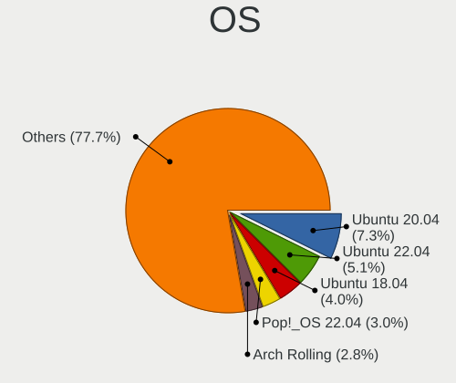

| Name                         | Notebooks | Percent |
|------------------------------|-----------|---------|
| Ubuntu 20.04                 | 369       | 7.32%   |
| Ubuntu 22.04                 | 259       | 5.14%   |
| Ubuntu 18.04                 | 202       | 4.01%   |
| Pop!_OS 22.04                | 152       | 3.01%   |
| Arch Rolling                 | 140       | 2.78%   |
| Ubuntu 24.04                 | 131       | 2.6%    |
| Debian 12                    | 106       | 2.1%    |
| Zorin 17                     | 83        | 1.65%   |
| Zorin 16                     | 74        | 1.47%   |
| Manjaro                      | 71        | 1.41%   |
| Linux Mint 22.1              | 69        | 1.37%   |
| ArcoLinux Rolling            | 68        | 1.35%   |
| OpenMandriva 24.12           | 62        | 1.23%   |
| Fedora 41                    | 62        | 1.23%   |
| Fedora 39                    | 60        | 1.19%   |
| Debian 11                    | 58        | 1.15%   |
| OpenMandriva 4.3             | 57        | 1.13%   |
| Linux Mint 20.3              | 56        | 1.11%   |
| Fedora 38                    | 56        | 1.11%   |
| Fedora 42                    | 54        | 1.07%   |
| Fedora 40                    | 54        | 1.07%   |
| OpenMandriva 4.2             | 53        | 1.05%   |
| KDE neon 20.04               | 50        | 0.99%   |
| Arch                         | 48        | 0.95%   |
| OpenMandriva 25.06           | 46        | 0.91%   |
| EndeavourOS Rolling          | 46        | 0.91%   |
| Xubuntu 20.04                | 45        | 0.89%   |
| Linux Mint 21.1              | 45        | 0.89%   |
| Zorin 15                     | 43        | 0.85%   |
| openSUSE Tumbleweed-XXXXXXXX | 42        | 0.83%   |
| Linux Mint 21.2              | 40        | 0.79%   |
| Linux Mint 19.3              | 40        | 0.79%   |
| Ubuntu 19.10                 | 39        | 0.77%   |
| Pop!_OS 21.04                | 39        | 0.77%   |
| Fedora 37                    | 37        | 0.73%   |
| Pop!_OS 20.04                | 36        | 0.71%   |
| Linux Mint 21                | 36        | 0.71%   |
| OpenMandriva 23.08           | 35        | 0.69%   |
| Fedora 35                    | 35        | 0.69%   |
| Ubuntu 21.10                 | 33        | 0.65%   |

OS Family
---------

OS without a version

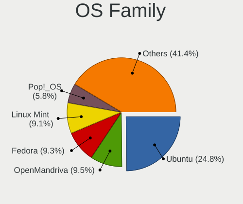

| Name          | Notebooks | Percent |
|---------------|-----------|---------|
| Ubuntu        | 1189      | 24.82%  |
| OpenMandriva  | 456       | 9.52%   |
| Fedora        | 447       | 9.33%   |
| Linux Mint    | 437       | 9.12%   |
| Pop!_OS       | 277       | 5.78%   |
| Debian        | 239       | 4.99%   |
| Zorin         | 231       | 4.82%   |
| Arch          | 183       | 3.82%   |
| Manjaro       | 139       | 2.9%    |
| SteamOS       | 103       | 2.15%   |
| Kubuntu       | 93        | 1.94%   |
| KDE neon      | 89        | 1.86%   |
| Xubuntu       | 88        | 1.84%   |
| ArcoLinux     | 73        | 1.52%   |
| openSUSE      | 52        | 1.09%   |
| Kali          | 48        | 1%      |
| EndeavourOS   | 48        | 1%      |
| Elementary    | 44        | 0.92%   |
| ROSA          | 39        | 0.81%   |
| Gentoo        | 38        | 0.79%   |
| Lubuntu       | 35        | 0.73%   |
| MX            | 33        | 0.69%   |
| Garuda Linux  | 25        | 0.52%   |
| Bazzite       | 24        | 0.5%    |
| BlackPanther  | 22        | 0.46%   |
| LMDE          | 21        | 0.44%   |
| Endless       | 20        | 0.42%   |
| Clear Linux   | 19        | 0.4%    |
| CachyOS       | 18        | 0.38%   |
| Ubuntu MATE   | 17        | 0.35%   |
| Nobara        | 16        | 0.33%   |
| NixOS         | 16        | 0.33%   |
| Ubuntu Budgie | 14        | 0.29%   |
| Ubuntu Unity  | 13        | 0.27%   |
| Parrot        | 13        | 0.27%   |
| Alpine        | 12        | 0.25%   |
| Peppermint    | 9         | 0.19%   |
| Artix         | 9         | 0.19%   |
| Void Linux    | 8         | 0.17%   |
| Ubuntu Studio | 7         | 0.15%   |

Kernel
------

Version of the Linux kernel

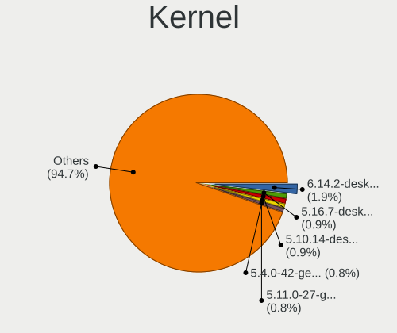

| Version                     | Notebooks | Percent |
|-----------------------------|-----------|---------|
| 6.14.2-desktop-3omv2590     | 104       | 1.88%   |
| 5.16.7-desktop-1omv4003     | 51        | 0.92%   |
| 5.10.14-desktop-1omv4002    | 51        | 0.92%   |
| 5.4.0-42-generic            | 45        | 0.81%   |
| 5.11.0-27-generic           | 42        | 0.76%   |
| 6.12.1-desktop-1omv2490     | 40        | 0.72%   |
| 6.9.3-76060903-generic      | 37        | 0.67%   |
| 6.8.0-51-generic            | 37        | 0.67%   |
| 5.15.0-56-generic           | 34        | 0.61%   |
| 6.6.2-desktop-1omv2390      | 30        | 0.54%   |
| 6.5.0-14-generic            | 29        | 0.52%   |
| 6.4.11-desktop-1omv2390     | 27        | 0.49%   |
| 6.14.0-33-generic           | 27        | 0.49%   |
| 5.3.0-40-generic            | 27        | 0.49%   |
| 6.2.6-desktop-1omv2390      | 24        | 0.43%   |
| 6.1.52-valve16-1-neptune-61 | 24        | 0.43%   |
| 6.1.1-desktop-1omv2290      | 24        | 0.43%   |
| 5.15.0-52-generic           | 24        | 0.43%   |
| 5.10.10-64                  | 24        | 0.43%   |
| 6.8.0-45-generic            | 23        | 0.41%   |
| 5.4.0-29-generic            | 23        | 0.41%   |
| 6.2.0-26-generic            | 22        | 0.4%    |
| 5.15.0-58-generic           | 22        | 0.4%    |
| 5.4.0-52-generic            | 21        | 0.38%   |
| 5.4.0-40-generic            | 21        | 0.38%   |
| 5.3.0-46-generic            | 21        | 0.38%   |
| 5.0.0-37-generic            | 21        | 0.38%   |
| 6.8.0-60-generic            | 20        | 0.36%   |
| 5.4.0-58-generic            | 20        | 0.36%   |
| 5.15.0-91-generic           | 20        | 0.36%   |
| 5.8.0-7630-generic          | 19        | 0.34%   |
| 6.8.0-52-generic            | 18        | 0.32%   |
| 6.5.0-28-generic            | 18        | 0.32%   |
| 6.12.9-desktop-1omv2490     | 18        | 0.32%   |
| 6.12.10-76061203-generic    | 18        | 0.32%   |
| 5.4.0-48-generic            | 18        | 0.32%   |
| 5.4.0-45-generic            | 18        | 0.32%   |
| 5.15.0-41-generic           | 18        | 0.32%   |
| 5.13.0-valve36-1-neptune    | 18        | 0.32%   |
| 6.5.0-26-generic            | 17        | 0.31%   |

Kernel Family
-------------

Linux kernel without a distro release

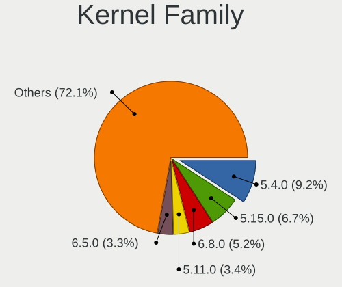

| Version | Notebooks | Percent |
|---------|-----------|---------|
| 5.4.0   | 481       | 9.19%   |
| 5.15.0  | 350       | 6.69%   |
| 6.8.0   | 273       | 5.21%   |
| 5.11.0  | 179       | 3.42%   |
| 6.5.0   | 175       | 3.34%   |
| 5.13.0  | 169       | 3.23%   |
| 5.8.0   | 147       | 2.81%   |
| 5.3.0   | 145       | 2.77%   |
| 4.15.0  | 144       | 2.75%   |
| 6.14.0  | 126       | 2.41%   |
| 6.1.0   | 123       | 2.35%   |
| 6.2.0   | 110       | 2.1%    |
| 6.14.2  | 106       | 2.02%   |
| 5.19.0  | 100       | 1.91%   |
| 5.0.0   | 89        | 1.7%    |
| 6.11.0  | 75        | 1.43%   |
| 5.10.0  | 73        | 1.39%   |
| 5.16.7  | 53        | 1.01%   |
| 5.10.14 | 52        | 0.99%   |
| 4.18.0  | 50        | 0.96%   |
| 6.2.6   | 43        | 0.82%   |
| 6.12.1  | 43        | 0.82%   |
| 6.9.3   | 38        | 0.73%   |
| 6.6.2   | 35        | 0.67%   |
| 6.1.52  | 34        | 0.65%   |
| 6.4.11  | 30        | 0.57%   |
| 6.12.9  | 28        | 0.53%   |
| 6.1.1   | 28        | 0.53%   |
| 6.12.10 | 27        | 0.52%   |
| 5.10.10 | 26        | 0.5%    |
| 6.5.6   | 23        | 0.44%   |
| 5.14.0  | 23        | 0.44%   |
| 6.12.6  | 22        | 0.42%   |
| 4.19.0  | 22        | 0.42%   |
| 6.11.11 | 19        | 0.36%   |
| 6.10.0  | 18        | 0.34%   |
| 6.7.4   | 15        | 0.29%   |
| 6.2.9   | 14        | 0.27%   |
| 6.17.7  | 14        | 0.27%   |
| 6.13.5  | 14        | 0.27%   |

Kernel Major Ver.
-----------------

Linux kernel major version

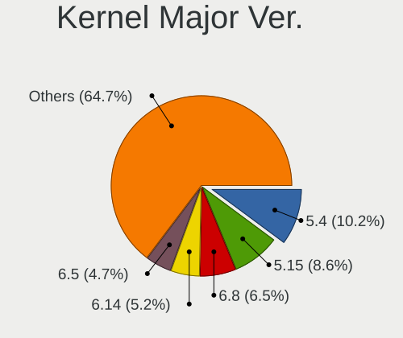

| Version | Notebooks | Percent |
|---------|-----------|---------|
| 5.4     | 523       | 10.16%  |
| 5.15    | 445       | 8.64%   |
| 6.8     | 335       | 6.51%   |
| 6.14    | 270       | 5.24%   |
| 6.5     | 244       | 4.74%   |
| 6.1     | 229       | 4.45%   |
| 6.2     | 208       | 4.04%   |
| 5.11    | 206       | 4%      |
| 6.12    | 202       | 3.92%   |
| 5.8     | 197       | 3.83%   |
| 5.10    | 194       | 3.77%   |
| 5.13    | 189       | 3.67%   |
| 5.3     | 154       | 2.99%   |
| 6.6     | 145       | 2.82%   |
| 4.15    | 145       | 2.82%   |
| 6.11    | 136       | 2.64%   |
| 5.19    | 125       | 2.43%   |
| 5.16    | 105       | 2.04%   |
| 5.0     | 91        | 1.77%   |
| 6.4     | 80        | 1.55%   |
| 6.9     | 76        | 1.48%   |
| 6.0     | 73        | 1.42%   |
| 6.17    | 69        | 1.34%   |
| 4.18    | 61        | 1.18%   |
| 6.10    | 56        | 1.09%   |
| 6.13    | 54        | 1.05%   |
| 6.7     | 53        | 1.03%   |
| 5.17    | 49        | 0.95%   |
| 5.14    | 48        | 0.93%   |
| 6.15    | 46        | 0.89%   |
| 5.9     | 44        | 0.85%   |
| 6.3     | 40        | 0.78%   |
| 5.18    | 39        | 0.76%   |
| 6.16    | 33        | 0.64%   |
| 5.12    | 31        | 0.6%    |
| 4.19    | 29        | 0.56%   |
| 5.6     | 26        | 0.5%    |
| 4.9     | 25        | 0.49%   |
| 5.7     | 23        | 0.45%   |
| 5.5     | 13        | 0.25%   |

Arch
----

OS architecture (x86_64, i586, etc.)

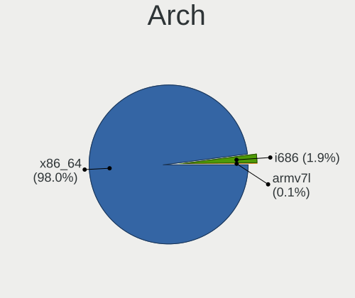

| Name    | Notebooks | Percent |
|---------|-----------|---------|
| x86_64  | 4495      | 97.95%  |
| i686    | 87        | 1.9%    |
| aarch64 | 4         | 0.09%   |
| armv7l  | 3         | 0.07%   |

DE
--

Desktop Environment

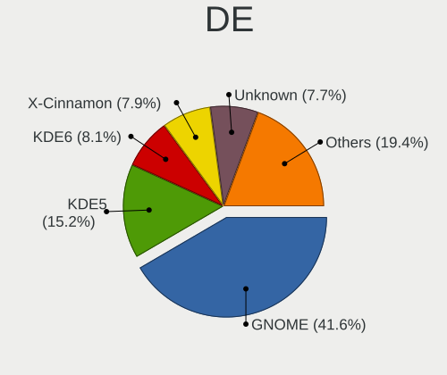

| Name                 | Notebooks | Percent |
|----------------------|-----------|---------|
| GNOME                | 2003      | 41.58%  |
| KDE5                 | 733       | 15.22%  |
| KDE6                 | 392       | 8.14%   |
| X-Cinnamon           | 382       | 7.93%   |
| Unknown              | 373       | 7.74%   |
| XFCE                 | 362       | 7.52%   |
| KDE                  | 90        | 1.87%   |
| MATE                 | 84        | 1.74%   |
| LXQt                 | 62        | 1.29%   |
| Pantheon             | 42        | 0.87%   |
| LXDE                 | 42        | 0.87%   |
| Cinnamon             | 38        | 0.79%   |
| KDE4                 | 30        | 0.62%   |
| i3                   | 29        | 0.6%    |
| Budgie               | 25        | 0.52%   |
| Hyprland             | 24        | 0.5%    |
| Unity                | 16        | 0.33%   |
| sway                 | 11        | 0.23%   |
| GNOME Flashback      | 10        | 0.21%   |
| COSMIC               | 9         | 0.19%   |
| GNOME Classic        | 7         | 0.15%   |
| deepin               | 7         | 0.15%   |
| DWM                  | 6         | 0.12%   |
| Enlightenment        | 5         | 0.1%    |
| qtile                | 4         | 0.08%   |
| xmonad               | 3         | 0.06%   |
| jwm                  | 3         | 0.06%   |
| Endless:GNOME        | 3         | 0.06%   |
| chadwm               | 3         | 0.06%   |
| awesome              | 3         | 0.06%   |
| lightdm-xsession     | 2         | 0.04%   |
| xsession             | 1         | 0.02%   |
| XFCE:GNOME:Hyprland  | 1         | 0.02%   |
| X-Generic            | 1         | 0.02%   |
| wmaker-common        | 1         | 0.02%   |
| WindowMaker          | 1         | 0.02%   |
| swayLANG=en_CA.UTF-8 | 1         | 0.02%   |
| spectrwm             | 1         | 0.02%   |
| openbox              | 1         | 0.02%   |
| niri                 | 1         | 0.02%   |

Display Server
--------------

X11 or Wayland

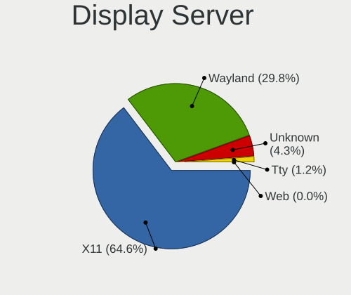

| Name    | Notebooks | Percent |
|---------|-----------|---------|
| X11     | 3065      | 64.65%  |
| Wayland | 1413      | 29.8%   |
| Unknown | 205       | 4.32%   |
| Tty     | 57        | 1.2%    |
| Web     | 1         | 0.02%   |

Display Manager
---------------

SDDM, LightDM, etc.

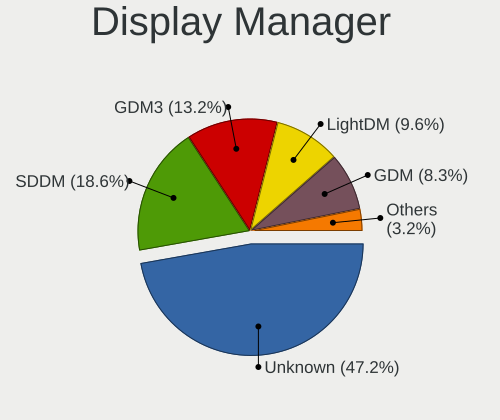

| Name                  | Notebooks | Percent |
|-----------------------|-----------|---------|
| Unknown               | 2259      | 47.21%  |
| SDDM                  | 889       | 18.58%  |
| GDM3                  | 630       | 13.17%  |
| LightDM               | 458       | 9.57%   |
| GDM                   | 397       | 8.3%    |
| TDM                   | 74        | 1.55%   |
| NODM                  | 25        | 0.52%   |
| KDM                   | 24        | 0.5%    |
| GREETD                | 8         | 0.17%   |
| XDM                   | 7         | 0.15%   |
| Ly                    | 6         | 0.13%   |
| LXDM                  | 4         | 0.08%   |
| LY-DM                 | 2         | 0.04%   |
| SLIMSKI               | 1         | 0.02%   |
| DISPLAY-MANAGER-START | 1         | 0.02%   |

OS Lang
-------

Language

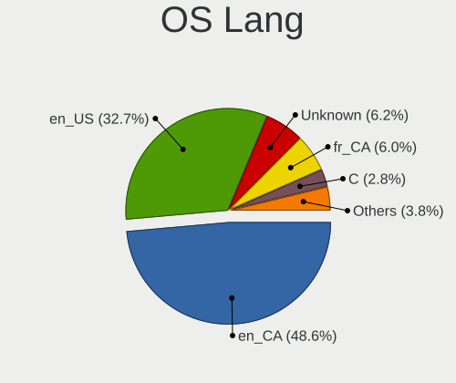

| Lang        | Notebooks | Percent |
|-------------|-----------|---------|
| en_CA       | 2306      | 48.59%  |
| en_US       | 1551      | 32.68%  |
| Unknown     | 293       | 6.17%   |
| fr_CA       | 283       | 5.96%   |
| C           | 133       | 2.8%    |
| fr_FR       | 58        | 1.22%   |
| en_GB       | 42        | 0.88%   |
| C.UTF8      | 10        | 0.21%   |
| hu_HU       | 7         | 0.15%   |
| POSIX       | 6         | 0.13%   |
| zh_CN       | 5         | 0.11%   |
| pt_BR       | 5         | 0.11%   |
| en_AU       | 5         | 0.11%   |
| es_ES       | 4         | 0.08%   |
| es_AR       | 4         | 0.08%   |
| en_IN       | 4         | 0.08%   |
| ru_RU       | 3         | 0.06%   |
| uk_UA       | 2         | 0.04%   |
| pl_PL       | 2         | 0.04%   |
| it_IT       | 2         | 0.04%   |
| en_DK       | 2         | 0.04%   |
| zh_TW       | 1         | 0.02%   |
| tr_TR       | 1         | 0.02%   |
| ro_RO       | 1         | 0.02%   |
| pa_IN       | 1         | 0.02%   |
| hr_HR       | 1         | 0.02%   |
| ga_IE       | 1         | 0.02%   |
| es_CU       | 1         | 0.02%   |
| es_CL       | 1         | 0.02%   |
| en_ZA       | 1         | 0.02%   |
| en_US.UTF_8 | 1         | 0.02%   |
| en_US.UTF8  | 1         | 0.02%   |
| en_NZ       | 1         | 0.02%   |
| en_IE       | 1         | 0.02%   |
| en_FI       | 1         | 0.02%   |
| de_DE       | 1         | 0.02%   |
| de_CH       | 1         | 0.02%   |
| da_DK       | 1         | 0.02%   |
| co_FR       | 1         | 0.02%   |
| ar_EG       | 1         | 0.02%   |

Boot Mode
---------

EFI or BIOS

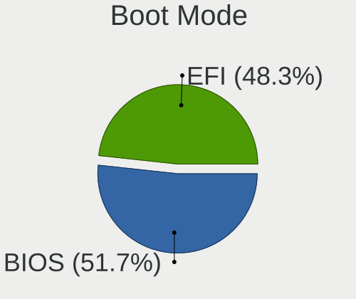

| Mode | Notebooks | Percent |
|------|-----------|---------|
| BIOS | 2431      | 51.71%  |
| EFI  | 2270      | 48.29%  |

Filesystem
----------

Type of filesystem

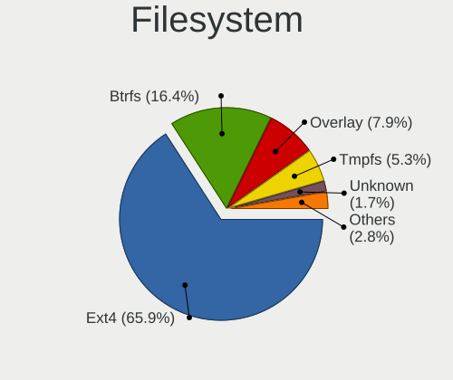

| Type     | Notebooks | Percent |
|----------|-----------|---------|
| Ext4     | 3112      | 65.88%  |
| Btrfs    | 773       | 16.36%  |
| Overlay  | 375       | 7.94%   |
| Tmpfs    | 252       | 5.33%   |
| Unknown  | 80        | 1.69%   |
| Xfs      | 48        | 1.02%   |
| Zfs      | 37        | 0.78%   |
| Rootfs   | 24        | 0.51%   |
| Ext2     | 10        | 0.21%   |
| Ext3     | 4         | 0.08%   |
| Aufs     | 4         | 0.08%   |
| F2fs     | 3         | 0.06%   |
| Bcachefs | 2         | 0.04%   |

Part. scheme
------------

Scheme of partitioning

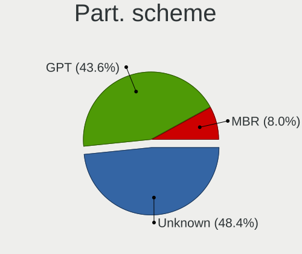

| Type    | Notebooks | Percent |
|---------|-----------|---------|
| Unknown | 2283      | 48.39%  |
| GPT     | 2059      | 43.64%  |
| MBR     | 376       | 7.97%   |

Dual Boot with Linux/BSD
------------------------

Hosting more than one Linux/BSD

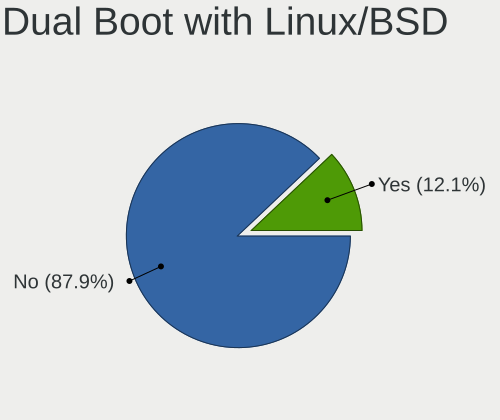

| Dual boot | Notebooks | Percent |
|-----------|-----------|---------|
| No        | 4115      | 87.95%  |
| Yes       | 564       | 12.05%  |

Dual Boot (Win)
---------------

Hosting Linux and Windows

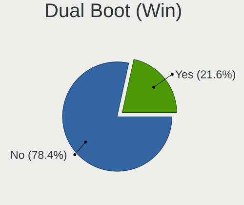

| Dual boot | Notebooks | Percent |
|-----------|-----------|---------|
| No        | 3657      | 78.43%  |
| Yes       | 1006      | 21.57%  |

Board
-----

Vendor
------

Motherboard manufacturer

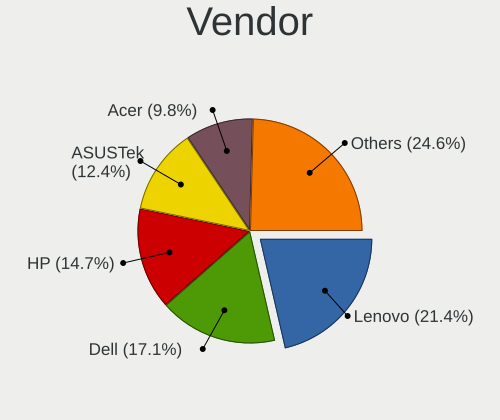

| Name                           | Notebooks | Percent |
|--------------------------------|-----------|---------|
| Lenovo                         | 982       | 21.41%  |
| Dell                           | 785       | 17.12%  |
| Hewlett-Packard                | 674       | 14.7%   |
| ASUSTek Computer               | 568       | 12.39%  |
| Acer                           | 449       | 9.79%   |
| Apple                          | 221       | 4.82%   |
| Toshiba                        | 141       | 3.07%   |
| MSI                            | 135       | 2.94%   |
| Valve                          | 100       | 2.18%   |
| Google                         | 74        | 1.61%   |
| Alienware                      | 48        | 1.05%   |
| Sony                           | 44        | 0.96%   |
| Framework                      | 38        | 0.83%   |
| Samsung Electronics            | 34        | 0.74%   |
| Unknown                        | 34        | 0.74%   |
| System76                       | 31        | 0.68%   |
| Gigabyte Technology            | 27        | 0.59%   |
| Panasonic                      | 25        | 0.55%   |
| Gateway                        | 23        | 0.5%    |
| Razer                          | 14        | 0.31%   |
| Fujitsu                        | 14        | 0.31%   |
| LG Electronics                 | 11        | 0.24%   |
| Notebook                       | 9         | 0.2%    |
| HUAWEI                         | 8         | 0.17%   |
| Timi                           | 6         | 0.13%   |
| Matsushita Electric Industrial | 6         | 0.13%   |
| Intel Client Systems           | 6         | 0.13%   |
| GPU Company                    | 5         | 0.11%   |
| EUROCOM                        | 4         | 0.09%   |
| eMachines                      | 4         | 0.09%   |
| Chuwi                          | 4         | 0.09%   |
| BOSGAME                        | 4         | 0.09%   |
| Insyde                         | 3         | 0.07%   |
| AZW                            | 3         | 0.07%   |
| A-DATA Technology              | 3         | 0.07%   |
| Xplore                         | 2         | 0.04%   |
| Purism                         | 2         | 0.04%   |
| Motion Computing               | 2         | 0.04%   |
| Intel                          | 2         | 0.04%   |
| GPD                            | 2         | 0.04%   |

Model
-----

Motherboard model

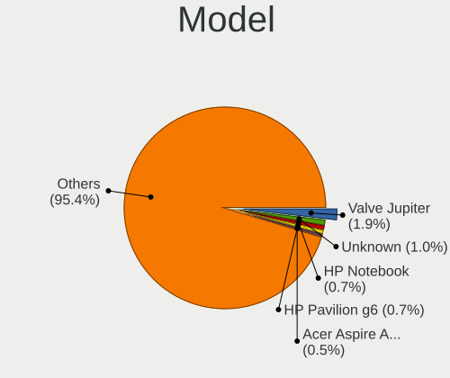

| Name                                       | Notebooks | Percent |
|--------------------------------------------|-----------|---------|
| Valve Jupiter                              | 85        | 1.85%   |
| Unknown                                    | 44        | 0.96%   |
| HP Notebook                                | 32        | 0.7%    |
| HP Pavilion g6                             | 30        | 0.65%   |
| Acer Aspire A315-21                        | 22        | 0.48%   |
| Apple MacBookPro9,2                        | 21        | 0.46%   |
| Dell Latitude E6410                        | 19        | 0.41%   |
| Apple MacBookPro8,1                        | 18        | 0.39%   |
| HP Pavilion Notebook                       | 17        | 0.37%   |
| Dell XPS 15 9500                           | 17        | 0.37%   |
| Dell XPS 15 7590                           | 17        | 0.37%   |
| Dell Latitude E6420                        | 17        | 0.37%   |
| Valve Galileo                              | 15        | 0.33%   |
| HP Pavilion dv6                            | 14        | 0.31%   |
| Dell Latitude 7490                         | 14        | 0.31%   |
| Dell Inspiron 1545                         | 13        | 0.28%   |
| Apple MacBookPro11,1                       | 13        | 0.28%   |
| HP Pavilion 15                             | 12        | 0.26%   |
| Apple MacBookPro5,5                        | 12        | 0.26%   |
| Acer Aspire A315-42                        | 12        | 0.26%   |
| HP EliteBook 8460p                         | 11        | 0.24%   |
| HP EliteBook 840 G1                        | 11        | 0.24%   |
| Dell Latitude E6540                        | 11        | 0.24%   |
| Apple MacBookPro9,1                        | 11        | 0.24%   |
| Apple MacBookPro12,1                       | 11        | 0.24%   |
| Acer Aspire 5742                           | 11        | 0.24%   |
| HP Laptop 15-db0xxx                        | 10        | 0.22%   |
| HP EliteBook 840 G5                        | 10        | 0.22%   |
| HP EliteBook 840 G3                        | 10        | 0.22%   |
| Dell XPS 15 9530                           | 10        | 0.22%   |
| Dell XPS 13 9310                           | 10        | 0.22%   |
| Apple MacBookPro7,1                        | 10        | 0.22%   |
| Toshiba Satellite C650                     | 9         | 0.2%    |
| HP Pavilion g7                             | 9         | 0.2%    |
| HP Pavilion dv7                            | 9         | 0.2%    |
| HP G60                                     | 9         | 0.2%    |
| Framework Laptop 13 (AMD Ryzen 7040Series) | 9         | 0.2%    |
| Framework Laptop                           | 9         | 0.2%    |
| Dell Precision M4800                       | 9         | 0.2%    |
| Dell Latitude E6430                        | 9         | 0.2%    |

Model Family
------------

Motherboard model prefix

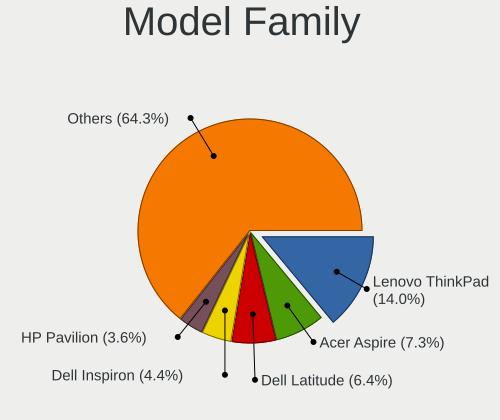

| Name               | Notebooks | Percent |
|--------------------|-----------|---------|
| Lenovo ThinkPad    | 641       | 13.98%  |
| Acer Aspire        | 333       | 7.26%   |
| Dell Latitude      | 295       | 6.43%   |
| Dell Inspiron      | 201       | 4.38%   |
| HP Pavilion        | 165       | 3.6%    |
| Lenovo IdeaPad     | 155       | 3.38%   |
| Dell XPS           | 143       | 3.12%   |
| HP EliteBook       | 133       | 2.9%    |
| ASUS VivoBook      | 127       | 2.77%   |
| Toshiba Satellite  | 118       | 2.57%   |
| HP Laptop          | 111       | 2.42%   |
| Valve Jupiter      | 85        | 1.85%   |
| HP ProBook         | 71        | 1.55%   |
| Lenovo Legion      | 70        | 1.53%   |
| ASUS ROG           | 68        | 1.48%   |
| Dell Precision     | 67        | 1.46%   |
| ASUS ASUS          | 56        | 1.22%   |
| Unknown            | 44        | 0.96%   |
| ASUS ZenBook       | 40        | 0.87%   |
| Acer Nitro         | 40        | 0.87%   |
| Framework Laptop   | 38        | 0.83%   |
| Acer Swift         | 38        | 0.83%   |
| Apple MacBookPro11 | 36        | 0.78%   |
| HP Notebook        | 32        | 0.7%    |
| Apple MacBookPro9  | 32        | 0.7%    |
| HP ENVY            | 30        | 0.65%   |
| Dell Vostro        | 26        | 0.57%   |
| Apple MacBookPro8  | 25        | 0.55%   |
| Lenovo ThinkBook   | 23        | 0.5%    |
| ASUS TUF           | 22        | 0.48%   |
| HP ZBook           | 21        | 0.46%   |
| Apple MacBookPro5  | 19        | 0.41%   |
| HP Stream          | 16        | 0.35%   |
| Valve Galileo      | 15        | 0.33%   |
| HP Compaq          | 15        | 0.33%   |
| Dell Studio        | 14        | 0.31%   |
| HP OMEN            | 12        | 0.26%   |
| Razer Blade        | 11        | 0.24%   |
| Dell System        | 11        | 0.24%   |
| Apple MacBookPro12 | 11        | 0.24%   |

MFG Year
--------

Motherboard manufacture year

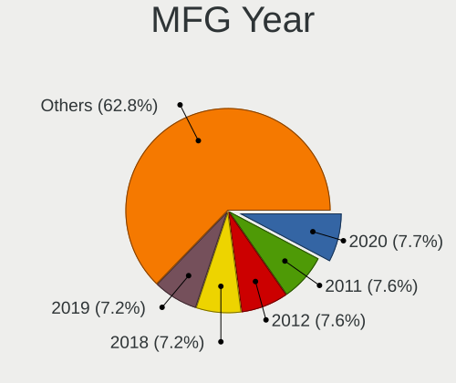

| Year    | Notebooks | Percent |
|---------|-----------|---------|
| 2020    | 355       | 7.74%   |
| 2011    | 348       | 7.59%   |
| 2012    | 347       | 7.57%   |
| 2018    | 330       | 7.2%    |
| 2019    | 328       | 7.15%   |
| 2017    | 318       | 6.93%   |
| 2013    | 301       | 6.56%   |
| 2021    | 295       | 6.43%   |
| 2022    | 280       | 6.11%   |
| 2014    | 247       | 5.39%   |
| 2023    | 230       | 5.02%   |
| 2016    | 213       | 4.64%   |
| 2010    | 213       | 4.64%   |
| 2008    | 173       | 3.77%   |
| 2015    | 159       | 3.47%   |
| 2009    | 139       | 3.03%   |
| 2024    | 116       | 2.53%   |
| 2007    | 93        | 2.03%   |
| 2006    | 46        | 1%      |
| 2025    | 33        | 0.72%   |
| Unknown | 11        | 0.24%   |
| 2005    | 9         | 0.2%    |
| 2004    | 2         | 0.04%   |

Form Factor
-----------

Physical design of the computer

| Name     | Notebooks | Percent |
|----------|-----------|---------|
| Notebook | 4586      | 100%    |

Secure Boot
-----------

Enabled or disabled

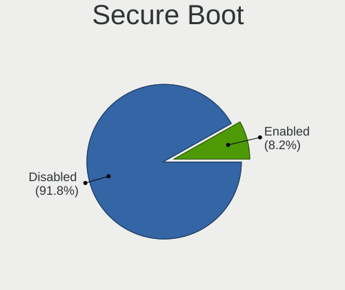

| State    | Notebooks | Percent |
|----------|-----------|---------|
| Disabled | 4245      | 91.84%  |
| Enabled  | 377       | 8.16%   |

Coreboot
--------

Have coreboot on board

| Used | Notebooks | Percent |
|------|-----------|---------|
| No   | 4484      | 97.75%  |
| Yes  | 103       | 2.25%   |

RAM Size
--------

Total RAM memory

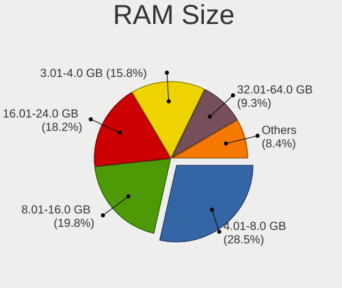

| Size in GB  | Notebooks | Percent |
|-------------|-----------|---------|
| 4.01-8.0    | 1328      | 28.53%  |
| 8.01-16.0   | 921       | 19.79%  |
| 16.01-24.0  | 845       | 18.16%  |
| 3.01-4.0    | 734       | 15.77%  |
| 32.01-64.0  | 435       | 9.35%   |
| 1.01-2.0    | 141       | 3.03%   |
| 24.01-32.0  | 92        | 1.98%   |
| 64.01-256.0 | 75        | 1.61%   |
| 2.01-3.0    | 59        | 1.27%   |
| 0.51-1.0    | 22        | 0.47%   |
| 0.01-0.5    | 2         | 0.04%   |

RAM Used
--------

Used RAM memory

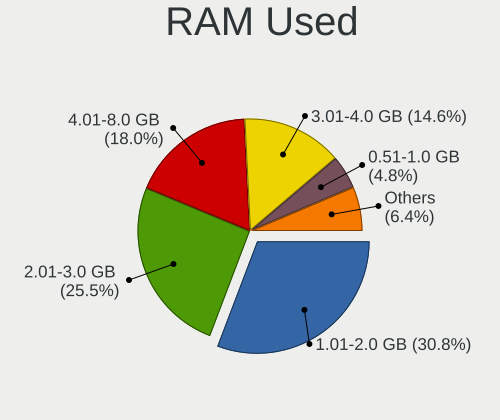

| Used GB    | Notebooks | Percent |
|------------|-----------|---------|
| 1.01-2.0   | 1574      | 30.78%  |
| 2.01-3.0   | 1303      | 25.48%  |
| 4.01-8.0   | 918       | 17.95%  |
| 3.01-4.0   | 745       | 14.57%  |
| 0.51-1.0   | 247       | 4.83%   |
| 8.01-16.0  | 232       | 4.54%   |
| 0.01-0.5   | 56        | 1.1%    |
| 16.01-24.0 | 26        | 0.51%   |
| 24.01-32.0 | 10        | 0.2%    |
| 32.01-64.0 | 2         | 0.04%   |
| Unknown    | 1         | 0.02%   |

Total Drives
------------

Number of drives on board

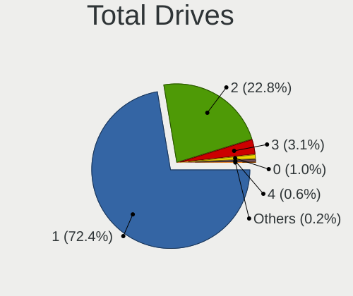

| Drives | Notebooks | Percent |
|--------|-----------|---------|
| 1      | 3405      | 72.35%  |
| 2      | 1075      | 22.84%  |
| 3      | 145       | 3.08%   |
| 0      | 45        | 0.96%   |
| 4      | 28        | 0.59%   |
| 5      | 5         | 0.11%   |
| 7      | 2         | 0.04%   |
| 6      | 1         | 0.02%   |

Has CD-ROM
----------

Has CD-ROM on board

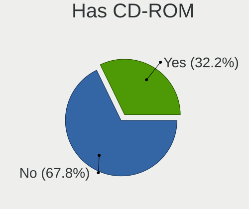

| Presented | Notebooks | Percent |
|-----------|-----------|---------|
| No        | 3125      | 67.79%  |
| Yes       | 1485      | 32.21%  |

Has Ethernet
------------

Has Ethernet on board

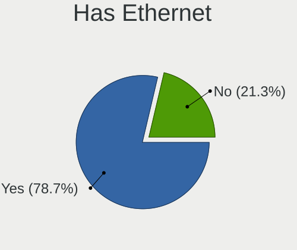

| Presented | Notebooks | Percent |
|-----------|-----------|---------|
| Yes       | 3626      | 78.69%  |
| No        | 982       | 21.31%  |

Has WiFi
--------

Has WiFi module

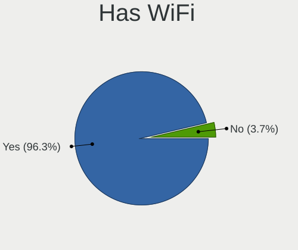

| Presented | Notebooks | Percent |
|-----------|-----------|---------|
| Yes       | 4420      | 96.3%   |
| No        | 170       | 3.7%    |

Has Bluetooth
-------------

Has Bluetooth module

| Presented | Notebooks | Percent |
|-----------|-----------|---------|
| Yes       | 3621      | 77.9%   |
| No        | 1027      | 22.1%   |

Location
--------

Country
-------

Geographic location (country)

| Country | Notebooks | Percent |
|---------|-----------|---------|
| Canada  | 4586      | 100%    |

City
----

Geographic location (city)

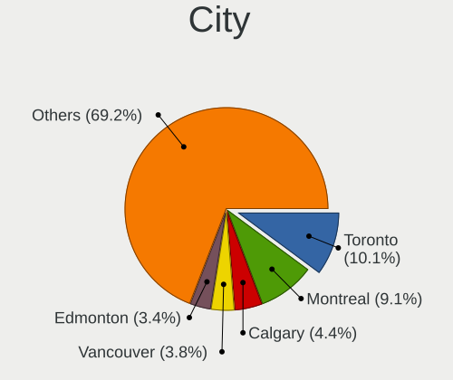

| City            | Notebooks | Percent |
|-----------------|-----------|---------|
| Toronto         | 493       | 10.14%  |
| Montreal        | 444       | 9.14%   |
| Calgary         | 216       | 4.44%   |
| Vancouver       | 183       | 3.77%   |
| Edmonton        | 163       | 3.35%   |
| Ottawa          | 140       | 2.88%   |
| Québec         | 106       | 2.18%   |
| Winnipeg        | 105       | 2.16%   |
| Mississauga     | 87        | 1.79%   |
| Victoria        | 74        | 1.52%   |
| London          | 57        | 1.17%   |
| Kitchener       | 54        | 1.11%   |
| Surrey          | 50        | 1.03%   |
| Burnaby         | 48        | 0.99%   |
| Saskatoon       | 47        | 0.97%   |
| Brampton        | 47        | 0.97%   |
| Laval           | 46        | 0.95%   |
| Hamilton        | 46        | 0.95%   |
| Oshawa          | 44        | 0.91%   |
| Halifax         | 42        | 0.86%   |
| Regina          | 41        | 0.84%   |
| Scarborough     | 37        | 0.76%   |
| Moncton         | 36        | 0.74%   |
| Sherbrooke      | 30        | 0.62%   |
| Markham         | 28        | 0.58%   |
| Longueuil       | 28        | 0.58%   |
| Gatineau        | 28        | 0.58%   |
| Windsor         | 27        | 0.56%   |
| Kingston        | 27        | 0.56%   |
| Fredericton     | 27        | 0.56%   |
| Kelowna         | 25        | 0.51%   |
| Richmond Hill   | 23        | 0.47%   |
| Levis           | 23        | 0.47%   |
| Dartmouth       | 23        | 0.47%   |
| Barrie          | 22        | 0.45%   |
| Richmond        | 20        | 0.41%   |
| North York      | 20        | 0.41%   |
| Prince George   | 19        | 0.39%   |
| Vernon          | 18        | 0.37%   |
| New Westminster | 18        | 0.37%   |

Drives
------

Drive Vendor
------------

Hard drive vendors

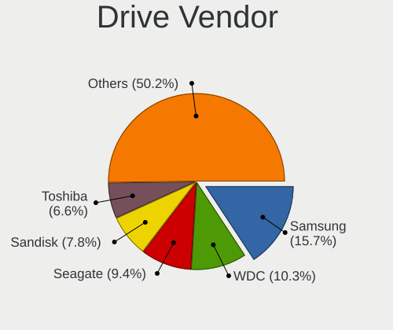

| Vendor                      | Notebooks | Drives | Percent |
|-----------------------------|-----------|--------|---------|
| Samsung Electronics         | 907       | 1235   | 15.73%  |
| WDC                         | 592       | 736    | 10.27%  |
| Seagate                     | 541       | 701    | 9.38%   |
| Sandisk                     | 451       | 555    | 7.82%   |
| Toshiba                     | 380       | 460    | 6.59%   |
| Unknown                     | 370       | 497    | 6.42%   |
| Kingston                    | 309       | 388    | 5.36%   |
| SK hynix                    | 260       | 330    | 4.51%   |
| Intel                       | 204       | 290    | 3.54%   |
| Micron Technology           | 173       | 217    | 3%      |
| Hitachi                     | 157       | 184    | 2.72%   |
| HGST                        | 142       | 170    | 2.46%   |
| Crucial                     | 135       | 182    | 2.34%   |
| Apple                       | 110       | 127    | 1.91%   |
| A-DATA Technology           | 83        | 107    | 1.44%   |
| KIOXIA                      | 76        | 90     | 1.32%   |
| Kingston Technology Company | 60        | 72     | 1.04%   |
| Phison Electronics          | 54        | 64     | 0.94%   |
| SPCC                        | 48        | 68     | 0.83%   |
| Fujitsu                     | 43        | 62     | 0.75%   |
| Unknown                     | 43        | 49     | 0.75%   |
| Micron/Crucial Technology   | 37        | 43     | 0.64%   |
| China                       | 31        | 34     | 0.54%   |
| LITEONIT                    | 30        | 33     | 0.52%   |
| Patriot                     | 27        | 28     | 0.47%   |
| LITEON                      | 25        | 27     | 0.43%   |
| MAXIO Technology (Hangzhou) | 24        | 29     | 0.42%   |
| Silicon Motion              | 17        | 20     | 0.29%   |
| PNY                         | 16        | 30     | 0.28%   |
| Team                        | 15        | 18     | 0.26%   |
| Lexar                       | 15        | 18     | 0.26%   |
| Phison                      | 14        | 15     | 0.24%   |
| Timetec                     | 13        | 32     | 0.23%   |
| KingFast                    | 13        | 17     | 0.23%   |
| OCZ                         | 12        | 16     | 0.21%   |
| JMicron Technology          | 12        | 14     | 0.21%   |
| Dogfish                     | 12        | 15     | 0.21%   |
| ADATA Technology            | 12        | 12     | 0.21%   |
| KingSpec                    | 11        | 15     | 0.19%   |
| Corsair                     | 10        | 10     | 0.17%   |

Drive Model
-----------

Hard drive models

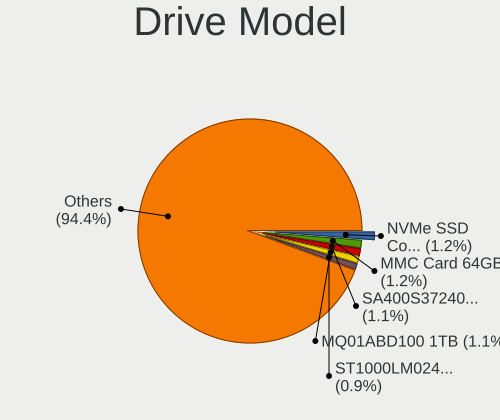

| Model                                                | Notebooks | Percent |
|------------------------------------------------------|-----------|---------|
| Samsung NVMe SSD Controller SM981/PM981/PM983 1TB    | 75        | 1.25%   |
| Unknown MMC Card  64GB                               | 74        | 1.23%   |
| Kingston SA400S37240G 240GB SSD                      | 67        | 1.12%   |
| Toshiba MQ01ABD100 1TB                               | 65        | 1.08%   |
| Seagate ST1000LM024 HN-M101MBB 1TB                   | 57        | 0.95%   |
| Unknown MMC Card  32GB                               | 56        | 0.93%   |
| Samsung NVMe SSD Controller PM9A1/PM9A3/980PRO 1TB   | 56        | 0.93%   |
| Seagate ST1000LM035-1RK172 1TB                       | 55        | 0.92%   |
| HGST HTS721010A9E630 1TB                             | 51        | 0.85%   |
| Samsung SSD 860 EVO 500GB                            | 45        | 0.75%   |
| Unknown                                              | 43        | 0.72%   |
| Kingston SA400S37480G 480GB SSD                      | 38        | 0.63%   |
| Sandisk WD Blue SN550 NVMe SSD 1024GB                | 36        | 0.6%    |
| Unknown MMC Card  128GB                              | 35        | 0.58%   |
| Samsung SSD 860 EVO 1TB                              | 35        | 0.58%   |
| Sandisk WD Black SN750 / PC SN730 NVMe SSD 500GB     | 33        | 0.55%   |
| SanDisk NVMe SSD Drive 1TB                           | 30        | 0.5%    |
| Kingston SA400S37120G 120GB SSD                      | 29        | 0.48%   |
| Unknown MMC Card  512GB                              | 28        | 0.47%   |
| Seagate ST9500325AS 500GB                            | 28        | 0.47%   |
| Kingston Company OM3PDP3 NVMe SSD 256GB              | 28        | 0.47%   |
| WDC WDS500G2B0A-00SM50 500GB                         | 27        | 0.45%   |
| Intel SSD 660P Series 512GB                          | 27        | 0.45%   |
| Unknown MMC Card  16GB                               | 26        | 0.43%   |
| Toshiba MQ01ABF050 500GB                             | 26        | 0.43%   |
| Seagate ST1000LX015-1U7172 1TB                       | 26        | 0.43%   |
| WDC WD10JPVX-22JC3T0 1TB                             | 25        | 0.42%   |
| Intel SSDPEKNU512GZ 512GB                            | 25        | 0.42%   |
| WDC WD10SPZX-21Z10T0 1TB                             | 24        | 0.4%    |
| Toshiba MQ04ABF100 1TB                               | 24        | 0.4%    |
| Samsung SSD 850 EVO 250GB                            | 24        | 0.4%    |
| Samsung SSD 860 EVO 250GB                            | 23        | 0.38%   |
| Samsung NVMe SSD Controller SM961/PM961/SM963 1024GB | 23        | 0.38%   |
| Kingston SV300S37A120G 120GB SSD                     | 23        | 0.38%   |
| HGST HTS725050A7E630 500GB                           | 23        | 0.38%   |
| Crucial CT1000MX500SSD1 1TB                          | 23        | 0.38%   |
| Seagate ST500LT012-1DG142 500GB                      | 22        | 0.37%   |
| Seagate ST500LM021-1KJ152 500GB                      | 22        | 0.37%   |
| HGST HTS541010A9E680 1TB                             | 22        | 0.37%   |
| Samsung NVMe SSD Drive 512GB                         | 21        | 0.35%   |

HDD Vendor
----------

Hard disk drive vendors

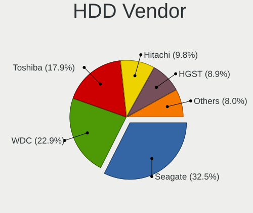

| Vendor              | Notebooks | Drives | Percent |
|---------------------|-----------|--------|---------|
| Seagate             | 519       | 667    | 32.48%  |
| WDC                 | 366       | 444    | 22.9%   |
| Toshiba             | 286       | 356    | 17.9%   |
| Hitachi             | 157       | 184    | 9.82%   |
| HGST                | 142       | 170    | 8.89%   |
| Fujitsu             | 43        | 62     | 2.69%   |
| Samsung Electronics | 21        | 36     | 1.31%   |
| Unknown             | 13        | 15     | 0.81%   |
| Apple               | 13        | 13     | 0.81%   |
| External            | 8         | 11     | 0.5%    |
| TO Exter            | 5         | 6      | 0.31%   |
| JMicron Technology  | 4         | 4      | 0.25%   |
| Maxone              | 3         | 3      | 0.19%   |
| ASMT                | 2         | 2      | 0.13%   |
| USB3.0              | 1         | 1      | 0.06%   |
| USB 3.0             | 1         | 2      | 0.06%   |
| T-FORCE             | 1         | 1      | 0.06%   |
| SINTECHI            | 1         | 1      | 0.06%   |
| SABRENT             | 1         | 3      | 0.06%   |
| Min Yi U            | 1         | 1      | 0.06%   |
| LaCie               | 1         | 1      | 0.06%   |
| JetFlash            | 1         | 2      | 0.06%   |
| Inateck             | 1         | 1      | 0.06%   |
| Generic-            | 1         | 1      | 0.06%   |
| EAGET               | 1         | 1      | 0.06%   |
| DAS                 | 1         | 5      | 0.06%   |
| Colorful            | 1         | 1      | 0.06%   |
| ASMT109x            | 1         | 2      | 0.06%   |
| ASMedia             | 1         | 1      | 0.06%   |
| ACASIS              | 1         | 1      | 0.06%   |

SSD Vendor
----------

Solid state drive vendors

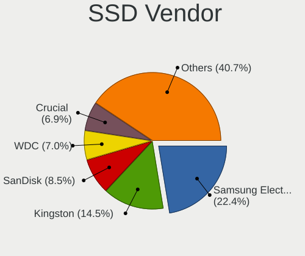

| Vendor              | Notebooks | Drives | Percent |
|---------------------|-----------|--------|---------|
| Samsung Electronics | 387       | 523    | 22.42%  |
| Kingston            | 251       | 308    | 14.54%  |
| SanDisk             | 147       | 174    | 8.52%   |
| WDC                 | 120       | 161    | 6.95%   |
| Crucial             | 119       | 155    | 6.89%   |
| Apple               | 74        | 79     | 4.29%   |
| A-DATA Technology   | 71        | 91     | 4.11%   |
| Intel               | 60        | 81     | 3.48%   |
| SPCC                | 44        | 62     | 2.55%   |
| SK hynix            | 44        | 57     | 2.55%   |
| Micron Technology   | 41        | 61     | 2.38%   |
| LITEONIT            | 30        | 33     | 1.74%   |
| China               | 30        | 32     | 1.74%   |
| Toshiba             | 28        | 31     | 1.62%   |
| Patriot             | 27        | 28     | 1.56%   |
| LITEON              | 21        | 22     | 1.22%   |
| PNY                 | 16        | 30     | 0.93%   |
| Team                | 13        | 16     | 0.75%   |
| OCZ                 | 12        | 16     | 0.7%    |
| Dogfish             | 12        | 15     | 0.7%    |
| KingSpec            | 11        | 15     | 0.64%   |
| Seagate             | 10        | 13     | 0.58%   |
| Timetec             | 9         | 27     | 0.52%   |
| Lexar               | 9         | 10     | 0.52%   |
| KingFast            | 8         | 9      | 0.46%   |
| Transcend           | 7         | 9      | 0.41%   |
| Corsair             | 7         | 7      | 0.41%   |
| Unknown             | 7         | 7      | 0.41%   |
| SABRENT             | 6         | 6      | 0.35%   |
| ASMT                | 6         | 6      | 0.35%   |
| T-FORCE             | 4         | 4      | 0.23%   |
| OWC                 | 4         | 8      | 0.23%   |
| NGFF                | 4         | 4      | 0.23%   |
| Mushkin             | 4         | 7      | 0.23%   |
| KingDian            | 4         | 5      | 0.23%   |
| BHT                 | 4         | 4      | 0.23%   |
| Zheino              | 3         | 3      | 0.17%   |
| Super Talent        | 3         | 5      | 0.17%   |
| Hewlett-Packard     | 3         | 4      | 0.17%   |
| FIKWOT              | 3         | 7      | 0.17%   |

Drive Kind
----------

HDD or SSD

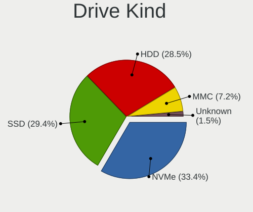

| Kind    | Notebooks | Drives | Percent |
|---------|-----------|--------|---------|
| NVMe    | 1793      | 2533   | 33.41%  |
| SSD     | 1577      | 2215   | 29.39%  |
| HDD     | 1530      | 1998   | 28.51%  |
| MMC     | 386       | 523    | 7.19%   |
| Unknown | 80        | 95     | 1.49%   |

Drive Connector
---------------

SATA, SAS, NVMe, etc.

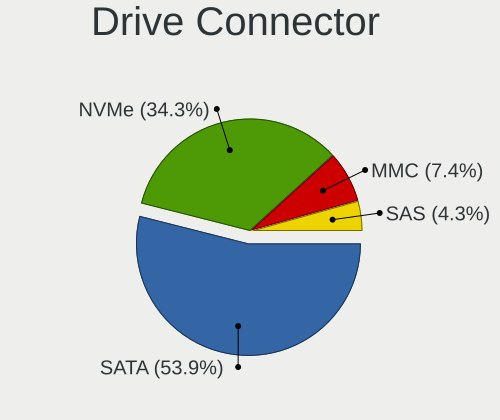

| Type | Notebooks | Drives | Percent |
|------|-----------|--------|---------|
| SATA | 2816      | 4009   | 53.95%  |
| NVMe | 1791      | 2513   | 34.31%  |
| MMC  | 386       | 523    | 7.39%   |
| SAS  | 227       | 319    | 4.35%   |

Drive Size
----------

Size of hard drive

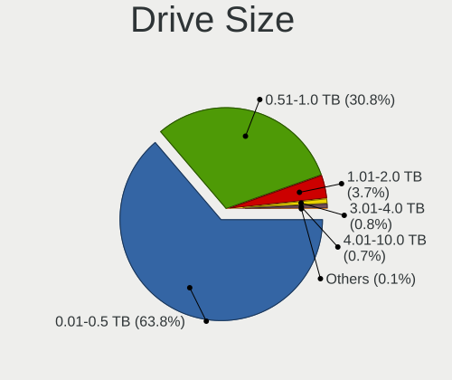

| Size in TB | Notebooks | Drives | Percent |
|------------|-----------|--------|---------|
| 0.01-0.5   | 1975      | 2691   | 63.75%  |
| 0.51-1.0   | 955       | 1279   | 30.83%  |
| 1.01-2.0   | 116       | 165    | 3.74%   |
| 3.01-4.0   | 26        | 37     | 0.84%   |
| 4.01-10.0  | 23        | 38     | 0.74%   |
| 2.01-3.0   | 2         | 2      | 0.06%   |
| 10.01-20.0 | 1         | 1      | 0.03%   |

Space Total
-----------

Amount of disk space available on the file system

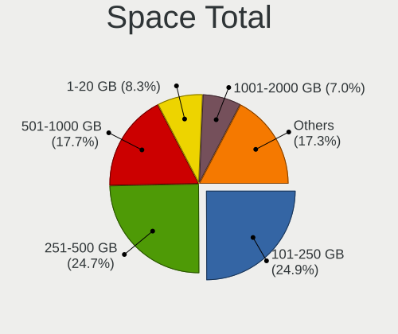

| Size in GB     | Notebooks | Percent |
|----------------|-----------|---------|
| 101-250        | 1220      | 24.95%  |
| 251-500        | 1209      | 24.72%  |
| 501-1000       | 865       | 17.69%  |
| 1-20           | 407       | 8.32%   |
| 1001-2000      | 341       | 6.97%   |
| 51-100         | 272       | 5.56%   |
| 21-50          | 167       | 3.42%   |
| More than 3000 | 164       | 3.35%   |
| Unknown        | 153       | 3.13%   |
| 2001-3000      | 92        | 1.88%   |

Space Used
----------

Amount of used disk space

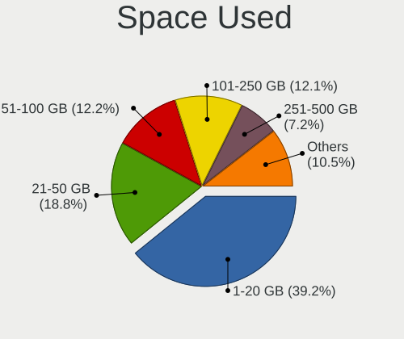

| Used GB        | Notebooks | Percent |
|----------------|-----------|---------|
| 1-20           | 1989      | 39.17%  |
| 21-50          | 955       | 18.81%  |
| 51-100         | 619       | 12.19%  |
| 101-250        | 616       | 12.13%  |
| 251-500        | 365       | 7.19%   |
| 501-1000       | 214       | 4.21%   |
| Unknown        | 153       | 3.01%   |
| 1001-2000      | 84        | 1.65%   |
| More than 3000 | 39        | 0.77%   |
| 2001-3000      | 25        | 0.49%   |
| 0              | 19        | 0.37%   |

Malfunc. Drives
---------------

Drive models with a malfunction

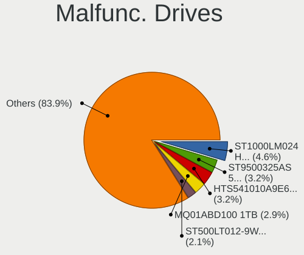

| Model                                    | Notebooks | Drives | Percent |
|------------------------------------------|-----------|--------|---------|
| Seagate ST1000LM024 HN-M101MBB 1TB       | 13        | 14     | 4.64%   |
| Seagate ST9500325AS 500GB                | 9         | 9      | 3.21%   |
| HGST HTS541010A9E680 1TB                 | 9         | 9      | 3.21%   |
| Toshiba MQ01ABD100 1TB                   | 8         | 10     | 2.86%   |
| Seagate ST500LT012-9WS142 500GB          | 6         | 6      | 2.14%   |
| Seagate ST1000LM035-1RK172 1TB           | 6         | 6      | 2.14%   |
| HGST HTS721010A9E630 1TB                 | 6         | 6      | 2.14%   |
| Seagate ST9500420AS 500GB                | 5         | 5      | 1.79%   |
| Seagate ST500LM000-1EJ162 500GB          | 5         | 5      | 1.79%   |
| HGST HTS545050A7E680 500GB               | 5         | 5      | 1.79%   |
| Hitachi HTS547575A9E384 752GB            | 4         | 4      | 1.43%   |
| HGST HTS725050A7E630 500GB               | 4         | 5      | 1.43%   |
| A-DATA Technology SX900 256GB SSD        | 4         | 4      | 1.43%   |
| Toshiba MQ01ABD075 752GB                 | 3         | 3      | 1.07%   |
| Toshiba MK3261GSYN 320GB                 | 3         | 3      | 1.07%   |
| Seagate ST9320423AS 320GB                | 3         | 5      | 1.07%   |
| Seagate ST500LM021-1KJ152 500GB          | 3         | 3      | 1.07%   |
| Seagate ST320LT007-9ZV142 320GB          | 3         | 3      | 1.07%   |
| WDC WD5000LPVX-75V0TT0 500GB             | 2         | 2      | 0.71%   |
| WDC WD5000LPVX-22V0TT0 500GB             | 2         | 2      | 0.71%   |
| WDC WD10JPVX-22JC3T0 1TB                 | 2         | 6      | 0.71%   |
| Toshiba THNSNK128GVN8 M.2 2280 128GB SSD | 2         | 2      | 0.71%   |
| Toshiba MK6465GSX 640GB                  | 2         | 2      | 0.71%   |
| Toshiba MK2552GSX 250GB                  | 2         | 2      | 0.71%   |
| Toshiba MK2035GSS 200GB                  | 2         | 2      | 0.71%   |
| Timetec SD08 512GB SSD                   | 2         | 16     | 0.71%   |
| Seagate ST9750420AS 752GB                | 2         | 2      | 0.71%   |
| Seagate ST9500420ASG 500GB               | 2         | 2      | 0.71%   |
| Seagate ST9320325AS 320GB                | 2         | 2      | 0.71%   |
| Seagate ST500LT012-1DG142 500GB          | 2         | 2      | 0.71%   |
| Seagate ST500LM012 HN-M500MBB 500GB      | 2         | 2      | 0.71%   |
| Seagate ST320LT020-9YG142 320GB          | 2         | 2      | 0.71%   |
| Seagate ST320LM001 HN-M320MBB 320GB      | 2         | 2      | 0.71%   |
| Seagate ST1000LX015-1U7172-SSHD 1TB      | 2         | 2      | 0.71%   |
| Seagate ST1000LM014-1EJ164 1TB           | 2         | 2      | 0.71%   |
| Samsung Electronics SSD 870 EVO 250GB    | 2         | 3      | 0.71%   |
| Kingston SUV400S37240G 240GB SSD         | 2         | 2      | 0.71%   |
| Hitachi HTS725050A9A364 500GB            | 2         | 2      | 0.71%   |
| Hitachi HTS725025A9A364 250GB            | 2         | 2      | 0.71%   |
| Hitachi HTS545050B9A300 500GB            | 2         | 2      | 0.71%   |

Malfunc. Drive Vendor
---------------------

Vendors of faulty drives

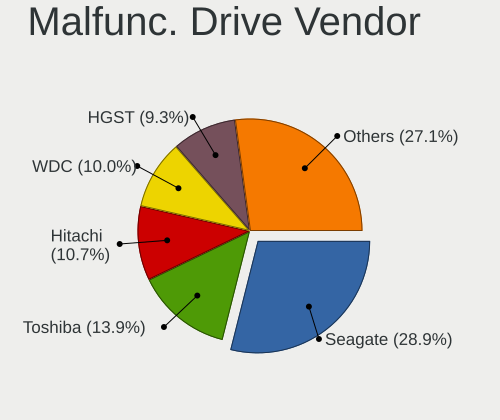

| Vendor                      | Notebooks | Drives | Percent |
|-----------------------------|-----------|--------|---------|
| Seagate                     | 81        | 86     | 28.93%  |
| Toshiba                     | 39        | 43     | 13.93%  |
| Hitachi                     | 30        | 31     | 10.71%  |
| WDC                         | 28        | 37     | 10%     |
| HGST                        | 26        | 27     | 9.29%   |
| Samsung Electronics         | 15        | 25     | 5.36%   |
| Intel                       | 9         | 9      | 3.21%   |
| A-DATA Technology           | 9         | 11     | 3.21%   |
| SK hynix                    | 6         | 8      | 2.14%   |
| Kingston                    | 5         | 5      | 1.79%   |
| Apple                       | 4         | 4      | 1.43%   |
| SanDisk                     | 3         | 3      | 1.07%   |
| Fujitsu                     | 3         | 12     | 1.07%   |
| Crucial                     | 3         | 3      | 1.07%   |
| Timetec                     | 2         | 16     | 0.71%   |
| Micron Technology           | 2         | 2      | 0.71%   |
| LITEONIT                    | 2         | 2      | 0.71%   |
| KingSpec                    | 2         | 2      | 0.71%   |
| UMIS                        | 1         | 1      | 0.36%   |
| Super Talent                | 1         | 1      | 0.36%   |
| Phison Electronics          | 1         | 1      | 0.36%   |
| OCZ                         | 1         | 2      | 0.36%   |
| LITEON                      | 1         | 1      | 0.36%   |
| Lexar                       | 1         | 1      | 0.36%   |
| LaCie                       | 1         | 1      | 0.36%   |
| Kingston Technology Company | 1         | 1      | 0.36%   |
| Corsair                     | 1         | 1      | 0.36%   |
| China                       | 1         | 1      | 0.36%   |
| ASMT                        | 1         | 1      | 0.36%   |

Malfunc. HDD Vendor
-------------------

Vendors of faulty HDD drives

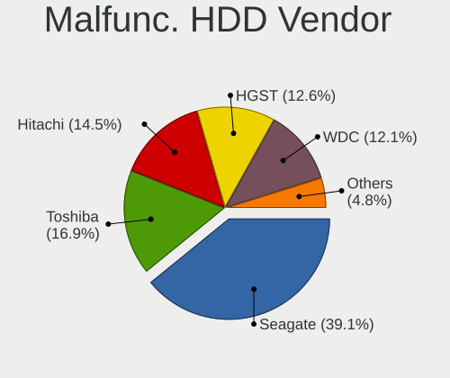

| Vendor              | Notebooks | Drives | Percent |
|---------------------|-----------|--------|---------|
| Seagate             | 81        | 86     | 39.13%  |
| Toshiba             | 35        | 39     | 16.91%  |
| Hitachi             | 30        | 31     | 14.49%  |
| HGST                | 26        | 27     | 12.56%  |
| WDC                 | 25        | 32     | 12.08%  |
| Samsung Electronics | 5         | 13     | 2.42%   |
| Fujitsu             | 3         | 12     | 1.45%   |
| LaCie               | 1         | 1      | 0.48%   |
| Apple               | 1         | 1      | 0.48%   |

Malfunc. Drive Kind
-------------------

Kinds of faulty drives

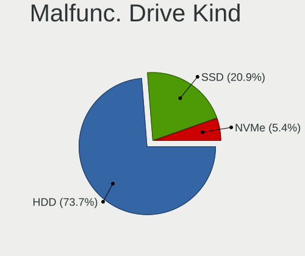

| Kind | Notebooks | Drives | Percent |
|------|-----------|--------|---------|
| HDD  | 205       | 242    | 73.74%  |
| SSD  | 58        | 78     | 20.86%  |
| NVMe | 15        | 18     | 5.4%    |

Failed Drives
-------------

Failed drive models

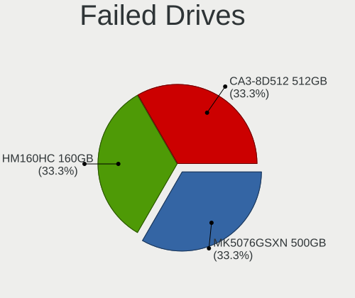

| Model                             | Notebooks | Drives | Percent |
|-----------------------------------|-----------|--------|---------|
| Toshiba MK5076GSXN 500GB          | 1         | 1      | 33.33%  |
| Samsung Electronics HM160HC 160GB | 1         | 5      | 33.33%  |
| LITEON CA3-8D512 512GB            | 1         | 2      | 33.33%  |

Failed Drive Vendor
-------------------

Failed drive vendors

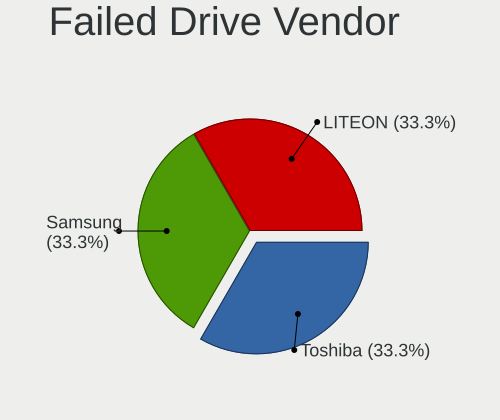

| Vendor              | Notebooks | Drives | Percent |
|---------------------|-----------|--------|---------|
| Toshiba             | 1         | 1      | 33.33%  |
| Samsung Electronics | 1         | 5      | 33.33%  |
| LITEON              | 1         | 2      | 33.33%  |

Drive Status
------------

Number of failed and malfunc. drives

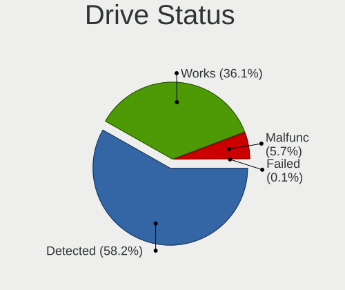

| Status   | Notebooks | Drives | Percent |
|----------|-----------|--------|---------|
| Detected | 2824      | 4547   | 58.19%  |
| Works    | 1750      | 2471   | 36.06%  |
| Malfunc  | 276       | 338    | 5.69%   |
| Failed   | 3         | 8      | 0.06%   |

Storage controller
------------------

Storage Vendor
--------------

Storage controller vendors

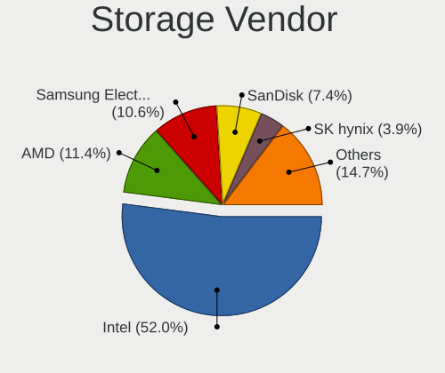

| Vendor                                  | Notebooks | Percent |
|-----------------------------------------|-----------|---------|
| Intel                                   | 2798      | 52.05%  |
| AMD                                     | 614       | 11.42%  |
| Samsung Electronics                     | 568       | 10.57%  |
| SanDisk                                 | 396       | 7.37%   |
| SK hynix                                | 211       | 3.92%   |
| Micron Technology                       | 133       | 2.47%   |
| Kingston Technology Company             | 115       | 2.14%   |
| KIOXIA                                  | 76        | 1.41%   |
| Phison Electronics                      | 70        | 1.3%    |
| Toshiba America Info Systems            | 69        | 1.28%   |
| Nvidia                                  | 59        | 1.1%    |
| Micron/Crucial Technology               | 51        | 0.95%   |
| MAXIO Technology (Hangzhou)             | 26        | 0.48%   |
| ADATA Technology                        | 26        | 0.48%   |
| Silicon Motion                          | 24        | 0.45%   |
| Apple                                   | 18        | 0.33%   |
| Union Memory (Shenzhen)                 | 17        | 0.32%   |
| Marvell Technology Group                | 14        | 0.26%   |
| Shenzhen Longsys Electronics            | 12        | 0.22%   |
| Realtek Semiconductor                   | 12        | 0.22%   |
| Solid State Storage Technology          | 10        | 0.19%   |
| Lite-On Technology                      | 10        | 0.19%   |
| Lenovo                                  | 9         | 0.17%   |
| INNOGRIT                                | 6         | 0.11%   |
| Solidigm                                | 5         | 0.09%   |
| ASMedia Technology                      | 5         | 0.09%   |
| Seagate Technology                      | 4         | 0.07%   |
| O2 Micro                                | 4         | 0.07%   |
| JMicron Technology                      | 4         | 0.07%   |
| Yangtze Memory Technologies             | 2         | 0.04%   |
| Shenzhen Unionmemory Information System | 2         | 0.04%   |
| Biwin Storage Technology                | 2         | 0.04%   |
| TenaFe                                  | 1         | 0.02%   |
| Swissbit                                | 1         | 0.02%   |
| OCZ Technology Group                    | 1         | 0.02%   |
| Unknown                                 | 1         | 0.02%   |

Storage Model
-------------

Storage controller models

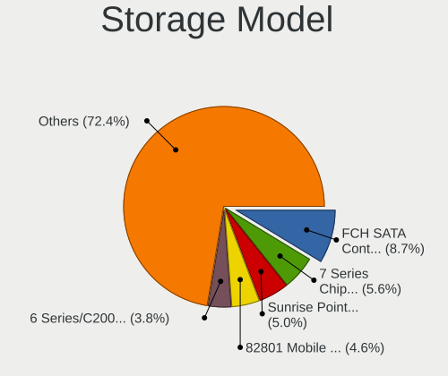

| Model                                                                          | Notebooks | Percent |
|--------------------------------------------------------------------------------|-----------|---------|
| AMD FCH SATA Controller [AHCI mode]                                            | 500       | 8.69%   |
| Intel 7 Series Chipset Family 6-port SATA Controller [AHCI mode]               | 321       | 5.58%   |
| Intel Sunrise Point-LP SATA Controller [AHCI mode]                             | 285       | 4.95%   |
| Intel 82801 Mobile SATA Controller [RAID mode]                                 | 264       | 4.59%   |
| Intel 6 Series/C200 Series Chipset Family 6 port Mobile SATA AHCI Controller   | 219       | 3.81%   |
| Samsung NVMe SSD Controller SM981/PM981/PM983                                  | 197       | 3.42%   |
| Intel Volume Management Device NVMe RAID Controller                            | 155       | 2.69%   |
| Intel 8 Series SATA Controller 1 [AHCI mode]                                   | 143       | 2.49%   |
| Intel 82801IBM/IEM (ICH9M/ICH9M-E) 4 port SATA Controller [AHCI mode]          | 136       | 2.36%   |
| Intel Cannon Lake Mobile PCH SATA AHCI Controller                              | 131       | 2.28%   |
| Intel 8 Series/C220 Series Chipset Family 6-port SATA Controller 1 [AHCI mode] | 123       | 2.14%   |
| Intel 5 Series/3400 Series Chipset 4 port SATA AHCI Controller                 | 116       | 2.02%   |
| Samsung NVMe SSD Controller 980 (DRAM-less)                                    | 100       | 1.74%   |
| Intel Wildcat Point-LP SATA Controller [AHCI Mode]                             | 96        | 1.67%   |
| Samsung NVMe SSD Controller PM9A1/PM9A3/980PRO                                 | 95        | 1.65%   |
| Intel 82801HM/HEM (ICH8M/ICH8M-E) IDE Controller                               | 88        | 1.53%   |
| Intel HM170/QM170 Chipset SATA Controller [AHCI Mode]                          | 75        | 1.3%    |
| SanDisk Extreme Pro / WD Black SN750 / PC SN730 / Red SN700 NVMe SSD           | 74        | 1.29%   |
| Intel 82801HM/HEM (ICH8M/ICH8M-E) SATA Controller [AHCI mode]                  | 73        | 1.27%   |
| SanDisk Ultra 3D / WD PC SN530, IX SN530, Blue SN550 NVMe SSD (DRAM-less)      | 70        | 1.22%   |
| Intel 5 Series/3400 Series Chipset 6 port SATA AHCI Controller                 | 70        | 1.22%   |
| AMD SB7x0/SB8x0/SB9x0 SATA Controller [AHCI mode]                              | 69        | 1.2%    |
| SanDisk WD SN560/SN740/SN770/SN5000 NVMe SSD                                   | 68        | 1.18%   |
| Samsung NVMe SSD Controller SM961/PM961/SM963                                  | 56        | 0.97%   |
| SK hynix Gold P31/BC711/PC711 NVMe Solid State Drive                           | 55        | 0.96%   |
| Intel SSD 670p Series [Keystone Harbor]                                        | 48        | 0.83%   |
| Intel SSD 660P Series                                                          | 45        | 0.78%   |
| Intel Celeron/Pentium Silver Processor SATA Controller                         | 40        | 0.7%    |
| Kingston Company OM3PDP3 NVMe SSD                                              | 39        | 0.68%   |
| Intel RST Volume Management Device Controller                                  | 38        | 0.66%   |
| Intel Atom Processor E3800 Series SATA AHCI Controller                         | 38        | 0.66%   |
| Micron 2450 NVMe SSD [HendrixV] (DRAM-less)                                    | 37        | 0.64%   |
| KIOXIA NVMe SSD Controller BG4 (DRAM-less)                                     | 37        | 0.64%   |
| Intel Cannon Point-LP SATA Controller [AHCI Mode]                              | 33        | 0.57%   |
| Intel 82801GBM/GHM (ICH7-M Family) SATA Controller [IDE mode]                  | 33        | 0.57%   |
| Intel 400 Series Chipset Family SATA AHCI Controller                           | 33        | 0.57%   |
| Toshiba America Info Systems XG6 NVMe SSD Controller                           | 32        | 0.56%   |
| SK hynix BC501 NVMe Solid State Drive                                          | 31        | 0.54%   |
| Nvidia MCP79 AHCI Controller                                                   | 31        | 0.54%   |
| SK hynix Platinum P41/PC801 NVMe Solid State Drive                             | 30        | 0.52%   |

Storage Kind
------------

Kind of storage controller (IDE, SATA, NVMe, SAS, ...)

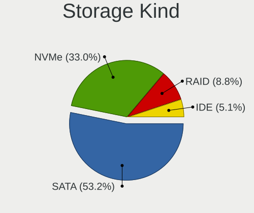

| Kind | Notebooks | Percent |
|------|-----------|---------|
| SATA | 2886      | 53.18%  |
| NVMe | 1789      | 32.96%  |
| RAID | 475       | 8.75%   |
| IDE  | 277       | 5.1%    |

Processor
---------

CPU Vendor
----------

Processor vendors

| Vendor  | Notebooks | Percent |
|---------|-----------|---------|
| Intel   | 3554      | 77.5%   |
| AMD     | 1025      | 22.35%  |
| Unknown | 4         | 0.09%   |
| ARM     | 3         | 0.07%   |

CPU Model
---------

Processor models

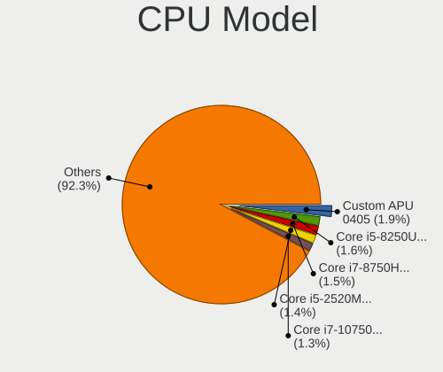

| Model                                         | Notebooks | Percent |
|-----------------------------------------------|-----------|---------|
| AMD Custom APU 0405                           | 87        | 1.9%    |
| Intel Core i5-8250U CPU @ 1.60GHz             | 72        | 1.57%   |
| Intel Core i7-8750H CPU @ 2.20GHz             | 68        | 1.48%   |
| Intel Core i5-2520M CPU @ 2.50GHz             | 66        | 1.44%   |
| Intel Core i7-10750H CPU @ 2.60GHz            | 61        | 1.33%   |
| Intel Core i7-8550U CPU @ 1.80GHz             | 52        | 1.13%   |
| Intel Core i7-7700HQ CPU @ 2.80GHz            | 52        | 1.13%   |
| Intel Core i5-6300U CPU @ 2.40GHz             | 49        | 1.07%   |
| Intel Core i5-3320M CPU @ 2.60GHz             | 46        | 1%      |
| Intel 11th Gen Core i7-1165G7 @ 2.80GHz       | 46        | 1%      |
| Intel Core i5-8265U CPU @ 1.60GHz             | 43        | 0.94%   |
| Intel Core i5-7200U CPU @ 2.50GHz             | 43        | 0.94%   |
| Intel Core i5-3210M CPU @ 2.50GHz             | 41        | 0.89%   |
| Intel Core i7-9750H CPU @ 2.60GHz             | 39        | 0.85%   |
| Intel Core i5-6200U CPU @ 2.30GHz             | 39        | 0.85%   |
| Intel 11th Gen Core i5-1135G7 @ 2.40GHz       | 39        | 0.85%   |
| Intel Core i5 CPU M 520 @ 2.40GHz             | 37        | 0.81%   |
| Intel 12th Gen Core i7-12700H                 | 36        | 0.78%   |
| Intel Core i7-6700HQ CPU @ 2.60GHz            | 35        | 0.76%   |
| Intel Core i5-8350U CPU @ 1.70GHz             | 35        | 0.76%   |
| AMD Ryzen 7 5700U with Radeon Graphics        | 33        | 0.72%   |
| AMD Ryzen 5 3500U with Radeon Vega Mobile Gfx | 33        | 0.72%   |
| Intel Core i5-5200U CPU @ 2.20GHz             | 31        | 0.68%   |
| Intel Core i7-8650U CPU @ 1.90GHz             | 30        | 0.65%   |
| Intel Core 2 Duo CPU P8600 @ 2.40GHz          | 30        | 0.65%   |
| Intel 11th Gen Core i7-11800H @ 2.30GHz       | 30        | 0.65%   |
| Intel Core i5-5300U CPU @ 2.30GHz             | 28        | 0.61%   |
| Intel Core i5-7300U CPU @ 2.60GHz             | 26        | 0.57%   |
| AMD Ryzen 7 4800H with Radeon Graphics        | 26        | 0.57%   |
| Intel Core i5-4300U CPU @ 1.90GHz             | 25        | 0.54%   |
| Intel Core i7-3630QM CPU @ 2.40GHz            | 24        | 0.52%   |
| Intel Core i5-10210U CPU @ 1.60GHz            | 24        | 0.52%   |
| Intel Core i7-7500U CPU @ 2.70GHz             | 23        | 0.5%    |
| Intel Celeron N4020 CPU @ 1.10GHz             | 23        | 0.5%    |
| Intel Core i5-8300H CPU @ 2.30GHz             | 22        | 0.48%   |
| Intel Core i5-1035G1 CPU @ 1.00GHz            | 22        | 0.48%   |
| Intel 11th Gen Core i7-1185G7 @ 3.00GHz       | 22        | 0.48%   |
| Intel Core i7-8565U CPU @ 1.80GHz             | 21        | 0.46%   |
| Intel Core i7-4700MQ CPU @ 2.40GHz            | 21        | 0.46%   |
| Intel Core i3 CPU M 370 @ 2.40GHz             | 21        | 0.46%   |

CPU Model Family
----------------

Processor model prefix

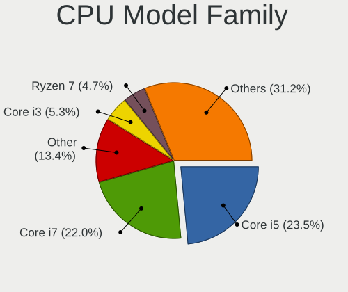

| Model                   | Notebooks | Percent |
|-------------------------|-----------|---------|
| Intel Core i5           | 1079      | 23.52%  |
| Intel Core i7           | 1010      | 22.01%  |
| Other                   | 613       | 13.36%  |
| Intel Core i3           | 241       | 5.25%   |
| AMD Ryzen 7             | 215       | 4.69%   |
| Intel Core 2 Duo        | 212       | 4.62%   |
| Intel Celeron           | 173       | 3.77%   |
| AMD Ryzen 5             | 145       | 3.16%   |
| Intel Pentium           | 87        | 1.9%    |
| AMD A6                  | 75        | 1.63%   |
| Intel Atom              | 58        | 1.26%   |
| AMD A10                 | 52        | 1.13%   |
| AMD Ryzen 9             | 51        | 1.11%   |
| Intel Core              | 42        | 0.92%   |
| AMD A4                  | 41        | 0.89%   |
| AMD Ryzen 3             | 39        | 0.85%   |
| Intel Pentium Dual-Core | 35        | 0.76%   |
| AMD A8                  | 31        | 0.68%   |
| Intel Pentium Dual      | 29        | 0.63%   |
| Intel Core i9           | 24        | 0.52%   |
| Intel Genuine           | 23        | 0.5%    |
| AMD Ryzen 7 PRO         | 23        | 0.5%    |
| AMD E                   | 21        | 0.46%   |
| AMD Ryzen 5 PRO         | 18        | 0.39%   |
| Intel Core 2            | 17        | 0.37%   |
| AMD E1                  | 17        | 0.37%   |
| AMD Athlon              | 17        | 0.37%   |
| Intel Pentium Silver    | 16        | 0.35%   |
| AMD E2                  | 16        | 0.35%   |
| Intel Xeon              | 15        | 0.33%   |
| AMD A12                 | 15        | 0.33%   |
| AMD Turion 64 X2 Mobile | 12        | 0.26%   |
| AMD Athlon X2           | 11        | 0.24%   |
| AMD Athlon 64 X2        | 10        | 0.22%   |
| AMD Athlon II           | 8         | 0.17%   |
| AMD Turion 64 Mobile    | 7         | 0.15%   |
| AMD Phenom II           | 7         | 0.15%   |
| Intel Core m3           | 6         | 0.13%   |
| Intel Pentium M         | 5         | 0.11%   |
| Intel Core M            | 5         | 0.11%   |

CPU Cores
---------

Number of processor cores

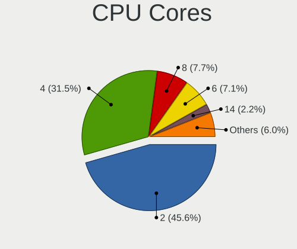

| Number  | Notebooks | Percent |
|---------|-----------|---------|
| 2       | 2093      | 45.57%  |
| 4       | 1449      | 31.55%  |
| 8       | 352       | 7.66%   |
| 6       | 325       | 7.08%   |
| 14      | 99        | 2.16%   |
| 10      | 78        | 1.7%    |
| 1       | 75        | 1.63%   |
| 12      | 56        | 1.22%   |
| 16      | 40        | 0.87%   |
| 24      | 20        | 0.44%   |
| 3       | 3         | 0.07%   |
| 20      | 1         | 0.02%   |
| 7       | 1         | 0.02%   |
| Unknown | 1         | 0.02%   |

CPU Sockets
-----------

Number of sockets

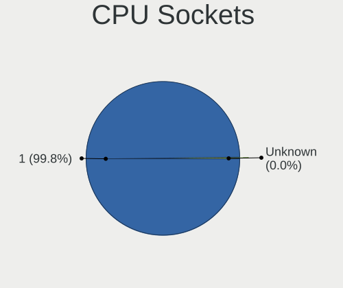

| Number  | Notebooks | Percent |
|---------|-----------|---------|
| 1       | 4577      | 99.8%   |
| 2       | 7         | 0.15%   |
| 24      | 1         | 0.02%   |
| Unknown | 1         | 0.02%   |

CPU Threads
-----------

Threads per core (Hyper-Threading)

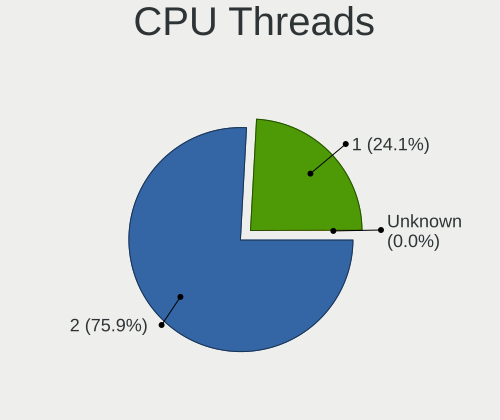

| Number  | Notebooks | Percent |
|---------|-----------|---------|
| 2       | 3486      | 75.87%  |
| 1       | 1107      | 24.09%  |
| 12      | 1         | 0.02%   |
| Unknown | 1         | 0.02%   |

CPU Op-Modes
------------

CPU Operation Modes (32-bit, 64-bit)

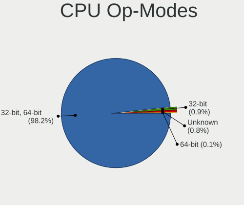

| Op mode        | Notebooks | Percent |
|----------------|-----------|---------|
| 32-bit, 64-bit | 4512      | 98.24%  |
| 32-bit         | 42        | 0.91%   |
| Unknown        | 35        | 0.76%   |
| 64-bit         | 4         | 0.09%   |

CPU Microcode
-------------

Microcode number

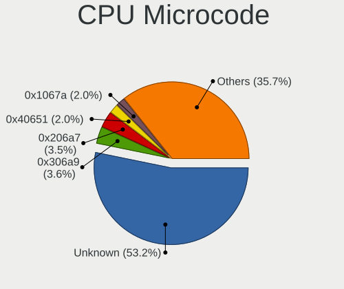

| Number     | Notebooks | Percent |
|------------|-----------|---------|
| Unknown    | 2530      | 53.21%  |
| 0x306a9    | 173       | 3.64%   |
| 0x206a7    | 165       | 3.47%   |
| 0x40651    | 96        | 2.02%   |
| 0x1067a    | 93        | 1.96%   |
| 0x806ea    | 84        | 1.77%   |
| 0x906ea    | 76        | 1.6%    |
| 0x20655    | 73        | 1.54%   |
| 0x406e3    | 67        | 1.41%   |
| 0x806e9    | 65        | 1.37%   |
| 0x306c3    | 64        | 1.35%   |
| 0x806ec    | 60        | 1.26%   |
| 0x306d4    | 56        | 1.18%   |
| 0x6fd      | 51        | 1.07%   |
| 0xa0652    | 50        | 1.05%   |
| 0x20652    | 43        | 0.9%    |
| 0x906e9    | 40        | 0.84%   |
| 0x906a3    | 40        | 0.84%   |
| 0x806c1    | 39        | 0.82%   |
| 0x0a50000c | 36        | 0.76%   |
| 0x06001119 | 33        | 0.69%   |
| 0x506e3    | 31        | 0.65%   |
| 0x30678    | 30        | 0.63%   |
| 0x10676    | 29        | 0.61%   |
| 0x06006705 | 29        | 0.61%   |
| 0x08108102 | 28        | 0.59%   |
| 0x08108109 | 27        | 0.57%   |
| 0x706e5    | 25        | 0.53%   |
| 0x406c4    | 25        | 0.53%   |
| 0x406c3    | 21        | 0.44%   |
| 0x07030105 | 21        | 0.44%   |
| 0x05000119 | 21        | 0.44%   |
| 0x03000027 | 21        | 0.44%   |
| 0x08600104 | 19        | 0.4%    |
| 0x106e5    | 18        | 0.38%   |
| 0x08608103 | 18        | 0.38%   |
| 0x506c9    | 17        | 0.36%   |
| 0x806eb    | 16        | 0.34%   |
| 0x706a8    | 16        | 0.34%   |
| 0x010000c8 | 16        | 0.34%   |

CPU Microarch
-------------

Microarchitecture

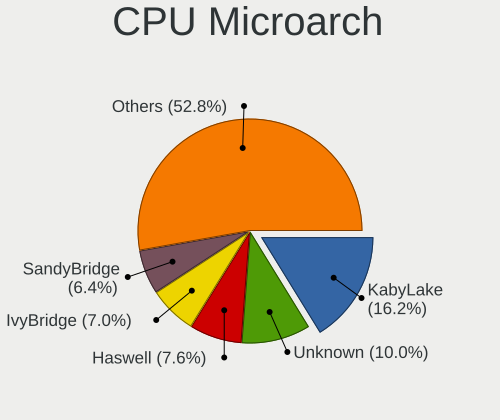

| Name              | Notebooks | Percent |
|-------------------|-----------|---------|
| KabyLake          | 746       | 16.21%  |
| Unknown           | 460       | 10%     |
| Haswell           | 349       | 7.59%   |
| IvyBridge         | 322       | 7%      |
| SandyBridge       | 295       | 6.41%   |
| Skylake           | 209       | 4.54%   |
| Penryn            | 193       | 4.19%   |
| Westmere          | 189       | 4.11%   |
| Alderlake Hybrid  | 158       | 3.43%   |
| TigerLake         | 142       | 3.09%   |
| Silvermont        | 135       | 2.93%   |
| Broadwell         | 132       | 2.87%   |
| Zen 3             | 121       | 2.63%   |
| Core              | 116       | 2.52%   |
| Excavator         | 111       | 2.41%   |
| CometLake         | 111       | 2.41%   |
| Zen+              | 104       | 2.26%   |
| Zen 2             | 83        | 1.8%    |
| Icelake           | 82        | 1.78%   |
| Goldmont plus     | 60        | 1.3%    |
| Piledriver        | 49        | 1.06%   |
| Bobcat            | 43        | 0.93%   |
| Puma              | 42        | 0.91%   |
| Zen               | 40        | 0.87%   |
| K8 Hammer         | 37        | 0.8%    |
| K10 Llano         | 35        | 0.76%   |
| Jaguar            | 30        | 0.65%   |
| Goldmont          | 30        | 0.65%   |
| P6                | 28        | 0.61%   |
| Nehalem           | 28        | 0.61%   |
| K10               | 28        | 0.61%   |
| Bonnell           | 24        | 0.52%   |
| Meteorlake Hybrid | 20        | 0.43%   |
| K8 & K10 hybrid   | 16        | 0.35%   |
| Tremont           | 10        | 0.22%   |
| Gracemont         | 9         | 0.2%    |
| Lunarlake Hybrid  | 8         | 0.17%   |
| Steamroller       | 5         | 0.11%   |
| NetBurst          | 1         | 0.02%   |

Graphics
--------

GPU Vendor
----------

Vendors of graphics cards

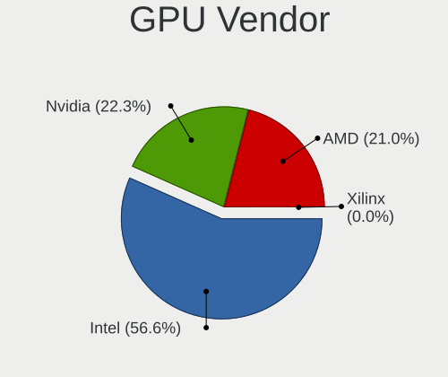

| Vendor | Notebooks | Percent |
|--------|-----------|---------|
| Intel  | 3213      | 56.64%  |
| Nvidia | 1265      | 22.3%   |
| AMD    | 1194      | 21.05%  |
| Xilinx | 1         | 0.02%   |

GPU Model
---------

Graphics card models

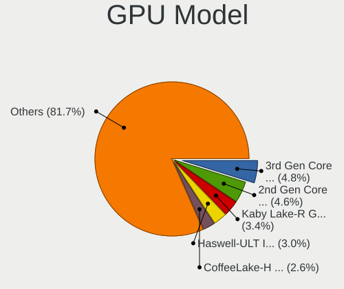

| Model                                                                                    | Notebooks | Percent |
|------------------------------------------------------------------------------------------|-----------|---------|
| Intel 3rd Gen Core processor Graphics Controller                                         | 281       | 4.8%    |
| Intel 2nd Generation Core Processor Family Integrated Graphics Controller                | 267       | 4.56%   |
| Intel Kaby Lake-R GT2 [UHD Graphics 620]                                                 | 198       | 3.39%   |
| Intel Haswell-ULT Integrated Graphics Controller                                         | 173       | 2.96%   |
| Intel CoffeeLake-H GT2 [UHD Graphics 630]                                                | 154       | 2.63%   |
| Intel Core Processor Integrated Graphics Controller                                      | 153       | 2.62%   |
| Intel 4th Gen Core Processor Integrated Graphics Controller                              | 137       | 2.34%   |
| Intel Skylake-U GT2 [HD Graphics 520]                                                    | 135       | 2.31%   |
| Intel TigerLake-LP GT2 [Iris Xe Graphics]                                                | 132       | 2.26%   |
| Intel Mobile 4 Series Chipset Integrated Graphics Controller                             | 123       | 2.1%    |
| Intel Kaby Lake-U GT2 [HD Graphics 620]                                                  | 114       | 1.95%   |
| AMD Picasso/Raven 2 [Radeon Vega Series / Radeon Vega Mobile Series]                     | 114       | 1.95%   |
| Intel Broadwell-U GT2 [HD Graphics 5500]                                                 | 104       | 1.78%   |
| Intel WhiskeyLake-U GT2 [UHD Graphics 620]                                               | 100       | 1.71%   |
| Intel CometLake-H GT2 [UHD Graphics]                                                     | 94        | 1.61%   |
| AMD VanGogh [AMD Custom GPU 0405]                                                        | 85        | 1.45%   |
| Intel Alder Lake-P GT2 [Iris Xe Graphics]                                                | 80        | 1.37%   |
| Intel Atom/Celeron/Pentium Processor x5-E8000/J3xxx/N3xxx Integrated Graphics Controller | 75        | 1.28%   |
| AMD Renoir [Radeon Vega Series / Radeon Vega Mobile Series]                              | 75        | 1.28%   |
| Nvidia TU117M [GeForce GTX 1650 Mobile / Max-Q]                                          | 74        | 1.27%   |
| AMD Cezanne [Radeon Vega Series / Radeon Vega Mobile Series]                             | 68        | 1.16%   |
| Intel Mobile GM965/GL960 Integrated Graphics Controller (secondary)                      | 66        | 1.13%   |
| Intel Mobile GM965/GL960 Integrated Graphics Controller (primary)                        | 66        | 1.13%   |
| AMD Stoney [Radeon R2/R3/R4/R5 Graphics]                                                 | 65        | 1.11%   |
| Intel TigerLake-H GT1 [UHD Graphics]                                                     | 64        | 1.09%   |
| Intel Raptor Lake-P [Iris Xe Graphics]                                                   | 64        | 1.09%   |
| Intel Kaby Lake-H GT2 [HD Graphics 630]                                                  | 62        | 1.06%   |
| Nvidia GP107M [GeForce GTX 1050 Mobile]                                                  | 60        | 1.03%   |
| Intel Atom Processor Z36xxx/Z37xxx Series Graphics & Display                             | 60        | 1.03%   |
| Intel CometLake-U GT2 [UHD Graphics]                                                     | 58        | 0.99%   |
| Nvidia GA106M [GeForce RTX 3060 Mobile / Max-Q]                                          | 54        | 0.92%   |
| Intel GeminiLake [UHD Graphics 600]                                                      | 49        | 0.84%   |
| AMD Rembrandt [Radeon 680M]                                                              | 49        | 0.84%   |
| AMD Lucienne                                                                             | 49        | 0.84%   |
| AMD Wani [Radeon R5/R6/R7 Graphics]                                                      | 46        | 0.79%   |
| AMD Barcelo                                                                              | 46        | 0.79%   |
| Intel Skylake-H GT2 [HD Graphics 530]                                                    | 43        | 0.74%   |
| Nvidia AD107M [GeForce RTX 4060 Max-Q / Mobile]                                          | 39        | 0.67%   |
| Nvidia GA107M [GeForce RTX 3050 Mobile]                                                  | 38        | 0.65%   |
| Intel Mobile 945GM/GMS/GME, 943/940GML Express Integrated Graphics Controller            | 36        | 0.62%   |

GPU Combo
---------

Combinations of graphics cards

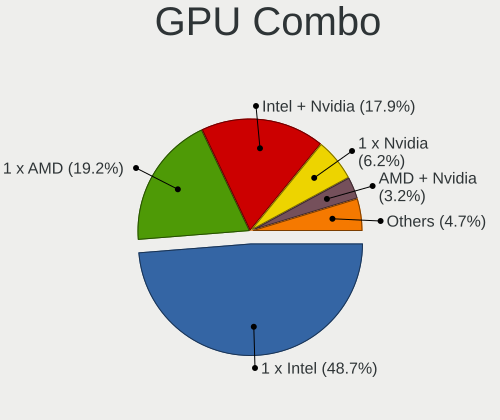

| Name               | Notebooks | Percent |
|--------------------|-----------|---------|
| 1 x Intel          | 2244      | 48.74%  |
| 1 x AMD            | 884       | 19.2%   |
| Intel + Nvidia     | 826       | 17.94%  |
| 1 x Nvidia         | 287       | 6.23%   |
| AMD + Nvidia       | 147       | 3.19%   |
| Intel + AMD        | 104       | 2.26%   |
| 2 x AMD            | 61        | 1.32%   |
| 2 x Intel          | 25        | 0.54%   |
| Other              | 16        | 0.35%   |
| 2 x Nvidia         | 8         | 0.17%   |
| Intel + 2 x Nvidia | 1         | 0.02%   |
| Intel + Xilinx     | 1         | 0.02%   |

GPU Driver
----------

Free vs proprietary

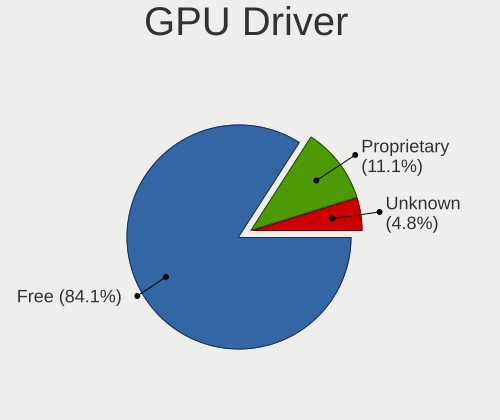

| Driver      | Notebooks | Percent |
|-------------|-----------|---------|
| Free        | 3907      | 84.09%  |
| Proprietary | 516       | 11.11%  |
| Unknown     | 223       | 4.8%    |

GPU Memory
----------

Total video memory

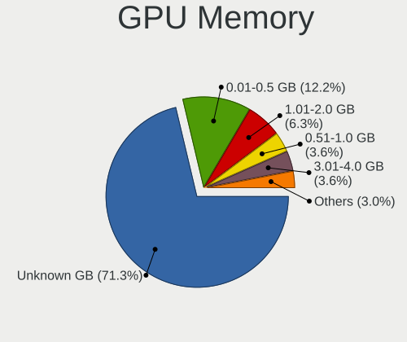

| Size in GB | Notebooks | Percent |
|------------|-----------|---------|
| Unknown    | 3349      | 71.29%  |
| 0.01-0.5   | 572       | 12.18%  |
| 1.01-2.0   | 296       | 6.3%    |
| 0.51-1.0   | 170       | 3.62%   |
| 3.01-4.0   | 168       | 3.58%   |
| 7.01-8.0   | 66        | 1.4%    |
| 5.01-6.0   | 52        | 1.11%   |
| 8.01-16.0  | 14        | 0.3%    |
| 2.01-3.0   | 10        | 0.21%   |
| 16.01-24.0 | 1         | 0.02%   |

Monitor
-------

Monitor Vendor
--------------

Monitor vendors

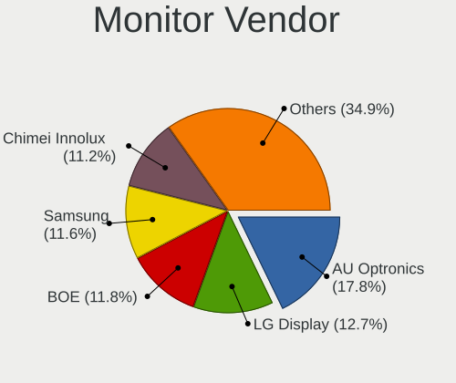

| Vendor                  | Notebooks | Percent |
|-------------------------|-----------|---------|
| AU Optronics            | 935       | 17.81%  |
| LG Display              | 667       | 12.7%   |
| BOE                     | 620       | 11.81%  |
| Samsung Electronics     | 610       | 11.62%  |
| Chimei Innolux          | 589       | 11.22%  |
| Apple                   | 216       | 4.11%   |
| Sharp                   | 184       | 3.5%    |
| Lenovo                  | 138       | 2.63%   |
| Dell                    | 134       | 2.55%   |
| Goldstar                | 119       | 2.27%   |
| Chi Mei Optoelectronics | 118       | 2.25%   |
| PANDA                   | 93        | 1.77%   |
| Valve                   | 85        | 1.62%   |
| Acer                    | 68        | 1.29%   |
| Hewlett-Packard         | 63        | 1.2%    |
| ASUSTek Computer        | 61        | 1.16%   |
| BenQ                    | 48        | 0.91%   |
| LG Philips              | 43        | 0.82%   |
| InfoVision              | 39        | 0.74%   |
| Ancor Communications    | 39        | 0.74%   |
| Toshiba                 | 30        | 0.57%   |
| ViewSonic               | 23        | 0.44%   |
| CSO                     | 22        | 0.42%   |
| Sony                    | 20        | 0.38%   |
| Philips                 | 19        | 0.36%   |
| TMX                     | 15        | 0.29%   |
| HKC                     | 15        | 0.29%   |
| Panasonic               | 13        | 0.25%   |
| MSI                     | 13        | 0.25%   |
| AOC                     | 12        | 0.23%   |
| Gigabyte Technology     | 11        | 0.21%   |
| CPT                     | 11        | 0.21%   |
| Insignia                | 10        | 0.19%   |
| HannStar                | 10        | 0.19%   |
| Quanta Display          | 9         | 0.17%   |
| IBM                     | 7         | 0.13%   |
| Hitachi                 | 7         | 0.13%   |
| CSOT                    | 7         | 0.13%   |
| Unknown                 | 6         | 0.11%   |
| Seiko/Epson             | 6         | 0.11%   |

Monitor Model
-------------

Monitor models

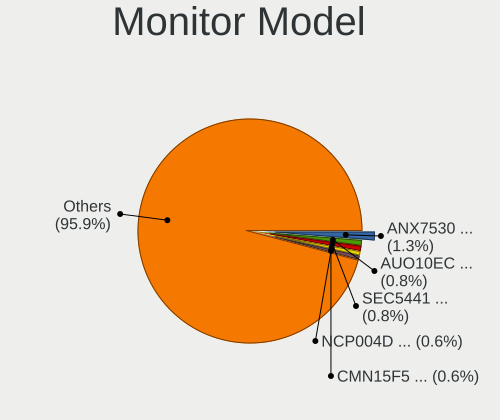

| Model                                                                 | Notebooks | Percent |
|-----------------------------------------------------------------------|-----------|---------|
| Valve ANX7530 U VLV3001 800x1280 100x150mm 7.1-inch                   | 68        | 1.28%   |
| AU Optronics LCD Monitor AUO10EC 1366x768 344x193mm 15.5-inch         | 44        | 0.83%   |
| Samsung Electronics LCD Monitor SEC5441 1280x800 331x207mm 15.4-inch  | 41        | 0.77%   |
| PANDA LCD Monitor NCP004D 1920x1080 344x194mm 15.5-inch               | 34        | 0.64%   |
| Chimei Innolux LCD Monitor CMN15F5 1920x1080 344x193mm 15.5-inch      | 33        | 0.62%   |
| LG Display LCD Monitor LGD02DC 1366x768 344x194mm 15.5-inch           | 29        | 0.54%   |
| AU Optronics LCD Monitor AUO70EC 1366x768 344x193mm 15.5-inch         | 26        | 0.49%   |
| AU Optronics LCD Monitor AUO26EC 1366x768 344x193mm 15.5-inch         | 26        | 0.49%   |
| AU Optronics LCD Monitor AUO21ED 1920x1080 344x193mm 15.5-inch        | 26        | 0.49%   |
| Chimei Innolux LCD Monitor CMN15E6 1366x768 344x193mm 15.5-inch       | 25        | 0.47%   |
| Chimei Innolux LCD Monitor CMN1521 1920x1080 344x193mm 15.5-inch      | 25        | 0.47%   |
| Chimei Innolux LCD Monitor CMN14D4 1920x1080 309x173mm 13.9-inch      | 24        | 0.45%   |
| BOE LCD Monitor BOE095F 2256x1504 285x190mm 13.5-inch                 | 24        | 0.45%   |
| AU Optronics LCD Monitor AUO313C 1366x768 309x173mm 13.9-inch         | 22        | 0.41%   |
| Chimei Innolux LCD Monitor CMN14C9 1920x1080 309x173mm 13.9-inch      | 21        | 0.39%   |
| LG Display LCD Monitor LGD0456 1366x768 344x194mm 15.5-inch           | 20        | 0.38%   |
| AU Optronics LCD Monitor AUO22EC 1366x768 344x193mm 15.5-inch         | 20        | 0.38%   |
| BOE LCD Monitor BOE06A4 1366x768 344x194mm 15.5-inch                  | 19        | 0.36%   |
| LG Display LCD Monitor LGD0563 1920x1080 344x194mm 15.5-inch          | 18        | 0.34%   |
| Chimei Innolux LCD Monitor CMN1735 1920x1080 381x214mm 17.2-inch      | 18        | 0.34%   |
| LG Display LCD Monitor LGD02E3 1366x768 344x194mm 15.5-inch           | 17        | 0.32%   |
| BOE LCD Monitor BOE0672 1366x768 344x194mm 15.5-inch                  | 16        | 0.3%    |
| Apple LCD Monitor APP9CC5 1280x800 286x179mm 13.3-inch                | 16        | 0.3%    |
| LG Display LCD Monitor LGD0521 1920x1080 309x174mm 14.0-inch          | 15        | 0.28%   |
| LG Display LCD Monitor LGD046F 1920x1080 344x194mm 15.5-inch          | 15        | 0.28%   |
| Lenovo LCD Monitor LEN40B2 1920x1080 344x193mm 15.5-inch              | 15        | 0.28%   |
| InfoVision LCD Monitor IVO057D 1920x1080 309x174mm 14.0-inch          | 15        | 0.28%   |
| Chimei Innolux LCD Monitor CMN15DC 1366x768 344x193mm 15.5-inch       | 15        | 0.28%   |
| AU Optronics LCD Monitor AUO243D 1920x1080 309x173mm 13.9-inch        | 15        | 0.28%   |
| Apple LCD Monitor APP9CA3 1440x900 331x207mm 15.4-inch                | 15        | 0.28%   |
| Apple Color LCD APP9CF0 1440x900 290x180mm 13.4-inch                  | 15        | 0.28%   |
| Toshiba TV TSB0206 1920x1080                                          | 14        | 0.26%   |
| Sharp LCD Monitor SHP14D1 1920x1200 336x210mm 15.6-inch               | 14        | 0.26%   |
| Sharp LCD Monitor SHP14BA 1920x1080 344x194mm 15.5-inch               | 14        | 0.26%   |
| Samsung Electronics LCD Monitor SDC4C48 1920x1080 293x165mm 13.2-inch | 14        | 0.26%   |
| Samsung Electronics LCD Monitor SDC4171 2880x1800 302x189mm 14.0-inch | 14        | 0.26%   |
| LG Display LCD Monitor LGD046D 1920x1080 309x174mm 14.0-inch          | 14        | 0.26%   |
| Chimei Innolux LCD Monitor CMN15BF 1366x768 344x194mm 15.5-inch       | 14        | 0.26%   |
| Chimei Innolux LCD Monitor CMN14D6 1366x768 309x173mm 13.9-inch       | 14        | 0.26%   |
| Chimei Innolux LCD Monitor CMN1132 1366x768 256x144mm 11.6-inch       | 14        | 0.26%   |

Monitor Resolution
------------------

Monitor screen resolution

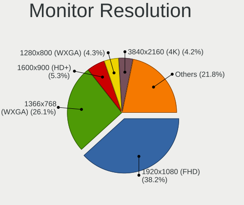

| Resolution         | Notebooks | Percent |
|--------------------|-----------|---------|
| 1920x1080 (FHD)    | 1900      | 38.24%  |
| 1366x768 (WXGA)    | 1299      | 26.14%  |
| 1600x900 (HD+)     | 264       | 5.31%   |
| 1280x800 (WXGA)    | 215       | 4.33%   |
| 3840x2160 (4K)     | 210       | 4.23%   |
| 1920x1200 (WUXGA)  | 159       | 3.2%    |
| 2560x1440 (QHD)    | 140       | 2.82%   |
| 2560x1600          | 108       | 2.17%   |
| 1440x900 (WXGA+)   | 98        | 1.97%   |
| 2880x1800          | 88        | 1.77%   |
| 800x1280           | 86        | 1.73%   |
| 1680x1050 (WSXGA+) | 84        | 1.69%   |
| 2256x1504          | 35        | 0.7%    |
| 3840x2400          | 31        | 0.62%   |
| 3440x1440          | 28        | 0.56%   |
| 2560x1080          | 21        | 0.42%   |
| 3200x1800 (QHD+)   | 19        | 0.38%   |
| Unknown            | 19        | 0.38%   |
| 1280x1024 (SXGA)   | 18        | 0.36%   |
| 1024x600           | 16        | 0.32%   |
| 1920x540           | 14        | 0.28%   |
| 1024x768 (XGA)     | 13        | 0.26%   |
| 3200x2000          | 12        | 0.24%   |
| 1360x768           | 11        | 0.22%   |
| 3456x2160          | 7         | 0.14%   |
| 1920x1280          | 7         | 0.14%   |
| 3072x1920          | 6         | 0.12%   |
| 2880x1920          | 6         | 0.12%   |
| 3840x1080          | 5         | 0.1%    |
| 2288x1287          | 5         | 0.1%    |
| 3840x1100          | 4         | 0.08%   |
| 2160x1440          | 4         | 0.08%   |
| 1680x945           | 4         | 0.08%   |
| 3000x2000          | 3         | 0.06%   |
| 2560x1700          | 3         | 0.06%   |
| 2160x1350          | 3         | 0.06%   |
| 3840x1200          | 2         | 0.04%   |
| 1600x1200          | 2         | 0.04%   |
| 1280x768           | 2         | 0.04%   |
| 1280x720 (HD)      | 2         | 0.04%   |

Monitor Diagonal
----------------

Diagonal size in inches

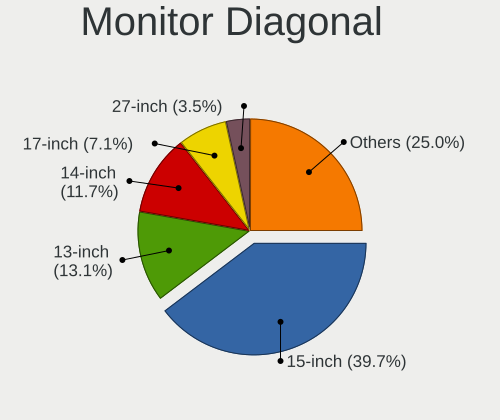

| Inches  | Notebooks | Percent |
|---------|-----------|---------|
| 15      | 2081      | 39.68%  |
| 13      | 687       | 13.1%   |
| 14      | 611       | 11.65%  |
| 17      | 373       | 7.11%   |
| 27      | 182       | 3.47%   |
| 24      | 148       | 2.82%   |
| 16      | 134       | 2.56%   |
| 21      | 107       | 2.04%   |
| 23      | 104       | 1.98%   |
| 12      | 93        | 1.77%   |
| 11      | 93        | 1.77%   |
| 31      | 85        | 1.62%   |
| 7       | 85        | 1.62%   |
| Unknown | 72        | 1.37%   |
| 34      | 46        | 0.88%   |
| 22      | 41        | 0.78%   |
| 18      | 37        | 0.71%   |
| 20      | 29        | 0.55%   |
| 84      | 27        | 0.51%   |
| 19      | 26        | 0.5%    |
| 10      | 20        | 0.38%   |
| 54      | 19        | 0.36%   |
| 72      | 18        | 0.34%   |
| 32      | 17        | 0.32%   |
| 74      | 16        | 0.31%   |
| 40      | 13        | 0.25%   |
| 25      | 9         | 0.17%   |
| 86      | 7         | 0.13%   |
| 48      | 6         | 0.11%   |
| 26      | 6         | 0.11%   |
| 42      | 5         | 0.1%    |
| 37      | 5         | 0.1%    |
| 28      | 4         | 0.08%   |
| 8       | 4         | 0.08%   |
| 142     | 3         | 0.06%   |
| 63      | 3         | 0.06%   |
| 58      | 3         | 0.06%   |
| 49      | 3         | 0.06%   |
| 43      | 3         | 0.06%   |
| 29      | 3         | 0.06%   |

Monitor Width
-------------

Physical width

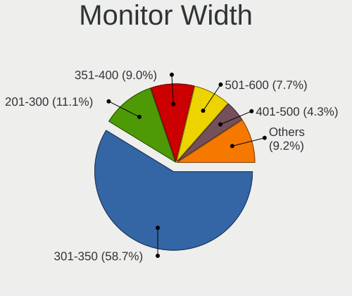

| Width in mm    | Notebooks | Percent |
|----------------|-----------|---------|
| 301-350        | 3053      | 58.73%  |
| 201-300        | 575       | 11.06%  |
| 351-400        | 467       | 8.98%   |
| 501-600        | 402       | 7.73%   |
| 401-500        | 223       | 4.29%   |
| 601-700        | 110       | 2.12%   |
| 1-100          | 87        | 1.67%   |
| Unknown        | 72        | 1.39%   |
| 701-800        | 64        | 1.23%   |
| 1501-2000      | 62        | 1.19%   |
| 1001-1500      | 48        | 0.92%   |
| 801-900        | 20        | 0.38%   |
| 901-1000       | 8         | 0.15%   |
| 101-200        | 4         | 0.08%   |
| More than 2000 | 3         | 0.06%   |

Aspect Ratio
------------

Proportional relationship between the width and the height

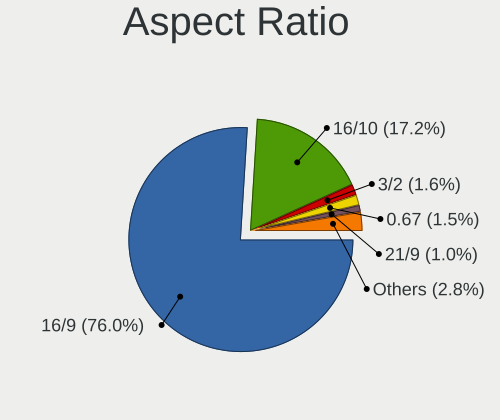

| Ratio   | Notebooks | Percent |
|---------|-----------|---------|
| 16/9    | 3536      | 75.98%  |
| 16/10   | 802       | 17.23%  |
| 3/2     | 73        | 1.57%   |
| 0.67    | 70        | 1.5%    |
| 21/9    | 45        | 0.97%   |
| Unknown | 43        | 0.92%   |
| 5/4     | 19        | 0.41%   |
| 4/3     | 18        | 0.39%   |
| 0.62    | 17        | 0.37%   |
| 0.56    | 7         | 0.15%   |
| 32/9    | 6         | 0.13%   |
| 6/5     | 4         | 0.09%   |
| 3.40    | 4         | 0.09%   |
| 1.96    | 4         | 0.09%   |
| 1.00    | 3         | 0.06%   |
| 3.73    | 1         | 0.02%   |
| 3.33    | 1         | 0.02%   |
| 3.20    | 1         | 0.02%   |

Monitor Area
------------

Area in inch²

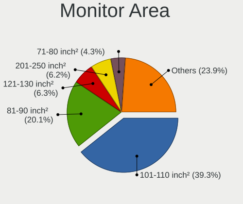

| Area in inch² | Notebooks | Percent |
|----------------|-----------|---------|
| 101-110        | 2050      | 39.29%  |
| 81-90          | 1048      | 20.09%  |
| 121-130        | 328       | 6.29%   |
| 201-250        | 321       | 6.15%   |
| 71-80          | 225       | 4.31%   |
| 301-350        | 187       | 3.58%   |
| 111-120        | 156       | 2.99%   |
| 351-500        | 151       | 2.89%   |
| More than 1000 | 105       | 2.01%   |
| 51-60          | 98        | 1.88%   |
| 1-40           | 91        | 1.74%   |
| 61-70          | 89        | 1.71%   |
| 151-200        | 79        | 1.51%   |
| Unknown        | 72        | 1.38%   |
| 251-300        | 46        | 0.88%   |
| 131-140        | 44        | 0.84%   |
| 141-150        | 43        | 0.82%   |
| 501-1000       | 39        | 0.75%   |
| 91-100         | 26        | 0.5%    |
| 41-50          | 19        | 0.36%   |

Pixel Density
-------------

Pixels per inch

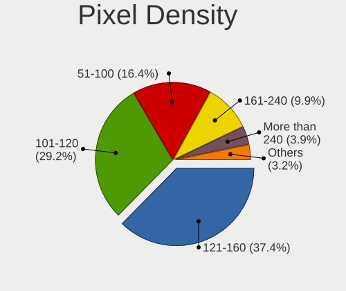

| Density       | Notebooks | Percent |
|---------------|-----------|---------|
| 121-160       | 1908      | 37.38%  |
| 101-120       | 1490      | 29.19%  |
| 51-100        | 838       | 16.42%  |
| 161-240       | 507       | 9.93%   |
| More than 240 | 197       | 3.86%   |
| 1-50          | 93        | 1.82%   |
| Unknown       | 72        | 1.41%   |

Multiple Monitors
-----------------

Total monitors connected

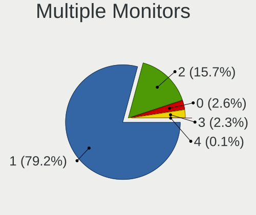

| Total | Notebooks | Percent |
|-------|-----------|---------|
| 1     | 3724      | 79.18%  |
| 2     | 740       | 15.73%  |
| 0     | 124       | 2.64%   |
| 3     | 109       | 2.32%   |
| 4     | 6         | 0.13%   |

Network
-------

Net Controller Vendor
---------------------

Controller vendors

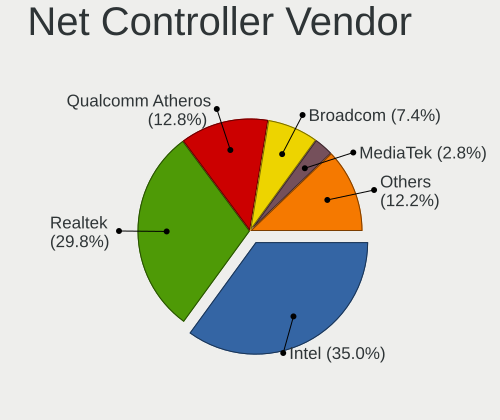

| Vendor                          | Notebooks | Percent |
|---------------------------------|-----------|---------|
| Intel                           | 2492      | 35.01%  |
| Realtek Semiconductor           | 2121      | 29.8%   |
| Qualcomm Atheros                | 910       | 12.79%  |
| Broadcom                        | 527       | 7.4%    |
| MediaTek                        | 202       | 2.84%   |
| Broadcom Limited                | 167       | 2.35%   |
| ASIX Electronics                | 95        | 1.33%   |
| Marvell Technology Group        | 70        | 0.98%   |
| Shenzhen Goodix Technology      | 48        | 0.67%   |
| Nvidia                          | 47        | 0.66%   |
| TP-Link                         | 46        | 0.65%   |
| Qualcomm                        | 38        | 0.53%   |
| Ralink                          | 34        | 0.48%   |
| Samsung Electronics             | 33        | 0.46%   |
| D-Link                          | 27        | 0.38%   |
| Ralink Technology               | 26        | 0.37%   |
| DisplayLink                     | 26        | 0.37%   |
| Lenovo                          | 22        | 0.31%   |
| Linksys                         | 20        | 0.28%   |
| ASUSTek Computer                | 17        | 0.24%   |
| Sierra Wireless                 | 16        | 0.22%   |
| Qualcomm Atheros Communications | 13        | 0.18%   |
| Google                          | 11        | 0.15%   |
| NetGear                         | 9         | 0.13%   |
| Apple                           | 9         | 0.13%   |
| Dell                            | 7         | 0.1%    |
| AMD                             | 7         | 0.1%    |
| Hewlett-Packard                 | 6         | 0.08%   |
| U-Blox                          | 5         | 0.07%   |
| D-Link System                   | 5         | 0.07%   |
| Microsoft                       | 4         | 0.06%   |
| JMicron Technology              | 4         | 0.06%   |
| Research In Motion              | 3         | 0.04%   |
| Qualcomm Technologies           | 3         | 0.04%   |
| Edimax Technology               | 3         | 0.04%   |
| Aquantia                        | 3         | 0.04%   |
| Xiaomi                          | 2         | 0.03%   |
| TRENDnet                        | 2         | 0.03%   |
| STMicroelectronics              | 2         | 0.03%   |
| SEGGER                          | 2         | 0.03%   |

Net Controller Model
--------------------

Controller models

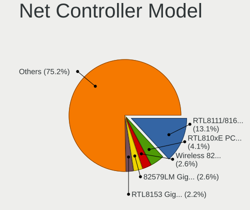

| Model                                                                  | Notebooks | Percent |
|------------------------------------------------------------------------|-----------|---------|
| Realtek RTL8111/8168/8211/8411 PCI Express Gigabit Ethernet Controller | 1142      | 13.13%  |
| Realtek RTL810xE PCI Express Fast Ethernet controller                  | 359       | 4.13%   |
| Intel Wireless 8265 / 8275                                             | 230       | 2.64%   |
| Intel 82579LM Gigabit Network Connection (Lewisville)                  | 229       | 2.63%   |
| Realtek RTL8153 Gigabit Ethernet Adapter                               | 193       | 2.22%   |
| Realtek RTL8822CE 802.11ac PCIe Wireless Network Adapter               | 176       | 2.02%   |
| Qualcomm Atheros QCA9377 802.11ac Wireless Network Adapter             | 166       | 1.91%   |
| Intel Wireless 7260                                                    | 164       | 1.89%   |
| Intel Wi-Fi 6 AX200                                                    | 163       | 1.87%   |
| Intel Wireless 7265                                                    | 153       | 1.76%   |
| Intel Centrino Advanced-N 6205 [Taylor Peak]                           | 136       | 1.56%   |
| Intel Wireless 8260                                                    | 119       | 1.37%   |
| Qualcomm Atheros AR9285 Wireless Network Adapter (PCI-Express)         | 112       | 1.29%   |
| Qualcomm Atheros QCA9565 / AR9565 Wireless Network Adapter             | 111       | 1.28%   |
| Intel Alder Lake-P PCH CNVi WiFi                                       | 111       | 1.28%   |
| Qualcomm Atheros QCA6174 802.11ac Wireless Network Adapter             | 106       | 1.22%   |
| Intel Ethernet Connection (4) I219-LM                                  | 105       | 1.21%   |
| Intel Wi-Fi 6 AX201                                                    | 104       | 1.2%    |
| Qualcomm Atheros AR9485 Wireless Network Adapter                       | 93        | 1.07%   |
| Intel Comet Lake PCH CNVi WiFi                                         | 92        | 1.06%   |
| Intel Cannon Lake PCH CNVi WiFi                                        | 92        | 1.06%   |
| ASIX AX88179 Gigabit Ethernet                                          | 89        | 1.02%   |
| MediaTek MT7921 802.11ax PCIe Wireless Network Adapter [Filogic 330]   | 80        | 0.92%   |
| Intel Wi-Fi 6E(802.11ax) AX210/AX1675* 2x2 [Typhoon Peak]              | 74        | 0.85%   |
| Intel 82577LM Gigabit Network Connection                               | 70        | 0.8%    |
| Realtek RTL8821CE 802.11ac PCIe Wireless Network Adapter               | 69        | 0.79%   |
| Broadcom BCM4313 802.11bgn Wireless Network Adapter                    | 69        | 0.79%   |
| MediaTek MT7922 802.11ax PCI Express Wireless Network Adapter          | 67        | 0.77%   |
| Intel Centrino Ultimate-N 6300                                         | 64        | 0.74%   |
| Intel Ethernet Connection I219-LM                                      | 61        | 0.7%    |
| Intel Ethernet Connection I218-LM                                      | 61        | 0.7%    |
| Intel Cannon Point-LP CNVi [Wireless-AC]                               | 60        | 0.69%   |
| Intel Ethernet Connection I217-LM                                      | 58        | 0.67%   |
| Broadcom NetXtreme BCM57765 Gigabit Ethernet PCIe                      | 57        | 0.66%   |
| Broadcom BCM4331 802.11a/b/g/n                                         | 57        | 0.66%   |
| Intel Raptor Lake PCH CNVi WiFi                                        | 56        | 0.64%   |
| Intel Comet Lake PCH-LP CNVi WiFi                                      | 50        | 0.57%   |
| Shenzhen Goodix Fingerprint Reader                                     | 48        | 0.55%   |
| Qualcomm Atheros AR9462 Wireless Network Adapter                       | 48        | 0.55%   |
| Intel Wireless 3165                                                    | 48        | 0.55%   |

Wireless Vendor
---------------

Wireless vendors

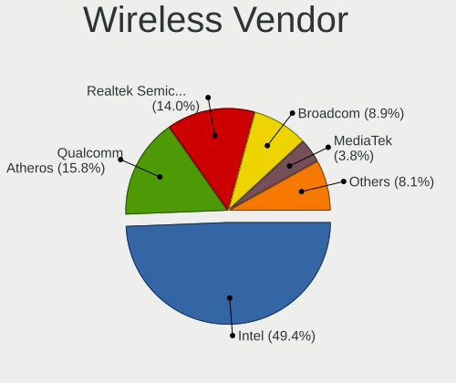

| Vendor                                | Notebooks | Percent |
|---------------------------------------|-----------|---------|
| Intel                                 | 2313      | 49.39%  |
| Qualcomm Atheros                      | 742       | 15.84%  |
| Realtek Semiconductor                 | 655       | 13.99%  |
| Broadcom                              | 416       | 8.88%   |
| MediaTek                              | 179       | 3.82%   |
| Broadcom Limited                      | 117       | 2.5%    |
| TP-Link                               | 40        | 0.85%   |
| Ralink                                | 34        | 0.73%   |
| Qualcomm                              | 34        | 0.73%   |
| Ralink Technology                     | 26        | 0.56%   |
| D-Link                                | 26        | 0.56%   |
| Linksys                               | 18        | 0.38%   |
| ASUSTek Computer                      | 17        | 0.36%   |
| Sierra Wireless                       | 16        | 0.34%   |
| Qualcomm Atheros Communications       | 13        | 0.28%   |
| NetGear                               | 9         | 0.19%   |
| Dell                                  | 5         | 0.11%   |
| D-Link System                         | 5         | 0.11%   |
| Microsoft                             | 3         | 0.06%   |
| Edimax Technology                     | 3         | 0.06%   |
| TRENDnet                              | 2         | 0.04%   |
| Qualcomm Technologies                 | 2         | 0.04%   |
| 802.11g Adapter [Linksys WUSB54GC v3] | 2         | 0.04%   |
| ZyDAS                                 | 1         | 0.02%   |
| Senao                                 | 1         | 0.02%   |
| Realtek                               | 1         | 0.02%   |
| Panasonic (Matsushita)                | 1         | 0.02%   |
| Micro Star International              | 1         | 0.02%   |
| Marvell Technology Group              | 1         | 0.02%   |

Wireless Model
--------------

Wireless models

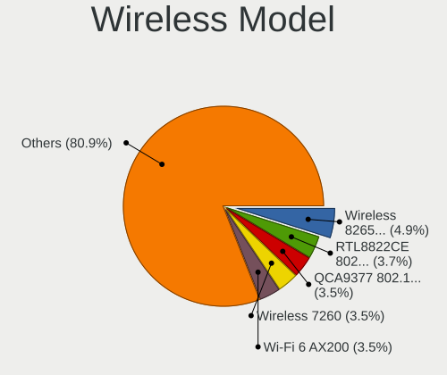

| Model                                                                | Notebooks | Percent |
|----------------------------------------------------------------------|-----------|---------|
| Intel Wireless 8265 / 8275                                           | 230       | 4.87%   |
| Realtek RTL8822CE 802.11ac PCIe Wireless Network Adapter             | 176       | 3.73%   |
| Qualcomm Atheros QCA9377 802.11ac Wireless Network Adapter           | 166       | 3.52%   |
| Intel Wireless 7260                                                  | 164       | 3.48%   |
| Intel Wi-Fi 6 AX200                                                  | 163       | 3.45%   |
| Intel Wireless 7265                                                  | 153       | 3.24%   |
| Intel Centrino Advanced-N 6205 [Taylor Peak]                         | 136       | 2.88%   |
| Intel Wireless 8260                                                  | 119       | 2.52%   |
| Qualcomm Atheros AR9285 Wireless Network Adapter (PCI-Express)       | 112       | 2.37%   |
| Qualcomm Atheros QCA9565 / AR9565 Wireless Network Adapter           | 111       | 2.35%   |
| Qualcomm Atheros QCA6174 802.11ac Wireless Network Adapter           | 106       | 2.25%   |
| Intel Wi-Fi 6 AX201                                                  | 104       | 2.2%    |
| Qualcomm Atheros AR9485 Wireless Network Adapter                     | 93        | 1.97%   |
| Intel Comet Lake PCH CNVi WiFi                                       | 92        | 1.95%   |
| Intel Cannon Lake PCH CNVi WiFi                                      | 92        | 1.95%   |
| MediaTek MT7921 802.11ax PCIe Wireless Network Adapter [Filogic 330] | 80        | 1.7%    |
| Intel Wi-Fi 6E(802.11ax) AX210/AX1675* 2x2 [Typhoon Peak]            | 74        | 1.57%   |
| Realtek RTL8821CE 802.11ac PCIe Wireless Network Adapter             | 69        | 1.46%   |
| Broadcom BCM4313 802.11bgn Wireless Network Adapter                  | 69        | 1.46%   |
| Intel Alder Lake-P PCH CNVi WiFi                                     | 65        | 1.38%   |
| Intel Centrino Ultimate-N 6300                                       | 64        | 1.36%   |
| Intel Cannon Point-LP CNVi [Wireless-AC]                             | 60        | 1.27%   |
| Broadcom BCM4331 802.11a/b/g/n                                       | 57        | 1.21%   |
| Intel Raptor Lake PCH CNVi WiFi                                      | 55        | 1.17%   |
| MediaTek MT7922 802.11ax PCI Express Wireless Network Adapter        | 52        | 1.1%    |
| Intel Comet Lake PCH-LP CNVi WiFi                                    | 50        | 1.06%   |
| Qualcomm Atheros AR9462 Wireless Network Adapter                     | 48        | 1.02%   |
| Intel Wireless 3165                                                  | 48        | 1.02%   |
| Intel Centrino Advanced-N 6235                                       | 48        | 1.02%   |
| Broadcom BCM4322 802.11a/b/g/n Wireless LAN Controller               | 47        | 1%      |
| Realtek RTL8852BE PCIe 802.11ax Wireless Network Controller          | 46        | 0.97%   |
| Realtek RTL8822BE 802.11a/b/g/n/ac WiFi adapter                      | 44        | 0.93%   |
| Realtek RTL8188CE 802.11b/g/n WiFi Adapter                           | 44        | 0.93%   |
| Intel Tiger Lake PCH CNVi WiFi                                       | 43        | 0.91%   |
| Intel PRO/Wireless 3945ABG [Golan] Network Connection                | 43        | 0.91%   |
| Intel Centrino Wireless-N 2230                                       | 43        | 0.91%   |
| Realtek RTL8723BE PCIe Wireless Network Adapter                      | 41        | 0.87%   |
| Intel Centrino Advanced-N 6200                                       | 40        | 0.85%   |
| Qualcomm Atheros AR928X Wireless Network Adapter (PCI-Express)       | 39        | 0.83%   |
| Broadcom BCM43142 802.11b/g/n                                        | 38        | 0.81%   |

Ethernet Vendor
---------------

Ethernet vendors

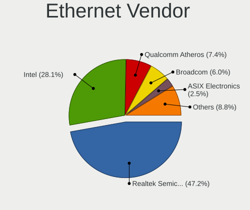

| Vendor                                 | Notebooks | Percent |
|----------------------------------------|-----------|---------|
| Realtek Semiconductor                  | 1796      | 47.19%  |
| Intel                                  | 1070      | 28.11%  |
| Qualcomm Atheros                       | 282       | 7.41%   |
| Broadcom                               | 227       | 5.96%   |
| ASIX Electronics                       | 95        | 2.5%    |
| Marvell Technology Group               | 69        | 1.81%   |
| Broadcom Limited                       | 56        | 1.47%   |
| Nvidia                                 | 46        | 1.21%   |
| Samsung Electronics                    | 33        | 0.87%   |
| DisplayLink                            | 26        | 0.68%   |
| Lenovo                                 | 21        | 0.55%   |
| MediaTek                               | 20        | 0.53%   |
| Google                                 | 11        | 0.29%   |
| Apple                                  | 9         | 0.24%   |
| TP-Link                                | 7         | 0.18%   |
| Hewlett-Packard                        | 6         | 0.16%   |
| Qualcomm                               | 4         | 0.11%   |
| JMicron Technology                     | 4         | 0.11%   |
| Research In Motion                     | 3         | 0.08%   |
| Aquantia                               | 3         | 0.08%   |
| Xiaomi                                 | 2         | 0.05%   |
| Linksys                                | 2         | 0.05%   |
| LG Electronics                         | 2         | 0.05%   |
| XREAL                                  | 1         | 0.03%   |
| T & A Mobile Phones                    | 1         | 0.03%   |
| Suzhou Motorcomm Electronic Technology | 1         | 0.03%   |
| Qualcomm Technologies                  | 1         | 0.03%   |
| OPPO Electronics                       | 1         | 0.03%   |
| Motorola PCS                           | 1         | 0.03%   |
| MosChip Semiconductor                  | 1         | 0.03%   |
| Microsoft                              | 1         | 0.03%   |
| HTC (High Tech Computer)               | 1         | 0.03%   |
| HMD Global                             | 1         | 0.03%   |
| D-Link                                 | 1         | 0.03%   |
| Attansic Technology                    | 1         | 0.03%   |

Ethernet Model
--------------

Ethernet models

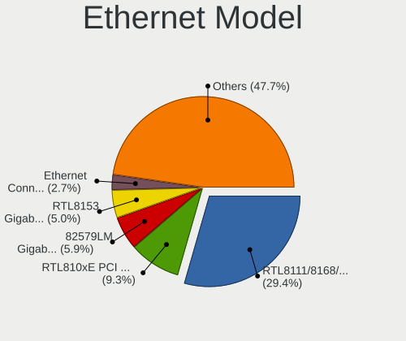

| Model                                                                  | Notebooks | Percent |
|------------------------------------------------------------------------|-----------|---------|
| Realtek RTL8111/8168/8211/8411 PCI Express Gigabit Ethernet Controller | 1142      | 29.44%  |
| Realtek RTL810xE PCI Express Fast Ethernet controller                  | 359       | 9.25%   |
| Intel 82579LM Gigabit Network Connection (Lewisville)                  | 229       | 5.9%    |
| Realtek RTL8153 Gigabit Ethernet Adapter                               | 193       | 4.98%   |
| Intel Ethernet Connection (4) I219-LM                                  | 105       | 2.71%   |
| ASIX AX88179 Gigabit Ethernet                                          | 89        | 2.29%   |
| Intel 82577LM Gigabit Network Connection                               | 70        | 1.8%    |
| Intel Ethernet Connection I219-LM                                      | 61        | 1.57%   |
| Intel Ethernet Connection I218-LM                                      | 61        | 1.57%   |
| Intel Ethernet Connection I217-LM                                      | 58        | 1.5%    |
| Broadcom NetXtreme BCM57765 Gigabit Ethernet PCIe                      | 57        | 1.47%   |
| Realtek RTL8125 2.5GbE Controller                                      | 47        | 1.21%   |
| Intel Alder Lake-P PCH CNVi WiFi                                       | 47        | 1.21%   |
| Intel Ethernet Connection (4) I219-V                                   | 46        | 1.19%   |
| Intel Ethernet Connection (3) I218-LM                                  | 46        | 1.19%   |
| Qualcomm Atheros AR8151 v2.0 Gigabit Ethernet                          | 40        | 1.03%   |
| Intel 82567LM Gigabit Network Connection                               | 36        | 0.93%   |
| Qualcomm Atheros QCA8171 Gigabit Ethernet                              | 35        | 0.9%    |
| Nvidia MCP79 Ethernet                                                  | 31        | 0.8%    |
| Broadcom NetLink BCM57780 Gigabit Ethernet PCIe                        | 30        | 0.77%   |
| Intel Ethernet Connection (6) I219-LM                                  | 29        | 0.75%   |
| Qualcomm Atheros Killer E2500 Gigabit Ethernet Controller              | 27        | 0.7%    |
| Broadcom NetXtreme BCM5764M Gigabit Ethernet PCIe                      | 26        | 0.67%   |
| Qualcomm Atheros AR8152 v2.0 Fast Ethernet                             | 25        | 0.64%   |
| Marvell Group 88E8040 PCI-E Fast Ethernet Controller                   | 25        | 0.64%   |
| Realtek Killer E2600 GbE Controller                                    | 24        | 0.62%   |
| Qualcomm Atheros Killer E2400 Gigabit Ethernet Controller              | 24        | 0.62%   |
| Qualcomm Atheros Killer E220x Gigabit Ethernet Controller              | 24        | 0.62%   |
| Intel Ethernet Connection I219-V                                       | 23        | 0.59%   |
| Broadcom NetLink BCM57785 Gigabit Ethernet PCIe                        | 23        | 0.59%   |
| Broadcom NetXtreme BCM57786 Gigabit Ethernet PCIe                      | 22        | 0.57%   |
| Intel Ethernet Connection (7) I219-LM                                  | 20        | 0.52%   |
| Intel Ethernet Connection (2) I219-LM                                  | 20        | 0.52%   |
| Samsung Galaxy series, misc. (tethering mode)                          | 19        | 0.49%   |
| Realtek RTL-8100/8101L/8139 PCI Fast Ethernet Adapter                  | 19        | 0.49%   |
| Realtek Killer E3000 2.5GbE Controller                                 | 19        | 0.49%   |
| Qualcomm Atheros AR8152 v1.1 Fast Ethernet                             | 19        | 0.49%   |
| Qualcomm Atheros AR8132 Fast Ethernet                                  | 18        | 0.46%   |
| Qualcomm Atheros AR8161 Gigabit Ethernet                               | 17        | 0.44%   |
| Intel Ethernet Connection (6) I219-V                                   | 17        | 0.44%   |

Net Controller Kind
-------------------

Ethernet, WiFi or modem

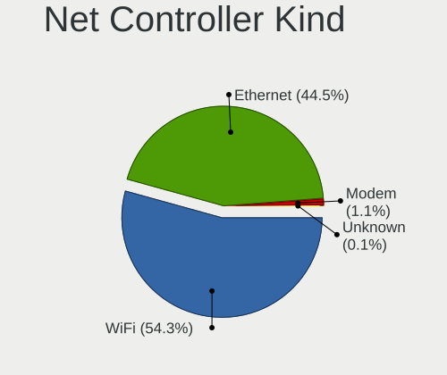

| Kind     | Notebooks | Percent |
|----------|-----------|---------|
| WiFi     | 4420      | 54.3%   |
| Ethernet | 3620      | 44.47%  |
| Modem    | 88        | 1.08%   |
| Unknown  | 12        | 0.15%   |

Used Controller
---------------

Currently used network controller

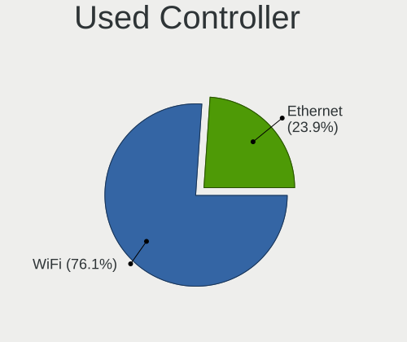

| Kind     | Notebooks | Percent |
|----------|-----------|---------|
| WiFi     | 3715      | 76.08%  |
| Ethernet | 1168      | 23.92%  |

NICs
----

Total network controllers on board

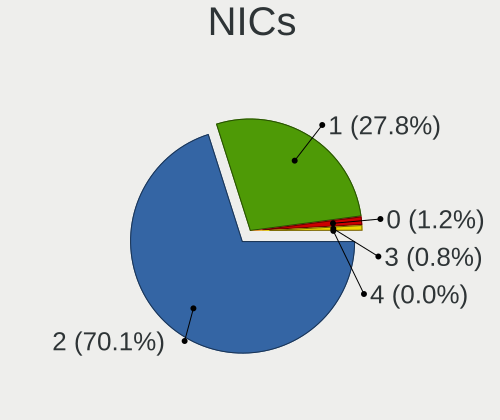

| Total | Notebooks | Percent |
|-------|-----------|---------|
| 2     | 3222      | 70.1%   |
| 1     | 1278      | 27.81%  |
| 0     | 57        | 1.24%   |
| 3     | 37        | 0.81%   |
| 4     | 2         | 0.04%   |

IPv6
----

IPv6 vs IPv4

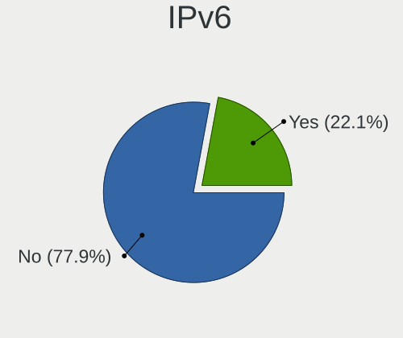

| Used | Notebooks | Percent |
|------|-----------|---------|
| No   | 3645      | 77.9%   |
| Yes  | 1034      | 22.1%   |

Bluetooth
---------

Bluetooth Vendor
----------------

Controller vendors

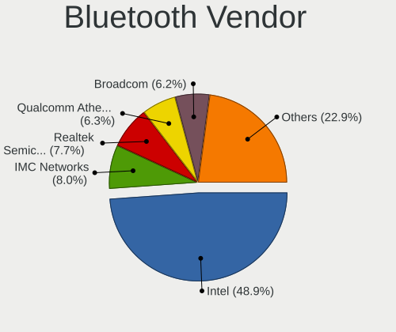

| Vendor                          | Notebooks | Percent |
|---------------------------------|-----------|---------|
| Intel                           | 1799      | 48.87%  |
| IMC Networks                    | 295       | 8.01%   |
| Realtek Semiconductor           | 283       | 7.69%   |
| Qualcomm Atheros Communications | 231       | 6.28%   |
| Broadcom                        | 230       | 6.25%   |
| Apple                           | 193       | 5.24%   |
| Lite-On Technology              | 182       | 4.94%   |
| Foxconn / Hon Hai               | 177       | 4.81%   |
| Dell                            | 54        | 1.47%   |
| Hewlett-Packard                 | 44        | 1.2%    |
| Cambridge Silicon Radio         | 41        | 1.11%   |
| MediaTek                        | 28        | 0.76%   |
| ASUSTek Computer                | 23        | 0.62%   |
| Toshiba                         | 21        | 0.57%   |
| Ralink                          | 20        | 0.54%   |
| Alps Electric                   | 13        | 0.35%   |
| USI                             | 9         | 0.24%   |
| TP-Link                         | 6         | 0.16%   |
| Realtek                         | 6         | 0.16%   |
| Taiyo Yuden                     | 3         | 0.08%   |
| Ralink Technology               | 3         | 0.08%   |
| Dynex                           | 3         | 0.08%   |
| SINO WEALTH                     | 2         | 0.05%   |
| Logitech                        | 2         | 0.05%   |
| Foxconn International           | 2         | 0.05%   |
| Askey Computer                  | 2         | 0.05%   |
| Actions                         | 2         | 0.05%   |
| Qcom                            | 1         | 0.03%   |
| Primax Electronics              | 1         | 0.03%   |
| Marvell Semiconductor           | 1         | 0.03%   |
| Kensington                      | 1         | 0.03%   |
| Integrated System Solution      | 1         | 0.03%   |
| Fujitsu                         | 1         | 0.03%   |
| D-Link System                   | 1         | 0.03%   |

Bluetooth Model
---------------

Controller models

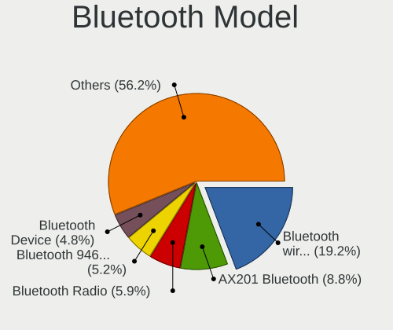

| Model                                               | Notebooks | Percent |
|-----------------------------------------------------|-----------|---------|
| Intel Bluetooth wireless interface                  | 709       | 19.22%  |
| Intel AX201 Bluetooth                               | 323       | 8.76%   |
| Realtek Bluetooth Radio                             | 216       | 5.86%   |
| Intel Bluetooth 9460/9560 Jefferson Peak (JfP)      | 192       | 5.2%    |
| Intel Bluetooth Device                              | 177       | 4.8%    |
| Intel AX200 Bluetooth                               | 160       | 4.34%   |
| IMC Networks Bluetooth Radio                        | 143       | 3.88%   |
| Qualcomm Atheros  Bluetooth Device                  | 126       | 3.42%   |
| Apple Bluetooth Host Controller                     | 124       | 3.36%   |
| Intel Centrino Bluetooth Wireless Transceiver       | 88        | 2.39%   |
| Lite-On Qualcomm Atheros QCA9377 Bluetooth          | 82        | 2.22%   |
| IMC Networks Wireless_Device                        | 81        | 2.2%    |
| Intel AX210 Bluetooth                               | 71        | 1.92%   |
| Foxconn / Hon Hai Bluetooth Device                  | 67        | 1.82%   |
| Apple Bluetooth USB Host Controller                 | 53        | 1.44%   |
| Broadcom BCM2045B (BDC-2.1)                         | 51        | 1.38%   |
| Lite-On Atheros AR3012 Bluetooth                    | 44        | 1.19%   |
| Foxconn / Hon Hai Wireless_Device                   | 42        | 1.14%   |
| Cambridge Silicon Radio Bluetooth Dongle (HCI mode) | 41        | 1.11%   |
| Realtek  Bluetooth 4.2 Adapter                      | 38        | 1.03%   |
| Broadcom BCM20702 Bluetooth 4.0 [ThinkPad]          | 37        | 1%      |
| Qualcomm Atheros QCA61x4 Bluetooth 4.0              | 35        | 0.95%   |
| Intel Wireless-AC 3168 Bluetooth                    | 31        | 0.84%   |
| Intel Centrino Advanced-N 6230 Bluetooth adapter    | 30        | 0.81%   |
| MediaTek Wireless_Device                            | 28        | 0.76%   |
| Qualcomm Atheros AR3012 Bluetooth 4.0               | 26        | 0.7%    |
| Intel Wireless-AC 9260 Bluetooth Adapter            | 25        | 0.68%   |
| HP Broadcom 2070 Bluetooth Combo                    | 25        | 0.68%   |
| Qualcomm Atheros AR3011 Bluetooth                   | 23        | 0.62%   |
| Dell DW375 Bluetooth Module                         | 23        | 0.62%   |
| IMC Networks Bluetooth Device                       | 22        | 0.6%    |
| Lite-On Wireless_Device                             | 21        | 0.57%   |
| Broadcom HP Portable SoftSailing                    | 21        | 0.57%   |
| Ralink RT3290 Bluetooth                             | 20        | 0.54%   |
| Broadcom BCM20702A0 Bluetooth 4.0                   | 19        | 0.52%   |
| Lite-On Bluetooth Device                            | 18        | 0.49%   |
| IMC Networks BCM20702A0                             | 18        | 0.49%   |
| HP Bluetooth 2.0 Interface [Broadcom BCM2045]       | 18        | 0.49%   |
| IMC Networks Atheros AR3012 Bluetooth 4.0 Adapter   | 17        | 0.46%   |
| Broadcom BCM2045B (BDC-2.1) [Bluetooth Controller]  | 17        | 0.46%   |

Sound
-----

Sound Vendor
------------

Sound card vendors

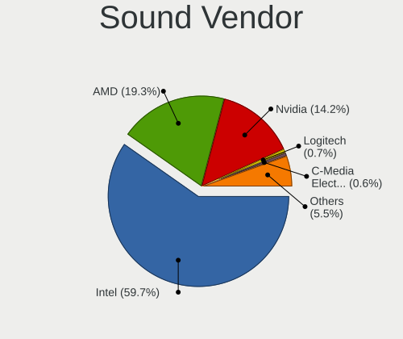

| Vendor                               | Notebooks | Percent |
|--------------------------------------|-----------|---------|
| Intel                                | 3469      | 59.74%  |
| AMD                                  | 1122      | 19.32%  |
| Nvidia                               | 823       | 14.17%  |
| Logitech                             | 39        | 0.67%   |
| C-Media Electronics                  | 35        | 0.6%    |
| Realtek Semiconductor                | 28        | 0.48%   |
| Lenovo                               | 20        | 0.34%   |
| GN Netcom                            | 20        | 0.34%   |
| Sony                                 | 16        | 0.28%   |
| Plantronics                          | 15        | 0.26%   |
| Apple                                | 15        | 0.26%   |
| Razer USA                            | 12        | 0.21%   |
| JMTek                                | 12        | 0.21%   |
| ASUSTek Computer                     | 12        | 0.21%   |
| SteelSeries ApS                      | 11        | 0.19%   |
| Hewlett-Packard                      | 11        | 0.19%   |
| Corsair                              | 10        | 0.17%   |
| Texas Instruments                    | 9         | 0.15%   |
| Kingston Technology                  | 9         | 0.15%   |
| Focusrite-Novation                   | 9         | 0.15%   |
| Creative Technology                  | 9         | 0.15%   |
| Generalplus Technology               | 6         | 0.1%    |
| Blue Microphones                     | 6         | 0.1%    |
| Samson Technologies                  | 4         | 0.07%   |
| No brand                             | 4         | 0.07%   |
| KTMicro                              | 4         | 0.07%   |
| Jieli Technology                     | 4         | 0.07%   |
| DSEA A/S                             | 4         | 0.07%   |
| Native Instruments                   | 3         | 0.05%   |
| GYROCOM C&C                          | 3         | 0.05%   |
| Dell                                 | 3         | 0.05%   |
| Audio-Technica                       | 3         | 0.05%   |
| Thesycon Systemsoftware & Consulting | 2         | 0.03%   |
| Synaptics                            | 2         | 0.03%   |
| Sennheiser Communications            | 2         | 0.03%   |
| Panasonic (Matsushita)               | 2         | 0.03%   |
| NAD Electronics                      | 2         | 0.03%   |
| MV-SILICON                           | 2         | 0.03%   |
| FiiO Electronics Technology          | 2         | 0.03%   |
| Creative Labs                        | 2         | 0.03%   |

Sound Model
-----------

Sound card models

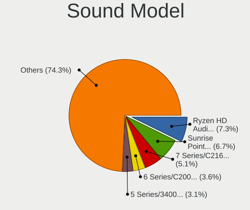

| Model                                                                                             | Notebooks | Percent |
|---------------------------------------------------------------------------------------------------|-----------|---------|
| AMD Ryzen HD Audio Controller                                                                     | 514       | 7.28%   |
| Intel Sunrise Point-LP HD Audio                                                                   | 474       | 6.72%   |
| Intel 7 Series/C216 Chipset Family High Definition Audio Controller                               | 360       | 5.1%    |
| Intel 6 Series/C200 Series Chipset Family High Definition Audio Controller                        | 253       | 3.58%   |
| Intel 5 Series/3400 Series Chipset High Definition Audio                                          | 216       | 3.06%   |
| AMD Renoir/Cezanne HDMI/DP Audio Controller                                                       | 212       | 3%      |
| AMD Radeon High Definition Audio Controller                                                       | 202       | 2.86%   |
| Intel 8 Series HD Audio Controller                                                                | 178       | 2.52%   |
| Intel Haswell-ULT HD Audio Controller                                                             | 177       | 2.51%   |
| Intel Cannon Lake PCH cAVS                                                                        | 177       | 2.51%   |
| AMD FCH Azalia Controller                                                                         | 175       | 2.48%   |
| Intel 8 Series/C220 Series Chipset High Definition Audio Controller                               | 171       | 2.42%   |
| Intel 82801I (ICH9 Family) HD Audio Controller                                                    | 157       | 2.22%   |
| Intel Tiger Lake-LP Smart Sound Technology Audio Controller                                       | 141       | 2%      |
| Intel Xeon E3-1200 v3/4th Gen Core Processor HD Audio Controller                                  | 136       | 1.93%   |
| Intel Alder Lake PCH-P High Definition Audio Controller                                           | 134       | 1.9%    |
| Intel Broadwell-U Audio Controller                                                                | 132       | 1.87%   |
| AMD Raven/Raven2/Fenghuang HDMI/DP Audio Controller                                               | 127       | 1.8%    |
| Intel Wildcat Point-LP High Definition Audio Controller                                           | 126       | 1.79%   |
| AMD Kabini HDMI/DP Audio                                                                          | 119       | 1.69%   |
| AMD Family 15h (Models 60h-6fh) Audio Controller                                                  | 108       | 1.53%   |
| Intel Cannon Point-LP High Definition Audio Controller                                            | 104       | 1.47%   |
| Intel Comet Lake PCH cAVS                                                                         | 102       | 1.45%   |
| Intel 82801H (ICH8 Family) HD Audio Controller                                                    | 91        | 1.29%   |
| AMD SBx00 Azalia (Intel HDA)                                                                      | 83        | 1.18%   |
| Intel Raptor Lake-P/U/H cAVS                                                                      | 80        | 1.13%   |
| Intel CM238 HD Audio Controller                                                                   | 74        | 1.05%   |
| Nvidia TU107 GeForce GTX 1650 High Definition Audio Controller                                    | 73        | 1.03%   |
| Intel Tiger Lake-H HD Audio Controller                                                            | 69        | 0.98%   |
| Intel Comet Lake PCH-LP cAVS                                                                      | 68        | 0.96%   |
| AMD High Definition Audio Controller                                                              | 65        | 0.92%   |
| Nvidia GK107 HDMI Audio Controller                                                                | 61        | 0.86%   |
| Nvidia GA107 High Definition Audio Controller                                                     | 61        | 0.86%   |
| Intel NM10/ICH7 Family High Definition Audio Controller                                           | 60        | 0.85%   |
| Intel Celeron/Pentium Silver Processor High Definition Audio                                      | 60        | 0.85%   |
| Intel 100 Series/C230 Series Chipset Family HD Audio Controller                                   | 58        | 0.82%   |
| Intel Atom/Celeron/Pentium Processor x5-E8000/J3xxx/N3xxx Series High Definition Audio Controller | 57        | 0.81%   |
| Intel Ice Lake-LP Smart Sound Technology Audio Controller                                         | 55        | 0.78%   |
| Nvidia GA106 High Definition Audio Controller                                                     | 54        | 0.77%   |
| Nvidia TU106 High Definition Audio Controller                                                     | 52        | 0.74%   |

Memory
------

Memory Vendor
-------------

Memory module vendors

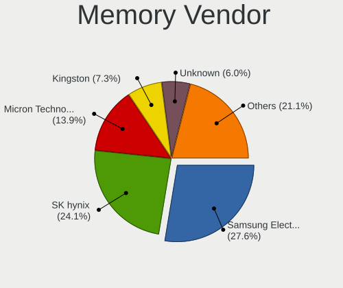

| Vendor                                           | Notebooks | Percent |
|--------------------------------------------------|-----------|---------|
| Samsung Electronics                              | 801       | 27.61%  |
| SK hynix                                         | 698       | 24.06%  |
| Micron Technology                                | 404       | 13.93%  |
| Kingston                                         | 213       | 7.34%   |
| Unknown                                          | 174       | 6%      |
| Crucial                                          | 131       | 4.52%   |
| Elpida                                           | 59        | 2.03%   |
| Ramaxel Technology                               | 58        | 2%      |
| G.Skill                                          | 52        | 1.79%   |
| A-DATA Technology                                | 50        | 1.72%   |
| Nanya Technology                                 | 42        | 1.45%   |
| Corsair                                          | 42        | 1.45%   |
| Unknown                                          | 33        | 1.14%   |
| Timetec                                          | 24        | 0.83%   |
| Patriot                                          | 15        | 0.52%   |
| Unknown (ABCD)                                   | 10        | 0.34%   |
| Team                                             | 10        | 0.34%   |
| 4ea5                                             | 8         | 0.28%   |
| ff                                               | 7         | 0.24%   |
| Goldkey                                          | 6         | 0.21%   |
| Toshiba                                          | 5         | 0.17%   |
| fef5                                             | 5         | 0.17%   |
| ASint Technology                                 | 4         | 0.14%   |
| Transcend                                        | 3         | 0.1%    |
| PNY                                              | 3         | 0.1%    |
| Neo Forza                                        | 3         | 0.1%    |
| Lexar                                            | 3         | 0.1%    |
| Axiom                                            | 3         | 0.1%    |
| Avant                                            | 3         | 0.1%    |
| Unknown (7F7F7F94FFFFFFFF)                       | 2         | 0.07%   |
| Silicon Power                                    | 2         | 0.07%   |
| SHARETRONIC                                      | 2         | 0.07%   |
| Patriot Memory (PDP Systems)                     | 2         | 0.07%   |
| CSX                                              | 2         | 0.07%   |
| V-Color                                          | 1         | 0.03%   |
| Unknown (D386)                                   | 1         | 0.03%   |
| Unknown (268C)                                   | 1         | 0.03%   |
| Unknown (0x505344323247363637325300000000000000) | 1         | 0.03%   |
| Unknown (0x4D342037305432383634515A332D43453620) | 1         | 0.03%   |
| Unknown (0x48594D503132355336344350382D53362020) | 1         | 0.03%   |

Memory Model
------------

Memory module models

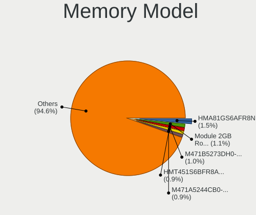

| Model                                                   | Notebooks | Percent |
|---------------------------------------------------------|-----------|---------|
| SK hynix RAM HMA81GS6AFR8N-UH 8GB SODIMM DDR4 2667MT/s  | 47        | 1.54%   |
| Unknown                                                 | 33        | 1.08%   |
| Samsung RAM M471B5273DH0-CH9 4GB SODIMM DDR3 1600MT/s   | 31        | 1.01%   |
| SK hynix RAM HMT451S6BFR8A-PB 4GB SODIMM DDR3 1600MT/s  | 28        | 0.92%   |
| Samsung RAM M471A5244CB0-CTD 4GB SODIMM DDR4 3266MT/s   | 27        | 0.88%   |
| SK hynix RAM HMAA1GS6CJR6N-XN 8GB SODIMM DDR4 3200MT/s  | 26        | 0.85%   |
| SK hynix RAM HMA81GS6JJR8N-VK 8GB SODIMM DDR4 2667MT/s  | 26        | 0.85%   |
| Samsung RAM M471A1K43EB1-CWE 8GB SODIMM DDR4 3200MT/s   | 26        | 0.85%   |
| SK hynix RAM HMA81GS6DJR8N-XN 8GB SODIMM DDR4 3200MT/s  | 25        | 0.82%   |
| SK hynix RAM HMT41GS6BFR8A-PB 8GB SODIMM DDR3 2667MT/s  | 23        | 0.75%   |
| Samsung RAM M471B5273CH0-CH9 4GB SODIMM DDR3 1334MT/s   | 23        | 0.75%   |
| Samsung RAM M471A1K43BB1-CRC 8GB SODIMM DDR4 2667MT/s   | 23        | 0.75%   |
| Samsung RAM M471B1G73QH0-YK0 8GB SODIMM DDR3 1600MT/s   | 22        | 0.72%   |
| Samsung RAM M471A5244CB0-CWE 4GB SODIMM DDR4 3200MT/s   | 22        | 0.72%   |
| Samsung RAM M471A1K43CB1-CRC 8GB SODIMM DDR4 8400MT/s   | 22        | 0.72%   |
| Samsung RAM M471A1G44BB0-CWE 8GB SODIMM DDR4 3200MT/s   | 22        | 0.72%   |
| Samsung RAM M471A1G44AB0-CWE 8GiB SODIMM DDR4 3200MT/s  | 22        | 0.72%   |
| Samsung RAM M471B5173QH0-YK0 4GB SODIMM DDR3 1600MT/s   | 21        | 0.69%   |
| Samsung RAM M471B1G73DB0-YK0 8GB SODIMM DDR3 1600MT/s   | 21        | 0.69%   |
| Samsung RAM M471A1K43CB1-CTD 8GB SODIMM DDR4 3200MT/s   | 21        | 0.69%   |
| SK hynix RAM HMA851S6AFR6N-UH 4GB SODIMM DDR4 2667MT/s  | 19        | 0.62%   |
| Samsung RAM M471B5173DB0-YK0 4GB SODIMM DDR3 1600MT/s   | 19        | 0.62%   |
| Samsung RAM M471A2K43DB1-CWE 16GB SODIMM DDR4 3200MT/s  | 18        | 0.59%   |
| Micron RAM 8ATF1G64HZ-3G2J1 8GB SODIMM DDR4 3200MT/s    | 18        | 0.59%   |
| Samsung RAM M471A1K43DB1-CTD 8GB SODIMM DDR4 2667MT/s   | 17        | 0.56%   |
| Micron RAM 4ATF51264HZ-2G6E1 4GB SODIMM DDR4 2667MT/s   | 17        | 0.56%   |
| SK hynix RAM HMA81GS6AFR8N-UH 8GB SODIMM DDR4 3200MT/s  | 15        | 0.49%   |
| Samsung RAM M471B5173EB0-YK0 4GB SODIMM DDR3 1600MT/s   | 15        | 0.49%   |
| Samsung RAM M425R1GB4BB0-CQKOL 8GB SODIMM DDR5 4800MT/s | 15        | 0.49%   |
| SK hynix RAM HMT351S6CFR8C-PB 4GB SODIMM DDR3 1600MT/s  | 14        | 0.46%   |
| SK hynix RAM HMA851S6AFR6N-UH 4GB SODIMM DDR4 2400MT/s  | 14        | 0.46%   |
| SK hynix RAM HMA41GS6AFR8N-TF 8GB SODIMM DDR4 2667MT/s  | 14        | 0.46%   |
| Samsung RAM M471A2K43CB1-CTD 16GB SODIMM DDR4 8400MT/s  | 14        | 0.46%   |
| Micron RAM 4ATF1G64HZ-3G2E2 8GB SODIMM DDR4 3200MT/s    | 14        | 0.46%   |
| Samsung RAM M471B5773CHS-CH9 2GB SODIMM DDR3 4199MT/s   | 13        | 0.43%   |
| Samsung RAM M471A1K43DB1-CWE 8GB SODIMM DDR4 3200MT/s   | 13        | 0.43%   |
| Unknown RAM Module 8GB SODIMM DDR3 1600MT/s             | 12        | 0.39%   |
| SK hynix RAM HMT451S6AFR8A-PB 4GB SODIMM DDR3 1600MT/s  | 12        | 0.39%   |
| Samsung RAM M471A5244CB0-CRC 4GB SODIMM DDR4 2667MT/s   | 12        | 0.39%   |
| Micron RAM 8ATF1G64HZ-2G6E1 8GB SODIMM DDR4 2667MT/s    | 12        | 0.39%   |

Memory Kind
-----------

Memory module kinds

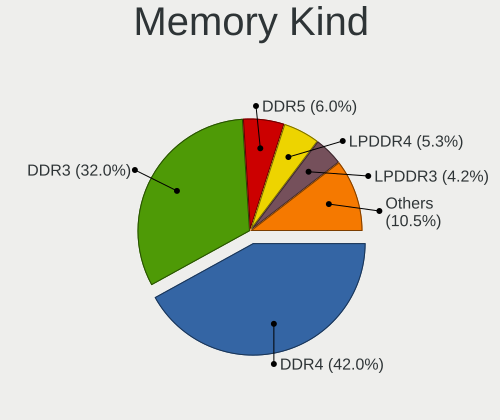

| Kind    | Notebooks | Percent |
|---------|-----------|---------|
| DDR4    | 1022      | 41.99%  |
| DDR3    | 779       | 32%     |
| DDR5    | 145       | 5.96%   |
| LPDDR4  | 130       | 5.34%   |
| LPDDR3  | 103       | 4.23%   |
| DDR2    | 92        | 3.78%   |
| LPDDR5  | 80        | 3.29%   |
| SDRAM   | 43        | 1.77%   |
| Unknown | 24        | 0.99%   |
| DDR     | 13        | 0.53%   |
| DRAM    | 3         | 0.12%   |

Memory Form Factor
------------------

Physical design of the memory module

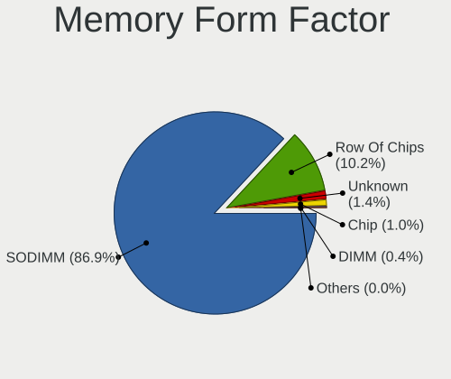

| Name            | Notebooks | Percent |
|-----------------|-----------|---------|
| SODIMM          | 2102      | 86.93%  |
| Row Of Chips    | 247       | 10.22%  |
| Unknown         | 34        | 1.41%   |
| Chip            | 25        | 1.03%   |
| DIMM            | 9         | 0.37%   |
| Proprietary Car | 1         | 0.04%   |

Memory Size
-----------

Memory module size

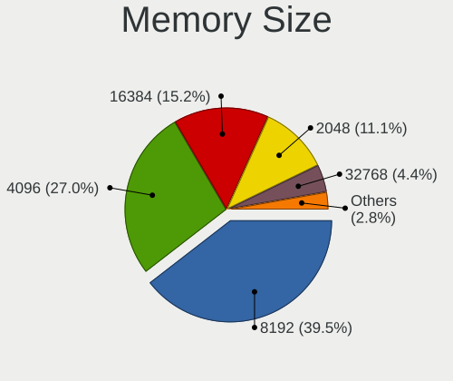

| Size  | Notebooks | Percent |
|-------|-----------|---------|
| 8192  | 1067      | 39.53%  |
| 4096  | 729       | 27.01%  |
| 16384 | 410       | 15.19%  |
| 2048  | 299       | 11.08%  |
| 32768 | 119       | 4.41%   |
| 1024  | 63        | 2.33%   |
| 512   | 7         | 0.26%   |
| 256   | 2         | 0.07%   |
| 65536 | 1         | 0.04%   |
| 24576 | 1         | 0.04%   |
| 3072  | 1         | 0.04%   |

Memory Speed
------------

Memory module speed

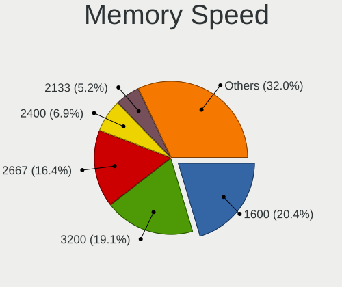

| Speed   | Notebooks | Percent |
|---------|-----------|---------|
| 1600    | 541       | 20.38%  |
| 3200    | 507       | 19.1%   |
| 2667    | 434       | 16.35%  |
| 2400    | 184       | 6.93%   |
| 2133    | 138       | 5.2%    |
| 1334    | 92        | 3.47%   |
| 1333    | 81        | 3.05%   |
| 5600    | 74        | 2.79%   |
| 4800    | 69        | 2.6%    |
| 667     | 52        | 1.96%   |
| 1067    | 49        | 1.85%   |
| 6400    | 46        | 1.73%   |
| 4267    | 46        | 1.73%   |
| 1867    | 46        | 1.73%   |
| 8400    | 36        | 1.36%   |
| Unknown | 35        | 1.32%   |
| 3266    | 27        | 1.02%   |
| 4199    | 26        | 0.98%   |
| 4266    | 24        | 0.9%    |
| 800     | 20        | 0.75%   |
| 7500    | 19        | 0.72%   |
| 1066    | 17        | 0.64%   |
| 975     | 17        | 0.64%   |
| 3733    | 15        | 0.57%   |
| 533     | 11        | 0.41%   |
| 8533    | 8         | 0.3%    |
| 7467    | 7         | 0.26%   |
| 2048    | 7         | 0.26%   |
| 1639    | 6         | 0.23%   |
| 6000    | 3         | 0.11%   |
| 2933    | 3         | 0.11%   |
| 1200    | 3         | 0.11%   |
| 1866    | 2         | 0.08%   |
| 933     | 2         | 0.08%   |
| 400     | 2         | 0.08%   |
| 5500    | 1         | 0.04%   |
| 5200    | 1         | 0.04%   |
| 3800    | 1         | 0.04%   |
| 3000    | 1         | 0.04%   |
| 333     | 1         | 0.04%   |

Printers & scanners
-------------------

Printer Vendor
--------------

Printer device vendors

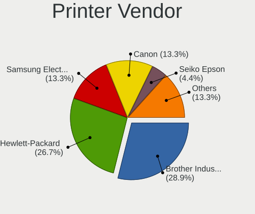

| Vendor                | Notebooks | Percent |
|-----------------------|-----------|---------|
| Brother Industries    | 13        | 28.89%  |
| Hewlett-Packard       | 12        | 26.67%  |
| Samsung Electronics   | 6         | 13.33%  |
| Canon                 | 6         | 13.33%  |
| Seiko Epson           | 2         | 4.44%   |
| QinHeng Electronics   | 2         | 4.44%   |
| Xerox                 | 1         | 2.22%   |
| Prolific Technology   | 1         | 2.22%   |
| Lexmark International | 1         | 2.22%   |
| Dymo-CoStar           | 1         | 2.22%   |

Printer Model
-------------

Printer device models

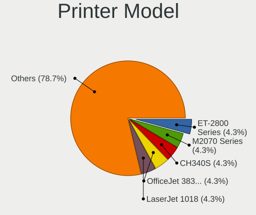

| Model                                           | Notebooks | Percent |
|-------------------------------------------------|-----------|---------|
| Seiko Epson ET-2800 Series                      | 2         | 4.26%   |
| Samsung M2070 Series                            | 2         | 4.26%   |
| QinHeng CH340S                                  | 2         | 4.26%   |
| HP OfficeJet 3830 series                        | 2         | 4.26%   |
| HP LaserJet 1018                                | 2         | 4.26%   |
| Canon PIXMA MG2900 Series                       | 2         | 4.26%   |
| Brother Printer                                 | 2         | 4.26%   |
| Xerox B210                                      | 1         | 2.13%   |
| Samsung ML-2510 Series                          | 1         | 2.13%   |
| Samsung M267x 287x Series                       | 1         | 2.13%   |
| Samsung M262x/M282x Xpress Series Laser Printer | 1         | 2.13%   |
| Samsung M2020 Series                            | 1         | 2.13%   |
| Prolific PL2305 Parallel Port                   | 1         | 2.13%   |
| Lexmark International 2600 Series               | 1         | 2.13%   |
| HP LaserJet Professional P1102w                 | 1         | 2.13%   |
| HP LaserJet 1160 series                         | 1         | 2.13%   |
| HP LaserJet 1020                                | 1         | 2.13%   |
| HP ENVY 5000 series                             | 1         | 2.13%   |
| HP ENVY 4520 series                             | 1         | 2.13%   |
| HP Deskjet 3050 J610 series                     | 1         | 2.13%   |
| HP DeskJet 2700 series                          | 1         | 2.13%   |
| HP DeskJet 2600 series                          | 1         | 2.13%   |
| Dymo-CoStar LabelWriter 450                     | 1         | 2.13%   |
| Canon MG2100 series                             | 1         | 2.13%   |
| Canon MF3010                                    | 1         | 2.13%   |
| Canon MF230 Series UFRII LT                     | 1         | 2.13%   |
| Canon G3060 series                              | 1         | 2.13%   |
| Brother MFC-L2730DW series                      | 1         | 2.13%   |
| Brother MFC-L2717DW                             | 1         | 2.13%   |
| Brother MFC-J6945DW                             | 1         | 2.13%   |
| Brother MFC-J6930DW                             | 1         | 2.13%   |
| Brother MFC-J480DW                              | 1         | 2.13%   |
| Brother MFC-9330CDW                             | 1         | 2.13%   |
| Brother HL-L2390DW                              | 1         | 2.13%   |
| Brother HL-L2320D series                        | 1         | 2.13%   |
| Brother HL-2270DW Laser Printer                 | 1         | 2.13%   |
| Brother HL-2240 series                          | 1         | 2.13%   |
| Brother HL-2170W series                         | 1         | 2.13%   |
| Brother DCP-L2550DW series                      | 1         | 2.13%   |
| Brother DCP-7030                                | 1         | 2.13%   |

Scanner Vendor
--------------

Scanner device vendors

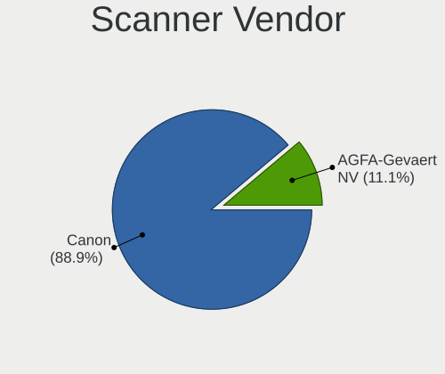

| Vendor          | Notebooks | Percent |
|-----------------|-----------|---------|
| Canon           | 8         | 88.89%  |
| AGFA-Gevaert NV | 1         | 11.11%  |

Scanner Model
-------------

Scanner device models

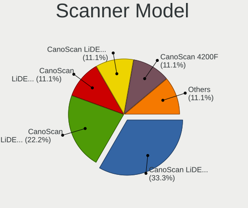

| Model                              | Notebooks | Percent |
|------------------------------------|-----------|---------|
| Canon CanoScan LiDE 220            | 3         | 33.33%  |
| Canon CanoScan LiDE 120            | 2         | 22.22%  |
| Canon CanoScan LiDE 700F           | 1         | 11.11%  |
| Canon CanoScan LiDE 110            | 1         | 11.11%  |
| Canon CanoScan 4200F               | 1         | 11.11%  |
| AGFA-Gevaert NV SnapScan 1212U (?) | 1         | 11.11%  |

Camera
------

Camera Vendor
-------------

Camera device vendors

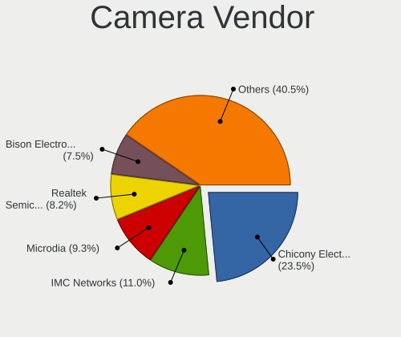

| Vendor                                 | Notebooks | Percent |
|----------------------------------------|-----------|---------|
| Chicony Electronics                    | 917       | 23.46%  |
| IMC Networks                           | 429       | 10.98%  |
| Microdia                               | 365       | 9.34%   |
| Realtek Semiconductor                  | 322       | 8.24%   |
| Bison Electronics                      | 293       | 7.5%    |
| Sunplus Innovation Technology          | 243       | 6.22%   |
| Quanta                                 | 197       | 5.04%   |
| Apple                                  | 159       | 4.07%   |
| Suyin                                  | 136       | 3.48%   |
| Luxvisions Innotech Limited            | 102       | 2.61%   |
| Cheng Uei Precision Industry (Foxlink) | 100       | 2.56%   |
| Lite-On Technology                     | 75        | 1.92%   |
| Logitech                               | 70        | 1.79%   |
| Syntek                                 | 69        | 1.77%   |
| Sonix Technology                       | 50        | 1.28%   |
| Ricoh                                  | 41        | 1.05%   |
| Silicon Motion                         | 38        | 0.97%   |
| Lenovo                                 | 33        | 0.84%   |
| Alcor Micro                            | 32        | 0.82%   |
| Importek                               | 29        | 0.74%   |
| Samsung Electronics                    | 27        | 0.69%   |
| Microsoft                              | 18        | 0.46%   |
| Acer                                   | 18        | 0.46%   |
| ALi                                    | 13        | 0.33%   |
| Primax Electronics                     | 12        | 0.31%   |
| OmniVision Technologies                | 12        | 0.31%   |
| ShineTech                              | 10        | 0.26%   |
| Z-Star Microelectronics                | 9         | 0.23%   |
| icSpring                               | 7         | 0.18%   |
| AVerMedia Technologies                 | 5         | 0.13%   |
| SunplusIT                              | 4         | 0.1%    |
| MacroSilicon                           | 4         | 0.1%    |
| LG Electronics                         | 4         | 0.1%    |
| Framework                              | 4         | 0.1%    |
| YGTek                                  | 3         | 0.08%   |
| Sunplus Technology                     | 3         | 0.08%   |
| Shine-Optics                           | 3         | 0.08%   |
| BillionPixels                          | 3         | 0.08%   |
| WaveRider Communications               | 2         | 0.05%   |
| Razer USA                              | 2         | 0.05%   |

Camera Model
------------

Camera device models

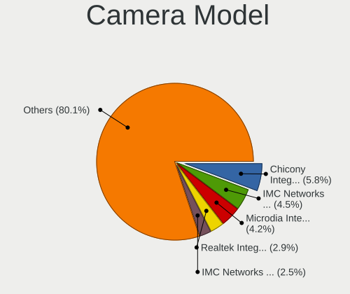

| Model                                               | Notebooks | Percent |
|-----------------------------------------------------|-----------|---------|
| Chicony Integrated Camera                           | 226       | 5.75%   |
| IMC Networks USB2.0 HD UVC WebCam                   | 177       | 4.5%    |
| Microdia Integrated_Webcam_HD                       | 167       | 4.25%   |
| Realtek Integrated_Webcam_HD                        | 115       | 2.93%   |
| IMC Networks Integrated Camera                      | 97        | 2.47%   |
| Bison Integrated Camera                             | 89        | 2.26%   |
| Chicony HD WebCam                                   | 81        | 2.06%   |
| Sunplus Integrated_Webcam_HD                        | 66        | 1.68%   |
| Apple FaceTime HD Camera                            | 52        | 1.32%   |
| Apple Built-in iSight                               | 51        | 1.3%    |
| Syntek Integrated Camera                            | 46        | 1.17%   |
| Luxvisions Innotech Limited Integrated Camera       | 42        | 1.07%   |
| IMC Networks USB2.0 VGA UVC WebCam                  | 42        | 1.07%   |
| Quanta HD User Facing                               | 40        | 1.02%   |
| Microdia Integrated Webcam                          | 39        | 0.99%   |
| Sunplus HD WebCam                                   | 36        | 0.92%   |
| Chicony Integrated Camera (1280x720@30)             | 36        | 0.92%   |
| Bison HD Webcam                                     | 36        | 0.92%   |
| Chicony VGA Webcam                                  | 35        | 0.89%   |
| Lite-On Integrated Camera                           | 34        | 0.87%   |
| Bison SunplusIT Integrated Camera                   | 34        | 0.87%   |
| Apple iPhone 5/5C/5S/6/SE/7/8/X                     | 34        | 0.87%   |
| Chicony HP HD Camera                                | 32        | 0.81%   |
| Chicony HP Truevision HD                            | 31        | 0.79%   |
| Chicony HD User Facing                              | 31        | 0.79%   |
| Sonix USB2.0 HD UVC WebCam                          | 30        | 0.76%   |
| Quanta VGA WebCam                                   | 28        | 0.71%   |
| Chicony Lenovo Integrated Camera (0.3MP)            | 28        | 0.71%   |
| Samsung Galaxy series, misc. (MTP mode)             | 27        | 0.69%   |
| Bison Lenovo EasyCamera                             | 27        | 0.69%   |
| Quanta HP TrueVision HD Camera                      | 25        | 0.64%   |
| Luxvisions Innotech Limited HP TrueVision HD Camera | 25        | 0.64%   |
| Chicony USB2.0 HD UVC WebCam                        | 25        | 0.64%   |
| Chicony HP TrueVision HD Camera                     | 25        | 0.64%   |
| Realtek USB Camera                                  | 24        | 0.61%   |
| Quanta HD Webcam                                    | 24        | 0.61%   |
| Chicony TOSHIBA Web Camera - HD                     | 23        | 0.59%   |
| Chicony USB2.0 VGA UVC WebCam                       | 22        | 0.56%   |
| Suyin Acer/HP Integrated Webcam [CN0314]            | 21        | 0.53%   |
| Bison BisonCam,NB Pro                               | 21        | 0.53%   |

Security
--------

Fingerprint Vendor
------------------

Fingerprint sensor vendors

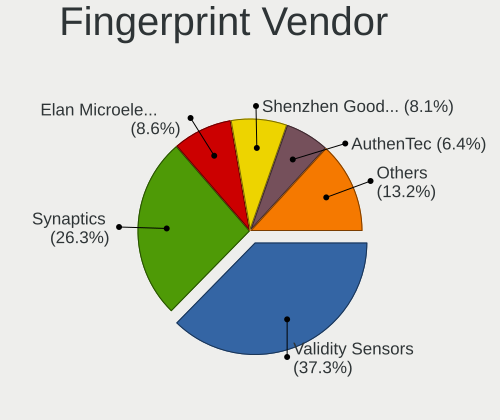

| Vendor                             | Notebooks | Percent |
|------------------------------------|-----------|---------|
| Validity Sensors                   | 308       | 37.33%  |
| Synaptics                          | 217       | 26.3%   |
| Elan Microelectronics              | 71        | 8.61%   |
| Shenzhen Goodix Technology         | 67        | 8.12%   |
| AuthenTec                          | 53        | 6.42%   |
| Upek                               | 52        | 6.3%    |
| LighTuning Technology              | 26        | 3.15%   |
| STMicroelectronics                 | 20        | 2.42%   |
| Realtek USB2.0 Finger Print Bridge | 5         | 0.61%   |
| Focal-systems.Corp                 | 3         | 0.36%   |
| Microsoft                          | 1         | 0.12%   |
| HOLTEK                             | 1         | 0.12%   |
| Dell                               | 1         | 0.12%   |

Fingerprint Model
-----------------

Fingerprint sensor models

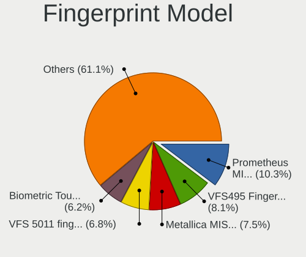

| Model                                                                      | Notebooks | Percent |
|----------------------------------------------------------------------------|-----------|---------|
| Synaptics Prometheus MIS Touch Fingerprint Reader                          | 85        | 10.3%   |
| Validity Sensors VFS495 Fingerprint Reader                                 | 67        | 8.12%   |
| Synaptics Metallica MIS Touch Fingerprint Reader                           | 62        | 7.52%   |
| Validity Sensors VFS 5011 fingerprint sensor                               | 56        | 6.79%   |
| Upek Biometric Touchchip/Touchstrip Fingerprint Sensor                     | 51        | 6.18%   |
| Elan ELAN:Fingerprint                                                      | 49        | 5.94%   |
| Validity Sensors Synaptics WBDI                                            | 42        | 5.09%   |
| Shenzhen Goodix FingerPrint                                                | 34        | 4.12%   |
| Validity Sensors VFS5011 Fingerprint Reader                                | 26        | 3.15%   |
| Shenzhen Goodix  FingerPrint Device                                        | 25        | 3.03%   |
| Validity Sensors VFS491                                                    | 23        | 2.79%   |
| Elan ELAN:ARM-M4                                                           | 22        | 2.67%   |
| AuthenTec AES2810                                                          | 22        | 2.67%   |
| STMicroelectronics Fingerprint Reader                                      | 20        | 2.42%   |
| Validity Sensors VFS471 Fingerprint Reader                                 | 18        | 2.18%   |
| LighTuning EgisTec Touch Fingerprint Sensor                                | 15        | 1.82%   |
| Validity Sensors Fingerprint scanner                                       | 13        | 1.58%   |
| AuthenTec Fingerprint Sensor                                               | 12        | 1.45%   |
| AuthenTec AES2501 Fingerprint Sensor                                       | 12        | 1.45%   |
| Validity Sensors Swipe Fingerprint Sensor                                  | 11        | 1.33%   |
| Synaptics Prometheus Fingerprint Reader                                    | 11        | 1.33%   |
| Validity Sensors VFS7500 Touch Fingerprint Sensor                          | 10        | 1.21%   |
| Validity Sensors Synaptics VFS7552 Touch Fingerprint Sensor with PurePrint | 10        | 1.21%   |
| Synaptics UWP WBDI Device                                                  | 10        | 1.21%   |
| Validity Sensors VFS301 Fingerprint Reader                                 | 9         | 1.09%   |
| LighTuning ES603 Swipe Fingerprint Sensor                                  | 9         | 1.09%   |
| Synaptics Fingerprint reader [HP G6]                                       | 8         | 0.97%   |
| Shenzhen Goodix Fingerprint Reader                                         | 8         | 0.97%   |
| Validity Sensors VFS7552 Touch Fingerprint Sensor                          | 7         | 0.85%   |
| Validity Sensors VFS451 Fingerprint Reader                                 | 6         | 0.73%   |
| Synaptics WBDI Fingerprint Reader USB 086                                  | 6         | 0.73%   |
| Synaptics  WBDI                                                            | 6         | 0.73%   |
| Synaptics FS7604 Touch Fingerprint Sensor with PurePrint                   | 6         | 0.73%   |
| Synaptics TouchPad                                                         | 5         | 0.61%   |
| Synaptics Metallica MOH Touch Fingerprint Reader                           | 5         | 0.61%   |
| Realtek USB2.0 Finger Print Bridge FocalTech Fingerprint Device            | 5         | 0.61%   |
| Validity Sensors VFS101 Fingerprint Reader                                 | 4         | 0.48%   |
| Synaptics  FS7604 Touch Fingerprint Sensor with PurePrint                  | 4         | 0.48%   |
| AuthenTec AES1600                                                          | 4         | 0.48%   |
| Validity Sensors VFS300 Fingerprint Reader                                 | 3         | 0.36%   |

Chipcard Vendor
---------------

Chipcard module vendors

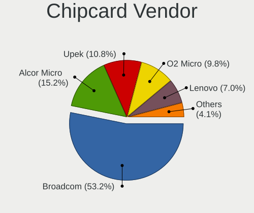

| Vendor                    | Notebooks | Percent |
|---------------------------|-----------|---------|
| Broadcom                  | 168       | 53.16%  |
| Alcor Micro               | 48        | 15.19%  |
| Upek                      | 34        | 10.76%  |
| O2 Micro                  | 31        | 9.81%   |
| Lenovo                    | 22        | 6.96%   |
| Gemalto (was Gemplus)     | 5         | 1.58%   |
| Yubico.com                | 3         | 0.95%   |
| SCM Microsystems          | 2         | 0.63%   |
| Giesecke & Devrient       | 1         | 0.32%   |
| Aladdin Knowledge Systems | 1         | 0.32%   |
| Advanced Card Systems     | 1         | 0.32%   |

Chipcard Model
--------------

Chipcard module models

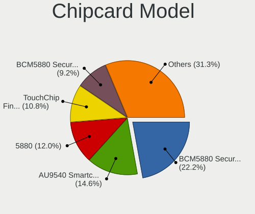

| Model                                                                        | Notebooks | Percent |
|------------------------------------------------------------------------------|-----------|---------|
| Broadcom BCM5880 Secure Applications Processor                               | 70        | 22.15%  |
| Alcor Micro AU9540 Smartcard Reader                                          | 46        | 14.56%  |
| Broadcom 5880                                                                | 38        | 12.03%  |
| Upek TouchChip Fingerprint Coprocessor (WBF advanced mode)                   | 34        | 10.76%  |
| Broadcom BCM5880 Secure Applications Processor with fingerprint swipe sensor | 29        | 9.18%   |
| O2 Micro OZ776 CCID Smartcard Reader                                         | 26        | 8.23%   |
| Lenovo Integrated Smart Card Reader                                          | 22        | 6.96%   |
| Broadcom BCM58200 ControlVault 3 (FingerPrint sensor + Contacted SmartCard)  | 20        | 6.33%   |
| Broadcom 58200                                                               | 10        | 3.16%   |
| O2 Micro Oz776 SmartCard Reader                                              | 5         | 1.58%   |
| Gemalto (was Gemplus) GemPC Twin SmartCard Reader                            | 4         | 1.27%   |
| Yubico.com Yubikey 4/5 U2F+CCID                                              | 3         | 0.95%   |
| Alcor Micro Watchdata W 1981                                                 | 2         | 0.63%   |
| SCM Microsystems SCR35xx Smart Card Reader                                   | 1         | 0.32%   |
| SCM Microsystems SCR331-LC1 / SCR3310 SmartCard Reader                       | 1         | 0.32%   |
| Giesecke & Devrient StarSign CUT S                                           | 1         | 0.32%   |
| Gemalto (was Gemplus) Compact Smart Card Reader Writer                       | 1         | 0.32%   |
| Broadcom BCM5880 Secure Applications Processor with fingerprint touch sensor | 1         | 0.32%   |
| Aladdin Knowledge Systems Token JC                                           | 1         | 0.32%   |
| Advanced Card Systems ACR122U                                                | 1         | 0.32%   |

Unsupported
-----------

Unsupported Devices
-------------------

Total unsupported devices on board

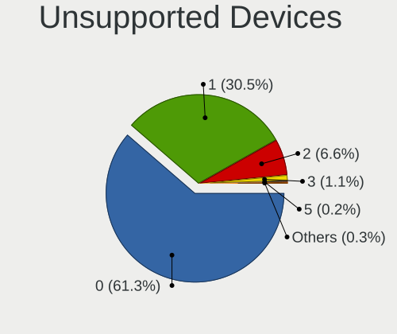

| Total | Notebooks | Percent |
|-------|-----------|---------|
| 0     | 2886      | 61.34%  |
| 1     | 1436      | 30.52%  |
| 2     | 309       | 6.57%   |
| 3     | 50        | 1.06%   |
| 5     | 9         | 0.19%   |
| 4     | 9         | 0.19%   |
| 6     | 5         | 0.11%   |
| 7     | 1         | 0.02%   |

Unsupported Device Types
------------------------

Types of unsupported devices

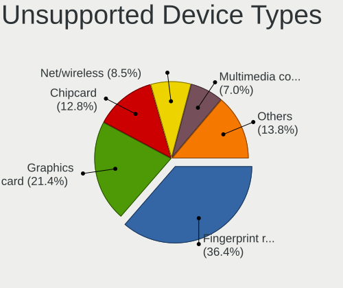

| Type                     | Notebooks | Percent |
|--------------------------|-----------|---------|
| Fingerprint reader       | 810       | 36.37%  |
| Graphics card            | 477       | 21.42%  |
| Chipcard                 | 285       | 12.8%   |
| Net/wireless             | 190       | 8.53%   |
| Multimedia controller    | 157       | 7.05%   |
| Communication controller | 56        | 2.51%   |
| Storage                  | 53        | 2.38%   |
| Camera                   | 51        | 2.29%   |
| Bluetooth                | 40        | 1.8%    |
| Sound                    | 29        | 1.3%    |
| Net/ethernet             | 21        | 0.94%   |
| Card reader              | 16        | 0.72%   |
| Modem                    | 14        | 0.63%   |
| Network                  | 8         | 0.36%   |
| Flash memory             | 6         | 0.27%   |
| Storage/raid             | 4         | 0.18%   |
| Storage/ide              | 3         | 0.13%   |
| Firewire controller      | 2         | 0.09%   |
| Unclassified device      | 1         | 0.04%   |
| Unassigned class         | 1         | 0.04%   |
| Tv card                  | 1         | 0.04%   |
| Storage/ata              | 1         | 0.04%   |
| Dvb card                 | 1         | 0.04%   |

