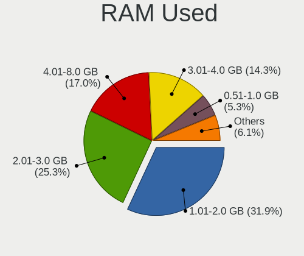
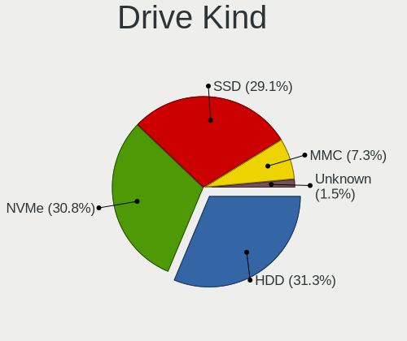
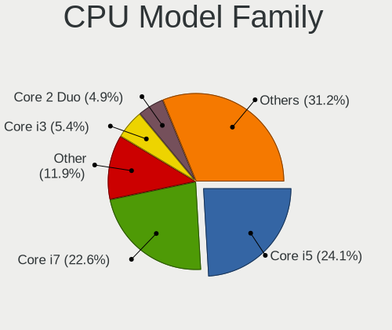
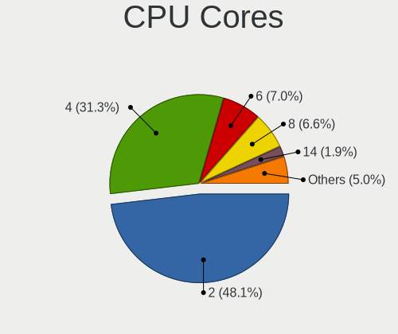
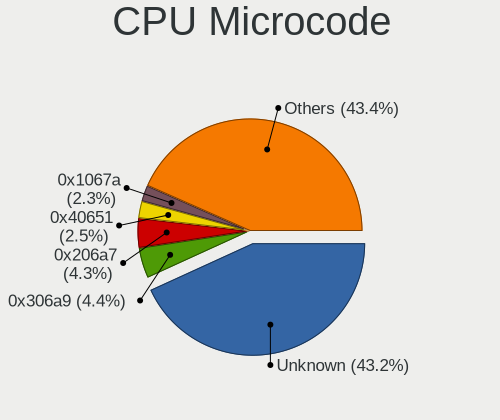
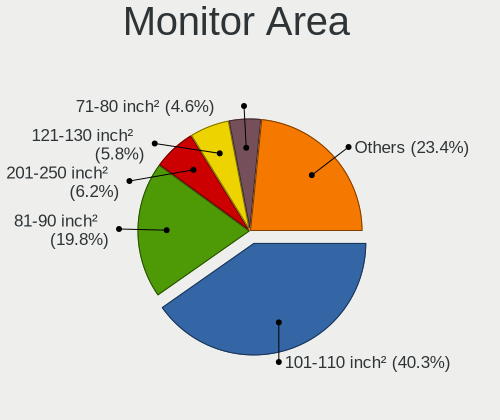
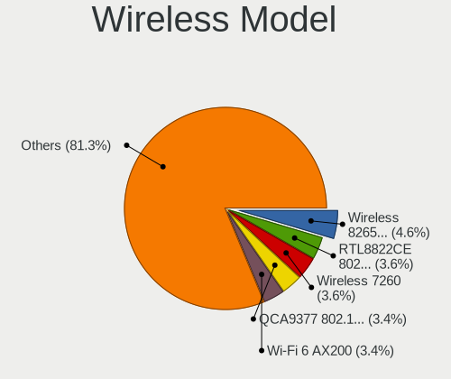
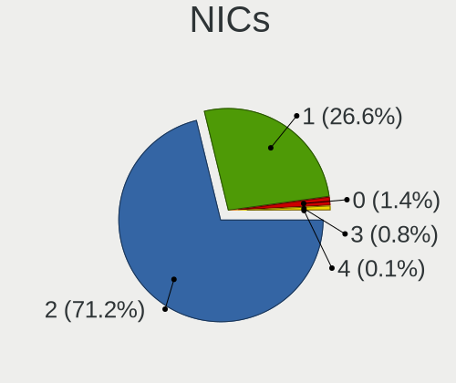
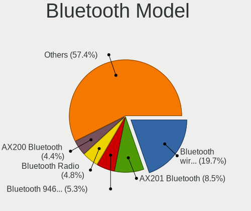
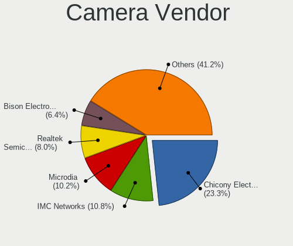

Linux in Canada - Tested Hardware & Statistics (Notebooks)
----------------------------------------------------------

A project to collect tested hardware configurations for Linux in Canada.

Anyone can contribute to this report by the [hw-probe](https://github.com/linuxhw/hw-probe) tool:

    sudo -E hw-probe -all -upload

Please contribute! Especially if your hardware is rare.

Contents
--------

* [ Test Cases ](#test-cases)

* [ System ](#system)
  - [ OS                       ](#os)
  - [ OS Family                ](#os-family)
  - [ Kernel                   ](#kernel)
  - [ Kernel Family            ](#kernel-family)
  - [ Kernel Major Ver.        ](#kernel-major-ver)
  - [ Arch                     ](#arch)
  - [ DE                       ](#de)
  - [ Display Server           ](#display-server)
  - [ Display Manager          ](#display-manager)
  - [ OS Lang                  ](#os-lang)
  - [ Boot Mode                ](#boot-mode)
  - [ Filesystem               ](#filesystem)
  - [ Part. scheme             ](#part-scheme)
  - [ Dual Boot with Linux/BSD ](#dual-boot-with-linuxbsd)
  - [ Dual Boot (Win)          ](#dual-boot-win)

* [ Board ](#board)
  - [ Vendor                   ](#vendor)
  - [ Model                    ](#model)
  - [ Model Family             ](#model-family)
  - [ MFG Year                 ](#mfg-year)
  - [ Form Factor              ](#form-factor)
  - [ Secure Boot              ](#secure-boot)
  - [ Coreboot                 ](#coreboot)
  - [ RAM Size                 ](#ram-size)
  - [ RAM Used                 ](#ram-used)
  - [ Total Drives             ](#total-drives)
  - [ Has CD-ROM               ](#has-cd-rom)
  - [ Has Ethernet             ](#has-ethernet)
  - [ Has WiFi                 ](#has-wifi)
  - [ Has Bluetooth            ](#has-bluetooth)

* [ Location ](#location)
  - [ Country                  ](#country)
  - [ City                     ](#city)

* [ Drives ](#drives)
  - [ Drive Vendor             ](#drive-vendor)
  - [ Drive Model              ](#drive-model)
  - [ HDD Vendor               ](#hdd-vendor)
  - [ SSD Vendor               ](#ssd-vendor)
  - [ Drive Kind               ](#drive-kind)
  - [ Drive Connector          ](#drive-connector)
  - [ Drive Size               ](#drive-size)
  - [ Space Total              ](#space-total)
  - [ Space Used               ](#space-used)
  - [ Malfunc. Drives          ](#malfunc-drives)
  - [ Malfunc. Drive Vendor    ](#malfunc-drive-vendor)
  - [ Malfunc. HDD Vendor      ](#malfunc-hdd-vendor)
  - [ Malfunc. Drive Kind      ](#malfunc-drive-kind)
  - [ Failed Drives            ](#failed-drives)
  - [ Failed Drive Vendor      ](#failed-drive-vendor)
  - [ Drive Status             ](#drive-status)

* [ Storage controller ](#storage-controller)
  - [ Storage Vendor           ](#storage-vendor)
  - [ Storage Model            ](#storage-model)
  - [ Storage Kind             ](#storage-kind)

* [ Processor ](#processor)
  - [ CPU Vendor               ](#cpu-vendor)
  - [ CPU Model                ](#cpu-model)
  - [ CPU Model Family         ](#cpu-model-family)
  - [ CPU Cores                ](#cpu-cores)
  - [ CPU Sockets              ](#cpu-sockets)
  - [ CPU Threads              ](#cpu-threads)
  - [ CPU Op-Modes             ](#cpu-op-modes)
  - [ CPU Microcode            ](#cpu-microcode)
  - [ CPU Microarch            ](#cpu-microarch)

* [ Graphics ](#graphics)
  - [ GPU Vendor               ](#gpu-vendor)
  - [ GPU Model                ](#gpu-model)
  - [ GPU Combo                ](#gpu-combo)
  - [ GPU Driver               ](#gpu-driver)
  - [ GPU Memory               ](#gpu-memory)

* [ Monitor ](#monitor)
  - [ Monitor Vendor           ](#monitor-vendor)
  - [ Monitor Model            ](#monitor-model)
  - [ Monitor Resolution       ](#monitor-resolution)
  - [ Monitor Diagonal         ](#monitor-diagonal)
  - [ Monitor Width            ](#monitor-width)
  - [ Aspect Ratio             ](#aspect-ratio)
  - [ Monitor Area             ](#monitor-area)
  - [ Pixel Density            ](#pixel-density)
  - [ Multiple Monitors        ](#multiple-monitors)

* [ Network ](#network)
  - [ Net Controller Vendor    ](#net-controller-vendor)
  - [ Net Controller Model     ](#net-controller-model)
  - [ Wireless Vendor          ](#wireless-vendor)
  - [ Wireless Model           ](#wireless-model)
  - [ Ethernet Vendor          ](#ethernet-vendor)
  - [ Ethernet Model           ](#ethernet-model)
  - [ Net Controller Kind      ](#net-controller-kind)
  - [ Used Controller          ](#used-controller)
  - [ NICs                     ](#nics)
  - [ IPv6                     ](#ipv6)

* [ Bluetooth ](#bluetooth)
  - [ Bluetooth Vendor         ](#bluetooth-vendor)
  - [ Bluetooth Model          ](#bluetooth-model)

* [ Sound ](#sound)
  - [ Sound Vendor             ](#sound-vendor)
  - [ Sound Model              ](#sound-model)

* [ Memory ](#memory)
  - [ Memory Vendor            ](#memory-vendor)
  - [ Memory Model             ](#memory-model)
  - [ Memory Kind              ](#memory-kind)
  - [ Memory Form Factor       ](#memory-form-factor)
  - [ Memory Size              ](#memory-size)
  - [ Memory Speed             ](#memory-speed)

* [ Printers & scanners ](#printers--scanners)
  - [ Printer Vendor           ](#printer-vendor)
  - [ Printer Model            ](#printer-model)
  - [ Scanner Vendor           ](#scanner-vendor)
  - [ Scanner Model            ](#scanner-model)

* [ Camera ](#camera)
  - [ Camera Vendor            ](#camera-vendor)
  - [ Camera Model             ](#camera-model)

* [ Security ](#security)
  - [ Fingerprint Vendor       ](#fingerprint-vendor)
  - [ Fingerprint Model        ](#fingerprint-model)
  - [ Chipcard Vendor          ](#chipcard-vendor)
  - [ Chipcard Model           ](#chipcard-model)

* [ Unsupported ](#unsupported)
  - [ Unsupported Devices      ](#unsupported-devices)
  - [ Unsupported Device Types ](#unsupported-device-types)

Test Cases
----------

Total: 3050

| Vendor        | Model                       | Probe                                                      | Date         |
|---------------|-----------------------------|------------------------------------------------------------|--------------|
| Acer          | Aspire 5810T                | [6f807b1a84](https://linux-hardware.org/?probe=6f807b1a84) | Sep 01, 2022 |
| Lenovo        | ThinkPad T580 20L9CTO1WW    | [d6e9455a63](https://linux-hardware.org/?probe=d6e9455a63) | Aug 31, 2022 |
| Samsung       | 305E4A/305E5A/305E7A        | [6eeadaf886](https://linux-hardware.org/?probe=6eeadaf886) | Aug 31, 2022 |
| ASUSTek       | K401UQK                     | [4f026584d7](https://linux-hardware.org/?probe=4f026584d7) | Aug 31, 2022 |
| Samsung       | 305E4A/305E5A/305E7A        | [56e8f54a3e](https://linux-hardware.org/?probe=56e8f54a3e) | Aug 31, 2022 |
| HP            | Pavilion Gaming Laptop 1... | [20da9d42a4](https://linux-hardware.org/?probe=20da9d42a4) | Aug 30, 2022 |
| Dell          | Inspiron 15-3567            | [39ae8218f6](https://linux-hardware.org/?probe=39ae8218f6) | Aug 30, 2022 |
| Lenovo        | ThinkPad X1 Carbon 6th 2... | [a8acbb8d0b](https://linux-hardware.org/?probe=a8acbb8d0b) | Aug 28, 2022 |
| HP            | Pavilion Gaming Laptop 1... | [20bea980d2](https://linux-hardware.org/?probe=20bea980d2) | Aug 28, 2022 |
| Lenovo        | ThinkPad T430 2349DG5       | [740898521d](https://linux-hardware.org/?probe=740898521d) | Aug 27, 2022 |
| Lenovo        | ThinkPad T430 2344BMU       | [c164d20c15](https://linux-hardware.org/?probe=c164d20c15) | Aug 26, 2022 |
| Lenovo        | ThinkPad T460s 20F9004NU... | [04f9f63255](https://linux-hardware.org/?probe=04f9f63255) | Aug 26, 2022 |
| Lenovo        | ThinkPad P14s Gen 2a 21A... | [83377b24dc](https://linux-hardware.org/?probe=83377b24dc) | Aug 25, 2022 |
| MSI           | WF75 10TK                   | [8f395376ba](https://linux-hardware.org/?probe=8f395376ba) | Aug 25, 2022 |
| Lenovo        | ThinkPad T420s 417152U      | [73a97b425c](https://linux-hardware.org/?probe=73a97b425c) | Aug 25, 2022 |
| Acer          | Swift SFX14-41G             | [8d1cad5e52](https://linux-hardware.org/?probe=8d1cad5e52) | Aug 25, 2022 |
| Lenovo        | ThinkPad P14s Gen 2a 21A... | [d2e2d5484c](https://linux-hardware.org/?probe=d2e2d5484c) | Aug 25, 2022 |
| Google        | Rabbid                      | [8049c3894c](https://linux-hardware.org/?probe=8049c3894c) | Aug 24, 2022 |
| Lenovo        | 14w 81MQ000JUS              | [1ff769c6ef](https://linux-hardware.org/?probe=1ff769c6ef) | Aug 23, 2022 |
| Valve         | Jupiter                     | [ba1940016e](https://linux-hardware.org/?probe=ba1940016e) | Aug 23, 2022 |
| Valve         | Jupiter                     | [04b0de9007](https://linux-hardware.org/?probe=04b0de9007) | Aug 22, 2022 |
| System76      | Oryx Pro                    | [7c763e43c6](https://linux-hardware.org/?probe=7c763e43c6) | Aug 21, 2022 |
| HP            | Pavilion 15                 | [c8d31e4708](https://linux-hardware.org/?probe=c8d31e4708) | Aug 21, 2022 |
| Dell          | Inspiron 15-5578            | [a0ff8934e5](https://linux-hardware.org/?probe=a0ff8934e5) | Aug 21, 2022 |
| Sony          | VPCEB12FD                   | [f98be4240a](https://linux-hardware.org/?probe=f98be4240a) | Aug 20, 2022 |
| Lenovo        | ThinkPad T500 2055A38       | [f37fce9f01](https://linux-hardware.org/?probe=f37fce9f01) | Aug 20, 2022 |
| Toshiba       | PORTEGE M780                | [8b7e72c5d9](https://linux-hardware.org/?probe=8b7e72c5d9) | Aug 20, 2022 |
| MSI           | Sword 15 A11UD              | [ca0fbaa451](https://linux-hardware.org/?probe=ca0fbaa451) | Aug 19, 2022 |
| MSI           | Sword 15 A11UD              | [565a6f9022](https://linux-hardware.org/?probe=565a6f9022) | Aug 19, 2022 |
| HP            | EliteBook 8460p             | [1eca9d2f2d](https://linux-hardware.org/?probe=1eca9d2f2d) | Aug 19, 2022 |
| Dell          | Latitude E6410              | [3304a70394](https://linux-hardware.org/?probe=3304a70394) | Aug 19, 2022 |
| Lenovo        | ThinkPad T460s 20F9004NU... | [3b35e8e9da](https://linux-hardware.org/?probe=3b35e8e9da) | Aug 17, 2022 |
| Lenovo        | ThinkPad T470s 20HFCTO1W... | [4d5eb5e332](https://linux-hardware.org/?probe=4d5eb5e332) | Aug 15, 2022 |
| ASUSTek       | X555LAB                     | [5171fd1732](https://linux-hardware.org/?probe=5171fd1732) | Aug 15, 2022 |
| Lenovo        | ThinkPad T460s 20F9004NU... | [e09e349f03](https://linux-hardware.org/?probe=e09e349f03) | Aug 15, 2022 |
| Valve         | Jupiter                     | [9ab7a2b695](https://linux-hardware.org/?probe=9ab7a2b695) | Aug 15, 2022 |
| Dell          | XPS 15 9500                 | [08ef9ef965](https://linux-hardware.org/?probe=08ef9ef965) | Aug 14, 2022 |
| Lenovo        | ThinkPad E550 20DF0040CA    | [0f657d4798](https://linux-hardware.org/?probe=0f657d4798) | Aug 14, 2022 |
| HP            | ENVY m6                     | [74d1a937cf](https://linux-hardware.org/?probe=74d1a937cf) | Aug 14, 2022 |
| Apple         | MacBookPro12,1              | [8b417889e1](https://linux-hardware.org/?probe=8b417889e1) | Aug 13, 2022 |
| Dell          | G3 3590                     | [fbe948e194](https://linux-hardware.org/?probe=fbe948e194) | Aug 13, 2022 |
| Toshiba       | PORTEGE M780                | [b7304a84fd](https://linux-hardware.org/?probe=b7304a84fd) | Aug 13, 2022 |
| Valve         | Jupiter                     | [3a1e95f5d5](https://linux-hardware.org/?probe=3a1e95f5d5) | Aug 12, 2022 |
| Dell          | Latitude 7420               | [26cd6bbb87](https://linux-hardware.org/?probe=26cd6bbb87) | Aug 12, 2022 |
| HP            | Pavilion 15                 | [462769d45e](https://linux-hardware.org/?probe=462769d45e) | Aug 11, 2022 |
| Lenovo        | IdeaPad Y410P 20216         | [df3068aea1](https://linux-hardware.org/?probe=df3068aea1) | Aug 10, 2022 |
| Lenovo        | ThinkPad T460s 20F9004NU... | [21044cebb3](https://linux-hardware.org/?probe=21044cebb3) | Aug 10, 2022 |
| HP            | ProBook 4540s               | [426365299d](https://linux-hardware.org/?probe=426365299d) | Aug 10, 2022 |
| Samsung       | 305E4A/305E5A/305E7A        | [b188230a8a](https://linux-hardware.org/?probe=b188230a8a) | Aug 10, 2022 |
| Samsung       | 305E4A/305E5A/305E7A        | [7586fd5a58](https://linux-hardware.org/?probe=7586fd5a58) | Aug 10, 2022 |
| HP            | Laptop 17-by1xxx            | [1be4a11102](https://linux-hardware.org/?probe=1be4a11102) | Aug 09, 2022 |
| Lenovo        | ThinkPad P15s Gen 1 20T4... | [59250f2c2f](https://linux-hardware.org/?probe=59250f2c2f) | Aug 08, 2022 |
| ASUSTek       | Zenbook UM3402YA_UM3402Y... | [10d18cd30b](https://linux-hardware.org/?probe=10d18cd30b) | Aug 08, 2022 |
| Razer         | Book 13 - RZ09-0357         | [c4a323d350](https://linux-hardware.org/?probe=c4a323d350) | Aug 06, 2022 |
| ASUSTek       | UX303UA                     | [73145490fa](https://linux-hardware.org/?probe=73145490fa) | Aug 06, 2022 |
| Apple         | MacBookPro9,2               | [a1b55cc875](https://linux-hardware.org/?probe=a1b55cc875) | Aug 06, 2022 |
| Acer          | Aspire 5742                 | [b1ec54ce80](https://linux-hardware.org/?probe=b1ec54ce80) | Aug 05, 2022 |
| ASUSTek       | VivoBook_ASUSLaptop X530... | [4acbeffc03](https://linux-hardware.org/?probe=4acbeffc03) | Aug 05, 2022 |
| Dell          | XPS 15 9520                 | [385e290982](https://linux-hardware.org/?probe=385e290982) | Aug 03, 2022 |
| Dell          | XPS 15 9520                 | [c7789bc8ca](https://linux-hardware.org/?probe=c7789bc8ca) | Aug 03, 2022 |
| Google        | Droid                       | [15d4518ba0](https://linux-hardware.org/?probe=15d4518ba0) | Aug 03, 2022 |
| ASUSTek       | VivoBook_ASUSLaptop X509... | [f79a1d3402](https://linux-hardware.org/?probe=f79a1d3402) | Aug 03, 2022 |
| ASUSTek       | VivoBook_ASUSLaptop X509... | [b2e4380743](https://linux-hardware.org/?probe=b2e4380743) | Aug 03, 2022 |
| Alienware     | x17 R2                      | [48772fabd8](https://linux-hardware.org/?probe=48772fabd8) | Aug 02, 2022 |
| Lenovo        | ThinkPad X1 Carbon 6th 2... | [0df3af0bc5](https://linux-hardware.org/?probe=0df3af0bc5) | Aug 02, 2022 |
| Alienware     | x17 R2                      | [606b777651](https://linux-hardware.org/?probe=606b777651) | Aug 02, 2022 |
| Valve         | Jupiter                     | [bfddbf1d22](https://linux-hardware.org/?probe=bfddbf1d22) | Aug 02, 2022 |
| HP            | Unknown                     | [bd6c9221e7](https://linux-hardware.org/?probe=bd6c9221e7) | Aug 02, 2022 |
| HP            | Pavilion 15                 | [442aaa6069](https://linux-hardware.org/?probe=442aaa6069) | Aug 01, 2022 |
| Valve         | Jupiter                     | [e4c6300b68](https://linux-hardware.org/?probe=e4c6300b68) | Aug 01, 2022 |
| HP            | Laptop 14-dq4xxx            | [1e57f77386](https://linux-hardware.org/?probe=1e57f77386) | Aug 01, 2022 |
| ASUSTek       | G73Jh                       | [ec1e513893](https://linux-hardware.org/?probe=ec1e513893) | Aug 01, 2022 |
| Lenovo        | IdeaPad 3 14ALC6 82KT       | [15382de4bf](https://linux-hardware.org/?probe=15382de4bf) | Aug 01, 2022 |
| Dell          | Latitude E5450              | [b7618f5c14](https://linux-hardware.org/?probe=b7618f5c14) | Jul 31, 2022 |
| Dell          | Latitude E5450              | [2c6979fb39](https://linux-hardware.org/?probe=2c6979fb39) | Jul 31, 2022 |
| HP            | Laptop 15-dy3xxx            | [e54cde5e86](https://linux-hardware.org/?probe=e54cde5e86) | Jul 31, 2022 |
| Fujitsu       | STYLISTIC Q702              | [2fe4fe7fe5](https://linux-hardware.org/?probe=2fe4fe7fe5) | Jul 30, 2022 |
| AMI           | T3 MRD                      | [7e0a2ced92](https://linux-hardware.org/?probe=7e0a2ced92) | Jul 29, 2022 |
| Lenovo        | ThinkPad T440s 20ARS4PR0... | [5b91ff037d](https://linux-hardware.org/?probe=5b91ff037d) | Jul 29, 2022 |
| Clevo         | W150HNM/W170HN              | [31c83153b5](https://linux-hardware.org/?probe=31c83153b5) | Jul 29, 2022 |
| MSI           | GF75 Thin 9SC               | [a6113f2e35](https://linux-hardware.org/?probe=a6113f2e35) | Jul 29, 2022 |
| Lenovo        | IdeaPad S145-15IWL 81MV     | [03b39a36f1](https://linux-hardware.org/?probe=03b39a36f1) | Jul 29, 2022 |
| Valve         | Jupiter                     | [dffaa71aed](https://linux-hardware.org/?probe=dffaa71aed) | Jul 28, 2022 |
| Dell          | Latitude E7440              | [ff1e9aae86](https://linux-hardware.org/?probe=ff1e9aae86) | Jul 28, 2022 |
| Lenovo        | ThinkPad X270 20HMS0GJ00    | [fa45b52c07](https://linux-hardware.org/?probe=fa45b52c07) | Jul 27, 2022 |
| Lenovo        | ThinkPad T420 4236CTO       | [6797b09b3b](https://linux-hardware.org/?probe=6797b09b3b) | Jul 27, 2022 |
| Dell          | XPS 17 9720                 | [5f7787d9e3](https://linux-hardware.org/?probe=5f7787d9e3) | Jul 27, 2022 |
| HP            | Stream Laptop 14-cb1XX      | [c5f4ae1ac4](https://linux-hardware.org/?probe=c5f4ae1ac4) | Jul 26, 2022 |
| Lenovo        | ThinkPad W530 24472SU       | [52f731db42](https://linux-hardware.org/?probe=52f731db42) | Jul 25, 2022 |
| Lenovo        | ThinkPad T470 W10DG 20JM... | [acc848feda](https://linux-hardware.org/?probe=acc848feda) | Jul 24, 2022 |
| Lenovo        | ThinkPad T470 W10DG 20JM... | [0084e69574](https://linux-hardware.org/?probe=0084e69574) | Jul 24, 2022 |
| HP            | EliteBook Folio 1040 G1     | [4c0cb4fd92](https://linux-hardware.org/?probe=4c0cb4fd92) | Jul 23, 2022 |
| Apple         | MacBookPro8,2               | [e31685e3ae](https://linux-hardware.org/?probe=e31685e3ae) | Jul 23, 2022 |
| Apple         | MacBookAir7,2               | [a86b33bdc2](https://linux-hardware.org/?probe=a86b33bdc2) | Jul 22, 2022 |
| Lenovo        | ThinkPad T500 2055A38       | [3b2f2c3bea](https://linux-hardware.org/?probe=3b2f2c3bea) | Jul 22, 2022 |
| Dell          | Precision 7560              | [c76f72f8c7](https://linux-hardware.org/?probe=c76f72f8c7) | Jul 21, 2022 |
| Dell          | G3 3590                     | [920eed9524](https://linux-hardware.org/?probe=920eed9524) | Jul 19, 2022 |
| ASUSTek       | X555QA                      | [a34b1c5684](https://linux-hardware.org/?probe=a34b1c5684) | Jul 18, 2022 |
| ASUSTek       | VivoBook_ASUSLaptop X512... | [75990d47d7](https://linux-hardware.org/?probe=75990d47d7) | Jul 17, 2022 |
| Lenovo        | ThinkPad T500 2055A38       | [e8b9689526](https://linux-hardware.org/?probe=e8b9689526) | Jul 17, 2022 |
| ASUSTek       | U30Jc                       | [3a6a0ec169](https://linux-hardware.org/?probe=3a6a0ec169) | Jul 17, 2022 |
| HP            | Laptop 14-dk1xxx            | [cf03561efa](https://linux-hardware.org/?probe=cf03561efa) | Jul 17, 2022 |
| Acer          | Aspire A515-55              | [e762750617](https://linux-hardware.org/?probe=e762750617) | Jul 16, 2022 |
| HP            | Pavilion Gaming Laptop 1... | [a6e936c29d](https://linux-hardware.org/?probe=a6e936c29d) | Jul 16, 2022 |
| HP            | Pavilion Gaming Laptop 1... | [d465259da1](https://linux-hardware.org/?probe=d465259da1) | Jul 16, 2022 |
| Acer          | Aspire A515-55              | [c020ff87e8](https://linux-hardware.org/?probe=c020ff87e8) | Jul 16, 2022 |
| HP            | Pavilion g6                 | [556c813157](https://linux-hardware.org/?probe=556c813157) | Jul 16, 2022 |
| HP            | Notebook                    | [8ef9afa771](https://linux-hardware.org/?probe=8ef9afa771) | Jul 16, 2022 |
| ASUSTek       | ASUS TUF Gaming F15 FX50... | [46ef1a2cd6](https://linux-hardware.org/?probe=46ef1a2cd6) | Jul 14, 2022 |
| AMI           | T3 MRD                      | [d29d5d14c8](https://linux-hardware.org/?probe=d29d5d14c8) | Jul 14, 2022 |
| Lenovo        | ThinkPad T420s 417152U      | [e5c9e4e4d9](https://linux-hardware.org/?probe=e5c9e4e4d9) | Jul 13, 2022 |
| HP            | EliteBook 855 G8 Noteboo... | [34c2c24b3b](https://linux-hardware.org/?probe=34c2c24b3b) | Jul 11, 2022 |
| Dell          | Latitude 5510               | [5f1abb9d12](https://linux-hardware.org/?probe=5f1abb9d12) | Jul 11, 2022 |
| Apple         | MacBookPro14,1              | [32cbf49371](https://linux-hardware.org/?probe=32cbf49371) | Jul 11, 2022 |
| HP            | EliteBook 840 G5            | [392310b916](https://linux-hardware.org/?probe=392310b916) | Jul 11, 2022 |
| Lenovo        | IdeaPad Yoga 11S 20246      | [d088d6021c](https://linux-hardware.org/?probe=d088d6021c) | Jul 11, 2022 |
| ASUSTek       | TUF Gaming FX504GD_FX80G... | [2ffa772ac9](https://linux-hardware.org/?probe=2ffa772ac9) | Jul 10, 2022 |
| HP            | EliteBook 8540p             | [b161f9e458](https://linux-hardware.org/?probe=b161f9e458) | Jul 10, 2022 |
| Lenovo        | ThinkPad T500 2242CTO       | [47bddb4e10](https://linux-hardware.org/?probe=47bddb4e10) | Jul 10, 2022 |
| Lenovo        | ThinkPad T470s 20HFCTO1W... | [2894597236](https://linux-hardware.org/?probe=2894597236) | Jul 10, 2022 |
| ASUSTek       | TUF Gaming FX504GD_FX80G... | [48aa7eac9f](https://linux-hardware.org/?probe=48aa7eac9f) | Jul 09, 2022 |
| Valve         | Jupiter                     | [98711d54c1](https://linux-hardware.org/?probe=98711d54c1) | Jul 08, 2022 |
| Dell          | Latitude 5290 2-in-1        | [5ecc52d011](https://linux-hardware.org/?probe=5ecc52d011) | Jul 08, 2022 |
| HP            | Pavilion Laptop 15-cs3xx... | [2c457a6e4e](https://linux-hardware.org/?probe=2c457a6e4e) | Jul 07, 2022 |
| ASUSTek       | X553MA                      | [80d9c382cd](https://linux-hardware.org/?probe=80d9c382cd) | Jul 07, 2022 |
| ASUSTek       | X553MA                      | [9082e63d7d](https://linux-hardware.org/?probe=9082e63d7d) | Jul 07, 2022 |
| Lenovo        | ThinkPad T500 2242CTO       | [106199561c](https://linux-hardware.org/?probe=106199561c) | Jul 07, 2022 |
| Acer          | Nitro AN515-53              | [d31c5d1c11](https://linux-hardware.org/?probe=d31c5d1c11) | Jul 06, 2022 |
| Dell          | Latitude 7420               | [219cf18b1e](https://linux-hardware.org/?probe=219cf18b1e) | Jul 06, 2022 |
| Acer          | Nitro AN515-53              | [0304267499](https://linux-hardware.org/?probe=0304267499) | Jul 06, 2022 |
| Google        | Aleena                      | [33110c34a9](https://linux-hardware.org/?probe=33110c34a9) | Jul 06, 2022 |
| HP            | EliteBook 2530p             | [a4b4609db8](https://linux-hardware.org/?probe=a4b4609db8) | Jul 05, 2022 |
| ASUSTek       | G55VW                       | [fa0346f5df](https://linux-hardware.org/?probe=fa0346f5df) | Jul 05, 2022 |
| ASUSTek       | G55VW                       | [832ca8cf45](https://linux-hardware.org/?probe=832ca8cf45) | Jul 05, 2022 |
| ASUSTek       | VivoBook_ASUSLaptop X530... | [eb9c212159](https://linux-hardware.org/?probe=eb9c212159) | Jul 04, 2022 |
| ASUSTek       | X541UJ                      | [d3f8e6dee5](https://linux-hardware.org/?probe=d3f8e6dee5) | Jul 04, 2022 |
| Apple         | MacBookPro11,5              | [25e69108df](https://linux-hardware.org/?probe=25e69108df) | Jul 03, 2022 |
| Acer          | Aspire A515-52G             | [8ac3e2bcbc](https://linux-hardware.org/?probe=8ac3e2bcbc) | Jul 02, 2022 |
| Acer          | Aspire 5742Z                | [46f56997be](https://linux-hardware.org/?probe=46f56997be) | Jul 02, 2022 |
| Acer          | Nitro AN517-52              | [3920a80387](https://linux-hardware.org/?probe=3920a80387) | Jul 02, 2022 |
| Acer          | Nitro AN517-52              | [37fbd3a600](https://linux-hardware.org/?probe=37fbd3a600) | Jul 02, 2022 |
| Dell          | Precision 5550              | [0ddb8905e5](https://linux-hardware.org/?probe=0ddb8905e5) | Jul 01, 2022 |
| Dell          | Inspiron 1720               | [bbd0bf2dc0](https://linux-hardware.org/?probe=bbd0bf2dc0) | Jun 30, 2022 |
| ASUSTek       | X553MA                      | [804bbd8147](https://linux-hardware.org/?probe=804bbd8147) | Jun 30, 2022 |
| ASUSTek       | X553MA                      | [9fe936cec8](https://linux-hardware.org/?probe=9fe936cec8) | Jun 30, 2022 |
| Dell          | Inspiron 3531               | [2c8286100d](https://linux-hardware.org/?probe=2c8286100d) | Jun 29, 2022 |
| ASUSTek       | VivoBook_ASUSLaptop X530... | [9de675d3d1](https://linux-hardware.org/?probe=9de675d3d1) | Jun 29, 2022 |
| ASUSTek       | G752VT                      | [d51730ccbf](https://linux-hardware.org/?probe=d51730ccbf) | Jun 29, 2022 |
| Dell          | Latitude 5520               | [0504660b50](https://linux-hardware.org/?probe=0504660b50) | Jun 28, 2022 |
| Apple         | MacBookPro10,1              | [a27f696a28](https://linux-hardware.org/?probe=a27f696a28) | Jun 27, 2022 |
| Toshiba       | Satellite A200              | [932496f041](https://linux-hardware.org/?probe=932496f041) | Jun 27, 2022 |
| Lenovo        | ThinkPad T400 6475AT3       | [55fd247328](https://linux-hardware.org/?probe=55fd247328) | Jun 26, 2022 |
| Acer          | Aspire A315-42              | [57d9c7c28a](https://linux-hardware.org/?probe=57d9c7c28a) | Jun 24, 2022 |
| System76      | Darter Pro                  | [db7f217878](https://linux-hardware.org/?probe=db7f217878) | Jun 24, 2022 |
| Toshiba       | Satellite S50-A             | [c2e7c1b26d](https://linux-hardware.org/?probe=c2e7c1b26d) | Jun 24, 2022 |
| Acer          | Nitro AN515-54              | [afce38a95a](https://linux-hardware.org/?probe=afce38a95a) | Jun 24, 2022 |
| Lenovo        | ThinkPad T420 4236J73       | [088ba8b97c](https://linux-hardware.org/?probe=088ba8b97c) | Jun 23, 2022 |
| HP            | Pavilion g6                 | [c4524cb21f](https://linux-hardware.org/?probe=c4524cb21f) | Jun 23, 2022 |
| Dell          | Latitude E6540              | [c0f2801648](https://linux-hardware.org/?probe=c0f2801648) | Jun 21, 2022 |
| Lenovo        | ThinkPad T420 4236EF4       | [1894bb8853](https://linux-hardware.org/?probe=1894bb8853) | Jun 21, 2022 |
| Dell          | Latitude E6540              | [7d19e0b30e](https://linux-hardware.org/?probe=7d19e0b30e) | Jun 20, 2022 |
| Google        | Droid                       | [5a175a2a78](https://linux-hardware.org/?probe=5a175a2a78) | Jun 20, 2022 |
| HP            | Pavilion dv7                | [ab34fbb528](https://linux-hardware.org/?probe=ab34fbb528) | Jun 19, 2022 |
| ASUSTek       | TUF Gaming FX504GD_FX80G... | [4b10fd12ae](https://linux-hardware.org/?probe=4b10fd12ae) | Jun 19, 2022 |
| HP            | Laptop 15-ef0xxx            | [f0cf5e0f30](https://linux-hardware.org/?probe=f0cf5e0f30) | Jun 18, 2022 |
| HP            | Laptop 14-fq0xxx            | [bc61209d78](https://linux-hardware.org/?probe=bc61209d78) | Jun 18, 2022 |
| Dell          | Latitude E6540              | [4806aec13b](https://linux-hardware.org/?probe=4806aec13b) | Jun 16, 2022 |
| Apple         | MacBookPro8,1               | [145a1e77fc](https://linux-hardware.org/?probe=145a1e77fc) | Jun 16, 2022 |
| Lenovo        | Legion 7 15IMH05 81YT       | [cc1947a21b](https://linux-hardware.org/?probe=cc1947a21b) | Jun 15, 2022 |
| Lenovo        | Legion 7 15IMH05 81YT       | [cba78f563c](https://linux-hardware.org/?probe=cba78f563c) | Jun 15, 2022 |
| Apple         | MacBookAir7,2               | [fc34430f8d](https://linux-hardware.org/?probe=fc34430f8d) | Jun 15, 2022 |
| Dell          | Precision 5550              | [f5f815ceed](https://linux-hardware.org/?probe=f5f815ceed) | Jun 14, 2022 |
| HP            | Laptop 14-fq0xxx            | [d7cccd8f1d](https://linux-hardware.org/?probe=d7cccd8f1d) | Jun 14, 2022 |
| GPU Compan... | GWTN141-10                  | [c856f6d54f](https://linux-hardware.org/?probe=c856f6d54f) | Jun 14, 2022 |
| Lenovo        | IdeaPad 3 15IML05 81WB      | [aa4ef3154d](https://linux-hardware.org/?probe=aa4ef3154d) | Jun 14, 2022 |
| Notebook      | P65_P67SE                   | [590b7204da](https://linux-hardware.org/?probe=590b7204da) | Jun 13, 2022 |
| Lenovo        | ThinkPad T14 Gen 1 20UD0... | [e26e612120](https://linux-hardware.org/?probe=e26e612120) | Jun 13, 2022 |
| HP            | EliteBook 840 G3            | [e18df87b93](https://linux-hardware.org/?probe=e18df87b93) | Jun 13, 2022 |
| HP            | ProBook 470 G4              | [29f73d7f11](https://linux-hardware.org/?probe=29f73d7f11) | Jun 12, 2022 |
| Lenovo        | IdeaPad Slim 7 Carbon 14... | [9382b4e2c0](https://linux-hardware.org/?probe=9382b4e2c0) | Jun 12, 2022 |
| Lenovo        | IdeaPad Slim 7 Carbon 14... | [06526726ca](https://linux-hardware.org/?probe=06526726ca) | Jun 11, 2022 |
| HP            | Pavilion 17                 | [bed3614b80](https://linux-hardware.org/?probe=bed3614b80) | Jun 11, 2022 |
| Razer         | Blade                       | [df8f6881a7](https://linux-hardware.org/?probe=df8f6881a7) | Jun 10, 2022 |
| Dell          | Latitude E5550              | [95baf2f400](https://linux-hardware.org/?probe=95baf2f400) | Jun 10, 2022 |
| ASUSTek       | X541UAK                     | [92a20ee191](https://linux-hardware.org/?probe=92a20ee191) | Jun 08, 2022 |
| Dell          | Latitude E5430 non-vPro     | [ff7b51ffc8](https://linux-hardware.org/?probe=ff7b51ffc8) | Jun 08, 2022 |
| ASUSTek       | G752VT                      | [bb5bb68126](https://linux-hardware.org/?probe=bb5bb68126) | Jun 08, 2022 |
| Google        | Cave                        | [16183f9a77](https://linux-hardware.org/?probe=16183f9a77) | Jun 07, 2022 |
| Toshiba       | Satellite L850              | [809d0bbd73](https://linux-hardware.org/?probe=809d0bbd73) | Jun 07, 2022 |
| Toshiba       | Satellite L850              | [761d37bd31](https://linux-hardware.org/?probe=761d37bd31) | Jun 06, 2022 |
| HP            | Laptop 14-fq0xxx            | [d88feaaf5e](https://linux-hardware.org/?probe=d88feaaf5e) | Jun 06, 2022 |
| System76      | Oryx Pro                    | [ec0e78e0f6](https://linux-hardware.org/?probe=ec0e78e0f6) | Jun 06, 2022 |
| Samsung       | 300V3A/300V4A/300V5A/200... | [fffae020ba](https://linux-hardware.org/?probe=fffae020ba) | Jun 06, 2022 |
| HP            | Laptop 14-fq0xxx            | [3ebcdc19fa](https://linux-hardware.org/?probe=3ebcdc19fa) | Jun 04, 2022 |
| MSI           | GP72 6QF                    | [4f62904f80](https://linux-hardware.org/?probe=4f62904f80) | Jun 04, 2022 |
| ASUSTek       | ROG Zephyrus G15 GA502IV... | [cae8761200](https://linux-hardware.org/?probe=cae8761200) | Jun 03, 2022 |
| ASUSTek       | ROG Strix G733ZX_G733ZX     | [dca80e1df5](https://linux-hardware.org/?probe=dca80e1df5) | Jun 02, 2022 |
| Dell          | Latitude 7420               | [5be44c8aae](https://linux-hardware.org/?probe=5be44c8aae) | Jun 01, 2022 |
| Lenovo        | Edge 15 80K9                | [5c8bb97759](https://linux-hardware.org/?probe=5c8bb97759) | Jun 01, 2022 |
| Lenovo        | Edge 15 80K9                | [9bbdfc95bb](https://linux-hardware.org/?probe=9bbdfc95bb) | May 31, 2022 |
| ASUSTek       | G73Jh                       | [b7db998ac4](https://linux-hardware.org/?probe=b7db998ac4) | May 31, 2022 |
| Apple         | MacBookAir4,1               | [a0b4c18cd0](https://linux-hardware.org/?probe=a0b4c18cd0) | May 31, 2022 |
| Lenovo        | Edge 15 80K9                | [586a31368f](https://linux-hardware.org/?probe=586a31368f) | May 30, 2022 |
| HP            | Stream Laptop 11-ak1xxx     | [2d2044b499](https://linux-hardware.org/?probe=2d2044b499) | May 30, 2022 |
| Dell          | Latitude 5289               | [f9e3e0fa57](https://linux-hardware.org/?probe=f9e3e0fa57) | May 30, 2022 |
| Dell          | Studio XPS 1645             | [5fdf8e3100](https://linux-hardware.org/?probe=5fdf8e3100) | May 29, 2022 |
| Dell          | XPS 13 9343                 | [5881b6ea1b](https://linux-hardware.org/?probe=5881b6ea1b) | May 28, 2022 |
| ASUSTek       | Strix 17 GL703GE            | [5d5ba64239](https://linux-hardware.org/?probe=5d5ba64239) | May 28, 2022 |
| Dell          | Inspiron 5521               | [84cc31cb32](https://linux-hardware.org/?probe=84cc31cb32) | May 27, 2022 |
| Lenovo        | Legion 7 15IMH05 81YT       | [602f942afc](https://linux-hardware.org/?probe=602f942afc) | May 27, 2022 |
| Lenovo        | Legion 7 15IMH05 81YT       | [a7cb65fb76](https://linux-hardware.org/?probe=a7cb65fb76) | May 27, 2022 |
| Dell          | Inspiron 15 5510            | [641c79318b](https://linux-hardware.org/?probe=641c79318b) | May 27, 2022 |
| Dell          | Latitude D630               | [0560d4c462](https://linux-hardware.org/?probe=0560d4c462) | May 27, 2022 |
| Valve         | Jupiter                     | [43f315aa0c](https://linux-hardware.org/?probe=43f315aa0c) | May 27, 2022 |
| Lenovo        | IdeaPad 3 15ARE05 81W4      | [9b4287fa8b](https://linux-hardware.org/?probe=9b4287fa8b) | May 26, 2022 |
| Dell          | G15 5515                    | [4f47780467](https://linux-hardware.org/?probe=4f47780467) | May 26, 2022 |
| Acer          | Swift SF314-42              | [42577fc274](https://linux-hardware.org/?probe=42577fc274) | May 26, 2022 |
| Acer          | Swift SF314-42              | [08f7af683d](https://linux-hardware.org/?probe=08f7af683d) | May 26, 2022 |
| Dell          | Latitude E6420              | [425a9e4f0d](https://linux-hardware.org/?probe=425a9e4f0d) | May 26, 2022 |
| Lenovo        | ThinkPad P15 Gen 1 20SUS... | [75063d8f18](https://linux-hardware.org/?probe=75063d8f18) | May 26, 2022 |
| Lenovo        | ThinkPad P15 Gen 1 20SUS... | [0d1ba4ee73](https://linux-hardware.org/?probe=0d1ba4ee73) | May 26, 2022 |
| HP            | Laptop 15-ef0xxx            | [a214740f99](https://linux-hardware.org/?probe=a214740f99) | May 25, 2022 |
| A-DATA Tec... | XENIA 15                    | [1d7941d921](https://linux-hardware.org/?probe=1d7941d921) | May 25, 2022 |
| Dell          | Precision 5550              | [6b17026494](https://linux-hardware.org/?probe=6b17026494) | May 24, 2022 |
| Dell          | Latitude D830               | [f2f09cee8c](https://linux-hardware.org/?probe=f2f09cee8c) | May 24, 2022 |
| Dell          | Latitude E5450              | [7d23576abb](https://linux-hardware.org/?probe=7d23576abb) | May 23, 2022 |
| Dell          | Latitude E5450              | [f0c746ba9e](https://linux-hardware.org/?probe=f0c746ba9e) | May 23, 2022 |
| Dell          | XPS 13 9310                 | [c7cf536a61](https://linux-hardware.org/?probe=c7cf536a61) | May 23, 2022 |
| Alienware     | m15 Ryzen Ed. R5            | [f451e1b307](https://linux-hardware.org/?probe=f451e1b307) | May 22, 2022 |
| Lenovo        | ThinkPad W520 42763JF       | [2b87bae835](https://linux-hardware.org/?probe=2b87bae835) | May 22, 2022 |
| Unknown       | Unknown                     | [261a0bf179](https://linux-hardware.org/?probe=261a0bf179) | May 21, 2022 |
| Dell          | XPS 13 9310                 | [06943bb7f1](https://linux-hardware.org/?probe=06943bb7f1) | May 21, 2022 |
| HP            | Notebook                    | [7e7b774d40](https://linux-hardware.org/?probe=7e7b774d40) | May 21, 2022 |
| MSI           | MS-7A34                     | [8956078328](https://linux-hardware.org/?probe=8956078328) | May 21, 2022 |
| MSI           | Stealth GS66 12UE           | [98bccdf1f2](https://linux-hardware.org/?probe=98bccdf1f2) | May 20, 2022 |
| Dell          | Inspiron 5565               | [a583bbdc35](https://linux-hardware.org/?probe=a583bbdc35) | May 19, 2022 |
| Dell          | XPS 15 9510                 | [ee62ecda2e](https://linux-hardware.org/?probe=ee62ecda2e) | May 19, 2022 |
| Dell          | Latitude 5430 Rugged        | [c32e65738e](https://linux-hardware.org/?probe=c32e65738e) | May 18, 2022 |
| Dell          | Inspiron 5593               | [e08308603a](https://linux-hardware.org/?probe=e08308603a) | May 18, 2022 |
| HP            | Pavilion g4                 | [dcb7b65b12](https://linux-hardware.org/?probe=dcb7b65b12) | May 18, 2022 |
| Lenovo        | ThinkPad T490 20N2CTO1WW    | [9ff24e3f8b](https://linux-hardware.org/?probe=9ff24e3f8b) | May 18, 2022 |
| ASUSTek       | ROG Strix G513QY_G513QY     | [716443586f](https://linux-hardware.org/?probe=716443586f) | May 18, 2022 |
| Acer          | Aspire 5250                 | [7ca9e60266](https://linux-hardware.org/?probe=7ca9e60266) | May 17, 2022 |
| Dell          | XPS 13 9370                 | [6459eab7e8](https://linux-hardware.org/?probe=6459eab7e8) | May 17, 2022 |
| Acer          | Aspire 5810T                | [1cf713e3df](https://linux-hardware.org/?probe=1cf713e3df) | May 16, 2022 |
| Alienware     | x17 R2                      | [b755419e26](https://linux-hardware.org/?probe=b755419e26) | May 16, 2022 |
| Apple         | MacBookAir4,1               | [c4773713e6](https://linux-hardware.org/?probe=c4773713e6) | May 16, 2022 |
| Apple         | MacBookAir4,1               | [928416ecd0](https://linux-hardware.org/?probe=928416ecd0) | May 16, 2022 |
| Google        | Terra                       | [35088c1c05](https://linux-hardware.org/?probe=35088c1c05) | May 16, 2022 |
| HP            | Laptop 15-bs0xx             | [9445ab07bf](https://linux-hardware.org/?probe=9445ab07bf) | May 15, 2022 |
| Unknown       | Unknown                     | [1243a1c63a](https://linux-hardware.org/?probe=1243a1c63a) | May 15, 2022 |
| Dell          | XPS 15 9510                 | [653725bdde](https://linux-hardware.org/?probe=653725bdde) | May 15, 2022 |
| ASUSTek       | ROG Zephyrus G14 GA401QM... | [0f4e4f3887](https://linux-hardware.org/?probe=0f4e4f3887) | May 14, 2022 |
| Acer          | Predator G9-593             | [ab4bc72022](https://linux-hardware.org/?probe=ab4bc72022) | May 14, 2022 |
| Dell          | Latitude E6400              | [2831bacde3](https://linux-hardware.org/?probe=2831bacde3) | May 13, 2022 |
| ASUSTek       | X551MA                      | [6a39b7b0da](https://linux-hardware.org/?probe=6a39b7b0da) | May 13, 2022 |
| ASUSTek       | Strix 17 GL703GE            | [cfff0d1922](https://linux-hardware.org/?probe=cfff0d1922) | May 13, 2022 |
| ASUSTek       | VivoBook_ASUSLaptop E410... | [24d4683d52](https://linux-hardware.org/?probe=24d4683d52) | May 13, 2022 |
| Dell          | Latitude D830               | [d19fc99d54](https://linux-hardware.org/?probe=d19fc99d54) | May 12, 2022 |
| Dell          | XPS 15 9510                 | [299f811f98](https://linux-hardware.org/?probe=299f811f98) | May 12, 2022 |
| ASUSTek       | X541UAK                     | [50747765ef](https://linux-hardware.org/?probe=50747765ef) | May 10, 2022 |
| MSI           | GF75 Thin 9SC               | [6e8c40ad7c](https://linux-hardware.org/?probe=6e8c40ad7c) | May 10, 2022 |
| ASUSTek       | X541UAK                     | [c1c837e821](https://linux-hardware.org/?probe=c1c837e821) | May 10, 2022 |
| ASUSTek       | X200CA                      | [e041ed14b2](https://linux-hardware.org/?probe=e041ed14b2) | May 10, 2022 |
| HP            | ZBook 15 G3                 | [82bbcd17e8](https://linux-hardware.org/?probe=82bbcd17e8) | May 10, 2022 |
| Toshiba       | Satellite L655              | [d31e2badae](https://linux-hardware.org/?probe=d31e2badae) | May 09, 2022 |
| ASUSTek       | ROG Strix G513QY_G513QY     | [48678afa40](https://linux-hardware.org/?probe=48678afa40) | May 09, 2022 |
| Lenovo        | ThinkPad X131e 33691J6      | [1f492cb261](https://linux-hardware.org/?probe=1f492cb261) | May 08, 2022 |
| ASUSTek       | X200CA                      | [bed44df427](https://linux-hardware.org/?probe=bed44df427) | May 07, 2022 |
| Acer          | Aspire 5810T                | [8d9b944789](https://linux-hardware.org/?probe=8d9b944789) | May 07, 2022 |
| Lenovo        | ThinkPad T460s 20FAS0F40... | [9d6a8926ec](https://linux-hardware.org/?probe=9d6a8926ec) | May 06, 2022 |
| Lenovo        | ThinkPad T440p 20AN00DEU... | [b13325e763](https://linux-hardware.org/?probe=b13325e763) | May 06, 2022 |
| Apple         | MacBookPro11,2              | [0af35aa835](https://linux-hardware.org/?probe=0af35aa835) | May 06, 2022 |
| Toshiba       | Satellite C670D             | [3eedd8ce6b](https://linux-hardware.org/?probe=3eedd8ce6b) | May 05, 2022 |
| Acer          | TravelMate P653-M           | [221d943970](https://linux-hardware.org/?probe=221d943970) | May 04, 2022 |
| Lenovo        | IdeaPad 3 15ARE05 81W4      | [d861de9453](https://linux-hardware.org/?probe=d861de9453) | May 04, 2022 |
| Lenovo        | IdeaPad 3 15IIL05 81WE      | [6b9d36debb](https://linux-hardware.org/?probe=6b9d36debb) | May 04, 2022 |
| Alienware     | m15 R4                      | [3b09d65e13](https://linux-hardware.org/?probe=3b09d65e13) | May 04, 2022 |
| Dell          | Vostro 3500                 | [00add28269](https://linux-hardware.org/?probe=00add28269) | May 03, 2022 |
| Alienware     | m15 R4                      | [1f5f3048d6](https://linux-hardware.org/?probe=1f5f3048d6) | May 03, 2022 |
| ASUSTek       | TUF Gaming FX505GT_FX505... | [90aa5187ab](https://linux-hardware.org/?probe=90aa5187ab) | May 02, 2022 |
| MSI           | GS65 Stealth 8SG            | [05f80b3e70](https://linux-hardware.org/?probe=05f80b3e70) | May 02, 2022 |
| Dell          | Latitude E6540              | [ad5bf6fab1](https://linux-hardware.org/?probe=ad5bf6fab1) | May 01, 2022 |
| Lenovo        | ThinkPad E15 Gen 3 20YG0... | [6710b89c52](https://linux-hardware.org/?probe=6710b89c52) | Apr 30, 2022 |
| Lenovo        | ThinkPad Edge E530 62724... | [07334ae084](https://linux-hardware.org/?probe=07334ae084) | Apr 30, 2022 |
| ASUSTek       | G55VW                       | [6bd8a1b04a](https://linux-hardware.org/?probe=6bd8a1b04a) | Apr 29, 2022 |
| ASUSTek       | X541UAK                     | [7bac9962d9](https://linux-hardware.org/?probe=7bac9962d9) | Apr 29, 2022 |
| Acer          | Swift SF314-57              | [d48d0527ee](https://linux-hardware.org/?probe=d48d0527ee) | Apr 28, 2022 |
| Dell          | XPS 15 9560                 | [92e903308e](https://linux-hardware.org/?probe=92e903308e) | Apr 27, 2022 |
| System76      | Pangolin                    | [d326fc9a39](https://linux-hardware.org/?probe=d326fc9a39) | Apr 27, 2022 |
| HP            | Unknown                     | [32f3c98619](https://linux-hardware.org/?probe=32f3c98619) | Apr 27, 2022 |
| HP            | ProBook 450 G8 Notebook ... | [ff8e46a260](https://linux-hardware.org/?probe=ff8e46a260) | Apr 27, 2022 |
| HP            | ProBook 450 G8 Notebook ... | [0a6534997e](https://linux-hardware.org/?probe=0a6534997e) | Apr 27, 2022 |
| Lenovo        | Legion 7 15IMH05 81YT       | [9384c00f6e](https://linux-hardware.org/?probe=9384c00f6e) | Apr 26, 2022 |
| Acer          | Aspire ES1-523              | [23c9792994](https://linux-hardware.org/?probe=23c9792994) | Apr 25, 2022 |
| HP            | EliteBook 830 G5            | [17f9b4e988](https://linux-hardware.org/?probe=17f9b4e988) | Apr 25, 2022 |
| Dell          | Latitude D830               | [1c23417a15](https://linux-hardware.org/?probe=1c23417a15) | Apr 25, 2022 |
| Acer          | Nitro AN515-55              | [04b51fe1cf](https://linux-hardware.org/?probe=04b51fe1cf) | Apr 25, 2022 |
| HUAWEI        | MACH-WX9                    | [0199a1bcec](https://linux-hardware.org/?probe=0199a1bcec) | Apr 24, 2022 |
| MSI           | GP72 6QF                    | [8a2ac9964c](https://linux-hardware.org/?probe=8a2ac9964c) | Apr 24, 2022 |
| Alienware     | m15 R7                      | [77727a1731](https://linux-hardware.org/?probe=77727a1731) | Apr 24, 2022 |
| ASUSTek       | K55A                        | [079c627411](https://linux-hardware.org/?probe=079c627411) | Apr 24, 2022 |
| Dell          | Vostro 3500                 | [33a9b533e8](https://linux-hardware.org/?probe=33a9b533e8) | Apr 23, 2022 |
| Dell          | Vostro 3500                 | [ffb0508bd2](https://linux-hardware.org/?probe=ffb0508bd2) | Apr 23, 2022 |
| HP            | EliteBook 8470p             | [0ee15f97fd](https://linux-hardware.org/?probe=0ee15f97fd) | Apr 23, 2022 |
| Apple         | MacBookPro6,1               | [e73885a94d](https://linux-hardware.org/?probe=e73885a94d) | Apr 23, 2022 |
| Mediacom      | GTZS                        | [41939828a4](https://linux-hardware.org/?probe=41939828a4) | Apr 23, 2022 |
| Dell          | XPS 15 7590                 | [f2680af572](https://linux-hardware.org/?probe=f2680af572) | Apr 22, 2022 |
| HP            | EliteBook 830 G5            | [6061f1cd1e](https://linux-hardware.org/?probe=6061f1cd1e) | Apr 22, 2022 |
| Unknown       | Unknown                     | [dad86f3306](https://linux-hardware.org/?probe=dad86f3306) | Apr 22, 2022 |
| ASUSTek       | VivoBook_ASUSLaptop X509... | [58e0a1814b](https://linux-hardware.org/?probe=58e0a1814b) | Apr 21, 2022 |
| Mediacom      | GTZS                        | [edc22ef82a](https://linux-hardware.org/?probe=edc22ef82a) | Apr 21, 2022 |
| Lenovo        | ThinkPad X200 Tablet 744... | [1945aa754f](https://linux-hardware.org/?probe=1945aa754f) | Apr 20, 2022 |
| Lenovo        | ThinkPad T450s 20BWS19E0... | [c6a1ec3df0](https://linux-hardware.org/?probe=c6a1ec3df0) | Apr 20, 2022 |
| HP            | ENVY Laptop 15-ep1xxx       | [29f92aa75f](https://linux-hardware.org/?probe=29f92aa75f) | Apr 19, 2022 |
| HP            | Laptop 15-dw0xxx            | [7f35172610](https://linux-hardware.org/?probe=7f35172610) | Apr 19, 2022 |
| Dell          | Inspiron 15-3567            | [f8e7d70919](https://linux-hardware.org/?probe=f8e7d70919) | Apr 18, 2022 |
| HP            | ProBook 4535s               | [23ab986b5e](https://linux-hardware.org/?probe=23ab986b5e) | Apr 18, 2022 |
| HP            | Pavilion dv4                | [7bd955f313](https://linux-hardware.org/?probe=7bd955f313) | Apr 18, 2022 |
| Acer          | Aspire V3-571               | [b1ea72b76e](https://linux-hardware.org/?probe=b1ea72b76e) | Apr 18, 2022 |
| Lenovo        | G50-80 80E5                 | [a07c515f60](https://linux-hardware.org/?probe=a07c515f60) | Apr 17, 2022 |
| Dell          | Latitude E6410              | [391866815a](https://linux-hardware.org/?probe=391866815a) | Apr 17, 2022 |
| ASUSTek       | PU401LAC                    | [08a76b8cb8](https://linux-hardware.org/?probe=08a76b8cb8) | Apr 17, 2022 |
| ASUSTek       | K53Z                        | [2d870acfa1](https://linux-hardware.org/?probe=2d870acfa1) | Apr 16, 2022 |
| Lenovo        | ThinkPad E520 11433BU       | [eb10b5f739](https://linux-hardware.org/?probe=eb10b5f739) | Apr 16, 2022 |
| Dell          | Latitude E6430              | [c9a365bfe3](https://linux-hardware.org/?probe=c9a365bfe3) | Apr 16, 2022 |
| Dell          | XPS 15 9560                 | [c540449ce7](https://linux-hardware.org/?probe=c540449ce7) | Apr 16, 2022 |
| Dell          | Latitude E6430              | [fc7e6fce7b](https://linux-hardware.org/?probe=fc7e6fce7b) | Apr 15, 2022 |
| Dell          | Latitude E7250              | [532fb04297](https://linux-hardware.org/?probe=532fb04297) | Apr 15, 2022 |
| HP            | Laptop 14-cf0xxx            | [3fcf4f7e02](https://linux-hardware.org/?probe=3fcf4f7e02) | Apr 14, 2022 |
| Acer          | Swift SF314-42              | [85d345a867](https://linux-hardware.org/?probe=85d345a867) | Apr 14, 2022 |
| Dell          | Latitude E7250              | [a1e63550ab](https://linux-hardware.org/?probe=a1e63550ab) | Apr 14, 2022 |
| Lenovo        | ThinkPad P53 20QNS00Y00     | [5ef7e630fa](https://linux-hardware.org/?probe=5ef7e630fa) | Apr 14, 2022 |
| Lenovo        | ThinkPad P70 20ERCTO1WW     | [d8a70fe32c](https://linux-hardware.org/?probe=d8a70fe32c) | Apr 13, 2022 |
| System76      | Oryx Pro                    | [8521355f49](https://linux-hardware.org/?probe=8521355f49) | Apr 13, 2022 |
| Lenovo        | ThinkPad P53s 20N6CTO1WW    | [3b06e810bc](https://linux-hardware.org/?probe=3b06e810bc) | Apr 13, 2022 |
| Dell          | XPS 15 9500                 | [b64e82a4a6](https://linux-hardware.org/?probe=b64e82a4a6) | Apr 13, 2022 |
| Dell          | Inspiron 7570               | [8d68856bad](https://linux-hardware.org/?probe=8d68856bad) | Apr 13, 2022 |
| Acer          | Aspire A715-74G             | [9f5a2049e3](https://linux-hardware.org/?probe=9f5a2049e3) | Apr 13, 2022 |
| Acer          | Swift SF314-42              | [fe3ebf82b0](https://linux-hardware.org/?probe=fe3ebf82b0) | Apr 13, 2022 |
| Lenovo        | ThinkPad P14s Gen 2a 21A... | [d42f43dc69](https://linux-hardware.org/?probe=d42f43dc69) | Apr 13, 2022 |
| Dell          | Inspiron 5577               | [d82fa1bfc9](https://linux-hardware.org/?probe=d82fa1bfc9) | Apr 13, 2022 |
| Acer          | Aspire R3-131T              | [44a4c66cfe](https://linux-hardware.org/?probe=44a4c66cfe) | Apr 13, 2022 |
| Dell          | XPS 15 7590                 | [d90283da2d](https://linux-hardware.org/?probe=d90283da2d) | Apr 13, 2022 |
| HP            | ProBook 4535s               | [1aa29ed37f](https://linux-hardware.org/?probe=1aa29ed37f) | Apr 13, 2022 |
| Panasonic     | CF-31SBLJGDM                | [60a1068658](https://linux-hardware.org/?probe=60a1068658) | Apr 13, 2022 |
| ASUSTek       | ZenBook UX434FL_UX434FL     | [a07d8cec5b](https://linux-hardware.org/?probe=a07d8cec5b) | Apr 13, 2022 |
| Lenovo        | IdeaPad Y550 4186           | [0ba7d3b80a](https://linux-hardware.org/?probe=0ba7d3b80a) | Apr 13, 2022 |
| Dell          | Latitude D830               | [54233652ca](https://linux-hardware.org/?probe=54233652ca) | Apr 12, 2022 |
| HP            | Pavilion Laptop 15-eh1xx... | [0507e6395b](https://linux-hardware.org/?probe=0507e6395b) | Apr 11, 2022 |
| ASUSTek       | ROG Zephyrus G15 GA502IV... | [0def0def83](https://linux-hardware.org/?probe=0def0def83) | Apr 09, 2022 |
| ASUSTek       | GL502VT                     | [bbad575f6a](https://linux-hardware.org/?probe=bbad575f6a) | Apr 08, 2022 |
| Dell          | Latitude E5500              | [485521f38b](https://linux-hardware.org/?probe=485521f38b) | Apr 08, 2022 |
| HP            | Victus by Laptop 16-d0xx... | [3c3e8b3ae2](https://linux-hardware.org/?probe=3c3e8b3ae2) | Apr 07, 2022 |
| Lenovo        | ThinkPad E485 20KUCTO1WW    | [8dae5ce312](https://linux-hardware.org/?probe=8dae5ce312) | Apr 07, 2022 |
| RCA           | WT9503W003                  | [e661ebe9b4](https://linux-hardware.org/?probe=e661ebe9b4) | Apr 07, 2022 |
| Lenovo        | ThinkPad Edge E540 20C60... | [158e261517](https://linux-hardware.org/?probe=158e261517) | Apr 07, 2022 |
| HP            | 2000                        | [e4610bcc0e](https://linux-hardware.org/?probe=e4610bcc0e) | Apr 07, 2022 |
| Dell          | Precision M4700             | [ab99532bd5](https://linux-hardware.org/?probe=ab99532bd5) | Apr 04, 2022 |
| Toshiba       | Satellite L655              | [ac8c92d2c4](https://linux-hardware.org/?probe=ac8c92d2c4) | Apr 03, 2022 |
| HP            | EliteBook 8770w             | [e826deade2](https://linux-hardware.org/?probe=e826deade2) | Apr 03, 2022 |
| Lenovo        | ThinkPad L430 2465D16       | [411bc7237f](https://linux-hardware.org/?probe=411bc7237f) | Apr 03, 2022 |
| ASUSTek       | X555QA                      | [d23dae873a](https://linux-hardware.org/?probe=d23dae873a) | Apr 02, 2022 |
| ASUSTek       | ROG Strix G513QC_G513QC     | [697f820432](https://linux-hardware.org/?probe=697f820432) | Apr 02, 2022 |
| Lenovo        | IdeaPad 110-15AST 80TR      | [fec94b0f90](https://linux-hardware.org/?probe=fec94b0f90) | Apr 02, 2022 |
| Acer          | Aspire 5735                 | [9e91d55a6d](https://linux-hardware.org/?probe=9e91d55a6d) | Apr 01, 2022 |
| Dell          | Inspiron 5515               | [224f954e8f](https://linux-hardware.org/?probe=224f954e8f) | Apr 01, 2022 |
| Lenovo        | Legion Y540-15IRH 81SX      | [8b613eb0c8](https://linux-hardware.org/?probe=8b613eb0c8) | Apr 01, 2022 |
| Dell          | Latitude 6430U              | [5a17c91b91](https://linux-hardware.org/?probe=5a17c91b91) | Mar 31, 2022 |
| HP            | Pavilion Notebook           | [a18360bae8](https://linux-hardware.org/?probe=a18360bae8) | Mar 31, 2022 |
| Acer          | Aspire ES1-531              | [e617f1e49b](https://linux-hardware.org/?probe=e617f1e49b) | Mar 30, 2022 |
| HP            | ProBook 450 G8 Notebook ... | [0f18e7b54b](https://linux-hardware.org/?probe=0f18e7b54b) | Mar 30, 2022 |
| Getac         | B300G5                      | [9a1ef08d85](https://linux-hardware.org/?probe=9a1ef08d85) | Mar 30, 2022 |
| Dell          | Inspiron 1764               | [6eb66d942d](https://linux-hardware.org/?probe=6eb66d942d) | Mar 29, 2022 |
| Dell          | Latitude E5550              | [f01dc93afc](https://linux-hardware.org/?probe=f01dc93afc) | Mar 28, 2022 |
| Panasonic     | CF-31ACJAXPM                | [c90a918208](https://linux-hardware.org/?probe=c90a918208) | Mar 28, 2022 |
| Acer          | Aspire E5-771G              | [a765f92826](https://linux-hardware.org/?probe=a765f92826) | Mar 28, 2022 |
| HP            | Pavilion Notebook           | [ac807c9324](https://linux-hardware.org/?probe=ac807c9324) | Mar 27, 2022 |
| HP            | Laptop 15-db0xxx            | [062232ca4f](https://linux-hardware.org/?probe=062232ca4f) | Mar 27, 2022 |
| Lenovo        | ThinkPad E550 20DF0030US    | [8392d5c3fe](https://linux-hardware.org/?probe=8392d5c3fe) | Mar 27, 2022 |
| Acer          | Aspire E1-472               | [e2a4e96dff](https://linux-hardware.org/?probe=e2a4e96dff) | Mar 27, 2022 |
| HP            | EliteBook 8770w             | [3d5b596cf4](https://linux-hardware.org/?probe=3d5b596cf4) | Mar 27, 2022 |
| ASUSTek       | N550JK                      | [145b778642](https://linux-hardware.org/?probe=145b778642) | Mar 26, 2022 |
| Insyde        | GeminiLake                  | [44967ed898](https://linux-hardware.org/?probe=44967ed898) | Mar 26, 2022 |
| Dell          | XPS 15 9510                 | [e463ecc7bc](https://linux-hardware.org/?probe=e463ecc7bc) | Mar 25, 2022 |
| MSI           | Stealth GS66 12UHS          | [4a6b3d619c](https://linux-hardware.org/?probe=4a6b3d619c) | Mar 25, 2022 |
| MSI           | Stealth GS66 12UHS          | [7d1fa138d0](https://linux-hardware.org/?probe=7d1fa138d0) | Mar 25, 2022 |
| Dell          | Precision M4400             | [5172327d82](https://linux-hardware.org/?probe=5172327d82) | Mar 25, 2022 |
| Unknown       | Apple MacBook Pro (13-in... | [ffde46b23c](https://linux-hardware.org/?probe=ffde46b23c) | Mar 24, 2022 |
| HP            | Pavilion TS Sleekbook 14    | [73c4a3b7b4](https://linux-hardware.org/?probe=73c4a3b7b4) | Mar 24, 2022 |
| HP            | Laptop 15-dy3xxx            | [a3e561b9bc](https://linux-hardware.org/?probe=a3e561b9bc) | Mar 24, 2022 |
| ASUSTek       | X540LA                      | [835286b855](https://linux-hardware.org/?probe=835286b855) | Mar 24, 2022 |
| Razer         | Blade 15 Advanced Model ... | [cb089466a3](https://linux-hardware.org/?probe=cb089466a3) | Mar 24, 2022 |
| Lenovo        | ThinkPad E550 20DF0030US    | [921004463e](https://linux-hardware.org/?probe=921004463e) | Mar 23, 2022 |
| HP            | Pavilion Notebook           | [e02916c256](https://linux-hardware.org/?probe=e02916c256) | Mar 22, 2022 |
| MSI           | GP62 7RD                    | [edc0dd3639](https://linux-hardware.org/?probe=edc0dd3639) | Mar 22, 2022 |
| HP            | EliteBook 8540p             | [15a215fc17](https://linux-hardware.org/?probe=15a215fc17) | Mar 22, 2022 |
| HP            | EliteBook 8540p             | [f0915a2702](https://linux-hardware.org/?probe=f0915a2702) | Mar 22, 2022 |
| Dell          | XPS 15 9560                 | [86e612cd90](https://linux-hardware.org/?probe=86e612cd90) | Mar 22, 2022 |
| ASUSTek       | N550JK                      | [c759bc20a2](https://linux-hardware.org/?probe=c759bc20a2) | Mar 21, 2022 |
| Dell          | Precision 5560              | [895a6cb7f9](https://linux-hardware.org/?probe=895a6cb7f9) | Mar 21, 2022 |
| Apple         | MacBookPro5,5               | [1570699278](https://linux-hardware.org/?probe=1570699278) | Mar 19, 2022 |
| Toshiba       | Satellite L755              | [89aee4e055](https://linux-hardware.org/?probe=89aee4e055) | Mar 19, 2022 |
| Unknown       | Apple MacBook Pro (13-in... | [d9ba393438](https://linux-hardware.org/?probe=d9ba393438) | Mar 19, 2022 |
| Dell          | Inspiron 5502               | [ce6b8e3716](https://linux-hardware.org/?probe=ce6b8e3716) | Mar 19, 2022 |
| Dell          | XPS 15 9560                 | [a7425250b2](https://linux-hardware.org/?probe=a7425250b2) | Mar 19, 2022 |
| ASUSTek       | G752VT                      | [632814d6a3](https://linux-hardware.org/?probe=632814d6a3) | Mar 18, 2022 |
| Lenovo        | ThinkPad E550 20DF0030US    | [7e64ef177c](https://linux-hardware.org/?probe=7e64ef177c) | Mar 18, 2022 |
| HP            | Laptop 15-bw0xx             | [e9ebe9f2cd](https://linux-hardware.org/?probe=e9ebe9f2cd) | Mar 18, 2022 |
| HP            | Laptop 15-bw0xx             | [959aaa3f2d](https://linux-hardware.org/?probe=959aaa3f2d) | Mar 18, 2022 |
| MSI           | MS-7A34                     | [27f8a2eb1f](https://linux-hardware.org/?probe=27f8a2eb1f) | Mar 18, 2022 |
| Dell          | Inspiron 5502               | [b5aeb18001](https://linux-hardware.org/?probe=b5aeb18001) | Mar 17, 2022 |
| Dell          | Latitude 5480               | [9ba5463bf9](https://linux-hardware.org/?probe=9ba5463bf9) | Mar 17, 2022 |
| MSI           | GS66 Stealth 10SE           | [fb8d2216a5](https://linux-hardware.org/?probe=fb8d2216a5) | Mar 17, 2022 |
| Lenovo        | ThinkPad E485 20KUCTO1WW    | [d49f3c26e1](https://linux-hardware.org/?probe=d49f3c26e1) | Mar 16, 2022 |
| Lenovo        | ThinkPad E550 20DF0030US    | [d742a1c2fa](https://linux-hardware.org/?probe=d742a1c2fa) | Mar 16, 2022 |
| Lenovo        | ThinkPad T580 20LAS09100    | [4ee1528efc](https://linux-hardware.org/?probe=4ee1528efc) | Mar 15, 2022 |
| HP            | ProBook 455 G7              | [453d423ede](https://linux-hardware.org/?probe=453d423ede) | Mar 15, 2022 |
| HP            | Laptop 15-dy3xxx            | [181a27f454](https://linux-hardware.org/?probe=181a27f454) | Mar 15, 2022 |
| Dell          | Inspiron 1545               | [461f90d3a5](https://linux-hardware.org/?probe=461f90d3a5) | Mar 14, 2022 |
| HP            | EliteBook Folio 9480m       | [865bf7a50e](https://linux-hardware.org/?probe=865bf7a50e) | Mar 14, 2022 |
| Dell          | Inspiron 7520               | [b9811a6b86](https://linux-hardware.org/?probe=b9811a6b86) | Mar 13, 2022 |
| Dell          | Inspiron 7520               | [09dd135092](https://linux-hardware.org/?probe=09dd135092) | Mar 13, 2022 |
| Lenovo        | 3000 N200 0769ALU           | [f30edee226](https://linux-hardware.org/?probe=f30edee226) | Mar 13, 2022 |
| Apple         | MacBookPro16,1              | [9cce5830b5](https://linux-hardware.org/?probe=9cce5830b5) | Mar 13, 2022 |
| ASUSTek       | X550LC                      | [cb90a1c509](https://linux-hardware.org/?probe=cb90a1c509) | Mar 13, 2022 |
| Lenovo        | ThinkPad W530 24472SU       | [7f42b4a6d9](https://linux-hardware.org/?probe=7f42b4a6d9) | Mar 13, 2022 |
| HP            | EliteBook 840 G4            | [271be85bac](https://linux-hardware.org/?probe=271be85bac) | Mar 12, 2022 |
| HP            | EliteBook 840 G4            | [285fceb14a](https://linux-hardware.org/?probe=285fceb14a) | Mar 12, 2022 |
| Acer          | Swift SF314-42              | [1ff677c35a](https://linux-hardware.org/?probe=1ff677c35a) | Mar 12, 2022 |
| Acer          | Aspire 5742                 | [e840bed876](https://linux-hardware.org/?probe=e840bed876) | Mar 12, 2022 |
| HP            | ZBook 15u G4                | [bcc68d38a4](https://linux-hardware.org/?probe=bcc68d38a4) | Mar 11, 2022 |
| ASUSTek       | VivoBook_ASUSLaptop X509... | [f0c0038ae3](https://linux-hardware.org/?probe=f0c0038ae3) | Mar 11, 2022 |
| HP            | ProBook 6470b               | [fbc726a0b8](https://linux-hardware.org/?probe=fbc726a0b8) | Mar 11, 2022 |
| Apple         | MacBookAir6,2               | [92f34786b4](https://linux-hardware.org/?probe=92f34786b4) | Mar 10, 2022 |
| Lenovo        | ThinkPad T430 2347H76       | [493f378237](https://linux-hardware.org/?probe=493f378237) | Mar 10, 2022 |
| HP            | EliteBook Folio 9480m       | [354c365696](https://linux-hardware.org/?probe=354c365696) | Mar 10, 2022 |
| Acer          | Swift SF314-42              | [b8d6b520a5](https://linux-hardware.org/?probe=b8d6b520a5) | Mar 08, 2022 |
| Acer          | Swift SF314-42              | [ee29c46e67](https://linux-hardware.org/?probe=ee29c46e67) | Mar 08, 2022 |
| Dell          | System XPS L702X            | [bc9ab1100f](https://linux-hardware.org/?probe=bc9ab1100f) | Mar 08, 2022 |
| Dell          | System XPS L702X            | [3ac888a340](https://linux-hardware.org/?probe=3ac888a340) | Mar 08, 2022 |
| ASUSTek       | X550LC                      | [97f4cf8c40](https://linux-hardware.org/?probe=97f4cf8c40) | Mar 06, 2022 |
| Toshiba       | Satellite C70D-A            | [c7dfd52f76](https://linux-hardware.org/?probe=c7dfd52f76) | Mar 05, 2022 |
| Acer          | Aspire 5742                 | [c039f0a68d](https://linux-hardware.org/?probe=c039f0a68d) | Mar 05, 2022 |
| Acer          | Aspire 5742                 | [ec7b25958d](https://linux-hardware.org/?probe=ec7b25958d) | Mar 05, 2022 |
| ASUSTek       | VivoBook_ASUSLaptop X530... | [3e2bee1e62](https://linux-hardware.org/?probe=3e2bee1e62) | Mar 04, 2022 |
| ASUSTek       | ROG Strix G513QY_G513QY     | [3a12accc7d](https://linux-hardware.org/?probe=3a12accc7d) | Mar 03, 2022 |
| Lenovo        | G560 0679                   | [07bbbdef41](https://linux-hardware.org/?probe=07bbbdef41) | Mar 03, 2022 |
| HP            | EliteBook Folio 9480m       | [7683d10ccf](https://linux-hardware.org/?probe=7683d10ccf) | Mar 03, 2022 |
| Dell          | Inspiron 5566               | [9b5ba1cd95](https://linux-hardware.org/?probe=9b5ba1cd95) | Mar 02, 2022 |
| Samsung       | 305E4A/305E5A/305E7A        | [59b0615e74](https://linux-hardware.org/?probe=59b0615e74) | Mar 02, 2022 |
| Getac         | B300G5                      | [d782bea38a](https://linux-hardware.org/?probe=d782bea38a) | Mar 02, 2022 |
| ASUSTek       | ZenBook UX425QA_UM425QA     | [fb9f8e44d0](https://linux-hardware.org/?probe=fb9f8e44d0) | Mar 01, 2022 |
| ASUSTek       | ZenBook UX425QA_UM425QA     | [46271114d7](https://linux-hardware.org/?probe=46271114d7) | Mar 01, 2022 |
| ASUSTek       | ZenBook UX425QA_UM425QA     | [1df5245912](https://linux-hardware.org/?probe=1df5245912) | Mar 01, 2022 |
| ASUSTek       | ZenBook UX425QA_UM425QA     | [bd438d0f08](https://linux-hardware.org/?probe=bd438d0f08) | Mar 01, 2022 |
| Dell          | Latitude E7240              | [4cf8d57b13](https://linux-hardware.org/?probe=4cf8d57b13) | Feb 28, 2022 |
| Apple         | MacBookPro11,2              | [eb57cef46a](https://linux-hardware.org/?probe=eb57cef46a) | Feb 28, 2022 |
| Dell          | Latitude E5400              | [ab5ce36275](https://linux-hardware.org/?probe=ab5ce36275) | Feb 27, 2022 |
| Dell          | XPS 15 9570                 | [b531665e82](https://linux-hardware.org/?probe=b531665e82) | Feb 27, 2022 |
| Lenovo        | ThinkPad E550 20DF0030US    | [d3cc5d36be](https://linux-hardware.org/?probe=d3cc5d36be) | Feb 27, 2022 |
| Toshiba       | Satellite Pro A40-C         | [49766126e1](https://linux-hardware.org/?probe=49766126e1) | Feb 27, 2022 |
| HP            | Pavilion 15                 | [c68dd3c495](https://linux-hardware.org/?probe=c68dd3c495) | Feb 27, 2022 |
| Acer          | Aspire E1-472               | [3a735fdbc9](https://linux-hardware.org/?probe=3a735fdbc9) | Feb 27, 2022 |
| ASUSTek       | UL30A                       | [1fd1b8def7](https://linux-hardware.org/?probe=1fd1b8def7) | Feb 27, 2022 |
| ASUSTek       | K53Z                        | [0bd403b2c1](https://linux-hardware.org/?probe=0bd403b2c1) | Feb 25, 2022 |
| Dell          | Inspiron 7501               | [5da52fb35a](https://linux-hardware.org/?probe=5da52fb35a) | Feb 25, 2022 |
| ASUSTek       | ROG Zephyrus G15 GA502IV... | [ec13490009](https://linux-hardware.org/?probe=ec13490009) | Feb 25, 2022 |
| Acer          | Aspire 5734Z                | [d23f71000a](https://linux-hardware.org/?probe=d23f71000a) | Feb 23, 2022 |
| Dell          | XPS 15 9500                 | [26fde0fb01](https://linux-hardware.org/?probe=26fde0fb01) | Feb 23, 2022 |
| Lenovo        | ThinkPad T450s 20BWS19E0... | [b1ea22a167](https://linux-hardware.org/?probe=b1ea22a167) | Feb 23, 2022 |
| MSI           | GT72 6QD                    | [7f4b5361a7](https://linux-hardware.org/?probe=7f4b5361a7) | Feb 23, 2022 |
| Dell          | Inspiron 5521               | [24bbdd3585](https://linux-hardware.org/?probe=24bbdd3585) | Feb 23, 2022 |
| Lenovo        | IdeaPad Y510P 20217         | [1085285f79](https://linux-hardware.org/?probe=1085285f79) | Feb 22, 2022 |
| HP            | Stream Laptop 14-ax0XX      | [3285a9a5f6](https://linux-hardware.org/?probe=3285a9a5f6) | Feb 22, 2022 |
| HP            | EliteBook 8760w             | [cc9d99be2a](https://linux-hardware.org/?probe=cc9d99be2a) | Feb 22, 2022 |
| HP            | ENVY Laptop 13-ba1xxx       | [63fe1b47e9](https://linux-hardware.org/?probe=63fe1b47e9) | Feb 22, 2022 |
| Toshiba       | Satellite L300D             | [b930bd727d](https://linux-hardware.org/?probe=b930bd727d) | Feb 22, 2022 |
| Acer          | Aspire E5-511               | [e64ef61085](https://linux-hardware.org/?probe=e64ef61085) | Feb 21, 2022 |
| Apple         | MacBookPro8,1               | [d5968aba15](https://linux-hardware.org/?probe=d5968aba15) | Feb 21, 2022 |
| HP            | Laptop 14-dk0xxx            | [f0964465f1](https://linux-hardware.org/?probe=f0964465f1) | Feb 20, 2022 |
| MSI           | GF75 Thin 10UEK             | [07cbf077d9](https://linux-hardware.org/?probe=07cbf077d9) | Feb 19, 2022 |
| Toshiba       | Satellite S855D             | [2bbaf480f8](https://linux-hardware.org/?probe=2bbaf480f8) | Feb 19, 2022 |
| Lenovo        | ThinkPad E550 20DF0030US    | [973e1c8d91](https://linux-hardware.org/?probe=973e1c8d91) | Feb 19, 2022 |
| HP            | EliteBook Folio 9480m       | [f53c1a8403](https://linux-hardware.org/?probe=f53c1a8403) | Feb 19, 2022 |
| HP            | Laptop 15-da2xxx            | [a504846e92](https://linux-hardware.org/?probe=a504846e92) | Feb 18, 2022 |
| Dell          | Inspiron 5521               | [1b52dd6cdf](https://linux-hardware.org/?probe=1b52dd6cdf) | Feb 18, 2022 |
| Dell          | XPS 15 9510                 | [04d70dfe98](https://linux-hardware.org/?probe=04d70dfe98) | Feb 18, 2022 |
| HP            | Notebook                    | [ab39875441](https://linux-hardware.org/?probe=ab39875441) | Feb 18, 2022 |
| Gateway       | EC14D                       | [8a943f6b57](https://linux-hardware.org/?probe=8a943f6b57) | Feb 18, 2022 |
| Lenovo        | ThinkPad T480 20L50067US    | [db1d64253e](https://linux-hardware.org/?probe=db1d64253e) | Feb 17, 2022 |
| Toshiba       | Satellite Z830              | [80ef3b4bda](https://linux-hardware.org/?probe=80ef3b4bda) | Feb 17, 2022 |
| System76      | Lemur Pro                   | [3a7527d1e3](https://linux-hardware.org/?probe=3a7527d1e3) | Feb 16, 2022 |
| Acer          | Aspire 7745                 | [59246d05e2](https://linux-hardware.org/?probe=59246d05e2) | Feb 16, 2022 |
| ASUSTek       | ROG Zephyrus G14 GA401QE... | [6b8d6986e4](https://linux-hardware.org/?probe=6b8d6986e4) | Feb 15, 2022 |
| Lenovo        | ThinkPad R61/R61i 8934A7... | [e60d5e52f2](https://linux-hardware.org/?probe=e60d5e52f2) | Feb 14, 2022 |
| Dell          | Latitude E6520              | [6238d2d306](https://linux-hardware.org/?probe=6238d2d306) | Feb 13, 2022 |
| ASUSTek       | G53SW                       | [5146b424cf](https://linux-hardware.org/?probe=5146b424cf) | Feb 13, 2022 |
| ASUSTek       | X541UAK                     | [402470c7c4](https://linux-hardware.org/?probe=402470c7c4) | Feb 12, 2022 |
| Apple         | MacBookAir7,2               | [91fa01f5a6](https://linux-hardware.org/?probe=91fa01f5a6) | Feb 12, 2022 |
| Apple         | MacBookAir7,2               | [dc1249f2a1](https://linux-hardware.org/?probe=dc1249f2a1) | Feb 12, 2022 |
| Dell          | Latitude E7240              | [3893c38bf7](https://linux-hardware.org/?probe=3893c38bf7) | Feb 11, 2022 |
| Lenovo        | ThinkPad E550 20DF0030US    | [dda932e1ae](https://linux-hardware.org/?probe=dda932e1ae) | Feb 11, 2022 |
| HP            | EliteBook 2760p             | [a43d2b69e8](https://linux-hardware.org/?probe=a43d2b69e8) | Feb 11, 2022 |
| Dell          | XPS 15 9570                 | [dbfb51d331](https://linux-hardware.org/?probe=dbfb51d331) | Feb 10, 2022 |
| Lenovo        | ThinkPad T430 23427YU       | [82a3c63b3f](https://linux-hardware.org/?probe=82a3c63b3f) | Feb 10, 2022 |
| Acer          | Aspire 5735                 | [13c6c15c9e](https://linux-hardware.org/?probe=13c6c15c9e) | Feb 09, 2022 |
| ASUSTek       | ASUS TUF Gaming A15 FA50... | [0c5853297a](https://linux-hardware.org/?probe=0c5853297a) | Feb 09, 2022 |
| Lenovo        | IdeaPad S340-14IWL 81N7     | [b7e0365760](https://linux-hardware.org/?probe=b7e0365760) | Feb 08, 2022 |
| Dell          | Latitude 7420               | [64178dcbb7](https://linux-hardware.org/?probe=64178dcbb7) | Feb 08, 2022 |
| Dell          | Precision M4700             | [192250957c](https://linux-hardware.org/?probe=192250957c) | Feb 08, 2022 |
| Dell          | Inspiron 7720               | [5b2eb74790](https://linux-hardware.org/?probe=5b2eb74790) | Feb 08, 2022 |
| Lenovo        | IdeaPad 5 15ALC05 82LN      | [72ccc3b3a2](https://linux-hardware.org/?probe=72ccc3b3a2) | Feb 08, 2022 |
| Lenovo        | G570 20079                  | [61d85f383b](https://linux-hardware.org/?probe=61d85f383b) | Feb 08, 2022 |
| Dell          | Latitude E6420              | [3b262ed66a](https://linux-hardware.org/?probe=3b262ed66a) | Feb 08, 2022 |
| Acer          | Aspire F5-573T              | [0f3251e85b](https://linux-hardware.org/?probe=0f3251e85b) | Feb 08, 2022 |
| Dell          | XPS 13 9310                 | [740e7c0017](https://linux-hardware.org/?probe=740e7c0017) | Feb 07, 2022 |
| Dell          | Latitude E6540              | [aafec74a25](https://linux-hardware.org/?probe=aafec74a25) | Feb 07, 2022 |
| Dell          | Inspiron 1525               | [9291db4df4](https://linux-hardware.org/?probe=9291db4df4) | Feb 07, 2022 |
| Dell          | Latitude E5540              | [e895dcce0f](https://linux-hardware.org/?probe=e895dcce0f) | Feb 07, 2022 |
| Acer          | Okinawa                     | [e3251d31b8](https://linux-hardware.org/?probe=e3251d31b8) | Feb 07, 2022 |
| Apple         | MacBookAir6,2               | [2a1df5c52b](https://linux-hardware.org/?probe=2a1df5c52b) | Feb 06, 2022 |
| Acer          | Aspire A515-41G             | [0785fcc2af](https://linux-hardware.org/?probe=0785fcc2af) | Feb 06, 2022 |
| Dell          | Latitude E6410              | [63f2940a7b](https://linux-hardware.org/?probe=63f2940a7b) | Feb 05, 2022 |
| HP            | Pavilion Sleekbook 14       | [35ecfbbaf1](https://linux-hardware.org/?probe=35ecfbbaf1) | Feb 05, 2022 |
| HP            | EliteBook 2760p             | [7003664899](https://linux-hardware.org/?probe=7003664899) | Feb 05, 2022 |
| ASUSTek       | ZenBook UX425QA_UM425QA     | [404624d969](https://linux-hardware.org/?probe=404624d969) | Feb 05, 2022 |
| Dell          | Latitude E5450              | [84845ef09c](https://linux-hardware.org/?probe=84845ef09c) | Feb 04, 2022 |
| HP            | ProBook 450 G8 Notebook ... | [3928781324](https://linux-hardware.org/?probe=3928781324) | Feb 04, 2022 |
| Dell          | Latitude E5450              | [fc7d07dba8](https://linux-hardware.org/?probe=fc7d07dba8) | Feb 04, 2022 |
| Panasonic     | CF-C2CHAZLDM                | [d684cb0ef2](https://linux-hardware.org/?probe=d684cb0ef2) | Feb 04, 2022 |
| Apple         | MacBookPro8,2               | [5b314a7764](https://linux-hardware.org/?probe=5b314a7764) | Feb 04, 2022 |
| Dell          | Latitude E6420              | [3c0a8a5e77](https://linux-hardware.org/?probe=3c0a8a5e77) | Feb 04, 2022 |
| Lenovo        | ThinkPad T460s 20FAS4QJ0... | [db476cb7bc](https://linux-hardware.org/?probe=db476cb7bc) | Feb 04, 2022 |
| Panasonic     | CF-31SBLJGDM                | [488b80a942](https://linux-hardware.org/?probe=488b80a942) | Feb 03, 2022 |
| Google        | Careena                     | [6d684ce669](https://linux-hardware.org/?probe=6d684ce669) | Feb 02, 2022 |
| Dell          | XPS 13 9305                 | [3db01f2b60](https://linux-hardware.org/?probe=3db01f2b60) | Feb 02, 2022 |
| Lenovo        | ThinkPad 11e 20DAS0VG00     | [ed24128e17](https://linux-hardware.org/?probe=ed24128e17) | Feb 02, 2022 |
| HUAWEI        | MACH-WX9                    | [4998bf6630](https://linux-hardware.org/?probe=4998bf6630) | Feb 02, 2022 |
| ASUSTek       | VivoBook_ASUSLaptop X513... | [387da722fe](https://linux-hardware.org/?probe=387da722fe) | Feb 02, 2022 |
| ASUSTek       | G73Jh                       | [8f48e553a3](https://linux-hardware.org/?probe=8f48e553a3) | Feb 02, 2022 |
| MSI           | GF75 Thin 10UEK             | [09274c49c4](https://linux-hardware.org/?probe=09274c49c4) | Feb 02, 2022 |
| Lenovo        | Legion 5 15ARH05H 82B1      | [b16a5f611f](https://linux-hardware.org/?probe=b16a5f611f) | Feb 01, 2022 |
| Dell          | Precision 5530              | [5408c7e9ce](https://linux-hardware.org/?probe=5408c7e9ce) | Feb 01, 2022 |
| Dell          | Precision 5530              | [54fbbcf16a](https://linux-hardware.org/?probe=54fbbcf16a) | Jan 31, 2022 |
| Alienware     | 13 R2                       | [bc3b8ba7d5](https://linux-hardware.org/?probe=bc3b8ba7d5) | Jan 30, 2022 |
| Acer          | Aspire A315-21              | [98f458a763](https://linux-hardware.org/?probe=98f458a763) | Jan 30, 2022 |
| Alienware     | 13 R2                       | [112514da64](https://linux-hardware.org/?probe=112514da64) | Jan 29, 2022 |
| Acer          | Aspire 5742                 | [9c70e5839f](https://linux-hardware.org/?probe=9c70e5839f) | Jan 28, 2022 |
| Acer          | Aspire 5742                 | [26b0b3cf7b](https://linux-hardware.org/?probe=26b0b3cf7b) | Jan 28, 2022 |
| Dell          | Latitude D830               | [72c3dff322](https://linux-hardware.org/?probe=72c3dff322) | Jan 27, 2022 |
| HP            | Notebook                    | [2a363c2ced](https://linux-hardware.org/?probe=2a363c2ced) | Jan 27, 2022 |
| Dell          | XPS 17 9710                 | [d8e76e70e8](https://linux-hardware.org/?probe=d8e76e70e8) | Jan 26, 2022 |
| Acer          | Aspire A715-42G             | [b585a9d6bb](https://linux-hardware.org/?probe=b585a9d6bb) | Jan 26, 2022 |
| Sony          | SVE15127CDS                 | [b3908594f0](https://linux-hardware.org/?probe=b3908594f0) | Jan 26, 2022 |
| HP            | Laptop 15-ef2xxx            | [8394958e0e](https://linux-hardware.org/?probe=8394958e0e) | Jan 25, 2022 |
| Acer          | Okinawa                     | [e74688510a](https://linux-hardware.org/?probe=e74688510a) | Jan 24, 2022 |
| Framework     | Laptop                      | [99c660804f](https://linux-hardware.org/?probe=99c660804f) | Jan 24, 2022 |
| Lenovo        | Legion Y530-15ICH 81FV      | [8b4f45d131](https://linux-hardware.org/?probe=8b4f45d131) | Jan 24, 2022 |
| Acer          | Aspire 8920                 | [c2a3d58f23](https://linux-hardware.org/?probe=c2a3d58f23) | Jan 24, 2022 |
| Apple         | MacBookPro8,2               | [d1e0923b7a](https://linux-hardware.org/?probe=d1e0923b7a) | Jan 24, 2022 |
| Acer          | Aspire E5-521               | [8bd70502e5](https://linux-hardware.org/?probe=8bd70502e5) | Jan 24, 2022 |
| Framework     | Laptop                      | [47222fcb36](https://linux-hardware.org/?probe=47222fcb36) | Jan 23, 2022 |
| Acer          | Extensa 4630Z               | [40d8b3d26c](https://linux-hardware.org/?probe=40d8b3d26c) | Jan 23, 2022 |
| Lenovo        | ThinkBook 15 G2 ARE 20VG    | [92418aeb06](https://linux-hardware.org/?probe=92418aeb06) | Jan 22, 2022 |
| Lenovo        | Legion Y530-15ICH 81FV      | [cf76a7fc3f](https://linux-hardware.org/?probe=cf76a7fc3f) | Jan 22, 2022 |
| ASUSTek       | ROG Strix G513QM_G513QM     | [b626f9fc62](https://linux-hardware.org/?probe=b626f9fc62) | Jan 21, 2022 |
| Sony          | VPCEB18FD                   | [5fbd1a31a6](https://linux-hardware.org/?probe=5fbd1a31a6) | Jan 21, 2022 |
| HP            | Laptop 15-bw0xx             | [6326f72eff](https://linux-hardware.org/?probe=6326f72eff) | Jan 21, 2022 |
| MSI           | GF75 Thin 10UEK             | [50ce7dd079](https://linux-hardware.org/?probe=50ce7dd079) | Jan 19, 2022 |
| ASUSTek       | X555QA                      | [3b78e2c833](https://linux-hardware.org/?probe=3b78e2c833) | Jan 19, 2022 |
| ASUSTek       | X555QA                      | [415ada273a](https://linux-hardware.org/?probe=415ada273a) | Jan 19, 2022 |
| Apple         | MacBookPro10,1              | [1aa2cd2e8f](https://linux-hardware.org/?probe=1aa2cd2e8f) | Jan 19, 2022 |
| Dell          | Inspiron 5593               | [d5f53520cb](https://linux-hardware.org/?probe=d5f53520cb) | Jan 18, 2022 |
| Dell          | Inspiron 5593               | [2abd85d6b2](https://linux-hardware.org/?probe=2abd85d6b2) | Jan 18, 2022 |
| Lenovo        | ThinkPad E15 Gen 3 20YG0... | [fcd259f1f2](https://linux-hardware.org/?probe=fcd259f1f2) | Jan 18, 2022 |
| MSI           | GP66 Leopard 11UH           | [bc394cac32](https://linux-hardware.org/?probe=bc394cac32) | Jan 17, 2022 |
| Lenovo        | IdeaPad 130S-11IGM 81KT     | [79fc7d53cf](https://linux-hardware.org/?probe=79fc7d53cf) | Jan 17, 2022 |
| HP            | G60                         | [0c45a490c6](https://linux-hardware.org/?probe=0c45a490c6) | Jan 17, 2022 |
| Lenovo        | ThinkPad T430 2347JC2       | [cac66153bc](https://linux-hardware.org/?probe=cac66153bc) | Jan 16, 2022 |
| Acer          | Aspire 5749Z                | [8441e54928](https://linux-hardware.org/?probe=8441e54928) | Jan 16, 2022 |
| Acer          | Aspire 5749Z                | [b375496bb6](https://linux-hardware.org/?probe=b375496bb6) | Jan 15, 2022 |
| HP            | ENVY m6                     | [60c739d5d3](https://linux-hardware.org/?probe=60c739d5d3) | Jan 15, 2022 |
| Lenovo        | ThinkPad Edge E540 20C60... | [84b758e010](https://linux-hardware.org/?probe=84b758e010) | Jan 14, 2022 |
| Lenovo        | IdeaPad 3 15ADA05 81W1      | [3927618884](https://linux-hardware.org/?probe=3927618884) | Jan 13, 2022 |
| Acer          | Aspire A515-54              | [87e7b56ed4](https://linux-hardware.org/?probe=87e7b56ed4) | Jan 13, 2022 |
| Lenovo        | ThinkPad T430u 3351CTO      | [41f9777fcf](https://linux-hardware.org/?probe=41f9777fcf) | Jan 13, 2022 |
| Toshiba       | Satellite L655              | [3735079aa3](https://linux-hardware.org/?probe=3735079aa3) | Jan 13, 2022 |
| Dell          | G5 5587                     | [f670d2c784](https://linux-hardware.org/?probe=f670d2c784) | Jan 13, 2022 |
| Lenovo        | Flex 2-15 20405             | [fef770b1ad](https://linux-hardware.org/?probe=fef770b1ad) | Jan 12, 2022 |
| Lenovo        | ThinkPad T420 4180AP4       | [03d9717183](https://linux-hardware.org/?probe=03d9717183) | Jan 11, 2022 |
| ASUSTek       | X510UAR                     | [fa5b04fccd](https://linux-hardware.org/?probe=fa5b04fccd) | Jan 11, 2022 |
| HP            | Compaq 6730b (KS180UT#AB... | [73043e1e90](https://linux-hardware.org/?probe=73043e1e90) | Jan 11, 2022 |
| HP            | Pavilion g6                 | [d90b661900](https://linux-hardware.org/?probe=d90b661900) | Jan 10, 2022 |
| ASUSTek       | 1215N                       | [faf4d2a7a7](https://linux-hardware.org/?probe=faf4d2a7a7) | Jan 10, 2022 |
| Unknown       | Unknown                     | [78e66c301e](https://linux-hardware.org/?probe=78e66c301e) | Jan 09, 2022 |
| Acer          | Aspire 5560                 | [5f4cda7891](https://linux-hardware.org/?probe=5f4cda7891) | Jan 09, 2022 |
| Toshiba       | Satellite L355              | [67f6de6410](https://linux-hardware.org/?probe=67f6de6410) | Jan 08, 2022 |
| Acer          | Aspire 5560                 | [9b8fbd16b6](https://linux-hardware.org/?probe=9b8fbd16b6) | Jan 08, 2022 |
| Lenovo        | IdeaPad Yoga 13 20175       | [ad8e8b92cb](https://linux-hardware.org/?probe=ad8e8b92cb) | Jan 08, 2022 |
| Acer          | Aspire A315-42              | [3a370523c5](https://linux-hardware.org/?probe=3a370523c5) | Jan 08, 2022 |
| Acer          | Aspire A315-42              | [d3dbc77cb6](https://linux-hardware.org/?probe=d3dbc77cb6) | Jan 08, 2022 |
| Dell          | Inspiron 11-3168            | [cd230f0c61](https://linux-hardware.org/?probe=cd230f0c61) | Jan 08, 2022 |
| Lenovo        | ThinkPad X390 20Q0CTO1WW    | [cf3fa03922](https://linux-hardware.org/?probe=cf3fa03922) | Jan 08, 2022 |
| Lenovo        | ThinkPad X390 20Q0CTO1WW    | [d62840031f](https://linux-hardware.org/?probe=d62840031f) | Jan 08, 2022 |
| Toshiba       | TECRA A50-C                 | [9ab17f5eae](https://linux-hardware.org/?probe=9ab17f5eae) | Jan 07, 2022 |
| Lenovo        | IdeaPad 5 15ARE05 81YQ      | [f85ea7cd3a](https://linux-hardware.org/?probe=f85ea7cd3a) | Jan 07, 2022 |
| Toshiba       | Satellite L355              | [267df555aa](https://linux-hardware.org/?probe=267df555aa) | Jan 07, 2022 |
| Dell          | Inspiron N5110              | [172b005a76](https://linux-hardware.org/?probe=172b005a76) | Jan 07, 2022 |
| Panasonic     | CF-195FYCALM                | [19ad0002e5](https://linux-hardware.org/?probe=19ad0002e5) | Jan 06, 2022 |
| Dell          | XPS 13 7390                 | [f1d9692c18](https://linux-hardware.org/?probe=f1d9692c18) | Jan 06, 2022 |
| Acer          | Aspire A315-42              | [b2d5bf7483](https://linux-hardware.org/?probe=b2d5bf7483) | Jan 06, 2022 |
| Acer          | Aspire E5-521               | [d10801b06e](https://linux-hardware.org/?probe=d10801b06e) | Jan 05, 2022 |
| Acer          | Aspire E5-521               | [014bf01c7d](https://linux-hardware.org/?probe=014bf01c7d) | Jan 05, 2022 |
| Dell          | Inspiron N5110              | [a0a13869ab](https://linux-hardware.org/?probe=a0a13869ab) | Jan 05, 2022 |
| Acer          | Aspire A315-21              | [9c47c4594d](https://linux-hardware.org/?probe=9c47c4594d) | Jan 05, 2022 |
| ASUSTek       | ASUS TUF Dash F15 FX516P... | [56a85d54e4](https://linux-hardware.org/?probe=56a85d54e4) | Jan 04, 2022 |
| Dell          | Vostro 1520                 | [e010eae144](https://linux-hardware.org/?probe=e010eae144) | Jan 04, 2022 |
| Sony          | VPCF130FD                   | [f83b105795](https://linux-hardware.org/?probe=f83b105795) | Jan 04, 2022 |
| Dell          | Latitude E6540              | [665bf5dae7](https://linux-hardware.org/?probe=665bf5dae7) | Jan 04, 2022 |
| System76      | Lemur Pro                   | [6eda434d87](https://linux-hardware.org/?probe=6eda434d87) | Jan 03, 2022 |
| Apple         | MacBookPro8,1               | [eaf2e708d9](https://linux-hardware.org/?probe=eaf2e708d9) | Jan 03, 2022 |
| ATARI         | VCS 800 Classic             | [052eee7f7f](https://linux-hardware.org/?probe=052eee7f7f) | Jan 03, 2022 |
| ATARI         | VCS 800 Classic             | [b05fc0bc84](https://linux-hardware.org/?probe=b05fc0bc84) | Jan 03, 2022 |
| Dell          | XPS 15 7590                 | [b661a2cdf0](https://linux-hardware.org/?probe=b661a2cdf0) | Jan 03, 2022 |
| Lenovo        | IdeaPad 3 15IIL05 81WE      | [7fa0610547](https://linux-hardware.org/?probe=7fa0610547) | Jan 02, 2022 |
| Gateway       | NE722                       | [a0d2bb6983](https://linux-hardware.org/?probe=a0d2bb6983) | Jan 01, 2022 |
| Dell          | Inspiron N5030              | [127df37eab](https://linux-hardware.org/?probe=127df37eab) | Jan 01, 2022 |
| Dell          | Inspiron N5030              | [fc6d58d758](https://linux-hardware.org/?probe=fc6d58d758) | Jan 01, 2022 |
| Acer          | Aspire A315-22              | [73ec029d3d](https://linux-hardware.org/?probe=73ec029d3d) | Dec 31, 2021 |
| Dell          | XPS 17 9710                 | [23110f625c](https://linux-hardware.org/?probe=23110f625c) | Dec 31, 2021 |
| ASUSTek       | ASUS TUF Gaming A15 FA50... | [5d0bdd04cd](https://linux-hardware.org/?probe=5d0bdd04cd) | Dec 31, 2021 |
| Lenovo        | ThinkPad T580 20L9CTO1WW    | [4302dae812](https://linux-hardware.org/?probe=4302dae812) | Dec 31, 2021 |
| MSI           | GP75 Leopard 10SFK          | [f165698d96](https://linux-hardware.org/?probe=f165698d96) | Dec 29, 2021 |
| ASUSTek       | 1000H                       | [7b25815657](https://linux-hardware.org/?probe=7b25815657) | Dec 29, 2021 |
| ASUSTek       | ROG Zephyrus G14 GA401IV... | [7f3028456e](https://linux-hardware.org/?probe=7f3028456e) | Dec 29, 2021 |
| HP            | Pavilion dv6                | [4c8838e815](https://linux-hardware.org/?probe=4c8838e815) | Dec 29, 2021 |
| Acer          | Aspire A315-22              | [69b22953b2](https://linux-hardware.org/?probe=69b22953b2) | Dec 29, 2021 |
| Lenovo        | ThinkPad P15s Gen 1 20T4... | [41b463b6c4](https://linux-hardware.org/?probe=41b463b6c4) | Dec 28, 2021 |
| Lenovo        | V330-15IKB 81AX             | [f68615959b](https://linux-hardware.org/?probe=f68615959b) | Dec 28, 2021 |
| Sony          | SVE15127CDS                 | [3d7ff31af5](https://linux-hardware.org/?probe=3d7ff31af5) | Dec 28, 2021 |
| Lenovo        | ThinkPad T550 20CKA00ECD    | [bea75ed7d5](https://linux-hardware.org/?probe=bea75ed7d5) | Dec 27, 2021 |
| Lenovo        | IdeaPad Flex-14API 81SS     | [56c0a83ab8](https://linux-hardware.org/?probe=56c0a83ab8) | Dec 26, 2021 |
| Dell          | XPS 15 7590                 | [91780395d8](https://linux-hardware.org/?probe=91780395d8) | Dec 25, 2021 |
| MSI           | GF65 Thin 10UE              | [4457bc6367](https://linux-hardware.org/?probe=4457bc6367) | Dec 25, 2021 |
| Lenovo        | IdeaPad Flex-14API 81SS     | [6fe369b6b7](https://linux-hardware.org/?probe=6fe369b6b7) | Dec 25, 2021 |
| ASUSTek       | X542UA                      | [c103fc5e33](https://linux-hardware.org/?probe=c103fc5e33) | Dec 24, 2021 |
| Dell          | Inspiron 15 5510            | [060d274be1](https://linux-hardware.org/?probe=060d274be1) | Dec 24, 2021 |
| Lenovo        | IdeaPad Yoga 13 20175       | [0c879745b1](https://linux-hardware.org/?probe=0c879745b1) | Dec 24, 2021 |
| Dell          | Inspiron N4010              | [bf8476146c](https://linux-hardware.org/?probe=bf8476146c) | Dec 24, 2021 |
| Lenovo        | IdeaPad 3 15ADA05 81W1      | [7830e84ce4](https://linux-hardware.org/?probe=7830e84ce4) | Dec 23, 2021 |
| Lenovo        | ThinkPad E550 20DF0030US    | [384617e5a7](https://linux-hardware.org/?probe=384617e5a7) | Dec 22, 2021 |
| Lenovo        | ThinkPad E550 20DF0030US    | [8c9fc05c39](https://linux-hardware.org/?probe=8c9fc05c39) | Dec 22, 2021 |
| MSI           | GF75 Thin 10UEK             | [5d2da923d8](https://linux-hardware.org/?probe=5d2da923d8) | Dec 22, 2021 |
| ASUSTek       | ROG Zephyrus G15 GA502IV... | [352c2b8493](https://linux-hardware.org/?probe=352c2b8493) | Dec 22, 2021 |
| Dell          | Inspiron 15 5510            | [e4d91f5636](https://linux-hardware.org/?probe=e4d91f5636) | Dec 21, 2021 |
| Dell          | Inspiron 15 5510            | [2018752b06](https://linux-hardware.org/?probe=2018752b06) | Dec 21, 2021 |
| Acer          | Aspire A515-54              | [39b1724ffa](https://linux-hardware.org/?probe=39b1724ffa) | Dec 20, 2021 |
| MSI           | GP63 Leopard 8RD            | [332c4bba00](https://linux-hardware.org/?probe=332c4bba00) | Dec 18, 2021 |
| System76      | Oryx Pro                    | [bb7fdaaa22](https://linux-hardware.org/?probe=bb7fdaaa22) | Dec 17, 2021 |
| Panasonic     | CF-31ACB7FPM                | [5bf09b5bb5](https://linux-hardware.org/?probe=5bf09b5bb5) | Dec 16, 2021 |
| Dell          | Latitude E6440              | [20ada84379](https://linux-hardware.org/?probe=20ada84379) | Dec 16, 2021 |
| System76      | Galago Pro                  | [e702cc7d76](https://linux-hardware.org/?probe=e702cc7d76) | Dec 16, 2021 |
| MSI           | GF75 Thin 10UEK             | [02bc8cb963](https://linux-hardware.org/?probe=02bc8cb963) | Dec 16, 2021 |
| Dell          | Latitude 5500               | [5b9479065e](https://linux-hardware.org/?probe=5b9479065e) | Dec 15, 2021 |
| Google        | Squawks                     | [e75aa07dad](https://linux-hardware.org/?probe=e75aa07dad) | Dec 15, 2021 |
| Lenovo        | ThinkPad T460 20FMS4U300    | [475a1f75a2](https://linux-hardware.org/?probe=475a1f75a2) | Dec 15, 2021 |
| HP            | EliteBook 8560p             | [6a1aefdd40](https://linux-hardware.org/?probe=6a1aefdd40) | Dec 14, 2021 |
| Sony          | SVS131290S                  | [9dffd4b7f9](https://linux-hardware.org/?probe=9dffd4b7f9) | Dec 14, 2021 |
| HP            | ProBook 6550b               | [ed38594f07](https://linux-hardware.org/?probe=ed38594f07) | Dec 13, 2021 |
| Lenovo        | ThinkPad E15 Gen 2 20T80... | [d94711b81b](https://linux-hardware.org/?probe=d94711b81b) | Dec 13, 2021 |
| Google        | Squawks                     | [31cb595893](https://linux-hardware.org/?probe=31cb595893) | Dec 13, 2021 |
| ASUSTek       | X542UA                      | [920ca90cbe](https://linux-hardware.org/?probe=920ca90cbe) | Dec 13, 2021 |
| Acer          | Aspire A315-22              | [c7dec3c83d](https://linux-hardware.org/?probe=c7dec3c83d) | Dec 12, 2021 |
| Dell          | XPS 15 7590                 | [bf66a9a6b8](https://linux-hardware.org/?probe=bf66a9a6b8) | Dec 12, 2021 |
| Dell          | Precision M4600             | [f3f7be37a2](https://linux-hardware.org/?probe=f3f7be37a2) | Dec 12, 2021 |
| Lenovo        | ThinkPad T440p 20AWS1H60... | [ffb1c97626](https://linux-hardware.org/?probe=ffb1c97626) | Dec 12, 2021 |
| ASUSTek       | X450LD                      | [b4f34fe662](https://linux-hardware.org/?probe=b4f34fe662) | Dec 11, 2021 |
| Acer          | Aspire A315-22              | [43938eb3c9](https://linux-hardware.org/?probe=43938eb3c9) | Dec 11, 2021 |
| HP            | Pavilion 15                 | [99645415a4](https://linux-hardware.org/?probe=99645415a4) | Dec 10, 2021 |
| ASUSTek       | X542UA                      | [e463e37acd](https://linux-hardware.org/?probe=e463e37acd) | Dec 10, 2021 |
| ASUSTek       | ROG Zephyrus G15 GA502IV... | [4afc969d1d](https://linux-hardware.org/?probe=4afc969d1d) | Dec 10, 2021 |
| Toshiba       | Satellite C55t-C            | [0768ae5288](https://linux-hardware.org/?probe=0768ae5288) | Dec 10, 2021 |
| Acer          | Predator PH517-61           | [47706c797f](https://linux-hardware.org/?probe=47706c797f) | Dec 09, 2021 |
| Acer          | Aspire A315-22              | [4bc2eff89c](https://linux-hardware.org/?probe=4bc2eff89c) | Dec 08, 2021 |
| Dell          | Inspiron 1525               | [ae154367e4](https://linux-hardware.org/?probe=ae154367e4) | Dec 08, 2021 |
| Lenovo        | ThinkPad T400 741722U       | [2739940ec1](https://linux-hardware.org/?probe=2739940ec1) | Dec 08, 2021 |
| Lenovo        | ThinkPad T470 W10DG 20JN... | [ee8b533768](https://linux-hardware.org/?probe=ee8b533768) | Dec 07, 2021 |
| Dell          | Inspiron 5775               | [60c2ee09f1](https://linux-hardware.org/?probe=60c2ee09f1) | Dec 07, 2021 |
| Dell          | Inspiron 7773               | [2f7c3c0c0b](https://linux-hardware.org/?probe=2f7c3c0c0b) | Dec 07, 2021 |
| Lenovo        | ThinkPad T400 741722U       | [2933ad8c69](https://linux-hardware.org/?probe=2933ad8c69) | Dec 07, 2021 |
| HP            | Laptop 14-fq0xxx            | [ff96678e1c](https://linux-hardware.org/?probe=ff96678e1c) | Dec 07, 2021 |
| Acer          | Aspire A315-21              | [2425031333](https://linux-hardware.org/?probe=2425031333) | Dec 07, 2021 |
| Dell          | Inspiron 1525               | [759aef7156](https://linux-hardware.org/?probe=759aef7156) | Dec 06, 2021 |
| Unknown       | Unknown                     | [e876d7e83d](https://linux-hardware.org/?probe=e876d7e83d) | Dec 06, 2021 |
| Lenovo        | IdeaPad 3 15ARE05 81W4      | [3c678945c5](https://linux-hardware.org/?probe=3c678945c5) | Dec 06, 2021 |
| HP            | Laptop 14-fq0xxx            | [52cc15a168](https://linux-hardware.org/?probe=52cc15a168) | Dec 06, 2021 |
| Lenovo        | ThinkPad W520 42763JF       | [50d1714228](https://linux-hardware.org/?probe=50d1714228) | Dec 05, 2021 |
| Dell          | Latitude E6410              | [07ca5fc75a](https://linux-hardware.org/?probe=07ca5fc75a) | Dec 05, 2021 |
| ASUSTek       | X553MA                      | [958551b7eb](https://linux-hardware.org/?probe=958551b7eb) | Dec 05, 2021 |
| Acer          | Aspire A315-21              | [b6e4b7efdc](https://linux-hardware.org/?probe=b6e4b7efdc) | Dec 04, 2021 |
| Acer          | Aspire 5810T                | [db8b8d11fa](https://linux-hardware.org/?probe=db8b8d11fa) | Dec 04, 2021 |
| ASUSTek       | X553MA                      | [78414b8bc4](https://linux-hardware.org/?probe=78414b8bc4) | Dec 04, 2021 |
| Lenovo        | ThinkPad W520 42763JF       | [23d42021b2](https://linux-hardware.org/?probe=23d42021b2) | Dec 04, 2021 |
| Lenovo        | ThinkPad X140e 20BL000BU... | [b49088935d](https://linux-hardware.org/?probe=b49088935d) | Dec 04, 2021 |
| Lenovo        | ThinkPad X140e 20BL000BU... | [7cdf0f8f44](https://linux-hardware.org/?probe=7cdf0f8f44) | Dec 04, 2021 |
| Lenovo        | ThinkPad T500 2089R97       | [6a2cd8a43a](https://linux-hardware.org/?probe=6a2cd8a43a) | Dec 03, 2021 |
| Acer          | Nitro AN515-55              | [25bfc653d8](https://linux-hardware.org/?probe=25bfc653d8) | Dec 03, 2021 |
| ASUSTek       | X555BA                      | [30f34299fd](https://linux-hardware.org/?probe=30f34299fd) | Dec 03, 2021 |
| Lenovo        | ThinkPad T500 2089R97       | [690a59fee2](https://linux-hardware.org/?probe=690a59fee2) | Dec 03, 2021 |
| HP            | EliteBook 8560p             | [54f7f8dbfa](https://linux-hardware.org/?probe=54f7f8dbfa) | Dec 03, 2021 |
| Dell          | Latitude E5570              | [d7beab52f4](https://linux-hardware.org/?probe=d7beab52f4) | Dec 02, 2021 |
| Toshiba       | Satellite A305              | [6ab5487eb7](https://linux-hardware.org/?probe=6ab5487eb7) | Dec 01, 2021 |
| ASUSTek       | ROG Strix G513QY_G513QY     | [8cebf41624](https://linux-hardware.org/?probe=8cebf41624) | Dec 01, 2021 |
| Acer          | Nitro AN515-55              | [b070b0e028](https://linux-hardware.org/?probe=b070b0e028) | Nov 30, 2021 |
| Acer          | V5-171                      | [63a4cced51](https://linux-hardware.org/?probe=63a4cced51) | Nov 29, 2021 |
| Lenovo        | Unknown                     | [52bd32224a](https://linux-hardware.org/?probe=52bd32224a) | Nov 29, 2021 |
| Acer          | Aspire A515-56              | [b0ed9bece9](https://linux-hardware.org/?probe=b0ed9bece9) | Nov 28, 2021 |
| Dell          | XPS 15 7590                 | [6b4fb72d69](https://linux-hardware.org/?probe=6b4fb72d69) | Nov 28, 2021 |
| Dell          | Latitude E6430              | [a7435eb4c7](https://linux-hardware.org/?probe=a7435eb4c7) | Nov 28, 2021 |
| Lenovo        | ThinkPad T470s 20HF003QU... | [891d5afaba](https://linux-hardware.org/?probe=891d5afaba) | Nov 28, 2021 |
| Lenovo        | ThinkPad E520 1143AD5       | [c76e2c7b06](https://linux-hardware.org/?probe=c76e2c7b06) | Nov 27, 2021 |
| Dell          | Latitude E6510              | [9f89e081fa](https://linux-hardware.org/?probe=9f89e081fa) | Nov 26, 2021 |
| ASUSTek       | K54C                        | [2604de426e](https://linux-hardware.org/?probe=2604de426e) | Nov 26, 2021 |
| Dell          | Inspiron 15-3573            | [04dc1956ff](https://linux-hardware.org/?probe=04dc1956ff) | Nov 26, 2021 |
| Toshiba       | Satellite L500              | [24645f6ab5](https://linux-hardware.org/?probe=24645f6ab5) | Nov 26, 2021 |
| MSI           | MS-1034                     | [bbf051d81a](https://linux-hardware.org/?probe=bbf051d81a) | Nov 26, 2021 |
| Samsung       | 300E4A/300E5A/300E7A/343... | [8ddedf25c1](https://linux-hardware.org/?probe=8ddedf25c1) | Nov 26, 2021 |
| Lenovo        | ThinkPad W700 2752RZ2       | [66ea0a02cb](https://linux-hardware.org/?probe=66ea0a02cb) | Nov 25, 2021 |
| Dell          | Inspiron 1545               | [d8d0d4f7e5](https://linux-hardware.org/?probe=d8d0d4f7e5) | Nov 25, 2021 |
| Acer          | Aspire 7551                 | [a224e9c96b](https://linux-hardware.org/?probe=a224e9c96b) | Nov 25, 2021 |
| Dell          | Latitude E6430              | [f18bb8ac48](https://linux-hardware.org/?probe=f18bb8ac48) | Nov 24, 2021 |
| Lenovo        | ThinkPad P15 Gen 2i 20YQ... | [89592b060d](https://linux-hardware.org/?probe=89592b060d) | Nov 24, 2021 |
| Dell          | Inspiron 1545               | [a05285a835](https://linux-hardware.org/?probe=a05285a835) | Nov 23, 2021 |
| Lenovo        | ThinkBook 13s-IWL 20R9      | [649434f9b8](https://linux-hardware.org/?probe=649434f9b8) | Nov 23, 2021 |
| Dell          | Latitude E6430              | [ce21d5f8d7](https://linux-hardware.org/?probe=ce21d5f8d7) | Nov 23, 2021 |
| Apple         | MacBookPro11,5              | [9a09876c14](https://linux-hardware.org/?probe=9a09876c14) | Nov 22, 2021 |
| Toshiba       | Satellite L500              | [30bfdcb5ff](https://linux-hardware.org/?probe=30bfdcb5ff) | Nov 22, 2021 |
| HP            | ProBook 6470b               | [412bdcf6b1](https://linux-hardware.org/?probe=412bdcf6b1) | Nov 22, 2021 |
| Apple         | MacBook4,1                  | [025147c895](https://linux-hardware.org/?probe=025147c895) | Nov 22, 2021 |
| ASUSTek       | VivoBook_ASUSLaptop X571... | [39d84bdde8](https://linux-hardware.org/?probe=39d84bdde8) | Nov 22, 2021 |
| Dell          | Latitude E6440              | [babff23db6](https://linux-hardware.org/?probe=babff23db6) | Nov 21, 2021 |
| MSI           | GF75 Thin 10UEK             | [afc01e4eac](https://linux-hardware.org/?probe=afc01e4eac) | Nov 21, 2021 |
| ASUSTek       | K53E                        | [376e053c8c](https://linux-hardware.org/?probe=376e053c8c) | Nov 20, 2021 |
| Dell          | Inspiron 7577               | [06399f0deb](https://linux-hardware.org/?probe=06399f0deb) | Nov 20, 2021 |
| ASUSTek       | TUF Gaming FX504GD_FX80G... | [a3d3e0eecd](https://linux-hardware.org/?probe=a3d3e0eecd) | Nov 20, 2021 |
| Sony          | VPCF130FD                   | [e4468538f5](https://linux-hardware.org/?probe=e4468538f5) | Nov 19, 2021 |
| Dell          | Latitude 5480               | [0d20c308b5](https://linux-hardware.org/?probe=0d20c308b5) | Nov 18, 2021 |
| HP            | ProBook 6470b               | [2f11f08d49](https://linux-hardware.org/?probe=2f11f08d49) | Nov 18, 2021 |
| HP            | ProBook 6470b               | [dd0607282d](https://linux-hardware.org/?probe=dd0607282d) | Nov 18, 2021 |
| HP            | ProBook 6470b               | [f50d51ecfc](https://linux-hardware.org/?probe=f50d51ecfc) | Nov 18, 2021 |
| Acer          | Aspire 7740                 | [5d1edffce5](https://linux-hardware.org/?probe=5d1edffce5) | Nov 17, 2021 |
| MSI           | GS60 6QE                    | [69d43f9c20](https://linux-hardware.org/?probe=69d43f9c20) | Nov 17, 2021 |
| Acer          | Swift SF314-56              | [facd9bfb3a](https://linux-hardware.org/?probe=facd9bfb3a) | Nov 17, 2021 |
| Dell          | Inspiron 1545               | [f5a7f54888](https://linux-hardware.org/?probe=f5a7f54888) | Nov 16, 2021 |
| Acer          | Swift SF314-52              | [58ba001f88](https://linux-hardware.org/?probe=58ba001f88) | Nov 14, 2021 |
| Samsung       | 900X3C/900X3D/900X4C/900... | [76b69deb69](https://linux-hardware.org/?probe=76b69deb69) | Nov 14, 2021 |
| ASUSTek       | TUF Gaming FX505DT_FX505... | [791ae651bb](https://linux-hardware.org/?probe=791ae651bb) | Nov 14, 2021 |
| ASUSTek       | TUF Gaming FX505DT_FX505... | [b105aaabf5](https://linux-hardware.org/?probe=b105aaabf5) | Nov 14, 2021 |
| Dell          | Vostro 3700                 | [fec6ecb249](https://linux-hardware.org/?probe=fec6ecb249) | Nov 14, 2021 |
| HP            | Stream Laptop 14-ax0XX      | [3bd51f200e](https://linux-hardware.org/?probe=3bd51f200e) | Nov 13, 2021 |
| ASUSTek       | VivoBook_ASUSLaptop X571... | [78651b05bb](https://linux-hardware.org/?probe=78651b05bb) | Nov 13, 2021 |
| Dell          | G15 5510                    | [178497a15b](https://linux-hardware.org/?probe=178497a15b) | Nov 12, 2021 |
| Dell          | Precision M4700             | [8d8a2dcc96](https://linux-hardware.org/?probe=8d8a2dcc96) | Nov 12, 2021 |
| Gigabyte      | Unknown                     | [a5f960e4ad](https://linux-hardware.org/?probe=a5f960e4ad) | Nov 12, 2021 |
| Apple         | MacBookPro7,1               | [62af0283db](https://linux-hardware.org/?probe=62af0283db) | Nov 12, 2021 |
| Apple         | MacBookPro7,1               | [a4179da526](https://linux-hardware.org/?probe=a4179da526) | Nov 12, 2021 |
| Apple         | MacBookPro11,5              | [401da402d8](https://linux-hardware.org/?probe=401da402d8) | Nov 12, 2021 |
| Apple         | MacBookPro11,5              | [7daf6ea0a5](https://linux-hardware.org/?probe=7daf6ea0a5) | Nov 12, 2021 |
| Lenovo        | IdeaPad 300-17ISK 80QH      | [c948868090](https://linux-hardware.org/?probe=c948868090) | Nov 11, 2021 |
| Lenovo        | ThinkPad X1 Carbon 2nd 2... | [ac9d7f968f](https://linux-hardware.org/?probe=ac9d7f968f) | Nov 10, 2021 |
| HP            | ProBook 450 G8 Notebook ... | [a008880313](https://linux-hardware.org/?probe=a008880313) | Nov 10, 2021 |
| System76      | Galago Pro                  | [0aff467123](https://linux-hardware.org/?probe=0aff467123) | Nov 10, 2021 |
| HP            | ProBook 450 G8 Notebook ... | [498eb8af8b](https://linux-hardware.org/?probe=498eb8af8b) | Nov 09, 2021 |
| Sony          | VPCCB25FX                   | [c42c92c898](https://linux-hardware.org/?probe=c42c92c898) | Nov 09, 2021 |
| Dell          | Latitude E6420              | [0cd7346e6d](https://linux-hardware.org/?probe=0cd7346e6d) | Nov 09, 2021 |
| Dell          | Precision 7510              | [4729694e52](https://linux-hardware.org/?probe=4729694e52) | Nov 08, 2021 |
| Dell          | Inspiron 1545               | [4816b0f951](https://linux-hardware.org/?probe=4816b0f951) | Nov 08, 2021 |
| ASUSTek       | ROG Strix G531GT_GL531GT    | [685c3c0f3f](https://linux-hardware.org/?probe=685c3c0f3f) | Nov 08, 2021 |
| ASUSTek       | ASUS TUF Gaming A15 FA50... | [81237c05f7](https://linux-hardware.org/?probe=81237c05f7) | Nov 08, 2021 |
| ASUSTek       | VivoBook_ASUSLaptop X571... | [d7a0b05df7](https://linux-hardware.org/?probe=d7a0b05df7) | Nov 07, 2021 |
| Lenovo        | ThinkPad E15 Gen 2 20TD0... | [cd1647c038](https://linux-hardware.org/?probe=cd1647c038) | Nov 07, 2021 |
| Dell          | XPS 15 7590                 | [53cfd83c43](https://linux-hardware.org/?probe=53cfd83c43) | Nov 07, 2021 |
| ASUSTek       | VivoBook_ASUSLaptop X571... | [b4c93f107b](https://linux-hardware.org/?probe=b4c93f107b) | Nov 07, 2021 |
| Lenovo        | IdeaPad 300-17ISK 80QH      | [520a472266](https://linux-hardware.org/?probe=520a472266) | Nov 07, 2021 |
| Dell          | G3 3500                     | [acc14d7efc](https://linux-hardware.org/?probe=acc14d7efc) | Nov 07, 2021 |
| Dell          | Precision M4600             | [acd5115099](https://linux-hardware.org/?probe=acd5115099) | Nov 06, 2021 |
| MSI           | GL63 8RC                    | [068ed7518b](https://linux-hardware.org/?probe=068ed7518b) | Nov 06, 2021 |
| Dell          | G3 3500                     | [ea3cdd3cc4](https://linux-hardware.org/?probe=ea3cdd3cc4) | Nov 06, 2021 |
| ASUSTek       | VivoBook_ASUSLaptop X512... | [617d2f5444](https://linux-hardware.org/?probe=617d2f5444) | Nov 06, 2021 |
| ASUSTek       | ROG Strix G512LI_G512LI     | [e43a236a2c](https://linux-hardware.org/?probe=e43a236a2c) | Nov 06, 2021 |
| ASUSTek       | VivoBook_ASUSLaptop X509... | [0c1490178d](https://linux-hardware.org/?probe=0c1490178d) | Nov 06, 2021 |
| Acer          | Aspire 5741G                | [95dba04fb0](https://linux-hardware.org/?probe=95dba04fb0) | Nov 05, 2021 |
| Acer          | Nitro AN715-52              | [d7fe8595a3](https://linux-hardware.org/?probe=d7fe8595a3) | Nov 05, 2021 |
| Lenovo        | ThinkPad X1 Extreme Gen ... | [9d85113feb](https://linux-hardware.org/?probe=9d85113feb) | Nov 05, 2021 |
| Lenovo        | ThinkPad W530 24384CU       | [d18d3495e0](https://linux-hardware.org/?probe=d18d3495e0) | Nov 05, 2021 |
| Lenovo        | ThinkPad T410 25222AU       | [b1abc5b653](https://linux-hardware.org/?probe=b1abc5b653) | Nov 05, 2021 |
| Acer          | Nitro AN515-54              | [8859c97474](https://linux-hardware.org/?probe=8859c97474) | Nov 05, 2021 |
| Google        | Peppy                       | [70e66a372f](https://linux-hardware.org/?probe=70e66a372f) | Nov 04, 2021 |
| Lenovo        | ThinkPad X230 23252UU       | [8e8f78281b](https://linux-hardware.org/?probe=8e8f78281b) | Nov 04, 2021 |
| Dell          | XPS 15 7590                 | [d854ecb9f9](https://linux-hardware.org/?probe=d854ecb9f9) | Nov 04, 2021 |
| Dell          | Precision M4600             | [155f9ec4f4](https://linux-hardware.org/?probe=155f9ec4f4) | Nov 04, 2021 |
| HP            | Pavilion dv6                | [0f40b6f961](https://linux-hardware.org/?probe=0f40b6f961) | Nov 04, 2021 |
| HP            | Pavilion dv6                | [91497e1d93](https://linux-hardware.org/?probe=91497e1d93) | Nov 04, 2021 |
| Apple         | MacBookPro9,2               | [34b9284bc8](https://linux-hardware.org/?probe=34b9284bc8) | Nov 03, 2021 |
| Lenovo        | ThinkPad X395 20NL0005US    | [b65f4d5ba3](https://linux-hardware.org/?probe=b65f4d5ba3) | Nov 03, 2021 |
| GPD           | P2 MAX                      | [9adb3fd2eb](https://linux-hardware.org/?probe=9adb3fd2eb) | Nov 02, 2021 |
| HP            | EliteBook 840 G3            | [6376d7464b](https://linux-hardware.org/?probe=6376d7464b) | Nov 02, 2021 |
| ASUSTek       | VivoBook_ASUSLaptop X509... | [de36837a42](https://linux-hardware.org/?probe=de36837a42) | Nov 02, 2021 |
| ASUSTek       | K50IJ                       | [905e53768d](https://linux-hardware.org/?probe=905e53768d) | Nov 02, 2021 |
| Toshiba       | Satellite A305              | [701b48d3f0](https://linux-hardware.org/?probe=701b48d3f0) | Nov 02, 2021 |
| ASUSTek       | GL553VE                     | [22b5b29b32](https://linux-hardware.org/?probe=22b5b29b32) | Nov 01, 2021 |
| ASUSTek       | VivoBook_ASUSLaptop X571... | [c1965ee087](https://linux-hardware.org/?probe=c1965ee087) | Nov 01, 2021 |
| MSI           | GL63 8RC                    | [ad6c3506c1](https://linux-hardware.org/?probe=ad6c3506c1) | Nov 01, 2021 |
| ASUSTek       | ROG Strix G512LI_G512LI     | [32f01ccaab](https://linux-hardware.org/?probe=32f01ccaab) | Oct 31, 2021 |
| Toshiba       | QOSMIO F60                  | [c319ec4a5f](https://linux-hardware.org/?probe=c319ec4a5f) | Oct 31, 2021 |
| ASUSTek       | VivoBook_ASUSLaptop X571... | [22728e37fe](https://linux-hardware.org/?probe=22728e37fe) | Oct 31, 2021 |
| Apple         | MacBookPro11,1              | [0c24caf245](https://linux-hardware.org/?probe=0c24caf245) | Oct 31, 2021 |
| ASUSTek       | VivoBook_ASUSLaptop X571... | [68a5bdc18a](https://linux-hardware.org/?probe=68a5bdc18a) | Oct 31, 2021 |
| Dell          | Precision M4600             | [f442df91a1](https://linux-hardware.org/?probe=f442df91a1) | Oct 31, 2021 |
| Unknown       | MT8117                      | [b579146661](https://linux-hardware.org/?probe=b579146661) | Oct 31, 2021 |
| ASUSTek       | ROG Zephyrus G14 GA401QM... | [0f6d7bcf66](https://linux-hardware.org/?probe=0f6d7bcf66) | Oct 31, 2021 |
| MSI           | GT75VR 7RF                  | [edd545a455](https://linux-hardware.org/?probe=edd545a455) | Oct 30, 2021 |
| HUAWEI        | NBLK-WAX9X                  | [1310b8abf4](https://linux-hardware.org/?probe=1310b8abf4) | Oct 30, 2021 |
| Dell          | Latitude 7370               | [6bf3c3796e](https://linux-hardware.org/?probe=6bf3c3796e) | Oct 30, 2021 |
| MSI           | GE62 7RD                    | [95616813e6](https://linux-hardware.org/?probe=95616813e6) | Oct 29, 2021 |
| ASUSTek       | VivoBook_ASUSLaptop X571... | [48434e75fb](https://linux-hardware.org/?probe=48434e75fb) | Oct 28, 2021 |
| ASUSTek       | VivoBook_ASUSLaptop X571... | [13addb7994](https://linux-hardware.org/?probe=13addb7994) | Oct 28, 2021 |
| HP            | ProBook 440 G5              | [3790956b6e](https://linux-hardware.org/?probe=3790956b6e) | Oct 28, 2021 |
| HP            | ProBook 440 G5              | [e346ffdcd9](https://linux-hardware.org/?probe=e346ffdcd9) | Oct 28, 2021 |
| MSI           | MS-1034                     | [f1770353a3](https://linux-hardware.org/?probe=f1770353a3) | Oct 28, 2021 |
| Acer          | Aspire one                  | [d64d1f97c4](https://linux-hardware.org/?probe=d64d1f97c4) | Oct 27, 2021 |
| HP            | 2000                        | [65ec913842](https://linux-hardware.org/?probe=65ec913842) | Oct 27, 2021 |
| Apple         | MacBook2,1                  | [0346bc764a](https://linux-hardware.org/?probe=0346bc764a) | Oct 27, 2021 |
| Acer          | Aspire A315-21              | [e179a0974d](https://linux-hardware.org/?probe=e179a0974d) | Oct 27, 2021 |
| ASUSTek       | ROG Strix G712LV_G712LV     | [2c2443341f](https://linux-hardware.org/?probe=2c2443341f) | Oct 27, 2021 |
| ASUSTek       | VivoBook_ASUSLaptop X512... | [51b5e6cb3f](https://linux-hardware.org/?probe=51b5e6cb3f) | Oct 26, 2021 |
| Dell          | Latitude E6540              | [298ab39418](https://linux-hardware.org/?probe=298ab39418) | Oct 26, 2021 |
| Fujitsu       | LIFEBOOK AH530              | [ed4e9d1a03](https://linux-hardware.org/?probe=ed4e9d1a03) | Oct 26, 2021 |
| ASUSTek       | ROG Strix G713QM_G713QM     | [16306ffb37](https://linux-hardware.org/?probe=16306ffb37) | Oct 25, 2021 |
| Lenovo        | ThinkPad X230 2320HMU       | [2139d7269b](https://linux-hardware.org/?probe=2139d7269b) | Oct 25, 2021 |
| HP            | Pavilion g6                 | [2c2d7620f9](https://linux-hardware.org/?probe=2c2d7620f9) | Oct 25, 2021 |
| HP            | ProBook 6470b               | [7aa667ba1a](https://linux-hardware.org/?probe=7aa667ba1a) | Oct 25, 2021 |
| Acer          | Aspire E5-571               | [11ebf2008b](https://linux-hardware.org/?probe=11ebf2008b) | Oct 24, 2021 |
| HP            | ProBook 440 G5              | [2bfda565c4](https://linux-hardware.org/?probe=2bfda565c4) | Oct 24, 2021 |
| Lenovo        | ThinkPad X1 Carbon 5th 2... | [0e7d8c6503](https://linux-hardware.org/?probe=0e7d8c6503) | Oct 23, 2021 |
| Acer          | Aspire 5560                 | [39fd26f895](https://linux-hardware.org/?probe=39fd26f895) | Oct 22, 2021 |
| HP            | ProBook 440 G5              | [2bc543a497](https://linux-hardware.org/?probe=2bc543a497) | Oct 22, 2021 |
| Apple         | MacBookPro9,2               | [733cccb53c](https://linux-hardware.org/?probe=733cccb53c) | Oct 22, 2021 |
| LG Electro... | X120-L.C7L1A9               | [42b7007a7e](https://linux-hardware.org/?probe=42b7007a7e) | Oct 21, 2021 |
| ASUSTek       | PRIME X570-PRO              | [e02455114e](https://linux-hardware.org/?probe=e02455114e) | Oct 21, 2021 |
| Lenovo        | ThinkPad X130e 0629A12      | [6bb2a39e4f](https://linux-hardware.org/?probe=6bb2a39e4f) | Oct 21, 2021 |
| Lenovo        | Legion 5 Pro 16ACH6H 82J... | [c89111fc95](https://linux-hardware.org/?probe=c89111fc95) | Oct 21, 2021 |
| HP            | Dratini                     | [fe5d417b15](https://linux-hardware.org/?probe=fe5d417b15) | Oct 20, 2021 |
| Dell          | Vostro 3558                 | [730641b494](https://linux-hardware.org/?probe=730641b494) | Oct 20, 2021 |
| Apple         | MacBookPro16,2              | [2fdc29f9cb](https://linux-hardware.org/?probe=2fdc29f9cb) | Oct 20, 2021 |
| Lenovo        | ThinkPad P14s Gen 1 20S4... | [6214c9eb86](https://linux-hardware.org/?probe=6214c9eb86) | Oct 20, 2021 |
| Gateway       | NV55S                       | [0781065494](https://linux-hardware.org/?probe=0781065494) | Oct 20, 2021 |
| Gateway       | NV55S                       | [562bd81383](https://linux-hardware.org/?probe=562bd81383) | Oct 20, 2021 |
| Fujitsu       | LIFEBOOK AH530              | [15ce74dcd6](https://linux-hardware.org/?probe=15ce74dcd6) | Oct 17, 2021 |
| Fujitsu       | LIFEBOOK AH530              | [97c3495c65](https://linux-hardware.org/?probe=97c3495c65) | Oct 17, 2021 |
| Dell          | Latitude E6420              | [cbbc802431](https://linux-hardware.org/?probe=cbbc802431) | Oct 17, 2021 |
| HUAWEI        | WRT-WX9                     | [d9cd722532](https://linux-hardware.org/?probe=d9cd722532) | Oct 17, 2021 |
| Lenovo        | ThinkPad X130e 0629A12      | [def46150b4](https://linux-hardware.org/?probe=def46150b4) | Oct 16, 2021 |
| HP            | EliteBook 8570w             | [492907a363](https://linux-hardware.org/?probe=492907a363) | Oct 16, 2021 |
| Dell          | System XPS 15Z              | [f004e8e996](https://linux-hardware.org/?probe=f004e8e996) | Oct 16, 2021 |
| Acer          | Aspire V3-575               | [65061ec6b1](https://linux-hardware.org/?probe=65061ec6b1) | Oct 15, 2021 |
| HP            | EliteBook Folio 9470m       | [1c49ebee5f](https://linux-hardware.org/?probe=1c49ebee5f) | Oct 14, 2021 |
| Toshiba       | Satellite C55D-A            | [087fc97d07](https://linux-hardware.org/?probe=087fc97d07) | Oct 13, 2021 |
| ASUSTek       | X555DA                      | [a08da25590](https://linux-hardware.org/?probe=a08da25590) | Oct 13, 2021 |
| ASUSTek       | X541NA                      | [64bc2367ef](https://linux-hardware.org/?probe=64bc2367ef) | Oct 13, 2021 |
| Lenovo        | Y520-15IKBN 80WK            | [6bd6fd9002](https://linux-hardware.org/?probe=6bd6fd9002) | Oct 12, 2021 |
| Lenovo        | ThinkPad X140e 20BL000BU... | [1f91e82c9f](https://linux-hardware.org/?probe=1f91e82c9f) | Oct 12, 2021 |
| MSI           | GF75 Thin 10UEK             | [d7ca508313](https://linux-hardware.org/?probe=d7ca508313) | Oct 12, 2021 |
| ASUSTek       | ROG Zephyrus GX550LWS_GX... | [1952252a77](https://linux-hardware.org/?probe=1952252a77) | Oct 12, 2021 |
| HP            | ProBook 650 G4              | [ea1c62ead1](https://linux-hardware.org/?probe=ea1c62ead1) | Oct 12, 2021 |
| HP            | EliteBook 840 G1            | [9bb8ba744e](https://linux-hardware.org/?probe=9bb8ba744e) | Oct 12, 2021 |
| HP            | 2000                        | [9f27a8ee7c](https://linux-hardware.org/?probe=9f27a8ee7c) | Oct 11, 2021 |
| HP            | 2000                        | [30a94a8c46](https://linux-hardware.org/?probe=30a94a8c46) | Oct 11, 2021 |
| Dell          | Inspiron 13-7378            | [43f15f79df](https://linux-hardware.org/?probe=43f15f79df) | Oct 11, 2021 |
| Dell          | Latitude E6520              | [1e3b469a11](https://linux-hardware.org/?probe=1e3b469a11) | Oct 10, 2021 |
| Dell          | Latitude E4300              | [c486155f48](https://linux-hardware.org/?probe=c486155f48) | Oct 10, 2021 |
| Dell          | Latitude E4300              | [52e0d626fa](https://linux-hardware.org/?probe=52e0d626fa) | Oct 10, 2021 |
| Alienware     | M11x R2                     | [3489d7096d](https://linux-hardware.org/?probe=3489d7096d) | Oct 10, 2021 |
| Lenovo        | ThinkPad T420s 417152U      | [4f47dc5c55](https://linux-hardware.org/?probe=4f47dc5c55) | Oct 09, 2021 |
| Samsung       | 700Z3C/700Z5C               | [007ba2bac1](https://linux-hardware.org/?probe=007ba2bac1) | Oct 09, 2021 |
| Lenovo        | IdeaPad Y510P 20217         | [4e1f134c9a](https://linux-hardware.org/?probe=4e1f134c9a) | Oct 09, 2021 |
| HP            | ENVY Laptop 13-ba1xxx       | [ab4e6ed1fb](https://linux-hardware.org/?probe=ab4e6ed1fb) | Oct 09, 2021 |
| Dell          | Inspiron 15-3567            | [07648f2b81](https://linux-hardware.org/?probe=07648f2b81) | Oct 08, 2021 |
| Dell          | Inspiron 5505               | [d136f5d8f7](https://linux-hardware.org/?probe=d136f5d8f7) | Oct 08, 2021 |
| Samsung       | 550P5C/550P7C               | [8f23eabf26](https://linux-hardware.org/?probe=8f23eabf26) | Oct 08, 2021 |
| Acer          | Aspire E5-573T              | [749a8c4ccc](https://linux-hardware.org/?probe=749a8c4ccc) | Oct 07, 2021 |
| HP            | Stream Laptop 14-ax0XX      | [8594f59481](https://linux-hardware.org/?probe=8594f59481) | Oct 06, 2021 |
| MSI           | GF75 Thin 10UEK             | [9fb9daffbc](https://linux-hardware.org/?probe=9fb9daffbc) | Oct 06, 2021 |
| ASUSTek       | VivoBook_ASUSLaptop X530... | [42bb3aa5db](https://linux-hardware.org/?probe=42bb3aa5db) | Oct 06, 2021 |
| ASUSTek       | X550EA                      | [bbed87466a](https://linux-hardware.org/?probe=bbed87466a) | Oct 05, 2021 |
| Dell          | Latitude E6430              | [3d605c2c36](https://linux-hardware.org/?probe=3d605c2c36) | Oct 05, 2021 |
| Dell          | Inspiron 5775               | [1f37c7ca65](https://linux-hardware.org/?probe=1f37c7ca65) | Oct 05, 2021 |
| Dell          | Inspiron 5775               | [c42e665e24](https://linux-hardware.org/?probe=c42e665e24) | Oct 05, 2021 |
| Lenovo        | ThinkPad T530 2429MF7       | [64ac10f6b5](https://linux-hardware.org/?probe=64ac10f6b5) | Oct 05, 2021 |
| Lenovo        | IdeaPad Y510P 20217         | [20a735413b](https://linux-hardware.org/?probe=20a735413b) | Oct 05, 2021 |
| Acer          | Aspire 5741G                | [797d92f08f](https://linux-hardware.org/?probe=797d92f08f) | Oct 04, 2021 |
| HP            | ZBook 17 G3                 | [59f712fdd8](https://linux-hardware.org/?probe=59f712fdd8) | Oct 04, 2021 |
| HP            | Pavilion g6                 | [2cf1c75ea0](https://linux-hardware.org/?probe=2cf1c75ea0) | Oct 04, 2021 |
| Dell          | Studio XPS 1340             | [e7799cbc49](https://linux-hardware.org/?probe=e7799cbc49) | Oct 04, 2021 |
| Alienware     | 17                          | [595987afa9](https://linux-hardware.org/?probe=595987afa9) | Oct 03, 2021 |
| Alienware     | 17                          | [aa1c717db2](https://linux-hardware.org/?probe=aa1c717db2) | Oct 03, 2021 |
| Dell          | Inspiron 7773               | [2713f21dd7](https://linux-hardware.org/?probe=2713f21dd7) | Oct 03, 2021 |
| Dell          | Inspiron 5521               | [16f24407c5](https://linux-hardware.org/?probe=16f24407c5) | Oct 03, 2021 |
| HP            | ProBook 4540s               | [4ac6a3d6dc](https://linux-hardware.org/?probe=4ac6a3d6dc) | Oct 02, 2021 |
| Acer          | Aspire A315-42              | [e4f59c3c54](https://linux-hardware.org/?probe=e4f59c3c54) | Oct 02, 2021 |
| HP            | EliteBook Revolve 810 G2    | [bbf194c2e0](https://linux-hardware.org/?probe=bbf194c2e0) | Oct 02, 2021 |
| Acer          | Aspire E5-571               | [3d7d6f79ca](https://linux-hardware.org/?probe=3d7d6f79ca) | Oct 02, 2021 |
| Dell          | Latitude E6520              | [dc9fc6f279](https://linux-hardware.org/?probe=dc9fc6f279) | Oct 02, 2021 |
| Dell          | Latitude E6520              | [9e9a0748f4](https://linux-hardware.org/?probe=9e9a0748f4) | Oct 01, 2021 |
| Dell          | Inspiron 7559               | [ea949e1c12](https://linux-hardware.org/?probe=ea949e1c12) | Sep 30, 2021 |
| Motion Com... | J3600                       | [3b09eff91a](https://linux-hardware.org/?probe=3b09eff91a) | Sep 30, 2021 |
| Dell          | Latitude E6520              | [4a70574e59](https://linux-hardware.org/?probe=4a70574e59) | Sep 30, 2021 |
| ASUSTek       | PRIME X570-PRO              | [0cef5dde38](https://linux-hardware.org/?probe=0cef5dde38) | Sep 30, 2021 |
| Lenovo        | Yoga 14sARH 2021 82LB       | [9fa77d455d](https://linux-hardware.org/?probe=9fa77d455d) | Sep 30, 2021 |
| Acer          | Aspire E1-532               | [36eebe4487](https://linux-hardware.org/?probe=36eebe4487) | Sep 29, 2021 |
| Lenovo        | ThinkPad Edge E531 68852... | [4cd46a616f](https://linux-hardware.org/?probe=4cd46a616f) | Sep 29, 2021 |
| Dell          | Latitude E6540              | [f0552909c1](https://linux-hardware.org/?probe=f0552909c1) | Sep 29, 2021 |
| HP            | Pavilion Laptop 15z-cw10... | [cc9cc9e925](https://linux-hardware.org/?probe=cc9cc9e925) | Sep 28, 2021 |
| Lenovo        | ThinkPad T470 W10DG 20JN... | [9cd2ba74a0](https://linux-hardware.org/?probe=9cd2ba74a0) | Sep 27, 2021 |
| Acer          | Aspire V5-552G              | [17710ebd6d](https://linux-hardware.org/?probe=17710ebd6d) | Sep 26, 2021 |
| Lenovo        | ThinkPad T14 Gen 2a 20XK... | [32ddd5fb97](https://linux-hardware.org/?probe=32ddd5fb97) | Sep 26, 2021 |
| Unknown       | Unknown                     | [d3c742bac9](https://linux-hardware.org/?probe=d3c742bac9) | Sep 26, 2021 |
| Dell          | Precision 5560              | [b6126b5d52](https://linux-hardware.org/?probe=b6126b5d52) | Sep 25, 2021 |
| ASUSTek       | ROG Zephyrus G14 GA401IU... | [6b6f1c017d](https://linux-hardware.org/?probe=6b6f1c017d) | Sep 24, 2021 |
| ASUSTek       | ROG Zephyrus G14 GA401IU... | [953ed13df8](https://linux-hardware.org/?probe=953ed13df8) | Sep 24, 2021 |
| Lenovo        | IdeaPad Y530                | [6ca5521110](https://linux-hardware.org/?probe=6ca5521110) | Sep 24, 2021 |
| HP            | Presario V6000 (GM018UA#... | [944d6af89a](https://linux-hardware.org/?probe=944d6af89a) | Sep 23, 2021 |
| Lenovo        | ThinkPad T440s 20ARS1070... | [c77dd4d1b4](https://linux-hardware.org/?probe=c77dd4d1b4) | Sep 23, 2021 |
| HP            | Unknown                     | [9757a0fbca](https://linux-hardware.org/?probe=9757a0fbca) | Sep 23, 2021 |
| Acer          | Swift SFX14-41G             | [6b06b9e5dd](https://linux-hardware.org/?probe=6b06b9e5dd) | Sep 23, 2021 |
| Lenovo        | Z575 Sabine                 | [60a7375f3a](https://linux-hardware.org/?probe=60a7375f3a) | Sep 23, 2021 |
| Lenovo        | IdeaPad Z570 10249UU        | [a2da6140bb](https://linux-hardware.org/?probe=a2da6140bb) | Sep 22, 2021 |
| Lenovo        | ThinkPad X1 Carbon 2nd 2... | [1e1e40ce8b](https://linux-hardware.org/?probe=1e1e40ce8b) | Sep 22, 2021 |
| ASUSTek       | VivoBook_ASUSLaptop X530... | [61f4fb27fa](https://linux-hardware.org/?probe=61f4fb27fa) | Sep 22, 2021 |
| Lenovo        | ThinkPad T14 Gen 2a 20XK... | [99ddef5ed9](https://linux-hardware.org/?probe=99ddef5ed9) | Sep 21, 2021 |
| Samsung       | QX311/QX411/QX412/QX511     | [9c968d26f7](https://linux-hardware.org/?probe=9c968d26f7) | Sep 21, 2021 |
| Dell          | Vostro 3550                 | [0febd89692](https://linux-hardware.org/?probe=0febd89692) | Sep 21, 2021 |
| Lenovo        | ThinkPad T480S 20L7002HC... | [18b74e9f12](https://linux-hardware.org/?probe=18b74e9f12) | Sep 21, 2021 |
| MSI           | GF75 Thin 9SC               | [cb82176a86](https://linux-hardware.org/?probe=cb82176a86) | Sep 20, 2021 |
| Acer          | Aspire 5740                 | [1f28eca1c6](https://linux-hardware.org/?probe=1f28eca1c6) | Sep 20, 2021 |
| Acer          | Aspire E1-532               | [b0407bdd1c](https://linux-hardware.org/?probe=b0407bdd1c) | Sep 20, 2021 |
| Dell          | Vostro 5470                 | [c57bcaa35d](https://linux-hardware.org/?probe=c57bcaa35d) | Sep 19, 2021 |
| HP            | Laptop 15-db0xxx            | [596302e254](https://linux-hardware.org/?probe=596302e254) | Sep 19, 2021 |
| Dell          | XPS 15 9570                 | [a1dd9ddd31](https://linux-hardware.org/?probe=a1dd9ddd31) | Sep 18, 2021 |
| Dell          | Inspiron 16 7610            | [1a8706e831](https://linux-hardware.org/?probe=1a8706e831) | Sep 18, 2021 |
| MSI           | Modern 14 B10RBSW           | [f88030a497](https://linux-hardware.org/?probe=f88030a497) | Sep 18, 2021 |
| Dell          | XPS 13 9350                 | [4dda7e9a7e](https://linux-hardware.org/?probe=4dda7e9a7e) | Sep 18, 2021 |
| Samsung       | 300E4A/300E5A/300E7A/343... | [30c9468f83](https://linux-hardware.org/?probe=30c9468f83) | Sep 17, 2021 |
| Samsung       | 300E4A/300E5A/300E7A/343... | [534ce94c23](https://linux-hardware.org/?probe=534ce94c23) | Sep 17, 2021 |
| HP            | G60                         | [40747bfe24](https://linux-hardware.org/?probe=40747bfe24) | Sep 16, 2021 |
| Dell          | Latitude E5520              | [7ef3ce4a25](https://linux-hardware.org/?probe=7ef3ce4a25) | Sep 16, 2021 |
| Toshiba       | TECRA A50-C                 | [1a625d3feb](https://linux-hardware.org/?probe=1a625d3feb) | Sep 15, 2021 |
| HP            | Pavilion dv6                | [c625f120d7](https://linux-hardware.org/?probe=c625f120d7) | Sep 15, 2021 |
| HP            | ProBook 440 G5              | [fc30e6d26b](https://linux-hardware.org/?probe=fc30e6d26b) | Sep 15, 2021 |
| Dell          | Inspiron 15-7569            | [6ccc3403f8](https://linux-hardware.org/?probe=6ccc3403f8) | Sep 14, 2021 |
| HP            | ProBook 4540s               | [9d9c9b572b](https://linux-hardware.org/?probe=9d9c9b572b) | Sep 14, 2021 |
| Acer          | Aspire V3-575               | [668d13f056](https://linux-hardware.org/?probe=668d13f056) | Sep 10, 2021 |
| HP            | Pavilion g6                 | [c9d89bd784](https://linux-hardware.org/?probe=c9d89bd784) | Sep 09, 2021 |
| Apple         | MacBookPro9,1               | [5276f3e38e](https://linux-hardware.org/?probe=5276f3e38e) | Sep 08, 2021 |
| Lenovo        | ThinkPad T550 20CKA00ECD    | [5b385a4866](https://linux-hardware.org/?probe=5b385a4866) | Sep 08, 2021 |
| Dell          | G5 5587                     | [ab839fd11f](https://linux-hardware.org/?probe=ab839fd11f) | Sep 07, 2021 |
| ASUSTek       | VivoBook_ASUSLaptop X512... | [aad125e760](https://linux-hardware.org/?probe=aad125e760) | Sep 07, 2021 |
| HP            | ENVY m6                     | [8ed274aa74](https://linux-hardware.org/?probe=8ed274aa74) | Sep 07, 2021 |
| MSI           | GL62 7RDX                   | [be53fd4c86](https://linux-hardware.org/?probe=be53fd4c86) | Sep 07, 2021 |
| ASUSTek       | VivoBook_ASUSLaptop X415... | [8e2927b9d6](https://linux-hardware.org/?probe=8e2927b9d6) | Sep 06, 2021 |
| Dell          | XPS 13 9305                 | [8ced1d4422](https://linux-hardware.org/?probe=8ced1d4422) | Sep 06, 2021 |
| eMachines     | Unknown                     | [dbddd5b6e2](https://linux-hardware.org/?probe=dbddd5b6e2) | Sep 04, 2021 |
| Unknown       | Unknown                     | [3783938a0a](https://linux-hardware.org/?probe=3783938a0a) | Sep 03, 2021 |
| HP            | EliteBook 840 G1            | [980716e0a8](https://linux-hardware.org/?probe=980716e0a8) | Sep 03, 2021 |
| Lenovo        | ThinkPad T510 4384GZ4       | [2b4ec35ff1](https://linux-hardware.org/?probe=2b4ec35ff1) | Sep 03, 2021 |
| Toshiba       | Satellite A100              | [0d3b75782b](https://linux-hardware.org/?probe=0d3b75782b) | Sep 03, 2021 |
| Dell          | Latitude E6410              | [4370197a2d](https://linux-hardware.org/?probe=4370197a2d) | Sep 03, 2021 |
| Dell          | XPS 13 9305                 | [8792f372b4](https://linux-hardware.org/?probe=8792f372b4) | Sep 03, 2021 |
| ASUSTek       | VivoBook_ASUSLaptop X415... | [785e48b65f](https://linux-hardware.org/?probe=785e48b65f) | Sep 02, 2021 |
| HP            | ENVY Laptop 17-cg0xxx       | [1fd99ca58d](https://linux-hardware.org/?probe=1fd99ca58d) | Sep 02, 2021 |
| HP            | Laptop 15-db0xxx            | [a5e5fa4921](https://linux-hardware.org/?probe=a5e5fa4921) | Sep 01, 2021 |
| Lenovo        | ThinkPad X140e 20BL000BU... | [08697dbfcd](https://linux-hardware.org/?probe=08697dbfcd) | Sep 01, 2021 |
| Apple         | MacBookPro5,5               | [d9a55259ec](https://linux-hardware.org/?probe=d9a55259ec) | Sep 01, 2021 |
| Alienware     | m15                         | [6603f7298c](https://linux-hardware.org/?probe=6603f7298c) | Sep 01, 2021 |
| Lenovo        | ThinkPad X201 3626FBU       | [2a1b838727](https://linux-hardware.org/?probe=2a1b838727) | Sep 01, 2021 |
| Dell          | XPS 13 9300                 | [395b15ecc8](https://linux-hardware.org/?probe=395b15ecc8) | Aug 31, 2021 |
| Lenovo        | ThinkPad X1 Carbon Gen 9... | [7f11ebf1f0](https://linux-hardware.org/?probe=7f11ebf1f0) | Aug 31, 2021 |
| Dell          | G5 5500                     | [50db6e93f1](https://linux-hardware.org/?probe=50db6e93f1) | Aug 31, 2021 |
| Dell          | Latitude E6540              | [da06acc7f5](https://linux-hardware.org/?probe=da06acc7f5) | Aug 31, 2021 |
| HP            | EliteBook 840 G1            | [8439784c2b](https://linux-hardware.org/?probe=8439784c2b) | Aug 31, 2021 |
| Acer          | AOD260                      | [de4ce44515](https://linux-hardware.org/?probe=de4ce44515) | Aug 29, 2021 |
| Lenovo        | ThinkPad X201 3626FBU       | [7fe9be041a](https://linux-hardware.org/?probe=7fe9be041a) | Aug 29, 2021 |
| HP            | ENVY Laptop 17-cg0xxx       | [14f5f8a179](https://linux-hardware.org/?probe=14f5f8a179) | Aug 28, 2021 |
| Acer          | Aspire 8920                 | [8a006e9280](https://linux-hardware.org/?probe=8a006e9280) | Aug 28, 2021 |
| Acer          | Aspire A315-21              | [f1c8c7b4c9](https://linux-hardware.org/?probe=f1c8c7b4c9) | Aug 28, 2021 |
| Acer          | AOD260                      | [d8cf89df4e](https://linux-hardware.org/?probe=d8cf89df4e) | Aug 27, 2021 |
| Dell          | XPS 17 9700                 | [32d740d977](https://linux-hardware.org/?probe=32d740d977) | Aug 27, 2021 |
| HP            | Presario CQ56               | [7a24576a16](https://linux-hardware.org/?probe=7a24576a16) | Aug 27, 2021 |
| Dell          | XPS 15 9560                 | [55f224e5c3](https://linux-hardware.org/?probe=55f224e5c3) | Aug 26, 2021 |
| ASUSTek       | ZenBook UX325EA_UX325EA     | [aabbe0dbcc](https://linux-hardware.org/?probe=aabbe0dbcc) | Aug 26, 2021 |
| HP            | Laptop 15-dy2xxx            | [6ec52d9fe8](https://linux-hardware.org/?probe=6ec52d9fe8) | Aug 26, 2021 |
| Dell          | Inspiron 3451               | [4864d7d088](https://linux-hardware.org/?probe=4864d7d088) | Aug 26, 2021 |
| Google        | Akemi                       | [11b458a90a](https://linux-hardware.org/?probe=11b458a90a) | Aug 25, 2021 |
| Google        | Akemi                       | [ebd0d7d1f9](https://linux-hardware.org/?probe=ebd0d7d1f9) | Aug 25, 2021 |
| Lenovo        | ThinkPad Edge 0301J9U       | [17d627574c](https://linux-hardware.org/?probe=17d627574c) | Aug 24, 2021 |
| Dell          | Latitude E6410              | [2ce51712cf](https://linux-hardware.org/?probe=2ce51712cf) | Aug 24, 2021 |
| ASUSTek       | UX430UAR                    | [77ce457de4](https://linux-hardware.org/?probe=77ce457de4) | Aug 24, 2021 |
| Acer          | AOD260                      | [c7c31f5f22](https://linux-hardware.org/?probe=c7c31f5f22) | Aug 24, 2021 |
| Lenovo        | IdeaPad U530 Touch 20289    | [21f27a86e7](https://linux-hardware.org/?probe=21f27a86e7) | Aug 23, 2021 |
| HP            | Presario CQ56               | [8d0eaca4c0](https://linux-hardware.org/?probe=8d0eaca4c0) | Aug 22, 2021 |
| HP            | Presario CQ56               | [5251ec007f](https://linux-hardware.org/?probe=5251ec007f) | Aug 21, 2021 |
| Lenovo        | IdeaPad Flex-14API 81SS     | [24bbd4d06f](https://linux-hardware.org/?probe=24bbd4d06f) | Aug 21, 2021 |
| Lenovo        | IdeaPad Flex-14API 81SS     | [e7fd668005](https://linux-hardware.org/?probe=e7fd668005) | Aug 21, 2021 |
| HP            | EliteBook 8570p             | [8d470e5c26](https://linux-hardware.org/?probe=8d470e5c26) | Aug 20, 2021 |
| HP            | EliteBook 8570w             | [353385ccb8](https://linux-hardware.org/?probe=353385ccb8) | Aug 20, 2021 |
| HP            | Pavilion dv6                | [25bb094a96](https://linux-hardware.org/?probe=25bb094a96) | Aug 20, 2021 |
| Acer          | Aspire A315-21              | [6f88de86f4](https://linux-hardware.org/?probe=6f88de86f4) | Aug 20, 2021 |
| HP            | Pavilion dv6                | [948ef9fd3e](https://linux-hardware.org/?probe=948ef9fd3e) | Aug 20, 2021 |
| Gateway       | NE722                       | [408e962750](https://linux-hardware.org/?probe=408e962750) | Aug 20, 2021 |
| Dell          | System XPS L321X            | [34d7fb6cbb](https://linux-hardware.org/?probe=34d7fb6cbb) | Aug 18, 2021 |
| HP            | EliteBook 8470p             | [ce21a853bc](https://linux-hardware.org/?probe=ce21a853bc) | Aug 18, 2021 |
| Lenovo        | ThinkPad T420 4236A38       | [d5fca5656c](https://linux-hardware.org/?probe=d5fca5656c) | Aug 18, 2021 |
| Dell          | Inspiron 1545               | [01407ca43f](https://linux-hardware.org/?probe=01407ca43f) | Aug 16, 2021 |
| Acer          | AOD260                      | [44cd97e17c](https://linux-hardware.org/?probe=44cd97e17c) | Aug 16, 2021 |
| Apple         | MacBookAir7,2               | [3055851ead](https://linux-hardware.org/?probe=3055851ead) | Aug 16, 2021 |
| Lenovo        | ThinkPad X395 20NL0005US    | [d4b1c184ee](https://linux-hardware.org/?probe=d4b1c184ee) | Aug 16, 2021 |
| Dell          | Inspiron 16 7610            | [de8b0ced34](https://linux-hardware.org/?probe=de8b0ced34) | Aug 15, 2021 |
| Dell          | Inspiron 16 7610            | [39c2edeacd](https://linux-hardware.org/?probe=39c2edeacd) | Aug 15, 2021 |
| Acer          | AOD260                      | [d816397917](https://linux-hardware.org/?probe=d816397917) | Aug 15, 2021 |
| Dell          | XPS 15 9550                 | [0a28b37020](https://linux-hardware.org/?probe=0a28b37020) | Aug 15, 2021 |
| Acer          | Aspire E1-572               | [83fa6c50f9](https://linux-hardware.org/?probe=83fa6c50f9) | Aug 14, 2021 |
| Dell          | Inspiron 1545               | [2e2678273c](https://linux-hardware.org/?probe=2e2678273c) | Aug 13, 2021 |
| ASUSTek       | N501VW                      | [277c192732](https://linux-hardware.org/?probe=277c192732) | Aug 13, 2021 |
| Lenovo        | IdeaPad 530S-14IKB 81EU     | [ab00a7e359](https://linux-hardware.org/?probe=ab00a7e359) | Aug 13, 2021 |
| Razer         | Blade 15 Mid 2019-Base      | [7b708488a2](https://linux-hardware.org/?probe=7b708488a2) | Aug 12, 2021 |
| Acer          | Aspire 8920                 | [9ac1d0a471](https://linux-hardware.org/?probe=9ac1d0a471) | Aug 12, 2021 |
| Lenovo        | G560 0679                   | [af2dea320c](https://linux-hardware.org/?probe=af2dea320c) | Aug 12, 2021 |
| Lenovo        | G560 0679                   | [af2d2e8f82](https://linux-hardware.org/?probe=af2d2e8f82) | Aug 11, 2021 |
| Lenovo        | ThinkBook 14 G2 ARE 20VF    | [cabe0ebbc8](https://linux-hardware.org/?probe=cabe0ebbc8) | Aug 10, 2021 |
| Unknown       | Unknown                     | [a9baf23c04](https://linux-hardware.org/?probe=a9baf23c04) | Aug 10, 2021 |
| Unknown       | Unknown                     | [76ef4ade5e](https://linux-hardware.org/?probe=76ef4ade5e) | Aug 10, 2021 |
| Lenovo        | ThinkPad T470s 20HGS3R80... | [fbc29e2063](https://linux-hardware.org/?probe=fbc29e2063) | Aug 09, 2021 |
| ASUSTek       | K55VD                       | [cc264297b8](https://linux-hardware.org/?probe=cc264297b8) | Aug 09, 2021 |
| Dell          | Latitude 7490               | [e12e9837ba](https://linux-hardware.org/?probe=e12e9837ba) | Aug 09, 2021 |
| Gateway       | MD7811U                     | [fdd99ed1fe](https://linux-hardware.org/?probe=fdd99ed1fe) | Aug 09, 2021 |
| MSI           | MS-N014                     | [a0d3a2e376](https://linux-hardware.org/?probe=a0d3a2e376) | Aug 09, 2021 |
| MSI           | MS-N014                     | [83fd6a6e65](https://linux-hardware.org/?probe=83fd6a6e65) | Aug 09, 2021 |
| Dell          | XPS 13 9310                 | [b5ab852570](https://linux-hardware.org/?probe=b5ab852570) | Aug 08, 2021 |
| Gateway       | MD7811U                     | [07d8dcb0ff](https://linux-hardware.org/?probe=07d8dcb0ff) | Aug 08, 2021 |
| Lenovo        | ThinkPad X140e 20BL000BU... | [7eda370c4a](https://linux-hardware.org/?probe=7eda370c4a) | Aug 08, 2021 |
| Acer          | Aspire ES1-521              | [3fc0dc7a0e](https://linux-hardware.org/?probe=3fc0dc7a0e) | Aug 08, 2021 |
| Dell          | XPS 13 9370                 | [575a84d010](https://linux-hardware.org/?probe=575a84d010) | Aug 08, 2021 |
| HP            | EliteBook 8570w             | [59783ba71d](https://linux-hardware.org/?probe=59783ba71d) | Aug 08, 2021 |
| HP            | EliteBook 8570w             | [093f956e28](https://linux-hardware.org/?probe=093f956e28) | Aug 08, 2021 |
| ASUSTek       | ZenBook UX325EA_UX325EA     | [ddf6a2277a](https://linux-hardware.org/?probe=ddf6a2277a) | Aug 07, 2021 |
| ASUSTek       | N56VJ                       | [608e12f909](https://linux-hardware.org/?probe=608e12f909) | Aug 07, 2021 |
| Lenovo        | ThinkPad X140e 20BL000BU... | [e3f477789b](https://linux-hardware.org/?probe=e3f477789b) | Aug 06, 2021 |
| Lenovo        | ThinkPad L520 5016RQ8       | [c26d68f62e](https://linux-hardware.org/?probe=c26d68f62e) | Aug 06, 2021 |
| ASUSTek       | ZenBook UX325EA_UX325EA     | [0c9d109446](https://linux-hardware.org/?probe=0c9d109446) | Aug 06, 2021 |
| ASUSTek       | ASUS TUF Gaming A15 FA50... | [77e5c1027c](https://linux-hardware.org/?probe=77e5c1027c) | Aug 06, 2021 |
| Lenovo        | ThinkPad X201 Tablet 298... | [e6c0360793](https://linux-hardware.org/?probe=e6c0360793) | Aug 05, 2021 |
| Lenovo        | ThinkPad X201 Tablet 298... | [f675ec589f](https://linux-hardware.org/?probe=f675ec589f) | Aug 05, 2021 |
| Dell          | Inspiron 7537               | [7a35ed5eb1](https://linux-hardware.org/?probe=7a35ed5eb1) | Aug 03, 2021 |
| Dell          | Inspiron 7537               | [3c865e72d1](https://linux-hardware.org/?probe=3c865e72d1) | Aug 03, 2021 |
| ASUSTek       | G75VW                       | [3eb6dad962](https://linux-hardware.org/?probe=3eb6dad962) | Aug 03, 2021 |
| Dell          | Latitude 7490               | [e0a64fef5f](https://linux-hardware.org/?probe=e0a64fef5f) | Aug 03, 2021 |
| Dell          | XPS 15 9560                 | [e9b64bc705](https://linux-hardware.org/?probe=e9b64bc705) | Aug 02, 2021 |
| HP            | Stream Laptop 14-cb1XX      | [a98e8d0283](https://linux-hardware.org/?probe=a98e8d0283) | Aug 02, 2021 |
| Dell          | Inspiron 14-3452            | [8032849b4c](https://linux-hardware.org/?probe=8032849b4c) | Aug 01, 2021 |
| Dell          | Inspiron 14-3452            | [9e9f56980e](https://linux-hardware.org/?probe=9e9f56980e) | Aug 01, 2021 |
| Panasonic     | CF-31-5                     | [69899fab56](https://linux-hardware.org/?probe=69899fab56) | Aug 01, 2021 |
| Unknown       | Unknown                     | [0187b31cb9](https://linux-hardware.org/?probe=0187b31cb9) | Aug 01, 2021 |
| ASUSTek       | G73Jh                       | [ca58d82201](https://linux-hardware.org/?probe=ca58d82201) | Aug 01, 2021 |
| ASUSTek       | G73Jh                       | [9b82193183](https://linux-hardware.org/?probe=9b82193183) | Aug 01, 2021 |
| Google        | Stout                       | [dcc159aacb](https://linux-hardware.org/?probe=dcc159aacb) | Aug 01, 2021 |
| ASUSTek       | ZenBook UX325EA_UX325EA     | [f1e1a28585](https://linux-hardware.org/?probe=f1e1a28585) | Jul 31, 2021 |
| Lenovo        | IdeaPad 720S-14IKB 80XC     | [82bb0a0e0d](https://linux-hardware.org/?probe=82bb0a0e0d) | Jul 31, 2021 |
| Dell          | Inspiron 1720               | [c74668293e](https://linux-hardware.org/?probe=c74668293e) | Jul 30, 2021 |
| ASUSTek       | ROG Zephyrus G15 GA502IV... | [c98e220e74](https://linux-hardware.org/?probe=c98e220e74) | Jul 30, 2021 |
| ASUSTek       | ASUS TUF Gaming A15 FA50... | [fc49f4c09c](https://linux-hardware.org/?probe=fc49f4c09c) | Jul 30, 2021 |
| ASUSTek       | TUF Gaming FX505DT_FX505... | [5d3a416f45](https://linux-hardware.org/?probe=5d3a416f45) | Jul 30, 2021 |
| Lenovo        | G770 1037                   | [dcc0bc28c6](https://linux-hardware.org/?probe=dcc0bc28c6) | Jul 30, 2021 |
| HP            | ProBook 6470b               | [ec2dc60cf3](https://linux-hardware.org/?probe=ec2dc60cf3) | Jul 30, 2021 |
| Toshiba       | Satellite L500              | [76a8d2c20a](https://linux-hardware.org/?probe=76a8d2c20a) | Jul 29, 2021 |
| Acer          | Aspire A517-51G             | [85dececf7f](https://linux-hardware.org/?probe=85dececf7f) | Jul 28, 2021 |
| Acer          | Aspire A517-51G             | [4d811eb752](https://linux-hardware.org/?probe=4d811eb752) | Jul 28, 2021 |
| ASUSTek       | TUF Gaming FX505DT_FX505... | [a409ccf6cd](https://linux-hardware.org/?probe=a409ccf6cd) | Jul 28, 2021 |
| HP            | Pavilion Gaming Laptop 1... | [3c2fc847b2](https://linux-hardware.org/?probe=3c2fc847b2) | Jul 28, 2021 |
| Samsung       | 350V5C/350V5X/350V4C/350... | [8a3aa11f7b](https://linux-hardware.org/?probe=8a3aa11f7b) | Jul 27, 2021 |
| MSI           | GE72MVR 7RG                 | [72aaf963e8](https://linux-hardware.org/?probe=72aaf963e8) | Jul 27, 2021 |
| HP            | Pavilion Notebook           | [89cccaf8cf](https://linux-hardware.org/?probe=89cccaf8cf) | Jul 26, 2021 |
| Dell          | Inspiron 15-3555            | [9ad21bf913](https://linux-hardware.org/?probe=9ad21bf913) | Jul 26, 2021 |
| HP            | ZBook 15u G5                | [e8b3b20fe5](https://linux-hardware.org/?probe=e8b3b20fe5) | Jul 25, 2021 |
| HP            | Laptop 15-ef1xxx            | [9f0fbc1613](https://linux-hardware.org/?probe=9f0fbc1613) | Jul 25, 2021 |
| Dell          | Inspiron 5767               | [2f8f680ad8](https://linux-hardware.org/?probe=2f8f680ad8) | Jul 24, 2021 |
| Acer          | Aspire A517-51G             | [8d2c91f26e](https://linux-hardware.org/?probe=8d2c91f26e) | Jul 24, 2021 |
| Acer          | Aspire A517-51G             | [0954670f8e](https://linux-hardware.org/?probe=0954670f8e) | Jul 24, 2021 |
| Samsung       | 350V5C/350V5X/350V4C/350... | [6794f1e9c9](https://linux-hardware.org/?probe=6794f1e9c9) | Jul 24, 2021 |
| Dell          | XPS 13 9310                 | [a81a047059](https://linux-hardware.org/?probe=a81a047059) | Jul 23, 2021 |
| ASUSTek       | N550JV                      | [9c8f0f7b2a](https://linux-hardware.org/?probe=9c8f0f7b2a) | Jul 23, 2021 |
| Lenovo        | V130-14IGM 81HM             | [97e870f1da](https://linux-hardware.org/?probe=97e870f1da) | Jul 22, 2021 |
| Toshiba       | Satellite L500              | [7124417642](https://linux-hardware.org/?probe=7124417642) | Jul 22, 2021 |
| ASUSTek       | N550JV                      | [11830f9196](https://linux-hardware.org/?probe=11830f9196) | Jul 22, 2021 |
| Lenovo        | ThinkPad X1 Carbon 2nd 2... | [9063c2c94b](https://linux-hardware.org/?probe=9063c2c94b) | Jul 22, 2021 |
| Acer          | Aspire 5810T                | [057b0ff550](https://linux-hardware.org/?probe=057b0ff550) | Jul 21, 2021 |
| Dell          | Latitude E6540              | [63836e6330](https://linux-hardware.org/?probe=63836e6330) | Jul 21, 2021 |
| Acer          | Aspire E5-774G              | [2cf8995080](https://linux-hardware.org/?probe=2cf8995080) | Jul 20, 2021 |
| Lenovo        | ThinkPad X1 Carbon 6th 2... | [9d8c462df3](https://linux-hardware.org/?probe=9d8c462df3) | Jul 20, 2021 |
| Acer          | Aspire E5-774G              | [83bab1dab1](https://linux-hardware.org/?probe=83bab1dab1) | Jul 20, 2021 |
| HP            | ProBook 4540s               | [01661f2412](https://linux-hardware.org/?probe=01661f2412) | Jul 20, 2021 |
| Acer          | Aspire F5-573T              | [e63947b52a](https://linux-hardware.org/?probe=e63947b52a) | Jul 20, 2021 |
| Gateway       | NE570                       | [f9ccf3665f](https://linux-hardware.org/?probe=f9ccf3665f) | Jul 19, 2021 |
| Dell          | Latitude 7420               | [0624aeffd1](https://linux-hardware.org/?probe=0624aeffd1) | Jul 19, 2021 |
| ASUSTek       | T100TA                      | [ea1ade9e18](https://linux-hardware.org/?probe=ea1ade9e18) | Jul 18, 2021 |
| Dell          | Inspiron 1720               | [9b0c4fa7f8](https://linux-hardware.org/?probe=9b0c4fa7f8) | Jul 18, 2021 |
| Pegatron      | Deepcam                     | [5326e6bf39](https://linux-hardware.org/?probe=5326e6bf39) | Jul 18, 2021 |
| System76      | Galago Pro                  | [c74e5f1cf9](https://linux-hardware.org/?probe=c74e5f1cf9) | Jul 17, 2021 |
| ASUSTek       | G73Sw                       | [848966fd91](https://linux-hardware.org/?probe=848966fd91) | Jul 17, 2021 |
| HP            | Laptop 15-db0xxx            | [46e981db9f](https://linux-hardware.org/?probe=46e981db9f) | Jul 17, 2021 |
| Lenovo        | ThinkPad X395 20NL0005US    | [51dbde3e85](https://linux-hardware.org/?probe=51dbde3e85) | Jul 17, 2021 |
| Dell          | Latitude D620               | [ae8343326a](https://linux-hardware.org/?probe=ae8343326a) | Jul 16, 2021 |
| HP            | Notebook                    | [b99ee88b23](https://linux-hardware.org/?probe=b99ee88b23) | Jul 15, 2021 |
| HP            | Notebook                    | [ff364fd358](https://linux-hardware.org/?probe=ff364fd358) | Jul 15, 2021 |
| HP            | Laptop 15-dy1xxx            | [53c84d2ed5](https://linux-hardware.org/?probe=53c84d2ed5) | Jul 15, 2021 |
| HP            | Laptop 15-dy1xxx            | [53db62b2d6](https://linux-hardware.org/?probe=53db62b2d6) | Jul 15, 2021 |
| Lenovo        | G50-70 20351                | [06425a0d3e](https://linux-hardware.org/?probe=06425a0d3e) | Jul 15, 2021 |
| Purism        | Librem 14                   | [295a2a1392](https://linux-hardware.org/?probe=295a2a1392) | Jul 15, 2021 |
| Purism        | Librem 14                   | [49d9b561c6](https://linux-hardware.org/?probe=49d9b561c6) | Jul 15, 2021 |
| Lenovo        | G50-70 20351                | [ad06ff217c](https://linux-hardware.org/?probe=ad06ff217c) | Jul 15, 2021 |
| Lenovo        | ThinkPad X270 W10DG 20K5... | [32c1635878](https://linux-hardware.org/?probe=32c1635878) | Jul 14, 2021 |
| Acer          | Aspire E5-532               | [eecd3e1764](https://linux-hardware.org/?probe=eecd3e1764) | Jul 14, 2021 |
| Lenovo        | ThinkPad X1 Carbon 2nd 2... | [23fea281d9](https://linux-hardware.org/?probe=23fea281d9) | Jul 14, 2021 |
| HP            | ZBook 15u G5                | [d4f106ca13](https://linux-hardware.org/?probe=d4f106ca13) | Jul 14, 2021 |
| MSI           | GP62M 7RD                   | [38a0d0f0a9](https://linux-hardware.org/?probe=38a0d0f0a9) | Jul 13, 2021 |
| HP            | ProBook 4540s               | [61b6edbfee](https://linux-hardware.org/?probe=61b6edbfee) | Jul 13, 2021 |
| HP            | OMEN by Laptop 17-cb0xxx    | [03411156ff](https://linux-hardware.org/?probe=03411156ff) | Jul 12, 2021 |
| ASUSTek       | VivoBook_ASUSLaptop X513... | [54bfb26e0f](https://linux-hardware.org/?probe=54bfb26e0f) | Jul 12, 2021 |
| Apple         | MacBook5,1                  | [cf2f10bd25](https://linux-hardware.org/?probe=cf2f10bd25) | Jul 11, 2021 |
| Lenovo        | ThinkPad T430 2347G7U       | [e21c02ac68](https://linux-hardware.org/?probe=e21c02ac68) | Jul 11, 2021 |
| Lenovo        | ThinkPad X220 4286A35       | [690c11d9b2](https://linux-hardware.org/?probe=690c11d9b2) | Jul 10, 2021 |
| HP            | EliteBook 8570p             | [eb056b143b](https://linux-hardware.org/?probe=eb056b143b) | Jul 09, 2021 |
| Acer          | Aspire 5250                 | [7f4bcaef55](https://linux-hardware.org/?probe=7f4bcaef55) | Jul 07, 2021 |
| ASUSTek       | VivoBook_ASUSLaptop X512... | [6f489566ae](https://linux-hardware.org/?probe=6f489566ae) | Jul 06, 2021 |
| Apple         | MacBookPro8,1               | [a792c8dca1](https://linux-hardware.org/?probe=a792c8dca1) | Jul 05, 2021 |
| Acer          | Aspire 5810T                | [d31dca4f2e](https://linux-hardware.org/?probe=d31dca4f2e) | Jul 05, 2021 |
| HP            | ProBook 6470b               | [63de178b05](https://linux-hardware.org/?probe=63de178b05) | Jul 04, 2021 |
| Toshiba       | Satellite L500D             | [b830927060](https://linux-hardware.org/?probe=b830927060) | Jul 04, 2021 |
| Acer          | Aspire V3-731               | [818a0706cf](https://linux-hardware.org/?probe=818a0706cf) | Jul 04, 2021 |
| HP            | ProBook 4540s               | [66bfc3e24c](https://linux-hardware.org/?probe=66bfc3e24c) | Jul 03, 2021 |
| Acer          | Aspire ES1-522              | [9c25902d7a](https://linux-hardware.org/?probe=9c25902d7a) | Jul 03, 2021 |
| Lenovo        | ThinkPad P1 Gen 3 20TJS0... | [aa4b4e2c5e](https://linux-hardware.org/?probe=aa4b4e2c5e) | Jul 03, 2021 |
| Lenovo        | LaVie Z 20FF0012US          | [789d556ef6](https://linux-hardware.org/?probe=789d556ef6) | Jul 01, 2021 |
| Dell          | G5 5587                     | [408d5e2153](https://linux-hardware.org/?probe=408d5e2153) | Jul 01, 2021 |
| Lenovo        | ThinkPad X140e 20BL000BU... | [19c0e274e8](https://linux-hardware.org/?probe=19c0e274e8) | Jun 30, 2021 |
| HP            | EliteBook 8570w             | [57d8d9da44](https://linux-hardware.org/?probe=57d8d9da44) | Jun 30, 2021 |
| Lenovo        | IdeaPad 1 11ADA05 82GV      | [618305c432](https://linux-hardware.org/?probe=618305c432) | Jun 30, 2021 |
| Lenovo        | IdeaPad 1 11ADA05 82GV      | [ef66765380](https://linux-hardware.org/?probe=ef66765380) | Jun 30, 2021 |
| Lenovo        | ThinkPad P51 20HH000TUS     | [6c5fa66859](https://linux-hardware.org/?probe=6c5fa66859) | Jun 30, 2021 |
| Dell          | Latitude D830               | [dad4fd9afe](https://linux-hardware.org/?probe=dad4fd9afe) | Jun 29, 2021 |
| Lenovo        | ThinkPad P51 20HH000TUS     | [1a610f0e28](https://linux-hardware.org/?probe=1a610f0e28) | Jun 29, 2021 |
| ASUSTek       | K53U                        | [c9bbf0c931](https://linux-hardware.org/?probe=c9bbf0c931) | Jun 28, 2021 |
| ASUSTek       | UX360CA                     | [e1ecaa45f4](https://linux-hardware.org/?probe=e1ecaa45f4) | Jun 28, 2021 |
| Lenovo        | ThinkPad T490 20RY0005US    | [5e91d6296d](https://linux-hardware.org/?probe=5e91d6296d) | Jun 27, 2021 |
| Toshiba       | Satellite S875D             | [f2e3c6523a](https://linux-hardware.org/?probe=f2e3c6523a) | Jun 27, 2021 |
| Lenovo        | ThinkPad T490 20RY0005US    | [4e3ee76cd4](https://linux-hardware.org/?probe=4e3ee76cd4) | Jun 27, 2021 |
| HP            | EliteBook 2560p             | [25ba435dbe](https://linux-hardware.org/?probe=25ba435dbe) | Jun 27, 2021 |
| Dell          | Latitude E7450              | [389cf1b81d](https://linux-hardware.org/?probe=389cf1b81d) | Jun 27, 2021 |
| Dell          | Latitude E6510              | [554b7b8739](https://linux-hardware.org/?probe=554b7b8739) | Jun 27, 2021 |
| Lenovo        | ThinkPad X1 Carbon 2nd 2... | [4b70691f2e](https://linux-hardware.org/?probe=4b70691f2e) | Jun 27, 2021 |
| ASUSTek       | VivoBook_ASUSLaptop X512... | [75e20e29df](https://linux-hardware.org/?probe=75e20e29df) | Jun 26, 2021 |
| HP            | ProBook 4520s               | [50b007f51d](https://linux-hardware.org/?probe=50b007f51d) | Jun 26, 2021 |
| Acer          | Aspire ES1-512              | [6d39d47594](https://linux-hardware.org/?probe=6d39d47594) | Jun 25, 2021 |
| Lenovo        | ThinkPad X1 Carbon 2nd 2... | [397e22935b](https://linux-hardware.org/?probe=397e22935b) | Jun 25, 2021 |
| Lenovo        | IdeaPad 320-15IKB 81BG      | [dffe4efcd1](https://linux-hardware.org/?probe=dffe4efcd1) | Jun 24, 2021 |
| Lenovo        | IdeaPad 320-15IKB 81BG      | [52be010ec4](https://linux-hardware.org/?probe=52be010ec4) | Jun 24, 2021 |
| Lenovo        | ThinkPad R61 8919W11        | [da18169d3c](https://linux-hardware.org/?probe=da18169d3c) | Jun 23, 2021 |
| Lenovo        | ThinkPad R61 8919W11        | [2ce83656d0](https://linux-hardware.org/?probe=2ce83656d0) | Jun 22, 2021 |
| Acer          | TravelMate B113             | [c865bd4401](https://linux-hardware.org/?probe=c865bd4401) | Jun 22, 2021 |
| Lenovo        | ThinkPad X100e 350829U      | [7c04ed9871](https://linux-hardware.org/?probe=7c04ed9871) | Jun 22, 2021 |
| Lenovo        | ThinkPad X100e 350829U      | [41f7e1caf7](https://linux-hardware.org/?probe=41f7e1caf7) | Jun 22, 2021 |
| ASUSTek       | ZenBook UX434IQ_UM433IQ     | [be4f9d53b1](https://linux-hardware.org/?probe=be4f9d53b1) | Jun 22, 2021 |
| Lenovo        | ThinkPad T530 2392APF       | [556a9c74a3](https://linux-hardware.org/?probe=556a9c74a3) | Jun 21, 2021 |
| Acer          | Aspire ES1-522              | [6ff396282c](https://linux-hardware.org/?probe=6ff396282c) | Jun 21, 2021 |
| Lenovo        | ThinkPad T530 2392APF       | [dfd964ee61](https://linux-hardware.org/?probe=dfd964ee61) | Jun 20, 2021 |
| HP            | ProBook 4520s               | [261b02ab53](https://linux-hardware.org/?probe=261b02ab53) | Jun 20, 2021 |
| Sony          | VPCEB12FD                   | [2baf31f862](https://linux-hardware.org/?probe=2baf31f862) | Jun 19, 2021 |
| Sony          | VPCEB12FD                   | [09ec19dcce](https://linux-hardware.org/?probe=09ec19dcce) | Jun 19, 2021 |
| ASUSTek       | VivoBook_ASUSLaptop X409... | [7dabaa0925](https://linux-hardware.org/?probe=7dabaa0925) | Jun 19, 2021 |
| Apple         | MacBookPro6,2               | [1d7c85d953](https://linux-hardware.org/?probe=1d7c85d953) | Jun 18, 2021 |
| Lenovo        | ThinkPad Edge E431 62775... | [6d6430f8ff](https://linux-hardware.org/?probe=6d6430f8ff) | Jun 18, 2021 |
| Dell          | Inspiron 3543               | [4a5c3ed30c](https://linux-hardware.org/?probe=4a5c3ed30c) | Jun 17, 2021 |
| Toshiba       | Satellite L500D             | [ccbdc12e3e](https://linux-hardware.org/?probe=ccbdc12e3e) | Jun 17, 2021 |
| Toshiba       | NB305                       | [d8383576cc](https://linux-hardware.org/?probe=d8383576cc) | Jun 16, 2021 |
| Sony          | VGN-FW21E                   | [f46b41cd2f](https://linux-hardware.org/?probe=f46b41cd2f) | Jun 15, 2021 |
| Sony          | VPCF127FX                   | [83d9a3defb](https://linux-hardware.org/?probe=83d9a3defb) | Jun 15, 2021 |
| Dell          | Latitude 5285               | [0fad55c520](https://linux-hardware.org/?probe=0fad55c520) | Jun 14, 2021 |
| Dell          | Latitude 5285               | [4d7dfa80fc](https://linux-hardware.org/?probe=4d7dfa80fc) | Jun 14, 2021 |
| Lenovo        | ThinkPad W520 4282AB9       | [a5d7b02f3f](https://linux-hardware.org/?probe=a5d7b02f3f) | Jun 14, 2021 |
| Sony          | VPCF127FX                   | [c336f4741b](https://linux-hardware.org/?probe=c336f4741b) | Jun 13, 2021 |
| Acer          | Aspire 5810T                | [fc1b889c99](https://linux-hardware.org/?probe=fc1b889c99) | Jun 13, 2021 |
| Lenovo        | ThinkPad T460 20FMS1J703    | [92b571f761](https://linux-hardware.org/?probe=92b571f761) | Jun 12, 2021 |
| Acer          | Aspire ES1-111M             | [e21a83e794](https://linux-hardware.org/?probe=e21a83e794) | Jun 12, 2021 |
| Toshiba       | Satellite L500D             | [2e1709e20f](https://linux-hardware.org/?probe=2e1709e20f) | Jun 11, 2021 |
| HP            | ProBook 4540s               | [c79c561901](https://linux-hardware.org/?probe=c79c561901) | Jun 10, 2021 |
| Toshiba       | Satellite L500              | [e8589abc23](https://linux-hardware.org/?probe=e8589abc23) | Jun 10, 2021 |
| ASUSTek       | VivoBook_ASUS Laptop E40... | [3d0b697005](https://linux-hardware.org/?probe=3d0b697005) | Jun 09, 2021 |
| ASUSTek       | VivoBook_ASUS Laptop E40... | [977558100f](https://linux-hardware.org/?probe=977558100f) | Jun 09, 2021 |
| Toshiba       | Satellite L500              | [b65c50aaf8](https://linux-hardware.org/?probe=b65c50aaf8) | Jun 09, 2021 |
| Lenovo        | ThinkPad E560 20EV003WUS    | [fc739d0d64](https://linux-hardware.org/?probe=fc739d0d64) | Jun 08, 2021 |
| MSI           | GP63 Leopard 8RF            | [d9f35040b9](https://linux-hardware.org/?probe=d9f35040b9) | Jun 08, 2021 |
| Dell          | Latitude E7440              | [5f0d57018e](https://linux-hardware.org/?probe=5f0d57018e) | Jun 07, 2021 |
| Samsung       | 305E4A/305E5A/305E7A        | [9762e5cb5d](https://linux-hardware.org/?probe=9762e5cb5d) | Jun 07, 2021 |
| Apple         | MacBookPro10,1              | [4081189cda](https://linux-hardware.org/?probe=4081189cda) | Jun 06, 2021 |
| Dell          | Latitude E6430s             | [6139f5c652](https://linux-hardware.org/?probe=6139f5c652) | Jun 05, 2021 |
| Apple         | MacBookPro5,5               | [9d97894a29](https://linux-hardware.org/?probe=9d97894a29) | Jun 04, 2021 |
| Apple         | MacBookPro5,5               | [90651ab00b](https://linux-hardware.org/?probe=90651ab00b) | Jun 04, 2021 |
| Toshiba       | Satellite L500              | [6b941d232d](https://linux-hardware.org/?probe=6b941d232d) | Jun 04, 2021 |
| Toshiba       | Satellite Pro A40-C         | [a467cae210](https://linux-hardware.org/?probe=a467cae210) | Jun 03, 2021 |
| Lenovo        | ThinkPad T480 20L5CTO1WW    | [573bcd314d](https://linux-hardware.org/?probe=573bcd314d) | Jun 01, 2021 |
| HP            | Laptop 14-fq0xxx            | [338ffa8883](https://linux-hardware.org/?probe=338ffa8883) | Jun 01, 2021 |
| ASUSTek       | VivoBook_ASUSLaptop X512... | [f504e72617](https://linux-hardware.org/?probe=f504e72617) | Jun 01, 2021 |
| Toshiba       | Satellite M70               | [67580c50df](https://linux-hardware.org/?probe=67580c50df) | Jun 01, 2021 |
| Panasonic     | CF-C2CQAZXCM                | [58782c30b3](https://linux-hardware.org/?probe=58782c30b3) | Jun 01, 2021 |
| ASUSTek       | K54C                        | [389e1a52a6](https://linux-hardware.org/?probe=389e1a52a6) | May 31, 2021 |
| Dell          | XPS MXC062                  | [cde37c331e](https://linux-hardware.org/?probe=cde37c331e) | May 31, 2021 |
| HP            | EliteBook 745 G4            | [c401996108](https://linux-hardware.org/?probe=c401996108) | May 31, 2021 |
| Lenovo        | ThinkPad T480 20L5CTO1WW    | [bba3bc97b7](https://linux-hardware.org/?probe=bba3bc97b7) | May 31, 2021 |
| Lenovo        | ThinkPad X1 Nano Gen 1 2... | [80a31f37f4](https://linux-hardware.org/?probe=80a31f37f4) | May 30, 2021 |
| Acer          | Aspire 5742                 | [c172c655de](https://linux-hardware.org/?probe=c172c655de) | May 30, 2021 |
| Samsung       | 750XDA                      | [63a21f6d55](https://linux-hardware.org/?probe=63a21f6d55) | May 30, 2021 |
| MSI           | CX700                       | [ef40976753](https://linux-hardware.org/?probe=ef40976753) | May 29, 2021 |
| Dell          | Latitude 7410               | [f99332e9b6](https://linux-hardware.org/?probe=f99332e9b6) | May 29, 2021 |
| Dell          | Inspiron 5547               | [25f6126cf4](https://linux-hardware.org/?probe=25f6126cf4) | May 28, 2021 |
| HP            | Laptop 15-ef1xxx            | [d4e048bfbc](https://linux-hardware.org/?probe=d4e048bfbc) | May 28, 2021 |
| MSI           | CX700                       | [535d0016e2](https://linux-hardware.org/?probe=535d0016e2) | May 27, 2021 |
| HP            | EliteBook 840 G3            | [0fa8058eeb](https://linux-hardware.org/?probe=0fa8058eeb) | May 27, 2021 |
| HP            | G60                         | [6112b29d2a](https://linux-hardware.org/?probe=6112b29d2a) | May 27, 2021 |
| HP            | G60                         | [2c248c1e4e](https://linux-hardware.org/?probe=2c248c1e4e) | May 27, 2021 |
| ASUSTek       | VivoBook_ASUSLaptop X530... | [4aa6169d3c](https://linux-hardware.org/?probe=4aa6169d3c) | May 27, 2021 |
| Toshiba       | Satellite A200              | [8e44c9edaf](https://linux-hardware.org/?probe=8e44c9edaf) | May 26, 2021 |
| Toshiba       | Satellite A200              | [3a2f765228](https://linux-hardware.org/?probe=3a2f765228) | May 26, 2021 |
| Lenovo        | ThinkPad X230 2325BF1       | [0d334af224](https://linux-hardware.org/?probe=0d334af224) | May 26, 2021 |
| ASUSTek       | K53SV                       | [1551840210](https://linux-hardware.org/?probe=1551840210) | May 26, 2021 |
| Lenovo        | ThinkPad X1 Carbon 2nd 2... | [99ab618bee](https://linux-hardware.org/?probe=99ab618bee) | May 25, 2021 |
| Dell          | Inspiron 15-3567            | [4f60f64204](https://linux-hardware.org/?probe=4f60f64204) | May 25, 2021 |
| Lenovo        | G50-70 20351                | [ab360f7753](https://linux-hardware.org/?probe=ab360f7753) | May 25, 2021 |
| Toshiba       | Satellite L500              | [7bcdcd125f](https://linux-hardware.org/?probe=7bcdcd125f) | May 24, 2021 |
| HUAWEI        | NBLK-WAX9X                  | [dc5ce4c601](https://linux-hardware.org/?probe=dc5ce4c601) | May 24, 2021 |
| HP            | OMEN by Laptop 17-cb0xxx    | [cf1becc8c4](https://linux-hardware.org/?probe=cf1becc8c4) | May 24, 2021 |
| Lenovo        | G570 20079                  | [fe1e9576c6](https://linux-hardware.org/?probe=fe1e9576c6) | May 24, 2021 |
| Acer          | Aspire one 1-431            | [db306fa1f7](https://linux-hardware.org/?probe=db306fa1f7) | May 24, 2021 |
| Acer          | Aspire E5-574T              | [938f323165](https://linux-hardware.org/?probe=938f323165) | May 24, 2021 |
| HP            | Laptop 15-dw0xxx            | [347f9bd079](https://linux-hardware.org/?probe=347f9bd079) | May 24, 2021 |
| HP            | Laptop 15-dw0xxx            | [c772accf79](https://linux-hardware.org/?probe=c772accf79) | May 23, 2021 |
| System76      | Galago Pro                  | [7bc86eb366](https://linux-hardware.org/?probe=7bc86eb366) | May 23, 2021 |
| Acer          | Aspire A315-34              | [0cf7b30cdb](https://linux-hardware.org/?probe=0cf7b30cdb) | May 23, 2021 |
| Toshiba       | Satellite L500              | [c812470c98](https://linux-hardware.org/?probe=c812470c98) | May 22, 2021 |
| Toshiba       | Satellite Pro U300          | [5982884be7](https://linux-hardware.org/?probe=5982884be7) | May 21, 2021 |
| Lenovo        | ThinkPad X140e 20BL000BU... | [457597b9d1](https://linux-hardware.org/?probe=457597b9d1) | May 21, 2021 |
| ASUSTek       | VivoBook_ASUSLaptop X530... | [0845e5eb5d](https://linux-hardware.org/?probe=0845e5eb5d) | May 20, 2021 |
| Fujitsu       | LIFEBOOK T730               | [f220f9ac45](https://linux-hardware.org/?probe=f220f9ac45) | May 20, 2021 |
| Lenovo        | ThinkPad X1 Carbon 2nd 2... | [14b3851754](https://linux-hardware.org/?probe=14b3851754) | May 20, 2021 |
| Lenovo        | ThinkPad W510 4318CTO       | [bc53ad8072](https://linux-hardware.org/?probe=bc53ad8072) | May 20, 2021 |
| Lenovo        | ThinkPad W510 4318CTO       | [ed2a5f47c6](https://linux-hardware.org/?probe=ed2a5f47c6) | May 20, 2021 |
| Dell          | XPS 15 9500                 | [f2205716bb](https://linux-hardware.org/?probe=f2205716bb) | May 19, 2021 |
| Lenovo        | IdeaPad Slim 9 14ITL5 82... | [90e142cbe1](https://linux-hardware.org/?probe=90e142cbe1) | May 19, 2021 |
| Acer          | Aspire E5-574T              | [45be0dd8e3](https://linux-hardware.org/?probe=45be0dd8e3) | May 19, 2021 |
| HP            | EliteBook 850 G1            | [5533f32102](https://linux-hardware.org/?probe=5533f32102) | May 18, 2021 |
| Gateway       | T-6321                      | [d0eb6110d6](https://linux-hardware.org/?probe=d0eb6110d6) | May 18, 2021 |
| Acer          | Aspire E1-532               | [2729e1919c](https://linux-hardware.org/?probe=2729e1919c) | May 18, 2021 |
| Apple         | MacBook5,1                  | [1bfce84c69](https://linux-hardware.org/?probe=1bfce84c69) | May 17, 2021 |
| Dell          | Inspiron 5593               | [9f7600d776](https://linux-hardware.org/?probe=9f7600d776) | May 17, 2021 |
| Lenovo        | ThinkPad T430 23426QU       | [0d358407d2](https://linux-hardware.org/?probe=0d358407d2) | May 15, 2021 |
| Lenovo        | ThinkPad X140e 20BL000BU... | [634c63d316](https://linux-hardware.org/?probe=634c63d316) | May 15, 2021 |
| Lenovo        | ThinkPad X140e 20BL000BU... | [17af51e9b1](https://linux-hardware.org/?probe=17af51e9b1) | May 14, 2021 |
| Dell          | Latitude E6230              | [6a136b3ef5](https://linux-hardware.org/?probe=6a136b3ef5) | May 13, 2021 |
| HP            | Pavilion 15                 | [d659e663c7](https://linux-hardware.org/?probe=d659e663c7) | May 13, 2021 |
| Insignia      | NS-P11W7100                 | [6bb54d0349](https://linux-hardware.org/?probe=6bb54d0349) | May 13, 2021 |
| Lenovo        | ThinkPad X1 Carbon 2nd 2... | [9048b606d2](https://linux-hardware.org/?probe=9048b606d2) | May 13, 2021 |
| Lenovo        | ThinkPad X1 Carbon 2nd 2... | [f02e90a00f](https://linux-hardware.org/?probe=f02e90a00f) | May 11, 2021 |
| Dell          | XPS 13 9310                 | [057df01811](https://linux-hardware.org/?probe=057df01811) | May 11, 2021 |
| Dell          | Inspiron 5547               | [b269f6bcac](https://linux-hardware.org/?probe=b269f6bcac) | May 11, 2021 |
| Lenovo        | ThinkPad X270 20HNCTO1WW    | [d3e1ae1c0c](https://linux-hardware.org/?probe=d3e1ae1c0c) | May 11, 2021 |
| Dell          | Latitude D830               | [4d9d478ffc](https://linux-hardware.org/?probe=4d9d478ffc) | May 10, 2021 |
| Dell          | XPS 15 9500                 | [cf55e0e340](https://linux-hardware.org/?probe=cf55e0e340) | May 09, 2021 |
| Dell          | XPS 15 9500                 | [287b32a385](https://linux-hardware.org/?probe=287b32a385) | May 09, 2021 |
| Apple         | MacBook2,1                  | [456f6b9a6a](https://linux-hardware.org/?probe=456f6b9a6a) | May 08, 2021 |
| HP            | OMEN by Laptop 17-cb0xxx    | [f1f8997736](https://linux-hardware.org/?probe=f1f8997736) | May 07, 2021 |
| Dell          | Latitude D830               | [7e832af7c5](https://linux-hardware.org/?probe=7e832af7c5) | May 07, 2021 |
| HP            | Notebook                    | [ab87221bf7](https://linux-hardware.org/?probe=ab87221bf7) | May 05, 2021 |
| HP            | Notebook                    | [a59dd91a07](https://linux-hardware.org/?probe=a59dd91a07) | May 05, 2021 |
| HP            | EliteBook 8470p             | [c711985520](https://linux-hardware.org/?probe=c711985520) | May 05, 2021 |
| Lenovo        | IdeaPad 1 14ADA05 82GW      | [b11a2922f2](https://linux-hardware.org/?probe=b11a2922f2) | May 04, 2021 |
| Lenovo        | ThinkPad X1 Carbon 2nd 2... | [fca3b0c89b](https://linux-hardware.org/?probe=fca3b0c89b) | May 03, 2021 |
| Lenovo        | ThinkPad X1 Carbon 2nd 2... | [9e8b256742](https://linux-hardware.org/?probe=9e8b256742) | May 03, 2021 |
| Lenovo        | 406822U                     | [68080373ce](https://linux-hardware.org/?probe=68080373ce) | May 03, 2021 |
| Lenovo        | 406822U                     | [5d498a42cc](https://linux-hardware.org/?probe=5d498a42cc) | May 03, 2021 |
| Lenovo        | ThinkPad X140e 20BL000BU... | [e7cd00034c](https://linux-hardware.org/?probe=e7cd00034c) | May 02, 2021 |
| System76      | Galago Pro                  | [0081dd52a5](https://linux-hardware.org/?probe=0081dd52a5) | May 02, 2021 |
| Toshiba       | Satellite C650              | [60f32739c4](https://linux-hardware.org/?probe=60f32739c4) | May 02, 2021 |
| Lenovo        | ThinkPad X140e 20BL000BU... | [39f6decf99](https://linux-hardware.org/?probe=39f6decf99) | May 02, 2021 |
| Dell          | Inspiron 9100               | [a30a53108b](https://linux-hardware.org/?probe=a30a53108b) | May 02, 2021 |
| Dell          | Inspiron 9100               | [a61e448dcd](https://linux-hardware.org/?probe=a61e448dcd) | May 02, 2021 |
| Lenovo        | ThinkPad T460 20FMS7DA00    | [21666fb8b5](https://linux-hardware.org/?probe=21666fb8b5) | May 01, 2021 |
| Apple         | MacBookPro7,1               | [c00cb7a2c9](https://linux-hardware.org/?probe=c00cb7a2c9) | May 01, 2021 |
| Lenovo        | ThinkPad X1 Carbon 2nd 2... | [d0838b99d8](https://linux-hardware.org/?probe=d0838b99d8) | May 01, 2021 |
| Lenovo        | ThinkPad X140e 20BL000BU... | [3d3ef81b3b](https://linux-hardware.org/?probe=3d3ef81b3b) | Apr 29, 2021 |
| HP            | ProBook 640 G2              | [53f86e7cb5](https://linux-hardware.org/?probe=53f86e7cb5) | Apr 29, 2021 |
| Dell          | XPS 15 9500                 | [fbba77b949](https://linux-hardware.org/?probe=fbba77b949) | Apr 28, 2021 |
| Dell          | XPS 15 9500                 | [aba1faeb69](https://linux-hardware.org/?probe=aba1faeb69) | Apr 28, 2021 |
| Lenovo        | ThinkPad X1 Carbon 2nd 2... | [2a73d602a7](https://linux-hardware.org/?probe=2a73d602a7) | Apr 28, 2021 |
| Dell          | Latitude E6420              | [11a5120867](https://linux-hardware.org/?probe=11a5120867) | Apr 28, 2021 |
| Toshiba       | Satellite L500              | [e4d75bde9d](https://linux-hardware.org/?probe=e4d75bde9d) | Apr 27, 2021 |
| Dell          | XPS 15 9570                 | [e1ae7cd0fd](https://linux-hardware.org/?probe=e1ae7cd0fd) | Apr 27, 2021 |
| Toshiba       | Satellite L500              | [62dbdbb496](https://linux-hardware.org/?probe=62dbdbb496) | Apr 27, 2021 |
| Sony          | VPCF121FX                   | [6de1770865](https://linux-hardware.org/?probe=6de1770865) | Apr 27, 2021 |
| Dell          | Latitude E6420              | [0827ec98c4](https://linux-hardware.org/?probe=0827ec98c4) | Apr 26, 2021 |
| HUAWEI        | NBLK-WAX9X                  | [be76a90df9](https://linux-hardware.org/?probe=be76a90df9) | Apr 26, 2021 |
| Acer          | Aspire E5-523               | [7acc074ffd](https://linux-hardware.org/?probe=7acc074ffd) | Apr 26, 2021 |
| Acer          | Aspire E5-523               | [349b8662d9](https://linux-hardware.org/?probe=349b8662d9) | Apr 26, 2021 |
| Samsung       | R540/SA41/E452              | [30bb8f3ecf](https://linux-hardware.org/?probe=30bb8f3ecf) | Apr 24, 2021 |
| Samsung       | R540/SA41/E452              | [f22bdb4a96](https://linux-hardware.org/?probe=f22bdb4a96) | Apr 24, 2021 |
| Lenovo        | ThinkPad T420 4236EF4       | [4d07ea7b58](https://linux-hardware.org/?probe=4d07ea7b58) | Apr 24, 2021 |
| Acer          | Aspire E1-571               | [156085eeb6](https://linux-hardware.org/?probe=156085eeb6) | Apr 24, 2021 |
| Lenovo        | ThinkPad T440s 20ARS45U0... | [4316a83fc7](https://linux-hardware.org/?probe=4316a83fc7) | Apr 24, 2021 |
| Google        | Samus                       | [8962398d10](https://linux-hardware.org/?probe=8962398d10) | Apr 22, 2021 |
| MSI           | GP72 6QF                    | [9704f2db3d](https://linux-hardware.org/?probe=9704f2db3d) | Apr 22, 2021 |
| HP            | Pavilion g6                 | [04942bbf06](https://linux-hardware.org/?probe=04942bbf06) | Apr 22, 2021 |
| Lenovo        | ThinkPad X140e 20BL000BU... | [764390758a](https://linux-hardware.org/?probe=764390758a) | Apr 21, 2021 |
| Lenovo        | ThinkPad X140e 20BL000BU... | [eabc0fa5e5](https://linux-hardware.org/?probe=eabc0fa5e5) | Apr 21, 2021 |
| ASUSTek       | UX430UAR                    | [a071188f1c](https://linux-hardware.org/?probe=a071188f1c) | Apr 21, 2021 |
| Intel Clie... | LAPQC71B                    | [0ddadcba51](https://linux-hardware.org/?probe=0ddadcba51) | Apr 20, 2021 |
| ASUSTek       | G750JW                      | [603e9d50a0](https://linux-hardware.org/?probe=603e9d50a0) | Apr 20, 2021 |
| Intel Clie... | LAPQC71B                    | [272956b140](https://linux-hardware.org/?probe=272956b140) | Apr 20, 2021 |
| Lenovo        | ThinkPad X260 20F5S06X00    | [76f7f1c140](https://linux-hardware.org/?probe=76f7f1c140) | Apr 20, 2021 |
| Acer          | Aspire E1-472               | [64a595f8da](https://linux-hardware.org/?probe=64a595f8da) | Apr 19, 2021 |
| Dell          | Vostro V130                 | [36a06dbff2](https://linux-hardware.org/?probe=36a06dbff2) | Apr 19, 2021 |
| Acer          | Aspire E1-532P              | [dde984d114](https://linux-hardware.org/?probe=dde984d114) | Apr 19, 2021 |
| Lenovo        | ThinkPad T420 4236EF4       | [015d11b9cb](https://linux-hardware.org/?probe=015d11b9cb) | Apr 19, 2021 |
| Lenovo        | ThinkPad X140e 20BL000BU... | [fae6227cfc](https://linux-hardware.org/?probe=fae6227cfc) | Apr 19, 2021 |
| ASUSTek       | X751LA                      | [f5f34d1237](https://linux-hardware.org/?probe=f5f34d1237) | Apr 19, 2021 |
| HP            | 2000                        | [5e631867c9](https://linux-hardware.org/?probe=5e631867c9) | Apr 18, 2021 |
| HP            | 2000                        | [dd36776b12](https://linux-hardware.org/?probe=dd36776b12) | Apr 18, 2021 |
| ASUSTek       | UX430UAR                    | [571014fe75](https://linux-hardware.org/?probe=571014fe75) | Apr 17, 2021 |
| HP            | EliteBook 8770w             | [9b49622881](https://linux-hardware.org/?probe=9b49622881) | Apr 17, 2021 |
| Dell          | Inspiron 5759               | [7fcec2352e](https://linux-hardware.org/?probe=7fcec2352e) | Apr 15, 2021 |
| HP            | Compaq 6820s                | [551053e9d6](https://linux-hardware.org/?probe=551053e9d6) | Apr 15, 2021 |
| HP            | Pavilion Gaming Laptop 1... | [8b778e7903](https://linux-hardware.org/?probe=8b778e7903) | Apr 14, 2021 |
| HP            | Compaq 6820s                | [81f23bf4ca](https://linux-hardware.org/?probe=81f23bf4ca) | Apr 14, 2021 |
| Lenovo        | ThinkPad X1 Carbon 7th 2... | [bfe9ff4cf7](https://linux-hardware.org/?probe=bfe9ff4cf7) | Apr 14, 2021 |
| Lenovo        | ThinkPad E560 20EV003WUS    | [4db6ec44e7](https://linux-hardware.org/?probe=4db6ec44e7) | Apr 13, 2021 |
| Toshiba       | Satellite L450              | [2c5ef0687b](https://linux-hardware.org/?probe=2c5ef0687b) | Apr 13, 2021 |
| Lenovo        | ThinkPad T480s 20L8S2UQ1... | [140c6f2311](https://linux-hardware.org/?probe=140c6f2311) | Apr 13, 2021 |
| Acer          | Aspire V3-572PG             | [a874b34c2a](https://linux-hardware.org/?probe=a874b34c2a) | Apr 12, 2021 |
| Toshiba       | Satellite P105              | [3d0bc51640](https://linux-hardware.org/?probe=3d0bc51640) | Apr 12, 2021 |
| Dell          | Inspiron N5050              | [f34dd55177](https://linux-hardware.org/?probe=f34dd55177) | Apr 11, 2021 |
| Dell          | Inspiron N5050              | [b408f5c9d6](https://linux-hardware.org/?probe=b408f5c9d6) | Apr 11, 2021 |
| Dell          | Inspiron 5570               | [41e7f22481](https://linux-hardware.org/?probe=41e7f22481) | Apr 10, 2021 |
| Lenovo        | ThinkPad X140e 20BL000BU... | [8f5d7459d2](https://linux-hardware.org/?probe=8f5d7459d2) | Apr 10, 2021 |
| Lenovo        | ThinkPad T440p 20AN0069U... | [006b564b4d](https://linux-hardware.org/?probe=006b564b4d) | Apr 09, 2021 |
| Apple         | MacBookPro5,5               | [e22cd8013e](https://linux-hardware.org/?probe=e22cd8013e) | Apr 09, 2021 |
| Dell          | XPS 13 9360                 | [9ce113eaa9](https://linux-hardware.org/?probe=9ce113eaa9) | Apr 09, 2021 |
| Lenovo        | ThinkPad X130e 0627A17      | [fad005747e](https://linux-hardware.org/?probe=fad005747e) | Apr 07, 2021 |
| ASUSTek       | Strix 17 GL703GE            | [5ca3cb546e](https://linux-hardware.org/?probe=5ca3cb546e) | Apr 07, 2021 |
| HP            | Compaq Presario C700        | [e5329e5f4c](https://linux-hardware.org/?probe=e5329e5f4c) | Apr 06, 2021 |
| Acer          | Aspire E1-431               | [0a6108eb22](https://linux-hardware.org/?probe=0a6108eb22) | Apr 04, 2021 |
| Lenovo        | ThinkPad X140e 20BL000BU... | [e8f955c2e7](https://linux-hardware.org/?probe=e8f955c2e7) | Apr 04, 2021 |
| Acer          | Nitro AN515-53              | [1e4acb4f55](https://linux-hardware.org/?probe=1e4acb4f55) | Apr 03, 2021 |
| Toshiba       | Satellite L500D             | [d6c76f6d55](https://linux-hardware.org/?probe=d6c76f6d55) | Apr 03, 2021 |
| HP            | Pavilion g6                 | [656af77823](https://linux-hardware.org/?probe=656af77823) | Apr 03, 2021 |
| Lenovo        | ThinkPad X140e 20BL000BU... | [aaa65ac72e](https://linux-hardware.org/?probe=aaa65ac72e) | Apr 03, 2021 |
| ASUSTek       | VivoBook_ASUSLaptop X512... | [e90cecdcee](https://linux-hardware.org/?probe=e90cecdcee) | Apr 02, 2021 |
| Toshiba       | Satellite C50-B             | [7bc5301fd3](https://linux-hardware.org/?probe=7bc5301fd3) | Apr 01, 2021 |
| Dell          | Inspiron 5493               | [ca72654f00](https://linux-hardware.org/?probe=ca72654f00) | Apr 01, 2021 |
| Dell          | Latitude 5490               | [3e09769996](https://linux-hardware.org/?probe=3e09769996) | Mar 31, 2021 |
| Acer          | Aspire 6930                 | [69ae24dfd0](https://linux-hardware.org/?probe=69ae24dfd0) | Mar 30, 2021 |
| Dell          | Inspiron 5575               | [e558f0abb0](https://linux-hardware.org/?probe=e558f0abb0) | Mar 30, 2021 |
| Lenovo        | ThinkPad X140e 20BL000BU... | [ea20528cde](https://linux-hardware.org/?probe=ea20528cde) | Mar 29, 2021 |
| Lenovo        | IdeaPad Y700-15ACZ 80NY     | [f6d065d37e](https://linux-hardware.org/?probe=f6d065d37e) | Mar 27, 2021 |
| ASUSTek       | S400CA                      | [4e73fba74d](https://linux-hardware.org/?probe=4e73fba74d) | Mar 27, 2021 |
| HP            | Laptop 15-dy2xxx            | [862be46cd4](https://linux-hardware.org/?probe=862be46cd4) | Mar 27, 2021 |
| Acer          | Aspire 6930                 | [680e455ed6](https://linux-hardware.org/?probe=680e455ed6) | Mar 26, 2021 |
| ASUSTek       | X541NA                      | [1fd2afa9e4](https://linux-hardware.org/?probe=1fd2afa9e4) | Mar 26, 2021 |
| Dell          | Inspiron 5505               | [9b4af8147c](https://linux-hardware.org/?probe=9b4af8147c) | Mar 26, 2021 |
| Lenovo        | Y520-15IKBA 80WY            | [57f82f03ae](https://linux-hardware.org/?probe=57f82f03ae) | Mar 25, 2021 |
| Apple         | MacBookPro9,2               | [fe8e39804e](https://linux-hardware.org/?probe=fe8e39804e) | Mar 25, 2021 |
| ASUSTek       | ROG Zephyrus G15 GA502IV... | [7cbb35fc72](https://linux-hardware.org/?probe=7cbb35fc72) | Mar 25, 2021 |
| Dell          | Inspiron 1525               | [be6fda223d](https://linux-hardware.org/?probe=be6fda223d) | Mar 24, 2021 |
| Dell          | Inspiron 1525               | [0d35288a17](https://linux-hardware.org/?probe=0d35288a17) | Mar 24, 2021 |
| Lenovo        | ThinkPad T510 431328U       | [fae5a17fa9](https://linux-hardware.org/?probe=fae5a17fa9) | Mar 24, 2021 |
| Acer          | Aspire E5-551               | [9f023d545c](https://linux-hardware.org/?probe=9f023d545c) | Mar 23, 2021 |
| Toshiba       | Satellite C55D-A            | [9ecd11c65f](https://linux-hardware.org/?probe=9ecd11c65f) | Mar 23, 2021 |
| Acer          | Aspire A317-52              | [bb22a21887](https://linux-hardware.org/?probe=bb22a21887) | Mar 22, 2021 |
| Acer          | Aspire A317-52              | [655572af16](https://linux-hardware.org/?probe=655572af16) | Mar 22, 2021 |
| Lenovo        | ThinkPad T510 431328U       | [61b6511e71](https://linux-hardware.org/?probe=61b6511e71) | Mar 22, 2021 |
| Lenovo        | ThinkPad T510 431328U       | [d2b1df2d0d](https://linux-hardware.org/?probe=d2b1df2d0d) | Mar 22, 2021 |
| HP            | OMEN by Laptop 17-cb0xxx    | [89b25409bb](https://linux-hardware.org/?probe=89b25409bb) | Mar 22, 2021 |
| HP            | EliteBook 840 G3            | [47b39d68e6](https://linux-hardware.org/?probe=47b39d68e6) | Mar 22, 2021 |
| Lenovo        | IdeaPad N585                | [081d063f0a](https://linux-hardware.org/?probe=081d063f0a) | Mar 22, 2021 |
| HP            | EliteBook 840 G3            | [5807483d66](https://linux-hardware.org/?probe=5807483d66) | Mar 22, 2021 |
| Dell          | Inspiron 5570               | [e3ae066056](https://linux-hardware.org/?probe=e3ae066056) | Mar 21, 2021 |
| Lenovo        | ThinkPad P43s 20RHS00100    | [835766dc3a](https://linux-hardware.org/?probe=835766dc3a) | Mar 21, 2021 |
| Lenovo        | ThinkPad P43s 20RHS00100    | [fb954b806d](https://linux-hardware.org/?probe=fb954b806d) | Mar 21, 2021 |
| Google        | Link                        | [4032c4b9ec](https://linux-hardware.org/?probe=4032c4b9ec) | Mar 19, 2021 |
| Dell          | Latitude E6540              | [a983a219fd](https://linux-hardware.org/?probe=a983a219fd) | Mar 19, 2021 |
| Acer          | Aspire A515-51G             | [1832a130ef](https://linux-hardware.org/?probe=1832a130ef) | Mar 19, 2021 |
| Lenovo        | Legion 5 15ARH05H 82B1      | [82e00a1b27](https://linux-hardware.org/?probe=82e00a1b27) | Mar 19, 2021 |
| Lenovo        | ThinkPad T470 20HD000RUS    | [751dd3bb74](https://linux-hardware.org/?probe=751dd3bb74) | Mar 19, 2021 |
| HP            | Laptop 15-db0xxx            | [ea6c518be0](https://linux-hardware.org/?probe=ea6c518be0) | Mar 18, 2021 |
| HP            | Laptop 15-db0xxx            | [400f160fd9](https://linux-hardware.org/?probe=400f160fd9) | Mar 18, 2021 |
| Dell          | Inspiron 5584               | [6a810e6f23](https://linux-hardware.org/?probe=6a810e6f23) | Mar 17, 2021 |
| Lenovo        | ThinkPad T440p 20ANCTO1W... | [2d741353c3](https://linux-hardware.org/?probe=2d741353c3) | Mar 17, 2021 |
| HP            | EliteBook 840 G5            | [39fe1b14e2](https://linux-hardware.org/?probe=39fe1b14e2) | Mar 17, 2021 |
| Lenovo        | ThinkPad X140e 20BL000BU... | [13dfc4a9af](https://linux-hardware.org/?probe=13dfc4a9af) | Mar 17, 2021 |
| Dell          | Vostro 3550                 | [ebd077e7f4](https://linux-hardware.org/?probe=ebd077e7f4) | Mar 16, 2021 |
| Lenovo        | ThinkPad P52 20MAS1720T     | [0a5eead79d](https://linux-hardware.org/?probe=0a5eead79d) | Mar 16, 2021 |
| ASUSTek       | K54C                        | [de74504395](https://linux-hardware.org/?probe=de74504395) | Mar 16, 2021 |
| ASUSTek       | S400CA                      | [02a704c7e8](https://linux-hardware.org/?probe=02a704c7e8) | Mar 16, 2021 |
| Sony          | VGN-NR420D                  | [a6e5eb01d4](https://linux-hardware.org/?probe=a6e5eb01d4) | Mar 16, 2021 |
| HP            | Laptop 14-dk0xxx            | [b0e56964ae](https://linux-hardware.org/?probe=b0e56964ae) | Mar 15, 2021 |
| HP            | Laptop 14-dk0xxx            | [adf7976842](https://linux-hardware.org/?probe=adf7976842) | Mar 15, 2021 |
| Dell          | System Inspiron N7110       | [fe4bf0f1bb](https://linux-hardware.org/?probe=fe4bf0f1bb) | Mar 15, 2021 |
| Sony          | VGN-NR420D                  | [9d7d1372ef](https://linux-hardware.org/?probe=9d7d1372ef) | Mar 15, 2021 |
| Lenovo        | 3000 N200 0769ALU           | [6c09957d06](https://linux-hardware.org/?probe=6c09957d06) | Mar 15, 2021 |
| HP            | EliteBook 8440p             | [f346c52f8d](https://linux-hardware.org/?probe=f346c52f8d) | Mar 14, 2021 |
| HP            | Elite x2 1011 G1 Tablet     | [f9a5b44211](https://linux-hardware.org/?probe=f9a5b44211) | Mar 14, 2021 |
| Samsung       | 700Z3A/700Z4A/700Z5A/700... | [2b3ebd7597](https://linux-hardware.org/?probe=2b3ebd7597) | Mar 14, 2021 |
| Lenovo        | ThinkPad Edge E531 68852... | [9707772e02](https://linux-hardware.org/?probe=9707772e02) | Mar 13, 2021 |
| Lenovo        | ThinkPad T430s 2355KPU      | [a80bba3bea](https://linux-hardware.org/?probe=a80bba3bea) | Mar 13, 2021 |
| Lenovo        | Flex 2-15D 20377            | [25906b0bb1](https://linux-hardware.org/?probe=25906b0bb1) | Mar 13, 2021 |
| Dell          | Latitude E6420              | [2b452b7ad0](https://linux-hardware.org/?probe=2b452b7ad0) | Mar 10, 2021 |
| HP            | Notebook                    | [3d783ba31a](https://linux-hardware.org/?probe=3d783ba31a) | Mar 09, 2021 |
| Dell          | XPS 15 7590                 | [b486086673](https://linux-hardware.org/?probe=b486086673) | Mar 09, 2021 |
| Lenovo        | ThinkPad X140e 20BL000BU... | [062dfb8010](https://linux-hardware.org/?probe=062dfb8010) | Mar 09, 2021 |
| Gateway       | NV55C                       | [3f5377a2de](https://linux-hardware.org/?probe=3f5377a2de) | Mar 08, 2021 |
| Lenovo        | IdeaPadFlex 15 20309        | [4f17819cd9](https://linux-hardware.org/?probe=4f17819cd9) | Mar 08, 2021 |
| Fujitsu       | FMVNP7HE                    | [11791b29bc](https://linux-hardware.org/?probe=11791b29bc) | Mar 07, 2021 |
| Fujitsu       | FMVNP7HE                    | [448e959623](https://linux-hardware.org/?probe=448e959623) | Mar 07, 2021 |
| HP            | EliteBook 8770w             | [9a1304bb7b](https://linux-hardware.org/?probe=9a1304bb7b) | Mar 07, 2021 |
| Lenovo        | ThinkPad X140e 20BL000BU... | [eec4ef3dce](https://linux-hardware.org/?probe=eec4ef3dce) | Mar 07, 2021 |
| ASUSTek       | UX310UA                     | [2649dde3de](https://linux-hardware.org/?probe=2649dde3de) | Mar 07, 2021 |
| ASUSTek       | UX310UA                     | [fdbf09b808](https://linux-hardware.org/?probe=fdbf09b808) | Mar 07, 2021 |
| AZW           | GT-R                        | [52d7ad500b](https://linux-hardware.org/?probe=52d7ad500b) | Mar 06, 2021 |
| Fujitsu       | FMVNP7HE                    | [a7db027c0d](https://linux-hardware.org/?probe=a7db027c0d) | Mar 06, 2021 |
| Lenovo        | 3000 N200 0769ALU           | [14e93ca121](https://linux-hardware.org/?probe=14e93ca121) | Mar 06, 2021 |
| ASUSTek       | VivoBook_ASUSLaptop X512... | [ad1380deaa](https://linux-hardware.org/?probe=ad1380deaa) | Mar 05, 2021 |
| Toshiba       | Satellite C40D-A            | [bd77261971](https://linux-hardware.org/?probe=bd77261971) | Mar 03, 2021 |
| Apple         | MacBookPro8,1               | [bd53099f30](https://linux-hardware.org/?probe=bd53099f30) | Mar 03, 2021 |
| HP            | Compaq 6820s                | [c164b859a2](https://linux-hardware.org/?probe=c164b859a2) | Mar 03, 2021 |
| Lenovo        | ThinkPad X220 4286A35       | [42d5a3fd1d](https://linux-hardware.org/?probe=42d5a3fd1d) | Mar 03, 2021 |
| Lenovo        | ThinkPad X140e 20BL000BU... | [bd3a730b32](https://linux-hardware.org/?probe=bd3a730b32) | Mar 03, 2021 |
| Lenovo        | ThinkPad X220 4286A35       | [78f3ea399c](https://linux-hardware.org/?probe=78f3ea399c) | Mar 03, 2021 |
| ASUSTek       | UX303UA                     | [9767513b4e](https://linux-hardware.org/?probe=9767513b4e) | Mar 02, 2021 |
| Toshiba       | Satellite A660              | [c4116324ca](https://linux-hardware.org/?probe=c4116324ca) | Mar 02, 2021 |
| Lenovo        | IdeaPad S340-15APITouch ... | [ae57b8d37c](https://linux-hardware.org/?probe=ae57b8d37c) | Mar 02, 2021 |
| Lenovo        | 3000 N200 0769ALU           | [7c857a33d0](https://linux-hardware.org/?probe=7c857a33d0) | Mar 02, 2021 |
| Acer          | Aspire ES1-512              | [05b439eb53](https://linux-hardware.org/?probe=05b439eb53) | Mar 02, 2021 |
| Acer          | Aspire E1-532               | [b1aa92afea](https://linux-hardware.org/?probe=b1aa92afea) | Mar 02, 2021 |
| ASUSTek       | UX303UA                     | [9bc4db91fe](https://linux-hardware.org/?probe=9bc4db91fe) | Mar 02, 2021 |
| ASUSTek       | X751SA                      | [7bdeef8624](https://linux-hardware.org/?probe=7bdeef8624) | Mar 02, 2021 |
| HP            | Compaq 6820s                | [ffabae1369](https://linux-hardware.org/?probe=ffabae1369) | Mar 02, 2021 |
| ASUSTek       | X751SA                      | [603c548cb4](https://linux-hardware.org/?probe=603c548cb4) | Mar 01, 2021 |
| Dell          | Studio XPS 1645             | [a1f2a332f0](https://linux-hardware.org/?probe=a1f2a332f0) | Mar 01, 2021 |
| Lenovo        | ThinkPad X1 Carbon 6th 2... | [fec68b70e6](https://linux-hardware.org/?probe=fec68b70e6) | Mar 01, 2021 |
| Lenovo        | IdeaPad L340-15API 81LW     | [fc8c52785d](https://linux-hardware.org/?probe=fc8c52785d) | Feb 28, 2021 |
| HP            | Pavilion TS 11              | [035c644d53](https://linux-hardware.org/?probe=035c644d53) | Feb 28, 2021 |
| HP            | Pavilion TS 11              | [81c05158c0](https://linux-hardware.org/?probe=81c05158c0) | Feb 28, 2021 |
| Lenovo        | IdeaPad 3 15IIL05 81WE      | [32e23001a2](https://linux-hardware.org/?probe=32e23001a2) | Feb 28, 2021 |
| ASUSTek       | ZenBook UX434FLC_UX434FL    | [94ff606861](https://linux-hardware.org/?probe=94ff606861) | Feb 27, 2021 |
| HP            | EliteBook 8770w             | [d4dc6881a3](https://linux-hardware.org/?probe=d4dc6881a3) | Feb 27, 2021 |
| Lenovo        | ThinkPad P43s 20RHS00100    | [fa8646cff7](https://linux-hardware.org/?probe=fa8646cff7) | Feb 27, 2021 |
| Acer          | Aspire A315-21              | [88349e22ff](https://linux-hardware.org/?probe=88349e22ff) | Feb 27, 2021 |
| Sony          | SVF15415CDW                 | [e2e7b2c310](https://linux-hardware.org/?probe=e2e7b2c310) | Feb 26, 2021 |
| Lenovo        | Legion 5 15ARH05H 82B1      | [3dd34b8a87](https://linux-hardware.org/?probe=3dd34b8a87) | Feb 25, 2021 |
| Acer          | Aspire E1-532               | [31d98a92d0](https://linux-hardware.org/?probe=31d98a92d0) | Feb 24, 2021 |
| Acer          | Aspire E5-553               | [013f0bc006](https://linux-hardware.org/?probe=013f0bc006) | Feb 24, 2021 |
| Dell          | Latitude 5410               | [4aa8128aa5](https://linux-hardware.org/?probe=4aa8128aa5) | Feb 24, 2021 |
| Lenovo        | ThinkPad X1 Carbon 3rd 2... | [8dcb374de2](https://linux-hardware.org/?probe=8dcb374de2) | Feb 23, 2021 |
| Lenovo        | ThinkPad E425 1198CTO       | [67304f1ffa](https://linux-hardware.org/?probe=67304f1ffa) | Feb 22, 2021 |
| ASUSTek       | K54C                        | [2d5f1ce236](https://linux-hardware.org/?probe=2d5f1ce236) | Feb 22, 2021 |
| Lenovo        | ThinkPad L440 20ASS17300    | [2b6c1a4211](https://linux-hardware.org/?probe=2b6c1a4211) | Feb 22, 2021 |
| Dell          | Studio 1737                 | [53c61e21c4](https://linux-hardware.org/?probe=53c61e21c4) | Feb 21, 2021 |
| ASUSTek       | TUF Gaming FA506IV_TUF50... | [f87ce2abce](https://linux-hardware.org/?probe=f87ce2abce) | Feb 21, 2021 |
| Dell          | Latitude E6430s             | [dea2cce3d2](https://linux-hardware.org/?probe=dea2cce3d2) | Feb 19, 2021 |
| Acer          | Aspire E5-774G              | [4272193d04](https://linux-hardware.org/?probe=4272193d04) | Feb 19, 2021 |
| Dell          | XPS 15 7590                 | [7e75ca2d7f](https://linux-hardware.org/?probe=7e75ca2d7f) | Feb 19, 2021 |
| ASUSTek       | X705UDR                     | [40cce11cc2](https://linux-hardware.org/?probe=40cce11cc2) | Feb 19, 2021 |
| HP            | Pavilion dv9500             | [047e06c3e8](https://linux-hardware.org/?probe=047e06c3e8) | Feb 19, 2021 |
| HP            | Pavilion 17                 | [af09ac42df](https://linux-hardware.org/?probe=af09ac42df) | Feb 18, 2021 |
| Sony          | SVF15415CDW                 | [baacac05c2](https://linux-hardware.org/?probe=baacac05c2) | Feb 18, 2021 |
| Toshiba       | Satellite C670D             | [04aafe4f88](https://linux-hardware.org/?probe=04aafe4f88) | Feb 18, 2021 |
| HP            | ProBook 650 G1              | [c1defecad5](https://linux-hardware.org/?probe=c1defecad5) | Feb 17, 2021 |
| Lenovo        | ThinkPad W541 20EGS2KL00    | [e863511140](https://linux-hardware.org/?probe=e863511140) | Feb 17, 2021 |
| HP            | ProBook 645 G1              | [01269a2065](https://linux-hardware.org/?probe=01269a2065) | Feb 17, 2021 |
| Lenovo        | ThinkPad T470s 20HGS0ML0... | [41e5b9fcd1](https://linux-hardware.org/?probe=41e5b9fcd1) | Feb 16, 2021 |
| Acer          | Aspire A315-21G             | [ba8d297078](https://linux-hardware.org/?probe=ba8d297078) | Feb 16, 2021 |
| HP            | G70                         | [46e1ecd1c4](https://linux-hardware.org/?probe=46e1ecd1c4) | Feb 16, 2021 |
| ASUSTek       | K60IJ                       | [415fcd1b44](https://linux-hardware.org/?probe=415fcd1b44) | Feb 16, 2021 |
| Dell          | Latitude E6440              | [a383c3de0b](https://linux-hardware.org/?probe=a383c3de0b) | Feb 15, 2021 |
| Toshiba       | Satellite L300              | [262e17c5fd](https://linux-hardware.org/?probe=262e17c5fd) | Feb 15, 2021 |
| Dell          | Inspiron 5748               | [f834c26005](https://linux-hardware.org/?probe=f834c26005) | Feb 15, 2021 |
| Dell          | Inspiron 5748               | [50848d3877](https://linux-hardware.org/?probe=50848d3877) | Feb 14, 2021 |
| Sony          | VPCF121FX                   | [e28abd6f23](https://linux-hardware.org/?probe=e28abd6f23) | Feb 14, 2021 |
| Dell          | Inspiron 15-3565            | [7c39aa2965](https://linux-hardware.org/?probe=7c39aa2965) | Feb 14, 2021 |
| Acer          | Nitro AN515-51              | [dc8bea4633](https://linux-hardware.org/?probe=dc8bea4633) | Feb 14, 2021 |
| Lenovo        | IdeaPad Y450                | [f1c5a43472](https://linux-hardware.org/?probe=f1c5a43472) | Feb 14, 2021 |
| Acer          | Aspire A315-21              | [6bfff27597](https://linux-hardware.org/?probe=6bfff27597) | Feb 14, 2021 |
| Lenovo        | ThinkPad T430s 2355G2U      | [a46ac9bc76](https://linux-hardware.org/?probe=a46ac9bc76) | Feb 14, 2021 |
| Lenovo        | ThinkPad T430s 2355G2U      | [68641ec76c](https://linux-hardware.org/?probe=68641ec76c) | Feb 14, 2021 |
| Lenovo        | IdeaPad S145-15AST 81N3     | [b42972bd60](https://linux-hardware.org/?probe=b42972bd60) | Feb 13, 2021 |
| Acer          | Aspire A115-31              | [7f92ed2146](https://linux-hardware.org/?probe=7f92ed2146) | Feb 13, 2021 |
| Acer          | Nitro AN515-53              | [66e023417c](https://linux-hardware.org/?probe=66e023417c) | Feb 13, 2021 |
| Acer          | Aspire ES1-521              | [e86af93117](https://linux-hardware.org/?probe=e86af93117) | Feb 13, 2021 |
| Acer          | Aspire ES1-521              | [263c68f960](https://linux-hardware.org/?probe=263c68f960) | Feb 12, 2021 |
| ASUSTek       | X555QA                      | [451e4ee885](https://linux-hardware.org/?probe=451e4ee885) | Feb 12, 2021 |
| Dell          | Precision M4800             | [a121ac5ab3](https://linux-hardware.org/?probe=a121ac5ab3) | Feb 12, 2021 |
| HP            | Pavilion dv6                | [d4042903f6](https://linux-hardware.org/?probe=d4042903f6) | Feb 11, 2021 |
| HP            | Pavilion dv6                | [039535f18a](https://linux-hardware.org/?probe=039535f18a) | Feb 11, 2021 |
| Lenovo        | ThinkPad X1 Carbon 3rd 2... | [0d1446c219](https://linux-hardware.org/?probe=0d1446c219) | Feb 11, 2021 |
| Dell          | Precision M4800             | [386e8be98a](https://linux-hardware.org/?probe=386e8be98a) | Feb 10, 2021 |
| Lenovo        | ThinkPad T440s 20ARS1070... | [b14a3d0adb](https://linux-hardware.org/?probe=b14a3d0adb) | Feb 09, 2021 |
| Notebook      | PCX0DX                      | [fefc34a5f7](https://linux-hardware.org/?probe=fefc34a5f7) | Feb 09, 2021 |
| MSI           | GT75 Titan 8RG              | [290cc1d737](https://linux-hardware.org/?probe=290cc1d737) | Feb 09, 2021 |
| Dell          | Latitude D630               | [994272c549](https://linux-hardware.org/?probe=994272c549) | Feb 09, 2021 |
| MSI           | CX700                       | [2b017c68d3](https://linux-hardware.org/?probe=2b017c68d3) | Feb 08, 2021 |
| Acer          | Aspire 5733                 | [7a25f7e31f](https://linux-hardware.org/?probe=7a25f7e31f) | Feb 08, 2021 |
| Lenovo        | ThinkPad W541 20EGS2KL00    | [5becde17bd](https://linux-hardware.org/?probe=5becde17bd) | Feb 08, 2021 |
| Lenovo        | ThinkPad X140e 20BL000BU... | [43bb3ec644](https://linux-hardware.org/?probe=43bb3ec644) | Feb 08, 2021 |
| Lenovo        | ThinkPad X1 Carbon 3rd 2... | [586feb8dc5](https://linux-hardware.org/?probe=586feb8dc5) | Feb 08, 2021 |
| Lenovo        | ThinkPad Edge E530 3259B... | [0f3a4b1949](https://linux-hardware.org/?probe=0f3a4b1949) | Feb 07, 2021 |
| Lenovo        | ThinkPad X140e 20BL000BU... | [5856d93198](https://linux-hardware.org/?probe=5856d93198) | Feb 07, 2021 |
| Apple         | MacBookPro8,2               | [6a9e61cd98](https://linux-hardware.org/?probe=6a9e61cd98) | Feb 07, 2021 |
| Acer          | Aspire V5-571P              | [e03d4bc850](https://linux-hardware.org/?probe=e03d4bc850) | Feb 07, 2021 |
| Lenovo        | IdeaPad 3 15IIL05 81WE      | [75c312983b](https://linux-hardware.org/?probe=75c312983b) | Feb 06, 2021 |
| Lenovo        | ThinkPad T500 20552BU       | [0b28d92b40](https://linux-hardware.org/?probe=0b28d92b40) | Feb 05, 2021 |
| Lenovo        | ThinkPad P72 20MBCTO1WW     | [874d0c0e0e](https://linux-hardware.org/?probe=874d0c0e0e) | Feb 05, 2021 |
| Apple         | MacBook7,1                  | [a6324a9e06](https://linux-hardware.org/?probe=a6324a9e06) | Feb 05, 2021 |
| Lenovo        | ThinkPad E15 Gen 2 20T80... | [832d7f19ae](https://linux-hardware.org/?probe=832d7f19ae) | Feb 02, 2021 |
| Apple         | MacBookPro8,2               | [650ae4596a](https://linux-hardware.org/?probe=650ae4596a) | Feb 02, 2021 |
| Lenovo        | IdeaPad 1 14ADA05 82GW      | [09c6fe7f12](https://linux-hardware.org/?probe=09c6fe7f12) | Feb 02, 2021 |
| ASUSTek       | VivoBook_ASUSLaptop X512... | [99feaf2919](https://linux-hardware.org/?probe=99feaf2919) | Feb 02, 2021 |
| Dell          | Inspiron 1545               | [4310e0ca1f](https://linux-hardware.org/?probe=4310e0ca1f) | Feb 02, 2021 |
| Acer          | Aspire A315-42              | [3fa3d83f37](https://linux-hardware.org/?probe=3fa3d83f37) | Feb 02, 2021 |
| HP            | ProBook 6470b               | [ad0e0cce58](https://linux-hardware.org/?probe=ad0e0cce58) | Feb 01, 2021 |
| Lenovo        | ThinkPad Edge E531 68852... | [18ceaaebaf](https://linux-hardware.org/?probe=18ceaaebaf) | Feb 01, 2021 |
| Lenovo        | ThinkPad Edge E531 68852... | [90149b2d99](https://linux-hardware.org/?probe=90149b2d99) | Feb 01, 2021 |
| ASUSTek       | X555QA                      | [e842690f96](https://linux-hardware.org/?probe=e842690f96) | Feb 01, 2021 |
| Lenovo        | IdeaPad 320-15ABR 80XS      | [2070a9a02b](https://linux-hardware.org/?probe=2070a9a02b) | Feb 01, 2021 |
| Lenovo        | ThinkPad E555 20DH002QUS    | [9551683306](https://linux-hardware.org/?probe=9551683306) | Feb 01, 2021 |
| Sony          | VGN-AR630E                  | [2e155fc628](https://linux-hardware.org/?probe=2e155fc628) | Jan 31, 2021 |
| Lenovo        | ThinkPad T430 23445GU       | [a76c81d69b](https://linux-hardware.org/?probe=a76c81d69b) | Jan 31, 2021 |
| Notebook      | NHx0DB,DE                   | [0c4141e97e](https://linux-hardware.org/?probe=0c4141e97e) | Jan 31, 2021 |
| Notebook      | NHx0DB,DE                   | [29a45bfd94](https://linux-hardware.org/?probe=29a45bfd94) | Jan 31, 2021 |
| ASUSTek       | GL752VW                     | [815f240718](https://linux-hardware.org/?probe=815f240718) | Jan 31, 2021 |
| HP            | Pavilion Gaming Laptop 1... | [42387537eb](https://linux-hardware.org/?probe=42387537eb) | Jan 31, 2021 |
| AZW           | GT-R                        | [db03a7d9b2](https://linux-hardware.org/?probe=db03a7d9b2) | Jan 30, 2021 |
| ASUSTek       | G750JM                      | [b331b9d710](https://linux-hardware.org/?probe=b331b9d710) | Jan 30, 2021 |
| Acer          | Aspire M5-481T              | [f5e6600ee4](https://linux-hardware.org/?probe=f5e6600ee4) | Jan 30, 2021 |
| ASUSTek       | X555QA                      | [9a38e6a257](https://linux-hardware.org/?probe=9a38e6a257) | Jan 30, 2021 |
| ASUSTek       | S400CA                      | [110a1e95b5](https://linux-hardware.org/?probe=110a1e95b5) | Jan 28, 2021 |
| ASUSTek       | S400CA                      | [2602442b6f](https://linux-hardware.org/?probe=2602442b6f) | Jan 28, 2021 |
| Acer          | TravelMate P653-M           | [2340a3c085](https://linux-hardware.org/?probe=2340a3c085) | Jan 28, 2021 |
| ASUSTek       | X555QA                      | [4e742133b3](https://linux-hardware.org/?probe=4e742133b3) | Jan 28, 2021 |
| Lenovo        | ThinkPad T430 2349KB7       | [3714a2e086](https://linux-hardware.org/?probe=3714a2e086) | Jan 28, 2021 |
| Google        | Kefka                       | [143edb833a](https://linux-hardware.org/?probe=143edb833a) | Jan 28, 2021 |
| HP            | Pavilion 15                 | [af900a8c5f](https://linux-hardware.org/?probe=af900a8c5f) | Jan 27, 2021 |
| HP            | ProBook 6470b               | [f8da547b0d](https://linux-hardware.org/?probe=f8da547b0d) | Jan 27, 2021 |
| Acer          | TravelMate P653-M           | [da639443a1](https://linux-hardware.org/?probe=da639443a1) | Jan 27, 2021 |
| Acer          | Aspire E5-511P              | [cec6b4e04f](https://linux-hardware.org/?probe=cec6b4e04f) | Jan 27, 2021 |
| HP            | Pavilion dv6700             | [08657de5cf](https://linux-hardware.org/?probe=08657de5cf) | Jan 27, 2021 |
| Dell          | Latitude E6440              | [87521279c0](https://linux-hardware.org/?probe=87521279c0) | Jan 27, 2021 |
| MSI           | GT72 6QD                    | [5617340ad0](https://linux-hardware.org/?probe=5617340ad0) | Jan 26, 2021 |
| Dell          | Studio 1458                 | [20fe01ffe7](https://linux-hardware.org/?probe=20fe01ffe7) | Jan 24, 2021 |
| Acer          | Aspire A315-21              | [acd981a3c2](https://linux-hardware.org/?probe=acd981a3c2) | Jan 24, 2021 |
| Lenovo        | ThinkPad T430 2349KB7       | [7c78599ffb](https://linux-hardware.org/?probe=7c78599ffb) | Jan 24, 2021 |
| Acer          | Aspire E1-472               | [e1994dd8ef](https://linux-hardware.org/?probe=e1994dd8ef) | Jan 24, 2021 |
| MSI           | GP73 Leopard 8RE            | [2441c26d25](https://linux-hardware.org/?probe=2441c26d25) | Jan 24, 2021 |
| MSI           | GP73 Leopard 8RE            | [5fccb937db](https://linux-hardware.org/?probe=5fccb937db) | Jan 24, 2021 |
| ASUSTek       | X580VD                      | [8b40c6b1eb](https://linux-hardware.org/?probe=8b40c6b1eb) | Jan 23, 2021 |
| Dell          | Latitude E6540              | [a68f5a5125](https://linux-hardware.org/?probe=a68f5a5125) | Jan 23, 2021 |
| Lenovo        | ThinkPad T440 20B6009TUS    | [1434891697](https://linux-hardware.org/?probe=1434891697) | Jan 23, 2021 |
| Apple         | MacBookPro11,1              | [b27a2d92e2](https://linux-hardware.org/?probe=b27a2d92e2) | Jan 22, 2021 |
| Intel         | SandyBridge Platform        | [32a0e70af6](https://linux-hardware.org/?probe=32a0e70af6) | Jan 21, 2021 |
| Dell          | Studio 1558                 | [300144361a](https://linux-hardware.org/?probe=300144361a) | Jan 20, 2021 |
| Lenovo        | IdeaPad L340-15API 81LW     | [e5b9509444](https://linux-hardware.org/?probe=e5b9509444) | Jan 20, 2021 |
| Lenovo        | ThinkPad X1 Carbon 3rd 2... | [62e4ff5be8](https://linux-hardware.org/?probe=62e4ff5be8) | Jan 20, 2021 |
| HP            | 2000                        | [2519b222b7](https://linux-hardware.org/?probe=2519b222b7) | Jan 19, 2021 |
| HP            | ENVY Laptop 15-ep0xxx       | [32e5fc6e7d](https://linux-hardware.org/?probe=32e5fc6e7d) | Jan 18, 2021 |
| Dell          | XPS 15 9500                 | [8807dfb3cd](https://linux-hardware.org/?probe=8807dfb3cd) | Jan 18, 2021 |
| Lenovo        | ThinkPad T440S 20AQ005NU... | [356ab4974a](https://linux-hardware.org/?probe=356ab4974a) | Jan 18, 2021 |
| Intel         | SandyBridge Platform        | [7717daef58](https://linux-hardware.org/?probe=7717daef58) | Jan 18, 2021 |
| ASUSTek       | S500CA                      | [5215390e5c](https://linux-hardware.org/?probe=5215390e5c) | Jan 17, 2021 |
| Matsushita... | CF-18KH2ZXBC                | [144748311d](https://linux-hardware.org/?probe=144748311d) | Jan 17, 2021 |
| ASUSTek       | ROG Strix G531GT_G531GT     | [995d0050e2](https://linux-hardware.org/?probe=995d0050e2) | Jan 17, 2021 |
| HP            | Stream Laptop 14-ax0XX      | [49f2127ddf](https://linux-hardware.org/?probe=49f2127ddf) | Jan 17, 2021 |
| ASUSTek       | UX310UA                     | [1c2dd61afb](https://linux-hardware.org/?probe=1c2dd61afb) | Jan 16, 2021 |
| Toshiba       | Satellite P200              | [dc10e4f8d2](https://linux-hardware.org/?probe=dc10e4f8d2) | Jan 16, 2021 |
| Dell          | Latitude E6440              | [b69c16d13a](https://linux-hardware.org/?probe=b69c16d13a) | Jan 15, 2021 |
| Dell          | Latitude E6440              | [e199af5af8](https://linux-hardware.org/?probe=e199af5af8) | Jan 15, 2021 |
| ASUSTek       | X580VD                      | [0c7390dde1](https://linux-hardware.org/?probe=0c7390dde1) | Jan 15, 2021 |
| Dell          | System Inspiron N4110       | [a069fd763c](https://linux-hardware.org/?probe=a069fd763c) | Jan 14, 2021 |
| HP            | Pavilion g6                 | [dec174ac9d](https://linux-hardware.org/?probe=dec174ac9d) | Jan 14, 2021 |
| Apple         | MacBookPro12,1              | [c9dcf7bedd](https://linux-hardware.org/?probe=c9dcf7bedd) | Jan 14, 2021 |
| Dell          | Latitude E7450              | [df0fc09352](https://linux-hardware.org/?probe=df0fc09352) | Jan 14, 2021 |
| Toshiba       | Satellite A200              | [0fd338d89e](https://linux-hardware.org/?probe=0fd338d89e) | Jan 14, 2021 |
| Dell          | Latitude E7450              | [ebc5759d66](https://linux-hardware.org/?probe=ebc5759d66) | Jan 14, 2021 |
| Lenovo        | ThinkPad E15 Gen 2 20TD0... | [5c53bc63af](https://linux-hardware.org/?probe=5c53bc63af) | Jan 13, 2021 |
| Lenovo        | ThinkPad E15 Gen 2 20TD0... | [f9a3081326](https://linux-hardware.org/?probe=f9a3081326) | Jan 13, 2021 |
| Lenovo        | ThinkPad X1 Carbon 3rd 2... | [d07945b691](https://linux-hardware.org/?probe=d07945b691) | Jan 13, 2021 |
| Lenovo        | Yoga 900-13ISK 80UE         | [7b790852bf](https://linux-hardware.org/?probe=7b790852bf) | Jan 13, 2021 |
| MSI           | GL62M 7RDX                  | [190d03de4c](https://linux-hardware.org/?probe=190d03de4c) | Jan 13, 2021 |
| Lenovo        | IdeaPad L340-15API 81LW     | [81461b9bf4](https://linux-hardware.org/?probe=81461b9bf4) | Jan 13, 2021 |
| MSI           | GF63 Thin 9SC               | [8971b7dc04](https://linux-hardware.org/?probe=8971b7dc04) | Jan 13, 2021 |
| Dell          | XPS 17 9700                 | [ee52cc8361](https://linux-hardware.org/?probe=ee52cc8361) | Jan 13, 2021 |
| ASUSTek       | ROG Zephyrus G15 GA502IV... | [17bdc466cf](https://linux-hardware.org/?probe=17bdc466cf) | Jan 12, 2021 |
| ASUSTek       | S500CA                      | [f3c9d7fec7](https://linux-hardware.org/?probe=f3c9d7fec7) | Jan 11, 2021 |
| ASUSTek       | S500CA                      | [130e8991b8](https://linux-hardware.org/?probe=130e8991b8) | Jan 11, 2021 |
| Acer          | Aspire 5742                 | [bea373aa4d](https://linux-hardware.org/?probe=bea373aa4d) | Jan 11, 2021 |
| HP            | Compaq tc4400 (RL875AW#A... | [ce3b2362b8](https://linux-hardware.org/?probe=ce3b2362b8) | Jan 11, 2021 |
| Lenovo        | ThinkPad E495 20NECTO1WW    | [df7628f7b0](https://linux-hardware.org/?probe=df7628f7b0) | Jan 11, 2021 |
| Dell          | Inspiron 7559               | [851fcf4c5a](https://linux-hardware.org/?probe=851fcf4c5a) | Jan 10, 2021 |
| Dell          | XPS 13 9380                 | [a358cc2465](https://linux-hardware.org/?probe=a358cc2465) | Jan 10, 2021 |
| Lenovo        | ThinkPad W540 20BGCTO1WW    | [e0fdb9b579](https://linux-hardware.org/?probe=e0fdb9b579) | Jan 09, 2021 |
| Acer          | Aspire A315-21              | [231a96f6c8](https://linux-hardware.org/?probe=231a96f6c8) | Jan 09, 2021 |
| Lenovo        | IdeaPad 1 14ADA05 82GW      | [3aca8223d6](https://linux-hardware.org/?probe=3aca8223d6) | Jan 09, 2021 |
| HP            | ProBook 6470b               | [9e222a170e](https://linux-hardware.org/?probe=9e222a170e) | Jan 08, 2021 |
| Acer          | AOD270                      | [89562751d7](https://linux-hardware.org/?probe=89562751d7) | Jan 08, 2021 |
| Acer          | AOD270                      | [87022fc325](https://linux-hardware.org/?probe=87022fc325) | Jan 08, 2021 |
| HP            | Pavilion g7                 | [2f24db7044](https://linux-hardware.org/?probe=2f24db7044) | Jan 08, 2021 |
| HP            | Pavilion g7                 | [0f1a007bea](https://linux-hardware.org/?probe=0f1a007bea) | Jan 08, 2021 |
| Toshiba       | PORTEGE R930                | [6abd8194cf](https://linux-hardware.org/?probe=6abd8194cf) | Jan 07, 2021 |
| Samsung       | RV411                       | [cac77049d8](https://linux-hardware.org/?probe=cac77049d8) | Jan 07, 2021 |
| Dell          | XPS 13 9310                 | [8fe302e942](https://linux-hardware.org/?probe=8fe302e942) | Jan 07, 2021 |
| Lenovo        | ThinkPad X1 Carbon 6th 2... | [409e3b530b](https://linux-hardware.org/?probe=409e3b530b) | Jan 07, 2021 |
| Beelink       | BT3 PRO                     | [8dbfa4dacd](https://linux-hardware.org/?probe=8dbfa4dacd) | Jan 06, 2021 |
| Beelink       | BT3 PRO                     | [d85a392e02](https://linux-hardware.org/?probe=d85a392e02) | Jan 06, 2021 |
| Lenovo        | ThinkPad T480 20L5000WUS    | [d6cb8dec76](https://linux-hardware.org/?probe=d6cb8dec76) | Jan 05, 2021 |
| ASUSTek       | ROG Zephyrus G15 GA502IV... | [282dbeb404](https://linux-hardware.org/?probe=282dbeb404) | Jan 04, 2021 |
| Apple         | MacBookPro9,2               | [62f0ab94ac](https://linux-hardware.org/?probe=62f0ab94ac) | Jan 04, 2021 |
| HP            | EliteBook 8470p             | [21c668e5a3](https://linux-hardware.org/?probe=21c668e5a3) | Jan 04, 2021 |
| Apple         | MacBookPro12,1              | [b3f161737e](https://linux-hardware.org/?probe=b3f161737e) | Jan 04, 2021 |
| Lenovo        | ThinkPad T440s 20AQ005QU... | [e3c0facc81](https://linux-hardware.org/?probe=e3c0facc81) | Jan 03, 2021 |
| HP            | Notebook                    | [989dcd2c63](https://linux-hardware.org/?probe=989dcd2c63) | Jan 03, 2021 |
| Unknown       | Unknown                     | [1eb453e2b1](https://linux-hardware.org/?probe=1eb453e2b1) | Jan 02, 2021 |
| Lenovo        | ThinkPad X1 Carbon 3rd 2... | [7214344943](https://linux-hardware.org/?probe=7214344943) | Jan 01, 2021 |
| HP            | ProBook 4540s               | [11d2c5f500](https://linux-hardware.org/?probe=11d2c5f500) | Dec 31, 2020 |
| Unknown       | Unknown                     | [fee86bed02](https://linux-hardware.org/?probe=fee86bed02) | Dec 31, 2020 |
| Dell          | XPS 15 7590                 | [5333c8596c](https://linux-hardware.org/?probe=5333c8596c) | Dec 31, 2020 |
| HP            | EliteBook 8770w             | [78273c7ce4](https://linux-hardware.org/?probe=78273c7ce4) | Dec 30, 2020 |
| Acer          | Aspire ES1-511              | [7f351d7c49](https://linux-hardware.org/?probe=7f351d7c49) | Dec 30, 2020 |
| ASUSTek       | Strix GL504GS               | [9b9d7c7708](https://linux-hardware.org/?probe=9b9d7c7708) | Dec 30, 2020 |
| Acer          | Aspire A315-42              | [95423b6167](https://linux-hardware.org/?probe=95423b6167) | Dec 29, 2020 |
| Dell          | Inspiron 7348               | [843004563b](https://linux-hardware.org/?probe=843004563b) | Dec 28, 2020 |
| Lenovo        | ThinkPad T450s 20BWS0130... | [0d147e3e19](https://linux-hardware.org/?probe=0d147e3e19) | Dec 28, 2020 |
| Lenovo        | ThinkPad T450s 20BWS0130... | [1967b969bb](https://linux-hardware.org/?probe=1967b969bb) | Dec 28, 2020 |
| Lenovo        | ThinkPad X1 Carbon 3448B... | [84086d3c04](https://linux-hardware.org/?probe=84086d3c04) | Dec 28, 2020 |
| HP            | ProBook 4520s               | [d0c5f58682](https://linux-hardware.org/?probe=d0c5f58682) | Dec 28, 2020 |
| Unknown       | T3 MRD                      | [1f8c41ce40](https://linux-hardware.org/?probe=1f8c41ce40) | Dec 28, 2020 |
| Dell          | MXG061                      | [dd02475780](https://linux-hardware.org/?probe=dd02475780) | Dec 28, 2020 |
| HP            | ProBook 4520s               | [84d4a7d984](https://linux-hardware.org/?probe=84d4a7d984) | Dec 28, 2020 |
| HP            | Pavilion dv5000 (EZ538UA... | [c2a5cb93aa](https://linux-hardware.org/?probe=c2a5cb93aa) | Dec 27, 2020 |
| Alienware     | 17                          | [77f0e5f09e](https://linux-hardware.org/?probe=77f0e5f09e) | Dec 27, 2020 |
| Samsung       | 700Z3A/700Z4A/700Z5A/700... | [08bd0baced](https://linux-hardware.org/?probe=08bd0baced) | Dec 27, 2020 |
| Dell          | XPS 15 7590                 | [9b9199fc6e](https://linux-hardware.org/?probe=9b9199fc6e) | Dec 26, 2020 |
| Dell          | Latitude E6230              | [3f1f63bb58](https://linux-hardware.org/?probe=3f1f63bb58) | Dec 26, 2020 |
| Lenovo        | ThinkPad L440 20ASS17300    | [b2a02b2345](https://linux-hardware.org/?probe=b2a02b2345) | Dec 26, 2020 |
| HP            | ProBook 4540s               | [39fb91a531](https://linux-hardware.org/?probe=39fb91a531) | Dec 26, 2020 |
| ASUSTek       | X705UDR                     | [f9b297fcd2](https://linux-hardware.org/?probe=f9b297fcd2) | Dec 26, 2020 |
| Dell          | Studio 1735                 | [22f4bbc94c](https://linux-hardware.org/?probe=22f4bbc94c) | Dec 26, 2020 |
| HP            | Pavilion 15                 | [b4842c14bb](https://linux-hardware.org/?probe=b4842c14bb) | Dec 25, 2020 |
| Acer          | Aspire A515-54              | [187d13b8d4](https://linux-hardware.org/?probe=187d13b8d4) | Dec 25, 2020 |
| Dell          | Latitude E6530              | [46704587d1](https://linux-hardware.org/?probe=46704587d1) | Dec 25, 2020 |
| ASUSTek       | X580VD                      | [73b015a681](https://linux-hardware.org/?probe=73b015a681) | Dec 24, 2020 |
| Lenovo        | ThinkPad X1 Carbon Gen 8... | [b47b8aade9](https://linux-hardware.org/?probe=b47b8aade9) | Dec 24, 2020 |
| Lenovo        | ThinkPad X1 Carbon Gen 8... | [9c3c5c774e](https://linux-hardware.org/?probe=9c3c5c774e) | Dec 24, 2020 |
| HP            | EliteBook 8460p             | [084780fb78](https://linux-hardware.org/?probe=084780fb78) | Dec 23, 2020 |
| HP            | NOTEBOOK                    | [efa4927c00](https://linux-hardware.org/?probe=efa4927c00) | Dec 23, 2020 |
| Dell          | Inspiron 15 7000 Gaming     | [ab3c0fa480](https://linux-hardware.org/?probe=ab3c0fa480) | Dec 22, 2020 |
| Toshiba       | Satellite A100              | [25f524fcd4](https://linux-hardware.org/?probe=25f524fcd4) | Dec 22, 2020 |
| Dell          | Inspiron 7559               | [a9c590a600](https://linux-hardware.org/?probe=a9c590a600) | Dec 22, 2020 |
| Dell          | Inspiron 7559               | [c142a9e275](https://linux-hardware.org/?probe=c142a9e275) | Dec 22, 2020 |
| Lenovo        | ThinkPad E15 Gen 2 20T80... | [e1e788633e](https://linux-hardware.org/?probe=e1e788633e) | Dec 22, 2020 |
| Teclast       | Cherry Trail Tablet         | [b4a245f9ef](https://linux-hardware.org/?probe=b4a245f9ef) | Dec 22, 2020 |
| HP            | Pavilion g6                 | [af0a1de63a](https://linux-hardware.org/?probe=af0a1de63a) | Dec 21, 2020 |
| HP            | EliteBook Folio 1040 G1     | [0c143a14f0](https://linux-hardware.org/?probe=0c143a14f0) | Dec 20, 2020 |
| Dell          | Vostro 1520                 | [864655da0e](https://linux-hardware.org/?probe=864655da0e) | Dec 19, 2020 |
| ASUSTek       | GL753VD                     | [2e85bcb7fc](https://linux-hardware.org/?probe=2e85bcb7fc) | Dec 19, 2020 |
| Dell          | Vostro 1520                 | [888e625edd](https://linux-hardware.org/?probe=888e625edd) | Dec 19, 2020 |
| Teclast       | Cherry Trail Tablet         | [3bc82549f9](https://linux-hardware.org/?probe=3bc82549f9) | Dec 19, 2020 |
| Teclast       | Cherry Trail Tablet         | [95e6dc4e0c](https://linux-hardware.org/?probe=95e6dc4e0c) | Dec 19, 2020 |
| Lenovo        | ThinkPad T460 20FMS7DA00    | [7148c9a870](https://linux-hardware.org/?probe=7148c9a870) | Dec 19, 2020 |
| Dell          | XPS 15 7590                 | [aa53afd48a](https://linux-hardware.org/?probe=aa53afd48a) | Dec 18, 2020 |
| HP            | Pavilion Gaming Laptop 1... | [88dff225d3](https://linux-hardware.org/?probe=88dff225d3) | Dec 18, 2020 |
| Acer          | Aspire E1-532P              | [edf8adff57](https://linux-hardware.org/?probe=edf8adff57) | Dec 18, 2020 |
| Lenovo        | ThinkPad X140e 20BL000BU... | [23b1637744](https://linux-hardware.org/?probe=23b1637744) | Dec 18, 2020 |
| Unknown       | Unknown                     | [bf1f9d4982](https://linux-hardware.org/?probe=bf1f9d4982) | Dec 17, 2020 |
| Unknown       | Unknown                     | [5f4a9f2dc3](https://linux-hardware.org/?probe=5f4a9f2dc3) | Dec 17, 2020 |
| Lenovo        | ThinkPad X1 Carbon 2nd 2... | [3919c21de0](https://linux-hardware.org/?probe=3919c21de0) | Dec 17, 2020 |
| Toshiba       | Satellite L750              | [748a6b0b09](https://linux-hardware.org/?probe=748a6b0b09) | Dec 16, 2020 |
| Acer          | Aspire 5100                 | [9c2a1dbd57](https://linux-hardware.org/?probe=9c2a1dbd57) | Dec 16, 2020 |
| Dell          | Inspiron 7348               | [3f25978672](https://linux-hardware.org/?probe=3f25978672) | Dec 15, 2020 |
| Dell          | Inspiron 7348               | [a83aeea4c8](https://linux-hardware.org/?probe=a83aeea4c8) | Dec 15, 2020 |
| Lenovo        | ThinkPad X1 Carbon 2nd 2... | [f84406f485](https://linux-hardware.org/?probe=f84406f485) | Dec 15, 2020 |
| Acer          | Aspire ES1-411              | [2ea2577089](https://linux-hardware.org/?probe=2ea2577089) | Dec 14, 2020 |
| HP            | EliteBook Folio 9480m       | [7d51a3bee8](https://linux-hardware.org/?probe=7d51a3bee8) | Dec 14, 2020 |
| HP            | Pavilion Notebook           | [8da8d3bc62](https://linux-hardware.org/?probe=8da8d3bc62) | Dec 13, 2020 |
| Lenovo        | ThinkPad X201 3249CTO       | [a4e14d24c6](https://linux-hardware.org/?probe=a4e14d24c6) | Dec 13, 2020 |
| Lenovo        | ThinkPad W540 20BG0015US    | [764c8fc3ba](https://linux-hardware.org/?probe=764c8fc3ba) | Dec 12, 2020 |
| HP            | EliteBook 850 G1            | [671d151ab9](https://linux-hardware.org/?probe=671d151ab9) | Dec 12, 2020 |
| Lenovo        | ThinkPad P52s 20LBS0FF00    | [4826998fda](https://linux-hardware.org/?probe=4826998fda) | Dec 12, 2020 |
| Google        | Link                        | [b242556157](https://linux-hardware.org/?probe=b242556157) | Dec 12, 2020 |
| Acer          | Aspire ES1-523              | [5faae95890](https://linux-hardware.org/?probe=5faae95890) | Dec 12, 2020 |
| LG Electro... | 17Z90N-V.AA55A8             | [b1863a8cba](https://linux-hardware.org/?probe=b1863a8cba) | Dec 10, 2020 |
| EUROCOM       | Shark 7R2                   | [602f86c5ee](https://linux-hardware.org/?probe=602f86c5ee) | Dec 10, 2020 |
| HP            | ProBook 640 G2              | [96df5858ea](https://linux-hardware.org/?probe=96df5858ea) | Dec 08, 2020 |
| Lenovo        | IdeaPad S145-15AST 81N3     | [83c4c1621d](https://linux-hardware.org/?probe=83c4c1621d) | Dec 08, 2020 |
| Lenovo        | ThinkPad X1 Carbon 2nd 2... | [16d0321f68](https://linux-hardware.org/?probe=16d0321f68) | Dec 08, 2020 |
| Dell          | Precision 7510              | [fde3a0fab2](https://linux-hardware.org/?probe=fde3a0fab2) | Dec 08, 2020 |
| Acer          | Aspire A315-21              | [6e67f69932](https://linux-hardware.org/?probe=6e67f69932) | Dec 08, 2020 |
| HP            | ZBook Studio G3             | [885207b563](https://linux-hardware.org/?probe=885207b563) | Dec 08, 2020 |
| ASUSTek       | ZenBook UX434FL_UX434FL     | [82ad083124](https://linux-hardware.org/?probe=82ad083124) | Dec 06, 2020 |
| Dell          | Precision M4600             | [690e349224](https://linux-hardware.org/?probe=690e349224) | Dec 06, 2020 |
| Dell          | Precision M4600             | [f2023ec8ae](https://linux-hardware.org/?probe=f2023ec8ae) | Dec 06, 2020 |
| HP            | Stream Laptop 14-ax0XX      | [212e0fe168](https://linux-hardware.org/?probe=212e0fe168) | Dec 05, 2020 |
| Acer          | Aspire E5-521               | [d89bc29e34](https://linux-hardware.org/?probe=d89bc29e34) | Dec 05, 2020 |
| Lenovo        | Legion 5 15ARH05H 82B1      | [b15edec421](https://linux-hardware.org/?probe=b15edec421) | Dec 04, 2020 |
| Lenovo        | Legion 5 15ARH05H 82B1      | [29990e0165](https://linux-hardware.org/?probe=29990e0165) | Dec 04, 2020 |
| Acer          | Aspire A315-42              | [35a202efea](https://linux-hardware.org/?probe=35a202efea) | Dec 04, 2020 |
| ASUSTek       | X540YA                      | [61c5032125](https://linux-hardware.org/?probe=61c5032125) | Dec 04, 2020 |
| EUROCOM       | Q6                          | [b177943ed3](https://linux-hardware.org/?probe=b177943ed3) | Dec 03, 2020 |
| Lenovo        | ThinkPad X1 Carbon 3rd 2... | [0fa7d651a6](https://linux-hardware.org/?probe=0fa7d651a6) | Dec 03, 2020 |
| Compal        | 08A0                        | [564b583fed](https://linux-hardware.org/?probe=564b583fed) | Dec 03, 2020 |
| Dell          | XPS 15 9500                 | [85705a70ff](https://linux-hardware.org/?probe=85705a70ff) | Dec 03, 2020 |
| Lenovo        | ThinkPad T480 20L50011US    | [d47823099d](https://linux-hardware.org/?probe=d47823099d) | Dec 02, 2020 |
| Dell          | XPS 13 9350                 | [281d8f431c](https://linux-hardware.org/?probe=281d8f431c) | Dec 02, 2020 |
| Dell          | Inspiron 1545               | [368f2012de](https://linux-hardware.org/?probe=368f2012de) | Dec 02, 2020 |
| Acer          | Aspire ES1-521              | [2a021527a6](https://linux-hardware.org/?probe=2a021527a6) | Dec 02, 2020 |
| Compal        | 08A0                        | [50b8ce348a](https://linux-hardware.org/?probe=50b8ce348a) | Dec 02, 2020 |
| Panasonic     | CF-53SNLHYDM                | [dbd4c431c9](https://linux-hardware.org/?probe=dbd4c431c9) | Dec 01, 2020 |
| HP            | EliteBook 8460p             | [42f6df799f](https://linux-hardware.org/?probe=42f6df799f) | Dec 01, 2020 |
| Gateway       | NV52 Series                 | [396a85b424](https://linux-hardware.org/?probe=396a85b424) | Dec 01, 2020 |
| Matsushita... | CF-52GCMBVLM                | [c1dad41ad5](https://linux-hardware.org/?probe=c1dad41ad5) | Nov 30, 2020 |
| HP            | Pavilion 13 x360 PC         | [5617d4b281](https://linux-hardware.org/?probe=5617d4b281) | Nov 30, 2020 |
| MSI           | GP73 Leopard 8RE            | [a1c734f545](https://linux-hardware.org/?probe=a1c734f545) | Nov 29, 2020 |
| Lenovo        | ThinkPad X1 Carbon 3rd 2... | [3d5adf0bca](https://linux-hardware.org/?probe=3d5adf0bca) | Nov 29, 2020 |
| Acer          | Aspire 5720Z                | [38045109f8](https://linux-hardware.org/?probe=38045109f8) | Nov 29, 2020 |
| Lenovo        | ThinkPad X1 Carbon 3rd 2... | [5d82f8dab5](https://linux-hardware.org/?probe=5d82f8dab5) | Nov 29, 2020 |
| Lenovo        | ThinkPad X1 Extreme Gen ... | [0ebdd9fb29](https://linux-hardware.org/?probe=0ebdd9fb29) | Nov 29, 2020 |
| ASUSTek       | TUF Gaming FA506IV_TUF50... | [e59cf51e8f](https://linux-hardware.org/?probe=e59cf51e8f) | Nov 29, 2020 |
| AZW           | GT-R                        | [ea19620ac4](https://linux-hardware.org/?probe=ea19620ac4) | Nov 28, 2020 |
| Dell          | Latitude E5510              | [ca95592f13](https://linux-hardware.org/?probe=ca95592f13) | Nov 28, 2020 |
| System76      | Lemur                       | [7cf50a216f](https://linux-hardware.org/?probe=7cf50a216f) | Nov 28, 2020 |
| Lenovo        | ThinkPad L460 20FVS1XL02    | [70e305d227](https://linux-hardware.org/?probe=70e305d227) | Nov 28, 2020 |
| Lenovo        | ThinkPad T420s 417152U      | [93f8f391e1](https://linux-hardware.org/?probe=93f8f391e1) | Nov 27, 2020 |
| ASUSTek       | 1015PE                      | [0c9502d243](https://linux-hardware.org/?probe=0c9502d243) | Nov 27, 2020 |
| HP            | EliteBook 8460p             | [c3ba6d54c1](https://linux-hardware.org/?probe=c3ba6d54c1) | Nov 27, 2020 |
| Dell          | Latitude E7440              | [fbb765235e](https://linux-hardware.org/?probe=fbb765235e) | Nov 27, 2020 |
| Lenovo        | ThinkPad X1 Carbon 3rd 2... | [a0054d7337](https://linux-hardware.org/?probe=a0054d7337) | Nov 27, 2020 |
| Dell          | Latitude E7440              | [c9974f4bc3](https://linux-hardware.org/?probe=c9974f4bc3) | Nov 26, 2020 |
| Sony          | VGN-NS110E                  | [a73933c410](https://linux-hardware.org/?probe=a73933c410) | Nov 26, 2020 |
| MSI           | GP73 Leopard 8RE            | [7e66a79c89](https://linux-hardware.org/?probe=7e66a79c89) | Nov 26, 2020 |
| HP            | EliteBook 8560w             | [8cf10fd62b](https://linux-hardware.org/?probe=8cf10fd62b) | Nov 26, 2020 |
| ASUSTek       | X510UAR                     | [c739d4bedc](https://linux-hardware.org/?probe=c739d4bedc) | Nov 25, 2020 |
| ASUSTek       | X510UAR                     | [0c1e3e0c3f](https://linux-hardware.org/?probe=0c1e3e0c3f) | Nov 25, 2020 |
| HP            | EliteBook 8560w             | [6d39a536f5](https://linux-hardware.org/?probe=6d39a536f5) | Nov 24, 2020 |
| Lenovo        | ThinkPad X140e 20BL000BU... | [a76ca2a057](https://linux-hardware.org/?probe=a76ca2a057) | Nov 24, 2020 |
| Lenovo        | IdeaPad 320-15ABR 80XS      | [1afc066c7b](https://linux-hardware.org/?probe=1afc066c7b) | Nov 24, 2020 |
| Dell          | Latitude E6410              | [2edadd9a4a](https://linux-hardware.org/?probe=2edadd9a4a) | Nov 23, 2020 |
| Dell          | Inspiron 1525               | [a004ae722f](https://linux-hardware.org/?probe=a004ae722f) | Nov 23, 2020 |
| Lenovo        | ThinkPad L460 20FVS1XL02    | [063fec5006](https://linux-hardware.org/?probe=063fec5006) | Nov 23, 2020 |
| Lenovo        | ThinkPad T460p 20FWCTO1W... | [1a347f21fa](https://linux-hardware.org/?probe=1a347f21fa) | Nov 22, 2020 |
| EUROCOM       | Shark 7R2                   | [542957deb7](https://linux-hardware.org/?probe=542957deb7) | Nov 22, 2020 |
| Dell          | Inspiron 5505               | [5587e538ce](https://linux-hardware.org/?probe=5587e538ce) | Nov 22, 2020 |
| Toshiba       | Satellite P50t-B            | [2a367a6ee4](https://linux-hardware.org/?probe=2a367a6ee4) | Nov 21, 2020 |
| HP            | EliteBook 8560w             | [bcd84eeb39](https://linux-hardware.org/?probe=bcd84eeb39) | Nov 21, 2020 |
| Lenovo        | ThinkPad X140e 20BL000BU... | [7ec6142f74](https://linux-hardware.org/?probe=7ec6142f74) | Nov 21, 2020 |
| Dell          | Latitude E6430              | [8288419110](https://linux-hardware.org/?probe=8288419110) | Nov 20, 2020 |
| HP            | Laptop 17-by2xxx            | [dea65ce1d8](https://linux-hardware.org/?probe=dea65ce1d8) | Nov 19, 2020 |
| System76      | Lemur                       | [d0eb236136](https://linux-hardware.org/?probe=d0eb236136) | Nov 19, 2020 |
| Toshiba       | Satellite C650D             | [630b2da17a](https://linux-hardware.org/?probe=630b2da17a) | Nov 18, 2020 |
| HP            | ENVY 17                     | [bf909911a4](https://linux-hardware.org/?probe=bf909911a4) | Nov 18, 2020 |
| Lenovo        | IdeaPad L340-15APITouch ... | [da0341c8da](https://linux-hardware.org/?probe=da0341c8da) | Nov 18, 2020 |
| Dell          | Latitude E6440              | [a64aac7935](https://linux-hardware.org/?probe=a64aac7935) | Nov 18, 2020 |
| HP            | Pavilion 13 x2 PC           | [cd2d5d3f77](https://linux-hardware.org/?probe=cd2d5d3f77) | Nov 18, 2020 |
| Acer          | Aspire V5-571G              | [b8d43abe6e](https://linux-hardware.org/?probe=b8d43abe6e) | Nov 18, 2020 |
| Lenovo        | ThinkPad T570 W10DG 20JW... | [96275d0aeb](https://linux-hardware.org/?probe=96275d0aeb) | Nov 16, 2020 |
| HP            | ProBook 445 G7              | [21e41f55fe](https://linux-hardware.org/?probe=21e41f55fe) | Nov 16, 2020 |
| Apple         | MacBook2,1                  | [d191b66d3c](https://linux-hardware.org/?probe=d191b66d3c) | Nov 16, 2020 |
| Dell          | G3 3590                     | [65a8d83898](https://linux-hardware.org/?probe=65a8d83898) | Nov 16, 2020 |
| HUAWEI        | WRT-WX9                     | [2787eac1ff](https://linux-hardware.org/?probe=2787eac1ff) | Nov 15, 2020 |
| Google        | Pantheon                    | [ca3ac80a42](https://linux-hardware.org/?probe=ca3ac80a42) | Nov 15, 2020 |
| Acer          | Aspire E5-532               | [79948d67b4](https://linux-hardware.org/?probe=79948d67b4) | Nov 15, 2020 |
| ASUSTek       | K52JT                       | [be614c012f](https://linux-hardware.org/?probe=be614c012f) | Nov 15, 2020 |
| HP            | Elite x2 1011 G1 Tablet     | [219d81bac5](https://linux-hardware.org/?probe=219d81bac5) | Nov 15, 2020 |
| HP            | ProBook 6450b               | [5d8ed87f26](https://linux-hardware.org/?probe=5d8ed87f26) | Nov 15, 2020 |
| Toshiba       | Satellite A200              | [5e59e71349](https://linux-hardware.org/?probe=5e59e71349) | Nov 14, 2020 |
| Toshiba       | Satellite A200              | [34956c92af](https://linux-hardware.org/?probe=34956c92af) | Nov 14, 2020 |
| Dell          | Inspiron 7520               | [111f7cd5b1](https://linux-hardware.org/?probe=111f7cd5b1) | Nov 14, 2020 |
| Acer          | Swift SF314-42              | [63b2f5924e](https://linux-hardware.org/?probe=63b2f5924e) | Nov 13, 2020 |
| Acer          | V3-551                      | [f1d91793dc](https://linux-hardware.org/?probe=f1d91793dc) | Nov 13, 2020 |
| ASUSTek       | UL30VT                      | [d5921db40a](https://linux-hardware.org/?probe=d5921db40a) | Nov 12, 2020 |
| ASUSTek       | VivoBook_ASUSLaptop X510... | [7e8af2342a](https://linux-hardware.org/?probe=7e8af2342a) | Nov 12, 2020 |
| Dell          | Latitude 7480               | [267c2ad785](https://linux-hardware.org/?probe=267c2ad785) | Nov 12, 2020 |
| Acer          | Swift SF314-42              | [2dd330b2d1](https://linux-hardware.org/?probe=2dd330b2d1) | Nov 12, 2020 |
| Samsung       | 305E4A/305E5A/305E7A        | [6f486211e7](https://linux-hardware.org/?probe=6f486211e7) | Nov 12, 2020 |
| Lenovo        | ThinkPad T460 20FMS7DA00    | [0470427c68](https://linux-hardware.org/?probe=0470427c68) | Nov 12, 2020 |
| HP            | Pavilion dv5000 (EP413UA... | [d8592798be](https://linux-hardware.org/?probe=d8592798be) | Nov 12, 2020 |
| ASUSTek       | M50Vm                       | [152f954015](https://linux-hardware.org/?probe=152f954015) | Nov 11, 2020 |
| ASUSTek       | M50Vm                       | [46b6e6863b](https://linux-hardware.org/?probe=46b6e6863b) | Nov 11, 2020 |
| Lenovo        | ThinkPad T420 4238AB9       | [9c7ec388e0](https://linux-hardware.org/?probe=9c7ec388e0) | Nov 11, 2020 |
| Lenovo        | ThinkPad X1 Extreme 20MF... | [57160efffa](https://linux-hardware.org/?probe=57160efffa) | Nov 11, 2020 |
| Dell          | Venue 8 Pro 5855            | [57fdb94877](https://linux-hardware.org/?probe=57fdb94877) | Nov 11, 2020 |
| Lenovo        | ThinkPad T460 20FMS7DA00    | [2c5e88fe3a](https://linux-hardware.org/?probe=2c5e88fe3a) | Nov 10, 2020 |
| Lenovo        | IdeaPad 330-15AST 81D6      | [004f786e71](https://linux-hardware.org/?probe=004f786e71) | Nov 10, 2020 |
| Apple         | MacBookPro9,2               | [c535a70e44](https://linux-hardware.org/?probe=c535a70e44) | Nov 10, 2020 |
| Acer          | Aspire one                  | [a8416025a0](https://linux-hardware.org/?probe=a8416025a0) | Nov 09, 2020 |
| ASUSTek       | X705UDR                     | [ff4ee089ea](https://linux-hardware.org/?probe=ff4ee089ea) | Nov 09, 2020 |
| Lenovo        | Legion 5 15ARH05H 82B1      | [3a052bbb91](https://linux-hardware.org/?probe=3a052bbb91) | Nov 09, 2020 |
| Lenovo        | ThinkPad T460s 20FAS2JD0... | [5b31c83fcb](https://linux-hardware.org/?probe=5b31c83fcb) | Nov 08, 2020 |
| Acer          | Aspire A515-54              | [d21dae1337](https://linux-hardware.org/?probe=d21dae1337) | Nov 08, 2020 |
| Apple         | MacBookPro5,1               | [6007cdffc4](https://linux-hardware.org/?probe=6007cdffc4) | Nov 07, 2020 |
| Acer          | Aspire E1-532               | [62b49d5109](https://linux-hardware.org/?probe=62b49d5109) | Nov 07, 2020 |
| Dell          | Venue 8 Pro 5855            | [274cabbf5b](https://linux-hardware.org/?probe=274cabbf5b) | Nov 07, 2020 |
| Dell          | Latitude 3480               | [f23004bbb1](https://linux-hardware.org/?probe=f23004bbb1) | Nov 06, 2020 |
| Acer          | Aspire V3-551               | [aae066a8c2](https://linux-hardware.org/?probe=aae066a8c2) | Nov 06, 2020 |
| ASUSTek       | VivoBook_ASUSLaptop X512... | [883e1baba6](https://linux-hardware.org/?probe=883e1baba6) | Nov 06, 2020 |
| Fujitsu       | LIFEBOOK E754               | [fc4499f25a](https://linux-hardware.org/?probe=fc4499f25a) | Nov 06, 2020 |
| Fujitsu       | LIFEBOOK E754               | [e22c2e1ee9](https://linux-hardware.org/?probe=e22c2e1ee9) | Nov 06, 2020 |
| ASUSTek       | Strix 15 GL503GE            | [7037d68c5e](https://linux-hardware.org/?probe=7037d68c5e) | Nov 05, 2020 |
| System76      | Galago Pro                  | [50cc85b582](https://linux-hardware.org/?probe=50cc85b582) | Nov 05, 2020 |
| Dell          | Vostro 330                  | [2ef3e9dc9b](https://linux-hardware.org/?probe=2ef3e9dc9b) | Nov 04, 2020 |
| ASUSTek       | VivoBook_ASUSLaptop X530... | [34330fa1d7](https://linux-hardware.org/?probe=34330fa1d7) | Nov 04, 2020 |
| EUROCOM       | Monster 1.0                 | [9368553eac](https://linux-hardware.org/?probe=9368553eac) | Nov 04, 2020 |
| Lenovo        | ThinkPad X140e 20BL000BU... | [e9073a1c0c](https://linux-hardware.org/?probe=e9073a1c0c) | Nov 04, 2020 |
| ASUSTek       | X541NA                      | [fa42a090b5](https://linux-hardware.org/?probe=fa42a090b5) | Nov 03, 2020 |
| Acer          | Aspire 7739                 | [828b515886](https://linux-hardware.org/?probe=828b515886) | Nov 03, 2020 |
| Acer          | Aspire E1-532               | [e824fde3f1](https://linux-hardware.org/?probe=e824fde3f1) | Nov 03, 2020 |
| ASUSTek       | 1015PE                      | [2bcf0d8790](https://linux-hardware.org/?probe=2bcf0d8790) | Nov 03, 2020 |
| HP            | OMEN Laptop 15-en0xxx       | [0a6ba7f5d2](https://linux-hardware.org/?probe=0a6ba7f5d2) | Nov 02, 2020 |
| Lenovo        | ThinkPad P53 20QNCTO1WW     | [318f5595fc](https://linux-hardware.org/?probe=318f5595fc) | Nov 02, 2020 |
| Toshiba       | Satellite L850              | [7877137f9c](https://linux-hardware.org/?probe=7877137f9c) | Nov 02, 2020 |
| Toshiba       | Satellite L850              | [e9dcf79684](https://linux-hardware.org/?probe=e9dcf79684) | Nov 02, 2020 |
| Lenovo        | ThinkPad T420 4178C9U       | [f535361119](https://linux-hardware.org/?probe=f535361119) | Nov 01, 2020 |
| Alienware     | M17xR4                      | [da1ffb98cb](https://linux-hardware.org/?probe=da1ffb98cb) | Nov 01, 2020 |
| ASUSTek       | X540YA                      | [9566e565fa](https://linux-hardware.org/?probe=9566e565fa) | Oct 31, 2020 |
| Dell          | XPS 13 9300                 | [22ed5a8230](https://linux-hardware.org/?probe=22ed5a8230) | Oct 31, 2020 |
| ASUSTek       | E402NA                      | [eebf21091f](https://linux-hardware.org/?probe=eebf21091f) | Oct 31, 2020 |
| Dell          | Precision 7710              | [efc0276956](https://linux-hardware.org/?probe=efc0276956) | Oct 31, 2020 |
| ASUSTek       | VivoBook_ASUSLaptop X512... | [48c3070019](https://linux-hardware.org/?probe=48c3070019) | Oct 31, 2020 |
| Lenovo        | ThinkPad P1 Gen 2 20QUZ4... | [6660cccdbb](https://linux-hardware.org/?probe=6660cccdbb) | Oct 30, 2020 |
| MSI           | GP75 Leopard 10SFK          | [3c11a54a4c](https://linux-hardware.org/?probe=3c11a54a4c) | Oct 30, 2020 |
| Toshiba       | PORTEGE R930                | [072575c13a](https://linux-hardware.org/?probe=072575c13a) | Oct 30, 2020 |
| Lenovo        | ThinkPad X250 20CMS09M00    | [bdabcfce6f](https://linux-hardware.org/?probe=bdabcfce6f) | Oct 29, 2020 |
| Toshiba       | Satellite C55D-A            | [89623ed729](https://linux-hardware.org/?probe=89623ed729) | Oct 29, 2020 |
| Acer          | Aspire A315-22              | [4d339c139d](https://linux-hardware.org/?probe=4d339c139d) | Oct 28, 2020 |
| Acer          | Aspire V3-575               | [2295d9eb8b](https://linux-hardware.org/?probe=2295d9eb8b) | Oct 28, 2020 |
| Apple         | MacBookPro14,3              | [b31cf0ee78](https://linux-hardware.org/?probe=b31cf0ee78) | Oct 28, 2020 |
| Apple         | MacBookPro14,3              | [c607dbd765](https://linux-hardware.org/?probe=c607dbd765) | Oct 28, 2020 |
| Samsung       | 700Z3A/700Z4A/700Z5A/700... | [ae5bac3367](https://linux-hardware.org/?probe=ae5bac3367) | Oct 28, 2020 |
| System76      | Galago Pro                  | [f9400c5b70](https://linux-hardware.org/?probe=f9400c5b70) | Oct 27, 2020 |
| Dell          | Inspiron N5110              | [a74340225d](https://linux-hardware.org/?probe=a74340225d) | Oct 27, 2020 |
| Acer          | Aspire E5-511               | [09d199050f](https://linux-hardware.org/?probe=09d199050f) | Oct 26, 2020 |
| HP            | OMEN by Laptop 15-ce0xx     | [0b3e581bae](https://linux-hardware.org/?probe=0b3e581bae) | Oct 26, 2020 |
| Lenovo        | ThinkPad X201 Tablet 298... | [1bb151799e](https://linux-hardware.org/?probe=1bb151799e) | Oct 26, 2020 |
| Dell          | Inspiron 5505               | [24c92a599b](https://linux-hardware.org/?probe=24c92a599b) | Oct 26, 2020 |
| Lenovo        | ThinkPad T460p 20FWCTO1W... | [36f0c4669c](https://linux-hardware.org/?probe=36f0c4669c) | Oct 25, 2020 |
| HP            | ProBook 455 G7              | [e78b8a0028](https://linux-hardware.org/?probe=e78b8a0028) | Oct 25, 2020 |
| Lenovo        | IdeaPad L340-15APITouch ... | [1b355c7136](https://linux-hardware.org/?probe=1b355c7136) | Oct 24, 2020 |
| Lenovo        | ThinkPad T530 2394CY1       | [46938e351b](https://linux-hardware.org/?probe=46938e351b) | Oct 24, 2020 |
| Lenovo        | B50-70 20384                | [cca8e03499](https://linux-hardware.org/?probe=cca8e03499) | Oct 24, 2020 |
| Dell          | MXG061                      | [d3495d4c8b](https://linux-hardware.org/?probe=d3495d4c8b) | Oct 24, 2020 |
| HP            | ENVY dv7                    | [f99009d738](https://linux-hardware.org/?probe=f99009d738) | Oct 24, 2020 |
| Lenovo        | Y50-70 20378                | [97aac20544](https://linux-hardware.org/?probe=97aac20544) | Oct 24, 2020 |
| Dell          | Inspiron 1525               | [5f44fbe9f0](https://linux-hardware.org/?probe=5f44fbe9f0) | Oct 24, 2020 |
| Dell          | XPS 15 9500                 | [df4f88509e](https://linux-hardware.org/?probe=df4f88509e) | Oct 23, 2020 |
| HP            | Laptop 15-dy1xxx            | [8506445704](https://linux-hardware.org/?probe=8506445704) | Oct 23, 2020 |
| HP            | Laptop 15-dy1xxx            | [7e10dc7e82](https://linux-hardware.org/?probe=7e10dc7e82) | Oct 23, 2020 |
| Dell          | Inspiron 1525               | [527c807d25](https://linux-hardware.org/?probe=527c807d25) | Oct 23, 2020 |
| Lenovo        | ThinkPad X1 Carbon 3rd 2... | [6605efe469](https://linux-hardware.org/?probe=6605efe469) | Oct 21, 2020 |
| HP            | EliteBook 6930p             | [2900c2824f](https://linux-hardware.org/?probe=2900c2824f) | Oct 21, 2020 |
| Samsung       | 300E5EV/300E4EV/270E5EV/... | [97a2b45d12](https://linux-hardware.org/?probe=97a2b45d12) | Oct 21, 2020 |
| Lenovo        | IdeaPad 320-15ABR 80XS      | [346ae25b0e](https://linux-hardware.org/?probe=346ae25b0e) | Oct 21, 2020 |
| Lenovo        | IdeaPad 330-15AST 81D6      | [c00341fecd](https://linux-hardware.org/?probe=c00341fecd) | Oct 21, 2020 |
| Lenovo        | IdeaPad 330-15AST 81D6      | [83c0ae72b0](https://linux-hardware.org/?probe=83c0ae72b0) | Oct 21, 2020 |
| Lenovo        | ThinkPad A485 20MVS06F00    | [b0b30691f3](https://linux-hardware.org/?probe=b0b30691f3) | Oct 20, 2020 |
| Dell          | XPS 15 9500                 | [aee50b6b9c](https://linux-hardware.org/?probe=aee50b6b9c) | Oct 20, 2020 |
| Lenovo        | 3000 G530 444635U           | [a854c33f9b](https://linux-hardware.org/?probe=a854c33f9b) | Oct 20, 2020 |
| Lenovo        | ThinkPad T440p 20AWS21V0... | [d38362dbe3](https://linux-hardware.org/?probe=d38362dbe3) | Oct 20, 2020 |
| Lenovo        | ThinkPad X1 Carbon 3rd 2... | [8852b44f29](https://linux-hardware.org/?probe=8852b44f29) | Oct 19, 2020 |
| Lenovo        | ThinkPad T410 2537N24       | [4c36cfbaea](https://linux-hardware.org/?probe=4c36cfbaea) | Oct 19, 2020 |
| Lenovo        | ThinkPad X140e 20BL000BU... | [060ae7e5e7](https://linux-hardware.org/?probe=060ae7e5e7) | Oct 18, 2020 |
| Lenovo        | Y520-15IKBA 80WY            | [79cf140ad0](https://linux-hardware.org/?probe=79cf140ad0) | Oct 18, 2020 |
| Acer          | Aspire A315-22              | [205f362a38](https://linux-hardware.org/?probe=205f362a38) | Oct 18, 2020 |
| ASUSTek       | VivoBook_ASUSLaptop X512... | [8c5875e101](https://linux-hardware.org/?probe=8c5875e101) | Oct 18, 2020 |
| Samsung       | 700Z3A/700Z4A/700Z5A/700... | [23632f4785](https://linux-hardware.org/?probe=23632f4785) | Oct 18, 2020 |
| HP            | Pavilion Notebook           | [7fe718f044](https://linux-hardware.org/?probe=7fe718f044) | Oct 18, 2020 |
| Toshiba       | Satellite S70D-A            | [ba1bc39b09](https://linux-hardware.org/?probe=ba1bc39b09) | Oct 17, 2020 |
| HP            | Laptop 15-ef0xxx            | [9a40553beb](https://linux-hardware.org/?probe=9a40553beb) | Oct 16, 2020 |
| Gateway       | ID57H                       | [033bc5cd43](https://linux-hardware.org/?probe=033bc5cd43) | Oct 15, 2020 |
| Dell          | Inspiron N5110              | [d95238f805](https://linux-hardware.org/?probe=d95238f805) | Oct 14, 2020 |
| Dell          | Inspiron 15-5578            | [c407fb473e](https://linux-hardware.org/?probe=c407fb473e) | Oct 13, 2020 |
| Toshiba       | Satellite S70D-A            | [3ba24aa8e6](https://linux-hardware.org/?probe=3ba24aa8e6) | Oct 13, 2020 |
| HP            | Pavilion 17                 | [edc8ed595b](https://linux-hardware.org/?probe=edc8ed595b) | Oct 12, 2020 |
| HP            | EliteBook 6930p             | [0d81b68976](https://linux-hardware.org/?probe=0d81b68976) | Oct 12, 2020 |
| HP            | EliteBook 6930p             | [3107bd7a9b](https://linux-hardware.org/?probe=3107bd7a9b) | Oct 12, 2020 |
| Lenovo        | Y520-15IKBA 80WY            | [bc96e31769](https://linux-hardware.org/?probe=bc96e31769) | Oct 11, 2020 |
| Apple         | MacBook1,1                  | [e51546d016](https://linux-hardware.org/?probe=e51546d016) | Oct 10, 2020 |
| Lenovo        | IdeaPad P400 Touch 20211    | [ebd4cc5081](https://linux-hardware.org/?probe=ebd4cc5081) | Oct 10, 2020 |
| Lenovo        | ThinkPad T14 Gen 1 20UDC... | [63c0e1d97f](https://linux-hardware.org/?probe=63c0e1d97f) | Oct 10, 2020 |
| Apple         | MacBook5,1                  | [b15c808b0b](https://linux-hardware.org/?probe=b15c808b0b) | Oct 10, 2020 |
| HP            | ENVY m6                     | [a1c4c88c0f](https://linux-hardware.org/?probe=a1c4c88c0f) | Oct 10, 2020 |
| System76      | Galago Pro                  | [e8aced1717](https://linux-hardware.org/?probe=e8aced1717) | Oct 10, 2020 |
| Lenovo        | IdeaPad 510-15ISK 80SR      | [58e5e122e0](https://linux-hardware.org/?probe=58e5e122e0) | Oct 09, 2020 |
| Lenovo        | ThinkPad X61 767366U        | [7cbc4f1bee](https://linux-hardware.org/?probe=7cbc4f1bee) | Oct 09, 2020 |
| Apple         | MacBookPro6,2               | [90be6b4795](https://linux-hardware.org/?probe=90be6b4795) | Oct 09, 2020 |
| Dell          | Latitude E5450              | [29216a36bb](https://linux-hardware.org/?probe=29216a36bb) | Oct 09, 2020 |
| HP            | Pavilion dv6                | [eaec8c7a71](https://linux-hardware.org/?probe=eaec8c7a71) | Oct 08, 2020 |
| Panasonic     | CF-19ADUAEDM                | [67c288d5cc](https://linux-hardware.org/?probe=67c288d5cc) | Oct 08, 2020 |
| Toshiba       | Satellite C55D-A            | [4de322e70e](https://linux-hardware.org/?probe=4de322e70e) | Oct 08, 2020 |
| Panasonic     | CF-19ADUAEDM                | [a730dd736c](https://linux-hardware.org/?probe=a730dd736c) | Oct 07, 2020 |
| Lenovo        | Y520-15IKBA 80WY            | [7b83e21191](https://linux-hardware.org/?probe=7b83e21191) | Oct 07, 2020 |
| Lenovo        | ThinkPad X1 Extreme 20MF... | [9531ba9534](https://linux-hardware.org/?probe=9531ba9534) | Oct 07, 2020 |
| Lenovo        | Legion 5 17ARH05H 82GN      | [90da5ea112](https://linux-hardware.org/?probe=90da5ea112) | Oct 07, 2020 |
| HP            | EliteBook 6930p             | [e84d1e5fca](https://linux-hardware.org/?probe=e84d1e5fca) | Oct 06, 2020 |
| ASUSTek       | S400CA                      | [51081ee9c2](https://linux-hardware.org/?probe=51081ee9c2) | Oct 06, 2020 |
| HP            | 15                          | [9075828de0](https://linux-hardware.org/?probe=9075828de0) | Oct 06, 2020 |
| Panasonic     | CF-19ADUAEDM                | [6312d92efd](https://linux-hardware.org/?probe=6312d92efd) | Oct 05, 2020 |
| Dell          | Latitude 5480               | [e5aa26d2f8](https://linux-hardware.org/?probe=e5aa26d2f8) | Oct 05, 2020 |
| ASUSTek       | G73Jh                       | [3b6fc568f5](https://linux-hardware.org/?probe=3b6fc568f5) | Oct 05, 2020 |
| Lenovo        | ThinkPad X1 Carbon 3rd 2... | [e09a6ea5c4](https://linux-hardware.org/?probe=e09a6ea5c4) | Oct 05, 2020 |
| Lenovo        | Y520-15IKBA 80WY            | [4af7be07d4](https://linux-hardware.org/?probe=4af7be07d4) | Oct 05, 2020 |
| Toshiba       | Satellite A200              | [d72bfa9a4e](https://linux-hardware.org/?probe=d72bfa9a4e) | Oct 04, 2020 |
| Dell          | Latitude E5410              | [fb49f4c991](https://linux-hardware.org/?probe=fb49f4c991) | Oct 04, 2020 |
| Dell          | Latitude 5480               | [1d7aaf568e](https://linux-hardware.org/?probe=1d7aaf568e) | Oct 04, 2020 |
| Lenovo        | ThinkPad E520 1143CTO       | [099831db71](https://linux-hardware.org/?probe=099831db71) | Oct 03, 2020 |
| Dell          | System Inspiron N7110       | [3a40888d0f](https://linux-hardware.org/?probe=3a40888d0f) | Oct 03, 2020 |
| Lenovo        | ThinkPad X1 Carbon 3rd 2... | [513e2509b4](https://linux-hardware.org/?probe=513e2509b4) | Oct 03, 2020 |
| HP            | ProBook 650 G2              | [50d00d9ac8](https://linux-hardware.org/?probe=50d00d9ac8) | Oct 02, 2020 |
| Lenovo        | ThinkPad T480 20L5CTO1WW    | [aa41c67b3a](https://linux-hardware.org/?probe=aa41c67b3a) | Oct 02, 2020 |
| Dell          | Latitude E6410              | [1e9e5afb5d](https://linux-hardware.org/?probe=1e9e5afb5d) | Oct 02, 2020 |
| Acer          | Aspire 5535                 | [70b138205c](https://linux-hardware.org/?probe=70b138205c) | Oct 01, 2020 |
| Lenovo        | ThinkPad X1 Carbon 3rd 2... | [73218ced29](https://linux-hardware.org/?probe=73218ced29) | Oct 01, 2020 |
| Lenovo        | ThinkPad X140e 20BL000BU... | [8644992f0c](https://linux-hardware.org/?probe=8644992f0c) | Sep 30, 2020 |
| Dell          | Inspiron 15-5578            | [6cce1fbf9c](https://linux-hardware.org/?probe=6cce1fbf9c) | Sep 30, 2020 |
| Gateway       | M-7332H                     | [e11144d243](https://linux-hardware.org/?probe=e11144d243) | Sep 30, 2020 |
| Lenovo        | ThinkPad X140e 20BL000BU... | [b00098bf37](https://linux-hardware.org/?probe=b00098bf37) | Sep 29, 2020 |
| Dell          | Inspiron 1545               | [bdb948dee7](https://linux-hardware.org/?probe=bdb948dee7) | Sep 29, 2020 |
| Dell          | Inspiron 1545               | [64ec3a94da](https://linux-hardware.org/?probe=64ec3a94da) | Sep 29, 2020 |
| Apple         | MacBookPro14,1              | [b509e38dad](https://linux-hardware.org/?probe=b509e38dad) | Sep 29, 2020 |
| ASUSTek       | TP500LNG                    | [853486a1ed](https://linux-hardware.org/?probe=853486a1ed) | Sep 29, 2020 |
| Lenovo        | B50-70 20384                | [b2dfec8760](https://linux-hardware.org/?probe=b2dfec8760) | Sep 29, 2020 |
| Dell          | XPS 15 9500                 | [1f584fc7bc](https://linux-hardware.org/?probe=1f584fc7bc) | Sep 28, 2020 |
| HP            | Pavilion g6                 | [d22de566cc](https://linux-hardware.org/?probe=d22de566cc) | Sep 28, 2020 |
| Apple         | MacBookPro5,1               | [02e0baade5](https://linux-hardware.org/?probe=02e0baade5) | Sep 28, 2020 |
| Dell          | Latitude D830               | [7b066f704f](https://linux-hardware.org/?probe=7b066f704f) | Sep 28, 2020 |
| Intel         | JV10_CS                     | [62a2e0c47b](https://linux-hardware.org/?probe=62a2e0c47b) | Sep 28, 2020 |
| Intel         | JV10_CS                     | [b7dee86e7e](https://linux-hardware.org/?probe=b7dee86e7e) | Sep 28, 2020 |
| Alienware     | 17                          | [a9b778c07c](https://linux-hardware.org/?probe=a9b778c07c) | Sep 27, 2020 |
| Lenovo        | IdeaPad 5 15ARE05 81YQ      | [18c7a7699c](https://linux-hardware.org/?probe=18c7a7699c) | Sep 27, 2020 |
| Lenovo        | ThinkPad X1 Carbon 2nd 2... | [1e07f4e360](https://linux-hardware.org/?probe=1e07f4e360) | Sep 27, 2020 |
| ASUSTek       | ROG Zephyrus G15 GA502IV... | [26c49850ea](https://linux-hardware.org/?probe=26c49850ea) | Sep 27, 2020 |
| ASUSTek       | ROG Zephyrus G15 GA502IV... | [b849506743](https://linux-hardware.org/?probe=b849506743) | Sep 26, 2020 |
| Acer          | Aspire V3-731               | [4126b04fa0](https://linux-hardware.org/?probe=4126b04fa0) | Sep 26, 2020 |
| Acer          | Aspire V3-731               | [1aa983d577](https://linux-hardware.org/?probe=1aa983d577) | Sep 26, 2020 |
| Dell          | Inspiron 1545               | [5a03a78022](https://linux-hardware.org/?probe=5a03a78022) | Sep 26, 2020 |
| HP            | Pavilion Notebook           | [10d2f43bde](https://linux-hardware.org/?probe=10d2f43bde) | Sep 26, 2020 |
| Sony          | SVE15113FDW                 | [e8013b8154](https://linux-hardware.org/?probe=e8013b8154) | Sep 25, 2020 |
| Toshiba       | Satellite C650              | [0387d82908](https://linux-hardware.org/?probe=0387d82908) | Sep 24, 2020 |
| Toshiba       | Satellite C650              | [29cd216c62](https://linux-hardware.org/?probe=29cd216c62) | Sep 23, 2020 |
| ASUSTek       | VivoBook_ASUSLaptop X510... | [528ce76341](https://linux-hardware.org/?probe=528ce76341) | Sep 23, 2020 |
| Lenovo        | ThinkPad P52s 20LBCTO1WW    | [bb4598ec0a](https://linux-hardware.org/?probe=bb4598ec0a) | Sep 23, 2020 |
| Apple         | MacBookPro8,1               | [1a030eeafd](https://linux-hardware.org/?probe=1a030eeafd) | Sep 21, 2020 |
| Toshiba       | Satellite S875D             | [a5fc66b94d](https://linux-hardware.org/?probe=a5fc66b94d) | Sep 21, 2020 |
| Lenovo        | IdeaPad P400 Touch 20211    | [e32e74b600](https://linux-hardware.org/?probe=e32e74b600) | Sep 21, 2020 |
| Lenovo        | Y520-15IKBA 80WY            | [e1544e8dea](https://linux-hardware.org/?probe=e1544e8dea) | Sep 21, 2020 |
| Panasonic     | CF-195HD8DDM                | [52e066b349](https://linux-hardware.org/?probe=52e066b349) | Sep 20, 2020 |
| Lenovo        | IdeaPad 130-15AST 81H5      | [3feb39014a](https://linux-hardware.org/?probe=3feb39014a) | Sep 20, 2020 |
| Lenovo        | ThinkPad X1 Carbon 3rd 2... | [01bef6eb46](https://linux-hardware.org/?probe=01bef6eb46) | Sep 20, 2020 |
| Lenovo        | ThinkPad X140e 20BL000BU... | [6c9148a220](https://linux-hardware.org/?probe=6c9148a220) | Sep 19, 2020 |
| ASUSTek       | G750JW                      | [a7fc8830df](https://linux-hardware.org/?probe=a7fc8830df) | Sep 19, 2020 |
| ASUSTek       | G750JW                      | [f59ae83749](https://linux-hardware.org/?probe=f59ae83749) | Sep 19, 2020 |
| HP            | ENVY m6                     | [ef4408db29](https://linux-hardware.org/?probe=ef4408db29) | Sep 19, 2020 |
| HP            | Laptop 15-ef0xxx            | [e48eb54ce6](https://linux-hardware.org/?probe=e48eb54ce6) | Sep 18, 2020 |
| Lenovo        | IdeaPad 510-15ISK 80SR      | [11391ad264](https://linux-hardware.org/?probe=11391ad264) | Sep 17, 2020 |
| Lenovo        | IdeaPad 510-15ISK 80SR      | [32878d2214](https://linux-hardware.org/?probe=32878d2214) | Sep 17, 2020 |
| Lenovo        | ThinkPad X1 Carbon 2nd 2... | [c27c169cc3](https://linux-hardware.org/?probe=c27c169cc3) | Sep 17, 2020 |
| HP            | ProBook 645 G3              | [9412eebd71](https://linux-hardware.org/?probe=9412eebd71) | Sep 17, 2020 |
| Dell          | Inspiron 15-3552            | [45b65864cc](https://linux-hardware.org/?probe=45b65864cc) | Sep 17, 2020 |
| Lenovo        | ThinkPad E14 Gen 2 20T6S... | [d168ee197c](https://linux-hardware.org/?probe=d168ee197c) | Sep 16, 2020 |
| HP            | ProBook 645 G1              | [035c4fe5fd](https://linux-hardware.org/?probe=035c4fe5fd) | Sep 16, 2020 |
| Dell          | XPS 13 9360                 | [cc301049aa](https://linux-hardware.org/?probe=cc301049aa) | Sep 16, 2020 |
| Lenovo        | Flex 2-15 20405             | [3f6c6de1db](https://linux-hardware.org/?probe=3f6c6de1db) | Sep 16, 2020 |
| Dell          | Latitude E6520              | [ec6f8eed79](https://linux-hardware.org/?probe=ec6f8eed79) | Sep 16, 2020 |
| Dell          | Latitude E6520              | [927bfecc93](https://linux-hardware.org/?probe=927bfecc93) | Sep 16, 2020 |
| Acer          | Aspire E5-521               | [73a20367df](https://linux-hardware.org/?probe=73a20367df) | Sep 15, 2020 |
| Lenovo        | ThinkPad T450 20BV0065US    | [41495559de](https://linux-hardware.org/?probe=41495559de) | Sep 15, 2020 |
| Dell          | XPS 15 9500                 | [960ebef59e](https://linux-hardware.org/?probe=960ebef59e) | Sep 14, 2020 |
| ASUSTek       | ZenBook Pro Duo UX581GV_... | [7ba7b4f59b](https://linux-hardware.org/?probe=7ba7b4f59b) | Sep 13, 2020 |
| Lenovo        | G70-80 80FF                 | [142c700575](https://linux-hardware.org/?probe=142c700575) | Sep 13, 2020 |
| HP            | ENVY dv6                    | [ccd4c64961](https://linux-hardware.org/?probe=ccd4c64961) | Sep 13, 2020 |
| HP            | ENVY dv6                    | [5adc7f95ef](https://linux-hardware.org/?probe=5adc7f95ef) | Sep 13, 2020 |
| MSI           | Prestige 15 A10SC           | [cf7a5991ac](https://linux-hardware.org/?probe=cf7a5991ac) | Sep 13, 2020 |
| ASUSTek       | N750JK                      | [e140f6e3e4](https://linux-hardware.org/?probe=e140f6e3e4) | Sep 12, 2020 |
| Dell          | Latitude E6430              | [4fcaaadd6e](https://linux-hardware.org/?probe=4fcaaadd6e) | Sep 12, 2020 |
| Lenovo        | ThinkPad X1 Carbon 3rd 2... | [73da40e8b7](https://linux-hardware.org/?probe=73da40e8b7) | Sep 11, 2020 |
| Dell          | XPS 13 9343                 | [7414554e2d](https://linux-hardware.org/?probe=7414554e2d) | Sep 10, 2020 |
| Lenovo        | ThinkPad E550 20DF0030US    | [9e0a307f29](https://linux-hardware.org/?probe=9e0a307f29) | Sep 09, 2020 |
| ASUSTek       | VivoBook_ASUSLaptop X510... | [0bcc2c2dbc](https://linux-hardware.org/?probe=0bcc2c2dbc) | Sep 08, 2020 |
| HP            | Notebook                    | [06a50afc04](https://linux-hardware.org/?probe=06a50afc04) | Sep 08, 2020 |
| Motion Com... | J3600                       | [95c7413e73](https://linux-hardware.org/?probe=95c7413e73) | Sep 07, 2020 |
| Lenovo        | ThinkPad E15 Gen 2 20T80... | [e2ae0dd871](https://linux-hardware.org/?probe=e2ae0dd871) | Sep 07, 2020 |
| Lenovo        | Legion 5 15ARH05 82B5       | [c1b0b8d205](https://linux-hardware.org/?probe=c1b0b8d205) | Sep 07, 2020 |
| Lenovo        | Legion 5 15ARH05 82B5       | [2574cd9493](https://linux-hardware.org/?probe=2574cd9493) | Sep 07, 2020 |
| System76      | Lemur                       | [23e2a256d5](https://linux-hardware.org/?probe=23e2a256d5) | Sep 06, 2020 |
| Lenovo        | ThinkPad L440 20ASS17300    | [e6bb5ebb05](https://linux-hardware.org/?probe=e6bb5ebb05) | Sep 05, 2020 |
| HP            | EliteBook 8460p             | [314a72748c](https://linux-hardware.org/?probe=314a72748c) | Sep 05, 2020 |
| Dell          | Latitude E6430s             | [2f9655ba6f](https://linux-hardware.org/?probe=2f9655ba6f) | Sep 05, 2020 |
| HP            | NOTEBOOK                    | [d7ad2b24a5](https://linux-hardware.org/?probe=d7ad2b24a5) | Sep 05, 2020 |
| Lenovo        | Flex 2-15 20405             | [5e75536ad6](https://linux-hardware.org/?probe=5e75536ad6) | Sep 05, 2020 |
| Dell          | Latitude E6440              | [f66d7a3b5c](https://linux-hardware.org/?probe=f66d7a3b5c) | Sep 05, 2020 |
| Lenovo        | ThinkPad T450 20BV000BUS    | [70cde55e75](https://linux-hardware.org/?probe=70cde55e75) | Sep 05, 2020 |
| Lenovo        | ThinkPad T450 20BV000BUS    | [95c90e15d9](https://linux-hardware.org/?probe=95c90e15d9) | Sep 05, 2020 |
| Lenovo        | ThinkPad E495 20NECTO1WW    | [abf3d9c93b](https://linux-hardware.org/?probe=abf3d9c93b) | Sep 04, 2020 |
| Dell          | Inspiron 5585               | [b7fd134ee9](https://linux-hardware.org/?probe=b7fd134ee9) | Sep 04, 2020 |
| Dell          | XPS 17 9700                 | [14b0edd554](https://linux-hardware.org/?probe=14b0edd554) | Sep 04, 2020 |
| Lenovo        | ThinkPad X280 20KF001YUS    | [d1f3e1be66](https://linux-hardware.org/?probe=d1f3e1be66) | Sep 03, 2020 |
| HP            | Unknown                     | [aa2e16cde3](https://linux-hardware.org/?probe=aa2e16cde3) | Sep 03, 2020 |
| Acer          | Aspire 5251                 | [a0c14bb600](https://linux-hardware.org/?probe=a0c14bb600) | Sep 03, 2020 |
| Acer          | Aspire 5251                 | [42adf1a20e](https://linux-hardware.org/?probe=42adf1a20e) | Sep 03, 2020 |
| Lenovo        | ThinkPad T470 20HDCTO1WW    | [7858e1c780](https://linux-hardware.org/?probe=7858e1c780) | Sep 03, 2020 |
| HP            | Pavilion g6                 | [45379e40d7](https://linux-hardware.org/?probe=45379e40d7) | Sep 02, 2020 |
| Apple         | MacBookPro5,1               | [88b2cdc033](https://linux-hardware.org/?probe=88b2cdc033) | Sep 02, 2020 |
| HP            | ProBook 6550b               | [d7b545c9a3](https://linux-hardware.org/?probe=d7b545c9a3) | Sep 02, 2020 |
| Dell          | Inspiron 1520               | [a19fd8d080](https://linux-hardware.org/?probe=a19fd8d080) | Sep 02, 2020 |
| Lenovo        | ThinkPad 13 20GJCTO1WW      | [141b121f2b](https://linux-hardware.org/?probe=141b121f2b) | Sep 02, 2020 |
| Dell          | Inspiron 5505               | [ce03a2c998](https://linux-hardware.org/?probe=ce03a2c998) | Sep 02, 2020 |
| Lenovo        | ThinkPad X1 Carbon 3rd 2... | [95a8303440](https://linux-hardware.org/?probe=95a8303440) | Sep 02, 2020 |
| Dell          | XPS 15 9500                 | [01fa9acc8d](https://linux-hardware.org/?probe=01fa9acc8d) | Sep 02, 2020 |
| ASUSTek       | VivoBook_ASUSLaptop X510... | [8d94844150](https://linux-hardware.org/?probe=8d94844150) | Sep 01, 2020 |
| Panasonic     | CF-C2CHAZLDM                | [2b530aa2a4](https://linux-hardware.org/?probe=2b530aa2a4) | Aug 31, 2020 |
| Panasonic     | CF-C2CHAZLDM                | [6e72907cb9](https://linux-hardware.org/?probe=6e72907cb9) | Aug 31, 2020 |
| Toshiba       | Satellite C650D             | [10ae6c43c5](https://linux-hardware.org/?probe=10ae6c43c5) | Aug 30, 2020 |
| Toshiba       | Satellite C650D             | [57077112d3](https://linux-hardware.org/?probe=57077112d3) | Aug 30, 2020 |
| Lenovo        | ThinkPad X1 Carbon 3rd 2... | [bc8e0f5bcb](https://linux-hardware.org/?probe=bc8e0f5bcb) | Aug 30, 2020 |
| Dell          | Vostro V130                 | [b117f2985f](https://linux-hardware.org/?probe=b117f2985f) | Aug 30, 2020 |
| Lenovo        | ThinkPad E550 20DF0030US    | [37bbe8cb64](https://linux-hardware.org/?probe=37bbe8cb64) | Aug 29, 2020 |
| Acer          | Aspire E5-521               | [e86e68c690](https://linux-hardware.org/?probe=e86e68c690) | Aug 29, 2020 |
| Dell          | Inspiron 1520               | [c6a5ef473a](https://linux-hardware.org/?probe=c6a5ef473a) | Aug 28, 2020 |
| Acer          | Aspire E5-521               | [4643471e33](https://linux-hardware.org/?probe=4643471e33) | Aug 27, 2020 |
| HP            | Compaq 8510p                | [2ea87d13f0](https://linux-hardware.org/?probe=2ea87d13f0) | Aug 26, 2020 |
| Dell          | Inspiron 1520               | [7a1f6c9922](https://linux-hardware.org/?probe=7a1f6c9922) | Aug 26, 2020 |
| MSI           | GE72MVR 7RG                 | [2168408464](https://linux-hardware.org/?probe=2168408464) | Aug 25, 2020 |
| Lenovo        | IdeaPad Flex-14API 81SS     | [5590d3f68a](https://linux-hardware.org/?probe=5590d3f68a) | Aug 25, 2020 |
| Dell          | XPS 15 9500                 | [13f297e298](https://linux-hardware.org/?probe=13f297e298) | Aug 25, 2020 |
| Dell          | XPS 15 9500                 | [179f5dc03a](https://linux-hardware.org/?probe=179f5dc03a) | Aug 24, 2020 |
| HP            | Laptop 15-bw0xx             | [82cbe218f5](https://linux-hardware.org/?probe=82cbe218f5) | Aug 24, 2020 |
| Toshiba       | Satellite C650              | [62b9540e29](https://linux-hardware.org/?probe=62b9540e29) | Aug 24, 2020 |
| LG Electro... | R710-S.APS3A9               | [f80e57dbea](https://linux-hardware.org/?probe=f80e57dbea) | Aug 23, 2020 |
| Lenovo        | ThinkPad T430 2347G5U       | [d0065f57d5](https://linux-hardware.org/?probe=d0065f57d5) | Aug 22, 2020 |
| Lenovo        | IdeaPad Flex-14API 81SS     | [8f067e33b6](https://linux-hardware.org/?probe=8f067e33b6) | Aug 21, 2020 |
| Dell          | Inspiron 15-5578            | [4361868d04](https://linux-hardware.org/?probe=4361868d04) | Aug 21, 2020 |
| ASUSTek       | ROG Strix G531GT_G531GT     | [9b6f868dc3](https://linux-hardware.org/?probe=9b6f868dc3) | Aug 21, 2020 |
| Dell          | Latitude E6410              | [f523f86edd](https://linux-hardware.org/?probe=f523f86edd) | Aug 20, 2020 |
| Lenovo        | ThinkPad P51s W10DG 20JY... | [36d8d28e8a](https://linux-hardware.org/?probe=36d8d28e8a) | Aug 20, 2020 |
| HP            | ProBook 4540s               | [c23c748ae9](https://linux-hardware.org/?probe=c23c748ae9) | Aug 19, 2020 |
| ASUSTek       | X411UN                      | [9048a4d602](https://linux-hardware.org/?probe=9048a4d602) | Aug 19, 2020 |
| HP            | ENVY 17                     | [e7362b7565](https://linux-hardware.org/?probe=e7362b7565) | Aug 19, 2020 |
| HP            | ENVY 17                     | [73738aea3d](https://linux-hardware.org/?probe=73738aea3d) | Aug 19, 2020 |
| Acer          | Aspire A315-23              | [6243907315](https://linux-hardware.org/?probe=6243907315) | Aug 19, 2020 |
| Samsung       | 700Z3A/700Z4A/700Z5A/700... | [d26867a249](https://linux-hardware.org/?probe=d26867a249) | Aug 18, 2020 |
| Dell          | Inspiron 1545               | [fc28ab4623](https://linux-hardware.org/?probe=fc28ab4623) | Aug 18, 2020 |
| Apple         | MacBook2,1                  | [8a5556f680](https://linux-hardware.org/?probe=8a5556f680) | Aug 16, 2020 |
| Lenovo        | ThinkPad T520 4242RS7       | [83bff8adf2](https://linux-hardware.org/?probe=83bff8adf2) | Aug 16, 2020 |
| Dell          | Inspiron 7559               | [021ed0aac6](https://linux-hardware.org/?probe=021ed0aac6) | Aug 16, 2020 |
| HP            | Notebook                    | [46cd15b9a7](https://linux-hardware.org/?probe=46cd15b9a7) | Aug 14, 2020 |
| HP            | Notebook                    | [9b1212ee8f](https://linux-hardware.org/?probe=9b1212ee8f) | Aug 14, 2020 |
| Acer          | Aspire A315-21              | [7f105e6362](https://linux-hardware.org/?probe=7f105e6362) | Aug 13, 2020 |
| HP            | ProBook 645 G1              | [c6028499fd](https://linux-hardware.org/?probe=c6028499fd) | Aug 13, 2020 |
| Toshiba       | Satellite C650              | [6efbdabe8a](https://linux-hardware.org/?probe=6efbdabe8a) | Aug 13, 2020 |
| Acer          | Aspire A315-21              | [783c39539a](https://linux-hardware.org/?probe=783c39539a) | Aug 12, 2020 |
| Dell          | XPS 13 7390                 | [dbdb0ed571](https://linux-hardware.org/?probe=dbdb0ed571) | Aug 12, 2020 |
| HP            | EliteBook 840 G3            | [32131930ca](https://linux-hardware.org/?probe=32131930ca) | Aug 12, 2020 |
| HP            | EliteBook 840 G2            | [04fd018332](https://linux-hardware.org/?probe=04fd018332) | Aug 12, 2020 |
| ASUSTek       | ZenBook Pro Duo UX581GV_... | [ccf7edeae3](https://linux-hardware.org/?probe=ccf7edeae3) | Aug 10, 2020 |
| Toshiba       | Satellite C650              | [c6d654ab85](https://linux-hardware.org/?probe=c6d654ab85) | Aug 10, 2020 |
| Toshiba       | Satellite C650              | [5813bd707b](https://linux-hardware.org/?probe=5813bd707b) | Aug 10, 2020 |
| ASUSTek       | K55VD                       | [e48cc7de75](https://linux-hardware.org/?probe=e48cc7de75) | Aug 10, 2020 |
| ASUSTek       | ZenBook Pro Duo UX581GV_... | [dced14a369](https://linux-hardware.org/?probe=dced14a369) | Aug 09, 2020 |
| Lenovo        | ThinkPad X1 Carbon 3rd 2... | [d5236bf252](https://linux-hardware.org/?probe=d5236bf252) | Aug 09, 2020 |
| HP            | Notebook                    | [ded666021a](https://linux-hardware.org/?probe=ded666021a) | Aug 07, 2020 |
| Acer          | Aspire A315-21              | [9f31d8e4ec](https://linux-hardware.org/?probe=9f31d8e4ec) | Aug 07, 2020 |
| Dell          | Latitude E4310              | [4e308f7d80](https://linux-hardware.org/?probe=4e308f7d80) | Aug 06, 2020 |
| Dell          | XPS 13 7390                 | [5dd08c07cb](https://linux-hardware.org/?probe=5dd08c07cb) | Aug 05, 2020 |
| Alienware     | 18                          | [8663f49196](https://linux-hardware.org/?probe=8663f49196) | Aug 04, 2020 |
| HP            | Notebook                    | [989b6b7d5d](https://linux-hardware.org/?probe=989b6b7d5d) | Aug 04, 2020 |
| Lenovo        | ThinkPad T410 2537AR7       | [e0abd13044](https://linux-hardware.org/?probe=e0abd13044) | Aug 04, 2020 |
| Toshiba       | Satellite A200              | [e1dbe26ef8](https://linux-hardware.org/?probe=e1dbe26ef8) | Aug 03, 2020 |
| Dell          | Inspiron MP061              | [7355e190ca](https://linux-hardware.org/?probe=7355e190ca) | Aug 03, 2020 |
| Dell          | Inspiron 3185               | [3dad5f9772](https://linux-hardware.org/?probe=3dad5f9772) | Aug 02, 2020 |
| LG Electro... | R710-S.APS3A9               | [d71fac0996](https://linux-hardware.org/?probe=d71fac0996) | Aug 01, 2020 |
| HP            | Pavilion dv6700             | [11a34d409e](https://linux-hardware.org/?probe=11a34d409e) | Aug 01, 2020 |
| Lenovo        | ThinkPad T14s Gen 1 20UH... | [7a2f3fbe4b](https://linux-hardware.org/?probe=7a2f3fbe4b) | Jul 31, 2020 |
| ASUSTek       | Strix 17 GL703GE            | [42c96eeb97](https://linux-hardware.org/?probe=42c96eeb97) | Jul 31, 2020 |
| Lenovo        | ThinkPad W520 42824YU       | [8eb9cfb6b9](https://linux-hardware.org/?probe=8eb9cfb6b9) | Jul 30, 2020 |
| VIT           | M2421                       | [8ad4c2534e](https://linux-hardware.org/?probe=8ad4c2534e) | Jul 30, 2020 |
| Dell          | XPS 15 9500                 | [8efe31880b](https://linux-hardware.org/?probe=8efe31880b) | Jul 30, 2020 |
| Motion Com... | R12                         | [26eebdbb58](https://linux-hardware.org/?probe=26eebdbb58) | Jul 30, 2020 |
| Acer          | Aspire A315-22              | [944326887c](https://linux-hardware.org/?probe=944326887c) | Jul 28, 2020 |
| Dell          | System Vostro 3750          | [2b891d9632](https://linux-hardware.org/?probe=2b891d9632) | Jul 28, 2020 |
| Dell          | System Vostro 3750          | [a0a5b69ac8](https://linux-hardware.org/?probe=a0a5b69ac8) | Jul 28, 2020 |
| HP            | ProBook 6470b               | [fe3206ee5f](https://linux-hardware.org/?probe=fe3206ee5f) | Jul 28, 2020 |
| Lenovo        | ThinkPad X1 Carbon 6th 2... | [dcba9ae452](https://linux-hardware.org/?probe=dcba9ae452) | Jul 27, 2020 |
| Lenovo        | ThinkPad X220 42872WU       | [478bb9bd45](https://linux-hardware.org/?probe=478bb9bd45) | Jul 27, 2020 |
| Lenovo        | 41874KU                     | [6f1bf18c7e](https://linux-hardware.org/?probe=6f1bf18c7e) | Jul 26, 2020 |
| Lenovo        | ThinkPad X1 Carbon 3rd 2... | [54cf61f4ba](https://linux-hardware.org/?probe=54cf61f4ba) | Jul 25, 2020 |
| Lenovo        | ThinkPad T450s 20BXCTO1W... | [8834cfea19](https://linux-hardware.org/?probe=8834cfea19) | Jul 24, 2020 |
| Lenovo        | IdeaPad Z570 10249UU        | [16cc9f5669](https://linux-hardware.org/?probe=16cc9f5669) | Jul 24, 2020 |
| Dell          | XPS 13 9380                 | [bfd2ce1698](https://linux-hardware.org/?probe=bfd2ce1698) | Jul 23, 2020 |
| HP            | Notebook                    | [ee51b68070](https://linux-hardware.org/?probe=ee51b68070) | Jul 23, 2020 |
| Lenovo        | 3000 N500 423353U           | [1abf981867](https://linux-hardware.org/?probe=1abf981867) | Jul 23, 2020 |
| HP            | Notebook                    | [87cfa4c37e](https://linux-hardware.org/?probe=87cfa4c37e) | Jul 23, 2020 |
| HP            | Pavilion dv6                | [9423259d7d](https://linux-hardware.org/?probe=9423259d7d) | Jul 23, 2020 |
| MSI           | GT72 6QD                    | [3120284190](https://linux-hardware.org/?probe=3120284190) | Jul 22, 2020 |
| Dell          | Latitude E6520              | [de12c01408](https://linux-hardware.org/?probe=de12c01408) | Jul 21, 2020 |
| Acer          | AO722                       | [32e8fb5187](https://linux-hardware.org/?probe=32e8fb5187) | Jul 21, 2020 |
| ASUSTek       | N56VM                       | [b9a4f76118](https://linux-hardware.org/?probe=b9a4f76118) | Jul 21, 2020 |
| Lenovo        | ThinkPad T400 2765P3U       | [dc99f8e138](https://linux-hardware.org/?probe=dc99f8e138) | Jul 21, 2020 |
| Lenovo        | IdeaPad S145-15AST 81N3     | [f4e5adecfc](https://linux-hardware.org/?probe=f4e5adecfc) | Jul 20, 2020 |
| Lenovo        | IdeaPad S145-15AST 81N3     | [0305b313a6](https://linux-hardware.org/?probe=0305b313a6) | Jul 20, 2020 |
| Lenovo        | ThinkPad X1 Carbon 2nd 2... | [2ea1abc830](https://linux-hardware.org/?probe=2ea1abc830) | Jul 20, 2020 |
| Lenovo        | ThinkPad X1 Carbon 2nd 2... | [661056c5c7](https://linux-hardware.org/?probe=661056c5c7) | Jul 19, 2020 |
| Sony          | VPCF234FD                   | [d13d3443bf](https://linux-hardware.org/?probe=d13d3443bf) | Jul 19, 2020 |
| ASUSTek       | ZenBook Pro Duo UX581GV_... | [20c0a452eb](https://linux-hardware.org/?probe=20c0a452eb) | Jul 19, 2020 |
| Sony          | VPCEB18FD                   | [bbd63881ce](https://linux-hardware.org/?probe=bbd63881ce) | Jul 19, 2020 |
| Sony          | VPCEB18FD                   | [2970161a20](https://linux-hardware.org/?probe=2970161a20) | Jul 19, 2020 |
| Acer          | Aspire E5-576               | [93ea9ba20c](https://linux-hardware.org/?probe=93ea9ba20c) | Jul 18, 2020 |
| Samsung       | 305V4A/305V5A               | [c3a600bdb7](https://linux-hardware.org/?probe=c3a600bdb7) | Jul 18, 2020 |
| Lenovo        | ThinkPad P1 Gen 2 20QTCT... | [25ceb69cd2](https://linux-hardware.org/?probe=25ceb69cd2) | Jul 18, 2020 |
| ASUSTek       | 1015PE                      | [4d4fba237a](https://linux-hardware.org/?probe=4d4fba237a) | Jul 16, 2020 |
| MSI           | PS63 Modern 8RDS            | [e05490321e](https://linux-hardware.org/?probe=e05490321e) | Jul 14, 2020 |
| Packard Be... | EasyNote TN36               | [4bbf05a59e](https://linux-hardware.org/?probe=4bbf05a59e) | Jul 14, 2020 |
| Dell          | Precision 5510              | [2787e37a46](https://linux-hardware.org/?probe=2787e37a46) | Jul 14, 2020 |
| HP            | Compaq 6720s                | [22da6711fb](https://linux-hardware.org/?probe=22da6711fb) | Jul 14, 2020 |
| Dell          | Latitude E6520              | [a339b5cccc](https://linux-hardware.org/?probe=a339b5cccc) | Jul 13, 2020 |
| HP            | OMEN by Laptop 15-dc0xxx    | [5ad6b89480](https://linux-hardware.org/?probe=5ad6b89480) | Jul 13, 2020 |
| Dell          | Latitude E6400              | [3bf97ddb7a](https://linux-hardware.org/?probe=3bf97ddb7a) | Jul 12, 2020 |
| Sony          | VPCEH21FD                   | [517cb874c2](https://linux-hardware.org/?probe=517cb874c2) | Jul 12, 2020 |
| ASUSTek       | K55A                        | [37aec8e080](https://linux-hardware.org/?probe=37aec8e080) | Jul 12, 2020 |
| Acer          | Aspire A315-22              | [d4a20ad910](https://linux-hardware.org/?probe=d4a20ad910) | Jul 11, 2020 |
| Lenovo        | IdeaPad L340-15APITouch ... | [32c8d19a89](https://linux-hardware.org/?probe=32c8d19a89) | Jul 09, 2020 |
| ASUSTek       | X510UAR                     | [a8f39d2061](https://linux-hardware.org/?probe=a8f39d2061) | Jul 08, 2020 |
| ASUSTek       | G751JM                      | [b1c1fdee48](https://linux-hardware.org/?probe=b1c1fdee48) | Jul 07, 2020 |
| Acer          | V3-551                      | [1526d88397](https://linux-hardware.org/?probe=1526d88397) | Jul 06, 2020 |
| HP            | G62                         | [ba604ce99d](https://linux-hardware.org/?probe=ba604ce99d) | Jul 06, 2020 |
| Lenovo        | ThinkPad X1 Carbon 3rd 2... | [a16d4773bb](https://linux-hardware.org/?probe=a16d4773bb) | Jul 06, 2020 |
| ASUSTek       | X540UV                      | [d4d01c2cdb](https://linux-hardware.org/?probe=d4d01c2cdb) | Jul 06, 2020 |
| Acer          | Aspire A315-21              | [8a80e5aa54](https://linux-hardware.org/?probe=8a80e5aa54) | Jul 06, 2020 |
| ASUSTek       | S500CA                      | [b9850e785f](https://linux-hardware.org/?probe=b9850e785f) | Jul 05, 2020 |
| Toshiba       | Satellite L500              | [475c8e6f1e](https://linux-hardware.org/?probe=475c8e6f1e) | Jul 05, 2020 |
| MSI           | MS-1034                     | [15e8cafab5](https://linux-hardware.org/?probe=15e8cafab5) | Jul 04, 2020 |
| Lenovo        | ThinkPad X140e 20BMS00E0... | [ee2280ecd4](https://linux-hardware.org/?probe=ee2280ecd4) | Jul 04, 2020 |
| ASUSTek       | N56DP                       | [2ad92f857a](https://linux-hardware.org/?probe=2ad92f857a) | Jul 04, 2020 |
| Unknown       | Unknown                     | [2fbcf80b97](https://linux-hardware.org/?probe=2fbcf80b97) | Jul 03, 2020 |
| Apple         | MacBookPro8,1               | [a94244ac1b](https://linux-hardware.org/?probe=a94244ac1b) | Jul 03, 2020 |
| Sony          | VPCF130FD                   | [f9c34efb4c](https://linux-hardware.org/?probe=f9c34efb4c) | Jul 02, 2020 |
| Toshiba       | Satellite L300              | [c141f73300](https://linux-hardware.org/?probe=c141f73300) | Jul 02, 2020 |
| Acer          | Aspire A315-42              | [3fdd357dd7](https://linux-hardware.org/?probe=3fdd357dd7) | Jul 01, 2020 |
| Dell          | Inspiron 14-3452            | [31bf419dfd](https://linux-hardware.org/?probe=31bf419dfd) | Jul 01, 2020 |
| Dell          | Latitude E6400              | [dd45cd6af9](https://linux-hardware.org/?probe=dd45cd6af9) | Jul 01, 2020 |
| Lenovo        | ThinkPad X1 Carbon 3rd 2... | [5c49970b6b](https://linux-hardware.org/?probe=5c49970b6b) | Jul 01, 2020 |
| Lenovo        | ThinkPad X1 Carbon 3rd 2... | [5b11ecddba](https://linux-hardware.org/?probe=5b11ecddba) | Jul 01, 2020 |
| Dell          | Inspiron 15-3567            | [132ea01366](https://linux-hardware.org/?probe=132ea01366) | Jul 01, 2020 |
| Acer          | Aspire A314-32              | [3f0e239f7f](https://linux-hardware.org/?probe=3f0e239f7f) | Jul 01, 2020 |
| Lenovo        | ThinkPad R61/R61i 77327B... | [eb1afc0466](https://linux-hardware.org/?probe=eb1afc0466) | Jul 01, 2020 |
| HP            | Laptop 14-dk0xxx            | [72d8c77a16](https://linux-hardware.org/?probe=72d8c77a16) | Jun 29, 2020 |
| Lenovo        | 14w 81MQ000JUS              | [a9cf927077](https://linux-hardware.org/?probe=a9cf927077) | Jun 29, 2020 |
| Dell          | XPS 13 9360                 | [abf9995410](https://linux-hardware.org/?probe=abf9995410) | Jun 28, 2020 |
| Dell          | XPS 13 9360                 | [f7d1e20339](https://linux-hardware.org/?probe=f7d1e20339) | Jun 28, 2020 |
| Dell          | Latitude E6540              | [62974c655c](https://linux-hardware.org/?probe=62974c655c) | Jun 28, 2020 |
| Acer          | Nitro AN515-53              | [64802f828b](https://linux-hardware.org/?probe=64802f828b) | Jun 27, 2020 |
| Lenovo        | ThinkPad T430 2347JC2       | [9b90d4a1ca](https://linux-hardware.org/?probe=9b90d4a1ca) | Jun 27, 2020 |
| Lenovo        | ThinkPad X1 Carbon 2nd 2... | [369b3c8e65](https://linux-hardware.org/?probe=369b3c8e65) | Jun 27, 2020 |
| Acer          | Aspire A315-21              | [bb92359f89](https://linux-hardware.org/?probe=bb92359f89) | Jun 26, 2020 |
| Toshiba       | Satellite C40D-A            | [70b751d6a6](https://linux-hardware.org/?probe=70b751d6a6) | Jun 25, 2020 |
| HP            | Compaq 6710b (RM338UT#AB... | [997dd3289c](https://linux-hardware.org/?probe=997dd3289c) | Jun 25, 2020 |
| ASUSTek       | G74Sx                       | [eb1ab54780](https://linux-hardware.org/?probe=eb1ab54780) | Jun 25, 2020 |
| ASUSTek       | G74Sx                       | [c696ffba80](https://linux-hardware.org/?probe=c696ffba80) | Jun 25, 2020 |
| Dell          | Latitude D830               | [8bbb9ee1af](https://linux-hardware.org/?probe=8bbb9ee1af) | Jun 24, 2020 |
| Dell          | Latitude E5520              | [3597218890](https://linux-hardware.org/?probe=3597218890) | Jun 23, 2020 |
| Dell          | Latitude E5520              | [6ce8beea21](https://linux-hardware.org/?probe=6ce8beea21) | Jun 23, 2020 |
| Acer          | Aspire 5742Z                | [c65307e4c4](https://linux-hardware.org/?probe=c65307e4c4) | Jun 22, 2020 |
| Lenovo        | ThinkPad X1 Extreme 2nd ... | [20cd957fa9](https://linux-hardware.org/?probe=20cd957fa9) | Jun 22, 2020 |
| HUAWEI        | MACH-WX9                    | [de0cdfe3f0](https://linux-hardware.org/?probe=de0cdfe3f0) | Jun 21, 2020 |
| Acer          | Aspire S3                   | [431c5f1360](https://linux-hardware.org/?probe=431c5f1360) | Jun 20, 2020 |
| Acer          | Aspire S3                   | [2ecc528f99](https://linux-hardware.org/?probe=2ecc528f99) | Jun 20, 2020 |
| HP            | Pavilion dv6                | [3d8f42a4c5](https://linux-hardware.org/?probe=3d8f42a4c5) | Jun 20, 2020 |
| Dell          | Inspiron 5537               | [3c1dad005a](https://linux-hardware.org/?probe=3c1dad005a) | Jun 20, 2020 |
| HP            | ProBook 6470b               | [37be0cfc66](https://linux-hardware.org/?probe=37be0cfc66) | Jun 19, 2020 |
| Acer          | Aspire 5742Z                | [a968b70881](https://linux-hardware.org/?probe=a968b70881) | Jun 19, 2020 |
| Acer          | Aspire A315-31              | [d7718b118b](https://linux-hardware.org/?probe=d7718b118b) | Jun 19, 2020 |
| Acer          | Aspire one 1-431            | [872802fb6d](https://linux-hardware.org/?probe=872802fb6d) | Jun 18, 2020 |
| Acer          | Aspire one 1-431            | [e7d91eece4](https://linux-hardware.org/?probe=e7d91eece4) | Jun 18, 2020 |
| Lenovo        | ThinkPad X260 20F5S06X00    | [6b64b3704d](https://linux-hardware.org/?probe=6b64b3704d) | Jun 18, 2020 |
| HP            | ProBook 6470b               | [1ee5fe7b4f](https://linux-hardware.org/?probe=1ee5fe7b4f) | Jun 18, 2020 |
| Toshiba       | Satellite C40D-A            | [1c6ebb5d1c](https://linux-hardware.org/?probe=1c6ebb5d1c) | Jun 18, 2020 |
| HP            | EliteBook 840 G6            | [1095235407](https://linux-hardware.org/?probe=1095235407) | Jun 16, 2020 |
| ASUSTek       | VivoBook_ASUS Laptop X50... | [5afdc5134a](https://linux-hardware.org/?probe=5afdc5134a) | Jun 16, 2020 |
| HP            | OMEN by Laptop 15-dc0xxx    | [588dee9fe6](https://linux-hardware.org/?probe=588dee9fe6) | Jun 16, 2020 |
| Sony          | SVD13215CDW                 | [080723c180](https://linux-hardware.org/?probe=080723c180) | Jun 15, 2020 |
| Dell          | Latitude E5510              | [432ce99c95](https://linux-hardware.org/?probe=432ce99c95) | Jun 15, 2020 |
| Dell          | Latitude E5510              | [5d1ea5eee3](https://linux-hardware.org/?probe=5d1ea5eee3) | Jun 15, 2020 |
| Dell          | Studio 1555                 | [d0f1470f2c](https://linux-hardware.org/?probe=d0f1470f2c) | Jun 14, 2020 |
| HP            | ProBook 6470b               | [f5cc0bfea1](https://linux-hardware.org/?probe=f5cc0bfea1) | Jun 14, 2020 |
| HP            | Compaq 6710b (RM338UT#AB... | [7008b2c2fb](https://linux-hardware.org/?probe=7008b2c2fb) | Jun 13, 2020 |
| Lenovo        | ThinkPad W540 20BGCTO1WW    | [bb61146545](https://linux-hardware.org/?probe=bb61146545) | Jun 13, 2020 |
| Dell          | Latitude E6410              | [f4b3558aa7](https://linux-hardware.org/?probe=f4b3558aa7) | Jun 13, 2020 |
| Toshiba       | Satellite A200              | [a71e147fa5](https://linux-hardware.org/?probe=a71e147fa5) | Jun 13, 2020 |
| ASUSTek       | K75DE                       | [ab5984d317](https://linux-hardware.org/?probe=ab5984d317) | Jun 13, 2020 |
| ASUSTek       | K75DE                       | [3a77ccc6d1](https://linux-hardware.org/?probe=3a77ccc6d1) | Jun 13, 2020 |
| Acer          | Aspire A314-32              | [5f0185f644](https://linux-hardware.org/?probe=5f0185f644) | Jun 13, 2020 |
| Lenovo        | ThinkPad T420 4178C9U       | [a92bb807e3](https://linux-hardware.org/?probe=a92bb807e3) | Jun 13, 2020 |
| ASUSTek       | Strix 17 GL703GE            | [49bf11ac2f](https://linux-hardware.org/?probe=49bf11ac2f) | Jun 12, 2020 |
| Acer          | Nitro AN515-53              | [701ffbf49a](https://linux-hardware.org/?probe=701ffbf49a) | Jun 12, 2020 |
| Acer          | Aspire A314-32              | [9e044c84f7](https://linux-hardware.org/?probe=9e044c84f7) | Jun 11, 2020 |
| Acer          | Aspire A314-32              | [b084618949](https://linux-hardware.org/?probe=b084618949) | Jun 11, 2020 |
| HP            | EliteBook 840 G1            | [a80dd834f0](https://linux-hardware.org/?probe=a80dd834f0) | Jun 11, 2020 |
| Dell          | Latitude E5510              | [05ffb07825](https://linux-hardware.org/?probe=05ffb07825) | Jun 11, 2020 |
| Dell          | XPS 15 9560                 | [b32f678bbb](https://linux-hardware.org/?probe=b32f678bbb) | Jun 10, 2020 |
| Lenovo        | IdeaPad L340-15APITouch ... | [8dd98e00be](https://linux-hardware.org/?probe=8dd98e00be) | Jun 10, 2020 |
| Lenovo        | ThinkPad X1 Carbon 3rd 2... | [c2edfc5f23](https://linux-hardware.org/?probe=c2edfc5f23) | Jun 10, 2020 |
| Toshiba       | Satellite L650              | [86bfa1866e](https://linux-hardware.org/?probe=86bfa1866e) | Jun 10, 2020 |
| Dell          | Inspiron 5551               | [86321e4555](https://linux-hardware.org/?probe=86321e4555) | Jun 10, 2020 |
| Apple         | MacBookPro6,2               | [5860003a40](https://linux-hardware.org/?probe=5860003a40) | Jun 09, 2020 |
| Acer          | Swift SF315-51              | [e703cb72e3](https://linux-hardware.org/?probe=e703cb72e3) | Jun 08, 2020 |
| Lenovo        | G570 20079                  | [d5118b237e](https://linux-hardware.org/?probe=d5118b237e) | Jun 08, 2020 |
| Lenovo        | ThinkPad X260 20F5S06X00    | [f98535b785](https://linux-hardware.org/?probe=f98535b785) | Jun 08, 2020 |
| Acer          | Aspire E5-511P              | [3bf882f57a](https://linux-hardware.org/?probe=3bf882f57a) | Jun 08, 2020 |
| Lenovo        | ThinkPad X260 20F5S06X00    | [1e3e707f64](https://linux-hardware.org/?probe=1e3e707f64) | Jun 07, 2020 |
| Toshiba       | Satellite A200              | [b7bd6012b8](https://linux-hardware.org/?probe=b7bd6012b8) | Jun 07, 2020 |
| Lenovo        | ThinkPad P52 20M9CTO1WW     | [1bc89a5739](https://linux-hardware.org/?probe=1bc89a5739) | Jun 06, 2020 |
| HP            | Laptop 15-da0xxx            | [0ca59d916b](https://linux-hardware.org/?probe=0ca59d916b) | Jun 06, 2020 |
| Acer          | Aspire E5-511P              | [e68f7c61ce](https://linux-hardware.org/?probe=e68f7c61ce) | Jun 06, 2020 |
| Lenovo        | ThinkPad P1 Gen 2 20QTCT... | [fe2b12778c](https://linux-hardware.org/?probe=fe2b12778c) | Jun 05, 2020 |
| HP            | Pavilion dv8                | [10708baa81](https://linux-hardware.org/?probe=10708baa81) | Jun 04, 2020 |
| MSI           | GE72MVR 7RG                 | [e07903d961](https://linux-hardware.org/?probe=e07903d961) | Jun 04, 2020 |
| HP            | Pavilion dv8                | [2f57bb2714](https://linux-hardware.org/?probe=2f57bb2714) | Jun 04, 2020 |
| Dell          | XPS 13 9360                 | [9059842df6](https://linux-hardware.org/?probe=9059842df6) | Jun 04, 2020 |
| Dell          | XPS 13 9360                 | [a81ba8428e](https://linux-hardware.org/?probe=a81ba8428e) | Jun 04, 2020 |
| Samsung       | 305V4A/305V5A               | [55c07a9840](https://linux-hardware.org/?probe=55c07a9840) | Jun 04, 2020 |
| HP            | Pavilion Gaming Laptop 1... | [b8f65d2c87](https://linux-hardware.org/?probe=b8f65d2c87) | Jun 03, 2020 |
| ASUSTek       | S400CA                      | [53ec789941](https://linux-hardware.org/?probe=53ec789941) | Jun 03, 2020 |
| HP            | EliteBook 840 G6            | [1e7ac1722b](https://linux-hardware.org/?probe=1e7ac1722b) | Jun 03, 2020 |
| Acer          | Aspire V3-571               | [22360477ae](https://linux-hardware.org/?probe=22360477ae) | Jun 02, 2020 |
| HP            | Pavilion dv6                | [080bae61af](https://linux-hardware.org/?probe=080bae61af) | Jun 02, 2020 |
| ASUSTek       | N750JK                      | [9102fbcf41](https://linux-hardware.org/?probe=9102fbcf41) | Jun 02, 2020 |
| Acer          | Aspire E5-511P              | [cb608bf978](https://linux-hardware.org/?probe=cb608bf978) | Jun 01, 2020 |
| HP            | Notebook                    | [ebcdfa0be6](https://linux-hardware.org/?probe=ebcdfa0be6) | Jun 01, 2020 |
| HP            | EliteBook 840 G2            | [08129238e1](https://linux-hardware.org/?probe=08129238e1) | Jun 01, 2020 |
| HP            | EliteBook 840 G2            | [0722c04d76](https://linux-hardware.org/?probe=0722c04d76) | May 31, 2020 |
| ASUSTek       | UX310UA                     | [d76daac58c](https://linux-hardware.org/?probe=d76daac58c) | May 31, 2020 |
| ASUSTek       | X751LX                      | [a0560679d1](https://linux-hardware.org/?probe=a0560679d1) | May 30, 2020 |
| Apple         | MacBookPro5,5               | [d0c95c21fc](https://linux-hardware.org/?probe=d0c95c21fc) | May 30, 2020 |
| Lenovo        | 14w 81MQ000JUS              | [98661ff3ac](https://linux-hardware.org/?probe=98661ff3ac) | May 29, 2020 |
| Samsung       | 305V4A/305V5A               | [21d84d3f17](https://linux-hardware.org/?probe=21d84d3f17) | May 29, 2020 |
| HP            | ENVY m6-1188ca              | [311d1824f0](https://linux-hardware.org/?probe=311d1824f0) | May 28, 2020 |
| ASUSTek       | VivoBook_ASUSLaptop X512... | [c78dca423a](https://linux-hardware.org/?probe=c78dca423a) | May 28, 2020 |
| Sony          | VPCF130FD                   | [b7171d574a](https://linux-hardware.org/?probe=b7171d574a) | May 28, 2020 |
| Lenovo        | ThinkPad X1 Carbon 7th 2... | [d47ef863ba](https://linux-hardware.org/?probe=d47ef863ba) | May 28, 2020 |
| HP            | ProBook 6470b               | [7ddf3a0d98](https://linux-hardware.org/?probe=7ddf3a0d98) | May 27, 2020 |
| Toshiba       | PORTEGE R600                | [705c8aa483](https://linux-hardware.org/?probe=705c8aa483) | May 25, 2020 |
| Dell          | Inspiron 5570               | [17ee2fe764](https://linux-hardware.org/?probe=17ee2fe764) | May 25, 2020 |
| ASUSTek       | U38DT                       | [3c29772ad1](https://linux-hardware.org/?probe=3c29772ad1) | May 24, 2020 |
| Lenovo        | ThinkPad X140e 20BMS00E0... | [edc9f5d43a](https://linux-hardware.org/?probe=edc9f5d43a) | May 24, 2020 |
| Apple         | MacBookPro11,3              | [08a13e8284](https://linux-hardware.org/?probe=08a13e8284) | May 24, 2020 |
| ASUSTek       | E402NA                      | [fd44aa4824](https://linux-hardware.org/?probe=fd44aa4824) | May 23, 2020 |
| Lenovo        | ThinkPad P52 20M9000FUS     | [1d0de8d5d8](https://linux-hardware.org/?probe=1d0de8d5d8) | May 22, 2020 |
| ASUSTek       | VivoBook_ASUS Laptop X50... | [0dcbbdd165](https://linux-hardware.org/?probe=0dcbbdd165) | May 22, 2020 |
| Lenovo        | ThinkPad T510 43492MU       | [4cd566c4ef](https://linux-hardware.org/?probe=4cd566c4ef) | May 22, 2020 |
| Dell          | XPS 15 7590                 | [3daeede428](https://linux-hardware.org/?probe=3daeede428) | May 21, 2020 |
| ASUSTek       | E402NA                      | [9428d0e506](https://linux-hardware.org/?probe=9428d0e506) | May 21, 2020 |
| HP            | Pavilion dv6500             | [23ec4a7b6c](https://linux-hardware.org/?probe=23ec4a7b6c) | May 20, 2020 |
| Acer          | Aspire 6920                 | [1238db51ff](https://linux-hardware.org/?probe=1238db51ff) | May 20, 2020 |
| Acer          | Aspire V3-571               | [946da99b7a](https://linux-hardware.org/?probe=946da99b7a) | May 20, 2020 |
| HP            | Laptop 15-db0xxx            | [62ed49276d](https://linux-hardware.org/?probe=62ed49276d) | May 19, 2020 |
| HP            | Laptop 15-db0xxx            | [59686950c9](https://linux-hardware.org/?probe=59686950c9) | May 19, 2020 |
| Dell          | XPS 13 7390                 | [ce1fe203d8](https://linux-hardware.org/?probe=ce1fe203d8) | May 19, 2020 |
| HP            | Mini 110-1000               | [1f0854cd2e](https://linux-hardware.org/?probe=1f0854cd2e) | May 19, 2020 |
| HP            | Mini 110-1000               | [bce45cbc8a](https://linux-hardware.org/?probe=bce45cbc8a) | May 19, 2020 |
| HP            | ProBook 6570b               | [a1dbd0b93d](https://linux-hardware.org/?probe=a1dbd0b93d) | May 19, 2020 |
| Dell          | Latitude 5480               | [acc77a9299](https://linux-hardware.org/?probe=acc77a9299) | May 19, 2020 |
| Lenovo        | G500 20236                  | [de5f73ea17](https://linux-hardware.org/?probe=de5f73ea17) | May 18, 2020 |
| Acer          | Aspire ES1-533              | [c926572c0e](https://linux-hardware.org/?probe=c926572c0e) | May 18, 2020 |
| Sony          | VPCF234FD                   | [3a966f4b67](https://linux-hardware.org/?probe=3a966f4b67) | May 18, 2020 |
| Sony          | VPCF234FD                   | [83a38717cd](https://linux-hardware.org/?probe=83a38717cd) | May 18, 2020 |
| Lenovo        | ThinkPad E495 20NECTO1WW    | [31092c4ebf](https://linux-hardware.org/?probe=31092c4ebf) | May 17, 2020 |
| Acer          | Ferrari IV                  | [668bf6c133](https://linux-hardware.org/?probe=668bf6c133) | May 17, 2020 |
| Lenovo        | ThinkPad X1 Carbon 3rd 2... | [6be9fdecb9](https://linux-hardware.org/?probe=6be9fdecb9) | May 17, 2020 |
| Lenovo        | ThinkPad T450 20BV0065US    | [9a9e2bac8e](https://linux-hardware.org/?probe=9a9e2bac8e) | May 17, 2020 |
| Acer          | Aspire E1-522               | [5740d76366](https://linux-hardware.org/?probe=5740d76366) | May 16, 2020 |
| HP            | Stream Notebook PC 13       | [9179ef8e4a](https://linux-hardware.org/?probe=9179ef8e4a) | May 16, 2020 |
| Panasonic     | CF-53JNLHYDM                | [71df829e5c](https://linux-hardware.org/?probe=71df829e5c) | May 16, 2020 |
| Panasonic     | CF-53JNLHYDM                | [d18f49139b](https://linux-hardware.org/?probe=d18f49139b) | May 16, 2020 |
| Dell          | Inspiron 3521               | [be05af2b90](https://linux-hardware.org/?probe=be05af2b90) | May 16, 2020 |
| Dell          | Latitude 5500               | [89f6904c2a](https://linux-hardware.org/?probe=89f6904c2a) | May 16, 2020 |
| HP            | Laptop 15-dy1xxx            | [b2c5ecbecf](https://linux-hardware.org/?probe=b2c5ecbecf) | May 16, 2020 |
| Acer          | Ferrari IV                  | [1c6c384753](https://linux-hardware.org/?probe=1c6c384753) | May 16, 2020 |
| Acer          | Aspire 5560                 | [d07348d609](https://linux-hardware.org/?probe=d07348d609) | May 15, 2020 |
| Toshiba       | Satellite M70               | [c9e02a940d](https://linux-hardware.org/?probe=c9e02a940d) | May 13, 2020 |
| Lenovo        | IdeaPad 720S-13IKB 81BV     | [ad51db870b](https://linux-hardware.org/?probe=ad51db870b) | May 13, 2020 |
| Dell          | Latitude 5500               | [d79b29d21a](https://linux-hardware.org/?probe=d79b29d21a) | May 13, 2020 |
| Acer          | Aspire E1-472               | [8ce524d185](https://linux-hardware.org/?probe=8ce524d185) | May 13, 2020 |
| HP            | Stream Notebook PC 13       | [24159d4d0e](https://linux-hardware.org/?probe=24159d4d0e) | May 12, 2020 |
| HP            | Stream Notebook PC 13       | [de358d97e6](https://linux-hardware.org/?probe=de358d97e6) | May 12, 2020 |
| Dell          | XPS 13 7390                 | [f48779e176](https://linux-hardware.org/?probe=f48779e176) | May 12, 2020 |
| Lenovo        | IdeaPad 330S-14IKB 81F4     | [02337f75c6](https://linux-hardware.org/?probe=02337f75c6) | May 12, 2020 |
| Dell          | Precision M4800             | [028edf486d](https://linux-hardware.org/?probe=028edf486d) | May 11, 2020 |
| Lenovo        | ThinkPad X1 Carbon 3rd 2... | [a56320cfd2](https://linux-hardware.org/?probe=a56320cfd2) | May 11, 2020 |
| Lenovo        | ThinkPad X260 20F5S06X00    | [c694371d79](https://linux-hardware.org/?probe=c694371d79) | May 11, 2020 |
| Lenovo        | ThinkPad X260 20F5S06X00    | [614f97c090](https://linux-hardware.org/?probe=614f97c090) | May 11, 2020 |
| Lenovo        | ThinkPad X240 20AMS72T00    | [e24475b169](https://linux-hardware.org/?probe=e24475b169) | May 11, 2020 |
| Lenovo        | ThinkPad X260 20F5S06X00    | [2fd825bdec](https://linux-hardware.org/?probe=2fd825bdec) | May 11, 2020 |
| Toshiba       | Satellite U300              | [ef95fa82d7](https://linux-hardware.org/?probe=ef95fa82d7) | May 11, 2020 |
| ASUSTek       | K52N                        | [669f52f5e6](https://linux-hardware.org/?probe=669f52f5e6) | May 10, 2020 |
| Lenovo        | ThinkPad Edge E431 68862... | [3c2c33f164](https://linux-hardware.org/?probe=3c2c33f164) | May 10, 2020 |
| Acer          | Aspire E5-553               | [acc70534e9](https://linux-hardware.org/?probe=acc70534e9) | May 10, 2020 |
| Lenovo        | ThinkPad Edge E431 68862... | [3cecb627d8](https://linux-hardware.org/?probe=3cecb627d8) | May 10, 2020 |
| ASUSTek       | Q400A                       | [075d494ee2](https://linux-hardware.org/?probe=075d494ee2) | May 10, 2020 |
| Lenovo        | Flex 2-14 20404             | [879453a9cc](https://linux-hardware.org/?probe=879453a9cc) | May 10, 2020 |
| HP            | G72                         | [c01dcc62c1](https://linux-hardware.org/?probe=c01dcc62c1) | May 10, 2020 |
| Acer          | Ferrari IV                  | [7bc4927743](https://linux-hardware.org/?probe=7bc4927743) | May 10, 2020 |
| HP            | Pavilion Notebook           | [250820aded](https://linux-hardware.org/?probe=250820aded) | May 10, 2020 |
| Lenovo        | IdeaPad N585                | [f91c5edc81](https://linux-hardware.org/?probe=f91c5edc81) | May 09, 2020 |
| HP            | Pavilion Notebook           | [f40d560c9e](https://linux-hardware.org/?probe=f40d560c9e) | May 09, 2020 |
| HP            | Compaq 6715b (RM179UA#AB... | [4296f094b5](https://linux-hardware.org/?probe=4296f094b5) | May 09, 2020 |
| HP            | 2000                        | [e68b3d4754](https://linux-hardware.org/?probe=e68b3d4754) | May 09, 2020 |
| Acer          | Aspire 7740                 | [c1fe2ce411](https://linux-hardware.org/?probe=c1fe2ce411) | May 09, 2020 |
| MSI           | MS-171Ax Ver                | [d78ca9ab47](https://linux-hardware.org/?probe=d78ca9ab47) | May 09, 2020 |
| Apple         | MacBookAir6,2               | [22bac2faba](https://linux-hardware.org/?probe=22bac2faba) | May 09, 2020 |
| Acer          | Aspire 5535                 | [377efa8fee](https://linux-hardware.org/?probe=377efa8fee) | May 09, 2020 |
| HP            | EliteBook 8570w             | [2396cd7b44](https://linux-hardware.org/?probe=2396cd7b44) | May 08, 2020 |
| HP            | Pavilion dv2500             | [794202d954](https://linux-hardware.org/?probe=794202d954) | May 08, 2020 |
| HP            | Notebook                    | [045809fb67](https://linux-hardware.org/?probe=045809fb67) | May 08, 2020 |
| HP            | Compaq 6715b (RM179UA#AB... | [7687cc3b72](https://linux-hardware.org/?probe=7687cc3b72) | May 08, 2020 |
| Dell          | Inspiron 7520               | [30f78f4d9d](https://linux-hardware.org/?probe=30f78f4d9d) | May 07, 2020 |
| Toshiba       | Satellite C50D-B            | [3fb2df85cb](https://linux-hardware.org/?probe=3fb2df85cb) | May 07, 2020 |
| ASUSTek       | N750JK                      | [56e173d548](https://linux-hardware.org/?probe=56e173d548) | May 07, 2020 |
| ASUSTek       | K53E                        | [ffd71842a3](https://linux-hardware.org/?probe=ffd71842a3) | May 07, 2020 |
| Lenovo        | ThinkPad Edge E545 20B20... | [1ba8f57e40](https://linux-hardware.org/?probe=1ba8f57e40) | May 07, 2020 |
| Dell          | XPS 15 7590                 | [64d39402f7](https://linux-hardware.org/?probe=64d39402f7) | May 06, 2020 |
| HP            | EliteBook 840 G1            | [a4300e7474](https://linux-hardware.org/?probe=a4300e7474) | May 06, 2020 |
| Lenovo        | ThinkPad Edge E545 20B20... | [d45368e412](https://linux-hardware.org/?probe=d45368e412) | May 06, 2020 |
| Dell          | XPS 15 7590                 | [6ebf003739](https://linux-hardware.org/?probe=6ebf003739) | May 06, 2020 |
| ASUSTek       | K53E                        | [a8c569f3aa](https://linux-hardware.org/?probe=a8c569f3aa) | May 06, 2020 |
| MSI           | GL73 8RC                    | [579ae10941](https://linux-hardware.org/?probe=579ae10941) | May 06, 2020 |
| MSI           | GL73 8RC                    | [5885cb11a6](https://linux-hardware.org/?probe=5885cb11a6) | May 06, 2020 |
| Apple         | MacBook2,1                  | [d1210f36c1](https://linux-hardware.org/?probe=d1210f36c1) | May 06, 2020 |
| Acer          | TravelMate 5744             | [78c8788352](https://linux-hardware.org/?probe=78c8788352) | May 06, 2020 |
| Sony          | VGN-NS110E                  | [e90a0f2ce0](https://linux-hardware.org/?probe=e90a0f2ce0) | May 05, 2020 |
| Dell          | System Inspiron N411Z       | [246dd5ce2a](https://linux-hardware.org/?probe=246dd5ce2a) | May 05, 2020 |
| Toshiba       | Satellite U300              | [3bd62e1a59](https://linux-hardware.org/?probe=3bd62e1a59) | May 05, 2020 |
| Acer          | TravelMate 5744             | [7bfe558f3d](https://linux-hardware.org/?probe=7bfe558f3d) | May 04, 2020 |
| Toshiba       | Satellite A200              | [676473fe43](https://linux-hardware.org/?probe=676473fe43) | May 04, 2020 |
| Lenovo        | IdeaPad 330S-14IKB 81F4     | [d8df21883b](https://linux-hardware.org/?probe=d8df21883b) | May 04, 2020 |
| Dell          | Inspiron 3521               | [fd759698c1](https://linux-hardware.org/?probe=fd759698c1) | May 04, 2020 |
| Toshiba       | TECRA A9                    | [e79770c7e9](https://linux-hardware.org/?probe=e79770c7e9) | May 04, 2020 |
| HP            | Laptop 15-da0xxx            | [2618ab8360](https://linux-hardware.org/?probe=2618ab8360) | May 04, 2020 |
| Dell          | Inspiron 3521               | [5aa5f4f93c](https://linux-hardware.org/?probe=5aa5f4f93c) | May 04, 2020 |
| ASUSTek       | UX303UA                     | [cbe96f5a95](https://linux-hardware.org/?probe=cbe96f5a95) | May 04, 2020 |
| Sony          | SVP13215CDB                 | [c4679545d4](https://linux-hardware.org/?probe=c4679545d4) | May 04, 2020 |
| Lenovo        | IdeaPad N585                | [82f8977e88](https://linux-hardware.org/?probe=82f8977e88) | May 03, 2020 |
| Panasonic     | CF-C2CUGMXVM                | [a3e887f5ca](https://linux-hardware.org/?probe=a3e887f5ca) | May 02, 2020 |
| Panasonic     | CF-C2CUGMXVM                | [c893287893](https://linux-hardware.org/?probe=c893287893) | May 02, 2020 |
| HP            | EliteBook 8460p             | [4536f4b488](https://linux-hardware.org/?probe=4536f4b488) | May 02, 2020 |
| HP            | EliteBook 8460p             | [c38d278b59](https://linux-hardware.org/?probe=c38d278b59) | May 02, 2020 |
| ASUSTek       | Strix GL504GS_GL504GS       | [cd5dcecf80](https://linux-hardware.org/?probe=cd5dcecf80) | May 02, 2020 |
| Toshiba       | Satellite C50D-B            | [a911365e43](https://linux-hardware.org/?probe=a911365e43) | May 01, 2020 |
| ASUSTek       | TUF Gaming FX504GD_FX80G... | [069ea770c2](https://linux-hardware.org/?probe=069ea770c2) | Apr 30, 2020 |
| Lenovo        | IdeaPad 300-17ISK 80QH      | [39712f83a9](https://linux-hardware.org/?probe=39712f83a9) | Apr 30, 2020 |
| ASUSTek       | N750JK                      | [a6f4380a4f](https://linux-hardware.org/?probe=a6f4380a4f) | Apr 29, 2020 |
| Acer          | Aspire 7741                 | [6804e31890](https://linux-hardware.org/?probe=6804e31890) | Apr 29, 2020 |
| Acer          | Aspire 7741                 | [85ceb1b1ff](https://linux-hardware.org/?probe=85ceb1b1ff) | Apr 29, 2020 |
| HP            | Compaq nc6320 (RN437AW#A... | [2262b2d7bc](https://linux-hardware.org/?probe=2262b2d7bc) | Apr 29, 2020 |
| Lenovo        | ThinkPad X1 Carbon 7th 2... | [ef858ef6e2](https://linux-hardware.org/?probe=ef858ef6e2) | Apr 29, 2020 |
| HP            | Compaq nc6320 (RN437AW#A... | [260290f2b3](https://linux-hardware.org/?probe=260290f2b3) | Apr 29, 2020 |
| HP            | Compaq nc6320 (RN437AW#A... | [7ce5da0216](https://linux-hardware.org/?probe=7ce5da0216) | Apr 29, 2020 |
| Toshiba       | Satellite L300              | [7781750b27](https://linux-hardware.org/?probe=7781750b27) | Apr 29, 2020 |
| eMachines     | eME443                      | [3ffcf809e3](https://linux-hardware.org/?probe=3ffcf809e3) | Apr 28, 2020 |
| Lenovo        | ThinkPad X1 Carbon 2nd 2... | [70df794b74](https://linux-hardware.org/?probe=70df794b74) | Apr 28, 2020 |
| Lenovo        | ThinkPad W510 4391A83       | [4dcc348f9d](https://linux-hardware.org/?probe=4dcc348f9d) | Apr 28, 2020 |
| Dell          | Venue 11 Pro 5130           | [dbf58ada54](https://linux-hardware.org/?probe=dbf58ada54) | Apr 27, 2020 |
| ASUSTek       | UX430UAR                    | [f73787b4ed](https://linux-hardware.org/?probe=f73787b4ed) | Apr 26, 2020 |
| Lenovo        | ThinkPad T520 42424UU       | [5a53c12a6a](https://linux-hardware.org/?probe=5a53c12a6a) | Apr 25, 2020 |
| Lenovo        | ThinkPad W700 2752RZ2       | [4e720bb073](https://linux-hardware.org/?probe=4e720bb073) | Apr 25, 2020 |
| Lenovo        | ThinkPad W700 2752RZ2       | [b146fe7bdc](https://linux-hardware.org/?probe=b146fe7bdc) | Apr 25, 2020 |
| Acer          | Aspire ES1-521              | [f25e12d7c2](https://linux-hardware.org/?probe=f25e12d7c2) | Apr 24, 2020 |
| Acer          | Aspire 5742                 | [9adcdc3bdf](https://linux-hardware.org/?probe=9adcdc3bdf) | Apr 24, 2020 |
| ASUSTek       | N750JK                      | [c28697269c](https://linux-hardware.org/?probe=c28697269c) | Apr 23, 2020 |
| Dell          | Latitude E6410              | [789dcb0d2f](https://linux-hardware.org/?probe=789dcb0d2f) | Apr 22, 2020 |
| Acer          | Aspire 5742                 | [9a22e5fa58](https://linux-hardware.org/?probe=9a22e5fa58) | Apr 20, 2020 |
| Lenovo        | IdeaPad Y480 20131          | [224f701e86](https://linux-hardware.org/?probe=224f701e86) | Apr 20, 2020 |
| Dell          | XPS 15 9570                 | [784397abb8](https://linux-hardware.org/?probe=784397abb8) | Apr 20, 2020 |
| Lenovo        | ThinkPad T410 2537AR7       | [3588060527](https://linux-hardware.org/?probe=3588060527) | Apr 20, 2020 |
| Lenovo        | IdeaPad Y480 20131          | [05aaaf319e](https://linux-hardware.org/?probe=05aaaf319e) | Apr 19, 2020 |
| HP            | Pavilion dv1000 (ET735UA... | [6eea6e679b](https://linux-hardware.org/?probe=6eea6e679b) | Apr 19, 2020 |
| Sony          | VGN-NW240D                  | [3421ada418](https://linux-hardware.org/?probe=3421ada418) | Apr 19, 2020 |
| Apple         | MacBookPro8,1               | [2e819b7f8b](https://linux-hardware.org/?probe=2e819b7f8b) | Apr 19, 2020 |
| Lenovo        | ThinkPad T420 42368H6       | [f65f8c3464](https://linux-hardware.org/?probe=f65f8c3464) | Apr 18, 2020 |
| Lenovo        | ThinkPad T420 42368H6       | [806064d978](https://linux-hardware.org/?probe=806064d978) | Apr 18, 2020 |
| Lenovo        | Legion Y530-15ICH-1060 8... | [6bce8819c3](https://linux-hardware.org/?probe=6bce8819c3) | Apr 18, 2020 |
| Sony          | VGN-CR32L_W                 | [e7bfc4a158](https://linux-hardware.org/?probe=e7bfc4a158) | Apr 18, 2020 |
| Sony          | VGN-CR32L_W                 | [0a57d9db22](https://linux-hardware.org/?probe=0a57d9db22) | Apr 18, 2020 |
| Dell          | XPS 15 9550                 | [c4922b09b3](https://linux-hardware.org/?probe=c4922b09b3) | Apr 17, 2020 |
| Dell          | XPS 13 9370                 | [19b6beeb3a](https://linux-hardware.org/?probe=19b6beeb3a) | Apr 17, 2020 |
| Acer          | E1-510                      | [933b2f30b0](https://linux-hardware.org/?probe=933b2f30b0) | Apr 17, 2020 |
| ASUSTek       | G75VW                       | [c54078d738](https://linux-hardware.org/?probe=c54078d738) | Apr 17, 2020 |
| ASUSTek       | G75VW                       | [7956a76a51](https://linux-hardware.org/?probe=7956a76a51) | Apr 17, 2020 |
| Lenovo        | ThinkPad X1 Carbon 3rd 2... | [ca854c33b2](https://linux-hardware.org/?probe=ca854c33b2) | Apr 17, 2020 |
| HP            | ProBook 6470b               | [d0b387dd46](https://linux-hardware.org/?probe=d0b387dd46) | Apr 17, 2020 |
| Dell          | Latitude E6440              | [d2eaa5d809](https://linux-hardware.org/?probe=d2eaa5d809) | Apr 16, 2020 |
| HP            | Pavilion 17                 | [d54ff69694](https://linux-hardware.org/?probe=d54ff69694) | Apr 16, 2020 |
| ASUSTek       | X553MA                      | [89e1fc358e](https://linux-hardware.org/?probe=89e1fc358e) | Apr 15, 2020 |
| Acer          | Aspire 5610Z                | [65a4d9621d](https://linux-hardware.org/?probe=65a4d9621d) | Apr 14, 2020 |
| HP            | ProBook 4540s               | [077db9a498](https://linux-hardware.org/?probe=077db9a498) | Apr 14, 2020 |
| Dell          | XPS 15 7590                 | [ca592598d7](https://linux-hardware.org/?probe=ca592598d7) | Apr 14, 2020 |
| HP            | Presario R4100 (EC376UA#... | [6cf83e1e24](https://linux-hardware.org/?probe=6cf83e1e24) | Apr 14, 2020 |
| HP            | Presario R4100 (EC376UA#... | [b84d1759df](https://linux-hardware.org/?probe=b84d1759df) | Apr 14, 2020 |
| Lenovo        | Legion Y530-15ICH-1060 8... | [749907f50c](https://linux-hardware.org/?probe=749907f50c) | Apr 14, 2020 |
| Dell          | Inspiron 5570               | [6a0cf69734](https://linux-hardware.org/?probe=6a0cf69734) | Apr 13, 2020 |
| HP            | Pavilion dv5000 (EZ538UA... | [a78f6648a4](https://linux-hardware.org/?probe=a78f6648a4) | Apr 13, 2020 |
| Dell          | Latitude E6410              | [54dd58d213](https://linux-hardware.org/?probe=54dd58d213) | Apr 13, 2020 |
| Dell          | Latitude D830               | [ab8e2f538c](https://linux-hardware.org/?probe=ab8e2f538c) | Apr 13, 2020 |
| Lenovo        | ThinkPad T450s 20BWS0B50... | [ea2a99e61e](https://linux-hardware.org/?probe=ea2a99e61e) | Apr 12, 2020 |
| Lenovo        | Legion Y530-15ICH-1060 8... | [cc276e39dd](https://linux-hardware.org/?probe=cc276e39dd) | Apr 12, 2020 |
| HP            | Pavilion dv5000 (EZ538UA... | [bb275232bd](https://linux-hardware.org/?probe=bb275232bd) | Apr 12, 2020 |
| Acer          | Aspire V5-572               | [f114cc24f5](https://linux-hardware.org/?probe=f114cc24f5) | Apr 11, 2020 |
| Sony          | SVP13215CDB                 | [9d61dd3d43](https://linux-hardware.org/?probe=9d61dd3d43) | Apr 11, 2020 |
| Lenovo        | ThinkPad T500 2055RU3       | [b915a08d73](https://linux-hardware.org/?probe=b915a08d73) | Apr 11, 2020 |
| eMachines     | eME443                      | [6ddd132c2e](https://linux-hardware.org/?probe=6ddd132c2e) | Apr 11, 2020 |
| Acer          | Aspire A315-21              | [9195b01f3f](https://linux-hardware.org/?probe=9195b01f3f) | Apr 11, 2020 |
| ASUSTek       | X553MA                      | [80302232c3](https://linux-hardware.org/?probe=80302232c3) | Apr 10, 2020 |
| Dell          | Vostro 3360                 | [d3983b9e43](https://linux-hardware.org/?probe=d3983b9e43) | Apr 10, 2020 |
| Dell          | Vostro 3360                 | [af3df9d698](https://linux-hardware.org/?probe=af3df9d698) | Apr 10, 2020 |
| Lenovo        | IdeaPad Y480 20131          | [df7049d661](https://linux-hardware.org/?probe=df7049d661) | Apr 09, 2020 |
| Apple         | MacBook2,1                  | [bdf39cbb98](https://linux-hardware.org/?probe=bdf39cbb98) | Apr 09, 2020 |
| Apple         | MacBook2,1                  | [729a7b7ee6](https://linux-hardware.org/?probe=729a7b7ee6) | Apr 09, 2020 |
| Lenovo        | IdeaPad 110-15ISK 80UD      | [1ad9e416a0](https://linux-hardware.org/?probe=1ad9e416a0) | Apr 09, 2020 |
| Toshiba       | Satellite A200              | [958325a608](https://linux-hardware.org/?probe=958325a608) | Apr 08, 2020 |
| HP            | EliteBook 8570w             | [fb020f27c0](https://linux-hardware.org/?probe=fb020f27c0) | Apr 08, 2020 |
| ASUSTek       | N750JK                      | [f38f6111a4](https://linux-hardware.org/?probe=f38f6111a4) | Apr 07, 2020 |
| Dell          | Precision M6400             | [570469a06c](https://linux-hardware.org/?probe=570469a06c) | Apr 07, 2020 |
| Dell          | Precision M6400             | [fd50d3e2a0](https://linux-hardware.org/?probe=fd50d3e2a0) | Apr 07, 2020 |
| Dell          | Precision M6400             | [1d9a649acb](https://linux-hardware.org/?probe=1d9a649acb) | Apr 07, 2020 |
| Toshiba       | Satellite Pro C650          | [75a705188b](https://linux-hardware.org/?probe=75a705188b) | Apr 07, 2020 |
| Dell          | Latitude 3450               | [7b91402f3f](https://linux-hardware.org/?probe=7b91402f3f) | Apr 06, 2020 |
| Dell          | Latitude 3450               | [db82b8f83d](https://linux-hardware.org/?probe=db82b8f83d) | Apr 06, 2020 |
| Sony          | VGN-NS140D                  | [dbae86d335](https://linux-hardware.org/?probe=dbae86d335) | Apr 06, 2020 |
| Dell          | Inspiron 1546               | [9fbb4db43f](https://linux-hardware.org/?probe=9fbb4db43f) | Apr 05, 2020 |
| eMachines     | eME443                      | [238462ef7b](https://linux-hardware.org/?probe=238462ef7b) | Apr 05, 2020 |
| HP            | Laptop 15-dw0xxx            | [3f07d77dfe](https://linux-hardware.org/?probe=3f07d77dfe) | Apr 05, 2020 |
| Unknown       | CherryTrail                 | [d190122460](https://linux-hardware.org/?probe=d190122460) | Apr 05, 2020 |
| Apple         | MacBookPro9,2               | [5235b4af96](https://linux-hardware.org/?probe=5235b4af96) | Apr 04, 2020 |
| HP            | Laptop 15-dw0xxx            | [c507d3de99](https://linux-hardware.org/?probe=c507d3de99) | Apr 04, 2020 |
| Toshiba       | Satellite S55-C             | [485a2bd974](https://linux-hardware.org/?probe=485a2bd974) | Apr 03, 2020 |
| Lenovo        | ThinkPad T440 20B7S07J00    | [325797c38f](https://linux-hardware.org/?probe=325797c38f) | Apr 03, 2020 |
| Lenovo        | ThinkPad T420 4236A72       | [bc5affd886](https://linux-hardware.org/?probe=bc5affd886) | Apr 03, 2020 |
| Sony          | VGN-FZ140E                  | [e02dee25ae](https://linux-hardware.org/?probe=e02dee25ae) | Apr 03, 2020 |
| Sony          | VGN-FZ140E                  | [989e898fc8](https://linux-hardware.org/?probe=989e898fc8) | Apr 03, 2020 |
| Toshiba       | Satellite C650              | [90bf8033ec](https://linux-hardware.org/?probe=90bf8033ec) | Apr 02, 2020 |
| HP            | Stream Laptop 14-ax0XX      | [1e65355f19](https://linux-hardware.org/?probe=1e65355f19) | Apr 02, 2020 |
| Google        | Kip                         | [73e2119fd6](https://linux-hardware.org/?probe=73e2119fd6) | Apr 02, 2020 |
| Acer          | Aspire 4736Z                | [afefc6a739](https://linux-hardware.org/?probe=afefc6a739) | Apr 02, 2020 |
| HP            | ZBook Studio G4             | [64bf037823](https://linux-hardware.org/?probe=64bf037823) | Mar 31, 2020 |
| Acer          | Aspire E1-472               | [32d1b0a0b1](https://linux-hardware.org/?probe=32d1b0a0b1) | Mar 31, 2020 |
| Acer          | Aspire E1-472               | [cd6a52b7fb](https://linux-hardware.org/?probe=cd6a52b7fb) | Mar 31, 2020 |
| Lenovo        | ThinkPad X1 Carbon 3rd 2... | [0e8d2fb36f](https://linux-hardware.org/?probe=0e8d2fb36f) | Mar 30, 2020 |
| Dell          | Latitude E5410              | [de929f38e2](https://linux-hardware.org/?probe=de929f38e2) | Mar 30, 2020 |
| Dell          | Inspiron 3542               | [c999204922](https://linux-hardware.org/?probe=c999204922) | Mar 30, 2020 |
| Dell          | XPS 15 9560                 | [d6fe7a06f9](https://linux-hardware.org/?probe=d6fe7a06f9) | Mar 29, 2020 |
| Lenovo        | Y50-70 Touch 20349          | [2cc0025878](https://linux-hardware.org/?probe=2cc0025878) | Mar 29, 2020 |
| Dell          | Inspiron 1520               | [146388e7f0](https://linux-hardware.org/?probe=146388e7f0) | Mar 29, 2020 |
| ASUSTek       | N750JK                      | [172ea4a7d1](https://linux-hardware.org/?probe=172ea4a7d1) | Mar 27, 2020 |
| Dell          | Latitude E6520              | [c21f736f8a](https://linux-hardware.org/?probe=c21f736f8a) | Mar 27, 2020 |
| Dell          | Latitude E6520              | [09fc4b22c9](https://linux-hardware.org/?probe=09fc4b22c9) | Mar 27, 2020 |
| Panasonic     | CF-31ACJAXPM                | [44a7635515](https://linux-hardware.org/?probe=44a7635515) | Mar 27, 2020 |
| Dell          | XPS 15 9560                 | [45171f6073](https://linux-hardware.org/?probe=45171f6073) | Mar 27, 2020 |
| Toshiba       | Satellite L850              | [7ecc1ef44d](https://linux-hardware.org/?probe=7ecc1ef44d) | Mar 27, 2020 |
| Lenovo        | ThinkPad T490 20N20041US    | [03d3c8ec8b](https://linux-hardware.org/?probe=03d3c8ec8b) | Mar 26, 2020 |
| Dell          | Latitude E5540              | [b7f543263c](https://linux-hardware.org/?probe=b7f543263c) | Mar 26, 2020 |
| Dell          | Latitude E5540              | [4f94a26fa1](https://linux-hardware.org/?probe=4f94a26fa1) | Mar 26, 2020 |
| HP            | Stream Laptop 14-ax0XX      | [0b2cc3fa80](https://linux-hardware.org/?probe=0b2cc3fa80) | Mar 25, 2020 |
| Dell          | XPS 15 9530                 | [d6b5a73c93](https://linux-hardware.org/?probe=d6b5a73c93) | Mar 25, 2020 |
| HP            | Pavilion dv6500             | [734455bbeb](https://linux-hardware.org/?probe=734455bbeb) | Mar 25, 2020 |
| Dell          | Inspiron 1200               | [710c723a8e](https://linux-hardware.org/?probe=710c723a8e) | Mar 25, 2020 |
| Lenovo        | ThinkBook 14-IIL 20SL       | [1167cd604a](https://linux-hardware.org/?probe=1167cd604a) | Mar 24, 2020 |
| Lenovo        | ThinkBook 14-IIL 20SL       | [1022ab0f19](https://linux-hardware.org/?probe=1022ab0f19) | Mar 24, 2020 |
| Gigabyte      | MMLP5AP-00                  | [33be5870a0](https://linux-hardware.org/?probe=33be5870a0) | Mar 23, 2020 |
| Gigabyte      | MMLP5AP-00                  | [fb4a08d176](https://linux-hardware.org/?probe=fb4a08d176) | Mar 23, 2020 |
| Dell          | XPS 15 9530                 | [2552c91d84](https://linux-hardware.org/?probe=2552c91d84) | Mar 22, 2020 |
| HP            | ENVY m6-1188ca              | [9b5037aad7](https://linux-hardware.org/?probe=9b5037aad7) | Mar 22, 2020 |
| Lenovo        | ThinkPad X1 Carbon 3rd 2... | [7169b8fd55](https://linux-hardware.org/?probe=7169b8fd55) | Mar 21, 2020 |
| Lenovo        | ThinkPad X1 Carbon 3rd 2... | [8be33b1760](https://linux-hardware.org/?probe=8be33b1760) | Mar 21, 2020 |
| Acer          | Aspire A517-51G             | [a63b96f5a5](https://linux-hardware.org/?probe=a63b96f5a5) | Mar 21, 2020 |
| Toshiba       | Satellite C650D             | [92e271cc8d](https://linux-hardware.org/?probe=92e271cc8d) | Mar 19, 2020 |
| Lenovo        | ThinkPad W530 2447IG0       | [f7125d9a17](https://linux-hardware.org/?probe=f7125d9a17) | Mar 19, 2020 |
| HP            | EliteBook 830 G6            | [e8a4ea430a](https://linux-hardware.org/?probe=e8a4ea430a) | Mar 19, 2020 |
| HP            | Notebook                    | [67caf241b5](https://linux-hardware.org/?probe=67caf241b5) | Mar 19, 2020 |
| HP            | Notebook                    | [f1cfb50228](https://linux-hardware.org/?probe=f1cfb50228) | Mar 19, 2020 |
| HP            | Notebook                    | [47bd70fa26](https://linux-hardware.org/?probe=47bd70fa26) | Mar 19, 2020 |
| HP            | ProBook 4540s               | [a1e44e4cb1](https://linux-hardware.org/?probe=a1e44e4cb1) | Mar 17, 2020 |
| Dell          | Precision 5540              | [00cbada143](https://linux-hardware.org/?probe=00cbada143) | Mar 16, 2020 |
| HP            | ProBook 640 G4              | [9240c255ae](https://linux-hardware.org/?probe=9240c255ae) | Mar 16, 2020 |
| HP            | Pavilion 15                 | [abbe46e167](https://linux-hardware.org/?probe=abbe46e167) | Mar 15, 2020 |
| Lenovo        | Y70-70 Touch 80DU           | [6ab7a0c0f5](https://linux-hardware.org/?probe=6ab7a0c0f5) | Mar 15, 2020 |
| MSI           | MS-1759                     | [c699769053](https://linux-hardware.org/?probe=c699769053) | Mar 14, 2020 |
| ASUSTek       | N750JK                      | [7b51fed304](https://linux-hardware.org/?probe=7b51fed304) | Mar 13, 2020 |
| HP            | ProBook 4540s               | [9b5f0e45bf](https://linux-hardware.org/?probe=9b5f0e45bf) | Mar 13, 2020 |
| Lenovo        | ThinkPad T60 2007FUG        | [d552e50d7e](https://linux-hardware.org/?probe=d552e50d7e) | Mar 12, 2020 |
| Lenovo        | ThinkPad T460s 20FAS2UU0... | [bb5e76ee49](https://linux-hardware.org/?probe=bb5e76ee49) | Mar 10, 2020 |
| HP            | Pavilion g6                 | [eff1b85cda](https://linux-hardware.org/?probe=eff1b85cda) | Mar 10, 2020 |
| Lenovo        | ThinkPad T410 2537AR7       | [c464eaf274](https://linux-hardware.org/?probe=c464eaf274) | Mar 08, 2020 |
| Toshiba       | Satellite M70               | [6fe0c778e1](https://linux-hardware.org/?probe=6fe0c778e1) | Mar 06, 2020 |
| ASUSTek       | TUF Gaming FX505DY_FX505... | [827203f8ac](https://linux-hardware.org/?probe=827203f8ac) | Mar 06, 2020 |
| Lenovo        | 3000 C30010020              | [906bbf4053](https://linux-hardware.org/?probe=906bbf4053) | Mar 06, 2020 |
| ASUSTek       | Strix 17 GL703GE            | [d859c06841](https://linux-hardware.org/?probe=d859c06841) | Mar 06, 2020 |
| ASUSTek       | TUF Gaming FX505DY_FX505... | [872cf78f15](https://linux-hardware.org/?probe=872cf78f15) | Mar 05, 2020 |
| Dell          | Vostro 1720                 | [878be28dce](https://linux-hardware.org/?probe=878be28dce) | Mar 05, 2020 |
| Toshiba       | Satellite A505              | [3214e7d2f5](https://linux-hardware.org/?probe=3214e7d2f5) | Mar 05, 2020 |
| Lenovo        | 3000 C30010020              | [0bb08a3565](https://linux-hardware.org/?probe=0bb08a3565) | Mar 04, 2020 |
| Lenovo        | ThinkPad T450s 20BWS0B50... | [e2eabf79b0](https://linux-hardware.org/?probe=e2eabf79b0) | Mar 03, 2020 |
| Acer          | Aspire 8942G                | [5456c9dd37](https://linux-hardware.org/?probe=5456c9dd37) | Mar 03, 2020 |
| Acer          | Aspire 8942G                | [be610c6a62](https://linux-hardware.org/?probe=be610c6a62) | Mar 03, 2020 |
| Acer          | Aspire 8942G                | [0a21ec4309](https://linux-hardware.org/?probe=0a21ec4309) | Mar 03, 2020 |
| Apple         | MacBookPro6,2               | [473e52d74b](https://linux-hardware.org/?probe=473e52d74b) | Mar 02, 2020 |
| HP            | ProBook 650 G1              | [b0c4fe1761](https://linux-hardware.org/?probe=b0c4fe1761) | Mar 02, 2020 |
| Toshiba       | Satellite M70               | [5cbf2d8b24](https://linux-hardware.org/?probe=5cbf2d8b24) | Mar 02, 2020 |
| HP            | Pavilion Gaming Laptop 1... | [c880e026c2](https://linux-hardware.org/?probe=c880e026c2) | Mar 02, 2020 |
| HP            | Pavilion dv6000 (GA127UA... | [fd1e92868c](https://linux-hardware.org/?probe=fd1e92868c) | Mar 01, 2020 |
| Lenovo        | ThinkPad Z61m 945038U       | [e5c5ce1445](https://linux-hardware.org/?probe=e5c5ce1445) | Mar 01, 2020 |
| MSI           | GS43VR 7RE                  | [3c9524e8eb](https://linux-hardware.org/?probe=3c9524e8eb) | Mar 01, 2020 |
| Lenovo        | ThinkPad T470 W10DG 20JM... | [20859f8f1c](https://linux-hardware.org/?probe=20859f8f1c) | Feb 29, 2020 |
| Dell          | Inspiron 15-5578            | [5a2a864a02](https://linux-hardware.org/?probe=5a2a864a02) | Feb 29, 2020 |
| Alienware     | M17xR3                      | [43c8ada604](https://linux-hardware.org/?probe=43c8ada604) | Feb 28, 2020 |
| Acer          | Aspire E5-571G              | [11fc514bf3](https://linux-hardware.org/?probe=11fc514bf3) | Feb 28, 2020 |
| Lenovo        | ThinkPad T470 W10DG 20JM... | [063a923956](https://linux-hardware.org/?probe=063a923956) | Feb 27, 2020 |
| HP            | Pavilion Gaming Laptop 1... | [f50c2069e5](https://linux-hardware.org/?probe=f50c2069e5) | Feb 26, 2020 |
| Lenovo        | ThinkPad P73 20QRCTO1WW     | [fc97a490c6](https://linux-hardware.org/?probe=fc97a490c6) | Feb 26, 2020 |
| HP            | Notebook                    | [9d1c026eac](https://linux-hardware.org/?probe=9d1c026eac) | Feb 25, 2020 |
| HP            | Pavilion 15                 | [66afd23c43](https://linux-hardware.org/?probe=66afd23c43) | Feb 25, 2020 |
| HP            | Notebook                    | [9aa13f46c6](https://linux-hardware.org/?probe=9aa13f46c6) | Feb 24, 2020 |
| Lenovo        | ThinkPad L420 7829W1F       | [ef9fbf8d6d](https://linux-hardware.org/?probe=ef9fbf8d6d) | Feb 24, 2020 |
| Dell          | XPS 15 7590                 | [9f90ed6b70](https://linux-hardware.org/?probe=9f90ed6b70) | Feb 23, 2020 |
| Dell          | Latitude E6430              | [57e173fc3a](https://linux-hardware.org/?probe=57e173fc3a) | Feb 23, 2020 |
| Lenovo        | IdeaPad 300-15ISK 80Q7      | [cc31254f79](https://linux-hardware.org/?probe=cc31254f79) | Feb 23, 2020 |
| Lenovo        | IdeaPad 300-15ISK 80Q7      | [895e6fcc51](https://linux-hardware.org/?probe=895e6fcc51) | Feb 23, 2020 |
| ASUSTek       | 1005HA                      | [fe01c57099](https://linux-hardware.org/?probe=fe01c57099) | Feb 23, 2020 |
| HP            | ENVY 14                     | [686428d523](https://linux-hardware.org/?probe=686428d523) | Feb 22, 2020 |
| HP            | ENVY 14                     | [be5ad258d6](https://linux-hardware.org/?probe=be5ad258d6) | Feb 22, 2020 |
| Dell          | Inspiron 3542               | [ad71c6d0cf](https://linux-hardware.org/?probe=ad71c6d0cf) | Feb 22, 2020 |
| HP            | Pavilion g7                 | [730fa06cfa](https://linux-hardware.org/?probe=730fa06cfa) | Feb 22, 2020 |
| OriginPC      | MS-16K2                     | [197d585f89](https://linux-hardware.org/?probe=197d585f89) | Feb 21, 2020 |
| CyberPower... | Tracer III                  | [1dd6123f5e](https://linux-hardware.org/?probe=1dd6123f5e) | Feb 21, 2020 |
| Dell          | XPS 15 9570                 | [4d9fcfcc9f](https://linux-hardware.org/?probe=4d9fcfcc9f) | Feb 21, 2020 |
| Dell          | XPS 13 7390                 | [6ddc8b241c](https://linux-hardware.org/?probe=6ddc8b241c) | Feb 20, 2020 |
| Toshiba       | Satellite C650D             | [fff96c147a](https://linux-hardware.org/?probe=fff96c147a) | Feb 20, 2020 |
| Lenovo        | ThinkPad X1 Carbon 5th 2... | [d7fc2bb127](https://linux-hardware.org/?probe=d7fc2bb127) | Feb 19, 2020 |
| Acer          | Aspire A515-52              | [6be8368707](https://linux-hardware.org/?probe=6be8368707) | Feb 19, 2020 |
| Acer          | Aspire A315-21              | [505013314d](https://linux-hardware.org/?probe=505013314d) | Feb 19, 2020 |
| HP            | Stream Notebook             | [413af6cde9](https://linux-hardware.org/?probe=413af6cde9) | Feb 18, 2020 |
| HP            | Stream Notebook             | [305ee95288](https://linux-hardware.org/?probe=305ee95288) | Feb 18, 2020 |
| HP            | Stream Notebook             | [3cc3c65c80](https://linux-hardware.org/?probe=3cc3c65c80) | Feb 18, 2020 |
| Acer          | Aspire 3820                 | [ea366fc6fe](https://linux-hardware.org/?probe=ea366fc6fe) | Feb 15, 2020 |
| ASUSTek       | UX430UA                     | [ab473cbbe8](https://linux-hardware.org/?probe=ab473cbbe8) | Feb 15, 2020 |
| ASUSTek       | X541NA                      | [497068123a](https://linux-hardware.org/?probe=497068123a) | Feb 15, 2020 |
| Dell          | XPS 13 9360                 | [382999f64e](https://linux-hardware.org/?probe=382999f64e) | Feb 14, 2020 |
| Toshiba       | Satellite S50D-A            | [8207f9ef86](https://linux-hardware.org/?probe=8207f9ef86) | Feb 14, 2020 |
| HP            | EliteBook 8460p             | [be8865f154](https://linux-hardware.org/?probe=be8865f154) | Feb 12, 2020 |
| HP            | Pavilion dv7                | [f9780fa271](https://linux-hardware.org/?probe=f9780fa271) | Feb 12, 2020 |
| Lenovo        | IdeaPad Flex-14API 81SS     | [80f496eacd](https://linux-hardware.org/?probe=80f496eacd) | Feb 11, 2020 |
| Dell          | Inspiron 5767               | [bad11b568c](https://linux-hardware.org/?probe=bad11b568c) | Feb 10, 2020 |
| Dell          | Inspiron 5767               | [ee1b89f84a](https://linux-hardware.org/?probe=ee1b89f84a) | Feb 10, 2020 |
| Toshiba       | Satellite A100              | [e96384acbf](https://linux-hardware.org/?probe=e96384acbf) | Feb 10, 2020 |
| MSI           | GS63 Stealth 8RE            | [de4f0c601e](https://linux-hardware.org/?probe=de4f0c601e) | Feb 09, 2020 |
| Dell          | Precision M4700             | [123b8ec1d3](https://linux-hardware.org/?probe=123b8ec1d3) | Feb 08, 2020 |
| ASUSTek       | UX430UA                     | [e130d6fd70](https://linux-hardware.org/?probe=e130d6fd70) | Feb 08, 2020 |
| ASUSTek       | UX430UA                     | [de7cec7e63](https://linux-hardware.org/?probe=de7cec7e63) | Feb 08, 2020 |
| ASUSTek       | B43S                        | [9de365759f](https://linux-hardware.org/?probe=9de365759f) | Feb 08, 2020 |
| HP            | EliteBook 8460p             | [92a0fcad7f](https://linux-hardware.org/?probe=92a0fcad7f) | Feb 08, 2020 |
| Lenovo        | ThinkPad P73 20QRCTO1WW     | [b74393bb44](https://linux-hardware.org/?probe=b74393bb44) | Feb 07, 2020 |
| HP            | Pavilion g6                 | [b267259edc](https://linux-hardware.org/?probe=b267259edc) | Feb 06, 2020 |
| Lenovo        | ThinkPad T450 20BV000DUS    | [08bdbf2dc6](https://linux-hardware.org/?probe=08bdbf2dc6) | Feb 05, 2020 |
| HP            | EliteBook 2560p             | [aec25969b3](https://linux-hardware.org/?probe=aec25969b3) | Feb 05, 2020 |
| Dell          | Inspiron 5584               | [152c962c9c](https://linux-hardware.org/?probe=152c962c9c) | Feb 04, 2020 |
| Acer          | Aspire S7-391               | [99c28d13be](https://linux-hardware.org/?probe=99c28d13be) | Feb 04, 2020 |
| HP            | Pavilion dv6                | [261e07d974](https://linux-hardware.org/?probe=261e07d974) | Feb 04, 2020 |
| Sony          | SVF15218SNW                 | [f3db4abcfe](https://linux-hardware.org/?probe=f3db4abcfe) | Feb 03, 2020 |
| Sony          | SVF15218SNW                 | [90c45bedde](https://linux-hardware.org/?probe=90c45bedde) | Feb 03, 2020 |
| HP            | Stream Laptop 14-cb102ca    | [7aa935867e](https://linux-hardware.org/?probe=7aa935867e) | Feb 03, 2020 |
| Lenovo        | ThinkPad T490 20N20032US    | [219663dcc3](https://linux-hardware.org/?probe=219663dcc3) | Feb 03, 2020 |
| HP            | Notebook                    | [9a211afd74](https://linux-hardware.org/?probe=9a211afd74) | Feb 03, 2020 |
| Apple         | MacBookPro7,1               | [4af76f3e04](https://linux-hardware.org/?probe=4af76f3e04) | Feb 02, 2020 |
| Apple         | MacBookPro7,1               | [05b351742f](https://linux-hardware.org/?probe=05b351742f) | Feb 02, 2020 |
| Lenovo        | ThinkPad X1 Carbon 7th 2... | [5a43a916f2](https://linux-hardware.org/?probe=5a43a916f2) | Feb 02, 2020 |
| Apple         | MacBookPro7,1               | [579c9aeb6f](https://linux-hardware.org/?probe=579c9aeb6f) | Feb 02, 2020 |
| Lenovo        | ThinkPad X1 Carbon 7th 2... | [10a7b3c4f3](https://linux-hardware.org/?probe=10a7b3c4f3) | Feb 01, 2020 |
| Lenovo        | ThinkPad X1 Carbon 7th 2... | [e3d6118c80](https://linux-hardware.org/?probe=e3d6118c80) | Feb 01, 2020 |
| Lenovo        | ThinkBook 14s-IWL 20RM      | [6d8eb0c328](https://linux-hardware.org/?probe=6d8eb0c328) | Jan 31, 2020 |
| Acer          | Aspire 5735                 | [e517ff7dc7](https://linux-hardware.org/?probe=e517ff7dc7) | Jan 31, 2020 |
| Lenovo        | ThinkPad X1 Carbon 7th 2... | [fa9238fc64](https://linux-hardware.org/?probe=fa9238fc64) | Jan 31, 2020 |
| Lenovo        | ThinkPad X1 Carbon 7th 2... | [9dbef9e017](https://linux-hardware.org/?probe=9dbef9e017) | Jan 31, 2020 |
| Lenovo        | ThinkPad X1 Carbon 7th 2... | [f09c3dfb9f](https://linux-hardware.org/?probe=f09c3dfb9f) | Jan 31, 2020 |
| Lenovo        | ThinkPad X1 Carbon 7th 2... | [d964449ce4](https://linux-hardware.org/?probe=d964449ce4) | Jan 30, 2020 |
| Acer          | Swift SF514-52T             | [274e205013](https://linux-hardware.org/?probe=274e205013) | Jan 30, 2020 |
| Acer          | Swift SF514-52T             | [164d1fcede](https://linux-hardware.org/?probe=164d1fcede) | Jan 30, 2020 |
| Gateway       | M-6750                      | [ed5af351e3](https://linux-hardware.org/?probe=ed5af351e3) | Jan 30, 2020 |
| HP            | Pavilion dv6700             | [11b6b91acc](https://linux-hardware.org/?probe=11b6b91acc) | Jan 29, 2020 |
| Apple         | MacBookAir5,2               | [61644f42ad](https://linux-hardware.org/?probe=61644f42ad) | Jan 29, 2020 |
| Apple         | MacBookAir5,2               | [45b1188242](https://linux-hardware.org/?probe=45b1188242) | Jan 29, 2020 |
| HP            | Pavilion dv6                | [0dba8f799f](https://linux-hardware.org/?probe=0dba8f799f) | Jan 28, 2020 |
| System76      | Kudu                        | [a5769c3cf0](https://linux-hardware.org/?probe=a5769c3cf0) | Jan 24, 2020 |
| Lenovo        | ThinkPad X1 Carbon 7th 2... | [19cd03a22f](https://linux-hardware.org/?probe=19cd03a22f) | Jan 24, 2020 |
| Lenovo        | ThinkPad X1 Carbon 7th 2... | [186d37f941](https://linux-hardware.org/?probe=186d37f941) | Jan 24, 2020 |
| Lenovo        | IdeaPad 330-15AST 81D6      | [a573cd6a7c](https://linux-hardware.org/?probe=a573cd6a7c) | Jan 24, 2020 |
| MSI           | GL62 6QD                    | [e839290649](https://linux-hardware.org/?probe=e839290649) | Jan 24, 2020 |
| Acer          | Aspire 5100                 | [78de3d2474](https://linux-hardware.org/?probe=78de3d2474) | Jan 23, 2020 |
| HP            | ENVY 14                     | [47683f53e3](https://linux-hardware.org/?probe=47683f53e3) | Jan 22, 2020 |
| Dell          | Inspiron 3583               | [78fbf869f1](https://linux-hardware.org/?probe=78fbf869f1) | Jan 21, 2020 |
| ASUSTek       | X553MA                      | [c3cd19297c](https://linux-hardware.org/?probe=c3cd19297c) | Jan 20, 2020 |
| Lenovo        | ThinkPad W530 243852U       | [eb8bd4a219](https://linux-hardware.org/?probe=eb8bd4a219) | Jan 20, 2020 |
| HP            | 15                          | [48a1f927b8](https://linux-hardware.org/?probe=48a1f927b8) | Jan 20, 2020 |
| eMachines     | eME443                      | [15b32de383](https://linux-hardware.org/?probe=15b32de383) | Jan 19, 2020 |
| Lenovo        | ThinkPad X220 4291AP6       | [d3fc799c29](https://linux-hardware.org/?probe=d3fc799c29) | Jan 19, 2020 |
| Lenovo        | ThinkPad T450s 20BWS1A10... | [f2eb35a039](https://linux-hardware.org/?probe=f2eb35a039) | Jan 18, 2020 |
| ASUSTek       | X553MA                      | [8898052a37](https://linux-hardware.org/?probe=8898052a37) | Jan 17, 2020 |
| Lenovo        | ThinkBook 14-IML 20RV       | [7c1afe55d3](https://linux-hardware.org/?probe=7c1afe55d3) | Jan 15, 2020 |
| Lenovo        | ThinkBook 14-IML 20RV       | [9198322707](https://linux-hardware.org/?probe=9198322707) | Jan 15, 2020 |
| Lenovo        | ThinkPad W550s 20E2001CU... | [771ebfd892](https://linux-hardware.org/?probe=771ebfd892) | Jan 14, 2020 |
| Dell          | XPS 13 9380                 | [845e2b89e0](https://linux-hardware.org/?probe=845e2b89e0) | Jan 13, 2020 |
| Dell          | Inspiron 3583               | [ba43c9aefc](https://linux-hardware.org/?probe=ba43c9aefc) | Jan 13, 2020 |
| HP            | Pavilion Gaming Laptop 1... | [9676e884fd](https://linux-hardware.org/?probe=9676e884fd) | Jan 13, 2020 |
| Apple         | MacBookPro8,1               | [5163b5b9bc](https://linux-hardware.org/?probe=5163b5b9bc) | Jan 12, 2020 |
| Lenovo        | ThinkPad T450s 20BWS1A10... | [49ce343612](https://linux-hardware.org/?probe=49ce343612) | Jan 12, 2020 |
| Lenovo        | ThinkPad X230 Tablet 343... | [252eedb45a](https://linux-hardware.org/?probe=252eedb45a) | Jan 12, 2020 |
| Lenovo        | ThinkPad X230 Tablet 343... | [022a5069e9](https://linux-hardware.org/?probe=022a5069e9) | Jan 12, 2020 |
| Dell          | Studio 1747                 | [c6bf22ae37](https://linux-hardware.org/?probe=c6bf22ae37) | Jan 12, 2020 |
| Lenovo        | ThinkPad X230 Tablet 343... | [a14fe98d04](https://linux-hardware.org/?probe=a14fe98d04) | Jan 10, 2020 |
| Lenovo        | ThinkPad R61 8934FAF        | [25f7589cee](https://linux-hardware.org/?probe=25f7589cee) | Jan 10, 2020 |
| HP            | EliteBook 8460p             | [7d7699569b](https://linux-hardware.org/?probe=7d7699569b) | Jan 08, 2020 |
| Lenovo        | ThinkPad X1 Carbon 7th 2... | [983eac4263](https://linux-hardware.org/?probe=983eac4263) | Jan 08, 2020 |
| MSI           | GS63 Stealth 8RE            | [3df3d1bab3](https://linux-hardware.org/?probe=3df3d1bab3) | Jan 08, 2020 |
| Lenovo        | ThinkPad X1 Carbon 7th 2... | [0b73be4a3b](https://linux-hardware.org/?probe=0b73be4a3b) | Jan 06, 2020 |
| Dell          | Inspiron MM061              | [5812592005](https://linux-hardware.org/?probe=5812592005) | Jan 06, 2020 |
| Toshiba       | Satellite C50D-A            | [22dbe8304e](https://linux-hardware.org/?probe=22dbe8304e) | Jan 05, 2020 |
| Lenovo        | ThinkPad X1 Carbon 7th 2... | [0cf9b6a461](https://linux-hardware.org/?probe=0cf9b6a461) | Jan 05, 2020 |
| Lenovo        | ThinkPad X1 Carbon 7th 2... | [c8b365a275](https://linux-hardware.org/?probe=c8b365a275) | Jan 05, 2020 |
| Lenovo        | ThinkPad X1 Carbon 7th 2... | [bd5004a895](https://linux-hardware.org/?probe=bd5004a895) | Jan 04, 2020 |
| Sony          | VGN-BX760N                  | [520cbfd516](https://linux-hardware.org/?probe=520cbfd516) | Jan 04, 2020 |
| Dell          | Inspiron MM061              | [1ecd87a376](https://linux-hardware.org/?probe=1ecd87a376) | Jan 04, 2020 |
| ASUSTek       | G75VW                       | [ddea79fcea](https://linux-hardware.org/?probe=ddea79fcea) | Jan 04, 2020 |
| VIT           | M2421                       | [abf6c65816](https://linux-hardware.org/?probe=abf6c65816) | Jan 03, 2020 |
| Dell          | Latitude E5540              | [a7c4a82807](https://linux-hardware.org/?probe=a7c4a82807) | Jan 03, 2020 |
| Acer          | Aspire V3-574G              | [471f9aa9b0](https://linux-hardware.org/?probe=471f9aa9b0) | Jan 02, 2020 |
| Lenovo        | IdeaPad 330S-15IKB 81F5     | [310ac79006](https://linux-hardware.org/?probe=310ac79006) | Jan 02, 2020 |
| Lenovo        | ThinkPad T420 4236AA2       | [a167a39b16](https://linux-hardware.org/?probe=a167a39b16) | Jan 02, 2020 |
| Dell          | Latitude 5400               | [02483447bb](https://linux-hardware.org/?probe=02483447bb) | Dec 31, 2019 |
| Dell          | Latitude D630               | [aa6eee7a18](https://linux-hardware.org/?probe=aa6eee7a18) | Dec 30, 2019 |
| HP            | OMEN by Laptop 15-dc0xxx    | [81319fb6bd](https://linux-hardware.org/?probe=81319fb6bd) | Dec 30, 2019 |
| Sony          | SVF15213CDB                 | [548ea83e64](https://linux-hardware.org/?probe=548ea83e64) | Dec 30, 2019 |
| ASUSTek       | G75VW                       | [2cf1a95764](https://linux-hardware.org/?probe=2cf1a95764) | Dec 28, 2019 |
| Toshiba       | Satellite C55D-A            | [a50f993c73](https://linux-hardware.org/?probe=a50f993c73) | Dec 28, 2019 |
| HP            | Presario F500 (GL935UA#A... | [974afae9cf](https://linux-hardware.org/?probe=974afae9cf) | Dec 27, 2019 |
| Gateway       | NV53A                       | [8e70ac3bf9](https://linux-hardware.org/?probe=8e70ac3bf9) | Dec 27, 2019 |
| Gateway       | NV53A                       | [8f0fe2910d](https://linux-hardware.org/?probe=8f0fe2910d) | Dec 27, 2019 |
| Dell          | Inspiron 7520               | [aa59eafb96](https://linux-hardware.org/?probe=aa59eafb96) | Dec 27, 2019 |
| Dell          | Latitude E6530              | [813731ab25](https://linux-hardware.org/?probe=813731ab25) | Dec 26, 2019 |
| ASUSTek       | ROG Strix G531GT_G531GT     | [686232836e](https://linux-hardware.org/?probe=686232836e) | Dec 26, 2019 |
| Dell          | Inspiron 7520               | [b9dff8d7a8](https://linux-hardware.org/?probe=b9dff8d7a8) | Dec 25, 2019 |
| Toshiba       | Satellite C55D-A            | [f49ab6db04](https://linux-hardware.org/?probe=f49ab6db04) | Dec 25, 2019 |
| Acer          | Aspire 4730Z                | [c85107d1c1](https://linux-hardware.org/?probe=c85107d1c1) | Dec 25, 2019 |
| Dell          | Latitude E6530              | [e27a23f80b](https://linux-hardware.org/?probe=e27a23f80b) | Dec 24, 2019 |
| HP            | Pavilion dv7                | [566e1793d3](https://linux-hardware.org/?probe=566e1793d3) | Dec 24, 2019 |
| MSI           | GP73 Leopard 8RE            | [227a98c7bc](https://linux-hardware.org/?probe=227a98c7bc) | Dec 22, 2019 |
| MSI           | GP60 2OD                    | [14f07e52fe](https://linux-hardware.org/?probe=14f07e52fe) | Dec 22, 2019 |
| Acer          | Aspire V3-574G              | [0bf21968fb](https://linux-hardware.org/?probe=0bf21968fb) | Dec 20, 2019 |
| Acer          | Aspire V3-574G              | [e7b2385fde](https://linux-hardware.org/?probe=e7b2385fde) | Dec 20, 2019 |
| Acer          | Aspire 4330 V1.10           | [2bb48284f6](https://linux-hardware.org/?probe=2bb48284f6) | Dec 20, 2019 |
| Acer          | Aspire 4330 V1.10           | [9a19c392f0](https://linux-hardware.org/?probe=9a19c392f0) | Dec 20, 2019 |
| VIT           | M2421                       | [50592e7c48](https://linux-hardware.org/?probe=50592e7c48) | Dec 19, 2019 |
| Lenovo        | IdeaPad 110-15ISK 80UD      | [3aa2ce64ec](https://linux-hardware.org/?probe=3aa2ce64ec) | Dec 18, 2019 |
| HP            | Pavilion 15                 | [c13df8bad4](https://linux-hardware.org/?probe=c13df8bad4) | Dec 16, 2019 |
| Lenovo        | ThinkPad W520 4270CTO       | [df04d39ac3](https://linux-hardware.org/?probe=df04d39ac3) | Dec 16, 2019 |
| Apple         | MacBookPro8,1               | [00d9d9917f](https://linux-hardware.org/?probe=00d9d9917f) | Dec 15, 2019 |
| Acer          | Aspire ES1-531              | [0949108352](https://linux-hardware.org/?probe=0949108352) | Dec 14, 2019 |
| Lenovo        | IdeaPad L340-15API 81LW     | [45cab02b32](https://linux-hardware.org/?probe=45cab02b32) | Dec 11, 2019 |
| ASUSTek       | VivoBook_ASUSLaptop X530... | [cf0266106b](https://linux-hardware.org/?probe=cf0266106b) | Dec 09, 2019 |
| HP            | Pavilion Notebook           | [b0eab1e9fe](https://linux-hardware.org/?probe=b0eab1e9fe) | Dec 09, 2019 |
| Lenovo        | IdeaPad Flex-14API 81SS     | [d5c741f8df](https://linux-hardware.org/?probe=d5c741f8df) | Dec 08, 2019 |
| Acer          | Aspire A315-42              | [c20e683f28](https://linux-hardware.org/?probe=c20e683f28) | Dec 07, 2019 |
| Dell          | XPS 13 9380                 | [07d2750c5f](https://linux-hardware.org/?probe=07d2750c5f) | Dec 05, 2019 |
| ASUSTek       | G55VW                       | [ca38a25005](https://linux-hardware.org/?probe=ca38a25005) | Dec 05, 2019 |
| Lenovo        | ThinkPad X230 Tablet 343... | [7a4401f13b](https://linux-hardware.org/?probe=7a4401f13b) | Dec 04, 2019 |
| Lenovo        | ThinkPad X230 Tablet 343... | [a4699d1d85](https://linux-hardware.org/?probe=a4699d1d85) | Dec 04, 2019 |
| Toshiba       | Satellite M70               | [8488b3d0b9](https://linux-hardware.org/?probe=8488b3d0b9) | Dec 03, 2019 |
| MSI           | GP60 2OD                    | [324d364109](https://linux-hardware.org/?probe=324d364109) | Dec 02, 2019 |
| HP            | Pavilion g7                 | [9ef324e42d](https://linux-hardware.org/?probe=9ef324e42d) | Dec 02, 2019 |
| HP            | ProBook 4710s               | [cbd0e6aa0b](https://linux-hardware.org/?probe=cbd0e6aa0b) | Nov 29, 2019 |
| Unknown       | T3 MRD                      | [ccebd9cb06](https://linux-hardware.org/?probe=ccebd9cb06) | Nov 28, 2019 |
| Toshiba       | Satellite P50t-A            | [325c26accc](https://linux-hardware.org/?probe=325c26accc) | Nov 28, 2019 |
| MSI           | GP60 2OD                    | [73d5dcce1c](https://linux-hardware.org/?probe=73d5dcce1c) | Nov 27, 2019 |
| Acer          | Aspire ES1-511              | [9195b9bde3](https://linux-hardware.org/?probe=9195b9bde3) | Nov 27, 2019 |
| Apple         | MacBookPro12,1              | [22f747bab9](https://linux-hardware.org/?probe=22f747bab9) | Nov 27, 2019 |
| Acer          | Aspire E5-532               | [81d4a5f157](https://linux-hardware.org/?probe=81d4a5f157) | Nov 26, 2019 |
| Acer          | Aspire 5517                 | [76cea2b8dc](https://linux-hardware.org/?probe=76cea2b8dc) | Nov 26, 2019 |
| Lenovo        | ThinkPad T60 200764U        | [1df2c0b1ed](https://linux-hardware.org/?probe=1df2c0b1ed) | Nov 25, 2019 |
| Acer          | Aspire ES1-511              | [b0355ce42a](https://linux-hardware.org/?probe=b0355ce42a) | Nov 24, 2019 |
| MSI           | GP60 2OD                    | [2c5e07060a](https://linux-hardware.org/?probe=2c5e07060a) | Nov 24, 2019 |
| Lenovo        | ThinkPad T60 200764U        | [ef32cb9015](https://linux-hardware.org/?probe=ef32cb9015) | Nov 23, 2019 |
| Lenovo        | ThinkPad T60 200764U        | [a5585c851a](https://linux-hardware.org/?probe=a5585c851a) | Nov 23, 2019 |
| ASUSTek       | VivoBook_ASUSLaptop X530... | [1b17110eba](https://linux-hardware.org/?probe=1b17110eba) | Nov 23, 2019 |
| Lenovo        | B575 1450A7U                | [54094b2977](https://linux-hardware.org/?probe=54094b2977) | Nov 22, 2019 |
| HP            | Laptop 14-dk0xxx            | [ad06d7dfa7](https://linux-hardware.org/?probe=ad06d7dfa7) | Nov 21, 2019 |
| MSI           | GP62 2QD                    | [f2b50c0999](https://linux-hardware.org/?probe=f2b50c0999) | Nov 20, 2019 |
| ASUSTek       | GL502VS                     | [151c5d3890](https://linux-hardware.org/?probe=151c5d3890) | Nov 19, 2019 |
| Dell          | Studio 1737                 | [98264016b9](https://linux-hardware.org/?probe=98264016b9) | Nov 18, 2019 |
| Toshiba       | PORTEGE M400                | [0c90dced50](https://linux-hardware.org/?probe=0c90dced50) | Nov 18, 2019 |
| Acer          | Aspire A315-21              | [fa0783eedb](https://linux-hardware.org/?probe=fa0783eedb) | Nov 17, 2019 |
| HP            | 15 TS                       | [de0d0a86f2](https://linux-hardware.org/?probe=de0d0a86f2) | Nov 17, 2019 |
| Lenovo        | ThinkPad X301 2776LBU       | [993b5f104a](https://linux-hardware.org/?probe=993b5f104a) | Nov 17, 2019 |
| ASUSTek       | TUF Gaming FX505DT_FX505... | [667ad4bc5f](https://linux-hardware.org/?probe=667ad4bc5f) | Nov 17, 2019 |
| Lenovo        | ThinkPad T430 2347H91       | [d6efa602b4](https://linux-hardware.org/?probe=d6efa602b4) | Nov 16, 2019 |
| Dell          | Latitude E6540              | [de4054cf97](https://linux-hardware.org/?probe=de4054cf97) | Nov 16, 2019 |
| ASUSTek       | X505BA                      | [bead129613](https://linux-hardware.org/?probe=bead129613) | Nov 16, 2019 |
| Dell          | Latitude E6540              | [6e2592aa71](https://linux-hardware.org/?probe=6e2592aa71) | Nov 16, 2019 |
| Acer          | Aspire V3-574G              | [a6acdd8e0c](https://linux-hardware.org/?probe=a6acdd8e0c) | Nov 15, 2019 |
| Apple         | MacBookPro12,1              | [ef5195a62e](https://linux-hardware.org/?probe=ef5195a62e) | Nov 14, 2019 |
| Unknown       | T3 MRD                      | [e2bf91cd6a](https://linux-hardware.org/?probe=e2bf91cd6a) | Nov 13, 2019 |
| MSI           | GS63 Stealth 8RE            | [c6f3ce126d](https://linux-hardware.org/?probe=c6f3ce126d) | Nov 13, 2019 |
| Lenovo        | ThinkPad X230 Tablet 343... | [2291118512](https://linux-hardware.org/?probe=2291118512) | Nov 12, 2019 |
| Acer          | Aspire A515-51              | [aa2aa16cff](https://linux-hardware.org/?probe=aa2aa16cff) | Nov 12, 2019 |
| Apple         | MacBookPro9,1               | [5a84bedb71](https://linux-hardware.org/?probe=5a84bedb71) | Nov 12, 2019 |
| HP            | ProBook 6470b               | [883afd81bf](https://linux-hardware.org/?probe=883afd81bf) | Nov 11, 2019 |
| Lenovo        | ThinkPad X230 Tablet 343... | [d656a48a6d](https://linux-hardware.org/?probe=d656a48a6d) | Nov 11, 2019 |
| Acer          | Aspire V3-574G              | [c6bde07859](https://linux-hardware.org/?probe=c6bde07859) | Nov 10, 2019 |
| Acer          | Aspire V3-574G              | [41a627195b](https://linux-hardware.org/?probe=41a627195b) | Nov 10, 2019 |
| Toshiba       | TECRA A9                    | [0f6f76f8a1](https://linux-hardware.org/?probe=0f6f76f8a1) | Nov 10, 2019 |
| Lenovo        | Edge 15 80K9                | [164a5e59dd](https://linux-hardware.org/?probe=164a5e59dd) | Nov 10, 2019 |
| HP            | ProBook 6470b               | [ef310ee8d7](https://linux-hardware.org/?probe=ef310ee8d7) | Nov 09, 2019 |
| Lenovo        | Legion Y530-15ICH 81FV      | [c68febad74](https://linux-hardware.org/?probe=c68febad74) | Nov 08, 2019 |
| Lenovo        | ThinkPad X230 Tablet 343... | [1f3b8c6066](https://linux-hardware.org/?probe=1f3b8c6066) | Nov 08, 2019 |
| HP            | ProBook 4540s               | [cccb91b7f3](https://linux-hardware.org/?probe=cccb91b7f3) | Nov 07, 2019 |
| HP            | ProBook 4540s               | [b741c8842a](https://linux-hardware.org/?probe=b741c8842a) | Nov 07, 2019 |
| HP            | ProBook 4540s               | [739a021131](https://linux-hardware.org/?probe=739a021131) | Nov 07, 2019 |
| Apple         | MacBookPro10,1              | [0e94266411](https://linux-hardware.org/?probe=0e94266411) | Nov 04, 2019 |
| Apple         | MacBook4,1                  | [6e31ddd332](https://linux-hardware.org/?probe=6e31ddd332) | Oct 30, 2019 |
| Lenovo        | ThinkPad X1 Extreme 20MF... | [7e7f825720](https://linux-hardware.org/?probe=7e7f825720) | Oct 28, 2019 |
| ASUSTek       | 1000H                       | [50da35c0d0](https://linux-hardware.org/?probe=50da35c0d0) | Oct 28, 2019 |
| Panasonic     | CF-31SBM61DM                | [55e0cbbc35](https://linux-hardware.org/?probe=55e0cbbc35) | Oct 26, 2019 |
| Apple         | MacBook1,1                  | [61b617eb42](https://linux-hardware.org/?probe=61b617eb42) | Oct 26, 2019 |
| Lenovo        | ThinkPad P52s 20LBCTO1WW    | [8fb1dfef5e](https://linux-hardware.org/?probe=8fb1dfef5e) | Oct 25, 2019 |
| Dell          | Latitude 7490               | [3fc6dc9e77](https://linux-hardware.org/?probe=3fc6dc9e77) | Oct 24, 2019 |
| Dell          | Latitude 7490               | [911045c73a](https://linux-hardware.org/?probe=911045c73a) | Oct 24, 2019 |
| HP            | G60                         | [515e2f26d6](https://linux-hardware.org/?probe=515e2f26d6) | Oct 24, 2019 |
| Lenovo        | ThinkPad W550s 20E2001CU... | [fdbb547cba](https://linux-hardware.org/?probe=fdbb547cba) | Oct 22, 2019 |
| HP            | Pavilion 17                 | [c18f4ed351](https://linux-hardware.org/?probe=c18f4ed351) | Oct 22, 2019 |
| Acer          | Swift SF314-52              | [05f880ecec](https://linux-hardware.org/?probe=05f880ecec) | Oct 21, 2019 |
| Acer          | Prespa M                    | [1308ced677](https://linux-hardware.org/?probe=1308ced677) | Oct 20, 2019 |
| Acer          | Prespa M                    | [18c6e28b32](https://linux-hardware.org/?probe=18c6e28b32) | Oct 20, 2019 |
| ASUSTek       | X510UAR                     | [c8302947a4](https://linux-hardware.org/?probe=c8302947a4) | Oct 20, 2019 |
| ASUSTek       | K43SD                       | [54110b9929](https://linux-hardware.org/?probe=54110b9929) | Oct 19, 2019 |
| Lenovo        | ThinkPad T530 2394AW2       | [b8b1249004](https://linux-hardware.org/?probe=b8b1249004) | Oct 19, 2019 |
| Lenovo        | ThinkPad T530 2429BQ7       | [cec14b9a00](https://linux-hardware.org/?probe=cec14b9a00) | Oct 18, 2019 |
| Dell          | XPS 13 9380                 | [01d8a8c29f](https://linux-hardware.org/?probe=01d8a8c29f) | Oct 18, 2019 |
| Dell          | XPS 13 9380                 | [adccec8e9a](https://linux-hardware.org/?probe=adccec8e9a) | Oct 18, 2019 |
| Purism        | Librem 13 v4                | [6d7c18d329](https://linux-hardware.org/?probe=6d7c18d329) | Oct 18, 2019 |
| MSI           | MS-1759                     | [c9fdc821d7](https://linux-hardware.org/?probe=c9fdc821d7) | Oct 13, 2019 |
| Acer          | Extensa 5630                | [174f0adf5a](https://linux-hardware.org/?probe=174f0adf5a) | Oct 12, 2019 |
| HP            | ProBook 4710s               | [111d89d659](https://linux-hardware.org/?probe=111d89d659) | Oct 09, 2019 |
| HP            | ProBook 6555b               | [c148d2d7ec](https://linux-hardware.org/?probe=c148d2d7ec) | Oct 09, 2019 |
| HP            | ProBook 6555b               | [8cb6c4b160](https://linux-hardware.org/?probe=8cb6c4b160) | Oct 09, 2019 |
| Acer          | Aspire ES1-731              | [54afc9d7e6](https://linux-hardware.org/?probe=54afc9d7e6) | Oct 09, 2019 |
| Dell          | Inspiron 3531               | [fa02719cce](https://linux-hardware.org/?probe=fa02719cce) | Oct 08, 2019 |
| Lenovo        | G575 4383                   | [10741c252c](https://linux-hardware.org/?probe=10741c252c) | Oct 08, 2019 |
| Dell          | Latitude E6420              | [14f5ae3b0e](https://linux-hardware.org/?probe=14f5ae3b0e) | Oct 07, 2019 |
| Lenovo        | G575 4383                   | [1a92f38840](https://linux-hardware.org/?probe=1a92f38840) | Oct 07, 2019 |
| Dell          | Latitude E6420              | [e096ebcdd8](https://linux-hardware.org/?probe=e096ebcdd8) | Oct 07, 2019 |
| Dell          | Precision 5530              | [86331a21da](https://linux-hardware.org/?probe=86331a21da) | Oct 05, 2019 |
| Acer          | Aspire V3-772G              | [05dc133ec3](https://linux-hardware.org/?probe=05dc133ec3) | Oct 02, 2019 |
| Acer          | Aspire E5-532               | [1381e8e787](https://linux-hardware.org/?probe=1381e8e787) | Sep 30, 2019 |
| Lenovo        | ThinkPad X230 Tablet 343... | [a8e9a5abf0](https://linux-hardware.org/?probe=a8e9a5abf0) | Sep 26, 2019 |
| Lenovo        | ThinkPad X230 Tablet 343... | [1f232b8ccd](https://linux-hardware.org/?probe=1f232b8ccd) | Sep 25, 2019 |
| Lenovo        | ThinkPad X230 Tablet 343... | [bb1977b389](https://linux-hardware.org/?probe=bb1977b389) | Sep 25, 2019 |
| Sony          | VPCEB16FD                   | [22d99a8e77](https://linux-hardware.org/?probe=22d99a8e77) | Sep 24, 2019 |
| Sony          | VPCEB16FD                   | [c21f48a5fd](https://linux-hardware.org/?probe=c21f48a5fd) | Sep 23, 2019 |
| Lenovo        | ThinkPad T540p 20BE00BTU... | [3c1223ab44](https://linux-hardware.org/?probe=3c1223ab44) | Sep 23, 2019 |
| Lenovo        | Y40-70 20347                | [34014bd5d2](https://linux-hardware.org/?probe=34014bd5d2) | Sep 18, 2019 |
| Lenovo        | ThinkPad T430 2347H91       | [6d120384ef](https://linux-hardware.org/?probe=6d120384ef) | Sep 16, 2019 |
| Apple         | MacBookPro9,1               | [9c6b46b548](https://linux-hardware.org/?probe=9c6b46b548) | Sep 16, 2019 |
| Apple         | MacBookPro9,1               | [ae7dcbae6f](https://linux-hardware.org/?probe=ae7dcbae6f) | Sep 16, 2019 |
| Sony          | VGN-C190G                   | [6156211031](https://linux-hardware.org/?probe=6156211031) | Sep 16, 2019 |
| Acer          | Aspire E5-571               | [8b133744c1](https://linux-hardware.org/?probe=8b133744c1) | Sep 16, 2019 |
| Apple         | MacBookPro3,1               | [48d051b82f](https://linux-hardware.org/?probe=48d051b82f) | Sep 15, 2019 |
| HP            | Pavilion dv6700             | [3a3518e32d](https://linux-hardware.org/?probe=3a3518e32d) | Sep 14, 2019 |
| Acer          | Aspire E5-571               | [9c1f2e01c2](https://linux-hardware.org/?probe=9c1f2e01c2) | Sep 11, 2019 |
| Acer          | Aspire E5-571               | [7dcbc09a92](https://linux-hardware.org/?probe=7dcbc09a92) | Sep 11, 2019 |
| HP            | Stream Laptop 11-ah0XX      | [7839201817](https://linux-hardware.org/?probe=7839201817) | Sep 10, 2019 |
| Lenovo        | IdeaPad Yoga 13 20175       | [8a9d1fe58f](https://linux-hardware.org/?probe=8a9d1fe58f) | Sep 10, 2019 |
| HP            | EliteBook 8460p             | [24f6c4ac3a](https://linux-hardware.org/?probe=24f6c4ac3a) | Sep 06, 2019 |
| Lenovo        | ThinkPad E560 20EV002FCA    | [4757fba694](https://linux-hardware.org/?probe=4757fba694) | Sep 05, 2019 |
| Lenovo        | Edge 2-1580 80QF            | [b1950e5bff](https://linux-hardware.org/?probe=b1950e5bff) | Sep 04, 2019 |
| ASUSTek       | TP500LA                     | [5523479738](https://linux-hardware.org/?probe=5523479738) | Sep 04, 2019 |
| ASUSTek       | TP500LA                     | [c5fe9e465d](https://linux-hardware.org/?probe=c5fe9e465d) | Sep 04, 2019 |
| Acer          | Aspire A315-21              | [7489f167a5](https://linux-hardware.org/?probe=7489f167a5) | Sep 03, 2019 |
| Lenovo        | ThinkPad E560 20EV002FCA    | [a29182910a](https://linux-hardware.org/?probe=a29182910a) | Aug 31, 2019 |
| Sony          | SVF14415CLW                 | [de55272448](https://linux-hardware.org/?probe=de55272448) | Aug 31, 2019 |
| Sony          | SVF14415CLW                 | [12828e91b4](https://linux-hardware.org/?probe=12828e91b4) | Aug 31, 2019 |
| HP            | Pavilion g6                 | [9365a91599](https://linux-hardware.org/?probe=9365a91599) | Aug 29, 2019 |
| HP            | Pavilion g6                 | [c800b4e47e](https://linux-hardware.org/?probe=c800b4e47e) | Aug 29, 2019 |
| Dell          | Vostro 1500                 | [226d888317](https://linux-hardware.org/?probe=226d888317) | Aug 29, 2019 |
| Dell          | Vostro 1500                 | [7da9b78bfe](https://linux-hardware.org/?probe=7da9b78bfe) | Aug 29, 2019 |
| HP            | G60                         | [1fce0c24b3](https://linux-hardware.org/?probe=1fce0c24b3) | Aug 28, 2019 |
| Lenovo        | ThinkPad W540 20BGCTO1WW    | [4c925d546f](https://linux-hardware.org/?probe=4c925d546f) | Aug 24, 2019 |
| Dell          | XPS 13 9343                 | [39fde28a45](https://linux-hardware.org/?probe=39fde28a45) | Aug 24, 2019 |
| Dell          | XPS 15 9570                 | [5631d6f47a](https://linux-hardware.org/?probe=5631d6f47a) | Aug 23, 2019 |
| Acer          | AO725                       | [2712075a36](https://linux-hardware.org/?probe=2712075a36) | Aug 23, 2019 |
| Acer          | Aspire V5-121               | [b1dabf2335](https://linux-hardware.org/?probe=b1dabf2335) | Aug 22, 2019 |
| Acer          | Aspire A315-21              | [c06b587fce](https://linux-hardware.org/?probe=c06b587fce) | Aug 22, 2019 |
| Acer          | Aspire A515-51              | [3558be2ca3](https://linux-hardware.org/?probe=3558be2ca3) | Aug 21, 2019 |
| Dell          | Inspiron 3531               | [b57b018c74](https://linux-hardware.org/?probe=b57b018c74) | Aug 20, 2019 |
| Dell          | Precision M2800             | [6b83f24108](https://linux-hardware.org/?probe=6b83f24108) | Aug 20, 2019 |
| Lenovo        | ThinkPad X201 Tablet 309... | [402bbe8c70](https://linux-hardware.org/?probe=402bbe8c70) | Aug 20, 2019 |
| Fujitsu       | LIFEBOOK T731               | [12ed876b92](https://linux-hardware.org/?probe=12ed876b92) | Aug 20, 2019 |
| Fujitsu       | LIFEBOOK T731               | [c846973e1d](https://linux-hardware.org/?probe=c846973e1d) | Aug 20, 2019 |
| Acer          | AO725                       | [fc15e7ccf8](https://linux-hardware.org/?probe=fc15e7ccf8) | Aug 19, 2019 |
| HP            | EliteBook 8460p             | [95fd29607d](https://linux-hardware.org/?probe=95fd29607d) | Aug 18, 2019 |
| HP            | Pavilion g6                 | [efe6c678f4](https://linux-hardware.org/?probe=efe6c678f4) | Aug 18, 2019 |
| HP            | Pavilion g6                 | [675b5b5c49](https://linux-hardware.org/?probe=675b5b5c49) | Aug 18, 2019 |
| Apple         | MacBookPro14,1              | [e20833caee](https://linux-hardware.org/?probe=e20833caee) | Aug 16, 2019 |
| Lenovo        | IdeaPad Yoga 13 20175       | [60678d9258](https://linux-hardware.org/?probe=60678d9258) | Aug 14, 2019 |
| Dell          | XPS 13 9360                 | [9e26b30e5f](https://linux-hardware.org/?probe=9e26b30e5f) | Aug 13, 2019 |
| Dell          | XPS 13 9360                 | [9c72ba6d93](https://linux-hardware.org/?probe=9c72ba6d93) | Aug 12, 2019 |
| Lenovo        | ThinkPad X1 Carbon 7th 2... | [c151a85719](https://linux-hardware.org/?probe=c151a85719) | Aug 11, 2019 |
| ASUSTek       | K55VD                       | [f4e2b25786](https://linux-hardware.org/?probe=f4e2b25786) | Aug 06, 2019 |
| Dell          | Latitude E6420              | [76714e258d](https://linux-hardware.org/?probe=76714e258d) | Jul 31, 2019 |
| Dell          | Latitude E6420              | [12d933139b](https://linux-hardware.org/?probe=12d933139b) | Jul 31, 2019 |
| Apple         | MacBookPro5,5               | [9f753ac669](https://linux-hardware.org/?probe=9f753ac669) | Jul 26, 2019 |
| Lenovo        | ThinkPad T410 25372T0       | [da5e944c6c](https://linux-hardware.org/?probe=da5e944c6c) | Jul 24, 2019 |
| Acer          | Swift SF315-52G             | [376c2cca98](https://linux-hardware.org/?probe=376c2cca98) | Jul 24, 2019 |
| Dell          | Precision 5530              | [3f04c2c04f](https://linux-hardware.org/?probe=3f04c2c04f) | Jul 21, 2019 |
| HP            | Compaq 6735b                | [6e4f973484](https://linux-hardware.org/?probe=6e4f973484) | Jul 21, 2019 |
| HP            | G60                         | [fa4b987b6e](https://linux-hardware.org/?probe=fa4b987b6e) | Jul 20, 2019 |
| HP            | Pavilion Gaming Laptop 1... | [ad2aa3b388](https://linux-hardware.org/?probe=ad2aa3b388) | Jul 18, 2019 |
| Lenovo        | ThinkPad T410 25372T0       | [787c8d0119](https://linux-hardware.org/?probe=787c8d0119) | Jul 17, 2019 |
| Dell          | Precision M2800             | [3c07832726](https://linux-hardware.org/?probe=3c07832726) | Jul 15, 2019 |
| Apple         | MacBookPro5,1               | [e6f14346be](https://linux-hardware.org/?probe=e6f14346be) | Jul 15, 2019 |
| Apple         | MacBookPro6,2               | [7fb3856f00](https://linux-hardware.org/?probe=7fb3856f00) | Jul 15, 2019 |
| Dell          | Inspiron 15-3555            | [93fc13db81](https://linux-hardware.org/?probe=93fc13db81) | Jul 14, 2019 |
| Lenovo        | ThinkPad T480 20L6S12L00    | [71d40f4859](https://linux-hardware.org/?probe=71d40f4859) | Jul 12, 2019 |
| Dell          | Inspiron N4050              | [36b4fd6ecf](https://linux-hardware.org/?probe=36b4fd6ecf) | Jul 08, 2019 |
| HP            | Pavilion g6                 | [4eb20ba3b1](https://linux-hardware.org/?probe=4eb20ba3b1) | Jul 08, 2019 |
| Dell          | Inspiron 1525               | [b477cb62a6](https://linux-hardware.org/?probe=b477cb62a6) | Jul 08, 2019 |
| HP            | Pavilion g6                 | [fe4579e9d1](https://linux-hardware.org/?probe=fe4579e9d1) | Jul 07, 2019 |
| Dell          | Latitude E6510              | [80b359dc57](https://linux-hardware.org/?probe=80b359dc57) | Jul 04, 2019 |
| Lenovo        | ThinkPad X201 3680C16       | [053a010037](https://linux-hardware.org/?probe=053a010037) | Jul 02, 2019 |
| Acer          | Aspire 3820                 | [7c6d5cea32](https://linux-hardware.org/?probe=7c6d5cea32) | Jul 01, 2019 |
| Dell          | Latitude E6420              | [c0d4945075](https://linux-hardware.org/?probe=c0d4945075) | Jun 29, 2019 |
| Acer          | Aspire A515-51              | [f043044546](https://linux-hardware.org/?probe=f043044546) | Jun 29, 2019 |
| Dell          | XPS L501X                   | [1bf77de21d](https://linux-hardware.org/?probe=1bf77de21d) | Jun 28, 2019 |
| Dell          | XPS L501X                   | [9046e57346](https://linux-hardware.org/?probe=9046e57346) | Jun 28, 2019 |
| HP            | ProBook 6555b               | [1b076b60c5](https://linux-hardware.org/?probe=1b076b60c5) | Jun 28, 2019 |
| Dell          | Inspiron 15-3555            | [1e49359abd](https://linux-hardware.org/?probe=1e49359abd) | Jun 28, 2019 |
| Lenovo        | ThinkPad X1C 5th W10DG 2... | [516f1cb835](https://linux-hardware.org/?probe=516f1cb835) | Jun 26, 2019 |
| HP            | Pavilion dv7                | [24128291a4](https://linux-hardware.org/?probe=24128291a4) | Jun 25, 2019 |
| HP            | ProBook 4530s               | [ab701b1d2c](https://linux-hardware.org/?probe=ab701b1d2c) | Jun 25, 2019 |
| Toshiba       | Satellite A100              | [983f8c3936](https://linux-hardware.org/?probe=983f8c3936) | Jun 24, 2019 |
| Lenovo        | ThinkPad T500 2056BJ9       | [ddf215db2c](https://linux-hardware.org/?probe=ddf215db2c) | Jun 23, 2019 |
| Apple         | MacBook1,1                  | [3211091940](https://linux-hardware.org/?probe=3211091940) | Jun 22, 2019 |
| HP            | Presario CQ56               | [7e629f2d41](https://linux-hardware.org/?probe=7e629f2d41) | Jun 20, 2019 |
| HP            | Presario CQ56               | [d40690ce40](https://linux-hardware.org/?probe=d40690ce40) | Jun 20, 2019 |
| Lenovo        | ThinkPad T430 2347H91       | [4d1b987aac](https://linux-hardware.org/?probe=4d1b987aac) | Jun 19, 2019 |
| HP            | Pavilion dv5                | [9ce29d0583](https://linux-hardware.org/?probe=9ce29d0583) | Jun 18, 2019 |
| HP            | Pavilion dv5                | [d52c501e52](https://linux-hardware.org/?probe=d52c501e52) | Jun 17, 2019 |
| HP            | Pavilion dv5                | [47ec62ce09](https://linux-hardware.org/?probe=47ec62ce09) | Jun 17, 2019 |
| Lenovo        | ThinkPad W530 24384KU       | [7da7a083d7](https://linux-hardware.org/?probe=7da7a083d7) | Jun 17, 2019 |
| Dell          | Inspiron 5576               | [a193cb5ded](https://linux-hardware.org/?probe=a193cb5ded) | Jun 16, 2019 |
| Gateway       | NE56R                       | [949ec692a8](https://linux-hardware.org/?probe=949ec692a8) | Jun 14, 2019 |
| Acer          | Aspire 8930                 | [8bebfa1144](https://linux-hardware.org/?probe=8bebfa1144) | Jun 13, 2019 |
| Acer          | Aspire 8930                 | [34e78c84f8](https://linux-hardware.org/?probe=34e78c84f8) | Jun 13, 2019 |
| Dell          | System Vostro 3450          | [532c5400c2](https://linux-hardware.org/?probe=532c5400c2) | Jun 13, 2019 |
| Lenovo        | ThinkPad T430 2347H91       | [ab7375bce4](https://linux-hardware.org/?probe=ab7375bce4) | Jun 10, 2019 |
| HP            | Pavilion dv6                | [e043196c75](https://linux-hardware.org/?probe=e043196c75) | Jun 09, 2019 |
| HP            | Pavilion dv6500             | [3aeb2d8e26](https://linux-hardware.org/?probe=3aeb2d8e26) | Jun 09, 2019 |
| HP            | Pavilion dv6500             | [6de54c8158](https://linux-hardware.org/?probe=6de54c8158) | Jun 09, 2019 |
| HP            | Pavilion dv6                | [1982f96d0d](https://linux-hardware.org/?probe=1982f96d0d) | Jun 06, 2019 |
| Dell          | Latitude E5570              | [5abdd53903](https://linux-hardware.org/?probe=5abdd53903) | Jun 03, 2019 |
| Lenovo        | IdeaPad Yoga 13 20175       | [c70a8734ae](https://linux-hardware.org/?probe=c70a8734ae) | Jun 01, 2019 |
| Lenovo        | IdeaPad Yoga 13 20175       | [8cb83ffb61](https://linux-hardware.org/?probe=8cb83ffb61) | May 31, 2019 |
| Dell          | Inspiron 1545               | [be9959b65d](https://linux-hardware.org/?probe=be9959b65d) | May 28, 2019 |
| Toshiba       | Satellite A110              | [1295d7b8fe](https://linux-hardware.org/?probe=1295d7b8fe) | May 27, 2019 |
| Toshiba       | Satellite A110              | [dc81f99a5d](https://linux-hardware.org/?probe=dc81f99a5d) | May 27, 2019 |
| Acer          | Aspire E1-521               | [018f45163a](https://linux-hardware.org/?probe=018f45163a) | May 26, 2019 |
| Apple         | MacBookPro9,2               | [58db068321](https://linux-hardware.org/?probe=58db068321) | May 19, 2019 |
| HP            | Notebook                    | [e030bf17d0](https://linux-hardware.org/?probe=e030bf17d0) | May 19, 2019 |
| Dell          | Inspiron 1545               | [2855b8b6ec](https://linux-hardware.org/?probe=2855b8b6ec) | May 16, 2019 |
| Apple         | MacBookPro9,2               | [77da1d6bd2](https://linux-hardware.org/?probe=77da1d6bd2) | May 15, 2019 |
| ASUSTek       | 1201N                       | [353ab385c9](https://linux-hardware.org/?probe=353ab385c9) | May 15, 2019 |
| Dell          | XPS 13 9360                 | [200f73880c](https://linux-hardware.org/?probe=200f73880c) | May 14, 2019 |
| HP            | Laptop 15-bw0xx             | [c7ecd4a0ae](https://linux-hardware.org/?probe=c7ecd4a0ae) | May 14, 2019 |
| Acer          | Aspire SW5-012              | [c10f5336a8](https://linux-hardware.org/?probe=c10f5336a8) | May 14, 2019 |
| Jumper        | EZpad                       | [3a5c0dd378](https://linux-hardware.org/?probe=3a5c0dd378) | May 13, 2019 |
| HP            | Mini 210-1000               | [4bb893f16d](https://linux-hardware.org/?probe=4bb893f16d) | May 11, 2019 |
| Lenovo        | Yoga 500-15IHW 80N7         | [4c8175225e](https://linux-hardware.org/?probe=4c8175225e) | May 09, 2019 |
| HP            | EliteBook 840 G1            | [ea1e335564](https://linux-hardware.org/?probe=ea1e335564) | May 09, 2019 |
| HP            | Compaq Presario CQ50        | [b828641a95](https://linux-hardware.org/?probe=b828641a95) | May 08, 2019 |
| Dell          | Latitude E6400              | [53b46ffcde](https://linux-hardware.org/?probe=53b46ffcde) | May 08, 2019 |
| Acer          | Aspire SW5-012              | [e64754080b](https://linux-hardware.org/?probe=e64754080b) | May 07, 2019 |
| Lenovo        | Y50-70 Touch 20349          | [9c2b4d04da](https://linux-hardware.org/?probe=9c2b4d04da) | May 05, 2019 |
| Dell          | Inspiron 5437               | [9d8f98b831](https://linux-hardware.org/?probe=9d8f98b831) | May 04, 2019 |
| Lenovo        | B50-45 20388                | [dc442591e7](https://linux-hardware.org/?probe=dc442591e7) | Apr 28, 2019 |
| Acer          | Aspire 3820                 | [3ce78bc7c6](https://linux-hardware.org/?probe=3ce78bc7c6) | Apr 27, 2019 |
| Alienware     | 15 R3                       | [fecf8a1623](https://linux-hardware.org/?probe=fecf8a1623) | Apr 27, 2019 |
| HP            | EliteBook 840 G1            | [a6ae0811fa](https://linux-hardware.org/?probe=a6ae0811fa) | Apr 27, 2019 |
| ASUSTek       | N501VW                      | [40bb9bbe9c](https://linux-hardware.org/?probe=40bb9bbe9c) | Apr 27, 2019 |
| Alienware     | 15 R3                       | [456056feea](https://linux-hardware.org/?probe=456056feea) | Apr 26, 2019 |
| HP            | ENVY 6                      | [61984c4f91](https://linux-hardware.org/?probe=61984c4f91) | Apr 26, 2019 |
| HP            | Laptop 15-bw0xx             | [d27add8c18](https://linux-hardware.org/?probe=d27add8c18) | Apr 24, 2019 |
| Dell          | System XPS 15Z              | [3c558b4510](https://linux-hardware.org/?probe=3c558b4510) | Apr 23, 2019 |
| LG Electro... | NC1100                      | [3ae1406c26](https://linux-hardware.org/?probe=3ae1406c26) | Apr 23, 2019 |
| Lenovo        | IdeaPad Yoga 13 20175       | [7ed0d01386](https://linux-hardware.org/?probe=7ed0d01386) | Apr 23, 2019 |
| Acer          | Aspire SW5-012              | [80f9758f53](https://linux-hardware.org/?probe=80f9758f53) | Apr 21, 2019 |
| Dell          | Latitude E6400              | [747e3dca6a](https://linux-hardware.org/?probe=747e3dca6a) | Apr 20, 2019 |
| Acer          | Nitro AN515-53              | [f76631cf27](https://linux-hardware.org/?probe=f76631cf27) | Apr 16, 2019 |
| HP            | EliteBook 8470p             | [fbe0202679](https://linux-hardware.org/?probe=fbe0202679) | Apr 16, 2019 |
| HP            | EliteBook 8470p             | [0f04e20998](https://linux-hardware.org/?probe=0f04e20998) | Apr 16, 2019 |
| HP            | Pavilion dv7                | [898731b326](https://linux-hardware.org/?probe=898731b326) | Apr 15, 2019 |
| Dell          | Inspiron 3451               | [3b4133b21f](https://linux-hardware.org/?probe=3b4133b21f) | Apr 14, 2019 |
| HP            | Pavilion dv7                | [a66fdfb9bc](https://linux-hardware.org/?probe=a66fdfb9bc) | Apr 14, 2019 |
| HP            | Pavilion dv7                | [2f594fe797](https://linux-hardware.org/?probe=2f594fe797) | Apr 14, 2019 |
| HP            | EliteBook 840 G1            | [e6feebb106](https://linux-hardware.org/?probe=e6feebb106) | Apr 14, 2019 |
| HP            | EliteBook 840 G1            | [486c6db7e3](https://linux-hardware.org/?probe=486c6db7e3) | Apr 11, 2019 |
| Dell          | Latitude E6420              | [3235cb376f](https://linux-hardware.org/?probe=3235cb376f) | Apr 11, 2019 |
| Dell          | Inspiron 3543               | [0bd60f9b9b](https://linux-hardware.org/?probe=0bd60f9b9b) | Apr 10, 2019 |
| Lenovo        | ThinkPad E560 20EV002FCA    | [7c9146e89c](https://linux-hardware.org/?probe=7c9146e89c) | Apr 10, 2019 |
| Dell          | Latitude D630               | [d503e81109](https://linux-hardware.org/?probe=d503e81109) | Apr 10, 2019 |
| Lenovo        | G50-45 80E3                 | [13aa6378ca](https://linux-hardware.org/?probe=13aa6378ca) | Apr 08, 2019 |
| Samsung       | RV411/RV511/E3511/S3511/... | [e849ca4a34](https://linux-hardware.org/?probe=e849ca4a34) | Apr 07, 2019 |
| Dell          | Inspiron 3543               | [fdc2167877](https://linux-hardware.org/?probe=fdc2167877) | Apr 06, 2019 |
| Samsung       | RV411/RV511/E3511/S3511/... | [324e37a9da](https://linux-hardware.org/?probe=324e37a9da) | Apr 06, 2019 |
| HP            | EliteBook 840 G1            | [e35c4933c6](https://linux-hardware.org/?probe=e35c4933c6) | Apr 05, 2019 |
| Dell          | Vostro 3555                 | [3b5d6a28a2](https://linux-hardware.org/?probe=3b5d6a28a2) | Apr 04, 2019 |
| HP            | Laptop 15-bw0xx             | [809f6c7e87](https://linux-hardware.org/?probe=809f6c7e87) | Apr 02, 2019 |
| ASUSTek       | K50IJ                       | [2cd8f8d091](https://linux-hardware.org/?probe=2cd8f8d091) | Apr 01, 2019 |
| ASUSTek       | K50IJ                       | [95c302b23e](https://linux-hardware.org/?probe=95c302b23e) | Apr 01, 2019 |
| Acer          | Swift SF314-52              | [fa3ab04f81](https://linux-hardware.org/?probe=fa3ab04f81) | Mar 31, 2019 |
| Dell          | Inspiron 7520               | [ae081e43ac](https://linux-hardware.org/?probe=ae081e43ac) | Mar 31, 2019 |
| Toshiba       | Satellite A200              | [1e5eb5756f](https://linux-hardware.org/?probe=1e5eb5756f) | Mar 31, 2019 |
| Toshiba       | Satellite A200              | [1c602dbc1a](https://linux-hardware.org/?probe=1c602dbc1a) | Mar 31, 2019 |
| Dell          | Inspiron 3451               | [727190c1c9](https://linux-hardware.org/?probe=727190c1c9) | Mar 30, 2019 |
| HP            | Unknown                     | [1222bf4b01](https://linux-hardware.org/?probe=1222bf4b01) | Mar 30, 2019 |
| Toshiba       | Satellite A205              | [ce608a0d1e](https://linux-hardware.org/?probe=ce608a0d1e) | Mar 29, 2019 |
| Dell          | Latitude D630               | [4668b98046](https://linux-hardware.org/?probe=4668b98046) | Mar 28, 2019 |
| HP            | Pavilion dv6                | [831eab83e8](https://linux-hardware.org/?probe=831eab83e8) | Mar 25, 2019 |
| Gigabyte      | P35V5                       | [39feaf500b](https://linux-hardware.org/?probe=39feaf500b) | Mar 22, 2019 |
| Gigabyte      | P35V5                       | [5767e64320](https://linux-hardware.org/?probe=5767e64320) | Mar 21, 2019 |
| HP            | EliteBook 8460p             | [f271b8993e](https://linux-hardware.org/?probe=f271b8993e) | Mar 20, 2019 |
| Dell          | Latitude E7470              | [d136512a37](https://linux-hardware.org/?probe=d136512a37) | Mar 17, 2019 |
| Notebook      | W65_67SJ                    | [74e2647236](https://linux-hardware.org/?probe=74e2647236) | Mar 17, 2019 |
| Lenovo        | ThinkPad X61 7675CTO        | [a44d8ce71a](https://linux-hardware.org/?probe=a44d8ce71a) | Mar 16, 2019 |
| Lenovo        | ThinkPad X61 7675CTO        | [1360a6f095](https://linux-hardware.org/?probe=1360a6f095) | Mar 16, 2019 |
| HP            | ProBook 6555b               | [6e694f87c3](https://linux-hardware.org/?probe=6e694f87c3) | Mar 11, 2019 |
| Dell          | G3 3779                     | [ef983a05f7](https://linux-hardware.org/?probe=ef983a05f7) | Mar 10, 2019 |
| ASUSTek       | K56CB                       | [fc383e58a9](https://linux-hardware.org/?probe=fc383e58a9) | Mar 10, 2019 |
| HP            | Pavilion Notebook           | [6186029a96](https://linux-hardware.org/?probe=6186029a96) | Mar 10, 2019 |
| Dell          | XPS 15 9530                 | [06c93ec404](https://linux-hardware.org/?probe=06c93ec404) | Mar 08, 2019 |
| Dell          | G3 3779                     | [5bedad7cfe](https://linux-hardware.org/?probe=5bedad7cfe) | Mar 03, 2019 |
| Acer          | Aspire ES1-533              | [85065c22b1](https://linux-hardware.org/?probe=85065c22b1) | Feb 26, 2019 |
| Notebook      | W65_67SJ                    | [52022360f2](https://linux-hardware.org/?probe=52022360f2) | Feb 25, 2019 |
| HP            | Pavilion g6                 | [c8483a06af](https://linux-hardware.org/?probe=c8483a06af) | Feb 16, 2019 |
| HP            | ProBook 6555b               | [f8660c0316](https://linux-hardware.org/?probe=f8660c0316) | Feb 15, 2019 |
| HP            | ProBook 6570b               | [7b24140f81](https://linux-hardware.org/?probe=7b24140f81) | Feb 05, 2019 |
| Lenovo        | ThinkPad T500 2081CTO       | [5fa151ade6](https://linux-hardware.org/?probe=5fa151ade6) | Feb 04, 2019 |
| HP            | Pavilion dm4                | [6a8219df75](https://linux-hardware.org/?probe=6a8219df75) | Jan 29, 2019 |
| HP            | Pavilion dm4                | [5f5eb1e1d7](https://linux-hardware.org/?probe=5f5eb1e1d7) | Jan 29, 2019 |
| Lenovo        | ThinkPad T500 2081CTO       | [875edd5baa](https://linux-hardware.org/?probe=875edd5baa) | Jan 22, 2019 |
| Acer          | Aspire 3830TG               | [18544d6de8](https://linux-hardware.org/?probe=18544d6de8) | Jan 21, 2019 |
| Acer          | Aspire 3830TG               | [5f6ae95016](https://linux-hardware.org/?probe=5f6ae95016) | Jan 21, 2019 |
| Lenovo        | ThinkPad E560 20EV002FCA    | [a771fed473](https://linux-hardware.org/?probe=a771fed473) | Jan 16, 2019 |
| HP            | Laptop 15-db0xxx            | [80f07f8362](https://linux-hardware.org/?probe=80f07f8362) | Jan 15, 2019 |
| HP            | Pavilion Laptop 17-ar0xx    | [f017bdedf1](https://linux-hardware.org/?probe=f017bdedf1) | Jan 07, 2019 |
| Acer          | Aspire ES1-531              | [7a4e7c7c02](https://linux-hardware.org/?probe=7a4e7c7c02) | Dec 22, 2018 |
| Acer          | Aspire ES1-531              | [f1b5aa7cc2](https://linux-hardware.org/?probe=f1b5aa7cc2) | Dec 22, 2018 |
| ASUSTek       | K46CM                       | [7d13923159](https://linux-hardware.org/?probe=7d13923159) | Dec 20, 2018 |
| Toshiba       | Satellite L300D             | [c64947d05f](https://linux-hardware.org/?probe=c64947d05f) | Dec 10, 2018 |
| Toshiba       | Dakar10FW8                  | [f35a79a224](https://linux-hardware.org/?probe=f35a79a224) | Dec 08, 2018 |
| Dell          | Inspiron 1520               | [ca83db613d](https://linux-hardware.org/?probe=ca83db613d) | Dec 01, 2018 |
| Dell          | Inspiron 1520               | [4262b633f1](https://linux-hardware.org/?probe=4262b633f1) | Dec 01, 2018 |
| Lenovo        | ThinkPad S1 Yoga 20CD00A... | [9bf6215618](https://linux-hardware.org/?probe=9bf6215618) | Nov 29, 2018 |
| Lenovo        | ThinkPad S1 Yoga 20CD00A... | [d62dbcfeb1](https://linux-hardware.org/?probe=d62dbcfeb1) | Nov 29, 2018 |
| Lenovo        | G505 20240                  | [0f3616a760](https://linux-hardware.org/?probe=0f3616a760) | Nov 26, 2018 |
| Lenovo        | G505 20240                  | [b89411334d](https://linux-hardware.org/?probe=b89411334d) | Nov 26, 2018 |
| ASUSTek       | UX303UB                     | [71d48e1ced](https://linux-hardware.org/?probe=71d48e1ced) | Nov 25, 2018 |
| ASUSTek       | UX303UB                     | [dc1c31582a](https://linux-hardware.org/?probe=dc1c31582a) | Nov 25, 2018 |

...

See full list of test cases in the file [Test_Cases.md](</Location/Canada/Notebook/Test_Cases.md>).

System
------

OS
--

Installed operating systems

| Name                         | Notebooks | Percent |
|------------------------------|-----------|---------|
| Ubuntu 20.04                 | 346       | 16.29%  |
| Ubuntu 18.04                 | 198       | 9.32%   |
| KDE neon 20.04               | 49        | 2.31%   |
| OpenMandriva 4.2             | 48        | 2.26%   |
| Arch                         | 47        | 2.21%   |
| Zorin 15                     | 43        | 2.02%   |
| Manjaro                      | 43        | 2.02%   |
| Xubuntu 20.04                | 42        | 1.98%   |
| Ubuntu 19.10                 | 39        | 1.84%   |
| Linux Mint 20.3              | 39        | 1.84%   |
| Pop!_OS 21.04                | 38        | 1.79%   |
| OpenMandriva 4.3             | 38        | 1.79%   |
| Linux Mint 19.3              | 37        | 1.74%   |
| Pop!_OS 20.04                | 36        | 1.69%   |
| Zorin 16                     | 35        | 1.65%   |
| Fedora 35                    | 35        | 1.65%   |
| Ubuntu 21.10                 | 33        | 1.55%   |
| Linux Mint 20.1              | 31        | 1.46%   |
| Ubuntu 22.04                 | 30        | 1.41%   |
| Ubuntu 20.10                 | 30        | 1.41%   |
| Debian 11                    | 30        | 1.41%   |
| Pop!_OS 20.10                | 29        | 1.37%   |
| Linux Mint 20.2              | 28        | 1.32%   |
| Ubuntu 19.04                 | 27        | 1.27%   |
| ArcoLinux Rolling            | 27        | 1.27%   |
| Linux Mint 20                | 24        | 1.13%   |
| Fedora 32                    | 24        | 1.13%   |
| Pop!_OS 21.10                | 23        | 1.08%   |
| Ubuntu 21.04                 | 22        | 1.04%   |
| Fedora 33                    | 22        | 1.04%   |
| Arch Rolling                 | 22        | 1.04%   |
| Pop!_OS 22.04                | 21        | 0.99%   |
| Fedora 31                    | 20        | 0.94%   |
| Fedora 34                    | 19        | 0.89%   |
| Kubuntu 20.04                | 16        | 0.75%   |
| BlackPanther 18.1            | 15        | 0.71%   |
| Ubuntu 16.04                 | 14        | 0.66%   |
| Debian 10                    | 14        | 0.66%   |
| Xubuntu 18.04                | 13        | 0.61%   |
| Linux Mint 19.2              | 13        | 0.61%   |
| openSUSE Tumbleweed-XXXXXXXX | 12        | 0.56%   |
| ROSA R9                      | 11        | 0.52%   |
| ROSA R10                     | 10        | 0.47%   |
| EndeavourOS Rolling          | 10        | 0.47%   |
| ROSA R11                     | 9         | 0.42%   |
| KDE neon 18.04               | 9         | 0.42%   |
| Fedora 36                    | 9         | 0.42%   |
| Ubuntu 18.10                 | 8         | 0.38%   |
| OpenMandriva 4.50            | 8         | 0.38%   |
| Kubuntu 19.10                | 8         | 0.38%   |
| Gentoo 2.7                   | 8         | 0.38%   |
| Peppermint 10                | 7         | 0.33%   |
| MX 21                        | 6         | 0.28%   |
| Manjaro 18.1.5               | 6         | 0.28%   |
| Linux Mint 19.1              | 6         | 0.28%   |
| Gentoo 2.6                   | 6         | 0.28%   |
| Elementary 6.1               | 6         | 0.28%   |
| Elementary 6                 | 6         | 0.28%   |
| Zorin 12                     | 5         | 0.24%   |
| Ubuntu Budgie 20.04          | 5         | 0.24%   |

OS Family
---------

OS without a version

| Name          | Notebooks | Percent |
|---------------|-----------|---------|
| Ubuntu        | 721       | 35.5%   |
| Linux Mint    | 166       | 8.17%   |
| Pop!_OS       | 142       | 6.99%   |
| Fedora        | 120       | 5.91%   |
| OpenMandriva  | 97        | 4.78%   |
| Manjaro       | 88        | 4.33%   |
| Zorin         | 83        | 4.09%   |
| Arch          | 65        | 3.2%    |
| Xubuntu       | 64        | 3.15%   |
| KDE neon      | 57        | 2.81%   |
| Debian        | 54        | 2.66%   |
| Kubuntu       | 41        | 2.02%   |
| ROSA          | 36        | 1.77%   |
| ArcoLinux     | 30        | 1.48%   |
| Lubuntu       | 17        | 0.84%   |
| Kali          | 17        | 0.84%   |
| Elementary    | 17        | 0.84%   |
| Endless       | 16        | 0.79%   |
| Clear Linux   | 16        | 0.79%   |
| Gentoo        | 15        | 0.74%   |
| BlackPanther  | 15        | 0.74%   |
| openSUSE      | 13        | 0.64%   |
| EndeavourOS   | 12        | 0.59%   |
| Ubuntu Budgie | 11        | 0.54%   |
| MX            | 10        | 0.49%   |
| SteamOS       | 9         | 0.44%   |
| Ubuntu MATE   | 8         | 0.39%   |
| Peppermint    | 8         | 0.39%   |
| LMDE          | 8         | 0.39%   |
| Garuda Linux  | 6         | 0.3%    |
| Parrot        | 5         | 0.25%   |
| CentOS        | 5         | 0.25%   |
| Alpine        | 5         | 0.25%   |
| Ubuntu Studio | 4         | 0.2%    |
| LinuxFX       | 4         | 0.2%    |
| Artix         | 4         | 0.2%    |
| Slackware     | 3         | 0.15%   |
| Siduction     | 3         | 0.15%   |
| Reborn OS     | 3         | 0.15%   |
| PureOS        | 3         | 0.15%   |
| NixOS         | 3         | 0.15%   |
| Chrome OS     | 3         | 0.15%   |
| Sparky        | 2         | 0.1%    |
| RHEL          | 2         | 0.1%    |
| Puppy         | 2         | 0.1%    |
| Makulu        | 2         | 0.1%    |
| Deepin        | 2         | 0.1%    |
| BlackArch     | 2         | 0.1%    |
| Xero          | 1         | 0.05%   |
| Void Linux    | 1         | 0.05%   |
| Solus         | 1         | 0.05%   |
| Linux Lite    | 1         | 0.05%   |
| GNOME OS      | 1         | 0.05%   |
| GalliumOS     | 1         | 0.05%   |
| Feren OS      | 1         | 0.05%   |
| Drauger OS    | 1         | 0.05%   |
| Calculate     | 1         | 0.05%   |
| ArchLabs      | 1         | 0.05%   |
| Arch ARM      | 1         | 0.05%   |
| antergos      | 1         | 0.05%   |

Kernel
------

Version of the Linux kernel

| Version                  | Notebooks | Percent |
|--------------------------|-----------|---------|
| 5.10.14-desktop-1omv4002 | 46        | 1.95%   |
| 5.4.0-42-generic         | 45        | 1.91%   |
| 5.11.0-27-generic        | 42        | 1.78%   |
| 5.16.7-desktop-1omv4003  | 34        | 1.44%   |
| 5.3.0-40-generic         | 27        | 1.15%   |
| 5.4.0-29-generic         | 23        | 0.98%   |
| 5.4.0-52-generic         | 21        | 0.89%   |
| 5.4.0-40-generic         | 21        | 0.89%   |
| 5.0.0-37-generic         | 21        | 0.89%   |
| 5.8.0-7630-generic       | 20        | 0.85%   |
| 5.4.0-58-generic         | 20        | 0.85%   |
| 5.3.0-46-generic         | 20        | 0.85%   |
| 5.4.0-48-generic         | 18        | 0.76%   |
| 5.4.0-45-generic         | 18        | 0.76%   |
| 5.4.0-37-generic         | 15        | 0.64%   |
| 5.4.0-26-generic         | 15        | 0.64%   |
| 5.13.0-7614-generic      | 15        | 0.64%   |
| 5.11.0-40-generic        | 15        | 0.64%   |
| 5.8.0-41-generic         | 14        | 0.59%   |
| 5.4.0-47-generic         | 14        | 0.59%   |
| 5.3.0-42-generic         | 14        | 0.59%   |
| 5.15.0-41-generic        | 14        | 0.59%   |
| 5.13.0-30-generic        | 14        | 0.59%   |
| 5.11.0-38-generic        | 14        | 0.59%   |
| 5.8.0-43-generic         | 13        | 0.55%   |
| 5.4.0-91-generic         | 13        | 0.55%   |
| 5.4.0-54-generic         | 13        | 0.55%   |
| 5.3.0-51-generic         | 13        | 0.55%   |
| 5.11.0-34-generic        | 13        | 0.55%   |
| 5.8.0-59-generic         | 12        | 0.51%   |
| 5.4.0-72-generic         | 12        | 0.51%   |
| 5.4.0-65-generic         | 12        | 0.51%   |
| 5.4.0-53-generic         | 12        | 0.51%   |
| 5.3.0-28-generic         | 12        | 0.51%   |
| 5.11.0-7620-generic      | 12        | 0.51%   |
| 5.0.0-32-generic         | 12        | 0.51%   |
| 5.0.0-25-generic         | 12        | 0.51%   |
| 5.4.0-88-generic         | 11        | 0.47%   |
| 5.15.0-46-generic        | 11        | 0.47%   |
| 5.13.0-39-generic        | 11        | 0.47%   |
| 5.13.0-28-generic        | 11        | 0.47%   |
| 5.13.0-27-generic        | 11        | 0.47%   |
| 5.11.0-37-generic        | 11        | 0.47%   |
| 5.8.0-63-generic         | 10        | 0.42%   |
| 5.8.0-50-generic         | 10        | 0.42%   |
| 5.8.0-44-generic         | 10        | 0.42%   |
| 5.4.0-74-generic         | 10        | 0.42%   |
| 5.4.0-73-generic         | 10        | 0.42%   |
| 5.4.0-66-generic         | 10        | 0.42%   |
| 5.4.0-56-generic         | 10        | 0.42%   |
| 5.4.0-33-generic         | 10        | 0.42%   |
| 5.4.0-31-generic         | 10        | 0.42%   |
| 5.4.0-28-generic         | 10        | 0.42%   |
| 5.4.0-107-generic        | 10        | 0.42%   |
| 5.3.0-26-generic         | 10        | 0.42%   |
| 5.13.0-7620-generic      | 10        | 0.42%   |
| 5.13.0-35-generic        | 10        | 0.42%   |
| 5.11.0-41-generic        | 10        | 0.42%   |
| 4.18.16-desktop-1bP      | 10        | 0.42%   |
| 4.18.0-15-generic        | 10        | 0.42%   |

Kernel Family
-------------

Linux kernel without a distro release

| Version | Notebooks | Percent |
|---------|-----------|---------|
| 5.4.0   | 450       | 20.42%  |
| 5.11.0  | 175       | 7.94%   |
| 5.8.0   | 146       | 6.62%   |
| 5.3.0   | 144       | 6.53%   |
| 4.15.0  | 137       | 6.22%   |
| 5.13.0  | 135       | 6.13%   |
| 5.0.0   | 87        | 3.95%   |
| 5.15.0  | 60        | 2.72%   |
| 4.18.0  | 48        | 2.18%   |
| 5.10.14 | 47        | 2.13%   |
| 5.10.0  | 45        | 2.04%   |
| 5.16.7  | 36        | 1.63%   |
| 4.19.0  | 22        | 1%      |
| 5.17.5  | 12        | 0.54%   |
| 5.15.5  | 11        | 0.5%    |
| 5.14.0  | 11        | 0.5%    |
| 4.18.16 | 10        | 0.45%   |
| 5.9.16  | 9         | 0.41%   |
| 5.9.11  | 9         | 0.41%   |
| 5.15.11 | 9         | 0.41%   |
| 5.17.9  | 8         | 0.36%   |
| 5.16.0  | 8         | 0.36%   |
| 5.11.12 | 8         | 0.36%   |
| 4.9.60  | 8         | 0.36%   |
| 4.9.20  | 8         | 0.36%   |
| 5.17.0  | 7         | 0.32%   |
| 5.15.15 | 7         | 0.32%   |
| 5.9.8   | 6         | 0.27%   |
| 5.8.16  | 6         | 0.27%   |
| 5.17.15 | 6         | 0.27%   |
| 5.16.13 | 6         | 0.27%   |
| 5.15.12 | 6         | 0.27%   |
| 5.13.13 | 6         | 0.27%   |
| 5.12.4  | 6         | 0.27%   |
| 5.9.14  | 5         | 0.23%   |
| 5.8.13  | 5         | 0.23%   |
| 5.8.12  | 5         | 0.23%   |
| 5.7.0   | 5         | 0.23%   |
| 5.18.0  | 5         | 0.23%   |
| 5.10.4  | 5         | 0.23%   |
| 4.4.0   | 5         | 0.23%   |
| 5.9.1   | 4         | 0.18%   |
| 5.9.0   | 4         | 0.18%   |
| 5.8.5   | 4         | 0.18%   |
| 5.8.4   | 4         | 0.18%   |
| 5.8.18  | 4         | 0.18%   |
| 5.8.11  | 4         | 0.18%   |
| 5.6.14  | 4         | 0.18%   |
| 5.6.0   | 4         | 0.18%   |
| 5.19.0  | 4         | 0.18%   |
| 5.18.14 | 4         | 0.18%   |
| 5.18.12 | 4         | 0.18%   |
| 5.16.19 | 4         | 0.18%   |
| 5.16.18 | 4         | 0.18%   |
| 5.16.16 | 4         | 0.18%   |
| 5.16.15 | 4         | 0.18%   |
| 5.15.8  | 4         | 0.18%   |
| 5.15.6  | 4         | 0.18%   |
| 5.15.32 | 4         | 0.18%   |
| 5.15.2  | 4         | 0.18%   |

Kernel Major Ver.
-----------------

Linux kernel major version

| Version | Notebooks | Percent |
|---------|-----------|---------|
| 5.4     | 492       | 22.75%  |
| 5.11    | 200       | 9.25%   |
| 5.8     | 196       | 9.06%   |
| 5.13    | 155       | 7.17%   |
| 5.3     | 153       | 7.07%   |
| 4.15    | 138       | 6.38%   |
| 5.15    | 135       | 6.24%   |
| 5.10    | 135       | 6.24%   |
| 5.0     | 89        | 4.11%   |
| 5.16    | 86        | 3.98%   |
| 4.18    | 58        | 2.68%   |
| 5.17    | 45        | 2.08%   |
| 5.9     | 44        | 2.03%   |
| 5.14    | 33        | 1.53%   |
| 5.12    | 31        | 1.43%   |
| 5.18    | 29        | 1.34%   |
| 4.19    | 29        | 1.34%   |
| 5.6     | 25        | 1.16%   |
| 4.9     | 24        | 1.11%   |
| 5.7     | 23        | 1.06%   |
| 5.5     | 13        | 0.6%    |
| 4.4     | 7         | 0.32%   |
| 5.19    | 6         | 0.28%   |
| 3.10    | 3         | 0.14%   |
| 5.2     | 2         | 0.09%   |
| 5.1     | 2         | 0.09%   |
| 4.8     | 2         | 0.09%   |
| 4.20    | 2         | 0.09%   |
| 4.14    | 2         | 0.09%   |
| 4.1     | 2         | 0.09%   |
| 4.16    | 1         | 0.05%   |
| 4.13    | 1         | 0.05%   |

Arch
----

OS architecture (x86_64, i586, etc.)

| Name    | Notebooks | Percent |
|---------|-----------|---------|
| x86_64  | 1881      | 96.12%  |
| i686    | 73        | 3.73%   |
| armv7l  | 2         | 0.1%    |
| aarch64 | 1         | 0.05%   |

DE
--

Desktop Environment

| Name                 | Notebooks | Percent |
|----------------------|-----------|---------|
| GNOME                | 887       | 43.21%  |
| Unknown              | 298       | 14.52%  |
| KDE5                 | 276       | 13.44%  |
| XFCE                 | 169       | 8.23%   |
| X-Cinnamon           | 131       | 6.38%   |
| KDE                  | 75        | 3.65%   |
| MATE                 | 41        | 2%      |
| KDE4                 | 25        | 1.22%   |
| Cinnamon             | 25        | 1.22%   |
| LXQt                 | 19        | 0.93%   |
| i3                   | 18        | 0.88%   |
| Pantheon             | 16        | 0.78%   |
| Budgie               | 15        | 0.73%   |
| Unity                | 13        | 0.63%   |
| LXDE                 | 12        | 0.58%   |
| GNOME Flashback      | 9         | 0.44%   |
| DWM                  | 5         | 0.24%   |
| Deepin               | 4         | 0.19%   |
| Enlightenment        | 3         | 0.15%   |
| qtile                | 2         | 0.1%    |
| GNOME Classic        | 2         | 0.1%    |
| awesome              | 2         | 0.1%    |
| wmaker-common        | 1         | 0.05%   |
| swayLANG=en_CA.UTF-8 | 1         | 0.05%   |
| sway                 | 1         | 0.05%   |
| spectrwm             | 1         | 0.05%   |
| hyprland             | 1         | 0.05%   |
| bspwm                | 1         | 0.05%   |

Display Server
--------------

X11 or Wayland

| Name    | Notebooks | Percent |
|---------|-----------|---------|
| X11     | 1615      | 80.27%  |
| Wayland | 211       | 10.49%  |
| Unknown | 166       | 8.25%   |
| Tty     | 20        | 0.99%   |

Display Manager
---------------

SDDM, LightDM, etc.

| Name    | Notebooks | Percent |
|---------|-----------|---------|
| Unknown | 1186      | 58.02%  |
| SDDM    | 253       | 12.38%  |
| GDM     | 239       | 11.69%  |
| LightDM | 136       | 6.65%   |
| GDM3    | 124       | 6.07%   |
| TDM     | 74        | 3.62%   |
| KDM     | 24        | 1.17%   |
| XDM     | 5         | 0.24%   |
| Ly      | 2         | 0.1%    |
| LXDM    | 1         | 0.05%   |

OS Lang
-------

Language

| Lang    | Notebooks | Percent |
|---------|-----------|---------|
| en_CA   | 997       | 49.28%  |
| en_US   | 515       | 25.46%  |
| Unknown | 271       | 13.4%   |
| fr_CA   | 134       | 6.62%   |
| C       | 46        | 2.27%   |
| fr_FR   | 19        | 0.94%   |
| en_GB   | 10        | 0.49%   |
| pt_BR   | 3         | 0.15%   |
| POSIX   | 3         | 0.15%   |
| es_ES   | 3         | 0.15%   |
| en_AU   | 3         | 0.15%   |
| zh_CN   | 2         | 0.1%    |
| uk_UA   | 2         | 0.1%    |
| en_IN   | 2         | 0.1%    |
| C.UTF8  | 2         | 0.1%    |
| ru_RU   | 1         | 0.05%   |
| ro_RO   | 1         | 0.05%   |
| pl_PL   | 1         | 0.05%   |
| pa_IN   | 1         | 0.05%   |
| ga_IE   | 1         | 0.05%   |
| es_CL   | 1         | 0.05%   |
| en_ZA   | 1         | 0.05%   |
| en_NZ   | 1         | 0.05%   |
| en_FI   | 1         | 0.05%   |
| de_DE   | 1         | 0.05%   |
| co_FR   | 1         | 0.05%   |

Boot Mode
---------

EFI or BIOS

| Mode | Notebooks | Percent |
|------|-----------|---------|
| BIOS | 1059      | 52.98%  |
| EFI  | 940       | 47.02%  |

Filesystem
----------

Type of filesystem

| Type    | Notebooks | Percent |
|---------|-----------|---------|
| Ext4    | 1586      | 79.22%  |
| Overlay | 159       | 7.94%   |
| Btrfs   | 133       | 6.64%   |
| Unknown | 79        | 3.95%   |
| Zfs     | 17        | 0.85%   |
| Xfs     | 15        | 0.75%   |
| Ext2    | 8         | 0.4%    |
| Aufs    | 3         | 0.15%   |
| Tmpfs   | 1         | 0.05%   |
| Ext3    | 1         | 0.05%   |

Part. scheme
------------

Scheme of partitioning

| Type    | Notebooks | Percent |
|---------|-----------|---------|
| Unknown | 1264      | 63.26%  |
| GPT     | 549       | 27.48%  |
| MBR     | 185       | 9.26%   |

Dual Boot with Linux/BSD
------------------------

Hosting more than one Linux/BSD

| Dual boot | Notebooks | Percent |
|-----------|-----------|---------|
| No        | 1749      | 88.07%  |
| Yes       | 237       | 11.93%  |

Dual Boot (Win)
---------------

Hosting Linux and Windows

| Dual boot | Notebooks | Percent |
|-----------|-----------|---------|
| No        | 1512      | 76.02%  |
| Yes       | 477       | 23.98%  |

Board
-----

Vendor
------

Motherboard manufacturer

| Name                           | Notebooks | Percent |
|--------------------------------|-----------|---------|
| Lenovo                         | 400       | 20.46%  |
| Dell                           | 385       | 19.69%  |
| Hewlett-Packard                | 327       | 16.73%  |
| Acer                           | 216       | 11.05%  |
| ASUSTek Computer               | 205       | 10.49%  |
| Toshiba                        | 90        | 4.6%    |
| Apple                          | 75        | 3.84%   |
| MSI                            | 49        | 2.51%   |
| Sony                           | 31        | 1.59%   |
| Samsung Electronics            | 18        | 0.92%   |
| Google                         | 16        | 0.82%   |
| Alienware                      | 15        | 0.77%   |
| System76                       | 14        | 0.72%   |
| Gateway                        | 14        | 0.72%   |
| Panasonic                      | 13        | 0.66%   |
| Unknown                        | 12        | 0.61%   |
| Valve                          | 9         | 0.46%   |
| Fujitsu                        | 6         | 0.31%   |
| HUAWEI                         | 5         | 0.26%   |
| Razer                          | 4         | 0.2%    |
| Notebook                       | 4         | 0.2%    |
| LG Electronics                 | 4         | 0.2%    |
| Gigabyte Technology            | 4         | 0.2%    |
| EUROCOM                        | 3         | 0.15%   |
| eMachines                      | 3         | 0.15%   |
| Purism                         | 2         | 0.1%    |
| Motion Computing               | 2         | 0.1%    |
| Matsushita Electric Industrial | 2         | 0.1%    |
| Intel                          | 2         | 0.1%    |
| Getac                          | 2         | 0.1%    |
| Framework                      | 2         | 0.1%    |
| VIT                            | 1         | 0.05%   |
| Teclast                        | 1         | 0.05%   |
| RCA                            | 1         | 0.05%   |
| Pegatron                       | 1         | 0.05%   |
| Packard Bell                   | 1         | 0.05%   |
| OriginPC                       | 1         | 0.05%   |
| Mediacom                       | 1         | 0.05%   |
| Jumper                         | 1         | 0.05%   |
| Intel Client Systems           | 1         | 0.05%   |
| Insyde                         | 1         | 0.05%   |
| Insignia                       | 1         | 0.05%   |
| GPU Company                    | 1         | 0.05%   |
| GPD                            | 1         | 0.05%   |
| CyberPowerPC                   | 1         | 0.05%   |
| Compal                         | 1         | 0.05%   |
| Clevo                          | 1         | 0.05%   |
| Beelink                        | 1         | 0.05%   |
| AZW                            | 1         | 0.05%   |
| ATARI                          | 1         | 0.05%   |
| AMI                            | 1         | 0.05%   |
| A-DATA Technology              | 1         | 0.05%   |

Model
-----

Motherboard model

| Name                                     | Notebooks | Percent |
|------------------------------------------|-----------|---------|
| Unknown                                  | 19        | 0.97%   |
| HP Pavilion g6                           | 18        | 0.92%   |
| HP Notebook                              | 18        | 0.92%   |
| Acer Aspire A315-21                      | 13        | 0.66%   |
| Dell XPS 15 7590                         | 12        | 0.61%   |
| Dell Latitude E6410                      | 12        | 0.61%   |
| Dell XPS 15 9500                         | 11        | 0.56%   |
| HP Pavilion 15                           | 10        | 0.51%   |
| Dell Latitude E6420                      | 10        | 0.51%   |
| Valve Jupiter                            | 9         | 0.46%   |
| HP Pavilion dv6                          | 9         | 0.46%   |
| HP EliteBook 8460p                       | 9         | 0.46%   |
| Toshiba Satellite A200                   | 8         | 0.41%   |
| HP Pavilion Notebook                     | 8         | 0.41%   |
| Dell Inspiron 1545                       | 8         | 0.41%   |
| Apple MacBookPro9,2                      | 8         | 0.41%   |
| Dell XPS 13 9310                         | 7         | 0.36%   |
| Dell Latitude E6540                      | 7         | 0.36%   |
| Dell Latitude D830                       | 7         | 0.36%   |
| Apple MacBookPro8,1                      | 7         | 0.36%   |
| Acer Aspire A315-42                      | 7         | 0.36%   |
| Acer Aspire 5742                         | 7         | 0.36%   |
| Toshiba Satellite C650                   | 6         | 0.31%   |
| HP Laptop 14-fq0xxx                      | 6         | 0.31%   |
| HP EliteBook 8470p                       | 6         | 0.31%   |
| HP EliteBook 840 G3                      | 6         | 0.31%   |
| HP 2000                                  | 6         | 0.31%   |
| Dell XPS 15 9570                         | 6         | 0.31%   |
| Dell XPS 15 9560                         | 6         | 0.31%   |
| Dell XPS 13 9360                         | 6         | 0.31%   |
| Dell XPS 13 7390                         | 6         | 0.31%   |
| Dell Latitude E6440                      | 6         | 0.31%   |
| Dell Latitude E6430                      | 6         | 0.31%   |
| ASUS VivoBook_ASUSLaptop X571LH_K571LH   | 6         | 0.31%   |
| System76 Galago Pro                      | 5         | 0.26%   |
| Lenovo Legion 5 15ARH05H 82B1            | 5         | 0.26%   |
| HP Stream Laptop 14-ax0XX                | 5         | 0.26%   |
| HP ProBook 6470b                         | 5         | 0.26%   |
| HP ProBook 4540s                         | 5         | 0.26%   |
| HP Laptop 15-db0xxx                      | 5         | 0.26%   |
| HP Laptop 15-bw0xx                       | 5         | 0.26%   |
| HP EliteBook 8570w                       | 5         | 0.26%   |
| HP EliteBook 840 G1                      | 5         | 0.26%   |
| Dell XPS 13 9380                         | 5         | 0.26%   |
| Dell Latitude D630                       | 5         | 0.26%   |
| Dell Inspiron 1525                       | 5         | 0.26%   |
| Dell Inspiron 15-3567                    | 5         | 0.26%   |
| Apple MacBookPro5,5                      | 5         | 0.26%   |
| Acer Aspire E5-521                       | 5         | 0.26%   |
| Toshiba Satellite L500                   | 4         | 0.2%    |
| Toshiba Satellite C650D                  | 4         | 0.2%    |
| Lenovo ThinkPad X230 Tablet 34372T6      | 4         | 0.2%    |
| Lenovo ThinkPad X1 Carbon 6th 20KHCTO1WW | 4         | 0.2%    |
| Lenovo IdeaPad Flex-14API 81SS           | 4         | 0.2%    |
| HP Pavilion dv7                          | 4         | 0.2%    |
| HP Pavilion dv6700                       | 4         | 0.2%    |
| HP Pavilion 17                           | 4         | 0.2%    |
| HP Laptop 14-dk0xxx                      | 4         | 0.2%    |
| HP G60                                   | 4         | 0.2%    |
| HP ENVY m6                               | 4         | 0.2%    |

Model Family
------------

Motherboard model prefix

| Name               | Notebooks | Percent |
|--------------------|-----------|---------|
| Lenovo ThinkPad    | 272       | 13.91%  |
| Acer Aspire        | 175       | 8.95%   |
| Dell Latitude      | 125       | 6.39%   |
| Dell Inspiron      | 105       | 5.37%   |
| HP Pavilion        | 91        | 4.65%   |
| Dell XPS           | 87        | 4.45%   |
| Toshiba Satellite  | 77        | 3.94%   |
| HP EliteBook       | 65        | 3.32%   |
| Lenovo IdeaPad     | 64        | 3.27%   |
| HP Laptop          | 42        | 2.15%   |
| HP ProBook         | 35        | 1.79%   |
| ASUS VivoBook      | 31        | 1.59%   |
| Dell Precision     | 24        | 1.23%   |
| ASUS ROG           | 20        | 1.02%   |
| Unknown            | 19        | 0.97%   |
| HP Notebook        | 18        | 0.92%   |
| Lenovo Legion      | 14        | 0.72%   |
| HP ENVY            | 14        | 0.72%   |
| Dell Vostro        | 14        | 0.72%   |
| Acer Swift         | 13        | 0.66%   |
| HP Stream          | 11        | 0.56%   |
| HP Compaq          | 11        | 0.56%   |
| ASUS TUF           | 11        | 0.56%   |
| Acer Nitro         | 11        | 0.56%   |
| Dell Studio        | 10        | 0.51%   |
| Apple MacBookPro9  | 10        | 0.51%   |
| Apple MacBookPro8  | 10        | 0.51%   |
| Valve Jupiter      | 9         | 0.46%   |
| Dell System        | 8         | 0.41%   |
| ASUS ZenBook       | 8         | 0.41%   |
| Apple MacBookPro11 | 8         | 0.41%   |
| ASUS ASUS          | 7         | 0.36%   |
| Apple MacBookPro5  | 7         | 0.36%   |
| Lenovo ThinkBook   | 6         | 0.31%   |
| HP Presario        | 6         | 0.31%   |
| HP 2000            | 6         | 0.31%   |
| ASUS Strix         | 6         | 0.31%   |
| Toshiba TECRA      | 5         | 0.26%   |
| Toshiba PORTEGE    | 5         | 0.26%   |
| System76 Galago    | 5         | 0.26%   |
| HP ZBook           | 5         | 0.26%   |
| HP OMEN            | 5         | 0.26%   |
| Apple MacBookPro6  | 5         | 0.26%   |
| Lenovo Flex        | 4         | 0.2%    |
| Lenovo 3000        | 4         | 0.2%    |
| HP G60             | 4         | 0.2%    |
| Fujitsu LIFEBOOK   | 4         | 0.2%    |
| Dell G3            | 4         | 0.2%    |
| ASUS X553MA        | 4         | 0.2%    |
| ASUS X510UAR       | 4         | 0.2%    |
| ASUS UX430UAR      | 4         | 0.2%    |
| ASUS G73Jh         | 4         | 0.2%    |
| Apple MacBookPro14 | 4         | 0.2%    |
| Apple MacBookPro12 | 4         | 0.2%    |
| Apple MacBookAir7  | 4         | 0.2%    |
| Alienware m15      | 4         | 0.2%    |
| Acer TravelMate    | 4         | 0.2%    |
| System76 Oryx      | 3         | 0.15%   |
| System76 Lemur     | 3         | 0.15%   |
| Razer Blade        | 3         | 0.15%   |

MFG Year
--------

Motherboard manufacture year

| Year    | Notebooks | Percent |
|---------|-----------|---------|
| 2011    | 192       | 9.82%   |
| 2012    | 178       | 9.1%    |
| 2020    | 171       | 8.75%   |
| 2019    | 152       | 7.77%   |
| 2018    | 150       | 7.67%   |
| 2013    | 145       | 7.42%   |
| 2017    | 135       | 6.91%   |
| 2010    | 129       | 6.6%    |
| 2014    | 117       | 5.98%   |
| 2016    | 105       | 5.37%   |
| 2015    | 102       | 5.22%   |
| 2008    | 99        | 5.06%   |
| 2021    | 83        | 4.25%   |
| 2009    | 71        | 3.63%   |
| 2007    | 68        | 3.48%   |
| 2022    | 22        | 1.13%   |
| 2006    | 22        | 1.13%   |
| 2005    | 8         | 0.41%   |
| Unknown | 4         | 0.2%    |
| 2004    | 2         | 0.1%    |

Form Factor
-----------

Physical design of the computer

| Name     | Notebooks | Percent |
|----------|-----------|---------|
| Notebook | 1955      | 100%    |

Secure Boot
-----------

Enabled or disabled

| State    | Notebooks | Percent |
|----------|-----------|---------|
| Disabled | 1811      | 91.93%  |
| Enabled  | 159       | 8.07%   |

Coreboot
--------

Have coreboot on board

| Used | Notebooks | Percent |
|------|-----------|---------|
| No   | 1927      | 98.57%  |
| Yes  | 28        | 1.43%   |

RAM Size
--------

Total RAM memory

| Size in GB  | Notebooks | Percent |
|-------------|-----------|---------|
| 4.01-8.0    | 608       | 30.66%  |
| 3.01-4.0    | 399       | 20.12%  |
| 8.01-16.0   | 352       | 17.75%  |
| 16.01-24.0  | 326       | 16.44%  |
| 32.01-64.0  | 114       | 5.75%   |
| 1.01-2.0    | 98        | 4.94%   |
| 2.01-3.0    | 41        | 2.07%   |
| 64.01-256.0 | 17        | 0.86%   |
| 0.51-1.0    | 16        | 0.81%   |
| 24.01-32.0  | 10        | 0.5%    |
| 0.01-0.5    | 2         | 0.1%    |

RAM Used
--------

Used RAM memory

| Used GB    | Notebooks | Percent |
|------------|-----------|---------|
| 1.01-2.0   | 836       | 38.56%  |
| 2.01-3.0   | 530       | 24.45%  |
| 4.01-8.0   | 276       | 12.73%  |
| 3.01-4.0   | 270       | 12.45%  |
| 0.51-1.0   | 149       | 6.87%   |
| 8.01-16.0  | 66        | 3.04%   |
| 0.01-0.5   | 30        | 1.38%   |
| 24.01-32.0 | 5         | 0.23%   |
| 16.01-24.0 | 4         | 0.18%   |
| 32.01-64.0 | 1         | 0.05%   |
| Unknown    | 1         | 0.05%   |

Total Drives
------------

Number of drives on board

| Drives | Notebooks | Percent |
|--------|-----------|---------|
| 1      | 1466      | 73.01%  |
| 2      | 440       | 21.91%  |
| 3      | 72        | 3.59%   |
| 0      | 19        | 0.95%   |
| 4      | 9         | 0.45%   |
| 7      | 1         | 0.05%   |
| 5      | 1         | 0.05%   |

Has CD-ROM
----------

Has CD-ROM on board

| Presented | Notebooks | Percent |
|-----------|-----------|---------|
| No        | 1139      | 57.82%  |
| Yes       | 831       | 42.18%  |

Has Ethernet
------------

Has Ethernet on board

| Presented | Notebooks | Percent |
|-----------|-----------|---------|
| Yes       | 1646      | 83.89%  |
| No        | 316       | 16.11%  |

Has WiFi
--------

Has WiFi module

| Presented | Notebooks | Percent |
|-----------|-----------|---------|
| Yes       | 1913      | 97.75%  |
| No        | 44        | 2.25%   |

Has Bluetooth
-------------

Has Bluetooth module

| Presented | Notebooks | Percent |
|-----------|-----------|---------|
| Yes       | 1418      | 71.33%  |
| No        | 570       | 28.67%  |

Location
--------

Country
-------

Geographic location (country)

| Country | Notebooks | Percent |
|---------|-----------|---------|
| Canada  | 1955      | 100%    |

City
----

Geographic location (city)

| City             | Notebooks | Percent |
|------------------|-----------|---------|
| Toronto          | 202       | 9.82%   |
| Montreal         | 196       | 9.53%   |
| Vancouver        | 88        | 4.28%   |
| Calgary          | 76        | 3.7%    |
| Edmonton         | 70        | 3.4%    |
| Ottawa           | 68        | 3.31%   |
| Qubec          | 51        | 2.48%   |
| Winnipeg         | 48        | 2.33%   |
| Mississauga      | 40        | 1.95%   |
| Victoria         | 39        | 1.9%    |
| Regina           | 28        | 1.36%   |
| London           | 27        | 1.31%   |
| Laval            | 25        | 1.22%   |
| Surrey           | 24        | 1.17%   |
| Kitchener        | 21        | 1.02%   |
| Brampton         | 21        | 1.02%   |
| Hamilton         | 18        | 0.88%   |
| Burnaby          | 18        | 0.88%   |
| Halifax          | 16        | 0.78%   |
| Saskatoon        | 14        | 0.68%   |
| Gatineau         | 14        | 0.68%   |
| Windsor          | 13        | 0.63%   |
| Oshawa           | 13        | 0.63%   |
| Moncton          | 13        | 0.63%   |
| Markham          | 13        | 0.63%   |
| Scarborough      | 12        | 0.58%   |
| Sherbrooke       | 11        | 0.54%   |
| Richmond Hill    | 11        | 0.54%   |
| New Westminster  | 11        | 0.54%   |
| Levis            | 11        | 0.54%   |
| Kingston         | 11        | 0.54%   |
| Fredericton      | 10        | 0.49%   |
| Vernon           | 9         | 0.44%   |
| Trois-Rivires  | 9         | 0.44%   |
| Thunder Bay      | 9         | 0.44%   |
| Richmond         | 9         | 0.44%   |
| Kelowna          | 9         | 0.44%   |
| Barrie           | 9         | 0.44%   |
| Waterloo         | 8         | 0.39%   |
| St. Catharines   | 8         | 0.39%   |
| Rimouski         | 8         | 0.39%   |
| Courtenay        | 8         | 0.39%   |
| Sherwood Park    | 7         | 0.34%   |
| Sault Ste. Marie | 7         | 0.34%   |
| Red Deer         | 7         | 0.34%   |
| Oakville         | 7         | 0.34%   |
| Langley          | 7         | 0.34%   |
| Guelph           | 7         | 0.34%   |
| Etobicoke        | 7         | 0.34%   |
| Dartmouth        | 7         | 0.34%   |
| Belleville       | 7         | 0.34%   |
| Stratford        | 6         | 0.29%   |
| St. Albert       | 6         | 0.29%   |
| Prince George    | 6         | 0.29%   |
| Pickering        | 6         | 0.29%   |
| Lethbridge       | 6         | 0.29%   |
| Kamloops         | 6         | 0.29%   |
| Grande Prairie   | 6         | 0.29%   |
| Cochrane         | 6         | 0.29%   |
| Chateauguay      | 6         | 0.29%   |

Drives
------

Drive Vendor
------------

Hard drive vendors

| Vendor                  | Notebooks | Drives | Percent |
|-------------------------|-----------|--------|---------|
| WDC                     | 349       | 433    | 14.58%  |
| Samsung Electronics     | 349       | 484    | 14.58%  |
| Seagate                 | 311       | 403    | 12.99%  |
| Toshiba                 | 210       | 257    | 8.77%   |
| Kingston                | 152       | 198    | 6.35%   |
| Unknown                 | 145       | 181    | 6.06%   |
| SanDisk                 | 112       | 137    | 4.68%   |
| Hitachi                 | 93        | 105    | 3.88%   |
| Intel                   | 89        | 137    | 3.72%   |
| SK hynix                | 85        | 109    | 3.55%   |
| HGST                    | 75        | 89     | 3.13%   |
| Crucial                 | 52        | 63     | 2.17%   |
| A-DATA Technology       | 40        | 51     | 1.67%   |
| Micron Technology       | 37        | 52     | 1.55%   |
| Apple                   | 37        | 40     | 1.55%   |
| Fujitsu                 | 33        | 36     | 1.38%   |
| LITEONIT                | 18        | 18     | 0.75%   |
| KIOXIA                  | 15        | 19     | 0.63%   |
| SPCC                    | 14        | 16     | 0.58%   |
| LITEON                  | 12        | 14     | 0.5%    |
| China                   | 12        | 12     | 0.5%    |
| PNY                     | 9         | 16     | 0.38%   |
| OCZ                     | 7         | 7      | 0.29%   |
| Phison                  | 6         | 6      | 0.25%   |
| Dogfish                 | 6         | 7      | 0.25%   |
| ASMT                    | 6         | 6      | 0.25%   |
| Team                    | 5         | 7      | 0.21%   |
| Silicon Motion          | 5         | 5      | 0.21%   |
| Mushkin                 | 5         | 6      | 0.21%   |
| KingFast                | 5         | 7      | 0.21%   |
| JMicron Technology      | 5         | 5      | 0.21%   |
| Unknown                 | 5         | 5      | 0.21%   |
| TO Exter                | 4         | 5      | 0.17%   |
| Patriot                 | 4         | 4      | 0.17%   |
| Corsair                 | 4         | 4      | 0.17%   |
| XPG                     | 3         | 3      | 0.13%   |
| Transcend               | 3         | 4      | 0.13%   |
| OWC                     | 3         | 5      | 0.13%   |
| Maxone                  | 3         | 3      | 0.13%   |
| Lite-On                 | 3         | 6      | 0.13%   |
| Lenovo                  | 3         | 4      | 0.13%   |
| KingSpec                | 3         | 5      | 0.13%   |
| External                | 3         | 5      | 0.13%   |
| WDC WDS                 | 2         | 2      | 0.08%   |
| Union Memory (Shenzhen) | 2         | 2      | 0.08%   |
| SABRENT                 | 2         | 2      | 0.08%   |
| NGFF                    | 2         | 2      | 0.08%   |
| Lexar                   | 2         | 2      | 0.08%   |
| KingDian                | 2         | 2      | 0.08%   |
| Inateck                 | 2         | 2      | 0.08%   |
| HFS256G3                | 2         | 2      | 0.08%   |
| Dell                    | 2         | 2      | 0.08%   |
| BHT                     | 2         | 2      | 0.08%   |
| AMicro                  | 2         | 2      | 0.08%   |
| AMD                     | 2         | 3      | 0.08%   |
| W800S                   | 1         | 1      | 0.04%   |
| Vaseky                  | 1         | 1      | 0.04%   |
| USB 3.0                 | 1         | 2      | 0.04%   |
| UMIS                    | 1         | 1      | 0.04%   |
| TYPEC 1T                | 1         | 2      | 0.04%   |

Drive Model
-----------

Hard drive models

| Model                               | Notebooks | Percent |
|-------------------------------------|-----------|---------|
| Kingston SA400S37240G 240GB SSD     | 39        | 1.57%   |
| Toshiba MQ01ABD100 1TB              | 34        | 1.37%   |
| Seagate ST1000LM024 HN-M101MBB 1TB  | 34        | 1.37%   |
| Seagate ST1000LM035-1RK172 1TB      | 28        | 1.12%   |
| Unknown MMC Card  64GB              | 27        | 1.08%   |
| Unknown MMC Card  32GB              | 26        | 1.04%   |
| HGST HTS721010A9E630 1TB            | 25        | 1%      |
| Samsung NVMe SSD Drive 512GB        | 20        | 0.8%    |
| Samsung SSD 860 EVO 500GB           | 19        | 0.76%   |
| Intel NVMe SSD Drive 512GB          | 19        | 0.76%   |
| Seagate ST500LT012-1DG142 500GB     | 18        | 0.72%   |
| Seagate ST1000LX015-1U7172 1TB      | 18        | 0.72%   |
| Kingston SA400S37120G 120GB SSD     | 18        | 0.72%   |
| WDC WD10SPZX-21Z10T0 1TB            | 16        | 0.64%   |
| SK hynix NVMe SSD Drive 512GB       | 16        | 0.64%   |
| Seagate ST9500325AS 500GB           | 16        | 0.64%   |
| Samsung SSD 860 EVO 1TB             | 16        | 0.64%   |
| Kingston SA400S37480G 480GB SSD     | 15        | 0.6%    |
| WDC WDS500G2B0A-00SM50 500GB SSD    | 14        | 0.56%   |
| Unknown MMC Card  16GB              | 14        | 0.56%   |
| Samsung SSD 850 EVO 250GB           | 14        | 0.56%   |
| HGST HTS725050A7E630 500GB          | 14        | 0.56%   |
| WDC WD10JPVX-22JC3T0 1TB            | 13        | 0.52%   |
| Seagate ST500LM021-1KJ152 500GB     | 13        | 0.52%   |
| SanDisk NVMe SSD Drive 512GB        | 13        | 0.52%   |
| Samsung NVMe SSD Drive 500GB        | 13        | 0.52%   |
| Samsung NVMe SSD Drive 256GB        | 13        | 0.52%   |
| Kingston SV300S37A120G 120GB SSD    | 13        | 0.52%   |
| Seagate Expansion 500GB             | 12        | 0.48%   |
| Samsung SSD 860 EVO 250GB           | 12        | 0.48%   |
| Samsung SSD 850 EVO 500GB           | 12        | 0.48%   |
| Crucial CT1000MX500SSD1 1TB         | 12        | 0.48%   |
| Toshiba MQ04ABF100 1TB              | 11        | 0.44%   |
| Toshiba MQ01ABF050 500GB            | 11        | 0.44%   |
| SanDisk NVMe SSD Drive 500GB        | 11        | 0.44%   |
| HGST HTS541010A9E680 1TB            | 11        | 0.44%   |
| WDC WDS100T2B0A-00SM50 1TB SSD      | 10        | 0.4%    |
| Toshiba MQ01ABD075 752GB            | 10        | 0.4%    |
| Seagate ST9500420AS 500GB           | 10        | 0.4%    |
| Hitachi HTS547575A9E384 752GB       | 10        | 0.4%    |
| Seagate ST500LT012-9WS142 500GB     | 9         | 0.36%   |
| Samsung SSD 970 EVO Plus 1TB        | 9         | 0.36%   |
| Micron 1100_MTFDDAV256TBN 256GB SSD | 9         | 0.36%   |
| Kingston SV300S37A240G 240GB SSD    | 9         | 0.36%   |
| WDC WD3200BEVT-22ZCT0 320GB         | 8         | 0.32%   |
| Unknown MMC Card  128GB             | 8         | 0.32%   |
| Seagate ST1000LM048-2E7172 1TB      | 8         | 0.32%   |
| Intel HBRPEKNX0202AO 32GB           | 8         | 0.32%   |
| Intel HBRPEKNX0202A 512GB           | 8         | 0.32%   |
| HGST HTS545050A7E680 500GB          | 8         | 0.32%   |
| WDC WDBNCE5000PNC 500GB SSD         | 7         | 0.28%   |
| Unknown SD/MMC/MS PRO 128GB         | 7         | 0.28%   |
| Unknown DA4064  64GB                | 7         | 0.28%   |
| SK hynix NVMe SSD Drive 256GB       | 7         | 0.28%   |
| SK hynix HFM256GDJTNG-8310A 256GB   | 7         | 0.28%   |
| Seagate ST2000LM007-1R8174 2TB      | 7         | 0.28%   |
| Seagate ST1000LM049-2GH172 1TB      | 7         | 0.28%   |
| Hitachi HTS545050B9A300 500GB       | 7         | 0.28%   |
| WDC WD5000LPLX-08ZNTT0 500GB        | 6         | 0.24%   |
| Unknown MMC Card  8GB               | 6         | 0.24%   |

HDD Vendor
----------

Hard disk drive vendors

| Vendor              | Notebooks | Drives | Percent |
|---------------------|-----------|--------|---------|
| Seagate             | 300       | 385    | 32.15%  |
| WDC                 | 230       | 272    | 24.65%  |
| Toshiba             | 165       | 210    | 17.68%  |
| Hitachi             | 93        | 105    | 9.97%   |
| HGST                | 75        | 89     | 8.04%   |
| Fujitsu             | 33        | 36     | 3.54%   |
| Samsung Electronics | 13        | 15     | 1.39%   |
| Apple               | 8         | 8      | 0.86%   |
| Unknown             | 7         | 8      | 0.75%   |
| Maxone              | 3         | 3      | 0.32%   |
| ASMT                | 2         | 2      | 0.21%   |
| USB 3.0             | 1         | 2      | 0.11%   |
| SABRENT             | 1         | 1      | 0.11%   |
| Generic-            | 1         | 1      | 0.11%   |
| DAS                 | 1         | 5      | 0.11%   |

SSD Vendor
----------

Solid state drive vendors

| Vendor              | Notebooks | Drives | Percent |
|---------------------|-----------|--------|---------|
| Samsung Electronics | 194       | 270    | 24.68%  |
| Kingston            | 133       | 169    | 16.92%  |
| SanDisk             | 66        | 76     | 8.4%    |
| WDC                 | 56        | 79     | 7.12%   |
| Crucial             | 48        | 59     | 6.11%   |
| A-DATA Technology   | 34        | 44     | 4.33%   |
| Intel               | 33        | 47     | 4.2%    |
| Micron Technology   | 26        | 41     | 3.31%   |
| Apple               | 24        | 24     | 3.05%   |
| LITEONIT            | 18        | 18     | 2.29%   |
| SK hynix            | 15        | 21     | 1.91%   |
| Toshiba             | 14        | 15     | 1.78%   |
| SPCC                | 13        | 15     | 1.65%   |
| China               | 12        | 12     | 1.53%   |
| PNY                 | 9         | 16     | 1.15%   |
| LITEON              | 9         | 10     | 1.15%   |
| OCZ                 | 7         | 7      | 0.89%   |
| Dogfish             | 6         | 7      | 0.76%   |
| Seagate             | 5         | 5      | 0.64%   |
| TO Exter            | 4         | 5      | 0.51%   |
| Team                | 4         | 6      | 0.51%   |
| Patriot             | 4         | 4      | 0.51%   |
| Mushkin             | 4         | 5      | 0.51%   |
| Transcend           | 3         | 4      | 0.38%   |
| KingSpec            | 3         | 5      | 0.38%   |
| JMicron Technology  | 3         | 3      | 0.38%   |
| Corsair             | 3         | 3      | 0.38%   |
| ASMT                | 3         | 3      | 0.38%   |
| WDC WDS             | 2         | 2      | 0.25%   |
| OWC                 | 2         | 4      | 0.25%   |
| NGFF                | 2         | 2      | 0.25%   |
| KingFast            | 2         | 2      | 0.25%   |
| KingDian            | 2         | 2      | 0.25%   |
| BHT                 | 2         | 2      | 0.25%   |
| AMD                 | 2         | 3      | 0.25%   |
| Vaseky              | 1         | 1      | 0.13%   |
| TYPEC 1T            | 1         | 2      | 0.13%   |
| TSA                 | 1         | 1      | 0.13%   |
| TCSUNBOW            | 1         | 2      | 0.13%   |
| SPCC Sol            | 1         | 2      | 0.13%   |
| ShanDianZhe         | 1         | 2      | 0.13%   |
| OCZ-VERTEX3         | 1         | 1      | 0.13%   |
| MyDigitalSSD        | 1         | 1      | 0.13%   |
| Lexar               | 1         | 1      | 0.13%   |
| INTEL SS            | 1         | 1      | 0.13%   |
| INDMEM              | 1         | 1      | 0.13%   |
| Inateck             | 1         | 1      | 0.13%   |
| Hewlett-Packard     | 1         | 2      | 0.13%   |
| Dell                | 1         | 1      | 0.13%   |
| Axiom               | 1         | 1      | 0.13%   |
| ASMT109x            | 1         | 2      | 0.13%   |
| Apacer              | 1         | 1      | 0.13%   |
| ADATA SU            | 1         | 1      | 0.13%   |
| Unknown             | 1         | 1      | 0.13%   |

Drive Kind
----------

HDD or SSD

| Kind    | Notebooks | Drives | Percent |
|---------|-----------|--------|---------|
| HDD     | 902       | 1142   | 39.72%  |
| SSD     | 714       | 1015   | 31.44%  |
| NVMe    | 486       | 678    | 21.4%   |
| MMC     | 138       | 173    | 6.08%   |
| Unknown | 31        | 39     | 1.37%   |

Drive Connector
---------------

SATA, SAS, NVMe, etc.

| Type | Notebooks | Drives | Percent |
|------|-----------|--------|---------|
| SATA | 1475      | 2050   | 67.01%  |
| NVMe | 483       | 673    | 21.94%  |
| MMC  | 138       | 173    | 6.27%   |
| SAS  | 105       | 151    | 4.77%   |

Drive Size
----------

Size of hard drive

| Size in TB | Notebooks | Drives | Percent |
|------------|-----------|--------|---------|
| 0.01-0.5   | 1084      | 1465   | 67.58%  |
| 0.51-1.0   | 476       | 631    | 29.68%  |
| 1.01-2.0   | 30        | 41     | 1.87%   |
| 4.01-10.0  | 10        | 13     | 0.62%   |
| 3.01-4.0   | 4         | 7      | 0.25%   |

Space Total
-----------

Amount of disk space available on the file system

| Size in GB     | Notebooks | Percent |
|----------------|-----------|---------|
| 101-250        | 562       | 27.1%   |
| 251-500        | 556       | 26.81%  |
| 501-1000       | 332       | 16.01%  |
| 1-20           | 177       | 8.53%   |
| 51-100         | 146       | 7.04%   |
| 1001-2000      | 98        | 4.73%   |
| 21-50          | 91        | 4.39%   |
| Unknown        | 55        | 2.65%   |
| More than 3000 | 31        | 1.49%   |
| 2001-3000      | 26        | 1.25%   |

Space Used
----------

Amount of used disk space

| Used GB        | Notebooks | Percent |
|----------------|-----------|---------|
| 1-20           | 952       | 44.3%   |
| 21-50          | 403       | 18.75%  |
| 101-250        | 258       | 12.01%  |
| 51-100         | 249       | 11.59%  |
| 251-500        | 134       | 6.24%   |
| 501-1000       | 64        | 2.98%   |
| Unknown        | 55        | 2.56%   |
| 1001-2000      | 23        | 1.07%   |
| More than 3000 | 8         | 0.37%   |
| 2001-3000      | 3         | 0.14%   |

Malfunc. Drives
---------------

Drive models with a malfunction

| Model                                          | Notebooks | Drives | Percent |
|------------------------------------------------|-----------|--------|---------|
| Seagate ST1000LM024 HN-M101MBB 1TB             | 5         | 6      | 4.59%   |
| Toshiba MQ01ABD100 1TB                         | 4         | 5      | 3.67%   |
| Seagate ST9500325AS 500GB                      | 4         | 4      | 3.67%   |
| Seagate ST500LM000-1EJ162 500GB                | 4         | 4      | 3.67%   |
| HGST HTS541010A9E680 1TB                       | 4         | 4      | 3.67%   |
| Seagate ST500LT012-9WS142 500GB                | 3         | 3      | 2.75%   |
| HGST HTS721010A9E630 1TB                       | 3         | 3      | 2.75%   |
| HGST HTS545050A7E680 500GB                     | 3         | 3      | 2.75%   |
| Toshiba MQ01ABD075 752GB                       | 2         | 2      | 1.83%   |
| Toshiba MK2552GSX 250GB                        | 2         | 2      | 1.83%   |
| Toshiba MK2035GSS 200GB                        | 2         | 2      | 1.83%   |
| Seagate ST9500420AS 500GB                      | 2         | 2      | 1.83%   |
| Seagate ST9320325AS 320GB                      | 2         | 2      | 1.83%   |
| Seagate ST500LM012 HN-M500MBB 500GB            | 2         | 2      | 1.83%   |
| Seagate ST320LT020-9YG142 320GB                | 2         | 2      | 1.83%   |
| Seagate ST1000LX015-1U7172-SSHD 1TB            | 2         | 2      | 1.83%   |
| Seagate ST1000LM035-1RK172 1TB                 | 2         | 2      | 1.83%   |
| Hitachi HTS547575A9E384 752GB                  | 2         | 2      | 1.83%   |
| Hitachi HTS545050B9A300 500GB                  | 2         | 2      | 1.83%   |
| A-DATA Technology SX900 256GB SSD              | 2         | 2      | 1.83%   |
| WDC WD5000LPVX-75V0TT0 500GB                   | 1         | 1      | 0.92%   |
| WDC WD5000LPVX-22V0TT0 500GB                   | 1         | 1      | 0.92%   |
| WDC WD3200LPVX-22V0TT0 320GB                   | 1         | 1      | 0.92%   |
| WDC WD2500BEVT-75A23T0 250GB                   | 1         | 1      | 0.92%   |
| WDC WD2500BEVT-00ZCT0 250GB                    | 1         | 1      | 0.92%   |
| WDC WD10JPVX-22JC3T0 1TB                       | 1         | 1      | 0.92%   |
| WDC WD10JPVX-08JC3T5 1TB                       | 1         | 1      | 0.92%   |
| WDC WD10JPVT-55A1YT0 1TB                       | 1         | 1      | 0.92%   |
| WDC WD10EZEX-08M2NA0 1TB                       | 1         | 2      | 0.92%   |
| Toshiba MK7575GSX 752GB                        | 1         | 1      | 0.92%   |
| Toshiba MK6465GSXN 640GB                       | 1         | 1      | 0.92%   |
| Toshiba MK6465GSX 640GB                        | 1         | 1      | 0.92%   |
| Toshiba MK5076GSX 500GB                        | 1         | 1      | 0.92%   |
| Toshiba MK5061GSY 500GB                        | 1         | 1      | 0.92%   |
| Toshiba MK3265GSX 320GB                        | 1         | 1      | 0.92%   |
| SK hynix SC311 SATA 256GB SSD                  | 1         | 1      | 0.92%   |
| Seagate ST9750420AS 752GB                      | 1         | 1      | 0.92%   |
| Seagate ST9320423AS 320GB                      | 1         | 1      | 0.92%   |
| Seagate ST500LT012-1DG142 500GB                | 1         | 1      | 0.92%   |
| Seagate ST500LM021-1KJ152 500GB                | 1         | 1      | 0.92%   |
| Seagate ST500LM000-1EJ162-SSHD-8GB             | 1         | 1      | 0.92%   |
| Seagate ST2000LM007-1R8174 2TB                 | 1         | 1      | 0.92%   |
| Seagate ST1000LX015-1U7172 1TB                 | 1         | 1      | 0.92%   |
| Samsung Electronics SSD 970 EVO 2TB            | 1         | 1      | 0.92%   |
| Samsung Electronics SSD 870 EVO 1TB            | 1         | 1      | 0.92%   |
| Samsung Electronics MZVLW128HEGR-000L2 128GB   | 1         | 1      | 0.92%   |
| OCZ VERTEX2 64GB SSD                           | 1         | 1      | 0.92%   |
| Micron Technology 1100_MTFDDAV256TBN 256GB SSD | 1         | 1      | 0.92%   |
| LITEONIT LCT-128M3S 128GB SSD                  | 1         | 1      | 0.92%   |
| LITEON CV8-8E128-HP 128GB SSD                  | 1         | 1      | 0.92%   |
| Kingston SUV400S37240G 240GB SSD               | 1         | 1      | 0.92%   |
| Kingston SNS4151S332GD 32GB SSD                | 1         | 1      | 0.92%   |
| Intel SSDSCKKF256H6 SATA 256GB                 | 1         | 1      | 0.92%   |
| Intel SSDSCKHF240A4L 240GB                     | 1         | 1      | 0.92%   |
| Intel SSDMCEAW080A4 mSATA 80GB                 | 1         | 1      | 0.92%   |
| Hitachi HTS727550A9E364 500GB                  | 1         | 1      | 0.92%   |
| Hitachi HTS725032A9A360 320GB                  | 1         | 1      | 0.92%   |
| Hitachi HTS725025A9A364 250GB                  | 1         | 1      | 0.92%   |
| Hitachi HTS723232A7A364 320GB                  | 1         | 1      | 0.92%   |
| Hitachi HTS545032B9A302 320GB                  | 1         | 1      | 0.92%   |

Malfunc. Drive Vendor
---------------------

Vendors of faulty drives

| Vendor              | Notebooks | Drives | Percent |
|---------------------|-----------|--------|---------|
| Seagate             | 35        | 36     | 32.11%  |
| Toshiba             | 16        | 17     | 14.68%  |
| Hitachi             | 15        | 15     | 13.76%  |
| HGST                | 12        | 12     | 11.01%  |
| WDC                 | 9         | 10     | 8.26%   |
| A-DATA Technology   | 4         | 4      | 3.67%   |
| Samsung Electronics | 3         | 3      | 2.75%   |
| Intel               | 3         | 3      | 2.75%   |
| Kingston            | 2         | 2      | 1.83%   |
| SK hynix            | 1         | 1      | 0.92%   |
| OCZ                 | 1         | 1      | 0.92%   |
| Micron Technology   | 1         | 1      | 0.92%   |
| LITEONIT            | 1         | 1      | 0.92%   |
| LITEON              | 1         | 1      | 0.92%   |
| Fujitsu             | 1         | 1      | 0.92%   |
| Crucial             | 1         | 1      | 0.92%   |
| Corsair             | 1         | 1      | 0.92%   |
| ASMT                | 1         | 1      | 0.92%   |
| Apple               | 1         | 1      | 0.92%   |

Malfunc. HDD Vendor
-------------------

Vendors of faulty HDD drives

| Vendor  | Notebooks | Drives | Percent |
|---------|-----------|--------|---------|
| Seagate | 35        | 36     | 38.89%  |
| Toshiba | 16        | 17     | 17.78%  |
| Hitachi | 15        | 15     | 16.67%  |
| HGST    | 12        | 12     | 13.33%  |
| WDC     | 9         | 10     | 10%     |
| Fujitsu | 1         | 1      | 1.11%   |
| ASMT    | 1         | 1      | 1.11%   |
| Apple   | 1         | 1      | 1.11%   |

Malfunc. Drive Kind
-------------------

Kinds of faulty drives

| Kind | Notebooks | Drives | Percent |
|------|-----------|--------|---------|
| HDD  | 90        | 93     | 82.57%  |
| SSD  | 17        | 17     | 15.6%   |
| NVMe | 2         | 2      | 1.83%   |

Failed Drives
-------------

Failed drive models

| Model                  | Notebooks | Drives | Percent |
|------------------------|-----------|--------|---------|
| LITEON CA3-8D512 512GB | 1         | 2      | 100%    |

Failed Drive Vendor
-------------------

Failed drive vendors

| Vendor | Notebooks | Drives | Percent |
|--------|-----------|--------|---------|
| LITEON | 1         | 2      | 100%    |

Drive Status
------------

Number of failed and malfunc. drives

| Status   | Notebooks | Drives | Percent |
|----------|-----------|--------|---------|
| Detected | 1320      | 2075   | 64.23%  |
| Works    | 626       | 858    | 30.46%  |
| Malfunc  | 108       | 112    | 5.26%   |
| Failed   | 1         | 2      | 0.05%   |

Storage controller
------------------

Storage Vendor
--------------

Storage controller vendors

| Vendor                         | Notebooks | Percent |
|--------------------------------|-----------|---------|
| Intel                          | 1343      | 61.63%  |
| AMD                            | 316       | 14.5%   |
| Samsung Electronics            | 177       | 8.12%   |
| SanDisk                        | 105       | 4.82%   |
| SK hynix                       | 70        | 3.21%   |
| Toshiba America Info Systems   | 32        | 1.47%   |
| Nvidia                         | 25        | 1.15%   |
| Kingston Technology Company    | 19        | 0.87%   |
| KIOXIA                         | 18        | 0.83%   |
| Micron Technology              | 11        | 0.5%    |
| Phison Electronics             | 8         | 0.37%   |
| Silicon Motion                 | 7         | 0.32%   |
| ADATA Technology               | 7         | 0.32%   |
| Lite-On Technology             | 6         | 0.28%   |
| Micron/Crucial Technology      | 5         | 0.23%   |
| Union Memory (Shenzhen)        | 4         | 0.18%   |
| Marvell Technology Group       | 4         | 0.18%   |
| ASMedia Technology             | 4         | 0.18%   |
| Realtek Semiconductor          | 3         | 0.14%   |
| Lenovo                         | 3         | 0.14%   |
| JMicron Technology             | 3         | 0.14%   |
| Apple                          | 3         | 0.14%   |
| Unknown                        | 2         | 0.09%   |
| Seagate Technology             | 2         | 0.09%   |
| Solid State Storage Technology | 1         | 0.05%   |
| Shenzhen Longsys Electronics   | 1         | 0.05%   |

Storage Model
-------------

Storage controller models

| Model                                                                                  | Notebooks | Percent |
|----------------------------------------------------------------------------------------|-----------|---------|
| AMD FCH SATA Controller [AHCI mode]                                                    | 255       | 10.78%  |
| Intel 7 Series Chipset Family 6-port SATA Controller [AHCI mode]                       | 174       | 7.36%   |
| Intel 82801 Mobile SATA Controller [RAID mode]                                         | 135       | 5.71%   |
| Intel Sunrise Point-LP SATA Controller [AHCI mode]                                     | 120       | 5.07%   |
| Intel 6 Series/C200 Series Chipset Family 6 port Mobile SATA AHCI Controller           | 115       | 4.86%   |
| Intel 82801IBM/IEM (ICH9M/ICH9M-E) 4 port SATA Controller [AHCI mode]                  | 89        | 3.76%   |
| Samsung NVMe SSD Controller SM981/PM981/PM983                                          | 88        | 3.72%   |
| Intel 8 Series SATA Controller 1 [AHCI mode]                                           | 74        | 3.13%   |
| Intel Cannon Lake Mobile PCH SATA AHCI Controller                                      | 70        | 2.96%   |
| Intel 5 Series/3400 Series Chipset 4 port SATA AHCI Controller                         | 69        | 2.92%   |
| Intel 82801HM/HEM (ICH8M/ICH8M-E) IDE Controller                                       | 62        | 2.62%   |
| Intel 8 Series/C220 Series Chipset Family 6-port SATA Controller 1 [AHCI mode]         | 53        | 2.24%   |
| Intel Wildcat Point-LP SATA Controller [AHCI Mode]                                     | 51        | 2.16%   |
| Intel 82801HM/HEM (ICH8M/ICH8M-E) SATA Controller [AHCI mode]                          | 50        | 2.11%   |
| AMD SB7x0/SB8x0/SB9x0 SATA Controller [AHCI mode]                                      | 40        | 1.69%   |
| Intel HM170/QM170 Chipset SATA Controller [AHCI Mode]                                  | 38        | 1.61%   |
| Intel 5 Series/3400 Series Chipset 6 port SATA AHCI Controller                         | 38        | 1.61%   |
| SanDisk WD Black SN750 / PC SN730 NVMe SSD                                             | 28        | 1.18%   |
| Intel Volume Management Device NVMe RAID Controller                                    | 28        | 1.18%   |
| Intel 82801GBM/GHM (ICH7-M Family) SATA Controller [IDE mode]                          | 27        | 1.14%   |
| Samsung NVMe SSD Controller 980                                                        | 26        | 1.1%    |
| SanDisk WD Blue SN550 NVMe SSD                                                         | 25        | 1.06%   |
| Intel Non-Volatile memory controller                                                   | 25        | 1.06%   |
| Samsung NVMe SSD Controller SM961/PM961/SM963                                          | 24        | 1.01%   |
| Intel Atom Processor E3800 Series SATA AHCI Controller                                 | 22        | 0.93%   |
| SK hynix Non-Volatile memory controller                                                | 19        | 0.8%    |
| KIOXIA NVMe SSD Controller BG4                                                         | 17        | 0.72%   |
| SK hynix Gold P31 SSD                                                                  | 16        | 0.68%   |
| SanDisk WD Black 2018/SN750 / PC SN720 NVMe SSD                                        | 16        | 0.68%   |
| SanDisk Non-Volatile memory controller                                                 | 16        | 0.68%   |
| Intel Atom/Celeron/Pentium Processor x5-E8000/J3xxx/N3xxx Series SATA Controller       | 16        | 0.68%   |
| Intel 82801G (ICH7 Family) IDE Controller                                              | 16        | 0.68%   |
| Toshiba America Info Systems XG6 NVMe SSD Controller                                   | 15        | 0.63%   |
| SK hynix BC511                                                                         | 15        | 0.63%   |
| Intel SSD 660P Series                                                                  | 15        | 0.63%   |
| Intel 82801HM/HEM (ICH8M/ICH8M-E) SATA Controller [IDE mode]                           | 15        | 0.63%   |
| Samsung NVMe SSD Controller PM9A1/PM9A3/980PRO                                         | 13        | 0.55%   |
| SK hynix BC501 NVMe Solid State Drive                                                  | 12        | 0.51%   |
| Samsung NVMe SSD Controller SM951/PM951                                                | 12        | 0.51%   |
| Nvidia MCP79 AHCI Controller                                                           | 12        | 0.51%   |
| Intel SSD Pro 7600p/760p/E 6100p Series                                                | 12        | 0.51%   |
| Intel Cannon Point-LP SATA Controller [AHCI Mode]                                      | 12        | 0.51%   |
| Intel 82801GBM/GHM (ICH7-M Family) SATA Controller [AHCI mode]                         | 12        | 0.51%   |
| Intel 400 Series Chipset Family SATA AHCI Controller                                   | 12        | 0.51%   |
| SanDisk WD Blue SN500 / PC SN520 NVMe SSD                                              | 11        | 0.47%   |
| Samsung Electronics SATA controller                                                    | 11        | 0.47%   |
| Micron Non-Volatile memory controller                                                  | 11        | 0.47%   |
| Intel Celeron/Pentium Silver Processor SATA Controller                                 | 11        | 0.47%   |
| Intel Celeron N3350/Pentium N4200/Atom E3900 Series SATA AHCI Controller               | 11        | 0.47%   |
| AMD FCH IDE Controller                                                                 | 11        | 0.47%   |
| Intel Q170/Q150/B150/H170/H110/Z170/CM236 Chipset SATA Controller [AHCI Mode]          | 10        | 0.42%   |
| Intel Ice Lake-LP SATA Controller [AHCI mode]                                          | 10        | 0.42%   |
| Toshiba America Info Systems Toshiba America Info Non-Volatile memory controller       | 8         | 0.34%   |
| Kingston Company Company Non-Volatile memory controller                                | 8         | 0.34%   |
| Intel NM10/ICH7 Family SATA Controller [AHCI mode]                                     | 8         | 0.34%   |
| Intel 5 Series/3400 Series Chipset 4 port SATA IDE Controller                          | 8         | 0.34%   |
| Intel 5 Series/3400 Series Chipset 2 port SATA IDE Controller                          | 8         | 0.34%   |
| AMD IXP SB4x0 IDE Controller                                                           | 8         | 0.34%   |
| Intel 82801IBM/IEM (ICH9M/ICH9M-E) 2 port SATA Controller [IDE mode]                   | 7         | 0.3%    |
| Intel 6 Series/C200 Series Chipset Family Mobile SATA Controller (IDE mode, ports 4-5) | 7         | 0.3%    |

Storage Kind
------------

Kind of storage controller (IDE, SATA, NVMe, SAS, ...)

| Kind | Notebooks | Percent |
|------|-----------|---------|
| SATA | 1420      | 63%     |
| NVMe | 484       | 21.47%  |
| IDE  | 182       | 8.07%   |
| RAID | 168       | 7.45%   |

Processor
---------

CPU Vendor
----------

Processor vendors

| Vendor  | Notebooks | Percent |
|---------|-----------|---------|
| Intel   | 1561      | 79.85%  |
| AMD     | 391       | 20%     |
| ARM     | 2         | 0.1%    |
| Unknown | 1         | 0.05%   |

CPU Model
---------

Processor models

| Model                                         | Notebooks | Percent |
|-----------------------------------------------|-----------|---------|
| Intel Core i7-8750H CPU @ 2.20GHz             | 35        | 1.79%   |
| Intel Core i5-2520M CPU @ 2.50GHz             | 33        | 1.69%   |
| Intel Core i5-8250U CPU @ 1.60GHz             | 31        | 1.58%   |
| Intel Core i7-10750H CPU @ 2.60GHz            | 29        | 1.48%   |
| Intel Core i5-3320M CPU @ 2.60GHz             | 27        | 1.38%   |
| Intel Core i7-7700HQ CPU @ 2.80GHz            | 25        | 1.28%   |
| Intel Core i7-9750H CPU @ 2.60GHz             | 24        | 1.23%   |
| Intel Core i7-8550U CPU @ 1.80GHz             | 24        | 1.23%   |
| Intel Core i5-7200U CPU @ 2.50GHz             | 23        | 1.18%   |
| Intel Core i5 CPU M 520 @ 2.40GHz             | 22        | 1.12%   |
| Intel Core i5-8265U CPU @ 1.60GHz             | 21        | 1.07%   |
| Intel Core i5-3210M CPU @ 2.50GHz             | 19        | 0.97%   |
| Intel Core i5-6200U CPU @ 2.30GHz             | 18        | 0.92%   |
| Intel Core i5-5200U CPU @ 2.20GHz             | 18        | 0.92%   |
| Intel Core i7-6700HQ CPU @ 2.60GHz            | 17        | 0.87%   |
| Intel Core i5-6300U CPU @ 2.40GHz             | 17        | 0.87%   |
| Intel Core i7-3630QM CPU @ 2.40GHz            | 16        | 0.82%   |
| Intel Core 2 Duo CPU P8600 @ 2.40GHz          | 16        | 0.82%   |
| Intel 11th Gen Core i7-1165G7 @ 2.80GHz       | 15        | 0.77%   |
| AMD Ryzen 5 3500U with Radeon Vega Mobile Gfx | 15        | 0.77%   |
| Intel Core i7-8565U CPU @ 1.80GHz             | 14        | 0.72%   |
| Intel Core i5-4300U CPU @ 1.90GHz             | 14        | 0.72%   |
| Intel 11th Gen Core i7-11800H @ 2.30GHz       | 13        | 0.66%   |
| AMD Ryzen 7 4800H with Radeon Graphics        | 13        | 0.66%   |
| Intel 11th Gen Core i5-1135G7 @ 2.40GHz       | 12        | 0.61%   |
| AMD Ryzen 7 4700U with Radeon Graphics        | 12        | 0.61%   |
| Intel Pentium Dual-Core CPU T4200 @ 2.00GHz   | 11        | 0.56%   |
| Intel Core i7-4600U CPU @ 2.10GHz             | 11        | 0.56%   |
| Intel Core i5-8300H CPU @ 2.30GHz             | 11        | 0.56%   |
| Intel Core i5-3230M CPU @ 2.60GHz             | 11        | 0.56%   |
| Intel Core i5-1035G1 CPU @ 1.00GHz            | 11        | 0.56%   |
| Intel Core 2 Duo CPU T7500 @ 2.20GHz          | 11        | 0.56%   |
| Intel Core i7-8650U CPU @ 1.90GHz             | 10        | 0.51%   |
| Intel Core i7-7500U CPU @ 2.70GHz             | 10        | 0.51%   |
| Intel Core i7-6500U CPU @ 2.50GHz             | 10        | 0.51%   |
| Intel Core i7-5500U CPU @ 2.40GHz             | 10        | 0.51%   |
| Intel Core i7-1065G7 CPU @ 1.30GHz            | 10        | 0.51%   |
| Intel Core i7 CPU Q 720 @ 1.60GHz             | 10        | 0.51%   |
| Intel Core i5-3337U CPU @ 1.80GHz             | 10        | 0.51%   |
| Intel Core i5-2450M CPU @ 2.50GHz             | 10        | 0.51%   |
| Intel Core i3-2350M CPU @ 2.30GHz             | 10        | 0.51%   |
| Intel Core i3 CPU M 380 @ 2.53GHz             | 10        | 0.51%   |
| Intel Core i3 CPU M 330 @ 2.13GHz             | 10        | 0.51%   |
| Intel Celeron CPU N3060 @ 1.60GHz             | 10        | 0.51%   |
| Intel Pentium CPU N3540 @ 2.16GHz             | 9         | 0.46%   |
| Intel Core i7-4700MQ CPU @ 2.40GHz            | 9         | 0.46%   |
| Intel Core i7-3632QM CPU @ 2.20GHz            | 9         | 0.46%   |
| Intel Core i7-10710U CPU @ 1.10GHz            | 9         | 0.46%   |
| Intel Core i7-10510U CPU @ 1.80GHz            | 9         | 0.46%   |
| Intel Core i5-7300U CPU @ 2.60GHz             | 9         | 0.46%   |
| Intel Core i5-5300U CPU @ 2.30GHz             | 9         | 0.46%   |
| Intel Core i5-4200U CPU @ 1.60GHz             | 9         | 0.46%   |
| Intel Core i5-3317U CPU @ 1.70GHz             | 9         | 0.46%   |
| Intel Core i5-2410M CPU @ 2.30GHz             | 9         | 0.46%   |
| Intel Core i5 CPU M 430 @ 2.27GHz             | 9         | 0.46%   |
| Intel Core i3-2310M CPU @ 2.10GHz             | 9         | 0.46%   |
| Intel Core i3 CPU M 370 @ 2.40GHz             | 9         | 0.46%   |
| Intel Celeron CPU N3050 @ 1.60GHz             | 9         | 0.46%   |
| AMD Custom APU 0405                           | 9         | 0.46%   |
| AMD A9-9420 RADEON R5, 5 COMPUTE CORES 2C+3G  | 9         | 0.46%   |

CPU Model Family
----------------

Processor model prefix

| Model                                | Notebooks | Percent |
|--------------------------------------|-----------|---------|
| Intel Core i7                        | 492       | 25.15%  |
| Intel Core i5                        | 488       | 24.95%  |
| Intel Core 2 Duo                     | 122       | 6.24%   |
| Intel Core i3                        | 119       | 6.08%   |
| Other                                | 103       | 5.27%   |
| Intel Celeron                        | 68        | 3.48%   |
| AMD Ryzen 7                          | 55        | 2.81%   |
| AMD A6                               | 49        | 2.51%   |
| Intel Pentium                        | 47        | 2.4%    |
| AMD Ryzen 5                          | 38        | 1.94%   |
| Intel Atom                           | 36        | 1.84%   |
| AMD A10                              | 33        | 1.69%   |
| Intel Pentium Dual-Core              | 27        | 1.38%   |
| AMD A4                               | 24        | 1.23%   |
| Intel Pentium Dual                   | 23        | 1.18%   |
| Intel Genuine                        | 20        | 1.02%   |
| AMD A8                               | 18        | 0.92%   |
| AMD Ryzen 3                          | 16        | 0.82%   |
| Intel Core i9                        | 13        | 0.66%   |
| Intel Core 2                         | 12        | 0.61%   |
| AMD E2                               | 12        | 0.61%   |
| AMD Ryzen 9                          | 11        | 0.56%   |
| AMD E1                               | 11        | 0.56%   |
| AMD E                                | 11        | 0.56%   |
| AMD Turion 64 X2 Mobile              | 8         | 0.41%   |
| AMD Athlon X2                        | 8         | 0.41%   |
| AMD Ryzen 5 PRO                      | 7         | 0.36%   |
| AMD A12                              | 7         | 0.36%   |
| Intel Xeon                           | 6         | 0.31%   |
| Intel Pentium Silver                 | 6         | 0.31%   |
| AMD C-50                             | 5         | 0.26%   |
| AMD Athlon 64 X2                     | 5         | 0.26%   |
| Intel Pentium M                      | 4         | 0.2%    |
| AMD Ryzen 7 PRO                      | 4         | 0.2%    |
| AMD Phenom II                        | 4         | 0.2%    |
| Intel Core m3                        | 3         | 0.15%   |
| Intel Celeron M                      | 3         | 0.15%   |
| AMD V140                             | 3         | 0.15%   |
| AMD Turion 64 Mobile                 | 3         | 0.15%   |
| AMD Athlon II                        | 3         | 0.15%   |
| AMD Athlon                           | 3         | 0.15%   |
| Intel Core Duo                       | 2         | 0.1%    |
| AMD Turion II                        | 2         | 0.1%    |
| AMD PRO A10                          | 2         | 0.1%    |
| AMD C-70                             | 2         | 0.1%    |
| AMD C-60                             | 2         | 0.1%    |
| AMD Athlon 64                        | 2         | 0.1%    |
| Intel Pentium 4                      | 1         | 0.05%   |
| Intel Core m5                        | 1         | 0.05%   |
| Intel Core M                         | 1         | 0.05%   |
| Intel Core 2 Extreme                 | 1         | 0.05%   |
| ARM ARMv7                            | 1         | 0.05%   |
| AMD V120                             | 1         | 0.05%   |
| AMD Turion X2 Ultra Dual-Core Mobile | 1         | 0.05%   |
| AMD Turion X2 Dual-Core Mobile       | 1         | 0.05%   |
| AMD Turion II Dual-Core              | 1         | 0.05%   |
| AMD Turion 64 X2                     | 1         | 0.05%   |
| AMD Ryzen Embedded                   | 1         | 0.05%   |
| AMD Mobile Sempron                   | 1         | 0.05%   |
| AMD FX                               | 1         | 0.05%   |

CPU Cores
---------

Number of processor cores

| Number | Notebooks | Percent |
|--------|-----------|---------|
| 2      | 1090      | 55.67%  |
| 4      | 579       | 29.57%  |
| 6      | 127       | 6.49%   |
| 8      | 95        | 4.85%   |
| 1      | 56        | 2.86%   |
| 14     | 8         | 0.41%   |
| 16     | 1         | 0.05%   |
| 7      | 1         | 0.05%   |
| 3      | 1         | 0.05%   |

CPU Sockets
-----------

Number of sockets

| Number | Notebooks | Percent |
|--------|-----------|---------|
| 1      | 1955      | 100%    |

CPU Threads
-----------

Threads per core (Hyper-Threading)

| Number | Notebooks | Percent |
|--------|-----------|---------|
| 2      | 1385      | 70.74%  |
| 1      | 573       | 29.26%  |

CPU Op-Modes
------------

CPU Operation Modes (32-bit, 64-bit)

| Op mode        | Notebooks | Percent |
|----------------|-----------|---------|
| 32-bit, 64-bit | 1896      | 96.69%  |
| 32-bit         | 34        | 1.73%   |
| Unknown        | 30        | 1.53%   |
| 64-bit         | 1         | 0.05%   |

CPU Microcode
-------------

Microcode number

| Number     | Notebooks | Percent |
|------------|-----------|---------|
| Unknown    | 458       | 22.66%  |
| 0x306a9    | 136       | 6.73%   |
| 0x206a7    | 133       | 6.58%   |
| 0x1067a    | 73        | 3.61%   |
| 0x40651    | 71        | 3.51%   |
| 0x906ea    | 62        | 3.07%   |
| 0x806ea    | 59        | 2.92%   |
| 0x20655    | 59        | 2.92%   |
| 0x306c3    | 52        | 2.57%   |
| 0x306d4    | 49        | 2.42%   |
| 0x406e3    | 47        | 2.33%   |
| 0x806e9    | 46        | 2.28%   |
| 0x6fd      | 45        | 2.23%   |
| 0xa0652    | 41        | 2.03%   |
| 0x806ec    | 37        | 1.83%   |
| 0x20652    | 32        | 1.58%   |
| 0x06001119 | 29        | 1.43%   |
| 0x806c1    | 27        | 1.34%   |
| 0x906e9    | 24        | 1.19%   |
| 0x30678    | 23        | 1.14%   |
| 0x706e5    | 21        | 1.04%   |
| 0x10676    | 21        | 1.04%   |
| 0x08108102 | 21        | 1.04%   |
| 0x06006705 | 21        | 1.04%   |
| 0x506e3    | 20        | 0.99%   |
| 0x07030105 | 17        | 0.84%   |
| 0x05000119 | 17        | 0.84%   |
| 0x03000027 | 17        | 0.84%   |
| 0x806eb    | 16        | 0.79%   |
| 0x406c4    | 16        | 0.79%   |
| 0x406c3    | 16        | 0.79%   |
| 0x08600104 | 15        | 0.74%   |
| 0x106e5    | 14        | 0.69%   |
| 0x6e8      | 13        | 0.64%   |
| 0x0a50000c | 13        | 0.64%   |
| 0x010000c8 | 13        | 0.64%   |
| 0x6fb      | 11        | 0.54%   |
| 0x106c2    | 11        | 0.54%   |
| 0x506c9    | 10        | 0.49%   |
| 0x06006704 | 10        | 0.49%   |
| 0x0600611a | 10        | 0.49%   |
| 0x906ed    | 9         | 0.45%   |
| 0x706a1    | 9         | 0.45%   |
| 0x08108109 | 9         | 0.45%   |
| 0x0700010f | 9         | 0.45%   |
| 0xa0660    | 8         | 0.4%    |
| 0x6f6      | 8         | 0.4%    |
| 0x906a3    | 7         | 0.35%   |
| 0x08608103 | 7         | 0.35%   |
| 0x08600106 | 7         | 0.35%   |
| 0x08600103 | 7         | 0.35%   |
| 0x08200103 | 7         | 0.35%   |
| 0x02000057 | 7         | 0.35%   |
| 0x806d1    | 6         | 0.3%    |
| 0x07030104 | 6         | 0.3%    |
| 0x06006118 | 6         | 0.3%    |
| 0x05000029 | 6         | 0.3%    |
| 0x6fa      | 5         | 0.25%   |
| 0x6d8      | 5         | 0.25%   |
| 0x106ca    | 5         | 0.25%   |

CPU Microarch
-------------

Microarchitecture

| Name             | Notebooks | Percent |
|------------------|-----------|---------|
| KabyLake         | 317       | 16.2%   |
| IvyBridge        | 175       | 8.94%   |
| Haswell          | 155       | 7.92%   |
| SandyBridge      | 152       | 7.77%   |
| Penryn           | 111       | 5.67%   |
| Westmere         | 107       | 5.47%   |
| Skylake          | 87        | 4.45%   |
| Core             | 84        | 4.29%   |
| Silvermont       | 68        | 3.47%   |
| Broadwell        | 64        | 3.27%   |
| Excavator        | 63        | 3.22%   |
| CometLake        | 58        | 2.96%   |
| Zen+             | 44        | 2.25%   |
| Zen 2            | 44        | 2.25%   |
| TigerLake        | 41        | 2.1%    |
| Unknown          | 37        | 1.89%   |
| Piledriver       | 36        | 1.84%   |
| Icelake          | 31        | 1.58%   |
| Puma             | 30        | 1.53%   |
| Bobcat           | 27        | 1.38%   |
| Zen 3            | 24        | 1.23%   |
| P6               | 23        | 1.18%   |
| K8 Hammer        | 22        | 1.12%   |
| K10 Llano        | 22        | 1.12%   |
| Nehalem          | 20        | 1.02%   |
| Bonnell          | 19        | 0.97%   |
| Zen              | 17        | 0.87%   |
| Jaguar           | 17        | 0.87%   |
| Goldmont plus    | 15        | 0.77%   |
| K10              | 14        | 0.72%   |
| Goldmont         | 12        | 0.61%   |
| K8 & K10 hybrid  | 10        | 0.51%   |
| Alderlake Hybrid | 7         | 0.36%   |
| Steamroller      | 2         | 0.1%    |
| Tremont          | 1         | 0.05%   |
| NetBurst         | 1         | 0.05%   |

Graphics
--------

GPU Vendor
----------

Vendors of graphics cards

| Vendor | Notebooks | Percent |
|--------|-----------|---------|
| Intel  | 1394      | 58.52%  |
| Nvidia | 502       | 21.07%  |
| AMD    | 486       | 20.4%   |

GPU Model
---------

Graphics card models

| Model                                                                                    | Notebooks | Percent |
|------------------------------------------------------------------------------------------|-----------|---------|
| Intel 3rd Gen Core processor Graphics Controller                                         | 152       | 6.1%    |
| Intel 2nd Generation Core Processor Family Integrated Graphics Controller                | 135       | 5.42%   |
| Intel Core Processor Integrated Graphics Controller                                      | 90        | 3.61%   |
| Intel Mobile 4 Series Chipset Integrated Graphics Controller                             | 85        | 3.41%   |
| Intel Haswell-ULT Integrated Graphics Controller                                         | 81        | 3.25%   |
| Intel CoffeeLake-H GT2 [UHD Graphics 630]                                                | 79        | 3.17%   |
| Intel UHD Graphics 620                                                                   | 73        | 2.93%   |
| Intel 4th Gen Core Processor Integrated Graphics Controller                              | 63        | 2.53%   |
| Intel Skylake GT2 [HD Graphics 520]                                                      | 57        | 2.29%   |
| Intel HD Graphics 5500                                                                   | 53        | 2.13%   |
| Intel HD Graphics 620                                                                    | 51        | 2.05%   |
| AMD Picasso/Raven 2 [Radeon Vega Series / Radeon Vega Mobile Series]                     | 50        | 2.01%   |
| Intel Mobile GM965/GL960 Integrated Graphics Controller (secondary)                      | 49        | 1.97%   |
| Intel Mobile GM965/GL960 Integrated Graphics Controller (primary)                        | 49        | 1.97%   |
| Intel CometLake-H GT2 [UHD Graphics]                                                     | 47        | 1.89%   |
| Intel WhiskeyLake-U GT2 [UHD Graphics 620]                                               | 42        | 1.68%   |
| Intel TigerLake-LP GT2 [Iris Xe Graphics]                                                | 40        | 1.6%    |
| Intel Atom/Celeron/Pentium Processor x5-E8000/J3xxx/N3xxx Integrated Graphics Controller | 39        | 1.56%   |
| AMD Stoney [Radeon R2/R3/R4/R5 Graphics]                                                 | 39        | 1.56%   |
| AMD Renoir                                                                               | 39        | 1.56%   |
| Nvidia GP107M [GeForce GTX 1050 Mobile]                                                  | 30        | 1.2%    |
| Intel Mobile 945GM/GMS/GME, 943/940GML Express Integrated Graphics Controller            | 29        | 1.16%   |
| Intel Atom Processor Z36xxx/Z37xxx Series Graphics & Display                             | 29        | 1.16%   |
| Nvidia TU117M [GeForce GTX 1650 Mobile / Max-Q]                                          | 27        | 1.08%   |
| Intel HD Graphics 630                                                                    | 27        | 1.08%   |
| AMD Wani [Radeon R5/R6/R7 Graphics]                                                      | 24        | 0.96%   |
| AMD Cezanne                                                                              | 22        | 0.88%   |
| Intel Mobile 945GM/GMS, 943/940GML Express Integrated Graphics Controller                | 20        | 0.8%    |
| Intel CometLake-U GT2 [UHD Graphics]                                                     | 20        | 0.8%    |
| AMD Mullins [Radeon R4/R5 Graphics]                                                      | 20        | 0.8%    |
| Intel HD Graphics 530                                                                    | 19        | 0.76%   |
| Nvidia TU116M [GeForce GTX 1660 Ti Mobile]                                               | 18        | 0.72%   |
| Intel TigerLake-H GT1 [UHD Graphics]                                                     | 18        | 0.72%   |
| Nvidia GP107M [GeForce GTX 1050 Ti Mobile]                                               | 16        | 0.64%   |
| Nvidia GP106M [GeForce GTX 1060 Mobile]                                                  | 16        | 0.64%   |
| Nvidia GA106M [GeForce RTX 3060 Mobile / Max-Q]                                          | 15        | 0.6%    |
| AMD Seymour [Radeon HD 6400M/7400M Series]                                               | 15        | 0.6%    |
| AMD RS880M [Mobility Radeon HD 4225/4250]                                                | 14        | 0.56%   |
| Intel Iris Plus Graphics G1 (Ice Lake)                                                   | 13        | 0.52%   |
| AMD Sumo [Radeon HD 6520G]                                                               | 13        | 0.52%   |
| Nvidia TU117M [GeForce GTX 1650 Ti Mobile]                                               | 12        | 0.48%   |
| Nvidia GP108M [GeForce MX150]                                                            | 12        | 0.48%   |
| Intel Iris Plus Graphics G7                                                              | 12        | 0.48%   |
| Nvidia TU117M                                                                            | 11        | 0.44%   |
| Nvidia GK107GLM [Quadro K1000M]                                                          | 10        | 0.4%    |
| Nvidia C79 [GeForce 9400M]                                                               | 10        | 0.4%    |
| Intel Comet Lake UHD Graphics                                                            | 10        | 0.4%    |
| AMD RV635/M86 [Mobility Radeon HD 3650]                                                  | 10        | 0.4%    |
| AMD Lucienne                                                                             | 10        | 0.4%    |
| Nvidia TU106M [GeForce RTX 2060 Mobile]                                                  | 9         | 0.36%   |
| Nvidia GF117M [GeForce 610M/710M/810M/820M / GT 620M/625M/630M/720M]                     | 9         | 0.36%   |
| Nvidia GA107M [GeForce RTX 3050 Ti Mobile]                                               | 9         | 0.36%   |
| Intel Mobile 945GSE Express Integrated Graphics Controller                               | 9         | 0.36%   |
| Intel GeminiLake [UHD Graphics 600]                                                      | 9         | 0.36%   |
| AMD VanGogh [AMD Custom GPU 0405]                                                        | 9         | 0.36%   |
| AMD Raven Ridge [Radeon Vega Series / Radeon Vega Mobile Series]                         | 9         | 0.36%   |
| Nvidia GT216M [GeForce GT 330M]                                                          | 8         | 0.32%   |
| Nvidia GM107M [GeForce GTX 960M]                                                         | 8         | 0.32%   |
| Nvidia GK107M [GeForce GT 750M]                                                          | 8         | 0.32%   |
| Intel Alder Lake-P Integrated Graphics Controller                                        | 8         | 0.32%   |

GPU Combo
---------

Combinations of graphics cards

| Name               | Notebooks | Percent |
|--------------------|-----------|---------|
| 1 x Intel          | 1000      | 50.99%  |
| 1 x AMD            | 369       | 18.82%  |
| Intel + Nvidia     | 337       | 17.19%  |
| 1 x Nvidia         | 128       | 6.53%   |
| Intel + AMD        | 53        | 2.7%    |
| AMD + Nvidia       | 36        | 1.84%   |
| 2 x AMD            | 29        | 1.48%   |
| Other              | 5         | 0.25%   |
| 2 x Nvidia         | 3         | 0.15%   |
| Intel + 2 x Nvidia | 1         | 0.05%   |

GPU Driver
----------

Free vs proprietary

| Driver      | Notebooks | Percent |
|-------------|-----------|---------|
| Free        | 1672      | 84.27%  |
| Proprietary | 264       | 13.31%  |
| Unknown     | 48        | 2.42%   |

GPU Memory
----------

Total video memory

| Size in GB | Notebooks | Percent |
|------------|-----------|---------|
| Unknown    | 1251      | 62.08%  |
| 0.01-0.5   | 297       | 14.74%  |
| 1.01-2.0   | 200       | 9.93%   |
| 0.51-1.0   | 101       | 5.01%   |
| 3.01-4.0   | 99        | 4.91%   |
| 5.01-6.0   | 32        | 1.59%   |
| 7.01-8.0   | 26        | 1.29%   |
| 2.01-3.0   | 5         | 0.25%   |
| 8.01-16.0  | 4         | 0.2%    |

Monitor
-------

Monitor Vendor
--------------

Monitor vendors

| Vendor                  | Notebooks | Percent |
|-------------------------|-----------|---------|
| AU Optronics            | 437       | 19.27%  |
| LG Display              | 329       | 14.51%  |
| Samsung Electronics     | 285       | 12.57%  |
| Chimei Innolux          | 226       | 9.96%   |
| BOE                     | 185       | 8.16%   |
| Sharp                   | 106       | 4.67%   |
| Lenovo                  | 75        | 3.31%   |
| Apple                   | 71        | 3.13%   |
| Dell                    | 63        | 2.78%   |
| Chi Mei Optoelectronics | 63        | 2.78%   |
| Goldstar                | 53        | 2.34%   |
| PANDA                   | 31        | 1.37%   |
| Hewlett-Packard         | 28        | 1.23%   |
| LG Philips              | 27        | 1.19%   |
| Acer                    | 27        | 1.19%   |
| Ancor Communications    | 25        | 1.1%    |
| BenQ                    | 22        | 0.97%   |
| ASUSTek Computer        | 22        | 0.97%   |
| Toshiba                 | 16        | 0.71%   |
| ViewSonic               | 12        | 0.53%   |
| InfoVision              | 12        | 0.53%   |
| Sony                    | 11        | 0.49%   |
| AOC                     | 10        | 0.44%   |
| ANX                     | 9         | 0.4%    |
| Quanta Display          | 8         | 0.35%   |
| Panasonic               | 8         | 0.35%   |
| HannStar                | 8         | 0.35%   |
| Philips                 | 7         | 0.31%   |
| Seiko/Epson             | 6         | 0.26%   |
| CPT                     | 6         | 0.26%   |
| LGD                     | 5         | 0.22%   |
| Insignia                | 5         | 0.22%   |
| TMX                     | 4         | 0.18%   |
| IBM                     | 4         | 0.18%   |
| CSO                     | 4         | 0.18%   |
| Unknown                 | 3         | 0.13%   |
| SANYO                   | 3         | 0.13%   |
| NEC Computers           | 2         | 0.09%   |
| MSI                     | 2         | 0.09%   |
| LG Electronics          | 2         | 0.09%   |
| JDI                     | 2         | 0.09%   |
| InnoLux Display         | 2         | 0.09%   |
| HKC                     | 2         | 0.09%   |
| Element                 | 2         | 0.09%   |
| CMN                     | 2         | 0.09%   |
| YTH                     | 1         | 0.04%   |
| Westinghouse            | 1         | 0.04%   |
| Wacom                   | 1         | 0.04%   |
| UTV                     | 1         | 0.04%   |
| Unknown (XXX)           | 1         | 0.04%   |
| Unknown (AAA)           | 1         | 0.04%   |
| Sunplus                 | 1         | 0.04%   |
| Sun                     | 1         | 0.04%   |
| STD                     | 1         | 0.04%   |
| Seiki                   | 1         | 0.04%   |
| Sceptre Tech            | 1         | 0.04%   |
| Q@L                     | 1         | 0.04%   |
| PRO                     | 1         | 0.04%   |
| Optoma                  | 1         | 0.04%   |
| OPT                     | 1         | 0.04%   |

Monitor Model
-------------

Monitor models

| Model                                                                    | Notebooks | Percent |
|--------------------------------------------------------------------------|-----------|---------|
| AU Optronics LCD Monitor AUO10EC 1366x768 344x193mm 15.5-inch            | 30        | 1.3%    |
| Samsung Electronics LCD Monitor SEC5441 1366x768 344x194mm 15.5-inch     | 28        | 1.21%   |
| LG Display LCD Monitor LGD02DC 1366x768 344x194mm 15.5-inch              | 17        | 0.74%   |
| AU Optronics LCD Monitor AUO313C 1366x768 309x173mm 13.9-inch            | 16        | 0.69%   |
| AU Optronics LCD Monitor AUO70EC 1366x768 344x193mm 15.5-inch            | 15        | 0.65%   |
| LG Display LCD Monitor LGD0456 1366x768 344x194mm 15.5-inch              | 14        | 0.61%   |
| Chimei Innolux LCD Monitor CMN15E6 1366x768 344x193mm 15.5-inch          | 13        | 0.56%   |
| AU Optronics LCD Monitor AUO26EC 1366x768 344x193mm 15.5-inch            | 12        | 0.52%   |
| AU Optronics LCD Monitor AUO21ED 1920x1080 344x193mm 15.5-inch           | 12        | 0.52%   |
| Sharp LCD Monitor SHP14D1 1920x1200 336x210mm 15.6-inch                  | 11        | 0.48%   |
| Chimei Innolux LCD Monitor CMN15F5 1920x1080 344x193mm 15.5-inch         | 11        | 0.48%   |
| BOE LCD Monitor BOE06A4 1366x768 344x194mm 15.5-inch                     | 11        | 0.48%   |
| AU Optronics LCD Monitor AUO22EC 1366x768 344x193mm 15.5-inch            | 11        | 0.48%   |
| Sharp LCD Monitor SHP14BA 1920x1080 344x194mm 15.5-inch                  | 10        | 0.43%   |
| PANDA LCD Monitor NCP004D 1920x1080 344x194mm 15.5-inch                  | 10        | 0.43%   |
| LG Display LCD Monitor LGD0563 1920x1080 344x194mm 15.5-inch             | 10        | 0.43%   |
| Lenovo LCD Monitor LEN40B2 1920x1080 344x193mm 15.5-inch                 | 10        | 0.43%   |
| Toshiba TV TSB0206 1920x1080 886x498mm 40.0-inch                         | 9         | 0.39%   |
| LG Display LCD Monitor LGD046F 1920x1080 345x194mm 15.6-inch             | 9         | 0.39%   |
| LG Display LCD Monitor LGD046D 1920x1080 309x174mm 14.0-inch             | 9         | 0.39%   |
| Chimei Innolux LCD Monitor CMN1735 1920x1080 382x215mm 17.3-inch         | 9         | 0.39%   |
| Chi Mei Optoelectronics LCD Monitor CMO15A7 1366x768 344x193mm 15.5-inch | 9         | 0.39%   |
| AU Optronics LCD Monitor AUO61ED 1920x1080 344x193mm 15.5-inch           | 9         | 0.39%   |
| ANX ANX7530 U ANX7539 800x1280                                           | 9         | 0.39%   |
| LG Display LCD Monitor LGD02F2 1366x768 344x194mm 15.5-inch              | 8         | 0.35%   |
| Chimei Innolux LCD Monitor CMN14D4 1920x1080 309x173mm 13.9-inch         | 8         | 0.35%   |
| AU Optronics LCD Monitor AUO20EC 1366x768 344x193mm 15.5-inch            | 8         | 0.35%   |
| Samsung Electronics LCD Monitor SDC4C48 1920x1080 344x194mm 15.5-inch    | 7         | 0.3%    |
| LG Display LCD Monitor LGD02E3 1366x768 344x194mm 15.5-inch              | 7         | 0.3%    |
| Lenovo LCD Monitor LEN4011 1280x800 261x163mm 12.1-inch                  | 7         | 0.3%    |
| Goldstar FULL HD GSM5B55 1920x1080 480x270mm 21.7-inch                   | 7         | 0.3%    |
| Chi Mei Optoelectronics LCD Monitor CMO1592 1366x768 350x190mm 15.7-inch | 7         | 0.3%    |
| BOE LCD Monitor BOE0718 1920x1080 309x173mm 13.9-inch                    | 7         | 0.3%    |
| AU Optronics LCD Monitor AUO40EC 1366x768 344x193mm 15.5-inch            | 7         | 0.3%    |
| AU Optronics LCD Monitor AUO315C 1366x768 256x144mm 11.6-inch            | 7         | 0.3%    |
| AU Optronics LCD Monitor AUO21EC 1366x768 340x190mm 15.3-inch            | 7         | 0.3%    |
| Apple Color LCD APP9CF0 1440x900 290x180mm 13.4-inch                     | 7         | 0.3%    |
| Sharp LCD Monitor SHP149A 1920x1080 344x194mm 15.5-inch                  | 6         | 0.26%   |
| Sharp LCD Monitor SHP144A 3200x1800 294x165mm 13.3-inch                  | 6         | 0.26%   |
| Samsung Electronics LCD Monitor SEC3358 1280x800 331x207mm 15.4-inch     | 6         | 0.26%   |
| Samsung Electronics LCD Monitor SEC3041 1366x768 353x198mm 15.9-inch     | 6         | 0.26%   |
| Samsung Electronics Color LCD SDCA029 2160x1440 252x168mm 11.9-inch      | 6         | 0.26%   |
| LG Philips LP154WX4-TLC8 LPL0120 1280x800 331x207mm 15.4-inch            | 6         | 0.26%   |
| LG Display LCD Monitor LGD0250 1366x768 345x194mm 15.6-inch              | 6         | 0.26%   |
| Lenovo LCD Monitor LEN40B1 1600x900 344x194mm 15.5-inch                  | 6         | 0.26%   |
| Chimei Innolux LCD Monitor CMN1747 1920x1080 381x214mm 17.2-inch         | 6         | 0.26%   |
| Chimei Innolux LCD Monitor CMN15D2 1920x1080 344x193mm 15.5-inch         | 6         | 0.26%   |
| Chimei Innolux LCD Monitor CMN15CA 1366x768 344x193mm 15.5-inch          | 6         | 0.26%   |
| Chimei Innolux LCD Monitor CMN15B6 1366x768 344x194mm 15.5-inch          | 6         | 0.26%   |
| Chimei Innolux LCD Monitor CMN14C9 1920x1080 309x173mm 13.9-inch         | 6         | 0.26%   |
| Chimei Innolux LCD Monitor CMN14C0 1920x1080 308x173mm 13.9-inch         | 6         | 0.26%   |
| Chimei Innolux LCD Monitor CMN1482 1600x900 309x174mm 14.0-inch          | 6         | 0.26%   |
| Chi Mei Optoelectronics LCD Monitor CMO15A2 1366x768 344x193mm 15.5-inch | 6         | 0.26%   |
| BOE LCD Monitor BOE0672 1366x768 344x194mm 15.5-inch                     | 6         | 0.26%   |
| AU Optronics LCD Monitor AUO5B2D 1920x1080 293x162mm 13.2-inch           | 6         | 0.26%   |
| AU Optronics LCD Monitor AUO38ED 1920x1080 344x193mm 15.5-inch           | 6         | 0.26%   |
| AU Optronics LCD Monitor AUO23EC 1366x768 344x193mm 15.5-inch            | 6         | 0.26%   |
| AU Optronics LCD Monitor AUO213E 1600x900 309x174mm 14.0-inch            | 6         | 0.26%   |
| AU Optronics LCD Monitor AUO139E 1600x900 382x214mm 17.2-inch            | 6         | 0.26%   |
| AU Optronics LCD Monitor AUO11EC 1366x768 344x193mm 15.5-inch            | 6         | 0.26%   |

Monitor Resolution
------------------

Monitor screen resolution

| Resolution         | Notebooks | Percent |
|--------------------|-----------|---------|
| 1920x1080 (FHD)    | 745       | 34.64%  |
| 1366x768 (WXGA)    | 686       | 31.89%  |
| 1600x900 (HD+)     | 136       | 6.32%   |
| 1280x800 (WXGA)    | 131       | 6.09%   |
| 3840x2160 (4K)     | 92        | 4.28%   |
| 2560x1440 (QHD)    | 51        | 2.37%   |
| 1440x900 (WXGA+)   | 48        | 2.23%   |
| 1680x1050 (WSXGA+) | 47        | 2.19%   |
| 1920x1200 (WUXGA)  | 39        | 1.81%   |
| 1280x1024 (SXGA)   | 17        | 0.79%   |
| 2880x1800          | 16        | 0.74%   |
| 3200x1800 (QHD+)   | 11        | 0.51%   |
| 1024x600           | 11        | 0.51%   |
| 800x1280           | 9         | 0.42%   |
| 3840x2400          | 9         | 0.42%   |
| 3440x1440          | 9         | 0.42%   |
| 2560x1600          | 9         | 0.42%   |
| 1920x540           | 9         | 0.42%   |
| 2560x1080          | 8         | 0.37%   |
| 1360x768           | 8         | 0.37%   |
| 1024x768 (XGA)     | 8         | 0.37%   |
| Unknown            | 7         | 0.33%   |
| 3456x2160          | 4         | 0.19%   |
| 3840x1080          | 3         | 0.14%   |
| 3200x2000          | 3         | 0.14%   |
| 2560x1700          | 3         | 0.14%   |
| 1680x945           | 3         | 0.14%   |
| 3840x1200          | 2         | 0.09%   |
| 3840x1100          | 2         | 0.09%   |
| 3072x1920          | 2         | 0.09%   |
| 3000x2000          | 2         | 0.09%   |
| 2288x1287          | 2         | 0.09%   |
| 2256x1504          | 2         | 0.09%   |
| 2160x1440          | 2         | 0.09%   |
| 1920x1280          | 2         | 0.09%   |
| 1600x1200          | 2         | 0.09%   |
| 1280x720 (HD)      | 2         | 0.09%   |
| 1024x576           | 2         | 0.09%   |
| 3520x1080          | 1         | 0.05%   |
| 3280x1080          | 1         | 0.05%   |
| 2960x900           | 1         | 0.05%   |
| 2160x1350          | 1         | 0.05%   |
| 2048x1152          | 1         | 0.05%   |
| 1400x1050          | 1         | 0.05%   |
| 1280x768           | 1         | 0.05%   |

Monitor Diagonal
----------------

Diagonal size in inches

| Inches  | Notebooks | Percent |
|---------|-----------|---------|
| 15      | 987       | 43.58%  |
| 13      | 291       | 12.85%  |
| 14      | 239       | 10.55%  |
| 17      | 161       | 7.11%   |
| 27      | 68        | 3%      |
| 24      | 67        | 2.96%   |
| Unknown | 57        | 2.52%   |
| 23      | 52        | 2.3%    |
| 12      | 45        | 1.99%   |
| 21      | 42        | 1.85%   |
| 11      | 34        | 1.5%    |
| 31      | 26        | 1.15%   |
| 22      | 22        | 0.97%   |
| 19      | 21        | 0.93%   |
| 18      | 19        | 0.84%   |
| 34      | 18        | 0.79%   |
| 20      | 13        | 0.57%   |
| 10      | 13        | 0.57%   |
| 74      | 9         | 0.4%    |
| 72      | 9         | 0.4%    |
| 84      | 8         | 0.35%   |
| 16      | 8         | 0.35%   |
| 32      | 7         | 0.31%   |
| 54      | 6         | 0.26%   |
| 25      | 6         | 0.26%   |
| 40      | 5         | 0.22%   |
| 37      | 5         | 0.22%   |
| 48      | 4         | 0.18%   |
| 26      | 4         | 0.18%   |
| 47      | 3         | 0.13%   |
| 43      | 3         | 0.13%   |
| 52      | 2         | 0.09%   |
| 42      | 2         | 0.09%   |
| 39      | 2         | 0.09%   |
| 28      | 2         | 0.09%   |
| 69      | 1         | 0.04%   |
| 57      | 1         | 0.04%   |
| 49      | 1         | 0.04%   |
| 46      | 1         | 0.04%   |
| 8       | 1         | 0.04%   |

Monitor Width
-------------

Physical width

| Width in mm | Notebooks | Percent |
|-------------|-----------|---------|
| 301-350     | 1324      | 59.05%  |
| 201-300     | 238       | 10.62%  |
| 351-400     | 219       | 9.77%   |
| 501-600     | 173       | 7.72%   |
| 401-500     | 106       | 4.73%   |
| Unknown     | 57        | 2.54%   |
| 601-700     | 37        | 1.65%   |
| 1501-2000   | 27        | 1.2%    |
| 701-800     | 25        | 1.12%   |
| 1001-1500   | 19        | 0.85%   |
| 801-900     | 12        | 0.54%   |
| 901-1000    | 4         | 0.18%   |
| 101-200     | 1         | 0.04%   |

Aspect Ratio
------------

Proportional relationship between the width and the height

| Ratio   | Notebooks | Percent |
|---------|-----------|---------|
| 16/9    | 1567      | 78.94%  |
| 16/10   | 298       | 15.01%  |
| Unknown | 30        | 1.51%   |
| 3/2     | 22        | 1.11%   |
| 5/4     | 18        | 0.91%   |
| 21/9    | 17        | 0.86%   |
| 4/3     | 15        | 0.76%   |
| 0.62    | 9         | 0.45%   |
| 6/5     | 2         | 0.1%    |
| 32/9    | 2         | 0.1%    |
| 3.40    | 2         | 0.1%    |
| 1.96    | 2         | 0.1%    |
| 3.20    | 1         | 0.05%   |

Monitor Area
------------

Area in inch

| Area in inch | Notebooks | Percent |
|----------------|-----------|---------|
| 101-110        | 983       | 43.65%  |
| 81-90          | 419       | 18.61%  |
| 201-250        | 148       | 6.57%   |
| 121-130        | 135       | 5.99%   |
| 71-80          | 104       | 4.62%   |
| 301-350        | 69        | 3.06%   |
| Unknown        | 57        | 2.53%   |
| 351-500        | 52        | 2.31%   |
| 151-200        | 45        | 2%      |
| 61-70          | 42        | 1.87%   |
| More than 1000 | 37        | 1.64%   |
| 51-60          | 36        | 1.6%    |
| 501-1000       | 25        | 1.11%   |
| 251-300        | 24        | 1.07%   |
| 141-150        | 24        | 1.07%   |
| 131-140        | 22        | 0.98%   |
| 41-50          | 13        | 0.58%   |
| 111-120        | 9         | 0.4%    |
| 91-100         | 7         | 0.31%   |
| 1-40           | 1         | 0.04%   |

Pixel Density
-------------

Pixels per inch

| Density       | Notebooks | Percent |
|---------------|-----------|---------|
| 101-120       | 762       | 34.59%  |
| 121-160       | 721       | 32.73%  |
| 51-100        | 426       | 19.34%  |
| 161-240       | 109       | 4.95%   |
| More than 240 | 81        | 3.68%   |
| Unknown       | 57        | 2.59%   |
| 1-50          | 47        | 2.13%   |

Multiple Monitors
-----------------

Total monitors connected

| Total | Notebooks | Percent |
|-------|-----------|---------|
| 1     | 1579      | 78.75%  |
| 2     | 329       | 16.41%  |
| 3     | 53        | 2.64%   |
| 0     | 43        | 2.14%   |
| 4     | 1         | 0.05%   |

Network
-------

Net Controller Vendor
---------------------

Controller vendors

| Vendor                                | Notebooks | Percent |
|---------------------------------------|-----------|---------|
| Intel                                 | 1031      | 33.54%  |
| Realtek Semiconductor                 | 899       | 29.25%  |
| Qualcomm Atheros                      | 497       | 16.17%  |
| Broadcom                              | 247       | 8.04%   |
| Broadcom Limited                      | 95        | 3.09%   |
| Marvell Technology Group              | 44        | 1.43%   |
| ASIX Electronics                      | 28        | 0.91%   |
| TP-Link                               | 24        | 0.78%   |
| Ralink                                | 23        | 0.75%   |
| Nvidia                                | 21        | 0.68%   |
| Ralink Technology                     | 17        | 0.55%   |
| MediaTek                              | 17        | 0.55%   |
| Linksys                               | 16        | 0.52%   |
| D-Link                                | 12        | 0.39%   |
| Lenovo                                | 10        | 0.33%   |
| DisplayLink                           | 9         | 0.29%   |
| ASUSTek Computer                      | 9         | 0.29%   |
| Sierra Wireless                       | 8         | 0.26%   |
| Samsung Electronics                   | 8         | 0.26%   |
| Qualcomm Atheros Communications       | 7         | 0.23%   |
| Google                                | 5         | 0.16%   |
| Qualcomm                              | 4         | 0.13%   |
| NetGear                               | 4         | 0.13%   |
| AMD                                   | 4         | 0.13%   |
| Research In Motion                    | 3         | 0.1%    |
| JMicron Technology                    | 3         | 0.1%    |
| D-Link System                         | 3         | 0.1%    |
| Apple                                 | 3         | 0.1%    |
| Xiaomi                                | 2         | 0.07%   |
| Hewlett-Packard                       | 2         | 0.07%   |
| Aquantia                              | 2         | 0.07%   |
| U-Blox                                | 1         | 0.03%   |
| TRENDnet                              | 1         | 0.03%   |
| Realtek                               | 1         | 0.03%   |
| OnePlus Technology (Shenzhen)         | 1         | 0.03%   |
| Motorola PCS                          | 1         | 0.03%   |
| Microsoft                             | 1         | 0.03%   |
| Huawei Technologies                   | 1         | 0.03%   |
| HTC (High Tech Computer)              | 1         | 0.03%   |
| HMD Global                            | 1         | 0.03%   |
| Ericsson Business Mobile Networks     | 1         | 0.03%   |
| Edimax Technology                     | 1         | 0.03%   |
| Dell                                  | 1         | 0.03%   |
| Bose                                  | 1         | 0.03%   |
| Attansic Technology                   | 1         | 0.03%   |
| Arduino SA                            | 1         | 0.03%   |
| Allwinner Technology                  | 1         | 0.03%   |
| 802.11g Adapter [Linksys WUSB54GC v3] | 1         | 0.03%   |

Net Controller Model
--------------------

Controller models

| Model                                                                   | Notebooks | Percent |
|-------------------------------------------------------------------------|-----------|---------|
| Realtek RTL8111/8168/8411 PCI Express Gigabit Ethernet Controller       | 499       | 13.1%   |
| Realtek RTL810xE PCI Express Fast Ethernet controller                   | 217       | 5.7%    |
| Intel 82579LM Gigabit Network Connection (Lewisville)                   | 129       | 3.39%   |
| Qualcomm Atheros QCA9377 802.11ac Wireless Network Adapter              | 78        | 2.05%   |
| Intel Wireless 8265 / 8275                                              | 78        | 2.05%   |
| Intel Centrino Advanced-N 6205 [Taylor Peak]                            | 77        | 2.02%   |
| Intel Wireless 7260                                                     | 76        | 2%      |
| Intel Wi-Fi 6 AX200                                                     | 76        | 2%      |
| Qualcomm Atheros AR9285 Wireless Network Adapter (PCI-Express)          | 70        | 1.84%   |
| Realtek RTL8153 Gigabit Ethernet Adapter                                | 66        | 1.73%   |
| Qualcomm Atheros QCA9565 / AR9565 Wireless Network Adapter              | 64        | 1.68%   |
| Intel Wireless 7265                                                     | 62        | 1.63%   |
| Qualcomm Atheros AR9485 Wireless Network Adapter                        | 56        | 1.47%   |
| Intel Wireless 8260                                                     | 53        | 1.39%   |
| Qualcomm Atheros QCA6174 802.11ac Wireless Network Adapter              | 47        | 1.23%   |
| Intel Comet Lake PCH CNVi WiFi                                          | 47        | 1.23%   |
| Realtek RTL8822CE 802.11ac PCIe Wireless Network Adapter                | 44        | 1.16%   |
| Intel Cannon Lake PCH CNVi WiFi                                         | 41        | 1.08%   |
| Intel Centrino Ultimate-N 6300                                          | 40        | 1.05%   |
| Intel 82577LM Gigabit Network Connection                                | 39        | 1.02%   |
| Broadcom BCM4313 802.11bgn Wireless Network Adapter                     | 37        | 0.97%   |
| Intel PRO/Wireless 3945ABG [Golan] Network Connection                   | 36        | 0.95%   |
| Intel Ethernet Connection I217-LM                                       | 32        | 0.84%   |
| Intel Ethernet Connection I218-LM                                       | 31        | 0.81%   |
| Realtek RTL8821CE 802.11ac PCIe Wireless Network Adapter                | 30        | 0.79%   |
| Intel Wi-Fi 6 AX201                                                     | 29        | 0.76%   |
| Qualcomm Atheros AR928X Wireless Network Adapter (PCI-Express)          | 26        | 0.68%   |
| ASIX AX88179 Gigabit Ethernet                                           | 26        | 0.68%   |
| Realtek RTL8822BE 802.11a/b/g/n/ac WiFi adapter                         | 25        | 0.66%   |
| Realtek RTL8188CE 802.11b/g/n WiFi Adapter                              | 25        | 0.66%   |
| Qualcomm Atheros AR9462 Wireless Network Adapter                        | 25        | 0.66%   |
| Intel PRO/Wireless 4965 AG or AGN [Kedron] Network Connection           | 25        | 0.66%   |
| Intel Ethernet Connection (4) I219-LM                                   | 25        | 0.66%   |
| Intel Centrino Wireless-N 2230                                          | 25        | 0.66%   |
| Intel Centrino Advanced-N 6200                                          | 25        | 0.66%   |
| Intel Wireless 3165                                                     | 24        | 0.63%   |
| Intel Cannon Point-LP CNVi [Wireless-AC]                                | 24        | 0.63%   |
| Qualcomm Atheros AR8151 v2.0 Gigabit Ethernet                           | 23        | 0.6%    |
| Intel Centrino Advanced-N 6235                                          | 23        | 0.6%    |
| Qualcomm Atheros AR242x / AR542x Wireless Network Adapter (PCI-Express) | 22        | 0.58%   |
| Intel 82567LM Gigabit Network Connection                                | 22        | 0.58%   |
| Realtek RTL8723BE PCIe Wireless Network Adapter                         | 21        | 0.55%   |
| Intel PRO/Wireless 5100 AGN [Shiloh] Network Connection                 | 21        | 0.55%   |
| Intel Ethernet Connection I219-LM                                       | 21        | 0.55%   |
| Broadcom BCM43142 802.11b/g/n                                           | 21        | 0.55%   |
| Realtek RTL8188EE Wireless Network Adapter                              | 20        | 0.53%   |
| Intel WiFi Link 5100                                                    | 20        | 0.53%   |
| Intel Ethernet Connection (4) I219-V                                    | 20        | 0.53%   |
| Broadcom NetXtreme BCM57765 Gigabit Ethernet PCIe                       | 20        | 0.53%   |
| Broadcom BCM4322 802.11a/b/g/n Wireless LAN Controller                  | 20        | 0.53%   |
| Intel Ethernet Connection (3) I218-LM                                   | 19        | 0.5%    |
| Intel Comet Lake PCH-LP CNVi WiFi                                       | 19        | 0.5%    |
| Broadcom BCM4331 802.11a/b/g/n                                          | 19        | 0.5%    |
| Qualcomm Atheros QCA8171 Gigabit Ethernet                               | 18        | 0.47%   |
| Intel Wireless 3160                                                     | 17        | 0.45%   |
| Broadcom NetLink BCM57780 Gigabit Ethernet PCIe                         | 17        | 0.45%   |
| Broadcom BCM43224 802.11a/b/g/n                                         | 16        | 0.42%   |
| Qualcomm Atheros AR8152 v2.0 Fast Ethernet                              | 15        | 0.39%   |
| Realtek RTL8821AE 802.11ac PCIe Wireless Network Adapter                | 14        | 0.37%   |
| MediaTek MT7921 802.11ax PCI Express Wireless Network Adapter           | 14        | 0.37%   |

Wireless Vendor
---------------

Wireless vendors

| Vendor                                | Notebooks | Percent |
|---------------------------------------|-----------|---------|
| Intel                                 | 976       | 47.77%  |
| Qualcomm Atheros                      | 408       | 19.97%  |
| Realtek Semiconductor                 | 262       | 12.82%  |
| Broadcom                              | 196       | 9.59%   |
| Broadcom Limited                      | 58        | 2.84%   |
| Ralink                                | 23        | 1.13%   |
| TP-Link                               | 22        | 1.08%   |
| Ralink Technology                     | 17        | 0.83%   |
| MediaTek                              | 17        | 0.83%   |
| Linksys                               | 14        | 0.69%   |
| D-Link                                | 11        | 0.54%   |
| ASUSTek Computer                      | 9         | 0.44%   |
| Qualcomm Atheros Communications       | 7         | 0.34%   |
| Sierra Wireless                       | 6         | 0.29%   |
| Qualcomm                              | 4         | 0.2%    |
| NetGear                               | 4         | 0.2%    |
| D-Link System                         | 3         | 0.15%   |
| TRENDnet                              | 1         | 0.05%   |
| Realtek                               | 1         | 0.05%   |
| Marvell Technology Group              | 1         | 0.05%   |
| Edimax Technology                     | 1         | 0.05%   |
| Dell                                  | 1         | 0.05%   |
| 802.11g Adapter [Linksys WUSB54GC v3] | 1         | 0.05%   |

Wireless Model
--------------

Wireless models

| Model                                                                   | Notebooks | Percent |
|-------------------------------------------------------------------------|-----------|---------|
| Qualcomm Atheros QCA9377 802.11ac Wireless Network Adapter              | 78        | 3.79%   |
| Intel Wireless 8265 / 8275                                              | 78        | 3.79%   |
| Intel Centrino Advanced-N 6205 [Taylor Peak]                            | 77        | 3.74%   |
| Intel Wireless 7260                                                     | 76        | 3.69%   |
| Intel Wi-Fi 6 AX200                                                     | 76        | 3.69%   |
| Qualcomm Atheros AR9285 Wireless Network Adapter (PCI-Express)          | 70        | 3.4%    |
| Qualcomm Atheros QCA9565 / AR9565 Wireless Network Adapter              | 64        | 3.11%   |
| Intel Wireless 7265                                                     | 62        | 3.01%   |
| Qualcomm Atheros AR9485 Wireless Network Adapter                        | 56        | 2.72%   |
| Intel Wireless 8260                                                     | 53        | 2.58%   |
| Qualcomm Atheros QCA6174 802.11ac Wireless Network Adapter              | 47        | 2.28%   |
| Intel Comet Lake PCH CNVi WiFi                                          | 47        | 2.28%   |
| Realtek RTL8822CE 802.11ac PCIe Wireless Network Adapter                | 44        | 2.14%   |
| Intel Cannon Lake PCH CNVi WiFi                                         | 41        | 1.99%   |
| Intel Centrino Ultimate-N 6300                                          | 40        | 1.94%   |
| Broadcom BCM4313 802.11bgn Wireless Network Adapter                     | 37        | 1.8%    |
| Intel PRO/Wireless 3945ABG [Golan] Network Connection                   | 36        | 1.75%   |
| Realtek RTL8821CE 802.11ac PCIe Wireless Network Adapter                | 30        | 1.46%   |
| Intel Wi-Fi 6 AX201                                                     | 29        | 1.41%   |
| Qualcomm Atheros AR928X Wireless Network Adapter (PCI-Express)          | 26        | 1.26%   |
| Realtek RTL8822BE 802.11a/b/g/n/ac WiFi adapter                         | 25        | 1.21%   |
| Realtek RTL8188CE 802.11b/g/n WiFi Adapter                              | 25        | 1.21%   |
| Qualcomm Atheros AR9462 Wireless Network Adapter                        | 25        | 1.21%   |
| Intel PRO/Wireless 4965 AG or AGN [Kedron] Network Connection           | 25        | 1.21%   |
| Intel Centrino Wireless-N 2230                                          | 25        | 1.21%   |
| Intel Centrino Advanced-N 6200                                          | 25        | 1.21%   |
| Intel Wireless 3165                                                     | 24        | 1.17%   |
| Intel Cannon Point-LP CNVi [Wireless-AC]                                | 24        | 1.17%   |
| Intel Centrino Advanced-N 6235                                          | 23        | 1.12%   |
| Qualcomm Atheros AR242x / AR542x Wireless Network Adapter (PCI-Express) | 22        | 1.07%   |
| Realtek RTL8723BE PCIe Wireless Network Adapter                         | 21        | 1.02%   |
| Intel PRO/Wireless 5100 AGN [Shiloh] Network Connection                 | 21        | 1.02%   |
| Broadcom BCM43142 802.11b/g/n                                           | 21        | 1.02%   |
| Realtek RTL8188EE Wireless Network Adapter                              | 20        | 0.97%   |
| Intel WiFi Link 5100                                                    | 20        | 0.97%   |
| Broadcom BCM4322 802.11a/b/g/n Wireless LAN Controller                  | 20        | 0.97%   |
| Intel Comet Lake PCH-LP CNVi WiFi                                       | 19        | 0.92%   |
| Broadcom BCM4331 802.11a/b/g/n                                          | 19        | 0.92%   |
| Intel Wireless 3160                                                     | 17        | 0.83%   |
| Broadcom BCM43224 802.11a/b/g/n                                         | 16        | 0.78%   |
| Realtek RTL8821AE 802.11ac PCIe Wireless Network Adapter                | 14        | 0.68%   |
| MediaTek MT7921 802.11ax PCI Express Wireless Network Adapter           | 14        | 0.68%   |
| Intel Tiger Lake PCH CNVi WiFi                                          | 14        | 0.68%   |
| Intel Dual Band Wireless-AC 3168NGW [Stone Peak]                        | 14        | 0.68%   |
| Broadcom Limited BCM4312 802.11b/g LP-PHY                               | 14        | 0.68%   |
| Realtek 802.11ac NIC                                                    | 13        | 0.63%   |
| Intel Ice Lake-LP PCH CNVi WiFi                                         | 13        | 0.63%   |
| Intel Centrino Wireless-N 1000 [Condor Peak]                            | 13        | 0.63%   |
| Ralink RT3290 Wireless 802.11n 1T/1R PCIe                               | 12        | 0.58%   |
| Qualcomm Atheros AR9287 Wireless Network Adapter (PCI-Express)          | 12        | 0.58%   |
| Intel Wi-Fi 6 AX210/AX211/AX411 160MHz                                  | 12        | 0.58%   |
| Broadcom BCM43228 802.11a/b/g/n                                         | 12        | 0.58%   |
| Broadcom BCM4312 802.11b/g LP-PHY                                       | 12        | 0.58%   |
| Realtek RTL8188EUS 802.11n Wireless Network Adapter                     | 11        | 0.53%   |
| Intel Wireless-AC 9260                                                  | 11        | 0.53%   |
| Intel Centrino Wireless-N 1030 [Rainbow Peak]                           | 11        | 0.53%   |
| Realtek RTL8191SEvB Wireless LAN Controller                             | 10        | 0.49%   |
| Broadcom Limited BCM4352 802.11ac Wireless Network Adapter              | 10        | 0.49%   |
| Broadcom BCM43225 802.11b/g/n                                           | 10        | 0.49%   |
| Intel Dual Band Wireless-AC 3165 Plus Bluetooth                         | 9         | 0.44%   |

Ethernet Vendor
---------------

Ethernet vendors

| Vendor                   | Notebooks | Percent |
|--------------------------|-----------|---------|
| Realtek Semiconductor    | 802       | 46.79%  |
| Intel                    | 459       | 26.78%  |
| Qualcomm Atheros         | 152       | 8.87%   |
| Broadcom                 | 107       | 6.24%   |
| Marvell Technology Group | 43        | 2.51%   |
| Broadcom Limited         | 42        | 2.45%   |
| ASIX Electronics         | 28        | 1.63%   |
| Nvidia                   | 20        | 1.17%   |
| Lenovo                   | 10        | 0.58%   |
| DisplayLink              | 9         | 0.53%   |
| Samsung Electronics      | 8         | 0.47%   |
| Google                   | 5         | 0.29%   |
| TP-Link                  | 3         | 0.18%   |
| Research In Motion       | 3         | 0.18%   |
| JMicron Technology       | 3         | 0.18%   |
| Apple                    | 3         | 0.18%   |
| Xiaomi                   | 2         | 0.12%   |
| Sierra Wireless          | 2         | 0.12%   |
| Linksys                  | 2         | 0.12%   |
| Hewlett-Packard          | 2         | 0.12%   |
| Aquantia                 | 2         | 0.12%   |
| Motorola PCS             | 1         | 0.06%   |
| Microsoft                | 1         | 0.06%   |
| Huawei Technologies      | 1         | 0.06%   |
| HTC (High Tech Computer) | 1         | 0.06%   |
| HMD Global               | 1         | 0.06%   |
| D-Link                   | 1         | 0.06%   |
| Attansic Technology      | 1         | 0.06%   |

Ethernet Model
--------------

Ethernet models

| Model                                                                          | Notebooks | Percent |
|--------------------------------------------------------------------------------|-----------|---------|
| Realtek RTL8111/8168/8411 PCI Express Gigabit Ethernet Controller              | 499       | 28.78%  |
| Realtek RTL810xE PCI Express Fast Ethernet controller                          | 217       | 12.51%  |
| Intel 82579LM Gigabit Network Connection (Lewisville)                          | 129       | 7.44%   |
| Realtek RTL8153 Gigabit Ethernet Adapter                                       | 66        | 3.81%   |
| Intel 82577LM Gigabit Network Connection                                       | 39        | 2.25%   |
| Intel Ethernet Connection I217-LM                                              | 32        | 1.85%   |
| Intel Ethernet Connection I218-LM                                              | 31        | 1.79%   |
| ASIX AX88179 Gigabit Ethernet                                                  | 26        | 1.5%    |
| Intel Ethernet Connection (4) I219-LM                                          | 25        | 1.44%   |
| Qualcomm Atheros AR8151 v2.0 Gigabit Ethernet                                  | 23        | 1.33%   |
| Intel 82567LM Gigabit Network Connection                                       | 22        | 1.27%   |
| Intel Ethernet Connection I219-LM                                              | 21        | 1.21%   |
| Intel Ethernet Connection (4) I219-V                                           | 20        | 1.15%   |
| Broadcom NetXtreme BCM57765 Gigabit Ethernet PCIe                              | 20        | 1.15%   |
| Intel Ethernet Connection (3) I218-LM                                          | 19        | 1.1%    |
| Qualcomm Atheros QCA8171 Gigabit Ethernet                                      | 18        | 1.04%   |
| Broadcom NetLink BCM57780 Gigabit Ethernet PCIe                                | 17        | 0.98%   |
| Qualcomm Atheros AR8152 v2.0 Fast Ethernet                                     | 15        | 0.87%   |
| Marvell Group 88E8040 PCI-E Fast Ethernet Controller                           | 14        | 0.81%   |
| Qualcomm Atheros AR8132 Fast Ethernet                                          | 13        | 0.75%   |
| Intel Ethernet Connection I219-V                                               | 13        | 0.75%   |
| Realtek RTL-8100/8101L/8139 PCI Fast Ethernet Adapter                          | 12        | 0.69%   |
| Qualcomm Atheros Killer E2500 Gigabit Ethernet Controller                      | 12        | 0.69%   |
| Qualcomm Atheros AR8121/AR8113/AR8114 Gigabit or Fast Ethernet                 | 12        | 0.69%   |
| Qualcomm Atheros Killer E2400 Gigabit Ethernet Controller                      | 11        | 0.63%   |
| Qualcomm Atheros AR8152 v1.1 Fast Ethernet                                     | 11        | 0.63%   |
| Nvidia MCP79 Ethernet                                                          | 11        | 0.63%   |
| Intel Ethernet Connection (6) I219-V                                           | 11        | 0.63%   |
| Intel 82579V Gigabit Network Connection                                        | 11        | 0.63%   |
| Broadcom NetXtreme BCM57786 Gigabit Ethernet PCIe                              | 11        | 0.63%   |
| Broadcom NetXtreme BCM5764M Gigabit Ethernet PCIe                              | 11        | 0.63%   |
| Qualcomm Atheros AR8161 Gigabit Ethernet                                       | 9         | 0.52%   |
| Qualcomm Atheros AR8131 Gigabit Ethernet                                       | 9         | 0.52%   |
| Broadcom Limited NetLink BCM57780 Gigabit Ethernet PCIe                        | 9         | 0.52%   |
| Intel PRO/100 VE Network Connection                                            | 8         | 0.46%   |
| Intel Ethernet Connection (7) I219-V                                           | 8         | 0.46%   |
| Broadcom NetLink BCM5784M Gigabit Ethernet PCIe                                | 8         | 0.46%   |
| Realtek RTL8152 Fast Ethernet Adapter                                          | 7         | 0.4%    |
| Qualcomm Atheros Killer E220x Gigabit Ethernet Controller                      | 7         | 0.4%    |
| Intel Ethernet Connection (2) I219-LM                                          | 7         | 0.4%    |
| Broadcom Limited NetXtreme BCM5755M Gigabit Ethernet PCI Express               | 7         | 0.4%    |
| Marvell Group Yukon Optima 88E8059 [PCIe Gigabit Ethernet Controller with AVB] | 6         | 0.35%   |
| Intel Ethernet Connection (6) I219-LM                                          | 6         | 0.35%   |
| Intel 82566MM Gigabit Network Connection                                       | 6         | 0.35%   |
| Broadcom NetLink BCM57785 Gigabit Ethernet PCIe                                | 6         | 0.35%   |
| Samsung Galaxy series, misc. (tethering mode)                                  | 5         | 0.29%   |
| Realtek RTL8125 2.5GbE Controller                                              | 5         | 0.29%   |
| Realtek Killer E2600 Gigabit Ethernet Controller                               | 5         | 0.29%   |
| Qualcomm Atheros AR8162 Fast Ethernet                                          | 5         | 0.29%   |
| Nvidia MCP67 Ethernet                                                          | 5         | 0.29%   |
| Marvell Group 88E8057 PCI-E Gigabit Ethernet Controller                        | 5         | 0.29%   |
| Marvell Group 88E8055 PCI-E Gigabit Ethernet Controller                        | 5         | 0.29%   |
| Intel Ethernet Connection (7) I219-LM                                          | 5         | 0.29%   |
| Intel Ethernet Connection (3) I218-V                                           | 5         | 0.29%   |
| Intel Ethernet Connection (10) I219-V                                          | 5         | 0.29%   |
| Broadcom NetXtreme BCM5755M Gigabit Ethernet PCI Express                       | 5         | 0.29%   |
| Broadcom Limited NetLink BCM5787M Gigabit Ethernet PCI Express                 | 5         | 0.29%   |
| Broadcom Limited NetLink BCM57785 Gigabit Ethernet PCIe                        | 5         | 0.29%   |
| Broadcom BCM4401-B0 100Base-TX                                                 | 5         | 0.29%   |
| Samsung GT-I9070 (network tethering, USB debugging enabled)                    | 4         | 0.23%   |

Net Controller Kind
-------------------

Ethernet, WiFi or modem

| Kind     | Notebooks | Percent |
|----------|-----------|---------|
| WiFi     | 1913      | 53.54%  |
| Ethernet | 1643      | 45.98%  |
| Modem    | 14        | 0.39%   |
| Unknown  | 3         | 0.08%   |

Used Controller
---------------

Currently used network controller

| Kind     | Notebooks | Percent |
|----------|-----------|---------|
| WiFi     | 1609      | 76.66%  |
| Ethernet | 490       | 23.34%  |

NICs
----

Total network controllers on board

| Total | Notebooks | Percent |
|-------|-----------|---------|
| 2     | 1514      | 77.36%  |
| 1     | 399       | 20.39%  |
| 0     | 28        | 1.43%   |
| 3     | 16        | 0.82%   |

IPv6
----

IPv6 vs IPv4

| Used | Notebooks | Percent |
|------|-----------|---------|
| No   | 1732      | 87.39%  |
| Yes  | 250       | 12.61%  |

Bluetooth
---------

Bluetooth Vendor
----------------

Controller vendors

| Vendor                          | Notebooks | Percent |
|---------------------------------|-----------|---------|
| Intel                           | 655       | 45.42%  |
| Broadcom                        | 124       | 8.6%    |
| Realtek Semiconductor           | 111       | 7.7%    |
| Qualcomm Atheros Communications | 109       | 7.56%   |
| Lite-On Technology              | 94        | 6.52%   |
| IMC Networks                    | 77        | 5.34%   |
| Apple                           | 67        | 4.65%   |
| Foxconn / Hon Hai               | 57        | 3.95%   |
| Dell                            | 35        | 2.43%   |
| Hewlett-Packard                 | 27        | 1.87%   |
| Cambridge Silicon Radio         | 26        | 1.8%    |
| ASUSTek Computer                | 13        | 0.9%    |
| Toshiba                         | 12        | 0.83%   |
| Ralink                          | 12        | 0.83%   |
| Alps Electric                   | 6         | 0.42%   |
| Realtek                         | 3         | 0.21%   |
| Logitech                        | 2         | 0.14%   |
| Dynex                           | 2         | 0.14%   |
| SINO WEALTH                     | 1         | 0.07%   |
| Ralink Technology               | 1         | 0.07%   |
| Qcom                            | 1         | 0.07%   |
| Primax Electronics              | 1         | 0.07%   |
| Marvell Semiconductor           | 1         | 0.07%   |
| Kensington                      | 1         | 0.07%   |
| Fujitsu                         | 1         | 0.07%   |
| Foxconn International           | 1         | 0.07%   |
| D-Link System                   | 1         | 0.07%   |
| Askey Computer                  | 1         | 0.07%   |

Bluetooth Model
---------------

Controller models

| Model                                                                               | Notebooks | Percent |
|-------------------------------------------------------------------------------------|-----------|---------|
| Intel Bluetooth wireless interface                                                  | 295       | 20.43%  |
| Intel AX201 Bluetooth                                                               | 104       | 7.2%    |
| Intel Bluetooth 9460/9560 Jefferson Peak (JfP)                                      | 78        | 5.4%    |
| Intel AX200 Bluetooth                                                               | 74        | 5.12%   |
| Realtek Bluetooth Radio                                                             | 69        | 4.78%   |
| Qualcomm Atheros  Bluetooth Device                                                  | 57        | 3.95%   |
| Intel Centrino Bluetooth Wireless Transceiver                                       | 44        | 3.05%   |
| Apple Bluetooth Host Controller                                                     | 43        | 2.98%   |
| Lite-On Qualcomm Atheros QCA9377 Bluetooth                                          | 40        | 2.77%   |
| Foxconn / Hon Hai Bluetooth Device                                                  | 34        | 2.35%   |
| Lite-On Atheros AR3012 Bluetooth                                                    | 31        | 2.15%   |
| IMC Networks Bluetooth Radio                                                        | 30        | 2.08%   |
| Cambridge Silicon Radio Bluetooth Dongle (HCI mode)                                 | 26        | 1.8%    |
| Realtek  Bluetooth 4.2 Adapter                                                      | 25        | 1.73%   |
| Broadcom BCM2045B (BDC-2.1)                                                         | 24        | 1.66%   |
| Broadcom BCM20702 Bluetooth 4.0 [ThinkPad]                                          | 19        | 1.32%   |
| Intel Centrino Advanced-N 6230 Bluetooth adapter                                    | 18        | 1.25%   |
| Broadcom HP Portable SoftSailing                                                    | 16        | 1.11%   |
| Apple Bluetooth USB Host Controller                                                 | 16        | 1.11%   |
| Qualcomm Atheros QCA61x4 Bluetooth 4.0                                              | 15        | 1.04%   |
| Qualcomm Atheros AR3011 Bluetooth                                                   | 15        | 1.04%   |
| Intel Wireless-AC 3168 Bluetooth                                                    | 14        | 0.97%   |
| HP Broadcom 2070 Bluetooth Combo                                                    | 14        | 0.97%   |
| Ralink RT3290 Bluetooth                                                             | 12        | 0.83%   |
| Qualcomm Atheros AR3012 Bluetooth 4.0                                               | 12        | 0.83%   |
| Intel AX210 Bluetooth                                                               | 12        | 0.83%   |
| HP Bluetooth 2.0 Interface [Broadcom BCM2045]                                       | 12        | 0.83%   |
| IMC Networks Wireless_Device                                                        | 11        | 0.76%   |
| Intel Wireless-AC 9260 Bluetooth Adapter                                            | 10        | 0.69%   |
| IMC Networks Bluetooth Device                                                       | 10        | 0.69%   |
| Dell DW375 Bluetooth Module                                                         | 10        | 0.69%   |
| Broadcom BCM2045B (BDC-2.1) [Bluetooth Controller]                                  | 10        | 0.69%   |
| Lite-On Bluetooth Device                                                            | 9         | 0.62%   |
| IMC Networks BCM20702A0                                                             | 9         | 0.62%   |
| IMC Networks Atheros AR3012 Bluetooth 4.0 Adapter                                   | 9         | 0.62%   |
| Foxconn / Hon Hai BCM20702A0                                                        | 9         | 0.62%   |
| Realtek RTL8822BE Bluetooth 4.2 Adapter                                             | 8         | 0.55%   |
| Intel Bluetooth Device                                                              | 8         | 0.55%   |
| Broadcom BCM20702A0 Bluetooth 4.0                                                   | 8         | 0.55%   |
| Foxconn / Hon Hai Foxconn T77H114 BCM2070 [Single-Chip Bluetooth 2.1 + EDR Adapter] | 7         | 0.48%   |
| Dell BCM20702A0 Bluetooth Module                                                    | 7         | 0.48%   |
| Realtek RTL8821A Bluetooth                                                          | 6         | 0.42%   |
| IMC Networks Bluetooth USB Host Controller                                          | 6         | 0.42%   |
| Dell Wireless 360 Bluetooth                                                         | 6         | 0.42%   |
| Broadcom BCM2070 Bluetooth 2.1 + EDR                                                | 6         | 0.42%   |
| Apple Bluetooth HCI                                                                 | 6         | 0.42%   |
| Dell Wireless 355 Bluetooth                                                         | 5         | 0.35%   |
| Broadcom HP Portable Valentine                                                      | 5         | 0.35%   |
| Broadcom BCM20702A0 Bluetooth                                                       | 5         | 0.35%   |
| Toshiba Integrated Bluetooth HCI                                                    | 4         | 0.28%   |
| Toshiba Bluetooth Device                                                            | 4         | 0.28%   |
| Qualcomm Atheros Bluetooth                                                          | 4         | 0.28%   |
| Qualcomm Atheros AR9462 Bluetooth                                                   | 4         | 0.28%   |
| Lite-On BCM43142A0                                                                  | 4         | 0.28%   |
| Dell Wireless 370 Bluetooth Mini-card                                               | 4         | 0.28%   |
| Broadcom BCM43142A0 Bluetooth Device                                                | 4         | 0.28%   |
| Broadcom BCM43142A0 Bluetooth 4.0                                                   | 4         | 0.28%   |
| Broadcom BCM2045B (BDC-2) [Bluetooth Controller]                                    | 4         | 0.28%   |
| Broadcom BCM2045 Bluetooth                                                          | 4         | 0.28%   |
| ASUS BT-270 Bluetooth Adapter                                                       | 4         | 0.28%   |

Sound
-----

Sound Vendor
------------

Sound card vendors

| Vendor                               | Notebooks | Percent |
|--------------------------------------|-----------|---------|
| Intel                                | 1524      | 63.5%   |
| AMD                                  | 443       | 18.46%  |
| Nvidia                               | 276       | 11.5%   |
| C-Media Electronics                  | 18        | 0.75%   |
| Realtek Semiconductor                | 17        | 0.71%   |
| Logitech                             | 15        | 0.63%   |
| GN Netcom                            | 11        | 0.46%   |
| Lenovo                               | 10        | 0.42%   |
| Plantronics                          | 8         | 0.33%   |
| SteelSeries ApS                      | 6         | 0.25%   |
| JMTek                                | 6         | 0.25%   |
| Sony                                 | 4         | 0.17%   |
| Sennheiser Communications            | 4         | 0.17%   |
| Razer USA                            | 4         | 0.17%   |
| No brand                             | 3         | 0.13%   |
| Kingston Technology                  | 3         | 0.13%   |
| Generalplus Technology               | 3         | 0.13%   |
| Creative Technology                  | 3         | 0.13%   |
| Blue Microphones                     | 3         | 0.13%   |
| Texas Instruments                    | 2         | 0.08%   |
| Synaptics                            | 2         | 0.08%   |
| Native Instruments                   | 2         | 0.08%   |
| Focusrite-Novation                   | 2         | 0.08%   |
| Corsair                              | 2         | 0.08%   |
| Apple                                | 2         | 0.08%   |
| Thesycon Systemsoftware & Consulting | 1         | 0.04%   |
| Tenx Technology                      | 1         | 0.04%   |
| Shure                                | 1         | 0.04%   |
| Samson Technologies                  | 1         | 0.04%   |
| RODE Microphones                     | 1         | 0.04%   |
| RME                                  | 1         | 0.04%   |
| PreSonus Audio Electronics           | 1         | 0.04%   |
| Panasonic (Matsushita)               | 1         | 0.04%   |
| NAD Electronics                      | 1         | 0.04%   |
| Hewlett-Packard                      | 1         | 0.04%   |
| Harman                               | 1         | 0.04%   |
| GYROCOM C&C                          | 1         | 0.04%   |
| FiiO Electronics Technology          | 1         | 0.04%   |
| DSEA A/S                             | 1         | 0.04%   |
| Dell                                 | 1         | 0.04%   |
| DCMT Technology                      | 1         | 0.04%   |
| Cyber Acoustics                      | 1         | 0.04%   |
| Creative Labs                        | 1         | 0.04%   |
| Conexant                             | 1         | 0.04%   |
| Cambridge Silicon Radio              | 1         | 0.04%   |
| Cambridge Audio                      | 1         | 0.04%   |
| AudioQuest                           | 1         | 0.04%   |
| Audio-Technica                       | 1         | 0.04%   |
| Astro Gaming                         | 1         | 0.04%   |
| Arturia                              | 1         | 0.04%   |
| Alesis                               | 1         | 0.04%   |
| AKAI Professional M.I.               | 1         | 0.04%   |

Sound Model
-----------

Sound card models

| Model                                                                                             | Notebooks | Percent |
|---------------------------------------------------------------------------------------------------|-----------|---------|
| Intel 7 Series/C216 Chipset Family High Definition Audio Controller                               | 196       | 6.69%   |
| Intel Sunrise Point-LP HD Audio                                                                   | 190       | 6.48%   |
| AMD Family 17h/19h HD Audio Controller                                                            | 136       | 4.64%   |
| Intel 6 Series/C200 Series Chipset Family High Definition Audio Controller                        | 130       | 4.44%   |
| Intel 5 Series/3400 Series Chipset High Definition Audio                                          | 126       | 4.3%    |
| AMD FCH Azalia Controller                                                                         | 115       | 3.92%   |
| Intel 82801I (ICH9 Family) HD Audio Controller                                                    | 102       | 3.48%   |
| Intel Cannon Lake PCH cAVS                                                                        | 92        | 3.14%   |
| Intel Haswell-ULT HD Audio Controller                                                             | 83        | 2.83%   |
| Intel 8 Series HD Audio Controller                                                                | 83        | 2.83%   |
| Intel 8 Series/C220 Series Chipset High Definition Audio Controller                               | 72        | 2.46%   |
| AMD Kabini HDMI/DP Audio                                                                          | 71        | 2.42%   |
| Intel Broadwell-U Audio Controller                                                                | 64        | 2.18%   |
| Intel 82801H (ICH8 Family) HD Audio Controller                                                    | 64        | 2.18%   |
| AMD Renoir Radeon High Definition Audio Controller                                                | 64        | 2.18%   |
| Intel Xeon E3-1200 v3/4th Gen Core Processor HD Audio Controller                                  | 63        | 2.15%   |
| Intel Wildcat Point-LP High Definition Audio Controller                                           | 61        | 2.08%   |
| AMD Family 15h (Models 60h-6fh) Audio Controller                                                  | 61        | 2.08%   |
| AMD Raven/Raven2/Fenghuang HDMI/DP Audio Controller                                               | 53        | 1.81%   |
| Intel Comet Lake PCH cAVS                                                                         | 49        | 1.67%   |
| Intel NM10/ICH7 Family High Definition Audio Controller                                           | 48        | 1.64%   |
| AMD SBx00 Azalia (Intel HDA)                                                                      | 48        | 1.64%   |
| Intel Cannon Point-LP High Definition Audio Controller                                            | 43        | 1.47%   |
| Intel Tiger Lake-LP Smart Sound Technology Audio Controller                                       | 41        | 1.4%    |
| AMD High Definition Audio Controller                                                              | 39        | 1.33%   |
| AMD Trinity HDMI Audio Controller                                                                 | 36        | 1.23%   |
| Intel Comet Lake PCH-LP cAVS                                                                      | 30        | 1.02%   |
| Intel CM238 HD Audio Controller                                                                   | 30        | 1.02%   |
| Nvidia GK107 HDMI Audio Controller                                                                | 29        | 0.99%   |
| Intel Atom/Celeron/Pentium Processor x5-E8000/J3xxx/N3xxx Series High Definition Audio Controller | 29        | 0.99%   |
| Nvidia TU107 GeForce GTX 1650 High Definition Audio Controller                                    | 26        | 0.89%   |
| Intel 100 Series/C230 Series Chipset Family HD Audio Controller                                   | 25        | 0.85%   |
| Intel Ice Lake-LP Smart Sound Technology Audio Controller                                         | 24        | 0.82%   |
| Intel Atom Processor Z36xxx/Z37xxx Series High Definition Audio Controller                        | 24        | 0.82%   |
| AMD BeaverCreek HDMI Audio [Radeon HD 6500D and 6400G-6600G series]                               | 22        | 0.75%   |
| Nvidia TU106 High Definition Audio Controller                                                     | 21        | 0.72%   |
| Nvidia GF108 High Definition Audio Controller                                                     | 21        | 0.72%   |
| Nvidia TU116 High Definition Audio Controller                                                     | 18        | 0.61%   |
| Nvidia GP107GL High Definition Audio Controller                                                   | 18        | 0.61%   |
| Intel Tiger Lake-H HD Audio Controller                                                            | 18        | 0.61%   |
| Realtek Semiconductor USB Audio                                                                   | 15        | 0.51%   |
| Nvidia GA106 High Definition Audio Controller                                                     | 15        | 0.51%   |
| Intel Celeron/Pentium Silver Processor High Definition Audio                                      | 15        | 0.51%   |
| AMD Wrestler HDMI Audio                                                                           | 15        | 0.51%   |
| Nvidia High Definition Audio Controller                                                           | 14        | 0.48%   |
| Nvidia GT216 HDMI Audio Controller                                                                | 14        | 0.48%   |
| Nvidia MCP79 High Definition Audio                                                                | 12        | 0.41%   |
| Nvidia GP106 High Definition Audio Controller                                                     | 12        | 0.41%   |
| Intel Celeron N3350/Pentium N4200/Atom E3900 Series Audio Cluster                                 | 12        | 0.41%   |
| AMD Oland/Hainan/Cape Verde/Pitcairn HDMI Audio [Radeon HD 7000 Series]                           | 11        | 0.38%   |
| Nvidia GA104 High Definition Audio Controller                                                     | 10        | 0.34%   |
| Nvidia GP104 High Definition Audio Controller                                                     | 9         | 0.31%   |
| Nvidia Audio device                                                                               | 9         | 0.31%   |
| AMD Rembrandt Radeon High Definition Audio Controller                                             | 9         | 0.31%   |
| AMD Redwood HDMI Audio [Radeon HD 5000 Series]                                                    | 9         | 0.31%   |
| Intel Alder Lake PCH-P High Definition Audio Controller                                           | 8         | 0.27%   |
| AMD Caicos HDMI Audio [Radeon HD 6450 / 7450/8450/8490 OEM / R5 230/235/235X OEM]                 | 8         | 0.27%   |
| Nvidia GK106 HDMI Audio Controller                                                                | 7         | 0.24%   |
| AMD RV710/730 HDMI Audio [Radeon HD 4000 series]                                                  | 7         | 0.24%   |
| AMD Cedar HDMI Audio [Radeon HD 5400/6300/7300 Series]                                            | 7         | 0.24%   |

Memory
------

Memory Vendor
-------------

Memory module vendors

| Vendor                                           | Notebooks | Percent |
|--------------------------------------------------|-----------|---------|
| Samsung Electronics                              | 312       | 27.46%  |
| SK hynix                                         | 286       | 25.18%  |
| Micron Technology                                | 136       | 11.97%  |
| Kingston                                         | 96        | 8.45%   |
| Unknown                                          | 93        | 8.19%   |
| Crucial                                          | 47        | 4.14%   |
| Elpida                                           | 29        | 2.55%   |
| Nanya Technology                                 | 22        | 1.94%   |
| G.Skill                                          | 22        | 1.94%   |
| Ramaxel Technology                               | 21        | 1.85%   |
| Corsair                                          | 16        | 1.41%   |
| A-DATA Technology                                | 15        | 1.32%   |
| Patriot                                          | 7         | 0.62%   |
| Toshiba                                          | 5         | 0.44%   |
| Unknown (ABCD)                                   | 3         | 0.26%   |
| ASint Technology                                 | 3         | 0.26%   |
| SHARETRONIC                                      | 2         | 0.18%   |
| PNY                                              | 2         | 0.18%   |
| Neo Forza                                        | 2         | 0.18%   |
| Axiom                                            | 2         | 0.18%   |
| Unknown (7F7F7F94FFFFFFFF)                       | 1         | 0.09%   |
| Unknown (0x505344323247363637325300000000000000) | 1         | 0.09%   |
| Unknown (0x4D342037305432383634515A332D43453620) | 1         | 0.09%   |
| Unknown (0x0C26)                                 | 1         | 0.09%   |
| Unknown (08AE)                                   | 1         | 0.09%   |
| Transcend                                        | 1         | 0.09%   |
| Qimonda                                          | 1         | 0.09%   |
| OM Nanotech                                      | 1         | 0.09%   |
| Lexar                                            | 1         | 0.09%   |
| KingFast                                         | 1         | 0.09%   |
| Goldkey                                          | 1         | 0.09%   |
| fef5                                             | 1         | 0.09%   |
| CSX                                              | 1         | 0.09%   |
| Avant                                            | 1         | 0.09%   |
| Unknown                                          | 1         | 0.09%   |

Memory Model
------------

Memory module models

| Model                                                            | Notebooks | Percent |
|------------------------------------------------------------------|-----------|---------|
| SK hynix RAM HMA81GS6AFR8N-UH 8GB SODIMM DDR4 2667MT/s           | 19        | 1.57%   |
| SK hynix RAM HMA81GS6JJR8N-VK 8GB SODIMM DDR4 2667MT/s           | 18        | 1.49%   |
| Samsung RAM M471B5273DH0-CH9 4096MB SODIMM DDR3 1334MT/s         | 17        | 1.41%   |
| SK hynix RAM HMT41GS6BFR8A-PB 8GB SODIMM DDR3 1600MT/s           | 15        | 1.24%   |
| SK hynix RAM HMA81GS6DJR8N-XN 8GB SODIMM DDR4 3200MT/s           | 14        | 1.16%   |
| Samsung RAM M471A1K43CB1-CTD 8GB SODIMM DDR4 2667MT/s            | 14        | 1.16%   |
| SK hynix RAM HMT451S6BFR8A-PB 4GB SODIMM DDR3 1600MT/s           | 13        | 1.08%   |
| Samsung RAM M471B5173QH0-YK0 4GB SODIMM DDR3 1600MT/s            | 13        | 1.08%   |
| Samsung RAM M471B1G73QH0-YK0 8GB SODIMM DDR3 1600MT/s            | 13        | 1.08%   |
| Samsung RAM M471A1K43BB1-CRC 8GB SODIMM DDR4 2667MT/s            | 13        | 1.08%   |
| Samsung RAM M471A5244CB0-CWE 4GB SODIMM DDR4 3200MT/s            | 12        | 0.99%   |
| Samsung RAM M471A5244CB0-CTD 4096MB SODIMM DDR4 3266MT/s         | 12        | 0.99%   |
| Samsung RAM M471A2K43DB1-CWE 16GB SODIMM DDR4 3200MT/s           | 12        | 0.99%   |
| Samsung RAM M471A1G44AB0-CWE 8GB SODIMM DDR4 3200MT/s            | 11        | 0.91%   |
| SK hynix RAM HMT351S6CFR8C-PB 4GB SODIMM DDR3 1600MT/s           | 10        | 0.83%   |
| SK hynix RAM H9CCNNNCLGALAR-NVD 8GB Row Of Chips LPDDR3 2133MT/s | 10        | 0.83%   |
| SK hynix RAM HMT451S6AFR8A-PB 4096MB SODIMM DDR3 1600MT/s        | 9         | 0.75%   |
| Samsung RAM M471B5173EB0-YK0 4GB SODIMM DDR3 1600MT/s            | 9         | 0.75%   |
| Samsung RAM M471A1K43CB1-CRC 8GB SODIMM DDR4 2667MT/s            | 9         | 0.75%   |
| SK hynix RAM HMA851S6AFR6N-UH 4GB SODIMM DDR4 2667MT/s           | 8         | 0.66%   |
| SK hynix RAM HMA851S6AFR6N-UH 4GB SODIMM DDR4 2400MT/s           | 8         | 0.66%   |
| Samsung RAM M471B5273CH0-CH9 4096MB SODIMM DDR3 1334MT/s         | 8         | 0.66%   |
| Samsung RAM M471B5173DB0-YK0 4096MB SODIMM DDR3 1600MT/s         | 8         | 0.66%   |
| Samsung RAM M471A1K43DB1-CWE 8GB SODIMM DDR4 3200MT/s            | 8         | 0.66%   |
| Micron RAM 8ATF1G64HZ-3G2J1 8GB SODIMM DDR4 3200MT/s             | 8         | 0.66%   |
| Unknown RAM Module 8GB SODIMM DDR3 1600MT/s                      | 7         | 0.58%   |
| SK hynix RAM HMAA1GS6CJR6N-XN 8GB SODIMM DDR4 3200MT/s           | 7         | 0.58%   |
| SK hynix RAM HMA81GS6AFR8N-UH 8GB SODIMM DDR4 2400MT/s           | 7         | 0.58%   |
| SK hynix RAM HMA41GS6AFR8N-TF 8GB SODIMM DDR4 2667MT/s           | 7         | 0.58%   |
| Samsung RAM M471B5773CHS-CH9 2GB SODIMM DDR3 4199MT/s            | 7         | 0.58%   |
| Samsung RAM M471A2K43CB1-CTD 16GB SODIMM DDR4 8400MT/s           | 7         | 0.58%   |
| Micron RAM 4ATF51264HZ-2G6E1 4GB SODIMM DDR4 2667MT/s            | 7         | 0.58%   |
| Micron RAM 4ATF51264HZ-2G3B1 4GB SODIMM DDR4 2400MT/s            | 7         | 0.58%   |
| Unknown RAM Module 8192MB SODIMM DDR4 2667MT/s                   | 6         | 0.5%    |
| SK hynix RAM HMT41GS6AFR8A-PB 8GB SODIMM DDR3 1600MT/s           | 6         | 0.5%    |
| SK hynix RAM HMT351S6CFR8C-H9 4GB SODIMM DDR3 1333MT/s           | 6         | 0.5%    |
| Samsung RAM Module 8192MB Row Of Chips LPDDR3 2133MT/s           | 6         | 0.5%    |
| Samsung RAM M471B5673FH0-CF8 2048MB SODIMM DDR3 1067MT/s         | 6         | 0.5%    |
| Samsung RAM M471B5273DH0-CK0 4GB SODIMM DDR3 1600MT/s            | 6         | 0.5%    |
| Samsung RAM M471B1G73DB0-YK0 8GB SODIMM DDR3 1600MT/s            | 6         | 0.5%    |
| Samsung RAM M471A1K43DB1-CTD 8GB SODIMM DDR4 2667MT/s            | 6         | 0.5%    |
| Micron RAM 4ATF51264HZ-3G2J1 4GB SODIMM DDR4 3200MT/s            | 6         | 0.5%    |
| Micron RAM 16KTF51264HZ-1G6M1 4GB SODIMM DDR3 1600MT/s           | 6         | 0.5%    |
| Toshiba RAM 8HTF12864HDY-800G1 2GB SODIMM 1066MT/s               | 5         | 0.41%   |
| Toshiba RAM 64T128020EDL2.5C2 2GB SODIMM 1066MT/s                | 5         | 0.41%   |
| SK hynix RAM Module 4096MB SODIMM DDR3 1600MT/s                  | 5         | 0.41%   |
| SK hynix RAM HMT425S6AFR6A-PB 2GB SODIMM DDR3 3200MT/s           | 5         | 0.41%   |
| SK hynix RAM HMT351S6EFR8A-PB 4GB SODIMM DDR3 1600MT/s           | 5         | 0.41%   |
| SK hynix RAM HMA81GS6DJR8N-VK 8GB SODIMM DDR4 2667MT/s           | 5         | 0.41%   |
| Samsung RAM M471A5244CB0-CRC 4GB SODIMM DDR4 2667MT/s            | 5         | 0.41%   |
| Micron RAM MT52L1G32D4PG-093 8GB Row Of Chips LPDDR3 2133MT/s    | 5         | 0.41%   |
| Micron RAM 8ATF1G64HZ-2G6E1 8GB SODIMM DDR4 2667MT/s             | 5         | 0.41%   |
| Micron RAM 4ATF1G64HZ-3G2E2 8GB SODIMM DDR4 3200MT/s             | 5         | 0.41%   |
| Unknown RAM Module 8192MB SODIMM DDR3 1600MT/s                   | 4         | 0.33%   |
| Unknown RAM Module 4096MB SODIMM DDR3                            | 4         | 0.33%   |
| Unknown RAM Module 2048MB SODIMM DDR2 667MT/s                    | 4         | 0.33%   |
| Unknown RAM Module 2048MB SODIMM DDR2                            | 4         | 0.33%   |
| Unknown RAM Module 1024MB SODIMM DDR2 667MT/s                    | 4         | 0.33%   |
| Unknown RAM Module 1024MB SODIMM DDR2 533MT/s                    | 4         | 0.33%   |
| SK hynix RAM HYMP125S64CP8-S6 2GB SODIMM DDR2 800MT/s            | 4         | 0.33%   |

Memory Kind
-----------

Memory module kinds

| Kind    | Notebooks | Percent |
|---------|-----------|---------|
| DDR4    | 395       | 41.71%  |
| DDR3    | 374       | 39.49%  |
| DDR2    | 50        | 5.28%   |
| LPDDR3  | 45        | 4.75%   |
| LPDDR4  | 38        | 4.01%   |
| SDRAM   | 22        | 2.32%   |
| Unknown | 15        | 1.58%   |
| DDR     | 5         | 0.53%   |
| DDR5    | 3         | 0.32%   |

Memory Form Factor
------------------

Physical design of the memory module

| Name         | Notebooks | Percent |
|--------------|-----------|---------|
| SODIMM       | 846       | 89.71%  |
| Row Of Chips | 73        | 7.74%   |
| Chip         | 13        | 1.38%   |
| Unknown      | 8         | 0.85%   |
| DIMM         | 3         | 0.32%   |

Memory Size
-----------

Memory module size

| Size  | Notebooks | Percent |
|-------|-----------|---------|
| 8192  | 386       | 36.48%  |
| 4096  | 371       | 35.07%  |
| 2048  | 137       | 12.95%  |
| 16384 | 113       | 10.68%  |
| 1024  | 35        | 3.31%   |
| 32768 | 14        | 1.32%   |
| 512   | 1         | 0.09%   |
| 256   | 1         | 0.09%   |

Memory Speed
------------

Memory module speed

| Speed   | Notebooks | Percent |
|---------|-----------|---------|
| 1600    | 253       | 24.4%   |
| 2667    | 200       | 19.29%  |
| 3200    | 140       | 13.5%   |
| 2400    | 78        | 7.52%   |
| 2133    | 66        | 6.36%   |
| 1334    | 57        | 5.5%    |
| 1333    | 48        | 4.63%   |
| 667     | 27        | 2.6%    |
| 1067    | 25        | 2.41%   |
| 4267    | 18        | 1.74%   |
| 1867    | 17        | 1.64%   |
| Unknown | 17        | 1.64%   |
| 4199    | 13        | 1.25%   |
| 3266    | 12        | 1.16%   |
| 800     | 12        | 1.16%   |
| 1066    | 10        | 0.96%   |
| 8400    | 7         | 0.68%   |
| 4800    | 7         | 0.68%   |
| 975     | 7         | 0.68%   |
| 533     | 6         | 0.58%   |
| 4266    | 3         | 0.29%   |
| 3733    | 3         | 0.29%   |
| 2048    | 3         | 0.29%   |
| 1639    | 2         | 0.19%   |
| 2666    | 1         | 0.1%    |
| 1866    | 1         | 0.1%    |
| 1200    | 1         | 0.1%    |
| 933     | 1         | 0.1%    |
| 400     | 1         | 0.1%    |
| 333     | 1         | 0.1%    |

Printers & scanners
-------------------

Printer Vendor
--------------

Printer device vendors

| Vendor              | Notebooks | Percent |
|---------------------|-----------|---------|
| Hewlett-Packard     | 7         | 31.82%  |
| Brother Industries  | 7         | 31.82%  |
| Samsung Electronics | 5         | 22.73%  |
| Canon               | 2         | 9.09%   |
| Prolific Technology | 1         | 4.55%   |

Printer Model
-------------

Printer device models

| Model                                           | Notebooks | Percent |
|-------------------------------------------------|-----------|---------|
| Samsung M2070 Series                            | 2         | 8.7%    |
| HP OfficeJet 3830 series                        | 2         | 8.7%    |
| Canon PIXMA MG2900 Series                       | 2         | 8.7%    |
| Samsung ML-2510 Series                          | 1         | 4.35%   |
| Samsung M262x/M282x Xpress Series Laser Printer | 1         | 4.35%   |
| Samsung M2020 Series                            | 1         | 4.35%   |
| Prolific PL2305 Parallel Port                   | 1         | 4.35%   |
| HP LaserJet Professional P1102w                 | 1         | 4.35%   |
| HP LaserJet 1160 series                         | 1         | 4.35%   |
| HP LaserJet 1018                                | 1         | 4.35%   |
| HP ENVY 5000 series                             | 1         | 4.35%   |
| HP ENVY 4520 series                             | 1         | 4.35%   |
| Brother Printer                                 | 1         | 4.35%   |
| Brother MFC-L2730DW series                      | 1         | 4.35%   |
| Brother MFC-J6945DW                             | 1         | 4.35%   |
| Brother MFC-9330CDW                             | 1         | 4.35%   |
| Brother HL-L2390DW                              | 1         | 4.35%   |
| Brother HL-2270DW Laser Printer                 | 1         | 4.35%   |
| Brother HL-2170W series                         | 1         | 4.35%   |
| Brother DCP-L2550DW series                      | 1         | 4.35%   |

Scanner Vendor
--------------

Scanner device vendors

| Vendor | Notebooks | Percent |
|--------|-----------|---------|
| Canon  | 4         | 100%    |

Scanner Model
-------------

Scanner device models

| Model                    | Notebooks | Percent |
|--------------------------|-----------|---------|
| Canon CanoScan LiDE 220  | 2         | 50%     |
| Canon CanoScan LiDE 700F | 1         | 25%     |
| Canon CanoScan 4200F     | 1         | 25%     |

Camera
------

Camera Vendor
-------------

Camera device vendors

| Vendor                                 | Notebooks | Percent |
|----------------------------------------|-----------|---------|
| Chicony Electronics                    | 410       | 24.52%  |
| Microdia                               | 186       | 11.12%  |
| IMC Networks                           | 159       | 9.51%   |
| Acer                                   | 137       | 8.19%   |
| Realtek Semiconductor                  | 135       | 8.07%   |
| Sunplus Innovation Technology          | 109       | 6.52%   |
| Suyin                                  | 79        | 4.72%   |
| Quanta                                 | 73        | 4.37%   |
| Apple                                  | 62        | 3.71%   |
| Cheng Uei Precision Industry (Foxlink) | 45        | 2.69%   |
| Lite-On Technology                     | 32        | 1.91%   |
| Logitech                               | 29        | 1.73%   |
| Ricoh                                  | 25        | 1.5%    |
| Syntek                                 | 24        | 1.44%   |
| Silicon Motion                         | 24        | 1.44%   |
| Lenovo                                 | 21        | 1.26%   |
| Importek                               | 18        | 1.08%   |
| Luxvisions Innotech Limited            | 14        | 0.84%   |
| Alcor Micro                            | 14        | 0.84%   |
| Samsung Electronics                    | 13        | 0.78%   |
| Microsoft                              | 9         | 0.54%   |
| ALi                                    | 9         | 0.54%   |
| OmniVision Technologies                | 7         | 0.42%   |
| Primax Electronics                     | 6         | 0.36%   |
| Z-Star Microelectronics                | 4         | 0.24%   |
| Sonix Technology                       | 3         | 0.18%   |
| LG Electronics                         | 3         | 0.18%   |
| MacroSilicon                           | 2         | 0.12%   |
| Genesys Logic                          | 2         | 0.12%   |
| YGTek                                  | 1         | 0.06%   |
| WaveRider Communications               | 1         | 0.06%   |
| Vimicro                                | 1         | 0.06%   |
| Sunplus Technology                     | 1         | 0.06%   |
| Sony                                   | 1         | 0.06%   |
| Razer USA                              | 1         | 0.06%   |
| Nikon                                  | 1         | 0.06%   |
| LG Innotek                             | 1         | 0.06%   |
| Jieli Technology                       | 1         | 0.06%   |
| Intel                                  | 1         | 0.06%   |
| icSpring                               | 1         | 0.06%   |
| Google                                 | 1         | 0.06%   |
| Goodong Industry                       | 1         | 0.06%   |
| GenesysLogic Technology                | 1         | 0.06%   |
| Foxconn / Hon Hai                      | 1         | 0.06%   |
| DigiTech                               | 1         | 0.06%   |
| Canon                                  | 1         | 0.06%   |
| Alpha Imaging Technology               | 1         | 0.06%   |

Camera Model
------------

Camera device models

| Model                                                       | Notebooks | Percent |
|-------------------------------------------------------------|-----------|---------|
| Microdia Integrated_Webcam_HD                               | 85        | 5.05%   |
| Chicony Integrated Camera                                   | 85        | 5.05%   |
| Realtek Integrated_Webcam_HD                                | 57        | 3.39%   |
| IMC Networks USB2.0 HD UVC WebCam                           | 49        | 2.91%   |
| Chicony HD WebCam                                           | 40        | 2.38%   |
| IMC Networks Integrated Camera                              | 35        | 2.08%   |
| Acer Integrated Camera                                      | 32        | 1.9%    |
| Microdia Integrated Webcam                                  | 27        | 1.6%    |
| Sunplus Integrated_Webcam_HD                                | 22        | 1.31%   |
| Sunplus HD WebCam                                           | 21        | 1.25%   |
| Chicony VGA WebCam                                          | 20        | 1.19%   |
| Apple Built-in iSight                                       | 20        | 1.19%   |
| Acer Lenovo EasyCamera                                      | 19        | 1.13%   |
| Lite-On Integrated Camera                                   | 18        | 1.07%   |
| Apple iPhone 5/5C/5S/6/SE                                   | 18        | 1.07%   |
| IMC Networks USB2.0 VGA UVC WebCam                          | 17        | 1.01%   |
| Apple FaceTime HD Camera                                    | 17        | 1.01%   |
| Syntek Integrated Camera                                    | 16        | 0.95%   |
| Quanta VGA WebCam                                           | 15        | 0.89%   |
| Chicony USB2.0 HD UVC WebCam                                | 15        | 0.89%   |
| Chicony USB 2.0 Camera                                      | 15        | 0.89%   |
| Chicony HP Truevision HD                                    | 15        | 0.89%   |
| Quanta HD User Facing                                       | 14        | 0.83%   |
| Acer HD Webcam                                              | 14        | 0.83%   |
| Samsung Galaxy series, misc. (MTP mode)                     | 13        | 0.77%   |
| Quanta HP TrueVision HD Camera                              | 13        | 0.77%   |
| Chicony TOSHIBA Web Camera - HD                             | 13        | 0.77%   |
| Acer SunplusIT Integrated Camera                            | 13        | 0.77%   |
| Suyin Acer/HP Integrated Webcam [CN0314]                    | 12        | 0.71%   |
| Realtek USB Camera                                          | 12        | 0.71%   |
| Sunplus HP HD Webcam [Fixed]                                | 11        | 0.65%   |
| Quanta HP Webcam                                            | 11        | 0.65%   |
| Chicony USB2.0 VGA UVC WebCam                               | 11        | 0.65%   |
| Chicony HP HD Camera                                        | 11        | 0.65%   |
| Cheng Uei Precision Industry (Foxlink) HP Webcam            | 11        | 0.65%   |
| Realtek Acer 640 x 480 laptop camera                        | 10        | 0.59%   |
| IMC Networks HP TrueVision HD Camera                        | 10        | 0.59%   |
| Chicony Lenovo EasyCamera                                   | 10        | 0.59%   |
| Chicony Integrated HP HD Webcam                             | 10        | 0.59%   |
| Acer BisonCam, NB Pro                                       | 10        | 0.59%   |
| Realtek Integrated Webcam                                   | 9         | 0.53%   |
| Quanta HD Webcam                                            | 9         | 0.53%   |
| Microdia Laptop_Integrated_Webcam_2M                        | 9         | 0.53%   |
| Luxvisions Innotech Limited HP TrueVision HD Camera         | 9         | 0.53%   |
| IMC Networks VGA UVC WebCam                                 | 9         | 0.53%   |
| Chicony Lenovo Integrated Camera (0.3MP)                    | 9         | 0.53%   |
| Chicony Integrated Camera (1280x720@30)                     | 9         | 0.53%   |
| Chicony HP Truevision HD camera                             | 9         | 0.53%   |
| Acer ThinkPad Integrated Camera                             | 9         | 0.53%   |
| Sunplus Laptop_Integrated_Webcam_FHD                        | 8         | 0.48%   |
| Lenovo Integrated Webcam [R5U877]                           | 8         | 0.48%   |
| Chicony HP Integrated Webcam                                | 8         | 0.48%   |
| Acer BisonCam,NB Pro                                        | 8         | 0.48%   |
| Suyin 1.3M WebCam (notebook emachines E730, Acer sub-brand) | 7         | 0.42%   |
| Realtek Integrated Webcam HD                                | 7         | 0.42%   |
| OmniVision OV2640 Webcam                                    | 7         | 0.42%   |
| Microdia Laptop_Integrated_Webcam_HD                        | 7         | 0.42%   |
| Logitech HD Pro Webcam C920                                 | 7         | 0.42%   |
| Lenovo Integrated Webcam                                    | 7         | 0.42%   |
| IMC Networks Lenovo EasyCamera                              | 7         | 0.42%   |

Security
--------

Fingerprint Vendor
------------------

Fingerprint sensor vendors

| Vendor                     | Notebooks | Percent |
|----------------------------|-----------|---------|
| Validity Sensors           | 153       | 41.13%  |
| Synaptics                  | 75        | 20.16%  |
| Shenzhen Goodix Technology | 35        | 9.41%   |
| Upek                       | 28        | 7.53%   |
| AuthenTec                  | 27        | 7.26%   |
| Elan Microelectronics      | 20        | 5.38%   |
| LighTuning Technology      | 17        | 4.57%   |
| STMicroelectronics         | 13        | 3.49%   |
| Microsoft                  | 1         | 0.27%   |
| HOLTEK                     | 1         | 0.27%   |
| Focal-systems.Corp         | 1         | 0.27%   |
| Dell                       | 1         | 0.27%   |

Fingerprint Model
-----------------

Fingerprint sensor models

| Model                                                                      | Notebooks | Percent |
|----------------------------------------------------------------------------|-----------|---------|
| Synaptics Prometheus MIS Touch Fingerprint Reader                          | 37        | 9.95%   |
| Validity Sensors VFS495 Fingerprint Reader                                 | 28        | 7.53%   |
| Validity Sensors VFS 5011 fingerprint sensor                               | 27        | 7.26%   |
| Upek Biometric Touchchip/Touchstrip Fingerprint Sensor                     | 27        | 7.26%   |
| Shenzhen Goodix FingerPrint                                                | 22        | 5.91%   |
| Synaptics Metallica MIS Touch Fingerprint Reader                           | 20        | 5.38%   |
| Validity Sensors VFS491                                                    | 17        | 4.57%   |
| Elan ELAN:Fingerprint                                                      | 16        | 4.3%    |
| Validity Sensors VFS5011 Fingerprint Reader                                | 15        | 4.03%   |
| Validity Sensors Synaptics WBDI                                            | 14        | 3.76%   |
| STMicroelectronics Fingerprint Reader                                      | 13        | 3.49%   |
| AuthenTec AES2810                                                          | 13        | 3.49%   |
| Validity Sensors VFS471 Fingerprint Reader                                 | 11        | 2.96%   |
| Shenzhen Goodix  FingerPrint Device                                        | 10        | 2.69%   |
| Unknown                                                                    | 10        | 2.69%   |
| LighTuning EgisTec Touch Fingerprint Sensor                                | 9         | 2.42%   |
| Validity Sensors Fingerprint scanner                                       | 8         | 2.15%   |
| Validity Sensors VFS301 Fingerprint Reader                                 | 7         | 1.88%   |
| LighTuning ES603 Swipe Fingerprint Sensor                                  | 7         | 1.88%   |
| Validity Sensors VFS7500 Touch Fingerprint Sensor                          | 6         | 1.61%   |
| AuthenTec AES2501 Fingerprint Sensor                                       | 6         | 1.61%   |
| Validity Sensors VFS7552 Touch Fingerprint Sensor                          | 5         | 1.34%   |
| Validity Sensors Synaptics VFS7552 Touch Fingerprint Sensor with PurePrint | 4         | 1.08%   |
| Elan ELAN:ARM-M4                                                           | 4         | 1.08%   |
| AuthenTec Fingerprint Sensor                                               | 4         | 1.08%   |
| Validity Sensors VFS451 Fingerprint Reader                                 | 3         | 0.81%   |
| Shenzhen Goodix Fingerprint Reader                                         | 3         | 0.81%   |
| AuthenTec AES1600                                                          | 3         | 0.81%   |
| Validity Sensors VFS300 Fingerprint Reader                                 | 2         | 0.54%   |
| Validity Sensors VFS101 Fingerprint Reader                                 | 2         | 0.54%   |
| Validity Sensors VFS Fingerprint sensor                                    | 2         | 0.54%   |
| Validity Sensors Swipe Fingerprint Sensor                                  | 2         | 0.54%   |
| Synaptics  WBDI Fingerprint Reader - USB 052                               | 2         | 0.54%   |
| Synaptics  WBDI                                                            | 2         | 0.54%   |
| Synaptics  VFS7552 Touch Fingerprint Sensor with PurePrint                 | 2         | 0.54%   |
| Upek TCS5B Fingerprint sensor                                              | 1         | 0.27%   |
| Synaptics WBDI Device                                                      | 1         | 0.27%   |
| Synaptics  FS7604 Touch Fingerprint Sensor with PurePrint                  | 1         | 0.27%   |
| Microsoft Fingerprint Reader                                               | 1         | 0.27%   |
| LighTuning Fingerprint Reader                                              | 1         | 0.27%   |
| HOLTEK FocalTech Fingerprint Device                                        | 1         | 0.27%   |
| Focal-systems.Corp FT9201Fingerprint.                                      | 1         | 0.27%   |
| Dell MS819 Wired Mouse With Fingerprint Reader                             | 1         | 0.27%   |
| AuthenTec AES2550 Fingerprint Sensor                                       | 1         | 0.27%   |

Chipcard Vendor
---------------

Chipcard module vendors

| Vendor                    | Notebooks | Percent |
|---------------------------|-----------|---------|
| Broadcom                  | 67        | 43.51%  |
| Alcor Micro               | 31        | 20.13%  |
| O2 Micro                  | 21        | 13.64%  |
| Upek                      | 20        | 12.99%  |
| Lenovo                    | 9         | 5.84%   |
| Gemalto (was Gemplus)     | 3         | 1.95%   |
| Yubico.com                | 1         | 0.65%   |
| Giesecke & Devrient       | 1         | 0.65%   |
| Aladdin Knowledge Systems | 1         | 0.65%   |

Chipcard Model
--------------

Chipcard module models

| Model                                                                        | Notebooks | Percent |
|------------------------------------------------------------------------------|-----------|---------|
| Broadcom BCM5880 Secure Applications Processor                               | 37        | 24.03%  |
| Alcor Micro AU9540 Smartcard Reader                                          | 30        | 19.48%  |
| Upek TouchChip Fingerprint Coprocessor (WBF advanced mode)                   | 20        | 12.99%  |
| O2 Micro OZ776 CCID Smartcard Reader                                         | 18        | 11.69%  |
| Broadcom BCM5880 Secure Applications Processor with fingerprint swipe sensor | 16        | 10.39%  |
| Lenovo Integrated Smart Card Reader                                          | 9         | 5.84%   |
| Broadcom 5880                                                                | 8         | 5.19%   |
| Broadcom 58200                                                               | 5         | 3.25%   |
| O2 Micro Oz776 SmartCard Reader                                              | 3         | 1.95%   |
| Gemalto (was Gemplus) GemPC Twin SmartCard Reader                            | 3         | 1.95%   |
| Yubico.com Yubikey 4 U2F+CCID                                                | 1         | 0.65%   |
| Giesecke & Devrient StarSign CUT S                                           | 1         | 0.65%   |
| Broadcom BCM5880 Secure Applications Processor with fingerprint touch sensor | 1         | 0.65%   |
| Alcor Micro Watchdata W 1981                                                 | 1         | 0.65%   |
| Aladdin Knowledge Systems Token JC                                           | 1         | 0.65%   |

Unsupported
-----------

Unsupported Devices
-------------------

Total unsupported devices on board

| Total | Notebooks | Percent |
|-------|-----------|---------|
| 0     | 1270      | 63.47%  |
| 1     | 579       | 28.94%  |
| 2     | 126       | 6.3%    |
| 3     | 19        | 0.95%   |
| 4     | 5         | 0.25%   |
| 6     | 1         | 0.05%   |
| 5     | 1         | 0.05%   |

Unsupported Device Types
------------------------

Types of unsupported devices

| Type                     | Notebooks | Percent |
|--------------------------|-----------|---------|
| Fingerprint reader       | 365       | 41.29%  |
| Chipcard                 | 144       | 16.29%  |
| Graphics card            | 129       | 14.59%  |
| Net/wireless             | 82        | 9.28%   |
| Multimedia controller    | 45        | 5.09%   |
| Storage                  | 28        | 3.17%   |
| Bluetooth                | 20        | 2.26%   |
| Communication controller | 16        | 1.81%   |
| Camera                   | 13        | 1.47%   |
| Net/ethernet             | 10        | 1.13%   |
| Modem                    | 8         | 0.9%    |
| Card reader              | 6         | 0.68%   |
| Sound                    | 5         | 0.57%   |
| Network                  | 4         | 0.45%   |
| Flash memory             | 4         | 0.45%   |
| Storage/ide              | 2         | 0.23%   |
| Unclassified device      | 1         | 0.11%   |
| Tv card                  | 1         | 0.11%   |
| Firewire controller      | 1         | 0.11%   |

