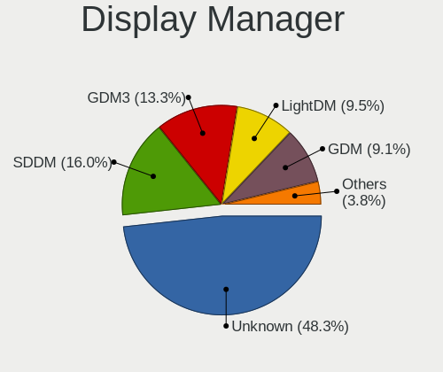
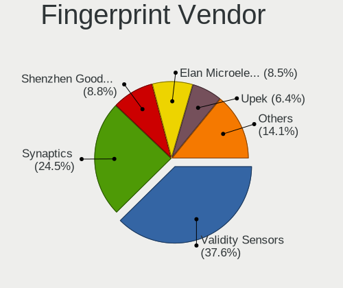

Linux in Canada - Tested Hardware & Statistics (Notebooks)
----------------------------------------------------------

A project to collect tested hardware configurations for Linux in Canada.

Anyone can contribute to this report by the [hw-probe](https://github.com/linuxhw/hw-probe) tool:

    sudo -E hw-probe -all -upload

Please contribute! Especially if your hardware is rare.

Contents
--------

* [ Test Cases ](#test-cases)

* [ System ](#system)
  - [ OS                       ](#os)
  - [ OS Family                ](#os-family)
  - [ Kernel                   ](#kernel)
  - [ Kernel Family            ](#kernel-family)
  - [ Kernel Major Ver.        ](#kernel-major-ver)
  - [ Arch                     ](#arch)
  - [ DE                       ](#de)
  - [ Display Server           ](#display-server)
  - [ Display Manager          ](#display-manager)
  - [ OS Lang                  ](#os-lang)
  - [ Boot Mode                ](#boot-mode)
  - [ Filesystem               ](#filesystem)
  - [ Part. scheme             ](#part-scheme)
  - [ Dual Boot with Linux/BSD ](#dual-boot-with-linuxbsd)
  - [ Dual Boot (Win)          ](#dual-boot-win)

* [ Board ](#board)
  - [ Vendor                   ](#vendor)
  - [ Model                    ](#model)
  - [ Model Family             ](#model-family)
  - [ MFG Year                 ](#mfg-year)
  - [ Form Factor              ](#form-factor)
  - [ Secure Boot              ](#secure-boot)
  - [ Coreboot                 ](#coreboot)
  - [ RAM Size                 ](#ram-size)
  - [ RAM Used                 ](#ram-used)
  - [ Total Drives             ](#total-drives)
  - [ Has CD-ROM               ](#has-cd-rom)
  - [ Has Ethernet             ](#has-ethernet)
  - [ Has WiFi                 ](#has-wifi)
  - [ Has Bluetooth            ](#has-bluetooth)

* [ Location ](#location)
  - [ Country                  ](#country)
  - [ City                     ](#city)

* [ Drives ](#drives)
  - [ Drive Vendor             ](#drive-vendor)
  - [ Drive Model              ](#drive-model)
  - [ HDD Vendor               ](#hdd-vendor)
  - [ SSD Vendor               ](#ssd-vendor)
  - [ Drive Kind               ](#drive-kind)
  - [ Drive Connector          ](#drive-connector)
  - [ Drive Size               ](#drive-size)
  - [ Space Total              ](#space-total)
  - [ Space Used               ](#space-used)
  - [ Malfunc. Drives          ](#malfunc-drives)
  - [ Malfunc. Drive Vendor    ](#malfunc-drive-vendor)
  - [ Malfunc. HDD Vendor      ](#malfunc-hdd-vendor)
  - [ Malfunc. Drive Kind      ](#malfunc-drive-kind)
  - [ Failed Drives            ](#failed-drives)
  - [ Failed Drive Vendor      ](#failed-drive-vendor)
  - [ Drive Status             ](#drive-status)

* [ Storage controller ](#storage-controller)
  - [ Storage Vendor           ](#storage-vendor)
  - [ Storage Model            ](#storage-model)
  - [ Storage Kind             ](#storage-kind)

* [ Processor ](#processor)
  - [ CPU Vendor               ](#cpu-vendor)
  - [ CPU Model                ](#cpu-model)
  - [ CPU Model Family         ](#cpu-model-family)
  - [ CPU Cores                ](#cpu-cores)
  - [ CPU Sockets              ](#cpu-sockets)
  - [ CPU Threads              ](#cpu-threads)
  - [ CPU Op-Modes             ](#cpu-op-modes)
  - [ CPU Microcode            ](#cpu-microcode)
  - [ CPU Microarch            ](#cpu-microarch)

* [ Graphics ](#graphics)
  - [ GPU Vendor               ](#gpu-vendor)
  - [ GPU Model                ](#gpu-model)
  - [ GPU Combo                ](#gpu-combo)
  - [ GPU Driver               ](#gpu-driver)
  - [ GPU Memory               ](#gpu-memory)

* [ Monitor ](#monitor)
  - [ Monitor Vendor           ](#monitor-vendor)
  - [ Monitor Model            ](#monitor-model)
  - [ Monitor Resolution       ](#monitor-resolution)
  - [ Monitor Diagonal         ](#monitor-diagonal)
  - [ Monitor Width            ](#monitor-width)
  - [ Aspect Ratio             ](#aspect-ratio)
  - [ Monitor Area             ](#monitor-area)
  - [ Pixel Density            ](#pixel-density)
  - [ Multiple Monitors        ](#multiple-monitors)

* [ Network ](#network)
  - [ Net Controller Vendor    ](#net-controller-vendor)
  - [ Net Controller Model     ](#net-controller-model)
  - [ Wireless Vendor          ](#wireless-vendor)
  - [ Wireless Model           ](#wireless-model)
  - [ Ethernet Vendor          ](#ethernet-vendor)
  - [ Ethernet Model           ](#ethernet-model)
  - [ Net Controller Kind      ](#net-controller-kind)
  - [ Used Controller          ](#used-controller)
  - [ NICs                     ](#nics)
  - [ IPv6                     ](#ipv6)

* [ Bluetooth ](#bluetooth)
  - [ Bluetooth Vendor         ](#bluetooth-vendor)
  - [ Bluetooth Model          ](#bluetooth-model)

* [ Sound ](#sound)
  - [ Sound Vendor             ](#sound-vendor)
  - [ Sound Model              ](#sound-model)

* [ Memory ](#memory)
  - [ Memory Vendor            ](#memory-vendor)
  - [ Memory Model             ](#memory-model)
  - [ Memory Kind              ](#memory-kind)
  - [ Memory Form Factor       ](#memory-form-factor)
  - [ Memory Size              ](#memory-size)
  - [ Memory Speed             ](#memory-speed)

* [ Printers & scanners ](#printers--scanners)
  - [ Printer Vendor           ](#printer-vendor)
  - [ Printer Model            ](#printer-model)
  - [ Scanner Vendor           ](#scanner-vendor)
  - [ Scanner Model            ](#scanner-model)

* [ Camera ](#camera)
  - [ Camera Vendor            ](#camera-vendor)
  - [ Camera Model             ](#camera-model)

* [ Security ](#security)
  - [ Fingerprint Vendor       ](#fingerprint-vendor)
  - [ Fingerprint Model        ](#fingerprint-model)
  - [ Chipcard Vendor          ](#chipcard-vendor)
  - [ Chipcard Model           ](#chipcard-model)

* [ Unsupported ](#unsupported)
  - [ Unsupported Devices      ](#unsupported-devices)
  - [ Unsupported Device Types ](#unsupported-device-types)

Test Cases
----------

Total: 5764

| Vendor        | Model                       | Probe                                                      | Date         |
|---------------|-----------------------------|------------------------------------------------------------|--------------|
| Google        | Cret                        | [bc8e7edac4](https://linux-hardware.org/?probe=bc8e7edac4) | Jan 05, 2025 |
| Samsung       | 900X3C/900X4C/900X4D        | [cbe6ed9631](https://linux-hardware.org/?probe=cbe6ed9631) | Jan 05, 2025 |
| Dell          | Inspiron 15-3567            | [c661f75c0f](https://linux-hardware.org/?probe=c661f75c0f) | Jan 05, 2025 |
| Sony          | SVD112290S                  | [a9400fd190](https://linux-hardware.org/?probe=a9400fd190) | Jan 05, 2025 |
| Apple         | MacBookPro11,1              | [e994e68b69](https://linux-hardware.org/?probe=e994e68b69) | Jan 05, 2025 |
| Valve         | Jupiter                     | [7b2eb9a0e9](https://linux-hardware.org/?probe=7b2eb9a0e9) | Jan 05, 2025 |
| Lenovo        | ThinkPad T480 20L5S1S000    | [c35541e56b](https://linux-hardware.org/?probe=c35541e56b) | Jan 05, 2025 |
| Framework     | Laptop 16 (AMD Ryzen 704... | [0bff2b1d13](https://linux-hardware.org/?probe=0bff2b1d13) | Jan 04, 2025 |
| Valve         | Jupiter                     | [5786386be1](https://linux-hardware.org/?probe=5786386be1) | Jan 04, 2025 |
| HP            | Laptop 15-ef3xxx            | [990ef26285](https://linux-hardware.org/?probe=990ef26285) | Jan 04, 2025 |
| Apple         | MacBookPro11,1              | [370a49426e](https://linux-hardware.org/?probe=370a49426e) | Jan 04, 2025 |
| Dell          | Inspiron 5480               | [23f4e47841](https://linux-hardware.org/?probe=23f4e47841) | Jan 04, 2025 |
| ASUSTek       | G75VW                       | [ff570669d5](https://linux-hardware.org/?probe=ff570669d5) | Jan 04, 2025 |
| HP            | Laptop 15-fd0xxx            | [dfd9d16913](https://linux-hardware.org/?probe=dfd9d16913) | Jan 03, 2025 |
| Google        | Dragonair                   | [69b034d6b7](https://linux-hardware.org/?probe=69b034d6b7) | Jan 03, 2025 |
| Lenovo        | Legion Pro 5 16ARX8 82WM    | [427c508e21](https://linux-hardware.org/?probe=427c508e21) | Jan 03, 2025 |
| Apple         | MacBookPro8,1               | [c208215b7f](https://linux-hardware.org/?probe=c208215b7f) | Jan 03, 2025 |
| System76      | Oryx Pro                    | [3e45c3caac](https://linux-hardware.org/?probe=3e45c3caac) | Jan 02, 2025 |
| Acer          | Aspire 5750                 | [879127efc6](https://linux-hardware.org/?probe=879127efc6) | Jan 01, 2025 |
| ASUSTek       | TUF Gaming FX505GT_FX505... | [4690fd028c](https://linux-hardware.org/?probe=4690fd028c) | Jan 01, 2025 |
| ASUSTek       | ASUS TUF Gaming A17 FA70... | [110e5ff032](https://linux-hardware.org/?probe=110e5ff032) | Jan 01, 2025 |
| Acer          | Aspire 5742                 | [aa9170d15a](https://linux-hardware.org/?probe=aa9170d15a) | Dec 31, 2024 |
| ASUSTek       | Strix 15 GL503GE            | [3cf042bf3f](https://linux-hardware.org/?probe=3cf042bf3f) | Dec 31, 2024 |
| HP            | Stream Notebook PC 13       | [ea9dccd4a8](https://linux-hardware.org/?probe=ea9dccd4a8) | Dec 30, 2024 |
| Framework     | Laptop 13 (AMD Ryzen 704... | [be80695174](https://linux-hardware.org/?probe=be80695174) | Dec 30, 2024 |
| Dell          | Inspiron 11 - 3147          | [3dbf865efb](https://linux-hardware.org/?probe=3dbf865efb) | Dec 30, 2024 |
| Apple         | MacBookPro5,5               | [843455b524](https://linux-hardware.org/?probe=843455b524) | Dec 29, 2024 |
| Acer          | Nitro AN517-52              | [693e1ff47b](https://linux-hardware.org/?probe=693e1ff47b) | Dec 29, 2024 |
| Acer          | Nitro AN517-52              | [9208846c2a](https://linux-hardware.org/?probe=9208846c2a) | Dec 29, 2024 |
| Apple         | MacBookPro14,3              | [1e7c1552f8](https://linux-hardware.org/?probe=1e7c1552f8) | Dec 29, 2024 |
| ASUSTek       | K501UB                      | [2654326cc1](https://linux-hardware.org/?probe=2654326cc1) | Dec 29, 2024 |
| Lenovo        | ThinkPad T470 W10DG 20JN... | [128dfc3b06](https://linux-hardware.org/?probe=128dfc3b06) | Dec 29, 2024 |
| Lenovo        | G585 20137                  | [28c0d1589f](https://linux-hardware.org/?probe=28c0d1589f) | Dec 28, 2024 |
| Lenovo        | G585 20137                  | [77d7e4f41b](https://linux-hardware.org/?probe=77d7e4f41b) | Dec 28, 2024 |
| ASUSTek       | VivoBook_ASUSLaptop M370... | [374d7bf403](https://linux-hardware.org/?probe=374d7bf403) | Dec 28, 2024 |
| Valve         | Galileo                     | [b45df4045a](https://linux-hardware.org/?probe=b45df4045a) | Dec 28, 2024 |
| HP            | Stream Notebook PC 13       | [b31f0109e7](https://linux-hardware.org/?probe=b31f0109e7) | Dec 27, 2024 |
| Morshow       | CB01 V100                   | [0f58cef0a2](https://linux-hardware.org/?probe=0f58cef0a2) | Dec 27, 2024 |
| Dell          | Latitude E5570              | [114a071bc2](https://linux-hardware.org/?probe=114a071bc2) | Dec 27, 2024 |
| Google        | Voxel                       | [32b3903455](https://linux-hardware.org/?probe=32b3903455) | Dec 26, 2024 |
| Lenovo        | Slim 7 14IMH9 83D8          | [fd059b501d](https://linux-hardware.org/?probe=fd059b501d) | Dec 26, 2024 |
| Lenovo        | ThinkPad T16 Gen 3 21MN0... | [de8cfa5271](https://linux-hardware.org/?probe=de8cfa5271) | Dec 26, 2024 |
| HP            | Laptop 15-fd0xxx            | [1ed7f7ef48](https://linux-hardware.org/?probe=1ed7f7ef48) | Dec 26, 2024 |
| Valve         | Galileo                     | [9f19e784e4](https://linux-hardware.org/?probe=9f19e784e4) | Dec 26, 2024 |
| Dell          | Latitude 5480               | [a43c9feb6e](https://linux-hardware.org/?probe=a43c9feb6e) | Dec 26, 2024 |
| Dell          | Latitude 5480               | [b0b2a919ce](https://linux-hardware.org/?probe=b0b2a919ce) | Dec 25, 2024 |
| System76      | Oryx Pro                    | [336ade52bd](https://linux-hardware.org/?probe=336ade52bd) | Dec 25, 2024 |
| ASUSTek       | ASUS TUF Gaming F15 FX50... | [b127afa2e4](https://linux-hardware.org/?probe=b127afa2e4) | Dec 25, 2024 |
| Apple         | MacBookPro12,1              | [face1f6c37](https://linux-hardware.org/?probe=face1f6c37) | Dec 25, 2024 |
| ASUSTek       | UX305CA                     | [73bb2289d6](https://linux-hardware.org/?probe=73bb2289d6) | Dec 25, 2024 |
| Acer          | Extensa 5630                | [f522d51182](https://linux-hardware.org/?probe=f522d51182) | Dec 25, 2024 |
| Toshiba       | Satellite P70-A             | [a428e828ad](https://linux-hardware.org/?probe=a428e828ad) | Dec 24, 2024 |
| ASUSTek       | UX305CA                     | [88a69fd398](https://linux-hardware.org/?probe=88a69fd398) | Dec 24, 2024 |
| ASUSTek       | G771JM                      | [f76a116151](https://linux-hardware.org/?probe=f76a116151) | Dec 24, 2024 |
| Dell          | Latitude E6520              | [2bae6e63bb](https://linux-hardware.org/?probe=2bae6e63bb) | Dec 23, 2024 |
| Lenovo        | ThinkPad T470p 20J6003KU... | [624bca4c57](https://linux-hardware.org/?probe=624bca4c57) | Dec 23, 2024 |
| Acer          | Aspire 5517                 | [e8dbb7c265](https://linux-hardware.org/?probe=e8dbb7c265) | Dec 23, 2024 |
| ASUSTek       | Pro B760M-CT                | [d2a2cc2c88](https://linux-hardware.org/?probe=d2a2cc2c88) | Dec 22, 2024 |
| Framework     | Laptop 16 (AMD Ryzen 704... | [191b32e3f0](https://linux-hardware.org/?probe=191b32e3f0) | Dec 22, 2024 |
| ASUSTek       | VivoBook 14_ASUS Laptop ... | [518ed41c8b](https://linux-hardware.org/?probe=518ed41c8b) | Dec 21, 2024 |
| ASUSTek       | Zenbook UX8402ZA_UX8402Z... | [4043d79598](https://linux-hardware.org/?probe=4043d79598) | Dec 21, 2024 |
| ONE-NETBOO... | ONEMIX5                     | [4a3a1d7980](https://linux-hardware.org/?probe=4a3a1d7980) | Dec 21, 2024 |
| Lenovo        | ThinkPad T420s 417152U      | [40ecec91ca](https://linux-hardware.org/?probe=40ecec91ca) | Dec 21, 2024 |
| ASUSTek       | X555QA                      | [9d4e896d0e](https://linux-hardware.org/?probe=9d4e896d0e) | Dec 21, 2024 |
| HP            | Laptop 15-ef2xxx            | [f2b2c52113](https://linux-hardware.org/?probe=f2b2c52113) | Dec 20, 2024 |
| Dell          | Latitude E7270              | [167298428e](https://linux-hardware.org/?probe=167298428e) | Dec 20, 2024 |
| ASUSTek       | VivoBook_ASUSLaptop M370... | [b52bea9b5c](https://linux-hardware.org/?probe=b52bea9b5c) | Dec 20, 2024 |
| Acer          | Aspire A315-24P             | [a52fe2c4c9](https://linux-hardware.org/?probe=a52fe2c4c9) | Dec 20, 2024 |
| Lenovo        | ThinkPad L15 Gen 2a 20X7... | [2d8b5119a7](https://linux-hardware.org/?probe=2d8b5119a7) | Dec 19, 2024 |
| Lenovo        | ThinkPad X1 Carbon 2nd 2... | [5b148e6851](https://linux-hardware.org/?probe=5b148e6851) | Dec 19, 2024 |
| Acer          | Aspire A515-45              | [3cd12c751c](https://linux-hardware.org/?probe=3cd12c751c) | Dec 19, 2024 |
| Acer          | Aspire A515-57              | [5872cea5da](https://linux-hardware.org/?probe=5872cea5da) | Dec 19, 2024 |
| ASUSTek       | S451LA                      | [a766d0caae](https://linux-hardware.org/?probe=a766d0caae) | Dec 19, 2024 |
| Lenovo        | ThinkPad X230 2324DL5       | [155f2f1e8f](https://linux-hardware.org/?probe=155f2f1e8f) | Dec 18, 2024 |
| Acer          | Aspire A515-45              | [67b8e4d3e7](https://linux-hardware.org/?probe=67b8e4d3e7) | Dec 18, 2024 |
| Apple         | MacBookPro8,1               | [08044442cf](https://linux-hardware.org/?probe=08044442cf) | Dec 18, 2024 |
| Apple         | MacBookPro13,3              | [25b2cf9a59](https://linux-hardware.org/?probe=25b2cf9a59) | Dec 18, 2024 |
| Apple         | MacBookPro9,2               | [c33a85fd8c](https://linux-hardware.org/?probe=c33a85fd8c) | Dec 18, 2024 |
| Lenovo        | ThinkPad P14s Gen 2a 21A... | [2ab8cdb946](https://linux-hardware.org/?probe=2ab8cdb946) | Dec 18, 2024 |
| Lenovo        | ThinkPad E15 20RD005HUS     | [eadc7945cf](https://linux-hardware.org/?probe=eadc7945cf) | Dec 17, 2024 |
| Acer          | Nitro AN515-54              | [071a512314](https://linux-hardware.org/?probe=071a512314) | Dec 17, 2024 |
| ASUSTek       | ROG Zephyrus G15 GA503RW... | [20bb7981c5](https://linux-hardware.org/?probe=20bb7981c5) | Dec 16, 2024 |
| ASUSTek       | ROG Zephyrus G15 GA503RW... | [5211e1329e](https://linux-hardware.org/?probe=5211e1329e) | Dec 16, 2024 |
| Apple         | MacBookPro12,1              | [097b2599f4](https://linux-hardware.org/?probe=097b2599f4) | Dec 16, 2024 |
| Valve         | Jupiter                     | [246668e9eb](https://linux-hardware.org/?probe=246668e9eb) | Dec 16, 2024 |
| MSI           | GT73EVR 7RD                 | [c3321b8ab3](https://linux-hardware.org/?probe=c3321b8ab3) | Dec 16, 2024 |
| Acer          | Swift SF314-71              | [a9466608b7](https://linux-hardware.org/?probe=a9466608b7) | Dec 15, 2024 |
| ASUSTek       | VivoBook_ASUSLaptop S540... | [68a46993af](https://linux-hardware.org/?probe=68a46993af) | Dec 15, 2024 |
| Dell          | Inspiron 15 3525            | [53c39cb514](https://linux-hardware.org/?probe=53c39cb514) | Dec 15, 2024 |
| ASUSTek       | K56CA                       | [89f8be5027](https://linux-hardware.org/?probe=89f8be5027) | Dec 15, 2024 |
| Lenovo        | ThinkPad E580 20KS003NUS    | [91c13c46a5](https://linux-hardware.org/?probe=91c13c46a5) | Dec 15, 2024 |
| Lenovo        | ThinkPad E580 20KS003NUS    | [24c4028783](https://linux-hardware.org/?probe=24c4028783) | Dec 14, 2024 |
| Dell          | Latitude 7480               | [212326b778](https://linux-hardware.org/?probe=212326b778) | Dec 14, 2024 |
| ASUSTek       | K501UB                      | [9bb21014e6](https://linux-hardware.org/?probe=9bb21014e6) | Dec 14, 2024 |
| Acer          | Aspire A315-42              | [d4fd429558](https://linux-hardware.org/?probe=d4fd429558) | Dec 13, 2024 |
| Lenovo        | ThinkBook 14 G6 ABP 21KJ    | [7b878d7d0b](https://linux-hardware.org/?probe=7b878d7d0b) | Dec 13, 2024 |
| Apple         | MacBookPro11,3              | [89e566e2cc](https://linux-hardware.org/?probe=89e566e2cc) | Dec 13, 2024 |
| Apple         | MacBookPro11,3              | [ad546ac102](https://linux-hardware.org/?probe=ad546ac102) | Dec 13, 2024 |
| Panasonic     | CF-191DCSG1M                | [c607411b91](https://linux-hardware.org/?probe=c607411b91) | Dec 13, 2024 |
| Panasonic     | CF-191DCSG1M                | [471033b960](https://linux-hardware.org/?probe=471033b960) | Dec 13, 2024 |
| Lenovo        | ThinkPad T480 20L6S6WQ00    | [7ddde1c012](https://linux-hardware.org/?probe=7ddde1c012) | Dec 12, 2024 |
| Lenovo        | ThinkPad T480 20L6S6WQ00    | [8e83bba34b](https://linux-hardware.org/?probe=8e83bba34b) | Dec 12, 2024 |
| MSI           | GS66 Stealth 10SE           | [950033e6a5](https://linux-hardware.org/?probe=950033e6a5) | Dec 12, 2024 |
| HP            | ProBook 450 G1              | [1e0f53da75](https://linux-hardware.org/?probe=1e0f53da75) | Dec 12, 2024 |
| Dell          | Latitude E7440              | [f3ae8893e1](https://linux-hardware.org/?probe=f3ae8893e1) | Dec 12, 2024 |
| Acer          | Aspire A515-57              | [e547c8159c](https://linux-hardware.org/?probe=e547c8159c) | Dec 11, 2024 |
| Acer          | Aspire A515-57              | [42a073359e](https://linux-hardware.org/?probe=42a073359e) | Dec 11, 2024 |
| HP            | 2000                        | [3c20e6e18c](https://linux-hardware.org/?probe=3c20e6e18c) | Dec 11, 2024 |
| Lenovo        | ThinkPad X270 20HN001HUS    | [ef25178fec](https://linux-hardware.org/?probe=ef25178fec) | Dec 10, 2024 |
| Lenovo        | ThinkPad X270 20HN001HUS    | [954578185e](https://linux-hardware.org/?probe=954578185e) | Dec 10, 2024 |
| Lenovo        | ThinkPad X1 Extreme Gen2... | [280acb4797](https://linux-hardware.org/?probe=280acb4797) | Dec 10, 2024 |
| ASUSTek       | K46CM                       | [5bf8998b5c](https://linux-hardware.org/?probe=5bf8998b5c) | Dec 10, 2024 |
| Acer          | Aspire A515-57              | [83049f4c76](https://linux-hardware.org/?probe=83049f4c76) | Dec 09, 2024 |
| ASUSTek       | K53TA                       | [e8861978d8](https://linux-hardware.org/?probe=e8861978d8) | Dec 09, 2024 |
| Lenovo        | ThinkBook 14 G3 ACL 21A2    | [536b6cfa12](https://linux-hardware.org/?probe=536b6cfa12) | Dec 08, 2024 |
| Lenovo        | ThinkPad X270 W10DG 20K5... | [bbe2d69fea](https://linux-hardware.org/?probe=bbe2d69fea) | Dec 08, 2024 |
| HP            | EliteBook 850 G4            | [eda32d0dac](https://linux-hardware.org/?probe=eda32d0dac) | Dec 08, 2024 |
| Lenovo        | ThinkPad Edge 031925U       | [41278492e7](https://linux-hardware.org/?probe=41278492e7) | Dec 07, 2024 |
| Lenovo        | ThinkPad X1 Extreme Gen ... | [88d9510fcb](https://linux-hardware.org/?probe=88d9510fcb) | Dec 07, 2024 |
| Dell          | Latitude 5480               | [0dd91cf54a](https://linux-hardware.org/?probe=0dd91cf54a) | Dec 06, 2024 |
| Dell          | Latitude 5490               | [04d3dd2626](https://linux-hardware.org/?probe=04d3dd2626) | Dec 05, 2024 |
| ASUSTek       | N550JV                      | [e0700722fa](https://linux-hardware.org/?probe=e0700722fa) | Dec 04, 2024 |
| Apple         | MacBookPro9,2               | [2749a746c7](https://linux-hardware.org/?probe=2749a746c7) | Dec 03, 2024 |
| Apple         | MacBookPro9,2               | [e36eea22b1](https://linux-hardware.org/?probe=e36eea22b1) | Dec 03, 2024 |
| Gigabyte      | X570S AERO G                | [d3032a686f](https://linux-hardware.org/?probe=d3032a686f) | Dec 03, 2024 |
| Dell          | Inspiron 5759               | [9ca3f31d64](https://linux-hardware.org/?probe=9ca3f31d64) | Dec 03, 2024 |
| Acer          | Aspire 5517                 | [5c94640290](https://linux-hardware.org/?probe=5c94640290) | Dec 02, 2024 |
| HP            | ProBook 640 G2              | [9e14504376](https://linux-hardware.org/?probe=9e14504376) | Dec 02, 2024 |
| Acer          | Nitro AN515-45              | [ca2521a87a](https://linux-hardware.org/?probe=ca2521a87a) | Dec 02, 2024 |
| LG Electro... | 17Z90R-K.AA78A9             | [fb890bfff0](https://linux-hardware.org/?probe=fb890bfff0) | Dec 01, 2024 |
| ASUSTek       | VivoBook_ASUSLaptop M150... | [32ae181590](https://linux-hardware.org/?probe=32ae181590) | Dec 01, 2024 |
| HP            | Pavilion Notebook           | [a3bbd871c9](https://linux-hardware.org/?probe=a3bbd871c9) | Dec 01, 2024 |
| Dell          | Inspiron 5570               | [26e2050716](https://linux-hardware.org/?probe=26e2050716) | Dec 01, 2024 |
| Apple         | MacBookPro12,1              | [deda79f6f5](https://linux-hardware.org/?probe=deda79f6f5) | Dec 01, 2024 |
| HP            | ProBook 4540s               | [b621285dd2](https://linux-hardware.org/?probe=b621285dd2) | Nov 30, 2024 |
| Acer          | Aspire 5920G                | [3ac75edf3a](https://linux-hardware.org/?probe=3ac75edf3a) | Nov 30, 2024 |
| Acer          | Aspire E5-573               | [62ff8ca66b](https://linux-hardware.org/?probe=62ff8ca66b) | Nov 29, 2024 |
| HP            | Victus by Gaming Laptop ... | [be9e4b9467](https://linux-hardware.org/?probe=be9e4b9467) | Nov 29, 2024 |
| Alienware     | 17                          | [323d4a6349](https://linux-hardware.org/?probe=323d4a6349) | Nov 29, 2024 |
| Alienware     | 17                          | [13e4a3a410](https://linux-hardware.org/?probe=13e4a3a410) | Nov 29, 2024 |
| MSI           | GT73EVR 7RD                 | [9ca450e437](https://linux-hardware.org/?probe=9ca450e437) | Nov 27, 2024 |
| Dell          | System XPS L702X            | [482528c7df](https://linux-hardware.org/?probe=482528c7df) | Nov 27, 2024 |
| Lenovo        | ThinkPad T450s 20BXCTO1W... | [245f980110](https://linux-hardware.org/?probe=245f980110) | Nov 27, 2024 |
| Dell          | XPS 15 9530                 | [df0fd1e685](https://linux-hardware.org/?probe=df0fd1e685) | Nov 27, 2024 |
| Sony          | VGN-AR290G                  | [08f071931c](https://linux-hardware.org/?probe=08f071931c) | Nov 27, 2024 |
| MSI           | GT72 2QE                    | [29da42dafe](https://linux-hardware.org/?probe=29da42dafe) | Nov 27, 2024 |
| Lenovo        | ThinkPad T16 Gen 3 21MN0... | [a0bb7e53d0](https://linux-hardware.org/?probe=a0bb7e53d0) | Nov 27, 2024 |
| Framework     | Laptop 16 (AMD Ryzen 704... | [032327d915](https://linux-hardware.org/?probe=032327d915) | Nov 26, 2024 |
| Lenovo        | ThinkPad T450s 20BWS0H90... | [0758306c94](https://linux-hardware.org/?probe=0758306c94) | Nov 26, 2024 |
| MSI           | Pulse GL76 12UEK            | [82fd637679](https://linux-hardware.org/?probe=82fd637679) | Nov 26, 2024 |
| HP            | Victus by Gaming Laptop ... | [53747d81e3](https://linux-hardware.org/?probe=53747d81e3) | Nov 26, 2024 |
| Acer          | Swift SF314-57              | [fc0d1a098a](https://linux-hardware.org/?probe=fc0d1a098a) | Nov 25, 2024 |
| Dell          | Latitude 5480               | [ccc8af5d1c](https://linux-hardware.org/?probe=ccc8af5d1c) | Nov 25, 2024 |
| Lenovo        | G50-70 20351                | [6026b41852](https://linux-hardware.org/?probe=6026b41852) | Nov 24, 2024 |
| Dell          | Inspiron 7547               | [667b88a269](https://linux-hardware.org/?probe=667b88a269) | Nov 23, 2024 |
| Google        | Morphius                    | [43aaab8f51](https://linux-hardware.org/?probe=43aaab8f51) | Nov 23, 2024 |
| Dell          | Latitude 5480               | [17715d8391](https://linux-hardware.org/?probe=17715d8391) | Nov 23, 2024 |
| Chuwi         | CoreBook X                  | [ed32e835a1](https://linux-hardware.org/?probe=ed32e835a1) | Nov 23, 2024 |
| HP            | Notebook                    | [6b81faa162](https://linux-hardware.org/?probe=6b81faa162) | Nov 22, 2024 |
| ASUSTek       | ASUS TUF Dash F15 FX516P... | [4e10bbe3d5](https://linux-hardware.org/?probe=4e10bbe3d5) | Nov 22, 2024 |
| Lenovo        | ThinkBook 14 G3 ACL 21A2    | [ee736ff9b2](https://linux-hardware.org/?probe=ee736ff9b2) | Nov 21, 2024 |
| Lenovo        | ThinkPad T490s 20NYS3NT0... | [89cbb90e46](https://linux-hardware.org/?probe=89cbb90e46) | Nov 21, 2024 |
| Valve         | Jupiter                     | [ac34137963](https://linux-hardware.org/?probe=ac34137963) | Nov 21, 2024 |
| HP            | Notebook                    | [d653d80d03](https://linux-hardware.org/?probe=d653d80d03) | Nov 21, 2024 |
| Toshiba       | Satellite L55-C             | [e54f3fdcb1](https://linux-hardware.org/?probe=e54f3fdcb1) | Nov 21, 2024 |
| Lenovo        | V15 G4 IRU 83A1             | [d6a394affa](https://linux-hardware.org/?probe=d6a394affa) | Nov 21, 2024 |
| ASUSTek       | X550WAK                     | [958fab3271](https://linux-hardware.org/?probe=958fab3271) | Nov 20, 2024 |
| ASUSTek       | Vivobook Go E1504FA_E150... | [f32ad3a689](https://linux-hardware.org/?probe=f32ad3a689) | Nov 19, 2024 |
| Dell          | XPS 14 9440                 | [30755e72e7](https://linux-hardware.org/?probe=30755e72e7) | Nov 19, 2024 |
| Lenovo        | ThinkPad X1 Carbon Gen 1... | [9152187c33](https://linux-hardware.org/?probe=9152187c33) | Nov 19, 2024 |
| Lenovo        | ThinkPad X1 Carbon Gen 1... | [b8690cc594](https://linux-hardware.org/?probe=b8690cc594) | Nov 19, 2024 |
| Lenovo        | Legion S7 15ACH6 82K8       | [f96b652500](https://linux-hardware.org/?probe=f96b652500) | Nov 18, 2024 |
| Dell          | XPS 13 9350                 | [e03881f5f7](https://linux-hardware.org/?probe=e03881f5f7) | Nov 17, 2024 |
| Dell          | XPS 13 9350                 | [e86bc51738](https://linux-hardware.org/?probe=e86bc51738) | Nov 17, 2024 |
| Lenovo        | IdeaPad 3 15IAU7 82RK       | [3a1c81c5c8](https://linux-hardware.org/?probe=3a1c81c5c8) | Nov 17, 2024 |
| ASUSTek       | ASUS TUF Gaming A15 FA50... | [643f309d08](https://linux-hardware.org/?probe=643f309d08) | Nov 17, 2024 |
| Lenovo        | ThinkPad P51 20HJS10400     | [24bd021b9a](https://linux-hardware.org/?probe=24bd021b9a) | Nov 17, 2024 |
| Dell          | Latitude D630               | [0f6b093b2c](https://linux-hardware.org/?probe=0f6b093b2c) | Nov 17, 2024 |
| HP            | Laptop 15-dy2xxx            | [d26160d689](https://linux-hardware.org/?probe=d26160d689) | Nov 16, 2024 |
| HP            | Notebook                    | [b7f9f0a23d](https://linux-hardware.org/?probe=b7f9f0a23d) | Nov 16, 2024 |
| ASUSTek       | ASUS TUF Gaming A15 FA50... | [48b24cce4c](https://linux-hardware.org/?probe=48b24cce4c) | Nov 16, 2024 |
| MSI           | Katana 17 B12VFK            | [8e4a490eeb](https://linux-hardware.org/?probe=8e4a490eeb) | Nov 15, 2024 |
| Apple         | MacBookPro5,5               | [865f61fac1](https://linux-hardware.org/?probe=865f61fac1) | Nov 15, 2024 |
| Dell          | Inspiron 16 7640 2-in-1     | [9f8600194b](https://linux-hardware.org/?probe=9f8600194b) | Nov 14, 2024 |
| Apple         | MacBookAir7,2               | [83ea680cc0](https://linux-hardware.org/?probe=83ea680cc0) | Nov 14, 2024 |
| Dell          | Latitude E5550              | [3ba03e0a00](https://linux-hardware.org/?probe=3ba03e0a00) | Nov 14, 2024 |
| Lenovo        | ThinkPad P53s 20N6002EUS    | [4a116ef646](https://linux-hardware.org/?probe=4a116ef646) | Nov 14, 2024 |
| Toshiba       | Satellite L755D             | [026c487fec](https://linux-hardware.org/?probe=026c487fec) | Nov 13, 2024 |
| Lenovo        | IdeaPad 330-15AST 81D6      | [8ab1c5f89a](https://linux-hardware.org/?probe=8ab1c5f89a) | Nov 12, 2024 |
| Dell          | Inspiron 5537               | [4590721008](https://linux-hardware.org/?probe=4590721008) | Nov 12, 2024 |
| HP            | ProBook 4720s               | [4317d4db32](https://linux-hardware.org/?probe=4317d4db32) | Nov 12, 2024 |
| Dell          | Latitude E6420              | [b2fad70402](https://linux-hardware.org/?probe=b2fad70402) | Nov 12, 2024 |
| Valve         | Jupiter                     | [d837e0a19f](https://linux-hardware.org/?probe=d837e0a19f) | Nov 12, 2024 |
| HP            | Laptop 14-dq4xxx            | [0b2580a6fd](https://linux-hardware.org/?probe=0b2580a6fd) | Nov 11, 2024 |
| ASUSTek       | ASUS TUF Gaming A17 FA70... | [7ed44ec1d3](https://linux-hardware.org/?probe=7ed44ec1d3) | Nov 10, 2024 |
| Lenovo        | ThinkPad E560 20EV002FUS    | [db8bceb3f0](https://linux-hardware.org/?probe=db8bceb3f0) | Nov 10, 2024 |
| Lenovo        | ThinkPad E560 20EV002FUS    | [cb531f1729](https://linux-hardware.org/?probe=cb531f1729) | Nov 10, 2024 |
| Valve         | Jupiter                     | [3303b99e5b](https://linux-hardware.org/?probe=3303b99e5b) | Nov 06, 2024 |
| HP            | ProBook 4540s               | [b1d8f12272](https://linux-hardware.org/?probe=b1d8f12272) | Nov 05, 2024 |
| HP            | ProBook 4540s               | [0770e40807](https://linux-hardware.org/?probe=0770e40807) | Nov 05, 2024 |
| Dell          | Latitude E5570              | [060f4b10c6](https://linux-hardware.org/?probe=060f4b10c6) | Nov 05, 2024 |
| Dell          | Latitude 5590               | [87a453951a](https://linux-hardware.org/?probe=87a453951a) | Nov 04, 2024 |
| Apple         | MacBookPro5,5               | [3395c22619](https://linux-hardware.org/?probe=3395c22619) | Nov 04, 2024 |
| HP            | EliteBook 8570p             | [212f338f8a](https://linux-hardware.org/?probe=212f338f8a) | Nov 04, 2024 |
| ASUSTek       | Zenbook UX3404VA_Q420VA     | [2dd904a978](https://linux-hardware.org/?probe=2dd904a978) | Nov 03, 2024 |
| Toshiba       | TECRA Z40-C                 | [8163b79289](https://linux-hardware.org/?probe=8163b79289) | Nov 03, 2024 |
| MSI           | GE40 2PC Dragon Eyes        | [f223d03632](https://linux-hardware.org/?probe=f223d03632) | Nov 03, 2024 |
| Lenovo        | ThinkPad T480s 20L8S4AE0... | [3d3f0cf934](https://linux-hardware.org/?probe=3d3f0cf934) | Nov 03, 2024 |
| Dell          | Latitude E5420              | [9e08b522db](https://linux-hardware.org/?probe=9e08b522db) | Nov 02, 2024 |
| Apple         | MacBookPro8,1               | [e868853b4b](https://linux-hardware.org/?probe=e868853b4b) | Nov 02, 2024 |
| ASUSTek       | ROG Zephyrus G16 GU603VV... | [d0fedae2fd](https://linux-hardware.org/?probe=d0fedae2fd) | Nov 02, 2024 |
| Apple         | MacBookPro8,1               | [225decb89c](https://linux-hardware.org/?probe=225decb89c) | Nov 01, 2024 |
| Dell          | XPS 15 7590                 | [8b60365680](https://linux-hardware.org/?probe=8b60365680) | Oct 31, 2024 |
| ASUSTek       | TUF Gaming FX505DD_FX505... | [8659fd177c](https://linux-hardware.org/?probe=8659fd177c) | Oct 31, 2024 |
| Framework     | Laptop 16 (AMD Ryzen 704... | [ee6ba8f4f7](https://linux-hardware.org/?probe=ee6ba8f4f7) | Oct 31, 2024 |
| ASUSTek       | TUF Gaming FX505DD_FX505... | [82ab276d55](https://linux-hardware.org/?probe=82ab276d55) | Oct 31, 2024 |
| Framework     | Laptop 16 (AMD Ryzen 704... | [e483e016de](https://linux-hardware.org/?probe=e483e016de) | Oct 30, 2024 |
| Dell          | Latitude E6540              | [c890aeb493](https://linux-hardware.org/?probe=c890aeb493) | Oct 30, 2024 |
| Lenovo        | ThinkPad X1 Extreme Gen ... | [1a592a4c8c](https://linux-hardware.org/?probe=1a592a4c8c) | Oct 30, 2024 |
| HP            | Laptop 17-cp0xxx            | [19dca83699](https://linux-hardware.org/?probe=19dca83699) | Oct 30, 2024 |
| Valve         | Jupiter                     | [9975d4d5b2](https://linux-hardware.org/?probe=9975d4d5b2) | Oct 30, 2024 |
| ASUSTek       | VivoBook_ASUS Laptop E51... | [92b0bc3809](https://linux-hardware.org/?probe=92b0bc3809) | Oct 29, 2024 |
| Lenovo        | ThinkPad T480s 20L8S4AE0... | [059a8899aa](https://linux-hardware.org/?probe=059a8899aa) | Oct 29, 2024 |
| LG Electro... | 15Z980-R.AP71U1             | [ef38af409d](https://linux-hardware.org/?probe=ef38af409d) | Oct 28, 2024 |
| HP            | Pavilion g6                 | [bf2e1cb32a](https://linux-hardware.org/?probe=bf2e1cb32a) | Oct 27, 2024 |
| Lenovo        | V15 G4 IRU 83A1             | [d40ad835b1](https://linux-hardware.org/?probe=d40ad835b1) | Oct 27, 2024 |
| Lenovo        | IdeaPad 330-15AST 81D6      | [b592bf3e31](https://linux-hardware.org/?probe=b592bf3e31) | Oct 26, 2024 |
| Dell          | Latitude E6430              | [e6713be055](https://linux-hardware.org/?probe=e6713be055) | Oct 25, 2024 |
| Dell          | Inspiron 1545               | [4ea10a721c](https://linux-hardware.org/?probe=4ea10a721c) | Oct 25, 2024 |
| HP            | Laptop 14-dq4xxx            | [65f9d4fa03](https://linux-hardware.org/?probe=65f9d4fa03) | Oct 24, 2024 |
| HP            | Pavilion g7                 | [1d62587da9](https://linux-hardware.org/?probe=1d62587da9) | Oct 24, 2024 |
| Lenovo        | ThinkPad P51 20HJS52P00     | [ab7bfcceb7](https://linux-hardware.org/?probe=ab7bfcceb7) | Oct 24, 2024 |
| Gigabyte      | X570S AERO G                | [66cc317e0f](https://linux-hardware.org/?probe=66cc317e0f) | Oct 23, 2024 |
| ASUSTek       | ASUS Zenbook S 14 UX5406... | [7d94eb365d](https://linux-hardware.org/?probe=7d94eb365d) | Oct 23, 2024 |
| Lenovo        | ThinkBook 14 G4 ABA 21DK    | [149f81439f](https://linux-hardware.org/?probe=149f81439f) | Oct 23, 2024 |
| ASUSTek       | ASUS Zenbook S 14 UX5406... | [91f2f4e2f8](https://linux-hardware.org/?probe=91f2f4e2f8) | Oct 23, 2024 |
| Lenovo        | ThinkPad W541 20EF000NCA    | [0d44fd190b](https://linux-hardware.org/?probe=0d44fd190b) | Oct 23, 2024 |
| Lenovo        | ThinkPad W541 20EF000NCA    | [331360def1](https://linux-hardware.org/?probe=331360def1) | Oct 23, 2024 |
| Valve         | Jupiter                     | [e0047b5e92](https://linux-hardware.org/?probe=e0047b5e92) | Oct 23, 2024 |
| Dell          | Latitude 5590               | [ea3430c0e4](https://linux-hardware.org/?probe=ea3430c0e4) | Oct 22, 2024 |
| HP            | EliteBook 2560p             | [c729f67985](https://linux-hardware.org/?probe=c729f67985) | Oct 22, 2024 |
| Lenovo        | ThinkPad T450s 20BWS0H90... | [b643d36fae](https://linux-hardware.org/?probe=b643d36fae) | Oct 22, 2024 |
| GEO           | GeoBook 240                 | [e7fdf54200](https://linux-hardware.org/?probe=e7fdf54200) | Oct 21, 2024 |
| ASUSTek       | X441BA                      | [0481eb3049](https://linux-hardware.org/?probe=0481eb3049) | Oct 21, 2024 |
| Matsushita... | CF-18KH2ZXBC                | [76b3b4be55](https://linux-hardware.org/?probe=76b3b4be55) | Oct 21, 2024 |
| Lenovo        | ThinkPad T510 4313CTO       | [5d88f3a39b](https://linux-hardware.org/?probe=5d88f3a39b) | Oct 20, 2024 |
| Valve         | Jupiter                     | [33929e23ed](https://linux-hardware.org/?probe=33929e23ed) | Oct 20, 2024 |
| ASRock        | X670E PG Lightning          | [a82784b122](https://linux-hardware.org/?probe=a82784b122) | Oct 19, 2024 |
| Insyde        | ApolloLake                  | [bde8f4b86a](https://linux-hardware.org/?probe=bde8f4b86a) | Oct 17, 2024 |
| Lenovo        | ThinkPad W520 4284GA2       | [d838c4f4a4](https://linux-hardware.org/?probe=d838c4f4a4) | Oct 17, 2024 |
| Alienware     | 17                          | [6923888471](https://linux-hardware.org/?probe=6923888471) | Oct 17, 2024 |
| Alienware     | 17                          | [9c5979e59a](https://linux-hardware.org/?probe=9c5979e59a) | Oct 17, 2024 |
| ASUSTek       | X555QA                      | [c336f00e4a](https://linux-hardware.org/?probe=c336f00e4a) | Oct 16, 2024 |
| Dell          | XPS 13 9370                 | [7d89635983](https://linux-hardware.org/?probe=7d89635983) | Oct 16, 2024 |
| Lenovo        | ThinkPad T470s W10DG 20J... | [2a70c8af1b](https://linux-hardware.org/?probe=2a70c8af1b) | Oct 16, 2024 |
| Dell          | Latitude E5510              | [be1db31198](https://linux-hardware.org/?probe=be1db31198) | Oct 16, 2024 |
| WINGS         | Nuvobook pro                | [88aac00297](https://linux-hardware.org/?probe=88aac00297) | Oct 15, 2024 |
| Acer          | Aspire A315-21              | [775692a124](https://linux-hardware.org/?probe=775692a124) | Oct 15, 2024 |
| Lenovo        | ThinkPad T490s 20NYS3NT0... | [7dd8855689](https://linux-hardware.org/?probe=7dd8855689) | Oct 15, 2024 |
| Acer          | Nitro AN515-45              | [92e637310d](https://linux-hardware.org/?probe=92e637310d) | Oct 12, 2024 |
| Dell          | XPS 13 9350                 | [c0e281dbe2](https://linux-hardware.org/?probe=c0e281dbe2) | Oct 12, 2024 |
| HP            | ZBook 15 G3                 | [396d9b1508](https://linux-hardware.org/?probe=396d9b1508) | Oct 12, 2024 |
| Dell          | Latitude 7280               | [82d8484f17](https://linux-hardware.org/?probe=82d8484f17) | Oct 12, 2024 |
| HP            | Laptop 14-dk0xxx            | [530feba7a4](https://linux-hardware.org/?probe=530feba7a4) | Oct 11, 2024 |
| HP            | Pavilion g6                 | [bec0b24e36](https://linux-hardware.org/?probe=bec0b24e36) | Oct 11, 2024 |
| Acer          | Swift SF314-71              | [ff07bbbe5a](https://linux-hardware.org/?probe=ff07bbbe5a) | Oct 11, 2024 |
| ASUSTek       | VivoBook_ASUSLaptop X512... | [673290af73](https://linux-hardware.org/?probe=673290af73) | Oct 11, 2024 |
| ASUSTek       | TUF Gaming FX505DD_FX505... | [27e0df94ae](https://linux-hardware.org/?probe=27e0df94ae) | Oct 10, 2024 |
| Valve         | Galileo                     | [36d203ab8a](https://linux-hardware.org/?probe=36d203ab8a) | Oct 10, 2024 |
| Lenovo        | ThinkBook 14 G4 ABA 21DK    | [706fb2d670](https://linux-hardware.org/?probe=706fb2d670) | Oct 10, 2024 |
| Dell          | Vostro 3550                 | [8ecca901ac](https://linux-hardware.org/?probe=8ecca901ac) | Oct 10, 2024 |
| HP            | Laptop 14-dk0xxx            | [0658548720](https://linux-hardware.org/?probe=0658548720) | Oct 10, 2024 |
| Lenovo        | IdeaPad Slim 3 15IRU8 82... | [dfc74e85d1](https://linux-hardware.org/?probe=dfc74e85d1) | Oct 10, 2024 |
| Google        | Rabbid                      | [f861d7621f](https://linux-hardware.org/?probe=f861d7621f) | Oct 09, 2024 |
| Google        | Rabbid                      | [cc84f208e7](https://linux-hardware.org/?probe=cc84f208e7) | Oct 09, 2024 |
| Valve         | Jupiter                     | [e40215b793](https://linux-hardware.org/?probe=e40215b793) | Oct 08, 2024 |
| Valve         | Jupiter                     | [a805cc579d](https://linux-hardware.org/?probe=a805cc579d) | Oct 08, 2024 |
| HP            | Victus by Gaming Laptop ... | [1cf91d287d](https://linux-hardware.org/?probe=1cf91d287d) | Oct 08, 2024 |
| HP            | ZBook Firefly 16 inch G1... | [b630765989](https://linux-hardware.org/?probe=b630765989) | Oct 06, 2024 |
| Dell          | Precision 7540              | [b7190e112c](https://linux-hardware.org/?probe=b7190e112c) | Oct 05, 2024 |
| Dell          | XPS 15 9500                 | [d7d4ff3908](https://linux-hardware.org/?probe=d7d4ff3908) | Oct 05, 2024 |
| Lenovo        | IdeaPad Y560                | [386c588e84](https://linux-hardware.org/?probe=386c588e84) | Oct 05, 2024 |
| Acer          | Nitro AN515-45              | [d6936b11bb](https://linux-hardware.org/?probe=d6936b11bb) | Oct 05, 2024 |
| System76      | Lemur Pro                   | [573c025b16](https://linux-hardware.org/?probe=573c025b16) | Oct 04, 2024 |
| Dell          | Latitude 5490               | [2b877e3bfb](https://linux-hardware.org/?probe=2b877e3bfb) | Oct 04, 2024 |
| Apple         | MacBookPro12,1              | [db53c1e876](https://linux-hardware.org/?probe=db53c1e876) | Oct 04, 2024 |
| Toshiba       | Satellite C50-A             | [15bf72b576](https://linux-hardware.org/?probe=15bf72b576) | Oct 04, 2024 |
| Lenovo        | ThinkPad P51 20HJS10400     | [d81179e5cf](https://linux-hardware.org/?probe=d81179e5cf) | Oct 04, 2024 |
| Gateway       | MD7811U                     | [7df8e45ea9](https://linux-hardware.org/?probe=7df8e45ea9) | Oct 03, 2024 |
| Gateway       | MD7811U                     | [23ddfbc0e6](https://linux-hardware.org/?probe=23ddfbc0e6) | Oct 03, 2024 |
| Acer          | Extensa 5630                | [82e344ce03](https://linux-hardware.org/?probe=82e344ce03) | Oct 02, 2024 |
| ASUSTek       | X553MA                      | [ab3ca83e3c](https://linux-hardware.org/?probe=ab3ca83e3c) | Oct 01, 2024 |
| HP            | G62                         | [2020d63a04](https://linux-hardware.org/?probe=2020d63a04) | Oct 01, 2024 |
| HP            | G62                         | [1b057361a6](https://linux-hardware.org/?probe=1b057361a6) | Oct 01, 2024 |
| HP            | ProBook 440 G8 Notebook ... | [a53d5826f1](https://linux-hardware.org/?probe=a53d5826f1) | Oct 01, 2024 |
| Apple         | MacBookPro12,1              | [7ca3c3aec3](https://linux-hardware.org/?probe=7ca3c3aec3) | Sep 30, 2024 |
| Lenovo        | Legion Pro 5 16ARX8 82WM    | [b0712ef444](https://linux-hardware.org/?probe=b0712ef444) | Sep 30, 2024 |
| Lenovo        | Legion Pro 5 16ARX8 82WM    | [f01b96e5ac](https://linux-hardware.org/?probe=f01b96e5ac) | Sep 30, 2024 |
| HP            | Laptop 15-dy2xxx            | [c940397cc8](https://linux-hardware.org/?probe=c940397cc8) | Sep 30, 2024 |
| ASUSTek       | Adol_ADOLBOOK I1403ZA_AD... | [35cd408000](https://linux-hardware.org/?probe=35cd408000) | Sep 30, 2024 |
| Toshiba       | Satellite C50-A             | [cb09e84b35](https://linux-hardware.org/?probe=cb09e84b35) | Sep 29, 2024 |
| Valve         | Jupiter                     | [768ea67256](https://linux-hardware.org/?probe=768ea67256) | Sep 29, 2024 |
| Unknown       | Unknown                     | [2165e3e7ca](https://linux-hardware.org/?probe=2165e3e7ca) | Sep 29, 2024 |
| Panasonic     | CF-19ABCGXDM                | [88f4c87725](https://linux-hardware.org/?probe=88f4c87725) | Sep 28, 2024 |
| Dell          | Latitude 5490               | [5b8525625e](https://linux-hardware.org/?probe=5b8525625e) | Sep 28, 2024 |
| Unknown       | AX15                        | [cdbf528af6](https://linux-hardware.org/?probe=cdbf528af6) | Sep 28, 2024 |
| Lenovo        | ThinkPad T480s 20L8S3SW0... | [d3f2558562](https://linux-hardware.org/?probe=d3f2558562) | Sep 28, 2024 |
| HP            | ProBook 650 G2              | [6d71a656f2](https://linux-hardware.org/?probe=6d71a656f2) | Sep 28, 2024 |
| Alienware     | m16 R1                      | [15faede3c3](https://linux-hardware.org/?probe=15faede3c3) | Sep 28, 2024 |
| Lenovo        | ThinkPad T480s 20L8S3SW0... | [b5fe4330fe](https://linux-hardware.org/?probe=b5fe4330fe) | Sep 27, 2024 |
| Insyde        | CherryTrail                 | [fe0ba34dbe](https://linux-hardware.org/?probe=fe0ba34dbe) | Sep 27, 2024 |
| ASUSTek       | Adol_ADOLBOOK I1403ZA_AD... | [0015b5bd60](https://linux-hardware.org/?probe=0015b5bd60) | Sep 27, 2024 |
| Apple         | MacBookAir6,2               | [9a0a78c287](https://linux-hardware.org/?probe=9a0a78c287) | Sep 27, 2024 |
| ASUSTek       | ProArt Studiobook H7604J... | [4cd5114101](https://linux-hardware.org/?probe=4cd5114101) | Sep 26, 2024 |
| Acer          | Aspire ES1-523              | [e39696ab4b](https://linux-hardware.org/?probe=e39696ab4b) | Sep 26, 2024 |
| Dell          | Inspiron 17-7778            | [06699277b3](https://linux-hardware.org/?probe=06699277b3) | Sep 26, 2024 |
| Apple         | MacBookAir8,1               | [4d0e8f41a2](https://linux-hardware.org/?probe=4d0e8f41a2) | Sep 26, 2024 |
| Lenovo        | ThinkPad X1 Carbon Gen 1... | [2fc188f296](https://linux-hardware.org/?probe=2fc188f296) | Sep 25, 2024 |
| Apple         | MacBookAir6,2               | [4a145a2850](https://linux-hardware.org/?probe=4a145a2850) | Sep 25, 2024 |
| Lenovo        | ThinkPad X1 Carbon 2nd 2... | [ffd8af5438](https://linux-hardware.org/?probe=ffd8af5438) | Sep 25, 2024 |
| Apple         | MacBookPro9,2               | [e41bee6ced](https://linux-hardware.org/?probe=e41bee6ced) | Sep 25, 2024 |
| System76      | Lemur Pro                   | [31bd01c8bf](https://linux-hardware.org/?probe=31bd01c8bf) | Sep 25, 2024 |
| Acer          | Aspire A315-24PT            | [793dc850a6](https://linux-hardware.org/?probe=793dc850a6) | Sep 24, 2024 |
| Lenovo        | ThinkPad P52 20M9CTO1WW     | [2424c97650](https://linux-hardware.org/?probe=2424c97650) | Sep 24, 2024 |
| ASUSTek       | ASUS TUF Gaming F15 FX50... | [69b3719446](https://linux-hardware.org/?probe=69b3719446) | Sep 24, 2024 |
| Lenovo        | ThinkPad T430 2347H2U       | [f708e6c732](https://linux-hardware.org/?probe=f708e6c732) | Sep 23, 2024 |
| Dell          | Latitude 5590               | [c53e700124](https://linux-hardware.org/?probe=c53e700124) | Sep 23, 2024 |
| Dell          | Inspiron 3785               | [5626eef08a](https://linux-hardware.org/?probe=5626eef08a) | Sep 23, 2024 |
| Lenovo        | ThinkPad T440p 20AN006NU... | [99476c9cd3](https://linux-hardware.org/?probe=99476c9cd3) | Sep 23, 2024 |
| Acer          | Aspire V3-472P              | [7c6795b09d](https://linux-hardware.org/?probe=7c6795b09d) | Sep 22, 2024 |
| HP            | ProBook 440 G8 Notebook ... | [f5337edca2](https://linux-hardware.org/?probe=f5337edca2) | Sep 22, 2024 |
| Lenovo        | IdeaPad Y510P 20217         | [df5f977377](https://linux-hardware.org/?probe=df5f977377) | Sep 21, 2024 |
| Acer          | Aspire A515-57              | [670221cbf4](https://linux-hardware.org/?probe=670221cbf4) | Sep 21, 2024 |
| Lenovo        | ThinkPad X1 Carbon Gen 8... | [e5d1a767ad](https://linux-hardware.org/?probe=e5d1a767ad) | Sep 21, 2024 |
| Acer          | Aspire A315-24P             | [8cd51dbb86](https://linux-hardware.org/?probe=8cd51dbb86) | Sep 21, 2024 |
| Dell          | Latitude 7420               | [7eb7fea444](https://linux-hardware.org/?probe=7eb7fea444) | Sep 20, 2024 |
| Acer          | Aspire A515-57              | [33c84e2552](https://linux-hardware.org/?probe=33c84e2552) | Sep 20, 2024 |
| Acer          | Aspire A515-57              | [bb0e1ea3f7](https://linux-hardware.org/?probe=bb0e1ea3f7) | Sep 20, 2024 |
| Dell          | Precision 3591              | [563dbb0f5a](https://linux-hardware.org/?probe=563dbb0f5a) | Sep 20, 2024 |
| ASUSTek       | ROG Zephyrus G14 GA403UI... | [a6c4e0d583](https://linux-hardware.org/?probe=a6c4e0d583) | Sep 19, 2024 |
| ASUSTek       | ROG Zephyrus G14 GA403UI... | [92ab414b88](https://linux-hardware.org/?probe=92ab414b88) | Sep 19, 2024 |
| HP            | 15                          | [93fe9b7f8e](https://linux-hardware.org/?probe=93fe9b7f8e) | Sep 19, 2024 |
| Dell          | Precision 7730              | [7f0ef4c558](https://linux-hardware.org/?probe=7f0ef4c558) | Sep 19, 2024 |
| HP            | ProBook 640 G2              | [62d3081b63](https://linux-hardware.org/?probe=62d3081b63) | Sep 18, 2024 |
| Dell          | XPS 13 9343                 | [da87bf7199](https://linux-hardware.org/?probe=da87bf7199) | Sep 18, 2024 |
| Lenovo        | ThinkPad P14s Gen 4 21K5... | [eebb42a62c](https://linux-hardware.org/?probe=eebb42a62c) | Sep 17, 2024 |
| HP            | Laptop 14-dq2xxx            | [bc22f163ca](https://linux-hardware.org/?probe=bc22f163ca) | Sep 16, 2024 |
| Lenovo        | IdeaPad 3 15IAU7 82RK       | [91e8f921fb](https://linux-hardware.org/?probe=91e8f921fb) | Sep 16, 2024 |
| Lenovo        | Legion 5 17ARH05H 82GN      | [ca053a2d24](https://linux-hardware.org/?probe=ca053a2d24) | Sep 15, 2024 |
| Apple         | MacBookPro11,1              | [74c6dede90](https://linux-hardware.org/?probe=74c6dede90) | Sep 15, 2024 |
| ASUSTek       | VivoBook_ASUSLaptop X515... | [d9d99bf965](https://linux-hardware.org/?probe=d9d99bf965) | Sep 15, 2024 |
| Acer          | Aspire A315-44P             | [72ec46717d](https://linux-hardware.org/?probe=72ec46717d) | Sep 15, 2024 |
| Apple         | MacBookPro11,1              | [bccbd4f8b4](https://linux-hardware.org/?probe=bccbd4f8b4) | Sep 15, 2024 |
| Dell          | Inspiron 1564               | [e2028cccf6](https://linux-hardware.org/?probe=e2028cccf6) | Sep 14, 2024 |
| Apple         | MacBookPro5,3               | [fcb97b94c1](https://linux-hardware.org/?probe=fcb97b94c1) | Sep 14, 2024 |
| Apple         | MacBookPro11,4              | [51dbd7118b](https://linux-hardware.org/?probe=51dbd7118b) | Sep 14, 2024 |
| MSI           | Katana 17 B12VFK            | [062f3d8de3](https://linux-hardware.org/?probe=062f3d8de3) | Sep 13, 2024 |
| Lenovo        | Legion Slim 5 16APH8 82Y... | [a947bbc55b](https://linux-hardware.org/?probe=a947bbc55b) | Sep 12, 2024 |
| Lenovo        | Legion Slim 5 16APH8 82Y... | [0f7ec72978](https://linux-hardware.org/?probe=0f7ec72978) | Sep 12, 2024 |
| Acer          | Aspire ES1-511              | [7fbda8367f](https://linux-hardware.org/?probe=7fbda8367f) | Sep 12, 2024 |
| Lenovo        | V15 G4 IRU 83A1             | [3efaeaaf18](https://linux-hardware.org/?probe=3efaeaaf18) | Sep 11, 2024 |
| Lenovo        | ThinkPad X1 Extreme Gen ... | [7a11752435](https://linux-hardware.org/?probe=7a11752435) | Sep 11, 2024 |
| Dell          | Inspiron 3505               | [7dfa5d2b28](https://linux-hardware.org/?probe=7dfa5d2b28) | Sep 10, 2024 |
| Dell          | Inspiron 3505               | [e15b8ef469](https://linux-hardware.org/?probe=e15b8ef469) | Sep 10, 2024 |
| Lenovo        | ThinkPad P14s Gen 4 21K5... | [3c82db19ee](https://linux-hardware.org/?probe=3c82db19ee) | Sep 09, 2024 |
| Lenovo        | ThinkPad L430 24663A4       | [4fb236572e](https://linux-hardware.org/?probe=4fb236572e) | Sep 09, 2024 |
| Lenovo        | ThinkPad T450 20BUS0QB01    | [d690a02173](https://linux-hardware.org/?probe=d690a02173) | Sep 08, 2024 |
| ASUSTek       | ROG Zephyrus G14 GA401QM... | [69d9359729](https://linux-hardware.org/?probe=69d9359729) | Sep 08, 2024 |
| Lenovo        | ThinkPad T400 6475R1U       | [bda595fa1b](https://linux-hardware.org/?probe=bda595fa1b) | Sep 08, 2024 |
| Dell          | Latitude 7480               | [50c9089652](https://linux-hardware.org/?probe=50c9089652) | Sep 07, 2024 |
| Lenovo        | ThinkPad T510 4349R16       | [86e6bfc22b](https://linux-hardware.org/?probe=86e6bfc22b) | Sep 07, 2024 |
| Valve         | Galileo                     | [947f9c3752](https://linux-hardware.org/?probe=947f9c3752) | Sep 06, 2024 |
| Valve         | Galileo                     | [cd1ff09df0](https://linux-hardware.org/?probe=cd1ff09df0) | Sep 06, 2024 |
| Lenovo        | ThinkPad T430 2347AY1       | [2f46f3ae95](https://linux-hardware.org/?probe=2f46f3ae95) | Sep 06, 2024 |
| HP            | ProBook 4540s               | [061d8e90ea](https://linux-hardware.org/?probe=061d8e90ea) | Sep 06, 2024 |
| HP            | ProBook 4520s               | [a4f21b86de](https://linux-hardware.org/?probe=a4f21b86de) | Sep 06, 2024 |
| Alienware     | 14                          | [02b36f1577](https://linux-hardware.org/?probe=02b36f1577) | Sep 06, 2024 |
| Valve         | Jupiter                     | [6c3cc50159](https://linux-hardware.org/?probe=6c3cc50159) | Sep 05, 2024 |
| Valve         | Jupiter                     | [6701bd7646](https://linux-hardware.org/?probe=6701bd7646) | Sep 05, 2024 |
| HP            | Laptop 15-bw0xx             | [9ab640173e](https://linux-hardware.org/?probe=9ab640173e) | Sep 03, 2024 |
| Dell          | Latitude 7490               | [affe28eefb](https://linux-hardware.org/?probe=affe28eefb) | Sep 03, 2024 |
| Dell          | Latitude 7490               | [27c31a6a6e](https://linux-hardware.org/?probe=27c31a6a6e) | Sep 03, 2024 |
| ASUSTek       | ASUS TUF Gaming F15 FX50... | [118c5274e0](https://linux-hardware.org/?probe=118c5274e0) | Sep 03, 2024 |
| Lenovo        | IdeaPad 3 15IAU7 82RK       | [1eeee26d36](https://linux-hardware.org/?probe=1eeee26d36) | Sep 03, 2024 |
| ASUSTek       | ASUS TUF Gaming A15 FA50... | [9559b1148f](https://linux-hardware.org/?probe=9559b1148f) | Sep 03, 2024 |
| Samsung       | 300V3A/300V4A/300V5A/200... | [e22706262c](https://linux-hardware.org/?probe=e22706262c) | Sep 03, 2024 |
| Acer          | Aspire A315-44P             | [6f0420b95f](https://linux-hardware.org/?probe=6f0420b95f) | Sep 02, 2024 |
| Dell          | G7 7588                     | [ea9cfd2431](https://linux-hardware.org/?probe=ea9cfd2431) | Sep 02, 2024 |
| Toshiba       | Satellite P200D             | [ee90ede472](https://linux-hardware.org/?probe=ee90ede472) | Sep 02, 2024 |
| Apple         | MacBookPro9,1               | [41e0375932](https://linux-hardware.org/?probe=41e0375932) | Sep 02, 2024 |
| Acer          | Aspire 5745G                | [778205b7cd](https://linux-hardware.org/?probe=778205b7cd) | Sep 02, 2024 |
| ASUSTek       | GL553VD                     | [bdaf9d87ea](https://linux-hardware.org/?probe=bdaf9d87ea) | Sep 01, 2024 |
| Valve         | Jupiter                     | [ef47bd111b](https://linux-hardware.org/?probe=ef47bd111b) | Sep 01, 2024 |
| Apple         | MacBookPro6,2               | [7a30d49834](https://linux-hardware.org/?probe=7a30d49834) | Sep 01, 2024 |
| Valve         | Galileo                     | [a5f332f085](https://linux-hardware.org/?probe=a5f332f085) | Sep 01, 2024 |
| Dell          | Inspiron 1525               | [1d2b7f9d7a](https://linux-hardware.org/?probe=1d2b7f9d7a) | Aug 31, 2024 |
| Lenovo        | IdeaPad Slim 3 15IAN8 82... | [3754b2f320](https://linux-hardware.org/?probe=3754b2f320) | Aug 31, 2024 |
| Google        | Drobit                      | [2c312c592f](https://linux-hardware.org/?probe=2c312c592f) | Aug 31, 2024 |
| Dell          | Inspiron 5402               | [74a4edd314](https://linux-hardware.org/?probe=74a4edd314) | Aug 30, 2024 |
| Framework     | Laptop (12th Gen Intel C... | [81ffaab2b1](https://linux-hardware.org/?probe=81ffaab2b1) | Aug 30, 2024 |
| Lenovo        | ThinkPad T470s W10DG 20J... | [9b192254cc](https://linux-hardware.org/?probe=9b192254cc) | Aug 30, 2024 |
| Toshiba       | Satellite L50-A             | [8b4ac71ca5](https://linux-hardware.org/?probe=8b4ac71ca5) | Aug 30, 2024 |
| Apple         | MacBookPro7,1               | [82e779af12](https://linux-hardware.org/?probe=82e779af12) | Aug 30, 2024 |
| Toshiba       | Satellite L50-A             | [e4579531cf](https://linux-hardware.org/?probe=e4579531cf) | Aug 30, 2024 |
| Lenovo        | IdeaPad 3 15ALC6 82KU       | [ef1ecc15b9](https://linux-hardware.org/?probe=ef1ecc15b9) | Aug 30, 2024 |
| HP            | Pavilion g7                 | [c4630f4d2c](https://linux-hardware.org/?probe=c4630f4d2c) | Aug 29, 2024 |
| Lenovo        | IdeaPad Y580                | [6173a7b633](https://linux-hardware.org/?probe=6173a7b633) | Aug 29, 2024 |
| Lenovo        | ThinkPad P15v Gen 3 21D8... | [3eb74f889c](https://linux-hardware.org/?probe=3eb74f889c) | Aug 29, 2024 |
| ASUSTek       | VivoBook_ASUSLaptop X532... | [d5764b3dc3](https://linux-hardware.org/?probe=d5764b3dc3) | Aug 29, 2024 |
| Lenovo        | ThinkPad X1 Carbon 2nd 2... | [7d197b82ba](https://linux-hardware.org/?probe=7d197b82ba) | Aug 29, 2024 |
| Gigabyte      | B650M AORUS ELITE AX        | [02a803e0ad](https://linux-hardware.org/?probe=02a803e0ad) | Aug 29, 2024 |
| Apple         | MacBookPro13,2              | [1b0112eb88](https://linux-hardware.org/?probe=1b0112eb88) | Aug 29, 2024 |
| Lenovo        | ThinkPad X1 Carbon 7th 2... | [e7d1387beb](https://linux-hardware.org/?probe=e7d1387beb) | Aug 28, 2024 |
| Google        | Peppy                       | [14671acbf5](https://linux-hardware.org/?probe=14671acbf5) | Aug 28, 2024 |
| Dell          | Precision 3550              | [a95dae2362](https://linux-hardware.org/?probe=a95dae2362) | Aug 28, 2024 |
| Alienware     | m15                         | [94dc593dc0](https://linux-hardware.org/?probe=94dc593dc0) | Aug 28, 2024 |
| Lenovo        | ThinkPad X130e 0629A12      | [c751cc848d](https://linux-hardware.org/?probe=c751cc848d) | Aug 28, 2024 |
| ASUSTek       | ASUS TUF Gaming A15 FA50... | [bf25eefb97](https://linux-hardware.org/?probe=bf25eefb97) | Aug 28, 2024 |
| Lenovo        | ThinkPad E560 20EV002FCA    | [2fbb53bccc](https://linux-hardware.org/?probe=2fbb53bccc) | Aug 27, 2024 |
| Lenovo        | Legion Slim 5 16IRH8 82Y... | [f4feff91fa](https://linux-hardware.org/?probe=f4feff91fa) | Aug 27, 2024 |
| Dell          | Precision 3550              | [e1f44712bd](https://linux-hardware.org/?probe=e1f44712bd) | Aug 26, 2024 |
| MSI           | GP62M 7RDX                  | [62fc7c9b87](https://linux-hardware.org/?probe=62fc7c9b87) | Aug 26, 2024 |
| Lenovo        | IdeaPad Y510P 20217         | [0002a7d1e8](https://linux-hardware.org/?probe=0002a7d1e8) | Aug 26, 2024 |
| Lenovo        | ThinkPad X1 Carbon 6th 2... | [d2acc5a68f](https://linux-hardware.org/?probe=d2acc5a68f) | Aug 25, 2024 |
| Lenovo        | ThinkPad E560 20EV002FCA    | [314ebec0d5](https://linux-hardware.org/?probe=314ebec0d5) | Aug 25, 2024 |
| Acer          | Aspire ES1-511              | [e5d660c213](https://linux-hardware.org/?probe=e5d660c213) | Aug 23, 2024 |
| Valve         | Jupiter                     | [ce5ec75cd3](https://linux-hardware.org/?probe=ce5ec75cd3) | Aug 23, 2024 |
| Apple         | MacBookPro14,1              | [cf84650588](https://linux-hardware.org/?probe=cf84650588) | Aug 23, 2024 |
| Valve         | Jupiter                     | [124cf78dc4](https://linux-hardware.org/?probe=124cf78dc4) | Aug 23, 2024 |
| HP            | Pavilion g6                 | [6d362ed565](https://linux-hardware.org/?probe=6d362ed565) | Aug 23, 2024 |
| ASUSTek       | VivoBook_ASUSLaptop E410... | [323797ef6d](https://linux-hardware.org/?probe=323797ef6d) | Aug 22, 2024 |
| Lenovo        | ThinkPad T470s W10DG 20J... | [a597fbf188](https://linux-hardware.org/?probe=a597fbf188) | Aug 21, 2024 |
| Google        | Cave                        | [7f95bca21b](https://linux-hardware.org/?probe=7f95bca21b) | Aug 21, 2024 |
| Dell          | XPS 15 9530                 | [ac9fcbda82](https://linux-hardware.org/?probe=ac9fcbda82) | Aug 20, 2024 |
| Framework     | Laptop (12th Gen Intel C... | [2b6383b772](https://linux-hardware.org/?probe=2b6383b772) | Aug 20, 2024 |
| ASUSTek       | VivoBook_ASUSLaptop S540... | [0766b94163](https://linux-hardware.org/?probe=0766b94163) | Aug 19, 2024 |
| Valve         | Jupiter                     | [b230861d43](https://linux-hardware.org/?probe=b230861d43) | Aug 19, 2024 |
| Dell          | Inspiron 1525               | [29292480d1](https://linux-hardware.org/?probe=29292480d1) | Aug 19, 2024 |
| Framework     | Laptop (13th Gen Intel C... | [b445b0fb7a](https://linux-hardware.org/?probe=b445b0fb7a) | Aug 19, 2024 |
| ASUSTek       | Adol_ADOLBOOK I1403ZA_AD... | [791541b848](https://linux-hardware.org/?probe=791541b848) | Aug 19, 2024 |
| Dell          | Inspiron 3521               | [3dabeea193](https://linux-hardware.org/?probe=3dabeea193) | Aug 18, 2024 |
| Acer          | Nitro AN515-42              | [87094d4adb](https://linux-hardware.org/?probe=87094d4adb) | Aug 18, 2024 |
| Acer          | Aspire A115-31              | [a4de5bb271](https://linux-hardware.org/?probe=a4de5bb271) | Aug 17, 2024 |
| Dell          | Latitude 7450               | [0b724ddee9](https://linux-hardware.org/?probe=0b724ddee9) | Aug 16, 2024 |
| ASUSTek       | Adol_ADOLBOOK I1403ZA_AD... | [9d576b72ad](https://linux-hardware.org/?probe=9d576b72ad) | Aug 16, 2024 |
| Dell          | Latitude 7450               | [026b635e52](https://linux-hardware.org/?probe=026b635e52) | Aug 15, 2024 |
| ASUSTek       | ASUS TUF Gaming F15 FX50... | [0bf77b8532](https://linux-hardware.org/?probe=0bf77b8532) | Aug 15, 2024 |
| Lenovo        | ThinkPad X270 W10DG 20K5... | [83b132185e](https://linux-hardware.org/?probe=83b132185e) | Aug 15, 2024 |
| ASUSTek       | K53U                        | [daa3b8c4c4](https://linux-hardware.org/?probe=daa3b8c4c4) | Aug 15, 2024 |
| Acer          | Aspire E1-522               | [6615380ea6](https://linux-hardware.org/?probe=6615380ea6) | Aug 15, 2024 |
| Lenovo        | ThinkPad T470 20HES96G00    | [a82066f09d](https://linux-hardware.org/?probe=a82066f09d) | Aug 15, 2024 |
| Apple         | MacBookPro9,1               | [478856e3ee](https://linux-hardware.org/?probe=478856e3ee) | Aug 15, 2024 |
| Dell          | Venue 10 Pro 5055           | [ff6b101623](https://linux-hardware.org/?probe=ff6b101623) | Aug 15, 2024 |
| HP            | ENVY Laptop 17-cr1xxx       | [b1900cea3d](https://linux-hardware.org/?probe=b1900cea3d) | Aug 14, 2024 |
| ASUSTek       | TUF Gaming FX504GD_FX80G... | [264ec74f2a](https://linux-hardware.org/?probe=264ec74f2a) | Aug 14, 2024 |
| ASUSTek       | X541NA                      | [0d55582f37](https://linux-hardware.org/?probe=0d55582f37) | Aug 14, 2024 |
| ASUSTek       | ASUS Zenbook S 16 UM5606... | [e2deb280a7](https://linux-hardware.org/?probe=e2deb280a7) | Aug 14, 2024 |
| HP            | ENVY Laptop 17-cr1xxx       | [950a0adb67](https://linux-hardware.org/?probe=950a0adb67) | Aug 13, 2024 |
| Lenovo        | ThinkPad T480 20L50011US    | [286080831f](https://linux-hardware.org/?probe=286080831f) | Aug 13, 2024 |
| Alienware     | 17 R5                       | [4a386ddbac](https://linux-hardware.org/?probe=4a386ddbac) | Aug 11, 2024 |
| Acer          | Aspire A315-31              | [6222616358](https://linux-hardware.org/?probe=6222616358) | Aug 11, 2024 |
| Acer          | Aspire 5810T                | [14346e5ccd](https://linux-hardware.org/?probe=14346e5ccd) | Aug 11, 2024 |
| Lenovo        | ThinkPad X1 Carbon 7th 2... | [d69e71ce01](https://linux-hardware.org/?probe=d69e71ce01) | Aug 10, 2024 |
| Valve         | Jupiter                     | [9a05cb0410](https://linux-hardware.org/?probe=9a05cb0410) | Aug 09, 2024 |
| Dell          | Latitude 7450               | [af12e08482](https://linux-hardware.org/?probe=af12e08482) | Aug 09, 2024 |
| Lenovo        | ThinkPad W520 4282A57       | [c8cc2e437e](https://linux-hardware.org/?probe=c8cc2e437e) | Aug 09, 2024 |
| Apple         | MacBookAir7,2               | [be74e12f53](https://linux-hardware.org/?probe=be74e12f53) | Aug 08, 2024 |
| Dell          | Precision 5540              | [e33742e1e2](https://linux-hardware.org/?probe=e33742e1e2) | Aug 07, 2024 |
| Dell          | Latitude E5520              | [fd2e8fc100](https://linux-hardware.org/?probe=fd2e8fc100) | Aug 06, 2024 |
| Dell          | Precision M4800             | [3ef180390c](https://linux-hardware.org/?probe=3ef180390c) | Aug 05, 2024 |
| GPU Compan... | GWTN156-11                  | [98f2badc5a](https://linux-hardware.org/?probe=98f2badc5a) | Aug 04, 2024 |
| ASUSTek       | Zenbook UX3404VA_Q420VA     | [85608395f2](https://linux-hardware.org/?probe=85608395f2) | Aug 03, 2024 |
| HP            | EliteBook 850 G1            | [8758c5ec97](https://linux-hardware.org/?probe=8758c5ec97) | Aug 02, 2024 |
| Dell          | Latitude 5420               | [f379ec2483](https://linux-hardware.org/?probe=f379ec2483) | Aug 02, 2024 |
| ASUSTek       | G551JW                      | [66f6229f5d](https://linux-hardware.org/?probe=66f6229f5d) | Aug 01, 2024 |
| Alienware     | 17 R2                       | [0130447fa8](https://linux-hardware.org/?probe=0130447fa8) | Aug 01, 2024 |
| Alienware     | 17 R2                       | [28e5c4100d](https://linux-hardware.org/?probe=28e5c4100d) | Aug 01, 2024 |
| ASUSTek       | ROG Zephyrus G16 GU603ZU    | [8cb2853380](https://linux-hardware.org/?probe=8cb2853380) | Aug 01, 2024 |
| Dell          | Latitude E7440              | [476dfb5d62](https://linux-hardware.org/?probe=476dfb5d62) | Aug 01, 2024 |
| Lenovo        | ThinkPad T470s 20HGS22K0... | [3f031296f2](https://linux-hardware.org/?probe=3f031296f2) | Jul 31, 2024 |
| ASUSTek       | X555QA                      | [54f12c4b7e](https://linux-hardware.org/?probe=54f12c4b7e) | Jul 31, 2024 |
| Dell          | Venue 11 Pro 5130           | [dc0580a429](https://linux-hardware.org/?probe=dc0580a429) | Jul 30, 2024 |
| Lenovo        | ThinkPad X250 20CLS60800    | [856ee29487](https://linux-hardware.org/?probe=856ee29487) | Jul 27, 2024 |
| Valve         | Jupiter                     | [da6fe0b872](https://linux-hardware.org/?probe=da6fe0b872) | Jul 27, 2024 |
| Lenovo        | IdeaPad 3 15IAU7 82RK       | [8427c964f9](https://linux-hardware.org/?probe=8427c964f9) | Jul 27, 2024 |
| Acer          | Swift SF314-52              | [d2560c0a66](https://linux-hardware.org/?probe=d2560c0a66) | Jul 26, 2024 |
| Dell          | Precision 5540              | [2fc291049f](https://linux-hardware.org/?probe=2fc291049f) | Jul 26, 2024 |
| HP            | Compaq Presario A900        | [f34c049ce7](https://linux-hardware.org/?probe=f34c049ce7) | Jul 26, 2024 |
| Valve         | Jupiter                     | [d08c520219](https://linux-hardware.org/?probe=d08c520219) | Jul 26, 2024 |
| MSI           | GT70 2PC                    | [ded9a21b33](https://linux-hardware.org/?probe=ded9a21b33) | Jul 26, 2024 |
| Valve         | Galileo                     | [43c9ef5682](https://linux-hardware.org/?probe=43c9ef5682) | Jul 25, 2024 |
| MSI           | GP75 Leopard 10SFK          | [71a1b61be1](https://linux-hardware.org/?probe=71a1b61be1) | Jul 25, 2024 |
| Dell          | XPS 13 9300                 | [3b6b6e2400](https://linux-hardware.org/?probe=3b6b6e2400) | Jul 25, 2024 |
| ASUSTek       | K53U                        | [811341b025](https://linux-hardware.org/?probe=811341b025) | Jul 25, 2024 |
| Toshiba       | Satellite L675              | [4a6b63ad00](https://linux-hardware.org/?probe=4a6b63ad00) | Jul 24, 2024 |
| ASUSTek       | VivoBook_ASUSLaptop M760... | [bd05285887](https://linux-hardware.org/?probe=bd05285887) | Jul 24, 2024 |
| Lenovo        | IdeaPad 3 15IML05 81WR      | [5d665b44ee](https://linux-hardware.org/?probe=5d665b44ee) | Jul 24, 2024 |
| HP            | ProBook 650 G2              | [275e64bf16](https://linux-hardware.org/?probe=275e64bf16) | Jul 24, 2024 |
| Dell          | Precision 7710              | [b0ff7b315d](https://linux-hardware.org/?probe=b0ff7b315d) | Jul 23, 2024 |
| Dell          | Precision 7710              | [eaaefe2324](https://linux-hardware.org/?probe=eaaefe2324) | Jul 23, 2024 |
| Dell          | Inspiron 3531               | [af1b6ea4a0](https://linux-hardware.org/?probe=af1b6ea4a0) | Jul 22, 2024 |
| Lenovo        | ThinkPad P14s Gen 4 21K5... | [05b26e6026](https://linux-hardware.org/?probe=05b26e6026) | Jul 21, 2024 |
| Lenovo        | Legion Y530-15ICH 81FV      | [51bb4145a3](https://linux-hardware.org/?probe=51bb4145a3) | Jul 21, 2024 |
| Lenovo        | ThinkPad T510 4349BW3       | [836fb41d6a](https://linux-hardware.org/?probe=836fb41d6a) | Jul 21, 2024 |
| Dell          | G7 7588                     | [500011a5f7](https://linux-hardware.org/?probe=500011a5f7) | Jul 20, 2024 |
| Framework     | Laptop 13 (AMD Ryzen 704... | [e59b88d8a4](https://linux-hardware.org/?probe=e59b88d8a4) | Jul 20, 2024 |
| ASUSTek       | Vivobook Go E1504FA_E150... | [2c5c1a9aad](https://linux-hardware.org/?probe=2c5c1a9aad) | Jul 19, 2024 |
| Google        | Chell                       | [a4c9ca341a](https://linux-hardware.org/?probe=a4c9ca341a) | Jul 19, 2024 |
| ASUSTek       | G750JM                      | [4e43702c4a](https://linux-hardware.org/?probe=4e43702c4a) | Jul 19, 2024 |
| ASUSTek       | G750JM                      | [c4729ad270](https://linux-hardware.org/?probe=c4729ad270) | Jul 19, 2024 |
| Samsung       | 960XGL                      | [93747ff2e0](https://linux-hardware.org/?probe=93747ff2e0) | Jul 19, 2024 |
| Samsung       | 960XGL                      | [f493e71c93](https://linux-hardware.org/?probe=f493e71c93) | Jul 19, 2024 |
| Lenovo        | IdeaPad Slim 7 14ITL05 8... | [01e1820480](https://linux-hardware.org/?probe=01e1820480) | Jul 18, 2024 |
| Dell          | G5 5590                     | [32e5d24257](https://linux-hardware.org/?probe=32e5d24257) | Jul 18, 2024 |
| Samsung       | 960XGL                      | [6ca680f580](https://linux-hardware.org/?probe=6ca680f580) | Jul 18, 2024 |
| Unknown       | Unknown                     | [1ad9197ee6](https://linux-hardware.org/?probe=1ad9197ee6) | Jul 18, 2024 |
| HP            | ENVY 17                     | [c2e6026bc8](https://linux-hardware.org/?probe=c2e6026bc8) | Jul 16, 2024 |
| ASUSTek       | Strix 15 GL503GE            | [a830417235](https://linux-hardware.org/?probe=a830417235) | Jul 16, 2024 |
| MSI           | GF63 8RC                    | [a90aaf0257](https://linux-hardware.org/?probe=a90aaf0257) | Jul 15, 2024 |
| Lenovo        | ThinkPad T500 20552CU       | [587f2d66e0](https://linux-hardware.org/?probe=587f2d66e0) | Jul 12, 2024 |
| MTECHE        | MTL1732N                    | [1009f84ce6](https://linux-hardware.org/?probe=1009f84ce6) | Jul 12, 2024 |
| Lenovo        | IdeaPad 330-15IGM 81D1      | [75ceaa1a4c](https://linux-hardware.org/?probe=75ceaa1a4c) | Jul 12, 2024 |
| HP            | EliteBook 850 G1            | [492c746bb7](https://linux-hardware.org/?probe=492c746bb7) | Jul 11, 2024 |
| Lenovo        | Legion 5 Pro 16ARH7H 82R... | [f02af6bf48](https://linux-hardware.org/?probe=f02af6bf48) | Jul 11, 2024 |
| Dell          | Latitude E7440              | [ce9580d2cd](https://linux-hardware.org/?probe=ce9580d2cd) | Jul 11, 2024 |
| Dell          | Latitude E7440              | [ece3b1cd3f](https://linux-hardware.org/?probe=ece3b1cd3f) | Jul 11, 2024 |
| Dell          | Vostro 15 3530              | [75939ff5c6](https://linux-hardware.org/?probe=75939ff5c6) | Jul 11, 2024 |
| Lenovo        | Y50-70 20378                | [5c1b56a4d6](https://linux-hardware.org/?probe=5c1b56a4d6) | Jul 11, 2024 |
| Apple         | MacBookPro9,2               | [06199956d3](https://linux-hardware.org/?probe=06199956d3) | Jul 08, 2024 |
| Lenovo        | IdeaPad 3 15IAU7 82RK       | [529be53041](https://linux-hardware.org/?probe=529be53041) | Jul 07, 2024 |
| Lenovo        | ThinkPad 11e 20DAS0VG00     | [944f1cf225](https://linux-hardware.org/?probe=944f1cf225) | Jul 07, 2024 |
| Acer          | Aspire A315-24P             | [1e84221951](https://linux-hardware.org/?probe=1e84221951) | Jul 07, 2024 |
| Unknown       | Unknown                     | [1ee9a6835c](https://linux-hardware.org/?probe=1ee9a6835c) | Jul 07, 2024 |
| MSI           | Creator M16 HX C14VFG       | [137c25b31b](https://linux-hardware.org/?probe=137c25b31b) | Jul 07, 2024 |
| Lenovo        | IdeaPad 3 15IAU7 82RK       | [d0615fea26](https://linux-hardware.org/?probe=d0615fea26) | Jul 07, 2024 |
| MSI           | Creator M16 HX C14VFG       | [f53a34f3c7](https://linux-hardware.org/?probe=f53a34f3c7) | Jul 07, 2024 |
| Lenovo        | IdeaPad 3 15IAU7 82RK       | [ce6a5c45d2](https://linux-hardware.org/?probe=ce6a5c45d2) | Jul 07, 2024 |
| Acer          | Aspire A315-21              | [e1efd4702d](https://linux-hardware.org/?probe=e1efd4702d) | Jul 05, 2024 |
| Dell          | Inspiron 7737               | [b2a05b9801](https://linux-hardware.org/?probe=b2a05b9801) | Jul 04, 2024 |
| Valve         | Jupiter                     | [3767477a96](https://linux-hardware.org/?probe=3767477a96) | Jul 04, 2024 |
| Acer          | Aspire 3830T                | [3b1da1bfb2](https://linux-hardware.org/?probe=3b1da1bfb2) | Jul 03, 2024 |
| Dell          | XPS 15 9530                 | [0e2e9ad2f6](https://linux-hardware.org/?probe=0e2e9ad2f6) | Jul 02, 2024 |
| Sony          | SVF15213CDW                 | [eb8cfbf0c2](https://linux-hardware.org/?probe=eb8cfbf0c2) | Jul 01, 2024 |
| Valve         | Jupiter                     | [b664521485](https://linux-hardware.org/?probe=b664521485) | Jul 01, 2024 |
| ASUSTek       | S500CA                      | [8617d2d86a](https://linux-hardware.org/?probe=8617d2d86a) | Jul 01, 2024 |
| Valve         | Jupiter                     | [cc1f6b21fd](https://linux-hardware.org/?probe=cc1f6b21fd) | Jul 01, 2024 |
| Dell          | Latitude E6410              | [6f8ffa83ce](https://linux-hardware.org/?probe=6f8ffa83ce) | Jul 01, 2024 |
| Acer          | Aspire E5-575T              | [be6c5904b7](https://linux-hardware.org/?probe=be6c5904b7) | Jun 30, 2024 |
| Dell          | Latitude E6540              | [7ece2e8393](https://linux-hardware.org/?probe=7ece2e8393) | Jun 29, 2024 |
| Apple         | MacBook4,1                  | [7b745cde66](https://linux-hardware.org/?probe=7b745cde66) | Jun 29, 2024 |
| Apple         | MacBook4,1                  | [039374a985](https://linux-hardware.org/?probe=039374a985) | Jun 29, 2024 |
| HP            | EliteBook 840 G8 Noteboo... | [a28d4087c1](https://linux-hardware.org/?probe=a28d4087c1) | Jun 29, 2024 |
| Acer          | Aspire A515-43              | [9aac2dd56c](https://linux-hardware.org/?probe=9aac2dd56c) | Jun 29, 2024 |
| Lenovo        | G770 1037                   | [6d4f8a166c](https://linux-hardware.org/?probe=6d4f8a166c) | Jun 29, 2024 |
| Valve         | Jupiter                     | [d3bd81f97d](https://linux-hardware.org/?probe=d3bd81f97d) | Jun 29, 2024 |
| HP            | EliteBook 8570p             | [d85522ab8f](https://linux-hardware.org/?probe=d85522ab8f) | Jun 27, 2024 |
| Acer          | Aspire A315-42              | [5660916393](https://linux-hardware.org/?probe=5660916393) | Jun 27, 2024 |
| Lenovo        | V15 G4 IRU 83A1             | [8ca3fda9c6](https://linux-hardware.org/?probe=8ca3fda9c6) | Jun 26, 2024 |
| Google        | Candy                       | [df8341aeba](https://linux-hardware.org/?probe=df8341aeba) | Jun 26, 2024 |
| Lenovo        | V15 G4 IRU 83A1             | [2bea01f435](https://linux-hardware.org/?probe=2bea01f435) | Jun 26, 2024 |
| Dell          | Latitude E6410              | [7de3aa3c95](https://linux-hardware.org/?probe=7de3aa3c95) | Jun 26, 2024 |
| Acer          | Nitro AN515-44              | [88342fd6d5](https://linux-hardware.org/?probe=88342fd6d5) | Jun 25, 2024 |
| ASUSTek       | VivoBook_ASUSLaptop K350... | [d8b1023cc8](https://linux-hardware.org/?probe=d8b1023cc8) | Jun 24, 2024 |
| Acer          | Predator PH317-53           | [3b74e592c2](https://linux-hardware.org/?probe=3b74e592c2) | Jun 24, 2024 |
| ASUSTek       | VivoBook_ASUSLaptop X515... | [d676f996d2](https://linux-hardware.org/?probe=d676f996d2) | Jun 24, 2024 |
| HP            | ENVY 17                     | [4da0c0dfda](https://linux-hardware.org/?probe=4da0c0dfda) | Jun 23, 2024 |
| Acer          | Aspire ES1-511              | [8931845810](https://linux-hardware.org/?probe=8931845810) | Jun 23, 2024 |
| MSI           | GL75 Leopard 10SDR          | [ee73a5149d](https://linux-hardware.org/?probe=ee73a5149d) | Jun 22, 2024 |
| MSI           | GL75 Leopard 10SDR          | [69697c8e24](https://linux-hardware.org/?probe=69697c8e24) | Jun 22, 2024 |
| HP            | ProBook 650 G2              | [5b51e02595](https://linux-hardware.org/?probe=5b51e02595) | Jun 22, 2024 |
| ASUSTek       | TP500LB                     | [557c5a11ae](https://linux-hardware.org/?probe=557c5a11ae) | Jun 22, 2024 |
| Dell          | Latitude E7440              | [245d82e20d](https://linux-hardware.org/?probe=245d82e20d) | Jun 22, 2024 |
| Lenovo        | ThinkPad T470s W10DG 20J... | [84a1bae019](https://linux-hardware.org/?probe=84a1bae019) | Jun 22, 2024 |
| Apple         | MacBookAir9,1               | [1242500fb3](https://linux-hardware.org/?probe=1242500fb3) | Jun 21, 2024 |
| HP            | Pavilion Power Laptop 15... | [20cc4ab586](https://linux-hardware.org/?probe=20cc4ab586) | Jun 21, 2024 |
| Google        | Peppy                       | [d4001f1fa9](https://linux-hardware.org/?probe=d4001f1fa9) | Jun 20, 2024 |
| ASUSTek       | G750JM                      | [dc3aeb4e8e](https://linux-hardware.org/?probe=dc3aeb4e8e) | Jun 20, 2024 |
| ASUSTek       | N56VZ                       | [d1e4ffd512](https://linux-hardware.org/?probe=d1e4ffd512) | Jun 20, 2024 |
| Apple         | MacBookAir7,2               | [e381ac4c82](https://linux-hardware.org/?probe=e381ac4c82) | Jun 19, 2024 |
| ASUSTek       | ZenBook UX433FA_UX433FA     | [2e8262cda0](https://linux-hardware.org/?probe=2e8262cda0) | Jun 19, 2024 |
| Lenovo        | ThinkPad T510 4349BW3       | [b9cb18a502](https://linux-hardware.org/?probe=b9cb18a502) | Jun 18, 2024 |
| HP            | Laptop 15-ef0xxx            | [1e8aa7a77f](https://linux-hardware.org/?probe=1e8aa7a77f) | Jun 18, 2024 |
| Gigabyte      | AERO 15 YD                  | [11fa26ea90](https://linux-hardware.org/?probe=11fa26ea90) | Jun 17, 2024 |
| Valve         | Jupiter                     | [42e411679d](https://linux-hardware.org/?probe=42e411679d) | Jun 17, 2024 |
| Acer          | E1-510                      | [343e5c72cc](https://linux-hardware.org/?probe=343e5c72cc) | Jun 16, 2024 |
| Dell          | Inspiron 5515               | [db0283a71f](https://linux-hardware.org/?probe=db0283a71f) | Jun 16, 2024 |
| Acer          | Aspire 5750                 | [f188e076da](https://linux-hardware.org/?probe=f188e076da) | Jun 16, 2024 |
| Lenovo        | ThinkPad X1 Carbon Gen 1... | [238ea6a5e2](https://linux-hardware.org/?probe=238ea6a5e2) | Jun 16, 2024 |
| HP            | Pavilion g6                 | [db63ae9673](https://linux-hardware.org/?probe=db63ae9673) | Jun 15, 2024 |
| Xplore        | iX104C5                     | [2638d4e67a](https://linux-hardware.org/?probe=2638d4e67a) | Jun 15, 2024 |
| Lenovo        | ThinkPad P1 Gen 3 20TH00... | [21b4283893](https://linux-hardware.org/?probe=21b4283893) | Jun 15, 2024 |
| ASUSTek       | ASUS TUF Gaming F15 FX50... | [860992fb4c](https://linux-hardware.org/?probe=860992fb4c) | Jun 15, 2024 |
| Google        | Phaser360                   | [c356242d85](https://linux-hardware.org/?probe=c356242d85) | Jun 15, 2024 |
| HP            | Laptop 15-dw2xxx            | [36dede7011](https://linux-hardware.org/?probe=36dede7011) | Jun 15, 2024 |
| Acer          | Aspire SW5-012              | [4d595f7e76](https://linux-hardware.org/?probe=4d595f7e76) | Jun 14, 2024 |
| Lenovo        | ThinkPad E580 20KS008GTX    | [20ce99a44f](https://linux-hardware.org/?probe=20ce99a44f) | Jun 13, 2024 |
| ASUSTek       | TP500LA                     | [157ca9a0b3](https://linux-hardware.org/?probe=157ca9a0b3) | Jun 13, 2024 |
| Dell          | Latitude E6430              | [27b00c0950](https://linux-hardware.org/?probe=27b00c0950) | Jun 13, 2024 |
| Dell          | Latitude E6430              | [600aac8a12](https://linux-hardware.org/?probe=600aac8a12) | Jun 13, 2024 |
| HP            | EliteBook 745 G6            | [5e9d948603](https://linux-hardware.org/?probe=5e9d948603) | Jun 12, 2024 |
| Dell          | Latitude 5420               | [3e40d1621a](https://linux-hardware.org/?probe=3e40d1621a) | Jun 12, 2024 |
| Lenovo        | IdeaPad 330S-15ARR 81FB     | [b99b8221e8](https://linux-hardware.org/?probe=b99b8221e8) | Jun 11, 2024 |
| Dell          | Inspiron 3780               | [9d6bd07a6b](https://linux-hardware.org/?probe=9d6bd07a6b) | Jun 11, 2024 |
| Google        | Drobit                      | [0b0b8a096b](https://linux-hardware.org/?probe=0b0b8a096b) | Jun 10, 2024 |
| Lenovo        | ThinkPad P14s Gen 3 21J5... | [abf647d335](https://linux-hardware.org/?probe=abf647d335) | Jun 10, 2024 |
| Toshiba       | Satellite C650              | [5bc2771fec](https://linux-hardware.org/?probe=5bc2771fec) | Jun 10, 2024 |
| MSI           | GF63 8RC                    | [e3010d1adf](https://linux-hardware.org/?probe=e3010d1adf) | Jun 10, 2024 |
| Lenovo        | ThinkPad X1 Carbon Gen 1... | [c6cadeb432](https://linux-hardware.org/?probe=c6cadeb432) | Jun 09, 2024 |
| MSI           | Cyborg 15 A12UCX            | [94bbed7f1c](https://linux-hardware.org/?probe=94bbed7f1c) | Jun 09, 2024 |
| HP            | Laptop 15-dy1xxx            | [d4e52893d2](https://linux-hardware.org/?probe=d4e52893d2) | Jun 08, 2024 |
| HP            | EliteBook 8440p             | [2d011a2ef2](https://linux-hardware.org/?probe=2d011a2ef2) | Jun 08, 2024 |
| Dell          | Inspiron 7737               | [d9bf8c33ad](https://linux-hardware.org/?probe=d9bf8c33ad) | Jun 08, 2024 |
| Lenovo        | Y50-70 20378                | [e0d57ad1c6](https://linux-hardware.org/?probe=e0d57ad1c6) | Jun 08, 2024 |
| Lenovo        | IdeaPad 3 15ABA7 82RN       | [914bfb2ead](https://linux-hardware.org/?probe=914bfb2ead) | Jun 07, 2024 |
| Dell          | Latitude 5480               | [59bc12821b](https://linux-hardware.org/?probe=59bc12821b) | Jun 06, 2024 |
| Lenovo        | ThinkPad T14 Gen 1 20UD0... | [21f5e30fab](https://linux-hardware.org/?probe=21f5e30fab) | Jun 06, 2024 |
| Dell          | Latitude 5420               | [90e9b47e7d](https://linux-hardware.org/?probe=90e9b47e7d) | Jun 05, 2024 |
| Apple         | MacBookPro12,1              | [3b964a535f](https://linux-hardware.org/?probe=3b964a535f) | Jun 04, 2024 |
| Framework     | Laptop                      | [1a232fe39e](https://linux-hardware.org/?probe=1a232fe39e) | Jun 04, 2024 |
| Lenovo        | ThinkPad Z13 Gen 2 21JVC... | [afc8713f8c](https://linux-hardware.org/?probe=afc8713f8c) | Jun 03, 2024 |
| Lenovo        | IdeaPad 3 15ITL05 81X8      | [75da50d28e](https://linux-hardware.org/?probe=75da50d28e) | Jun 03, 2024 |
| Lenovo        | IdeaPad 3 15ITL05 81X8      | [fed2f56bc8](https://linux-hardware.org/?probe=fed2f56bc8) | Jun 03, 2024 |
| Dell          | Latitude E5450              | [b6e13615c4](https://linux-hardware.org/?probe=b6e13615c4) | Jun 02, 2024 |
| Dell          | Latitude 7490               | [c945c93774](https://linux-hardware.org/?probe=c945c93774) | Jun 02, 2024 |
| Lenovo        | ThinkPad T470s W10DG 20J... | [bd53a6b27b](https://linux-hardware.org/?probe=bd53a6b27b) | Jun 02, 2024 |
| Lenovo        | ThinkPad T430 2349W1C       | [7bf0e41b19](https://linux-hardware.org/?probe=7bf0e41b19) | Jun 02, 2024 |
| Valve         | Jupiter                     | [27f5ec8379](https://linux-hardware.org/?probe=27f5ec8379) | Jun 01, 2024 |
| Lenovo        | ThinkPad T530 239245U       | [1cf1a369ef](https://linux-hardware.org/?probe=1cf1a369ef) | May 31, 2024 |
| Valve         | Jupiter                     | [0158910bc1](https://linux-hardware.org/?probe=0158910bc1) | May 31, 2024 |
| Lenovo        | ThinkBook 15p IMH 20V3      | [6226ed68f4](https://linux-hardware.org/?probe=6226ed68f4) | May 30, 2024 |
| HP            | ENVY TouchSmart Sleekboo... | [08f55d7c79](https://linux-hardware.org/?probe=08f55d7c79) | May 30, 2024 |
| HP            | ENVY TouchSmart Sleekboo... | [6bf6d02046](https://linux-hardware.org/?probe=6bf6d02046) | May 30, 2024 |
| Toshiba       | Satellite S50D-A            | [cc6f2d8e35](https://linux-hardware.org/?probe=cc6f2d8e35) | May 30, 2024 |
| Acer          | Aspire ES1-533              | [f308e9468f](https://linux-hardware.org/?probe=f308e9468f) | May 29, 2024 |
| Lenovo        | ThinkPad X1 Carbon 3rd 2... | [26130bdac3](https://linux-hardware.org/?probe=26130bdac3) | May 28, 2024 |
| ASUSTek       | UX32VD                      | [02bbe14e08](https://linux-hardware.org/?probe=02bbe14e08) | May 26, 2024 |
| Apple         | MacBookPro11,3              | [d498a6d2b3](https://linux-hardware.org/?probe=d498a6d2b3) | May 26, 2024 |
| Valve         | Jupiter                     | [ba4e5166ce](https://linux-hardware.org/?probe=ba4e5166ce) | May 25, 2024 |
| Dell          | XPS 15 7590                 | [316a9a8781](https://linux-hardware.org/?probe=316a9a8781) | May 25, 2024 |
| ASUSTek       | VivoBook_ASUSLaptop K350... | [6b35c62e1f](https://linux-hardware.org/?probe=6b35c62e1f) | May 24, 2024 |
| ASUSTek       | VivoBook_ASUSLaptop X513... | [78c2a15247](https://linux-hardware.org/?probe=78c2a15247) | May 24, 2024 |
| ASUSTek       | K56CM                       | [1d41cec4b2](https://linux-hardware.org/?probe=1d41cec4b2) | May 23, 2024 |
| HP            | G61                         | [2aca794d48](https://linux-hardware.org/?probe=2aca794d48) | May 23, 2024 |
| Lenovo        | ThinkPad S1 Yoga 20CD20C... | [62590029df](https://linux-hardware.org/?probe=62590029df) | May 23, 2024 |
| Dell          | Inspiron 3780               | [1ff6be3ab0](https://linux-hardware.org/?probe=1ff6be3ab0) | May 23, 2024 |
| HP            | ZBook 17 G3                 | [4ef68996e8](https://linux-hardware.org/?probe=4ef68996e8) | May 22, 2024 |
| ASUSTek       | Zenbook UM3402YAR_UM3402... | [e3b401967e](https://linux-hardware.org/?probe=e3b401967e) | May 22, 2024 |
| Dell          | XPS 13 9310                 | [0abdc89a9e](https://linux-hardware.org/?probe=0abdc89a9e) | May 21, 2024 |
| Acer          | Aspire 5750                 | [dd712d671f](https://linux-hardware.org/?probe=dd712d671f) | May 21, 2024 |
| ASUSTek       | G75VW                       | [e33a3c2a01](https://linux-hardware.org/?probe=e33a3c2a01) | May 20, 2024 |
| HP            | EliteBook 840 G1            | [4bf9009945](https://linux-hardware.org/?probe=4bf9009945) | May 20, 2024 |
| Toshiba       | Satellite C50-A             | [d720a25fea](https://linux-hardware.org/?probe=d720a25fea) | May 20, 2024 |
| HP            | EliteBook 840 G1            | [17a61f176e](https://linux-hardware.org/?probe=17a61f176e) | May 19, 2024 |
| System76      | Lemur Pro                   | [d14d2db02c](https://linux-hardware.org/?probe=d14d2db02c) | May 19, 2024 |
| System76      | Lemur Pro                   | [5ca41b309c](https://linux-hardware.org/?probe=5ca41b309c) | May 19, 2024 |
| Apple         | MacBookPro11,3              | [35d9273c30](https://linux-hardware.org/?probe=35d9273c30) | May 19, 2024 |
| Dell          | Latitude 5480               | [2a80f2bcbd](https://linux-hardware.org/?probe=2a80f2bcbd) | May 18, 2024 |
| Lenovo        | ThinkPad X220 Tablet 429... | [335502a0d9](https://linux-hardware.org/?probe=335502a0d9) | May 18, 2024 |
| ASUSTek       | ZenBook UX431DA_UM431DA     | [f676a2eb2a](https://linux-hardware.org/?probe=f676a2eb2a) | May 18, 2024 |
| HP            | ProBook 650 G2              | [48674210ca](https://linux-hardware.org/?probe=48674210ca) | May 18, 2024 |
| Lenovo        | IdeaPad 330-15ICH 81FK      | [55679071f3](https://linux-hardware.org/?probe=55679071f3) | May 18, 2024 |
| Acer          | Aspire A515-57              | [1d8788a01f](https://linux-hardware.org/?probe=1d8788a01f) | May 17, 2024 |
| Framework     | Laptop 16 (AMD Ryzen 704... | [836961a518](https://linux-hardware.org/?probe=836961a518) | May 17, 2024 |
| Framework     | Laptop 16 (AMD Ryzen 704... | [9b208d0229](https://linux-hardware.org/?probe=9b208d0229) | May 17, 2024 |
| MSI           | Modern 15 H B13M            | [f9839d0180](https://linux-hardware.org/?probe=f9839d0180) | May 17, 2024 |
| HP            | Compaq 6730b (KR975UA#AB... | [0179ccdf0d](https://linux-hardware.org/?probe=0179ccdf0d) | May 16, 2024 |
| MSI           | Vector 17 HX A13VHG         | [1b8c210a6e](https://linux-hardware.org/?probe=1b8c210a6e) | May 16, 2024 |
| Lenovo        | Legion Slim 5 16APH8 82Y... | [7bbc2e7bb8](https://linux-hardware.org/?probe=7bbc2e7bb8) | May 16, 2024 |
| Lenovo        | ThinkPad T420 42365H2       | [9a5639bbf1](https://linux-hardware.org/?probe=9a5639bbf1) | May 16, 2024 |
| ASUSTek       | UX32VD                      | [b206056303](https://linux-hardware.org/?probe=b206056303) | May 16, 2024 |
| Lenovo        | Legion 5 Pro 16IAH7H 82R... | [2313982a03](https://linux-hardware.org/?probe=2313982a03) | May 16, 2024 |
| Lenovo        | IdeaPad Flex-14API 81SS     | [ddd718deed](https://linux-hardware.org/?probe=ddd718deed) | May 16, 2024 |
| Apple         | MacBookPro11,2              | [51be9538d3](https://linux-hardware.org/?probe=51be9538d3) | May 15, 2024 |
| Lenovo        | ThinkPad T14s Gen 1 20T1... | [f40cce1983](https://linux-hardware.org/?probe=f40cce1983) | May 13, 2024 |
| HP            | EliteBook 850 G4            | [5f5252172e](https://linux-hardware.org/?probe=5f5252172e) | May 13, 2024 |
| ASUSTek       | VivoBook_ASUSLaptop K350... | [b951c08841](https://linux-hardware.org/?probe=b951c08841) | May 13, 2024 |
| Valve         | Jupiter                     | [4a563dfe40](https://linux-hardware.org/?probe=4a563dfe40) | May 12, 2024 |
| Lenovo        | IdeaPad 3 15ALC6 82KU       | [35fbf44c91](https://linux-hardware.org/?probe=35fbf44c91) | May 11, 2024 |
| Sony          | SVF15213CDW                 | [06d6da2633](https://linux-hardware.org/?probe=06d6da2633) | May 11, 2024 |
| Intel Clie... | LAPRC710                    | [79a6b9c168](https://linux-hardware.org/?probe=79a6b9c168) | May 10, 2024 |
| Acer          | Aspire A315-24P             | [4e002660a0](https://linux-hardware.org/?probe=4e002660a0) | May 10, 2024 |
| ASUSTek       | ASUS TUF Gaming F15 FX50... | [e91c478bb3](https://linux-hardware.org/?probe=e91c478bb3) | May 10, 2024 |
| Acer          | TravelMate P215-53          | [1dafa74bdd](https://linux-hardware.org/?probe=1dafa74bdd) | May 09, 2024 |
| Google        | Phaser360                   | [c0d82cdb6f](https://linux-hardware.org/?probe=c0d82cdb6f) | May 09, 2024 |
| Dell          | XPS M1530                   | [7e5bc30f56](https://linux-hardware.org/?probe=7e5bc30f56) | May 09, 2024 |
| Acer          | Swift SFX14-41G             | [b514ef4494](https://linux-hardware.org/?probe=b514ef4494) | May 09, 2024 |
| Valve         | Jupiter                     | [99879342f6](https://linux-hardware.org/?probe=99879342f6) | May 09, 2024 |
| ASUSTek       | ASUS TUF Gaming F15 FX50... | [291cd1c75f](https://linux-hardware.org/?probe=291cd1c75f) | May 09, 2024 |
| Alienware     | M17x                        | [349d219a3a](https://linux-hardware.org/?probe=349d219a3a) | May 08, 2024 |
| Lenovo        | V15 G4 IRU 83A1             | [7cd1070dc0](https://linux-hardware.org/?probe=7cd1070dc0) | May 07, 2024 |
| System76      | Gazelle                     | [fbe88df732](https://linux-hardware.org/?probe=fbe88df732) | May 07, 2024 |
| HP            | ProBook 645 G3              | [29cb5b66f8](https://linux-hardware.org/?probe=29cb5b66f8) | May 07, 2024 |
| Dell          | Precision 7710              | [c89fe612a1](https://linux-hardware.org/?probe=c89fe612a1) | May 06, 2024 |
| Dell          | Precision 7710              | [52c6c4a64a](https://linux-hardware.org/?probe=52c6c4a64a) | May 06, 2024 |
| HUAWEI        | BOHK-WAX9X                  | [81e4b0e4f8](https://linux-hardware.org/?probe=81e4b0e4f8) | May 05, 2024 |
| ASUSTek       | GL753VD                     | [05c21dbea4](https://linux-hardware.org/?probe=05c21dbea4) | May 05, 2024 |
| MSI           | WS66 11UKT                  | [f9ab812619](https://linux-hardware.org/?probe=f9ab812619) | May 05, 2024 |
| Acer          | Aspire E1-522               | [b1c41ef5a0](https://linux-hardware.org/?probe=b1c41ef5a0) | May 04, 2024 |
| Acer          | Nitro AN515-57              | [a4f0a4cac3](https://linux-hardware.org/?probe=a4f0a4cac3) | May 03, 2024 |
| HP            | Pavilion dv5                | [2ca3da2cdd](https://linux-hardware.org/?probe=2ca3da2cdd) | May 03, 2024 |
| Lenovo        | G500s 20245                 | [54adaed795](https://linux-hardware.org/?probe=54adaed795) | May 03, 2024 |
| HP            | Pavilion dv5                | [fadfece0f4](https://linux-hardware.org/?probe=fadfece0f4) | May 03, 2024 |
| HP            | ENVY Laptop 17-cr1xxx       | [f17f6e1d74](https://linux-hardware.org/?probe=f17f6e1d74) | May 02, 2024 |
| HP            | Pavilion 10 TS              | [eb83dcddc9](https://linux-hardware.org/?probe=eb83dcddc9) | May 02, 2024 |
| HP            | Pavilion 10 TS              | [e7b477dda5](https://linux-hardware.org/?probe=e7b477dda5) | May 02, 2024 |
| HP            | Pavilion 10 TS              | [b0b8ae831e](https://linux-hardware.org/?probe=b0b8ae831e) | May 02, 2024 |
| Apple         | MacBookPro11,1              | [eb47dc7acd](https://linux-hardware.org/?probe=eb47dc7acd) | May 02, 2024 |
| Framework     | Laptop                      | [b1f763433e](https://linux-hardware.org/?probe=b1f763433e) | May 01, 2024 |
| Framework     | Laptop 13 (AMD Ryzen 704... | [94cfd5a8cf](https://linux-hardware.org/?probe=94cfd5a8cf) | Apr 30, 2024 |
| Framework     | Laptop 13 (AMD Ryzen 704... | [b8bb184ea8](https://linux-hardware.org/?probe=b8bb184ea8) | Apr 30, 2024 |
| Chuwi         | LapBook Air                 | [ee0775cfb7](https://linux-hardware.org/?probe=ee0775cfb7) | Apr 30, 2024 |
| Panasonic     | CF-31WFL72LM                | [4699837ff5](https://linux-hardware.org/?probe=4699837ff5) | Apr 30, 2024 |
| Acer          | Aspire A515-51              | [083965d3db](https://linux-hardware.org/?probe=083965d3db) | Apr 30, 2024 |
| Panasonic     | CF-31WFL72LM                | [efe2e1be70](https://linux-hardware.org/?probe=efe2e1be70) | Apr 30, 2024 |
| Gigabyte      | AERO 15 XD                  | [6dde8eb13a](https://linux-hardware.org/?probe=6dde8eb13a) | Apr 30, 2024 |
| OEM           | KabyLake                    | [0a646c116b](https://linux-hardware.org/?probe=0a646c116b) | Apr 29, 2024 |
| ASUSTek       | X555YA                      | [43e5d87003](https://linux-hardware.org/?probe=43e5d87003) | Apr 29, 2024 |
| Acer          | Aspire E1-532               | [b50154d060](https://linux-hardware.org/?probe=b50154d060) | Apr 28, 2024 |
| Dell          | Inspiron 3721               | [6f596de759](https://linux-hardware.org/?probe=6f596de759) | Apr 28, 2024 |
| Dell          | Latitude E6400              | [fe74dc08cd](https://linux-hardware.org/?probe=fe74dc08cd) | Apr 27, 2024 |
| Acer          | Nitro AN515-57              | [2232c883cb](https://linux-hardware.org/?probe=2232c883cb) | Apr 26, 2024 |
| ASUSTek       | VivoBook_ASUSLaptop X513... | [01199d3eea](https://linux-hardware.org/?probe=01199d3eea) | Apr 26, 2024 |
| Acer          | Aspire 5733                 | [b84cedde38](https://linux-hardware.org/?probe=b84cedde38) | Apr 26, 2024 |
| Lenovo        | ThinkPad X1 Carbon 2nd 2... | [732deac74e](https://linux-hardware.org/?probe=732deac74e) | Apr 26, 2024 |
| Lenovo        | ThinkPad P15 Gen 1 20ST0... | [ac764cfca7](https://linux-hardware.org/?probe=ac764cfca7) | Apr 25, 2024 |
| Gigabyte      | G5 MD                       | [09c723ce43](https://linux-hardware.org/?probe=09c723ce43) | Apr 25, 2024 |
| Gigabyte      | G5 MD                       | [4529b157ae](https://linux-hardware.org/?probe=4529b157ae) | Apr 25, 2024 |
| ASUSTek       | ASUS TUF Gaming F15 FX50... | [b3ed13ee2a](https://linux-hardware.org/?probe=b3ed13ee2a) | Apr 25, 2024 |
| MSI           | GF63 Thin 10SC              | [3ed0366984](https://linux-hardware.org/?probe=3ed0366984) | Apr 25, 2024 |
| Unknown       | Unknown                     | [849147f4a5](https://linux-hardware.org/?probe=849147f4a5) | Apr 25, 2024 |
| Lenovo        | Legion 5 15ARH7 82RE        | [5188dec592](https://linux-hardware.org/?probe=5188dec592) | Apr 24, 2024 |
| Lenovo        | G780 20138                  | [dc970a2fc7](https://linux-hardware.org/?probe=dc970a2fc7) | Apr 24, 2024 |
| Lenovo        | ThinkPad P52 20MAS4W721     | [7aab14f802](https://linux-hardware.org/?probe=7aab14f802) | Apr 24, 2024 |
| HP            | EliteBook 2170p             | [847dec6d8e](https://linux-hardware.org/?probe=847dec6d8e) | Apr 24, 2024 |
| Dell          | XPS 15 9530                 | [e1d4486b51](https://linux-hardware.org/?probe=e1d4486b51) | Apr 24, 2024 |
| Acer          | Swift SF315-52G             | [91c1e44537](https://linux-hardware.org/?probe=91c1e44537) | Apr 24, 2024 |
| Lenovo        | ThinkPad P51 20HHCTO1WW     | [152f2cedf4](https://linux-hardware.org/?probe=152f2cedf4) | Apr 23, 2024 |
| Dell          | Latitude 3340               | [097f5b6c08](https://linux-hardware.org/?probe=097f5b6c08) | Apr 23, 2024 |
| Apple         | MacBookPro8,2               | [34c23ebcd8](https://linux-hardware.org/?probe=34c23ebcd8) | Apr 23, 2024 |
| Apple         | MacBookPro12,1              | [4de711d9b5](https://linux-hardware.org/?probe=4de711d9b5) | Apr 22, 2024 |
| Apple         | MacBookPro12,1              | [aecd4caf1c](https://linux-hardware.org/?probe=aecd4caf1c) | Apr 22, 2024 |
| Lenovo        | G780 20138                  | [1863069a38](https://linux-hardware.org/?probe=1863069a38) | Apr 22, 2024 |
| Lenovo        | IdeaPadFlex 15 20309        | [a290c311d1](https://linux-hardware.org/?probe=a290c311d1) | Apr 22, 2024 |
| Lenovo        | ThinkPad X1 Carbon 2nd 2... | [9fb21baa1b](https://linux-hardware.org/?probe=9fb21baa1b) | Apr 21, 2024 |
| RTD Embedd... | CMX34BT                     | [dbbe57d238](https://linux-hardware.org/?probe=dbbe57d238) | Apr 21, 2024 |
| HP            | EliteBook 840 G8 Noteboo... | [e090d79256](https://linux-hardware.org/?probe=e090d79256) | Apr 20, 2024 |
| ASUSTek       | ASUS TUF Gaming F15 FX50... | [22edc4d418](https://linux-hardware.org/?probe=22edc4d418) | Apr 20, 2024 |
| Sony          | SVF15213CDW                 | [b80f0ab84c](https://linux-hardware.org/?probe=b80f0ab84c) | Apr 20, 2024 |
| Lenovo        | ThinkPad T480s 20L8S6BW1... | [778bb54578](https://linux-hardware.org/?probe=778bb54578) | Apr 20, 2024 |
| ASUSTek       | Strix 15 GL503GE            | [efeb67efdf](https://linux-hardware.org/?probe=efeb67efdf) | Apr 19, 2024 |
| Dell          | Latitude E5420              | [f937473451](https://linux-hardware.org/?probe=f937473451) | Apr 19, 2024 |
| Valve         | Jupiter                     | [38ab9d1cca](https://linux-hardware.org/?probe=38ab9d1cca) | Apr 18, 2024 |
| ASUSTek       | UX305CA                     | [0793f271ed](https://linux-hardware.org/?probe=0793f271ed) | Apr 17, 2024 |
| Lenovo        | ThinkBook 13s G4 IAP 21A... | [600ef92371](https://linux-hardware.org/?probe=600ef92371) | Apr 17, 2024 |
| Dell          | Inspiron 7737               | [1f91e64679](https://linux-hardware.org/?probe=1f91e64679) | Apr 17, 2024 |
| Dell          | Inspiron 7737               | [361844ede0](https://linux-hardware.org/?probe=361844ede0) | Apr 17, 2024 |
| ASUSTek       | GL502VM                     | [d478e55005](https://linux-hardware.org/?probe=d478e55005) | Apr 16, 2024 |
| Acer          | Aspire 5810T                | [3940c56991](https://linux-hardware.org/?probe=3940c56991) | Apr 16, 2024 |
| Apple         | MacBookPro11,1              | [ff3ba1baf8](https://linux-hardware.org/?probe=ff3ba1baf8) | Apr 16, 2024 |
| Apple         | MacBookPro11,1              | [528d3a590f](https://linux-hardware.org/?probe=528d3a590f) | Apr 16, 2024 |
| ASUSTek       | G751JM                      | [78bd2126e9](https://linux-hardware.org/?probe=78bd2126e9) | Apr 15, 2024 |
| ASUSTek       | N81Vp                       | [92a6370ed9](https://linux-hardware.org/?probe=92a6370ed9) | Apr 14, 2024 |
| Dell          | Inspiron 5515               | [5847899f83](https://linux-hardware.org/?probe=5847899f83) | Apr 14, 2024 |
| Apple         | MacBookPro11,1              | [58b2e77917](https://linux-hardware.org/?probe=58b2e77917) | Apr 14, 2024 |
| ASUSTek       | E402MA                      | [58a1e32393](https://linux-hardware.org/?probe=58a1e32393) | Apr 14, 2024 |
| Lenovo        | ThinkPad X1 Nano Gen 1 2... | [617d302540](https://linux-hardware.org/?probe=617d302540) | Apr 14, 2024 |
| Unknown       | Unknown                     | [9d776d1a83](https://linux-hardware.org/?probe=9d776d1a83) | Apr 14, 2024 |
| Dell          | Studio XPS 1340             | [cac8add4c8](https://linux-hardware.org/?probe=cac8add4c8) | Apr 13, 2024 |
| Apple         | MacBookPro11,3              | [abbfebcf21](https://linux-hardware.org/?probe=abbfebcf21) | Apr 13, 2024 |
| HP            | ProBook 4540s               | [b2bb07154e](https://linux-hardware.org/?probe=b2bb07154e) | Apr 13, 2024 |
| Apple         | MacBookPro5,5               | [f6049182e6](https://linux-hardware.org/?probe=f6049182e6) | Apr 13, 2024 |
| Dell          | Latitude E5270              | [31c5454d09](https://linux-hardware.org/?probe=31c5454d09) | Apr 12, 2024 |
| Lenovo        | ThinkPad T470p 20J7S0FA0... | [77db3dff9e](https://linux-hardware.org/?probe=77db3dff9e) | Apr 12, 2024 |
| HP            | ZBook 15 G3                 | [5f48d3ede1](https://linux-hardware.org/?probe=5f48d3ede1) | Apr 12, 2024 |
| Lenovo        | ThinkPad T440p 20ANCTO1W... | [7a39eaa9b8](https://linux-hardware.org/?probe=7a39eaa9b8) | Apr 11, 2024 |
| Toshiba       | TECRA Z40-C                 | [8d6c663fc1](https://linux-hardware.org/?probe=8d6c663fc1) | Apr 11, 2024 |
| Lenovo        | ThinkPad T14 Gen 1 20S1S... | [b6a43ddde6](https://linux-hardware.org/?probe=b6a43ddde6) | Apr 11, 2024 |
| Gigabyte      | AERO 15-X9                  | [9bbcd276e5](https://linux-hardware.org/?probe=9bbcd276e5) | Apr 11, 2024 |
| ASUSTek       | Vivobook Go E1504FA_E150... | [4152c2b9a9](https://linux-hardware.org/?probe=4152c2b9a9) | Apr 11, 2024 |
| ASUSTek       | VivoBook_ASUSLaptop X712... | [c1899c8840](https://linux-hardware.org/?probe=c1899c8840) | Apr 11, 2024 |
| Dell          | Latitude E5470              | [4c1915f7c1](https://linux-hardware.org/?probe=4c1915f7c1) | Apr 10, 2024 |
| Lenovo        | ThinkPad T470 20HEA0TLUS    | [fac79c8b6b](https://linux-hardware.org/?probe=fac79c8b6b) | Apr 09, 2024 |
| MSI           | Cyborg 15 A12VF             | [7ca59cdafe](https://linux-hardware.org/?probe=7ca59cdafe) | Apr 09, 2024 |
| ASUSTek       | VivoBook_ASUSLaptop X712... | [cc9aa7ed6c](https://linux-hardware.org/?probe=cc9aa7ed6c) | Apr 09, 2024 |
| Lenovo        | ThinkPad P15v Gen 1 20TQ... | [fba34eaafb](https://linux-hardware.org/?probe=fba34eaafb) | Apr 09, 2024 |
| Dell          | Precision M4800             | [3ec884f458](https://linux-hardware.org/?probe=3ec884f458) | Apr 08, 2024 |
| Lenovo        | LOQ 15IRH8 82XV             | [78fa4035a9](https://linux-hardware.org/?probe=78fa4035a9) | Apr 08, 2024 |
| Lenovo        | ThinkPad T530 2359CTO       | [3fb9602631](https://linux-hardware.org/?probe=3fb9602631) | Apr 08, 2024 |
| System76      | Gazelle                     | [969d376558](https://linux-hardware.org/?probe=969d376558) | Apr 07, 2024 |
| Apple         | MacBookPro8,1               | [7efef6a0ae](https://linux-hardware.org/?probe=7efef6a0ae) | Apr 07, 2024 |
| Apple         | MacBookPro8,1               | [d28398beb7](https://linux-hardware.org/?probe=d28398beb7) | Apr 07, 2024 |
| Lenovo        | ThinkPad T510 4349BW3       | [c5a4aad672](https://linux-hardware.org/?probe=c5a4aad672) | Apr 07, 2024 |
| HP            | ProBook 650 G2              | [005b1cfa0d](https://linux-hardware.org/?probe=005b1cfa0d) | Apr 07, 2024 |
| HP            | ProBook 650 G2              | [fa83ab6042](https://linux-hardware.org/?probe=fa83ab6042) | Apr 07, 2024 |
| Lenovo        | ThinkPad S1 Yoga 20CD20C... | [364146150a](https://linux-hardware.org/?probe=364146150a) | Apr 06, 2024 |
| Lenovo        | ThinkPad P15 Gen 2i 20YQ... | [6fd20472e0](https://linux-hardware.org/?probe=6fd20472e0) | Apr 06, 2024 |
| Dell          | G3 3500                     | [57ecb1dc3d](https://linux-hardware.org/?probe=57ecb1dc3d) | Apr 06, 2024 |
| Apple         | MacBookPro8,1               | [733d6c6e2b](https://linux-hardware.org/?probe=733d6c6e2b) | Apr 05, 2024 |
| Apple         | MacBookPro11,1              | [80d3babf0d](https://linux-hardware.org/?probe=80d3babf0d) | Apr 05, 2024 |
| Intel Clie... | LAPRC710                    | [d4671cf4fb](https://linux-hardware.org/?probe=d4671cf4fb) | Apr 05, 2024 |
| Intel Clie... | LAPRC710                    | [7b1fd787e5](https://linux-hardware.org/?probe=7b1fd787e5) | Apr 05, 2024 |
| Lenovo        | ThinkPad E580 20KS003LCA    | [a6320acff1](https://linux-hardware.org/?probe=a6320acff1) | Apr 05, 2024 |
| ASUSTek       | VivoBook_ASUSLaptop X150... | [45bd209357](https://linux-hardware.org/?probe=45bd209357) | Apr 05, 2024 |
| MSI           | Bravo 15 C7VFK              | [e987af64b1](https://linux-hardware.org/?probe=e987af64b1) | Apr 05, 2024 |
| Lenovo        | Legion Y7000P IAH7 82RC     | [2edfed7d6c](https://linux-hardware.org/?probe=2edfed7d6c) | Apr 04, 2024 |
| Dell          | Precision 5540              | [bcdbeba906](https://linux-hardware.org/?probe=bcdbeba906) | Apr 04, 2024 |
| Lenovo        | Legion 5 17ACH6H 82JY       | [bbc6cfb633](https://linux-hardware.org/?probe=bbc6cfb633) | Apr 04, 2024 |
| Apple         | MacBookAir5,2               | [3c05445a49](https://linux-hardware.org/?probe=3c05445a49) | Apr 03, 2024 |
| Lenovo        | Legion Y7000P IAH7 82RC     | [dd2a60e142](https://linux-hardware.org/?probe=dd2a60e142) | Apr 03, 2024 |
| Dell          | Studio 1537                 | [3e7ce8de4a](https://linux-hardware.org/?probe=3e7ce8de4a) | Apr 02, 2024 |
| HP            | Pavilion m6                 | [147003c9cf](https://linux-hardware.org/?probe=147003c9cf) | Apr 02, 2024 |
| HP            | Pavilion m6                 | [d4c8d5d446](https://linux-hardware.org/?probe=d4c8d5d446) | Apr 02, 2024 |
| Lenovo        | ThinkBook 14 G2 ITL 20VD    | [a31a3d60b1](https://linux-hardware.org/?probe=a31a3d60b1) | Apr 01, 2024 |
| Lenovo        | ThinkBook 14 G2 ITL 20VD    | [ce4f787af2](https://linux-hardware.org/?probe=ce4f787af2) | Apr 01, 2024 |
| HP            | Pavilion Gaming Laptop 1... | [2a00b77a69](https://linux-hardware.org/?probe=2a00b77a69) | Apr 01, 2024 |
| Valve         | Jupiter                     | [83291b94be](https://linux-hardware.org/?probe=83291b94be) | Mar 31, 2024 |
| Acer          | Extensa 5630                | [8fee1914ea](https://linux-hardware.org/?probe=8fee1914ea) | Mar 31, 2024 |
| Dell          | Inspiron 15 3520            | [ceface0ac8](https://linux-hardware.org/?probe=ceface0ac8) | Mar 31, 2024 |
| ASUSTek       | VivoBook_ASUSLaptop X515... | [17f9e8a736](https://linux-hardware.org/?probe=17f9e8a736) | Mar 31, 2024 |
| Dell          | Latitude E5520              | [875fc34b64](https://linux-hardware.org/?probe=875fc34b64) | Mar 31, 2024 |
| Dell          | XPS 13 9380                 | [cd00da33bc](https://linux-hardware.org/?probe=cd00da33bc) | Mar 30, 2024 |
| HP            | EliteBook Revolve 810 G3    | [a5130eb480](https://linux-hardware.org/?probe=a5130eb480) | Mar 30, 2024 |
| Apple         | MacBookPro15,2              | [02f30c0686](https://linux-hardware.org/?probe=02f30c0686) | Mar 30, 2024 |
| HP            | Notebook                    | [4fde2f6054](https://linux-hardware.org/?probe=4fde2f6054) | Mar 30, 2024 |
| Toshiba       | TECRA Z40-C                 | [91bd726aad](https://linux-hardware.org/?probe=91bd726aad) | Mar 30, 2024 |
| Lenovo        | ThinkPad X1 Carbon 2nd 2... | [f91babea67](https://linux-hardware.org/?probe=f91babea67) | Mar 28, 2024 |
| Lenovo        | ThinkPad X1 Carbon 2nd 2... | [e2892ac728](https://linux-hardware.org/?probe=e2892ac728) | Mar 28, 2024 |
| HP            | EliteBook 845 G8 Noteboo... | [ece254a4f1](https://linux-hardware.org/?probe=ece254a4f1) | Mar 28, 2024 |
| Dell          | Latitude 5480               | [21dd5f9667](https://linux-hardware.org/?probe=21dd5f9667) | Mar 28, 2024 |
| System76      | Lemur Pro                   | [df1eefee3b](https://linux-hardware.org/?probe=df1eefee3b) | Mar 27, 2024 |
| ASUSTek       | UX430UAR                    | [c8e5df9c12](https://linux-hardware.org/?probe=c8e5df9c12) | Mar 26, 2024 |
| Toshiba       | Satellite A210              | [37734a1409](https://linux-hardware.org/?probe=37734a1409) | Mar 26, 2024 |
| Lenovo        | ThinkPad T14s Gen 3 21CQ... | [7f8bc016c4](https://linux-hardware.org/?probe=7f8bc016c4) | Mar 25, 2024 |
| Acer          | Aspire A315-42              | [a91a8f1789](https://linux-hardware.org/?probe=a91a8f1789) | Mar 25, 2024 |
| MSI           | Modern 15 B7M               | [29f1cd54e1](https://linux-hardware.org/?probe=29f1cd54e1) | Mar 24, 2024 |
| Dell          | XPS 15 7590                 | [5f2e3e5e82](https://linux-hardware.org/?probe=5f2e3e5e82) | Mar 24, 2024 |
| Dell          | XPS 15 7590                 | [fd518a9250](https://linux-hardware.org/?probe=fd518a9250) | Mar 24, 2024 |
| Dell          | Latitude E6540              | [baf4466c0c](https://linux-hardware.org/?probe=baf4466c0c) | Mar 24, 2024 |
| HP            | Pavilion dv5                | [72da06e33c](https://linux-hardware.org/?probe=72da06e33c) | Mar 24, 2024 |
| Dell          | Inspiron 7580               | [8175d8b6de](https://linux-hardware.org/?probe=8175d8b6de) | Mar 24, 2024 |
| Dell          | Latitude 7420               | [511721b690](https://linux-hardware.org/?probe=511721b690) | Mar 23, 2024 |
| Dell          | Inspiron 5480               | [62a55513db](https://linux-hardware.org/?probe=62a55513db) | Mar 23, 2024 |
| Dell          | Precision 3550              | [94674b699c](https://linux-hardware.org/?probe=94674b699c) | Mar 23, 2024 |
| ASUSTek       | X551MA                      | [05cfb55044](https://linux-hardware.org/?probe=05cfb55044) | Mar 23, 2024 |
| ASUSTek       | ROG Zephyrus Duo 16 GX65... | [015232a1ee](https://linux-hardware.org/?probe=015232a1ee) | Mar 22, 2024 |
| Dell          | Latitude E6420              | [cdd8eb657a](https://linux-hardware.org/?probe=cdd8eb657a) | Mar 22, 2024 |
| Unknown       | Cherry Trail CR             | [efb2513f33](https://linux-hardware.org/?probe=efb2513f33) | Mar 22, 2024 |
| HP            | ProBook 650 G2              | [f37b764c1f](https://linux-hardware.org/?probe=f37b764c1f) | Mar 22, 2024 |
| Lenovo        | ThinkPad X1 Carbon 3444F... | [3f2b9d56d7](https://linux-hardware.org/?probe=3f2b9d56d7) | Mar 22, 2024 |
| Valve         | Jupiter                     | [799336fb6f](https://linux-hardware.org/?probe=799336fb6f) | Mar 21, 2024 |
| Dell          | Latitude E6540              | [c3883595b9](https://linux-hardware.org/?probe=c3883595b9) | Mar 21, 2024 |
| Acer          | Extensa 5630                | [8e43318d08](https://linux-hardware.org/?probe=8e43318d08) | Mar 20, 2024 |
| Lenovo        | ThinkPad W500 40633FU       | [6ce965896b](https://linux-hardware.org/?probe=6ce965896b) | Mar 20, 2024 |
| Apple         | MacBook8,1                  | [fa8342132f](https://linux-hardware.org/?probe=fa8342132f) | Mar 20, 2024 |
| Apple         | MacBook8,1                  | [ac828c20cd](https://linux-hardware.org/?probe=ac828c20cd) | Mar 20, 2024 |
| Alienware     | x15 R1                      | [686f4ed556](https://linux-hardware.org/?probe=686f4ed556) | Mar 20, 2024 |
| Toshiba       | Satellite S50D-A            | [9c1fad3c73](https://linux-hardware.org/?probe=9c1fad3c73) | Mar 20, 2024 |
| Dell          | Latitude 7440               | [143c9f9828](https://linux-hardware.org/?probe=143c9f9828) | Mar 19, 2024 |
| ASUSTek       | ROG Strix G513QE_G513QE     | [1a65c1c7d8](https://linux-hardware.org/?probe=1a65c1c7d8) | Mar 18, 2024 |
| Lenovo        | ThinkPad T480s 20L8SCMY0... | [e529b241b9](https://linux-hardware.org/?probe=e529b241b9) | Mar 18, 2024 |
| HP            | G60                         | [67399d429c](https://linux-hardware.org/?probe=67399d429c) | Mar 18, 2024 |
| Lenovo        | G70-70 80HW0014FR           | [8fd24b2766](https://linux-hardware.org/?probe=8fd24b2766) | Mar 17, 2024 |
| Lenovo        | G70-70 80HW0014FR           | [ebb00d0246](https://linux-hardware.org/?probe=ebb00d0246) | Mar 17, 2024 |
| Lenovo        | IdeaPad S145-15IWL 81MV     | [8388b1b84b](https://linux-hardware.org/?probe=8388b1b84b) | Mar 17, 2024 |
| Lenovo        | IdeaPad S145-15IWL 81MV     | [97e2cab9ff](https://linux-hardware.org/?probe=97e2cab9ff) | Mar 17, 2024 |
| Dell          | Latitude 5480               | [84cc86e4f5](https://linux-hardware.org/?probe=84cc86e4f5) | Mar 16, 2024 |
| Dell          | Inspiron 5570               | [54adba9e2e](https://linux-hardware.org/?probe=54adba9e2e) | Mar 15, 2024 |
| ASUSTek       | VivoBook_ASUSLaptop X150... | [96f5ad9c2b](https://linux-hardware.org/?probe=96f5ad9c2b) | Mar 15, 2024 |
| Acer          | Aspire 5830TG               | [3f677c1ef3](https://linux-hardware.org/?probe=3f677c1ef3) | Mar 15, 2024 |
| Lenovo        | ThinkPad E15 20RD005HUS     | [19a5380b1f](https://linux-hardware.org/?probe=19a5380b1f) | Mar 14, 2024 |
| Dell          | Latitude 5401               | [651b3a2f09](https://linux-hardware.org/?probe=651b3a2f09) | Mar 14, 2024 |
| Dell          | Inspiron 5575               | [982b876f87](https://linux-hardware.org/?probe=982b876f87) | Mar 13, 2024 |
| Dell          | Latitude 5290 2-in-1        | [201c221469](https://linux-hardware.org/?probe=201c221469) | Mar 12, 2024 |
| Apple         | MacBookPro9,2               | [00183dc259](https://linux-hardware.org/?probe=00183dc259) | Mar 12, 2024 |
| Alienware     | x15 R1                      | [84d6d61f1b](https://linux-hardware.org/?probe=84d6d61f1b) | Mar 12, 2024 |
| Dell          | Latitude 5401               | [b68db5aef2](https://linux-hardware.org/?probe=b68db5aef2) | Mar 12, 2024 |
| Lenovo        | ThinkPad X230 2325GW8       | [e2c027ac26](https://linux-hardware.org/?probe=e2c027ac26) | Mar 11, 2024 |
| Lenovo        | ThinkPad X230 2325GW8       | [ce96a808a1](https://linux-hardware.org/?probe=ce96a808a1) | Mar 11, 2024 |
| Gigabyte      | B650 GAMING X AX            | [3ee6829e26](https://linux-hardware.org/?probe=3ee6829e26) | Mar 10, 2024 |
| ASUSTek       | X550ZA                      | [6bcc8425b7](https://linux-hardware.org/?probe=6bcc8425b7) | Mar 09, 2024 |
| ASUSTek       | X550ZA                      | [62d2c0438f](https://linux-hardware.org/?probe=62d2c0438f) | Mar 09, 2024 |
| Dell          | Precision 5540              | [d6bf9d8d32](https://linux-hardware.org/?probe=d6bf9d8d32) | Mar 09, 2024 |
| Dell          | XPS 15 9530                 | [c5e0eb96bf](https://linux-hardware.org/?probe=c5e0eb96bf) | Mar 08, 2024 |
| ASUSTek       | TUF Gaming FX505DT_FX505... | [7700a7a168](https://linux-hardware.org/?probe=7700a7a168) | Mar 08, 2024 |
| ASUSTek       | Zenbook UX3402VA_UX3402V... | [de4f9c0df5](https://linux-hardware.org/?probe=de4f9c0df5) | Mar 07, 2024 |
| Dell          | Latitude 5440               | [555765316a](https://linux-hardware.org/?probe=555765316a) | Mar 07, 2024 |
| HP            | ProBook 650 G2              | [93b1986cc2](https://linux-hardware.org/?probe=93b1986cc2) | Mar 07, 2024 |
| Valve         | Jupiter                     | [677470b88d](https://linux-hardware.org/?probe=677470b88d) | Mar 06, 2024 |
| HP            | EliteBook 845 G8 Noteboo... | [5f7a226ed8](https://linux-hardware.org/?probe=5f7a226ed8) | Mar 06, 2024 |
| Lenovo        | ThinkPad S1 Yoga 20CD20C... | [e81ed8b98c](https://linux-hardware.org/?probe=e81ed8b98c) | Mar 06, 2024 |
| Dell          | Inspiron 7737               | [5077731ec5](https://linux-hardware.org/?probe=5077731ec5) | Mar 06, 2024 |
| Notebook      | N2x0WU                      | [ef33fc7a3b](https://linux-hardware.org/?probe=ef33fc7a3b) | Mar 05, 2024 |
| Lenovo        | ThinkPad X230 23252UU       | [7fb7bfaacd](https://linux-hardware.org/?probe=7fb7bfaacd) | Mar 05, 2024 |
| Dell          | Inspiron 1525               | [0358ab3364](https://linux-hardware.org/?probe=0358ab3364) | Mar 05, 2024 |
| ASUSTek       | ZenBook Pro Duo UX582LR_... | [141c46ed9d](https://linux-hardware.org/?probe=141c46ed9d) | Mar 05, 2024 |
| Dell          | XPS 15 9500                 | [468ac8a917](https://linux-hardware.org/?probe=468ac8a917) | Mar 05, 2024 |
| HP            | EliteBook 745 G6            | [261890a283](https://linux-hardware.org/?probe=261890a283) | Mar 04, 2024 |
| ASUSTek       | VivoBook_ASUSLaptop X515... | [1d8f8e4d0f](https://linux-hardware.org/?probe=1d8f8e4d0f) | Mar 04, 2024 |
| Valve         | Jupiter                     | [3937ff45d4](https://linux-hardware.org/?probe=3937ff45d4) | Mar 03, 2024 |
| Lenovo        | ThinkPad E15 20RD005HUS     | [761e11bc9b](https://linux-hardware.org/?probe=761e11bc9b) | Mar 03, 2024 |
| Toshiba       | Satellite C650              | [ee60747898](https://linux-hardware.org/?probe=ee60747898) | Mar 02, 2024 |
| HP            | EliteBook 840 G3            | [3c120a627d](https://linux-hardware.org/?probe=3c120a627d) | Mar 02, 2024 |
| HP            | EliteBook 840 G3            | [6067e37980](https://linux-hardware.org/?probe=6067e37980) | Mar 01, 2024 |
| HP            | Pavilion 15                 | [97da590ed6](https://linux-hardware.org/?probe=97da590ed6) | Feb 29, 2024 |
| HP            | ENVY 17                     | [32a7be64a9](https://linux-hardware.org/?probe=32a7be64a9) | Feb 29, 2024 |
| Acer          | Aspire F5-573               | [273d93d99e](https://linux-hardware.org/?probe=273d93d99e) | Feb 29, 2024 |
| Lenovo        | ThinkPad X220 42872VU       | [69ecd93d90](https://linux-hardware.org/?probe=69ecd93d90) | Feb 28, 2024 |
| Dell          | Latitude 7420               | [fd13235e39](https://linux-hardware.org/?probe=fd13235e39) | Feb 27, 2024 |
| Lenovo        | Yoga 2 Pro 20266            | [6185ab568b](https://linux-hardware.org/?probe=6185ab568b) | Feb 27, 2024 |
| HP            | Laptop 15-db0xxx            | [e199b6b976](https://linux-hardware.org/?probe=e199b6b976) | Feb 27, 2024 |
| HP            | Laptop 15-db0xxx            | [e280f2bae0](https://linux-hardware.org/?probe=e280f2bae0) | Feb 27, 2024 |
| ASUSTek       | Zenbook UM3402YAR_UM3402... | [354d18fbcc](https://linux-hardware.org/?probe=354d18fbcc) | Feb 27, 2024 |
| Apple         | MacBookPro14,3              | [c0ebb71a0b](https://linux-hardware.org/?probe=c0ebb71a0b) | Feb 27, 2024 |
| Apple         | MacBookPro8,2               | [23265115bc](https://linux-hardware.org/?probe=23265115bc) | Feb 27, 2024 |
| ASUSTek       | ASUS TUF Gaming A15 FA50... | [9d91db67e1](https://linux-hardware.org/?probe=9d91db67e1) | Feb 26, 2024 |
| Apple         | MacBookPro8,2               | [2ddd148d6c](https://linux-hardware.org/?probe=2ddd148d6c) | Feb 26, 2024 |
| HP            | ENVY 17                     | [c930c13a73](https://linux-hardware.org/?probe=c930c13a73) | Feb 26, 2024 |
| ASUSTek       | ASUS TUF Gaming F15 FX50... | [e4c07576f6](https://linux-hardware.org/?probe=e4c07576f6) | Feb 26, 2024 |
| ASUSTek       | VivoBook_ASUSLaptop M740... | [42410484b6](https://linux-hardware.org/?probe=42410484b6) | Feb 26, 2024 |
| HP            | Pavilion g6                 | [b12a505c7c](https://linux-hardware.org/?probe=b12a505c7c) | Feb 25, 2024 |
| Google        | Lindar                      | [0f6ee4fa1f](https://linux-hardware.org/?probe=0f6ee4fa1f) | Feb 25, 2024 |
| SGIN          | M15                         | [fe29ae8250](https://linux-hardware.org/?probe=fe29ae8250) | Feb 24, 2024 |
| Dell          | Latitude D620               | [2ca5ca0cad](https://linux-hardware.org/?probe=2ca5ca0cad) | Feb 24, 2024 |
| Acer          | Swift SFX14-41G             | [edd37fc93e](https://linux-hardware.org/?probe=edd37fc93e) | Feb 24, 2024 |
| ASUSTek       | VivoBook_ASUSLaptop X512... | [4725f6700e](https://linux-hardware.org/?probe=4725f6700e) | Feb 23, 2024 |
| Valve         | Jupiter                     | [723e90e0ad](https://linux-hardware.org/?probe=723e90e0ad) | Feb 23, 2024 |
| HP            | Laptop 15-da0xxx            | [a0de591588](https://linux-hardware.org/?probe=a0de591588) | Feb 23, 2024 |
| Apple         | MacBookPro8,2               | [274dd5ae51](https://linux-hardware.org/?probe=274dd5ae51) | Feb 23, 2024 |
| Dell          | Latitude D620               | [78a800debc](https://linux-hardware.org/?probe=78a800debc) | Feb 22, 2024 |
| HP            | EliteBook 8440p             | [9123af4adf](https://linux-hardware.org/?probe=9123af4adf) | Feb 22, 2024 |
| HP            | Pavilion g6                 | [1efc8ab27b](https://linux-hardware.org/?probe=1efc8ab27b) | Feb 22, 2024 |
| ASUSTek       | ASUS TUF Gaming F15 FX50... | [dbfe2d4d52](https://linux-hardware.org/?probe=dbfe2d4d52) | Feb 22, 2024 |
| Acer          | Aspire A717-72G             | [6b702bfb7a](https://linux-hardware.org/?probe=6b702bfb7a) | Feb 21, 2024 |
| Apple         | MacBookPro6,2               | [bad8b80dd5](https://linux-hardware.org/?probe=bad8b80dd5) | Feb 21, 2024 |
| HP            | EliteBook 840 G5            | [6ce21d4b04](https://linux-hardware.org/?probe=6ce21d4b04) | Feb 21, 2024 |
| RTD Embedd... | CMX34BT                     | [e57b36ed78](https://linux-hardware.org/?probe=e57b36ed78) | Feb 21, 2024 |
| ASUSTek       | ROG Strix G713QM_G713QM     | [e3eb549631](https://linux-hardware.org/?probe=e3eb549631) | Feb 21, 2024 |
| Lenovo        | ThinkPad T480s 20L8S9TL0... | [74ee273be6](https://linux-hardware.org/?probe=74ee273be6) | Feb 20, 2024 |
| HP            | ProBook 450 G3              | [70b0008a79](https://linux-hardware.org/?probe=70b0008a79) | Feb 20, 2024 |
| HP            | ProBook 450 G3              | [277047b5ca](https://linux-hardware.org/?probe=277047b5ca) | Feb 20, 2024 |
| Lenovo        | ThinkBook 13x G2 IAP 21A... | [359f99d954](https://linux-hardware.org/?probe=359f99d954) | Feb 20, 2024 |
| Apple         | MacBookPro7,1               | [848f94b7ca](https://linux-hardware.org/?probe=848f94b7ca) | Feb 20, 2024 |
| Valve         | Jupiter                     | [61c3ec125c](https://linux-hardware.org/?probe=61c3ec125c) | Feb 20, 2024 |
| Dell          | Latitude 5590               | [e25be34559](https://linux-hardware.org/?probe=e25be34559) | Feb 19, 2024 |
| HP            | Madoo                       | [1b96f690a5](https://linux-hardware.org/?probe=1b96f690a5) | Feb 19, 2024 |
| Lenovo        | B50-45 20388                | [159674e6d7](https://linux-hardware.org/?probe=159674e6d7) | Feb 18, 2024 |
| Lenovo        | ThinkPad T470s W10DG 20J... | [d6d1ba25a8](https://linux-hardware.org/?probe=d6d1ba25a8) | Feb 18, 2024 |
| Acer          | Nitro AN517-51              | [aa63ebaaa2](https://linux-hardware.org/?probe=aa63ebaaa2) | Feb 18, 2024 |
| Google        | Droid                       | [0e78af6681](https://linux-hardware.org/?probe=0e78af6681) | Feb 18, 2024 |
| Lenovo        | Legion 7 15IMH05 81YT       | [50ee0e9df3](https://linux-hardware.org/?probe=50ee0e9df3) | Feb 17, 2024 |
| Framework     | Laptop (13th Gen Intel C... | [689aa217b1](https://linux-hardware.org/?probe=689aa217b1) | Feb 17, 2024 |
| ASUSTek       | ASUS TUF Gaming F15 FX50... | [129f9eb367](https://linux-hardware.org/?probe=129f9eb367) | Feb 17, 2024 |
| ASUSTek       | ASUS TUF Gaming F15 FX50... | [81acc04317](https://linux-hardware.org/?probe=81acc04317) | Feb 17, 2024 |
| Lenovo        | ThinkPad T480s 20L8S3SW0... | [941056ba26](https://linux-hardware.org/?probe=941056ba26) | Feb 17, 2024 |
| ASUSTek       | ROG Zephyrus G14 GA402RK... | [ab77f779e8](https://linux-hardware.org/?probe=ab77f779e8) | Feb 17, 2024 |
| HP            | Madoo                       | [06cd6045cd](https://linux-hardware.org/?probe=06cd6045cd) | Feb 17, 2024 |
| ASUSTek       | X555YI                      | [49d3f40a26](https://linux-hardware.org/?probe=49d3f40a26) | Feb 16, 2024 |
| Lenovo        | ThinkPad T440 20B7S1W807    | [3e9febe253](https://linux-hardware.org/?probe=3e9febe253) | Feb 16, 2024 |
| Dell          | Latitude E6420              | [0aa3b70508](https://linux-hardware.org/?probe=0aa3b70508) | Feb 16, 2024 |
| ASUSTek       | G75VX                       | [96a731aa8d](https://linux-hardware.org/?probe=96a731aa8d) | Feb 15, 2024 |
| Lenovo        | ThinkPad X1 Carbon 6th 2... | [4d44c78868](https://linux-hardware.org/?probe=4d44c78868) | Feb 15, 2024 |
| HP            | Stream Laptop 11-ah1XX      | [3e6a4a7a11](https://linux-hardware.org/?probe=3e6a4a7a11) | Feb 15, 2024 |
| MSI           | GP73 Leopard 8RE            | [ea070b56df](https://linux-hardware.org/?probe=ea070b56df) | Feb 15, 2024 |
| Acer          | Aspire A717-72G             | [7ba52a2db2](https://linux-hardware.org/?probe=7ba52a2db2) | Feb 14, 2024 |
| HP            | ProBook 650 G2              | [f304239696](https://linux-hardware.org/?probe=f304239696) | Feb 14, 2024 |
| Dell          | Latitude D630               | [85dcd19b00](https://linux-hardware.org/?probe=85dcd19b00) | Feb 13, 2024 |
| ASUSTek       | VivoBook_ASUSLaptop K660... | [0888f06dd2](https://linux-hardware.org/?probe=0888f06dd2) | Feb 13, 2024 |
| Dell          | Latitude 7490               | [db0ed78763](https://linux-hardware.org/?probe=db0ed78763) | Feb 13, 2024 |
| HP            | ProBook 450 G6              | [c3d3cb07e5](https://linux-hardware.org/?probe=c3d3cb07e5) | Feb 12, 2024 |
| MSI           | GS73 Stealth 8RF            | [b05303ea12](https://linux-hardware.org/?probe=b05303ea12) | Feb 12, 2024 |
| Acer          | Aspire E5-523               | [767125e215](https://linux-hardware.org/?probe=767125e215) | Feb 12, 2024 |
| Lenovo        | ThinkPad E420 11414JG       | [ad72467614](https://linux-hardware.org/?probe=ad72467614) | Feb 12, 2024 |
| HP            | Laptop 14-dq3xxx            | [50b3aa8c05](https://linux-hardware.org/?probe=50b3aa8c05) | Feb 12, 2024 |
| Dell          | Latitude 3330               | [b692ba42e7](https://linux-hardware.org/?probe=b692ba42e7) | Feb 11, 2024 |
| Apple         | MacBookPro12,1              | [4c46037b56](https://linux-hardware.org/?probe=4c46037b56) | Feb 11, 2024 |
| Apple         | MacBookPro12,1              | [5deabaca60](https://linux-hardware.org/?probe=5deabaca60) | Feb 11, 2024 |
| MSI           | GS73 Stealth 8RF            | [a5326d4166](https://linux-hardware.org/?probe=a5326d4166) | Feb 10, 2024 |
| ASUSTek       | TUF Gaming FX505DD_FX505... | [9649be08f2](https://linux-hardware.org/?probe=9649be08f2) | Feb 10, 2024 |
| Acer          | E1-510                      | [2299bd85ba](https://linux-hardware.org/?probe=2299bd85ba) | Feb 10, 2024 |
| ASUSTek       | K52Jc                       | [145dc41606](https://linux-hardware.org/?probe=145dc41606) | Feb 10, 2024 |
| MSI           | GS73 Stealth 8RF            | [4e24507fe8](https://linux-hardware.org/?probe=4e24507fe8) | Feb 09, 2024 |
| Lenovo        | Legion Slim 7 16APH8 82Y... | [a4af776a05](https://linux-hardware.org/?probe=a4af776a05) | Feb 09, 2024 |
| ASUSTek       | N56VZ                       | [92f01a7d57](https://linux-hardware.org/?probe=92f01a7d57) | Feb 08, 2024 |
| HP            | ProBook 650 G2              | [f24353913b](https://linux-hardware.org/?probe=f24353913b) | Feb 08, 2024 |
| Razer         | Blade 14 (2022) - RZ09-0... | [62662bb051](https://linux-hardware.org/?probe=62662bb051) | Feb 08, 2024 |
| Alienware     | m18 R1 AMD                  | [e51433dd64](https://linux-hardware.org/?probe=e51433dd64) | Feb 07, 2024 |
| ASUSTek       | N56VZ                       | [444b0eb50f](https://linux-hardware.org/?probe=444b0eb50f) | Feb 07, 2024 |
| HP            | EliteBook 850 G4            | [30441fae11](https://linux-hardware.org/?probe=30441fae11) | Feb 07, 2024 |
| Acer          | Aspire 5749                 | [636daa5994](https://linux-hardware.org/?probe=636daa5994) | Feb 07, 2024 |
| OTVOC         | N1                          | [421c4dcd48](https://linux-hardware.org/?probe=421c4dcd48) | Feb 07, 2024 |
| HP            | G60                         | [8f322de80d](https://linux-hardware.org/?probe=8f322de80d) | Feb 07, 2024 |
| HP            | G60                         | [87cdd745e2](https://linux-hardware.org/?probe=87cdd745e2) | Feb 07, 2024 |
| ASUSTek       | ROG Strix G513QE_G513QE     | [ea8930c46e](https://linux-hardware.org/?probe=ea8930c46e) | Feb 06, 2024 |
| Dell          | Latitude 7420               | [29ce5896a7](https://linux-hardware.org/?probe=29ce5896a7) | Feb 05, 2024 |
| Dell          | XPS 13 9370                 | [6b837cdcba](https://linux-hardware.org/?probe=6b837cdcba) | Feb 05, 2024 |
| Gigabyte      | AERO 15XV8                  | [715a57eac5](https://linux-hardware.org/?probe=715a57eac5) | Feb 05, 2024 |
| Dell          | Latitude 7420               | [cdd5031988](https://linux-hardware.org/?probe=cdd5031988) | Feb 04, 2024 |
| Apple         | MacBookAir6,2               | [d79016f2cd](https://linux-hardware.org/?probe=d79016f2cd) | Feb 04, 2024 |
| Dell          | Precision 3550              | [780747a577](https://linux-hardware.org/?probe=780747a577) | Feb 03, 2024 |
| HP            | ENVY 17                     | [264910460b](https://linux-hardware.org/?probe=264910460b) | Feb 03, 2024 |
| Acer          | Aspire V5-571P              | [b6c3a7f51a](https://linux-hardware.org/?probe=b6c3a7f51a) | Feb 03, 2024 |

...

See full list of test cases in the file [Test_Cases.md](</Location/Canada/Notebook/Test_Cases.md>).

System
------

OS
--

Installed operating systems

| Name                         | Notebooks | Percent |
|------------------------------|-----------|---------|
| Ubuntu 20.04                 | 368       | 9.02%   |
| Ubuntu 22.04                 | 253       | 6.2%    |
| Ubuntu 18.04                 | 201       | 4.93%   |
| Pop!_OS 22.04                | 127       | 3.11%   |
| Arch Rolling                 | 95        | 2.33%   |
| Debian 12                    | 83        | 2.04%   |
| Zorin 16                     | 72        | 1.77%   |
| Manjaro                      | 65        | 1.59%   |
| ArcoLinux Rolling            | 64        | 1.57%   |
| Ubuntu 24.04                 | 60        | 1.47%   |
| Fedora 39                    | 60        | 1.47%   |
| OpenMandriva 4.3             | 57        | 1.4%    |
| Debian 11                    | 57        | 1.4%    |
| Linux Mint 20.3              | 56        | 1.37%   |
| Fedora 38                    | 56        | 1.37%   |
| Fedora 40                    | 53        | 1.3%    |
| OpenMandriva 4.2             | 51        | 1.25%   |
| KDE neon 20.04               | 50        | 1.23%   |
| Arch                         | 48        | 1.18%   |
| Linux Mint 21.1              | 45        | 1.1%    |
| Xubuntu 20.04                | 44        | 1.08%   |
| Zorin 17                     | 43        | 1.05%   |
| Zorin 15                     | 43        | 1.05%   |
| Ubuntu 19.10                 | 39        | 0.96%   |
| Pop!_OS 21.04                | 39        | 0.96%   |
| Linux Mint 21.2              | 39        | 0.96%   |
| Linux Mint 19.3              | 39        | 0.96%   |
| EndeavourOS Rolling          | 38        | 0.93%   |
| Pop!_OS 20.04                | 36        | 0.88%   |
| Fedora 37                    | 36        | 0.88%   |
| openSUSE Tumbleweed-XXXXXXXX | 35        | 0.86%   |
| Linux Mint 21                | 35        | 0.86%   |
| Fedora 35                    | 35        | 0.86%   |
| Ubuntu 21.10                 | 33        | 0.81%   |
| OpenMandriva 23.08           | 33        | 0.81%   |
| Linux Mint 20.1              | 32        | 0.78%   |
| Ubuntu 20.10                 | 31        | 0.76%   |
| Linux Mint 20.2              | 30        | 0.74%   |
| Pop!_OS 20.10                | 29        | 0.71%   |
| Ubuntu 23.04                 | 28        | 0.69%   |

OS Family
---------

OS without a version

| Name          | Notebooks | Percent |
|---------------|-----------|---------|
| Ubuntu        | 1086      | 28.03%  |
| Fedora        | 339       | 8.75%   |
| Linux Mint    | 330       | 8.52%   |
| OpenMandriva  | 248       | 6.4%    |
| Pop!_OS       | 246       | 6.35%   |
| Debian        | 201       | 5.19%   |
| Zorin         | 163       | 4.21%   |
| Arch          | 138       | 3.56%   |
| Manjaro       | 131       | 3.38%   |
| Xubuntu       | 81        | 2.09%   |
| SteamOS       | 81        | 2.09%   |
| KDE neon      | 81        | 2.09%   |
| Kubuntu       | 80        | 2.06%   |
| ArcoLinux     | 69        | 1.78%   |
| openSUSE      | 44        | 1.14%   |
| Kali          | 44        | 1.14%   |
| EndeavourOS   | 40        | 1.03%   |
| ROSA          | 39        | 1.01%   |
| Gentoo        | 36        | 0.93%   |
| Elementary    | 32        | 0.83%   |
| Lubuntu       | 31        | 0.8%    |
| MX            | 29        | 0.75%   |
| Garuda Linux  | 23        | 0.59%   |
| Endless       | 19        | 0.49%   |
| Clear Linux   | 19        | 0.49%   |
| BlackPanther  | 17        | 0.44%   |
| LMDE          | 14        | 0.36%   |
| Ubuntu Budgie | 13        | 0.34%   |
| Ubuntu Unity  | 12        | 0.31%   |
| Ubuntu MATE   | 12        | 0.31%   |
| Parrot        | 11        | 0.28%   |
| NixOS         | 11        | 0.28%   |
| Alpine        | 11        | 0.28%   |
| Peppermint    | 9         | 0.23%   |
| Nobara        | 9         | 0.23%   |
| Ubuntu Studio | 7         | 0.18%   |
| Artix         | 7         | 0.18%   |
| Xero          | 6         | 0.15%   |
| RHEL          | 6         | 0.15%   |
| CentOS        | 6         | 0.15%   |

Kernel
------

Version of the Linux kernel

| Version                     | Notebooks | Percent |
|-----------------------------|-----------|---------|
| 5.16.7-desktop-1omv4003     | 51        | 1.13%   |
| 5.10.14-desktop-1omv4002    | 49        | 1.09%   |
| 5.4.0-42-generic            | 45        | 1%      |
| 5.11.0-27-generic           | 42        | 0.93%   |
| 5.15.0-56-generic           | 34        | 0.75%   |
| 6.9.3-76060903-generic      | 29        | 0.64%   |
| 6.5.0-14-generic            | 29        | 0.64%   |
| 6.4.11-desktop-1omv2390     | 27        | 0.6%    |
| 5.3.0-40-generic            | 27        | 0.6%    |
| 6.2.6-desktop-1omv2390      | 24        | 0.53%   |
| 6.1.52-valve16-1-neptune-61 | 24        | 0.53%   |
| 6.1.1-desktop-1omv2290      | 24        | 0.53%   |
| 5.15.0-52-generic           | 24        | 0.53%   |
| 5.10.10-64                  | 24        | 0.53%   |
| 6.8.0-45-generic            | 23        | 0.51%   |
| 5.4.0-29-generic            | 23        | 0.51%   |
| 6.2.0-26-generic            | 22        | 0.49%   |
| 5.15.0-58-generic           | 22        | 0.49%   |
| 5.4.0-52-generic            | 21        | 0.47%   |
| 5.4.0-40-generic            | 21        | 0.47%   |
| 5.3.0-46-generic            | 21        | 0.47%   |
| 5.0.0-37-generic            | 21        | 0.47%   |
| 5.4.0-58-generic            | 20        | 0.44%   |
| 5.8.0-7630-generic          | 19        | 0.42%   |
| 6.5.0-28-generic            | 18        | 0.4%    |
| 5.4.0-48-generic            | 18        | 0.4%    |
| 5.4.0-45-generic            | 18        | 0.4%    |
| 5.15.0-91-generic           | 18        | 0.4%    |
| 5.15.0-41-generic           | 18        | 0.4%    |
| 5.13.0-valve36-1-neptune    | 18        | 0.4%    |
| 6.5.0-26-generic            | 17        | 0.38%   |
| 6.2.6-76060206-generic      | 17        | 0.38%   |
| 6.6.2-desktop-1omv2390      | 16        | 0.36%   |
| 6.10.0-desktop-1omv2490     | 16        | 0.36%   |
| 5.15.0-71-generic           | 16        | 0.36%   |
| 5.15.0-46-generic           | 16        | 0.36%   |
| 5.13.0-7614-generic         | 16        | 0.36%   |
| 5.4.0-37-generic            | 15        | 0.33%   |
| 5.4.0-26-generic            | 15        | 0.33%   |
| 5.15.0-47-generic           | 15        | 0.33%   |

Kernel Family
-------------

Linux kernel without a distro release

| Version | Notebooks | Percent |
|---------|-----------|---------|
| 5.4.0   | 481       | 11.34%  |
| 5.15.0  | 336       | 7.92%   |
| 5.11.0  | 179       | 4.22%   |
| 5.13.0  | 169       | 3.99%   |
| 6.5.0   | 162       | 3.82%   |
| 5.8.0   | 147       | 3.47%   |
| 5.3.0   | 145       | 3.42%   |
| 4.15.0  | 142       | 3.35%   |
| 6.8.0   | 129       | 3.04%   |
| 6.2.0   | 110       | 2.59%   |
| 5.19.0  | 100       | 2.36%   |
| 6.1.0   | 95        | 2.24%   |
| 5.0.0   | 88        | 2.08%   |
| 5.10.0  | 72        | 1.7%    |
| 5.16.7  | 53        | 1.25%   |
| 5.10.14 | 50        | 1.18%   |
| 4.18.0  | 50        | 1.18%   |
| 6.2.6   | 43        | 1.01%   |
| 6.1.52  | 34        | 0.8%    |
| 6.9.3   | 30        | 0.71%   |
| 6.4.11  | 30        | 0.71%   |
| 6.1.1   | 28        | 0.66%   |
| 5.10.10 | 26        | 0.61%   |
| 6.5.6   | 23        | 0.54%   |
| 5.14.0  | 23        | 0.54%   |
| 4.19.0  | 22        | 0.52%   |
| 6.6.2   | 21        | 0.5%    |
| 6.10.0  | 17        | 0.4%    |
| 6.7.4   | 15        | 0.35%   |
| 6.11.0  | 15        | 0.35%   |
| 6.2.9   | 14        | 0.33%   |
| 6.0.0   | 14        | 0.33%   |
| 5.18.0  | 13        | 0.31%   |
| 5.17.5  | 13        | 0.31%   |
| 6.8.9   | 12        | 0.28%   |
| 6.8.5   | 11        | 0.26%   |
| 6.12.4  | 11        | 0.26%   |
| 6.12.1  | 11        | 0.26%   |
| 6.0.6   | 11        | 0.26%   |
| 5.16.13 | 11        | 0.26%   |

Kernel Major Ver.
-----------------

Linux kernel major version

| Version | Notebooks | Percent |
|---------|-----------|---------|
| 5.4     | 523       | 12.55%  |
| 5.15    | 431       | 10.34%  |
| 6.5     | 230       | 5.52%   |
| 6.2     | 208       | 4.99%   |
| 5.11    | 206       | 4.94%   |
| 6.1     | 201       | 4.82%   |
| 5.8     | 197       | 4.73%   |
| 5.10    | 191       | 4.58%   |
| 6.8     | 190       | 4.56%   |
| 5.13    | 189       | 4.54%   |
| 5.3     | 154       | 3.7%    |
| 4.15    | 143       | 3.43%   |
| 5.19    | 125       | 3%      |
| 6.6     | 119       | 2.86%   |
| 5.16    | 105       | 2.52%   |
| 5.0     | 90        | 2.16%   |
| 6.4     | 78        | 1.87%   |
| 6.0     | 73        | 1.75%   |
| 6.9     | 67        | 1.61%   |
| 4.18    | 61        | 1.46%   |
| 6.10    | 54        | 1.3%    |
| 6.7     | 53        | 1.27%   |
| 6.11    | 53        | 1.27%   |
| 5.17    | 49        | 1.18%   |
| 5.14    | 48        | 1.15%   |
| 5.9     | 44        | 1.06%   |
| 6.3     | 39        | 0.94%   |
| 5.18    | 39        | 0.94%   |
| 6.12    | 34        | 0.82%   |
| 5.12    | 31        | 0.74%   |
| 4.19    | 29        | 0.7%    |
| 5.6     | 26        | 0.62%   |
| 4.9     | 25        | 0.6%    |
| 5.7     | 23        | 0.55%   |
| 5.5     | 13        | 0.31%   |
| 4.4     | 7         | 0.17%   |
| 3.10    | 3         | 0.07%   |
| 5.2     | 2         | 0.05%   |
| 5.1     | 2         | 0.05%   |
| 4.8     | 2         | 0.05%   |

Arch
----

OS architecture (x86_64, i586, etc.)

| Name    | Notebooks | Percent |
|---------|-----------|---------|
| x86_64  | 3611      | 97.54%  |
| i686    | 85        | 2.3%    |
| armv7l  | 3         | 0.08%   |
| aarch64 | 3         | 0.08%   |

DE
--

Desktop Environment

| Name                 | Notebooks | Percent |
|----------------------|-----------|---------|
| GNOME                | 1700      | 43.69%  |
| KDE5                 | 688       | 17.68%  |
| Unknown              | 370       | 9.51%   |
| XFCE                 | 300       | 7.71%   |
| X-Cinnamon           | 278       | 7.14%   |
| KDE                  | 81        | 2.08%   |
| MATE                 | 75        | 1.93%   |
| KDE6                 | 69        | 1.77%   |
| LXQt                 | 47        | 1.21%   |
| LXDE                 | 41        | 1.05%   |
| Cinnamon             | 38        | 0.98%   |
| Pantheon             | 30        | 0.77%   |
| i3                   | 28        | 0.72%   |
| KDE4                 | 27        | 0.69%   |
| Budgie               | 22        | 0.57%   |
| Unity                | 15        | 0.39%   |
| Hyprland             | 12        | 0.31%   |
| GNOME Flashback      | 10        | 0.26%   |
| sway                 | 9         | 0.23%   |
| DWM                  | 6         | 0.15%   |
| deepin               | 6         | 0.15%   |
| Enlightenment        | 5         | 0.13%   |
| qtile                | 4         | 0.1%    |
| GNOME Classic        | 4         | 0.1%    |
| xmonad               | 3         | 0.08%   |
| awesome              | 3         | 0.08%   |
| lightdm-xsession     | 2         | 0.05%   |
| jwm                  | 2         | 0.05%   |
| Endless:GNOME        | 2         | 0.05%   |
| chadwm               | 2         | 0.05%   |
| xsession             | 1         | 0.03%   |
| X-Generic            | 1         | 0.03%   |
| wmaker-common        | 1         | 0.03%   |
| WindowMaker          | 1         | 0.03%   |
| swayLANG=en_CA.UTF-8 | 1         | 0.03%   |
| spectrwm             | 1         | 0.03%   |
| openbox              | 1         | 0.03%   |
| niri                 | 1         | 0.03%   |
| GNOME-Classic        | 1         | 0.03%   |
| DDE                  | 1         | 0.03%   |

Display Server
--------------

X11 or Wayland

| Name    | Notebooks | Percent |
|---------|-----------|---------|
| X11     | 2629      | 68.61%  |
| Wayland | 949       | 24.77%  |
| Unknown | 203       | 5.3%    |
| Tty     | 50        | 1.3%    |
| Web     | 1         | 0.03%   |

Display Manager
---------------

SDDM, LightDM, etc.

| Name    | Notebooks | Percent |
|---------|-----------|---------|
| Unknown | 1870      | 48.27%  |
| SDDM    | 618       | 15.95%  |
| GDM3    | 517       | 13.35%  |
| LightDM | 369       | 9.53%   |
| GDM     | 354       | 9.14%   |
| TDM     | 74        | 1.91%   |
| NODM    | 25        | 0.65%   |
| KDM     | 24        | 0.62%   |
| XDM     | 7         | 0.18%   |
| Ly      | 6         | 0.15%   |
| GREETD  | 5         | 0.13%   |
| LXDM    | 4         | 0.1%    |
| LY-DM   | 1         | 0.03%   |

OS Lang
-------

Language

| Lang    | Notebooks | Percent |
|---------|-----------|---------|
| en_CA   | 1880      | 49%     |
| en_US   | 1186      | 30.91%  |
| Unknown | 291       | 7.58%   |
| fr_CA   | 239       | 6.23%   |
| C       | 99        | 2.58%   |
| fr_FR   | 49        | 1.28%   |
| en_GB   | 27        | 0.7%    |
| C.UTF8  | 9         | 0.23%   |
| POSIX   | 6         | 0.16%   |
| en_AU   | 5         | 0.13%   |
| zh_CN   | 4         | 0.1%    |
| pt_BR   | 4         | 0.1%    |
| en_IN   | 4         | 0.1%    |
| hu_HU   | 3         | 0.08%   |
| es_ES   | 3         | 0.08%   |
| es_AR   | 3         | 0.08%   |
| uk_UA   | 2         | 0.05%   |
| ru_RU   | 2         | 0.05%   |
| pl_PL   | 2         | 0.05%   |
| it_IT   | 2         | 0.05%   |
| en_DK   | 2         | 0.05%   |
| zh_TW   | 1         | 0.03%   |
| tr_TR   | 1         | 0.03%   |
| ro_RO   | 1         | 0.03%   |
| pa_IN   | 1         | 0.03%   |
| hr_HR   | 1         | 0.03%   |
| ga_IE   | 1         | 0.03%   |
| es_CL   | 1         | 0.03%   |
| en_ZA   | 1         | 0.03%   |
| en_NZ   | 1         | 0.03%   |
| en_IE   | 1         | 0.03%   |
| en_FI   | 1         | 0.03%   |
| de_DE   | 1         | 0.03%   |
| da_DK   | 1         | 0.03%   |
| co_FR   | 1         | 0.03%   |
| ar_EG   | 1         | 0.03%   |

Boot Mode
---------

EFI or BIOS

| Mode | Notebooks | Percent |
|------|-----------|---------|
| BIOS | 1963      | 51.62%  |
| EFI  | 1840      | 48.38%  |

Filesystem
----------

Type of filesystem

| Type     | Notebooks | Percent |
|----------|-----------|---------|
| Ext4     | 2605      | 68.32%  |
| Btrfs    | 548       | 14.37%  |
| Overlay  | 286       | 7.5%    |
| Tmpfs    | 182       | 4.77%   |
| Unknown  | 79        | 2.07%   |
| Xfs      | 38        | 1%      |
| Zfs      | 31        | 0.81%   |
| Rootfs   | 24        | 0.63%   |
| Ext2     | 10        | 0.26%   |
| Aufs     | 4         | 0.1%    |
| Ext3     | 3         | 0.08%   |
| Bcachefs | 2         | 0.05%   |
| F2fs     | 1         | 0.03%   |

Part. scheme
------------

Scheme of partitioning

| Type    | Notebooks | Percent |
|---------|-----------|---------|
| Unknown | 1906      | 49.96%  |
| GPT     | 1564      | 41%     |
| MBR     | 345       | 9.04%   |

Dual Boot with Linux/BSD
------------------------

Hosting more than one Linux/BSD

| Dual boot | Notebooks | Percent |
|-----------|-----------|---------|
| No        | 3312      | 87.71%  |
| Yes       | 464       | 12.29%  |

Dual Boot (Win)
---------------

Hosting Linux and Windows

| Dual boot | Notebooks | Percent |
|-----------|-----------|---------|
| No        | 2898      | 76.89%  |
| Yes       | 871       | 23.11%  |

Board
-----

Vendor
------

Motherboard manufacturer

| Name                           | Notebooks | Percent |
|--------------------------------|-----------|---------|
| Lenovo                         | 775       | 20.95%  |
| Dell                           | 660       | 17.84%  |
| Hewlett-Packard                | 555       | 15%     |
| ASUSTek Computer               | 444       | 12%     |
| Acer                           | 361       | 9.76%   |
| Apple                          | 176       | 4.76%   |
| Toshiba                        | 123       | 3.33%   |
| MSI                            | 109       | 2.95%   |
| Valve                          | 79        | 2.14%   |
| Google                         | 53        | 1.43%   |
| Sony                           | 42        | 1.14%   |
| Alienware                      | 38        | 1.03%   |
| System76                       | 29        | 0.78%   |
| Samsung Electronics            | 27        | 0.73%   |
| Unknown                        | 27        | 0.73%   |
| Panasonic                      | 25        | 0.68%   |
| Framework                      | 23        | 0.62%   |
| Gateway                        | 20        | 0.54%   |
| Gigabyte Technology            | 17        | 0.46%   |
| Razer                          | 10        | 0.27%   |
| Fujitsu                        | 10        | 0.27%   |
| Notebook                       | 8         | 0.22%   |
| LG Electronics                 | 7         | 0.19%   |
| HUAWEI                         | 7         | 0.19%   |
| Matsushita Electric Industrial | 5         | 0.14%   |
| Intel Client Systems           | 5         | 0.14%   |
| GPU Company                    | 4         | 0.11%   |
| EUROCOM                        | 4         | 0.11%   |
| Insyde                         | 3         | 0.08%   |
| eMachines                      | 3         | 0.08%   |
| Chuwi                          | 3         | 0.08%   |
| Xplore                         | 2         | 0.05%   |
| Purism                         | 2         | 0.05%   |
| Motion Computing               | 2         | 0.05%   |
| Intel                          | 2         | 0.05%   |
| Getac                          | 2         | 0.05%   |
| Datto                          | 2         | 0.05%   |
| BOSGAME                        | 2         | 0.05%   |
| AZW                            | 2         | 0.05%   |
| WINGS                          | 1         | 0.03%   |

Model
-----

Motherboard model

| Name                   | Notebooks | Percent |
|------------------------|-----------|---------|
| Valve Jupiter          | 72        | 1.95%   |
| Unknown                | 37        | 1%      |
| HP Notebook            | 27        | 0.73%   |
| HP Pavilion g6         | 25        | 0.68%   |
| Acer Aspire A315-21    | 19        | 0.51%   |
| Apple MacBookPro9,2    | 18        | 0.49%   |
| Dell XPS 15 7590       | 17        | 0.46%   |
| Dell XPS 15 9500       | 16        | 0.43%   |
| Dell Latitude E6420    | 16        | 0.43%   |
| Dell Latitude E6410    | 16        | 0.43%   |
| Apple MacBookPro8,1    | 15        | 0.41%   |
| HP Pavilion Notebook   | 13        | 0.35%   |
| HP Pavilion dv6        | 13        | 0.35%   |
| HP Pavilion 15         | 12        | 0.32%   |
| Dell Latitude E6540    | 11        | 0.3%    |
| Dell Latitude 7490     | 11        | 0.3%    |
| Apple MacBookPro5,5    | 11        | 0.3%    |
| Acer Aspire A315-42    | 11        | 0.3%    |
| HP EliteBook 8460p     | 10        | 0.27%   |
| Dell XPS 13 9310       | 10        | 0.27%   |
| Apple MacBookPro11,1   | 10        | 0.27%   |
| Acer Aspire 5742       | 10        | 0.27%   |
| Toshiba Satellite C650 | 9         | 0.24%   |
| HP Pavilion dv7        | 9         | 0.24%   |
| HP Laptop 15-db0xxx    | 9         | 0.24%   |
| HP EliteBook 840 G3    | 9         | 0.24%   |
| Dell Latitude E6430    | 9         | 0.24%   |
| Dell Inspiron 1545     | 9         | 0.24%   |
| Apple MacBookPro12,1   | 9         | 0.24%   |
| Toshiba Satellite A200 | 8         | 0.22%   |
| HP G60                 | 8         | 0.22%   |
| HP EliteBook 840 G1    | 8         | 0.22%   |
| HP 2000                | 8         | 0.22%   |
| Dell XPS 15 9570       | 8         | 0.22%   |
| Dell XPS 13 9360       | 8         | 0.22%   |
| Dell Precision M4800   | 8         | 0.22%   |
| Dell Latitude E6440    | 8         | 0.22%   |
| Dell Latitude D630     | 8         | 0.22%   |
| Dell Latitude 5480     | 8         | 0.22%   |
| Apple MacBookPro9,1    | 8         | 0.22%   |

Model Family
------------

Motherboard model prefix

| Name               | Notebooks | Percent |
|--------------------|-----------|---------|
| Lenovo ThinkPad    | 516       | 13.95%  |
| Acer Aspire        | 273       | 7.38%   |
| Dell Latitude      | 245       | 6.62%   |
| Dell Inspiron      | 167       | 4.51%   |
| HP Pavilion        | 139       | 3.76%   |
| Dell XPS           | 135       | 3.65%   |
| Lenovo IdeaPad     | 121       | 3.27%   |
| HP EliteBook       | 110       | 2.97%   |
| Toshiba Satellite  | 104       | 2.81%   |
| ASUS VivoBook      | 104       | 2.81%   |
| HP Laptop          | 87        | 2.35%   |
| Valve Jupiter      | 72        | 1.95%   |
| HP ProBook         | 59        | 1.6%    |
| ASUS ROG           | 49        | 1.32%   |
| Dell Precision     | 46        | 1.24%   |
| Lenovo Legion      | 44        | 1.19%   |
| Unknown            | 37        | 1%      |
| ASUS ASUS          | 36        | 0.97%   |
| ASUS ZenBook       | 34        | 0.92%   |
| Acer Swift         | 31        | 0.84%   |
| HP Notebook        | 27        | 0.73%   |
| Apple MacBookPro9  | 26        | 0.7%    |
| Apple MacBookPro11 | 25        | 0.68%   |
| Acer Nitro         | 25        | 0.68%   |
| HP ENVY            | 24        | 0.65%   |
| Framework Laptop   | 23        | 0.62%   |
| Dell Vostro        | 22        | 0.59%   |
| Apple MacBookPro8  | 22        | 0.59%   |
| Lenovo ThinkBook   | 18        | 0.49%   |
| HP ZBook           | 17        | 0.46%   |
| ASUS TUF           | 17        | 0.46%   |
| Apple MacBookPro5  | 17        | 0.46%   |
| HP Stream          | 14        | 0.38%   |
| Dell Studio        | 14        | 0.38%   |
| HP Compaq          | 13        | 0.35%   |
| Dell System        | 10        | 0.27%   |
| ASUS Strix         | 10        | 0.27%   |
| Apple MacBookPro6  | 10        | 0.27%   |
| Toshiba TECRA      | 9         | 0.24%   |
| Razer Blade        | 9         | 0.24%   |

MFG Year
--------

Motherboard manufacture year

| Year    | Notebooks | Percent |
|---------|-----------|---------|
| 2012    | 299       | 8.08%   |
| 2011    | 290       | 7.84%   |
| 2020    | 289       | 7.81%   |
| 2018    | 279       | 7.54%   |
| 2019    | 265       | 7.16%   |
| 2017    | 256       | 6.92%   |
| 2013    | 256       | 6.92%   |
| 2022    | 226       | 6.11%   |
| 2021    | 219       | 5.92%   |
| 2014    | 211       | 5.7%    |
| 2010    | 189       | 5.11%   |
| 2023    | 165       | 4.46%   |
| 2016    | 159       | 4.3%    |
| 2008    | 150       | 4.06%   |
| 2015    | 144       | 3.89%   |
| 2009    | 115       | 3.11%   |
| 2007    | 97        | 2.62%   |
| 2024    | 38        | 1.03%   |
| 2006    | 34        | 0.92%   |
| 2005    | 9         | 0.24%   |
| Unknown | 7         | 0.19%   |
| 2004    | 2         | 0.05%   |

Form Factor
-----------

Physical design of the computer

| Name     | Notebooks | Percent |
|----------|-----------|---------|
| Notebook | 3699      | 100%    |

Secure Boot
-----------

Enabled or disabled

| State    | Notebooks | Percent |
|----------|-----------|---------|
| Disabled | 3418      | 91.68%  |
| Enabled  | 310       | 8.32%   |

Coreboot
--------

Have coreboot on board

| Used | Notebooks | Percent |
|------|-----------|---------|
| No   | 3620      | 97.84%  |
| Yes  | 80        | 2.16%   |

RAM Size
--------

Total RAM memory

| Size in GB  | Notebooks | Percent |
|-------------|-----------|---------|
| 4.01-8.0    | 1117      | 29.75%  |
| 8.01-16.0   | 735       | 19.57%  |
| 16.01-24.0  | 670       | 17.84%  |
| 3.01-4.0    | 624       | 16.62%  |
| 32.01-64.0  | 288       | 7.67%   |
| 1.01-2.0    | 134       | 3.57%   |
| 64.01-256.0 | 58        | 1.54%   |
| 24.01-32.0  | 55        | 1.46%   |
| 2.01-3.0    | 52        | 1.38%   |
| 0.51-1.0    | 20        | 0.53%   |
| 0.01-0.5    | 2         | 0.05%   |

RAM Used
--------

Used RAM memory

| Used GB    | Notebooks | Percent |
|------------|-----------|---------|
| 1.01-2.0   | 1321      | 31.95%  |
| 2.01-3.0   | 1045      | 25.27%  |
| 4.01-8.0   | 704       | 17.03%  |
| 3.01-4.0   | 590       | 14.27%  |
| 0.51-1.0   | 221       | 5.34%   |
| 8.01-16.0  | 178       | 4.3%    |
| 0.01-0.5   | 49        | 1.19%   |
| 16.01-24.0 | 19        | 0.46%   |
| 24.01-32.0 | 6         | 0.15%   |
| 32.01-64.0 | 1         | 0.02%   |
| Unknown    | 1         | 0.02%   |

Total Drives
------------

Number of drives on board

| Drives | Notebooks | Percent |
|--------|-----------|---------|
| 1      | 2772      | 72.87%  |
| 2      | 846       | 22.24%  |
| 3      | 121       | 3.18%   |
| 0      | 36        | 0.95%   |
| 4      | 25        | 0.66%   |
| 5      | 3         | 0.08%   |
| 7      | 1         | 0.03%   |

Has CD-ROM
----------

Has CD-ROM on board

| Presented | Notebooks | Percent |
|-----------|-----------|---------|
| No        | 2452      | 65.9%   |
| Yes       | 1269      | 34.1%   |

Has Ethernet
------------

Has Ethernet on board

| Presented | Notebooks | Percent |
|-----------|-----------|---------|
| Yes       | 2933      | 78.95%  |
| No        | 782       | 21.05%  |

Has WiFi
--------

Has WiFi module

| Presented | Notebooks | Percent |
|-----------|-----------|---------|
| Yes       | 3603      | 97.35%  |
| No        | 98        | 2.65%   |

Has Bluetooth
-------------

Has Bluetooth module

| Presented | Notebooks | Percent |
|-----------|-----------|---------|
| Yes       | 2871      | 76.5%   |
| No        | 882       | 23.5%   |

Location
--------

Country
-------

Geographic location (country)

| Country | Notebooks | Percent |
|---------|-----------|---------|
| Canada  | 3699      | 100%    |

City
----

Geographic location (city)

| City            | Notebooks | Percent |
|-----------------|-----------|---------|
| Toronto         | 391       | 9.98%   |
| Montreal        | 373       | 9.52%   |
| Calgary         | 161       | 4.11%   |
| Vancouver       | 143       | 3.65%   |
| Edmonton        | 130       | 3.32%   |
| Ottawa          | 120       | 3.06%   |
| Qubec         | 97        | 2.48%   |
| Winnipeg        | 88        | 2.25%   |
| Mississauga     | 74        | 1.89%   |
| Victoria        | 60        | 1.53%   |
| London          | 46        | 1.17%   |
| Surrey          | 43        | 1.1%    |
| Kitchener       | 41        | 1.05%   |
| Brampton        | 41        | 1.05%   |
| Laval           | 37        | 0.94%   |
| Halifax         | 37        | 0.94%   |
| Burnaby         | 37        | 0.94%   |
| Saskatoon       | 36        | 0.92%   |
| Regina          | 36        | 0.92%   |
| Hamilton        | 36        | 0.92%   |
| Oshawa          | 32        | 0.82%   |
| Scarborough     | 29        | 0.74%   |
| Moncton         | 27        | 0.69%   |
| Sherbrooke      | 24        | 0.61%   |
| Gatineau        | 24        | 0.61%   |
| Markham         | 23        | 0.59%   |
| Kingston        | 22        | 0.56%   |
| Windsor         | 21        | 0.54%   |
| Longueuil       | 21        | 0.54%   |
| Levis           | 20        | 0.51%   |
| Dartmouth       | 20        | 0.51%   |
| Richmond Hill   | 19        | 0.48%   |
| Kelowna         | 19        | 0.48%   |
| Fredericton     | 19        | 0.48%   |
| Richmond        | 18        | 0.46%   |
| New Westminster | 18        | 0.46%   |
| Barrie          | 18        | 0.46%   |
| Burlington      | 16        | 0.41%   |
| St. Catharines  | 14        | 0.36%   |
| North York      | 14        | 0.36%   |

Drives
------

Drive Vendor
------------

Hard drive vendors

| Vendor                      | Notebooks | Drives | Percent |
|-----------------------------|-----------|--------|---------|
| Samsung Electronics         | 731       | 990    | 15.81%  |
| WDC                         | 520       | 652    | 11.25%  |
| Seagate                     | 480       | 629    | 10.38%  |
| Toshiba                     | 335       | 410    | 7.25%   |
| SanDisk                     | 313       | 387    | 6.77%   |
| Unknown                     | 307       | 419    | 6.64%   |
| Kingston                    | 260       | 335    | 5.62%   |
| SK hynix                    | 190       | 244    | 4.11%   |
| Intel                       | 174       | 249    | 3.76%   |
| Hitachi                     | 140       | 160    | 3.03%   |
| HGST                        | 124       | 148    | 2.68%   |
| Micron Technology           | 119       | 152    | 2.57%   |
| Crucial                     | 107       | 150    | 2.31%   |
| Apple                       | 84        | 98     | 1.82%   |
| A-DATA Technology           | 61        | 82     | 1.32%   |
| KIOXIA                      | 54        | 64     | 1.17%   |
| Kingston Technology Company | 42        | 51     | 0.91%   |
| Fujitsu                     | 39        | 58     | 0.84%   |
| SPCC                        | 33        | 50     | 0.71%   |
| Phison Electronics          | 31        | 38     | 0.67%   |
| Unknown                     | 31        | 36     | 0.67%   |
| LITEONIT                    | 25        | 29     | 0.54%   |
| China                       | 25        | 28     | 0.54%   |
| LITEON                      | 23        | 25     | 0.5%    |
| Patriot                     | 18        | 19     | 0.39%   |
| Micron/Crucial Technology   | 18        | 21     | 0.39%   |
| Silicon Motion              | 13        | 15     | 0.28%   |
| PNY                         | 12        | 25     | 0.26%   |
| Dogfish                     | 12        | 15     | 0.26%   |
| Phison                      | 11        | 12     | 0.24%   |
| OCZ                         | 10        | 12     | 0.22%   |
| KingFast                    | 10        | 14     | 0.22%   |
| JMicron Technology          | 10        | 12     | 0.22%   |
| Team                        | 9         | 12     | 0.19%   |
| Corsair                     | 9         | 9      | 0.19%   |
| ASMT                        | 9         | 9      | 0.19%   |
| MAXIO Technology (Hangzhou) | 8         | 12     | 0.17%   |
| Union Memory (Shenzhen)     | 7         | 10     | 0.15%   |
| Timetec                     | 7         | 22     | 0.15%   |
| External                    | 7         | 9      | 0.15%   |

Drive Model
-----------

Hard drive models

| Model                                                | Notebooks | Percent |
|------------------------------------------------------|-----------|---------|
| Kingston SA400S37240G 240GB SSD                      | 61        | 1.27%   |
| Toshiba MQ01ABD100 1TB                               | 60        | 1.24%   |
| Unknown MMC Card  64GB                               | 55        | 1.14%   |
| Samsung NVMe SSD Controller SM981/PM981/PM983 512GB  | 54        | 1.12%   |
| Seagate ST1000LM024 HN-M101MBB 1TB                   | 50        | 1.04%   |
| Unknown MMC Card  32GB                               | 47        | 0.97%   |
| Seagate ST1000LM035-1RK172 1TB                       | 47        | 0.97%   |
| Samsung NVMe SSD Controller PM9A1/PM9A3/980PRO 512GB | 44        | 0.91%   |
| HGST HTS721010A9E630 1TB                             | 43        | 0.89%   |
| Samsung SSD 860 EVO 500GB                            | 32        | 0.66%   |
| Unknown                                              | 31        | 0.64%   |
| Kingston SA400S37480G 480GB SSD                      | 30        | 0.62%   |
| Unknown MMC Card  128GB                              | 28        | 0.58%   |
| Samsung SSD 860 EVO 1TB                              | 27        | 0.56%   |
| Sandisk WD Blue SN550 NVMe SSD 256GB                 | 26        | 0.54%   |
| Seagate ST9500325AS 500GB                            | 25        | 0.52%   |
| Seagate ST1000LX015-1U7172 1TB                       | 25        | 0.52%   |
| Kingston SA400S37120G 120GB SSD                      | 25        | 0.52%   |
| Kingston Company OM3PDP3 NVMe SSD 512GB              | 24        | 0.5%    |
| WDC WDS500G2B0A-00SM50 500GB SSD                     | 23        | 0.48%   |
| Unknown MMC Card  16GB                               | 23        | 0.48%   |
| SanDisk NVMe SSD Drive 1TB                           | 23        | 0.48%   |
| WDC WD10SPZX-21Z10T0 1TB                             | 21        | 0.44%   |
| Unknown MMC Card  512GB                              | 21        | 0.44%   |
| Toshiba MQ04ABF100 1TB                               | 21        | 0.44%   |
| Seagate ST500LT012-1DG142 500GB                      | 21        | 0.44%   |
| Sandisk WD Black SN750 / PC SN730 NVMe SSD 512GB     | 21        | 0.44%   |
| Samsung SSD 860 EVO 250GB                            | 21        | 0.44%   |
| Kingston SV300S37A120G 120GB SSD                     | 21        | 0.44%   |
| HGST HTS725050A7E630 500GB                           | 21        | 0.44%   |
| Toshiba MQ01ABF050 500GB                             | 20        | 0.41%   |
| Seagate ST500LM021-1KJ152 500GB                      | 20        | 0.41%   |
| Samsung NVMe SSD Drive 512GB                         | 20        | 0.41%   |
| Intel SSDPEKNU512GZ 512GB                            | 20        | 0.41%   |
| Intel SSD 660P Series 1024GB                         | 20        | 0.41%   |
| HGST HTS541010A9E680 1TB                             | 20        | 0.41%   |
| Samsung SSD 850 EVO 250GB                            | 19        | 0.39%   |
| Intel NVMe SSD Drive 512GB                           | 19        | 0.39%   |
| Crucial CT1000MX500SSD1 1TB                          | 19        | 0.39%   |
| WDC WD10JPVX-22JC3T0 1TB                             | 18        | 0.37%   |

HDD Vendor
----------

Hard disk drive vendors

| Vendor              | Notebooks | Drives | Percent |
|---------------------|-----------|--------|---------|
| Seagate             | 461       | 599    | 32.42%  |
| WDC                 | 324       | 394    | 22.78%  |
| Toshiba             | 260       | 327    | 18.28%  |
| Hitachi             | 140       | 160    | 9.85%   |
| HGST                | 124       | 148    | 8.72%   |
| Fujitsu             | 39        | 58     | 2.74%   |
| Samsung Electronics | 17        | 32     | 1.2%    |
| Apple               | 11        | 11     | 0.77%   |
| Unknown             | 9         | 10     | 0.63%   |
| External            | 7         | 9      | 0.49%   |
| TO Exter            | 5         | 6      | 0.35%   |
| JMicron Technology  | 5         | 6      | 0.35%   |
| ASMT                | 5         | 5      | 0.35%   |
| SABRENT             | 4         | 4      | 0.28%   |
| Maxone              | 3         | 3      | 0.21%   |
| USB 3.0             | 1         | 2      | 0.07%   |
| SINTECHI            | 1         | 1      | 0.07%   |
| LaCie               | 1         | 1      | 0.07%   |
| Inateck             | 1         | 1      | 0.07%   |
| Generic-            | 1         | 1      | 0.07%   |
| EAGET               | 1         | 1      | 0.07%   |
| DAS                 | 1         | 5      | 0.07%   |
| ACASIS              | 1         | 1      | 0.07%   |

SSD Vendor
----------

Solid state drive vendors

| Vendor              | Notebooks | Drives | Percent |
|---------------------|-----------|--------|---------|
| Samsung Electronics | 316       | 424    | 22.95%  |
| Kingston            | 214       | 267    | 15.54%  |
| SanDisk             | 117       | 139    | 8.5%    |
| WDC                 | 99        | 136    | 7.19%   |
| Crucial             | 94        | 126    | 6.83%   |
| Apple               | 56        | 60     | 4.07%   |
| Intel               | 55        | 75     | 3.99%   |
| A-DATA Technology   | 52        | 70     | 3.78%   |
| Micron Technology   | 37        | 56     | 2.69%   |
| SK hynix            | 32        | 44     | 2.32%   |
| SPCC                | 30        | 45     | 2.18%   |
| LITEONIT            | 25        | 29     | 1.82%   |
| China               | 24        | 26     | 1.74%   |
| Toshiba             | 23        | 26     | 1.67%   |
| LITEON              | 19        | 20     | 1.38%   |
| Patriot             | 18        | 19     | 1.31%   |
| PNY                 | 12        | 25     | 0.87%   |
| Dogfish             | 12        | 15     | 0.87%   |
| OCZ                 | 10        | 12     | 0.73%   |
| Team                | 8         | 11     | 0.58%   |
| Seagate             | 8         | 11     | 0.58%   |
| KingSpec            | 6         | 10     | 0.44%   |
| Corsair             | 6         | 6      | 0.44%   |
| Unknown             | 6         | 6      | 0.44%   |
| Transcend           | 5         | 6      | 0.36%   |
| Timetec             | 5         | 20     | 0.36%   |
| KingFast            | 5         | 6      | 0.36%   |
| Mushkin             | 4         | 7      | 0.29%   |
| Zheino              | 3         | 3      | 0.22%   |
| Super Talent        | 3         | 5      | 0.22%   |
| OWC                 | 3         | 7      | 0.22%   |
| NGFF                | 3         | 3      | 0.22%   |
| Lexar               | 3         | 4      | 0.22%   |
| KingDian            | 3         | 3      | 0.22%   |
| BHT                 | 3         | 3      | 0.22%   |
| WDC WDS             | 2         | 2      | 0.15%   |
| Vaseky              | 2         | 2      | 0.15%   |
| T-FORCE             | 2         | 2      | 0.15%   |
| Pioneer             | 2         | 4      | 0.15%   |
| Netac               | 2         | 2      | 0.15%   |

Drive Kind
----------

HDD or SSD

| Kind    | Notebooks | Drives | Percent |
|---------|-----------|--------|---------|
| HDD     | 1361      | 1785   | 31.31%  |
| NVMe    | 1340      | 1873   | 30.83%  |
| SSD     | 1263      | 1798   | 29.05%  |
| MMC     | 319       | 438    | 7.34%   |
| Unknown | 64        | 77     | 1.47%   |

Drive Connector
---------------

SATA, SAS, NVMe, etc.

| Type | Notebooks | Drives | Percent |
|------|-----------|--------|---------|
| SATA | 2370      | 3409   | 56.27%  |
| NVMe | 1337      | 1863   | 31.74%  |
| MMC  | 319       | 438    | 7.57%   |
| SAS  | 186       | 261    | 4.42%   |

Drive Size
----------

Size of hard drive

| Size in TB | Notebooks | Drives | Percent |
|------------|-----------|--------|---------|
| 0.01-0.5   | 1673      | 2292   | 64.03%  |
| 0.51-1.0   | 815       | 1110   | 31.19%  |
| 1.01-2.0   | 84        | 121    | 3.21%   |
| 4.01-10.0  | 21        | 30     | 0.8%    |
| 3.01-4.0   | 15        | 25     | 0.57%   |
| 10.01-20.0 | 3         | 3      | 0.11%   |
| 2.01-3.0   | 2         | 2      | 0.08%   |

Space Total
-----------

Amount of disk space available on the file system

| Size in GB     | Notebooks | Percent |
|----------------|-----------|---------|
| 101-250        | 1016      | 25.7%   |
| 251-500        | 1000      | 25.3%   |
| 501-1000       | 691       | 17.48%  |
| 1-20           | 341       | 8.63%   |
| 1001-2000      | 252       | 6.37%   |
| 51-100         | 235       | 5.94%   |
| 21-50          | 141       | 3.57%   |
| Unknown        | 109       | 2.76%   |
| More than 3000 | 108       | 2.73%   |
| 2001-3000      | 60        | 1.52%   |

Space Used
----------

Amount of used disk space

| Used GB        | Notebooks | Percent |
|----------------|-----------|---------|
| 1-20           | 1641      | 40.01%  |
| 21-50          | 776       | 18.92%  |
| 101-250        | 503       | 12.27%  |
| 51-100         | 503       | 12.27%  |
| 251-500        | 293       | 7.14%   |
| 501-1000       | 167       | 4.07%   |
| Unknown        | 109       | 2.66%   |
| 1001-2000      | 62        | 1.51%   |
| More than 3000 | 28        | 0.68%   |
| 2001-3000      | 17        | 0.41%   |
| 0              | 2         | 0.05%   |

Malfunc. Drives
---------------

Drive models with a malfunction

| Model                                  | Notebooks | Drives | Percent |
|----------------------------------------|-----------|--------|---------|
| Seagate ST1000LM024 HN-M101MBB 1TB     | 11        | 12     | 4.74%   |
| Toshiba MQ01ABD100 1TB                 | 8         | 10     | 3.45%   |
| HGST HTS541010A9E680 1TB               | 7         | 7      | 3.02%   |
| Seagate ST9500325AS 500GB              | 6         | 6      | 2.59%   |
| Seagate ST500LT012-9WS142 500GB        | 5         | 5      | 2.16%   |
| Seagate ST500LM000-1EJ162 500GB        | 5         | 5      | 2.16%   |
| HGST HTS721010A9E630 1TB               | 5         | 5      | 2.16%   |
| HGST HTS545050A7E680 500GB             | 5         | 5      | 2.16%   |
| Seagate ST9500420AS 500GB              | 4         | 4      | 1.72%   |
| Seagate ST1000LM035-1RK172 1TB         | 4         | 4      | 1.72%   |
| Toshiba MQ01ABD075 752GB               | 3         | 3      | 1.29%   |
| Toshiba MK3261GSYN 320GB               | 3         | 3      | 1.29%   |
| Seagate ST9320423AS 320GB              | 3         | 5      | 1.29%   |
| Hitachi HTS547575A9E384 752GB          | 3         | 3      | 1.29%   |
| HGST HTS725050A7E630 500GB             | 3         | 4      | 1.29%   |
| WDC WD5000LPVX-75V0TT0 500GB           | 2         | 2      | 0.86%   |
| WDC WD5000LPVX-22V0TT0 500GB           | 2         | 2      | 0.86%   |
| WDC WD10JPVX-22JC3T0 1TB               | 2         | 6      | 0.86%   |
| Toshiba MK6465GSX 640GB                | 2         | 2      | 0.86%   |
| Toshiba MK2552GSX 250GB                | 2         | 2      | 0.86%   |
| Toshiba MK2035GSS 200GB                | 2         | 2      | 0.86%   |
| Seagate ST9750420AS 752GB              | 2         | 2      | 0.86%   |
| Seagate ST9500420ASG 500GB             | 2         | 2      | 0.86%   |
| Seagate ST9320325AS 320GB              | 2         | 2      | 0.86%   |
| Seagate ST500LT012-1DG142 500GB        | 2         | 2      | 0.86%   |
| Seagate ST500LM012 HN-M500MBB 500GB    | 2         | 2      | 0.86%   |
| Seagate ST320LT020-9YG142 320GB        | 2         | 2      | 0.86%   |
| Seagate ST320LT007-9ZV142 320GB        | 2         | 2      | 0.86%   |
| Seagate ST1000LX015-1U7172-SSHD 1TB    | 2         | 2      | 0.86%   |
| Seagate ST1000LM014-1EJ164 1TB         | 2         | 2      | 0.86%   |
| Samsung Electronics SSD 870 EVO 250GB  | 2         | 3      | 0.86%   |
| Hitachi HTS725050A9A364 500GB          | 2         | 2      | 0.86%   |
| Hitachi HTS725025A9A364 250GB          | 2         | 2      | 0.86%   |
| Hitachi HTS545050B9A300 500GB          | 2         | 2      | 0.86%   |
| Hitachi HTS543225L9A300 250GB          | 2         | 3      | 0.86%   |
| A-DATA Technology SX900 256GB SSD      | 2         | 2      | 0.86%   |
| A-DATA Technology IM2P33F3A NVMe 256GB | 2         | 3      | 0.86%   |
| WDC WD7500BPKT-60PK4T0 752GB           | 1         | 1      | 0.43%   |
| WDC WD6400BPVT-16HXZT1 640GB           | 1         | 1      | 0.43%   |
| WDC WD5000LPCX-75VHAT0 500GB           | 1         | 1      | 0.43%   |

Malfunc. Drive Vendor
---------------------

Vendors of faulty drives

| Vendor                      | Notebooks | Drives | Percent |
|-----------------------------|-----------|--------|---------|
| Seagate                     | 68        | 71     | 29.31%  |
| Toshiba                     | 35        | 37     | 15.09%  |
| Hitachi                     | 25        | 26     | 10.78%  |
| WDC                         | 24        | 32     | 10.34%  |
| HGST                        | 22        | 23     | 9.48%   |
| Samsung Electronics         | 12        | 22     | 5.17%   |
| Intel                       | 9         | 9      | 3.88%   |
| A-DATA Technology           | 6         | 7      | 2.59%   |
| SK hynix                    | 4         | 5      | 1.72%   |
| Kingston                    | 3         | 3      | 1.29%   |
| Crucial                     | 3         | 3      | 1.29%   |
| Sandisk                     | 2         | 2      | 0.86%   |
| KingSpec                    | 2         | 2      | 0.86%   |
| Fujitsu                     | 2         | 11     | 0.86%   |
| Apple                       | 2         | 2      | 0.86%   |
| UMIS                        | 1         | 1      | 0.43%   |
| Timetec                     | 1         | 13     | 0.43%   |
| Super Talent                | 1         | 1      | 0.43%   |
| OCZ                         | 1         | 2      | 0.43%   |
| Micron Technology           | 1         | 1      | 0.43%   |
| LITEONIT                    | 1         | 1      | 0.43%   |
| LITEON                      | 1         | 1      | 0.43%   |
| Lexar                       | 1         | 1      | 0.43%   |
| LaCie                       | 1         | 1      | 0.43%   |
| Kingston Technology Company | 1         | 1      | 0.43%   |
| Corsair                     | 1         | 1      | 0.43%   |
| China                       | 1         | 1      | 0.43%   |
| ASMT                        | 1         | 1      | 0.43%   |

Malfunc. HDD Vendor
-------------------

Vendors of faulty HDD drives

| Vendor              | Notebooks | Drives | Percent |
|---------------------|-----------|--------|---------|
| Seagate             | 68        | 71     | 38.2%   |
| Toshiba             | 33        | 35     | 18.54%  |
| Hitachi             | 25        | 26     | 14.04%  |
| WDC                 | 22        | 29     | 12.36%  |
| HGST                | 22        | 23     | 12.36%  |
| Samsung Electronics | 3         | 11     | 1.69%   |
| Fujitsu             | 2         | 11     | 1.12%   |
| LaCie               | 1         | 1      | 0.56%   |
| ASMT                | 1         | 1      | 0.56%   |
| Apple               | 1         | 1      | 0.56%   |

Malfunc. Drive Kind
-------------------

Kinds of faulty drives

| Kind | Notebooks | Drives | Percent |
|------|-----------|--------|---------|
| HDD  | 176       | 209    | 76.52%  |
| SSD  | 40        | 56     | 17.39%  |
| NVMe | 14        | 16     | 6.09%   |

Failed Drives
-------------

Failed drive models

| Model                             | Notebooks | Drives | Percent |
|-----------------------------------|-----------|--------|---------|
| Samsung Electronics HM160HC 160GB | 1         | 5      | 50%     |
| LITEON CA3-8D512 512GB            | 1         | 2      | 50%     |

Failed Drive Vendor
-------------------

Failed drive vendors

| Vendor              | Notebooks | Drives | Percent |
|---------------------|-----------|--------|---------|
| Samsung Electronics | 1         | 5      | 50%     |
| LITEON              | 1         | 2      | 50%     |

Drive Status
------------

Number of failed and malfunc. drives

| Status   | Notebooks | Drives | Percent |
|----------|-----------|--------|---------|
| Detected | 2324      | 3742   | 59.24%  |
| Works    | 1369      | 1941   | 34.9%   |
| Malfunc  | 228       | 281    | 5.81%   |
| Failed   | 2         | 7      | 0.05%   |

Storage controller
------------------

Storage Vendor
--------------

Storage controller vendors

| Vendor                                  | Notebooks | Percent |
|-----------------------------------------|-----------|---------|
| Intel                                   | 2319      | 54.27%  |
| AMD                                     | 520       | 12.17%  |
| Samsung Electronics                     | 457       | 10.7%   |
| SanDisk                                 | 279       | 6.53%   |
| SK hynix                                | 153       | 3.58%   |
| Kingston Technology Company             | 85        | 1.99%   |
| Micron Technology                       | 83        | 1.94%   |
| KIOXIA                                  | 56        | 1.31%   |
| Toshiba America Info Systems            | 54        | 1.26%   |
| Nvidia                                  | 49        | 1.15%   |
| Phison Electronics                      | 43        | 1.01%   |
| Micron/Crucial Technology               | 30        | 0.7%    |
| Silicon Motion                          | 19        | 0.44%   |
| ADATA Technology                        | 17        | 0.4%    |
| Union Memory (Shenzhen)                 | 15        | 0.35%   |
| Apple                                   | 13        | 0.3%    |
| Marvell Technology Group                | 11        | 0.26%   |
| Solid State Storage Technology          | 9         | 0.21%   |
| Realtek Semiconductor                   | 9         | 0.21%   |
| MAXIO Technology (Hangzhou)             | 8         | 0.19%   |
| Lite-On Technology                      | 8         | 0.19%   |
| Lenovo                                  | 6         | 0.14%   |
| Seagate Technology                      | 4         | 0.09%   |
| ASMedia Technology                      | 4         | 0.09%   |
| Solidigm                                | 3         | 0.07%   |
| Shenzhen Longsys Electronics            | 3         | 0.07%   |
| O2 Micro                                | 3         | 0.07%   |
| JMicron Technology                      | 3         | 0.07%   |
| INNOGRIT                                | 3         | 0.07%   |
| Shenzhen Unionmemory Information System | 2         | 0.05%   |
| Biwin Storage Technology                | 2         | 0.05%   |
| Yangtze Memory Technologies             | 1         | 0.02%   |
| Swissbit                                | 1         | 0.02%   |
| OCZ Technology Group                    | 1         | 0.02%   |

Storage Model
-------------

Storage controller models

| Model                                                                            | Notebooks | Percent |
|----------------------------------------------------------------------------------|-----------|---------|
| AMD FCH SATA Controller [AHCI mode]                                              | 427       | 9.3%    |
| Intel 7 Series Chipset Family 6-port SATA Controller [AHCI mode]                 | 273       | 5.94%   |
| Intel 82801 Mobile SATA Controller [RAID mode]                                   | 222       | 4.83%   |
| Intel Sunrise Point-LP SATA Controller [AHCI mode]                               | 216       | 4.7%    |
| Intel 6 Series/C200 Series Chipset Family 6 port Mobile SATA AHCI Controller     | 187       | 4.07%   |
| Samsung NVMe SSD Controller SM981/PM981/PM983                                    | 168       | 3.66%   |
| Intel 8 Series SATA Controller 1 [AHCI mode]                                     | 126       | 2.74%   |
| Intel 82801IBM/IEM (ICH9M/ICH9M-E) 4 port SATA Controller [AHCI mode]            | 119       | 2.59%   |
| Intel Volume Management Device NVMe RAID Controller                              | 117       | 2.55%   |
| Intel Cannon Lake Mobile PCH SATA AHCI Controller                                | 113       | 2.46%   |
| Intel 5 Series/3400 Series Chipset 4 port SATA AHCI Controller                   | 102       | 2.22%   |
| Intel 8 Series/C220 Series Chipset Family 6-port SATA Controller 1 [AHCI mode]   | 97        | 2.11%   |
| Samsung NVMe SSD Controller 980 (DRAM-less)                                      | 88        | 1.92%   |
| Intel Wildcat Point-LP SATA Controller [AHCI Mode]                               | 81        | 1.76%   |
| Samsung NVMe SSD Controller PM9A1/PM9A3/980PRO                                   | 80        | 1.74%   |
| Intel 82801HM/HEM (ICH8M/ICH8M-E) IDE Controller                                 | 80        | 1.74%   |
| Intel 82801HM/HEM (ICH8M/ICH8M-E) SATA Controller [AHCI mode]                    | 66        | 1.44%   |
| Intel 5 Series/3400 Series Chipset 6 port SATA AHCI Controller                   | 66        | 1.44%   |
| SanDisk Extreme Pro / WD Black SN750 / PC SN730 / Red SN700 NVMe SSD             | 61        | 1.33%   |
| Intel HM170/QM170 Chipset SATA Controller [AHCI Mode]                            | 60        | 1.31%   |
| AMD SB7x0/SB8x0/SB9x0 SATA Controller [AHCI mode]                                | 60        | 1.31%   |
| SanDisk Ultra 3D / WD PC SN530, IX SN530, Blue SN550 NVMe SSD (DRAM-less)        | 58        | 1.26%   |
| Samsung NVMe SSD Controller SM961/PM961/SM963                                    | 49        | 1.07%   |
| SK hynix Gold P31/BC711/PC711 NVMe Solid State Drive                             | 42        | 0.91%   |
| SanDisk WD Black SN770 / PC SN740 256GB / PC SN560 (DRAM-less) NVMe SSD          | 38        | 0.83%   |
| Intel SSD 660P Series                                                            | 38        | 0.83%   |
| Intel SSD 670p Series [Keystone Harbor]                                          | 37        | 0.81%   |
| Intel Celeron/Pentium Silver Processor SATA Controller                           | 35        | 0.76%   |
| Kingston Company OM3PDP3 NVMe SSD                                                | 34        | 0.74%   |
| Intel Atom Processor E3800 Series SATA AHCI Controller                           | 34        | 0.74%   |
| Intel 82801GBM/GHM (ICH7-M Family) SATA Controller [IDE mode]                    | 31        | 0.67%   |
| KIOXIA NVMe SSD Controller BG4 (DRAM-less)                                       | 30        | 0.65%   |
| Micron 2450 NVMe SSD [HendrixV] (DRAM-less)                                      | 29        | 0.63%   |
| SK hynix BC501 NVMe Solid State Drive                                            | 27        | 0.59%   |
| Intel 400 Series Chipset Family SATA AHCI Controller                             | 27        | 0.59%   |
| Intel Cannon Point-LP SATA Controller [AHCI Mode]                                | 26        | 0.57%   |
| Toshiba America Info Systems XG6 NVMe SSD Controller                             | 25        | 0.54%   |
| Nvidia MCP79 AHCI Controller                                                     | 25        | 0.54%   |
| Intel Atom/Celeron/Pentium Processor x5-E8000/J3xxx/N3xxx Series SATA Controller | 25        | 0.54%   |
| Intel Volume Management Device NVMe RAID Controller Intel Corporation            | 24        | 0.52%   |

Storage Kind
------------

Kind of storage controller (IDE, SATA, NVMe, SAS, ...)

| Kind | Notebooks | Percent |
|------|-----------|---------|
| SATA | 2404      | 55.1%   |
| NVMe | 1336      | 30.62%  |
| RAID | 375       | 8.6%    |
| IDE  | 248       | 5.68%   |

Processor
---------

CPU Vendor
----------

Processor vendors

| Vendor  | Notebooks | Percent |
|---------|-----------|---------|
| Intel   | 2888      | 78.08%  |
| AMD     | 805       | 21.76%  |
| ARM     | 3         | 0.08%   |
| Unknown | 3         | 0.08%   |

CPU Model
---------

Processor models

| Model                                         | Notebooks | Percent |
|-----------------------------------------------|-----------|---------|
| AMD Custom APU 0405                           | 74        | 2%      |
| Intel Core i7-8750H CPU @ 2.20GHz             | 63        | 1.7%    |
| Intel Core i5-8250U CPU @ 1.60GHz             | 58        | 1.57%   |
| Intel Core i5-2520M CPU @ 2.50GHz             | 55        | 1.49%   |
| Intel Core i7-10750H CPU @ 2.60GHz            | 54        | 1.46%   |
| Intel Core i7-8550U CPU @ 1.80GHz             | 44        | 1.19%   |
| Intel Core i5-3320M CPU @ 2.60GHz             | 42        | 1.13%   |
| Intel Core i7-7700HQ CPU @ 2.80GHz            | 41        | 1.11%   |
| Intel Core i5-8265U CPU @ 1.60GHz             | 38        | 1.03%   |
| Intel Core i5-6300U CPU @ 2.40GHz             | 38        | 1.03%   |
| Intel Core i5 CPU M 520 @ 2.40GHz             | 36        | 0.97%   |
| Intel 11th Gen Core i7-1165G7 @ 2.80GHz       | 36        | 0.97%   |
| Intel Core i5-3210M CPU @ 2.50GHz             | 33        | 0.89%   |
| Intel Core i7-9750H CPU @ 2.60GHz             | 32        | 0.86%   |
| Intel Core i5-7200U CPU @ 2.50GHz             | 32        | 0.86%   |
| Intel Core i5-6200U CPU @ 2.30GHz             | 32        | 0.86%   |
| Intel Core i7-6700HQ CPU @ 2.60GHz            | 30        | 0.81%   |
| Intel 11th Gen Core i5-1135G7 @ 2.40GHz       | 30        | 0.81%   |
| Intel Core i7-8650U CPU @ 1.90GHz             | 28        | 0.76%   |
| AMD Ryzen 5 3500U with Radeon Vega Mobile Gfx | 28        | 0.76%   |
| Intel Core i5-5200U CPU @ 2.20GHz             | 27        | 0.73%   |
| Intel 11th Gen Core i7-11800H @ 2.30GHz       | 27        | 0.73%   |
| AMD Ryzen 7 5700U with Radeon Graphics        | 26        | 0.7%    |
| Intel Core 2 Duo CPU P8600 @ 2.40GHz          | 25        | 0.68%   |
| Intel 12th Gen Core i7-12700H                 | 25        | 0.68%   |
| Intel Core i5-4300U CPU @ 1.90GHz             | 23        | 0.62%   |
| Intel Core i7-3630QM CPU @ 2.40GHz            | 20        | 0.54%   |
| Intel Core i5-8350U CPU @ 1.70GHz             | 20        | 0.54%   |
| Intel Core i5-7300U CPU @ 2.60GHz             | 20        | 0.54%   |
| Intel Core i5-5300U CPU @ 2.30GHz             | 20        | 0.54%   |
| Intel Core i7-8565U CPU @ 1.80GHz             | 19        | 0.51%   |
| Intel Core i5-10210U CPU @ 1.60GHz            | 19        | 0.51%   |
| AMD Ryzen 7 4800H with Radeon Graphics        | 19        | 0.51%   |
| Intel Core i7-4700MQ CPU @ 2.40GHz            | 18        | 0.49%   |
| Intel Core i5-3337U CPU @ 1.80GHz             | 18        | 0.49%   |
| Intel Core i5-2410M CPU @ 2.30GHz             | 18        | 0.49%   |
| Intel Celeron N4020 CPU @ 1.10GHz             | 18        | 0.49%   |
| AMD Ryzen 7 5800H with Radeon Graphics        | 18        | 0.49%   |
| Intel Core i7-4600U CPU @ 2.10GHz             | 17        | 0.46%   |
| Intel Core i7-1065G7 CPU @ 1.30GHz            | 17        | 0.46%   |

CPU Model Family
----------------

Processor model prefix

| Model                   | Notebooks | Percent |
|-------------------------|-----------|---------|
| Intel Core i5           | 891       | 24.07%  |
| Intel Core i7           | 838       | 22.64%  |
| Other                   | 439       | 11.86%  |
| Intel Core i3           | 199       | 5.38%   |
| Intel Core 2 Duo        | 180       | 4.86%   |
| AMD Ryzen 7             | 154       | 4.16%   |
| Intel Celeron           | 143       | 3.86%   |
| AMD Ryzen 5             | 109       | 2.95%   |
| Intel Pentium           | 73        | 1.97%   |
| AMD A6                  | 66        | 1.78%   |
| Intel Atom              | 55        | 1.49%   |
| AMD A10                 | 46        | 1.24%   |
| AMD Ryzen 9             | 35        | 0.95%   |
| AMD A4                  | 35        | 0.95%   |
| AMD Ryzen 3             | 33        | 0.89%   |
| Intel Pentium Dual-Core | 32        | 0.86%   |
| AMD A8                  | 28        | 0.76%   |
| Intel Pentium Dual      | 26        | 0.7%    |
| Intel Genuine           | 22        | 0.59%   |
| Intel Core i9           | 19        | 0.51%   |
| AMD E                   | 19        | 0.51%   |
| AMD E1                  | 17        | 0.46%   |
| Intel Core 2            | 16        | 0.43%   |
| AMD Ryzen 5 PRO         | 15        | 0.41%   |
| Intel Pentium Silver    | 14        | 0.38%   |
| AMD Ryzen 7 PRO         | 14        | 0.38%   |
| AMD E2                  | 14        | 0.38%   |
| AMD A12                 | 13        | 0.35%   |
| Intel Xeon              | 12        | 0.32%   |
| AMD Athlon              | 12        | 0.32%   |
| AMD Turion 64 X2 Mobile | 10        | 0.27%   |
| AMD Athlon X2           | 10        | 0.27%   |
| AMD Athlon 64 X2        | 10        | 0.27%   |
| Intel Core              | 9         | 0.24%   |
| Intel Core m3           | 6         | 0.16%   |
| AMD Phenom II           | 6         | 0.16%   |
| AMD Athlon II           | 6         | 0.16%   |
| Intel Pentium M         | 5         | 0.14%   |
| Intel Celeron M         | 5         | 0.14%   |
| AMD Turion 64 Mobile    | 5         | 0.14%   |

CPU Cores
---------

Number of processor cores

| Number  | Notebooks | Percent |
|---------|-----------|---------|
| 2       | 1783      | 48.14%  |
| 4       | 1161      | 31.34%  |
| 6       | 261       | 7.05%   |
| 8       | 244       | 6.59%   |
| 14      | 71        | 1.92%   |
| 1       | 71        | 1.92%   |
| 10      | 48        | 1.3%    |
| 12      | 38        | 1.03%   |
| 16      | 15        | 0.4%    |
| 24      | 8         | 0.22%   |
| 3       | 2         | 0.05%   |
| 7       | 1         | 0.03%   |
| Unknown | 1         | 0.03%   |

CPU Sockets
-----------

Number of sockets

| Number  | Notebooks | Percent |
|---------|-----------|---------|
| 1       | 3696      | 99.92%  |
| 2       | 2         | 0.05%   |
| Unknown | 1         | 0.03%   |

CPU Threads
-----------

Threads per core (Hyper-Threading)

| Number  | Notebooks | Percent |
|---------|-----------|---------|
| 2       | 2771      | 74.75%  |
| 1       | 934       | 25.2%   |
| 12      | 1         | 0.03%   |
| Unknown | 1         | 0.03%   |

CPU Op-Modes
------------

CPU Operation Modes (32-bit, 64-bit)

| Op mode        | Notebooks | Percent |
|----------------|-----------|---------|
| 32-bit, 64-bit | 3629      | 97.92%  |
| 32-bit         | 41        | 1.11%   |
| Unknown        | 33        | 0.89%   |
| 64-bit         | 3         | 0.08%   |

CPU Microcode
-------------

Microcode number

| Number     | Notebooks | Percent |
|------------|-----------|---------|
| Unknown    | 1665      | 43.18%  |
| 0x306a9    | 170       | 4.41%   |
| 0x206a7    | 164       | 4.25%   |
| 0x40651    | 95        | 2.46%   |
| 0x1067a    | 89        | 2.31%   |
| 0x806ea    | 83        | 2.15%   |
| 0x906ea    | 76        | 1.97%   |
| 0x20655    | 73        | 1.89%   |
| 0x406e3    | 65        | 1.69%   |
| 0x806e9    | 63        | 1.63%   |
| 0x306c3    | 61        | 1.58%   |
| 0x806ec    | 59        | 1.53%   |
| 0x306d4    | 56        | 1.45%   |
| 0x6fd      | 51        | 1.32%   |
| 0xa0652    | 50        | 1.3%    |
| 0x20652    | 42        | 1.09%   |
| 0x906e9    | 40        | 1.04%   |
| 0x906a3    | 39        | 1.01%   |
| 0x806c1    | 39        | 1.01%   |
| 0x0a50000c | 36        | 0.93%   |
| 0x06001119 | 33        | 0.86%   |
| 0x506e3    | 31        | 0.8%    |
| 0x30678    | 30        | 0.78%   |
| 0x10676    | 28        | 0.73%   |
| 0x08108102 | 28        | 0.73%   |
| 0x06006705 | 28        | 0.73%   |
| 0x08108109 | 26        | 0.67%   |
| 0x706e5    | 25        | 0.65%   |
| 0x406c4    | 24        | 0.62%   |
| 0x406c3    | 21        | 0.54%   |
| 0x07030105 | 21        | 0.54%   |
| 0x05000119 | 21        | 0.54%   |
| 0x03000027 | 21        | 0.54%   |
| 0x08600104 | 19        | 0.49%   |
| 0x08608103 | 18        | 0.47%   |
| 0x106e5    | 17        | 0.44%   |
| 0x806eb    | 16        | 0.41%   |
| 0x706a8    | 16        | 0.41%   |
| 0x506c9    | 16        | 0.41%   |
| 0x010000c8 | 16        | 0.41%   |

CPU Microarch
-------------

Microarchitecture

| Name              | Notebooks | Percent |
|-------------------|-----------|---------|
| KabyLake          | 601       | 16.2%   |
| Unknown           | 302       | 8.14%   |
| Haswell           | 289       | 7.79%   |
| IvyBridge         | 278       | 7.49%   |
| SandyBridge       | 244       | 6.58%   |
| Skylake           | 172       | 4.64%   |
| Westmere          | 171       | 4.61%   |
| Penryn            | 166       | 4.47%   |
| Silvermont        | 119       | 3.21%   |
| Alderlake Hybrid  | 114       | 3.07%   |
| Broadwell         | 107       | 2.88%   |
| TigerLake         | 103       | 2.78%   |
| Core              | 103       | 2.78%   |
| CometLake         | 96        | 2.59%   |
| Excavator         | 95        | 2.56%   |
| Zen+              | 87        | 2.35%   |
| Zen 3             | 84        | 2.26%   |
| Zen 2             | 67        | 1.81%   |
| Icelake           | 64        | 1.73%   |
| Goldmont plus     | 52        | 1.4%    |
| Piledriver        | 44        | 1.19%   |
| Bobcat            | 40        | 1.08%   |
| Puma              | 37        | 1%      |
| K8 Hammer         | 32        | 0.86%   |
| Zen               | 30        | 0.81%   |
| K10 Llano         | 30        | 0.81%   |
| P6                | 28        | 0.75%   |
| Jaguar            | 27        | 0.73%   |
| K10               | 24        | 0.65%   |
| Nehalem           | 23        | 0.62%   |
| Goldmont          | 23        | 0.62%   |
| Bonnell           | 23        | 0.62%   |
| K8 & K10 hybrid   | 14        | 0.38%   |
| Meteorlake Hybrid | 6         | 0.16%   |
| Tremont           | 5         | 0.13%   |
| Steamroller       | 5         | 0.13%   |
| Gracemont         | 4         | 0.11%   |
| NetBurst          | 1         | 0.03%   |

Graphics
--------

GPU Vendor
----------

Vendors of graphics cards

| Vendor | Notebooks | Percent |
|--------|-----------|---------|
| Intel  | 2608      | 57.44%  |
| Nvidia | 979       | 21.56%  |
| AMD    | 952       | 20.97%  |
| Xilinx | 1         | 0.02%   |

GPU Model
---------

Graphics card models

| Model                                                                                    | Notebooks | Percent |
|------------------------------------------------------------------------------------------|-----------|---------|
| Intel 3rd Gen Core processor Graphics Controller                                         | 245       | 5.22%   |
| Intel 2nd Generation Core Processor Family Integrated Graphics Controller                | 222       | 4.73%   |
| Intel UHD Graphics 620                                                                   | 157       | 3.35%   |
| Intel Haswell-ULT Integrated Graphics Controller                                         | 149       | 3.17%   |
| Intel Core Processor Integrated Graphics Controller                                      | 139       | 2.96%   |
| Intel CoffeeLake-H GT2 [UHD Graphics 630]                                                | 132       | 2.81%   |
| Intel 4th Gen Core Processor Integrated Graphics Controller                              | 111       | 2.37%   |
| Intel Skylake GT2 [HD Graphics 520]                                                      | 109       | 2.32%   |
| Intel Mobile 4 Series Chipset Integrated Graphics Controller                             | 108       | 2.3%    |
| Intel TigerLake-LP GT2 [Iris Xe Graphics]                                                | 96        | 2.05%   |
| AMD Picasso/Raven 2 [Radeon Vega Series / Radeon Vega Mobile Series]                     | 93        | 1.98%   |
| Intel HD Graphics 620                                                                    | 87        | 1.85%   |
| Intel HD Graphics 5500                                                                   | 85        | 1.81%   |
| Intel CometLake-H GT2 [UHD Graphics]                                                     | 82        | 1.75%   |
| Intel WhiskeyLake-U GT2 [UHD Graphics 620]                                               | 80        | 1.7%    |
| AMD VanGogh [AMD Custom GPU 0405]                                                        | 72        | 1.53%   |
| Intel Atom/Celeron/Pentium Processor x5-E8000/J3xxx/N3xxx Integrated Graphics Controller | 67        | 1.43%   |
| Intel Alder Lake-P GT2 [Iris Xe Graphics]                                                | 63        | 1.34%   |
| Nvidia TU117M [GeForce GTX 1650 Mobile / Max-Q]                                          | 62        | 1.32%   |
| Intel Mobile GM965/GL960 Integrated Graphics Controller (secondary)                      | 60        | 1.28%   |
| Intel Mobile GM965/GL960 Integrated Graphics Controller (primary)                        | 60        | 1.28%   |
| AMD Renoir [Radeon Vega Series / Radeon Vega Mobile Series]                              | 60        | 1.28%   |
| AMD Stoney [Radeon R2/R3/R4/R5 Graphics]                                                 | 55        | 1.17%   |
| AMD Cezanne [Radeon Vega Series / Radeon Vega Mobile Series]                             | 53        | 1.13%   |
| Intel Atom Processor Z36xxx/Z37xxx Series Graphics & Display                             | 52        | 1.11%   |
| Intel TigerLake-H GT1 [UHD Graphics]                                                     | 49        | 1.04%   |
| Intel HD Graphics 630                                                                    | 49        | 1.04%   |
| Nvidia GP107M [GeForce GTX 1050 Mobile]                                                  | 47        | 1%      |
| Intel CometLake-U GT2 [UHD Graphics]                                                     | 47        | 1%      |
| Intel Raptor Lake-P [Iris Xe Graphics]                                                   | 45        | 0.96%   |
| Nvidia GA106M [GeForce RTX 3060 Mobile / Max-Q]                                          | 43        | 0.92%   |
| Intel GeminiLake [UHD Graphics 600]                                                      | 41        | 0.87%   |
| AMD Wani [Radeon R5/R6/R7 Graphics]                                                      | 40        | 0.85%   |
| AMD Lucienne                                                                             | 37        | 0.79%   |
| Intel Mobile 945GM/GMS/GME, 943/940GML Express Integrated Graphics Controller            | 34        | 0.72%   |
| AMD Rembrandt [Radeon 680M]                                                              | 34        | 0.72%   |
| Intel HD Graphics 530                                                                    | 33        | 0.7%    |
| AMD Barcelo                                                                              | 27        | 0.58%   |
| Nvidia GP107M [GeForce GTX 1050 Ti Mobile]                                               | 26        | 0.55%   |
| Nvidia TU116M [GeForce GTX 1660 Ti Mobile]                                               | 25        | 0.53%   |

GPU Combo
---------

Combinations of graphics cards

| Name               | Notebooks | Percent |
|--------------------|-----------|---------|
| 1 x Intel          | 1851      | 49.81%  |
| 1 x AMD            | 719       | 19.35%  |
| Intel + Nvidia     | 645       | 17.36%  |
| 1 x Nvidia         | 230       | 6.19%   |
| AMD + Nvidia       | 98        | 2.64%   |
| Intel + AMD        | 88        | 2.37%   |
| 2 x AMD            | 48        | 1.29%   |
| 2 x Intel          | 15        | 0.4%    |
| Other              | 13        | 0.35%   |
| 2 x Nvidia         | 7         | 0.19%   |
| Intel + 2 x Nvidia | 1         | 0.03%   |
| Intel + Xilinx     | 1         | 0.03%   |

GPU Driver
----------

Free vs proprietary

| Driver      | Notebooks | Percent |
|-------------|-----------|---------|
| Free        | 3137      | 83.5%   |
| Proprietary | 485       | 12.91%  |
| Unknown     | 135       | 3.59%   |

GPU Memory
----------

Total video memory

| Size in GB | Notebooks | Percent |
|------------|-----------|---------|
| Unknown    | 2633      | 69.2%   |
| 0.01-0.5   | 477       | 12.54%  |
| 1.01-2.0   | 270       | 7.1%    |
| 3.01-4.0   | 151       | 3.97%   |
| 0.51-1.0   | 150       | 3.94%   |
| 7.01-8.0   | 54        | 1.42%   |
| 5.01-6.0   | 49        | 1.29%   |
| 8.01-16.0  | 11        | 0.29%   |
| 2.01-3.0   | 10        | 0.26%   |

Monitor
-------

Monitor Vendor
--------------

Monitor vendors

| Vendor                  | Notebooks | Percent |
|-------------------------|-----------|---------|
| AU Optronics            | 764       | 17.98%  |
| LG Display              | 549       | 12.92%  |
| Samsung Electronics     | 500       | 11.77%  |
| Chimei Innolux          | 476       | 11.2%   |
| BOE                     | 439       | 10.33%  |
| Apple                   | 173       | 4.07%   |
| Sharp                   | 163       | 3.84%   |
| Dell                    | 117       | 2.75%   |
| Lenovo                  | 112       | 2.64%   |
| Chi Mei Optoelectronics | 103       | 2.42%   |
| Goldstar                | 97        | 2.28%   |
| PANDA                   | 69        | 1.62%   |
| Valve                   | 63        | 1.48%   |
| Hewlett-Packard         | 57        | 1.34%   |
| Acer                    | 53        | 1.25%   |
| ASUSTek Computer        | 52        | 1.22%   |
| LG Philips              | 39        | 0.92%   |
| BenQ                    | 38        | 0.89%   |
| InfoVision              | 34        | 0.8%    |
| Ancor Communications    | 33        | 0.78%   |
| Toshiba                 | 28        | 0.66%   |
| CSO                     | 22        | 0.52%   |
| ViewSonic               | 21        | 0.49%   |
| Sony                    | 19        | 0.45%   |
| Philips                 | 16        | 0.38%   |
| Panasonic               | 13        | 0.31%   |
| TMX                     | 12        | 0.28%   |
| AOC                     | 12        | 0.28%   |
| Insignia                | 11        | 0.26%   |
| HKC                     | 10        | 0.24%   |
| Quanta Display          | 9         | 0.21%   |
| HannStar                | 9         | 0.21%   |
| Gigabyte Technology     | 9         | 0.21%   |
| MSI                     | 8         | 0.19%   |
| CPT                     | 7         | 0.16%   |
| Seiko/Epson             | 6         | 0.14%   |
| IBM                     | 6         | 0.14%   |
| LGD                     | 5         | 0.12%   |
| Hitachi                 | 5         | 0.12%   |
| Unknown                 | 4         | 0.09%   |

Monitor Model
-------------

Monitor models

| Model                                                                    | Notebooks | Percent |
|--------------------------------------------------------------------------|-----------|---------|
| Valve ANX7530 U VLV3001 800x1280 100x150mm 7.1-inch                      | 56        | 1.3%    |
| AU Optronics LCD Monitor AUO10EC 1366x768 344x193mm 15.5-inch            | 37        | 0.86%   |
| Samsung Electronics LCD Monitor SEC5441 1280x800 286x179mm 13.3-inch     | 36        | 0.84%   |
| Chimei Innolux LCD Monitor CMN15F5 1920x1080 344x193mm 15.5-inch         | 27        | 0.63%   |
| PANDA LCD Monitor NCP004D 1920x1080 344x194mm 15.5-inch                  | 25        | 0.58%   |
| LG Display LCD Monitor LGD02DC 1366x768 344x194mm 15.5-inch              | 25        | 0.58%   |
| AU Optronics LCD Monitor AUO70EC 1366x768 344x193mm 15.5-inch            | 23        | 0.53%   |
| AU Optronics LCD Monitor AUO26EC 1366x768 344x193mm 15.5-inch            | 22        | 0.51%   |
| Chimei Innolux LCD Monitor CMN15E6 1366x768 344x193mm 15.5-inch          | 21        | 0.49%   |
| Chimei Innolux LCD Monitor CMN1521 1920x1080 344x193mm 15.5-inch         | 21        | 0.49%   |
| AU Optronics LCD Monitor AUO313C 1366x768 309x173mm 13.9-inch            | 21        | 0.49%   |
| LG Display LCD Monitor LGD0456 1366x768 344x194mm 15.5-inch              | 19        | 0.44%   |
| Chimei Innolux LCD Monitor CMN14D4 1920x1080 309x173mm 13.9-inch         | 18        | 0.42%   |
| AU Optronics LCD Monitor AUO21ED 1920x1080 344x193mm 15.5-inch           | 18        | 0.42%   |
| Chimei Innolux LCD Monitor CMN14C9 1920x1080 309x173mm 13.9-inch         | 17        | 0.39%   |
| BOE LCD Monitor BOE06A4 1366x768 344x194mm 15.5-inch                     | 17        | 0.39%   |
| BOE LCD Monitor BOE095F 2256x1504 285x190mm 13.5-inch                    | 16        | 0.37%   |
| LG Display LCD Monitor LGD0563 1920x1080 344x194mm 15.5-inch             | 15        | 0.35%   |
| Chimei Innolux LCD Monitor CMN1735 1920x1080 382x215mm 17.3-inch         | 15        | 0.35%   |
| AU Optronics LCD Monitor AUO22EC 1366x768 344x193mm 15.5-inch            | 15        | 0.35%   |
| Toshiba TV TSB0206 1920x1080 1600x1000mm 74.3-inch                       | 14        | 0.32%   |
| Sharp LCD Monitor SHP14BA 1920x1080 344x194mm 15.5-inch                  | 14        | 0.32%   |
| LG Display LCD Monitor LGD046F 1920x1080 344x194mm 15.5-inch             | 14        | 0.32%   |
| Lenovo LCD Monitor LEN40B2 1920x1080 344x193mm 15.5-inch                 | 14        | 0.32%   |
| Samsung Electronics LCD Monitor SDC4C48 1920x1080 239x134mm 10.8-inch    | 13        | 0.3%    |
| AU Optronics LCD Monitor AUO106C 1366x768 277x156mm 12.5-inch            | 13        | 0.3%    |
| Apple LCD Monitor APP9CA3 1440x900 331x207mm 15.4-inch                   | 13        | 0.3%    |
| Sharp LCD Monitor SHP14D1 1920x1200 336x210mm 15.6-inch                  | 12        | 0.28%   |
| Samsung Electronics LCD Monitor SDC5441 1366x768 309x174mm 14.0-inch     | 12        | 0.28%   |
| LG Display LCD Monitor LGD0521 1920x1080 309x174mm 14.0-inch             | 12        | 0.28%   |
| LG Display LCD Monitor LGD046D 1920x1080 309x174mm 14.0-inch             | 12        | 0.28%   |
| Goldstar FULL HD GSM5B55 1920x1080 480x270mm 21.7-inch                   | 12        | 0.28%   |
| Chimei Innolux LCD Monitor CMN15F4 1920x1080 344x193mm 15.5-inch         | 12        | 0.28%   |
| Chi Mei Optoelectronics LCD Monitor CMO15A7 1366x768 344x193mm 15.5-inch | 12        | 0.28%   |
| BOE LCD Monitor BOE0672 1366x768 344x194mm 15.5-inch                     | 12        | 0.28%   |
| AU Optronics LCD Monitor AUO403D 1920x1080 309x174mm 14.0-inch           | 12        | 0.28%   |
| Apple LCD Monitor APP9CC5 1280x800 286x179mm 13.3-inch                   | 12        | 0.28%   |
| Samsung Electronics LCD Monitor SDC4171 2880x1800 302x189mm 14.0-inch    | 11        | 0.26%   |
| Samsung Electronics LCD Monitor SDC416D 2880x1800 312x195mm 14.5-inch    | 11        | 0.26%   |
| LG Display LCD Monitor LGD02E3 1366x768 344x194mm 15.5-inch              | 11        | 0.26%   |

Monitor Resolution
------------------

Monitor screen resolution

| Resolution         | Notebooks | Percent |
|--------------------|-----------|---------|
| 1920x1080 (FHD)    | 1497      | 37.24%  |
| 1366x768 (WXGA)    | 1114      | 27.71%  |
| 1600x900 (HD+)     | 216       | 5.37%   |
| 1280x800 (WXGA)    | 189       | 4.7%    |
| 3840x2160 (4K)     | 176       | 4.38%   |
| 2560x1440 (QHD)    | 113       | 2.81%   |
| 1920x1200 (WUXGA)  | 106       | 2.64%   |
| 1440x900 (WXGA+)   | 86        | 2.14%   |
| 1680x1050 (WSXGA+) | 71        | 1.77%   |
| 2560x1600          | 67        | 1.67%   |
| 800x1280           | 65        | 1.62%   |
| 2880x1800          | 65        | 1.62%   |
| 3440x1440          | 25        | 0.62%   |
| 3840x2400          | 22        | 0.55%   |
| 2256x1504          | 21        | 0.52%   |
| 3200x1800 (QHD+)   | 18        | 0.45%   |
| 2560x1080          | 18        | 0.45%   |
| 1280x1024 (SXGA)   | 18        | 0.45%   |
| 1024x600           | 15        | 0.37%   |
| 1920x540           | 13        | 0.32%   |
| 1024x768 (XGA)     | 13        | 0.32%   |
| 3200x2000          | 10        | 0.25%   |
| 1360x768           | 10        | 0.25%   |
| Unknown            | 9         | 0.22%   |
| 3456x2160          | 7         | 0.17%   |
| 1920x1280          | 6         | 0.15%   |
| 3840x1100          | 4         | 0.1%    |
| 3840x1080          | 4         | 0.1%    |
| 1680x945           | 4         | 0.1%    |
| 3000x2000          | 3         | 0.07%   |
| 2560x1700          | 3         | 0.07%   |
| 2288x1287          | 3         | 0.07%   |
| 2160x1440          | 3         | 0.07%   |
| 2160x1350          | 3         | 0.07%   |
| 3840x1200          | 2         | 0.05%   |
| 3072x1920          | 2         | 0.05%   |
| 1600x1200          | 2         | 0.05%   |
| 1280x768           | 2         | 0.05%   |
| 1280x720 (HD)      | 2         | 0.05%   |
| 1024x576           | 2         | 0.05%   |

Monitor Diagonal
----------------

Diagonal size in inches

| Inches  | Notebooks | Percent |
|---------|-----------|---------|
| 15      | 1724      | 40.58%  |
| 13      | 563       | 13.25%  |
| 14      | 491       | 11.56%  |
| 17      | 285       | 6.71%   |
| 27      | 143       | 3.37%   |
| 24      | 128       | 3.01%   |
| 23      | 89        | 2.1%    |
| 12      | 80        | 1.88%   |
| 21      | 77        | 1.81%   |
| 11      | 74        | 1.74%   |
| 31      | 73        | 1.72%   |
| 16      | 66        | 1.55%   |
| 7       | 63        | 1.48%   |
| Unknown | 59        | 1.39%   |
| 34      | 44        | 1.04%   |
| 22      | 34        | 0.8%    |
| 18      | 32        | 0.75%   |
| 20      | 25        | 0.59%   |
| 19      | 24        | 0.56%   |
| 84      | 21        | 0.49%   |
| 10      | 19        | 0.45%   |
| 54      | 17        | 0.4%    |
| 72      | 16        | 0.38%   |
| 74      | 15        | 0.35%   |
| 40      | 12        | 0.28%   |
| 32      | 12        | 0.28%   |
| 25      | 8         | 0.19%   |
| 86      | 6         | 0.14%   |
| 48      | 6         | 0.14%   |
| 37      | 5         | 0.12%   |
| 26      | 4         | 0.09%   |
| 8       | 4         | 0.09%   |
| 49      | 3         | 0.07%   |
| 43      | 3         | 0.07%   |
| 42      | 3         | 0.07%   |
| 60      | 2         | 0.05%   |
| 58      | 2         | 0.05%   |
| 52      | 2         | 0.05%   |
| 39      | 2         | 0.05%   |
| 28      | 2         | 0.05%   |

Monitor Width
-------------

Physical width

| Width in mm    | Notebooks | Percent |
|----------------|-----------|---------|
| 301-350        | 2462      | 58.47%  |
| 201-300        | 474       | 11.26%  |
| 351-400        | 366       | 8.69%   |
| 501-600        | 336       | 7.98%   |
| 401-500        | 179       | 4.25%   |
| 601-700        | 91        | 2.16%   |
| 1-100          | 65        | 1.54%   |
| Unknown        | 59        | 1.4%    |
| 701-800        | 56        | 1.33%   |
| 1501-2000      | 53        | 1.26%   |
| 1001-1500      | 40        | 0.95%   |
| 801-900        | 19        | 0.45%   |
| 901-1000       | 6         | 0.14%   |
| 101-200        | 4         | 0.09%   |
| More than 2000 | 1         | 0.02%   |

Aspect Ratio
------------

Proportional relationship between the width and the height

| Ratio   | Notebooks | Percent |
|---------|-----------|---------|
| 16/9    | 2877      | 76.66%  |
| 16/10   | 623       | 16.6%   |
| 0.67    | 56        | 1.49%   |
| 3/2     | 49        | 1.31%   |
| 21/9    | 43        | 1.15%   |
| Unknown | 33        | 0.88%   |
| 5/4     | 19        | 0.51%   |
| 4/3     | 17        | 0.45%   |
| 0.62    | 9         | 0.24%   |
| 0.56    | 6         | 0.16%   |
| 32/9    | 5         | 0.13%   |
| 6/5     | 4         | 0.11%   |
| 3.40    | 4         | 0.11%   |
| 1.96    | 4         | 0.11%   |
| 3.73    | 1         | 0.03%   |
| 3.33    | 1         | 0.03%   |
| 3.20    | 1         | 0.03%   |
| 1.00    | 1         | 0.03%   |

Monitor Area
------------

Area in inch

| Area in inch | Notebooks | Percent |
|----------------|-----------|---------|
| 101-110        | 1704      | 40.27%  |
| 81-90          | 836       | 19.76%  |
| 201-250        | 261       | 6.17%   |
| 121-130        | 244       | 5.77%   |
| 71-80          | 196       | 4.63%   |
| 301-350        | 146       | 3.45%   |
| 351-500        | 129       | 3.05%   |
| More than 1000 | 86        | 2.03%   |
| 51-60          | 79        | 1.87%   |
| 111-120        | 77        | 1.82%   |
| 61-70          | 76        | 1.8%    |
| 151-200        | 73        | 1.73%   |
| 1-40           | 69        | 1.63%   |
| Unknown        | 59        | 1.39%   |
| 251-300        | 42        | 0.99%   |
| 131-140        | 40        | 0.95%   |
| 141-150        | 38        | 0.9%    |
| 501-1000       | 35        | 0.83%   |
| 91-100         | 23        | 0.54%   |
| 41-50          | 18        | 0.43%   |

Pixel Density
-------------

Pixels per inch

| Density       | Notebooks | Percent |
|---------------|-----------|---------|
| 121-160       | 1486      | 35.96%  |
| 101-120       | 1246      | 30.15%  |
| 51-100        | 732       | 17.72%  |
| 161-240       | 370       | 8.95%   |
| More than 240 | 159       | 3.85%   |
| 1-50          | 80        | 1.94%   |
| Unknown       | 59        | 1.43%   |

Multiple Monitors
-----------------

Total monitors connected

| Total | Notebooks | Percent |
|-------|-----------|---------|
| 1     | 2969      | 78.21%  |
| 2     | 632       | 16.65%  |
| 0     | 105       | 2.77%   |
| 3     | 87        | 2.29%   |
| 4     | 3         | 0.08%   |

Network
-------

Net Controller Vendor
---------------------

Controller vendors

| Vendor                                | Notebooks | Percent |
|---------------------------------------|-----------|---------|
| Intel                                 | 2001      | 35.06%  |
| Realtek Semiconductor                 | 1695      | 29.7%   |
| Qualcomm Atheros                      | 772       | 13.53%  |
| Broadcom                              | 447       | 7.83%   |
| Broadcom Limited                      | 144       | 2.52%   |
| MediaTek                              | 126       | 2.21%   |
| ASIX Electronics                      | 70        | 1.23%   |
| Marvell Technology Group              | 56        | 0.98%   |
| Nvidia                                | 40        | 0.7%    |
| TP-Link                               | 39        | 0.68%   |
| Ralink                                | 28        | 0.49%   |
| Qualcomm                              | 27        | 0.47%   |
| Ralink Technology                     | 25        | 0.44%   |
| Samsung Electronics                   | 23        | 0.4%    |
| D-Link                                | 22        | 0.39%   |
| DisplayLink                           | 21        | 0.37%   |
| Linksys                               | 20        | 0.35%   |
| Lenovo                                | 19        | 0.33%   |
| Sierra Wireless                       | 15        | 0.26%   |
| ASUSTek Computer                      | 15        | 0.26%   |
| Qualcomm Atheros Communications       | 12        | 0.21%   |
| Google                                | 8         | 0.14%   |
| NetGear                               | 7         | 0.12%   |
| Dell                                  | 7         | 0.12%   |
| AMD                                   | 6         | 0.11%   |
| Hewlett-Packard                       | 5         | 0.09%   |
| D-Link System                         | 5         | 0.09%   |
| Apple                                 | 5         | 0.09%   |
| U-Blox                                | 4         | 0.07%   |
| Microsoft                             | 4         | 0.07%   |
| JMicron Technology                    | 4         | 0.07%   |
| Research In Motion                    | 3         | 0.05%   |
| Xiaomi                                | 2         | 0.04%   |
| TRENDnet                              | 2         | 0.04%   |
| Qualcomm Technologies                 | 2         | 0.04%   |
| LG Electronics                        | 2         | 0.04%   |
| Edimax Technology                     | 2         | 0.04%   |
| Aquantia                              | 2         | 0.04%   |
| 802.11g Adapter [Linksys WUSB54GC v3] | 2         | 0.04%   |
| XREAL                                 | 1         | 0.02%   |

Net Controller Model
--------------------

Controller models

| Model                                                                  | Notebooks | Percent |
|------------------------------------------------------------------------|-----------|---------|
| Realtek RTL8111/8168/8211/8411 PCI Express Gigabit Ethernet Controller | 901       | 12.83%  |
| Realtek RTL810xE PCI Express Fast Ethernet controller                  | 310       | 4.42%   |
| Intel 82579LM Gigabit Network Connection (Lewisville)                  | 198       | 2.82%   |
| Intel Wireless 8265 / 8275                                             | 178       | 2.54%   |
| Realtek RTL8153 Gigabit Ethernet Adapter                               | 159       | 2.26%   |
| Realtek RTL8822CE 802.11ac PCIe Wireless Network Adapter               | 141       | 2.01%   |
| Intel Wireless 7260                                                    | 141       | 2.01%   |
| Qualcomm Atheros QCA9377 802.11ac Wireless Network Adapter             | 132       | 1.88%   |
| Intel Wi-Fi 6 AX200                                                    | 132       | 1.88%   |
| Intel Centrino Advanced-N 6205 [Taylor Peak]                           | 117       | 1.67%   |
| Intel Wireless 7265                                                    | 114       | 1.62%   |
| Intel Wireless 8260                                                    | 102       | 1.45%   |
| Qualcomm Atheros QCA9565 / AR9565 Wireless Network Adapter             | 99        | 1.41%   |
| Qualcomm Atheros AR9285 Wireless Network Adapter (PCI-Express)         | 98        | 1.4%    |
| Qualcomm Atheros QCA6174 802.11ac Wireless Network Adapter             | 88        | 1.25%   |
| Intel Alder Lake-P PCH CNVi WiFi                                       | 83        | 1.18%   |
| Intel Comet Lake PCH CNVi WiFi                                         | 80        | 1.14%   |
| Intel Ethernet Connection (4) I219-LM                                  | 79        | 1.13%   |
| Intel Cannon Lake PCH CNVi WiFi                                        | 78        | 1.11%   |
| Qualcomm Atheros AR9485 Wireless Network Adapter                       | 77        | 1.1%    |
| Intel Wi-Fi 6 AX201                                                    | 76        | 1.08%   |
| ASIX AX88179 Gigabit Ethernet                                          | 66        | 0.94%   |
| Intel 82577LM Gigabit Network Connection                               | 64        | 0.91%   |
| Broadcom BCM4313 802.11bgn Wireless Network Adapter                    | 58        | 0.83%   |
| Realtek RTL8821CE 802.11ac PCIe Wireless Network Adapter               | 57        | 0.81%   |
| MediaTek MT7921 802.11ax PCI Express Wireless Network Adapter          | 56        | 0.8%    |
| Intel Centrino Ultimate-N 6300                                         | 56        | 0.8%    |
| Intel Ethernet Connection I218-LM                                      | 54        | 0.77%   |
| Intel Ethernet Connection I217-LM                                      | 52        | 0.74%   |
| Intel Ethernet Connection I219-LM                                      | 49        | 0.7%    |
| Broadcom NetXtreme BCM57765 Gigabit Ethernet PCIe                      | 48        | 0.68%   |
| Broadcom BCM4331 802.11a/b/g/n                                         | 48        | 0.68%   |
| Intel Wi-Fi 6E(802.11ax) AX210/AX1675* 2x2 [Typhoon Peak]              | 47        | 0.67%   |
| Intel Cannon Point-LP CNVi [Wireless-AC]                               | 45        | 0.64%   |
| Intel Centrino Advanced-N 6235                                         | 43        | 0.61%   |
| MediaTek MT7922 802.11ax PCI Express Wireless Network Adapter          | 42        | 0.6%    |
| Intel PRO/Wireless 3945ABG [Golan] Network Connection                  | 42        | 0.6%    |
| Intel Wireless 3165                                                    | 41        | 0.58%   |
| Intel Comet Lake PCH-LP CNVi WiFi                                      | 41        | 0.58%   |
| Realtek RTL8822BE 802.11a/b/g/n/ac WiFi adapter                        | 40        | 0.57%   |

Wireless Vendor
---------------

Wireless vendors

| Vendor                                | Notebooks | Percent |
|---------------------------------------|-----------|---------|
| Intel                                 | 1899      | 49.5%   |
| Qualcomm Atheros                      | 627       | 16.35%  |
| Realtek Semiconductor                 | 530       | 13.82%  |
| Broadcom                              | 357       | 9.31%   |
| MediaTek                              | 103       | 2.69%   |
| Broadcom Limited                      | 97        | 2.53%   |
| TP-Link                               | 35        | 0.91%   |
| Ralink                                | 28        | 0.73%   |
| Ralink Technology                     | 25        | 0.65%   |
| Qualcomm                              | 24        | 0.63%   |
| D-Link                                | 21        | 0.55%   |
| Linksys                               | 18        | 0.47%   |
| Sierra Wireless                       | 15        | 0.39%   |
| ASUSTek Computer                      | 15        | 0.39%   |
| Qualcomm Atheros Communications       | 12        | 0.31%   |
| NetGear                               | 7         | 0.18%   |
| Dell                                  | 5         | 0.13%   |
| D-Link System                         | 5         | 0.13%   |
| Microsoft                             | 3         | 0.08%   |
| TRENDnet                              | 2         | 0.05%   |
| Qualcomm Technologies                 | 2         | 0.05%   |
| Edimax Technology                     | 2         | 0.05%   |
| 802.11g Adapter [Linksys WUSB54GC v3] | 2         | 0.05%   |
| Panasonic (Matsushita)                | 1         | 0.03%   |
| Marvell Technology Group              | 1         | 0.03%   |

Wireless Model
--------------

Wireless models

| Model                                                          | Notebooks | Percent |
|----------------------------------------------------------------|-----------|---------|
| Intel Wireless 8265 / 8275                                     | 178       | 4.6%    |
| Realtek RTL8822CE 802.11ac PCIe Wireless Network Adapter       | 141       | 3.65%   |
| Intel Wireless 7260                                            | 141       | 3.65%   |
| Qualcomm Atheros QCA9377 802.11ac Wireless Network Adapter     | 132       | 3.41%   |
| Intel Wi-Fi 6 AX200                                            | 132       | 3.41%   |
| Intel Centrino Advanced-N 6205 [Taylor Peak]                   | 117       | 3.03%   |
| Intel Wireless 7265                                            | 114       | 2.95%   |
| Intel Wireless 8260                                            | 102       | 2.64%   |
| Qualcomm Atheros QCA9565 / AR9565 Wireless Network Adapter     | 99        | 2.56%   |
| Qualcomm Atheros AR9285 Wireless Network Adapter (PCI-Express) | 98        | 2.53%   |
| Qualcomm Atheros QCA6174 802.11ac Wireless Network Adapter     | 88        | 2.28%   |
| Intel Alder Lake-P PCH CNVi WiFi                               | 83        | 2.15%   |
| Intel Comet Lake PCH CNVi WiFi                                 | 80        | 2.07%   |
| Intel Cannon Lake PCH CNVi WiFi                                | 78        | 2.02%   |
| Qualcomm Atheros AR9485 Wireless Network Adapter               | 77        | 1.99%   |
| Intel Wi-Fi 6 AX201                                            | 76        | 1.97%   |
| Broadcom BCM4313 802.11bgn Wireless Network Adapter            | 58        | 1.5%    |
| Realtek RTL8821CE 802.11ac PCIe Wireless Network Adapter       | 57        | 1.47%   |
| MediaTek MT7921 802.11ax PCI Express Wireless Network Adapter  | 56        | 1.45%   |
| Intel Centrino Ultimate-N 6300                                 | 56        | 1.45%   |
| Broadcom BCM4331 802.11a/b/g/n                                 | 48        | 1.24%   |
| Intel Wi-Fi 6E(802.11ax) AX210/AX1675* 2x2 [Typhoon Peak]      | 47        | 1.22%   |
| Intel Cannon Point-LP CNVi [Wireless-AC]                       | 45        | 1.16%   |
| Intel Centrino Advanced-N 6235                                 | 43        | 1.11%   |
| Intel PRO/Wireless 3945ABG [Golan] Network Connection          | 42        | 1.09%   |
| Intel Wireless 3165                                            | 41        | 1.06%   |
| Intel Comet Lake PCH-LP CNVi WiFi                              | 41        | 1.06%   |
| Realtek RTL8822BE 802.11a/b/g/n/ac WiFi adapter                | 40        | 1.03%   |
| Realtek RTL8188CE 802.11b/g/n WiFi Adapter                     | 40        | 1.03%   |
| Qualcomm Atheros AR9462 Wireless Network Adapter               | 40        | 1.03%   |
| Intel Raptor Lake PCH CNVi WiFi                                | 39        | 1.01%   |
| Intel Centrino Advanced-N 6200                                 | 39        | 1.01%   |
| Broadcom BCM4322 802.11a/b/g/n Wireless LAN Controller         | 37        | 0.96%   |
| Intel Centrino Wireless-N 2230                                 | 36        | 0.93%   |
| Broadcom BCM43142 802.11b/g/n                                  | 36        | 0.93%   |
| Qualcomm Atheros AR928X Wireless Network Adapter (PCI-Express) | 34        | 0.88%   |
| Realtek RTL8723BE PCIe Wireless Network Adapter                | 33        | 0.85%   |
| Intel Tiger Lake PCH CNVi WiFi                                 | 33        | 0.85%   |
| Intel PRO/Wireless 5100 AGN [Shiloh] Network Connection        | 32        | 0.83%   |
| Intel PRO/Wireless 4965 AG or AGN [Kedron] Network Connection  | 31        | 0.8%    |

Ethernet Vendor
---------------

Ethernet vendors

| Vendor                   | Notebooks | Percent |
|--------------------------|-----------|---------|
| Realtek Semiconductor    | 1436      | 46.96%  |
| Intel                    | 849       | 27.76%  |
| Qualcomm Atheros         | 242       | 7.91%   |
| Broadcom                 | 193       | 6.31%   |
| ASIX Electronics         | 70        | 2.29%   |
| Marvell Technology Group | 55        | 1.8%    |
| Broadcom Limited         | 53        | 1.73%   |
| Nvidia                   | 39        | 1.28%   |
| MediaTek                 | 22        | 0.72%   |
| DisplayLink              | 21        | 0.69%   |
| Lenovo                   | 18        | 0.59%   |
| Samsung Electronics      | 12        | 0.39%   |
| Google                   | 7         | 0.23%   |
| TP-Link                  | 5         | 0.16%   |
| Hewlett-Packard          | 5         | 0.16%   |
| Apple                    | 5         | 0.16%   |
| JMicron Technology       | 4         | 0.13%   |
| Research In Motion       | 3         | 0.1%    |
| Qualcomm                 | 3         | 0.1%    |
| Xiaomi                   | 2         | 0.07%   |
| Linksys                  | 2         | 0.07%   |
| LG Electronics           | 2         | 0.07%   |
| Aquantia                 | 2         | 0.07%   |
| XREAL                    | 1         | 0.03%   |
| Motorola PCS             | 1         | 0.03%   |
| MosChip Semiconductor    | 1         | 0.03%   |
| Microsoft                | 1         | 0.03%   |
| HTC (High Tech Computer) | 1         | 0.03%   |
| HMD Global               | 1         | 0.03%   |
| D-Link                   | 1         | 0.03%   |
| Attansic Technology      | 1         | 0.03%   |

Ethernet Model
--------------

Ethernet models

| Model                                                                  | Notebooks | Percent |
|------------------------------------------------------------------------|-----------|---------|
| Realtek RTL8111/8168/8211/8411 PCI Express Gigabit Ethernet Controller | 901       | 29.06%  |
| Realtek RTL810xE PCI Express Fast Ethernet controller                  | 310       | 10%     |
| Intel 82579LM Gigabit Network Connection (Lewisville)                  | 198       | 6.39%   |
| Realtek RTL8153 Gigabit Ethernet Adapter                               | 159       | 5.13%   |
| Intel Ethernet Connection (4) I219-LM                                  | 79        | 2.55%   |
| ASIX AX88179 Gigabit Ethernet                                          | 66        | 2.13%   |
| Intel 82577LM Gigabit Network Connection                               | 64        | 2.06%   |
| Intel Ethernet Connection I218-LM                                      | 54        | 1.74%   |
| Intel Ethernet Connection I217-LM                                      | 52        | 1.68%   |
| Intel Ethernet Connection I219-LM                                      | 49        | 1.58%   |
| Broadcom NetXtreme BCM57765 Gigabit Ethernet PCIe                      | 48        | 1.55%   |
| Qualcomm Atheros AR8151 v2.0 Gigabit Ethernet                          | 36        | 1.16%   |
| Intel Ethernet Connection (4) I219-V                                   | 36        | 1.16%   |
| Intel Ethernet Connection (3) I218-LM                                  | 35        | 1.13%   |
| Realtek RTL8125 2.5GbE Controller                                      | 33        | 1.06%   |
| Intel 82567LM Gigabit Network Connection                               | 33        | 1.06%   |
| Qualcomm Atheros QCA8171 Gigabit Ethernet                              | 30        | 0.97%   |
| Broadcom NetLink BCM57780 Gigabit Ethernet PCIe                        | 25        | 0.81%   |
| Nvidia MCP79 Ethernet                                                  | 24        | 0.77%   |
| Qualcomm Atheros Killer E2500 Gigabit Ethernet Controller              | 23        | 0.74%   |
| Broadcom NetXtreme BCM5764M Gigabit Ethernet PCIe                      | 23        | 0.74%   |
| Qualcomm Atheros Killer E2400 Gigabit Ethernet Controller              | 21        | 0.68%   |
| Qualcomm Atheros AR8152 v2.0 Fast Ethernet                             | 21        | 0.68%   |
| Intel Ethernet Connection I219-V                                       | 21        | 0.68%   |
| MediaTek MT7922 802.11ax PCI Express Wireless Network Adapter          | 20        | 0.64%   |
| Qualcomm Atheros Killer E220x Gigabit Ethernet Controller              | 19        | 0.61%   |
| Marvell Group 88E8040 PCI-E Fast Ethernet Controller                   | 19        | 0.61%   |
| Broadcom NetXtreme BCM57786 Gigabit Ethernet PCIe                      | 19        | 0.61%   |
| Intel Ethernet Connection (2) I219-LM                                  | 18        | 0.58%   |
| Realtek RTL-8100/8101L/8139 PCI Fast Ethernet Adapter                  | 17        | 0.55%   |
| Qualcomm Atheros AR8152 v1.1 Fast Ethernet                             | 17        | 0.55%   |
| Qualcomm Atheros AR8132 Fast Ethernet                                  | 17        | 0.55%   |
| Intel Ethernet Connection (6) I219-LM                                  | 17        | 0.55%   |
| Intel Ethernet Connection (6) I219-V                                   | 15        | 0.48%   |
| Broadcom NetLink BCM57785 Gigabit Ethernet PCIe                        | 15        | 0.48%   |
| Realtek Killer E2600 GbE Controller                                    | 14        | 0.45%   |
| Qualcomm Atheros AR8161 Gigabit Ethernet                               | 14        | 0.45%   |
| Intel 82579V Gigabit Network Connection                                | 14        | 0.45%   |
| Qualcomm Atheros AR8121/AR8113/AR8114 Gigabit or Fast Ethernet         | 13        | 0.42%   |
| Intel Ethernet Connection (7) I219-LM                                  | 13        | 0.42%   |

Net Controller Kind
-------------------

Ethernet, WiFi or modem

| Kind     | Notebooks | Percent |
|----------|-----------|---------|
| WiFi     | 3604      | 54.73%  |
| Ethernet | 2929      | 44.48%  |
| Modem    | 44        | 0.67%   |
| Unknown  | 8         | 0.12%   |

Used Controller
---------------

Currently used network controller

| Kind     | Notebooks | Percent |
|----------|-----------|---------|
| WiFi     | 3039      | 76.68%  |
| Ethernet | 924       | 23.32%  |

NICs
----

Total network controllers on board

| Total | Notebooks | Percent |
|-------|-----------|---------|
| 2     | 2639      | 71.21%  |
| 1     | 986       | 26.61%  |
| 0     | 51        | 1.38%   |
| 3     | 28        | 0.76%   |
| 4     | 2         | 0.05%   |

IPv6
----

IPv6 vs IPv4

| Used | Notebooks | Percent |
|------|-----------|---------|
| No   | 3021      | 80.3%   |
| Yes  | 741       | 19.7%   |

Bluetooth
---------

Bluetooth Vendor
----------------

Controller vendors

| Vendor                          | Notebooks | Percent |
|---------------------------------|-----------|---------|
| Intel                           | 1407      | 48.17%  |
| IMC Networks                    | 226       | 7.74%   |
| Realtek Semiconductor           | 211       | 7.22%   |
| Broadcom                        | 209       | 7.16%   |
| Qualcomm Atheros Communications | 195       | 6.68%   |
| Apple                           | 154       | 5.27%   |
| Lite-On Technology              | 153       | 5.24%   |
| Foxconn / Hon Hai               | 132       | 4.52%   |
| Dell                            | 47        | 1.61%   |
| Hewlett-Packard                 | 39        | 1.34%   |
| Cambridge Silicon Radio         | 39        | 1.34%   |
| Toshiba                         | 17        | 0.58%   |
| Ralink                          | 16        | 0.55%   |
| ASUSTek Computer                | 16        | 0.55%   |
| MediaTek                        | 13        | 0.45%   |
| Alps Electric                   | 12        | 0.41%   |
| USI                             | 8         | 0.27%   |
| Realtek                         | 5         | 0.17%   |
| TP-Link                         | 2         | 0.07%   |
| Taiyo Yuden                     | 2         | 0.07%   |
| SINO WEALTH                     | 2         | 0.07%   |
| Logitech                        | 2         | 0.07%   |
| Foxconn International           | 2         | 0.07%   |
| Dynex                           | 2         | 0.07%   |
| Ralink Technology               | 1         | 0.03%   |
| Qcom                            | 1         | 0.03%   |
| Primax Electronics              | 1         | 0.03%   |
| Marvell Semiconductor           | 1         | 0.03%   |
| Kensington                      | 1         | 0.03%   |
| Integrated System Solution      | 1         | 0.03%   |
| Fujitsu                         | 1         | 0.03%   |
| D-Link System                   | 1         | 0.03%   |
| Askey Computer                  | 1         | 0.03%   |
| Actions                         | 1         | 0.03%   |

Bluetooth Model
---------------

Controller models

| Model                                               | Notebooks | Percent |
|-----------------------------------------------------|-----------|---------|
| Intel Bluetooth wireless interface                  | 576       | 19.67%  |
| Intel AX201 Bluetooth                               | 249       | 8.5%    |
| Intel Bluetooth 9460/9560 Jefferson Peak (JfP)      | 154       | 5.26%   |
| Realtek Bluetooth Radio                             | 140       | 4.78%   |
| Intel AX200 Bluetooth                               | 129       | 4.41%   |
| IMC Networks Bluetooth Radio                        | 120       | 4.1%    |
| Intel AX211 Bluetooth                               | 109       | 3.72%   |
| Qualcomm Atheros  Bluetooth Device                  | 104       | 3.55%   |
| Apple Bluetooth Host Controller                     | 99        | 3.38%   |
| Intel Centrino Bluetooth Wireless Transceiver       | 76        | 2.6%    |
| Lite-On Qualcomm Atheros QCA9377 Bluetooth          | 67        | 2.29%   |
| Foxconn / Hon Hai Bluetooth Device                  | 57        | 1.95%   |
| IMC Networks Wireless_Device                        | 49        | 1.67%   |
| Broadcom BCM2045B (BDC-2.1)                         | 46        | 1.57%   |
| Intel AX210 Bluetooth                               | 45        | 1.54%   |
| Apple Bluetooth USB Host Controller                 | 43        | 1.47%   |
| Cambridge Silicon Radio Bluetooth Dongle (HCI mode) | 39        | 1.33%   |
| Lite-On Atheros AR3012 Bluetooth                    | 38        | 1.3%    |
| Realtek  Bluetooth 4.2 Adapter                      | 34        | 1.16%   |
| Broadcom BCM20702 Bluetooth 4.0 [ThinkPad]          | 33        | 1.13%   |
| Qualcomm Atheros QCA61x4 Bluetooth 4.0              | 28        | 0.96%   |
| Intel Wireless-AC 3168 Bluetooth                    | 26        | 0.89%   |
| Intel Centrino Advanced-N 6230 Bluetooth adapter    | 26        | 0.89%   |
| Qualcomm Atheros AR3012 Bluetooth 4.0               | 24        | 0.82%   |
| HP Broadcom 2070 Bluetooth Combo                    | 22        | 0.75%   |
| Foxconn / Hon Hai Wireless_Device                   | 22        | 0.75%   |
| Intel Wireless-AC 9260 Bluetooth Adapter            | 21        | 0.72%   |
| Qualcomm Atheros AR3011 Bluetooth                   | 20        | 0.68%   |
| Broadcom HP Portable SoftSailing                    | 20        | 0.68%   |
| Lite-On Wireless_Device                             | 18        | 0.61%   |
| Dell DW375 Bluetooth Module                         | 18        | 0.61%   |
| Broadcom BCM20702A0 Bluetooth 4.0                   | 18        | 0.61%   |
| Ralink RT3290 Bluetooth                             | 16        | 0.55%   |
| IMC Networks BCM20702A0                             | 16        | 0.55%   |
| HP Bluetooth 2.0 Interface [Broadcom BCM2045]       | 16        | 0.55%   |
| IMC Networks Bluetooth Device                       | 15        | 0.51%   |
| Broadcom BCM2045B (BDC-2.1) [Bluetooth Controller]  | 15        | 0.51%   |
| Lite-On Bluetooth Device                            | 14        | 0.48%   |
| Realtek RTL8822BE Bluetooth 4.2 Adapter             | 13        | 0.44%   |
| Realtek 802.11ac WLAN Adapter                       | 13        | 0.44%   |

Sound
-----

Sound Vendor
------------

Sound card vendors

| Vendor                               | Notebooks | Percent |
|--------------------------------------|-----------|---------|
| Intel                                | 2816      | 60.7%   |
| AMD                                  | 885       | 19.08%  |
| Nvidia                               | 616       | 13.28%  |
| C-Media Electronics                  | 32        | 0.69%   |
| Logitech                             | 31        | 0.67%   |
| Realtek Semiconductor                | 27        | 0.58%   |
| Lenovo                               | 17        | 0.37%   |
| GN Netcom                            | 17        | 0.37%   |
| Plantronics                          | 12        | 0.26%   |
| Sony                                 | 11        | 0.24%   |
| Apple                                | 11        | 0.24%   |
| JMTek                                | 10        | 0.22%   |
| Razer USA                            | 9         | 0.19%   |
| ASUSTek Computer                     | 9         | 0.19%   |
| SteelSeries ApS                      | 8         | 0.17%   |
| Kingston Technology                  | 8         | 0.17%   |
| Hewlett-Packard                      | 8         | 0.17%   |
| Focusrite-Novation                   | 8         | 0.17%   |
| Creative Technology                  | 8         | 0.17%   |
| Texas Instruments                    | 7         | 0.15%   |
| Blue Microphones                     | 6         | 0.13%   |
| Generalplus Technology               | 5         | 0.11%   |
| Corsair                              | 5         | 0.11%   |
| No brand                             | 4         | 0.09%   |
| DSEA A/S                             | 4         | 0.09%   |
| Native Instruments                   | 3         | 0.06%   |
| KTMicro                              | 3         | 0.06%   |
| Dell                                 | 3         | 0.06%   |
| Audio-Technica                       | 3         | 0.06%   |
| Thesycon Systemsoftware & Consulting | 2         | 0.04%   |
| Synaptics                            | 2         | 0.04%   |
| Sennheiser Communications            | 2         | 0.04%   |
| Samson Technologies                  | 2         | 0.04%   |
| Panasonic (Matsushita)               | 2         | 0.04%   |
| NAD Electronics                      | 2         | 0.04%   |
| Jieli Technology                     | 2         | 0.04%   |
| GYROCOM C&C                          | 2         | 0.04%   |
| FiiO Electronics Technology          | 2         | 0.04%   |
| Conexant Systems                     | 2         | 0.04%   |
| Cambridge Silicon Radio              | 2         | 0.04%   |

Sound Model
-----------

Sound card models

| Model                                                                                             | Notebooks | Percent |
|---------------------------------------------------------------------------------------------------|-----------|---------|
| Intel Sunrise Point-LP HD Audio                                                                   | 378       | 6.7%    |
| AMD Family 17h/19h/1ah HD Audio Controller                                                        | 369       | 6.54%   |
| Intel 7 Series/C216 Chipset Family High Definition Audio Controller                               | 307       | 5.44%   |
| Intel 6 Series/C200 Series Chipset Family High Definition Audio Controller                        | 212       | 3.75%   |
| Intel 5 Series/3400 Series Chipset High Definition Audio                                          | 193       | 3.42%   |
| AMD FCH Azalia Controller                                                                         | 157       | 2.78%   |
| AMD Renoir Radeon High Definition Audio Controller                                                | 156       | 2.76%   |
| Intel 8 Series HD Audio Controller                                                                | 154       | 2.73%   |
| Intel Haswell-ULT HD Audio Controller                                                             | 153       | 2.71%   |
| Intel Cannon Lake PCH cAVS                                                                        | 153       | 2.71%   |
| Intel 82801I (ICH9 Family) HD Audio Controller                                                    | 137       | 2.43%   |
| AMD Rembrandt Radeon High Definition Audio Controller                                             | 137       | 2.43%   |
| Intel 8 Series/C220 Series Chipset High Definition Audio Controller                               | 135       | 2.39%   |
| Intel Xeon E3-1200 v3/4th Gen Core Processor HD Audio Controller                                  | 110       | 1.95%   |
| Intel Broadwell-U Audio Controller                                                                | 108       | 1.91%   |
| AMD Raven/Raven2/Fenghuang HDMI/DP Audio Controller                                               | 105       | 1.86%   |
| AMD Kabini HDMI/DP Audio                                                                          | 105       | 1.86%   |
| Intel Wildcat Point-LP High Definition Audio Controller                                           | 104       | 1.84%   |
| Intel Tiger Lake-LP Smart Sound Technology Audio Controller                                       | 103       | 1.82%   |
| Intel Alder Lake PCH-P High Definition Audio Controller                                           | 99        | 1.75%   |
| AMD Family 15h (Models 60h-6fh) Audio Controller                                                  | 93        | 1.65%   |
| Intel Comet Lake PCH cAVS                                                                         | 87        | 1.54%   |
| Intel Cannon Point-LP High Definition Audio Controller                                            | 82        | 1.45%   |
| Intel 82801H (ICH8 Family) HD Audio Controller                                                    | 82        | 1.45%   |
| AMD SBx00 Azalia (Intel HDA)                                                                      | 71        | 1.26%   |
| Intel NM10/ICH7 Family High Definition Audio Controller                                           | 58        | 1.03%   |
| Intel CM238 HD Audio Controller                                                                   | 58        | 1.03%   |
| Intel Comet Lake PCH-LP cAVS                                                                      | 57        | 1.01%   |
| Nvidia TU107 GeForce GTX 1650 High Definition Audio Controller                                    | 56        | 0.99%   |
| AMD High Definition Audio Controller                                                              | 55        | 0.97%   |
| Intel Raptor Lake-P/U/H cAVS                                                                      | 52        | 0.92%   |
| Intel Celeron/Pentium Silver Processor High Definition Audio                                      | 52        | 0.92%   |
| Nvidia GK107 HDMI Audio Controller                                                                | 51        | 0.9%    |
| Intel Tiger Lake-H HD Audio Controller                                                            | 51        | 0.9%    |
| Intel Atom/Celeron/Pentium Processor x5-E8000/J3xxx/N3xxx Series High Definition Audio Controller | 49        | 0.87%   |
| Intel 100 Series/C230 Series Chipset Family HD Audio Controller                                   | 49        | 0.87%   |
| Intel Ice Lake-LP Smart Sound Technology Audio Controller                                         | 45        | 0.8%    |
| AMD Trinity HDMI Audio Controller                                                                 | 44        | 0.78%   |
| Nvidia TU106 High Definition Audio Controller                                                     | 43        | 0.76%   |
| Nvidia GA106 High Definition Audio Controller                                                     | 43        | 0.76%   |

Memory
------

Memory Vendor
-------------

Memory module vendors

| Vendor                                           | Notebooks | Percent |
|--------------------------------------------------|-----------|---------|
| Samsung Electronics                              | 642       | 27.35%  |
| SK hynix                                         | 581       | 24.76%  |
| Micron Technology                                | 312       | 13.29%  |
| Kingston                                         | 177       | 7.54%   |
| Unknown                                          | 150       | 6.39%   |
| Crucial                                          | 106       | 4.52%   |
| Elpida                                           | 51        | 2.17%   |
| G.Skill                                          | 45        | 1.92%   |
| Ramaxel Technology                               | 37        | 1.58%   |
| Nanya Technology                                 | 37        | 1.58%   |
| A-DATA Technology                                | 35        | 1.49%   |
| Corsair                                          | 33        | 1.41%   |
| Unknown                                          | 20        | 0.85%   |
| Timetec                                          | 17        | 0.72%   |
| Patriot                                          | 13        | 0.55%   |
| Unknown (ABCD)                                   | 9         | 0.38%   |
| Team                                             | 9         | 0.38%   |
| 4ea5                                             | 7         | 0.3%    |
| Goldkey                                          | 6         | 0.26%   |
| ff                                               | 6         | 0.26%   |
| Toshiba                                          | 5         | 0.21%   |
| Transcend                                        | 3         | 0.13%   |
| PNY                                              | 3         | 0.13%   |
| Neo Forza                                        | 3         | 0.13%   |
| fef5                                             | 3         | 0.13%   |
| Axiom                                            | 3         | 0.13%   |
| ASint Technology                                 | 3         | 0.13%   |
| Unknown (7F7F7F94FFFFFFFF)                       | 2         | 0.09%   |
| SHARETRONIC                                      | 2         | 0.09%   |
| CSX                                              | 2         | 0.09%   |
| V-Color                                          | 1         | 0.04%   |
| Unknown (D386)                                   | 1         | 0.04%   |
| Unknown (268C)                                   | 1         | 0.04%   |
| Unknown (0x505344323247363637325300000000000000) | 1         | 0.04%   |
| Unknown (0x4D342037305432383634515A332D43453620) | 1         | 0.04%   |
| Unknown (0x48594D503132355336344350382D53362020) | 1         | 0.04%   |
| Unknown (0x0E9D)                                 | 1         | 0.04%   |
| Unknown (0x0C26)                                 | 1         | 0.04%   |
| Unknown (0x0080)                                 | 1         | 0.04%   |
| Unknown (08AE)                                   | 1         | 0.04%   |

Memory Model
------------

Memory module models

| Model                                                               | Notebooks | Percent |
|---------------------------------------------------------------------|-----------|---------|
| SK hynix RAM HMA81GS6AFR8N-UH 8GB SODIMM DDR4 2667MT/s              | 41        | 1.65%   |
| Samsung RAM M471B5273DH0-CH9 4GB SODIMM DDR3 1334MT/s               | 25        | 1.01%   |
| SK hynix RAM HMT41GS6BFR8A-PB 8GB SODIMM DDR3 1600MT/s              | 24        | 0.97%   |
| SK hynix RAM HMA81GS6JJR8N-VK 8GB SODIMM DDR4 2667MT/s              | 22        | 0.89%   |
| SK hynix RAM HMA81GS6DJR8N-XN 8GB SODIMM DDR4 3200MT/s              | 22        | 0.89%   |
| Samsung RAM M471A1K43EB1-CWE 8GB SODIMM DDR4 3200MT/s               | 22        | 0.89%   |
| Samsung RAM M471B1G73QH0-YK0 8GB SODIMM DDR3 1600MT/s               | 21        | 0.85%   |
| Samsung RAM M471A5244CB0-CTD 4GB SODIMM DDR4 3266MT/s               | 21        | 0.85%   |
| Samsung RAM M471A5244CB0-CWE 4096MB SODIMM DDR4 3200MT/s            | 20        | 0.81%   |
| Samsung RAM M471A1K43CB1-CTD 8GB SODIMM DDR4 2667MT/s               | 20        | 0.81%   |
| Samsung RAM M471A1G44AB0-CWE 8GB SODIMM DDR4 3200MT/s               | 20        | 0.81%   |
| Unknown                                                             | 20        | 0.81%   |
| SK hynix RAM HMT351S6CFR8C-PB 4GB SODIMM DDR3 1600MT/s              | 19        | 0.77%   |
| Samsung RAM M471A1K43BB1-CRC 8GB SODIMM DDR4 2667MT/s               | 19        | 0.77%   |
| SK hynix RAM HMT451S6BFR8A-PB 4096MB SODIMM DDR3 1600MT/s           | 18        | 0.73%   |
| SK hynix RAM HMAA1GS6CJR6N-XN 8GB SODIMM DDR4 3200MT/s              | 18        | 0.73%   |
| Samsung RAM M471B5273CH0-CH9 4GB SODIMM DDR3 1334MT/s               | 18        | 0.73%   |
| Samsung RAM M471B5173DB0-YK0 4GB SODIMM DDR3 1600MT/s               | 18        | 0.73%   |
| Samsung RAM M471A1K43CB1-CRC 8GB SODIMM DDR4 2667MT/s               | 18        | 0.73%   |
| Samsung RAM M471A2K43DB1-CWE 16GB SODIMM DDR4 3200MT/s              | 17        | 0.69%   |
| Samsung RAM M471A1G44BB0-CWE 8GB SODIMM DDR4 3200MT/s               | 17        | 0.69%   |
| SK hynix RAM HMA851S6AFR6N-UH 4GB SODIMM DDR4 2667MT/s              | 16        | 0.65%   |
| Samsung RAM M471B1G73DB0-YK0 8GB SODIMM DDR3 1600MT/s               | 16        | 0.65%   |
| Micron RAM 4ATF51264HZ-2G6E1 4GB SODIMM DDR4 2667MT/s               | 16        | 0.65%   |
| Samsung RAM M471B5173QH0-YK0 4GB SODIMM DDR3 1600MT/s               | 15        | 0.61%   |
| Samsung RAM M471B5173EB0-YK0 4GB SODIMM DDR3 1600MT/s               | 15        | 0.61%   |
| Micron RAM 8ATF1G64HZ-3G2J1 8GB SODIMM DDR4 3200MT/s                | 15        | 0.61%   |
| Samsung RAM M471A2K43CB1-CTD 16GB SODIMM DDR4 8400MT/s              | 14        | 0.56%   |
| SK hynix RAM HMA851S6AFR6N-UH 4GB SODIMM DDR4 2400MT/s              | 13        | 0.52%   |
| SK hynix RAM HMA81GS6AFR8N-UH 8GB SODIMM DDR4 2400MT/s              | 13        | 0.52%   |
| Samsung RAM M471A1K43DB1-CTD 8GB SODIMM DDR4 2667MT/s               | 13        | 0.52%   |
| SK hynix RAM HMT451S6AFR8A-PB 4GB SODIMM DDR3 1600MT/s              | 12        | 0.48%   |
| SK hynix RAM HMA41GS6AFR8N-TF 8GB SODIMM DDR4 2667MT/s              | 12        | 0.48%   |
| Samsung RAM M471A1K43DB1-CWE 8GB SODIMM DDR4 3200MT/s               | 12        | 0.48%   |
| Samsung RAM M425R1GB4BB0-CQKOL 8GB SODIMM DDR5 4800MT/s             | 12        | 0.48%   |
| Micron RAM 4ATF1G64HZ-3G2E2 8GB SODIMM DDR4 3200MT/s                | 12        | 0.48%   |
| SK hynix RAM HMT351S6EFR8A-PB 4GB SODIMM DDR3 1600MT/s              | 11        | 0.44%   |
| SK hynix RAM H9CCNNNCLGALAR-NVD 8192MB Row Of Chips LPDDR3 2133MT/s | 11        | 0.44%   |
| SK hynix RAM Module 4GB SODIMM DDR3 1600MT/s                        | 10        | 0.4%    |
| SK hynix RAM HMT425S6AFR6A-PB 2GB SODIMM DDR3 3200MT/s              | 10        | 0.4%    |

Memory Kind
-----------

Memory module kinds

| Kind    | Notebooks | Percent |
|---------|-----------|---------|
| DDR4    | 823       | 42.05%  |
| DDR3    | 664       | 33.93%  |
| LPDDR4  | 104       | 5.31%   |
| LPDDR3  | 87        | 4.45%   |
| DDR5    | 86        | 4.39%   |
| DDR2    | 79        | 4.04%   |
| LPDDR5  | 49        | 2.5%    |
| SDRAM   | 29        | 1.48%   |
| Unknown | 21        | 1.07%   |
| DDR     | 13        | 0.66%   |
| DRAM    | 2         | 0.1%    |

Memory Form Factor
------------------

Physical design of the memory module

| Name            | Notebooks | Percent |
|-----------------|-----------|---------|
| SODIMM          | 1695      | 87.01%  |
| Row Of Chips    | 196       | 10.06%  |
| Chip            | 23        | 1.18%   |
| Unknown         | 23        | 1.18%   |
| DIMM            | 10        | 0.51%   |
| Proprietary Car | 1         | 0.05%   |

Memory Size
-----------

Memory module size

| Size  | Notebooks | Percent |
|-------|-----------|---------|
| 8192  | 857       | 39.47%  |
| 4096  | 609       | 28.05%  |
| 16384 | 322       | 14.83%  |
| 2048  | 245       | 11.29%  |
| 32768 | 72        | 3.32%   |
| 1024  | 58        | 2.67%   |
| 512   | 5         | 0.23%   |
| 256   | 2         | 0.09%   |
| 65536 | 1         | 0.05%   |

Memory Speed
------------

Memory module speed

| Speed   | Notebooks | Percent |
|---------|-----------|---------|
| 1600    | 443       | 20.83%  |
| 3200    | 375       | 17.63%  |
| 2667    | 368       | 17.3%   |
| 2400    | 161       | 7.57%   |
| 2133    | 119       | 5.59%   |
| 1334    | 101       | 4.75%   |
| 1333    | 78        | 3.67%   |
| 4800    | 56        | 2.63%   |
| 667     | 45        | 2.12%   |
| 1067    | 41        | 1.93%   |
| 6400    | 37        | 1.74%   |
| 1867    | 37        | 1.74%   |
| 4267    | 36        | 1.69%   |
| Unknown | 31        | 1.46%   |
| 5600    | 27        | 1.27%   |
| 3266    | 21        | 0.99%   |
| 800     | 19        | 0.89%   |
| 4266    | 17        | 0.8%    |
| 4199    | 17        | 0.8%    |
| 1066    | 15        | 0.71%   |
| 8400    | 14        | 0.66%   |
| 975     | 14        | 0.66%   |
| 3733    | 11        | 0.52%   |
| 533     | 10        | 0.47%   |
| 7500    | 8         | 0.38%   |
| 2048    | 5         | 0.24%   |
| 7467    | 4         | 0.19%   |
| 2933    | 3         | 0.14%   |
| 1639    | 3         | 0.14%   |
| 6000    | 2         | 0.09%   |
| 400     | 2         | 0.09%   |
| 8533    | 1         | 0.05%   |
| 5200    | 1         | 0.05%   |
| 3800    | 1         | 0.05%   |
| 1866    | 1         | 0.05%   |
| 1200    | 1         | 0.05%   |
| 933     | 1         | 0.05%   |
| 333     | 1         | 0.05%   |

Printers & scanners
-------------------

Printer Vendor
--------------

Printer device vendors

| Vendor                | Notebooks | Percent |
|-----------------------|-----------|---------|
| Hewlett-Packard       | 12        | 29.27%  |
| Brother Industries    | 12        | 29.27%  |
| Samsung Electronics   | 6         | 14.63%  |
| Canon                 | 6         | 14.63%  |
| Xerox                 | 1         | 2.44%   |
| QinHeng Electronics   | 1         | 2.44%   |
| Prolific Technology   | 1         | 2.44%   |
| Lexmark International | 1         | 2.44%   |
| Dymo-CoStar           | 1         | 2.44%   |

Printer Model
-------------

Printer device models

| Model                                           | Notebooks | Percent |
|-------------------------------------------------|-----------|---------|
| Samsung M2070 Series                            | 2         | 4.65%   |
| HP OfficeJet 3830 series                        | 2         | 4.65%   |
| HP LaserJet 1018                                | 2         | 4.65%   |
| Canon PIXMA MG2900 Series                       | 2         | 4.65%   |
| Brother Printer                                 | 2         | 4.65%   |
| Xerox B210                                      | 1         | 2.33%   |
| Samsung ML-2510 Series                          | 1         | 2.33%   |
| Samsung M267x 287x Series                       | 1         | 2.33%   |
| Samsung M262x/M282x Xpress Series Laser Printer | 1         | 2.33%   |
| Samsung M2020 Series                            | 1         | 2.33%   |
| QinHeng CH340S                                  | 1         | 2.33%   |
| Prolific PL2305 Parallel Port                   | 1         | 2.33%   |
| Lexmark International 2600 Series               | 1         | 2.33%   |
| HP LaserJet Professional P1102w                 | 1         | 2.33%   |
| HP LaserJet 1160 series                         | 1         | 2.33%   |
| HP LaserJet 1020                                | 1         | 2.33%   |
| HP ENVY 5000 series                             | 1         | 2.33%   |
| HP ENVY 4520 series                             | 1         | 2.33%   |
| HP Deskjet 3050A                                | 1         | 2.33%   |
| HP DeskJet 2700 series                          | 1         | 2.33%   |
| HP DeskJet 2620 All-in-One Printer              | 1         | 2.33%   |
| Dymo-CoStar LabelWriter 450                     | 1         | 2.33%   |
| Canon MG2100 series                             | 1         | 2.33%   |
| Canon MF3010                                    | 1         | 2.33%   |
| Canon MF230 Series UFRII LT                     | 1         | 2.33%   |
| Canon G3060 series                              | 1         | 2.33%   |
| Brother MFC-L2730DW series                      | 1         | 2.33%   |
| Brother MFC-L2717DW                             | 1         | 2.33%   |
| Brother MFC-J6945DW                             | 1         | 2.33%   |
| Brother MFC-J480DW                              | 1         | 2.33%   |
| Brother MFC-9330CDW                             | 1         | 2.33%   |
| Brother HL-L2390DW                              | 1         | 2.33%   |
| Brother HL-L2320D series                        | 1         | 2.33%   |
| Brother HL-2270DW Laser Printer                 | 1         | 2.33%   |
| Brother HL-2240 series                          | 1         | 2.33%   |
| Brother HL-2170W series                         | 1         | 2.33%   |
| Brother DCP-L2550DW series                      | 1         | 2.33%   |
| Brother DCP-7030                                | 1         | 2.33%   |

Scanner Vendor
--------------

Scanner device vendors

| Vendor          | Notebooks | Percent |
|-----------------|-----------|---------|
| Canon           | 6         | 85.71%  |
| AGFA-Gevaert NV | 1         | 14.29%  |

Scanner Model
-------------

Scanner device models

| Model                              | Notebooks | Percent |
|------------------------------------|-----------|---------|
| Canon CanoScan LiDE 220            | 2         | 28.57%  |
| Canon CanoScan LiDE 120            | 2         | 28.57%  |
| Canon CanoScan LiDE 700F           | 1         | 14.29%  |
| Canon CanoScan 4200F               | 1         | 14.29%  |
| AGFA-Gevaert NV SnapScan 1212U (?) | 1         | 14.29%  |

Camera
------

Camera Vendor
-------------

Camera device vendors

| Vendor                                 | Notebooks | Percent |
|----------------------------------------|-----------|---------|
| Chicony Electronics                    | 739       | 23.33%  |
| IMC Networks                           | 343       | 10.83%  |
| Microdia                               | 323       | 10.2%   |
| Realtek Semiconductor                  | 255       | 8.05%   |
| Bison Electronics                      | 202       | 6.38%   |
| Sunplus Innovation Technology          | 194       | 6.12%   |
| Quanta                                 | 149       | 4.7%    |
| Apple                                  | 130       | 4.1%    |
| Suyin                                  | 116       | 3.66%   |
| Cheng Uei Precision Industry (Foxlink) | 81        | 2.56%   |
| Luxvisions Innotech Limited            | 71        | 2.24%   |
| Logitech                               | 63        | 1.99%   |
| Lite-On Technology                     | 60        | 1.89%   |
| Acer                                   | 54        | 1.7%    |
| Syntek                                 | 50        | 1.58%   |
| Sonix Technology                       | 37        | 1.17%   |
| Ricoh                                  | 34        | 1.07%   |
| Silicon Motion                         | 33        | 1.04%   |
| Lenovo                                 | 29        | 0.92%   |
| Importek                               | 27        | 0.85%   |
| Samsung Electronics                    | 25        | 0.79%   |
| Alcor Micro                            | 22        | 0.69%   |
| Microsoft                              | 14        | 0.44%   |
| OmniVision Technologies                | 11        | 0.35%   |
| ALi                                    | 11        | 0.35%   |
| Primax Electronics                     | 10        | 0.32%   |
| Z-Star Microelectronics                | 7         | 0.22%   |
| ShineTech                              | 7         | 0.22%   |
| icSpring                               | 7         | 0.22%   |
| AVerMedia Technologies                 | 5         | 0.16%   |
| MacroSilicon                           | 4         | 0.13%   |
| LG Electronics                         | 4         | 0.13%   |
| YGTek                                  | 3         | 0.09%   |
| SunplusIT                              | 3         | 0.09%   |
| Sunplus Technology                     | 3         | 0.09%   |
| WaveRider Communications               | 2         | 0.06%   |
| Razer USA                              | 2         | 0.06%   |
| HRY                                    | 2         | 0.06%   |
| Google                                 | 2         | 0.06%   |
| Genesys Logic                          | 2         | 0.06%   |

Camera Model
------------

Camera device models

| Model                                               | Notebooks | Percent |
|-----------------------------------------------------|-----------|---------|
| Chicony Integrated Camera                           | 183       | 5.74%   |
| Microdia Integrated_Webcam_HD                       | 145       | 4.55%   |
| IMC Networks USB2.0 HD UVC WebCam                   | 140       | 4.39%   |
| Realtek Integrated_Webcam_HD                        | 103       | 3.23%   |
| IMC Networks Integrated Camera                      | 73        | 2.29%   |
| Bison Integrated Camera                             | 64        | 2.01%   |
| Chicony HD WebCam                                   | 57        | 1.79%   |
| Sunplus Integrated_Webcam_HD                        | 48        | 1.51%   |
| Apple FaceTime HD Camera                            | 43        | 1.35%   |
| Apple Built-in iSight                               | 41        | 1.29%   |
| Microdia Integrated Webcam                          | 37        | 1.16%   |
| IMC Networks USB2.0 VGA UVC WebCam                  | 36        | 1.13%   |
| Syntek Integrated Camera                            | 32        | 1%      |
| Lite-On Integrated Camera                           | 32        | 1%      |
| Sunplus HD WebCam                                   | 31        | 0.97%   |
| Apple iPhone 5/5C/5S/6/SE/7/8/X/XR                  | 31        | 0.97%   |
| Bison HD Webcam                                     | 30        | 0.94%   |
| Quanta HD User Facing                               | 29        | 0.91%   |
| Chicony HP HD Camera                                | 29        | 0.91%   |
| Chicony Integrated Camera (1280x720@30)             | 28        | 0.88%   |
| Quanta VGA WebCam                                   | 26        | 0.82%   |
| Chicony VGA Webcam                                  | 26        | 0.82%   |
| Chicony HP Truevision HD                            | 26        | 0.82%   |
| Samsung Galaxy series, misc. (MTP mode)             | 25        | 0.78%   |
| Bison SunplusIT Integrated Camera                   | 25        | 0.78%   |
| Sonix USB2.0 HD UVC WebCam                          | 23        | 0.72%   |
| Quanta HP TrueVision HD Camera                      | 23        | 0.72%   |
| Luxvisions Innotech Limited HP TrueVision HD Camera | 22        | 0.69%   |
| Chicony HD User Facing                              | 22        | 0.69%   |
| Logitech HD Pro Webcam C920                         | 21        | 0.66%   |
| Chicony USB2.0 HD UVC WebCam                        | 21        | 0.66%   |
| Luxvisions Innotech Limited Integrated Camera       | 20        | 0.63%   |
| Chicony Lenovo Integrated Camera (0.3MP)            | 20        | 0.63%   |
| Realtek USB Camera                                  | 19        | 0.6%    |
| Chicony TOSHIBA Web Camera - HD                     | 19        | 0.6%    |
| Suyin Acer/HP Integrated Webcam [CN0314]            | 18        | 0.56%   |
| Sunplus Laptop_Integrated_Webcam_FHD                | 18        | 0.56%   |
| Chicony USB2.0 VGA UVC WebCam                       | 18        | 0.56%   |
| Chicony USB 2.0 Camera                              | 18        | 0.56%   |
| Bison Lenovo EasyCamera                             | 18        | 0.56%   |

Security
--------

Fingerprint Vendor
------------------

Fingerprint sensor vendors

| Vendor                             | Notebooks | Percent |
|------------------------------------|-----------|---------|
| Validity Sensors                   | 264       | 37.61%  |
| Synaptics                          | 172       | 24.5%   |
| Shenzhen Goodix Technology         | 62        | 8.83%   |
| Elan Microelectronics              | 60        | 8.55%   |
| Upek                               | 45        | 6.41%   |
| AuthenTec                          | 43        | 6.13%   |
| LighTuning Technology              | 26        | 3.7%    |
| STMicroelectronics                 | 19        | 2.71%   |
| Realtek USB2.0 Finger Print Bridge | 5         | 0.71%   |
| Focal-systems.Corp                 | 3         | 0.43%   |
| Microsoft                          | 1         | 0.14%   |
| HOLTEK                             | 1         | 0.14%   |
| Dell                               | 1         | 0.14%   |

Fingerprint Model
-----------------

Fingerprint sensor models

| Model                                                                      | Notebooks | Percent |
|----------------------------------------------------------------------------|-----------|---------|
| Synaptics Prometheus MIS Touch Fingerprint Reader                          | 68        | 9.69%   |
| Validity Sensors VFS495 Fingerprint Reader                                 | 53        | 7.55%   |
| Validity Sensors VFS 5011 fingerprint sensor                               | 48        | 6.84%   |
| Synaptics Metallica MIS Touch Fingerprint Reader                           | 48        | 6.84%   |
| Upek Biometric Touchchip/Touchstrip Fingerprint Sensor                     | 44        | 6.27%   |
| Validity Sensors Synaptics WBDI                                            | 38        | 5.41%   |
| Elan ELAN:Fingerprint                                                      | 36        | 5.13%   |
| Shenzhen Goodix FingerPrint                                                | 32        | 4.56%   |
| Validity Sensors VFS5011 Fingerprint Reader                                | 23        | 3.28%   |
| Validity Sensors VFS491                                                    | 22        | 3.13%   |
| Shenzhen Goodix  FingerPrint Device                                        | 22        | 3.13%   |
| STMicroelectronics Fingerprint Reader                                      | 19        | 2.71%   |
| AuthenTec AES2810                                                          | 19        | 2.71%   |
| Elan ELAN:ARM-M4                                                           | 18        | 2.56%   |
| Validity Sensors VFS471 Fingerprint Reader                                 | 15        | 2.14%   |
| LighTuning EgisTec Touch Fingerprint Sensor                                | 15        | 2.14%   |
| Validity Sensors Fingerprint scanner                                       | 12        | 1.71%   |
| Validity Sensors VFS301 Fingerprint Reader                                 | 9         | 1.28%   |
| Synaptics Prometheus Fingerprint Reader                                    | 9         | 1.28%   |
| LighTuning ES603 Swipe Fingerprint Sensor                                  | 9         | 1.28%   |
| AuthenTec AES2501 Fingerprint Sensor                                       | 9         | 1.28%   |
| Validity Sensors Swipe Fingerprint Sensor                                  | 8         | 1.14%   |
| Shenzhen Goodix Fingerprint Reader                                         | 8         | 1.14%   |
| AuthenTec Fingerprint Sensor                                               | 8         | 1.14%   |
| Validity Sensors VFS7500 Touch Fingerprint Sensor                          | 7         | 1%      |
| Validity Sensors Synaptics VFS7552 Touch Fingerprint Sensor with PurePrint | 7         | 1%      |
| Validity Sensors VFS7552 Touch Fingerprint Sensor                          | 6         | 0.85%   |
| Validity Sensors VFS451 Fingerprint Reader                                 | 6         | 0.85%   |
| Synaptics WBDI Fingerprint Reader USB 086                                  | 6         | 0.85%   |
| Synaptics FS7604 Touch Fingerprint Sensor with PurePrint                   | 6         | 0.85%   |
| Elan WBF Fingerprint Sensor                                                | 6         | 0.85%   |
| Synaptics  WBDI                                                            | 5         | 0.71%   |
| Synaptics Fingerprint reader [HP G6]                                       | 5         | 0.71%   |
| Realtek USB2.0 Finger Print Bridge FocalTech Fingerprint Device            | 5         | 0.71%   |
| Validity Sensors VFS101 Fingerprint Reader                                 | 4         | 0.57%   |
| Synaptics UWP WBDI Device                                                  | 4         | 0.57%   |
| Synaptics TouchPad                                                         | 4         | 0.57%   |
| Synaptics  FS7604 Touch Fingerprint Sensor with PurePrint                  | 4         | 0.57%   |
| Synaptics Metallica MOH Touch Fingerprint Reader                           | 4         | 0.57%   |
| AuthenTec AES1600                                                          | 4         | 0.57%   |

Chipcard Vendor
---------------

Chipcard module vendors

| Vendor                    | Notebooks | Percent |
|---------------------------|-----------|---------|
| Broadcom                  | 133       | 49.81%  |
| Alcor Micro               | 46        | 17.23%  |
| Upek                      | 30        | 11.24%  |
| O2 Micro                  | 30        | 11.24%  |
| Lenovo                    | 17        | 6.37%   |
| Gemalto (was Gemplus)     | 4         | 1.5%    |
| Yubico.com                | 3         | 1.12%   |
| SCM Microsystems          | 1         | 0.37%   |
| Giesecke & Devrient       | 1         | 0.37%   |
| Aladdin Knowledge Systems | 1         | 0.37%   |
| Advanced Card Systems     | 1         | 0.37%   |

Chipcard Model
--------------

Chipcard module models

| Model                                                                        | Notebooks | Percent |
|------------------------------------------------------------------------------|-----------|---------|
| Broadcom BCM5880 Secure Applications Processor                               | 61        | 22.85%  |
| Alcor Micro AU9540 Smartcard Reader                                          | 44        | 16.48%  |
| Upek TouchChip Fingerprint Coprocessor (WBF advanced mode)                   | 30        | 11.24%  |
| Broadcom 5880                                                                | 28        | 10.49%  |
| O2 Micro OZ776 CCID Smartcard Reader                                         | 25        | 9.36%   |
| Broadcom BCM5880 Secure Applications Processor with fingerprint swipe sensor | 23        | 8.61%   |
| Broadcom 58200                                                               | 20        | 7.49%   |
| Lenovo Integrated Smart Card Reader                                          | 17        | 6.37%   |
| O2 Micro Oz776 SmartCard Reader                                              | 5         | 1.87%   |
| Gemalto (was Gemplus) GemPC Twin SmartCard Reader                            | 4         | 1.5%    |
| Yubico.com Yubikey 4/5 U2F+CCID                                              | 3         | 1.12%   |
| Alcor Micro Watchdata W 1981                                                 | 2         | 0.75%   |
| SCM Microsystems SCR35xx Smart Card Reader                                   | 1         | 0.37%   |
| Giesecke & Devrient StarSign CUT S                                           | 1         | 0.37%   |
| Broadcom BCM5880 Secure Applications Processor with fingerprint touch sensor | 1         | 0.37%   |
| Aladdin Knowledge Systems Token JC                                           | 1         | 0.37%   |
| Advanced Card Systems ACR122U                                                | 1         | 0.37%   |

Unsupported
-----------

Unsupported Devices
-------------------

Total unsupported devices on board

| Total | Notebooks | Percent |
|-------|-----------|---------|
| 0     | 2304      | 60.62%  |
| 1     | 1163      | 30.6%   |
| 2     | 268       | 7.05%   |
| 3     | 40        | 1.05%   |
| 4     | 12        | 0.32%   |
| 5     | 8         | 0.21%   |
| 6     | 5         | 0.13%   |
| 7     | 1         | 0.03%   |

Unsupported Device Types
------------------------

Types of unsupported devices

| Type                     | Notebooks | Percent |
|--------------------------|-----------|---------|
| Fingerprint reader       | 689       | 37.08%  |
| Graphics card            | 377       | 20.29%  |
| Chipcard                 | 243       | 13.08%  |
| Net/wireless             | 162       | 8.72%   |
| Multimedia controller    | 122       | 6.57%   |
| Communication controller | 47        | 2.53%   |
| Camera                   | 47        | 2.53%   |
| Storage                  | 44        | 2.37%   |
| Bluetooth                | 34        | 1.83%   |
| Sound                    | 26        | 1.4%    |
| Net/ethernet             | 19        | 1.02%   |
| Modem                    | 14        | 0.75%   |
| Card reader              | 12        | 0.65%   |
| Network                  | 5         | 0.27%   |
| Flash memory             | 5         | 0.27%   |
| Storage/raid             | 4         | 0.22%   |
| Storage/ide              | 2         | 0.11%   |
| Firewire controller      | 2         | 0.11%   |
| Unclassified device      | 1         | 0.05%   |
| Tv card                  | 1         | 0.05%   |
| Storage/ata              | 1         | 0.05%   |
| Dvb card                 | 1         | 0.05%   |

