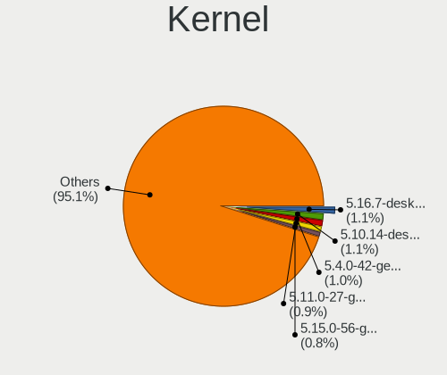
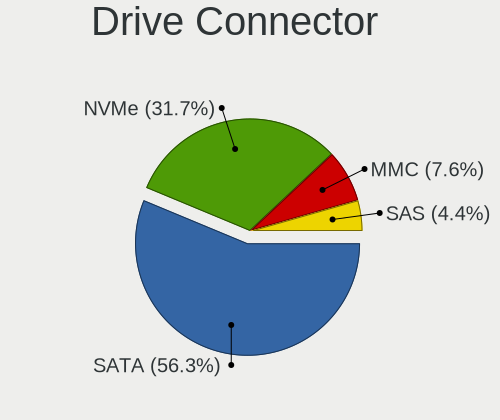
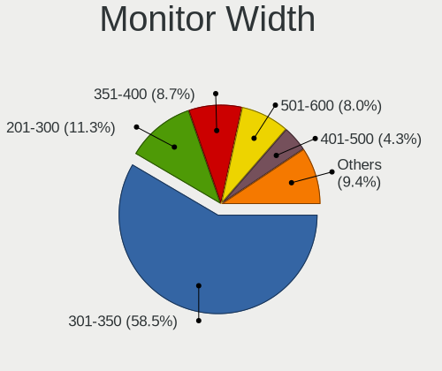
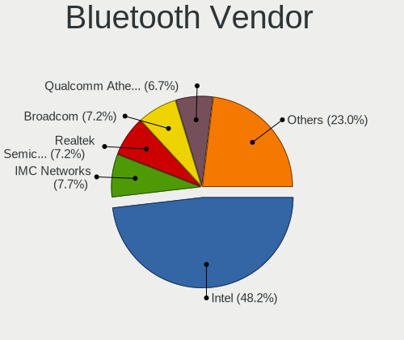
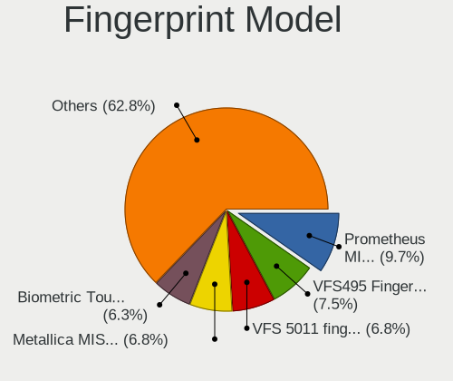
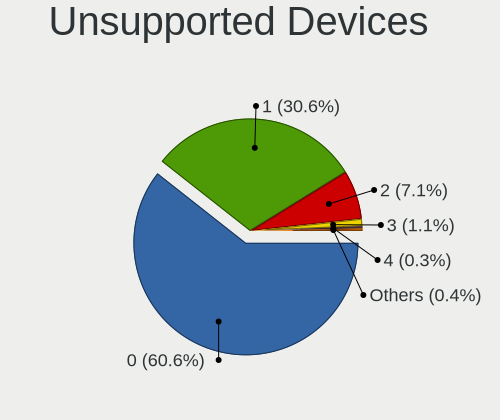

Linux in Canada - Tested Hardware & Statistics (Notebooks)
----------------------------------------------------------

A project to collect tested hardware configurations for Linux in Canada.

Anyone can contribute to this report by the [hw-probe](https://github.com/linuxhw/hw-probe) tool:

    sudo -E hw-probe -all -upload

Please contribute! Especially if your hardware is rare.

Contents
--------

* [ Test Cases ](#test-cases)

* [ System ](#system)
  - [ OS                       ](#os)
  - [ OS Family                ](#os-family)
  - [ Kernel                   ](#kernel)
  - [ Kernel Family            ](#kernel-family)
  - [ Kernel Major Ver.        ](#kernel-major-ver)
  - [ Arch                     ](#arch)
  - [ DE                       ](#de)
  - [ Display Server           ](#display-server)
  - [ Display Manager          ](#display-manager)
  - [ OS Lang                  ](#os-lang)
  - [ Boot Mode                ](#boot-mode)
  - [ Filesystem               ](#filesystem)
  - [ Part. scheme             ](#part-scheme)
  - [ Dual Boot with Linux/BSD ](#dual-boot-with-linuxbsd)
  - [ Dual Boot (Win)          ](#dual-boot-win)

* [ Board ](#board)
  - [ Vendor                   ](#vendor)
  - [ Model                    ](#model)
  - [ Model Family             ](#model-family)
  - [ MFG Year                 ](#mfg-year)
  - [ Form Factor              ](#form-factor)
  - [ Secure Boot              ](#secure-boot)
  - [ Coreboot                 ](#coreboot)
  - [ RAM Size                 ](#ram-size)
  - [ RAM Used                 ](#ram-used)
  - [ Total Drives             ](#total-drives)
  - [ Has CD-ROM               ](#has-cd-rom)
  - [ Has Ethernet             ](#has-ethernet)
  - [ Has WiFi                 ](#has-wifi)
  - [ Has Bluetooth            ](#has-bluetooth)

* [ Location ](#location)
  - [ Country                  ](#country)
  - [ City                     ](#city)

* [ Drives ](#drives)
  - [ Drive Vendor             ](#drive-vendor)
  - [ Drive Model              ](#drive-model)
  - [ HDD Vendor               ](#hdd-vendor)
  - [ SSD Vendor               ](#ssd-vendor)
  - [ Drive Kind               ](#drive-kind)
  - [ Drive Connector          ](#drive-connector)
  - [ Drive Size               ](#drive-size)
  - [ Space Total              ](#space-total)
  - [ Space Used               ](#space-used)
  - [ Malfunc. Drives          ](#malfunc-drives)
  - [ Malfunc. Drive Vendor    ](#malfunc-drive-vendor)
  - [ Malfunc. HDD Vendor      ](#malfunc-hdd-vendor)
  - [ Malfunc. Drive Kind      ](#malfunc-drive-kind)
  - [ Failed Drives            ](#failed-drives)
  - [ Failed Drive Vendor      ](#failed-drive-vendor)
  - [ Drive Status             ](#drive-status)

* [ Storage controller ](#storage-controller)
  - [ Storage Vendor           ](#storage-vendor)
  - [ Storage Model            ](#storage-model)
  - [ Storage Kind             ](#storage-kind)

* [ Processor ](#processor)
  - [ CPU Vendor               ](#cpu-vendor)
  - [ CPU Model                ](#cpu-model)
  - [ CPU Model Family         ](#cpu-model-family)
  - [ CPU Cores                ](#cpu-cores)
  - [ CPU Sockets              ](#cpu-sockets)
  - [ CPU Threads              ](#cpu-threads)
  - [ CPU Op-Modes             ](#cpu-op-modes)
  - [ CPU Microcode            ](#cpu-microcode)
  - [ CPU Microarch            ](#cpu-microarch)

* [ Graphics ](#graphics)
  - [ GPU Vendor               ](#gpu-vendor)
  - [ GPU Model                ](#gpu-model)
  - [ GPU Combo                ](#gpu-combo)
  - [ GPU Driver               ](#gpu-driver)
  - [ GPU Memory               ](#gpu-memory)

* [ Monitor ](#monitor)
  - [ Monitor Vendor           ](#monitor-vendor)
  - [ Monitor Model            ](#monitor-model)
  - [ Monitor Resolution       ](#monitor-resolution)
  - [ Monitor Diagonal         ](#monitor-diagonal)
  - [ Monitor Width            ](#monitor-width)
  - [ Aspect Ratio             ](#aspect-ratio)
  - [ Monitor Area             ](#monitor-area)
  - [ Pixel Density            ](#pixel-density)
  - [ Multiple Monitors        ](#multiple-monitors)

* [ Network ](#network)
  - [ Net Controller Vendor    ](#net-controller-vendor)
  - [ Net Controller Model     ](#net-controller-model)
  - [ Wireless Vendor          ](#wireless-vendor)
  - [ Wireless Model           ](#wireless-model)
  - [ Ethernet Vendor          ](#ethernet-vendor)
  - [ Ethernet Model           ](#ethernet-model)
  - [ Net Controller Kind      ](#net-controller-kind)
  - [ Used Controller          ](#used-controller)
  - [ NICs                     ](#nics)
  - [ IPv6                     ](#ipv6)

* [ Bluetooth ](#bluetooth)
  - [ Bluetooth Vendor         ](#bluetooth-vendor)
  - [ Bluetooth Model          ](#bluetooth-model)

* [ Sound ](#sound)
  - [ Sound Vendor             ](#sound-vendor)
  - [ Sound Model              ](#sound-model)

* [ Memory ](#memory)
  - [ Memory Vendor            ](#memory-vendor)
  - [ Memory Model             ](#memory-model)
  - [ Memory Kind              ](#memory-kind)
  - [ Memory Form Factor       ](#memory-form-factor)
  - [ Memory Size              ](#memory-size)
  - [ Memory Speed             ](#memory-speed)

* [ Printers & scanners ](#printers--scanners)
  - [ Printer Vendor           ](#printer-vendor)
  - [ Printer Model            ](#printer-model)
  - [ Scanner Vendor           ](#scanner-vendor)
  - [ Scanner Model            ](#scanner-model)

* [ Camera ](#camera)
  - [ Camera Vendor            ](#camera-vendor)
  - [ Camera Model             ](#camera-model)

* [ Security ](#security)
  - [ Fingerprint Vendor       ](#fingerprint-vendor)
  - [ Fingerprint Model        ](#fingerprint-model)
  - [ Chipcard Vendor          ](#chipcard-vendor)
  - [ Chipcard Model           ](#chipcard-model)

* [ Unsupported ](#unsupported)
  - [ Unsupported Devices      ](#unsupported-devices)
  - [ Unsupported Device Types ](#unsupported-device-types)

Test Cases
----------

Total: 5077

| Vendor        | Model                       | Probe                                                      | Date         |
|---------------|-----------------------------|------------------------------------------------------------|--------------|
| Valve         | Jupiter                     | [99879342f6](https://linux-hardware.org/?probe=99879342f6) | May 09, 2024 |
| ASUSTek       | ASUS TUF Gaming F15 FX50... | [291cd1c75f](https://linux-hardware.org/?probe=291cd1c75f) | May 09, 2024 |
| Alienware     | M17x                        | [349d219a3a](https://linux-hardware.org/?probe=349d219a3a) | May 08, 2024 |
| Lenovo        | V15 G4 IRU 83A1             | [7cd1070dc0](https://linux-hardware.org/?probe=7cd1070dc0) | May 07, 2024 |
| System76      | Gazelle                     | [fbe88df732](https://linux-hardware.org/?probe=fbe88df732) | May 07, 2024 |
| HP            | ProBook 645 G3              | [29cb5b66f8](https://linux-hardware.org/?probe=29cb5b66f8) | May 07, 2024 |
| Dell          | Precision 7710              | [c89fe612a1](https://linux-hardware.org/?probe=c89fe612a1) | May 06, 2024 |
| Dell          | Precision 7710              | [52c6c4a64a](https://linux-hardware.org/?probe=52c6c4a64a) | May 06, 2024 |
| HUAWEI        | BOHK-WAX9X                  | [81e4b0e4f8](https://linux-hardware.org/?probe=81e4b0e4f8) | May 05, 2024 |
| ASUSTek       | GL753VD                     | [05c21dbea4](https://linux-hardware.org/?probe=05c21dbea4) | May 05, 2024 |
| MSI           | WS66 11UKT                  | [f9ab812619](https://linux-hardware.org/?probe=f9ab812619) | May 05, 2024 |
| Acer          | Aspire E1-522               | [b1c41ef5a0](https://linux-hardware.org/?probe=b1c41ef5a0) | May 04, 2024 |
| Acer          | Nitro AN515-57              | [a4f0a4cac3](https://linux-hardware.org/?probe=a4f0a4cac3) | May 03, 2024 |
| HP            | Pavilion dv5                | [2ca3da2cdd](https://linux-hardware.org/?probe=2ca3da2cdd) | May 03, 2024 |
| Lenovo        | G500s 20245                 | [54adaed795](https://linux-hardware.org/?probe=54adaed795) | May 03, 2024 |
| HP            | Pavilion dv5                | [fadfece0f4](https://linux-hardware.org/?probe=fadfece0f4) | May 03, 2024 |
| HP            | ENVY Laptop 17-cr1xxx       | [f17f6e1d74](https://linux-hardware.org/?probe=f17f6e1d74) | May 02, 2024 |
| HP            | Pavilion 10 TS              | [eb83dcddc9](https://linux-hardware.org/?probe=eb83dcddc9) | May 02, 2024 |
| HP            | Pavilion 10 TS              | [e7b477dda5](https://linux-hardware.org/?probe=e7b477dda5) | May 02, 2024 |
| HP            | Pavilion 10 TS              | [b0b8ae831e](https://linux-hardware.org/?probe=b0b8ae831e) | May 02, 2024 |
| Apple         | MacBookPro11,1              | [eb47dc7acd](https://linux-hardware.org/?probe=eb47dc7acd) | May 02, 2024 |
| Framework     | Laptop                      | [b1f763433e](https://linux-hardware.org/?probe=b1f763433e) | May 01, 2024 |
| Framework     | Laptop 13 (AMD Ryzen 704... | [94cfd5a8cf](https://linux-hardware.org/?probe=94cfd5a8cf) | Apr 30, 2024 |
| Framework     | Laptop 13 (AMD Ryzen 704... | [b8bb184ea8](https://linux-hardware.org/?probe=b8bb184ea8) | Apr 30, 2024 |
| Chuwi         | LapBook Air                 | [ee0775cfb7](https://linux-hardware.org/?probe=ee0775cfb7) | Apr 30, 2024 |
| Panasonic     | CF-31WFL72LM                | [4699837ff5](https://linux-hardware.org/?probe=4699837ff5) | Apr 30, 2024 |
| Acer          | Aspire A515-51              | [083965d3db](https://linux-hardware.org/?probe=083965d3db) | Apr 30, 2024 |
| Panasonic     | CF-31WFL72LM                | [efe2e1be70](https://linux-hardware.org/?probe=efe2e1be70) | Apr 30, 2024 |
| Gigabyte      | AERO 15 XD                  | [6dde8eb13a](https://linux-hardware.org/?probe=6dde8eb13a) | Apr 30, 2024 |
| OEM           | KabyLake                    | [0a646c116b](https://linux-hardware.org/?probe=0a646c116b) | Apr 29, 2024 |
| ASUSTek       | X555YA                      | [43e5d87003](https://linux-hardware.org/?probe=43e5d87003) | Apr 29, 2024 |
| Acer          | Aspire E1-532               | [b50154d060](https://linux-hardware.org/?probe=b50154d060) | Apr 28, 2024 |
| Dell          | Inspiron 3721               | [6f596de759](https://linux-hardware.org/?probe=6f596de759) | Apr 28, 2024 |
| Dell          | Latitude E6400              | [fe74dc08cd](https://linux-hardware.org/?probe=fe74dc08cd) | Apr 27, 2024 |
| Acer          | Nitro AN515-57              | [2232c883cb](https://linux-hardware.org/?probe=2232c883cb) | Apr 26, 2024 |
| ASUSTek       | VivoBook_ASUSLaptop X513... | [01199d3eea](https://linux-hardware.org/?probe=01199d3eea) | Apr 26, 2024 |
| Acer          | Aspire 5733                 | [b84cedde38](https://linux-hardware.org/?probe=b84cedde38) | Apr 26, 2024 |
| Lenovo        | ThinkPad X1 Carbon 2nd 2... | [732deac74e](https://linux-hardware.org/?probe=732deac74e) | Apr 26, 2024 |
| Lenovo        | ThinkPad P15 Gen 1 20ST0... | [ac764cfca7](https://linux-hardware.org/?probe=ac764cfca7) | Apr 25, 2024 |
| Gigabyte      | G5 MD                       | [09c723ce43](https://linux-hardware.org/?probe=09c723ce43) | Apr 25, 2024 |
| Gigabyte      | G5 MD                       | [4529b157ae](https://linux-hardware.org/?probe=4529b157ae) | Apr 25, 2024 |
| ASUSTek       | ASUS TUF Gaming F15 FX50... | [b3ed13ee2a](https://linux-hardware.org/?probe=b3ed13ee2a) | Apr 25, 2024 |
| MSI           | GF63 Thin 10SC              | [3ed0366984](https://linux-hardware.org/?probe=3ed0366984) | Apr 25, 2024 |
| Unknown       | Unknown                     | [849147f4a5](https://linux-hardware.org/?probe=849147f4a5) | Apr 25, 2024 |
| Lenovo        | Legion 5 15ARH7 82RE        | [5188dec592](https://linux-hardware.org/?probe=5188dec592) | Apr 24, 2024 |
| Lenovo        | G780 20138                  | [dc970a2fc7](https://linux-hardware.org/?probe=dc970a2fc7) | Apr 24, 2024 |
| Lenovo        | ThinkPad P52 20MAS4W721     | [7aab14f802](https://linux-hardware.org/?probe=7aab14f802) | Apr 24, 2024 |
| HP            | EliteBook 2170p             | [847dec6d8e](https://linux-hardware.org/?probe=847dec6d8e) | Apr 24, 2024 |
| Dell          | XPS 15 9530                 | [e1d4486b51](https://linux-hardware.org/?probe=e1d4486b51) | Apr 24, 2024 |
| Acer          | Swift SF315-52G             | [91c1e44537](https://linux-hardware.org/?probe=91c1e44537) | Apr 24, 2024 |
| Lenovo        | ThinkPad P51 20HHCTO1WW     | [152f2cedf4](https://linux-hardware.org/?probe=152f2cedf4) | Apr 23, 2024 |
| Dell          | Latitude 3340               | [097f5b6c08](https://linux-hardware.org/?probe=097f5b6c08) | Apr 23, 2024 |
| Apple         | MacBookPro8,2               | [34c23ebcd8](https://linux-hardware.org/?probe=34c23ebcd8) | Apr 23, 2024 |
| Apple         | MacBookPro12,1              | [4de711d9b5](https://linux-hardware.org/?probe=4de711d9b5) | Apr 22, 2024 |
| Apple         | MacBookPro12,1              | [aecd4caf1c](https://linux-hardware.org/?probe=aecd4caf1c) | Apr 22, 2024 |
| Lenovo        | G780 20138                  | [1863069a38](https://linux-hardware.org/?probe=1863069a38) | Apr 22, 2024 |
| Lenovo        | IdeaPadFlex 15 20309        | [a290c311d1](https://linux-hardware.org/?probe=a290c311d1) | Apr 22, 2024 |
| Lenovo        | ThinkPad X1 Carbon 2nd 2... | [9fb21baa1b](https://linux-hardware.org/?probe=9fb21baa1b) | Apr 21, 2024 |
| RTD Embedd... | CMX34BT                     | [dbbe57d238](https://linux-hardware.org/?probe=dbbe57d238) | Apr 21, 2024 |
| HP            | EliteBook 840 G8 Noteboo... | [e090d79256](https://linux-hardware.org/?probe=e090d79256) | Apr 20, 2024 |
| ASUSTek       | ASUS TUF Gaming F15 FX50... | [22edc4d418](https://linux-hardware.org/?probe=22edc4d418) | Apr 20, 2024 |
| Sony          | SVF15213CDW                 | [b80f0ab84c](https://linux-hardware.org/?probe=b80f0ab84c) | Apr 20, 2024 |
| Lenovo        | ThinkPad T480s 20L8S6BW1... | [778bb54578](https://linux-hardware.org/?probe=778bb54578) | Apr 20, 2024 |
| ASUSTek       | Strix 15 GL503GE            | [efeb67efdf](https://linux-hardware.org/?probe=efeb67efdf) | Apr 19, 2024 |
| Dell          | Latitude E5420              | [f937473451](https://linux-hardware.org/?probe=f937473451) | Apr 19, 2024 |
| Valve         | Jupiter                     | [38ab9d1cca](https://linux-hardware.org/?probe=38ab9d1cca) | Apr 18, 2024 |
| ASUSTek       | UX305CA                     | [0793f271ed](https://linux-hardware.org/?probe=0793f271ed) | Apr 17, 2024 |
| Lenovo        | ThinkBook 13s G4 IAP 21A... | [600ef92371](https://linux-hardware.org/?probe=600ef92371) | Apr 17, 2024 |
| Dell          | Inspiron 7737               | [1f91e64679](https://linux-hardware.org/?probe=1f91e64679) | Apr 17, 2024 |
| Dell          | Inspiron 7737               | [361844ede0](https://linux-hardware.org/?probe=361844ede0) | Apr 17, 2024 |
| ASUSTek       | GL502VM                     | [d478e55005](https://linux-hardware.org/?probe=d478e55005) | Apr 16, 2024 |
| Acer          | Aspire 5810T                | [3940c56991](https://linux-hardware.org/?probe=3940c56991) | Apr 16, 2024 |
| Apple         | MacBookPro11,1              | [ff3ba1baf8](https://linux-hardware.org/?probe=ff3ba1baf8) | Apr 16, 2024 |
| Apple         | MacBookPro11,1              | [528d3a590f](https://linux-hardware.org/?probe=528d3a590f) | Apr 16, 2024 |
| ASUSTek       | G751JM                      | [78bd2126e9](https://linux-hardware.org/?probe=78bd2126e9) | Apr 15, 2024 |
| ASUSTek       | N81Vp                       | [92a6370ed9](https://linux-hardware.org/?probe=92a6370ed9) | Apr 14, 2024 |
| Dell          | Inspiron 5515               | [5847899f83](https://linux-hardware.org/?probe=5847899f83) | Apr 14, 2024 |
| Apple         | MacBookPro11,1              | [58b2e77917](https://linux-hardware.org/?probe=58b2e77917) | Apr 14, 2024 |
| ASUSTek       | E402MA                      | [58a1e32393](https://linux-hardware.org/?probe=58a1e32393) | Apr 14, 2024 |
| Lenovo        | ThinkPad X1 Nano Gen 1 2... | [617d302540](https://linux-hardware.org/?probe=617d302540) | Apr 14, 2024 |
| Unknown       | Unknown                     | [9d776d1a83](https://linux-hardware.org/?probe=9d776d1a83) | Apr 14, 2024 |
| Dell          | Studio XPS 1340             | [cac8add4c8](https://linux-hardware.org/?probe=cac8add4c8) | Apr 13, 2024 |
| Apple         | MacBookPro11,3              | [abbfebcf21](https://linux-hardware.org/?probe=abbfebcf21) | Apr 13, 2024 |
| HP            | ProBook 4540s               | [b2bb07154e](https://linux-hardware.org/?probe=b2bb07154e) | Apr 13, 2024 |
| Apple         | MacBookPro5,5               | [f6049182e6](https://linux-hardware.org/?probe=f6049182e6) | Apr 13, 2024 |
| Dell          | Latitude E5270              | [31c5454d09](https://linux-hardware.org/?probe=31c5454d09) | Apr 12, 2024 |
| Lenovo        | ThinkPad T470p 20J7S0FA0... | [77db3dff9e](https://linux-hardware.org/?probe=77db3dff9e) | Apr 12, 2024 |
| HP            | ZBook 15 G3                 | [5f48d3ede1](https://linux-hardware.org/?probe=5f48d3ede1) | Apr 12, 2024 |
| Lenovo        | ThinkPad T440p 20ANCTO1W... | [7a39eaa9b8](https://linux-hardware.org/?probe=7a39eaa9b8) | Apr 11, 2024 |
| Toshiba       | TECRA Z40-C                 | [8d6c663fc1](https://linux-hardware.org/?probe=8d6c663fc1) | Apr 11, 2024 |
| Lenovo        | ThinkPad T14 Gen 1 20S1S... | [b6a43ddde6](https://linux-hardware.org/?probe=b6a43ddde6) | Apr 11, 2024 |
| Gigabyte      | AERO 15-X9                  | [9bbcd276e5](https://linux-hardware.org/?probe=9bbcd276e5) | Apr 11, 2024 |
| ASUSTek       | Vivobook Go E1504FA_E150... | [4152c2b9a9](https://linux-hardware.org/?probe=4152c2b9a9) | Apr 11, 2024 |
| ASUSTek       | VivoBook_ASUSLaptop X712... | [c1899c8840](https://linux-hardware.org/?probe=c1899c8840) | Apr 11, 2024 |
| Dell          | Latitude E5470              | [4c1915f7c1](https://linux-hardware.org/?probe=4c1915f7c1) | Apr 10, 2024 |
| Lenovo        | ThinkPad T470 20HEA0TLUS    | [fac79c8b6b](https://linux-hardware.org/?probe=fac79c8b6b) | Apr 09, 2024 |
| MSI           | Cyborg 15 A12VF             | [7ca59cdafe](https://linux-hardware.org/?probe=7ca59cdafe) | Apr 09, 2024 |
| ASUSTek       | VivoBook_ASUSLaptop X712... | [cc9aa7ed6c](https://linux-hardware.org/?probe=cc9aa7ed6c) | Apr 09, 2024 |
| Lenovo        | ThinkPad P15v Gen 1 20TQ... | [fba34eaafb](https://linux-hardware.org/?probe=fba34eaafb) | Apr 09, 2024 |
| Dell          | Precision M4800             | [3ec884f458](https://linux-hardware.org/?probe=3ec884f458) | Apr 08, 2024 |
| Lenovo        | LOQ 15IRH8 82XV             | [78fa4035a9](https://linux-hardware.org/?probe=78fa4035a9) | Apr 08, 2024 |
| Lenovo        | ThinkPad T530 2359CTO       | [3fb9602631](https://linux-hardware.org/?probe=3fb9602631) | Apr 08, 2024 |
| System76      | Gazelle                     | [969d376558](https://linux-hardware.org/?probe=969d376558) | Apr 07, 2024 |
| Apple         | MacBookPro8,1               | [7efef6a0ae](https://linux-hardware.org/?probe=7efef6a0ae) | Apr 07, 2024 |
| Apple         | MacBookPro8,1               | [d28398beb7](https://linux-hardware.org/?probe=d28398beb7) | Apr 07, 2024 |
| Lenovo        | ThinkPad T510 4349BW3       | [c5a4aad672](https://linux-hardware.org/?probe=c5a4aad672) | Apr 07, 2024 |
| HP            | ProBook 650 G2              | [005b1cfa0d](https://linux-hardware.org/?probe=005b1cfa0d) | Apr 07, 2024 |
| HP            | ProBook 650 G2              | [fa83ab6042](https://linux-hardware.org/?probe=fa83ab6042) | Apr 07, 2024 |
| Lenovo        | ThinkPad S1 Yoga 20CD20C... | [364146150a](https://linux-hardware.org/?probe=364146150a) | Apr 06, 2024 |
| Lenovo        | ThinkPad P15 Gen 2i 20YQ... | [6fd20472e0](https://linux-hardware.org/?probe=6fd20472e0) | Apr 06, 2024 |
| Dell          | G3 3500                     | [57ecb1dc3d](https://linux-hardware.org/?probe=57ecb1dc3d) | Apr 06, 2024 |
| Apple         | MacBookPro8,1               | [733d6c6e2b](https://linux-hardware.org/?probe=733d6c6e2b) | Apr 05, 2024 |
| Apple         | MacBookPro11,1              | [80d3babf0d](https://linux-hardware.org/?probe=80d3babf0d) | Apr 05, 2024 |
| Intel Clie... | LAPRC710                    | [d4671cf4fb](https://linux-hardware.org/?probe=d4671cf4fb) | Apr 05, 2024 |
| Intel Clie... | LAPRC710                    | [7b1fd787e5](https://linux-hardware.org/?probe=7b1fd787e5) | Apr 05, 2024 |
| Lenovo        | ThinkPad E580 20KS003LCA    | [a6320acff1](https://linux-hardware.org/?probe=a6320acff1) | Apr 05, 2024 |
| ASUSTek       | VivoBook_ASUSLaptop X150... | [45bd209357](https://linux-hardware.org/?probe=45bd209357) | Apr 05, 2024 |
| MSI           | Bravo 15 C7VFK              | [e987af64b1](https://linux-hardware.org/?probe=e987af64b1) | Apr 05, 2024 |
| Lenovo        | Legion Y7000P IAH7 82RC     | [2edfed7d6c](https://linux-hardware.org/?probe=2edfed7d6c) | Apr 04, 2024 |
| Dell          | Precision 5540              | [bcdbeba906](https://linux-hardware.org/?probe=bcdbeba906) | Apr 04, 2024 |
| Lenovo        | Legion 5 17ACH6H 82JY       | [bbc6cfb633](https://linux-hardware.org/?probe=bbc6cfb633) | Apr 04, 2024 |
| Apple         | MacBookAir5,2               | [3c05445a49](https://linux-hardware.org/?probe=3c05445a49) | Apr 03, 2024 |
| Lenovo        | Legion Y7000P IAH7 82RC     | [dd2a60e142](https://linux-hardware.org/?probe=dd2a60e142) | Apr 03, 2024 |
| Dell          | Studio 1537                 | [3e7ce8de4a](https://linux-hardware.org/?probe=3e7ce8de4a) | Apr 02, 2024 |
| HP            | Pavilion m6                 | [147003c9cf](https://linux-hardware.org/?probe=147003c9cf) | Apr 02, 2024 |
| HP            | Pavilion m6                 | [d4c8d5d446](https://linux-hardware.org/?probe=d4c8d5d446) | Apr 02, 2024 |
| Lenovo        | ThinkBook 14 G2 ITL 20VD    | [a31a3d60b1](https://linux-hardware.org/?probe=a31a3d60b1) | Apr 01, 2024 |
| Lenovo        | ThinkBook 14 G2 ITL 20VD    | [ce4f787af2](https://linux-hardware.org/?probe=ce4f787af2) | Apr 01, 2024 |
| HP            | Pavilion Gaming Laptop 1... | [2a00b77a69](https://linux-hardware.org/?probe=2a00b77a69) | Apr 01, 2024 |
| Valve         | Jupiter                     | [83291b94be](https://linux-hardware.org/?probe=83291b94be) | Mar 31, 2024 |
| Acer          | Extensa 5630                | [8fee1914ea](https://linux-hardware.org/?probe=8fee1914ea) | Mar 31, 2024 |
| Dell          | Inspiron 15 3520            | [ceface0ac8](https://linux-hardware.org/?probe=ceface0ac8) | Mar 31, 2024 |
| ASUSTek       | VivoBook_ASUSLaptop X515... | [17f9e8a736](https://linux-hardware.org/?probe=17f9e8a736) | Mar 31, 2024 |
| Dell          | Latitude E5520              | [875fc34b64](https://linux-hardware.org/?probe=875fc34b64) | Mar 31, 2024 |
| Dell          | XPS 13 9380                 | [cd00da33bc](https://linux-hardware.org/?probe=cd00da33bc) | Mar 30, 2024 |
| HP            | EliteBook Revolve 810 G3    | [a5130eb480](https://linux-hardware.org/?probe=a5130eb480) | Mar 30, 2024 |
| Apple         | MacBookPro15,2              | [02f30c0686](https://linux-hardware.org/?probe=02f30c0686) | Mar 30, 2024 |
| HP            | Notebook                    | [4fde2f6054](https://linux-hardware.org/?probe=4fde2f6054) | Mar 30, 2024 |
| Toshiba       | TECRA Z40-C                 | [91bd726aad](https://linux-hardware.org/?probe=91bd726aad) | Mar 30, 2024 |
| Lenovo        | ThinkPad X1 Carbon 2nd 2... | [f91babea67](https://linux-hardware.org/?probe=f91babea67) | Mar 28, 2024 |
| Lenovo        | ThinkPad X1 Carbon 2nd 2... | [e2892ac728](https://linux-hardware.org/?probe=e2892ac728) | Mar 28, 2024 |
| HP            | EliteBook 845 G8 Noteboo... | [ece254a4f1](https://linux-hardware.org/?probe=ece254a4f1) | Mar 28, 2024 |
| Dell          | Latitude 5480               | [21dd5f9667](https://linux-hardware.org/?probe=21dd5f9667) | Mar 28, 2024 |
| System76      | Lemur Pro                   | [df1eefee3b](https://linux-hardware.org/?probe=df1eefee3b) | Mar 27, 2024 |
| ASUSTek       | UX430UAR                    | [c8e5df9c12](https://linux-hardware.org/?probe=c8e5df9c12) | Mar 26, 2024 |
| Toshiba       | Satellite A210              | [37734a1409](https://linux-hardware.org/?probe=37734a1409) | Mar 26, 2024 |
| Lenovo        | ThinkPad T14s Gen 3 21CQ... | [7f8bc016c4](https://linux-hardware.org/?probe=7f8bc016c4) | Mar 25, 2024 |
| Acer          | Aspire A315-42              | [a91a8f1789](https://linux-hardware.org/?probe=a91a8f1789) | Mar 25, 2024 |
| MSI           | Modern 15 B7M               | [29f1cd54e1](https://linux-hardware.org/?probe=29f1cd54e1) | Mar 24, 2024 |
| Dell          | XPS 15 7590                 | [5f2e3e5e82](https://linux-hardware.org/?probe=5f2e3e5e82) | Mar 24, 2024 |
| Dell          | XPS 15 7590                 | [fd518a9250](https://linux-hardware.org/?probe=fd518a9250) | Mar 24, 2024 |
| Dell          | Latitude E6540              | [baf4466c0c](https://linux-hardware.org/?probe=baf4466c0c) | Mar 24, 2024 |
| HP            | Pavilion dv5                | [72da06e33c](https://linux-hardware.org/?probe=72da06e33c) | Mar 24, 2024 |
| Dell          | Inspiron 7580               | [8175d8b6de](https://linux-hardware.org/?probe=8175d8b6de) | Mar 24, 2024 |
| Dell          | Latitude 7420               | [511721b690](https://linux-hardware.org/?probe=511721b690) | Mar 23, 2024 |
| Dell          | Inspiron 5480               | [62a55513db](https://linux-hardware.org/?probe=62a55513db) | Mar 23, 2024 |
| Dell          | Precision 3550              | [94674b699c](https://linux-hardware.org/?probe=94674b699c) | Mar 23, 2024 |
| ASUSTek       | X551MA                      | [05cfb55044](https://linux-hardware.org/?probe=05cfb55044) | Mar 23, 2024 |
| ASUSTek       | ROG Zephyrus Duo 16 GX65... | [015232a1ee](https://linux-hardware.org/?probe=015232a1ee) | Mar 22, 2024 |
| Dell          | Latitude E6420              | [cdd8eb657a](https://linux-hardware.org/?probe=cdd8eb657a) | Mar 22, 2024 |
| Unknown       | Cherry Trail CR             | [efb2513f33](https://linux-hardware.org/?probe=efb2513f33) | Mar 22, 2024 |
| HP            | ProBook 650 G2              | [f37b764c1f](https://linux-hardware.org/?probe=f37b764c1f) | Mar 22, 2024 |
| Lenovo        | ThinkPad X1 Carbon 3444F... | [3f2b9d56d7](https://linux-hardware.org/?probe=3f2b9d56d7) | Mar 22, 2024 |
| Valve         | Jupiter                     | [799336fb6f](https://linux-hardware.org/?probe=799336fb6f) | Mar 21, 2024 |
| Dell          | Latitude E6540              | [c3883595b9](https://linux-hardware.org/?probe=c3883595b9) | Mar 21, 2024 |
| Acer          | Extensa 5630                | [8e43318d08](https://linux-hardware.org/?probe=8e43318d08) | Mar 20, 2024 |
| Lenovo        | ThinkPad W500 40633FU       | [6ce965896b](https://linux-hardware.org/?probe=6ce965896b) | Mar 20, 2024 |
| Apple         | MacBook8,1                  | [fa8342132f](https://linux-hardware.org/?probe=fa8342132f) | Mar 20, 2024 |
| Apple         | MacBook8,1                  | [ac828c20cd](https://linux-hardware.org/?probe=ac828c20cd) | Mar 20, 2024 |
| Alienware     | x15 R1                      | [686f4ed556](https://linux-hardware.org/?probe=686f4ed556) | Mar 20, 2024 |
| Toshiba       | Satellite S50D-A            | [9c1fad3c73](https://linux-hardware.org/?probe=9c1fad3c73) | Mar 20, 2024 |
| Dell          | Latitude 7440               | [143c9f9828](https://linux-hardware.org/?probe=143c9f9828) | Mar 19, 2024 |
| ASUSTek       | ROG Strix G513QE_G513QE     | [1a65c1c7d8](https://linux-hardware.org/?probe=1a65c1c7d8) | Mar 18, 2024 |
| Lenovo        | ThinkPad T480s 20L8SCMY0... | [e529b241b9](https://linux-hardware.org/?probe=e529b241b9) | Mar 18, 2024 |
| HP            | G60                         | [67399d429c](https://linux-hardware.org/?probe=67399d429c) | Mar 18, 2024 |
| Lenovo        | G70-70 80HW0014FR           | [8fd24b2766](https://linux-hardware.org/?probe=8fd24b2766) | Mar 17, 2024 |
| Lenovo        | G70-70 80HW0014FR           | [ebb00d0246](https://linux-hardware.org/?probe=ebb00d0246) | Mar 17, 2024 |
| Lenovo        | IdeaPad S145-15IWL 81MV     | [8388b1b84b](https://linux-hardware.org/?probe=8388b1b84b) | Mar 17, 2024 |
| Lenovo        | IdeaPad S145-15IWL 81MV     | [97e2cab9ff](https://linux-hardware.org/?probe=97e2cab9ff) | Mar 17, 2024 |
| Dell          | Latitude 5480               | [84cc86e4f5](https://linux-hardware.org/?probe=84cc86e4f5) | Mar 16, 2024 |
| Dell          | Inspiron 5570               | [54adba9e2e](https://linux-hardware.org/?probe=54adba9e2e) | Mar 15, 2024 |
| ASUSTek       | VivoBook_ASUSLaptop X150... | [96f5ad9c2b](https://linux-hardware.org/?probe=96f5ad9c2b) | Mar 15, 2024 |
| Acer          | Aspire 5830TG               | [3f677c1ef3](https://linux-hardware.org/?probe=3f677c1ef3) | Mar 15, 2024 |
| Lenovo        | ThinkPad E15 20RD005HUS     | [19a5380b1f](https://linux-hardware.org/?probe=19a5380b1f) | Mar 14, 2024 |
| Dell          | Latitude 5401               | [651b3a2f09](https://linux-hardware.org/?probe=651b3a2f09) | Mar 14, 2024 |
| Dell          | Inspiron 5575               | [982b876f87](https://linux-hardware.org/?probe=982b876f87) | Mar 13, 2024 |
| Dell          | Latitude 5290 2-in-1        | [201c221469](https://linux-hardware.org/?probe=201c221469) | Mar 12, 2024 |
| Apple         | MacBookPro9,2               | [00183dc259](https://linux-hardware.org/?probe=00183dc259) | Mar 12, 2024 |
| Alienware     | x15 R1                      | [84d6d61f1b](https://linux-hardware.org/?probe=84d6d61f1b) | Mar 12, 2024 |
| Dell          | Latitude 5401               | [b68db5aef2](https://linux-hardware.org/?probe=b68db5aef2) | Mar 12, 2024 |
| Lenovo        | ThinkPad X230 2325GW8       | [e2c027ac26](https://linux-hardware.org/?probe=e2c027ac26) | Mar 11, 2024 |
| Lenovo        | ThinkPad X230 2325GW8       | [ce96a808a1](https://linux-hardware.org/?probe=ce96a808a1) | Mar 11, 2024 |
| Gigabyte      | B650 GAMING X AX            | [3ee6829e26](https://linux-hardware.org/?probe=3ee6829e26) | Mar 10, 2024 |
| ASUSTek       | X550ZA                      | [6bcc8425b7](https://linux-hardware.org/?probe=6bcc8425b7) | Mar 09, 2024 |
| ASUSTek       | X550ZA                      | [62d2c0438f](https://linux-hardware.org/?probe=62d2c0438f) | Mar 09, 2024 |
| Dell          | Precision 5540              | [d6bf9d8d32](https://linux-hardware.org/?probe=d6bf9d8d32) | Mar 09, 2024 |
| Dell          | XPS 15 9530                 | [c5e0eb96bf](https://linux-hardware.org/?probe=c5e0eb96bf) | Mar 08, 2024 |
| ASUSTek       | TUF Gaming FX505DT_FX505... | [7700a7a168](https://linux-hardware.org/?probe=7700a7a168) | Mar 08, 2024 |
| ASUSTek       | Zenbook UX3402VA_UX3402V... | [de4f9c0df5](https://linux-hardware.org/?probe=de4f9c0df5) | Mar 07, 2024 |
| Dell          | Latitude 5440               | [555765316a](https://linux-hardware.org/?probe=555765316a) | Mar 07, 2024 |
| HP            | ProBook 650 G2              | [93b1986cc2](https://linux-hardware.org/?probe=93b1986cc2) | Mar 07, 2024 |
| Valve         | Jupiter                     | [677470b88d](https://linux-hardware.org/?probe=677470b88d) | Mar 06, 2024 |
| HP            | EliteBook 845 G8 Noteboo... | [5f7a226ed8](https://linux-hardware.org/?probe=5f7a226ed8) | Mar 06, 2024 |
| Lenovo        | ThinkPad S1 Yoga 20CD20C... | [e81ed8b98c](https://linux-hardware.org/?probe=e81ed8b98c) | Mar 06, 2024 |
| Dell          | Inspiron 7737               | [5077731ec5](https://linux-hardware.org/?probe=5077731ec5) | Mar 06, 2024 |
| Notebook      | N2x0WU                      | [ef33fc7a3b](https://linux-hardware.org/?probe=ef33fc7a3b) | Mar 05, 2024 |
| Lenovo        | ThinkPad X230 23252UU       | [7fb7bfaacd](https://linux-hardware.org/?probe=7fb7bfaacd) | Mar 05, 2024 |
| Dell          | Inspiron 1525               | [0358ab3364](https://linux-hardware.org/?probe=0358ab3364) | Mar 05, 2024 |
| ASUSTek       | ZenBook Pro Duo UX582LR_... | [141c46ed9d](https://linux-hardware.org/?probe=141c46ed9d) | Mar 05, 2024 |
| Dell          | XPS 15 9500                 | [468ac8a917](https://linux-hardware.org/?probe=468ac8a917) | Mar 05, 2024 |
| HP            | EliteBook 745 G6            | [261890a283](https://linux-hardware.org/?probe=261890a283) | Mar 04, 2024 |
| ASUSTek       | VivoBook_ASUSLaptop X515... | [1d8f8e4d0f](https://linux-hardware.org/?probe=1d8f8e4d0f) | Mar 04, 2024 |
| Valve         | Jupiter                     | [3937ff45d4](https://linux-hardware.org/?probe=3937ff45d4) | Mar 03, 2024 |
| Lenovo        | ThinkPad E15 20RD005HUS     | [761e11bc9b](https://linux-hardware.org/?probe=761e11bc9b) | Mar 03, 2024 |
| Toshiba       | Satellite C650              | [ee60747898](https://linux-hardware.org/?probe=ee60747898) | Mar 02, 2024 |
| HP            | EliteBook 840 G3            | [3c120a627d](https://linux-hardware.org/?probe=3c120a627d) | Mar 02, 2024 |
| HP            | EliteBook 840 G3            | [6067e37980](https://linux-hardware.org/?probe=6067e37980) | Mar 01, 2024 |
| HP            | Pavilion 15                 | [97da590ed6](https://linux-hardware.org/?probe=97da590ed6) | Feb 29, 2024 |
| HP            | ENVY 17                     | [32a7be64a9](https://linux-hardware.org/?probe=32a7be64a9) | Feb 29, 2024 |
| Acer          | Aspire F5-573               | [273d93d99e](https://linux-hardware.org/?probe=273d93d99e) | Feb 29, 2024 |
| Lenovo        | ThinkPad X220 42872VU       | [69ecd93d90](https://linux-hardware.org/?probe=69ecd93d90) | Feb 28, 2024 |
| Dell          | Latitude 7420               | [fd13235e39](https://linux-hardware.org/?probe=fd13235e39) | Feb 27, 2024 |
| Lenovo        | Yoga 2 Pro 20266            | [6185ab568b](https://linux-hardware.org/?probe=6185ab568b) | Feb 27, 2024 |
| HP            | Laptop 15-db0xxx            | [e199b6b976](https://linux-hardware.org/?probe=e199b6b976) | Feb 27, 2024 |
| HP            | Laptop 15-db0xxx            | [e280f2bae0](https://linux-hardware.org/?probe=e280f2bae0) | Feb 27, 2024 |
| ASUSTek       | Zenbook UM3402YAR_UM3402... | [354d18fbcc](https://linux-hardware.org/?probe=354d18fbcc) | Feb 27, 2024 |
| Apple         | MacBookPro14,3              | [c0ebb71a0b](https://linux-hardware.org/?probe=c0ebb71a0b) | Feb 27, 2024 |
| Apple         | MacBookPro8,2               | [23265115bc](https://linux-hardware.org/?probe=23265115bc) | Feb 27, 2024 |
| ASUSTek       | ASUS TUF Gaming A15 FA50... | [9d91db67e1](https://linux-hardware.org/?probe=9d91db67e1) | Feb 26, 2024 |
| Apple         | MacBookPro8,2               | [2ddd148d6c](https://linux-hardware.org/?probe=2ddd148d6c) | Feb 26, 2024 |
| HP            | ENVY 17                     | [c930c13a73](https://linux-hardware.org/?probe=c930c13a73) | Feb 26, 2024 |
| ASUSTek       | ASUS TUF Gaming F15 FX50... | [e4c07576f6](https://linux-hardware.org/?probe=e4c07576f6) | Feb 26, 2024 |
| ASUSTek       | VivoBook_ASUSLaptop M740... | [42410484b6](https://linux-hardware.org/?probe=42410484b6) | Feb 26, 2024 |
| HP            | Pavilion g6                 | [b12a505c7c](https://linux-hardware.org/?probe=b12a505c7c) | Feb 25, 2024 |
| Google        | Lindar                      | [0f6ee4fa1f](https://linux-hardware.org/?probe=0f6ee4fa1f) | Feb 25, 2024 |
| SGIN          | M15                         | [fe29ae8250](https://linux-hardware.org/?probe=fe29ae8250) | Feb 24, 2024 |
| Dell          | Latitude D620               | [2ca5ca0cad](https://linux-hardware.org/?probe=2ca5ca0cad) | Feb 24, 2024 |
| Acer          | Swift SFX14-41G             | [edd37fc93e](https://linux-hardware.org/?probe=edd37fc93e) | Feb 24, 2024 |
| ASUSTek       | VivoBook_ASUSLaptop X512... | [4725f6700e](https://linux-hardware.org/?probe=4725f6700e) | Feb 23, 2024 |
| Valve         | Jupiter                     | [723e90e0ad](https://linux-hardware.org/?probe=723e90e0ad) | Feb 23, 2024 |
| HP            | Laptop 15-da0xxx            | [a0de591588](https://linux-hardware.org/?probe=a0de591588) | Feb 23, 2024 |
| Apple         | MacBookPro8,2               | [274dd5ae51](https://linux-hardware.org/?probe=274dd5ae51) | Feb 23, 2024 |
| Dell          | Latitude D620               | [78a800debc](https://linux-hardware.org/?probe=78a800debc) | Feb 22, 2024 |
| HP            | EliteBook 8440p             | [9123af4adf](https://linux-hardware.org/?probe=9123af4adf) | Feb 22, 2024 |
| HP            | Pavilion g6                 | [1efc8ab27b](https://linux-hardware.org/?probe=1efc8ab27b) | Feb 22, 2024 |
| ASUSTek       | ASUS TUF Gaming F15 FX50... | [dbfe2d4d52](https://linux-hardware.org/?probe=dbfe2d4d52) | Feb 22, 2024 |
| Acer          | Aspire A717-72G             | [6b702bfb7a](https://linux-hardware.org/?probe=6b702bfb7a) | Feb 21, 2024 |
| Apple         | MacBookPro6,2               | [bad8b80dd5](https://linux-hardware.org/?probe=bad8b80dd5) | Feb 21, 2024 |
| HP            | EliteBook 840 G5            | [6ce21d4b04](https://linux-hardware.org/?probe=6ce21d4b04) | Feb 21, 2024 |
| RTD Embedd... | CMX34BT                     | [e57b36ed78](https://linux-hardware.org/?probe=e57b36ed78) | Feb 21, 2024 |
| ASUSTek       | ROG Strix G713QM_G713QM     | [e3eb549631](https://linux-hardware.org/?probe=e3eb549631) | Feb 21, 2024 |
| Lenovo        | ThinkPad T480s 20L8S9TL0... | [74ee273be6](https://linux-hardware.org/?probe=74ee273be6) | Feb 20, 2024 |
| HP            | ProBook 450 G3              | [70b0008a79](https://linux-hardware.org/?probe=70b0008a79) | Feb 20, 2024 |
| HP            | ProBook 450 G3              | [277047b5ca](https://linux-hardware.org/?probe=277047b5ca) | Feb 20, 2024 |
| Lenovo        | ThinkBook 13x G2 IAP 21A... | [359f99d954](https://linux-hardware.org/?probe=359f99d954) | Feb 20, 2024 |
| Apple         | MacBookPro7,1               | [848f94b7ca](https://linux-hardware.org/?probe=848f94b7ca) | Feb 20, 2024 |
| Valve         | Jupiter                     | [61c3ec125c](https://linux-hardware.org/?probe=61c3ec125c) | Feb 20, 2024 |
| Dell          | Latitude 5590               | [e25be34559](https://linux-hardware.org/?probe=e25be34559) | Feb 19, 2024 |
| HP            | Madoo                       | [1b96f690a5](https://linux-hardware.org/?probe=1b96f690a5) | Feb 19, 2024 |
| Lenovo        | B50-45 20388                | [159674e6d7](https://linux-hardware.org/?probe=159674e6d7) | Feb 18, 2024 |
| Lenovo        | ThinkPad T470s W10DG 20J... | [d6d1ba25a8](https://linux-hardware.org/?probe=d6d1ba25a8) | Feb 18, 2024 |
| Acer          | Nitro AN517-51              | [aa63ebaaa2](https://linux-hardware.org/?probe=aa63ebaaa2) | Feb 18, 2024 |
| Google        | Droid                       | [0e78af6681](https://linux-hardware.org/?probe=0e78af6681) | Feb 18, 2024 |
| Lenovo        | Legion 7 15IMH05 81YT       | [50ee0e9df3](https://linux-hardware.org/?probe=50ee0e9df3) | Feb 17, 2024 |
| Framework     | Laptop (13th Gen Intel C... | [689aa217b1](https://linux-hardware.org/?probe=689aa217b1) | Feb 17, 2024 |
| ASUSTek       | ASUS TUF Gaming F15 FX50... | [129f9eb367](https://linux-hardware.org/?probe=129f9eb367) | Feb 17, 2024 |
| ASUSTek       | ASUS TUF Gaming F15 FX50... | [81acc04317](https://linux-hardware.org/?probe=81acc04317) | Feb 17, 2024 |
| Lenovo        | ThinkPad T480s 20L8S3SW0... | [941056ba26](https://linux-hardware.org/?probe=941056ba26) | Feb 17, 2024 |
| ASUSTek       | ROG Zephyrus G14 GA402RK... | [ab77f779e8](https://linux-hardware.org/?probe=ab77f779e8) | Feb 17, 2024 |
| HP            | Madoo                       | [06cd6045cd](https://linux-hardware.org/?probe=06cd6045cd) | Feb 17, 2024 |
| ASUSTek       | X555YI                      | [49d3f40a26](https://linux-hardware.org/?probe=49d3f40a26) | Feb 16, 2024 |
| Lenovo        | ThinkPad T440 20B7S1W807    | [3e9febe253](https://linux-hardware.org/?probe=3e9febe253) | Feb 16, 2024 |
| Dell          | Latitude E6420              | [0aa3b70508](https://linux-hardware.org/?probe=0aa3b70508) | Feb 16, 2024 |
| ASUSTek       | G75VX                       | [96a731aa8d](https://linux-hardware.org/?probe=96a731aa8d) | Feb 15, 2024 |
| Lenovo        | ThinkPad X1 Carbon 6th 2... | [4d44c78868](https://linux-hardware.org/?probe=4d44c78868) | Feb 15, 2024 |
| HP            | Stream Laptop 11-ah1XX      | [3e6a4a7a11](https://linux-hardware.org/?probe=3e6a4a7a11) | Feb 15, 2024 |
| MSI           | GP73 Leopard 8RE            | [ea070b56df](https://linux-hardware.org/?probe=ea070b56df) | Feb 15, 2024 |
| Acer          | Aspire A717-72G             | [7ba52a2db2](https://linux-hardware.org/?probe=7ba52a2db2) | Feb 14, 2024 |
| HP            | ProBook 650 G2              | [f304239696](https://linux-hardware.org/?probe=f304239696) | Feb 14, 2024 |
| Dell          | Latitude D630               | [85dcd19b00](https://linux-hardware.org/?probe=85dcd19b00) | Feb 13, 2024 |
| ASUSTek       | VivoBook_ASUSLaptop K660... | [0888f06dd2](https://linux-hardware.org/?probe=0888f06dd2) | Feb 13, 2024 |
| Dell          | Latitude 7490               | [db0ed78763](https://linux-hardware.org/?probe=db0ed78763) | Feb 13, 2024 |
| HP            | ProBook 450 G6              | [c3d3cb07e5](https://linux-hardware.org/?probe=c3d3cb07e5) | Feb 12, 2024 |
| MSI           | GS73 Stealth 8RF            | [b05303ea12](https://linux-hardware.org/?probe=b05303ea12) | Feb 12, 2024 |
| Acer          | Aspire E5-523               | [767125e215](https://linux-hardware.org/?probe=767125e215) | Feb 12, 2024 |
| Lenovo        | ThinkPad E420 11414JG       | [ad72467614](https://linux-hardware.org/?probe=ad72467614) | Feb 12, 2024 |
| HP            | Laptop 14-dq3xxx            | [50b3aa8c05](https://linux-hardware.org/?probe=50b3aa8c05) | Feb 12, 2024 |
| Dell          | Latitude 3330               | [b692ba42e7](https://linux-hardware.org/?probe=b692ba42e7) | Feb 11, 2024 |
| Apple         | MacBookPro12,1              | [4c46037b56](https://linux-hardware.org/?probe=4c46037b56) | Feb 11, 2024 |
| Apple         | MacBookPro12,1              | [5deabaca60](https://linux-hardware.org/?probe=5deabaca60) | Feb 11, 2024 |
| MSI           | GS73 Stealth 8RF            | [a5326d4166](https://linux-hardware.org/?probe=a5326d4166) | Feb 10, 2024 |
| ASUSTek       | TUF Gaming FX505DD_FX505... | [9649be08f2](https://linux-hardware.org/?probe=9649be08f2) | Feb 10, 2024 |
| Acer          | E1-510                      | [2299bd85ba](https://linux-hardware.org/?probe=2299bd85ba) | Feb 10, 2024 |
| ASUSTek       | K52Jc                       | [145dc41606](https://linux-hardware.org/?probe=145dc41606) | Feb 10, 2024 |
| MSI           | GS73 Stealth 8RF            | [4e24507fe8](https://linux-hardware.org/?probe=4e24507fe8) | Feb 09, 2024 |
| Lenovo        | Legion Slim 7 16APH8 82Y... | [a4af776a05](https://linux-hardware.org/?probe=a4af776a05) | Feb 09, 2024 |
| ASUSTek       | N56VZ                       | [92f01a7d57](https://linux-hardware.org/?probe=92f01a7d57) | Feb 08, 2024 |
| HP            | ProBook 650 G2              | [f24353913b](https://linux-hardware.org/?probe=f24353913b) | Feb 08, 2024 |
| Razer         | Blade 14 (2022) - RZ09-0... | [62662bb051](https://linux-hardware.org/?probe=62662bb051) | Feb 08, 2024 |
| Alienware     | m18 R1 AMD                  | [e51433dd64](https://linux-hardware.org/?probe=e51433dd64) | Feb 07, 2024 |
| ASUSTek       | N56VZ                       | [444b0eb50f](https://linux-hardware.org/?probe=444b0eb50f) | Feb 07, 2024 |
| HP            | EliteBook 850 G4            | [30441fae11](https://linux-hardware.org/?probe=30441fae11) | Feb 07, 2024 |
| Acer          | Aspire 5749                 | [636daa5994](https://linux-hardware.org/?probe=636daa5994) | Feb 07, 2024 |
| OTVOC         | N1                          | [421c4dcd48](https://linux-hardware.org/?probe=421c4dcd48) | Feb 07, 2024 |
| HP            | G60                         | [8f322de80d](https://linux-hardware.org/?probe=8f322de80d) | Feb 07, 2024 |
| HP            | G60                         | [87cdd745e2](https://linux-hardware.org/?probe=87cdd745e2) | Feb 07, 2024 |
| ASUSTek       | ROG Strix G513QE_G513QE     | [ea8930c46e](https://linux-hardware.org/?probe=ea8930c46e) | Feb 06, 2024 |
| Dell          | Latitude 7420               | [29ce5896a7](https://linux-hardware.org/?probe=29ce5896a7) | Feb 05, 2024 |
| Dell          | XPS 13 9370                 | [6b837cdcba](https://linux-hardware.org/?probe=6b837cdcba) | Feb 05, 2024 |
| Gigabyte      | AERO 15XV8                  | [715a57eac5](https://linux-hardware.org/?probe=715a57eac5) | Feb 05, 2024 |
| Dell          | Latitude 7420               | [cdd5031988](https://linux-hardware.org/?probe=cdd5031988) | Feb 04, 2024 |
| Apple         | MacBookAir6,2               | [d79016f2cd](https://linux-hardware.org/?probe=d79016f2cd) | Feb 04, 2024 |
| Dell          | Precision 3550              | [780747a577](https://linux-hardware.org/?probe=780747a577) | Feb 03, 2024 |
| HP            | ENVY 17                     | [264910460b](https://linux-hardware.org/?probe=264910460b) | Feb 03, 2024 |
| Acer          | Aspire V5-571P              | [b6c3a7f51a](https://linux-hardware.org/?probe=b6c3a7f51a) | Feb 03, 2024 |
| System76      | Lemur Pro                   | [b940741641](https://linux-hardware.org/?probe=b940741641) | Feb 03, 2024 |
| HP            | ENVY 17                     | [24d1f741f5](https://linux-hardware.org/?probe=24d1f741f5) | Feb 02, 2024 |
| Lenovo        | ThinkPad P1 Gen 6 21FV00... | [7b22729e20](https://linux-hardware.org/?probe=7b22729e20) | Feb 02, 2024 |
| HP            | Laptop 17-cp0xxx            | [601c3c2cc4](https://linux-hardware.org/?probe=601c3c2cc4) | Feb 02, 2024 |
| ASUSTek       | N56VZ                       | [2209fe1372](https://linux-hardware.org/?probe=2209fe1372) | Feb 02, 2024 |
| HP            | EliteBook 840 G7 Noteboo... | [6f09cb7800](https://linux-hardware.org/?probe=6f09cb7800) | Feb 02, 2024 |
| Lenovo        | ThinkPad X230 Tablet 343... | [1c4d4deade](https://linux-hardware.org/?probe=1c4d4deade) | Feb 01, 2024 |
| Dell          | Vostro 3500                 | [1d57e2e0b1](https://linux-hardware.org/?probe=1d57e2e0b1) | Feb 01, 2024 |
| Apple         | MacBookPro11,3              | [3a809ef1d0](https://linux-hardware.org/?probe=3a809ef1d0) | Jan 31, 2024 |
| Unknown       | Unknown                     | [13b20f5383](https://linux-hardware.org/?probe=13b20f5383) | Jan 31, 2024 |
| Lenovo        | ThinkPad X1 Carbon 6th (... | [14b81c317f](https://linux-hardware.org/?probe=14b81c317f) | Jan 31, 2024 |
| HP            | ProBook 650 G2              | [cd22b7035d](https://linux-hardware.org/?probe=cd22b7035d) | Jan 30, 2024 |
| Lenovo        | ThinkPad P52s 20LCS2Y800    | [cb08606d1d](https://linux-hardware.org/?probe=cb08606d1d) | Jan 30, 2024 |
| ASUSTek       | VivoBook_ASUSLaptop X512... | [bd5392e681](https://linux-hardware.org/?probe=bd5392e681) | Jan 30, 2024 |
| Lenovo        | ThinkPad P1 Gen 6 21FV00... | [bf8891bdd5](https://linux-hardware.org/?probe=bf8891bdd5) | Jan 30, 2024 |
| HP            | Notebook                    | [6757d33e0e](https://linux-hardware.org/?probe=6757d33e0e) | Jan 30, 2024 |
| Lenovo        | ThinkPad T14 Gen 2i 20W1... | [b82e78486b](https://linux-hardware.org/?probe=b82e78486b) | Jan 29, 2024 |
| Lenovo        | IdeaPad 730S-13IWL 81JB     | [c0c78e6476](https://linux-hardware.org/?probe=c0c78e6476) | Jan 29, 2024 |
| ASUSTek       | VivoBook_ASUS Laptop E41... | [50f8982bd3](https://linux-hardware.org/?probe=50f8982bd3) | Jan 28, 2024 |
| Apple         | MacBookPro11,3              | [efdf2169af](https://linux-hardware.org/?probe=efdf2169af) | Jan 27, 2024 |
| Apple         | MacBookPro11,3              | [5859ff1ab1](https://linux-hardware.org/?probe=5859ff1ab1) | Jan 26, 2024 |
| HP            | Pavilion dv6                | [9a15d7d823](https://linux-hardware.org/?probe=9a15d7d823) | Jan 26, 2024 |
| Lenovo        | ThinkPad E420 114155F       | [cdee2fb160](https://linux-hardware.org/?probe=cdee2fb160) | Jan 26, 2024 |
| Acer          | Aspire E1-522               | [a43c97b66c](https://linux-hardware.org/?probe=a43c97b66c) | Jan 26, 2024 |
| HP            | ProBook 650 G2              | [169fd21256](https://linux-hardware.org/?probe=169fd21256) | Jan 25, 2024 |
| Acer          | Swift SF314-43              | [bfbce1457c](https://linux-hardware.org/?probe=bfbce1457c) | Jan 25, 2024 |
| ASUSTek       | Zenbook UX3402VA_UX3402V... | [136eed1999](https://linux-hardware.org/?probe=136eed1999) | Jan 25, 2024 |
| Lenovo        | ThinkPad T470 20HES18S02    | [9f18c011e4](https://linux-hardware.org/?probe=9f18c011e4) | Jan 25, 2024 |
| HP            | ProBook 445 G8 Notebook ... | [057c708875](https://linux-hardware.org/?probe=057c708875) | Jan 24, 2024 |
| ASUSTek       | G750JW                      | [2b196e9839](https://linux-hardware.org/?probe=2b196e9839) | Jan 23, 2024 |
| Lenovo        | ThinkPad T14 Gen 4 21HD0... | [ff7b63a668](https://linux-hardware.org/?probe=ff7b63a668) | Jan 23, 2024 |
| Dell          | Latitude E5420              | [8347319849](https://linux-hardware.org/?probe=8347319849) | Jan 23, 2024 |
| HP            | Laptop 15-dy3xxx            | [ddb53329c6](https://linux-hardware.org/?probe=ddb53329c6) | Jan 23, 2024 |
| Lenovo        | Legion Y540-15IRH 81SX      | [f37a4265ba](https://linux-hardware.org/?probe=f37a4265ba) | Jan 23, 2024 |
| Lenovo        | ThinkPad X250 20CLS60800    | [37338c49f8](https://linux-hardware.org/?probe=37338c49f8) | Jan 23, 2024 |
| Lenovo        | ThinkPad L480 20LTS8CY00    | [a18fc04450](https://linux-hardware.org/?probe=a18fc04450) | Jan 23, 2024 |
| HP            | Pavilion dv5                | [6fdec1f88a](https://linux-hardware.org/?probe=6fdec1f88a) | Jan 23, 2024 |
| HP            | Elite x2 1012 G1            | [0528733539](https://linux-hardware.org/?probe=0528733539) | Jan 22, 2024 |
| MSI           | GP72 6QF                    | [0cbab5c5f1](https://linux-hardware.org/?probe=0cbab5c5f1) | Jan 21, 2024 |
| Dell          | Precision M4800             | [dccdba8512](https://linux-hardware.org/?probe=dccdba8512) | Jan 21, 2024 |
| Lenovo        | Legion Slim 7 16APH8 82Y... | [f4d4b6f022](https://linux-hardware.org/?probe=f4d4b6f022) | Jan 21, 2024 |
| Lenovo        | ThinkPad X220 429044U       | [d5fd867450](https://linux-hardware.org/?probe=d5fd867450) | Jan 21, 2024 |
| HP            | Pavilion dv6                | [8e6edcce2d](https://linux-hardware.org/?probe=8e6edcce2d) | Jan 21, 2024 |
| Dell          | Latitude 7440               | [2871324f95](https://linux-hardware.org/?probe=2871324f95) | Jan 19, 2024 |
| Panasonic     | CF-31ATAAX1M                | [f9cc94a1c9](https://linux-hardware.org/?probe=f9cc94a1c9) | Jan 19, 2024 |
| Dell          | Latitude 7440               | [5ff30573ae](https://linux-hardware.org/?probe=5ff30573ae) | Jan 19, 2024 |
| Acer          | Nitro AN515-57              | [e9423fb2cd](https://linux-hardware.org/?probe=e9423fb2cd) | Jan 19, 2024 |
| Acer          | Aspire V3-772G              | [e9bc1c5d68](https://linux-hardware.org/?probe=e9bc1c5d68) | Jan 19, 2024 |
| Acer          | Aspire E5-523               | [02378722b6](https://linux-hardware.org/?probe=02378722b6) | Jan 19, 2024 |
| Lenovo        | ThinkPad X131e 3371AF5      | [1741e3b346](https://linux-hardware.org/?probe=1741e3b346) | Jan 18, 2024 |
| Lenovo        | ThinkPad T490 20N3S8W501    | [399ba4e0e5](https://linux-hardware.org/?probe=399ba4e0e5) | Jan 18, 2024 |
| Apple         | MacBookPro10,2              | [a819ad5cb5](https://linux-hardware.org/?probe=a819ad5cb5) | Jan 18, 2024 |
| MSI           | GF63 Thin 11UC              | [73b96295fe](https://linux-hardware.org/?probe=73b96295fe) | Jan 18, 2024 |
| MSI           | Prestige 13Evo A13M         | [3b3a0ddd43](https://linux-hardware.org/?probe=3b3a0ddd43) | Jan 18, 2024 |
| Panasonic     | CF-52PFN61PM                | [971bbaea1a](https://linux-hardware.org/?probe=971bbaea1a) | Jan 17, 2024 |
| HP            | EliteBook 850 G4            | [df8bb12b29](https://linux-hardware.org/?probe=df8bb12b29) | Jan 17, 2024 |
| Lenovo        | ThinkPad T490 20N3S8W501    | [87e440b878](https://linux-hardware.org/?probe=87e440b878) | Jan 17, 2024 |
| ASUSTek       | Zenbook UM5401QAB_UM5401... | [7b068dc524](https://linux-hardware.org/?probe=7b068dc524) | Jan 17, 2024 |
| Dell          | XPS 13 9380                 | [15a7a78b43](https://linux-hardware.org/?probe=15a7a78b43) | Jan 16, 2024 |
| Acer          | Aspire E1-522               | [538c5ee96f](https://linux-hardware.org/?probe=538c5ee96f) | Jan 16, 2024 |
| Acer          | Aspire 5810T                | [69c2f12576](https://linux-hardware.org/?probe=69c2f12576) | Jan 16, 2024 |
| Lenovo        | ThinkPad X61 76754BJ        | [42f1380b4e](https://linux-hardware.org/?probe=42f1380b4e) | Jan 15, 2024 |
| Acer          | Swift SF315-52G             | [b1df864ab5](https://linux-hardware.org/?probe=b1df864ab5) | Jan 15, 2024 |
| Unknown       | Unknown                     | [cc6ea90bc9](https://linux-hardware.org/?probe=cc6ea90bc9) | Jan 15, 2024 |
| ASUSTek       | VivoBook_ASUSLaptop M150... | [ff290c247d](https://linux-hardware.org/?probe=ff290c247d) | Jan 15, 2024 |
| ASUSTek       | X550JK                      | [1e70a82b32](https://linux-hardware.org/?probe=1e70a82b32) | Jan 15, 2024 |
| Dell          | Inspiron 3543               | [402af8548c](https://linux-hardware.org/?probe=402af8548c) | Jan 15, 2024 |
| Lenovo        | ThinkPad T430s 2356GUU      | [df4e542b16](https://linux-hardware.org/?probe=df4e542b16) | Jan 15, 2024 |
| Lenovo        | Yoga 14sACH 2021 82MS       | [4af392aac3](https://linux-hardware.org/?probe=4af392aac3) | Jan 14, 2024 |
| Samsung       | 700Z3C/700Z5C               | [6055feefa2](https://linux-hardware.org/?probe=6055feefa2) | Jan 14, 2024 |
| HP            | ProBook 4540s               | [6b8cd0306a](https://linux-hardware.org/?probe=6b8cd0306a) | Jan 14, 2024 |
| Lenovo        | ThinkPad A285 20MXS0GT00    | [6fe7454ae4](https://linux-hardware.org/?probe=6fe7454ae4) | Jan 14, 2024 |
| MSI           | GE70 2PE                    | [5f5076a207](https://linux-hardware.org/?probe=5f5076a207) | Jan 14, 2024 |
| ASUSTek       | VivoBook_ASUSLaptop K350... | [19467f2a4d](https://linux-hardware.org/?probe=19467f2a4d) | Jan 14, 2024 |
| Dell          | Precision 5540              | [f29887c5e2](https://linux-hardware.org/?probe=f29887c5e2) | Jan 13, 2024 |
| Framework     | Laptop                      | [ab77469364](https://linux-hardware.org/?probe=ab77469364) | Jan 13, 2024 |
| Samsung       | 300E5M/300E5L               | [23fdab96e1](https://linux-hardware.org/?probe=23fdab96e1) | Jan 13, 2024 |
| Apple         | MacBookPro11,3              | [e47ef53e7f](https://linux-hardware.org/?probe=e47ef53e7f) | Jan 13, 2024 |
| MSI           | MPG Z390 GAMING EDGE AC     | [4fc5db3901](https://linux-hardware.org/?probe=4fc5db3901) | Jan 13, 2024 |
| ASUSTek       | ROG Strix G733ZM_G733ZM     | [e4f7fe0969](https://linux-hardware.org/?probe=e4f7fe0969) | Jan 13, 2024 |
| Acer          | Aspire A315-31              | [22135f150d](https://linux-hardware.org/?probe=22135f150d) | Jan 12, 2024 |
| Dell          | Precision 5770              | [5c8b9a5262](https://linux-hardware.org/?probe=5c8b9a5262) | Jan 11, 2024 |
| ASUSTek       | X550JK                      | [53f8040dbd](https://linux-hardware.org/?probe=53f8040dbd) | Jan 10, 2024 |
| HP            | ProBook 650 G1              | [90b63b0d8a](https://linux-hardware.org/?probe=90b63b0d8a) | Jan 10, 2024 |
| ASUSTek       | VivoBook_ASUSLaptop X515... | [48f6f6e2c9](https://linux-hardware.org/?probe=48f6f6e2c9) | Jan 09, 2024 |
| ASUSTek       | K53U                        | [df631caaa2](https://linux-hardware.org/?probe=df631caaa2) | Jan 09, 2024 |
| HP            | Pavilion dv2700             | [957ec4cc30](https://linux-hardware.org/?probe=957ec4cc30) | Jan 09, 2024 |
| HP            | Stream Laptop 11-ah1XX      | [bb9623d23f](https://linux-hardware.org/?probe=bb9623d23f) | Jan 08, 2024 |
| Lenovo        | ThinkPad X1 Carbon 6th 2... | [86ebfc719f](https://linux-hardware.org/?probe=86ebfc719f) | Jan 08, 2024 |
| HP            | EliteBook 840 G8 Noteboo... | [d12278cd24](https://linux-hardware.org/?probe=d12278cd24) | Jan 08, 2024 |
| HP            | Laptop 14                   | [78522b0358](https://linux-hardware.org/?probe=78522b0358) | Jan 07, 2024 |
| Dell          | Latitude E5420              | [40835d5737](https://linux-hardware.org/?probe=40835d5737) | Jan 07, 2024 |
| HP            | ProBook 4540s               | [8549d601f6](https://linux-hardware.org/?probe=8549d601f6) | Jan 07, 2024 |
| Acer          | Aspire E1-570               | [2d9d0b5619](https://linux-hardware.org/?probe=2d9d0b5619) | Jan 07, 2024 |
| HP            | EliteBook 850 G6            | [605ea399c5](https://linux-hardware.org/?probe=605ea399c5) | Jan 07, 2024 |
| Dell          | XPS 15 9570                 | [8ca8b318eb](https://linux-hardware.org/?probe=8ca8b318eb) | Jan 06, 2024 |
| ASUSTek       | ROG Strix G733ZM_G733ZM     | [b753b7e847](https://linux-hardware.org/?probe=b753b7e847) | Jan 06, 2024 |
| Lenovo        | Legion Slim 7 16APH8 82Y... | [33b192a7d0](https://linux-hardware.org/?probe=33b192a7d0) | Jan 06, 2024 |
| Acer          | Aspire E5-722               | [f037171af4](https://linux-hardware.org/?probe=f037171af4) | Jan 06, 2024 |
| Dell          | Precision 5520              | [1e0e2ac107](https://linux-hardware.org/?probe=1e0e2ac107) | Jan 06, 2024 |
| Apple         | MacBookPro8,3               | [b1467995b6](https://linux-hardware.org/?probe=b1467995b6) | Jan 06, 2024 |
| ASUSTek       | VivoBook_ASUSLaptop M540... | [5fdb8bdac3](https://linux-hardware.org/?probe=5fdb8bdac3) | Jan 06, 2024 |
| Dell          | Precision 5520              | [4ff73a814c](https://linux-hardware.org/?probe=4ff73a814c) | Jan 05, 2024 |
| HP            | Laptop 15-gw0xxx            | [303ecb8cf7](https://linux-hardware.org/?probe=303ecb8cf7) | Jan 05, 2024 |
| HP            | ZBook 14u G5                | [33c5c3bf2c](https://linux-hardware.org/?probe=33c5c3bf2c) | Jan 05, 2024 |
| HP            | ZBook 14u G5                | [7774c1745d](https://linux-hardware.org/?probe=7774c1745d) | Jan 05, 2024 |
| Alienware     | M14xR2                      | [191eeae180](https://linux-hardware.org/?probe=191eeae180) | Jan 05, 2024 |
| ASUSTek       | VivoBook_ASUSLaptop M160... | [197d144ab0](https://linux-hardware.org/?probe=197d144ab0) | Jan 03, 2024 |
| Acer          | Aspire 8730                 | [69f291e4be](https://linux-hardware.org/?probe=69f291e4be) | Jan 03, 2024 |
| ASUSTek       | VivoBook_ASUSLaptop M160... | [c2be0ba0b8](https://linux-hardware.org/?probe=c2be0ba0b8) | Jan 02, 2024 |
| HP            | Pavilion 13 x360 PC         | [c1d7df8730](https://linux-hardware.org/?probe=c1d7df8730) | Jan 02, 2024 |
| Dell          | Inspiron 5521               | [31f27ced42](https://linux-hardware.org/?probe=31f27ced42) | Jan 02, 2024 |
| Toshiba       | Satellite Pro A50-C         | [2b5c053b26](https://linux-hardware.org/?probe=2b5c053b26) | Jan 02, 2024 |
| Dell          | Inspiron 5570               | [ce562f726a](https://linux-hardware.org/?probe=ce562f726a) | Jan 02, 2024 |
| Acer          | Aspire 8730                 | [a435ff1bd6](https://linux-hardware.org/?probe=a435ff1bd6) | Jan 02, 2024 |
| Acer          | Aspire 8730                 | [4db4a265b6](https://linux-hardware.org/?probe=4db4a265b6) | Jan 02, 2024 |
| Lenovo        | G505 20240                  | [ff10a3ab7d](https://linux-hardware.org/?probe=ff10a3ab7d) | Jan 02, 2024 |
| HP            | ProBook 4540s               | [aaebda14c1](https://linux-hardware.org/?probe=aaebda14c1) | Jan 01, 2024 |
| HP            | EliteBook 850 G4            | [bd25e4866f](https://linux-hardware.org/?probe=bd25e4866f) | Jan 01, 2024 |
| Alienware     | M17xR3                      | [ed05d87c74](https://linux-hardware.org/?probe=ed05d87c74) | Dec 31, 2023 |
| HP            | Pavilion Laptop 15-eh1xx... | [577f6b15de](https://linux-hardware.org/?probe=577f6b15de) | Dec 31, 2023 |
| Lenovo        | ThinkPad T61 7662CTO        | [d38807fbbe](https://linux-hardware.org/?probe=d38807fbbe) | Dec 31, 2023 |
| Lenovo        | Legion 7 16ARHA7 82UH       | [d694f21feb](https://linux-hardware.org/?probe=d694f21feb) | Dec 31, 2023 |
| Lenovo        | ThinkPad T490 20N3S4PX02    | [0afd47e9fc](https://linux-hardware.org/?probe=0afd47e9fc) | Dec 31, 2023 |
| ASUSTek       | VivoBook_ASUSLaptop K540... | [70c84eadc0](https://linux-hardware.org/?probe=70c84eadc0) | Dec 31, 2023 |
| Apple         | MacBook6,1                  | [ba4ad2bc18](https://linux-hardware.org/?probe=ba4ad2bc18) | Dec 31, 2023 |
| ASUSTek       | VivoBook_ASUSLaptop X170... | [9c355f1603](https://linux-hardware.org/?probe=9c355f1603) | Dec 31, 2023 |
| Apple         | MacBookPro10,2              | [275f675ca4](https://linux-hardware.org/?probe=275f675ca4) | Dec 31, 2023 |
| Lenovo        | ThinkPad X390 20Q0004VUS    | [4bd6b36cd6](https://linux-hardware.org/?probe=4bd6b36cd6) | Dec 30, 2023 |
| MSI           | Stealth 16Studio A13VF      | [04acb5230d](https://linux-hardware.org/?probe=04acb5230d) | Dec 30, 2023 |
| Apple         | MacBookAir9,1               | [25fea8aab5](https://linux-hardware.org/?probe=25fea8aab5) | Dec 30, 2023 |
| MSI           | Stealth 16Studio A13VF      | [1fd1d2e727](https://linux-hardware.org/?probe=1fd1d2e727) | Dec 30, 2023 |
| Lenovo        | ThinkPad T61 7662CTO        | [9e025b8cde](https://linux-hardware.org/?probe=9e025b8cde) | Dec 30, 2023 |
| Acer          | Aspire A115-31              | [01aeb12545](https://linux-hardware.org/?probe=01aeb12545) | Dec 29, 2023 |
| HP            | Laptop 17t-cn200            | [4c241f7e1d](https://linux-hardware.org/?probe=4c241f7e1d) | Dec 29, 2023 |
| ASUSTek       | ROG Strix G713QM_G713QM     | [6c5599855c](https://linux-hardware.org/?probe=6c5599855c) | Dec 29, 2023 |
| ASUSTek       | VivoBook_ASUSLaptop M150... | [6a99e4eda2](https://linux-hardware.org/?probe=6a99e4eda2) | Dec 29, 2023 |
| Lenovo        | ThinkPad T450 20BUS05V00    | [3334aeb4e1](https://linux-hardware.org/?probe=3334aeb4e1) | Dec 29, 2023 |
| ASUSTek       | ROG Strix G713QM_G713QM     | [0be6e9ce52](https://linux-hardware.org/?probe=0be6e9ce52) | Dec 29, 2023 |
| HP            | ProBook 650 G2              | [1dd3970627](https://linux-hardware.org/?probe=1dd3970627) | Dec 29, 2023 |
| ASUSTek       | VivoBook_ASUSLaptop M150... | [d6477c7999](https://linux-hardware.org/?probe=d6477c7999) | Dec 28, 2023 |
| Acer          | Aspire 8730                 | [3110584890](https://linux-hardware.org/?probe=3110584890) | Dec 28, 2023 |
| Acer          | Aspire 8730                 | [3a9461e870](https://linux-hardware.org/?probe=3a9461e870) | Dec 28, 2023 |
| Acer          | Aspire A315-41              | [1042d42263](https://linux-hardware.org/?probe=1042d42263) | Dec 28, 2023 |
| Dell          | Inspiron 7720               | [965fc7c4a3](https://linux-hardware.org/?probe=965fc7c4a3) | Dec 28, 2023 |
| Acer          | Aspire A315-41              | [d68aa800c6](https://linux-hardware.org/?probe=d68aa800c6) | Dec 28, 2023 |
| ASUSTek       | ROG Strix G531GT_G531GT     | [3a0b2d2a21](https://linux-hardware.org/?probe=3a0b2d2a21) | Dec 28, 2023 |
| Razer         | Blade                       | [bd2101718d](https://linux-hardware.org/?probe=bd2101718d) | Dec 28, 2023 |
| Apple         | MacBookAir9,1               | [13a55dee9a](https://linux-hardware.org/?probe=13a55dee9a) | Dec 27, 2023 |
| Gigabyte      | AERO 15-X9                  | [906642b6ec](https://linux-hardware.org/?probe=906642b6ec) | Dec 27, 2023 |
| Google        | Swanky                      | [12fd273db1](https://linux-hardware.org/?probe=12fd273db1) | Dec 27, 2023 |
| Alienware     | m16 R1 AMD                  | [98aaf575cc](https://linux-hardware.org/?probe=98aaf575cc) | Dec 26, 2023 |
| Lenovo        | Legion 5 15ARH05 82B5       | [b000376310](https://linux-hardware.org/?probe=b000376310) | Dec 26, 2023 |
| Lenovo        | Legion 5 15ARH05 82B5       | [ff3773b480](https://linux-hardware.org/?probe=ff3773b480) | Dec 26, 2023 |
| ASUSTek       | ASUS TUF Dash F15 FX517Z... | [c38f5ee95e](https://linux-hardware.org/?probe=c38f5ee95e) | Dec 25, 2023 |
| Unknown       | Unknown                     | [a9015bc697](https://linux-hardware.org/?probe=a9015bc697) | Dec 25, 2023 |
| Lenovo        | ThinkPad T540p 20BFS0620... | [5cceadde0c](https://linux-hardware.org/?probe=5cceadde0c) | Dec 25, 2023 |
| Unknown       | Apple MacBook Air (13-in... | [1954e2b6a8](https://linux-hardware.org/?probe=1954e2b6a8) | Dec 24, 2023 |
| ASUSTek       | VivoBook_ASUS Laptop E41... | [c0ff23eba6](https://linux-hardware.org/?probe=c0ff23eba6) | Dec 24, 2023 |
| HP            | Elite x2 1012 G1            | [b093087b3c](https://linux-hardware.org/?probe=b093087b3c) | Dec 23, 2023 |
| Unknown       | Unknown                     | [a0d7edc452](https://linux-hardware.org/?probe=a0d7edc452) | Dec 23, 2023 |
| HP            | Elite x2 1012 G1            | [c93fffc388](https://linux-hardware.org/?probe=c93fffc388) | Dec 23, 2023 |
| Acer          | Aspire A515-55              | [9412d138fb](https://linux-hardware.org/?probe=9412d138fb) | Dec 23, 2023 |
| Acer          | Aspire A515-55              | [4166459262](https://linux-hardware.org/?probe=4166459262) | Dec 23, 2023 |
| Lenovo        | Yoga 2 Pro 20266            | [201d4ed37f](https://linux-hardware.org/?probe=201d4ed37f) | Dec 23, 2023 |
| Acer          | Aspire R3-131T              | [647b2fddf6](https://linux-hardware.org/?probe=647b2fddf6) | Dec 23, 2023 |
| Dell          | Latitude 5420               | [9858586a84](https://linux-hardware.org/?probe=9858586a84) | Dec 22, 2023 |
| Lenovo        | ThinkBook 14 G3 ACL 21A2    | [b09c4dd8a2](https://linux-hardware.org/?probe=b09c4dd8a2) | Dec 22, 2023 |
| HP            | Pavilion g6                 | [ebdf3d244f](https://linux-hardware.org/?probe=ebdf3d244f) | Dec 22, 2023 |
| HP            | Pavilion g6                 | [b62f9f41d3](https://linux-hardware.org/?probe=b62f9f41d3) | Dec 22, 2023 |
| Dell          | Latitude 7420               | [f2b2511de1](https://linux-hardware.org/?probe=f2b2511de1) | Dec 21, 2023 |
| Valve         | Jupiter                     | [6003cb709f](https://linux-hardware.org/?probe=6003cb709f) | Dec 21, 2023 |
| Valve         | Jupiter                     | [186428f160](https://linux-hardware.org/?probe=186428f160) | Dec 21, 2023 |
| Google        | Casta                       | [70f6e5e978](https://linux-hardware.org/?probe=70f6e5e978) | Dec 21, 2023 |
| Lenovo        | ThinkPad T470s W10DG 20J... | [faabc05597](https://linux-hardware.org/?probe=faabc05597) | Dec 21, 2023 |
| Lenovo        | ThinkPad T520 42404AU       | [2b29070879](https://linux-hardware.org/?probe=2b29070879) | Dec 20, 2023 |
| ASUSTek       | ASUS TUF Gaming F15 FX50... | [54ed87ec87](https://linux-hardware.org/?probe=54ed87ec87) | Dec 20, 2023 |
| Lenovo        | ThinkPad T480s 20L8S3SW0... | [eebb86b95f](https://linux-hardware.org/?probe=eebb86b95f) | Dec 19, 2023 |
| Acer          | Aspire AV15-52              | [daf4aa326d](https://linux-hardware.org/?probe=daf4aa326d) | Dec 19, 2023 |
| MSI           | Pulse 17 B13VGK             | [71d0660568](https://linux-hardware.org/?probe=71d0660568) | Dec 18, 2023 |
| ASUSTek       | Zenbook UX3402VA_UX3402V... | [e94e9e0fd9](https://linux-hardware.org/?probe=e94e9e0fd9) | Dec 18, 2023 |
| ASUSTek       | ROG Strix G513RM_G513RM     | [f47c731a09](https://linux-hardware.org/?probe=f47c731a09) | Dec 18, 2023 |
| Acer          | Aspire 8730                 | [c7b60bcb33](https://linux-hardware.org/?probe=c7b60bcb33) | Dec 18, 2023 |
| Gateway       | NV54 Series                 | [1bd87c77d2](https://linux-hardware.org/?probe=1bd87c77d2) | Dec 18, 2023 |
| Lenovo        | Legion Pro 5 16IRX8 82WK    | [f46bf3981f](https://linux-hardware.org/?probe=f46bf3981f) | Dec 18, 2023 |
| Unknown       | Unknown                     | [81187bebc0](https://linux-hardware.org/?probe=81187bebc0) | Dec 18, 2023 |
| ASUSTek       | ASUS TUF Gaming F15 FX50... | [709891824c](https://linux-hardware.org/?probe=709891824c) | Dec 18, 2023 |
| MSI           | Vector GP77 13VG            | [7b6b5a14f8](https://linux-hardware.org/?probe=7b6b5a14f8) | Dec 18, 2023 |
| Lenovo        | Legion Pro 5 16ARX8 82WM    | [e7ed0c7c8a](https://linux-hardware.org/?probe=e7ed0c7c8a) | Dec 18, 2023 |
| ASUSTek       | ROG Strix G513RM_G513RM     | [fd17674af7](https://linux-hardware.org/?probe=fd17674af7) | Dec 17, 2023 |
| MSI           | Cyborg 15 A12VF             | [af666cc67d](https://linux-hardware.org/?probe=af666cc67d) | Dec 17, 2023 |
| Acer          | Aspire 4736Z                | [38866fae79](https://linux-hardware.org/?probe=38866fae79) | Dec 17, 2023 |
| MSI           | Vector GP77 13VG            | [267679e074](https://linux-hardware.org/?probe=267679e074) | Dec 17, 2023 |
| Dell          | Precision 5510              | [d723f4a031](https://linux-hardware.org/?probe=d723f4a031) | Dec 17, 2023 |
| Dell          | Latitude E6440              | [b91055b95e](https://linux-hardware.org/?probe=b91055b95e) | Dec 17, 2023 |
| ASUSTek       | ASUS TUF Gaming F17 FX70... | [0018284858](https://linux-hardware.org/?probe=0018284858) | Dec 17, 2023 |
| ASUSTek       | ROG Zephyrus M16 GU603ZM... | [e0fa989ed0](https://linux-hardware.org/?probe=e0fa989ed0) | Dec 17, 2023 |
| Alienware     | m18 R1                      | [a136406723](https://linux-hardware.org/?probe=a136406723) | Dec 16, 2023 |
| Toshiba       | TECRA Z50-A                 | [8717000b31](https://linux-hardware.org/?probe=8717000b31) | Dec 16, 2023 |
| ASUSTek       | ASUS TUF Gaming F17 FX70... | [f65efa02b6](https://linux-hardware.org/?probe=f65efa02b6) | Dec 16, 2023 |
| HP            | Compaq Presario A900        | [cafb584a35](https://linux-hardware.org/?probe=cafb584a35) | Dec 16, 2023 |
| Dell          | Latitude E7240              | [8fc0b7d8ea](https://linux-hardware.org/?probe=8fc0b7d8ea) | Dec 16, 2023 |
| Dell          | Latitude E6440              | [bfbadf07a9](https://linux-hardware.org/?probe=bfbadf07a9) | Dec 16, 2023 |
| Dell          | Latitude E6440              | [bde33cad70](https://linux-hardware.org/?probe=bde33cad70) | Dec 16, 2023 |
| Dell          | Latitude E6440              | [5d02de18b4](https://linux-hardware.org/?probe=5d02de18b4) | Dec 16, 2023 |
| Acer          | Aspire 8730                 | [5f7e5fbfd8](https://linux-hardware.org/?probe=5f7e5fbfd8) | Dec 15, 2023 |
| Acer          | Aspire 8730                 | [8e1f3c1aa9](https://linux-hardware.org/?probe=8e1f3c1aa9) | Dec 15, 2023 |
| Valve         | Jupiter                     | [bef7a2d5b3](https://linux-hardware.org/?probe=bef7a2d5b3) | Dec 15, 2023 |
| ASUSTek       | VivoBook_ASUSLaptop X150... | [d8db62d461](https://linux-hardware.org/?probe=d8db62d461) | Dec 15, 2023 |
| Lenovo        | ThinkPad T470 W10DG 20JN... | [3d4b7d5e8b](https://linux-hardware.org/?probe=3d4b7d5e8b) | Dec 15, 2023 |
| Lenovo        | IdeaPad 1 15IJL7 82LX       | [a0eaa74105](https://linux-hardware.org/?probe=a0eaa74105) | Dec 15, 2023 |
| Lenovo        | IdeaPad 1 15IJL7 82LX       | [db4a7dea97](https://linux-hardware.org/?probe=db4a7dea97) | Dec 15, 2023 |
| Gigabyte      | AERO 15 KD                  | [ef9cf1d767](https://linux-hardware.org/?probe=ef9cf1d767) | Dec 15, 2023 |
| Dell          | Precision 5540              | [beae57f4bb](https://linux-hardware.org/?probe=beae57f4bb) | Dec 14, 2023 |
| Lenovo        | ThinkPad T480s 20L8S3SW0... | [990fd9f312](https://linux-hardware.org/?probe=990fd9f312) | Dec 14, 2023 |
| Lenovo        | ThinkBook 13x G2 IAP 21A... | [2b65b49ba3](https://linux-hardware.org/?probe=2b65b49ba3) | Dec 14, 2023 |
| HP            | Stream Laptop 11-ah1XX      | [309aea6480](https://linux-hardware.org/?probe=309aea6480) | Dec 14, 2023 |
| Toshiba       | PORTEGE R930                | [e341599417](https://linux-hardware.org/?probe=e341599417) | Dec 14, 2023 |
| HP            | Laptop 17t-cn200            | [ffe76142c0](https://linux-hardware.org/?probe=ffe76142c0) | Dec 14, 2023 |
| Dell          | Inspiron 5584               | [525d98e3f0](https://linux-hardware.org/?probe=525d98e3f0) | Dec 13, 2023 |
| Valve         | Jupiter                     | [75070d8783](https://linux-hardware.org/?probe=75070d8783) | Dec 12, 2023 |
| Dell          | Vostro 1320                 | [cf44765cd0](https://linux-hardware.org/?probe=cf44765cd0) | Dec 11, 2023 |
| Notebook      | W94_95_97SU2,SUY,-C,-T      | [048ee8c70a](https://linux-hardware.org/?probe=048ee8c70a) | Dec 11, 2023 |
| Apple         | MacBookPro9,2               | [6e230c56bf](https://linux-hardware.org/?probe=6e230c56bf) | Dec 11, 2023 |
| HP            | ProBook 4540s               | [187b090bc8](https://linux-hardware.org/?probe=187b090bc8) | Dec 11, 2023 |
| Unknown       | Unknown                     | [e70fd6bdb5](https://linux-hardware.org/?probe=e70fd6bdb5) | Dec 10, 2023 |
| MSI           | GT72VR 6RD                  | [832dd09409](https://linux-hardware.org/?probe=832dd09409) | Dec 10, 2023 |
| MSI           | GT72VR 6RD                  | [b17b809ccf](https://linux-hardware.org/?probe=b17b809ccf) | Dec 10, 2023 |
| Dell          | XPS 15 9500                 | [5910eefbd0](https://linux-hardware.org/?probe=5910eefbd0) | Dec 10, 2023 |
| ASUSTek       | TUF Gaming FX504GD_FX80G... | [324e195003](https://linux-hardware.org/?probe=324e195003) | Dec 10, 2023 |
| ASUSTek       | TUF Gaming FX504GD_FX80G... | [f60e90cfd0](https://linux-hardware.org/?probe=f60e90cfd0) | Dec 10, 2023 |
| ASUSTek       | X550JK                      | [06e9cf1c8d](https://linux-hardware.org/?probe=06e9cf1c8d) | Dec 10, 2023 |
| HP            | Laptop 14-fq1xxx            | [ef158cd28b](https://linux-hardware.org/?probe=ef158cd28b) | Dec 09, 2023 |
| HP            | G61                         | [ce104b5b73](https://linux-hardware.org/?probe=ce104b5b73) | Dec 09, 2023 |
| Toshiba       | Satellite L650D             | [90ec46f444](https://linux-hardware.org/?probe=90ec46f444) | Dec 09, 2023 |
| HP            | Pavilion dv8000 (ET839UA... | [b743ce445f](https://linux-hardware.org/?probe=b743ce445f) | Dec 09, 2023 |
| ASUSTek       | VivoBook_ASUSLaptop X415... | [ec6f114cca](https://linux-hardware.org/?probe=ec6f114cca) | Dec 08, 2023 |
| HP            | EliteBook 840 G6            | [b53080f09f](https://linux-hardware.org/?probe=b53080f09f) | Dec 08, 2023 |
| Toshiba       | Satellite S50D-A            | [eaa6d2bf5e](https://linux-hardware.org/?probe=eaa6d2bf5e) | Dec 07, 2023 |
| Toshiba       | Satellite S50D-A            | [749ddd65d7](https://linux-hardware.org/?probe=749ddd65d7) | Dec 07, 2023 |
| Dell          | Latitude 7400               | [692f8c13ff](https://linux-hardware.org/?probe=692f8c13ff) | Dec 07, 2023 |
| Alienware     | m18 R1                      | [79c8580eb9](https://linux-hardware.org/?probe=79c8580eb9) | Dec 07, 2023 |
| HP            | ProBook 4540s               | [c1b70f6050](https://linux-hardware.org/?probe=c1b70f6050) | Dec 07, 2023 |
| Lenovo        | ThinkPad X1 Carbon 3444C... | [04bbb5a104](https://linux-hardware.org/?probe=04bbb5a104) | Dec 07, 2023 |
| Valve         | Jupiter                     | [7eec257dd6](https://linux-hardware.org/?probe=7eec257dd6) | Dec 07, 2023 |
| Acer          | Swift SF314-54              | [cfc6e89dca](https://linux-hardware.org/?probe=cfc6e89dca) | Dec 07, 2023 |
| Valve         | Galileo                     | [20b7e72741](https://linux-hardware.org/?probe=20b7e72741) | Dec 06, 2023 |
| Alienware     | m18 R1                      | [4a4c2cec97](https://linux-hardware.org/?probe=4a4c2cec97) | Dec 06, 2023 |
| Dell          | XPS 13 9380                 | [e0f4aeb360](https://linux-hardware.org/?probe=e0f4aeb360) | Dec 06, 2023 |
| Lenovo        | ThinkPad T490s 20NYS7K90... | [65ec6660cc](https://linux-hardware.org/?probe=65ec6660cc) | Dec 06, 2023 |
| ASUSTek       | ASUS TUF Gaming F15 FX50... | [0cb29ce493](https://linux-hardware.org/?probe=0cb29ce493) | Dec 05, 2023 |
| Apple         | MacBookPro9,2               | [f665409b48](https://linux-hardware.org/?probe=f665409b48) | Dec 05, 2023 |
| Lenovo        | ThinkPad X390 20Q1S1WB00    | [ab1ae6521e](https://linux-hardware.org/?probe=ab1ae6521e) | Dec 05, 2023 |
| HP            | EliteBook 840 G1            | [1b39d673f8](https://linux-hardware.org/?probe=1b39d673f8) | Dec 05, 2023 |
| Acer          | TravelMate B311-31          | [9611377d0c](https://linux-hardware.org/?probe=9611377d0c) | Dec 05, 2023 |
| ASUSTek       | ROG Strix G614JU_G614JU     | [68ec81b134](https://linux-hardware.org/?probe=68ec81b134) | Dec 04, 2023 |
| HP            | Spectre Notebook            | [95b8230b80](https://linux-hardware.org/?probe=95b8230b80) | Dec 04, 2023 |
| ASUSTek       | ASUS TUF Gaming F15 FX50... | [de877c77b2](https://linux-hardware.org/?probe=de877c77b2) | Dec 04, 2023 |
| MSI           | Thin GF63 12VE              | [ada68f6d8a](https://linux-hardware.org/?probe=ada68f6d8a) | Dec 04, 2023 |
| MSI           | GF65 Thin 10SER             | [f382271478](https://linux-hardware.org/?probe=f382271478) | Dec 04, 2023 |
| ASUSTek       | ASUS TUF Gaming F15 FX50... | [23cf3c751a](https://linux-hardware.org/?probe=23cf3c751a) | Dec 04, 2023 |
| Lenovo        | Legion 5 15IMH05 82AU       | [890efb3114](https://linux-hardware.org/?probe=890efb3114) | Dec 04, 2023 |
| ASUSTek       | ASUS TUF Gaming F15 FX50... | [22b736c30d](https://linux-hardware.org/?probe=22b736c30d) | Dec 04, 2023 |
| Valve         | Galileo                     | [1760875677](https://linux-hardware.org/?probe=1760875677) | Dec 04, 2023 |
| HP            | ProBook 650 G2              | [16cd39b5e2](https://linux-hardware.org/?probe=16cd39b5e2) | Dec 04, 2023 |
| HP            | Victus by Gaming Laptop ... | [44542d3f3a](https://linux-hardware.org/?probe=44542d3f3a) | Dec 04, 2023 |
| HP            | ZBook 15 G3                 | [db4ce11de0](https://linux-hardware.org/?probe=db4ce11de0) | Dec 04, 2023 |
| Lenovo        | ThinkPad X1 Carbon Gen 1... | [1af4b60513](https://linux-hardware.org/?probe=1af4b60513) | Dec 03, 2023 |
| Acer          | Aspire 4736Z                | [844b16d408](https://linux-hardware.org/?probe=844b16d408) | Dec 03, 2023 |
| Lenovo        | IdeaPad S540-15IWL GTX 8... | [1b6b67ba62](https://linux-hardware.org/?probe=1b6b67ba62) | Dec 03, 2023 |
| Unknown       | Unknown                     | [ecc015c709](https://linux-hardware.org/?probe=ecc015c709) | Dec 03, 2023 |
| Dell          | Precision 5540              | [b347a82e85](https://linux-hardware.org/?probe=b347a82e85) | Dec 02, 2023 |
| Unknown       | Unknown                     | [112dd093ba](https://linux-hardware.org/?probe=112dd093ba) | Dec 02, 2023 |
| HP            | Victus by Gaming Laptop ... | [e9e9db4763](https://linux-hardware.org/?probe=e9e9db4763) | Dec 02, 2023 |
| HP            | ZBook 15 G3                 | [c9b71f256a](https://linux-hardware.org/?probe=c9b71f256a) | Dec 02, 2023 |
| Acer          | Predator PH317-52           | [013bd43bc7](https://linux-hardware.org/?probe=013bd43bc7) | Dec 01, 2023 |
| Lenovo        | ThinkPad T14 Gen 2i 20W1... | [6ece5a0c44](https://linux-hardware.org/?probe=6ece5a0c44) | Dec 01, 2023 |
| ASUSTek       | X555QA                      | [0b156341f6](https://linux-hardware.org/?probe=0b156341f6) | Dec 01, 2023 |
| Acer          | Predator PH317-52           | [abb14dcedb](https://linux-hardware.org/?probe=abb14dcedb) | Dec 01, 2023 |
| ASUSTek       | X555LAB                     | [b60a0a3ed7](https://linux-hardware.org/?probe=b60a0a3ed7) | Dec 01, 2023 |
| ASUSTek       | T100HAN                     | [8ffd531af0](https://linux-hardware.org/?probe=8ffd531af0) | Dec 01, 2023 |
| HP            | ProBook 650 G2              | [ce6f82a6b0](https://linux-hardware.org/?probe=ce6f82a6b0) | Nov 30, 2023 |
| Lenovo        | ThinkPad T480s 20L8SA3Q0... | [94a4aacf4f](https://linux-hardware.org/?probe=94a4aacf4f) | Nov 29, 2023 |
| Dell          | Precision 3550              | [935b0dba56](https://linux-hardware.org/?probe=935b0dba56) | Nov 28, 2023 |
| HP            | Victus by Gaming Laptop ... | [b01d99f799](https://linux-hardware.org/?probe=b01d99f799) | Nov 28, 2023 |
| Apple         | MacBookPro11,1              | [e8fadc04f4](https://linux-hardware.org/?probe=e8fadc04f4) | Nov 28, 2023 |
| Lenovo        | ThinkPad T470s W10DG 20J... | [62b0e92532](https://linux-hardware.org/?probe=62b0e92532) | Nov 28, 2023 |
| Dell          | Latitude E6520              | [a03b74a3d3](https://linux-hardware.org/?probe=a03b74a3d3) | Nov 28, 2023 |
| HP            | Pavilion Laptop 15-eg3xx... | [93d9d89a9a](https://linux-hardware.org/?probe=93d9d89a9a) | Nov 27, 2023 |
| Lenovo        | ThinkPad E15 Gen 4 21ED0... | [3fe11b3243](https://linux-hardware.org/?probe=3fe11b3243) | Nov 27, 2023 |
| MSI           | GP60 2QE                    | [f45ab6d514](https://linux-hardware.org/?probe=f45ab6d514) | Nov 27, 2023 |
| Lenovo        | Legion 5 17ACH6H 82JY       | [abbb97fea2](https://linux-hardware.org/?probe=abbb97fea2) | Nov 27, 2023 |
| Acer          | Nitro AN515-53              | [0a47341bcf](https://linux-hardware.org/?probe=0a47341bcf) | Nov 27, 2023 |
| HP            | Laptop 15-dy5xxx            | [4169d58764](https://linux-hardware.org/?probe=4169d58764) | Nov 27, 2023 |
| HP            | EliteBook 840 G8 Noteboo... | [9f8aab70f1](https://linux-hardware.org/?probe=9f8aab70f1) | Nov 27, 2023 |
| Dell          | Latitude 5590               | [cd823db120](https://linux-hardware.org/?probe=cd823db120) | Nov 26, 2023 |
| HP            | Notebook                    | [d13874e201](https://linux-hardware.org/?probe=d13874e201) | Nov 26, 2023 |
| HP            | Pavilion dv7                | [c617d0a2d4](https://linux-hardware.org/?probe=c617d0a2d4) | Nov 26, 2023 |
| HP            | Notebook                    | [6d348c3a7a](https://linux-hardware.org/?probe=6d348c3a7a) | Nov 26, 2023 |
| HP            | Laptop 14-dk1xxx            | [eb3634e98f](https://linux-hardware.org/?probe=eb3634e98f) | Nov 26, 2023 |
| Toshiba       | Satellite L300D             | [5910ef90fd](https://linux-hardware.org/?probe=5910ef90fd) | Nov 26, 2023 |
| HP            | Stream Laptop 11-ah1XX      | [1e704edcd6](https://linux-hardware.org/?probe=1e704edcd6) | Nov 26, 2023 |
| Valve         | Jupiter                     | [7f42b09854](https://linux-hardware.org/?probe=7f42b09854) | Nov 26, 2023 |
| Lenovo        | ThinkPad T490 20N3S4VV00    | [1106c092a2](https://linux-hardware.org/?probe=1106c092a2) | Nov 26, 2023 |
| Panasonic     | CF-53JALZY1M                | [e90faa0f97](https://linux-hardware.org/?probe=e90faa0f97) | Nov 26, 2023 |
| Apple         | MacBookPro9,2               | [ab9cf7394e](https://linux-hardware.org/?probe=ab9cf7394e) | Nov 25, 2023 |
| Lenovo        | ThinkPad T470p 20J6000TA... | [0bccb463ab](https://linux-hardware.org/?probe=0bccb463ab) | Nov 25, 2023 |
| ASUSTek       | Zenbook UM3402YA_UM3402Y... | [6c397edda9](https://linux-hardware.org/?probe=6c397edda9) | Nov 25, 2023 |
| ASUSTek       | Vivobook Go E1504FA_E150... | [cc4ce2ca20](https://linux-hardware.org/?probe=cc4ce2ca20) | Nov 25, 2023 |
| Google        | Droid                       | [b04324334b](https://linux-hardware.org/?probe=b04324334b) | Nov 24, 2023 |
| HP            | OMEN Laptop 15-ek0xxx       | [2a29f65958](https://linux-hardware.org/?probe=2a29f65958) | Nov 24, 2023 |
| HP            | OMEN Laptop 15-ek0xxx       | [1dea02682f](https://linux-hardware.org/?probe=1dea02682f) | Nov 24, 2023 |
| MSI           | GF65 Thin 10UE              | [1eb750acac](https://linux-hardware.org/?probe=1eb750acac) | Nov 23, 2023 |
| Lenovo        | ThinkPad X1 Carbon 7th 2... | [2e2bb5865d](https://linux-hardware.org/?probe=2e2bb5865d) | Nov 23, 2023 |
| ASUSTek       | VivoBook_ASUSLaptop K660... | [be47adc197](https://linux-hardware.org/?probe=be47adc197) | Nov 23, 2023 |
| Unknown       | Unknown                     | [de65da2f94](https://linux-hardware.org/?probe=de65da2f94) | Nov 23, 2023 |
| Unknown       | Unknown                     | [0c65e69853](https://linux-hardware.org/?probe=0c65e69853) | Nov 23, 2023 |
| Lenovo        | ThinkPad X1 Carbon 7th 2... | [c4d2e974ae](https://linux-hardware.org/?probe=c4d2e974ae) | Nov 23, 2023 |
| Acer          | Aspire 5733                 | [7b6e215012](https://linux-hardware.org/?probe=7b6e215012) | Nov 22, 2023 |
| Lenovo        | Legion Pro 5 16IRX8 82WK    | [1862966cbe](https://linux-hardware.org/?probe=1862966cbe) | Nov 22, 2023 |
| Lenovo        | ThinkPad X1 Extreme 20MG... | [9f4829b792](https://linux-hardware.org/?probe=9f4829b792) | Nov 22, 2023 |
| Dell          | Latitude 7480               | [e6a9139a06](https://linux-hardware.org/?probe=e6a9139a06) | Nov 22, 2023 |
| Dell          | Latitude E6400              | [adb43d89ab](https://linux-hardware.org/?probe=adb43d89ab) | Nov 22, 2023 |
| Dell          | Latitude 7480               | [9cc316e781](https://linux-hardware.org/?probe=9cc316e781) | Nov 22, 2023 |
| HP            | Pavilion dv8000 (ET839UA... | [5f281a926a](https://linux-hardware.org/?probe=5f281a926a) | Nov 22, 2023 |
| Acer          | Aspire One 721              | [e50838c5ff](https://linux-hardware.org/?probe=e50838c5ff) | Nov 22, 2023 |
| Dell          | Latitude E6540              | [6fe2a2a1dd](https://linux-hardware.org/?probe=6fe2a2a1dd) | Nov 22, 2023 |
| Dell          | Latitude E6400              | [96e98f8c80](https://linux-hardware.org/?probe=96e98f8c80) | Nov 22, 2023 |
| HP            | EliteBook 840 G8 Noteboo... | [3b815bebf3](https://linux-hardware.org/?probe=3b815bebf3) | Nov 21, 2023 |
| Lenovo        | ThinkPad T500 20552CU       | [7389e9e37c](https://linux-hardware.org/?probe=7389e9e37c) | Nov 21, 2023 |
| Acer          | Aspire 5733                 | [348094cd98](https://linux-hardware.org/?probe=348094cd98) | Nov 21, 2023 |
| Apple         | MacBookPro14,3              | [3664fc3164](https://linux-hardware.org/?probe=3664fc3164) | Nov 20, 2023 |
| ASUSTek       | VivoBook_ASUSLaptop K350... | [2b84d65d1a](https://linux-hardware.org/?probe=2b84d65d1a) | Nov 20, 2023 |
| Lenovo        | ThinkPad X230 2320JPU       | [10e0d2e090](https://linux-hardware.org/?probe=10e0d2e090) | Nov 20, 2023 |
| Apple         | MacBookAir6,2               | [9274d4e825](https://linux-hardware.org/?probe=9274d4e825) | Nov 20, 2023 |
| Dell          | Inspiron 15 7000 Gaming     | [7183e48f52](https://linux-hardware.org/?probe=7183e48f52) | Nov 20, 2023 |
| Toshiba       | Satellite L755              | [9392b89fe2](https://linux-hardware.org/?probe=9392b89fe2) | Nov 20, 2023 |
| Toshiba       | Satellite L755              | [e2c96d8a97](https://linux-hardware.org/?probe=e2c96d8a97) | Nov 20, 2023 |
| HP            | ZBook Firefly 16 inch G1... | [e27aa36a0d](https://linux-hardware.org/?probe=e27aa36a0d) | Nov 19, 2023 |
| HP            | Laptop 15-ef3xxx            | [196040012f](https://linux-hardware.org/?probe=196040012f) | Nov 18, 2023 |
| HP            | ProBook 5330m               | [80cf29bda5](https://linux-hardware.org/?probe=80cf29bda5) | Nov 18, 2023 |
| HP            | ProBook 5330m               | [6a176f629c](https://linux-hardware.org/?probe=6a176f629c) | Nov 18, 2023 |
| HP            | Pavilion dv7                | [4c482baa30](https://linux-hardware.org/?probe=4c482baa30) | Nov 18, 2023 |
| HP            | Pavilion dv7                | [e05cf328e2](https://linux-hardware.org/?probe=e05cf328e2) | Nov 18, 2023 |
| Dell          | Latitude E6230              | [2a2d7c242e](https://linux-hardware.org/?probe=2a2d7c242e) | Nov 18, 2023 |
| Dell          | XPS 13 7390                 | [4735287055](https://linux-hardware.org/?probe=4735287055) | Nov 18, 2023 |
| HP            | Laptop 15-ef3xxx            | [e20df9a48a](https://linux-hardware.org/?probe=e20df9a48a) | Nov 17, 2023 |
| ASUSTek       | VivoBook_ASUSLaptop X170... | [a8dd03176b](https://linux-hardware.org/?probe=a8dd03176b) | Nov 16, 2023 |
| Dell          | XPS 15 9510                 | [8414c926f0](https://linux-hardware.org/?probe=8414c926f0) | Nov 16, 2023 |
| HP            | Pavilion g7                 | [9f8b6f3432](https://linux-hardware.org/?probe=9f8b6f3432) | Nov 16, 2023 |
| HP            | Pavilion g7                 | [0c4816a4f2](https://linux-hardware.org/?probe=0c4816a4f2) | Nov 16, 2023 |
| Acer          | Aspire E5-553               | [a8349dda46](https://linux-hardware.org/?probe=a8349dda46) | Nov 16, 2023 |
| Dell          | XPS 13 9360                 | [e0bc805f38](https://linux-hardware.org/?probe=e0bc805f38) | Nov 16, 2023 |
| Dell          | Latitude E6440              | [a0a06323e0](https://linux-hardware.org/?probe=a0a06323e0) | Nov 16, 2023 |
| MSI           | GF65 Thin 10UE              | [04d65c8c40](https://linux-hardware.org/?probe=04d65c8c40) | Nov 15, 2023 |
| ASUSTek       | ROG Strix G513QE_G513QE     | [455efd5541](https://linux-hardware.org/?probe=455efd5541) | Nov 15, 2023 |
| Acer          | Aspire AV15-52              | [0eb415a325](https://linux-hardware.org/?probe=0eb415a325) | Nov 15, 2023 |
| Dell          | Latitude E6540              | [6ee01afb58](https://linux-hardware.org/?probe=6ee01afb58) | Nov 15, 2023 |
| ASUSTek       | VivoBook_ASUSLaptop K660... | [98dd1a4a4f](https://linux-hardware.org/?probe=98dd1a4a4f) | Nov 15, 2023 |
| Google        | Nami                        | [53f0d03d36](https://linux-hardware.org/?probe=53f0d03d36) | Nov 15, 2023 |
| Dell          | Precision 5540              | [dd020f9dbe](https://linux-hardware.org/?probe=dd020f9dbe) | Nov 14, 2023 |
| Dell          | Precision 5540              | [a809cf8ae4](https://linux-hardware.org/?probe=a809cf8ae4) | Nov 14, 2023 |
| Intel Clie... | LAPRC710                    | [75dbf98926](https://linux-hardware.org/?probe=75dbf98926) | Nov 14, 2023 |
| HP            | Pavilion Notebook           | [1b2ee4df88](https://linux-hardware.org/?probe=1b2ee4df88) | Nov 13, 2023 |
| Valve         | Jupiter                     | [638956d8a1](https://linux-hardware.org/?probe=638956d8a1) | Nov 13, 2023 |
| Dell          | Vostro 3480                 | [4eae719332](https://linux-hardware.org/?probe=4eae719332) | Nov 13, 2023 |
| Dell          | Latitude E6430              | [ac45698de6](https://linux-hardware.org/?probe=ac45698de6) | Nov 13, 2023 |
| Lenovo        | Legion Pro 5 16ARX8 82WM    | [b65b59b050](https://linux-hardware.org/?probe=b65b59b050) | Nov 13, 2023 |
| HP            | EliteBook 8440p             | [f3be98d9fc](https://linux-hardware.org/?probe=f3be98d9fc) | Nov 12, 2023 |
| HP            | Laptop 14-cf0xxx            | [ff911a411f](https://linux-hardware.org/?probe=ff911a411f) | Nov 12, 2023 |
| Google        | Edgar                       | [838bd73737](https://linux-hardware.org/?probe=838bd73737) | Nov 12, 2023 |
| HP            | Pavilion dv9500             | [1cbc855f91](https://linux-hardware.org/?probe=1cbc855f91) | Nov 12, 2023 |
| Google        | Edgar                       | [42f8059f62](https://linux-hardware.org/?probe=42f8059f62) | Nov 11, 2023 |
| Gateway       | NV57H                       | [e5f084f72c](https://linux-hardware.org/?probe=e5f084f72c) | Nov 11, 2023 |
| Lenovo        | IdeaPad 330-15IKB 81DE      | [ccbd44cb8b](https://linux-hardware.org/?probe=ccbd44cb8b) | Nov 11, 2023 |
| Dell          | Latitude E5420              | [ac31e56717](https://linux-hardware.org/?probe=ac31e56717) | Nov 11, 2023 |
| HP            | ProBook 650 G2              | [c4fc402545](https://linux-hardware.org/?probe=c4fc402545) | Nov 11, 2023 |
| HP            | ProBook 650 G2              | [0523c4d3fd](https://linux-hardware.org/?probe=0523c4d3fd) | Nov 11, 2023 |
| ASUSTek       | X555QA                      | [8775266ad7](https://linux-hardware.org/?probe=8775266ad7) | Nov 10, 2023 |
| Dell          | XPS 13 9370                 | [dadc0b1102](https://linux-hardware.org/?probe=dadc0b1102) | Nov 10, 2023 |
| Lenovo        | ThinkPad P16s Gen 2 21K9... | [80062f7576](https://linux-hardware.org/?probe=80062f7576) | Nov 09, 2023 |
| Lenovo        | ThinkPad T430s 23553J2      | [d035513169](https://linux-hardware.org/?probe=d035513169) | Nov 09, 2023 |
| HP            | Pavilion Notebook           | [c8c4c09226](https://linux-hardware.org/?probe=c8c4c09226) | Nov 08, 2023 |
| Acer          | Aspire 5732Z                | [7bd71c0cfe](https://linux-hardware.org/?probe=7bd71c0cfe) | Nov 08, 2023 |
| Acer          | Aspire 5732Z                | [18ea83581a](https://linux-hardware.org/?probe=18ea83581a) | Nov 08, 2023 |
| Valve         | Jupiter                     | [848dfcb217](https://linux-hardware.org/?probe=848dfcb217) | Nov 08, 2023 |
| HP            | G61                         | [65f7664fe3](https://linux-hardware.org/?probe=65f7664fe3) | Nov 06, 2023 |
| Valve         | Jupiter                     | [aef9c84cf7](https://linux-hardware.org/?probe=aef9c84cf7) | Nov 06, 2023 |
| Valve         | Jupiter                     | [d8ac880948](https://linux-hardware.org/?probe=d8ac880948) | Nov 06, 2023 |
| HP            | Pavilion dv8000 (ET839UA... | [ad7dc81954](https://linux-hardware.org/?probe=ad7dc81954) | Nov 06, 2023 |
| Lenovo        | IdeaPad 320-15ABR 80XS      | [290be8911e](https://linux-hardware.org/?probe=290be8911e) | Nov 06, 2023 |
| Lenovo        | ThinkPad T14 Gen 1 20S1S... | [4bf4b470a0](https://linux-hardware.org/?probe=4bf4b470a0) | Nov 05, 2023 |
| Acer          | AO532h                      | [0b3d66b04a](https://linux-hardware.org/?probe=0b3d66b04a) | Nov 04, 2023 |
| HP            | EliteBook 840 G4            | [5abff2e87a](https://linux-hardware.org/?probe=5abff2e87a) | Nov 04, 2023 |
| ASUSTek       | VivoBook_ASUSLaptop X515... | [1bdfa38b3e](https://linux-hardware.org/?probe=1bdfa38b3e) | Nov 03, 2023 |
| HP            | Stream Laptop 11-ah1XX      | [94cdd979b2](https://linux-hardware.org/?probe=94cdd979b2) | Nov 03, 2023 |
| HP            | Stream Laptop 11-ah1XX      | [5149df3a58](https://linux-hardware.org/?probe=5149df3a58) | Nov 03, 2023 |
| Lenovo        | ThinkPad X1 Carbon Gen 9... | [3c92af97b9](https://linux-hardware.org/?probe=3c92af97b9) | Nov 02, 2023 |
| Lenovo        | IdeaPad 320-15IKB 81BG      | [99992393e4](https://linux-hardware.org/?probe=99992393e4) | Nov 01, 2023 |
| Lenovo        | IdeaPad 3 15ABA7 82RN       | [11c06a97d7](https://linux-hardware.org/?probe=11c06a97d7) | Nov 01, 2023 |
| ASUSTek       | VivoBook_ASUSLaptop X415... | [8a2a3561ab](https://linux-hardware.org/?probe=8a2a3561ab) | Nov 01, 2023 |
| Apple         | MacBookPro8,1               | [0ea1a71a53](https://linux-hardware.org/?probe=0ea1a71a53) | Oct 31, 2023 |
| Lenovo        | ThinkPad T440 20B7S03Q00    | [de24032ac7](https://linux-hardware.org/?probe=de24032ac7) | Oct 30, 2023 |
| Dell          | Latitude 5490               | [63f4fce332](https://linux-hardware.org/?probe=63f4fce332) | Oct 30, 2023 |
| Acer          | Nitro AN515-55              | [0325d9a6e8](https://linux-hardware.org/?probe=0325d9a6e8) | Oct 30, 2023 |
| Acer          | Nitro AN515-55              | [80e9a059c1](https://linux-hardware.org/?probe=80e9a059c1) | Oct 29, 2023 |
| Lenovo        | ThinkPad T460 20FN002JUS    | [bf9ff8ba5b](https://linux-hardware.org/?probe=bf9ff8ba5b) | Oct 29, 2023 |
| System76      | Gazelle                     | [3bc4a66a13](https://linux-hardware.org/?probe=3bc4a66a13) | Oct 29, 2023 |
| Acer          | Aspire A315-21              | [7f9b48f63b](https://linux-hardware.org/?probe=7f9b48f63b) | Oct 29, 2023 |
| ASUSTek       | ASUS TUF Gaming F15 FX50... | [22380583c4](https://linux-hardware.org/?probe=22380583c4) | Oct 28, 2023 |
| ASUSTek       | ASUS TUF Gaming F15 FX50... | [b83a355a39](https://linux-hardware.org/?probe=b83a355a39) | Oct 28, 2023 |
| HUAWEI        | MACHD-WXX9                  | [551a5c8aa2](https://linux-hardware.org/?probe=551a5c8aa2) | Oct 28, 2023 |
| Lenovo        | IdeaPad S340-15IIL 81VW     | [4468cb093d](https://linux-hardware.org/?probe=4468cb093d) | Oct 28, 2023 |
| Lenovo        | IdeaPad S340-15IIL 81VW     | [c0aef363fa](https://linux-hardware.org/?probe=c0aef363fa) | Oct 28, 2023 |
| Dell          | Latitude E6520              | [dbbca588de](https://linux-hardware.org/?probe=dbbca588de) | Oct 26, 2023 |
| HP            | Laptop 15-da0xxx            | [6c18f4a4ef](https://linux-hardware.org/?probe=6c18f4a4ef) | Oct 25, 2023 |
| ASUSTek       | ZenBook UX434FL             | [139d1a74ed](https://linux-hardware.org/?probe=139d1a74ed) | Oct 25, 2023 |
| Matsushita... | CF-30CTWAZBM                | [4211783dac](https://linux-hardware.org/?probe=4211783dac) | Oct 25, 2023 |
| Dell          | Latitude E6420              | [54c82901c0](https://linux-hardware.org/?probe=54c82901c0) | Oct 25, 2023 |
| Lenovo        | ThinkPad P52 20MAS0WG00     | [e7e16a6ac8](https://linux-hardware.org/?probe=e7e16a6ac8) | Oct 25, 2023 |
| Lenovo        | IdeaPadFlex 15 20309        | [7476940ad0](https://linux-hardware.org/?probe=7476940ad0) | Oct 25, 2023 |
| Toshiba       | Satellite L655              | [504b65f326](https://linux-hardware.org/?probe=504b65f326) | Oct 25, 2023 |
| Toshiba       | Satellite L655              | [6f1c644900](https://linux-hardware.org/?probe=6f1c644900) | Oct 25, 2023 |
| HP            | Victus by Laptop PC         | [53988c0c73](https://linux-hardware.org/?probe=53988c0c73) | Oct 24, 2023 |
| Lenovo        | ThinkPad T430 2349UA9       | [84883d560d](https://linux-hardware.org/?probe=84883d560d) | Oct 24, 2023 |
| Valve         | Jupiter                     | [fa38785b75](https://linux-hardware.org/?probe=fa38785b75) | Oct 23, 2023 |
| Dell          | XPS 15 7590                 | [e9ecf74d68](https://linux-hardware.org/?probe=e9ecf74d68) | Oct 23, 2023 |
| ASUSTek       | ROG Strix G513RC_G513RC     | [817367d444](https://linux-hardware.org/?probe=817367d444) | Oct 23, 2023 |
| Dell          | Latitude E6520              | [c2fd0014ab](https://linux-hardware.org/?probe=c2fd0014ab) | Oct 23, 2023 |
| Lenovo        | ThinkPad T480s 20L8S2SS0... | [9877bb17c1](https://linux-hardware.org/?probe=9877bb17c1) | Oct 23, 2023 |
| Dell          | Inspiron 3521               | [43b2c926ef](https://linux-hardware.org/?probe=43b2c926ef) | Oct 22, 2023 |
| ASUSTek       | G750JW                      | [9bafdb8250](https://linux-hardware.org/?probe=9bafdb8250) | Oct 22, 2023 |
| Dell          | XPS 13 9300                 | [ccf935ca37](https://linux-hardware.org/?probe=ccf935ca37) | Oct 22, 2023 |
| Acer          | Aspire A315-23              | [14ed4adf6c](https://linux-hardware.org/?probe=14ed4adf6c) | Oct 22, 2023 |
| HP            | 2000                        | [743e2b0bdf](https://linux-hardware.org/?probe=743e2b0bdf) | Oct 22, 2023 |
| Acer          | Aspire 5742                 | [f30dc155bd](https://linux-hardware.org/?probe=f30dc155bd) | Oct 21, 2023 |
| Toshiba       | Satellite A660              | [a5e343d353](https://linux-hardware.org/?probe=a5e343d353) | Oct 21, 2023 |
| Dell          | Latitude E6410              | [5b363ffe33](https://linux-hardware.org/?probe=5b363ffe33) | Oct 21, 2023 |
| Acer          | Aspire 5253                 | [871f28b131](https://linux-hardware.org/?probe=871f28b131) | Oct 20, 2023 |
| Dell          | G7 7700                     | [336bd76568](https://linux-hardware.org/?probe=336bd76568) | Oct 20, 2023 |
| Lenovo        | ThinkPad T510 4384DJ3       | [bd0354850e](https://linux-hardware.org/?probe=bd0354850e) | Oct 19, 2023 |
| Lenovo        | ThinkPad T510 4384DJ3       | [85099af926](https://linux-hardware.org/?probe=85099af926) | Oct 19, 2023 |
| ASUSTek       | VivoBook_ASUSLaptop X150... | [2f2d05a226](https://linux-hardware.org/?probe=2f2d05a226) | Oct 19, 2023 |
| HP            | G60                         | [3c3f75c072](https://linux-hardware.org/?probe=3c3f75c072) | Oct 19, 2023 |
| Alienware     | 13                          | [15e7dfbbab](https://linux-hardware.org/?probe=15e7dfbbab) | Oct 19, 2023 |
| HP            | Pavilion dv7                | [13b6b396e9](https://linux-hardware.org/?probe=13b6b396e9) | Oct 18, 2023 |
| Valve         | Jupiter                     | [6eab7fbd58](https://linux-hardware.org/?probe=6eab7fbd58) | Oct 18, 2023 |
| Gateway       | NV59                        | [ec598a2d11](https://linux-hardware.org/?probe=ec598a2d11) | Oct 18, 2023 |
| Dell          | XPS 15 9500                 | [7e5d5dd6dd](https://linux-hardware.org/?probe=7e5d5dd6dd) | Oct 17, 2023 |
| Lenovo        | ThinkPad P52 20MAS0WG00     | [edfeee597d](https://linux-hardware.org/?probe=edfeee597d) | Oct 17, 2023 |
| Acer          | Aspire SW5-012              | [848b8d7c20](https://linux-hardware.org/?probe=848b8d7c20) | Oct 17, 2023 |
| ASUSTek       | ZenBook UX425EA_UX425EA     | [d5d89eba92](https://linux-hardware.org/?probe=d5d89eba92) | Oct 17, 2023 |
| Sony          | SVE15128CCW                 | [2d2c699b43](https://linux-hardware.org/?probe=2d2c699b43) | Oct 16, 2023 |
| Dell          | Latitude 7440               | [513083adb4](https://linux-hardware.org/?probe=513083adb4) | Oct 16, 2023 |
| Dell          | Latitude 7440               | [f8d4813ce1](https://linux-hardware.org/?probe=f8d4813ce1) | Oct 16, 2023 |
| ASUSTek       | VivoBook_ASUSLaptop X170... | [8e489a0275](https://linux-hardware.org/?probe=8e489a0275) | Oct 16, 2023 |
| Alienware     | 13                          | [24ce621e56](https://linux-hardware.org/?probe=24ce621e56) | Oct 16, 2023 |
| Apple         | MacBookPro8,1               | [df7395bd63](https://linux-hardware.org/?probe=df7395bd63) | Oct 16, 2023 |
| ASUSTek       | VivoBook_ASUSLaptop X170... | [d01a91e5bb](https://linux-hardware.org/?probe=d01a91e5bb) | Oct 15, 2023 |
| Acer          | Aspire A315-21              | [7476ed8679](https://linux-hardware.org/?probe=7476ed8679) | Oct 15, 2023 |
| HP            | Pavilion dv7                | [ae2789f31f](https://linux-hardware.org/?probe=ae2789f31f) | Oct 14, 2023 |
| HP            | Pavilion dv7                | [de47e931a1](https://linux-hardware.org/?probe=de47e931a1) | Oct 14, 2023 |
| Lenovo        | IdeaPad 320-15IKB 81BG      | [d4be846a3c](https://linux-hardware.org/?probe=d4be846a3c) | Oct 13, 2023 |
| Acer          | Aspire 7750G                | [d634013b16](https://linux-hardware.org/?probe=d634013b16) | Oct 13, 2023 |
| Notebook      | P9XXEN_EF_ED                | [89eae06fc2](https://linux-hardware.org/?probe=89eae06fc2) | Oct 13, 2023 |
| Acer          | Aspire E5-523               | [e45e982b6e](https://linux-hardware.org/?probe=e45e982b6e) | Oct 13, 2023 |
| HP            | G61                         | [34e955886e](https://linux-hardware.org/?probe=34e955886e) | Oct 13, 2023 |
| ASUSTek       | VivoBook_ASUSLaptop X512... | [21e9b8cbc9](https://linux-hardware.org/?probe=21e9b8cbc9) | Oct 11, 2023 |
| Chuwi         | GemiBook XPro               | [b9da20666a](https://linux-hardware.org/?probe=b9da20666a) | Oct 10, 2023 |
| ASUSTek       | ZenBook UX425EA_UX425EA     | [d0abc8a7e8](https://linux-hardware.org/?probe=d0abc8a7e8) | Oct 10, 2023 |
| Lenovo        | ThinkPad L490 20Q6S07X00    | [07ebe46482](https://linux-hardware.org/?probe=07ebe46482) | Oct 10, 2023 |
| Gateway       | NV59                        | [79392cad25](https://linux-hardware.org/?probe=79392cad25) | Oct 09, 2023 |
| HP            | EliteBook 840 G3            | [29af84698a](https://linux-hardware.org/?probe=29af84698a) | Oct 09, 2023 |
| Lenovo        | ThinkPad T480 20L5CTO1WW    | [60a4c67d48](https://linux-hardware.org/?probe=60a4c67d48) | Oct 09, 2023 |
| Lenovo        | ThinkPad T480 20L5CTO1WW    | [65a1ff3587](https://linux-hardware.org/?probe=65a1ff3587) | Oct 09, 2023 |
| Lenovo        | ThinkPad T480 20L5CTO1WW    | [a1ae219e54](https://linux-hardware.org/?probe=a1ae219e54) | Oct 09, 2023 |
| Dell          | Latitude 7430               | [1de7d3085b](https://linux-hardware.org/?probe=1de7d3085b) | Oct 08, 2023 |
| Acer          | Aspire A515-54              | [30b5d7d52b](https://linux-hardware.org/?probe=30b5d7d52b) | Oct 08, 2023 |
| Apple         | MacBookPro11,1              | [b30fe669c6](https://linux-hardware.org/?probe=b30fe669c6) | Oct 07, 2023 |
| Direkt-Tek    | DTLAPY116-1                 | [aaa295fa26](https://linux-hardware.org/?probe=aaa295fa26) | Oct 06, 2023 |
| Lenovo        | ThinkPad X1 Carbon 6th 2... | [3854d7db80](https://linux-hardware.org/?probe=3854d7db80) | Oct 06, 2023 |
| HP            | Pavilion dv8000 (ET839UA... | [84eebff0a6](https://linux-hardware.org/?probe=84eebff0a6) | Oct 06, 2023 |
| Dell          | Precision 5540              | [117d31349f](https://linux-hardware.org/?probe=117d31349f) | Oct 05, 2023 |
| Direkt-Tek    | DTLAPY116-1                 | [09c308ed3d](https://linux-hardware.org/?probe=09c308ed3d) | Oct 05, 2023 |
| Lenovo        | ThinkPad X1 Carbon 6th 2... | [7700b3d342](https://linux-hardware.org/?probe=7700b3d342) | Oct 04, 2023 |
| Google        | Fleex                       | [534bbe966a](https://linux-hardware.org/?probe=534bbe966a) | Oct 04, 2023 |
| Valve         | Jupiter                     | [4c7b5edf25](https://linux-hardware.org/?probe=4c7b5edf25) | Oct 04, 2023 |
| HP            | EliteBook 850 G1            | [49b19b9f02](https://linux-hardware.org/?probe=49b19b9f02) | Oct 03, 2023 |
| Direkt-Tek    | DTLAPY116-1                 | [eb797a8074](https://linux-hardware.org/?probe=eb797a8074) | Oct 03, 2023 |
| Dell          | Vostro 3550                 | [3d22b8f169](https://linux-hardware.org/?probe=3d22b8f169) | Oct 03, 2023 |
| Fujitsu       | LIFEBOOK AH531              | [4746fb19fb](https://linux-hardware.org/?probe=4746fb19fb) | Oct 03, 2023 |
| HP            | Pavilion dv8000 (ET839UA... | [dfeeeb9cbc](https://linux-hardware.org/?probe=dfeeeb9cbc) | Oct 03, 2023 |
| Dell          | Precision 5540              | [2bf28ed41e](https://linux-hardware.org/?probe=2bf28ed41e) | Oct 03, 2023 |
| Dell          | Inspiron 3543               | [1c681f7a14](https://linux-hardware.org/?probe=1c681f7a14) | Oct 02, 2023 |
| ASUSTek       | G73Jh                       | [0b9b84be03](https://linux-hardware.org/?probe=0b9b84be03) | Oct 01, 2023 |
| Acer          | AOA150                      | [969a729098](https://linux-hardware.org/?probe=969a729098) | Oct 01, 2023 |
| Apple         | MacBookPro5,3               | [0669d0020d](https://linux-hardware.org/?probe=0669d0020d) | Sep 30, 2023 |
| Apple         | MacBookPro5,3               | [d249d5e114](https://linux-hardware.org/?probe=d249d5e114) | Sep 30, 2023 |
| Apple         | MacBookAir6,1               | [b77b45ce58](https://linux-hardware.org/?probe=b77b45ce58) | Sep 29, 2023 |
| ASUSTek       | X505BA                      | [1caa3c5c7e](https://linux-hardware.org/?probe=1caa3c5c7e) | Sep 28, 2023 |
| Lenovo        | Legion 5 17ACH6H 82JY       | [e23bfd302c](https://linux-hardware.org/?probe=e23bfd302c) | Sep 28, 2023 |
| Lenovo        | ThinkPad P15 Gen 1 20ST0... | [1492e2178d](https://linux-hardware.org/?probe=1492e2178d) | Sep 28, 2023 |
| ASUSTek       | ROG Zephyrus G14 GA401IU... | [f86a0719d7](https://linux-hardware.org/?probe=f86a0719d7) | Sep 28, 2023 |
| Dell          | XPS 15 7590                 | [3c87964524](https://linux-hardware.org/?probe=3c87964524) | Sep 28, 2023 |
| Lenovo        | ThinkPad W540 20BG0016US    | [3ee705f2f3](https://linux-hardware.org/?probe=3ee705f2f3) | Sep 28, 2023 |
| Lenovo        | ThinkPad W540 20BG0016US    | [2b86c9fac4](https://linux-hardware.org/?probe=2b86c9fac4) | Sep 28, 2023 |
| Acer          | Swift SF314-42              | [f436f21240](https://linux-hardware.org/?probe=f436f21240) | Sep 27, 2023 |
| Lenovo        | IdeaPad 320-15IKB 81BG      | [17f9208e1a](https://linux-hardware.org/?probe=17f9208e1a) | Sep 27, 2023 |
| Dell          | Latitude 5420               | [3a22857022](https://linux-hardware.org/?probe=3a22857022) | Sep 26, 2023 |
| ASUSTek       | VivoBook_ASUS Laptop E41... | [d14e65fadf](https://linux-hardware.org/?probe=d14e65fadf) | Sep 26, 2023 |
| ASUSTek       | VivoBook_ASUS Laptop E41... | [1c764be0e3](https://linux-hardware.org/?probe=1c764be0e3) | Sep 26, 2023 |
| ASUSTek       | Zenbook UM3402YAR_UM3402... | [b8b2b3ff7e](https://linux-hardware.org/?probe=b8b2b3ff7e) | Sep 26, 2023 |
| ASUSTek       | Zenbook UM3402YAR_UM3402... | [9e9ff26362](https://linux-hardware.org/?probe=9e9ff26362) | Sep 26, 2023 |
| HP            | EliteBook 850 G1            | [55b3c2717b](https://linux-hardware.org/?probe=55b3c2717b) | Sep 25, 2023 |
| Apple         | MacBookPro7,1               | [677446fafa](https://linux-hardware.org/?probe=677446fafa) | Sep 25, 2023 |
| Lenovo        | ThinkPad T60 2623DAU        | [b5edbc8fbf](https://linux-hardware.org/?probe=b5edbc8fbf) | Sep 24, 2023 |
| Lenovo        | ThinkPad T60 2623DAU        | [144d6b3290](https://linux-hardware.org/?probe=144d6b3290) | Sep 24, 2023 |
| HP            | EliteBook 850 G1            | [00bb1a3a44](https://linux-hardware.org/?probe=00bb1a3a44) | Sep 24, 2023 |
| Lenovo        | IdeaPad 3 15IAU7 82RK       | [37ecdee3d3](https://linux-hardware.org/?probe=37ecdee3d3) | Sep 24, 2023 |
| Lenovo        | IdeaPad 3 15IAU7 82RK       | [ecc0e92fb0](https://linux-hardware.org/?probe=ecc0e92fb0) | Sep 24, 2023 |
| ASUSTek       | VivoBook_ASUS Laptop E41... | [575df2588e](https://linux-hardware.org/?probe=575df2588e) | Sep 23, 2023 |
| Google        | Asuka                       | [cf59aebc4c](https://linux-hardware.org/?probe=cf59aebc4c) | Sep 23, 2023 |
| ASUSTek       | VivoBook_ASUS Laptop E41... | [d6943b89de](https://linux-hardware.org/?probe=d6943b89de) | Sep 23, 2023 |
| Apple         | MacBookPro8,1               | [0c1f872edb](https://linux-hardware.org/?probe=0c1f872edb) | Sep 23, 2023 |
| Toshiba       | Satellite C70-B             | [eedf248084](https://linux-hardware.org/?probe=eedf248084) | Sep 23, 2023 |
| Alienware     | m15 R3                      | [d9628d131b](https://linux-hardware.org/?probe=d9628d131b) | Sep 22, 2023 |
| ASUSTek       | GL502VM                     | [ae49f40dca](https://linux-hardware.org/?probe=ae49f40dca) | Sep 22, 2023 |
| Dell          | Latitude 5590               | [068de61e23](https://linux-hardware.org/?probe=068de61e23) | Sep 22, 2023 |
| Lenovo        | Slim 7 14IRP8 83A4          | [b1ccf59045](https://linux-hardware.org/?probe=b1ccf59045) | Sep 21, 2023 |
| Apple         | MacBookPro9,1               | [27f3ee04f8](https://linux-hardware.org/?probe=27f3ee04f8) | Sep 21, 2023 |
| HP            | Pavilion g6                 | [11c60c8645](https://linux-hardware.org/?probe=11c60c8645) | Sep 21, 2023 |
| HP            | ProBook 650 G2              | [215bdc7f1c](https://linux-hardware.org/?probe=215bdc7f1c) | Sep 20, 2023 |
| Dell          | Latitude E5550              | [8e67cb247c](https://linux-hardware.org/?probe=8e67cb247c) | Sep 20, 2023 |
| Apple         | MacBookPro15,1              | [b74bbced53](https://linux-hardware.org/?probe=b74bbced53) | Sep 20, 2023 |
| Dell          | XPS 9320                    | [611c8a5cc8](https://linux-hardware.org/?probe=611c8a5cc8) | Sep 20, 2023 |
| Lenovo        | ThinkPad T470s 20HFCTO1W... | [f8f954cde7](https://linux-hardware.org/?probe=f8f954cde7) | Sep 20, 2023 |
| Lenovo        | ThinkPad W540 20BG0014US    | [2d1c5101ea](https://linux-hardware.org/?probe=2d1c5101ea) | Sep 19, 2023 |
| HP            | Laptop 15-ef1xxx            | [5ec304bdb6](https://linux-hardware.org/?probe=5ec304bdb6) | Sep 19, 2023 |
| Lenovo        | IdeaPad 320-15IKB 81BG      | [210a1090b3](https://linux-hardware.org/?probe=210a1090b3) | Sep 18, 2023 |
| ASUSTek       | ROG Zephyrus G14 GA402XV... | [7678b8a06e](https://linux-hardware.org/?probe=7678b8a06e) | Sep 18, 2023 |
| ASUSTek       | VivoBook_ASUSLaptop X415... | [cbfe8b032d](https://linux-hardware.org/?probe=cbfe8b032d) | Sep 18, 2023 |
| Valve         | Jupiter                     | [9b95215db5](https://linux-hardware.org/?probe=9b95215db5) | Sep 17, 2023 |
| HP            | Pavilion g6                 | [dd1ade8736](https://linux-hardware.org/?probe=dd1ade8736) | Sep 17, 2023 |
| HP            | Laptop 15-da0xxx            | [43081eb0eb](https://linux-hardware.org/?probe=43081eb0eb) | Sep 17, 2023 |
| Apple         | MacBookPro11,1              | [82879c821a](https://linux-hardware.org/?probe=82879c821a) | Sep 17, 2023 |
| Unknown       | Unknown                     | [cc13e0926e](https://linux-hardware.org/?probe=cc13e0926e) | Sep 17, 2023 |
| ASUSTek       | VivoBook_ASUSLaptop K660... | [9e2d4356b2](https://linux-hardware.org/?probe=9e2d4356b2) | Sep 16, 2023 |
| Google        | Terra                       | [c96e879351](https://linux-hardware.org/?probe=c96e879351) | Sep 15, 2023 |
| Google        | Terra                       | [3f63d76318](https://linux-hardware.org/?probe=3f63d76318) | Sep 14, 2023 |
| Fujitsu       | STYLISTIC Q702              | [f3ca596dc5](https://linux-hardware.org/?probe=f3ca596dc5) | Sep 14, 2023 |
| HP            | ENVY Laptop 13-ba1xxx       | [5d79965e45](https://linux-hardware.org/?probe=5d79965e45) | Sep 14, 2023 |
| HP            | ProBook 650 G2              | [654bee8844](https://linux-hardware.org/?probe=654bee8844) | Sep 14, 2023 |
| HP            | ProBook 6570b               | [fc5c01d215](https://linux-hardware.org/?probe=fc5c01d215) | Sep 14, 2023 |
| ASUSTek       | VivoBook_ASUSLaptop X712... | [9ace0dfae8](https://linux-hardware.org/?probe=9ace0dfae8) | Sep 14, 2023 |
| Valve         | Jupiter                     | [17d891df44](https://linux-hardware.org/?probe=17d891df44) | Sep 13, 2023 |
| ASUSTek       | ASUS EXPERTBOOK B9400CEA... | [cb29d8cb77](https://linux-hardware.org/?probe=cb29d8cb77) | Sep 13, 2023 |
| Apple         | MacBookPro11,2              | [e38a2e668b](https://linux-hardware.org/?probe=e38a2e668b) | Sep 12, 2023 |
| Apple         | MacBookPro9,2               | [77db8877eb](https://linux-hardware.org/?probe=77db8877eb) | Sep 12, 2023 |
| Lenovo        | IdeaPad 330S-14IKB 81F4     | [471faa50e0](https://linux-hardware.org/?probe=471faa50e0) | Sep 12, 2023 |
| Acer          | Swift SF314-512             | [4628c4e630](https://linux-hardware.org/?probe=4628c4e630) | Sep 11, 2023 |
| ASUSTek       | ASUS TUF Gaming A15 FA50... | [5b93cd5b36](https://linux-hardware.org/?probe=5b93cd5b36) | Sep 11, 2023 |
| Unknown       | Unknown                     | [4944b22636](https://linux-hardware.org/?probe=4944b22636) | Sep 11, 2023 |
| Apple         | MacBookPro11,2              | [830ca674bb](https://linux-hardware.org/?probe=830ca674bb) | Sep 10, 2023 |
| Lenovo        | ThinkPad X1 Carbon 6th 2... | [6d8ac2101a](https://linux-hardware.org/?probe=6d8ac2101a) | Sep 10, 2023 |
| Dell          | Precision 5540              | [061e46a96c](https://linux-hardware.org/?probe=061e46a96c) | Sep 10, 2023 |
| HP            | Laptop 15-fd0xxx            | [470e6325a3](https://linux-hardware.org/?probe=470e6325a3) | Sep 10, 2023 |
| HP            | ProBook 6570b               | [3ed768081c](https://linux-hardware.org/?probe=3ed768081c) | Sep 09, 2023 |
| HP            | Pavilion dv8000 (ET839UA... | [6104b2383d](https://linux-hardware.org/?probe=6104b2383d) | Sep 09, 2023 |
| HP            | Laptop 15-dy1xxx            | [ae24b6af25](https://linux-hardware.org/?probe=ae24b6af25) | Sep 09, 2023 |
| Lenovo        | ThinkPad T440s 20AQ005QU... | [0a57a98442](https://linux-hardware.org/?probe=0a57a98442) | Sep 09, 2023 |
| Dell          | Latitude E6410              | [9b57eaa1eb](https://linux-hardware.org/?probe=9b57eaa1eb) | Sep 09, 2023 |
| MSI           | GP75 Leopard 10SEK          | [11e5581873](https://linux-hardware.org/?probe=11e5581873) | Sep 08, 2023 |
| Dell          | Latitude E6410              | [5371b3f488](https://linux-hardware.org/?probe=5371b3f488) | Sep 08, 2023 |
| Dell          | Latitude E5400              | [0ede91c6cd](https://linux-hardware.org/?probe=0ede91c6cd) | Sep 08, 2023 |
| Apple         | MacBookPro5,5               | [3ab6390052](https://linux-hardware.org/?probe=3ab6390052) | Sep 08, 2023 |
| Dell          | Latitude E5400              | [727b5526f9](https://linux-hardware.org/?probe=727b5526f9) | Sep 08, 2023 |
| ASUSTek       | X541UVK                     | [425b748769](https://linux-hardware.org/?probe=425b748769) | Sep 08, 2023 |
| Lenovo        | IdeaPad 3 15ITL05 81X8      | [29c824f7ef](https://linux-hardware.org/?probe=29c824f7ef) | Sep 08, 2023 |
| Lenovo        | IdeaPad 3 15ITL05 81X8      | [fd60499219](https://linux-hardware.org/?probe=fd60499219) | Sep 08, 2023 |
| Acer          | Nitro AN515-55              | [ed1061dbb1](https://linux-hardware.org/?probe=ed1061dbb1) | Sep 07, 2023 |
| Matsushita... | CF-74JCJBDAM                | [0cc1e4014d](https://linux-hardware.org/?probe=0cc1e4014d) | Sep 07, 2023 |
| Google        | Blooguard                   | [c9dec98f0f](https://linux-hardware.org/?probe=c9dec98f0f) | Sep 07, 2023 |
| Lenovo        | ThinkPad X1C 5th W10DG 2... | [b5f142ae13](https://linux-hardware.org/?probe=b5f142ae13) | Sep 06, 2023 |
| ASUSTek       | ASUS TUF Gaming F15 FX50... | [cf9c65c6f4](https://linux-hardware.org/?probe=cf9c65c6f4) | Sep 06, 2023 |
| HP            | Pavilion dv8000 (ET839UA... | [7b717719f5](https://linux-hardware.org/?probe=7b717719f5) | Sep 05, 2023 |
| Lenovo        | IdeaPad 320-15IKB 81BG      | [5728a3a48b](https://linux-hardware.org/?probe=5728a3a48b) | Sep 05, 2023 |
| Lenovo        | IdeaPad 320-15IKB 81BG      | [fdecc11aba](https://linux-hardware.org/?probe=fdecc11aba) | Sep 05, 2023 |
| HP            | Pavilion dv7                | [2d6aa7667d](https://linux-hardware.org/?probe=2d6aa7667d) | Sep 05, 2023 |
| Toshiba       | Satellite C650              | [0b87bf5b4b](https://linux-hardware.org/?probe=0b87bf5b4b) | Sep 05, 2023 |
| HP            | ZBook 15 G2                 | [18d9c74d60](https://linux-hardware.org/?probe=18d9c74d60) | Sep 04, 2023 |
| HP            | EliteBook 840 G8 Noteboo... | [2a53f8dc55](https://linux-hardware.org/?probe=2a53f8dc55) | Sep 04, 2023 |
| Sony          | VPCEB27FX                   | [268d3a14a7](https://linux-hardware.org/?probe=268d3a14a7) | Sep 04, 2023 |
| Acer          | Aspire A515-51              | [91bc08d933](https://linux-hardware.org/?probe=91bc08d933) | Sep 03, 2023 |
| Lenovo        | ThinkPad T550 20CKA00ECD    | [20be702d65](https://linux-hardware.org/?probe=20be702d65) | Sep 03, 2023 |
| Apple         | MacBookPro8,2               | [8ed88aa6f1](https://linux-hardware.org/?probe=8ed88aa6f1) | Sep 03, 2023 |
| Acer          | Nitro AN515-55              | [f71590bc2b](https://linux-hardware.org/?probe=f71590bc2b) | Sep 03, 2023 |
| Lenovo        | G570 20079                  | [3e995d059e](https://linux-hardware.org/?probe=3e995d059e) | Sep 03, 2023 |
| Google        | Droid                       | [da26431a82](https://linux-hardware.org/?probe=da26431a82) | Sep 03, 2023 |
| Google        | Droid                       | [278861e9e8](https://linux-hardware.org/?probe=278861e9e8) | Sep 03, 2023 |
| Acer          | Aspire A315-21              | [9c71da2165](https://linux-hardware.org/?probe=9c71da2165) | Sep 03, 2023 |
| HP            | EliteBook 850 G1            | [adacf1a54a](https://linux-hardware.org/?probe=adacf1a54a) | Sep 02, 2023 |
| Dell          | Precision 5540              | [3d800b12e0](https://linux-hardware.org/?probe=3d800b12e0) | Sep 02, 2023 |
| HP            | Pavilion dv8000 (ET839UA... | [affa07b412](https://linux-hardware.org/?probe=affa07b412) | Sep 02, 2023 |
| Lenovo        | ThinkPad W510 438923U       | [b0648eccac](https://linux-hardware.org/?probe=b0648eccac) | Sep 02, 2023 |
| HP            | ProBook 650 G2              | [a00c4f0a62](https://linux-hardware.org/?probe=a00c4f0a62) | Sep 02, 2023 |
| ASUSTek       | VivoBook 14_ASUS Laptop ... | [28fc3470c8](https://linux-hardware.org/?probe=28fc3470c8) | Sep 01, 2023 |
| Acer          | Aspire E5-571               | [04f5152e0c](https://linux-hardware.org/?probe=04f5152e0c) | Sep 01, 2023 |
| MOTION        | NVX00                       | [8e26121033](https://linux-hardware.org/?probe=8e26121033) | Aug 31, 2023 |
| MSI           | MS-7E06                     | [afd9e6ccb2](https://linux-hardware.org/?probe=afd9e6ccb2) | Aug 30, 2023 |
| Dell          | Latitude 3510               | [220b298103](https://linux-hardware.org/?probe=220b298103) | Aug 30, 2023 |
| Lenovo        | ThinkPad W520 427637U       | [5f995c7c48](https://linux-hardware.org/?probe=5f995c7c48) | Aug 30, 2023 |
| MSI           | GP72 7RDX                   | [071785ab97](https://linux-hardware.org/?probe=071785ab97) | Aug 30, 2023 |
| Lenovo        | Yoga 2 Pro 20266            | [958ecd81e5](https://linux-hardware.org/?probe=958ecd81e5) | Aug 30, 2023 |
| Apple         | MacBookPro8,1               | [2e3c70287a](https://linux-hardware.org/?probe=2e3c70287a) | Aug 30, 2023 |
| Lenovo        | IdeaPad S540-15IWL GTX 8... | [4904c007c7](https://linux-hardware.org/?probe=4904c007c7) | Aug 29, 2023 |
| Acer          | Swift SF314-512             | [a41a08d4ae](https://linux-hardware.org/?probe=a41a08d4ae) | Aug 29, 2023 |
| ASUSTek       | TUF Gaming FX504GD_FX80G... | [62ff88eaf7](https://linux-hardware.org/?probe=62ff88eaf7) | Aug 29, 2023 |
| Acer          | Aspire 5742                 | [9bbb56c640](https://linux-hardware.org/?probe=9bbb56c640) | Aug 29, 2023 |
| System76      | Galago Pro                  | [31330746e6](https://linux-hardware.org/?probe=31330746e6) | Aug 29, 2023 |
| Toshiba       | Satellite Pro C70-C         | [eb9fbb104c](https://linux-hardware.org/?probe=eb9fbb104c) | Aug 28, 2023 |
| ASUSTek       | Zenbook UM3402YAR_UM3402... | [4bff36d914](https://linux-hardware.org/?probe=4bff36d914) | Aug 28, 2023 |
| Lenovo        | IdeaPad 320-15IKB 81BG      | [e165507af8](https://linux-hardware.org/?probe=e165507af8) | Aug 27, 2023 |
| Lenovo        | IdeaPad 320-15IKB 81BG      | [329d960437](https://linux-hardware.org/?probe=329d960437) | Aug 27, 2023 |
| Apple         | MacBookPro9,1               | [20eda7fab5](https://linux-hardware.org/?probe=20eda7fab5) | Aug 26, 2023 |
| Lenovo        | ThinkPad T420 4236AK9       | [46a647db9b](https://linux-hardware.org/?probe=46a647db9b) | Aug 26, 2023 |
| Dell          | Precision M4600             | [fcc3763c08](https://linux-hardware.org/?probe=fcc3763c08) | Aug 26, 2023 |
| Lenovo        | ThinkPad T410 25222AU       | [fdc78cf5a0](https://linux-hardware.org/?probe=fdc78cf5a0) | Aug 26, 2023 |
| HP            | Laptop 17-ca2xxx            | [f6d894d339](https://linux-hardware.org/?probe=f6d894d339) | Aug 26, 2023 |
| HP            | EliteBook 840 G8 Noteboo... | [f09b86405b](https://linux-hardware.org/?probe=f09b86405b) | Aug 26, 2023 |
| Lenovo        | ThinkPad T14s Gen 3 21CQ... | [3c528e98c6](https://linux-hardware.org/?probe=3c528e98c6) | Aug 26, 2023 |
| Lenovo        | V15-IIL 82C5                | [cee65701f2](https://linux-hardware.org/?probe=cee65701f2) | Aug 25, 2023 |
| Dell          | Inspiron 5585               | [49a9e7dbf0](https://linux-hardware.org/?probe=49a9e7dbf0) | Aug 25, 2023 |
| Acer          | Aspire 5742                 | [7d896ad750](https://linux-hardware.org/?probe=7d896ad750) | Aug 24, 2023 |
| System76      | Gazelle                     | [ee67365e0c](https://linux-hardware.org/?probe=ee67365e0c) | Aug 24, 2023 |
| Dell          | Latitude 5510               | [d0b9ab746d](https://linux-hardware.org/?probe=d0b9ab746d) | Aug 24, 2023 |
| Lenovo        | ThinkPad T450s 20BWS2M30... | [052c7eaa90](https://linux-hardware.org/?probe=052c7eaa90) | Aug 24, 2023 |
| HP            | ProBook 445 G8 Notebook ... | [19433fe76f](https://linux-hardware.org/?probe=19433fe76f) | Aug 24, 2023 |
| ASUSTek       | VivoBook 14_ASUS Laptop ... | [2431197665](https://linux-hardware.org/?probe=2431197665) | Aug 24, 2023 |
| ASUSTek       | ZenBook Pro Duo UX582HM_... | [2281d96afb](https://linux-hardware.org/?probe=2281d96afb) | Aug 24, 2023 |
| Xplore        | iX104C6                     | [5d8ea1a454](https://linux-hardware.org/?probe=5d8ea1a454) | Aug 24, 2023 |
| Lenovo        | ThinkPad T16 Gen 1 21BVC... | [816f3ce721](https://linux-hardware.org/?probe=816f3ce721) | Aug 24, 2023 |
| HP            | EliteBook 8530w             | [3ee1fe77ce](https://linux-hardware.org/?probe=3ee1fe77ce) | Aug 23, 2023 |
| MSI           | GP72 6QF                    | [3afc91a639](https://linux-hardware.org/?probe=3afc91a639) | Aug 23, 2023 |
| HP            | Presario V2000 (ES307UA#... | [6c727b9e00](https://linux-hardware.org/?probe=6c727b9e00) | Aug 23, 2023 |
| ASUSTek       | G751JM                      | [7cdb0c52e4](https://linux-hardware.org/?probe=7cdb0c52e4) | Aug 23, 2023 |
| HP            | EliteBook 2170p             | [0bba785aee](https://linux-hardware.org/?probe=0bba785aee) | Aug 21, 2023 |
| Dell          | Latitude 5510               | [e5d8770a77](https://linux-hardware.org/?probe=e5d8770a77) | Aug 21, 2023 |
| Lenovo        | ThinkPad X220 42902WU       | [9fd887dc27](https://linux-hardware.org/?probe=9fd887dc27) | Aug 21, 2023 |
| Toshiba       | Satellite Pro A50-C         | [ed71bba366](https://linux-hardware.org/?probe=ed71bba366) | Aug 19, 2023 |
| HP            | Pavilion dv8000 (ET839UA... | [030cbe1086](https://linux-hardware.org/?probe=030cbe1086) | Aug 19, 2023 |
| HP            | Pavilion g6                 | [8e7844a79d](https://linux-hardware.org/?probe=8e7844a79d) | Aug 19, 2023 |
| Dell          | XPS 15 9530                 | [93530d7cb1](https://linux-hardware.org/?probe=93530d7cb1) | Aug 18, 2023 |
| Panasonic     | CF-31AQAAA1M                | [64416dbba5](https://linux-hardware.org/?probe=64416dbba5) | Aug 17, 2023 |
| Acer          | Aspire 5920                 | [31447ef238](https://linux-hardware.org/?probe=31447ef238) | Aug 17, 2023 |
| Acer          | Aspire 5920                 | [8c57c50f82](https://linux-hardware.org/?probe=8c57c50f82) | Aug 17, 2023 |
| Dell          | Precision 5540              | [a0a36884a0](https://linux-hardware.org/?probe=a0a36884a0) | Aug 17, 2023 |
| Dell          | Inspiron 1200               | [2340dcab47](https://linux-hardware.org/?probe=2340dcab47) | Aug 17, 2023 |
| Dell          | XPS 9320                    | [cb112d9f03](https://linux-hardware.org/?probe=cb112d9f03) | Aug 17, 2023 |
| Lenovo        | IdeaPad 520S-14IKB 81BL     | [a69ad2f7b8](https://linux-hardware.org/?probe=a69ad2f7b8) | Aug 15, 2023 |
| Samsung       | 355V4C/355V4X/355V5C/355... | [2ac8f6838a](https://linux-hardware.org/?probe=2ac8f6838a) | Aug 15, 2023 |
| HP            | ZBook Firefly 14 inch G8... | [65f7a020fe](https://linux-hardware.org/?probe=65f7a020fe) | Aug 14, 2023 |
| Dell          | XPS 13 9360                 | [69b51e3f5a](https://linux-hardware.org/?probe=69b51e3f5a) | Aug 14, 2023 |
| ASUSTek       | VivoBook_ASUSLaptop M540... | [24b85b3417](https://linux-hardware.org/?probe=24b85b3417) | Aug 14, 2023 |
| Google        | Blooglet                    | [b9967e65c2](https://linux-hardware.org/?probe=b9967e65c2) | Aug 14, 2023 |
| HP            | ProBook 650 G2              | [b310a70636](https://linux-hardware.org/?probe=b310a70636) | Aug 14, 2023 |
| LG Electro... | 17Z90N-V.AA72A8             | [28e815418c](https://linux-hardware.org/?probe=28e815418c) | Aug 13, 2023 |
| Apple         | MacBookAir6,2               | [4eeea4cc95](https://linux-hardware.org/?probe=4eeea4cc95) | Aug 13, 2023 |
| Lenovo        | IdeaPad Y570 0862           | [0ea140ff49](https://linux-hardware.org/?probe=0ea140ff49) | Aug 12, 2023 |
| Unknown       | Unknown                     | [21abd7288e](https://linux-hardware.org/?probe=21abd7288e) | Aug 12, 2023 |
| HP            | Notebook                    | [de8a0230c4](https://linux-hardware.org/?probe=de8a0230c4) | Aug 11, 2023 |
| HP            | EliteBook 840 G1            | [95d93fda2c](https://linux-hardware.org/?probe=95d93fda2c) | Aug 11, 2023 |
| HP            | EliteBook 2560p             | [0b5cf409d8](https://linux-hardware.org/?probe=0b5cf409d8) | Aug 11, 2023 |
| Dell          | Inspiron 3531               | [0384e8a950](https://linux-hardware.org/?probe=0384e8a950) | Aug 11, 2023 |
| Google        | Bobba360                    | [128700115a](https://linux-hardware.org/?probe=128700115a) | Aug 10, 2023 |
| Dell          | Latitude 3540               | [496e3ab340](https://linux-hardware.org/?probe=496e3ab340) | Aug 10, 2023 |
| Google        | Snappy                      | [73ecdd5048](https://linux-hardware.org/?probe=73ecdd5048) | Aug 10, 2023 |
| ASUSTek       | VivoBook_ASUSLaptop X170... | [75b55100a9](https://linux-hardware.org/?probe=75b55100a9) | Aug 10, 2023 |
| Dell          | Precision 5540              | [e68fee1e24](https://linux-hardware.org/?probe=e68fee1e24) | Aug 10, 2023 |
| Gateway       | NV57H                       | [826aaf5dd8](https://linux-hardware.org/?probe=826aaf5dd8) | Aug 10, 2023 |
| HP            | ProBook 650 G2              | [8fbbf1483d](https://linux-hardware.org/?probe=8fbbf1483d) | Aug 09, 2023 |
| Google        | Bobba360                    | [fa4a78b024](https://linux-hardware.org/?probe=fa4a78b024) | Aug 09, 2023 |
| System76      | Darter Pro                  | [5162d61c01](https://linux-hardware.org/?probe=5162d61c01) | Aug 09, 2023 |
| Dell          | Latitude 3350               | [77100b2ef6](https://linux-hardware.org/?probe=77100b2ef6) | Aug 09, 2023 |
| HP            | ProBook 650 G2              | [78859b39fb](https://linux-hardware.org/?probe=78859b39fb) | Aug 09, 2023 |
| ASUSTek       | VivoBook_ASUSLaptop X170... | [f48f680274](https://linux-hardware.org/?probe=f48f680274) | Aug 08, 2023 |
| Dell          | Latitude E5470              | [f64529e38b](https://linux-hardware.org/?probe=f64529e38b) | Aug 08, 2023 |

...

See full list of test cases in the file [Test_Cases.md](</Location/Canada/Notebook/Test_Cases.md>).

System
------

OS
--

Installed operating systems

| Name                         | Notebooks | Percent |
|------------------------------|-----------|---------|
| Ubuntu 20.04                 | 366       | 10.29%  |
| Ubuntu 22.04                 | 231       | 6.49%   |
| Ubuntu 18.04                 | 200       | 5.62%   |
| Pop!_OS 22.04                | 96        | 2.7%    |
| Arch Rolling                 | 74        | 2.08%   |
| Zorin 16                     | 72        | 2.02%   |
| Fedora 39                    | 60        | 1.69%   |
| Manjaro                      | 58        | 1.63%   |
| OpenMandriva 4.3             | 57        | 1.6%    |
| Debian 11                    | 56        | 1.57%   |
| Fedora 38                    | 55        | 1.55%   |
| Linux Mint 20.3              | 54        | 1.52%   |
| ArcoLinux Rolling            | 54        | 1.52%   |
| OpenMandriva 4.2             | 50        | 1.41%   |
| KDE neon 20.04               | 50        | 1.41%   |
| Arch                         | 48        | 1.35%   |
| Debian 12                    | 47        | 1.32%   |
| Xubuntu 20.04                | 44        | 1.24%   |
| Linux Mint 21.1              | 44        | 1.24%   |
| Zorin 15                     | 43        | 1.21%   |
| Ubuntu 19.10                 | 39        | 1.1%    |
| Pop!_OS 21.04                | 39        | 1.1%    |
| Linux Mint 19.3              | 39        | 1.1%    |
| Linux Mint 21.2              | 38        | 1.07%   |
| Pop!_OS 20.04                | 36        | 1.01%   |
| Fedora 37                    | 36        | 1.01%   |
| Fedora 35                    | 35        | 0.98%   |
| Ubuntu 21.10                 | 33        | 0.93%   |
| Linux Mint 21                | 33        | 0.93%   |
| Linux Mint 20.1              | 32        | 0.9%    |
| EndeavourOS Rolling          | 32        | 0.9%    |
| Ubuntu 20.10                 | 31        | 0.87%   |
| openSUSE Tumbleweed-XXXXXXXX | 30        | 0.84%   |
| Linux Mint 20.2              | 30        | 0.84%   |
| Pop!_OS 20.10                | 29        | 0.82%   |
| OpenMandriva 23.08           | 28        | 0.79%   |
| Ubuntu 23.04                 | 27        | 0.76%   |
| Ubuntu 19.04                 | 27        | 0.76%   |
| Linux Mint 20                | 26        | 0.73%   |
| Ubuntu 23.10                 | 25        | 0.7%    |

OS Family
---------

OS without a version

| Name          | Notebooks | Percent |
|---------------|-----------|---------|
| Ubuntu        | 1002      | 29.6%   |
| Linux Mint    | 300       | 8.86%   |
| Fedora        | 276       | 8.15%   |
| Pop!_OS       | 215       | 6.35%   |
| OpenMandriva  | 206       | 6.09%   |
| Debian        | 159       | 4.7%    |
| Zorin         | 135       | 3.99%   |
| Manjaro       | 121       | 3.57%   |
| Arch          | 117       | 3.46%   |
| Xubuntu       | 77        | 2.27%   |
| KDE neon      | 75        | 2.22%   |
| Kubuntu       | 69        | 2.04%   |
| SteamOS       | 60        | 1.77%   |
| ArcoLinux     | 58        | 1.71%   |
| Kali          | 40        | 1.18%   |
| ROSA          | 36        | 1.06%   |
| openSUSE      | 35        | 1.03%   |
| Gentoo        | 34        | 1%      |
| EndeavourOS   | 34        | 1%      |
| Lubuntu       | 27        | 0.8%    |
| Elementary    | 27        | 0.8%    |
| MX            | 25        | 0.74%   |
| Clear Linux   | 19        | 0.56%   |
| Garuda Linux  | 17        | 0.5%    |
| Endless       | 17        | 0.5%    |
| BlackPanther  | 16        | 0.47%   |
| Ubuntu Budgie | 13        | 0.38%   |
| Ubuntu Unity  | 12        | 0.35%   |
| LMDE          | 12        | 0.35%   |
| Ubuntu MATE   | 11        | 0.32%   |
| Parrot        | 11        | 0.32%   |
| Peppermint    | 9         | 0.27%   |
| Alpine        | 9         | 0.27%   |
| Nobara        | 8         | 0.24%   |
| NixOS         | 7         | 0.21%   |
| Xero          | 6         | 0.18%   |
| CentOS        | 6         | 0.18%   |
| Ubuntu Studio | 5         | 0.15%   |
| LinuxFX       | 5         | 0.15%   |
| Artix         | 5         | 0.15%   |

Kernel
------

Version of the Linux kernel

| Version                  | Notebooks | Percent |
|--------------------------|-----------|---------|
| 5.16.7-desktop-1omv4003  | 51        | 1.3%    |
| 5.10.14-desktop-1omv4002 | 48        | 1.22%   |
| 5.4.0-42-generic         | 45        | 1.14%   |
| 5.11.0-27-generic        | 42        | 1.07%   |
| 5.15.0-56-generic        | 34        | 0.86%   |
| 6.5.0-14-generic         | 29        | 0.74%   |
| 5.3.0-40-generic         | 27        | 0.69%   |
| 6.4.11-desktop-1omv2390  | 25        | 0.63%   |
| 6.2.6-desktop-1omv2390   | 24        | 0.61%   |
| 6.1.1-desktop-1omv2290   | 24        | 0.61%   |
| 5.15.0-52-generic        | 24        | 0.61%   |
| 5.10.10-64               | 24        | 0.61%   |
| 5.4.0-29-generic         | 23        | 0.58%   |
| 6.2.0-26-generic         | 22        | 0.56%   |
| 5.15.0-58-generic        | 22        | 0.56%   |
| 5.4.0-52-generic         | 21        | 0.53%   |
| 5.4.0-40-generic         | 21        | 0.53%   |
| 5.0.0-37-generic         | 21        | 0.53%   |
| 5.4.0-58-generic         | 20        | 0.51%   |
| 5.3.0-46-generic         | 20        | 0.51%   |
| 5.8.0-7630-generic       | 19        | 0.48%   |
| 5.4.0-48-generic         | 18        | 0.46%   |
| 5.4.0-45-generic         | 18        | 0.46%   |
| 5.15.0-91-generic        | 18        | 0.46%   |
| 5.15.0-41-generic        | 18        | 0.46%   |
| 5.13.0-valve36-1-neptune | 18        | 0.46%   |
| 6.5.0-26-generic         | 17        | 0.43%   |
| 6.2.6-76060206-generic   | 17        | 0.43%   |
| 5.15.0-71-generic        | 16        | 0.41%   |
| 5.15.0-46-generic        | 16        | 0.41%   |
| 5.13.0-7614-generic      | 16        | 0.41%   |
| 5.4.0-37-generic         | 15        | 0.38%   |
| 5.4.0-26-generic         | 15        | 0.38%   |
| 5.15.0-47-generic        | 15        | 0.38%   |
| 5.11.0-40-generic        | 15        | 0.38%   |
| 5.11.0-38-generic        | 15        | 0.38%   |
| 5.8.0-41-generic         | 14        | 0.36%   |
| 5.4.0-91-generic         | 14        | 0.36%   |
| 5.4.0-47-generic         | 14        | 0.36%   |
| 5.3.0-42-generic         | 14        | 0.36%   |

Kernel Family
-------------

Linux kernel without a distro release

| Version | Notebooks | Percent |
|---------|-----------|---------|
| 5.4.0   | 480       | 12.98%  |
| 5.15.0  | 320       | 8.65%   |
| 5.11.0  | 179       | 4.84%   |
| 5.13.0  | 169       | 4.57%   |
| 5.8.0   | 147       | 3.97%   |
| 5.3.0   | 144       | 3.89%   |
| 4.15.0  | 141       | 3.81%   |
| 6.5.0   | 118       | 3.19%   |
| 6.2.0   | 108       | 2.92%   |
| 5.19.0  | 99        | 2.68%   |
| 5.0.0   | 88        | 2.38%   |
| 5.10.0  | 72        | 1.95%   |
| 6.1.0   | 62        | 1.68%   |
| 5.16.7  | 53        | 1.43%   |
| 5.10.14 | 49        | 1.32%   |
| 4.18.0  | 49        | 1.32%   |
| 6.2.6   | 43        | 1.16%   |
| 6.4.11  | 28        | 0.76%   |
| 6.1.1   | 28        | 0.76%   |
| 5.10.10 | 26        | 0.7%    |
| 6.5.6   | 23        | 0.62%   |
| 4.19.0  | 22        | 0.59%   |
| 5.14.0  | 19        | 0.51%   |
| 6.1.52  | 17        | 0.46%   |
| 6.6.2   | 16        | 0.43%   |
| 6.7.4   | 15        | 0.41%   |
| 6.2.9   | 14        | 0.38%   |
| 6.0.0   | 14        | 0.38%   |
| 5.18.0  | 13        | 0.35%   |
| 5.17.5  | 13        | 0.35%   |
| 6.0.6   | 11        | 0.3%    |
| 5.16.13 | 11        | 0.3%    |
| 6.8.0   | 10        | 0.27%   |
| 6.6.9   | 10        | 0.27%   |
| 6.2.10  | 10        | 0.27%   |
| 6.0.12  | 10        | 0.27%   |
| 4.18.16 | 10        | 0.27%   |
| 6.6.6   | 9         | 0.24%   |
| 6.6.10  | 9         | 0.24%   |
| 5.9.16  | 9         | 0.24%   |

Kernel Major Ver.
-----------------

Linux kernel major version

| Version | Notebooks | Percent |
|---------|-----------|---------|
| 5.4     | 522       | 14.34%  |
| 5.15    | 414       | 11.38%  |
| 6.2     | 206       | 5.66%   |
| 5.11    | 206       | 5.66%   |
| 5.8     | 197       | 5.41%   |
| 5.10    | 190       | 5.22%   |
| 5.13    | 189       | 5.19%   |
| 6.5     | 185       | 5.08%   |
| 5.3     | 153       | 4.2%    |
| 6.1     | 150       | 4.12%   |
| 4.15    | 142       | 3.9%    |
| 5.19    | 123       | 3.38%   |
| 5.16    | 105       | 2.89%   |
| 6.6     | 93        | 2.56%   |
| 5.0     | 90        | 2.47%   |
| 6.0     | 73        | 2.01%   |
| 6.4     | 72        | 1.98%   |
| 4.18    | 59        | 1.62%   |
| 5.17    | 49        | 1.35%   |
| 6.7     | 47        | 1.29%   |
| 5.9     | 44        | 1.21%   |
| 5.14    | 42        | 1.15%   |
| 5.18    | 39        | 1.07%   |
| 6.8     | 38        | 1.04%   |
| 6.3     | 38        | 1.04%   |
| 5.12    | 31        | 0.85%   |
| 4.19    | 29        | 0.8%    |
| 5.6     | 26        | 0.71%   |
| 4.9     | 25        | 0.69%   |
| 5.7     | 23        | 0.63%   |
| 5.5     | 13        | 0.36%   |
| 4.4     | 7         | 0.19%   |
| 3.10    | 3         | 0.08%   |
| 5.2     | 2         | 0.05%   |
| 5.1     | 2         | 0.05%   |
| 4.8     | 2         | 0.05%   |
| 4.20    | 2         | 0.05%   |
| 4.14    | 2         | 0.05%   |
| 4.1     | 2         | 0.05%   |
| 4.16    | 1         | 0.03%   |

Arch
----

OS architecture (x86_64, i586, etc.)

| Name    | Notebooks | Percent |
|---------|-----------|---------|
| x86_64  | 3148      | 97.25%  |
| i686    | 84        | 2.59%   |
| armv7l  | 3         | 0.09%   |
| aarch64 | 2         | 0.06%   |

DE
--

Desktop Environment

| Name                 | Notebooks | Percent |
|----------------------|-----------|---------|
| GNOME                | 1483      | 43.64%  |
| KDE5                 | 628       | 18.48%  |
| Unknown              | 334       | 9.83%   |
| XFCE                 | 267       | 7.86%   |
| X-Cinnamon           | 247       | 7.27%   |
| KDE                  | 76        | 2.24%   |
| MATE                 | 70        | 2.06%   |
| LXDE                 | 41        | 1.21%   |
| Cinnamon             | 36        | 1.06%   |
| LXQt                 | 31        | 0.91%   |
| KDE4                 | 26        | 0.77%   |
| i3                   | 26        | 0.77%   |
| Pantheon             | 25        | 0.74%   |
| Budgie               | 18        | 0.53%   |
| Unity                | 15        | 0.44%   |
| GNOME Flashback      | 10        | 0.29%   |
| KDE6                 | 8         | 0.24%   |
| sway                 | 7         | 0.21%   |
| DWM                  | 6         | 0.18%   |
| Deepin               | 6         | 0.18%   |
| Hyprland             | 5         | 0.15%   |
| Enlightenment        | 5         | 0.15%   |
| qtile                | 4         | 0.12%   |
| GNOME Classic        | 4         | 0.12%   |
| xmonad               | 3         | 0.09%   |
| awesome              | 3         | 0.09%   |
| lightdm-xsession     | 2         | 0.06%   |
| jwm                  | 2         | 0.06%   |
| chadwm               | 2         | 0.06%   |
| xsession             | 1         | 0.03%   |
| X-Generic            | 1         | 0.03%   |
| wmaker-common        | 1         | 0.03%   |
| swayLANG=en_CA.UTF-8 | 1         | 0.03%   |
| spectrwm             | 1         | 0.03%   |
| GNOME-Classic        | 1         | 0.03%   |
| DDE                  | 1         | 0.03%   |
| bspwm                | 1         | 0.03%   |

Display Server
--------------

X11 or Wayland

| Name    | Notebooks | Percent |
|---------|-----------|---------|
| X11     | 2409      | 71.91%  |
| Wayland | 709       | 21.16%  |
| Unknown | 192       | 5.73%   |
| Tty     | 39        | 1.16%   |
| Web     | 1         | 0.03%   |

Display Manager
---------------

SDDM, LightDM, etc.

| Name    | Notebooks | Percent |
|---------|-----------|---------|
| Unknown | 1656      | 48.86%  |
| SDDM    | 517       | 15.26%  |
| GDM3    | 426       | 12.57%  |
| GDM     | 325       | 9.59%   |
| LightDM | 322       | 9.5%    |
| TDM     | 74        | 2.18%   |
| NODM    | 25        | 0.74%   |
| KDM     | 24        | 0.71%   |
| XDM     | 7         | 0.21%   |
| Ly      | 6         | 0.18%   |
| LXDM    | 4         | 0.12%   |
| GREETD  | 2         | 0.06%   |
| LY-DM   | 1         | 0.03%   |

OS Lang
-------

Language

| Lang    | Notebooks | Percent |
|---------|-----------|---------|
| en_CA   | 1661      | 49.54%  |
| en_US   | 991       | 29.56%  |
| Unknown | 286       | 8.53%   |
| fr_CA   | 219       | 6.53%   |
| C       | 80        | 2.39%   |
| fr_FR   | 40        | 1.19%   |
| en_GB   | 19        | 0.57%   |
| C.UTF8  | 8         | 0.24%   |
| POSIX   | 6         | 0.18%   |
| en_IN   | 4         | 0.12%   |
| en_AU   | 4         | 0.12%   |
| zh_CN   | 3         | 0.09%   |
| pt_BR   | 3         | 0.09%   |
| hu_HU   | 3         | 0.09%   |
| es_ES   | 3         | 0.09%   |
| uk_UA   | 2         | 0.06%   |
| ru_RU   | 2         | 0.06%   |
| pl_PL   | 2         | 0.06%   |
| zh_TW   | 1         | 0.03%   |
| tr_TR   | 1         | 0.03%   |
| ro_RO   | 1         | 0.03%   |
| pa_IN   | 1         | 0.03%   |
| it_IT   | 1         | 0.03%   |
| hr_HR   | 1         | 0.03%   |
| ga_IE   | 1         | 0.03%   |
| es_CL   | 1         | 0.03%   |
| es_AR   | 1         | 0.03%   |
| en_ZA   | 1         | 0.03%   |
| en_NZ   | 1         | 0.03%   |
| en_IE   | 1         | 0.03%   |
| en_FI   | 1         | 0.03%   |
| en_DK   | 1         | 0.03%   |
| de_DE   | 1         | 0.03%   |
| co_FR   | 1         | 0.03%   |
| ar_EG   | 1         | 0.03%   |

Boot Mode
---------

EFI or BIOS

| Mode | Notebooks | Percent |
|------|-----------|---------|
| BIOS | 1690      | 50.87%  |
| EFI  | 1632      | 49.13%  |

Filesystem
----------

Type of filesystem

| Type    | Notebooks | Percent |
|---------|-----------|---------|
| Ext4    | 2343      | 70.34%  |
| Btrfs   | 422       | 12.67%  |
| Overlay | 259       | 7.78%   |
| Tmpfs   | 127       | 3.81%   |
| Unknown | 79        | 2.37%   |
| Xfs     | 31        | 0.93%   |
| Zfs     | 29        | 0.87%   |
| Rootfs  | 24        | 0.72%   |
| Ext2    | 9         | 0.27%   |
| Aufs    | 4         | 0.12%   |
| Ext3    | 3         | 0.09%   |
| F2fs    | 1         | 0.03%   |

Part. scheme
------------

Scheme of partitioning

| Type    | Notebooks | Percent |
|---------|-----------|---------|
| Unknown | 1708      | 51.21%  |
| GPT     | 1307      | 39.19%  |
| MBR     | 320       | 9.6%    |

Dual Boot with Linux/BSD
------------------------

Hosting more than one Linux/BSD

| Dual boot | Notebooks | Percent |
|-----------|-----------|---------|
| No        | 2900      | 87.91%  |
| Yes       | 399       | 12.09%  |

Dual Boot (Win)
---------------

Hosting Linux and Windows

| Dual boot | Notebooks | Percent |
|-----------|-----------|---------|
| No        | 2503      | 75.92%  |
| Yes       | 794       | 24.08%  |

Board
-----

Vendor
------

Motherboard manufacturer

| Name                           | Notebooks | Percent |
|--------------------------------|-----------|---------|
| Lenovo                         | 672       | 20.78%  |
| Dell                           | 590       | 18.24%  |
| Hewlett-Packard                | 510       | 15.77%  |
| ASUSTek Computer               | 378       | 11.69%  |
| Acer                           | 321       | 9.93%   |
| Apple                          | 145       | 4.48%   |
| Toshiba                        | 114       | 3.53%   |
| MSI                            | 93        | 2.88%   |
| Valve                          | 57        | 1.76%   |
| Google                         | 40        | 1.24%   |
| Sony                           | 39        | 1.21%   |
| Alienware                      | 32        | 0.99%   |
| System76                       | 24        | 0.74%   |
| Samsung Electronics            | 24        | 0.74%   |
| Unknown                        | 24        | 0.74%   |
| Panasonic                      | 23        | 0.71%   |
| Gateway                        | 20        | 0.62%   |
| Gigabyte Technology            | 14        | 0.43%   |
| Framework                      | 12        | 0.37%   |
| Razer                          | 10        | 0.31%   |
| Fujitsu                        | 10        | 0.31%   |
| Notebook                       | 8         | 0.25%   |
| HUAWEI                         | 7         | 0.22%   |
| LG Electronics                 | 5         | 0.15%   |
| Intel Client Systems           | 5         | 0.15%   |
| Matsushita Electric Industrial | 4         | 0.12%   |
| EUROCOM                        | 4         | 0.12%   |
| GPU Company                    | 3         | 0.09%   |
| eMachines                      | 3         | 0.09%   |
| Purism                         | 2         | 0.06%   |
| Motion Computing               | 2         | 0.06%   |
| Intel                          | 2         | 0.06%   |
| Getac                          | 2         | 0.06%   |
| Datto                          | 2         | 0.06%   |
| Chuwi                          | 2         | 0.06%   |
| BOSGAME                        | 2         | 0.06%   |
| AZW                            | 2         | 0.06%   |
| Xplore                         | 1         | 0.03%   |
| VIT                            | 1         | 0.03%   |
| Timi                           | 1         | 0.03%   |

Model
-----

Motherboard model

| Name                   | Notebooks | Percent |
|------------------------|-----------|---------|
| Valve Jupiter          | 55        | 1.7%    |
| Unknown                | 33        | 1.02%   |
| HP Notebook            | 25        | 0.77%   |
| HP Pavilion g6         | 21        | 0.65%   |
| Acer Aspire A315-21    | 17        | 0.53%   |
| Dell XPS 15 9500       | 15        | 0.46%   |
| Dell XPS 15 7590       | 15        | 0.46%   |
| Dell Latitude E6420    | 15        | 0.46%   |
| Dell Latitude E6410    | 15        | 0.46%   |
| Apple MacBookPro9,2    | 15        | 0.46%   |
| Apple MacBookPro8,1    | 14        | 0.43%   |
| HP Pavilion dv6        | 13        | 0.4%    |
| HP Pavilion Notebook   | 12        | 0.37%   |
| HP Pavilion 15         | 12        | 0.37%   |
| HP EliteBook 8460p     | 10        | 0.31%   |
| Dell Latitude E6540    | 10        | 0.31%   |
| HP Pavilion dv7        | 9         | 0.28%   |
| HP Laptop 15-db0xxx    | 9         | 0.28%   |
| HP EliteBook 840 G3    | 9         | 0.28%   |
| Dell XPS 13 9310       | 9         | 0.28%   |
| Dell Latitude 7490     | 9         | 0.28%   |
| Apple MacBookPro5,5    | 9         | 0.28%   |
| Acer Aspire A315-42    | 9         | 0.28%   |
| Acer Aspire 5742       | 9         | 0.28%   |
| Toshiba Satellite C650 | 8         | 0.25%   |
| Toshiba Satellite A200 | 8         | 0.25%   |
| HP G60                 | 8         | 0.25%   |
| Dell XPS 15 9570       | 8         | 0.25%   |
| Dell XPS 13 9360       | 8         | 0.25%   |
| Dell Latitude E6440    | 8         | 0.25%   |
| Dell Latitude E6430    | 8         | 0.25%   |
| Dell Inspiron 1545     | 8         | 0.25%   |
| HP EliteBook 840 G5    | 7         | 0.22%   |
| HP EliteBook 840 G1    | 7         | 0.22%   |
| HP 2000                | 7         | 0.22%   |
| Dell XPS 15 9560       | 7         | 0.22%   |
| Dell Precision M4800   | 7         | 0.22%   |
| Dell Latitude E6400    | 7         | 0.22%   |
| Dell Latitude D830     | 7         | 0.22%   |
| Dell Latitude D630     | 7         | 0.22%   |

Model Family
------------

Motherboard model prefix

| Name               | Notebooks | Percent |
|--------------------|-----------|---------|
| Lenovo ThinkPad    | 450       | 13.91%  |
| Acer Aspire        | 243       | 7.51%   |
| Dell Latitude      | 218       | 6.74%   |
| Dell Inspiron      | 146       | 4.51%   |
| HP Pavilion        | 131       | 4.05%   |
| Dell XPS           | 123       | 3.8%    |
| Lenovo IdeaPad     | 104       | 3.22%   |
| HP EliteBook       | 104       | 3.22%   |
| Toshiba Satellite  | 95        | 2.94%   |
| ASUS VivoBook      | 93        | 2.88%   |
| HP Laptop          | 75        | 2.32%   |
| Valve Jupiter      | 55        | 1.7%    |
| HP ProBook         | 53        | 1.64%   |
| ASUS ROG           | 44        | 1.36%   |
| Dell Precision     | 42        | 1.3%    |
| Lenovo Legion      | 34        | 1.05%   |
| Unknown            | 33        | 1.02%   |
| ASUS ZenBook       | 29        | 0.9%    |
| Acer Swift         | 28        | 0.87%   |
| HP Notebook        | 25        | 0.77%   |
| ASUS ASUS          | 25        | 0.77%   |
| HP ENVY            | 23        | 0.71%   |
| Apple MacBookPro9  | 21        | 0.65%   |
| Apple MacBookPro8  | 21        | 0.65%   |
| Acer Nitro         | 21        | 0.65%   |
| Dell Vostro        | 20        | 0.62%   |
| Apple MacBookPro11 | 18        | 0.56%   |
| Lenovo ThinkBook   | 14        | 0.43%   |
| HP ZBook           | 14        | 0.43%   |
| Dell Studio        | 14        | 0.43%   |
| ASUS TUF           | 14        | 0.43%   |
| Apple MacBookPro5  | 14        | 0.43%   |
| HP Stream          | 13        | 0.4%    |
| HP Compaq          | 12        | 0.37%   |
| Framework Laptop   | 12        | 0.37%   |
| Toshiba TECRA      | 9         | 0.28%   |
| Razer Blade        | 9         | 0.28%   |
| HP Presario        | 9         | 0.28%   |
| Dell System        | 9         | 0.28%   |
| Apple MacBookPro6  | 9         | 0.28%   |

MFG Year
--------

Motherboard manufacture year

| Year    | Notebooks | Percent |
|---------|-----------|---------|
| 2012    | 271       | 8.38%   |
| 2020    | 262       | 8.1%    |
| 2011    | 261       | 8.07%   |
| 2018    | 251       | 7.76%   |
| 2019    | 242       | 7.48%   |
| 2013    | 222       | 6.86%   |
| 2017    | 218       | 6.74%   |
| 2021    | 193       | 5.97%   |
| 2014    | 188       | 5.81%   |
| 2022    | 183       | 5.66%   |
| 2010    | 180       | 5.57%   |
| 2016    | 145       | 4.48%   |
| 2008    | 142       | 4.39%   |
| 2015    | 124       | 3.83%   |
| 2023    | 107       | 3.31%   |
| 2009    | 106       | 3.28%   |
| 2007    | 90        | 2.78%   |
| 2006    | 31        | 0.96%   |
| 2005    | 9         | 0.28%   |
| Unknown | 6         | 0.19%   |
| 2004    | 2         | 0.06%   |
| 2024    | 1         | 0.03%   |

Form Factor
-----------

Physical design of the computer

| Name     | Notebooks | Percent |
|----------|-----------|---------|
| Notebook | 3234      | 100%    |

Secure Boot
-----------

Enabled or disabled

| State    | Notebooks | Percent |
|----------|-----------|---------|
| Disabled | 2979      | 91.41%  |
| Enabled  | 280       | 8.59%   |

Coreboot
--------

Have coreboot on board

| Used | Notebooks | Percent |
|------|-----------|---------|
| No   | 3173      | 98.08%  |
| Yes  | 62        | 1.92%   |

RAM Size
--------

Total RAM memory

| Size in GB  | Notebooks | Percent |
|-------------|-----------|---------|
| 4.01-8.0    | 986       | 30.01%  |
| 8.01-16.0   | 634       | 19.29%  |
| 3.01-4.0    | 579       | 17.62%  |
| 16.01-24.0  | 575       | 17.5%   |
| 32.01-64.0  | 236       | 7.18%   |
| 1.01-2.0    | 126       | 3.83%   |
| 2.01-3.0    | 48        | 1.46%   |
| 64.01-256.0 | 41        | 1.25%   |
| 24.01-32.0  | 39        | 1.19%   |
| 0.51-1.0    | 20        | 0.61%   |
| 0.01-0.5    | 2         | 0.06%   |

RAM Used
--------

Used RAM memory

| Used GB    | Notebooks | Percent |
|------------|-----------|---------|
| 1.01-2.0   | 1219      | 33.78%  |
| 2.01-3.0   | 909       | 25.19%  |
| 4.01-8.0   | 573       | 15.88%  |
| 3.01-4.0   | 494       | 13.69%  |
| 0.51-1.0   | 204       | 5.65%   |
| 8.01-16.0  | 144       | 3.99%   |
| 0.01-0.5   | 44        | 1.22%   |
| 16.01-24.0 | 14        | 0.39%   |
| 24.01-32.0 | 6         | 0.17%   |
| 32.01-64.0 | 1         | 0.03%   |
| Unknown    | 1         | 0.03%   |

Total Drives
------------

Number of drives on board

| Drives | Notebooks | Percent |
|--------|-----------|---------|
| 1      | 2433      | 73.13%  |
| 2      | 729       | 21.91%  |
| 3      | 112       | 3.37%   |
| 0      | 31        | 0.93%   |
| 4      | 19        | 0.57%   |
| 5      | 2         | 0.06%   |
| 7      | 1         | 0.03%   |

Has CD-ROM
----------

Has CD-ROM on board

| Presented | Notebooks | Percent |
|-----------|-----------|---------|
| No        | 2093      | 64.28%  |
| Yes       | 1163      | 35.72%  |

Has Ethernet
------------

Has Ethernet on board

| Presented | Notebooks | Percent |
|-----------|-----------|---------|
| Yes       | 2589      | 79.71%  |
| No        | 659       | 20.29%  |

Has WiFi
--------

Has WiFi module

| Presented | Notebooks | Percent |
|-----------|-----------|---------|
| Yes       | 3173      | 98.05%  |
| No        | 63        | 1.95%   |

Has Bluetooth
-------------

Has Bluetooth module

| Presented | Notebooks | Percent |
|-----------|-----------|---------|
| Yes       | 2475      | 75.43%  |
| No        | 806       | 24.57%  |

Location
--------

Country
-------

Geographic location (country)

| Country | Notebooks | Percent |
|---------|-----------|---------|
| Canada  | 3234      | 100%    |

City
----

Geographic location (city)

| City            | Notebooks | Percent |
|-----------------|-----------|---------|
| Toronto         | 335       | 9.79%   |
| Montreal        | 330       | 9.65%   |
| Calgary         | 143       | 4.18%   |
| Vancouver       | 129       | 3.77%   |
| Edmonton        | 113       | 3.3%    |
| Ottawa          | 109       | 3.19%   |
| Qubec         | 87        | 2.54%   |
| Winnipeg        | 79        | 2.31%   |
| Mississauga     | 62        | 1.81%   |
| Victoria        | 56        | 1.64%   |
| London          | 40        | 1.17%   |
| Surrey          | 39        | 1.14%   |
| Kitchener       | 37        | 1.08%   |
| Brampton        | 36        | 1.05%   |
| Regina          | 35        | 1.02%   |
| Laval           | 33        | 0.96%   |
| Burnaby         | 33        | 0.96%   |
| Hamilton        | 30        | 0.88%   |
| Halifax         | 30        | 0.88%   |
| Saskatoon       | 28        | 0.82%   |
| Oshawa          | 27        | 0.79%   |
| Scarborough     | 24        | 0.7%    |
| Moncton         | 24        | 0.7%    |
| Markham         | 23        | 0.67%   |
| Sherbrooke      | 22        | 0.64%   |
| Gatineau        | 22        | 0.64%   |
| Windsor         | 20        | 0.58%   |
| New Westminster | 18        | 0.53%   |
| Levis           | 18        | 0.53%   |
| Kingston        | 17        | 0.5%    |
| Richmond Hill   | 16        | 0.47%   |
| Fredericton     | 16        | 0.47%   |
| Dartmouth       | 16        | 0.47%   |
| Kelowna         | 15        | 0.44%   |
| Barrie          | 15        | 0.44%   |
| Longueuil       | 14        | 0.41%   |
| Guelph          | 14        | 0.41%   |
| Vernon          | 13        | 0.38%   |
| Thunder Bay     | 13        | 0.38%   |
| Richmond        | 13        | 0.38%   |

Drives
------

Drive Vendor
------------

Hard drive vendors

| Vendor                      | Notebooks | Drives | Percent |
|-----------------------------|-----------|--------|---------|
| Samsung Electronics         | 637       | 869    | 15.86%  |
| WDC                         | 485       | 611    | 12.07%  |
| Seagate                     | 431       | 558    | 10.73%  |
| Toshiba                     | 299       | 369    | 7.44%   |
| Unknown                     | 263       | 363    | 6.55%   |
| Sandisk                     | 251       | 306    | 6.25%   |
| Kingston                    | 227       | 295    | 5.65%   |
| Intel                       | 160       | 228    | 3.98%   |
| SK hynix                    | 152       | 194    | 3.78%   |
| Hitachi                     | 129       | 146    | 3.21%   |
| HGST                        | 111       | 133    | 2.76%   |
| Micron Technology           | 94        | 121    | 2.34%   |
| Crucial                     | 94        | 133    | 2.34%   |
| Apple                       | 64        | 74     | 1.59%   |
| A-DATA Technology           | 58        | 79     | 1.44%   |
| KIOXIA                      | 45        | 51     | 1.12%   |
| Fujitsu                     | 39        | 57     | 0.97%   |
| SPCC                        | 31        | 48     | 0.77%   |
| Kingston Technology Company | 29        | 33     | 0.72%   |
| LITEONIT                    | 24        | 28     | 0.6%    |
| Unknown                     | 22        | 22     | 0.55%   |
| Phison Electronics          | 21        | 24     | 0.52%   |
| LITEON                      | 21        | 23     | 0.52%   |
| China                       | 18        | 19     | 0.45%   |
| PNY                         | 12        | 23     | 0.3%    |
| Phison                      | 11        | 12     | 0.27%   |
| Patriot                     | 11        | 11     | 0.27%   |
| Silicon Motion              | 10        | 11     | 0.25%   |
| OCZ                         | 10        | 11     | 0.25%   |
| Micron/Crucial Technology   | 10        | 12     | 0.25%   |
| JMicron Technology          | 9         | 11     | 0.22%   |
| Dogfish                     | 9         | 12     | 0.22%   |
| ASMT                        | 9         | 9      | 0.22%   |
| KingFast                    | 8         | 11     | 0.2%    |
| Team                        | 7         | 9      | 0.17%   |
| External                    | 7         | 9      | 0.17%   |
| Corsair                     | 7         | 7      | 0.17%   |
| Union Memory (Shenzhen)     | 6         | 7      | 0.15%   |
| UMIS                        | 6         | 6      | 0.15%   |
| Timetec                     | 6         | 16     | 0.15%   |

Drive Model
-----------

Hard drive models

| Model                                              | Notebooks | Percent |
|----------------------------------------------------|-----------|---------|
| Kingston SA400S37240G 240GB SSD                    | 54        | 1.29%   |
| Toshiba MQ01ABD100 1TB                             | 53        | 1.26%   |
| Unknown MMC Card  64GB                             | 47        | 1.12%   |
| Seagate ST1000LM024 HN-M101MBB 1TB                 | 44        | 1.05%   |
| Seagate ST1000LM035-1RK172 1TB                     | 42        | 1%      |
| Unknown MMC Card  32GB                             | 39        | 0.93%   |
| Samsung NVMe SSD Controller SM981/PM981/PM983 1TB  | 37        | 0.88%   |
| Samsung NVMe SSD Controller PM9A1/PM9A3/980PRO 1TB | 35        | 0.84%   |
| HGST HTS721010A9E630 1TB                           | 35        | 0.84%   |
| Samsung SSD 860 EVO 500GB                          | 29        | 0.69%   |
| Kingston SA400S37480G 480GB SSD                    | 26        | 0.62%   |
| Samsung SSD 860 EVO 1TB                            | 24        | 0.57%   |
| Seagate ST9500325AS 500GB                          | 22        | 0.52%   |
| Unknown                                            | 22        | 0.52%   |
| Unknown MMC Card  16GB                             | 21        | 0.5%    |
| Seagate ST1000LX015-1U7172 1TB                     | 21        | 0.5%    |
| Kingston SA400S37120G 120GB SSD                    | 21        | 0.5%    |
| WDC WDS500G2B0A-00SM50 500GB SSD                   | 20        | 0.48%   |
| Toshiba MQ04ABF100 1TB                             | 20        | 0.48%   |
| Samsung NVMe SSD Drive 512GB                       | 20        | 0.48%   |
| HGST HTS725050A7E630 500GB                         | 20        | 0.48%   |
| WDC WD10SPZX-21Z10T0 1TB                           | 19        | 0.45%   |
| Unknown MMC Card  128GB                            | 19        | 0.45%   |
| Seagate ST500LM021-1KJ152 500GB                    | 19        | 0.45%   |
| Samsung SSD 860 EVO 250GB                          | 19        | 0.45%   |
| Samsung SSD 850 EVO 250GB                          | 19        | 0.45%   |
| Kingston SV300S37A120G 120GB SSD                   | 19        | 0.45%   |
| Intel NVMe SSD Drive 512GB                         | 19        | 0.45%   |
| WDC WD10JPVX-22JC3T0 1TB                           | 18        | 0.43%   |
| Seagate ST500LT012-1DG142 500GB                    | 18        | 0.43%   |
| Sandisk WD Blue SN550 NVMe SSD 2TB                 | 18        | 0.43%   |
| SanDisk NVMe SSD Drive 1TB                         | 18        | 0.43%   |
| Intel SSDPEKNU512GZ 512GB                          | 18        | 0.43%   |
| Crucial CT1000MX500SSD1 1TB                        | 18        | 0.43%   |
| Intel SSD 660P Series 1024GB                       | 17        | 0.41%   |
| HGST HTS541010A9E680 1TB                           | 17        | 0.41%   |
| Toshiba MQ01ABF050 500GB                           | 16        | 0.38%   |
| SK hynix NVMe SSD Drive 512GB                      | 16        | 0.38%   |
| Kingston Company OM3PDP3 NVMe SSD 512GB            | 16        | 0.38%   |
| Samsung SSD 850 EVO 500GB                          | 15        | 0.36%   |

HDD Vendor
----------

Hard disk drive vendors

| Vendor              | Notebooks | Drives | Percent |
|---------------------|-----------|--------|---------|
| Seagate             | 413       | 529    | 31.89%  |
| WDC                 | 309       | 374    | 23.86%  |
| Toshiba             | 233       | 296    | 17.99%  |
| Hitachi             | 129       | 146    | 9.96%   |
| HGST                | 111       | 133    | 8.57%   |
| Fujitsu             | 39        | 57     | 3.01%   |
| Samsung Electronics | 17        | 32     | 1.31%   |
| Unknown             | 9         | 10     | 0.69%   |
| Apple               | 9         | 9      | 0.69%   |
| TO Exter            | 5         | 6      | 0.39%   |
| JMicron Technology  | 5         | 6      | 0.39%   |
| SABRENT             | 4         | 4      | 0.31%   |
| Maxone              | 3         | 3      | 0.23%   |
| USB 3.0             | 1         | 2      | 0.08%   |
| SINTECHI            | 1         | 1      | 0.08%   |
| LaCie               | 1         | 1      | 0.08%   |
| Inateck             | 1         | 1      | 0.08%   |
| Generic-            | 1         | 1      | 0.08%   |
| External            | 1         | 1      | 0.08%   |
| DAS                 | 1         | 5      | 0.08%   |
| ASMT                | 1         | 1      | 0.08%   |
| ACASIS              | 1         | 1      | 0.08%   |

SSD Vendor
----------

Solid state drive vendors

| Vendor              | Notebooks | Drives | Percent |
|---------------------|-----------|--------|---------|
| Samsung Electronics | 285       | 385    | 23.44%  |
| Kingston            | 187       | 236    | 15.38%  |
| SanDisk             | 104       | 124    | 8.55%   |
| WDC                 | 87        | 123    | 7.15%   |
| Crucial             | 83        | 113    | 6.83%   |
| Intel               | 50        | 69     | 4.11%   |
| A-DATA Technology   | 50        | 68     | 4.11%   |
| Apple               | 41        | 43     | 3.37%   |
| Micron Technology   | 33        | 51     | 2.71%   |
| SPCC                | 28        | 43     | 2.3%    |
| LITEONIT            | 24        | 28     | 1.97%   |
| SK hynix            | 23        | 31     | 1.89%   |
| Toshiba             | 20        | 23     | 1.64%   |
| China               | 18        | 19     | 1.48%   |
| LITEON              | 17        | 18     | 1.4%    |
| PNY                 | 12        | 23     | 0.99%   |
| Patriot             | 11        | 11     | 0.9%    |
| OCZ                 | 10        | 11     | 0.82%   |
| Dogfish             | 9         | 12     | 0.74%   |
| Seagate             | 8         | 11     | 0.66%   |
| Team                | 6         | 8      | 0.49%   |
| KingSpec            | 6         | 8      | 0.49%   |
| External            | 6         | 8      | 0.49%   |
| ASMT                | 6         | 6      | 0.49%   |
| Timetec             | 5         | 15     | 0.41%   |
| Corsair             | 5         | 5      | 0.41%   |
| Unknown             | 5         | 5      | 0.41%   |
| Mushkin             | 4         | 7      | 0.33%   |
| KingFast            | 4         | 4      | 0.33%   |
| Transcend           | 3         | 4      | 0.25%   |
| Super Talent        | 3         | 5      | 0.25%   |
| OWC                 | 3         | 7      | 0.25%   |
| NGFF                | 3         | 3      | 0.25%   |
| KingDian            | 3         | 3      | 0.25%   |
| Zheino              | 2         | 2      | 0.16%   |
| WDC WDS             | 2         | 2      | 0.16%   |
| Vaseky              | 2         | 2      | 0.16%   |
| Lexar               | 2         | 3      | 0.16%   |
| Kingchuxing         | 2         | 2      | 0.16%   |
| Hewlett-Packard     | 2         | 3      | 0.16%   |

Drive Kind
----------

HDD or SSD

| Kind    | Notebooks | Drives | Percent |
|---------|-----------|--------|---------|
| HDD     | 1239      | 1619   | 32.79%  |
| NVMe    | 1109      | 1530   | 29.35%  |
| SSD     | 1109      | 1598   | 29.35%  |
| MMC     | 268       | 371    | 7.09%   |
| Unknown | 54        | 64     | 1.43%   |

Drive Connector
---------------

SATA, SAS, NVMe, etc.

| Type | Notebooks | Drives | Percent |
|------|-----------|--------|---------|
| SATA | 2136      | 3050   | 58.04%  |
| NVMe | 1107      | 1521   | 30.08%  |
| MMC  | 268       | 371    | 7.28%   |
| SAS  | 169       | 240    | 4.59%   |

Drive Size
----------

Size of hard drive

| Size in TB | Notebooks | Drives | Percent |
|------------|-----------|--------|---------|
| 0.01-0.5   | 1533      | 2107   | 65.43%  |
| 0.51-1.0   | 712       | 972    | 30.39%  |
| 1.01-2.0   | 73        | 101    | 3.12%   |
| 3.01-4.0   | 14        | 20     | 0.6%    |
| 4.01-10.0  | 10        | 16     | 0.43%   |
| 10.01-20.0 | 1         | 1      | 0.04%   |

Space Total
-----------

Amount of disk space available on the file system

| Size in GB     | Notebooks | Percent |
|----------------|-----------|---------|
| 101-250        | 900       | 26.06%  |
| 251-500        | 895       | 25.91%  |
| 501-1000       | 587       | 16.99%  |
| 1-20           | 300       | 8.69%   |
| 51-100         | 217       | 6.28%   |
| 1001-2000      | 208       | 6.02%   |
| 21-50          | 126       | 3.65%   |
| Unknown        | 97        | 2.81%   |
| More than 3000 | 78        | 2.26%   |
| 2001-3000      | 46        | 1.33%   |

Space Used
----------

Amount of used disk space

| Used GB        | Notebooks | Percent |
|----------------|-----------|---------|
| 1-20           | 1469      | 41.07%  |
| 21-50          | 677       | 18.93%  |
| 51-100         | 444       | 12.41%  |
| 101-250        | 427       | 11.94%  |
| 251-500        | 247       | 6.91%   |
| 501-1000       | 134       | 3.75%   |
| Unknown        | 97        | 2.71%   |
| 1001-2000      | 48        | 1.34%   |
| More than 3000 | 21        | 0.59%   |
| 2001-3000      | 13        | 0.36%   |

Malfunc. Drives
---------------

Drive models with a malfunction

| Model                                 | Notebooks | Drives | Percent |
|---------------------------------------|-----------|--------|---------|
| Seagate ST1000LM024 HN-M101MBB 1TB    | 11        | 12     | 5.39%   |
| HGST HTS541010A9E680 1TB              | 7         | 7      | 3.43%   |
| Toshiba MQ01ABD100 1TB                | 6         | 8      | 2.94%   |
| Seagate ST9500325AS 500GB             | 5         | 5      | 2.45%   |
| HGST HTS721010A9E630 1TB              | 5         | 5      | 2.45%   |
| HGST HTS545050A7E680 500GB            | 5         | 5      | 2.45%   |
| Seagate ST500LT012-9WS142 500GB       | 4         | 4      | 1.96%   |
| Seagate ST500LM000-1EJ162 500GB       | 4         | 4      | 1.96%   |
| Toshiba MQ01ABD075 752GB              | 3         | 3      | 1.47%   |
| Toshiba MK3261GSYN 320GB              | 3         | 3      | 1.47%   |
| Seagate ST9500420AS 500GB             | 3         | 3      | 1.47%   |
| Seagate ST1000LM035-1RK172 1TB        | 3         | 3      | 1.47%   |
| HGST HTS725050A7E630 500GB            | 3         | 4      | 1.47%   |
| WDC WD5000LPVX-75V0TT0 500GB          | 2         | 2      | 0.98%   |
| WDC WD10JPVX-22JC3T0 1TB              | 2         | 3      | 0.98%   |
| Toshiba MK6465GSX 640GB               | 2         | 2      | 0.98%   |
| Toshiba MK2552GSX 250GB               | 2         | 2      | 0.98%   |
| Toshiba MK2035GSS 200GB               | 2         | 2      | 0.98%   |
| Seagate ST9750420AS 752GB             | 2         | 2      | 0.98%   |
| Seagate ST9500420ASG 500GB            | 2         | 2      | 0.98%   |
| Seagate ST9320423AS 320GB             | 2         | 4      | 0.98%   |
| Seagate ST9320325AS 320GB             | 2         | 2      | 0.98%   |
| Seagate ST500LM012 HN-M500MBB 500GB   | 2         | 2      | 0.98%   |
| Seagate ST320LT020-9YG142 320GB       | 2         | 2      | 0.98%   |
| Seagate ST1000LX015-1U7172-SSHD 1TB   | 2         | 2      | 0.98%   |
| Seagate ST1000LM014-1EJ164 1TB        | 2         | 2      | 0.98%   |
| Samsung Electronics SSD 870 EVO 250GB | 2         | 3      | 0.98%   |
| Hitachi HTS725050A9A364 500GB         | 2         | 2      | 0.98%   |
| Hitachi HTS547575A9E384 752GB         | 2         | 2      | 0.98%   |
| Hitachi HTS545050B9A300 500GB         | 2         | 2      | 0.98%   |
| Hitachi HTS543225L9A300 250GB         | 2         | 2      | 0.98%   |
| A-DATA Technology SX900 256GB SSD     | 2         | 2      | 0.98%   |
| WDC WD7500BPKT-60PK4T0 752GB          | 1         | 1      | 0.49%   |
| WDC WD6400BPVT-16HXZT1 640GB          | 1         | 1      | 0.49%   |
| WDC WD5000LPVX-22V0TT0 500GB          | 1         | 1      | 0.49%   |
| WDC WD5000LPCX-75VHAT0 500GB          | 1         | 1      | 0.49%   |
| WDC WD5000LPCX-60VHAT0 500GB          | 1         | 1      | 0.49%   |
| WDC WD3200LPVX-22V0TT0 320GB          | 1         | 1      | 0.49%   |
| WDC WD2500BEVT-75A23T0 250GB          | 1         | 1      | 0.49%   |
| WDC WD2500BEVT-00ZCT0 250GB           | 1         | 1      | 0.49%   |

Malfunc. Drive Vendor
---------------------

Vendors of faulty drives

| Vendor                      | Notebooks | Drives | Percent |
|-----------------------------|-----------|--------|---------|
| Seagate                     | 56        | 59     | 27.45%  |
| Toshiba                     | 29        | 31     | 14.22%  |
| Hitachi                     | 23        | 23     | 11.27%  |
| WDC                         | 22        | 26     | 10.78%  |
| HGST                        | 22        | 23     | 10.78%  |
| Samsung Electronics         | 11        | 21     | 5.39%   |
| Intel                       | 8         | 8      | 3.92%   |
| A-DATA Technology           | 5         | 6      | 2.45%   |
| SK hynix                    | 3         | 3      | 1.47%   |
| Kingston                    | 3         | 3      | 1.47%   |
| SanDisk                     | 2         | 2      | 0.98%   |
| KingSpec                    | 2         | 2      | 0.98%   |
| Fujitsu                     | 2         | 11     | 0.98%   |
| Crucial                     | 2         | 2      | 0.98%   |
| Apple                       | 2         | 2      | 0.98%   |
| UMIS                        | 1         | 1      | 0.49%   |
| Timetec                     | 1         | 9      | 0.49%   |
| Super Talent                | 1         | 1      | 0.49%   |
| OCZ                         | 1         | 2      | 0.49%   |
| Micron Technology           | 1         | 1      | 0.49%   |
| LITEONIT                    | 1         | 1      | 0.49%   |
| LITEON                      | 1         | 1      | 0.49%   |
| Lexar                       | 1         | 1      | 0.49%   |
| LaCie                       | 1         | 1      | 0.49%   |
| Kingston Technology Company | 1         | 1      | 0.49%   |
| Corsair                     | 1         | 1      | 0.49%   |
| ASMT                        | 1         | 1      | 0.49%   |

Malfunc. HDD Vendor
-------------------

Vendors of faulty HDD drives

| Vendor              | Notebooks | Drives | Percent |
|---------------------|-----------|--------|---------|
| Seagate             | 56        | 59     | 36.13%  |
| Toshiba             | 27        | 29     | 17.42%  |
| Hitachi             | 23        | 23     | 14.84%  |
| HGST                | 22        | 23     | 14.19%  |
| WDC                 | 20        | 23     | 12.9%   |
| Samsung Electronics | 3         | 11     | 1.94%   |
| Fujitsu             | 2         | 11     | 1.29%   |
| LaCie               | 1         | 1      | 0.65%   |
| Apple               | 1         | 1      | 0.65%   |

Malfunc. Drive Kind
-------------------

Kinds of faulty drives

| Kind | Notebooks | Drives | Percent |
|------|-----------|--------|---------|
| HDD  | 153       | 181    | 75.74%  |
| SSD  | 38        | 49     | 18.81%  |
| NVMe | 11        | 13     | 5.45%   |

Failed Drives
-------------

Failed drive models

| Model                             | Notebooks | Drives | Percent |
|-----------------------------------|-----------|--------|---------|
| Samsung Electronics HM160HC 160GB | 1         | 5      | 50%     |
| LITEON CA3-8D512 512GB            | 1         | 2      | 50%     |

Failed Drive Vendor
-------------------

Failed drive vendors

| Vendor              | Notebooks | Drives | Percent |
|---------------------|-----------|--------|---------|
| Samsung Electronics | 1         | 5      | 50%     |
| LITEON              | 1         | 2      | 50%     |

Drive Status
------------

Number of failed and malfunc. drives

| Status   | Notebooks | Drives | Percent |
|----------|-----------|--------|---------|
| Detected | 2041      | 3274   | 59.49%  |
| Works    | 1188      | 1658   | 34.63%  |
| Malfunc  | 200       | 243    | 5.83%   |
| Failed   | 2         | 7      | 0.06%   |

Storage controller
------------------

Storage Vendor
--------------

Storage controller vendors

| Vendor                                  | Notebooks | Percent |
|-----------------------------------------|-----------|---------|
| Intel                                   | 2071      | 55.79%  |
| AMD                                     | 468       | 12.61%  |
| Samsung Electronics                     | 379       | 10.21%  |
| SanDisk                                 | 223       | 6.01%   |
| SK hynix                                | 125       | 3.37%   |
| Kingston Technology Company             | 66        | 1.78%   |
| Micron Technology                       | 62        | 1.67%   |
| KIOXIA                                  | 49        | 1.32%   |
| Toshiba America Info Systems            | 46        | 1.24%   |
| Nvidia                                  | 45        | 1.21%   |
| Phison Electronics                      | 35        | 0.94%   |
| Micron/Crucial Technology               | 21        | 0.57%   |
| Silicon Motion                          | 15        | 0.4%    |
| ADATA Technology                        | 14        | 0.38%   |
| Union Memory (Shenzhen)                 | 13        | 0.35%   |
| Apple                                   | 11        | 0.3%    |
| Realtek Semiconductor                   | 9         | 0.24%   |
| Solid State Storage Technology          | 8         | 0.22%   |
| Marvell Technology Group                | 8         | 0.22%   |
| Lite-On Technology                      | 8         | 0.22%   |
| MAXIO Technology (Hangzhou)             | 6         | 0.16%   |
| Lenovo                                  | 5         | 0.13%   |
| ASMedia Technology                      | 4         | 0.11%   |
| Solidigm                                | 3         | 0.08%   |
| Shenzhen Longsys Electronics            | 3         | 0.08%   |
| Seagate Technology                      | 3         | 0.08%   |
| O2 Micro                                | 3         | 0.08%   |
| JMicron Technology                      | 3         | 0.08%   |
| INNOGRIT                                | 2         | 0.05%   |
| Yangtze Memory Technologies             | 1         | 0.03%   |
| Shenzhen Unionmemory Information System | 1         | 0.03%   |
| OCZ Technology Group                    | 1         | 0.03%   |
| Biwin Storage Technology                | 1         | 0.03%   |

Storage Model
-------------

Storage controller models

| Model                                                                            | Notebooks | Percent |
|----------------------------------------------------------------------------------|-----------|---------|
| AMD FCH SATA Controller [AHCI mode]                                              | 385       | 9.63%   |
| Intel 7 Series Chipset Family 6-port SATA Controller [AHCI mode]                 | 244       | 6.1%    |
| Intel 82801 Mobile SATA Controller [RAID mode]                                   | 199       | 4.98%   |
| Intel Sunrise Point-LP SATA Controller [AHCI mode]                               | 193       | 4.83%   |
| Intel 6 Series/C200 Series Chipset Family 6 port Mobile SATA AHCI Controller     | 170       | 4.25%   |
| Samsung NVMe SSD Controller SM981/PM981/PM983                                    | 147       | 3.68%   |
| Intel 82801IBM/IEM (ICH9M/ICH9M-E) 4 port SATA Controller [AHCI mode]            | 116       | 2.9%    |
| Intel 8 Series SATA Controller 1 [AHCI mode]                                     | 115       | 2.88%   |
| Intel Cannon Lake Mobile PCH SATA AHCI Controller                                | 100       | 2.5%    |
| Intel Volume Management Device NVMe RAID Controller                              | 96        | 2.4%    |
| Intel 5 Series/3400 Series Chipset 4 port SATA AHCI Controller                   | 93        | 2.33%   |
| Intel 8 Series/C220 Series Chipset Family 6-port SATA Controller 1 [AHCI mode]   | 81        | 2.03%   |
| Intel 82801HM/HEM (ICH8M/ICH8M-E) IDE Controller                                 | 74        | 1.85%   |
| Intel Wildcat Point-LP SATA Controller [AHCI Mode]                               | 73        | 1.83%   |
| Samsung NVMe SSD Controller 980 (DRAM-less)                                      | 71        | 1.78%   |
| Samsung NVMe SSD Controller PM9A1/PM9A3/980PRO                                   | 67        | 1.68%   |
| Intel 82801HM/HEM (ICH8M/ICH8M-E) SATA Controller [AHCI mode]                    | 62        | 1.55%   |
| Intel 5 Series/3400 Series Chipset 6 port SATA AHCI Controller                   | 61        | 1.53%   |
| Intel HM170/QM170 Chipset SATA Controller [AHCI Mode]                            | 56        | 1.4%    |
| AMD SB7x0/SB8x0/SB9x0 SATA Controller [AHCI mode]                                | 55        | 1.38%   |
| SanDisk Extreme Pro / WD Black SN750 / PC SN730 / Red SN700 NVMe SSD             | 52        | 1.3%    |
| SanDisk Ultra 3D / WD Blue SN550 NVMe SSD                                        | 48        | 1.2%    |
| Samsung NVMe SSD Controller SM961/PM961/SM963                                    | 42        | 1.05%   |
| Intel SSD 660P Series                                                            | 35        | 0.88%   |
| SK hynix Gold P31/BC711/PC711 NVMe Solid State Drive                             | 33        | 0.83%   |
| Intel SSD 670p Series [Keystone Harbor]                                          | 32        | 0.8%    |
| Intel 82801GBM/GHM (ICH7-M Family) SATA Controller [IDE mode]                    | 31        | 0.78%   |
| Intel Celeron/Pentium Silver Processor SATA Controller                           | 29        | 0.73%   |
| Intel Atom Processor E3800 Series SATA AHCI Controller                           | 29        | 0.73%   |
| KIOXIA NVMe SSD Controller BG4 (DRAM-less)                                       | 28        | 0.7%    |
| Kingston Company OM3PDP3 NVMe SSD                                                | 26        | 0.65%   |
| Intel Atom/Celeron/Pentium Processor x5-E8000/J3xxx/N3xxx Series SATA Controller | 24        | 0.6%    |
| Intel Cannon Point-LP SATA Controller [AHCI Mode]                                | 23        | 0.58%   |
| SK hynix BC501 NVMe Solid State Drive                                            | 22        | 0.55%   |
| Nvidia MCP79 AHCI Controller                                                     | 22        | 0.55%   |
| SanDisk WD Black SN770 / PC SN740 256GB / PC SN560 (DRAM-less) NVMe SSD          | 21        | 0.53%   |
| Micron 2450 NVMe SSD [HendrixV] (DRAM-less)                                      | 21        | 0.53%   |
| Intel 400 Series Chipset Family SATA AHCI Controller                             | 21        | 0.53%   |
| SK hynix BC511 NVMe SSD                                                          | 20        | 0.5%    |
| Toshiba America Info Systems XG6 NVMe SSD Controller                             | 19        | 0.48%   |

Storage Kind
------------

Kind of storage controller (IDE, SATA, NVMe, SAS, ...)

| Kind | Notebooks | Percent |
|------|-----------|---------|
| SATA | 2142      | 56.31%  |
| NVMe | 1107      | 29.1%   |
| RAID | 319       | 8.39%   |
| IDE  | 236       | 6.2%    |

Processor
---------

CPU Vendor
----------

Processor vendors

| Vendor  | Notebooks | Percent |
|---------|-----------|---------|
| Intel   | 2541      | 78.57%  |
| AMD     | 688       | 21.27%  |
| ARM     | 3         | 0.09%   |
| Unknown | 2         | 0.06%   |

CPU Model
---------

Processor models

| Model                                         | Notebooks | Percent |
|-----------------------------------------------|-----------|---------|
| AMD Custom APU 0405                           | 57        | 1.76%   |
| Intel Core i5-8250U CPU @ 1.60GHz             | 56        | 1.73%   |
| Intel Core i7-8750H CPU @ 2.20GHz             | 54        | 1.67%   |
| Intel Core i5-2520M CPU @ 2.50GHz             | 49        | 1.51%   |
| Intel Core i7-10750H CPU @ 2.60GHz            | 47        | 1.45%   |
| Intel Core i7-8550U CPU @ 1.80GHz             | 39        | 1.2%    |
| Intel Core i5-3320M CPU @ 2.60GHz             | 38        | 1.17%   |
| Intel Core i7-7700HQ CPU @ 2.80GHz            | 37        | 1.14%   |
| Intel Core i5-8265U CPU @ 1.60GHz             | 36        | 1.11%   |
| Intel Core i5 CPU M 520 @ 2.40GHz             | 34        | 1.05%   |
| Intel Core i5-6300U CPU @ 2.40GHz             | 33        | 1.02%   |
| Intel Core i5-7200U CPU @ 2.50GHz             | 31        | 0.96%   |
| Intel Core i7-9750H CPU @ 2.60GHz             | 30        | 0.93%   |
| Intel 11th Gen Core i7-1165G7 @ 2.80GHz       | 30        | 0.93%   |
| Intel Core i7-6700HQ CPU @ 2.60GHz            | 29        | 0.9%    |
| Intel Core i5-3210M CPU @ 2.50GHz             | 29        | 0.9%    |
| Intel Core i5-6200U CPU @ 2.30GHz             | 27        | 0.83%   |
| Intel 11th Gen Core i7-11800H @ 2.30GHz       | 27        | 0.83%   |
| Intel Core i7-8650U CPU @ 1.90GHz             | 26        | 0.8%    |
| Intel Core i5-5200U CPU @ 2.20GHz             | 25        | 0.77%   |
| AMD Ryzen 5 3500U with Radeon Vega Mobile Gfx | 25        | 0.77%   |
| Intel 11th Gen Core i5-1135G7 @ 2.40GHz       | 24        | 0.74%   |
| Intel Core 2 Duo CPU P8600 @ 2.40GHz          | 23        | 0.71%   |
| AMD Ryzen 7 5700U with Radeon Graphics        | 21        | 0.65%   |
| Intel Core i5-4300U CPU @ 1.90GHz             | 20        | 0.62%   |
| Intel Core i7-8565U CPU @ 1.80GHz             | 19        | 0.59%   |
| Intel Core i7-3630QM CPU @ 2.40GHz            | 19        | 0.59%   |
| Intel 12th Gen Core i7-12700H                 | 19        | 0.59%   |
| Intel Core i5-7300U CPU @ 2.60GHz             | 18        | 0.56%   |
| Intel Core i5-3230M CPU @ 2.60GHz             | 17        | 0.53%   |
| Intel Core i5-2410M CPU @ 2.30GHz             | 17        | 0.53%   |
| Intel Core i7-4600U CPU @ 2.10GHz             | 16        | 0.49%   |
| Intel Celeron CPU N3060 @ 1.60GHz             | 16        | 0.49%   |
| Intel 11th Gen Core i7-1185G7 @ 3.00GHz       | 16        | 0.49%   |
| AMD Ryzen 7 4700U with Radeon Graphics        | 16        | 0.49%   |
| Intel Core i7-7500U CPU @ 2.70GHz             | 15        | 0.46%   |
| Intel Core i7-1065G7 CPU @ 1.30GHz            | 15        | 0.46%   |
| Intel Core i5-5300U CPU @ 2.30GHz             | 15        | 0.46%   |
| Intel Core i5-1035G1 CPU @ 1.00GHz            | 15        | 0.46%   |
| Intel Core i5 CPU M 430 @ 2.27GHz             | 15        | 0.46%   |

CPU Model Family
----------------

Processor model prefix

| Model                   | Notebooks | Percent |
|-------------------------|-----------|---------|
| Intel Core i5           | 784       | 24.23%  |
| Intel Core i7           | 745       | 23.02%  |
| Other                   | 352       | 10.88%  |
| Intel Core i3           | 176       | 5.44%   |
| Intel Core 2 Duo        | 168       | 5.19%   |
| Intel Celeron           | 127       | 3.92%   |
| AMD Ryzen 7             | 127       | 3.92%   |
| AMD Ryzen 5             | 88        | 2.72%   |
| Intel Pentium           | 68        | 2.1%    |
| AMD A6                  | 59        | 1.82%   |
| Intel Atom              | 50        | 1.55%   |
| AMD A10                 | 42        | 1.3%    |
| Intel Pentium Dual-Core | 31        | 0.96%   |
| AMD A4                  | 31        | 0.96%   |
| AMD Ryzen 9             | 28        | 0.87%   |
| AMD Ryzen 3             | 27        | 0.83%   |
| AMD A8                  | 27        | 0.83%   |
| Intel Pentium Dual      | 26        | 0.8%    |
| Intel Genuine           | 22        | 0.68%   |
| Intel Core i9           | 17        | 0.53%   |
| Intel Core 2            | 15        | 0.46%   |
| AMD E1                  | 15        | 0.46%   |
| AMD E                   | 15        | 0.46%   |
| AMD Ryzen 5 PRO         | 14        | 0.43%   |
| AMD E2                  | 14        | 0.43%   |
| AMD A12                 | 13        | 0.4%    |
| Intel Pentium Silver    | 11        | 0.34%   |
| AMD Turion 64 X2 Mobile | 10        | 0.31%   |
| AMD Athlon X2           | 10        | 0.31%   |
| AMD Athlon              | 10        | 0.31%   |
| Intel Xeon              | 9         | 0.28%   |
| AMD Ryzen 7 PRO         | 9         | 0.28%   |
| AMD Athlon 64 X2        | 8         | 0.25%   |
| AMD Phenom II           | 6         | 0.19%   |
| AMD Athlon II           | 6         | 0.19%   |
| Intel Celeron M         | 5         | 0.15%   |
| AMD Turion 64 Mobile    | 5         | 0.15%   |
| AMD C-50                | 5         | 0.15%   |
| Intel Pentium M         | 4         | 0.12%   |
| Intel Core m3           | 4         | 0.12%   |

CPU Cores
---------

Number of processor cores

| Number  | Notebooks | Percent |
|---------|-----------|---------|
| 2       | 1609      | 49.69%  |
| 4       | 1000      | 30.88%  |
| 6       | 226       | 6.98%   |
| 8       | 201       | 6.21%   |
| 1       | 70        | 2.16%   |
| 14      | 57        | 1.76%   |
| 10      | 34        | 1.05%   |
| 12      | 24        | 0.74%   |
| 16      | 9         | 0.28%   |
| 24      | 4         | 0.12%   |
| 3       | 2         | 0.06%   |
| 7       | 1         | 0.03%   |
| Unknown | 1         | 0.03%   |

CPU Sockets
-----------

Number of sockets

| Number  | Notebooks | Percent |
|---------|-----------|---------|
| 1       | 3233      | 99.97%  |
| Unknown | 1         | 0.03%   |

CPU Threads
-----------

Threads per core (Hyper-Threading)

| Number  | Notebooks | Percent |
|---------|-----------|---------|
| 2       | 2387      | 73.67%  |
| 1       | 851       | 26.27%  |
| 12      | 1         | 0.03%   |
| Unknown | 1         | 0.03%   |

CPU Op-Modes
------------

CPU Operation Modes (32-bit, 64-bit)

| Op mode        | Notebooks | Percent |
|----------------|-----------|---------|
| 32-bit, 64-bit | 3166      | 97.69%  |
| 32-bit         | 40        | 1.23%   |
| Unknown        | 33        | 1.02%   |
| 64-bit         | 2         | 0.06%   |

CPU Microcode
-------------

Microcode number

| Number     | Notebooks | Percent |
|------------|-----------|---------|
| Unknown    | 1234      | 36.62%  |
| 0x306a9    | 169       | 5.01%   |
| 0x206a7    | 163       | 4.84%   |
| 0x40651    | 91        | 2.7%    |
| 0x1067a    | 89        | 2.64%   |
| 0x806ea    | 81        | 2.4%    |
| 0x906ea    | 76        | 2.26%   |
| 0x20655    | 73        | 2.17%   |
| 0x406e3    | 64        | 1.9%    |
| 0x806e9    | 63        | 1.87%   |
| 0x306c3    | 61        | 1.81%   |
| 0x806ec    | 57        | 1.69%   |
| 0x306d4    | 54        | 1.6%    |
| 0x6fd      | 50        | 1.48%   |
| 0xa0652    | 49        | 1.45%   |
| 0x20652    | 42        | 1.25%   |
| 0x806c1    | 39        | 1.16%   |
| 0x906e9    | 37        | 1.1%    |
| 0x906a3    | 36        | 1.07%   |
| 0x0a50000c | 34        | 1.01%   |
| 0x06001119 | 33        | 0.98%   |
| 0x506e3    | 31        | 0.92%   |
| 0x30678    | 29        | 0.86%   |
| 0x08108102 | 27        | 0.8%    |
| 0x06006705 | 27        | 0.8%    |
| 0x706e5    | 25        | 0.74%   |
| 0x10676    | 25        | 0.74%   |
| 0x08108109 | 25        | 0.74%   |
| 0x406c4    | 23        | 0.68%   |
| 0x406c3    | 21        | 0.62%   |
| 0x07030105 | 21        | 0.62%   |
| 0x05000119 | 21        | 0.62%   |
| 0x03000027 | 19        | 0.56%   |
| 0x08600104 | 18        | 0.53%   |
| 0x106e5    | 17        | 0.5%    |
| 0x08608103 | 17        | 0.5%    |
| 0x806eb    | 16        | 0.47%   |
| 0x010000c8 | 16        | 0.47%   |
| 0x806d1    | 15        | 0.45%   |
| 0x706a8    | 14        | 0.42%   |

CPU Microarch
-------------

Microarchitecture

| Name             | Notebooks | Percent |
|------------------|-----------|---------|
| KabyLake         | 535       | 16.51%  |
| Haswell          | 249       | 7.68%   |
| IvyBridge        | 247       | 7.62%   |
| SandyBridge      | 226       | 6.97%   |
| Unknown          | 213       | 6.57%   |
| Westmere         | 156       | 4.81%   |
| Penryn           | 156       | 4.81%   |
| Skylake          | 144       | 4.44%   |
| Silvermont       | 107       | 3.3%    |
| Core             | 99        | 3.05%   |
| Broadwell        | 90        | 2.78%   |
| TigerLake        | 87        | 2.68%   |
| Excavator        | 87        | 2.68%   |
| Alderlake Hybrid | 87        | 2.68%   |
| CometLake        | 85        | 2.62%   |
| Zen+             | 78        | 2.41%   |
| Zen 3            | 70        | 2.16%   |
| Zen 2            | 60        | 1.85%   |
| Icelake          | 58        | 1.79%   |
| Piledriver       | 44        | 1.36%   |
| Goldmont plus    | 44        | 1.36%   |
| Puma             | 36        | 1.11%   |
| Bobcat           | 36        | 1.11%   |
| K8 Hammer        | 30        | 0.93%   |
| Zen              | 27        | 0.83%   |
| P6               | 27        | 0.83%   |
| K10 Llano        | 25        | 0.77%   |
| K10              | 24        | 0.74%   |
| Nehalem          | 23        | 0.71%   |
| Jaguar           | 23        | 0.71%   |
| Bonnell          | 23        | 0.71%   |
| Goldmont         | 19        | 0.59%   |
| K8 & K10 hybrid  | 14        | 0.43%   |
| Tremont          | 5         | 0.15%   |
| Steamroller      | 5         | 0.15%   |
| NetBurst         | 1         | 0.03%   |
| Gracemont        | 1         | 0.03%   |

Graphics
--------

GPU Vendor
----------

Vendors of graphics cards

| Vendor | Notebooks | Percent |
|--------|-----------|---------|
| Intel  | 2284      | 57.71%  |
| Nvidia | 855       | 21.6%   |
| AMD    | 819       | 20.69%  |

GPU Model
---------

Graphics card models

| Model                                                                                    | Notebooks | Percent |
|------------------------------------------------------------------------------------------|-----------|---------|
| Intel 3rd Gen Core processor Graphics Controller                                         | 219       | 5.34%   |
| Intel 2nd Generation Core Processor Family Integrated Graphics Controller                | 204       | 4.98%   |
| Intel UHD Graphics 620                                                                   | 142       | 3.46%   |
| Intel Haswell-ULT Integrated Graphics Controller                                         | 132       | 3.22%   |
| Intel Core Processor Integrated Graphics Controller                                      | 126       | 3.07%   |
| Intel CoffeeLake-H GT2 [UHD Graphics 630]                                                | 115       | 2.81%   |
| Intel Mobile 4 Series Chipset Integrated Graphics Controller                             | 104       | 2.54%   |
| Intel 4th Gen Core Processor Integrated Graphics Controller                              | 93        | 2.27%   |
| Intel Skylake GT2 [HD Graphics 520]                                                      | 89        | 2.17%   |
| AMD Picasso/Raven 2 [Radeon Vega Series / Radeon Vega Mobile Series]                     | 84        | 2.05%   |
| Intel HD Graphics 620                                                                    | 81        | 1.98%   |
| Intel TigerLake-LP GT2 [Iris Xe Graphics]                                                | 80        | 1.95%   |
| Intel HD Graphics 5500                                                                   | 75        | 1.83%   |
| Intel WhiskeyLake-U GT2 [UHD Graphics 620]                                               | 74        | 1.81%   |
| Intel CometLake-H GT2 [UHD Graphics]                                                     | 71        | 1.73%   |
| Intel Atom/Celeron/Pentium Processor x5-E8000/J3xxx/N3xxx Integrated Graphics Controller | 64        | 1.56%   |
| Intel Mobile GM965/GL960 Integrated Graphics Controller (secondary)                      | 57        | 1.39%   |
| Intel Mobile GM965/GL960 Integrated Graphics Controller (primary)                        | 57        | 1.39%   |
| Nvidia TU117M [GeForce GTX 1650 Mobile / Max-Q]                                          | 56        | 1.37%   |
| AMD VanGogh [AMD Custom GPU 0405]                                                        | 55        | 1.34%   |
| AMD Renoir [Radeon RX Vega 6 (Ryzen 4000/5000 Mobile Series)]                            | 54        | 1.32%   |
| AMD Stoney [Radeon R2/R3/R4/R5 Graphics]                                                 | 51        | 1.24%   |
| Intel Alder Lake-P GT2 [Iris Xe Graphics]                                                | 49        | 1.2%    |
| Intel TigerLake-H GT1 [UHD Graphics]                                                     | 47        | 1.15%   |
| AMD Cezanne [Radeon Vega Series / Radeon Vega Mobile Series]                             | 46        | 1.12%   |
| Intel Atom Processor Z36xxx/Z37xxx Series Graphics & Display                             | 43        | 1.05%   |
| Intel HD Graphics 630                                                                    | 42        | 1.02%   |
| Nvidia GP107M [GeForce GTX 1050 Mobile]                                                  | 40        | 0.98%   |
| Nvidia GA106M [GeForce RTX 3060 Mobile / Max-Q]                                          | 39        | 0.95%   |
| Intel CometLake-U GT2 [UHD Graphics]                                                     | 39        | 0.95%   |
| Intel Raptor Lake-P [Iris Xe Graphics]                                                   | 36        | 0.88%   |
| Intel GeminiLake [UHD Graphics 600]                                                      | 36        | 0.88%   |
| AMD Wani [Radeon R5/R6/R7 Graphics]                                                      | 36        | 0.88%   |
| Intel Mobile 945GM/GMS/GME, 943/940GML Express Integrated Graphics Controller            | 34        | 0.83%   |
| Intel HD Graphics 530                                                                    | 30        | 0.73%   |
| AMD Rembrandt [Radeon 680M]                                                              | 29        | 0.71%   |
| AMD Lucienne                                                                             | 29        | 0.71%   |
| AMD Mullins [Radeon R4/R5 Graphics]                                                      | 25        | 0.61%   |
| AMD RS880M [Mobility Radeon HD 4225/4250]                                                | 24        | 0.59%   |
| Nvidia TU116M [GeForce GTX 1660 Ti Mobile]                                               | 23        | 0.56%   |

GPU Combo
---------

Combinations of graphics cards

| Name               | Notebooks | Percent |
|--------------------|-----------|---------|
| 1 x Intel          | 1629      | 50.14%  |
| 1 x AMD            | 626       | 19.27%  |
| Intel + Nvidia     | 564       | 17.36%  |
| 1 x Nvidia         | 208       | 6.4%    |
| AMD + Nvidia       | 78        | 2.4%    |
| Intel + AMD        | 74        | 2.28%   |
| 2 x AMD            | 41        | 1.26%   |
| Other              | 11        | 0.34%   |
| 2 x Intel          | 11        | 0.34%   |
| 2 x Nvidia         | 6         | 0.18%   |
| Intel + 2 x Nvidia | 1         | 0.03%   |

GPU Driver
----------

Free vs proprietary

| Driver      | Notebooks | Percent |
|-------------|-----------|---------|
| Free        | 2763      | 84.08%  |
| Proprietary | 426       | 12.96%  |
| Unknown     | 97        | 2.95%   |

GPU Memory
----------

Total video memory

| Size in GB | Notebooks | Percent |
|------------|-----------|---------|
| Unknown    | 2254      | 67.65%  |
| 0.01-0.5   | 436       | 13.09%  |
| 1.01-2.0   | 251       | 7.53%   |
| 0.51-1.0   | 140       | 4.2%    |
| 3.01-4.0   | 139       | 4.17%   |
| 7.01-8.0   | 49        | 1.47%   |
| 5.01-6.0   | 46        | 1.38%   |
| 2.01-3.0   | 9         | 0.27%   |
| 8.01-16.0  | 8         | 0.24%   |

Monitor
-------

Monitor Vendor
--------------

Monitor vendors

| Vendor                  | Notebooks | Percent |
|-------------------------|-----------|---------|
| AU Optronics            | 686       | 18.52%  |
| LG Display              | 488       | 13.17%  |
| Samsung Electronics     | 431       | 11.64%  |
| Chimei Innolux          | 403       | 10.88%  |
| BOE                     | 372       | 10.04%  |
| Sharp                   | 150       | 4.05%   |
| Apple                   | 142       | 3.83%   |
| Dell                    | 107       | 2.89%   |
| Lenovo                  | 106       | 2.86%   |
| Goldstar                | 88        | 2.38%   |
| Chi Mei Optoelectronics | 88        | 2.38%   |
| PANDA                   | 57        | 1.54%   |
| Hewlett-Packard         | 51        | 1.38%   |
| Acer                    | 47        | 1.27%   |
| Valve                   | 41        | 1.11%   |
| ASUSTek Computer        | 40        | 1.08%   |
| LG Philips              | 37        | 1%      |
| BenQ                    | 35        | 0.94%   |
| InfoVision              | 30        | 0.81%   |
| Ancor Communications    | 29        | 0.78%   |
| Toshiba                 | 27        | 0.73%   |
| ViewSonic               | 20        | 0.54%   |
| Sony                    | 18        | 0.49%   |
| CSO                     | 17        | 0.46%   |
| TMX                     | 12        | 0.32%   |
| Philips                 | 12        | 0.32%   |
| Panasonic               | 12        | 0.32%   |
| AOC                     | 12        | 0.32%   |
| Quanta Display          | 9         | 0.24%   |
| HannStar                | 9         | 0.24%   |
| HKC                     | 8         | 0.22%   |
| Insignia                | 7         | 0.19%   |
| CPT                     | 7         | 0.19%   |
| Seiko/Epson             | 6         | 0.16%   |
| MSI                     | 5         | 0.13%   |
| LGD                     | 5         | 0.13%   |
| IBM                     | 5         | 0.13%   |
| Gigabyte Technology     | 5         | 0.13%   |
| Unknown                 | 4         | 0.11%   |
| SANYO                   | 3         | 0.08%   |

Monitor Model
-------------

Monitor models

| Model                                                                    | Notebooks | Percent |
|--------------------------------------------------------------------------|-----------|---------|
| Valve ANX7530 U VLV3001 800x1280 100x150mm 7.1-inch                      | 39        | 1.04%   |
| AU Optronics LCD Monitor AUO10EC 1366x768 344x193mm 15.5-inch            | 36        | 0.96%   |
| Samsung Electronics LCD Monitor SEC5441 1366x768 344x194mm 15.5-inch     | 33        | 0.88%   |
| LG Display LCD Monitor LGD02DC 1366x768 344x194mm 15.5-inch              | 23        | 0.61%   |
| AU Optronics LCD Monitor AUO70EC 1366x768 344x193mm 15.5-inch            | 22        | 0.58%   |
| AU Optronics LCD Monitor AUO26EC 1366x768 344x193mm 15.5-inch            | 22        | 0.58%   |
| PANDA LCD Monitor NCP004D 1920x1080 344x194mm 15.5-inch                  | 21        | 0.56%   |
| Chimei Innolux LCD Monitor CMN15F5 1920x1080 344x193mm 15.5-inch         | 21        | 0.56%   |
| AU Optronics LCD Monitor AUO313C 1366x768 309x173mm 13.9-inch            | 20        | 0.53%   |
| Chimei Innolux LCD Monitor CMN15E6 1366x768 344x193mm 15.5-inch          | 18        | 0.48%   |
| Chimei Innolux LCD Monitor CMN1521 1920x1080 344x193mm 15.5-inch         | 18        | 0.48%   |
| LG Display LCD Monitor LGD0456 1366x768 344x194mm 15.5-inch              | 17        | 0.45%   |
| Chimei Innolux LCD Monitor CMN14D4 1920x1080 309x173mm 13.9-inch         | 16        | 0.43%   |
| AU Optronics LCD Monitor AUO21ED 1920x1080 344x193mm 15.5-inch           | 16        | 0.43%   |
| Toshiba TV TSB0206 1920x1080                                             | 14        | 0.37%   |
| Lenovo LCD Monitor LEN40B2 1920x1080 344x193mm 15.5-inch                 | 14        | 0.37%   |
| Chimei Innolux LCD Monitor CMN1735 1920x1080 382x215mm 17.3-inch         | 14        | 0.37%   |
| BOE LCD Monitor BOE06A4 1366x768 344x194mm 15.5-inch                     | 14        | 0.37%   |
| AU Optronics LCD Monitor AUO22EC 1366x768 344x193mm 15.5-inch            | 14        | 0.37%   |
| Sharp LCD Monitor SHP14BA 1920x1080 344x194mm 15.5-inch                  | 13        | 0.35%   |
| Samsung Electronics LCD Monitor SDC4C48 1920x1080 344x194mm 15.5-inch    | 13        | 0.35%   |
| LG Display LCD Monitor LGD0563 1920x1080 344x194mm 15.5-inch             | 13        | 0.35%   |
| LG Display LCD Monitor LGD046F 1920x1080 340x190mm 15.3-inch             | 13        | 0.35%   |
| Sharp LCD Monitor SHP14D1 1920x1200 336x210mm 15.6-inch                  | 12        | 0.32%   |
| Goldstar FULL HD GSM5B55 1920x1080 480x270mm 21.7-inch                   | 12        | 0.32%   |
| Chimei Innolux LCD Monitor CMN14C9 1920x1080 309x173mm 13.9-inch         | 12        | 0.32%   |
| BOE LCD Monitor BOE095F 2256x1504 285x190mm 13.5-inch                    | 12        | 0.32%   |
| AU Optronics LCD Monitor AUO106C 1366x768 277x156mm 12.5-inch            | 12        | 0.32%   |
| LG Display LCD Monitor LGD046D 1920x1080 309x174mm 14.0-inch             | 11        | 0.29%   |
| LG Display LCD Monitor LGD02E3 1366x768 344x194mm 15.5-inch              | 11        | 0.29%   |
| InfoVision LCD Monitor IVO057D 1920x1080 309x174mm 14.0-inch             | 11        | 0.29%   |
| AU Optronics LCD Monitor AUO403D 1920x1080 309x174mm 14.0-inch           | 11        | 0.29%   |
| AU Optronics LCD Monitor AUO243D 1920x1080 309x173mm 13.9-inch           | 11        | 0.29%   |
| AU Optronics LCD Monitor AUO213E 1600x900 309x174mm 14.0-inch            | 11        | 0.29%   |
| Apple Color LCD APP9CF0 1440x900 290x180mm 13.4-inch                     | 11        | 0.29%   |
| Chimei Innolux LCD Monitor CMN15DC 1366x768 344x193mm 15.5-inch          | 10        | 0.27%   |
| Chimei Innolux LCD Monitor CMN14D6 1366x768 309x173mm 13.9-inch          | 10        | 0.27%   |
| Chi Mei Optoelectronics LCD Monitor CMO15A7 1366x768 344x193mm 15.5-inch | 10        | 0.27%   |
| BOE LCD Monitor BOE0672 1366x768 344x194mm 15.5-inch                     | 10        | 0.27%   |
| Apple LCD Monitor APP9CA3 1440x900 331x207mm 15.4-inch                   | 10        | 0.27%   |

Monitor Resolution
------------------

Monitor screen resolution

| Resolution         | Notebooks | Percent |
|--------------------|-----------|---------|
| 1920x1080 (FHD)    | 1278      | 36.5%   |
| 1366x768 (WXGA)    | 1012      | 28.91%  |
| 1600x900 (HD+)     | 194       | 5.54%   |
| 1280x800 (WXGA)    | 175       | 5%      |
| 3840x2160 (4K)     | 151       | 4.31%   |
| 2560x1440 (QHD)    | 99        | 2.83%   |
| 1920x1200 (WUXGA)  | 89        | 2.54%   |
| 1440x900 (WXGA+)   | 78        | 2.23%   |
| 1680x1050 (WSXGA+) | 68        | 1.94%   |
| 2880x1800          | 45        | 1.29%   |
| 800x1280           | 43        | 1.23%   |
| 2560x1600          | 42        | 1.2%    |
| 3440x1440          | 21        | 0.6%    |
| 3840x2400          | 18        | 0.51%   |
| 3200x1800 (QHD+)   | 18        | 0.51%   |
| 1280x1024 (SXGA)   | 18        | 0.51%   |
| 2560x1080          | 16        | 0.46%   |
| 1024x600           | 15        | 0.43%   |
| 2256x1504          | 14        | 0.4%    |
| 1024x768 (XGA)     | 12        | 0.34%   |
| 1920x540           | 10        | 0.29%   |
| 1360x768           | 10        | 0.29%   |
| 3200x2000          | 9         | 0.26%   |
| Unknown            | 7         | 0.2%    |
| 3456x2160          | 6         | 0.17%   |
| 1920x1280          | 6         | 0.17%   |
| 3840x1100          | 4         | 0.11%   |
| 3840x1080          | 4         | 0.11%   |
| 1680x945           | 4         | 0.11%   |
| 3000x2000          | 3         | 0.09%   |
| 2560x1700          | 3         | 0.09%   |
| 2288x1287          | 3         | 0.09%   |
| 2160x1350          | 3         | 0.09%   |
| 3840x1200          | 2         | 0.06%   |
| 3072x1920          | 2         | 0.06%   |
| 2160x1440          | 2         | 0.06%   |
| 1600x1200          | 2         | 0.06%   |
| 1280x768           | 2         | 0.06%   |
| 1280x720 (HD)      | 2         | 0.06%   |
| 1024x576           | 2         | 0.06%   |

Monitor Diagonal
----------------

Diagonal size in inches

| Inches  | Notebooks | Percent |
|---------|-----------|---------|
| 15      | 1520      | 41.05%  |
| 13      | 492       | 13.29%  |
| 14      | 433       | 11.69%  |
| 17      | 256       | 6.91%   |
| 27      | 121       | 3.27%   |
| 24      | 110       | 2.97%   |
| 21      | 79        | 2.13%   |
| 23      | 77        | 2.08%   |
| 12      | 70        | 1.89%   |
| 11      | 66        | 1.78%   |
| Unknown | 55        | 1.49%   |
| 31      | 42        | 1.13%   |
| 16      | 42        | 1.13%   |
| 7       | 41        | 1.11%   |
| 34      | 37        | 1%      |
| 22      | 33        | 0.89%   |
| 18      | 32        | 0.86%   |
| 20      | 24        | 0.65%   |
| 19      | 23        | 0.62%   |
| 10      | 17        | 0.46%   |
| 84      | 15        | 0.41%   |
| 74      | 14        | 0.38%   |
| 72      | 14        | 0.38%   |
| 54      | 13        | 0.35%   |
| 32      | 11        | 0.3%    |
| 40      | 10        | 0.27%   |
| 25      | 8         | 0.22%   |
| 86      | 5         | 0.14%   |
| 37      | 5         | 0.14%   |
| 48      | 4         | 0.11%   |
| 26      | 4         | 0.11%   |
| 43      | 3         | 0.08%   |
| 42      | 3         | 0.08%   |
| 28      | 3         | 0.08%   |
| 8       | 3         | 0.08%   |
| 60      | 2         | 0.05%   |
| 58      | 2         | 0.05%   |
| 52      | 2         | 0.05%   |
| 49      | 2         | 0.05%   |
| 39      | 2         | 0.05%   |

Monitor Width
-------------

Physical width

| Width in mm    | Notebooks | Percent |
|----------------|-----------|---------|
| 301-350        | 2152      | 58.69%  |
| 201-300        | 412       | 11.24%  |
| 351-400        | 332       | 9.05%   |
| 501-600        | 288       | 7.85%   |
| 401-500        | 177       | 4.83%   |
| 601-700        | 58        | 1.58%   |
| Unknown        | 55        | 1.5%    |
| 701-800        | 48        | 1.31%   |
| 1501-2000      | 44        | 1.2%    |
| 1-100          | 43        | 1.17%   |
| 1001-1500      | 32        | 0.87%   |
| 801-900        | 17        | 0.46%   |
| 901-1000       | 5         | 0.14%   |
| 101-200        | 3         | 0.08%   |
| More than 2000 | 1         | 0.03%   |

Aspect Ratio
------------

Proportional relationship between the width and the height

| Ratio   | Notebooks | Percent |
|---------|-----------|---------|
| 16/9    | 2522      | 77.27%  |
| 16/10   | 535       | 16.39%  |
| 3/2     | 40        | 1.23%   |
| 0.67    | 39        | 1.19%   |
| 21/9    | 37        | 1.13%   |
| Unknown | 30        | 0.92%   |
| 5/4     | 19        | 0.58%   |
| 4/3     | 16        | 0.49%   |
| 0.56    | 5         | 0.15%   |
| 6/5     | 4         | 0.12%   |
| 32/9    | 4         | 0.12%   |
| 3.40    | 4         | 0.12%   |
| 0.62    | 3         | 0.09%   |
| 1.96    | 2         | 0.06%   |
| 3.73    | 1         | 0.03%   |
| 3.33    | 1         | 0.03%   |
| 3.20    | 1         | 0.03%   |
| 1.00    | 1         | 0.03%   |

Monitor Area
------------

Area in inch

| Area in inch | Notebooks | Percent |
|----------------|-----------|---------|
| 101-110        | 1500      | 40.68%  |
| 81-90          | 730       | 19.8%   |
| 201-250        | 237       | 6.43%   |
| 121-130        | 217       | 5.89%   |
| 71-80          | 176       | 4.77%   |
| 301-350        | 123       | 3.34%   |
| 351-500        | 91        | 2.47%   |
| 151-200        | 72        | 1.95%   |
| More than 1000 | 71        | 1.93%   |
| 51-60          | 70        | 1.9%    |
| 61-70          | 67        | 1.82%   |
| Unknown        | 55        | 1.49%   |
| 111-120        | 53        | 1.44%   |
| 1-40           | 46        | 1.25%   |
| 251-300        | 38        | 1.03%   |
| 141-150        | 38        | 1.03%   |
| 131-140        | 38        | 1.03%   |
| 501-1000       | 29        | 0.79%   |
| 91-100         | 19        | 0.52%   |
| 41-50          | 17        | 0.46%   |

Pixel Density
-------------

Pixels per inch

| Density       | Notebooks | Percent |
|---------------|-----------|---------|
| 121-160       | 1272      | 35.32%  |
| 101-120       | 1139      | 31.63%  |
| 51-100        | 633       | 17.58%  |
| 161-240       | 287       | 7.97%   |
| More than 240 | 144       | 4%      |
| 1-50          | 71        | 1.97%   |
| Unknown       | 55        | 1.53%   |

Multiple Monitors
-----------------

Total monitors connected

| Total | Notebooks | Percent |
|-------|-----------|---------|
| 1     | 2595      | 78.28%  |
| 2     | 540       | 16.29%  |
| 0     | 95        | 2.87%   |
| 3     | 82        | 2.47%   |
| 4     | 3         | 0.09%   |

Network
-------

Net Controller Vendor
---------------------

Controller vendors

| Vendor                                | Notebooks | Percent |
|---------------------------------------|-----------|---------|
| Intel                                 | 1759      | 35.19%  |
| Realtek Semiconductor                 | 1475      | 29.51%  |
| Qualcomm Atheros                      | 693       | 13.86%  |
| Broadcom                              | 397       | 7.94%   |
| Broadcom Limited                      | 129       | 2.58%   |
| MediaTek                              | 91        | 1.82%   |
| ASIX Electronics                      | 53        | 1.06%   |
| Marvell Technology Group              | 52        | 1.04%   |
| Nvidia                                | 37        | 0.74%   |
| TP-Link                               | 36        | 0.72%   |
| Ralink                                | 28        | 0.56%   |
| Ralink Technology                     | 21        | 0.42%   |
| Samsung Electronics                   | 20        | 0.4%    |
| Linksys                               | 19        | 0.38%   |
| DisplayLink                           | 19        | 0.38%   |
| D-Link                                | 19        | 0.38%   |
| Qualcomm                              | 18        | 0.36%   |
| Lenovo                                | 15        | 0.3%    |
| Sierra Wireless                       | 13        | 0.26%   |
| ASUSTek Computer                      | 13        | 0.26%   |
| Qualcomm Atheros Communications       | 11        | 0.22%   |
| NetGear                               | 7         | 0.14%   |
| Google                                | 7         | 0.14%   |
| AMD                                   | 6         | 0.12%   |
| Hewlett-Packard                       | 5         | 0.1%    |
| Dell                                  | 5         | 0.1%    |
| JMicron Technology                    | 4         | 0.08%   |
| D-Link System                         | 4         | 0.08%   |
| Apple                                 | 4         | 0.08%   |
| U-Blox                                | 3         | 0.06%   |
| Research In Motion                    | 3         | 0.06%   |
| Microsoft                             | 3         | 0.06%   |
| Xiaomi                                | 2         | 0.04%   |
| TRENDnet                              | 2         | 0.04%   |
| Qualcomm Technologies                 | 2         | 0.04%   |
| LG Electronics                        | 2         | 0.04%   |
| Edimax Technology                     | 2         | 0.04%   |
| Aquantia                              | 2         | 0.04%   |
| 802.11g Adapter [Linksys WUSB54GC v3] | 2         | 0.04%   |
| STMicroelectronics                    | 1         | 0.02%   |

Net Controller Model
--------------------

Controller models

| Model                                                                  | Notebooks | Percent |
|------------------------------------------------------------------------|-----------|---------|
| Realtek RTL8111/8168/8211/8411 PCI Express Gigabit Ethernet Controller | 793       | 12.85%  |
| Realtek RTL810xE PCI Express Fast Ethernet controller                  | 282       | 4.57%   |
| Intel 82579LM Gigabit Network Connection (Lewisville)                  | 182       | 2.95%   |
| Intel Wireless 8265 / 8275                                             | 156       | 2.53%   |
| Realtek RTL8153 Gigabit Ethernet Adapter                               | 131       | 2.12%   |
| Intel Wireless 7260                                                    | 129       | 2.09%   |
| Intel Wi-Fi 6 AX200                                                    | 123       | 1.99%   |
| Qualcomm Atheros QCA9377 802.11ac Wireless Network Adapter             | 118       | 1.91%   |
| Realtek RTL8822CE 802.11ac PCIe Wireless Network Adapter               | 112       | 1.82%   |
| Intel Centrino Advanced-N 6205 [Taylor Peak]                           | 103       | 1.67%   |
| Intel Wireless 7265                                                    | 99        | 1.6%    |
| Intel Wireless 8260                                                    | 91        | 1.48%   |
| Qualcomm Atheros QCA9565 / AR9565 Wireless Network Adapter             | 90        | 1.46%   |
| Qualcomm Atheros AR9285 Wireless Network Adapter (PCI-Express)         | 90        | 1.46%   |
| Qualcomm Atheros QCA6174 802.11ac Wireless Network Adapter             | 77        | 1.25%   |
| Intel Comet Lake PCH CNVi WiFi                                         | 70        | 1.13%   |
| Qualcomm Atheros AR9485 Wireless Network Adapter                       | 67        | 1.09%   |
| Intel Cannon Lake PCH CNVi WiFi                                        | 67        | 1.09%   |
| Intel Ethernet Connection (4) I219-LM                                  | 66        | 1.07%   |
| Intel Alder Lake-P PCH CNVi WiFi                                       | 64        | 1.04%   |
| Intel Wi-Fi 6 AX201                                                    | 63        | 1.02%   |
| Intel 82577LM Gigabit Network Connection                               | 61        | 0.99%   |
| Intel Centrino Ultimate-N 6300                                         | 56        | 0.91%   |
| Broadcom BCM4313 802.11bgn Wireless Network Adapter                    | 55        | 0.89%   |
| Realtek RTL8821CE 802.11ac PCIe Wireless Network Adapter               | 50        | 0.81%   |
| Intel Ethernet Connection I218-LM                                      | 50        | 0.81%   |
| ASIX AX88179 Gigabit Ethernet                                          | 49        | 0.79%   |
| Intel Ethernet Connection I217-LM                                      | 48        | 0.78%   |
| Broadcom NetXtreme BCM57765 Gigabit Ethernet PCIe                      | 42        | 0.68%   |
| Broadcom BCM4331 802.11a/b/g/n                                         | 42        | 0.68%   |
| Intel Ethernet Connection I219-LM                                      | 41        | 0.66%   |
| Intel Cannon Point-LP CNVi [Wireless-AC]                               | 41        | 0.66%   |
| MediaTek MT7921 802.11ax PCI Express Wireless Network Adapter          | 40        | 0.65%   |
| Intel PRO/Wireless 3945ABG [Golan] Network Connection                  | 40        | 0.65%   |
| Realtek RTL8822BE 802.11a/b/g/n/ac WiFi adapter                        | 38        | 0.62%   |
| Intel Wireless 3165                                                    | 38        | 0.62%   |
| Realtek RTL8188CE 802.11b/g/n WiFi Adapter                             | 37        | 0.6%    |
| Intel Centrino Advanced-N 6235                                         | 37        | 0.6%    |
| Intel Centrino Advanced-N 6200                                         | 36        | 0.58%   |
| Intel Wi-Fi 6E(802.11ax) AX210/AX1675* 2x2 [Typhoon Peak]              | 35        | 0.57%   |

Wireless Vendor
---------------

Wireless vendors

| Vendor                                | Notebooks | Percent |
|---------------------------------------|-----------|---------|
| Intel                                 | 1671      | 49.47%  |
| Qualcomm Atheros                      | 566       | 16.76%  |
| Realtek Semiconductor                 | 458       | 13.56%  |
| Broadcom                              | 315       | 9.33%   |
| MediaTek                              | 88        | 2.61%   |
| Broadcom Limited                      | 85        | 2.52%   |
| TP-Link                               | 32        | 0.95%   |
| Ralink                                | 28        | 0.83%   |
| Ralink Technology                     | 21        | 0.62%   |
| D-Link                                | 18        | 0.53%   |
| Linksys                               | 17        | 0.5%    |
| Qualcomm                              | 16        | 0.47%   |
| Sierra Wireless                       | 13        | 0.38%   |
| ASUSTek Computer                      | 13        | 0.38%   |
| Qualcomm Atheros Communications       | 11        | 0.33%   |
| NetGear                               | 7         | 0.21%   |
| D-Link System                         | 4         | 0.12%   |
| Dell                                  | 3         | 0.09%   |
| TRENDnet                              | 2         | 0.06%   |
| Qualcomm Technologies                 | 2         | 0.06%   |
| Microsoft                             | 2         | 0.06%   |
| Edimax Technology                     | 2         | 0.06%   |
| 802.11g Adapter [Linksys WUSB54GC v3] | 2         | 0.06%   |
| Panasonic (Matsushita)                | 1         | 0.03%   |
| Marvell Technology Group              | 1         | 0.03%   |

Wireless Model
--------------

Wireless models

| Model                                                          | Notebooks | Percent |
|----------------------------------------------------------------|-----------|---------|
| Intel Wireless 8265 / 8275                                     | 156       | 4.58%   |
| Intel Wireless 7260                                            | 129       | 3.79%   |
| Intel Wi-Fi 6 AX200                                            | 123       | 3.61%   |
| Qualcomm Atheros QCA9377 802.11ac Wireless Network Adapter     | 118       | 3.46%   |
| Realtek RTL8822CE 802.11ac PCIe Wireless Network Adapter       | 112       | 3.29%   |
| Intel Centrino Advanced-N 6205 [Taylor Peak]                   | 103       | 3.02%   |
| Intel Wireless 7265                                            | 99        | 2.91%   |
| Intel Wireless 8260                                            | 91        | 2.67%   |
| Qualcomm Atheros QCA9565 / AR9565 Wireless Network Adapter     | 90        | 2.64%   |
| Qualcomm Atheros AR9285 Wireless Network Adapter (PCI-Express) | 90        | 2.64%   |
| Qualcomm Atheros QCA6174 802.11ac Wireless Network Adapter     | 77        | 2.26%   |
| Intel Comet Lake PCH CNVi WiFi                                 | 70        | 2.06%   |
| Qualcomm Atheros AR9485 Wireless Network Adapter               | 67        | 1.97%   |
| Intel Cannon Lake PCH CNVi WiFi                                | 67        | 1.97%   |
| Intel Alder Lake-P PCH CNVi WiFi                               | 64        | 1.88%   |
| Intel Wi-Fi 6 AX201                                            | 63        | 1.85%   |
| Intel Centrino Ultimate-N 6300                                 | 56        | 1.64%   |
| Broadcom BCM4313 802.11bgn Wireless Network Adapter            | 55        | 1.61%   |
| Realtek RTL8821CE 802.11ac PCIe Wireless Network Adapter       | 50        | 1.47%   |
| Broadcom BCM4331 802.11a/b/g/n                                 | 42        | 1.23%   |
| Intel Cannon Point-LP CNVi [Wireless-AC]                       | 41        | 1.2%    |
| MediaTek MT7921 802.11ax PCI Express Wireless Network Adapter  | 40        | 1.17%   |
| Intel PRO/Wireless 3945ABG [Golan] Network Connection          | 40        | 1.17%   |
| Realtek RTL8822BE 802.11a/b/g/n/ac WiFi adapter                | 38        | 1.12%   |
| Intel Wireless 3165                                            | 38        | 1.12%   |
| Realtek RTL8188CE 802.11b/g/n WiFi Adapter                     | 37        | 1.09%   |
| Intel Centrino Advanced-N 6235                                 | 37        | 1.09%   |
| Intel Centrino Advanced-N 6200                                 | 36        | 1.06%   |
| Intel Wi-Fi 6E(802.11ax) AX210/AX1675* 2x2 [Typhoon Peak]      | 35        | 1.03%   |
| Qualcomm Atheros AR9462 Wireless Network Adapter               | 34        | 1%      |
| Qualcomm Atheros AR928X Wireless Network Adapter (PCI-Express) | 34        | 1%      |
| Intel Comet Lake PCH-LP CNVi WiFi                              | 34        | 1%      |
| Intel Centrino Wireless-N 2230                                 | 33        | 0.97%   |
| Intel Tiger Lake PCH CNVi WiFi                                 | 32        | 0.94%   |
| Broadcom BCM4322 802.11a/b/g/n Wireless LAN Controller         | 32        | 0.94%   |
| Realtek RTL8723BE PCIe Wireless Network Adapter                | 31        | 0.91%   |
| Broadcom BCM43142 802.11b/g/n                                  | 31        | 0.91%   |
| MediaTek MT7922 802.11ax PCI Express Wireless Network Adapter  | 30        | 0.88%   |
| Intel PRO/Wireless 4965 AG or AGN [Kedron] Network Connection  | 30        | 0.88%   |
| Intel Raptor Lake PCH CNVi WiFi                                | 29        | 0.85%   |

Ethernet Vendor
---------------

Ethernet vendors

| Vendor                   | Notebooks | Percent |
|--------------------------|-----------|---------|
| Realtek Semiconductor    | 1259      | 46.8%   |
| Intel                    | 755       | 28.07%  |
| Qualcomm Atheros         | 210       | 7.81%   |
| Broadcom                 | 177       | 6.58%   |
| ASIX Electronics         | 53        | 1.97%   |
| Marvell Technology Group | 51        | 1.9%    |
| Broadcom Limited         | 50        | 1.86%   |
| Nvidia                   | 36        | 1.34%   |
| Samsung Electronics      | 20        | 0.74%   |
| DisplayLink              | 19        | 0.71%   |
| Lenovo                   | 14        | 0.52%   |
| Google                   | 7         | 0.26%   |
| TP-Link                  | 5         | 0.19%   |
| Hewlett-Packard          | 5         | 0.19%   |
| JMicron Technology       | 4         | 0.15%   |
| Apple                    | 4         | 0.15%   |
| Research In Motion       | 3         | 0.11%   |
| Xiaomi                   | 2         | 0.07%   |
| Qualcomm                 | 2         | 0.07%   |
| MediaTek                 | 2         | 0.07%   |
| Linksys                  | 2         | 0.07%   |
| LG Electronics           | 2         | 0.07%   |
| Aquantia                 | 2         | 0.07%   |
| Motorola PCS             | 1         | 0.04%   |
| Microsoft                | 1         | 0.04%   |
| HTC (High Tech Computer) | 1         | 0.04%   |
| HMD Global               | 1         | 0.04%   |
| D-Link                   | 1         | 0.04%   |
| Attansic Technology      | 1         | 0.04%   |

Ethernet Model
--------------

Ethernet models

| Model                                                                  | Notebooks | Percent |
|------------------------------------------------------------------------|-----------|---------|
| Realtek RTL8111/8168/8211/8411 PCI Express Gigabit Ethernet Controller | 793       | 29.08%  |
| Realtek RTL810xE PCI Express Fast Ethernet controller                  | 282       | 10.34%  |
| Intel 82579LM Gigabit Network Connection (Lewisville)                  | 182       | 6.67%   |
| Realtek RTL8153 Gigabit Ethernet Adapter                               | 131       | 4.8%    |
| Intel Ethernet Connection (4) I219-LM                                  | 66        | 2.42%   |
| Intel 82577LM Gigabit Network Connection                               | 61        | 2.24%   |
| Intel Ethernet Connection I218-LM                                      | 50        | 1.83%   |
| ASIX AX88179 Gigabit Ethernet                                          | 49        | 1.8%    |
| Intel Ethernet Connection I217-LM                                      | 48        | 1.76%   |
| Broadcom NetXtreme BCM57765 Gigabit Ethernet PCIe                      | 42        | 1.54%   |
| Intel Ethernet Connection I219-LM                                      | 41        | 1.5%    |
| Qualcomm Atheros AR8151 v2.0 Gigabit Ethernet                          | 33        | 1.21%   |
| Intel Ethernet Connection (4) I219-V                                   | 33        | 1.21%   |
| Intel 82567LM Gigabit Network Connection                               | 31        | 1.14%   |
| Intel Ethernet Connection (3) I218-LM                                  | 30        | 1.1%    |
| Realtek RTL8125 2.5GbE Controller                                      | 26        | 0.95%   |
| Qualcomm Atheros QCA8171 Gigabit Ethernet                              | 24        | 0.88%   |
| Broadcom NetLink BCM57780 Gigabit Ethernet PCIe                        | 23        | 0.84%   |
| Nvidia MCP79 Ethernet                                                  | 21        | 0.77%   |
| Broadcom NetXtreme BCM5764M Gigabit Ethernet PCIe                      | 21        | 0.77%   |
| Qualcomm Atheros Killer E2500 Gigabit Ethernet Controller              | 20        | 0.73%   |
| Qualcomm Atheros AR8152 v2.0 Fast Ethernet                             | 19        | 0.7%    |
| Broadcom NetXtreme BCM57786 Gigabit Ethernet PCIe                      | 19        | 0.7%    |
| Qualcomm Atheros Killer E2400 Gigabit Ethernet Controller              | 18        | 0.66%   |
| Intel Ethernet Connection I219-V                                       | 18        | 0.66%   |
| Realtek RTL-8100/8101L/8139 PCI Fast Ethernet Adapter                  | 16        | 0.59%   |
| Qualcomm Atheros AR8152 v1.1 Fast Ethernet                             | 16        | 0.59%   |
| Qualcomm Atheros AR8132 Fast Ethernet                                  | 16        | 0.59%   |
| Marvell Group 88E8040 PCI-E Fast Ethernet Controller                   | 16        | 0.59%   |
| Intel Ethernet Connection (2) I219-LM                                  | 16        | 0.59%   |
| Intel Ethernet Connection (6) I219-V                                   | 15        | 0.55%   |
| Intel Ethernet Connection (6) I219-LM                                  | 14        | 0.51%   |
| Intel 82579V Gigabit Network Connection                                | 14        | 0.51%   |
| Qualcomm Atheros Killer E220x Gigabit Ethernet Controller              | 13        | 0.48%   |
| Qualcomm Atheros AR8121/AR8113/AR8114 Gigabit or Fast Ethernet         | 13        | 0.48%   |
| Broadcom NetLink BCM57785 Gigabit Ethernet PCIe                        | 13        | 0.48%   |
| Samsung Galaxy series, misc. (tethering mode)                          | 12        | 0.44%   |
| Broadcom NetLink BCM5784M Gigabit Ethernet PCIe                        | 12        | 0.44%   |
| Realtek Killer E3000 2.5GbE Controller                                 | 11        | 0.4%    |
| Realtek Killer E2600 GbE Controller                                    | 11        | 0.4%    |

Net Controller Kind
-------------------

Ethernet, WiFi or modem

| Kind     | Notebooks | Percent |
|----------|-----------|---------|
| WiFi     | 3175      | 54.77%  |
| Ethernet | 2586      | 44.61%  |
| Modem    | 30        | 0.52%   |
| Unknown  | 6         | 0.1%    |

Used Controller
---------------

Currently used network controller

| Kind     | Notebooks | Percent |
|----------|-----------|---------|
| WiFi     | 2675      | 76.98%  |
| Ethernet | 800       | 23.02%  |

NICs
----

Total network controllers on board

| Total | Notebooks | Percent |
|-------|-----------|---------|
| 2     | 2351      | 72.58%  |
| 1     | 817       | 25.22%  |
| 0     | 46        | 1.42%   |
| 3     | 24        | 0.74%   |
| 4     | 1         | 0.03%   |

IPv6
----

IPv6 vs IPv4

| Used | Notebooks | Percent |
|------|-----------|---------|
| No   | 2692      | 82%     |
| Yes  | 591       | 18%     |

Bluetooth
---------

Bluetooth Vendor
----------------

Controller vendors

| Vendor                          | Notebooks | Percent |
|---------------------------------|-----------|---------|
| Intel                           | 1215      | 48.23%  |
| Broadcom                        | 185       | 7.34%   |
| Realtek Semiconductor           | 181       | 7.19%   |
| IMC Networks                    | 181       | 7.19%   |
| Qualcomm Atheros Communications | 173       | 6.87%   |
| Lite-On Technology              | 131       | 5.2%    |
| Apple                           | 127       | 5.04%   |
| Foxconn / Hon Hai               | 115       | 4.57%   |
| Dell                            | 45        | 1.79%   |
| Hewlett-Packard                 | 37        | 1.47%   |
| Cambridge Silicon Radio         | 35        | 1.39%   |
| Ralink                          | 16        | 0.64%   |
| ASUSTek Computer                | 16        | 0.64%   |
| Toshiba                         | 15        | 0.6%    |
| Alps Electric                   | 11        | 0.44%   |
| MediaTek                        | 6         | 0.24%   |
| USI                             | 5         | 0.2%    |
| Realtek                         | 5         | 0.2%    |
| TP-Link                         | 2         | 0.08%   |
| Taiyo Yuden                     | 2         | 0.08%   |
| SINO WEALTH                     | 2         | 0.08%   |
| Logitech                        | 2         | 0.08%   |
| Dynex                           | 2         | 0.08%   |
| Ralink Technology               | 1         | 0.04%   |
| Qcom                            | 1         | 0.04%   |
| Primax Electronics              | 1         | 0.04%   |
| Marvell Semiconductor           | 1         | 0.04%   |
| Kensington                      | 1         | 0.04%   |
| Fujitsu                         | 1         | 0.04%   |
| Foxconn International           | 1         | 0.04%   |
| D-Link System                   | 1         | 0.04%   |
| Askey Computer                  | 1         | 0.04%   |
| Actions                         | 1         | 0.04%   |

Bluetooth Model
---------------

Controller models

| Model                                                                               | Notebooks | Percent |
|-------------------------------------------------------------------------------------|-----------|---------|
| Intel Bluetooth wireless interface                                                  | 285       | 11.28%  |
| Intel Bluetooth Device                                                              | 227       | 8.99%   |
| Intel AX201 Bluetooth                                                               | 208       | 8.23%   |
| Intel Bluetooth 9460/9560 Jefferson Peak (JfP)                                      | 132       | 5.23%   |
| Intel AX200 Bluetooth                                                               | 120       | 4.75%   |
| Realtek Bluetooth Radio                                                             | 109       | 4.32%   |
| IMC Networks Bluetooth Radio                                                        | 96        | 3.8%    |
| Qualcomm Atheros  Bluetooth Device                                                  | 94        | 3.72%   |
| Intel AX211 Bluetooth                                                               | 83        | 3.29%   |
| Apple Bluetooth Host Controller                                                     | 82        | 3.25%   |
| Intel Centrino Bluetooth Wireless Transceiver                                       | 67        | 2.65%   |
| Lite-On Qualcomm Atheros QCA9377 Bluetooth                                          | 60        | 2.38%   |
| Foxconn / Hon Hai Bluetooth Device                                                  | 52        | 2.06%   |
| Broadcom BCM2045B (BDC-2.1)                                                         | 41        | 1.62%   |
| IMC Networks Wireless_Device                                                        | 39        | 1.54%   |
| Lite-On Atheros AR3012 Bluetooth                                                    | 37        | 1.46%   |
| Cambridge Silicon Radio Bluetooth Dongle (HCI mode)                                 | 35        | 1.39%   |
| Intel AX210 Bluetooth                                                               | 34        | 1.35%   |
| Apple Bluetooth USB Host Controller                                                 | 34        | 1.35%   |
| Realtek 802.11ac WLAN Adapter                                                       | 32        | 1.27%   |
| Broadcom BCM20702 Bluetooth 4.0 [ThinkPad]                                          | 29        | 1.15%   |
| Qualcomm Atheros QCA61x4 Bluetooth 4.0                                              | 25        | 0.99%   |
| Intel Centrino Advanced-N 6230 Bluetooth adapter                                    | 24        | 0.95%   |
| Intel Wireless-AC 3168 Bluetooth                                                    | 22        | 0.87%   |
| Qualcomm Atheros AR3012 Bluetooth 4.0                                               | 20        | 0.79%   |
| Intel Wireless-AC 9260 Bluetooth Adapter                                            | 20        | 0.79%   |
| HP Broadcom 2070 Bluetooth Combo                                                    | 20        | 0.79%   |
| Qualcomm Atheros AR3011 Bluetooth                                                   | 19        | 0.75%   |
| Realtek  Bluetooth 4.2 Adapter                                                      | 18        | 0.71%   |
| Broadcom HP Portable SoftSailing                                                    | 18        | 0.71%   |
| Foxconn / Hon Hai Wireless_Device                                                   | 17        | 0.67%   |
| Ralink RT3290 Bluetooth                                                             | 16        | 0.63%   |
| HP Bluetooth 2.0 Interface [Broadcom BCM2045]                                       | 16        | 0.63%   |
| Dell DW375 Bluetooth Module                                                         | 16        | 0.63%   |
| Broadcom BCM2045B (BDC-2.1) [Bluetooth Controller]                                  | 15        | 0.59%   |
| IMC Networks Bluetooth Device                                                       | 14        | 0.55%   |
| IMC Networks BCM20702A0                                                             | 14        | 0.55%   |
| Broadcom BCM20702A0 Bluetooth 4.0                                                   | 14        | 0.55%   |
| Lite-On Bluetooth Device                                                            | 12        | 0.48%   |
| Foxconn / Hon Hai Foxconn T77H114 BCM2070 [Single-Chip Bluetooth 2.1 + EDR Adapter] | 12        | 0.48%   |

Sound
-----

Sound Vendor
------------

Sound card vendors

| Vendor                               | Notebooks | Percent |
|--------------------------------------|-----------|---------|
| Intel                                | 2479      | 61.29%  |
| AMD                                  | 760       | 18.79%  |
| Nvidia                               | 527       | 13.03%  |
| C-Media Electronics                  | 30        | 0.74%   |
| Realtek Semiconductor                | 26        | 0.64%   |
| Logitech                             | 26        | 0.64%   |
| GN Netcom                            | 17        | 0.42%   |
| Lenovo                               | 14        | 0.35%   |
| Plantronics                          | 11        | 0.27%   |
| SteelSeries ApS                      | 8         | 0.2%    |
| JMTek                                | 8         | 0.2%    |
| Hewlett-Packard                      | 8         | 0.2%    |
| Apple                                | 8         | 0.2%    |
| Razer USA                            | 7         | 0.17%   |
| Creative Technology                  | 7         | 0.17%   |
| Sony                                 | 6         | 0.15%   |
| Kingston Technology                  | 6         | 0.15%   |
| Blue Microphones                     | 6         | 0.15%   |
| ASUSTek Computer                     | 6         | 0.15%   |
| Focusrite-Novation                   | 5         | 0.12%   |
| Corsair                              | 5         | 0.12%   |
| Texas Instruments                    | 4         | 0.1%    |
| No brand                             | 4         | 0.1%    |
| Generalplus Technology               | 4         | 0.1%    |
| Sennheiser Communications            | 3         | 0.07%   |
| Native Instruments                   | 3         | 0.07%   |
| Dell                                 | 3         | 0.07%   |
| Thesycon Systemsoftware & Consulting | 2         | 0.05%   |
| Synaptics                            | 2         | 0.05%   |
| Samson Technologies                  | 2         | 0.05%   |
| Panasonic (Matsushita)               | 2         | 0.05%   |
| NAD Electronics                      | 2         | 0.05%   |
| GYROCOM C&C                          | 2         | 0.05%   |
| FiiO Electronics Technology          | 2         | 0.05%   |
| DSEA A/S                             | 2         | 0.05%   |
| DCMT Technology                      | 2         | 0.05%   |
| Cambridge Silicon Radio              | 2         | 0.05%   |
| BR25                                 | 2         | 0.05%   |
| Audio-Technica                       | 2         | 0.05%   |
| XMOS                                 | 1         | 0.02%   |

Sound Model
-----------

Sound card models

| Model                                                                                             | Notebooks | Percent |
|---------------------------------------------------------------------------------------------------|-----------|---------|
| Intel Sunrise Point-LP HD Audio                                                                   | 332       | 6.76%   |
| AMD Family 17h/19h HD Audio Controller                                                            | 301       | 6.13%   |
| Intel 7 Series/C216 Chipset Family High Definition Audio Controller                               | 275       | 5.6%    |
| Intel 6 Series/C200 Series Chipset Family High Definition Audio Controller                        | 196       | 3.99%   |
| Intel 5 Series/3400 Series Chipset High Definition Audio                                          | 178       | 3.62%   |
| AMD FCH Azalia Controller                                                                         | 146       | 2.97%   |
| Intel 8 Series HD Audio Controller                                                                | 137       | 2.79%   |
| Intel Haswell-ULT HD Audio Controller                                                             | 136       | 2.77%   |
| Intel Cannon Lake PCH cAVS                                                                        | 134       | 2.73%   |
| Intel 82801I (ICH9 Family) HD Audio Controller                                                    | 133       | 2.71%   |
| AMD Renoir Radeon High Definition Audio Controller                                                | 132       | 2.69%   |
| Intel 8 Series/C220 Series Chipset High Definition Audio Controller                               | 112       | 2.28%   |
| AMD Kabini HDMI/DP Audio                                                                          | 96        | 1.95%   |
| AMD Raven/Raven2/Fenghuang HDMI/DP Audio Controller                                               | 94        | 1.91%   |
| Intel Xeon E3-1200 v3/4th Gen Core Processor HD Audio Controller                                  | 93        | 1.89%   |
| Intel Broadwell-U Audio Controller                                                                | 91        | 1.85%   |
| AMD Rembrandt Radeon High Definition Audio Controller                                             | 88        | 1.79%   |
| Intel Wildcat Point-LP High Definition Audio Controller                                           | 87        | 1.77%   |
| Intel Tiger Lake-LP Smart Sound Technology Audio Controller                                       | 87        | 1.77%   |
| AMD Family 15h (Models 60h-6fh) Audio Controller                                                  | 85        | 1.73%   |
| Intel 82801H (ICH8 Family) HD Audio Controller                                                    | 77        | 1.57%   |
| Intel Comet Lake PCH cAVS                                                                         | 76        | 1.55%   |
| Intel Cannon Point-LP High Definition Audio Controller                                            | 75        | 1.53%   |
| Intel Alder Lake PCH-P High Definition Audio Controller                                           | 75        | 1.53%   |
| AMD SBx00 Azalia (Intel HDA)                                                                      | 66        | 1.34%   |
| Nvidia Audio device                                                                               | 61        | 1.24%   |
| Intel NM10/ICH7 Family High Definition Audio Controller                                           | 57        | 1.16%   |
| AMD High Definition Audio Controller                                                              | 51        | 1.04%   |
| Intel Tiger Lake-H HD Audio Controller                                                            | 49        | 1%      |
| Intel Comet Lake PCH-LP cAVS                                                                      | 49        | 1%      |
| Intel CM238 HD Audio Controller                                                                   | 48        | 0.98%   |
| Intel Atom/Celeron/Pentium Processor x5-E8000/J3xxx/N3xxx Series High Definition Audio Controller | 48        | 0.98%   |
| Nvidia TU107 GeForce GTX 1650 High Definition Audio Controller                                    | 46        | 0.94%   |
| Intel 100 Series/C230 Series Chipset Family HD Audio Controller                                   | 45        | 0.92%   |
| Intel Celeron/Pentium Silver Processor High Definition Audio                                      | 44        | 0.9%    |
| AMD Trinity HDMI Audio Controller                                                                 | 44        | 0.9%    |
| Nvidia GK107 HDMI Audio Controller                                                                | 42        | 0.86%   |
| Nvidia GA106 High Definition Audio Controller                                                     | 39        | 0.79%   |
| Intel Raptor Lake-P/U/H cAVS                                                                      | 38        | 0.77%   |
| Nvidia TU106 High Definition Audio Controller                                                     | 37        | 0.75%   |

Memory
------

Memory Vendor
-------------

Memory module vendors

| Vendor                                           | Notebooks | Percent |
|--------------------------------------------------|-----------|---------|
| Samsung Electronics                              | 561       | 27.35%  |
| SK hynix                                         | 509       | 24.82%  |
| Micron Technology                                | 272       | 13.26%  |
| Kingston                                         | 151       | 7.36%   |
| Unknown                                          | 140       | 6.83%   |
| Crucial                                          | 89        | 4.34%   |
| Elpida                                           | 42        | 2.05%   |
| G.Skill                                          | 40        | 1.95%   |
| Ramaxel Technology                               | 33        | 1.61%   |
| Nanya Technology                                 | 33        | 1.61%   |
| A-DATA Technology                                | 32        | 1.56%   |
| Corsair                                          | 28        | 1.37%   |
| Unknown                                          | 15        | 0.73%   |
| Timetec                                          | 13        | 0.63%   |
| Patriot                                          | 10        | 0.49%   |
| Unknown (ABCD)                                   | 8         | 0.39%   |
| Team                                             | 8         | 0.39%   |
| Goldkey                                          | 6         | 0.29%   |
| ff                                               | 6         | 0.29%   |
| 4ea5                                             | 6         | 0.29%   |
| Toshiba                                          | 5         | 0.24%   |
| PNY                                              | 3         | 0.15%   |
| Neo Forza                                        | 3         | 0.15%   |
| ASint Technology                                 | 3         | 0.15%   |
| Unknown (7F7F7F94FFFFFFFF)                       | 2         | 0.1%    |
| SHARETRONIC                                      | 2         | 0.1%    |
| fef5                                             | 2         | 0.1%    |
| CSX                                              | 2         | 0.1%    |
| Axiom                                            | 2         | 0.1%    |
| V-Color                                          | 1         | 0.05%   |
| Unknown (D386)                                   | 1         | 0.05%   |
| Unknown (268C)                                   | 1         | 0.05%   |
| Unknown (0x505344323247363637325300000000000000) | 1         | 0.05%   |
| Unknown (0x4D342037305432383634515A332D43453620) | 1         | 0.05%   |
| Unknown (0x48594D503132355336344350382D53362020) | 1         | 0.05%   |
| Unknown (0x0C26)                                 | 1         | 0.05%   |
| Unknown (0x0080)                                 | 1         | 0.05%   |
| Unknown (08AE)                                   | 1         | 0.05%   |
| Unknown (000080B30080)                           | 1         | 0.05%   |
| Unifosa                                          | 1         | 0.05%   |

Memory Model
------------

Memory module models

| Model                                                            | Notebooks | Percent |
|------------------------------------------------------------------|-----------|---------|
| SK hynix RAM HMA81GS6AFR8N-UH 8GB SODIMM DDR4 2667MT/s           | 37        | 1.71%   |
| SK hynix RAM HMT41GS6BFR8A-PB 8GB SODIMM DDR3 1600MT/s           | 23        | 1.06%   |
| Samsung RAM M471B5273DH0-CH9 4GB SODIMM DDR3 1334MT/s            | 23        | 1.06%   |
| SK hynix RAM HMA81GS6JJR8N-VK 8GB SODIMM DDR4 2667MT/s           | 21        | 0.97%   |
| SK hynix RAM HMT451S6BFR8A-PB 4GB SODIMM DDR3 1600MT/s           | 20        | 0.92%   |
| Samsung RAM M471A5244CB0-CTD 4GB SODIMM DDR4 3266MT/s            | 19        | 0.88%   |
| Samsung RAM M471B1G73QH0-YK0 8GB SODIMM DDR3 1600MT/s            | 18        | 0.83%   |
| Samsung RAM M471B5173DB0-YK0 4GB SODIMM DDR3 1600MT/s            | 17        | 0.78%   |
| Samsung RAM M471A5244CB0-CWE 4GB SODIMM DDR4 3200MT/s            | 17        | 0.78%   |
| Samsung RAM M471A1K43BB1-CRC 8192MB SODIMM DDR4 2667MT/s         | 17        | 0.78%   |
| Samsung RAM M471B5273CH0-CH9 4GB SODIMM DDR3 1334MT/s            | 16        | 0.74%   |
| Samsung RAM M471A1K43CB1-CTD 8GB SODIMM DDR4 2667MT/s            | 16        | 0.74%   |
| Samsung RAM M471A1G44AB0-CWE 8192MB SODIMM DDR4 3200MT/s         | 16        | 0.74%   |
| SK hynix RAM HMAA1GS6CJR6N-XN 8GB SODIMM DDR4 3200MT/s           | 15        | 0.69%   |
| Samsung RAM M471B5173EB0-YK0 4GB SODIMM DDR3 1600MT/s            | 15        | 0.69%   |
| Samsung RAM M471B1G73DB0-YK0 8GB SODIMM DDR3 1600MT/s            | 15        | 0.69%   |
| Samsung RAM M471A1K43CB1-CRC 8GB SODIMM DDR4 2667MT/s            | 15        | 0.69%   |
| Unknown                                                          | 15        | 0.69%   |
| SK hynix RAM HMT351S6CFR8C-PB 4GB SODIMM DDR3 1600MT/s           | 14        | 0.65%   |
| SK hynix RAM HMA851S6AFR6N-UH 4GB SODIMM DDR4 2667MT/s           | 14        | 0.65%   |
| Samsung RAM M471B5173QH0-YK0 4GB SODIMM DDR3 1600MT/s            | 14        | 0.65%   |
| Samsung RAM M471A2K43DB1-CWE 16GB SODIMM DDR4 3200MT/s           | 14        | 0.65%   |
| Samsung RAM M471A1K43EB1-CWE 8GB SODIMM DDR4 3200MT/s            | 14        | 0.65%   |
| SK hynix RAM HMA81GS6DJR8N-XN 8192MB SODIMM DDR4 3200MT/s        | 13        | 0.6%    |
| Samsung RAM M471A2K43CB1-CTD 16GB SODIMM DDR4 8400MT/s           | 13        | 0.6%    |
| Micron RAM 8ATF1G64HZ-3G2J1 8GB SODIMM DDR4 3200MT/s             | 13        | 0.6%    |
| Micron RAM 4ATF51264HZ-2G6E1 4GB SODIMM DDR4 2667MT/s            | 13        | 0.6%    |
| SK hynix RAM HMA851S6AFR6N-UH 4GB SODIMM DDR4 2400MT/s           | 12        | 0.55%   |
| SK hynix RAM HMA81GS6AFR8N-UH 8GB SODIMM DDR4 2400MT/s           | 12        | 0.55%   |
| Samsung RAM M471A1K43DB1-CWE 8GB SODIMM DDR4 3200MT/s            | 12        | 0.55%   |
| SK hynix RAM HMT41GS6AFR8A-PB 8GB SODIMM DDR3 1600MT/s           | 11        | 0.51%   |
| SK hynix RAM H9CCNNNCLGALAR-NVD 8GB Row Of Chips LPDDR3 2133MT/s | 11        | 0.51%   |
| Samsung RAM M471A1K43DB1-CTD 8GB SODIMM DDR4 2667MT/s            | 11        | 0.51%   |
| Samsung RAM M471A1G44BB0-CWE 8GB SODIMM DDR4 3200MT/s            | 11        | 0.51%   |
| Samsung RAM M425R1GB4BB0-CQKOL 8GB SODIMM 4800MT/s               | 11        | 0.51%   |
| Micron RAM 4ATF1G64HZ-3G2E2 8GB SODIMM DDR4 3200MT/s             | 11        | 0.51%   |
| SK hynix RAM HMA41GS6AFR8N-TF 8GB SODIMM DDR4 2667MT/s           | 10        | 0.46%   |
| Unknown RAM Module 8GB SODIMM DDR3 1600MT/s                      | 9         | 0.42%   |
| Samsung RAM M471B5773CHS-CH9 2048MB SODIMM DDR3 4199MT/s         | 9         | 0.42%   |
| Samsung RAM M471A5244CB0-CRC 4GB SODIMM DDR4 2667MT/s            | 9         | 0.42%   |

Memory Kind
-----------

Memory module kinds

| Kind    | Notebooks | Percent |
|---------|-----------|---------|
| DDR4    | 712       | 41.71%  |
| DDR3    | 599       | 35.09%  |
| LPDDR4  | 91        | 5.33%   |
| LPDDR3  | 77        | 4.51%   |
| DDR2    | 74        | 4.34%   |
| DDR5    | 67        | 3.93%   |
| SDRAM   | 28        | 1.64%   |
| LPDDR5  | 26        | 1.52%   |
| Unknown | 20        | 1.17%   |
| DDR     | 11        | 0.64%   |
| DRAM    | 2         | 0.12%   |

Memory Form Factor
------------------

Physical design of the memory module

| Name            | Notebooks | Percent |
|-----------------|-----------|---------|
| SODIMM          | 1493      | 87.67%  |
| Row Of Chips    | 163       | 9.57%   |
| Chip            | 20        | 1.17%   |
| Unknown         | 19        | 1.12%   |
| DIMM            | 7         | 0.41%   |
| Proprietary Car | 1         | 0.06%   |

Memory Size
-----------

Memory module size

| Size  | Notebooks | Percent |
|-------|-----------|---------|
| 8192  | 754       | 39.62%  |
| 4096  | 534       | 28.06%  |
| 16384 | 272       | 14.29%  |
| 2048  | 227       | 11.93%  |
| 1024  | 55        | 2.89%   |
| 32768 | 53        | 2.79%   |
| 512   | 5         | 0.26%   |
| 256   | 2         | 0.11%   |
| 65536 | 1         | 0.05%   |

Memory Speed
------------

Memory module speed

| Speed   | Notebooks | Percent |
|---------|-----------|---------|
| 1600    | 407       | 21.96%  |
| 2667    | 320       | 17.27%  |
| 3200    | 315       | 17%     |
| 2400    | 137       | 7.39%   |
| 2133    | 104       | 5.61%   |
| 1334    | 90        | 4.86%   |
| 1333    | 69        | 3.72%   |
| 4800    | 50        | 2.7%    |
| 1067    | 39        | 2.1%    |
| 667     | 39        | 2.1%    |
| 4267    | 34        | 1.83%   |
| 1867    | 30        | 1.62%   |
| Unknown | 30        | 1.62%   |
| 6400    | 26        | 1.4%    |
| 3266    | 19        | 1.03%   |
| 800     | 18        | 0.97%   |
| 5600    | 16        | 0.86%   |
| 4199    | 16        | 0.86%   |
| 4266    | 15        | 0.81%   |
| 1066    | 14        | 0.76%   |
| 8400    | 13        | 0.7%    |
| 975     | 13        | 0.7%    |
| 533     | 10        | 0.54%   |
| 3733    | 9         | 0.49%   |
| 2048    | 5         | 0.27%   |
| 1639    | 3         | 0.16%   |
| 7500    | 2         | 0.11%   |
| 2933    | 2         | 0.11%   |
| 400     | 2         | 0.11%   |
| 6000    | 1         | 0.05%   |
| 2666    | 1         | 0.05%   |
| 1866    | 1         | 0.05%   |
| 1200    | 1         | 0.05%   |
| 933     | 1         | 0.05%   |
| 333     | 1         | 0.05%   |

Printers & scanners
-------------------

Printer Vendor
--------------

Printer device vendors

| Vendor              | Notebooks | Percent |
|---------------------|-----------|---------|
| Hewlett-Packard     | 12        | 31.58%  |
| Brother Industries  | 10        | 26.32%  |
| Samsung Electronics | 6         | 15.79%  |
| Canon               | 6         | 15.79%  |
| Xerox               | 1         | 2.63%   |
| QinHeng Electronics | 1         | 2.63%   |
| Prolific Technology | 1         | 2.63%   |
| Dymo-CoStar         | 1         | 2.63%   |

Printer Model
-------------

Printer device models

| Model                                           | Notebooks | Percent |
|-------------------------------------------------|-----------|---------|
| Samsung M2070 Series                            | 2         | 5%      |
| HP OfficeJet 3830 series                        | 2         | 5%      |
| HP LaserJet 1018                                | 2         | 5%      |
| Canon PIXMA MG2900 Series                       | 2         | 5%      |
| Brother Printer                                 | 2         | 5%      |
| Xerox B210                                      | 1         | 2.5%    |
| Samsung ML-2510 Series                          | 1         | 2.5%    |
| Samsung M267x 287x Series                       | 1         | 2.5%    |
| Samsung M262x/M282x Xpress Series Laser Printer | 1         | 2.5%    |
| Samsung M2020 Series                            | 1         | 2.5%    |
| QinHeng CH340S                                  | 1         | 2.5%    |
| Prolific PL2305 Parallel Port                   | 1         | 2.5%    |
| HP LaserJet Professional P1102w                 | 1         | 2.5%    |
| HP LaserJet 1160 series                         | 1         | 2.5%    |
| HP LaserJet 1020                                | 1         | 2.5%    |
| HP ENVY 5000 series                             | 1         | 2.5%    |
| HP ENVY 4520 series                             | 1         | 2.5%    |
| HP Deskjet 3050A                                | 1         | 2.5%    |
| HP DeskJet 2700 series                          | 1         | 2.5%    |
| HP DeskJet 2600 series                          | 1         | 2.5%    |
| Dymo-CoStar LabelWriter 450                     | 1         | 2.5%    |
| Canon MG2100 series                             | 1         | 2.5%    |
| Canon MF3010                                    | 1         | 2.5%    |
| Canon MF230 Series UFRII LT                     | 1         | 2.5%    |
| Canon G3060 series                              | 1         | 2.5%    |
| Brother MFC-L2730DW series                      | 1         | 2.5%    |
| Brother MFC-L2717DW                             | 1         | 2.5%    |
| Brother MFC-J6945DW                             | 1         | 2.5%    |
| Brother MFC-J480DW                              | 1         | 2.5%    |
| Brother MFC-9330CDW                             | 1         | 2.5%    |
| Brother HL-L2390DW                              | 1         | 2.5%    |
| Brother HL-2270DW Laser Printer                 | 1         | 2.5%    |
| Brother HL-2240 series                          | 1         | 2.5%    |
| Brother HL-2170W series                         | 1         | 2.5%    |
| Brother DCP-L2550DW series                      | 1         | 2.5%    |

Scanner Vendor
--------------

Scanner device vendors

| Vendor          | Notebooks | Percent |
|-----------------|-----------|---------|
| Canon           | 6         | 85.71%  |
| AGFA-Gevaert NV | 1         | 14.29%  |

Scanner Model
-------------

Scanner device models

| Model                              | Notebooks | Percent |
|------------------------------------|-----------|---------|
| Canon CanoScan LiDE 220            | 2         | 28.57%  |
| Canon CanoScan LiDE 120            | 2         | 28.57%  |
| Canon CanoScan LiDE 700F           | 1         | 14.29%  |
| Canon CanoScan 4200F               | 1         | 14.29%  |
| AGFA-Gevaert NV SnapScan 1212U (?) | 1         | 14.29%  |

Camera
------

Camera Vendor
-------------

Camera device vendors

| Vendor                                 | Notebooks | Percent |
|----------------------------------------|-----------|---------|
| Chicony Electronics                    | 637       | 22.98%  |
| IMC Networks                           | 293       | 10.57%  |
| Microdia                               | 292       | 10.53%  |
| Realtek Semiconductor                  | 220       | 7.94%   |
| Bison Electronics                      | 173       | 6.24%   |
| Sunplus Innovation Technology          | 168       | 6.06%   |
| Quanta                                 | 126       | 4.55%   |
| Apple                                  | 114       | 4.11%   |
| Suyin                                  | 111       | 4%      |
| Cheng Uei Precision Industry (Foxlink) | 76        | 2.74%   |
| Acer                                   | 60        | 2.16%   |
| Logitech                               | 57        | 2.06%   |
| Luxvisions Innotech Limited            | 56        | 2.02%   |
| Lite-On Technology                     | 55        | 1.98%   |
| Syntek                                 | 40        | 1.44%   |
| Ricoh                                  | 33        | 1.19%   |
| Sonix Technology                       | 32        | 1.15%   |
| Silicon Motion                         | 31        | 1.12%   |
| Lenovo                                 | 26        | 0.94%   |
| Importek                               | 23        | 0.83%   |
| Samsung Electronics                    | 21        | 0.76%   |
| Alcor Micro                            | 19        | 0.69%   |
| Microsoft                              | 13        | 0.47%   |
| ALi                                    | 10        | 0.36%   |
| OmniVision Technologies                | 9         | 0.32%   |
| Primax Electronics                     | 8         | 0.29%   |
| Z-Star Microelectronics                | 6         | 0.22%   |
| icSpring                               | 6         | 0.22%   |
| MacroSilicon                           | 4         | 0.14%   |
| LG Electronics                         | 4         | 0.14%   |
| YGTek                                  | 3         | 0.11%   |
| Sunplus Technology                     | 3         | 0.11%   |
| AVerMedia Technologies                 | 3         | 0.11%   |
| WaveRider Communications               | 2         | 0.07%   |
| SunplusIT                              | 2         | 0.07%   |
| ShineTech                              | 2         | 0.07%   |
| HRY                                    | 2         | 0.07%   |
| Google                                 | 2         | 0.07%   |
| Genesys Logic                          | 2         | 0.07%   |
| ZOOM                                   | 1         | 0.04%   |

Camera Model
------------

Camera device models

| Model                                               | Notebooks | Percent |
|-----------------------------------------------------|-----------|---------|
| Chicony Integrated Camera                           | 152       | 5.45%   |
| Microdia Integrated_Webcam_HD                       | 133       | 4.77%   |
| IMC Networks USB2.0 HD UVC WebCam                   | 118       | 4.23%   |
| Realtek Integrated_Webcam_HD                        | 88        | 3.16%   |
| IMC Networks Integrated Camera                      | 60        | 2.15%   |
| Chicony HD WebCam                                   | 59        | 2.12%   |
| Bison Integrated Camera                             | 46        | 1.65%   |
| Sunplus Integrated_Webcam_HD                        | 39        | 1.4%    |
| Apple FaceTime HD Camera                            | 37        | 1.33%   |
| Apple Built-in iSight                               | 36        | 1.29%   |
| Microdia Integrated Webcam                          | 35        | 1.26%   |
| IMC Networks USB2.0 VGA UVC WebCam                  | 33        | 1.18%   |
| Sunplus HD WebCam                                   | 29        | 1.04%   |
| Lite-On Integrated Camera                           | 29        | 1.04%   |
| Apple iPhone 5/5C/5S/6/SE/7/8/X                     | 28        | 1%      |
| Bison HD Webcam                                     | 27        | 0.97%   |
| Quanta VGA WebCam                                   | 25        | 0.9%    |
| Quanta HD User Facing                               | 25        | 0.9%    |
| Chicony HP HD Camera                                | 25        | 0.9%    |
| Syntek Integrated Camera                            | 24        | 0.86%   |
| Chicony HP TrueVision HD                            | 24        | 0.86%   |
| Chicony VGA WebCam                                  | 23        | 0.82%   |
| Chicony Integrated Camera (1280x720@30)             | 23        | 0.82%   |
| Bison SunplusIT Integrated Camera                   | 22        | 0.79%   |
| Samsung Galaxy series, misc. (MTP mode)             | 21        | 0.75%   |
| Acer Integrated Camera                              | 21        | 0.75%   |
| Realtek USB Camera                                  | 20        | 0.72%   |
| Quanta HP TrueVision HD Camera                      | 20        | 0.72%   |
| Sonix USB2.0 HD UVC WebCam                          | 19        | 0.68%   |
| Chicony USB2.0 HD UVC WebCam                        | 19        | 0.68%   |
| Chicony TOSHIBA Web Camera - HD                     | 19        | 0.68%   |
| Suyin Acer/HP Integrated Webcam [CN0314]            | 18        | 0.65%   |
| Luxvisions Innotech Limited HP TrueVision HD Camera | 18        | 0.65%   |
| Chicony USB 2.0 Camera                              | 18        | 0.65%   |
| Microdia Laptop_Integrated_Webcam_HD                | 17        | 0.61%   |
| Chicony Lenovo Integrated Camera (0.3MP)            | 17        | 0.61%   |
| Chicony HD User Facing                              | 17        | 0.61%   |
| Bison Lenovo EasyCamera                             | 16        | 0.57%   |
| Luxvisions Innotech Limited Integrated Camera       | 15        | 0.54%   |
| Logitech HD Pro Webcam C920                         | 15        | 0.54%   |

Security
--------

Fingerprint Vendor
------------------

Fingerprint sensor vendors

| Vendor                             | Notebooks | Percent |
|------------------------------------|-----------|---------|
| Validity Sensors                   | 241       | 38.81%  |
| Synaptics                          | 138       | 22.22%  |
| Shenzhen Goodix Technology         | 55        | 8.86%   |
| Elan Microelectronics              | 54        | 8.7%    |
| Upek                               | 42        | 6.76%   |
| AuthenTec                          | 41        | 6.6%    |
| LighTuning Technology              | 24        | 3.86%   |
| STMicroelectronics                 | 17        | 2.74%   |
| Realtek USB2.0 Finger Print Bridge | 3         | 0.48%   |
| Focal-systems.Corp                 | 3         | 0.48%   |
| Microsoft                          | 1         | 0.16%   |
| HOLTEK                             | 1         | 0.16%   |
| Dell                               | 1         | 0.16%   |

Fingerprint Model
-----------------

Fingerprint sensor models

| Model                                                                      | Notebooks | Percent |
|----------------------------------------------------------------------------|-----------|---------|
| Synaptics Prometheus MIS Touch Fingerprint Reader                          | 56        | 9.02%   |
| Validity Sensors VFS495 Fingerprint Reader                                 | 48        | 7.73%   |
| Validity Sensors VFS 5011 fingerprint sensor                               | 43        | 6.92%   |
| Synaptics Metallica MIS Touch Fingerprint Reader                           | 42        | 6.76%   |
| Upek Biometric Touchchip/Touchstrip Fingerprint Sensor                     | 41        | 6.6%    |
| Elan ELAN:Fingerprint                                                      | 40        | 6.44%   |
| Validity Sensors Synaptics WBDI                                            | 31        | 4.99%   |
| Shenzhen Goodix FingerPrint                                                | 29        | 4.67%   |
| Validity Sensors VFS5011 Fingerprint Reader                                | 20        | 3.22%   |
| Validity Sensors VFS491                                                    | 20        | 3.22%   |
| Shenzhen Goodix  Fingerprint Device                                        | 19        | 3.06%   |
| STMicroelectronics Fingerprint Reader                                      | 17        | 2.74%   |
| AuthenTec AES2810                                                          | 17        | 2.74%   |
| Validity Sensors VFS471 Fingerprint Reader                                 | 15        | 2.42%   |
| Elan ELAN:ARM-M4                                                           | 14        | 2.25%   |
| LighTuning EgisTec Touch Fingerprint Sensor                                | 13        | 2.09%   |
| Validity Sensors Fingerprint scanner                                       | 12        | 1.93%   |
| Validity Sensors VFS301 Fingerprint Reader                                 | 9         | 1.45%   |
| LighTuning ES603 Swipe Fingerprint Sensor                                  | 9         | 1.45%   |
| AuthenTec AES2501 Fingerprint Sensor                                       | 9         | 1.45%   |
| Validity Sensors Swipe Fingerprint Sensor                                  | 8         | 1.29%   |
| AuthenTec Fingerprint Sensor                                               | 8         | 1.29%   |
| Validity Sensors VFS7500 Touch Fingerprint Sensor                          | 7         | 1.13%   |
| Validity Sensors Synaptics VFS7552 Touch Fingerprint Sensor with PurePrint | 7         | 1.13%   |
| Shenzhen Goodix Fingerprint Reader                                         | 7         | 1.13%   |
| Validity Sensors VFS7552 Touch Fingerprint Sensor                          | 6         | 0.97%   |
| Synaptics WBDI Fingerprint Reader USB 086                                  | 6         | 0.97%   |
| Validity Sensors VFS451 Fingerprint Reader                                 | 5         | 0.81%   |
| Synaptics  WBDI                                                            | 5         | 0.81%   |
| Synaptics FS7604 Touch Fingerprint Sensor with PurePrint                   | 5         | 0.81%   |
| Synaptics Fingerprint reader [HP G6]                                       | 5         | 0.81%   |
| Validity Sensors VFS101 Fingerprint Reader                                 | 4         | 0.64%   |
| Synaptics TouchPad                                                         | 4         | 0.64%   |
| AuthenTec AES1600                                                          | 4         | 0.64%   |
| Validity Sensors VFS300 Fingerprint Reader                                 | 3         | 0.48%   |
| Validity Sensors VFS Fingerprint sensor                                    | 3         | 0.48%   |
| Synaptics WBDI                                                             | 3         | 0.48%   |
| Synaptics  FS7604 Touch Fingerprint Sensor with PurePrint                  | 3         | 0.48%   |
| Realtek USB2.0 Finger Print Bridge FocalTech Fingerprint Device            | 3         | 0.48%   |
| Focal-systems.Corp FT9201Fingerprint.                                      | 3         | 0.48%   |

Chipcard Vendor
---------------

Chipcard module vendors

| Vendor                    | Notebooks | Percent |
|---------------------------|-----------|---------|
| Broadcom                  | 111       | 47.84%  |
| Alcor Micro               | 44        | 18.97%  |
| O2 Micro                  | 29        | 12.5%   |
| Upek                      | 26        | 11.21%  |
| Lenovo                    | 14        | 6.03%   |
| Gemalto (was Gemplus)     | 4         | 1.72%   |
| Yubico.com                | 2         | 0.86%   |
| Giesecke & Devrient       | 1         | 0.43%   |
| Aladdin Knowledge Systems | 1         | 0.43%   |

Chipcard Model
--------------

Chipcard module models

| Model                                                                        | Notebooks | Percent |
|------------------------------------------------------------------------------|-----------|---------|
| Broadcom BCM5880 Secure Applications Processor                               | 56        | 24.14%  |
| Alcor Micro AU9540 Smartcard Reader                                          | 43        | 18.53%  |
| Upek TouchChip Fingerprint Coprocessor (WBF advanced mode)                   | 26        | 11.21%  |
| O2 Micro OZ776 CCID Smartcard Reader                                         | 24        | 10.34%  |
| Broadcom BCM5880 Secure Applications Processor with fingerprint swipe sensor | 21        | 9.05%   |
| Broadcom 5880                                                                | 17        | 7.33%   |
| Broadcom 58200                                                               | 16        | 6.9%    |
| Lenovo Integrated Smart Card Reader                                          | 14        | 6.03%   |
| O2 Micro Oz776 SmartCard Reader                                              | 5         | 2.16%   |
| Gemalto (was Gemplus) GemPC Twin SmartCard Reader                            | 4         | 1.72%   |
| Yubico.com Yubikey 4/5 U2F+CCID                                              | 2         | 0.86%   |
| Giesecke & Devrient StarSign CUT S                                           | 1         | 0.43%   |
| Broadcom BCM5880 Secure Applications Processor with fingerprint touch sensor | 1         | 0.43%   |
| Alcor Micro Watchdata W 1981                                                 | 1         | 0.43%   |
| Aladdin Knowledge Systems Token JC                                           | 1         | 0.43%   |

Unsupported
-----------

Unsupported Devices
-------------------

Total unsupported devices on board

| Total | Notebooks | Percent |
|-------|-----------|---------|
| 0     | 2041      | 61.48%  |
| 1     | 991       | 29.85%  |
| 2     | 226       | 6.81%   |
| 3     | 39        | 1.17%   |
| 4     | 10        | 0.3%    |
| 5     | 7         | 0.21%   |
| 6     | 5         | 0.15%   |
| 7     | 1         | 0.03%   |

Unsupported Device Types
------------------------

Types of unsupported devices

| Type                     | Notebooks | Percent |
|--------------------------|-----------|---------|
| Fingerprint reader       | 609       | 38.23%  |
| Graphics card            | 296       | 18.58%  |
| Chipcard                 | 212       | 13.31%  |
| Net/wireless             | 146       | 9.17%   |
| Multimedia controller    | 93        | 5.84%   |
| Storage                  | 42        | 2.64%   |
| Communication controller | 41        | 2.57%   |
| Camera                   | 37        | 2.32%   |
| Bluetooth                | 31        | 1.95%   |
| Sound                    | 24        | 1.51%   |
| Net/ethernet             | 19        | 1.19%   |
| Modem                    | 12        | 0.75%   |
| Card reader              | 10        | 0.63%   |
| Network                  | 5         | 0.31%   |
| Flash memory             | 5         | 0.31%   |
| Storage/raid             | 4         | 0.25%   |
| Storage/ide              | 2         | 0.13%   |
| Firewire controller      | 2         | 0.13%   |
| Unclassified device      | 1         | 0.06%   |
| Tv card                  | 1         | 0.06%   |
| Dvb card                 | 1         | 0.06%   |

