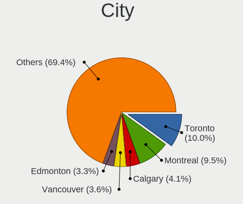
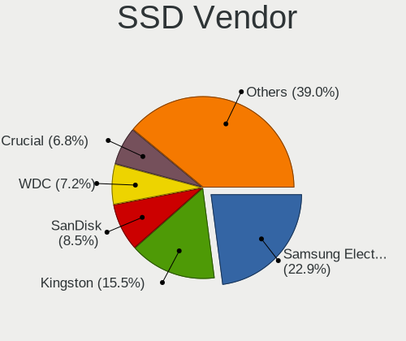
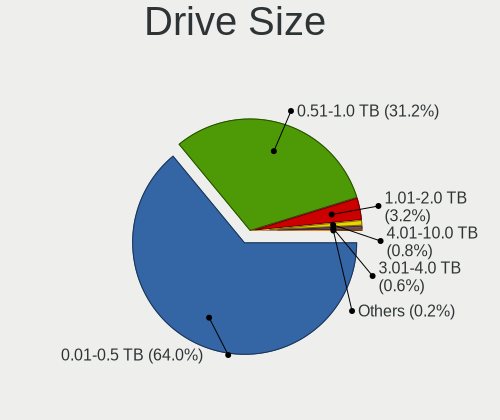
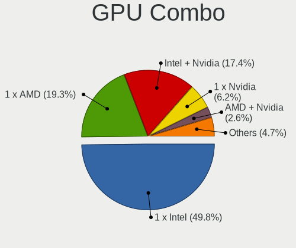
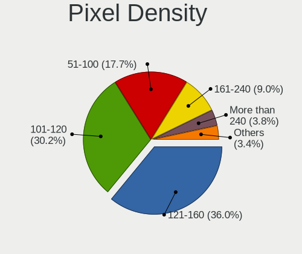

Linux in Canada - Tested Hardware & Statistics (Notebooks)
----------------------------------------------------------

A project to collect tested hardware configurations for Linux in Canada.

Anyone can contribute to this report by the [hw-probe](https://github.com/linuxhw/hw-probe) tool:

    sudo -E hw-probe -all -upload

Please contribute! Especially if your hardware is rare.

Contents
--------

* [ Test Cases ](#test-cases)

* [ System ](#system)
  - [ OS                       ](#os)
  - [ OS Family                ](#os-family)
  - [ Kernel                   ](#kernel)
  - [ Kernel Family            ](#kernel-family)
  - [ Kernel Major Ver.        ](#kernel-major-ver)
  - [ Arch                     ](#arch)
  - [ DE                       ](#de)
  - [ Display Server           ](#display-server)
  - [ Display Manager          ](#display-manager)
  - [ OS Lang                  ](#os-lang)
  - [ Boot Mode                ](#boot-mode)
  - [ Filesystem               ](#filesystem)
  - [ Part. scheme             ](#part-scheme)
  - [ Dual Boot with Linux/BSD ](#dual-boot-with-linuxbsd)
  - [ Dual Boot (Win)          ](#dual-boot-win)

* [ Board ](#board)
  - [ Vendor                   ](#vendor)
  - [ Model                    ](#model)
  - [ Model Family             ](#model-family)
  - [ MFG Year                 ](#mfg-year)
  - [ Form Factor              ](#form-factor)
  - [ Secure Boot              ](#secure-boot)
  - [ Coreboot                 ](#coreboot)
  - [ RAM Size                 ](#ram-size)
  - [ RAM Used                 ](#ram-used)
  - [ Total Drives             ](#total-drives)
  - [ Has CD-ROM               ](#has-cd-rom)
  - [ Has Ethernet             ](#has-ethernet)
  - [ Has WiFi                 ](#has-wifi)
  - [ Has Bluetooth            ](#has-bluetooth)

* [ Location ](#location)
  - [ Country                  ](#country)
  - [ City                     ](#city)

* [ Drives ](#drives)
  - [ Drive Vendor             ](#drive-vendor)
  - [ Drive Model              ](#drive-model)
  - [ HDD Vendor               ](#hdd-vendor)
  - [ SSD Vendor               ](#ssd-vendor)
  - [ Drive Kind               ](#drive-kind)
  - [ Drive Connector          ](#drive-connector)
  - [ Drive Size               ](#drive-size)
  - [ Space Total              ](#space-total)
  - [ Space Used               ](#space-used)
  - [ Malfunc. Drives          ](#malfunc-drives)
  - [ Malfunc. Drive Vendor    ](#malfunc-drive-vendor)
  - [ Malfunc. HDD Vendor      ](#malfunc-hdd-vendor)
  - [ Malfunc. Drive Kind      ](#malfunc-drive-kind)
  - [ Failed Drives            ](#failed-drives)
  - [ Failed Drive Vendor      ](#failed-drive-vendor)
  - [ Drive Status             ](#drive-status)

* [ Storage controller ](#storage-controller)
  - [ Storage Vendor           ](#storage-vendor)
  - [ Storage Model            ](#storage-model)
  - [ Storage Kind             ](#storage-kind)

* [ Processor ](#processor)
  - [ CPU Vendor               ](#cpu-vendor)
  - [ CPU Model                ](#cpu-model)
  - [ CPU Model Family         ](#cpu-model-family)
  - [ CPU Cores                ](#cpu-cores)
  - [ CPU Sockets              ](#cpu-sockets)
  - [ CPU Threads              ](#cpu-threads)
  - [ CPU Op-Modes             ](#cpu-op-modes)
  - [ CPU Microcode            ](#cpu-microcode)
  - [ CPU Microarch            ](#cpu-microarch)

* [ Graphics ](#graphics)
  - [ GPU Vendor               ](#gpu-vendor)
  - [ GPU Model                ](#gpu-model)
  - [ GPU Combo                ](#gpu-combo)
  - [ GPU Driver               ](#gpu-driver)
  - [ GPU Memory               ](#gpu-memory)

* [ Monitor ](#monitor)
  - [ Monitor Vendor           ](#monitor-vendor)
  - [ Monitor Model            ](#monitor-model)
  - [ Monitor Resolution       ](#monitor-resolution)
  - [ Monitor Diagonal         ](#monitor-diagonal)
  - [ Monitor Width            ](#monitor-width)
  - [ Aspect Ratio             ](#aspect-ratio)
  - [ Monitor Area             ](#monitor-area)
  - [ Pixel Density            ](#pixel-density)
  - [ Multiple Monitors        ](#multiple-monitors)

* [ Network ](#network)
  - [ Net Controller Vendor    ](#net-controller-vendor)
  - [ Net Controller Model     ](#net-controller-model)
  - [ Wireless Vendor          ](#wireless-vendor)
  - [ Wireless Model           ](#wireless-model)
  - [ Ethernet Vendor          ](#ethernet-vendor)
  - [ Ethernet Model           ](#ethernet-model)
  - [ Net Controller Kind      ](#net-controller-kind)
  - [ Used Controller          ](#used-controller)
  - [ NICs                     ](#nics)
  - [ IPv6                     ](#ipv6)

* [ Bluetooth ](#bluetooth)
  - [ Bluetooth Vendor         ](#bluetooth-vendor)
  - [ Bluetooth Model          ](#bluetooth-model)

* [ Sound ](#sound)
  - [ Sound Vendor             ](#sound-vendor)
  - [ Sound Model              ](#sound-model)

* [ Memory ](#memory)
  - [ Memory Vendor            ](#memory-vendor)
  - [ Memory Model             ](#memory-model)
  - [ Memory Kind              ](#memory-kind)
  - [ Memory Form Factor       ](#memory-form-factor)
  - [ Memory Size              ](#memory-size)
  - [ Memory Speed             ](#memory-speed)

* [ Printers & scanners ](#printers--scanners)
  - [ Printer Vendor           ](#printer-vendor)
  - [ Printer Model            ](#printer-model)
  - [ Scanner Vendor           ](#scanner-vendor)
  - [ Scanner Model            ](#scanner-model)

* [ Camera ](#camera)
  - [ Camera Vendor            ](#camera-vendor)
  - [ Camera Model             ](#camera-model)

* [ Security ](#security)
  - [ Fingerprint Vendor       ](#fingerprint-vendor)
  - [ Fingerprint Model        ](#fingerprint-model)
  - [ Chipcard Vendor          ](#chipcard-vendor)
  - [ Chipcard Model           ](#chipcard-model)

* [ Unsupported ](#unsupported)
  - [ Unsupported Devices      ](#unsupported-devices)
  - [ Unsupported Device Types ](#unsupported-device-types)

Test Cases
----------

Total: 3697

| Vendor        | Model                       | Probe                                                      | Date         |
|---------------|-----------------------------|------------------------------------------------------------|--------------|
| Valve         | Jupiter                     | [a91aee62d3](https://linux-hardware.org/?probe=a91aee62d3) | Apr 01, 2023 |
| Apple         | MacBookPro11,1              | [53717700a1](https://linux-hardware.org/?probe=53717700a1) | Mar 31, 2023 |
| Lenovo        | ThinkPad X1 Carbon 2nd 2... | [016ddeab52](https://linux-hardware.org/?probe=016ddeab52) | Mar 31, 2023 |
| Dell          | XPS M1330                   | [46b9a5cfde](https://linux-hardware.org/?probe=46b9a5cfde) | Mar 31, 2023 |
| ASUSTek       | X450LD                      | [1ca0cdc1e8](https://linux-hardware.org/?probe=1ca0cdc1e8) | Mar 31, 2023 |
| Dell          | Latitude 7490               | [06928c624b](https://linux-hardware.org/?probe=06928c624b) | Mar 31, 2023 |
| Lenovo        | G550 2958                   | [41f23ded68](https://linux-hardware.org/?probe=41f23ded68) | Mar 30, 2023 |
| Lenovo        | N22 80S6                    | [c6cbeeb984](https://linux-hardware.org/?probe=c6cbeeb984) | Mar 30, 2023 |
| ASUSTek       | ROG Strix G513RW_G513RW     | [6de889ae8a](https://linux-hardware.org/?probe=6de889ae8a) | Mar 29, 2023 |
| Acer          | Swift SFX14-41G             | [20df1488bd](https://linux-hardware.org/?probe=20df1488bd) | Mar 28, 2023 |
| Sony          | VPCCB32FD                   | [ef684c34bb](https://linux-hardware.org/?probe=ef684c34bb) | Mar 28, 2023 |
| Dell          | Studio 1558                 | [955946c74d](https://linux-hardware.org/?probe=955946c74d) | Mar 28, 2023 |
| Dell          | Latitude 7490               | [58ccd5d7e0](https://linux-hardware.org/?probe=58ccd5d7e0) | Mar 27, 2023 |
| ASUSTek       | VivoBook_ASUSLaptop X412... | [7dbe4350b5](https://linux-hardware.org/?probe=7dbe4350b5) | Mar 26, 2023 |
| Lenovo        | ThinkPad X220 4290LR3       | [dffa03da18](https://linux-hardware.org/?probe=dffa03da18) | Mar 26, 2023 |
| Lenovo        | ThinkPad T430 4237ZC7       | [845a2ed117](https://linux-hardware.org/?probe=845a2ed117) | Mar 26, 2023 |
| Sony          | VPCCB32FD                   | [20d8516896](https://linux-hardware.org/?probe=20d8516896) | Mar 26, 2023 |
| Lenovo        | ThinkPad T470 W10DG 20JN... | [513b14ace5](https://linux-hardware.org/?probe=513b14ace5) | Mar 25, 2023 |
| Lenovo        | ThinkPad X1 Carbon 5th 2... | [4f2d3a2402](https://linux-hardware.org/?probe=4f2d3a2402) | Mar 25, 2023 |
| ASUSTek       | G53SX                       | [ab9ed0121f](https://linux-hardware.org/?probe=ab9ed0121f) | Mar 25, 2023 |
| Apple         | MacBookPro11,2              | [ded37ac14c](https://linux-hardware.org/?probe=ded37ac14c) | Mar 24, 2023 |
| Apple         | MacBookPro11,2              | [13046d5580](https://linux-hardware.org/?probe=13046d5580) | Mar 24, 2023 |
| Framework     | Laptop (12th Gen Intel C... | [aeb25bc22b](https://linux-hardware.org/?probe=aeb25bc22b) | Mar 23, 2023 |
| Dell          | Vostro 5620                 | [529a2febf7](https://linux-hardware.org/?probe=529a2febf7) | Mar 23, 2023 |
| Lenovo        | IdeaPad 3 15ABA7 82RN       | [c91fa425a5](https://linux-hardware.org/?probe=c91fa425a5) | Mar 23, 2023 |
| Acer          | Aspire A515-55              | [ebbb5efcbc](https://linux-hardware.org/?probe=ebbb5efcbc) | Mar 22, 2023 |
| Acer          | Swift SF314-43              | [90ef1729ef](https://linux-hardware.org/?probe=90ef1729ef) | Mar 22, 2023 |
| Acer          | Swift SF314-43              | [48f86bde7c](https://linux-hardware.org/?probe=48f86bde7c) | Mar 22, 2023 |
| ASUSTek       | G53SX                       | [a6c90e3ad8](https://linux-hardware.org/?probe=a6c90e3ad8) | Mar 21, 2023 |
| Framework     | Laptop                      | [a7dc7b28c9](https://linux-hardware.org/?probe=a7dc7b28c9) | Mar 21, 2023 |
| Fujitsu       | FMVNP8AE                    | [10efc9f976](https://linux-hardware.org/?probe=10efc9f976) | Mar 21, 2023 |
| Lenovo        | ThinkPad X1 Carbon 2nd 2... | [a0ebd92c60](https://linux-hardware.org/?probe=a0ebd92c60) | Mar 21, 2023 |
| Lenovo        | ThinkPad P16 Gen 1 21D60... | [63b182c7d6](https://linux-hardware.org/?probe=63b182c7d6) | Mar 19, 2023 |
| Lenovo        | ThinkPad X1 Carbon 2nd 2... | [6dda9bae81](https://linux-hardware.org/?probe=6dda9bae81) | Mar 18, 2023 |
| Lenovo        | IdeaPad 3 15ALC6 82KU       | [7df2952615](https://linux-hardware.org/?probe=7df2952615) | Mar 17, 2023 |
| ASUSTek       | G53SX                       | [901e03fa6e](https://linux-hardware.org/?probe=901e03fa6e) | Mar 17, 2023 |
| ASUSTek       | G53SX                       | [a012da47e9](https://linux-hardware.org/?probe=a012da47e9) | Mar 17, 2023 |
| Lenovo        | IdeaPad 3 15ITL6 82H8       | [40f92632ab](https://linux-hardware.org/?probe=40f92632ab) | Mar 16, 2023 |
| HP            | Laptop 15-dy1xxx            | [63893daa0f](https://linux-hardware.org/?probe=63893daa0f) | Mar 16, 2023 |
| Lenovo        | IdeaPad 3 15ALC6 82KU       | [5d43e434bc](https://linux-hardware.org/?probe=5d43e434bc) | Mar 16, 2023 |
| HP            | Pavilion dv8000 (ET839UA... | [ae37b87da6](https://linux-hardware.org/?probe=ae37b87da6) | Mar 16, 2023 |
| Dell          | Inspiron 15-3552            | [10e835b353](https://linux-hardware.org/?probe=10e835b353) | Mar 16, 2023 |
| Dell          | Inspiron 13 5310            | [697914b165](https://linux-hardware.org/?probe=697914b165) | Mar 16, 2023 |
| Matsushita... | CF-18KH2ZXBC                | [9aa73891cd](https://linux-hardware.org/?probe=9aa73891cd) | Mar 15, 2023 |
| Toshiba       | Satellite P870              | [113fcf770d](https://linux-hardware.org/?probe=113fcf770d) | Mar 15, 2023 |
| Acer          | Aspire 5750Z                | [3ea59ee8c5](https://linux-hardware.org/?probe=3ea59ee8c5) | Mar 14, 2023 |
| Dell          | Latitude E7240              | [7fbe857344](https://linux-hardware.org/?probe=7fbe857344) | Mar 14, 2023 |
| MSI           | GE63 Raider RGB 8RE         | [9332803ca3](https://linux-hardware.org/?probe=9332803ca3) | Mar 13, 2023 |
| Acer          | Aspire 4530                 | [84f4733a96](https://linux-hardware.org/?probe=84f4733a96) | Mar 13, 2023 |
| HP            | Pavilion dv8000 (ET839UA... | [1525ad44e2](https://linux-hardware.org/?probe=1525ad44e2) | Mar 12, 2023 |
| Google        | Droid                       | [b2a41c71ac](https://linux-hardware.org/?probe=b2a41c71ac) | Mar 12, 2023 |
| HP            | ProBook 650 G2              | [2eb6d39ced](https://linux-hardware.org/?probe=2eb6d39ced) | Mar 12, 2023 |
| HP            | ProBook 650 G2              | [01f61fad51](https://linux-hardware.org/?probe=01f61fad51) | Mar 12, 2023 |
| Unknown       | Unknown                     | [d1336c09a0](https://linux-hardware.org/?probe=d1336c09a0) | Mar 11, 2023 |
| Lenovo        | V15-IIL 82C5                | [da8c40d88c](https://linux-hardware.org/?probe=da8c40d88c) | Mar 11, 2023 |
| Acer          | Aspire ES1-531              | [bf2d3857fd](https://linux-hardware.org/?probe=bf2d3857fd) | Mar 09, 2023 |
| Dell          | Latitude 3180               | [07a18f8eb1](https://linux-hardware.org/?probe=07a18f8eb1) | Mar 09, 2023 |
| HP            | Pavilion Gaming Laptop 1... | [da38390eca](https://linux-hardware.org/?probe=da38390eca) | Mar 09, 2023 |
| Lenovo        | 3000 N200 0769AUU           | [faaa24cfbf](https://linux-hardware.org/?probe=faaa24cfbf) | Mar 07, 2023 |
| Dell          | Studio 1537                 | [2cadadec43](https://linux-hardware.org/?probe=2cadadec43) | Mar 07, 2023 |
| Dell          | Latitude E6520              | [5e7340faf5](https://linux-hardware.org/?probe=5e7340faf5) | Mar 07, 2023 |
| Lenovo        | 3000 N200 0769AUU           | [fe3f99601c](https://linux-hardware.org/?probe=fe3f99601c) | Mar 07, 2023 |
| Datto         | 1000                        | [9df2913c36](https://linux-hardware.org/?probe=9df2913c36) | Mar 07, 2023 |
| Acer          | Aspire E1-571               | [2194ce4568](https://linux-hardware.org/?probe=2194ce4568) | Mar 06, 2023 |
| MSI           | PS42 8RB                    | [57231416e1](https://linux-hardware.org/?probe=57231416e1) | Mar 06, 2023 |
| Apple         | MacBookPro9,2               | [64d9894f5e](https://linux-hardware.org/?probe=64d9894f5e) | Mar 05, 2023 |
| MSI           | GS65 Stealth Thin 8RF       | [24373477d9](https://linux-hardware.org/?probe=24373477d9) | Mar 05, 2023 |
| MSI           | PS42 8RB                    | [effde33b49](https://linux-hardware.org/?probe=effde33b49) | Mar 05, 2023 |
| HP            | ProBook 650 G2              | [886fdbe7c9](https://linux-hardware.org/?probe=886fdbe7c9) | Mar 05, 2023 |
| HP            | ProBook 650 G2              | [2fdc151d2f](https://linux-hardware.org/?probe=2fdc151d2f) | Mar 05, 2023 |
| Dell          | Precision M4800             | [b014753659](https://linux-hardware.org/?probe=b014753659) | Mar 05, 2023 |
| HP            | Presario CQ61               | [912b79009b](https://linux-hardware.org/?probe=912b79009b) | Mar 04, 2023 |
| Acer          | Swift SF314-42              | [b9a0465659](https://linux-hardware.org/?probe=b9a0465659) | Mar 04, 2023 |
| Lenovo        | IdeaPad 320-15ABR 80XS      | [9aebf534a5](https://linux-hardware.org/?probe=9aebf534a5) | Mar 04, 2023 |
| Lenovo        | ThinkPad X220 429035U       | [83266c1006](https://linux-hardware.org/?probe=83266c1006) | Mar 04, 2023 |
| Lenovo        | ThinkPad X1 Carbon 2nd 2... | [a4941ea70f](https://linux-hardware.org/?probe=a4941ea70f) | Mar 04, 2023 |
| Lenovo        | ThinkPad X1 Carbon 2nd 2... | [f27119aef2](https://linux-hardware.org/?probe=f27119aef2) | Mar 03, 2023 |
| HP            | ENVY 17                     | [52b43673bb](https://linux-hardware.org/?probe=52b43673bb) | Mar 03, 2023 |
| MSI           | GS65 Stealth Thin 8RF       | [e8f0217102](https://linux-hardware.org/?probe=e8f0217102) | Mar 03, 2023 |
| ASUSTek       | UX331UA                     | [310d69ff6f](https://linux-hardware.org/?probe=310d69ff6f) | Mar 03, 2023 |
| ASUSTek       | UX331UA                     | [52c7446693](https://linux-hardware.org/?probe=52c7446693) | Mar 02, 2023 |
| Dell          | Precision 5520              | [9ce4c56521](https://linux-hardware.org/?probe=9ce4c56521) | Mar 02, 2023 |
| Valve         | Jupiter                     | [6525b5d0a4](https://linux-hardware.org/?probe=6525b5d0a4) | Mar 01, 2023 |
| HP            | EliteBook 830 G5            | [9abfe7631c](https://linux-hardware.org/?probe=9abfe7631c) | Mar 01, 2023 |
| Valve         | Jupiter                     | [a6c009eb9c](https://linux-hardware.org/?probe=a6c009eb9c) | Mar 01, 2023 |
| Acer          | Aspire E1-532P              | [8a23f06db4](https://linux-hardware.org/?probe=8a23f06db4) | Mar 01, 2023 |
| HP            | Pavilion dv6                | [c937edbfcd](https://linux-hardware.org/?probe=c937edbfcd) | Mar 01, 2023 |
| Dell          | XPS 15 9520                 | [ecfa5f6c27](https://linux-hardware.org/?probe=ecfa5f6c27) | Mar 01, 2023 |
| Lenovo        | IdeaPad 3 15ABA7 82RN       | [d8b58a8ea1](https://linux-hardware.org/?probe=d8b58a8ea1) | Feb 28, 2023 |
| Alienware     | x15 R2                      | [f0335542ce](https://linux-hardware.org/?probe=f0335542ce) | Feb 28, 2023 |
| Toshiba       | Satellite P870              | [6d9216b866](https://linux-hardware.org/?probe=6d9216b866) | Feb 27, 2023 |
| ASUSTek       | VivoBook_ASUS Laptop E41... | [091e4e3188](https://linux-hardware.org/?probe=091e4e3188) | Feb 27, 2023 |
| HP            | ProBook 650 G2              | [a9a8184201](https://linux-hardware.org/?probe=a9a8184201) | Feb 27, 2023 |
| HP            | ProBook 650 G2              | [07f46e8e62](https://linux-hardware.org/?probe=07f46e8e62) | Feb 27, 2023 |
| Lenovo        | ThinkPad Edge E540 20C60... | [8de57c03d5](https://linux-hardware.org/?probe=8de57c03d5) | Feb 27, 2023 |
| HP            | EliteBook 2530p             | [28bb1541b4](https://linux-hardware.org/?probe=28bb1541b4) | Feb 26, 2023 |
| HP            | EliteBook 2530p             | [8906540d72](https://linux-hardware.org/?probe=8906540d72) | Feb 26, 2023 |
| Lenovo        | ThinkPad T460 20FMS35H02    | [a396e54378](https://linux-hardware.org/?probe=a396e54378) | Feb 25, 2023 |
| Apple         | MacBook5,1                  | [fbb2478f8c](https://linux-hardware.org/?probe=fbb2478f8c) | Feb 25, 2023 |
| HP            | G60                         | [6e4b159708](https://linux-hardware.org/?probe=6e4b159708) | Feb 25, 2023 |
| Google        | Kefka                       | [8142fbc91a](https://linux-hardware.org/?probe=8142fbc91a) | Feb 24, 2023 |
| ASUSTek       | VivoBook_ASUSLaptop X509... | [297c37ec04](https://linux-hardware.org/?probe=297c37ec04) | Feb 24, 2023 |
| Dell          | Inspiron 5566               | [0233d7525d](https://linux-hardware.org/?probe=0233d7525d) | Feb 22, 2023 |
| Dell          | Latitude E6520              | [4a9371ec87](https://linux-hardware.org/?probe=4a9371ec87) | Feb 22, 2023 |
| Dell          | Inspiron 5493               | [ad7bee8a6e](https://linux-hardware.org/?probe=ad7bee8a6e) | Feb 20, 2023 |
| Dell          | Latitude E5440              | [10b94a411c](https://linux-hardware.org/?probe=10b94a411c) | Feb 20, 2023 |
| Dell          | XPS 15 9520                 | [d346153872](https://linux-hardware.org/?probe=d346153872) | Feb 20, 2023 |
| Lenovo        | ThinkPad T470 W10DG 20JN... | [f55697d9b3](https://linux-hardware.org/?probe=f55697d9b3) | Feb 19, 2023 |
| Dell          | Precision M4500             | [b0d8bf3c56](https://linux-hardware.org/?probe=b0d8bf3c56) | Feb 19, 2023 |
| Panasonic     | CF-S10CDHEDM                | [7228f7a915](https://linux-hardware.org/?probe=7228f7a915) | Feb 19, 2023 |
| Lenovo        | IdeaPad Yoga 11S 20246      | [b0941b8ef0](https://linux-hardware.org/?probe=b0941b8ef0) | Feb 18, 2023 |
| HP            | ProBook 650 G2              | [58ca93166c](https://linux-hardware.org/?probe=58ca93166c) | Feb 18, 2023 |
| ASUSTek       | VivoBook_ASUSLaptop X515... | [9978dc62b3](https://linux-hardware.org/?probe=9978dc62b3) | Feb 18, 2023 |
| HP            | Pavilion dv8000 (ET839UA... | [6b7a3b68f3](https://linux-hardware.org/?probe=6b7a3b68f3) | Feb 18, 2023 |
| MSI           | Raider GE76 12UGS           | [041cf0d3d8](https://linux-hardware.org/?probe=041cf0d3d8) | Feb 18, 2023 |
| MSI           | Raider GE76 12UGS           | [20dc6d6c5c](https://linux-hardware.org/?probe=20dc6d6c5c) | Feb 18, 2023 |
| HP            | Pavilion 13 x360 PC         | [af3167a0d4](https://linux-hardware.org/?probe=af3167a0d4) | Feb 18, 2023 |
| HP            | ProBook 650 G2              | [9ab628bcf2](https://linux-hardware.org/?probe=9ab628bcf2) | Feb 18, 2023 |
| Dell          | Inspiron 5575               | [aaa83a4af0](https://linux-hardware.org/?probe=aaa83a4af0) | Feb 18, 2023 |
| Dell          | Inspiron 5575               | [18b6274238](https://linux-hardware.org/?probe=18b6274238) | Feb 18, 2023 |
| HP            | ProBook 650 G2              | [33d9c73cb9](https://linux-hardware.org/?probe=33d9c73cb9) | Feb 17, 2023 |
| HP            | EliteBook 830 G5            | [7ef47e7131](https://linux-hardware.org/?probe=7ef47e7131) | Feb 17, 2023 |
| Google        | Coral                       | [7a9869ff50](https://linux-hardware.org/?probe=7a9869ff50) | Feb 17, 2023 |
| ASUSTek       | X450LD                      | [b4fb1ddc5a](https://linux-hardware.org/?probe=b4fb1ddc5a) | Feb 17, 2023 |
| Lenovo        | IdeaPad 5 Pro 16ACH6 82L... | [0e694f49fe](https://linux-hardware.org/?probe=0e694f49fe) | Feb 16, 2023 |
| HP            | EliteBook 2530p             | [5398361b68](https://linux-hardware.org/?probe=5398361b68) | Feb 16, 2023 |
| Dell          | Precision 7710              | [3db09e931e](https://linux-hardware.org/?probe=3db09e931e) | Feb 15, 2023 |
| Dell          | Precision 7710              | [ed02038c00](https://linux-hardware.org/?probe=ed02038c00) | Feb 15, 2023 |
| HP            | EliteBook 840 G5            | [2d99eeaca6](https://linux-hardware.org/?probe=2d99eeaca6) | Feb 13, 2023 |
| Panasonic     | CF-C2CCEZXCM                | [c435502e6e](https://linux-hardware.org/?probe=c435502e6e) | Feb 13, 2023 |
| Lenovo        | ThinkPad T440s 20ARS1VL0... | [d4b5ca228c](https://linux-hardware.org/?probe=d4b5ca228c) | Feb 13, 2023 |
| HP            | Pavilion dv2500             | [bea8c0162f](https://linux-hardware.org/?probe=bea8c0162f) | Feb 12, 2023 |
| Panasonic     | CF-C2CCEZXCM                | [3a0ce0730a](https://linux-hardware.org/?probe=3a0ce0730a) | Feb 12, 2023 |
| Acer          | Aspire 8942G                | [d517f63625](https://linux-hardware.org/?probe=d517f63625) | Feb 12, 2023 |
| Valve         | Jupiter                     | [10084e1b16](https://linux-hardware.org/?probe=10084e1b16) | Feb 12, 2023 |
| ASUSTek       | ZenBook UX431DA_UM431DA     | [3982ec4e74](https://linux-hardware.org/?probe=3982ec4e74) | Feb 12, 2023 |
| HP            | Presario V6000 (RN927UA#... | [0524b3b524](https://linux-hardware.org/?probe=0524b3b524) | Feb 11, 2023 |
| Google        | Droid                       | [33dbb43623](https://linux-hardware.org/?probe=33dbb43623) | Feb 10, 2023 |
| HP            | Notebook                    | [17664bf689](https://linux-hardware.org/?probe=17664bf689) | Feb 10, 2023 |
| HP            | Pavilion dv8000 (ET839UA... | [0a74293474](https://linux-hardware.org/?probe=0a74293474) | Feb 10, 2023 |
| Lenovo        | ThinkBook 13s G4 ARB 21A... | [9b8563ab53](https://linux-hardware.org/?probe=9b8563ab53) | Feb 10, 2023 |
| HP            | EliteBook 8460p             | [91de8b5956](https://linux-hardware.org/?probe=91de8b5956) | Feb 09, 2023 |
| HP            | Pavilion dv8000 (ET839UA... | [d236f5fa51](https://linux-hardware.org/?probe=d236f5fa51) | Feb 09, 2023 |
| HP            | Pavilion dv7                | [6b7ba3365e](https://linux-hardware.org/?probe=6b7ba3365e) | Feb 08, 2023 |
| Lenovo        | Unknown                     | [67c2761551](https://linux-hardware.org/?probe=67c2761551) | Feb 07, 2023 |
| HP            | Pavilion dv8000 (ET839UA... | [ebe5940bd7](https://linux-hardware.org/?probe=ebe5940bd7) | Feb 07, 2023 |
| MSI           | GT72 6QE                    | [bd02e4c770](https://linux-hardware.org/?probe=bd02e4c770) | Feb 07, 2023 |
| MSI           | GT72 6QE                    | [43a7194d4b](https://linux-hardware.org/?probe=43a7194d4b) | Feb 07, 2023 |
| Acer          | Okinawa                     | [eab799e6dc](https://linux-hardware.org/?probe=eab799e6dc) | Feb 06, 2023 |
| Acer          | Aspire A315-21              | [b452c164d0](https://linux-hardware.org/?probe=b452c164d0) | Feb 05, 2023 |
| HP            | Pavilion dv8000 (ET839UA... | [f3f4d9fc40](https://linux-hardware.org/?probe=f3f4d9fc40) | Feb 04, 2023 |
| HP            | G60                         | [518195af9f](https://linux-hardware.org/?probe=518195af9f) | Feb 04, 2023 |
| Valve         | Jupiter                     | [d78de63927](https://linux-hardware.org/?probe=d78de63927) | Feb 04, 2023 |
| Acer          | Aspire A517-51G             | [7555fafa98](https://linux-hardware.org/?probe=7555fafa98) | Feb 03, 2023 |
| ASUSTek       | ASUS TUF Dash F15 FX517Z... | [c122070f4f](https://linux-hardware.org/?probe=c122070f4f) | Feb 03, 2023 |
| Dell          | XPS 15 9520                 | [830188ba1b](https://linux-hardware.org/?probe=830188ba1b) | Feb 03, 2023 |
| Dell          | Latitude 3400               | [c954aad23a](https://linux-hardware.org/?probe=c954aad23a) | Feb 02, 2023 |
| HP            | EliteBook 2570p             | [43101dad89](https://linux-hardware.org/?probe=43101dad89) | Feb 02, 2023 |
| Dell          | XPS 15 9510                 | [78ea388883](https://linux-hardware.org/?probe=78ea388883) | Feb 02, 2023 |
| ASUSTek       | VivoBook_ASUSLaptop M540... | [8bc290ef67](https://linux-hardware.org/?probe=8bc290ef67) | Feb 01, 2023 |
| Lenovo        | IdeaPad 3 15ADA05 81W1      | [95e019beb2](https://linux-hardware.org/?probe=95e019beb2) | Feb 01, 2023 |
| Dell          | Latitude 7490               | [b2c18d04be](https://linux-hardware.org/?probe=b2c18d04be) | Feb 01, 2023 |
| Dell          | Latitude 7490               | [050126f7f7](https://linux-hardware.org/?probe=050126f7f7) | Feb 01, 2023 |
| Lenovo        | ThinkPad T16 Gen 1 21CH0... | [78eeec802b](https://linux-hardware.org/?probe=78eeec802b) | Feb 01, 2023 |
| HP            | Laptop 14-dq4xxx            | [c102edf6a0](https://linux-hardware.org/?probe=c102edf6a0) | Feb 01, 2023 |
| ASUSTek       | Zenbook UX8402ZA_UX8402Z... | [1d212c67b2](https://linux-hardware.org/?probe=1d212c67b2) | Jan 31, 2023 |
| Dell          | Inspiron 15-7579            | [b5bd231bf3](https://linux-hardware.org/?probe=b5bd231bf3) | Jan 31, 2023 |
| Acer          | Aspire AV14-51              | [fa801eea4b](https://linux-hardware.org/?probe=fa801eea4b) | Jan 31, 2023 |
| ASUSTek       | Zenbook UX8402ZA_UX8402Z... | [4dcc88b215](https://linux-hardware.org/?probe=4dcc88b215) | Jan 31, 2023 |
| Dell          | Latitude D630               | [ff0aa8c4ed](https://linux-hardware.org/?probe=ff0aa8c4ed) | Jan 31, 2023 |
| Dell          | Latitude D630               | [d8ac695aa3](https://linux-hardware.org/?probe=d8ac695aa3) | Jan 31, 2023 |
| Lenovo        | ThinkPad P51 20HJS0BR00     | [6c05048c9d](https://linux-hardware.org/?probe=6c05048c9d) | Jan 31, 2023 |
| Dell          | XPS 15 9500                 | [6a0af9dbcb](https://linux-hardware.org/?probe=6a0af9dbcb) | Jan 31, 2023 |
| Apple         | MacBookPro8,1               | [0eac708be5](https://linux-hardware.org/?probe=0eac708be5) | Jan 31, 2023 |
| HP            | Notebook                    | [fc93f8e357](https://linux-hardware.org/?probe=fc93f8e357) | Jan 30, 2023 |
| Lenovo        | ThinkPad T430 2347G4U       | [5802e6b9b9](https://linux-hardware.org/?probe=5802e6b9b9) | Jan 30, 2023 |
| Lenovo        | ThinkPad T430 2347G4U       | [3fcf581653](https://linux-hardware.org/?probe=3fcf581653) | Jan 30, 2023 |
| Dell          | Vostro 7620                 | [b6d43b8741](https://linux-hardware.org/?probe=b6d43b8741) | Jan 29, 2023 |
| Lenovo        | IdeaPad 3 15ALC6 82KU       | [830de1d797](https://linux-hardware.org/?probe=830de1d797) | Jan 29, 2023 |
| HP            | Pavilion dv8000 (ET839UA... | [3e7c902731](https://linux-hardware.org/?probe=3e7c902731) | Jan 28, 2023 |
| ASUSTek       | X555QA                      | [8eec8468fb](https://linux-hardware.org/?probe=8eec8468fb) | Jan 28, 2023 |
| Notebook      | P9XXEN_EF_ED                | [991bb71df8](https://linux-hardware.org/?probe=991bb71df8) | Jan 28, 2023 |
| Notebook      | P9XXEN_EF_ED                | [d86e915f12](https://linux-hardware.org/?probe=d86e915f12) | Jan 28, 2023 |
| Samsung       | 300E4C/300E5C/300E7C        | [796df2715d](https://linux-hardware.org/?probe=796df2715d) | Jan 28, 2023 |
| Lenovo        | IdeaPad 3 15ADA05 81W1      | [a6f188ab67](https://linux-hardware.org/?probe=a6f188ab67) | Jan 28, 2023 |
| Lenovo        | ThinkPad E485 20KUCTO1WW    | [49e82c2714](https://linux-hardware.org/?probe=49e82c2714) | Jan 27, 2023 |
| HP            | Laptop 17-cp0xxx            | [55477da159](https://linux-hardware.org/?probe=55477da159) | Jan 27, 2023 |
| Dell          | Latitude E6540              | [2e014cf1ba](https://linux-hardware.org/?probe=2e014cf1ba) | Jan 27, 2023 |
| Acer          | Aspire R3-131T              | [021d999708](https://linux-hardware.org/?probe=021d999708) | Jan 27, 2023 |
| Dell          | Latitude E6420              | [9837928212](https://linux-hardware.org/?probe=9837928212) | Jan 26, 2023 |
| Lenovo        | ThinkPad X1 Carbon Gen 9... | [08204bf161](https://linux-hardware.org/?probe=08204bf161) | Jan 26, 2023 |
| Apple         | MacBookAir4,1               | [45ea832a59](https://linux-hardware.org/?probe=45ea832a59) | Jan 26, 2023 |
| Lenovo        | ThinkPad T14 Gen 1 20UES... | [aa6488b6b8](https://linux-hardware.org/?probe=aa6488b6b8) | Jan 25, 2023 |
| Valve         | Jupiter                     | [ba217c947c](https://linux-hardware.org/?probe=ba217c947c) | Jan 25, 2023 |
| Valve         | Jupiter                     | [ffd9523db2](https://linux-hardware.org/?probe=ffd9523db2) | Jan 25, 2023 |
| Apple         | MacBookPro5,4               | [4bdccd0680](https://linux-hardware.org/?probe=4bdccd0680) | Jan 24, 2023 |
| ASUSTek       | X555QA                      | [f981af502a](https://linux-hardware.org/?probe=f981af502a) | Jan 24, 2023 |
| Lenovo        | ThinkPad E485 20KUCTO1WW    | [495cd98904](https://linux-hardware.org/?probe=495cd98904) | Jan 23, 2023 |
| Acer          | Swift SF314-43              | [3d1f5b0ee9](https://linux-hardware.org/?probe=3d1f5b0ee9) | Jan 23, 2023 |
| Acer          | AO722                       | [85f48171a2](https://linux-hardware.org/?probe=85f48171a2) | Jan 23, 2023 |
| GPU Compan... | GWNR71517                   | [77d4494f3b](https://linux-hardware.org/?probe=77d4494f3b) | Jan 23, 2023 |
| GPU Compan... | GWNR71517                   | [f3d76bcb70](https://linux-hardware.org/?probe=f3d76bcb70) | Jan 23, 2023 |
| Dell          | Inspiron 3521               | [ff122405db](https://linux-hardware.org/?probe=ff122405db) | Jan 22, 2023 |
| Dell          | Inspiron 3521               | [bb77ccdda7](https://linux-hardware.org/?probe=bb77ccdda7) | Jan 22, 2023 |
| Dell          | Inspiron 3521               | [2189958490](https://linux-hardware.org/?probe=2189958490) | Jan 22, 2023 |
| Gigabyte      | X570 AORUS PRO WIFI         | [76955052a7](https://linux-hardware.org/?probe=76955052a7) | Jan 22, 2023 |
| ASUSTek       | VivoBook_ASUS Laptop E21... | [6ae7274931](https://linux-hardware.org/?probe=6ae7274931) | Jan 22, 2023 |
| Acer          | Aspire E1-531               | [217c63b8f6](https://linux-hardware.org/?probe=217c63b8f6) | Jan 22, 2023 |
| Dell          | Latitude E5400              | [ee6e466820](https://linux-hardware.org/?probe=ee6e466820) | Jan 22, 2023 |
| Dell          | Latitude E5400              | [f61d1e0868](https://linux-hardware.org/?probe=f61d1e0868) | Jan 22, 2023 |
| Dell          | XPS 15 9520                 | [330a3844cb](https://linux-hardware.org/?probe=330a3844cb) | Jan 21, 2023 |
| Lenovo        | ThinkPad P52s 20LBCTO1WW    | [e0b197c0c4](https://linux-hardware.org/?probe=e0b197c0c4) | Jan 21, 2023 |
| HP            | Laptop 15-dy3xxx            | [1053d34e69](https://linux-hardware.org/?probe=1053d34e69) | Jan 20, 2023 |
| ASUSTek       | X555QA                      | [cd42f89819](https://linux-hardware.org/?probe=cd42f89819) | Jan 20, 2023 |
| Valve         | Jupiter                     | [e29a7a31ae](https://linux-hardware.org/?probe=e29a7a31ae) | Jan 20, 2023 |
| Dell          | Studio XPS 1647             | [4086a6120a](https://linux-hardware.org/?probe=4086a6120a) | Jan 20, 2023 |
| ASUSTek       | ROG Strix G512LU_G512LU     | [edc36777f0](https://linux-hardware.org/?probe=edc36777f0) | Jan 19, 2023 |
| Toshiba       | Satellite L650D             | [86d99d74cd](https://linux-hardware.org/?probe=86d99d74cd) | Jan 19, 2023 |
| ASUSTek       | TUF Gaming FX505DT_FX505... | [0770f064de](https://linux-hardware.org/?probe=0770f064de) | Jan 19, 2023 |
| Intel Clie... | LAPRC510                    | [6d570a1aee](https://linux-hardware.org/?probe=6d570a1aee) | Jan 19, 2023 |
| Lenovo        | ThinkPad T420 4236V6S       | [3ab44ae2f5](https://linux-hardware.org/?probe=3ab44ae2f5) | Jan 17, 2023 |
| HP            | Pavilion dv7                | [2efb4b16de](https://linux-hardware.org/?probe=2efb4b16de) | Jan 17, 2023 |
| Dell          | Inspiron 3521               | [2d46e86664](https://linux-hardware.org/?probe=2d46e86664) | Jan 17, 2023 |
| ASUSTek       | VivoBook_ASUSLaptop X510... | [a602bcd50a](https://linux-hardware.org/?probe=a602bcd50a) | Jan 17, 2023 |
| Lenovo        | ThinkPad T420 4236AK9       | [1bd88ff8c7](https://linux-hardware.org/?probe=1bd88ff8c7) | Jan 17, 2023 |
| Valve         | Jupiter                     | [2b355faaee](https://linux-hardware.org/?probe=2b355faaee) | Jan 16, 2023 |
| Dell          | Inspiron 3521               | [da7f445f06](https://linux-hardware.org/?probe=da7f445f06) | Jan 16, 2023 |
| HP            | Pavilion 17                 | [09b186fbf7](https://linux-hardware.org/?probe=09b186fbf7) | Jan 16, 2023 |
| Lenovo        | ThinkPad T440s 20AQCTO1W... | [e04d230b62](https://linux-hardware.org/?probe=e04d230b62) | Jan 16, 2023 |
| Lenovo        | IdeaPad Slim 7 Carbon 14... | [620185bf98](https://linux-hardware.org/?probe=620185bf98) | Jan 15, 2023 |
| Apple         | MacBookPro8,1               | [422f31719c](https://linux-hardware.org/?probe=422f31719c) | Jan 15, 2023 |
| Apple         | MacBookPro8,1               | [c16748dc74](https://linux-hardware.org/?probe=c16748dc74) | Jan 15, 2023 |
| Lenovo        | G560 0679                   | [26e16a5898](https://linux-hardware.org/?probe=26e16a5898) | Jan 15, 2023 |
| Toshiba       | Satellite L650              | [b893aecea2](https://linux-hardware.org/?probe=b893aecea2) | Jan 15, 2023 |
| Valve         | Jupiter                     | [c9bc8bf29b](https://linux-hardware.org/?probe=c9bc8bf29b) | Jan 15, 2023 |
| Samsung       | 305E4A/305E5A/305E7A        | [9527eef253](https://linux-hardware.org/?probe=9527eef253) | Jan 15, 2023 |
| Apple         | MacBookPro9,2               | [6194c3a2fe](https://linux-hardware.org/?probe=6194c3a2fe) | Jan 15, 2023 |
| Lenovo        | ThinkPad T420 4236V6S       | [a24b95f891](https://linux-hardware.org/?probe=a24b95f891) | Jan 15, 2023 |
| Apple         | MacBookPro9,2               | [4776fc6062](https://linux-hardware.org/?probe=4776fc6062) | Jan 15, 2023 |
| Lenovo        | ThinkPad T420 4236V6S       | [f9fe88837c](https://linux-hardware.org/?probe=f9fe88837c) | Jan 15, 2023 |
| Lenovo        | ThinkPad T420 4236V6S       | [59607f5e75](https://linux-hardware.org/?probe=59607f5e75) | Jan 15, 2023 |
| Apple         | MacBookPro5,5               | [a4b4747500](https://linux-hardware.org/?probe=a4b4747500) | Jan 14, 2023 |
| Apple         | MacBookPro5,5               | [4340505060](https://linux-hardware.org/?probe=4340505060) | Jan 14, 2023 |
| ASUSTek       | ASUS TUF Gaming F15 FX50... | [03f7a5fdea](https://linux-hardware.org/?probe=03f7a5fdea) | Jan 14, 2023 |
| ASUSTek       | VivoBook_ASUSLaptop X421... | [db57593b81](https://linux-hardware.org/?probe=db57593b81) | Jan 14, 2023 |
| HP            | ZBook 17 G3                 | [9e4c15fff7](https://linux-hardware.org/?probe=9e4c15fff7) | Jan 14, 2023 |
| Apple         | MacBookPro5,5               | [77d37c245a](https://linux-hardware.org/?probe=77d37c245a) | Jan 14, 2023 |
| MSI           | GP72 7RDX                   | [9cf1da2d69](https://linux-hardware.org/?probe=9cf1da2d69) | Jan 14, 2023 |
| Dell          | Latitude E6420              | [e7c4823aee](https://linux-hardware.org/?probe=e7c4823aee) | Jan 14, 2023 |
| HP            | Notebook                    | [e242059a08](https://linux-hardware.org/?probe=e242059a08) | Jan 14, 2023 |
| HP            | Pavilion dv8000 (ET839UA... | [eeec2db688](https://linux-hardware.org/?probe=eeec2db688) | Jan 13, 2023 |
| Acer          | Aspire E1-572               | [fa6e296766](https://linux-hardware.org/?probe=fa6e296766) | Jan 13, 2023 |
| Lenovo        | IdeaPad 5 15ABA7 82SG       | [fad743f278](https://linux-hardware.org/?probe=fad743f278) | Jan 12, 2023 |
| Matsushita... | CF-18KH2ZXBC                | [41e8ef7b23](https://linux-hardware.org/?probe=41e8ef7b23) | Jan 11, 2023 |
| ASUSTek       | ASUS TUF Dash F15 FX517Z... | [0f1f6b2662](https://linux-hardware.org/?probe=0f1f6b2662) | Jan 11, 2023 |
| Valve         | Jupiter                     | [6bfa934fb6](https://linux-hardware.org/?probe=6bfa934fb6) | Jan 11, 2023 |
| Dell          | G5 5590                     | [846a462365](https://linux-hardware.org/?probe=846a462365) | Jan 10, 2023 |
| Lenovo        | ThinkPad T450s 20BX001PU... | [c6e3650e2b](https://linux-hardware.org/?probe=c6e3650e2b) | Jan 10, 2023 |
| System76      | Darter Pro                  | [ffaaf5c90e](https://linux-hardware.org/?probe=ffaaf5c90e) | Jan 10, 2023 |
| HP            | ENVY Notebook               | [ff8cd12017](https://linux-hardware.org/?probe=ff8cd12017) | Jan 10, 2023 |
| Google        | Blooglet                    | [bf644ec6f4](https://linux-hardware.org/?probe=bf644ec6f4) | Jan 10, 2023 |
| Dell          | Inspiron 5577               | [86cfa19622](https://linux-hardware.org/?probe=86cfa19622) | Jan 10, 2023 |
| Lenovo        | ThinkPad T420 4236A38       | [302f3a5ebe](https://linux-hardware.org/?probe=302f3a5ebe) | Jan 10, 2023 |
| Lenovo        | ThinkPad E14 Gen 4 21EB0... | [2bbe617df6](https://linux-hardware.org/?probe=2bbe617df6) | Jan 09, 2023 |
| ASUSTek       | VivoBook 12_ASUS Laptop ... | [d6115e24c1](https://linux-hardware.org/?probe=d6115e24c1) | Jan 09, 2023 |
| GPU Compan... | GWNR71517                   | [5626a7c211](https://linux-hardware.org/?probe=5626a7c211) | Jan 09, 2023 |
| ASUSTek       | VivoBook_ASUSLaptop X530... | [f884203e84](https://linux-hardware.org/?probe=f884203e84) | Jan 09, 2023 |
| ASUSTek       | VivoBook_ASUSLaptop X530... | [b518c0a817](https://linux-hardware.org/?probe=b518c0a817) | Jan 09, 2023 |
| ASUSTek       | X550ZA                      | [272bff51c5](https://linux-hardware.org/?probe=272bff51c5) | Jan 09, 2023 |
| GPU Compan... | GWNR71517                   | [11cb3f9636](https://linux-hardware.org/?probe=11cb3f9636) | Jan 08, 2023 |
| HP            | Pavilion dv8000 (ET839UA... | [c8e96fe453](https://linux-hardware.org/?probe=c8e96fe453) | Jan 08, 2023 |
| Lenovo        | ThinkPad T420 4236A38       | [b95882e5cf](https://linux-hardware.org/?probe=b95882e5cf) | Jan 08, 2023 |
| Lenovo        | N22 80S6                    | [cfcc0a49c6](https://linux-hardware.org/?probe=cfcc0a49c6) | Jan 08, 2023 |
| Valve         | Jupiter                     | [4c96ccba44](https://linux-hardware.org/?probe=4c96ccba44) | Jan 08, 2023 |
| ASUSTek       | VivoBook_ASUSLaptop X513... | [2e22cc1bb2](https://linux-hardware.org/?probe=2e22cc1bb2) | Jan 08, 2023 |
| Lenovo        | ThinkPad W520 4284A24       | [263e00840a](https://linux-hardware.org/?probe=263e00840a) | Jan 08, 2023 |
| Dell          | XPS 9320                    | [55be119900](https://linux-hardware.org/?probe=55be119900) | Jan 08, 2023 |
| ASUSTek       | VivoBook_ASUSLaptop X530... | [83ec1382a3](https://linux-hardware.org/?probe=83ec1382a3) | Jan 07, 2023 |
| ASUSTek       | VivoBook_ASUSLaptop X530... | [354b2538a4](https://linux-hardware.org/?probe=354b2538a4) | Jan 07, 2023 |
| HP            | Pavilion dv4                | [5caee4abe0](https://linux-hardware.org/?probe=5caee4abe0) | Jan 07, 2023 |
| HP            | Pavilion dv8000 (ET839UA... | [15eaac1fac](https://linux-hardware.org/?probe=15eaac1fac) | Jan 07, 2023 |
| HP            | Elite x2 1011 G1 Tablet     | [28c9b60939](https://linux-hardware.org/?probe=28c9b60939) | Jan 07, 2023 |
| Dell          | Inspiron 7577               | [ff95fa094b](https://linux-hardware.org/?probe=ff95fa094b) | Jan 06, 2023 |
| ASUSTek       | X301A1                      | [e575482522](https://linux-hardware.org/?probe=e575482522) | Jan 06, 2023 |
| Dell          | G15 5525                    | [2c61cbc942](https://linux-hardware.org/?probe=2c61cbc942) | Jan 06, 2023 |
| Lenovo        | ThinkPad T450s 20BX001PU... | [4d2721777a](https://linux-hardware.org/?probe=4d2721777a) | Jan 06, 2023 |
| Lenovo        | ThinkPad X131e 33723FU      | [d2ee3f78a9](https://linux-hardware.org/?probe=d2ee3f78a9) | Jan 06, 2023 |
| Lenovo        | ThinkPad X131e 33723FU      | [9c9801b860](https://linux-hardware.org/?probe=9c9801b860) | Jan 06, 2023 |
| Lenovo        | Z50-75 80EC                 | [7fe70dc4c8](https://linux-hardware.org/?probe=7fe70dc4c8) | Jan 06, 2023 |
| Lenovo        | ThinkPad T450s 20BX001PU... | [907ceedda1](https://linux-hardware.org/?probe=907ceedda1) | Jan 05, 2023 |
| ASUSTek       | Zenbook UM3402YA_UM3402Y... | [2da57c3386](https://linux-hardware.org/?probe=2da57c3386) | Jan 04, 2023 |
| Acer          | Swift SF314-43              | [50d8f0c1cb](https://linux-hardware.org/?probe=50d8f0c1cb) | Jan 04, 2023 |
| Dell          | Latitude 7420               | [e770b3e784](https://linux-hardware.org/?probe=e770b3e784) | Jan 04, 2023 |
| Dell          | Latitude 7420               | [bab9b86606](https://linux-hardware.org/?probe=bab9b86606) | Jan 04, 2023 |
| HP            | Pavilion dv8000 (ET839UA... | [3d589a827c](https://linux-hardware.org/?probe=3d589a827c) | Jan 04, 2023 |
| Dell          | Latitude D520               | [7f05ddf105](https://linux-hardware.org/?probe=7f05ddf105) | Jan 04, 2023 |
| Datto         | Unknown                     | [e8c9c2e91f](https://linux-hardware.org/?probe=e8c9c2e91f) | Jan 04, 2023 |
| HP            | Pavilion dv7                | [574f62a8ad](https://linux-hardware.org/?probe=574f62a8ad) | Jan 03, 2023 |
| Lenovo        | IdeaPad Yoga 11S 20246      | [a73ca839a1](https://linux-hardware.org/?probe=a73ca839a1) | Jan 03, 2023 |
| Dell          | Inspiron 5515               | [27a4df28b2](https://linux-hardware.org/?probe=27a4df28b2) | Jan 03, 2023 |
| Dell          | Latitude E5440              | [d8b08abf08](https://linux-hardware.org/?probe=d8b08abf08) | Jan 02, 2023 |
| ASUSTek       | ROG Strix G513RM_G513RM     | [13df46e700](https://linux-hardware.org/?probe=13df46e700) | Jan 02, 2023 |
| Razer         | Blade 15 (2022) - RZ09-0... | [b9522e3683](https://linux-hardware.org/?probe=b9522e3683) | Jan 02, 2023 |
| HP            | Pavilion dv6                | [d735200dcf](https://linux-hardware.org/?probe=d735200dcf) | Jan 01, 2023 |
| Valve         | Jupiter                     | [1dedff3ad9](https://linux-hardware.org/?probe=1dedff3ad9) | Jan 01, 2023 |
| Dell          | Latitude E7450              | [f48717bb6f](https://linux-hardware.org/?probe=f48717bb6f) | Jan 01, 2023 |
| Acer          | Aspire E5-521               | [d9b5e3cfc3](https://linux-hardware.org/?probe=d9b5e3cfc3) | Dec 31, 2022 |
| Intel Clie... | LAPRC710                    | [47e562afc7](https://linux-hardware.org/?probe=47e562afc7) | Dec 31, 2022 |
| ASUSTek       | TP501UA                     | [1f2aaf8804](https://linux-hardware.org/?probe=1f2aaf8804) | Dec 30, 2022 |
| Lenovo        | ThinkPad P15v Gen 1 20TQ... | [770c5eee84](https://linux-hardware.org/?probe=770c5eee84) | Dec 30, 2022 |
| Acer          | Aspire A115-32              | [7c8ec90c8a](https://linux-hardware.org/?probe=7c8ec90c8a) | Dec 30, 2022 |
| ASUSTek       | VivoBook_ASUSLaptop X140... | [1cab27a65e](https://linux-hardware.org/?probe=1cab27a65e) | Dec 29, 2022 |
| HP            | EliteBook 2540p             | [ec9251ac5d](https://linux-hardware.org/?probe=ec9251ac5d) | Dec 28, 2022 |
| HP            | OMEN Laptop 15-en1xxx       | [9e95d6a4ac](https://linux-hardware.org/?probe=9e95d6a4ac) | Dec 28, 2022 |
| ASUSTek       | ROG Strix G513QE_G513QE     | [00a92c3818](https://linux-hardware.org/?probe=00a92c3818) | Dec 28, 2022 |
| Panasonic     | FZ55-2                      | [1699b7c3b2](https://linux-hardware.org/?probe=1699b7c3b2) | Dec 27, 2022 |
| Dell          | XPS 15 9500                 | [d1d8257c05](https://linux-hardware.org/?probe=d1d8257c05) | Dec 27, 2022 |
| Lenovo        | ThinkPad T500 205545F       | [c12d9f8c6a](https://linux-hardware.org/?probe=c12d9f8c6a) | Dec 27, 2022 |
| Dell          | Latitude E7440              | [f2c052dde9](https://linux-hardware.org/?probe=f2c052dde9) | Dec 27, 2022 |
| Lenovo        | ThinkPad E560 20EV002FUS    | [3bb1c5cc47](https://linux-hardware.org/?probe=3bb1c5cc47) | Dec 26, 2022 |
| ASUSTek       | TUF Gaming FX505DT_FX505... | [877e3cd944](https://linux-hardware.org/?probe=877e3cd944) | Dec 26, 2022 |
| Dell          | Latitude E4310              | [f63df6ad2c](https://linux-hardware.org/?probe=f63df6ad2c) | Dec 26, 2022 |
| Lenovo        | ThinkPad T500 2055A38       | [90a67d3589](https://linux-hardware.org/?probe=90a67d3589) | Dec 25, 2022 |
| Valve         | Jupiter                     | [91be8cc560](https://linux-hardware.org/?probe=91be8cc560) | Dec 25, 2022 |
| Lenovo        | ThinkPad T495 20NKS01W02    | [cc7b02033a](https://linux-hardware.org/?probe=cc7b02033a) | Dec 24, 2022 |
| HP            | Pavilion dv7                | [a099e9b6ac](https://linux-hardware.org/?probe=a099e9b6ac) | Dec 24, 2022 |
| System76      | Pangolin                    | [1c936bfe04](https://linux-hardware.org/?probe=1c936bfe04) | Dec 24, 2022 |
| MSI           | Pulse GL76 12UEK            | [9ca4075241](https://linux-hardware.org/?probe=9ca4075241) | Dec 23, 2022 |
| MSI           | Pulse GL76 12UEK            | [099b612c13](https://linux-hardware.org/?probe=099b612c13) | Dec 23, 2022 |
| Toshiba       | TECRA R940                  | [939e438746](https://linux-hardware.org/?probe=939e438746) | Dec 22, 2022 |
| HP            | Stream Notebook PC 13       | [b049c64ff7](https://linux-hardware.org/?probe=b049c64ff7) | Dec 22, 2022 |
| Razer         | Blade 15 (2022) - RZ09-0... | [13e778509f](https://linux-hardware.org/?probe=13e778509f) | Dec 22, 2022 |
| Dell          | Latitude 5510               | [b4f32be15b](https://linux-hardware.org/?probe=b4f32be15b) | Dec 22, 2022 |
| Lenovo        | ThinkPad X1 Carbon Gen 1... | [fb60e7984c](https://linux-hardware.org/?probe=fb60e7984c) | Dec 21, 2022 |
| ASUSTek       | Strix 15 GL503GE            | [0377cc3170](https://linux-hardware.org/?probe=0377cc3170) | Dec 21, 2022 |
| Dell          | Latitude D820               | [e79993028e](https://linux-hardware.org/?probe=e79993028e) | Dec 21, 2022 |
| Lenovo        | Y70-70 Touch 80DU           | [d5a877b2c6](https://linux-hardware.org/?probe=d5a877b2c6) | Dec 20, 2022 |
| ASUSTek       | VivoBook_ASUSLaptop X515... | [5ba954d88a](https://linux-hardware.org/?probe=5ba954d88a) | Dec 19, 2022 |
| ASUSTek       | VivoBook_ASUSLaptop X515... | [318b7c1400](https://linux-hardware.org/?probe=318b7c1400) | Dec 19, 2022 |
| Dell          | XPS 13 9350                 | [d414748117](https://linux-hardware.org/?probe=d414748117) | Dec 18, 2022 |
| EUROCOM       | SCORPIUS 3D                 | [4fdf299276](https://linux-hardware.org/?probe=4fdf299276) | Dec 18, 2022 |
| Lenovo        | IdeaPad Z570 10249UU        | [2160e3e2c3](https://linux-hardware.org/?probe=2160e3e2c3) | Dec 18, 2022 |
| Lenovo        | Y70-70 Touch 80DU           | [916375929d](https://linux-hardware.org/?probe=916375929d) | Dec 18, 2022 |
| ASUSTek       | VivoBook_ASUSLaptop X530... | [071b57d5f6](https://linux-hardware.org/?probe=071b57d5f6) | Dec 18, 2022 |
| ASUSTek       | VivoBook_ASUSLaptop M540... | [2ba98da01d](https://linux-hardware.org/?probe=2ba98da01d) | Dec 16, 2022 |
| Lenovo        | Legion S7 15ACH6 82K8       | [a12207ff89](https://linux-hardware.org/?probe=a12207ff89) | Dec 16, 2022 |
| Google        | Blorb                       | [4134deb94e](https://linux-hardware.org/?probe=4134deb94e) | Dec 16, 2022 |
| Lenovo        | IdeaPad 330-15ARR 81D2      | [20240705a9](https://linux-hardware.org/?probe=20240705a9) | Dec 16, 2022 |
| ASUSTek       | VivoBook_ASUSLaptop K350... | [955de558cb](https://linux-hardware.org/?probe=955de558cb) | Dec 16, 2022 |
| ASUSTek       | VivoBook_ASUSLaptop K350... | [e1d8403247](https://linux-hardware.org/?probe=e1d8403247) | Dec 16, 2022 |
| Dell          | Inspiron 7501               | [1749ece1b3](https://linux-hardware.org/?probe=1749ece1b3) | Dec 15, 2022 |
| Lenovo        | ThinkPad T15p Gen 3 21DA... | [36afd57275](https://linux-hardware.org/?probe=36afd57275) | Dec 14, 2022 |
| MSI           | GE72VR 6RF                  | [ce2ebf80a1](https://linux-hardware.org/?probe=ce2ebf80a1) | Dec 14, 2022 |
| HP            | Pavilion dv7                | [7067714e91](https://linux-hardware.org/?probe=7067714e91) | Dec 14, 2022 |
| Dell          | Latitude E4310              | [dd3e716d03](https://linux-hardware.org/?probe=dd3e716d03) | Dec 13, 2022 |
| Apple         | MacBookPro8,1               | [9ddb08e4ae](https://linux-hardware.org/?probe=9ddb08e4ae) | Dec 13, 2022 |
| Acer          | Nitro AN517-41              | [468d665801](https://linux-hardware.org/?probe=468d665801) | Dec 12, 2022 |
| Framework     | Laptop (12th Gen Intel C... | [893190593e](https://linux-hardware.org/?probe=893190593e) | Dec 12, 2022 |
| Dell          | Latitude 7430               | [87e9348100](https://linux-hardware.org/?probe=87e9348100) | Dec 12, 2022 |
| ASUSTek       | VivoBook_ASUSLaptop X530... | [ca560a74e4](https://linux-hardware.org/?probe=ca560a74e4) | Dec 12, 2022 |
| Apple         | MacBookPro11,2              | [6048cffe66](https://linux-hardware.org/?probe=6048cffe66) | Dec 12, 2022 |
| Dell          | Inspiron 13-5378            | [d8bb31c8c7](https://linux-hardware.org/?probe=d8bb31c8c7) | Dec 11, 2022 |
| Alienware     | 18                          | [707124d216](https://linux-hardware.org/?probe=707124d216) | Dec 11, 2022 |
| Acer          | Aspire A515-55              | [9451601259](https://linux-hardware.org/?probe=9451601259) | Dec 11, 2022 |
| Dell          | Inspiron 7537               | [890f5f6529](https://linux-hardware.org/?probe=890f5f6529) | Dec 11, 2022 |
| Google        | Candy                       | [12e6466598](https://linux-hardware.org/?probe=12e6466598) | Dec 11, 2022 |
| Dell          | G5 5505                     | [60053b5d4b](https://linux-hardware.org/?probe=60053b5d4b) | Dec 10, 2022 |
| ASUSTek       | ASUS TUF Gaming A15 FA50... | [febce6b929](https://linux-hardware.org/?probe=febce6b929) | Dec 09, 2022 |
| ASUSTek       | VivoBook_ASUSLaptop X530... | [ed7cb7fb48](https://linux-hardware.org/?probe=ed7cb7fb48) | Dec 09, 2022 |
| Lenovo        | IdeaPad Gaming 3 15IAH7 ... | [2dc32e31b3](https://linux-hardware.org/?probe=2dc32e31b3) | Dec 09, 2022 |
| Lenovo        | ThinkPad X1 Carbon Gen 9... | [aebce6bc5f](https://linux-hardware.org/?probe=aebce6bc5f) | Dec 08, 2022 |
| HP            | Pavilion Gaming Laptop 1... | [4c7a6feb83](https://linux-hardware.org/?probe=4c7a6feb83) | Dec 08, 2022 |
| HP            | Pavilion Gaming Laptop 1... | [57373e16ba](https://linux-hardware.org/?probe=57373e16ba) | Dec 07, 2022 |
| HP            | Laptop 15-dy5xxx            | [12676c4b5b](https://linux-hardware.org/?probe=12676c4b5b) | Dec 07, 2022 |
| Acer          | Swift SF314-42              | [4c5be8eaf3](https://linux-hardware.org/?probe=4c5be8eaf3) | Dec 07, 2022 |
| ASUSTek       | VivoBook_ASUSLaptop X530... | [388bcfc8e6](https://linux-hardware.org/?probe=388bcfc8e6) | Dec 07, 2022 |
| Dell          | Latitude 5421               | [f310b80613](https://linux-hardware.org/?probe=f310b80613) | Dec 06, 2022 |
| ASUSTek       | VivoBook_ASUSLaptop X530... | [ce36965c1f](https://linux-hardware.org/?probe=ce36965c1f) | Dec 06, 2022 |
| Dell          | Latitude 5421               | [5114034147](https://linux-hardware.org/?probe=5114034147) | Dec 06, 2022 |
| Apple         | MacBook4,1                  | [109d33ef14](https://linux-hardware.org/?probe=109d33ef14) | Dec 06, 2022 |
| MSI           | GE72VR 6RF                  | [23a83a5e8e](https://linux-hardware.org/?probe=23a83a5e8e) | Dec 06, 2022 |
| HP            | 15                          | [e5a0cdc9de](https://linux-hardware.org/?probe=e5a0cdc9de) | Dec 06, 2022 |
| MSI           | GS66 Stealth 11UH           | [b16c3a06ba](https://linux-hardware.org/?probe=b16c3a06ba) | Dec 05, 2022 |
| Apple         | MacBookPro6,1               | [137dd6d1ba](https://linux-hardware.org/?probe=137dd6d1ba) | Dec 05, 2022 |
| ASUSTek       | UL50VT                      | [ff4edb7010](https://linux-hardware.org/?probe=ff4edb7010) | Dec 05, 2022 |
| Dell          | Latitude 7490               | [7377ad6d99](https://linux-hardware.org/?probe=7377ad6d99) | Dec 05, 2022 |
| Dell          | Latitude 7430               | [d153a4f803](https://linux-hardware.org/?probe=d153a4f803) | Dec 05, 2022 |
| HP            | Pavilion dv7                | [901e0c59ce](https://linux-hardware.org/?probe=901e0c59ce) | Dec 05, 2022 |
| Apple         | MacBookPro10,1              | [d321abafcd](https://linux-hardware.org/?probe=d321abafcd) | Dec 05, 2022 |
| HP            | Pavilion dv7                | [d02f343be8](https://linux-hardware.org/?probe=d02f343be8) | Dec 05, 2022 |
| Toshiba       | Satellite C650D             | [694d2c9099](https://linux-hardware.org/?probe=694d2c9099) | Dec 05, 2022 |
| System76      | Gazelle                     | [deb2c9b6c9](https://linux-hardware.org/?probe=deb2c9b6c9) | Dec 04, 2022 |
| Dell          | Latitude E5450              | [eced7855f2](https://linux-hardware.org/?probe=eced7855f2) | Dec 03, 2022 |
| HP            | G62                         | [494d9e65e4](https://linux-hardware.org/?probe=494d9e65e4) | Dec 03, 2022 |
| HP            | ProBook 4530s               | [f8f94617e8](https://linux-hardware.org/?probe=f8f94617e8) | Dec 03, 2022 |
| Toshiba       | Satellite S50-A             | [ac76869bea](https://linux-hardware.org/?probe=ac76869bea) | Dec 02, 2022 |
| Dell          | Inspiron 5566               | [54e06d37fc](https://linux-hardware.org/?probe=54e06d37fc) | Dec 02, 2022 |
| Dell          | Latitude E6410              | [92bae2f9d5](https://linux-hardware.org/?probe=92bae2f9d5) | Dec 02, 2022 |
| Gigabyte      | X570S AORUS PRO AX          | [253135f8dc](https://linux-hardware.org/?probe=253135f8dc) | Dec 01, 2022 |
| Acer          | Aspire V5-121               | [473cfb46f7](https://linux-hardware.org/?probe=473cfb46f7) | Dec 01, 2022 |
| HP            | Pavilion dv8000 (ET839UA... | [5b22a7d584](https://linux-hardware.org/?probe=5b22a7d584) | Dec 01, 2022 |
| Lenovo        | ThinkPad T420 4236V6S       | [5900d34c9a](https://linux-hardware.org/?probe=5900d34c9a) | Dec 01, 2022 |
| HP            | Pavilion dv8000 (ET839UA... | [19c2f41d14](https://linux-hardware.org/?probe=19c2f41d14) | Dec 01, 2022 |
| HP            | EliteBook 820 G3            | [d313455fa8](https://linux-hardware.org/?probe=d313455fa8) | Dec 01, 2022 |
| HP            | EliteBook 820 G3            | [31b9efe771](https://linux-hardware.org/?probe=31b9efe771) | Dec 01, 2022 |
| HP            | Pavilion dv5                | [0fc7017b0c](https://linux-hardware.org/?probe=0fc7017b0c) | Nov 30, 2022 |
| HP            | Elite x2 1011 G1 Tablet     | [1a00258de3](https://linux-hardware.org/?probe=1a00258de3) | Nov 29, 2022 |
| MSI           | GF75 Thin 9SC               | [50a779c35d](https://linux-hardware.org/?probe=50a779c35d) | Nov 29, 2022 |
| HP            | ProBook 450 G8              | [eec30c7857](https://linux-hardware.org/?probe=eec30c7857) | Nov 29, 2022 |
| Acer          | Aspire A315-22              | [c52689296b](https://linux-hardware.org/?probe=c52689296b) | Nov 29, 2022 |
| Dell          | Latitude 7480               | [409c2f27c8](https://linux-hardware.org/?probe=409c2f27c8) | Nov 28, 2022 |
| HP            | ProBook 650 G1              | [f038c3cc67](https://linux-hardware.org/?probe=f038c3cc67) | Nov 28, 2022 |
| HP            | EliteBook Folio 9480m       | [7f9d229259](https://linux-hardware.org/?probe=7f9d229259) | Nov 28, 2022 |
| Dell          | Inspiron 15-3552            | [03a1a706d1](https://linux-hardware.org/?probe=03a1a706d1) | Nov 28, 2022 |
| Apple         | MacBookPro9,2               | [e87a096d85](https://linux-hardware.org/?probe=e87a096d85) | Nov 27, 2022 |
| HP            | Laptop 15-db0xxx            | [fada18bff7](https://linux-hardware.org/?probe=fada18bff7) | Nov 27, 2022 |
| ASUSTek       | T100TA                      | [2734591eb0](https://linux-hardware.org/?probe=2734591eb0) | Nov 26, 2022 |
| Acer          | Swift SF314-57              | [ba4ed6c5f4](https://linux-hardware.org/?probe=ba4ed6c5f4) | Nov 26, 2022 |
| Gigabyte      | AORUS 5 SE                  | [d9e1ceb3c1](https://linux-hardware.org/?probe=d9e1ceb3c1) | Nov 26, 2022 |
| Apple         | MacBookPro9,2               | [9e465f741d](https://linux-hardware.org/?probe=9e465f741d) | Nov 26, 2022 |
| Sony          | VGN-NS110E                  | [5ccfd5f230](https://linux-hardware.org/?probe=5ccfd5f230) | Nov 25, 2022 |
| ASUSTek       | VivoBook_ASUSLaptop M540... | [682993f58f](https://linux-hardware.org/?probe=682993f58f) | Nov 25, 2022 |
| Sony          | VGN-NS110E                  | [999e5f4ed6](https://linux-hardware.org/?probe=999e5f4ed6) | Nov 25, 2022 |
| ASUSTek       | G73Jh                       | [575f0a8c5a](https://linux-hardware.org/?probe=575f0a8c5a) | Nov 24, 2022 |
| Dell          | XPS 15 9520                 | [344721473a](https://linux-hardware.org/?probe=344721473a) | Nov 23, 2022 |
| HP            | Laptop 15-dw3xxx            | [4f6911ae2c](https://linux-hardware.org/?probe=4f6911ae2c) | Nov 23, 2022 |
| Dell          | Latitude E6530              | [71623eedf3](https://linux-hardware.org/?probe=71623eedf3) | Nov 23, 2022 |
| Dell          | Inspiron 5567               | [96e8bf5249](https://linux-hardware.org/?probe=96e8bf5249) | Nov 23, 2022 |
| Toshiba       | PORTEGE R930                | [9e5d02ab88](https://linux-hardware.org/?probe=9e5d02ab88) | Nov 23, 2022 |
| Lenovo        | Y520-15IKBA 80WY            | [c1cccb2b2a](https://linux-hardware.org/?probe=c1cccb2b2a) | Nov 22, 2022 |
| Gigabyte      | AORUS 5 SE                  | [c88614e7f3](https://linux-hardware.org/?probe=c88614e7f3) | Nov 22, 2022 |
| AZW           | BT3 PRO                     | [ee8fc8db42](https://linux-hardware.org/?probe=ee8fc8db42) | Nov 22, 2022 |
| AZW           | BT3 PRO                     | [48047be395](https://linux-hardware.org/?probe=48047be395) | Nov 21, 2022 |
| Dell          | XPS 15 7590                 | [5360c65b7a](https://linux-hardware.org/?probe=5360c65b7a) | Nov 21, 2022 |
| Apple         | MacBookPro5,4               | [722165a975](https://linux-hardware.org/?probe=722165a975) | Nov 21, 2022 |
| ASUSTek       | GL552VW                     | [66f37717f6](https://linux-hardware.org/?probe=66f37717f6) | Nov 21, 2022 |
| Toshiba       | TECRA R940                  | [0f231b600d](https://linux-hardware.org/?probe=0f231b600d) | Nov 20, 2022 |
| Dell          | Latitude 5285               | [145341899a](https://linux-hardware.org/?probe=145341899a) | Nov 20, 2022 |
| HP            | ZBook 15 G4                 | [ad20223c29](https://linux-hardware.org/?probe=ad20223c29) | Nov 20, 2022 |
| Acer          | Aspire A317-51              | [43c8f9b08b](https://linux-hardware.org/?probe=43c8f9b08b) | Nov 19, 2022 |
| ASUSTek       | ZenBook UX425EA_UX425EA     | [d4bb2f3867](https://linux-hardware.org/?probe=d4bb2f3867) | Nov 19, 2022 |
| Acer          | Aspire A317-51              | [a4a3dabbb4](https://linux-hardware.org/?probe=a4a3dabbb4) | Nov 19, 2022 |
| Lenovo        | Legion 5 Pro 16ACH6H 82J... | [7ac338ce0d](https://linux-hardware.org/?probe=7ac338ce0d) | Nov 19, 2022 |
| Lenovo        | Legion 5 Pro 16ACH6H 82J... | [50bd30f30d](https://linux-hardware.org/?probe=50bd30f30d) | Nov 19, 2022 |
| Lenovo        | ThinkPad T480 20L6S09E00    | [cd7fb0289f](https://linux-hardware.org/?probe=cd7fb0289f) | Nov 19, 2022 |
| Apple         | MacBookPro8,2               | [6fb901efa3](https://linux-hardware.org/?probe=6fb901efa3) | Nov 19, 2022 |
| Alienware     | m17                         | [e3e14a271a](https://linux-hardware.org/?probe=e3e14a271a) | Nov 17, 2022 |
| Toshiba       | Satellite A200              | [5648565f20](https://linux-hardware.org/?probe=5648565f20) | Nov 17, 2022 |
| Toshiba       | Satellite A200              | [7c530443f0](https://linux-hardware.org/?probe=7c530443f0) | Nov 17, 2022 |
| Dell          | XPS 15 9520                 | [ba362db69a](https://linux-hardware.org/?probe=ba362db69a) | Nov 16, 2022 |
| HP            | Pavilion dv8000 (ET839UA... | [d0bcf66bd1](https://linux-hardware.org/?probe=d0bcf66bd1) | Nov 16, 2022 |
| Dell          | Latitude E6520              | [ed6f93342d](https://linux-hardware.org/?probe=ed6f93342d) | Nov 15, 2022 |
| Alienware     | m17                         | [4140c68e95](https://linux-hardware.org/?probe=4140c68e95) | Nov 15, 2022 |
| Dell          | XPS 15 9520                 | [5fa04fae9e](https://linux-hardware.org/?probe=5fa04fae9e) | Nov 15, 2022 |
| Razer         | Blade Stealth               | [52ac7c7393](https://linux-hardware.org/?probe=52ac7c7393) | Nov 14, 2022 |
| Razer         | Blade Stealth               | [6f8078d5ec](https://linux-hardware.org/?probe=6f8078d5ec) | Nov 14, 2022 |
| Acer          | E1-532P                     | [1e666341f7](https://linux-hardware.org/?probe=1e666341f7) | Nov 14, 2022 |
| Lenovo        | ThinkPad T470p 20J6CTO1W... | [4121297e16](https://linux-hardware.org/?probe=4121297e16) | Nov 14, 2022 |
| Lenovo        | ThinkPad L490 20Q5CTO1WW    | [575d67b22c](https://linux-hardware.org/?probe=575d67b22c) | Nov 13, 2022 |
| Dell          | Inspiron 7520               | [8d1eaa5bf0](https://linux-hardware.org/?probe=8d1eaa5bf0) | Nov 10, 2022 |
| Google        | Droid                       | [e73c485f75](https://linux-hardware.org/?probe=e73c485f75) | Nov 10, 2022 |
| HP            | Victus by Laptop 16-d0xx... | [94c1e12b90](https://linux-hardware.org/?probe=94c1e12b90) | Nov 09, 2022 |
| HP            | Victus by Laptop 16-d0xx... | [431acad421](https://linux-hardware.org/?probe=431acad421) | Nov 09, 2022 |
| ASUSTek       | ASUS TUF Gaming A15 FA50... | [fba0c1a99c](https://linux-hardware.org/?probe=fba0c1a99c) | Nov 09, 2022 |
| Google        | Cyan                        | [814cdea7b3](https://linux-hardware.org/?probe=814cdea7b3) | Nov 08, 2022 |
| HP            | ProBook 650 G1              | [f0e91578b7](https://linux-hardware.org/?probe=f0e91578b7) | Nov 07, 2022 |
| Lenovo        | ThinkPad T420 4236V6S       | [a1d8f7bbca](https://linux-hardware.org/?probe=a1d8f7bbca) | Nov 07, 2022 |
| HP            | ENVY 17                     | [83906ebbfc](https://linux-hardware.org/?probe=83906ebbfc) | Nov 07, 2022 |
| ASUSTek       | ROG Zephyrus G14 GA401IV... | [3febd144a4](https://linux-hardware.org/?probe=3febd144a4) | Nov 07, 2022 |
| HP            | Pavilion dv8000 (ET839UA... | [5cee459a0f](https://linux-hardware.org/?probe=5cee459a0f) | Nov 06, 2022 |
| Lenovo        | ThinkPad T14 Gen 1 20UDC... | [caf9066e2a](https://linux-hardware.org/?probe=caf9066e2a) | Nov 06, 2022 |
| Timi          | RedmiBook Pro 15            | [226d8de9bb](https://linux-hardware.org/?probe=226d8de9bb) | Nov 04, 2022 |
| HP            | Victus by Laptop 16-d0xx... | [fab8493ac2](https://linux-hardware.org/?probe=fab8493ac2) | Nov 04, 2022 |
| HP            | Victus by Laptop 16-d0xx... | [a2362fefe3](https://linux-hardware.org/?probe=a2362fefe3) | Nov 04, 2022 |
| Dell          | G3 3590                     | [03fec4f4d4](https://linux-hardware.org/?probe=03fec4f4d4) | Nov 04, 2022 |
| Lenovo        | IdeaPad 5 15ALC05 82LN      | [608c7f56e6](https://linux-hardware.org/?probe=608c7f56e6) | Nov 03, 2022 |
| Lenovo        | ThinkPad T495 20NKS01W02    | [e4d29df724](https://linux-hardware.org/?probe=e4d29df724) | Nov 02, 2022 |
| ASUSTek       | ZenBook UX482EA_UX482EA     | [a65efa454e](https://linux-hardware.org/?probe=a65efa454e) | Nov 01, 2022 |
| ASUSTek       | ZenBook UX482EA_UX482EA     | [3380dfae20](https://linux-hardware.org/?probe=3380dfae20) | Nov 01, 2022 |
| HP            | Stream Laptop 14-cb1XX      | [18db43ffed](https://linux-hardware.org/?probe=18db43ffed) | Oct 31, 2022 |
| Lenovo        | ThinkPad T420 4180DW1       | [b1e229b9a0](https://linux-hardware.org/?probe=b1e229b9a0) | Oct 31, 2022 |
| Toshiba       | Satellite A200              | [296d9a0f38](https://linux-hardware.org/?probe=296d9a0f38) | Oct 31, 2022 |
| Toshiba       | Satellite A200              | [07a165b373](https://linux-hardware.org/?probe=07a165b373) | Oct 31, 2022 |
| HP            | Pavilion Notebook           | [411f4cbf40](https://linux-hardware.org/?probe=411f4cbf40) | Oct 30, 2022 |
| HP            | ProBook 650 G1              | [54c64976ee](https://linux-hardware.org/?probe=54c64976ee) | Oct 30, 2022 |
| HP            | Pavilion dv7                | [6ff9a469f7](https://linux-hardware.org/?probe=6ff9a469f7) | Oct 30, 2022 |
| Lenovo        | ThinkPad T460 20FMS7DA00    | [861aaf5a99](https://linux-hardware.org/?probe=861aaf5a99) | Oct 29, 2022 |
| HP            | Pavilion dv8000 (ET839UA... | [ce9df2cf8f](https://linux-hardware.org/?probe=ce9df2cf8f) | Oct 29, 2022 |
| Dell          | Precision 7520              | [30f6ad7a26](https://linux-hardware.org/?probe=30f6ad7a26) | Oct 29, 2022 |
| Dell          | Precision 7520              | [b81923dbd2](https://linux-hardware.org/?probe=b81923dbd2) | Oct 29, 2022 |
| HP            | G60                         | [e9af8a9e61](https://linux-hardware.org/?probe=e9af8a9e61) | Oct 28, 2022 |
| Lenovo        | ThinkPad T16 Gen 1 21BVC... | [ed6d5efa84](https://linux-hardware.org/?probe=ed6d5efa84) | Oct 28, 2022 |
| HP            | Pavilion dv8000 (ET839UA... | [2829b0b18f](https://linux-hardware.org/?probe=2829b0b18f) | Oct 28, 2022 |
| Acer          | AOD257                      | [d3efba72cc](https://linux-hardware.org/?probe=d3efba72cc) | Oct 28, 2022 |
| Lenovo        | ThinkPad T16 Gen 1 21BVC... | [6263763f01](https://linux-hardware.org/?probe=6263763f01) | Oct 27, 2022 |
| Acer          | AOD257                      | [c399f9db2b](https://linux-hardware.org/?probe=c399f9db2b) | Oct 27, 2022 |
| Apple         | MacBookAir5,2               | [f3c9ea3e12](https://linux-hardware.org/?probe=f3c9ea3e12) | Oct 27, 2022 |
| Dell          | Precision 5570              | [67d7b55dab](https://linux-hardware.org/?probe=67d7b55dab) | Oct 26, 2022 |
| HP            | Pavilion dv8000 (ET839UA... | [c19eaa0502](https://linux-hardware.org/?probe=c19eaa0502) | Oct 26, 2022 |
| ASUSTek       | UX430UAR                    | [07d56a833e](https://linux-hardware.org/?probe=07d56a833e) | Oct 25, 2022 |
| Panasonic     | CFSX4-1                     | [2ddae6e0e1](https://linux-hardware.org/?probe=2ddae6e0e1) | Oct 25, 2022 |
| Lenovo        | IdeaPad Z500 20202          | [68aeedffa7](https://linux-hardware.org/?probe=68aeedffa7) | Oct 24, 2022 |
| Apple         | MacBookPro6,2               | [927bfd543c](https://linux-hardware.org/?probe=927bfd543c) | Oct 24, 2022 |
| Acer          | TravelMate B311-31          | [010dd1e876](https://linux-hardware.org/?probe=010dd1e876) | Oct 24, 2022 |
| Alienware     | 18                          | [11e8831b9d](https://linux-hardware.org/?probe=11e8831b9d) | Oct 24, 2022 |
| Alienware     | 18                          | [86eb347494](https://linux-hardware.org/?probe=86eb347494) | Oct 24, 2022 |
| Apple         | MacBookPro8,1               | [33bef6bb6f](https://linux-hardware.org/?probe=33bef6bb6f) | Oct 23, 2022 |
| Apple         | MacBookPro8,1               | [da114c9e74](https://linux-hardware.org/?probe=da114c9e74) | Oct 23, 2022 |
| Samsung       | 305E4A/305E5A/305E7A        | [77bbf74390](https://linux-hardware.org/?probe=77bbf74390) | Oct 22, 2022 |
| Samsung       | 305E4A/305E5A/305E7A        | [acbf2e94c1](https://linux-hardware.org/?probe=acbf2e94c1) | Oct 22, 2022 |
| Lenovo        | G50-30 80G0                 | [32a9b1de4f](https://linux-hardware.org/?probe=32a9b1de4f) | Oct 22, 2022 |
| Lenovo        | IdeaPad 5 15ALC05 82LN      | [66fae864f2](https://linux-hardware.org/?probe=66fae864f2) | Oct 22, 2022 |
| Apple         | MacBookPro14,1              | [2a02bdc30d](https://linux-hardware.org/?probe=2a02bdc30d) | Oct 22, 2022 |
| Lenovo        | IdeaPad 5 15ALC05 82LN      | [eaff8befe8](https://linux-hardware.org/?probe=eaff8befe8) | Oct 22, 2022 |
| Sony          | VPCEH3QFX                   | [def39e1ddd](https://linux-hardware.org/?probe=def39e1ddd) | Oct 21, 2022 |
| Lenovo        | IdeaPad 5 15ALC05 82LN      | [bfdfd5d11e](https://linux-hardware.org/?probe=bfdfd5d11e) | Oct 21, 2022 |
| Lenovo        | ThinkPad R500 2714CTO       | [77de0f71bd](https://linux-hardware.org/?probe=77de0f71bd) | Oct 21, 2022 |
| HP            | EliteBook 840 G1            | [837845f259](https://linux-hardware.org/?probe=837845f259) | Oct 20, 2022 |
| MSI           | GP66 Leopard 11UH           | [9485d1e744](https://linux-hardware.org/?probe=9485d1e744) | Oct 20, 2022 |
| HP            | ENVY TS 15                  | [b27ee147cf](https://linux-hardware.org/?probe=b27ee147cf) | Oct 20, 2022 |
| HP            | EliteBook 840 G1            | [1f8284bf7d](https://linux-hardware.org/?probe=1f8284bf7d) | Oct 19, 2022 |
| Lenovo        | IdeaPad 330-15IKB 81DE      | [6271fbb0fb](https://linux-hardware.org/?probe=6271fbb0fb) | Oct 19, 2022 |
| HP            | Pavilion Gaming Laptop 1... | [00fece9d77](https://linux-hardware.org/?probe=00fece9d77) | Oct 18, 2022 |
| Valve         | Jupiter                     | [1e000a30c5](https://linux-hardware.org/?probe=1e000a30c5) | Oct 18, 2022 |
| Lenovo        | ThinkPad R500 2714CTO       | [e480e5d6ae](https://linux-hardware.org/?probe=e480e5d6ae) | Oct 18, 2022 |
| Apple         | MacBookPro5,4               | [2a51555c53](https://linux-hardware.org/?probe=2a51555c53) | Oct 18, 2022 |
| Acer          | Aspire one                  | [fced25613a](https://linux-hardware.org/?probe=fced25613a) | Oct 18, 2022 |
| HP            | Laptop 15-db0xxx            | [4b0c3a6022](https://linux-hardware.org/?probe=4b0c3a6022) | Oct 17, 2022 |
| HP            | ProBook 440 G6              | [def45e1980](https://linux-hardware.org/?probe=def45e1980) | Oct 17, 2022 |
| Apple         | MacBookPro5,4               | [bc6696e1d5](https://linux-hardware.org/?probe=bc6696e1d5) | Oct 17, 2022 |
| Google        | Coral                       | [a1811601a0](https://linux-hardware.org/?probe=a1811601a0) | Oct 15, 2022 |
| Google        | Coral                       | [93a674ea2b](https://linux-hardware.org/?probe=93a674ea2b) | Oct 15, 2022 |
| ASUSTek       | ZenBook UX431DA_UM431DA     | [7d6c345f35](https://linux-hardware.org/?probe=7d6c345f35) | Oct 15, 2022 |
| Lenovo        | ThinkPad T460 20FMS4U300    | [bcdea92f5d](https://linux-hardware.org/?probe=bcdea92f5d) | Oct 15, 2022 |
| Lenovo        | ThinkPad T460 20FMS4U300    | [1a5aa81d1a](https://linux-hardware.org/?probe=1a5aa81d1a) | Oct 15, 2022 |
| Dell          | Latitude 3340               | [d99dbe3b99](https://linux-hardware.org/?probe=d99dbe3b99) | Oct 14, 2022 |
| Valve         | Jupiter                     | [2d38b191e7](https://linux-hardware.org/?probe=2d38b191e7) | Oct 14, 2022 |
| Dell          | Latitude E6400              | [3516901ea0](https://linux-hardware.org/?probe=3516901ea0) | Oct 14, 2022 |
| Dell          | Precision M4800             | [9c9ad77c56](https://linux-hardware.org/?probe=9c9ad77c56) | Oct 12, 2022 |
| MSI           | Pulse GL76 12UEK            | [6a2be4d08c](https://linux-hardware.org/?probe=6a2be4d08c) | Oct 12, 2022 |
| ASUSTek       | K53E                        | [ee3acd2da1](https://linux-hardware.org/?probe=ee3acd2da1) | Oct 11, 2022 |
| ASUSTek       | K53E                        | [8a8058467a](https://linux-hardware.org/?probe=8a8058467a) | Oct 11, 2022 |
| Lenovo        | IdeaPad 320-15IKB Touch ... | [89ee3db150](https://linux-hardware.org/?probe=89ee3db150) | Oct 11, 2022 |
| Lenovo        | ThinkPad T440s 20ARS4PR0... | [18c02300b9](https://linux-hardware.org/?probe=18c02300b9) | Oct 11, 2022 |
| Alienware     | Area-51m                    | [a227d548e4](https://linux-hardware.org/?probe=a227d548e4) | Oct 11, 2022 |
| Lenovo        | ThinkPad E580 20KSCTO1WW    | [71c926fc14](https://linux-hardware.org/?probe=71c926fc14) | Oct 11, 2022 |
| HP            | Pavilion dv8000 (ET839UA... | [b8e434e4db](https://linux-hardware.org/?probe=b8e434e4db) | Oct 10, 2022 |
| Apple         | MacBookPro6,2               | [8315e5ed7d](https://linux-hardware.org/?probe=8315e5ed7d) | Oct 10, 2022 |
| Lenovo        | IdeaPad 510-15IKB 80SV      | [db3419c5de](https://linux-hardware.org/?probe=db3419c5de) | Oct 09, 2022 |
| ASUSTek       | ZenBook UX482EA_UX482EA     | [1f013f181d](https://linux-hardware.org/?probe=1f013f181d) | Oct 09, 2022 |
| HP            | Laptop 15-da2xxx            | [b699753cc6](https://linux-hardware.org/?probe=b699753cc6) | Oct 07, 2022 |
| Apple         | MacBookPro9,1               | [d5a346bdd1](https://linux-hardware.org/?probe=d5a346bdd1) | Oct 07, 2022 |
| Fujitsu       | LIFEBOOK E752               | [b7c6acd46c](https://linux-hardware.org/?probe=b7c6acd46c) | Oct 06, 2022 |
| Lenovo        | ThinkPad T460 20FMS43J0V    | [b31ac1623d](https://linux-hardware.org/?probe=b31ac1623d) | Oct 05, 2022 |
| Lenovo        | ThinkPad T460 20FMS43J0V    | [9eaff58099](https://linux-hardware.org/?probe=9eaff58099) | Oct 05, 2022 |
| HP            | Pavilion 17                 | [f7626421b2](https://linux-hardware.org/?probe=f7626421b2) | Oct 05, 2022 |
| Dell          | XPS 9320                    | [c4888023c3](https://linux-hardware.org/?probe=c4888023c3) | Oct 04, 2022 |
| Acer          | Aspire A315-21              | [48901aff3f](https://linux-hardware.org/?probe=48901aff3f) | Oct 04, 2022 |
| Valve         | Jupiter                     | [6bc437ef3d](https://linux-hardware.org/?probe=6bc437ef3d) | Oct 03, 2022 |
| Google        | Droid                       | [40550baeb8](https://linux-hardware.org/?probe=40550baeb8) | Oct 01, 2022 |
| Dell          | Latitude E5530 non-vPro     | [b2d146f923](https://linux-hardware.org/?probe=b2d146f923) | Oct 01, 2022 |
| Samsung       | 950XDB/951XDB/950XDY        | [5c5353c8b6](https://linux-hardware.org/?probe=5c5353c8b6) | Oct 01, 2022 |
| Dell          | Latitude E4300              | [a860d9a446](https://linux-hardware.org/?probe=a860d9a446) | Sep 30, 2022 |
| Lenovo        | ThinkPad T480 20L5001FUS    | [a7e0da7aa4](https://linux-hardware.org/?probe=a7e0da7aa4) | Sep 30, 2022 |
| HP            | Notebook                    | [6b7215bcba](https://linux-hardware.org/?probe=6b7215bcba) | Sep 29, 2022 |
| Dell          | Latitude E6430              | [f3e5e0005d](https://linux-hardware.org/?probe=f3e5e0005d) | Sep 29, 2022 |
| Lenovo        | ThinkPad T460 20FMS43J0V    | [0453cd781f](https://linux-hardware.org/?probe=0453cd781f) | Sep 28, 2022 |
| Gigabyte      | AORUS 15P YD                | [61e297be71](https://linux-hardware.org/?probe=61e297be71) | Sep 28, 2022 |
| ASUSTek       | VivoBook_ASUSLaptop X512... | [89c48e7d5a](https://linux-hardware.org/?probe=89c48e7d5a) | Sep 27, 2022 |
| ASUSTek       | VivoBook_ASUSLaptop X512... | [b39aefdcda](https://linux-hardware.org/?probe=b39aefdcda) | Sep 27, 2022 |
| Lenovo        | ThinkPad E15 Gen 4 21EDC... | [fb2de59c3f](https://linux-hardware.org/?probe=fb2de59c3f) | Sep 27, 2022 |
| ASUSTek       | G73Jh                       | [e5405dd3d8](https://linux-hardware.org/?probe=e5405dd3d8) | Sep 27, 2022 |
| ASUSTek       | G73Jh                       | [ac96a56edf](https://linux-hardware.org/?probe=ac96a56edf) | Sep 27, 2022 |
| HP            | Laptop 15-dw3xxx            | [d7dcd834e2](https://linux-hardware.org/?probe=d7dcd834e2) | Sep 27, 2022 |
| Lenovo        | IdeaPad 3 15IGL05 81WQ      | [4f58ff1174](https://linux-hardware.org/?probe=4f58ff1174) | Sep 26, 2022 |
| Acer          | Aspire A515-55              | [a9ac678198](https://linux-hardware.org/?probe=a9ac678198) | Sep 26, 2022 |
| ASUSTek       | K52N                        | [8d7b00011f](https://linux-hardware.org/?probe=8d7b00011f) | Sep 26, 2022 |
| HP            | Pavilion Aero Laptop 13-... | [52a86d0701](https://linux-hardware.org/?probe=52a86d0701) | Sep 26, 2022 |
| HP            | Pavilion Aero Laptop 13-... | [683aa83ea4](https://linux-hardware.org/?probe=683aa83ea4) | Sep 26, 2022 |
| MSI           | GS65 Stealth 9SE            | [0c8e0eb1f5](https://linux-hardware.org/?probe=0c8e0eb1f5) | Sep 26, 2022 |
| MSI           | GE75 Raider 8SF             | [094a9b115b](https://linux-hardware.org/?probe=094a9b115b) | Sep 26, 2022 |
| Apple         | MacBookPro14,1              | [f5e9524bff](https://linux-hardware.org/?probe=f5e9524bff) | Sep 25, 2022 |
| Dell          | Inspiron 1440               | [c928a944c0](https://linux-hardware.org/?probe=c928a944c0) | Sep 24, 2022 |
| Dell          | Latitude E5510              | [04f4e9a803](https://linux-hardware.org/?probe=04f4e9a803) | Sep 24, 2022 |
| HP            | Notebook                    | [f4e47792c1](https://linux-hardware.org/?probe=f4e47792c1) | Sep 24, 2022 |
| Lenovo        | ThinkPad T61p 64575KU       | [a5e3ca7c25](https://linux-hardware.org/?probe=a5e3ca7c25) | Sep 23, 2022 |
| Valve         | Jupiter                     | [ca6d2abcd9](https://linux-hardware.org/?probe=ca6d2abcd9) | Sep 23, 2022 |
| Lenovo        | ThinkPad Edge E530 3259C... | [cdaec9c224](https://linux-hardware.org/?probe=cdaec9c224) | Sep 22, 2022 |
| Acer          | Aspire A515-55              | [fb1cce613c](https://linux-hardware.org/?probe=fb1cce613c) | Sep 22, 2022 |
| ASUSTek       | G73Jh                       | [58b83fee74](https://linux-hardware.org/?probe=58b83fee74) | Sep 22, 2022 |
| ASUSTek       | G73Jh                       | [e40a8996c4](https://linux-hardware.org/?probe=e40a8996c4) | Sep 22, 2022 |
| Razer         | Blade                       | [c835fe2f90](https://linux-hardware.org/?probe=c835fe2f90) | Sep 21, 2022 |
| Dell          | Latitude E4310              | [06dc3db422](https://linux-hardware.org/?probe=06dc3db422) | Sep 20, 2022 |
| Valve         | Jupiter                     | [090e33f643](https://linux-hardware.org/?probe=090e33f643) | Sep 20, 2022 |
| Acer          | Aspire E5-532               | [1d0f80e0f1](https://linux-hardware.org/?probe=1d0f80e0f1) | Sep 20, 2022 |
| Acer          | Aspire E5-532               | [f349ec9700](https://linux-hardware.org/?probe=f349ec9700) | Sep 20, 2022 |
| Acer          | Nitro AN517-51              | [7bd22a5e38](https://linux-hardware.org/?probe=7bd22a5e38) | Sep 20, 2022 |
| HP            | Pavilion dv8000 (ET839UA... | [66596e407c](https://linux-hardware.org/?probe=66596e407c) | Sep 19, 2022 |
| ASUSTek       | GL502VMK                    | [9776f2c20c](https://linux-hardware.org/?probe=9776f2c20c) | Sep 19, 2022 |
| Dell          | Latitude E6540              | [d3140eaa89](https://linux-hardware.org/?probe=d3140eaa89) | Sep 19, 2022 |
| ASUSTek       | VivoBook_ASUSLaptop E410... | [b707354c65](https://linux-hardware.org/?probe=b707354c65) | Sep 18, 2022 |
| HP            | Pavilion dv8000 (ET839UA... | [2e1e251503](https://linux-hardware.org/?probe=2e1e251503) | Sep 18, 2022 |
| HP            | Pavilion dv8000 (ET839UA... | [5f56e8b10f](https://linux-hardware.org/?probe=5f56e8b10f) | Sep 18, 2022 |
| HP            | Pavilion Gaming Laptop 1... | [50da0a8acf](https://linux-hardware.org/?probe=50da0a8acf) | Sep 18, 2022 |
| Dell          | XPS 15 7590                 | [a191bd2a9f](https://linux-hardware.org/?probe=a191bd2a9f) | Sep 18, 2022 |
| Razer         | Blade 14 - RZ09-0370        | [1f9f8ee511](https://linux-hardware.org/?probe=1f9f8ee511) | Sep 18, 2022 |
| HP            | Laptop 15-ef0xxx            | [19d0260ef6](https://linux-hardware.org/?probe=19d0260ef6) | Sep 17, 2022 |
| Lenovo        | ThinkPad P17 Gen 1 20SQS... | [e31f54dfa3](https://linux-hardware.org/?probe=e31f54dfa3) | Sep 16, 2022 |
| Valve         | Jupiter                     | [28a40721a8](https://linux-hardware.org/?probe=28a40721a8) | Sep 16, 2022 |
| ASUSTek       | VivoBook_ASUSLaptop X580... | [70a944e816](https://linux-hardware.org/?probe=70a944e816) | Sep 16, 2022 |
| Lenovo        | IdeaPad 3 15ARE05 81W4      | [4ee2b37edf](https://linux-hardware.org/?probe=4ee2b37edf) | Sep 16, 2022 |
| Lenovo        | ThinkPad T430 2347G4U       | [aa5d8a2fc6](https://linux-hardware.org/?probe=aa5d8a2fc6) | Sep 15, 2022 |
| Lenovo        | ThinkPad T430 2347G4U       | [8e62e03e0b](https://linux-hardware.org/?probe=8e62e03e0b) | Sep 15, 2022 |
| Google        | Droid                       | [b4acc4ee70](https://linux-hardware.org/?probe=b4acc4ee70) | Sep 15, 2022 |
| ASUSTek       | ROG Strix G513QY_G513QY     | [45309244c3](https://linux-hardware.org/?probe=45309244c3) | Sep 15, 2022 |
| Lenovo        | ThinkBook 13s G4 ARB 21A... | [efb36530f1](https://linux-hardware.org/?probe=efb36530f1) | Sep 14, 2022 |
| Lenovo        | ThinkPad T510 4349BR8       | [d60b0c8539](https://linux-hardware.org/?probe=d60b0c8539) | Sep 14, 2022 |
| Dell          | Inspiron 15-7568            | [c3b834caec](https://linux-hardware.org/?probe=c3b834caec) | Sep 14, 2022 |
| ASUSTek       | VivoBook_ASUSLaptop X580... | [3f34e5ed01](https://linux-hardware.org/?probe=3f34e5ed01) | Sep 14, 2022 |
| Dell          | Inspiron 5575               | [1ae871a545](https://linux-hardware.org/?probe=1ae871a545) | Sep 14, 2022 |
| Dell          | XPS 9315                    | [77ecec9e58](https://linux-hardware.org/?probe=77ecec9e58) | Sep 12, 2022 |
| Dell          | XPS 9315                    | [cfaae58ffa](https://linux-hardware.org/?probe=cfaae58ffa) | Sep 12, 2022 |
| Razer         | Blade 14 - RZ09-0370        | [47b15d6b6c](https://linux-hardware.org/?probe=47b15d6b6c) | Sep 12, 2022 |
| Acer          | Aspire A515-55              | [5a114e6867](https://linux-hardware.org/?probe=5a114e6867) | Sep 12, 2022 |
| Lenovo        | ThinkPad X1 Carbon Gen 8... | [276e6547f9](https://linux-hardware.org/?probe=276e6547f9) | Sep 11, 2022 |
| Dell          | Latitude 3190               | [14d836c020](https://linux-hardware.org/?probe=14d836c020) | Sep 11, 2022 |
| Samsung       | 305E4A/305E5A/305E7A        | [f8be9f1680](https://linux-hardware.org/?probe=f8be9f1680) | Sep 11, 2022 |
| Acer          | Swift SF314-52              | [51857d9758](https://linux-hardware.org/?probe=51857d9758) | Sep 11, 2022 |
| Lenovo        | ThinkPad L460 20FVS1BC0S    | [e668edf31d](https://linux-hardware.org/?probe=e668edf31d) | Sep 11, 2022 |
| MSI           | Alpha 15 B5EEK              | [cf9447ce8c](https://linux-hardware.org/?probe=cf9447ce8c) | Sep 10, 2022 |
| Valve         | Jupiter                     | [2c95ed7c92](https://linux-hardware.org/?probe=2c95ed7c92) | Sep 10, 2022 |
| Dell          | Vostro 3550                 | [2e9e331465](https://linux-hardware.org/?probe=2e9e331465) | Sep 10, 2022 |
| Toshiba       | Satellite P200              | [c49fec0796](https://linux-hardware.org/?probe=c49fec0796) | Sep 09, 2022 |
| Valve         | Jupiter                     | [48df4850fe](https://linux-hardware.org/?probe=48df4850fe) | Sep 09, 2022 |
| ASUSTek       | ROG Zephyrus S17 GX703HS... | [041c6dac05](https://linux-hardware.org/?probe=041c6dac05) | Sep 08, 2022 |
| Valve         | Jupiter                     | [3c4865fc8c](https://linux-hardware.org/?probe=3c4865fc8c) | Sep 08, 2022 |
| HP            | Pavilion dv6700             | [6f32b647ec](https://linux-hardware.org/?probe=6f32b647ec) | Sep 07, 2022 |
| Valve         | Jupiter                     | [47baad2eed](https://linux-hardware.org/?probe=47baad2eed) | Sep 07, 2022 |
| Valve         | Jupiter                     | [090d406ac3](https://linux-hardware.org/?probe=090d406ac3) | Sep 07, 2022 |
| Lenovo        | ThinkPad T410 2516CTO       | [d3d092e789](https://linux-hardware.org/?probe=d3d092e789) | Sep 07, 2022 |
| Lenovo        | ThinkPad T410 2516CTO       | [424adc035f](https://linux-hardware.org/?probe=424adc035f) | Sep 07, 2022 |
| Lenovo        | ThinkPad X230 23252UU       | [0853f0ca45](https://linux-hardware.org/?probe=0853f0ca45) | Sep 05, 2022 |
| HP            | ProBook 440 G8 Notebook ... | [3c578ac6c8](https://linux-hardware.org/?probe=3c578ac6c8) | Sep 05, 2022 |
| HP            | ProBook 440 G8 Notebook ... | [e6117fb016](https://linux-hardware.org/?probe=e6117fb016) | Sep 05, 2022 |
| HP            | ProBook 440 G8 Notebook ... | [e8887916fa](https://linux-hardware.org/?probe=e8887916fa) | Sep 05, 2022 |
| Acer          | Swift SF314-42              | [12fbd247f5](https://linux-hardware.org/?probe=12fbd247f5) | Sep 05, 2022 |
| Gigabyte      | X570 AORUS PRO WIFI         | [e12af15c84](https://linux-hardware.org/?probe=e12af15c84) | Sep 05, 2022 |
| Dell          | Inspiron 15 3525            | [0ec2aca595](https://linux-hardware.org/?probe=0ec2aca595) | Sep 04, 2022 |
| ASUSTek       | X553MA                      | [9567e25730](https://linux-hardware.org/?probe=9567e25730) | Sep 03, 2022 |
| Lenovo        | ThinkPad T410 2518F5U       | [9b61c2fbcc](https://linux-hardware.org/?probe=9b61c2fbcc) | Sep 02, 2022 |
| ASUSTek       | X553MA                      | [18756268eb](https://linux-hardware.org/?probe=18756268eb) | Sep 02, 2022 |
| Valve         | Jupiter                     | [b3b1ffd7ff](https://linux-hardware.org/?probe=b3b1ffd7ff) | Sep 02, 2022 |
| Lenovo        | ThinkPad T410 2518F5U       | [95e8dcce67](https://linux-hardware.org/?probe=95e8dcce67) | Sep 02, 2022 |
| Acer          | Aspire 5810T                | [6f807b1a84](https://linux-hardware.org/?probe=6f807b1a84) | Sep 01, 2022 |
| Lenovo        | ThinkPad T580 20L9CTO1WW    | [d6e9455a63](https://linux-hardware.org/?probe=d6e9455a63) | Aug 31, 2022 |
| Samsung       | 305E4A/305E5A/305E7A        | [6eeadaf886](https://linux-hardware.org/?probe=6eeadaf886) | Aug 31, 2022 |
| ASUSTek       | K401UQK                     | [4f026584d7](https://linux-hardware.org/?probe=4f026584d7) | Aug 31, 2022 |
| Samsung       | 305E4A/305E5A/305E7A        | [56e8f54a3e](https://linux-hardware.org/?probe=56e8f54a3e) | Aug 31, 2022 |
| HP            | Pavilion Gaming Laptop 1... | [20da9d42a4](https://linux-hardware.org/?probe=20da9d42a4) | Aug 30, 2022 |
| Dell          | Inspiron 15-3567            | [39ae8218f6](https://linux-hardware.org/?probe=39ae8218f6) | Aug 30, 2022 |
| Lenovo        | ThinkPad X1 Carbon 6th 2... | [a8acbb8d0b](https://linux-hardware.org/?probe=a8acbb8d0b) | Aug 28, 2022 |
| HP            | Pavilion Gaming Laptop 1... | [20bea980d2](https://linux-hardware.org/?probe=20bea980d2) | Aug 28, 2022 |
| Lenovo        | ThinkPad T430 2349DG5       | [740898521d](https://linux-hardware.org/?probe=740898521d) | Aug 27, 2022 |
| Lenovo        | ThinkPad T430 2344BMU       | [c164d20c15](https://linux-hardware.org/?probe=c164d20c15) | Aug 26, 2022 |
| Lenovo        | ThinkPad T460s 20F9004NU... | [04f9f63255](https://linux-hardware.org/?probe=04f9f63255) | Aug 26, 2022 |
| Lenovo        | ThinkPad P14s Gen 2a 21A... | [83377b24dc](https://linux-hardware.org/?probe=83377b24dc) | Aug 25, 2022 |
| MSI           | WF75 10TK                   | [8f395376ba](https://linux-hardware.org/?probe=8f395376ba) | Aug 25, 2022 |
| Lenovo        | ThinkPad T420s 417152U      | [73a97b425c](https://linux-hardware.org/?probe=73a97b425c) | Aug 25, 2022 |
| Acer          | Swift SFX14-41G             | [8d1cad5e52](https://linux-hardware.org/?probe=8d1cad5e52) | Aug 25, 2022 |
| Lenovo        | ThinkPad P14s Gen 2a 21A... | [d2e2d5484c](https://linux-hardware.org/?probe=d2e2d5484c) | Aug 25, 2022 |
| Google        | Rabbid                      | [8049c3894c](https://linux-hardware.org/?probe=8049c3894c) | Aug 24, 2022 |
| Lenovo        | 14w 81MQ000JUS              | [1ff769c6ef](https://linux-hardware.org/?probe=1ff769c6ef) | Aug 23, 2022 |
| Valve         | Jupiter                     | [ba1940016e](https://linux-hardware.org/?probe=ba1940016e) | Aug 23, 2022 |
| Valve         | Jupiter                     | [04b0de9007](https://linux-hardware.org/?probe=04b0de9007) | Aug 22, 2022 |
| System76      | Oryx Pro                    | [7c763e43c6](https://linux-hardware.org/?probe=7c763e43c6) | Aug 21, 2022 |
| HP            | Pavilion 15                 | [c8d31e4708](https://linux-hardware.org/?probe=c8d31e4708) | Aug 21, 2022 |
| Dell          | Inspiron 15-5578            | [a0ff8934e5](https://linux-hardware.org/?probe=a0ff8934e5) | Aug 21, 2022 |
| Sony          | VPCEB12FD                   | [f98be4240a](https://linux-hardware.org/?probe=f98be4240a) | Aug 20, 2022 |
| Lenovo        | ThinkPad T500 2055A38       | [f37fce9f01](https://linux-hardware.org/?probe=f37fce9f01) | Aug 20, 2022 |
| Toshiba       | PORTEGE M780                | [8b7e72c5d9](https://linux-hardware.org/?probe=8b7e72c5d9) | Aug 20, 2022 |
| MSI           | Sword 15 A11UD              | [ca0fbaa451](https://linux-hardware.org/?probe=ca0fbaa451) | Aug 19, 2022 |
| MSI           | Sword 15 A11UD              | [565a6f9022](https://linux-hardware.org/?probe=565a6f9022) | Aug 19, 2022 |
| HP            | EliteBook 8460p             | [1eca9d2f2d](https://linux-hardware.org/?probe=1eca9d2f2d) | Aug 19, 2022 |
| Dell          | Latitude E6410              | [3304a70394](https://linux-hardware.org/?probe=3304a70394) | Aug 19, 2022 |
| Lenovo        | ThinkPad T460s 20F9004NU... | [3b35e8e9da](https://linux-hardware.org/?probe=3b35e8e9da) | Aug 17, 2022 |
| Lenovo        | ThinkPad T470s 20HFCTO1W... | [4d5eb5e332](https://linux-hardware.org/?probe=4d5eb5e332) | Aug 15, 2022 |
| ASUSTek       | X555LAB                     | [5171fd1732](https://linux-hardware.org/?probe=5171fd1732) | Aug 15, 2022 |
| Valve         | Jupiter                     | [9ab7a2b695](https://linux-hardware.org/?probe=9ab7a2b695) | Aug 15, 2022 |
| Dell          | XPS 15 9500                 | [08ef9ef965](https://linux-hardware.org/?probe=08ef9ef965) | Aug 14, 2022 |
| Lenovo        | ThinkPad E550 20DF0040CA    | [0f657d4798](https://linux-hardware.org/?probe=0f657d4798) | Aug 14, 2022 |
| HP            | ENVY m6                     | [74d1a937cf](https://linux-hardware.org/?probe=74d1a937cf) | Aug 14, 2022 |
| Apple         | MacBookPro12,1              | [8b417889e1](https://linux-hardware.org/?probe=8b417889e1) | Aug 13, 2022 |
| Dell          | G3 3590                     | [fbe948e194](https://linux-hardware.org/?probe=fbe948e194) | Aug 13, 2022 |
| Toshiba       | PORTEGE M780                | [b7304a84fd](https://linux-hardware.org/?probe=b7304a84fd) | Aug 13, 2022 |
| Valve         | Jupiter                     | [3a1e95f5d5](https://linux-hardware.org/?probe=3a1e95f5d5) | Aug 12, 2022 |
| Dell          | Latitude 7420               | [26cd6bbb87](https://linux-hardware.org/?probe=26cd6bbb87) | Aug 12, 2022 |
| HP            | Pavilion 15                 | [462769d45e](https://linux-hardware.org/?probe=462769d45e) | Aug 11, 2022 |
| Lenovo        | IdeaPad Y410P 20216         | [df3068aea1](https://linux-hardware.org/?probe=df3068aea1) | Aug 10, 2022 |
| Lenovo        | ThinkPad T460s 20F9004NU... | [21044cebb3](https://linux-hardware.org/?probe=21044cebb3) | Aug 10, 2022 |
| HP            | ProBook 4540s               | [426365299d](https://linux-hardware.org/?probe=426365299d) | Aug 10, 2022 |
| Samsung       | 305E4A/305E5A/305E7A        | [b188230a8a](https://linux-hardware.org/?probe=b188230a8a) | Aug 10, 2022 |
| Samsung       | 305E4A/305E5A/305E7A        | [7586fd5a58](https://linux-hardware.org/?probe=7586fd5a58) | Aug 10, 2022 |
| HP            | Laptop 17-by1xxx            | [1be4a11102](https://linux-hardware.org/?probe=1be4a11102) | Aug 09, 2022 |
| Lenovo        | ThinkPad P15s Gen 1 20T4... | [59250f2c2f](https://linux-hardware.org/?probe=59250f2c2f) | Aug 08, 2022 |
| ASUSTek       | Zenbook UM3402YA_UM3402Y... | [10d18cd30b](https://linux-hardware.org/?probe=10d18cd30b) | Aug 08, 2022 |
| Razer         | Book 13 - RZ09-0357         | [c4a323d350](https://linux-hardware.org/?probe=c4a323d350) | Aug 06, 2022 |
| ASUSTek       | UX303UA                     | [73145490fa](https://linux-hardware.org/?probe=73145490fa) | Aug 06, 2022 |
| Apple         | MacBookPro9,2               | [a1b55cc875](https://linux-hardware.org/?probe=a1b55cc875) | Aug 06, 2022 |
| Acer          | Aspire 5742                 | [b1ec54ce80](https://linux-hardware.org/?probe=b1ec54ce80) | Aug 05, 2022 |
| ASUSTek       | VivoBook_ASUSLaptop X530... | [4acbeffc03](https://linux-hardware.org/?probe=4acbeffc03) | Aug 05, 2022 |
| Dell          | XPS 15 9520                 | [385e290982](https://linux-hardware.org/?probe=385e290982) | Aug 03, 2022 |
| Dell          | XPS 15 9520                 | [c7789bc8ca](https://linux-hardware.org/?probe=c7789bc8ca) | Aug 03, 2022 |
| Google        | Droid                       | [15d4518ba0](https://linux-hardware.org/?probe=15d4518ba0) | Aug 03, 2022 |
| ASUSTek       | VivoBook_ASUSLaptop X509... | [f79a1d3402](https://linux-hardware.org/?probe=f79a1d3402) | Aug 03, 2022 |
| ASUSTek       | VivoBook_ASUSLaptop X509... | [b2e4380743](https://linux-hardware.org/?probe=b2e4380743) | Aug 03, 2022 |
| Alienware     | x17 R2                      | [48772fabd8](https://linux-hardware.org/?probe=48772fabd8) | Aug 02, 2022 |
| Lenovo        | ThinkPad X1 Carbon 6th 2... | [0df3af0bc5](https://linux-hardware.org/?probe=0df3af0bc5) | Aug 02, 2022 |
| Alienware     | x17 R2                      | [606b777651](https://linux-hardware.org/?probe=606b777651) | Aug 02, 2022 |
| Valve         | Jupiter                     | [bfddbf1d22](https://linux-hardware.org/?probe=bfddbf1d22) | Aug 02, 2022 |
| HP            | Unknown                     | [bd6c9221e7](https://linux-hardware.org/?probe=bd6c9221e7) | Aug 02, 2022 |
| HP            | Pavilion 15                 | [442aaa6069](https://linux-hardware.org/?probe=442aaa6069) | Aug 01, 2022 |
| Valve         | Jupiter                     | [e4c6300b68](https://linux-hardware.org/?probe=e4c6300b68) | Aug 01, 2022 |
| HP            | Laptop 14-dq4xxx            | [1e57f77386](https://linux-hardware.org/?probe=1e57f77386) | Aug 01, 2022 |
| ASUSTek       | G73Jh                       | [ec1e513893](https://linux-hardware.org/?probe=ec1e513893) | Aug 01, 2022 |
| Lenovo        | IdeaPad 3 14ALC6 82KT       | [15382de4bf](https://linux-hardware.org/?probe=15382de4bf) | Aug 01, 2022 |
| Dell          | Latitude E5450              | [b7618f5c14](https://linux-hardware.org/?probe=b7618f5c14) | Jul 31, 2022 |
| HP            | Laptop 15-dy3xxx            | [e54cde5e86](https://linux-hardware.org/?probe=e54cde5e86) | Jul 31, 2022 |
| Fujitsu       | STYLISTIC Q702              | [2fe4fe7fe5](https://linux-hardware.org/?probe=2fe4fe7fe5) | Jul 30, 2022 |
| AMI           | T3 MRD                      | [7e0a2ced92](https://linux-hardware.org/?probe=7e0a2ced92) | Jul 29, 2022 |
| Lenovo        | ThinkPad T440s 20ARS4PR0... | [5b91ff037d](https://linux-hardware.org/?probe=5b91ff037d) | Jul 29, 2022 |
| Clevo         | W150HNM/W170HN              | [31c83153b5](https://linux-hardware.org/?probe=31c83153b5) | Jul 29, 2022 |
| MSI           | GF75 Thin 9SC               | [a6113f2e35](https://linux-hardware.org/?probe=a6113f2e35) | Jul 29, 2022 |
| Lenovo        | IdeaPad S145-15IWL 81MV     | [03b39a36f1](https://linux-hardware.org/?probe=03b39a36f1) | Jul 29, 2022 |
| Valve         | Jupiter                     | [dffaa71aed](https://linux-hardware.org/?probe=dffaa71aed) | Jul 28, 2022 |
| Dell          | Latitude E7440              | [ff1e9aae86](https://linux-hardware.org/?probe=ff1e9aae86) | Jul 28, 2022 |
| Lenovo        | ThinkPad X270 20HMS0GJ00    | [fa45b52c07](https://linux-hardware.org/?probe=fa45b52c07) | Jul 27, 2022 |
| Lenovo        | ThinkPad T420 4236CTO       | [6797b09b3b](https://linux-hardware.org/?probe=6797b09b3b) | Jul 27, 2022 |
| Dell          | XPS 17 9720                 | [5f7787d9e3](https://linux-hardware.org/?probe=5f7787d9e3) | Jul 27, 2022 |
| HP            | Stream Laptop 14-cb1XX      | [c5f4ae1ac4](https://linux-hardware.org/?probe=c5f4ae1ac4) | Jul 26, 2022 |
| Lenovo        | ThinkPad W530 24472SU       | [52f731db42](https://linux-hardware.org/?probe=52f731db42) | Jul 25, 2022 |
| Lenovo        | ThinkPad T470 W10DG 20JM... | [acc848feda](https://linux-hardware.org/?probe=acc848feda) | Jul 24, 2022 |
| Lenovo        | ThinkPad T470 W10DG 20JM... | [0084e69574](https://linux-hardware.org/?probe=0084e69574) | Jul 24, 2022 |
| HP            | EliteBook Folio 1040 G1     | [4c0cb4fd92](https://linux-hardware.org/?probe=4c0cb4fd92) | Jul 23, 2022 |
| Apple         | MacBookPro8,2               | [e31685e3ae](https://linux-hardware.org/?probe=e31685e3ae) | Jul 23, 2022 |
| Apple         | MacBookAir7,2               | [a86b33bdc2](https://linux-hardware.org/?probe=a86b33bdc2) | Jul 22, 2022 |
| Lenovo        | ThinkPad T500 2055A38       | [3b2f2c3bea](https://linux-hardware.org/?probe=3b2f2c3bea) | Jul 22, 2022 |
| Dell          | Precision 7560              | [c76f72f8c7](https://linux-hardware.org/?probe=c76f72f8c7) | Jul 21, 2022 |
| Dell          | G3 3590                     | [920eed9524](https://linux-hardware.org/?probe=920eed9524) | Jul 19, 2022 |
| ASUSTek       | X555QA                      | [a34b1c5684](https://linux-hardware.org/?probe=a34b1c5684) | Jul 18, 2022 |
| ASUSTek       | VivoBook_ASUSLaptop X512... | [75990d47d7](https://linux-hardware.org/?probe=75990d47d7) | Jul 17, 2022 |
| Lenovo        | ThinkPad T500 2055A38       | [e8b9689526](https://linux-hardware.org/?probe=e8b9689526) | Jul 17, 2022 |
| ASUSTek       | U30Jc                       | [3a6a0ec169](https://linux-hardware.org/?probe=3a6a0ec169) | Jul 17, 2022 |
| HP            | Laptop 14-dk1xxx            | [cf03561efa](https://linux-hardware.org/?probe=cf03561efa) | Jul 17, 2022 |
| Acer          | Aspire A515-55              | [e762750617](https://linux-hardware.org/?probe=e762750617) | Jul 16, 2022 |
| HP            | Pavilion Gaming Laptop 1... | [a6e936c29d](https://linux-hardware.org/?probe=a6e936c29d) | Jul 16, 2022 |
| HP            | Pavilion Gaming Laptop 1... | [d465259da1](https://linux-hardware.org/?probe=d465259da1) | Jul 16, 2022 |
| Acer          | Aspire A515-55              | [c020ff87e8](https://linux-hardware.org/?probe=c020ff87e8) | Jul 16, 2022 |
| HP            | Pavilion g6                 | [556c813157](https://linux-hardware.org/?probe=556c813157) | Jul 16, 2022 |
| HP            | Notebook                    | [8ef9afa771](https://linux-hardware.org/?probe=8ef9afa771) | Jul 16, 2022 |
| ASUSTek       | ASUS TUF Gaming F15 FX50... | [46ef1a2cd6](https://linux-hardware.org/?probe=46ef1a2cd6) | Jul 14, 2022 |
| AMI           | T3 MRD                      | [d29d5d14c8](https://linux-hardware.org/?probe=d29d5d14c8) | Jul 14, 2022 |
| Lenovo        | ThinkPad T420s 417152U      | [e5c9e4e4d9](https://linux-hardware.org/?probe=e5c9e4e4d9) | Jul 13, 2022 |
| HP            | EliteBook 855 G8 Noteboo... | [34c2c24b3b](https://linux-hardware.org/?probe=34c2c24b3b) | Jul 11, 2022 |
| Dell          | Latitude 5510               | [5f1abb9d12](https://linux-hardware.org/?probe=5f1abb9d12) | Jul 11, 2022 |
| Apple         | MacBookPro14,1              | [32cbf49371](https://linux-hardware.org/?probe=32cbf49371) | Jul 11, 2022 |
| HP            | EliteBook 840 G5            | [392310b916](https://linux-hardware.org/?probe=392310b916) | Jul 11, 2022 |
| Lenovo        | IdeaPad Yoga 11S 20246      | [d088d6021c](https://linux-hardware.org/?probe=d088d6021c) | Jul 11, 2022 |
| ASUSTek       | TUF Gaming FX504GD_FX80G... | [2ffa772ac9](https://linux-hardware.org/?probe=2ffa772ac9) | Jul 10, 2022 |
| HP            | EliteBook 8540p             | [b161f9e458](https://linux-hardware.org/?probe=b161f9e458) | Jul 10, 2022 |
| Lenovo        | ThinkPad T500 2242CTO       | [47bddb4e10](https://linux-hardware.org/?probe=47bddb4e10) | Jul 10, 2022 |
| Lenovo        | ThinkPad T470s 20HFCTO1W... | [2894597236](https://linux-hardware.org/?probe=2894597236) | Jul 10, 2022 |
| ASUSTek       | TUF Gaming FX504GD_FX80G... | [48aa7eac9f](https://linux-hardware.org/?probe=48aa7eac9f) | Jul 09, 2022 |
| Valve         | Jupiter                     | [98711d54c1](https://linux-hardware.org/?probe=98711d54c1) | Jul 08, 2022 |
| Dell          | Latitude 5290 2-in-1        | [5ecc52d011](https://linux-hardware.org/?probe=5ecc52d011) | Jul 08, 2022 |
| HP            | Pavilion Laptop 15-cs3xx... | [2c457a6e4e](https://linux-hardware.org/?probe=2c457a6e4e) | Jul 07, 2022 |
| ASUSTek       | X553MA                      | [80d9c382cd](https://linux-hardware.org/?probe=80d9c382cd) | Jul 07, 2022 |
| ASUSTek       | X553MA                      | [9082e63d7d](https://linux-hardware.org/?probe=9082e63d7d) | Jul 07, 2022 |
| Lenovo        | ThinkPad T500 2242CTO       | [106199561c](https://linux-hardware.org/?probe=106199561c) | Jul 07, 2022 |
| Acer          | Nitro AN515-53              | [d31c5d1c11](https://linux-hardware.org/?probe=d31c5d1c11) | Jul 06, 2022 |
| Dell          | Latitude 7420               | [219cf18b1e](https://linux-hardware.org/?probe=219cf18b1e) | Jul 06, 2022 |
| Acer          | Nitro AN515-53              | [0304267499](https://linux-hardware.org/?probe=0304267499) | Jul 06, 2022 |
| Google        | Aleena                      | [33110c34a9](https://linux-hardware.org/?probe=33110c34a9) | Jul 06, 2022 |
| HP            | EliteBook 2530p             | [a4b4609db8](https://linux-hardware.org/?probe=a4b4609db8) | Jul 05, 2022 |
| ASUSTek       | G55VW                       | [fa0346f5df](https://linux-hardware.org/?probe=fa0346f5df) | Jul 05, 2022 |
| ASUSTek       | G55VW                       | [832ca8cf45](https://linux-hardware.org/?probe=832ca8cf45) | Jul 05, 2022 |
| ASUSTek       | VivoBook_ASUSLaptop X530... | [eb9c212159](https://linux-hardware.org/?probe=eb9c212159) | Jul 04, 2022 |
| ASUSTek       | X541UJ                      | [d3f8e6dee5](https://linux-hardware.org/?probe=d3f8e6dee5) | Jul 04, 2022 |
| Apple         | MacBookPro11,5              | [25e69108df](https://linux-hardware.org/?probe=25e69108df) | Jul 03, 2022 |
| Acer          | Aspire A515-52G             | [8ac3e2bcbc](https://linux-hardware.org/?probe=8ac3e2bcbc) | Jul 02, 2022 |
| Acer          | Aspire 5742Z                | [46f56997be](https://linux-hardware.org/?probe=46f56997be) | Jul 02, 2022 |
| Acer          | Nitro AN517-52              | [3920a80387](https://linux-hardware.org/?probe=3920a80387) | Jul 02, 2022 |
| Acer          | Nitro AN517-52              | [37fbd3a600](https://linux-hardware.org/?probe=37fbd3a600) | Jul 02, 2022 |
| Dell          | Precision 5550              | [0ddb8905e5](https://linux-hardware.org/?probe=0ddb8905e5) | Jul 01, 2022 |
| Dell          | Inspiron 1720               | [bbd0bf2dc0](https://linux-hardware.org/?probe=bbd0bf2dc0) | Jun 30, 2022 |
| ASUSTek       | X553MA                      | [804bbd8147](https://linux-hardware.org/?probe=804bbd8147) | Jun 30, 2022 |
| ASUSTek       | X553MA                      | [9fe936cec8](https://linux-hardware.org/?probe=9fe936cec8) | Jun 30, 2022 |
| Dell          | Inspiron 3531               | [2c8286100d](https://linux-hardware.org/?probe=2c8286100d) | Jun 29, 2022 |
| ASUSTek       | VivoBook_ASUSLaptop X530... | [9de675d3d1](https://linux-hardware.org/?probe=9de675d3d1) | Jun 29, 2022 |
| ASUSTek       | G752VT                      | [d51730ccbf](https://linux-hardware.org/?probe=d51730ccbf) | Jun 29, 2022 |
| Dell          | Latitude 5520               | [0504660b50](https://linux-hardware.org/?probe=0504660b50) | Jun 28, 2022 |
| Apple         | MacBookPro10,1              | [a27f696a28](https://linux-hardware.org/?probe=a27f696a28) | Jun 27, 2022 |
| Toshiba       | Satellite A200              | [932496f041](https://linux-hardware.org/?probe=932496f041) | Jun 27, 2022 |
| Lenovo        | ThinkPad T400 6475AT3       | [55fd247328](https://linux-hardware.org/?probe=55fd247328) | Jun 26, 2022 |
| Acer          | Aspire A315-42              | [57d9c7c28a](https://linux-hardware.org/?probe=57d9c7c28a) | Jun 24, 2022 |
| System76      | Darter Pro                  | [db7f217878](https://linux-hardware.org/?probe=db7f217878) | Jun 24, 2022 |
| Toshiba       | Satellite S50-A             | [c2e7c1b26d](https://linux-hardware.org/?probe=c2e7c1b26d) | Jun 24, 2022 |
| Acer          | Nitro AN515-54              | [afce38a95a](https://linux-hardware.org/?probe=afce38a95a) | Jun 24, 2022 |
| Lenovo        | ThinkPad T420 4236J73       | [088ba8b97c](https://linux-hardware.org/?probe=088ba8b97c) | Jun 23, 2022 |
| HP            | Pavilion g6                 | [c4524cb21f](https://linux-hardware.org/?probe=c4524cb21f) | Jun 23, 2022 |
| Lenovo        | ThinkPad T420 4236EF4       | [1894bb8853](https://linux-hardware.org/?probe=1894bb8853) | Jun 21, 2022 |
| Google        | Droid                       | [5a175a2a78](https://linux-hardware.org/?probe=5a175a2a78) | Jun 20, 2022 |
| HP            | Pavilion dv7                | [ab34fbb528](https://linux-hardware.org/?probe=ab34fbb528) | Jun 19, 2022 |
| ASUSTek       | TUF Gaming FX504GD_FX80G... | [4b10fd12ae](https://linux-hardware.org/?probe=4b10fd12ae) | Jun 19, 2022 |
| HP            | Laptop 15-ef0xxx            | [f0cf5e0f30](https://linux-hardware.org/?probe=f0cf5e0f30) | Jun 18, 2022 |
| HP            | Laptop 14-fq0xxx            | [bc61209d78](https://linux-hardware.org/?probe=bc61209d78) | Jun 18, 2022 |
| Dell          | Latitude E6540              | [4806aec13b](https://linux-hardware.org/?probe=4806aec13b) | Jun 16, 2022 |
| Apple         | MacBookPro8,1               | [145a1e77fc](https://linux-hardware.org/?probe=145a1e77fc) | Jun 16, 2022 |
| Lenovo        | Legion 7 15IMH05 81YT       | [cc1947a21b](https://linux-hardware.org/?probe=cc1947a21b) | Jun 15, 2022 |
| Lenovo        | Legion 7 15IMH05 81YT       | [cba78f563c](https://linux-hardware.org/?probe=cba78f563c) | Jun 15, 2022 |
| Apple         | MacBookAir7,2               | [fc34430f8d](https://linux-hardware.org/?probe=fc34430f8d) | Jun 15, 2022 |
| Dell          | Precision 5550              | [f5f815ceed](https://linux-hardware.org/?probe=f5f815ceed) | Jun 14, 2022 |
| HP            | Laptop 14-fq0xxx            | [d7cccd8f1d](https://linux-hardware.org/?probe=d7cccd8f1d) | Jun 14, 2022 |
| GPU Compan... | GWTN141-10                  | [c856f6d54f](https://linux-hardware.org/?probe=c856f6d54f) | Jun 14, 2022 |
| Lenovo        | IdeaPad 3 15IML05 81WB      | [aa4ef3154d](https://linux-hardware.org/?probe=aa4ef3154d) | Jun 14, 2022 |
| Notebook      | P65_P67SE                   | [590b7204da](https://linux-hardware.org/?probe=590b7204da) | Jun 13, 2022 |
| Lenovo        | ThinkPad T14 Gen 1 20UD0... | [e26e612120](https://linux-hardware.org/?probe=e26e612120) | Jun 13, 2022 |
| HP            | EliteBook 840 G3            | [e18df87b93](https://linux-hardware.org/?probe=e18df87b93) | Jun 13, 2022 |
| HP            | ProBook 470 G4              | [29f73d7f11](https://linux-hardware.org/?probe=29f73d7f11) | Jun 12, 2022 |
| Lenovo        | IdeaPad Slim 7 Carbon 14... | [9382b4e2c0](https://linux-hardware.org/?probe=9382b4e2c0) | Jun 12, 2022 |
| Lenovo        | IdeaPad Slim 7 Carbon 14... | [06526726ca](https://linux-hardware.org/?probe=06526726ca) | Jun 11, 2022 |
| HP            | Pavilion 17                 | [bed3614b80](https://linux-hardware.org/?probe=bed3614b80) | Jun 11, 2022 |
| Razer         | Blade                       | [df8f6881a7](https://linux-hardware.org/?probe=df8f6881a7) | Jun 10, 2022 |
| Dell          | Latitude E5550              | [95baf2f400](https://linux-hardware.org/?probe=95baf2f400) | Jun 10, 2022 |
| ASUSTek       | X541UAK                     | [92a20ee191](https://linux-hardware.org/?probe=92a20ee191) | Jun 08, 2022 |
| Dell          | Latitude E5430 non-vPro     | [ff7b51ffc8](https://linux-hardware.org/?probe=ff7b51ffc8) | Jun 08, 2022 |
| ASUSTek       | G752VT                      | [bb5bb68126](https://linux-hardware.org/?probe=bb5bb68126) | Jun 08, 2022 |
| Google        | Cave                        | [16183f9a77](https://linux-hardware.org/?probe=16183f9a77) | Jun 07, 2022 |
| Toshiba       | Satellite L850              | [809d0bbd73](https://linux-hardware.org/?probe=809d0bbd73) | Jun 07, 2022 |
| Toshiba       | Satellite L850              | [761d37bd31](https://linux-hardware.org/?probe=761d37bd31) | Jun 06, 2022 |
| HP            | Laptop 14-fq0xxx            | [d88feaaf5e](https://linux-hardware.org/?probe=d88feaaf5e) | Jun 06, 2022 |
| System76      | Oryx Pro                    | [ec0e78e0f6](https://linux-hardware.org/?probe=ec0e78e0f6) | Jun 06, 2022 |
| Samsung       | 300V3A/300V4A/300V5A/200... | [fffae020ba](https://linux-hardware.org/?probe=fffae020ba) | Jun 06, 2022 |
| HP            | Laptop 14-fq0xxx            | [3ebcdc19fa](https://linux-hardware.org/?probe=3ebcdc19fa) | Jun 04, 2022 |
| MSI           | GP72 6QF                    | [4f62904f80](https://linux-hardware.org/?probe=4f62904f80) | Jun 04, 2022 |
| ASUSTek       | ROG Zephyrus G15 GA502IV... | [cae8761200](https://linux-hardware.org/?probe=cae8761200) | Jun 03, 2022 |
| ASUSTek       | ROG Strix G733ZX_G733ZX     | [dca80e1df5](https://linux-hardware.org/?probe=dca80e1df5) | Jun 02, 2022 |
| Dell          | Latitude 7420               | [5be44c8aae](https://linux-hardware.org/?probe=5be44c8aae) | Jun 01, 2022 |
| Lenovo        | Edge 15 80K9                | [5c8bb97759](https://linux-hardware.org/?probe=5c8bb97759) | Jun 01, 2022 |
| ASUSTek       | G73Jh                       | [b7db998ac4](https://linux-hardware.org/?probe=b7db998ac4) | May 31, 2022 |
| Apple         | MacBookAir4,1               | [a0b4c18cd0](https://linux-hardware.org/?probe=a0b4c18cd0) | May 31, 2022 |
| Lenovo        | Edge 15 80K9                | [586a31368f](https://linux-hardware.org/?probe=586a31368f) | May 30, 2022 |
| HP            | Stream Laptop 11-ak1xxx     | [2d2044b499](https://linux-hardware.org/?probe=2d2044b499) | May 30, 2022 |
| Dell          | Latitude 5289               | [f9e3e0fa57](https://linux-hardware.org/?probe=f9e3e0fa57) | May 30, 2022 |
| Dell          | Studio XPS 1645             | [5fdf8e3100](https://linux-hardware.org/?probe=5fdf8e3100) | May 29, 2022 |
| Dell          | XPS 13 9343                 | [5881b6ea1b](https://linux-hardware.org/?probe=5881b6ea1b) | May 28, 2022 |
| ASUSTek       | Strix 17 GL703GE            | [5d5ba64239](https://linux-hardware.org/?probe=5d5ba64239) | May 28, 2022 |
| Dell          | Inspiron 5521               | [84cc31cb32](https://linux-hardware.org/?probe=84cc31cb32) | May 27, 2022 |
| Lenovo        | Legion 7 15IMH05 81YT       | [602f942afc](https://linux-hardware.org/?probe=602f942afc) | May 27, 2022 |
| Lenovo        | Legion 7 15IMH05 81YT       | [a7cb65fb76](https://linux-hardware.org/?probe=a7cb65fb76) | May 27, 2022 |
| Dell          | Inspiron 15 5510            | [641c79318b](https://linux-hardware.org/?probe=641c79318b) | May 27, 2022 |
| Dell          | Latitude D630               | [0560d4c462](https://linux-hardware.org/?probe=0560d4c462) | May 27, 2022 |
| Valve         | Jupiter                     | [43f315aa0c](https://linux-hardware.org/?probe=43f315aa0c) | May 27, 2022 |
| Lenovo        | IdeaPad 3 15ARE05 81W4      | [9b4287fa8b](https://linux-hardware.org/?probe=9b4287fa8b) | May 26, 2022 |
| Dell          | G15 5515                    | [4f47780467](https://linux-hardware.org/?probe=4f47780467) | May 26, 2022 |
| Acer          | Swift SF314-42              | [42577fc274](https://linux-hardware.org/?probe=42577fc274) | May 26, 2022 |
| Acer          | Swift SF314-42              | [08f7af683d](https://linux-hardware.org/?probe=08f7af683d) | May 26, 2022 |
| Dell          | Latitude E6420              | [425a9e4f0d](https://linux-hardware.org/?probe=425a9e4f0d) | May 26, 2022 |
| Lenovo        | ThinkPad P15 Gen 1 20SUS... | [75063d8f18](https://linux-hardware.org/?probe=75063d8f18) | May 26, 2022 |
| Lenovo        | ThinkPad P15 Gen 1 20SUS... | [0d1ba4ee73](https://linux-hardware.org/?probe=0d1ba4ee73) | May 26, 2022 |
| HP            | Laptop 15-ef0xxx            | [a214740f99](https://linux-hardware.org/?probe=a214740f99) | May 25, 2022 |
| A-DATA Tec... | XENIA 15                    | [1d7941d921](https://linux-hardware.org/?probe=1d7941d921) | May 25, 2022 |
| Dell          | Precision 5550              | [6b17026494](https://linux-hardware.org/?probe=6b17026494) | May 24, 2022 |
| Dell          | Latitude D830               | [f2f09cee8c](https://linux-hardware.org/?probe=f2f09cee8c) | May 24, 2022 |
| Dell          | Latitude E5450              | [7d23576abb](https://linux-hardware.org/?probe=7d23576abb) | May 23, 2022 |
| Dell          | Latitude E5450              | [f0c746ba9e](https://linux-hardware.org/?probe=f0c746ba9e) | May 23, 2022 |
| Dell          | XPS 13 9310                 | [c7cf536a61](https://linux-hardware.org/?probe=c7cf536a61) | May 23, 2022 |
| Alienware     | m15 Ryzen Ed. R5            | [f451e1b307](https://linux-hardware.org/?probe=f451e1b307) | May 22, 2022 |
| Lenovo        | ThinkPad W520 42763JF       | [2b87bae835](https://linux-hardware.org/?probe=2b87bae835) | May 22, 2022 |
| Unknown       | Unknown                     | [261a0bf179](https://linux-hardware.org/?probe=261a0bf179) | May 21, 2022 |
| Dell          | XPS 13 9310                 | [06943bb7f1](https://linux-hardware.org/?probe=06943bb7f1) | May 21, 2022 |
| HP            | Notebook                    | [7e7b774d40](https://linux-hardware.org/?probe=7e7b774d40) | May 21, 2022 |
| MSI           | MS-7A34                     | [8956078328](https://linux-hardware.org/?probe=8956078328) | May 21, 2022 |
| MSI           | Stealth GS66 12UE           | [98bccdf1f2](https://linux-hardware.org/?probe=98bccdf1f2) | May 20, 2022 |
| Dell          | Inspiron 5565               | [a583bbdc35](https://linux-hardware.org/?probe=a583bbdc35) | May 19, 2022 |
| Dell          | XPS 15 9510                 | [ee62ecda2e](https://linux-hardware.org/?probe=ee62ecda2e) | May 19, 2022 |
| Dell          | Latitude 5430 Rugged        | [c32e65738e](https://linux-hardware.org/?probe=c32e65738e) | May 18, 2022 |
| Dell          | Inspiron 5593               | [e08308603a](https://linux-hardware.org/?probe=e08308603a) | May 18, 2022 |
| HP            | Pavilion g4                 | [dcb7b65b12](https://linux-hardware.org/?probe=dcb7b65b12) | May 18, 2022 |
| Lenovo        | ThinkPad T490 20N2CTO1WW    | [9ff24e3f8b](https://linux-hardware.org/?probe=9ff24e3f8b) | May 18, 2022 |
| ASUSTek       | ROG Strix G513QY_G513QY     | [716443586f](https://linux-hardware.org/?probe=716443586f) | May 18, 2022 |
| Acer          | Aspire 5250                 | [7ca9e60266](https://linux-hardware.org/?probe=7ca9e60266) | May 17, 2022 |
| Dell          | XPS 13 9370                 | [6459eab7e8](https://linux-hardware.org/?probe=6459eab7e8) | May 17, 2022 |
| Acer          | Aspire 5810T                | [1cf713e3df](https://linux-hardware.org/?probe=1cf713e3df) | May 16, 2022 |
| Alienware     | x17 R2                      | [b755419e26](https://linux-hardware.org/?probe=b755419e26) | May 16, 2022 |
| Apple         | MacBookAir4,1               | [c4773713e6](https://linux-hardware.org/?probe=c4773713e6) | May 16, 2022 |
| Apple         | MacBookAir4,1               | [928416ecd0](https://linux-hardware.org/?probe=928416ecd0) | May 16, 2022 |
| Google        | Terra                       | [35088c1c05](https://linux-hardware.org/?probe=35088c1c05) | May 16, 2022 |
| HP            | Laptop 15-bs0xx             | [9445ab07bf](https://linux-hardware.org/?probe=9445ab07bf) | May 15, 2022 |
| Unknown       | Unknown                     | [1243a1c63a](https://linux-hardware.org/?probe=1243a1c63a) | May 15, 2022 |
| Dell          | XPS 15 9510                 | [653725bdde](https://linux-hardware.org/?probe=653725bdde) | May 15, 2022 |
| ASUSTek       | ROG Zephyrus G14 GA401QM... | [0f4e4f3887](https://linux-hardware.org/?probe=0f4e4f3887) | May 14, 2022 |
| Acer          | Predator G9-593             | [ab4bc72022](https://linux-hardware.org/?probe=ab4bc72022) | May 14, 2022 |
| Dell          | Latitude E6400              | [2831bacde3](https://linux-hardware.org/?probe=2831bacde3) | May 13, 2022 |
| ASUSTek       | X551MA                      | [6a39b7b0da](https://linux-hardware.org/?probe=6a39b7b0da) | May 13, 2022 |
| ASUSTek       | Strix 17 GL703GE            | [cfff0d1922](https://linux-hardware.org/?probe=cfff0d1922) | May 13, 2022 |
| ASUSTek       | VivoBook_ASUSLaptop E410... | [24d4683d52](https://linux-hardware.org/?probe=24d4683d52) | May 13, 2022 |
| Dell          | Latitude D830               | [d19fc99d54](https://linux-hardware.org/?probe=d19fc99d54) | May 12, 2022 |
| Dell          | XPS 15 9510                 | [299f811f98](https://linux-hardware.org/?probe=299f811f98) | May 12, 2022 |
| ASUSTek       | X541UAK                     | [50747765ef](https://linux-hardware.org/?probe=50747765ef) | May 10, 2022 |
| MSI           | GF75 Thin 9SC               | [6e8c40ad7c](https://linux-hardware.org/?probe=6e8c40ad7c) | May 10, 2022 |
| ASUSTek       | X541UAK                     | [c1c837e821](https://linux-hardware.org/?probe=c1c837e821) | May 10, 2022 |
| ASUSTek       | X200CA                      | [e041ed14b2](https://linux-hardware.org/?probe=e041ed14b2) | May 10, 2022 |
| HP            | ZBook 15 G3                 | [82bbcd17e8](https://linux-hardware.org/?probe=82bbcd17e8) | May 10, 2022 |
| Toshiba       | Satellite L655              | [d31e2badae](https://linux-hardware.org/?probe=d31e2badae) | May 09, 2022 |
| ASUSTek       | ROG Strix G513QY_G513QY     | [48678afa40](https://linux-hardware.org/?probe=48678afa40) | May 09, 2022 |
| Lenovo        | ThinkPad X131e 33691J6      | [1f492cb261](https://linux-hardware.org/?probe=1f492cb261) | May 08, 2022 |
| ASUSTek       | X200CA                      | [bed44df427](https://linux-hardware.org/?probe=bed44df427) | May 07, 2022 |
| Acer          | Aspire 5810T                | [8d9b944789](https://linux-hardware.org/?probe=8d9b944789) | May 07, 2022 |
| Lenovo        | ThinkPad T460s 20FAS0F40... | [9d6a8926ec](https://linux-hardware.org/?probe=9d6a8926ec) | May 06, 2022 |
| Lenovo        | ThinkPad T440p 20AN00DEU... | [b13325e763](https://linux-hardware.org/?probe=b13325e763) | May 06, 2022 |
| Apple         | MacBookPro11,2              | [0af35aa835](https://linux-hardware.org/?probe=0af35aa835) | May 06, 2022 |
| Toshiba       | Satellite C670D             | [3eedd8ce6b](https://linux-hardware.org/?probe=3eedd8ce6b) | May 05, 2022 |
| Acer          | TravelMate P653-M           | [221d943970](https://linux-hardware.org/?probe=221d943970) | May 04, 2022 |
| Lenovo        | IdeaPad 3 15ARE05 81W4      | [d861de9453](https://linux-hardware.org/?probe=d861de9453) | May 04, 2022 |
| Lenovo        | IdeaPad 3 15IIL05 81WE      | [6b9d36debb](https://linux-hardware.org/?probe=6b9d36debb) | May 04, 2022 |
| Alienware     | m15 R4                      | [3b09d65e13](https://linux-hardware.org/?probe=3b09d65e13) | May 04, 2022 |
| Dell          | Vostro 3500                 | [00add28269](https://linux-hardware.org/?probe=00add28269) | May 03, 2022 |
| Alienware     | m15 R4                      | [1f5f3048d6](https://linux-hardware.org/?probe=1f5f3048d6) | May 03, 2022 |
| ASUSTek       | TUF Gaming FX505GT_FX505... | [90aa5187ab](https://linux-hardware.org/?probe=90aa5187ab) | May 02, 2022 |
| MSI           | GS65 Stealth 8SG            | [05f80b3e70](https://linux-hardware.org/?probe=05f80b3e70) | May 02, 2022 |
| Dell          | Latitude E6540              | [ad5bf6fab1](https://linux-hardware.org/?probe=ad5bf6fab1) | May 01, 2022 |
| Lenovo        | ThinkPad E15 Gen 3 20YG0... | [6710b89c52](https://linux-hardware.org/?probe=6710b89c52) | Apr 30, 2022 |
| Lenovo        | ThinkPad Edge E530 62724... | [07334ae084](https://linux-hardware.org/?probe=07334ae084) | Apr 30, 2022 |
| ASUSTek       | G55VW                       | [6bd8a1b04a](https://linux-hardware.org/?probe=6bd8a1b04a) | Apr 29, 2022 |
| ASUSTek       | X541UAK                     | [7bac9962d9](https://linux-hardware.org/?probe=7bac9962d9) | Apr 29, 2022 |
| Acer          | Swift SF314-57              | [d48d0527ee](https://linux-hardware.org/?probe=d48d0527ee) | Apr 28, 2022 |
| Dell          | XPS 15 9560                 | [92e903308e](https://linux-hardware.org/?probe=92e903308e) | Apr 27, 2022 |
| System76      | Pangolin                    | [d326fc9a39](https://linux-hardware.org/?probe=d326fc9a39) | Apr 27, 2022 |
| HP            | Unknown                     | [32f3c98619](https://linux-hardware.org/?probe=32f3c98619) | Apr 27, 2022 |
| HP            | ProBook 450 G8 Notebook ... | [ff8e46a260](https://linux-hardware.org/?probe=ff8e46a260) | Apr 27, 2022 |
| HP            | ProBook 450 G8 Notebook ... | [0a6534997e](https://linux-hardware.org/?probe=0a6534997e) | Apr 27, 2022 |
| Lenovo        | Legion 7 15IMH05 81YT       | [9384c00f6e](https://linux-hardware.org/?probe=9384c00f6e) | Apr 26, 2022 |
| Acer          | Aspire ES1-523              | [23c9792994](https://linux-hardware.org/?probe=23c9792994) | Apr 25, 2022 |
| HP            | EliteBook 830 G5            | [17f9b4e988](https://linux-hardware.org/?probe=17f9b4e988) | Apr 25, 2022 |
| Dell          | Latitude D830               | [1c23417a15](https://linux-hardware.org/?probe=1c23417a15) | Apr 25, 2022 |
| Acer          | Nitro AN515-55              | [04b51fe1cf](https://linux-hardware.org/?probe=04b51fe1cf) | Apr 25, 2022 |
| HUAWEI        | MACH-WX9                    | [0199a1bcec](https://linux-hardware.org/?probe=0199a1bcec) | Apr 24, 2022 |
| MSI           | GP72 6QF                    | [8a2ac9964c](https://linux-hardware.org/?probe=8a2ac9964c) | Apr 24, 2022 |
| Alienware     | m15 R7                      | [77727a1731](https://linux-hardware.org/?probe=77727a1731) | Apr 24, 2022 |
| ASUSTek       | K55A                        | [079c627411](https://linux-hardware.org/?probe=079c627411) | Apr 24, 2022 |
| Dell          | Vostro 3500                 | [33a9b533e8](https://linux-hardware.org/?probe=33a9b533e8) | Apr 23, 2022 |
| Dell          | Vostro 3500                 | [ffb0508bd2](https://linux-hardware.org/?probe=ffb0508bd2) | Apr 23, 2022 |
| HP            | EliteBook 8470p             | [0ee15f97fd](https://linux-hardware.org/?probe=0ee15f97fd) | Apr 23, 2022 |
| Apple         | MacBookPro6,1               | [e73885a94d](https://linux-hardware.org/?probe=e73885a94d) | Apr 23, 2022 |
| Mediacom      | GTZS                        | [41939828a4](https://linux-hardware.org/?probe=41939828a4) | Apr 23, 2022 |
| Dell          | XPS 15 7590                 | [f2680af572](https://linux-hardware.org/?probe=f2680af572) | Apr 22, 2022 |
| HP            | EliteBook 830 G5            | [6061f1cd1e](https://linux-hardware.org/?probe=6061f1cd1e) | Apr 22, 2022 |
| Unknown       | Unknown                     | [dad86f3306](https://linux-hardware.org/?probe=dad86f3306) | Apr 22, 2022 |
| ASUSTek       | VivoBook_ASUSLaptop X509... | [58e0a1814b](https://linux-hardware.org/?probe=58e0a1814b) | Apr 21, 2022 |
| Mediacom      | GTZS                        | [edc22ef82a](https://linux-hardware.org/?probe=edc22ef82a) | Apr 21, 2022 |
| Lenovo        | ThinkPad X200 Tablet 744... | [1945aa754f](https://linux-hardware.org/?probe=1945aa754f) | Apr 20, 2022 |
| Lenovo        | ThinkPad T450s 20BWS19E0... | [c6a1ec3df0](https://linux-hardware.org/?probe=c6a1ec3df0) | Apr 20, 2022 |
| HP            | ENVY Laptop 15-ep1xxx       | [29f92aa75f](https://linux-hardware.org/?probe=29f92aa75f) | Apr 19, 2022 |
| HP            | Laptop 15-dw0xxx            | [7f35172610](https://linux-hardware.org/?probe=7f35172610) | Apr 19, 2022 |
| Dell          | Inspiron 15-3567            | [f8e7d70919](https://linux-hardware.org/?probe=f8e7d70919) | Apr 18, 2022 |
| HP            | ProBook 4535s               | [23ab986b5e](https://linux-hardware.org/?probe=23ab986b5e) | Apr 18, 2022 |
| HP            | Pavilion dv4                | [7bd955f313](https://linux-hardware.org/?probe=7bd955f313) | Apr 18, 2022 |
| Acer          | Aspire V3-571               | [b1ea72b76e](https://linux-hardware.org/?probe=b1ea72b76e) | Apr 18, 2022 |
| Lenovo        | G50-80 80E5                 | [a07c515f60](https://linux-hardware.org/?probe=a07c515f60) | Apr 17, 2022 |
| Dell          | Latitude E6410              | [391866815a](https://linux-hardware.org/?probe=391866815a) | Apr 17, 2022 |
| ASUSTek       | PU401LAC                    | [08a76b8cb8](https://linux-hardware.org/?probe=08a76b8cb8) | Apr 17, 2022 |
| ASUSTek       | K53Z                        | [2d870acfa1](https://linux-hardware.org/?probe=2d870acfa1) | Apr 16, 2022 |
| Lenovo        | ThinkPad E520 11433BU       | [eb10b5f739](https://linux-hardware.org/?probe=eb10b5f739) | Apr 16, 2022 |
| Dell          | Latitude E6430              | [c9a365bfe3](https://linux-hardware.org/?probe=c9a365bfe3) | Apr 16, 2022 |
| Dell          | XPS 15 9560                 | [c540449ce7](https://linux-hardware.org/?probe=c540449ce7) | Apr 16, 2022 |
| Dell          | Latitude E6430              | [fc7e6fce7b](https://linux-hardware.org/?probe=fc7e6fce7b) | Apr 15, 2022 |
| Dell          | Latitude E7250              | [532fb04297](https://linux-hardware.org/?probe=532fb04297) | Apr 15, 2022 |
| HP            | Laptop 14-cf0xxx            | [3fcf4f7e02](https://linux-hardware.org/?probe=3fcf4f7e02) | Apr 14, 2022 |
| Acer          | Swift SF314-42              | [85d345a867](https://linux-hardware.org/?probe=85d345a867) | Apr 14, 2022 |
| Dell          | Latitude E7250              | [a1e63550ab](https://linux-hardware.org/?probe=a1e63550ab) | Apr 14, 2022 |
| Lenovo        | ThinkPad P53 20QNS00Y00     | [5ef7e630fa](https://linux-hardware.org/?probe=5ef7e630fa) | Apr 14, 2022 |
| Lenovo        | ThinkPad P70 20ERCTO1WW     | [d8a70fe32c](https://linux-hardware.org/?probe=d8a70fe32c) | Apr 13, 2022 |
| System76      | Oryx Pro                    | [8521355f49](https://linux-hardware.org/?probe=8521355f49) | Apr 13, 2022 |
| Lenovo        | ThinkPad P53s 20N6CTO1WW    | [3b06e810bc](https://linux-hardware.org/?probe=3b06e810bc) | Apr 13, 2022 |
| Dell          | XPS 15 9500                 | [b64e82a4a6](https://linux-hardware.org/?probe=b64e82a4a6) | Apr 13, 2022 |
| Dell          | Inspiron 7570               | [8d68856bad](https://linux-hardware.org/?probe=8d68856bad) | Apr 13, 2022 |
| Acer          | Aspire A715-74G             | [9f5a2049e3](https://linux-hardware.org/?probe=9f5a2049e3) | Apr 13, 2022 |
| Acer          | Swift SF314-42              | [fe3ebf82b0](https://linux-hardware.org/?probe=fe3ebf82b0) | Apr 13, 2022 |
| Lenovo        | ThinkPad P14s Gen 2a 21A... | [d42f43dc69](https://linux-hardware.org/?probe=d42f43dc69) | Apr 13, 2022 |
| Dell          | Inspiron 5577               | [d82fa1bfc9](https://linux-hardware.org/?probe=d82fa1bfc9) | Apr 13, 2022 |
| Acer          | Aspire R3-131T              | [44a4c66cfe](https://linux-hardware.org/?probe=44a4c66cfe) | Apr 13, 2022 |
| Dell          | XPS 15 7590                 | [d90283da2d](https://linux-hardware.org/?probe=d90283da2d) | Apr 13, 2022 |
| HP            | ProBook 4535s               | [1aa29ed37f](https://linux-hardware.org/?probe=1aa29ed37f) | Apr 13, 2022 |
| Panasonic     | CF-31SBLJGDM                | [60a1068658](https://linux-hardware.org/?probe=60a1068658) | Apr 13, 2022 |
| ASUSTek       | ZenBook UX434FL_UX434FL     | [a07d8cec5b](https://linux-hardware.org/?probe=a07d8cec5b) | Apr 13, 2022 |
| Lenovo        | IdeaPad Y550 4186           | [0ba7d3b80a](https://linux-hardware.org/?probe=0ba7d3b80a) | Apr 13, 2022 |
| Dell          | Latitude D830               | [54233652ca](https://linux-hardware.org/?probe=54233652ca) | Apr 12, 2022 |
| HP            | Pavilion Laptop 15-eh1xx... | [0507e6395b](https://linux-hardware.org/?probe=0507e6395b) | Apr 11, 2022 |
| ASUSTek       | ROG Zephyrus G15 GA502IV... | [0def0def83](https://linux-hardware.org/?probe=0def0def83) | Apr 09, 2022 |
| ASUSTek       | GL502VT                     | [bbad575f6a](https://linux-hardware.org/?probe=bbad575f6a) | Apr 08, 2022 |
| Dell          | Latitude E5500              | [485521f38b](https://linux-hardware.org/?probe=485521f38b) | Apr 08, 2022 |

...

See full list of test cases in the file [Test_Cases.md](</Location/Canada/Notebook/Test_Cases.md>).

System
------

OS
--

Installed operating systems

| Name                         | Notebooks | Percent |
|------------------------------|-----------|---------|
| Ubuntu 20.04                 | 353       | 13.71%  |
| Ubuntu 18.04                 | 200       | 7.77%   |
| Ubuntu 22.04                 | 103       | 4%      |
| Zorin 16                     | 55        | 2.14%   |
| OpenMandriva 4.3             | 54        | 2.1%    |
| KDE neon 20.04               | 50        | 1.94%   |
| OpenMandriva 4.2             | 49        | 1.9%    |
| Arch                         | 48        | 1.86%   |
| Pop!_OS 22.04                | 47        | 1.83%   |
| Linux Mint 20.3              | 47        | 1.83%   |
| Manjaro                      | 46        | 1.79%   |
| Debian 11                    | 45        | 1.75%   |
| Zorin 15                     | 43        | 1.67%   |
| Xubuntu 20.04                | 43        | 1.67%   |
| Ubuntu 19.10                 | 39        | 1.51%   |
| Linux Mint 19.3              | 39        | 1.51%   |
| Pop!_OS 21.04                | 38        | 1.48%   |
| Arch Rolling                 | 38        | 1.48%   |
| Pop!_OS 20.04                | 36        | 1.4%    |
| Fedora 35                    | 35        | 1.36%   |
| Ubuntu 21.10                 | 33        | 1.28%   |
| ArcoLinux Rolling            | 33        | 1.28%   |
| Linux Mint 20.1              | 31        | 1.2%    |
| Ubuntu 20.10                 | 30        | 1.17%   |
| Fedora 37                    | 30        | 1.17%   |
| Pop!_OS 20.10                | 29        | 1.13%   |
| Linux Mint 21                | 29        | 1.13%   |
| Linux Mint 20.2              | 29        | 1.13%   |
| Ubuntu 19.04                 | 27        | 1.05%   |
| Linux Mint 20                | 26        | 1.01%   |
| Fedora 32                    | 24        | 0.93%   |
| Ubuntu 21.04                 | 23        | 0.89%   |
| Pop!_OS 21.10                | 23        | 0.89%   |
| OpenMandriva 23.01           | 23        | 0.89%   |
| Fedora 36                    | 22        | 0.85%   |
| Fedora 33                    | 22        | 0.85%   |
| Fedora 31                    | 20        | 0.78%   |
| Fedora 34                    | 19        | 0.74%   |
| Ubuntu 22.10                 | 17        | 0.66%   |
| openSUSE Tumbleweed-XXXXXXXX | 17        | 0.66%   |

OS Family
---------

OS without a version

| Name          | Notebooks | Percent |
|---------------|-----------|---------|
| Ubuntu        | 809       | 32.93%  |
| Linux Mint    | 218       | 8.87%   |
| Pop!_OS       | 166       | 6.76%   |
| Fedora        | 163       | 6.63%   |
| OpenMandriva  | 141       | 5.74%   |
| Zorin         | 103       | 4.19%   |
| Manjaro       | 96        | 3.91%   |
| Arch          | 81        | 3.3%    |
| Debian        | 74        | 3.01%   |
| Xubuntu       | 66        | 2.69%   |
| KDE neon      | 60        | 2.44%   |
| Kubuntu       | 49        | 1.99%   |
| ROSA          | 36        | 1.47%   |
| ArcoLinux     | 36        | 1.47%   |
| SteamOS       | 31        | 1.26%   |
| Gentoo        | 25        | 1.02%   |
| Kali          | 24        | 0.98%   |
| Lubuntu       | 20        | 0.81%   |
| EndeavourOS   | 19        | 0.77%   |
| Elementary    | 19        | 0.77%   |
| openSUSE      | 18        | 0.73%   |
| Clear Linux   | 18        | 0.73%   |
| Endless       | 16        | 0.65%   |
| BlackPanther  | 16        | 0.65%   |
| MX            | 13        | 0.53%   |
| Ubuntu Unity  | 11        | 0.45%   |
| Ubuntu Budgie | 11        | 0.45%   |
| Garuda Linux  | 11        | 0.45%   |
| Peppermint    | 9         | 0.37%   |
| Ubuntu MATE   | 8         | 0.33%   |
| LMDE          | 8         | 0.33%   |
| CentOS        | 6         | 0.24%   |
| Alpine        | 6         | 0.24%   |
| Parrot        | 5         | 0.2%    |
| LinuxFX       | 5         | 0.2%    |
| Ubuntu Studio | 4         | 0.16%   |
| NixOS         | 4         | 0.16%   |
| Artix         | 4         | 0.16%   |
| Slackware     | 3         | 0.12%   |
| Siduction     | 3         | 0.12%   |

Kernel
------

Version of the Linux kernel

| Version                  | Notebooks | Percent |
|--------------------------|-----------|---------|
| 5.16.7-desktop-1omv4003  | 49        | 1.72%   |
| 5.10.14-desktop-1omv4002 | 47        | 1.65%   |
| 5.4.0-42-generic         | 45        | 1.58%   |
| 5.11.0-27-generic        | 42        | 1.47%   |
| 5.15.0-56-generic        | 32        | 1.12%   |
| 5.3.0-40-generic         | 27        | 0.95%   |
| 5.15.0-52-generic        | 24        | 0.84%   |
| 5.4.0-29-generic         | 23        | 0.81%   |
| 5.15.0-58-generic        | 23        | 0.81%   |
| 6.1.1-desktop-1omv2290   | 22        | 0.77%   |
| 5.4.0-52-generic         | 21        | 0.74%   |
| 5.4.0-40-generic         | 21        | 0.74%   |
| 5.0.0-37-generic         | 21        | 0.74%   |
| 5.8.0-7630-generic       | 20        | 0.7%    |
| 5.4.0-58-generic         | 20        | 0.7%    |
| 5.3.0-46-generic         | 20        | 0.7%    |
| 5.4.0-48-generic         | 18        | 0.63%   |
| 5.4.0-45-generic         | 18        | 0.63%   |
| 5.15.0-41-generic        | 17        | 0.6%    |
| 5.4.0-37-generic         | 15        | 0.53%   |
| 5.4.0-26-generic         | 15        | 0.53%   |
| 5.15.0-47-generic        | 15        | 0.53%   |
| 5.15.0-46-generic        | 15        | 0.53%   |
| 5.13.0-7614-generic      | 15        | 0.53%   |
| 5.11.0-40-generic        | 15        | 0.53%   |
| 5.8.0-41-generic         | 14        | 0.49%   |
| 5.4.0-91-generic         | 14        | 0.49%   |
| 5.4.0-47-generic         | 14        | 0.49%   |
| 5.3.0-42-generic         | 14        | 0.49%   |
| 5.13.0-30-generic        | 14        | 0.49%   |
| 5.11.0-38-generic        | 14        | 0.49%   |
| 5.8.0-43-generic         | 13        | 0.46%   |
| 5.4.0-72-generic         | 13        | 0.46%   |
| 5.4.0-54-generic         | 13        | 0.46%   |
| 5.3.0-51-generic         | 13        | 0.46%   |
| 5.11.0-34-generic        | 13        | 0.46%   |
| 5.0.0-32-generic         | 13        | 0.46%   |
| 5.8.0-59-generic         | 12        | 0.42%   |
| 5.4.0-65-generic         | 12        | 0.42%   |
| 5.4.0-53-generic         | 12        | 0.42%   |

Kernel Family
-------------

Linux kernel without a distro release

| Version | Notebooks | Percent |
|---------|-----------|---------|
| 5.4.0   | 470       | 17.6%   |
| 5.15.0  | 200       | 7.49%   |
| 5.11.0  | 177       | 6.63%   |
| 5.13.0  | 156       | 5.84%   |
| 5.8.0   | 146       | 5.47%   |
| 5.3.0   | 144       | 5.39%   |
| 4.15.0  | 139       | 5.2%    |
| 5.0.0   | 88        | 3.29%   |
| 5.10.0  | 61        | 2.28%   |
| 5.19.0  | 52        | 1.95%   |
| 5.16.7  | 51        | 1.91%   |
| 5.10.14 | 48        | 1.8%    |
| 4.18.0  | 48        | 1.8%    |
| 6.1.1   | 25        | 0.94%   |
| 4.19.0  | 22        | 0.82%   |
| 5.14.0  | 15        | 0.56%   |
| 5.17.5  | 12        | 0.45%   |
| 5.15.5  | 11        | 0.41%   |
| 4.18.16 | 11        | 0.41%   |
| 6.0.6   | 10        | 0.37%   |
| 6.0.12  | 10        | 0.37%   |
| 6.0.0   | 10        | 0.37%   |
| 5.9.16  | 9         | 0.34%   |
| 5.9.11  | 9         | 0.34%   |
| 5.18.0  | 9         | 0.34%   |
| 5.16.13 | 9         | 0.34%   |
| 5.15.11 | 9         | 0.34%   |
| 5.17.9  | 8         | 0.3%    |
| 5.17.0  | 8         | 0.3%    |
| 5.16.0  | 8         | 0.3%    |
| 5.11.12 | 8         | 0.3%    |
| 4.9.60  | 8         | 0.3%    |
| 4.9.20  | 8         | 0.3%    |
| 5.15.15 | 7         | 0.26%   |
| 6.2.6   | 6         | 0.22%   |
| 6.0.2   | 6         | 0.22%   |
| 5.9.8   | 6         | 0.22%   |
| 5.8.16  | 6         | 0.22%   |
| 5.17.15 | 6         | 0.22%   |
| 5.15.12 | 6         | 0.22%   |

Kernel Major Ver.
-----------------

Linux kernel major version

| Version | Notebooks | Percent |
|---------|-----------|---------|
| 5.4     | 512       | 19.5%   |
| 5.15    | 294       | 11.2%   |
| 5.11    | 202       | 7.69%   |
| 5.8     | 196       | 7.46%   |
| 5.13    | 176       | 6.7%    |
| 5.10    | 154       | 5.86%   |
| 5.3     | 153       | 5.83%   |
| 4.15    | 140       | 5.33%   |
| 5.16    | 102       | 3.88%   |
| 5.0     | 90        | 3.43%   |
| 5.19    | 76        | 2.89%   |
| 6.0     | 67        | 2.55%   |
| 4.18    | 59        | 2.25%   |
| 6.1     | 53        | 2.02%   |
| 5.17    | 47        | 1.79%   |
| 5.9     | 44        | 1.68%   |
| 5.14    | 37        | 1.41%   |
| 5.18    | 35        | 1.33%   |
| 5.12    | 31        | 1.18%   |
| 4.19    | 29        | 1.1%    |
| 5.6     | 26        | 0.99%   |
| 4.9     | 24        | 0.91%   |
| 5.7     | 23        | 0.88%   |
| 6.2     | 18        | 0.69%   |
| 5.5     | 13        | 0.5%    |
| 4.4     | 7         | 0.27%   |
| 3.10    | 3         | 0.11%   |
| 5.2     | 2         | 0.08%   |
| 5.1     | 2         | 0.08%   |
| 4.8     | 2         | 0.08%   |
| 4.20    | 2         | 0.08%   |
| 4.14    | 2         | 0.08%   |
| 4.1     | 2         | 0.08%   |
| 4.16    | 1         | 0.04%   |
| 4.13    | 1         | 0.04%   |
| Unknown | 1         | 0.04%   |

Arch
----

OS architecture (x86_64, i586, etc.)

| Name    | Notebooks | Percent |
|---------|-----------|---------|
| x86_64  | 2278      | 96.69%  |
| i686    | 75        | 3.18%   |
| armv7l  | 2         | 0.08%   |
| aarch64 | 1         | 0.04%   |

DE
--

Desktop Environment

| Name                 | Notebooks | Percent |
|----------------------|-----------|---------|
| GNOME                | 1081      | 43.68%  |
| KDE5                 | 394       | 15.92%  |
| Unknown              | 310       | 12.53%  |
| XFCE                 | 195       | 7.88%   |
| X-Cinnamon           | 169       | 6.83%   |
| KDE                  | 75        | 3.03%   |
| MATE                 | 51        | 2.06%   |
| Cinnamon             | 30        | 1.21%   |
| KDE4                 | 25        | 1.01%   |
| LXQt                 | 21        | 0.85%   |
| i3                   | 19        | 0.77%   |
| Pantheon             | 18        | 0.73%   |
| Budgie               | 15        | 0.61%   |
| Unity                | 14        | 0.57%   |
| LXDE                 | 14        | 0.57%   |
| GNOME Flashback      | 10        | 0.4%    |
| DWM                  | 5         | 0.2%    |
| deepin               | 5         | 0.2%    |
| qtile                | 4         | 0.16%   |
| Enlightenment        | 4         | 0.16%   |
| xmonad               | 3         | 0.12%   |
| sway                 | 2         | 0.08%   |
| GNOME Classic        | 2         | 0.08%   |
| awesome              | 2         | 0.08%   |
| xsession             | 1         | 0.04%   |
| wmaker-common        | 1         | 0.04%   |
| swayLANG=en_CA.UTF-8 | 1         | 0.04%   |
| spectrwm             | 1         | 0.04%   |
| hyprland             | 1         | 0.04%   |
| chadwm               | 1         | 0.04%   |
| bspwm                | 1         | 0.04%   |

Display Server
--------------

X11 or Wayland

| Name    | Notebooks | Percent |
|---------|-----------|---------|
| X11     | 1891      | 77.63%  |
| Wayland | 345       | 14.16%  |
| Unknown | 171       | 7.02%   |
| Tty     | 28        | 1.15%   |
| Web     | 1         | 0.04%   |

Display Manager
---------------

SDDM, LightDM, etc.

| Name    | Notebooks | Percent |
|---------|-----------|---------|
| Unknown | 1335      | 54.03%  |
| SDDM    | 336       | 13.6%   |
| GDM     | 271       | 10.97%  |
| GDM3    | 229       | 9.27%   |
| LightDM | 189       | 7.65%   |
| TDM     | 74        | 2.99%   |
| KDM     | 24        | 0.97%   |
| XDM     | 6         | 0.24%   |
| Ly      | 5         | 0.2%    |
| LXDM    | 2         | 0.08%   |

OS Lang
-------

Language

| Lang    | Notebooks | Percent |
|---------|-----------|---------|
| en_CA   | 1221      | 50.02%  |
| en_US   | 658       | 26.96%  |
| Unknown | 275       | 11.27%  |
| fr_CA   | 161       | 6.6%    |
| C       | 52        | 2.13%   |
| fr_FR   | 24        | 0.98%   |
| en_GB   | 12        | 0.49%   |
| POSIX   | 4         | 0.16%   |
| en_AU   | 4         | 0.16%   |
| pt_BR   | 3         | 0.12%   |
| es_ES   | 3         | 0.12%   |
| en_IN   | 3         | 0.12%   |
| C.UTF8  | 3         | 0.12%   |
| zh_CN   | 2         | 0.08%   |
| uk_UA   | 2         | 0.08%   |
| pl_PL   | 2         | 0.08%   |
| ru_RU   | 1         | 0.04%   |
| ro_RO   | 1         | 0.04%   |
| pa_IN   | 1         | 0.04%   |
| hr_HR   | 1         | 0.04%   |
| ga_IE   | 1         | 0.04%   |
| es_CL   | 1         | 0.04%   |
| en_ZA   | 1         | 0.04%   |
| en_NZ   | 1         | 0.04%   |
| en_IE   | 1         | 0.04%   |
| en_FI   | 1         | 0.04%   |
| de_DE   | 1         | 0.04%   |
| co_FR   | 1         | 0.04%   |

Boot Mode
---------

EFI or BIOS

| Mode | Notebooks | Percent |
|------|-----------|---------|
| BIOS | 1267      | 52.44%  |
| EFI  | 1149      | 47.56%  |

Filesystem
----------

Type of filesystem

| Type    | Notebooks | Percent |
|---------|-----------|---------|
| Ext4    | 1853      | 76.76%  |
| Btrfs   | 219       | 9.07%   |
| Overlay | 203       | 8.41%   |
| Unknown | 79        | 3.27%   |
| Zfs     | 23        | 0.95%   |
| Xfs     | 23        | 0.95%   |
| Ext2    | 8         | 0.33%   |
| Aufs    | 3         | 0.12%   |
| Ext3    | 2         | 0.08%   |
| Tmpfs   | 1         | 0.04%   |

Part. scheme
------------

Scheme of partitioning

| Type    | Notebooks | Percent |
|---------|-----------|---------|
| Unknown | 1408      | 58.13%  |
| GPT     | 781       | 32.25%  |
| MBR     | 233       | 9.62%   |

Dual Boot with Linux/BSD
------------------------

Hosting more than one Linux/BSD

| Dual boot | Notebooks | Percent |
|-----------|-----------|---------|
| No        | 2101      | 87.61%  |
| Yes       | 297       | 12.39%  |

Dual Boot (Win)
---------------

Hosting Linux and Windows

| Dual boot | Notebooks | Percent |
|-----------|-----------|---------|
| No        | 1815      | 75.88%  |
| Yes       | 577       | 24.12%  |

Board
-----

Vendor
------

Motherboard manufacturer

| Name                           | Notebooks | Percent |
|--------------------------------|-----------|---------|
| Lenovo                         | 475       | 20.18%  |
| Dell                           | 462       | 19.63%  |
| Hewlett-Packard                | 384       | 16.31%  |
| ASUSTek Computer               | 253       | 10.75%  |
| Acer                           | 248       | 10.54%  |
| Apple                          | 98        | 4.16%   |
| Toshiba                        | 97        | 4.12%   |
| MSI                            | 64        | 2.72%   |
| Sony                           | 33        | 1.4%    |
| Valve                          | 29        | 1.23%   |
| Google                         | 23        | 0.98%   |
| Samsung Electronics            | 20        | 0.85%   |
| Alienware                      | 19        | 0.81%   |
| System76                       | 17        | 0.72%   |
| Panasonic                      | 17        | 0.72%   |
| Gateway                        | 14        | 0.59%   |
| Unknown                        | 12        | 0.51%   |
| Razer                          | 8         | 0.34%   |
| Gigabyte Technology            | 8         | 0.34%   |
| Fujitsu                        | 8         | 0.34%   |
| Notebook                       | 5         | 0.21%   |
| HUAWEI                         | 5         | 0.21%   |
| Framework                      | 5         | 0.21%   |
| LG Electronics                 | 4         | 0.17%   |
| EUROCOM                        | 4         | 0.17%   |
| Intel Client Systems           | 3         | 0.13%   |
| GPU Company                    | 3         | 0.13%   |
| eMachines                      | 3         | 0.13%   |
| Purism                         | 2         | 0.08%   |
| Motion Computing               | 2         | 0.08%   |
| Matsushita Electric Industrial | 2         | 0.08%   |
| Intel                          | 2         | 0.08%   |
| Getac                          | 2         | 0.08%   |
| Datto                          | 2         | 0.08%   |
| AZW                            | 2         | 0.08%   |
| VIT                            | 1         | 0.04%   |
| Timi                           | 1         | 0.04%   |
| Teclast                        | 1         | 0.04%   |
| RCA                            | 1         | 0.04%   |
| Pegatron                       | 1         | 0.04%   |

Model
-----

Motherboard model

| Name                   | Notebooks | Percent |
|------------------------|-----------|---------|
| Valve Jupiter          | 29        | 1.23%   |
| HP Notebook            | 22        | 0.93%   |
| Unknown                | 20        | 0.85%   |
| HP Pavilion g6         | 18        | 0.76%   |
| Acer Aspire A315-21    | 15        | 0.64%   |
| Dell XPS 15 7590       | 13        | 0.55%   |
| Dell Latitude E6410    | 13        | 0.55%   |
| Dell XPS 15 9500       | 12        | 0.51%   |
| Dell Latitude E6420    | 12        | 0.51%   |
| HP Pavilion dv6        | 11        | 0.47%   |
| Apple MacBookPro9,2    | 11        | 0.47%   |
| HP Pavilion 15         | 10        | 0.42%   |
| HP EliteBook 8460p     | 10        | 0.42%   |
| Apple MacBookPro8,1    | 10        | 0.42%   |
| HP Pavilion Notebook   | 9         | 0.38%   |
| Toshiba Satellite A200 | 8         | 0.34%   |
| Dell Latitude E6540    | 8         | 0.34%   |
| Dell Inspiron 1545     | 8         | 0.34%   |
| HP Laptop 15-db0xxx    | 7         | 0.3%    |
| Dell XPS 13 9310       | 7         | 0.3%    |
| Dell Latitude E6430    | 7         | 0.3%    |
| Dell Latitude D830     | 7         | 0.3%    |
| Apple MacBookPro5,5    | 7         | 0.3%    |
| Acer Aspire A315-42    | 7         | 0.3%    |
| Acer Aspire 5742       | 7         | 0.3%    |
| Toshiba Satellite C650 | 6         | 0.25%   |
| HP Pavilion dv7        | 6         | 0.25%   |
| HP Laptop 14-fq0xxx    | 6         | 0.25%   |
| HP G60                 | 6         | 0.25%   |
| HP EliteBook 8470p     | 6         | 0.25%   |
| HP EliteBook 840 G3    | 6         | 0.25%   |
| HP EliteBook 840 G1    | 6         | 0.25%   |
| HP 2000                | 6         | 0.25%   |
| Dell XPS 15 9570       | 6         | 0.25%   |
| Dell XPS 15 9560       | 6         | 0.25%   |
| Dell XPS 13 9360       | 6         | 0.25%   |
| Dell XPS 13 7390       | 6         | 0.25%   |
| Dell Latitude E6440    | 6         | 0.25%   |
| Dell Latitude D630     | 6         | 0.25%   |
| Dell Latitude 7490     | 6         | 0.25%   |

Model Family
------------

Motherboard model prefix

| Name               | Notebooks | Percent |
|--------------------|-----------|---------|
| Lenovo ThinkPad    | 321       | 13.64%  |
| Acer Aspire        | 193       | 8.2%    |
| Dell Latitude      | 157       | 6.67%   |
| Dell Inspiron      | 122       | 5.18%   |
| HP Pavilion        | 106       | 4.5%    |
| Dell XPS           | 99        | 4.21%   |
| Toshiba Satellite  | 82        | 3.48%   |
| Lenovo IdeaPad     | 80        | 3.4%    |
| HP EliteBook       | 73        | 3.1%    |
| HP Laptop          | 51        | 2.17%   |
| ASUS VivoBook      | 49        | 2.08%   |
| HP ProBook         | 40        | 1.7%    |
| Dell Precision     | 31        | 1.32%   |
| Valve Jupiter      | 29        | 1.23%   |
| ASUS ROG           | 26        | 1.1%    |
| HP Notebook        | 22        | 0.93%   |
| Acer Swift         | 20        | 0.85%   |
| Unknown            | 20        | 0.85%   |
| HP ENVY            | 18        | 0.76%   |
| Lenovo Legion      | 16        | 0.68%   |
| Dell Vostro        | 16        | 0.68%   |
| ASUS ZenBook       | 14        | 0.59%   |
| Apple MacBookPro9  | 14        | 0.59%   |
| Apple MacBookPro8  | 14        | 0.59%   |
| Dell Studio        | 13        | 0.55%   |
| Acer Nitro         | 13        | 0.55%   |
| HP Stream          | 12        | 0.51%   |
| ASUS ASUS          | 12        | 0.51%   |
| HP Compaq          | 11        | 0.47%   |
| ASUS TUF           | 11        | 0.47%   |
| Apple MacBookPro5  | 11        | 0.47%   |
| Apple MacBookPro11 | 10        | 0.42%   |
| Lenovo ThinkBook   | 8         | 0.34%   |
| HP Presario        | 8         | 0.34%   |
| Dell System        | 8         | 0.34%   |
| Apple MacBookPro6  | 8         | 0.34%   |
| Razer Blade        | 7         | 0.3%    |
| HP ZBook           | 7         | 0.3%    |
| ASUS Strix         | 7         | 0.3%    |
| Toshiba TECRA      | 6         | 0.25%   |

MFG Year
--------

Motherboard manufacture year

| Year    | Notebooks | Percent |
|---------|-----------|---------|
| 2011    | 214       | 9.09%   |
| 2012    | 209       | 8.88%   |
| 2020    | 199       | 8.45%   |
| 2019    | 184       | 7.82%   |
| 2018    | 176       | 7.48%   |
| 2013    | 164       | 6.97%   |
| 2017    | 159       | 6.75%   |
| 2010    | 145       | 6.16%   |
| 2014    | 130       | 5.52%   |
| 2021    | 129       | 5.48%   |
| 2016    | 122       | 5.18%   |
| 2008    | 116       | 4.93%   |
| 2015    | 111       | 4.72%   |
| 2022    | 96        | 4.08%   |
| 2009    | 86        | 3.65%   |
| 2007    | 73        | 3.1%    |
| 2006    | 27        | 1.15%   |
| 2005    | 8         | 0.34%   |
| Unknown | 4         | 0.17%   |
| 2004    | 2         | 0.08%   |

Form Factor
-----------

Physical design of the computer

| Name     | Notebooks | Percent |
|----------|-----------|---------|
| Notebook | 2354      | 100%    |

Secure Boot
-----------

Enabled or disabled

| State    | Notebooks | Percent |
|----------|-----------|---------|
| Disabled | 2173      | 91.69%  |
| Enabled  | 197       | 8.31%   |

Coreboot
--------

Have coreboot on board

| Used | Notebooks | Percent |
|------|-----------|---------|
| No   | 2318      | 98.43%  |
| Yes  | 37        | 1.57%   |

RAM Size
--------

Total RAM memory

| Size in GB  | Notebooks | Percent |
|-------------|-----------|---------|
| 4.01-8.0    | 718       | 30.08%  |
| 3.01-4.0    | 464       | 19.44%  |
| 8.01-16.0   | 447       | 18.73%  |
| 16.01-24.0  | 399       | 16.72%  |
| 32.01-64.0  | 149       | 6.24%   |
| 1.01-2.0    | 108       | 4.52%   |
| 2.01-3.0    | 44        | 1.84%   |
| 64.01-256.0 | 21        | 0.88%   |
| 0.51-1.0    | 18        | 0.75%   |
| 24.01-32.0  | 17        | 0.71%   |
| 0.01-0.5    | 2         | 0.08%   |

RAM Used
--------

Used RAM memory

| Used GB    | Notebooks | Percent |
|------------|-----------|---------|
| 1.01-2.0   | 957       | 36.54%  |
| 2.01-3.0   | 664       | 25.35%  |
| 4.01-8.0   | 363       | 13.86%  |
| 3.01-4.0   | 336       | 12.83%  |
| 0.51-1.0   | 161       | 6.15%   |
| 8.01-16.0  | 87        | 3.32%   |
| 0.01-0.5   | 39        | 1.49%   |
| 24.01-32.0 | 5         | 0.19%   |
| 16.01-24.0 | 5         | 0.19%   |
| 32.01-64.0 | 1         | 0.04%   |
| Unknown    | 1         | 0.04%   |

Total Drives
------------

Number of drives on board

| Drives | Notebooks | Percent |
|--------|-----------|---------|
| 1      | 1760      | 72.76%  |
| 2      | 536       | 22.16%  |
| 3      | 86        | 3.56%   |
| 0      | 22        | 0.91%   |
| 4      | 12        | 0.5%    |
| 5      | 2         | 0.08%   |
| 7      | 1         | 0.04%   |

Has CD-ROM
----------

Has CD-ROM on board

| Presented | Notebooks | Percent |
|-----------|-----------|---------|
| No        | 1425      | 60.15%  |
| Yes       | 944       | 39.85%  |

Has Ethernet
------------

Has Ethernet on board

| Presented | Notebooks | Percent |
|-----------|-----------|---------|
| Yes       | 1934      | 81.85%  |
| No        | 429       | 18.15%  |

Has WiFi
--------

Has WiFi module

| Presented | Notebooks | Percent |
|-----------|-----------|---------|
| Yes       | 2307      | 97.92%  |
| No        | 49        | 2.08%   |

Has Bluetooth
-------------

Has Bluetooth module

| Presented | Notebooks | Percent |
|-----------|-----------|---------|
| Yes       | 1745      | 72.95%  |
| No        | 647       | 27.05%  |

Location
--------

Country
-------

Geographic location (country)

| Country | Notebooks | Percent |
|---------|-----------|---------|
| Canada  | 2354      | 100%    |

City
----

Geographic location (city)

| City            | Notebooks | Percent |
|-----------------|-----------|---------|
| Montreal        | 234       | 9.45%   |
| Toronto         | 229       | 9.25%   |
| Vancouver       | 105       | 4.24%   |
| Calgary         | 97        | 3.92%   |
| Edmonton        | 83        | 3.35%   |
| Ottawa          | 81        | 3.27%   |
| Qubec         | 59        | 2.38%   |
| Winnipeg        | 57        | 2.3%    |
| Mississauga     | 50        | 2.02%   |
| Victoria        | 46        | 1.86%   |
| Regina          | 32        | 1.29%   |
| London          | 32        | 1.29%   |
| Laval           | 28        | 1.13%   |
| Surrey          | 27        | 1.09%   |
| Brampton        | 27        | 1.09%   |
| Kitchener       | 26        | 1.05%   |
| Hamilton        | 22        | 0.89%   |
| Burnaby         | 20        | 0.81%   |
| Saskatoon       | 19        | 0.77%   |
| Markham         | 19        | 0.77%   |
| Halifax         | 19        | 0.77%   |
| Moncton         | 18        | 0.73%   |
| Sherbrooke      | 16        | 0.65%   |
| Windsor         | 15        | 0.61%   |
| Scarborough     | 15        | 0.61%   |
| Oshawa          | 15        | 0.61%   |
| Gatineau        | 15        | 0.61%   |
| Richmond Hill   | 13        | 0.52%   |
| New Westminster | 13        | 0.52%   |
| Richmond        | 12        | 0.48%   |
| Levis           | 12        | 0.48%   |
| Kingston        | 12        | 0.48%   |
| Barrie          | 12        | 0.48%   |
| Vernon          | 11        | 0.44%   |
| Fredericton     | 11        | 0.44%   |
| Waterloo        | 9         | 0.36%   |
| Trois-Rivires | 9         | 0.36%   |
| Thunder Bay     | 9         | 0.36%   |
| Red Deer        | 9         | 0.36%   |
| Kelowna         | 9         | 0.36%   |

Drives
------

Drive Vendor
------------

Hard drive vendors

| Vendor                      | Notebooks | Drives | Percent |
|-----------------------------|-----------|--------|---------|
| Samsung Electronics         | 427       | 594    | 14.63%  |
| WDC                         | 401       | 498    | 13.74%  |
| Seagate                     | 354       | 460    | 12.13%  |
| Toshiba                     | 241       | 297    | 8.26%   |
| Unknown                     | 190       | 243    | 6.51%   |
| Kingston                    | 176       | 229    | 6.03%   |
| SanDisk                     | 155       | 188    | 5.31%   |
| Intel                       | 112       | 165    | 3.84%   |
| SK hynix                    | 107       | 134    | 3.67%   |
| Hitachi                     | 100       | 112    | 3.43%   |
| HGST                        | 87        | 103    | 2.98%   |
| Crucial                     | 68        | 84     | 2.33%   |
| Micron Technology           | 51        | 72     | 1.75%   |
| A-DATA Technology           | 45        | 57     | 1.54%   |
| Apple                       | 39        | 44     | 1.34%   |
| Fujitsu                     | 38        | 49     | 1.3%    |
| KIOXIA                      | 25        | 29     | 0.86%   |
| LITEONIT                    | 21        | 23     | 0.72%   |
| SPCC                        | 18        | 26     | 0.62%   |
| LITEON                      | 17        | 19     | 0.58%   |
| China                       | 14        | 15     | 0.48%   |
| Kingston Technology Company | 11        | 11     | 0.38%   |
| PNY                         | 10        | 17     | 0.34%   |
| Phison                      | 10        | 11     | 0.34%   |
| Unknown                     | 10        | 10     | 0.34%   |
| Phison Electronics          | 9         | 11     | 0.31%   |
| OCZ                         | 8         | 8      | 0.27%   |
| Silicon Motion              | 7         | 7      | 0.24%   |
| JMicron Technology          | 7         | 7      | 0.24%   |
| Dogfish                     | 7         | 10     | 0.24%   |
| ASMT                        | 7         | 7      | 0.24%   |
| Patriot                     | 6         | 6      | 0.21%   |
| External                    | 6         | 8      | 0.21%   |
| Team                        | 5         | 7      | 0.17%   |
| Mushkin                     | 5         | 7      | 0.17%   |
| KingFast                    | 5         | 7      | 0.17%   |
| Union Memory (Shenzhen)     | 4         | 4      | 0.14%   |
| UMIS                        | 4         | 4      | 0.14%   |
| TO Exter                    | 4         | 5      | 0.14%   |
| OWC                         | 4         | 6      | 0.14%   |

Drive Model
-----------

Hard drive models

| Model                                  | Notebooks | Percent |
|----------------------------------------|-----------|---------|
| Kingston SA400S37240G 240GB SSD        | 44        | 1.45%   |
| Toshiba MQ01ABD100 1TB                 | 41        | 1.35%   |
| Seagate ST1000LM024 HN-M101MBB 1TB     | 37        | 1.22%   |
| Unknown MMC Card  64GB                 | 36        | 1.18%   |
| Seagate ST1000LM035-1RK172 1TB         | 34        | 1.12%   |
| Unknown MMC Card  32GB                 | 31        | 1.02%   |
| HGST HTS721010A9E630 1TB               | 28        | 0.92%   |
| Samsung SSD 860 EVO 500GB              | 21        | 0.69%   |
| Seagate ST9500325AS 500GB              | 20        | 0.66%   |
| Seagate ST1000LX015-1U7172 1TB         | 20        | 0.66%   |
| Samsung NVMe SSD Drive 512GB           | 20        | 0.66%   |
| Kingston SA400S37120G 120GB SSD        | 20        | 0.66%   |
| Intel NVMe SSD Drive 512GB             | 19        | 0.63%   |
| Seagate ST500LT012-1DG142 500GB        | 18        | 0.59%   |
| Samsung SSD 860 EVO 1TB                | 18        | 0.59%   |
| WDC WD10SPZX-21Z10T0 1TB               | 17        | 0.56%   |
| Unknown MMC Card  16GB                 | 17        | 0.56%   |
| Samsung SSD 850 EVO 250GB              | 17        | 0.56%   |
| SK hynix NVMe SSD Drive 512GB          | 16        | 0.53%   |
| Kingston SA400S37480G 480GB SSD        | 16        | 0.53%   |
| HGST HTS725050A7E630 500GB             | 16        | 0.53%   |
| WDC WD10JPVX-22JC3T0 1TB               | 15        | 0.49%   |
| Samsung SSD 860 EVO 250GB              | 15        | 0.49%   |
| Kingston SV300S37A120G 120GB SSD       | 15        | 0.49%   |
| WDC WDS500G2B0A-00SM50 500GB SSD       | 14        | 0.46%   |
| Toshiba MQ01ABF050 500GB               | 14        | 0.46%   |
| Seagate ST500LM021-1KJ152 500GB        | 14        | 0.46%   |
| Samsung SSD 850 EVO 500GB              | 14        | 0.46%   |
| Samsung SM963 2.5" NVMe PCIe SSD 256GB | 14        | 0.46%   |
| HGST HTS541010A9E680 1TB               | 14        | 0.46%   |
| Toshiba MQ04ABF100 1TB                 | 13        | 0.43%   |
| Seagate Expansion+ 2TB                 | 13        | 0.43%   |
| SanDisk NVMe SSD Drive 512GB           | 13        | 0.43%   |
| Samsung NVMe SSD Drive 500GB           | 13        | 0.43%   |
| Crucial CT1000MX500SSD1 1TB            | 13        | 0.43%   |
| Seagate ST1000LM048-2E7172 1TB         | 12        | 0.39%   |
| Hitachi HTS547575A9E384 752GB          | 12        | 0.39%   |
| Unknown MMC Card  128GB                | 11        | 0.36%   |
| Seagate ST9500420AS 500GB              | 11        | 0.36%   |
| SanDisk NVMe SSD Drive 500GB           | 11        | 0.36%   |

HDD Vendor
----------

Hard disk drive vendors

| Vendor              | Notebooks | Drives | Percent |
|---------------------|-----------|--------|---------|
| Seagate             | 343       | 438    | 32.24%  |
| WDC                 | 263       | 312    | 24.72%  |
| Toshiba             | 190       | 241    | 17.86%  |
| Hitachi             | 100       | 112    | 9.4%    |
| HGST                | 87        | 103    | 8.18%   |
| Fujitsu             | 38        | 49     | 3.57%   |
| Samsung Electronics | 14        | 22     | 1.32%   |
| Apple               | 8         | 8      | 0.75%   |
| Unknown             | 7         | 8      | 0.66%   |
| ASMT                | 4         | 4      | 0.38%   |
| Maxone              | 3         | 3      | 0.28%   |
| USB 3.0             | 1         | 2      | 0.09%   |
| SABRENT             | 1         | 1      | 0.09%   |
| LaCie               | 1         | 1      | 0.09%   |
| JMicron Technology  | 1         | 1      | 0.09%   |
| Generic-            | 1         | 1      | 0.09%   |
| External            | 1         | 1      | 0.09%   |
| DAS                 | 1         | 5      | 0.09%   |

SSD Vendor
----------

Solid state drive vendors

| Vendor              | Notebooks | Drives | Percent |
|---------------------|-----------|--------|---------|
| Samsung Electronics | 221       | 305    | 24.07%  |
| Kingston            | 150       | 189    | 16.34%  |
| SanDisk             | 82        | 95     | 8.93%   |
| WDC                 | 64        | 90     | 6.97%   |
| Crucial             | 63        | 79     | 6.86%   |
| A-DATA Technology   | 39        | 50     | 4.25%   |
| Intel               | 38        | 53     | 4.14%   |
| Micron Technology   | 28        | 45     | 3.05%   |
| Apple               | 25        | 26     | 2.72%   |
| LITEONIT            | 21        | 23     | 2.29%   |
| Toshiba             | 17        | 20     | 1.85%   |
| SPCC                | 17        | 25     | 1.85%   |
| SK hynix            | 16        | 22     | 1.74%   |
| China               | 14        | 15     | 1.53%   |
| LITEON              | 13        | 14     | 1.42%   |
| PNY                 | 10        | 17     | 1.09%   |
| OCZ                 | 8         | 8      | 0.87%   |
| Dogfish             | 7         | 10     | 0.76%   |
| Patriot             | 6         | 6      | 0.65%   |
| Seagate             | 5         | 8      | 0.54%   |
| TO Exter            | 4         | 5      | 0.44%   |
| Team                | 4         | 6      | 0.44%   |
| Mushkin             | 4         | 6      | 0.44%   |
| Transcend           | 3         | 4      | 0.33%   |
| OWC                 | 3         | 5      | 0.33%   |
| NGFF                | 3         | 3      | 0.33%   |
| KingSpec            | 3         | 5      | 0.33%   |
| JMicron Technology  | 3         | 3      | 0.33%   |
| Corsair             | 3         | 3      | 0.33%   |
| WDC WDS             | 2         | 2      | 0.22%   |
| Timetec             | 2         | 3      | 0.22%   |
| Super Talent        | 2         | 3      | 0.22%   |
| KingFast            | 2         | 2      | 0.22%   |
| KingDian            | 2         | 2      | 0.22%   |
| BHT                 | 2         | 2      | 0.22%   |
| ASMT                | 2         | 2      | 0.22%   |
| AMD                 | 2         | 3      | 0.22%   |
| Unknown             | 2         | 2      | 0.22%   |
| Wibtek              | 1         | 1      | 0.11%   |
| Vaseky              | 1         | 1      | 0.11%   |

Drive Kind
----------

HDD or SSD

| Kind    | Notebooks | Drives | Percent |
|---------|-----------|--------|---------|
| HDD     | 1024      | 1312   | 37.13%  |
| SSD     | 836       | 1194   | 30.31%  |
| NVMe    | 672       | 929    | 24.37%  |
| MMC     | 186       | 241    | 6.74%   |
| Unknown | 40        | 49     | 1.45%   |

Drive Connector
---------------

SATA, SAS, NVMe, etc.

| Type | Notebooks | Drives | Percent |
|------|-----------|--------|---------|
| SATA | 1689      | 2388   | 63.35%  |
| NVMe | 667       | 922    | 25.02%  |
| MMC  | 186       | 241    | 6.98%   |
| SAS  | 124       | 174    | 4.65%   |

Drive Size
----------

Size of hard drive

| Size in TB | Notebooks | Drives | Percent |
|------------|-----------|--------|---------|
| 0.01-0.5   | 1215      | 1651   | 65.78%  |
| 0.51-1.0   | 564       | 766    | 30.54%  |
| 1.01-2.0   | 50        | 65     | 2.71%   |
| 4.01-10.0  | 13        | 17     | 0.7%    |
| 3.01-4.0   | 4         | 6      | 0.22%   |
| 10.01-20.0 | 1         | 1      | 0.05%   |

Space Total
-----------

Amount of disk space available on the file system

| Size in GB     | Notebooks | Percent |
|----------------|-----------|---------|
| 101-250        | 664       | 26.49%  |
| 251-500        | 663       | 26.45%  |
| 501-1000       | 409       | 16.31%  |
| 1-20           | 224       | 8.93%   |
| 51-100         | 169       | 6.74%   |
| 1001-2000      | 131       | 5.23%   |
| 21-50          | 102       | 4.07%   |
| Unknown        | 69        | 2.75%   |
| More than 3000 | 44        | 1.76%   |
| 2001-3000      | 32        | 1.28%   |

Space Used
----------

Amount of used disk space

| Used GB        | Notebooks | Percent |
|----------------|-----------|---------|
| 1-20           | 1110      | 42.81%  |
| 21-50          | 489       | 18.86%  |
| 51-100         | 311       | 11.99%  |
| 101-250        | 307       | 11.84%  |
| 251-500        | 172       | 6.63%   |
| 501-1000       | 85        | 3.28%   |
| Unknown        | 69        | 2.66%   |
| 1001-2000      | 34        | 1.31%   |
| More than 3000 | 10        | 0.39%   |
| 2001-3000      | 6         | 0.23%   |

Malfunc. Drives
---------------

Drive models with a malfunction

| Model                               | Notebooks | Drives | Percent |
|-------------------------------------|-----------|--------|---------|
| Seagate ST1000LM024 HN-M101MBB 1TB  | 7         | 8      | 4.86%   |
| Toshiba MQ01ABD100 1TB              | 6         | 8      | 4.17%   |
| Seagate ST9500325AS 500GB           | 5         | 5      | 3.47%   |
| HGST HTS541010A9E680 1TB            | 5         | 5      | 3.47%   |
| Seagate ST500LT012-9WS142 500GB     | 4         | 4      | 2.78%   |
| Seagate ST500LM000-1EJ162 500GB     | 4         | 4      | 2.78%   |
| HGST HTS545050A7E680 500GB          | 4         | 4      | 2.78%   |
| Seagate ST1000LM035-1RK172 1TB      | 3         | 3      | 2.08%   |
| HGST HTS721010A9E630 1TB            | 3         | 3      | 2.08%   |
| WDC WD5000LPVX-75V0TT0 500GB        | 2         | 2      | 1.39%   |
| Toshiba MQ01ABD075 752GB            | 2         | 2      | 1.39%   |
| Toshiba MK3261GSYN 320GB            | 2         | 2      | 1.39%   |
| Toshiba MK2552GSX 250GB             | 2         | 2      | 1.39%   |
| Toshiba MK2035GSS 200GB             | 2         | 2      | 1.39%   |
| Seagate ST9500420AS 500GB           | 2         | 2      | 1.39%   |
| Seagate ST9320423AS 320GB           | 2         | 4      | 1.39%   |
| Seagate ST9320325AS 320GB           | 2         | 2      | 1.39%   |
| Seagate ST500LM012 HN-M500MBB 500GB | 2         | 2      | 1.39%   |
| Seagate ST320LT020-9YG142 320GB     | 2         | 2      | 1.39%   |
| Seagate ST1000LX015-1U7172-SSHD 1TB | 2         | 2      | 1.39%   |
| Seagate ST1000LM014-1EJ164 1TB      | 2         | 2      | 1.39%   |
| Hitachi HTS547575A9E384 752GB       | 2         | 2      | 1.39%   |
| Hitachi HTS545050B9A300 500GB       | 2         | 2      | 1.39%   |
| HGST HTS725050A7E630 500GB          | 2         | 3      | 1.39%   |
| A-DATA Technology SX900 256GB SSD   | 2         | 2      | 1.39%   |
| WDC WD7500BPKT-60PK4T0 752GB        | 1         | 1      | 0.69%   |
| WDC WD5000LPVX-22V0TT0 500GB        | 1         | 1      | 0.69%   |
| WDC WD3200LPVX-22V0TT0 320GB        | 1         | 1      | 0.69%   |
| WDC WD2500BEVT-75A23T0 250GB        | 1         | 1      | 0.69%   |
| WDC WD2500BEVT-00ZCT0 250GB         | 1         | 1      | 0.69%   |
| WDC WD2500BEVS-75UST0 250GB         | 1         | 1      | 0.69%   |
| WDC WD10JPVX-60JC3T0 1TB            | 1         | 1      | 0.69%   |
| WDC WD10JPVX-22JC3T0 1TB            | 1         | 1      | 0.69%   |
| WDC WD10JPVX-08JC3T5 1TB            | 1         | 1      | 0.69%   |
| WDC WD10JPVT-55A1YT0 1TB            | 1         | 1      | 0.69%   |
| WDC WD10JPLX-00MBPT1 1TB            | 1         | 1      | 0.69%   |
| WDC WD10EZEX-08M2NA0 1TB            | 1         | 2      | 0.69%   |
| Toshiba MK8037GSX 80GB              | 1         | 1      | 0.69%   |
| Toshiba MK7575GSX 752GB             | 1         | 1      | 0.69%   |
| Toshiba MK6465GSXN 640GB            | 1         | 1      | 0.69%   |

Malfunc. Drive Vendor
---------------------

Vendors of faulty drives

| Vendor              | Notebooks | Drives | Percent |
|---------------------|-----------|--------|---------|
| Seagate             | 47        | 50     | 32.64%  |
| Toshiba             | 23        | 25     | 15.97%  |
| Hitachi             | 16        | 16     | 11.11%  |
| HGST                | 15        | 16     | 10.42%  |
| WDC                 | 14        | 15     | 9.72%   |
| Samsung Electronics | 5         | 11     | 3.47%   |
| A-DATA Technology   | 4         | 4      | 2.78%   |
| Intel               | 3         | 3      | 2.08%   |
| Sandisk             | 2         | 2      | 1.39%   |
| Kingston            | 2         | 2      | 1.39%   |
| Fujitsu             | 2         | 4      | 1.39%   |
| Super Talent        | 1         | 1      | 0.69%   |
| SK hynix            | 1         | 1      | 0.69%   |
| OCZ                 | 1         | 1      | 0.69%   |
| Micron Technology   | 1         | 1      | 0.69%   |
| LITEONIT            | 1         | 1      | 0.69%   |
| LITEON              | 1         | 1      | 0.69%   |
| LaCie               | 1         | 1      | 0.69%   |
| Crucial             | 1         | 1      | 0.69%   |
| Corsair             | 1         | 1      | 0.69%   |
| ASMT                | 1         | 1      | 0.69%   |
| Apple               | 1         | 1      | 0.69%   |

Malfunc. HDD Vendor
-------------------

Vendors of faulty HDD drives

| Vendor              | Notebooks | Drives | Percent |
|---------------------|-----------|--------|---------|
| Seagate             | 47        | 50     | 39.17%  |
| Toshiba             | 22        | 24     | 18.33%  |
| Hitachi             | 16        | 16     | 13.33%  |
| HGST                | 15        | 16     | 12.5%   |
| WDC                 | 14        | 15     | 11.67%  |
| Fujitsu             | 2         | 4      | 1.67%   |
| Samsung Electronics | 1         | 7      | 0.83%   |
| LaCie               | 1         | 1      | 0.83%   |
| ASMT                | 1         | 1      | 0.83%   |
| Apple               | 1         | 1      | 0.83%   |

Malfunc. Drive Kind
-------------------

Kinds of faulty drives

| Kind | Notebooks | Drives | Percent |
|------|-----------|--------|---------|
| HDD  | 119       | 135    | 83.22%  |
| SSD  | 20        | 20     | 13.99%  |
| NVMe | 4         | 4      | 2.8%    |

Failed Drives
-------------

Failed drive models

| Model                  | Notebooks | Drives | Percent |
|------------------------|-----------|--------|---------|
| LITEON CA3-8D512 512GB | 1         | 2      | 100%    |

Failed Drive Vendor
-------------------

Failed drive vendors

| Vendor | Notebooks | Drives | Percent |
|--------|-----------|--------|---------|
| LITEON | 1         | 2      | 100%    |

Drive Status
------------

Number of failed and malfunc. drives

| Status   | Notebooks | Drives | Percent |
|----------|-----------|--------|---------|
| Detected | 1545      | 2471   | 62.2%   |
| Works    | 796       | 1093   | 32.05%  |
| Malfunc  | 142       | 159    | 5.72%   |
| Failed   | 1         | 2      | 0.04%   |

Storage controller
------------------

Storage Vendor
--------------

Storage controller vendors

| Vendor                         | Notebooks | Percent |
|--------------------------------|-----------|---------|
| Intel                          | 1571      | 59.08%  |
| AMD                            | 375       | 14.1%   |
| Samsung Electronics            | 228       | 8.57%   |
| SanDisk                        | 140       | 5.27%   |
| SK hynix                       | 89        | 3.35%   |
| Kingston Technology Company    | 36        | 1.35%   |
| Nvidia                         | 35        | 1.32%   |
| Toshiba America Info Systems   | 33        | 1.24%   |
| KIOXIA                         | 29        | 1.09%   |
| Micron Technology              | 24        | 0.9%    |
| Phison Electronics             | 21        | 0.79%   |
| ADATA Technology               | 10        | 0.38%   |
| Union Memory (Shenzhen)        | 9         | 0.34%   |
| Silicon Motion                 | 9         | 0.34%   |
| Micron/Crucial Technology      | 8         | 0.3%    |
| Lite-On Technology             | 7         | 0.26%   |
| Marvell Technology Group       | 5         | 0.19%   |
| Realtek Semiconductor          | 4         | 0.15%   |
| Lenovo                         | 4         | 0.15%   |
| ASMedia Technology             | 4         | 0.15%   |
| Apple                          | 4         | 0.15%   |
| Solid State Storage Technology | 3         | 0.11%   |
| JMicron Technology             | 3         | 0.11%   |
| Seagate Technology             | 2         | 0.08%   |
| INNOGRIT                       | 2         | 0.08%   |
| Yangtze Memory Technologies    | 1         | 0.04%   |
| Shenzhen Longsys Electronics   | 1         | 0.04%   |
| OCZ Technology Group           | 1         | 0.04%   |
| O2 Micro                       | 1         | 0.04%   |

Storage Model
-------------

Storage controller models

| Model                                                                            | Notebooks | Percent |
|----------------------------------------------------------------------------------|-----------|---------|
| AMD FCH SATA Controller [AHCI mode]                                              | 307       | 10.69%  |
| Intel 7 Series Chipset Family 6-port SATA Controller [AHCI mode]                 | 198       | 6.89%   |
| Intel 82801 Mobile SATA Controller [RAID mode]                                   | 154       | 5.36%   |
| Intel Sunrise Point-LP SATA Controller [AHCI mode]                               | 142       | 4.94%   |
| Intel 6 Series/C200 Series Chipset Family 6 port Mobile SATA AHCI Controller     | 133       | 4.63%   |
| Samsung NVMe SSD Controller SM981/PM981/PM983                                    | 102       | 3.55%   |
| Intel 82801IBM/IEM (ICH9M/ICH9M-E) 4 port SATA Controller [AHCI mode]            | 98        | 3.41%   |
| Intel 8 Series SATA Controller 1 [AHCI mode]                                     | 87        | 3.03%   |
| Intel Cannon Lake Mobile PCH SATA AHCI Controller                                | 80        | 2.78%   |
| Intel 5 Series/3400 Series Chipset 4 port SATA AHCI Controller                   | 77        | 2.68%   |
| Intel 82801HM/HEM (ICH8M/ICH8M-E) IDE Controller                                 | 68        | 2.37%   |
| Intel 8 Series/C220 Series Chipset Family 6-port SATA Controller 1 [AHCI mode]   | 58        | 2.02%   |
| Intel 82801HM/HEM (ICH8M/ICH8M-E) SATA Controller [AHCI mode]                    | 56        | 1.95%   |
| Intel Wildcat Point-LP SATA Controller [AHCI Mode]                               | 55        | 1.91%   |
| Intel Volume Management Device NVMe RAID Controller                              | 47        | 1.64%   |
| Intel HM170/QM170 Chipset SATA Controller [AHCI Mode]                            | 47        | 1.64%   |
| AMD SB7x0/SB8x0/SB9x0 SATA Controller [AHCI mode]                                | 46        | 1.6%    |
| Intel 5 Series/3400 Series Chipset 6 port SATA AHCI Controller                   | 45        | 1.57%   |
| Samsung NVMe SSD Controller 980                                                  | 39        | 1.36%   |
| SanDisk WD Black SN750 / PC SN730 NVMe SSD                                       | 37        | 1.29%   |
| SanDisk WD Blue SN550 NVMe SSD                                                   | 33        | 1.15%   |
| Samsung NVMe SSD Controller SM961/PM961/SM963                                    | 33        | 1.15%   |
| Samsung NVMe SSD Controller PM9A1/PM9A3/980PRO                                   | 31        | 1.08%   |
| Intel 82801GBM/GHM (ICH7-M Family) SATA Controller [IDE mode]                    | 29        | 1.01%   |
| Intel SSD 660P Series                                                            | 26        | 0.9%    |
| SK hynix Gold P31/PC711 NVMe Solid State Drive                                   | 24        | 0.84%   |
| Micron NVMe Storage Controller                                                   | 24        | 0.84%   |
| SK hynix Non-Volatile memory controller                                          | 23        | 0.8%    |
| Intel Atom/Celeron/Pentium Processor x5-E8000/J3xxx/N3xxx Series SATA Controller | 23        | 0.8%    |
| Intel Atom Processor E3800 Series SATA AHCI Controller                           | 23        | 0.8%    |
| KIOXIA NVMe SSD Controller BG4                                                   | 22        | 0.77%   |
| SanDisk WD Black 2018/SN750 / PC SN720 NVMe SSD                                  | 18        | 0.63%   |
| Nvidia MCP79 AHCI Controller                                                     | 17        | 0.59%   |
| Intel NVMe Controller                                                            | 17        | 0.59%   |
| Intel Celeron/Pentium Silver Processor SATA Controller                           | 17        | 0.59%   |
| Intel 82801G (ICH7 Family) IDE Controller                                        | 16        | 0.56%   |
| Toshiba America Info Systems XG6 NVMe SSD Controller                             | 15        | 0.52%   |
| SK hynix BC511                                                                   | 15        | 0.52%   |
| SK hynix BC501 NVMe Solid State Drive                                            | 15        | 0.52%   |
| SanDisk Non-Volatile memory controller                                           | 15        | 0.52%   |

Storage Kind
------------

Kind of storage controller (IDE, SATA, NVMe, SAS, ...)

| Kind | Notebooks | Percent |
|------|-----------|---------|
| SATA | 1655      | 60.56%  |
| NVMe | 668       | 24.44%  |
| RAID | 208       | 7.61%   |
| IDE  | 202       | 7.39%   |

Processor
---------

CPU Vendor
----------

Processor vendors

| Vendor  | Notebooks | Percent |
|---------|-----------|---------|
| Intel   | 1852      | 78.67%  |
| AMD     | 499       | 21.2%   |
| ARM     | 2         | 0.08%   |
| Unknown | 1         | 0.04%   |

CPU Model
---------

Processor models

| Model                                         | Notebooks | Percent |
|-----------------------------------------------|-----------|---------|
| Intel Core i7-8750H CPU @ 2.20GHz             | 43        | 1.83%   |
| Intel Core i5-2520M CPU @ 2.50GHz             | 39        | 1.66%   |
| Intel Core i7-10750H CPU @ 2.60GHz            | 34        | 1.44%   |
| Intel Core i5-8250U CPU @ 1.60GHz             | 34        | 1.44%   |
| Intel Core i7-7700HQ CPU @ 2.80GHz            | 33        | 1.4%    |
| Intel Core i5-3320M CPU @ 2.60GHz             | 31        | 1.32%   |
| Intel Core i7-8550U CPU @ 1.80GHz             | 30        | 1.27%   |
| AMD Custom APU 0405                           | 29        | 1.23%   |
| Intel Core i7-9750H CPU @ 2.60GHz             | 27        | 1.15%   |
| Intel Core i5-7200U CPU @ 2.50GHz             | 27        | 1.15%   |
| Intel Core i5 CPU M 520 @ 2.40GHz             | 25        | 1.06%   |
| Intel Core i5-8265U CPU @ 1.60GHz             | 23        | 0.98%   |
| Intel Core i5-6200U CPU @ 2.30GHz             | 23        | 0.98%   |
| Intel Core i5-6300U CPU @ 2.40GHz             | 21        | 0.89%   |
| Intel Core i5-3210M CPU @ 2.50GHz             | 21        | 0.89%   |
| Intel Core i7-6700HQ CPU @ 2.60GHz            | 20        | 0.85%   |
| Intel Core i5-5200U CPU @ 2.20GHz             | 19        | 0.81%   |
| Intel 11th Gen Core i7-1165G7 @ 2.80GHz       | 19        | 0.81%   |
| AMD Ryzen 5 3500U with Radeon Vega Mobile Gfx | 19        | 0.81%   |
| Intel Core 2 Duo CPU P8600 @ 2.40GHz          | 18        | 0.76%   |
| AMD Ryzen 7 5700U with Radeon Graphics        | 18        | 0.76%   |
| Intel Core i7-3630QM CPU @ 2.40GHz            | 17        | 0.72%   |
| Intel 11th Gen Core i7-11800H @ 2.30GHz       | 17        | 0.72%   |
| Intel Core i5-4300U CPU @ 1.90GHz             | 16        | 0.68%   |
| Intel 11th Gen Core i5-1135G7 @ 2.40GHz       | 16        | 0.68%   |
| Intel Core i7-8565U CPU @ 1.80GHz             | 14        | 0.59%   |
| Intel Core i5-7300U CPU @ 2.60GHz             | 14        | 0.59%   |
| AMD Ryzen 7 4800H with Radeon Graphics        | 14        | 0.59%   |
| Intel Core i7-4600U CPU @ 2.10GHz             | 13        | 0.55%   |
| AMD Ryzen 7 4700U with Radeon Graphics        | 13        | 0.55%   |
| Intel Core i7-8650U CPU @ 1.90GHz             | 12        | 0.51%   |
| Intel Core i7-4700MQ CPU @ 2.40GHz            | 12        | 0.51%   |
| Intel Core i5-4200U CPU @ 1.60GHz             | 12        | 0.51%   |
| Intel Core i5-3230M CPU @ 2.60GHz             | 12        | 0.51%   |
| Intel Core i5-1035G1 CPU @ 1.00GHz            | 12        | 0.51%   |
| Intel Celeron CPU N3050 @ 1.60GHz             | 12        | 0.51%   |
| Intel Pentium Dual-Core CPU T4200 @ 2.00GHz   | 11        | 0.47%   |
| Intel Core i7-7500U CPU @ 2.70GHz             | 11        | 0.47%   |
| Intel Core i7-1065G7 CPU @ 1.30GHz            | 11        | 0.47%   |
| Intel Core i7 CPU Q 720 @ 1.60GHz             | 11        | 0.47%   |

CPU Model Family
----------------

Processor model prefix

| Model                   | Notebooks | Percent |
|-------------------------|-----------|---------|
| Intel Core i5           | 574       | 24.37%  |
| Intel Core i7           | 566       | 24.03%  |
| Other                   | 177       | 7.52%   |
| Intel Core 2 Duo        | 140       | 5.94%   |
| Intel Core i3           | 132       | 5.61%   |
| Intel Celeron           | 92        | 3.91%   |
| AMD Ryzen 7             | 84        | 3.57%   |
| Intel Pentium           | 57        | 2.42%   |
| AMD Ryzen 5             | 55        | 2.34%   |
| AMD A6                  | 50        | 2.12%   |
| Intel Atom              | 41        | 1.74%   |
| AMD A10                 | 37        | 1.57%   |
| Intel Pentium Dual-Core | 28        | 1.19%   |
| AMD A4                  | 27        | 1.15%   |
| Intel Pentium Dual      | 24        | 1.02%   |
| Intel Genuine           | 21        | 0.89%   |
| AMD Ryzen 3             | 20        | 0.85%   |
| AMD A8                  | 20        | 0.85%   |
| AMD Ryzen 9             | 16        | 0.68%   |
| Intel Core i9           | 14        | 0.59%   |
| Intel Core 2            | 14        | 0.59%   |
| AMD E2                  | 12        | 0.51%   |
| AMD E1                  | 12        | 0.51%   |
| AMD E                   | 12        | 0.51%   |
| AMD Turion 64 X2 Mobile | 10        | 0.42%   |
| AMD Ryzen 5 PRO         | 10        | 0.42%   |
| AMD Athlon X2           | 9         | 0.38%   |
| AMD A12                 | 9         | 0.38%   |
| Intel Xeon              | 6         | 0.25%   |
| Intel Pentium Silver    | 6         | 0.25%   |
| AMD Phenom II           | 6         | 0.25%   |
| AMD Athlon 64 X2        | 6         | 0.25%   |
| AMD Ryzen 7 PRO         | 5         | 0.21%   |
| AMD C-50                | 5         | 0.21%   |
| Intel Pentium M         | 4         | 0.17%   |
| AMD Turion 64 Mobile    | 4         | 0.17%   |
| AMD Athlon II           | 4         | 0.17%   |
| AMD Athlon              | 4         | 0.17%   |
| Intel Core m3           | 3         | 0.13%   |
| Intel Celeron M         | 3         | 0.13%   |

CPU Cores
---------

Number of processor cores

| Number | Notebooks | Percent |
|--------|-----------|---------|
| 2      | 1264      | 53.63%  |
| 4      | 699       | 29.66%  |
| 6      | 155       | 6.58%   |
| 8      | 134       | 5.69%   |
| 1      | 61        | 2.59%   |
| 14     | 24        | 1.02%   |
| 12     | 9         | 0.38%   |
| 10     | 6         | 0.25%   |
| 16     | 2         | 0.08%   |
| 3      | 2         | 0.08%   |
| 7      | 1         | 0.04%   |

CPU Sockets
-----------

Number of sockets

| Number | Notebooks | Percent |
|--------|-----------|---------|
| 1      | 2354      | 100%    |

CPU Threads
-----------

Threads per core (Hyper-Threading)

| Number | Notebooks | Percent |
|--------|-----------|---------|
| 2      | 1689      | 71.66%  |
| 1      | 667       | 28.3%   |
| 12     | 1         | 0.04%   |

CPU Op-Modes
------------

CPU Operation Modes (32-bit, 64-bit)

| Op mode        | Notebooks | Percent |
|----------------|-----------|---------|
| 32-bit, 64-bit | 2293      | 97.16%  |
| 32-bit         | 35        | 1.48%   |
| Unknown        | 31        | 1.31%   |
| 64-bit         | 1         | 0.04%   |

CPU Microcode
-------------

Microcode number

| Number     | Notebooks | Percent |
|------------|-----------|---------|
| Unknown    | 607       | 24.86%  |
| 0x306a9    | 156       | 6.39%   |
| 0x206a7    | 149       | 6.1%    |
| 0x40651    | 82        | 3.36%   |
| 0x1067a    | 80        | 3.28%   |
| 0x906ea    | 71        | 2.91%   |
| 0x806ea    | 69        | 2.83%   |
| 0x20655    | 65        | 2.66%   |
| 0x406e3    | 58        | 2.38%   |
| 0x306c3    | 57        | 2.33%   |
| 0x806e9    | 56        | 2.29%   |
| 0x306d4    | 51        | 2.09%   |
| 0x6fd      | 49        | 2.01%   |
| 0xa0652    | 45        | 1.84%   |
| 0x806ec    | 43        | 1.76%   |
| 0x20652    | 40        | 1.64%   |
| 0x806c1    | 34        | 1.39%   |
| 0x906e9    | 33        | 1.35%   |
| 0x06001119 | 30        | 1.23%   |
| 0x906a3    | 26        | 1.06%   |
| 0x506e3    | 25        | 1.02%   |
| 0x30678    | 25        | 1.02%   |
| 0x706e5    | 23        | 0.94%   |
| 0x10676    | 23        | 0.94%   |
| 0x0a50000c | 23        | 0.94%   |
| 0x08108102 | 23        | 0.94%   |
| 0x406c4    | 22        | 0.9%    |
| 0x06006705 | 22        | 0.9%    |
| 0x05000119 | 20        | 0.82%   |
| 0x406c3    | 19        | 0.78%   |
| 0x07030105 | 17        | 0.7%    |
| 0x03000027 | 17        | 0.7%    |
| 0x806eb    | 16        | 0.66%   |
| 0x106e5    | 16        | 0.66%   |
| 0x08600104 | 16        | 0.66%   |
| 0x08108109 | 16        | 0.66%   |
| 0x010000c8 | 14        | 0.57%   |
| 0x6e8      | 13        | 0.53%   |
| 0x506c9    | 13        | 0.53%   |
| 0x706a1    | 12        | 0.49%   |

CPU Microarch
-------------

Microarchitecture

| Name             | Notebooks | Percent |
|------------------|-----------|---------|
| KabyLake         | 377       | 16%     |
| IvyBridge        | 199       | 8.45%   |
| Haswell          | 181       | 7.68%   |
| SandyBridge      | 177       | 7.51%   |
| Penryn           | 127       | 5.39%   |
| Westmere         | 123       | 5.22%   |
| Skylake          | 104       | 4.41%   |
| Core             | 92        | 3.9%    |
| Unknown          | 91        | 3.86%   |
| Silvermont       | 84        | 3.57%   |
| Excavator        | 72        | 3.06%   |
| Broadwell        | 69        | 2.93%   |
| CometLake        | 63        | 2.67%   |
| Zen+             | 56        | 2.38%   |
| TigerLake        | 54        | 2.29%   |
| Zen 2            | 52        | 2.21%   |
| Zen 3            | 39        | 1.66%   |
| IceLake          | 38        | 1.61%   |
| Piledriver       | 37        | 1.57%   |
| Alderlake Hybrid | 32        | 1.36%   |
| Puma             | 31        | 1.32%   |
| Bobcat           | 31        | 1.32%   |
| K8 Hammer        | 26        | 1.1%    |
| Goldmont plus    | 24        | 1.02%   |
| P6               | 23        | 0.98%   |
| K10 Llano        | 22        | 0.93%   |
| Nehalem          | 21        | 0.89%   |
| Bonnell          | 21        | 0.89%   |
| Zen              | 20        | 0.85%   |
| K10              | 18        | 0.76%   |
| Jaguar           | 18        | 0.76%   |
| Goldmont         | 15        | 0.64%   |
| K8 & K10 hybrid  | 12        | 0.51%   |
| Steamroller      | 4         | 0.17%   |
| Tremont          | 2         | 0.08%   |
| NetBurst         | 1         | 0.04%   |

Graphics
--------

GPU Vendor
----------

Vendors of graphics cards

| Vendor | Notebooks | Percent |
|--------|-----------|---------|
| Intel  | 1656      | 57.64%  |
| Nvidia | 613       | 21.34%  |
| AMD    | 604       | 21.02%  |

GPU Model
---------

Graphics card models

| Model                                                                                    | Notebooks | Percent |
|------------------------------------------------------------------------------------------|-----------|---------|
| Intel 3rd Gen Core processor Graphics Controller                                         | 174       | 5.81%   |
| Intel 2nd Generation Core Processor Family Integrated Graphics Controller                | 158       | 5.28%   |
| Intel Core Processor Integrated Graphics Controller                                      | 100       | 3.34%   |
| Intel Haswell-ULT Integrated Graphics Controller                                         | 96        | 3.21%   |
| Intel Mobile 4 Series Chipset Integrated Graphics Controller                             | 94        | 3.14%   |
| Intel CoffeeLake-H GT2 [UHD Graphics 630]                                                | 92        | 3.07%   |
| Intel UHD Graphics 620                                                                   | 87        | 2.91%   |
| Intel 4th Gen Core Processor Integrated Graphics Controller                              | 71        | 2.37%   |
| Intel Skylake GT2 [HD Graphics 520]                                                      | 67        | 2.24%   |
| Intel HD Graphics 620                                                                    | 63        | 2.1%    |
| AMD Picasso/Raven 2 [Radeon Vega Series / Radeon Vega Mobile Series]                     | 62        | 2.07%   |
| Intel HD Graphics 5500                                                                   | 57        | 1.9%    |
| Intel TigerLake-LP GT2 [Iris Xe Graphics]                                                | 53        | 1.77%   |
| Intel Mobile GM965/GL960 Integrated Graphics Controller (secondary)                      | 52        | 1.74%   |
| Intel Mobile GM965/GL960 Integrated Graphics Controller (primary)                        | 52        | 1.74%   |
| Intel CometLake-H GT2 [UHD Graphics]                                                     | 52        | 1.74%   |
| Intel Atom/Celeron/Pentium Processor x5-E8000/J3xxx/N3xxx Integrated Graphics Controller | 52        | 1.74%   |
| Intel WhiskeyLake-U GT2 [UHD Graphics 620]                                               | 46        | 1.54%   |
| AMD Renoir                                                                               | 46        | 1.54%   |
| AMD Stoney [Radeon R2/R3/R4/R5 Graphics]                                                 | 44        | 1.47%   |
| Intel HD Graphics 630                                                                    | 35        | 1.17%   |
| Nvidia GP107M [GeForce GTX 1050 Mobile]                                                  | 33        | 1.1%    |
| Intel Atom Processor Z36xxx/Z37xxx Series Graphics & Display                             | 32        | 1.07%   |
| Intel Alder Lake-P Integrated Graphics Controller                                        | 32        | 1.07%   |
| Intel Mobile 945GM/GMS/GME, 943/940GML Express Integrated Graphics Controller            | 31        | 1.04%   |
| AMD Cezanne [Radeon Vega Series / Radeon Vega Mobile Series]                             | 30        | 1%      |
| Nvidia TU117M [GeForce GTX 1650 Mobile / Max-Q]                                          | 29        | 0.97%   |
| AMD VanGogh [AMD Custom GPU 0405]                                                        | 29        | 0.97%   |
| AMD Wani [Radeon R5/R6/R7 Graphics]                                                      | 28        | 0.94%   |
| Intel TigerLake-H GT1 [UHD Graphics]                                                     | 24        | 0.8%    |
| Intel CometLake-U GT2 [UHD Graphics]                                                     | 24        | 0.8%    |
| Nvidia GA106M [GeForce RTX 3060 Mobile / Max-Q]                                          | 23        | 0.77%   |
| Intel HD Graphics 530                                                                    | 23        | 0.77%   |
| AMD Lucienne                                                                             | 22        | 0.74%   |
| Intel Mobile 945GM/GMS, 943/940GML Express Integrated Graphics Controller                | 21        | 0.7%    |
| AMD Mullins [Radeon R4/R5 Graphics]                                                      | 21        | 0.7%    |
| Nvidia TU116M [GeForce GTX 1660 Ti Mobile]                                               | 20        | 0.67%   |
| Nvidia GP106M [GeForce GTX 1060 Mobile]                                                  | 20        | 0.67%   |
| Intel GeminiLake [UHD Graphics 600]                                                      | 18        | 0.6%    |
| AMD Seymour [Radeon HD 6400M/7400M Series]                                               | 18        | 0.6%    |

GPU Combo
---------

Combinations of graphics cards

| Name               | Notebooks | Percent |
|--------------------|-----------|---------|
| 1 x Intel          | 1183      | 50.04%  |
| 1 x AMD            | 462       | 19.54%  |
| Intel + Nvidia     | 406       | 17.17%  |
| 1 x Nvidia         | 155       | 6.56%   |
| Intel + AMD        | 60        | 2.54%   |
| AMD + Nvidia       | 50        | 2.12%   |
| 2 x AMD            | 32        | 1.35%   |
| Other              | 7         | 0.3%    |
| 2 x Nvidia         | 4         | 0.17%   |
| 2 x Intel          | 4         | 0.17%   |
| Intel + 2 x Nvidia | 1         | 0.04%   |

GPU Driver
----------

Free vs proprietary

| Driver      | Notebooks | Percent |
|-------------|-----------|---------|
| Free        | 2017      | 84.46%  |
| Proprietary | 312       | 13.07%  |
| Unknown     | 59        | 2.47%   |

GPU Memory
----------

Total video memory

| Size in GB | Notebooks | Percent |
|------------|-----------|---------|
| Unknown    | 1548      | 63.76%  |
| 0.01-0.5   | 340       | 14%     |
| 1.01-2.0   | 220       | 9.06%   |
| 0.51-1.0   | 119       | 4.9%    |
| 3.01-4.0   | 113       | 4.65%   |
| 7.01-8.0   | 38        | 1.57%   |
| 5.01-6.0   | 38        | 1.57%   |
| 2.01-3.0   | 7         | 0.29%   |
| 8.01-16.0  | 5         | 0.21%   |

Monitor
-------

Monitor Vendor
--------------

Monitor vendors

| Vendor                  | Notebooks | Percent |
|-------------------------|-----------|---------|
| AU Optronics            | 506       | 18.67%  |
| LG Display              | 382       | 14.1%   |
| Samsung Electronics     | 325       | 11.99%  |
| Chimei Innolux          | 281       | 10.37%  |
| BOE                     | 233       | 8.6%    |
| Sharp                   | 127       | 4.69%   |
| Apple                   | 95        | 3.51%   |
| Lenovo                  | 85        | 3.14%   |
| Dell                    | 76        | 2.8%    |
| Chi Mei Optoelectronics | 74        | 2.73%   |
| Goldstar                | 65        | 2.4%    |
| PANDA                   | 40        | 1.48%   |
| Hewlett-Packard         | 35        | 1.29%   |
| Acer                    | 33        | 1.22%   |
| LG Philips              | 31        | 1.14%   |
| BenQ                    | 28        | 1.03%   |
| ASUSTek Computer        | 28        | 1.03%   |
| Ancor Communications    | 26        | 0.96%   |
| Toshiba                 | 20        | 0.74%   |
| InfoVision              | 16        | 0.59%   |
| ViewSonic               | 15        | 0.55%   |
| Valve                   | 14        | 0.52%   |
| Sony                    | 12        | 0.44%   |
| AOC                     | 11        | 0.41%   |
| Philips                 | 10        | 0.37%   |
| TMX                     | 8         | 0.3%    |
| Quanta Display          | 8         | 0.3%    |
| Panasonic               | 8         | 0.3%    |
| HannStar                | 8         | 0.3%    |
| CSO                     | 7         | 0.26%   |
| CPT                     | 7         | 0.26%   |
| Seiko/Epson             | 6         | 0.22%   |
| Insignia                | 6         | 0.22%   |
| HKC                     | 6         | 0.22%   |
| LGD                     | 5         | 0.18%   |
| IBM                     | 5         | 0.18%   |
| MSI                     | 4         | 0.15%   |
| Unknown                 | 3         | 0.11%   |
| SANYO                   | 3         | 0.11%   |
| InnoLux Display         | 3         | 0.11%   |

Monitor Model
-------------

Monitor models

| Model                                                                    | Notebooks | Percent |
|--------------------------------------------------------------------------|-----------|---------|
| Samsung Electronics LCD Monitor SEC5441 1366x768 344x194mm 15.5-inch     | 31        | 1.12%   |
| AU Optronics LCD Monitor AUO10EC 1366x768 344x193mm 15.5-inch            | 31        | 1.12%   |
| LG Display LCD Monitor LGD02DC 1366x768 344x194mm 15.5-inch              | 18        | 0.65%   |
| AU Optronics LCD Monitor AUO70EC 1366x768 344x193mm 15.5-inch            | 18        | 0.65%   |
| AU Optronics LCD Monitor AUO313C 1366x768 309x173mm 13.9-inch            | 17        | 0.62%   |
| LG Display LCD Monitor LGD0456 1366x768 344x194mm 15.5-inch              | 16        | 0.58%   |
| Chimei Innolux LCD Monitor CMN15F5 1920x1080 344x193mm 15.5-inch         | 15        | 0.54%   |
| Chimei Innolux LCD Monitor CMN15E6 1366x768 344x193mm 15.5-inch          | 15        | 0.54%   |
| AU Optronics LCD Monitor AUO26EC 1366x768 344x193mm 15.5-inch            | 15        | 0.54%   |
| Valve ANX7530 U VLV3001 800x1280 100x150mm 7.1-inch                      | 14        | 0.51%   |
| PANDA LCD Monitor NCP004D 1920x1080 344x194mm 15.5-inch                  | 13        | 0.47%   |
| AU Optronics LCD Monitor AUO21ED 1920x1080 344x194mm 15.5-inch           | 13        | 0.47%   |
| BOE LCD Monitor BOE06A4 1366x768 344x194mm 15.5-inch                     | 12        | 0.44%   |
| Sharp LCD Monitor SHP14D1 1920x1200 336x210mm 15.6-inch                  | 11        | 0.4%    |
| Sharp LCD Monitor SHP14BA 1920x1080 344x194mm 15.5-inch                  | 11        | 0.4%    |
| LG Display LCD Monitor LGD0563 1920x1080 344x194mm 15.5-inch             | 11        | 0.4%    |
| Lenovo LCD Monitor LEN40B2 1920x1080 344x193mm 15.5-inch                 | 11        | 0.4%    |
| Chimei Innolux LCD Monitor CMN14D4 1920x1080 309x173mm 13.9-inch         | 11        | 0.4%    |
| AU Optronics LCD Monitor AUO22EC 1366x768 344x193mm 15.5-inch            | 11        | 0.4%    |
| Toshiba TV TSB0206 1920x1080                                             | 10        | 0.36%   |
| LG Display LCD Monitor LGD046F 1920x1080 344x194mm 15.5-inch             | 10        | 0.36%   |
| Chimei Innolux LCD Monitor CMN1735 1920x1080 382x215mm 17.3-inch         | 10        | 0.36%   |
| Chi Mei Optoelectronics LCD Monitor CMO15A7 1366x768 344x193mm 15.5-inch | 10        | 0.36%   |
| Samsung Electronics LCD Monitor SDC4C48 1920x1080 309x174mm 14.0-inch    | 9         | 0.33%   |
| LG Display LCD Monitor LGD046D 1920x1080 309x174mm 14.0-inch             | 9         | 0.33%   |
| AU Optronics LCD Monitor AUO213E 1600x900 309x174mm 14.0-inch            | 9         | 0.33%   |
| LG Display LP156WH2-TLAA LGD0230 1366x768 344x194mm 15.5-inch            | 8         | 0.29%   |
| LG Display LCD Monitor LGD02F2 1366x768 344x194mm 15.5-inch              | 8         | 0.29%   |
| Goldstar FULL HD GSM5B55 1920x1080 480x270mm 21.7-inch                   | 8         | 0.29%   |
| AU Optronics LCD Monitor AUO38ED 1920x1080 344x193mm 15.5-inch           | 8         | 0.29%   |
| AU Optronics LCD Monitor AUO20EC 1366x768 344x193mm 15.5-inch            | 8         | 0.29%   |
| Apple Color LCD APP9CF0 1440x900 290x180mm 13.4-inch                     | 8         | 0.29%   |
| LG Display LCD Monitor LGD02E3 1366x768 344x194mm 15.5-inch              | 7         | 0.25%   |
| Lenovo LCD Monitor LEN4011 1280x800 261x163mm 12.1-inch                  | 7         | 0.25%   |
| Chimei Innolux LCD Monitor CMN15F4 1920x1080 344x193mm 15.5-inch         | 7         | 0.25%   |
| Chimei Innolux LCD Monitor CMN14D5 1920x1080 309x173mm 13.9-inch         | 7         | 0.25%   |
| Chimei Innolux LCD Monitor CMN14C9 1920x1080 309x173mm 13.9-inch         | 7         | 0.25%   |
| Chimei Innolux LCD Monitor CMN1482 1600x900 309x174mm 14.0-inch          | 7         | 0.25%   |
| Chimei Innolux LCD Monitor CMN1132 1366x768 256x144mm 11.6-inch          | 7         | 0.25%   |
| Chi Mei Optoelectronics LCD Monitor CMO1592 1366x768 344x193mm 15.5-inch | 7         | 0.25%   |

Monitor Resolution
------------------

Monitor screen resolution

| Resolution         | Notebooks | Percent |
|--------------------|-----------|---------|
| 1920x1080 (FHD)    | 897       | 34.98%  |
| 1366x768 (WXGA)    | 784       | 30.58%  |
| 1600x900 (HD+)     | 155       | 6.05%   |
| 1280x800 (WXGA)    | 150       | 5.85%   |
| 3840x2160 (4K)     | 109       | 4.25%   |
| 2560x1440 (QHD)    | 68        | 2.65%   |
| 1440x900 (WXGA+)   | 61        | 2.38%   |
| 1920x1200 (WUXGA)  | 59        | 2.3%    |
| 1680x1050 (WSXGA+) | 55        | 2.15%   |
| 2880x1800          | 25        | 0.98%   |
| 1280x1024 (SXGA)   | 17        | 0.66%   |
| 800x1280           | 16        | 0.62%   |
| 3840x2400          | 14        | 0.55%   |
| 3440x1440          | 14        | 0.55%   |
| 2560x1600          | 14        | 0.55%   |
| 1024x600           | 13        | 0.51%   |
| 3200x1800 (QHD+)   | 12        | 0.47%   |
| 2560x1080          | 12        | 0.47%   |
| 1360x768           | 10        | 0.39%   |
| 1920x540           | 9         | 0.35%   |
| 1024x768 (XGA)     | 9         | 0.35%   |
| Unknown            | 7         | 0.27%   |
| 3200x2000          | 6         | 0.23%   |
| 2256x1504          | 5         | 0.2%    |
| 3456x2160          | 4         | 0.16%   |
| 3840x1080          | 3         | 0.12%   |
| 2560x1700          | 3         | 0.12%   |
| 1920x1280          | 3         | 0.12%   |
| 1680x945           | 3         | 0.12%   |
| 3840x1200          | 2         | 0.08%   |
| 3840x1100          | 2         | 0.08%   |
| 3072x1920          | 2         | 0.08%   |
| 3000x2000          | 2         | 0.08%   |
| 2288x1287          | 2         | 0.08%   |
| 2160x1440          | 2         | 0.08%   |
| 1600x1200          | 2         | 0.08%   |
| 1280x720 (HD)      | 2         | 0.08%   |
| 1024x576           | 2         | 0.08%   |
| 3520x1080          | 1         | 0.04%   |
| 3280x1080          | 1         | 0.04%   |

Monitor Diagonal
----------------

Diagonal size in inches

| Inches  | Notebooks | Percent |
|---------|-----------|---------|
| 15      | 1156      | 42.67%  |
| 13      | 352       | 12.99%  |
| 14      | 292       | 10.78%  |
| 17      | 189       | 6.98%   |
| 24      | 87        | 3.21%   |
| 27      | 84        | 3.1%    |
| 23      | 61        | 2.25%   |
| 21      | 53        | 1.96%   |
| 12      | 53        | 1.96%   |
| Unknown | 53        | 1.96%   |
| 11      | 48        | 1.77%   |
| 31      | 30        | 1.11%   |
| 22      | 29        | 1.07%   |
| 34      | 26        | 0.96%   |
| 18      | 22        | 0.81%   |
| 19      | 19        | 0.7%    |
| 16      | 16        | 0.59%   |
| 10      | 15        | 0.55%   |
| 20      | 14        | 0.52%   |
| 7       | 14        | 0.52%   |
| 84      | 11        | 0.41%   |
| 72      | 11        | 0.41%   |
| 74      | 10        | 0.37%   |
| 32      | 9         | 0.33%   |
| 54      | 7         | 0.26%   |
| 40      | 6         | 0.22%   |
| 25      | 6         | 0.22%   |
| 37      | 5         | 0.18%   |
| 48      | 4         | 0.15%   |
| 26      | 4         | 0.15%   |
| 47      | 3         | 0.11%   |
| 43      | 3         | 0.11%   |
| 42      | 3         | 0.11%   |
| 28      | 3         | 0.11%   |
| 39      | 2         | 0.07%   |
| 69      | 1         | 0.04%   |
| 60      | 1         | 0.04%   |
| 58      | 1         | 0.04%   |
| 57      | 1         | 0.04%   |
| 55      | 1         | 0.04%   |

Monitor Width
-------------

Physical width

| Width in mm | Notebooks | Percent |
|-------------|-----------|---------|
| 301-350     | 1572      | 58.66%  |
| 201-300     | 297       | 11.08%  |
| 351-400     | 252       | 9.4%    |
| 501-600     | 214       | 7.99%   |
| 401-500     | 129       | 4.81%   |
| Unknown     | 53        | 1.98%   |
| 601-700     | 42        | 1.57%   |
| 701-800     | 35        | 1.31%   |
| 1501-2000   | 32        | 1.19%   |
| 1001-1500   | 21        | 0.78%   |
| 1-100       | 14        | 0.52%   |
| 801-900     | 13        | 0.49%   |
| 901-1000    | 5         | 0.19%   |
| 101-200     | 1         | 0.04%   |

Aspect Ratio
------------

Proportional relationship between the width and the height

| Ratio   | Notebooks | Percent |
|---------|-----------|---------|
| 16/9    | 1858      | 78.03%  |
| 16/10   | 383       | 16.09%  |
| Unknown | 30        | 1.26%   |
| 3/2     | 26        | 1.09%   |
| 21/9    | 26        | 1.09%   |
| 4/3     | 16        | 0.67%   |
| 5/4     | 15        | 0.63%   |
| 0.67    | 14        | 0.59%   |
| 6/5     | 2         | 0.08%   |
| 32/9    | 2         | 0.08%   |
| 3.40    | 2         | 0.08%   |
| 1.96    | 2         | 0.08%   |
| 0.62    | 2         | 0.08%   |
| 3.73    | 1         | 0.04%   |
| 3.33    | 1         | 0.04%   |
| 3.20    | 1         | 0.04%   |

Monitor Area
------------

Area in inch

| Area in inch | Notebooks | Percent |
|----------------|-----------|---------|
| 101-110        | 1151      | 42.79%  |
| 81-90          | 505       | 18.77%  |
| 201-250        | 186       | 6.91%   |
| 121-130        | 157       | 5.84%   |
| 71-80          | 128       | 4.76%   |
| 301-350        | 85        | 3.16%   |
| 351-500        | 66        | 2.45%   |
| Unknown        | 53        | 1.97%   |
| 61-70          | 50        | 1.86%   |
| 51-60          | 50        | 1.86%   |
| 151-200        | 47        | 1.75%   |
| More than 1000 | 44        | 1.64%   |
| 131-140        | 28        | 1.04%   |
| 251-300        | 27        | 1%      |
| 141-150        | 27        | 1%      |
| 501-1000       | 27        | 1%      |
| 111-120        | 18        | 0.67%   |
| 41-50          | 15        | 0.56%   |
| 1-40           | 15        | 0.56%   |
| 91-100         | 11        | 0.41%   |

Pixel Density
-------------

Pixels per inch

| Density       | Notebooks | Percent |
|---------------|-----------|---------|
| 121-160       | 892       | 33.86%  |
| 101-120       | 872       | 33.11%  |
| 51-100        | 506       | 19.21%  |
| 161-240       | 160       | 6.07%   |
| More than 240 | 99        | 3.76%   |
| Unknown       | 53        | 2.01%   |
| 1-50          | 52        | 1.97%   |

Multiple Monitors
-----------------

Total monitors connected

| Total | Notebooks | Percent |
|-------|-----------|---------|
| 1     | 1896      | 78.61%  |
| 2     | 399       | 16.54%  |
| 3     | 62        | 2.57%   |
| 0     | 54        | 2.24%   |
| 4     | 1         | 0.04%   |

Network
-------

Net Controller Vendor
---------------------

Controller vendors

| Vendor                          | Notebooks | Percent |
|---------------------------------|-----------|---------|
| Intel                           | 1256      | 34.14%  |
| Realtek Semiconductor           | 1082      | 29.41%  |
| Qualcomm Atheros                | 559       | 15.19%  |
| Broadcom                        | 302       | 8.21%   |
| Broadcom Limited                | 105       | 2.85%   |
| Marvell Technology Group        | 45        | 1.22%   |
| MediaTek                        | 41        | 1.11%   |
| ASIX Electronics                | 34        | 0.92%   |
| Nvidia                          | 30        | 0.82%   |
| TP-Link                         | 27        | 0.73%   |
| Ralink                          | 25        | 0.68%   |
| Ralink Technology               | 18        | 0.49%   |
| Linksys                         | 18        | 0.49%   |
| D-Link                          | 14        | 0.38%   |
| Lenovo                          | 13        | 0.35%   |
| DisplayLink                     | 11        | 0.3%    |
| Qualcomm Atheros Communications | 10        | 0.27%   |
| ASUSTek Computer                | 10        | 0.27%   |
| Sierra Wireless                 | 9         | 0.24%   |
| Samsung Electronics             | 8         | 0.22%   |
| Qualcomm                        | 6         | 0.16%   |
| Google                          | 6         | 0.16%   |
| NetGear                         | 5         | 0.14%   |
| AMD                             | 5         | 0.14%   |
| Research In Motion              | 3         | 0.08%   |
| JMicron Technology              | 3         | 0.08%   |
| Hewlett-Packard                 | 3         | 0.08%   |
| D-Link System                   | 3         | 0.08%   |
| Apple                           | 3         | 0.08%   |
| Xiaomi                          | 2         | 0.05%   |
| Microsoft                       | 2         | 0.05%   |
| LG Electronics                  | 2         | 0.05%   |
| Edimax Technology               | 2         | 0.05%   |
| Dell                            | 2         | 0.05%   |
| Aquantia                        | 2         | 0.05%   |
| U-Blox                          | 1         | 0.03%   |
| TRENDnet                        | 1         | 0.03%   |
| OnePlus Technology (Shenzhen)   | 1         | 0.03%   |
| Motorola PCS                    | 1         | 0.03%   |
| HTC (High Tech Computer)        | 1         | 0.03%   |

Net Controller Model
--------------------

Controller models

| Model                                                             | Notebooks | Percent |
|-------------------------------------------------------------------|-----------|---------|
| Realtek RTL8111/8168/8411 PCI Express Gigabit Ethernet Controller | 587       | 12.93%  |
| Realtek RTL810xE PCI Express Fast Ethernet controller             | 239       | 5.26%   |
| Intel 82579LM Gigabit Network Connection (Lewisville)             | 146       | 3.22%   |
| Intel Wireless 8265 / 8275                                        | 102       | 2.25%   |
| Intel Wi-Fi 6 AX200                                               | 96        | 2.11%   |
| Intel Wireless 7260                                               | 93        | 2.05%   |
| Qualcomm Atheros QCA9377 802.11ac Wireless Network Adapter        | 89        | 1.96%   |
| Realtek RTL8153 Gigabit Ethernet Adapter                          | 87        | 1.92%   |
| Intel Centrino Advanced-N 6205 [Taylor Peak]                      | 85        | 1.87%   |
| Qualcomm Atheros AR9285 Wireless Network Adapter (PCI-Express)    | 77        | 1.7%    |
| Intel Wireless 7265                                               | 74        | 1.63%   |
| Qualcomm Atheros QCA9565 / AR9565 Wireless Network Adapter        | 73        | 1.61%   |
| Realtek RTL8822CE 802.11ac PCIe Wireless Network Adapter          | 71        | 1.56%   |
| Intel Wireless 8260                                               | 62        | 1.37%   |
| Qualcomm Atheros AR9485 Wireless Network Adapter                  | 60        | 1.32%   |
| Qualcomm Atheros QCA6174 802.11ac Wireless Network Adapter        | 56        | 1.23%   |
| Intel Comet Lake PCH CNVi WiFi                                    | 52        | 1.15%   |
| Intel Cannon Lake PCH CNVi WiFi                                   | 51        | 1.12%   |
| Intel Centrino Ultimate-N 6300                                    | 46        | 1.01%   |
| Intel 82577LM Gigabit Network Connection                          | 46        | 1.01%   |
| Broadcom BCM4313 802.11bgn Wireless Network Adapter               | 45        | 0.99%   |
| Intel Wi-Fi 6 AX201                                               | 38        | 0.84%   |
| Intel Ethernet Connection I218-LM                                 | 38        | 0.84%   |
| Intel PRO/Wireless 3945ABG [Golan] Network Connection             | 37        | 0.81%   |
| Realtek RTL8821CE 802.11ac PCIe Wireless Network Adapter          | 36        | 0.79%   |
| Intel Ethernet Connection I217-LM                                 | 36        | 0.79%   |
| Intel Alder Lake-P PCH CNVi WiFi                                  | 35        | 0.77%   |
| Intel Ethernet Connection (4) I219-LM                             | 34        | 0.75%   |
| Intel Wireless 3165                                               | 32        | 0.7%    |
| ASIX AX88179 Gigabit Ethernet                                     | 32        | 0.7%    |
| Realtek RTL8822BE 802.11a/b/g/n/ac WiFi adapter                   | 29        | 0.64%   |
| Realtek RTL8188CE 802.11b/g/n WiFi Adapter                        | 29        | 0.64%   |
| Qualcomm Atheros AR9462 Wireless Network Adapter                  | 28        | 0.62%   |
| Qualcomm Atheros AR928X Wireless Network Adapter (PCI-Express)    | 28        | 0.62%   |
| Intel PRO/Wireless 4965 AG or AGN [Kedron] Network Connection     | 28        | 0.62%   |
| Intel Centrino Wireless-N 2230                                    | 28        | 0.62%   |
| Broadcom NetXtreme BCM57765 Gigabit Ethernet PCIe                 | 28        | 0.62%   |
| Intel Centrino Advanced-N 6235                                    | 27        | 0.59%   |
| Broadcom BCM4331 802.11a/b/g/n                                    | 27        | 0.59%   |
| Intel Ethernet Connection I219-LM                                 | 26        | 0.57%   |

Wireless Vendor
---------------

Wireless vendors

| Vendor                                | Notebooks | Percent |
|---------------------------------------|-----------|---------|
| Intel                                 | 1188      | 48.23%  |
| Qualcomm Atheros                      | 456       | 18.51%  |
| Realtek Semiconductor                 | 329       | 13.36%  |
| Broadcom                              | 238       | 9.66%   |
| Broadcom Limited                      | 65        | 2.64%   |
| MediaTek                              | 40        | 1.62%   |
| TP-Link                               | 25        | 1.02%   |
| Ralink                                | 25        | 1.02%   |
| Ralink Technology                     | 18        | 0.73%   |
| Linksys                               | 16        | 0.65%   |
| D-Link                                | 13        | 0.53%   |
| Qualcomm Atheros Communications       | 10        | 0.41%   |
| ASUSTek Computer                      | 10        | 0.41%   |
| Sierra Wireless                       | 9         | 0.37%   |
| Qualcomm                              | 5         | 0.2%    |
| NetGear                               | 5         | 0.2%    |
| D-Link System                         | 3         | 0.12%   |
| Edimax Technology                     | 2         | 0.08%   |
| Dell                                  | 2         | 0.08%   |
| TRENDnet                              | 1         | 0.04%   |
| Microsoft                             | 1         | 0.04%   |
| Marvell Technology Group              | 1         | 0.04%   |
| 802.11g Adapter [Linksys WUSB54GC v3] | 1         | 0.04%   |

Wireless Model
--------------

Wireless models

| Model                                                                   | Notebooks | Percent |
|-------------------------------------------------------------------------|-----------|---------|
| Intel Wireless 8265 / 8275                                              | 102       | 4.11%   |
| Intel Wi-Fi 6 AX200                                                     | 96        | 3.86%   |
| Intel Wireless 7260                                                     | 93        | 3.74%   |
| Qualcomm Atheros QCA9377 802.11ac Wireless Network Adapter              | 89        | 3.58%   |
| Intel Centrino Advanced-N 6205 [Taylor Peak]                            | 85        | 3.42%   |
| Qualcomm Atheros AR9285 Wireless Network Adapter (PCI-Express)          | 77        | 3.1%    |
| Intel Wireless 7265                                                     | 74        | 2.98%   |
| Qualcomm Atheros QCA9565 / AR9565 Wireless Network Adapter              | 73        | 2.94%   |
| Realtek RTL8822CE 802.11ac PCIe Wireless Network Adapter                | 71        | 2.86%   |
| Intel Wireless 8260                                                     | 62        | 2.5%    |
| Qualcomm Atheros AR9485 Wireless Network Adapter                        | 60        | 2.42%   |
| Qualcomm Atheros QCA6174 802.11ac Wireless Network Adapter              | 56        | 2.25%   |
| Intel Comet Lake PCH CNVi WiFi                                          | 52        | 2.09%   |
| Intel Cannon Lake PCH CNVi WiFi                                         | 51        | 2.05%   |
| Intel Centrino Ultimate-N 6300                                          | 46        | 1.85%   |
| Broadcom BCM4313 802.11bgn Wireless Network Adapter                     | 45        | 1.81%   |
| Intel Wi-Fi 6 AX201                                                     | 38        | 1.53%   |
| Intel PRO/Wireless 3945ABG [Golan] Network Connection                   | 37        | 1.49%   |
| Realtek RTL8821CE 802.11ac PCIe Wireless Network Adapter                | 36        | 1.45%   |
| Intel Alder Lake-P PCH CNVi WiFi                                        | 35        | 1.41%   |
| Intel Wireless 3165                                                     | 32        | 1.29%   |
| Realtek RTL8822BE 802.11a/b/g/n/ac WiFi adapter                         | 29        | 1.17%   |
| Realtek RTL8188CE 802.11b/g/n WiFi Adapter                              | 29        | 1.17%   |
| Qualcomm Atheros AR9462 Wireless Network Adapter                        | 28        | 1.13%   |
| Qualcomm Atheros AR928X Wireless Network Adapter (PCI-Express)          | 28        | 1.13%   |
| Intel PRO/Wireless 4965 AG or AGN [Kedron] Network Connection           | 28        | 1.13%   |
| Intel Centrino Wireless-N 2230                                          | 28        | 1.13%   |
| Intel Centrino Advanced-N 6235                                          | 27        | 1.09%   |
| Broadcom BCM4331 802.11a/b/g/n                                          | 27        | 1.09%   |
| Intel Centrino Advanced-N 6200                                          | 26        | 1.05%   |
| Intel Cannon Point-LP CNVi [Wireless-AC]                                | 26        | 1.05%   |
| Realtek RTL8723BE PCIe Wireless Network Adapter                         | 25        | 1.01%   |
| MediaTek MT7921 802.11ax PCI Express Wireless Network Adapter           | 25        | 1.01%   |
| Intel PRO/Wireless 5100 AGN [Shiloh] Network Connection                 | 25        | 1.01%   |
| Broadcom BCM4322 802.11a/b/g/n Wireless LAN Controller                  | 25        | 1.01%   |
| Qualcomm Atheros AR242x / AR542x Wireless Network Adapter (PCI-Express) | 23        | 0.93%   |
| Broadcom BCM43142 802.11b/g/n                                           | 23        | 0.93%   |
| Realtek RTL8188EE Wireless Network Adapter                              | 22        | 0.89%   |
| Intel WiFi Link 5100                                                    | 22        | 0.89%   |
| Intel Comet Lake PCH-LP CNVi WiFi                                       | 22        | 0.89%   |

Ethernet Vendor
---------------

Ethernet vendors

| Vendor                   | Notebooks | Percent |
|--------------------------|-----------|---------|
| Realtek Semiconductor    | 940       | 46.77%  |
| Intel                    | 543       | 27.01%  |
| Qualcomm Atheros         | 172       | 8.56%   |
| Broadcom                 | 134       | 6.67%   |
| Broadcom Limited         | 45        | 2.24%   |
| Marvell Technology Group | 44        | 2.19%   |
| ASIX Electronics         | 34        | 1.69%   |
| Nvidia                   | 29        | 1.44%   |
| Lenovo                   | 13        | 0.65%   |
| DisplayLink              | 11        | 0.55%   |
| Samsung Electronics      | 8         | 0.4%    |
| Google                   | 6         | 0.3%    |
| TP-Link                  | 3         | 0.15%   |
| Research In Motion       | 3         | 0.15%   |
| JMicron Technology       | 3         | 0.15%   |
| Hewlett-Packard          | 3         | 0.15%   |
| Apple                    | 3         | 0.15%   |
| Xiaomi                   | 2         | 0.1%    |
| Linksys                  | 2         | 0.1%    |
| LG Electronics           | 2         | 0.1%    |
| Aquantia                 | 2         | 0.1%    |
| Qualcomm                 | 1         | 0.05%   |
| Motorola PCS             | 1         | 0.05%   |
| Microsoft                | 1         | 0.05%   |
| MediaTek                 | 1         | 0.05%   |
| HTC (High Tech Computer) | 1         | 0.05%   |
| HMD Global               | 1         | 0.05%   |
| D-Link                   | 1         | 0.05%   |
| Attansic Technology      | 1         | 0.05%   |

Ethernet Model
--------------

Ethernet models

| Model                                                             | Notebooks | Percent |
|-------------------------------------------------------------------|-----------|---------|
| Realtek RTL8111/8168/8411 PCI Express Gigabit Ethernet Controller | 587       | 28.82%  |
| Realtek RTL810xE PCI Express Fast Ethernet controller             | 239       | 11.73%  |
| Intel 82579LM Gigabit Network Connection (Lewisville)             | 146       | 7.17%   |
| Realtek RTL8153 Gigabit Ethernet Adapter                          | 87        | 4.27%   |
| Intel 82577LM Gigabit Network Connection                          | 46        | 2.26%   |
| Intel Ethernet Connection I218-LM                                 | 38        | 1.87%   |
| Intel Ethernet Connection I217-LM                                 | 36        | 1.77%   |
| Intel Ethernet Connection (4) I219-LM                             | 34        | 1.67%   |
| ASIX AX88179 Gigabit Ethernet                                     | 32        | 1.57%   |
| Broadcom NetXtreme BCM57765 Gigabit Ethernet PCIe                 | 28        | 1.37%   |
| Intel Ethernet Connection I219-LM                                 | 26        | 1.28%   |
| Qualcomm Atheros AR8151 v2.0 Gigabit Ethernet                     | 25        | 1.23%   |
| Intel 82567LM Gigabit Network Connection                          | 25        | 1.23%   |
| Intel Ethernet Connection (4) I219-V                              | 22        | 1.08%   |
| Intel Ethernet Connection (3) I218-LM                             | 21        | 1.03%   |
| Qualcomm Atheros QCA8171 Gigabit Ethernet                         | 20        | 0.98%   |
| Qualcomm Atheros Killer E2500 Gigabit Ethernet Controller         | 18        | 0.88%   |
| Broadcom NetLink BCM57780 Gigabit Ethernet PCIe                   | 18        | 0.88%   |
| Qualcomm Atheros AR8152 v2.0 Fast Ethernet                        | 17        | 0.83%   |
| Nvidia MCP79 Ethernet                                             | 16        | 0.79%   |
| Intel Ethernet Connection I219-V                                  | 15        | 0.74%   |
| Broadcom NetXtreme BCM5764M Gigabit Ethernet PCIe                 | 15        | 0.74%   |
| Qualcomm Atheros Killer E2400 Gigabit Ethernet Controller         | 14        | 0.69%   |
| Qualcomm Atheros AR8132 Fast Ethernet                             | 14        | 0.69%   |
| Marvell Group 88E8040 PCI-E Fast Ethernet Controller              | 14        | 0.69%   |
| Intel 82579V Gigabit Network Connection                           | 14        | 0.69%   |
| Broadcom NetXtreme BCM57786 Gigabit Ethernet PCIe                 | 14        | 0.69%   |
| Realtek RTL-8100/8101L/8139 PCI Fast Ethernet Adapter             | 13        | 0.64%   |
| Qualcomm Atheros AR8152 v1.1 Fast Ethernet                        | 13        | 0.64%   |
| Qualcomm Atheros AR8121/AR8113/AR8114 Gigabit or Fast Ethernet    | 12        | 0.59%   |
| Intel Ethernet Connection (6) I219-V                              | 11        | 0.54%   |
| Intel Ethernet Connection (2) I219-LM                             | 11        | 0.54%   |
| Realtek RTL8125 2.5GbE Controller                                 | 10        | 0.49%   |
| Qualcomm Atheros AR8131 Gigabit Ethernet                          | 10        | 0.49%   |
| Broadcom NetLink BCM5784M Gigabit Ethernet PCIe                   | 10        | 0.49%   |
| Realtek RTL8152 Fast Ethernet Adapter                             | 9         | 0.44%   |
| Qualcomm Atheros AR8161 Gigabit Ethernet                          | 9         | 0.44%   |
| Broadcom NetLink BCM57785 Gigabit Ethernet PCIe                   | 9         | 0.44%   |
| Broadcom Limited NetLink BCM57780 Gigabit Ethernet PCIe           | 9         | 0.44%   |
| Qualcomm Atheros Killer E220x Gigabit Ethernet Controller         | 8         | 0.39%   |

Net Controller Kind
-------------------

Ethernet, WiFi or modem

| Kind     | Notebooks | Percent |
|----------|-----------|---------|
| WiFi     | 2307      | 54.21%  |
| Ethernet | 1930      | 45.35%  |
| Modem    | 16        | 0.38%   |
| Unknown  | 3         | 0.07%   |

Used Controller
---------------

Currently used network controller

| Kind     | Notebooks | Percent |
|----------|-----------|---------|
| WiFi     | 1949      | 76.94%  |
| Ethernet | 584       | 23.06%  |

NICs
----

Total network controllers on board

| Total | Notebooks | Percent |
|-------|-----------|---------|
| 2     | 1769      | 75.02%  |
| 1     | 532       | 22.56%  |
| 0     | 33        | 1.4%    |
| 3     | 24        | 1.02%   |

IPv6
----

IPv6 vs IPv4

| Used | Notebooks | Percent |
|------|-----------|---------|
| No   | 2039      | 85.31%  |
| Yes  | 351       | 14.69%  |

Bluetooth
---------

Bluetooth Vendor
----------------

Controller vendors

| Vendor                          | Notebooks | Percent |
|---------------------------------|-----------|---------|
| Intel                           | 831       | 46.79%  |
| Broadcom                        | 146       | 8.22%   |
| Realtek Semiconductor           | 134       | 7.55%   |
| Qualcomm Atheros Communications | 134       | 7.55%   |
| IMC Networks                    | 107       | 6.02%   |
| Lite-On Technology              | 105       | 5.91%   |
| Apple                           | 88        | 4.95%   |
| Foxconn / Hon Hai               | 71        | 4%      |
| Dell                            | 37        | 2.08%   |
| Cambridge Silicon Radio         | 28        | 1.58%   |
| Hewlett-Packard                 | 27        | 1.52%   |
| Ralink                          | 14        | 0.79%   |
| ASUSTek Computer                | 13        | 0.73%   |
| Toshiba                         | 12        | 0.68%   |
| Alps Electric                   | 7         | 0.39%   |
| Realtek                         | 3         | 0.17%   |
| SINO WEALTH                     | 2         | 0.11%   |
| MediaTek                        | 2         | 0.11%   |
| Logitech                        | 2         | 0.11%   |
| Dynex                           | 2         | 0.11%   |
| USI                             | 1         | 0.06%   |
| TP-Link                         | 1         | 0.06%   |
| Ralink Technology               | 1         | 0.06%   |
| Qcom                            | 1         | 0.06%   |
| Primax Electronics              | 1         | 0.06%   |
| Marvell Semiconductor           | 1         | 0.06%   |
| Kensington                      | 1         | 0.06%   |
| Fujitsu                         | 1         | 0.06%   |
| Foxconn International           | 1         | 0.06%   |
| D-Link System                   | 1         | 0.06%   |
| Askey Computer                  | 1         | 0.06%   |

Bluetooth Model
---------------

Controller models

| Model                                                                               | Notebooks | Percent |
|-------------------------------------------------------------------------------------|-----------|---------|
| Intel Bluetooth wireless interface                                                  | 368       | 20.67%  |
| Intel AX201 Bluetooth                                                               | 129       | 7.25%   |
| Intel Bluetooth 9460/9560 Jefferson Peak (JfP)                                      | 96        | 5.39%   |
| Intel AX200 Bluetooth                                                               | 94        | 5.28%   |
| Realtek Bluetooth Radio                                                             | 88        | 4.94%   |
| Qualcomm Atheros  Bluetooth Device                                                  | 70        | 3.93%   |
| Apple Bluetooth Host Controller                                                     | 58        | 3.26%   |
| IMC Networks Bluetooth Radio                                                        | 55        | 3.09%   |
| Intel Centrino Bluetooth Wireless Transceiver                                       | 51        | 2.87%   |
| Lite-On Qualcomm Atheros QCA9377 Bluetooth                                          | 45        | 2.53%   |
| Foxconn / Hon Hai Bluetooth Device                                                  | 35        | 1.97%   |
| Lite-On Atheros AR3012 Bluetooth                                                    | 33        | 1.85%   |
| Broadcom BCM2045B (BDC-2.1)                                                         | 29        | 1.63%   |
| Intel Bluetooth Device                                                              | 28        | 1.57%   |
| Cambridge Silicon Radio Bluetooth Dongle (HCI mode)                                 | 28        | 1.57%   |
| Realtek  Bluetooth 4.2 Adapter                                                      | 27        | 1.52%   |
| Qualcomm Atheros QCA61x4 Bluetooth 4.0                                              | 21        | 1.18%   |
| Broadcom BCM20702 Bluetooth 4.0 [ThinkPad]                                          | 21        | 1.18%   |
| Apple Bluetooth USB Host Controller                                                 | 21        | 1.18%   |
| Intel Centrino Advanced-N 6230 Bluetooth adapter                                    | 20        | 1.12%   |
| Intel AX210 Bluetooth                                                               | 20        | 1.12%   |
| Intel Wireless-AC 3168 Bluetooth                                                    | 17        | 0.96%   |
| Broadcom HP Portable SoftSailing                                                    | 17        | 0.96%   |
| Qualcomm Atheros AR3011 Bluetooth                                                   | 16        | 0.9%    |
| Qualcomm Atheros AR3012 Bluetooth 4.0                                               | 15        | 0.84%   |
| IMC Networks Wireless_Device                                                        | 15        | 0.84%   |
| Ralink RT3290 Bluetooth                                                             | 14        | 0.79%   |
| HP Broadcom 2070 Bluetooth Combo                                                    | 14        | 0.79%   |
| Broadcom BCM2045B (BDC-2.1) [Bluetooth Controller]                                  | 13        | 0.73%   |
| Intel Wireless-AC 9260 Bluetooth Adapter                                            | 12        | 0.67%   |
| HP Bluetooth 2.0 Interface [Broadcom BCM2045]                                       | 12        | 0.67%   |
| IMC Networks Bluetooth Device                                                       | 11        | 0.62%   |
| Dell DW375 Bluetooth Module                                                         | 11        | 0.62%   |
| Broadcom BCM20702A0 Bluetooth 4.0                                                   | 11        | 0.62%   |
| Foxconn / Hon Hai Wireless_Device                                                   | 10        | 0.56%   |
| Realtek RTL8822BE Bluetooth 4.2 Adapter                                             | 9         | 0.51%   |
| Lite-On Bluetooth Device                                                            | 9         | 0.51%   |
| IMC Networks BCM20702A0                                                             | 9         | 0.51%   |
| IMC Networks Atheros AR3012 Bluetooth 4.0 Adapter                                   | 9         | 0.51%   |
| Foxconn / Hon Hai Foxconn T77H114 BCM2070 [Single-Chip Bluetooth 2.1 + EDR Adapter] | 8         | 0.45%   |

Sound
-----

Sound Vendor
------------

Sound card vendors

| Vendor                               | Notebooks | Percent |
|--------------------------------------|-----------|---------|
| Intel                                | 1808      | 62.17%  |
| AMD                                  | 556       | 19.12%  |
| Nvidia                               | 355       | 12.21%  |
| C-Media Electronics                  | 22        | 0.76%   |
| Realtek Semiconductor                | 21        | 0.72%   |
| Logitech                             | 17        | 0.58%   |
| Lenovo                               | 11        | 0.38%   |
| GN Netcom                            | 11        | 0.38%   |
| Plantronics                          | 9         | 0.31%   |
| SteelSeries ApS                      | 6         | 0.21%   |
| JMTek                                | 6         | 0.21%   |
| Creative Technology                  | 5         | 0.17%   |
| Blue Microphones                     | 5         | 0.17%   |
| Sony                                 | 4         | 0.14%   |
| Sennheiser Communications            | 4         | 0.14%   |
| Razer USA                            | 4         | 0.14%   |
| No brand                             | 4         | 0.14%   |
| Focusrite-Novation                   | 4         | 0.14%   |
| Kingston Technology                  | 3         | 0.1%    |
| Generalplus Technology               | 3         | 0.1%    |
| Dell                                 | 3         | 0.1%    |
| Corsair                              | 3         | 0.1%    |
| ASUSTek Computer                     | 3         | 0.1%    |
| Texas Instruments                    | 2         | 0.07%   |
| Synaptics                            | 2         | 0.07%   |
| Panasonic (Matsushita)               | 2         | 0.07%   |
| Native Instruments                   | 2         | 0.07%   |
| Hewlett-Packard                      | 2         | 0.07%   |
| Audio-Technica                       | 2         | 0.07%   |
| Apple                                | 2         | 0.07%   |
| XMOS                                 | 1         | 0.03%   |
| Thesycon Systemsoftware & Consulting | 1         | 0.03%   |
| Tenx Technology                      | 1         | 0.03%   |
| Shure                                | 1         | 0.03%   |
| Samson Technologies                  | 1         | 0.03%   |
| RODE Microphones                     | 1         | 0.03%   |
| RME                                  | 1         | 0.03%   |
| PreSonus Audio Electronics           | 1         | 0.03%   |
| Pioneer DJ                           | 1         | 0.03%   |
| NAD Electronics                      | 1         | 0.03%   |

Sound Model
-----------

Sound card models

| Model                                                                                             | Notebooks | Percent |
|---------------------------------------------------------------------------------------------------|-----------|---------|
| Intel Sunrise Point-LP HD Audio                                                                   | 229       | 6.47%   |
| Intel 7 Series/C216 Chipset Family High Definition Audio Controller                               | 222       | 6.27%   |
| AMD Family 17h/19h HD Audio Controller                                                            | 193       | 5.45%   |
| Intel 6 Series/C200 Series Chipset Family High Definition Audio Controller                        | 153       | 4.32%   |
| Intel 5 Series/3400 Series Chipset High Definition Audio                                          | 143       | 4.04%   |
| AMD FCH Azalia Controller                                                                         | 122       | 3.44%   |
| Intel 82801I (ICH9 Family) HD Audio Controller                                                    | 113       | 3.19%   |
| Intel Cannon Lake PCH cAVS                                                                        | 106       | 2.99%   |
| Intel Haswell-ULT HD Audio Controller                                                             | 99        | 2.8%    |
| Intel 8 Series HD Audio Controller                                                                | 99        | 2.8%    |
| AMD Renoir Radeon High Definition Audio Controller                                                | 91        | 2.57%   |
| Intel 8 Series/C220 Series Chipset High Definition Audio Controller                               | 82        | 2.32%   |
| AMD Kabini HDMI/DP Audio                                                                          | 77        | 2.17%   |
| Intel Xeon E3-1200 v3/4th Gen Core Processor HD Audio Controller                                  | 71        | 2%      |
| Intel 82801H (ICH8 Family) HD Audio Controller                                                    | 70        | 1.98%   |
| AMD Family 15h (Models 60h-6fh) Audio Controller                                                  | 70        | 1.98%   |
| Intel Broadwell-U Audio Controller                                                                | 69        | 1.95%   |
| AMD Raven/Raven2/Fenghuang HDMI/DP Audio Controller                                               | 67        | 1.89%   |
| Intel Wildcat Point-LP High Definition Audio Controller                                           | 65        | 1.84%   |
| Intel Tiger Lake-LP Smart Sound Technology Audio Controller                                       | 54        | 1.52%   |
| Intel Comet Lake PCH cAVS                                                                         | 54        | 1.52%   |
| AMD SBx00 Azalia (Intel HDA)                                                                      | 54        | 1.52%   |
| Intel NM10/ICH7 Family High Definition Audio Controller                                           | 52        | 1.47%   |
| Intel Cannon Point-LP High Definition Audio Controller                                            | 47        | 1.33%   |
| AMD High Definition Audio Controller                                                              | 44        | 1.24%   |
| Intel CM238 HD Audio Controller                                                                   | 40        | 1.13%   |
| Intel Atom/Celeron/Pentium Processor x5-E8000/J3xxx/N3xxx Series High Definition Audio Controller | 40        | 1.13%   |
| Intel Alder Lake PCH-P High Definition Audio Controller                                           | 39        | 1.1%    |
| AMD Trinity HDMI Audio Controller                                                                 | 37        | 1.04%   |
| AMD Rembrandt Radeon High Definition Audio Controller                                             | 36        | 1.02%   |
| Intel Comet Lake PCH-LP cAVS                                                                      | 34        | 0.96%   |
| Nvidia TU107 GeForce GTX 1650 High Definition Audio Controller                                    | 31        | 0.88%   |
| Nvidia GK107 HDMI Audio Controller                                                                | 31        | 0.88%   |
| Intel 100 Series/C230 Series Chipset Family HD Audio Controller                                   | 31        | 0.88%   |
| Intel Ice Lake-LP Smart Sound Technology Audio Controller                                         | 28        | 0.79%   |
| Nvidia TU106 High Definition Audio Controller                                                     | 27        | 0.76%   |
| Intel Atom Processor Z36xxx/Z37xxx Series High Definition Audio Controller                        | 26        | 0.73%   |
| Intel Tiger Lake-H HD Audio Controller                                                            | 25        | 0.71%   |
| Nvidia GF108 High Definition Audio Controller                                                     | 24        | 0.68%   |
| Intel Celeron/Pentium Silver Processor High Definition Audio                                      | 24        | 0.68%   |

Memory
------

Memory Vendor
-------------

Memory module vendors

| Vendor                                           | Notebooks | Percent |
|--------------------------------------------------|-----------|---------|
| Samsung Electronics                              | 388       | 27.42%  |
| SK hynix                                         | 357       | 25.23%  |
| Micron Technology                                | 174       | 12.3%   |
| Kingston                                         | 116       | 8.2%    |
| Unknown                                          | 104       | 7.35%   |
| Crucial                                          | 60        | 4.24%   |
| Elpida                                           | 33        | 2.33%   |
| Ramaxel Technology                               | 28        | 1.98%   |
| Nanya Technology                                 | 27        | 1.91%   |
| G.Skill                                          | 26        | 1.84%   |
| A-DATA Technology                                | 20        | 1.41%   |
| Corsair                                          | 19        | 1.34%   |
| Patriot                                          | 8         | 0.57%   |
| Toshiba                                          | 5         | 0.35%   |
| Unknown                                          | 5         | 0.35%   |
| Goldkey                                          | 4         | 0.28%   |
| Unknown (ABCD)                                   | 3         | 0.21%   |
| Timetec                                          | 3         | 0.21%   |
| PNY                                              | 3         | 0.21%   |
| ASint Technology                                 | 3         | 0.21%   |
| Unknown (7F7F7F94FFFFFFFF)                       | 2         | 0.14%   |
| SHARETRONIC                                      | 2         | 0.14%   |
| Neo Forza                                        | 2         | 0.14%   |
| ff                                               | 2         | 0.14%   |
| Axiom                                            | 2         | 0.14%   |
| 4ea5                                             | 2         | 0.14%   |
| Unknown (0x505344323247363637325300000000000000) | 1         | 0.07%   |
| Unknown (0x4D342037305432383634515A332D43453620) | 1         | 0.07%   |
| Unknown (0x0C26)                                 | 1         | 0.07%   |
| Unknown (0x0080)                                 | 1         | 0.07%   |
| Unknown (08AE)                                   | 1         | 0.07%   |
| Unknown (000080B30080)                           | 1         | 0.07%   |
| Unifosa                                          | 1         | 0.07%   |
| Transcend                                        | 1         | 0.07%   |
| Sesame                                           | 1         | 0.07%   |
| Qimonda                                          | 1         | 0.07%   |
| OM Nanotech                                      | 1         | 0.07%   |
| OCZ                                              | 1         | 0.07%   |
| Lexar                                            | 1         | 0.07%   |
| KingFast                                         | 1         | 0.07%   |

Memory Model
------------

Memory module models

| Model                                                            | Notebooks | Percent |
|------------------------------------------------------------------|-----------|---------|
| SK hynix RAM HMA81GS6AFR8N-UH 8GB SODIMM DDR4 2667MT/s           | 29        | 1.93%   |
| SK hynix RAM HMA81GS6JJR8N-VK 8GB SODIMM DDR4 2667MT/s           | 20        | 1.33%   |
| SK hynix RAM HMT41GS6BFR8A-PB 8GB SODIMM DDR3 1600MT/s           | 19        | 1.26%   |
| Samsung RAM M471B5273DH0-CH9 4GB SODIMM DDR3 1334MT/s            | 19        | 1.26%   |
| Samsung RAM M471B1G73QH0-YK0 8GB SODIMM DDR3 1867MT/s            | 16        | 1.06%   |
| SK hynix RAM HMT451S6BFR8A-PB 4GB SODIMM DDR3 1600MT/s           | 15        | 1%      |
| Samsung RAM M471A1K43CB1-CTD 8GB SODIMM DDR4 2667MT/s            | 15        | 1%      |
| SK hynix RAM HMA81GS6DJR8N-XN 8GB SODIMM DDR4 3200MT/s           | 14        | 0.93%   |
| Samsung RAM M471B5173QH0-YK0 4GB SODIMM DDR3 1600MT/s            | 14        | 0.93%   |
| Samsung RAM M471A5244CB0-CWE 4GB SODIMM DDR4 3200MT/s            | 14        | 0.93%   |
| Samsung RAM M471A5244CB0-CTD 4GB SODIMM DDR4 3266MT/s            | 14        | 0.93%   |
| Samsung RAM M471A1K43BB1-CRC 8GB SODIMM DDR4 2667MT/s            | 13        | 0.86%   |
| Samsung RAM M471B5173EB0-YK0 4GB SODIMM DDR3 1600MT/s            | 12        | 0.8%    |
| Samsung RAM M471B5173DB0-YK0 4GB SODIMM DDR3 1600MT/s            | 12        | 0.8%    |
| Samsung RAM M471A2K43DB1-CWE 16GB SODIMM DDR4 3200MT/s           | 12        | 0.8%    |
| Samsung RAM M471A2K43CB1-CTD 16GB SODIMM DDR4 8400MT/s           | 12        | 0.8%    |
| Samsung RAM M471A1G44AB0-CWE 8GB SODIMM DDR4 3200MT/s            | 12        | 0.8%    |
| SK hynix RAM HMAA1GS6CJR6N-XN 8GB SODIMM DDR4 3200MT/s           | 11        | 0.73%   |
| Samsung RAM M471B5273CH0-CH9 4GB SODIMM DDR3 1334MT/s            | 11        | 0.73%   |
| Samsung RAM M471A1K43DB1-CWE 8GB SODIMM DDR4 3200MT/s            | 11        | 0.73%   |
| SK hynix RAM H9CCNNNCLGALAR-NVD 8GB Row Of Chips LPDDR3 2133MT/s | 10        | 0.67%   |
| Samsung RAM M471B1G73DB0-YK0 8GB SODIMM DDR3 1600MT/s            | 10        | 0.67%   |
| Micron RAM 4ATF51264HZ-2G6E1 4GB SODIMM DDR4 2667MT/s            | 10        | 0.67%   |
| SK hynix RAM HMT451S6AFR8A-PB 4GB SODIMM DDR3 1600MT/s           | 9         | 0.6%    |
| SK hynix RAM HMT41GS6AFR8A-PB 8GB SODIMM DDR3 1600MT/s           | 9         | 0.6%    |
| SK hynix RAM HMA851S6AFR6N-UH 4GB SODIMM DDR4 2667MT/s           | 9         | 0.6%    |
| SK hynix RAM HMA851S6AFR6N-UH 4GB SODIMM DDR4 2400MT/s           | 9         | 0.6%    |
| SK hynix RAM HMA81GS6AFR8N-UH 8GB SODIMM DDR4 2400MT/s           | 9         | 0.6%    |
| Samsung RAM M471A1K43CB1-CRC 8GB SODIMM DDR4 2667MT/s            | 9         | 0.6%    |
| Micron RAM 8ATF1G64HZ-3G2J1 8GB SODIMM DDR4 3200MT/s             | 9         | 0.6%    |
| Unknown RAM Module 8GB SODIMM DDR3 1600MT/s                      | 8         | 0.53%   |
| SK hynix RAM HMT351S6EFR8A-PB 4GB SODIMM DDR3 1600MT/s           | 8         | 0.53%   |
| SK hynix RAM HMT351S6CFR8C-PB 4GB SODIMM DDR3 1600MT/s           | 8         | 0.53%   |
| SK hynix RAM HMT351S6BFR8C-H9 4GB SODIMM DDR3 1333MT/s           | 7         | 0.47%   |
| SK hynix RAM HMA41GS6AFR8N-TF 8GB SODIMM DDR4 2667MT/s           | 7         | 0.47%   |
| Samsung RAM Module 8192MB Row Of Chips LPDDR3 2133MT/s           | 7         | 0.47%   |
| Samsung RAM M471B5773CHS-CH9 2GB SODIMM DDR3 4199MT/s            | 7         | 0.47%   |
| Samsung RAM M471B5273DH0-CK0 4GB SODIMM DDR3 1600MT/s            | 7         | 0.47%   |
| Samsung RAM M471A5244CB0-CWE 4GB Row Of Chips DDR4 3200MT/s      | 7         | 0.47%   |
| Samsung RAM M471A5244CB0-CRC 4GB SODIMM DDR4 2667MT/s            | 7         | 0.47%   |

Memory Kind
-----------

Memory module kinds

| Kind    | Notebooks | Percent |
|---------|-----------|---------|
| DDR4    | 491       | 41.57%  |
| DDR3    | 459       | 38.87%  |
| DDR2    | 59        | 5%      |
| LPDDR4  | 53        | 4.49%   |
| LPDDR3  | 50        | 4.23%   |
| SDRAM   | 23        | 1.95%   |
| DDR5    | 18        | 1.52%   |
| Unknown | 13        | 1.1%    |
| DDR     | 8         | 0.68%   |
| LPDDR5  | 6         | 0.51%   |
| DRAM    | 1         | 0.08%   |

Memory Form Factor
------------------

Physical design of the memory module

| Name         | Notebooks | Percent |
|--------------|-----------|---------|
| SODIMM       | 1049      | 88.97%  |
| Row Of Chips | 100       | 8.48%   |
| Chip         | 16        | 1.36%   |
| Unknown      | 10        | 0.85%   |
| DIMM         | 4         | 0.34%   |

Memory Size
-----------

Memory module size

| Size  | Notebooks | Percent |
|-------|-----------|---------|
| 8192  | 489       | 37.27%  |
| 4096  | 434       | 33.08%  |
| 2048  | 168       | 12.8%   |
| 16384 | 160       | 12.2%   |
| 1024  | 44        | 3.35%   |
| 32768 | 15        | 1.14%   |
| 512   | 1         | 0.08%   |
| 256   | 1         | 0.08%   |

Memory Speed
------------

Memory module speed

| Speed   | Notebooks | Percent |
|---------|-----------|---------|
| 1600    | 313       | 24.3%   |
| 2667    | 236       | 18.32%  |
| 3200    | 182       | 14.13%  |
| 2400    | 103       | 8%      |
| 2133    | 73        | 5.67%   |
| 1334    | 68        | 5.28%   |
| 1333    | 52        | 4.04%   |
| 667     | 34        | 2.64%   |
| 1067    | 32        | 2.48%   |
| 4267    | 23        | 1.79%   |
| 1867    | 19        | 1.48%   |
| Unknown | 19        | 1.48%   |
| 4800    | 18        | 1.4%    |
| 3266    | 14        | 1.09%   |
| 4199    | 13        | 1.01%   |
| 1066    | 13        | 1.01%   |
| 800     | 13        | 1.01%   |
| 8400    | 12        | 0.93%   |
| 975     | 9         | 0.7%    |
| 6400    | 8         | 0.62%   |
| 4266    | 7         | 0.54%   |
| 533     | 7         | 0.54%   |
| 3733    | 6         | 0.47%   |
| 2048    | 3         | 0.23%   |
| 1639    | 3         | 0.23%   |
| 2933    | 1         | 0.08%   |
| 2666    | 1         | 0.08%   |
| 1866    | 1         | 0.08%   |
| 1777    | 1         | 0.08%   |
| 1200    | 1         | 0.08%   |
| 933     | 1         | 0.08%   |
| 400     | 1         | 0.08%   |
| 333     | 1         | 0.08%   |

Printers & scanners
-------------------

Printer Vendor
--------------

Printer device vendors

| Vendor              | Notebooks | Percent |
|---------------------|-----------|---------|
| Hewlett-Packard     | 8         | 28.57%  |
| Brother Industries  | 8         | 28.57%  |
| Samsung Electronics | 6         | 21.43%  |
| Canon               | 4         | 14.29%  |
| Xerox               | 1         | 3.57%   |
| Prolific Technology | 1         | 3.57%   |

Printer Model
-------------

Printer device models

| Model                                           | Notebooks | Percent |
|-------------------------------------------------|-----------|---------|
| Samsung M2070 Series                            | 2         | 6.9%    |
| HP OfficeJet 3830 series                        | 2         | 6.9%    |
| Canon PIXMA MG2900 Series                       | 2         | 6.9%    |
| Xerox B210                                      | 1         | 3.45%   |
| Samsung ML-2510 Series                          | 1         | 3.45%   |
| Samsung M267x 287x Series                       | 1         | 3.45%   |
| Samsung M262x/M282x Xpress Series Laser Printer | 1         | 3.45%   |
| Samsung M2020 Series                            | 1         | 3.45%   |
| Prolific PL2305 Parallel Port                   | 1         | 3.45%   |
| HP LaserJet Professional P1102w                 | 1         | 3.45%   |
| HP LaserJet 1160 series                         | 1         | 3.45%   |
| HP LaserJet 1018                                | 1         | 3.45%   |
| HP ENVY 5000 series                             | 1         | 3.45%   |
| HP ENVY 4520 series                             | 1         | 3.45%   |
| HP DeskJet 2600 series                          | 1         | 3.45%   |
| Canon MG2100 series                             | 1         | 3.45%   |
| Canon MF3010                                    | 1         | 3.45%   |
| Brother Printer                                 | 1         | 3.45%   |
| Brother MFC-L2730DW series                      | 1         | 3.45%   |
| Brother MFC-L2717DW                             | 1         | 3.45%   |
| Brother MFC-J6945DW                             | 1         | 3.45%   |
| Brother MFC-9330CDW                             | 1         | 3.45%   |
| Brother HL-L2390DW                              | 1         | 3.45%   |
| Brother HL-2270DW Laser Printer                 | 1         | 3.45%   |
| Brother HL-2170W series                         | 1         | 3.45%   |
| Brother DCP-L2550DW series                      | 1         | 3.45%   |

Scanner Vendor
--------------

Scanner device vendors

| Vendor | Notebooks | Percent |
|--------|-----------|---------|
| Canon  | 5         | 100%    |

Scanner Model
-------------

Scanner device models

| Model                    | Notebooks | Percent |
|--------------------------|-----------|---------|
| Canon CanoScan LiDE 220  | 2         | 40%     |
| Canon CanoScan LiDE 700F | 1         | 20%     |
| Canon CanoScan LiDE 120  | 1         | 20%     |
| Canon CanoScan 4200F     | 1         | 20%     |

Camera
------

Camera Vendor
-------------

Camera device vendors

| Vendor                                 | Notebooks | Percent |
|----------------------------------------|-----------|---------|
| Chicony Electronics                    | 481       | 23.91%  |
| Microdia                               | 226       | 11.23%  |
| IMC Networks                           | 203       | 10.09%  |
| Realtek Semiconductor                  | 154       | 7.65%   |
| Acer                                   | 133       | 6.61%   |
| Sunplus Innovation Technology          | 132       | 6.56%   |
| Suyin                                  | 89        | 4.42%   |
| Quanta                                 | 88        | 4.37%   |
| Apple                                  | 83        | 4.13%   |
| Cheng Uei Precision Industry (Foxlink) | 58        | 2.88%   |
| Logitech                               | 38        | 1.89%   |
| Lite-On Technology                     | 35        | 1.74%   |
| Bison Electronics                      | 31        | 1.54%   |
| Ricoh                                  | 29        | 1.44%   |
| Syntek                                 | 28        | 1.39%   |
| Silicon Motion                         | 28        | 1.39%   |
| Luxvisions Innotech Limited            | 23        | 1.14%   |
| Lenovo                                 | 23        | 1.14%   |
| Importek                               | 19        | 0.94%   |
| Samsung Electronics                    | 16        | 0.8%    |
| Alcor Micro                            | 14        | 0.7%    |
| Microsoft                              | 10        | 0.5%    |
| ALi                                    | 9         | 0.45%   |
| OmniVision Technologies                | 8         | 0.4%    |
| Sonix Technology                       | 7         | 0.35%   |
| Primax Electronics                     | 7         | 0.35%   |
| Z-Star Microelectronics                | 4         | 0.2%    |
| MacroSilicon                           | 3         | 0.15%   |
| LG Electronics                         | 3         | 0.15%   |
| AVerMedia Technologies                 | 3         | 0.15%   |
| YGTek                                  | 2         | 0.1%    |
| Sunplus Technology                     | 2         | 0.1%    |
| HRY                                    | 2         | 0.1%    |
| Genesys Logic                          | 2         | 0.1%    |
| WaveRider Communications               | 1         | 0.05%   |
| USB Camera                             | 1         | 0.05%   |
| Sony                                   | 1         | 0.05%   |
| Shenzhen Kingcome Optoelectronic       | 1         | 0.05%   |
| Razer USA                              | 1         | 0.05%   |
| Nikon                                  | 1         | 0.05%   |

Camera Model
------------

Camera device models

| Model                                            | Notebooks | Percent |
|--------------------------------------------------|-----------|---------|
| Chicony Integrated Camera                        | 108       | 5.34%   |
| Microdia Integrated_Webcam_HD                    | 103       | 5.09%   |
| IMC Networks USB2.0 HD UVC WebCam                | 71        | 3.51%   |
| Realtek Integrated_Webcam_HD                     | 67        | 3.31%   |
| Chicony HD WebCam                                | 45        | 2.22%   |
| IMC Networks Integrated Camera                   | 44        | 2.17%   |
| Sunplus Integrated_Webcam_HD                     | 31        | 1.53%   |
| Microdia Integrated Webcam                       | 31        | 1.53%   |
| Apple Built-in iSight                            | 28        | 1.38%   |
| Acer Integrated Camera                           | 26        | 1.28%   |
| Sunplus HD WebCam                                | 24        | 1.19%   |
| IMC Networks USB2.0 VGA UVC WebCam               | 24        | 1.19%   |
| Apple iPhone 5/5C/5S/6/SE/7/8/X                  | 23        | 1.14%   |
| Apple FaceTime HD Camera                         | 23        | 1.14%   |
| Chicony VGA WebCam                               | 21        | 1.04%   |
| Chicony HP Truevision HD                         | 19        | 0.94%   |
| Acer Lenovo EasyCamera                           | 19        | 0.94%   |
| Acer HD Webcam                                   | 19        | 0.94%   |
| Syntek Integrated Camera                         | 18        | 0.89%   |
| Quanta VGA WebCam                                | 18        | 0.89%   |
| Lite-On Integrated Camera                        | 18        | 0.89%   |
| Samsung Galaxy A5 (MTP)                          | 16        | 0.79%   |
| Quanta HD User Facing                            | 16        | 0.79%   |
| Chicony USB2.0 HD UVC WebCam                     | 16        | 0.79%   |
| Chicony USB 2.0 Camera                           | 16        | 0.79%   |
| Quanta HP TrueVision HD Camera                   | 15        | 0.74%   |
| Acer SunplusIT Integrated Camera                 | 15        | 0.74%   |
| Chicony TOSHIBA Web Camera - HD                  | 14        | 0.69%   |
| Chicony HP HD Camera                             | 14        | 0.69%   |
| Microdia Laptop_Integrated_Webcam_HD             | 13        | 0.64%   |
| Chicony HD User Facing                           | 13        | 0.64%   |
| Bison Integrated Camera                          | 13        | 0.64%   |
| Suyin Acer/HP Integrated Webcam [CN0314]         | 12        | 0.59%   |
| Sunplus HP HD Webcam [Fixed]                     | 12        | 0.59%   |
| Realtek USB Camera                               | 12        | 0.59%   |
| Microdia Laptop_Integrated_Webcam_2M             | 12        | 0.59%   |
| Chicony USB2.0 VGA UVC WebCam                    | 12        | 0.59%   |
| Chicony Lenovo Integrated Camera (0.3MP)         | 12        | 0.59%   |
| Chicony Lenovo EasyCamera                        | 12        | 0.59%   |
| Cheng Uei Precision Industry (Foxlink) HP Webcam | 12        | 0.59%   |

Security
--------

Fingerprint Vendor
------------------

Fingerprint sensor vendors

| Vendor                             | Notebooks | Percent |
|------------------------------------|-----------|---------|
| Validity Sensors                   | 180       | 40.45%  |
| Synaptics                          | 88        | 19.78%  |
| Shenzhen Goodix Technology         | 40        | 8.99%   |
| Upek                               | 34        | 7.64%   |
| AuthenTec                          | 31        | 6.97%   |
| Elan Microelectronics              | 30        | 6.74%   |
| LighTuning Technology              | 20        | 4.49%   |
| STMicroelectronics                 | 15        | 3.37%   |
| Focal-systems.Corp                 | 3         | 0.67%   |
| Realtek USB2.0 Finger Print Bridge | 1         | 0.22%   |
| Microsoft                          | 1         | 0.22%   |
| HOLTEK                             | 1         | 0.22%   |
| Dell                               | 1         | 0.22%   |

Fingerprint Model
-----------------

Fingerprint sensor models

| Model                                                                      | Notebooks | Percent |
|----------------------------------------------------------------------------|-----------|---------|
| Synaptics Prometheus MIS Touch Fingerprint Reader                          | 44        | 9.89%   |
| Validity Sensors VFS495 Fingerprint Reader                                 | 33        | 7.42%   |
| Upek Biometric Touchchip/Touchstrip Fingerprint Sensor                     | 33        | 7.42%   |
| Validity Sensors VFS 5011 fingerprint sensor                               | 31        | 6.97%   |
| Elan ELAN:Fingerprint                                                      | 24        | 5.39%   |
| Shenzhen Goodix FingerPrint                                                | 23        | 5.17%   |
| Synaptics Metallica MIS Touch Fingerprint Reader                           | 22        | 4.94%   |
| Validity Sensors VFS5011 Fingerprint Reader                                | 19        | 4.27%   |
| Validity Sensors Synaptics WBDI                                            | 19        | 4.27%   |
| Validity Sensors VFS491                                                    | 18        | 4.04%   |
| STMicroelectronics Fingerprint Reader                                      | 15        | 3.37%   |
| AuthenTec AES2810                                                          | 14        | 3.15%   |
| Shenzhen Goodix  FingerPrint Device                                        | 13        | 2.92%   |
| Validity Sensors VFS471 Fingerprint Reader                                 | 12        | 2.7%    |
| LighTuning EgisTec Touch Fingerprint Sensor                                | 11        | 2.47%   |
| Validity Sensors Fingerprint scanner                                       | 9         | 2.02%   |
| Validity Sensors VFS301 Fingerprint Reader                                 | 7         | 1.57%   |
| LighTuning ES603 Swipe Fingerprint Sensor                                  | 7         | 1.57%   |
| AuthenTec AES2501 Fingerprint Sensor                                       | 7         | 1.57%   |
| Validity Sensors VFS7500 Touch Fingerprint Sensor                          | 6         | 1.35%   |
| Validity Sensors Synaptics VFS7552 Touch Fingerprint Sensor with PurePrint | 6         | 1.35%   |
| Validity Sensors Swipe Fingerprint Sensor                                  | 6         | 1.35%   |
| Elan ELAN:ARM-M4                                                           | 6         | 1.35%   |
| AuthenTec Fingerprint Sensor                                               | 6         | 1.35%   |
| Validity Sensors VFS7552 Touch Fingerprint Sensor                          | 5         | 1.12%   |
| Synaptics WBDI Fingerprint Reader USB 086                                  | 5         | 1.12%   |
| Synaptics UWP WBDI                                                         | 4         | 0.9%    |
| Shenzhen Goodix Fingerprint Reader                                         | 4         | 0.9%    |
| Validity Sensors VFS451 Fingerprint Reader                                 | 3         | 0.67%   |
| Synaptics  WBDI                                                            | 3         | 0.67%   |
| Focal-systems.Corp FT9201Fingerprint.                                      | 3         | 0.67%   |
| AuthenTec AES1600                                                          | 3         | 0.67%   |
| Validity Sensors VFS300 Fingerprint Reader                                 | 2         | 0.45%   |
| Validity Sensors VFS101 Fingerprint Reader                                 | 2         | 0.45%   |
| Validity Sensors VFS Fingerprint sensor                                    | 2         | 0.45%   |
| Synaptics WBDI                                                             | 2         | 0.45%   |
| Synaptics  WBDI Fingerprint Reader - USB 052                               | 2         | 0.45%   |
| Synaptics  VFS7552 Touch Fingerprint Sensor with PurePrint                 | 2         | 0.45%   |
| LighTuning Fingerprint Reader                                              | 2         | 0.45%   |
| Upek TCS5B Fingerprint sensor                                              | 1         | 0.22%   |

Chipcard Vendor
---------------

Chipcard module vendors

| Vendor                    | Notebooks | Percent |
|---------------------------|-----------|---------|
| Broadcom                  | 82        | 45.05%  |
| Alcor Micro               | 34        | 18.68%  |
| O2 Micro                  | 25        | 13.74%  |
| Upek                      | 22        | 12.09%  |
| Lenovo                    | 12        | 6.59%   |
| Gemalto (was Gemplus)     | 4         | 2.2%    |
| Yubico.com                | 1         | 0.55%   |
| Giesecke & Devrient       | 1         | 0.55%   |
| Aladdin Knowledge Systems | 1         | 0.55%   |

Chipcard Model
--------------

Chipcard module models

| Model                                                                        | Notebooks | Percent |
|------------------------------------------------------------------------------|-----------|---------|
| Broadcom BCM5880 Secure Applications Processor                               | 46        | 25.27%  |
| Alcor Micro AU9540 Smartcard Reader                                          | 33        | 18.13%  |
| Upek TouchChip Fingerprint Coprocessor (WBF advanced mode)                   | 22        | 12.09%  |
| O2 Micro OZ776 CCID Smartcard Reader                                         | 21        | 11.54%  |
| Broadcom BCM5880 Secure Applications Processor with fingerprint swipe sensor | 17        | 9.34%   |
| Lenovo Integrated Smart Card Reader                                          | 12        | 6.59%   |
| Broadcom 5880                                                                | 12        | 6.59%   |
| Broadcom 58200                                                               | 6         | 3.3%    |
| O2 Micro Oz776 SmartCard Reader                                              | 4         | 2.2%    |
| Gemalto (was Gemplus) GemPC Twin SmartCard Reader                            | 4         | 2.2%    |
| Yubico.com Yubikey 4/5 U2F+CCID                                              | 1         | 0.55%   |
| Giesecke & Devrient StarSign CUT S                                           | 1         | 0.55%   |
| Broadcom BCM5880 Secure Applications Processor with fingerprint touch sensor | 1         | 0.55%   |
| Alcor Micro Watchdata W 1981                                                 | 1         | 0.55%   |
| Aladdin Knowledge Systems Token JC                                           | 1         | 0.55%   |

Unsupported
-----------

Unsupported Devices
-------------------

Total unsupported devices on board

| Total | Notebooks | Percent |
|-------|-----------|---------|
| 0     | 1471      | 61.04%  |
| 1     | 741       | 30.75%  |
| 2     | 168       | 6.97%   |
| 3     | 22        | 0.91%   |
| 4     | 5         | 0.21%   |
| 7     | 1         | 0.04%   |
| 6     | 1         | 0.04%   |
| 5     | 1         | 0.04%   |

Unsupported Device Types
------------------------

Types of unsupported devices

| Type                     | Notebooks | Percent |
|--------------------------|-----------|---------|
| Fingerprint reader       | 438       | 38.39%  |
| Graphics card            | 225       | 19.72%  |
| Chipcard                 | 169       | 14.81%  |
| Net/wireless             | 97        | 8.5%    |
| Multimedia controller    | 61        | 5.35%   |
| Storage                  | 31        | 2.72%   |
| Bluetooth                | 24        | 2.1%    |
| Camera                   | 23        | 2.02%   |
| Communication controller | 22        | 1.93%   |
| Net/ethernet             | 13        | 1.14%   |
| Modem                    | 8         | 0.7%    |
| Card reader              | 8         | 0.7%    |
| Sound                    | 7         | 0.61%   |
| Network                  | 4         | 0.35%   |
| Flash memory             | 4         | 0.35%   |
| Storage/ide              | 2         | 0.18%   |
| Firewire controller      | 2         | 0.18%   |
| Unclassified device      | 1         | 0.09%   |
| Tv card                  | 1         | 0.09%   |
| Dvb card                 | 1         | 0.09%   |

