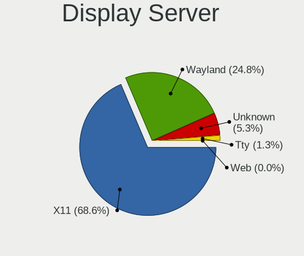
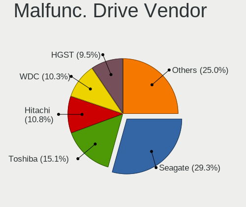
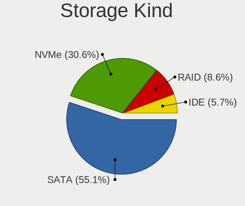
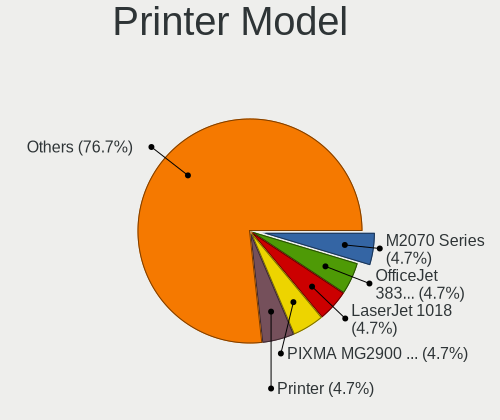

Linux in Canada - Tested Hardware & Statistics (Notebooks)
----------------------------------------------------------

A project to collect tested hardware configurations for Linux in Canada.

Anyone can contribute to this report by the [hw-probe](https://github.com/linuxhw/hw-probe) tool:

    sudo -E hw-probe -all -upload

Please contribute! Especially if your hardware is rare.

Contents
--------

* [ Test Cases ](#test-cases)

* [ System ](#system)
  - [ OS                       ](#os)
  - [ OS Family                ](#os-family)
  - [ Kernel                   ](#kernel)
  - [ Kernel Family            ](#kernel-family)
  - [ Kernel Major Ver.        ](#kernel-major-ver)
  - [ Arch                     ](#arch)
  - [ DE                       ](#de)
  - [ Display Server           ](#display-server)
  - [ Display Manager          ](#display-manager)
  - [ OS Lang                  ](#os-lang)
  - [ Boot Mode                ](#boot-mode)
  - [ Filesystem               ](#filesystem)
  - [ Part. scheme             ](#part-scheme)
  - [ Dual Boot with Linux/BSD ](#dual-boot-with-linuxbsd)
  - [ Dual Boot (Win)          ](#dual-boot-win)

* [ Board ](#board)
  - [ Vendor                   ](#vendor)
  - [ Model                    ](#model)
  - [ Model Family             ](#model-family)
  - [ MFG Year                 ](#mfg-year)
  - [ Form Factor              ](#form-factor)
  - [ Secure Boot              ](#secure-boot)
  - [ Coreboot                 ](#coreboot)
  - [ RAM Size                 ](#ram-size)
  - [ RAM Used                 ](#ram-used)
  - [ Total Drives             ](#total-drives)
  - [ Has CD-ROM               ](#has-cd-rom)
  - [ Has Ethernet             ](#has-ethernet)
  - [ Has WiFi                 ](#has-wifi)
  - [ Has Bluetooth            ](#has-bluetooth)

* [ Location ](#location)
  - [ Country                  ](#country)
  - [ City                     ](#city)

* [ Drives ](#drives)
  - [ Drive Vendor             ](#drive-vendor)
  - [ Drive Model              ](#drive-model)
  - [ HDD Vendor               ](#hdd-vendor)
  - [ SSD Vendor               ](#ssd-vendor)
  - [ Drive Kind               ](#drive-kind)
  - [ Drive Connector          ](#drive-connector)
  - [ Drive Size               ](#drive-size)
  - [ Space Total              ](#space-total)
  - [ Space Used               ](#space-used)
  - [ Malfunc. Drives          ](#malfunc-drives)
  - [ Malfunc. Drive Vendor    ](#malfunc-drive-vendor)
  - [ Malfunc. HDD Vendor      ](#malfunc-hdd-vendor)
  - [ Malfunc. Drive Kind      ](#malfunc-drive-kind)
  - [ Failed Drives            ](#failed-drives)
  - [ Failed Drive Vendor      ](#failed-drive-vendor)
  - [ Drive Status             ](#drive-status)

* [ Storage controller ](#storage-controller)
  - [ Storage Vendor           ](#storage-vendor)
  - [ Storage Model            ](#storage-model)
  - [ Storage Kind             ](#storage-kind)

* [ Processor ](#processor)
  - [ CPU Vendor               ](#cpu-vendor)
  - [ CPU Model                ](#cpu-model)
  - [ CPU Model Family         ](#cpu-model-family)
  - [ CPU Cores                ](#cpu-cores)
  - [ CPU Sockets              ](#cpu-sockets)
  - [ CPU Threads              ](#cpu-threads)
  - [ CPU Op-Modes             ](#cpu-op-modes)
  - [ CPU Microcode            ](#cpu-microcode)
  - [ CPU Microarch            ](#cpu-microarch)

* [ Graphics ](#graphics)
  - [ GPU Vendor               ](#gpu-vendor)
  - [ GPU Model                ](#gpu-model)
  - [ GPU Combo                ](#gpu-combo)
  - [ GPU Driver               ](#gpu-driver)
  - [ GPU Memory               ](#gpu-memory)

* [ Monitor ](#monitor)
  - [ Monitor Vendor           ](#monitor-vendor)
  - [ Monitor Model            ](#monitor-model)
  - [ Monitor Resolution       ](#monitor-resolution)
  - [ Monitor Diagonal         ](#monitor-diagonal)
  - [ Monitor Width            ](#monitor-width)
  - [ Aspect Ratio             ](#aspect-ratio)
  - [ Monitor Area             ](#monitor-area)
  - [ Pixel Density            ](#pixel-density)
  - [ Multiple Monitors        ](#multiple-monitors)

* [ Network ](#network)
  - [ Net Controller Vendor    ](#net-controller-vendor)
  - [ Net Controller Model     ](#net-controller-model)
  - [ Wireless Vendor          ](#wireless-vendor)
  - [ Wireless Model           ](#wireless-model)
  - [ Ethernet Vendor          ](#ethernet-vendor)
  - [ Ethernet Model           ](#ethernet-model)
  - [ Net Controller Kind      ](#net-controller-kind)
  - [ Used Controller          ](#used-controller)
  - [ NICs                     ](#nics)
  - [ IPv6                     ](#ipv6)

* [ Bluetooth ](#bluetooth)
  - [ Bluetooth Vendor         ](#bluetooth-vendor)
  - [ Bluetooth Model          ](#bluetooth-model)

* [ Sound ](#sound)
  - [ Sound Vendor             ](#sound-vendor)
  - [ Sound Model              ](#sound-model)

* [ Memory ](#memory)
  - [ Memory Vendor            ](#memory-vendor)
  - [ Memory Model             ](#memory-model)
  - [ Memory Kind              ](#memory-kind)
  - [ Memory Form Factor       ](#memory-form-factor)
  - [ Memory Size              ](#memory-size)
  - [ Memory Speed             ](#memory-speed)

* [ Printers & scanners ](#printers--scanners)
  - [ Printer Vendor           ](#printer-vendor)
  - [ Printer Model            ](#printer-model)
  - [ Scanner Vendor           ](#scanner-vendor)
  - [ Scanner Model            ](#scanner-model)

* [ Camera ](#camera)
  - [ Camera Vendor            ](#camera-vendor)
  - [ Camera Model             ](#camera-model)

* [ Security ](#security)
  - [ Fingerprint Vendor       ](#fingerprint-vendor)
  - [ Fingerprint Model        ](#fingerprint-model)
  - [ Chipcard Vendor          ](#chipcard-vendor)
  - [ Chipcard Model           ](#chipcard-model)

* [ Unsupported ](#unsupported)
  - [ Unsupported Devices      ](#unsupported-devices)
  - [ Unsupported Device Types ](#unsupported-device-types)

Test Cases
----------

Total: 4268

| Vendor        | Model                       | Probe                                                      | Date         |
|---------------|-----------------------------|------------------------------------------------------------|--------------|
| ASUSTek       | G73Jh                       | [0b9b84be03](https://linux-hardware.org/?probe=0b9b84be03) | Oct 01, 2023 |
| Acer          | AOA150                      | [969a729098](https://linux-hardware.org/?probe=969a729098) | Oct 01, 2023 |
| Apple         | MacBookPro5,3               | [0669d0020d](https://linux-hardware.org/?probe=0669d0020d) | Sep 30, 2023 |
| Apple         | MacBookPro5,3               | [d249d5e114](https://linux-hardware.org/?probe=d249d5e114) | Sep 30, 2023 |
| Apple         | MacBookAir6,1               | [b77b45ce58](https://linux-hardware.org/?probe=b77b45ce58) | Sep 29, 2023 |
| ASUSTek       | X505BA                      | [1caa3c5c7e](https://linux-hardware.org/?probe=1caa3c5c7e) | Sep 28, 2023 |
| Lenovo        | Legion 5 17ACH6H 82JY       | [e23bfd302c](https://linux-hardware.org/?probe=e23bfd302c) | Sep 28, 2023 |
| Lenovo        | ThinkPad P15 Gen 1 20ST0... | [1492e2178d](https://linux-hardware.org/?probe=1492e2178d) | Sep 28, 2023 |
| ASUSTek       | ROG Zephyrus G14 GA401IU... | [f86a0719d7](https://linux-hardware.org/?probe=f86a0719d7) | Sep 28, 2023 |
| Dell          | XPS 15 7590                 | [3c87964524](https://linux-hardware.org/?probe=3c87964524) | Sep 28, 2023 |
| Lenovo        | ThinkPad W540 20BG0016US    | [3ee705f2f3](https://linux-hardware.org/?probe=3ee705f2f3) | Sep 28, 2023 |
| Lenovo        | ThinkPad W540 20BG0016US    | [2b86c9fac4](https://linux-hardware.org/?probe=2b86c9fac4) | Sep 28, 2023 |
| Acer          | Swift SF314-42              | [f436f21240](https://linux-hardware.org/?probe=f436f21240) | Sep 27, 2023 |
| Lenovo        | IdeaPad 320-15IKB 81BG      | [17f9208e1a](https://linux-hardware.org/?probe=17f9208e1a) | Sep 27, 2023 |
| Dell          | Latitude 5420               | [3a22857022](https://linux-hardware.org/?probe=3a22857022) | Sep 26, 2023 |
| ASUSTek       | VivoBook_ASUS Laptop E41... | [d14e65fadf](https://linux-hardware.org/?probe=d14e65fadf) | Sep 26, 2023 |
| ASUSTek       | VivoBook_ASUS Laptop E41... | [1c764be0e3](https://linux-hardware.org/?probe=1c764be0e3) | Sep 26, 2023 |
| ASUSTek       | Zenbook UM3402YAR_UM3402... | [b8b2b3ff7e](https://linux-hardware.org/?probe=b8b2b3ff7e) | Sep 26, 2023 |
| ASUSTek       | Zenbook UM3402YAR_UM3402... | [9e9ff26362](https://linux-hardware.org/?probe=9e9ff26362) | Sep 26, 2023 |
| HP            | EliteBook 850 G1            | [55b3c2717b](https://linux-hardware.org/?probe=55b3c2717b) | Sep 25, 2023 |
| Apple         | MacBookPro7,1               | [677446fafa](https://linux-hardware.org/?probe=677446fafa) | Sep 25, 2023 |
| Lenovo        | ThinkPad T60 2623DAU        | [b5edbc8fbf](https://linux-hardware.org/?probe=b5edbc8fbf) | Sep 24, 2023 |
| Lenovo        | ThinkPad T60 2623DAU        | [144d6b3290](https://linux-hardware.org/?probe=144d6b3290) | Sep 24, 2023 |
| HP            | EliteBook 850 G1            | [00bb1a3a44](https://linux-hardware.org/?probe=00bb1a3a44) | Sep 24, 2023 |
| Lenovo        | IdeaPad 3 15IAU7 82RK       | [37ecdee3d3](https://linux-hardware.org/?probe=37ecdee3d3) | Sep 24, 2023 |
| Lenovo        | IdeaPad 3 15IAU7 82RK       | [ecc0e92fb0](https://linux-hardware.org/?probe=ecc0e92fb0) | Sep 24, 2023 |
| ASUSTek       | VivoBook_ASUS Laptop E41... | [575df2588e](https://linux-hardware.org/?probe=575df2588e) | Sep 23, 2023 |
| Google        | Asuka                       | [cf59aebc4c](https://linux-hardware.org/?probe=cf59aebc4c) | Sep 23, 2023 |
| ASUSTek       | VivoBook_ASUS Laptop E41... | [d6943b89de](https://linux-hardware.org/?probe=d6943b89de) | Sep 23, 2023 |
| Apple         | MacBookPro8,1               | [0c1f872edb](https://linux-hardware.org/?probe=0c1f872edb) | Sep 23, 2023 |
| Toshiba       | Satellite C70-B             | [eedf248084](https://linux-hardware.org/?probe=eedf248084) | Sep 23, 2023 |
| Alienware     | m15 R3                      | [d9628d131b](https://linux-hardware.org/?probe=d9628d131b) | Sep 22, 2023 |
| ASUSTek       | GL502VM                     | [ae49f40dca](https://linux-hardware.org/?probe=ae49f40dca) | Sep 22, 2023 |
| Dell          | Latitude 5590               | [068de61e23](https://linux-hardware.org/?probe=068de61e23) | Sep 22, 2023 |
| Lenovo        | Slim 7 14IRP8 83A4          | [b1ccf59045](https://linux-hardware.org/?probe=b1ccf59045) | Sep 21, 2023 |
| Apple         | MacBookPro9,1               | [27f3ee04f8](https://linux-hardware.org/?probe=27f3ee04f8) | Sep 21, 2023 |
| HP            | Pavilion g6                 | [11c60c8645](https://linux-hardware.org/?probe=11c60c8645) | Sep 21, 2023 |
| HP            | ProBook 650 G2              | [215bdc7f1c](https://linux-hardware.org/?probe=215bdc7f1c) | Sep 20, 2023 |
| Dell          | Latitude E5550              | [8e67cb247c](https://linux-hardware.org/?probe=8e67cb247c) | Sep 20, 2023 |
| Apple         | MacBookPro15,1              | [b74bbced53](https://linux-hardware.org/?probe=b74bbced53) | Sep 20, 2023 |
| Dell          | XPS 9320                    | [611c8a5cc8](https://linux-hardware.org/?probe=611c8a5cc8) | Sep 20, 2023 |
| Lenovo        | ThinkPad T470s 20HFCTO1W... | [f8f954cde7](https://linux-hardware.org/?probe=f8f954cde7) | Sep 20, 2023 |
| Lenovo        | ThinkPad W540 20BG0014US    | [2d1c5101ea](https://linux-hardware.org/?probe=2d1c5101ea) | Sep 19, 2023 |
| HP            | Laptop 15-ef1xxx            | [5ec304bdb6](https://linux-hardware.org/?probe=5ec304bdb6) | Sep 19, 2023 |
| Lenovo        | IdeaPad 320-15IKB 81BG      | [210a1090b3](https://linux-hardware.org/?probe=210a1090b3) | Sep 18, 2023 |
| ASUSTek       | ROG Zephyrus G14 GA402XV... | [7678b8a06e](https://linux-hardware.org/?probe=7678b8a06e) | Sep 18, 2023 |
| ASUSTek       | VivoBook_ASUSLaptop X415... | [cbfe8b032d](https://linux-hardware.org/?probe=cbfe8b032d) | Sep 18, 2023 |
| Valve         | Jupiter                     | [9b95215db5](https://linux-hardware.org/?probe=9b95215db5) | Sep 17, 2023 |
| HP            | Pavilion g6                 | [dd1ade8736](https://linux-hardware.org/?probe=dd1ade8736) | Sep 17, 2023 |
| HP            | Laptop 15-da0xxx            | [43081eb0eb](https://linux-hardware.org/?probe=43081eb0eb) | Sep 17, 2023 |
| Apple         | MacBookPro11,1              | [82879c821a](https://linux-hardware.org/?probe=82879c821a) | Sep 17, 2023 |
| Unknown       | Unknown                     | [cc13e0926e](https://linux-hardware.org/?probe=cc13e0926e) | Sep 17, 2023 |
| ASUSTek       | VivoBook_ASUSLaptop K660... | [9e2d4356b2](https://linux-hardware.org/?probe=9e2d4356b2) | Sep 16, 2023 |
| Google        | Terra                       | [c96e879351](https://linux-hardware.org/?probe=c96e879351) | Sep 15, 2023 |
| Google        | Terra                       | [3f63d76318](https://linux-hardware.org/?probe=3f63d76318) | Sep 14, 2023 |
| Fujitsu       | STYLISTIC Q702              | [f3ca596dc5](https://linux-hardware.org/?probe=f3ca596dc5) | Sep 14, 2023 |
| HP            | ENVY Laptop 13-ba1xxx       | [5d79965e45](https://linux-hardware.org/?probe=5d79965e45) | Sep 14, 2023 |
| HP            | ProBook 650 G2              | [654bee8844](https://linux-hardware.org/?probe=654bee8844) | Sep 14, 2023 |
| HP            | ProBook 6570b               | [fc5c01d215](https://linux-hardware.org/?probe=fc5c01d215) | Sep 14, 2023 |
| ASUSTek       | VivoBook_ASUSLaptop X712... | [9ace0dfae8](https://linux-hardware.org/?probe=9ace0dfae8) | Sep 14, 2023 |
| Valve         | Jupiter                     | [17d891df44](https://linux-hardware.org/?probe=17d891df44) | Sep 13, 2023 |
| ASUSTek       | ASUS EXPERTBOOK B9400CEA... | [cb29d8cb77](https://linux-hardware.org/?probe=cb29d8cb77) | Sep 13, 2023 |
| Apple         | MacBookPro11,2              | [e38a2e668b](https://linux-hardware.org/?probe=e38a2e668b) | Sep 12, 2023 |
| Apple         | MacBookPro9,2               | [77db8877eb](https://linux-hardware.org/?probe=77db8877eb) | Sep 12, 2023 |
| Lenovo        | IdeaPad 330S-14IKB 81F4     | [471faa50e0](https://linux-hardware.org/?probe=471faa50e0) | Sep 12, 2023 |
| Acer          | Swift SF314-512             | [4628c4e630](https://linux-hardware.org/?probe=4628c4e630) | Sep 11, 2023 |
| ASUSTek       | ASUS TUF Gaming A15 FA50... | [5b93cd5b36](https://linux-hardware.org/?probe=5b93cd5b36) | Sep 11, 2023 |
| Unknown       | Unknown                     | [4944b22636](https://linux-hardware.org/?probe=4944b22636) | Sep 11, 2023 |
| Apple         | MacBookPro11,2              | [830ca674bb](https://linux-hardware.org/?probe=830ca674bb) | Sep 10, 2023 |
| Lenovo        | ThinkPad X1 Carbon 6th 2... | [6d8ac2101a](https://linux-hardware.org/?probe=6d8ac2101a) | Sep 10, 2023 |
| Dell          | Precision 5540              | [061e46a96c](https://linux-hardware.org/?probe=061e46a96c) | Sep 10, 2023 |
| HP            | Laptop 15-fd0xxx            | [470e6325a3](https://linux-hardware.org/?probe=470e6325a3) | Sep 10, 2023 |
| HP            | ProBook 6570b               | [3ed768081c](https://linux-hardware.org/?probe=3ed768081c) | Sep 09, 2023 |
| HP            | Pavilion dv8000 (ET839UA... | [6104b2383d](https://linux-hardware.org/?probe=6104b2383d) | Sep 09, 2023 |
| HP            | Laptop 15-dy1xxx            | [ae24b6af25](https://linux-hardware.org/?probe=ae24b6af25) | Sep 09, 2023 |
| Lenovo        | ThinkPad T440s 20AQ005QU... | [0a57a98442](https://linux-hardware.org/?probe=0a57a98442) | Sep 09, 2023 |
| Dell          | Latitude E6410              | [9b57eaa1eb](https://linux-hardware.org/?probe=9b57eaa1eb) | Sep 09, 2023 |
| MSI           | GP75 Leopard 10SEK          | [11e5581873](https://linux-hardware.org/?probe=11e5581873) | Sep 08, 2023 |
| Dell          | Latitude E6410              | [5371b3f488](https://linux-hardware.org/?probe=5371b3f488) | Sep 08, 2023 |
| Dell          | Latitude E5400              | [0ede91c6cd](https://linux-hardware.org/?probe=0ede91c6cd) | Sep 08, 2023 |
| Apple         | MacBookPro5,5               | [3ab6390052](https://linux-hardware.org/?probe=3ab6390052) | Sep 08, 2023 |
| Dell          | Latitude E5400              | [727b5526f9](https://linux-hardware.org/?probe=727b5526f9) | Sep 08, 2023 |
| ASUSTek       | X541UVK                     | [425b748769](https://linux-hardware.org/?probe=425b748769) | Sep 08, 2023 |
| Lenovo        | IdeaPad 3 15ITL05 81X8      | [29c824f7ef](https://linux-hardware.org/?probe=29c824f7ef) | Sep 08, 2023 |
| Lenovo        | IdeaPad 3 15ITL05 81X8      | [fd60499219](https://linux-hardware.org/?probe=fd60499219) | Sep 08, 2023 |
| Lenovo        | ThinkBook 15 G3 ACL 21A4    | [ed1061dbb1](https://linux-hardware.org/?probe=ed1061dbb1) | Sep 07, 2023 |
| Matsushita... | CF-74JCJBDAM                | [0cc1e4014d](https://linux-hardware.org/?probe=0cc1e4014d) | Sep 07, 2023 |
| Google        | Blooguard                   | [c9dec98f0f](https://linux-hardware.org/?probe=c9dec98f0f) | Sep 07, 2023 |
| Lenovo        | ThinkPad X1C 5th W10DG 2... | [b5f142ae13](https://linux-hardware.org/?probe=b5f142ae13) | Sep 06, 2023 |
| ASUSTek       | ASUS TUF Gaming F15 FX50... | [cf9c65c6f4](https://linux-hardware.org/?probe=cf9c65c6f4) | Sep 06, 2023 |
| HP            | Pavilion dv8000 (ET839UA... | [7b717719f5](https://linux-hardware.org/?probe=7b717719f5) | Sep 05, 2023 |
| Lenovo        | IdeaPad 320-15IKB 81BG      | [5728a3a48b](https://linux-hardware.org/?probe=5728a3a48b) | Sep 05, 2023 |
| Lenovo        | IdeaPad 320-15IKB 81BG      | [fdecc11aba](https://linux-hardware.org/?probe=fdecc11aba) | Sep 05, 2023 |
| HP            | Pavilion dv7                | [2d6aa7667d](https://linux-hardware.org/?probe=2d6aa7667d) | Sep 05, 2023 |
| Toshiba       | Satellite C650              | [0b87bf5b4b](https://linux-hardware.org/?probe=0b87bf5b4b) | Sep 05, 2023 |
| HP            | ZBook 15 G2                 | [18d9c74d60](https://linux-hardware.org/?probe=18d9c74d60) | Sep 04, 2023 |
| HP            | EliteBook 840 G8 Noteboo... | [2a53f8dc55](https://linux-hardware.org/?probe=2a53f8dc55) | Sep 04, 2023 |
| Sony          | VPCEB27FX                   | [268d3a14a7](https://linux-hardware.org/?probe=268d3a14a7) | Sep 04, 2023 |
| Acer          | Aspire A515-51              | [91bc08d933](https://linux-hardware.org/?probe=91bc08d933) | Sep 03, 2023 |
| Lenovo        | ThinkPad T550 20CKA00ECD    | [20be702d65](https://linux-hardware.org/?probe=20be702d65) | Sep 03, 2023 |
| Apple         | MacBookPro8,2               | [8ed88aa6f1](https://linux-hardware.org/?probe=8ed88aa6f1) | Sep 03, 2023 |
| Lenovo        | ThinkBook 15 G3 ACL 21A4    | [f71590bc2b](https://linux-hardware.org/?probe=f71590bc2b) | Sep 03, 2023 |
| Lenovo        | G570 20079                  | [3e995d059e](https://linux-hardware.org/?probe=3e995d059e) | Sep 03, 2023 |
| Google        | Droid                       | [da26431a82](https://linux-hardware.org/?probe=da26431a82) | Sep 03, 2023 |
| Google        | Droid                       | [278861e9e8](https://linux-hardware.org/?probe=278861e9e8) | Sep 03, 2023 |
| Acer          | Aspire A315-21              | [9c71da2165](https://linux-hardware.org/?probe=9c71da2165) | Sep 03, 2023 |
| HP            | EliteBook 850 G1            | [adacf1a54a](https://linux-hardware.org/?probe=adacf1a54a) | Sep 02, 2023 |
| Dell          | Precision 5540              | [3d800b12e0](https://linux-hardware.org/?probe=3d800b12e0) | Sep 02, 2023 |
| HP            | Pavilion dv8000 (ET839UA... | [affa07b412](https://linux-hardware.org/?probe=affa07b412) | Sep 02, 2023 |
| Lenovo        | ThinkPad W510 438923U       | [b0648eccac](https://linux-hardware.org/?probe=b0648eccac) | Sep 02, 2023 |
| HP            | ProBook 650 G2              | [a00c4f0a62](https://linux-hardware.org/?probe=a00c4f0a62) | Sep 02, 2023 |
| ASUSTek       | VivoBook 14_ASUS Laptop ... | [28fc3470c8](https://linux-hardware.org/?probe=28fc3470c8) | Sep 01, 2023 |
| Acer          | Aspire E5-571               | [04f5152e0c](https://linux-hardware.org/?probe=04f5152e0c) | Sep 01, 2023 |
| MOTION        | NVX00                       | [8e26121033](https://linux-hardware.org/?probe=8e26121033) | Aug 31, 2023 |
| MSI           | MS-7E06                     | [afd9e6ccb2](https://linux-hardware.org/?probe=afd9e6ccb2) | Aug 30, 2023 |
| Dell          | Latitude 3510               | [220b298103](https://linux-hardware.org/?probe=220b298103) | Aug 30, 2023 |
| Lenovo        | ThinkPad W520 427637U       | [5f995c7c48](https://linux-hardware.org/?probe=5f995c7c48) | Aug 30, 2023 |
| MSI           | GP72 7RDX                   | [071785ab97](https://linux-hardware.org/?probe=071785ab97) | Aug 30, 2023 |
| Lenovo        | Yoga 2 Pro 20266            | [958ecd81e5](https://linux-hardware.org/?probe=958ecd81e5) | Aug 30, 2023 |
| Apple         | MacBookPro8,1               | [2e3c70287a](https://linux-hardware.org/?probe=2e3c70287a) | Aug 30, 2023 |
| Lenovo        | IdeaPad S540-15IWL GTX 8... | [4904c007c7](https://linux-hardware.org/?probe=4904c007c7) | Aug 29, 2023 |
| Acer          | Swift SF314-512             | [a41a08d4ae](https://linux-hardware.org/?probe=a41a08d4ae) | Aug 29, 2023 |
| ASUSTek       | TUF Gaming FX504GD_FX80G... | [62ff88eaf7](https://linux-hardware.org/?probe=62ff88eaf7) | Aug 29, 2023 |
| Acer          | Aspire 5742                 | [9bbb56c640](https://linux-hardware.org/?probe=9bbb56c640) | Aug 29, 2023 |
| System76      | Galago Pro                  | [31330746e6](https://linux-hardware.org/?probe=31330746e6) | Aug 29, 2023 |
| Toshiba       | Satellite Pro C70-C         | [eb9fbb104c](https://linux-hardware.org/?probe=eb9fbb104c) | Aug 28, 2023 |
| ASUSTek       | Zenbook UM3402YAR_UM3402... | [4bff36d914](https://linux-hardware.org/?probe=4bff36d914) | Aug 28, 2023 |
| Lenovo        | IdeaPad 320-15IKB 81BG      | [e165507af8](https://linux-hardware.org/?probe=e165507af8) | Aug 27, 2023 |
| Lenovo        | IdeaPad 320-15IKB 81BG      | [329d960437](https://linux-hardware.org/?probe=329d960437) | Aug 27, 2023 |
| Apple         | MacBookPro9,1               | [20eda7fab5](https://linux-hardware.org/?probe=20eda7fab5) | Aug 26, 2023 |
| Lenovo        | ThinkPad T420 4236AK9       | [46a647db9b](https://linux-hardware.org/?probe=46a647db9b) | Aug 26, 2023 |
| Dell          | Precision M4600             | [fcc3763c08](https://linux-hardware.org/?probe=fcc3763c08) | Aug 26, 2023 |
| Lenovo        | ThinkPad T410 25222AU       | [fdc78cf5a0](https://linux-hardware.org/?probe=fdc78cf5a0) | Aug 26, 2023 |
| HP            | Laptop 17-ca2xxx            | [f6d894d339](https://linux-hardware.org/?probe=f6d894d339) | Aug 26, 2023 |
| HP            | EliteBook 840 G8 Noteboo... | [f09b86405b](https://linux-hardware.org/?probe=f09b86405b) | Aug 26, 2023 |
| Lenovo        | ThinkPad T14s Gen 3 21CQ... | [3c528e98c6](https://linux-hardware.org/?probe=3c528e98c6) | Aug 26, 2023 |
| Lenovo        | V15-IIL 82C5                | [cee65701f2](https://linux-hardware.org/?probe=cee65701f2) | Aug 25, 2023 |
| Dell          | Inspiron 5585               | [49a9e7dbf0](https://linux-hardware.org/?probe=49a9e7dbf0) | Aug 25, 2023 |
| Acer          | Aspire 5742                 | [7d896ad750](https://linux-hardware.org/?probe=7d896ad750) | Aug 24, 2023 |
| System76      | Gazelle                     | [ee67365e0c](https://linux-hardware.org/?probe=ee67365e0c) | Aug 24, 2023 |
| Dell          | Latitude 5510               | [d0b9ab746d](https://linux-hardware.org/?probe=d0b9ab746d) | Aug 24, 2023 |
| Lenovo        | ThinkPad T450s 20BWS2M30... | [052c7eaa90](https://linux-hardware.org/?probe=052c7eaa90) | Aug 24, 2023 |
| HP            | ProBook 445 G8 Notebook ... | [19433fe76f](https://linux-hardware.org/?probe=19433fe76f) | Aug 24, 2023 |
| ASUSTek       | VivoBook 14_ASUS Laptop ... | [2431197665](https://linux-hardware.org/?probe=2431197665) | Aug 24, 2023 |
| ASUSTek       | ZenBook Pro Duo UX582HM_... | [2281d96afb](https://linux-hardware.org/?probe=2281d96afb) | Aug 24, 2023 |
| Xplore        | iX104C6                     | [5d8ea1a454](https://linux-hardware.org/?probe=5d8ea1a454) | Aug 24, 2023 |
| Lenovo        | ThinkPad T16 Gen 1 21BVC... | [816f3ce721](https://linux-hardware.org/?probe=816f3ce721) | Aug 24, 2023 |
| HP            | EliteBook 8530w             | [3ee1fe77ce](https://linux-hardware.org/?probe=3ee1fe77ce) | Aug 23, 2023 |
| MSI           | GP72 6QF                    | [3afc91a639](https://linux-hardware.org/?probe=3afc91a639) | Aug 23, 2023 |
| HP            | Presario V2000 (ES307UA#... | [6c727b9e00](https://linux-hardware.org/?probe=6c727b9e00) | Aug 23, 2023 |
| ASUSTek       | G751JM                      | [7cdb0c52e4](https://linux-hardware.org/?probe=7cdb0c52e4) | Aug 23, 2023 |
| HP            | EliteBook 2170p             | [0bba785aee](https://linux-hardware.org/?probe=0bba785aee) | Aug 21, 2023 |
| Dell          | Latitude 5510               | [e5d8770a77](https://linux-hardware.org/?probe=e5d8770a77) | Aug 21, 2023 |
| Lenovo        | ThinkPad X220 42902WU       | [9fd887dc27](https://linux-hardware.org/?probe=9fd887dc27) | Aug 21, 2023 |
| Toshiba       | Satellite Pro A50-C         | [ed71bba366](https://linux-hardware.org/?probe=ed71bba366) | Aug 19, 2023 |
| HP            | Pavilion dv8000 (ET839UA... | [030cbe1086](https://linux-hardware.org/?probe=030cbe1086) | Aug 19, 2023 |
| HP            | Pavilion g6                 | [8e7844a79d](https://linux-hardware.org/?probe=8e7844a79d) | Aug 19, 2023 |
| Dell          | XPS 15 9530                 | [93530d7cb1](https://linux-hardware.org/?probe=93530d7cb1) | Aug 18, 2023 |
| Panasonic     | CF-31AQAAA1M                | [64416dbba5](https://linux-hardware.org/?probe=64416dbba5) | Aug 17, 2023 |
| Acer          | Aspire 5920                 | [31447ef238](https://linux-hardware.org/?probe=31447ef238) | Aug 17, 2023 |
| Acer          | Aspire 5920                 | [8c57c50f82](https://linux-hardware.org/?probe=8c57c50f82) | Aug 17, 2023 |
| Dell          | Precision 5540              | [a0a36884a0](https://linux-hardware.org/?probe=a0a36884a0) | Aug 17, 2023 |
| Dell          | Inspiron 1200               | [2340dcab47](https://linux-hardware.org/?probe=2340dcab47) | Aug 17, 2023 |
| Dell          | XPS 9320                    | [cb112d9f03](https://linux-hardware.org/?probe=cb112d9f03) | Aug 17, 2023 |
| Lenovo        | IdeaPad 520S-14IKB 81BL     | [a69ad2f7b8](https://linux-hardware.org/?probe=a69ad2f7b8) | Aug 15, 2023 |
| Samsung       | 355V4C/355V4X/355V5C/355... | [2ac8f6838a](https://linux-hardware.org/?probe=2ac8f6838a) | Aug 15, 2023 |
| HP            | ZBook Firefly 14 inch G8... | [65f7a020fe](https://linux-hardware.org/?probe=65f7a020fe) | Aug 14, 2023 |
| Dell          | XPS 13 9360                 | [69b51e3f5a](https://linux-hardware.org/?probe=69b51e3f5a) | Aug 14, 2023 |
| ASUSTek       | VivoBook_ASUSLaptop M540... | [24b85b3417](https://linux-hardware.org/?probe=24b85b3417) | Aug 14, 2023 |
| Google        | Blooglet                    | [b9967e65c2](https://linux-hardware.org/?probe=b9967e65c2) | Aug 14, 2023 |
| HP            | ProBook 650 G2              | [b310a70636](https://linux-hardware.org/?probe=b310a70636) | Aug 14, 2023 |
| LG Electro... | 17Z90N-V.AA72A8             | [28e815418c](https://linux-hardware.org/?probe=28e815418c) | Aug 13, 2023 |
| Apple         | MacBookAir6,2               | [4eeea4cc95](https://linux-hardware.org/?probe=4eeea4cc95) | Aug 13, 2023 |
| Lenovo        | IdeaPad Y570 0862           | [0ea140ff49](https://linux-hardware.org/?probe=0ea140ff49) | Aug 12, 2023 |
| Unknown       | Unknown                     | [21abd7288e](https://linux-hardware.org/?probe=21abd7288e) | Aug 12, 2023 |
| HP            | Notebook                    | [de8a0230c4](https://linux-hardware.org/?probe=de8a0230c4) | Aug 11, 2023 |
| HP            | EliteBook 840 G1            | [95d93fda2c](https://linux-hardware.org/?probe=95d93fda2c) | Aug 11, 2023 |
| HP            | EliteBook 2560p             | [0b5cf409d8](https://linux-hardware.org/?probe=0b5cf409d8) | Aug 11, 2023 |
| Dell          | Inspiron 3531               | [0384e8a950](https://linux-hardware.org/?probe=0384e8a950) | Aug 11, 2023 |
| Google        | Bobba360                    | [128700115a](https://linux-hardware.org/?probe=128700115a) | Aug 10, 2023 |
| Dell          | Latitude 3540               | [496e3ab340](https://linux-hardware.org/?probe=496e3ab340) | Aug 10, 2023 |
| Google        | Snappy                      | [73ecdd5048](https://linux-hardware.org/?probe=73ecdd5048) | Aug 10, 2023 |
| ASUSTek       | VivoBook_ASUSLaptop X170... | [75b55100a9](https://linux-hardware.org/?probe=75b55100a9) | Aug 10, 2023 |
| Dell          | Precision 5540              | [e68fee1e24](https://linux-hardware.org/?probe=e68fee1e24) | Aug 10, 2023 |
| Gateway       | NV57H                       | [826aaf5dd8](https://linux-hardware.org/?probe=826aaf5dd8) | Aug 10, 2023 |
| HP            | ProBook 650 G2              | [8fbbf1483d](https://linux-hardware.org/?probe=8fbbf1483d) | Aug 09, 2023 |
| Google        | Bobba360                    | [fa4a78b024](https://linux-hardware.org/?probe=fa4a78b024) | Aug 09, 2023 |
| System76      | Darter Pro                  | [5162d61c01](https://linux-hardware.org/?probe=5162d61c01) | Aug 09, 2023 |
| Dell          | Latitude 3350               | [77100b2ef6](https://linux-hardware.org/?probe=77100b2ef6) | Aug 09, 2023 |
| HP            | ProBook 650 G2              | [78859b39fb](https://linux-hardware.org/?probe=78859b39fb) | Aug 09, 2023 |
| ASUSTek       | VivoBook_ASUSLaptop X170... | [f48f680274](https://linux-hardware.org/?probe=f48f680274) | Aug 08, 2023 |
| Dell          | Latitude E5470              | [f64529e38b](https://linux-hardware.org/?probe=f64529e38b) | Aug 08, 2023 |
| HP            | Laptop 14-dq3xxx            | [c547f01fbb](https://linux-hardware.org/?probe=c547f01fbb) | Aug 08, 2023 |
| Lenovo        | Legion 5 17ACH6H 82JY       | [088a8fad47](https://linux-hardware.org/?probe=088a8fad47) | Aug 08, 2023 |
| HP            | Elite x2 1012 G1            | [0ee8428f91](https://linux-hardware.org/?probe=0ee8428f91) | Aug 07, 2023 |
| Dell          | Latitude 7300               | [932f04033c](https://linux-hardware.org/?probe=932f04033c) | Aug 07, 2023 |
| HP            | Laptop 15-dy2xxx            | [5777798e8f](https://linux-hardware.org/?probe=5777798e8f) | Aug 07, 2023 |
| Acer          | E1-510                      | [2d6776c4fe](https://linux-hardware.org/?probe=2d6776c4fe) | Aug 06, 2023 |
| HP            | EliteBook 840 G5            | [9688966097](https://linux-hardware.org/?probe=9688966097) | Aug 06, 2023 |
| Lenovo        | ThinkPad T420 4180AP3       | [bd989967e7](https://linux-hardware.org/?probe=bd989967e7) | Aug 06, 2023 |
| Dell          | Inspiron 15 3525            | [0219350ae0](https://linux-hardware.org/?probe=0219350ae0) | Aug 05, 2023 |
| Dell          | Inspiron 15 3525            | [350a405f33](https://linux-hardware.org/?probe=350a405f33) | Aug 05, 2023 |
| Apple         | MacBookPro14,1              | [d3630fa2ed](https://linux-hardware.org/?probe=d3630fa2ed) | Aug 05, 2023 |
| Lenovo        | ThinkPad X131e 33671S2      | [3f83b5efac](https://linux-hardware.org/?probe=3f83b5efac) | Aug 05, 2023 |
| Corsair       | Voyager a1600               | [6dea5f2c0c](https://linux-hardware.org/?probe=6dea5f2c0c) | Aug 04, 2023 |
| Lenovo        | ThinkPad 13 2nd Gen 20J2... | [ff55512c0e](https://linux-hardware.org/?probe=ff55512c0e) | Aug 04, 2023 |
| Dell          | Inspiron 5720               | [20532065b5](https://linux-hardware.org/?probe=20532065b5) | Aug 04, 2023 |
| Dell          | Inspiron 5720               | [8f6ada13fa](https://linux-hardware.org/?probe=8f6ada13fa) | Aug 04, 2023 |
| HP            | Laptop 15-fd0xxx            | [8f3b8dea26](https://linux-hardware.org/?probe=8f3b8dea26) | Aug 04, 2023 |
| HP            | EliteBook Folio G1          | [b9bb38ddd4](https://linux-hardware.org/?probe=b9bb38ddd4) | Aug 03, 2023 |
| ASUSTek       | VivoBook_ASUSLaptop X170... | [7d86876920](https://linux-hardware.org/?probe=7d86876920) | Aug 03, 2023 |
| Dell          | Latitude 5440               | [5791d15bc8](https://linux-hardware.org/?probe=5791d15bc8) | Aug 02, 2023 |
| Dell          | Latitude 5540               | [e521b93e2f](https://linux-hardware.org/?probe=e521b93e2f) | Aug 02, 2023 |
| Dell          | Latitude 5440               | [5b0eb512d1](https://linux-hardware.org/?probe=5b0eb512d1) | Aug 02, 2023 |
| HP            | ProBook 650 G4              | [d041df173b](https://linux-hardware.org/?probe=d041df173b) | Aug 02, 2023 |
| ASUSTek       | VivoBook_ASUSLaptop X415... | [944afe5083](https://linux-hardware.org/?probe=944afe5083) | Aug 02, 2023 |
| Lenovo        | ThinkPad T470s W10DG 20J... | [74f1782ead](https://linux-hardware.org/?probe=74f1782ead) | Aug 02, 2023 |
| Acer          | Aspire E1-532               | [9042ebc249](https://linux-hardware.org/?probe=9042ebc249) | Aug 01, 2023 |
| Valve         | Jupiter                     | [896569d1d6](https://linux-hardware.org/?probe=896569d1d6) | Aug 01, 2023 |
| ASUSTek       | X751LA                      | [928a69b9af](https://linux-hardware.org/?probe=928a69b9af) | Aug 01, 2023 |
| Lenovo        | 3000 C100 07612GU           | [3941ecc4f2](https://linux-hardware.org/?probe=3941ecc4f2) | Aug 01, 2023 |
| HP            | ProBook 445 G7              | [96e95e4bd2](https://linux-hardware.org/?probe=96e95e4bd2) | Jul 31, 2023 |
| HP            | EliteBook 840 G2            | [067b112fb8](https://linux-hardware.org/?probe=067b112fb8) | Jul 31, 2023 |
| Lenovo        | ThinkPad P50s 20FLCTO1WW    | [1594795f9e](https://linux-hardware.org/?probe=1594795f9e) | Jul 31, 2023 |
| Lenovo        | ThinkPad T470s 20HGS0DT0... | [bd0d0f2888](https://linux-hardware.org/?probe=bd0d0f2888) | Jul 30, 2023 |
| HP            | ProBook 4540s               | [0fae07b574](https://linux-hardware.org/?probe=0fae07b574) | Jul 30, 2023 |
| Dell          | XPS 15 7590                 | [4f2f49a6b2](https://linux-hardware.org/?probe=4f2f49a6b2) | Jul 30, 2023 |
| BOSGAME       | U56                         | [39d52e51f5](https://linux-hardware.org/?probe=39d52e51f5) | Jul 30, 2023 |
| HP            | EliteBook 840 G5            | [c3101b6a76](https://linux-hardware.org/?probe=c3101b6a76) | Jul 30, 2023 |
| HP            | EliteBook 840 G5            | [915938d446](https://linux-hardware.org/?probe=915938d446) | Jul 30, 2023 |
| Lenovo        | ThinkPad T470s W10DG 20J... | [74a7a53f6a](https://linux-hardware.org/?probe=74a7a53f6a) | Jul 29, 2023 |
| Lenovo        | ThinkPad E14 Gen 2 20TA0... | [cd073a7899](https://linux-hardware.org/?probe=cd073a7899) | Jul 29, 2023 |
| ASUSTek       | VivoBook_ASUSLaptop X415... | [e62cce964c](https://linux-hardware.org/?probe=e62cce964c) | Jul 29, 2023 |
| HP            | ProBook 455R G6             | [3731e7465c](https://linux-hardware.org/?probe=3731e7465c) | Jul 29, 2023 |
| Dell          | Latitude 5520               | [5151c4275a](https://linux-hardware.org/?probe=5151c4275a) | Jul 29, 2023 |
| Framework     | Laptop (12th Gen Intel C... | [d94c3cc0e8](https://linux-hardware.org/?probe=d94c3cc0e8) | Jul 28, 2023 |
| Acer          | Aspire 5810T                | [2d141d703d](https://linux-hardware.org/?probe=2d141d703d) | Jul 28, 2023 |
| MSI           | Katana GF66 11UE            | [78e12df29a](https://linux-hardware.org/?probe=78e12df29a) | Jul 28, 2023 |
| Lenovo        | ThinkPad X220 Tablet 429... | [ea402f269e](https://linux-hardware.org/?probe=ea402f269e) | Jul 28, 2023 |
| Alienware     | m17 R4                      | [eece2da9ed](https://linux-hardware.org/?probe=eece2da9ed) | Jul 27, 2023 |
| Acer          | Aspire 5810T                | [9b7b328324](https://linux-hardware.org/?probe=9b7b328324) | Jul 27, 2023 |
| ASUSTek       | VivoBook_ASUSLaptop X509... | [4152e1f98e](https://linux-hardware.org/?probe=4152e1f98e) | Jul 27, 2023 |
| HP            | ProBook 4540s               | [f41d6c4f4b](https://linux-hardware.org/?probe=f41d6c4f4b) | Jul 26, 2023 |
| HP            | G60                         | [4d64158286](https://linux-hardware.org/?probe=4d64158286) | Jul 26, 2023 |
| Lenovo        | Yoga 14sACH 2021 82MS       | [3cb74490f6](https://linux-hardware.org/?probe=3cb74490f6) | Jul 25, 2023 |
| Google        | Droid                       | [ae803483c2](https://linux-hardware.org/?probe=ae803483c2) | Jul 25, 2023 |
| HP            | Laptop 15-db0xxx            | [f01ec95642](https://linux-hardware.org/?probe=f01ec95642) | Jul 25, 2023 |
| HP            | ProBook 4540s               | [5c4b165cea](https://linux-hardware.org/?probe=5c4b165cea) | Jul 25, 2023 |
| HP            | ProBook 4540s               | [4ad8be01ca](https://linux-hardware.org/?probe=4ad8be01ca) | Jul 25, 2023 |
| Lenovo        | ThinkPad T430 2347H91       | [0ed3c4bc6a](https://linux-hardware.org/?probe=0ed3c4bc6a) | Jul 25, 2023 |
| HP            | Laptop 15-fc0xxx            | [5c52eecd16](https://linux-hardware.org/?probe=5c52eecd16) | Jul 25, 2023 |
| HP            | Pavilion dv8000 (ET839UA... | [562e6e1026](https://linux-hardware.org/?probe=562e6e1026) | Jul 25, 2023 |
| Dell          | Latitude 7490               | [066e3b9518](https://linux-hardware.org/?probe=066e3b9518) | Jul 25, 2023 |
| Lenovo        | ThinkPad T420s 417152U      | [22e09689b0](https://linux-hardware.org/?probe=22e09689b0) | Jul 24, 2023 |
| ASUSTek       | VivoBook_ASUS Laptop E41... | [032db75736](https://linux-hardware.org/?probe=032db75736) | Jul 23, 2023 |
| Lenovo        | ThinkPad P53 20QN004BCA     | [04a2ed4bd2](https://linux-hardware.org/?probe=04a2ed4bd2) | Jul 23, 2023 |
| Lenovo        | Legion 7 16ITHg6 82K6       | [1ee910fc1c](https://linux-hardware.org/?probe=1ee910fc1c) | Jul 22, 2023 |
| Lenovo        | Legion 7 16ITHg6 82K6       | [d02b0e9f74](https://linux-hardware.org/?probe=d02b0e9f74) | Jul 22, 2023 |
| Gateway       | NV57H                       | [3209dcf267](https://linux-hardware.org/?probe=3209dcf267) | Jul 22, 2023 |
| Gateway       | NV57H                       | [35dac8980f](https://linux-hardware.org/?probe=35dac8980f) | Jul 22, 2023 |
| HP            | Pavilion dv7                | [a74719eac2](https://linux-hardware.org/?probe=a74719eac2) | Jul 21, 2023 |
| Lenovo        | ThinkPad P14s Gen 3 21J6... | [27b5dabe8d](https://linux-hardware.org/?probe=27b5dabe8d) | Jul 21, 2023 |
| HP            | Pavilion Gaming Laptop 1... | [fb09f582c5](https://linux-hardware.org/?probe=fb09f582c5) | Jul 20, 2023 |
| HP            | Pavilion Gaming Laptop 1... | [2fcc9e6028](https://linux-hardware.org/?probe=2fcc9e6028) | Jul 20, 2023 |
| ASUSTek       | T100TAM                     | [43cb18f0ee](https://linux-hardware.org/?probe=43cb18f0ee) | Jul 20, 2023 |
| Lenovo        | ThinkPad 11e 20DAS0C800     | [b894a6d96b](https://linux-hardware.org/?probe=b894a6d96b) | Jul 19, 2023 |
| ASUSTek       | GL502VM                     | [dd46e07611](https://linux-hardware.org/?probe=dd46e07611) | Jul 19, 2023 |
| ASUSTek       | VivoBook_ASUS Laptop X50... | [8cb16d19aa](https://linux-hardware.org/?probe=8cb16d19aa) | Jul 19, 2023 |
| Apple         | MacBookPro11,2              | [3121fc5450](https://linux-hardware.org/?probe=3121fc5450) | Jul 18, 2023 |
| Lenovo        | Legion Pro 7 16IRX8H 82W... | [efd490f52d](https://linux-hardware.org/?probe=efd490f52d) | Jul 18, 2023 |
| HP            | Pavilion Notebook           | [babb224527](https://linux-hardware.org/?probe=babb224527) | Jul 18, 2023 |
| HP            | Pavilion Laptop 17-ar0xx    | [574cd2e0f8](https://linux-hardware.org/?probe=574cd2e0f8) | Jul 17, 2023 |
| Google        | Phaser360                   | [1e66458514](https://linux-hardware.org/?probe=1e66458514) | Jul 17, 2023 |
| System76      | Serval WS                   | [a916a92726](https://linux-hardware.org/?probe=a916a92726) | Jul 17, 2023 |
| ASUSTek       | X751LA                      | [345fab37ab](https://linux-hardware.org/?probe=345fab37ab) | Jul 17, 2023 |
| Dell          | Latitude E6420              | [7006e50178](https://linux-hardware.org/?probe=7006e50178) | Jul 17, 2023 |
| ASUSTek       | ROG Strix G713PV_G713PV     | [55a5100039](https://linux-hardware.org/?probe=55a5100039) | Jul 16, 2023 |
| ASUSTek       | ROG Strix G713PV_G713PV     | [ad8f031cb2](https://linux-hardware.org/?probe=ad8f031cb2) | Jul 16, 2023 |
| HP            | Pavilion dv7                | [e983b50085](https://linux-hardware.org/?probe=e983b50085) | Jul 15, 2023 |
| System76      | Pangolin                    | [486df7ead2](https://linux-hardware.org/?probe=486df7ead2) | Jul 14, 2023 |
| Dell          | Precision 5480              | [57d3fff688](https://linux-hardware.org/?probe=57d3fff688) | Jul 14, 2023 |
| HP            | Pavilion Gaming Laptop 1... | [21fc63e4dd](https://linux-hardware.org/?probe=21fc63e4dd) | Jul 14, 2023 |
| HP            | Pavilion Gaming Laptop 1... | [e84bf83ac1](https://linux-hardware.org/?probe=e84bf83ac1) | Jul 13, 2023 |
| Panasonic     | CF-S10CDHEDM                | [55204a29c3](https://linux-hardware.org/?probe=55204a29c3) | Jul 12, 2023 |
| MSI           | GF65 Thin 10UE              | [414c5bc2c0](https://linux-hardware.org/?probe=414c5bc2c0) | Jul 12, 2023 |
| ASUSTek       | ASUS TUF Gaming F15 FX50... | [15c5dec8dc](https://linux-hardware.org/?probe=15c5dec8dc) | Jul 12, 2023 |
| Dell          | XPS 13 9305                 | [27df8fc0e5](https://linux-hardware.org/?probe=27df8fc0e5) | Jul 11, 2023 |
| Dell          | Latitude E5540              | [cdad6cb751](https://linux-hardware.org/?probe=cdad6cb751) | Jul 11, 2023 |
| Lenovo        | IdeaPad Z570 10249UU        | [4179167c95](https://linux-hardware.org/?probe=4179167c95) | Jul 11, 2023 |
| MSI           | GF65 Thin 10UE              | [d73ac20739](https://linux-hardware.org/?probe=d73ac20739) | Jul 10, 2023 |
| MSI           | GF65 Thin 10UE              | [beef3128c2](https://linux-hardware.org/?probe=beef3128c2) | Jul 10, 2023 |
| Acer          | Aspire V3-571               | [cf25605b3a](https://linux-hardware.org/?probe=cf25605b3a) | Jul 10, 2023 |
| Lenovo        | IdeaPad S340-15IIL 81VW     | [7d5e51d9a8](https://linux-hardware.org/?probe=7d5e51d9a8) | Jul 10, 2023 |
| Acer          | Aspire V3-571               | [3c3c2ac038](https://linux-hardware.org/?probe=3c3c2ac038) | Jul 10, 2023 |
| ASUSTek       | ASUS TUF Gaming F15 FX50... | [707f0b8eeb](https://linux-hardware.org/?probe=707f0b8eeb) | Jul 10, 2023 |
| MSI           | GF65 Thin 10UE              | [8dd1516457](https://linux-hardware.org/?probe=8dd1516457) | Jul 08, 2023 |
| Dell          | Latitude 5540               | [1bd623d7b0](https://linux-hardware.org/?probe=1bd623d7b0) | Jul 07, 2023 |
| Acer          | Nitro AN515-57              | [12e3f9ecc7](https://linux-hardware.org/?probe=12e3f9ecc7) | Jul 07, 2023 |
| ASUSTek       | ASUS TUF Gaming F15 FX50... | [46132f9b9c](https://linux-hardware.org/?probe=46132f9b9c) | Jul 07, 2023 |
| Lenovo        | ThinkPad T510 4349RK6       | [e25d3f6783](https://linux-hardware.org/?probe=e25d3f6783) | Jul 07, 2023 |
| Lenovo        | ThinkPad T450s 20BWS0PJ0... | [2345d00757](https://linux-hardware.org/?probe=2345d00757) | Jul 07, 2023 |
| Dell          | Latitude 3540               | [4ebbd2913f](https://linux-hardware.org/?probe=4ebbd2913f) | Jul 06, 2023 |
| ASUSTek       | GL703VD                     | [68235880f7](https://linux-hardware.org/?probe=68235880f7) | Jul 06, 2023 |
| Framework     | Laptop                      | [ea4c4585d0](https://linux-hardware.org/?probe=ea4c4585d0) | Jul 06, 2023 |
| Dell          | XPS 15 9520                 | [f255433162](https://linux-hardware.org/?probe=f255433162) | Jul 06, 2023 |
| ASUSTek       | TP501UA                     | [ee28aacdd1](https://linux-hardware.org/?probe=ee28aacdd1) | Jul 05, 2023 |
| Lenovo        | ThinkPad T480s 20L70028U... | [46e6f4b081](https://linux-hardware.org/?probe=46e6f4b081) | Jul 05, 2023 |
| Lenovo        | ThinkPad T480s 20L70028U... | [6bf093ef61](https://linux-hardware.org/?probe=6bf093ef61) | Jul 05, 2023 |
| HP            | ProBook 450 G5              | [7a15493631](https://linux-hardware.org/?probe=7a15493631) | Jul 05, 2023 |
| Lenovo        | ThinkPad P15v Gen 1 20TQ... | [79c5344e62](https://linux-hardware.org/?probe=79c5344e62) | Jul 04, 2023 |
| HP            | Pavilion dv7                | [09627980f5](https://linux-hardware.org/?probe=09627980f5) | Jul 04, 2023 |
| Lenovo        | IdeaPad 3 15ADA05 81W1      | [9ec1de725f](https://linux-hardware.org/?probe=9ec1de725f) | Jul 04, 2023 |
| ASUSTek       | Zenbook UM3402YA_UM3402Y... | [5d1b3596c1](https://linux-hardware.org/?probe=5d1b3596c1) | Jul 03, 2023 |
| ASUSTek       | Zenbook UM3402YA_UM3402Y... | [3290dd955a](https://linux-hardware.org/?probe=3290dd955a) | Jul 03, 2023 |
| Toshiba       | TECRA R950                  | [77a720dc31](https://linux-hardware.org/?probe=77a720dc31) | Jul 03, 2023 |
| MSI           | GT72VR 6RD                  | [ea6887d031](https://linux-hardware.org/?probe=ea6887d031) | Jul 01, 2023 |
| Dell          | Latitude 3500               | [8e82f9abda](https://linux-hardware.org/?probe=8e82f9abda) | Jul 01, 2023 |
| Lenovo        | IdeaPad 1 15ADA7 82R1       | [585ee2564e](https://linux-hardware.org/?probe=585ee2564e) | Jul 01, 2023 |
| HP            | ENVY m6                     | [b4f8d19895](https://linux-hardware.org/?probe=b4f8d19895) | Jun 30, 2023 |
| Dell          | Latitude E5440              | [1fd8c9652a](https://linux-hardware.org/?probe=1fd8c9652a) | Jun 30, 2023 |
| Samsung       | R430/R480                   | [485a09a0d2](https://linux-hardware.org/?probe=485a09a0d2) | Jun 30, 2023 |
| Lenovo        | ThinkPad Edge E545 20B2S... | [c7e71c8c0b](https://linux-hardware.org/?probe=c7e71c8c0b) | Jun 29, 2023 |
| Lenovo        | ThinkPad Edge E545 20B2S... | [0c3b48af38](https://linux-hardware.org/?probe=0c3b48af38) | Jun 29, 2023 |
| Lenovo        | ThinkPad T580 20LAS0DL00    | [5d27a44710](https://linux-hardware.org/?probe=5d27a44710) | Jun 28, 2023 |
| Apple         | MacBookAir7,2               | [92a71d25d7](https://linux-hardware.org/?probe=92a71d25d7) | Jun 28, 2023 |
| Dell          | Latitude 3500               | [e1831984f8](https://linux-hardware.org/?probe=e1831984f8) | Jun 28, 2023 |
| ASUSTek       | VivoBook_ASUS Laptop E51... | [2debd02f0c](https://linux-hardware.org/?probe=2debd02f0c) | Jun 28, 2023 |
| ASUSTek       | VivoBook_ASUS Laptop E51... | [3b775b8099](https://linux-hardware.org/?probe=3b775b8099) | Jun 28, 2023 |
| ASUSTek       | VivoBook_ASUSLaptop M540... | [9619e6fb09](https://linux-hardware.org/?probe=9619e6fb09) | Jun 27, 2023 |
| Sony          | VPCEB37FD                   | [afe6ac4f32](https://linux-hardware.org/?probe=afe6ac4f32) | Jun 27, 2023 |
| MSI           | GP72 7RDX                   | [d61ba42fcf](https://linux-hardware.org/?probe=d61ba42fcf) | Jun 27, 2023 |
| HP            | Laptop 15-ef1xxx            | [765d0708eb](https://linux-hardware.org/?probe=765d0708eb) | Jun 26, 2023 |
| Gateway       | NV57H                       | [a49db45595](https://linux-hardware.org/?probe=a49db45595) | Jun 26, 2023 |
| Dell          | XPS 15 7590                 | [dfc817892b](https://linux-hardware.org/?probe=dfc817892b) | Jun 26, 2023 |
| Gateway       | NV57H                       | [ee84597590](https://linux-hardware.org/?probe=ee84597590) | Jun 26, 2023 |
| ASUSTek       | VivoBook_ASUS Laptop E41... | [4518a77b73](https://linux-hardware.org/?probe=4518a77b73) | Jun 26, 2023 |
| HP            | ProBook 650 G2              | [d34d125de2](https://linux-hardware.org/?probe=d34d125de2) | Jun 26, 2023 |
| HP            | ProBook 650 G2              | [1858ae62ee](https://linux-hardware.org/?probe=1858ae62ee) | Jun 26, 2023 |
| ASUSTek       | VivoBook_ASUSLaptop X510... | [501d3b5530](https://linux-hardware.org/?probe=501d3b5530) | Jun 25, 2023 |
| Lenovo        | ThinkPad T430 2349UA9       | [68117675ab](https://linux-hardware.org/?probe=68117675ab) | Jun 25, 2023 |
| ASUSTek       | E403SA                      | [bdc47269c3](https://linux-hardware.org/?probe=bdc47269c3) | Jun 25, 2023 |
| Sony          | VPCEB37FD                   | [e8d24fe375](https://linux-hardware.org/?probe=e8d24fe375) | Jun 25, 2023 |
| Dell          | Inspiron 15-3567            | [614687bba4](https://linux-hardware.org/?probe=614687bba4) | Jun 25, 2023 |
| Xplore        | iX104C6                     | [23bb4c656b](https://linux-hardware.org/?probe=23bb4c656b) | Jun 24, 2023 |
| Dell          | XPS 13 9370                 | [7ba7b1dc58](https://linux-hardware.org/?probe=7ba7b1dc58) | Jun 22, 2023 |
| Google        | Kefka                       | [2580ed90ee](https://linux-hardware.org/?probe=2580ed90ee) | Jun 22, 2023 |
| HP            | ProBook 450 G2              | [60babdeb16](https://linux-hardware.org/?probe=60babdeb16) | Jun 21, 2023 |
| ASUSTek       | ZenBook UX434IQ_UM433IQ     | [caaf6ce403](https://linux-hardware.org/?probe=caaf6ce403) | Jun 21, 2023 |
| ASUSTek       | ROG Zephyrus G14 GA401IV... | [e5db90d1b4](https://linux-hardware.org/?probe=e5db90d1b4) | Jun 20, 2023 |
| Lenovo        | Legion 5 15ACH6A 82NW       | [f38684c33d](https://linux-hardware.org/?probe=f38684c33d) | Jun 19, 2023 |
| Lenovo        | ThinkBook 15 G4 IAP 21DJ    | [e3ded6b5e4](https://linux-hardware.org/?probe=e3ded6b5e4) | Jun 19, 2023 |
| Apple         | MacBookPro8,1               | [70d76362e2](https://linux-hardware.org/?probe=70d76362e2) | Jun 19, 2023 |
| Lenovo        | Yoga 3 Pro-1370 80HE        | [125b4fefa5](https://linux-hardware.org/?probe=125b4fefa5) | Jun 19, 2023 |
| Dell          | System XPS L502X            | [463e017820](https://linux-hardware.org/?probe=463e017820) | Jun 19, 2023 |
| Lenovo        | ThinkPad E590 20NB001JUS    | [5fb441bf83](https://linux-hardware.org/?probe=5fb441bf83) | Jun 18, 2023 |
| Acer          | Aspire A315-22              | [f977b4851c](https://linux-hardware.org/?probe=f977b4851c) | Jun 18, 2023 |
| HP            | EliteBook 840 G3            | [e1fc794bc5](https://linux-hardware.org/?probe=e1fc794bc5) | Jun 18, 2023 |
| HP            | Pavilion dv7                | [166b70ddad](https://linux-hardware.org/?probe=166b70ddad) | Jun 18, 2023 |
| ASUSTek       | X553MA                      | [ef0c9e5597](https://linux-hardware.org/?probe=ef0c9e5597) | Jun 18, 2023 |
| Google        | Kefka                       | [86421e3d29](https://linux-hardware.org/?probe=86421e3d29) | Jun 18, 2023 |
| Valve         | Jupiter                     | [9da2af6fe5](https://linux-hardware.org/?probe=9da2af6fe5) | Jun 18, 2023 |
| HP            | ProBook 445 G7              | [71c3b52599](https://linux-hardware.org/?probe=71c3b52599) | Jun 17, 2023 |
| Lenovo        | ThinkPad E580 20KSCTO1WW    | [d415965e91](https://linux-hardware.org/?probe=d415965e91) | Jun 17, 2023 |
| Dell          | Latitude E6400              | [0f8aca3e72](https://linux-hardware.org/?probe=0f8aca3e72) | Jun 17, 2023 |
| Lenovo        | Legion 5 15ACH6A 82NW       | [268b733c44](https://linux-hardware.org/?probe=268b733c44) | Jun 16, 2023 |
| Acer          | Aspire V3-572P              | [49302da0a9](https://linux-hardware.org/?probe=49302da0a9) | Jun 16, 2023 |
| Lenovo        | IdeaPad Y700-15ISK 80NV     | [3b552a7f4a](https://linux-hardware.org/?probe=3b552a7f4a) | Jun 15, 2023 |
| Apple         | MacBookPro7,1               | [ae4444566b](https://linux-hardware.org/?probe=ae4444566b) | Jun 14, 2023 |
| Apple         | MacBookPro5,5               | [b639a64b45](https://linux-hardware.org/?probe=b639a64b45) | Jun 14, 2023 |
| MSI           | GE62 2QF                    | [aabf8f661a](https://linux-hardware.org/?probe=aabf8f661a) | Jun 14, 2023 |
| Acer          | Aspire 5733                 | [6291133649](https://linux-hardware.org/?probe=6291133649) | Jun 13, 2023 |
| Acer          | Aspire V3-572P              | [12f6b82789](https://linux-hardware.org/?probe=12f6b82789) | Jun 13, 2023 |
| Apple         | MacBookPro5,5               | [b303846ade](https://linux-hardware.org/?probe=b303846ade) | Jun 13, 2023 |
| Apple         | MacBookPro7,1               | [c1f5bf2148](https://linux-hardware.org/?probe=c1f5bf2148) | Jun 13, 2023 |
| Dell          | XPS 15 9560                 | [ca84981180](https://linux-hardware.org/?probe=ca84981180) | Jun 12, 2023 |
| Fujitsu       | T900                        | [4716750f3f](https://linux-hardware.org/?probe=4716750f3f) | Jun 12, 2023 |
| Apple         | MacBookPro5,5               | [cba5fb51f8](https://linux-hardware.org/?probe=cba5fb51f8) | Jun 11, 2023 |
| ASUSTek       | VivoBook_ASUSLaptop X515... | [3c7683dfc4](https://linux-hardware.org/?probe=3c7683dfc4) | Jun 11, 2023 |
| Dell          | XPS 13 9310                 | [740fb14b2f](https://linux-hardware.org/?probe=740fb14b2f) | Jun 11, 2023 |
| Lenovo        | IdeaPad 3 15ITL6 82H8       | [1a36e2fa98](https://linux-hardware.org/?probe=1a36e2fa98) | Jun 10, 2023 |
| ASUSTek       | ROG Strix G512LW_G512LW     | [42722d78d8](https://linux-hardware.org/?probe=42722d78d8) | Jun 10, 2023 |
| Sony          | VPCF120FD                   | [47f02bd498](https://linux-hardware.org/?probe=47f02bd498) | Jun 10, 2023 |
| Sony          | VPCEB2AFD                   | [1d9d6ddd74](https://linux-hardware.org/?probe=1d9d6ddd74) | Jun 09, 2023 |
| Panasonic     | CF-S10CDHEDM                | [19b6085754](https://linux-hardware.org/?probe=19b6085754) | Jun 09, 2023 |
| Apple         | MacBookPro5,5               | [09344fa63e](https://linux-hardware.org/?probe=09344fa63e) | Jun 09, 2023 |
| Dell          | Inspiron 5505               | [05973f7d9b](https://linux-hardware.org/?probe=05973f7d9b) | Jun 08, 2023 |
| Dell          | Inspiron 5547               | [7775c4c871](https://linux-hardware.org/?probe=7775c4c871) | Jun 07, 2023 |
| Dell          | Inspiron 5547               | [3a43778152](https://linux-hardware.org/?probe=3a43778152) | Jun 07, 2023 |
| Lenovo        | ThinkPad W520 4282AB9       | [790550e99f](https://linux-hardware.org/?probe=790550e99f) | Jun 06, 2023 |
| Apple         | MacBookPro8,1               | [8308d5da16](https://linux-hardware.org/?probe=8308d5da16) | Jun 05, 2023 |
| Apple         | MacBookPro8,1               | [2f8dbb707f](https://linux-hardware.org/?probe=2f8dbb707f) | Jun 05, 2023 |
| Valve         | Jupiter                     | [aa2925f22f](https://linux-hardware.org/?probe=aa2925f22f) | Jun 05, 2023 |
| Lenovo        | ThinkPad T460p 20FXS0DR0... | [6fad1535c3](https://linux-hardware.org/?probe=6fad1535c3) | Jun 04, 2023 |
| Dell          | Precision 5540              | [f9f2304792](https://linux-hardware.org/?probe=f9f2304792) | Jun 03, 2023 |
| HP            | ProBook 450 G2              | [55f28b41b4](https://linux-hardware.org/?probe=55f28b41b4) | Jun 03, 2023 |
| ASUSTek       | Zenbook UM3402YA_UM3402Y... | [d75ea1f93f](https://linux-hardware.org/?probe=d75ea1f93f) | Jun 02, 2023 |
| Apple         | MacBookPro5,5               | [29c4ba7312](https://linux-hardware.org/?probe=29c4ba7312) | Jun 01, 2023 |
| HP            | ZBook 15 G3                 | [28eec89b69](https://linux-hardware.org/?probe=28eec89b69) | Jun 01, 2023 |
| Lenovo        | ThinkPad W510 4391B49       | [1e1004a387](https://linux-hardware.org/?probe=1e1004a387) | Jun 01, 2023 |
| Dell          | XPS 13 9310                 | [b3eed1356b](https://linux-hardware.org/?probe=b3eed1356b) | Jun 01, 2023 |
| Dell          | Latitude E5540              | [83d7c0065d](https://linux-hardware.org/?probe=83d7c0065d) | Jun 01, 2023 |
| Apple         | MacBookPro9,1               | [0b958e0c5c](https://linux-hardware.org/?probe=0b958e0c5c) | May 31, 2023 |
| Lenovo        | ThinkPad W500 4058CTO       | [e065b72b88](https://linux-hardware.org/?probe=e065b72b88) | May 31, 2023 |
| Lenovo        | ThinkPad W500 4058CTO       | [52047d2230](https://linux-hardware.org/?probe=52047d2230) | May 31, 2023 |
| MSI           | GF65 Thin 10UE              | [98e2096ab6](https://linux-hardware.org/?probe=98e2096ab6) | May 29, 2023 |
| Lenovo        | ThinkPad X230 23252UU       | [7819b88c10](https://linux-hardware.org/?probe=7819b88c10) | May 29, 2023 |
| Dell          | Latitude E6530              | [26f783c383](https://linux-hardware.org/?probe=26f783c383) | May 29, 2023 |
| Dell          | Latitude E6530              | [a47a934500](https://linux-hardware.org/?probe=a47a934500) | May 29, 2023 |
| Acer          | Aspire E1-572               | [6dc6a9d6f5](https://linux-hardware.org/?probe=6dc6a9d6f5) | May 29, 2023 |
| Lenovo        | ThinkPad T420 4236N79       | [9908724093](https://linux-hardware.org/?probe=9908724093) | May 28, 2023 |
| Acer          | Aspire A315-41              | [8bdf6722e2](https://linux-hardware.org/?probe=8bdf6722e2) | May 28, 2023 |
| ASUSTek       | ZenBook UX431DA_UM431DA     | [22cbc01649](https://linux-hardware.org/?probe=22cbc01649) | May 28, 2023 |
| Apple         | MacBookPro16,2              | [993b013d0a](https://linux-hardware.org/?probe=993b013d0a) | May 28, 2023 |
| ASUSTek       | VivoBook_ASUSLaptop M540... | [6b71e36a41](https://linux-hardware.org/?probe=6b71e36a41) | May 28, 2023 |
| Dell          | Latitude E6330              | [dd302db25c](https://linux-hardware.org/?probe=dd302db25c) | May 27, 2023 |
| Acer          | Aspire ES1-523              | [681fbd4a1f](https://linux-hardware.org/?probe=681fbd4a1f) | May 27, 2023 |
| Dell          | Latitude E6330              | [f93b318d71](https://linux-hardware.org/?probe=f93b318d71) | May 27, 2023 |
| Lenovo        | ThinkPad X1 Carbon 2nd 2... | [8621305f75](https://linux-hardware.org/?probe=8621305f75) | May 27, 2023 |
| Apple         | MacBookPro5,5               | [f1b7ea69ea](https://linux-hardware.org/?probe=f1b7ea69ea) | May 27, 2023 |
| Lenovo        | Unknown                     | [dbf5c576b2](https://linux-hardware.org/?probe=dbf5c576b2) | May 27, 2023 |
| Samsung       | 910S3G/910S3T               | [e041a5365e](https://linux-hardware.org/?probe=e041a5365e) | May 26, 2023 |
| Acer          | Aspire A315-42              | [d229a8eb01](https://linux-hardware.org/?probe=d229a8eb01) | May 26, 2023 |
| ASUSTek       | ROG Zephyrus G14 GA402RK... | [925f0e5016](https://linux-hardware.org/?probe=925f0e5016) | May 26, 2023 |
| Acer          | Aspire V3-551               | [316db578fe](https://linux-hardware.org/?probe=316db578fe) | May 25, 2023 |
| Valve         | Jupiter                     | [84756c6406](https://linux-hardware.org/?probe=84756c6406) | May 25, 2023 |
| Lenovo        | ThinkPad X1 Carbon 5th 2... | [9294d16ea5](https://linux-hardware.org/?probe=9294d16ea5) | May 25, 2023 |
| Apple         | MacBookAir4,1               | [d25345cb25](https://linux-hardware.org/?probe=d25345cb25) | May 25, 2023 |
| Alienware     | 17 R3                       | [a567b379a1](https://linux-hardware.org/?probe=a567b379a1) | May 24, 2023 |
| ASUSTek       | ASUS TUF Dash F15 FX517Z... | [d99af6bab2](https://linux-hardware.org/?probe=d99af6bab2) | May 24, 2023 |
| HP            | EliteBook 8570w             | [35a7542634](https://linux-hardware.org/?probe=35a7542634) | May 23, 2023 |
| Lenovo        | ThinkPad T540p 20BF001NU... | [2a770d2eac](https://linux-hardware.org/?probe=2a770d2eac) | May 23, 2023 |
| Apple         | MacBookPro5,5               | [7978c97691](https://linux-hardware.org/?probe=7978c97691) | May 22, 2023 |
| Lenovo        | ThinkPad T490 20N3S4VV00    | [5c190a4d57](https://linux-hardware.org/?probe=5c190a4d57) | May 22, 2023 |
| Sony          | VPCF120FD                   | [a438459d06](https://linux-hardware.org/?probe=a438459d06) | May 21, 2023 |
| ASUSTek       | UX430UAR                    | [7815f47a45](https://linux-hardware.org/?probe=7815f47a45) | May 21, 2023 |
| HP            | EliteBook 840 G5            | [399ea93745](https://linux-hardware.org/?probe=399ea93745) | May 21, 2023 |
| BOSGAME       | B95                         | [3d1805a2eb](https://linux-hardware.org/?probe=3d1805a2eb) | May 19, 2023 |
| HP            | HDX18                       | [fbfe87f9b5](https://linux-hardware.org/?probe=fbfe87f9b5) | May 19, 2023 |
| HP            | HDX18                       | [a0d050763b](https://linux-hardware.org/?probe=a0d050763b) | May 19, 2023 |
| Acer          | Swift SF316-51              | [663e7fe745](https://linux-hardware.org/?probe=663e7fe745) | May 17, 2023 |
| Dell          | Precision 5540              | [a97a05dd0e](https://linux-hardware.org/?probe=a97a05dd0e) | May 16, 2023 |
| HP            | ProBook 450 G2              | [a399b17822](https://linux-hardware.org/?probe=a399b17822) | May 16, 2023 |
| HP            | EliteBook 8760w             | [4b60a3d942](https://linux-hardware.org/?probe=4b60a3d942) | May 15, 2023 |
| HP            | ProBook 450 G2              | [2ab0709f22](https://linux-hardware.org/?probe=2ab0709f22) | May 14, 2023 |
| Dell          | Precision 5540              | [22e1b4dbd4](https://linux-hardware.org/?probe=22e1b4dbd4) | May 14, 2023 |
| Dell          | Latitude 5490               | [57e94dd4b7](https://linux-hardware.org/?probe=57e94dd4b7) | May 14, 2023 |
| Lenovo        | ThinkPad X1 Carbon Gen 8... | [5ce272e9ee](https://linux-hardware.org/?probe=5ce272e9ee) | May 13, 2023 |
| HP            | ENVY Laptop 14-eb0xxx       | [79db0c9b3c](https://linux-hardware.org/?probe=79db0c9b3c) | May 13, 2023 |
| Acer          | Aspire E1-570               | [135675c3ad](https://linux-hardware.org/?probe=135675c3ad) | May 13, 2023 |
| Lenovo        | Legion Y530-15ICH 81FV      | [71f1904bc6](https://linux-hardware.org/?probe=71f1904bc6) | May 13, 2023 |
| Google        | Kled                        | [f4e834ff36](https://linux-hardware.org/?probe=f4e834ff36) | May 12, 2023 |
| Panasonic     | CF-19-8                     | [1aa7d4071a](https://linux-hardware.org/?probe=1aa7d4071a) | May 12, 2023 |
| System76      | Gazelle                     | [83ef9e6d2d](https://linux-hardware.org/?probe=83ef9e6d2d) | May 12, 2023 |
| Samsung       | R430/R480                   | [076f13d198](https://linux-hardware.org/?probe=076f13d198) | May 12, 2023 |
| Lenovo        | ThinkPad X1 Carbon 5th 2... | [c590339049](https://linux-hardware.org/?probe=c590339049) | May 12, 2023 |
| Valve         | Jupiter                     | [9d7e434968](https://linux-hardware.org/?probe=9d7e434968) | May 12, 2023 |
| HP            | Laptop 17-by2xxx            | [21faeddba9](https://linux-hardware.org/?probe=21faeddba9) | May 10, 2023 |
| Google        | Edgar                       | [372d5c177f](https://linux-hardware.org/?probe=372d5c177f) | May 10, 2023 |
| Valve         | Jupiter                     | [8cc543c6af](https://linux-hardware.org/?probe=8cc543c6af) | May 09, 2023 |
| HP            | Laptop 15                   | [20a0a03b80](https://linux-hardware.org/?probe=20a0a03b80) | May 08, 2023 |
| ASUSTek       | K53TK                       | [baf643f95f](https://linux-hardware.org/?probe=baf643f95f) | May 08, 2023 |
| Lenovo        | ThinkPad X1 Carbon 3rd 2... | [6bc581f37c](https://linux-hardware.org/?probe=6bc581f37c) | May 08, 2023 |
| HP            | Pavilion Aero Laptop 13-... | [69dfa20c09](https://linux-hardware.org/?probe=69dfa20c09) | May 07, 2023 |
| Dell          | Inspiron 5521               | [d5f70fc2eb](https://linux-hardware.org/?probe=d5f70fc2eb) | May 07, 2023 |
| HP            | Pavilion dv6                | [a4425e0654](https://linux-hardware.org/?probe=a4425e0654) | May 07, 2023 |
| HP            | ENVY TS 17                  | [d18f9c3e77](https://linux-hardware.org/?probe=d18f9c3e77) | May 06, 2023 |
| Lenovo        | ThinkPad T580 20L9CTO1WW    | [620d5955bb](https://linux-hardware.org/?probe=620d5955bb) | May 06, 2023 |
| ASUSTek       | ZenBook UX434FL_UX434FL     | [21ef45e81c](https://linux-hardware.org/?probe=21ef45e81c) | May 06, 2023 |
| HP            | Pavilion 15                 | [308afd60ea](https://linux-hardware.org/?probe=308afd60ea) | May 06, 2023 |
| HP            | Pavilion 15                 | [2f59970cf9](https://linux-hardware.org/?probe=2f59970cf9) | May 05, 2023 |
| Dell          | Latitude 5401               | [671e11d184](https://linux-hardware.org/?probe=671e11d184) | May 05, 2023 |
| Dell          | Latitude E6520              | [e6309dff56](https://linux-hardware.org/?probe=e6309dff56) | May 05, 2023 |
| ASUSTek       | Zenbook UM3402YA_UM3402Y... | [72336867ab](https://linux-hardware.org/?probe=72336867ab) | May 04, 2023 |
| Lenovo        | G505s 20255                 | [44c5b43b8d](https://linux-hardware.org/?probe=44c5b43b8d) | May 04, 2023 |
| Dell          | XPS 15 9560                 | [15160b0649](https://linux-hardware.org/?probe=15160b0649) | May 04, 2023 |
| ASUSTek       | Zenbook UM3402YA_UM3402Y... | [1c26fc22d1](https://linux-hardware.org/?probe=1c26fc22d1) | May 04, 2023 |
| ASUSTek       | ROG Strix G713QM_G713QM     | [6a70490cd6](https://linux-hardware.org/?probe=6a70490cd6) | May 03, 2023 |
| ASUSTek       | VivoBook_ASUSLaptop X510... | [6d2d5b74d2](https://linux-hardware.org/?probe=6d2d5b74d2) | May 03, 2023 |
| Acer          | Aspire E1-570               | [bf515886ac](https://linux-hardware.org/?probe=bf515886ac) | May 03, 2023 |
| HP            | EliteBook 840 G3            | [6f015f949c](https://linux-hardware.org/?probe=6f015f949c) | May 02, 2023 |
| Google        | Kip                         | [19b726ec68](https://linux-hardware.org/?probe=19b726ec68) | May 02, 2023 |
| HP            | EliteBook 840 G2            | [9cee4296b5](https://linux-hardware.org/?probe=9cee4296b5) | May 02, 2023 |
| HP            | EliteBook 840 G2            | [a9406a1851](https://linux-hardware.org/?probe=a9406a1851) | May 02, 2023 |
| Dell          | XPS 15 9570                 | [5b8daf89b4](https://linux-hardware.org/?probe=5b8daf89b4) | May 01, 2023 |
| Dell          | XPS 15 9570                 | [0f39841ca1](https://linux-hardware.org/?probe=0f39841ca1) | May 01, 2023 |
| Lenovo        | IdeaPad 320-15IKB 80XL      | [1605338d8f](https://linux-hardware.org/?probe=1605338d8f) | May 01, 2023 |
| Lenovo        | IdeaPad 320-17IKB 80XM      | [e316615297](https://linux-hardware.org/?probe=e316615297) | May 01, 2023 |
| Alienware     | m17 R5 AMD                  | [4e665db2b1](https://linux-hardware.org/?probe=4e665db2b1) | May 01, 2023 |
| Acer          | Aspire E1-571               | [e03d5ff056](https://linux-hardware.org/?probe=e03d5ff056) | Apr 30, 2023 |
| Lenovo        | ThinkPad T470s W10DG 20J... | [3695c070f9](https://linux-hardware.org/?probe=3695c070f9) | Apr 30, 2023 |
| Lenovo        | ThinkPad T550 20CKA00ECD    | [2545d9dd31](https://linux-hardware.org/?probe=2545d9dd31) | Apr 29, 2023 |
| HP            | Pavilion dv8000 (ET839UA... | [59b9a9ceb3](https://linux-hardware.org/?probe=59b9a9ceb3) | Apr 29, 2023 |
| HP            | G62                         | [e5ae199298](https://linux-hardware.org/?probe=e5ae199298) | Apr 28, 2023 |
| ASUSTek       | N550JX                      | [790f73f0bd](https://linux-hardware.org/?probe=790f73f0bd) | Apr 28, 2023 |
| HP            | Pavilion dv7                | [346cbe0e48](https://linux-hardware.org/?probe=346cbe0e48) | Apr 28, 2023 |
| HP            | Pavilion dv7                | [afafdbce36](https://linux-hardware.org/?probe=afafdbce36) | Apr 28, 2023 |
| HP            | EliteBook 2560p             | [ce35b62e32](https://linux-hardware.org/?probe=ce35b62e32) | Apr 27, 2023 |
| ASUSTek       | ROG Zephyrus G14 GA401IV... | [96006a1098](https://linux-hardware.org/?probe=96006a1098) | Apr 26, 2023 |
| ASUSTek       | ROG Zephyrus G14 GA401IV... | [a3df65a55c](https://linux-hardware.org/?probe=a3df65a55c) | Apr 26, 2023 |
| HP            | EliteBook 840 G3            | [1413437b1f](https://linux-hardware.org/?probe=1413437b1f) | Apr 26, 2023 |
| Acer          | Swift SF313-53              | [b487229ea2](https://linux-hardware.org/?probe=b487229ea2) | Apr 25, 2023 |
| HP            | Pavilion dv7                | [e8318168c4](https://linux-hardware.org/?probe=e8318168c4) | Apr 25, 2023 |
| HP            | Pavilion dv8000 (ET839UA... | [cc14ce03b0](https://linux-hardware.org/?probe=cc14ce03b0) | Apr 25, 2023 |
| Dell          | Latitude E7240              | [b72361ca9e](https://linux-hardware.org/?probe=b72361ca9e) | Apr 24, 2023 |
| Alienware     | 13 R2                       | [ee7a023f6d](https://linux-hardware.org/?probe=ee7a023f6d) | Apr 24, 2023 |
| Lenovo        | ThinkPad T480s 20L8S0ER0... | [47ac6239d5](https://linux-hardware.org/?probe=47ac6239d5) | Apr 24, 2023 |
| Lenovo        | ThinkPad T480s 20L8S0ER0... | [a05c41b44d](https://linux-hardware.org/?probe=a05c41b44d) | Apr 24, 2023 |
| Acer          | Aspire V5-552P              | [28c276f9da](https://linux-hardware.org/?probe=28c276f9da) | Apr 23, 2023 |
| HP            | Pavilion dv7                | [0ca422761e](https://linux-hardware.org/?probe=0ca422761e) | Apr 23, 2023 |
| HP            | Pavilion dv7                | [8b90982317](https://linux-hardware.org/?probe=8b90982317) | Apr 23, 2023 |
| Lenovo        | IdeaPad 3 15ALC6 82KU       | [db614f561e](https://linux-hardware.org/?probe=db614f561e) | Apr 23, 2023 |
| ASUSTek       | X510UAR                     | [3321ccb912](https://linux-hardware.org/?probe=3321ccb912) | Apr 23, 2023 |
| Google        | Kefka                       | [2802d83837](https://linux-hardware.org/?probe=2802d83837) | Apr 23, 2023 |
| ASUSTek       | VivoBook_ASUSLaptop X415... | [63599179ae](https://linux-hardware.org/?probe=63599179ae) | Apr 22, 2023 |
| MSI           | GP60 2QE                    | [550a1cee3b](https://linux-hardware.org/?probe=550a1cee3b) | Apr 22, 2023 |
| Gigabyte      | AERO 15-X9                  | [5eb2235e10](https://linux-hardware.org/?probe=5eb2235e10) | Apr 22, 2023 |
| HP            | ENVY Laptop 13-ba1xxx       | [84a6fd49fa](https://linux-hardware.org/?probe=84a6fd49fa) | Apr 21, 2023 |
| ASUSTek       | ROG Zephyrus G14 GA401IV... | [f2f6b7ab4e](https://linux-hardware.org/?probe=f2f6b7ab4e) | Apr 21, 2023 |
| Dell          | Inspiron 3531               | [6222a9aa08](https://linux-hardware.org/?probe=6222a9aa08) | Apr 21, 2023 |
| ASUSTek       | VivoBook_ASUSLaptop M160... | [44459cbe3a](https://linux-hardware.org/?probe=44459cbe3a) | Apr 20, 2023 |
| Dell          | Latitude E6420              | [6b5cc099a0](https://linux-hardware.org/?probe=6b5cc099a0) | Apr 20, 2023 |
| Dell          | XPS 13 9343                 | [573d482e45](https://linux-hardware.org/?probe=573d482e45) | Apr 20, 2023 |
| HP            | Pavilion dv7                | [f5c84d7a1b](https://linux-hardware.org/?probe=f5c84d7a1b) | Apr 19, 2023 |
| Lenovo        | ThinkBook 15 G4 IAP 21DJ    | [1a5add814c](https://linux-hardware.org/?probe=1a5add814c) | Apr 18, 2023 |
| Dell          | Latitude E5550              | [ce824f113c](https://linux-hardware.org/?probe=ce824f113c) | Apr 18, 2023 |
| Dell          | Latitude E5550              | [7611d6e018](https://linux-hardware.org/?probe=7611d6e018) | Apr 18, 2023 |
| Lenovo        | ThinkPad Edge 031946U       | [f9d813509a](https://linux-hardware.org/?probe=f9d813509a) | Apr 18, 2023 |
| Acer          | Nitro AN515-54              | [7b3a68ca48](https://linux-hardware.org/?probe=7b3a68ca48) | Apr 18, 2023 |
| MSI           | GF75 Thin 9SC               | [40b6c3bad6](https://linux-hardware.org/?probe=40b6c3bad6) | Apr 17, 2023 |
| Lenovo        | ThinkBook 15 G4 IAP 21DJ    | [f8a45caf43](https://linux-hardware.org/?probe=f8a45caf43) | Apr 17, 2023 |
| Toshiba       | Satellite L850              | [2fd09b6ba5](https://linux-hardware.org/?probe=2fd09b6ba5) | Apr 16, 2023 |
| Dell          | Latitude E6430s             | [5358f67a6d](https://linux-hardware.org/?probe=5358f67a6d) | Apr 16, 2023 |
| ASUSTek       | ASUS TUF Dash F15 FX517Z... | [afc478cf27](https://linux-hardware.org/?probe=afc478cf27) | Apr 16, 2023 |
| Lenovo        | Legion 5 17ACH6H 82JY       | [762ad80f82](https://linux-hardware.org/?probe=762ad80f82) | Apr 16, 2023 |
| Lenovo        | IdeaPad 330-15ARR 81D2      | [872416fe62](https://linux-hardware.org/?probe=872416fe62) | Apr 16, 2023 |
| MSI           | Modern 14 B10MW             | [c655afe860](https://linux-hardware.org/?probe=c655afe860) | Apr 15, 2023 |
| HP            | EliteBook 8440p             | [f3b7c9c255](https://linux-hardware.org/?probe=f3b7c9c255) | Apr 14, 2023 |
| Lenovo        | ThinkPad T470s W10DG 20J... | [c7b7e028e4](https://linux-hardware.org/?probe=c7b7e028e4) | Apr 14, 2023 |
| Dell          | Latitude E6420              | [7cf2e649e1](https://linux-hardware.org/?probe=7cf2e649e1) | Apr 14, 2023 |
| MSI           | GP72 7RDX                   | [2236248ba0](https://linux-hardware.org/?probe=2236248ba0) | Apr 14, 2023 |
| Lenovo        | IdeaPad 3 15IGL05 81WQ      | [d4de10f812](https://linux-hardware.org/?probe=d4de10f812) | Apr 14, 2023 |
| Lenovo        | ThinkPad X1 Carbon 7th 2... | [7c862e338c](https://linux-hardware.org/?probe=7c862e338c) | Apr 14, 2023 |
| Toshiba       | Satellite L850              | [15de4db91b](https://linux-hardware.org/?probe=15de4db91b) | Apr 14, 2023 |
| Dell          | Latitude 3590               | [eed6f4df10](https://linux-hardware.org/?probe=eed6f4df10) | Apr 14, 2023 |
| Toshiba       | Satellite L300D             | [76595cf176](https://linux-hardware.org/?probe=76595cf176) | Apr 12, 2023 |
| Dell          | Latitude 7390               | [9859e63f40](https://linux-hardware.org/?probe=9859e63f40) | Apr 12, 2023 |
| Lenovo        | ThinkPad X1 Carbon Gen 1... | [a2c9f95f36](https://linux-hardware.org/?probe=a2c9f95f36) | Apr 12, 2023 |
| Lenovo        | ThinkPad X1 Carbon Gen 1... | [26358515bc](https://linux-hardware.org/?probe=26358515bc) | Apr 12, 2023 |
| Lenovo        | ThinkPad X1 Carbon Gen 1... | [509dbf780c](https://linux-hardware.org/?probe=509dbf780c) | Apr 12, 2023 |
| HP            | EliteBook 840 G3            | [0daac07546](https://linux-hardware.org/?probe=0daac07546) | Apr 12, 2023 |
| Gateway       | NE56R                       | [39a33d998b](https://linux-hardware.org/?probe=39a33d998b) | Apr 12, 2023 |
| Apple         | MacBookPro8,1               | [94372e3520](https://linux-hardware.org/?probe=94372e3520) | Apr 12, 2023 |
| Dell          | Latitude 7390               | [5c446957c5](https://linux-hardware.org/?probe=5c446957c5) | Apr 12, 2023 |
| HP            | Pavilion dv7                | [7cec7666c8](https://linux-hardware.org/?probe=7cec7666c8) | Apr 11, 2023 |
| HP            | Pavilion dv7                | [e3583c2121](https://linux-hardware.org/?probe=e3583c2121) | Apr 11, 2023 |
| ASUSTek       | VivoBook_ASUSLaptop X515... | [d9f95c9169](https://linux-hardware.org/?probe=d9f95c9169) | Apr 11, 2023 |
| Lenovo        | B575 1450ABU                | [ef58d2e8e6](https://linux-hardware.org/?probe=ef58d2e8e6) | Apr 09, 2023 |
| Framework     | Laptop (12th Gen Intel C... | [e762a4eb1d](https://linux-hardware.org/?probe=e762a4eb1d) | Apr 09, 2023 |
| ASUSTek       | VivoBook_ASUSLaptop E210... | [fa54308baa](https://linux-hardware.org/?probe=fa54308baa) | Apr 09, 2023 |
| Acer          | Predator PH315-54           | [edbc0b98a4](https://linux-hardware.org/?probe=edbc0b98a4) | Apr 08, 2023 |
| Apple         | MacBookPro11,1              | [08f117749f](https://linux-hardware.org/?probe=08f117749f) | Apr 08, 2023 |
| HP            | EliteBook 840 G5            | [0d68e199a9](https://linux-hardware.org/?probe=0d68e199a9) | Apr 05, 2023 |
| Dell          | Precision 7670              | [b5e95f0d21](https://linux-hardware.org/?probe=b5e95f0d21) | Apr 05, 2023 |
| Dell          | Latitude 7490               | [b9a5dadc44](https://linux-hardware.org/?probe=b9a5dadc44) | Apr 05, 2023 |
| Apple         | MacBookPro8,1               | [c80b7018f6](https://linux-hardware.org/?probe=c80b7018f6) | Apr 05, 2023 |
| Lenovo        | ThinkPad X1 Carbon 6th 2... | [a467a04489](https://linux-hardware.org/?probe=a467a04489) | Apr 04, 2023 |
| Apple         | MacBookPro5,5               | [c674243118](https://linux-hardware.org/?probe=c674243118) | Apr 03, 2023 |
| Apple         | MacBookPro5,5               | [dca6973952](https://linux-hardware.org/?probe=dca6973952) | Apr 03, 2023 |
| ASUSTek       | ASUS TUF Dash F15 FX517Z... | [0b97a5a77a](https://linux-hardware.org/?probe=0b97a5a77a) | Apr 03, 2023 |
| Lenovo        | ThinkPad E15 Gen 4 21E60... | [7355f06eb3](https://linux-hardware.org/?probe=7355f06eb3) | Apr 03, 2023 |
| ASUSTek       | VivoBook_ASUS Laptop E41... | [dabe76e4ca](https://linux-hardware.org/?probe=dabe76e4ca) | Apr 01, 2023 |
| Valve         | Jupiter                     | [a91aee62d3](https://linux-hardware.org/?probe=a91aee62d3) | Apr 01, 2023 |
| Apple         | MacBookPro11,1              | [53717700a1](https://linux-hardware.org/?probe=53717700a1) | Mar 31, 2023 |
| Lenovo        | ThinkPad X1 Carbon 2nd 2... | [016ddeab52](https://linux-hardware.org/?probe=016ddeab52) | Mar 31, 2023 |
| Dell          | XPS M1330                   | [46b9a5cfde](https://linux-hardware.org/?probe=46b9a5cfde) | Mar 31, 2023 |
| ASUSTek       | X450LD                      | [1ca0cdc1e8](https://linux-hardware.org/?probe=1ca0cdc1e8) | Mar 31, 2023 |
| Dell          | Latitude 7490               | [06928c624b](https://linux-hardware.org/?probe=06928c624b) | Mar 31, 2023 |
| Lenovo        | G550 2958                   | [41f23ded68](https://linux-hardware.org/?probe=41f23ded68) | Mar 30, 2023 |
| Lenovo        | N22 80S6                    | [c6cbeeb984](https://linux-hardware.org/?probe=c6cbeeb984) | Mar 30, 2023 |
| ASUSTek       | ROG Strix G513RW_G513RW     | [6de889ae8a](https://linux-hardware.org/?probe=6de889ae8a) | Mar 29, 2023 |
| Acer          | Swift SFX14-41G             | [20df1488bd](https://linux-hardware.org/?probe=20df1488bd) | Mar 28, 2023 |
| Sony          | VPCCB32FD                   | [ef684c34bb](https://linux-hardware.org/?probe=ef684c34bb) | Mar 28, 2023 |
| Dell          | Studio 1558                 | [955946c74d](https://linux-hardware.org/?probe=955946c74d) | Mar 28, 2023 |
| Dell          | Latitude 7490               | [58ccd5d7e0](https://linux-hardware.org/?probe=58ccd5d7e0) | Mar 27, 2023 |
| ASUSTek       | VivoBook_ASUSLaptop X412... | [7dbe4350b5](https://linux-hardware.org/?probe=7dbe4350b5) | Mar 26, 2023 |
| Lenovo        | ThinkPad X220 4290LR3       | [dffa03da18](https://linux-hardware.org/?probe=dffa03da18) | Mar 26, 2023 |
| Lenovo        | ThinkPad T430 4237ZC7       | [845a2ed117](https://linux-hardware.org/?probe=845a2ed117) | Mar 26, 2023 |
| Sony          | VPCCB32FD                   | [20d8516896](https://linux-hardware.org/?probe=20d8516896) | Mar 26, 2023 |
| Lenovo        | ThinkPad T470 W10DG 20JN... | [513b14ace5](https://linux-hardware.org/?probe=513b14ace5) | Mar 25, 2023 |
| Lenovo        | ThinkPad X1 Carbon 5th 2... | [4f2d3a2402](https://linux-hardware.org/?probe=4f2d3a2402) | Mar 25, 2023 |
| ASUSTek       | G53SX                       | [ab9ed0121f](https://linux-hardware.org/?probe=ab9ed0121f) | Mar 25, 2023 |
| Apple         | MacBookPro11,2              | [ded37ac14c](https://linux-hardware.org/?probe=ded37ac14c) | Mar 24, 2023 |
| Apple         | MacBookPro11,2              | [13046d5580](https://linux-hardware.org/?probe=13046d5580) | Mar 24, 2023 |
| Framework     | Laptop (12th Gen Intel C... | [aeb25bc22b](https://linux-hardware.org/?probe=aeb25bc22b) | Mar 23, 2023 |
| Dell          | Vostro 5620                 | [529a2febf7](https://linux-hardware.org/?probe=529a2febf7) | Mar 23, 2023 |
| Lenovo        | IdeaPad 3 15ABA7 82RN       | [c91fa425a5](https://linux-hardware.org/?probe=c91fa425a5) | Mar 23, 2023 |
| Acer          | Aspire A515-55              | [ebbb5efcbc](https://linux-hardware.org/?probe=ebbb5efcbc) | Mar 22, 2023 |
| Acer          | Swift SF314-43              | [90ef1729ef](https://linux-hardware.org/?probe=90ef1729ef) | Mar 22, 2023 |
| Acer          | Swift SF314-43              | [48f86bde7c](https://linux-hardware.org/?probe=48f86bde7c) | Mar 22, 2023 |
| ASUSTek       | G53SX                       | [a6c90e3ad8](https://linux-hardware.org/?probe=a6c90e3ad8) | Mar 21, 2023 |
| Framework     | Laptop                      | [a7dc7b28c9](https://linux-hardware.org/?probe=a7dc7b28c9) | Mar 21, 2023 |
| Fujitsu       | FMVNP8AE                    | [10efc9f976](https://linux-hardware.org/?probe=10efc9f976) | Mar 21, 2023 |
| Lenovo        | ThinkPad X1 Carbon 2nd 2... | [a0ebd92c60](https://linux-hardware.org/?probe=a0ebd92c60) | Mar 21, 2023 |
| Lenovo        | ThinkPad P16 Gen 1 21D60... | [63b182c7d6](https://linux-hardware.org/?probe=63b182c7d6) | Mar 19, 2023 |
| Lenovo        | ThinkPad X1 Carbon 2nd 2... | [6dda9bae81](https://linux-hardware.org/?probe=6dda9bae81) | Mar 18, 2023 |
| Lenovo        | IdeaPad 3 15ALC6 82KU       | [7df2952615](https://linux-hardware.org/?probe=7df2952615) | Mar 17, 2023 |
| ASUSTek       | G53SX                       | [901e03fa6e](https://linux-hardware.org/?probe=901e03fa6e) | Mar 17, 2023 |
| ASUSTek       | G53SX                       | [a012da47e9](https://linux-hardware.org/?probe=a012da47e9) | Mar 17, 2023 |
| Lenovo        | IdeaPad 3 15ITL6 82H8       | [40f92632ab](https://linux-hardware.org/?probe=40f92632ab) | Mar 16, 2023 |
| HP            | Laptop 15-dy1xxx            | [63893daa0f](https://linux-hardware.org/?probe=63893daa0f) | Mar 16, 2023 |
| Lenovo        | IdeaPad 3 15ALC6 82KU       | [5d43e434bc](https://linux-hardware.org/?probe=5d43e434bc) | Mar 16, 2023 |
| HP            | Pavilion dv8000 (ET839UA... | [ae37b87da6](https://linux-hardware.org/?probe=ae37b87da6) | Mar 16, 2023 |
| Dell          | Inspiron 15-3552            | [10e835b353](https://linux-hardware.org/?probe=10e835b353) | Mar 16, 2023 |
| Dell          | Inspiron 13 5310            | [697914b165](https://linux-hardware.org/?probe=697914b165) | Mar 16, 2023 |
| Matsushita... | CF-18KH2ZXBC                | [9aa73891cd](https://linux-hardware.org/?probe=9aa73891cd) | Mar 15, 2023 |
| Toshiba       | Satellite P870              | [113fcf770d](https://linux-hardware.org/?probe=113fcf770d) | Mar 15, 2023 |
| Acer          | Aspire 5750Z                | [3ea59ee8c5](https://linux-hardware.org/?probe=3ea59ee8c5) | Mar 14, 2023 |
| Dell          | Latitude E7240              | [7fbe857344](https://linux-hardware.org/?probe=7fbe857344) | Mar 14, 2023 |
| MSI           | GE63 Raider RGB 8RE         | [9332803ca3](https://linux-hardware.org/?probe=9332803ca3) | Mar 13, 2023 |
| Acer          | Aspire 4530                 | [84f4733a96](https://linux-hardware.org/?probe=84f4733a96) | Mar 13, 2023 |
| HP            | Pavilion dv8000 (ET839UA... | [1525ad44e2](https://linux-hardware.org/?probe=1525ad44e2) | Mar 12, 2023 |
| Google        | Droid                       | [b2a41c71ac](https://linux-hardware.org/?probe=b2a41c71ac) | Mar 12, 2023 |
| HP            | ProBook 650 G2              | [2eb6d39ced](https://linux-hardware.org/?probe=2eb6d39ced) | Mar 12, 2023 |
| HP            | ProBook 650 G2              | [01f61fad51](https://linux-hardware.org/?probe=01f61fad51) | Mar 12, 2023 |
| Unknown       | Unknown                     | [d1336c09a0](https://linux-hardware.org/?probe=d1336c09a0) | Mar 11, 2023 |
| Lenovo        | V15-IIL 82C5                | [da8c40d88c](https://linux-hardware.org/?probe=da8c40d88c) | Mar 11, 2023 |
| Acer          | Aspire ES1-531              | [bf2d3857fd](https://linux-hardware.org/?probe=bf2d3857fd) | Mar 09, 2023 |
| Dell          | Latitude 3180               | [07a18f8eb1](https://linux-hardware.org/?probe=07a18f8eb1) | Mar 09, 2023 |
| HP            | Pavilion Gaming Laptop 1... | [da38390eca](https://linux-hardware.org/?probe=da38390eca) | Mar 09, 2023 |
| Lenovo        | 3000 N200 0769AUU           | [faaa24cfbf](https://linux-hardware.org/?probe=faaa24cfbf) | Mar 07, 2023 |
| Dell          | Studio 1537                 | [2cadadec43](https://linux-hardware.org/?probe=2cadadec43) | Mar 07, 2023 |
| Dell          | Latitude E6520              | [5e7340faf5](https://linux-hardware.org/?probe=5e7340faf5) | Mar 07, 2023 |
| Lenovo        | 3000 N200 0769AUU           | [fe3f99601c](https://linux-hardware.org/?probe=fe3f99601c) | Mar 07, 2023 |
| Datto         | 1000                        | [9df2913c36](https://linux-hardware.org/?probe=9df2913c36) | Mar 07, 2023 |
| Acer          | Aspire E1-571               | [2194ce4568](https://linux-hardware.org/?probe=2194ce4568) | Mar 06, 2023 |
| MSI           | PS42 8RB                    | [57231416e1](https://linux-hardware.org/?probe=57231416e1) | Mar 06, 2023 |
| Apple         | MacBookPro9,2               | [64d9894f5e](https://linux-hardware.org/?probe=64d9894f5e) | Mar 05, 2023 |
| MSI           | GS65 Stealth Thin 8RF       | [24373477d9](https://linux-hardware.org/?probe=24373477d9) | Mar 05, 2023 |
| MSI           | PS42 8RB                    | [effde33b49](https://linux-hardware.org/?probe=effde33b49) | Mar 05, 2023 |
| HP            | ProBook 650 G2              | [886fdbe7c9](https://linux-hardware.org/?probe=886fdbe7c9) | Mar 05, 2023 |
| HP            | ProBook 650 G2              | [2fdc151d2f](https://linux-hardware.org/?probe=2fdc151d2f) | Mar 05, 2023 |
| Dell          | Precision M4800             | [b014753659](https://linux-hardware.org/?probe=b014753659) | Mar 05, 2023 |
| HP            | Presario CQ61               | [912b79009b](https://linux-hardware.org/?probe=912b79009b) | Mar 04, 2023 |
| Acer          | Swift SF314-42              | [b9a0465659](https://linux-hardware.org/?probe=b9a0465659) | Mar 04, 2023 |
| Lenovo        | IdeaPad 320-15ABR 80XS      | [9aebf534a5](https://linux-hardware.org/?probe=9aebf534a5) | Mar 04, 2023 |
| Lenovo        | ThinkPad X220 429035U       | [83266c1006](https://linux-hardware.org/?probe=83266c1006) | Mar 04, 2023 |
| Lenovo        | ThinkPad X1 Carbon 2nd 2... | [a4941ea70f](https://linux-hardware.org/?probe=a4941ea70f) | Mar 04, 2023 |
| Lenovo        | ThinkPad X1 Carbon 2nd 2... | [f27119aef2](https://linux-hardware.org/?probe=f27119aef2) | Mar 03, 2023 |
| HP            | ENVY 17                     | [52b43673bb](https://linux-hardware.org/?probe=52b43673bb) | Mar 03, 2023 |
| MSI           | GS65 Stealth Thin 8RF       | [e8f0217102](https://linux-hardware.org/?probe=e8f0217102) | Mar 03, 2023 |
| ASUSTek       | UX331UA                     | [310d69ff6f](https://linux-hardware.org/?probe=310d69ff6f) | Mar 03, 2023 |
| ASUSTek       | UX331UA                     | [52c7446693](https://linux-hardware.org/?probe=52c7446693) | Mar 02, 2023 |
| Dell          | Precision 5520              | [9ce4c56521](https://linux-hardware.org/?probe=9ce4c56521) | Mar 02, 2023 |
| Valve         | Jupiter                     | [6525b5d0a4](https://linux-hardware.org/?probe=6525b5d0a4) | Mar 01, 2023 |
| HP            | EliteBook 830 G5            | [9abfe7631c](https://linux-hardware.org/?probe=9abfe7631c) | Mar 01, 2023 |
| Valve         | Jupiter                     | [a6c009eb9c](https://linux-hardware.org/?probe=a6c009eb9c) | Mar 01, 2023 |
| Acer          | Aspire E1-532P              | [8a23f06db4](https://linux-hardware.org/?probe=8a23f06db4) | Mar 01, 2023 |
| HP            | Pavilion dv6                | [c937edbfcd](https://linux-hardware.org/?probe=c937edbfcd) | Mar 01, 2023 |
| Dell          | XPS 15 9520                 | [ecfa5f6c27](https://linux-hardware.org/?probe=ecfa5f6c27) | Mar 01, 2023 |
| Lenovo        | IdeaPad 3 15ABA7 82RN       | [d8b58a8ea1](https://linux-hardware.org/?probe=d8b58a8ea1) | Feb 28, 2023 |
| Alienware     | x15 R2                      | [f0335542ce](https://linux-hardware.org/?probe=f0335542ce) | Feb 28, 2023 |
| Toshiba       | Satellite P870              | [6d9216b866](https://linux-hardware.org/?probe=6d9216b866) | Feb 27, 2023 |
| ASUSTek       | VivoBook_ASUS Laptop E41... | [091e4e3188](https://linux-hardware.org/?probe=091e4e3188) | Feb 27, 2023 |
| HP            | ProBook 650 G2              | [a9a8184201](https://linux-hardware.org/?probe=a9a8184201) | Feb 27, 2023 |
| HP            | ProBook 650 G2              | [07f46e8e62](https://linux-hardware.org/?probe=07f46e8e62) | Feb 27, 2023 |
| Lenovo        | ThinkPad Edge E540 20C60... | [8de57c03d5](https://linux-hardware.org/?probe=8de57c03d5) | Feb 27, 2023 |
| HP            | EliteBook 2530p             | [28bb1541b4](https://linux-hardware.org/?probe=28bb1541b4) | Feb 26, 2023 |
| HP            | EliteBook 2530p             | [8906540d72](https://linux-hardware.org/?probe=8906540d72) | Feb 26, 2023 |
| Lenovo        | ThinkPad T460 20FMS35H02    | [a396e54378](https://linux-hardware.org/?probe=a396e54378) | Feb 25, 2023 |
| Apple         | MacBook5,1                  | [fbb2478f8c](https://linux-hardware.org/?probe=fbb2478f8c) | Feb 25, 2023 |
| HP            | G60                         | [6e4b159708](https://linux-hardware.org/?probe=6e4b159708) | Feb 25, 2023 |
| Google        | Kefka                       | [8142fbc91a](https://linux-hardware.org/?probe=8142fbc91a) | Feb 24, 2023 |
| ASUSTek       | VivoBook_ASUSLaptop X509... | [297c37ec04](https://linux-hardware.org/?probe=297c37ec04) | Feb 24, 2023 |
| Dell          | Inspiron 5566               | [0233d7525d](https://linux-hardware.org/?probe=0233d7525d) | Feb 22, 2023 |
| Dell          | Latitude E6520              | [4a9371ec87](https://linux-hardware.org/?probe=4a9371ec87) | Feb 22, 2023 |
| Dell          | Inspiron 5493               | [ad7bee8a6e](https://linux-hardware.org/?probe=ad7bee8a6e) | Feb 20, 2023 |
| Dell          | Latitude E5440              | [10b94a411c](https://linux-hardware.org/?probe=10b94a411c) | Feb 20, 2023 |
| Dell          | XPS 15 9520                 | [d346153872](https://linux-hardware.org/?probe=d346153872) | Feb 20, 2023 |
| Lenovo        | ThinkPad T470 W10DG 20JN... | [f55697d9b3](https://linux-hardware.org/?probe=f55697d9b3) | Feb 19, 2023 |
| Dell          | Precision M4500             | [b0d8bf3c56](https://linux-hardware.org/?probe=b0d8bf3c56) | Feb 19, 2023 |
| Panasonic     | CF-S10CDHEDM                | [7228f7a915](https://linux-hardware.org/?probe=7228f7a915) | Feb 19, 2023 |
| Lenovo        | IdeaPad Yoga 11S 20246      | [b0941b8ef0](https://linux-hardware.org/?probe=b0941b8ef0) | Feb 18, 2023 |
| HP            | ProBook 650 G2              | [58ca93166c](https://linux-hardware.org/?probe=58ca93166c) | Feb 18, 2023 |
| ASUSTek       | VivoBook_ASUSLaptop X515... | [9978dc62b3](https://linux-hardware.org/?probe=9978dc62b3) | Feb 18, 2023 |
| HP            | Pavilion dv8000 (ET839UA... | [6b7a3b68f3](https://linux-hardware.org/?probe=6b7a3b68f3) | Feb 18, 2023 |
| MSI           | Raider GE76 12UGS           | [041cf0d3d8](https://linux-hardware.org/?probe=041cf0d3d8) | Feb 18, 2023 |
| MSI           | Raider GE76 12UGS           | [20dc6d6c5c](https://linux-hardware.org/?probe=20dc6d6c5c) | Feb 18, 2023 |
| HP            | Pavilion 13 x360 PC         | [af3167a0d4](https://linux-hardware.org/?probe=af3167a0d4) | Feb 18, 2023 |
| HP            | ProBook 650 G2              | [9ab628bcf2](https://linux-hardware.org/?probe=9ab628bcf2) | Feb 18, 2023 |
| Dell          | Inspiron 5575               | [aaa83a4af0](https://linux-hardware.org/?probe=aaa83a4af0) | Feb 18, 2023 |
| Dell          | Inspiron 5575               | [18b6274238](https://linux-hardware.org/?probe=18b6274238) | Feb 18, 2023 |
| HP            | ProBook 650 G2              | [33d9c73cb9](https://linux-hardware.org/?probe=33d9c73cb9) | Feb 17, 2023 |
| HP            | EliteBook 830 G5            | [7ef47e7131](https://linux-hardware.org/?probe=7ef47e7131) | Feb 17, 2023 |
| Google        | Coral                       | [7a9869ff50](https://linux-hardware.org/?probe=7a9869ff50) | Feb 17, 2023 |
| ASUSTek       | X450LD                      | [b4fb1ddc5a](https://linux-hardware.org/?probe=b4fb1ddc5a) | Feb 17, 2023 |
| Lenovo        | IdeaPad 5 Pro 16ACH6 82L... | [0e694f49fe](https://linux-hardware.org/?probe=0e694f49fe) | Feb 16, 2023 |
| HP            | EliteBook 2530p             | [5398361b68](https://linux-hardware.org/?probe=5398361b68) | Feb 16, 2023 |
| Dell          | Precision 7710              | [3db09e931e](https://linux-hardware.org/?probe=3db09e931e) | Feb 15, 2023 |
| Dell          | Precision 7710              | [ed02038c00](https://linux-hardware.org/?probe=ed02038c00) | Feb 15, 2023 |
| HP            | EliteBook 840 G5            | [2d99eeaca6](https://linux-hardware.org/?probe=2d99eeaca6) | Feb 13, 2023 |
| Panasonic     | CF-C2CCEZXCM                | [c435502e6e](https://linux-hardware.org/?probe=c435502e6e) | Feb 13, 2023 |
| Lenovo        | ThinkPad T440s 20ARS1VL0... | [d4b5ca228c](https://linux-hardware.org/?probe=d4b5ca228c) | Feb 13, 2023 |
| HP            | Pavilion dv2500             | [bea8c0162f](https://linux-hardware.org/?probe=bea8c0162f) | Feb 12, 2023 |
| Panasonic     | CF-C2CCEZXCM                | [3a0ce0730a](https://linux-hardware.org/?probe=3a0ce0730a) | Feb 12, 2023 |
| Acer          | Aspire 8942G                | [d517f63625](https://linux-hardware.org/?probe=d517f63625) | Feb 12, 2023 |
| Valve         | Jupiter                     | [10084e1b16](https://linux-hardware.org/?probe=10084e1b16) | Feb 12, 2023 |
| ASUSTek       | ZenBook UX431DA_UM431DA     | [3982ec4e74](https://linux-hardware.org/?probe=3982ec4e74) | Feb 12, 2023 |
| HP            | Presario V6000 (RN927UA#... | [0524b3b524](https://linux-hardware.org/?probe=0524b3b524) | Feb 11, 2023 |
| Google        | Droid                       | [33dbb43623](https://linux-hardware.org/?probe=33dbb43623) | Feb 10, 2023 |
| HP            | Notebook                    | [17664bf689](https://linux-hardware.org/?probe=17664bf689) | Feb 10, 2023 |
| HP            | Pavilion dv8000 (ET839UA... | [0a74293474](https://linux-hardware.org/?probe=0a74293474) | Feb 10, 2023 |
| Lenovo        | ThinkBook 13s G4 ARB 21A... | [9b8563ab53](https://linux-hardware.org/?probe=9b8563ab53) | Feb 10, 2023 |
| HP            | EliteBook 8460p             | [91de8b5956](https://linux-hardware.org/?probe=91de8b5956) | Feb 09, 2023 |
| HP            | Pavilion dv8000 (ET839UA... | [d236f5fa51](https://linux-hardware.org/?probe=d236f5fa51) | Feb 09, 2023 |
| HP            | Pavilion dv7                | [6b7ba3365e](https://linux-hardware.org/?probe=6b7ba3365e) | Feb 08, 2023 |
| Lenovo        | Unknown                     | [67c2761551](https://linux-hardware.org/?probe=67c2761551) | Feb 07, 2023 |
| HP            | Pavilion dv8000 (ET839UA... | [ebe5940bd7](https://linux-hardware.org/?probe=ebe5940bd7) | Feb 07, 2023 |
| MSI           | GT72 6QE                    | [bd02e4c770](https://linux-hardware.org/?probe=bd02e4c770) | Feb 07, 2023 |
| MSI           | GT72 6QE                    | [43a7194d4b](https://linux-hardware.org/?probe=43a7194d4b) | Feb 07, 2023 |
| Acer          | Okinawa                     | [eab799e6dc](https://linux-hardware.org/?probe=eab799e6dc) | Feb 06, 2023 |
| Acer          | Aspire A315-21              | [b452c164d0](https://linux-hardware.org/?probe=b452c164d0) | Feb 05, 2023 |
| HP            | Pavilion dv8000 (ET839UA... | [f3f4d9fc40](https://linux-hardware.org/?probe=f3f4d9fc40) | Feb 04, 2023 |
| HP            | G60                         | [518195af9f](https://linux-hardware.org/?probe=518195af9f) | Feb 04, 2023 |
| Valve         | Jupiter                     | [d78de63927](https://linux-hardware.org/?probe=d78de63927) | Feb 04, 2023 |
| Acer          | Aspire A517-51G             | [7555fafa98](https://linux-hardware.org/?probe=7555fafa98) | Feb 03, 2023 |
| ASUSTek       | ASUS TUF Dash F15 FX517Z... | [c122070f4f](https://linux-hardware.org/?probe=c122070f4f) | Feb 03, 2023 |
| Dell          | XPS 15 9520                 | [830188ba1b](https://linux-hardware.org/?probe=830188ba1b) | Feb 03, 2023 |
| Dell          | Latitude 3400               | [c954aad23a](https://linux-hardware.org/?probe=c954aad23a) | Feb 02, 2023 |
| HP            | EliteBook 2570p             | [43101dad89](https://linux-hardware.org/?probe=43101dad89) | Feb 02, 2023 |
| Dell          | XPS 15 9510                 | [78ea388883](https://linux-hardware.org/?probe=78ea388883) | Feb 02, 2023 |
| ASUSTek       | VivoBook_ASUSLaptop M540... | [8bc290ef67](https://linux-hardware.org/?probe=8bc290ef67) | Feb 01, 2023 |
| Lenovo        | IdeaPad 3 15ADA05 81W1      | [95e019beb2](https://linux-hardware.org/?probe=95e019beb2) | Feb 01, 2023 |
| Dell          | Latitude 7490               | [b2c18d04be](https://linux-hardware.org/?probe=b2c18d04be) | Feb 01, 2023 |
| Dell          | Latitude 7490               | [050126f7f7](https://linux-hardware.org/?probe=050126f7f7) | Feb 01, 2023 |
| Lenovo        | ThinkPad T16 Gen 1 21CH0... | [78eeec802b](https://linux-hardware.org/?probe=78eeec802b) | Feb 01, 2023 |
| HP            | Laptop 14-dq4xxx            | [c102edf6a0](https://linux-hardware.org/?probe=c102edf6a0) | Feb 01, 2023 |
| ASUSTek       | Zenbook UX8402ZA_UX8402Z... | [1d212c67b2](https://linux-hardware.org/?probe=1d212c67b2) | Jan 31, 2023 |
| Dell          | Inspiron 15-7579            | [b5bd231bf3](https://linux-hardware.org/?probe=b5bd231bf3) | Jan 31, 2023 |
| Acer          | Aspire AV14-51              | [fa801eea4b](https://linux-hardware.org/?probe=fa801eea4b) | Jan 31, 2023 |
| ASUSTek       | Zenbook UX8402ZA_UX8402Z... | [4dcc88b215](https://linux-hardware.org/?probe=4dcc88b215) | Jan 31, 2023 |
| Dell          | Latitude D630               | [ff0aa8c4ed](https://linux-hardware.org/?probe=ff0aa8c4ed) | Jan 31, 2023 |
| Dell          | Latitude D630               | [d8ac695aa3](https://linux-hardware.org/?probe=d8ac695aa3) | Jan 31, 2023 |
| Lenovo        | ThinkPad P51 20HJS0BR00     | [6c05048c9d](https://linux-hardware.org/?probe=6c05048c9d) | Jan 31, 2023 |
| Dell          | XPS 15 9500                 | [6a0af9dbcb](https://linux-hardware.org/?probe=6a0af9dbcb) | Jan 31, 2023 |
| Apple         | MacBookPro8,1               | [0eac708be5](https://linux-hardware.org/?probe=0eac708be5) | Jan 31, 2023 |
| HP            | Notebook                    | [fc93f8e357](https://linux-hardware.org/?probe=fc93f8e357) | Jan 30, 2023 |
| Lenovo        | ThinkPad T430 2347G4U       | [5802e6b9b9](https://linux-hardware.org/?probe=5802e6b9b9) | Jan 30, 2023 |
| Lenovo        | ThinkPad T430 2347G4U       | [3fcf581653](https://linux-hardware.org/?probe=3fcf581653) | Jan 30, 2023 |
| Dell          | Vostro 7620                 | [b6d43b8741](https://linux-hardware.org/?probe=b6d43b8741) | Jan 29, 2023 |
| Lenovo        | IdeaPad 3 15ALC6 82KU       | [830de1d797](https://linux-hardware.org/?probe=830de1d797) | Jan 29, 2023 |
| HP            | Pavilion dv8000 (ET839UA... | [3e7c902731](https://linux-hardware.org/?probe=3e7c902731) | Jan 28, 2023 |
| ASUSTek       | X555QA                      | [8eec8468fb](https://linux-hardware.org/?probe=8eec8468fb) | Jan 28, 2023 |
| Notebook      | P9XXEN_EF_ED                | [991bb71df8](https://linux-hardware.org/?probe=991bb71df8) | Jan 28, 2023 |
| Notebook      | P9XXEN_EF_ED                | [d86e915f12](https://linux-hardware.org/?probe=d86e915f12) | Jan 28, 2023 |
| Samsung       | 300E4C/300E5C/300E7C        | [796df2715d](https://linux-hardware.org/?probe=796df2715d) | Jan 28, 2023 |
| Lenovo        | IdeaPad 3 15ADA05 81W1      | [a6f188ab67](https://linux-hardware.org/?probe=a6f188ab67) | Jan 28, 2023 |
| Lenovo        | ThinkPad E485 20KUCTO1WW    | [49e82c2714](https://linux-hardware.org/?probe=49e82c2714) | Jan 27, 2023 |
| HP            | Laptop 17-cp0xxx            | [55477da159](https://linux-hardware.org/?probe=55477da159) | Jan 27, 2023 |
| Dell          | Latitude E6540              | [2e014cf1ba](https://linux-hardware.org/?probe=2e014cf1ba) | Jan 27, 2023 |
| Acer          | Aspire R3-131T              | [021d999708](https://linux-hardware.org/?probe=021d999708) | Jan 27, 2023 |
| Dell          | Latitude E6420              | [9837928212](https://linux-hardware.org/?probe=9837928212) | Jan 26, 2023 |
| Lenovo        | ThinkPad X1 Carbon Gen 9... | [08204bf161](https://linux-hardware.org/?probe=08204bf161) | Jan 26, 2023 |
| Apple         | MacBookAir4,1               | [45ea832a59](https://linux-hardware.org/?probe=45ea832a59) | Jan 26, 2023 |
| Lenovo        | ThinkPad T14 Gen 1 20UES... | [aa6488b6b8](https://linux-hardware.org/?probe=aa6488b6b8) | Jan 25, 2023 |
| Valve         | Jupiter                     | [ba217c947c](https://linux-hardware.org/?probe=ba217c947c) | Jan 25, 2023 |
| Valve         | Jupiter                     | [ffd9523db2](https://linux-hardware.org/?probe=ffd9523db2) | Jan 25, 2023 |
| Apple         | MacBookPro5,4               | [4bdccd0680](https://linux-hardware.org/?probe=4bdccd0680) | Jan 24, 2023 |
| ASUSTek       | X555QA                      | [f981af502a](https://linux-hardware.org/?probe=f981af502a) | Jan 24, 2023 |
| Lenovo        | ThinkPad E485 20KUCTO1WW    | [495cd98904](https://linux-hardware.org/?probe=495cd98904) | Jan 23, 2023 |
| Acer          | Swift SF314-43              | [3d1f5b0ee9](https://linux-hardware.org/?probe=3d1f5b0ee9) | Jan 23, 2023 |
| Acer          | AO722                       | [85f48171a2](https://linux-hardware.org/?probe=85f48171a2) | Jan 23, 2023 |
| GPU Compan... | GWNR71517                   | [77d4494f3b](https://linux-hardware.org/?probe=77d4494f3b) | Jan 23, 2023 |
| GPU Compan... | GWNR71517                   | [f3d76bcb70](https://linux-hardware.org/?probe=f3d76bcb70) | Jan 23, 2023 |
| Dell          | Inspiron 3521               | [ff122405db](https://linux-hardware.org/?probe=ff122405db) | Jan 22, 2023 |
| Dell          | Inspiron 3521               | [bb77ccdda7](https://linux-hardware.org/?probe=bb77ccdda7) | Jan 22, 2023 |
| Dell          | Inspiron 3521               | [2189958490](https://linux-hardware.org/?probe=2189958490) | Jan 22, 2023 |
| Gigabyte      | X570 AORUS PRO WIFI         | [76955052a7](https://linux-hardware.org/?probe=76955052a7) | Jan 22, 2023 |
| ASUSTek       | VivoBook_ASUS Laptop E21... | [6ae7274931](https://linux-hardware.org/?probe=6ae7274931) | Jan 22, 2023 |
| Acer          | Aspire E1-531               | [217c63b8f6](https://linux-hardware.org/?probe=217c63b8f6) | Jan 22, 2023 |
| Dell          | Latitude E5400              | [ee6e466820](https://linux-hardware.org/?probe=ee6e466820) | Jan 22, 2023 |
| Dell          | Latitude E5400              | [f61d1e0868](https://linux-hardware.org/?probe=f61d1e0868) | Jan 22, 2023 |
| Dell          | XPS 15 9520                 | [330a3844cb](https://linux-hardware.org/?probe=330a3844cb) | Jan 21, 2023 |
| Lenovo        | ThinkPad P52s 20LBCTO1WW    | [e0b197c0c4](https://linux-hardware.org/?probe=e0b197c0c4) | Jan 21, 2023 |
| HP            | Laptop 15-dy3xxx            | [1053d34e69](https://linux-hardware.org/?probe=1053d34e69) | Jan 20, 2023 |
| ASUSTek       | X555QA                      | [cd42f89819](https://linux-hardware.org/?probe=cd42f89819) | Jan 20, 2023 |
| Valve         | Jupiter                     | [e29a7a31ae](https://linux-hardware.org/?probe=e29a7a31ae) | Jan 20, 2023 |
| Dell          | Studio XPS 1647             | [4086a6120a](https://linux-hardware.org/?probe=4086a6120a) | Jan 20, 2023 |
| ASUSTek       | ROG Strix G512LU_G512LU     | [edc36777f0](https://linux-hardware.org/?probe=edc36777f0) | Jan 19, 2023 |
| Toshiba       | Satellite L650D             | [86d99d74cd](https://linux-hardware.org/?probe=86d99d74cd) | Jan 19, 2023 |
| ASUSTek       | TUF Gaming FX505DT_FX505... | [0770f064de](https://linux-hardware.org/?probe=0770f064de) | Jan 19, 2023 |
| Intel Clie... | LAPRC510                    | [6d570a1aee](https://linux-hardware.org/?probe=6d570a1aee) | Jan 19, 2023 |
| Lenovo        | ThinkPad T420 4236V6S       | [3ab44ae2f5](https://linux-hardware.org/?probe=3ab44ae2f5) | Jan 17, 2023 |
| HP            | Pavilion dv7                | [2efb4b16de](https://linux-hardware.org/?probe=2efb4b16de) | Jan 17, 2023 |
| Dell          | Inspiron 3521               | [2d46e86664](https://linux-hardware.org/?probe=2d46e86664) | Jan 17, 2023 |
| ASUSTek       | VivoBook_ASUSLaptop X510... | [a602bcd50a](https://linux-hardware.org/?probe=a602bcd50a) | Jan 17, 2023 |
| Lenovo        | ThinkPad T420 4236AK9       | [1bd88ff8c7](https://linux-hardware.org/?probe=1bd88ff8c7) | Jan 17, 2023 |
| Valve         | Jupiter                     | [2b355faaee](https://linux-hardware.org/?probe=2b355faaee) | Jan 16, 2023 |
| Dell          | Inspiron 3521               | [da7f445f06](https://linux-hardware.org/?probe=da7f445f06) | Jan 16, 2023 |
| HP            | Pavilion 17                 | [09b186fbf7](https://linux-hardware.org/?probe=09b186fbf7) | Jan 16, 2023 |
| Lenovo        | ThinkPad T440s 20AQCTO1W... | [e04d230b62](https://linux-hardware.org/?probe=e04d230b62) | Jan 16, 2023 |
| Lenovo        | IdeaPad Slim 7 Carbon 14... | [620185bf98](https://linux-hardware.org/?probe=620185bf98) | Jan 15, 2023 |
| Apple         | MacBookPro8,1               | [422f31719c](https://linux-hardware.org/?probe=422f31719c) | Jan 15, 2023 |
| Apple         | MacBookPro8,1               | [c16748dc74](https://linux-hardware.org/?probe=c16748dc74) | Jan 15, 2023 |
| Lenovo        | G560 0679                   | [26e16a5898](https://linux-hardware.org/?probe=26e16a5898) | Jan 15, 2023 |
| Toshiba       | Satellite L650              | [b893aecea2](https://linux-hardware.org/?probe=b893aecea2) | Jan 15, 2023 |
| Valve         | Jupiter                     | [c9bc8bf29b](https://linux-hardware.org/?probe=c9bc8bf29b) | Jan 15, 2023 |
| Samsung       | 305E4A/305E5A/305E7A        | [9527eef253](https://linux-hardware.org/?probe=9527eef253) | Jan 15, 2023 |
| Apple         | MacBookPro9,2               | [6194c3a2fe](https://linux-hardware.org/?probe=6194c3a2fe) | Jan 15, 2023 |
| Lenovo        | ThinkPad T420 4236V6S       | [a24b95f891](https://linux-hardware.org/?probe=a24b95f891) | Jan 15, 2023 |
| Apple         | MacBookPro9,2               | [4776fc6062](https://linux-hardware.org/?probe=4776fc6062) | Jan 15, 2023 |
| Lenovo        | ThinkPad T420 4236V6S       | [f9fe88837c](https://linux-hardware.org/?probe=f9fe88837c) | Jan 15, 2023 |
| Lenovo        | ThinkPad T420 4236V6S       | [59607f5e75](https://linux-hardware.org/?probe=59607f5e75) | Jan 15, 2023 |
| Apple         | MacBookPro5,5               | [a4b4747500](https://linux-hardware.org/?probe=a4b4747500) | Jan 14, 2023 |
| Apple         | MacBookPro5,5               | [4340505060](https://linux-hardware.org/?probe=4340505060) | Jan 14, 2023 |
| ASUSTek       | ASUS TUF Gaming F15 FX50... | [03f7a5fdea](https://linux-hardware.org/?probe=03f7a5fdea) | Jan 14, 2023 |
| ASUSTek       | VivoBook_ASUSLaptop X421... | [db57593b81](https://linux-hardware.org/?probe=db57593b81) | Jan 14, 2023 |
| HP            | ZBook 17 G3                 | [9e4c15fff7](https://linux-hardware.org/?probe=9e4c15fff7) | Jan 14, 2023 |
| Apple         | MacBookPro5,5               | [77d37c245a](https://linux-hardware.org/?probe=77d37c245a) | Jan 14, 2023 |
| MSI           | GP72 7RDX                   | [9cf1da2d69](https://linux-hardware.org/?probe=9cf1da2d69) | Jan 14, 2023 |
| Dell          | Latitude E6420              | [e7c4823aee](https://linux-hardware.org/?probe=e7c4823aee) | Jan 14, 2023 |
| HP            | Notebook                    | [e242059a08](https://linux-hardware.org/?probe=e242059a08) | Jan 14, 2023 |
| HP            | Pavilion dv8000 (ET839UA... | [eeec2db688](https://linux-hardware.org/?probe=eeec2db688) | Jan 13, 2023 |
| Acer          | Aspire E1-572               | [fa6e296766](https://linux-hardware.org/?probe=fa6e296766) | Jan 13, 2023 |
| Lenovo        | IdeaPad 5 15ABA7 82SG       | [fad743f278](https://linux-hardware.org/?probe=fad743f278) | Jan 12, 2023 |
| Matsushita... | CF-18KH2ZXBC                | [41e8ef7b23](https://linux-hardware.org/?probe=41e8ef7b23) | Jan 11, 2023 |
| ASUSTek       | ASUS TUF Dash F15 FX517Z... | [0f1f6b2662](https://linux-hardware.org/?probe=0f1f6b2662) | Jan 11, 2023 |
| Valve         | Jupiter                     | [6bfa934fb6](https://linux-hardware.org/?probe=6bfa934fb6) | Jan 11, 2023 |
| Dell          | G5 5590                     | [846a462365](https://linux-hardware.org/?probe=846a462365) | Jan 10, 2023 |
| Lenovo        | ThinkPad T450s 20BX001PU... | [c6e3650e2b](https://linux-hardware.org/?probe=c6e3650e2b) | Jan 10, 2023 |
| System76      | Darter Pro                  | [ffaaf5c90e](https://linux-hardware.org/?probe=ffaaf5c90e) | Jan 10, 2023 |
| HP            | ENVY Notebook               | [ff8cd12017](https://linux-hardware.org/?probe=ff8cd12017) | Jan 10, 2023 |
| Google        | Blooglet                    | [bf644ec6f4](https://linux-hardware.org/?probe=bf644ec6f4) | Jan 10, 2023 |
| Dell          | Inspiron 5577               | [86cfa19622](https://linux-hardware.org/?probe=86cfa19622) | Jan 10, 2023 |
| Lenovo        | ThinkPad T420 4236A38       | [302f3a5ebe](https://linux-hardware.org/?probe=302f3a5ebe) | Jan 10, 2023 |
| Lenovo        | ThinkPad E14 Gen 4 21EB0... | [2bbe617df6](https://linux-hardware.org/?probe=2bbe617df6) | Jan 09, 2023 |
| ASUSTek       | VivoBook 12_ASUS Laptop ... | [d6115e24c1](https://linux-hardware.org/?probe=d6115e24c1) | Jan 09, 2023 |
| GPU Compan... | GWNR71517                   | [5626a7c211](https://linux-hardware.org/?probe=5626a7c211) | Jan 09, 2023 |
| ASUSTek       | VivoBook_ASUSLaptop X530... | [f884203e84](https://linux-hardware.org/?probe=f884203e84) | Jan 09, 2023 |
| ASUSTek       | VivoBook_ASUSLaptop X530... | [b518c0a817](https://linux-hardware.org/?probe=b518c0a817) | Jan 09, 2023 |
| ASUSTek       | X550ZA                      | [272bff51c5](https://linux-hardware.org/?probe=272bff51c5) | Jan 09, 2023 |
| GPU Compan... | GWNR71517                   | [11cb3f9636](https://linux-hardware.org/?probe=11cb3f9636) | Jan 08, 2023 |
| HP            | Pavilion dv8000 (ET839UA... | [c8e96fe453](https://linux-hardware.org/?probe=c8e96fe453) | Jan 08, 2023 |
| Lenovo        | ThinkPad T420 4236A38       | [b95882e5cf](https://linux-hardware.org/?probe=b95882e5cf) | Jan 08, 2023 |
| Lenovo        | N22 80S6                    | [cfcc0a49c6](https://linux-hardware.org/?probe=cfcc0a49c6) | Jan 08, 2023 |
| Valve         | Jupiter                     | [4c96ccba44](https://linux-hardware.org/?probe=4c96ccba44) | Jan 08, 2023 |
| ASUSTek       | VivoBook_ASUSLaptop X513... | [2e22cc1bb2](https://linux-hardware.org/?probe=2e22cc1bb2) | Jan 08, 2023 |
| Lenovo        | ThinkPad W520 4284A24       | [263e00840a](https://linux-hardware.org/?probe=263e00840a) | Jan 08, 2023 |
| Dell          | XPS 9320                    | [55be119900](https://linux-hardware.org/?probe=55be119900) | Jan 08, 2023 |
| ASUSTek       | VivoBook_ASUSLaptop X530... | [83ec1382a3](https://linux-hardware.org/?probe=83ec1382a3) | Jan 07, 2023 |
| ASUSTek       | VivoBook_ASUSLaptop X530... | [354b2538a4](https://linux-hardware.org/?probe=354b2538a4) | Jan 07, 2023 |
| HP            | Pavilion dv4                | [5caee4abe0](https://linux-hardware.org/?probe=5caee4abe0) | Jan 07, 2023 |
| HP            | Pavilion dv8000 (ET839UA... | [15eaac1fac](https://linux-hardware.org/?probe=15eaac1fac) | Jan 07, 2023 |
| HP            | Elite x2 1011 G1 Tablet     | [28c9b60939](https://linux-hardware.org/?probe=28c9b60939) | Jan 07, 2023 |
| Dell          | Inspiron 7577               | [ff95fa094b](https://linux-hardware.org/?probe=ff95fa094b) | Jan 06, 2023 |
| ASUSTek       | X301A1                      | [e575482522](https://linux-hardware.org/?probe=e575482522) | Jan 06, 2023 |
| Dell          | G15 5525                    | [2c61cbc942](https://linux-hardware.org/?probe=2c61cbc942) | Jan 06, 2023 |
| Lenovo        | ThinkPad T450s 20BX001PU... | [4d2721777a](https://linux-hardware.org/?probe=4d2721777a) | Jan 06, 2023 |
| Lenovo        | ThinkPad X131e 33723FU      | [d2ee3f78a9](https://linux-hardware.org/?probe=d2ee3f78a9) | Jan 06, 2023 |
| Lenovo        | ThinkPad X131e 33723FU      | [9c9801b860](https://linux-hardware.org/?probe=9c9801b860) | Jan 06, 2023 |
| Lenovo        | Z50-75 80EC                 | [7fe70dc4c8](https://linux-hardware.org/?probe=7fe70dc4c8) | Jan 06, 2023 |
| Lenovo        | ThinkPad T450s 20BX001PU... | [907ceedda1](https://linux-hardware.org/?probe=907ceedda1) | Jan 05, 2023 |
| ASUSTek       | Zenbook UM3402YA_UM3402Y... | [2da57c3386](https://linux-hardware.org/?probe=2da57c3386) | Jan 04, 2023 |
| Acer          | Swift SF314-43              | [50d8f0c1cb](https://linux-hardware.org/?probe=50d8f0c1cb) | Jan 04, 2023 |
| Dell          | Latitude 7420               | [e770b3e784](https://linux-hardware.org/?probe=e770b3e784) | Jan 04, 2023 |
| Dell          | Latitude 7420               | [bab9b86606](https://linux-hardware.org/?probe=bab9b86606) | Jan 04, 2023 |
| HP            | Pavilion dv8000 (ET839UA... | [3d589a827c](https://linux-hardware.org/?probe=3d589a827c) | Jan 04, 2023 |
| Dell          | Latitude D520               | [7f05ddf105](https://linux-hardware.org/?probe=7f05ddf105) | Jan 04, 2023 |
| Datto         | Unknown                     | [e8c9c2e91f](https://linux-hardware.org/?probe=e8c9c2e91f) | Jan 04, 2023 |
| HP            | Pavilion dv7                | [574f62a8ad](https://linux-hardware.org/?probe=574f62a8ad) | Jan 03, 2023 |
| Lenovo        | IdeaPad Yoga 11S 20246      | [a73ca839a1](https://linux-hardware.org/?probe=a73ca839a1) | Jan 03, 2023 |
| Dell          | Inspiron 5515               | [27a4df28b2](https://linux-hardware.org/?probe=27a4df28b2) | Jan 03, 2023 |
| Dell          | Latitude E5440              | [d8b08abf08](https://linux-hardware.org/?probe=d8b08abf08) | Jan 02, 2023 |
| ASUSTek       | ROG Strix G513RM_G513RM     | [13df46e700](https://linux-hardware.org/?probe=13df46e700) | Jan 02, 2023 |
| Razer         | Blade 15 (2022) - RZ09-0... | [b9522e3683](https://linux-hardware.org/?probe=b9522e3683) | Jan 02, 2023 |
| HP            | Pavilion dv6                | [d735200dcf](https://linux-hardware.org/?probe=d735200dcf) | Jan 01, 2023 |
| Valve         | Jupiter                     | [1dedff3ad9](https://linux-hardware.org/?probe=1dedff3ad9) | Jan 01, 2023 |
| Dell          | Latitude E7450              | [f48717bb6f](https://linux-hardware.org/?probe=f48717bb6f) | Jan 01, 2023 |
| Acer          | Aspire E5-521               | [d9b5e3cfc3](https://linux-hardware.org/?probe=d9b5e3cfc3) | Dec 31, 2022 |
| Intel Clie... | LAPRC710                    | [47e562afc7](https://linux-hardware.org/?probe=47e562afc7) | Dec 31, 2022 |
| ASUSTek       | TP501UA                     | [1f2aaf8804](https://linux-hardware.org/?probe=1f2aaf8804) | Dec 30, 2022 |
| Lenovo        | ThinkPad P15v Gen 1 20TQ... | [770c5eee84](https://linux-hardware.org/?probe=770c5eee84) | Dec 30, 2022 |
| Acer          | Aspire A115-32              | [7c8ec90c8a](https://linux-hardware.org/?probe=7c8ec90c8a) | Dec 30, 2022 |
| ASUSTek       | VivoBook_ASUSLaptop X140... | [1cab27a65e](https://linux-hardware.org/?probe=1cab27a65e) | Dec 29, 2022 |
| HP            | EliteBook 2540p             | [ec9251ac5d](https://linux-hardware.org/?probe=ec9251ac5d) | Dec 28, 2022 |
| HP            | OMEN Laptop 15-en1xxx       | [9e95d6a4ac](https://linux-hardware.org/?probe=9e95d6a4ac) | Dec 28, 2022 |
| ASUSTek       | ROG Strix G513QE_G513QE     | [00a92c3818](https://linux-hardware.org/?probe=00a92c3818) | Dec 28, 2022 |
| Panasonic     | FZ55-2                      | [1699b7c3b2](https://linux-hardware.org/?probe=1699b7c3b2) | Dec 27, 2022 |
| Dell          | XPS 15 9500                 | [d1d8257c05](https://linux-hardware.org/?probe=d1d8257c05) | Dec 27, 2022 |
| Lenovo        | ThinkPad T500 205545F       | [c12d9f8c6a](https://linux-hardware.org/?probe=c12d9f8c6a) | Dec 27, 2022 |
| Dell          | Latitude E7440              | [f2c052dde9](https://linux-hardware.org/?probe=f2c052dde9) | Dec 27, 2022 |
| Lenovo        | ThinkPad E560 20EV002FUS    | [3bb1c5cc47](https://linux-hardware.org/?probe=3bb1c5cc47) | Dec 26, 2022 |
| ASUSTek       | TUF Gaming FX505DT_FX505... | [877e3cd944](https://linux-hardware.org/?probe=877e3cd944) | Dec 26, 2022 |
| Dell          | Latitude E4310              | [f63df6ad2c](https://linux-hardware.org/?probe=f63df6ad2c) | Dec 26, 2022 |
| Lenovo        | ThinkPad T500 2055A38       | [90a67d3589](https://linux-hardware.org/?probe=90a67d3589) | Dec 25, 2022 |
| Valve         | Jupiter                     | [91be8cc560](https://linux-hardware.org/?probe=91be8cc560) | Dec 25, 2022 |
| Lenovo        | ThinkPad T495 20NKS01W02    | [cc7b02033a](https://linux-hardware.org/?probe=cc7b02033a) | Dec 24, 2022 |
| HP            | Pavilion dv7                | [a099e9b6ac](https://linux-hardware.org/?probe=a099e9b6ac) | Dec 24, 2022 |
| System76      | Pangolin                    | [1c936bfe04](https://linux-hardware.org/?probe=1c936bfe04) | Dec 24, 2022 |
| MSI           | Pulse GL76 12UEK            | [9ca4075241](https://linux-hardware.org/?probe=9ca4075241) | Dec 23, 2022 |
| MSI           | Pulse GL76 12UEK            | [099b612c13](https://linux-hardware.org/?probe=099b612c13) | Dec 23, 2022 |
| Toshiba       | TECRA R940                  | [939e438746](https://linux-hardware.org/?probe=939e438746) | Dec 22, 2022 |
| HP            | Stream Notebook PC 13       | [b049c64ff7](https://linux-hardware.org/?probe=b049c64ff7) | Dec 22, 2022 |
| Razer         | Blade 15 (2022) - RZ09-0... | [13e778509f](https://linux-hardware.org/?probe=13e778509f) | Dec 22, 2022 |
| Dell          | Latitude 5510               | [b4f32be15b](https://linux-hardware.org/?probe=b4f32be15b) | Dec 22, 2022 |
| Lenovo        | ThinkPad X1 Carbon Gen 1... | [fb60e7984c](https://linux-hardware.org/?probe=fb60e7984c) | Dec 21, 2022 |
| ASUSTek       | Strix 15 GL503GE            | [0377cc3170](https://linux-hardware.org/?probe=0377cc3170) | Dec 21, 2022 |
| Dell          | Latitude D820               | [e79993028e](https://linux-hardware.org/?probe=e79993028e) | Dec 21, 2022 |
| Lenovo        | Y70-70 Touch 80DU           | [d5a877b2c6](https://linux-hardware.org/?probe=d5a877b2c6) | Dec 20, 2022 |
| ASUSTek       | VivoBook_ASUSLaptop X515... | [5ba954d88a](https://linux-hardware.org/?probe=5ba954d88a) | Dec 19, 2022 |
| ASUSTek       | VivoBook_ASUSLaptop X515... | [318b7c1400](https://linux-hardware.org/?probe=318b7c1400) | Dec 19, 2022 |
| Dell          | XPS 13 9350                 | [d414748117](https://linux-hardware.org/?probe=d414748117) | Dec 18, 2022 |
| EUROCOM       | SCORPIUS 3D                 | [4fdf299276](https://linux-hardware.org/?probe=4fdf299276) | Dec 18, 2022 |
| Lenovo        | IdeaPad Z570 10249UU        | [2160e3e2c3](https://linux-hardware.org/?probe=2160e3e2c3) | Dec 18, 2022 |
| Lenovo        | Y70-70 Touch 80DU           | [916375929d](https://linux-hardware.org/?probe=916375929d) | Dec 18, 2022 |
| ASUSTek       | VivoBook_ASUSLaptop X530... | [071b57d5f6](https://linux-hardware.org/?probe=071b57d5f6) | Dec 18, 2022 |
| ASUSTek       | VivoBook_ASUSLaptop M540... | [2ba98da01d](https://linux-hardware.org/?probe=2ba98da01d) | Dec 16, 2022 |
| Lenovo        | Legion S7 15ACH6 82K8       | [a12207ff89](https://linux-hardware.org/?probe=a12207ff89) | Dec 16, 2022 |
| Google        | Blorb                       | [4134deb94e](https://linux-hardware.org/?probe=4134deb94e) | Dec 16, 2022 |
| Lenovo        | IdeaPad 330-15ARR 81D2      | [20240705a9](https://linux-hardware.org/?probe=20240705a9) | Dec 16, 2022 |
| ASUSTek       | VivoBook_ASUSLaptop K350... | [955de558cb](https://linux-hardware.org/?probe=955de558cb) | Dec 16, 2022 |
| ASUSTek       | VivoBook_ASUSLaptop K350... | [e1d8403247](https://linux-hardware.org/?probe=e1d8403247) | Dec 16, 2022 |
| Dell          | Inspiron 7501               | [1749ece1b3](https://linux-hardware.org/?probe=1749ece1b3) | Dec 15, 2022 |
| Lenovo        | ThinkPad T15p Gen 3 21DA... | [36afd57275](https://linux-hardware.org/?probe=36afd57275) | Dec 14, 2022 |
| MSI           | GE72VR 6RF                  | [ce2ebf80a1](https://linux-hardware.org/?probe=ce2ebf80a1) | Dec 14, 2022 |
| HP            | Pavilion dv7                | [7067714e91](https://linux-hardware.org/?probe=7067714e91) | Dec 14, 2022 |
| Dell          | Latitude E4310              | [dd3e716d03](https://linux-hardware.org/?probe=dd3e716d03) | Dec 13, 2022 |
| Apple         | MacBookPro8,1               | [9ddb08e4ae](https://linux-hardware.org/?probe=9ddb08e4ae) | Dec 13, 2022 |
| Acer          | Nitro AN517-41              | [468d665801](https://linux-hardware.org/?probe=468d665801) | Dec 12, 2022 |
| Framework     | Laptop (12th Gen Intel C... | [893190593e](https://linux-hardware.org/?probe=893190593e) | Dec 12, 2022 |
| Dell          | Latitude 7430               | [87e9348100](https://linux-hardware.org/?probe=87e9348100) | Dec 12, 2022 |
| ASUSTek       | VivoBook_ASUSLaptop X530... | [ca560a74e4](https://linux-hardware.org/?probe=ca560a74e4) | Dec 12, 2022 |
| Apple         | MacBookPro11,2              | [6048cffe66](https://linux-hardware.org/?probe=6048cffe66) | Dec 12, 2022 |
| Dell          | Inspiron 13-5378            | [d8bb31c8c7](https://linux-hardware.org/?probe=d8bb31c8c7) | Dec 11, 2022 |
| Alienware     | 18                          | [707124d216](https://linux-hardware.org/?probe=707124d216) | Dec 11, 2022 |
| Acer          | Aspire A515-55              | [9451601259](https://linux-hardware.org/?probe=9451601259) | Dec 11, 2022 |
| Dell          | Inspiron 7537               | [890f5f6529](https://linux-hardware.org/?probe=890f5f6529) | Dec 11, 2022 |
| Google        | Candy                       | [12e6466598](https://linux-hardware.org/?probe=12e6466598) | Dec 11, 2022 |
| Dell          | G5 5505                     | [60053b5d4b](https://linux-hardware.org/?probe=60053b5d4b) | Dec 10, 2022 |
| ASUSTek       | ASUS TUF Gaming A15 FA50... | [febce6b929](https://linux-hardware.org/?probe=febce6b929) | Dec 09, 2022 |
| ASUSTek       | VivoBook_ASUSLaptop X530... | [ed7cb7fb48](https://linux-hardware.org/?probe=ed7cb7fb48) | Dec 09, 2022 |
| Lenovo        | IdeaPad Gaming 3 15IAH7 ... | [2dc32e31b3](https://linux-hardware.org/?probe=2dc32e31b3) | Dec 09, 2022 |
| Lenovo        | ThinkPad X1 Carbon Gen 9... | [aebce6bc5f](https://linux-hardware.org/?probe=aebce6bc5f) | Dec 08, 2022 |
| HP            | Pavilion Gaming Laptop 1... | [4c7a6feb83](https://linux-hardware.org/?probe=4c7a6feb83) | Dec 08, 2022 |
| HP            | Pavilion Gaming Laptop 1... | [57373e16ba](https://linux-hardware.org/?probe=57373e16ba) | Dec 07, 2022 |
| HP            | Laptop 15-dy5xxx            | [12676c4b5b](https://linux-hardware.org/?probe=12676c4b5b) | Dec 07, 2022 |
| Acer          | Swift SF314-42              | [4c5be8eaf3](https://linux-hardware.org/?probe=4c5be8eaf3) | Dec 07, 2022 |
| ASUSTek       | VivoBook_ASUSLaptop X530... | [388bcfc8e6](https://linux-hardware.org/?probe=388bcfc8e6) | Dec 07, 2022 |
| Dell          | Latitude 5421               | [f310b80613](https://linux-hardware.org/?probe=f310b80613) | Dec 06, 2022 |
| ASUSTek       | VivoBook_ASUSLaptop X530... | [ce36965c1f](https://linux-hardware.org/?probe=ce36965c1f) | Dec 06, 2022 |
| Dell          | Latitude 5421               | [5114034147](https://linux-hardware.org/?probe=5114034147) | Dec 06, 2022 |
| Apple         | MacBook4,1                  | [109d33ef14](https://linux-hardware.org/?probe=109d33ef14) | Dec 06, 2022 |
| MSI           | GE72VR 6RF                  | [23a83a5e8e](https://linux-hardware.org/?probe=23a83a5e8e) | Dec 06, 2022 |
| HP            | 15                          | [e5a0cdc9de](https://linux-hardware.org/?probe=e5a0cdc9de) | Dec 06, 2022 |
| MSI           | GS66 Stealth 11UH           | [b16c3a06ba](https://linux-hardware.org/?probe=b16c3a06ba) | Dec 05, 2022 |
| Apple         | MacBookPro6,1               | [137dd6d1ba](https://linux-hardware.org/?probe=137dd6d1ba) | Dec 05, 2022 |
| ASUSTek       | UL50VT                      | [ff4edb7010](https://linux-hardware.org/?probe=ff4edb7010) | Dec 05, 2022 |
| Dell          | Latitude 7490               | [7377ad6d99](https://linux-hardware.org/?probe=7377ad6d99) | Dec 05, 2022 |
| Dell          | Latitude 7430               | [d153a4f803](https://linux-hardware.org/?probe=d153a4f803) | Dec 05, 2022 |
| HP            | Pavilion dv7                | [901e0c59ce](https://linux-hardware.org/?probe=901e0c59ce) | Dec 05, 2022 |
| Apple         | MacBookPro10,1              | [d321abafcd](https://linux-hardware.org/?probe=d321abafcd) | Dec 05, 2022 |
| HP            | Pavilion dv7                | [d02f343be8](https://linux-hardware.org/?probe=d02f343be8) | Dec 05, 2022 |
| Toshiba       | Satellite C650D             | [694d2c9099](https://linux-hardware.org/?probe=694d2c9099) | Dec 05, 2022 |
| System76      | Gazelle                     | [deb2c9b6c9](https://linux-hardware.org/?probe=deb2c9b6c9) | Dec 04, 2022 |
| Dell          | Latitude E5450              | [eced7855f2](https://linux-hardware.org/?probe=eced7855f2) | Dec 03, 2022 |
| HP            | G62                         | [494d9e65e4](https://linux-hardware.org/?probe=494d9e65e4) | Dec 03, 2022 |
| HP            | ProBook 4530s               | [f8f94617e8](https://linux-hardware.org/?probe=f8f94617e8) | Dec 03, 2022 |
| Toshiba       | Satellite S50-A             | [ac76869bea](https://linux-hardware.org/?probe=ac76869bea) | Dec 02, 2022 |
| Dell          | Inspiron 5566               | [54e06d37fc](https://linux-hardware.org/?probe=54e06d37fc) | Dec 02, 2022 |
| Dell          | Latitude E6410              | [92bae2f9d5](https://linux-hardware.org/?probe=92bae2f9d5) | Dec 02, 2022 |
| Gigabyte      | X570S AORUS PRO AX          | [253135f8dc](https://linux-hardware.org/?probe=253135f8dc) | Dec 01, 2022 |
| Acer          | Aspire V5-121               | [473cfb46f7](https://linux-hardware.org/?probe=473cfb46f7) | Dec 01, 2022 |
| HP            | Pavilion dv8000 (ET839UA... | [5b22a7d584](https://linux-hardware.org/?probe=5b22a7d584) | Dec 01, 2022 |
| Lenovo        | ThinkPad T420 4236V6S       | [5900d34c9a](https://linux-hardware.org/?probe=5900d34c9a) | Dec 01, 2022 |
| HP            | Pavilion dv8000 (ET839UA... | [19c2f41d14](https://linux-hardware.org/?probe=19c2f41d14) | Dec 01, 2022 |
| HP            | EliteBook 820 G3            | [d313455fa8](https://linux-hardware.org/?probe=d313455fa8) | Dec 01, 2022 |
| HP            | EliteBook 820 G3            | [31b9efe771](https://linux-hardware.org/?probe=31b9efe771) | Dec 01, 2022 |
| HP            | Pavilion dv5                | [0fc7017b0c](https://linux-hardware.org/?probe=0fc7017b0c) | Nov 30, 2022 |
| HP            | Elite x2 1011 G1 Tablet     | [1a00258de3](https://linux-hardware.org/?probe=1a00258de3) | Nov 29, 2022 |
| MSI           | GF75 Thin 9SC               | [50a779c35d](https://linux-hardware.org/?probe=50a779c35d) | Nov 29, 2022 |
| HP            | ProBook 450 G8              | [eec30c7857](https://linux-hardware.org/?probe=eec30c7857) | Nov 29, 2022 |
| Acer          | Aspire A315-22              | [c52689296b](https://linux-hardware.org/?probe=c52689296b) | Nov 29, 2022 |
| Dell          | Latitude 7480               | [409c2f27c8](https://linux-hardware.org/?probe=409c2f27c8) | Nov 28, 2022 |
| HP            | ProBook 650 G1              | [f038c3cc67](https://linux-hardware.org/?probe=f038c3cc67) | Nov 28, 2022 |
| HP            | EliteBook Folio 9480m       | [7f9d229259](https://linux-hardware.org/?probe=7f9d229259) | Nov 28, 2022 |
| Dell          | Inspiron 15-3552            | [03a1a706d1](https://linux-hardware.org/?probe=03a1a706d1) | Nov 28, 2022 |
| Apple         | MacBookPro9,2               | [e87a096d85](https://linux-hardware.org/?probe=e87a096d85) | Nov 27, 2022 |
| HP            | Laptop 15-db0xxx            | [fada18bff7](https://linux-hardware.org/?probe=fada18bff7) | Nov 27, 2022 |
| ASUSTek       | T100TA                      | [2734591eb0](https://linux-hardware.org/?probe=2734591eb0) | Nov 26, 2022 |
| Acer          | Swift SF314-57              | [ba4ed6c5f4](https://linux-hardware.org/?probe=ba4ed6c5f4) | Nov 26, 2022 |
| Gigabyte      | AORUS 5 SE                  | [d9e1ceb3c1](https://linux-hardware.org/?probe=d9e1ceb3c1) | Nov 26, 2022 |
| Apple         | MacBookPro9,2               | [9e465f741d](https://linux-hardware.org/?probe=9e465f741d) | Nov 26, 2022 |
| Sony          | VGN-NS110E                  | [5ccfd5f230](https://linux-hardware.org/?probe=5ccfd5f230) | Nov 25, 2022 |
| ASUSTek       | VivoBook_ASUSLaptop M540... | [682993f58f](https://linux-hardware.org/?probe=682993f58f) | Nov 25, 2022 |
| Sony          | VGN-NS110E                  | [999e5f4ed6](https://linux-hardware.org/?probe=999e5f4ed6) | Nov 25, 2022 |
| ASUSTek       | G73Jh                       | [575f0a8c5a](https://linux-hardware.org/?probe=575f0a8c5a) | Nov 24, 2022 |
| Dell          | XPS 15 9520                 | [344721473a](https://linux-hardware.org/?probe=344721473a) | Nov 23, 2022 |
| HP            | Laptop 15-dw3xxx            | [4f6911ae2c](https://linux-hardware.org/?probe=4f6911ae2c) | Nov 23, 2022 |
| Dell          | Latitude E6530              | [71623eedf3](https://linux-hardware.org/?probe=71623eedf3) | Nov 23, 2022 |
| Dell          | Inspiron 5567               | [96e8bf5249](https://linux-hardware.org/?probe=96e8bf5249) | Nov 23, 2022 |
| Toshiba       | PORTEGE R930                | [9e5d02ab88](https://linux-hardware.org/?probe=9e5d02ab88) | Nov 23, 2022 |
| Lenovo        | Y520-15IKBA 80WY            | [c1cccb2b2a](https://linux-hardware.org/?probe=c1cccb2b2a) | Nov 22, 2022 |

...

See full list of test cases in the file [Test_Cases.md](</Location/Canada/Notebook/Test_Cases.md>).

System
------

OS
--

Installed operating systems

| Name                | Notebooks | Percent |
|---------------------|-----------|---------|
| Ubuntu 20.04        | 360       | 12.05%  |
| Ubuntu 18.04        | 200       | 6.7%    |
| Ubuntu 22.04        | 157       | 5.26%   |
| Pop!_OS 22.04       | 67        | 2.24%   |
| Zorin 16            | 66        | 2.21%   |
| OpenMandriva 4.3    | 56        | 1.87%   |
| Arch Rolling        | 56        | 1.87%   |
| Manjaro             | 52        | 1.74%   |
| Linux Mint 20.3     | 52        | 1.74%   |
| Debian 11           | 51        | 1.71%   |
| KDE neon 20.04      | 50        | 1.67%   |
| OpenMandriva 4.2    | 49        | 1.64%   |
| Arch                | 48        | 1.61%   |
| Fedora 38           | 45        | 1.51%   |
| Zorin 15            | 43        | 1.44%   |
| Xubuntu 20.04       | 43        | 1.44%   |
| ArcoLinux Rolling   | 42        | 1.41%   |
| Ubuntu 19.10        | 39        | 1.31%   |
| Linux Mint 19.3     | 39        | 1.31%   |
| Pop!_OS 21.04       | 38        | 1.27%   |
| Linux Mint 21.1     | 38        | 1.27%   |
| Pop!_OS 20.04       | 36        | 1.21%   |
| Fedora 37           | 35        | 1.17%   |
| Fedora 35           | 35        | 1.17%   |
| Ubuntu 21.10        | 33        | 1.1%    |
| Ubuntu 20.10        | 31        | 1.04%   |
| Linux Mint 21       | 31        | 1.04%   |
| Linux Mint 20.1     | 31        | 1.04%   |
| Linux Mint 20.2     | 30        | 1%      |
| Pop!_OS 20.10       | 29        | 0.97%   |
| Ubuntu 19.04        | 27        | 0.9%    |
| Linux Mint 20       | 26        | 0.87%   |
| OpenMandriva 23.03  | 24        | 0.8%    |
| Fedora 32           | 24        | 0.8%    |
| EndeavourOS Rolling | 24        | 0.8%    |
| Ubuntu 21.04        | 23        | 0.77%   |
| Pop!_OS 21.10       | 23        | 0.77%   |
| OpenMandriva 23.01  | 23        | 0.77%   |
| Ubuntu 23.04        | 22        | 0.74%   |
| Ubuntu 22.10        | 22        | 0.74%   |

OS Family
---------

OS without a version

| Name          | Notebooks | Percent |
|---------------|-----------|---------|
| Ubuntu        | 890       | 31.36%  |
| Linux Mint    | 255       | 8.99%   |
| Fedora        | 205       | 7.22%   |
| Pop!_OS       | 185       | 6.52%   |
| OpenMandriva  | 179       | 6.31%   |
| Zorin         | 114       | 4.02%   |
| Manjaro       | 105       | 3.7%    |
| Debian        | 100       | 3.52%   |
| Arch          | 99        | 3.49%   |
| Xubuntu       | 72        | 2.54%   |
| KDE neon      | 64        | 2.26%   |
| Kubuntu       | 56        | 1.97%   |
| ArcoLinux     | 45        | 1.59%   |
| SteamOS       | 39        | 1.37%   |
| ROSA          | 36        | 1.27%   |
| Gentoo        | 33        | 1.16%   |
| Kali          | 29        | 1.02%   |
| EndeavourOS   | 26        | 0.92%   |
| Elementary    | 24        | 0.85%   |
| openSUSE      | 23        | 0.81%   |
| Lubuntu       | 22        | 0.78%   |
| MX            | 20        | 0.7%    |
| Clear Linux   | 19        | 0.67%   |
| Endless       | 17        | 0.6%    |
| BlackPanther  | 16        | 0.56%   |
| Garuda Linux  | 14        | 0.49%   |
| Ubuntu Unity  | 12        | 0.42%   |
| Ubuntu Budgie | 12        | 0.42%   |
| Ubuntu MATE   | 9         | 0.32%   |
| Peppermint    | 9         | 0.32%   |
| Alpine        | 9         | 0.32%   |
| Parrot        | 8         | 0.28%   |
| LMDE          | 8         | 0.28%   |
| CentOS        | 6         | 0.21%   |
| Xero          | 5         | 0.18%   |
| Nobara        | 5         | 0.18%   |
| LinuxFX       | 5         | 0.18%   |
| Ubuntu Studio | 4         | 0.14%   |
| NixOS         | 4         | 0.14%   |
| Artix         | 4         | 0.14%   |

Kernel
------

Version of the Linux kernel

| Version                  | Notebooks | Percent |
|--------------------------|-----------|---------|
| 5.16.7-desktop-1omv4003  | 51        | 1.54%   |
| 5.10.14-desktop-1omv4002 | 47        | 1.42%   |
| 5.4.0-42-generic         | 45        | 1.36%   |
| 5.11.0-27-generic        | 42        | 1.27%   |
| 5.15.0-56-generic        | 32        | 0.97%   |
| 5.3.0-40-generic         | 27        | 0.82%   |
| 6.2.6-desktop-1omv2390   | 24        | 0.73%   |
| 5.15.0-52-generic        | 24        | 0.73%   |
| 5.4.0-29-generic         | 23        | 0.7%    |
| 5.15.0-58-generic        | 23        | 0.7%    |
| 6.1.1-desktop-1omv2290   | 22        | 0.67%   |
| 5.4.0-52-generic         | 21        | 0.64%   |
| 5.4.0-40-generic         | 21        | 0.64%   |
| 5.0.0-37-generic         | 21        | 0.64%   |
| 5.8.0-7630-generic       | 20        | 0.6%    |
| 5.4.0-58-generic         | 20        | 0.6%    |
| 5.3.0-46-generic         | 20        | 0.6%    |
| 6.2.0-26-generic         | 18        | 0.54%   |
| 5.4.0-48-generic         | 18        | 0.54%   |
| 5.4.0-45-generic         | 18        | 0.54%   |
| 6.2.6-76060206-generic   | 17        | 0.51%   |
| 5.15.0-41-generic        | 17        | 0.51%   |
| 5.13.0-valve36-1-neptune | 17        | 0.51%   |
| 6.4.11-desktop-1omv2390  | 16        | 0.48%   |
| 5.15.0-71-generic        | 16        | 0.48%   |
| 5.15.0-46-generic        | 16        | 0.48%   |
| 5.4.0-37-generic         | 15        | 0.45%   |
| 5.4.0-26-generic         | 15        | 0.45%   |
| 5.15.0-47-generic        | 15        | 0.45%   |
| 5.13.0-7614-generic      | 15        | 0.45%   |
| 5.11.0-40-generic        | 15        | 0.45%   |
| 5.8.0-41-generic         | 14        | 0.42%   |
| 5.4.0-91-generic         | 14        | 0.42%   |
| 5.4.0-47-generic         | 14        | 0.42%   |
| 5.3.0-42-generic         | 14        | 0.42%   |
| 5.13.0-30-generic        | 14        | 0.42%   |
| 5.11.0-38-generic        | 14        | 0.42%   |
| 5.8.0-43-generic         | 13        | 0.39%   |
| 5.4.0-72-generic         | 13        | 0.39%   |
| 5.4.0-54-generic         | 13        | 0.39%   |

Kernel Family
-------------

Linux kernel without a distro release

| Version | Notebooks | Percent |
|---------|-----------|---------|
| 5.4.0   | 475       | 15.33%  |
| 5.15.0  | 262       | 8.46%   |
| 5.11.0  | 178       | 5.75%   |
| 5.13.0  | 163       | 5.26%   |
| 5.8.0   | 147       | 4.74%   |
| 5.3.0   | 144       | 4.65%   |
| 4.15.0  | 140       | 4.52%   |
| 5.19.0  | 98        | 3.16%   |
| 5.0.0   | 88        | 2.84%   |
| 5.10.0  | 67        | 2.16%   |
| 5.16.7  | 53        | 1.71%   |
| 6.2.0   | 52        | 1.68%   |
| 5.10.14 | 48        | 1.55%   |
| 4.18.0  | 48        | 1.55%   |
| 6.2.6   | 43        | 1.39%   |
| 6.1.0   | 30        | 0.97%   |
| 6.1.1   | 26        | 0.84%   |
| 4.19.0  | 22        | 0.71%   |
| 6.4.11  | 18        | 0.58%   |
| 5.14.0  | 15        | 0.48%   |
| 6.0.0   | 13        | 0.42%   |
| 6.2.9   | 12        | 0.39%   |
| 5.17.5  | 12        | 0.39%   |
| 6.0.6   | 11        | 0.36%   |
| 5.15.5  | 11        | 0.36%   |
| 4.18.16 | 11        | 0.36%   |
| 6.2.10  | 10        | 0.32%   |
| 6.0.12  | 10        | 0.32%   |
| 5.16.13 | 10        | 0.32%   |
| 5.9.16  | 9         | 0.29%   |
| 5.9.11  | 9         | 0.29%   |
| 5.18.0  | 9         | 0.29%   |
| 5.15.11 | 9         | 0.29%   |
| 6.4.8   | 8         | 0.26%   |
| 6.4.12  | 8         | 0.26%   |
| 6.2.15  | 8         | 0.26%   |
| 5.17.9  | 8         | 0.26%   |
| 5.17.0  | 8         | 0.26%   |
| 5.16.0  | 8         | 0.26%   |
| 5.11.12 | 8         | 0.26%   |

Kernel Major Ver.
-----------------

Linux kernel major version

| Version | Notebooks | Percent |
|---------|-----------|---------|
| 5.4     | 517       | 16.97%  |
| 5.15    | 357       | 11.72%  |
| 5.11    | 203       | 6.66%   |
| 5.8     | 197       | 6.47%   |
| 5.13    | 183       | 6.01%   |
| 5.10    | 161       | 5.28%   |
| 5.3     | 153       | 5.02%   |
| 6.2     | 149       | 4.89%   |
| 4.15    | 141       | 4.63%   |
| 5.19    | 122       | 4%      |
| 5.16    | 104       | 3.41%   |
| 6.1     | 92        | 3.02%   |
| 5.0     | 90        | 2.95%   |
| 6.0     | 71        | 2.33%   |
| 6.4     | 62        | 2.03%   |
| 4.18    | 59        | 1.94%   |
| 5.17    | 48        | 1.58%   |
| 5.9     | 44        | 1.44%   |
| 5.14    | 37        | 1.21%   |
| 6.3     | 35        | 1.15%   |
| 5.18    | 35        | 1.15%   |
| 5.12    | 31        | 1.02%   |
| 4.19    | 29        | 0.95%   |
| 5.6     | 26        | 0.85%   |
| 4.9     | 24        | 0.79%   |
| 5.7     | 23        | 0.75%   |
| 6.5     | 14        | 0.46%   |
| 5.5     | 13        | 0.43%   |
| 4.4     | 7         | 0.23%   |
| 3.10    | 3         | 0.1%    |
| 5.2     | 2         | 0.07%   |
| 5.1     | 2         | 0.07%   |
| 4.8     | 2         | 0.07%   |
| 4.20    | 2         | 0.07%   |
| 4.14    | 2         | 0.07%   |
| 4.1     | 2         | 0.07%   |
| 6.6     | 1         | 0.03%   |
| 4.16    | 1         | 0.03%   |
| 4.13    | 1         | 0.03%   |
| 3.18    | 1         | 0.03%   |

Arch
----

OS architecture (x86_64, i586, etc.)

| Name    | Notebooks | Percent |
|---------|-----------|---------|
| x86_64  | 2627      | 96.94%  |
| i686    | 79        | 2.92%   |
| armv7l  | 3         | 0.11%   |
| aarch64 | 1         | 0.04%   |

DE
--

Desktop Environment

| Name                 | Notebooks | Percent |
|----------------------|-----------|---------|
| GNOME                | 1238      | 43.44%  |
| KDE5                 | 497       | 17.44%  |
| Unknown              | 324       | 11.37%  |
| XFCE                 | 226       | 7.93%   |
| X-Cinnamon           | 200       | 7.02%   |
| KDE                  | 76        | 2.67%   |
| MATE                 | 62        | 2.18%   |
| Cinnamon             | 33        | 1.16%   |
| KDE4                 | 25        | 0.88%   |
| LXQt                 | 24        | 0.84%   |
| i3                   | 23        | 0.81%   |
| Pantheon             | 22        | 0.77%   |
| LXDE                 | 16        | 0.56%   |
| Budgie               | 16        | 0.56%   |
| Unity                | 15        | 0.53%   |
| GNOME Flashback      | 10        | 0.35%   |
| DWM                  | 6         | 0.21%   |
| Deepin               | 5         | 0.18%   |
| sway                 | 4         | 0.14%   |
| qtile                | 4         | 0.14%   |
| enlightenment        | 4         | 0.14%   |
| xmonad               | 3         | 0.11%   |
| awesome              | 3         | 0.11%   |
| Hyprland             | 2         | 0.07%   |
| GNOME Classic        | 2         | 0.07%   |
| chadwm               | 2         | 0.07%   |
| xsession             | 1         | 0.04%   |
| wmaker-common        | 1         | 0.04%   |
| swayLANG=en_CA.UTF-8 | 1         | 0.04%   |
| spectrwm             | 1         | 0.04%   |
| lightdm-xsession     | 1         | 0.04%   |
| Jwm                  | 1         | 0.04%   |
| GNOME-Classic        | 1         | 0.04%   |
| bspwm                | 1         | 0.04%   |

Display Server
--------------

X11 or Wayland

| Name    | Notebooks | Percent |
|---------|-----------|---------|
| X11     | 2110      | 75.25%  |
| Wayland | 479       | 17.08%  |
| Unknown | 183       | 6.53%   |
| Tty     | 31        | 1.11%   |
| Web     | 1         | 0.04%   |

Display Manager
---------------

SDDM, LightDM, etc.

| Name    | Notebooks | Percent |
|---------|-----------|---------|
| Unknown | 1458      | 51.32%  |
| SDDM    | 422       | 14.85%  |
| GDM3    | 303       | 10.67%  |
| GDM     | 294       | 10.35%  |
| LightDM | 249       | 8.76%   |
| TDM     | 74        | 2.6%    |
| KDM     | 24        | 0.84%   |
| XDM     | 6         | 0.21%   |
| Ly      | 6         | 0.21%   |
| LXDM    | 4         | 0.14%   |
| LY-DM   | 1         | 0.04%   |

OS Lang
-------

Language

| Lang    | Notebooks | Percent |
|---------|-----------|---------|
| en_CA   | 1399      | 49.82%  |
| en_US   | 784       | 27.92%  |
| Unknown | 282       | 10.04%  |
| fr_CA   | 194       | 6.91%   |
| C       | 59        | 2.1%    |
| fr_FR   | 29        | 1.03%   |
| en_GB   | 14        | 0.5%    |
| C.UTF8  | 6         | 0.21%   |
| POSIX   | 4         | 0.14%   |
| en_AU   | 4         | 0.14%   |
| pt_BR   | 3         | 0.11%   |
| hu_HU   | 3         | 0.11%   |
| es_ES   | 3         | 0.11%   |
| en_IN   | 3         | 0.11%   |
| zh_CN   | 2         | 0.07%   |
| uk_UA   | 2         | 0.07%   |
| pl_PL   | 2         | 0.07%   |
| zh_TW   | 1         | 0.04%   |
| ru_RU   | 1         | 0.04%   |
| ro_RO   | 1         | 0.04%   |
| pa_IN   | 1         | 0.04%   |
| hr_HR   | 1         | 0.04%   |
| ga_IE   | 1         | 0.04%   |
| es_CL   | 1         | 0.04%   |
| en_ZA   | 1         | 0.04%   |
| en_NZ   | 1         | 0.04%   |
| en_IE   | 1         | 0.04%   |
| en_FI   | 1         | 0.04%   |
| en_DK   | 1         | 0.04%   |
| de_DE   | 1         | 0.04%   |
| co_FR   | 1         | 0.04%   |
| ar_EG   | 1         | 0.04%   |

Boot Mode
---------

EFI or BIOS

| Mode | Notebooks | Percent |
|------|-----------|---------|
| BIOS | 1429      | 51.37%  |
| EFI  | 1353      | 48.63%  |

Filesystem
----------

Type of filesystem

| Type    | Notebooks | Percent |
|---------|-----------|---------|
| Ext4    | 2058      | 73.76%  |
| Btrfs   | 301       | 10.79%  |
| Overlay | 231       | 8.28%   |
| Unknown | 79        | 2.83%   |
| Tmpfs   | 53        | 1.9%    |
| Xfs     | 27        | 0.97%   |
| Zfs     | 26        | 0.93%   |
| Ext2    | 8         | 0.29%   |
| Ext3    | 3         | 0.11%   |
| Aufs    | 3         | 0.11%   |
| F2fs    | 1         | 0.04%   |

Part. scheme
------------

Scheme of partitioning

| Type    | Notebooks | Percent |
|---------|-----------|---------|
| Unknown | 1522      | 54.55%  |
| GPT     | 1000      | 35.84%  |
| MBR     | 268       | 9.61%   |

Dual Boot with Linux/BSD
------------------------

Hosting more than one Linux/BSD

| Dual boot | Notebooks | Percent |
|-----------|-----------|---------|
| No        | 2420      | 87.59%  |
| Yes       | 343       | 12.41%  |

Dual Boot (Win)
---------------

Hosting Linux and Windows

| Dual boot | Notebooks | Percent |
|-----------|-----------|---------|
| No        | 2103      | 76.22%  |
| Yes       | 656       | 23.78%  |

Board
-----

Vendor
------

Motherboard manufacturer

| Name                           | Notebooks | Percent |
|--------------------------------|-----------|---------|
| Lenovo                         | 560       | 20.68%  |
| Dell                           | 513       | 18.94%  |
| Hewlett-Packard                | 438       | 16.17%  |
| ASUSTek Computer               | 301       | 11.12%  |
| Acer                           | 273       | 10.08%  |
| Apple                          | 118       | 4.36%   |
| Toshiba                        | 104       | 3.84%   |
| MSI                            | 73        | 2.7%    |
| Valve                          | 37        | 1.37%   |
| Sony                           | 37        | 1.37%   |
| Google                         | 35        | 1.29%   |
| System76                       | 23        | 0.85%   |
| Samsung Electronics            | 23        | 0.85%   |
| Alienware                      | 23        | 0.85%   |
| Panasonic                      | 19        | 0.7%    |
| Gateway                        | 16        | 0.59%   |
| Unknown                        | 14        | 0.52%   |
| Gigabyte Technology            | 9         | 0.33%   |
| Fujitsu                        | 9         | 0.33%   |
| Razer                          | 8         | 0.3%    |
| Framework                      | 8         | 0.3%    |
| Notebook                       | 5         | 0.18%   |
| LG Electronics                 | 5         | 0.18%   |
| HUAWEI                         | 5         | 0.18%   |
| EUROCOM                        | 4         | 0.15%   |
| Matsushita Electric Industrial | 3         | 0.11%   |
| Intel Client Systems           | 3         | 0.11%   |
| GPU Company                    | 3         | 0.11%   |
| eMachines                      | 3         | 0.11%   |
| Purism                         | 2         | 0.07%   |
| Motion Computing               | 2         | 0.07%   |
| Intel                          | 2         | 0.07%   |
| Getac                          | 2         | 0.07%   |
| Datto                          | 2         | 0.07%   |
| BOSGAME                        | 2         | 0.07%   |
| AZW                            | 2         | 0.07%   |
| Xplore                         | 1         | 0.04%   |
| VIT                            | 1         | 0.04%   |
| Timi                           | 1         | 0.04%   |
| Teclast                        | 1         | 0.04%   |

Model
-----

Motherboard model

| Name                   | Notebooks | Percent |
|------------------------|-----------|---------|
| Valve Jupiter          | 37        | 1.37%   |
| HP Notebook            | 23        | 0.85%   |
| Unknown                | 23        | 0.85%   |
| HP Pavilion g6         | 20        | 0.74%   |
| Dell Latitude E6410    | 15        | 0.55%   |
| Acer Aspire A315-21    | 15        | 0.55%   |
| Dell Latitude E6420    | 14        | 0.52%   |
| Dell XPS 15 7590       | 13        | 0.48%   |
| HP Pavilion dv6        | 12        | 0.44%   |
| Dell XPS 15 9500       | 12        | 0.44%   |
| Apple MacBookPro9,2    | 12        | 0.44%   |
| Apple MacBookPro8,1    | 12        | 0.44%   |
| HP Pavilion 15         | 11        | 0.41%   |
| HP Pavilion Notebook   | 10        | 0.37%   |
| HP EliteBook 8460p     | 10        | 0.37%   |
| Dell XPS 13 9310       | 9         | 0.33%   |
| Apple MacBookPro5,5    | 9         | 0.33%   |
| Toshiba Satellite A200 | 8         | 0.3%    |
| HP Pavilion dv7        | 8         | 0.3%    |
| HP Laptop 15-db0xxx    | 8         | 0.3%    |
| Dell Latitude E6540    | 8         | 0.3%    |
| Dell Latitude 7490     | 8         | 0.3%    |
| Dell Inspiron 1545     | 8         | 0.3%    |
| Acer Aspire A315-42    | 8         | 0.3%    |
| Acer Aspire 5742       | 8         | 0.3%    |
| Toshiba Satellite C650 | 7         | 0.26%   |
| HP EliteBook 840 G3    | 7         | 0.26%   |
| Dell XPS 15 9570       | 7         | 0.26%   |
| Dell XPS 15 9560       | 7         | 0.26%   |
| Dell XPS 13 9360       | 7         | 0.26%   |
| Dell Latitude E6430    | 7         | 0.26%   |
| Dell Latitude D830     | 7         | 0.26%   |
| System76 Galago Pro    | 6         | 0.22%   |
| HP Laptop 14-fq0xxx    | 6         | 0.22%   |
| HP G60                 | 6         | 0.22%   |
| HP EliteBook 8570w     | 6         | 0.22%   |
| HP EliteBook 8470p     | 6         | 0.22%   |
| HP EliteBook 840 G5    | 6         | 0.22%   |
| HP EliteBook 840 G1    | 6         | 0.22%   |
| HP 2000                | 6         | 0.22%   |

Model Family
------------

Motherboard model prefix

| Name               | Notebooks | Percent |
|--------------------|-----------|---------|
| Lenovo ThinkPad    | 372       | 13.74%  |
| Acer Aspire        | 208       | 7.68%   |
| Dell Latitude      | 186       | 6.87%   |
| Dell Inspiron      | 130       | 4.8%    |
| HP Pavilion        | 114       | 4.21%   |
| Dell XPS           | 108       | 3.99%   |
| Lenovo IdeaPad     | 97        | 3.58%   |
| HP EliteBook       | 89        | 3.29%   |
| Toshiba Satellite  | 88        | 3.25%   |
| ASUS VivoBook      | 67        | 2.47%   |
| HP Laptop          | 63        | 2.33%   |
| HP ProBook         | 47        | 1.74%   |
| Valve Jupiter      | 37        | 1.37%   |
| Dell Precision     | 35        | 1.29%   |
| ASUS ROG           | 33        | 1.22%   |
| Acer Swift         | 25        | 0.92%   |
| HP Notebook        | 23        | 0.85%   |
| Unknown            | 23        | 0.85%   |
| Lenovo Legion      | 21        | 0.78%   |
| HP ENVY            | 21        | 0.78%   |
| ASUS ZenBook       | 21        | 0.78%   |
| Apple MacBookPro9  | 18        | 0.66%   |
| Dell Vostro        | 16        | 0.59%   |
| Apple MacBookPro8  | 16        | 0.59%   |
| ASUS ASUS          | 15        | 0.55%   |
| Acer Nitro         | 15        | 0.55%   |
| Apple MacBookPro5  | 14        | 0.52%   |
| Dell Studio        | 13        | 0.48%   |
| HP Stream          | 12        | 0.44%   |
| ASUS TUF           | 12        | 0.44%   |
| Apple MacBookPro11 | 12        | 0.44%   |
| Lenovo ThinkBook   | 11        | 0.41%   |
| HP Compaq          | 11        | 0.41%   |
| HP ZBook           | 10        | 0.37%   |
| HP Presario        | 9         | 0.33%   |
| Dell System        | 9         | 0.33%   |
| Framework Laptop   | 8         | 0.3%    |
| Apple MacBookPro6  | 8         | 0.3%    |
| Toshiba TECRA      | 7         | 0.26%   |
| Razer Blade        | 7         | 0.26%   |

MFG Year
--------

Motherboard manufacture year

| Year    | Notebooks | Percent |
|---------|-----------|---------|
| 2012    | 235       | 8.68%   |
| 2011    | 235       | 8.68%   |
| 2020    | 234       | 8.64%   |
| 2019    | 206       | 7.61%   |
| 2018    | 205       | 7.57%   |
| 2017    | 182       | 6.72%   |
| 2013    | 180       | 6.65%   |
| 2014    | 167       | 6.17%   |
| 2010    | 164       | 6.06%   |
| 2021    | 154       | 5.69%   |
| 2022    | 135       | 4.99%   |
| 2016    | 131       | 4.84%   |
| 2008    | 125       | 4.62%   |
| 2015    | 116       | 4.28%   |
| 2009    | 91        | 3.36%   |
| 2007    | 74        | 2.73%   |
| 2006    | 30        | 1.11%   |
| 2023    | 28        | 1.03%   |
| 2005    | 9         | 0.33%   |
| Unknown | 5         | 0.18%   |
| 2004    | 2         | 0.07%   |

Form Factor
-----------

Physical design of the computer

| Name     | Notebooks | Percent |
|----------|-----------|---------|
| Notebook | 2708      | 100%    |

Secure Boot
-----------

Enabled or disabled

| State    | Notebooks | Percent |
|----------|-----------|---------|
| Disabled | 2498      | 91.43%  |
| Enabled  | 234       | 8.57%   |

Coreboot
--------

Have coreboot on board

| Used | Notebooks | Percent |
|------|-----------|---------|
| No   | 2655      | 98.01%  |
| Yes  | 54        | 1.99%   |

RAM Size
--------

Total RAM memory

| Size in GB  | Notebooks | Percent |
|-------------|-----------|---------|
| 4.01-8.0    | 820       | 29.76%  |
| 3.01-4.0    | 519       | 18.84%  |
| 8.01-16.0   | 517       | 18.77%  |
| 16.01-24.0  | 478       | 17.35%  |
| 32.01-64.0  | 182       | 6.61%   |
| 1.01-2.0    | 119       | 4.32%   |
| 2.01-3.0    | 44        | 1.6%    |
| 64.01-256.0 | 28        | 1.02%   |
| 24.01-32.0  | 27        | 0.98%   |
| 0.51-1.0    | 19        | 0.69%   |
| 0.01-0.5    | 2         | 0.07%   |

RAM Used
--------

Used RAM memory

| Used GB    | Notebooks | Percent |
|------------|-----------|---------|
| 1.01-2.0   | 1073      | 35.45%  |
| 2.01-3.0   | 769       | 25.4%   |
| 4.01-8.0   | 444       | 14.67%  |
| 3.01-4.0   | 399       | 13.18%  |
| 0.51-1.0   | 177       | 5.85%   |
| 8.01-16.0  | 105       | 3.47%   |
| 0.01-0.5   | 41        | 1.35%   |
| 16.01-24.0 | 11        | 0.36%   |
| 24.01-32.0 | 6         | 0.2%    |
| 32.01-64.0 | 1         | 0.03%   |
| Unknown    | 1         | 0.03%   |

Total Drives
------------

Number of drives on board

| Drives | Notebooks | Percent |
|--------|-----------|---------|
| 1      | 2039      | 73.29%  |
| 2      | 603       | 21.68%  |
| 3      | 98        | 3.52%   |
| 0      | 24        | 0.86%   |
| 4      | 15        | 0.54%   |
| 5      | 2         | 0.07%   |
| 7      | 1         | 0.04%   |

Has CD-ROM
----------

Has CD-ROM on board

| Presented | Notebooks | Percent |
|-----------|-----------|---------|
| No        | 1692      | 62.05%  |
| Yes       | 1035      | 37.95%  |

Has Ethernet
------------

Has Ethernet on board

| Presented | Notebooks | Percent |
|-----------|-----------|---------|
| Yes       | 2188      | 80.47%  |
| No        | 531       | 19.53%  |

Has WiFi
--------

Has WiFi module

| Presented | Notebooks | Percent |
|-----------|-----------|---------|
| Yes       | 2657      | 98.04%  |
| No        | 53        | 1.96%   |

Has Bluetooth
-------------

Has Bluetooth module

| Presented | Notebooks | Percent |
|-----------|-----------|---------|
| Yes       | 2048      | 74.5%   |
| No        | 701       | 25.5%   |

Location
--------

Country
-------

Geographic location (country)

| Country | Notebooks | Percent |
|---------|-----------|---------|
| Canada  | 2708      | 100%    |

City
----

Geographic location (city)

| City            | Notebooks | Percent |
|-----------------|-----------|---------|
| Toronto         | 272       | 9.52%   |
| Montreal        | 269       | 9.42%   |
| Vancouver       | 122       | 4.27%   |
| Calgary         | 113       | 3.96%   |
| Ottawa          | 94        | 3.29%   |
| Edmonton        | 94        | 3.29%   |
| Qubec         | 67        | 2.35%   |
| Winnipeg        | 62        | 2.17%   |
| Mississauga     | 52        | 1.82%   |
| Victoria        | 50        | 1.75%   |
| London          | 37        | 1.3%    |
| Surrey          | 35        | 1.23%   |
| Regina          | 32        | 1.12%   |
| Brampton        | 32        | 1.12%   |
| Laval           | 30        | 1.05%   |
| Kitchener       | 30        | 1.05%   |
| Burnaby         | 26        | 0.91%   |
| Hamilton        | 24        | 0.84%   |
| Saskatoon       | 23        | 0.81%   |
| Halifax         | 23        | 0.81%   |
| Oshawa          | 21        | 0.74%   |
| Markham         | 21        | 0.74%   |
| Sherbrooke      | 20        | 0.7%    |
| Scarborough     | 19        | 0.67%   |
| Moncton         | 19        | 0.67%   |
| Windsor         | 17        | 0.6%    |
| Gatineau        | 17        | 0.6%    |
| New Westminster | 16        | 0.56%   |
| Kingston        | 15        | 0.53%   |
| Barrie          | 15        | 0.53%   |
| Richmond Hill   | 14        | 0.49%   |
| Vernon          | 13        | 0.46%   |
| Kelowna         | 13        | 0.46%   |
| Fredericton     | 13        | 0.46%   |
| Richmond        | 12        | 0.42%   |
| Levis           | 12        | 0.42%   |
| Waterloo        | 11        | 0.39%   |
| Thunder Bay     | 11        | 0.39%   |
| Red Deer        | 11        | 0.39%   |
| Longueuil       | 11        | 0.39%   |

Drives
------

Drive Vendor
------------

Hard drive vendors

| Vendor                      | Notebooks | Drives | Percent |
|-----------------------------|-----------|--------|---------|
| Samsung Electronics         | 507       | 701    | 15.08%  |
| WDC                         | 432       | 542    | 12.85%  |
| Seagate                     | 384       | 502    | 11.42%  |
| Toshiba                     | 265       | 329    | 7.88%   |
| Unknown                     | 221       | 287    | 6.57%   |
| SanDisk                     | 199       | 239    | 5.92%   |
| Kingston                    | 198       | 256    | 5.89%   |
| Intel                       | 133       | 193    | 3.95%   |
| SK hynix                    | 126       | 161    | 3.75%   |
| Hitachi                     | 114       | 128    | 3.39%   |
| HGST                        | 97        | 117    | 2.88%   |
| Crucial                     | 81        | 105    | 2.41%   |
| Micron Technology           | 69        | 92     | 2.05%   |
| A-DATA Technology           | 53        | 67     | 1.58%   |
| Apple                       | 47        | 53     | 1.4%    |
| Fujitsu                     | 38        | 53     | 1.13%   |
| KIOXIA                      | 33        | 39     | 0.98%   |
| SPCC                        | 23        | 36     | 0.68%   |
| LITEONIT                    | 22        | 25     | 0.65%   |
| LITEON                      | 17        | 19     | 0.51%   |
| China                       | 15        | 16     | 0.45%   |
| Kingston Technology Company | 14        | 16     | 0.42%   |
| Unknown                     | 13        | 13     | 0.39%   |
| PNY                         | 11        | 19     | 0.33%   |
| Phison Electronics          | 11        | 14     | 0.33%   |
| Phison                      | 10        | 11     | 0.3%    |
| Silicon Motion              | 9         | 9      | 0.27%   |
| Micron/Crucial Technology   | 9         | 10     | 0.27%   |
| OCZ                         | 8         | 8      | 0.24%   |
| JMicron Technology          | 8         | 10     | 0.24%   |
| Dogfish                     | 8         | 11     | 0.24%   |
| ASMT                        | 8         | 8      | 0.24%   |
| Patriot                     | 7         | 7      | 0.21%   |
| Team                        | 6         | 8      | 0.18%   |
| KingFast                    | 6         | 8      | 0.18%   |
| External                    | 6         | 8      | 0.18%   |
| Union Memory (Shenzhen)     | 5         | 5      | 0.15%   |
| Timetec                     | 5         | 9      | 0.15%   |
| SABRENT                     | 5         | 5      | 0.15%   |
| Mushkin                     | 5         | 8      | 0.15%   |

Drive Model
-----------

Hard drive models

| Model                                               | Notebooks | Percent |
|-----------------------------------------------------|-----------|---------|
| Kingston SA400S37240G 240GB SSD                     | 48        | 1.37%   |
| Toshiba MQ01ABD100 1TB                              | 44        | 1.26%   |
| Unknown MMC Card  64GB                              | 42        | 1.2%    |
| Seagate ST1000LM035-1RK172 1TB                      | 39        | 1.11%   |
| Seagate ST1000LM024 HN-M101MBB 1TB                  | 39        | 1.11%   |
| Unknown MMC Card  32GB                              | 34        | 0.97%   |
| HGST HTS721010A9E630 1TB                            | 30        | 0.86%   |
| Samsung SSD 860 EVO 500GB                           | 25        | 0.71%   |
| Unknown MMC Card  16GB                              | 21        | 0.6%    |
| Kingston SA400S37120G 120GB SSD                     | 21        | 0.6%    |
| Seagate ST9500325AS 500GB                           | 20        | 0.57%   |
| Seagate ST1000LX015-1U7172 1TB                      | 20        | 0.57%   |
| Samsung SSD 860 EVO 1TB                             | 20        | 0.57%   |
| Samsung NVMe SSD Drive 512GB                        | 20        | 0.57%   |
| Kingston SA400S37480G 480GB SSD                     | 20        | 0.57%   |
| Intel NVMe SSD Drive 512GB                          | 19        | 0.54%   |
| WDC WD10SPZX-21Z10T0 1TB                            | 18        | 0.51%   |
| Seagate ST500LT012-1DG142 500GB                     | 18        | 0.51%   |
| Samsung NVMe SSD Controller SM981/PM981/PM983 256GB | 18        | 0.51%   |
| HGST HTS725050A7E630 500GB                          | 18        | 0.51%   |
| WDC WD10JPVX-22JC3T0 1TB                            | 17        | 0.49%   |
| Samsung SSD 850 EVO 250GB                           | 17        | 0.49%   |
| SK hynix NVMe SSD Drive 512GB                       | 16        | 0.46%   |
| Samsung SSD 860 EVO 250GB                           | 16        | 0.46%   |
| Samsung NVMe SSD Controller PM9A1/PM9A3/980PRO 1TB  | 16        | 0.46%   |
| HGST HTS541010A9E680 1TB                            | 16        | 0.46%   |
| Crucial CT1000MX500SSD1 1TB                         | 16        | 0.46%   |
| WDC WDS500G2B0A-00SM50 500GB SSD                    | 15        | 0.43%   |
| Toshiba MQ04ABF100 1TB                              | 15        | 0.43%   |
| Toshiba MQ01ABF050 500GB                            | 15        | 0.43%   |
| Seagate ST500LM021-1KJ152 500GB                     | 15        | 0.43%   |
| Samsung SSD 850 EVO 500GB                           | 15        | 0.43%   |
| Kingston SV300S37A120G 120GB SSD                    | 15        | 0.43%   |
| Unknown MMC Card  128GB                             | 14        | 0.4%    |
| Seagate Expansion 1TB                               | 14        | 0.4%    |
| SanDisk NVMe SSD Drive 1TB                          | 14        | 0.4%    |
| Samsung PM963 2.5" NVMe PCIe SSD 256GB              | 14        | 0.4%    |
| Seagate ST1000LM048-2E7172 1TB                      | 13        | 0.37%   |
| SanDisk NVMe SSD Drive 512GB                        | 13        | 0.37%   |
| Samsung NVMe SSD Drive 500GB                        | 13        | 0.37%   |

HDD Vendor
----------

Hard disk drive vendors

| Vendor              | Notebooks | Drives | Percent |
|---------------------|-----------|--------|---------|
| Seagate             | 371       | 478    | 31.98%  |
| WDC                 | 281       | 337    | 24.22%  |
| Toshiba             | 206       | 263    | 17.76%  |
| Hitachi             | 114       | 128    | 9.83%   |
| HGST                | 97        | 117    | 8.36%   |
| Fujitsu             | 38        | 53     | 3.28%   |
| Samsung Electronics | 16        | 28     | 1.38%   |
| Unknown             | 8         | 9      | 0.69%   |
| Apple               | 8         | 8      | 0.69%   |
| External            | 6         | 8      | 0.52%   |
| SABRENT             | 4         | 4      | 0.34%   |
| Maxone              | 3         | 3      | 0.26%   |
| USB 3.0             | 1         | 2      | 0.09%   |
| SINTECHI            | 1         | 1      | 0.09%   |
| LaCie               | 1         | 1      | 0.09%   |
| JMicron Technology  | 1         | 2      | 0.09%   |
| Generic-            | 1         | 1      | 0.09%   |
| DAS                 | 1         | 5      | 0.09%   |
| ASMT                | 1         | 1      | 0.09%   |
| ACASIS              | 1         | 1      | 0.09%   |

SSD Vendor
----------

Solid state drive vendors

| Vendor              | Notebooks | Drives | Percent |
|---------------------|-----------|--------|---------|
| Samsung Electronics | 250       | 340    | 23.65%  |
| Kingston            | 166       | 209    | 15.7%   |
| SanDisk             | 93        | 109    | 8.8%    |
| Crucial             | 75        | 96     | 7.1%    |
| WDC                 | 71        | 103    | 6.72%   |
| Intel               | 46        | 62     | 4.35%   |
| A-DATA Technology   | 46        | 59     | 4.35%   |
| Micron Technology   | 32        | 49     | 3.03%   |
| Apple               | 30        | 31     | 2.84%   |
| SPCC                | 22        | 35     | 2.08%   |
| LITEONIT            | 22        | 25     | 2.08%   |
| Toshiba             | 19        | 22     | 1.8%    |
| SK hynix            | 19        | 26     | 1.8%    |
| China               | 15        | 16     | 1.42%   |
| LITEON              | 13        | 14     | 1.23%   |
| PNY                 | 11        | 19     | 1.04%   |
| OCZ                 | 8         | 8      | 0.76%   |
| Dogfish             | 8         | 11     | 0.76%   |
| Patriot             | 7         | 7      | 0.66%   |
| Seagate             | 6         | 9      | 0.57%   |
| ASMT                | 6         | 6      | 0.57%   |
| Team                | 5         | 7      | 0.47%   |
| TO Exter            | 4         | 5      | 0.38%   |
| Timetec             | 4         | 8      | 0.38%   |
| Mushkin             | 4         | 7      | 0.38%   |
| KingSpec            | 4         | 6      | 0.38%   |
| JMicron Technology  | 4         | 4      | 0.38%   |
| Transcend           | 3         | 4      | 0.28%   |
| Super Talent        | 3         | 5      | 0.28%   |
| OWC                 | 3         | 6      | 0.28%   |
| NGFF                | 3         | 3      | 0.28%   |
| KingFast            | 3         | 3      | 0.28%   |
| KingDian            | 3         | 3      | 0.28%   |
| Corsair             | 3         | 3      | 0.28%   |
| Unknown             | 3         | 3      | 0.28%   |
| Zheino              | 2         | 2      | 0.19%   |
| WDC WDS             | 2         | 2      | 0.19%   |
| Vaseky              | 2         | 2      | 0.19%   |
| Kingchuxing         | 2         | 2      | 0.19%   |
| Hewlett-Packard     | 2         | 3      | 0.19%   |

Drive Kind
----------

HDD or SSD

| Kind    | Notebooks | Drives | Percent |
|---------|-----------|--------|---------|
| HDD     | 1110      | 1450   | 35.02%  |
| SSD     | 963       | 1378   | 30.38%  |
| NVMe    | 832       | 1149   | 26.25%  |
| MMC     | 222       | 290    | 7%      |
| Unknown | 43        | 51     | 1.36%   |

Drive Connector
---------------

SATA, SAS, NVMe, etc.

| Type | Notebooks | Drives | Percent |
|------|-----------|--------|---------|
| SATA | 1872      | 2672   | 60.98%  |
| NVMe | 831       | 1147   | 27.07%  |
| MMC  | 222       | 290    | 7.23%   |
| SAS  | 145       | 209    | 4.72%   |

Drive Size
----------

Size of hard drive

| Size in TB | Notebooks | Drives | Percent |
|------------|-----------|--------|---------|
| 0.01-0.5   | 1342      | 1849   | 65.15%  |
| 0.51-1.0   | 647       | 873    | 31.41%  |
| 1.01-2.0   | 46        | 69     | 2.23%   |
| 4.01-10.0  | 17        | 27     | 0.83%   |
| 3.01-4.0   | 7         | 9      | 0.34%   |
| 10.01-20.0 | 1         | 1      | 0.05%   |

Space Total
-----------

Amount of disk space available on the file system

| Size in GB     | Notebooks | Percent |
|----------------|-----------|---------|
| 101-250        | 758       | 26.15%  |
| 251-500        | 757       | 26.11%  |
| 501-1000       | 479       | 16.52%  |
| 1-20           | 259       | 8.93%   |
| 51-100         | 190       | 6.55%   |
| 1001-2000      | 165       | 5.69%   |
| 21-50          | 111       | 3.83%   |
| Unknown        | 85        | 2.93%   |
| More than 3000 | 59        | 2.04%   |
| 2001-3000      | 36        | 1.24%   |

Space Used
----------

Amount of used disk space

| Used GB        | Notebooks | Percent |
|----------------|-----------|---------|
| 1-20           | 1251      | 41.73%  |
| 21-50          | 565       | 18.85%  |
| 51-100         | 375       | 12.51%  |
| 101-250        | 355       | 11.84%  |
| 251-500        | 202       | 6.74%   |
| 501-1000       | 104       | 3.47%   |
| Unknown        | 85        | 2.84%   |
| 1001-2000      | 38        | 1.27%   |
| More than 3000 | 15        | 0.5%    |
| 2001-3000      | 8         | 0.27%   |

Malfunc. Drives
---------------

Drive models with a malfunction

| Model                               | Notebooks | Drives | Percent |
|-------------------------------------|-----------|--------|---------|
| Seagate ST1000LM024 HN-M101MBB 1TB  | 9         | 10     | 5.23%   |
| Toshiba MQ01ABD100 1TB              | 6         | 8      | 3.49%   |
| HGST HTS541010A9E680 1TB            | 6         | 6      | 3.49%   |
| Seagate ST9500325AS 500GB           | 5         | 5      | 2.91%   |
| Seagate ST500LT012-9WS142 500GB     | 4         | 4      | 2.33%   |
| Seagate ST500LM000-1EJ162 500GB     | 4         | 4      | 2.33%   |
| HGST HTS721010A9E630 1TB            | 4         | 4      | 2.33%   |
| HGST HTS545050A7E680 500GB          | 4         | 4      | 2.33%   |
| Seagate ST1000LM035-1RK172 1TB      | 3         | 3      | 1.74%   |
| WDC WD5000LPVX-75V0TT0 500GB        | 2         | 2      | 1.16%   |
| Toshiba MQ01ABD075 752GB            | 2         | 2      | 1.16%   |
| Toshiba MK3261GSYN 320GB            | 2         | 2      | 1.16%   |
| Toshiba MK2552GSX 250GB             | 2         | 2      | 1.16%   |
| Toshiba MK2035GSS 200GB             | 2         | 2      | 1.16%   |
| Seagate ST9750420AS 752GB           | 2         | 2      | 1.16%   |
| Seagate ST9500420AS 500GB           | 2         | 2      | 1.16%   |
| Seagate ST9320423AS 320GB           | 2         | 4      | 1.16%   |
| Seagate ST9320325AS 320GB           | 2         | 2      | 1.16%   |
| Seagate ST500LM012 HN-M500MBB 500GB | 2         | 2      | 1.16%   |
| Seagate ST320LT020-9YG142 320GB     | 2         | 2      | 1.16%   |
| Seagate ST1000LX015-1U7172-SSHD 1TB | 2         | 2      | 1.16%   |
| Seagate ST1000LM014-1EJ164 1TB      | 2         | 2      | 1.16%   |
| Hitachi HTS725050A9A364 500GB       | 2         | 2      | 1.16%   |
| Hitachi HTS547575A9E384 752GB       | 2         | 2      | 1.16%   |
| Hitachi HTS545050B9A300 500GB       | 2         | 2      | 1.16%   |
| HGST HTS725050A7E630 500GB          | 2         | 3      | 1.16%   |
| A-DATA Technology SX900 256GB SSD   | 2         | 2      | 1.16%   |
| WDC WD7500BPKT-60PK4T0 752GB        | 1         | 1      | 0.58%   |
| WDC WD5000LPVX-22V0TT0 500GB        | 1         | 1      | 0.58%   |
| WDC WD3200LPVX-22V0TT0 320GB        | 1         | 1      | 0.58%   |
| WDC WD2500BEVT-75A23T0 250GB        | 1         | 1      | 0.58%   |
| WDC WD2500BEVT-00ZCT0 250GB         | 1         | 1      | 0.58%   |
| WDC WD2500BEVS-75UST0 250GB         | 1         | 1      | 0.58%   |
| WDC WD1600BEVS-22RST0 160GB         | 1         | 1      | 0.58%   |
| WDC WD10JPVX-60JC3T0 1TB            | 1         | 1      | 0.58%   |
| WDC WD10JPVX-22JC3T0 1TB            | 1         | 1      | 0.58%   |
| WDC WD10JPVX-08JC3T5 1TB            | 1         | 1      | 0.58%   |
| WDC WD10JPVT-55A1YT0 1TB            | 1         | 1      | 0.58%   |
| WDC WD10JPLX-00MBPT1 1TB            | 1         | 2      | 0.58%   |
| WDC WD10EZEX-08M2NA0 1TB            | 1         | 2      | 0.58%   |

Malfunc. Drive Vendor
---------------------

Vendors of faulty drives

| Vendor              | Notebooks | Drives | Percent |
|---------------------|-----------|--------|---------|
| Seagate             | 51        | 54     | 29.65%  |
| Toshiba             | 26        | 28     | 15.12%  |
| Hitachi             | 20        | 20     | 11.63%  |
| HGST                | 18        | 19     | 10.47%  |
| WDC                 | 17        | 20     | 9.88%   |
| Samsung Electronics | 9         | 18     | 5.23%   |
| Intel               | 7         | 7      | 4.07%   |
| A-DATA Technology   | 4         | 4      | 2.33%   |
| Kingston            | 3         | 3      | 1.74%   |
| SanDisk             | 2         | 2      | 1.16%   |
| Fujitsu             | 2         | 8      | 1.16%   |
| Timetec             | 1         | 3      | 0.58%   |
| Super Talent        | 1         | 1      | 0.58%   |
| SK hynix            | 1         | 1      | 0.58%   |
| OCZ                 | 1         | 1      | 0.58%   |
| Micron Technology   | 1         | 1      | 0.58%   |
| LITEONIT            | 1         | 1      | 0.58%   |
| LITEON              | 1         | 1      | 0.58%   |
| LaCie               | 1         | 1      | 0.58%   |
| KingSpec            | 1         | 1      | 0.58%   |
| Crucial             | 1         | 1      | 0.58%   |
| Corsair             | 1         | 1      | 0.58%   |
| ASMT                | 1         | 1      | 0.58%   |
| Apple               | 1         | 1      | 0.58%   |

Malfunc. HDD Vendor
-------------------

Vendors of faulty HDD drives

| Vendor              | Notebooks | Drives | Percent |
|---------------------|-----------|--------|---------|
| Seagate             | 51        | 54     | 38.06%  |
| Toshiba             | 24        | 26     | 17.91%  |
| Hitachi             | 20        | 20     | 14.93%  |
| HGST                | 18        | 19     | 13.43%  |
| WDC                 | 15        | 17     | 11.19%  |
| Samsung Electronics | 2         | 10     | 1.49%   |
| Fujitsu             | 2         | 8      | 1.49%   |
| LaCie               | 1         | 1      | 0.75%   |
| Apple               | 1         | 1      | 0.75%   |

Malfunc. Drive Kind
-------------------

Kinds of faulty drives

| Kind | Notebooks | Drives | Percent |
|------|-----------|--------|---------|
| HDD  | 132       | 156    | 77.65%  |
| SSD  | 32        | 35     | 18.82%  |
| NVMe | 6         | 7      | 3.53%   |

Failed Drives
-------------

Failed drive models

| Model                             | Notebooks | Drives | Percent |
|-----------------------------------|-----------|--------|---------|
| Samsung Electronics HM160HC 160GB | 1         | 2      | 50%     |
| LITEON CA3-8D512 512GB            | 1         | 2      | 50%     |

Failed Drive Vendor
-------------------

Failed drive vendors

| Vendor              | Notebooks | Drives | Percent |
|---------------------|-----------|--------|---------|
| Samsung Electronics | 1         | 2      | 50%     |
| LITEON              | 1         | 2      | 50%     |

Drive Status
------------

Number of failed and malfunc. drives

| Status   | Notebooks | Drives | Percent |
|----------|-----------|--------|---------|
| Detected | 1736      | 2791   | 60.59%  |
| Works    | 958       | 1325   | 33.44%  |
| Malfunc  | 169       | 198    | 5.9%    |
| Failed   | 2         | 4      | 0.07%   |

Storage controller
------------------

Storage Vendor
--------------

Storage controller vendors

| Vendor                         | Notebooks | Percent |
|--------------------------------|-----------|---------|
| Intel                          | 1778      | 57.84%  |
| AMD                            | 411       | 13.37%  |
| Samsung Electronics            | 279       | 9.08%   |
| SanDisk                        | 176       | 5.73%   |
| SK hynix                       | 104       | 3.38%   |
| Kingston Technology Company    | 44        | 1.43%   |
| Toshiba America Info Systems   | 41        | 1.33%   |
| Nvidia                         | 40        | 1.3%    |
| Micron Technology              | 38        | 1.24%   |
| KIOXIA                         | 36        | 1.17%   |
| Phison Electronics             | 24        | 0.78%   |
| Micron/Crucial Technology      | 16        | 0.52%   |
| Silicon Motion                 | 12        | 0.39%   |
| Union Memory (Shenzhen)        | 11        | 0.36%   |
| ADATA Technology               | 11        | 0.36%   |
| Marvell Technology Group       | 7         | 0.23%   |
| Lite-On Technology             | 7         | 0.23%   |
| Apple                          | 7         | 0.23%   |
| Solid State Storage Technology | 6         | 0.2%    |
| Realtek Semiconductor          | 5         | 0.16%   |
| Lenovo                         | 4         | 0.13%   |
| ASMedia Technology             | 4         | 0.13%   |
| JMicron Technology             | 3         | 0.1%    |
| Seagate Technology             | 2         | 0.07%   |
| O2 Micro                       | 2         | 0.07%   |
| INNOGRIT                       | 2         | 0.07%   |
| Yangtze Memory Technologies    | 1         | 0.03%   |
| Shenzhen Longsys Electronics   | 1         | 0.03%   |
| OCZ Technology Group           | 1         | 0.03%   |
| Biwin Storage Technology       | 1         | 0.03%   |

Storage Model
-------------

Storage controller models

| Model                                                                            | Notebooks | Percent |
|----------------------------------------------------------------------------------|-----------|---------|
| AMD FCH SATA Controller [AHCI mode]                                              | 338       | 10.18%  |
| Intel 7 Series Chipset Family 6-port SATA Controller [AHCI mode]                 | 215       | 6.48%   |
| Intel 82801 Mobile SATA Controller [RAID mode]                                   | 178       | 5.36%   |
| Intel Sunrise Point-LP SATA Controller [AHCI mode]                               | 163       | 4.91%   |
| Intel 6 Series/C200 Series Chipset Family 6 port Mobile SATA AHCI Controller     | 149       | 4.49%   |
| Samsung NVMe SSD Controller SM981/PM981/PM983                                    | 120       | 3.62%   |
| Intel 82801IBM/IEM (ICH9M/ICH9M-E) 4 port SATA Controller [AHCI mode]            | 103       | 3.1%    |
| Intel 8 Series SATA Controller 1 [AHCI mode]                                     | 98        | 2.95%   |
| Intel Cannon Lake Mobile PCH SATA AHCI Controller                                | 86        | 2.59%   |
| Intel 5 Series/3400 Series Chipset 4 port SATA AHCI Controller                   | 85        | 2.56%   |
| Intel Volume Management Device NVMe RAID Controller                              | 71        | 2.14%   |
| Intel 82801HM/HEM (ICH8M/ICH8M-E) IDE Controller                                 | 69        | 2.08%   |
| Intel 8 Series/C220 Series Chipset Family 6-port SATA Controller 1 [AHCI mode]   | 68        | 2.05%   |
| Intel Wildcat Point-LP SATA Controller [AHCI Mode]                               | 66        | 1.99%   |
| Intel 82801HM/HEM (ICH8M/ICH8M-E) SATA Controller [AHCI mode]                    | 57        | 1.72%   |
| Samsung NVMe SSD Controller 980                                                  | 54        | 1.63%   |
| Intel 5 Series/3400 Series Chipset 6 port SATA AHCI Controller                   | 54        | 1.63%   |
| Intel HM170/QM170 Chipset SATA Controller [AHCI Mode]                            | 52        | 1.57%   |
| AMD SB7x0/SB8x0/SB9x0 SATA Controller [AHCI mode]                                | 48        | 1.45%   |
| Samsung NVMe SSD Controller PM9A1/PM9A3/980PRO                                   | 43        | 1.3%    |
| SanDisk WD Black SN750 / PC SN730 NVMe SSD                                       | 42        | 1.27%   |
| SanDisk WD Blue SN550 NVMe SSD                                                   | 39        | 1.18%   |
| Samsung NVMe SSD Controller SM961/PM961/SM963                                    | 35        | 1.05%   |
| Intel 82801GBM/GHM (ICH7-M Family) SATA Controller [IDE mode]                    | 30        | 0.9%    |
| Intel SSD 660P Series                                                            | 29        | 0.87%   |
| SK hynix Gold P31/BC711/PC711 NVMe Solid State Drive                             | 28        | 0.84%   |
| Intel Atom Processor E3800 Series SATA AHCI Controller                           | 26        | 0.78%   |
| KIOXIA NVMe SSD Controller BG4 (DRAM-less)                                       | 25        | 0.75%   |
| Intel Atom/Celeron/Pentium Processor x5-E8000/J3xxx/N3xxx Series SATA Controller | 23        | 0.69%   |
| Intel SSD 670p Series [Keystone Harbor]                                          | 21        | 0.63%   |
| Intel Celeron/Pentium Silver Processor SATA Controller                           | 21        | 0.63%   |
| Nvidia MCP79 AHCI Controller                                                     | 20        | 0.6%    |
| SK hynix BC501 NVMe Solid State Drive                                            | 19        | 0.57%   |
| SanDisk WD Black 2018/SN750 / PC SN720 NVMe SSD                                  | 19        | 0.57%   |
| Toshiba America Info Systems XG6 NVMe SSD Controller                             | 18        | 0.54%   |
| Kingston Company OM3PDP3 NVMe SSD                                                | 18        | 0.54%   |
| Intel Cannon Point-LP SATA Controller [AHCI Mode]                                | 18        | 0.54%   |
| SK hynix BC511 NVMe SSD                                                          | 17        | 0.51%   |
| Intel Optane NVME SSD H10 with Solid State Storage [Teton Glacier]               | 17        | 0.51%   |
| Intel 82801G (ICH7 Family) IDE Controller                                        | 17        | 0.51%   |

Storage Kind
------------

Kind of storage controller (IDE, SATA, NVMe, SAS, ...)

| Kind | Notebooks | Percent |
|------|-----------|---------|
| SATA | 1854      | 58.71%  |
| NVMe | 832       | 26.35%  |
| RAID | 257       | 8.14%   |
| IDE  | 215       | 6.81%   |

Processor
---------

CPU Vendor
----------

Processor vendors

| Vendor  | Notebooks | Percent |
|---------|-----------|---------|
| Intel   | 2137      | 78.91%  |
| AMD     | 567       | 20.94%  |
| ARM     | 3         | 0.11%   |
| Unknown | 1         | 0.04%   |

CPU Model
---------

Processor models

| Model                                         | Notebooks | Percent |
|-----------------------------------------------|-----------|---------|
| Intel Core i7-8750H CPU @ 2.20GHz             | 47        | 1.73%   |
| Intel Core i5-8250U CPU @ 1.60GHz             | 45        | 1.66%   |
| Intel Core i5-2520M CPU @ 2.50GHz             | 44        | 1.62%   |
| Intel Core i7-10750H CPU @ 2.60GHz            | 38        | 1.4%    |
| AMD Custom APU 0405                           | 37        | 1.37%   |
| Intel Core i7-8550U CPU @ 1.80GHz             | 36        | 1.33%   |
| Intel Core i7-7700HQ CPU @ 2.80GHz            | 34        | 1.25%   |
| Intel Core i5-3320M CPU @ 2.60GHz             | 34        | 1.25%   |
| Intel Core i5 CPU M 520 @ 2.40GHz             | 30        | 1.11%   |
| Intel Core i5-7200U CPU @ 2.50GHz             | 29        | 1.07%   |
| Intel Core i7-9750H CPU @ 2.60GHz             | 27        | 1%      |
| Intel Core i5-8265U CPU @ 1.60GHz             | 27        | 1%      |
| Intel 11th Gen Core i7-1165G7 @ 2.80GHz       | 27        | 1%      |
| Intel Core i7-6700HQ CPU @ 2.60GHz            | 25        | 0.92%   |
| Intel Core i5-6300U CPU @ 2.40GHz             | 25        | 0.92%   |
| Intel Core i5-6200U CPU @ 2.30GHz             | 24        | 0.89%   |
| Intel Core i5-5200U CPU @ 2.20GHz             | 23        | 0.85%   |
| Intel Core i5-3210M CPU @ 2.50GHz             | 22        | 0.81%   |
| AMD Ryzen 5 3500U with Radeon Vega Mobile Gfx | 22        | 0.81%   |
| Intel Core 2 Duo CPU P8600 @ 2.40GHz          | 21        | 0.77%   |
| Intel 11th Gen Core i5-1135G7 @ 2.40GHz       | 21        | 0.77%   |
| Intel Core i7-8650U CPU @ 1.90GHz             | 19        | 0.7%    |
| Intel 11th Gen Core i7-11800H @ 2.30GHz       | 19        | 0.7%    |
| Intel Core i5-4300U CPU @ 1.90GHz             | 18        | 0.66%   |
| AMD Ryzen 7 5700U with Radeon Graphics        | 18        | 0.66%   |
| Intel Core i7-3630QM CPU @ 2.40GHz            | 17        | 0.63%   |
| Intel Core i7-8565U CPU @ 1.80GHz             | 16        | 0.59%   |
| Intel Celeron CPU N3060 @ 1.60GHz             | 16        | 0.59%   |
| AMD Ryzen 7 4700U with Radeon Graphics        | 16        | 0.59%   |
| Intel Core i7-4600U CPU @ 2.10GHz             | 15        | 0.55%   |
| Intel Core i5-7300U CPU @ 2.60GHz             | 15        | 0.55%   |
| Intel Core i5-3230M CPU @ 2.60GHz             | 15        | 0.55%   |
| Intel Core i5 CPU M 430 @ 2.27GHz             | 14        | 0.52%   |
| AMD Ryzen 7 4800H with Radeon Graphics        | 14        | 0.52%   |
| Intel Core i7-7500U CPU @ 2.70GHz             | 13        | 0.48%   |
| Intel Core i7-1065G7 CPU @ 1.30GHz            | 13        | 0.48%   |
| Intel Core i5-5300U CPU @ 2.30GHz             | 13        | 0.48%   |
| Intel Core i5-4200U CPU @ 1.60GHz             | 13        | 0.48%   |
| Intel Core i5-1035G1 CPU @ 1.00GHz            | 13        | 0.48%   |
| Intel Core i3 CPU M 380 @ 2.53GHz             | 13        | 0.48%   |

CPU Model Family
----------------

Processor model prefix

| Model                   | Notebooks | Percent |
|-------------------------|-----------|---------|
| Intel Core i5           | 659       | 24.32%  |
| Intel Core i7           | 644       | 23.76%  |
| Other                   | 241       | 8.89%   |
| Intel Core i3           | 153       | 5.65%   |
| Intel Core 2 Duo        | 151       | 5.57%   |
| Intel Celeron           | 111       | 4.1%    |
| AMD Ryzen 7             | 102       | 3.76%   |
| AMD Ryzen 5             | 67        | 2.47%   |
| Intel Pentium           | 61        | 2.25%   |
| AMD A6                  | 57        | 2.1%    |
| Intel Atom              | 43        | 1.59%   |
| AMD A10                 | 39        | 1.44%   |
| Intel Pentium Dual-Core | 28        | 1.03%   |
| AMD A4                  | 28        | 1.03%   |
| Intel Pentium Dual      | 24        | 0.89%   |
| AMD Ryzen 3             | 23        | 0.85%   |
| Intel Genuine           | 21        | 0.77%   |
| AMD Ryzen 9             | 21        | 0.77%   |
| AMD A8                  | 21        | 0.77%   |
| Intel Core i9           | 15        | 0.55%   |
| Intel Core 2            | 15        | 0.55%   |
| AMD E                   | 13        | 0.48%   |
| AMD E2                  | 12        | 0.44%   |
| AMD E1                  | 12        | 0.44%   |
| AMD A12                 | 11        | 0.41%   |
| AMD Turion 64 X2 Mobile | 10        | 0.37%   |
| AMD Ryzen 5 PRO         | 10        | 0.37%   |
| AMD Athlon X2           | 9         | 0.33%   |
| Intel Pentium Silver    | 8         | 0.3%    |
| AMD Ryzen 7 PRO         | 7         | 0.26%   |
| AMD Athlon 64 X2        | 7         | 0.26%   |
| Intel Xeon              | 6         | 0.22%   |
| AMD Phenom II           | 6         | 0.22%   |
| AMD Athlon              | 6         | 0.22%   |
| Intel Celeron M         | 5         | 0.18%   |
| AMD Turion 64 Mobile    | 5         | 0.18%   |
| AMD C-50                | 5         | 0.18%   |
| AMD Athlon II           | 5         | 0.18%   |
| Intel Pentium M         | 4         | 0.15%   |
| Intel Core m3           | 3         | 0.11%   |

CPU Cores
---------

Number of processor cores

| Number  | Notebooks | Percent |
|---------|-----------|---------|
| 2       | 1411      | 52.03%  |
| 4       | 823       | 30.35%  |
| 6       | 175       | 6.45%   |
| 8       | 162       | 5.97%   |
| 1       | 68        | 2.51%   |
| 14      | 31        | 1.14%   |
| 12      | 17        | 0.63%   |
| 10      | 14        | 0.52%   |
| 16      | 5         | 0.18%   |
| 24      | 2         | 0.07%   |
| 3       | 2         | 0.07%   |
| 7       | 1         | 0.04%   |
| Unknown | 1         | 0.04%   |

CPU Sockets
-----------

Number of sockets

| Number  | Notebooks | Percent |
|---------|-----------|---------|
| 1       | 2707      | 99.96%  |
| Unknown | 1         | 0.04%   |

CPU Threads
-----------

Threads per core (Hyper-Threading)

| Number  | Notebooks | Percent |
|---------|-----------|---------|
| 2       | 1973      | 72.72%  |
| 1       | 738       | 27.2%   |
| 12      | 1         | 0.04%   |
| Unknown | 1         | 0.04%   |

CPU Op-Modes
------------

CPU Operation Modes (32-bit, 64-bit)

| Op mode        | Notebooks | Percent |
|----------------|-----------|---------|
| 32-bit, 64-bit | 2642      | 97.35%  |
| 32-bit         | 38        | 1.4%    |
| Unknown        | 33        | 1.22%   |
| 64-bit         | 1         | 0.04%   |

CPU Microcode
-------------

Microcode number

| Number     | Notebooks | Percent |
|------------|-----------|---------|
| Unknown    | 856       | 30.28%  |
| 0x306a9    | 163       | 5.77%   |
| 0x206a7    | 156       | 5.52%   |
| 0x40651    | 86        | 3.04%   |
| 0x1067a    | 86        | 3.04%   |
| 0x806ea    | 74        | 2.62%   |
| 0x906ea    | 72        | 2.55%   |
| 0x20655    | 68        | 2.41%   |
| 0x406e3    | 62        | 2.19%   |
| 0x806e9    | 60        | 2.12%   |
| 0x306c3    | 58        | 2.05%   |
| 0x306d4    | 53        | 1.87%   |
| 0x806ec    | 50        | 1.77%   |
| 0x6fd      | 49        | 1.73%   |
| 0xa0652    | 46        | 1.63%   |
| 0x20652    | 41        | 1.45%   |
| 0x806c1    | 38        | 1.34%   |
| 0x906e9    | 36        | 1.27%   |
| 0x06001119 | 32        | 1.13%   |
| 0x906a3    | 30        | 1.06%   |
| 0x0a50000c | 29        | 1.03%   |
| 0x30678    | 28        | 0.99%   |
| 0x506e3    | 27        | 0.96%   |
| 0x06006705 | 26        | 0.92%   |
| 0x08108102 | 25        | 0.88%   |
| 0x706e5    | 24        | 0.85%   |
| 0x10676    | 24        | 0.85%   |
| 0x406c4    | 22        | 0.78%   |
| 0x406c3    | 20        | 0.71%   |
| 0x08108109 | 20        | 0.71%   |
| 0x05000119 | 20        | 0.71%   |
| 0x08600104 | 18        | 0.64%   |
| 0x07030105 | 18        | 0.64%   |
| 0x03000027 | 18        | 0.64%   |
| 0x106e5    | 17        | 0.6%    |
| 0x806eb    | 16        | 0.57%   |
| 0x010000c8 | 14        | 0.5%    |
| 0x6e8      | 13        | 0.46%   |
| 0x506c9    | 13        | 0.46%   |
| 0x106c2    | 13        | 0.46%   |

CPU Microarch
-------------

Microarchitecture

| Name             | Notebooks | Percent |
|------------------|-----------|---------|
| KabyLake         | 440       | 16.21%  |
| IvyBridge        | 217       | 8%      |
| Haswell          | 208       | 7.66%   |
| SandyBridge      | 199       | 7.33%   |
| Westmere         | 139       | 5.12%   |
| Penryn           | 138       | 5.08%   |
| Unknown          | 124       | 4.57%   |
| Skylake          | 123       | 4.53%   |
| Silvermont       | 96        | 3.54%   |
| Core             | 94        | 3.46%   |
| Broadwell        | 82        | 3.02%   |
| Excavator        | 78        | 2.87%   |
| TigerLake        | 74        | 2.73%   |
| CometLake        | 70        | 2.58%   |
| Zen+             | 65        | 2.39%   |
| Zen 2            | 58        | 2.14%   |
| Alderlake Hybrid | 54        | 1.99%   |
| Zen 3            | 52        | 1.92%   |
| Icelake          | 46        | 1.69%   |
| Piledriver       | 42        | 1.55%   |
| Puma             | 32        | 1.18%   |
| Goldmont plus    | 32        | 1.18%   |
| Bobcat           | 32        | 1.18%   |
| K8 Hammer        | 28        | 1.03%   |
| P6               | 25        | 0.92%   |
| K10 Llano        | 24        | 0.88%   |
| Zen              | 23        | 0.85%   |
| Nehalem          | 23        | 0.85%   |
| Bonnell          | 22        | 0.81%   |
| K10              | 19        | 0.7%    |
| Jaguar           | 18        | 0.66%   |
| Goldmont         | 16        | 0.59%   |
| K8 & K10 hybrid  | 12        | 0.44%   |
| Steamroller      | 4         | 0.15%   |
| Tremont          | 3         | 0.11%   |
| NetBurst         | 1         | 0.04%   |
| Gracemont        | 1         | 0.04%   |

Graphics
--------

GPU Vendor
----------

Vendors of graphics cards

| Vendor | Notebooks | Percent |
|--------|-----------|---------|
| Intel  | 1916      | 58.15%  |
| Nvidia | 697       | 21.15%  |
| AMD    | 682       | 20.7%   |

GPU Model
---------

Graphics card models

| Model                                                                                    | Notebooks | Percent |
|------------------------------------------------------------------------------------------|-----------|---------|
| Intel 3rd Gen Core processor Graphics Controller                                         | 191       | 5.58%   |
| Intel 2nd Generation Core Processor Family Integrated Graphics Controller                | 179       | 5.23%   |
| Intel UHD Graphics 620                                                                   | 113       | 3.3%    |
| Intel Core Processor Integrated Graphics Controller                                      | 113       | 3.3%    |
| Intel Haswell-ULT Integrated Graphics Controller                                         | 112       | 3.27%   |
| Intel CoffeeLake-H GT2 [UHD Graphics 630]                                                | 100       | 2.92%   |
| Intel Mobile 4 Series Chipset Integrated Graphics Controller                             | 96        | 2.8%    |
| Intel 4th Gen Core Processor Integrated Graphics Controller                              | 79        | 2.31%   |
| Intel Skylake GT2 [HD Graphics 520]                                                      | 76        | 2.22%   |
| Intel HD Graphics 620                                                                    | 72        | 2.1%    |
| AMD Picasso/Raven 2 [Radeon Vega Series / Radeon Vega Mobile Series]                     | 71        | 2.07%   |
| Intel TigerLake-LP GT2 [Iris Xe Graphics]                                                | 70        | 2.04%   |
| Intel HD Graphics 5500                                                                   | 68        | 1.99%   |
| Intel Atom/Celeron/Pentium Processor x5-E8000/J3xxx/N3xxx Integrated Graphics Controller | 59        | 1.72%   |
| Intel CometLake-H GT2 [UHD Graphics]                                                     | 58        | 1.69%   |
| Intel WhiskeyLake-U GT2 [UHD Graphics 620]                                               | 55        | 1.61%   |
| Intel Mobile GM965/GL960 Integrated Graphics Controller (secondary)                      | 53        | 1.55%   |
| Intel Mobile GM965/GL960 Integrated Graphics Controller (primary)                        | 53        | 1.55%   |
| AMD Renoir                                                                               | 52        | 1.52%   |
| AMD Stoney [Radeon R2/R3/R4/R5 Graphics]                                                 | 47        | 1.37%   |
| Intel Alder Lake-P Integrated Graphics Controller                                        | 38        | 1.11%   |
| Nvidia GP107M [GeForce GTX 1050 Mobile]                                                  | 37        | 1.08%   |
| Intel HD Graphics 630                                                                    | 37        | 1.08%   |
| Intel Atom Processor Z36xxx/Z37xxx Series Graphics & Display                             | 37        | 1.08%   |
| AMD VanGogh [AMD Custom GPU 0405]                                                        | 37        | 1.08%   |
| AMD Cezanne [Radeon Vega Series / Radeon Vega Mobile Series]                             | 37        | 1.08%   |
| Intel Mobile 945GM/GMS/GME, 943/940GML Express Integrated Graphics Controller            | 32        | 0.93%   |
| Nvidia TU117M [GeForce GTX 1650 Mobile / Max-Q]                                          | 31        | 0.91%   |
| AMD Wani [Radeon R5/R6/R7 Graphics]                                                      | 31        | 0.91%   |
| Nvidia GA106M [GeForce RTX 3060 Mobile / Max-Q]                                          | 30        | 0.88%   |
| Intel TigerLake-H GT1 [UHD Graphics]                                                     | 30        | 0.88%   |
| Intel CometLake-U GT2 [UHD Graphics]                                                     | 30        | 0.88%   |
| Intel HD Graphics 530                                                                    | 27        | 0.79%   |
| Intel GeminiLake [UHD Graphics 600]                                                      | 25        | 0.73%   |
| AMD Lucienne                                                                             | 23        | 0.67%   |
| Nvidia TU116M [GeForce GTX 1660 Ti Mobile]                                               | 21        | 0.61%   |
| Intel Mobile 945GM/GMS, 943/940GML Express Integrated Graphics Controller                | 21        | 0.61%   |
| AMD Mullins [Radeon R4/R5 Graphics]                                                      | 21        | 0.61%   |
| Nvidia GP106M [GeForce GTX 1060 Mobile]                                                  | 20        | 0.58%   |
| AMD RS880M [Mobility Radeon HD 4225/4250]                                                | 19        | 0.56%   |

GPU Combo
---------

Combinations of graphics cards

| Name               | Notebooks | Percent |
|--------------------|-----------|---------|
| 1 x Intel          | 1379      | 50.68%  |
| 1 x AMD            | 524       | 19.26%  |
| Intel + Nvidia     | 459       | 16.87%  |
| 1 x Nvidia         | 176       | 6.47%   |
| Intel + AMD        | 65        | 2.39%   |
| AMD + Nvidia       | 58        | 2.13%   |
| 2 x AMD            | 36        | 1.32%   |
| Other              | 10        | 0.37%   |
| 2 x Intel          | 8         | 0.29%   |
| 2 x Nvidia         | 5         | 0.18%   |
| Intel + 2 x Nvidia | 1         | 0.04%   |

GPU Driver
----------

Free vs proprietary

| Driver      | Notebooks | Percent |
|-------------|-----------|---------|
| Free        | 2322      | 84.44%  |
| Proprietary | 360       | 13.09%  |
| Unknown     | 68        | 2.47%   |

GPU Memory
----------

Total video memory

| Size in GB | Notebooks | Percent |
|------------|-----------|---------|
| Unknown    | 1825      | 65.37%  |
| 0.01-0.5   | 380       | 13.61%  |
| 1.01-2.0   | 233       | 8.35%   |
| 0.51-1.0   | 130       | 4.66%   |
| 3.01-4.0   | 124       | 4.44%   |
| 7.01-8.0   | 42        | 1.5%    |
| 5.01-6.0   | 42        | 1.5%    |
| 2.01-3.0   | 8         | 0.29%   |
| 8.01-16.0  | 8         | 0.29%   |

Monitor
-------

Monitor Vendor
--------------

Monitor vendors

| Vendor                  | Notebooks | Percent |
|-------------------------|-----------|---------|
| AU Optronics            | 581       | 18.56%  |
| LG Display              | 427       | 13.64%  |
| Samsung Electronics     | 370       | 11.82%  |
| Chimei Innolux          | 330       | 10.54%  |
| BOE                     | 293       | 9.36%   |
| Sharp                   | 135       | 4.31%   |
| Apple                   | 115       | 3.67%   |
| Lenovo                  | 97        | 3.1%    |
| Dell                    | 91        | 2.91%   |
| Chi Mei Optoelectronics | 81        | 2.59%   |
| Goldstar                | 72        | 2.3%    |
| PANDA                   | 47        | 1.5%    |
| Hewlett-Packard         | 44        | 1.41%   |
| Acer                    | 42        | 1.34%   |
| LG Philips              | 32        | 1.02%   |
| ASUSTek Computer        | 32        | 1.02%   |
| BenQ                    | 30        | 0.96%   |
| Ancor Communications    | 28        | 0.89%   |
| Toshiba                 | 23        | 0.73%   |
| InfoVision              | 23        | 0.73%   |
| Valve                   | 22        | 0.7%    |
| Sony                    | 17        | 0.54%   |
| ViewSonic               | 15        | 0.48%   |
| CSO                     | 12        | 0.38%   |
| Philips                 | 11        | 0.35%   |
| Panasonic               | 11        | 0.35%   |
| AOC                     | 11        | 0.35%   |
| TMX                     | 10        | 0.32%   |
| Quanta Display          | 9         | 0.29%   |
| HannStar                | 8         | 0.26%   |
| HKC                     | 7         | 0.22%   |
| CPT                     | 7         | 0.22%   |
| Seiko/Epson             | 6         | 0.19%   |
| Insignia                | 6         | 0.19%   |
| LGD                     | 5         | 0.16%   |
| IBM                     | 5         | 0.16%   |
| MSI                     | 4         | 0.13%   |
| Gigabyte Technology     | 4         | 0.13%   |
| Unknown                 | 3         | 0.1%    |
| SANYO                   | 3         | 0.1%    |

Monitor Model
-------------

Monitor models

| Model                                                                    | Notebooks | Percent |
|--------------------------------------------------------------------------|-----------|---------|
| AU Optronics LCD Monitor AUO10EC 1366x768 344x193mm 15.5-inch            | 33        | 1.04%   |
| Samsung Electronics LCD Monitor SEC5441 1366x768 344x194mm 15.5-inch     | 32        | 1.01%   |
| Valve ANX7530 U VLV3001 800x1280 100x150mm 7.1-inch                      | 22        | 0.69%   |
| LG Display LCD Monitor LGD02DC 1366x768 344x194mm 15.5-inch              | 20        | 0.63%   |
| AU Optronics LCD Monitor AUO313C 1366x768 309x173mm 13.9-inch            | 19        | 0.6%    |
| AU Optronics LCD Monitor AUO70EC 1366x768 340x190mm 15.3-inch            | 18        | 0.57%   |
| AU Optronics LCD Monitor AUO26EC 1366x768 344x193mm 15.5-inch            | 18        | 0.57%   |
| LG Display LCD Monitor LGD0456 1366x768 344x194mm 15.5-inch              | 17        | 0.53%   |
| Chimei Innolux LCD Monitor CMN15E6 1366x768 344x193mm 15.5-inch          | 17        | 0.53%   |
| PANDA LCD Monitor NCP004D 1920x1080 344x194mm 15.5-inch                  | 16        | 0.5%    |
| Chimei Innolux LCD Monitor CMN15F5 1920x1080 344x193mm 15.5-inch         | 16        | 0.5%    |
| Chimei Innolux LCD Monitor CMN14D4 1920x1080 309x173mm 13.9-inch         | 15        | 0.47%   |
| AU Optronics LCD Monitor AUO21ED 1920x1080 344x194mm 15.5-inch           | 15        | 0.47%   |
| Lenovo LCD Monitor LEN40B2 1920x1080 344x193mm 15.5-inch                 | 13        | 0.41%   |
| BOE LCD Monitor BOE06A4 1366x768 344x194mm 15.5-inch                     | 13        | 0.41%   |
| AU Optronics LCD Monitor AUO22EC 1366x768 344x193mm 15.5-inch            | 13        | 0.41%   |
| Sharp LCD Monitor SHP14BA 1920x1080 344x194mm 15.5-inch                  | 12        | 0.38%   |
| LG Display LCD Monitor LGD046F 1920x1080 345x194mm 15.6-inch             | 12        | 0.38%   |
| Toshiba TV TSB0206 1920x1080                                             | 11        | 0.35%   |
| Sharp LCD Monitor SHP14D1 1920x1200 336x210mm 15.6-inch                  | 11        | 0.35%   |
| LG Display LCD Monitor LGD0563 1920x1080 344x194mm 15.5-inch             | 11        | 0.35%   |
| Chimei Innolux LCD Monitor CMN1735 1920x1080 381x214mm 17.2-inch         | 11        | 0.35%   |
| Samsung Electronics LCD Monitor SDC4C48 1920x1080 239x134mm 10.8-inch    | 10        | 0.31%   |
| LG Display LCD Monitor LGD046D 1920x1080 309x174mm 14.0-inch             | 10        | 0.31%   |
| Goldstar FULL HD GSM5B55 1920x1080 480x270mm 21.7-inch                   | 10        | 0.31%   |
| Chimei Innolux LCD Monitor CMN1521 1920x1080 344x193mm 15.5-inch         | 10        | 0.31%   |
| Chi Mei Optoelectronics LCD Monitor CMO15A7 1366x768 344x193mm 15.5-inch | 10        | 0.31%   |
| BOE LCD Monitor BOE095F 2256x1504 285x190mm 13.5-inch                    | 10        | 0.31%   |
| Chimei Innolux LCD Monitor CMN1132 1366x768 256x144mm 11.6-inch          | 9         | 0.28%   |
| AU Optronics LCD Monitor AUO403D 1920x1080 309x173mm 13.9-inch           | 9         | 0.28%   |
| AU Optronics LCD Monitor AUO213E 1600x900 309x174mm 14.0-inch            | 9         | 0.28%   |
| AU Optronics LCD Monitor AUO11EC 1366x768 344x193mm 15.5-inch            | 9         | 0.28%   |
| Apple Color LCD APP9CF0 1440x900 290x180mm 13.4-inch                     | 9         | 0.28%   |
| LG Display LP156WH2-TLAA LGD0230 1366x768 344x194mm 15.5-inch            | 8         | 0.25%   |
| LG Display LCD Monitor LGD02F2 1366x768 344x194mm 15.5-inch              | 8         | 0.25%   |
| Lenovo LCD Monitor LEN40B0 1366x768 345x194mm 15.6-inch                  | 8         | 0.25%   |
| Chimei Innolux LCD Monitor CMN15F4 1920x1080 344x193mm 15.5-inch         | 8         | 0.25%   |
| Chimei Innolux LCD Monitor CMN15DC 1366x768 344x193mm 15.5-inch          | 8         | 0.25%   |
| Chi Mei Optoelectronics LCD Monitor CMO15A3 1366x768 344x193mm 15.5-inch | 8         | 0.25%   |
| Chi Mei Optoelectronics LCD Monitor CMO1592 1366x768 344x193mm 15.5-inch | 8         | 0.25%   |

Monitor Resolution
------------------

Monitor screen resolution

| Resolution         | Notebooks | Percent |
|--------------------|-----------|---------|
| 1920x1080 (FHD)    | 1047      | 35.43%  |
| 1366x768 (WXGA)    | 886       | 29.98%  |
| 1600x900 (HD+)     | 172       | 5.82%   |
| 1280x800 (WXGA)    | 162       | 5.48%   |
| 3840x2160 (4K)     | 132       | 4.47%   |
| 2560x1440 (QHD)    | 82        | 2.77%   |
| 1440x900 (WXGA+)   | 69        | 2.34%   |
| 1920x1200 (WUXGA)  | 68        | 2.3%    |
| 1680x1050 (WSXGA+) | 61        | 2.06%   |
| 2880x1800          | 36        | 1.22%   |
| 800x1280           | 24        | 0.81%   |
| 2560x1600          | 22        | 0.74%   |
| 3440x1440          | 17        | 0.58%   |
| 1280x1024 (SXGA)   | 17        | 0.58%   |
| 3840x2400          | 15        | 0.51%   |
| 3200x1800 (QHD+)   | 14        | 0.47%   |
| 1024x600           | 14        | 0.47%   |
| 2560x1080          | 13        | 0.44%   |
| 1024x768 (XGA)     | 12        | 0.41%   |
| 2256x1504          | 10        | 0.34%   |
| 1920x540           | 10        | 0.34%   |
| 1360x768           | 10        | 0.34%   |
| 3200x2000          | 7         | 0.24%   |
| Unknown            | 7         | 0.24%   |
| 3456x2160          | 5         | 0.17%   |
| 1920x1280          | 4         | 0.14%   |
| 3840x1080          | 3         | 0.1%    |
| 2560x1700          | 3         | 0.1%    |
| 1680x945           | 3         | 0.1%    |
| 3840x1200          | 2         | 0.07%   |
| 3840x1100          | 2         | 0.07%   |
| 3072x1920          | 2         | 0.07%   |
| 3000x2000          | 2         | 0.07%   |
| 2288x1287          | 2         | 0.07%   |
| 2160x1440          | 2         | 0.07%   |
| 2160x1350          | 2         | 0.07%   |
| 1600x1200          | 2         | 0.07%   |
| 1280x768           | 2         | 0.07%   |
| 1280x720 (HD)      | 2         | 0.07%   |
| 1024x576           | 2         | 0.07%   |

Monitor Diagonal
----------------

Diagonal size in inches

| Inches  | Notebooks | Percent |
|---------|-----------|---------|
| 15      | 1307      | 41.78%  |
| 13      | 411       | 13.14%  |
| 14      | 356       | 11.38%  |
| 17      | 219       | 7%      |
| 27      | 104       | 3.32%   |
| 24      | 94        | 3.01%   |
| 23      | 69        | 2.21%   |
| 21      | 65        | 2.08%   |
| 11      | 59        | 1.89%   |
| 12      | 57        | 1.82%   |
| Unknown | 53        | 1.69%   |
| 31      | 35        | 1.12%   |
| 34      | 31        | 0.99%   |
| 22      | 30        | 0.96%   |
| 18      | 24        | 0.77%   |
| 16      | 22        | 0.7%    |
| 7       | 22        | 0.7%    |
| 20      | 20        | 0.64%   |
| 19      | 20        | 0.64%   |
| 10      | 15        | 0.48%   |
| 84      | 14        | 0.45%   |
| 72      | 14        | 0.45%   |
| 74      | 11        | 0.35%   |
| 54      | 11        | 0.35%   |
| 32      | 10        | 0.32%   |
| 25      | 8         | 0.26%   |
| 40      | 6         | 0.19%   |
| 48      | 5         | 0.16%   |
| 37      | 5         | 0.16%   |
| 86      | 4         | 0.13%   |
| 43      | 3         | 0.1%    |
| 42      | 3         | 0.1%    |
| 28      | 3         | 0.1%    |
| 26      | 3         | 0.1%    |
| 8       | 3         | 0.1%    |
| 39      | 2         | 0.06%   |
| 3       | 2         | 0.06%   |
| 69      | 1         | 0.03%   |
| 60      | 1         | 0.03%   |
| 58      | 1         | 0.03%   |

Monitor Width
-------------

Physical width

| Width in mm | Notebooks | Percent |
|-------------|-----------|---------|
| 301-350     | 1813      | 58.54%  |
| 201-300     | 347       | 11.2%   |
| 351-400     | 285       | 9.2%    |
| 501-600     | 248       | 8.01%   |
| 401-500     | 150       | 4.84%   |
| Unknown     | 53        | 1.71%   |
| 601-700     | 50        | 1.61%   |
| 701-800     | 41        | 1.32%   |
| 1501-2000   | 39        | 1.26%   |
| 1001-1500   | 26        | 0.84%   |
| 1-100       | 24        | 0.77%   |
| 801-900     | 13        | 0.42%   |
| 901-1000    | 5         | 0.16%   |
| 101-200     | 3         | 0.1%    |

Aspect Ratio
------------

Proportional relationship between the width and the height

| Ratio   | Notebooks | Percent |
|---------|-----------|---------|
| 16/9    | 2134      | 77.77%  |
| 16/10   | 441       | 16.07%  |
| 3/2     | 33        | 1.2%    |
| 21/9    | 31        | 1.13%   |
| Unknown | 30        | 1.09%   |
| 0.67    | 22        | 0.8%    |
| 5/4     | 18        | 0.66%   |
| 4/3     | 16        | 0.58%   |
| 6/5     | 4         | 0.15%   |
| 0.56    | 4         | 0.15%   |
| 32/9    | 3         | 0.11%   |
| 3.40    | 2         | 0.07%   |
| 1.96    | 2         | 0.07%   |
| 3.73    | 1         | 0.04%   |
| 3.33    | 1         | 0.04%   |
| 3.20    | 1         | 0.04%   |
| 0.62    | 1         | 0.04%   |

Monitor Area
------------

Area in inch

| Area in inch | Notebooks | Percent |
|----------------|-----------|---------|
| 101-110        | 1289      | 41.43%  |
| 81-90          | 606       | 19.48%  |
| 201-250        | 207       | 6.65%   |
| 121-130        | 181       | 5.82%   |
| 71-80          | 147       | 4.73%   |
| 301-350        | 105       | 3.38%   |
| 351-500        | 77        | 2.48%   |
| 51-60          | 61        | 1.96%   |
| 151-200        | 60        | 1.93%   |
| More than 1000 | 59        | 1.9%    |
| 61-70          | 54        | 1.74%   |
| Unknown        | 53        | 1.7%    |
| 111-120        | 36        | 1.16%   |
| 131-140        | 33        | 1.06%   |
| 251-300        | 31        | 1%      |
| 141-150        | 30        | 0.96%   |
| 1-40           | 27        | 0.87%   |
| 501-1000       | 25        | 0.8%    |
| 41-50          | 15        | 0.48%   |
| 91-100         | 15        | 0.48%   |

Pixel Density
-------------

Pixels per inch

| Density       | Notebooks | Percent |
|---------------|-----------|---------|
| 121-160       | 1041      | 34.25%  |
| 101-120       | 995       | 32.74%  |
| 51-100        | 559       | 18.39%  |
| 161-240       | 210       | 6.91%   |
| More than 240 | 120       | 3.95%   |
| 1-50          | 61        | 2.01%   |
| Unknown       | 53        | 1.74%   |

Multiple Monitors
-----------------

Total monitors connected

| Total | Notebooks | Percent |
|-------|-----------|---------|
| 1     | 2177      | 78.39%  |
| 2     | 464       | 16.71%  |
| 3     | 71        | 2.56%   |
| 0     | 63        | 2.27%   |
| 4     | 2         | 0.07%   |

Network
-------

Net Controller Vendor
---------------------

Controller vendors

| Vendor                          | Notebooks | Percent |
|---------------------------------|-----------|---------|
| Intel                           | 1472      | 35.03%  |
| Realtek Semiconductor           | 1220      | 29.03%  |
| Qualcomm Atheros                | 611       | 14.54%  |
| Broadcom                        | 336       | 8%      |
| Broadcom Limited                | 114       | 2.71%   |
| MediaTek                        | 60        | 1.43%   |
| Marvell Technology Group        | 50        | 1.19%   |
| ASIX Electronics                | 44        | 1.05%   |
| Nvidia                          | 33        | 0.79%   |
| TP-Link                         | 30        | 0.71%   |
| Ralink                          | 27        | 0.64%   |
| Ralink Technology               | 20        | 0.48%   |
| Linksys                         | 19        | 0.45%   |
| D-Link                          | 17        | 0.4%    |
| DisplayLink                     | 14        | 0.33%   |
| Samsung Electronics             | 13        | 0.31%   |
| Lenovo                          | 13        | 0.31%   |
| ASUSTek Computer                | 12        | 0.29%   |
| Sierra Wireless                 | 10        | 0.24%   |
| Qualcomm Atheros Communications | 10        | 0.24%   |
| Qualcomm                        | 10        | 0.24%   |
| Google                          | 7         | 0.17%   |
| NetGear                         | 6         | 0.14%   |
| AMD                             | 6         | 0.14%   |
| Hewlett-Packard                 | 4         | 0.1%    |
| Apple                           | 4         | 0.1%    |
| Research In Motion              | 3         | 0.07%   |
| JMicron Technology              | 3         | 0.07%   |
| Dell                            | 3         | 0.07%   |
| D-Link System                   | 3         | 0.07%   |
| Xiaomi                          | 2         | 0.05%   |
| U-Blox                          | 2         | 0.05%   |
| TRENDnet                        | 2         | 0.05%   |
| Microsoft                       | 2         | 0.05%   |
| LG Electronics                  | 2         | 0.05%   |
| Edimax Technology               | 2         | 0.05%   |
| Aquantia                        | 2         | 0.05%   |
| STMicroelectronics              | 1         | 0.02%   |
| Panasonic (Matsushita)          | 1         | 0.02%   |
| OnePlus Technology (Shenzhen)   | 1         | 0.02%   |

Net Controller Model
--------------------

Controller models

| Model                                                             | Notebooks | Percent |
|-------------------------------------------------------------------|-----------|---------|
| Realtek RTL8111/8168/8411 PCI Express Gigabit Ethernet Controller | 665       | 12.8%   |
| Realtek RTL810xE PCI Express Fast Ethernet controller             | 253       | 4.87%   |
| Intel 82579LM Gigabit Network Connection (Lewisville)             | 164       | 3.16%   |
| Intel Wireless 8265 / 8275                                        | 126       | 2.42%   |
| Intel Wireless 7260                                               | 109       | 2.1%    |
| Intel Wi-Fi 6 AX200                                               | 109       | 2.1%    |
| Realtek RTL8153 Gigabit Ethernet Adapter                          | 102       | 1.96%   |
| Qualcomm Atheros QCA9377 802.11ac Wireless Network Adapter        | 100       | 1.92%   |
| Intel Centrino Advanced-N 6205 [Taylor Peak]                      | 93        | 1.79%   |
| Realtek RTL8822CE 802.11ac PCIe Wireless Network Adapter          | 88        | 1.69%   |
| Intel Wireless 7265                                               | 88        | 1.69%   |
| Qualcomm Atheros AR9285 Wireless Network Adapter (PCI-Express)    | 83        | 1.6%    |
| Qualcomm Atheros QCA9565 / AR9565 Wireless Network Adapter        | 81        | 1.56%   |
| Intel Wireless 8260                                               | 75        | 1.44%   |
| Qualcomm Atheros QCA6174 802.11ac Wireless Network Adapter        | 67        | 1.29%   |
| Qualcomm Atheros AR9485 Wireless Network Adapter                  | 63        | 1.21%   |
| Intel Comet Lake PCH CNVi WiFi                                    | 56        | 1.08%   |
| Intel 82577LM Gigabit Network Connection                          | 55        | 1.06%   |
| Intel Cannon Lake PCH CNVi WiFi                                   | 54        | 1.04%   |
| Intel Wi-Fi 6 AX201                                               | 53        | 1.02%   |
| Intel Centrino Ultimate-N 6300                                    | 52        | 1%      |
| Broadcom BCM4313 802.11bgn Wireless Network Adapter               | 48        | 0.92%   |
| Intel Ethernet Connection (4) I219-LM                             | 47        | 0.9%    |
| Intel Ethernet Connection I218-LM                                 | 45        | 0.87%   |
| Realtek RTL8821CE 802.11ac PCIe Wireless Network Adapter          | 43        | 0.83%   |
| Intel Alder Lake-P PCH CNVi WiFi                                  | 43        | 0.83%   |
| ASIX AX88179 Gigabit Ethernet                                     | 41        | 0.79%   |
| Intel Ethernet Connection I217-LM                                 | 40        | 0.77%   |
| Intel PRO/Wireless 3945ABG [Golan] Network Connection             | 39        | 0.75%   |
| Intel Wireless 3165                                               | 34        | 0.65%   |
| Broadcom NetXtreme BCM57765 Gigabit Ethernet PCIe                 | 34        | 0.65%   |
| Realtek RTL8188CE 802.11b/g/n WiFi Adapter                        | 33        | 0.63%   |
| Intel Ethernet Connection I219-LM                                 | 33        | 0.63%   |
| Broadcom BCM4331 802.11a/b/g/n                                    | 33        | 0.63%   |
| Qualcomm Atheros AR9462 Wireless Network Adapter                  | 32        | 0.62%   |
| Intel Centrino Advanced-N 6200                                    | 32        | 0.62%   |
| Intel Cannon Point-LP CNVi [Wireless-AC]                          | 32        | 0.62%   |
| Realtek RTL8822BE 802.11a/b/g/n/ac WiFi adapter                   | 31        | 0.6%    |
| MediaTek MT7921 802.11ax PCI Express Wireless Network Adapter     | 30        | 0.58%   |
| Intel Centrino Wireless-N 2230                                    | 30        | 0.58%   |

Wireless Vendor
---------------

Wireless vendors

| Vendor                                | Notebooks | Percent |
|---------------------------------------|-----------|---------|
| Intel                                 | 1391      | 49.08%  |
| Qualcomm Atheros                      | 502       | 17.71%  |
| Realtek Semiconductor                 | 378       | 13.34%  |
| Broadcom                              | 264       | 9.32%   |
| Broadcom Limited                      | 73        | 2.58%   |
| MediaTek                              | 58        | 2.05%   |
| TP-Link                               | 28        | 0.99%   |
| Ralink                                | 27        | 0.95%   |
| Ralink Technology                     | 20        | 0.71%   |
| Linksys                               | 17        | 0.6%    |
| D-Link                                | 16        | 0.56%   |
| ASUSTek Computer                      | 12        | 0.42%   |
| Sierra Wireless                       | 10        | 0.35%   |
| Qualcomm Atheros Communications       | 10        | 0.35%   |
| Qualcomm                              | 9         | 0.32%   |
| NetGear                               | 6         | 0.21%   |
| D-Link System                         | 3         | 0.11%   |
| TRENDnet                              | 2         | 0.07%   |
| Edimax Technology                     | 2         | 0.07%   |
| Dell                                  | 2         | 0.07%   |
| Panasonic (Matsushita)                | 1         | 0.04%   |
| Microsoft                             | 1         | 0.04%   |
| Marvell Technology Group              | 1         | 0.04%   |
| 802.11g Adapter [Linksys WUSB54GC v3] | 1         | 0.04%   |

Wireless Model
--------------

Wireless models

| Model                                                                   | Notebooks | Percent |
|-------------------------------------------------------------------------|-----------|---------|
| Intel Wireless 8265 / 8275                                              | 126       | 4.41%   |
| Intel Wireless 7260                                                     | 109       | 3.81%   |
| Intel Wi-Fi 6 AX200                                                     | 109       | 3.81%   |
| Qualcomm Atheros QCA9377 802.11ac Wireless Network Adapter              | 100       | 3.5%    |
| Intel Centrino Advanced-N 6205 [Taylor Peak]                            | 93        | 3.25%   |
| Realtek RTL8822CE 802.11ac PCIe Wireless Network Adapter                | 88        | 3.08%   |
| Intel Wireless 7265                                                     | 88        | 3.08%   |
| Qualcomm Atheros AR9285 Wireless Network Adapter (PCI-Express)          | 83        | 2.9%    |
| Qualcomm Atheros QCA9565 / AR9565 Wireless Network Adapter              | 81        | 2.83%   |
| Intel Wireless 8260                                                     | 75        | 2.62%   |
| Qualcomm Atheros QCA6174 802.11ac Wireless Network Adapter              | 67        | 2.34%   |
| Qualcomm Atheros AR9485 Wireless Network Adapter                        | 63        | 2.2%    |
| Intel Comet Lake PCH CNVi WiFi                                          | 56        | 1.96%   |
| Intel Cannon Lake PCH CNVi WiFi                                         | 54        | 1.89%   |
| Intel Wi-Fi 6 AX201                                                     | 53        | 1.85%   |
| Intel Centrino Ultimate-N 6300                                          | 52        | 1.82%   |
| Broadcom BCM4313 802.11bgn Wireless Network Adapter                     | 48        | 1.68%   |
| Realtek RTL8821CE 802.11ac PCIe Wireless Network Adapter                | 43        | 1.5%    |
| Intel Alder Lake-P PCH CNVi WiFi                                        | 42        | 1.47%   |
| Intel PRO/Wireless 3945ABG [Golan] Network Connection                   | 39        | 1.36%   |
| Intel Wireless 3165                                                     | 34        | 1.19%   |
| Realtek RTL8188CE 802.11b/g/n WiFi Adapter                              | 33        | 1.15%   |
| Broadcom BCM4331 802.11a/b/g/n                                          | 33        | 1.15%   |
| Qualcomm Atheros AR9462 Wireless Network Adapter                        | 32        | 1.12%   |
| Intel Centrino Advanced-N 6200                                          | 32        | 1.12%   |
| Intel Cannon Point-LP CNVi [Wireless-AC]                                | 32        | 1.12%   |
| Realtek RTL8822BE 802.11a/b/g/n/ac WiFi adapter                         | 31        | 1.08%   |
| MediaTek MT7921 802.11ax PCI Express Wireless Network Adapter           | 30        | 1.05%   |
| Intel Centrino Wireless-N 2230                                          | 30        | 1.05%   |
| Intel Centrino Advanced-N 6235                                          | 30        | 1.05%   |
| Broadcom BCM4322 802.11a/b/g/n Wireless LAN Controller                  | 30        | 1.05%   |
| Realtek RTL8723BE PCIe Wireless Network Adapter                         | 28        | 0.98%   |
| Qualcomm Atheros AR928X Wireless Network Adapter (PCI-Express)          | 28        | 0.98%   |
| Intel PRO/Wireless 4965 AG or AGN [Kedron] Network Connection           | 28        | 0.98%   |
| Intel Comet Lake PCH-LP CNVi WiFi                                       | 28        | 0.98%   |
| Intel Wi-Fi 6 AX210/AX211/AX411 160MHz                                  | 26        | 0.91%   |
| Intel PRO/Wireless 5100 AGN [Shiloh] Network Connection                 | 26        | 0.91%   |
| Qualcomm Atheros AR242x / AR542x Wireless Network Adapter (PCI-Express) | 25        | 0.87%   |
| Broadcom BCM43142 802.11b/g/n                                           | 25        | 0.87%   |
| Intel Wireless 3160                                                     | 24        | 0.84%   |

Ethernet Vendor
---------------

Ethernet vendors

| Vendor                   | Notebooks | Percent |
|--------------------------|-----------|---------|
| Realtek Semiconductor    | 1050      | 46.09%  |
| Intel                    | 643       | 28.23%  |
| Qualcomm Atheros         | 183       | 8.03%   |
| Broadcom                 | 151       | 6.63%   |
| Marvell Technology Group | 49        | 2.15%   |
| Broadcom Limited         | 46        | 2.02%   |
| ASIX Electronics         | 44        | 1.93%   |
| Nvidia                   | 32        | 1.4%    |
| DisplayLink              | 14        | 0.61%   |
| Samsung Electronics      | 13        | 0.57%   |
| Lenovo                   | 13        | 0.57%   |
| Google                   | 7         | 0.31%   |
| Hewlett-Packard          | 4         | 0.18%   |
| Apple                    | 4         | 0.18%   |
| TP-Link                  | 3         | 0.13%   |
| Research In Motion       | 3         | 0.13%   |
| JMicron Technology       | 3         | 0.13%   |
| Xiaomi                   | 2         | 0.09%   |
| Linksys                  | 2         | 0.09%   |
| LG Electronics           | 2         | 0.09%   |
| Aquantia                 | 2         | 0.09%   |
| Qualcomm                 | 1         | 0.04%   |
| Motorola PCS             | 1         | 0.04%   |
| Microsoft                | 1         | 0.04%   |
| MediaTek                 | 1         | 0.04%   |
| HTC (High Tech Computer) | 1         | 0.04%   |
| HMD Global               | 1         | 0.04%   |
| D-Link                   | 1         | 0.04%   |
| Attansic Technology      | 1         | 0.04%   |

Ethernet Model
--------------

Ethernet models

| Model                                                                          | Notebooks | Percent |
|--------------------------------------------------------------------------------|-----------|---------|
| Realtek RTL8111/8168/8411 PCI Express Gigabit Ethernet Controller              | 665       | 28.78%  |
| Realtek RTL810xE PCI Express Fast Ethernet controller                          | 253       | 10.95%  |
| Intel 82579LM Gigabit Network Connection (Lewisville)                          | 164       | 7.1%    |
| Realtek RTL8153 Gigabit Ethernet Adapter                                       | 102       | 4.41%   |
| Intel 82577LM Gigabit Network Connection                                       | 55        | 2.38%   |
| Intel Ethernet Connection (4) I219-LM                                          | 47        | 2.03%   |
| Intel Ethernet Connection I218-LM                                              | 45        | 1.95%   |
| ASIX AX88179 Gigabit Ethernet                                                  | 41        | 1.77%   |
| Intel Ethernet Connection I217-LM                                              | 40        | 1.73%   |
| Broadcom NetXtreme BCM57765 Gigabit Ethernet PCIe                              | 34        | 1.47%   |
| Intel Ethernet Connection I219-LM                                              | 33        | 1.43%   |
| Intel Ethernet Connection (4) I219-V                                           | 28        | 1.21%   |
| Intel 82567LM Gigabit Network Connection                                       | 28        | 1.21%   |
| Intel Ethernet Connection (3) I218-LM                                          | 27        | 1.17%   |
| Qualcomm Atheros AR8151 v2.0 Gigabit Ethernet                                  | 26        | 1.13%   |
| Qualcomm Atheros QCA8171 Gigabit Ethernet                                      | 22        | 0.95%   |
| Broadcom NetLink BCM57780 Gigabit Ethernet PCIe                                | 20        | 0.87%   |
| Qualcomm Atheros Killer E2500 Gigabit Ethernet Controller                      | 19        | 0.82%   |
| Nvidia MCP79 Ethernet                                                          | 19        | 0.82%   |
| Qualcomm Atheros AR8152 v2.0 Fast Ethernet                                     | 18        | 0.78%   |
| Qualcomm Atheros Killer E2400 Gigabit Ethernet Controller                      | 17        | 0.74%   |
| Broadcom NetXtreme BCM5764M Gigabit Ethernet PCIe                              | 17        | 0.74%   |
| Intel Ethernet Connection I219-V                                               | 16        | 0.69%   |
| Broadcom NetXtreme BCM57786 Gigabit Ethernet PCIe                              | 16        | 0.69%   |
| Realtek RTL-8100/8101L/8139 PCI Fast Ethernet Adapter                          | 15        | 0.65%   |
| Marvell Group 88E8040 PCI-E Fast Ethernet Controller                           | 15        | 0.65%   |
| Qualcomm Atheros AR8132 Fast Ethernet                                          | 14        | 0.61%   |
| Intel 82579V Gigabit Network Connection                                        | 14        | 0.61%   |
| Qualcomm Atheros AR8152 v1.1 Fast Ethernet                                     | 13        | 0.56%   |
| Intel Ethernet Connection (2) I219-LM                                          | 13        | 0.56%   |
| Realtek RTL8125 2.5GbE Controller                                              | 12        | 0.52%   |
| Qualcomm Atheros AR8121/AR8113/AR8114 Gigabit or Fast Ethernet                 | 12        | 0.52%   |
| Broadcom NetLink BCM57785 Gigabit Ethernet PCIe                                | 12        | 0.52%   |
| Intel Ethernet Connection (6) I219-V                                           | 11        | 0.48%   |
| Qualcomm Atheros Killer E220x Gigabit Ethernet Controller                      | 10        | 0.43%   |
| Qualcomm Atheros AR8131 Gigabit Ethernet                                       | 10        | 0.43%   |
| Broadcom NetLink BCM5784M Gigabit Ethernet PCIe                                | 10        | 0.43%   |
| Realtek RTL8152 Fast Ethernet Adapter                                          | 9         | 0.39%   |
| Qualcomm Atheros AR8161 Gigabit Ethernet                                       | 9         | 0.39%   |
| Marvell Group Yukon Optima 88E8059 [PCIe Gigabit Ethernet Controller with AVB] | 9         | 0.39%   |

Net Controller Kind
-------------------

Ethernet, WiFi or modem

| Kind     | Notebooks | Percent |
|----------|-----------|---------|
| WiFi     | 2657      | 54.58%  |
| Ethernet | 2184      | 44.86%  |
| Modem    | 24        | 0.49%   |
| Unknown  | 3         | 0.06%   |

Used Controller
---------------

Currently used network controller

| Kind     | Notebooks | Percent |
|----------|-----------|---------|
| WiFi     | 2249      | 77.29%  |
| Ethernet | 661       | 22.71%  |

NICs
----

Total network controllers on board

| Total | Notebooks | Percent |
|-------|-----------|---------|
| 2     | 1999      | 73.68%  |
| 1     | 654       | 24.11%  |
| 0     | 35        | 1.29%   |
| 3     | 25        | 0.92%   |

IPv6
----

IPv6 vs IPv4

| Used | Notebooks | Percent |
|------|-----------|---------|
| No   | 2298      | 83.5%   |
| Yes  | 454       | 16.5%   |

Bluetooth
---------

Bluetooth Vendor
----------------

Controller vendors

| Vendor                          | Notebooks | Percent |
|---------------------------------|-----------|---------|
| Intel                           | 992       | 47.58%  |
| Broadcom                        | 159       | 7.63%   |
| Realtek Semiconductor           | 158       | 7.58%   |
| Qualcomm Atheros Communications | 156       | 7.48%   |
| IMC Networks                    | 134       | 6.43%   |
| Lite-On Technology              | 113       | 5.42%   |
| Apple                           | 105       | 5.04%   |
| Foxconn / Hon Hai               | 90        | 4.32%   |
| Dell                            | 39        | 1.87%   |
| Hewlett-Packard                 | 31        | 1.49%   |
| Cambridge Silicon Radio         | 30        | 1.44%   |
| Ralink                          | 15        | 0.72%   |
| Toshiba                         | 14        | 0.67%   |
| ASUSTek Computer                | 14        | 0.67%   |
| Alps Electric                   | 8         | 0.38%   |
| USI                             | 3         | 0.14%   |
| Realtek                         | 3         | 0.14%   |
| MediaTek                        | 3         | 0.14%   |
| TP-Link                         | 2         | 0.1%    |
| SINO WEALTH                     | 2         | 0.1%    |
| Logitech                        | 2         | 0.1%    |
| Dynex                           | 2         | 0.1%    |
| Taiyo Yuden                     | 1         | 0.05%   |
| Ralink Technology               | 1         | 0.05%   |
| Qcom                            | 1         | 0.05%   |
| Primax Electronics              | 1         | 0.05%   |
| Marvell Semiconductor           | 1         | 0.05%   |
| Kensington                      | 1         | 0.05%   |
| Fujitsu                         | 1         | 0.05%   |
| Foxconn International           | 1         | 0.05%   |
| D-Link System                   | 1         | 0.05%   |
| Askey Computer                  | 1         | 0.05%   |

Bluetooth Model
---------------

Controller models

| Model                                                                               | Notebooks | Percent |
|-------------------------------------------------------------------------------------|-----------|---------|
| Intel Bluetooth wireless interface                                                  | 439       | 20.99%  |
| Intel AX201 Bluetooth                                                               | 161       | 7.7%    |
| Realtek Bluetooth Radio                                                             | 110       | 5.26%   |
| Intel Bluetooth 9460/9560 Jefferson Peak (JfP)                                      | 110       | 5.26%   |
| Intel AX200 Bluetooth                                                               | 106       | 5.07%   |
| Qualcomm Atheros  Bluetooth Device                                                  | 84        | 4.02%   |
| IMC Networks Bluetooth Radio                                                        | 68        | 3.25%   |
| Apple Bluetooth Host Controller                                                     | 66        | 3.16%   |
| Intel Centrino Bluetooth Wireless Transceiver                                       | 56        | 2.68%   |
| Lite-On Qualcomm Atheros QCA9377 Bluetooth                                          | 49        | 2.34%   |
| Intel Bluetooth Device                                                              | 46        | 2.2%    |
| Foxconn / Hon Hai Bluetooth Device                                                  | 41        | 1.96%   |
| Lite-On Atheros AR3012 Bluetooth                                                    | 35        | 1.67%   |
| Broadcom BCM2045B (BDC-2.1)                                                         | 35        | 1.67%   |
| Cambridge Silicon Radio Bluetooth Dongle (HCI mode)                                 | 30        | 1.43%   |
| Realtek  Bluetooth 4.2 Adapter                                                      | 29        | 1.39%   |
| Apple Bluetooth USB Host Controller                                                 | 29        | 1.39%   |
| Intel AX210 Bluetooth                                                               | 26        | 1.24%   |
| IMC Networks Wireless_Device                                                        | 25        | 1.2%    |
| Qualcomm Atheros QCA61x4 Bluetooth 4.0                                              | 23        | 1.1%    |
| Intel Centrino Advanced-N 6230 Bluetooth adapter                                    | 22        | 1.05%   |
| Broadcom BCM20702 Bluetooth 4.0 [ThinkPad]                                          | 22        | 1.05%   |
| Intel Wireless-AC 3168 Bluetooth                                                    | 19        | 0.91%   |
| Qualcomm Atheros AR3012 Bluetooth 4.0                                               | 18        | 0.86%   |
| Qualcomm Atheros AR3011 Bluetooth                                                   | 18        | 0.86%   |
| Broadcom HP Portable SoftSailing                                                    | 18        | 0.86%   |
| HP Broadcom 2070 Bluetooth Combo                                                    | 16        | 0.77%   |
| Ralink RT3290 Bluetooth                                                             | 15        | 0.72%   |
| IMC Networks Bluetooth Device                                                       | 14        | 0.67%   |
| HP Bluetooth 2.0 Interface [Broadcom BCM2045]                                       | 14        | 0.67%   |
| Broadcom BCM2045B (BDC-2.1) [Bluetooth Controller]                                  | 14        | 0.67%   |
| Intel Wireless-AC 9260 Bluetooth Adapter                                            | 13        | 0.62%   |
| Foxconn / Hon Hai Foxconn T77H114 BCM2070 [Single-Chip Bluetooth 2.1 + EDR Adapter] | 12        | 0.57%   |
| Dell DW375 Bluetooth Module                                                         | 12        | 0.57%   |
| Broadcom BCM20702A0 Bluetooth 4.0                                                   | 12        | 0.57%   |
| Lite-On Bluetooth Device                                                            | 10        | 0.48%   |
| IMC Networks BCM20702A0                                                             | 10        | 0.48%   |
| Foxconn / Hon Hai Wireless_Device                                                   | 10        | 0.48%   |
| Realtek RTL8822BE Bluetooth 4.2 Adapter                                             | 9         | 0.43%   |
| IMC Networks Atheros AR3012 Bluetooth 4.0 Adapter                                   | 9         | 0.43%   |

Sound
-----

Sound Vendor
------------

Sound card vendors

| Vendor                               | Notebooks | Percent |
|--------------------------------------|-----------|---------|
| Intel                                | 2086      | 62.16%  |
| AMD                                  | 629       | 18.74%  |
| Nvidia                               | 413       | 12.31%  |
| C-Media Electronics                  | 26        | 0.77%   |
| Realtek Semiconductor                | 23        | 0.69%   |
| Logitech                             | 21        | 0.63%   |
| GN Netcom                            | 14        | 0.42%   |
| Lenovo                               | 12        | 0.36%   |
| Plantronics                          | 11        | 0.33%   |
| SteelSeries ApS                      | 6         | 0.18%   |
| JMTek                                | 6         | 0.18%   |
| Focusrite-Novation                   | 6         | 0.18%   |
| Razer USA                            | 5         | 0.15%   |
| Kingston Technology                  | 5         | 0.15%   |
| Hewlett-Packard                      | 5         | 0.15%   |
| Creative Technology                  | 5         | 0.15%   |
| Blue Microphones                     | 5         | 0.15%   |
| Sony                                 | 4         | 0.12%   |
| Sennheiser Communications            | 4         | 0.12%   |
| No brand                             | 4         | 0.12%   |
| Generalplus Technology               | 4         | 0.12%   |
| Corsair                              | 4         | 0.12%   |
| Apple                                | 4         | 0.12%   |
| Texas Instruments                    | 3         | 0.09%   |
| Dell                                 | 3         | 0.09%   |
| ASUSTek Computer                     | 3         | 0.09%   |
| Synaptics                            | 2         | 0.06%   |
| Samson Technologies                  | 2         | 0.06%   |
| Panasonic (Matsushita)               | 2         | 0.06%   |
| Native Instruments                   | 2         | 0.06%   |
| DCMT Technology                      | 2         | 0.06%   |
| BR23                                 | 2         | 0.06%   |
| Audio-Technica                       | 2         | 0.06%   |
| XMOS                                 | 1         | 0.03%   |
| Thesycon Systemsoftware & Consulting | 1         | 0.03%   |
| Tenx Technology                      | 1         | 0.03%   |
| Shure                                | 1         | 0.03%   |
| SAVITECH                             | 1         | 0.03%   |
| RODE Microphones                     | 1         | 0.03%   |
| RME                                  | 1         | 0.03%   |

Sound Model
-----------

Sound card models

| Model                                                                                             | Notebooks | Percent |
|---------------------------------------------------------------------------------------------------|-----------|---------|
| Intel Sunrise Point-LP HD Audio                                                                   | 278       | 6.8%    |
| Intel 7 Series/C216 Chipset Family High Definition Audio Controller                               | 243       | 5.94%   |
| AMD Family 17h/19h HD Audio Controller                                                            | 235       | 5.74%   |
| Intel 6 Series/C200 Series Chipset Family High Definition Audio Controller                        | 172       | 4.2%    |
| Intel 5 Series/3400 Series Chipset High Definition Audio                                          | 161       | 3.94%   |
| AMD FCH Azalia Controller                                                                         | 130       | 3.18%   |
| Intel 82801I (ICH9 Family) HD Audio Controller                                                    | 119       | 2.91%   |
| Intel Haswell-ULT HD Audio Controller                                                             | 116       | 2.84%   |
| Intel 8 Series HD Audio Controller                                                                | 116       | 2.84%   |
| Intel Cannon Lake PCH cAVS                                                                        | 114       | 2.79%   |
| AMD Renoir Radeon High Definition Audio Controller                                                | 108       | 2.64%   |
| Intel 8 Series/C220 Series Chipset High Definition Audio Controller                               | 93        | 2.27%   |
| Intel Broadwell-U Audio Controller                                                                | 82        | 2%      |
| AMD Kabini HDMI/DP Audio                                                                          | 81        | 1.98%   |
| Intel Xeon E3-1200 v3/4th Gen Core Processor HD Audio Controller                                  | 79        | 1.93%   |
| AMD Raven/Raven2/Fenghuang HDMI/DP Audio Controller                                               | 79        | 1.93%   |
| Intel Wildcat Point-LP High Definition Audio Controller                                           | 78        | 1.91%   |
| AMD Family 15h (Models 60h-6fh) Audio Controller                                                  | 76        | 1.86%   |
| Intel Tiger Lake-LP Smart Sound Technology Audio Controller                                       | 74        | 1.81%   |
| Intel 82801H (ICH8 Family) HD Audio Controller                                                    | 71        | 1.74%   |
| Intel Comet Lake PCH cAVS                                                                         | 61        | 1.49%   |
| AMD SBx00 Azalia (Intel HDA)                                                                      | 57        | 1.39%   |
| Intel Cannon Point-LP High Definition Audio Controller                                            | 56        | 1.37%   |
| Intel NM10/ICH7 Family High Definition Audio Controller                                           | 54        | 1.32%   |
| AMD Rembrandt Radeon High Definition Audio Controller                                             | 53        | 1.3%    |
| Intel Alder Lake PCH-P High Definition Audio Controller                                           | 50        | 1.22%   |
| Intel Atom/Celeron/Pentium Processor x5-E8000/J3xxx/N3xxx Series High Definition Audio Controller | 47        | 1.15%   |
| AMD High Definition Audio Controller                                                              | 47        | 1.15%   |
| Intel CM238 HD Audio Controller                                                                   | 42        | 1.03%   |
| AMD Trinity HDMI Audio Controller                                                                 | 42        | 1.03%   |
| Intel Comet Lake PCH-LP cAVS                                                                      | 40        | 0.98%   |
| Intel 100 Series/C230 Series Chipset Family HD Audio Controller                                   | 38        | 0.93%   |
| Nvidia TU107 GeForce GTX 1650 High Definition Audio Controller                                    | 37        | 0.9%    |
| Nvidia GK107 HDMI Audio Controller                                                                | 36        | 0.88%   |
| Intel Tiger Lake-H HD Audio Controller                                                            | 32        | 0.78%   |
| Intel Ice Lake-LP Smart Sound Technology Audio Controller                                         | 32        | 0.78%   |
| Intel Celeron/Pentium Silver Processor High Definition Audio                                      | 32        | 0.78%   |
| Nvidia TU106 High Definition Audio Controller                                                     | 31        | 0.76%   |
| Nvidia GA106 High Definition Audio Controller                                                     | 30        | 0.73%   |
| Intel Atom Processor Z36xxx/Z37xxx Series High Definition Audio Controller                        | 30        | 0.73%   |

Memory
------

Memory Vendor
-------------

Memory module vendors

| Vendor                                           | Notebooks | Percent |
|--------------------------------------------------|-----------|---------|
| Samsung Electronics                              | 460       | 27.28%  |
| SK hynix                                         | 418       | 24.79%  |
| Micron Technology                                | 219       | 12.99%  |
| Kingston                                         | 132       | 7.83%   |
| Unknown                                          | 124       | 7.35%   |
| Crucial                                          | 71        | 4.21%   |
| Elpida                                           | 35        | 2.08%   |
| G.Skill                                          | 34        | 2.02%   |
| Ramaxel Technology                               | 30        | 1.78%   |
| Nanya Technology                                 | 29        | 1.72%   |
| Corsair                                          | 24        | 1.42%   |
| A-DATA Technology                                | 23        | 1.36%   |
| Unknown                                          | 12        | 0.71%   |
| Patriot                                          | 8         | 0.47%   |
| Timetec                                          | 6         | 0.36%   |
| Toshiba                                          | 5         | 0.3%    |
| Goldkey                                          | 5         | 0.3%    |
| ff                                               | 5         | 0.3%    |
| 4ea5                                             | 5         | 0.3%    |
| Unknown (ABCD)                                   | 3         | 0.18%   |
| PNY                                              | 3         | 0.18%   |
| Neo Forza                                        | 3         | 0.18%   |
| ASint Technology                                 | 3         | 0.18%   |
| Unknown (7F7F7F94FFFFFFFF)                       | 2         | 0.12%   |
| SHARETRONIC                                      | 2         | 0.12%   |
| fef5                                             | 2         | 0.12%   |
| CSX                                              | 2         | 0.12%   |
| Axiom                                            | 2         | 0.12%   |
| Unknown (0x505344323247363637325300000000000000) | 1         | 0.06%   |
| Unknown (0x4D342037305432383634515A332D43453620) | 1         | 0.06%   |
| Unknown (0x48594D503132355336344350382D53362020) | 1         | 0.06%   |
| Unknown (0x0C26)                                 | 1         | 0.06%   |
| Unknown (0x0080)                                 | 1         | 0.06%   |
| Unknown (08AE)                                   | 1         | 0.06%   |
| Unknown (000080B30080)                           | 1         | 0.06%   |
| Unifosa                                          | 1         | 0.06%   |
| Transcend                                        | 1         | 0.06%   |
| Team                                             | 1         | 0.06%   |
| Sesame                                           | 1         | 0.06%   |
| Qumo                                             | 1         | 0.06%   |

Memory Model
------------

Memory module models

| Model                                                            | Notebooks | Percent |
|------------------------------------------------------------------|-----------|---------|
| SK hynix RAM HMA81GS6AFR8N-UH 8GB SODIMM DDR4 2667MT/s           | 32        | 1.79%   |
| Samsung RAM M471B5273DH0-CH9 4GB SODIMM DDR3 1334MT/s            | 22        | 1.23%   |
| SK hynix RAM HMT41GS6BFR8A-PB 8GB SODIMM DDR3 1600MT/s           | 20        | 1.12%   |
| SK hynix RAM HMA81GS6JJR8N-VK 8GB SODIMM DDR4 2667MT/s           | 20        | 1.12%   |
| Samsung RAM M471A5244CB0-CTD 4GB SODIMM DDR4 3266MT/s            | 18        | 1.01%   |
| Samsung RAM M471B1G73QH0-YK0 8GB SODIMM DDR3 1867MT/s            | 16        | 0.9%    |
| Samsung RAM M471A5244CB0-CWE 4GB SODIMM DDR4 3200MT/s            | 16        | 0.9%    |
| Samsung RAM M471A1K43CB1-CTD 8GB SODIMM DDR4 2667MT/s            | 15        | 0.84%   |
| Samsung RAM M471A1K43BB1-CRC 8GB SODIMM DDR4 2667MT/s            | 15        | 0.84%   |
| Samsung RAM M471B5273CH0-CH9 4GB SODIMM DDR3 1334MT/s            | 14        | 0.78%   |
| Samsung RAM M471B5173QH0-YK0 4GB SODIMM DDR3 1600MT/s            | 14        | 0.78%   |
| SK hynix RAM HMT451S6BFR8A-PB 4GB SODIMM DDR3 1600MT/s           | 13        | 0.73%   |
| SK hynix RAM HMT351S6CFR8C-PB 4GB SODIMM DDR3 1600MT/s           | 13        | 0.73%   |
| SK hynix RAM HMAA1GS6CJR6N-XN 8GB SODIMM DDR4 3200MT/s           | 13        | 0.73%   |
| SK hynix RAM HMA81GS6DJR8N-XN 8192MB SODIMM DDR4 3200MT/s        | 13        | 0.73%   |
| Samsung RAM M471B5173EB0-YK0 4GB SODIMM DDR3 1600MT/s            | 13        | 0.73%   |
| Samsung RAM M471B5173DB0-YK0 4GB SODIMM DDR3 1600MT/s            | 13        | 0.73%   |
| Samsung RAM M471A2K43DB1-CWE 16384MB SODIMM DDR4 3200MT/s        | 13        | 0.73%   |
| Samsung RAM M471A2K43CB1-CTD 16GB SODIMM DDR4 8400MT/s           | 13        | 0.73%   |
| Samsung RAM M471A1G44AB0-CWE 8GB SODIMM DDR4 3200MT/s            | 13        | 0.73%   |
| SK hynix RAM HMA851S6AFR6N-UH 4GB SODIMM DDR4 2667MT/s           | 12        | 0.67%   |
| Samsung RAM M471B1G73DB0-YK0 8GB SODIMM DDR3 1600MT/s            | 12        | 0.67%   |
| Samsung RAM M471A1K43DB1-CWE 8GB SODIMM DDR4 3200MT/s            | 12        | 0.67%   |
| Samsung RAM M471A1K43CB1-CRC 8GB SODIMM DDR4 2667MT/s            | 12        | 0.67%   |
| Unknown                                                          | 12        | 0.67%   |
| SK hynix RAM HMA81GS6AFR8N-UH 8GB SODIMM DDR4 2400MT/s           | 11        | 0.62%   |
| SK hynix RAM H9CCNNNCLGALAR-NVD 8GB Row Of Chips LPDDR3 2133MT/s | 11        | 0.62%   |
| Micron RAM 4ATF51264HZ-2G6E1 4GB SODIMM DDR4 2667MT/s            | 11        | 0.62%   |
| SK hynix RAM HMA851S6AFR6N-UH 4GB SODIMM DDR4 2400MT/s           | 10        | 0.56%   |
| Micron RAM 8ATF1G64HZ-3G2J1 8GB SODIMM DDR4 3200MT/s             | 10        | 0.56%   |
| Micron RAM 4ATF1G64HZ-3G2E2 8GB SODIMM DDR4 3200MT/s             | 10        | 0.56%   |
| SK hynix RAM HMT451S6AFR8A-PB 4GB SODIMM DDR3 1600MT/s           | 9         | 0.5%    |
| SK hynix RAM HMA41GS6AFR8N-TF 8GB SODIMM DDR4 2667MT/s           | 9         | 0.5%    |
| Samsung RAM M471B5773CHS-CH9 2GB SODIMM DDR3 4199MT/s            | 9         | 0.5%    |
| Samsung RAM M471A5244CB0-CRC 4GB SODIMM DDR4 2667MT/s            | 9         | 0.5%    |
| Unknown RAM Module 8GB SODIMM DDR3 1600MT/s                      | 8         | 0.45%   |
| SK hynix RAM HMT351S6EFR8A-PB 4GB SODIMM DDR3 1600MT/s           | 8         | 0.45%   |
| Samsung RAM Module 8192MB Row Of Chips LPDDR3 2133MT/s           | 8         | 0.45%   |
| Samsung RAM M471A1K43DB1-CTD 8GB SODIMM DDR4 2667MT/s            | 8         | 0.45%   |
| Micron RAM 4ATF51264HZ-2G3B1 4GB SODIMM DDR4 3200MT/s            | 8         | 0.45%   |

Memory Kind
-----------

Memory module kinds

| Kind    | Notebooks | Percent |
|---------|-----------|---------|
| DDR4    | 580       | 41.46%  |
| DDR3    | 521       | 37.24%  |
| LPDDR4  | 74        | 5.29%   |
| LPDDR3  | 63        | 4.5%    |
| DDR2    | 63        | 4.5%    |
| DDR5    | 29        | 2.07%   |
| SDRAM   | 26        | 1.86%   |
| Unknown | 17        | 1.22%   |
| LPDDR5  | 14        | 1%      |
| DDR     | 10        | 0.71%   |
| DRAM    | 2         | 0.14%   |

Memory Form Factor
------------------

Physical design of the memory module

| Name            | Notebooks | Percent |
|-----------------|-----------|---------|
| SODIMM          | 1226      | 88.01%  |
| Row Of Chips    | 127       | 9.12%   |
| Chip            | 18        | 1.29%   |
| Unknown         | 15        | 1.08%   |
| DIMM            | 6         | 0.43%   |
| Proprietary Car | 1         | 0.07%   |

Memory Size
-----------

Memory module size

| Size  | Notebooks | Percent |
|-------|-----------|---------|
| 8192  | 616       | 39.26%  |
| 4096  | 455       | 29%     |
| 16384 | 209       | 13.32%  |
| 2048  | 197       | 12.56%  |
| 1024  | 53        | 3.38%   |
| 32768 | 32        | 2.04%   |
| 512   | 4         | 0.25%   |
| 256   | 2         | 0.13%   |
| 65536 | 1         | 0.06%   |

Memory Speed
------------

Memory module speed

| Speed   | Notebooks | Percent |
|---------|-----------|---------|
| 1600    | 353       | 23.21%  |
| 2667    | 271       | 17.82%  |
| 3200    | 235       | 15.45%  |
| 2400    | 114       | 7.5%    |
| 2133    | 85        | 5.59%   |
| 1334    | 80        | 5.26%   |
| 1333    | 60        | 3.94%   |
| 667     | 35        | 2.3%    |
| 1067    | 34        | 2.24%   |
| 4267    | 31        | 2.04%   |
| 4800    | 28        | 1.84%   |
| 1867    | 25        | 1.64%   |
| Unknown | 25        | 1.64%   |
| 3266    | 18        | 1.18%   |
| 6400    | 16        | 1.05%   |
| 4199    | 15        | 0.99%   |
| 4266    | 14        | 0.92%   |
| 1066    | 14        | 0.92%   |
| 8400    | 13        | 0.85%   |
| 800     | 13        | 0.85%   |
| 975     | 10        | 0.66%   |
| 533     | 9         | 0.59%   |
| 3733    | 6         | 0.39%   |
| 2048    | 4         | 0.26%   |
| 1639    | 3         | 0.2%    |
| 400     | 2         | 0.13%   |
| 6000    | 1         | 0.07%   |
| 2933    | 1         | 0.07%   |
| 2666    | 1         | 0.07%   |
| 1866    | 1         | 0.07%   |
| 1777    | 1         | 0.07%   |
| 1200    | 1         | 0.07%   |
| 933     | 1         | 0.07%   |
| 333     | 1         | 0.07%   |

Printers & scanners
-------------------

Printer Vendor
--------------

Printer device vendors

| Vendor              | Notebooks | Percent |
|---------------------|-----------|---------|
| Hewlett-Packard     | 10        | 30.3%   |
| Brother Industries  | 9         | 27.27%  |
| Samsung Electronics | 6         | 18.18%  |
| Canon               | 5         | 15.15%  |
| Xerox               | 1         | 3.03%   |
| QinHeng Electronics | 1         | 3.03%   |
| Prolific Technology | 1         | 3.03%   |

Printer Model
-------------

Printer device models

| Model                                           | Notebooks | Percent |
|-------------------------------------------------|-----------|---------|
| Samsung M2070 Series                            | 2         | 5.71%   |
| HP OfficeJet 3830 series                        | 2         | 5.71%   |
| Canon PIXMA MG2900 Series                       | 2         | 5.71%   |
| Brother Printer                                 | 2         | 5.71%   |
| Xerox B210                                      | 1         | 2.86%   |
| Samsung ML-2510 Series                          | 1         | 2.86%   |
| Samsung M267x 287x Series                       | 1         | 2.86%   |
| Samsung M262x/M282x Xpress Series Laser Printer | 1         | 2.86%   |
| Samsung M2020 Series                            | 1         | 2.86%   |
| QinHeng CH340S                                  | 1         | 2.86%   |
| Prolific PL2305 Parallel Port                   | 1         | 2.86%   |
| HP LaserJet Professional P1102w                 | 1         | 2.86%   |
| HP LaserJet 1160 series                         | 1         | 2.86%   |
| HP LaserJet 1020                                | 1         | 2.86%   |
| HP LaserJet 1018                                | 1         | 2.86%   |
| HP ENVY 5000 series                             | 1         | 2.86%   |
| HP ENVY 4520 series                             | 1         | 2.86%   |
| HP Deskjet 3050A                                | 1         | 2.86%   |
| HP DeskJet 2600 series                          | 1         | 2.86%   |
| Canon MG2100 series                             | 1         | 2.86%   |
| Canon MF3010                                    | 1         | 2.86%   |
| Canon G3060 series                              | 1         | 2.86%   |
| Brother MFC-L2730DW series                      | 1         | 2.86%   |
| Brother MFC-L2717DW                             | 1         | 2.86%   |
| Brother MFC-J6945DW                             | 1         | 2.86%   |
| Brother MFC-J480DW                              | 1         | 2.86%   |
| Brother MFC-9330CDW                             | 1         | 2.86%   |
| Brother HL-L2390DW                              | 1         | 2.86%   |
| Brother HL-2270DW Laser Printer                 | 1         | 2.86%   |
| Brother HL-2170W series                         | 1         | 2.86%   |
| Brother DCP-L2550DW series                      | 1         | 2.86%   |

Scanner Vendor
--------------

Scanner device vendors

| Vendor          | Notebooks | Percent |
|-----------------|-----------|---------|
| Canon           | 6         | 85.71%  |
| AGFA-Gevaert NV | 1         | 14.29%  |

Scanner Model
-------------

Scanner device models

| Model                              | Notebooks | Percent |
|------------------------------------|-----------|---------|
| Canon CanoScan LiDE 220            | 2         | 28.57%  |
| Canon CanoScan LiDE 120            | 2         | 28.57%  |
| Canon CanoScan LiDE 700F           | 1         | 14.29%  |
| Canon CanoScan 4200F               | 1         | 14.29%  |
| AGFA-Gevaert NV SnapScan 1212U (?) | 1         | 14.29%  |

Camera
------

Camera Vendor
-------------

Camera device vendors

| Vendor                                 | Notebooks | Percent |
|----------------------------------------|-----------|---------|
| Chicony Electronics                    | 544       | 23.38%  |
| Microdia                               | 255       | 10.96%  |
| IMC Networks                           | 246       | 10.57%  |
| Realtek Semiconductor                  | 181       | 7.78%   |
| Sunplus Innovation Technology          | 147       | 6.32%   |
| Bison Electronics                      | 127       | 5.46%   |
| Quanta                                 | 105       | 4.51%   |
| Apple                                  | 99        | 4.25%   |
| Suyin                                  | 94        | 4.04%   |
| Cheng Uei Precision Industry (Foxlink) | 65        | 2.79%   |
| Acer                                   | 65        | 2.79%   |
| Logitech                               | 51        | 2.19%   |
| Lite-On Technology                     | 43        | 1.85%   |
| Luxvisions Innotech Limited            | 33        | 1.42%   |
| Syntek                                 | 31        | 1.33%   |
| Silicon Motion                         | 30        | 1.29%   |
| Ricoh                                  | 30        | 1.29%   |
| Lenovo                                 | 25        | 1.07%   |
| Importek                               | 21        | 0.9%    |
| Samsung Electronics                    | 18        | 0.77%   |
| Alcor Micro                            | 15        | 0.64%   |
| Sonix Technology                       | 14        | 0.6%    |
| Microsoft                              | 11        | 0.47%   |
| ALi                                    | 9         | 0.39%   |
| Primax Electronics                     | 8         | 0.34%   |
| OmniVision Technologies                | 8         | 0.34%   |
| Z-Star Microelectronics                | 5         | 0.21%   |
| LG Electronics                         | 4         | 0.17%   |
| Sunplus Technology                     | 3         | 0.13%   |
| MacroSilicon                           | 3         | 0.13%   |
| AVerMedia Technologies                 | 3         | 0.13%   |
| SunplusIT                              | 2         | 0.09%   |
| HRY                                    | 2         | 0.09%   |
| Genesys Logic                          | 2         | 0.09%   |
| Fifine K420                            | 2         | 0.09%   |
| 8SSC21D67422V1SR28902JL                | 2         | 0.09%   |
| ZOOM                                   | 1         | 0.04%   |
| YGTek                                  | 1         | 0.04%   |
| WaveRider Communications               | 1         | 0.04%   |
| Sony                                   | 1         | 0.04%   |

Camera Model
------------

Camera device models

| Model                                               | Notebooks | Percent |
|-----------------------------------------------------|-----------|---------|
| Chicony Integrated Camera                           | 128       | 5.47%   |
| Microdia Integrated_Webcam_HD                       | 115       | 4.91%   |
| IMC Networks USB2.0 HD UVC WebCam                   | 86        | 3.67%   |
| Realtek Integrated_Webcam_HD                        | 77        | 3.29%   |
| IMC Networks Integrated Camera                      | 51        | 2.18%   |
| Chicony HD WebCam                                   | 45        | 1.92%   |
| Sunplus Integrated_Webcam_HD                        | 36        | 1.54%   |
| Microdia Integrated Webcam                          | 33        | 1.41%   |
| Bison Integrated Camera                             | 33        | 1.41%   |
| Apple Built-in iSight                               | 33        | 1.41%   |
| IMC Networks USB2.0 VGA UVC WebCam                  | 32        | 1.37%   |
| Apple FaceTime HD Camera                            | 29        | 1.24%   |
| Sunplus HD WebCam                                   | 27        | 1.15%   |
| Apple iPhone 5/5C/5S/6/SE/7/8/X/XR                  | 27        | 1.15%   |
| Chicony VGA WebCam                                  | 22        | 0.94%   |
| Lite-On Integrated Camera                           | 21        | 0.9%    |
| Chicony HP TrueVision HD                            | 21        | 0.9%    |
| Quanta HD User Facing                               | 20        | 0.85%   |
| Chicony HP HD Camera                                | 20        | 0.85%   |
| Bison HD Webcam                                     | 20        | 0.85%   |
| Syntek Integrated Camera                            | 19        | 0.81%   |
| Quanta VGA WebCam                                   | 19        | 0.81%   |
| Quanta HP TrueVision HD Camera                      | 19        | 0.81%   |
| Samsung Galaxy series, misc. (MTP mode)             | 18        | 0.77%   |
| Logitech HD Pro Webcam C920                         | 18        | 0.77%   |
| Chicony USB2.0 HD UVC WebCam                        | 18        | 0.77%   |
| Acer Integrated Camera                              | 18        | 0.77%   |
| Bison SunplusIT Integrated Camera                   | 17        | 0.73%   |
| Chicony USB 2.0 Camera                              | 16        | 0.68%   |
| IMC Networks VGA UVC WebCam                         | 15        | 0.64%   |
| Sunplus HP HD Webcam [Fixed]                        | 14        | 0.6%    |
| Chicony Lenovo Integrated Camera (0.3MP)            | 14        | 0.6%    |
| Chicony HD User Facing                              | 14        | 0.6%    |
| Acer BisonCam,NB Pro                                | 14        | 0.6%    |
| Realtek USB Camera                                  | 13        | 0.56%   |
| Luxvisions Innotech Limited HP TrueVision HD Camera | 13        | 0.56%   |
| Chicony Lenovo EasyCamera                           | 13        | 0.56%   |
| Chicony Integrated Camera (1280x720@30)             | 13        | 0.56%   |
| Suyin Acer/HP Integrated Webcam [CN0314]            | 12        | 0.51%   |
| Realtek Integrated Webcam                           | 12        | 0.51%   |

Security
--------

Fingerprint Vendor
------------------

Fingerprint sensor vendors

| Vendor                             | Notebooks | Percent |
|------------------------------------|-----------|---------|
| Validity Sensors                   | 213       | 41.04%  |
| Synaptics                          | 106       | 20.42%  |
| Shenzhen Goodix Technology         | 47        | 9.06%   |
| Upek                               | 37        | 7.13%   |
| Elan Microelectronics              | 36        | 6.94%   |
| AuthenTec                          | 35        | 6.74%   |
| LighTuning Technology              | 22        | 4.24%   |
| STMicroelectronics                 | 16        | 3.08%   |
| Focal-systems.Corp                 | 3         | 0.58%   |
| Realtek USB2.0 Finger Print Bridge | 1         | 0.19%   |
| Microsoft                          | 1         | 0.19%   |
| HOLTEK                             | 1         | 0.19%   |
| Dell                               | 1         | 0.19%   |

Fingerprint Model
-----------------

Fingerprint sensor models

| Model                                                                      | Notebooks | Percent |
|----------------------------------------------------------------------------|-----------|---------|
| Synaptics Prometheus MIS Touch Fingerprint Reader                          | 49        | 9.44%   |
| Validity Sensors VFS495 Fingerprint Reader                                 | 41        | 7.9%    |
| Validity Sensors VFS 5011 fingerprint sensor                               | 38        | 7.32%   |
| Upek Biometric Touchchip/Touchstrip Fingerprint Sensor                     | 36        | 6.94%   |
| Synaptics Metallica MIS Touch Fingerprint Reader                           | 27        | 5.2%    |
| Elan ELAN:Fingerprint                                                      | 27        | 5.2%    |
| Validity Sensors Synaptics WBDI                                            | 25        | 4.82%   |
| Shenzhen Goodix FingerPrint                                                | 25        | 4.82%   |
| Validity Sensors VFS491                                                    | 20        | 3.85%   |
| Validity Sensors VFS5011 Fingerprint Reader                                | 19        | 3.66%   |
| STMicroelectronics Fingerprint Reader                                      | 16        | 3.08%   |
| Shenzhen Goodix  Fingerprint Device                                        | 15        | 2.89%   |
| AuthenTec AES2810                                                          | 15        | 2.89%   |
| Validity Sensors VFS471 Fingerprint Reader                                 | 14        | 2.7%    |
| Validity Sensors Fingerprint scanner                                       | 11        | 2.12%   |
| LighTuning EgisTec Touch Fingerprint Sensor                                | 11        | 2.12%   |
| LighTuning ES603 Swipe Fingerprint Sensor                                  | 9         | 1.73%   |
| Validity Sensors VFS301 Fingerprint Reader                                 | 8         | 1.54%   |
| Validity Sensors VFS7500 Touch Fingerprint Sensor                          | 7         | 1.35%   |
| Validity Sensors Swipe Fingerprint Sensor                                  | 7         | 1.35%   |
| Shenzhen Goodix Fingerprint Reader                                         | 7         | 1.35%   |
| AuthenTec Fingerprint Sensor                                               | 7         | 1.35%   |
| AuthenTec AES2501 Fingerprint Sensor                                       | 7         | 1.35%   |
| Validity Sensors VFS7552 Touch Fingerprint Sensor                          | 6         | 1.16%   |
| Validity Sensors Synaptics VFS7552 Touch Fingerprint Sensor with PurePrint | 6         | 1.16%   |
| Elan ELAN:ARM-M4                                                           | 6         | 1.16%   |
| Synaptics WBDI Fingerprint Reader USB 086                                  | 5         | 0.96%   |
| Synaptics  WBDI                                                            | 5         | 0.96%   |
| Validity Sensors VFS451 Fingerprint Reader                                 | 4         | 0.77%   |
| Synaptics UWP WBDI                                                         | 4         | 0.77%   |
| Validity Sensors VFS101 Fingerprint Reader                                 | 3         | 0.58%   |
| Synaptics Fingerprint reader [HP G6]                                       | 3         | 0.58%   |
| Focal-systems.Corp FT9201Fingerprint.                                      | 3         | 0.58%   |
| Elan WBF Fingerprint Sensor                                                | 3         | 0.58%   |
| AuthenTec AES2550 Fingerprint Sensor                                       | 3         | 0.58%   |
| AuthenTec AES1600                                                          | 3         | 0.58%   |
| Validity Sensors VFS300 Fingerprint Reader                                 | 2         | 0.39%   |
| Validity Sensors VFS Fingerprint sensor                                    | 2         | 0.39%   |
| Synaptics WBDI                                                             | 2         | 0.39%   |
| Synaptics UWP WBDI Device                                                  | 2         | 0.39%   |

Chipcard Vendor
---------------

Chipcard module vendors

| Vendor                    | Notebooks | Percent |
|---------------------------|-----------|---------|
| Broadcom                  | 95        | 47.98%  |
| Alcor Micro               | 37        | 18.69%  |
| O2 Micro                  | 25        | 12.63%  |
| Upek                      | 22        | 11.11%  |
| Lenovo                    | 12        | 6.06%   |
| Gemalto (was Gemplus)     | 4         | 2.02%   |
| Yubico.com                | 1         | 0.51%   |
| Giesecke & Devrient       | 1         | 0.51%   |
| Aladdin Knowledge Systems | 1         | 0.51%   |

Chipcard Model
--------------

Chipcard module models

| Model                                                                        | Notebooks | Percent |
|------------------------------------------------------------------------------|-----------|---------|
| Broadcom BCM5880 Secure Applications Processor                               | 52        | 26.26%  |
| Alcor Micro AU9540 Smartcard Reader                                          | 36        | 18.18%  |
| Upek TouchChip Fingerprint Coprocessor (WBF advanced mode)                   | 22        | 11.11%  |
| O2 Micro OZ776 CCID Smartcard Reader                                         | 21        | 10.61%  |
| Broadcom BCM5880 Secure Applications Processor with fingerprint swipe sensor | 19        | 9.6%    |
| Broadcom 5880                                                                | 14        | 7.07%   |
| Lenovo Integrated Smart Card Reader                                          | 12        | 6.06%   |
| Broadcom 58200                                                               | 9         | 4.55%   |
| O2 Micro Oz776 SmartCard Reader                                              | 4         | 2.02%   |
| Gemalto (was Gemplus) GemPC Twin SmartCard Reader                            | 4         | 2.02%   |
| Yubico.com Yubikey 4/5 U2F+CCID                                              | 1         | 0.51%   |
| Giesecke & Devrient StarSign CUT S                                           | 1         | 0.51%   |
| Broadcom BCM5880 Secure Applications Processor with fingerprint touch sensor | 1         | 0.51%   |
| Alcor Micro Watchdata W 1981                                                 | 1         | 0.51%   |
| Aladdin Knowledge Systems Token JC                                           | 1         | 0.51%   |

Unsupported
-----------

Unsupported Devices
-------------------

Total unsupported devices on board

| Total | Notebooks | Percent |
|-------|-----------|---------|
| 0     | 1722      | 62.03%  |
| 1     | 822       | 29.61%  |
| 2     | 194       | 6.99%   |
| 3     | 28        | 1.01%   |
| 4     | 7         | 0.25%   |
| 7     | 1         | 0.04%   |
| 6     | 1         | 0.04%   |
| 5     | 1         | 0.04%   |

Unsupported Device Types
------------------------

Types of unsupported devices

| Type                     | Notebooks | Percent |
|--------------------------|-----------|---------|
| Fingerprint reader       | 510       | 39.63%  |
| Graphics card            | 237       | 18.41%  |
| Chipcard                 | 182       | 14.14%  |
| Net/wireless             | 111       | 8.62%   |
| Multimedia controller    | 75        | 5.83%   |
| Storage                  | 35        | 2.72%   |
| Camera                   | 27        | 2.1%    |
| Bluetooth                | 27        | 2.1%    |
| Communication controller | 23        | 1.79%   |
| Net/ethernet             | 14        | 1.09%   |
| Modem                    | 11        | 0.85%   |
| Sound                    | 9         | 0.7%    |
| Card reader              | 9         | 0.7%    |
| Network                  | 5         | 0.39%   |
| Flash memory             | 5         | 0.39%   |
| Storage/ide              | 2         | 0.16%   |
| Firewire controller      | 2         | 0.16%   |
| Unclassified device      | 1         | 0.08%   |
| Tv card                  | 1         | 0.08%   |
| Dvb card                 | 1         | 0.08%   |

