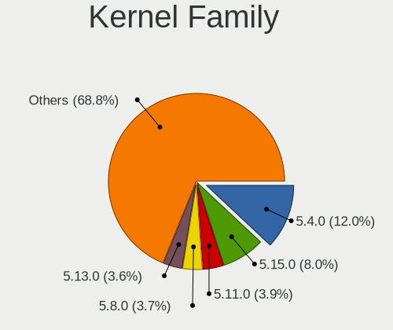
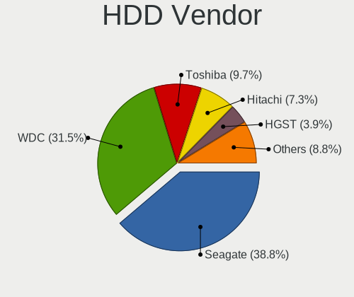
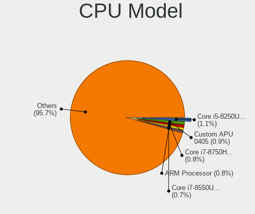
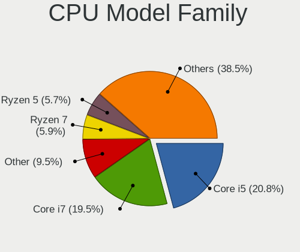
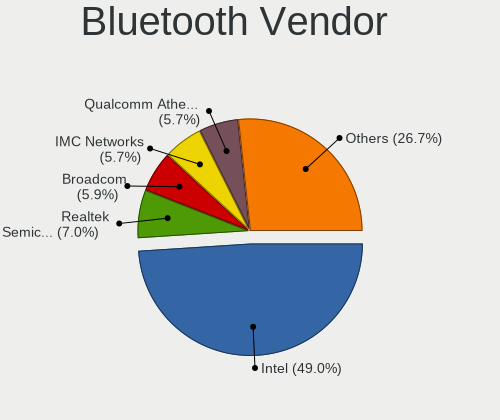
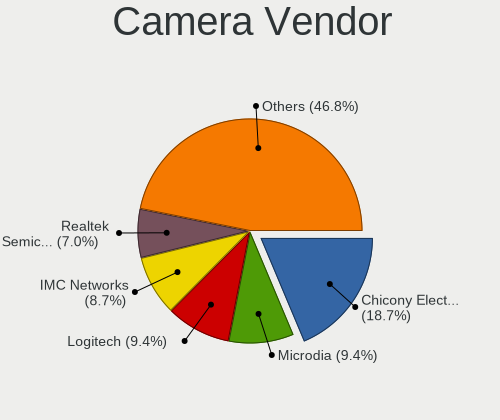

Linux in Canada - Tested Hardware & Statistics
----------------------------------------------

A project to collect tested hardware configurations for Linux in Canada.

Anyone can contribute to this report by the [hw-probe](https://github.com/linuxhw/hw-probe) tool:

    sudo -E hw-probe -all -upload

Please contribute! Especially if your hardware is rare.

This is a report for all computer types. See also reports for [desktops](/Location/Canada/Desktop/README.md) and [notebooks](/Location/Canada/Notebook/README.md).

Contents
--------

* [ Test Cases ](#test-cases)

* [ System ](#system)
  - [ OS                       ](#os)
  - [ OS Family                ](#os-family)
  - [ Kernel                   ](#kernel)
  - [ Kernel Family            ](#kernel-family)
  - [ Kernel Major Ver.        ](#kernel-major-ver)
  - [ Arch                     ](#arch)
  - [ DE                       ](#de)
  - [ Display Server           ](#display-server)
  - [ Display Manager          ](#display-manager)
  - [ OS Lang                  ](#os-lang)
  - [ Boot Mode                ](#boot-mode)
  - [ Filesystem               ](#filesystem)
  - [ Part. scheme             ](#part-scheme)
  - [ Dual Boot with Linux/BSD ](#dual-boot-with-linuxbsd)
  - [ Dual Boot (Win)          ](#dual-boot-win)

* [ Board ](#board)
  - [ Vendor                   ](#vendor)
  - [ Model                    ](#model)
  - [ Model Family             ](#model-family)
  - [ MFG Year                 ](#mfg-year)
  - [ Form Factor              ](#form-factor)
  - [ Secure Boot              ](#secure-boot)
  - [ Coreboot                 ](#coreboot)
  - [ RAM Size                 ](#ram-size)
  - [ RAM Used                 ](#ram-used)
  - [ Total Drives             ](#total-drives)
  - [ Has CD-ROM               ](#has-cd-rom)
  - [ Has Ethernet             ](#has-ethernet)
  - [ Has WiFi                 ](#has-wifi)
  - [ Has Bluetooth            ](#has-bluetooth)

* [ Location ](#location)
  - [ Country                  ](#country)
  - [ City                     ](#city)

* [ Drives ](#drives)
  - [ Drive Vendor             ](#drive-vendor)
  - [ Drive Model              ](#drive-model)
  - [ HDD Vendor               ](#hdd-vendor)
  - [ SSD Vendor               ](#ssd-vendor)
  - [ Drive Kind               ](#drive-kind)
  - [ Drive Connector          ](#drive-connector)
  - [ Drive Size               ](#drive-size)
  - [ Space Total              ](#space-total)
  - [ Space Used               ](#space-used)
  - [ Malfunc. Drives          ](#malfunc-drives)
  - [ Malfunc. Drive Vendor    ](#malfunc-drive-vendor)
  - [ Malfunc. HDD Vendor      ](#malfunc-hdd-vendor)
  - [ Malfunc. Drive Kind      ](#malfunc-drive-kind)
  - [ Failed Drives            ](#failed-drives)
  - [ Failed Drive Vendor      ](#failed-drive-vendor)
  - [ Drive Status             ](#drive-status)

* [ Storage controller ](#storage-controller)
  - [ Storage Vendor           ](#storage-vendor)
  - [ Storage Model            ](#storage-model)
  - [ Storage Kind             ](#storage-kind)

* [ Processor ](#processor)
  - [ CPU Vendor               ](#cpu-vendor)
  - [ CPU Model                ](#cpu-model)
  - [ CPU Model Family         ](#cpu-model-family)
  - [ CPU Cores                ](#cpu-cores)
  - [ CPU Sockets              ](#cpu-sockets)
  - [ CPU Threads              ](#cpu-threads)
  - [ CPU Op-Modes             ](#cpu-op-modes)
  - [ CPU Microcode            ](#cpu-microcode)
  - [ CPU Microarch            ](#cpu-microarch)

* [ Graphics ](#graphics)
  - [ GPU Vendor               ](#gpu-vendor)
  - [ GPU Model                ](#gpu-model)
  - [ GPU Combo                ](#gpu-combo)
  - [ GPU Driver               ](#gpu-driver)
  - [ GPU Memory               ](#gpu-memory)

* [ Monitor ](#monitor)
  - [ Monitor Vendor           ](#monitor-vendor)
  - [ Monitor Model            ](#monitor-model)
  - [ Monitor Resolution       ](#monitor-resolution)
  - [ Monitor Diagonal         ](#monitor-diagonal)
  - [ Monitor Width            ](#monitor-width)
  - [ Aspect Ratio             ](#aspect-ratio)
  - [ Monitor Area             ](#monitor-area)
  - [ Pixel Density            ](#pixel-density)
  - [ Multiple Monitors        ](#multiple-monitors)

* [ Network ](#network)
  - [ Net Controller Vendor    ](#net-controller-vendor)
  - [ Net Controller Model     ](#net-controller-model)
  - [ Wireless Vendor          ](#wireless-vendor)
  - [ Wireless Model           ](#wireless-model)
  - [ Ethernet Vendor          ](#ethernet-vendor)
  - [ Ethernet Model           ](#ethernet-model)
  - [ Net Controller Kind      ](#net-controller-kind)
  - [ Used Controller          ](#used-controller)
  - [ NICs                     ](#nics)
  - [ IPv6                     ](#ipv6)

* [ Bluetooth ](#bluetooth)
  - [ Bluetooth Vendor         ](#bluetooth-vendor)
  - [ Bluetooth Model          ](#bluetooth-model)

* [ Sound ](#sound)
  - [ Sound Vendor             ](#sound-vendor)
  - [ Sound Model              ](#sound-model)

* [ Memory ](#memory)
  - [ Memory Vendor            ](#memory-vendor)
  - [ Memory Model             ](#memory-model)
  - [ Memory Kind              ](#memory-kind)
  - [ Memory Form Factor       ](#memory-form-factor)
  - [ Memory Size              ](#memory-size)
  - [ Memory Speed             ](#memory-speed)

* [ Printers & scanners ](#printers--scanners)
  - [ Printer Vendor           ](#printer-vendor)
  - [ Printer Model            ](#printer-model)
  - [ Scanner Vendor           ](#scanner-vendor)
  - [ Scanner Model            ](#scanner-model)

* [ Camera ](#camera)
  - [ Camera Vendor            ](#camera-vendor)
  - [ Camera Model             ](#camera-model)

* [ Security ](#security)
  - [ Fingerprint Vendor       ](#fingerprint-vendor)
  - [ Fingerprint Model        ](#fingerprint-model)
  - [ Chipcard Vendor          ](#chipcard-vendor)
  - [ Chipcard Model           ](#chipcard-model)

* [ Unsupported ](#unsupported)
  - [ Unsupported Devices      ](#unsupported-devices)
  - [ Unsupported Device Types ](#unsupported-device-types)

Test Cases
----------

Total: 12470

| Vendor        | Model                       | Form-Factor | Probe                                                      | Date         |
|---------------|-----------------------------|-------------|------------------------------------------------------------|--------------|
| Lenovo        | 0B98401 PRO                 | Desktop     | [319423b279](https://linux-hardware.org/?probe=319423b279) | Jan 06, 2025 |
| ASUSTek       | K30BF_M32BF_A_F_K31BF_6     | Desktop     | [0b29006a62](https://linux-hardware.org/?probe=0b29006a62) | Jan 06, 2025 |
| Google        | Cret                        | Notebook    | [bc8e7edac4](https://linux-hardware.org/?probe=bc8e7edac4) | Jan 05, 2025 |
| Samsung       | 900X3C/900X4C/900X4D        | Notebook    | [cbe6ed9631](https://linux-hardware.org/?probe=cbe6ed9631) | Jan 05, 2025 |
| Dell          | Inspiron 15-3567            | Notebook    | [c661f75c0f](https://linux-hardware.org/?probe=c661f75c0f) | Jan 05, 2025 |
| Bosgame       | ARB37                       | Desktop     | [8785fe342f](https://linux-hardware.org/?probe=8785fe342f) | Jan 05, 2025 |
| Gigabyte      | GA-970A-D3                  | Desktop     | [cd33aa866c](https://linux-hardware.org/?probe=cd33aa866c) | Jan 05, 2025 |
| ASUSTek       | H110M-E/M.2                 | Desktop     | [ff2e84ab02](https://linux-hardware.org/?probe=ff2e84ab02) | Jan 05, 2025 |
| Gigabyte      | X570 AORUS ELITE WIFI       | Desktop     | [d80a8fd406](https://linux-hardware.org/?probe=d80a8fd406) | Jan 05, 2025 |
| Sony          | SVD112290S                  | Notebook    | [a9400fd190](https://linux-hardware.org/?probe=a9400fd190) | Jan 05, 2025 |
| Apple         | MacBookPro11,1              | Notebook    | [e994e68b69](https://linux-hardware.org/?probe=e994e68b69) | Jan 05, 2025 |
| Valve         | Jupiter                     | Notebook    | [7b2eb9a0e9](https://linux-hardware.org/?probe=7b2eb9a0e9) | Jan 05, 2025 |
| Gigabyte      | G41MT-S2PT                  | Desktop     | [d4592a5f61](https://linux-hardware.org/?probe=d4592a5f61) | Jan 05, 2025 |
| Lenovo        | ThinkPad T480 20L5S1S000    | Notebook    | [c35541e56b](https://linux-hardware.org/?probe=c35541e56b) | Jan 05, 2025 |
| Framework     | Laptop 16 (AMD Ryzen 704... | Notebook    | [0bff2b1d13](https://linux-hardware.org/?probe=0bff2b1d13) | Jan 04, 2025 |
| Valve         | Jupiter                     | Notebook    | [5786386be1](https://linux-hardware.org/?probe=5786386be1) | Jan 04, 2025 |
| HP            | Laptop 15-ef3xxx            | Notebook    | [990ef26285](https://linux-hardware.org/?probe=990ef26285) | Jan 04, 2025 |
| Supermicro    | X9DRH-7TF/7F/iTF/iF         | Server      | [ca71a1b4d6](https://linux-hardware.org/?probe=ca71a1b4d6) | Jan 04, 2025 |
| Apple         | MacBookPro11,1              | Notebook    | [370a49426e](https://linux-hardware.org/?probe=370a49426e) | Jan 04, 2025 |
| Dell          | Inspiron 5480               | Notebook    | [23f4e47841](https://linux-hardware.org/?probe=23f4e47841) | Jan 04, 2025 |
| ASUSTek       | G75VW                       | Notebook    | [ff570669d5](https://linux-hardware.org/?probe=ff570669d5) | Jan 04, 2025 |
| Acer          | Aspire X1470                | Desktop     | [e645634cdf](https://linux-hardware.org/?probe=e645634cdf) | Jan 04, 2025 |
| ABIT          | AT8 32X                     | Desktop     | [e613a45614](https://linux-hardware.org/?probe=e613a45614) | Jan 03, 2025 |
| Acer          | Aspire X1470                | Desktop     | [5546dd82bb](https://linux-hardware.org/?probe=5546dd82bb) | Jan 03, 2025 |
| HP            | EliteBook x360 1030 G4      | Convertible | [94936f9666](https://linux-hardware.org/?probe=94936f9666) | Jan 03, 2025 |
| MSI           | PRO B650-S WIFI             | Desktop     | [bf20a2de9e](https://linux-hardware.org/?probe=bf20a2de9e) | Jan 03, 2025 |
| HP            | Laptop 15-fd0xxx            | Notebook    | [dfd9d16913](https://linux-hardware.org/?probe=dfd9d16913) | Jan 03, 2025 |
| Google        | Dragonair                   | Notebook    | [69b034d6b7](https://linux-hardware.org/?probe=69b034d6b7) | Jan 03, 2025 |
| Lenovo        | Legion Pro 5 16ARX8 82WM    | Notebook    | [427c508e21](https://linux-hardware.org/?probe=427c508e21) | Jan 03, 2025 |
| Apple         | MacBookPro8,1               | Notebook    | [c208215b7f](https://linux-hardware.org/?probe=c208215b7f) | Jan 03, 2025 |
| Microsoft     | Surface Laptop Go           | Tablet      | [d8b0dbe711](https://linux-hardware.org/?probe=d8b0dbe711) | Jan 03, 2025 |
| System76      | Oryx Pro                    | Notebook    | [3e45c3caac](https://linux-hardware.org/?probe=3e45c3caac) | Jan 02, 2025 |
| MSI           | PRO B650-VC WIFI II         | Desktop     | [a86933b617](https://linux-hardware.org/?probe=a86933b617) | Jan 02, 2025 |
| MSI           | B350M MORTAR                | Desktop     | [f946508536](https://linux-hardware.org/?probe=f946508536) | Jan 02, 2025 |
| Raspberry ... | Raspberry Pi 5 Model B R... | Soc         | [d769297945](https://linux-hardware.org/?probe=d769297945) | Jan 02, 2025 |
| HP            | OmniBook Ultra Flip Lapt... | Convertible | [5f2a3c878a](https://linux-hardware.org/?probe=5f2a3c878a) | Jan 02, 2025 |
| MSI           | MPG B760I EDGE WIFI         | Desktop     | [8d39826a67](https://linux-hardware.org/?probe=8d39826a67) | Jan 02, 2025 |
| Acer          | Aspire 5750                 | Notebook    | [879127efc6](https://linux-hardware.org/?probe=879127efc6) | Jan 01, 2025 |
| ASUSTek       | TUF Gaming FX505GT_FX505... | Notebook    | [4690fd028c](https://linux-hardware.org/?probe=4690fd028c) | Jan 01, 2025 |
| ASUSTek       | ASUS TUF Gaming A17 FA70... | Notebook    | [110e5ff032](https://linux-hardware.org/?probe=110e5ff032) | Jan 01, 2025 |
| MSI           | 970 GAMING                  | Desktop     | [c77ab27b22](https://linux-hardware.org/?probe=c77ab27b22) | Jan 01, 2025 |
| Microsoft     | Surface Pro 7               | Tablet      | [6fa9a75b00](https://linux-hardware.org/?probe=6fa9a75b00) | Jan 01, 2025 |
| ASUSTek       | ROG STRIX B450-F GAMING ... | Desktop     | [29a8b52eec](https://linux-hardware.org/?probe=29a8b52eec) | Jan 01, 2025 |
| MSI           | MAG B650 TOMAHAWK WIFI      | Desktop     | [f3b82ea58b](https://linux-hardware.org/?probe=f3b82ea58b) | Jan 01, 2025 |
| Intel         | DH87RL AAG74240-402         | Desktop     | [047af1c88e](https://linux-hardware.org/?probe=047af1c88e) | Jan 01, 2025 |
| HP            | 2AF3                        | Desktop     | [27a5a9b662](https://linux-hardware.org/?probe=27a5a9b662) | Jan 01, 2025 |
| ASUSTek       | ROG STRIX B550-F GAMING     | Desktop     | [9802b59126](https://linux-hardware.org/?probe=9802b59126) | Jan 01, 2025 |
| ASUSTek       | P5Q SE PLUS                 | Desktop     | [2e5a12a36b](https://linux-hardware.org/?probe=2e5a12a36b) | Jan 01, 2025 |
| Foxconn       | 2AB1                        | Desktop     | [d937af7e89](https://linux-hardware.org/?probe=d937af7e89) | Jan 01, 2025 |
| Acer          | Aspire 5742                 | Notebook    | [aa9170d15a](https://linux-hardware.org/?probe=aa9170d15a) | Dec 31, 2024 |
| Gigabyte      | H81M-S2PH                   | Desktop     | [8e18f9641a](https://linux-hardware.org/?probe=8e18f9641a) | Dec 31, 2024 |
| ASUSTek       | TUF Gaming Z790-PLUS WIF... | Desktop     | [cdbb6290eb](https://linux-hardware.org/?probe=cdbb6290eb) | Dec 31, 2024 |
| Acer          | Veriton X490G               | Desktop     | [0ce5ae0e9c](https://linux-hardware.org/?probe=0ce5ae0e9c) | Dec 31, 2024 |
| ASUSTek       | Strix 15 GL503GE            | Notebook    | [3cf042bf3f](https://linux-hardware.org/?probe=3cf042bf3f) | Dec 31, 2024 |
| Gigabyte      | GA-MA790GP-DS4H             | Desktop     | [ba9e4bcced](https://linux-hardware.org/?probe=ba9e4bcced) | Dec 31, 2024 |
| ASUSTek       | ROG STRIX B650E-I GAMING... | Desktop     | [a66ac9e217](https://linux-hardware.org/?probe=a66ac9e217) | Dec 31, 2024 |
| ASUSTek       | TUF Gaming B550-PLUS WIF... | Desktop     | [9f7d158933](https://linux-hardware.org/?probe=9f7d158933) | Dec 30, 2024 |
| ASUSTek       | P5GZ-MX                     | Desktop     | [62e974ebee](https://linux-hardware.org/?probe=62e974ebee) | Dec 30, 2024 |
| Microsoft     | Surface Go 3                | Tablet      | [2ea57d017c](https://linux-hardware.org/?probe=2ea57d017c) | Dec 30, 2024 |
| HP            | Stream Notebook PC 13       | Notebook    | [ea9dccd4a8](https://linux-hardware.org/?probe=ea9dccd4a8) | Dec 30, 2024 |
| MSI           | 990FXA-GD80                 | Desktop     | [8b2f125314](https://linux-hardware.org/?probe=8b2f125314) | Dec 30, 2024 |
| ASUSTek       | ROG STRIX B650E-F GAMING... | Desktop     | [2bd762eeb7](https://linux-hardware.org/?probe=2bd762eeb7) | Dec 30, 2024 |
| Framework     | Laptop 13 (AMD Ryzen 704... | Notebook    | [be80695174](https://linux-hardware.org/?probe=be80695174) | Dec 30, 2024 |
| Dell          | Inspiron 11 - 3147          | Notebook    | [3dbf865efb](https://linux-hardware.org/?probe=3dbf865efb) | Dec 30, 2024 |
| ASUSTek       | ROG Maximus X HERO          | Desktop     | [be780cbd32](https://linux-hardware.org/?probe=be780cbd32) | Dec 30, 2024 |
| Apple         | MacBookPro5,5               | Notebook    | [843455b524](https://linux-hardware.org/?probe=843455b524) | Dec 29, 2024 |
| Dell          | 02YYK5 A01                  | Desktop     | [2a39e2e698](https://linux-hardware.org/?probe=2a39e2e698) | Dec 29, 2024 |
| Acer          | Nitro AN517-52              | Notebook    | [693e1ff47b](https://linux-hardware.org/?probe=693e1ff47b) | Dec 29, 2024 |
| Acer          | Nitro AN517-52              | Notebook    | [9208846c2a](https://linux-hardware.org/?probe=9208846c2a) | Dec 29, 2024 |
| Apple         | MacBookPro14,3              | Notebook    | [1e7c1552f8](https://linux-hardware.org/?probe=1e7c1552f8) | Dec 29, 2024 |
| ASUSTek       | Z97-K                       | Desktop     | [53f0c1c555](https://linux-hardware.org/?probe=53f0c1c555) | Dec 29, 2024 |
| Gigabyte      | Z97X-Gaming 5               | Desktop     | [dc533b139f](https://linux-hardware.org/?probe=dc533b139f) | Dec 29, 2024 |
| ASUSTek       | K501UB                      | Notebook    | [2654326cc1](https://linux-hardware.org/?probe=2654326cc1) | Dec 29, 2024 |
| Lenovo        | ThinkPad T470 W10DG 20JN... | Notebook    | [128dfc3b06](https://linux-hardware.org/?probe=128dfc3b06) | Dec 29, 2024 |
| Gigabyte      | B550 AORUS ELITE AX V3      | Desktop     | [3ff4946888](https://linux-hardware.org/?probe=3ff4946888) | Dec 29, 2024 |
| HP            | 3397                        | Desktop     | [e063572f7c](https://linux-hardware.org/?probe=e063572f7c) | Dec 28, 2024 |
| Microsoft     | Surface Laptop Go           | Tablet      | [e8a02613fb](https://linux-hardware.org/?probe=e8a02613fb) | Dec 28, 2024 |
| Lenovo        | G585 20137                  | Notebook    | [28c0d1589f](https://linux-hardware.org/?probe=28c0d1589f) | Dec 28, 2024 |
| Microsoft     | Surface Laptop Go           | Tablet      | [b28b752646](https://linux-hardware.org/?probe=b28b752646) | Dec 28, 2024 |
| Lenovo        | G585 20137                  | Notebook    | [77d7e4f41b](https://linux-hardware.org/?probe=77d7e4f41b) | Dec 28, 2024 |
| Pegatron      | Benicia                     | Desktop     | [e061c1cadc](https://linux-hardware.org/?probe=e061c1cadc) | Dec 28, 2024 |
| ASUSTek       | VivoBook_ASUSLaptop M370... | Notebook    | [374d7bf403](https://linux-hardware.org/?probe=374d7bf403) | Dec 28, 2024 |
| MSI           | B350M MORTAR                | Desktop     | [8f912c3cb7](https://linux-hardware.org/?probe=8f912c3cb7) | Dec 28, 2024 |
| Dell          | 0R790T A00                  | Desktop     | [e4545e5825](https://linux-hardware.org/?probe=e4545e5825) | Dec 28, 2024 |
| Dell          | 096JG8 A01                  | Desktop     | [4324dc90bf](https://linux-hardware.org/?probe=4324dc90bf) | Dec 28, 2024 |
| HP            | 8462                        | Desktop     | [d0e8315b62](https://linux-hardware.org/?probe=d0e8315b62) | Dec 28, 2024 |
| Microsoft     | Surface Pro 7               | Tablet      | [39a701d7b2](https://linux-hardware.org/?probe=39a701d7b2) | Dec 28, 2024 |
| Microsoft     | Surface Pro 7               | Tablet      | [8c04767880](https://linux-hardware.org/?probe=8c04767880) | Dec 28, 2024 |
| Valve         | Galileo                     | Notebook    | [b45df4045a](https://linux-hardware.org/?probe=b45df4045a) | Dec 28, 2024 |
| HP            | Stream Notebook PC 13       | Notebook    | [b31f0109e7](https://linux-hardware.org/?probe=b31f0109e7) | Dec 27, 2024 |
| ASUSTek       | TUF Gaming B550M-ZAKU       | Desktop     | [2f86029430](https://linux-hardware.org/?probe=2f86029430) | Dec 27, 2024 |
| HP            | EliteBook x360 1030 G2      | Convertible | [79016b31bb](https://linux-hardware.org/?probe=79016b31bb) | Dec 27, 2024 |
| Apple         | Mac-27ADBB7B4CEE8E61 iMa... | All in one  | [a0df3d57ee](https://linux-hardware.org/?probe=a0df3d57ee) | Dec 27, 2024 |
| MSI           | B550M PRO-VDH WIFI          | Desktop     | [27f73d7e4e](https://linux-hardware.org/?probe=27f73d7e4e) | Dec 27, 2024 |
| Dell          | 05XGC8 A01                  | Desktop     | [59297e30b7](https://linux-hardware.org/?probe=59297e30b7) | Dec 27, 2024 |
| Dell          | 05XGC8 A01                  | Desktop     | [4714a00d4c](https://linux-hardware.org/?probe=4714a00d4c) | Dec 27, 2024 |
| Morshow       | CB01 V100                   | Notebook    | [0f58cef0a2](https://linux-hardware.org/?probe=0f58cef0a2) | Dec 27, 2024 |
| Dell          | Latitude E5570              | Notebook    | [114a071bc2](https://linux-hardware.org/?probe=114a071bc2) | Dec 27, 2024 |
| Google        | Voxel                       | Notebook    | [32b3903455](https://linux-hardware.org/?probe=32b3903455) | Dec 26, 2024 |
| Foxconn       | 2AB1                        | Desktop     | [70925114c3](https://linux-hardware.org/?probe=70925114c3) | Dec 26, 2024 |
| MSI           | MAG X570 TOMAHAWK WIFI      | Desktop     | [1a60e8fb7a](https://linux-hardware.org/?probe=1a60e8fb7a) | Dec 26, 2024 |
| Lenovo        | Slim 7 14IMH9 83D8          | Notebook    | [fd059b501d](https://linux-hardware.org/?probe=fd059b501d) | Dec 26, 2024 |
| Lenovo        | ThinkPad T16 Gen 3 21MN0... | Notebook    | [de8cfa5271](https://linux-hardware.org/?probe=de8cfa5271) | Dec 26, 2024 |
| ASRock        | B650M Pro RS WiFi           | Desktop     | [368bda5cc8](https://linux-hardware.org/?probe=368bda5cc8) | Dec 26, 2024 |
| HP            | Laptop 15-fd0xxx            | Notebook    | [1ed7f7ef48](https://linux-hardware.org/?probe=1ed7f7ef48) | Dec 26, 2024 |
| Valve         | Galileo                     | Notebook    | [9f19e784e4](https://linux-hardware.org/?probe=9f19e784e4) | Dec 26, 2024 |
| Dell          | Latitude 5480               | Notebook    | [a43c9feb6e](https://linux-hardware.org/?probe=a43c9feb6e) | Dec 26, 2024 |
| Dell          | Latitude 5480               | Notebook    | [b0b2a919ce](https://linux-hardware.org/?probe=b0b2a919ce) | Dec 25, 2024 |
| System76      | Oryx Pro                    | Notebook    | [336ade52bd](https://linux-hardware.org/?probe=336ade52bd) | Dec 25, 2024 |
| ASUSTek       | TUF Gaming B550M-PLUS       | Desktop     | [bcd19d252b](https://linux-hardware.org/?probe=bcd19d252b) | Dec 25, 2024 |
| ASUSTek       | ASUS TUF Gaming F15 FX50... | Notebook    | [b127afa2e4](https://linux-hardware.org/?probe=b127afa2e4) | Dec 25, 2024 |
| Apple         | MacBookPro12,1              | Notebook    | [face1f6c37](https://linux-hardware.org/?probe=face1f6c37) | Dec 25, 2024 |
| ASUSTek       | UX305CA                     | Notebook    | [73bb2289d6](https://linux-hardware.org/?probe=73bb2289d6) | Dec 25, 2024 |
| Acer          | Extensa 5630                | Notebook    | [f522d51182](https://linux-hardware.org/?probe=f522d51182) | Dec 25, 2024 |
| Gigabyte      | Z390 UD                     | Desktop     | [bbcf88b5f3](https://linux-hardware.org/?probe=bbcf88b5f3) | Dec 25, 2024 |
| ASUSTek       | PRIME Z390-A                | Desktop     | [1202e9754d](https://linux-hardware.org/?probe=1202e9754d) | Dec 25, 2024 |
| Toshiba       | Satellite P70-A             | Notebook    | [a428e828ad](https://linux-hardware.org/?probe=a428e828ad) | Dec 24, 2024 |
| ASUSTek       | UX305CA                     | Notebook    | [88a69fd398](https://linux-hardware.org/?probe=88a69fd398) | Dec 24, 2024 |
| Gigabyte      | B450 AORUS M                | Desktop     | [df8f0ba147](https://linux-hardware.org/?probe=df8f0ba147) | Dec 24, 2024 |
| Gigabyte      | EP45-DS3R                   | Desktop     | [a27723c275](https://linux-hardware.org/?probe=a27723c275) | Dec 24, 2024 |
| Dell          | 06FW8P A02                  | Desktop     | [42c00b7a8a](https://linux-hardware.org/?probe=42c00b7a8a) | Dec 24, 2024 |
| ASUSTek       | G771JM                      | Notebook    | [f76a116151](https://linux-hardware.org/?probe=f76a116151) | Dec 24, 2024 |
| Wistron       | ProLiant ML110 G6           | Desktop     | [1609625a37](https://linux-hardware.org/?probe=1609625a37) | Dec 24, 2024 |
| ASUSTek       | P5K Deluxe                  | Desktop     | [af438d2cae](https://linux-hardware.org/?probe=af438d2cae) | Dec 23, 2024 |
| Acer          | RS780HVF                    | Desktop     | [bbc9e843db](https://linux-hardware.org/?probe=bbc9e843db) | Dec 23, 2024 |
| Dell          | 0M6C7G A00                  | Desktop     | [375865cd09](https://linux-hardware.org/?probe=375865cd09) | Dec 23, 2024 |
| HP            | 8462                        | Desktop     | [4837f873a4](https://linux-hardware.org/?probe=4837f873a4) | Dec 23, 2024 |
| Dell          | Latitude E6520              | Notebook    | [2bae6e63bb](https://linux-hardware.org/?probe=2bae6e63bb) | Dec 23, 2024 |
| Lenovo        | ThinkPad T470p 20J6003KU... | Notebook    | [624bca4c57](https://linux-hardware.org/?probe=624bca4c57) | Dec 23, 2024 |
| Acer          | Aspire 5517                 | Notebook    | [e8dbb7c265](https://linux-hardware.org/?probe=e8dbb7c265) | Dec 23, 2024 |
| MSI           | PRO B760M-P DDR4            | Desktop     | [a649caaa82](https://linux-hardware.org/?probe=a649caaa82) | Dec 23, 2024 |
| ASUSTek       | P8Z77-V LE                  | Desktop     | [468d9fdcd3](https://linux-hardware.org/?probe=468d9fdcd3) | Dec 22, 2024 |
| ASUSTek       | Pro B760M-CT                | Notebook    | [d2a2cc2c88](https://linux-hardware.org/?probe=d2a2cc2c88) | Dec 22, 2024 |
| Framework     | Laptop 16 (AMD Ryzen 704... | Notebook    | [191b32e3f0](https://linux-hardware.org/?probe=191b32e3f0) | Dec 22, 2024 |
| ASUSTek       | VivoBook 14_ASUS Laptop ... | Notebook    | [518ed41c8b](https://linux-hardware.org/?probe=518ed41c8b) | Dec 21, 2024 |
| Gigabyte      | F2A85XM-D3H                 | Desktop     | [5d6d1c59a4](https://linux-hardware.org/?probe=5d6d1c59a4) | Dec 21, 2024 |
| ASUSTek       | Zenbook UX8402ZA_UX8402Z... | Notebook    | [4043d79598](https://linux-hardware.org/?probe=4043d79598) | Dec 21, 2024 |
| Raspberry ... | Raspberry Pi 5 Model B R... | Soc         | [894916e9cc](https://linux-hardware.org/?probe=894916e9cc) | Dec 21, 2024 |
| ONE-NETBOO... | ONEMIX5                     | Notebook    | [4a3a1d7980](https://linux-hardware.org/?probe=4a3a1d7980) | Dec 21, 2024 |
| MSI           | PRO B650M-A WIFI            | Desktop     | [8cd738bd8a](https://linux-hardware.org/?probe=8cd738bd8a) | Dec 21, 2024 |
| Lenovo        | ThinkPad T420s 417152U      | Notebook    | [40ecec91ca](https://linux-hardware.org/?probe=40ecec91ca) | Dec 21, 2024 |
| ASUSTek       | X555QA                      | Notebook    | [9d4e896d0e](https://linux-hardware.org/?probe=9d4e896d0e) | Dec 21, 2024 |
| HP            | 81C5 MVB                    | Desktop     | [77cb2466d4](https://linux-hardware.org/?probe=77cb2466d4) | Dec 21, 2024 |
| Gigabyte      | X570 AORUS PRO WIFI         | Desktop     | [9d2496eed1](https://linux-hardware.org/?probe=9d2496eed1) | Dec 21, 2024 |
| HP            | Laptop 15-ef2xxx            | Notebook    | [f2b2c52113](https://linux-hardware.org/?probe=f2b2c52113) | Dec 20, 2024 |
| Dell          | Latitude E7270              | Notebook    | [167298428e](https://linux-hardware.org/?probe=167298428e) | Dec 20, 2024 |
| ASUSTek       | VivoBook_ASUSLaptop M370... | Notebook    | [b52bea9b5c](https://linux-hardware.org/?probe=b52bea9b5c) | Dec 20, 2024 |
| ASUSTek       | ROG STRIX Z390-I GAMING     | Desktop     | [b202efa3e6](https://linux-hardware.org/?probe=b202efa3e6) | Dec 20, 2024 |
| Gigabyte      | H81M-H                      | Desktop     | [c89e4827ed](https://linux-hardware.org/?probe=c89e4827ed) | Dec 20, 2024 |
| Acer          | Aspire A315-24P             | Notebook    | [a52fe2c4c9](https://linux-hardware.org/?probe=a52fe2c4c9) | Dec 20, 2024 |
| ASUSTek       | PRIME B450M-A               | Desktop     | [6c13efa61f](https://linux-hardware.org/?probe=6c13efa61f) | Dec 20, 2024 |
| ASUSTek       | Q524UQK                     | Convertible | [0c7616b062](https://linux-hardware.org/?probe=0c7616b062) | Dec 20, 2024 |
| Lenovo        | ThinkPad L15 Gen 2a 20X7... | Notebook    | [2d8b5119a7](https://linux-hardware.org/?probe=2d8b5119a7) | Dec 19, 2024 |
| ASUSTek       | ZenBook UX462DA             | Convertible | [39ebcb09cb](https://linux-hardware.org/?probe=39ebcb09cb) | Dec 19, 2024 |
| Unknown       | Unknown                     | Desktop     | [ee566f8f11](https://linux-hardware.org/?probe=ee566f8f11) | Dec 19, 2024 |
| Lenovo        | 3136 SDK0J40697 WIN 3305... | Mini pc     | [856e7958e3](https://linux-hardware.org/?probe=856e7958e3) | Dec 19, 2024 |
| Lenovo        | ThinkPad X1 Carbon 2nd 2... | Notebook    | [5b148e6851](https://linux-hardware.org/?probe=5b148e6851) | Dec 19, 2024 |
| Gigabyte      | H370M DS3H-CF               | Desktop     | [8eb604caeb](https://linux-hardware.org/?probe=8eb604caeb) | Dec 19, 2024 |
| Acer          | Aspire A515-45              | Notebook    | [3cd12c751c](https://linux-hardware.org/?probe=3cd12c751c) | Dec 19, 2024 |
| Acer          | Aspire A515-57              | Notebook    | [5872cea5da](https://linux-hardware.org/?probe=5872cea5da) | Dec 19, 2024 |
| ASUSTek       | S451LA                      | Notebook    | [a766d0caae](https://linux-hardware.org/?probe=a766d0caae) | Dec 19, 2024 |
| Lenovo        | ThinkPad X230 2324DL5       | Notebook    | [155f2f1e8f](https://linux-hardware.org/?probe=155f2f1e8f) | Dec 18, 2024 |
| Apple         | Mac-F4238CC8 PVT            | All in one  | [3743326c9a](https://linux-hardware.org/?probe=3743326c9a) | Dec 18, 2024 |
| Acer          | Aspire A515-45              | Notebook    | [67b8e4d3e7](https://linux-hardware.org/?probe=67b8e4d3e7) | Dec 18, 2024 |
| MSI           | C236A WORKSTATION           | Desktop     | [49ab170cda](https://linux-hardware.org/?probe=49ab170cda) | Dec 18, 2024 |
| Intel         | IPC-ADN2L                   | Desktop     | [456aa729c1](https://linux-hardware.org/?probe=456aa729c1) | Dec 18, 2024 |
| MSI           | C236A WORKSTATION           | Desktop     | [ddec979f1d](https://linux-hardware.org/?probe=ddec979f1d) | Dec 18, 2024 |
| Dell          | 02YYK5 A01                  | Desktop     | [160fadff40](https://linux-hardware.org/?probe=160fadff40) | Dec 18, 2024 |
| Apple         | MacBookPro8,1               | Notebook    | [08044442cf](https://linux-hardware.org/?probe=08044442cf) | Dec 18, 2024 |
| Apple         | MacBookPro13,3              | Notebook    | [25b2cf9a59](https://linux-hardware.org/?probe=25b2cf9a59) | Dec 18, 2024 |
| MSI           | B150 GAMING M3              | Desktop     | [eb7d688010](https://linux-hardware.org/?probe=eb7d688010) | Dec 18, 2024 |
| Apple         | MacBookPro9,2               | Notebook    | [c33a85fd8c](https://linux-hardware.org/?probe=c33a85fd8c) | Dec 18, 2024 |
| Lenovo        | ThinkPad P14s Gen 2a 21A... | Notebook    | [2ab8cdb946](https://linux-hardware.org/?probe=2ab8cdb946) | Dec 18, 2024 |
| ASUSTek       | X99-A                       | Desktop     | [69f91227bf](https://linux-hardware.org/?probe=69f91227bf) | Dec 18, 2024 |
| Dell          | 0MWYPT A02                  | Desktop     | [ee147a7018](https://linux-hardware.org/?probe=ee147a7018) | Dec 18, 2024 |
| Lenovo        | ThinkPad Yoga 11e 5th Ge... | Convertible | [a1c5f23bbe](https://linux-hardware.org/?probe=a1c5f23bbe) | Dec 17, 2024 |
| Lenovo        | 1064 SDK0T76528 WIN 3556... | Desktop     | [f140f9811e](https://linux-hardware.org/?probe=f140f9811e) | Dec 17, 2024 |
| Lenovo        | ThinkPad E15 20RD005HUS     | Notebook    | [eadc7945cf](https://linux-hardware.org/?probe=eadc7945cf) | Dec 17, 2024 |
| ASUSTek       | TUF Gaming X570-PLUS        | Desktop     | [3830383cb9](https://linux-hardware.org/?probe=3830383cb9) | Dec 17, 2024 |
| MSI           | MPG X570 GAMING PLUS        | Desktop     | [a157381033](https://linux-hardware.org/?probe=a157381033) | Dec 17, 2024 |
| Gigabyte      | X870 EAGLE WIFI7            | Desktop     | [0b96421b6c](https://linux-hardware.org/?probe=0b96421b6c) | Dec 17, 2024 |
| Apple         | Mac-AA95B1DDAB278B95 iMa... | All in one  | [1877b2792f](https://linux-hardware.org/?probe=1877b2792f) | Dec 17, 2024 |
| Lenovo        | SHARKBAY SDK0E50512 STD     | Desktop     | [c3e53139a7](https://linux-hardware.org/?probe=c3e53139a7) | Dec 17, 2024 |
| Acer          | Nitro AN515-54              | Notebook    | [071a512314](https://linux-hardware.org/?probe=071a512314) | Dec 17, 2024 |
| HP            | 1494                        | Desktop     | [4af4907cff](https://linux-hardware.org/?probe=4af4907cff) | Dec 16, 2024 |
| ASUSTek       | ROG Zephyrus G15 GA503RW... | Notebook    | [20bb7981c5](https://linux-hardware.org/?probe=20bb7981c5) | Dec 16, 2024 |
| ASUSTek       | ROG Zephyrus G15 GA503RW... | Notebook    | [5211e1329e](https://linux-hardware.org/?probe=5211e1329e) | Dec 16, 2024 |
| Apple         | Mac-F2268DAE                | All in one  | [36dda8a551](https://linux-hardware.org/?probe=36dda8a551) | Dec 16, 2024 |
| Apple         | MacBookPro12,1              | Notebook    | [097b2599f4](https://linux-hardware.org/?probe=097b2599f4) | Dec 16, 2024 |
| Apple         | Mac-F2268DAE                | All in one  | [c79509f24f](https://linux-hardware.org/?probe=c79509f24f) | Dec 16, 2024 |
| Valve         | Jupiter                     | Notebook    | [246668e9eb](https://linux-hardware.org/?probe=246668e9eb) | Dec 16, 2024 |
| Lenovo        | SHARKBAY SDK0E50510 WIN     | Desktop     | [781fc0f1cb](https://linux-hardware.org/?probe=781fc0f1cb) | Dec 16, 2024 |
| MSI           | GT73EVR 7RD                 | Notebook    | [c3321b8ab3](https://linux-hardware.org/?probe=c3321b8ab3) | Dec 16, 2024 |
| Acer          | Swift SF314-71              | Notebook    | [a9466608b7](https://linux-hardware.org/?probe=a9466608b7) | Dec 15, 2024 |
| ASUSTek       | VivoBook_ASUSLaptop S540... | Notebook    | [68a46993af](https://linux-hardware.org/?probe=68a46993af) | Dec 15, 2024 |
| Dell          | Inspiron 15 3525            | Notebook    | [53c39cb514](https://linux-hardware.org/?probe=53c39cb514) | Dec 15, 2024 |
| ASRock        | X399 Taichi                 | Desktop     | [d271480a05](https://linux-hardware.org/?probe=d271480a05) | Dec 15, 2024 |
| Dell          | 0WR1RF A05                  | Desktop     | [dfe93dbaf4](https://linux-hardware.org/?probe=dfe93dbaf4) | Dec 15, 2024 |
| ASUSTek       | ROG STRIX B450-F GAMING ... | Desktop     | [3058988b56](https://linux-hardware.org/?probe=3058988b56) | Dec 15, 2024 |
| ASUSTek       | K56CA                       | Notebook    | [89f8be5027](https://linux-hardware.org/?probe=89f8be5027) | Dec 15, 2024 |
| Lenovo        | ThinkPad E580 20KS003NUS    | Notebook    | [91c13c46a5](https://linux-hardware.org/?probe=91c13c46a5) | Dec 15, 2024 |
| Lenovo        | ThinkPad E580 20KS003NUS    | Notebook    | [24c4028783](https://linux-hardware.org/?probe=24c4028783) | Dec 14, 2024 |
| Intel         | X99 V1.0                    | Desktop     | [8819c1d648](https://linux-hardware.org/?probe=8819c1d648) | Dec 14, 2024 |
| ASUSTek       | TUF Gaming B650M-E WIFI     | Desktop     | [2a73c0dba0](https://linux-hardware.org/?probe=2a73c0dba0) | Dec 14, 2024 |
| ASUSTek       | ROG STRIX B550-A GAMING     | Desktop     | [4f591d2875](https://linux-hardware.org/?probe=4f591d2875) | Dec 14, 2024 |
| Dell          | Latitude 7480               | Notebook    | [212326b778](https://linux-hardware.org/?probe=212326b778) | Dec 14, 2024 |
| ASUSTek       | K501UB                      | Notebook    | [9bb21014e6](https://linux-hardware.org/?probe=9bb21014e6) | Dec 14, 2024 |
| Gigabyte      | EP43-DS3L                   | Desktop     | [8e265a79bd](https://linux-hardware.org/?probe=8e265a79bd) | Dec 14, 2024 |
| Acer          | Aspire A315-42              | Notebook    | [d4fd429558](https://linux-hardware.org/?probe=d4fd429558) | Dec 13, 2024 |
| Lenovo        | ThinkBook 14 G6 ABP 21KJ    | Notebook    | [7b878d7d0b](https://linux-hardware.org/?probe=7b878d7d0b) | Dec 13, 2024 |
| Apple         | MacBookPro11,3              | Notebook    | [89e566e2cc](https://linux-hardware.org/?probe=89e566e2cc) | Dec 13, 2024 |
| Apple         | MacBookPro11,3              | Notebook    | [ad546ac102](https://linux-hardware.org/?probe=ad546ac102) | Dec 13, 2024 |
| Panasonic     | CF-191DCSG1M                | Notebook    | [c607411b91](https://linux-hardware.org/?probe=c607411b91) | Dec 13, 2024 |
| Apple         | Mac-CFF7D910A743CAAF iMa... | All in one  | [e4774620da](https://linux-hardware.org/?probe=e4774620da) | Dec 13, 2024 |
| MSI           | MPG X570 GAMING PLUS        | Desktop     | [231ffcb252](https://linux-hardware.org/?probe=231ffcb252) | Dec 13, 2024 |
| Lenovo        | SHARKBAY SDK0E50510 PRO     | Desktop     | [8ece88c179](https://linux-hardware.org/?probe=8ece88c179) | Dec 13, 2024 |
| Panasonic     | CF-191DCSG1M                | Notebook    | [471033b960](https://linux-hardware.org/?probe=471033b960) | Dec 13, 2024 |
| Lenovo        | ThinkPad T480 20L6S6WQ00    | Notebook    | [7ddde1c012](https://linux-hardware.org/?probe=7ddde1c012) | Dec 12, 2024 |
| Lenovo        | ThinkPad T480 20L6S6WQ00    | Notebook    | [8e83bba34b](https://linux-hardware.org/?probe=8e83bba34b) | Dec 12, 2024 |
| MSI           | GS66 Stealth 10SE           | Notebook    | [950033e6a5](https://linux-hardware.org/?probe=950033e6a5) | Dec 12, 2024 |
| ASUSTek       | Z97-K                       | Desktop     | [8096f8f1b6](https://linux-hardware.org/?probe=8096f8f1b6) | Dec 12, 2024 |
| HP            | ProBook 450 G1              | Notebook    | [1e0f53da75](https://linux-hardware.org/?probe=1e0f53da75) | Dec 12, 2024 |
| Dell          | Latitude E7440              | Notebook    | [f3ae8893e1](https://linux-hardware.org/?probe=f3ae8893e1) | Dec 12, 2024 |
| Dell          | 0WG855                      | Desktop     | [c87b7a95df](https://linux-hardware.org/?probe=c87b7a95df) | Dec 12, 2024 |
| Acer          | Aspire A515-57              | Notebook    | [e547c8159c](https://linux-hardware.org/?probe=e547c8159c) | Dec 11, 2024 |
| Acer          | Aspire A515-57              | Notebook    | [42a073359e](https://linux-hardware.org/?probe=42a073359e) | Dec 11, 2024 |
| Lenovo        | 30BC SDK0J40697 WIN 3305... | Desktop     | [2790c6fce6](https://linux-hardware.org/?probe=2790c6fce6) | Dec 11, 2024 |
| Lenovo        | 3106 SDK0J40697 WIN 3305... | Desktop     | [bece5c47df](https://linux-hardware.org/?probe=bece5c47df) | Dec 11, 2024 |
| Lenovo        | 3106 SDK0J40697 WIN 3305... | Desktop     | [391bc43492](https://linux-hardware.org/?probe=391bc43492) | Dec 11, 2024 |
| HP            | 2000                        | Notebook    | [3c20e6e18c](https://linux-hardware.org/?probe=3c20e6e18c) | Dec 11, 2024 |
| MSI           | PRO Z690-A DDR4             | Desktop     | [d281690253](https://linux-hardware.org/?probe=d281690253) | Dec 10, 2024 |
| Lenovo        | ThinkPad X270 20HN001HUS    | Notebook    | [ef25178fec](https://linux-hardware.org/?probe=ef25178fec) | Dec 10, 2024 |
| Lenovo        | ThinkPad X270 20HN001HUS    | Notebook    | [954578185e](https://linux-hardware.org/?probe=954578185e) | Dec 10, 2024 |
| Lenovo        | ThinkPad X1 Extreme Gen2... | Notebook    | [280acb4797](https://linux-hardware.org/?probe=280acb4797) | Dec 10, 2024 |
| ASUSTek       | K46CM                       | Notebook    | [5bf8998b5c](https://linux-hardware.org/?probe=5bf8998b5c) | Dec 10, 2024 |
| Acer          | Aspire A515-57              | Notebook    | [83049f4c76](https://linux-hardware.org/?probe=83049f4c76) | Dec 09, 2024 |
| Dell          | 00NDRY A02                  | Server      | [1524f37bbf](https://linux-hardware.org/?probe=1524f37bbf) | Dec 09, 2024 |
| Gigabyte      | X570 AORUS PRO WIFI         | Desktop     | [27824c7505](https://linux-hardware.org/?probe=27824c7505) | Dec 09, 2024 |
| ASUSTek       | K53TA                       | Notebook    | [e8861978d8](https://linux-hardware.org/?probe=e8861978d8) | Dec 09, 2024 |
| Lenovo        | ThinkBook 14 G3 ACL 21A2    | Notebook    | [536b6cfa12](https://linux-hardware.org/?probe=536b6cfa12) | Dec 08, 2024 |
| Lenovo        | ThinkPad X270 W10DG 20K5... | Notebook    | [bbe2d69fea](https://linux-hardware.org/?probe=bbe2d69fea) | Dec 08, 2024 |
| Microsoft     | Surface Pro 2               | Tablet      | [fbb772bca1](https://linux-hardware.org/?probe=fbb772bca1) | Dec 08, 2024 |
| HP            | EliteBook 850 G4            | Notebook    | [eda32d0dac](https://linux-hardware.org/?probe=eda32d0dac) | Dec 08, 2024 |
| ASRock        | B650M Pro RS WiFi           | Desktop     | [e56c27202c](https://linux-hardware.org/?probe=e56c27202c) | Dec 08, 2024 |
| Lenovo        | ThinkPad Edge 031925U       | Notebook    | [41278492e7](https://linux-hardware.org/?probe=41278492e7) | Dec 07, 2024 |
| Lenovo        | ThinkPad X1 Extreme Gen ... | Notebook    | [88d9510fcb](https://linux-hardware.org/?probe=88d9510fcb) | Dec 07, 2024 |
| Apple         | Mac-F4238CC8 PVT            | All in one  | [c038891949](https://linux-hardware.org/?probe=c038891949) | Dec 07, 2024 |
| ASUSTek       | ROG STRIX Z690-E GAMING ... | Desktop     | [529a4efc44](https://linux-hardware.org/?probe=529a4efc44) | Dec 07, 2024 |
| ASUSTek       | ROG CROSSHAIR VIII DARK ... | Desktop     | [015acb690e](https://linux-hardware.org/?probe=015acb690e) | Dec 07, 2024 |
| Dell          | Latitude 5480               | Notebook    | [0dd91cf54a](https://linux-hardware.org/?probe=0dd91cf54a) | Dec 06, 2024 |
| Dell          | 0PR1NK A01                  | All in one  | [62f71baabe](https://linux-hardware.org/?probe=62f71baabe) | Dec 06, 2024 |
| Dell          | Latitude 5490               | Notebook    | [04d3dd2626](https://linux-hardware.org/?probe=04d3dd2626) | Dec 05, 2024 |
| ASUSTek       | PRIME Z790-P WIFI           | Desktop     | [7745cda9b8](https://linux-hardware.org/?probe=7745cda9b8) | Dec 05, 2024 |
| ASUSTek       | N550JV                      | Notebook    | [e0700722fa](https://linux-hardware.org/?probe=e0700722fa) | Dec 04, 2024 |
| Lenovo        | IdeaPadFlex 6-14IKB 81EM    | Convertible | [444d3c7259](https://linux-hardware.org/?probe=444d3c7259) | Dec 04, 2024 |
| ASUSTek       | ROG STRIX B450-F GAMING     | Desktop     | [1b34f91a7e](https://linux-hardware.org/?probe=1b34f91a7e) | Dec 04, 2024 |
| ASUSTek       | ROG STRIX B450-F GAMING     | Desktop     | [c8b86d2a3e](https://linux-hardware.org/?probe=c8b86d2a3e) | Dec 04, 2024 |
| HP            | 81C5 MVB                    | Desktop     | [d7883f568b](https://linux-hardware.org/?probe=d7883f568b) | Dec 04, 2024 |
| MSI           | B350 TOMAHAWK               | Desktop     | [7909d61813](https://linux-hardware.org/?probe=7909d61813) | Dec 04, 2024 |
| MSI           | MPG X570 GAMING PLUS        | Desktop     | [23325c9670](https://linux-hardware.org/?probe=23325c9670) | Dec 03, 2024 |
| Apple         | MacBookPro9,2               | Notebook    | [2749a746c7](https://linux-hardware.org/?probe=2749a746c7) | Dec 03, 2024 |
| Apple         | MacBookPro9,2               | Notebook    | [e36eea22b1](https://linux-hardware.org/?probe=e36eea22b1) | Dec 03, 2024 |
| Dell          | 0KYJ8C A02                  | Desktop     | [0e01c8cfa2](https://linux-hardware.org/?probe=0e01c8cfa2) | Dec 03, 2024 |
| ASUSTek       | PRIME Z790-P WIFI           | Desktop     | [5c0dd2a9de](https://linux-hardware.org/?probe=5c0dd2a9de) | Dec 03, 2024 |
| ASUSTek       | M5A78L-M LX3                | Desktop     | [28ba9ba8b9](https://linux-hardware.org/?probe=28ba9ba8b9) | Dec 03, 2024 |
| Gigabyte      | X570S AERO G                | Notebook    | [d3032a686f](https://linux-hardware.org/?probe=d3032a686f) | Dec 03, 2024 |
| Dell          | Inspiron 5759               | Notebook    | [9ca3f31d64](https://linux-hardware.org/?probe=9ca3f31d64) | Dec 03, 2024 |
| Apple         | Mac-031B6874CF7F642A iMa... | All in one  | [d829862429](https://linux-hardware.org/?probe=d829862429) | Dec 03, 2024 |
| Dell          | 0Y2MRG A00                  | Desktop     | [d935bd26bb](https://linux-hardware.org/?probe=d935bd26bb) | Dec 02, 2024 |
| Acer          | Aspire 5517                 | Notebook    | [5c94640290](https://linux-hardware.org/?probe=5c94640290) | Dec 02, 2024 |
| HP            | ProBook 640 G2              | Notebook    | [9e14504376](https://linux-hardware.org/?probe=9e14504376) | Dec 02, 2024 |
| MSI           | MPG X570 GAMING PLUS        | Desktop     | [ad5a11492c](https://linux-hardware.org/?probe=ad5a11492c) | Dec 02, 2024 |
| ASUSTek       | PRIME B550-PLUS             | Desktop     | [c430b5f9c4](https://linux-hardware.org/?probe=c430b5f9c4) | Dec 02, 2024 |
| ASUSTek       | PRIME X670E-PRO WIFI        | Desktop     | [2612abfcee](https://linux-hardware.org/?probe=2612abfcee) | Dec 02, 2024 |
| ASUSTek       | P8Z77-V PRO                 | Desktop     | [d064733dcb](https://linux-hardware.org/?probe=d064733dcb) | Dec 02, 2024 |
| Acer          | Nitro AN515-45              | Notebook    | [ca2521a87a](https://linux-hardware.org/?probe=ca2521a87a) | Dec 02, 2024 |
| LG Electro... | 17Z90R-K.AA78A9             | Notebook    | [fb890bfff0](https://linux-hardware.org/?probe=fb890bfff0) | Dec 01, 2024 |
| MSI           | B550-A PRO                  | Desktop     | [1fe6f379ce](https://linux-hardware.org/?probe=1fe6f379ce) | Dec 01, 2024 |
| ASUSTek       | VivoBook_ASUSLaptop M150... | Notebook    | [32ae181590](https://linux-hardware.org/?probe=32ae181590) | Dec 01, 2024 |
| Microsoft     | Surface Pro 2               | Tablet      | [09bdd29b6c](https://linux-hardware.org/?probe=09bdd29b6c) | Dec 01, 2024 |
| Dell          | 09KPNV A01                  | Desktop     | [051e0cc9e2](https://linux-hardware.org/?probe=051e0cc9e2) | Dec 01, 2024 |
| HP            | Pavilion Notebook           | Notebook    | [a3bbd871c9](https://linux-hardware.org/?probe=a3bbd871c9) | Dec 01, 2024 |
| ASUSTek       | TUF Gaming X570-PLUS        | Desktop     | [bc30579f14](https://linux-hardware.org/?probe=bc30579f14) | Dec 01, 2024 |
| Dell          | Inspiron 5570               | Notebook    | [26e2050716](https://linux-hardware.org/?probe=26e2050716) | Dec 01, 2024 |
| Apple         | MacBookPro12,1              | Notebook    | [deda79f6f5](https://linux-hardware.org/?probe=deda79f6f5) | Dec 01, 2024 |
| ASUSTek       | PRIME B760M-A AX            | Desktop     | [62a02c2c7d](https://linux-hardware.org/?probe=62a02c2c7d) | Dec 01, 2024 |
| Supermicro    | X10SDV-TLN4F                | Server      | [15b2418ce7](https://linux-hardware.org/?probe=15b2418ce7) | Dec 01, 2024 |
| HP            | 872B                        | Desktop     | [4dd45a2a3c](https://linux-hardware.org/?probe=4dd45a2a3c) | Dec 01, 2024 |
| MSI           | Z77A-G45                    | Desktop     | [4ff6c04aeb](https://linux-hardware.org/?probe=4ff6c04aeb) | Nov 30, 2024 |
| Dell          | XPS 13 7390 2-in-1          | Convertible | [4ee3001417](https://linux-hardware.org/?probe=4ee3001417) | Nov 30, 2024 |
| HP            | ProBook 4540s               | Notebook    | [b621285dd2](https://linux-hardware.org/?probe=b621285dd2) | Nov 30, 2024 |
| Acer          | Aspire 5920G                | Notebook    | [3ac75edf3a](https://linux-hardware.org/?probe=3ac75edf3a) | Nov 30, 2024 |
| Acer          | Aspire E5-573               | Notebook    | [62ff8ca66b](https://linux-hardware.org/?probe=62ff8ca66b) | Nov 29, 2024 |
| HP            | Victus by Gaming Laptop ... | Notebook    | [be9e4b9467](https://linux-hardware.org/?probe=be9e4b9467) | Nov 29, 2024 |
| Alienware     | 17                          | Notebook    | [323d4a6349](https://linux-hardware.org/?probe=323d4a6349) | Nov 29, 2024 |
| Alienware     | 17                          | Notebook    | [13e4a3a410](https://linux-hardware.org/?probe=13e4a3a410) | Nov 29, 2024 |
| Gigabyte      | B550M DS3H                  | Desktop     | [7e9d488336](https://linux-hardware.org/?probe=7e9d488336) | Nov 29, 2024 |
| HP            | ENVY x360 Convertible 15... | Convertible | [bebca26775](https://linux-hardware.org/?probe=bebca26775) | Nov 29, 2024 |
| Dell          | 0WG855                      | Desktop     | [89f19d38c8](https://linux-hardware.org/?probe=89f19d38c8) | Nov 29, 2024 |
| MSI           | MPG X570 GAMING PLUS        | Desktop     | [0e4f7f6345](https://linux-hardware.org/?probe=0e4f7f6345) | Nov 28, 2024 |
| Apple         | Mac-7BA5B2DFE22DDD8C Mac... | Mini pc     | [5d251e379c](https://linux-hardware.org/?probe=5d251e379c) | Nov 28, 2024 |
| ASUSTek       | PRIME B760M-A AX            | Desktop     | [fe713f1069](https://linux-hardware.org/?probe=fe713f1069) | Nov 28, 2024 |
| Apple         | Mac-942B5BF58194151B        | All in one  | [9eb90e0178](https://linux-hardware.org/?probe=9eb90e0178) | Nov 28, 2024 |
| Biostar       | N68SA-M2S                   | Desktop     | [5938203e56](https://linux-hardware.org/?probe=5938203e56) | Nov 28, 2024 |
| Dell          | 0KWVT8 A00                  | Desktop     | [bd9c6385dd](https://linux-hardware.org/?probe=bd9c6385dd) | Nov 28, 2024 |
| MSI           | GT73EVR 7RD                 | Notebook    | [9ca450e437](https://linux-hardware.org/?probe=9ca450e437) | Nov 27, 2024 |
| Dell          | System XPS L702X            | Notebook    | [482528c7df](https://linux-hardware.org/?probe=482528c7df) | Nov 27, 2024 |
| Lenovo        | ThinkPad T450s 20BXCTO1W... | Notebook    | [245f980110](https://linux-hardware.org/?probe=245f980110) | Nov 27, 2024 |
| Lenovo        | ThinkCentre M81 7517A2F     | Desktop     | [51de0395d0](https://linux-hardware.org/?probe=51de0395d0) | Nov 27, 2024 |
| Dell          | XPS 15 9530                 | Notebook    | [df0fd1e685](https://linux-hardware.org/?probe=df0fd1e685) | Nov 27, 2024 |
| Sony          | VGN-AR290G                  | Notebook    | [08f071931c](https://linux-hardware.org/?probe=08f071931c) | Nov 27, 2024 |
| MSI           | GT72 2QE                    | Notebook    | [29da42dafe](https://linux-hardware.org/?probe=29da42dafe) | Nov 27, 2024 |
| Lenovo        | ThinkPad T16 Gen 3 21MN0... | Notebook    | [a0bb7e53d0](https://linux-hardware.org/?probe=a0bb7e53d0) | Nov 27, 2024 |
| Gigabyte      | 990FXA-UD3                  | Desktop     | [28b0d5272c](https://linux-hardware.org/?probe=28b0d5272c) | Nov 27, 2024 |
| Gigabyte      | 990FXA-UD3                  | Desktop     | [32e941719a](https://linux-hardware.org/?probe=32e941719a) | Nov 26, 2024 |
| Framework     | Laptop 16 (AMD Ryzen 704... | Notebook    | [032327d915](https://linux-hardware.org/?probe=032327d915) | Nov 26, 2024 |
| ASUSTek       | ROG STRIX X570-E GAMING     | Desktop     | [6aeed4ada0](https://linux-hardware.org/?probe=6aeed4ada0) | Nov 26, 2024 |
| Lenovo        | ThinkCentre M81 7517A2F     | Desktop     | [6ae2f479e0](https://linux-hardware.org/?probe=6ae2f479e0) | Nov 26, 2024 |
| Lenovo        | ThinkPad T450s 20BWS0H90... | Notebook    | [0758306c94](https://linux-hardware.org/?probe=0758306c94) | Nov 26, 2024 |
| MSI           | Pulse GL76 12UEK            | Notebook    | [82fd637679](https://linux-hardware.org/?probe=82fd637679) | Nov 26, 2024 |
| MSI           | B550M PRO-VDH WIFI          | Desktop     | [04e6ca41f2](https://linux-hardware.org/?probe=04e6ca41f2) | Nov 26, 2024 |
| HP            | Victus by Gaming Laptop ... | Notebook    | [53747d81e3](https://linux-hardware.org/?probe=53747d81e3) | Nov 26, 2024 |
| ASUSTek       | ProArt PX13 HN7306WU_HN7... | Convertible | [1761c074f3](https://linux-hardware.org/?probe=1761c074f3) | Nov 26, 2024 |
| ASUSTek       | ROG STRIX B450-F GAMING ... | Desktop     | [53f28f7bf8](https://linux-hardware.org/?probe=53f28f7bf8) | Nov 26, 2024 |
| Lenovo        | SHARKBAY SDK0E50510 PRO     | Desktop     | [cf9779abe7](https://linux-hardware.org/?probe=cf9779abe7) | Nov 26, 2024 |
| Acer          | Swift SF314-57              | Notebook    | [fc0d1a098a](https://linux-hardware.org/?probe=fc0d1a098a) | Nov 25, 2024 |
| Intel         | S1200SP H57532-250          | Server      | [520371c3ef](https://linux-hardware.org/?probe=520371c3ef) | Nov 25, 2024 |
| Dell          | Latitude 5480               | Notebook    | [ccc8af5d1c](https://linux-hardware.org/?probe=ccc8af5d1c) | Nov 25, 2024 |
| Gigabyte      | X570 AORUS ELITE            | Desktop     | [36d1ef2cc9](https://linux-hardware.org/?probe=36d1ef2cc9) | Nov 25, 2024 |
| ASUSTek       | M11AD                       | Desktop     | [b3222c19f5](https://linux-hardware.org/?probe=b3222c19f5) | Nov 25, 2024 |
| ASUSTek       | M11AD                       | Desktop     | [63ed444411](https://linux-hardware.org/?probe=63ed444411) | Nov 25, 2024 |
| Dell          | 0KWVT8 A00                  | Desktop     | [790161652a](https://linux-hardware.org/?probe=790161652a) | Nov 25, 2024 |
| Lenovo        | MIIX 510-12ISK 80U1         | Tablet      | [f5a5189e2a](https://linux-hardware.org/?probe=f5a5189e2a) | Nov 25, 2024 |
| Lenovo        | G50-70 20351                | Notebook    | [6026b41852](https://linux-hardware.org/?probe=6026b41852) | Nov 24, 2024 |
| ASRock        | Z490M-ITX/ac                | Desktop     | [82194a4d3a](https://linux-hardware.org/?probe=82194a4d3a) | Nov 24, 2024 |
| Dell          | Inspiron 7547               | Notebook    | [667b88a269](https://linux-hardware.org/?probe=667b88a269) | Nov 23, 2024 |
| Google        | Morphius                    | Notebook    | [43aaab8f51](https://linux-hardware.org/?probe=43aaab8f51) | Nov 23, 2024 |
| Dell          | Latitude 5480               | Notebook    | [17715d8391](https://linux-hardware.org/?probe=17715d8391) | Nov 23, 2024 |
| Chuwi         | CoreBook X                  | Notebook    | [ed32e835a1](https://linux-hardware.org/?probe=ed32e835a1) | Nov 23, 2024 |
| Intel         | X99                         | Desktop     | [67148a7875](https://linux-hardware.org/?probe=67148a7875) | Nov 23, 2024 |
| MSI           | B550M PRO-VDH WIFI          | Desktop     | [75f0b56d0c](https://linux-hardware.org/?probe=75f0b56d0c) | Nov 22, 2024 |
| HP            | 82F1                        | Desktop     | [93b6f2c1a1](https://linux-hardware.org/?probe=93b6f2c1a1) | Nov 22, 2024 |
| HP            | 82F1                        | Desktop     | [d837edb5bd](https://linux-hardware.org/?probe=d837edb5bd) | Nov 22, 2024 |
| HP            | Notebook                    | Notebook    | [6b81faa162](https://linux-hardware.org/?probe=6b81faa162) | Nov 22, 2024 |
| ASUSTek       | PRIME H310M-E R2.0          | Desktop     | [50100703aa](https://linux-hardware.org/?probe=50100703aa) | Nov 22, 2024 |
| ASUSTek       | ASUS TUF Dash F15 FX516P... | Notebook    | [4e10bbe3d5](https://linux-hardware.org/?probe=4e10bbe3d5) | Nov 22, 2024 |
| Lenovo        | ThinkBook 14 G3 ACL 21A2    | Notebook    | [ee736ff9b2](https://linux-hardware.org/?probe=ee736ff9b2) | Nov 21, 2024 |
| Lenovo        | ThinkPad T490s 20NYS3NT0... | Notebook    | [89cbb90e46](https://linux-hardware.org/?probe=89cbb90e46) | Nov 21, 2024 |
| Valve         | Jupiter                     | Notebook    | [ac34137963](https://linux-hardware.org/?probe=ac34137963) | Nov 21, 2024 |
| HP            | Notebook                    | Notebook    | [d653d80d03](https://linux-hardware.org/?probe=d653d80d03) | Nov 21, 2024 |
| AZW           | Green G4 10                 | Desktop     | [7e4268122e](https://linux-hardware.org/?probe=7e4268122e) | Nov 21, 2024 |
| Toshiba       | Satellite L55-C             | Notebook    | [e54f3fdcb1](https://linux-hardware.org/?probe=e54f3fdcb1) | Nov 21, 2024 |
| Lenovo        | V15 G4 IRU 83A1             | Notebook    | [d6a394affa](https://linux-hardware.org/?probe=d6a394affa) | Nov 21, 2024 |
| MSI           | PRO B650M-A WIFI            | Desktop     | [03ad8b0cca](https://linux-hardware.org/?probe=03ad8b0cca) | Nov 21, 2024 |
| ASUSTek       | Z170-A                      | Desktop     | [268e62aeb8](https://linux-hardware.org/?probe=268e62aeb8) | Nov 20, 2024 |
| ASUSTek       | X550WAK                     | Notebook    | [958fab3271](https://linux-hardware.org/?probe=958fab3271) | Nov 20, 2024 |
| ASRock        | X670E PG Lightning          | Desktop     | [07a38ec669](https://linux-hardware.org/?probe=07a38ec669) | Nov 19, 2024 |
| ASUSTek       | Vivobook Go E1504FA_E150... | Notebook    | [f32ad3a689](https://linux-hardware.org/?probe=f32ad3a689) | Nov 19, 2024 |
| ASRock        | A88M-G                      | Desktop     | [e4a3dceece](https://linux-hardware.org/?probe=e4a3dceece) | Nov 19, 2024 |
| Dell          | XPS 14 9440                 | Notebook    | [30755e72e7](https://linux-hardware.org/?probe=30755e72e7) | Nov 19, 2024 |
| ASUSTek       | K30BF_M32BF_A_F_K31BF_6     | Desktop     | [eb0ca23199](https://linux-hardware.org/?probe=eb0ca23199) | Nov 19, 2024 |
| Lenovo        | ThinkPad X1 Carbon Gen 1... | Notebook    | [9152187c33](https://linux-hardware.org/?probe=9152187c33) | Nov 19, 2024 |
| Lenovo        | ThinkPad X1 Carbon Gen 1... | Notebook    | [b8690cc594](https://linux-hardware.org/?probe=b8690cc594) | Nov 19, 2024 |
| MSI           | B550M PRO-VDH WIFI          | Desktop     | [a268500cd9](https://linux-hardware.org/?probe=a268500cd9) | Nov 18, 2024 |
| Supermicro    | X10DAI                      | Desktop     | [4bc3d45af0](https://linux-hardware.org/?probe=4bc3d45af0) | Nov 18, 2024 |
| Lenovo        | Legion S7 15ACH6 82K8       | Notebook    | [f96b652500](https://linux-hardware.org/?probe=f96b652500) | Nov 18, 2024 |
| Dell          | XPS 13 9350                 | Notebook    | [e03881f5f7](https://linux-hardware.org/?probe=e03881f5f7) | Nov 17, 2024 |
| Dell          | XPS 13 9350                 | Notebook    | [e86bc51738](https://linux-hardware.org/?probe=e86bc51738) | Nov 17, 2024 |
| ASUSTek       | E1600WKA                    | All in one  | [e3e47b4811](https://linux-hardware.org/?probe=e3e47b4811) | Nov 17, 2024 |
| Biostar       | TZ77XE4                     | Desktop     | [a524ca5608](https://linux-hardware.org/?probe=a524ca5608) | Nov 17, 2024 |
| Lenovo        | IdeaPad 3 15IAU7 82RK       | Notebook    | [3a1c81c5c8](https://linux-hardware.org/?probe=3a1c81c5c8) | Nov 17, 2024 |
| MSI           | B350M GAMING PRO            | Desktop     | [670a45ebbf](https://linux-hardware.org/?probe=670a45ebbf) | Nov 17, 2024 |
| ASUSTek       | ASUS TUF Gaming A15 FA50... | Notebook    | [643f309d08](https://linux-hardware.org/?probe=643f309d08) | Nov 17, 2024 |
| Lenovo        | 1048 SDK0J40697 WIN 3305... | Desktop     | [090ac64ee1](https://linux-hardware.org/?probe=090ac64ee1) | Nov 17, 2024 |
| Lenovo        | ThinkPad P51 20HJS10400     | Notebook    | [24bd021b9a](https://linux-hardware.org/?probe=24bd021b9a) | Nov 17, 2024 |
| Dell          | Latitude D630               | Notebook    | [0f6b093b2c](https://linux-hardware.org/?probe=0f6b093b2c) | Nov 17, 2024 |
| Apple         | Mac-27ADBB7B4CEE8E61 iMa... | All in one  | [6ec5e5144f](https://linux-hardware.org/?probe=6ec5e5144f) | Nov 17, 2024 |
| HP            | 805A                        | Desktop     | [4d0512b55a](https://linux-hardware.org/?probe=4d0512b55a) | Nov 16, 2024 |
| HP            | Laptop 15-dy2xxx            | Notebook    | [d26160d689](https://linux-hardware.org/?probe=d26160d689) | Nov 16, 2024 |
| ASUSTek       | Z87-A                       | Desktop     | [e328a6c955](https://linux-hardware.org/?probe=e328a6c955) | Nov 16, 2024 |
| HP            | Notebook                    | Notebook    | [b7f9f0a23d](https://linux-hardware.org/?probe=b7f9f0a23d) | Nov 16, 2024 |
| ASUSTek       | ASUS TUF Gaming A15 FA50... | Notebook    | [48b24cce4c](https://linux-hardware.org/?probe=48b24cce4c) | Nov 16, 2024 |
| MSI           | B450 TOMAHAWK               | Desktop     | [5cfa0d5e7e](https://linux-hardware.org/?probe=5cfa0d5e7e) | Nov 15, 2024 |
| MSI           | Katana 17 B12VFK            | Notebook    | [8e4a490eeb](https://linux-hardware.org/?probe=8e4a490eeb) | Nov 15, 2024 |
| MSI           | MAG X570 TOMAHAWK WIFI      | Desktop     | [f05f3326c4](https://linux-hardware.org/?probe=f05f3326c4) | Nov 15, 2024 |
| MSI           | B450 TOMAHAWK               | Desktop     | [81e0e8472f](https://linux-hardware.org/?probe=81e0e8472f) | Nov 15, 2024 |
| Apple         | MacBookPro5,5               | Notebook    | [865f61fac1](https://linux-hardware.org/?probe=865f61fac1) | Nov 15, 2024 |
| Dell          | Inspiron 16 7640 2-in-1     | Notebook    | [9f8600194b](https://linux-hardware.org/?probe=9f8600194b) | Nov 14, 2024 |
| Apple         | MacBookAir7,2               | Notebook    | [83ea680cc0](https://linux-hardware.org/?probe=83ea680cc0) | Nov 14, 2024 |
| ASRock        | Z790M-ITX WiFi              | Desktop     | [bf89edbddc](https://linux-hardware.org/?probe=bf89edbddc) | Nov 14, 2024 |
| Dell          | Latitude E5550              | Notebook    | [3ba03e0a00](https://linux-hardware.org/?probe=3ba03e0a00) | Nov 14, 2024 |
| Lenovo        | ThinkPad P53s 20N6002EUS    | Notebook    | [4a116ef646](https://linux-hardware.org/?probe=4a116ef646) | Nov 14, 2024 |
| HP            | 18E4                        | Desktop     | [f92165bb21](https://linux-hardware.org/?probe=f92165bb21) | Nov 14, 2024 |
| MSI           | B450 GAMING PRO CARBON M... | Desktop     | [2c0c09c053](https://linux-hardware.org/?probe=2c0c09c053) | Nov 14, 2024 |
| ASRock        | B450M Pro4-F                | Desktop     | [e9612bb012](https://linux-hardware.org/?probe=e9612bb012) | Nov 13, 2024 |
| ASUSTek       | PRIME B760M-A AX            | Desktop     | [a2e1723c04](https://linux-hardware.org/?probe=a2e1723c04) | Nov 13, 2024 |
| Toshiba       | Satellite L755D             | Notebook    | [026c487fec](https://linux-hardware.org/?probe=026c487fec) | Nov 13, 2024 |
| Gigabyte      | G1.Guerrilla                | Desktop     | [73ef034954](https://linux-hardware.org/?probe=73ef034954) | Nov 12, 2024 |
| Unknown       | Unknown                     | Desktop     | [706ea4dec5](https://linux-hardware.org/?probe=706ea4dec5) | Nov 12, 2024 |
| Lenovo        | IdeaPad 330-15AST 81D6      | Notebook    | [8ab1c5f89a](https://linux-hardware.org/?probe=8ab1c5f89a) | Nov 12, 2024 |
| MSI           | PRO B550M-VC WIFI           | Desktop     | [666f6b86ca](https://linux-hardware.org/?probe=666f6b86ca) | Nov 12, 2024 |
| Dell          | Inspiron 5537               | Notebook    | [4590721008](https://linux-hardware.org/?probe=4590721008) | Nov 12, 2024 |
| HP            | ProBook 4720s               | Notebook    | [4317d4db32](https://linux-hardware.org/?probe=4317d4db32) | Nov 12, 2024 |
| Dell          | Inspiron 14 5410 2-in-1     | Convertible | [30afde84e8](https://linux-hardware.org/?probe=30afde84e8) | Nov 12, 2024 |
| Dell          | Latitude E6420              | Notebook    | [b2fad70402](https://linux-hardware.org/?probe=b2fad70402) | Nov 12, 2024 |
| ASUSTek       | ROG STRIX B550-F GAMING     | Desktop     | [0b1609a35a](https://linux-hardware.org/?probe=0b1609a35a) | Nov 12, 2024 |
| Valve         | Jupiter                     | Notebook    | [d837e0a19f](https://linux-hardware.org/?probe=d837e0a19f) | Nov 12, 2024 |
| ASRock        | AB350M Pro4                 | Desktop     | [ecb92e995e](https://linux-hardware.org/?probe=ecb92e995e) | Nov 11, 2024 |
| Lenovo        | Gardenia CRB SDK0J40709 ... | All in one  | [7855bd3eab](https://linux-hardware.org/?probe=7855bd3eab) | Nov 11, 2024 |
| HP            | Laptop 14-dq4xxx            | Notebook    | [0b2580a6fd](https://linux-hardware.org/?probe=0b2580a6fd) | Nov 11, 2024 |
| MSI           | Z370 PC PRO                 | Desktop     | [518166326c](https://linux-hardware.org/?probe=518166326c) | Nov 11, 2024 |
| MSI           | Z370 PC PRO                 | Desktop     | [9aef95d1fb](https://linux-hardware.org/?probe=9aef95d1fb) | Nov 11, 2024 |
| MSI           | Z370 PC PRO                 | Desktop     | [7252e66a9b](https://linux-hardware.org/?probe=7252e66a9b) | Nov 11, 2024 |
| ASUSTek       | ASUS TUF Gaming A17 FA70... | Notebook    | [7ed44ec1d3](https://linux-hardware.org/?probe=7ed44ec1d3) | Nov 10, 2024 |
| ASUSTek       | P8Z77-V PRO                 | Desktop     | [d4267ac21d](https://linux-hardware.org/?probe=d4267ac21d) | Nov 10, 2024 |
| Gigabyte      | Z77X-UD3H                   | Desktop     | [51c37de3d0](https://linux-hardware.org/?probe=51c37de3d0) | Nov 10, 2024 |
| Pegatron      | 2ACB                        | Desktop     | [cd03619b7b](https://linux-hardware.org/?probe=cd03619b7b) | Nov 10, 2024 |
| Dell          | 0GXM1W A00                  | Desktop     | [5ee7f2cc70](https://linux-hardware.org/?probe=5ee7f2cc70) | Nov 10, 2024 |
| MSI           | X570-A PRO                  | Desktop     | [6ab5d34ad2](https://linux-hardware.org/?probe=6ab5d34ad2) | Nov 10, 2024 |
| Lenovo        | ThinkPad E560 20EV002FUS    | Notebook    | [db8bceb3f0](https://linux-hardware.org/?probe=db8bceb3f0) | Nov 10, 2024 |
| ASUSTek       | ROG STRIX Z890-A GAMING ... | Desktop     | [5fbf701ed7](https://linux-hardware.org/?probe=5fbf701ed7) | Nov 10, 2024 |
| Lenovo        | ThinkPad E560 20EV002FUS    | Notebook    | [cb531f1729](https://linux-hardware.org/?probe=cb531f1729) | Nov 10, 2024 |
| ASUSTek       | PRIME B760M-A AX            | Desktop     | [1af3427ba7](https://linux-hardware.org/?probe=1af3427ba7) | Nov 10, 2024 |
| Lenovo        | Yoga 6 13ABR8 83B2          | Convertible | [6b045526c7](https://linux-hardware.org/?probe=6b045526c7) | Nov 09, 2024 |
| MSI           | X570-A PRO                  | Desktop     | [2cc8104b78](https://linux-hardware.org/?probe=2cc8104b78) | Nov 09, 2024 |
| Lenovo        | SKYBAY SDK0J40705 WIN 34... | Desktop     | [9d7404555c](https://linux-hardware.org/?probe=9d7404555c) | Nov 09, 2024 |
| MSI           | PRO B650M-A WIFI            | Desktop     | [8ffc595e6d](https://linux-hardware.org/?probe=8ffc595e6d) | Nov 09, 2024 |
| Lenovo        | SHARKBAY SDK0E50510 WIN     | Desktop     | [d9617a8ee3](https://linux-hardware.org/?probe=d9617a8ee3) | Nov 09, 2024 |
| Gigabyte      | B650 AORUS ELITE AX         | Desktop     | [fe7551c06a](https://linux-hardware.org/?probe=fe7551c06a) | Nov 08, 2024 |
| ASRockRack    | B650D4U-2L2T/BCM            | Server      | [cffb50d3fa](https://linux-hardware.org/?probe=cffb50d3fa) | Nov 08, 2024 |
| MSI           | PRO Z690-A WIFI             | Desktop     | [4b69f7cf5d](https://linux-hardware.org/?probe=4b69f7cf5d) | Nov 08, 2024 |
| MSI           | PRO Z690-A WIFI             | Desktop     | [3e78ebd007](https://linux-hardware.org/?probe=3e78ebd007) | Nov 08, 2024 |
| Samsung       | 960QHA                      | Convertible | [9918d9e630](https://linux-hardware.org/?probe=9918d9e630) | Nov 08, 2024 |
| MSI           | PRO B660-A DDR4             | Desktop     | [723518a192](https://linux-hardware.org/?probe=723518a192) | Nov 08, 2024 |
| ASUSTek       | PRIME A320M-K               | Desktop     | [0f2501a96e](https://linux-hardware.org/?probe=0f2501a96e) | Nov 07, 2024 |
| Intel         | X99                         | Desktop     | [55e94f9a71](https://linux-hardware.org/?probe=55e94f9a71) | Nov 07, 2024 |
| HP            | 18E4                        | Desktop     | [f25610c188](https://linux-hardware.org/?probe=f25610c188) | Nov 07, 2024 |
| Dell          | 0WN7Y6 A01                  | Desktop     | [cc23916a73](https://linux-hardware.org/?probe=cc23916a73) | Nov 06, 2024 |
| Supermicro    | X8DTT-H                     | Server      | [05f8ebdf95](https://linux-hardware.org/?probe=05f8ebdf95) | Nov 06, 2024 |
| ASUSTek       | PRIME X570-P                | Desktop     | [8a99b0cee1](https://linux-hardware.org/?probe=8a99b0cee1) | Nov 06, 2024 |
| Gigabyte      | B550 AORUS ELITE AX V2      | Desktop     | [c53cffc662](https://linux-hardware.org/?probe=c53cffc662) | Nov 06, 2024 |
| ASUSTek       | P8Z77-V LE PLUS             | Desktop     | [c592713c7c](https://linux-hardware.org/?probe=c592713c7c) | Nov 06, 2024 |
| Valve         | Jupiter                     | Notebook    | [3303b99e5b](https://linux-hardware.org/?probe=3303b99e5b) | Nov 06, 2024 |
| HP            | ProBook 4540s               | Notebook    | [b1d8f12272](https://linux-hardware.org/?probe=b1d8f12272) | Nov 05, 2024 |
| HP            | ProBook 4540s               | Notebook    | [0770e40807](https://linux-hardware.org/?probe=0770e40807) | Nov 05, 2024 |
| Dell          | Latitude E5570              | Notebook    | [060f4b10c6](https://linux-hardware.org/?probe=060f4b10c6) | Nov 05, 2024 |
| Unknown       | Unknown                     | Soc         | [5aba8aabee](https://linux-hardware.org/?probe=5aba8aabee) | Nov 05, 2024 |
| HP            | Elite x2 1012 G2            | Tablet      | [75e354c291](https://linux-hardware.org/?probe=75e354c291) | Nov 05, 2024 |
| Dell          | Latitude 5590               | Notebook    | [87a453951a](https://linux-hardware.org/?probe=87a453951a) | Nov 04, 2024 |
| Apple         | MacBookPro5,5               | Notebook    | [3395c22619](https://linux-hardware.org/?probe=3395c22619) | Nov 04, 2024 |
| Pegatron      | 2ACB                        | Desktop     | [4fdc43d013](https://linux-hardware.org/?probe=4fdc43d013) | Nov 04, 2024 |
| Microsoft     | Surface with Windows 8 P... | Tablet      | [ee38748856](https://linux-hardware.org/?probe=ee38748856) | Nov 04, 2024 |
| HP            | 2129                        | Desktop     | [0a6a53a99f](https://linux-hardware.org/?probe=0a6a53a99f) | Nov 04, 2024 |
| HP            | EliteBook 8570p             | Notebook    | [212f338f8a](https://linux-hardware.org/?probe=212f338f8a) | Nov 04, 2024 |
| ASUSTek       | UX561UAR                    | Convertible | [785543de89](https://linux-hardware.org/?probe=785543de89) | Nov 04, 2024 |
| ASUSTek       | Zenbook UX3404VA_Q420VA     | Notebook    | [2dd904a978](https://linux-hardware.org/?probe=2dd904a978) | Nov 03, 2024 |
| MSI           | S3661                       | Server      | [31f1b7dda2](https://linux-hardware.org/?probe=31f1b7dda2) | Nov 03, 2024 |
| Huanan        | H81 V2.1                    | Desktop     | [c2ea66a759](https://linux-hardware.org/?probe=c2ea66a759) | Nov 03, 2024 |
| ASUSTek       | E1600WKA                    | All in one  | [f6b48232cc](https://linux-hardware.org/?probe=f6b48232cc) | Nov 03, 2024 |
| Lenovo        | Legion Go 8APU1 83E1        | Tablet      | [eb711296bf](https://linux-hardware.org/?probe=eb711296bf) | Nov 03, 2024 |
| MSI           | PRO B650M-A WIFI            | Desktop     | [4972061de5](https://linux-hardware.org/?probe=4972061de5) | Nov 03, 2024 |
| ASUSTek       | PRIME B450M-A               | Desktop     | [33c991f543](https://linux-hardware.org/?probe=33c991f543) | Nov 03, 2024 |
| HP            | 1495                        | Desktop     | [a844f7d854](https://linux-hardware.org/?probe=a844f7d854) | Nov 03, 2024 |
| Toshiba       | TECRA Z40-C                 | Notebook    | [8163b79289](https://linux-hardware.org/?probe=8163b79289) | Nov 03, 2024 |
| Dell          | 096JG8 A01                  | Desktop     | [8b9351f3b8](https://linux-hardware.org/?probe=8b9351f3b8) | Nov 03, 2024 |
| MSI           | GE40 2PC Dragon Eyes        | Notebook    | [f223d03632](https://linux-hardware.org/?probe=f223d03632) | Nov 03, 2024 |
| Lenovo        | ThinkPad T480s 20L8S4AE0... | Notebook    | [3d3f0cf934](https://linux-hardware.org/?probe=3d3f0cf934) | Nov 03, 2024 |
| ASUSTek       | B85M-E                      | Desktop     | [d1b1d2f52d](https://linux-hardware.org/?probe=d1b1d2f52d) | Nov 02, 2024 |
| Dell          | Latitude E5420              | Notebook    | [9e08b522db](https://linux-hardware.org/?probe=9e08b522db) | Nov 02, 2024 |
| Apple         | MacBookPro8,1               | Notebook    | [e868853b4b](https://linux-hardware.org/?probe=e868853b4b) | Nov 02, 2024 |
| ASUSTek       | ROG Zephyrus G16 GU603VV... | Notebook    | [d0fedae2fd](https://linux-hardware.org/?probe=d0fedae2fd) | Nov 02, 2024 |
| ASRock        | B550M Pro4                  | Desktop     | [66f7a1ee14](https://linux-hardware.org/?probe=66f7a1ee14) | Nov 01, 2024 |
| ASUSTek       | ZenBook UX363EA_UX363EA     | Convertible | [f5901143d7](https://linux-hardware.org/?probe=f5901143d7) | Nov 01, 2024 |
| Dell          | 09KPNV A01                  | Desktop     | [3bcb0ea60e](https://linux-hardware.org/?probe=3bcb0ea60e) | Nov 01, 2024 |
| MSI           | Z590 PRO WIFI               | Desktop     | [76739cf7da](https://linux-hardware.org/?probe=76739cf7da) | Nov 01, 2024 |
| Acer          | Nitro N50-600 V:1.1         | Desktop     | [bcb82dda58](https://linux-hardware.org/?probe=bcb82dda58) | Nov 01, 2024 |
| Dell          | 0X30MX A00                  | Desktop     | [c5943809d9](https://linux-hardware.org/?probe=c5943809d9) | Nov 01, 2024 |
| ASUSTek       | PRIME X670E-PRO WIFI        | Desktop     | [07c831fabd](https://linux-hardware.org/?probe=07c831fabd) | Nov 01, 2024 |
| Apple         | MacBookPro8,1               | Notebook    | [225decb89c](https://linux-hardware.org/?probe=225decb89c) | Nov 01, 2024 |
| HP            | 805A                        | Desktop     | [92461038c0](https://linux-hardware.org/?probe=92461038c0) | Oct 31, 2024 |
| Huanan        | H81 V2.1                    | Desktop     | [e3f7e9ca81](https://linux-hardware.org/?probe=e3f7e9ca81) | Oct 31, 2024 |
| Lenovo        | 1064 NOK                    | Desktop     | [51a7e04d09](https://linux-hardware.org/?probe=51a7e04d09) | Oct 31, 2024 |
| Dell          | 0VHRW1 A03                  | Desktop     | [9b8fd451d4](https://linux-hardware.org/?probe=9b8fd451d4) | Oct 31, 2024 |
| MSI           | A320M-A PRO MAX             | Desktop     | [37d93fcb8c](https://linux-hardware.org/?probe=37d93fcb8c) | Oct 31, 2024 |
| Dell          | XPS 15 7590                 | Notebook    | [8b60365680](https://linux-hardware.org/?probe=8b60365680) | Oct 31, 2024 |
| ASUSTek       | TUF Gaming FX505DD_FX505... | Notebook    | [8659fd177c](https://linux-hardware.org/?probe=8659fd177c) | Oct 31, 2024 |
| Framework     | Laptop 16 (AMD Ryzen 704... | Notebook    | [ee6ba8f4f7](https://linux-hardware.org/?probe=ee6ba8f4f7) | Oct 31, 2024 |
| ASUSTek       | TUF Gaming FX505DD_FX505... | Notebook    | [82ab276d55](https://linux-hardware.org/?probe=82ab276d55) | Oct 31, 2024 |
| Framework     | Laptop 16 (AMD Ryzen 704... | Notebook    | [e483e016de](https://linux-hardware.org/?probe=e483e016de) | Oct 30, 2024 |
| Dell          | Latitude E6540              | Notebook    | [c890aeb493](https://linux-hardware.org/?probe=c890aeb493) | Oct 30, 2024 |
| Intel         | D53427RKE G87790-407        | Desktop     | [86c849e615](https://linux-hardware.org/?probe=86c849e615) | Oct 30, 2024 |
| Lenovo        | ThinkPad X1 Extreme Gen ... | Notebook    | [1a592a4c8c](https://linux-hardware.org/?probe=1a592a4c8c) | Oct 30, 2024 |
| ASUSTek       | NODUSM3                     | Desktop     | [36de51e23d](https://linux-hardware.org/?probe=36de51e23d) | Oct 30, 2024 |
| HP            | Laptop 17-cp0xxx            | Notebook    | [19dca83699](https://linux-hardware.org/?probe=19dca83699) | Oct 30, 2024 |
| Valve         | Jupiter                     | Notebook    | [9975d4d5b2](https://linux-hardware.org/?probe=9975d4d5b2) | Oct 30, 2024 |
| ASRock        | B450M Pro4                  | Desktop     | [51a760c162](https://linux-hardware.org/?probe=51a760c162) | Oct 30, 2024 |
| Dell          | Edge Gateway 5000           | Mini pc     | [4c90b31924](https://linux-hardware.org/?probe=4c90b31924) | Oct 30, 2024 |
| ASUSTek       | VivoBook_ASUS Laptop E51... | Notebook    | [92b0bc3809](https://linux-hardware.org/?probe=92b0bc3809) | Oct 29, 2024 |
| Pegatron      | 2AD5                        | Desktop     | [9d4b633a6a](https://linux-hardware.org/?probe=9d4b633a6a) | Oct 29, 2024 |
| ASUSTek       | TUF Gaming X570-PLUS        | Desktop     | [9425b3345e](https://linux-hardware.org/?probe=9425b3345e) | Oct 29, 2024 |
| MSI           | MPG X570 GAMING PLUS        | Desktop     | [6ba1445c64](https://linux-hardware.org/?probe=6ba1445c64) | Oct 29, 2024 |
| Lenovo        | ThinkPad T480s 20L8S4AE0... | Notebook    | [059a8899aa](https://linux-hardware.org/?probe=059a8899aa) | Oct 29, 2024 |
| ASUSTek       | P8Z77-V LE PLUS             | Desktop     | [34c1bd3c07](https://linux-hardware.org/?probe=34c1bd3c07) | Oct 29, 2024 |
| Dell          | 02N3WF A02                  | Desktop     | [999d7f5894](https://linux-hardware.org/?probe=999d7f5894) | Oct 28, 2024 |
| Raspberry ... | Raspberry Pi 4 Model B R... | Soc         | [1fc47b1919](https://linux-hardware.org/?probe=1fc47b1919) | Oct 28, 2024 |
| LG Electro... | 15Z980-R.AP71U1             | Notebook    | [ef38af409d](https://linux-hardware.org/?probe=ef38af409d) | Oct 28, 2024 |
| ASUSTek       | ROG STRIX B450-F GAMING ... | Desktop     | [1299a69914](https://linux-hardware.org/?probe=1299a69914) | Oct 28, 2024 |
| Dell          | 0P658H A05                  | Server      | [5ca3522b87](https://linux-hardware.org/?probe=5ca3522b87) | Oct 27, 2024 |
| MSI           | MAG X670E TOMAHAWK WIFI     | Desktop     | [1f24cc9f1f](https://linux-hardware.org/?probe=1f24cc9f1f) | Oct 27, 2024 |
| Dell          | 0VHRW1 A03                  | Desktop     | [b25320751b](https://linux-hardware.org/?probe=b25320751b) | Oct 27, 2024 |
| Dell          | 0P658H A05                  | Server      | [8aecda16f1](https://linux-hardware.org/?probe=8aecda16f1) | Oct 27, 2024 |
| Apple         | Mac-AA95B1DDAB278B95 iMa... | All in one  | [d561713c17](https://linux-hardware.org/?probe=d561713c17) | Oct 27, 2024 |
| HP            | Pavilion g6                 | Notebook    | [bf2e1cb32a](https://linux-hardware.org/?probe=bf2e1cb32a) | Oct 27, 2024 |
| Lenovo        | V15 G4 IRU 83A1             | Notebook    | [d40ad835b1](https://linux-hardware.org/?probe=d40ad835b1) | Oct 27, 2024 |
| Lenovo        | IdeaPad 330-15AST 81D6      | Notebook    | [b592bf3e31](https://linux-hardware.org/?probe=b592bf3e31) | Oct 26, 2024 |
| HP            | EliteBook x360 1030 G2      | Convertible | [03e410697a](https://linux-hardware.org/?probe=03e410697a) | Oct 26, 2024 |
| ASUSTek       | ROG STRIX Z690-I GAMING ... | Desktop     | [304a589192](https://linux-hardware.org/?probe=304a589192) | Oct 26, 2024 |
| ASRock        | TRX40 Creator               | Desktop     | [362fb93f71](https://linux-hardware.org/?probe=362fb93f71) | Oct 25, 2024 |
| Dell          | Latitude E6430              | Notebook    | [e6713be055](https://linux-hardware.org/?probe=e6713be055) | Oct 25, 2024 |
| Dell          | Inspiron 1545               | Notebook    | [4ea10a721c](https://linux-hardware.org/?probe=4ea10a721c) | Oct 25, 2024 |
| ASUSTek       | TUF X299 MARK 2             | Desktop     | [ae70b45707](https://linux-hardware.org/?probe=ae70b45707) | Oct 25, 2024 |
| ASUSTek       | ROG Ally RC71L_RC71L        | Tablet      | [6f1320db5c](https://linux-hardware.org/?probe=6f1320db5c) | Oct 24, 2024 |
| HP            | Laptop 14-dq4xxx            | Notebook    | [65f9d4fa03](https://linux-hardware.org/?probe=65f9d4fa03) | Oct 24, 2024 |
| Lenovo        | SHARKBAY 0B98401 PRO        | Desktop     | [abc719cbd3](https://linux-hardware.org/?probe=abc719cbd3) | Oct 24, 2024 |
| HP            | Pavilion g7                 | Notebook    | [1d62587da9](https://linux-hardware.org/?probe=1d62587da9) | Oct 24, 2024 |
| Lenovo        | ThinkPad P51 20HJS52P00     | Notebook    | [ab7bfcceb7](https://linux-hardware.org/?probe=ab7bfcceb7) | Oct 24, 2024 |
| ASUSTek       | M5A99X EVO R2.0             | Desktop     | [e163c13a04](https://linux-hardware.org/?probe=e163c13a04) | Oct 23, 2024 |
| Gigabyte      | X570S AERO G                | Notebook    | [66cc317e0f](https://linux-hardware.org/?probe=66cc317e0f) | Oct 23, 2024 |
| ASUSTek       | ASUS Zenbook S 14 UX5406... | Notebook    | [7d94eb365d](https://linux-hardware.org/?probe=7d94eb365d) | Oct 23, 2024 |
| Lenovo        | ThinkBook 14 G4 ABA 21DK    | Notebook    | [149f81439f](https://linux-hardware.org/?probe=149f81439f) | Oct 23, 2024 |
| ASUSTek       | ASUS Zenbook S 14 UX5406... | Notebook    | [91f2f4e2f8](https://linux-hardware.org/?probe=91f2f4e2f8) | Oct 23, 2024 |
| Lenovo        | ThinkPad W541 20EF000NCA    | Notebook    | [0d44fd190b](https://linux-hardware.org/?probe=0d44fd190b) | Oct 23, 2024 |
| Lenovo        | ThinkPad W541 20EF000NCA    | Notebook    | [331360def1](https://linux-hardware.org/?probe=331360def1) | Oct 23, 2024 |
| Gigabyte      | Z790 AORUS MASTER X         | Desktop     | [f86e1fe5ee](https://linux-hardware.org/?probe=f86e1fe5ee) | Oct 23, 2024 |
| Dell          | Inspiron 7405 2n1           | Convertible | [99b535f927](https://linux-hardware.org/?probe=99b535f927) | Oct 23, 2024 |
| Unknown       | X79                         | Desktop     | [a454957608](https://linux-hardware.org/?probe=a454957608) | Oct 23, 2024 |
| Valve         | Jupiter                     | Notebook    | [e0047b5e92](https://linux-hardware.org/?probe=e0047b5e92) | Oct 23, 2024 |
| ASUSTek       | TUF Gaming A520M-PLUS WI... | Desktop     | [2abaa0bdb5](https://linux-hardware.org/?probe=2abaa0bdb5) | Oct 22, 2024 |
| ASUSTek       | TUF Gaming A520M-PLUS WI... | Desktop     | [b65d1cf85e](https://linux-hardware.org/?probe=b65d1cf85e) | Oct 22, 2024 |
| Dell          | Latitude 5590               | Notebook    | [ea3430c0e4](https://linux-hardware.org/?probe=ea3430c0e4) | Oct 22, 2024 |
| HP            | EliteBook 2560p             | Notebook    | [c729f67985](https://linux-hardware.org/?probe=c729f67985) | Oct 22, 2024 |
| Lenovo        | 3768 SDK0T76463 WIN 3422... | Desktop     | [4c80185de1](https://linux-hardware.org/?probe=4c80185de1) | Oct 22, 2024 |
| Lenovo        | ThinkPad T450s 20BWS0H90... | Notebook    | [b643d36fae](https://linux-hardware.org/?probe=b643d36fae) | Oct 22, 2024 |
| Microsoft     | Surface Pro 4               | Tablet      | [15ebc4270f](https://linux-hardware.org/?probe=15ebc4270f) | Oct 21, 2024 |
| GEO           | GeoBook 240                 | Notebook    | [e7fdf54200](https://linux-hardware.org/?probe=e7fdf54200) | Oct 21, 2024 |
| ASUSTek       | X441BA                      | Notebook    | [0481eb3049](https://linux-hardware.org/?probe=0481eb3049) | Oct 21, 2024 |
| Matsushita... | CF-18KH2ZXBC                | Notebook    | [76b3b4be55](https://linux-hardware.org/?probe=76b3b4be55) | Oct 21, 2024 |
| Shenzhen M... | AHWSA                       | Desktop     | [087fb9ab45](https://linux-hardware.org/?probe=087fb9ab45) | Oct 20, 2024 |
| Lenovo        | ThinkPad T510 4313CTO       | Notebook    | [5d88f3a39b](https://linux-hardware.org/?probe=5d88f3a39b) | Oct 20, 2024 |
| Valve         | Jupiter                     | Notebook    | [33929e23ed](https://linux-hardware.org/?probe=33929e23ed) | Oct 20, 2024 |
| HP            | ProLiant DL360p Gen8        | Server      | [522840f554](https://linux-hardware.org/?probe=522840f554) | Oct 20, 2024 |
| ASUSTek       | ROG STRIX B450-F GAMING     | Desktop     | [34b8e69dcc](https://linux-hardware.org/?probe=34b8e69dcc) | Oct 20, 2024 |
| MSI           | MPG Z590M GAMING EDGE WI... | Desktop     | [36f15d5e0a](https://linux-hardware.org/?probe=36f15d5e0a) | Oct 20, 2024 |
| Dell          | 0KV3RP A00                  | Desktop     | [416d9daf78](https://linux-hardware.org/?probe=416d9daf78) | Oct 19, 2024 |
| MSI           | B85M-G43                    | Desktop     | [03dc91172a](https://linux-hardware.org/?probe=03dc91172a) | Oct 19, 2024 |
| BESSTAR Te... | UM700                       | Desktop     | [4adb7c3490](https://linux-hardware.org/?probe=4adb7c3490) | Oct 19, 2024 |
| HP            | ProLiant DL360p Gen8        | Server      | [df440f3473](https://linux-hardware.org/?probe=df440f3473) | Oct 19, 2024 |
| ASUSTek       | H61M-K                      | Desktop     | [50de29919f](https://linux-hardware.org/?probe=50de29919f) | Oct 19, 2024 |
| MACHINIST     | X99-MR9A PRO MAX V5.1       | Desktop     | [d7e2cffa85](https://linux-hardware.org/?probe=d7e2cffa85) | Oct 19, 2024 |
| HP            | 829E                        | Mini pc     | [c3ead56b7b](https://linux-hardware.org/?probe=c3ead56b7b) | Oct 19, 2024 |
| HP            | 829E                        | Mini pc     | [8099eae195](https://linux-hardware.org/?probe=8099eae195) | Oct 19, 2024 |
| ASRock        | X670E PG Lightning          | Notebook    | [a82784b122](https://linux-hardware.org/?probe=a82784b122) | Oct 19, 2024 |
| Dell          | 02YYK5 A01                  | Desktop     | [2e236bea68](https://linux-hardware.org/?probe=2e236bea68) | Oct 19, 2024 |
| ASRock        | A520M-ITX/ac                | Desktop     | [257fe67fab](https://linux-hardware.org/?probe=257fe67fab) | Oct 19, 2024 |
| Dell          | 0R6PCT A01                  | Desktop     | [0f66ad55b1](https://linux-hardware.org/?probe=0f66ad55b1) | Oct 19, 2024 |
| HP            | Spectre x360 Convertible... | Convertible | [e01db3c482](https://linux-hardware.org/?probe=e01db3c482) | Oct 19, 2024 |
| ASUSTek       | ASUS Zenbook Duo UX8406M... | Tablet      | [e9c7afd15b](https://linux-hardware.org/?probe=e9c7afd15b) | Oct 18, 2024 |
| MSI           | PRO B550M-VC WIFI           | Desktop     | [45d96e7a1e](https://linux-hardware.org/?probe=45d96e7a1e) | Oct 18, 2024 |
| Dell          | 07F37C A00                  | Desktop     | [10c1d68877](https://linux-hardware.org/?probe=10c1d68877) | Oct 17, 2024 |
| MSI           | MPG X570 GAMING PLUS        | Desktop     | [5dca39ff49](https://linux-hardware.org/?probe=5dca39ff49) | Oct 17, 2024 |
| Gigabyte      | Z790 AORUS MASTER X         | Desktop     | [31611b8c3f](https://linux-hardware.org/?probe=31611b8c3f) | Oct 17, 2024 |
| Insyde        | ApolloLake                  | Notebook    | [bde8f4b86a](https://linux-hardware.org/?probe=bde8f4b86a) | Oct 17, 2024 |
| Lenovo        | ThinkPad W520 4284GA2       | Notebook    | [d838c4f4a4](https://linux-hardware.org/?probe=d838c4f4a4) | Oct 17, 2024 |
| Dell          | 0R6PCT A01                  | Desktop     | [331f6c6d06](https://linux-hardware.org/?probe=331f6c6d06) | Oct 17, 2024 |
| HP            | 339A                        | Desktop     | [d5dbdecdd0](https://linux-hardware.org/?probe=d5dbdecdd0) | Oct 17, 2024 |
| Alienware     | 17                          | Notebook    | [6923888471](https://linux-hardware.org/?probe=6923888471) | Oct 17, 2024 |
| Alienware     | 17                          | Notebook    | [9c5979e59a](https://linux-hardware.org/?probe=9c5979e59a) | Oct 17, 2024 |
| ASUSTek       | X555QA                      | Notebook    | [c336f00e4a](https://linux-hardware.org/?probe=c336f00e4a) | Oct 16, 2024 |
| Lenovo        | 30D0 SDK0J40697 WIN 3305... | Desktop     | [890124e315](https://linux-hardware.org/?probe=890124e315) | Oct 16, 2024 |
| Dell          | XPS 13 9370                 | Notebook    | [7d89635983](https://linux-hardware.org/?probe=7d89635983) | Oct 16, 2024 |
| Lenovo        | ThinkPad T470s W10DG 20J... | Notebook    | [2a70c8af1b](https://linux-hardware.org/?probe=2a70c8af1b) | Oct 16, 2024 |
| Dell          | Latitude E5510              | Notebook    | [be1db31198](https://linux-hardware.org/?probe=be1db31198) | Oct 16, 2024 |
| Acer          | Aspire Z5101                | All in one  | [63d0351e00](https://linux-hardware.org/?probe=63d0351e00) | Oct 15, 2024 |
| ASUSTek       | ROG STRIX B450-F GAMING ... | Desktop     | [107ed71ce3](https://linux-hardware.org/?probe=107ed71ce3) | Oct 15, 2024 |
| Pegatron      | EVE                         | Desktop     | [da15891544](https://linux-hardware.org/?probe=da15891544) | Oct 15, 2024 |
| WINGS         | Nuvobook pro                | Notebook    | [88aac00297](https://linux-hardware.org/?probe=88aac00297) | Oct 15, 2024 |
| Acer          | Aspire TC-710 V:1.1         | Desktop     | [f08a4f01c7](https://linux-hardware.org/?probe=f08a4f01c7) | Oct 15, 2024 |
| Acer          | Aspire A315-21              | Notebook    | [775692a124](https://linux-hardware.org/?probe=775692a124) | Oct 15, 2024 |
| ASUSTek       | M4A78-E                     | Desktop     | [2c29f9d339](https://linux-hardware.org/?probe=2c29f9d339) | Oct 15, 2024 |
| Lenovo        | ThinkPad T490s 20NYS3NT0... | Notebook    | [7dd8855689](https://linux-hardware.org/?probe=7dd8855689) | Oct 15, 2024 |
| Microsoft     | Surface Pro 6               | Tablet      | [f5f784488f](https://linux-hardware.org/?probe=f5f784488f) | Oct 15, 2024 |
| MSI           | B350M PRO-VDH               | Desktop     | [30906c6788](https://linux-hardware.org/?probe=30906c6788) | Oct 15, 2024 |
| ASUSTek       | PRIME B450M-A II            | Desktop     | [bc9f2b478b](https://linux-hardware.org/?probe=bc9f2b478b) | Oct 14, 2024 |
| ASUSTek       | TUF Gaming X570-PLUS        | Desktop     | [a5e021d250](https://linux-hardware.org/?probe=a5e021d250) | Oct 14, 2024 |
| MSI           | Z170A KRAIT GAMING 3X       | Desktop     | [f4858fabec](https://linux-hardware.org/?probe=f4858fabec) | Oct 14, 2024 |
| Gigabyte      | X670 AORUS ELITE AX         | Desktop     | [907aac3378](https://linux-hardware.org/?probe=907aac3378) | Oct 14, 2024 |
| HP            | 828A                        | Desktop     | [94d2315155](https://linux-hardware.org/?probe=94d2315155) | Oct 13, 2024 |
| Intel         | NUC7i5BNB J31144-304        | Mini pc     | [23aa112395](https://linux-hardware.org/?probe=23aa112395) | Oct 13, 2024 |
| AZW           | Green G4 10                 | Desktop     | [116a4f7500](https://linux-hardware.org/?probe=116a4f7500) | Oct 13, 2024 |
| ASUSTek       | PRIME X570-P                | Desktop     | [beeb197b20](https://linux-hardware.org/?probe=beeb197b20) | Oct 13, 2024 |
| Dell          | 08HPGT A01                  | Desktop     | [2d59485776](https://linux-hardware.org/?probe=2d59485776) | Oct 13, 2024 |
| ASUSTek       | ROG STRIX X670E-E GAMING... | Desktop     | [cd25610fad](https://linux-hardware.org/?probe=cd25610fad) | Oct 13, 2024 |
| ASUSTek       | ROG STRIX X670E-E GAMING... | Desktop     | [b3287dc0ce](https://linux-hardware.org/?probe=b3287dc0ce) | Oct 13, 2024 |
| MSI           | MS-B9351                    | Desktop     | [9ab378024d](https://linux-hardware.org/?probe=9ab378024d) | Oct 13, 2024 |
| Acer          | Nitro AN515-45              | Notebook    | [92e637310d](https://linux-hardware.org/?probe=92e637310d) | Oct 12, 2024 |
| Dell          | XPS 13 9350                 | Notebook    | [c0e281dbe2](https://linux-hardware.org/?probe=c0e281dbe2) | Oct 12, 2024 |
| Lenovo        | SHARKBAY SDK0E50510 WIN     | Desktop     | [f45d5fb501](https://linux-hardware.org/?probe=f45d5fb501) | Oct 12, 2024 |
| Microsoft     | Surface Laptop Go           | Tablet      | [f402cb0fde](https://linux-hardware.org/?probe=f402cb0fde) | Oct 12, 2024 |
| MSI           | B350M GAMING PRO            | Desktop     | [66ad8c2e85](https://linux-hardware.org/?probe=66ad8c2e85) | Oct 12, 2024 |
| ASUSTek       | PRIME Z690-P D4             | Desktop     | [e04a0b2efa](https://linux-hardware.org/?probe=e04a0b2efa) | Oct 12, 2024 |
| HP            | ZBook 15 G3                 | Notebook    | [396d9b1508](https://linux-hardware.org/?probe=396d9b1508) | Oct 12, 2024 |
| ASUSTek       | Maximus IV GENE-Z/GEN3      | Desktop     | [4d57a6b4ae](https://linux-hardware.org/?probe=4d57a6b4ae) | Oct 12, 2024 |
| MSI           | B350M PRO-VDH               | Desktop     | [c0997f792a](https://linux-hardware.org/?probe=c0997f792a) | Oct 12, 2024 |
| Dell          | Latitude 7280               | Notebook    | [82d8484f17](https://linux-hardware.org/?probe=82d8484f17) | Oct 12, 2024 |
| Microsoft     | Surface Pro 3               | Tablet      | [9dbe999439](https://linux-hardware.org/?probe=9dbe999439) | Oct 11, 2024 |
| Supermicro    | X9DRD-7LN4F                 | Server      | [18e84eac28](https://linux-hardware.org/?probe=18e84eac28) | Oct 11, 2024 |
| ASRock        | 970 Extreme4                | Desktop     | [8b4d44364f](https://linux-hardware.org/?probe=8b4d44364f) | Oct 11, 2024 |
| Dell          | 07WP95 A02                  | Desktop     | [b6698d1180](https://linux-hardware.org/?probe=b6698d1180) | Oct 11, 2024 |
| ASUSTek       | ROG STRIX B450-F GAMING ... | Desktop     | [cad5ed956e](https://linux-hardware.org/?probe=cad5ed956e) | Oct 11, 2024 |
| HP            | Laptop 14-dk0xxx            | Notebook    | [530feba7a4](https://linux-hardware.org/?probe=530feba7a4) | Oct 11, 2024 |
| HP            | Pavilion g6                 | Notebook    | [bec0b24e36](https://linux-hardware.org/?probe=bec0b24e36) | Oct 11, 2024 |
| Gigabyte      | B760 GAMING X AX            | Desktop     | [4c27caad39](https://linux-hardware.org/?probe=4c27caad39) | Oct 11, 2024 |
| Gigabyte      | B760 GAMING X AX            | Desktop     | [61d1060034](https://linux-hardware.org/?probe=61d1060034) | Oct 11, 2024 |
| Acer          | Swift SF314-71              | Notebook    | [ff07bbbe5a](https://linux-hardware.org/?probe=ff07bbbe5a) | Oct 11, 2024 |
| Samsung       | 960QGK                      | Convertible | [6fbd5cf044](https://linux-hardware.org/?probe=6fbd5cf044) | Oct 11, 2024 |
| Lenovo        | SHARKBAY SDK0E50510 WIN     | Desktop     | [e6b4955912](https://linux-hardware.org/?probe=e6b4955912) | Oct 11, 2024 |
| ASUSTek       | VivoBook_ASUSLaptop X512... | Notebook    | [673290af73](https://linux-hardware.org/?probe=673290af73) | Oct 11, 2024 |
| ASUSTek       | TUF Gaming FX505DD_FX505... | Notebook    | [27e0df94ae](https://linux-hardware.org/?probe=27e0df94ae) | Oct 10, 2024 |
| Valve         | Galileo                     | Notebook    | [36d203ab8a](https://linux-hardware.org/?probe=36d203ab8a) | Oct 10, 2024 |
| MSI           | B550-A PRO                  | Desktop     | [f853483a69](https://linux-hardware.org/?probe=f853483a69) | Oct 10, 2024 |
| Supermicro    | H11SSL-i                    | Server      | [6a9553c435](https://linux-hardware.org/?probe=6a9553c435) | Oct 10, 2024 |
| Lenovo        | ThinkBook 14 G4 ABA 21DK    | Notebook    | [706fb2d670](https://linux-hardware.org/?probe=706fb2d670) | Oct 10, 2024 |
| Dell          | Vostro 3550                 | Notebook    | [8ecca901ac](https://linux-hardware.org/?probe=8ecca901ac) | Oct 10, 2024 |
| HP            | 83E1                        | Desktop     | [b0b3463e39](https://linux-hardware.org/?probe=b0b3463e39) | Oct 10, 2024 |
| Dell          | Inspiron 16 7620 2-in-1     | Convertible | [783833587e](https://linux-hardware.org/?probe=783833587e) | Oct 10, 2024 |
| HP            | Laptop 14-dk0xxx            | Notebook    | [0658548720](https://linux-hardware.org/?probe=0658548720) | Oct 10, 2024 |
| Lenovo        | IdeaPad Slim 3 15IRU8 82... | Notebook    | [dfc74e85d1](https://linux-hardware.org/?probe=dfc74e85d1) | Oct 10, 2024 |
| HP            | 18E4                        | Desktop     | [aba6068d59](https://linux-hardware.org/?probe=aba6068d59) | Oct 09, 2024 |
| MSI           | MPG X570 GAMING PLUS        | Desktop     | [be147f67ae](https://linux-hardware.org/?probe=be147f67ae) | Oct 09, 2024 |
| ASUSTek       | ROG STRIX B550-F GAMING     | Desktop     | [1fc0dd6939](https://linux-hardware.org/?probe=1fc0dd6939) | Oct 09, 2024 |
| Dell          | 0HHV7N A00                  | Desktop     | [dac9fa757b](https://linux-hardware.org/?probe=dac9fa757b) | Oct 09, 2024 |
| Google        | Rabbid                      | Notebook    | [f861d7621f](https://linux-hardware.org/?probe=f861d7621f) | Oct 09, 2024 |
| Google        | Rabbid                      | Notebook    | [cc84f208e7](https://linux-hardware.org/?probe=cc84f208e7) | Oct 09, 2024 |
| Lenovo        | 3102 SDK0J40705 WIN 3425... | Desktop     | [c5c62657ee](https://linux-hardware.org/?probe=c5c62657ee) | Oct 08, 2024 |
| Unknown       | Unknown                     | Desktop     | [290c3faa24](https://linux-hardware.org/?probe=290c3faa24) | Oct 08, 2024 |
| Unknown       | Unknown                     | Desktop     | [ae49c8f2cb](https://linux-hardware.org/?probe=ae49c8f2cb) | Oct 08, 2024 |
| MSI           | B250M PRO-VDH               | Desktop     | [804981ff9b](https://linux-hardware.org/?probe=804981ff9b) | Oct 08, 2024 |
| Valve         | Jupiter                     | Notebook    | [e40215b793](https://linux-hardware.org/?probe=e40215b793) | Oct 08, 2024 |
| Valve         | Jupiter                     | Notebook    | [a805cc579d](https://linux-hardware.org/?probe=a805cc579d) | Oct 08, 2024 |
| Microsoft     | Surface Pro                 | Tablet      | [0ab07063a0](https://linux-hardware.org/?probe=0ab07063a0) | Oct 08, 2024 |
| HP            | Victus by Gaming Laptop ... | Notebook    | [1cf91d287d](https://linux-hardware.org/?probe=1cf91d287d) | Oct 08, 2024 |
| ASUSTek       | ROG STRIX B450-F GAMING ... | Desktop     | [37cc7a86a2](https://linux-hardware.org/?probe=37cc7a86a2) | Oct 07, 2024 |
| Gigabyte      | X570 AORUS ELITE WIFI       | Desktop     | [7e908345aa](https://linux-hardware.org/?probe=7e908345aa) | Oct 07, 2024 |
| Alienware     | 0446JC A01                  | Desktop     | [7bc596b378](https://linux-hardware.org/?probe=7bc596b378) | Oct 07, 2024 |
| ASUSTek       | H110-PLUS                   | Desktop     | [1ed40dc81e](https://linux-hardware.org/?probe=1ed40dc81e) | Oct 06, 2024 |
| HP            | ZBook Firefly 16 inch G1... | Notebook    | [b630765989](https://linux-hardware.org/?probe=b630765989) | Oct 06, 2024 |
| ASUSTek       | M4A78 PRO                   | Desktop     | [3fefc80707](https://linux-hardware.org/?probe=3fefc80707) | Oct 05, 2024 |
| MSI           | MAG Z790 TOMAHAWK MAX WI... | Desktop     | [9538d0528d](https://linux-hardware.org/?probe=9538d0528d) | Oct 05, 2024 |
| Dell          | Precision 7540              | Notebook    | [b7190e112c](https://linux-hardware.org/?probe=b7190e112c) | Oct 05, 2024 |
| MSI           | MAG B650 TOMAHAWK WIFI      | Desktop     | [016ba8b04a](https://linux-hardware.org/?probe=016ba8b04a) | Oct 05, 2024 |
| MSI           | PRO B650M-A WIFI            | Desktop     | [5067c0a598](https://linux-hardware.org/?probe=5067c0a598) | Oct 05, 2024 |
| Dell          | XPS 15 9500                 | Notebook    | [d7d4ff3908](https://linux-hardware.org/?probe=d7d4ff3908) | Oct 05, 2024 |
| Lenovo        | IdeaPad Y560                | Notebook    | [386c588e84](https://linux-hardware.org/?probe=386c588e84) | Oct 05, 2024 |
| Acer          | Nitro AN515-45              | Notebook    | [d6936b11bb](https://linux-hardware.org/?probe=d6936b11bb) | Oct 05, 2024 |
| System76      | Lemur Pro                   | Notebook    | [573c025b16](https://linux-hardware.org/?probe=573c025b16) | Oct 04, 2024 |
| Dell          | Latitude 5490               | Notebook    | [2b877e3bfb](https://linux-hardware.org/?probe=2b877e3bfb) | Oct 04, 2024 |
| ASUSTek       | TUF Gaming X570-PLUS        | Desktop     | [64e32d6a96](https://linux-hardware.org/?probe=64e32d6a96) | Oct 04, 2024 |
| Microsoft     | Surface Pro                 | Tablet      | [9ccda6fb5e](https://linux-hardware.org/?probe=9ccda6fb5e) | Oct 04, 2024 |
| Apple         | MacBookPro12,1              | Notebook    | [db53c1e876](https://linux-hardware.org/?probe=db53c1e876) | Oct 04, 2024 |
| Toshiba       | Satellite C50-A             | Notebook    | [15bf72b576](https://linux-hardware.org/?probe=15bf72b576) | Oct 04, 2024 |
| Lenovo        | ThinkPad P51 20HJS10400     | Notebook    | [d81179e5cf](https://linux-hardware.org/?probe=d81179e5cf) | Oct 04, 2024 |
| Alienware     | 0446JC A01                  | Desktop     | [60b8cc6ef1](https://linux-hardware.org/?probe=60b8cc6ef1) | Oct 03, 2024 |
| Gateway       | MD7811U                     | Notebook    | [7df8e45ea9](https://linux-hardware.org/?probe=7df8e45ea9) | Oct 03, 2024 |
| Gateway       | MD7811U                     | Notebook    | [23ddfbc0e6](https://linux-hardware.org/?probe=23ddfbc0e6) | Oct 03, 2024 |
| Microsoft     | Surface Laptop Go           | Tablet      | [6411e08a57](https://linux-hardware.org/?probe=6411e08a57) | Oct 02, 2024 |
| Gigabyte      | F2A58M-DS2                  | Desktop     | [fde26d77b8](https://linux-hardware.org/?probe=fde26d77b8) | Oct 02, 2024 |
| ASUSTek       | M5A99FX PRO R2.0            | Desktop     | [eca6363c57](https://linux-hardware.org/?probe=eca6363c57) | Oct 02, 2024 |
| Acer          | Extensa 5630                | Notebook    | [82e344ce03](https://linux-hardware.org/?probe=82e344ce03) | Oct 02, 2024 |
| ASUSTek       | X553MA                      | Notebook    | [ab3ca83e3c](https://linux-hardware.org/?probe=ab3ca83e3c) | Oct 01, 2024 |
| HP            | G62                         | Notebook    | [2020d63a04](https://linux-hardware.org/?probe=2020d63a04) | Oct 01, 2024 |
| HP            | G62                         | Notebook    | [1b057361a6](https://linux-hardware.org/?probe=1b057361a6) | Oct 01, 2024 |
| ASUSTek       | PRIME B360M-A               | Desktop     | [e2dcd58441](https://linux-hardware.org/?probe=e2dcd58441) | Oct 01, 2024 |
| ASUSTek       | PRIME B360M-A               | Desktop     | [89b4f3b9c8](https://linux-hardware.org/?probe=89b4f3b9c8) | Oct 01, 2024 |
| Acer          | Aspire TC-710 V:1.1         | Desktop     | [243099814f](https://linux-hardware.org/?probe=243099814f) | Oct 01, 2024 |
| Dell          | 09KPNV A01                  | Desktop     | [0bf238b504](https://linux-hardware.org/?probe=0bf238b504) | Oct 01, 2024 |
| HP            | ProBook 440 G8 Notebook ... | Notebook    | [a53d5826f1](https://linux-hardware.org/?probe=a53d5826f1) | Oct 01, 2024 |
| Apple         | MacBookPro12,1              | Notebook    | [7ca3c3aec3](https://linux-hardware.org/?probe=7ca3c3aec3) | Sep 30, 2024 |
| ASUSTek       | M5A99FX PRO R2.0            | Desktop     | [3b48795f8e](https://linux-hardware.org/?probe=3b48795f8e) | Sep 30, 2024 |
| ASUSTek       | ROG Maximus Z790 HERO       | Desktop     | [222039e7cf](https://linux-hardware.org/?probe=222039e7cf) | Sep 30, 2024 |
| Lenovo        | Legion Pro 5 16ARX8 82WM    | Notebook    | [b0712ef444](https://linux-hardware.org/?probe=b0712ef444) | Sep 30, 2024 |
| Lenovo        | Legion Pro 5 16ARX8 82WM    | Notebook    | [f01b96e5ac](https://linux-hardware.org/?probe=f01b96e5ac) | Sep 30, 2024 |
| HP            | Laptop 15-dy2xxx            | Notebook    | [c940397cc8](https://linux-hardware.org/?probe=c940397cc8) | Sep 30, 2024 |
| ASUSTek       | Adol_ADOLBOOK I1403ZA_AD... | Notebook    | [35cd408000](https://linux-hardware.org/?probe=35cd408000) | Sep 30, 2024 |
| HP            | 3397                        | Desktop     | [63009f600f](https://linux-hardware.org/?probe=63009f600f) | Sep 30, 2024 |
| ASUSTek       | PRIME X570-P                | Desktop     | [a91806d831](https://linux-hardware.org/?probe=a91806d831) | Sep 29, 2024 |
| GenMachine    | Unknown                     | Other       | [adbb2d88f8](https://linux-hardware.org/?probe=adbb2d88f8) | Sep 29, 2024 |
| MSI           | X99A GODLIKE GAMING CARB... | Desktop     | [832c7301cc](https://linux-hardware.org/?probe=832c7301cc) | Sep 29, 2024 |
| Apple         | Mac-F2238BAE iMac11,3       | All in one  | [ebb2da7697](https://linux-hardware.org/?probe=ebb2da7697) | Sep 29, 2024 |
| Toshiba       | Satellite C50-A             | Notebook    | [cb09e84b35](https://linux-hardware.org/?probe=cb09e84b35) | Sep 29, 2024 |
| ASRock        | J3355B-ITX                  | Desktop     | [3d82bcbf1c](https://linux-hardware.org/?probe=3d82bcbf1c) | Sep 29, 2024 |
| Valve         | Jupiter                     | Notebook    | [768ea67256](https://linux-hardware.org/?probe=768ea67256) | Sep 29, 2024 |
| Unknown       | Unknown                     | Notebook    | [2165e3e7ca](https://linux-hardware.org/?probe=2165e3e7ca) | Sep 29, 2024 |
| Gigabyte      | B250M-D3H-CF                | Desktop     | [17ac9d48e1](https://linux-hardware.org/?probe=17ac9d48e1) | Sep 29, 2024 |
| ASRock        | J3355B-ITX                  | Desktop     | [2e9ef6e2bc](https://linux-hardware.org/?probe=2e9ef6e2bc) | Sep 29, 2024 |
| ASUSTek       | PRIME Z370-A                | Desktop     | [f7015fc694](https://linux-hardware.org/?probe=f7015fc694) | Sep 29, 2024 |
| Panasonic     | CF-19ABCGXDM                | Notebook    | [88f4c87725](https://linux-hardware.org/?probe=88f4c87725) | Sep 28, 2024 |
| Dell          | Latitude 5490               | Notebook    | [5b8525625e](https://linux-hardware.org/?probe=5b8525625e) | Sep 28, 2024 |
| Unknown       | AX15                        | Notebook    | [cdbf528af6](https://linux-hardware.org/?probe=cdbf528af6) | Sep 28, 2024 |
| Lenovo        | ThinkPad T480s 20L8S3SW0... | Notebook    | [d3f2558562](https://linux-hardware.org/?probe=d3f2558562) | Sep 28, 2024 |
| HP            | ProBook 650 G2              | Notebook    | [6d71a656f2](https://linux-hardware.org/?probe=6d71a656f2) | Sep 28, 2024 |
| AZW           | Green G4 10                 | Desktop     | [5c7f8d70c3](https://linux-hardware.org/?probe=5c7f8d70c3) | Sep 28, 2024 |
| Alienware     | m16 R1                      | Notebook    | [15faede3c3](https://linux-hardware.org/?probe=15faede3c3) | Sep 28, 2024 |
| HP            | 1998                        | Desktop     | [66cfdcc9ec](https://linux-hardware.org/?probe=66cfdcc9ec) | Sep 27, 2024 |
| Lenovo        | ThinkPad T480s 20L8S3SW0... | Notebook    | [b5fe4330fe](https://linux-hardware.org/?probe=b5fe4330fe) | Sep 27, 2024 |
| Insyde        | CherryTrail                 | Notebook    | [fe0ba34dbe](https://linux-hardware.org/?probe=fe0ba34dbe) | Sep 27, 2024 |
| MSI           | H310M PRO-VD                | Desktop     | [d320597f7c](https://linux-hardware.org/?probe=d320597f7c) | Sep 27, 2024 |
| Gigabyte      | B250M-D3H-CF                | Desktop     | [654e108066](https://linux-hardware.org/?probe=654e108066) | Sep 27, 2024 |
| Gigabyte      | B450M DS3H-CF               | Desktop     | [cacb731a72](https://linux-hardware.org/?probe=cacb731a72) | Sep 27, 2024 |
| ASUSTek       | Adol_ADOLBOOK I1403ZA_AD... | Notebook    | [0015b5bd60](https://linux-hardware.org/?probe=0015b5bd60) | Sep 27, 2024 |
| Apple         | MacBookAir6,2               | Notebook    | [9a0a78c287](https://linux-hardware.org/?probe=9a0a78c287) | Sep 27, 2024 |
| ASUSTek       | ProArt Studiobook H7604J... | Notebook    | [4cd5114101](https://linux-hardware.org/?probe=4cd5114101) | Sep 26, 2024 |
| Acer          | Aspire ES1-523              | Notebook    | [e39696ab4b](https://linux-hardware.org/?probe=e39696ab4b) | Sep 26, 2024 |
| Dell          | Inspiron 17-7778            | Notebook    | [06699277b3](https://linux-hardware.org/?probe=06699277b3) | Sep 26, 2024 |
| Apple         | MacBookAir8,1               | Notebook    | [4d0e8f41a2](https://linux-hardware.org/?probe=4d0e8f41a2) | Sep 26, 2024 |
| ASUSTek       | ROG Ally RC71L_RC71L        | Tablet      | [120c77e7c3](https://linux-hardware.org/?probe=120c77e7c3) | Sep 26, 2024 |
| ASUSTek       | ROG Ally RC71L_RC71L        | Tablet      | [398aa74a06](https://linux-hardware.org/?probe=398aa74a06) | Sep 26, 2024 |
| Lenovo        | ThinkPad X1 Carbon Gen 1... | Notebook    | [2fc188f296](https://linux-hardware.org/?probe=2fc188f296) | Sep 25, 2024 |
| MSI           | PRO Z690-A DDR4             | Desktop     | [ba1ef8f0ae](https://linux-hardware.org/?probe=ba1ef8f0ae) | Sep 25, 2024 |
| MSI           | PRO Z690-A DDR4             | Desktop     | [da7400591d](https://linux-hardware.org/?probe=da7400591d) | Sep 25, 2024 |
| Microsoft     | Surface Laptop Go           | Tablet      | [0f5f88f5ab](https://linux-hardware.org/?probe=0f5f88f5ab) | Sep 25, 2024 |
| Apple         | MacBookAir6,2               | Notebook    | [4a145a2850](https://linux-hardware.org/?probe=4a145a2850) | Sep 25, 2024 |
| Gigabyte      | B650 AORUS ELITE AX ICE     | Desktop     | [8cab47a383](https://linux-hardware.org/?probe=8cab47a383) | Sep 25, 2024 |
| Lenovo        | ThinkPad X1 Carbon 2nd 2... | Notebook    | [ffd8af5438](https://linux-hardware.org/?probe=ffd8af5438) | Sep 25, 2024 |
| Apple         | MacBookPro9,2               | Notebook    | [e41bee6ced](https://linux-hardware.org/?probe=e41bee6ced) | Sep 25, 2024 |
| Raspberry ... | Raspberry Pi 5 Model B R... | Soc         | [aebbbbe570](https://linux-hardware.org/?probe=aebbbbe570) | Sep 25, 2024 |
| System76      | Lemur Pro                   | Notebook    | [31bd01c8bf](https://linux-hardware.org/?probe=31bd01c8bf) | Sep 25, 2024 |
| ASUSTek       | M5A78L-M LX PLUS            | Desktop     | [8d920340a6](https://linux-hardware.org/?probe=8d920340a6) | Sep 25, 2024 |
| AZW           | SER V1.0                    | Mini pc     | [c838d3cbb1](https://linux-hardware.org/?probe=c838d3cbb1) | Sep 24, 2024 |
| Dell          | 0WG855                      | Desktop     | [c4979ad3c8](https://linux-hardware.org/?probe=c4979ad3c8) | Sep 24, 2024 |
| Acer          | Aspire A315-24PT            | Notebook    | [793dc850a6](https://linux-hardware.org/?probe=793dc850a6) | Sep 24, 2024 |
| Lenovo        | ThinkPad P52 20M9CTO1WW     | Notebook    | [2424c97650](https://linux-hardware.org/?probe=2424c97650) | Sep 24, 2024 |
| ASUSTek       | ASUS TUF Gaming F15 FX50... | Notebook    | [69b3719446](https://linux-hardware.org/?probe=69b3719446) | Sep 24, 2024 |
| Unknown       | Intel X79                   | Desktop     | [9322450451](https://linux-hardware.org/?probe=9322450451) | Sep 24, 2024 |
| AZW           | SER V1.0                    | Mini pc     | [9d54da4f94](https://linux-hardware.org/?probe=9d54da4f94) | Sep 23, 2024 |
| Unknown       | Intel X79                   | Desktop     | [cc2faeb160](https://linux-hardware.org/?probe=cc2faeb160) | Sep 23, 2024 |
| Lenovo        | ThinkPad T430 2347H2U       | Notebook    | [f708e6c732](https://linux-hardware.org/?probe=f708e6c732) | Sep 23, 2024 |
| Dell          | Latitude 5590               | Notebook    | [c53e700124](https://linux-hardware.org/?probe=c53e700124) | Sep 23, 2024 |
| Dell          | Inspiron 3785               | Notebook    | [5626eef08a](https://linux-hardware.org/?probe=5626eef08a) | Sep 23, 2024 |
| Lenovo        | ThinkPad T440p 20AN006NU... | Notebook    | [99476c9cd3](https://linux-hardware.org/?probe=99476c9cd3) | Sep 23, 2024 |
| ASUSTek       | M4A78T-E                    | Desktop     | [c32bc077b2](https://linux-hardware.org/?probe=c32bc077b2) | Sep 23, 2024 |
| Apple         | Mac-F2238BAE iMac11,3       | All in one  | [eec7c6a970](https://linux-hardware.org/?probe=eec7c6a970) | Sep 22, 2024 |
| Acer          | Aspire V3-472P              | Notebook    | [7c6795b09d](https://linux-hardware.org/?probe=7c6795b09d) | Sep 22, 2024 |
| HP            | ProBook 440 G8 Notebook ... | Notebook    | [f5337edca2](https://linux-hardware.org/?probe=f5337edca2) | Sep 22, 2024 |
| Lenovo        | IdeaPad Y510P 20217         | Notebook    | [df5f977377](https://linux-hardware.org/?probe=df5f977377) | Sep 21, 2024 |
| HP            | Stream 7 Tablet             | Tablet      | [bd41d30e3b](https://linux-hardware.org/?probe=bd41d30e3b) | Sep 21, 2024 |
| ASUSTek       | PRIME X570-PRO              | Desktop     | [3fd40f9ad4](https://linux-hardware.org/?probe=3fd40f9ad4) | Sep 21, 2024 |
| Acer          | Aspire A515-57              | Notebook    | [670221cbf4](https://linux-hardware.org/?probe=670221cbf4) | Sep 21, 2024 |
| HP            | ProBook x360 435 G7         | Convertible | [3ee09ab6a6](https://linux-hardware.org/?probe=3ee09ab6a6) | Sep 21, 2024 |
| HP            | Stream 7 Tablet             | Tablet      | [3263b88e56](https://linux-hardware.org/?probe=3263b88e56) | Sep 21, 2024 |
| Lenovo        | ThinkPad X1 Carbon Gen 8... | Notebook    | [e5d1a767ad](https://linux-hardware.org/?probe=e5d1a767ad) | Sep 21, 2024 |
| Acer          | Aspire A315-24P             | Notebook    | [8cd51dbb86](https://linux-hardware.org/?probe=8cd51dbb86) | Sep 21, 2024 |
| ASUSTek       | ROG ZENITH II EXTREME AL... | Desktop     | [ec463380e9](https://linux-hardware.org/?probe=ec463380e9) | Sep 20, 2024 |
| Dell          | Latitude 7420               | Notebook    | [7eb7fea444](https://linux-hardware.org/?probe=7eb7fea444) | Sep 20, 2024 |
| Acer          | Aspire A515-57              | Notebook    | [33c84e2552](https://linux-hardware.org/?probe=33c84e2552) | Sep 20, 2024 |
| Acer          | Aspire A515-57              | Notebook    | [bb0e1ea3f7](https://linux-hardware.org/?probe=bb0e1ea3f7) | Sep 20, 2024 |
| Raspberry ... | Raspberry Pi 3 Model B P... | Soc         | [9c59d02d11](https://linux-hardware.org/?probe=9c59d02d11) | Sep 20, 2024 |
| Dell          | Precision 3591              | Notebook    | [563dbb0f5a](https://linux-hardware.org/?probe=563dbb0f5a) | Sep 20, 2024 |
| ASUSTek       | ROG Zephyrus G14 GA403UI... | Notebook    | [a6c4e0d583](https://linux-hardware.org/?probe=a6c4e0d583) | Sep 19, 2024 |
| ASUSTek       | ROG Zephyrus G14 GA403UI... | Notebook    | [92ab414b88](https://linux-hardware.org/?probe=92ab414b88) | Sep 19, 2024 |
| HP            | 15                          | Notebook    | [93fe9b7f8e](https://linux-hardware.org/?probe=93fe9b7f8e) | Sep 19, 2024 |
| Dell          | Precision 7730              | Notebook    | [7f0ef4c558](https://linux-hardware.org/?probe=7f0ef4c558) | Sep 19, 2024 |
| HP            | ProBook 640 G2              | Notebook    | [62d3081b63](https://linux-hardware.org/?probe=62d3081b63) | Sep 18, 2024 |
| ASRock        | B450 Pro4                   | Desktop     | [0a8a3f4679](https://linux-hardware.org/?probe=0a8a3f4679) | Sep 18, 2024 |
| Dell          | XPS 13 9343                 | Notebook    | [da87bf7199](https://linux-hardware.org/?probe=da87bf7199) | Sep 18, 2024 |
| HP            | 18E4                        | Desktop     | [9776d5aa4a](https://linux-hardware.org/?probe=9776d5aa4a) | Sep 18, 2024 |
| Acer          | Spin SP513-53N              | Convertible | [79a03342d5](https://linux-hardware.org/?probe=79a03342d5) | Sep 17, 2024 |
| HP            | 8054                        | Desktop     | [37a4790243](https://linux-hardware.org/?probe=37a4790243) | Sep 17, 2024 |
| Lenovo        | ThinkPad P14s Gen 4 21K5... | Notebook    | [eebb42a62c](https://linux-hardware.org/?probe=eebb42a62c) | Sep 17, 2024 |
| ASUSTek       | TUF Gaming X570-PLUS        | Desktop     | [c89ae91f7e](https://linux-hardware.org/?probe=c89ae91f7e) | Sep 16, 2024 |
| Gigabyte      | Z390 UD                     | Desktop     | [a69ad92a61](https://linux-hardware.org/?probe=a69ad92a61) | Sep 16, 2024 |
| Acer          | Aspire X1800                | Desktop     | [04a5ffe407](https://linux-hardware.org/?probe=04a5ffe407) | Sep 16, 2024 |
| Dell          | 0FDY5C A00                  | Desktop     | [08357fda0b](https://linux-hardware.org/?probe=08357fda0b) | Sep 16, 2024 |
| Dell          | 0FDY5C A00                  | Desktop     | [bb64856fba](https://linux-hardware.org/?probe=bb64856fba) | Sep 16, 2024 |
| HP            | Laptop 14-dq2xxx            | Notebook    | [bc22f163ca](https://linux-hardware.org/?probe=bc22f163ca) | Sep 16, 2024 |
| Dell          | 0MGK50 A02                  | Desktop     | [c77fca48aa](https://linux-hardware.org/?probe=c77fca48aa) | Sep 16, 2024 |
| Lenovo        | IdeaPad 3 15IAU7 82RK       | Notebook    | [91e8f921fb](https://linux-hardware.org/?probe=91e8f921fb) | Sep 16, 2024 |
| Lenovo        | Legion 5 17ARH05H 82GN      | Notebook    | [ca053a2d24](https://linux-hardware.org/?probe=ca053a2d24) | Sep 15, 2024 |
| Apple         | MacBookPro11,1              | Notebook    | [74c6dede90](https://linux-hardware.org/?probe=74c6dede90) | Sep 15, 2024 |
| ASUSTek       | VivoBook_ASUSLaptop X515... | Notebook    | [d9d99bf965](https://linux-hardware.org/?probe=d9d99bf965) | Sep 15, 2024 |
| Dell          | 088DT1 A01                  | Desktop     | [4121f94162](https://linux-hardware.org/?probe=4121f94162) | Sep 15, 2024 |
| Acer          | Aspire A315-44P             | Notebook    | [72ec46717d](https://linux-hardware.org/?probe=72ec46717d) | Sep 15, 2024 |
| AZW           | Green G4 10                 | Desktop     | [d3c0256929](https://linux-hardware.org/?probe=d3c0256929) | Sep 15, 2024 |
| Apple         | MacBookPro11,1              | Notebook    | [bccbd4f8b4](https://linux-hardware.org/?probe=bccbd4f8b4) | Sep 15, 2024 |
| Dell          | Inspiron 1564               | Notebook    | [e2028cccf6](https://linux-hardware.org/?probe=e2028cccf6) | Sep 14, 2024 |
| Apple         | MacBookPro5,3               | Notebook    | [fcb97b94c1](https://linux-hardware.org/?probe=fcb97b94c1) | Sep 14, 2024 |
| Dell          | 0MGK50 A02                  | Desktop     | [f135e80c90](https://linux-hardware.org/?probe=f135e80c90) | Sep 14, 2024 |
| ASUSTek       | PRIME B560M-A AC            | Desktop     | [f17efbf0eb](https://linux-hardware.org/?probe=f17efbf0eb) | Sep 14, 2024 |
| Raspberry ... | Raspberry Pi 4 Model B R... | Soc         | [93fa3cb44b](https://linux-hardware.org/?probe=93fa3cb44b) | Sep 14, 2024 |
| Apple         | MacBookPro11,4              | Notebook    | [51dbd7118b](https://linux-hardware.org/?probe=51dbd7118b) | Sep 14, 2024 |
| OEM           | HN B85 Ver:1.4              | Desktop     | [9805a265f7](https://linux-hardware.org/?probe=9805a265f7) | Sep 14, 2024 |
| ASUSTek       | TUF Gaming X570-PLUS        | Desktop     | [19a2e3f88d](https://linux-hardware.org/?probe=19a2e3f88d) | Sep 13, 2024 |
| MSI           | 970 GAMING                  | Desktop     | [6ad84e9163](https://linux-hardware.org/?probe=6ad84e9163) | Sep 13, 2024 |
| MSI           | Katana 17 B12VFK            | Notebook    | [062f3d8de3](https://linux-hardware.org/?probe=062f3d8de3) | Sep 13, 2024 |
| Raspberry ... | Raspberry Pi 4 Model B R... | Soc         | [50260d24d4](https://linux-hardware.org/?probe=50260d24d4) | Sep 13, 2024 |
| Dell          | 08HPGT A01                  | Desktop     | [115e048b01](https://linux-hardware.org/?probe=115e048b01) | Sep 13, 2024 |
| Apple         | Mac-27AD2F918AE68F61 Mac... | Desktop     | [5dfd73cf81](https://linux-hardware.org/?probe=5dfd73cf81) | Sep 12, 2024 |
| Lenovo        | Legion Slim 5 16APH8 82Y... | Notebook    | [a947bbc55b](https://linux-hardware.org/?probe=a947bbc55b) | Sep 12, 2024 |
| Lenovo        | Legion Slim 5 16APH8 82Y... | Notebook    | [0f7ec72978](https://linux-hardware.org/?probe=0f7ec72978) | Sep 12, 2024 |
| HP            | 1632                        | Desktop     | [4a2e175472](https://linux-hardware.org/?probe=4a2e175472) | Sep 12, 2024 |
| Acer          | Aspire ES1-511              | Notebook    | [7fbda8367f](https://linux-hardware.org/?probe=7fbda8367f) | Sep 12, 2024 |
| Gigabyte      | Z390 UD                     | Desktop     | [2ac856efbb](https://linux-hardware.org/?probe=2ac856efbb) | Sep 12, 2024 |
| Lenovo        | V15 G4 IRU 83A1             | Notebook    | [3efaeaaf18](https://linux-hardware.org/?probe=3efaeaaf18) | Sep 11, 2024 |
| Acer          | Aspire XC-230               | Desktop     | [25af744fe6](https://linux-hardware.org/?probe=25af744fe6) | Sep 11, 2024 |
| Lenovo        | ThinkPad X1 Extreme Gen ... | Notebook    | [7a11752435](https://linux-hardware.org/?probe=7a11752435) | Sep 11, 2024 |
| ASUSTek       | ROG STRIX B550-A GAMING     | Desktop     | [ea066794d9](https://linux-hardware.org/?probe=ea066794d9) | Sep 11, 2024 |
| ASRock        | B550 Phantom Gaming 4       | Desktop     | [8b4b16d6c1](https://linux-hardware.org/?probe=8b4b16d6c1) | Sep 11, 2024 |
| Dell          | 08NG84 A01                  | All in one  | [4806e29a9a](https://linux-hardware.org/?probe=4806e29a9a) | Sep 11, 2024 |
| ASRock        | Z390 Pro4                   | Desktop     | [ae24d0086f](https://linux-hardware.org/?probe=ae24d0086f) | Sep 11, 2024 |
| ASRockRack    | E3C246D4U2-2T               | Desktop     | [8a90694fa1](https://linux-hardware.org/?probe=8a90694fa1) | Sep 11, 2024 |
| Dell          | Inspiron 3505               | Notebook    | [7dfa5d2b28](https://linux-hardware.org/?probe=7dfa5d2b28) | Sep 10, 2024 |
| Dell          | Inspiron 3505               | Notebook    | [e15b8ef469](https://linux-hardware.org/?probe=e15b8ef469) | Sep 10, 2024 |
| Supermicro    | X10SRA                      | Server      | [7b12ea87ed](https://linux-hardware.org/?probe=7b12ea87ed) | Sep 10, 2024 |
| Raspberry ... | Raspberry Pi 5 Model B R... | Soc         | [38c27df87e](https://linux-hardware.org/?probe=38c27df87e) | Sep 10, 2024 |
| Gigabyte      | Z68X-UD4-B3                 | Desktop     | [cd72028c04](https://linux-hardware.org/?probe=cd72028c04) | Sep 10, 2024 |
| ASRock        | X399 Taichi                 | Desktop     | [17d92d46bd](https://linux-hardware.org/?probe=17d92d46bd) | Sep 09, 2024 |
| Lenovo        | ThinkPad P14s Gen 4 21K5... | Notebook    | [3c82db19ee](https://linux-hardware.org/?probe=3c82db19ee) | Sep 09, 2024 |
| ASUSTek       | M51BC                       | Desktop     | [5c0e68a9cf](https://linux-hardware.org/?probe=5c0e68a9cf) | Sep 09, 2024 |
| MSI           | IONA                        | Desktop     | [9b2a61dd73](https://linux-hardware.org/?probe=9b2a61dd73) | Sep 09, 2024 |
| Lenovo        | ThinkPad L430 24663A4       | Notebook    | [4fb236572e](https://linux-hardware.org/?probe=4fb236572e) | Sep 09, 2024 |
| Lenovo        | ThinkPad T450 20BUS0QB01    | Notebook    | [d690a02173](https://linux-hardware.org/?probe=d690a02173) | Sep 08, 2024 |
| Intel         | NUC12WSBi5 M46425-304       | Mini pc     | [911423c12e](https://linux-hardware.org/?probe=911423c12e) | Sep 08, 2024 |
| ASUSTek       | ROG Zephyrus G14 GA401QM... | Notebook    | [69d9359729](https://linux-hardware.org/?probe=69d9359729) | Sep 08, 2024 |
| ASUSTek       | ROG STRIX X570-E GAMING     | Desktop     | [1912bfe794](https://linux-hardware.org/?probe=1912bfe794) | Sep 08, 2024 |
| Lenovo        | ThinkPad T400 6475R1U       | Notebook    | [bda595fa1b](https://linux-hardware.org/?probe=bda595fa1b) | Sep 08, 2024 |
| Dell          | Latitude 7480               | Notebook    | [50c9089652](https://linux-hardware.org/?probe=50c9089652) | Sep 07, 2024 |
| Lenovo        | ThinkPad T510 4349R16       | Notebook    | [86e6bfc22b](https://linux-hardware.org/?probe=86e6bfc22b) | Sep 07, 2024 |
| HP            | 8653 A                      | Desktop     | [e9d9155809](https://linux-hardware.org/?probe=e9d9155809) | Sep 07, 2024 |
| MSI           | A75MA-G55                   | Desktop     | [af2eee6aeb](https://linux-hardware.org/?probe=af2eee6aeb) | Sep 07, 2024 |
| Valve         | Galileo                     | Notebook    | [947f9c3752](https://linux-hardware.org/?probe=947f9c3752) | Sep 06, 2024 |
| Valve         | Galileo                     | Notebook    | [cd1ff09df0](https://linux-hardware.org/?probe=cd1ff09df0) | Sep 06, 2024 |
| MSI           | PRO B550M-VC WIFI           | Desktop     | [c5969aacc7](https://linux-hardware.org/?probe=c5969aacc7) | Sep 06, 2024 |
| Lenovo        | ThinkPad T430 2347AY1       | Notebook    | [2f46f3ae95](https://linux-hardware.org/?probe=2f46f3ae95) | Sep 06, 2024 |
| HP            | ProBook 4540s               | Notebook    | [061d8e90ea](https://linux-hardware.org/?probe=061d8e90ea) | Sep 06, 2024 |
| HP            | ProBook 4520s               | Notebook    | [a4f21b86de](https://linux-hardware.org/?probe=a4f21b86de) | Sep 06, 2024 |
| Alienware     | 14                          | Notebook    | [02b36f1577](https://linux-hardware.org/?probe=02b36f1577) | Sep 06, 2024 |
| ASUSTek       | X99-A                       | Desktop     | [5e83ee6039](https://linux-hardware.org/?probe=5e83ee6039) | Sep 05, 2024 |
| HP            | 1791                        | Desktop     | [1bd7f12e61](https://linux-hardware.org/?probe=1bd7f12e61) | Sep 05, 2024 |
| HP            | 1589                        | Desktop     | [a21e698c3c](https://linux-hardware.org/?probe=a21e698c3c) | Sep 05, 2024 |
| Valve         | Jupiter                     | Notebook    | [6c3cc50159](https://linux-hardware.org/?probe=6c3cc50159) | Sep 05, 2024 |
| Valve         | Jupiter                     | Notebook    | [6701bd7646](https://linux-hardware.org/?probe=6701bd7646) | Sep 05, 2024 |
| ASRock        | B450M Pro4                  | Desktop     | [0914402155](https://linux-hardware.org/?probe=0914402155) | Sep 05, 2024 |
| MSI           | Z270 GAMING PLUS            | Desktop     | [5699b4657d](https://linux-hardware.org/?probe=5699b4657d) | Sep 04, 2024 |
| ASUSTek       | ROG STRIX X470-F GAMING     | Desktop     | [7ebdefecdb](https://linux-hardware.org/?probe=7ebdefecdb) | Sep 04, 2024 |
| Dell          | 0P658H A05                  | Server      | [c5009a5fee](https://linux-hardware.org/?probe=c5009a5fee) | Sep 04, 2024 |
| HP            | Laptop 15-bw0xx             | Notebook    | [9ab640173e](https://linux-hardware.org/?probe=9ab640173e) | Sep 03, 2024 |
| Dell          | Latitude 7490               | Notebook    | [affe28eefb](https://linux-hardware.org/?probe=affe28eefb) | Sep 03, 2024 |
| Dell          | Latitude 7490               | Notebook    | [27c31a6a6e](https://linux-hardware.org/?probe=27c31a6a6e) | Sep 03, 2024 |
| ASUSTek       | ASUS TUF Gaming F15 FX50... | Notebook    | [118c5274e0](https://linux-hardware.org/?probe=118c5274e0) | Sep 03, 2024 |
| ASRockRack    | E3C246D4U2-2T               | Desktop     | [5e5d56e397](https://linux-hardware.org/?probe=5e5d56e397) | Sep 03, 2024 |
| Lenovo        | IdeaPad 3 15IAU7 82RK       | Notebook    | [1eeee26d36](https://linux-hardware.org/?probe=1eeee26d36) | Sep 03, 2024 |
| HP            | 18E4                        | Desktop     | [cfd0218d87](https://linux-hardware.org/?probe=cfd0218d87) | Sep 03, 2024 |
| Lenovo        | Yoga 7 2-in-1 14IML9 83D... | Convertible | [44061c2ae3](https://linux-hardware.org/?probe=44061c2ae3) | Sep 03, 2024 |
| ASUSTek       | ASUS TUF Gaming A15 FA50... | Notebook    | [9559b1148f](https://linux-hardware.org/?probe=9559b1148f) | Sep 03, 2024 |
| Samsung       | 300V3A/300V4A/300V5A/200... | Notebook    | [e22706262c](https://linux-hardware.org/?probe=e22706262c) | Sep 03, 2024 |
| Samsung       | 960QGK                      | Convertible | [0af0be75ba](https://linux-hardware.org/?probe=0af0be75ba) | Sep 02, 2024 |
| Acer          | Aspire A315-44P             | Notebook    | [6f0420b95f](https://linux-hardware.org/?probe=6f0420b95f) | Sep 02, 2024 |
| Dell          | G7 7588                     | Notebook    | [ea9cfd2431](https://linux-hardware.org/?probe=ea9cfd2431) | Sep 02, 2024 |
| Toshiba       | Satellite P200D             | Notebook    | [ee90ede472](https://linux-hardware.org/?probe=ee90ede472) | Sep 02, 2024 |
| Apple         | MacBookPro9,1               | Notebook    | [41e0375932](https://linux-hardware.org/?probe=41e0375932) | Sep 02, 2024 |
| Acer          | Aspire 5745G                | Notebook    | [778205b7cd](https://linux-hardware.org/?probe=778205b7cd) | Sep 02, 2024 |
| ASUSTek       | GL553VD                     | Notebook    | [bdaf9d87ea](https://linux-hardware.org/?probe=bdaf9d87ea) | Sep 01, 2024 |
| Valve         | Jupiter                     | Notebook    | [ef47bd111b](https://linux-hardware.org/?probe=ef47bd111b) | Sep 01, 2024 |
| AZW           | SER V2.0                    | Mini pc     | [19a3ec31cf](https://linux-hardware.org/?probe=19a3ec31cf) | Sep 01, 2024 |
| Apple         | MacBookPro6,2               | Notebook    | [7a30d49834](https://linux-hardware.org/?probe=7a30d49834) | Sep 01, 2024 |
| GEEKOM        | XT12 Pro                    | Server      | [9152d1a1b4](https://linux-hardware.org/?probe=9152d1a1b4) | Sep 01, 2024 |
| ASRock        | B660M Pro RS                | Desktop     | [15cb87a4a4](https://linux-hardware.org/?probe=15cb87a4a4) | Sep 01, 2024 |
| HP            | 1791                        | Desktop     | [73deeb4fdb](https://linux-hardware.org/?probe=73deeb4fdb) | Sep 01, 2024 |
| Supermicro    | X9DAi                       | Desktop     | [f84f7e7927](https://linux-hardware.org/?probe=f84f7e7927) | Sep 01, 2024 |
| ASRock        | Z690 Pro RS                 | Desktop     | [ab1e0d0b70](https://linux-hardware.org/?probe=ab1e0d0b70) | Sep 01, 2024 |
| ASRock        | B660 Pro RS                 | Desktop     | [d51849c1f3](https://linux-hardware.org/?probe=d51849c1f3) | Sep 01, 2024 |
| HP            | 1589                        | Desktop     | [f3d101d67d](https://linux-hardware.org/?probe=f3d101d67d) | Sep 01, 2024 |
| Dell          | 09KPNV A01                  | Desktop     | [dbbc4339df](https://linux-hardware.org/?probe=dbbc4339df) | Sep 01, 2024 |
| Dell          | 0MGK50 A02                  | Desktop     | [4609e527b3](https://linux-hardware.org/?probe=4609e527b3) | Sep 01, 2024 |
| Valve         | Galileo                     | Notebook    | [a5f332f085](https://linux-hardware.org/?probe=a5f332f085) | Sep 01, 2024 |
| Apple         | Mac-F226BEC8 PVT            | All in one  | [1099112fbd](https://linux-hardware.org/?probe=1099112fbd) | Sep 01, 2024 |
| ASRock        | Z790 Pro RS                 | Desktop     | [c1c1975995](https://linux-hardware.org/?probe=c1c1975995) | Sep 01, 2024 |
| ASRock        | B660 Pro RS                 | Desktop     | [31ffd0c8cd](https://linux-hardware.org/?probe=31ffd0c8cd) | Sep 01, 2024 |
| MSI           | MPG X570 GAMING PLUS        | Desktop     | [d9466094dd](https://linux-hardware.org/?probe=d9466094dd) | Sep 01, 2024 |
| Dell          | Inspiron 1525               | Notebook    | [1d2b7f9d7a](https://linux-hardware.org/?probe=1d2b7f9d7a) | Aug 31, 2024 |
| AZW           | Green G4 10                 | Desktop     | [2bdab7b720](https://linux-hardware.org/?probe=2bdab7b720) | Aug 31, 2024 |
| Lenovo        | IdeaPad Slim 3 15IAN8 82... | Notebook    | [3754b2f320](https://linux-hardware.org/?probe=3754b2f320) | Aug 31, 2024 |
| Google        | Drobit                      | Notebook    | [2c312c592f](https://linux-hardware.org/?probe=2c312c592f) | Aug 31, 2024 |
| GEEKOM        | XT12 Pro                    | Server      | [84910f6452](https://linux-hardware.org/?probe=84910f6452) | Aug 30, 2024 |
| Dell          | Inspiron 5402               | Notebook    | [74a4edd314](https://linux-hardware.org/?probe=74a4edd314) | Aug 30, 2024 |
| Framework     | Laptop (12th Gen Intel C... | Notebook    | [81ffaab2b1](https://linux-hardware.org/?probe=81ffaab2b1) | Aug 30, 2024 |
| Lenovo        | ThinkPad T470s W10DG 20J... | Notebook    | [9b192254cc](https://linux-hardware.org/?probe=9b192254cc) | Aug 30, 2024 |
| Toshiba       | Satellite L50-A             | Notebook    | [8b4ac71ca5](https://linux-hardware.org/?probe=8b4ac71ca5) | Aug 30, 2024 |
| Apple         | MacBookPro7,1               | Notebook    | [82e779af12](https://linux-hardware.org/?probe=82e779af12) | Aug 30, 2024 |
| Toshiba       | Satellite L50-A             | Notebook    | [e4579531cf](https://linux-hardware.org/?probe=e4579531cf) | Aug 30, 2024 |
| Lenovo        | IdeaPad 3 15ALC6 82KU       | Notebook    | [ef1ecc15b9](https://linux-hardware.org/?probe=ef1ecc15b9) | Aug 30, 2024 |
| System76      | Thelio thelio-b2            | Desktop     | [283fcb4ac5](https://linux-hardware.org/?probe=283fcb4ac5) | Aug 30, 2024 |
| HP            | Pavilion g7                 | Notebook    | [c4630f4d2c](https://linux-hardware.org/?probe=c4630f4d2c) | Aug 29, 2024 |
| Lenovo        | IdeaPad Y580                | Notebook    | [6173a7b633](https://linux-hardware.org/?probe=6173a7b633) | Aug 29, 2024 |
| Lenovo        | ThinkPad P15v Gen 3 21D8... | Notebook    | [3eb74f889c](https://linux-hardware.org/?probe=3eb74f889c) | Aug 29, 2024 |
| Red Hat       | RHEL RHEL-9.4.0 PC          | Desktop     | [e6e7ef1720](https://linux-hardware.org/?probe=e6e7ef1720) | Aug 29, 2024 |
| ASUSTek       | VivoBook_ASUSLaptop X532... | Notebook    | [d5764b3dc3](https://linux-hardware.org/?probe=d5764b3dc3) | Aug 29, 2024 |
| Lenovo        | ThinkPad X1 Carbon 2nd 2... | Notebook    | [7d197b82ba](https://linux-hardware.org/?probe=7d197b82ba) | Aug 29, 2024 |
| Gigabyte      | B650M AORUS ELITE AX        | Notebook    | [02a803e0ad](https://linux-hardware.org/?probe=02a803e0ad) | Aug 29, 2024 |
| Apple         | MacBookPro13,2              | Notebook    | [1b0112eb88](https://linux-hardware.org/?probe=1b0112eb88) | Aug 29, 2024 |
| Gigabyte      | X670 AORUS ELITE AX         | Desktop     | [95b0d22a8a](https://linux-hardware.org/?probe=95b0d22a8a) | Aug 29, 2024 |
| Dell          | 07N90W A02                  | Desktop     | [678eed9a97](https://linux-hardware.org/?probe=678eed9a97) | Aug 28, 2024 |
| Apple         | Mac-77F17D7DA9285301 iMa... | All in one  | [dd399c75cd](https://linux-hardware.org/?probe=dd399c75cd) | Aug 28, 2024 |
| Lenovo        | ThinkPad X1 Carbon 7th 2... | Notebook    | [e7d1387beb](https://linux-hardware.org/?probe=e7d1387beb) | Aug 28, 2024 |
| Google        | Peppy                       | Notebook    | [14671acbf5](https://linux-hardware.org/?probe=14671acbf5) | Aug 28, 2024 |
| Dell          | Precision 3550              | Notebook    | [a95dae2362](https://linux-hardware.org/?probe=a95dae2362) | Aug 28, 2024 |
| Alienware     | m15                         | Notebook    | [94dc593dc0](https://linux-hardware.org/?probe=94dc593dc0) | Aug 28, 2024 |
| ASUSTek       | M4A89GTD-PRO/USB3           | Desktop     | [9a26259ff4](https://linux-hardware.org/?probe=9a26259ff4) | Aug 28, 2024 |
| Lenovo        | ThinkPad X130e 0629A12      | Notebook    | [c751cc848d](https://linux-hardware.org/?probe=c751cc848d) | Aug 28, 2024 |
| ASUSTek       | ASUS TUF Gaming A15 FA50... | Notebook    | [bf25eefb97](https://linux-hardware.org/?probe=bf25eefb97) | Aug 28, 2024 |
| Gigabyte      | Z790 GAMING X AX            | Desktop     | [1ea143160c](https://linux-hardware.org/?probe=1ea143160c) | Aug 28, 2024 |
| AZW           | SER V1.0                    | Mini pc     | [664fc98dd1](https://linux-hardware.org/?probe=664fc98dd1) | Aug 28, 2024 |
| Lenovo        | ThinkPad E560 20EV002FCA    | Notebook    | [2fbb53bccc](https://linux-hardware.org/?probe=2fbb53bccc) | Aug 27, 2024 |
| Gigabyte      | B660 GAMING X AX DDR4       | Desktop     | [d9f6f3838f](https://linux-hardware.org/?probe=d9f6f3838f) | Aug 27, 2024 |
| Lenovo        | Legion Slim 5 16IRH8 82Y... | Notebook    | [f4feff91fa](https://linux-hardware.org/?probe=f4feff91fa) | Aug 27, 2024 |
| Dell          | Precision 3550              | Notebook    | [e1f44712bd](https://linux-hardware.org/?probe=e1f44712bd) | Aug 26, 2024 |
| MSI           | GP62M 7RDX                  | Notebook    | [62fc7c9b87](https://linux-hardware.org/?probe=62fc7c9b87) | Aug 26, 2024 |
| Lenovo        | IdeaPad Y510P 20217         | Notebook    | [0002a7d1e8](https://linux-hardware.org/?probe=0002a7d1e8) | Aug 26, 2024 |
| Lenovo        | 36EB SDK0J40700 WIN 3258... | Desktop     | [7976200bb6](https://linux-hardware.org/?probe=7976200bb6) | Aug 26, 2024 |
| Apple         | Mac-F60DEB81FF30ACF6 Mac... | Desktop     | [a18bada495](https://linux-hardware.org/?probe=a18bada495) | Aug 25, 2024 |
| Microsoft     | Surface Pro 3               | Tablet      | [28f5f04aa9](https://linux-hardware.org/?probe=28f5f04aa9) | Aug 25, 2024 |
| MSI           | MAG Z790 TOMAHAWK WIFI      | Desktop     | [626d6cb97a](https://linux-hardware.org/?probe=626d6cb97a) | Aug 25, 2024 |
| Dell          | 0KHP4K A02                  | Desktop     | [39ebf6c92e](https://linux-hardware.org/?probe=39ebf6c92e) | Aug 25, 2024 |
| Lenovo        | ThinkPad X1 Carbon 6th 2... | Notebook    | [d2acc5a68f](https://linux-hardware.org/?probe=d2acc5a68f) | Aug 25, 2024 |
| Gigabyte      | Z790 GAMING X AX            | Desktop     | [fe3e647c59](https://linux-hardware.org/?probe=fe3e647c59) | Aug 25, 2024 |
| ASRock        | B450M-HDV R4.0              | Desktop     | [30c8ac7aa5](https://linux-hardware.org/?probe=30c8ac7aa5) | Aug 25, 2024 |
| Lenovo        | ThinkPad E560 20EV002FCA    | Notebook    | [314ebec0d5](https://linux-hardware.org/?probe=314ebec0d5) | Aug 25, 2024 |
| ASRock        | A320M-HDV                   | Desktop     | [4a207d02b6](https://linux-hardware.org/?probe=4a207d02b6) | Aug 25, 2024 |
| ASUSTek       | M4A89GTD-PRO/USB3           | Desktop     | [8df91fa5eb](https://linux-hardware.org/?probe=8df91fa5eb) | Aug 24, 2024 |
| ASUSTek       | PRIME B550-PLUS             | Desktop     | [609a68e8c4](https://linux-hardware.org/?probe=609a68e8c4) | Aug 24, 2024 |
| Acer          | Aspire ES1-511              | Notebook    | [e5d660c213](https://linux-hardware.org/?probe=e5d660c213) | Aug 23, 2024 |
| Dell          | Inspiron 14 7440 2-in-1     | Convertible | [000b1858d2](https://linux-hardware.org/?probe=000b1858d2) | Aug 23, 2024 |
| Valve         | Jupiter                     | Notebook    | [ce5ec75cd3](https://linux-hardware.org/?probe=ce5ec75cd3) | Aug 23, 2024 |
| Apple         | MacBookPro14,1              | Notebook    | [cf84650588](https://linux-hardware.org/?probe=cf84650588) | Aug 23, 2024 |
| Valve         | Jupiter                     | Notebook    | [124cf78dc4](https://linux-hardware.org/?probe=124cf78dc4) | Aug 23, 2024 |
| HP            | Pavilion g6                 | Notebook    | [6d362ed565](https://linux-hardware.org/?probe=6d362ed565) | Aug 23, 2024 |
| ASUSTek       | VivoBook_ASUSLaptop E410... | Notebook    | [323797ef6d](https://linux-hardware.org/?probe=323797ef6d) | Aug 22, 2024 |
| ASUSTek       | Maximus VIII HERO           | Desktop     | [b66200f3af](https://linux-hardware.org/?probe=b66200f3af) | Aug 21, 2024 |
| AZW           | Green G4 10                 | Desktop     | [083b688f2a](https://linux-hardware.org/?probe=083b688f2a) | Aug 21, 2024 |
| ASUSTek       | ROG Maximus Z790 HERO       | Desktop     | [67add3495a](https://linux-hardware.org/?probe=67add3495a) | Aug 21, 2024 |
| ASUSTek       | G11CD                       | Desktop     | [65c3c212bf](https://linux-hardware.org/?probe=65c3c212bf) | Aug 21, 2024 |
| ASUSTek       | G11CD                       | Desktop     | [fb621c854f](https://linux-hardware.org/?probe=fb621c854f) | Aug 21, 2024 |
| HP            | ENVY x360 Convertible 15... | Convertible | [595d2a8ce1](https://linux-hardware.org/?probe=595d2a8ce1) | Aug 21, 2024 |
| Lenovo        | ThinkPad T470s W10DG 20J... | Notebook    | [a597fbf188](https://linux-hardware.org/?probe=a597fbf188) | Aug 21, 2024 |
| Google        | Cave                        | Notebook    | [7f95bca21b](https://linux-hardware.org/?probe=7f95bca21b) | Aug 21, 2024 |
| ASRock        | Z97 Anniversary             | Desktop     | [9255d13688](https://linux-hardware.org/?probe=9255d13688) | Aug 20, 2024 |
| Dell          | XPS 15 9530                 | Notebook    | [ac9fcbda82](https://linux-hardware.org/?probe=ac9fcbda82) | Aug 20, 2024 |
| Framework     | Laptop (12th Gen Intel C... | Notebook    | [2b6383b772](https://linux-hardware.org/?probe=2b6383b772) | Aug 20, 2024 |
| ASRock        | B560M Pro4/ac               | Desktop     | [34918f112e](https://linux-hardware.org/?probe=34918f112e) | Aug 20, 2024 |
| ASUSTek       | VivoBook_ASUSLaptop S540... | Notebook    | [0766b94163](https://linux-hardware.org/?probe=0766b94163) | Aug 19, 2024 |
| AZW           | U59                         | Desktop     | [1029128edf](https://linux-hardware.org/?probe=1029128edf) | Aug 19, 2024 |
| Valve         | Jupiter                     | Notebook    | [b230861d43](https://linux-hardware.org/?probe=b230861d43) | Aug 19, 2024 |
| MSI           | B550-A PRO                  | Desktop     | [f364a0d615](https://linux-hardware.org/?probe=f364a0d615) | Aug 19, 2024 |
| Dell          | Inspiron 1525               | Notebook    | [29292480d1](https://linux-hardware.org/?probe=29292480d1) | Aug 19, 2024 |
| Framework     | Laptop (13th Gen Intel C... | Notebook    | [b445b0fb7a](https://linux-hardware.org/?probe=b445b0fb7a) | Aug 19, 2024 |
| ASUSTek       | Adol_ADOLBOOK I1403ZA_AD... | Notebook    | [791541b848](https://linux-hardware.org/?probe=791541b848) | Aug 19, 2024 |
| Microsoft     | Surface Laptop Go           | Tablet      | [0f4461fb3f](https://linux-hardware.org/?probe=0f4461fb3f) | Aug 19, 2024 |
| Microsoft     | Surface Laptop Go           | Tablet      | [3332be949f](https://linux-hardware.org/?probe=3332be949f) | Aug 19, 2024 |
| HP            | 18E4                        | Desktop     | [ea4ccb8656](https://linux-hardware.org/?probe=ea4ccb8656) | Aug 18, 2024 |
| ASUSTek       | P5K                         | Desktop     | [d953ab0a02](https://linux-hardware.org/?probe=d953ab0a02) | Aug 18, 2024 |
| Dell          | Inspiron 3521               | Notebook    | [3dabeea193](https://linux-hardware.org/?probe=3dabeea193) | Aug 18, 2024 |
| Acer          | Nitro AN515-42              | Notebook    | [87094d4adb](https://linux-hardware.org/?probe=87094d4adb) | Aug 18, 2024 |
| Lenovo        | SHARKBAY NOK                | Desktop     | [e1547539b5](https://linux-hardware.org/?probe=e1547539b5) | Aug 18, 2024 |
| Acer          | Aspire A115-31              | Notebook    | [a4de5bb271](https://linux-hardware.org/?probe=a4de5bb271) | Aug 17, 2024 |
| Apple         | Mac-F2238BAE iMac11,3       | All in one  | [0ee3ed3d27](https://linux-hardware.org/?probe=0ee3ed3d27) | Aug 17, 2024 |
| Apple         | Mac-F2238BAE iMac11,3       | All in one  | [072988e5f1](https://linux-hardware.org/?probe=072988e5f1) | Aug 17, 2024 |
| ASUSTek       | G10CES                      | Desktop     | [79d766a4ae](https://linux-hardware.org/?probe=79d766a4ae) | Aug 17, 2024 |
| MSI           | PRO B760-P WIFI DDR4        | Desktop     | [f016b8e504](https://linux-hardware.org/?probe=f016b8e504) | Aug 17, 2024 |
| MSI           | PRO B760-P WIFI DDR4        | Desktop     | [5dfed557cd](https://linux-hardware.org/?probe=5dfed557cd) | Aug 17, 2024 |
| Dell          | Latitude 7450               | Notebook    | [0b724ddee9](https://linux-hardware.org/?probe=0b724ddee9) | Aug 16, 2024 |
| ASUSTek       | G10CES                      | Desktop     | [004289d0e9](https://linux-hardware.org/?probe=004289d0e9) | Aug 16, 2024 |
| Dell          | 0M6C7G A00                  | Desktop     | [1cc2213cb3](https://linux-hardware.org/?probe=1cc2213cb3) | Aug 16, 2024 |
| MSI           | H310M PRO-VD                | Desktop     | [afc63d8f80](https://linux-hardware.org/?probe=afc63d8f80) | Aug 16, 2024 |
| Dell          | 0M6C7G A00                  | Desktop     | [15d2eb7ffa](https://linux-hardware.org/?probe=15d2eb7ffa) | Aug 16, 2024 |
| AZW           | Green G4 10                 | Desktop     | [dfab81d5fa](https://linux-hardware.org/?probe=dfab81d5fa) | Aug 16, 2024 |
| ASUSTek       | Adol_ADOLBOOK I1403ZA_AD... | Notebook    | [9d576b72ad](https://linux-hardware.org/?probe=9d576b72ad) | Aug 16, 2024 |
| Dell          | Latitude 7450               | Notebook    | [026b635e52](https://linux-hardware.org/?probe=026b635e52) | Aug 15, 2024 |
| ASUSTek       | ASUS TUF Gaming F15 FX50... | Notebook    | [0bf77b8532](https://linux-hardware.org/?probe=0bf77b8532) | Aug 15, 2024 |
| Lenovo        | ThinkPad X270 W10DG 20K5... | Notebook    | [83b132185e](https://linux-hardware.org/?probe=83b132185e) | Aug 15, 2024 |
| ASUSTek       | K53U                        | Notebook    | [daa3b8c4c4](https://linux-hardware.org/?probe=daa3b8c4c4) | Aug 15, 2024 |
| Unknown       | Unknown                     | Other       | [49fb3dc381](https://linux-hardware.org/?probe=49fb3dc381) | Aug 15, 2024 |
| HP            | 2215                        | Desktop     | [e5fc32619e](https://linux-hardware.org/?probe=e5fc32619e) | Aug 15, 2024 |
| Acer          | Aspire E1-522               | Notebook    | [6615380ea6](https://linux-hardware.org/?probe=6615380ea6) | Aug 15, 2024 |
| Lenovo        | ThinkPad T470 20HES96G00    | Notebook    | [a82066f09d](https://linux-hardware.org/?probe=a82066f09d) | Aug 15, 2024 |
| Apple         | MacBookPro9,1               | Notebook    | [478856e3ee](https://linux-hardware.org/?probe=478856e3ee) | Aug 15, 2024 |
| Dell          | Venue 10 Pro 5055           | Notebook    | [ff6b101623](https://linux-hardware.org/?probe=ff6b101623) | Aug 15, 2024 |
| Gigabyte      | Z690 AORUS ELITE AX         | Desktop     | [6f571d4c24](https://linux-hardware.org/?probe=6f571d4c24) | Aug 14, 2024 |
| HP            | ENVY Laptop 17-cr1xxx       | Notebook    | [b1900cea3d](https://linux-hardware.org/?probe=b1900cea3d) | Aug 14, 2024 |
| ASUSTek       | TUF Gaming FX504GD_FX80G... | Notebook    | [264ec74f2a](https://linux-hardware.org/?probe=264ec74f2a) | Aug 14, 2024 |
| Gigabyte      | A520I AC                    | Desktop     | [b0a10c69d4](https://linux-hardware.org/?probe=b0a10c69d4) | Aug 14, 2024 |
| ASUSTek       | X541NA                      | Notebook    | [0d55582f37](https://linux-hardware.org/?probe=0d55582f37) | Aug 14, 2024 |
| ASUSTek       | ASUS Zenbook S 16 UM5606... | Notebook    | [e2deb280a7](https://linux-hardware.org/?probe=e2deb280a7) | Aug 14, 2024 |

...

See full list of test cases in the file [Test_Cases.md](</Location/Canada/All/Test_Cases.md>).

System
------

OS
--

Installed operating systems

| Name                         | Computers | Percent |
|------------------------------|-----------|---------|
| Ubuntu 20.04                 | 845       | 9.67%   |
| Ubuntu 22.04                 | 552       | 6.32%   |
| Ubuntu 18.04                 | 424       | 4.85%   |
| Pop!_OS 22.04                | 262       | 3%      |
| Arch Rolling                 | 195       | 2.23%   |
| Debian 12                    | 184       | 2.11%   |
| Debian 11                    | 151       | 1.73%   |
| Zorin 16                     | 146       | 1.67%   |
| Manjaro                      | 142       | 1.63%   |
| ArcoLinux Rolling            | 142       | 1.63%   |
| Ubuntu 24.04                 | 135       | 1.55%   |
| Linux Mint 20.3              | 125       | 1.43%   |
| OpenMandriva 4.3             | 121       | 1.39%   |
| OpenMandriva 4.2             | 118       | 1.35%   |
| Fedora 38                    | 116       | 1.33%   |
| Fedora 39                    | 115       | 1.32%   |
| Fedora 40                    | 103       | 1.18%   |
| Xubuntu 20.04                | 100       | 1.14%   |
| KDE neon 20.04               | 100       | 1.14%   |
| Linux Mint 21.1              | 92        | 1.05%   |
| Pop!_OS 20.04                | 89        | 1.02%   |
| Zorin 17                     | 86        | 0.98%   |
| Pop!_OS 21.04                | 85        | 0.97%   |
| Linux Mint 20.1              | 81        | 0.93%   |
| Arch                         | 80        | 0.92%   |
| Ubuntu 23.04                 | 79        | 0.9%    |
| Linux Mint 21.2              | 79        | 0.9%    |
| EndeavourOS Rolling          | 79        | 0.9%    |
| openSUSE Tumbleweed-XXXXXXXX | 77        | 0.88%   |
| Linux Mint 19.3              | 76        | 0.87%   |
| Ubuntu 19.10                 | 71        | 0.81%   |
| OpenMandriva 23.01           | 70        | 0.8%    |
| Zorin 15                     | 69        | 0.79%   |
| Ubuntu 21.10                 | 69        | 0.79%   |
| Fedora 35                    | 68        | 0.78%   |
| Ubuntu 20.10                 | 67        | 0.77%   |
| Linux Mint 20.2              | 66        | 0.76%   |
| Pop!_OS 20.10                | 65        | 0.74%   |
| Fedora 33                    | 65        | 0.74%   |
| OpenMandriva 23.03           | 63        | 0.72%   |

OS Family
---------

OS without a version

| Name          | Computers | Percent |
|---------------|-----------|---------|
| Ubuntu        | 2396      | 29.06%  |
| Linux Mint    | 712       | 8.64%   |
| Fedora        | 704       | 8.54%   |
| OpenMandriva  | 558       | 6.77%   |
| Pop!_OS       | 532       | 6.45%   |
| Debian        | 452       | 5.48%   |
| Zorin         | 306       | 3.71%   |
| Manjaro       | 281       | 3.41%   |
| Arch          | 269       | 3.26%   |
| Xubuntu       | 181       | 2.2%    |
| KDE neon      | 170       | 2.06%   |
| Kubuntu       | 159       | 1.93%   |
| ArcoLinux     | 150       | 1.82%   |
| openSUSE      | 97        | 1.18%   |
| SteamOS       | 86        | 1.04%   |
| EndeavourOS   | 83        | 1.01%   |
| ROSA          | 82        | 0.99%   |
| Gentoo        | 76        | 0.92%   |
| Elementary    | 67        | 0.81%   |
| Lubuntu       | 53        | 0.64%   |
| Kali          | 52        | 0.63%   |
| Nobara        | 50        | 0.61%   |
| Garuda Linux  | 49        | 0.59%   |
| Endless       | 44        | 0.53%   |
| MX            | 42        | 0.51%   |
| Ubuntu MATE   | 38        | 0.46%   |
| CentOS        | 35        | 0.42%   |
| LMDE          | 34        | 0.41%   |
| Clear Linux   | 31        | 0.38%   |
| Ubuntu Unity  | 29        | 0.35%   |
| BlackPanther  | 29        | 0.35%   |
| NixOS         | 25        | 0.3%    |
| Ubuntu Budgie | 24        | 0.29%   |
| Parrot        | 17        | 0.21%   |
| Xero          | 16        | 0.19%   |
| Rocky Linux   | 16        | 0.19%   |
| AlmaLinux     | 16        | 0.19%   |
| RHEL          | 15        | 0.18%   |
| Alpine        | 15        | 0.18%   |
| Bazzite       | 12        | 0.15%   |

Kernel
------

Version of the Linux kernel

| Version                  | Computers | Percent |
|--------------------------|-----------|---------|
| 5.10.14-desktop-1omv4002 | 115       | 1.18%   |
| 5.16.7-desktop-1omv4003  | 113       | 1.16%   |
| 5.4.0-42-generic         | 92        | 0.95%   |
| 5.15.0-56-generic        | 71        | 0.73%   |
| 6.1.1-desktop-1omv2290   | 64        | 0.66%   |
| 6.2.6-desktop-1omv2390   | 61        | 0.63%   |
| 6.9.3-76060903-generic   | 59        | 0.61%   |
| 5.11.0-27-generic        | 59        | 0.61%   |
| 5.15.0-58-generic        | 55        | 0.57%   |
| 5.4.0-58-generic         | 53        | 0.55%   |
| 5.4.0-48-generic         | 50        | 0.51%   |
| 5.3.0-40-generic         | 50        | 0.51%   |
| 6.5.0-14-generic         | 48        | 0.49%   |
| 6.6.2-desktop-1omv2390   | 46        | 0.47%   |
| 5.15.0-52-generic        | 46        | 0.47%   |
| 6.8.0-45-generic         | 44        | 0.45%   |
| 6.4.11-desktop-1omv2390  | 44        | 0.45%   |
| 6.2.0-26-generic         | 44        | 0.45%   |
| 5.4.0-52-generic         | 44        | 0.45%   |
| 5.4.0-29-generic         | 43        | 0.44%   |
| 5.11.0-40-generic        | 42        | 0.43%   |
| 5.8.0-7630-generic       | 41        | 0.42%   |
| 5.15.0-91-generic        | 39        | 0.4%    |
| 5.4.0-40-generic         | 38        | 0.39%   |
| 5.0.0-37-generic         | 38        | 0.39%   |
| 6.5.0-28-generic         | 36        | 0.37%   |
| 6.2.0-20-generic         | 36        | 0.37%   |
| 5.4.0-26-generic         | 36        | 0.37%   |
| 5.3.0-46-generic         | 36        | 0.37%   |
| 5.13.0-39-generic        | 36        | 0.37%   |
| 5.4.0-54-generic         | 35        | 0.36%   |
| 5.15.0-48-generic        | 35        | 0.36%   |
| 6.2.6-76060206-generic   | 34        | 0.35%   |
| 5.15.0-41-generic        | 34        | 0.35%   |
| 6.8.0-49-generic         | 33        | 0.34%   |
| 6.8.0-40-generic         | 33        | 0.34%   |
| 5.15.0-47-generic        | 33        | 0.34%   |
| 5.11.0-7620-generic      | 33        | 0.34%   |
| 6.5.0-35-generic         | 32        | 0.33%   |
| 5.4.0-37-generic         | 32        | 0.33%   |

Kernel Family
-------------

Linux kernel without a distro release

| Version | Computers | Percent |
|---------|-----------|---------|
| 5.4.0   | 1094      | 11.98%  |
| 5.15.0  | 732       | 8.02%   |
| 5.11.0  | 354       | 3.88%   |
| 5.8.0   | 339       | 3.71%   |
| 5.13.0  | 326       | 3.57%   |
| 4.15.0  | 326       | 3.57%   |
| 6.5.0   | 320       | 3.5%    |
| 6.8.0   | 284       | 3.11%   |
| 5.3.0   | 273       | 2.99%   |
| 6.2.0   | 243       | 2.66%   |
| 5.19.0  | 219       | 2.4%    |
| 6.1.0   | 177       | 1.94%   |
| 5.10.0  | 154       | 1.69%   |
| 5.0.0   | 152       | 1.66%   |
| 4.18.0  | 122       | 1.34%   |
| 5.10.14 | 117       | 1.28%   |
| 5.16.7  | 115       | 1.26%   |
| 6.2.6   | 101       | 1.11%   |
| 6.1.1   | 74        | 0.81%   |
| 6.9.3   | 71        | 0.78%   |
| 6.6.2   | 61        | 0.67%   |
| 6.4.11  | 53        | 0.58%   |
| 6.5.6   | 43        | 0.47%   |
| 4.19.0  | 43        | 0.47%   |
| 5.14.0  | 42        | 0.46%   |
| 6.1.52  | 34        | 0.37%   |
| 6.12.1  | 33        | 0.36%   |
| 6.11.0  | 31        | 0.34%   |
| 6.0.0   | 31        | 0.34%   |
| 5.10.10 | 31        | 0.34%   |
| 6.0.12  | 30        | 0.33%   |
| 6.2.9   | 29        | 0.32%   |
| 6.8.7   | 27        | 0.3%    |
| 6.8.5   | 27        | 0.3%    |
| 6.0.6   | 27        | 0.3%    |
| 5.17.5  | 27        | 0.3%    |
| 6.10.0  | 26        | 0.28%   |
| 6.6.10  | 23        | 0.25%   |
| 4.18.16 | 23        | 0.25%   |
| 6.5.5   | 22        | 0.24%   |

Kernel Major Ver.
-----------------

Linux kernel major version

| Version | Computers | Percent |
|---------|-----------|---------|
| 5.4     | 1184      | 13.21%  |
| 5.15    | 924       | 10.31%  |
| 6.5     | 476       | 5.31%   |
| 6.2     | 452       | 5.04%   |
| 5.8     | 433       | 4.83%   |
| 6.8     | 419       | 4.68%   |
| 5.11    | 411       | 4.59%   |
| 5.10    | 409       | 4.56%   |
| 6.1     | 397       | 4.43%   |
| 5.13    | 381       | 4.25%   |
| 4.15    | 327       | 3.65%   |
| 5.3     | 295       | 3.29%   |
| 5.19    | 280       | 3.12%   |
| 6.6     | 269       | 3%      |
| 5.16    | 223       | 2.49%   |
| 5.0     | 161       | 1.8%    |
| 6.0     | 156       | 1.74%   |
| 6.4     | 155       | 1.73%   |
| 6.9     | 146       | 1.63%   |
| 4.18    | 145       | 1.62%   |
| 6.11    | 126       | 1.41%   |
| 6.10    | 108       | 1.21%   |
| 5.14    | 105       | 1.17%   |
| 6.7     | 103       | 1.15%   |
| 6.3     | 102       | 1.14%   |
| 5.17    | 99        | 1.1%    |
| 5.9     | 83        | 0.93%   |
| 6.12    | 80        | 0.89%   |
| 5.18    | 80        | 0.89%   |
| 5.12    | 72        | 0.8%    |
| 4.9     | 69        | 0.77%   |
| 5.6     | 61        | 0.68%   |
| 4.19    | 59        | 0.66%   |
| 5.7     | 51        | 0.57%   |
| 5.5     | 29        | 0.32%   |
| 4.4     | 24        | 0.27%   |
| 3.10    | 22        | 0.25%   |
| 5.2     | 11        | 0.12%   |
| 4.1     | 6         | 0.07%   |
| 4.13    | 5         | 0.06%   |

Arch
----

OS architecture (x86_64, i586, etc.)

| Name        | Computers | Percent |
|-------------|-----------|---------|
| x86_64      | 7636      | 97.09%  |
| i686        | 131       | 1.67%   |
| aarch64     | 70        | 0.89%   |
| armv7l      | 23        | 0.29%   |
| mips64      | 2         | 0.03%   |
| loongarch64 | 1         | 0.01%   |
| armv8l      | 1         | 0.01%   |
| Unknown     | 1         | 0.01%   |

DE
--

Desktop Environment

| Name             | Computers | Percent |
|------------------|-----------|---------|
| GNOME            | 3615      | 43.63%  |
| KDE5             | 1380      | 16.66%  |
| Unknown          | 907       | 10.95%  |
| X-Cinnamon       | 613       | 7.4%    |
| XFCE             | 573       | 6.92%   |
| KDE6             | 180       | 2.17%   |
| MATE             | 173       | 2.09%   |
| KDE              | 161       | 1.94%   |
| LXQt             | 93        | 1.12%   |
| Cinnamon         | 86        | 1.04%   |
| LXDE             | 65        | 0.78%   |
| Pantheon         | 64        | 0.77%   |
| KDE4             | 64        | 0.77%   |
| i3               | 51        | 0.62%   |
| Budgie           | 43        | 0.52%   |
| Unity            | 32        | 0.39%   |
| Hyprland         | 23        | 0.28%   |
| GNOME Flashback  | 22        | 0.27%   |
| sway             | 16        | 0.19%   |
| GNOME Classic    | 15        | 0.18%   |
| Deepin           | 15        | 0.18%   |
| Openbox          | 9         | 0.11%   |
| awesome          | 9         | 0.11%   |
| DWM              | 8         | 0.1%    |
| qtile            | 7         | 0.08%   |
| Endless:GNOME    | 7         | 0.08%   |
| Enlightenment    | 6         | 0.07%   |
| xmonad           | 5         | 0.06%   |
| lightdm-xsession | 5         | 0.06%   |
| LXDE-pi-wayfire  | 4         | 0.05%   |
| Cutefish         | 3         | 0.04%   |
| COSMIC           | 3         | 0.04%   |
| X-Generic        | 2         | 0.02%   |
| WindowMaker      | 2         | 0.02%   |
| Jwm              | 2         | 0.02%   |
| DDE              | 2         | 0.02%   |
| chadwm           | 2         | 0.02%   |
| xsession         | 1         | 0.01%   |
| wmaker-common    | 1         | 0.01%   |
| wlroots          | 1         | 0.01%   |

Display Server
--------------

X11 or Wayland

| Name    | Computers | Percent |
|---------|-----------|---------|
| X11     | 5546      | 68.07%  |
| Wayland | 1920      | 23.57%  |
| Unknown | 433       | 5.31%   |
| Tty     | 241       | 2.96%   |
| Web     | 7         | 0.09%   |

Display Manager
---------------

SDDM, LightDM, etc.

| Name           | Computers | Percent |
|----------------|-----------|---------|
| Unknown        | 4081      | 49.65%  |
| SDDM           | 1276      | 15.52%  |
| GDM3           | 1085      | 13.2%   |
| LightDM        | 785       | 9.55%   |
| GDM            | 720       | 8.76%   |
| TDM            | 142       | 1.73%   |
| KDM            | 52        | 0.63%   |
| NODM           | 30        | 0.36%   |
| XDM            | 14        | 0.17%   |
| GREETD         | 11        | 0.13%   |
| SLiM           | 8         | 0.1%    |
| Ly             | 6         | 0.07%   |
| LXDM           | 6         | 0.07%   |
| MDM            | 1         | 0.01%   |
| LY-DM          | 1         | 0.01%   |
| LEMURS         | 1         | 0.01%   |
| COSMIC-GREETER | 1         | 0.01%   |

OS Lang
-------

Language

| Lang       | Computers | Percent |
|------------|-----------|---------|
| en_CA      | 4094      | 50.11%  |
| en_US      | 2444      | 29.91%  |
| Unknown    | 607       | 7.43%   |
| fr_CA      | 538       | 6.59%   |
| C          | 203       | 2.48%   |
| fr_FR      | 101       | 1.24%   |
| en_GB      | 74        | 0.91%   |
| POSIX      | 12        | 0.15%   |
| C.UTF8     | 11        | 0.13%   |
| en_AU      | 10        | 0.12%   |
| zh_CN      | 7         | 0.09%   |
| ru_RU      | 5         | 0.06%   |
| pt_BR      | 5         | 0.06%   |
| en_IN      | 5         | 0.06%   |
| hu_HU      | 4         | 0.05%   |
| es_ES      | 4         | 0.05%   |
| es_AR      | 4         | 0.05%   |
| de_DE      | 4         | 0.05%   |
| zh_TW      | 3         | 0.04%   |
| uk_UA      | 3         | 0.04%   |
| pa_IN      | 3         | 0.04%   |
| it_IT      | 3         | 0.04%   |
| pl_PL      | 2         | 0.02%   |
| ja_JP      | 2         | 0.02%   |
| en_IE      | 2         | 0.02%   |
| en_DK      | 2         | 0.02%   |
| tr_TR      | 1         | 0.01%   |
| ro_RO      | 1         | 0.01%   |
| nan_TW     | 1         | 0.01%   |
| iu_CA      | 1         | 0.01%   |
| hr_HR      | 1         | 0.01%   |
| ga_IE      | 1         | 0.01%   |
| es_CL      | 1         | 0.01%   |
| es_BO      | 1         | 0.01%   |
| en_ZM      | 1         | 0.01%   |
| en_ZA      | 1         | 0.01%   |
| en_US.UTF8 | 1         | 0.01%   |
| en_NZ      | 1         | 0.01%   |
| en_FI      | 1         | 0.01%   |
| en_BW      | 1         | 0.01%   |

Boot Mode
---------

EFI or BIOS

| Mode | Computers | Percent |
|------|-----------|---------|
| BIOS | 4296      | 53.06%  |
| EFI  | 3800      | 46.94%  |

Filesystem
----------

Type of filesystem

| Type     | Computers | Percent |
|----------|-----------|---------|
| Ext4     | 5508      | 67.66%  |
| Btrfs    | 1117      | 13.72%  |
| Overlay  | 598       | 7.35%   |
| Tmpfs    | 429       | 5.27%   |
| Unknown  | 178       | 2.19%   |
| Xfs      | 142       | 1.74%   |
| Zfs      | 79        | 0.97%   |
| Rootfs   | 31        | 0.38%   |
| Ext2     | 22        | 0.27%   |
| Ext3     | 13        | 0.16%   |
| F2fs     | 10        | 0.12%   |
| Aufs     | 9         | 0.11%   |
| Jfs      | 2         | 0.02%   |
| Bcachefs | 2         | 0.02%   |
| XXX4     | 1         | 0.01%   |

Part. scheme
------------

Scheme of partitioning

| Type    | Computers | Percent |
|---------|-----------|---------|
| Unknown | 4035      | 49.78%  |
| GPT     | 3328      | 41.06%  |
| MBR     | 743       | 9.17%   |

Dual Boot with Linux/BSD
------------------------

Hosting more than one Linux/BSD

| Dual boot | Computers | Percent |
|-----------|-----------|---------|
| No        | 6786      | 84.18%  |
| Yes       | 1275      | 15.82%  |

Dual Boot (Win)
---------------

Hosting Linux and Windows

| Dual boot | Computers | Percent |
|-----------|-----------|---------|
| No        | 5982      | 74.39%  |
| Yes       | 2059      | 25.61%  |

Board
-----

Vendor
------

Motherboard manufacturer

| Name                           | Computers | Percent |
|--------------------------------|-----------|---------|
| ASUSTek Computer               | 1464      | 18.63%  |
| Dell                           | 1095      | 13.93%  |
| Lenovo                         | 1069      | 13.6%   |
| Hewlett-Packard                | 945       | 12.03%  |
| MSI                            | 536       | 6.82%   |
| Acer                           | 530       | 6.74%   |
| Gigabyte Technology            | 436       | 5.55%   |
| Apple                          | 311       | 3.96%   |
| ASRock                         | 218       | 2.77%   |
| Toshiba                        | 123       | 1.57%   |
| Intel                          | 112       | 1.43%   |
| Valve                          | 79        | 1.01%   |
| Unknown                        | 74        | 0.94%   |
| Alienware                      | 62        | 0.79%   |
| Google                         | 57        | 0.73%   |
| Microsoft                      | 56        | 0.71%   |
| Raspberry Pi Foundation        | 51        | 0.65%   |
| Supermicro                     | 42        | 0.53%   |
| Sony                           | 42        | 0.53%   |
| Pegatron                       | 38        | 0.48%   |
| Samsung Electronics            | 37        | 0.47%   |
| Gateway                        | 35        | 0.45%   |
| AZW                            | 35        | 0.45%   |
| System76                       | 31        | 0.39%   |
| Foxconn                        | 31        | 0.39%   |
| Panasonic                      | 25        | 0.32%   |
| Framework                      | 23        | 0.29%   |
| Biostar                        | 13        | 0.17%   |
| ECS                            | 12        | 0.15%   |
| Razer                          | 10        | 0.13%   |
| Fujitsu                        | 10        | 0.13%   |
| ASRockRack                     | 10        | 0.13%   |
| ZOTAC                          | 9         | 0.11%   |
| Notebook                       | 8         | 0.1%    |
| LG Electronics                 | 7         | 0.09%   |
| HUAWEI                         | 7         | 0.09%   |
| Pine Microsystems              | 6         | 0.08%   |
| EVGA                           | 6         | 0.08%   |
| AMI                            | 6         | 0.08%   |
| Matsushita Electric Industrial | 5         | 0.06%   |

Model
-----

Motherboard model

| Name                         | Computers | Percent |
|------------------------------|-----------|---------|
| Unknown                      | 90        | 1.15%   |
| ASUS All Series              | 79        | 1.01%   |
| Valve Jupiter                | 72        | 0.92%   |
| ASUS TUF Gaming X570-PLUS    | 33        | 0.42%   |
| HP Notebook                  | 27        | 0.34%   |
| MSI MS-7C37                  | 25        | 0.32%   |
| HP Pavilion g6               | 25        | 0.32%   |
| MSI MS-7C95                  | 22        | 0.28%   |
| MSI MS-7C56                  | 19        | 0.24%   |
| Acer Aspire A315-21          | 19        | 0.24%   |
| ASUS PRIME B450M-A           | 18        | 0.23%   |
| Apple MacBookPro9,2          | 18        | 0.23%   |
| MSI MS-7C02                  | 17        | 0.22%   |
| Dell XPS 15 7590             | 17        | 0.22%   |
| Apple iMac8,1                | 17        | 0.22%   |
| Dell XPS 15 9500             | 16        | 0.2%    |
| Dell OptiPlex 7010           | 16        | 0.2%    |
| Dell Latitude E6420          | 16        | 0.2%    |
| Dell Latitude E6410          | 16        | 0.2%    |
| ASRock B450M Pro4            | 16        | 0.2%    |
| RPi Raspberry Pi             | 15        | 0.19%   |
| ASUS PRIME X570-P            | 15        | 0.19%   |
| Apple MacBookPro8,1          | 15        | 0.19%   |
| Apple iMac7,1                | 15        | 0.19%   |
| MSI MS-7693                  | 14        | 0.18%   |
| Dell OptiPlex 790            | 14        | 0.18%   |
| AZW SER                      | 14        | 0.18%   |
| ASUS ROG STRIX B450-F GAMING | 14        | 0.18%   |
| HP Pavilion Notebook         | 13        | 0.17%   |
| HP Pavilion dv6              | 13        | 0.17%   |
| Dell OptiPlex 9020           | 13        | 0.17%   |
| MSI MS-7C84                  | 12        | 0.15%   |
| HP Z400 Workstation          | 12        | 0.15%   |
| HP Pavilion 15               | 12        | 0.15%   |
| HP Compaq Elite 8300 SFF     | 12        | 0.15%   |
| Gigabyte X570 AORUS ELITE    | 12        | 0.15%   |
| HP EliteDesk 800 G1 SFF      | 11        | 0.14%   |
| Dell OptiPlex 755            | 11        | 0.14%   |
| Dell Latitude E6540          | 11        | 0.14%   |
| Dell Latitude 7490           | 11        | 0.14%   |

Model Family
------------

Motherboard model prefix

| Name                | Computers | Percent |
|---------------------|-----------|---------|
| Lenovo ThinkPad     | 538       | 6.85%   |
| Acer Aspire         | 402       | 5.12%   |
| Dell Latitude       | 253       | 3.22%   |
| Dell Inspiron       | 222       | 2.83%   |
| ASUS ROG            | 206       | 2.62%   |
| Dell XPS            | 191       | 2.43%   |
| ASUS PRIME          | 182       | 2.32%   |
| Dell OptiPlex       | 173       | 2.2%    |
| HP Pavilion         | 158       | 2.01%   |
| Lenovo ThinkCentre  | 149       | 1.9%    |
| Lenovo IdeaPad      | 123       | 1.57%   |
| HP EliteBook        | 122       | 1.55%   |
| ASUS VivoBook       | 115       | 1.46%   |
| HP Compaq           | 110       | 1.4%    |
| Toshiba Satellite   | 104       | 1.32%   |
| ASUS TUF            | 98        | 1.25%   |
| Dell Precision      | 96        | 1.22%   |
| Unknown             | 90        | 1.15%   |
| HP Laptop           | 87        | 1.11%   |
| ASUS All            | 79        | 1.01%   |
| Valve Jupiter       | 72        | 0.92%   |
| HP ProBook          | 60        | 0.76%   |
| HP ENVY             | 59        | 0.75%   |
| Microsoft Surface   | 56        | 0.71%   |
| ASUS ZenBook        | 52        | 0.66%   |
| RPi Raspberry       | 51        | 0.65%   |
| Lenovo Legion       | 50        | 0.64%   |
| HP EliteDesk        | 48        | 0.61%   |
| Gigabyte X570       | 45        | 0.57%   |
| Lenovo Yoga         | 40        | 0.51%   |
| Dell Vostro         | 40        | 0.51%   |
| ASUS ASUS           | 39        | 0.5%    |
| Acer Nitro          | 36        | 0.46%   |
| Dell PowerEdge      | 35        | 0.45%   |
| Dell Studio         | 31        | 0.39%   |
| Acer Swift          | 31        | 0.39%   |
| Lenovo ThinkStation | 30        | 0.38%   |
| ASRock B450M        | 28        | 0.36%   |
| Lenovo IdeaPadFlex  | 27        | 0.34%   |
| HP Notebook         | 27        | 0.34%   |

MFG Year
--------

Motherboard manufacture year

| Year    | Computers | Percent |
|---------|-----------|---------|
| 2020    | 675       | 8.59%   |
| 2018    | 650       | 8.27%   |
| 2019    | 621       | 7.9%    |
| 2012    | 615       | 7.83%   |
| 2011    | 555       | 7.06%   |
| 2013    | 523       | 6.66%   |
| 2017    | 506       | 6.44%   |
| 2022    | 453       | 5.76%   |
| 2014    | 448       | 5.7%    |
| 2021    | 429       | 5.46%   |
| 2010    | 393       | 5%      |
| 2016    | 345       | 4.39%   |
| 2008    | 318       | 4.05%   |
| 2015    | 302       | 3.84%   |
| 2009    | 293       | 3.73%   |
| 2023    | 257       | 3.27%   |
| 2007    | 208       | 2.65%   |
| 2006    | 84        | 1.07%   |
| 2024    | 76        | 0.97%   |
| Unknown | 76        | 0.97%   |
| 2005    | 23        | 0.29%   |
| 2004    | 6         | 0.08%   |
| 2003    | 1         | 0.01%   |
| 2002    | 1         | 0.01%   |

Form Factor
-----------

Physical design of the computer

| Name           | Computers | Percent |
|----------------|-----------|---------|
| Notebook       | 3699      | 47.07%  |
| Desktop        | 3351      | 42.64%  |
| Convertible    | 248       | 3.16%   |
| All in one     | 157       | 2%      |
| Mini pc        | 127       | 1.62%   |
| Server         | 103       | 1.31%   |
| Tablet         | 87        | 1.11%   |
| System on chip | 81        | 1.03%   |
| Phone          | 3         | 0.04%   |
| Other          | 2         | 0.03%   |

Secure Boot
-----------

Enabled or disabled

| State    | Computers | Percent |
|----------|-----------|---------|
| Disabled | 7413      | 93.63%  |
| Enabled  | 504       | 6.37%   |

Coreboot
--------

Have coreboot on board

| Used | Computers | Percent |
|------|-----------|---------|
| No   | 7773      | 98.88%  |
| Yes  | 88        | 1.12%   |

RAM Size
--------

Total RAM memory

| Size in GB      | Computers | Percent |
|-----------------|-----------|---------|
| 16.01-24.0      | 1714      | 21.38%  |
| 4.01-8.0        | 1696      | 21.16%  |
| 8.01-16.0       | 1457      | 18.18%  |
| 32.01-64.0      | 1081      | 13.49%  |
| 3.01-4.0        | 1060      | 13.22%  |
| 64.01-256.0     | 400       | 4.99%   |
| 1.01-2.0        | 237       | 2.96%   |
| 24.01-32.0      | 206       | 2.57%   |
| 2.01-3.0        | 89        | 1.11%   |
| 0.51-1.0        | 42        | 0.52%   |
| More than 256.0 | 22        | 0.27%   |
| 0.01-0.5        | 10        | 0.12%   |
| Unknown         | 2         | 0.02%   |

RAM Used
--------

Used RAM memory

| Used GB         | Computers | Percent |
|-----------------|-----------|---------|
| 1.01-2.0        | 2684      | 30.26%  |
| 2.01-3.0        | 2124      | 23.95%  |
| 4.01-8.0        | 1584      | 17.86%  |
| 3.01-4.0        | 1263      | 14.24%  |
| 8.01-16.0       | 474       | 5.34%   |
| 0.51-1.0        | 469       | 5.29%   |
| 0.01-0.5        | 122       | 1.38%   |
| 16.01-24.0      | 67        | 0.76%   |
| 24.01-32.0      | 38        | 0.43%   |
| 32.01-64.0      | 26        | 0.29%   |
| 64.01-256.0     | 12        | 0.14%   |
| Unknown         | 4         | 0.05%   |
| More than 256.0 | 2         | 0.02%   |

Total Drives
------------

Number of drives on board

| Drives  | Computers | Percent |
|---------|-----------|---------|
| 1       | 4592      | 55.9%   |
| 2       | 1967      | 23.95%  |
| 3       | 711       | 8.66%   |
| 4       | 402       | 4.89%   |
| 5       | 189       | 2.3%    |
| 6       | 109       | 1.33%   |
| 0       | 79        | 0.96%   |
| 7       | 55        | 0.67%   |
| 8       | 32        | 0.39%   |
| 9       | 22        | 0.27%   |
| 11      | 12        | 0.15%   |
| 10      | 11        | 0.13%   |
| 12      | 8         | 0.1%    |
| 13      | 6         | 0.07%   |
| 16      | 4         | 0.05%   |
| 14      | 4         | 0.05%   |
| Unknown | 4         | 0.05%   |
| 29      | 1         | 0.01%   |
| 27      | 1         | 0.01%   |
| 26      | 1         | 0.01%   |
| 25      | 1         | 0.01%   |
| 21      | 1         | 0.01%   |
| 20      | 1         | 0.01%   |
| 19      | 1         | 0.01%   |

Has CD-ROM
----------

Has CD-ROM on board

| Presented | Computers | Percent |
|-----------|-----------|---------|
| No        | 4964      | 62.49%  |
| Yes       | 2980      | 37.51%  |

Has Ethernet
------------

Has Ethernet on board

| Presented | Computers | Percent |
|-----------|-----------|---------|
| Yes       | 6727      | 85.35%  |
| No        | 1155      | 14.65%  |

Has WiFi
--------

Has WiFi module

| Presented | Computers | Percent |
|-----------|-----------|---------|
| Yes       | 5975      | 75.41%  |
| No        | 1948      | 24.59%  |

Has Bluetooth
-------------

Has Bluetooth module

| Presented | Computers | Percent |
|-----------|-----------|---------|
| Yes       | 4834      | 60.52%  |
| No        | 3153      | 39.48%  |

Location
--------

Country
-------

Geographic location (country)

| Country | Computers | Percent |
|---------|-----------|---------|
| Canada  | 7858      | 100%    |

City
----

Geographic location (city)

| City            | Computers | Percent |
|-----------------|-----------|---------|
| Toronto         | 841       | 10.09%  |
| Montreal        | 799       | 9.58%   |
| Calgary         | 345       | 4.14%   |
| Vancouver       | 317       | 3.8%    |
| Edmonton        | 263       | 3.15%   |
| Ottawa          | 258       | 3.09%   |
| Winnipeg        | 178       | 2.14%   |
| Qubec         | 177       | 2.12%   |
| Mississauga     | 140       | 1.68%   |
| Victoria        | 111       | 1.33%   |
| Surrey          | 96        | 1.15%   |
| London          | 89        | 1.07%   |
| Kitchener       | 89        | 1.07%   |
| Brampton        | 84        | 1.01%   |
| Laval           | 81        | 0.97%   |
| Saskatoon       | 80        | 0.96%   |
| Burnaby         | 77        | 0.92%   |
| Hamilton        | 76        | 0.91%   |
| Oshawa          | 69        | 0.83%   |
| Regina          | 68        | 0.82%   |
| Gatineau        | 67        | 0.8%    |
| Scarborough     | 65        | 0.78%   |
| Halifax         | 61        | 0.73%   |
| Windsor         | 56        | 0.67%   |
| Kingston        | 49        | 0.59%   |
| Sherbrooke      | 47        | 0.56%   |
| Richmond Hill   | 47        | 0.56%   |
| Dartmouth       | 41        | 0.49%   |
| Moncton         | 40        | 0.48%   |
| Markham         | 40        | 0.48%   |
| Kelowna         | 40        | 0.48%   |
| Fredericton     | 37        | 0.44%   |
| Longueuil       | 36        | 0.43%   |
| Levis           | 36        | 0.43%   |
| Barrie          | 36        | 0.43%   |
| North Vancouver | 35        | 0.42%   |
| New Westminster | 35        | 0.42%   |
| Trois-Rivires | 34        | 0.41%   |
| Oakville        | 33        | 0.4%    |
| Burlington      | 33        | 0.4%    |

Drives
------

Drive Vendor
------------

Hard drive vendors

| Vendor                      | Computers | Drives | Percent |
|-----------------------------|-----------|--------|---------|
| WDC                         | 1954      | 3370   | 16.05%  |
| Seagate                     | 1930      | 3415   | 15.85%  |
| Samsung Electronics         | 1788      | 2821   | 14.68%  |
| Sandisk                     | 737       | 977    | 6.05%   |
| Kingston                    | 713       | 1002   | 5.85%   |
| Toshiba                     | 597       | 780    | 4.9%    |
| Unknown                     | 519       | 754    | 4.26%   |
| Intel                       | 353       | 525    | 2.9%    |
| Hitachi                     | 353       | 514    | 2.9%    |
| Crucial                     | 335       | 484    | 2.75%   |
| SK hynix                    | 281       | 357    | 2.31%   |
| A-DATA Technology           | 237       | 331    | 1.95%   |
| HGST                        | 189       | 242    | 1.55%   |
| Micron Technology           | 181       | 231    | 1.49%   |
| Apple                       | 129       | 163    | 1.06%   |
| Phison Electronics          | 90        | 118    | 0.74%   |
| SPCC                        | 85        | 111    | 0.7%    |
| KIOXIA                      | 81        | 95     | 0.67%   |
| Kingston Technology Company | 79        | 103    | 0.65%   |
| Micron/Crucial Technology   | 69        | 99     | 0.57%   |
| China                       | 66        | 74     | 0.54%   |
| Phison                      | 62        | 95     | 0.51%   |
| Unknown                     | 57        | 66     | 0.47%   |
| Patriot                     | 50        | 60     | 0.41%   |
| OCZ                         | 50        | 66     | 0.41%   |
| Silicon Motion              | 49        | 79     | 0.4%    |
| Fujitsu                     | 48        | 70     | 0.39%   |
| Corsair                     | 47        | 57     | 0.39%   |
| PNY                         | 46        | 73     | 0.38%   |
| Team                        | 43        | 58     | 0.35%   |
| JMicron Technology          | 41        | 56     | 0.34%   |
| Hewlett-Packard             | 40        | 80     | 0.33%   |
| LITEONIT                    | 38        | 43     | 0.31%   |
| Realtek Semiconductor       | 33        | 40     | 0.27%   |
| ASMT                        | 33        | 44     | 0.27%   |
| LITEON                      | 31        | 34     | 0.25%   |
| Mushkin                     | 30        | 37     | 0.25%   |
| ADATA Technology            | 29        | 44     | 0.24%   |
| MAXIO Technology (Hangzhou) | 27        | 38     | 0.22%   |
| KingFast                    | 27        | 33     | 0.22%   |

Drive Model
-----------

Hard drive models

| Model                                                | Computers | Percent |
|------------------------------------------------------|-----------|---------|
| Kingston SA400S37240G 240GB SSD                      | 175       | 1.26%   |
| Samsung NVMe SSD Controller SM981/PM981/PM983 512GB  | 152       | 1.09%   |
| Samsung SSD 860 EVO 500GB                            | 122       | 0.88%   |
| Samsung SSD 850 EVO 250GB                            | 108       | 0.78%   |
| Seagate ST2000DM008-2FR102 2TB                       | 105       | 0.76%   |
| Samsung NVMe SSD Controller PM9A1/PM9A3/980PRO 512GB | 90        | 0.65%   |
| Samsung SSD 850 EVO 500GB                            | 87        | 0.63%   |
| Samsung SSD 860 EVO 1TB                              | 86        | 0.62%   |
| Kingston SA400S37480G 480GB SSD                      | 83        | 0.6%    |
| Kingston SA400S37120G 120GB SSD                      | 83        | 0.6%    |
| Unknown MMC Card  64GB                               | 79        | 0.57%   |
| Seagate ST1000DM010-2EP102 1TB                       | 75        | 0.54%   |
| WDC WDS500G2B0A-00SM50 500GB SSD                     | 73        | 0.53%   |
| Unknown MMC Card  32GB                               | 73        | 0.53%   |
| SanDisk NVMe SSD Drive 1TB                           | 73        | 0.53%   |
| Toshiba MQ01ABD100 1TB                               | 72        | 0.52%   |
| Seagate ST4000DM004-2CV104 4TB                       | 72        | 0.52%   |
| Unknown SD/MMC/MS PRO 128GB                          | 70        | 0.5%    |
| WDC WDS100T2B0A-00SM50 1TB SSD                       | 66        | 0.48%   |
| Seagate ST1000LM035-1RK172 1TB                       | 65        | 0.47%   |
| Seagate ST1000LM024 HN-M101MBB 1TB                   | 63        | 0.45%   |
| Seagate ST500DM002-1BD142 500GB                      | 61        | 0.44%   |
| Sandisk WD Blue SN550 NVMe SSD 256GB                 | 61        | 0.44%   |
| SanDisk NVMe SSD Drive 500GB                         | 59        | 0.42%   |
| HGST HTS721010A9E630 1TB                             | 57        | 0.41%   |
| Unknown                                              | 57        | 0.41%   |
| Samsung SSD 860 EVO 250GB                            | 55        | 0.4%    |
| Crucial CT1000MX500SSD1 1TB                          | 55        | 0.4%    |
| WDC WD10EZEX-08WN4A0 1TB                             | 54        | 0.39%   |
| Samsung NVMe SSD Drive 500GB                         | 54        | 0.39%   |
| Kingston SV300S37A120G 120GB SSD                     | 54        | 0.39%   |
| Seagate ST2000DM001-1ER164 2TB                       | 53        | 0.38%   |
| Seagate ST1000DM003-1CH162 1TB                       | 52        | 0.37%   |
| Unknown MMC Card  128GB                              | 51        | 0.37%   |
| Toshiba DT01ACA100 1TB                               | 49        | 0.35%   |
| Seagate ST2000DM006-2DM164 2TB                       | 49        | 0.35%   |
| Sandisk WD Black SN750 / PC SN730 NVMe SSD 512GB     | 49        | 0.35%   |
| Seagate ST1000LX015-1U7172 1TB                       | 48        | 0.35%   |
| Seagate Expansion Desk 5TB                           | 48        | 0.35%   |
| Seagate ST1000DM003-1ER162 1TB                       | 46        | 0.33%   |

HDD Vendor
----------

Hard disk drive vendors

| Vendor              | Computers | Drives | Percent |
|---------------------|-----------|--------|---------|
| Seagate             | 1866      | 3276   | 38.79%  |
| WDC                 | 1517      | 2656   | 31.53%  |
| Toshiba             | 466       | 619    | 9.69%   |
| Hitachi             | 353       | 514    | 7.34%   |
| HGST                | 188       | 241    | 3.91%   |
| Unknown             | 71        | 101    | 1.48%   |
| Samsung Electronics | 70        | 101    | 1.45%   |
| Fujitsu             | 48        | 70     | 1%      |
| Apple               | 44        | 50     | 0.91%   |
| ASMT                | 24        | 32     | 0.5%    |
| SABRENT             | 23        | 34     | 0.48%   |
| Maxtor              | 21        | 28     | 0.44%   |
| JMicron Technology  | 21        | 29     | 0.44%   |
| External            | 21        | 28     | 0.44%   |
| TO Exter            | 19        | 22     | 0.39%   |
| Hewlett-Packard     | 17        | 50     | 0.35%   |
| Maxone              | 9         | 11     | 0.19%   |
| QNAP                | 3         | 8      | 0.06%   |
| USB3.0              | 2         | 3      | 0.04%   |
| USB 3.0             | 2         | 6      | 0.04%   |
| DAS                 | 2         | 14     | 0.04%   |
| ACASIS              | 2         | 2      | 0.04%   |
| Unknown             | 2         | 3      | 0.04%   |
| Unknown (CF)        | 1         | 1      | 0.02%   |
| Synology            | 1         | 2      | 0.02%   |
| SINTECHI            | 1         | 1      | 0.02%   |
| Shenzhen            | 1         | 2      | 0.02%   |
| Quantum             | 1         | 1      | 0.02%   |
| Maxtor 6            | 1         | 1      | 0.02%   |
| MaxDigital          | 1         | 1      | 0.02%   |
| LaCie               | 1         | 1      | 0.02%   |
| KESU                | 1         | 2      | 0.02%   |
| Inateck             | 1         | 1      | 0.02%   |
| IBM-ESXS            | 1         | 12     | 0.02%   |
| HGST HTS            | 1         | 1      | 0.02%   |
| H/W                 | 1         | 7      | 0.02%   |
| Generic-            | 1         | 1      | 0.02%   |
| FC-1307             | 1         | 1      | 0.02%   |
| EAGET               | 1         | 1      | 0.02%   |
| DellEMC             | 1         | 8      | 0.02%   |

SSD Vendor
----------

Solid state drive vendors

| Vendor              | Computers | Drives | Percent |
|---------------------|-----------|--------|---------|
| Samsung Electronics | 940       | 1411   | 24.91%  |
| Kingston            | 591       | 813    | 15.66%  |
| WDC                 | 337       | 462    | 8.93%   |
| Crucial             | 293       | 411    | 7.77%   |
| SanDisk             | 230       | 275    | 6.1%    |
| A-DATA Technology   | 206       | 289    | 5.46%   |
| Intel               | 141       | 196    | 3.74%   |
| SPCC                | 76        | 99     | 2.01%   |
| Micron Technology   | 75        | 104    | 1.99%   |
| China               | 65        | 72     | 1.72%   |
| Apple               | 64        | 73     | 1.7%    |
| SK hynix            | 55        | 73     | 1.46%   |
| OCZ                 | 49        | 62     | 1.3%    |
| Patriot             | 48        | 58     | 1.27%   |
| PNY                 | 46        | 73     | 1.22%   |
| Seagate             | 41        | 61     | 1.09%   |
| Toshiba             | 38        | 46     | 1.01%   |
| LITEONIT            | 38        | 43     | 1.01%   |
| Team                | 37        | 51     | 0.98%   |
| Mushkin             | 28        | 35     | 0.74%   |
| Corsair             | 28        | 32     | 0.74%   |
| LITEON              | 27        | 29     | 0.72%   |
| Dogfish             | 24        | 29     | 0.64%   |
| Timetec             | 19        | 56     | 0.5%    |
| Lexar               | 17        | 25     | 0.45%   |
| Hewlett-Packard     | 16        | 22     | 0.42%   |
| Transcend           | 13        | 16     | 0.34%   |
| OWC                 | 12        | 27     | 0.32%   |
| KingSpec            | 12        | 19     | 0.32%   |
| Unknown             | 12        | 12     | 0.32%   |
| KingFast            | 11        | 12     | 0.29%   |
| KingDian            | 10        | 11     | 0.27%   |
| NGFF                | 8         | 11     | 0.21%   |
| Fanxiang            | 8         | 11     | 0.21%   |
| Vaseky              | 6         | 7      | 0.16%   |
| T-FORCE             | 6         | 7      | 0.16%   |
| Netac               | 6         | 6      | 0.16%   |
| ASMT                | 6         | 9      | 0.16%   |
| TCSUNBOW            | 5         | 6      | 0.13%   |
| Zheino              | 4         | 7      | 0.11%   |

Drive Kind
----------

HDD or SSD

| Kind    | Computers | Drives | Percent |
|---------|-----------|--------|---------|
| HDD     | 3910      | 7945   | 36.84%  |
| SSD     | 3204      | 5214   | 30.19%  |
| NVMe    | 2830      | 4427   | 26.66%  |
| MMC     | 455       | 630    | 4.29%   |
| Unknown | 215       | 322    | 2.03%   |

Drive Connector
---------------

SATA, SAS, NVMe, etc.

| Type | Computers | Drives | Percent |
|------|-----------|--------|---------|
| SATA | 5680      | 12277  | 58.79%  |
| NVMe | 2823      | 4376   | 29.22%  |
| SAS  | 703       | 1255   | 7.28%   |
| MMC  | 455       | 630    | 4.71%   |

Drive Size
----------

Size of hard drive

| Size in TB | Computers | Drives | Percent |
|------------|-----------|--------|---------|
| 0.01-0.5   | 3970      | 6420   | 50.49%  |
| 0.51-1.0   | 2285      | 3705   | 29.06%  |
| 1.01-2.0   | 828       | 1490   | 10.53%  |
| 3.01-4.0   | 311       | 572    | 3.96%   |
| 4.01-10.0  | 250       | 546    | 3.18%   |
| 2.01-3.0   | 178       | 335    | 2.26%   |
| 10.01-20.0 | 41        | 91     | 0.52%   |

Space Total
-----------

Amount of disk space available on the file system

| Size in GB     | Computers | Percent |
|----------------|-----------|---------|
| 101-250        | 1877      | 22.09%  |
| 251-500        | 1760      | 20.71%  |
| 501-1000       | 1420      | 16.71%  |
| 1001-2000      | 783       | 9.22%   |
| More than 3000 | 717       | 8.44%   |
| 1-20           | 654       | 7.7%    |
| 51-100         | 411       | 4.84%   |
| 2001-3000      | 309       | 3.64%   |
| Unknown        | 290       | 3.41%   |
| 21-50          | 276       | 3.25%   |

Space Used
----------

Amount of used disk space

| Used GB        | Computers | Percent |
|----------------|-----------|---------|
| 1-20           | 3210      | 36.39%  |
| 21-50          | 1485      | 16.83%  |
| 101-250        | 1014      | 11.5%   |
| 51-100         | 960       | 10.88%  |
| 251-500        | 643       | 7.29%   |
| 501-1000       | 494       | 5.6%    |
| 1001-2000      | 331       | 3.75%   |
| Unknown        | 290       | 3.29%   |
| More than 3000 | 255       | 2.89%   |
| 2001-3000      | 136       | 1.54%   |
| 0              | 3         | 0.03%   |

Malfunc. Drives
---------------

Drive models with a malfunction

| Model                               | Computers | Drives | Percent |
|-------------------------------------|-----------|--------|---------|
| Seagate ST1000LM024 HN-M101MBB 1TB  | 12        | 13     | 1.62%   |
| Seagate ST500DM002-1BD142 500GB     | 11        | 13     | 1.48%   |
| Toshiba MQ01ABD100 1TB              | 8         | 10     | 1.08%   |
| Seagate ST9500325AS 500GB           | 8         | 8      | 1.08%   |
| Seagate ST9500420AS 500GB           | 7         | 7      | 0.94%   |
| Seagate ST500LM000-1EJ162 500GB     | 7         | 7      | 0.94%   |
| Seagate ST3500418AS 500GB           | 7         | 8      | 0.94%   |
| HGST HTS725050A7E630 500GB          | 7         | 8      | 0.94%   |
| HGST HTS721010A9E630 1TB            | 7         | 8      | 0.94%   |
| HGST HTS541010A9E680 1TB            | 7         | 7      | 0.94%   |
| Seagate ST500LT012-9WS142 500GB     | 6         | 6      | 0.81%   |
| Seagate ST500LM021-1KJ152 500GB     | 6         | 18     | 0.81%   |
| Seagate ST31000528AS 1TB            | 6         | 8      | 0.81%   |
| Seagate ST1000LM035-1RK172 1TB      | 6         | 6      | 0.81%   |
| WDC WD40EFRX-68WT0N0 4TB            | 5         | 18     | 0.67%   |
| WDC WD2500HHTZ-04N21V0 250GB        | 5         | 5      | 0.67%   |
| WDC WD20EARS-00MVWB0 2TB            | 5         | 6      | 0.67%   |
| Seagate ST500LT012-1DG142 500GB     | 5         | 6      | 0.67%   |
| Seagate ST31500341AS 1TB            | 5         | 6      | 0.67%   |
| Seagate ST1000DM003-1ER162 1TB      | 5         | 6      | 0.67%   |
| Kingston SV300S37A120G 120GB SSD    | 5         | 7      | 0.67%   |
| Hitachi HDS721010CLA332 1TB         | 5         | 5      | 0.67%   |
| HGST HTS545050A7E680 500GB          | 5         | 5      | 0.67%   |
| WDC WD10EZEX-08WN4A0 1TB            | 4         | 4      | 0.54%   |
| WDC WD1001FALS-00J7B1 1TB           | 4         | 5      | 0.54%   |
| Toshiba MK3261GSYN 320GB            | 4         | 4      | 0.54%   |
| Toshiba MK2555GSXF 250GB            | 4         | 4      | 0.54%   |
| Seagate ST2000DM001-1CH164 2TB      | 4         | 4      | 0.54%   |
| Seagate ST1000LX015-1U7172 1TB      | 4         | 6      | 0.54%   |
| Samsung Electronics SSD 870 EVO 1TB | 4         | 7      | 0.54%   |
| Kingston SA400S37240G 240GB SSD     | 4         | 4      | 0.54%   |
| Intel SSDSA1M080G2LE 80GB           | 4         | 4      | 0.54%   |
| Hitachi HTS547575A9E384 752GB       | 4         | 4      | 0.54%   |
| A-DATA Technology SX900 256GB SSD   | 4         | 4      | 0.54%   |
| WDC WD6400AAKS-22A7B2 640GB         | 3         | 3      | 0.4%    |
| WDC WD5000LPVX-22V0TT0 500GB        | 3         | 3      | 0.4%    |
| WDC WD5000AAKX-00ERMA0 500GB        | 3         | 3      | 0.4%    |
| WDC WD5000AAKS-00UU3A0 500GB        | 3         | 3      | 0.4%    |
| WDC WD40EFRX-68N32N0 4TB            | 3         | 4      | 0.4%    |
| WDC WD30EFRX-68EUZN0 3TB            | 3         | 5      | 0.4%    |

Malfunc. Drive Vendor
---------------------

Vendors of faulty drives

| Vendor                      | Computers | Drives | Percent |
|-----------------------------|-----------|--------|---------|
| Seagate                     | 219       | 301    | 30.8%   |
| WDC                         | 174       | 248    | 24.47%  |
| Hitachi                     | 58        | 65     | 8.16%   |
| Toshiba                     | 49        | 51     | 6.89%   |
| Samsung Electronics         | 44        | 63     | 6.19%   |
| HGST                        | 28        | 30     | 3.94%   |
| Kingston                    | 25        | 33     | 3.52%   |
| Intel                       | 21        | 23     | 2.95%   |
| A-DATA Technology           | 17        | 19     | 2.39%   |
| Crucial                     | 16        | 24     | 2.25%   |
| SK hynix                    | 7         | 8      | 0.98%   |
| Apple                       | 6         | 6      | 0.84%   |
| Mushkin                     | 4         | 4      | 0.56%   |
| Hewlett-Packard             | 4         | 7      | 0.56%   |
| SanDisk                     | 3         | 3      | 0.42%   |
| OCZ                         | 3         | 4      | 0.42%   |
| Maxtor                      | 3         | 3      | 0.42%   |
| LITEONIT                    | 3         | 3      | 0.42%   |
| KingSpec                    | 3         | 3      | 0.42%   |
| Fujitsu                     | 3         | 12     | 0.42%   |
| China                       | 3         | 3      | 0.42%   |
| Corsair                     | 2         | 2      | 0.28%   |
| ASMT                        | 2         | 3      | 0.28%   |
| UMIS                        | 1         | 1      | 0.14%   |
| Timetec                     | 1         | 13     | 0.14%   |
| Super Talent                | 1         | 1      | 0.14%   |
| SPCC                        | 1         | 1      | 0.14%   |
| Realtek Semiconductor       | 1         | 1      | 0.14%   |
| Micron Technology           | 1         | 1      | 0.14%   |
| LITEON                      | 1         | 1      | 0.14%   |
| Lexar                       | 1         | 1      | 0.14%   |
| LaCie                       | 1         | 1      | 0.14%   |
| Kingston Technology Company | 1         | 1      | 0.14%   |
| Fanxiang                    | 1         | 2      | 0.14%   |
| Drevo                       | 1         | 1      | 0.14%   |
| DAS                         | 1         | 3      | 0.14%   |
| Apacer                      | 1         | 1      | 0.14%   |

Malfunc. HDD Vendor
-------------------

Vendors of faulty HDD drives

| Vendor              | Computers | Drives | Percent |
|---------------------|-----------|--------|---------|
| Seagate             | 219       | 301    | 40.04%  |
| WDC                 | 172       | 245    | 31.44%  |
| Hitachi             | 58        | 65     | 10.6%   |
| Toshiba             | 45        | 47     | 8.23%   |
| HGST                | 28        | 30     | 5.12%   |
| Samsung Electronics | 11        | 20     | 2.01%   |
| Apple               | 4         | 4      | 0.73%   |
| Maxtor              | 3         | 3      | 0.55%   |
| Fujitsu             | 3         | 12     | 0.55%   |
| LaCie               | 1         | 1      | 0.18%   |
| Hewlett-Packard     | 1         | 1      | 0.18%   |
| DAS                 | 1         | 3      | 0.18%   |
| ASMT                | 1         | 1      | 0.18%   |

Malfunc. Drive Kind
-------------------

Kinds of faulty drives

| Kind | Computers | Drives | Percent |
|------|-----------|--------|---------|
| HDD  | 508       | 733    | 75.6%   |
| SSD  | 129       | 169    | 19.2%   |
| NVMe | 35        | 45     | 5.21%   |

Failed Drives
-------------

Failed drive models

| Model                                                           | Computers | Drives | Percent |
|-----------------------------------------------------------------|-----------|--------|---------|
| WDC WDS500G1B0C-00S6U0 500GB                                    | 1         | 1      | 9.09%   |
| WDC WD2003FYYS-18W0B0 2TB                                       | 1         | 1      | 9.09%   |
| Samsung Electronics SSD 980 500GB                               | 1         | 1      | 9.09%   |
| Samsung Electronics SSD 980 1TB                                 | 1         | 1      | 9.09%   |
| Samsung Electronics NVMe SSD Controller SM961/PM961/SM963 256GB | 1         | 1      | 9.09%   |
| Samsung Electronics HM160HC 160GB                               | 1         | 5      | 9.09%   |
| Samsung Electronics HD502HJ 500GB                               | 1         | 1      | 9.09%   |
| Micron/Crucial Technology P2 NVMe PCIe SSD 500GB                | 1         | 1      | 9.09%   |
| LITEON CA3-8D512 512GB                                          | 1         | 2      | 9.09%   |
| Intel SSDSA1M160G2HP 160GB                                      | 1         | 1      | 9.09%   |
| Hewlett-Packard EF0450FARMV 450GB                               | 1         | 4      | 9.09%   |

Failed Drive Vendor
-------------------

Failed drive vendors

| Vendor                    | Computers | Drives | Percent |
|---------------------------|-----------|--------|---------|
| Samsung Electronics       | 5         | 9      | 45.45%  |
| WDC                       | 2         | 2      | 18.18%  |
| Micron/Crucial Technology | 1         | 1      | 9.09%   |
| LITEON                    | 1         | 2      | 9.09%   |
| Intel                     | 1         | 1      | 9.09%   |
| Hewlett-Packard           | 1         | 4      | 9.09%   |

Drive Status
------------

Number of failed and malfunc. drives

| Status   | Computers | Drives | Percent |
|----------|-----------|--------|---------|
| Detected | 5006      | 11316  | 57.78%  |
| Works    | 3000      | 6255   | 34.63%  |
| Malfunc  | 646       | 947    | 7.46%   |
| Failed   | 11        | 19     | 0.13%   |
| Fixed    | 1         | 1      | 0.01%   |

Storage controller
------------------

Storage Vendor
--------------

Storage controller vendors

| Vendor                           | Computers | Percent |
|----------------------------------|-----------|---------|
| Intel                            | 4841      | 46.36%  |
| AMD                              | 1752      | 16.78%  |
| Samsung Electronics              | 973       | 9.32%   |
| SanDisk                          | 687       | 6.58%   |
| ASMedia Technology               | 238       | 2.28%   |
| SK hynix                         | 217       | 2.08%   |
| Kingston Technology Company      | 199       | 1.91%   |
| Marvell Technology Group         | 169       | 1.62%   |
| Phison Electronics               | 167       | 1.6%    |
| Nvidia                           | 141       | 1.35%   |
| JMicron Technology               | 129       | 1.24%   |
| Micron/Crucial Technology        | 111       | 1.06%   |
| Micron Technology                | 108       | 1.03%   |
| Toshiba America Info Systems     | 97        | 0.93%   |
| KIOXIA                           | 83        | 0.79%   |
| ADATA Technology                 | 79        | 0.76%   |
| Silicon Motion                   | 68        | 0.65%   |
| LSI Logic / Symbios Logic        | 57        | 0.55%   |
| Broadcom / LSI                   | 51        | 0.49%   |
| Realtek Semiconductor            | 48        | 0.46%   |
| MAXIO Technology (Hangzhou)      | 31        | 0.3%    |
| Seagate Technology               | 24        | 0.23%   |
| Apple                            | 19        | 0.18%   |
| Union Memory (Shenzhen)          | 17        | 0.16%   |
| Silicon Image                    | 17        | 0.16%   |
| VIA Technologies                 | 15        | 0.14%   |
| Shenzhen Longsys Electronics     | 13        | 0.12%   |
| Hewlett-Packard                  | 13        | 0.12%   |
| Solid State Storage Technology   | 11        | 0.11%   |
| Lenovo                           | 10        | 0.1%    |
| Lite-On Technology               | 9         | 0.09%   |
| Adaptec                          | 7         | 0.07%   |
| INNOGRIT                         | 6         | 0.06%   |
| Solidigm                         | 4         | 0.04%   |
| HighPoint Technologies           | 4         | 0.04%   |
| Biwin Storage Technology         | 4         | 0.04%   |
| Silicon Integrated Systems [SiS] | 3         | 0.03%   |
| O2 Micro                         | 3         | 0.03%   |
| Integrated Technology Express    | 3         | 0.03%   |
| ULi Electronics                  | 2         | 0.02%   |

Storage Model
-------------

Storage controller models

| Model                                                                          | Computers | Percent |
|--------------------------------------------------------------------------------|-----------|---------|
| AMD FCH SATA Controller [AHCI mode]                                            | 1083      | 8.96%   |
| Samsung NVMe SSD Controller SM981/PM981/PM983                                  | 424       | 3.51%   |
| Intel 8 Series/C220 Series Chipset Family 6-port SATA Controller 1 [AHCI mode] | 351       | 2.91%   |
| Intel 7 Series Chipset Family 6-port SATA Controller [AHCI mode]               | 288       | 2.38%   |
| Intel Sunrise Point-LP SATA Controller [AHCI mode]                             | 261       | 2.16%   |
| Intel 82801 Mobile SATA Controller [RAID mode]                                 | 243       | 2.01%   |
| AMD 400 Series Chipset SATA Controller                                         | 226       | 1.87%   |
| Intel SATA Controller [RAID mode]                                              | 217       | 1.8%    |
| ASMedia ASM1061/ASM1062 Serial ATA Controller                                  | 213       | 1.76%   |
| AMD SB7x0/SB8x0/SB9x0 SATA Controller [AHCI mode]                              | 210       | 1.74%   |
| Intel 6 Series/C200 Series Chipset Family 6 port Mobile SATA AHCI Controller   | 192       | 1.59%   |
| Intel Volume Management Device NVMe RAID Controller                            | 182       | 1.51%   |
| Intel 6 Series/C200 Series Chipset Family 6 port Desktop SATA AHCI Controller  | 180       | 1.49%   |
| Intel Q170/Q150/B150/H170/H110/Z170/CM236 Chipset SATA Controller [AHCI Mode]  | 179       | 1.48%   |
| AMD 500 Series Chipset SATA Controller                                         | 174       | 1.44%   |
| Samsung NVMe SSD Controller PM9A1/PM9A3/980PRO                                 | 167       | 1.38%   |
| Intel 7 Series/C210 Series Chipset Family 6-port SATA Controller [AHCI mode]   | 154       | 1.27%   |
| SanDisk Ultra 3D / WD PC SN530, IX SN530, Blue SN550 NVMe SSD (DRAM-less)      | 152       | 1.26%   |
| Samsung NVMe SSD Controller 980 (DRAM-less)                                    | 151       | 1.25%   |
| Intel 200 Series PCH SATA controller [AHCI mode]                               | 146       | 1.21%   |
| Intel 8 Series SATA Controller 1 [AHCI mode]                                   | 140       | 1.16%   |
| AMD SB7x0/SB8x0/SB9x0 IDE Controller                                           | 139       | 1.15%   |
| SanDisk Extreme Pro / WD Black SN750 / PC SN730 / Red SN700 NVMe SSD           | 131       | 1.08%   |
| Samsung NVMe SSD Controller SM961/PM961/SM963                                  | 131       | 1.08%   |
| Intel 5 Series/3400 Series Chipset 6 port SATA AHCI Controller                 | 123       | 1.02%   |
| Intel Cannon Lake PCH SATA AHCI Controller                                     | 120       | 0.99%   |
| Intel 82801IBM/IEM (ICH9M/ICH9M-E) 4 port SATA Controller [AHCI mode]          | 119       | 0.99%   |
| Intel Cannon Lake Mobile PCH SATA AHCI Controller                              | 114       | 0.94%   |
| Intel 82801HM/HEM (ICH8M/ICH8M-E) IDE Controller                               | 113       | 0.94%   |
| Intel 5 Series/3400 Series Chipset 4 port SATA AHCI Controller                 | 102       | 0.84%   |
| AMD SB7x0/SB8x0/SB9x0 SATA Controller [IDE mode]                               | 98        | 0.81%   |
| SanDisk WD Black SN770 / PC SN740 256GB / PC SN560 (DRAM-less) NVMe SSD        | 97        | 0.8%    |
| Intel 82801HM/HEM (ICH8M/ICH8M-E) SATA Controller [AHCI mode]                  | 96        | 0.79%   |
| Intel Wildcat Point-LP SATA Controller [AHCI Mode]                             | 91        | 0.75%   |
| Intel SSD 660P Series                                                          | 83        | 0.69%   |
| Intel 82801G (ICH7 Family) IDE Controller                                      | 83        | 0.69%   |
| Intel NM10/ICH7 Family SATA Controller [IDE mode]                              | 79        | 0.65%   |
| AMD 600 Series Chipset SATA Controller                                         | 79        | 0.65%   |
| Intel Comet Lake SATA AHCI Controller                                          | 75        | 0.62%   |
| JMicron JMB363 SATA/IDE Controller                                             | 69        | 0.57%   |

Storage Kind
------------

Kind of storage controller (IDE, SATA, NVMe, SAS, ...)

| Kind | Computers | Percent |
|------|-----------|---------|
| SATA | 5548      | 53.65%  |
| NVMe | 2839      | 27.45%  |
| IDE  | 1028      | 9.94%   |
| RAID | 831       | 8.04%   |
| SAS  | 78        | 0.75%   |
| SCSI | 17        | 0.16%   |

Processor
---------

CPU Vendor
----------

Processor vendors

| Vendor   | Computers | Percent |
|----------|-----------|---------|
| Intel    | 5597      | 71.22%  |
| AMD      | 2165      | 27.55%  |
| ARM      | 85        | 1.08%   |
| Unknown  | 9         | 0.11%   |
| Qualcomm | 2         | 0.03%   |
| Loongson | 1         | 0.01%   |

CPU Model
---------

Processor models

| Model                                   | Computers | Percent |
|-----------------------------------------|-----------|---------|
| Intel Core i5-8250U CPU @ 1.60GHz       | 83        | 1.05%   |
| AMD Custom APU 0405                     | 74        | 0.94%   |
| Intel Core i7-8750H CPU @ 2.20GHz       | 64        | 0.81%   |
| ARM Processor                           | 60        | 0.76%   |
| Intel Core i7-8550U CPU @ 1.80GHz       | 59        | 0.75%   |
| AMD Ryzen 7 3700X 8-Core Processor      | 57        | 0.72%   |
| AMD Ryzen 5 3600 6-Core Processor       | 57        | 0.72%   |
| Intel Core i5-2520M CPU @ 2.50GHz       | 56        | 0.71%   |
| Intel Core i7-10750H CPU @ 2.60GHz      | 54        | 0.69%   |
| Intel 11th Gen Core i7-1165G7 @ 2.80GHz | 54        | 0.69%   |
| Intel Core i5-2400 CPU @ 3.10GHz        | 49        | 0.62%   |
| Intel Core i7-4790 CPU @ 3.60GHz        | 47        | 0.6%    |
| Intel Core i5-6300U CPU @ 2.40GHz       | 47        | 0.6%    |
| Intel Core i7-6700 CPU @ 3.40GHz        | 46        | 0.58%   |
| Intel Core i5-8265U CPU @ 1.60GHz       | 46        | 0.58%   |
| Intel Core i7-3770 CPU @ 3.40GHz        | 45        | 0.57%   |
| Intel 11th Gen Core i5-1135G7 @ 2.40GHz | 44        | 0.56%   |
| AMD Ryzen 9 3900X 12-Core Processor     | 44        | 0.56%   |
| AMD Ryzen 5 5600X 6-Core Processor      | 43        | 0.55%   |
| Intel Core i7-7700HQ CPU @ 2.80GHz      | 42        | 0.53%   |
| Intel Core i5-3320M CPU @ 2.60GHz       | 42        | 0.53%   |
| Intel Core i5-7200U CPU @ 2.50GHz       | 41        | 0.52%   |
| Intel Core i5-6200U CPU @ 2.30GHz       | 38        | 0.48%   |
| Intel Core 2 Duo CPU E8400 @ 3.00GHz    | 38        | 0.48%   |
| Intel Core i5-3210M CPU @ 2.50GHz       | 37        | 0.47%   |
| AMD Ryzen 7 5800X 8-Core Processor      | 37        | 0.47%   |
| Intel Core i7-8650U CPU @ 1.90GHz       | 36        | 0.46%   |
| Intel Core i7-1065G7 CPU @ 1.30GHz      | 36        | 0.46%   |
| Intel Core i5-3470 CPU @ 3.20GHz        | 36        | 0.46%   |
| Intel Core i5 CPU M 520 @ 2.40GHz       | 36        | 0.46%   |
| Intel Core i7-4770 CPU @ 3.40GHz        | 35        | 0.44%   |
| AMD Ryzen 7 5700U with Radeon Graphics  | 35        | 0.44%   |
| AMD Ryzen 5 2600 Six-Core Processor     | 35        | 0.44%   |
| Intel Core i7-9750H CPU @ 2.60GHz       | 34        | 0.43%   |
| Intel Core i7-4790K CPU @ 4.00GHz       | 34        | 0.43%   |
| Intel Core i5-4570 CPU @ 3.20GHz        | 33        | 0.42%   |
| Intel 12th Gen Core i7-12700H           | 32        | 0.41%   |
| Intel Core 2 Quad CPU Q6600 @ 2.40GHz   | 31        | 0.39%   |
| AMD Ryzen 9 5900X 12-Core Processor     | 31        | 0.39%   |
| AMD FX-8350 Eight-Core Processor        | 31        | 0.39%   |

CPU Model Family
----------------

Processor model prefix

| Model                   | Computers | Percent |
|-------------------------|-----------|---------|
| Intel Core i5           | 1641      | 20.84%  |
| Intel Core i7           | 1533      | 19.47%  |
| Other                   | 752       | 9.55%   |
| AMD Ryzen 7             | 467       | 5.93%   |
| AMD Ryzen 5             | 452       | 5.74%   |
| Intel Core i3           | 360       | 4.57%   |
| Intel Core 2 Duo        | 327       | 4.15%   |
| Intel Xeon              | 303       | 3.85%   |
| Intel Celeron           | 231       | 2.93%   |
| AMD Ryzen 9             | 196       | 2.49%   |
| AMD FX                  | 132       | 1.68%   |
| Intel Pentium           | 118       | 1.5%    |
| AMD A6                  | 93        | 1.18%   |
| AMD A10                 | 88        | 1.12%   |
| Intel Core 2 Quad       | 87        | 1.1%    |
| Intel Atom              | 86        | 1.09%   |
| AMD Ryzen 3             | 71        | 0.9%    |
| Intel Pentium Dual-Core | 68        | 0.86%   |
| Intel Core i9           | 67        | 0.85%   |
| AMD A8                  | 57        | 0.72%   |
| AMD Athlon 64 X2        | 47        | 0.6%    |
| AMD A4                  | 47        | 0.6%    |
| Intel Pentium Dual      | 43        | 0.55%   |
| Intel Core 2            | 41        | 0.52%   |
| Intel Pentium Silver    | 27        | 0.34%   |
| AMD Phenom II X6        | 27        | 0.34%   |
| AMD Phenom II X4        | 27        | 0.34%   |
| Intel Genuine           | 26        | 0.33%   |
| AMD E                   | 26        | 0.33%   |
| AMD Athlon              | 23        | 0.29%   |
| AMD Athlon II X2        | 22        | 0.28%   |
| AMD Ryzen Threadripper  | 20        | 0.25%   |
| AMD Phenom              | 20        | 0.25%   |
| AMD Ryzen 5 PRO         | 19        | 0.24%   |
| AMD E1                  | 18        | 0.23%   |
| Intel Pentium D         | 17        | 0.22%   |
| Intel Pentium 4         | 17        | 0.22%   |
| Intel Core              | 17        | 0.22%   |
| AMD Ryzen 7 PRO         | 16        | 0.2%    |
| AMD E2                  | 15        | 0.19%   |

CPU Cores
---------

Number of processor cores

| Number  | Computers | Percent |
|---------|-----------|---------|
| 4       | 2863      | 36.28%  |
| 2       | 2570      | 32.57%  |
| 6       | 869       | 11.01%  |
| 8       | 746       | 9.45%   |
| 12      | 207       | 2.62%   |
| 16      | 130       | 1.65%   |
| 1       | 130       | 1.65%   |
| 10      | 109       | 1.38%   |
| 14      | 92        | 1.17%   |
| 3       | 62        | 0.79%   |
| 24      | 47        | 0.6%    |
| Unknown | 24        | 0.3%    |
| 20      | 22        | 0.28%   |
| 28      | 4         | 0.05%   |
| 18      | 4         | 0.05%   |
| 64      | 2         | 0.03%   |
| 56      | 2         | 0.03%   |
| 32      | 2         | 0.03%   |
| 5       | 2         | 0.03%   |
| 128     | 1         | 0.01%   |
| 52      | 1         | 0.01%   |
| 40      | 1         | 0.01%   |
| 7       | 1         | 0.01%   |

CPU Sockets
-----------

Number of sockets

| Number  | Computers | Percent |
|---------|-----------|---------|
| 1       | 7694      | 97.86%  |
| 2       | 141       | 1.79%   |
| Unknown | 22        | 0.28%   |
| 3       | 3         | 0.04%   |
| 20      | 1         | 0.01%   |
| 4       | 1         | 0.01%   |

CPU Threads
-----------

Threads per core (Hyper-Threading)

| Number  | Computers | Percent |
|---------|-----------|---------|
| 2       | 5318      | 67.48%  |
| 1       | 2537      | 32.19%  |
| Unknown | 24        | 0.3%    |
| 12      | 1         | 0.01%   |
| 4       | 1         | 0.01%   |

CPU Op-Modes
------------

CPU Operation Modes (32-bit, 64-bit)

| Op mode        | Computers | Percent |
|----------------|-----------|---------|
| 32-bit, 64-bit | 7686      | 97.54%  |
| Unknown        | 126       | 1.6%    |
| 32-bit         | 48        | 0.61%   |
| 64-bit         | 20        | 0.25%   |

CPU Microcode
-------------

Microcode number

| Number     | Computers | Percent |
|------------|-----------|---------|
| Unknown    | 3525      | 42.84%  |
| 0x306a9    | 322       | 3.91%   |
| 0x206a7    | 305       | 3.71%   |
| 0x306c3    | 251       | 3.05%   |
| 0x1067a    | 199       | 2.42%   |
| 0x906ea    | 149       | 1.81%   |
| 0x506e3    | 114       | 1.39%   |
| 0x806ea    | 108       | 1.31%   |
| 0x08701021 | 104       | 1.26%   |
| 0x40651    | 103       | 1.25%   |
| 0x20655    | 95        | 1.15%   |
| 0x906e9    | 94        | 1.14%   |
| 0x806e9    | 82        | 1%      |
| 0x6fd      | 80        | 0.97%   |
| 0x406e3    | 77        | 0.94%   |
| 0x806ec    | 76        | 0.92%   |
| 0x06001119 | 63        | 0.77%   |
| 0x306d4    | 60        | 0.73%   |
| 0x10676    | 60        | 0.73%   |
| 0x20652    | 58        | 0.7%    |
| 0x806c1    | 55        | 0.67%   |
| 0x06000852 | 55        | 0.67%   |
| 0x0800820d | 54        | 0.66%   |
| 0x6fb      | 53        | 0.64%   |
| 0x106e5    | 53        | 0.64%   |
| 0x0a50000c | 53        | 0.64%   |
| 0x08701013 | 53        | 0.64%   |
| 0xa0652    | 51        | 0.62%   |
| 0x010000c8 | 49        | 0.6%    |
| 0x906a3    | 47        | 0.57%   |
| 0x08108109 | 44        | 0.53%   |
| 0x706e5    | 42        | 0.51%   |
| 0x30678    | 41        | 0.5%    |
| 0x906ed    | 39        | 0.47%   |
| 0x0a50000d | 39        | 0.47%   |
| 0x206d7    | 38        | 0.46%   |
| 0x406c4    | 36        | 0.44%   |
| 0x06006705 | 34        | 0.41%   |
| 0x206c2    | 32        | 0.39%   |
| 0x106a5    | 32        | 0.39%   |

CPU Microarch
-------------

Microarchitecture

| Name              | Computers | Percent |
|-------------------|-----------|---------|
| KabyLake          | 1051      | 13.33%  |
| Haswell           | 679       | 8.61%   |
| Unknown           | 609       | 7.72%   |
| IvyBridge         | 541       | 6.86%   |
| SandyBridge       | 509       | 6.46%   |
| Penryn            | 382       | 4.84%   |
| Skylake           | 378       | 4.79%   |
| Zen 2             | 353       | 4.48%   |
| Zen 3             | 340       | 4.31%   |
| Westmere          | 280       | 3.55%   |
| Core              | 236       | 2.99%   |
| Zen+              | 214       | 2.71%   |
| Alderlake Hybrid  | 206       | 2.61%   |
| CometLake         | 191       | 2.42%   |
| Piledriver        | 185       | 2.35%   |
| K10               | 164       | 2.08%   |
| Silvermont        | 162       | 2.05%   |
| Broadwell         | 150       | 1.9%    |
| TigerLake         | 145       | 1.84%   |
| Zen               | 144       | 1.83%   |
| Nehalem           | 125       | 1.59%   |
| Excavator         | 123       | 1.56%   |
| IceLake           | 118       | 1.5%    |
| Goldmont plus     | 85        | 1.08%   |
| K8 Hammer         | 75        | 0.95%   |
| K10 Llano         | 50        | 0.63%   |
| Bobcat            | 49        | 0.62%   |
| Puma              | 47        | 0.6%    |
| NetBurst          | 39        | 0.49%   |
| Bulldozer         | 38        | 0.48%   |
| Goldmont          | 37        | 0.47%   |
| Jaguar            | 35        | 0.44%   |
| Steamroller       | 32        | 0.41%   |
| Bonnell           | 32        | 0.41%   |
| P6                | 28        | 0.36%   |
| Tremont           | 14        | 0.18%   |
| K8 & K10 hybrid   | 14        | 0.18%   |
| Gracemont         | 13        | 0.16%   |
| Meteorlake Hybrid | 9         | 0.11%   |
| Lunarlake Hybrid  | 2         | 0.03%   |

Graphics
--------

GPU Vendor
----------

Vendors of graphics cards

| Vendor                                       | Computers | Percent |
|----------------------------------------------|-----------|---------|
| Intel                                        | 4028      | 44.77%  |
| Nvidia                                       | 2550      | 28.34%  |
| AMD                                          | 2305      | 25.62%  |
| Matrox Electronics Systems                   | 66        | 0.73%   |
| ASPEED Technology                            | 37        | 0.41%   |
| Silicon Integrated Systems [SiS]             | 3         | 0.03%   |
| XGI Technology (eXtreme Graphics Innovation) | 2         | 0.02%   |
| VIA Technologies                             | 2         | 0.02%   |
| Red Hat                                      | 2         | 0.02%   |
| Xilinx                                       | 1         | 0.01%   |
| Loongson Technology                          | 1         | 0.01%   |
| ATI Technologies                             | 1         | 0.01%   |

GPU Model
---------

Graphics card models

| Model                                                                                    | Computers | Percent |
|------------------------------------------------------------------------------------------|-----------|---------|
| Intel 2nd Generation Core Processor Family Integrated Graphics Controller                | 332       | 3.56%   |
| Intel 3rd Gen Core processor Graphics Controller                                         | 259       | 2.78%   |
| Intel UHD Graphics 620                                                                   | 210       | 2.25%   |
| AMD Ellesmere [Radeon RX 470/480/570/570X/580/580X/590]                                  | 203       | 2.18%   |
| Intel Xeon E3-1200 v3/4th Gen Core Processor Integrated Graphics Controller              | 172       | 1.85%   |
| Intel Core Processor Integrated Graphics Controller                                      | 167       | 1.79%   |
| Intel Haswell-ULT Integrated Graphics Controller                                         | 164       | 1.76%   |
| Intel CoffeeLake-H GT2 [UHD Graphics 630]                                                | 139       | 1.49%   |
| Intel TigerLake-LP GT2 [Iris Xe Graphics]                                                | 137       | 1.47%   |
| Intel HD Graphics 530                                                                    | 134       | 1.44%   |
| Intel Skylake GT2 [HD Graphics 520]                                                      | 127       | 1.36%   |
| AMD Picasso/Raven 2 [Radeon Vega Series / Radeon Vega Mobile Series]                     | 121       | 1.3%    |
| Intel 4th Gen Core Processor Integrated Graphics Controller                              | 112       | 1.2%    |
| Intel HD Graphics 620                                                                    | 111       | 1.19%   |
| Intel Mobile 4 Series Chipset Integrated Graphics Controller                             | 109       | 1.17%   |
| AMD Cezanne [Radeon Vega Series / Radeon Vega Mobile Series]                             | 106       | 1.14%   |
| Intel WhiskeyLake-U GT2 [UHD Graphics 620]                                               | 101       | 1.08%   |
| Intel HD Graphics 630                                                                    | 99        | 1.06%   |
| Intel HD Graphics 5500                                                                   | 93        | 1%      |
| Intel Atom/Celeron/Pentium Processor x5-E8000/J3xxx/N3xxx Integrated Graphics Controller | 91        | 0.98%   |
| AMD Renoir [Radeon Vega Series / Radeon Vega Mobile Series]                              | 90        | 0.97%   |
| Intel CometLake-H GT2 [UHD Graphics]                                                     | 83        | 0.89%   |
| Intel Alder Lake-P GT2 [Iris Xe Graphics]                                                | 80        | 0.86%   |
| Nvidia GK208B [GeForce GT 710]                                                           | 78        | 0.84%   |
| Intel CoffeeLake-S GT2 [UHD Graphics 630]                                                | 78        | 0.84%   |
| Intel Xeon E3-1200 v2/3rd Gen Core processor Graphics Controller                         | 77        | 0.83%   |
| Nvidia GP107 [GeForce GTX 1050 Ti]                                                       | 76        | 0.82%   |
| AMD VanGogh [AMD Custom GPU 0405]                                                        | 72        | 0.77%   |
| Intel Atom Processor Z36xxx/Z37xxx Series Graphics & Display                             | 70        | 0.75%   |
| AMD Raphael                                                                              | 70        | 0.75%   |
| AMD Navi 10 [Radeon RX 5600 OEM/5600 XT / 5700/5700 XT]                                  | 67        | 0.72%   |
| Nvidia TU117M [GeForce GTX 1650 Mobile / Max-Q]                                          | 66        | 0.71%   |
| Intel 4 Series Chipset Integrated Graphics Controller                                    | 66        | 0.71%   |
| Intel CometLake-U GT2 [UHD Graphics]                                                     | 65        | 0.7%    |
| Intel GeminiLake [UHD Graphics 600]                                                      | 63        | 0.68%   |
| AMD Stoney [Radeon R2/R3/R4/R5 Graphics]                                                 | 63        | 0.68%   |
| Intel Mobile GM965/GL960 Integrated Graphics Controller (secondary)                      | 60        | 0.64%   |
| Intel Mobile GM965/GL960 Integrated Graphics Controller (primary)                        | 60        | 0.64%   |
| Nvidia GP106 [GeForce GTX 1060 6GB]                                                      | 55        | 0.59%   |
| Intel Raptor Lake-P [Iris Xe Graphics]                                                   | 55        | 0.59%   |

GPU Combo
---------

Combinations of graphics cards

| Name                      | Computers | Percent |
|---------------------------|-----------|---------|
| 1 x Intel                 | 3016      | 37.93%  |
| 1 x AMD                   | 1901      | 23.91%  |
| 1 x Nvidia                | 1581      | 19.88%  |
| Intel + Nvidia            | 739       | 9.29%   |
| AMD + Nvidia              | 165       | 2.08%   |
| 2 x AMD                   | 121       | 1.52%   |
| Intel + AMD               | 120       | 1.51%   |
| Other                     | 107       | 1.35%   |
| 1 x Matrox                | 51        | 0.64%   |
| 2 x Nvidia                | 47        | 0.59%   |
| 2 x Intel                 | 30        | 0.38%   |
| 1 x ASPEED                | 28        | 0.35%   |
| Nvidia + Matrox           | 12        | 0.15%   |
| Nvidia + ASPEED           | 5         | 0.06%   |
| Intel + 2 x Nvidia        | 4         | 0.05%   |
| 1 x SiS                   | 3         | 0.04%   |
| Intel + ASPEED            | 3         | 0.04%   |
| 1 x VIA                   | 2         | 0.03%   |
| 1 x Red Hat               | 2         | 0.03%   |
| AMD + 2 x Nvidia          | 2         | 0.03%   |
| AMD + Matrox              | 2         | 0.03%   |
| 5 x Nvidia                | 1         | 0.01%   |
| 4 x Nvidia                | 1         | 0.01%   |
| 2 x Nvidia + 1 x Matrox   | 1         | 0.01%   |
| 2 x Loongson Technology   | 1         | 0.01%   |
| 2 x AMD + 1 x Nvidia      | 1         | 0.01%   |
| 1 x XGI                   | 1         | 0.01%   |
| 1 x Intel + 3 x AMD       | 1         | 0.01%   |
| Intel + Xilinx            | 1         | 0.01%   |
| AMD + XGI                 | 1         | 0.01%   |
| AMD + Nvidia + 1 x ASPEED | 1         | 0.01%   |

GPU Driver
----------

Free vs proprietary

| Driver      | Computers | Percent |
|-------------|-----------|---------|
| Free        | 6103      | 76.21%  |
| Proprietary | 1453      | 18.14%  |
| Unknown     | 452       | 5.64%   |

GPU Memory
----------

Total video memory

| Size in GB | Computers | Percent |
|------------|-----------|---------|
| Unknown    | 4835      | 59.25%  |
| 0.01-0.5   | 870       | 10.66%  |
| 1.01-2.0   | 674       | 8.26%   |
| 0.51-1.0   | 472       | 5.78%   |
| 7.01-8.0   | 445       | 5.45%   |
| 3.01-4.0   | 398       | 4.88%   |
| 5.01-6.0   | 193       | 2.37%   |
| 8.01-16.0  | 187       | 2.29%   |
| 2.01-3.0   | 58        | 0.71%   |
| 16.01-24.0 | 20        | 0.25%   |
| 4.01-5.0   | 6         | 0.07%   |
| 32.01-64.0 | 1         | 0.01%   |
| 24.01-32.0 | 1         | 0.01%   |

Monitor
-------

Monitor Vendor
--------------

Monitor vendors

| Vendor                  | Computers | Percent |
|-------------------------|-----------|---------|
| Samsung Electronics     | 1159      | 13.15%  |
| AU Optronics            | 828       | 9.39%   |
| Dell                    | 599       | 6.8%    |
| LG Display              | 595       | 6.75%   |
| Goldstar                | 545       | 6.18%   |
| Chimei Innolux          | 527       | 5.98%   |
| BOE                     | 502       | 5.69%   |
| Acer                    | 474       | 5.38%   |
| Hewlett-Packard         | 344       | 3.9%    |
| Apple                   | 277       | 3.14%   |
| Ancor Communications    | 270       | 3.06%   |
| BenQ                    | 230       | 2.61%   |
| Sharp                   | 215       | 2.44%   |
| ASUSTek Computer        | 203       | 2.3%    |
| Lenovo                  | 201       | 2.28%   |
| ViewSonic               | 161       | 1.83%   |
| Chi Mei Optoelectronics | 104       | 1.18%   |
| Sony                    | 88        | 1%      |
| Philips                 | 85        | 0.96%   |
| Toshiba                 | 81        | 0.92%   |
| AOC                     | 80        | 0.91%   |
| LG Electronics          | 76        | 0.86%   |
| Unknown                 | 74        | 0.84%   |
| PANDA                   | 73        | 0.83%   |
| Valve                   | 65        | 0.74%   |
| MSI                     | 54        | 0.61%   |
| InfoVision              | 51        | 0.58%   |
| Gigabyte Technology     | 43        | 0.49%   |
| LG Philips              | 39        | 0.44%   |
| Panasonic               | 36        | 0.41%   |
| NEC Computers           | 33        | 0.37%   |
| HKC                     | 32        | 0.36%   |
| Insignia                | 31        | 0.35%   |
| Unknown                 | 29        | 0.33%   |
| Hitachi                 | 24        | 0.27%   |
| CSO                     | 24        | 0.27%   |
| HannStar                | 23        | 0.26%   |
| Sceptre Tech            | 20        | 0.23%   |
| Vizio                   | 19        | 0.22%   |
| Gateway                 | 18        | 0.2%    |

Monitor Model
-------------

Monitor models

| Model                                                                 | Computers | Percent |
|-----------------------------------------------------------------------|-----------|---------|
| Valve ANX7530 U VLV3001 800x1280 100x150mm 7.1-inch                   | 56        | 0.61%   |
| Goldstar FULL HD GSM5B55 1920x1080 480x270mm 21.7-inch                | 51        | 0.55%   |
| AU Optronics LCD Monitor AUO10EC 1366x768 344x193mm 15.5-inch         | 37        | 0.4%    |
| Samsung Electronics LCD Monitor SEC5441 1280x800 286x179mm 13.3-inch  | 36        | 0.39%   |
| Toshiba TV TSB0206 1920x1080 1600x1000mm 74.3-inch                    | 32        | 0.35%   |
| Goldstar IPS FULLHD GSM5AB8 1920x1080 480x270mm 21.7-inch             | 30        | 0.32%   |
| Chimei Innolux LCD Monitor CMN14D4 1920x1080 309x173mm 13.9-inch      | 29        | 0.31%   |
| Unknown                                                               | 29        | 0.31%   |
| Chimei Innolux LCD Monitor CMN15F5 1920x1080 344x193mm 15.5-inch      | 27        | 0.29%   |
| PANDA LCD Monitor NCP004D 1920x1080 344x194mm 15.5-inch               | 25        | 0.27%   |
| LG Display LCD Monitor LGD02DC 1366x768 344x194mm 15.5-inch           | 25        | 0.27%   |
| AU Optronics LCD Monitor AUO70EC 1366x768 344x193mm 15.5-inch         | 23        | 0.25%   |
| Chimei Innolux LCD Monitor CMN15E6 1366x768 344x193mm 15.5-inch       | 22        | 0.24%   |
| AU Optronics LCD Monitor AUO313C 1366x768 309x173mm 13.9-inch         | 22        | 0.24%   |
| AU Optronics LCD Monitor AUO26EC 1366x768 344x193mm 15.5-inch         | 22        | 0.24%   |
| LG Display LCD Monitor LGD0555 2880x1920 274x183mm 13.0-inch          | 21        | 0.23%   |
| Chimei Innolux LCD Monitor CMN1521 1920x1080 344x193mm 15.5-inch      | 21        | 0.23%   |
| ASUSTek Computer VG245 AUS24A1 1920x1080 531x299mm 24.0-inch          | 21        | 0.23%   |
| LG Display LCD Monitor LGD0456 1366x768 344x194mm 15.5-inch           | 19        | 0.21%   |
| Goldstar FULL HD GSM5ABA 1920x1080 480x270mm 21.7-inch                | 19        | 0.21%   |
| Goldstar ULTRAWIDE GSM59F1 2560x1080 677x290mm 29.0-inch              | 18        | 0.19%   |
| AU Optronics LCD Monitor AUO21ED 1920x1080 344x193mm 15.5-inch        | 18        | 0.19%   |
| Samsung Electronics C32F391 SAM0D34 1920x1080 698x393mm 31.5-inch     | 17        | 0.18%   |
| Goldstar Ultra HD GSM5B09 3840x2160 600x340mm 27.2-inch               | 17        | 0.18%   |
| Chimei Innolux LCD Monitor CMN14C9 1920x1080 309x173mm 13.9-inch      | 17        | 0.18%   |
| BOE LCD Monitor BOE06A4 1366x768 344x194mm 15.5-inch                  | 17        | 0.18%   |
| Ancor Communications VE247 ACI2493 1920x1080 531x299mm 24.0-inch      | 17        | 0.18%   |
| Ancor Communications ASUS VS247 ACI249A 1920x1080 521x293mm 23.5-inch | 17        | 0.18%   |
| Ancor Communications ASUS VE278 ACI27F6 1920x1080 598x336mm 27.0-inch | 17        | 0.18%   |
| BOE LCD Monitor BOE095F 2256x1504 285x190mm 13.5-inch                 | 16        | 0.17%   |
| LG Display LCD Monitor LGD0563 1920x1080 344x194mm 15.5-inch          | 15        | 0.16%   |
| LG Display LCD Monitor LGD046F 1920x1080 344x194mm 15.5-inch          | 15        | 0.16%   |
| Lenovo LCD Monitor LEN40B2 1920x1080 344x193mm 15.5-inch              | 15        | 0.16%   |
| Chimei Innolux LCD Monitor CMN1735 1920x1080 382x215mm 17.3-inch      | 15        | 0.16%   |
| BenQ GW2765 BNQ78D6 2560x1440 597x336mm 27.0-inch                     | 15        | 0.16%   |
| AU Optronics LCD Monitor AUO22EC 1366x768 344x193mm 15.5-inch         | 15        | 0.16%   |
| ASUSTek Computer VP28U AUS28B1 3840x2160 621x341mm 27.9-inch          | 15        | 0.16%   |
| Sharp LCD Monitor SHP14BA 1920x1080 344x194mm 15.5-inch               | 14        | 0.15%   |
| Samsung Electronics LCD Monitor SDC4C48 1920x1080 239x134mm 10.8-inch | 14        | 0.15%   |
| Panasonic LCD Monitor MEI96A2 2560x1440 309x173mm 13.9-inch           | 14        | 0.15%   |

Monitor Resolution
------------------

Monitor screen resolution

| Resolution         | Computers | Percent |
|--------------------|-----------|---------|
| 1920x1080 (FHD)    | 3434      | 40.63%  |
| 1366x768 (WXGA)    | 1182      | 13.98%  |
| 3840x2160 (4K)     | 661       | 7.82%   |
| 2560x1440 (QHD)    | 472       | 5.58%   |
| 1680x1050 (WSXGA+) | 351       | 4.15%   |
| 1600x900 (HD+)     | 327       | 3.87%   |
| 1920x1200 (WUXGA)  | 255       | 3.02%   |
| 1280x1024 (SXGA)   | 231       | 2.73%   |
| 1440x900 (WXGA+)   | 191       | 2.26%   |
| 1280x800 (WXGA)    | 191       | 2.26%   |
| Unknown            | 147       | 1.74%   |
| 3440x1440          | 101       | 1.19%   |
| 2560x1600          | 86        | 1.02%   |
| 1360x768           | 76        | 0.9%    |
| 2880x1800          | 75        | 0.89%   |
| 800x1280           | 65        | 0.77%   |
| 2560x1080          | 64        | 0.76%   |
| 3840x1080          | 63        | 0.75%   |
| 1920x540           | 50        | 0.59%   |
| 1600x1200          | 31        | 0.37%   |
| 3840x2400          | 25        | 0.3%    |
| 2880x1920          | 25        | 0.3%    |
| 2256x1504          | 23        | 0.27%   |
| 1024x768 (XGA)     | 23        | 0.27%   |
| 3200x1800 (QHD+)   | 20        | 0.24%   |
| 2288x1287          | 16        | 0.19%   |
| 1280x720 (HD)      | 16        | 0.19%   |
| 2160x1440          | 15        | 0.18%   |
| 1024x600           | 15        | 0.18%   |
| 2048x1152          | 11        | 0.13%   |
| 1920x1280          | 11        | 0.13%   |
| 3600x1080          | 10        | 0.12%   |
| 3200x2000          | 10        | 0.12%   |
| 3840x1200          | 8         | 0.09%   |
| 5760x1080          | 7         | 0.08%   |
| 3456x2160          | 7         | 0.08%   |
| 2736x1824          | 7         | 0.08%   |
| 7680x2160          | 6         | 0.07%   |
| 4480x1440          | 6         | 0.07%   |
| 5760x2160          | 5         | 0.06%   |

Monitor Diagonal
----------------

Diagonal size in inches

| Inches  | Computers | Percent |
|---------|-----------|---------|
| 15      | 1819      | 20.77%  |
| 27      | 803       | 9.17%   |
| 13      | 694       | 7.93%   |
| 24      | 641       | 7.32%   |
| 23      | 563       | 6.43%   |
| 14      | 561       | 6.41%   |
| Unknown | 486       | 5.55%   |
| 21      | 454       | 5.19%   |
| 17      | 390       | 4.45%   |
| 31      | 366       | 4.18%   |
| 19      | 243       | 2.78%   |
| 20      | 227       | 2.59%   |
| 22      | 199       | 2.27%   |
| 34      | 144       | 1.64%   |
| 84      | 107       | 1.22%   |
| 12      | 103       | 1.18%   |
| 18      | 95        | 1.08%   |
| 72      | 85        | 0.97%   |
| 11      | 84        | 0.96%   |
| 16      | 81        | 0.93%   |
| 7       | 65        | 0.74%   |
| 32      | 52        | 0.59%   |
| 40      | 49        | 0.56%   |
| 54      | 45        | 0.51%   |
| 74      | 35        | 0.4%    |
| 25      | 34        | 0.39%   |
| 10      | 27        | 0.31%   |
| 26      | 26        | 0.3%    |
| 37      | 21        | 0.24%   |
| 28      | 21        | 0.24%   |
| 48      | 20        | 0.23%   |
| 43      | 17        | 0.19%   |
| 36      | 17        | 0.19%   |
| 46      | 13        | 0.15%   |
| 142     | 12        | 0.14%   |
| 39      | 12        | 0.14%   |
| 29      | 12        | 0.14%   |
| 86      | 11        | 0.13%   |
| 52      | 11        | 0.13%   |
| 49      | 11        | 0.13%   |

Monitor Width
-------------

Physical width

| Width in mm    | Computers | Percent |
|----------------|-----------|---------|
| 301-350        | 2762      | 32.31%  |
| 501-600        | 1813      | 21.21%  |
| 401-500        | 1052      | 12.31%  |
| 201-300        | 618       | 7.23%   |
| 351-400        | 506       | 5.92%   |
| 601-700        | 491       | 5.74%   |
| Unknown        | 486       | 5.68%   |
| 1501-2000      | 244       | 2.85%   |
| 701-800        | 216       | 2.53%   |
| 1001-1500      | 147       | 1.72%   |
| 801-900        | 98        | 1.15%   |
| 1-100          | 65        | 0.76%   |
| 901-1000       | 32        | 0.37%   |
| More than 2000 | 12        | 0.14%   |
| 101-200        | 7         | 0.08%   |

Aspect Ratio
------------

Proportional relationship between the width and the height

| Ratio   | Computers | Percent |
|---------|-----------|---------|
| 16/9    | 5485      | 70.32%  |
| 16/10   | 1205      | 15.45%  |
| Unknown | 389       | 4.99%   |
| 5/4     | 216       | 2.77%   |
| 21/9    | 156       | 2%      |
| 3/2     | 121       | 1.55%   |
| 4/3     | 63        | 0.81%   |
| 0.67    | 56        | 0.72%   |
| 32/9    | 32        | 0.41%   |
| 6/5     | 18        | 0.23%   |
| 1.00    | 14        | 0.18%   |
| 0.56    | 10        | 0.13%   |
| 1.96    | 9         | 0.12%   |
| 0.62    | 9         | 0.12%   |
| 3.40    | 4         | 0.05%   |
| 0.89    | 3         | 0.04%   |
| 3.73    | 1         | 0.01%   |
| 3.33    | 1         | 0.01%   |
| 3.20    | 1         | 0.01%   |
| 2.69    | 1         | 0.01%   |
| 2.00    | 1         | 0.01%   |
| 11/10   | 1         | 0.01%   |
| 0.80    | 1         | 0.01%   |
| 0.75    | 1         | 0.01%   |
| 0.58    | 1         | 0.01%   |
| 0.45    | 1         | 0.01%   |

Monitor Area
------------

Area in inch

| Area in inch | Computers | Percent |
|----------------|-----------|---------|
| 101-110        | 1800      | 20.88%  |
| 201-250        | 1488      | 17.26%  |
| 81-90          | 947       | 10.98%  |
| 301-350        | 827       | 9.59%   |
| 351-500        | 584       | 6.77%   |
| 151-200        | 582       | 6.75%   |
| Unknown        | 486       | 5.64%   |
| More than 1000 | 363       | 4.21%   |
| 71-80          | 282       | 3.27%   |
| 121-130        | 253       | 2.93%   |
| 251-300        | 215       | 2.49%   |
| 501-1000       | 180       | 2.09%   |
| 141-150        | 170       | 1.97%   |
| 61-70          | 96        | 1.11%   |
| 51-60          | 94        | 1.09%   |
| 111-120        | 91        | 1.06%   |
| 1-40           | 72        | 0.84%   |
| 131-140        | 44        | 0.51%   |
| 91-100         | 25        | 0.29%   |
| 41-50          | 22        | 0.26%   |

Pixel Density
-------------

Pixels per inch

| Density       | Computers | Percent |
|---------------|-----------|---------|
| 51-100        | 2984      | 35.99%  |
| 101-120       | 1906      | 22.99%  |
| 121-160       | 1801      | 21.72%  |
| 161-240       | 564       | 6.8%    |
| Unknown       | 487       | 5.87%   |
| 1-50          | 320       | 3.86%   |
| More than 240 | 230       | 2.77%   |

Multiple Monitors
-----------------

Total monitors connected

| Total | Computers | Percent |
|-------|-----------|---------|
| 1     | 6041      | 74.51%  |
| 2     | 1402      | 17.29%  |
| 0     | 425       | 5.24%   |
| 3     | 214       | 2.64%   |
| 4     | 22        | 0.27%   |
| 5     | 3         | 0.04%   |
| 6     | 1         | 0.01%   |

Network
-------

Net Controller Vendor
---------------------

Controller vendors

| Vendor                          | Computers | Percent |
|---------------------------------|-----------|---------|
| Intel                           | 4208      | 35.55%  |
| Realtek Semiconductor           | 3719      | 31.42%  |
| Qualcomm Atheros                | 1152      | 9.73%   |
| Broadcom                        | 780       | 6.59%   |
| MediaTek                        | 241       | 2.04%   |
| Broadcom Limited                | 186       | 1.57%   |
| Marvell Technology Group        | 169       | 1.43%   |
| Ralink                          | 128       | 1.08%   |
| TP-Link                         | 124       | 1.05%   |
| Nvidia                          | 119       | 1.01%   |
| ASIX Electronics                | 116       | 0.98%   |
| Ralink Technology               | 98        | 0.83%   |
| D-Link                          | 87        | 0.74%   |
| Linksys                         | 58        | 0.49%   |
| Samsung Electronics             | 54        | 0.46%   |
| ASUSTek Computer                | 48        | 0.41%   |
| D-Link System                   | 44        | 0.37%   |
| DisplayLink                     | 42        | 0.35%   |
| Microsoft                       | 41        | 0.35%   |
| Aquantia                        | 34        | 0.29%   |
| Qualcomm Atheros Communications | 32        | 0.27%   |
| NetGear                         | 30        | 0.25%   |
| Qualcomm                        | 27        | 0.23%   |
| Lenovo                          | 24        | 0.2%    |
| Sierra Wireless                 | 17        | 0.14%   |
| Google                          | 17        | 0.14%   |
| Dell                            | 13        | 0.11%   |
| Belkin Components               | 12        | 0.1%    |
| Mellanox Technologies           | 11        | 0.09%   |
| Apple                           | 10        | 0.08%   |
| American Megatrends             | 8         | 0.07%   |
| Edimax Technology               | 7         | 0.06%   |
| U-Blox                          | 6         | 0.05%   |
| Raspberry Pi                    | 6         | 0.05%   |
| Motorola PCS                    | 6         | 0.05%   |
| Microchip Technology            | 6         | 0.05%   |
| Micro Star International        | 6         | 0.05%   |
| Hewlett-Packard                 | 6         | 0.05%   |
| Gemtek                          | 6         | 0.05%   |
| AMD                             | 6         | 0.05%   |

Net Controller Model
--------------------

Controller models

| Model                                                                  | Computers | Percent |
|------------------------------------------------------------------------|-----------|---------|
| Realtek RTL8111/8168/8211/8411 PCI Express Gigabit Ethernet Controller | 2358      | 16.74%  |
| Intel Wi-Fi 6 AX200                                                    | 398       | 2.82%   |
| Intel 82579LM Gigabit Network Connection (Lewisville)                  | 395       | 2.8%    |
| Realtek RTL810xE PCI Express Fast Ethernet controller                  | 349       | 2.48%   |
| Realtek RTL8125 2.5GbE Controller                                      | 278       | 1.97%   |
| Intel Wireless 8265 / 8275                                             | 261       | 1.85%   |
| Realtek RTL8153 Gigabit Ethernet Adapter                               | 229       | 1.63%   |
| Intel I211 Gigabit Network Connection                                  | 225       | 1.6%    |
| Intel Wireless 7260                                                    | 175       | 1.24%   |
| Realtek RTL8822CE 802.11ac PCIe Wireless Network Adapter               | 165       | 1.17%   |
| Qualcomm Atheros QCA9377 802.11ac Wireless Network Adapter             | 164       | 1.16%   |
| Intel Wireless 7265                                                    | 164       | 1.16%   |
| Intel Ethernet Connection I217-LM                                      | 150       | 1.06%   |
| Intel Ethernet Controller I225-V                                       | 144       | 1.02%   |
| Intel Wireless 8260                                                    | 137       | 0.97%   |
| Intel Dual Band Wireless-AC 3168NGW [Stone Peak]                       | 136       | 0.97%   |
| Intel Wi-Fi 6E(802.11ax) AX210/AX1675* 2x2 [Typhoon Peak]              | 132       | 0.94%   |
| Intel Ethernet Connection (2) I219-V                                   | 129       | 0.92%   |
| Intel Cannon Lake PCH CNVi WiFi                                        | 123       | 0.87%   |
| Intel Centrino Advanced-N 6205 [Taylor Peak]                           | 121       | 0.86%   |
| Qualcomm Atheros QCA9565 / AR9565 Wireless Network Adapter             | 113       | 0.8%    |
| Qualcomm Atheros AR9485 Wireless Network Adapter                       | 113       | 0.8%    |
| Qualcomm Atheros QCA6174 802.11ac Wireless Network Adapter             | 111       | 0.79%   |
| Intel Wi-Fi 6 AX201                                                    | 111       | 0.79%   |
| Intel Comet Lake PCH CNVi WiFi                                         | 111       | 0.79%   |
| Qualcomm Atheros AR9285 Wireless Network Adapter (PCI-Express)         | 103       | 0.73%   |
| Intel Alder Lake-P PCH CNVi WiFi                                       | 103       | 0.73%   |
| ASIX AX88179 Gigabit Ethernet                                          | 100       | 0.71%   |
| MediaTek MT7922 802.11ax PCI Express Wireless Network Adapter          | 98        | 0.7%    |
| Intel Wi-Fi 5(802.11ac) Wireless-AC 9x6x [Thunder Peak]                | 87        | 0.62%   |
| Realtek RTL8821CE 802.11ac PCIe Wireless Network Adapter               | 83        | 0.59%   |
| Intel Ethernet Connection (4) I219-LM                                  | 83        | 0.59%   |
| Intel Ethernet Connection (2) I219-LM                                  | 78        | 0.55%   |
| Intel 82579V Gigabit Network Connection                                | 78        | 0.55%   |
| Qualcomm Atheros AR9462 Wireless Network Adapter                       | 77        | 0.55%   |
| Intel Ethernet Connection (7) I219-V                                   | 76        | 0.54%   |
| Realtek 802.11ac NIC                                                   | 73        | 0.52%   |
| Realtek RTL8822BE 802.11a/b/g/n/ac WiFi adapter                        | 72        | 0.51%   |
| MediaTek MT7921 802.11ax PCI Express Wireless Network Adapter          | 71        | 0.5%    |
| Intel Wireless 3165                                                    | 70        | 0.5%    |

Wireless Vendor
---------------

Wireless vendors

| Vendor                                | Computers | Percent |
|---------------------------------------|-----------|---------|
| Intel                                 | 2989      | 46.57%  |
| Realtek Semiconductor                 | 905       | 14.1%   |
| Qualcomm Atheros                      | 904       | 14.09%  |
| Broadcom                              | 520       | 8.1%    |
| MediaTek                              | 202       | 3.15%   |
| Ralink                                | 128       | 1.99%   |
| Broadcom Limited                      | 118       | 1.84%   |
| TP-Link                               | 115       | 1.79%   |
| Ralink Technology                     | 98        | 1.53%   |
| D-Link                                | 84        | 1.31%   |
| Linksys                               | 56        | 0.87%   |
| ASUSTek Computer                      | 48        | 0.75%   |
| Qualcomm Atheros Communications       | 32        | 0.5%    |
| Marvell Technology Group              | 32        | 0.5%    |
| NetGear                               | 30        | 0.47%   |
| Microsoft                             | 30        | 0.47%   |
| D-Link System                         | 30        | 0.47%   |
| Qualcomm                              | 24        | 0.37%   |
| Sierra Wireless                       | 17        | 0.26%   |
| Belkin Components                     | 10        | 0.16%   |
| Edimax Technology                     | 7         | 0.11%   |
| Micro Star International              | 6         | 0.09%   |
| Gemtek                                | 6         | 0.09%   |
| Dell                                  | 5         | 0.08%   |
| Qualcomm Technologies                 | 4         | 0.06%   |
| 802.11g Adapter [Linksys WUSB54GC v3] | 4         | 0.06%   |
| ZyDAS                                 | 3         | 0.05%   |
| TRENDnet                              | 2         | 0.03%   |
| Wilocity                              | 1         | 0.02%   |
| Wacom                                 | 1         | 0.02%   |
| Samsung Electronics                   | 1         | 0.02%   |
| Realtek                               | 1         | 0.02%   |
| Panasonic (Matsushita)                | 1         | 0.02%   |
| Cypress Semiconductor                 | 1         | 0.02%   |
| BUFFALO                               | 1         | 0.02%   |
| Belkin                                | 1         | 0.02%   |
| Accton Technology                     | 1         | 0.02%   |

Wireless Model
--------------

Wireless models

| Model                                                          | Computers | Percent |
|----------------------------------------------------------------|-----------|---------|
| Intel Wi-Fi 6 AX200                                            | 398       | 6.14%   |
| Intel Wireless 8265 / 8275                                     | 261       | 4.02%   |
| Intel Wireless 7260                                            | 175       | 2.7%    |
| Realtek RTL8822CE 802.11ac PCIe Wireless Network Adapter       | 165       | 2.54%   |
| Qualcomm Atheros QCA9377 802.11ac Wireless Network Adapter     | 164       | 2.53%   |
| Intel Wireless 7265                                            | 164       | 2.53%   |
| Intel Wireless 8260                                            | 137       | 2.11%   |
| Intel Dual Band Wireless-AC 3168NGW [Stone Peak]               | 136       | 2.1%    |
| Intel Wi-Fi 6E(802.11ax) AX210/AX1675* 2x2 [Typhoon Peak]      | 132       | 2.04%   |
| Intel Cannon Lake PCH CNVi WiFi                                | 123       | 1.9%    |
| Intel Centrino Advanced-N 6205 [Taylor Peak]                   | 121       | 1.87%   |
| Qualcomm Atheros QCA9565 / AR9565 Wireless Network Adapter     | 113       | 1.74%   |
| Qualcomm Atheros AR9485 Wireless Network Adapter               | 113       | 1.74%   |
| Qualcomm Atheros QCA6174 802.11ac Wireless Network Adapter     | 111       | 1.71%   |
| Intel Wi-Fi 6 AX201                                            | 111       | 1.71%   |
| Intel Comet Lake PCH CNVi WiFi                                 | 111       | 1.71%   |
| Qualcomm Atheros AR9285 Wireless Network Adapter (PCI-Express) | 103       | 1.59%   |
| Intel Alder Lake-P PCH CNVi WiFi                               | 103       | 1.59%   |
| Intel Wi-Fi 5(802.11ac) Wireless-AC 9x6x [Thunder Peak]        | 87        | 1.34%   |
| Realtek RTL8821CE 802.11ac PCIe Wireless Network Adapter       | 83        | 1.28%   |
| Qualcomm Atheros AR9462 Wireless Network Adapter               | 77        | 1.19%   |
| Realtek 802.11ac NIC                                           | 73        | 1.13%   |
| Realtek RTL8822BE 802.11a/b/g/n/ac WiFi adapter                | 72        | 1.11%   |
| MediaTek MT7921 802.11ax PCI Express Wireless Network Adapter  | 71        | 1.09%   |
| Intel Wireless 3165                                            | 70        | 1.08%   |
| MediaTek MT7922 802.11ax PCI Express Wireless Network Adapter  | 65        | 1%      |
| Qualcomm Atheros AR928X Wireless Network Adapter (PCI-Express) | 64        | 0.99%   |
| Intel Cannon Point-LP CNVi [Wireless-AC]                       | 64        | 0.99%   |
| Broadcom BCM4360 802.11ac Dual Band Wireless Network Adapter   | 63        | 0.97%   |
| Broadcom BCM4313 802.11bgn Wireless Network Adapter            | 62        | 0.96%   |
| Realtek RTL88x2bu [AC1200 Techkey]                             | 60        | 0.93%   |
| Intel Comet Lake PCH-LP CNVi WiFi                              | 59        | 0.91%   |
| Intel Centrino Ultimate-N 6300                                 | 57        | 0.88%   |
| Intel Ice Lake-LP PCH CNVi WiFi                                | 54        | 0.83%   |
| Broadcom BCM4331 802.11a/b/g/n                                 | 54        | 0.83%   |
| Realtek RTL8821AE 802.11ac PCIe Wireless Network Adapter       | 52        | 0.8%    |
| Intel Raptor Lake-S PCH CNVi WiFi                              | 47        | 0.72%   |
| Broadcom BCM4322 802.11a/b/g/n Wireless LAN Controller         | 47        | 0.72%   |
| Intel Raptor Lake PCH CNVi WiFi                                | 46        | 0.71%   |
| Intel Centrino Advanced-N 6235                                 | 46        | 0.71%   |

Ethernet Vendor
---------------

Ethernet vendors

| Vendor                           | Computers | Percent |
|----------------------------------|-----------|---------|
| Realtek Semiconductor            | 3284      | 45.34%  |
| Intel                            | 2404      | 33.19%  |
| Broadcom                         | 414       | 5.72%   |
| Qualcomm Atheros                 | 368       | 5.08%   |
| Marvell Technology Group         | 137       | 1.89%   |
| Nvidia                           | 118       | 1.63%   |
| ASIX Electronics                 | 116       | 1.6%    |
| Broadcom Limited                 | 74        | 1.02%   |
| DisplayLink                      | 42        | 0.58%   |
| MediaTek                         | 38        | 0.52%   |
| Aquantia                         | 34        | 0.47%   |
| Samsung Electronics              | 29        | 0.4%    |
| Lenovo                           | 22        | 0.3%    |
| D-Link System                    | 14        | 0.19%   |
| Google                           | 12        | 0.17%   |
| TP-Link                          | 11        | 0.15%   |
| Mellanox Technologies            | 10        | 0.14%   |
| Apple                            | 9         | 0.12%   |
| American Megatrends              | 8         | 0.11%   |
| Motorola PCS                     | 6         | 0.08%   |
| Microsoft                        | 6         | 0.08%   |
| Hewlett-Packard                  | 6         | 0.08%   |
| Dell                             | 6         | 0.08%   |
| VIA Technologies                 | 5         | 0.07%   |
| LG Electronics                   | 5         | 0.07%   |
| D-Link                           | 5         | 0.07%   |
| Raspberry Pi                     | 4         | 0.06%   |
| Microchip Technology             | 4         | 0.06%   |
| JMicron Technology               | 4         | 0.06%   |
| 3Com                             | 4         | 0.06%   |
| Xiaomi                           | 3         | 0.04%   |
| Solarflare Communications        | 3         | 0.04%   |
| Research In Motion               | 3         | 0.04%   |
| Qualcomm                         | 3         | 0.04%   |
| Chelsio Communications           | 3         | 0.04%   |
| Silicon Integrated Systems [SiS] | 2         | 0.03%   |
| OPPO Electronics                 | 2         | 0.03%   |
| NetXen Incorporated              | 2         | 0.03%   |
| Linksys                          | 2         | 0.03%   |
| ICS Advent                       | 2         | 0.03%   |

Ethernet Model
--------------

Ethernet models

| Model                                                                  | Computers | Percent |
|------------------------------------------------------------------------|-----------|---------|
| Realtek RTL8111/8168/8211/8411 PCI Express Gigabit Ethernet Controller | 2358      | 31.56%  |
| Intel 82579LM Gigabit Network Connection (Lewisville)                  | 395       | 5.29%   |
| Realtek RTL810xE PCI Express Fast Ethernet controller                  | 349       | 4.67%   |
| Realtek RTL8125 2.5GbE Controller                                      | 278       | 3.72%   |
| Realtek RTL8153 Gigabit Ethernet Adapter                               | 229       | 3.07%   |
| Intel I211 Gigabit Network Connection                                  | 225       | 3.01%   |
| Intel Ethernet Connection I217-LM                                      | 150       | 2.01%   |
| Intel Ethernet Controller I225-V                                       | 144       | 1.93%   |
| Intel Ethernet Connection (2) I219-V                                   | 129       | 1.73%   |
| ASIX AX88179 Gigabit Ethernet                                          | 100       | 1.34%   |
| Intel Ethernet Connection (4) I219-LM                                  | 83        | 1.11%   |
| Intel Ethernet Connection (2) I219-LM                                  | 78        | 1.04%   |
| Intel 82579V Gigabit Network Connection                                | 78        | 1.04%   |
| Intel Ethernet Connection (7) I219-V                                   | 76        | 1.02%   |
| Broadcom NetXtreme BCM57765 Gigabit Ethernet PCIe                      | 67        | 0.9%    |
| Intel 82577LM Gigabit Network Connection                               | 64        | 0.86%   |
| Intel 82574L Gigabit Network Connection                                | 62        | 0.83%   |
| Intel 82567LM-3 Gigabit Network Connection                             | 59        | 0.79%   |
| Broadcom NetXtreme BCM5764M Gigabit Ethernet PCIe                      | 58        | 0.78%   |
| Qualcomm Atheros Killer E220x Gigabit Ethernet Controller              | 54        | 0.72%   |
| Intel Ethernet Connection I218-LM                                      | 54        | 0.72%   |
| Intel I210 Gigabit Network Connection                                  | 51        | 0.68%   |
| Intel Ethernet Connection I219-LM                                      | 51        | 0.68%   |
| Intel Ethernet Connection (2) I218-V                                   | 49        | 0.66%   |
| Intel Ethernet Connection I217-V                                       | 43        | 0.58%   |
| Broadcom NetXtreme BCM57766 Gigabit Ethernet PCIe                      | 43        | 0.58%   |
| Qualcomm Atheros AR8151 v2.0 Gigabit Ethernet                          | 42        | 0.56%   |
| Intel Ethernet Connection (4) I219-V                                   | 40        | 0.54%   |
| Marvell Group 88E8058 PCI-E Gigabit Ethernet Controller                | 37        | 0.5%    |
| Intel Ethernet Connection (3) I218-LM                                  | 36        | 0.48%   |
| Qualcomm Atheros Killer E2500 Gigabit Ethernet Controller              | 35        | 0.47%   |
| Qualcomm Atheros Killer E2400 Gigabit Ethernet Controller              | 34        | 0.46%   |
| Nvidia MCP61 Ethernet                                                  | 34        | 0.46%   |
| Nvidia MCP79 Ethernet                                                  | 33        | 0.44%   |
| MediaTek MT7922 802.11ax PCI Express Wireless Network Adapter          | 33        | 0.44%   |
| Intel 82567LM Gigabit Network Connection                               | 33        | 0.44%   |
| Realtek RTL-8100/8101L/8139 PCI Fast Ethernet Adapter                  | 32        | 0.43%   |
| Qualcomm Atheros QCA8171 Gigabit Ethernet                              | 32        | 0.43%   |
| Qualcomm Atheros AR8161 Gigabit Ethernet                               | 32        | 0.43%   |
| Intel I350 Gigabit Network Connection                                  | 32        | 0.43%   |

Net Controller Kind
-------------------

Ethernet, WiFi or modem

| Kind     | Computers | Percent |
|----------|-----------|---------|
| Ethernet | 6719      | 52.43%  |
| WiFi     | 5966      | 46.55%  |
| Modem    | 111       | 0.87%   |
| Unknown  | 20        | 0.16%   |

Used Controller
---------------

Currently used network controller

| Kind     | Computers | Percent |
|----------|-----------|---------|
| WiFi     | 4418      | 53.5%   |
| Ethernet | 3839      | 46.49%  |
| Modem    | 1         | 0.01%   |

NICs
----

Total network controllers on board

| Total | Computers | Percent |
|-------|-----------|---------|
| 2     | 4345      | 54.8%   |
| 1     | 3081      | 38.86%  |
| 3     | 242       | 3.05%   |
| 0     | 163       | 2.06%   |
| 4     | 52        | 0.66%   |
| 5     | 20        | 0.25%   |
| 6     | 13        | 0.16%   |
| 8     | 3         | 0.04%   |
| 7     | 3         | 0.04%   |
| 22    | 2         | 0.03%   |
| 12    | 2         | 0.03%   |
| 21    | 1         | 0.01%   |
| 17    | 1         | 0.01%   |
| 10    | 1         | 0.01%   |

IPv6
----

IPv6 vs IPv4

| Used | Computers | Percent |
|------|-----------|---------|
| No   | 6525      | 81.65%  |
| Yes  | 1466      | 18.35%  |

Bluetooth
---------

Bluetooth Vendor
----------------

Controller vendors

| Vendor                          | Computers | Percent |
|---------------------------------|-----------|---------|
| Intel                           | 2425      | 48.97%  |
| Realtek Semiconductor           | 346       | 6.99%   |
| Broadcom                        | 293       | 5.92%   |
| IMC Networks                    | 284       | 5.74%   |
| Qualcomm Atheros Communications | 282       | 5.69%   |
| Apple                           | 281       | 5.67%   |
| Cambridge Silicon Radio         | 227       | 4.58%   |
| Lite-On Technology              | 176       | 3.55%   |
| Foxconn / Hon Hai               | 159       | 3.21%   |
| ASUSTek Computer                | 111       | 2.24%   |
| MediaTek                        | 83        | 1.68%   |
| Dell                            | 51        | 1.03%   |
| Hewlett-Packard                 | 40        | 0.81%   |
| Marvell Semiconductor           | 30        | 0.61%   |
| TP-Link                         | 28        | 0.57%   |
| Toshiba                         | 19        | 0.38%   |
| Ralink                          | 18        | 0.36%   |
| Realtek                         | 16        | 0.32%   |
| Dynex                           | 16        | 0.32%   |
| Alps Electric                   | 12        | 0.24%   |
| USI                             | 8         | 0.16%   |
| Actions                         | 7         | 0.14%   |
| Micro Star International        | 5         | 0.1%    |
| Logitech                        | 5         | 0.1%    |
| Integrated System Solution      | 4         | 0.08%   |
| Primax Electronics              | 3         | 0.06%   |
| Edimax Technology               | 3         | 0.06%   |
| Taiyo Yuden                     | 2         | 0.04%   |
| SINO WEALTH                     | 2         | 0.04%   |
| Ralink Technology               | 2         | 0.04%   |
| Foxconn International           | 2         | 0.04%   |
| Unknown                         | 2         | 0.04%   |
| Zeevo                           | 1         | 0.02%   |
| SiW                             | 1         | 0.02%   |
| Qcom                            | 1         | 0.02%   |
| Nintendo                        | 1         | 0.02%   |
| Kensington                      | 1         | 0.02%   |
| HTC (High Tech Computer)        | 1         | 0.02%   |
| Fujitsu                         | 1         | 0.02%   |
| D-Link System                   | 1         | 0.02%   |

Bluetooth Model
---------------

Controller models

| Model                                               | Computers | Percent |
|-----------------------------------------------------|-----------|---------|
| Intel Bluetooth wireless interface                  | 792       | 15.96%  |
| Intel AX201 Bluetooth                               | 394       | 7.94%   |
| Intel AX200 Bluetooth                               | 376       | 7.58%   |
| Realtek Bluetooth Radio                             | 238       | 4.8%    |
| Intel Bluetooth 9460/9560 Jefferson Peak (JfP)      | 236       | 4.76%   |
| Cambridge Silicon Radio Bluetooth Dongle (HCI mode) | 227       | 4.58%   |
| Intel AX211 Bluetooth                               | 177       | 3.57%   |
| IMC Networks Bluetooth Radio                        | 153       | 3.08%   |
| Qualcomm Atheros  Bluetooth Device                  | 138       | 2.78%   |
| Intel Wireless-AC 3168 Bluetooth                    | 136       | 2.74%   |
| Apple Bluetooth Host Controller                     | 133       | 2.68%   |
| Intel AX210 Bluetooth                               | 123       | 2.48%   |
| Intel Centrino Bluetooth Wireless Transceiver       | 84        | 1.69%   |
| MediaTek Wireless_Device                            | 83        | 1.67%   |
| Intel Wireless-AC 9260 Bluetooth Adapter            | 83        | 1.67%   |
| Broadcom BCM20702A0 Bluetooth 4.0                   | 76        | 1.53%   |
| Lite-On Qualcomm Atheros QCA9377 Bluetooth          | 69        | 1.39%   |
| Apple Bluetooth USB Host Controller                 | 64        | 1.29%   |
| IMC Networks Wireless_Device                        | 62        | 1.25%   |
| Foxconn / Hon Hai Bluetooth Device                  | 61        | 1.23%   |
| Realtek  Bluetooth 4.2 Adapter                      | 50        | 1.01%   |
| Broadcom BCM2045B (BDC-2.1)                         | 46        | 0.93%   |
| Apple Bluetooth HCI                                 | 44        | 0.89%   |
| Lite-On Atheros AR3012 Bluetooth                    | 39        | 0.79%   |
| Foxconn / Hon Hai Wireless_Device                   | 38        | 0.77%   |
| Qualcomm Atheros AR3011 Bluetooth                   | 37        | 0.75%   |
| Apple Built-in Bluetooth 2.0+EDR HCI                | 37        | 0.75%   |
| Qualcomm Atheros QCA61x4 Bluetooth 4.0              | 36        | 0.73%   |
| ASUS Broadcom BCM20702A0 Bluetooth                  | 35        | 0.71%   |
| Broadcom BCM20702 Bluetooth 4.0 [ThinkPad]          | 33        | 0.67%   |
| Lite-On Bluetooth Device                            | 29        | 0.58%   |
| TP-Link TP-Link Bluetooth USB Adapter               | 28        | 0.56%   |
| Qualcomm Atheros AR3012 Bluetooth 4.0               | 28        | 0.56%   |
| Intel Centrino Advanced-N 6230 Bluetooth adapter    | 27        | 0.54%   |
| IMC Networks Bluetooth Device                       | 25        | 0.5%    |
| Realtek 802.11ac WLAN Adapter                       | 22        | 0.44%   |
| Marvell Bluetooth and Wireless LAN Composite        | 22        | 0.44%   |
| HP Broadcom 2070 Bluetooth Combo                    | 22        | 0.44%   |
| Broadcom HP Portable SoftSailing                    | 20        | 0.4%    |
| Realtek RTL8822BE Bluetooth 4.2 Adapter             | 19        | 0.38%   |

Sound
-----

Sound Vendor
------------

Sound card vendors

| Vendor                               | Computers | Percent |
|--------------------------------------|-----------|---------|
| Intel                                | 5316      | 46.22%  |
| AMD                                  | 2609      | 22.68%  |
| Nvidia                               | 2085      | 18.13%  |
| C-Media Electronics                  | 218       | 1.9%    |
| Logitech                             | 142       | 1.23%   |
| Creative Labs                        | 79        | 0.69%   |
| Corsair                              | 49        | 0.43%   |
| JMTek                                | 48        | 0.42%   |
| Realtek Semiconductor                | 47        | 0.41%   |
| ASUSTek Computer                     | 47        | 0.41%   |
| Texas Instruments                    | 43        | 0.37%   |
| Razer USA                            | 43        | 0.37%   |
| Focusrite-Novation                   | 42        | 0.37%   |
| SteelSeries ApS                      | 37        | 0.32%   |
| Creative Technology                  | 36        | 0.31%   |
| Blue Microphones                     | 34        | 0.3%    |
| Kingston Technology                  | 32        | 0.28%   |
| Micro Star International             | 28        | 0.24%   |
| Lenovo                               | 27        | 0.23%   |
| GN Netcom                            | 26        | 0.23%   |
| Plantronics                          | 25        | 0.22%   |
| Sony                                 | 20        | 0.17%   |
| Generalplus Technology               | 20        | 0.17%   |
| Samson Technologies                  | 18        | 0.16%   |
| Apple                                | 18        | 0.16%   |
| GYROCOM C&C                          | 17        | 0.15%   |
| VIA Technologies                     | 16        | 0.14%   |
| Hewlett-Packard                      | 16        | 0.14%   |
| KTMicro                              | 15        | 0.13%   |
| Thesycon Systemsoftware & Consulting | 13        | 0.11%   |
| M-Audio                              | 12        | 0.1%    |
| Jieli Technology                     | 12        | 0.1%    |
| Dell                                 | 10        | 0.09%   |
| Bose                                 | 10        | 0.09%   |
| Audio-Technica                       | 10        | 0.09%   |
| XMOS                                 | 9         | 0.08%   |
| DSEA A/S                             | 9         | 0.08%   |
| Astro Gaming                         | 9         | 0.08%   |
| Tenx Technology                      | 8         | 0.07%   |
| SAVITECH                             | 8         | 0.07%   |

Sound Model
-----------

Sound card models

| Model                                                                      | Computers | Percent |
|----------------------------------------------------------------------------|-----------|---------|
| AMD Family 17h/19h/1ah HD Audio Controller                                 | 635       | 4.66%   |
| Intel 7 Series/C216 Chipset Family High Definition Audio Controller        | 502       | 3.68%   |
| Intel Sunrise Point-LP HD Audio                                            | 494       | 3.62%   |
| Intel 6 Series/C200 Series Chipset Family High Definition Audio Controller | 436       | 3.2%    |
| AMD Starship/Matisse HD Audio Controller                                   | 417       | 3.06%   |
| Intel 8 Series/C220 Series Chipset High Definition Audio Controller        | 402       | 2.95%   |
| AMD SBx00 Azalia (Intel HDA)                                               | 312       | 2.29%   |
| Intel Xeon E3-1200 v3/4th Gen Core Processor HD Audio Controller           | 294       | 2.16%   |
| Intel 5 Series/3400 Series Chipset High Definition Audio                   | 289       | 2.12%   |
| AMD Renoir Radeon High Definition Audio Controller                         | 287       | 2.1%    |
| Intel Cannon Lake PCH cAVS                                                 | 284       | 2.08%   |
| AMD FCH Azalia Controller                                                  | 268       | 1.97%   |
| Intel 82801I (ICH9 Family) HD Audio Controller                             | 222       | 1.63%   |
| AMD Rembrandt Radeon High Definition Audio Controller                      | 218       | 1.6%    |
| AMD Ellesmere HDMI Audio [Radeon RX 470/480 / 570/580/590]                 | 217       | 1.59%   |
| Intel 100 Series/C230 Series Chipset Family HD Audio Controller            | 210       | 1.54%   |
| AMD Family 17h (Models 00h-0fh) HD Audio Controller                        | 173       | 1.27%   |
| Intel 8 Series HD Audio Controller                                         | 169       | 1.24%   |
| Intel Haswell-ULT HD Audio Controller                                      | 168       | 1.23%   |
| Intel 200 Series PCH HD Audio                                              | 163       | 1.2%    |
| AMD Raven/Raven2/Fenghuang HDMI/DP Audio Controller                        | 155       | 1.14%   |
| Nvidia GP107GL High Definition Audio Controller                            | 145       | 1.06%   |
| Intel Tiger Lake-LP Smart Sound Technology Audio Controller                | 145       | 1.06%   |
| AMD Navi 21/23 HDMI/DP Audio Controller                                    | 142       | 1.04%   |
| Intel Comet Lake PCH cAVS                                                  | 141       | 1.03%   |
| Intel NM10/ICH7 Family High Definition Audio Controller                    | 136       | 1%      |
| AMD Kabini HDMI/DP Audio                                                   | 135       | 0.99%   |
| Intel 82801H (ICH8 Family) HD Audio Controller                             | 134       | 0.98%   |
| Intel 82801JI (ICH10 Family) HD Audio Controller                           | 125       | 0.92%   |
| Intel Broadwell-U Audio Controller                                         | 120       | 0.88%   |
| AMD Family 15h (Models 60h-6fh) Audio Controller                           | 120       | 0.88%   |
| Nvidia TU106 High Definition Audio Controller                              | 118       | 0.87%   |
| Intel Alder Lake PCH-P High Definition Audio Controller                    | 118       | 0.87%   |
| Nvidia GK208 HDMI/DP Audio Controller                                      | 114       | 0.84%   |
| Nvidia GP106 High Definition Audio Controller                              | 112       | 0.82%   |
| Intel Wildcat Point-LP High Definition Audio Controller                    | 112       | 0.82%   |
| Intel Cannon Point-LP High Definition Audio Controller                     | 108       | 0.79%   |
| Nvidia GP104 High Definition Audio Controller                              | 105       | 0.77%   |
| AMD Oland/Hainan/Cape Verde/Pitcairn HDMI Audio [Radeon HD 7000 Series]    | 105       | 0.77%   |
| Nvidia TU116 High Definition Audio Controller                              | 104       | 0.76%   |

Memory
------

Memory Vendor
-------------

Memory module vendors

| Vendor                                  | Computers | Percent |
|-----------------------------------------|-----------|---------|
| Samsung Electronics                     | 949       | 20.03%  |
| SK hynix                                | 873       | 18.43%  |
| Kingston                                | 517       | 10.91%  |
| Micron Technology                       | 512       | 10.81%  |
| Unknown                                 | 393       | 8.29%   |
| Corsair                                 | 317       | 6.69%   |
| G.Skill                                 | 309       | 6.52%   |
| Crucial                                 | 218       | 4.6%    |
| Elpida                                  | 82        | 1.73%   |
| A-DATA Technology                       | 81        | 1.71%   |
| Nanya Technology                        | 70        | 1.48%   |
| Ramaxel Technology                      | 66        | 1.39%   |
| Unknown                                 | 51        | 1.08%   |
| Team                                    | 47        | 0.99%   |
| Patriot                                 | 46        | 0.97%   |
| Timetec                                 | 25        | 0.53%   |
| Unknown (ABCD)                          | 17        | 0.36%   |
| Transcend                               | 12        | 0.25%   |
| ASint Technology                        | 10        | 0.21%   |
| Unifosa                                 | 9         | 0.19%   |
| 4ea5                                    | 7         | 0.15%   |
| Toshiba                                 | 6         | 0.13%   |
| Hewlett-Packard                         | 6         | 0.13%   |
| Goldkey                                 | 6         | 0.13%   |
| ff                                      | 6         | 0.13%   |
| Patriot Memory (PDP Systems)            | 5         | 0.11%   |
| Neo Forza                               | 5         | 0.11%   |
| CSX                                     | 5         | 0.11%   |
| Avant                                   | 5         | 0.11%   |
| PNY                                     | 4         | 0.08%   |
| Sesame                                  | 3         | 0.06%   |
| Qimonda                                 | 3         | 0.06%   |
| OCZ                                     | 3         | 0.06%   |
| fef5                                    | 3         | 0.06%   |
| Axiom                                   | 3         | 0.06%   |
| Unknown (7F7F7F94FFFFFFFF)              | 2         | 0.04%   |
| Unknown (0x0C26)                        | 2         | 0.04%   |
| Unknown (0x0080)                        | 2         | 0.04%   |
| Silicon Power Computer & Communications | 2         | 0.04%   |
| Silicon Power                           | 2         | 0.04%   |

Memory Model
------------

Memory module models

| Model                                                     | Computers | Percent |
|-----------------------------------------------------------|-----------|---------|
| Unknown                                                   | 51        | 1%      |
| SK hynix RAM HMA81GS6AFR8N-UH 8GB SODIMM DDR4 2667MT/s    | 43        | 0.84%   |
| Corsair RAM CMK16GX4M2B3200C16 8GB DIMM DDR4 3600MT/s     | 31        | 0.61%   |
| Samsung RAM M471A5244CB0-CTD 4GB SODIMM DDR4 3266MT/s     | 30        | 0.59%   |
| Samsung RAM M471A1K43EB1-CWE 8GB SODIMM DDR4 3200MT/s     | 27        | 0.53%   |
| SK hynix RAM HMT41GS6BFR8A-PB 8GB SODIMM DDR3 1600MT/s    | 26        | 0.51%   |
| SK hynix RAM HMA81GS6DJR8N-XN 8GB SODIMM DDR4 3200MT/s    | 26        | 0.51%   |
| Samsung RAM M471B5273DH0-CH9 4GB SODIMM DDR3 1334MT/s     | 25        | 0.49%   |
| Samsung RAM M471A5244CB0-CWE 4096MB SODIMM DDR4 3200MT/s  | 25        | 0.49%   |
| SK hynix RAM HMA81GS6JJR8N-VK 8GB SODIMM DDR4 2667MT/s    | 24        | 0.47%   |
| Samsung RAM M471B1G73QH0-YK0 8GB SODIMM DDR3 1600MT/s     | 24        | 0.47%   |
| Samsung RAM M471A1K43CB1-CTD 8GB SODIMM DDR4 2667MT/s     | 24        | 0.47%   |
| G.Skill RAM F4-3200C16-16GVK 16GB DIMM DDR4 3600MT/s      | 23        | 0.45%   |
| SK hynix RAM HMT451S6BFR8A-PB 4096MB SODIMM DDR3 1600MT/s | 21        | 0.41%   |
| SK hynix RAM HMAA1GS6CJR6N-XN 8GB SODIMM DDR4 3200MT/s    | 21        | 0.41%   |
| Samsung RAM M471A1K43BB1-CRC 8GB SODIMM DDR4 2667MT/s     | 21        | 0.41%   |
| Micron RAM 8ATF1G64HZ-3G2J1 8GB SODIMM DDR4 3200MT/s      | 21        | 0.41%   |
| Samsung RAM M471B5173DB0-YK0 4GB SODIMM DDR3 1600MT/s     | 20        | 0.39%   |
| Samsung RAM M471A1K43CB1-CRC 8GB SODIMM DDR4 2667MT/s     | 20        | 0.39%   |
| Samsung RAM M471A1G44AB0-CWE 8GB SODIMM DDR4 3200MT/s     | 20        | 0.39%   |
| Kingston RAM KHX1600C10D3/8G 8GB DIMM DDR3 1600MT/s       | 20        | 0.39%   |
| SK hynix RAM HMT351S6CFR8C-PB 4GB SODIMM DDR3 1600MT/s    | 19        | 0.37%   |
| Samsung RAM M471B5173QH0-YK0 4GB SODIMM DDR3 1600MT/s     | 19        | 0.37%   |
| Samsung RAM M471A2K43DB1-CWE 16GB SODIMM DDR4 3200MT/s    | 19        | 0.37%   |
| Samsung RAM M471B5273CH0-CH9 4GB SODIMM DDR3 1334MT/s     | 18        | 0.35%   |
| G.Skill RAM F4-3200C16-8GVKB 8GB DIMM DDR4 4000MT/s       | 18        | 0.35%   |
| Samsung RAM M471B1G73DB0-YK0 8GB SODIMM DDR3 1600MT/s     | 17        | 0.33%   |
| Samsung RAM M471A1G44BB0-CWE 8GB SODIMM DDR4 3200MT/s     | 17        | 0.33%   |
| Micron RAM 4ATF51264HZ-2G6E1 4GB SODIMM DDR4 2667MT/s     | 17        | 0.33%   |
| Corsair RAM CMK32GX4M2E3200C16 16GB DIMM DDR4 3534MT/s    | 17        | 0.33%   |
| SK hynix RAM HMA851S6AFR6N-UH 4GB SODIMM DDR4 2667MT/s    | 16        | 0.31%   |
| Samsung RAM M471B5173EB0-YK0 4GB SODIMM DDR3 1600MT/s     | 16        | 0.31%   |
| SK hynix RAM HMA41GS6AFR8N-TF 8GB SODIMM DDR4 2667MT/s    | 14        | 0.27%   |
| Samsung RAM M471A2K43CB1-CTD 16GB SODIMM DDR4 8400MT/s    | 14        | 0.27%   |
| Samsung RAM M471A1K43DB1-CWE 8GB SODIMM DDR4 3200MT/s     | 14        | 0.27%   |
| Samsung RAM M471A1K43DB1-CTD 8GB SODIMM DDR4 2667MT/s     | 14        | 0.27%   |
| Micron RAM 4ATF51264HZ-3G2J1 4GB SODIMM DDR4 3200MT/s     | 14        | 0.27%   |
| Corsair RAM CMK16GX4M2B3000C15 8GB DIMM DDR4 3600MT/s     | 14        | 0.27%   |
| Unknown RAM Module 8GB SODIMM DDR3 1600MT/s               | 13        | 0.25%   |
| SK hynix RAM HMT451S6AFR8A-PB 4GB SODIMM DDR3 1600MT/s    | 13        | 0.25%   |

Memory Kind
-----------

Memory module kinds

| Kind            | Computers | Percent |
|-----------------|-----------|---------|
| DDR4            | 1752      | 43.47%  |
| DDR3            | 1314      | 32.61%  |
| DDR2            | 199       | 4.94%   |
| DDR5            | 178       | 4.42%   |
| LPDDR4          | 161       | 4%      |
| LPDDR3          | 117       | 2.9%    |
| Unknown         | 90        | 2.23%   |
| SDRAM           | 89        | 2.21%   |
| LPDDR5          | 73        | 1.81%   |
| DDR             | 42        | 1.04%   |
| DRAM            | 12        | 0.3%    |
| RAM             | 2         | 0.05%   |
| Logical non-vol | 1         | 0.02%   |

Memory Form Factor
------------------

Physical design of the memory module

| Name            | Computers | Percent |
|-----------------|-----------|---------|
| SODIMM          | 2008      | 50.31%  |
| DIMM            | 1617      | 40.52%  |
| Row Of Chips    | 307       | 7.69%   |
| Chip            | 26        | 0.65%   |
| Unknown         | 23        | 0.58%   |
| FB-DIMM         | 8         | 0.2%    |
| RIMM            | 1         | 0.03%   |
| Proprietary Car | 1         | 0.03%   |

Memory Size
-----------

Memory module size

| Size   | Computers | Percent |
|--------|-----------|---------|
| 8192   | 1641      | 36.84%  |
| 4096   | 1100      | 24.69%  |
| 16384  | 778       | 17.46%  |
| 2048   | 529       | 11.87%  |
| 32768  | 224       | 5.03%   |
| 1024   | 150       | 3.37%   |
| 512    | 20        | 0.45%   |
| 65536  | 5         | 0.11%   |
| 256    | 3         | 0.07%   |
| 129408 | 1         | 0.02%   |
| 49152  | 1         | 0.02%   |
| 24576  | 1         | 0.02%   |
| 6144   | 1         | 0.02%   |
| 64     | 1         | 0.02%   |

Memory Speed
------------

Memory module speed

| Speed   | Computers | Percent |
|---------|-----------|---------|
| 1600    | 781       | 17.69%  |
| 3200    | 600       | 13.59%  |
| 2667    | 498       | 11.28%  |
| 1333    | 332       | 7.52%   |
| 2400    | 301       | 6.82%   |
| 2133    | 216       | 4.89%   |
| 3600    | 171       | 3.87%   |
| 1867    | 112       | 2.54%   |
| 1334    | 107       | 2.42%   |
| 667     | 107       | 2.42%   |
| 800     | 95        | 2.15%   |
| 4800    | 73        | 1.65%   |
| 4267    | 72        | 1.63%   |
| 1067    | 63        | 1.43%   |
| 6400    | 62        | 1.4%    |
| Unknown | 59        | 1.34%   |
| 3800    | 50        | 1.13%   |
| 3733    | 47        | 1.06%   |
| 5600    | 44        | 1%      |
| 1066    | 43        | 0.97%   |
| 3266    | 37        | 0.84%   |
| 1866    | 32        | 0.72%   |
| 1800    | 30        | 0.68%   |
| 6000    | 26        | 0.59%   |
| 4000    | 26        | 0.59%   |
| 3000    | 24        | 0.54%   |
| 2666    | 24        | 0.54%   |
| 2933    | 23        | 0.52%   |
| 3400    | 21        | 0.48%   |
| 4266    | 20        | 0.45%   |
| 533     | 18        | 0.41%   |
| 4199    | 17        | 0.38%   |
| 3534    | 17        | 0.38%   |
| 5200    | 16        | 0.36%   |
| 3866    | 15        | 0.34%   |
| 3666    | 15        | 0.34%   |
| 975     | 15        | 0.34%   |
| 8400    | 14        | 0.32%   |
| 7500    | 13        | 0.29%   |
| 3466    | 12        | 0.27%   |

Printers & scanners
-------------------

Printer Vendor
--------------

Printer device vendors

| Vendor                   | Computers | Percent |
|--------------------------|-----------|---------|
| Brother Industries       | 100       | 32.89%  |
| Hewlett-Packard          | 84        | 27.63%  |
| Samsung Electronics      | 43        | 14.14%  |
| Canon                    | 40        | 13.16%  |
| Seiko Epson              | 16        | 5.26%   |
| Lexmark International    | 7         | 2.3%    |
| Dymo-CoStar              | 5         | 1.64%   |
| Xerox                    | 3         | 0.99%   |
| Dell                     | 2         | 0.66%   |
| Zhuhai Poskey Technology | 1         | 0.33%   |
| STMicroelectronics       | 1         | 0.33%   |
| QinHeng Electronics      | 1         | 0.33%   |
| Prolific Technology      | 1         | 0.33%   |

Printer Model
-------------

Printer device models

| Model                                | Computers | Percent |
|--------------------------------------|-----------|---------|
| Brother Printer                      | 10        | 3.22%   |
| HP LaserJet 1020                     | 8         | 2.57%   |
| Brother HL-L2320D series             | 7         | 2.25%   |
| Samsung ML-216x Series Laser Printer | 6         | 1.93%   |
| HP LaserJet 1018                     | 6         | 1.93%   |
| Brother MFC-J480DW                   | 6         | 1.93%   |
| Brother HL-L2390DW                   | 6         | 1.93%   |
| Brother HL-5370DW series             | 5         | 1.61%   |
| Brother DCP-7065DN                   | 5         | 1.61%   |
| Seiko Epson ET-3750 Series           | 4         | 1.29%   |
| HP DeskJet 3630 series               | 4         | 1.29%   |
| HP DeskJet 2620 All-in-One Printer   | 4         | 1.29%   |
| Dymo-CoStar LabelWriter 450          | 4         | 1.29%   |
| Brother HL-2270DW Laser Printer      | 4         | 1.29%   |
| Xerox B210                           | 3         | 0.96%   |
| Seiko Epson L6270 Series             | 3         | 0.96%   |
| Samsung ML-1670 Series               | 3         | 0.96%   |
| Samsung M267x 287x Series            | 3         | 0.96%   |
| Samsung M2070 Series                 | 3         | 0.96%   |
| Samsung C460 Series                  | 3         | 0.96%   |
| HP LaserJet 4250                     | 3         | 0.96%   |
| HP ENVY 5000 series                  | 3         | 0.96%   |
| HP ENVY 4520 series                  | 3         | 0.96%   |
| HP Deskjet 3050A                     | 3         | 0.96%   |
| Canon PIXMA MX920 Series             | 3         | 0.96%   |
| Canon PIXMA MX490 Series             | 3         | 0.96%   |
| Canon PIXMA MG2900 Series            | 3         | 0.96%   |
| Canon MF3010                         | 3         | 0.96%   |
| Brother MFC-9130CW                   | 3         | 0.96%   |
| Brother MFC-7360N                    | 3         | 0.96%   |
| Brother HL-L2370DW series            | 3         | 0.96%   |
| Brother HL-L2360D series             | 3         | 0.96%   |
| Brother DCP-L2540DW                  | 3         | 0.96%   |
| Seiko Epson XP-4100 Series           | 2         | 0.64%   |
| Seiko Epson WF-3520 Series           | 2         | 0.64%   |
| Samsung SCX-3200 Series              | 2         | 0.64%   |
| Samsung ML-2510 Series               | 2         | 0.64%   |
| Samsung ML-1660 Series               | 2         | 0.64%   |
| Samsung M2020 Series                 | 2         | 0.64%   |
| Samsung CLP-310 Color Laser Printer  | 2         | 0.64%   |

Scanner Vendor
--------------

Scanner device vendors

| Vendor          | Computers | Percent |
|-----------------|-----------|---------|
| Canon           | 25        | 54.35%  |
| Seiko Epson     | 11        | 23.91%  |
| Hewlett-Packard | 9         | 19.57%  |
| AGFA-Gevaert NV | 1         | 2.17%   |

Scanner Model
-------------

Scanner device models

| Model                                                   | Computers | Percent |
|---------------------------------------------------------|-----------|---------|
| Canon CanoScan LiDE 210                                 | 6         | 13.04%  |
| Canon CanoScan LiDE 700F                                | 5         | 10.87%  |
| Canon CanoScan LiDE 220                                 | 4         | 8.7%    |
| Canon CanoScan LiDE 120                                 | 3         | 6.52%   |
| Seiko Epson Perfection V37/V370                         | 2         | 4.35%   |
| Seiko Epson GT-X820 [Perfection V600 Photo]             | 2         | 4.35%   |
| Seiko Epson GT-F720 [GT-S620/Perfection V30/V300 Photo] | 2         | 4.35%   |
| Seiko Epson GT-8300UF [Perfection 1660 PHOTO]           | 2         | 4.35%   |
| HP ScanJet 82x0C                                        | 2         | 4.35%   |
| Seiko Epson GT-X750 [Perfection 4490 Photo]             | 1         | 2.17%   |
| Seiko Epson GT-9300UF [Perfection 2400 PHOTO]           | 1         | 2.17%   |
| Seiko Epson GT-6600U [Perfection 610]                   | 1         | 2.17%   |
| HP ScanJet G4050                                        | 1         | 2.17%   |
| HP ScanJet G4010                                        | 1         | 2.17%   |
| HP ScanJet 5590                                         | 1         | 2.17%   |
| HP ScanJet 5200c                                        | 1         | 2.17%   |
| HP ScanJet 3670                                         | 1         | 2.17%   |
| HP ScanJet 3400cse                                      | 1         | 2.17%   |
| HP ScanJet 2200c                                        | 1         | 2.17%   |
| Canon CanoScan LiDE 70                                  | 1         | 2.17%   |
| Canon CanoScan LiDE 50/LiDE 35/LiDE 40                  | 1         | 2.17%   |
| Canon CanoScan LIDE 25                                  | 1         | 2.17%   |
| Canon CanoScan LiDE 200                                 | 1         | 2.17%   |
| Canon CanoScan LiDE 110                                 | 1         | 2.17%   |
| Canon CanoScan 4200F                                    | 1         | 2.17%   |
| Canon CanoScan                                          | 1         | 2.17%   |
| AGFA-Gevaert NV SnapScan 1212U (?)                      | 1         | 2.17%   |

Camera
------

Camera Vendor
-------------

Camera device vendors

| Vendor                                 | Computers | Percent |
|----------------------------------------|-----------|---------|
| Chicony Electronics                    | 820       | 18.67%  |
| Microdia                               | 413       | 9.4%    |
| Logitech                               | 412       | 9.38%   |
| IMC Networks                           | 382       | 8.7%    |
| Realtek Semiconductor                  | 309       | 7.03%   |
| Apple                                  | 262       | 5.96%   |
| Bison Electronics                      | 230       | 5.24%   |
| Sunplus Innovation Technology          | 220       | 5.01%   |
| Quanta                                 | 168       | 3.82%   |
| Suyin                                  | 124       | 2.82%   |
| Microsoft                              | 100       | 2.28%   |
| Cheng Uei Precision Industry (Foxlink) | 89        | 2.03%   |
| Luxvisions Innotech Limited            | 83        | 1.89%   |
| Syntek                                 | 65        | 1.48%   |
| Lite-On Technology                     | 64        | 1.46%   |
| Samsung Electronics                    | 60        | 1.37%   |
| Acer                                   | 57        | 1.3%    |
| Sonix Technology                       | 43        | 0.98%   |
| Ricoh                                  | 34        | 0.77%   |
| Silicon Motion                         | 33        | 0.75%   |
| Lenovo                                 | 29        | 0.66%   |
| AVerMedia Technologies                 | 28        | 0.64%   |
| Importek                               | 27        | 0.61%   |
| Z-Star Microelectronics                | 23        | 0.52%   |
| Alcor Micro                            | 22        | 0.5%    |
| MacroSilicon                           | 21        | 0.48%   |
| Generalplus Technology                 | 15        | 0.34%   |
| 2M UVC CAMERA                          | 15        | 0.34%   |
| Razer USA                              | 14        | 0.32%   |
| OmniVision Technologies                | 12        | 0.27%   |
| Creative Technology                    | 12        | 0.27%   |
| ALi                                    | 11        | 0.25%   |
| Primax Electronics                     | 10        | 0.23%   |
| ShineTech                              | 9         | 0.2%    |
| Cubeternet                             | 9         | 0.2%    |
| WaveRider Communications               | 8         | 0.18%   |
| Linux Foundation                       | 8         | 0.18%   |
| LG Electronics                         | 8         | 0.18%   |
| icSpring                               | 7         | 0.16%   |
| YGTek                                  | 6         | 0.14%   |

Camera Model
------------

Camera device models

| Model                                               | Computers | Percent |
|-----------------------------------------------------|-----------|---------|
| Chicony Integrated Camera                           | 201       | 4.53%   |
| IMC Networks USB2.0 HD UVC WebCam                   | 163       | 3.67%   |
| Microdia Integrated_Webcam_HD                       | 150       | 3.38%   |
| Realtek Integrated_Webcam_HD                        | 116       | 2.61%   |
| Logitech HD Pro Webcam C920                         | 105       | 2.37%   |
| Apple Built-in iSight                               | 91        | 2.05%   |
| Logitech Webcam C270                                | 88        | 1.98%   |
| Bison Integrated Camera                             | 85        | 1.91%   |
| IMC Networks Integrated Camera                      | 77        | 1.73%   |
| Apple iPhone 5/5C/5S/6/SE/7/8/X/XR                  | 66        | 1.49%   |
| Samsung Galaxy series, misc. (MTP mode)             | 60        | 1.35%   |
| Chicony HD WebCam                                   | 58        | 1.31%   |
| Apple FaceTime HD Camera (Built-in)                 | 55        | 1.24%   |
| Sunplus Integrated_Webcam_HD                        | 52        | 1.17%   |
| Syntek Integrated Camera                            | 45        | 1.01%   |
| Apple FaceTime HD Camera                            | 43        | 0.97%   |
| IMC Networks USB2.0 VGA UVC WebCam                  | 41        | 0.92%   |
| Microdia Integrated Webcam                          | 38        | 0.86%   |
| Microdia Webcam Vitade AF                           | 36        | 0.81%   |
| Logitech C922 Pro Stream Webcam                     | 35        | 0.79%   |
| Microdia USB 2.0 Camera                             | 32        | 0.72%   |
| Lite-On Integrated Camera                           | 32        | 0.72%   |
| Sunplus HD WebCam                                   | 31        | 0.7%    |
| Chicony HP HD Camera                                | 31        | 0.7%    |
| Bison HD Webcam                                     | 30        | 0.68%   |
| Quanta HD User Facing                               | 29        | 0.65%   |
| Luxvisions Innotech Limited Integrated Camera       | 29        | 0.65%   |
| Chicony Integrated Camera (1280x720@30)             | 29        | 0.65%   |
| Chicony VGA Webcam                                  | 27        | 0.61%   |
| Chicony HP Truevision HD                            | 27        | 0.61%   |
| Quanta VGA WebCam                                   | 26        | 0.59%   |
| Microsoft LifeCam HD-3000                           | 26        | 0.59%   |
| Bison SunplusIT Integrated Camera                   | 25        | 0.56%   |
| Chicony USB2.0 HD UVC WebCam                        | 24        | 0.54%   |
| Chicony HD User Facing                              | 24        | 0.54%   |
| AVerMedia Live Streamer CAM 313                     | 24        | 0.54%   |
| Sonix USB2.0 HD UVC WebCam                          | 23        | 0.52%   |
| Quanta HP TrueVision HD Camera                      | 23        | 0.52%   |
| Luxvisions Innotech Limited HP TrueVision HD Camera | 22        | 0.5%    |
| Realtek USB Camera                                  | 21        | 0.47%   |

Security
--------

Fingerprint Vendor
------------------

Fingerprint sensor vendors

| Vendor                             | Computers | Percent |
|------------------------------------|-----------|---------|
| Validity Sensors                   | 281       | 34.78%  |
| Synaptics                          | 220       | 27.23%  |
| Shenzhen Goodix Technology         | 80        | 9.9%    |
| Elan Microelectronics              | 73        | 9.03%   |
| Upek                               | 45        | 5.57%   |
| AuthenTec                          | 43        | 5.32%   |
| LighTuning Technology              | 29        | 3.59%   |
| STMicroelectronics                 | 20        | 2.48%   |
| Realtek USB2.0 Finger Print Bridge | 6         | 0.74%   |
| Focal-systems.Corp                 | 4         | 0.5%    |
| Samsung Electronics                | 3         | 0.37%   |
| Microsoft                          | 2         | 0.25%   |
| HOLTEK                             | 1         | 0.12%   |
| Dell                               | 1         | 0.12%   |

Fingerprint Model
-----------------

Fingerprint sensor models

| Model                                                                      | Computers | Percent |
|----------------------------------------------------------------------------|-----------|---------|
| Synaptics Prometheus MIS Touch Fingerprint Reader                          | 69        | 8.54%   |
| Validity Sensors VFS495 Fingerprint Reader                                 | 53        | 6.56%   |
| Synaptics Metallica MIS Touch Fingerprint Reader                           | 50        | 6.19%   |
| Validity Sensors VFS 5011 fingerprint sensor                               | 48        | 5.94%   |
| Upek Biometric Touchchip/Touchstrip Fingerprint Sensor                     | 44        | 5.45%   |
| Elan ELAN:Fingerprint                                                      | 43        | 5.32%   |
| Validity Sensors Synaptics WBDI                                            | 42        | 5.2%    |
| Shenzhen Goodix FingerPrint                                                | 32        | 3.96%   |
| Shenzhen Goodix Fingerprint Reader                                         | 26        | 3.22%   |
| Validity Sensors VFS5011 Fingerprint Reader                                | 23        | 2.85%   |
| Validity Sensors VFS491                                                    | 22        | 2.72%   |
| Shenzhen Goodix  FingerPrint Device                                        | 22        | 2.72%   |
| STMicroelectronics Fingerprint Reader                                      | 20        | 2.48%   |
| Synaptics  WBDI                                                            | 19        | 2.35%   |
| AuthenTec AES2810                                                          | 19        | 2.35%   |
| Elan ELAN:ARM-M4                                                           | 18        | 2.23%   |
| Synaptics WBDI                                                             | 16        | 1.98%   |
| Validity Sensors VFS471 Fingerprint Reader                                 | 15        | 1.86%   |
| LighTuning EgisTec Touch Fingerprint Sensor                                | 15        | 1.86%   |
| Validity Sensors Synaptics VFS7552 Touch Fingerprint Sensor with PurePrint | 12        | 1.49%   |
| Validity Sensors Fingerprint scanner                                       | 12        | 1.49%   |
| LighTuning ES603 Swipe Fingerprint Sensor                                  | 10        | 1.24%   |
| Elan WBF Fingerprint Sensor                                                | 10        | 1.24%   |
| Validity Sensors VFS7552 Touch Fingerprint Sensor                          | 9         | 1.11%   |
| Validity Sensors VFS301 Fingerprint Reader                                 | 9         | 1.11%   |
| Synaptics Prometheus Fingerprint Reader                                    | 9         | 1.11%   |
| AuthenTec AES2501 Fingerprint Sensor                                       | 9         | 1.11%   |
| Validity Sensors VFS7500 Touch Fingerprint Sensor                          | 8         | 0.99%   |
| Validity Sensors Swipe Fingerprint Sensor                                  | 8         | 0.99%   |
| Synaptics UWP WBDI Device                                                  | 8         | 0.99%   |
| AuthenTec Fingerprint Sensor                                               | 8         | 0.99%   |
| Synaptics UWP WBDI                                                         | 7         | 0.87%   |
| Synaptics Fingerprint reader [HP G6]                                       | 7         | 0.87%   |
| Validity Sensors VFS451 Fingerprint Reader                                 | 6         | 0.74%   |
| Synaptics WBDI Fingerprint Reader USB 086                                  | 6         | 0.74%   |
| Synaptics FS7604 Touch Fingerprint Sensor with PurePrint                   | 6         | 0.74%   |
| Realtek USB2.0 Finger Print Bridge FocalTech Fingerprint Device            | 6         | 0.74%   |
| Synaptics  FS7604 Touch Fingerprint Sensor with PurePrint                  | 5         | 0.62%   |
| Validity Sensors VFS101 Fingerprint Reader                                 | 4         | 0.5%    |
| Validity Sensors Synaptics VFS7552 Touch Fingerprint Sensor                | 4         | 0.5%    |

Chipcard Vendor
---------------

Chipcard module vendors

| Vendor                    | Computers | Percent |
|---------------------------|-----------|---------|
| Broadcom                  | 136       | 48.75%  |
| Alcor Micro               | 49        | 17.56%  |
| Upek                      | 30        | 10.75%  |
| O2 Micro                  | 30        | 10.75%  |
| Lenovo                    | 17        | 6.09%   |
| Yubico.com                | 4         | 1.43%   |
| Gemalto (was Gemplus)     | 4         | 1.43%   |
| SCM Microsystems          | 3         | 1.08%   |
| Aladdin Knowledge Systems | 2         | 0.72%   |
| In Focus Systems          | 1         | 0.36%   |
| Giesecke & Devrient       | 1         | 0.36%   |
| Clay Logic                | 1         | 0.36%   |
| Advanced Card Systems     | 1         | 0.36%   |

Chipcard Model
--------------

Chipcard module models

| Model                                                                        | Computers | Percent |
|------------------------------------------------------------------------------|-----------|---------|
| Broadcom BCM5880 Secure Applications Processor                               | 61        | 21.86%  |
| Alcor Micro AU9540 Smartcard Reader                                          | 45        | 16.13%  |
| Upek TouchChip Fingerprint Coprocessor (WBF advanced mode)                   | 30        | 10.75%  |
| Broadcom 5880                                                                | 30        | 10.75%  |
| O2 Micro OZ776 CCID Smartcard Reader                                         | 25        | 8.96%   |
| Broadcom BCM5880 Secure Applications Processor with fingerprint swipe sensor | 23        | 8.24%   |
| Broadcom 58200                                                               | 21        | 7.53%   |
| Lenovo Integrated Smart Card Reader                                          | 17        | 6.09%   |
| O2 Micro Oz776 SmartCard Reader                                              | 5         | 1.79%   |
| Gemalto (was Gemplus) GemPC Twin SmartCard Reader                            | 4         | 1.43%   |
| Alcor Micro Watchdata W 1981                                                 | 4         | 1.43%   |
| Yubico.com Yubikey 4/5 U2F+CCID                                              | 3         | 1.08%   |
| Aladdin Knowledge Systems Token JC                                           | 2         | 0.72%   |
| Yubico.com Yubikey 4/5 CCID                                                  | 1         | 0.36%   |
| SCM Microsystems SCR35xx Smart Card Reader                                   | 1         | 0.36%   |
| SCM Microsystems SCR3500 A Contact Reader                                    | 1         | 0.36%   |
| SCM Microsystems SCR331-LC1 / SCR3310 SmartCard Reader                       | 1         | 0.36%   |
| In Focus Systems EMV Smartcard Reader                                        | 1         | 0.36%   |
| Giesecke & Devrient StarSign CUT S                                           | 1         | 0.36%   |
| Clay Logic Nitrokey Pro                                                      | 1         | 0.36%   |
| Broadcom BCM5880 Secure Applications Processor with fingerprint touch sensor | 1         | 0.36%   |
| Advanced Card Systems ACR122U                                                | 1         | 0.36%   |

Unsupported
-----------

Unsupported Devices
-------------------

Total unsupported devices on board

| Total | Computers | Percent |
|-------|-----------|---------|
| 0     | 5629      | 69.59%  |
| 1     | 1944      | 24.03%  |
| 2     | 401       | 4.96%   |
| 3     | 69        | 0.85%   |
| 4     | 22        | 0.27%   |
| 5     | 14        | 0.17%   |
| 6     | 7         | 0.09%   |
| 8     | 2         | 0.02%   |
| 7     | 1         | 0.01%   |

Unsupported Device Types
------------------------

Types of unsupported devices

| Type                     | Computers | Percent |
|--------------------------|-----------|---------|
| Fingerprint reader       | 792       | 26.46%  |
| Graphics card            | 710       | 23.72%  |
| Net/wireless             | 402       | 13.43%  |
| Chipcard                 | 252       | 8.42%   |
| Multimedia controller    | 192       | 6.41%   |
| Communication controller | 188       | 6.28%   |
| Unassigned class         | 73        | 2.44%   |
| Camera                   | 68        | 2.27%   |
| Sound                    | 63        | 2.1%    |
| Bluetooth                | 56        | 1.87%   |
| Storage                  | 45        | 1.5%    |
| Net/ethernet             | 37        | 1.24%   |
| Network                  | 21        | 0.7%    |
| Modem                    | 18        | 0.6%    |
| Storage/raid             | 15        | 0.5%    |
| Card reader              | 15        | 0.5%    |
| Dvb card                 | 11        | 0.37%   |
| Storage/ide              | 9         | 0.3%    |
| Firewire controller      | 8         | 0.27%   |
| Flash memory             | 6         | 0.2%    |
| Tv card                  | 4         | 0.13%   |
| Storage/nvme             | 3         | 0.1%    |
| Video                    | 2         | 0.07%   |
| Storage/ata              | 2         | 0.07%   |
| Unclassified device      | 1         | 0.03%   |

