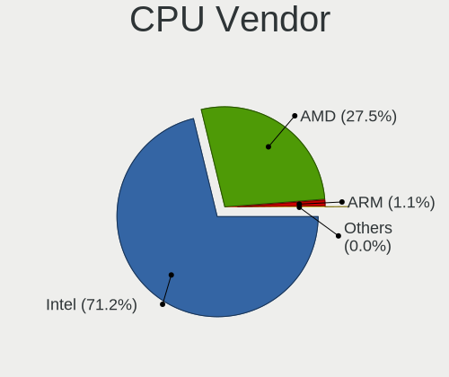
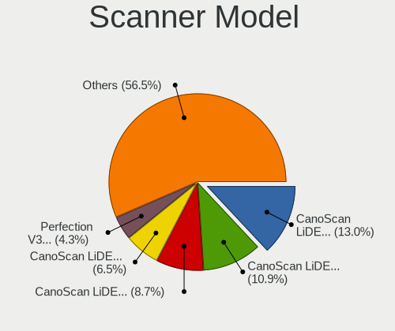

Linux in Canada - Tested Hardware & Statistics
----------------------------------------------

A project to collect tested hardware configurations for Linux in Canada.

Anyone can contribute to this report by the [hw-probe](https://github.com/linuxhw/hw-probe) tool:

    sudo -E hw-probe -all -upload

Please contribute! Especially if your hardware is rare.

This is a report for all computer types. See also reports for [desktops](/Location/Canada/Desktop/README.md) and [notebooks](/Location/Canada/Notebook/README.md).

Contents
--------

* [ Test Cases ](#test-cases)

* [ System ](#system)
  - [ OS                       ](#os)
  - [ OS Family                ](#os-family)
  - [ Kernel                   ](#kernel)
  - [ Kernel Family            ](#kernel-family)
  - [ Kernel Major Ver.        ](#kernel-major-ver)
  - [ Arch                     ](#arch)
  - [ DE                       ](#de)
  - [ Display Server           ](#display-server)
  - [ Display Manager          ](#display-manager)
  - [ OS Lang                  ](#os-lang)
  - [ Boot Mode                ](#boot-mode)
  - [ Filesystem               ](#filesystem)
  - [ Part. scheme             ](#part-scheme)
  - [ Dual Boot with Linux/BSD ](#dual-boot-with-linuxbsd)
  - [ Dual Boot (Win)          ](#dual-boot-win)

* [ Board ](#board)
  - [ Vendor                   ](#vendor)
  - [ Model                    ](#model)
  - [ Model Family             ](#model-family)
  - [ MFG Year                 ](#mfg-year)
  - [ Form Factor              ](#form-factor)
  - [ Secure Boot              ](#secure-boot)
  - [ Coreboot                 ](#coreboot)
  - [ RAM Size                 ](#ram-size)
  - [ RAM Used                 ](#ram-used)
  - [ Total Drives             ](#total-drives)
  - [ Has CD-ROM               ](#has-cd-rom)
  - [ Has Ethernet             ](#has-ethernet)
  - [ Has WiFi                 ](#has-wifi)
  - [ Has Bluetooth            ](#has-bluetooth)

* [ Location ](#location)
  - [ Country                  ](#country)
  - [ City                     ](#city)

* [ Drives ](#drives)
  - [ Drive Vendor             ](#drive-vendor)
  - [ Drive Model              ](#drive-model)
  - [ HDD Vendor               ](#hdd-vendor)
  - [ SSD Vendor               ](#ssd-vendor)
  - [ Drive Kind               ](#drive-kind)
  - [ Drive Connector          ](#drive-connector)
  - [ Drive Size               ](#drive-size)
  - [ Space Total              ](#space-total)
  - [ Space Used               ](#space-used)
  - [ Malfunc. Drives          ](#malfunc-drives)
  - [ Malfunc. Drive Vendor    ](#malfunc-drive-vendor)
  - [ Malfunc. HDD Vendor      ](#malfunc-hdd-vendor)
  - [ Malfunc. Drive Kind      ](#malfunc-drive-kind)
  - [ Failed Drives            ](#failed-drives)
  - [ Failed Drive Vendor      ](#failed-drive-vendor)
  - [ Drive Status             ](#drive-status)

* [ Storage controller ](#storage-controller)
  - [ Storage Vendor           ](#storage-vendor)
  - [ Storage Model            ](#storage-model)
  - [ Storage Kind             ](#storage-kind)

* [ Processor ](#processor)
  - [ CPU Vendor               ](#cpu-vendor)
  - [ CPU Model                ](#cpu-model)
  - [ CPU Model Family         ](#cpu-model-family)
  - [ CPU Cores                ](#cpu-cores)
  - [ CPU Sockets              ](#cpu-sockets)
  - [ CPU Threads              ](#cpu-threads)
  - [ CPU Op-Modes             ](#cpu-op-modes)
  - [ CPU Microcode            ](#cpu-microcode)
  - [ CPU Microarch            ](#cpu-microarch)

* [ Graphics ](#graphics)
  - [ GPU Vendor               ](#gpu-vendor)
  - [ GPU Model                ](#gpu-model)
  - [ GPU Combo                ](#gpu-combo)
  - [ GPU Driver               ](#gpu-driver)
  - [ GPU Memory               ](#gpu-memory)

* [ Monitor ](#monitor)
  - [ Monitor Vendor           ](#monitor-vendor)
  - [ Monitor Model            ](#monitor-model)
  - [ Monitor Resolution       ](#monitor-resolution)
  - [ Monitor Diagonal         ](#monitor-diagonal)
  - [ Monitor Width            ](#monitor-width)
  - [ Aspect Ratio             ](#aspect-ratio)
  - [ Monitor Area             ](#monitor-area)
  - [ Pixel Density            ](#pixel-density)
  - [ Multiple Monitors        ](#multiple-monitors)

* [ Network ](#network)
  - [ Net Controller Vendor    ](#net-controller-vendor)
  - [ Net Controller Model     ](#net-controller-model)
  - [ Wireless Vendor          ](#wireless-vendor)
  - [ Wireless Model           ](#wireless-model)
  - [ Ethernet Vendor          ](#ethernet-vendor)
  - [ Ethernet Model           ](#ethernet-model)
  - [ Net Controller Kind      ](#net-controller-kind)
  - [ Used Controller          ](#used-controller)
  - [ NICs                     ](#nics)
  - [ IPv6                     ](#ipv6)

* [ Bluetooth ](#bluetooth)
  - [ Bluetooth Vendor         ](#bluetooth-vendor)
  - [ Bluetooth Model          ](#bluetooth-model)

* [ Sound ](#sound)
  - [ Sound Vendor             ](#sound-vendor)
  - [ Sound Model              ](#sound-model)

* [ Memory ](#memory)
  - [ Memory Vendor            ](#memory-vendor)
  - [ Memory Model             ](#memory-model)
  - [ Memory Kind              ](#memory-kind)
  - [ Memory Form Factor       ](#memory-form-factor)
  - [ Memory Size              ](#memory-size)
  - [ Memory Speed             ](#memory-speed)

* [ Printers & scanners ](#printers--scanners)
  - [ Printer Vendor           ](#printer-vendor)
  - [ Printer Model            ](#printer-model)
  - [ Scanner Vendor           ](#scanner-vendor)
  - [ Scanner Model            ](#scanner-model)

* [ Camera ](#camera)
  - [ Camera Vendor            ](#camera-vendor)
  - [ Camera Model             ](#camera-model)

* [ Security ](#security)
  - [ Fingerprint Vendor       ](#fingerprint-vendor)
  - [ Fingerprint Model        ](#fingerprint-model)
  - [ Chipcard Vendor          ](#chipcard-vendor)
  - [ Chipcard Model           ](#chipcard-model)

* [ Unsupported ](#unsupported)
  - [ Unsupported Devices      ](#unsupported-devices)
  - [ Unsupported Device Types ](#unsupported-device-types)

Test Cases
----------

Total: 10072

| Vendor        | Model                       | Form-Factor | Probe                                                      | Date         |
|---------------|-----------------------------|-------------|------------------------------------------------------------|--------------|
| Acer          | Aspire 8730                 | Notebook    | [a435ff1bd6](https://linux-hardware.org/?probe=a435ff1bd6) | Jan 02, 2024 |
| Acer          | Aspire 8730                 | Notebook    | [4db4a265b6](https://linux-hardware.org/?probe=4db4a265b6) | Jan 02, 2024 |
| Lenovo        | G505 20240                  | Notebook    | [ff10a3ab7d](https://linux-hardware.org/?probe=ff10a3ab7d) | Jan 02, 2024 |
| HP            | ProBook 4540s               | Notebook    | [aaebda14c1](https://linux-hardware.org/?probe=aaebda14c1) | Jan 01, 2024 |
| ASUSTek       | P8H77-M                     | Desktop     | [7ae937132b](https://linux-hardware.org/?probe=7ae937132b) | Jan 01, 2024 |
| HP            | EliteBook 850 G4            | Notebook    | [bd25e4866f](https://linux-hardware.org/?probe=bd25e4866f) | Jan 01, 2024 |
| Dell          | 0D24M8 A01                  | Desktop     | [f363c3e115](https://linux-hardware.org/?probe=f363c3e115) | Jan 01, 2024 |
| ASUSTek       | PRIME Z270-A                | Desktop     | [dea2dc38e4](https://linux-hardware.org/?probe=dea2dc38e4) | Jan 01, 2024 |
| Dell          | 0P658H A05                  | Server      | [1ae3680481](https://linux-hardware.org/?probe=1ae3680481) | Jan 01, 2024 |
| ASUSTek       | VivoBook_ASUSLaptop TP42... | Convertible | [fe68cbddbb](https://linux-hardware.org/?probe=fe68cbddbb) | Dec 31, 2023 |
| ASRock        | Z170A-X1                    | Desktop     | [faba481c2b](https://linux-hardware.org/?probe=faba481c2b) | Dec 31, 2023 |
| Supermicro    | X10SL7-F                    | Server      | [5aef85f1c3](https://linux-hardware.org/?probe=5aef85f1c3) | Dec 31, 2023 |
| Alienware     | M17xR3                      | Notebook    | [ed05d87c74](https://linux-hardware.org/?probe=ed05d87c74) | Dec 31, 2023 |
| HP            | Pavilion Laptop 15-eh1xx... | Notebook    | [577f6b15de](https://linux-hardware.org/?probe=577f6b15de) | Dec 31, 2023 |
| Lenovo        | ThinkPad T61 7662CTO        | Notebook    | [d38807fbbe](https://linux-hardware.org/?probe=d38807fbbe) | Dec 31, 2023 |
| Lenovo        | Legion 7 16ARHA7 82UH       | Notebook    | [d694f21feb](https://linux-hardware.org/?probe=d694f21feb) | Dec 31, 2023 |
| Lenovo        | ThinkPad T490 20N3S4PX02    | Notebook    | [0afd47e9fc](https://linux-hardware.org/?probe=0afd47e9fc) | Dec 31, 2023 |
| ASUSTek       | VivoBook_ASUSLaptop K540... | Notebook    | [70c84eadc0](https://linux-hardware.org/?probe=70c84eadc0) | Dec 31, 2023 |
| Apple         | MacBook6,1                  | Notebook    | [ba4ad2bc18](https://linux-hardware.org/?probe=ba4ad2bc18) | Dec 31, 2023 |
| ASUSTek       | VivoBook_ASUSLaptop X170... | Notebook    | [9c355f1603](https://linux-hardware.org/?probe=9c355f1603) | Dec 31, 2023 |
| Apple         | MacBookPro10,2              | Notebook    | [275f675ca4](https://linux-hardware.org/?probe=275f675ca4) | Dec 31, 2023 |
| Lenovo        | ThinkPad X390 20Q0004VUS    | Notebook    | [4bd6b36cd6](https://linux-hardware.org/?probe=4bd6b36cd6) | Dec 30, 2023 |
| Pine Micro... | Pine64 RockPro64 v2.1       | Soc         | [38ff4c1e6c](https://linux-hardware.org/?probe=38ff4c1e6c) | Dec 30, 2023 |
| MSI           | Stealth 16Studio A13VF      | Notebook    | [04acb5230d](https://linux-hardware.org/?probe=04acb5230d) | Dec 30, 2023 |
| Apple         | MacBookAir9,1               | Notebook    | [25fea8aab5](https://linux-hardware.org/?probe=25fea8aab5) | Dec 30, 2023 |
| MSI           | Stealth 16Studio A13VF      | Notebook    | [1fd1d2e727](https://linux-hardware.org/?probe=1fd1d2e727) | Dec 30, 2023 |
| ASUSTek       | M5A78L-M LX3                | Desktop     | [c4b0b7c31a](https://linux-hardware.org/?probe=c4b0b7c31a) | Dec 30, 2023 |
| HP            | 339A                        | Desktop     | [56210b6b8c](https://linux-hardware.org/?probe=56210b6b8c) | Dec 30, 2023 |
| Lenovo        | ThinkPad T61 7662CTO        | Notebook    | [9e025b8cde](https://linux-hardware.org/?probe=9e025b8cde) | Dec 30, 2023 |
| Acer          | Aspire A115-31              | Notebook    | [01aeb12545](https://linux-hardware.org/?probe=01aeb12545) | Dec 29, 2023 |
| HP            | Laptop 17t-cn200            | Notebook    | [4c241f7e1d](https://linux-hardware.org/?probe=4c241f7e1d) | Dec 29, 2023 |
| Lenovo        | 36EB SDK0J40700 WIN 3258... | Desktop     | [7a34810f0e](https://linux-hardware.org/?probe=7a34810f0e) | Dec 29, 2023 |
| Dell          | 09M8Y8 A01                  | Desktop     | [128d8114dc](https://linux-hardware.org/?probe=128d8114dc) | Dec 29, 2023 |
| ASUSTek       | ROG Strix G713QM_G713QM     | Notebook    | [6c5599855c](https://linux-hardware.org/?probe=6c5599855c) | Dec 29, 2023 |
| Dell          | 09M8Y8 A01                  | Desktop     | [57106459a5](https://linux-hardware.org/?probe=57106459a5) | Dec 29, 2023 |
| ASUSTek       | VivoBook_ASUSLaptop M150... | Notebook    | [6a99e4eda2](https://linux-hardware.org/?probe=6a99e4eda2) | Dec 29, 2023 |
| Lenovo        | ThinkPad T450 20BUS05V00    | Notebook    | [3334aeb4e1](https://linux-hardware.org/?probe=3334aeb4e1) | Dec 29, 2023 |
| ASUSTek       | ROG Strix G713QM_G713QM     | Notebook    | [0be6e9ce52](https://linux-hardware.org/?probe=0be6e9ce52) | Dec 29, 2023 |
| HP            | ProBook 650 G2              | Notebook    | [1dd3970627](https://linux-hardware.org/?probe=1dd3970627) | Dec 29, 2023 |
| ASUSTek       | VivoBook_ASUSLaptop M150... | Notebook    | [d6477c7999](https://linux-hardware.org/?probe=d6477c7999) | Dec 28, 2023 |
| Acer          | Aspire 8730                 | Notebook    | [3110584890](https://linux-hardware.org/?probe=3110584890) | Dec 28, 2023 |
| Acer          | Aspire 8730                 | Notebook    | [3a9461e870](https://linux-hardware.org/?probe=3a9461e870) | Dec 28, 2023 |
| Acer          | Aspire A315-41              | Notebook    | [1042d42263](https://linux-hardware.org/?probe=1042d42263) | Dec 28, 2023 |
| Dell          | Inspiron 7720               | Notebook    | [965fc7c4a3](https://linux-hardware.org/?probe=965fc7c4a3) | Dec 28, 2023 |
| Acer          | Aspire A315-41              | Notebook    | [d68aa800c6](https://linux-hardware.org/?probe=d68aa800c6) | Dec 28, 2023 |
| ASUSTek       | ROG Strix G531GT_G531GT     | Notebook    | [3a0b2d2a21](https://linux-hardware.org/?probe=3a0b2d2a21) | Dec 28, 2023 |
| Razer         | Blade                       | Notebook    | [bd2101718d](https://linux-hardware.org/?probe=bd2101718d) | Dec 28, 2023 |
| MSI           | MS-B9311                    | Desktop     | [424154cf65](https://linux-hardware.org/?probe=424154cf65) | Dec 28, 2023 |
| ASUSTek       | Crosshair IV Formula        | Desktop     | [f426fd6d36](https://linux-hardware.org/?probe=f426fd6d36) | Dec 27, 2023 |
| Apple         | MacBookAir9,1               | Notebook    | [13a55dee9a](https://linux-hardware.org/?probe=13a55dee9a) | Dec 27, 2023 |
| Gigabyte      | AERO 15-X9                  | Notebook    | [906642b6ec](https://linux-hardware.org/?probe=906642b6ec) | Dec 27, 2023 |
| Google        | Swanky                      | Notebook    | [12fd273db1](https://linux-hardware.org/?probe=12fd273db1) | Dec 27, 2023 |
| Alienware     | m16 R1 AMD                  | Notebook    | [98aaf575cc](https://linux-hardware.org/?probe=98aaf575cc) | Dec 26, 2023 |
| Lenovo        | 3111 SDK0L22692 WIN 3306... | Mini pc     | [b9c892ba9d](https://linux-hardware.org/?probe=b9c892ba9d) | Dec 26, 2023 |
| Pegatron      | 2A9A                        | Desktop     | [e67022179a](https://linux-hardware.org/?probe=e67022179a) | Dec 26, 2023 |
| Lenovo        | Legion 5 15ARH05 82B5       | Notebook    | [b000376310](https://linux-hardware.org/?probe=b000376310) | Dec 26, 2023 |
| Lenovo        | Legion 5 15ARH05 82B5       | Notebook    | [ff3773b480](https://linux-hardware.org/?probe=ff3773b480) | Dec 26, 2023 |
| Lenovo        | 3111 SDK0L22692 WIN 3306... | Mini pc     | [51976d3313](https://linux-hardware.org/?probe=51976d3313) | Dec 25, 2023 |
| ASUSTek       | ASUS TUF Dash F15 FX517Z... | Notebook    | [c38f5ee95e](https://linux-hardware.org/?probe=c38f5ee95e) | Dec 25, 2023 |
| Gigabyte      | X570 AORUS MASTER           | Desktop     | [e7901d2ec9](https://linux-hardware.org/?probe=e7901d2ec9) | Dec 25, 2023 |
| ASUSTek       | PRIME X570-PRO              | Desktop     | [d6f1c37a34](https://linux-hardware.org/?probe=d6f1c37a34) | Dec 25, 2023 |
| Unknown       | Unknown                     | Notebook    | [a9015bc697](https://linux-hardware.org/?probe=a9015bc697) | Dec 25, 2023 |
| Lenovo        | ThinkPad T540p 20BFS0620... | Notebook    | [5cceadde0c](https://linux-hardware.org/?probe=5cceadde0c) | Dec 25, 2023 |
| ASUSTek       | PRIME H410M-A               | Desktop     | [d6257b5255](https://linux-hardware.org/?probe=d6257b5255) | Dec 25, 2023 |
| ASRock        | B760M Pro RS/D4 WiFi        | Desktop     | [c75f8f9d6f](https://linux-hardware.org/?probe=c75f8f9d6f) | Dec 25, 2023 |
| Unknown       | Apple MacBook Air (13-in... | Notebook    | [1954e2b6a8](https://linux-hardware.org/?probe=1954e2b6a8) | Dec 24, 2023 |
| Samsung       | 930QDB                      | Convertible | [1186a306c8](https://linux-hardware.org/?probe=1186a306c8) | Dec 24, 2023 |
| Apple         | Mac-F4238CC8 PVT            | All in one  | [f76dd451a4](https://linux-hardware.org/?probe=f76dd451a4) | Dec 24, 2023 |
| Dell          | 0WR7PY A02                  | Desktop     | [df3b1f1cc3](https://linux-hardware.org/?probe=df3b1f1cc3) | Dec 24, 2023 |
| Dell          | 0P658H A05                  | Server      | [14a0701959](https://linux-hardware.org/?probe=14a0701959) | Dec 24, 2023 |
| ASUSTek       | VivoBook_ASUS Laptop E41... | Notebook    | [c0ff23eba6](https://linux-hardware.org/?probe=c0ff23eba6) | Dec 24, 2023 |
| HP            | Elite x2 1012 G1            | Notebook    | [b093087b3c](https://linux-hardware.org/?probe=b093087b3c) | Dec 23, 2023 |
| Unknown       | Unknown                     | Notebook    | [a0d7edc452](https://linux-hardware.org/?probe=a0d7edc452) | Dec 23, 2023 |
| HP            | Elite x2 1012 G1            | Notebook    | [c93fffc388](https://linux-hardware.org/?probe=c93fffc388) | Dec 23, 2023 |
| ASRock        | Q1900DC-ITX                 | Desktop     | [ee59bde7c9](https://linux-hardware.org/?probe=ee59bde7c9) | Dec 23, 2023 |
| ASRock        | Q1900DC-ITX                 | Desktop     | [9733217ad2](https://linux-hardware.org/?probe=9733217ad2) | Dec 23, 2023 |
| Gigabyte      | M68MT-S2                    | Desktop     | [ba4e48312e](https://linux-hardware.org/?probe=ba4e48312e) | Dec 23, 2023 |
| ASUSTek       | M4A785-M                    | Desktop     | [fe6c638acc](https://linux-hardware.org/?probe=fe6c638acc) | Dec 23, 2023 |
| Intel         | S5000PSL                    | Server      | [4abb5e39fc](https://linux-hardware.org/?probe=4abb5e39fc) | Dec 23, 2023 |
| HP            | 2ADC                        | Desktop     | [2c9d8d03d2](https://linux-hardware.org/?probe=2c9d8d03d2) | Dec 23, 2023 |
| Gigabyte      | M68MT-S2                    | Desktop     | [e91530e41d](https://linux-hardware.org/?probe=e91530e41d) | Dec 23, 2023 |
| Acer          | Aspire A515-55              | Notebook    | [9412d138fb](https://linux-hardware.org/?probe=9412d138fb) | Dec 23, 2023 |
| Acer          | Aspire A515-55              | Notebook    | [4166459262](https://linux-hardware.org/?probe=4166459262) | Dec 23, 2023 |
| Lenovo        | Yoga 2 Pro 20266            | Notebook    | [201d4ed37f](https://linux-hardware.org/?probe=201d4ed37f) | Dec 23, 2023 |
| Acer          | Aspire R3-131T              | Notebook    | [647b2fddf6](https://linux-hardware.org/?probe=647b2fddf6) | Dec 23, 2023 |
| Dell          | Latitude 5420               | Notebook    | [9858586a84](https://linux-hardware.org/?probe=9858586a84) | Dec 22, 2023 |
| Alienware     | 0P0JWX A00                  | Desktop     | [99d0e56ef1](https://linux-hardware.org/?probe=99d0e56ef1) | Dec 22, 2023 |
| Lenovo        | ThinkBook 14 G3 ACL 21A2    | Notebook    | [b09c4dd8a2](https://linux-hardware.org/?probe=b09c4dd8a2) | Dec 22, 2023 |
| HP            | Pavilion g6                 | Notebook    | [ebdf3d244f](https://linux-hardware.org/?probe=ebdf3d244f) | Dec 22, 2023 |
| HP            | Pavilion g6                 | Notebook    | [b62f9f41d3](https://linux-hardware.org/?probe=b62f9f41d3) | Dec 22, 2023 |
| Lenovo        | MIIX 300-10IBY 80NR         | Tablet      | [456c5b7613](https://linux-hardware.org/?probe=456c5b7613) | Dec 21, 2023 |
| Apple         | Mac-00BE6ED71E35EB86 iMa... | All in one  | [b3c6d4826f](https://linux-hardware.org/?probe=b3c6d4826f) | Dec 21, 2023 |
| Apple         | Mac-00BE6ED71E35EB86 iMa... | All in one  | [3441fd68be](https://linux-hardware.org/?probe=3441fd68be) | Dec 21, 2023 |
| Gigabyte      | Z790 AORUS MASTER X         | Desktop     | [e71bed6be5](https://linux-hardware.org/?probe=e71bed6be5) | Dec 21, 2023 |
| Dell          | Latitude 7420               | Notebook    | [f2b2511de1](https://linux-hardware.org/?probe=f2b2511de1) | Dec 21, 2023 |
| Valve         | Jupiter                     | Notebook    | [6003cb709f](https://linux-hardware.org/?probe=6003cb709f) | Dec 21, 2023 |
| Valve         | Jupiter                     | Notebook    | [186428f160](https://linux-hardware.org/?probe=186428f160) | Dec 21, 2023 |
| Acer          | Aspire M3970                | Desktop     | [5da3b6c46f](https://linux-hardware.org/?probe=5da3b6c46f) | Dec 21, 2023 |
| Google        | Casta                       | Notebook    | [70f6e5e978](https://linux-hardware.org/?probe=70f6e5e978) | Dec 21, 2023 |
| Lenovo        | ThinkPad T470s W10DG 20J... | Notebook    | [faabc05597](https://linux-hardware.org/?probe=faabc05597) | Dec 21, 2023 |
| HC Technol... | HCAR5000-MI                 | Desktop     | [16f9dec3e0](https://linux-hardware.org/?probe=16f9dec3e0) | Dec 20, 2023 |
| ASUSTek       | ROG CROSSHAIR VIII HERO     | Desktop     | [98298e164f](https://linux-hardware.org/?probe=98298e164f) | Dec 20, 2023 |
| HP            | 1632                        | Desktop     | [e9f36a25a0](https://linux-hardware.org/?probe=e9f36a25a0) | Dec 20, 2023 |
| ASRock        | B550 Pro4                   | Desktop     | [786ded3bc9](https://linux-hardware.org/?probe=786ded3bc9) | Dec 20, 2023 |
| Lenovo        | ThinkPad T520 42404AU       | Notebook    | [2b29070879](https://linux-hardware.org/?probe=2b29070879) | Dec 20, 2023 |
| ASUSTek       | ASUS TUF Gaming F15 FX50... | Notebook    | [54ed87ec87](https://linux-hardware.org/?probe=54ed87ec87) | Dec 20, 2023 |
| ASUSTek       | PRIME B550-PLUS             | Desktop     | [85087e0568](https://linux-hardware.org/?probe=85087e0568) | Dec 20, 2023 |
| Apple         | Mac-942B59F58194171B iMa... | All in one  | [322b96bdd0](https://linux-hardware.org/?probe=322b96bdd0) | Dec 20, 2023 |
| Lenovo        | ThinkPad T480s 20L8S3SW0... | Notebook    | [eebb86b95f](https://linux-hardware.org/?probe=eebb86b95f) | Dec 19, 2023 |
| Lenovo        | 313F SEK0N11856 IOT 3288... | Desktop     | [1a65cf0f52](https://linux-hardware.org/?probe=1a65cf0f52) | Dec 19, 2023 |
| Acer          | Aspire M3970                | Desktop     | [5767513b0e](https://linux-hardware.org/?probe=5767513b0e) | Dec 19, 2023 |
| Acer          | Aspire AV15-52              | Notebook    | [daf4aa326d](https://linux-hardware.org/?probe=daf4aa326d) | Dec 19, 2023 |
| Unknown       | X79                         | Desktop     | [167cf0a87f](https://linux-hardware.org/?probe=167cf0a87f) | Dec 19, 2023 |
| Unknown       | X79                         | Desktop     | [3961be9cb6](https://linux-hardware.org/?probe=3961be9cb6) | Dec 19, 2023 |
| MSI           | B450M BAZOOKA               | Desktop     | [0bfcb5be94](https://linux-hardware.org/?probe=0bfcb5be94) | Dec 19, 2023 |
| HP            | 828A                        | Desktop     | [94483ed23a](https://linux-hardware.org/?probe=94483ed23a) | Dec 19, 2023 |
| MSI           | B450 GAMING PLUS MAX        | Desktop     | [ed64e6b1ec](https://linux-hardware.org/?probe=ed64e6b1ec) | Dec 19, 2023 |
| MSI           | Pulse 17 B13VGK             | Notebook    | [71d0660568](https://linux-hardware.org/?probe=71d0660568) | Dec 18, 2023 |
| ASUSTek       | TUF Gaming A520M-PLUS WI... | Desktop     | [8efe53adcb](https://linux-hardware.org/?probe=8efe53adcb) | Dec 18, 2023 |
| ASUSTek       | Zenbook UX3402VA_UX3402V... | Notebook    | [e94e9e0fd9](https://linux-hardware.org/?probe=e94e9e0fd9) | Dec 18, 2023 |
| HP            | 2B45                        | All in one  | [dbc7094ab4](https://linux-hardware.org/?probe=dbc7094ab4) | Dec 18, 2023 |
| ASUSTek       | ROG Strix G513RM_G513RM     | Notebook    | [f47c731a09](https://linux-hardware.org/?probe=f47c731a09) | Dec 18, 2023 |
| HP            | 1632                        | Desktop     | [db207cb310](https://linux-hardware.org/?probe=db207cb310) | Dec 18, 2023 |
| Acer          | Aspire 8730                 | Notebook    | [c7b60bcb33](https://linux-hardware.org/?probe=c7b60bcb33) | Dec 18, 2023 |
| Gateway       | NV54 Series                 | Notebook    | [1bd87c77d2](https://linux-hardware.org/?probe=1bd87c77d2) | Dec 18, 2023 |
| ASRock        | B550 Pro4                   | Desktop     | [1a4597db9e](https://linux-hardware.org/?probe=1a4597db9e) | Dec 18, 2023 |
| Lenovo        | Legion Pro 5 16IRX8 82WK    | Notebook    | [f46bf3981f](https://linux-hardware.org/?probe=f46bf3981f) | Dec 18, 2023 |
| Unknown       | Unknown                     | Notebook    | [81187bebc0](https://linux-hardware.org/?probe=81187bebc0) | Dec 18, 2023 |
| ASUSTek       | ASUS TUF Gaming F15 FX50... | Notebook    | [709891824c](https://linux-hardware.org/?probe=709891824c) | Dec 18, 2023 |
| MSI           | Vector GP77 13VG            | Notebook    | [7b6b5a14f8](https://linux-hardware.org/?probe=7b6b5a14f8) | Dec 18, 2023 |
| AZW           | SER                         | Mini pc     | [2768e13f4c](https://linux-hardware.org/?probe=2768e13f4c) | Dec 18, 2023 |
| Lenovo        | Legion Pro 5 16ARX8 82WM    | Notebook    | [e7ed0c7c8a](https://linux-hardware.org/?probe=e7ed0c7c8a) | Dec 18, 2023 |
| Unknown       | Unknown                     | Soc         | [86e857365e](https://linux-hardware.org/?probe=86e857365e) | Dec 18, 2023 |
| Gigabyte      | B450 AORUS PRO WIFI-CF      | Desktop     | [79c73e5927](https://linux-hardware.org/?probe=79c73e5927) | Dec 17, 2023 |
| ASUSTek       | Zenbook UP6502ZD_UP6502Z... | Convertible | [bf1b382c12](https://linux-hardware.org/?probe=bf1b382c12) | Dec 17, 2023 |
| ASUSTek       | ROG Strix G513RM_G513RM     | Notebook    | [fd17674af7](https://linux-hardware.org/?probe=fd17674af7) | Dec 17, 2023 |
| MSI           | Cyborg 15 A12VF             | Notebook    | [af666cc67d](https://linux-hardware.org/?probe=af666cc67d) | Dec 17, 2023 |
| Acer          | Aspire 4736Z                | Notebook    | [38866fae79](https://linux-hardware.org/?probe=38866fae79) | Dec 17, 2023 |
| MSI           | Vector GP77 13VG            | Notebook    | [267679e074](https://linux-hardware.org/?probe=267679e074) | Dec 17, 2023 |
| Dell          | Precision 5510              | Notebook    | [d723f4a031](https://linux-hardware.org/?probe=d723f4a031) | Dec 17, 2023 |
| Dell          | Latitude E6440              | Notebook    | [b91055b95e](https://linux-hardware.org/?probe=b91055b95e) | Dec 17, 2023 |
| ASUSTek       | ASUS TUF Gaming F17 FX70... | Notebook    | [0018284858](https://linux-hardware.org/?probe=0018284858) | Dec 17, 2023 |
| ASUSTek       | ROG Zephyrus M16 GU603ZM... | Notebook    | [e0fa989ed0](https://linux-hardware.org/?probe=e0fa989ed0) | Dec 17, 2023 |
| ASUSTek       | VivoBook_ASUSLaptop TP42... | Convertible | [46d7cc6a6f](https://linux-hardware.org/?probe=46d7cc6a6f) | Dec 16, 2023 |
| Alienware     | m18 R1                      | Notebook    | [a136406723](https://linux-hardware.org/?probe=a136406723) | Dec 16, 2023 |
| Toshiba       | TECRA Z50-A                 | Notebook    | [8717000b31](https://linux-hardware.org/?probe=8717000b31) | Dec 16, 2023 |
| ASUSTek       | ASUS TUF Gaming F17 FX70... | Notebook    | [f65efa02b6](https://linux-hardware.org/?probe=f65efa02b6) | Dec 16, 2023 |
| HP            | Compaq Presario A900        | Notebook    | [cafb584a35](https://linux-hardware.org/?probe=cafb584a35) | Dec 16, 2023 |
| Dell          | Latitude E7240              | Notebook    | [8fc0b7d8ea](https://linux-hardware.org/?probe=8fc0b7d8ea) | Dec 16, 2023 |
| Dell          | Latitude E6440              | Notebook    | [bfbadf07a9](https://linux-hardware.org/?probe=bfbadf07a9) | Dec 16, 2023 |
| Dell          | Latitude E6440              | Notebook    | [bde33cad70](https://linux-hardware.org/?probe=bde33cad70) | Dec 16, 2023 |
| Dell          | Latitude E6440              | Notebook    | [5d02de18b4](https://linux-hardware.org/?probe=5d02de18b4) | Dec 16, 2023 |
| HP            | ENVY x360 Convertible 15... | Convertible | [b761d5e550](https://linux-hardware.org/?probe=b761d5e550) | Dec 15, 2023 |
| Acer          | Aspire 8730                 | Notebook    | [5f7e5fbfd8](https://linux-hardware.org/?probe=5f7e5fbfd8) | Dec 15, 2023 |
| Acer          | Aspire 8730                 | Notebook    | [8e1f3c1aa9](https://linux-hardware.org/?probe=8e1f3c1aa9) | Dec 15, 2023 |
| Valve         | Jupiter                     | Notebook    | [bef7a2d5b3](https://linux-hardware.org/?probe=bef7a2d5b3) | Dec 15, 2023 |
| ASUSTek       | VivoBook_ASUSLaptop X150... | Notebook    | [d8db62d461](https://linux-hardware.org/?probe=d8db62d461) | Dec 15, 2023 |
| Gigabyte      | X570 AORUS ELITE WIFI       | Desktop     | [8a3e0ce72f](https://linux-hardware.org/?probe=8a3e0ce72f) | Dec 15, 2023 |
| Lenovo        | ThinkPad T470 W10DG 20JN... | Notebook    | [3d4b7d5e8b](https://linux-hardware.org/?probe=3d4b7d5e8b) | Dec 15, 2023 |
| Lenovo        | IdeaPad 1 15IJL7 82LX       | Notebook    | [a0eaa74105](https://linux-hardware.org/?probe=a0eaa74105) | Dec 15, 2023 |
| Lenovo        | IdeaPad 1 15IJL7 82LX       | Notebook    | [db4a7dea97](https://linux-hardware.org/?probe=db4a7dea97) | Dec 15, 2023 |
| Gigabyte      | AERO 15 KD                  | Notebook    | [ef9cf1d767](https://linux-hardware.org/?probe=ef9cf1d767) | Dec 15, 2023 |
| MSI           | B550M PRO-VDH WIFI          | Desktop     | [06a409ecda](https://linux-hardware.org/?probe=06a409ecda) | Dec 15, 2023 |
| Dell          | Precision 5540              | Notebook    | [beae57f4bb](https://linux-hardware.org/?probe=beae57f4bb) | Dec 14, 2023 |
| MSI           | PRO B760-P WIFI DDR4        | Desktop     | [0305f80c2d](https://linux-hardware.org/?probe=0305f80c2d) | Dec 14, 2023 |
| Lenovo        | ThinkPad T480s 20L8S3SW0... | Notebook    | [990fd9f312](https://linux-hardware.org/?probe=990fd9f312) | Dec 14, 2023 |
| Acer          | Aspire M3910                | Desktop     | [f12298a018](https://linux-hardware.org/?probe=f12298a018) | Dec 14, 2023 |
| Lenovo        | ThinkBook 13x G2 IAP 21A... | Notebook    | [2b65b49ba3](https://linux-hardware.org/?probe=2b65b49ba3) | Dec 14, 2023 |
| HP            | Stream Laptop 11-ah1XX      | Notebook    | [309aea6480](https://linux-hardware.org/?probe=309aea6480) | Dec 14, 2023 |
| HP            | 1495                        | Desktop     | [e187132e56](https://linux-hardware.org/?probe=e187132e56) | Dec 14, 2023 |
| Toshiba       | PORTEGE R930                | Notebook    | [e341599417](https://linux-hardware.org/?probe=e341599417) | Dec 14, 2023 |
| HP            | Laptop 17t-cn200            | Notebook    | [ffe76142c0](https://linux-hardware.org/?probe=ffe76142c0) | Dec 14, 2023 |
| HP            | 1495                        | Desktop     | [7c74116b39](https://linux-hardware.org/?probe=7c74116b39) | Dec 13, 2023 |
| AZW           | SER                         | Mini pc     | [e114084bcd](https://linux-hardware.org/?probe=e114084bcd) | Dec 13, 2023 |
| HP            | 8459                        | Desktop     | [e4480089d7](https://linux-hardware.org/?probe=e4480089d7) | Dec 13, 2023 |
| MSI           | MAG B550 TOMAHAWK           | Desktop     | [ae8fb90445](https://linux-hardware.org/?probe=ae8fb90445) | Dec 13, 2023 |
| Dell          | Inspiron 5584               | Notebook    | [525d98e3f0](https://linux-hardware.org/?probe=525d98e3f0) | Dec 13, 2023 |
| HP            | 3048h                       | Desktop     | [bb95017425](https://linux-hardware.org/?probe=bb95017425) | Dec 12, 2023 |
| Gigabyte      | GA-890FXA-UD7               | Desktop     | [92c2bcd902](https://linux-hardware.org/?probe=92c2bcd902) | Dec 12, 2023 |
| Gigabyte      | GA-890FXA-UD7               | Desktop     | [5edcb2dcf9](https://linux-hardware.org/?probe=5edcb2dcf9) | Dec 12, 2023 |
| MSI           | PRO B760-P WIFI DDR4        | Desktop     | [a9059220f3](https://linux-hardware.org/?probe=a9059220f3) | Dec 12, 2023 |
| Valve         | Jupiter                     | Notebook    | [75070d8783](https://linux-hardware.org/?probe=75070d8783) | Dec 12, 2023 |
| AZW           | SER                         | Mini pc     | [35001d9cec](https://linux-hardware.org/?probe=35001d9cec) | Dec 12, 2023 |
| Gigabyte      | X570 AORUS ELITE WIFI       | Desktop     | [0343e0a98e](https://linux-hardware.org/?probe=0343e0a98e) | Dec 11, 2023 |
| Dell          | Vostro 1320                 | Notebook    | [cf44765cd0](https://linux-hardware.org/?probe=cf44765cd0) | Dec 11, 2023 |
| Notebook      | W94_95_97SU2,SUY,-C,-T      | Notebook    | [048ee8c70a](https://linux-hardware.org/?probe=048ee8c70a) | Dec 11, 2023 |
| Apple         | MacBookPro9,2               | Notebook    | [6e230c56bf](https://linux-hardware.org/?probe=6e230c56bf) | Dec 11, 2023 |
| HP            | ProBook 4540s               | Notebook    | [187b090bc8](https://linux-hardware.org/?probe=187b090bc8) | Dec 11, 2023 |
| Unknown       | Unknown                     | Notebook    | [e70fd6bdb5](https://linux-hardware.org/?probe=e70fd6bdb5) | Dec 10, 2023 |
| ASUSTek       | PRIME B250M-A               | Desktop     | [43516f3ae9](https://linux-hardware.org/?probe=43516f3ae9) | Dec 10, 2023 |
| MSI           | GT72VR 6RD                  | Notebook    | [832dd09409](https://linux-hardware.org/?probe=832dd09409) | Dec 10, 2023 |
| MSI           | GT72VR 6RD                  | Notebook    | [b17b809ccf](https://linux-hardware.org/?probe=b17b809ccf) | Dec 10, 2023 |
| Gigabyte      | Z490 VISION G               | Desktop     | [184c82a359](https://linux-hardware.org/?probe=184c82a359) | Dec 10, 2023 |
| Dell          | XPS 15 9500                 | Notebook    | [5910eefbd0](https://linux-hardware.org/?probe=5910eefbd0) | Dec 10, 2023 |
| MSI           | MAG Z390 TOMAHAWK           | Desktop     | [242f306b04](https://linux-hardware.org/?probe=242f306b04) | Dec 10, 2023 |
| Unknown       | Unknown                     | Desktop     | [e3a3265aef](https://linux-hardware.org/?probe=e3a3265aef) | Dec 10, 2023 |
| HP            | 3397                        | Desktop     | [00bdd1f8a2](https://linux-hardware.org/?probe=00bdd1f8a2) | Dec 10, 2023 |
| ASUSTek       | TUF Gaming FX504GD_FX80G... | Notebook    | [324e195003](https://linux-hardware.org/?probe=324e195003) | Dec 10, 2023 |
| ASUSTek       | TUF Gaming FX504GD_FX80G... | Notebook    | [f60e90cfd0](https://linux-hardware.org/?probe=f60e90cfd0) | Dec 10, 2023 |
| ASUSTek       | X550JK                      | Notebook    | [06e9cf1c8d](https://linux-hardware.org/?probe=06e9cf1c8d) | Dec 10, 2023 |
| ASRock        | X99 Professional Gaming ... | Desktop     | [46be0f459d](https://linux-hardware.org/?probe=46be0f459d) | Dec 10, 2023 |
| ASUSTek       | TUF Gaming Z690-PLUS WIF... | Desktop     | [090ebbd9dd](https://linux-hardware.org/?probe=090ebbd9dd) | Dec 10, 2023 |
| HP            | Laptop 14-fq1xxx            | Notebook    | [ef158cd28b](https://linux-hardware.org/?probe=ef158cd28b) | Dec 09, 2023 |
| HP            | 0A9Ch                       | Desktop     | [0dd7ed90d0](https://linux-hardware.org/?probe=0dd7ed90d0) | Dec 09, 2023 |
| HP            | G61                         | Notebook    | [ce104b5b73](https://linux-hardware.org/?probe=ce104b5b73) | Dec 09, 2023 |
| Toshiba       | Satellite L650D             | Notebook    | [90ec46f444](https://linux-hardware.org/?probe=90ec46f444) | Dec 09, 2023 |
| Raspberry ... | Raspberry Pi                | Soc         | [ae61f1039f](https://linux-hardware.org/?probe=ae61f1039f) | Dec 09, 2023 |
| HP            | Pavilion dv8000 (ET839UA... | Notebook    | [b743ce445f](https://linux-hardware.org/?probe=b743ce445f) | Dec 09, 2023 |
| Lenovo        | ThinkCentre M58p 6234AE5    | Desktop     | [4cf3efef96](https://linux-hardware.org/?probe=4cf3efef96) | Dec 09, 2023 |
| Dell          | 0C522T A03                  | Desktop     | [3c06d9b7a8](https://linux-hardware.org/?probe=3c06d9b7a8) | Dec 09, 2023 |
| ASUSTek       | P7P55D                      | Desktop     | [93672594de](https://linux-hardware.org/?probe=93672594de) | Dec 09, 2023 |
| ASUSTek       | VivoBook_ASUSLaptop X415... | Notebook    | [ec6f114cca](https://linux-hardware.org/?probe=ec6f114cca) | Dec 08, 2023 |
| ASUSTek       | TUF Gaming X570-PLUS        | Desktop     | [955f530c70](https://linux-hardware.org/?probe=955f530c70) | Dec 08, 2023 |
| HP            | EliteBook 840 G6            | Notebook    | [b53080f09f](https://linux-hardware.org/?probe=b53080f09f) | Dec 08, 2023 |
| ASUSTek       | PRIME H470M-PLUS            | Desktop     | [5d51e97a7a](https://linux-hardware.org/?probe=5d51e97a7a) | Dec 08, 2023 |
| Toshiba       | Satellite S50D-A            | Notebook    | [eaa6d2bf5e](https://linux-hardware.org/?probe=eaa6d2bf5e) | Dec 07, 2023 |
| Toshiba       | Satellite S50D-A            | Notebook    | [749ddd65d7](https://linux-hardware.org/?probe=749ddd65d7) | Dec 07, 2023 |
| Intel         | S5520HC E26045-454          | Server      | [aeb295f54a](https://linux-hardware.org/?probe=aeb295f54a) | Dec 07, 2023 |
| Dell          | Latitude 7400               | Notebook    | [692f8c13ff](https://linux-hardware.org/?probe=692f8c13ff) | Dec 07, 2023 |
| Alienware     | m18 R1                      | Notebook    | [79c8580eb9](https://linux-hardware.org/?probe=79c8580eb9) | Dec 07, 2023 |
| HP            | ProBook 4540s               | Notebook    | [c1b70f6050](https://linux-hardware.org/?probe=c1b70f6050) | Dec 07, 2023 |
| Lenovo        | ThinkPad X1 Carbon 3444C... | Notebook    | [04bbb5a104](https://linux-hardware.org/?probe=04bbb5a104) | Dec 07, 2023 |
| Valve         | Jupiter                     | Notebook    | [7eec257dd6](https://linux-hardware.org/?probe=7eec257dd6) | Dec 07, 2023 |
| Acer          | Swift SF314-54              | Notebook    | [cfc6e89dca](https://linux-hardware.org/?probe=cfc6e89dca) | Dec 07, 2023 |
| Lenovo        | ThinkPad X13 Yoga Gen 4 ... | Convertible | [ef4f963067](https://linux-hardware.org/?probe=ef4f963067) | Dec 07, 2023 |
| Valve         | Galileo                     | Notebook    | [20b7e72741](https://linux-hardware.org/?probe=20b7e72741) | Dec 06, 2023 |
| ASUSTek       | PRIME B550-PLUS             | Desktop     | [dc05a32f3d](https://linux-hardware.org/?probe=dc05a32f3d) | Dec 06, 2023 |
| HP            | 0AECh D                     | Desktop     | [d58cc2f609](https://linux-hardware.org/?probe=d58cc2f609) | Dec 06, 2023 |
| Alienware     | m18 R1                      | Notebook    | [4a4c2cec97](https://linux-hardware.org/?probe=4a4c2cec97) | Dec 06, 2023 |
| HP            | Pavilion x360 14 Convert... | Convertible | [5de0c29333](https://linux-hardware.org/?probe=5de0c29333) | Dec 06, 2023 |
| Dell          | XPS 13 9380                 | Notebook    | [e0f4aeb360](https://linux-hardware.org/?probe=e0f4aeb360) | Dec 06, 2023 |
| Lenovo        | ThinkPad T490s 20NYS7K90... | Notebook    | [65ec6660cc](https://linux-hardware.org/?probe=65ec6660cc) | Dec 06, 2023 |
| Alienware     | 0VDT73 A00                  | Desktop     | [af5f86d3a2](https://linux-hardware.org/?probe=af5f86d3a2) | Dec 06, 2023 |
| Dell          | 0D24M8 A01                  | Desktop     | [aebf78de41](https://linux-hardware.org/?probe=aebf78de41) | Dec 06, 2023 |
| Apple         | Mac-F2238AC8                | All in one  | [e31bacf81a](https://linux-hardware.org/?probe=e31bacf81a) | Dec 06, 2023 |
| ASUSTek       | ASUS TUF Gaming F15 FX50... | Notebook    | [0cb29ce493](https://linux-hardware.org/?probe=0cb29ce493) | Dec 05, 2023 |
| EVGA          | E685 $                      | Desktop     | [05a5af7dbd](https://linux-hardware.org/?probe=05a5af7dbd) | Dec 05, 2023 |
| Apple         | MacBookPro9,2               | Notebook    | [f665409b48](https://linux-hardware.org/?probe=f665409b48) | Dec 05, 2023 |
| Lenovo        | ThinkPad X390 20Q1S1WB00    | Notebook    | [ab1ae6521e](https://linux-hardware.org/?probe=ab1ae6521e) | Dec 05, 2023 |
| HP            | EliteBook 840 G1            | Notebook    | [1b39d673f8](https://linux-hardware.org/?probe=1b39d673f8) | Dec 05, 2023 |
| Acer          | TravelMate B311-31          | Notebook    | [9611377d0c](https://linux-hardware.org/?probe=9611377d0c) | Dec 05, 2023 |
| Acer          | Aspire XC-704G              | Desktop     | [44c713b05d](https://linux-hardware.org/?probe=44c713b05d) | Dec 05, 2023 |
| MSI           | PRO B550M-VC WIFI           | Desktop     | [6e9785a58a](https://linux-hardware.org/?probe=6e9785a58a) | Dec 05, 2023 |
| Apple         | Mac-F4208DC8 PVT            | Desktop     | [ee36539c94](https://linux-hardware.org/?probe=ee36539c94) | Dec 05, 2023 |
| ASUSTek       | ROG Strix G614JU_G614JU     | Notebook    | [68ec81b134](https://linux-hardware.org/?probe=68ec81b134) | Dec 04, 2023 |
| HP            | Spectre Notebook            | Notebook    | [95b8230b80](https://linux-hardware.org/?probe=95b8230b80) | Dec 04, 2023 |
| ASUSTek       | ASUS TUF Gaming F15 FX50... | Notebook    | [de877c77b2](https://linux-hardware.org/?probe=de877c77b2) | Dec 04, 2023 |
| MSI           | Thin GF63 12VE              | Notebook    | [ada68f6d8a](https://linux-hardware.org/?probe=ada68f6d8a) | Dec 04, 2023 |
| MSI           | GF65 Thin 10SER             | Notebook    | [f382271478](https://linux-hardware.org/?probe=f382271478) | Dec 04, 2023 |
| HP            | Pavilion x360 Convertibl... | Convertible | [11e2a72440](https://linux-hardware.org/?probe=11e2a72440) | Dec 04, 2023 |
| ASUSTek       | ASUS TUF Gaming F15 FX50... | Notebook    | [23cf3c751a](https://linux-hardware.org/?probe=23cf3c751a) | Dec 04, 2023 |
| Lenovo        | Legion 5 15IMH05 82AU       | Notebook    | [890efb3114](https://linux-hardware.org/?probe=890efb3114) | Dec 04, 2023 |
| ASUSTek       | ASUS TUF Gaming F15 FX50... | Notebook    | [22b736c30d](https://linux-hardware.org/?probe=22b736c30d) | Dec 04, 2023 |
| ASUSTek       | PRIME Z270-A                | Desktop     | [836c545bcb](https://linux-hardware.org/?probe=836c545bcb) | Dec 04, 2023 |
| MSI           | MAG Z790 TOMAHAWK WIFI      | Desktop     | [746c6adb3f](https://linux-hardware.org/?probe=746c6adb3f) | Dec 04, 2023 |
| MSI           | MAG Z790 TOMAHAWK WIFI      | Desktop     | [7eaae92099](https://linux-hardware.org/?probe=7eaae92099) | Dec 04, 2023 |
| Foxconn       | 2ADA                        | Desktop     | [836d94ae63](https://linux-hardware.org/?probe=836d94ae63) | Dec 04, 2023 |
| Valve         | Galileo                     | Notebook    | [1760875677](https://linux-hardware.org/?probe=1760875677) | Dec 04, 2023 |
| HP            | ProBook 650 G2              | Notebook    | [16cd39b5e2](https://linux-hardware.org/?probe=16cd39b5e2) | Dec 04, 2023 |
| Microsoft     | Surface Laptop Go           | Tablet      | [d02d11b0df](https://linux-hardware.org/?probe=d02d11b0df) | Dec 04, 2023 |
| HP            | Victus by Gaming Laptop ... | Notebook    | [44542d3f3a](https://linux-hardware.org/?probe=44542d3f3a) | Dec 04, 2023 |
| HP            | ZBook 15 G3                 | Notebook    | [db4ce11de0](https://linux-hardware.org/?probe=db4ce11de0) | Dec 04, 2023 |
| Lenovo        | ThinkPad X1 Carbon Gen 1... | Notebook    | [1af4b60513](https://linux-hardware.org/?probe=1af4b60513) | Dec 03, 2023 |
| Acer          | Aspire 4736Z                | Notebook    | [844b16d408](https://linux-hardware.org/?probe=844b16d408) | Dec 03, 2023 |
| Lenovo        | IdeaPad S540-15IWL GTX 8... | Notebook    | [1b6b67ba62](https://linux-hardware.org/?probe=1b6b67ba62) | Dec 03, 2023 |
| Unknown       | Unknown                     | Notebook    | [ecc015c709](https://linux-hardware.org/?probe=ecc015c709) | Dec 03, 2023 |
| Dell          | Precision 5540              | Notebook    | [b347a82e85](https://linux-hardware.org/?probe=b347a82e85) | Dec 02, 2023 |
| Unknown       | Unknown                     | Notebook    | [112dd093ba](https://linux-hardware.org/?probe=112dd093ba) | Dec 02, 2023 |
| Dell          | 0FDY5C A00                  | Desktop     | [0d5166b475](https://linux-hardware.org/?probe=0d5166b475) | Dec 02, 2023 |
| HP            | Victus by Gaming Laptop ... | Notebook    | [e9e9db4763](https://linux-hardware.org/?probe=e9e9db4763) | Dec 02, 2023 |
| HP            | ZBook 15 G3                 | Notebook    | [c9b71f256a](https://linux-hardware.org/?probe=c9b71f256a) | Dec 02, 2023 |
| Gigabyte      | Z690 UD AX DDR4             | Desktop     | [00159f1b41](https://linux-hardware.org/?probe=00159f1b41) | Dec 01, 2023 |
| Gigabyte      | Z270P-D3-CF                 | Desktop     | [7955929e6a](https://linux-hardware.org/?probe=7955929e6a) | Dec 01, 2023 |
| Acer          | Predator PH317-52           | Notebook    | [013bd43bc7](https://linux-hardware.org/?probe=013bd43bc7) | Dec 01, 2023 |
| ASUSTek       | P5Q                         | Desktop     | [31ac2917e3](https://linux-hardware.org/?probe=31ac2917e3) | Dec 01, 2023 |
| Lenovo        | ThinkPad T14 Gen 2i 20W1... | Notebook    | [6ece5a0c44](https://linux-hardware.org/?probe=6ece5a0c44) | Dec 01, 2023 |
| ASUSTek       | X555QA                      | Notebook    | [0b156341f6](https://linux-hardware.org/?probe=0b156341f6) | Dec 01, 2023 |
| Lenovo        | ThinkPad X13 Yoga Gen 4 ... | Convertible | [596def89b2](https://linux-hardware.org/?probe=596def89b2) | Dec 01, 2023 |
| Acer          | Predator PH317-52           | Notebook    | [abb14dcedb](https://linux-hardware.org/?probe=abb14dcedb) | Dec 01, 2023 |
| Lenovo        | 314D SDK0J40700 WIN 3258... | Mini pc     | [dc1e680db3](https://linux-hardware.org/?probe=dc1e680db3) | Dec 01, 2023 |
| ASUSTek       | X555LAB                     | Notebook    | [b60a0a3ed7](https://linux-hardware.org/?probe=b60a0a3ed7) | Dec 01, 2023 |
| ASUSTek       | T100HAN                     | Notebook    | [8ffd531af0](https://linux-hardware.org/?probe=8ffd531af0) | Dec 01, 2023 |
| HP            | ProBook 650 G2              | Notebook    | [ce6f82a6b0](https://linux-hardware.org/?probe=ce6f82a6b0) | Nov 30, 2023 |
| Dell          | 0C522T A03                  | Desktop     | [988e96f53c](https://linux-hardware.org/?probe=988e96f53c) | Nov 30, 2023 |
| Dell          | 0FDY5C A00                  | Desktop     | [2eaa838401](https://linux-hardware.org/?probe=2eaa838401) | Nov 30, 2023 |
| HP            | 339A                        | Desktop     | [4fcb99cea8](https://linux-hardware.org/?probe=4fcb99cea8) | Nov 30, 2023 |
| HP            | 339A                        | Desktop     | [54a6ec2199](https://linux-hardware.org/?probe=54a6ec2199) | Nov 30, 2023 |
| Apple         | Mac-031B6874CF7F642A iMa... | All in one  | [ddfb472b98](https://linux-hardware.org/?probe=ddfb472b98) | Nov 29, 2023 |
| Lenovo        | ThinkPad T480s 20L8SA3Q0... | Notebook    | [94a4aacf4f](https://linux-hardware.org/?probe=94a4aacf4f) | Nov 29, 2023 |
| Dell          | 0Y2MRG A00                  | Desktop     | [f9ef74f243](https://linux-hardware.org/?probe=f9ef74f243) | Nov 29, 2023 |
| Intel         | NUC11PHBi7 M26151-405       | Mini pc     | [ae68cd33fb](https://linux-hardware.org/?probe=ae68cd33fb) | Nov 29, 2023 |
| Dell          | Precision 3550              | Notebook    | [935b0dba56](https://linux-hardware.org/?probe=935b0dba56) | Nov 28, 2023 |
| HP            | Victus by Gaming Laptop ... | Notebook    | [b01d99f799](https://linux-hardware.org/?probe=b01d99f799) | Nov 28, 2023 |
| Intel         | JSL MRD                     | Desktop     | [70d1c012c2](https://linux-hardware.org/?probe=70d1c012c2) | Nov 28, 2023 |
| Dell          | 0T7D40 A01                  | Desktop     | [6c16a6716b](https://linux-hardware.org/?probe=6c16a6716b) | Nov 28, 2023 |
| Apple         | MacBookPro11,1              | Notebook    | [e8fadc04f4](https://linux-hardware.org/?probe=e8fadc04f4) | Nov 28, 2023 |
| Lenovo        | ThinkPad T470s W10DG 20J... | Notebook    | [62b0e92532](https://linux-hardware.org/?probe=62b0e92532) | Nov 28, 2023 |
| Gigabyte      | Z87X-D3H-CF                 | Desktop     | [7d6885561f](https://linux-hardware.org/?probe=7d6885561f) | Nov 28, 2023 |
| Gigabyte      | Z87X-D3H-CF                 | Desktop     | [e106315577](https://linux-hardware.org/?probe=e106315577) | Nov 28, 2023 |
| Dell          | Latitude E6520              | Notebook    | [a03b74a3d3](https://linux-hardware.org/?probe=a03b74a3d3) | Nov 28, 2023 |
| ASUSTek       | P8Z68-M PRO                 | Desktop     | [aedaf10575](https://linux-hardware.org/?probe=aedaf10575) | Nov 27, 2023 |
| Intel         | JSL MRD                     | Desktop     | [6c635f4665](https://linux-hardware.org/?probe=6c635f4665) | Nov 27, 2023 |
| HP            | Pavilion Laptop 15-eg3xx... | Notebook    | [93d9d89a9a](https://linux-hardware.org/?probe=93d9d89a9a) | Nov 27, 2023 |
| Lenovo        | ThinkPad E15 Gen 4 21ED0... | Notebook    | [3fe11b3243](https://linux-hardware.org/?probe=3fe11b3243) | Nov 27, 2023 |
| MSI           | GP60 2QE                    | Notebook    | [f45ab6d514](https://linux-hardware.org/?probe=f45ab6d514) | Nov 27, 2023 |
| ASUSTek       | CM1435                      | Desktop     | [deceba2322](https://linux-hardware.org/?probe=deceba2322) | Nov 27, 2023 |
| Lenovo        | Legion 5 17ACH6H 82JY       | Notebook    | [abbb97fea2](https://linux-hardware.org/?probe=abbb97fea2) | Nov 27, 2023 |
| Intel         | HM570                       | Desktop     | [69eb6aa616](https://linux-hardware.org/?probe=69eb6aa616) | Nov 27, 2023 |
| HP            | Spectre x360 2-in-1 Lapt... | Convertible | [e8db39fbff](https://linux-hardware.org/?probe=e8db39fbff) | Nov 27, 2023 |
| Acer          | Nitro AN515-53              | Notebook    | [0a47341bcf](https://linux-hardware.org/?probe=0a47341bcf) | Nov 27, 2023 |
| HP            | Laptop 15-dy5xxx            | Notebook    | [4169d58764](https://linux-hardware.org/?probe=4169d58764) | Nov 27, 2023 |
| HP            | EliteBook 840 G8 Noteboo... | Notebook    | [9f8aab70f1](https://linux-hardware.org/?probe=9f8aab70f1) | Nov 27, 2023 |
| Dell          | Latitude 5590               | Notebook    | [cd823db120](https://linux-hardware.org/?probe=cd823db120) | Nov 26, 2023 |
| HP            | Notebook                    | Notebook    | [d13874e201](https://linux-hardware.org/?probe=d13874e201) | Nov 26, 2023 |
| HP            | Pavilion dv7                | Notebook    | [c617d0a2d4](https://linux-hardware.org/?probe=c617d0a2d4) | Nov 26, 2023 |
| HP            | Notebook                    | Notebook    | [6d348c3a7a](https://linux-hardware.org/?probe=6d348c3a7a) | Nov 26, 2023 |
| Gigabyte      | X570 AORUS MASTER           | Desktop     | [9ad0ef5810](https://linux-hardware.org/?probe=9ad0ef5810) | Nov 26, 2023 |
| BCM           | RX67Q                       | Desktop     | [59c8825b99](https://linux-hardware.org/?probe=59c8825b99) | Nov 26, 2023 |
| HP            | EliteBook x360 1040 G6      | Convertible | [5bf94efca1](https://linux-hardware.org/?probe=5bf94efca1) | Nov 26, 2023 |
| HP            | Laptop 14-dk1xxx            | Notebook    | [eb3634e98f](https://linux-hardware.org/?probe=eb3634e98f) | Nov 26, 2023 |
| ASRock        | 4X4-4000 Series             | Desktop     | [d9c6907311](https://linux-hardware.org/?probe=d9c6907311) | Nov 26, 2023 |
| Toshiba       | Satellite L300D             | Notebook    | [5910ef90fd](https://linux-hardware.org/?probe=5910ef90fd) | Nov 26, 2023 |
| ASUSTek       | PRIME B760M-A D4            | Desktop     | [ef4ad69c79](https://linux-hardware.org/?probe=ef4ad69c79) | Nov 26, 2023 |
| HP            | Stream Laptop 11-ah1XX      | Notebook    | [1e704edcd6](https://linux-hardware.org/?probe=1e704edcd6) | Nov 26, 2023 |
| retsamarre... | 000-F4423-FBA004-2000-N     | Tablet      | [5f97496a76](https://linux-hardware.org/?probe=5f97496a76) | Nov 26, 2023 |
| Valve         | Jupiter                     | Notebook    | [7f42b09854](https://linux-hardware.org/?probe=7f42b09854) | Nov 26, 2023 |
| HP            | Spectre x360 2-in-1 Lapt... | Convertible | [6b2515be9b](https://linux-hardware.org/?probe=6b2515be9b) | Nov 26, 2023 |
| MSI           | B450M MORTAR TITANIUM       | Desktop     | [6e4c9833cd](https://linux-hardware.org/?probe=6e4c9833cd) | Nov 26, 2023 |
| Lenovo        | ThinkPad T490 20N3S4VV00    | Notebook    | [1106c092a2](https://linux-hardware.org/?probe=1106c092a2) | Nov 26, 2023 |
| Acidanther... | Mac-AA95B1DDAB278B95 iMa... | All in one  | [b9c7f5de5b](https://linux-hardware.org/?probe=b9c7f5de5b) | Nov 26, 2023 |
| Panasonic     | CF-53JALZY1M                | Notebook    | [e90faa0f97](https://linux-hardware.org/?probe=e90faa0f97) | Nov 26, 2023 |
| Apple         | MacBookPro9,2               | Notebook    | [ab9cf7394e](https://linux-hardware.org/?probe=ab9cf7394e) | Nov 25, 2023 |
| ASUSTek       | ROG STRIX X670E-E GAMING... | Desktop     | [325261bf0d](https://linux-hardware.org/?probe=325261bf0d) | Nov 25, 2023 |
| Lenovo        | Yoga 7 14IRL8 82YL          | Convertible | [57fee73d0a](https://linux-hardware.org/?probe=57fee73d0a) | Nov 25, 2023 |
| Acer          | Predator PO3-620            | Desktop     | [a052f2ee36](https://linux-hardware.org/?probe=a052f2ee36) | Nov 25, 2023 |
| Lenovo        | ThinkPad T470p 20J6000TA... | Notebook    | [0bccb463ab](https://linux-hardware.org/?probe=0bccb463ab) | Nov 25, 2023 |
| ASUSTek       | Zenbook UM3402YA_UM3402Y... | Notebook    | [6c397edda9](https://linux-hardware.org/?probe=6c397edda9) | Nov 25, 2023 |
| ASUSTek       | Vivobook Go E1504FA_E150... | Notebook    | [cc4ce2ca20](https://linux-hardware.org/?probe=cc4ce2ca20) | Nov 25, 2023 |
| Gigabyte      | B650 GAMING X AX            | Desktop     | [c79d47b7b4](https://linux-hardware.org/?probe=c79d47b7b4) | Nov 24, 2023 |
| Intel         | NUC11PHBi7 M26151-405       | Mini pc     | [cb4bc04f74](https://linux-hardware.org/?probe=cb4bc04f74) | Nov 24, 2023 |
| Google        | Droid                       | Notebook    | [b04324334b](https://linux-hardware.org/?probe=b04324334b) | Nov 24, 2023 |
| ASUSTek       | ROG STRIX X670E-A GAMING... | Desktop     | [8bb53007a4](https://linux-hardware.org/?probe=8bb53007a4) | Nov 24, 2023 |
| HP            | OMEN Laptop 15-ek0xxx       | Notebook    | [2a29f65958](https://linux-hardware.org/?probe=2a29f65958) | Nov 24, 2023 |
| Apple         | Mac-F221BEC8                | Desktop     | [4d9238845b](https://linux-hardware.org/?probe=4d9238845b) | Nov 24, 2023 |
| HP            | OMEN Laptop 15-ek0xxx       | Notebook    | [1dea02682f](https://linux-hardware.org/?probe=1dea02682f) | Nov 24, 2023 |
| Microsoft     | Surface Laptop Go           | Tablet      | [eaa5c5a6ba](https://linux-hardware.org/?probe=eaa5c5a6ba) | Nov 23, 2023 |
| MSI           | GF65 Thin 10UE              | Notebook    | [1eb750acac](https://linux-hardware.org/?probe=1eb750acac) | Nov 23, 2023 |
| Acidanther... | Mac-AA95B1DDAB278B95 iMa... | All in one  | [552942b2d7](https://linux-hardware.org/?probe=552942b2d7) | Nov 23, 2023 |
| AZW           | Green G4 10                 | Desktop     | [e41477f9c4](https://linux-hardware.org/?probe=e41477f9c4) | Nov 23, 2023 |
| Acer          | Nitro N50-610               | Desktop     | [d51c803308](https://linux-hardware.org/?probe=d51c803308) | Nov 23, 2023 |
| Lenovo        | ThinkPad X1 Carbon 7th 2... | Notebook    | [2e2bb5865d](https://linux-hardware.org/?probe=2e2bb5865d) | Nov 23, 2023 |
| ASUSTek       | VivoBook_ASUSLaptop K660... | Notebook    | [be47adc197](https://linux-hardware.org/?probe=be47adc197) | Nov 23, 2023 |
| Unknown       | Unknown                     | Notebook    | [de65da2f94](https://linux-hardware.org/?probe=de65da2f94) | Nov 23, 2023 |
| Unknown       | Unknown                     | Notebook    | [0c65e69853](https://linux-hardware.org/?probe=0c65e69853) | Nov 23, 2023 |
| Lenovo        | ThinkPad X1 Carbon 7th 2... | Notebook    | [c4d2e974ae](https://linux-hardware.org/?probe=c4d2e974ae) | Nov 23, 2023 |
| Acer          | Aspire 5733                 | Notebook    | [7b6e215012](https://linux-hardware.org/?probe=7b6e215012) | Nov 22, 2023 |
| ASUSTek       | PRIME Z270-A                | Desktop     | [2669814618](https://linux-hardware.org/?probe=2669814618) | Nov 22, 2023 |
| Lenovo        | Legion Pro 5 16IRX8 82WK    | Notebook    | [1862966cbe](https://linux-hardware.org/?probe=1862966cbe) | Nov 22, 2023 |
| Lenovo        | ThinkPad X1 Extreme 20MG... | Notebook    | [9f4829b792](https://linux-hardware.org/?probe=9f4829b792) | Nov 22, 2023 |
| Dell          | Latitude 7480               | Notebook    | [e6a9139a06](https://linux-hardware.org/?probe=e6a9139a06) | Nov 22, 2023 |
| MSI           | PRO Z790-A WIFI             | Desktop     | [4949a4bc03](https://linux-hardware.org/?probe=4949a4bc03) | Nov 22, 2023 |
| MSI           | PRO Z790-A WIFI             | Desktop     | [e5b0fd761f](https://linux-hardware.org/?probe=e5b0fd761f) | Nov 22, 2023 |
| Dell          | Latitude E6400              | Notebook    | [adb43d89ab](https://linux-hardware.org/?probe=adb43d89ab) | Nov 22, 2023 |
| Dell          | Latitude 7480               | Notebook    | [9cc316e781](https://linux-hardware.org/?probe=9cc316e781) | Nov 22, 2023 |
| HP            | Pavilion dv8000 (ET839UA... | Notebook    | [5f281a926a](https://linux-hardware.org/?probe=5f281a926a) | Nov 22, 2023 |
| Acer          | Aspire One 721              | Notebook    | [e50838c5ff](https://linux-hardware.org/?probe=e50838c5ff) | Nov 22, 2023 |
| Dell          | Latitude E6540              | Notebook    | [6fe2a2a1dd](https://linux-hardware.org/?probe=6fe2a2a1dd) | Nov 22, 2023 |
| Dell          | Latitude E6400              | Notebook    | [96e98f8c80](https://linux-hardware.org/?probe=96e98f8c80) | Nov 22, 2023 |
| Microsoft     | Surface Laptop Go           | Tablet      | [79c38d7dd7](https://linux-hardware.org/?probe=79c38d7dd7) | Nov 22, 2023 |
| AZW           | Green G5                    | Desktop     | [ad48753316](https://linux-hardware.org/?probe=ad48753316) | Nov 22, 2023 |
| Soyo          | SY-N3150L Quad              | Desktop     | [7fd72fcced](https://linux-hardware.org/?probe=7fd72fcced) | Nov 21, 2023 |
| ASRock        | B450 Pro4                   | Desktop     | [5ca9f6c5df](https://linux-hardware.org/?probe=5ca9f6c5df) | Nov 21, 2023 |
| HP            | EliteBook 840 G8 Noteboo... | Notebook    | [3b815bebf3](https://linux-hardware.org/?probe=3b815bebf3) | Nov 21, 2023 |
| Lenovo        | ThinkPad T500 20552CU       | Notebook    | [7389e9e37c](https://linux-hardware.org/?probe=7389e9e37c) | Nov 21, 2023 |
| Acer          | Aspire 5733                 | Notebook    | [348094cd98](https://linux-hardware.org/?probe=348094cd98) | Nov 21, 2023 |
| ASUSTek       | B150M-ET M2 SERIES          | Desktop     | [a999563329](https://linux-hardware.org/?probe=a999563329) | Nov 21, 2023 |
| Microsoft     | Surface Pro                 | Tablet      | [f9136272f9](https://linux-hardware.org/?probe=f9136272f9) | Nov 21, 2023 |
| Dell          | 0WN7Y6 A01                  | Desktop     | [ec7c6f22d3](https://linux-hardware.org/?probe=ec7c6f22d3) | Nov 20, 2023 |
| Apple         | MacBookPro14,3              | Notebook    | [3664fc3164](https://linux-hardware.org/?probe=3664fc3164) | Nov 20, 2023 |
| Xunlong       | Orange Pi Zero              | Soc         | [935a3a8a38](https://linux-hardware.org/?probe=935a3a8a38) | Nov 20, 2023 |
| Dell          | 0D6H9T A02                  | Desktop     | [034fe5ff39](https://linux-hardware.org/?probe=034fe5ff39) | Nov 20, 2023 |
| ASUSTek       | VivoBook_ASUSLaptop K350... | Notebook    | [2b84d65d1a](https://linux-hardware.org/?probe=2b84d65d1a) | Nov 20, 2023 |
| Lenovo        | ThinkPad X230 2320JPU       | Notebook    | [10e0d2e090](https://linux-hardware.org/?probe=10e0d2e090) | Nov 20, 2023 |
| Apple         | MacBookAir6,2               | Notebook    | [9274d4e825](https://linux-hardware.org/?probe=9274d4e825) | Nov 20, 2023 |
| Dell          | 0WPMFG A00                  | Desktop     | [9cf9520fc3](https://linux-hardware.org/?probe=9cf9520fc3) | Nov 20, 2023 |
| Dell          | Inspiron 15 7000 Gaming     | Notebook    | [7183e48f52](https://linux-hardware.org/?probe=7183e48f52) | Nov 20, 2023 |
| Toshiba       | Satellite L755              | Notebook    | [9392b89fe2](https://linux-hardware.org/?probe=9392b89fe2) | Nov 20, 2023 |
| Toshiba       | Satellite L755              | Notebook    | [e2c96d8a97](https://linux-hardware.org/?probe=e2c96d8a97) | Nov 20, 2023 |
| Acer          | Predator PO3-630            | Desktop     | [8919926380](https://linux-hardware.org/?probe=8919926380) | Nov 20, 2023 |
| MSI           | Z270I GAMING PRO CARBON ... | Desktop     | [855aed38cb](https://linux-hardware.org/?probe=855aed38cb) | Nov 19, 2023 |
| ASRock        | B450 Pro4                   | Desktop     | [98f95c1aee](https://linux-hardware.org/?probe=98f95c1aee) | Nov 19, 2023 |
| Apple         | Mac-F226BEC8 PVT            | All in one  | [37b66f81af](https://linux-hardware.org/?probe=37b66f81af) | Nov 19, 2023 |
| HP            | ZBook Firefly 16 inch G1... | Notebook    | [e27aa36a0d](https://linux-hardware.org/?probe=e27aa36a0d) | Nov 19, 2023 |
| Apple         | Mac-F226BEC8 PVT            | All in one  | [e3414be346](https://linux-hardware.org/?probe=e3414be346) | Nov 18, 2023 |
| HP            | Laptop 15-ef3xxx            | Notebook    | [196040012f](https://linux-hardware.org/?probe=196040012f) | Nov 18, 2023 |
| Acer          | WG43M                       | Desktop     | [14b62509e7](https://linux-hardware.org/?probe=14b62509e7) | Nov 18, 2023 |
| MSI           | PRO Z790-P WIFI             | Desktop     | [cd76caef55](https://linux-hardware.org/?probe=cd76caef55) | Nov 18, 2023 |
| HP            | ProBook 5330m               | Notebook    | [80cf29bda5](https://linux-hardware.org/?probe=80cf29bda5) | Nov 18, 2023 |
| HP            | ProBook 5330m               | Notebook    | [6a176f629c](https://linux-hardware.org/?probe=6a176f629c) | Nov 18, 2023 |
| HP            | Pavilion dv7                | Notebook    | [4c482baa30](https://linux-hardware.org/?probe=4c482baa30) | Nov 18, 2023 |
| HP            | Pavilion dv7                | Notebook    | [e05cf328e2](https://linux-hardware.org/?probe=e05cf328e2) | Nov 18, 2023 |
| Dell          | Latitude E6230              | Notebook    | [2a2d7c242e](https://linux-hardware.org/?probe=2a2d7c242e) | Nov 18, 2023 |
| Dell          | XPS 13 7390                 | Notebook    | [4735287055](https://linux-hardware.org/?probe=4735287055) | Nov 18, 2023 |
| ASUSTek       | M5A97                       | Desktop     | [e5673cd079](https://linux-hardware.org/?probe=e5673cd079) | Nov 18, 2023 |
| Acer          | H57M01                      | Desktop     | [3f362e7745](https://linux-hardware.org/?probe=3f362e7745) | Nov 18, 2023 |
| MSI           | PRO Z790-P WIFI             | Desktop     | [7d24f51b79](https://linux-hardware.org/?probe=7d24f51b79) | Nov 18, 2023 |
| Acer          | Veriton X490G               | Desktop     | [70b7224a38](https://linux-hardware.org/?probe=70b7224a38) | Nov 17, 2023 |
| MSI           | Z97 GAMING 7                | Desktop     | [739c27fcff](https://linux-hardware.org/?probe=739c27fcff) | Nov 17, 2023 |
| HP            | Laptop 15-ef3xxx            | Notebook    | [e20df9a48a](https://linux-hardware.org/?probe=e20df9a48a) | Nov 17, 2023 |
| ASUSTek       | VivoBook_ASUSLaptop X170... | Notebook    | [a8dd03176b](https://linux-hardware.org/?probe=a8dd03176b) | Nov 16, 2023 |
| ASRock        | B550 Pro4                   | Desktop     | [72ddcbd728](https://linux-hardware.org/?probe=72ddcbd728) | Nov 16, 2023 |
| Dell          | XPS 15 9510                 | Notebook    | [8414c926f0](https://linux-hardware.org/?probe=8414c926f0) | Nov 16, 2023 |
| HP            | Pavilion g7                 | Notebook    | [9f8b6f3432](https://linux-hardware.org/?probe=9f8b6f3432) | Nov 16, 2023 |
| HP            | Pavilion g7                 | Notebook    | [0c4816a4f2](https://linux-hardware.org/?probe=0c4816a4f2) | Nov 16, 2023 |
| Lenovo        | 3172 SDK0J40697 WIN 3305... | Mini pc     | [712df5240a](https://linux-hardware.org/?probe=712df5240a) | Nov 16, 2023 |
| Acer          | Aspire E5-553               | Notebook    | [a8349dda46](https://linux-hardware.org/?probe=a8349dda46) | Nov 16, 2023 |
| CWWK          | CW-AD4L-N V1                | Desktop     | [494b815098](https://linux-hardware.org/?probe=494b815098) | Nov 16, 2023 |
| Dell          | XPS 13 9360                 | Notebook    | [e0bc805f38](https://linux-hardware.org/?probe=e0bc805f38) | Nov 16, 2023 |
| Dell          | Latitude E6440              | Notebook    | [a0a06323e0](https://linux-hardware.org/?probe=a0a06323e0) | Nov 16, 2023 |
| Lenovo        | MAHOBAY NO DPK              | Desktop     | [fe31319dba](https://linux-hardware.org/?probe=fe31319dba) | Nov 15, 2023 |
| MSI           | GF65 Thin 10UE              | Notebook    | [04d65c8c40](https://linux-hardware.org/?probe=04d65c8c40) | Nov 15, 2023 |
| ASUSTek       | ROG Strix G513QE_G513QE     | Notebook    | [455efd5541](https://linux-hardware.org/?probe=455efd5541) | Nov 15, 2023 |
| ASUSTek       | P5G41T-M                    | Desktop     | [5ee5424fe6](https://linux-hardware.org/?probe=5ee5424fe6) | Nov 15, 2023 |
| Acer          | Aspire AV15-52              | Notebook    | [0eb415a325](https://linux-hardware.org/?probe=0eb415a325) | Nov 15, 2023 |
| Dell          | Latitude E6540              | Notebook    | [6ee01afb58](https://linux-hardware.org/?probe=6ee01afb58) | Nov 15, 2023 |
| ASUSTek       | VivoBook_ASUSLaptop K660... | Notebook    | [98dd1a4a4f](https://linux-hardware.org/?probe=98dd1a4a4f) | Nov 15, 2023 |
| ASUSTek       | TUF Gaming Z790-PLUS WIF... | Desktop     | [6a5b4cf051](https://linux-hardware.org/?probe=6a5b4cf051) | Nov 15, 2023 |
| Google        | Nami                        | Notebook    | [53f0d03d36](https://linux-hardware.org/?probe=53f0d03d36) | Nov 15, 2023 |
| Dell          | Precision 5540              | Notebook    | [dd020f9dbe](https://linux-hardware.org/?probe=dd020f9dbe) | Nov 14, 2023 |
| Apple         | Mac-F42786A9 DVT            | All in one  | [b981810279](https://linux-hardware.org/?probe=b981810279) | Nov 14, 2023 |
| Apple         | Mac-942B5BF58194151B        | All in one  | [a5e39a21b3](https://linux-hardware.org/?probe=a5e39a21b3) | Nov 14, 2023 |
| Apple         | Mac-942B5BF58194151B        | All in one  | [876ee6f071](https://linux-hardware.org/?probe=876ee6f071) | Nov 14, 2023 |
| Dell          | Precision 5540              | Notebook    | [a809cf8ae4](https://linux-hardware.org/?probe=a809cf8ae4) | Nov 14, 2023 |
| Intel Clie... | LAPRC710                    | Notebook    | [75dbf98926](https://linux-hardware.org/?probe=75dbf98926) | Nov 14, 2023 |
| Dell          | 0FJM8V A03                  | Server      | [358c84ceae](https://linux-hardware.org/?probe=358c84ceae) | Nov 14, 2023 |
| HP            | Pavilion Notebook           | Notebook    | [1b2ee4df88](https://linux-hardware.org/?probe=1b2ee4df88) | Nov 13, 2023 |
| Valve         | Jupiter                     | Notebook    | [638956d8a1](https://linux-hardware.org/?probe=638956d8a1) | Nov 13, 2023 |
| Dell          | Vostro 3480                 | Notebook    | [4eae719332](https://linux-hardware.org/?probe=4eae719332) | Nov 13, 2023 |
| Dell          | Latitude 5289               | Convertible | [334f1922ea](https://linux-hardware.org/?probe=334f1922ea) | Nov 13, 2023 |
| Dell          | Latitude E6430              | Notebook    | [ac45698de6](https://linux-hardware.org/?probe=ac45698de6) | Nov 13, 2023 |
| Lenovo        | Legion Pro 5 16ARX8 82WM    | Notebook    | [b65b59b050](https://linux-hardware.org/?probe=b65b59b050) | Nov 13, 2023 |
| OEM           | B75 Ver:1.41                | Desktop     | [a706806180](https://linux-hardware.org/?probe=a706806180) | Nov 12, 2023 |
| ASUSTek       | VivoBook_ASUSLaptop TP42... | Convertible | [d9dde0a949](https://linux-hardware.org/?probe=d9dde0a949) | Nov 12, 2023 |
| Gigabyte      | B550M DS3H AC               | Desktop     | [f3b49f17b1](https://linux-hardware.org/?probe=f3b49f17b1) | Nov 12, 2023 |
| HP            | EliteBook 8440p             | Notebook    | [f3be98d9fc](https://linux-hardware.org/?probe=f3be98d9fc) | Nov 12, 2023 |
| HP            | Laptop 14-cf0xxx            | Notebook    | [ff911a411f](https://linux-hardware.org/?probe=ff911a411f) | Nov 12, 2023 |
| Google        | Edgar                       | Notebook    | [838bd73737](https://linux-hardware.org/?probe=838bd73737) | Nov 12, 2023 |
| HP            | Pavilion dv9500             | Notebook    | [1cbc855f91](https://linux-hardware.org/?probe=1cbc855f91) | Nov 12, 2023 |
| Google        | Edgar                       | Notebook    | [42f8059f62](https://linux-hardware.org/?probe=42f8059f62) | Nov 11, 2023 |
| Gigabyte      | X570 AORUS ELITE            | Desktop     | [3da6776443](https://linux-hardware.org/?probe=3da6776443) | Nov 11, 2023 |
| Dell          | 0J4NFV A01                  | Desktop     | [d77b36d8b7](https://linux-hardware.org/?probe=d77b36d8b7) | Nov 11, 2023 |
| Gateway       | NV57H                       | Notebook    | [e5f084f72c](https://linux-hardware.org/?probe=e5f084f72c) | Nov 11, 2023 |
| Lenovo        | IdeaPad 330-15IKB 81DE      | Notebook    | [ccbd44cb8b](https://linux-hardware.org/?probe=ccbd44cb8b) | Nov 11, 2023 |
| Dell          | Latitude E5420              | Notebook    | [ac31e56717](https://linux-hardware.org/?probe=ac31e56717) | Nov 11, 2023 |
| Apple         | Mac-F42786A9 DVT            | All in one  | [ee52e2cb99](https://linux-hardware.org/?probe=ee52e2cb99) | Nov 11, 2023 |
| Intel         | S5520HC E26045-454          | Server      | [d9a8e46b60](https://linux-hardware.org/?probe=d9a8e46b60) | Nov 11, 2023 |
| MSI           | MAG B550 TOMAHAWK           | Desktop     | [145330a105](https://linux-hardware.org/?probe=145330a105) | Nov 11, 2023 |
| MSI           | MAG B550 TOMAHAWK           | Desktop     | [cf0d635016](https://linux-hardware.org/?probe=cf0d635016) | Nov 11, 2023 |
| HP            | ProBook 650 G2              | Notebook    | [c4fc402545](https://linux-hardware.org/?probe=c4fc402545) | Nov 11, 2023 |
| HP            | ProBook 650 G2              | Notebook    | [0523c4d3fd](https://linux-hardware.org/?probe=0523c4d3fd) | Nov 11, 2023 |
| ASUSTek       | X555QA                      | Notebook    | [8775266ad7](https://linux-hardware.org/?probe=8775266ad7) | Nov 10, 2023 |
| ASRock        | B760M PG Riptide            | Desktop     | [6c0d3672d5](https://linux-hardware.org/?probe=6c0d3672d5) | Nov 10, 2023 |
| Dell          | XPS 13 9370                 | Notebook    | [dadc0b1102](https://linux-hardware.org/?probe=dadc0b1102) | Nov 10, 2023 |
| MSI           | Z97 GAMING 7                | Desktop     | [0e9b33eef5](https://linux-hardware.org/?probe=0e9b33eef5) | Nov 10, 2023 |
| ASUSTek       | PRIME B550-PLUS             | Desktop     | [4023c4bc2d](https://linux-hardware.org/?probe=4023c4bc2d) | Nov 09, 2023 |
| ASRock        | X570 Phantom Gaming 4       | Desktop     | [0172afec34](https://linux-hardware.org/?probe=0172afec34) | Nov 09, 2023 |
| Lenovo        | ThinkPad P16s Gen 2 21K9... | Notebook    | [80062f7576](https://linux-hardware.org/?probe=80062f7576) | Nov 09, 2023 |
| Lenovo        | ThinkPad T430s 23553J2      | Notebook    | [d035513169](https://linux-hardware.org/?probe=d035513169) | Nov 09, 2023 |
| HP            | Pavilion Notebook           | Notebook    | [c8c4c09226](https://linux-hardware.org/?probe=c8c4c09226) | Nov 08, 2023 |
| Lenovo        | IdeaPadFlex 5 14ITL05 82... | Convertible | [e73f300089](https://linux-hardware.org/?probe=e73f300089) | Nov 08, 2023 |
| Acer          | Aspire 5732Z                | Notebook    | [7bd71c0cfe](https://linux-hardware.org/?probe=7bd71c0cfe) | Nov 08, 2023 |
| Acer          | Aspire 5732Z                | Notebook    | [18ea83581a](https://linux-hardware.org/?probe=18ea83581a) | Nov 08, 2023 |
| Valve         | Jupiter                     | Notebook    | [848dfcb217](https://linux-hardware.org/?probe=848dfcb217) | Nov 08, 2023 |
| HP            | 158B                        | Desktop     | [b8bd2429fa](https://linux-hardware.org/?probe=b8bd2429fa) | Nov 07, 2023 |
| HP            | 82B4                        | Desktop     | [495ab5bbad](https://linux-hardware.org/?probe=495ab5bbad) | Nov 07, 2023 |
| Dell          | 032W55 A03                  | Desktop     | [8d3db7f790](https://linux-hardware.org/?probe=8d3db7f790) | Nov 07, 2023 |
| HP            | G61                         | Notebook    | [65f7664fe3](https://linux-hardware.org/?probe=65f7664fe3) | Nov 06, 2023 |
| Valve         | Jupiter                     | Notebook    | [aef9c84cf7](https://linux-hardware.org/?probe=aef9c84cf7) | Nov 06, 2023 |
| Valve         | Jupiter                     | Notebook    | [d8ac880948](https://linux-hardware.org/?probe=d8ac880948) | Nov 06, 2023 |
| HP            | Pavilion dv8000 (ET839UA... | Notebook    | [ad7dc81954](https://linux-hardware.org/?probe=ad7dc81954) | Nov 06, 2023 |
| Lenovo        | IdeaPad 320-15ABR 80XS      | Notebook    | [290be8911e](https://linux-hardware.org/?probe=290be8911e) | Nov 06, 2023 |
| ASUSTek       | SABERTOOTH X79              | Desktop     | [c46040087a](https://linux-hardware.org/?probe=c46040087a) | Nov 06, 2023 |
| Lenovo        | ThinkPad T14 Gen 1 20S1S... | Notebook    | [4bf4b470a0](https://linux-hardware.org/?probe=4bf4b470a0) | Nov 05, 2023 |
| Alienware     | 0N43JM A01                  | Desktop     | [7bd0e03c1b](https://linux-hardware.org/?probe=7bd0e03c1b) | Nov 05, 2023 |
| ASUSTek       | G11CD                       | Desktop     | [8fcbd49e37](https://linux-hardware.org/?probe=8fcbd49e37) | Nov 05, 2023 |
| ASUSTek       | PRIME Z370-P II             | Desktop     | [701314a2ff](https://linux-hardware.org/?probe=701314a2ff) | Nov 04, 2023 |
| Acer          | AO532h                      | Notebook    | [0b3d66b04a](https://linux-hardware.org/?probe=0b3d66b04a) | Nov 04, 2023 |
| HP            | EliteBook 840 G4            | Notebook    | [5abff2e87a](https://linux-hardware.org/?probe=5abff2e87a) | Nov 04, 2023 |
| ASUSTek       | H81M-C                      | Desktop     | [cfb51ce306](https://linux-hardware.org/?probe=cfb51ce306) | Nov 03, 2023 |
| MSI           | A68HM-E33 V2                | Desktop     | [f029848e7d](https://linux-hardware.org/?probe=f029848e7d) | Nov 03, 2023 |
| ASUSTek       | VivoBook_ASUSLaptop X515... | Notebook    | [1bdfa38b3e](https://linux-hardware.org/?probe=1bdfa38b3e) | Nov 03, 2023 |
| Apple         | Mac-942B59F58194171B iMa... | All in one  | [684c7d7bf7](https://linux-hardware.org/?probe=684c7d7bf7) | Nov 03, 2023 |
| Acer          | Predator PO3-600 V:1.1      | Desktop     | [9495d53da4](https://linux-hardware.org/?probe=9495d53da4) | Nov 03, 2023 |
| HP            | Stream Laptop 11-ah1XX      | Notebook    | [94cdd979b2](https://linux-hardware.org/?probe=94cdd979b2) | Nov 03, 2023 |
| Dell          | 0MGK50 A02                  | Desktop     | [ca062f44be](https://linux-hardware.org/?probe=ca062f44be) | Nov 03, 2023 |
| HP            | Stream Laptop 11-ah1XX      | Notebook    | [5149df3a58](https://linux-hardware.org/?probe=5149df3a58) | Nov 03, 2023 |
| Lenovo        | ThinkPad X1 Carbon Gen 9... | Notebook    | [3c92af97b9](https://linux-hardware.org/?probe=3c92af97b9) | Nov 02, 2023 |
| Acer          | Aspire TC-885 V:1.1         | Desktop     | [a871f012a2](https://linux-hardware.org/?probe=a871f012a2) | Nov 02, 2023 |
| Lenovo        | ThinkCentre M58p 6234A1U    | Desktop     | [b684f82e3c](https://linux-hardware.org/?probe=b684f82e3c) | Nov 01, 2023 |
| Lenovo        | IdeaPad 320-15IKB 81BG      | Notebook    | [99992393e4](https://linux-hardware.org/?probe=99992393e4) | Nov 01, 2023 |
| Lenovo        | IdeaPad 3 15ABA7 82RN       | Notebook    | [11c06a97d7](https://linux-hardware.org/?probe=11c06a97d7) | Nov 01, 2023 |
| MSI           | B550M PRO-VDH WIFI          | Desktop     | [38d664802f](https://linux-hardware.org/?probe=38d664802f) | Nov 01, 2023 |
| Foxconn       | 2ADA                        | Desktop     | [18271c13c3](https://linux-hardware.org/?probe=18271c13c3) | Nov 01, 2023 |
| ASUSTek       | VivoBook_ASUSLaptop X415... | Notebook    | [8a2a3561ab](https://linux-hardware.org/?probe=8a2a3561ab) | Nov 01, 2023 |
| ASUSTek       | PRIME B450M-A               | Desktop     | [8f885b5a65](https://linux-hardware.org/?probe=8f885b5a65) | Nov 01, 2023 |
| Gigabyte      | B450M DS3H WIFI V2-CF       | Desktop     | [ac2f19109e](https://linux-hardware.org/?probe=ac2f19109e) | Oct 31, 2023 |
| Lenovo        | MAHOBAY NOK                 | Desktop     | [77d9982cf2](https://linux-hardware.org/?probe=77d9982cf2) | Oct 31, 2023 |
| Apple         | MacBookPro8,1               | Notebook    | [0ea1a71a53](https://linux-hardware.org/?probe=0ea1a71a53) | Oct 31, 2023 |
| Win elemen... | M600                        | Desktop     | [205389ccc2](https://linux-hardware.org/?probe=205389ccc2) | Oct 31, 2023 |
| Win elemen... | M600                        | Desktop     | [f1a08307c8](https://linux-hardware.org/?probe=f1a08307c8) | Oct 31, 2023 |
| Lenovo        | ThinkPad T440 20B7S03Q00    | Notebook    | [de24032ac7](https://linux-hardware.org/?probe=de24032ac7) | Oct 30, 2023 |
| Dell          | Latitude 5490               | Notebook    | [63f4fce332](https://linux-hardware.org/?probe=63f4fce332) | Oct 30, 2023 |
| Acer          | Nitro AN515-55              | Notebook    | [0325d9a6e8](https://linux-hardware.org/?probe=0325d9a6e8) | Oct 30, 2023 |
| Dell          | 0KWVT8 A03                  | Desktop     | [b5615554ee](https://linux-hardware.org/?probe=b5615554ee) | Oct 30, 2023 |
| MSI           | MPG X570 GAMING PLUS        | Desktop     | [e231035f6e](https://linux-hardware.org/?probe=e231035f6e) | Oct 30, 2023 |
| ASUSTek       | P8H77-M                     | Desktop     | [d40277c6b4](https://linux-hardware.org/?probe=d40277c6b4) | Oct 30, 2023 |
| Acer          | Nitro AN515-55              | Notebook    | [80e9a059c1](https://linux-hardware.org/?probe=80e9a059c1) | Oct 29, 2023 |
| Lenovo        | ThinkPad T460 20FN002JUS    | Notebook    | [bf9ff8ba5b](https://linux-hardware.org/?probe=bf9ff8ba5b) | Oct 29, 2023 |
| Gigabyte      | B550I AORUS PRO AX          | Desktop     | [7d0eb8f922](https://linux-hardware.org/?probe=7d0eb8f922) | Oct 29, 2023 |
| Acer          | Predator PO3-600 V:1.1      | Desktop     | [a7a54fb14a](https://linux-hardware.org/?probe=a7a54fb14a) | Oct 29, 2023 |
| System76      | Gazelle                     | Notebook    | [3bc4a66a13](https://linux-hardware.org/?probe=3bc4a66a13) | Oct 29, 2023 |
| Acer          | Aspire A315-21              | Notebook    | [7f9b48f63b](https://linux-hardware.org/?probe=7f9b48f63b) | Oct 29, 2023 |
| ASUSTek       | ASUS TUF Gaming F15 FX50... | Notebook    | [22380583c4](https://linux-hardware.org/?probe=22380583c4) | Oct 28, 2023 |
| ASUSTek       | ASUS TUF Gaming F15 FX50... | Notebook    | [b83a355a39](https://linux-hardware.org/?probe=b83a355a39) | Oct 28, 2023 |
| HUAWEI        | MACHD-WXX9                  | Notebook    | [551a5c8aa2](https://linux-hardware.org/?probe=551a5c8aa2) | Oct 28, 2023 |
| MSI           | MPG X570 GAMING PLUS        | Desktop     | [6b8560a943](https://linux-hardware.org/?probe=6b8560a943) | Oct 28, 2023 |
| Lenovo        | IdeaPad S340-15IIL 81VW     | Notebook    | [4468cb093d](https://linux-hardware.org/?probe=4468cb093d) | Oct 28, 2023 |
| Lenovo        | IdeaPad S340-15IIL 81VW     | Notebook    | [c0aef363fa](https://linux-hardware.org/?probe=c0aef363fa) | Oct 28, 2023 |
| MSI           | Boston                      | Desktop     | [66f7505c8b](https://linux-hardware.org/?probe=66f7505c8b) | Oct 27, 2023 |
| Dell          | 0D24M8 A01                  | Desktop     | [5e52949030](https://linux-hardware.org/?probe=5e52949030) | Oct 27, 2023 |
| HP            | 2AF7                        | Desktop     | [3143f79dcd](https://linux-hardware.org/?probe=3143f79dcd) | Oct 27, 2023 |
| HP            | 8054                        | Desktop     | [3f9ecca91a](https://linux-hardware.org/?probe=3f9ecca91a) | Oct 26, 2023 |
| ASUSTek       | TUF Gaming B650-PLUS WIF... | Desktop     | [463b5f73b5](https://linux-hardware.org/?probe=463b5f73b5) | Oct 26, 2023 |
| ASUSTek       | ROG STRIX X570-E GAMING ... | Desktop     | [3b82b142b1](https://linux-hardware.org/?probe=3b82b142b1) | Oct 26, 2023 |
| Dell          | Latitude E6520              | Notebook    | [dbbca588de](https://linux-hardware.org/?probe=dbbca588de) | Oct 26, 2023 |
| Lenovo        | 36EB SDK0J40700 WIN 3258... | Desktop     | [ca4ce5575c](https://linux-hardware.org/?probe=ca4ce5575c) | Oct 26, 2023 |
| HP            | Laptop 15-da0xxx            | Notebook    | [6c18f4a4ef](https://linux-hardware.org/?probe=6c18f4a4ef) | Oct 25, 2023 |
| Pegatron      | Benicia                     | Desktop     | [62373f17e0](https://linux-hardware.org/?probe=62373f17e0) | Oct 25, 2023 |
| Lenovo        | SHARKBAY NOK                | Desktop     | [023bd4d497](https://linux-hardware.org/?probe=023bd4d497) | Oct 25, 2023 |
| ASUSTek       | ZenBook UX434FL             | Notebook    | [139d1a74ed](https://linux-hardware.org/?probe=139d1a74ed) | Oct 25, 2023 |
| Matsushita... | CF-30CTWAZBM                | Notebook    | [4211783dac](https://linux-hardware.org/?probe=4211783dac) | Oct 25, 2023 |
| Dell          | 0D24M8 A01                  | Desktop     | [74e623d263](https://linux-hardware.org/?probe=74e623d263) | Oct 25, 2023 |
| LORD ELECT... | Guso G4x + ICH7 Series M... | Desktop     | [c6f81cf996](https://linux-hardware.org/?probe=c6f81cf996) | Oct 25, 2023 |
| Dell          | Latitude E6420              | Notebook    | [54c82901c0](https://linux-hardware.org/?probe=54c82901c0) | Oct 25, 2023 |
| ASUSTek       | PRIME B450M-A               | Desktop     | [deac292d7d](https://linux-hardware.org/?probe=deac292d7d) | Oct 25, 2023 |
| Lenovo        | ThinkPad P52 20MAS0WG00     | Notebook    | [e7e16a6ac8](https://linux-hardware.org/?probe=e7e16a6ac8) | Oct 25, 2023 |
| SZMZ          | X99M-G2                     | Desktop     | [78bdbc6419](https://linux-hardware.org/?probe=78bdbc6419) | Oct 25, 2023 |
| Lenovo        | IdeaPadFlex 15 20309        | Notebook    | [7476940ad0](https://linux-hardware.org/?probe=7476940ad0) | Oct 25, 2023 |
| Intel         | JSL MRD                     | Desktop     | [1c8a3117b9](https://linux-hardware.org/?probe=1c8a3117b9) | Oct 25, 2023 |
| Toshiba       | Satellite L655              | Notebook    | [504b65f326](https://linux-hardware.org/?probe=504b65f326) | Oct 25, 2023 |
| Toshiba       | Satellite L655              | Notebook    | [6f1c644900](https://linux-hardware.org/?probe=6f1c644900) | Oct 25, 2023 |
| Dell          | 0K9T56 A00                  | All in one  | [e02693091f](https://linux-hardware.org/?probe=e02693091f) | Oct 25, 2023 |
| Dell          | 0K9T56 A00                  | All in one  | [cc8dcd6a8d](https://linux-hardware.org/?probe=cc8dcd6a8d) | Oct 24, 2023 |
| Gigabyte      | B550I AORUS PRO AX          | Desktop     | [38cbc0d5d7](https://linux-hardware.org/?probe=38cbc0d5d7) | Oct 24, 2023 |
| ASRock        | FM2A88X+ Killer             | Desktop     | [c9b5ffd5b8](https://linux-hardware.org/?probe=c9b5ffd5b8) | Oct 24, 2023 |
| ASRock        | B450 Pro4                   | Desktop     | [d4a28890a5](https://linux-hardware.org/?probe=d4a28890a5) | Oct 24, 2023 |
| Dell          | 0WN7Y6 A01                  | Desktop     | [4b2be75f68](https://linux-hardware.org/?probe=4b2be75f68) | Oct 24, 2023 |
| ASUSTek       | ROG STRIX X570-E GAMING     | Desktop     | [29adbcb90f](https://linux-hardware.org/?probe=29adbcb90f) | Oct 24, 2023 |
| HP            | 1589                        | Desktop     | [1a61614ad2](https://linux-hardware.org/?probe=1a61614ad2) | Oct 24, 2023 |
| HP            | Victus by Laptop PC         | Notebook    | [53988c0c73](https://linux-hardware.org/?probe=53988c0c73) | Oct 24, 2023 |
| Lenovo        | ThinkPad T430 2349UA9       | Notebook    | [84883d560d](https://linux-hardware.org/?probe=84883d560d) | Oct 24, 2023 |
| Lenovo        | 371E SDK0J40709 WIN 3259... | All in one  | [47d70a6fcb](https://linux-hardware.org/?probe=47d70a6fcb) | Oct 24, 2023 |
| Gigabyte      | Z390 M GAMING-CF            | Desktop     | [b1f52f8dc1](https://linux-hardware.org/?probe=b1f52f8dc1) | Oct 23, 2023 |
| Dell          | 0WN7Y6 A01                  | Desktop     | [4323d57b2f](https://linux-hardware.org/?probe=4323d57b2f) | Oct 23, 2023 |
| Valve         | Jupiter                     | Notebook    | [fa38785b75](https://linux-hardware.org/?probe=fa38785b75) | Oct 23, 2023 |
| Dell          | XPS 15 7590                 | Notebook    | [e9ecf74d68](https://linux-hardware.org/?probe=e9ecf74d68) | Oct 23, 2023 |
| ASUSTek       | ROG Strix G513RC_G513RC     | Notebook    | [817367d444](https://linux-hardware.org/?probe=817367d444) | Oct 23, 2023 |
| Dell          | Latitude E6520              | Notebook    | [c2fd0014ab](https://linux-hardware.org/?probe=c2fd0014ab) | Oct 23, 2023 |
| Acer          | G33T-AM                     | Desktop     | [7b42f4db1d](https://linux-hardware.org/?probe=7b42f4db1d) | Oct 23, 2023 |
| Lenovo        | ThinkPad T480s 20L8S2SS0... | Notebook    | [9877bb17c1](https://linux-hardware.org/?probe=9877bb17c1) | Oct 23, 2023 |
| MSI           | 970 GAMING                  | Desktop     | [dfcfacf8d5](https://linux-hardware.org/?probe=dfcfacf8d5) | Oct 23, 2023 |
| Dell          | Inspiron 3521               | Notebook    | [43b2c926ef](https://linux-hardware.org/?probe=43b2c926ef) | Oct 22, 2023 |
| ASUSTek       | G750JW                      | Notebook    | [9bafdb8250](https://linux-hardware.org/?probe=9bafdb8250) | Oct 22, 2023 |
| Dell          | XPS 13 9300                 | Notebook    | [ccf935ca37](https://linux-hardware.org/?probe=ccf935ca37) | Oct 22, 2023 |
| Acer          | Aspire A315-23              | Notebook    | [14ed4adf6c](https://linux-hardware.org/?probe=14ed4adf6c) | Oct 22, 2023 |
| Raspberry ... | Raspberry Pi 4 Model B R... | Soc         | [165a6113af](https://linux-hardware.org/?probe=165a6113af) | Oct 22, 2023 |
| Acer          | G33T-AM                     | Desktop     | [70f67a6f11](https://linux-hardware.org/?probe=70f67a6f11) | Oct 22, 2023 |
| ASRock        | B450M/ac R2.0               | Desktop     | [c1313fc22e](https://linux-hardware.org/?probe=c1313fc22e) | Oct 22, 2023 |
| HP            | 2000                        | Notebook    | [743e2b0bdf](https://linux-hardware.org/?probe=743e2b0bdf) | Oct 22, 2023 |
| Apple         | Mac-F4238CC8 PVT            | All in one  | [4227545bf9](https://linux-hardware.org/?probe=4227545bf9) | Oct 21, 2023 |
| Acer          | Aspire 5742                 | Notebook    | [f30dc155bd](https://linux-hardware.org/?probe=f30dc155bd) | Oct 21, 2023 |
| ASUSTek       | P8Z68-V GEN3                | Desktop     | [3216d9052a](https://linux-hardware.org/?probe=3216d9052a) | Oct 21, 2023 |
| Toshiba       | Satellite A660              | Notebook    | [a5e343d353](https://linux-hardware.org/?probe=a5e343d353) | Oct 21, 2023 |
| Dell          | Latitude E6410              | Notebook    | [5b363ffe33](https://linux-hardware.org/?probe=5b363ffe33) | Oct 21, 2023 |
| ASUSTek       | ROG STRIX Z690-E GAMING ... | Desktop     | [8290e4c160](https://linux-hardware.org/?probe=8290e4c160) | Oct 20, 2023 |
| Intel         | D53427RKE G87971-406        | Desktop     | [01b0785dea](https://linux-hardware.org/?probe=01b0785dea) | Oct 20, 2023 |
| ASRock        | B450 Pro4                   | Desktop     | [d8b8f7bafe](https://linux-hardware.org/?probe=d8b8f7bafe) | Oct 20, 2023 |
| Acer          | Aspire 5253                 | Notebook    | [871f28b131](https://linux-hardware.org/?probe=871f28b131) | Oct 20, 2023 |
| Dell          | 0XCR8D A03                  | Desktop     | [84eb6ce25e](https://linux-hardware.org/?probe=84eb6ce25e) | Oct 20, 2023 |
| Dell          | G7 7700                     | Notebook    | [336bd76568](https://linux-hardware.org/?probe=336bd76568) | Oct 20, 2023 |
| Lenovo        | ThinkPad T510 4384DJ3       | Notebook    | [bd0354850e](https://linux-hardware.org/?probe=bd0354850e) | Oct 19, 2023 |
| Lenovo        | ThinkPad T510 4384DJ3       | Notebook    | [85099af926](https://linux-hardware.org/?probe=85099af926) | Oct 19, 2023 |
| ASUSTek       | VivoBook_ASUSLaptop X150... | Notebook    | [2f2d05a226](https://linux-hardware.org/?probe=2f2d05a226) | Oct 19, 2023 |
| HP            | G60                         | Notebook    | [3c3f75c072](https://linux-hardware.org/?probe=3c3f75c072) | Oct 19, 2023 |
| Alienware     | 13                          | Notebook    | [15e7dfbbab](https://linux-hardware.org/?probe=15e7dfbbab) | Oct 19, 2023 |
| HP            | Pavilion dv7                | Notebook    | [13b6b396e9](https://linux-hardware.org/?probe=13b6b396e9) | Oct 18, 2023 |
| Valve         | Jupiter                     | Notebook    | [6eab7fbd58](https://linux-hardware.org/?probe=6eab7fbd58) | Oct 18, 2023 |
| Acidanther... | Mac-AA95B1DDAB278B95 iMa... | All in one  | [d042dee2d6](https://linux-hardware.org/?probe=d042dee2d6) | Oct 18, 2023 |
| Gateway       | NV59                        | Notebook    | [ec598a2d11](https://linux-hardware.org/?probe=ec598a2d11) | Oct 18, 2023 |
| Dell          | 0DPRKF A07                  | Server      | [79c7e6e8be](https://linux-hardware.org/?probe=79c7e6e8be) | Oct 17, 2023 |
| Dell          | XPS 15 9500                 | Notebook    | [7e5d5dd6dd](https://linux-hardware.org/?probe=7e5d5dd6dd) | Oct 17, 2023 |
| ASUSTek       | K30BF_M32BF_A_F_K31BF_6     | Desktop     | [6f8e6d4251](https://linux-hardware.org/?probe=6f8e6d4251) | Oct 17, 2023 |
| Dell          | 0CN7X8 A04                  | Server      | [2926458524](https://linux-hardware.org/?probe=2926458524) | Oct 17, 2023 |
| Dell          | 0CN7X8 A04                  | Server      | [10029a3309](https://linux-hardware.org/?probe=10029a3309) | Oct 17, 2023 |
| Lenovo        | ThinkPad P52 20MAS0WG00     | Notebook    | [edfeee597d](https://linux-hardware.org/?probe=edfeee597d) | Oct 17, 2023 |
| Acer          | Aspire SW5-012              | Notebook    | [848b8d7c20](https://linux-hardware.org/?probe=848b8d7c20) | Oct 17, 2023 |
| ASUSTek       | ZenBook UX425EA_UX425EA     | Notebook    | [d5d89eba92](https://linux-hardware.org/?probe=d5d89eba92) | Oct 17, 2023 |
| Sony          | SVE15128CCW                 | Notebook    | [2d2c699b43](https://linux-hardware.org/?probe=2d2c699b43) | Oct 16, 2023 |
| Dell          | Latitude 7440               | Notebook    | [513083adb4](https://linux-hardware.org/?probe=513083adb4) | Oct 16, 2023 |
| Dell          | Latitude 7440               | Notebook    | [f8d4813ce1](https://linux-hardware.org/?probe=f8d4813ce1) | Oct 16, 2023 |
| Dell          | 01Y1CJ A00                  | Mini pc     | [f01b625d01](https://linux-hardware.org/?probe=f01b625d01) | Oct 16, 2023 |
| ASUSTek       | TUF X299 MARK 2             | Desktop     | [52a3f75a39](https://linux-hardware.org/?probe=52a3f75a39) | Oct 16, 2023 |
| ASUSTek       | VivoBook_ASUSLaptop X170... | Notebook    | [8e489a0275](https://linux-hardware.org/?probe=8e489a0275) | Oct 16, 2023 |
| Alienware     | 13                          | Notebook    | [24ce621e56](https://linux-hardware.org/?probe=24ce621e56) | Oct 16, 2023 |
| Apple         | MacBookPro8,1               | Notebook    | [df7395bd63](https://linux-hardware.org/?probe=df7395bd63) | Oct 16, 2023 |
| Acidanther... | Mac-AA95B1DDAB278B95 iMa... | All in one  | [2ba4da42b0](https://linux-hardware.org/?probe=2ba4da42b0) | Oct 16, 2023 |
| ASUSTek       | VivoBook_ASUSLaptop X170... | Notebook    | [d01a91e5bb](https://linux-hardware.org/?probe=d01a91e5bb) | Oct 15, 2023 |
| Unknown       | V00                         | Mini pc     | [dc88db7cd5](https://linux-hardware.org/?probe=dc88db7cd5) | Oct 15, 2023 |
| Gigabyte      | B85M-D3H                    | Desktop     | [3fca075f42](https://linux-hardware.org/?probe=3fca075f42) | Oct 15, 2023 |
| HP            | ENVY x360 Convertible 15... | Convertible | [675cc419ab](https://linux-hardware.org/?probe=675cc419ab) | Oct 15, 2023 |
| Acer          | Aspire A315-21              | Notebook    | [7476ed8679](https://linux-hardware.org/?probe=7476ed8679) | Oct 15, 2023 |
| Dell          | Inspiron 14 7425 2-in-1     | Convertible | [1fb7256af8](https://linux-hardware.org/?probe=1fb7256af8) | Oct 15, 2023 |
| HP            | 829A                        | Mini pc     | [f9af7b48fe](https://linux-hardware.org/?probe=f9af7b48fe) | Oct 14, 2023 |
| Apple         | Mac-27ADBB7B4CEE8E61 iMa... | All in one  | [9369ff78e6](https://linux-hardware.org/?probe=9369ff78e6) | Oct 14, 2023 |
| HP            | Pavilion dv7                | Notebook    | [ae2789f31f](https://linux-hardware.org/?probe=ae2789f31f) | Oct 14, 2023 |
| HP            | Pavilion dv7                | Notebook    | [de47e931a1](https://linux-hardware.org/?probe=de47e931a1) | Oct 14, 2023 |
| Lenovo        | IdeaPad 320-15IKB 81BG      | Notebook    | [d4be846a3c](https://linux-hardware.org/?probe=d4be846a3c) | Oct 13, 2023 |
| Acer          | Aspire 7750G                | Notebook    | [d634013b16](https://linux-hardware.org/?probe=d634013b16) | Oct 13, 2023 |
| Notebook      | P9XXEN_EF_ED                | Notebook    | [89eae06fc2](https://linux-hardware.org/?probe=89eae06fc2) | Oct 13, 2023 |
| Lenovo        | ThinkCentre M58p 6234AE5    | Desktop     | [67c11d3d06](https://linux-hardware.org/?probe=67c11d3d06) | Oct 13, 2023 |
| ASUSTek       | PRIME H310M-C               | Desktop     | [2696ecde8d](https://linux-hardware.org/?probe=2696ecde8d) | Oct 13, 2023 |
| Acer          | Aspire E5-523               | Notebook    | [e45e982b6e](https://linux-hardware.org/?probe=e45e982b6e) | Oct 13, 2023 |
| HP            | G61                         | Notebook    | [34e955886e](https://linux-hardware.org/?probe=34e955886e) | Oct 13, 2023 |
| Dell          | 0DT5WX A01                  | Desktop     | [8d935c84d1](https://linux-hardware.org/?probe=8d935c84d1) | Oct 13, 2023 |
| HP            | 8430 1000                   | All in one  | [1d37a2c0a1](https://linux-hardware.org/?probe=1d37a2c0a1) | Oct 12, 2023 |
| Gigabyte      | Z370P D3-CF                 | Desktop     | [09d2bdba5b](https://linux-hardware.org/?probe=09d2bdba5b) | Oct 12, 2023 |
| HP            | 805D                        | Desktop     | [8fb0d8213e](https://linux-hardware.org/?probe=8fb0d8213e) | Oct 12, 2023 |
| HP            | 2AF7                        | Desktop     | [662f056de9](https://linux-hardware.org/?probe=662f056de9) | Oct 12, 2023 |
| ASUSTek       | VivoBook_ASUSLaptop X512... | Notebook    | [21e9b8cbc9](https://linux-hardware.org/?probe=21e9b8cbc9) | Oct 11, 2023 |
| Dell          | 0496JX A01                  | Desktop     | [3f7da0905d](https://linux-hardware.org/?probe=3f7da0905d) | Oct 11, 2023 |
| Acer          | Aspire TC-885 V:1.1         | Desktop     | [d5b9290117](https://linux-hardware.org/?probe=d5b9290117) | Oct 11, 2023 |
| Dell          | 00V62H A01                  | Desktop     | [6f3f75599a](https://linux-hardware.org/?probe=6f3f75599a) | Oct 11, 2023 |
| HP            | Pavilion x360 14 Convert... | Convertible | [867535b032](https://linux-hardware.org/?probe=867535b032) | Oct 11, 2023 |
| Dell          | 0XJ8C4 A00                  | Desktop     | [c95c8a8a2e](https://linux-hardware.org/?probe=c95c8a8a2e) | Oct 11, 2023 |
| HP            | Pavilion x360 14 Convert... | Convertible | [5e882a8eff](https://linux-hardware.org/?probe=5e882a8eff) | Oct 11, 2023 |
| HP            | ProLiant SE1220             | Server      | [da67ae4335](https://linux-hardware.org/?probe=da67ae4335) | Oct 11, 2023 |
| Chuwi         | GemiBook XPro               | Notebook    | [b9da20666a](https://linux-hardware.org/?probe=b9da20666a) | Oct 10, 2023 |
| ASUSTek       | ZenBook UX425EA_UX425EA     | Notebook    | [d0abc8a7e8](https://linux-hardware.org/?probe=d0abc8a7e8) | Oct 10, 2023 |
| Gigabyte      | X570 AORUS PRO WIFI         | Desktop     | [3e2e0d58df](https://linux-hardware.org/?probe=3e2e0d58df) | Oct 10, 2023 |
| Lenovo        | ThinkPad L490 20Q6S07X00    | Notebook    | [07ebe46482](https://linux-hardware.org/?probe=07ebe46482) | Oct 10, 2023 |
| Gigabyte      | H55M-USB3                   | Desktop     | [c4ae24b408](https://linux-hardware.org/?probe=c4ae24b408) | Oct 10, 2023 |
| Acer          | Aspire TC-885 V:1.1         | Desktop     | [d7922ca9bd](https://linux-hardware.org/?probe=d7922ca9bd) | Oct 09, 2023 |
| Gateway       | NV59                        | Notebook    | [79392cad25](https://linux-hardware.org/?probe=79392cad25) | Oct 09, 2023 |
| ASRock        | B760M PG Riptide            | Desktop     | [9b5474fee0](https://linux-hardware.org/?probe=9b5474fee0) | Oct 09, 2023 |
| HP            | EliteBook 840 G3            | Notebook    | [29af84698a](https://linux-hardware.org/?probe=29af84698a) | Oct 09, 2023 |
| ASRock        | B550 Phantom Gaming 4/ac    | Desktop     | [b249985c20](https://linux-hardware.org/?probe=b249985c20) | Oct 09, 2023 |
| Lenovo        | ThinkPad T480 20L5CTO1WW    | Notebook    | [60a4c67d48](https://linux-hardware.org/?probe=60a4c67d48) | Oct 09, 2023 |
| ASRock        | B550 Phantom Gaming 4/ac    | Desktop     | [90b88ff378](https://linux-hardware.org/?probe=90b88ff378) | Oct 09, 2023 |
| Lenovo        | ThinkPad T480 20L5CTO1WW    | Notebook    | [65a1ff3587](https://linux-hardware.org/?probe=65a1ff3587) | Oct 09, 2023 |
| Lenovo        | ThinkPad T480 20L5CTO1WW    | Notebook    | [a1ae219e54](https://linux-hardware.org/?probe=a1ae219e54) | Oct 09, 2023 |
| SZMZ          | X99M-G2                     | Desktop     | [212f394b32](https://linux-hardware.org/?probe=212f394b32) | Oct 09, 2023 |
| MSI           | MPG X570 GAMING PRO CARB... | Desktop     | [90041fa012](https://linux-hardware.org/?probe=90041fa012) | Oct 09, 2023 |
| Intel         | S5520HC E26045-454          | Server      | [5f179c5f02](https://linux-hardware.org/?probe=5f179c5f02) | Oct 09, 2023 |
| Acer          | RL100                       | Desktop     | [7b56b1bc11](https://linux-hardware.org/?probe=7b56b1bc11) | Oct 08, 2023 |
| SZMZ          | X99M-G2                     | Desktop     | [586d5eef76](https://linux-hardware.org/?probe=586d5eef76) | Oct 08, 2023 |
| ASUSTek       | ROG STRIX B660-I GAMING ... | Desktop     | [998f01f73b](https://linux-hardware.org/?probe=998f01f73b) | Oct 08, 2023 |
| Dell          | Latitude 7430               | Notebook    | [1de7d3085b](https://linux-hardware.org/?probe=1de7d3085b) | Oct 08, 2023 |
| Acer          | Aspire A515-54              | Notebook    | [30b5d7d52b](https://linux-hardware.org/?probe=30b5d7d52b) | Oct 08, 2023 |
| Gigabyte      | B650I AORUS ULTRA           | Desktop     | [590fa0428f](https://linux-hardware.org/?probe=590fa0428f) | Oct 07, 2023 |
| Apple         | MacBookPro11,1              | Notebook    | [b30fe669c6](https://linux-hardware.org/?probe=b30fe669c6) | Oct 07, 2023 |
| Direkt-Tek    | DTLAPY116-1                 | Notebook    | [aaa295fa26](https://linux-hardware.org/?probe=aaa295fa26) | Oct 06, 2023 |
| Lenovo        | ThinkPad X1 Carbon 6th 2... | Notebook    | [3854d7db80](https://linux-hardware.org/?probe=3854d7db80) | Oct 06, 2023 |
| HP            | Pavilion dv8000 (ET839UA... | Notebook    | [84eebff0a6](https://linux-hardware.org/?probe=84eebff0a6) | Oct 06, 2023 |
| Lenovo        | SHARKBAY 0B98401 PRO        | Desktop     | [ff815f228b](https://linux-hardware.org/?probe=ff815f228b) | Oct 05, 2023 |
| Intel         | X99                         | Desktop     | [61579851ef](https://linux-hardware.org/?probe=61579851ef) | Oct 05, 2023 |
| Dell          | Precision 5540              | Notebook    | [117d31349f](https://linux-hardware.org/?probe=117d31349f) | Oct 05, 2023 |
| Apple         | Mac-27ADBB7B4CEE8E61 iMa... | All in one  | [3c1d8a7607](https://linux-hardware.org/?probe=3c1d8a7607) | Oct 05, 2023 |
| Direkt-Tek    | DTLAPY116-1                 | Notebook    | [09c308ed3d](https://linux-hardware.org/?probe=09c308ed3d) | Oct 05, 2023 |
| Apple         | Mac-27ADBB7B4CEE8E61 iMa... | All in one  | [066163e5e3](https://linux-hardware.org/?probe=066163e5e3) | Oct 05, 2023 |
| MSI           | MPG X570 GAMING PRO CARB... | Desktop     | [a6668a2378](https://linux-hardware.org/?probe=a6668a2378) | Oct 04, 2023 |
| Lenovo        | ThinkPad X1 Carbon 6th 2... | Notebook    | [7700b3d342](https://linux-hardware.org/?probe=7700b3d342) | Oct 04, 2023 |
| MSI           | MPG X570 GAMING PRO CARB... | Desktop     | [de22cbed3e](https://linux-hardware.org/?probe=de22cbed3e) | Oct 04, 2023 |
| ASRock        | B550AM Gaming               | Desktop     | [3ca07820c5](https://linux-hardware.org/?probe=3ca07820c5) | Oct 04, 2023 |
| ASUSTek       | Z87-K                       | Desktop     | [60f9987e7d](https://linux-hardware.org/?probe=60f9987e7d) | Oct 04, 2023 |
| ASUSTek       | M5A99X EVO                  | Desktop     | [a13621c5d3](https://linux-hardware.org/?probe=a13621c5d3) | Oct 04, 2023 |
| Google        | Fleex                       | Notebook    | [534bbe966a](https://linux-hardware.org/?probe=534bbe966a) | Oct 04, 2023 |
| HP            | 3646h                       | Desktop     | [f39e9c8741](https://linux-hardware.org/?probe=f39e9c8741) | Oct 04, 2023 |
| Valve         | Jupiter                     | Notebook    | [4c7b5edf25](https://linux-hardware.org/?probe=4c7b5edf25) | Oct 04, 2023 |
| HP            | EliteBook 850 G1            | Notebook    | [49b19b9f02](https://linux-hardware.org/?probe=49b19b9f02) | Oct 03, 2023 |
| Direkt-Tek    | DTLAPY116-1                 | Notebook    | [eb797a8074](https://linux-hardware.org/?probe=eb797a8074) | Oct 03, 2023 |
| Dell          | Vostro 3550                 | Notebook    | [3d22b8f169](https://linux-hardware.org/?probe=3d22b8f169) | Oct 03, 2023 |
| ASUSTek       | Z97-K                       | Desktop     | [8892c7239e](https://linux-hardware.org/?probe=8892c7239e) | Oct 03, 2023 |
| MSI           | MPG B650I EDGE WIFI         | Desktop     | [30ff6af03d](https://linux-hardware.org/?probe=30ff6af03d) | Oct 03, 2023 |
| Fujitsu       | LIFEBOOK AH531              | Notebook    | [4746fb19fb](https://linux-hardware.org/?probe=4746fb19fb) | Oct 03, 2023 |
| HP            | Pavilion dv8000 (ET839UA... | Notebook    | [dfeeeb9cbc](https://linux-hardware.org/?probe=dfeeeb9cbc) | Oct 03, 2023 |
| Lenovo        | ThinkCentre M58p 7484ANU    | Desktop     | [edc20561a3](https://linux-hardware.org/?probe=edc20561a3) | Oct 03, 2023 |
| Dell          | Precision 5540              | Notebook    | [2bf28ed41e](https://linux-hardware.org/?probe=2bf28ed41e) | Oct 03, 2023 |
| ASUSTek       | PRIME X470-PRO              | Desktop     | [b225569c1d](https://linux-hardware.org/?probe=b225569c1d) | Oct 02, 2023 |
| Intel         | X99                         | Desktop     | [67ec0ac8d0](https://linux-hardware.org/?probe=67ec0ac8d0) | Oct 02, 2023 |
| Apple         | Mac-7BA5B2DFE22DDD8C Mac... | Mini pc     | [2e81483931](https://linux-hardware.org/?probe=2e81483931) | Oct 02, 2023 |
| ASUSTek       | ROG Maximus XI HERO         | Desktop     | [78c54897a1](https://linux-hardware.org/?probe=78c54897a1) | Oct 02, 2023 |
| Pegatron      | 2A9A                        | Desktop     | [f4c8507e2b](https://linux-hardware.org/?probe=f4c8507e2b) | Oct 02, 2023 |
| HP            | 829A                        | Mini pc     | [a08858eeee](https://linux-hardware.org/?probe=a08858eeee) | Oct 02, 2023 |
| Dell          | Inspiron 3543               | Notebook    | [1c681f7a14](https://linux-hardware.org/?probe=1c681f7a14) | Oct 02, 2023 |
| HP            | ENVY x360 Convertible 15... | Convertible | [ae4a8ddc97](https://linux-hardware.org/?probe=ae4a8ddc97) | Oct 01, 2023 |
| Pegatron      | 2ACD                        | Desktop     | [a1babb46d5](https://linux-hardware.org/?probe=a1babb46d5) | Oct 01, 2023 |
| MSI           | B450-A PRO MAX              | Desktop     | [546e058777](https://linux-hardware.org/?probe=546e058777) | Oct 01, 2023 |
| ASUSTek       | G73Jh                       | Notebook    | [0b9b84be03](https://linux-hardware.org/?probe=0b9b84be03) | Oct 01, 2023 |
| MSI           | Z370-A PRO                  | Desktop     | [7c1fdcfb70](https://linux-hardware.org/?probe=7c1fdcfb70) | Oct 01, 2023 |
| Acer          | AOA150                      | Notebook    | [969a729098](https://linux-hardware.org/?probe=969a729098) | Oct 01, 2023 |
| Dell          | 0D24M8 A01                  | Desktop     | [214eb681ad](https://linux-hardware.org/?probe=214eb681ad) | Oct 01, 2023 |
| Acer          | H57M01                      | Desktop     | [77fd0bf30a](https://linux-hardware.org/?probe=77fd0bf30a) | Sep 30, 2023 |
| Apple         | MacBookPro5,3               | Notebook    | [0669d0020d](https://linux-hardware.org/?probe=0669d0020d) | Sep 30, 2023 |
| ASUSTek       | Zenbook UX562UG_UM562UG     | Convertible | [12b00e912f](https://linux-hardware.org/?probe=12b00e912f) | Sep 30, 2023 |
| ASUSTek       | Zenbook UX562UG_UM562UG     | Convertible | [2f6c62d407](https://linux-hardware.org/?probe=2f6c62d407) | Sep 30, 2023 |
| Apple         | MacBookPro5,3               | Notebook    | [d249d5e114](https://linux-hardware.org/?probe=d249d5e114) | Sep 30, 2023 |
| HP            | 8055                        | Desktop     | [3ddf31c78e](https://linux-hardware.org/?probe=3ddf31c78e) | Sep 30, 2023 |
| Acer          | H57M01                      | Desktop     | [d506730eed](https://linux-hardware.org/?probe=d506730eed) | Sep 30, 2023 |
| Acer          | H57M01                      | Desktop     | [ad7b1bf379](https://linux-hardware.org/?probe=ad7b1bf379) | Sep 29, 2023 |
| Apple         | MacBookAir6,1               | Notebook    | [b77b45ce58](https://linux-hardware.org/?probe=b77b45ce58) | Sep 29, 2023 |
| Intel         | B75                         | Desktop     | [a30fa8031b](https://linux-hardware.org/?probe=a30fa8031b) | Sep 29, 2023 |
| Lenovo        | 1031 SBB0J05441 WIN 3305... | Desktop     | [26580dc672](https://linux-hardware.org/?probe=26580dc672) | Sep 29, 2023 |
| ASUSTek       | PRIME X570-PRO              | Desktop     | [74ec125e88](https://linux-hardware.org/?probe=74ec125e88) | Sep 29, 2023 |
| ASUSTek       | PRIME X570-PRO              | Desktop     | [cc8c6efba3](https://linux-hardware.org/?probe=cc8c6efba3) | Sep 28, 2023 |
| ASUSTek       | X505BA                      | Notebook    | [1caa3c5c7e](https://linux-hardware.org/?probe=1caa3c5c7e) | Sep 28, 2023 |
| Lenovo        | Legion 5 17ACH6H 82JY       | Notebook    | [e23bfd302c](https://linux-hardware.org/?probe=e23bfd302c) | Sep 28, 2023 |
| Lenovo        | ThinkPad P15 Gen 1 20ST0... | Notebook    | [1492e2178d](https://linux-hardware.org/?probe=1492e2178d) | Sep 28, 2023 |
| ASUSTek       | ROG Zephyrus G14 GA401IU... | Notebook    | [f86a0719d7](https://linux-hardware.org/?probe=f86a0719d7) | Sep 28, 2023 |
| Dell          | XPS 15 7590                 | Notebook    | [3c87964524](https://linux-hardware.org/?probe=3c87964524) | Sep 28, 2023 |
| ASUSTek       | ROG Flow X13 GV302XU_GV3... | Convertible | [abf12be6ff](https://linux-hardware.org/?probe=abf12be6ff) | Sep 28, 2023 |
| Lenovo        | ThinkPad W540 20BG0016US    | Notebook    | [3ee705f2f3](https://linux-hardware.org/?probe=3ee705f2f3) | Sep 28, 2023 |
| Lenovo        | ThinkPad W540 20BG0016US    | Notebook    | [2b86c9fac4](https://linux-hardware.org/?probe=2b86c9fac4) | Sep 28, 2023 |
| Gigabyte      | B560M AORUS PRO AX          | Desktop     | [2e3d19e919](https://linux-hardware.org/?probe=2e3d19e919) | Sep 28, 2023 |
| Acer          | Swift SF314-42              | Notebook    | [f436f21240](https://linux-hardware.org/?probe=f436f21240) | Sep 27, 2023 |
| Acer          | Aspire TC-885 V:1.1         | Desktop     | [a1a8055117](https://linux-hardware.org/?probe=a1a8055117) | Sep 27, 2023 |
| ASUSTek       | PRIME B360M-A               | Desktop     | [7943462da1](https://linux-hardware.org/?probe=7943462da1) | Sep 27, 2023 |
| Lenovo        | IdeaPad 320-15IKB 81BG      | Notebook    | [17f9208e1a](https://linux-hardware.org/?probe=17f9208e1a) | Sep 27, 2023 |
| Intel         | X79F1 V2.0                  | Desktop     | [919b208284](https://linux-hardware.org/?probe=919b208284) | Sep 27, 2023 |
| Apple         | Mac-77F17D7DA9285301 iMa... | All in one  | [9d86e194aa](https://linux-hardware.org/?probe=9d86e194aa) | Sep 27, 2023 |
| HP            | ENVY x360 Convertible 15... | Convertible | [ded4cabd95](https://linux-hardware.org/?probe=ded4cabd95) | Sep 26, 2023 |
| Dell          | Latitude 5420               | Notebook    | [3a22857022](https://linux-hardware.org/?probe=3a22857022) | Sep 26, 2023 |
| ASUSTek       | VivoBook_ASUS Laptop E41... | Notebook    | [d14e65fadf](https://linux-hardware.org/?probe=d14e65fadf) | Sep 26, 2023 |
| ASUSTek       | VivoBook_ASUS Laptop E41... | Notebook    | [1c764be0e3](https://linux-hardware.org/?probe=1c764be0e3) | Sep 26, 2023 |
| ASUSTek       | Zenbook UM3402YAR_UM3402... | Notebook    | [b8b2b3ff7e](https://linux-hardware.org/?probe=b8b2b3ff7e) | Sep 26, 2023 |
| Lenovo        | Yoga 9 14ITL5 82BG          | Convertible | [87a3517005](https://linux-hardware.org/?probe=87a3517005) | Sep 26, 2023 |
| ASUSTek       | Zenbook UM3402YAR_UM3402... | Notebook    | [9e9ff26362](https://linux-hardware.org/?probe=9e9ff26362) | Sep 26, 2023 |
| HP            | ENVY x360 Convertible 15... | Convertible | [b5951d8a34](https://linux-hardware.org/?probe=b5951d8a34) | Sep 26, 2023 |
| HP            | EliteBook 850 G1            | Notebook    | [55b3c2717b](https://linux-hardware.org/?probe=55b3c2717b) | Sep 25, 2023 |
| Microsoft     | Surface Laptop Go           | Tablet      | [0dca41ca4e](https://linux-hardware.org/?probe=0dca41ca4e) | Sep 25, 2023 |
| Dell          | 05GD68 A00                  | Desktop     | [7112169fc8](https://linux-hardware.org/?probe=7112169fc8) | Sep 25, 2023 |
| Apple         | MacBookPro7,1               | Notebook    | [677446fafa](https://linux-hardware.org/?probe=677446fafa) | Sep 25, 2023 |
| HP            | 1589                        | Desktop     | [3d151e09bb](https://linux-hardware.org/?probe=3d151e09bb) | Sep 25, 2023 |
| Acer          | RL100                       | Desktop     | [13755a17ee](https://linux-hardware.org/?probe=13755a17ee) | Sep 25, 2023 |
| Lenovo        | ThinkPad T60 2623DAU        | Notebook    | [b5edbc8fbf](https://linux-hardware.org/?probe=b5edbc8fbf) | Sep 24, 2023 |
| Lenovo        | ThinkPad T60 2623DAU        | Notebook    | [144d6b3290](https://linux-hardware.org/?probe=144d6b3290) | Sep 24, 2023 |
| HP            | EliteBook 850 G1            | Notebook    | [00bb1a3a44](https://linux-hardware.org/?probe=00bb1a3a44) | Sep 24, 2023 |
| Lenovo        | IdeaPad 3 15IAU7 82RK       | Notebook    | [37ecdee3d3](https://linux-hardware.org/?probe=37ecdee3d3) | Sep 24, 2023 |
| Lenovo        | IdeaPad 3 15IAU7 82RK       | Notebook    | [ecc0e92fb0](https://linux-hardware.org/?probe=ecc0e92fb0) | Sep 24, 2023 |
| ASRock        | N68C-GS FX                  | Desktop     | [f1d9cc16ad](https://linux-hardware.org/?probe=f1d9cc16ad) | Sep 23, 2023 |
| ASUSTek       | VivoBook_ASUS Laptop E41... | Notebook    | [575df2588e](https://linux-hardware.org/?probe=575df2588e) | Sep 23, 2023 |
| HP            | 1494                        | Desktop     | [bb1123c49e](https://linux-hardware.org/?probe=bb1123c49e) | Sep 23, 2023 |
| Lenovo        | IdeaPadFlex 5 14ABR8 82X... | Convertible | [55281e7e89](https://linux-hardware.org/?probe=55281e7e89) | Sep 23, 2023 |
| ASUSTek       | TUF Gaming B550-PLUS WIF... | Desktop     | [6656c28ec7](https://linux-hardware.org/?probe=6656c28ec7) | Sep 23, 2023 |
| Google        | Asuka                       | Notebook    | [cf59aebc4c](https://linux-hardware.org/?probe=cf59aebc4c) | Sep 23, 2023 |
| ASUSTek       | VivoBook_ASUS Laptop E41... | Notebook    | [d6943b89de](https://linux-hardware.org/?probe=d6943b89de) | Sep 23, 2023 |
| HP            | 1494                        | Desktop     | [0e1ff4e8d5](https://linux-hardware.org/?probe=0e1ff4e8d5) | Sep 23, 2023 |
| Apple         | MacBookPro8,1               | Notebook    | [0c1f872edb](https://linux-hardware.org/?probe=0c1f872edb) | Sep 23, 2023 |
| Toshiba       | Satellite C70-B             | Notebook    | [eedf248084](https://linux-hardware.org/?probe=eedf248084) | Sep 23, 2023 |
| Microsoft     | Surface Laptop Go           | Tablet      | [c6211ac3aa](https://linux-hardware.org/?probe=c6211ac3aa) | Sep 22, 2023 |
| Alienware     | m15 R3                      | Notebook    | [d9628d131b](https://linux-hardware.org/?probe=d9628d131b) | Sep 22, 2023 |
| ASUSTek       | GL502VM                     | Notebook    | [ae49f40dca](https://linux-hardware.org/?probe=ae49f40dca) | Sep 22, 2023 |
| Dell          | Latitude 5590               | Notebook    | [068de61e23](https://linux-hardware.org/?probe=068de61e23) | Sep 22, 2023 |
| HP            | 1998                        | Desktop     | [60208f6be9](https://linux-hardware.org/?probe=60208f6be9) | Sep 22, 2023 |
| Lenovo        | Slim 7 14IRP8 83A4          | Notebook    | [b1ccf59045](https://linux-hardware.org/?probe=b1ccf59045) | Sep 21, 2023 |
| Apple         | MacBookPro9,1               | Notebook    | [27f3ee04f8](https://linux-hardware.org/?probe=27f3ee04f8) | Sep 21, 2023 |
| Dell          | 00V62H A01                  | Desktop     | [f6756c2283](https://linux-hardware.org/?probe=f6756c2283) | Sep 21, 2023 |
| Dell          | 0WR7PY A02                  | Desktop     | [5e059c90e1](https://linux-hardware.org/?probe=5e059c90e1) | Sep 21, 2023 |
| HP            | Pavilion g6                 | Notebook    | [11c60c8645](https://linux-hardware.org/?probe=11c60c8645) | Sep 21, 2023 |
| HP            | 81B8 0100                   | All in one  | [c2c1fbebaf](https://linux-hardware.org/?probe=c2c1fbebaf) | Sep 21, 2023 |
| HP            | ProBook 650 G2              | Notebook    | [215bdc7f1c](https://linux-hardware.org/?probe=215bdc7f1c) | Sep 20, 2023 |
| Dell          | Latitude E5550              | Notebook    | [8e67cb247c](https://linux-hardware.org/?probe=8e67cb247c) | Sep 20, 2023 |
| ASUSTek       | M5A78L-M PLUS/USB3          | Desktop     | [8d59e8d305](https://linux-hardware.org/?probe=8d59e8d305) | Sep 20, 2023 |
| Apple         | MacBookPro15,1              | Notebook    | [b74bbced53](https://linux-hardware.org/?probe=b74bbced53) | Sep 20, 2023 |
| Dell          | XPS 9320                    | Notebook    | [611c8a5cc8](https://linux-hardware.org/?probe=611c8a5cc8) | Sep 20, 2023 |
| Lenovo        | ThinkPad T470s 20HFCTO1W... | Notebook    | [f8f954cde7](https://linux-hardware.org/?probe=f8f954cde7) | Sep 20, 2023 |
| HP            | EliteBook x360 1030 G3      | Convertible | [2ce9ce73b5](https://linux-hardware.org/?probe=2ce9ce73b5) | Sep 20, 2023 |
| HP            | 1497                        | Desktop     | [8ea04759fc](https://linux-hardware.org/?probe=8ea04759fc) | Sep 20, 2023 |
| Dell          | Latitude 3190 2-in-1        | Convertible | [fcd8ef31df](https://linux-hardware.org/?probe=fcd8ef31df) | Sep 19, 2023 |
| Lenovo        | ThinkPad L13 Yoga 20R500... | Convertible | [1c48bd9962](https://linux-hardware.org/?probe=1c48bd9962) | Sep 19, 2023 |
| Lenovo        | ThinkPad W540 20BG0014US    | Notebook    | [2d1c5101ea](https://linux-hardware.org/?probe=2d1c5101ea) | Sep 19, 2023 |
| HP            | Laptop 15-ef1xxx            | Notebook    | [5ec304bdb6](https://linux-hardware.org/?probe=5ec304bdb6) | Sep 19, 2023 |
| HP            | 339A                        | Desktop     | [bb4819d02f](https://linux-hardware.org/?probe=bb4819d02f) | Sep 18, 2023 |
| Lenovo        | IdeaPad 320-15IKB 81BG      | Notebook    | [210a1090b3](https://linux-hardware.org/?probe=210a1090b3) | Sep 18, 2023 |
| ASUSTek       | ROG Zephyrus G14 GA402XV... | Notebook    | [7678b8a06e](https://linux-hardware.org/?probe=7678b8a06e) | Sep 18, 2023 |
| ASUSTek       | VivoBook_ASUSLaptop X415... | Notebook    | [cbfe8b032d](https://linux-hardware.org/?probe=cbfe8b032d) | Sep 18, 2023 |
| Gigabyte      | B450M DS3H WIFI-CF          | Desktop     | [9f3bdc24af](https://linux-hardware.org/?probe=9f3bdc24af) | Sep 18, 2023 |
| Gigabyte      | GA-78LMT-USB3               | Desktop     | [cfa7fbd3fe](https://linux-hardware.org/?probe=cfa7fbd3fe) | Sep 18, 2023 |
| Valve         | Jupiter                     | Notebook    | [9b95215db5](https://linux-hardware.org/?probe=9b95215db5) | Sep 17, 2023 |
| ASUSTek       | M32CD_A_F_K20CD_K31CD       | Desktop     | [e73adff0b5](https://linux-hardware.org/?probe=e73adff0b5) | Sep 17, 2023 |
| Acer          | RL100                       | Desktop     | [803bd98e9f](https://linux-hardware.org/?probe=803bd98e9f) | Sep 17, 2023 |
| ASUSTek       | VM42                        | Desktop     | [ca9a3b42d0](https://linux-hardware.org/?probe=ca9a3b42d0) | Sep 17, 2023 |
| HP            | Pavilion g6                 | Notebook    | [dd1ade8736](https://linux-hardware.org/?probe=dd1ade8736) | Sep 17, 2023 |
| ReachingTe... | Dream Quest Office 2021     | Mini pc     | [77c0a6ded9](https://linux-hardware.org/?probe=77c0a6ded9) | Sep 17, 2023 |
| HP            | Laptop 15-da0xxx            | Notebook    | [43081eb0eb](https://linux-hardware.org/?probe=43081eb0eb) | Sep 17, 2023 |
| ASUSTek       | PRIME B660M-A WIFI D4       | Desktop     | [ba8a270a86](https://linux-hardware.org/?probe=ba8a270a86) | Sep 17, 2023 |
| Apple         | MacBookPro11,1              | Notebook    | [82879c821a](https://linux-hardware.org/?probe=82879c821a) | Sep 17, 2023 |
| ASUSTek       | TUF Gaming B550M-PLUS       | Desktop     | [88a398f990](https://linux-hardware.org/?probe=88a398f990) | Sep 17, 2023 |
| Unknown       | Unknown                     | Notebook    | [cc13e0926e](https://linux-hardware.org/?probe=cc13e0926e) | Sep 17, 2023 |
| ASUSTek       | TUF Gaming B550M-PLUS       | Desktop     | [0c7cb04f38](https://linux-hardware.org/?probe=0c7cb04f38) | Sep 16, 2023 |
| ASUSTek       | VivoBook_ASUSLaptop K660... | Notebook    | [9e2d4356b2](https://linux-hardware.org/?probe=9e2d4356b2) | Sep 16, 2023 |
| Gigabyte      | Z270X-UD5-CF                | Desktop     | [5c77a043ae](https://linux-hardware.org/?probe=5c77a043ae) | Sep 15, 2023 |
| Google        | Terra                       | Notebook    | [c96e879351](https://linux-hardware.org/?probe=c96e879351) | Sep 15, 2023 |
| HP            | 829A                        | Mini pc     | [d42ad3bd44](https://linux-hardware.org/?probe=d42ad3bd44) | Sep 15, 2023 |
| Gigabyte      | X670 AORUS ELITE AX         | Desktop     | [f15272f431](https://linux-hardware.org/?probe=f15272f431) | Sep 15, 2023 |
| ASUSTek       | Zenbook UP6502ZD_UP6502Z... | Convertible | [54221437db](https://linux-hardware.org/?probe=54221437db) | Sep 15, 2023 |
| ASRock        | B450M/ac R2.0               | Desktop     | [804b890928](https://linux-hardware.org/?probe=804b890928) | Sep 15, 2023 |
| HP            | ProLiant DL380 G6           | Server      | [a3caa9967a](https://linux-hardware.org/?probe=a3caa9967a) | Sep 14, 2023 |
| MSI           | B450 GAMING PLUS MAX        | Desktop     | [5fae508d12](https://linux-hardware.org/?probe=5fae508d12) | Sep 14, 2023 |
| Dell          | 0XJ8C4 A00                  | Desktop     | [35d0557ca0](https://linux-hardware.org/?probe=35d0557ca0) | Sep 14, 2023 |
| Google        | Terra                       | Notebook    | [3f63d76318](https://linux-hardware.org/?probe=3f63d76318) | Sep 14, 2023 |
| Fujitsu       | STYLISTIC Q702              | Notebook    | [f3ca596dc5](https://linux-hardware.org/?probe=f3ca596dc5) | Sep 14, 2023 |
| Dell          | 0YXT71 A02                  | Desktop     | [f462fe5985](https://linux-hardware.org/?probe=f462fe5985) | Sep 14, 2023 |
| HP            | ENVY Laptop 13-ba1xxx       | Notebook    | [5d79965e45](https://linux-hardware.org/?probe=5d79965e45) | Sep 14, 2023 |
| Dell          | 0XJ8C4 A00                  | Desktop     | [4f9a4f7031](https://linux-hardware.org/?probe=4f9a4f7031) | Sep 14, 2023 |
| HP            | ProBook 650 G2              | Notebook    | [654bee8844](https://linux-hardware.org/?probe=654bee8844) | Sep 14, 2023 |
| HP            | ProBook 6570b               | Notebook    | [fc5c01d215](https://linux-hardware.org/?probe=fc5c01d215) | Sep 14, 2023 |
| ASUSTek       | VivoBook_ASUSLaptop X712... | Notebook    | [9ace0dfae8](https://linux-hardware.org/?probe=9ace0dfae8) | Sep 14, 2023 |
| Valve         | Jupiter                     | Notebook    | [17d891df44](https://linux-hardware.org/?probe=17d891df44) | Sep 13, 2023 |
| Lenovo        | IdeaPadFlex 5 14ARE05 81... | Convertible | [acd8db76a1](https://linux-hardware.org/?probe=acd8db76a1) | Sep 13, 2023 |
| ASUSTek       | ASUS EXPERTBOOK B9400CEA... | Notebook    | [cb29d8cb77](https://linux-hardware.org/?probe=cb29d8cb77) | Sep 13, 2023 |
| AZW           | SER V01                     | Mini pc     | [bbbc14d0c3](https://linux-hardware.org/?probe=bbbc14d0c3) | Sep 13, 2023 |
| MSI           | MAG B650 TOMAHAWK WIFI      | Desktop     | [959fc9f783](https://linux-hardware.org/?probe=959fc9f783) | Sep 13, 2023 |
| MSI           | MAG B650 TOMAHAWK WIFI      | Desktop     | [641089b224](https://linux-hardware.org/?probe=641089b224) | Sep 13, 2023 |
| AZW           | MINI S                      | Desktop     | [b29be994f6](https://linux-hardware.org/?probe=b29be994f6) | Sep 13, 2023 |
| Microsoft     | Surface Laptop Go           | Tablet      | [452d16c55c](https://linux-hardware.org/?probe=452d16c55c) | Sep 13, 2023 |
| ASUSTek       | P5K                         | Desktop     | [e27562d8d0](https://linux-hardware.org/?probe=e27562d8d0) | Sep 12, 2023 |
| Apple         | MacBookPro11,2              | Notebook    | [e38a2e668b](https://linux-hardware.org/?probe=e38a2e668b) | Sep 12, 2023 |
| ASUSTek       | M5A99X EVO                  | Desktop     | [82125c27c9](https://linux-hardware.org/?probe=82125c27c9) | Sep 12, 2023 |
| ASRock        | AB350M Pro4                 | Desktop     | [dbbb941ae1](https://linux-hardware.org/?probe=dbbb941ae1) | Sep 12, 2023 |
| Apple         | MacBookPro9,2               | Notebook    | [77db8877eb](https://linux-hardware.org/?probe=77db8877eb) | Sep 12, 2023 |
| Lenovo        | IdeaPad 330S-14IKB 81F4     | Notebook    | [471faa50e0](https://linux-hardware.org/?probe=471faa50e0) | Sep 12, 2023 |
| Gigabyte      | B660M AORUS PRO AX DDR4     | Desktop     | [23f34b6e50](https://linux-hardware.org/?probe=23f34b6e50) | Sep 12, 2023 |
| Dell          | 0G3HR7 A00                  | Desktop     | [ae2dfec1af](https://linux-hardware.org/?probe=ae2dfec1af) | Sep 11, 2023 |
| HP            | 829A                        | Mini pc     | [dcb9e7ae5b](https://linux-hardware.org/?probe=dcb9e7ae5b) | Sep 11, 2023 |
| Acer          | Swift SF314-512             | Notebook    | [4628c4e630](https://linux-hardware.org/?probe=4628c4e630) | Sep 11, 2023 |
| HP            | 1632                        | Desktop     | [b59eee52a7](https://linux-hardware.org/?probe=b59eee52a7) | Sep 11, 2023 |
| HP            | 1632                        | Desktop     | [5f095c2346](https://linux-hardware.org/?probe=5f095c2346) | Sep 11, 2023 |
| ASUSTek       | ASUS TUF Gaming A15 FA50... | Notebook    | [5b93cd5b36](https://linux-hardware.org/?probe=5b93cd5b36) | Sep 11, 2023 |
| ASUSTek       | PRIME H370-A                | Desktop     | [c757d0e2c3](https://linux-hardware.org/?probe=c757d0e2c3) | Sep 11, 2023 |
| Unknown       | Unknown                     | Notebook    | [4944b22636](https://linux-hardware.org/?probe=4944b22636) | Sep 11, 2023 |
| Apple         | MacBookPro11,2              | Notebook    | [830ca674bb](https://linux-hardware.org/?probe=830ca674bb) | Sep 10, 2023 |
| Lenovo        | ThinkPad X1 Carbon 6th 2... | Notebook    | [6d8ac2101a](https://linux-hardware.org/?probe=6d8ac2101a) | Sep 10, 2023 |
| ASUSTek       | M5A99X EVO                  | Desktop     | [3bc292a4ce](https://linux-hardware.org/?probe=3bc292a4ce) | Sep 10, 2023 |
| Dell          | Precision 5540              | Notebook    | [061e46a96c](https://linux-hardware.org/?probe=061e46a96c) | Sep 10, 2023 |
| ASUSTek       | M51BC                       | Desktop     | [647634e7fb](https://linux-hardware.org/?probe=647634e7fb) | Sep 10, 2023 |
| HP            | Laptop 15-fd0xxx            | Notebook    | [470e6325a3](https://linux-hardware.org/?probe=470e6325a3) | Sep 10, 2023 |
| HP            | ProBook 6570b               | Notebook    | [3ed768081c](https://linux-hardware.org/?probe=3ed768081c) | Sep 09, 2023 |
| BESSTAR Te... | UM700                       | Desktop     | [a93bb80cb8](https://linux-hardware.org/?probe=a93bb80cb8) | Sep 09, 2023 |
| HP            | Pavilion dv8000 (ET839UA... | Notebook    | [6104b2383d](https://linux-hardware.org/?probe=6104b2383d) | Sep 09, 2023 |
| Lenovo        | IdeaPadFlex 5 14ARE05 81... | Convertible | [7e7e94f2af](https://linux-hardware.org/?probe=7e7e94f2af) | Sep 09, 2023 |
| HP            | Laptop 15-dy1xxx            | Notebook    | [ae24b6af25](https://linux-hardware.org/?probe=ae24b6af25) | Sep 09, 2023 |
| Lenovo        | ThinkPad T440s 20AQ005QU... | Notebook    | [0a57a98442](https://linux-hardware.org/?probe=0a57a98442) | Sep 09, 2023 |
| Dell          | 0WK833                      | Desktop     | [5ec8a9e552](https://linux-hardware.org/?probe=5ec8a9e552) | Sep 09, 2023 |
| HP            | 18E7                        | Desktop     | [26c9e200d8](https://linux-hardware.org/?probe=26c9e200d8) | Sep 09, 2023 |
| Dell          | Latitude E6410              | Notebook    | [9b57eaa1eb](https://linux-hardware.org/?probe=9b57eaa1eb) | Sep 09, 2023 |
| Dell          | 0YJPT1 A00                  | Desktop     | [b16e6f8c25](https://linux-hardware.org/?probe=b16e6f8c25) | Sep 08, 2023 |
| MSI           | GP75 Leopard 10SEK          | Notebook    | [11e5581873](https://linux-hardware.org/?probe=11e5581873) | Sep 08, 2023 |
| Dell          | Latitude E6410              | Notebook    | [5371b3f488](https://linux-hardware.org/?probe=5371b3f488) | Sep 08, 2023 |
| Dell          | Latitude E5400              | Notebook    | [0ede91c6cd](https://linux-hardware.org/?probe=0ede91c6cd) | Sep 08, 2023 |
| Apple         | MacBookPro5,5               | Notebook    | [3ab6390052](https://linux-hardware.org/?probe=3ab6390052) | Sep 08, 2023 |
| Gigabyte      | X470 AORUS ULTRA GAMING-... | Desktop     | [860985ecc0](https://linux-hardware.org/?probe=860985ecc0) | Sep 08, 2023 |
| Dell          | Latitude E5400              | Notebook    | [727b5526f9](https://linux-hardware.org/?probe=727b5526f9) | Sep 08, 2023 |
| ASUSTek       | X541UVK                     | Notebook    | [425b748769](https://linux-hardware.org/?probe=425b748769) | Sep 08, 2023 |
| Lenovo        | IdeaPad 3 15ITL05 81X8      | Notebook    | [29c824f7ef](https://linux-hardware.org/?probe=29c824f7ef) | Sep 08, 2023 |
| Compaq Pre... | DC477A-ABA S3100NX NA110    | Desktop     | [8998682eb4](https://linux-hardware.org/?probe=8998682eb4) | Sep 08, 2023 |
| Lenovo        | IdeaPad 3 15ITL05 81X8      | Notebook    | [fd60499219](https://linux-hardware.org/?probe=fd60499219) | Sep 08, 2023 |
| ASUSTek       | Zenbook UP6502ZD_UP6502Z... | Convertible | [77d59088a8](https://linux-hardware.org/?probe=77d59088a8) | Sep 07, 2023 |
| BESSTAR Te... | UM700                       | Desktop     | [d635105967](https://linux-hardware.org/?probe=d635105967) | Sep 07, 2023 |
| Chuwi         | HeroBook Pro                | Notebook    | [ed1061dbb1](https://linux-hardware.org/?probe=ed1061dbb1) | Sep 07, 2023 |
| Matsushita... | CF-74JCJBDAM                | Notebook    | [0cc1e4014d](https://linux-hardware.org/?probe=0cc1e4014d) | Sep 07, 2023 |
| Google        | Blooguard                   | Notebook    | [c9dec98f0f](https://linux-hardware.org/?probe=c9dec98f0f) | Sep 07, 2023 |
| MSI           | Z390-A PRO                  | Desktop     | [32c21f0b73](https://linux-hardware.org/?probe=32c21f0b73) | Sep 07, 2023 |
| Dell          | 0R96K1 A00                  | Mini pc     | [3498c7ff1c](https://linux-hardware.org/?probe=3498c7ff1c) | Sep 07, 2023 |
| Dell          | 0HMX8D A01                  | Desktop     | [48fa151690](https://linux-hardware.org/?probe=48fa151690) | Sep 06, 2023 |
| Intel         | DN2800MT AAG23738-803       | Desktop     | [8bdf13908a](https://linux-hardware.org/?probe=8bdf13908a) | Sep 06, 2023 |
| Lenovo        | ThinkPad X1C 5th W10DG 2... | Notebook    | [b5f142ae13](https://linux-hardware.org/?probe=b5f142ae13) | Sep 06, 2023 |
| ASUSTek       | ASUS TUF Gaming F15 FX50... | Notebook    | [cf9c65c6f4](https://linux-hardware.org/?probe=cf9c65c6f4) | Sep 06, 2023 |
| Unknown       | HX90                        | Desktop     | [928ebd5aa7](https://linux-hardware.org/?probe=928ebd5aa7) | Sep 06, 2023 |
| MSI           | B550M PRO-VDH WIFI          | Desktop     | [17702812ba](https://linux-hardware.org/?probe=17702812ba) | Sep 06, 2023 |
| Alienware     | 0446JC A01                  | Desktop     | [d0c3088707](https://linux-hardware.org/?probe=d0c3088707) | Sep 06, 2023 |
| HP            | Pavilion dv8000 (ET839UA... | Notebook    | [7b717719f5](https://linux-hardware.org/?probe=7b717719f5) | Sep 05, 2023 |
| Lenovo        | IdeaPad 320-15IKB 81BG      | Notebook    | [5728a3a48b](https://linux-hardware.org/?probe=5728a3a48b) | Sep 05, 2023 |
| Lenovo        | IdeaPad 320-15IKB 81BG      | Notebook    | [fdecc11aba](https://linux-hardware.org/?probe=fdecc11aba) | Sep 05, 2023 |
| Dell          | 073MMW A02                  | Desktop     | [5b5728ae8d](https://linux-hardware.org/?probe=5b5728ae8d) | Sep 05, 2023 |
| HP            | Pavilion dv7                | Notebook    | [2d6aa7667d](https://linux-hardware.org/?probe=2d6aa7667d) | Sep 05, 2023 |
| ASRock        | H470M-STX                   | Desktop     | [97e43e20d7](https://linux-hardware.org/?probe=97e43e20d7) | Sep 05, 2023 |
| Toshiba       | Satellite C650              | Notebook    | [0b87bf5b4b](https://linux-hardware.org/?probe=0b87bf5b4b) | Sep 05, 2023 |
| Lenovo        | ThinkPad Yoga 11e 4th Ge... | Convertible | [5738356b52](https://linux-hardware.org/?probe=5738356b52) | Sep 05, 2023 |
| ASRock        | X570M Pro4                  | Desktop     | [46627e6392](https://linux-hardware.org/?probe=46627e6392) | Sep 04, 2023 |
| HP            | ZBook 15 G2                 | Notebook    | [18d9c74d60](https://linux-hardware.org/?probe=18d9c74d60) | Sep 04, 2023 |
| ASUSTek       | M32CD_A_F_K20CD_K31CD       | Desktop     | [c4334a53b6](https://linux-hardware.org/?probe=c4334a53b6) | Sep 04, 2023 |
| HP            | EliteBook 840 G8 Noteboo... | Notebook    | [2a53f8dc55](https://linux-hardware.org/?probe=2a53f8dc55) | Sep 04, 2023 |
| ASUSTek       | PRIME B550M-A               | Desktop     | [d99ec42689](https://linux-hardware.org/?probe=d99ec42689) | Sep 04, 2023 |
| Lenovo        | SKYBAY SDK0J40705 WIN 34... | Desktop     | [2ba34b459a](https://linux-hardware.org/?probe=2ba34b459a) | Sep 04, 2023 |
| Sony          | VPCEB27FX                   | Notebook    | [268d3a14a7](https://linux-hardware.org/?probe=268d3a14a7) | Sep 04, 2023 |
| MSI           | B450M BAZOOKA MAX WIFI      | Desktop     | [06571c70a0](https://linux-hardware.org/?probe=06571c70a0) | Sep 04, 2023 |
| Lenovo        | ThinkCentre M58p 7484AEF    | Desktop     | [ccffd7e998](https://linux-hardware.org/?probe=ccffd7e998) | Sep 04, 2023 |
| ASUSTek       | VivoBook_ASUSLaptop TP42... | Convertible | [518f9f381b](https://linux-hardware.org/?probe=518f9f381b) | Sep 04, 2023 |
| Acer          | Aspire A515-51              | Notebook    | [91bc08d933](https://linux-hardware.org/?probe=91bc08d933) | Sep 03, 2023 |
| Lenovo        | ThinkPad T550 20CKA00ECD    | Notebook    | [20be702d65](https://linux-hardware.org/?probe=20be702d65) | Sep 03, 2023 |
| HP            | 1825                        | Desktop     | [38d038d2ad](https://linux-hardware.org/?probe=38d038d2ad) | Sep 03, 2023 |
| Apple         | MacBookPro8,2               | Notebook    | [8ed88aa6f1](https://linux-hardware.org/?probe=8ed88aa6f1) | Sep 03, 2023 |
| Chuwi         | HeroBook Pro                | Notebook    | [f71590bc2b](https://linux-hardware.org/?probe=f71590bc2b) | Sep 03, 2023 |
| Lenovo        | G570 20079                  | Notebook    | [3e995d059e](https://linux-hardware.org/?probe=3e995d059e) | Sep 03, 2023 |
| Google        | Droid                       | Notebook    | [da26431a82](https://linux-hardware.org/?probe=da26431a82) | Sep 03, 2023 |
| Google        | Droid                       | Notebook    | [278861e9e8](https://linux-hardware.org/?probe=278861e9e8) | Sep 03, 2023 |
| Gigabyte      | B450 AORUS M                | Desktop     | [2f09a79291](https://linux-hardware.org/?probe=2f09a79291) | Sep 03, 2023 |
| ASUSTek       | G10DK                       | Desktop     | [d6b74ca876](https://linux-hardware.org/?probe=d6b74ca876) | Sep 03, 2023 |
| Acer          | Aspire A315-21              | Notebook    | [9c71da2165](https://linux-hardware.org/?probe=9c71da2165) | Sep 03, 2023 |
| Gigabyte      | Z170X-Gaming 7              | Desktop     | [e9faf4759d](https://linux-hardware.org/?probe=e9faf4759d) | Sep 03, 2023 |
| Dell          | 096JG8 A01                  | Desktop     | [eaac06d18a](https://linux-hardware.org/?probe=eaac06d18a) | Sep 03, 2023 |
| Intel         | DQ77KB AAG40294-401         | Desktop     | [656df7cddd](https://linux-hardware.org/?probe=656df7cddd) | Sep 02, 2023 |
| HP            | EliteBook 850 G1            | Notebook    | [adacf1a54a](https://linux-hardware.org/?probe=adacf1a54a) | Sep 02, 2023 |
| ReachingTe... | Dream Quest Office 2021     | Mini pc     | [1283f01588](https://linux-hardware.org/?probe=1283f01588) | Sep 02, 2023 |
| MSI           | MPG B560I GAMING EDGE WI... | Desktop     | [d25c5d75c1](https://linux-hardware.org/?probe=d25c5d75c1) | Sep 02, 2023 |
| ASRock        | B650M PG Riptide            | Desktop     | [0f1a250c7f](https://linux-hardware.org/?probe=0f1a250c7f) | Sep 02, 2023 |
| Dell          | Precision 5540              | Notebook    | [3d800b12e0](https://linux-hardware.org/?probe=3d800b12e0) | Sep 02, 2023 |
| HP            | Pavilion dv8000 (ET839UA... | Notebook    | [affa07b412](https://linux-hardware.org/?probe=affa07b412) | Sep 02, 2023 |
| Gigabyte      | B450M DS3H WIFI-CF          | Desktop     | [9f8e38af3e](https://linux-hardware.org/?probe=9f8e38af3e) | Sep 02, 2023 |
| Lenovo        | ThinkPad W510 438923U       | Notebook    | [b0648eccac](https://linux-hardware.org/?probe=b0648eccac) | Sep 02, 2023 |
| ASUSTek       | Vivobook ASUSLaptop TP34... | Convertible | [8194030163](https://linux-hardware.org/?probe=8194030163) | Sep 02, 2023 |
| HP            | ProBook 650 G2              | Notebook    | [a00c4f0a62](https://linux-hardware.org/?probe=a00c4f0a62) | Sep 02, 2023 |
| ASUSTek       | VivoBook 14_ASUS Laptop ... | Notebook    | [28fc3470c8](https://linux-hardware.org/?probe=28fc3470c8) | Sep 01, 2023 |
| Acer          | Aspire E5-571               | Notebook    | [04f5152e0c](https://linux-hardware.org/?probe=04f5152e0c) | Sep 01, 2023 |
| MOTION        | NVX00                       | Notebook    | [8e26121033](https://linux-hardware.org/?probe=8e26121033) | Aug 31, 2023 |
| MSI           | X99A RAIDER                 | Desktop     | [5b79d93d0a](https://linux-hardware.org/?probe=5b79d93d0a) | Aug 31, 2023 |
| Inventec      | 0PY33N A01                  | Mini pc     | [453f0672c9](https://linux-hardware.org/?probe=453f0672c9) | Aug 31, 2023 |
| MSI           | 970 GAMING                  | Desktop     | [f5aaee7de3](https://linux-hardware.org/?probe=f5aaee7de3) | Aug 31, 2023 |
| MSI           | MS-7E06                     | Notebook    | [afd9e6ccb2](https://linux-hardware.org/?probe=afd9e6ccb2) | Aug 30, 2023 |
| HP            | 3647h                       | Desktop     | [50ac4e01a4](https://linux-hardware.org/?probe=50ac4e01a4) | Aug 30, 2023 |
| Dell          | Latitude 3510               | Notebook    | [220b298103](https://linux-hardware.org/?probe=220b298103) | Aug 30, 2023 |
| ASRock        | H470M-STX                   | Desktop     | [8ba058add5](https://linux-hardware.org/?probe=8ba058add5) | Aug 30, 2023 |
| Lenovo        | ThinkPad W520 427637U       | Notebook    | [5f995c7c48](https://linux-hardware.org/?probe=5f995c7c48) | Aug 30, 2023 |
| MSI           | GP72 7RDX                   | Notebook    | [071785ab97](https://linux-hardware.org/?probe=071785ab97) | Aug 30, 2023 |
| Dell          | 0J3C2F A00                  | Desktop     | [9374424bbd](https://linux-hardware.org/?probe=9374424bbd) | Aug 30, 2023 |
| Lenovo        | Yoga 2 Pro 20266            | Notebook    | [958ecd81e5](https://linux-hardware.org/?probe=958ecd81e5) | Aug 30, 2023 |
| Apple         | MacBookPro8,1               | Notebook    | [2e3c70287a](https://linux-hardware.org/?probe=2e3c70287a) | Aug 30, 2023 |
| ASRock        | Z490M Pro4                  | Desktop     | [e07d4a9c90](https://linux-hardware.org/?probe=e07d4a9c90) | Aug 30, 2023 |
| Lenovo        | IdeaPad S540-15IWL GTX 8... | Notebook    | [4904c007c7](https://linux-hardware.org/?probe=4904c007c7) | Aug 29, 2023 |
| MSI           | Z97 GAMING 5                | Desktop     | [36cc5803b3](https://linux-hardware.org/?probe=36cc5803b3) | Aug 29, 2023 |
| Acer          | Swift SF314-512             | Notebook    | [a41a08d4ae](https://linux-hardware.org/?probe=a41a08d4ae) | Aug 29, 2023 |
| ASUSTek       | TUF Gaming FX504GD_FX80G... | Notebook    | [62ff88eaf7](https://linux-hardware.org/?probe=62ff88eaf7) | Aug 29, 2023 |
| MSI           | B550-A PRO                  | Desktop     | [b5ee83c5af](https://linux-hardware.org/?probe=b5ee83c5af) | Aug 29, 2023 |
| Acer          | Aspire 5742                 | Notebook    | [9bbb56c640](https://linux-hardware.org/?probe=9bbb56c640) | Aug 29, 2023 |
| System76      | Galago Pro                  | Notebook    | [31330746e6](https://linux-hardware.org/?probe=31330746e6) | Aug 29, 2023 |
| MSI           | H310M PRO-VD                | Desktop     | [ebcf95d8ae](https://linux-hardware.org/?probe=ebcf95d8ae) | Aug 28, 2023 |
| MSI           | H310M PRO-VD                | Desktop     | [ef8ecfcb2e](https://linux-hardware.org/?probe=ef8ecfcb2e) | Aug 28, 2023 |
| Acer          | Aspire TC-330               | Desktop     | [d8182593c2](https://linux-hardware.org/?probe=d8182593c2) | Aug 28, 2023 |
| Acer          | Aspire M3470                | Desktop     | [60d18d6d6e](https://linux-hardware.org/?probe=60d18d6d6e) | Aug 28, 2023 |
| Toshiba       | Satellite Pro C70-C         | Notebook    | [eb9fbb104c](https://linux-hardware.org/?probe=eb9fbb104c) | Aug 28, 2023 |
| ASUSTek       | Zenbook UM3402YAR_UM3402... | Notebook    | [4bff36d914](https://linux-hardware.org/?probe=4bff36d914) | Aug 28, 2023 |
| MSI           | B85M-G43                    | Desktop     | [96fd52d530](https://linux-hardware.org/?probe=96fd52d530) | Aug 27, 2023 |
| Lenovo        | IdeaPad 320-15IKB 81BG      | Notebook    | [e165507af8](https://linux-hardware.org/?probe=e165507af8) | Aug 27, 2023 |
| Lenovo        | IdeaPad 320-15IKB 81BG      | Notebook    | [329d960437](https://linux-hardware.org/?probe=329d960437) | Aug 27, 2023 |
| Acer          | Aspire M3470                | Desktop     | [7e6d230bf5](https://linux-hardware.org/?probe=7e6d230bf5) | Aug 27, 2023 |
| Apple         | MacBookPro9,1               | Notebook    | [20eda7fab5](https://linux-hardware.org/?probe=20eda7fab5) | Aug 26, 2023 |
| Lenovo        | ThinkPad T420 4236AK9       | Notebook    | [46a647db9b](https://linux-hardware.org/?probe=46a647db9b) | Aug 26, 2023 |
| Dell          | Precision M4600             | Notebook    | [fcc3763c08](https://linux-hardware.org/?probe=fcc3763c08) | Aug 26, 2023 |
| Lenovo        | ThinkPad T410 25222AU       | Notebook    | [fdc78cf5a0](https://linux-hardware.org/?probe=fdc78cf5a0) | Aug 26, 2023 |
| HP            | Laptop 17-ca2xxx            | Notebook    | [f6d894d339](https://linux-hardware.org/?probe=f6d894d339) | Aug 26, 2023 |
| HP            | EliteBook 840 G8 Noteboo... | Notebook    | [f09b86405b](https://linux-hardware.org/?probe=f09b86405b) | Aug 26, 2023 |
| Unknown       | MediaTek kodama sku288      | Soc         | [7c4afe8e55](https://linux-hardware.org/?probe=7c4afe8e55) | Aug 26, 2023 |
| Unknown       | MediaTek kodama sku288      | Soc         | [1b7e6141b6](https://linux-hardware.org/?probe=1b7e6141b6) | Aug 26, 2023 |
| Lenovo        | ThinkPad T14s Gen 3 21CQ... | Notebook    | [3c528e98c6](https://linux-hardware.org/?probe=3c528e98c6) | Aug 26, 2023 |
| Lenovo        | Yoga C940-14IIL 81Q9        | Convertible | [eab204cfc9](https://linux-hardware.org/?probe=eab204cfc9) | Aug 26, 2023 |
| ASUSTek       | P8H77-V LE                  | Desktop     | [03740cd24c](https://linux-hardware.org/?probe=03740cd24c) | Aug 25, 2023 |
| MSI           | B550M PRO-VDH WIFI          | Desktop     | [51d4eefbc9](https://linux-hardware.org/?probe=51d4eefbc9) | Aug 25, 2023 |
| Lenovo        | V15-IIL 82C5                | Notebook    | [cee65701f2](https://linux-hardware.org/?probe=cee65701f2) | Aug 25, 2023 |
| Dell          | Inspiron 5585               | Notebook    | [49a9e7dbf0](https://linux-hardware.org/?probe=49a9e7dbf0) | Aug 25, 2023 |
| Gigabyte      | Z690 AORUS ELITE AX         | Desktop     | [a36ead7d8d](https://linux-hardware.org/?probe=a36ead7d8d) | Aug 25, 2023 |
| Acer          | Aspire 5742                 | Notebook    | [7d896ad750](https://linux-hardware.org/?probe=7d896ad750) | Aug 24, 2023 |
| ASUSTek       | M5A99X EVO R2.0             | Desktop     | [4d01543131](https://linux-hardware.org/?probe=4d01543131) | Aug 24, 2023 |
| System76      | Gazelle                     | Notebook    | [ee67365e0c](https://linux-hardware.org/?probe=ee67365e0c) | Aug 24, 2023 |
| Dell          | Latitude 5510               | Notebook    | [d0b9ab746d](https://linux-hardware.org/?probe=d0b9ab746d) | Aug 24, 2023 |
| Lenovo        | ThinkPad T450s 20BWS2M30... | Notebook    | [052c7eaa90](https://linux-hardware.org/?probe=052c7eaa90) | Aug 24, 2023 |
| ASUSTek       | Z9NA-D6                     | Server      | [4e4302c5f0](https://linux-hardware.org/?probe=4e4302c5f0) | Aug 24, 2023 |
| HP            | ProBook 445 G8 Notebook ... | Notebook    | [19433fe76f](https://linux-hardware.org/?probe=19433fe76f) | Aug 24, 2023 |
| ASUSTek       | VivoBook 14_ASUS Laptop ... | Notebook    | [2431197665](https://linux-hardware.org/?probe=2431197665) | Aug 24, 2023 |
| ASUSTek       | ZenBook Pro Duo UX582HM_... | Notebook    | [2281d96afb](https://linux-hardware.org/?probe=2281d96afb) | Aug 24, 2023 |
| BESSTAR Te... | UM700                       | Desktop     | [bca12d1c12](https://linux-hardware.org/?probe=bca12d1c12) | Aug 24, 2023 |
| HP            | 1589                        | Desktop     | [982f4f1442](https://linux-hardware.org/?probe=982f4f1442) | Aug 24, 2023 |
| HP            | 1589                        | Desktop     | [cd1492c33d](https://linux-hardware.org/?probe=cd1492c33d) | Aug 24, 2023 |
| Gigabyte      | Z390 AORUS PRO WIFI-CF      | Desktop     | [8b76616574](https://linux-hardware.org/?probe=8b76616574) | Aug 24, 2023 |
| ASUSTek       | TUF Gaming B550M-PLUS       | Desktop     | [9a98c147d4](https://linux-hardware.org/?probe=9a98c147d4) | Aug 24, 2023 |
| ASUSTek       | TUF Gaming B550M-PLUS       | Desktop     | [3723979edb](https://linux-hardware.org/?probe=3723979edb) | Aug 24, 2023 |
| AZW           | SER V1.0                    | Mini pc     | [967160a534](https://linux-hardware.org/?probe=967160a534) | Aug 24, 2023 |
| Xplore        | iX104C6                     | Notebook    | [5d8ea1a454](https://linux-hardware.org/?probe=5d8ea1a454) | Aug 24, 2023 |
| Lenovo        | ThinkPad T16 Gen 1 21BVC... | Notebook    | [816f3ce721](https://linux-hardware.org/?probe=816f3ce721) | Aug 24, 2023 |
| HP            | EliteBook 8530w             | Notebook    | [3ee1fe77ce](https://linux-hardware.org/?probe=3ee1fe77ce) | Aug 23, 2023 |
| Raspberry ... | Raspberry Pi                | Soc         | [840f045f31](https://linux-hardware.org/?probe=840f045f31) | Aug 23, 2023 |
| MSI           | GP72 6QF                    | Notebook    | [3afc91a639](https://linux-hardware.org/?probe=3afc91a639) | Aug 23, 2023 |

...

See full list of test cases in the file [Test_Cases.md](</Location/Canada/All/Test_Cases.md>).

System
------

OS
--

Installed operating systems

| Name               | Computers | Percent |
|--------------------|-----------|---------|
| Ubuntu 20.04       | 829       | 11.9%   |
| Ubuntu 18.04       | 423       | 6.07%   |
| Ubuntu 22.04       | 410       | 5.89%   |
| Pop!_OS 22.04      | 172       | 2.47%   |
| Debian 11          | 141       | 2.02%   |
| Zorin 16           | 135       | 1.94%   |
| Arch Rolling       | 126       | 1.81%   |
| OpenMandriva 4.3   | 121       | 1.74%   |
| Linux Mint 20.3    | 121       | 1.74%   |
| OpenMandriva 4.2   | 116       | 1.67%   |
| Fedora 38          | 112       | 1.61%   |
| Manjaro            | 111       | 1.59%   |
| ArcoLinux Rolling  | 106       | 1.52%   |
| KDE neon 20.04     | 100       | 1.44%   |
| Xubuntu 20.04      | 97        | 1.39%   |
| Pop!_OS 20.04      | 89        | 1.28%   |
| Linux Mint 21.1    | 88        | 1.26%   |
| Pop!_OS 21.04      | 84        | 1.21%   |
| Linux Mint 20.1    | 80        | 1.15%   |
| Arch               | 80        | 1.15%   |
| Linux Mint 19.3    | 76        | 1.09%   |
| Ubuntu 19.10       | 71        | 1.02%   |
| Ubuntu 23.04       | 70        | 1%      |
| Zorin 15           | 69        | 0.99%   |
| Ubuntu 21.10       | 69        | 0.99%   |
| OpenMandriva 23.01 | 69        | 0.99%   |
| Fedora 35          | 68        | 0.98%   |
| Ubuntu 20.10       | 67        | 0.96%   |
| Linux Mint 20.2    | 66        | 0.95%   |
| Pop!_OS 20.10      | 65        | 0.93%   |
| Fedora 33          | 65        | 0.93%   |
| Debian 12          | 64        | 0.92%   |
| Fedora 37          | 63        | 0.9%    |
| OpenMandriva 23.03 | 62        | 0.89%   |
| Linux Mint 21.2    | 62        | 0.89%   |
| Linux Mint 20      | 61        | 0.88%   |
| Ubuntu 22.10       | 58        | 0.83%   |
| Fedora 32          | 56        | 0.8%    |
| Ubuntu 21.04       | 53        | 0.76%   |
| Linux Mint 21      | 53        | 0.76%   |

OS Family
---------

OS without a version

| Name          | Computers | Percent |
|---------------|-----------|---------|
| Ubuntu        | 2072      | 31.47%  |
| Linux Mint    | 601       | 9.13%   |
| Fedora        | 491       | 7.46%   |
| OpenMandriva  | 446       | 6.77%   |
| Pop!_OS       | 440       | 6.68%   |
| Debian        | 310       | 4.71%   |
| Manjaro       | 236       | 3.58%   |
| Zorin         | 214       | 3.25%   |
| Arch          | 200       | 3.04%   |
| Xubuntu       | 164       | 2.49%   |
| KDE neon      | 149       | 2.26%   |
| Kubuntu       | 118       | 1.79%   |
| ArcoLinux     | 114       | 1.73%   |
| ROSA          | 76        | 1.15%   |
| openSUSE      | 66        | 1%      |
| Gentoo        | 65        | 0.99%   |
| Elementary    | 58        | 0.88%   |
| EndeavourOS   | 57        | 0.87%   |
| SteamOS       | 55        | 0.84%   |
| Lubuntu       | 40        | 0.61%   |
| Kali          | 40        | 0.61%   |
| Endless       | 37        | 0.56%   |
| Ubuntu MATE   | 34        | 0.52%   |
| MX            | 33        | 0.5%    |
| CentOS        | 31        | 0.47%   |
| Clear Linux   | 30        | 0.46%   |
| Garuda Linux  | 29        | 0.44%   |
| Ubuntu Unity  | 28        | 0.43%   |
| Nobara        | 28        | 0.43%   |
| LMDE          | 28        | 0.43%   |
| BlackPanther  | 28        | 0.43%   |
| Ubuntu Budgie | 22        | 0.33%   |
| Xero          | 15        | 0.23%   |
| Parrot        | 14        | 0.21%   |
| Alpine        | 13        | 0.2%    |
| Peppermint    | 11        | 0.17%   |
| LinuxFX       | 11        | 0.17%   |
| Rocky Linux   | 10        | 0.15%   |
| RHEL          | 9         | 0.14%   |
| Raspbian      | 9         | 0.14%   |

Kernel
------

Version of the Linux kernel

| Version                  | Computers | Percent |
|--------------------------|-----------|---------|
| 5.16.7-desktop-1omv4003  | 113       | 1.46%   |
| 5.10.14-desktop-1omv4002 | 113       | 1.46%   |
| 5.4.0-42-generic         | 92        | 1.19%   |
| 5.15.0-56-generic        | 70        | 0.9%    |
| 6.1.1-desktop-1omv2290   | 63        | 0.81%   |
| 6.2.6-desktop-1omv2390   | 60        | 0.77%   |
| 5.11.0-27-generic        | 59        | 0.76%   |
| 5.15.0-58-generic        | 57        | 0.74%   |
| 5.4.0-58-generic         | 53        | 0.68%   |
| 5.4.0-48-generic         | 50        | 0.64%   |
| 5.3.0-40-generic         | 50        | 0.64%   |
| 5.15.0-52-generic        | 45        | 0.58%   |
| 5.4.0-52-generic         | 44        | 0.57%   |
| 5.4.0-29-generic         | 43        | 0.55%   |
| 5.8.0-7630-generic       | 42        | 0.54%   |
| 5.11.0-40-generic        | 42        | 0.54%   |
| 6.2.0-26-generic         | 40        | 0.52%   |
| 5.4.0-40-generic         | 38        | 0.49%   |
| 5.0.0-37-generic         | 38        | 0.49%   |
| 5.4.0-26-generic         | 36        | 0.46%   |
| 5.13.0-39-generic        | 36        | 0.46%   |
| 5.4.0-54-generic         | 35        | 0.45%   |
| 5.3.0-46-generic         | 35        | 0.45%   |
| 5.15.0-48-generic        | 35        | 0.45%   |
| 6.2.6-76060206-generic   | 34        | 0.44%   |
| 5.15.0-41-generic        | 34        | 0.44%   |
| 5.15.0-47-generic        | 33        | 0.43%   |
| 5.11.0-7620-generic      | 33        | 0.43%   |
| 5.4.0-37-generic         | 32        | 0.41%   |
| 6.4.11-desktop-1omv2390  | 31        | 0.4%    |
| 6.2.0-20-generic         | 31        | 0.4%    |
| 5.8.0-50-generic         | 31        | 0.4%    |
| 5.4.0-66-generic         | 30        | 0.39%   |
| 5.15.0-46-generic        | 30        | 0.39%   |
| 5.4.0-45-generic         | 29        | 0.37%   |
| 5.15.0-60-generic        | 29        | 0.37%   |
| 5.15.0-69-generic        | 28        | 0.36%   |
| 5.10.10-64               | 28        | 0.36%   |
| 5.4.0-47-generic         | 27        | 0.35%   |
| 5.11.0-38-generic        | 27        | 0.35%   |

Kernel Family
-------------

Linux kernel without a distro release

| Version | Computers | Percent |
|---------|-----------|---------|
| 5.4.0   | 1084      | 14.92%  |
| 5.15.0  | 628       | 8.65%   |
| 5.11.0  | 353       | 4.86%   |
| 5.8.0   | 338       | 4.65%   |
| 5.13.0  | 326       | 4.49%   |
| 4.15.0  | 324       | 4.46%   |
| 5.3.0   | 272       | 3.75%   |
| 6.2.0   | 213       | 2.93%   |
| 5.19.0  | 209       | 2.88%   |
| 5.0.0   | 151       | 2.08%   |
| 5.10.0  | 148       | 2.04%   |
| 5.16.7  | 115       | 1.58%   |
| 5.10.14 | 115       | 1.58%   |
| 4.18.0  | 112       | 1.54%   |
| 6.2.6   | 100       | 1.38%   |
| 6.1.0   | 78        | 1.07%   |
| 6.1.1   | 73        | 1.01%   |
| 6.5.0   | 59        | 0.81%   |
| 4.19.0  | 43        | 0.59%   |
| 6.4.11  | 40        | 0.55%   |
| 6.5.6   | 32        | 0.44%   |
| 5.14.0  | 31        | 0.43%   |
| 5.10.10 | 31        | 0.43%   |
| 6.0.12  | 30        | 0.41%   |
| 6.0.0   | 30        | 0.41%   |
| 6.6.2   | 29        | 0.4%    |
| 6.2.9   | 29        | 0.4%    |
| 6.0.6   | 27        | 0.37%   |
| 5.17.5  | 27        | 0.37%   |
| 5.15.5  | 23        | 0.32%   |
| 4.18.16 | 23        | 0.32%   |
| 6.5.5   | 21        | 0.29%   |
| 4.9.20  | 20        | 0.28%   |
| 5.18.0  | 19        | 0.26%   |
| 4.4.0   | 19        | 0.26%   |
| 6.3.5   | 18        | 0.25%   |
| 4.9.60  | 17        | 0.23%   |
| 6.4.12  | 16        | 0.22%   |
| 5.16.13 | 16        | 0.22%   |
| 5.12.4  | 16        | 0.22%   |

Kernel Major Ver.
-----------------

Linux kernel major version

| Version | Computers | Percent |
|---------|-----------|---------|
| 5.4     | 1174      | 16.44%  |
| 5.15    | 817       | 11.44%  |
| 5.8     | 432       | 6.05%   |
| 6.2     | 421       | 5.9%    |
| 5.11    | 408       | 5.71%   |
| 5.10    | 399       | 5.59%   |
| 5.13    | 381       | 5.34%   |
| 4.15    | 325       | 4.55%   |
| 5.3     | 294       | 4.12%   |
| 5.19    | 268       | 3.75%   |
| 6.1     | 265       | 3.71%   |
| 5.16    | 224       | 3.14%   |
| 6.5     | 188       | 2.63%   |
| 5.0     | 160       | 2.24%   |
| 6.0     | 155       | 2.17%   |
| 6.4     | 136       | 1.9%    |
| 4.18    | 135       | 1.89%   |
| 5.17    | 99        | 1.39%   |
| 6.3     | 98        | 1.37%   |
| 5.14    | 91        | 1.27%   |
| 6.6     | 84        | 1.18%   |
| 5.9     | 84        | 1.18%   |
| 5.18    | 78        | 1.09%   |
| 5.12    | 72        | 1.01%   |
| 4.9     | 66        | 0.92%   |
| 5.6     | 61        | 0.85%   |
| 4.19    | 58        | 0.81%   |
| 5.7     | 51        | 0.71%   |
| 5.5     | 29        | 0.41%   |
| 4.4     | 23        | 0.32%   |
| 3.10    | 19        | 0.27%   |
| 5.2     | 11        | 0.15%   |
| 4.1     | 6         | 0.08%   |
| 4.13    | 5         | 0.07%   |
| 5.1     | 4         | 0.06%   |
| 4.14    | 3         | 0.04%   |
| 4.8     | 2         | 0.03%   |
| 4.20    | 2         | 0.03%   |
| 4.16    | 2         | 0.03%   |
| 4.12    | 2         | 0.03%   |

Arch
----

OS architecture (x86_64, i586, etc.)

| Name    | Computers | Percent |
|---------|-----------|---------|
| x86_64  | 6097      | 96.84%  |
| i686    | 125       | 1.99%   |
| aarch64 | 49        | 0.78%   |
| armv7l  | 21        | 0.33%   |
| mips64  | 2         | 0.03%   |
| armv8l  | 1         | 0.02%   |
| Unknown | 1         | 0.02%   |

DE
--

Desktop Environment

| Name                 | Computers | Percent |
|----------------------|-----------|---------|
| GNOME                | 2883      | 43.58%  |
| KDE5                 | 1167      | 17.64%  |
| Unknown              | 770       | 11.64%  |
| X-Cinnamon           | 501       | 7.57%   |
| XFCE                 | 468       | 7.07%   |
| KDE                  | 148       | 2.24%   |
| MATE                 | 145       | 2.19%   |
| Cinnamon             | 79        | 1.19%   |
| LXDE                 | 61        | 0.92%   |
| KDE4                 | 58        | 0.88%   |
| Pantheon             | 55        | 0.83%   |
| LXQt                 | 54        | 0.82%   |
| i3                   | 43        | 0.65%   |
| Budgie               | 35        | 0.53%   |
| Unity                | 31        | 0.47%   |
| GNOME Flashback      | 21        | 0.32%   |
| Deepin               | 14        | 0.21%   |
| GNOME Classic        | 12        | 0.18%   |
| awesome              | 9         | 0.14%   |
| DWM                  | 8         | 0.12%   |
| sway                 | 7         | 0.11%   |
| qtile                | 7         | 0.11%   |
| Openbox              | 5         | 0.08%   |
| hyprland             | 5         | 0.08%   |
| enlightenment        | 4         | 0.06%   |
| xmonad               | 3         | 0.05%   |
| lightdm-xsession     | 2         | 0.03%   |
| Cutefish             | 2         | 0.03%   |
| chadwm               | 2         | 0.03%   |
| bspwm                | 2         | 0.03%   |
| xsession             | 1         | 0.02%   |
| wmaker-common        | 1         | 0.02%   |
| ubuntustudio         | 1         | 0.02%   |
| trinity              | 1         | 0.02%   |
| swayLANG=en_CA.UTF-8 | 1         | 0.02%   |
| spectrwm             | 1         | 0.02%   |
| river                | 1         | 0.02%   |
| LXDE-pi-wayfire      | 1         | 0.02%   |
| Lubuntu              | 1         | 0.02%   |
| LeftWM               | 1         | 0.02%   |

Display Server
--------------

X11 or Wayland

| Name    | Computers | Percent |
|---------|-----------|---------|
| X11     | 4799      | 73.72%  |
| Wayland | 1146      | 17.6%   |
| Unknown | 385       | 5.91%   |
| Tty     | 174       | 2.67%   |
| Web     | 6         | 0.09%   |

Display Manager
---------------

SDDM, LightDM, etc.

| Name    | Computers | Percent |
|---------|-----------|---------|
| Unknown | 3374      | 51.35%  |
| SDDM    | 980       | 14.91%  |
| GDM3    | 749       | 11.4%   |
| GDM     | 623       | 9.48%   |
| LightDM | 587       | 8.93%   |
| TDM     | 142       | 2.16%   |
| KDM     | 52        | 0.79%   |
| NODM    | 29        | 0.44%   |
| XDM     | 13        | 0.2%    |
| SLiM    | 7         | 0.11%   |
| Ly      | 6         | 0.09%   |
| LXDM    | 5         | 0.08%   |
| GREETD  | 2         | 0.03%   |
| MDM     | 1         | 0.02%   |
| LY-DM   | 1         | 0.02%   |

OS Lang
-------

Language

| Lang       | Computers | Percent |
|------------|-----------|---------|
| en_CA      | 3318      | 50.82%  |
| en_US      | 1836      | 28.12%  |
| Unknown    | 586       | 8.98%   |
| fr_CA      | 438       | 6.71%   |
| C          | 149       | 2.28%   |
| fr_FR      | 72        | 1.1%    |
| en_GB      | 42        | 0.64%   |
| POSIX      | 10        | 0.15%   |
| C.UTF8     | 10        | 0.15%   |
| en_AU      | 9         | 0.14%   |
| en_IN      | 5         | 0.08%   |
| zh_CN      | 4         | 0.06%   |
| ru_RU      | 4         | 0.06%   |
| pt_BR      | 4         | 0.06%   |
| hu_HU      | 4         | 0.06%   |
| es_ES      | 4         | 0.06%   |
| zh_TW      | 3         | 0.05%   |
| uk_UA      | 3         | 0.05%   |
| pa_IN      | 3         | 0.05%   |
| de_DE      | 3         | 0.05%   |
| pl_PL      | 2         | 0.03%   |
| tr_TR      | 1         | 0.02%   |
| ro_RO      | 1         | 0.02%   |
| nan_TW     | 1         | 0.02%   |
| ja_JP      | 1         | 0.02%   |
| iu_CA      | 1         | 0.02%   |
| hr_HR      | 1         | 0.02%   |
| ga_IE      | 1         | 0.02%   |
| es_CL      | 1         | 0.02%   |
| es_BO      | 1         | 0.02%   |
| es_AR      | 1         | 0.02%   |
| en_ZM      | 1         | 0.02%   |
| en_ZA      | 1         | 0.02%   |
| en_US.UTF8 | 1         | 0.02%   |
| en_NZ      | 1         | 0.02%   |
| en_IE      | 1         | 0.02%   |
| en_FI      | 1         | 0.02%   |
| en_DK      | 1         | 0.02%   |
| de_CH      | 1         | 0.02%   |
| co_FR      | 1         | 0.02%   |

Boot Mode
---------

EFI or BIOS

| Mode | Computers | Percent |
|------|-----------|---------|
| BIOS | 3398      | 52.54%  |
| EFI  | 3069      | 47.46%  |

Filesystem
----------

Type of filesystem

| Type    | Computers | Percent |
|---------|-----------|---------|
| Ext4    | 4643      | 71.41%  |
| Btrfs   | 720       | 11.07%  |
| Overlay | 518       | 7.97%   |
| Tmpfs   | 195       | 3%      |
| Unknown | 177       | 2.72%   |
| Xfs     | 106       | 1.63%   |
| Zfs     | 61        | 0.94%   |
| Rootfs  | 29        | 0.45%   |
| Ext2    | 20        | 0.31%   |
| Ext3    | 12        | 0.18%   |
| F2fs    | 9         | 0.14%   |
| Aufs    | 9         | 0.14%   |
| Jfs     | 2         | 0.03%   |
| XXX4    | 1         | 0.02%   |

Part. scheme
------------

Scheme of partitioning

| Type    | Computers | Percent |
|---------|-----------|---------|
| Unknown | 3409      | 52.67%  |
| GPT     | 2425      | 37.47%  |
| MBR     | 638       | 9.86%   |

Dual Boot with Linux/BSD
------------------------

Hosting more than one Linux/BSD

| Dual boot | Computers | Percent |
|-----------|-----------|---------|
| No        | 5436      | 84.24%  |
| Yes       | 1017      | 15.76%  |

Dual Boot (Win)
---------------

Hosting Linux and Windows

| Dual boot | Computers | Percent |
|-----------|-----------|---------|
| No        | 4719      | 73.37%  |
| Yes       | 1713      | 26.63%  |

Board
-----

Vendor
------

Motherboard manufacturer

| Name                    | Computers | Percent |
|-------------------------|-----------|---------|
| ASUSTek Computer        | 1166      | 18.54%  |
| Dell                    | 899       | 14.29%  |
| Lenovo                  | 845       | 13.43%  |
| Hewlett-Packard         | 786       | 12.5%   |
| Acer                    | 449       | 7.14%   |
| MSI                     | 399       | 6.34%   |
| Gigabyte Technology     | 361       | 5.74%   |
| Apple                   | 233       | 3.7%    |
| ASRock                  | 165       | 2.62%   |
| Toshiba                 | 112       | 1.78%   |
| Intel                   | 94        | 1.49%   |
| Valve                   | 50        | 0.79%   |
| Alienware               | 50        | 0.79%   |
| Unknown                 | 49        | 0.78%   |
| Google                  | 41        | 0.65%   |
| Raspberry Pi Foundation | 40        | 0.64%   |
| Microsoft               | 39        | 0.62%   |
| Sony                    | 38        | 0.6%    |
| Pegatron                | 34        | 0.54%   |
| Gateway                 | 34        | 0.54%   |
| Supermicro              | 31        | 0.49%   |
| Samsung Electronics     | 29        | 0.46%   |
| Foxconn                 | 28        | 0.45%   |
| AZW                     | 25        | 0.4%    |
| System76                | 24        | 0.38%   |
| Panasonic               | 20        | 0.32%   |
| ECS                     | 12        | 0.19%   |
| Biostar                 | 11        | 0.17%   |
| Fujitsu                 | 10        | 0.16%   |
| ZOTAC                   | 9         | 0.14%   |
| Razer                   | 9         | 0.14%   |
| Framework               | 8         | 0.13%   |
| Notebook                | 7         | 0.11%   |
| HUAWEI                  | 6         | 0.1%    |
| EVGA                    | 6         | 0.1%    |
| ASRockRack              | 6         | 0.1%    |
| AMI                     | 6         | 0.1%    |
| LG Electronics          | 5         | 0.08%   |
| Fanless Mini PC         | 5         | 0.08%   |
| eMachines               | 5         | 0.08%   |

Model
-----

Motherboard model

| Name                         | Computers | Percent |
|------------------------------|-----------|---------|
| ASUS All Series              | 68        | 1.08%   |
| Unknown                      | 61        | 0.97%   |
| Valve Jupiter                | 48        | 0.76%   |
| ASUS TUF Gaming X570-PLUS    | 25        | 0.4%    |
| HP Notebook                  | 24        | 0.38%   |
| HP Pavilion g6               | 20        | 0.32%   |
| Acer Aspire A315-21          | 17        | 0.27%   |
| MSI MS-7C37                  | 16        | 0.25%   |
| Dell Latitude E6410          | 15        | 0.24%   |
| ASUS PRIME B450M-A           | 15        | 0.24%   |
| Apple iMac8,1                | 15        | 0.24%   |
| MSI MS-7C95                  | 14        | 0.22%   |
| Dell XPS 15 9500             | 14        | 0.22%   |
| Dell XPS 15 7590             | 14        | 0.22%   |
| Dell OptiPlex 790            | 14        | 0.22%   |
| Dell OptiPlex 7010           | 14        | 0.22%   |
| Dell Latitude E6420          | 14        | 0.22%   |
| Apple MacBookPro9,2          | 14        | 0.22%   |
| RPi Raspberry Pi             | 13        | 0.21%   |
| MSI MS-7C02                  | 13        | 0.21%   |
| ASRock B450M Pro4            | 13        | 0.21%   |
| Apple MacBookPro8,1          | 13        | 0.21%   |
| HP Z400 Workstation          | 12        | 0.19%   |
| HP Pavilion Notebook         | 12        | 0.19%   |
| HP Pavilion dv6              | 12        | 0.19%   |
| Dell OptiPlex 9020           | 12        | 0.19%   |
| Apple iMac7,1                | 12        | 0.19%   |
| MSI MS-7C56                  | 11        | 0.17%   |
| HP Pavilion 15               | 11        | 0.17%   |
| MSI MS-7C91                  | 10        | 0.16%   |
| MSI MS-7C84                  | 10        | 0.16%   |
| MSI MS-7693                  | 10        | 0.16%   |
| HP EliteBook 8460p           | 10        | 0.16%   |
| HP Compaq Pro 6300 SFF       | 10        | 0.16%   |
| Gigabyte B450 AORUS PRO WIFI | 10        | 0.16%   |
| Dell OptiPlex 780            | 10        | 0.16%   |
| ASUS TP410UAR                | 10        | 0.16%   |
| ASUS ROG STRIX B450-F GAMING | 10        | 0.16%   |
| ASUS M5A97 R2.0              | 10        | 0.16%   |
| ASUS M5A97 LE R2.0           | 10        | 0.16%   |

Model Family
------------

Motherboard model prefix

| Name                | Computers | Percent |
|---------------------|-----------|---------|
| Lenovo ThinkPad     | 425       | 6.76%   |
| Acer Aspire         | 346       | 5.5%    |
| Dell Latitude       | 206       | 3.28%   |
| Dell Inspiron       | 181       | 2.88%   |
| Dell XPS            | 162       | 2.58%   |
| Dell OptiPlex       | 147       | 2.34%   |
| ASUS ROG            | 144       | 2.29%   |
| ASUS PRIME          | 143       | 2.27%   |
| HP Pavilion         | 137       | 2.18%   |
| Lenovo ThinkCentre  | 128       | 2.03%   |
| Lenovo IdeaPad      | 103       | 1.64%   |
| HP Compaq           | 101       | 1.61%   |
| HP EliteBook        | 100       | 1.59%   |
| Toshiba Satellite   | 94        | 1.49%   |
| ASUS VivoBook       | 87        | 1.38%   |
| ASUS TUF            | 74        | 1.18%   |
| HP Laptop           | 71        | 1.13%   |
| Dell Precision      | 71        | 1.13%   |
| ASUS All            | 68        | 1.08%   |
| Unknown             | 61        | 0.97%   |
| HP ENVY             | 49        | 0.78%   |
| Valve Jupiter       | 48        | 0.76%   |
| HP ProBook          | 48        | 0.76%   |
| RPi Raspberry       | 40        | 0.64%   |
| Microsoft Surface   | 39        | 0.62%   |
| ASUS ZenBook        | 38        | 0.6%    |
| Gigabyte X570       | 35        | 0.56%   |
| Dell Vostro         | 35        | 0.56%   |
| HP EliteDesk        | 34        | 0.54%   |
| Lenovo Legion       | 31        | 0.49%   |
| Lenovo Yoga         | 29        | 0.46%   |
| Dell Studio         | 28        | 0.45%   |
| Dell PowerEdge      | 26        | 0.41%   |
| ASUS M5A97          | 26        | 0.41%   |
| Acer Swift          | 26        | 0.41%   |
| Acer Nitro          | 25        | 0.4%    |
| HP Notebook         | 24        | 0.38%   |
| ASUS ASUS           | 24        | 0.38%   |
| Gigabyte B450       | 23        | 0.37%   |
| Lenovo ThinkStation | 21        | 0.33%   |

MFG Year
--------

Motherboard manufacture year

| Year    | Computers | Percent |
|---------|-----------|---------|
| 2018    | 549       | 8.73%   |
| 2020    | 544       | 8.65%   |
| 2012    | 524       | 8.33%   |
| 2019    | 510       | 8.11%   |
| 2011    | 489       | 7.77%   |
| 2013    | 430       | 6.84%   |
| 2017    | 395       | 6.28%   |
| 2014    | 366       | 5.82%   |
| 2010    | 344       | 5.47%   |
| 2021    | 321       | 5.1%    |
| 2022    | 300       | 4.77%   |
| 2016    | 282       | 4.48%   |
| 2008    | 281       | 4.47%   |
| 2009    | 259       | 4.12%   |
| 2015    | 248       | 3.94%   |
| 2007    | 186       | 2.96%   |
| 2023    | 102       | 1.62%   |
| 2006    | 73        | 1.16%   |
| Unknown | 56        | 0.89%   |
| 2005    | 23        | 0.37%   |
| 2004    | 6         | 0.1%    |
| 2003    | 1         | 0.02%   |
| 2002    | 1         | 0.02%   |

Form Factor
-----------

Physical design of the computer

| Name           | Computers | Percent |
|----------------|-----------|---------|
| Notebook       | 2961      | 47.07%  |
| Desktop        | 2734      | 43.47%  |
| Convertible    | 182       | 2.89%   |
| All in one     | 125       | 1.99%   |
| Mini pc        | 91        | 1.45%   |
| Server         | 78        | 1.24%   |
| System on chip | 60        | 0.95%   |
| Tablet         | 56        | 0.89%   |
| Phone          | 3         | 0.05%   |

Secure Boot
-----------

Enabled or disabled

| State    | Computers | Percent |
|----------|-----------|---------|
| Disabled | 5921      | 93.41%  |
| Enabled  | 418       | 6.59%   |

Coreboot
--------

Have coreboot on board

| Used | Computers | Percent |
|------|-----------|---------|
| No   | 6228      | 98.98%  |
| Yes  | 64        | 1.02%   |

RAM Size
--------

Total RAM memory

| Size in GB      | Computers | Percent |
|-----------------|-----------|---------|
| 16.01-24.0      | 1388      | 21.64%  |
| 4.01-8.0        | 1367      | 21.31%  |
| 8.01-16.0       | 1173      | 18.29%  |
| 3.01-4.0        | 941       | 14.67%  |
| 32.01-64.0      | 792       | 12.35%  |
| 64.01-256.0     | 257       | 4.01%   |
| 1.01-2.0        | 214       | 3.34%   |
| 24.01-32.0      | 138       | 2.15%   |
| 2.01-3.0        | 80        | 1.25%   |
| 0.51-1.0        | 40        | 0.62%   |
| More than 256.0 | 13        | 0.2%    |
| 0.01-0.5        | 9         | 0.14%   |
| Unknown         | 2         | 0.03%   |

RAM Used
--------

Used RAM memory

| Used GB         | Computers | Percent |
|-----------------|-----------|---------|
| 1.01-2.0        | 2321      | 32.81%  |
| 2.01-3.0        | 1717      | 24.27%  |
| 4.01-8.0        | 1144      | 16.17%  |
| 3.01-4.0        | 935       | 13.22%  |
| 0.51-1.0        | 419       | 5.92%   |
| 8.01-16.0       | 334       | 4.72%   |
| 0.01-0.5        | 103       | 1.46%   |
| 16.01-24.0      | 39        | 0.55%   |
| 24.01-32.0      | 27        | 0.38%   |
| 32.01-64.0      | 23        | 0.33%   |
| 64.01-256.0     | 8         | 0.11%   |
| Unknown         | 4         | 0.06%   |
| More than 256.0 | 1         | 0.01%   |

Total Drives
------------

Number of drives on board

| Drives  | Computers | Percent |
|---------|-----------|---------|
| 1       | 3695      | 56.15%  |
| 2       | 1545      | 23.48%  |
| 3       | 573       | 8.71%   |
| 4       | 326       | 4.95%   |
| 5       | 159       | 2.42%   |
| 6       | 89        | 1.35%   |
| 0       | 67        | 1.02%   |
| 7       | 43        | 0.65%   |
| 8       | 24        | 0.36%   |
| 9       | 18        | 0.27%   |
| 11      | 9         | 0.14%   |
| 10      | 9         | 0.14%   |
| 12      | 7         | 0.11%   |
| 13      | 6         | 0.09%   |
| Unknown | 4         | 0.06%   |
| 16      | 2         | 0.03%   |
| 14      | 2         | 0.03%   |
| 26      | 1         | 0.02%   |
| 21      | 1         | 0.02%   |
| 19      | 1         | 0.02%   |

Has CD-ROM
----------

Has CD-ROM on board

| Presented | Computers | Percent |
|-----------|-----------|---------|
| No        | 3785      | 59.51%  |
| Yes       | 2575      | 40.49%  |

Has Ethernet
------------

Has Ethernet on board

| Presented | Computers | Percent |
|-----------|-----------|---------|
| Yes       | 5439      | 86.21%  |
| No        | 870       | 13.79%  |

Has WiFi
--------

Has WiFi module

| Presented | Computers | Percent |
|-----------|-----------|---------|
| Yes       | 4747      | 74.9%   |
| No        | 1591      | 25.1%   |

Has Bluetooth
-------------

Has Bluetooth module

| Presented | Computers | Percent |
|-----------|-----------|---------|
| Yes       | 3714      | 58.14%  |
| No        | 2674      | 41.86%  |

Location
--------

Country
-------

Geographic location (country)

| Country | Computers | Percent |
|---------|-----------|---------|
| Canada  | 6290      | 100%    |

City
----

Geographic location (city)

| City            | Computers | Percent |
|-----------------|-----------|---------|
| Toronto         | 667       | 10.04%  |
| Montreal        | 634       | 9.54%   |
| Vancouver       | 276       | 4.15%   |
| Calgary         | 262       | 3.94%   |
| Ottawa          | 223       | 3.36%   |
| Edmonton        | 207       | 3.11%   |
| Qubec         | 146       | 2.2%    |
| Winnipeg        | 134       | 2.02%   |
| Mississauga     | 100       | 1.5%    |
| Victoria        | 93        | 1.4%    |
| Surrey          | 81        | 1.22%   |
| Kitchener       | 71        | 1.07%   |
| London          | 66        | 0.99%   |
| Brampton        | 66        | 0.99%   |
| Laval           | 65        | 0.98%   |
| Regina          | 62        | 0.93%   |
| Saskatoon       | 60        | 0.9%    |
| Burnaby         | 59        | 0.89%   |
| Oshawa          | 57        | 0.86%   |
| Hamilton        | 56        | 0.84%   |
| Gatineau        | 53        | 0.8%    |
| Halifax         | 48        | 0.72%   |
| Windsor         | 47        | 0.71%   |
| Scarborough     | 45        | 0.68%   |
| Sherbrooke      | 41        | 0.62%   |
| Kingston        | 41        | 0.62%   |
| Markham         | 37        | 0.56%   |
| Richmond Hill   | 34        | 0.51%   |
| New Westminster | 33        | 0.5%    |
| Oakville        | 32        | 0.48%   |
| Kelowna         | 32        | 0.48%   |
| Moncton         | 31        | 0.47%   |
| Barrie          | 31        | 0.47%   |
| Trois-Rivires | 30        | 0.45%   |
| Levis           | 30        | 0.45%   |
| North Vancouver | 29        | 0.44%   |
| Dartmouth       | 28        | 0.42%   |
| Fredericton     | 27        | 0.41%   |
| Waterloo        | 26        | 0.39%   |
| Red Deer        | 26        | 0.39%   |

Drives
------

Drive Vendor
------------

Hard drive vendors

| Vendor                      | Computers | Drives | Percent |
|-----------------------------|-----------|--------|---------|
| WDC                         | 1675      | 2827   | 17.36%  |
| Seagate                     | 1628      | 2878   | 16.87%  |
| Samsung Electronics         | 1363      | 2146   | 14.12%  |
| Kingston                    | 582       | 803    | 6.03%   |
| SanDisk                     | 511       | 665    | 5.3%    |
| Toshiba                     | 490       | 644    | 5.08%   |
| Unknown                     | 410       | 575    | 4.25%   |
| Hitachi                     | 310       | 429    | 3.21%   |
| Intel                       | 295       | 443    | 3.06%   |
| Crucial                     | 267       | 389    | 2.77%   |
| A-DATA Technology           | 210       | 287    | 2.18%   |
| SK hynix                    | 208       | 260    | 2.16%   |
| HGST                        | 148       | 192    | 1.53%   |
| Micron Technology           | 125       | 162    | 1.3%    |
| Apple                       | 81        | 100    | 0.84%   |
| SPCC                        | 60        | 80     | 0.62%   |
| Phison                      | 59        | 86     | 0.61%   |
| KIOXIA                      | 54        | 62     | 0.56%   |
| Fujitsu                     | 46        | 67     | 0.48%   |
| China                       | 44        | 48     | 0.46%   |
| Phison Electronics          | 43        | 49     | 0.45%   |
| Micron/Crucial Technology   | 42        | 63     | 0.44%   |
| Kingston Technology Company | 42        | 50     | 0.44%   |
| Silicon Motion              | 40        | 65     | 0.41%   |
| OCZ                         | 40        | 54     | 0.41%   |
| PNY                         | 39        | 61     | 0.4%    |
| Corsair                     | 39        | 48     | 0.4%    |
| LITEONIT                    | 32        | 37     | 0.33%   |
| Unknown                     | 32        | 32     | 0.33%   |
| Team                        | 30        | 38     | 0.31%   |
| Patriot                     | 29        | 35     | 0.3%    |
| ASMT                        | 28        | 36     | 0.29%   |
| Mushkin                     | 27        | 32     | 0.28%   |
| JMicron Technology          | 26        | 35     | 0.27%   |
| LITEON                      | 25        | 27     | 0.26%   |
| Hewlett-Packard             | 24        | 35     | 0.25%   |
| KingFast                    | 23        | 27     | 0.24%   |
| XPG                         | 21        | 30     | 0.22%   |
| Maxtor                      | 19        | 25     | 0.2%    |
| ADATA Technology            | 19        | 31     | 0.2%    |

Drive Model
-----------

Hard drive models

| Model                                               | Computers | Percent |
|-----------------------------------------------------|-----------|---------|
| Kingston SA400S37240G 240GB SSD                     | 139       | 1.27%   |
| Samsung SSD 860 EVO 500GB                           | 94        | 0.86%   |
| Samsung SSD 850 EVO 250GB                           | 93        | 0.85%   |
| Seagate ST2000DM008-2FR102 2TB                      | 84        | 0.76%   |
| Samsung NVMe SSD Controller SM981/PM981/PM983 512GB | 74        | 0.67%   |
| Samsung SSD 850 EVO 500GB                           | 70        | 0.64%   |
| Kingston SA400S37120G 120GB SSD                     | 70        | 0.64%   |
| Samsung SSD 860 EVO 1TB                             | 69        | 0.63%   |
| Kingston SA400S37480G 480GB SSD                     | 69        | 0.63%   |
| Seagate ST1000DM010-2EP102 1TB                      | 64        | 0.58%   |
| Unknown MMC Card  64GB                              | 62        | 0.56%   |
| SanDisk NVMe SSD Drive 1TB                          | 61        | 0.56%   |
| Unknown MMC Card  32GB                              | 60        | 0.55%   |
| Toshiba MQ01ABD100 1TB                              | 59        | 0.54%   |
| Seagate ST4000DM004-2CV104 4TB                      | 58        | 0.53%   |
| WDC WDS500G2B0A-00SM50 500GB SSD                    | 57        | 0.52%   |
| Unknown SD/MMC/MS PRO 512GB                         | 56        | 0.51%   |
| SanDisk NVMe SSD Drive 500GB                        | 56        | 0.51%   |
| Samsung NVMe SSD Drive 500GB                        | 54        | 0.49%   |
| Seagate ST1000LM035-1RK172 1TB                      | 53        | 0.48%   |
| Seagate ST1000LM024 HN-M101MBB 1TB                  | 53        | 0.48%   |
| Seagate ST500DM002-1BD142 500GB                     | 52        | 0.47%   |
| WDC WDS100T2B0A-00SM50 1TB SSD                      | 50        | 0.46%   |
| WDC WD10EZEX-08WN4A0 1TB                            | 50        | 0.46%   |
| Seagate ST2000DM001-1ER164 2TB                      | 48        | 0.44%   |
| Kingston SV300S37A120G 120GB SSD                    | 48        | 0.44%   |
| Seagate ST2000DM006-2DM164 2TB                      | 46        | 0.42%   |
| Seagate ST1000DM003-1CH162 1TB                      | 45        | 0.41%   |
| Samsung SSD 860 EVO 250GB                           | 45        | 0.41%   |
| Crucial CT1000MX500SSD1 1TB                         | 45        | 0.41%   |
| Samsung NVMe SSD Controller PM9A1/PM9A3/980PRO 2TB  | 44        | 0.4%    |
| Seagate ST1000LX015-1U7172 1TB                      | 43        | 0.39%   |
| HGST HTS721010A9E630 1TB                            | 42        | 0.38%   |
| Toshiba DT01ACA100 1TB                              | 41        | 0.37%   |
| Seagate ST1000DM003-1ER162 1TB                      | 41        | 0.37%   |
| Seagate Expansion Desk 8TB                          | 41        | 0.37%   |
| Toshiba DT01ACA200 2TB                              | 39        | 0.36%   |
| Seagate Expansion 2TB                               | 38        | 0.35%   |
| Unknown MMC Card  128GB                             | 35        | 0.32%   |
| Seagate ST31000528AS 1TB                            | 34        | 0.31%   |

HDD Vendor
----------

Hard disk drive vendors

| Vendor              | Computers | Drives | Percent |
|---------------------|-----------|--------|---------|
| Seagate             | 1575      | 2755   | 38.84%  |
| WDC                 | 1317      | 2234   | 32.48%  |
| Toshiba             | 392       | 522    | 9.67%   |
| Hitachi             | 310       | 429    | 7.64%   |
| HGST                | 148       | 192    | 3.65%   |
| Samsung Electronics | 63        | 91     | 1.55%   |
| Unknown             | 56        | 80     | 1.38%   |
| Fujitsu             | 46        | 67     | 1.13%   |
| Apple               | 28        | 30     | 0.69%   |
| Maxtor              | 19        | 25     | 0.47%   |
| TO Exter            | 18        | 20     | 0.44%   |
| SABRENT             | 17        | 22     | 0.42%   |
| External            | 15        | 22     | 0.37%   |
| Maxone              | 9         | 11     | 0.22%   |
| JMicron Technology  | 5         | 8      | 0.12%   |
| ASMT                | 5         | 11     | 0.12%   |
| QNAP                | 3         | 8      | 0.07%   |
| Hewlett-Packard     | 3         | 10     | 0.07%   |
| USB3.0              | 2         | 3      | 0.05%   |
| USB 3.0             | 2         | 6      | 0.05%   |
| StoreJet            | 2         | 2      | 0.05%   |
| DAS                 | 2         | 14     | 0.05%   |
| ACASIS              | 2         | 2      | 0.05%   |
| SINTECHI            | 1         | 1      | 0.02%   |
| Quantum             | 1         | 1      | 0.02%   |
| Pioneer             | 1         | 1      | 0.02%   |
| Maxtor 6            | 1         | 1      | 0.02%   |
| MaxDigital          | 1         | 1      | 0.02%   |
| LaCie               | 1         | 1      | 0.02%   |
| KESU                | 1         | 2      | 0.02%   |
| Inateck             | 1         | 1      | 0.02%   |
| IBM-ESXS            | 1         | 2      | 0.02%   |
| HGST HTS            | 1         | 1      | 0.02%   |
| H/W                 | 1         | 7      | 0.02%   |
| Generic-            | 1         | 1      | 0.02%   |
| DellEMC             | 1         | 8      | 0.02%   |
| DELLBOSS            | 1         | 1      | 0.02%   |
| ASMT109x            | 1         | 1      | 0.02%   |
| ASMedia             | 1         | 1      | 0.02%   |

SSD Vendor
----------

Solid state drive vendors

| Vendor              | Computers | Drives | Percent |
|---------------------|-----------|--------|---------|
| Samsung Electronics | 757       | 1150   | 24.83%  |
| Kingston            | 486       | 664    | 15.94%  |
| WDC                 | 272       | 375    | 8.92%   |
| Crucial             | 238       | 335    | 7.81%   |
| SanDisk             | 190       | 229    | 6.23%   |
| A-DATA Technology   | 182       | 251    | 5.97%   |
| Intel               | 126       | 174    | 4.13%   |
| Micron Technology   | 60        | 86     | 1.97%   |
| SPCC                | 56        | 76     | 1.84%   |
| China               | 44        | 48     | 1.44%   |
| Apple               | 40        | 46     | 1.31%   |
| PNY                 | 39        | 61     | 1.28%   |
| OCZ                 | 39        | 50     | 1.28%   |
| SK hynix            | 38        | 49     | 1.25%   |
| Seagate             | 36        | 55     | 1.18%   |
| LITEONIT            | 32        | 37     | 1.05%   |
| Toshiba             | 31        | 38     | 1.02%   |
| Patriot             | 28        | 34     | 0.92%   |
| Team                | 27        | 35     | 0.89%   |
| Mushkin             | 25        | 30     | 0.82%   |
| Corsair             | 22        | 25     | 0.72%   |
| LITEON              | 21        | 22     | 0.69%   |
| ASMT                | 20        | 22     | 0.66%   |
| Dogfish             | 18        | 23     | 0.59%   |
| Lexar               | 14        | 21     | 0.46%   |
| Hewlett-Packard     | 14        | 17     | 0.46%   |
| OWC                 | 11        | 26     | 0.36%   |
| Timetec             | 10        | 25     | 0.33%   |
| JMicron Technology  | 10        | 13     | 0.33%   |
| KingFast            | 9         | 9      | 0.3%    |
| KingDian            | 9         | 9      | 0.3%    |
| Transcend           | 8         | 9      | 0.26%   |
| NGFF                | 8         | 10     | 0.26%   |
| KingSpec            | 8         | 13     | 0.26%   |
| Unknown             | 7         | 7      | 0.23%   |
| Vaseky              | 6         | 7      | 0.2%    |
| TCSUNBOW            | 5         | 6      | 0.16%   |
| T-FORCE             | 5         | 6      | 0.16%   |
| WDC WDS             | 4         | 5      | 0.13%   |
| TSA                 | 4         | 4      | 0.13%   |

Drive Kind
----------

HDD or SSD

| Kind    | Computers | Drives | Percent |
|---------|-----------|--------|---------|
| HDD     | 3314      | 6595   | 39.24%  |
| SSD     | 2600      | 4216   | 30.78%  |
| NVMe    | 2010      | 3062   | 23.8%   |
| MMC     | 355       | 486    | 4.2%    |
| Unknown | 167       | 232    | 1.98%   |

Drive Connector
---------------

SATA, SAS, NVMe, etc.

| Type | Computers | Drives | Percent |
|------|-----------|--------|---------|
| SATA | 4731      | 10129  | 61.87%  |
| NVMe | 2006      | 3045   | 26.23%  |
| SAS  | 555       | 931    | 7.26%   |
| MMC  | 355       | 486    | 4.64%   |

Drive Size
----------

Size of hard drive

| Size in TB | Computers | Drives | Percent |
|------------|-----------|--------|---------|
| 0.01-0.5   | 3301      | 5254   | 50.78%  |
| 0.51-1.0   | 1899      | 3107   | 29.21%  |
| 1.01-2.0   | 679       | 1226   | 10.44%  |
| 3.01-4.0   | 238       | 427    | 3.66%   |
| 4.01-10.0  | 207       | 453    | 3.18%   |
| 2.01-3.0   | 155       | 292    | 2.38%   |
| 10.01-20.0 | 22        | 52     | 0.34%   |

Space Total
-----------

Amount of disk space available on the file system

| Size in GB     | Computers | Percent |
|----------------|-----------|---------|
| 101-250        | 1536      | 22.63%  |
| 251-500        | 1441      | 21.23%  |
| 501-1000       | 1083      | 15.96%  |
| 1001-2000      | 587       | 8.65%   |
| More than 3000 | 537       | 7.91%   |
| 1-20           | 529       | 7.8%    |
| 51-100         | 361       | 5.32%   |
| Unknown        | 243       | 3.58%   |
| 21-50          | 236       | 3.48%   |
| 2001-3000      | 233       | 3.43%   |

Space Used
----------

Amount of used disk space

| Used GB        | Computers | Percent |
|----------------|-----------|---------|
| 1-20           | 2691      | 38.2%   |
| 21-50          | 1169      | 16.6%   |
| 101-250        | 798       | 11.33%  |
| 51-100         | 742       | 10.53%  |
| 251-500        | 494       | 7.01%   |
| 501-1000       | 359       | 5.1%    |
| 1001-2000      | 251       | 3.56%   |
| Unknown        | 243       | 3.45%   |
| More than 3000 | 197       | 2.8%    |
| 2001-3000      | 99        | 1.41%   |
| 0              | 1         | 0.01%   |

Malfunc. Drives
---------------

Drive models with a malfunction

| Model                               | Computers | Drives | Percent |
|-------------------------------------|-----------|--------|---------|
| Seagate ST1000LM024 HN-M101MBB 1TB  | 11        | 12     | 1.85%   |
| Seagate ST500DM002-1BD142 500GB     | 8         | 9      | 1.34%   |
| Seagate ST9500325AS 500GB           | 7         | 7      | 1.17%   |
| Toshiba MQ01ABD100 1TB              | 6         | 8      | 1.01%   |
| Seagate ST9500420AS 500GB           | 6         | 6      | 1.01%   |
| Seagate ST500LM000-1EJ162 500GB     | 6         | 6      | 1.01%   |
| Seagate ST31000528AS 1TB            | 6         | 8      | 1.01%   |
| HGST HTS721010A9E630 1TB            | 6         | 6      | 1.01%   |
| HGST HTS541010A9E680 1TB            | 6         | 6      | 1.01%   |
| WDC WD2500HHTZ-04N21V0 250GB        | 5         | 5      | 0.84%   |
| WDC WD20EARS-00MVWB0 2TB            | 5         | 6      | 0.84%   |
| Seagate ST500LT012-9WS142 500GB     | 5         | 5      | 0.84%   |
| Seagate ST500LM021-1KJ152 500GB     | 5         | 14     | 0.84%   |
| Seagate ST3500418AS 500GB           | 5         | 6      | 0.84%   |
| Kingston SV300S37A120G 120GB SSD    | 5         | 7      | 0.84%   |
| Hitachi HDS721010CLA332 1TB         | 5         | 5      | 0.84%   |
| HGST HTS725050A7E630 500GB          | 5         | 6      | 0.84%   |
| HGST HTS545050A7E680 500GB          | 5         | 5      | 0.84%   |
| WDC WD40EFRX-68WT0N0 4TB            | 4         | 17     | 0.67%   |
| Toshiba MK3261GSYN 320GB            | 4         | 4      | 0.67%   |
| Toshiba MK2555GSXF 250GB            | 4         | 4      | 0.67%   |
| Seagate ST500LT012-1DG142 500GB     | 4         | 5      | 0.67%   |
| Seagate ST31500341AS 1TB            | 4         | 5      | 0.67%   |
| Seagate ST2000DM001-1CH164 2TB      | 4         | 4      | 0.67%   |
| Seagate ST1000LX015-1U7172 1TB      | 4         | 6      | 0.67%   |
| Seagate ST1000DM003-1ER162 1TB      | 4         | 5      | 0.67%   |
| Samsung Electronics SSD 870 EVO 1TB | 4         | 5      | 0.67%   |
| Intel SSDSA1M080G2LE 80GB           | 4         | 4      | 0.67%   |
| WDC WD6400AAKS-22A7B2 640GB         | 3         | 3      | 0.5%    |
| WDC WD5000AAKS-00UU3A0 500GB        | 3         | 3      | 0.5%    |
| WDC WD30EFRX-68EUZN0 3TB            | 3         | 5      | 0.5%    |
| WDC WD10EZEX-08WN4A0 1TB            | 3         | 3      | 0.5%    |
| WDC WD10EARX-00N0YB0 1TB            | 3         | 4      | 0.5%    |
| WDC WD1001FALS-00J7B1 1TB           | 3         | 4      | 0.5%    |
| Seagate ST9320325AS 320GB           | 3         | 6      | 0.5%    |
| Seagate ST500LM000-1EJ162-SSHD-8GB  | 3         | 3      | 0.5%    |
| Seagate ST3250310AS 250GB           | 3         | 4      | 0.5%    |
| Seagate ST1000LM035-1RK172 1TB      | 3         | 3      | 0.5%    |
| Kingston SA400S37120G 120GB SSD     | 3         | 4      | 0.5%    |
| Hitachi HTS541616J9SA00 160GB       | 3         | 3      | 0.5%    |

Malfunc. Drive Vendor
---------------------

Vendors of faulty drives

| Vendor                | Computers | Drives | Percent |
|-----------------------|-----------|--------|---------|
| Seagate               | 182       | 251    | 31.76%  |
| WDC                   | 139       | 189    | 24.26%  |
| Hitachi               | 48        | 52     | 8.38%   |
| Toshiba               | 40        | 42     | 6.98%   |
| Samsung Electronics   | 34        | 50     | 5.93%   |
| HGST                  | 24        | 25     | 4.19%   |
| Kingston              | 22        | 29     | 3.84%   |
| Intel                 | 18        | 20     | 3.14%   |
| A-DATA Technology     | 13        | 14     | 2.27%   |
| Crucial               | 11        | 18     | 1.92%   |
| SK hynix              | 5         | 5      | 0.87%   |
| SanDisk               | 3         | 3      | 0.52%   |
| Mushkin               | 3         | 3      | 0.52%   |
| LITEONIT              | 3         | 3      | 0.52%   |
| Fujitsu               | 3         | 12     | 0.52%   |
| Apple                 | 3         | 3      | 0.52%   |
| OCZ                   | 2         | 2      | 0.35%   |
| Maxtor                | 2         | 2      | 0.35%   |
| KingSpec              | 2         | 2      | 0.35%   |
| Hewlett-Packard       | 2         | 2      | 0.35%   |
| China                 | 2         | 2      | 0.35%   |
| ASMT                  | 2         | 3      | 0.35%   |
| UMIS                  | 1         | 1      | 0.17%   |
| Timetec               | 1         | 5      | 0.17%   |
| Super Talent          | 1         | 1      | 0.17%   |
| Realtek Semiconductor | 1         | 1      | 0.17%   |
| Micron Technology     | 1         | 1      | 0.17%   |
| LITEON                | 1         | 1      | 0.17%   |
| LaCie                 | 1         | 1      | 0.17%   |
| Drevo                 | 1         | 1      | 0.17%   |
| DAS                   | 1         | 3      | 0.17%   |
| Corsair               | 1         | 1      | 0.17%   |

Malfunc. HDD Vendor
-------------------

Vendors of faulty HDD drives

| Vendor              | Computers | Drives | Percent |
|---------------------|-----------|--------|---------|
| Seagate             | 182       | 251    | 40.81%  |
| WDC                 | 137       | 186    | 30.72%  |
| Hitachi             | 48        | 52     | 10.76%  |
| Toshiba             | 36        | 38     | 8.07%   |
| HGST                | 24        | 25     | 5.38%   |
| Samsung Electronics | 9         | 18     | 2.02%   |
| Fujitsu             | 3         | 12     | 0.67%   |
| Maxtor              | 2         | 2      | 0.45%   |
| Apple               | 2         | 2      | 0.45%   |
| LaCie               | 1         | 1      | 0.22%   |
| DAS                 | 1         | 3      | 0.22%   |
| ASMT                | 1         | 2      | 0.22%   |

Malfunc. Drive Kind
-------------------

Kinds of faulty drives

| Kind | Computers | Drives | Percent |
|------|-----------|--------|---------|
| HDD  | 417       | 592    | 76.51%  |
| SSD  | 103       | 122    | 18.9%   |
| NVMe | 25        | 34     | 4.59%   |

Failed Drives
-------------

Failed drive models

| Model                             | Computers | Drives | Percent |
|-----------------------------------|-----------|--------|---------|
| WDC WD2003FYYS-18W0B0 2TB         | 1         | 1      | 16.67%  |
| Samsung Electronics HM160HC 160GB | 1         | 5      | 16.67%  |
| Samsung Electronics HD502HJ 500GB | 1         | 1      | 16.67%  |
| LITEON CA3-8D512 512GB            | 1         | 2      | 16.67%  |
| Intel SSDSA1M160G2HP 160GB        | 1         | 1      | 16.67%  |
| Hewlett-Packard EF0450FARMV 450GB | 1         | 4      | 16.67%  |

Failed Drive Vendor
-------------------

Failed drive vendors

| Vendor              | Computers | Drives | Percent |
|---------------------|-----------|--------|---------|
| Samsung Electronics | 2         | 6      | 33.33%  |
| WDC                 | 1         | 1      | 16.67%  |
| LITEON              | 1         | 2      | 16.67%  |
| Intel               | 1         | 1      | 16.67%  |
| Hewlett-Packard     | 1         | 4      | 16.67%  |

Drive Status
------------

Number of failed and malfunc. drives

| Status   | Computers | Drives | Percent |
|----------|-----------|--------|---------|
| Detected | 4042      | 9063   | 58.41%  |
| Works    | 2345      | 4766   | 33.89%  |
| Malfunc  | 527       | 748    | 7.62%   |
| Failed   | 6         | 14     | 0.09%   |

Storage controller
------------------

Storage Vendor
--------------

Storage controller vendors

| Vendor                           | Computers | Percent |
|----------------------------------|-----------|---------|
| Intel                            | 3977      | 48.6%   |
| AMD                              | 1404      | 17.16%  |
| Samsung Electronics              | 689       | 8.42%   |
| SanDisk                          | 480       | 5.87%   |
| ASMedia Technology               | 188       | 2.3%    |
| SK hynix                         | 163       | 1.99%   |
| Marvell Technology Group         | 144       | 1.76%   |
| Kingston Technology Company      | 136       | 1.66%   |
| Nvidia                           | 125       | 1.53%   |
| Phison Electronics               | 117       | 1.43%   |
| JMicron Technology               | 109       | 1.33%   |
| Toshiba America Info Systems     | 72        | 0.88%   |
| Micron/Crucial Technology        | 72        | 0.88%   |
| Micron Technology                | 67        | 0.82%   |
| ADATA Technology                 | 63        | 0.77%   |
| Silicon Motion                   | 56        | 0.68%   |
| KIOXIA                           | 55        | 0.67%   |
| LSI Logic / Symbios Logic        | 46        | 0.56%   |
| Broadcom / LSI                   | 36        | 0.44%   |
| Realtek Semiconductor            | 25        | 0.31%   |
| Seagate Technology               | 18        | 0.22%   |
| Silicon Image                    | 16        | 0.2%    |
| Union Memory (Shenzhen)          | 14        | 0.17%   |
| MAXIO Technology (Hangzhou)      | 13        | 0.16%   |
| VIA Technologies                 | 12        | 0.15%   |
| Apple                            | 12        | 0.15%   |
| Hewlett-Packard                  | 10        | 0.12%   |
| Lite-On Technology               | 9         | 0.11%   |
| Lenovo                           | 7         | 0.09%   |
| Solid State Storage Technology   | 6         | 0.07%   |
| Adaptec                          | 6         | 0.07%   |
| Shenzhen Longsys Electronics     | 5         | 0.06%   |
| INNOGRIT                         | 5         | 0.06%   |
| HighPoint Technologies           | 4         | 0.05%   |
| Silicon Integrated Systems [SiS] | 3         | 0.04%   |
| O2 Micro                         | 3         | 0.04%   |
| Integrated Technology Express    | 3         | 0.04%   |
| Solidigm                         | 2         | 0.02%   |
| OCZ Technology Group             | 2         | 0.02%   |
| Biwin Storage Technology         | 2         | 0.02%   |

Storage Model
-------------

Storage controller models

| Model                                                                          | Computers | Percent |
|--------------------------------------------------------------------------------|-----------|---------|
| AMD FCH SATA Controller [AHCI mode]                                            | 932       | 9.75%   |
| Samsung NVMe SSD Controller SM981/PM981/PM983                                  | 323       | 3.38%   |
| Intel 8 Series/C220 Series Chipset Family 6-port SATA Controller 1 [AHCI mode] | 280       | 2.93%   |
| Intel 7 Series Chipset Family 6-port SATA Controller [AHCI mode]               | 235       | 2.46%   |
| Intel Sunrise Point-LP SATA Controller [AHCI mode]                             | 210       | 2.2%    |
| Intel 82801 Mobile SATA Controller [RAID mode]                                 | 209       | 2.19%   |
| AMD 400 Series Chipset SATA Controller                                         | 190       | 1.99%   |
| AMD SB7x0/SB8x0/SB9x0 SATA Controller [AHCI mode]                              | 186       | 1.95%   |
| ASMedia ASM1062 Serial ATA Controller                                          | 172       | 1.8%    |
| Intel SATA Controller [RAID mode]                                              | 169       | 1.77%   |
| Intel 6 Series/C200 Series Chipset Family 6 port Desktop SATA AHCI Controller  | 164       | 1.72%   |
| Intel 6 Series/C200 Series Chipset Family 6 port Mobile SATA AHCI Controller   | 161       | 1.68%   |
| Intel Q170/Q150/B150/H170/H110/Z170/CM236 Chipset SATA Controller [AHCI Mode]  | 143       | 1.5%    |
| Intel 7 Series/C210 Series Chipset Family 6-port SATA Controller [AHCI mode]   | 139       | 1.45%   |
| Intel Volume Management Device NVMe RAID Controller                            | 134       | 1.4%    |
| AMD 500 Series Chipset SATA Controller                                         | 118       | 1.23%   |
| SanDisk Ultra 3D / WD Blue SN550 NVMe SSD                                      | 117       | 1.22%   |
| AMD SB7x0/SB8x0/SB9x0 IDE Controller                                           | 117       | 1.22%   |
| Intel 8 Series SATA Controller 1 [AHCI mode]                                   | 115       | 1.2%    |
| Intel 200 Series PCH SATA controller [AHCI mode]                               | 114       | 1.19%   |
| Intel 82801IBM/IEM (ICH9M/ICH9M-E) 4 port SATA Controller [AHCI mode]          | 110       | 1.15%   |
| Samsung NVMe SSD Controller 980 (DRAM-less)                                    | 109       | 1.14%   |
| Intel 5 Series/3400 Series Chipset 6 port SATA AHCI Controller                 | 106       | 1.11%   |
| Samsung NVMe SSD Controller PM9A1/PM9A3/980PRO                                 | 104       | 1.09%   |
| SanDisk Extreme Pro / WD Black SN750 / PC SN730 / Red SN700 NVMe SSD           | 100       | 1.05%   |
| Samsung NVMe SSD Controller SM961/PM961/SM963                                  | 100       | 1.05%   |
| Intel 82801HM/HEM (ICH8M/ICH8M-E) IDE Controller                               | 98        | 1.02%   |
| Intel Cannon Lake Mobile PCH SATA AHCI Controller                              | 91        | 0.95%   |
| Intel 5 Series/3400 Series Chipset 4 port SATA AHCI Controller                 | 90        | 0.94%   |
| Intel Cannon Lake PCH SATA AHCI Controller                                     | 89        | 0.93%   |
| Intel 82801HM/HEM (ICH8M/ICH8M-E) SATA Controller [AHCI mode]                  | 83        | 0.87%   |
| AMD SB7x0/SB8x0/SB9x0 SATA Controller [IDE mode]                               | 81        | 0.85%   |
| Intel 82801G (ICH7 Family) IDE Controller                                      | 80        | 0.84%   |
| Intel Wildcat Point-LP SATA Controller [AHCI Mode]                             | 79        | 0.83%   |
| Intel NM10/ICH7 Family SATA Controller [IDE mode]                              | 72        | 0.75%   |
| Intel SSD 660P Series                                                          | 68        | 0.71%   |
| Intel Comet Lake SATA AHCI Controller                                          | 59        | 0.62%   |
| JMicron JMB363 SATA/IDE Controller                                             | 58        | 0.61%   |
| Intel HM170/QM170 Chipset SATA Controller [AHCI Mode]                          | 56        | 0.59%   |
| Intel C600/X79 series chipset 6-Port SATA AHCI Controller                      | 56        | 0.59%   |

Storage Kind
------------

Kind of storage controller (IDE, SATA, NVMe, SAS, ...)

| Kind | Computers | Percent |
|------|-----------|---------|
| SATA | 4478      | 54.88%  |
| NVMe | 2022      | 24.78%  |
| IDE  | 924       | 11.32%  |
| RAID | 661       | 8.1%    |
| SAS  | 60        | 0.74%   |
| SCSI | 15        | 0.18%   |

Processor
---------

CPU Vendor
----------

Processor vendors

| Vendor   | Computers | Percent |
|----------|-----------|---------|
| Intel    | 4528      | 71.99%  |
| AMD      | 1689      | 26.85%  |
| ARM      | 64        | 1.02%   |
| Unknown  | 7         | 0.11%   |
| QUALCOMM | 2         | 0.03%   |

CPU Model
---------

Processor models

| Model                                   | Computers | Percent |
|-----------------------------------------|-----------|---------|
| Intel Core i5-8250U CPU @ 1.60GHz       | 72        | 1.14%   |
| AMD Ryzen 5 3600 6-Core Processor       | 53        | 0.84%   |
| AMD Custom APU 0405                     | 50        | 0.79%   |
| Intel Core i7-8750H CPU @ 2.20GHz       | 49        | 0.78%   |
| Intel Core i7-8550U CPU @ 1.80GHz       | 49        | 0.78%   |
| Intel Core i5-2520M CPU @ 2.50GHz       | 47        | 0.75%   |
| Intel Core i5-2400 CPU @ 3.10GHz        | 46        | 0.73%   |
| Intel Core i7-10750H CPU @ 2.60GHz      | 45        | 0.71%   |
| AMD Ryzen 7 3700X 8-Core Processor      | 44        | 0.7%    |
| Intel Core i7-3770 CPU @ 3.40GHz        | 42        | 0.67%   |
| Intel Core i5-8265U CPU @ 1.60GHz       | 41        | 0.65%   |
| ARM Processor                           | 41        | 0.65%   |
| Intel Core i7-6700 CPU @ 3.40GHz        | 40        | 0.63%   |
| Intel 11th Gen Core i7-1165G7 @ 2.80GHz | 40        | 0.63%   |
| Intel Core i7-4790 CPU @ 3.60GHz        | 39        | 0.62%   |
| AMD Ryzen 9 3900X 12-Core Processor     | 38        | 0.6%    |
| Intel Core i5-7200U CPU @ 2.50GHz       | 37        | 0.59%   |
| Intel Core i5-6300U CPU @ 2.40GHz       | 37        | 0.59%   |
| Intel 11th Gen Core i5-1135G7 @ 2.40GHz | 37        | 0.59%   |
| Intel Core i7-7700HQ CPU @ 2.80GHz      | 36        | 0.57%   |
| Intel Core i5-3320M CPU @ 2.60GHz       | 36        | 0.57%   |
| Intel Core i5-3470 CPU @ 3.20GHz        | 35        | 0.56%   |
| Intel Core 2 Duo CPU E8400 @ 3.00GHz    | 35        | 0.56%   |
| Intel Core i5 CPU M 520 @ 2.40GHz       | 32        | 0.51%   |
| AMD Ryzen 5 5600X 6-Core Processor      | 32        | 0.51%   |
| Intel Core i5-3210M CPU @ 2.50GHz       | 31        | 0.49%   |
| AMD Ryzen 5 2600 Six-Core Processor     | 30        | 0.48%   |
| Intel Core i7-9750H CPU @ 2.60GHz       | 29        | 0.46%   |
| Intel Core i7-4770 CPU @ 3.40GHz        | 29        | 0.46%   |
| Intel Core i7-1065G7 CPU @ 1.30GHz      | 29        | 0.46%   |
| Intel Core i7-4790K CPU @ 4.00GHz       | 28        | 0.44%   |
| Intel Core i5-6200U CPU @ 2.30GHz       | 28        | 0.44%   |
| Intel Core i5-4570 CPU @ 3.20GHz        | 28        | 0.44%   |
| Intel Core i7-6700HQ CPU @ 2.60GHz      | 27        | 0.43%   |
| Intel Core 2 Quad CPU Q6600 @ 2.40GHz   | 27        | 0.43%   |
| AMD FX-8350 Eight-Core Processor        | 27        | 0.43%   |
| Intel Core i7-8650U CPU @ 1.90GHz       | 26        | 0.41%   |
| AMD Ryzen 7 5800X 8-Core Processor      | 26        | 0.41%   |
| AMD Ryzen 7 4700U with Radeon Graphics  | 26        | 0.41%   |
| Intel Core i7-2600K CPU @ 3.40GHz       | 25        | 0.4%    |

CPU Model Family
----------------

Processor model prefix

| Model                   | Computers | Percent |
|-------------------------|-----------|---------|
| Intel Core i5           | 1342      | 21.29%  |
| Intel Core i7           | 1255      | 19.91%  |
| Other                   | 499       | 7.92%   |
| AMD Ryzen 7             | 350       | 5.55%   |
| AMD Ryzen 5             | 332       | 5.27%   |
| Intel Core i3           | 308       | 4.89%   |
| Intel Core 2 Duo        | 289       | 4.59%   |
| Intel Xeon              | 231       | 3.66%   |
| Intel Celeron           | 194       | 3.08%   |
| AMD Ryzen 9             | 135       | 2.14%   |
| AMD FX                  | 118       | 1.87%   |
| Intel Pentium           | 102       | 1.62%   |
| AMD A6                  | 83        | 1.32%   |
| AMD A10                 | 78        | 1.24%   |
| Intel Core 2 Quad       | 76        | 1.21%   |
| Intel Atom              | 74        | 1.17%   |
| Intel Pentium Dual-Core | 62        | 0.98%   |
| AMD Ryzen 3             | 56        | 0.89%   |
| Intel Core i9           | 54        | 0.86%   |
| AMD A8                  | 47        | 0.75%   |
| Intel Pentium Dual      | 42        | 0.67%   |
| AMD Athlon 64 X2        | 41        | 0.65%   |
| Intel Core 2            | 39        | 0.62%   |
| AMD A4                  | 38        | 0.6%    |
| Intel Genuine           | 23        | 0.36%   |
| AMD Phenom II X6        | 22        | 0.35%   |
| AMD Phenom II X4        | 22        | 0.35%   |
| AMD Athlon II X2        | 22        | 0.35%   |
| Intel Pentium Silver    | 21        | 0.33%   |
| AMD E                   | 21        | 0.33%   |
| AMD Athlon              | 18        | 0.29%   |
| AMD Phenom              | 17        | 0.27%   |
| Intel Pentium D         | 16        | 0.25%   |
| Intel Pentium 4         | 16        | 0.25%   |
| AMD Ryzen Threadripper  | 15        | 0.24%   |
| AMD E2                  | 14        | 0.22%   |
| AMD E1                  | 14        | 0.22%   |
| AMD A12                 | 14        | 0.22%   |
| AMD Ryzen 5 PRO         | 12        | 0.19%   |
| ARM BCM                 | 11        | 0.17%   |

CPU Cores
---------

Number of processor cores

| Number  | Computers | Percent |
|---------|-----------|---------|
| 4       | 2343      | 37.12%  |
| 2       | 2184      | 34.6%   |
| 6       | 656       | 10.39%  |
| 8       | 553       | 8.76%   |
| 12      | 149       | 2.36%   |
| 1       | 120       | 1.9%    |
| 16      | 84        | 1.33%   |
| 10      | 63        | 1%      |
| 3       | 57        | 0.9%    |
| 14      | 51        | 0.81%   |
| 24      | 20        | 0.32%   |
| Unknown | 13        | 0.21%   |
| 20      | 11        | 0.17%   |
| 56      | 2         | 0.03%   |
| 128     | 1         | 0.02%   |
| 64      | 1         | 0.02%   |
| 52      | 1         | 0.02%   |
| 28      | 1         | 0.02%   |
| 7       | 1         | 0.02%   |
| 5       | 1         | 0.02%   |

CPU Sockets
-----------

Number of sockets

| Number  | Computers | Percent |
|---------|-----------|---------|
| 1       | 6174      | 98.09%  |
| 2       | 105       | 1.67%   |
| Unknown | 11        | 0.17%   |
| 3       | 3         | 0.05%   |
| 4       | 1         | 0.02%   |

CPU Threads
-----------

Threads per core (Hyper-Threading)

| Number  | Computers | Percent |
|---------|-----------|---------|
| 2       | 4141      | 65.69%  |
| 1       | 2148      | 34.07%  |
| Unknown | 13        | 0.21%   |
| 12      | 1         | 0.02%   |
| 4       | 1         | 0.02%   |

CPU Op-Modes
------------

CPU Operation Modes (32-bit, 64-bit)

| Op mode        | Computers | Percent |
|----------------|-----------|---------|
| 32-bit, 64-bit | 6132      | 97.18%  |
| Unknown        | 123       | 1.95%   |
| 32-bit         | 44        | 0.7%    |
| 64-bit         | 11        | 0.17%   |

CPU Microcode
-------------

Microcode number

| Number     | Computers | Percent |
|------------|-----------|---------|
| Unknown    | 2137      | 32.47%  |
| 0x306a9    | 313       | 4.76%   |
| 0x206a7    | 301       | 4.57%   |
| 0x306c3    | 244       | 3.71%   |
| 0x1067a    | 194       | 2.95%   |
| 0x906ea    | 142       | 2.16%   |
| 0x506e3    | 110       | 1.67%   |
| 0x806ea    | 102       | 1.55%   |
| 0x08701021 | 99        | 1.5%    |
| 0x40651    | 95        | 1.44%   |
| 0x20655    | 93        | 1.41%   |
| 0x906e9    | 90        | 1.37%   |
| 0x806e9    | 77        | 1.17%   |
| 0x6fd      | 77        | 1.17%   |
| 0x406e3    | 75        | 1.14%   |
| 0x806ec    | 73        | 1.11%   |
| 0x06001119 | 61        | 0.93%   |
| 0x306d4    | 58        | 0.88%   |
| 0x20652    | 58        | 0.88%   |
| 0x10676    | 57        | 0.87%   |
| 0x806c1    | 55        | 0.84%   |
| 0x106e5    | 52        | 0.79%   |
| 0x0800820d | 52        | 0.79%   |
| 0x06000852 | 52        | 0.79%   |
| 0x6fb      | 51        | 0.77%   |
| 0x0a50000c | 51        | 0.77%   |
| 0x08701013 | 51        | 0.77%   |
| 0xa0652    | 49        | 0.74%   |
| 0x010000c8 | 48        | 0.73%   |
| 0x906a3    | 43        | 0.65%   |
| 0x706e5    | 41        | 0.62%   |
| 0x30678    | 40        | 0.61%   |
| 0x08108109 | 40        | 0.61%   |
| 0x906ed    | 37        | 0.56%   |
| 0x406c4    | 36        | 0.55%   |
| 0x206d7    | 36        | 0.55%   |
| 0x206c2    | 32        | 0.49%   |
| 0x106a5    | 32        | 0.49%   |
| 0x06006705 | 31        | 0.47%   |
| 0x0a601203 | 30        | 0.46%   |

CPU Microarch
-------------

Microarchitecture

| Name             | Computers | Percent |
|------------------|-----------|---------|
| KabyLake         | 831       | 13.18%  |
| Haswell          | 541       | 8.58%   |
| IvyBridge        | 457       | 7.25%   |
| SandyBridge      | 450       | 7.14%   |
| Unknown          | 349       | 5.54%   |
| Penryn           | 337       | 5.35%   |
| Skylake          | 295       | 4.68%   |
| Zen 2            | 294       | 4.66%   |
| Westmere         | 243       | 3.86%   |
| Zen 3            | 231       | 3.66%   |
| Core             | 217       | 3.44%   |
| Zen+             | 175       | 2.78%   |
| Piledriver       | 166       | 2.63%   |
| CometLake        | 151       | 2.4%    |
| Silvermont       | 142       | 2.25%   |
| K10              | 141       | 2.24%   |
| Alderlake Hybrid | 120       | 1.9%    |
| Zen              | 119       | 1.89%   |
| Nehalem          | 116       | 1.84%   |
| Broadwell        | 116       | 1.84%   |
| TigerLake        | 111       | 1.76%   |
| Excavator        | 105       | 1.67%   |
| Icelake          | 95        | 1.51%   |
| K8 Hammer        | 67        | 1.06%   |
| Goldmont plus    | 67        | 1.06%   |
| Puma             | 43        | 0.68%   |
| K10 Llano        | 42        | 0.67%   |
| Bobcat           | 42        | 0.67%   |
| NetBurst         | 37        | 0.59%   |
| Bulldozer        | 36        | 0.57%   |
| Bonnell          | 30        | 0.48%   |
| Goldmont         | 28        | 0.44%   |
| Jaguar           | 27        | 0.43%   |
| Steamroller      | 26        | 0.41%   |
| P6               | 26        | 0.41%   |
| K8 & K10 hybrid  | 13        | 0.21%   |
| Tremont          | 11        | 0.17%   |
| Gracemont        | 5         | 0.08%   |
| K6               | 1         | 0.02%   |

Graphics
--------

GPU Vendor
----------

Vendors of graphics cards

| Vendor                                       | Computers | Percent |
|----------------------------------------------|-----------|---------|
| Intel                                        | 3227      | 45.1%   |
| Nvidia                                       | 2024      | 28.28%  |
| AMD                                          | 1819      | 25.42%  |
| Matrox Electronics Systems                   | 48        | 0.67%   |
| ASPEED Technology                            | 29        | 0.41%   |
| Silicon Integrated Systems [SiS]             | 3         | 0.04%   |
| XGI Technology (eXtreme Graphics Innovation) | 2         | 0.03%   |
| VIA Technologies                             | 2         | 0.03%   |
| Loongson Technology                          | 1         | 0.01%   |
| ATI Technologies                             | 1         | 0.01%   |

GPU Model
---------

Graphics card models

| Model                                                                                    | Computers | Percent |
|------------------------------------------------------------------------------------------|-----------|---------|
| Intel 2nd Generation Core Processor Family Integrated Graphics Controller                | 292       | 3.94%   |
| Intel 3rd Gen Core processor Graphics Controller                                         | 211       | 2.84%   |
| AMD Ellesmere [Radeon RX 470/480/570/570X/580/580X/590]                                  | 170       | 2.29%   |
| Intel UHD Graphics 620                                                                   | 167       | 2.25%   |
| Intel Core Processor Integrated Graphics Controller                                      | 147       | 1.98%   |
| Intel Xeon E3-1200 v3/4th Gen Core Processor Integrated Graphics Controller              | 138       | 1.86%   |
| Intel Haswell-ULT Integrated Graphics Controller                                         | 130       | 1.75%   |
| Intel HD Graphics 530                                                                    | 109       | 1.47%   |
| Intel CoffeeLake-H GT2 [UHD Graphics 630]                                                | 109       | 1.47%   |
| Intel TigerLake-LP GT2 [Iris Xe Graphics]                                                | 107       | 1.44%   |
| Intel Mobile 4 Series Chipset Integrated Graphics Controller                             | 102       | 1.37%   |
| AMD Picasso/Raven 2 [Radeon Vega Series / Radeon Vega Mobile Series]                     | 99        | 1.33%   |
| Intel Skylake GT2 [HD Graphics 520]                                                      | 97        | 1.31%   |
| Intel HD Graphics 620                                                                    | 90        | 1.21%   |
| Intel WhiskeyLake-U GT2 [UHD Graphics 620]                                               | 86        | 1.16%   |
| Intel 4th Gen Core Processor Integrated Graphics Controller                              | 86        | 1.16%   |
| Intel Atom/Celeron/Pentium Processor x5-E8000/J3xxx/N3xxx Integrated Graphics Controller | 85        | 1.15%   |
| Intel HD Graphics 5500                                                                   | 80        | 1.08%   |
| AMD Cezanne [Radeon Vega Series / Radeon Vega Mobile Series]                             | 79        | 1.06%   |
| AMD Renoir [Radeon RX Vega 6 (Ryzen 4000/5000 Mobile Series)]                            | 77        | 1.04%   |
| Intel HD Graphics 630                                                                    | 76        | 1.02%   |
| Intel Xeon E3-1200 v2/3rd Gen Core processor Graphics Controller                         | 71        | 0.96%   |
| Nvidia GK208B [GeForce GT 710]                                                           | 69        | 0.93%   |
| Intel CometLake-H GT2 [UHD Graphics]                                                     | 67        | 0.9%    |
| Nvidia GP107 [GeForce GTX 1050 Ti]                                                       | 66        | 0.89%   |
| Intel 4 Series Chipset Integrated Graphics Controller                                    | 61        | 0.82%   |
| Intel CoffeeLake-S GT2 [UHD Graphics 630]                                                | 60        | 0.81%   |
| Intel Alder Lake-P GT2 [Iris Xe Graphics]                                                | 56        | 0.75%   |
| Intel Atom Processor Z36xxx/Z37xxx Series Graphics & Display                             | 55        | 0.74%   |
| AMD Stoney [Radeon R2/R3/R4/R5 Graphics]                                                 | 55        | 0.74%   |
| Intel Mobile GM965/GL960 Integrated Graphics Controller (secondary)                      | 54        | 0.73%   |
| Intel Mobile GM965/GL960 Integrated Graphics Controller (primary)                        | 54        | 0.73%   |
| AMD Navi 10 [Radeon RX 5600 OEM/5600 XT / 5700/5700 XT]                                  | 53        | 0.71%   |
| Nvidia TU117M [GeForce GTX 1650 Mobile / Max-Q]                                          | 52        | 0.7%    |
| Intel GeminiLake [UHD Graphics 600]                                                      | 49        | 0.66%   |
| Intel CometLake-U GT2 [UHD Graphics]                                                     | 48        | 0.65%   |
| AMD VanGogh [AMD Custom GPU 0405]                                                        | 48        | 0.65%   |
| Nvidia GP106 [GeForce GTX 1060 6GB]                                                      | 46        | 0.62%   |
| AMD Wani [Radeon R5/R6/R7 Graphics]                                                      | 45        | 0.61%   |
| Nvidia GM107 [GeForce GTX 750 Ti]                                                        | 42        | 0.57%   |

GPU Combo
---------

Combinations of graphics cards

| Name                      | Computers | Percent |
|---------------------------|-----------|---------|
| 1 x Intel                 | 2446      | 38.48%  |
| 1 x AMD                   | 1528      | 24.04%  |
| 1 x Nvidia                | 1283      | 20.18%  |
| Intel + Nvidia            | 574       | 9.03%   |
| AMD + Nvidia              | 109       | 1.71%   |
| 2 x AMD                   | 90        | 1.42%   |
| Intel + AMD               | 89        | 1.4%    |
| Other                     | 81        | 1.27%   |
| 2 x Nvidia                | 42        | 0.66%   |
| 1 x Matrox                | 37        | 0.58%   |
| 1 x ASPEED                | 23        | 0.36%   |
| 2 x Intel                 | 21        | 0.33%   |
| Nvidia + Matrox           | 9         | 0.14%   |
| Nvidia + ASPEED           | 4         | 0.06%   |
| Intel + 2 x Nvidia        | 4         | 0.06%   |
| 1 x SiS                   | 3         | 0.05%   |
| 1 x VIA                   | 2         | 0.03%   |
| AMD + 2 x Nvidia          | 2         | 0.03%   |
| AMD + Matrox              | 2         | 0.03%   |
| 5 x Nvidia                | 1         | 0.02%   |
| 2 x Loongson Technology   | 1         | 0.02%   |
| 2 x AMD + 1 x Nvidia      | 1         | 0.02%   |
| 1 x XGI                   | 1         | 0.02%   |
| 1 x Intel + 3 x AMD       | 1         | 0.02%   |
| Intel + ASPEED            | 1         | 0.02%   |
| AMD + XGI                 | 1         | 0.02%   |
| AMD + Nvidia + 1 x ASPEED | 1         | 0.02%   |

GPU Driver
----------

Free vs proprietary

| Driver      | Computers | Percent |
|-------------|-----------|---------|
| Free        | 4931      | 76.99%  |
| Proprietary | 1157      | 18.06%  |
| Unknown     | 317       | 4.95%   |

GPU Memory
----------

Total video memory

| Size in GB | Computers | Percent |
|------------|-----------|---------|
| Unknown    | 3669      | 56.19%  |
| 0.01-0.5   | 758       | 11.61%  |
| 1.01-2.0   | 606       | 9.28%   |
| 0.51-1.0   | 423       | 6.48%   |
| 7.01-8.0   | 378       | 5.79%   |
| 3.01-4.0   | 342       | 5.24%   |
| 5.01-6.0   | 163       | 2.5%    |
| 8.01-16.0  | 122       | 1.87%   |
| 2.01-3.0   | 52        | 0.8%    |
| 16.01-24.0 | 12        | 0.18%   |
| 4.01-5.0   | 4         | 0.06%   |
| 32.01-64.0 | 1         | 0.02%   |

Monitor
-------

Monitor Vendor
--------------

Monitor vendors

| Vendor                  | Computers | Percent |
|-------------------------|-----------|---------|
| Samsung Electronics     | 919       | 13.13%  |
| AU Optronics            | 684       | 9.77%   |
| LG Display              | 487       | 6.96%   |
| Dell                    | 471       | 6.73%   |
| Goldstar                | 427       | 6.1%    |
| Chimei Innolux          | 400       | 5.72%   |
| Acer                    | 393       | 5.62%   |
| BOE                     | 377       | 5.39%   |
| Hewlett-Packard         | 288       | 4.12%   |
| Ancor Communications    | 237       | 3.39%   |
| Apple                   | 205       | 2.93%   |
| BenQ                    | 195       | 2.79%   |
| Sharp                   | 190       | 2.72%   |
| Lenovo                  | 172       | 2.46%   |
| ASUSTek Computer        | 138       | 1.97%   |
| ViewSonic               | 134       | 1.91%   |
| Chi Mei Optoelectronics | 84        | 1.2%    |
| Toshiba                 | 71        | 1.01%   |
| Sony                    | 71        | 1.01%   |
| LG Electronics          | 70        | 1%      |
| Philips                 | 67        | 0.96%   |
| Unknown                 | 64        | 0.91%   |
| AOC                     | 59        | 0.84%   |
| PANDA                   | 54        | 0.77%   |
| Valve                   | 36        | 0.51%   |
| MSI                     | 34        | 0.49%   |
| InfoVision              | 34        | 0.49%   |
| LG Philips              | 33        | 0.47%   |
| Panasonic               | 28        | 0.4%    |
| NEC Computers           | 28        | 0.4%    |
| Gigabyte Technology     | 22        | 0.31%   |
| HannStar                | 21        | 0.3%    |
| Unknown                 | 21        | 0.3%    |
| HKC                     | 19        | 0.27%   |
| Insignia                | 18        | 0.26%   |
| Sceptre Tech            | 16        | 0.23%   |
| CSO                     | 16        | 0.23%   |
| Gateway                 | 15        | 0.21%   |
| Hitachi                 | 13        | 0.19%   |
| AUS                     | 13        | 0.19%   |

Monitor Model
-------------

Monitor models

| Model                                                                 | Computers | Percent |
|-----------------------------------------------------------------------|-----------|---------|
| Goldstar FULL HD GSM5B55 1920x1080 480x270mm 21.7-inch                | 39        | 0.53%   |
| AU Optronics LCD Monitor AUO10EC 1366x768 344x193mm 15.5-inch         | 35        | 0.48%   |
| Valve ANX7530 U VLV3001 800x1280 100x150mm 7.1-inch                   | 32        | 0.44%   |
| Samsung Electronics LCD Monitor SEC5441 1366x768 344x194mm 15.5-inch  | 32        | 0.44%   |
| Goldstar LG IPS FULLHD GSM5AB8 1920x1080 480x270mm 21.7-inch          | 28        | 0.38%   |
| Toshiba TV TSB0206 1920x1080 890x500mm 40.2-inch                      | 27        | 0.37%   |
| Chimei Innolux LCD Monitor CMN14D4 1920x1080 309x173mm 13.9-inch      | 24        | 0.33%   |
| LG Display LCD Monitor LGD02DC 1366x768 344x194mm 15.5-inch           | 22        | 0.3%    |
| AU Optronics LCD Monitor AUO26EC 1366x768 344x193mm 15.5-inch         | 21        | 0.29%   |
| Unknown                                                               | 21        | 0.29%   |
| Chimei Innolux LCD Monitor CMN15F5 1920x1080 344x193mm 15.5-inch      | 20        | 0.27%   |
| AU Optronics LCD Monitor AUO70EC 1366x768 344x193mm 15.5-inch         | 20        | 0.27%   |
| AU Optronics LCD Monitor AUO313C 1366x768 309x173mm 13.9-inch         | 20        | 0.27%   |
| PANDA LCD Monitor NCP004D 1920x1080 344x194mm 15.5-inch               | 17        | 0.23%   |
| LG Display LCD Monitor LGD0456 1366x768 344x194mm 15.5-inch           | 17        | 0.23%   |
| Goldstar LG Ultra HD GSM5B09 3840x2160 600x340mm 27.2-inch            | 17        | 0.23%   |
| Chimei Innolux LCD Monitor CMN15E6 1366x768 344x193mm 15.5-inch       | 17        | 0.23%   |
| Ancor Communications ASUS VS247 ACI249A 1920x1080 521x293mm 23.5-inch | 17        | 0.23%   |
| Goldstar FULL HD GSM5ABA 1920x1080 480x270mm 21.7-inch                | 16        | 0.22%   |
| Samsung Electronics C32F391 SAM0D34 1920x1080 698x393mm 31.5-inch     | 15        | 0.2%    |
| Goldstar ULTRAWIDE GSM59F1 2560x1080 673x284mm 28.8-inch              | 15        | 0.2%    |
| Chimei Innolux LCD Monitor CMN1521 1920x1080 344x193mm 15.5-inch      | 15        | 0.2%    |
| AU Optronics LCD Monitor AUO21ED 1920x1080 344x193mm 15.5-inch        | 15        | 0.2%    |
| ASUSTek Computer VG245 AUS24A1 1920x1080 531x299mm 24.0-inch          | 15        | 0.2%    |
| Ancor Communications ASUS VE278 ACI27F6 1920x1080 598x336mm 27.0-inch | 15        | 0.2%    |
| LG Display LCD Monitor LGD0555 2736x1824 260x173mm 12.3-inch          | 14        | 0.19%   |
| Lenovo LCD Monitor LEN40B2 1920x1080 344x193mm 15.5-inch              | 14        | 0.19%   |
| BOE LCD Monitor BOE06A4 1366x768 344x194mm 15.5-inch                  | 14        | 0.19%   |
| AU Optronics LCD Monitor AUO22EC 1366x768 344x193mm 15.5-inch         | 14        | 0.19%   |
| Ancor Communications VE247 ACI2493 1920x1080 531x299mm 24.0-inch      | 14        | 0.19%   |
| Sharp LCD Monitor SHP14BA 1920x1080 344x194mm 15.5-inch               | 13        | 0.18%   |
| AU Optronics LCD Monitor AUO423D 1920x1080 309x173mm 13.9-inch        | 13        | 0.18%   |
| Sharp LCD Monitor SHP14D1 1920x1200 336x210mm 15.6-inch               | 12        | 0.16%   |
| Panasonic TDM13O56 MEI96A2 3000x2000 285x190mm 13.5-inch              | 12        | 0.16%   |
| MSI Optix MAG27CQ MSI1462 2560x1440 597x336mm 27.0-inch               | 12        | 0.16%   |
| LG Display LCD Monitor LGD046F 1920x1080 344x194mm 15.5-inch          | 12        | 0.16%   |
| Lenovo P24q-10 LEN61A5 2560x1440 527x296mm 23.8-inch                  | 12        | 0.16%   |
| Hewlett-Packard w2207 HWP26A9 1680x1050 473x296mm 22.0-inch           | 12        | 0.16%   |
| BenQ GW2765 BNQ78D6 2560x1440 597x336mm 27.0-inch                     | 12        | 0.16%   |
| Acer G276HL ACR0300 1920x1080 600x340mm 27.2-inch                     | 12        | 0.16%   |

Monitor Resolution
------------------

Monitor screen resolution

| Resolution         | Computers | Percent |
|--------------------|-----------|---------|
| 1920x1080 (FHD)    | 2715      | 40.36%  |
| 1366x768 (WXGA)    | 1000      | 14.87%  |
| 3840x2160 (4K)     | 479       | 7.12%   |
| 2560x1440 (QHD)    | 342       | 5.08%   |
| 1680x1050 (WSXGA+) | 309       | 4.59%   |
| 1600x900 (HD+)     | 278       | 4.13%   |
| 1280x1024 (SXGA)   | 210       | 3.12%   |
| 1920x1200 (WUXGA)  | 196       | 2.91%   |
| 1280x800 (WXGA)    | 168       | 2.5%    |
| 1440x900 (WXGA+)   | 166       | 2.47%   |
| Unknown            | 132       | 1.96%   |
| 3440x1440          | 73        | 1.09%   |
| 1360x768           | 70        | 1.04%   |
| 3840x1080          | 56        | 0.83%   |
| 2560x1080          | 46        | 0.68%   |
| 2560x1600          | 45        | 0.67%   |
| 2880x1800          | 40        | 0.59%   |
| 1920x540           | 39        | 0.58%   |
| 800x1280           | 36        | 0.54%   |
| 1024x768 (XGA)     | 21        | 0.31%   |
| 1600x1200          | 20        | 0.3%    |
| 3200x1800 (QHD+)   | 19        | 0.28%   |
| 2736x1824          | 19        | 0.28%   |
| 3840x2400          | 17        | 0.25%   |
| 1024x600           | 15        | 0.22%   |
| 1280x720 (HD)      | 14        | 0.21%   |
| 2256x1504          | 11        | 0.16%   |
| 3200x2000          | 8         | 0.12%   |
| 2288x1287          | 8         | 0.12%   |
| 2160x1440          | 8         | 0.12%   |
| 5760x1080          | 7         | 0.1%    |
| 3840x1200          | 7         | 0.1%    |
| 3600x1080          | 7         | 0.1%    |
| 1920x1280          | 7         | 0.1%    |
| 7680x2160          | 6         | 0.09%   |
| 4480x1440          | 6         | 0.09%   |
| 2048x1152          | 6         | 0.09%   |
| 5760x2160          | 5         | 0.07%   |
| 3456x2160          | 5         | 0.07%   |
| 3200x1080          | 5         | 0.07%   |

Monitor Diagonal
----------------

Diagonal size in inches

| Inches  | Computers | Percent |
|---------|-----------|---------|
| 15      | 1475      | 21.21%  |
| 27      | 604       | 8.69%   |
| 13      | 533       | 7.67%   |
| 24      | 511       | 7.35%   |
| 23      | 457       | 6.57%   |
| Unknown | 439       | 6.31%   |
| 14      | 435       | 6.26%   |
| 21      | 413       | 5.94%   |
| 17      | 334       | 4.8%    |
| 19      | 214       | 3.08%   |
| 31      | 209       | 3.01%   |
| 20      | 185       | 2.66%   |
| 22      | 174       | 2.5%    |
| 34      | 104       | 1.5%    |
| 12      | 87        | 1.25%   |
| 18      | 81        | 1.16%   |
| 84      | 73        | 1.05%   |
| 11      | 72        | 1.04%   |
| 72      | 71        | 1.02%   |
| 32      | 40        | 0.58%   |
| 16      | 40        | 0.58%   |
| 40      | 39        | 0.56%   |
| 7       | 34        | 0.49%   |
| 54      | 32        | 0.46%   |
| 25      | 30        | 0.43%   |
| 74      | 27        | 0.39%   |
| 10      | 21        | 0.3%    |
| 37      | 19        | 0.27%   |
| 48      | 17        | 0.24%   |
| 28      | 17        | 0.24%   |
| 26      | 16        | 0.23%   |
| 43      | 15        | 0.22%   |
| 36      | 12        | 0.17%   |
| 39      | 11        | 0.16%   |
| 46      | 9         | 0.13%   |
| 86      | 8         | 0.12%   |
| 35      | 8         | 0.12%   |
| 75      | 7         | 0.1%    |
| 49      | 7         | 0.1%    |
| 42      | 7         | 0.1%    |

Monitor Width
-------------

Physical width

| Width in mm    | Computers | Percent |
|----------------|-----------|---------|
| 301-350        | 2202      | 32.42%  |
| 501-600        | 1418      | 20.87%  |
| 401-500        | 931       | 13.71%  |
| 201-300        | 475       | 6.99%   |
| Unknown        | 439       | 6.46%   |
| 351-400        | 433       | 6.37%   |
| 601-700        | 301       | 4.43%   |
| 1501-2000      | 185       | 2.72%   |
| 701-800        | 158       | 2.33%   |
| 1001-1500      | 101       | 1.49%   |
| 801-900        | 81        | 1.19%   |
| 1-100          | 36        | 0.53%   |
| 901-1000       | 25        | 0.37%   |
| More than 2000 | 5         | 0.07%   |
| 101-200        | 3         | 0.04%   |

Aspect Ratio
------------

Proportional relationship between the width and the height

| Ratio   | Computers | Percent |
|---------|-----------|---------|
| 16/9    | 4338      | 69.91%  |
| 16/10   | 959       | 15.46%  |
| Unknown | 357       | 5.75%   |
| 5/4     | 196       | 3.16%   |
| 21/9    | 113       | 1.82%   |
| 3/2     | 88        | 1.42%   |
| 4/3     | 52        | 0.84%   |
| 0.67    | 32        | 0.52%   |
| 32/9    | 24        | 0.39%   |
| 6/5     | 17        | 0.27%   |
| 0.56    | 7         | 0.11%   |
| 1.96    | 5         | 0.08%   |
| 1.00    | 5         | 0.08%   |
| 0.62    | 3         | 0.05%   |
| 3.40    | 2         | 0.03%   |
| 3.73    | 1         | 0.02%   |
| 3.33    | 1         | 0.02%   |
| 3.20    | 1         | 0.02%   |
| 11/10   | 1         | 0.02%   |
| 0.89    | 1         | 0.02%   |
| 0.75    | 1         | 0.02%   |
| 0.45    | 1         | 0.02%   |

Monitor Area
------------

Area in inch

| Area in inch | Computers | Percent |
|----------------|-----------|---------|
| 101-110        | 1452      | 21.22%  |
| 201-250        | 1244      | 18.18%  |
| 81-90          | 737       | 10.77%  |
| 301-350        | 615       | 8.99%   |
| 151-200        | 497       | 7.26%   |
| Unknown        | 439       | 6.42%   |
| 351-500        | 373       | 5.45%   |
| More than 1000 | 261       | 3.81%   |
| 71-80          | 229       | 3.35%   |
| 121-130        | 209       | 3.05%   |
| 251-300        | 177       | 2.59%   |
| 141-150        | 152       | 2.22%   |
| 501-1000       | 142       | 2.08%   |
| 51-60          | 76        | 1.11%   |
| 61-70          | 68        | 0.99%   |
| 111-120        | 55        | 0.8%    |
| 1-40           | 39        | 0.57%   |
| 131-140        | 39        | 0.57%   |
| 91-100         | 20        | 0.29%   |
| 41-50          | 19        | 0.28%   |

Pixel Density
-------------

Pixels per inch

| Density       | Computers | Percent |
|---------------|-----------|---------|
| 51-100        | 2384      | 36.14%  |
| 101-120       | 1596      | 24.19%  |
| 121-160       | 1390      | 21.07%  |
| Unknown       | 439       | 6.65%   |
| 161-240       | 373       | 5.65%   |
| 1-50          | 250       | 3.79%   |
| More than 240 | 165       | 2.5%    |

Multiple Monitors
-----------------

Total monitors connected

| Total | Computers | Percent |
|-------|-----------|---------|
| 1     | 4864      | 75.12%  |
| 2     | 1084      | 16.74%  |
| 0     | 335       | 5.17%   |
| 3     | 173       | 2.67%   |
| 4     | 16        | 0.25%   |
| 5     | 2         | 0.03%   |
| 6     | 1         | 0.02%   |

Network
-------

Net Controller Vendor
---------------------

Controller vendors

| Vendor                          | Computers | Percent |
|---------------------------------|-----------|---------|
| Intel                           | 3368      | 35.63%  |
| Realtek Semiconductor           | 2959      | 31.3%   |
| Qualcomm Atheros                | 976       | 10.32%  |
| Broadcom                        | 626       | 6.62%   |
| Broadcom Limited                | 154       | 1.63%   |
| Marvell Technology Group        | 143       | 1.51%   |
| MediaTek                        | 135       | 1.43%   |
| Ralink                          | 116       | 1.23%   |
| Nvidia                          | 107       | 1.13%   |
| TP-Link                         | 85        | 0.9%    |
| ASIX Electronics                | 85        | 0.9%    |
| Ralink Technology               | 84        | 0.89%   |
| D-Link                          | 74        | 0.78%   |
| Linksys                         | 50        | 0.53%   |
| Samsung Electronics             | 42        | 0.44%   |
| D-Link System                   | 41        | 0.43%   |
| ASUSTek Computer                | 38        | 0.4%    |
| Qualcomm Atheros Communications | 30        | 0.32%   |
| DisplayLink                     | 30        | 0.32%   |
| Microsoft                       | 26        | 0.28%   |
| Aquantia                        | 25        | 0.26%   |
| NetGear                         | 23        | 0.24%   |
| Lenovo                          | 19        | 0.2%    |
| Qualcomm                        | 14        | 0.15%   |
| Google                          | 14        | 0.15%   |
| Sierra Wireless                 | 13        | 0.14%   |
| Belkin Components               | 10        | 0.11%   |
| Mellanox Technologies           | 7         | 0.07%   |
| Dell                            | 7         | 0.07%   |
| Apple                           | 7         | 0.07%   |
| Motorola PCS                    | 6         | 0.06%   |
| AMD                             | 6         | 0.06%   |
| VIA Technologies                | 5         | 0.05%   |
| Microchip Technology            | 5         | 0.05%   |
| Micro Star International        | 5         | 0.05%   |
| Hewlett-Packard                 | 5         | 0.05%   |
| Gemtek                          | 5         | 0.05%   |
| Edimax Technology               | 5         | 0.05%   |
| Arduino SA                      | 5         | 0.05%   |
| LG Electronics                  | 4         | 0.04%   |

Net Controller Model
--------------------

Controller models

| Model                                                             | Computers | Percent |
|-------------------------------------------------------------------|-----------|---------|
| Realtek RTL8111/8168/8411 PCI Express Gigabit Ethernet Controller | 1921      | 17.11%  |
| Intel 82579LM Gigabit Network Connection (Lewisville)             | 350       | 3.12%   |
| Intel Wi-Fi 6 AX200                                               | 323       | 2.88%   |
| Realtek RTL810xE PCI Express Fast Ethernet controller             | 301       | 2.68%   |
| Intel Wireless 8265 / 8275                                        | 201       | 1.79%   |
| Intel I211 Gigabit Network Connection                             | 191       | 1.7%    |
| Realtek RTL8125 2.5GbE Controller                                 | 174       | 1.55%   |
| Realtek RTL8153 Gigabit Ethernet Adapter                          | 170       | 1.51%   |
| Intel Wireless 7260                                               | 149       | 1.33%   |
| Qualcomm Atheros QCA9377 802.11ac Wireless Network Adapter        | 135       | 1.2%    |
| Intel Wireless 7265                                               | 132       | 1.18%   |
| Intel Ethernet Connection I217-LM                                 | 121       | 1.08%   |
| Realtek RTL8822CE 802.11ac PCIe Wireless Network Adapter          | 120       | 1.07%   |
| Intel Dual Band Wireless-AC 3168NGW [Stone Peak]                  | 114       | 1.02%   |
| Intel Ethernet Connection (2) I219-V                              | 109       | 0.97%   |
| Intel Wireless 8260                                               | 108       | 0.96%   |
| Intel Centrino Advanced-N 6205 [Taylor Peak]                      | 102       | 0.91%   |
| Qualcomm Atheros AR9485 Wireless Network Adapter                  | 100       | 0.89%   |
| Intel Ethernet Controller I225-V                                  | 98        | 0.87%   |
| Intel Cannon Lake PCH CNVi WiFi                                   | 97        | 0.86%   |
| Qualcomm Atheros QCA9565 / AR9565 Wireless Network Adapter        | 93        | 0.83%   |
| Qualcomm Atheros AR9285 Wireless Network Adapter (PCI-Express)    | 91        | 0.81%   |
| Intel Comet Lake PCH CNVi WiFi                                    | 90        | 0.8%    |
| Qualcomm Atheros QCA6174 802.11ac Wireless Network Adapter        | 87        | 0.77%   |
| Intel Wi-Fi 6 AX201                                               | 86        | 0.77%   |
| Intel Wireless-AC 9260                                            | 72        | 0.64%   |
| Intel 82579V Gigabit Network Connection                           | 71        | 0.63%   |
| ASIX AX88179 Gigabit Ethernet                                     | 71        | 0.63%   |
| Intel Alder Lake-P PCH CNVi WiFi                                  | 70        | 0.62%   |
| Intel Wi-Fi 6 AX210/AX211/AX411 160MHz                            | 67        | 0.6%    |
| Qualcomm Atheros AR9462 Wireless Network Adapter                  | 66        | 0.59%   |
| Intel Ethernet Connection (7) I219-V                              | 64        | 0.57%   |
| Realtek RTL8821CE 802.11ac PCIe Wireless Network Adapter          | 62        | 0.55%   |
| Intel Wireless 3165                                               | 59        | 0.53%   |
| Intel Ethernet Connection (2) I219-LM                             | 59        | 0.53%   |
| Intel 82567LM-3 Gigabit Network Connection                        | 59        | 0.53%   |
| Realtek RTL8822BE 802.11a/b/g/n/ac WiFi adapter                   | 58        | 0.52%   |
| Intel Ethernet Connection (4) I219-LM                             | 57        | 0.51%   |
| Intel Cannon Point-LP CNVi [Wireless-AC]                          | 57        | 0.51%   |
| Intel 82577LM Gigabit Network Connection                          | 57        | 0.51%   |

Wireless Vendor
---------------

Wireless vendors

| Vendor                                | Computers | Percent |
|---------------------------------------|-----------|---------|
| Intel                                 | 2356      | 46.19%  |
| Qualcomm Atheros                      | 770       | 15.1%   |
| Realtek Semiconductor                 | 711       | 13.94%  |
| Broadcom                              | 413       | 8.1%    |
| MediaTek                              | 128       | 2.51%   |
| Ralink                                | 116       | 2.27%   |
| Broadcom Limited                      | 94        | 1.84%   |
| Ralink Technology                     | 84        | 1.65%   |
| TP-Link                               | 78        | 1.53%   |
| D-Link                                | 72        | 1.41%   |
| Linksys                               | 48        | 0.94%   |
| ASUSTek Computer                      | 38        | 0.74%   |
| Qualcomm Atheros Communications       | 30        | 0.59%   |
| D-Link System                         | 28        | 0.55%   |
| Marvell Technology Group              | 24        | 0.47%   |
| NetGear                               | 23        | 0.45%   |
| Microsoft                             | 20        | 0.39%   |
| Sierra Wireless                       | 13        | 0.25%   |
| Qualcomm                              | 12        | 0.24%   |
| Belkin Components                     | 10        | 0.2%    |
| Micro Star International              | 5         | 0.1%    |
| Gemtek                                | 5         | 0.1%    |
| Edimax Technology                     | 4         | 0.08%   |
| ZyDAS                                 | 3         | 0.06%   |
| 802.11g Adapter [Linksys WUSB54GC v3] | 3         | 0.06%   |
| TRENDnet                              | 2         | 0.04%   |
| Dell                                  | 2         | 0.04%   |
| Wilocity                              | 1         | 0.02%   |
| Wacom                                 | 1         | 0.02%   |
| Samsung Electronics                   | 1         | 0.02%   |
| Qualcomm Technologies                 | 1         | 0.02%   |
| Panasonic (Matsushita)                | 1         | 0.02%   |
| Cypress Semiconductor                 | 1         | 0.02%   |
| BUFFALO                               | 1         | 0.02%   |
| Belkin                                | 1         | 0.02%   |
| Accton Technology                     | 1         | 0.02%   |

Wireless Model
--------------

Wireless models

| Model                                                          | Computers | Percent |
|----------------------------------------------------------------|-----------|---------|
| Intel Wi-Fi 6 AX200                                            | 323       | 6.27%   |
| Intel Wireless 8265 / 8275                                     | 201       | 3.9%    |
| Intel Wireless 7260                                            | 149       | 2.89%   |
| Qualcomm Atheros QCA9377 802.11ac Wireless Network Adapter     | 135       | 2.62%   |
| Intel Wireless 7265                                            | 132       | 2.56%   |
| Realtek RTL8822CE 802.11ac PCIe Wireless Network Adapter       | 120       | 2.33%   |
| Intel Dual Band Wireless-AC 3168NGW [Stone Peak]               | 114       | 2.21%   |
| Intel Wireless 8260                                            | 108       | 2.1%    |
| Intel Centrino Advanced-N 6205 [Taylor Peak]                   | 102       | 1.98%   |
| Qualcomm Atheros AR9485 Wireless Network Adapter               | 100       | 1.94%   |
| Intel Cannon Lake PCH CNVi WiFi                                | 97        | 1.88%   |
| Qualcomm Atheros QCA9565 / AR9565 Wireless Network Adapter     | 93        | 1.8%    |
| Qualcomm Atheros AR9285 Wireless Network Adapter (PCI-Express) | 91        | 1.77%   |
| Intel Comet Lake PCH CNVi WiFi                                 | 90        | 1.75%   |
| Qualcomm Atheros QCA6174 802.11ac Wireless Network Adapter     | 87        | 1.69%   |
| Intel Wi-Fi 6 AX201                                            | 86        | 1.67%   |
| Intel Wireless-AC 9260                                         | 72        | 1.4%    |
| Intel Alder Lake-P PCH CNVi WiFi                               | 70        | 1.36%   |
| Intel Wi-Fi 6 AX210/AX211/AX411 160MHz                         | 67        | 1.3%    |
| Qualcomm Atheros AR9462 Wireless Network Adapter               | 66        | 1.28%   |
| Realtek RTL8821CE 802.11ac PCIe Wireless Network Adapter       | 62        | 1.2%    |
| Intel Wireless 3165                                            | 59        | 1.14%   |
| Realtek RTL8822BE 802.11a/b/g/n/ac WiFi adapter                | 58        | 1.13%   |
| Intel Cannon Point-LP CNVi [Wireless-AC]                       | 57        | 1.11%   |
| Intel Centrino Ultimate-N 6300                                 | 56        | 1.09%   |
| Realtek RTL88x2bu [AC1200 Techkey]                             | 55        | 1.07%   |
| Qualcomm Atheros AR928X Wireless Network Adapter (PCI-Express) | 54        | 1.05%   |
| Realtek 802.11ac NIC                                           | 53        | 1.03%   |
| Broadcom BCM4313 802.11bgn Wireless Network Adapter            | 53        | 1.03%   |
| Broadcom BCM4360 802.11ac Dual Band Wireless Network Adapter   | 48        | 0.93%   |
| MediaTek MT7921 802.11ax PCI Express Wireless Network Adapter  | 47        | 0.91%   |
| MediaTek MT7922 802.11ax PCI Express Wireless Network Adapter  | 44        | 0.85%   |
| Intel Ice Lake-LP PCH CNVi WiFi                                | 44        | 0.85%   |
| Intel Comet Lake PCH-LP CNVi WiFi                              | 44        | 0.85%   |
| Broadcom BCM4331 802.11a/b/g/n                                 | 42        | 0.82%   |
| Realtek RTL8821AE 802.11ac PCIe Wireless Network Adapter       | 41        | 0.8%    |
| Intel PRO/Wireless 3945ABG [Golan] Network Connection          | 40        | 0.78%   |
| Broadcom BCM4322 802.11a/b/g/n Wireless LAN Controller         | 40        | 0.78%   |
| Realtek RTL8188CE 802.11b/g/n WiFi Adapter                     | 39        | 0.76%   |
| Realtek RTL8723BE PCIe Wireless Network Adapter                | 37        | 0.72%   |

Ethernet Vendor
---------------

Ethernet vendors

| Vendor                           | Computers | Percent |
|----------------------------------|-----------|---------|
| Realtek Semiconductor            | 2622      | 45.09%  |
| Intel                            | 1956      | 33.64%  |
| Broadcom                         | 331       | 5.69%   |
| Qualcomm Atheros                 | 307       | 5.28%   |
| Marvell Technology Group         | 119       | 2.05%   |
| Nvidia                           | 106       | 1.82%   |
| ASIX Electronics                 | 85        | 1.46%   |
| Broadcom Limited                 | 65        | 1.12%   |
| DisplayLink                      | 30        | 0.52%   |
| Aquantia                         | 25        | 0.43%   |
| Samsung Electronics              | 24        | 0.41%   |
| Lenovo                           | 17        | 0.29%   |
| D-Link System                    | 13        | 0.22%   |
| Google                           | 12        | 0.21%   |
| TP-Link                          | 9         | 0.15%   |
| Mellanox Technologies            | 7         | 0.12%   |
| Apple                            | 7         | 0.12%   |
| MediaTek                         | 6         | 0.1%    |
| VIA Technologies                 | 5         | 0.09%   |
| Hewlett-Packard                  | 5         | 0.09%   |
| Microsoft                        | 4         | 0.07%   |
| LG Electronics                   | 4         | 0.07%   |
| D-Link                           | 4         | 0.07%   |
| Xiaomi                           | 3         | 0.05%   |
| Research In Motion               | 3         | 0.05%   |
| Microchip Technology             | 3         | 0.05%   |
| JMicron Technology               | 3         | 0.05%   |
| Dell                             | 3         | 0.05%   |
| American Megatrends              | 3         | 0.05%   |
| 3Com                             | 3         | 0.05%   |
| Silicon Integrated Systems [SiS] | 2         | 0.03%   |
| Qualcomm                         | 2         | 0.03%   |
| OPPO Electronics                 | 2         | 0.03%   |
| Motorola PCS                     | 2         | 0.03%   |
| Linksys                          | 2         | 0.03%   |
| ICS Advent                       | 2         | 0.03%   |
| IBM                              | 2         | 0.03%   |
| Huawei Technologies              | 2         | 0.03%   |
| HMD Global                       | 2         | 0.03%   |
| Chelsio Communications           | 2         | 0.03%   |

Ethernet Model
--------------

Ethernet models

| Model                                                             | Computers | Percent |
|-------------------------------------------------------------------|-----------|---------|
| Realtek RTL8111/8168/8411 PCI Express Gigabit Ethernet Controller | 1921      | 32.16%  |
| Intel 82579LM Gigabit Network Connection (Lewisville)             | 350       | 5.86%   |
| Realtek RTL810xE PCI Express Fast Ethernet controller             | 301       | 5.04%   |
| Intel I211 Gigabit Network Connection                             | 191       | 3.2%    |
| Realtek RTL8125 2.5GbE Controller                                 | 174       | 2.91%   |
| Realtek RTL8153 Gigabit Ethernet Adapter                          | 170       | 2.85%   |
| Intel Ethernet Connection I217-LM                                 | 121       | 2.03%   |
| Intel Ethernet Connection (2) I219-V                              | 109       | 1.82%   |
| Intel Ethernet Controller I225-V                                  | 98        | 1.64%   |
| Intel 82579V Gigabit Network Connection                           | 71        | 1.19%   |
| ASIX AX88179 Gigabit Ethernet                                     | 71        | 1.19%   |
| Intel Ethernet Connection (7) I219-V                              | 64        | 1.07%   |
| Intel Ethernet Connection (2) I219-LM                             | 59        | 0.99%   |
| Intel 82567LM-3 Gigabit Network Connection                        | 59        | 0.99%   |
| Intel Ethernet Connection (4) I219-LM                             | 57        | 0.95%   |
| Intel 82577LM Gigabit Network Connection                          | 57        | 0.95%   |
| Intel 82574L Gigabit Network Connection                           | 54        | 0.9%    |
| Broadcom NetXtreme BCM57765 Gigabit Ethernet PCIe                 | 52        | 0.87%   |
| Intel Ethernet Connection I218-LM                                 | 48        | 0.8%    |
| Broadcom NetXtreme BCM5764M Gigabit Ethernet PCIe                 | 47        | 0.79%   |
| Qualcomm Atheros Killer E220x Gigabit Ethernet Controller         | 42        | 0.7%    |
| Intel Ethernet Connection (2) I218-V                              | 41        | 0.69%   |
| Intel Ethernet Connection I219-LM                                 | 40        | 0.67%   |
| Intel Ethernet Connection I217-V                                  | 38        | 0.64%   |
| Qualcomm Atheros AR8151 v2.0 Gigabit Ethernet                     | 36        | 0.6%    |
| Intel I210 Gigabit Network Connection                             | 36        | 0.6%    |
| Intel Ethernet Connection (4) I219-V                              | 35        | 0.59%   |
| Nvidia MCP61 Ethernet                                             | 33        | 0.55%   |
| Qualcomm Atheros Killer E2500 Gigabit Ethernet Controller         | 31        | 0.52%   |
| Marvell Group 88E8058 PCI-E Gigabit Ethernet Controller           | 31        | 0.52%   |
| Realtek RTL-8100/8101L/8139 PCI Fast Ethernet Adapter             | 30        | 0.5%    |
| Intel 82567LM Gigabit Network Connection                          | 30        | 0.5%    |
| Intel Ethernet Connection (3) I218-LM                             | 29        | 0.49%   |
| Broadcom NetXtreme BCM57766 Gigabit Ethernet PCIe                 | 29        | 0.49%   |
| Broadcom NetLink BCM57780 Gigabit Ethernet PCIe                   | 29        | 0.49%   |
| Nvidia MCP79 Ethernet                                             | 28        | 0.47%   |
| Qualcomm Atheros AR8121/AR8113/AR8114 Gigabit or Fast Ethernet    | 26        | 0.44%   |
| Qualcomm Atheros QCA8171 Gigabit Ethernet                         | 25        | 0.42%   |
| Qualcomm Atheros Killer E2400 Gigabit Ethernet Controller         | 25        | 0.42%   |
| Samsung Galaxy series, misc. (tethering mode)                     | 24        | 0.4%    |

Net Controller Kind
-------------------

Ethernet, WiFi or modem

| Kind     | Computers | Percent |
|----------|-----------|---------|
| Ethernet | 5432      | 52.89%  |
| WiFi     | 4740      | 46.15%  |
| Modem    | 82        | 0.8%    |
| Unknown  | 16        | 0.16%   |

Used Controller
---------------

Currently used network controller

| Kind     | Computers | Percent |
|----------|-----------|---------|
| WiFi     | 3515      | 53.11%  |
| Ethernet | 3103      | 46.89%  |

NICs
----

Total network controllers on board

| Total | Computers | Percent |
|-------|-----------|---------|
| 2     | 3492      | 55.1%   |
| 1     | 2450      | 38.66%  |
| 3     | 195       | 3.08%   |
| 0     | 132       | 2.08%   |
| 4     | 37        | 0.58%   |
| 5     | 13        | 0.21%   |
| 6     | 10        | 0.16%   |
| 12    | 2         | 0.03%   |
| 8     | 2         | 0.03%   |
| 22    | 1         | 0.02%   |
| 21    | 1         | 0.02%   |
| 10    | 1         | 0.02%   |
| 7     | 1         | 0.02%   |

IPv6
----

IPv6 vs IPv4

| Used | Computers | Percent |
|------|-----------|---------|
| No   | 5383      | 84.2%   |
| Yes  | 1010      | 15.8%   |

Bluetooth
---------

Bluetooth Vendor
----------------

Controller vendors

| Vendor                          | Computers | Percent |
|---------------------------------|-----------|---------|
| Intel                           | 1866      | 49.09%  |
| Realtek Semiconductor           | 254       | 6.68%   |
| Broadcom                        | 250       | 6.58%   |
| Qualcomm Atheros Communications | 232       | 6.1%    |
| Apple                           | 215       | 5.66%   |
| IMC Networks                    | 199       | 5.24%   |
| Cambridge Silicon Radio         | 182       | 4.79%   |
| Lite-On Technology              | 141       | 3.71%   |
| Foxconn / Hon Hai               | 110       | 2.89%   |
| ASUSTek Computer                | 92        | 2.42%   |
| Dell                            | 45        | 1.18%   |
| MediaTek                        | 38        | 1%      |
| Hewlett-Packard                 | 35        | 0.92%   |
| Marvell Semiconductor           | 22        | 0.58%   |
| Toshiba                         | 17        | 0.45%   |
| Ralink                          | 17        | 0.45%   |
| Dynex                           | 14        | 0.37%   |
| TP-Link                         | 12        | 0.32%   |
| Realtek                         | 12        | 0.32%   |
| Alps Electric                   | 9         | 0.24%   |
| Micro Star International        | 5         | 0.13%   |
| Logitech                        | 5         | 0.13%   |
| USI                             | 4         | 0.11%   |
| Primax Electronics              | 3         | 0.08%   |
| Integrated System Solution      | 3         | 0.08%   |
| Taiyo Yuden                     | 2         | 0.05%   |
| SINO WEALTH                     | 2         | 0.05%   |
| Ralink Technology               | 2         | 0.05%   |
| Actions                         | 2         | 0.05%   |
| Zeevo                           | 1         | 0.03%   |
| Qcom                            | 1         | 0.03%   |
| Nintendo                        | 1         | 0.03%   |
| Kensington                      | 1         | 0.03%   |
| HTC (High Tech Computer)        | 1         | 0.03%   |
| Fujitsu                         | 1         | 0.03%   |
| Foxconn International           | 1         | 0.03%   |
| Edimax Technology               | 1         | 0.03%   |
| D-Link System                   | 1         | 0.03%   |
| Belkin Components               | 1         | 0.03%   |
| Askey Computer                  | 1         | 0.03%   |

Bluetooth Model
---------------

Controller models

| Model                                               | Computers | Percent |
|-----------------------------------------------------|-----------|---------|
| Intel Bluetooth wireless interface                  | 642       | 16.85%  |
| Intel Bluetooth Device                              | 392       | 10.29%  |
| Intel AX200 Bluetooth                               | 308       | 8.08%   |
| Intel Bluetooth 9460/9560 Jefferson Peak (JfP)      | 194       | 5.09%   |
| Realtek Bluetooth Radio                             | 183       | 4.8%    |
| Cambridge Silicon Radio Bluetooth Dongle (HCI mode) | 182       | 4.78%   |
| Intel Wireless-AC 3168 Bluetooth                    | 114       | 2.99%   |
| Qualcomm Atheros  Bluetooth Device                  | 113       | 2.97%   |
| Apple Bluetooth Host Controller                     | 75        | 1.97%   |
| Apple Bluetooth USB Host Controller                 | 69        | 1.81%   |
| Intel Wireless-AC 9260 Bluetooth Adapter            | 68        | 1.78%   |
| Intel Centrino Bluetooth Wireless Transceiver       | 66        | 1.73%   |
| Intel AX210 Bluetooth                               | 66        | 1.73%   |
| Broadcom BCM20702A0 Bluetooth 4.0                   | 65        | 1.71%   |
| IMC Networks Bluetooth Radio                        | 57        | 1.5%    |
| Lite-On Qualcomm Atheros QCA9377 Bluetooth          | 56        | 1.47%   |
| IMC Networks 802.11ac WLAN Adapter                  | 48        | 1.26%   |
| Foxconn / Hon Hai Bluetooth Device                  | 46        | 1.21%   |
| Realtek  Bluetooth 4.2 Adapter                      | 44        | 1.15%   |
| IMC Networks Wireless_Device                        | 41        | 1.08%   |
| Apple Bluetooth HCI                                 | 40        | 1.05%   |
| MediaTek Wireless_Device                            | 38        | 1%      |
| Broadcom BCM2045B (BDC-2.1)                         | 37        | 0.97%   |
| Lite-On Atheros AR3012 Bluetooth                    | 36        | 0.94%   |
| ASUS Broadcom BCM20702A0 Bluetooth                  | 34        | 0.89%   |
| Qualcomm Atheros AR3011 Bluetooth                   | 33        | 0.87%   |
| Qualcomm Atheros QCA61x4 Bluetooth 4.0              | 30        | 0.79%   |
| Apple Built-in Bluetooth 2.0+EDR HCI                | 30        | 0.79%   |
| Intel Centrino Advanced-N 6230 Bluetooth adapter    | 25        | 0.66%   |
| Broadcom BCM20702 Bluetooth 4.0 [ThinkPad]          | 25        | 0.66%   |
| Lite-On Bluetooth Device                            | 24        | 0.63%   |
| IMC Networks Bluetooth Device                       | 23        | 0.6%    |
| ASUS Bluetooth Device                               | 22        | 0.58%   |
| Qualcomm Atheros AR3012 Bluetooth 4.0               | 21        | 0.55%   |
| HP Broadcom 2070 Bluetooth Combo                    | 19        | 0.5%    |
| Broadcom HP Portable SoftSailing                    | 18        | 0.47%   |
| Ralink RT3290 Bluetooth                             | 17        | 0.45%   |
| Qualcomm Atheros Bluetooth USB Host Controller      | 17        | 0.45%   |
| Marvell Bluetooth and Wireless LAN Composite        | 17        | 0.45%   |
| Foxconn / Hon Hai Wireless_Device                   | 16        | 0.42%   |

Sound
-----

Sound Vendor
------------

Sound card vendors

| Vendor                               | Computers | Percent |
|--------------------------------------|-----------|---------|
| Intel                                | 4298      | 47.05%  |
| AMD                                  | 2054      | 22.48%  |
| Nvidia                               | 1635      | 17.9%   |
| C-Media Electronics                  | 188       | 2.06%   |
| Logitech                             | 103       | 1.13%   |
| Creative Labs                        | 65        | 0.71%   |
| Realtek Semiconductor                | 38        | 0.42%   |
| Corsair                              | 37        | 0.41%   |
| JMTek                                | 36        | 0.39%   |
| Texas Instruments                    | 35        | 0.38%   |
| SteelSeries ApS                      | 32        | 0.35%   |
| Focusrite-Novation                   | 31        | 0.34%   |
| Blue Microphones                     | 31        | 0.34%   |
| Razer USA                            | 29        | 0.32%   |
| Creative Technology                  | 29        | 0.32%   |
| ASUSTek Computer                     | 29        | 0.32%   |
| Kingston Technology                  | 26        | 0.28%   |
| GN Netcom                            | 24        | 0.26%   |
| Plantronics                          | 22        | 0.24%   |
| Lenovo                               | 21        | 0.23%   |
| Micro Star International             | 16        | 0.18%   |
| Samson Technologies                  | 15        | 0.16%   |
| GYROCOM C&C                          | 15        | 0.16%   |
| Generalplus Technology               | 14        | 0.15%   |
| VIA Technologies                     | 12        | 0.13%   |
| Sony                                 | 12        | 0.13%   |
| M-Audio                              | 11        | 0.12%   |
| Hewlett-Packard                      | 11        | 0.12%   |
| Apple                                | 11        | 0.12%   |
| Thesycon Systemsoftware & Consulting | 10        | 0.11%   |
| Dell                                 | 9         | 0.1%    |
| Bose                                 | 8         | 0.09%   |
| XMOS                                 | 7         | 0.08%   |
| Tenx Technology                      | 7         | 0.08%   |
| SAVITECH                             | 7         | 0.08%   |
| FiiO Electronics Technology          | 7         | 0.08%   |
| DSEA A/S                             | 7         | 0.08%   |
| Cambridge Silicon Radio              | 7         | 0.08%   |
| Audio-Technica                       | 7         | 0.08%   |
| Yamaha                               | 6         | 0.07%   |

Sound Model
-----------

Sound card models

| Model                                                                      | Computers | Percent |
|----------------------------------------------------------------------------|-----------|---------|
| AMD Family 17h/19h HD Audio Controller                                     | 439       | 4.07%   |
| Intel 7 Series/C216 Chipset Family High Definition Audio Controller        | 429       | 3.98%   |
| Intel Sunrise Point-LP HD Audio                                            | 387       | 3.59%   |
| Intel 6 Series/C200 Series Chipset Family High Definition Audio Controller | 387       | 3.59%   |
| Intel 8 Series/C220 Series Chipset High Definition Audio Controller        | 317       | 2.94%   |
| AMD Starship/Matisse HD Audio Controller                                   | 316       | 2.93%   |
| AMD SBx00 Azalia (Intel HDA)                                               | 270       | 2.5%    |
| Intel 5 Series/3400 Series Chipset High Definition Audio                   | 255       | 2.36%   |
| Intel Xeon E3-1200 v3/4th Gen Core Processor HD Audio Controller           | 234       | 2.17%   |
| AMD FCH Azalia Controller                                                  | 232       | 2.15%   |
| Intel Cannon Lake PCH cAVS                                                 | 220       | 2.04%   |
| AMD Renoir Radeon High Definition Audio Controller                         | 212       | 1.97%   |
| Intel 82801I (ICH9 Family) HD Audio Controller                             | 203       | 1.88%   |
| AMD Ellesmere HDMI Audio [Radeon RX 470/480 / 570/580/590]                 | 174       | 1.61%   |
| Intel 100 Series/C230 Series Chipset Family HD Audio Controller            | 169       | 1.57%   |
| AMD Family 17h (Models 00h-0fh) HD Audio Controller                        | 144       | 1.34%   |
| Intel 8 Series HD Audio Controller                                         | 135       | 1.25%   |
| Intel Haswell-ULT HD Audio Controller                                      | 134       | 1.24%   |
| AMD Raven/Raven2/Fenghuang HDMI/DP Audio Controller                        | 128       | 1.19%   |
| Intel NM10/ICH7 Family High Definition Audio Controller                    | 127       | 1.18%   |
| Intel 200 Series PCH HD Audio                                              | 127       | 1.18%   |
| Intel 82801H (ICH8 Family) HD Audio Controller                             | 117       | 1.08%   |
| Nvidia GP107GL High Definition Audio Controller                            | 115       | 1.07%   |
| Intel Comet Lake PCH cAVS                                                  | 112       | 1.04%   |
| AMD Kabini HDMI/DP Audio                                                   | 112       | 1.04%   |
| Intel Tiger Lake-LP Smart Sound Technology Audio Controller                | 111       | 1.03%   |
| Intel 82801JI (ICH10 Family) HD Audio Controller                           | 111       | 1.03%   |
| AMD Rembrandt Radeon High Definition Audio Controller                      | 109       | 1.01%   |
| AMD Navi 21/23 HDMI/DP Audio Controller                                    | 105       | 0.97%   |
| Nvidia GK208 HDMI/DP Audio Controller                                      | 104       | 0.96%   |
| AMD Family 15h (Models 60h-6fh) Audio Controller                           | 102       | 0.95%   |
| Intel Broadwell-U Audio Controller                                         | 97        | 0.9%    |
| AMD Oland/Hainan/Cape Verde/Pitcairn HDMI Audio [Radeon HD 7000 Series]    | 94        | 0.87%   |
| Nvidia TU116 High Definition Audio Controller                              | 92        | 0.85%   |
| Intel Cannon Point-LP High Definition Audio Controller                     | 92        | 0.85%   |
| Nvidia TU106 High Definition Audio Controller                              | 91        | 0.84%   |
| Nvidia GP104 High Definition Audio Controller                              | 89        | 0.83%   |
| Intel Wildcat Point-LP High Definition Audio Controller                    | 89        | 0.83%   |
| Nvidia GP106 High Definition Audio Controller                              | 88        | 0.82%   |
| Intel Alder Lake PCH-P High Definition Audio Controller                    | 81        | 0.75%   |

Memory
------

Memory Vendor
-------------

Memory module vendors

| Vendor                     | Computers | Percent |
|----------------------------|-----------|---------|
| Samsung Electronics        | 748       | 19.91%  |
| SK hynix                   | 684       | 18.21%  |
| Kingston                   | 432       | 11.5%   |
| Micron Technology          | 400       | 10.65%  |
| Unknown                    | 347       | 9.24%   |
| G.Skill                    | 256       | 6.81%   |
| Corsair                    | 236       | 6.28%   |
| Crucial                    | 164       | 4.37%   |
| Elpida                     | 66        | 1.76%   |
| Nanya Technology           | 63        | 1.68%   |
| A-DATA Technology          | 60        | 1.6%    |
| Ramaxel Technology         | 55        | 1.46%   |
| Patriot                    | 34        | 0.9%    |
| Unknown                    | 34        | 0.9%    |
| Team                       | 26        | 0.69%   |
| Timetec                    | 13        | 0.35%   |
| Unknown (ABCD)             | 11        | 0.29%   |
| Transcend                  | 9         | 0.24%   |
| ASint Technology           | 9         | 0.24%   |
| Unifosa                    | 8         | 0.21%   |
| Toshiba                    | 6         | 0.16%   |
| Goldkey                    | 6         | 0.16%   |
| ff                         | 6         | 0.16%   |
| 4ea5                       | 6         | 0.16%   |
| Avant                      | 5         | 0.13%   |
| Neo Forza                  | 4         | 0.11%   |
| CSX                        | 4         | 0.11%   |
| Sesame                     | 3         | 0.08%   |
| Qimonda                    | 3         | 0.08%   |
| PNY                        | 3         | 0.08%   |
| OCZ                        | 3         | 0.08%   |
| Hewlett-Packard            | 3         | 0.08%   |
| Unknown (7F7F7F94FFFFFFFF) | 2         | 0.05%   |
| Unknown (0x0C26)           | 2         | 0.05%   |
| Unknown (0x0080)           | 2         | 0.05%   |
| SHARETRONIC                | 2         | 0.05%   |
| Mushkin                    | 2         | 0.05%   |
| Lexar                      | 2         | 0.05%   |
| fef5                       | 2         | 0.05%   |
| Axiom                      | 2         | 0.05%   |

Memory Model
------------

Memory module models

| Model                                                            | Computers | Percent |
|------------------------------------------------------------------|-----------|---------|
| SK hynix RAM HMA81GS6AFR8N-UH 8GB SODIMM DDR4 2667MT/s           | 37        | 0.91%   |
| Unknown                                                          | 34        | 0.83%   |
| Samsung RAM M471A5244CB0-CTD 4GB SODIMM DDR4 3266MT/s            | 26        | 0.64%   |
| Corsair RAM CMK16GX4M2B3200C16 8GB DIMM DDR4 3600MT/s            | 26        | 0.64%   |
| SK hynix RAM HMA81GS6DJR8N-XN 8GB SODIMM DDR4 3200MT/s           | 23        | 0.56%   |
| SK hynix RAM HMT451S6BFR8A-PB 4GB SODIMM DDR3 1600MT/s           | 22        | 0.54%   |
| SK hynix RAM HMT41GS6BFR8A-PB 8GB SODIMM DDR3 1600MT/s           | 22        | 0.54%   |
| SK hynix RAM HMA81GS6JJR8N-VK 8GB SODIMM DDR4 2667MT/s           | 22        | 0.54%   |
| Samsung RAM M471B5273DH0-CH9 4096MB SODIMM DDR3 1334MT/s         | 22        | 0.54%   |
| Samsung RAM M471A5244CB0-CWE 4GB SODIMM DDR4 3200MT/s            | 20        | 0.49%   |
| Samsung RAM M471A1K43CB1-CTD 8192MB SODIMM DDR4 2667MT/s         | 20        | 0.49%   |
| G.Skill RAM F4-3200C16-16GVK 16GB DIMM DDR4 3600MT/s             | 19        | 0.47%   |
| Samsung RAM M471B1G73QH0-YK0 8GB SODIMM DDR3 1867MT/s            | 18        | 0.44%   |
| Samsung RAM M471A1K43BB1-CRC 8GB SODIMM DDR4 2667MT/s            | 18        | 0.44%   |
| Kingston RAM KHX1600C10D3/8G 8GB DIMM DDR3 1648MT/s              | 18        | 0.44%   |
| G.Skill RAM F4-3200C16-8GVKB 8GB DIMM DDR4 3866MT/s              | 18        | 0.44%   |
| SK hynix RAM HMAA1GS6CJR6N-XN 8GB SODIMM DDR4 3200MT/s           | 17        | 0.42%   |
| Samsung RAM M471B5173QH0-YK0 4GB SODIMM DDR3 1600MT/s            | 17        | 0.42%   |
| Samsung RAM M471B5273CH0-CH9 4096MB SODIMM DDR3 1334MT/s         | 16        | 0.39%   |
| Samsung RAM M471B5173DB0-YK0 4GB SODIMM DDR3 1600MT/s            | 16        | 0.39%   |
| Samsung RAM M471A1K43EB1-CWE 8GB SODIMM DDR4 3200MT/s            | 16        | 0.39%   |
| Micron RAM 8ATF1G64HZ-3G2J1 8GB SODIMM DDR4 3200MT/s             | 16        | 0.39%   |
| Samsung RAM M471A2K43DB1-CWE 16GB SODIMM DDR4 3200MT/s           | 15        | 0.37%   |
| Samsung RAM M471A1K43CB1-CRC 8GB SODIMM DDR4 2667MT/s            | 15        | 0.37%   |
| SK hynix RAM HMT351S6CFR8C-PB 4GB SODIMM DDR3 1600MT/s           | 14        | 0.34%   |
| Samsung RAM M471B5173EB0-YK0 4GB SODIMM DDR3 1600MT/s            | 14        | 0.34%   |
| Samsung RAM M471B1G73DB0-YK0 8GB SODIMM DDR3 1600MT/s            | 14        | 0.34%   |
| Samsung RAM M471A1G44AB0-CWE 8GB SODIMM DDR4 3200MT/s            | 14        | 0.34%   |
| Micron RAM 4ATF51264HZ-2G6E1 4GB SODIMM DDR4 2667MT/s            | 14        | 0.34%   |
| Samsung RAM M471A2K43CB1-CTD 16GB SODIMM DDR4 8400MT/s           | 13        | 0.32%   |
| Samsung RAM M471A1K43DB1-CWE 8GB SODIMM DDR4 3200MT/s            | 13        | 0.32%   |
| Corsair RAM CMK16GX4M2B3000C15 8GB DIMM DDR4 3533MT/s            | 13        | 0.32%   |
| Unknown RAM Module 8GB SODIMM DDR3 1600MT/s                      | 12        | 0.29%   |
| SK hynix RAM HMA851S6AFR6N-UH 4096MB SODIMM DDR4 2667MT/s        | 12        | 0.29%   |
| SK hynix RAM HMA851S6AFR6N-UH 4GB SODIMM DDR4 2400MT/s           | 11        | 0.27%   |
| SK hynix RAM HMA81GS6AFR8N-UH 8GB SODIMM DDR4 2400MT/s           | 11        | 0.27%   |
| SK hynix RAM H9CCNNNCLGALAR-NVD 8GB Row Of Chips LPDDR3 2133MT/s | 11        | 0.27%   |
| Samsung RAM M471A1K43DB1-CTD 8GB SODIMM DDR4 2667MT/s            | 11        | 0.27%   |
| Micron RAM 8ATF1G64HZ-2G6E1 8GB SODIMM DDR4 2667MT/s             | 11        | 0.27%   |
| Micron RAM 4ATF51264HZ-3G2J1 4GB SODIMM DDR4 3200MT/s            | 11        | 0.27%   |

Memory Kind
-----------

Memory module kinds

| Kind            | Computers | Percent |
|-----------------|-----------|---------|
| DDR4            | 1374      | 42.99%  |
| DDR3            | 1114      | 34.86%  |
| DDR2            | 171       | 5.35%   |
| LPDDR4          | 120       | 3.75%   |
| LPDDR3          | 94        | 2.94%   |
| DDR5            | 93        | 2.91%   |
| SDRAM           | 81        | 2.53%   |
| Unknown         | 79        | 2.47%   |
| DDR             | 36        | 1.13%   |
| LPDDR5          | 29        | 0.91%   |
| DRAM            | 4         | 0.13%   |
| Logical non-vol | 1         | 0.03%   |

Memory Form Factor
------------------

Physical design of the memory module

| Name            | Computers | Percent |
|-----------------|-----------|---------|
| SODIMM          | 1589      | 50.21%  |
| DIMM            | 1311      | 41.42%  |
| Row Of Chips    | 220       | 6.95%   |
| Chip            | 21        | 0.66%   |
| Unknown         | 17        | 0.54%   |
| FB-DIMM         | 6         | 0.19%   |
| Proprietary Car | 1         | 0.03%   |

Memory Size
-----------

Memory module size

| Size   | Computers | Percent |
|--------|-----------|---------|
| 8192   | 1331      | 37.51%  |
| 4096   | 906       | 25.54%  |
| 16384  | 544       | 15.33%  |
| 2048   | 465       | 13.11%  |
| 32768  | 140       | 3.95%   |
| 1024   | 135       | 3.8%    |
| 512    | 18        | 0.51%   |
| 65536  | 3         | 0.08%   |
| 256    | 3         | 0.08%   |
| 129408 | 1         | 0.03%   |
| 49152  | 1         | 0.03%   |
| 64     | 1         | 0.03%   |

Memory Speed
------------

Memory module speed

| Speed   | Computers | Percent |
|---------|-----------|---------|
| 1600    | 663       | 18.95%  |
| 3200    | 465       | 13.29%  |
| 2667    | 390       | 11.15%  |
| 1333    | 291       | 8.32%   |
| 2400    | 228       | 6.52%   |
| 2133    | 171       | 4.89%   |
| 3600    | 120       | 3.43%   |
| 1334    | 93        | 2.66%   |
| 667     | 90        | 2.57%   |
| 1867    | 87        | 2.49%   |
| 800     | 80        | 2.29%   |
| 1067    | 56        | 1.6%    |
| 4267    | 55        | 1.57%   |
| 4800    | 52        | 1.49%   |
| Unknown | 52        | 1.49%   |
| 1066    | 41        | 1.17%   |
| 6400    | 36        | 1.03%   |
| 3733    | 35        | 1%      |
| 3266    | 33        | 0.94%   |
| 3800    | 27        | 0.77%   |
| 1866    | 27        | 0.77%   |
| 3866    | 26        | 0.74%   |
| 2666    | 25        | 0.71%   |
| 1800    | 24        | 0.69%   |
| 3400    | 21        | 0.6%    |
| 2933    | 18        | 0.51%   |
| 4266    | 17        | 0.49%   |
| 3000    | 17        | 0.49%   |
| 5600    | 16        | 0.46%   |
| 533     | 16        | 0.46%   |
| 4199    | 15        | 0.43%   |
| 8400    | 13        | 0.37%   |
| 3533    | 13        | 0.37%   |
| 975     | 12        | 0.34%   |
| 3666    | 11        | 0.31%   |
| 6000    | 9         | 0.26%   |
| 3534    | 9         | 0.26%   |
| 2800    | 9         | 0.26%   |
| 2465    | 9         | 0.26%   |
| 2048    | 9         | 0.26%   |

Printers & scanners
-------------------

Printer Vendor
--------------

Printer device vendors

| Vendor                   | Computers | Percent |
|--------------------------|-----------|---------|
| Brother Industries       | 79        | 31.98%  |
| Hewlett-Packard          | 70        | 28.34%  |
| Samsung Electronics      | 37        | 14.98%  |
| Canon                    | 33        | 13.36%  |
| Seiko Epson              | 12        | 4.86%   |
| Lexmark International    | 5         | 2.02%   |
| Dymo-CoStar              | 4         | 1.62%   |
| Xerox                    | 2         | 0.81%   |
| Dell                     | 2         | 0.81%   |
| Zhuhai Poskey Technology | 1         | 0.4%    |
| QinHeng Electronics      | 1         | 0.4%    |
| Prolific Technology      | 1         | 0.4%    |

Printer Model
-------------

Printer device models

| Model                                | Computers | Percent |
|--------------------------------------|-----------|---------|
| Brother Printer                      | 11        | 4.35%   |
| HP LaserJet 1020                     | 7         | 2.77%   |
| Brother HL-L2320D series             | 6         | 2.37%   |
| HP LaserJet 1018                     | 5         | 1.98%   |
| Brother HL-L2390DW                   | 5         | 1.98%   |
| Seiko Epson L6160 Series             | 4         | 1.58%   |
| Samsung ML-216x Series Laser Printer | 4         | 1.58%   |
| HP DeskJet 3630 series               | 4         | 1.58%   |
| Brother MFC-J480DW                   | 4         | 1.58%   |
| Brother HL-5370DW series             | 4         | 1.58%   |
| Brother HL-2270DW Laser Printer      | 4         | 1.58%   |
| Samsung ML-1670 Series               | 3         | 1.19%   |
| Samsung M267x 287x Series            | 3         | 1.19%   |
| Samsung C460 Series                  | 3         | 1.19%   |
| HP LaserJet 4250                     | 3         | 1.19%   |
| HP ENVY 4520 series                  | 3         | 1.19%   |
| HP DeskJet 2600 series               | 3         | 1.19%   |
| Dymo-CoStar LabelWriter 450          | 3         | 1.19%   |
| Canon PIXMA MX920 Series             | 3         | 1.19%   |
| Canon PIXMA MG2900 Series            | 3         | 1.19%   |
| Brother MFC-9130CW                   | 3         | 1.19%   |
| Brother HL-L2360D series             | 3         | 1.19%   |
| Brother DCP-L2540DW                  | 3         | 1.19%   |
| Xerox B210                           | 2         | 0.79%   |
| Seiko Epson WF-3520 Series           | 2         | 0.79%   |
| Seiko Epson L6270 Series             | 2         | 0.79%   |
| Samsung SCX-3200 Series              | 2         | 0.79%   |
| Samsung ML-2510 Series               | 2         | 0.79%   |
| Samsung ML-1660 Series               | 2         | 0.79%   |
| Samsung M2070 Series                 | 2         | 0.79%   |
| Samsung M2020 Series                 | 2         | 0.79%   |
| Samsung CLP-310 Color Laser Printer  | 2         | 0.79%   |
| HP OfficeJet 3830 series             | 2         | 0.79%   |
| HP LaserJet Pro M201dw               | 2         | 0.79%   |
| HP LaserJet M101-M106                | 2         | 0.79%   |
| HP DeskJet F4200 series              | 2         | 0.79%   |
| HP DeskJet 3700 series               | 2         | 0.79%   |
| HP Deskjet 3050A                     | 2         | 0.79%   |
| HP Color LaserJet CP1215             | 2         | 0.79%   |
| Canon PIXMA MX530 Series             | 2         | 0.79%   |

Scanner Vendor
--------------

Scanner device vendors

| Vendor          | Computers | Percent |
|-----------------|-----------|---------|
| Canon           | 22        | 55%     |
| Hewlett-Packard | 9         | 22.5%   |
| Seiko Epson     | 8         | 20%     |
| AGFA-Gevaert NV | 1         | 2.5%    |

Scanner Model
-------------

Scanner device models

| Model                                                   | Computers | Percent |
|---------------------------------------------------------|-----------|---------|
| Canon CanoScan LiDE 210                                 | 5         | 12.5%   |
| Canon CanoScan LiDE 700F                                | 4         | 10%     |
| Canon CanoScan LiDE 220                                 | 4         | 10%     |
| Seiko Epson GT-X820 [Perfection V600 Photo]             | 2         | 5%      |
| Seiko Epson GT-F720 [GT-S620/Perfection V30/V300 Photo] | 2         | 5%      |
| Seiko Epson GT-8300UF [Perfection 1660 PHOTO]           | 2         | 5%      |
| HP ScanJet 82x0C                                        | 2         | 5%      |
| Canon CanoScan LiDE 120                                 | 2         | 5%      |
| Seiko Epson GT-X750 [Perfection 4490 Photo]             | 1         | 2.5%    |
| Seiko Epson GT-6600U [Perfection 610]                   | 1         | 2.5%    |
| HP ScanJet G4050                                        | 1         | 2.5%    |
| HP ScanJet G4010                                        | 1         | 2.5%    |
| HP ScanJet 5590                                         | 1         | 2.5%    |
| HP ScanJet 5200c                                        | 1         | 2.5%    |
| HP ScanJet 3670                                         | 1         | 2.5%    |
| HP ScanJet 3400cse                                      | 1         | 2.5%    |
| HP ScanJet 2200c                                        | 1         | 2.5%    |
| Canon CanoScan LiDE 70                                  | 1         | 2.5%    |
| Canon CanoScan LiDE 50/LiDE 35/LiDE 40                  | 1         | 2.5%    |
| Canon CanoScan LIDE 25                                  | 1         | 2.5%    |
| Canon CanoScan LiDE 200                                 | 1         | 2.5%    |
| Canon CanoScan LiDE 110                                 | 1         | 2.5%    |
| Canon CanoScan 4200F                                    | 1         | 2.5%    |
| Canon CanoScan                                          | 1         | 2.5%    |
| AGFA-Gevaert NV SnapScan 1212U (?)                      | 1         | 2.5%    |

Camera
------

Camera Vendor
-------------

Camera device vendors

| Vendor                                 | Computers | Percent |
|----------------------------------------|-----------|---------|
| Chicony Electronics                    | 650       | 18.66%  |
| Microdia                               | 346       | 9.93%   |
| Logitech                               | 326       | 9.36%   |
| IMC Networks                           | 304       | 8.73%   |
| Realtek Semiconductor                  | 244       | 7.01%   |
| Apple                                  | 209       | 6%      |
| Bison Electronics                      | 177       | 5.08%   |
| Sunplus Innovation Technology          | 176       | 5.05%   |
| Quanta                                 | 123       | 3.53%   |
| Suyin                                  | 109       | 3.13%   |
| Microsoft                              | 83        | 2.38%   |
| Cheng Uei Precision Industry (Foxlink) | 77        | 2.21%   |
| Acer                                   | 61        | 1.75%   |
| Lite-On Technology                     | 51        | 1.46%   |
| Samsung Electronics                    | 46        | 1.32%   |
| Luxvisions Innotech Limited            | 46        | 1.32%   |
| Syntek                                 | 45        | 1.29%   |
| Ricoh                                  | 32        | 0.92%   |
| Silicon Motion                         | 30        | 0.86%   |
| Sonix Technology                       | 28        | 0.8%    |
| Lenovo                                 | 25        | 0.72%   |
| Importek                               | 22        | 0.63%   |
| Z-Star Microelectronics                | 21        | 0.6%    |
| AVerMedia Technologies                 | 19        | 0.55%   |
| MacroSilicon                           | 17        | 0.49%   |
| Alcor Micro                            | 17        | 0.49%   |
| Generalplus Technology                 | 11        | 0.32%   |
| ALi                                    | 10        | 0.29%   |
| OmniVision Technologies                | 9         | 0.26%   |
| Creality 3D Technology                 | 9         | 0.26%   |
| Primax Electronics                     | 8         | 0.23%   |
| LG Electronics                         | 8         | 0.23%   |
| Cubeternet                             | 8         | 0.23%   |
| Creative Technology                    | 7         | 0.2%    |
| WaveRider Communications               | 6         | 0.17%   |
| Razer USA                              | 6         | 0.17%   |
| Linux Foundation                       | 6         | 0.17%   |
| Huawei Technologies                    | 6         | 0.17%   |
| YGTek                                  | 5         | 0.14%   |
| Hewlett-Packard                        | 5         | 0.14%   |

Camera Model
------------

Camera device models

| Model                                    | Computers | Percent |
|------------------------------------------|-----------|---------|
| Chicony Integrated Camera                | 150       | 4.27%   |
| Microdia Integrated_Webcam_HD            | 127       | 3.62%   |
| IMC Networks USB2.0 HD UVC WebCam        | 119       | 3.39%   |
| Realtek Integrated_Webcam_HD             | 95        | 2.71%   |
| Apple Built-in iSight                    | 74        | 2.11%   |
| Logitech HD Pro Webcam C920              | 70        | 1.99%   |
| IMC Networks Integrated Camera           | 65        | 1.85%   |
| Logitech Webcam C270                     | 64        | 1.82%   |
| Bison Integrated Camera                  | 60        | 1.71%   |
| Chicony HD Webcam                        | 58        | 1.65%   |
| Apple iPhone 5/5C/5S/6/SE                | 56        | 1.59%   |
| Samsung Galaxy series, misc. (MTP mode)  | 46        | 1.31%   |
| Sunplus Integrated_Webcam_HD             | 43        | 1.22%   |
| Apple FaceTime HD Camera (Built-in)      | 41        | 1.17%   |
| IMC Networks USB2.0 VGA UVC WebCam       | 37        | 1.05%   |
| Microdia Integrated Webcam               | 35        | 1%      |
| Apple FaceTime HD Camera                 | 32        | 0.91%   |
| Syntek Integrated Camera                 | 31        | 0.88%   |
| Microdia Webcam Vitade AF                | 29        | 0.83%   |
| Sunplus HD WebCam                        | 27        | 0.77%   |
| Logitech C922 Pro Stream Webcam          | 27        | 0.77%   |
| Microsoft LifeCam HD-3000                | 25        | 0.71%   |
| Chicony HP TrueVision HD                 | 25        | 0.71%   |
| Lite-On Integrated Camera                | 24        | 0.68%   |
| Chicony VGA WebCam                       | 23        | 0.65%   |
| Chicony HP HD Camera                     | 23        | 0.65%   |
| Bison HD Webcam                          | 23        | 0.65%   |
| Quanta VGA WebCam                        | 22        | 0.63%   |
| Quanta HD User Facing                    | 22        | 0.63%   |
| Realtek USB Camera                       | 21        | 0.6%    |
| Microdia USB Camera                      | 20        | 0.57%   |
| Logitech C920 PRO HD Webcam              | 20        | 0.57%   |
| Chicony USB2.0 HD UVC WebCam             | 20        | 0.57%   |
| Bison SunplusIT Integrated Camera        | 20        | 0.57%   |
| Quanta HP TrueVision HD Camera           | 19        | 0.54%   |
| Chicony TOSHIBA Web Camera - HD          | 18        | 0.51%   |
| Chicony Integrated Camera (1280x720@30)  | 18        | 0.51%   |
| Suyin Acer/HP Integrated Webcam [CN0314] | 17        | 0.48%   |
| Chicony USB 2.0 Camera                   | 17        | 0.48%   |
| Chicony HD User Facing                   | 17        | 0.48%   |

Security
--------

Fingerprint Vendor
------------------

Fingerprint sensor vendors

| Vendor                             | Computers | Percent |
|------------------------------------|-----------|---------|
| Validity Sensors                   | 235       | 36.43%  |
| Synaptics                          | 157       | 24.34%  |
| Shenzhen Goodix Technology         | 64        | 9.92%   |
| Elan Microelectronics              | 57        | 8.84%   |
| Upek                               | 39        | 6.05%   |
| AuthenTec                          | 37        | 5.74%   |
| LighTuning Technology              | 26        | 4.03%   |
| STMicroelectronics                 | 17        | 2.64%   |
| Focal-systems.Corp                 | 4         | 0.62%   |
| Realtek USB2.0 Finger Print Bridge | 3         | 0.47%   |
| Samsung Electronics                | 2         | 0.31%   |
| Microsoft                          | 2         | 0.31%   |
| HOLTEK                             | 1         | 0.16%   |
| Dell                               | 1         | 0.16%   |

Fingerprint Model
-----------------

Fingerprint sensor models

| Model                                                                      | Computers | Percent |
|----------------------------------------------------------------------------|-----------|---------|
| Synaptics Prometheus MIS Touch Fingerprint Reader                          | 52        | 8.06%   |
| Validity Sensors VFS495 Fingerprint Reader                                 | 44        | 6.82%   |
| Elan ELAN:Fingerprint                                                      | 43        | 6.67%   |
| Validity Sensors VFS 5011 fingerprint sensor                               | 40        | 6.2%    |
| Upek Biometric Touchchip/Touchstrip Fingerprint Sensor                     | 38        | 5.89%   |
| Synaptics Metallica MIS Touch Fingerprint Reader                           | 36        | 5.58%   |
| Validity Sensors Synaptics WBDI                                            | 31        | 4.81%   |
| Shenzhen Goodix FingerPrint                                                | 28        | 4.34%   |
| Validity Sensors VFS5011 Fingerprint Reader                                | 20        | 3.1%    |
| Validity Sensors VFS491                                                    | 20        | 3.1%    |
| Shenzhen Goodix Fingerprint Reader                                         | 19        | 2.95%   |
| STMicroelectronics Fingerprint Reader                                      | 17        | 2.64%   |
| Shenzhen Goodix  FingerPrint Device                                        | 17        | 2.64%   |
| Validity Sensors VFS471 Fingerprint Reader                                 | 15        | 2.33%   |
| Synaptics WBDI                                                             | 15        | 2.33%   |
| Synaptics  WBDI                                                            | 15        | 2.33%   |
| AuthenTec AES2810                                                          | 15        | 2.33%   |
| LighTuning EgisTec Touch Fingerprint Sensor                                | 12        | 1.86%   |
| Elan ELAN:ARM-M4                                                           | 12        | 1.86%   |
| Validity Sensors Fingerprint scanner                                       | 11        | 1.71%   |
| LighTuning ES603 Swipe Fingerprint Sensor                                  | 10        | 1.55%   |
| Validity Sensors VFS7552 Touch Fingerprint Sensor                          | 9         | 1.4%    |
| Validity Sensors VFS7500 Touch Fingerprint Sensor                          | 8         | 1.24%   |
| Validity Sensors VFS301 Fingerprint Reader                                 | 8         | 1.24%   |
| Validity Sensors Synaptics VFS7552 Touch Fingerprint Sensor with PurePrint | 8         | 1.24%   |
| AuthenTec Fingerprint Sensor                                               | 8         | 1.24%   |
| AuthenTec AES2501 Fingerprint Sensor                                       | 8         | 1.24%   |
| Validity Sensors Swipe Fingerprint Sensor                                  | 7         | 1.09%   |
| Synaptics UWP WBDI Device                                                  | 6         | 0.93%   |
| Synaptics WBDI Fingerprint Reader USB 086                                  | 5         | 0.78%   |
| Synaptics UWP WBDI                                                         | 5         | 0.78%   |
| Synaptics Fingerprint reader [HP G6]                                       | 5         | 0.78%   |
| Validity Sensors VFS451 Fingerprint Reader                                 | 4         | 0.62%   |
| Synaptics TouchPad                                                         | 4         | 0.62%   |
| Focal-systems.Corp FT9201Fingerprint.                                      | 4         | 0.62%   |
| Validity Sensors VFS101 Fingerprint Reader                                 | 3         | 0.47%   |
| Validity Sensors VFS Fingerprint sensor                                    | 3         | 0.47%   |
| Synaptics WBDI Fingerprint Reader USB 102                                  | 3         | 0.47%   |
| Synaptics FS7604 Touch Fingerprint Sensor with PurePrint                   | 3         | 0.47%   |
| Realtek USB2.0 Finger Print Bridge FocalTech Fingerprint Device            | 3         | 0.47%   |

Chipcard Vendor
---------------

Chipcard module vendors

| Vendor                    | Computers | Percent |
|---------------------------|-----------|---------|
| Broadcom                  | 105       | 46.46%  |
| Alcor Micro               | 44        | 19.47%  |
| O2 Micro                  | 27        | 11.95%  |
| Upek                      | 24        | 10.62%  |
| Lenovo                    | 13        | 5.75%   |
| Gemalto (was Gemplus)     | 4         | 1.77%   |
| Yubico.com                | 2         | 0.88%   |
| SCM Microsystems          | 2         | 0.88%   |
| Aladdin Knowledge Systems | 2         | 0.88%   |
| In Focus Systems          | 1         | 0.44%   |
| Giesecke & Devrient       | 1         | 0.44%   |
| Clay Logic                | 1         | 0.44%   |

Chipcard Model
--------------

Chipcard module models

| Model                                                                        | Computers | Percent |
|------------------------------------------------------------------------------|-----------|---------|
| Broadcom BCM5880 Secure Applications Processor                               | 53        | 23.45%  |
| Alcor Micro AU9540 Smartcard Reader                                          | 41        | 18.14%  |
| Upek TouchChip Fingerprint Coprocessor (WBF advanced mode)                   | 24        | 10.62%  |
| O2 Micro OZ776 CCID Smartcard Reader                                         | 23        | 10.18%  |
| Broadcom BCM5880 Secure Applications Processor with fingerprint swipe sensor | 21        | 9.29%   |
| Broadcom 5880                                                                | 16        | 7.08%   |
| Broadcom 58200                                                               | 14        | 6.19%   |
| Lenovo Integrated Smart Card Reader                                          | 13        | 5.75%   |
| O2 Micro Oz776 SmartCard Reader                                              | 4         | 1.77%   |
| Gemalto (was Gemplus) GemPC Twin SmartCard Reader                            | 4         | 1.77%   |
| Alcor Micro Watchdata W 1981                                                 | 3         | 1.33%   |
| Aladdin Knowledge Systems Token JC                                           | 2         | 0.88%   |
| Yubico.com Yubikey 4/5 U2F+CCID                                              | 1         | 0.44%   |
| Yubico.com Yubikey 4/5 CCID                                                  | 1         | 0.44%   |
| SCM Microsystems SCR3500 A Contact Reader                                    | 1         | 0.44%   |
| SCM Microsystems SCR331-LC1 / SCR3310 SmartCard Reader                       | 1         | 0.44%   |
| In Focus Systems EMV Smartcard Reader                                        | 1         | 0.44%   |
| Giesecke & Devrient StarSign CUT S                                           | 1         | 0.44%   |
| Clay Logic Nitrokey Pro                                                      | 1         | 0.44%   |
| Broadcom BCM5880 Secure Applications Processor with fingerprint touch sensor | 1         | 0.44%   |

Unsupported
-----------

Unsupported Devices
-------------------

Total unsupported devices on board

| Total | Computers | Percent |
|-------|-----------|---------|
| 0     | 4556      | 70.38%  |
| 1     | 1524      | 23.54%  |
| 2     | 298       | 4.6%    |
| 3     | 53        | 0.82%   |
| 4     | 21        | 0.32%   |
| 5     | 13        | 0.2%    |
| 6     | 5         | 0.08%   |
| 8     | 2         | 0.03%   |
| 7     | 1         | 0.02%   |

Unsupported Device Types
------------------------

Types of unsupported devices

| Type                     | Computers | Percent |
|--------------------------|-----------|---------|
| Fingerprint reader       | 630       | 27.02%  |
| Graphics card            | 513       | 22%     |
| Net/wireless             | 337       | 14.45%  |
| Chipcard                 | 206       | 8.83%   |
| Communication controller | 146       | 6.26%   |
| Multimedia controller    | 128       | 5.49%   |
| Sound                    | 54        | 2.32%   |
| Unassigned class         | 53        | 2.27%   |
| Camera                   | 49        | 2.1%    |
| Bluetooth                | 48        | 2.06%   |
| Storage                  | 39        | 1.67%   |
| Net/ethernet             | 29        | 1.24%   |
| Network                  | 18        | 0.77%   |
| Modem                    | 15        | 0.64%   |
| Storage/raid             | 13        | 0.56%   |
| Card reader              | 13        | 0.56%   |
| Dvb card                 | 10        | 0.43%   |
| Storage/ide              | 9         | 0.39%   |
| Firewire controller      | 8         | 0.34%   |
| Flash memory             | 6         | 0.26%   |
| Tv card                  | 3         | 0.13%   |
| Video                    | 2         | 0.09%   |
| Unclassified device      | 1         | 0.04%   |
| Storage/nvme             | 1         | 0.04%   |
| Storage/ata              | 1         | 0.04%   |

