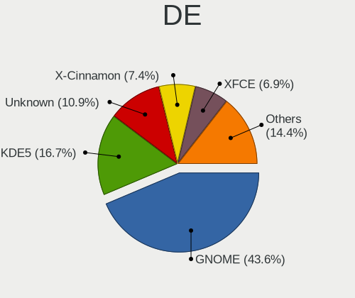
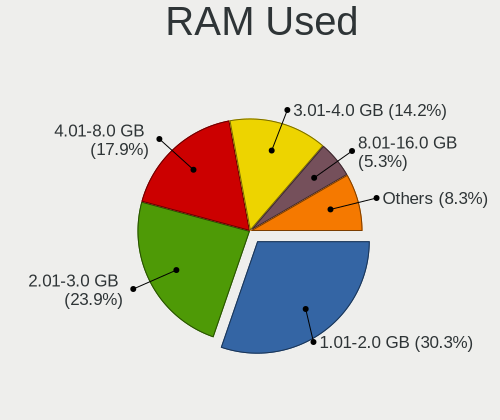
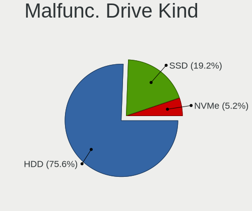
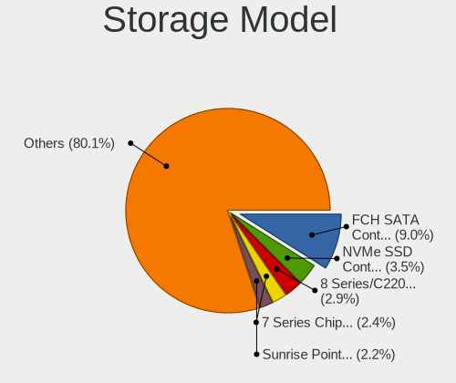
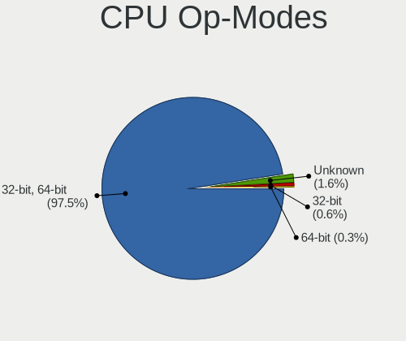
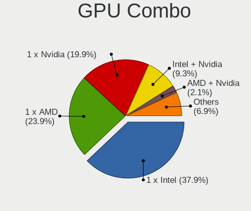
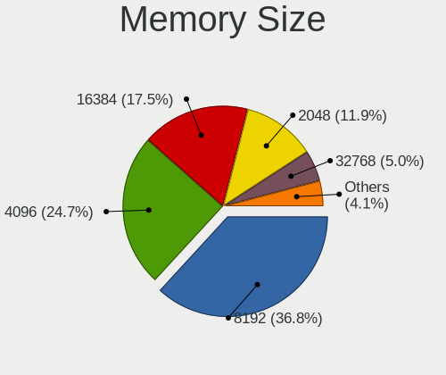

Linux in Canada - Tested Hardware & Statistics
----------------------------------------------

A project to collect tested hardware configurations for Linux in Canada.

Anyone can contribute to this report by the [hw-probe](https://github.com/linuxhw/hw-probe) tool:

    sudo -E hw-probe -all -upload

Please contribute! Especially if your hardware is rare.

This is a report for all computer types. See also reports for [desktops](/Location/Canada/Desktop/README.md) and [notebooks](/Location/Canada/Notebook/README.md).

Contents
--------

* [ Test Cases ](#test-cases)

* [ System ](#system)
  - [ OS                       ](#os)
  - [ OS Family                ](#os-family)
  - [ Kernel                   ](#kernel)
  - [ Kernel Family            ](#kernel-family)
  - [ Kernel Major Ver.        ](#kernel-major-ver)
  - [ Arch                     ](#arch)
  - [ DE                       ](#de)
  - [ Display Server           ](#display-server)
  - [ Display Manager          ](#display-manager)
  - [ OS Lang                  ](#os-lang)
  - [ Boot Mode                ](#boot-mode)
  - [ Filesystem               ](#filesystem)
  - [ Part. scheme             ](#part-scheme)
  - [ Dual Boot with Linux/BSD ](#dual-boot-with-linuxbsd)
  - [ Dual Boot (Win)          ](#dual-boot-win)

* [ Board ](#board)
  - [ Vendor                   ](#vendor)
  - [ Model                    ](#model)
  - [ Model Family             ](#model-family)
  - [ MFG Year                 ](#mfg-year)
  - [ Form Factor              ](#form-factor)
  - [ Secure Boot              ](#secure-boot)
  - [ Coreboot                 ](#coreboot)
  - [ RAM Size                 ](#ram-size)
  - [ RAM Used                 ](#ram-used)
  - [ Total Drives             ](#total-drives)
  - [ Has CD-ROM               ](#has-cd-rom)
  - [ Has Ethernet             ](#has-ethernet)
  - [ Has WiFi                 ](#has-wifi)
  - [ Has Bluetooth            ](#has-bluetooth)

* [ Location ](#location)
  - [ Country                  ](#country)
  - [ City                     ](#city)

* [ Drives ](#drives)
  - [ Drive Vendor             ](#drive-vendor)
  - [ Drive Model              ](#drive-model)
  - [ HDD Vendor               ](#hdd-vendor)
  - [ SSD Vendor               ](#ssd-vendor)
  - [ Drive Kind               ](#drive-kind)
  - [ Drive Connector          ](#drive-connector)
  - [ Drive Size               ](#drive-size)
  - [ Space Total              ](#space-total)
  - [ Space Used               ](#space-used)
  - [ Malfunc. Drives          ](#malfunc-drives)
  - [ Malfunc. Drive Vendor    ](#malfunc-drive-vendor)
  - [ Malfunc. HDD Vendor      ](#malfunc-hdd-vendor)
  - [ Malfunc. Drive Kind      ](#malfunc-drive-kind)
  - [ Failed Drives            ](#failed-drives)
  - [ Failed Drive Vendor      ](#failed-drive-vendor)
  - [ Drive Status             ](#drive-status)

* [ Storage controller ](#storage-controller)
  - [ Storage Vendor           ](#storage-vendor)
  - [ Storage Model            ](#storage-model)
  - [ Storage Kind             ](#storage-kind)

* [ Processor ](#processor)
  - [ CPU Vendor               ](#cpu-vendor)
  - [ CPU Model                ](#cpu-model)
  - [ CPU Model Family         ](#cpu-model-family)
  - [ CPU Cores                ](#cpu-cores)
  - [ CPU Sockets              ](#cpu-sockets)
  - [ CPU Threads              ](#cpu-threads)
  - [ CPU Op-Modes             ](#cpu-op-modes)
  - [ CPU Microcode            ](#cpu-microcode)
  - [ CPU Microarch            ](#cpu-microarch)

* [ Graphics ](#graphics)
  - [ GPU Vendor               ](#gpu-vendor)
  - [ GPU Model                ](#gpu-model)
  - [ GPU Combo                ](#gpu-combo)
  - [ GPU Driver               ](#gpu-driver)
  - [ GPU Memory               ](#gpu-memory)

* [ Monitor ](#monitor)
  - [ Monitor Vendor           ](#monitor-vendor)
  - [ Monitor Model            ](#monitor-model)
  - [ Monitor Resolution       ](#monitor-resolution)
  - [ Monitor Diagonal         ](#monitor-diagonal)
  - [ Monitor Width            ](#monitor-width)
  - [ Aspect Ratio             ](#aspect-ratio)
  - [ Monitor Area             ](#monitor-area)
  - [ Pixel Density            ](#pixel-density)
  - [ Multiple Monitors        ](#multiple-monitors)

* [ Network ](#network)
  - [ Net Controller Vendor    ](#net-controller-vendor)
  - [ Net Controller Model     ](#net-controller-model)
  - [ Wireless Vendor          ](#wireless-vendor)
  - [ Wireless Model           ](#wireless-model)
  - [ Ethernet Vendor          ](#ethernet-vendor)
  - [ Ethernet Model           ](#ethernet-model)
  - [ Net Controller Kind      ](#net-controller-kind)
  - [ Used Controller          ](#used-controller)
  - [ NICs                     ](#nics)
  - [ IPv6                     ](#ipv6)

* [ Bluetooth ](#bluetooth)
  - [ Bluetooth Vendor         ](#bluetooth-vendor)
  - [ Bluetooth Model          ](#bluetooth-model)

* [ Sound ](#sound)
  - [ Sound Vendor             ](#sound-vendor)
  - [ Sound Model              ](#sound-model)

* [ Memory ](#memory)
  - [ Memory Vendor            ](#memory-vendor)
  - [ Memory Model             ](#memory-model)
  - [ Memory Kind              ](#memory-kind)
  - [ Memory Form Factor       ](#memory-form-factor)
  - [ Memory Size              ](#memory-size)
  - [ Memory Speed             ](#memory-speed)

* [ Printers & scanners ](#printers--scanners)
  - [ Printer Vendor           ](#printer-vendor)
  - [ Printer Model            ](#printer-model)
  - [ Scanner Vendor           ](#scanner-vendor)
  - [ Scanner Model            ](#scanner-model)

* [ Camera ](#camera)
  - [ Camera Vendor            ](#camera-vendor)
  - [ Camera Model             ](#camera-model)

* [ Security ](#security)
  - [ Fingerprint Vendor       ](#fingerprint-vendor)
  - [ Fingerprint Model        ](#fingerprint-model)
  - [ Chipcard Vendor          ](#chipcard-vendor)
  - [ Chipcard Model           ](#chipcard-model)

* [ Unsupported ](#unsupported)
  - [ Unsupported Devices      ](#unsupported-devices)
  - [ Unsupported Device Types ](#unsupported-device-types)

Test Cases
----------

Total: 10941

| Vendor        | Model                       | Form-Factor | Probe                                                      | Date         |
|---------------|-----------------------------|-------------|------------------------------------------------------------|--------------|
| Valve         | Jupiter                     | Notebook    | [99879342f6](https://linux-hardware.org/?probe=99879342f6) | May 09, 2024 |
| ASUSTek       | ASUS TUF Gaming F15 FX50... | Notebook    | [291cd1c75f](https://linux-hardware.org/?probe=291cd1c75f) | May 09, 2024 |
| Lenovo        | 110536U ThinkServer TS13... | Desktop     | [d3196733cd](https://linux-hardware.org/?probe=d3196733cd) | May 08, 2024 |
| Alienware     | M17x                        | Notebook    | [349d219a3a](https://linux-hardware.org/?probe=349d219a3a) | May 08, 2024 |
| ASUSTek       | PRIME X570-P                | Desktop     | [43cb45f5c4](https://linux-hardware.org/?probe=43cb45f5c4) | May 08, 2024 |
| MSI           | B550-A PRO                  | Desktop     | [acfeddfe20](https://linux-hardware.org/?probe=acfeddfe20) | May 08, 2024 |
| Lenovo        | SHARKBAY NOK                | Desktop     | [bc53340b58](https://linux-hardware.org/?probe=bc53340b58) | May 07, 2024 |
| Lenovo        | SHARKBAY NOK                | Desktop     | [f41f238d9f](https://linux-hardware.org/?probe=f41f238d9f) | May 07, 2024 |
| Lenovo        | V15 G4 IRU 83A1             | Notebook    | [7cd1070dc0](https://linux-hardware.org/?probe=7cd1070dc0) | May 07, 2024 |
| Unknown       | HOTTAB                      | Desktop     | [aadecb497e](https://linux-hardware.org/?probe=aadecb497e) | May 07, 2024 |
| System76      | Gazelle                     | Notebook    | [fbe88df732](https://linux-hardware.org/?probe=fbe88df732) | May 07, 2024 |
| HP            | ProBook 645 G3              | Notebook    | [29cb5b66f8](https://linux-hardware.org/?probe=29cb5b66f8) | May 07, 2024 |
| Dell          | Precision 7710              | Notebook    | [c89fe612a1](https://linux-hardware.org/?probe=c89fe612a1) | May 06, 2024 |
| Dell          | Precision 7710              | Notebook    | [52c6c4a64a](https://linux-hardware.org/?probe=52c6c4a64a) | May 06, 2024 |
| Dell          | 0F3KHR A01                  | Desktop     | [583ca0d285](https://linux-hardware.org/?probe=583ca0d285) | May 05, 2024 |
| HUAWEI        | BOHK-WAX9X                  | Notebook    | [81e4b0e4f8](https://linux-hardware.org/?probe=81e4b0e4f8) | May 05, 2024 |
| ASUSTek       | TUF Gaming X570-PLUS        | Desktop     | [f0e6546433](https://linux-hardware.org/?probe=f0e6546433) | May 05, 2024 |
| ASUSTek       | GL753VD                     | Notebook    | [05c21dbea4](https://linux-hardware.org/?probe=05c21dbea4) | May 05, 2024 |
| MSI           | WS66 11UKT                  | Notebook    | [f9ab812619](https://linux-hardware.org/?probe=f9ab812619) | May 05, 2024 |
| HP            | 8054                        | Desktop     | [bc7d8e8b56](https://linux-hardware.org/?probe=bc7d8e8b56) | May 04, 2024 |
| Acer          | Aspire E1-522               | Notebook    | [b1c41ef5a0](https://linux-hardware.org/?probe=b1c41ef5a0) | May 04, 2024 |
| ASRock        | A520M-HDV                   | Desktop     | [f0d3e66a28](https://linux-hardware.org/?probe=f0d3e66a28) | May 04, 2024 |
| Unknown       | Unknown                     | Desktop     | [1a175146c0](https://linux-hardware.org/?probe=1a175146c0) | May 04, 2024 |
| ASRock        | Z77 Extreme3                | Desktop     | [447d8518d6](https://linux-hardware.org/?probe=447d8518d6) | May 04, 2024 |
| ASUSTek       | ROG STRIX Z690-A GAMING ... | Desktop     | [9f7202da23](https://linux-hardware.org/?probe=9f7202da23) | May 04, 2024 |
| Gigabyte      | B450 AORUS ELITE            | Desktop     | [8a157b99f2](https://linux-hardware.org/?probe=8a157b99f2) | May 04, 2024 |
| Unknown       | Unknown                     | Desktop     | [fd0ceb7e75](https://linux-hardware.org/?probe=fd0ceb7e75) | May 03, 2024 |
| Acer          | Nitro AN515-57              | Notebook    | [a4f0a4cac3](https://linux-hardware.org/?probe=a4f0a4cac3) | May 03, 2024 |
| Lenovo        | ThinkPad X1 Titanium Gen... | Convertible | [ae4b49a085](https://linux-hardware.org/?probe=ae4b49a085) | May 03, 2024 |
| HP            | Pavilion dv5                | Notebook    | [2ca3da2cdd](https://linux-hardware.org/?probe=2ca3da2cdd) | May 03, 2024 |
| Lenovo        | G500s 20245                 | Notebook    | [54adaed795](https://linux-hardware.org/?probe=54adaed795) | May 03, 2024 |
| Foxconn       | 2A92                        | Desktop     | [0ddf7baafd](https://linux-hardware.org/?probe=0ddf7baafd) | May 03, 2024 |
| HP            | Pavilion dv5                | Notebook    | [fadfece0f4](https://linux-hardware.org/?probe=fadfece0f4) | May 03, 2024 |
| HP            | ENVY Laptop 17-cr1xxx       | Notebook    | [f17f6e1d74](https://linux-hardware.org/?probe=f17f6e1d74) | May 02, 2024 |
| HP            | 82FE 11                     | Desktop     | [417dc3a68d](https://linux-hardware.org/?probe=417dc3a68d) | May 02, 2024 |
| HP            | Pavilion 10 TS              | Notebook    | [eb83dcddc9](https://linux-hardware.org/?probe=eb83dcddc9) | May 02, 2024 |
| HP            | Pavilion 10 TS              | Notebook    | [e7b477dda5](https://linux-hardware.org/?probe=e7b477dda5) | May 02, 2024 |
| HP            | Pavilion 10 TS              | Notebook    | [b0b8ae831e](https://linux-hardware.org/?probe=b0b8ae831e) | May 02, 2024 |
| Apple         | MacBookPro11,1              | Notebook    | [eb47dc7acd](https://linux-hardware.org/?probe=eb47dc7acd) | May 02, 2024 |
| Dell          | 0RW203 A00                  | Desktop     | [3fb1f4e9f9](https://linux-hardware.org/?probe=3fb1f4e9f9) | May 01, 2024 |
| Framework     | Laptop                      | Notebook    | [b1f763433e](https://linux-hardware.org/?probe=b1f763433e) | May 01, 2024 |
| Gigabyte      | 990FXA-UD5                  | Desktop     | [3ca3bc5d3f](https://linux-hardware.org/?probe=3ca3bc5d3f) | May 01, 2024 |
| MSI           | B450 TOMAHAWK MAX           | Desktop     | [164f516c10](https://linux-hardware.org/?probe=164f516c10) | Apr 30, 2024 |
| Supermicro    | X11SAE-M                    | Server      | [ba41a40f36](https://linux-hardware.org/?probe=ba41a40f36) | Apr 30, 2024 |
| MSI           | B450 TOMAHAWK MAX           | Desktop     | [38975e46ec](https://linux-hardware.org/?probe=38975e46ec) | Apr 30, 2024 |
| Gigabyte      | 990FXA-UD5                  | Desktop     | [ccf4678d12](https://linux-hardware.org/?probe=ccf4678d12) | Apr 30, 2024 |
| Framework     | Laptop 13 (AMD Ryzen 704... | Notebook    | [94cfd5a8cf](https://linux-hardware.org/?probe=94cfd5a8cf) | Apr 30, 2024 |
| Framework     | Laptop 13 (AMD Ryzen 704... | Notebook    | [b8bb184ea8](https://linux-hardware.org/?probe=b8bb184ea8) | Apr 30, 2024 |
| ASRock        | B550 Phantom Gaming 4       | Desktop     | [fe30f88923](https://linux-hardware.org/?probe=fe30f88923) | Apr 30, 2024 |
| Gigabyte      | B450 AORUS ELITE V2         | Desktop     | [b9f81199c9](https://linux-hardware.org/?probe=b9f81199c9) | Apr 30, 2024 |
| Chuwi         | LapBook Air                 | Notebook    | [ee0775cfb7](https://linux-hardware.org/?probe=ee0775cfb7) | Apr 30, 2024 |
| ASUSTek       | Maximus Formula             | Desktop     | [c26c507db2](https://linux-hardware.org/?probe=c26c507db2) | Apr 30, 2024 |
| Panasonic     | CF-31WFL72LM                | Notebook    | [4699837ff5](https://linux-hardware.org/?probe=4699837ff5) | Apr 30, 2024 |
| Acer          | Aspire A515-51              | Notebook    | [083965d3db](https://linux-hardware.org/?probe=083965d3db) | Apr 30, 2024 |
| Panasonic     | CF-31WFL72LM                | Notebook    | [efe2e1be70](https://linux-hardware.org/?probe=efe2e1be70) | Apr 30, 2024 |
| Gigabyte      | AERO 15 XD                  | Notebook    | [6dde8eb13a](https://linux-hardware.org/?probe=6dde8eb13a) | Apr 30, 2024 |
| OEM           | KabyLake                    | Notebook    | [0a646c116b](https://linux-hardware.org/?probe=0a646c116b) | Apr 29, 2024 |
| ASUSTek       | X555YA                      | Notebook    | [43e5d87003](https://linux-hardware.org/?probe=43e5d87003) | Apr 29, 2024 |
| HP            | 2129                        | Desktop     | [40fa42996a](https://linux-hardware.org/?probe=40fa42996a) | Apr 29, 2024 |
| Acer          | Aspire E1-532               | Notebook    | [b50154d060](https://linux-hardware.org/?probe=b50154d060) | Apr 28, 2024 |
| Dell          | Inspiron 3721               | Notebook    | [6f596de759](https://linux-hardware.org/?probe=6f596de759) | Apr 28, 2024 |
| MSI           | B550M PRO-VDH WIFI          | Desktop     | [31af2ca036](https://linux-hardware.org/?probe=31af2ca036) | Apr 28, 2024 |
| AZW           | U59                         | Desktop     | [d310713234](https://linux-hardware.org/?probe=d310713234) | Apr 28, 2024 |
| HP            | 2129                        | Desktop     | [03800251ed](https://linux-hardware.org/?probe=03800251ed) | Apr 28, 2024 |
| Dell          | Latitude E6400              | Notebook    | [fe74dc08cd](https://linux-hardware.org/?probe=fe74dc08cd) | Apr 27, 2024 |
| Gigabyte      | AB350M-DS3H-CF              | Desktop     | [38c0cc58a5](https://linux-hardware.org/?probe=38c0cc58a5) | Apr 27, 2024 |
| Lenovo        | 3768 SDK0T76463 WIN 3422... | Desktop     | [01e2eecd25](https://linux-hardware.org/?probe=01e2eecd25) | Apr 26, 2024 |
| Acer          | Nitro AN515-57              | Notebook    | [2232c883cb](https://linux-hardware.org/?probe=2232c883cb) | Apr 26, 2024 |
| ASRock        | Z77 Extreme3                | Desktop     | [83083ad34f](https://linux-hardware.org/?probe=83083ad34f) | Apr 26, 2024 |
| Lenovo        | Yoga 7 14ITL5 82BH          | Convertible | [423c94fbba](https://linux-hardware.org/?probe=423c94fbba) | Apr 26, 2024 |
| ASUSTek       | VivoBook_ASUSLaptop X513... | Notebook    | [01199d3eea](https://linux-hardware.org/?probe=01199d3eea) | Apr 26, 2024 |
| Acer          | Aspire 5733                 | Notebook    | [b84cedde38](https://linux-hardware.org/?probe=b84cedde38) | Apr 26, 2024 |
| Lenovo        | ThinkPad X1 Carbon 2nd 2... | Notebook    | [732deac74e](https://linux-hardware.org/?probe=732deac74e) | Apr 26, 2024 |
| AZW           | MINI S                      | Desktop     | [0c4be52f43](https://linux-hardware.org/?probe=0c4be52f43) | Apr 26, 2024 |
| Lenovo        | ThinkPad P15 Gen 1 20ST0... | Notebook    | [ac764cfca7](https://linux-hardware.org/?probe=ac764cfca7) | Apr 25, 2024 |
| Raspberry ... | Raspberry Pi                | Soc         | [e43b66a800](https://linux-hardware.org/?probe=e43b66a800) | Apr 25, 2024 |
| Gigabyte      | G5 MD                       | Notebook    | [09c723ce43](https://linux-hardware.org/?probe=09c723ce43) | Apr 25, 2024 |
| Gigabyte      | G5 MD                       | Notebook    | [4529b157ae](https://linux-hardware.org/?probe=4529b157ae) | Apr 25, 2024 |
| Acer          | Aspire Z3-710               | All in one  | [a393874af0](https://linux-hardware.org/?probe=a393874af0) | Apr 25, 2024 |
| Raspberry ... | Raspberry Pi                | Soc         | [f4e03aa489](https://linux-hardware.org/?probe=f4e03aa489) | Apr 25, 2024 |
| Acer          | FX58M                       | Desktop     | [d8aec92fe1](https://linux-hardware.org/?probe=d8aec92fe1) | Apr 25, 2024 |
| ASUSTek       | ASUS TUF Gaming F15 FX50... | Notebook    | [b3ed13ee2a](https://linux-hardware.org/?probe=b3ed13ee2a) | Apr 25, 2024 |
| ASUSTek       | PRIME Z590M-PLUS            | Desktop     | [38bbe3657e](https://linux-hardware.org/?probe=38bbe3657e) | Apr 25, 2024 |
| HP            | 0B54h D                     | Desktop     | [a6c876a042](https://linux-hardware.org/?probe=a6c876a042) | Apr 25, 2024 |
| MSI           | GF63 Thin 10SC              | Notebook    | [3ed0366984](https://linux-hardware.org/?probe=3ed0366984) | Apr 25, 2024 |
| HP            | 829A                        | Mini pc     | [b8f9282a11](https://linux-hardware.org/?probe=b8f9282a11) | Apr 25, 2024 |
| Gigabyte      | B660 GAMING X AX DDR4       | Desktop     | [84b2ad73d1](https://linux-hardware.org/?probe=84b2ad73d1) | Apr 25, 2024 |
| Unknown       | Unknown                     | Notebook    | [849147f4a5](https://linux-hardware.org/?probe=849147f4a5) | Apr 25, 2024 |
| Lenovo        | Legion 5 15ARH7 82RE        | Notebook    | [5188dec592](https://linux-hardware.org/?probe=5188dec592) | Apr 24, 2024 |
| Unknown       | RK3588 OPi 5 Plus           | Soc         | [7283ac9c12](https://linux-hardware.org/?probe=7283ac9c12) | Apr 24, 2024 |
| ASRock        | B450 Pro4                   | Desktop     | [a43f744651](https://linux-hardware.org/?probe=a43f744651) | Apr 24, 2024 |
| Lenovo        | G780 20138                  | Notebook    | [dc970a2fc7](https://linux-hardware.org/?probe=dc970a2fc7) | Apr 24, 2024 |
| Lenovo        | ThinkPad P52 20MAS4W721     | Notebook    | [7aab14f802](https://linux-hardware.org/?probe=7aab14f802) | Apr 24, 2024 |
| HP            | EliteBook 2170p             | Notebook    | [847dec6d8e](https://linux-hardware.org/?probe=847dec6d8e) | Apr 24, 2024 |
| MSI           | Z97 PC Mate                 | Desktop     | [1d5f001265](https://linux-hardware.org/?probe=1d5f001265) | Apr 24, 2024 |
| Dell          | XPS 15 9530                 | Notebook    | [e1d4486b51](https://linux-hardware.org/?probe=e1d4486b51) | Apr 24, 2024 |
| MSI           | B450 GAMING PRO CARBON M... | Desktop     | [26f465d651](https://linux-hardware.org/?probe=26f465d651) | Apr 24, 2024 |
| Acer          | Swift SF315-52G             | Notebook    | [91c1e44537](https://linux-hardware.org/?probe=91c1e44537) | Apr 24, 2024 |
| Apple         | Mac-F226BEC8 PVT            | All in one  | [8cb1d1d18b](https://linux-hardware.org/?probe=8cb1d1d18b) | Apr 24, 2024 |
| Intel         | NUC11PHBi7 M26151-404       | Mini pc     | [7fc49ffc5f](https://linux-hardware.org/?probe=7fc49ffc5f) | Apr 23, 2024 |
| MSI           | PRO B550-VC                 | Desktop     | [d4d863e59c](https://linux-hardware.org/?probe=d4d863e59c) | Apr 23, 2024 |
| Lenovo        | ThinkPad P51 20HHCTO1WW     | Notebook    | [152f2cedf4](https://linux-hardware.org/?probe=152f2cedf4) | Apr 23, 2024 |
| ASUSTek       | Rampage V EXTREME           | Desktop     | [f0732b1851](https://linux-hardware.org/?probe=f0732b1851) | Apr 23, 2024 |
| ASUSTek       | TUF Gaming X570-PLUS        | Desktop     | [12f44c7a5a](https://linux-hardware.org/?probe=12f44c7a5a) | Apr 23, 2024 |
| Dell          | Latitude 3340               | Notebook    | [097f5b6c08](https://linux-hardware.org/?probe=097f5b6c08) | Apr 23, 2024 |
| ASUSTek       | Q87T                        | Desktop     | [2c7eb11783](https://linux-hardware.org/?probe=2c7eb11783) | Apr 23, 2024 |
| Apple         | MacBookPro8,2               | Notebook    | [34c23ebcd8](https://linux-hardware.org/?probe=34c23ebcd8) | Apr 23, 2024 |
| Gigabyte      | X570 AORUS ELITE            | Desktop     | [a06e5411c0](https://linux-hardware.org/?probe=a06e5411c0) | Apr 23, 2024 |
| ASUSTek       | ROG STRIX X570-E GAMING     | Desktop     | [bc20931e37](https://linux-hardware.org/?probe=bc20931e37) | Apr 23, 2024 |
| MSI           | MAG Z790 TOMAHAWK WIFI      | Desktop     | [35e248e8bd](https://linux-hardware.org/?probe=35e248e8bd) | Apr 22, 2024 |
| Apple         | MacBookPro12,1              | Notebook    | [4de711d9b5](https://linux-hardware.org/?probe=4de711d9b5) | Apr 22, 2024 |
| Apple         | MacBookPro12,1              | Notebook    | [aecd4caf1c](https://linux-hardware.org/?probe=aecd4caf1c) | Apr 22, 2024 |
| Lenovo        | G780 20138                  | Notebook    | [1863069a38](https://linux-hardware.org/?probe=1863069a38) | Apr 22, 2024 |
| Lenovo        | Yoga 9 14IRP8 83B1          | Convertible | [0d9d7d4924](https://linux-hardware.org/?probe=0d9d7d4924) | Apr 22, 2024 |
| Microsoft     | Surface Pro                 | Tablet      | [8e6a73d201](https://linux-hardware.org/?probe=8e6a73d201) | Apr 22, 2024 |
| Lenovo        | IdeaPadFlex 15 20309        | Notebook    | [a290c311d1](https://linux-hardware.org/?probe=a290c311d1) | Apr 22, 2024 |
| HP            | 82FE 11                     | Desktop     | [8275c83127](https://linux-hardware.org/?probe=8275c83127) | Apr 21, 2024 |
| Lenovo        | ThinkPad X1 Carbon 2nd 2... | Notebook    | [9fb21baa1b](https://linux-hardware.org/?probe=9fb21baa1b) | Apr 21, 2024 |
| RTD Embedd... | CMX34BT                     | Notebook    | [dbbe57d238](https://linux-hardware.org/?probe=dbbe57d238) | Apr 21, 2024 |
| Lenovo        | IdeaPadFlex 5 14ALC7 82R... | Convertible | [e61a160d38](https://linux-hardware.org/?probe=e61a160d38) | Apr 20, 2024 |
| HP            | EliteBook 840 G8 Noteboo... | Notebook    | [e090d79256](https://linux-hardware.org/?probe=e090d79256) | Apr 20, 2024 |
| ASUSTek       | ASUS TUF Gaming F15 FX50... | Notebook    | [22edc4d418](https://linux-hardware.org/?probe=22edc4d418) | Apr 20, 2024 |
| HP            | 0B54h D                     | Desktop     | [e712695ed7](https://linux-hardware.org/?probe=e712695ed7) | Apr 20, 2024 |
| Supermicro    | X11SAE-M                    | Server      | [feaa9e79c1](https://linux-hardware.org/?probe=feaa9e79c1) | Apr 20, 2024 |
| Sony          | SVF15213CDW                 | Notebook    | [b80f0ab84c](https://linux-hardware.org/?probe=b80f0ab84c) | Apr 20, 2024 |
| Lenovo        | ThinkPad T480s 20L8S6BW1... | Notebook    | [778bb54578](https://linux-hardware.org/?probe=778bb54578) | Apr 20, 2024 |
| Trigkey       | S5 V2.0                     | Mini pc     | [9c50a0fe20](https://linux-hardware.org/?probe=9c50a0fe20) | Apr 19, 2024 |
| ASUSTek       | Strix 15 GL503GE            | Notebook    | [efeb67efdf](https://linux-hardware.org/?probe=efeb67efdf) | Apr 19, 2024 |
| ASUSTek       | ProArt B550-CREATOR         | Desktop     | [37bd870888](https://linux-hardware.org/?probe=37bd870888) | Apr 19, 2024 |
| Dell          | Latitude E5420              | Notebook    | [f937473451](https://linux-hardware.org/?probe=f937473451) | Apr 19, 2024 |
| STGAUBRON     | ZRD5104                     | Desktop     | [79c814fd30](https://linux-hardware.org/?probe=79c814fd30) | Apr 19, 2024 |
| Gigabyte      | AB350M-DS3H-CF              | Desktop     | [9624739b2f](https://linux-hardware.org/?probe=9624739b2f) | Apr 19, 2024 |
| ASUSTek       | G10CES                      | Desktop     | [a040e8acd4](https://linux-hardware.org/?probe=a040e8acd4) | Apr 18, 2024 |
| Valve         | Jupiter                     | Notebook    | [38ab9d1cca](https://linux-hardware.org/?probe=38ab9d1cca) | Apr 18, 2024 |
| Dell          | PowerEdge T420              | Server      | [3796c964b5](https://linux-hardware.org/?probe=3796c964b5) | Apr 18, 2024 |
| ASUSTek       | M5A97 R2.0                  | Desktop     | [ba42f42f14](https://linux-hardware.org/?probe=ba42f42f14) | Apr 17, 2024 |
| MSI           | B550M PRO-VDH WIFI          | Desktop     | [e5f340aec0](https://linux-hardware.org/?probe=e5f340aec0) | Apr 17, 2024 |
| ASUSTek       | UX305CA                     | Notebook    | [0793f271ed](https://linux-hardware.org/?probe=0793f271ed) | Apr 17, 2024 |
| Lenovo        | ThinkBook 13s G4 IAP 21A... | Notebook    | [600ef92371](https://linux-hardware.org/?probe=600ef92371) | Apr 17, 2024 |
| Lenovo        | IdeaPadFlex 5 14ALC7 82R... | Convertible | [0ff3d67e4a](https://linux-hardware.org/?probe=0ff3d67e4a) | Apr 17, 2024 |
| Lenovo        | 500w Gen 3 82J3             | Convertible | [d3ad81315d](https://linux-hardware.org/?probe=d3ad81315d) | Apr 17, 2024 |
| MSI           | MPG B550I GAMING EDGE WI... | Desktop     | [ddf96b058d](https://linux-hardware.org/?probe=ddf96b058d) | Apr 17, 2024 |
| Unknown       | RK3588 OPi 5 Plus           | Soc         | [8e4bfc36d8](https://linux-hardware.org/?probe=8e4bfc36d8) | Apr 17, 2024 |
| Dell          | Inspiron 7737               | Notebook    | [1f91e64679](https://linux-hardware.org/?probe=1f91e64679) | Apr 17, 2024 |
| Dell          | Inspiron 7737               | Notebook    | [361844ede0](https://linux-hardware.org/?probe=361844ede0) | Apr 17, 2024 |
| MSI           | MAG Z790 TOMAHAWK WIFI      | Desktop     | [0bf4de97cf](https://linux-hardware.org/?probe=0bf4de97cf) | Apr 17, 2024 |
| Dell          | 0MWYPT A01                  | Desktop     | [1dcea45437](https://linux-hardware.org/?probe=1dcea45437) | Apr 16, 2024 |
| ASUSTek       | GL502VM                     | Notebook    | [d478e55005](https://linux-hardware.org/?probe=d478e55005) | Apr 16, 2024 |
| Acer          | Aspire 5810T                | Notebook    | [3940c56991](https://linux-hardware.org/?probe=3940c56991) | Apr 16, 2024 |
| ASUSTek       | Q87T                        | Desktop     | [fdcc988e3a](https://linux-hardware.org/?probe=fdcc988e3a) | Apr 16, 2024 |
| Apple         | MacBookPro11,1              | Notebook    | [ff3ba1baf8](https://linux-hardware.org/?probe=ff3ba1baf8) | Apr 16, 2024 |
| Apple         | MacBookPro11,1              | Notebook    | [528d3a590f](https://linux-hardware.org/?probe=528d3a590f) | Apr 16, 2024 |
| ASRock        | B650M Pro RS WiFi           | Desktop     | [eb9f0768cf](https://linux-hardware.org/?probe=eb9f0768cf) | Apr 16, 2024 |
| MSI           | MAG X670E TOMAHAWK WIFI     | Desktop     | [d4b692ce92](https://linux-hardware.org/?probe=d4b692ce92) | Apr 15, 2024 |
| Pine Micro... | Pine64 RK3566 Quartz64-A    | Soc         | [2793d6ee33](https://linux-hardware.org/?probe=2793d6ee33) | Apr 15, 2024 |
| ASUSTek       | G751JM                      | Notebook    | [78bd2126e9](https://linux-hardware.org/?probe=78bd2126e9) | Apr 15, 2024 |
| Pine Micro... | Pine64 RK3566 Quartz64-A    | Soc         | [a7100603cf](https://linux-hardware.org/?probe=a7100603cf) | Apr 15, 2024 |
| ASUSTek       | P5Q                         | Desktop     | [2a2880460d](https://linux-hardware.org/?probe=2a2880460d) | Apr 15, 2024 |
| MSI           | H81M-E34                    | Desktop     | [61891eff16](https://linux-hardware.org/?probe=61891eff16) | Apr 15, 2024 |
| Pegatron      | 2ACD                        | Desktop     | [897550ea8a](https://linux-hardware.org/?probe=897550ea8a) | Apr 14, 2024 |
| ASUSTek       | N81Vp                       | Notebook    | [92a6370ed9](https://linux-hardware.org/?probe=92a6370ed9) | Apr 14, 2024 |
| Dell          | Inspiron 5515               | Notebook    | [5847899f83](https://linux-hardware.org/?probe=5847899f83) | Apr 14, 2024 |
| Apple         | MacBookPro11,1              | Notebook    | [58b2e77917](https://linux-hardware.org/?probe=58b2e77917) | Apr 14, 2024 |
| ASUSTek       | VivoBook_ASUSLaptop TP41... | Convertible | [c1ab6b3244](https://linux-hardware.org/?probe=c1ab6b3244) | Apr 14, 2024 |
| ASUSTek       | E402MA                      | Notebook    | [58a1e32393](https://linux-hardware.org/?probe=58a1e32393) | Apr 14, 2024 |
| Lenovo        | ThinkPad X1 Nano Gen 1 2... | Notebook    | [617d302540](https://linux-hardware.org/?probe=617d302540) | Apr 14, 2024 |
| Unknown       | Unknown                     | Notebook    | [9d776d1a83](https://linux-hardware.org/?probe=9d776d1a83) | Apr 14, 2024 |
| Dell          | Studio XPS 1340             | Notebook    | [cac8add4c8](https://linux-hardware.org/?probe=cac8add4c8) | Apr 13, 2024 |
| Dell          | 03KWTV A02                  | Desktop     | [c4e734036d](https://linux-hardware.org/?probe=c4e734036d) | Apr 13, 2024 |
| Apple         | MacBookPro11,3              | Notebook    | [abbfebcf21](https://linux-hardware.org/?probe=abbfebcf21) | Apr 13, 2024 |
| HP            | 8459                        | Desktop     | [2db1190eca](https://linux-hardware.org/?probe=2db1190eca) | Apr 13, 2024 |
| HP            | ProBook 4540s               | Notebook    | [b2bb07154e](https://linux-hardware.org/?probe=b2bb07154e) | Apr 13, 2024 |
| Apple         | MacBookPro5,5               | Notebook    | [f6049182e6](https://linux-hardware.org/?probe=f6049182e6) | Apr 13, 2024 |
| Apple         | Mac-BE088AF8C5EB4FA2 iMa... | All in one  | [d942be89b8](https://linux-hardware.org/?probe=d942be89b8) | Apr 13, 2024 |
| MSI           | B450M MORTAR TITANIUM       | Desktop     | [951b22300e](https://linux-hardware.org/?probe=951b22300e) | Apr 12, 2024 |
| HP            | 2B2B                        | Desktop     | [e5c1d16bde](https://linux-hardware.org/?probe=e5c1d16bde) | Apr 12, 2024 |
| Dell          | Latitude E5270              | Notebook    | [31c5454d09](https://linux-hardware.org/?probe=31c5454d09) | Apr 12, 2024 |
| Lenovo        | ThinkPad T470p 20J7S0FA0... | Notebook    | [77db3dff9e](https://linux-hardware.org/?probe=77db3dff9e) | Apr 12, 2024 |
| HP            | ZBook 15 G3                 | Notebook    | [5f48d3ede1](https://linux-hardware.org/?probe=5f48d3ede1) | Apr 12, 2024 |
| Dell          | 002KVM A00                  | Desktop     | [85ad08c5db](https://linux-hardware.org/?probe=85ad08c5db) | Apr 11, 2024 |
| Lenovo        | ThinkPad T440p 20ANCTO1W... | Notebook    | [7a39eaa9b8](https://linux-hardware.org/?probe=7a39eaa9b8) | Apr 11, 2024 |
| Toshiba       | TECRA Z40-C                 | Notebook    | [8d6c663fc1](https://linux-hardware.org/?probe=8d6c663fc1) | Apr 11, 2024 |
| Lenovo        | ThinkPad T14 Gen 1 20S1S... | Notebook    | [b6a43ddde6](https://linux-hardware.org/?probe=b6a43ddde6) | Apr 11, 2024 |
| Gigabyte      | AERO 15-X9                  | Notebook    | [9bbcd276e5](https://linux-hardware.org/?probe=9bbcd276e5) | Apr 11, 2024 |
| Apple         | Mac-F60DEB81FF30ACF6 Mac... | Desktop     | [f80d29d22d](https://linux-hardware.org/?probe=f80d29d22d) | Apr 11, 2024 |
| ASRock        | 4X4-4000 Series             | Desktop     | [933f5300ab](https://linux-hardware.org/?probe=933f5300ab) | Apr 11, 2024 |
| ASUSTek       | Vivobook Go E1504FA_E150... | Notebook    | [4152c2b9a9](https://linux-hardware.org/?probe=4152c2b9a9) | Apr 11, 2024 |
| ASUSTek       | VivoBook_ASUSLaptop X712... | Notebook    | [c1899c8840](https://linux-hardware.org/?probe=c1899c8840) | Apr 11, 2024 |
| ASUSTek       | M4A78-E                     | Desktop     | [206d758570](https://linux-hardware.org/?probe=206d758570) | Apr 10, 2024 |
| Dell          | Latitude E5470              | Notebook    | [4c1915f7c1](https://linux-hardware.org/?probe=4c1915f7c1) | Apr 10, 2024 |
| ASUSTek       | PD500TC                     | Desktop     | [2d86ec4d4e](https://linux-hardware.org/?probe=2d86ec4d4e) | Apr 10, 2024 |
| Gigabyte      | TRX40 DESIGNARE             | Desktop     | [e86ef24429](https://linux-hardware.org/?probe=e86ef24429) | Apr 10, 2024 |
| Dell          | 030VXY A01                  | Desktop     | [793be088c2](https://linux-hardware.org/?probe=793be088c2) | Apr 09, 2024 |
| Dell          | 030VXY A01                  | Desktop     | [64ed2bb4d3](https://linux-hardware.org/?probe=64ed2bb4d3) | Apr 09, 2024 |
| Lenovo        | ThinkPad T470 20HEA0TLUS    | Notebook    | [fac79c8b6b](https://linux-hardware.org/?probe=fac79c8b6b) | Apr 09, 2024 |
| ASUSTek       | Crosshair IV Formula        | Desktop     | [e62581b4c5](https://linux-hardware.org/?probe=e62581b4c5) | Apr 09, 2024 |
| MSI           | Cyborg 15 A12VF             | Notebook    | [7ca59cdafe](https://linux-hardware.org/?probe=7ca59cdafe) | Apr 09, 2024 |
| ASUSTek       | VivoBook_ASUSLaptop X712... | Notebook    | [cc9aa7ed6c](https://linux-hardware.org/?probe=cc9aa7ed6c) | Apr 09, 2024 |
| Lenovo        | ThinkPad P15v Gen 1 20TQ... | Notebook    | [fba34eaafb](https://linux-hardware.org/?probe=fba34eaafb) | Apr 09, 2024 |
| Dell          | Precision M4800             | Notebook    | [3ec884f458](https://linux-hardware.org/?probe=3ec884f458) | Apr 08, 2024 |
| HP            | ProLiant DL380p Gen8        | Server      | [a54a6ded9c](https://linux-hardware.org/?probe=a54a6ded9c) | Apr 08, 2024 |
| Lenovo        | LOQ 15IRH8 82XV             | Notebook    | [78fa4035a9](https://linux-hardware.org/?probe=78fa4035a9) | Apr 08, 2024 |
| Lenovo        | ThinkPad T530 2359CTO       | Notebook    | [3fb9602631](https://linux-hardware.org/?probe=3fb9602631) | Apr 08, 2024 |
| System76      | Gazelle                     | Notebook    | [969d376558](https://linux-hardware.org/?probe=969d376558) | Apr 07, 2024 |
| Apple         | MacBookPro8,1               | Notebook    | [7efef6a0ae](https://linux-hardware.org/?probe=7efef6a0ae) | Apr 07, 2024 |
| Apple         | MacBookPro8,1               | Notebook    | [d28398beb7](https://linux-hardware.org/?probe=d28398beb7) | Apr 07, 2024 |
| HP            | EliteBook x360 1040 G5      | Convertible | [bbdb88ab07](https://linux-hardware.org/?probe=bbdb88ab07) | Apr 07, 2024 |
| Lenovo        | ThinkPad T510 4349BW3       | Notebook    | [c5a4aad672](https://linux-hardware.org/?probe=c5a4aad672) | Apr 07, 2024 |
| Apple         | Mac-F2238AC8                | All in one  | [79bfecb0bc](https://linux-hardware.org/?probe=79bfecb0bc) | Apr 07, 2024 |
| HP            | ProBook 650 G2              | Notebook    | [005b1cfa0d](https://linux-hardware.org/?probe=005b1cfa0d) | Apr 07, 2024 |
| HP            | ProBook 650 G2              | Notebook    | [fa83ab6042](https://linux-hardware.org/?probe=fa83ab6042) | Apr 07, 2024 |
| MSI           | B550M PRO-VDH WIFI          | Desktop     | [ebc11c966d](https://linux-hardware.org/?probe=ebc11c966d) | Apr 07, 2024 |
| MSI           | B550M PRO-VDH WIFI          | Desktop     | [c917535f70](https://linux-hardware.org/?probe=c917535f70) | Apr 06, 2024 |
| Dell          | 0WG855                      | Desktop     | [f5a1d09496](https://linux-hardware.org/?probe=f5a1d09496) | Apr 06, 2024 |
| Lenovo        | ThinkPad S1 Yoga 20CD20C... | Notebook    | [364146150a](https://linux-hardware.org/?probe=364146150a) | Apr 06, 2024 |
| Lenovo        | ThinkPad P15 Gen 2i 20YQ... | Notebook    | [6fd20472e0](https://linux-hardware.org/?probe=6fd20472e0) | Apr 06, 2024 |
| Dell          | G3 3500                     | Notebook    | [57ecb1dc3d](https://linux-hardware.org/?probe=57ecb1dc3d) | Apr 06, 2024 |
| HP            | EliteBook x360 1030 G3      | Convertible | [9f2cc7f5dc](https://linux-hardware.org/?probe=9f2cc7f5dc) | Apr 06, 2024 |
| Apple         | MacBookPro8,1               | Notebook    | [733d6c6e2b](https://linux-hardware.org/?probe=733d6c6e2b) | Apr 05, 2024 |
| Apple         | MacBookPro11,1              | Notebook    | [80d3babf0d](https://linux-hardware.org/?probe=80d3babf0d) | Apr 05, 2024 |
| ASUSTek       | M4A785-M                    | Desktop     | [dae4d8f0c7](https://linux-hardware.org/?probe=dae4d8f0c7) | Apr 05, 2024 |
| Intel         | S5000PSL                    | Server      | [b6d52648e6](https://linux-hardware.org/?probe=b6d52648e6) | Apr 05, 2024 |
| MSI           | PRO B550M-VC WIFI           | Desktop     | [f8d2db509c](https://linux-hardware.org/?probe=f8d2db509c) | Apr 05, 2024 |
| ASUSTek       | PRIME H410M-A               | Desktop     | [1cb1d0f6bf](https://linux-hardware.org/?probe=1cb1d0f6bf) | Apr 05, 2024 |
| Dell          | 00NH4P A02                  | Server      | [00040f07d6](https://linux-hardware.org/?probe=00040f07d6) | Apr 05, 2024 |
| ASUSTek       | M4A785-M                    | Desktop     | [1a3e173e11](https://linux-hardware.org/?probe=1a3e173e11) | Apr 05, 2024 |
| HP            | ProLiant DL380p Gen8        | Server      | [c21b80086a](https://linux-hardware.org/?probe=c21b80086a) | Apr 05, 2024 |
| Intel Clie... | LAPRC710                    | Notebook    | [d4671cf4fb](https://linux-hardware.org/?probe=d4671cf4fb) | Apr 05, 2024 |
| Intel Clie... | LAPRC710                    | Notebook    | [7b1fd787e5](https://linux-hardware.org/?probe=7b1fd787e5) | Apr 05, 2024 |
| Lenovo        | ThinkPad E580 20KS003LCA    | Notebook    | [a6320acff1](https://linux-hardware.org/?probe=a6320acff1) | Apr 05, 2024 |
| ASUSTek       | VivoBook_ASUSLaptop X150... | Notebook    | [45bd209357](https://linux-hardware.org/?probe=45bd209357) | Apr 05, 2024 |
| MSI           | Bravo 15 C7VFK              | Notebook    | [e987af64b1](https://linux-hardware.org/?probe=e987af64b1) | Apr 05, 2024 |
| Lenovo        | Legion Y7000P IAH7 82RC     | Notebook    | [2edfed7d6c](https://linux-hardware.org/?probe=2edfed7d6c) | Apr 04, 2024 |
| Dell          | 07N90W A02                  | Desktop     | [4d11f26d4c](https://linux-hardware.org/?probe=4d11f26d4c) | Apr 04, 2024 |
| Dell          | 0PU052                      | Desktop     | [6555bfeb7b](https://linux-hardware.org/?probe=6555bfeb7b) | Apr 04, 2024 |
| HP            | 2175                        | Desktop     | [d21c1aaf46](https://linux-hardware.org/?probe=d21c1aaf46) | Apr 04, 2024 |
| Dell          | Precision 5540              | Notebook    | [bcdbeba906](https://linux-hardware.org/?probe=bcdbeba906) | Apr 04, 2024 |
| ASUSTek       | PRIME H570-PLUS             | Desktop     | [69279a9792](https://linux-hardware.org/?probe=69279a9792) | Apr 04, 2024 |
| MSI           | B450M PRO-VDH MAX           | Desktop     | [f939a8ab03](https://linux-hardware.org/?probe=f939a8ab03) | Apr 04, 2024 |
| ASRock        | X470 Master SLI/ac          | Desktop     | [00654fb268](https://linux-hardware.org/?probe=00654fb268) | Apr 04, 2024 |
| Lenovo        | Legion 5 17ACH6H 82JY       | Notebook    | [bbc6cfb633](https://linux-hardware.org/?probe=bbc6cfb633) | Apr 04, 2024 |
| ASRock        | X470 Master SLI/ac          | Desktop     | [aaec2396a7](https://linux-hardware.org/?probe=aaec2396a7) | Apr 03, 2024 |
| HP            | EliteBook x360 1040 G5      | Convertible | [10a4a26f0e](https://linux-hardware.org/?probe=10a4a26f0e) | Apr 03, 2024 |
| Apple         | MacBookAir5,2               | Notebook    | [3c05445a49](https://linux-hardware.org/?probe=3c05445a49) | Apr 03, 2024 |
| ASRock        | B650M Pro RS WiFi           | Desktop     | [e0b3cba959](https://linux-hardware.org/?probe=e0b3cba959) | Apr 03, 2024 |
| Lenovo        | 500w Gen 3 82J3             | Convertible | [00ca2164cf](https://linux-hardware.org/?probe=00ca2164cf) | Apr 03, 2024 |
| ASRock        | B650M Pro RS WiFi           | Desktop     | [60c648fc52](https://linux-hardware.org/?probe=60c648fc52) | Apr 03, 2024 |
| HP            | 828A                        | Desktop     | [953ba8e322](https://linux-hardware.org/?probe=953ba8e322) | Apr 03, 2024 |
| Lenovo        | Legion Y7000P IAH7 82RC     | Notebook    | [dd2a60e142](https://linux-hardware.org/?probe=dd2a60e142) | Apr 03, 2024 |
| ASUSTek       | P5G41T-M                    | Desktop     | [731881f720](https://linux-hardware.org/?probe=731881f720) | Apr 02, 2024 |
| HP            | EliteBook x360 1040 G5      | Convertible | [faec4d68cd](https://linux-hardware.org/?probe=faec4d68cd) | Apr 02, 2024 |
| Dell          | Studio 1537                 | Notebook    | [3e7ce8de4a](https://linux-hardware.org/?probe=3e7ce8de4a) | Apr 02, 2024 |
| HP            | Pavilion m6                 | Notebook    | [147003c9cf](https://linux-hardware.org/?probe=147003c9cf) | Apr 02, 2024 |
| HP            | Pavilion m6                 | Notebook    | [d4c8d5d446](https://linux-hardware.org/?probe=d4c8d5d446) | Apr 02, 2024 |
| Intel         | X99                         | Desktop     | [b9d21bc637](https://linux-hardware.org/?probe=b9d21bc637) | Apr 02, 2024 |
| Microsoft     | Surface Laptop Go           | Tablet      | [30dd23bf0f](https://linux-hardware.org/?probe=30dd23bf0f) | Apr 02, 2024 |
| Lenovo        | ThinkBook 14 G2 ITL 20VD    | Notebook    | [a31a3d60b1](https://linux-hardware.org/?probe=a31a3d60b1) | Apr 01, 2024 |
| Lenovo        | ThinkBook 14 G2 ITL 20VD    | Notebook    | [ce4f787af2](https://linux-hardware.org/?probe=ce4f787af2) | Apr 01, 2024 |
| Apple         | Mac-FC02E91DDD3FA6A4 iMa... | All in one  | [11e0088072](https://linux-hardware.org/?probe=11e0088072) | Apr 01, 2024 |
| HP            | Pavilion Gaming Laptop 1... | Notebook    | [2a00b77a69](https://linux-hardware.org/?probe=2a00b77a69) | Apr 01, 2024 |
| MSI           | MPG B550I GAMING EDGE WI... | Desktop     | [98c3893edd](https://linux-hardware.org/?probe=98c3893edd) | Apr 01, 2024 |
| Dell          | 032W55 A03                  | Desktop     | [5943c24943](https://linux-hardware.org/?probe=5943c24943) | Apr 01, 2024 |
| Valve         | Jupiter                     | Notebook    | [83291b94be](https://linux-hardware.org/?probe=83291b94be) | Mar 31, 2024 |
| Acer          | Extensa 5630                | Notebook    | [8fee1914ea](https://linux-hardware.org/?probe=8fee1914ea) | Mar 31, 2024 |
| Dell          | Inspiron 15 3520            | Notebook    | [ceface0ac8](https://linux-hardware.org/?probe=ceface0ac8) | Mar 31, 2024 |
| Unknown       | NVIDIA Jetson Orin NX En... | Soc         | [33fb218e9e](https://linux-hardware.org/?probe=33fb218e9e) | Mar 31, 2024 |
| ASUSTek       | P8Z77-V PREMIUM             | Desktop     | [3c3064e23a](https://linux-hardware.org/?probe=3c3064e23a) | Mar 31, 2024 |
| HP            | 8459                        | Desktop     | [d4e0767589](https://linux-hardware.org/?probe=d4e0767589) | Mar 31, 2024 |
| ASUSTek       | VivoBook_ASUSLaptop X515... | Notebook    | [17f9e8a736](https://linux-hardware.org/?probe=17f9e8a736) | Mar 31, 2024 |
| Dell          | Latitude E5520              | Notebook    | [875fc34b64](https://linux-hardware.org/?probe=875fc34b64) | Mar 31, 2024 |
| Dell          | XPS 13 9380                 | Notebook    | [cd00da33bc](https://linux-hardware.org/?probe=cd00da33bc) | Mar 30, 2024 |
| HP            | EliteBook Revolve 810 G3    | Notebook    | [a5130eb480](https://linux-hardware.org/?probe=a5130eb480) | Mar 30, 2024 |
| MSI           | MS-B9181                    | Desktop     | [1ae3e9b8ba](https://linux-hardware.org/?probe=1ae3e9b8ba) | Mar 30, 2024 |
| ASUSTek       | PRIME Z690M-PLUS D4         | Desktop     | [0c67b02957](https://linux-hardware.org/?probe=0c67b02957) | Mar 30, 2024 |
| Apple         | MacBookPro15,2              | Notebook    | [02f30c0686](https://linux-hardware.org/?probe=02f30c0686) | Mar 30, 2024 |
| HP            | Notebook                    | Notebook    | [4fde2f6054](https://linux-hardware.org/?probe=4fde2f6054) | Mar 30, 2024 |
| Lenovo        | 1059 SDK0T76530 WIN 3556... | Desktop     | [39db39fb8a](https://linux-hardware.org/?probe=39db39fb8a) | Mar 30, 2024 |
| Toshiba       | TECRA Z40-C                 | Notebook    | [91bd726aad](https://linux-hardware.org/?probe=91bd726aad) | Mar 30, 2024 |
| HP            | 8463                        | Desktop     | [dd77e7dc68](https://linux-hardware.org/?probe=dd77e7dc68) | Mar 30, 2024 |
| ASUSTek       | ROG STRIX B450-F GAMING ... | Desktop     | [c8e50aef4c](https://linux-hardware.org/?probe=c8e50aef4c) | Mar 30, 2024 |
| ASUSTek       | ROG STRIX B450-F GAMING ... | Desktop     | [dc808b758c](https://linux-hardware.org/?probe=dc808b758c) | Mar 30, 2024 |
| Gigabyte      | H55M-S2V                    | Desktop     | [b6b0564fdc](https://linux-hardware.org/?probe=b6b0564fdc) | Mar 29, 2024 |
| ASUSTek       | ROG Flow X16 GV601RE_GV6... | Convertible | [50f1f6c6db](https://linux-hardware.org/?probe=50f1f6c6db) | Mar 29, 2024 |
| MeLE          | Rev GMLR1                   | Mini pc     | [696a1dd0ce](https://linux-hardware.org/?probe=696a1dd0ce) | Mar 29, 2024 |
| ASUSTek       | TUF Gaming X570-PLUS        | Desktop     | [00e4cbdc6e](https://linux-hardware.org/?probe=00e4cbdc6e) | Mar 29, 2024 |
| Lenovo        | ThinkPad X1 Carbon 2nd 2... | Notebook    | [f91babea67](https://linux-hardware.org/?probe=f91babea67) | Mar 28, 2024 |
| Lenovo        | ThinkPad X1 Carbon 2nd 2... | Notebook    | [e2892ac728](https://linux-hardware.org/?probe=e2892ac728) | Mar 28, 2024 |
| HP            | EliteBook 845 G8 Noteboo... | Notebook    | [ece254a4f1](https://linux-hardware.org/?probe=ece254a4f1) | Mar 28, 2024 |
| Dell          | Latitude 5480               | Notebook    | [21dd5f9667](https://linux-hardware.org/?probe=21dd5f9667) | Mar 28, 2024 |
| Dell          | Latitude 7230 Rugged Ext... | Convertible | [8e49bd6d10](https://linux-hardware.org/?probe=8e49bd6d10) | Mar 27, 2024 |
| XFX           | MB-750I-72P9                | Desktop     | [fc5cf282c8](https://linux-hardware.org/?probe=fc5cf282c8) | Mar 27, 2024 |
| System76      | Lemur Pro                   | Notebook    | [df1eefee3b](https://linux-hardware.org/?probe=df1eefee3b) | Mar 27, 2024 |
| Lenovo        | 312F SDK0J40697 WIN 3305... | Mini pc     | [48e33b929c](https://linux-hardware.org/?probe=48e33b929c) | Mar 27, 2024 |
| ASUSTek       | UX430UAR                    | Notebook    | [c8e5df9c12](https://linux-hardware.org/?probe=c8e5df9c12) | Mar 26, 2024 |
| Toshiba       | Satellite A210              | Notebook    | [37734a1409](https://linux-hardware.org/?probe=37734a1409) | Mar 26, 2024 |
| MSI           | PRO Z790-S WIFI             | Desktop     | [ecaa8a51cb](https://linux-hardware.org/?probe=ecaa8a51cb) | Mar 26, 2024 |
| ASUSTek       | P8B75-M                     | Desktop     | [a67e18a770](https://linux-hardware.org/?probe=a67e18a770) | Mar 25, 2024 |
| Lenovo        | ThinkPad T14s Gen 3 21CQ... | Notebook    | [7f8bc016c4](https://linux-hardware.org/?probe=7f8bc016c4) | Mar 25, 2024 |
| Acer          | Aspire A315-42              | Notebook    | [a91a8f1789](https://linux-hardware.org/?probe=a91a8f1789) | Mar 25, 2024 |
| HP            | 3646h                       | Desktop     | [94d980596e](https://linux-hardware.org/?probe=94d980596e) | Mar 25, 2024 |
| ASUSTek       | TUF Gaming X570-PLUS        | Desktop     | [efbd82bed8](https://linux-hardware.org/?probe=efbd82bed8) | Mar 25, 2024 |
| Dell          | 0DR845                      | Desktop     | [81bc347039](https://linux-hardware.org/?probe=81bc347039) | Mar 25, 2024 |
| Gigabyte      | F2A85XM-HD3                 | Desktop     | [8f33c0377d](https://linux-hardware.org/?probe=8f33c0377d) | Mar 25, 2024 |
| Gigabyte      | F2A85XM-HD3                 | Desktop     | [98d28a50e5](https://linux-hardware.org/?probe=98d28a50e5) | Mar 25, 2024 |
| Dell          | 0KWVT8 A00                  | Desktop     | [ae811bf4d9](https://linux-hardware.org/?probe=ae811bf4d9) | Mar 24, 2024 |
| MSI           | Modern 15 B7M               | Notebook    | [29f1cd54e1](https://linux-hardware.org/?probe=29f1cd54e1) | Mar 24, 2024 |
| MSI           | B550M PRO-VDH WIFI          | Desktop     | [773df1edad](https://linux-hardware.org/?probe=773df1edad) | Mar 24, 2024 |
| Dell          | XPS 15 7590                 | Notebook    | [5f2e3e5e82](https://linux-hardware.org/?probe=5f2e3e5e82) | Mar 24, 2024 |
| Dell          | XPS 15 7590                 | Notebook    | [fd518a9250](https://linux-hardware.org/?probe=fd518a9250) | Mar 24, 2024 |
| Dell          | Latitude E6540              | Notebook    | [baf4466c0c](https://linux-hardware.org/?probe=baf4466c0c) | Mar 24, 2024 |
| Apple         | Mac-031B6874CF7F642A iMa... | All in one  | [8c7b4ccc7d](https://linux-hardware.org/?probe=8c7b4ccc7d) | Mar 24, 2024 |
| HP            | Pavilion dv5                | Notebook    | [72da06e33c](https://linux-hardware.org/?probe=72da06e33c) | Mar 24, 2024 |
| Dell          | Inspiron 7580               | Notebook    | [8175d8b6de](https://linux-hardware.org/?probe=8175d8b6de) | Mar 24, 2024 |
| Gigabyte      | A520M S2H                   | Desktop     | [9e6a2e1fee](https://linux-hardware.org/?probe=9e6a2e1fee) | Mar 24, 2024 |
| HP            | 18E4                        | Desktop     | [e47f65729a](https://linux-hardware.org/?probe=e47f65729a) | Mar 23, 2024 |
| Dell          | Latitude 7420               | Notebook    | [511721b690](https://linux-hardware.org/?probe=511721b690) | Mar 23, 2024 |
| Dell          | Inspiron 5480               | Notebook    | [62a55513db](https://linux-hardware.org/?probe=62a55513db) | Mar 23, 2024 |
| ASUSTek       | ROG STRIX X570-E GAMING     | Desktop     | [2e37fef15e](https://linux-hardware.org/?probe=2e37fef15e) | Mar 23, 2024 |
| Dell          | Precision 3550              | Notebook    | [94674b699c](https://linux-hardware.org/?probe=94674b699c) | Mar 23, 2024 |
| ASUSTek       | X551MA                      | Notebook    | [05cfb55044](https://linux-hardware.org/?probe=05cfb55044) | Mar 23, 2024 |
| Acer          | RS880M05                    | Desktop     | [d4f039d786](https://linux-hardware.org/?probe=d4f039d786) | Mar 23, 2024 |
| ASUSTek       | ROG Zephyrus Duo 16 GX65... | Notebook    | [015232a1ee](https://linux-hardware.org/?probe=015232a1ee) | Mar 22, 2024 |
| Dell          | Latitude E6420              | Notebook    | [cdd8eb657a](https://linux-hardware.org/?probe=cdd8eb657a) | Mar 22, 2024 |
| Unknown       | Cherry Trail CR             | Notebook    | [efb2513f33](https://linux-hardware.org/?probe=efb2513f33) | Mar 22, 2024 |
| HP            | ProBook 650 G2              | Notebook    | [f37b764c1f](https://linux-hardware.org/?probe=f37b764c1f) | Mar 22, 2024 |
| HP            | 1905                        | Desktop     | [6e80318f95](https://linux-hardware.org/?probe=6e80318f95) | Mar 22, 2024 |
| HP            | 82FE 11                     | Desktop     | [c64d48592f](https://linux-hardware.org/?probe=c64d48592f) | Mar 22, 2024 |
| HP            | 82FE 11                     | Desktop     | [6686bf6633](https://linux-hardware.org/?probe=6686bf6633) | Mar 22, 2024 |
| HP            | 82FE 11                     | Desktop     | [6e4489e812](https://linux-hardware.org/?probe=6e4489e812) | Mar 22, 2024 |
| Lenovo        | ThinkPad X1 Carbon 3444F... | Notebook    | [3f2b9d56d7](https://linux-hardware.org/?probe=3f2b9d56d7) | Mar 22, 2024 |
| Microsoft     | Surface Laptop Go           | Tablet      | [6804305abd](https://linux-hardware.org/?probe=6804305abd) | Mar 21, 2024 |
| Dell          | XPS 13 9315 2-in-1          | Tablet      | [de8dd973e4](https://linux-hardware.org/?probe=de8dd973e4) | Mar 21, 2024 |
| Valve         | Jupiter                     | Notebook    | [799336fb6f](https://linux-hardware.org/?probe=799336fb6f) | Mar 21, 2024 |
| Lenovo        | Bantry CRB SDK0E50510 WI... | Desktop     | [3a158f6014](https://linux-hardware.org/?probe=3a158f6014) | Mar 21, 2024 |
| Dell          | Latitude E6540              | Notebook    | [c3883595b9](https://linux-hardware.org/?probe=c3883595b9) | Mar 21, 2024 |
| Lenovo        | Yoga 920-13IKB 80Y7         | Convertible | [e7ea34fd49](https://linux-hardware.org/?probe=e7ea34fd49) | Mar 20, 2024 |
| Acer          | Extensa 5630                | Notebook    | [8e43318d08](https://linux-hardware.org/?probe=8e43318d08) | Mar 20, 2024 |
| Lenovo        | ThinkPad W500 40633FU       | Notebook    | [6ce965896b](https://linux-hardware.org/?probe=6ce965896b) | Mar 20, 2024 |
| Apple         | MacBook8,1                  | Notebook    | [fa8342132f](https://linux-hardware.org/?probe=fa8342132f) | Mar 20, 2024 |
| Apple         | MacBook8,1                  | Notebook    | [ac828c20cd](https://linux-hardware.org/?probe=ac828c20cd) | Mar 20, 2024 |
| HP            | ENVY x360 Convertible 15... | Convertible | [c7c3652c67](https://linux-hardware.org/?probe=c7c3652c67) | Mar 20, 2024 |
| Alienware     | x15 R1                      | Notebook    | [686f4ed556](https://linux-hardware.org/?probe=686f4ed556) | Mar 20, 2024 |
| Toshiba       | Satellite S50D-A            | Notebook    | [9c1fad3c73](https://linux-hardware.org/?probe=9c1fad3c73) | Mar 20, 2024 |
| ASUSTek       | TUF Gaming X570-PLUS        | Desktop     | [d53232b16e](https://linux-hardware.org/?probe=d53232b16e) | Mar 19, 2024 |
| Dell          | Latitude 7440               | Notebook    | [143c9f9828](https://linux-hardware.org/?probe=143c9f9828) | Mar 19, 2024 |
| MSI           | MPG B550 GAMING PLUS        | Desktop     | [37a57d5b70](https://linux-hardware.org/?probe=37a57d5b70) | Mar 19, 2024 |
| ASRock        | B450M Pro4 R2.0             | Desktop     | [09cc580df1](https://linux-hardware.org/?probe=09cc580df1) | Mar 19, 2024 |
| ASUSTek       | ROG STRIX B450-F GAMING ... | Desktop     | [cb3904b8ec](https://linux-hardware.org/?probe=cb3904b8ec) | Mar 19, 2024 |
| ASUSTek       | ROG STRIX B450-F GAMING ... | Desktop     | [5b8baf227c](https://linux-hardware.org/?probe=5b8baf227c) | Mar 18, 2024 |
| MSI           | MAG B650 TOMAHAWK WIFI      | Desktop     | [50b41d2570](https://linux-hardware.org/?probe=50b41d2570) | Mar 18, 2024 |
| MSI           | MAG B650 TOMAHAWK WIFI      | Desktop     | [cca929ae4e](https://linux-hardware.org/?probe=cca929ae4e) | Mar 18, 2024 |
| MSI           | X99A RAIDER                 | Desktop     | [8d5dfb7293](https://linux-hardware.org/?probe=8d5dfb7293) | Mar 18, 2024 |
| Intel         | Unknown                     | Desktop     | [4ec95381a2](https://linux-hardware.org/?probe=4ec95381a2) | Mar 18, 2024 |
| ASUSTek       | ROG Strix G513QE_G513QE     | Notebook    | [1a65c1c7d8](https://linux-hardware.org/?probe=1a65c1c7d8) | Mar 18, 2024 |
| Lenovo        | ThinkPad T480s 20L8SCMY0... | Notebook    | [e529b241b9](https://linux-hardware.org/?probe=e529b241b9) | Mar 18, 2024 |
| ASUSTek       | PRIME H310M-A               | Desktop     | [95e2b24425](https://linux-hardware.org/?probe=95e2b24425) | Mar 18, 2024 |
| Supermicro    | X10DAI                      | Desktop     | [f50171c58c](https://linux-hardware.org/?probe=f50171c58c) | Mar 18, 2024 |
| HP            | G60                         | Notebook    | [67399d429c](https://linux-hardware.org/?probe=67399d429c) | Mar 18, 2024 |
| Lenovo        | G70-70 80HW0014FR           | Notebook    | [8fd24b2766](https://linux-hardware.org/?probe=8fd24b2766) | Mar 17, 2024 |
| Lenovo        | G70-70 80HW0014FR           | Notebook    | [ebb00d0246](https://linux-hardware.org/?probe=ebb00d0246) | Mar 17, 2024 |
| Gigabyte      | X570 AORUS MASTER           | Desktop     | [ee3281cbda](https://linux-hardware.org/?probe=ee3281cbda) | Mar 17, 2024 |
| ASUSTek       | Zenbook UP6502ZD_UP6502Z... | Convertible | [e27178a011](https://linux-hardware.org/?probe=e27178a011) | Mar 17, 2024 |
| Lenovo        | IdeaPad S145-15IWL 81MV     | Notebook    | [8388b1b84b](https://linux-hardware.org/?probe=8388b1b84b) | Mar 17, 2024 |
| Lenovo        | IdeaPad S145-15IWL 81MV     | Notebook    | [97e2cab9ff](https://linux-hardware.org/?probe=97e2cab9ff) | Mar 17, 2024 |
| Lenovo        | 310B SDK0J40697 WIN 3305... | Desktop     | [2f763edf96](https://linux-hardware.org/?probe=2f763edf96) | Mar 16, 2024 |
| Dell          | Latitude 5480               | Notebook    | [84cc86e4f5](https://linux-hardware.org/?probe=84cc86e4f5) | Mar 16, 2024 |
| Lenovo        | IdeaPadFlex 5 14IRU8 82Y... | Convertible | [3878433152](https://linux-hardware.org/?probe=3878433152) | Mar 16, 2024 |
| Apple         | Mac-7BA5B2794B2CDB12 Mac... | Mini pc     | [4dd3724ca0](https://linux-hardware.org/?probe=4dd3724ca0) | Mar 16, 2024 |
| ASUSTek       | E1600WKA                    | All in one  | [c96a90df46](https://linux-hardware.org/?probe=c96a90df46) | Mar 16, 2024 |
| Samsung       | 950QDB                      | Convertible | [d491268c86](https://linux-hardware.org/?probe=d491268c86) | Mar 16, 2024 |
| Dell          | 02C2CP A04                  | Server      | [2eb0ecb18c](https://linux-hardware.org/?probe=2eb0ecb18c) | Mar 15, 2024 |
| AZW           | SER V1.0                    | Mini pc     | [b6fa268336](https://linux-hardware.org/?probe=b6fa268336) | Mar 15, 2024 |
| Dell          | Inspiron 5570               | Notebook    | [54adba9e2e](https://linux-hardware.org/?probe=54adba9e2e) | Mar 15, 2024 |
| ASRock        | X470 Master SLI/ac          | Desktop     | [4080e4f60b](https://linux-hardware.org/?probe=4080e4f60b) | Mar 15, 2024 |
| ASUSTek       | VivoBook_ASUSLaptop X150... | Notebook    | [96f5ad9c2b](https://linux-hardware.org/?probe=96f5ad9c2b) | Mar 15, 2024 |
| Acer          | Aspire 5830TG               | Notebook    | [3f677c1ef3](https://linux-hardware.org/?probe=3f677c1ef3) | Mar 15, 2024 |
| Chuwi         | UBook X                     | Tablet      | [e75500d5ac](https://linux-hardware.org/?probe=e75500d5ac) | Mar 15, 2024 |
| Apple         | Mac-F2238BAE iMac11,3       | All in one  | [0335b381d3](https://linux-hardware.org/?probe=0335b381d3) | Mar 14, 2024 |
| Gigabyte      | B550M DS3H AC               | Desktop     | [1c1be18d2b](https://linux-hardware.org/?probe=1c1be18d2b) | Mar 14, 2024 |
| Lenovo        | ThinkPad E15 20RD005HUS     | Notebook    | [19a5380b1f](https://linux-hardware.org/?probe=19a5380b1f) | Mar 14, 2024 |
| Dell          | Latitude 5401               | Notebook    | [651b3a2f09](https://linux-hardware.org/?probe=651b3a2f09) | Mar 14, 2024 |
| Samsung       | 950QDB                      | Convertible | [8d4fd6acf0](https://linux-hardware.org/?probe=8d4fd6acf0) | Mar 14, 2024 |
| Lenovo        | Yoga 9 2-in-1 14IMH9 83A... | Convertible | [a5be7c159b](https://linux-hardware.org/?probe=a5be7c159b) | Mar 13, 2024 |
| Alienware     | 07HV66 A01                  | Desktop     | [b94fccbefa](https://linux-hardware.org/?probe=b94fccbefa) | Mar 13, 2024 |
| Dell          | Inspiron 5575               | Notebook    | [982b876f87](https://linux-hardware.org/?probe=982b876f87) | Mar 13, 2024 |
| Gigabyte      | GA-MA790GP-DS4H             | Desktop     | [9ffb06c47b](https://linux-hardware.org/?probe=9ffb06c47b) | Mar 13, 2024 |
| Dell          | Latitude 5290 2-in-1        | Notebook    | [201c221469](https://linux-hardware.org/?probe=201c221469) | Mar 12, 2024 |
| Chuwi         | UBook X                     | Tablet      | [bab0a4bcb7](https://linux-hardware.org/?probe=bab0a4bcb7) | Mar 12, 2024 |
| Chuwi         | UBook X                     | Tablet      | [5bc5d0dcde](https://linux-hardware.org/?probe=5bc5d0dcde) | Mar 12, 2024 |
| Apple         | MacBookPro9,2               | Notebook    | [00183dc259](https://linux-hardware.org/?probe=00183dc259) | Mar 12, 2024 |
| NZXT          | N7 B650E                    | Desktop     | [66453a8f80](https://linux-hardware.org/?probe=66453a8f80) | Mar 12, 2024 |
| Alienware     | x15 R1                      | Notebook    | [84d6d61f1b](https://linux-hardware.org/?probe=84d6d61f1b) | Mar 12, 2024 |
| NZXT          | N7 B650E                    | Desktop     | [b788fa656b](https://linux-hardware.org/?probe=b788fa656b) | Mar 12, 2024 |
| ASUSTek       | PRIME B450M-A               | Desktop     | [edad3b75e7](https://linux-hardware.org/?probe=edad3b75e7) | Mar 12, 2024 |
| Dell          | Latitude 5401               | Notebook    | [b68db5aef2](https://linux-hardware.org/?probe=b68db5aef2) | Mar 12, 2024 |
| Lenovo        | ThinkPad X230 2325GW8       | Notebook    | [e2c027ac26](https://linux-hardware.org/?probe=e2c027ac26) | Mar 11, 2024 |
| Lenovo        | ThinkPad X230 2325GW8       | Notebook    | [ce96a808a1](https://linux-hardware.org/?probe=ce96a808a1) | Mar 11, 2024 |
| MSI           | 760GM-P34                   | Desktop     | [cef041a8ee](https://linux-hardware.org/?probe=cef041a8ee) | Mar 10, 2024 |
| ASRockRack    | B550D4U-2T R1.00            | Desktop     | [79de662be3](https://linux-hardware.org/?probe=79de662be3) | Mar 10, 2024 |
| HP            | 8054                        | Desktop     | [669647a8ee](https://linux-hardware.org/?probe=669647a8ee) | Mar 10, 2024 |
| Gigabyte      | B650 GAMING X AX            | Notebook    | [3ee6829e26](https://linux-hardware.org/?probe=3ee6829e26) | Mar 10, 2024 |
| ASUSTek       | PRIME B250-PLUS             | Desktop     | [7dd55cb803](https://linux-hardware.org/?probe=7dd55cb803) | Mar 09, 2024 |
| Dell          | 0KWVT8 A00                  | Desktop     | [c80fca1d72](https://linux-hardware.org/?probe=c80fca1d72) | Mar 09, 2024 |
| ASUSTek       | X550ZA                      | Notebook    | [6bcc8425b7](https://linux-hardware.org/?probe=6bcc8425b7) | Mar 09, 2024 |
| ASUSTek       | X550ZA                      | Notebook    | [62d2c0438f](https://linux-hardware.org/?probe=62d2c0438f) | Mar 09, 2024 |
| Dell          | Precision 5540              | Notebook    | [d6bf9d8d32](https://linux-hardware.org/?probe=d6bf9d8d32) | Mar 09, 2024 |
| Gigabyte      | H110M-S2H-CF                | Desktop     | [31c6c9c883](https://linux-hardware.org/?probe=31c6c9c883) | Mar 09, 2024 |
| AYANEO        | AIR Pro                     | Tablet      | [6caf615aeb](https://linux-hardware.org/?probe=6caf615aeb) | Mar 09, 2024 |
| ASUSTek       | VivoBook_ASUSLaptop TP42... | Convertible | [4e65f90b1b](https://linux-hardware.org/?probe=4e65f90b1b) | Mar 09, 2024 |
| ASUSTek       | PRIME B550-PLUS             | Desktop     | [adab411eb7](https://linux-hardware.org/?probe=adab411eb7) | Mar 09, 2024 |
| ASUSTek       | PRIME Z490-P                | Desktop     | [f208bbae00](https://linux-hardware.org/?probe=f208bbae00) | Mar 08, 2024 |
| Gigabyte      | G1.Guerrilla                | Desktop     | [24f2da961a](https://linux-hardware.org/?probe=24f2da961a) | Mar 08, 2024 |
| Dell          | XPS 15 9530                 | Notebook    | [c5e0eb96bf](https://linux-hardware.org/?probe=c5e0eb96bf) | Mar 08, 2024 |
| Gigabyte      | Z390 AORUS ELITE-CF         | Desktop     | [e1d8f91062](https://linux-hardware.org/?probe=e1d8f91062) | Mar 08, 2024 |
| ASUSTek       | PRIME Z490-P                | Desktop     | [b4f141c9da](https://linux-hardware.org/?probe=b4f141c9da) | Mar 08, 2024 |
| ASUSTek       | TUF Gaming FX505DT_FX505... | Notebook    | [7700a7a168](https://linux-hardware.org/?probe=7700a7a168) | Mar 08, 2024 |
| ASUSTek       | P8Z77-V PRO                 | Desktop     | [b18d2c6cab](https://linux-hardware.org/?probe=b18d2c6cab) | Mar 08, 2024 |
| Gigabyte      | AX370-Gaming K5-CF          | Desktop     | [72315b2955](https://linux-hardware.org/?probe=72315b2955) | Mar 08, 2024 |
| ASUSTek       | Zenbook UX3402VA_UX3402V... | Notebook    | [de4f9c0df5](https://linux-hardware.org/?probe=de4f9c0df5) | Mar 07, 2024 |
| MSI           | MPG X570 GAMING PLUS        | Desktop     | [b07882e6fb](https://linux-hardware.org/?probe=b07882e6fb) | Mar 07, 2024 |
| Dell          | 0G214D A00                  | Desktop     | [36603554a5](https://linux-hardware.org/?probe=36603554a5) | Mar 07, 2024 |
| Dell          | Latitude 5440               | Notebook    | [555765316a](https://linux-hardware.org/?probe=555765316a) | Mar 07, 2024 |
| Gigabyte      | B650 GAMING X AX            | Desktop     | [fc15cf0d4a](https://linux-hardware.org/?probe=fc15cf0d4a) | Mar 07, 2024 |
| HP            | ProBook 650 G2              | Notebook    | [93b1986cc2](https://linux-hardware.org/?probe=93b1986cc2) | Mar 07, 2024 |
| Valve         | Jupiter                     | Notebook    | [677470b88d](https://linux-hardware.org/?probe=677470b88d) | Mar 06, 2024 |
| HP            | EliteBook 845 G8 Noteboo... | Notebook    | [5f7a226ed8](https://linux-hardware.org/?probe=5f7a226ed8) | Mar 06, 2024 |
| Lenovo        | ThinkPad S1 Yoga 20CD20C... | Notebook    | [e81ed8b98c](https://linux-hardware.org/?probe=e81ed8b98c) | Mar 06, 2024 |
| Lenovo        | Yoga 7 14IRL8 82YL          | Convertible | [97485e36ca](https://linux-hardware.org/?probe=97485e36ca) | Mar 06, 2024 |
| Lenovo        | IdeaPadFlex 5 14ABR8 82X... | Convertible | [d127ea57be](https://linux-hardware.org/?probe=d127ea57be) | Mar 06, 2024 |
| ASUSTek       | P8Z77-M                     | Desktop     | [031b9032f6](https://linux-hardware.org/?probe=031b9032f6) | Mar 06, 2024 |
| Dell          | Inspiron 7737               | Notebook    | [5077731ec5](https://linux-hardware.org/?probe=5077731ec5) | Mar 06, 2024 |
| Notebook      | N2x0WU                      | Notebook    | [ef33fc7a3b](https://linux-hardware.org/?probe=ef33fc7a3b) | Mar 05, 2024 |
| ASUSTek       | ROG STRIX X670E-A GAMING... | Desktop     | [70d9f1030b](https://linux-hardware.org/?probe=70d9f1030b) | Mar 05, 2024 |
| Lenovo        | ThinkPad X230 23252UU       | Notebook    | [7fb7bfaacd](https://linux-hardware.org/?probe=7fb7bfaacd) | Mar 05, 2024 |
| Gigabyte      | G1.Guerrilla                | Desktop     | [a6cb9cdd68](https://linux-hardware.org/?probe=a6cb9cdd68) | Mar 05, 2024 |
| ASUSTek       | VivoBook_ASUSLaptop TP41... | Convertible | [a162f6b8c8](https://linux-hardware.org/?probe=a162f6b8c8) | Mar 05, 2024 |
| Dell          | Inspiron 1525               | Notebook    | [0358ab3364](https://linux-hardware.org/?probe=0358ab3364) | Mar 05, 2024 |
| ASUSTek       | ZenBook Pro Duo UX582LR_... | Notebook    | [141c46ed9d](https://linux-hardware.org/?probe=141c46ed9d) | Mar 05, 2024 |
| Dell          | XPS 15 9500                 | Notebook    | [468ac8a917](https://linux-hardware.org/?probe=468ac8a917) | Mar 05, 2024 |
| Dell          | 0MTYYT A03                  | Server      | [5fa39da50a](https://linux-hardware.org/?probe=5fa39da50a) | Mar 04, 2024 |
| Gigabyte      | Z390 AORUS ELITE-CF         | Desktop     | [39216b08cb](https://linux-hardware.org/?probe=39216b08cb) | Mar 04, 2024 |
| HP            | EliteBook 745 G6            | Notebook    | [261890a283](https://linux-hardware.org/?probe=261890a283) | Mar 04, 2024 |
| ASUSTek       | VivoBook_ASUSLaptop X515... | Notebook    | [1d8f8e4d0f](https://linux-hardware.org/?probe=1d8f8e4d0f) | Mar 04, 2024 |
| ASUSTek       | P7P55D                      | Desktop     | [2b9fe60339](https://linux-hardware.org/?probe=2b9fe60339) | Mar 04, 2024 |
| Gigabyte      | H110M-S2H-CF                | Desktop     | [ee26b5bb3e](https://linux-hardware.org/?probe=ee26b5bb3e) | Mar 04, 2024 |
| Dell          | 0Y2MRG A01                  | Desktop     | [e86dfdef50](https://linux-hardware.org/?probe=e86dfdef50) | Mar 04, 2024 |
| Lenovo        | Yoga 730-15IKB 81CU         | Convertible | [4f6d478c7b](https://linux-hardware.org/?probe=4f6d478c7b) | Mar 03, 2024 |
| Red Hat       | RHEL RHEL-9.0.0 PC          | Desktop     | [0e55d35354](https://linux-hardware.org/?probe=0e55d35354) | Mar 03, 2024 |
| Apple         | Mac-F4238CC8 PVT            | All in one  | [ec7680f86d](https://linux-hardware.org/?probe=ec7680f86d) | Mar 03, 2024 |
| Valve         | Jupiter                     | Notebook    | [3937ff45d4](https://linux-hardware.org/?probe=3937ff45d4) | Mar 03, 2024 |
| Dell          | 0D24M8 A01                  | Desktop     | [7e04cbe20c](https://linux-hardware.org/?probe=7e04cbe20c) | Mar 03, 2024 |
| Dell          | 0D24M8 A01                  | Desktop     | [554a7aa150](https://linux-hardware.org/?probe=554a7aa150) | Mar 03, 2024 |
| MSI           | MAG Z790 TOMAHAWK MAX WI... | Desktop     | [8f67947698](https://linux-hardware.org/?probe=8f67947698) | Mar 03, 2024 |
| Dell          | 0PC5F7 A02                  | Desktop     | [fdfe4e3348](https://linux-hardware.org/?probe=fdfe4e3348) | Mar 03, 2024 |
| Lenovo        | ThinkPad E15 20RD005HUS     | Notebook    | [761e11bc9b](https://linux-hardware.org/?probe=761e11bc9b) | Mar 03, 2024 |
| Raspberry ... | Raspberry Pi 4 Model B R... | Soc         | [2e07664ae3](https://linux-hardware.org/?probe=2e07664ae3) | Mar 02, 2024 |
| ASUSTek       | Z170-A                      | Desktop     | [5c7cfb2969](https://linux-hardware.org/?probe=5c7cfb2969) | Mar 02, 2024 |
| Toshiba       | Satellite C650              | Notebook    | [ee60747898](https://linux-hardware.org/?probe=ee60747898) | Mar 02, 2024 |
| ASUSTek       | P5Q                         | Desktop     | [93b54d8b77](https://linux-hardware.org/?probe=93b54d8b77) | Mar 02, 2024 |
| Acer          | Aspire TC-895 V:1.0         | Desktop     | [377b782537](https://linux-hardware.org/?probe=377b782537) | Mar 02, 2024 |
| HP            | EliteBook 840 G3            | Notebook    | [3c120a627d](https://linux-hardware.org/?probe=3c120a627d) | Mar 02, 2024 |
| HP            | EliteBook 840 G3            | Notebook    | [6067e37980](https://linux-hardware.org/?probe=6067e37980) | Mar 01, 2024 |
| ASRock        | X470 Master SLI/ac          | Desktop     | [d35d9477d1](https://linux-hardware.org/?probe=d35d9477d1) | Mar 01, 2024 |
| HP            | ENVY x360 Convertible 15... | Convertible | [037a1403df](https://linux-hardware.org/?probe=037a1403df) | Mar 01, 2024 |
| HP            | Pavilion 15                 | Notebook    | [97da590ed6](https://linux-hardware.org/?probe=97da590ed6) | Feb 29, 2024 |
| HP            | ENVY 17                     | Notebook    | [32a7be64a9](https://linux-hardware.org/?probe=32a7be64a9) | Feb 29, 2024 |
| Acer          | Aspire F5-573               | Notebook    | [273d93d99e](https://linux-hardware.org/?probe=273d93d99e) | Feb 29, 2024 |
| Gigabyte      | GA-MA790GP-DS4H             | Desktop     | [0bdc619992](https://linux-hardware.org/?probe=0bdc619992) | Feb 28, 2024 |
| Pine Micro... | Pine64 RK3566 Quartz64-A    | Soc         | [796c7c1066](https://linux-hardware.org/?probe=796c7c1066) | Feb 28, 2024 |
| Lenovo        | ThinkPad X220 42872VU       | Notebook    | [69ecd93d90](https://linux-hardware.org/?probe=69ecd93d90) | Feb 28, 2024 |
| Dell          | 0WN7Y6 A01                  | Desktop     | [61d8f666ac](https://linux-hardware.org/?probe=61d8f666ac) | Feb 28, 2024 |
| Dell          | 088DT1 A00                  | Desktop     | [b90ae646ef](https://linux-hardware.org/?probe=b90ae646ef) | Feb 28, 2024 |
| Dell          | 088DT1 A00                  | Desktop     | [5b1d5fb4e5](https://linux-hardware.org/?probe=5b1d5fb4e5) | Feb 28, 2024 |
| Dell          | Latitude 7420               | Notebook    | [fd13235e39](https://linux-hardware.org/?probe=fd13235e39) | Feb 27, 2024 |
| Lenovo        | Yoga 2 Pro 20266            | Notebook    | [6185ab568b](https://linux-hardware.org/?probe=6185ab568b) | Feb 27, 2024 |
| HP            | Laptop 15-db0xxx            | Notebook    | [e199b6b976](https://linux-hardware.org/?probe=e199b6b976) | Feb 27, 2024 |
| HP            | Laptop 15-db0xxx            | Notebook    | [e280f2bae0](https://linux-hardware.org/?probe=e280f2bae0) | Feb 27, 2024 |
| ASUSTek       | Zenbook UM3402YAR_UM3402... | Notebook    | [354d18fbcc](https://linux-hardware.org/?probe=354d18fbcc) | Feb 27, 2024 |
| Apple         | MacBookPro14,3              | Notebook    | [c0ebb71a0b](https://linux-hardware.org/?probe=c0ebb71a0b) | Feb 27, 2024 |
| MSI           | MAG Z790 TOMAHAWK WIFI      | Desktop     | [2db1da621c](https://linux-hardware.org/?probe=2db1da621c) | Feb 27, 2024 |
| Apple         | MacBookPro8,2               | Notebook    | [23265115bc](https://linux-hardware.org/?probe=23265115bc) | Feb 27, 2024 |
| Dell          | 0WG855                      | Desktop     | [c2124dbf37](https://linux-hardware.org/?probe=c2124dbf37) | Feb 26, 2024 |
| Intel         | NUC11PHBi7 M26151-404       | Mini pc     | [e66483ea54](https://linux-hardware.org/?probe=e66483ea54) | Feb 26, 2024 |
| ASUSTek       | ASUS TUF Gaming A15 FA50... | Notebook    | [9d91db67e1](https://linux-hardware.org/?probe=9d91db67e1) | Feb 26, 2024 |
| ASUSTek       | F2A85-M                     | Desktop     | [a78b141db1](https://linux-hardware.org/?probe=a78b141db1) | Feb 26, 2024 |
| Apple         | MacBookPro8,2               | Notebook    | [2ddd148d6c](https://linux-hardware.org/?probe=2ddd148d6c) | Feb 26, 2024 |
| HP            | ENVY 17                     | Notebook    | [c930c13a73](https://linux-hardware.org/?probe=c930c13a73) | Feb 26, 2024 |
| ASUSTek       | ASUS TUF Gaming F15 FX50... | Notebook    | [e4c07576f6](https://linux-hardware.org/?probe=e4c07576f6) | Feb 26, 2024 |
| ASUSTek       | VivoBook_ASUSLaptop M740... | Notebook    | [42410484b6](https://linux-hardware.org/?probe=42410484b6) | Feb 26, 2024 |
| HP            | Pavilion g6                 | Notebook    | [b12a505c7c](https://linux-hardware.org/?probe=b12a505c7c) | Feb 25, 2024 |
| HP            | Spectre x360 2-in-1 Lapt... | Convertible | [82b8747534](https://linux-hardware.org/?probe=82b8747534) | Feb 25, 2024 |
| ASRock        | H97 Pro4                    | Desktop     | [e61edc1917](https://linux-hardware.org/?probe=e61edc1917) | Feb 25, 2024 |
| Lenovo        | Bantry CRB SDK0E50510 WI... | Desktop     | [135f36e475](https://linux-hardware.org/?probe=135f36e475) | Feb 25, 2024 |
| Google        | Lindar                      | Notebook    | [0f6ee4fa1f](https://linux-hardware.org/?probe=0f6ee4fa1f) | Feb 25, 2024 |
| Microsoft     | Surface Book 3              | Tablet      | [57bf97260f](https://linux-hardware.org/?probe=57bf97260f) | Feb 24, 2024 |
| SGIN          | M15                         | Notebook    | [fe29ae8250](https://linux-hardware.org/?probe=fe29ae8250) | Feb 24, 2024 |
| Dell          | Latitude 5179               | Tablet      | [b3f168923b](https://linux-hardware.org/?probe=b3f168923b) | Feb 24, 2024 |
| Dell          | Latitude D620               | Notebook    | [2ca5ca0cad](https://linux-hardware.org/?probe=2ca5ca0cad) | Feb 24, 2024 |
| Acer          | Swift SFX14-41G             | Notebook    | [edd37fc93e](https://linux-hardware.org/?probe=edd37fc93e) | Feb 24, 2024 |
| ASRock        | B450M Steel Legend          | Desktop     | [650af37e87](https://linux-hardware.org/?probe=650af37e87) | Feb 23, 2024 |
| ASUSTek       | VivoBook_ASUSLaptop X512... | Notebook    | [4725f6700e](https://linux-hardware.org/?probe=4725f6700e) | Feb 23, 2024 |
| Foxconn       | 2A92                        | Desktop     | [d85d263b4b](https://linux-hardware.org/?probe=d85d263b4b) | Feb 23, 2024 |
| Valve         | Jupiter                     | Notebook    | [723e90e0ad](https://linux-hardware.org/?probe=723e90e0ad) | Feb 23, 2024 |
| HP            | Laptop 15-da0xxx            | Notebook    | [a0de591588](https://linux-hardware.org/?probe=a0de591588) | Feb 23, 2024 |
| Apple         | MacBookPro8,2               | Notebook    | [274dd5ae51](https://linux-hardware.org/?probe=274dd5ae51) | Feb 23, 2024 |
| Dell          | Latitude D620               | Notebook    | [78a800debc](https://linux-hardware.org/?probe=78a800debc) | Feb 22, 2024 |
| HP            | EliteBook 8440p             | Notebook    | [9123af4adf](https://linux-hardware.org/?probe=9123af4adf) | Feb 22, 2024 |
| HP            | Pavilion g6                 | Notebook    | [1efc8ab27b](https://linux-hardware.org/?probe=1efc8ab27b) | Feb 22, 2024 |
| MACHINIST     | E5-MR9A V1.0                | Desktop     | [c248350cc4](https://linux-hardware.org/?probe=c248350cc4) | Feb 22, 2024 |
| HP            | Spectre Convertible         | Convertible | [5b06becfc7](https://linux-hardware.org/?probe=5b06becfc7) | Feb 22, 2024 |
| ASUSTek       | ASUS TUF Gaming F15 FX50... | Notebook    | [dbfe2d4d52](https://linux-hardware.org/?probe=dbfe2d4d52) | Feb 22, 2024 |
| Acer          | Aspire A717-72G             | Notebook    | [6b702bfb7a](https://linux-hardware.org/?probe=6b702bfb7a) | Feb 21, 2024 |
| Apple         | MacBookPro6,2               | Notebook    | [bad8b80dd5](https://linux-hardware.org/?probe=bad8b80dd5) | Feb 21, 2024 |
| HP            | EliteBook 840 G5            | Notebook    | [6ce21d4b04](https://linux-hardware.org/?probe=6ce21d4b04) | Feb 21, 2024 |
| RTD Embedd... | CMX34BT                     | Notebook    | [e57b36ed78](https://linux-hardware.org/?probe=e57b36ed78) | Feb 21, 2024 |
| ASUSTek       | Q87M-E                      | Desktop     | [016c4bf7e8](https://linux-hardware.org/?probe=016c4bf7e8) | Feb 21, 2024 |
| ASUSTek       | PRIME B250-PLUS             | Desktop     | [b817affd91](https://linux-hardware.org/?probe=b817affd91) | Feb 21, 2024 |
| ASUSTek       | ROG Strix G713QM_G713QM     | Notebook    | [e3eb549631](https://linux-hardware.org/?probe=e3eb549631) | Feb 21, 2024 |
| ASUSTek       | ROG Maximus Z790 HERO       | Desktop     | [25e28af814](https://linux-hardware.org/?probe=25e28af814) | Feb 21, 2024 |
| Lenovo        | ThinkPad T480s 20L8S9TL0... | Notebook    | [74ee273be6](https://linux-hardware.org/?probe=74ee273be6) | Feb 20, 2024 |
| HP            | ProBook 450 G3              | Notebook    | [70b0008a79](https://linux-hardware.org/?probe=70b0008a79) | Feb 20, 2024 |
| HP            | ProBook 450 G3              | Notebook    | [277047b5ca](https://linux-hardware.org/?probe=277047b5ca) | Feb 20, 2024 |
| Lenovo        | ThinkBook 13x G2 IAP 21A... | Notebook    | [359f99d954](https://linux-hardware.org/?probe=359f99d954) | Feb 20, 2024 |
| Apple         | MacBookPro7,1               | Notebook    | [848f94b7ca](https://linux-hardware.org/?probe=848f94b7ca) | Feb 20, 2024 |
| Gigabyte      | B550 AORUS ELITE AX V2      | Desktop     | [f8bb2afc13](https://linux-hardware.org/?probe=f8bb2afc13) | Feb 20, 2024 |
| Valve         | Jupiter                     | Notebook    | [61c3ec125c](https://linux-hardware.org/?probe=61c3ec125c) | Feb 20, 2024 |
| Microsoft     | Surface Go 2                | Tablet      | [17a22507a1](https://linux-hardware.org/?probe=17a22507a1) | Feb 20, 2024 |
| HP            | Spectre Convertible         | Convertible | [c36b12f8fd](https://linux-hardware.org/?probe=c36b12f8fd) | Feb 20, 2024 |
| HP            | ENVY x360 Convertible 15... | Convertible | [61c8cf8cc6](https://linux-hardware.org/?probe=61c8cf8cc6) | Feb 19, 2024 |
| ASUSTek       | Q87M-E                      | Desktop     | [144032070f](https://linux-hardware.org/?probe=144032070f) | Feb 19, 2024 |
| Dell          | Latitude 5590               | Notebook    | [e25be34559](https://linux-hardware.org/?probe=e25be34559) | Feb 19, 2024 |
| ASUSTek       | PRIME B250-PLUS             | Desktop     | [e250fb8e26](https://linux-hardware.org/?probe=e250fb8e26) | Feb 19, 2024 |
| HP            | Madoo                       | Notebook    | [1b96f690a5](https://linux-hardware.org/?probe=1b96f690a5) | Feb 19, 2024 |
| Lenovo        | B50-45 20388                | Notebook    | [159674e6d7](https://linux-hardware.org/?probe=159674e6d7) | Feb 18, 2024 |
| Lenovo        | ThinkPad T470s W10DG 20J... | Notebook    | [d6d1ba25a8](https://linux-hardware.org/?probe=d6d1ba25a8) | Feb 18, 2024 |
| Acer          | Nitro AN517-51              | Notebook    | [aa63ebaaa2](https://linux-hardware.org/?probe=aa63ebaaa2) | Feb 18, 2024 |
| Google        | Droid                       | Notebook    | [0e78af6681](https://linux-hardware.org/?probe=0e78af6681) | Feb 18, 2024 |
| Dell          | 02YYK5 A01                  | Desktop     | [3598444e61](https://linux-hardware.org/?probe=3598444e61) | Feb 18, 2024 |
| ASRock        | B450M Steel Legend          | Desktop     | [2d7aaba177](https://linux-hardware.org/?probe=2d7aaba177) | Feb 18, 2024 |
| Lenovo        | Legion 7 15IMH05 81YT       | Notebook    | [50ee0e9df3](https://linux-hardware.org/?probe=50ee0e9df3) | Feb 17, 2024 |
| Framework     | Laptop (13th Gen Intel C... | Notebook    | [689aa217b1](https://linux-hardware.org/?probe=689aa217b1) | Feb 17, 2024 |
| ASUSTek       | ASUS TUF Gaming F15 FX50... | Notebook    | [129f9eb367](https://linux-hardware.org/?probe=129f9eb367) | Feb 17, 2024 |
| ASUSTek       | ASUS TUF Gaming F15 FX50... | Notebook    | [81acc04317](https://linux-hardware.org/?probe=81acc04317) | Feb 17, 2024 |
| Lenovo        | ThinkPad T480s 20L8S3SW0... | Notebook    | [941056ba26](https://linux-hardware.org/?probe=941056ba26) | Feb 17, 2024 |
| ASUSTek       | ROG Zephyrus G14 GA402RK... | Notebook    | [ab77f779e8](https://linux-hardware.org/?probe=ab77f779e8) | Feb 17, 2024 |
| HP            | Madoo                       | Notebook    | [06cd6045cd](https://linux-hardware.org/?probe=06cd6045cd) | Feb 17, 2024 |
| MACHINIST     | X99-RS9 V2.0                | Desktop     | [5c28f4a60c](https://linux-hardware.org/?probe=5c28f4a60c) | Feb 16, 2024 |
| MACHINIST     | X99-RS9 V2.0                | Desktop     | [94268481d6](https://linux-hardware.org/?probe=94268481d6) | Feb 16, 2024 |
| Gigabyte      | X570 AORUS MASTER           | Desktop     | [04f68f7039](https://linux-hardware.org/?probe=04f68f7039) | Feb 16, 2024 |
| ASUSTek       | X555YI                      | Notebook    | [49d3f40a26](https://linux-hardware.org/?probe=49d3f40a26) | Feb 16, 2024 |
| Lenovo        | ThinkPad T440 20B7S1W807    | Notebook    | [3e9febe253](https://linux-hardware.org/?probe=3e9febe253) | Feb 16, 2024 |
| Dell          | Latitude E6420              | Notebook    | [0aa3b70508](https://linux-hardware.org/?probe=0aa3b70508) | Feb 16, 2024 |
| ASUSTek       | G75VX                       | Notebook    | [96a731aa8d](https://linux-hardware.org/?probe=96a731aa8d) | Feb 15, 2024 |
| Lenovo        | ThinkPad X1 Carbon 6th 2... | Notebook    | [4d44c78868](https://linux-hardware.org/?probe=4d44c78868) | Feb 15, 2024 |
| HP            | Stream Laptop 11-ah1XX      | Notebook    | [3e6a4a7a11](https://linux-hardware.org/?probe=3e6a4a7a11) | Feb 15, 2024 |
| HP            | 894F                        | Mini pc     | [a8f31f2c15](https://linux-hardware.org/?probe=a8f31f2c15) | Feb 15, 2024 |
| MSI           | GP73 Leopard 8RE            | Notebook    | [ea070b56df](https://linux-hardware.org/?probe=ea070b56df) | Feb 15, 2024 |
| Acer          | Aspire A717-72G             | Notebook    | [7ba52a2db2](https://linux-hardware.org/?probe=7ba52a2db2) | Feb 14, 2024 |
| Acer          | Aspire TC-603               | Desktop     | [a715d81d90](https://linux-hardware.org/?probe=a715d81d90) | Feb 14, 2024 |
| Pegatron      | 2ACF                        | Desktop     | [69fdacb3b9](https://linux-hardware.org/?probe=69fdacb3b9) | Feb 14, 2024 |
| HP            | ProBook 650 G2              | Notebook    | [f304239696](https://linux-hardware.org/?probe=f304239696) | Feb 14, 2024 |
| ASUSTek       | Berkeley                    | Desktop     | [0192b193c3](https://linux-hardware.org/?probe=0192b193c3) | Feb 14, 2024 |
| Supermicro    | X9SRE/X9SRE-3F/X9SRi/X9S... | Server      | [6e95540185](https://linux-hardware.org/?probe=6e95540185) | Feb 14, 2024 |
| Lenovo        | Yoga 7 16ARP8 83BS          | Convertible | [594491d8e8](https://linux-hardware.org/?probe=594491d8e8) | Feb 13, 2024 |
| Dell          | Latitude D630               | Notebook    | [85dcd19b00](https://linux-hardware.org/?probe=85dcd19b00) | Feb 13, 2024 |
| ASUSTek       | VivoBook_ASUSLaptop K660... | Notebook    | [0888f06dd2](https://linux-hardware.org/?probe=0888f06dd2) | Feb 13, 2024 |
| Dell          | Latitude 7490               | Notebook    | [db0ed78763](https://linux-hardware.org/?probe=db0ed78763) | Feb 13, 2024 |
| HP            | 2B2C                        | Desktop     | [a39c469e43](https://linux-hardware.org/?probe=a39c469e43) | Feb 13, 2024 |
| HP            | ProBook 450 G6              | Notebook    | [c3d3cb07e5](https://linux-hardware.org/?probe=c3d3cb07e5) | Feb 12, 2024 |
| MSI           | GS73 Stealth 8RF            | Notebook    | [b05303ea12](https://linux-hardware.org/?probe=b05303ea12) | Feb 12, 2024 |
| HP            | ENVY x360 Convertible 13... | Convertible | [0d0951097f](https://linux-hardware.org/?probe=0d0951097f) | Feb 12, 2024 |
| Acer          | Aspire E5-523               | Notebook    | [767125e215](https://linux-hardware.org/?probe=767125e215) | Feb 12, 2024 |
| Lenovo        | ThinkPad E420 11414JG       | Notebook    | [ad72467614](https://linux-hardware.org/?probe=ad72467614) | Feb 12, 2024 |
| Microsoft     | Surface Book 2              | Tablet      | [49738d39dd](https://linux-hardware.org/?probe=49738d39dd) | Feb 12, 2024 |
| ASUSTek       | V161GA                      | All in one  | [d1891af126](https://linux-hardware.org/?probe=d1891af126) | Feb 12, 2024 |
| Dell          | 0KWVT8 A03                  | Desktop     | [fccfb9d8c0](https://linux-hardware.org/?probe=fccfb9d8c0) | Feb 12, 2024 |
| MSI           | PRO Z790-P WIFI             | Desktop     | [d0d0461518](https://linux-hardware.org/?probe=d0d0461518) | Feb 12, 2024 |
| HP            | Laptop 14-dq3xxx            | Notebook    | [50b3aa8c05](https://linux-hardware.org/?probe=50b3aa8c05) | Feb 12, 2024 |
| Dell          | Latitude 3330               | Notebook    | [b692ba42e7](https://linux-hardware.org/?probe=b692ba42e7) | Feb 11, 2024 |
| ASRock        | B450M Steel Legend          | Desktop     | [1aa5c0b38e](https://linux-hardware.org/?probe=1aa5c0b38e) | Feb 11, 2024 |
| Apple         | MacBookPro12,1              | Notebook    | [4c46037b56](https://linux-hardware.org/?probe=4c46037b56) | Feb 11, 2024 |
| Apple         | MacBookPro12,1              | Notebook    | [5deabaca60](https://linux-hardware.org/?probe=5deabaca60) | Feb 11, 2024 |
| MSI           | Z97 GAMING 5                | Desktop     | [1ee5263a83](https://linux-hardware.org/?probe=1ee5263a83) | Feb 11, 2024 |
| ASUSTek       | PRIME B550M-A WIFI II       | Desktop     | [d3db9471c5](https://linux-hardware.org/?probe=d3db9471c5) | Feb 11, 2024 |
| ASUSTek       | B250 MINING EXPERT          | Desktop     | [3eb8ad659a](https://linux-hardware.org/?probe=3eb8ad659a) | Feb 11, 2024 |
| Microsoft     | Surface Book 2              | Tablet      | [ee862c9572](https://linux-hardware.org/?probe=ee862c9572) | Feb 11, 2024 |
| MSI           | GS73 Stealth 8RF            | Notebook    | [a5326d4166](https://linux-hardware.org/?probe=a5326d4166) | Feb 10, 2024 |
| ASUSTek       | TUF Gaming FX505DD_FX505... | Notebook    | [9649be08f2](https://linux-hardware.org/?probe=9649be08f2) | Feb 10, 2024 |
| Acer          | E1-510                      | Notebook    | [2299bd85ba](https://linux-hardware.org/?probe=2299bd85ba) | Feb 10, 2024 |
| Lenovo        | ThinkPad X13 Yoga Gen 4 ... | Convertible | [228eb2ecee](https://linux-hardware.org/?probe=228eb2ecee) | Feb 10, 2024 |
| ASUSTek       | PRIME B250-PLUS             | Desktop     | [a74c0fa95f](https://linux-hardware.org/?probe=a74c0fa95f) | Feb 10, 2024 |
| ASUSTek       | K52Jc                       | Notebook    | [145dc41606](https://linux-hardware.org/?probe=145dc41606) | Feb 10, 2024 |
| MSI           | GS73 Stealth 8RF            | Notebook    | [4e24507fe8](https://linux-hardware.org/?probe=4e24507fe8) | Feb 09, 2024 |
| Gigabyte      | B450 AORUS M                | Desktop     | [6c71a0e270](https://linux-hardware.org/?probe=6c71a0e270) | Feb 09, 2024 |
| ASRock        | B450M Pro4 R2.0             | Desktop     | [7d2c7283c4](https://linux-hardware.org/?probe=7d2c7283c4) | Feb 09, 2024 |
| Lenovo        | Legion Slim 7 16APH8 82Y... | Notebook    | [a4af776a05](https://linux-hardware.org/?probe=a4af776a05) | Feb 09, 2024 |
| HP            | 8951                        | Desktop     | [f66c879001](https://linux-hardware.org/?probe=f66c879001) | Feb 08, 2024 |
| ASUSTek       | N56VZ                       | Notebook    | [92f01a7d57](https://linux-hardware.org/?probe=92f01a7d57) | Feb 08, 2024 |
| HP            | ProBook 650 G2              | Notebook    | [f24353913b](https://linux-hardware.org/?probe=f24353913b) | Feb 08, 2024 |
| Razer         | Blade 14 (2022) - RZ09-0... | Notebook    | [62662bb051](https://linux-hardware.org/?probe=62662bb051) | Feb 08, 2024 |
| Alienware     | m18 R1 AMD                  | Notebook    | [e51433dd64](https://linux-hardware.org/?probe=e51433dd64) | Feb 07, 2024 |
| ASUSTek       | N56VZ                       | Notebook    | [444b0eb50f](https://linux-hardware.org/?probe=444b0eb50f) | Feb 07, 2024 |
| HP            | EliteBook 850 G4            | Notebook    | [30441fae11](https://linux-hardware.org/?probe=30441fae11) | Feb 07, 2024 |
| Apple         | Mac-F4238CC8 PVT            | All in one  | [88f56dd1a8](https://linux-hardware.org/?probe=88f56dd1a8) | Feb 07, 2024 |
| Acer          | Aspire 5749                 | Notebook    | [636daa5994](https://linux-hardware.org/?probe=636daa5994) | Feb 07, 2024 |
| Apple         | Mac-F4238CC8 PVT            | All in one  | [02cb3838ea](https://linux-hardware.org/?probe=02cb3838ea) | Feb 07, 2024 |
| OTVOC         | N1                          | Notebook    | [421c4dcd48](https://linux-hardware.org/?probe=421c4dcd48) | Feb 07, 2024 |
| MSI           | B550M PRO-VDH WIFI          | Desktop     | [85c4dfa0f4](https://linux-hardware.org/?probe=85c4dfa0f4) | Feb 07, 2024 |
| ASUSTek       | ROG STRIX B760-I GAMING ... | Desktop     | [9330504797](https://linux-hardware.org/?probe=9330504797) | Feb 07, 2024 |
| Lenovo        | SKYBAY SDK0J40697 WIN 33... | Desktop     | [406eaa8d7a](https://linux-hardware.org/?probe=406eaa8d7a) | Feb 07, 2024 |
| HP            | G60                         | Notebook    | [8f322de80d](https://linux-hardware.org/?probe=8f322de80d) | Feb 07, 2024 |
| HP            | G60                         | Notebook    | [87cdd745e2](https://linux-hardware.org/?probe=87cdd745e2) | Feb 07, 2024 |
| Dell          | 0WN7Y6 A01                  | Desktop     | [8b5a2a98cf](https://linux-hardware.org/?probe=8b5a2a98cf) | Feb 06, 2024 |
| Acidanther... | Mac-AA95B1DDAB278B95 iMa... | All in one  | [0fa86a0b2e](https://linux-hardware.org/?probe=0fa86a0b2e) | Feb 06, 2024 |
| ASUSTek       | ROG Strix G513QE_G513QE     | Notebook    | [ea8930c46e](https://linux-hardware.org/?probe=ea8930c46e) | Feb 06, 2024 |
| ASUSTek       | ROG STRIX B550-A GAMING     | Desktop     | [66099025e0](https://linux-hardware.org/?probe=66099025e0) | Feb 06, 2024 |
| Dell          | Latitude 7420               | Notebook    | [29ce5896a7](https://linux-hardware.org/?probe=29ce5896a7) | Feb 05, 2024 |
| ASRock        | H97 Pro4                    | Desktop     | [38b13ade3f](https://linux-hardware.org/?probe=38b13ade3f) | Feb 05, 2024 |
| ASRock        | AB350 Gaming-ITX/ac         | Desktop     | [5051c554ea](https://linux-hardware.org/?probe=5051c554ea) | Feb 05, 2024 |
| Dell          | XPS 13 9370                 | Notebook    | [6b837cdcba](https://linux-hardware.org/?probe=6b837cdcba) | Feb 05, 2024 |
| Gigabyte      | AERO 15XV8                  | Notebook    | [715a57eac5](https://linux-hardware.org/?probe=715a57eac5) | Feb 05, 2024 |
| ASUSTek       | PRIME H470M-PLUS            | Desktop     | [a26110a2f5](https://linux-hardware.org/?probe=a26110a2f5) | Feb 04, 2024 |
| Dell          | Latitude 7420               | Notebook    | [cdd5031988](https://linux-hardware.org/?probe=cdd5031988) | Feb 04, 2024 |
| Gigabyte      | X570 AORUS MASTER           | Desktop     | [bda104dc07](https://linux-hardware.org/?probe=bda104dc07) | Feb 04, 2024 |
| Gigabyte      | Z790 AORUS MASTER X         | Desktop     | [c35fdb0865](https://linux-hardware.org/?probe=c35fdb0865) | Feb 04, 2024 |
| Dell          | 0WG855                      | Desktop     | [71b3a13008](https://linux-hardware.org/?probe=71b3a13008) | Feb 04, 2024 |
| Dell          | 0WG855                      | Desktop     | [d72c3b8402](https://linux-hardware.org/?probe=d72c3b8402) | Feb 04, 2024 |
| Apple         | MacBookAir6,2               | Notebook    | [d79016f2cd](https://linux-hardware.org/?probe=d79016f2cd) | Feb 04, 2024 |
| Microsoft     | Surface Pro 7               | Tablet      | [a085404f77](https://linux-hardware.org/?probe=a085404f77) | Feb 04, 2024 |
| Shenzhen M... | F6BFC                       | Desktop     | [489a0859f2](https://linux-hardware.org/?probe=489a0859f2) | Feb 03, 2024 |
| Dell          | Precision 3550              | Notebook    | [780747a577](https://linux-hardware.org/?probe=780747a577) | Feb 03, 2024 |
| HP            | ENVY 17                     | Notebook    | [264910460b](https://linux-hardware.org/?probe=264910460b) | Feb 03, 2024 |
| Acer          | Aspire V5-571P              | Notebook    | [b6c3a7f51a](https://linux-hardware.org/?probe=b6c3a7f51a) | Feb 03, 2024 |
| System76      | Lemur Pro                   | Notebook    | [b940741641](https://linux-hardware.org/?probe=b940741641) | Feb 03, 2024 |
| Dell          | 0P658H A05                  | Server      | [38486457e6](https://linux-hardware.org/?probe=38486457e6) | Feb 03, 2024 |
| HP            | ENVY 17                     | Notebook    | [24d1f741f5](https://linux-hardware.org/?probe=24d1f741f5) | Feb 02, 2024 |
| Lenovo        | ThinkPad P1 Gen 6 21FV00... | Notebook    | [7b22729e20](https://linux-hardware.org/?probe=7b22729e20) | Feb 02, 2024 |
| HP            | Laptop 17-cp0xxx            | Notebook    | [601c3c2cc4](https://linux-hardware.org/?probe=601c3c2cc4) | Feb 02, 2024 |
| ASUSTek       | N56VZ                       | Notebook    | [2209fe1372](https://linux-hardware.org/?probe=2209fe1372) | Feb 02, 2024 |
| HP            | EliteBook 840 G7 Noteboo... | Notebook    | [6f09cb7800](https://linux-hardware.org/?probe=6f09cb7800) | Feb 02, 2024 |
| Intel         | NUC11PHBi7 M26151-404       | Mini pc     | [db8ba8a942](https://linux-hardware.org/?probe=db8ba8a942) | Feb 01, 2024 |
| Shenzhen M... | F6BFC                       | Desktop     | [3d1b9568a9](https://linux-hardware.org/?probe=3d1b9568a9) | Feb 01, 2024 |
| Lenovo        | ThinkPad X230 Tablet 343... | Notebook    | [1c4d4deade](https://linux-hardware.org/?probe=1c4d4deade) | Feb 01, 2024 |
| Dell          | Vostro 3500                 | Notebook    | [1d57e2e0b1](https://linux-hardware.org/?probe=1d57e2e0b1) | Feb 01, 2024 |
| Apple         | MacBookPro11,3              | Notebook    | [3a809ef1d0](https://linux-hardware.org/?probe=3a809ef1d0) | Jan 31, 2024 |
| Unknown       | Unknown                     | Notebook    | [13b20f5383](https://linux-hardware.org/?probe=13b20f5383) | Jan 31, 2024 |
| Shenzhen M... | F6BFC                       | Desktop     | [c7db1d88f4](https://linux-hardware.org/?probe=c7db1d88f4) | Jan 31, 2024 |
| Dell          | 0GDJXY A00                  | All in one  | [667766f245](https://linux-hardware.org/?probe=667766f245) | Jan 31, 2024 |
| Lenovo        | ThinkPad X1 Carbon 6th (... | Notebook    | [14b81c317f](https://linux-hardware.org/?probe=14b81c317f) | Jan 31, 2024 |
| HP            | ProBook 650 G2              | Notebook    | [cd22b7035d](https://linux-hardware.org/?probe=cd22b7035d) | Jan 30, 2024 |
| Intel         | NUC5i7RYB H73774-102        | Mini pc     | [762753d726](https://linux-hardware.org/?probe=762753d726) | Jan 30, 2024 |
| Lenovo        | ThinkPad P52s 20LCS2Y800    | Notebook    | [cb08606d1d](https://linux-hardware.org/?probe=cb08606d1d) | Jan 30, 2024 |
| ASUSTek       | VivoBook_ASUSLaptop X512... | Notebook    | [bd5392e681](https://linux-hardware.org/?probe=bd5392e681) | Jan 30, 2024 |
| Gigabyte      | AB350-Gaming 3-CF           | Desktop     | [6eceb567fd](https://linux-hardware.org/?probe=6eceb567fd) | Jan 30, 2024 |
| Gigabyte      | AB350-Gaming 3-CF           | Desktop     | [547d3168d9](https://linux-hardware.org/?probe=547d3168d9) | Jan 30, 2024 |
| Gigabyte      | B650 GAMING X AX            | Desktop     | [e4619ce25f](https://linux-hardware.org/?probe=e4619ce25f) | Jan 30, 2024 |
| Lenovo        | ThinkPad P1 Gen 6 21FV00... | Notebook    | [bf8891bdd5](https://linux-hardware.org/?probe=bf8891bdd5) | Jan 30, 2024 |
| HP            | Notebook                    | Notebook    | [6757d33e0e](https://linux-hardware.org/?probe=6757d33e0e) | Jan 30, 2024 |
| HP            | 2ADE                        | Desktop     | [c98c83ddde](https://linux-hardware.org/?probe=c98c83ddde) | Jan 29, 2024 |
| Lenovo        | ThinkPad T14 Gen 2i 20W1... | Notebook    | [b82e78486b](https://linux-hardware.org/?probe=b82e78486b) | Jan 29, 2024 |
| Lenovo        | IdeaPad 730S-13IWL 81JB     | Notebook    | [c0c78e6476](https://linux-hardware.org/?probe=c0c78e6476) | Jan 29, 2024 |
| HP            | 3397                        | Desktop     | [552552b64a](https://linux-hardware.org/?probe=552552b64a) | Jan 29, 2024 |
| MSI           | PRO Z690-A WIFI DDR4        | Desktop     | [e88b2c35d9](https://linux-hardware.org/?probe=e88b2c35d9) | Jan 29, 2024 |
| ASUSTek       | PRIME Z590-V                | Desktop     | [9cfcec4d2d](https://linux-hardware.org/?probe=9cfcec4d2d) | Jan 29, 2024 |
| Rockchip      | RK3588 OPi 5 Plus           | Soc         | [72dee51fa2](https://linux-hardware.org/?probe=72dee51fa2) | Jan 29, 2024 |
| MSI           | MAG X670E TOMAHAWK WIFI     | Desktop     | [e4b1d774f6](https://linux-hardware.org/?probe=e4b1d774f6) | Jan 28, 2024 |
| Unknown       | Unknown                     | Desktop     | [e80d32ade5](https://linux-hardware.org/?probe=e80d32ade5) | Jan 28, 2024 |
| ASUSTek       | VivoBook_ASUS Laptop E41... | Notebook    | [50f8982bd3](https://linux-hardware.org/?probe=50f8982bd3) | Jan 28, 2024 |
| Dell          | 0D24M8 A01                  | Desktop     | [db11402dbf](https://linux-hardware.org/?probe=db11402dbf) | Jan 28, 2024 |
| Lenovo        | SHARKBAY SDK0E50510 WIN     | Desktop     | [f80e16d62d](https://linux-hardware.org/?probe=f80e16d62d) | Jan 28, 2024 |
| Gigabyte      | A520M S2H                   | Desktop     | [960d1543c0](https://linux-hardware.org/?probe=960d1543c0) | Jan 28, 2024 |
| Acer          | Aspire TC-780               | Desktop     | [00c699c62c](https://linux-hardware.org/?probe=00c699c62c) | Jan 28, 2024 |
| ASUSTek       | PRIME A320M-K               | Desktop     | [3d0d9dce8a](https://linux-hardware.org/?probe=3d0d9dce8a) | Jan 28, 2024 |
| NZXT          | N7 B650E                    | Desktop     | [2a31518f97](https://linux-hardware.org/?probe=2a31518f97) | Jan 28, 2024 |
| Lenovo        | Yoga 6 13ALC7 82UD          | Convertible | [018e1f4232](https://linux-hardware.org/?probe=018e1f4232) | Jan 27, 2024 |
| ASUSTek       | ROG STRIX B350-F GAMING     | Desktop     | [1adb0efb30](https://linux-hardware.org/?probe=1adb0efb30) | Jan 27, 2024 |
| HP            | Spectre x360 Convertible    | Convertible | [6ba1d0e853](https://linux-hardware.org/?probe=6ba1d0e853) | Jan 27, 2024 |
| Apple         | MacBookPro11,3              | Notebook    | [efdf2169af](https://linux-hardware.org/?probe=efdf2169af) | Jan 27, 2024 |
| ASUSTek       | NODUSM3                     | Desktop     | [b7a885758d](https://linux-hardware.org/?probe=b7a885758d) | Jan 27, 2024 |
| ASUSTek       | Crosshair IV Formula        | Desktop     | [637f6bd30a](https://linux-hardware.org/?probe=637f6bd30a) | Jan 27, 2024 |
| Raspberry ... | Raspberry Pi 5 Model B R... | Soc         | [5e62a52683](https://linux-hardware.org/?probe=5e62a52683) | Jan 27, 2024 |
| MSI           | MPG B550 GAMING PLUS        | Desktop     | [fcdc8fc8e3](https://linux-hardware.org/?probe=fcdc8fc8e3) | Jan 26, 2024 |
| Apple         | MacBookPro11,3              | Notebook    | [5859ff1ab1](https://linux-hardware.org/?probe=5859ff1ab1) | Jan 26, 2024 |
| ASUSTek       | Zenbook UN5401QAB_UN5401... | Convertible | [9b5946c096](https://linux-hardware.org/?probe=9b5946c096) | Jan 26, 2024 |
| ASUSTek       | Zenbook UN5401QAB_UN5401... | Convertible | [47103de931](https://linux-hardware.org/?probe=47103de931) | Jan 26, 2024 |
| ASUSTek       | PRIME X570-P                | Desktop     | [f0eb2463d7](https://linux-hardware.org/?probe=f0eb2463d7) | Jan 26, 2024 |
| HP            | Pavilion dv6                | Notebook    | [9a15d7d823](https://linux-hardware.org/?probe=9a15d7d823) | Jan 26, 2024 |
| Lenovo        | ThinkPad E420 114155F       | Notebook    | [cdee2fb160](https://linux-hardware.org/?probe=cdee2fb160) | Jan 26, 2024 |
| ASUSTek       | ProArt X670E-CREATOR WIF... | Desktop     | [ea0df7d02b](https://linux-hardware.org/?probe=ea0df7d02b) | Jan 26, 2024 |
| ASUSTek       | ProArt X670E-CREATOR WIF... | Desktop     | [319d0c49cb](https://linux-hardware.org/?probe=319d0c49cb) | Jan 26, 2024 |
| Acer          | Aspire E1-522               | Notebook    | [a43c97b66c](https://linux-hardware.org/?probe=a43c97b66c) | Jan 26, 2024 |
| ASUSTek       | ROG CROSSHAIR X670E HERO    | Desktop     | [e91202934d](https://linux-hardware.org/?probe=e91202934d) | Jan 26, 2024 |
| HP            | ProBook 650 G2              | Notebook    | [169fd21256](https://linux-hardware.org/?probe=169fd21256) | Jan 25, 2024 |
| NZXT          | N7 B650E                    | Desktop     | [9354117703](https://linux-hardware.org/?probe=9354117703) | Jan 25, 2024 |
| Acer          | Swift SF314-43              | Notebook    | [bfbce1457c](https://linux-hardware.org/?probe=bfbce1457c) | Jan 25, 2024 |
| HP            | 2129                        | Desktop     | [9617c50324](https://linux-hardware.org/?probe=9617c50324) | Jan 25, 2024 |
| ASUSTek       | Zenbook UX3402VA_UX3402V... | Notebook    | [136eed1999](https://linux-hardware.org/?probe=136eed1999) | Jan 25, 2024 |
| ASUSTek       | ROG Maximus Z790 HERO       | Desktop     | [7edfb487d5](https://linux-hardware.org/?probe=7edfb487d5) | Jan 25, 2024 |
| MSI           | MS-B9181                    | Desktop     | [6575c3c5ad](https://linux-hardware.org/?probe=6575c3c5ad) | Jan 25, 2024 |
| Acer          | Aspire Z5600                | All in one  | [3735067105](https://linux-hardware.org/?probe=3735067105) | Jan 25, 2024 |
| Lenovo        | ThinkPad T470 20HES18S02    | Notebook    | [9f18c011e4](https://linux-hardware.org/?probe=9f18c011e4) | Jan 25, 2024 |
| HP            | ProBook 445 G8 Notebook ... | Notebook    | [057c708875](https://linux-hardware.org/?probe=057c708875) | Jan 24, 2024 |
| Ciara Tech... | Q77M-XG                     | Desktop     | [aba2d99413](https://linux-hardware.org/?probe=aba2d99413) | Jan 24, 2024 |
| Dell          | 02YYK5 A01                  | Desktop     | [092dabd325](https://linux-hardware.org/?probe=092dabd325) | Jan 23, 2024 |
| ASUSTek       | G750JW                      | Notebook    | [2b196e9839](https://linux-hardware.org/?probe=2b196e9839) | Jan 23, 2024 |
| Lenovo        | ThinkPad T14 Gen 4 21HD0... | Notebook    | [ff7b63a668](https://linux-hardware.org/?probe=ff7b63a668) | Jan 23, 2024 |
| Dell          | Latitude E5420              | Notebook    | [8347319849](https://linux-hardware.org/?probe=8347319849) | Jan 23, 2024 |
| HP            | Laptop 15-dy3xxx            | Notebook    | [ddb53329c6](https://linux-hardware.org/?probe=ddb53329c6) | Jan 23, 2024 |
| Lenovo        | Legion Y540-15IRH 81SX      | Notebook    | [f37a4265ba](https://linux-hardware.org/?probe=f37a4265ba) | Jan 23, 2024 |
| Dell          | 0DF42J A00                  | Desktop     | [f181c086e3](https://linux-hardware.org/?probe=f181c086e3) | Jan 23, 2024 |
| Lenovo        | ThinkPad X250 20CLS60800    | Notebook    | [37338c49f8](https://linux-hardware.org/?probe=37338c49f8) | Jan 23, 2024 |
| Lenovo        | ThinkPad L480 20LTS8CY00    | Notebook    | [a18fc04450](https://linux-hardware.org/?probe=a18fc04450) | Jan 23, 2024 |
| HP            | Pavilion dv5                | Notebook    | [6fdec1f88a](https://linux-hardware.org/?probe=6fdec1f88a) | Jan 23, 2024 |
| ASUSTek       | P8P67 DELUXE                | Desktop     | [545e0a6896](https://linux-hardware.org/?probe=545e0a6896) | Jan 23, 2024 |
| HP            | Elite x2 1012 G1            | Notebook    | [0528733539](https://linux-hardware.org/?probe=0528733539) | Jan 22, 2024 |
| Gigabyte      | A520M S2H                   | Desktop     | [bbfb471169](https://linux-hardware.org/?probe=bbfb471169) | Jan 22, 2024 |
| Dell          | 0DF42J A00                  | Desktop     | [5a172ff7ec](https://linux-hardware.org/?probe=5a172ff7ec) | Jan 22, 2024 |
| MSI           | GP72 6QF                    | Notebook    | [0cbab5c5f1](https://linux-hardware.org/?probe=0cbab5c5f1) | Jan 21, 2024 |
| Dell          | Precision M4800             | Notebook    | [dccdba8512](https://linux-hardware.org/?probe=dccdba8512) | Jan 21, 2024 |
| ASUSTek       | ZenBook UX463FA_UX463FA     | Convertible | [9bef2c44db](https://linux-hardware.org/?probe=9bef2c44db) | Jan 21, 2024 |
| Lenovo        | Legion Slim 7 16APH8 82Y... | Notebook    | [f4d4b6f022](https://linux-hardware.org/?probe=f4d4b6f022) | Jan 21, 2024 |
| MSI           | 760GM-P34                   | Desktop     | [3eb4ebb737](https://linux-hardware.org/?probe=3eb4ebb737) | Jan 21, 2024 |
| Lenovo        | ThinkPad X220 429044U       | Notebook    | [d5fd867450](https://linux-hardware.org/?probe=d5fd867450) | Jan 21, 2024 |
| HP            | Pavilion dv6                | Notebook    | [8e6edcce2d](https://linux-hardware.org/?probe=8e6edcce2d) | Jan 21, 2024 |
| AZW           | SEi                         | Desktop     | [918636f649](https://linux-hardware.org/?probe=918636f649) | Jan 20, 2024 |
| ASRock        | FM2A68M-HD+                 | Desktop     | [63e6c0358d](https://linux-hardware.org/?probe=63e6c0358d) | Jan 20, 2024 |
| Dell          | Latitude 7440               | Notebook    | [2871324f95](https://linux-hardware.org/?probe=2871324f95) | Jan 19, 2024 |
| Panasonic     | CF-31ATAAX1M                | Notebook    | [f9cc94a1c9](https://linux-hardware.org/?probe=f9cc94a1c9) | Jan 19, 2024 |
| Dell          | Latitude 7440               | Notebook    | [5ff30573ae](https://linux-hardware.org/?probe=5ff30573ae) | Jan 19, 2024 |
| Acer          | Nitro AN515-57              | Notebook    | [e9423fb2cd](https://linux-hardware.org/?probe=e9423fb2cd) | Jan 19, 2024 |
| Acer          | Aspire V3-772G              | Notebook    | [e9bc1c5d68](https://linux-hardware.org/?probe=e9bc1c5d68) | Jan 19, 2024 |
| Dell          | 0YGWFV A01                  | Desktop     | [b8474b7f54](https://linux-hardware.org/?probe=b8474b7f54) | Jan 19, 2024 |
| Dell          | 0YGWFV A01                  | Desktop     | [8e54683492](https://linux-hardware.org/?probe=8e54683492) | Jan 19, 2024 |
| MSI           | PRO B650M-P                 | Desktop     | [1dbda223dd](https://linux-hardware.org/?probe=1dbda223dd) | Jan 19, 2024 |
| Acer          | Aspire E5-523               | Notebook    | [02378722b6](https://linux-hardware.org/?probe=02378722b6) | Jan 19, 2024 |
| MSI           | MS-B9181                    | Desktop     | [503f0edf6a](https://linux-hardware.org/?probe=503f0edf6a) | Jan 19, 2024 |
| Lenovo        | ThinkPad X131e 3371AF5      | Notebook    | [1741e3b346](https://linux-hardware.org/?probe=1741e3b346) | Jan 18, 2024 |
| Lenovo        | ThinkPad T490 20N3S8W501    | Notebook    | [399ba4e0e5](https://linux-hardware.org/?probe=399ba4e0e5) | Jan 18, 2024 |
| Rockchip      | RK3588 OPi 5 Plus           | Soc         | [c7872b9640](https://linux-hardware.org/?probe=c7872b9640) | Jan 18, 2024 |
| HP            | Spectre x360 Convertible    | Convertible | [202947ee50](https://linux-hardware.org/?probe=202947ee50) | Jan 18, 2024 |
| Apple         | MacBookPro10,2              | Notebook    | [a819ad5cb5](https://linux-hardware.org/?probe=a819ad5cb5) | Jan 18, 2024 |
| MSI           | GF63 Thin 11UC              | Notebook    | [73b96295fe](https://linux-hardware.org/?probe=73b96295fe) | Jan 18, 2024 |
| Dell          | 0DR845                      | Desktop     | [f591ac32d9](https://linux-hardware.org/?probe=f591ac32d9) | Jan 18, 2024 |
| MSI           | Prestige 13Evo A13M         | Notebook    | [3b3a0ddd43](https://linux-hardware.org/?probe=3b3a0ddd43) | Jan 18, 2024 |
| Gigabyte      | Z790 AORUS MASTER X         | Desktop     | [89387d46ef](https://linux-hardware.org/?probe=89387d46ef) | Jan 18, 2024 |
| Gigabyte      | Z790 AORUS MASTER X         | Desktop     | [c1e2f276ba](https://linux-hardware.org/?probe=c1e2f276ba) | Jan 18, 2024 |
| Panasonic     | CF-52PFN61PM                | Notebook    | [971bbaea1a](https://linux-hardware.org/?probe=971bbaea1a) | Jan 17, 2024 |
| HP            | EliteBook 850 G4            | Notebook    | [df8bb12b29](https://linux-hardware.org/?probe=df8bb12b29) | Jan 17, 2024 |
| Lenovo        | ThinkPad T490 20N3S8W501    | Notebook    | [87e440b878](https://linux-hardware.org/?probe=87e440b878) | Jan 17, 2024 |
| ASUSTek       | Zenbook UM5401QAB_UM5401... | Notebook    | [7b068dc524](https://linux-hardware.org/?probe=7b068dc524) | Jan 17, 2024 |
| Dell          | 0GDJXY A00                  | All in one  | [3ea400d76d](https://linux-hardware.org/?probe=3ea400d76d) | Jan 17, 2024 |
| MSI           | B550M PRO-VDH WIFI          | Desktop     | [781a81dea6](https://linux-hardware.org/?probe=781a81dea6) | Jan 17, 2024 |
| Dell          | XPS 13 9380                 | Notebook    | [15a7a78b43](https://linux-hardware.org/?probe=15a7a78b43) | Jan 16, 2024 |
| Lenovo        | IdeaPadFlex 5 14IRU8 82Y... | Convertible | [c9177a0874](https://linux-hardware.org/?probe=c9177a0874) | Jan 16, 2024 |
| Acer          | Aspire E1-522               | Notebook    | [538c5ee96f](https://linux-hardware.org/?probe=538c5ee96f) | Jan 16, 2024 |
| Gigabyte      | X570 AORUS ELITE            | Desktop     | [ed6bfe4f8f](https://linux-hardware.org/?probe=ed6bfe4f8f) | Jan 16, 2024 |
| ASUSTek       | UN65U                       | Desktop     | [0c9b6c61f2](https://linux-hardware.org/?probe=0c9b6c61f2) | Jan 16, 2024 |
| Acer          | Aspire 5810T                | Notebook    | [69c2f12576](https://linux-hardware.org/?probe=69c2f12576) | Jan 16, 2024 |
| Lenovo        | 3135 SDK0J40697 WIN 3305... | Mini pc     | [e7486a8b06](https://linux-hardware.org/?probe=e7486a8b06) | Jan 16, 2024 |
| Lenovo        | 3135 SDK0J40697 WIN 3305... | Mini pc     | [81403fd0af](https://linux-hardware.org/?probe=81403fd0af) | Jan 16, 2024 |
| Lenovo        | ThinkPad X61 76754BJ        | Notebook    | [42f1380b4e](https://linux-hardware.org/?probe=42f1380b4e) | Jan 15, 2024 |
| Acer          | Swift SF315-52G             | Notebook    | [b1df864ab5](https://linux-hardware.org/?probe=b1df864ab5) | Jan 15, 2024 |
| Unknown       | Unknown                     | Notebook    | [cc6ea90bc9](https://linux-hardware.org/?probe=cc6ea90bc9) | Jan 15, 2024 |
| ASUSTek       | VivoBook_ASUSLaptop M150... | Notebook    | [ff290c247d](https://linux-hardware.org/?probe=ff290c247d) | Jan 15, 2024 |
| ASUSTek       | X550JK                      | Notebook    | [1e70a82b32](https://linux-hardware.org/?probe=1e70a82b32) | Jan 15, 2024 |
| Dell          | Inspiron 3543               | Notebook    | [402af8548c](https://linux-hardware.org/?probe=402af8548c) | Jan 15, 2024 |
| Lenovo        | ThinkPad T430s 2356GUU      | Notebook    | [df4e542b16](https://linux-hardware.org/?probe=df4e542b16) | Jan 15, 2024 |
| MSI           | MAG X670E TOMAHAWK WIFI     | Desktop     | [236dc2d07a](https://linux-hardware.org/?probe=236dc2d07a) | Jan 15, 2024 |
| Intel         | NUC13ANBi5 M89647-203       | Mini pc     | [39377d7997](https://linux-hardware.org/?probe=39377d7997) | Jan 15, 2024 |
| Lenovo        | Yoga 14sACH 2021 82MS       | Notebook    | [4af392aac3](https://linux-hardware.org/?probe=4af392aac3) | Jan 14, 2024 |
| Microsoft     | Surface Pro 7               | Tablet      | [bc6a402c24](https://linux-hardware.org/?probe=bc6a402c24) | Jan 14, 2024 |
| Samsung       | 700Z3C/700Z5C               | Notebook    | [6055feefa2](https://linux-hardware.org/?probe=6055feefa2) | Jan 14, 2024 |
| Intel         | NUC11PHBi7 M26151-404       | Mini pc     | [9d33a3913f](https://linux-hardware.org/?probe=9d33a3913f) | Jan 14, 2024 |
| HP            | ProBook 4540s               | Notebook    | [6b8cd0306a](https://linux-hardware.org/?probe=6b8cd0306a) | Jan 14, 2024 |
| MSI           | B350M MORTAR                | Desktop     | [0462bdbc4d](https://linux-hardware.org/?probe=0462bdbc4d) | Jan 14, 2024 |
| Lenovo        | ThinkPad A285 20MXS0GT00    | Notebook    | [6fe7454ae4](https://linux-hardware.org/?probe=6fe7454ae4) | Jan 14, 2024 |
| MSI           | GE70 2PE                    | Notebook    | [5f5076a207](https://linux-hardware.org/?probe=5f5076a207) | Jan 14, 2024 |
| ASUSTek       | VivoBook_ASUSLaptop K350... | Notebook    | [19467f2a4d](https://linux-hardware.org/?probe=19467f2a4d) | Jan 14, 2024 |
| Dell          | 0GWHMW A00                  | Desktop     | [42cd6629f0](https://linux-hardware.org/?probe=42cd6629f0) | Jan 14, 2024 |
| Dell          | Precision 5540              | Notebook    | [f29887c5e2](https://linux-hardware.org/?probe=f29887c5e2) | Jan 13, 2024 |
| Lenovo        | IdeaPadFlex 5 14ARE05 81... | Convertible | [86fe925b70](https://linux-hardware.org/?probe=86fe925b70) | Jan 13, 2024 |
| HP            | 3048h                       | Desktop     | [352c2d797c](https://linux-hardware.org/?probe=352c2d797c) | Jan 13, 2024 |
| Gigabyte      | GA-MA78GM-US2H              | Desktop     | [2dbb9562af](https://linux-hardware.org/?probe=2dbb9562af) | Jan 13, 2024 |
| Framework     | Laptop                      | Notebook    | [ab77469364](https://linux-hardware.org/?probe=ab77469364) | Jan 13, 2024 |
| HP            | 3048h                       | Desktop     | [f4972d54fd](https://linux-hardware.org/?probe=f4972d54fd) | Jan 13, 2024 |
| Samsung       | 300E5M/300E5L               | Notebook    | [23fdab96e1](https://linux-hardware.org/?probe=23fdab96e1) | Jan 13, 2024 |
| Intel         | X79-SERVER V1.1             | Desktop     | [ec275f8de3](https://linux-hardware.org/?probe=ec275f8de3) | Jan 13, 2024 |
| Apple         | MacBookPro11,3              | Notebook    | [e47ef53e7f](https://linux-hardware.org/?probe=e47ef53e7f) | Jan 13, 2024 |
| MSI           | MPG Z390 GAMING EDGE AC     | Notebook    | [4fc5db3901](https://linux-hardware.org/?probe=4fc5db3901) | Jan 13, 2024 |
| ASUSTek       | ROG Strix G733ZM_G733ZM     | Notebook    | [e4f7fe0969](https://linux-hardware.org/?probe=e4f7fe0969) | Jan 13, 2024 |
| Acer          | Aspire A315-31              | Notebook    | [22135f150d](https://linux-hardware.org/?probe=22135f150d) | Jan 12, 2024 |
| Dell          | 0DR845                      | Desktop     | [5185c062d7](https://linux-hardware.org/?probe=5185c062d7) | Jan 12, 2024 |
| MSI           | PRO Z690-A WIFI DDR4        | Desktop     | [eac19e51a1](https://linux-hardware.org/?probe=eac19e51a1) | Jan 12, 2024 |
| Raspberry ... | Raspberry Pi 4 Model B R... | Soc         | [9daf5ba4ce](https://linux-hardware.org/?probe=9daf5ba4ce) | Jan 12, 2024 |
| MSI           | X470 GAMING PLUS MAX        | Desktop     | [95c2b6739c](https://linux-hardware.org/?probe=95c2b6739c) | Jan 12, 2024 |
| Dell          | 0J2J3Y A00                  | Desktop     | [64716ace60](https://linux-hardware.org/?probe=64716ace60) | Jan 12, 2024 |
| Raspberry ... | Raspberry Pi 4 Model B R... | Soc         | [14074475e8](https://linux-hardware.org/?probe=14074475e8) | Jan 12, 2024 |
| Apple         | Mac-942B59F58194171B iMa... | All in one  | [ab653ac7ff](https://linux-hardware.org/?probe=ab653ac7ff) | Jan 11, 2024 |
| Apple         | Mac-F2268CC8                | All in one  | [146d805b4e](https://linux-hardware.org/?probe=146d805b4e) | Jan 11, 2024 |
| Dell          | Precision 5770              | Notebook    | [5c8b9a5262](https://linux-hardware.org/?probe=5c8b9a5262) | Jan 11, 2024 |
| ASUSTek       | ROG STRIX B550-F GAMING     | Desktop     | [3a45f1d548](https://linux-hardware.org/?probe=3a45f1d548) | Jan 11, 2024 |
| Huanan        | X99-QD4 V1.0                | Desktop     | [9d15015f18](https://linux-hardware.org/?probe=9d15015f18) | Jan 11, 2024 |
| ASUSTek       | ROG STRIX B550-F GAMING     | Desktop     | [36143515d5](https://linux-hardware.org/?probe=36143515d5) | Jan 11, 2024 |
| Acer          | Aspire M3970                | Desktop     | [cbd2c15812](https://linux-hardware.org/?probe=cbd2c15812) | Jan 11, 2024 |
| MSI           | B350M BAZOOKA               | Desktop     | [fab33560f3](https://linux-hardware.org/?probe=fab33560f3) | Jan 10, 2024 |
| ASUSTek       | PRIME Z690-P WIFI           | Desktop     | [864517b348](https://linux-hardware.org/?probe=864517b348) | Jan 10, 2024 |
| ASUSTek       | X550JK                      | Notebook    | [53f8040dbd](https://linux-hardware.org/?probe=53f8040dbd) | Jan 10, 2024 |
| HP            | ProBook 650 G1              | Notebook    | [90b63b0d8a](https://linux-hardware.org/?probe=90b63b0d8a) | Jan 10, 2024 |
| Dell          | 0RW199                      | Desktop     | [a80b1a7541](https://linux-hardware.org/?probe=a80b1a7541) | Jan 10, 2024 |
| ASUSTek       | ROG STRIX B660-A GAMING ... | Desktop     | [47b7a872bb](https://linux-hardware.org/?probe=47b7a872bb) | Jan 10, 2024 |
| ASUSTek       | VivoBook_ASUSLaptop X515... | Notebook    | [48f6f6e2c9](https://linux-hardware.org/?probe=48f6f6e2c9) | Jan 09, 2024 |
| ASUSTek       | P8P67 DELUXE                | Desktop     | [7d5b232fca](https://linux-hardware.org/?probe=7d5b232fca) | Jan 09, 2024 |
| Lenovo        | 312D SDK0J40697 WIN 3305... | Mini pc     | [0059f112c0](https://linux-hardware.org/?probe=0059f112c0) | Jan 09, 2024 |
| ASUSTek       | PRIME Z490-P                | Desktop     | [1ec23b4600](https://linux-hardware.org/?probe=1ec23b4600) | Jan 09, 2024 |
| Unknown       | Unknown                     | Desktop     | [ca7b5632f4](https://linux-hardware.org/?probe=ca7b5632f4) | Jan 09, 2024 |
| ASUSTek       | K53U                        | Notebook    | [df631caaa2](https://linux-hardware.org/?probe=df631caaa2) | Jan 09, 2024 |
| ASRock        | B550 Pro4                   | Desktop     | [7472fa749a](https://linux-hardware.org/?probe=7472fa749a) | Jan 09, 2024 |
| ASUSTek       | ROG STRIX X299-E GAMING     | Desktop     | [eb6c8c66ff](https://linux-hardware.org/?probe=eb6c8c66ff) | Jan 09, 2024 |
| Acer          | FG965M                      | Desktop     | [1c08b35011](https://linux-hardware.org/?probe=1c08b35011) | Jan 09, 2024 |
| ASUSTek       | ROG STRIX Z370-E GAMING     | Desktop     | [282ee2ee2e](https://linux-hardware.org/?probe=282ee2ee2e) | Jan 09, 2024 |
| HP            | Pavilion dv2700             | Notebook    | [957ec4cc30](https://linux-hardware.org/?probe=957ec4cc30) | Jan 09, 2024 |
| Lenovo        | SKYBAY SDK0J40697 WIN 33... | Desktop     | [d5486716d1](https://linux-hardware.org/?probe=d5486716d1) | Jan 09, 2024 |
| HP            | Stream Laptop 11-ah1XX      | Notebook    | [bb9623d23f](https://linux-hardware.org/?probe=bb9623d23f) | Jan 08, 2024 |
| Lenovo        | ThinkPad X1 Carbon 6th 2... | Notebook    | [86ebfc719f](https://linux-hardware.org/?probe=86ebfc719f) | Jan 08, 2024 |
| HP            | EliteBook 840 G8 Noteboo... | Notebook    | [d12278cd24](https://linux-hardware.org/?probe=d12278cd24) | Jan 08, 2024 |
| ASUSTek       | H81M-E                      | Desktop     | [4fc71cdf2e](https://linux-hardware.org/?probe=4fc71cdf2e) | Jan 08, 2024 |
| HP            | Laptop 14                   | Notebook    | [78522b0358](https://linux-hardware.org/?probe=78522b0358) | Jan 07, 2024 |
| Alienware     | 0P0JWX A00                  | Desktop     | [47bd2f6e34](https://linux-hardware.org/?probe=47bd2f6e34) | Jan 07, 2024 |
| Dell          | Latitude E5420              | Notebook    | [40835d5737](https://linux-hardware.org/?probe=40835d5737) | Jan 07, 2024 |
| Dell          | 032W55 A03                  | Desktop     | [97e3c61a8b](https://linux-hardware.org/?probe=97e3c61a8b) | Jan 07, 2024 |
| HP            | 1850                        | Desktop     | [0a05038be5](https://linux-hardware.org/?probe=0a05038be5) | Jan 07, 2024 |
| HP            | ProBook 4540s               | Notebook    | [8549d601f6](https://linux-hardware.org/?probe=8549d601f6) | Jan 07, 2024 |
| MSI           | Z390-A PRO                  | Desktop     | [27f18dc1f7](https://linux-hardware.org/?probe=27f18dc1f7) | Jan 07, 2024 |
| Acer          | Aspire E1-570               | Notebook    | [2d9d0b5619](https://linux-hardware.org/?probe=2d9d0b5619) | Jan 07, 2024 |
| HP            | EliteBook 850 G6            | Notebook    | [605ea399c5](https://linux-hardware.org/?probe=605ea399c5) | Jan 07, 2024 |
| Dell          | 0J2J3Y A00                  | Desktop     | [d702d16667](https://linux-hardware.org/?probe=d702d16667) | Jan 07, 2024 |
| Dell          | 0D735T A00                  | Desktop     | [4f4fe7da0b](https://linux-hardware.org/?probe=4f4fe7da0b) | Jan 06, 2024 |
| Dell          | XPS 15 9570                 | Notebook    | [8ca8b318eb](https://linux-hardware.org/?probe=8ca8b318eb) | Jan 06, 2024 |
| ASUSTek       | ROG Strix G733ZM_G733ZM     | Notebook    | [b753b7e847](https://linux-hardware.org/?probe=b753b7e847) | Jan 06, 2024 |
| Lenovo        | Legion Slim 7 16APH8 82Y... | Notebook    | [33b192a7d0](https://linux-hardware.org/?probe=33b192a7d0) | Jan 06, 2024 |
| Acer          | Aspire E5-722               | Notebook    | [f037171af4](https://linux-hardware.org/?probe=f037171af4) | Jan 06, 2024 |
| HP            | 3047h                       | Desktop     | [f87ea66a75](https://linux-hardware.org/?probe=f87ea66a75) | Jan 06, 2024 |
| HP            | Spectre x360 Convertible... | Convertible | [39f7575967](https://linux-hardware.org/?probe=39f7575967) | Jan 06, 2024 |
| Dell          | Precision 5520              | Notebook    | [1e0e2ac107](https://linux-hardware.org/?probe=1e0e2ac107) | Jan 06, 2024 |
| Apple         | MacBookPro8,3               | Notebook    | [b1467995b6](https://linux-hardware.org/?probe=b1467995b6) | Jan 06, 2024 |
| ASUSTek       | VivoBook_ASUSLaptop M540... | Notebook    | [5fdb8bdac3](https://linux-hardware.org/?probe=5fdb8bdac3) | Jan 06, 2024 |
| Dell          | Precision 5520              | Notebook    | [4ff73a814c](https://linux-hardware.org/?probe=4ff73a814c) | Jan 05, 2024 |
| HP            | Laptop 15-gw0xxx            | Notebook    | [303ecb8cf7](https://linux-hardware.org/?probe=303ecb8cf7) | Jan 05, 2024 |
| Apple         | Mac-F4238CC8 PVT            | All in one  | [f4e4d2f959](https://linux-hardware.org/?probe=f4e4d2f959) | Jan 05, 2024 |
| HP            | ZBook 14u G5                | Notebook    | [33c5c3bf2c](https://linux-hardware.org/?probe=33c5c3bf2c) | Jan 05, 2024 |
| HP            | ZBook 14u G5                | Notebook    | [7774c1745d](https://linux-hardware.org/?probe=7774c1745d) | Jan 05, 2024 |
| Alienware     | M14xR2                      | Notebook    | [191eeae180](https://linux-hardware.org/?probe=191eeae180) | Jan 05, 2024 |
| ASRock        | B650M-HDV/M.2               | Desktop     | [5b48ab3a16](https://linux-hardware.org/?probe=5b48ab3a16) | Jan 05, 2024 |
| Dell          | 0P658H A05                  | Server      | [74f28d91a3](https://linux-hardware.org/?probe=74f28d91a3) | Jan 05, 2024 |
| Shuttle       | FG31 V30                    | Desktop     | [ad4f57194c](https://linux-hardware.org/?probe=ad4f57194c) | Jan 04, 2024 |
| Dell          | 0D24M8 A02                  | Desktop     | [7aacff6afb](https://linux-hardware.org/?probe=7aacff6afb) | Jan 04, 2024 |
| ASUSTek       | PRIME B550-PLUS             | Desktop     | [0113813f07](https://linux-hardware.org/?probe=0113813f07) | Jan 04, 2024 |
| Lenovo        | 3111 SDK0L22692 WIN 3306... | Mini pc     | [b92aadb9b6](https://linux-hardware.org/?probe=b92aadb9b6) | Jan 04, 2024 |
| Apple         | Mac-F65AE981FFA204ED Mac... | Mini pc     | [833dc60681](https://linux-hardware.org/?probe=833dc60681) | Jan 04, 2024 |
| ASUSTek       | P7P55D PRO                  | Desktop     | [ad03a876d3](https://linux-hardware.org/?probe=ad03a876d3) | Jan 04, 2024 |
| ASUSTek       | VivoBook_ASUSLaptop M160... | Notebook    | [197d144ab0](https://linux-hardware.org/?probe=197d144ab0) | Jan 03, 2024 |
| MSI           | MPG B650I EDGE WIFI         | Desktop     | [b86d00d488](https://linux-hardware.org/?probe=b86d00d488) | Jan 03, 2024 |
| Acer          | Aspire 8730                 | Notebook    | [69f291e4be](https://linux-hardware.org/?probe=69f291e4be) | Jan 03, 2024 |
| Lenovo        | 3172 SDK0J40697 WIN 3305... | Mini pc     | [83582f654c](https://linux-hardware.org/?probe=83582f654c) | Jan 03, 2024 |
| ASUSTek       | VivoBook_ASUSLaptop M160... | Notebook    | [c2be0ba0b8](https://linux-hardware.org/?probe=c2be0ba0b8) | Jan 02, 2024 |
| HP            | Pavilion 13 x360 PC         | Notebook    | [c1d7df8730](https://linux-hardware.org/?probe=c1d7df8730) | Jan 02, 2024 |
| Dell          | Inspiron 5521               | Notebook    | [31f27ced42](https://linux-hardware.org/?probe=31f27ced42) | Jan 02, 2024 |
| Toshiba       | Satellite Pro A50-C         | Notebook    | [2b5c053b26](https://linux-hardware.org/?probe=2b5c053b26) | Jan 02, 2024 |
| Dell          | Inspiron 5570               | Notebook    | [ce562f726a](https://linux-hardware.org/?probe=ce562f726a) | Jan 02, 2024 |
| Acer          | Aspire 8730                 | Notebook    | [a435ff1bd6](https://linux-hardware.org/?probe=a435ff1bd6) | Jan 02, 2024 |
| Acer          | Aspire 8730                 | Notebook    | [4db4a265b6](https://linux-hardware.org/?probe=4db4a265b6) | Jan 02, 2024 |
| Lenovo        | G505 20240                  | Notebook    | [ff10a3ab7d](https://linux-hardware.org/?probe=ff10a3ab7d) | Jan 02, 2024 |
| HP            | ProBook 4540s               | Notebook    | [aaebda14c1](https://linux-hardware.org/?probe=aaebda14c1) | Jan 01, 2024 |
| ASUSTek       | P8H77-M                     | Desktop     | [7ae937132b](https://linux-hardware.org/?probe=7ae937132b) | Jan 01, 2024 |
| HP            | EliteBook 850 G4            | Notebook    | [bd25e4866f](https://linux-hardware.org/?probe=bd25e4866f) | Jan 01, 2024 |
| Dell          | 0D24M8 A01                  | Desktop     | [f363c3e115](https://linux-hardware.org/?probe=f363c3e115) | Jan 01, 2024 |
| ASUSTek       | PRIME Z270-A                | Desktop     | [dea2dc38e4](https://linux-hardware.org/?probe=dea2dc38e4) | Jan 01, 2024 |
| Dell          | 0P658H A05                  | Server      | [1ae3680481](https://linux-hardware.org/?probe=1ae3680481) | Jan 01, 2024 |
| ASUSTek       | VivoBook_ASUSLaptop TP42... | Convertible | [fe68cbddbb](https://linux-hardware.org/?probe=fe68cbddbb) | Dec 31, 2023 |
| ASRock        | Z170A-X1                    | Desktop     | [faba481c2b](https://linux-hardware.org/?probe=faba481c2b) | Dec 31, 2023 |
| Supermicro    | X10SL7-F                    | Server      | [5aef85f1c3](https://linux-hardware.org/?probe=5aef85f1c3) | Dec 31, 2023 |
| Alienware     | M17xR3                      | Notebook    | [ed05d87c74](https://linux-hardware.org/?probe=ed05d87c74) | Dec 31, 2023 |
| HP            | Pavilion Laptop 15-eh1xx... | Notebook    | [577f6b15de](https://linux-hardware.org/?probe=577f6b15de) | Dec 31, 2023 |
| Lenovo        | ThinkPad T61 7662CTO        | Notebook    | [d38807fbbe](https://linux-hardware.org/?probe=d38807fbbe) | Dec 31, 2023 |
| Lenovo        | Legion 7 16ARHA7 82UH       | Notebook    | [d694f21feb](https://linux-hardware.org/?probe=d694f21feb) | Dec 31, 2023 |
| Lenovo        | ThinkPad T490 20N3S4PX02    | Notebook    | [0afd47e9fc](https://linux-hardware.org/?probe=0afd47e9fc) | Dec 31, 2023 |
| ASUSTek       | VivoBook_ASUSLaptop K540... | Notebook    | [70c84eadc0](https://linux-hardware.org/?probe=70c84eadc0) | Dec 31, 2023 |
| Apple         | MacBook6,1                  | Notebook    | [ba4ad2bc18](https://linux-hardware.org/?probe=ba4ad2bc18) | Dec 31, 2023 |
| ASUSTek       | VivoBook_ASUSLaptop X170... | Notebook    | [9c355f1603](https://linux-hardware.org/?probe=9c355f1603) | Dec 31, 2023 |
| Apple         | MacBookPro10,2              | Notebook    | [275f675ca4](https://linux-hardware.org/?probe=275f675ca4) | Dec 31, 2023 |
| Lenovo        | ThinkPad X390 20Q0004VUS    | Notebook    | [4bd6b36cd6](https://linux-hardware.org/?probe=4bd6b36cd6) | Dec 30, 2023 |
| Pine Micro... | Pine64 RockPro64 v2.1       | Soc         | [38ff4c1e6c](https://linux-hardware.org/?probe=38ff4c1e6c) | Dec 30, 2023 |
| MSI           | Stealth 16Studio A13VF      | Notebook    | [04acb5230d](https://linux-hardware.org/?probe=04acb5230d) | Dec 30, 2023 |
| Apple         | MacBookAir9,1               | Notebook    | [25fea8aab5](https://linux-hardware.org/?probe=25fea8aab5) | Dec 30, 2023 |
| MSI           | Stealth 16Studio A13VF      | Notebook    | [1fd1d2e727](https://linux-hardware.org/?probe=1fd1d2e727) | Dec 30, 2023 |
| ASUSTek       | M5A78L-M LX3                | Desktop     | [c4b0b7c31a](https://linux-hardware.org/?probe=c4b0b7c31a) | Dec 30, 2023 |
| HP            | 339A                        | Desktop     | [56210b6b8c](https://linux-hardware.org/?probe=56210b6b8c) | Dec 30, 2023 |
| Lenovo        | ThinkPad T61 7662CTO        | Notebook    | [9e025b8cde](https://linux-hardware.org/?probe=9e025b8cde) | Dec 30, 2023 |
| Acer          | Aspire A115-31              | Notebook    | [01aeb12545](https://linux-hardware.org/?probe=01aeb12545) | Dec 29, 2023 |
| HP            | Laptop 17t-cn200            | Notebook    | [4c241f7e1d](https://linux-hardware.org/?probe=4c241f7e1d) | Dec 29, 2023 |
| Lenovo        | 36EB SDK0J40700 WIN 3258... | Desktop     | [7a34810f0e](https://linux-hardware.org/?probe=7a34810f0e) | Dec 29, 2023 |
| Dell          | 09M8Y8 A01                  | Desktop     | [128d8114dc](https://linux-hardware.org/?probe=128d8114dc) | Dec 29, 2023 |
| ASUSTek       | ROG Strix G713QM_G713QM     | Notebook    | [6c5599855c](https://linux-hardware.org/?probe=6c5599855c) | Dec 29, 2023 |
| Dell          | 09M8Y8 A01                  | Desktop     | [57106459a5](https://linux-hardware.org/?probe=57106459a5) | Dec 29, 2023 |
| ASUSTek       | VivoBook_ASUSLaptop M150... | Notebook    | [6a99e4eda2](https://linux-hardware.org/?probe=6a99e4eda2) | Dec 29, 2023 |
| Lenovo        | ThinkPad T450 20BUS05V00    | Notebook    | [3334aeb4e1](https://linux-hardware.org/?probe=3334aeb4e1) | Dec 29, 2023 |
| ASUSTek       | ROG Strix G713QM_G713QM     | Notebook    | [0be6e9ce52](https://linux-hardware.org/?probe=0be6e9ce52) | Dec 29, 2023 |
| HP            | ProBook 650 G2              | Notebook    | [1dd3970627](https://linux-hardware.org/?probe=1dd3970627) | Dec 29, 2023 |
| ASUSTek       | VivoBook_ASUSLaptop M150... | Notebook    | [d6477c7999](https://linux-hardware.org/?probe=d6477c7999) | Dec 28, 2023 |
| Acer          | Aspire 8730                 | Notebook    | [3110584890](https://linux-hardware.org/?probe=3110584890) | Dec 28, 2023 |
| Acer          | Aspire 8730                 | Notebook    | [3a9461e870](https://linux-hardware.org/?probe=3a9461e870) | Dec 28, 2023 |
| Acer          | Aspire A315-41              | Notebook    | [1042d42263](https://linux-hardware.org/?probe=1042d42263) | Dec 28, 2023 |
| Dell          | Inspiron 7720               | Notebook    | [965fc7c4a3](https://linux-hardware.org/?probe=965fc7c4a3) | Dec 28, 2023 |
| Acer          | Aspire A315-41              | Notebook    | [d68aa800c6](https://linux-hardware.org/?probe=d68aa800c6) | Dec 28, 2023 |
| ASUSTek       | ROG Strix G531GT_G531GT     | Notebook    | [3a0b2d2a21](https://linux-hardware.org/?probe=3a0b2d2a21) | Dec 28, 2023 |
| Razer         | Blade                       | Notebook    | [bd2101718d](https://linux-hardware.org/?probe=bd2101718d) | Dec 28, 2023 |
| MSI           | MS-B9311                    | Desktop     | [424154cf65](https://linux-hardware.org/?probe=424154cf65) | Dec 28, 2023 |
| ASUSTek       | Crosshair IV Formula        | Desktop     | [f426fd6d36](https://linux-hardware.org/?probe=f426fd6d36) | Dec 27, 2023 |
| Apple         | MacBookAir9,1               | Notebook    | [13a55dee9a](https://linux-hardware.org/?probe=13a55dee9a) | Dec 27, 2023 |
| Gigabyte      | AERO 15-X9                  | Notebook    | [906642b6ec](https://linux-hardware.org/?probe=906642b6ec) | Dec 27, 2023 |
| Google        | Swanky                      | Notebook    | [12fd273db1](https://linux-hardware.org/?probe=12fd273db1) | Dec 27, 2023 |
| Alienware     | m16 R1 AMD                  | Notebook    | [98aaf575cc](https://linux-hardware.org/?probe=98aaf575cc) | Dec 26, 2023 |
| Lenovo        | 3111 SDK0L22692 WIN 3306... | Mini pc     | [b9c892ba9d](https://linux-hardware.org/?probe=b9c892ba9d) | Dec 26, 2023 |
| Pegatron      | 2A9A                        | Desktop     | [e67022179a](https://linux-hardware.org/?probe=e67022179a) | Dec 26, 2023 |
| Lenovo        | Legion 5 15ARH05 82B5       | Notebook    | [b000376310](https://linux-hardware.org/?probe=b000376310) | Dec 26, 2023 |
| Lenovo        | Legion 5 15ARH05 82B5       | Notebook    | [ff3773b480](https://linux-hardware.org/?probe=ff3773b480) | Dec 26, 2023 |
| Lenovo        | 3111 SDK0L22692 WIN 3306... | Mini pc     | [51976d3313](https://linux-hardware.org/?probe=51976d3313) | Dec 25, 2023 |
| ASUSTek       | ASUS TUF Dash F15 FX517Z... | Notebook    | [c38f5ee95e](https://linux-hardware.org/?probe=c38f5ee95e) | Dec 25, 2023 |
| Gigabyte      | X570 AORUS MASTER           | Desktop     | [e7901d2ec9](https://linux-hardware.org/?probe=e7901d2ec9) | Dec 25, 2023 |
| ASUSTek       | PRIME X570-PRO              | Desktop     | [d6f1c37a34](https://linux-hardware.org/?probe=d6f1c37a34) | Dec 25, 2023 |
| Unknown       | Unknown                     | Notebook    | [a9015bc697](https://linux-hardware.org/?probe=a9015bc697) | Dec 25, 2023 |
| Lenovo        | ThinkPad T540p 20BFS0620... | Notebook    | [5cceadde0c](https://linux-hardware.org/?probe=5cceadde0c) | Dec 25, 2023 |
| ASUSTek       | PRIME H410M-A               | Desktop     | [d6257b5255](https://linux-hardware.org/?probe=d6257b5255) | Dec 25, 2023 |
| ASRock        | B760M Pro RS/D4 WiFi        | Desktop     | [c75f8f9d6f](https://linux-hardware.org/?probe=c75f8f9d6f) | Dec 25, 2023 |
| Unknown       | Apple MacBook Air (13-in... | Notebook    | [1954e2b6a8](https://linux-hardware.org/?probe=1954e2b6a8) | Dec 24, 2023 |
| Samsung       | 930QDB                      | Convertible | [1186a306c8](https://linux-hardware.org/?probe=1186a306c8) | Dec 24, 2023 |
| Apple         | Mac-F4238CC8 PVT            | All in one  | [f76dd451a4](https://linux-hardware.org/?probe=f76dd451a4) | Dec 24, 2023 |
| Dell          | 0WR7PY A02                  | Desktop     | [df3b1f1cc3](https://linux-hardware.org/?probe=df3b1f1cc3) | Dec 24, 2023 |
| Dell          | 0P658H A05                  | Server      | [14a0701959](https://linux-hardware.org/?probe=14a0701959) | Dec 24, 2023 |
| ASUSTek       | VivoBook_ASUS Laptop E41... | Notebook    | [c0ff23eba6](https://linux-hardware.org/?probe=c0ff23eba6) | Dec 24, 2023 |
| HP            | Elite x2 1012 G1            | Notebook    | [b093087b3c](https://linux-hardware.org/?probe=b093087b3c) | Dec 23, 2023 |
| Unknown       | Unknown                     | Notebook    | [a0d7edc452](https://linux-hardware.org/?probe=a0d7edc452) | Dec 23, 2023 |
| HP            | Elite x2 1012 G1            | Notebook    | [c93fffc388](https://linux-hardware.org/?probe=c93fffc388) | Dec 23, 2023 |
| ASRock        | Q1900DC-ITX                 | Desktop     | [ee59bde7c9](https://linux-hardware.org/?probe=ee59bde7c9) | Dec 23, 2023 |
| ASRock        | Q1900DC-ITX                 | Desktop     | [9733217ad2](https://linux-hardware.org/?probe=9733217ad2) | Dec 23, 2023 |
| Gigabyte      | M68MT-S2                    | Desktop     | [ba4e48312e](https://linux-hardware.org/?probe=ba4e48312e) | Dec 23, 2023 |
| ASUSTek       | M4A785-M                    | Desktop     | [fe6c638acc](https://linux-hardware.org/?probe=fe6c638acc) | Dec 23, 2023 |
| Intel         | S5000PSL                    | Server      | [4abb5e39fc](https://linux-hardware.org/?probe=4abb5e39fc) | Dec 23, 2023 |
| HP            | 2ADC                        | Desktop     | [2c9d8d03d2](https://linux-hardware.org/?probe=2c9d8d03d2) | Dec 23, 2023 |
| Gigabyte      | M68MT-S2                    | Desktop     | [e91530e41d](https://linux-hardware.org/?probe=e91530e41d) | Dec 23, 2023 |
| Acer          | Aspire A515-55              | Notebook    | [9412d138fb](https://linux-hardware.org/?probe=9412d138fb) | Dec 23, 2023 |
| Acer          | Aspire A515-55              | Notebook    | [4166459262](https://linux-hardware.org/?probe=4166459262) | Dec 23, 2023 |
| Lenovo        | Yoga 2 Pro 20266            | Notebook    | [201d4ed37f](https://linux-hardware.org/?probe=201d4ed37f) | Dec 23, 2023 |
| Acer          | Aspire R3-131T              | Notebook    | [647b2fddf6](https://linux-hardware.org/?probe=647b2fddf6) | Dec 23, 2023 |
| Dell          | Latitude 5420               | Notebook    | [9858586a84](https://linux-hardware.org/?probe=9858586a84) | Dec 22, 2023 |
| Alienware     | 0P0JWX A00                  | Desktop     | [99d0e56ef1](https://linux-hardware.org/?probe=99d0e56ef1) | Dec 22, 2023 |
| Lenovo        | ThinkBook 14 G3 ACL 21A2    | Notebook    | [b09c4dd8a2](https://linux-hardware.org/?probe=b09c4dd8a2) | Dec 22, 2023 |
| HP            | Pavilion g6                 | Notebook    | [ebdf3d244f](https://linux-hardware.org/?probe=ebdf3d244f) | Dec 22, 2023 |
| HP            | Pavilion g6                 | Notebook    | [b62f9f41d3](https://linux-hardware.org/?probe=b62f9f41d3) | Dec 22, 2023 |
| Lenovo        | MIIX 300-10IBY 80NR         | Tablet      | [456c5b7613](https://linux-hardware.org/?probe=456c5b7613) | Dec 21, 2023 |
| Apple         | Mac-00BE6ED71E35EB86 iMa... | All in one  | [b3c6d4826f](https://linux-hardware.org/?probe=b3c6d4826f) | Dec 21, 2023 |
| Apple         | Mac-00BE6ED71E35EB86 iMa... | All in one  | [3441fd68be](https://linux-hardware.org/?probe=3441fd68be) | Dec 21, 2023 |
| Gigabyte      | Z790 AORUS MASTER X         | Desktop     | [e71bed6be5](https://linux-hardware.org/?probe=e71bed6be5) | Dec 21, 2023 |
| Dell          | Latitude 7420               | Notebook    | [f2b2511de1](https://linux-hardware.org/?probe=f2b2511de1) | Dec 21, 2023 |
| Valve         | Jupiter                     | Notebook    | [6003cb709f](https://linux-hardware.org/?probe=6003cb709f) | Dec 21, 2023 |
| Valve         | Jupiter                     | Notebook    | [186428f160](https://linux-hardware.org/?probe=186428f160) | Dec 21, 2023 |
| Acer          | Aspire M3970                | Desktop     | [5da3b6c46f](https://linux-hardware.org/?probe=5da3b6c46f) | Dec 21, 2023 |
| Google        | Casta                       | Notebook    | [70f6e5e978](https://linux-hardware.org/?probe=70f6e5e978) | Dec 21, 2023 |
| Lenovo        | ThinkPad T470s W10DG 20J... | Notebook    | [faabc05597](https://linux-hardware.org/?probe=faabc05597) | Dec 21, 2023 |
| HC Technol... | HCAR5000-MI                 | Desktop     | [16f9dec3e0](https://linux-hardware.org/?probe=16f9dec3e0) | Dec 20, 2023 |
| ASUSTek       | ROG CROSSHAIR VIII HERO     | Desktop     | [98298e164f](https://linux-hardware.org/?probe=98298e164f) | Dec 20, 2023 |
| HP            | 1632                        | Desktop     | [e9f36a25a0](https://linux-hardware.org/?probe=e9f36a25a0) | Dec 20, 2023 |
| ASRock        | B550 Pro4                   | Desktop     | [786ded3bc9](https://linux-hardware.org/?probe=786ded3bc9) | Dec 20, 2023 |
| Lenovo        | ThinkPad T520 42404AU       | Notebook    | [2b29070879](https://linux-hardware.org/?probe=2b29070879) | Dec 20, 2023 |
| ASUSTek       | ASUS TUF Gaming F15 FX50... | Notebook    | [54ed87ec87](https://linux-hardware.org/?probe=54ed87ec87) | Dec 20, 2023 |
| ASUSTek       | PRIME B550-PLUS             | Desktop     | [85087e0568](https://linux-hardware.org/?probe=85087e0568) | Dec 20, 2023 |
| Apple         | Mac-942B59F58194171B iMa... | All in one  | [322b96bdd0](https://linux-hardware.org/?probe=322b96bdd0) | Dec 20, 2023 |
| Lenovo        | ThinkPad T480s 20L8S3SW0... | Notebook    | [eebb86b95f](https://linux-hardware.org/?probe=eebb86b95f) | Dec 19, 2023 |
| Lenovo        | 313F SEK0N11856 IOT 3288... | Desktop     | [1a65cf0f52](https://linux-hardware.org/?probe=1a65cf0f52) | Dec 19, 2023 |
| Acer          | Aspire M3970                | Desktop     | [5767513b0e](https://linux-hardware.org/?probe=5767513b0e) | Dec 19, 2023 |
| Acer          | Aspire AV15-52              | Notebook    | [daf4aa326d](https://linux-hardware.org/?probe=daf4aa326d) | Dec 19, 2023 |
| Unknown       | X79                         | Desktop     | [167cf0a87f](https://linux-hardware.org/?probe=167cf0a87f) | Dec 19, 2023 |
| Unknown       | X79                         | Desktop     | [3961be9cb6](https://linux-hardware.org/?probe=3961be9cb6) | Dec 19, 2023 |
| MSI           | B450M BAZOOKA               | Desktop     | [0bfcb5be94](https://linux-hardware.org/?probe=0bfcb5be94) | Dec 19, 2023 |
| HP            | 828A                        | Desktop     | [94483ed23a](https://linux-hardware.org/?probe=94483ed23a) | Dec 19, 2023 |
| MSI           | B450 GAMING PLUS MAX        | Desktop     | [ed64e6b1ec](https://linux-hardware.org/?probe=ed64e6b1ec) | Dec 19, 2023 |
| MSI           | Pulse 17 B13VGK             | Notebook    | [71d0660568](https://linux-hardware.org/?probe=71d0660568) | Dec 18, 2023 |
| ASUSTek       | TUF Gaming A520M-PLUS WI... | Desktop     | [8efe53adcb](https://linux-hardware.org/?probe=8efe53adcb) | Dec 18, 2023 |
| ASUSTek       | Zenbook UX3402VA_UX3402V... | Notebook    | [e94e9e0fd9](https://linux-hardware.org/?probe=e94e9e0fd9) | Dec 18, 2023 |
| HP            | 2B45                        | All in one  | [dbc7094ab4](https://linux-hardware.org/?probe=dbc7094ab4) | Dec 18, 2023 |
| ASUSTek       | ROG Strix G513RM_G513RM     | Notebook    | [f47c731a09](https://linux-hardware.org/?probe=f47c731a09) | Dec 18, 2023 |
| HP            | 1632                        | Desktop     | [db207cb310](https://linux-hardware.org/?probe=db207cb310) | Dec 18, 2023 |
| Acer          | Aspire 8730                 | Notebook    | [c7b60bcb33](https://linux-hardware.org/?probe=c7b60bcb33) | Dec 18, 2023 |
| Gateway       | NV54 Series                 | Notebook    | [1bd87c77d2](https://linux-hardware.org/?probe=1bd87c77d2) | Dec 18, 2023 |
| ASRock        | B550 Pro4                   | Desktop     | [1a4597db9e](https://linux-hardware.org/?probe=1a4597db9e) | Dec 18, 2023 |
| Lenovo        | Legion Pro 5 16IRX8 82WK    | Notebook    | [f46bf3981f](https://linux-hardware.org/?probe=f46bf3981f) | Dec 18, 2023 |
| Unknown       | Unknown                     | Notebook    | [81187bebc0](https://linux-hardware.org/?probe=81187bebc0) | Dec 18, 2023 |
| ASUSTek       | ASUS TUF Gaming F15 FX50... | Notebook    | [709891824c](https://linux-hardware.org/?probe=709891824c) | Dec 18, 2023 |
| MSI           | Vector GP77 13VG            | Notebook    | [7b6b5a14f8](https://linux-hardware.org/?probe=7b6b5a14f8) | Dec 18, 2023 |
| AZW           | SER                         | Mini pc     | [2768e13f4c](https://linux-hardware.org/?probe=2768e13f4c) | Dec 18, 2023 |
| Lenovo        | Legion Pro 5 16ARX8 82WM    | Notebook    | [e7ed0c7c8a](https://linux-hardware.org/?probe=e7ed0c7c8a) | Dec 18, 2023 |

...

See full list of test cases in the file [Test_Cases.md](</Location/Canada/All/Test_Cases.md>).

System
------

OS
--

Installed operating systems

| Name                         | Computers | Percent |
|------------------------------|-----------|---------|
| Ubuntu 20.04                 | 835       | 11%     |
| Ubuntu 22.04                 | 499       | 6.57%   |
| Ubuntu 18.04                 | 423       | 5.57%   |
| Pop!_OS 22.04                | 199       | 2.62%   |
| Arch Rolling                 | 153       | 2.02%   |
| Debian 11                    | 144       | 1.9%    |
| Zorin 16                     | 141       | 1.86%   |
| ArcoLinux Rolling            | 124       | 1.63%   |
| Manjaro                      | 123       | 1.62%   |
| Linux Mint 20.3              | 122       | 1.61%   |
| OpenMandriva 4.3             | 121       | 1.59%   |
| OpenMandriva 4.2             | 117       | 1.54%   |
| Fedora 38                    | 115       | 1.51%   |
| Fedora 39                    | 112       | 1.48%   |
| Debian 12                    | 112       | 1.48%   |
| Xubuntu 20.04                | 100       | 1.32%   |
| KDE neon 20.04               | 100       | 1.32%   |
| Linux Mint 21.1              | 90        | 1.19%   |
| Pop!_OS 20.04                | 89        | 1.17%   |
| Pop!_OS 21.04                | 85        | 1.12%   |
| Linux Mint 20.1              | 81        | 1.07%   |
| Arch                         | 80        | 1.05%   |
| Linux Mint 21.2              | 77        | 1.01%   |
| Linux Mint 19.3              | 76        | 1%      |
| Ubuntu 23.04                 | 71        | 0.94%   |
| Ubuntu 19.10                 | 71        | 0.94%   |
| OpenMandriva 23.01           | 70        | 0.92%   |
| Zorin 15                     | 69        | 0.91%   |
| Ubuntu 21.10                 | 69        | 0.91%   |
| Fedora 35                    | 68        | 0.9%    |
| Ubuntu 20.10                 | 67        | 0.88%   |
| Linux Mint 20.2              | 66        | 0.87%   |
| Pop!_OS 20.10                | 65        | 0.86%   |
| Fedora 33                    | 65        | 0.86%   |
| openSUSE Tumbleweed-XXXXXXXX | 63        | 0.83%   |
| Fedora 37                    | 63        | 0.83%   |
| EndeavourOS Rolling          | 63        | 0.83%   |
| OpenMandriva 23.03           | 62        | 0.82%   |
| Linux Mint 20                | 61        | 0.8%    |
| Ubuntu 22.10                 | 59        | 0.78%   |

OS Family
---------

OS without a version

| Name          | Computers | Percent |
|---------------|-----------|---------|
| Ubuntu        | 2195      | 30.59%  |
| Linux Mint    | 642       | 8.95%   |
| Fedora        | 572       | 7.97%   |
| Pop!_OS       | 468       | 6.52%   |
| OpenMandriva  | 468       | 6.52%   |
| Debian        | 364       | 5.07%   |
| Manjaro       | 257       | 3.58%   |
| Zorin         | 246       | 3.43%   |
| Arch          | 227       | 3.16%   |
| Xubuntu       | 172       | 2.4%    |
| KDE neon      | 157       | 2.19%   |
| Kubuntu       | 136       | 1.9%    |
| ArcoLinux     | 131       | 1.83%   |
| openSUSE      | 78        | 1.09%   |
| ROSA          | 76        | 1.06%   |
| Gentoo        | 68        | 0.95%   |
| EndeavourOS   | 67        | 0.93%   |
| SteamOS       | 64        | 0.89%   |
| Elementary    | 59        | 0.82%   |
| Kali          | 47        | 0.66%   |
| Lubuntu       | 44        | 0.61%   |
| Endless       | 41        | 0.57%   |
| Ubuntu MATE   | 36        | 0.5%    |
| MX            | 35        | 0.49%   |
| Garuda Linux  | 35        | 0.49%   |
| Nobara        | 33        | 0.46%   |
| CentOS        | 33        | 0.46%   |
| LMDE          | 32        | 0.45%   |
| Clear Linux   | 30        | 0.42%   |
| Ubuntu Unity  | 29        | 0.4%    |
| BlackPanther  | 28        | 0.39%   |
| Ubuntu Budgie | 24        | 0.33%   |
| Xero          | 16        | 0.22%   |
| Parrot        | 16        | 0.22%   |
| NixOS         | 14        | 0.2%    |
| Alpine        | 13        | 0.18%   |
| Peppermint    | 11        | 0.15%   |
| LinuxFX       | 11        | 0.15%   |
| Rocky Linux   | 10        | 0.14%   |
| RHEL          | 10        | 0.14%   |

Kernel
------

Version of the Linux kernel

| Version                  | Computers | Percent |
|--------------------------|-----------|---------|
| 5.10.14-desktop-1omv4002 | 114       | 1.35%   |
| 5.16.7-desktop-1omv4003  | 113       | 1.34%   |
| 5.4.0-42-generic         | 92        | 1.09%   |
| 5.15.0-56-generic        | 71        | 0.84%   |
| 6.1.1-desktop-1omv2290   | 64        | 0.76%   |
| 6.2.6-desktop-1omv2390   | 60        | 0.71%   |
| 5.11.0-27-generic        | 59        | 0.7%    |
| 5.15.0-58-generic        | 55        | 0.65%   |
| 5.4.0-58-generic         | 53        | 0.63%   |
| 5.4.0-48-generic         | 50        | 0.59%   |
| 5.3.0-40-generic         | 50        | 0.59%   |
| 6.5.0-14-generic         | 47        | 0.56%   |
| 5.15.0-52-generic        | 45        | 0.53%   |
| 6.2.0-26-generic         | 44        | 0.52%   |
| 5.4.0-52-generic         | 44        | 0.52%   |
| 5.4.0-29-generic         | 43        | 0.51%   |
| 5.11.0-40-generic        | 42        | 0.5%    |
| 6.4.11-desktop-1omv2390  | 41        | 0.49%   |
| 5.8.0-7630-generic       | 41        | 0.49%   |
| 5.15.0-91-generic        | 39        | 0.46%   |
| 5.4.0-40-generic         | 38        | 0.45%   |
| 5.0.0-37-generic         | 38        | 0.45%   |
| 5.4.0-26-generic         | 36        | 0.43%   |
| 5.13.0-39-generic        | 36        | 0.43%   |
| 5.4.0-54-generic         | 35        | 0.41%   |
| 5.3.0-46-generic         | 35        | 0.41%   |
| 5.15.0-48-generic        | 35        | 0.41%   |
| 6.2.6-76060206-generic   | 34        | 0.4%    |
| 5.15.0-41-generic        | 34        | 0.4%    |
| 5.15.0-47-generic        | 33        | 0.39%   |
| 5.11.0-7620-generic      | 33        | 0.39%   |
| 6.2.0-20-generic         | 32        | 0.38%   |
| 5.4.0-37-generic         | 32        | 0.38%   |
| 5.8.0-50-generic         | 31        | 0.37%   |
| 5.4.0-66-generic         | 30        | 0.36%   |
| 5.15.0-60-generic        | 30        | 0.36%   |
| 5.15.0-46-generic        | 30        | 0.36%   |
| 6.6.2-desktop-1omv2390   | 29        | 0.34%   |
| 5.4.0-45-generic         | 29        | 0.34%   |
| 5.15.0-69-generic        | 28        | 0.33%   |

Kernel Family
-------------

Linux kernel without a distro release

| Version | Computers | Percent |
|---------|-----------|---------|
| 5.4.0   | 1088      | 13.74%  |
| 5.15.0  | 686       | 8.66%   |
| 5.11.0  | 353       | 4.46%   |
| 5.8.0   | 338       | 4.27%   |
| 5.13.0  | 326       | 4.12%   |
| 4.15.0  | 324       | 4.09%   |
| 5.3.0   | 272       | 3.43%   |
| 6.2.0   | 233       | 2.94%   |
| 6.5.0   | 227       | 2.87%   |
| 5.19.0  | 213       | 2.69%   |
| 5.0.0   | 152       | 1.92%   |
| 5.10.0  | 151       | 1.91%   |
| 6.1.0   | 120       | 1.51%   |
| 5.10.14 | 116       | 1.46%   |
| 5.16.7  | 115       | 1.45%   |
| 4.18.0  | 111       | 1.4%    |
| 6.2.6   | 100       | 1.26%   |
| 6.1.1   | 74        | 0.93%   |
| 6.4.11  | 50        | 0.63%   |
| 6.6.2   | 44        | 0.56%   |
| 4.19.0  | 43        | 0.54%   |
| 6.5.6   | 42        | 0.53%   |
| 5.14.0  | 34        | 0.43%   |
| 6.0.0   | 31        | 0.39%   |
| 5.10.10 | 31        | 0.39%   |
| 6.0.12  | 30        | 0.38%   |
| 6.2.9   | 29        | 0.37%   |
| 6.0.6   | 27        | 0.34%   |
| 5.17.5  | 27        | 0.34%   |
| 6.6.10  | 23        | 0.29%   |
| 4.18.16 | 22        | 0.28%   |
| 6.5.5   | 21        | 0.27%   |
| 5.18.0  | 21        | 0.27%   |
| 5.15.5  | 21        | 0.27%   |
| 6.7.4   | 20        | 0.25%   |
| 4.4.0   | 20        | 0.25%   |
| 6.8.7   | 19        | 0.24%   |
| 6.8.0   | 19        | 0.24%   |
| 4.9.20  | 19        | 0.24%   |
| 6.6.9   | 18        | 0.23%   |

Kernel Major Ver.
-----------------

Linux kernel major version

| Version | Computers | Percent |
|---------|-----------|---------|
| 5.4     | 1178      | 15.13%  |
| 5.15    | 876       | 11.25%  |
| 6.2     | 441       | 5.67%   |
| 5.8     | 432       | 5.55%   |
| 5.11    | 410       | 5.27%   |
| 5.10    | 405       | 5.2%    |
| 5.13    | 381       | 4.89%   |
| 6.5     | 378       | 4.86%   |
| 4.15    | 325       | 4.18%   |
| 6.1     | 320       | 4.11%   |
| 5.3     | 294       | 3.78%   |
| 5.19    | 272       | 3.49%   |
| 5.16    | 223       | 2.86%   |
| 6.6     | 197       | 2.53%   |
| 5.0     | 161       | 2.07%   |
| 6.0     | 156       | 2%      |
| 6.4     | 145       | 1.86%   |
| 4.18    | 133       | 1.71%   |
| 6.3     | 102       | 1.31%   |
| 5.17    | 99        | 1.27%   |
| 6.7     | 94        | 1.21%   |
| 5.14    | 94        | 1.21%   |
| 5.9     | 83        | 1.07%   |
| 5.18    | 80        | 1.03%   |
| 6.8     | 79        | 1.01%   |
| 5.12    | 72        | 0.92%   |
| 4.9     | 67        | 0.86%   |
| 5.6     | 61        | 0.78%   |
| 4.19    | 58        | 0.75%   |
| 5.7     | 51        | 0.66%   |
| 5.5     | 29        | 0.37%   |
| 4.4     | 24        | 0.31%   |
| 3.10    | 20        | 0.26%   |
| 5.2     | 11        | 0.14%   |
| 4.1     | 6         | 0.08%   |
| 4.13    | 5         | 0.06%   |
| 5.1     | 4         | 0.05%   |
| 4.14    | 3         | 0.04%   |
| 4.8     | 2         | 0.03%   |
| 4.20    | 2         | 0.03%   |

Arch
----

OS architecture (x86_64, i586, etc.)

| Name    | Computers | Percent |
|---------|-----------|---------|
| x86_64  | 6645      | 96.92%  |
| i686    | 129       | 1.88%   |
| aarch64 | 57        | 0.83%   |
| armv7l  | 21        | 0.31%   |
| mips64  | 2         | 0.03%   |
| armv8l  | 1         | 0.01%   |
| Unknown | 1         | 0.01%   |

DE
--

Desktop Environment

| Name                 | Computers | Percent |
|----------------------|-----------|---------|
| GNOME                | 3154      | 43.77%  |
| KDE5                 | 1276      | 17.71%  |
| Unknown              | 801       | 11.12%  |
| X-Cinnamon           | 542       | 7.52%   |
| XFCE                 | 514       | 7.13%   |
| MATE                 | 156       | 2.16%   |
| KDE                  | 152       | 2.11%   |
| Cinnamon             | 80        | 1.11%   |
| LXQt                 | 66        | 0.92%   |
| LXDE                 | 63        | 0.87%   |
| KDE4                 | 60        | 0.83%   |
| Pantheon             | 56        | 0.78%   |
| i3                   | 46        | 0.64%   |
| Budgie               | 39        | 0.54%   |
| Unity                | 32        | 0.44%   |
| KDE6                 | 22        | 0.31%   |
| GNOME Flashback      | 22        | 0.31%   |
| Deepin               | 15        | 0.21%   |
| GNOME Classic        | 13        | 0.18%   |
| sway                 | 12        | 0.17%   |
| Hyprland             | 12        | 0.17%   |
| awesome              | 9         | 0.12%   |
| DWM                  | 8         | 0.11%   |
| qtile                | 7         | 0.1%    |
| Openbox              | 6         | 0.08%   |
| Enlightenment        | 5         | 0.07%   |
| Endless:GNOME        | 5         | 0.07%   |
| xmonad               | 4         | 0.06%   |
| lightdm-xsession     | 4         | 0.06%   |
| X-Generic            | 2         | 0.03%   |
| LXDE-pi-wayfire      | 2         | 0.03%   |
| jwm                  | 2         | 0.03%   |
| Cutefish             | 2         | 0.03%   |
| chadwm               | 2         | 0.03%   |
| xsession             | 1         | 0.01%   |
| wmaker-common        | 1         | 0.01%   |
| ubuntustudio         | 1         | 0.01%   |
| ubuntu               | 1         | 0.01%   |
| trinity              | 1         | 0.01%   |
| swayLANG=en_CA.UTF-8 | 1         | 0.01%   |

Display Server
--------------

X11 or Wayland

| Name    | Computers | Percent |
|---------|-----------|---------|
| X11     | 5084      | 71.61%  |
| Wayland | 1409      | 19.85%  |
| Unknown | 403       | 5.68%   |
| Tty     | 198       | 2.79%   |
| Web     | 6         | 0.08%   |

Display Manager
---------------

SDDM, LightDM, etc.

| Name    | Computers | Percent |
|---------|-----------|---------|
| Unknown | 3616      | 50.47%  |
| SDDM    | 1075      | 15.01%  |
| GDM3    | 877       | 12.24%  |
| LightDM | 670       | 9.35%   |
| GDM     | 663       | 9.25%   |
| TDM     | 142       | 1.98%   |
| KDM     | 52        | 0.73%   |
| NODM    | 30        | 0.42%   |
| XDM     | 14        | 0.2%    |
| SLiM    | 7         | 0.1%    |
| Ly      | 6         | 0.08%   |
| LXDM    | 5         | 0.07%   |
| GREETD  | 5         | 0.07%   |
| MDM     | 1         | 0.01%   |
| LY-DM   | 1         | 0.01%   |

OS Lang
-------

Language

| Lang       | Computers | Percent |
|------------|-----------|---------|
| en_CA      | 3611      | 50.79%  |
| en_US      | 2042      | 28.72%  |
| Unknown    | 594       | 8.36%   |
| fr_CA      | 470       | 6.61%   |
| C          | 166       | 2.34%   |
| fr_FR      | 82        | 1.15%   |
| en_GB      | 52        | 0.73%   |
| POSIX      | 10        | 0.14%   |
| C.UTF8     | 10        | 0.14%   |
| en_AU      | 9         | 0.13%   |
| zh_CN      | 5         | 0.07%   |
| en_IN      | 5         | 0.07%   |
| ru_RU      | 4         | 0.06%   |
| pt_BR      | 4         | 0.06%   |
| hu_HU      | 4         | 0.06%   |
| es_ES      | 4         | 0.06%   |
| zh_TW      | 3         | 0.04%   |
| uk_UA      | 3         | 0.04%   |
| pa_IN      | 3         | 0.04%   |
| de_DE      | 3         | 0.04%   |
| pl_PL      | 2         | 0.03%   |
| en_IE      | 2         | 0.03%   |
| tr_TR      | 1         | 0.01%   |
| ro_RO      | 1         | 0.01%   |
| nan_TW     | 1         | 0.01%   |
| ja_JP      | 1         | 0.01%   |
| iu_CA      | 1         | 0.01%   |
| it_IT      | 1         | 0.01%   |
| hr_HR      | 1         | 0.01%   |
| ga_IE      | 1         | 0.01%   |
| es_CL      | 1         | 0.01%   |
| es_BO      | 1         | 0.01%   |
| es_AR      | 1         | 0.01%   |
| en_ZM      | 1         | 0.01%   |
| en_ZA      | 1         | 0.01%   |
| en_US.UTF8 | 1         | 0.01%   |
| en_NZ      | 1         | 0.01%   |
| en_FI      | 1         | 0.01%   |
| en_DK      | 1         | 0.01%   |
| en_BW      | 1         | 0.01%   |

Boot Mode
---------

EFI or BIOS

| Mode | Computers | Percent |
|------|-----------|---------|
| BIOS | 3692      | 52.41%  |
| EFI  | 3353      | 47.59%  |

Filesystem
----------

Type of filesystem

| Type    | Computers | Percent |
|---------|-----------|---------|
| Ext4    | 4960      | 69.99%  |
| Btrfs   | 860       | 12.13%  |
| Overlay | 540       | 7.62%   |
| Tmpfs   | 281       | 3.97%   |
| Unknown | 177       | 2.5%    |
| Xfs     | 114       | 1.61%   |
| Zfs     | 72        | 1.02%   |
| Rootfs  | 29        | 0.41%   |
| Ext2    | 21        | 0.3%    |
| Ext3    | 12        | 0.17%   |
| F2fs    | 9         | 0.13%   |
| Aufs    | 9         | 0.13%   |
| Jfs     | 2         | 0.03%   |
| XXX4    | 1         | 0.01%   |

Part. scheme
------------

Scheme of partitioning

| Type    | Computers | Percent |
|---------|-----------|---------|
| Unknown | 3620      | 51.28%  |
| GPT     | 2758      | 39.07%  |
| MBR     | 681       | 9.65%   |

Dual Boot with Linux/BSD
------------------------

Hosting more than one Linux/BSD

| Dual boot | Computers | Percent |
|-----------|-----------|---------|
| No        | 5930      | 84.35%  |
| Yes       | 1100      | 15.65%  |

Dual Boot (Win)
---------------

Hosting Linux and Windows

| Dual boot | Computers | Percent |
|-----------|-----------|---------|
| No        | 5160      | 73.58%  |
| Yes       | 1853      | 26.42%  |

Board
-----

Vendor
------

Motherboard manufacturer

| Name                    | Computers | Percent |
|-------------------------|-----------|---------|
| ASUSTek Computer        | 1276      | 18.63%  |
| Dell                    | 974       | 14.22%  |
| Lenovo                  | 933       | 13.62%  |
| Hewlett-Packard         | 852       | 12.44%  |
| Acer                    | 477       | 6.96%   |
| MSI                     | 440       | 6.42%   |
| Gigabyte Technology     | 390       | 5.69%   |
| Apple                   | 261       | 3.81%   |
| ASRock                  | 179       | 2.61%   |
| Toshiba                 | 114       | 1.66%   |
| Intel                   | 98        | 1.43%   |
| Unknown                 | 58        | 0.85%   |
| Valve                   | 57        | 0.83%   |
| Alienware               | 55        | 0.8%    |
| Microsoft               | 44        | 0.64%   |
| Raspberry Pi Foundation | 43        | 0.63%   |
| Google                  | 42        | 0.61%   |
| Sony                    | 39        | 0.57%   |
| Supermicro              | 34        | 0.5%    |
| Pegatron                | 34        | 0.5%    |
| Gateway                 | 34        | 0.5%    |
| Samsung Electronics     | 31        | 0.45%   |
| Foxconn                 | 29        | 0.42%   |
| AZW                     | 28        | 0.41%   |
| System76                | 25        | 0.37%   |
| Panasonic               | 23        | 0.34%   |
| Framework               | 12        | 0.18%   |
| ECS                     | 12        | 0.18%   |
| Biostar                 | 11        | 0.16%   |
| Razer                   | 10        | 0.15%   |
| Fujitsu                 | 10        | 0.15%   |
| ZOTAC                   | 9         | 0.13%   |
| Notebook                | 8         | 0.12%   |
| HUAWEI                  | 7         | 0.1%    |
| ASRockRack              | 7         | 0.1%    |
| Pine Microsystems       | 6         | 0.09%   |
| EVGA                    | 6         | 0.09%   |
| AMI                     | 6         | 0.09%   |
| LG Electronics          | 5         | 0.07%   |
| Intel Client Systems    | 5         | 0.07%   |

Model
-----

Motherboard model

| Name                         | Computers | Percent |
|------------------------------|-----------|---------|
| ASUS All Series              | 71        | 1.04%   |
| Unknown                      | 71        | 1.04%   |
| Valve Jupiter                | 55        | 0.8%    |
| ASUS TUF Gaming X570-PLUS    | 29        | 0.42%   |
| HP Notebook                  | 25        | 0.37%   |
| HP Pavilion g6               | 21        | 0.31%   |
| MSI MS-7C95                  | 18        | 0.26%   |
| MSI MS-7C37                  | 17        | 0.25%   |
| Acer Aspire A315-21          | 17        | 0.25%   |
| ASUS PRIME B450M-A           | 16        | 0.23%   |
| Apple iMac8,1                | 16        | 0.23%   |
| MSI MS-7C56                  | 15        | 0.22%   |
| Dell XPS 15 9500             | 15        | 0.22%   |
| Dell XPS 15 7590             | 15        | 0.22%   |
| Dell Latitude E6420          | 15        | 0.22%   |
| Dell Latitude E6410          | 15        | 0.22%   |
| Apple MacBookPro9,2          | 15        | 0.22%   |
| RPi Raspberry Pi             | 14        | 0.2%    |
| MSI MS-7C02                  | 14        | 0.2%    |
| Dell OptiPlex 790            | 14        | 0.2%    |
| Dell OptiPlex 7010           | 14        | 0.2%    |
| Apple MacBookPro8,1          | 14        | 0.2%    |
| Apple iMac7,1                | 14        | 0.2%    |
| HP Pavilion dv6              | 13        | 0.19%   |
| Dell OptiPlex 9020           | 13        | 0.19%   |
| ASRock B450M Pro4            | 13        | 0.19%   |
| HP Z400 Workstation          | 12        | 0.18%   |
| HP Pavilion Notebook         | 12        | 0.18%   |
| HP Pavilion 15               | 12        | 0.18%   |
| Dell OptiPlex 755            | 11        | 0.16%   |
| ASUS PRIME X570-P            | 11        | 0.16%   |
| ASUS M5A97 R2.0              | 11        | 0.16%   |
| MSI MS-7C91                  | 10        | 0.15%   |
| MSI MS-7C84                  | 10        | 0.15%   |
| MSI MS-7693                  | 10        | 0.15%   |
| HP EliteBook 8460p           | 10        | 0.15%   |
| HP Compaq Pro 6300 SFF       | 10        | 0.15%   |
| Gigabyte X570 AORUS MASTER   | 10        | 0.15%   |
| Gigabyte X570 AORUS ELITE    | 10        | 0.15%   |
| Gigabyte B450 AORUS PRO WIFI | 10        | 0.15%   |

Model Family
------------

Motherboard model prefix

| Name               | Computers | Percent |
|--------------------|-----------|---------|
| Lenovo ThinkPad    | 469       | 6.85%   |
| Acer Aspire        | 365       | 5.33%   |
| Dell Latitude      | 226       | 3.3%    |
| Dell Inspiron      | 193       | 2.82%   |
| Dell XPS           | 173       | 2.53%   |
| ASUS ROG           | 165       | 2.41%   |
| Dell OptiPlex      | 159       | 2.32%   |
| ASUS PRIME         | 159       | 2.32%   |
| HP Pavilion        | 149       | 2.18%   |
| Lenovo ThinkCentre | 135       | 1.97%   |
| HP EliteBook       | 111       | 1.62%   |
| Lenovo IdeaPad     | 105       | 1.53%   |
| HP Compaq          | 104       | 1.52%   |
| ASUS VivoBook      | 104       | 1.52%   |
| Toshiba Satellite  | 95        | 1.39%   |
| Dell Precision     | 82        | 1.2%    |
| ASUS TUF           | 80        | 1.17%   |
| HP Laptop          | 75        | 1.1%    |
| ASUS All           | 71        | 1.04%   |
| Unknown            | 71        | 1.04%   |
| Valve Jupiter      | 55        | 0.8%    |
| HP ENVY            | 54        | 0.79%   |
| HP ProBook         | 53        | 0.77%   |
| ASUS ZenBook       | 45        | 0.66%   |
| Microsoft Surface  | 44        | 0.64%   |
| RPi Raspberry      | 43        | 0.63%   |
| Gigabyte X570      | 40        | 0.58%   |
| Lenovo Legion      | 38        | 0.55%   |
| Lenovo Yoga        | 37        | 0.54%   |
| HP EliteDesk       | 37        | 0.54%   |
| Dell Vostro        | 37        | 0.54%   |
| Dell PowerEdge     | 30        | 0.44%   |
| Dell Studio        | 29        | 0.42%   |
| Acer Nitro         | 29        | 0.42%   |
| Acer Swift         | 28        | 0.41%   |
| ASUS M5A97         | 27        | 0.39%   |
| ASUS ASUS          | 27        | 0.39%   |
| Lenovo IdeaPadFlex | 26        | 0.38%   |
| Gigabyte B450      | 26        | 0.38%   |
| HP Notebook        | 25        | 0.37%   |

MFG Year
--------

Motherboard manufacture year

| Year    | Computers | Percent |
|---------|-----------|---------|
| 2020    | 594       | 8.67%   |
| 2018    | 587       | 8.57%   |
| 2012    | 561       | 8.19%   |
| 2019    | 553       | 8.07%   |
| 2011    | 505       | 7.37%   |
| 2013    | 470       | 6.86%   |
| 2017    | 438       | 6.4%    |
| 2014    | 386       | 5.64%   |
| 2021    | 367       | 5.36%   |
| 2010    | 362       | 5.29%   |
| 2022    | 357       | 5.21%   |
| 2008    | 301       | 4.39%   |
| 2016    | 290       | 4.23%   |
| 2015    | 275       | 4.02%   |
| 2009    | 272       | 3.97%   |
| 2007    | 196       | 2.86%   |
| 2023    | 161       | 2.35%   |
| 2006    | 77        | 1.12%   |
| Unknown | 63        | 0.92%   |
| 2005    | 23        | 0.34%   |
| 2004    | 6         | 0.09%   |
| 2024    | 3         | 0.04%   |
| 2003    | 1         | 0.01%   |
| 2002    | 1         | 0.01%   |

Form Factor
-----------

Physical design of the computer

| Name           | Computers | Percent |
|----------------|-----------|---------|
| Notebook       | 3234      | 47.22%  |
| Desktop        | 2938      | 42.9%   |
| Convertible    | 214       | 3.12%   |
| All in one     | 137       | 2%      |
| Mini pc        | 104       | 1.52%   |
| Server         | 85        | 1.24%   |
| System on chip | 68        | 0.99%   |
| Tablet         | 66        | 0.96%   |
| Phone          | 3         | 0.04%   |

Secure Boot
-----------

Enabled or disabled

| State    | Computers | Percent |
|----------|-----------|---------|
| Disabled | 6446      | 93.42%  |
| Enabled  | 454       | 6.58%   |

Coreboot
--------

Have coreboot on board

| Used | Computers | Percent |
|------|-----------|---------|
| No   | 6784      | 99.01%  |
| Yes  | 68        | 0.99%   |

RAM Size
--------

Total RAM memory

| Size in GB      | Computers | Percent |
|-----------------|-----------|---------|
| 4.01-8.0        | 1505      | 21.55%  |
| 16.01-24.0      | 1500      | 21.47%  |
| 8.01-16.0       | 1280      | 18.32%  |
| 3.01-4.0        | 978       | 14%     |
| 32.01-64.0      | 887       | 12.7%   |
| 64.01-256.0     | 302       | 4.32%   |
| 1.01-2.0        | 223       | 3.19%   |
| 24.01-32.0      | 160       | 2.29%   |
| 2.01-3.0        | 82        | 1.17%   |
| 0.51-1.0        | 41        | 0.59%   |
| More than 256.0 | 16        | 0.23%   |
| 0.01-0.5        | 9         | 0.13%   |
| Unknown         | 2         | 0.03%   |

RAM Used
--------

Used RAM memory

| Used GB         | Computers | Percent |
|-----------------|-----------|---------|
| 1.01-2.0        | 2465      | 31.96%  |
| 2.01-3.0        | 1859      | 24.1%   |
| 4.01-8.0        | 1296      | 16.8%   |
| 3.01-4.0        | 1057      | 13.7%   |
| 0.51-1.0        | 433       | 5.61%   |
| 8.01-16.0       | 383       | 4.97%   |
| 0.01-0.5        | 108       | 1.4%    |
| 16.01-24.0      | 43        | 0.56%   |
| 24.01-32.0      | 30        | 0.39%   |
| 32.01-64.0      | 24        | 0.31%   |
| 64.01-256.0     | 10        | 0.13%   |
| Unknown         | 4         | 0.05%   |
| More than 256.0 | 1         | 0.01%   |

Total Drives
------------

Number of drives on board

| Drives  | Computers | Percent |
|---------|-----------|---------|
| 1       | 4032      | 56.26%  |
| 2       | 1684      | 23.5%   |
| 3       | 611       | 8.53%   |
| 4       | 354       | 4.94%   |
| 5       | 175       | 2.44%   |
| 6       | 94        | 1.31%   |
| 0       | 73        | 1.02%   |
| 7       | 49        | 0.68%   |
| 8       | 30        | 0.42%   |
| 9       | 19        | 0.27%   |
| 11      | 9         | 0.13%   |
| 10      | 9         | 0.13%   |
| 12      | 7         | 0.1%    |
| 13      | 6         | 0.08%   |
| 14      | 4         | 0.06%   |
| Unknown | 4         | 0.06%   |
| 16      | 2         | 0.03%   |
| 27      | 1         | 0.01%   |
| 26      | 1         | 0.01%   |
| 25      | 1         | 0.01%   |
| 21      | 1         | 0.01%   |
| 19      | 1         | 0.01%   |

Has CD-ROM
----------

Has CD-ROM on board

| Presented | Computers | Percent |
|-----------|-----------|---------|
| No        | 4209      | 60.81%  |
| Yes       | 2713      | 39.19%  |

Has Ethernet
------------

Has Ethernet on board

| Presented | Computers | Percent |
|-----------|-----------|---------|
| Yes       | 5889      | 85.71%  |
| No        | 982       | 14.29%  |

Has WiFi
--------

Has WiFi module

| Presented | Computers | Percent |
|-----------|-----------|---------|
| Yes       | 5231      | 75.77%  |
| No        | 1673      | 24.23%  |

Has Bluetooth
-------------

Has Bluetooth module

| Presented | Computers | Percent |
|-----------|-----------|---------|
| Yes       | 4130      | 59.36%  |
| No        | 2828      | 40.64%  |

Location
--------

Country
-------

Geographic location (country)

| Country | Computers | Percent |
|---------|-----------|---------|
| Canada  | 6849      | 100%    |

City
----

Geographic location (city)

| City            | Computers | Percent |
|-----------------|-----------|---------|
| Toronto         | 730       | 10.07%  |
| Montreal        | 706       | 9.74%   |
| Calgary         | 295       | 4.07%   |
| Vancouver       | 282       | 3.89%   |
| Ottawa          | 236       | 3.26%   |
| Edmonton        | 231       | 3.19%   |
| Winnipeg        | 156       | 2.15%   |
| Qubec         | 151       | 2.08%   |
| Mississauga     | 117       | 1.61%   |
| Victoria        | 97        | 1.34%   |
| Surrey          | 86        | 1.19%   |
| Kitchener       | 75        | 1.03%   |
| London          | 74        | 1.02%   |
| Laval           | 74        | 1.02%   |
| Brampton        | 72        | 0.99%   |
| Saskatoon       | 66        | 0.91%   |
| Regina          | 65        | 0.9%    |
| Burnaby         | 65        | 0.9%    |
| Hamilton        | 62        | 0.86%   |
| Oshawa          | 59        | 0.81%   |
| Gatineau        | 57        | 0.79%   |
| Scarborough     | 54        | 0.74%   |
| Windsor         | 53        | 0.73%   |
| Halifax         | 50        | 0.69%   |
| Sherbrooke      | 42        | 0.58%   |
| Kingston        | 42        | 0.58%   |
| Markham         | 39        | 0.54%   |
| Richmond Hill   | 37        | 0.51%   |
| New Westminster | 35        | 0.48%   |
| Moncton         | 35        | 0.48%   |
| Kelowna         | 34        | 0.47%   |
| Fredericton     | 33        | 0.46%   |
| Dartmouth       | 33        | 0.46%   |
| Oakville        | 32        | 0.44%   |
| Levis           | 32        | 0.44%   |
| Barrie          | 32        | 0.44%   |
| Trois-Rivires | 31        | 0.43%   |
| North Vancouver | 30        | 0.41%   |
| Waterloo        | 29        | 0.4%    |
| Red Deer        | 28        | 0.39%   |

Drives
------

Drive Vendor
------------

Hard drive vendors

| Vendor                      | Computers | Drives | Percent |
|-----------------------------|-----------|--------|---------|
| WDC                         | 1772      | 3031   | 16.82%  |
| Seagate                     | 1740      | 3069   | 16.51%  |
| Samsung Electronics         | 1511      | 2369   | 14.34%  |
| Kingston                    | 621       | 865    | 5.89%   |
| Sandisk                     | 587       | 772    | 5.57%   |
| Toshiba                     | 525       | 695    | 4.98%   |
| Unknown                     | 449       | 655    | 4.26%   |
| Hitachi                     | 332       | 464    | 3.15%   |
| Intel                       | 318       | 472    | 3.02%   |
| Crucial                     | 294       | 426    | 2.79%   |
| SK hynix                    | 230       | 291    | 2.18%   |
| A-DATA Technology           | 222       | 313    | 2.11%   |
| HGST                        | 164       | 211    | 1.56%   |
| Micron Technology           | 143       | 184    | 1.36%   |
| Apple                       | 95        | 116    | 0.9%    |
| SPCC                        | 71        | 94     | 0.67%   |
| KIOXIA                      | 64        | 73     | 0.61%   |
| Phison Electronics          | 61        | 70     | 0.58%   |
| Phison                      | 60        | 88     | 0.57%   |
| Kingston Technology Company | 55        | 70     | 0.52%   |
| China                       | 51        | 56     | 0.48%   |
| Fujitsu                     | 48        | 69     | 0.46%   |
| Micron/Crucial Technology   | 47        | 70     | 0.45%   |
| OCZ                         | 46        | 61     | 0.44%   |
| Corsair                     | 44        | 53     | 0.42%   |
| Silicon Motion              | 43        | 69     | 0.41%   |
| PNY                         | 41        | 65     | 0.39%   |
| Unknown                     | 38        | 39     | 0.36%   |
| Hewlett-Packard             | 35        | 64     | 0.33%   |
| Patriot                     | 34        | 40     | 0.32%   |
| LITEONIT                    | 34        | 39     | 0.32%   |
| Team                        | 33        | 42     | 0.31%   |
| JMicron Technology          | 30        | 39     | 0.28%   |
| ASMT                        | 30        | 40     | 0.28%   |
| Mushkin                     | 28        | 35     | 0.27%   |
| LITEON                      | 28        | 31     | 0.27%   |
| KingFast                    | 25        | 30     | 0.24%   |
| ADATA Technology            | 23        | 37     | 0.22%   |
| Realtek Semiconductor       | 22        | 26     | 0.21%   |
| XPG                         | 21        | 30     | 0.2%    |

Drive Model
-----------

Hard drive models

| Model                                              | Computers | Percent |
|----------------------------------------------------|-----------|---------|
| Kingston SA400S37240G 240GB SSD                    | 148       | 1.23%   |
| Samsung SSD 860 EVO 500GB                          | 104       | 0.86%   |
| Samsung NVMe SSD Controller SM981/PM981/PM983 1TB  | 103       | 0.86%   |
| Samsung SSD 850 EVO 250GB                          | 101       | 0.84%   |
| Seagate ST2000DM008-2FR102 2TB                     | 93        | 0.77%   |
| Kingston SA400S37480G 480GB SSD                    | 75        | 0.62%   |
| Samsung SSD 850 EVO 500GB                          | 73        | 0.61%   |
| Kingston SA400S37120G 120GB SSD                    | 73        | 0.61%   |
| Samsung SSD 860 EVO 1TB                            | 71        | 0.59%   |
| Unknown MMC Card  64GB                             | 67        | 0.56%   |
| Seagate ST1000DM010-2EP102 1TB                     | 67        | 0.56%   |
| SanDisk NVMe SSD Drive 1TB                         | 66        | 0.55%   |
| Toshiba MQ01ABD100 1TB                             | 65        | 0.54%   |
| Samsung NVMe SSD Controller PM9A1/PM9A3/980PRO 1TB | 65        | 0.54%   |
| Unknown SD/MMC/MS PRO 128GB                        | 64        | 0.53%   |
| Unknown MMC Card  32GB                             | 62        | 0.52%   |
| Seagate ST4000DM004-2CV104 4TB                     | 62        | 0.52%   |
| WDC WDS500G2B0A-00SM50 500GB SSD                   | 61        | 0.51%   |
| SanDisk NVMe SSD Drive 500GB                       | 58        | 0.48%   |
| Seagate ST500DM002-1BD142 500GB                    | 57        | 0.47%   |
| WDC WDS100T2B0A-00SM50 1TB SSD                     | 56        | 0.47%   |
| Seagate ST1000LM035-1RK172 1TB                     | 55        | 0.46%   |
| Seagate ST1000LM024 HN-M101MBB 1TB                 | 54        | 0.45%   |
| Samsung NVMe SSD Drive 500GB                       | 54        | 0.45%   |
| Seagate ST2000DM001-1ER164 2TB                     | 52        | 0.43%   |
| Samsung SSD 860 EVO 250GB                          | 51        | 0.42%   |
| Kingston SV300S37A120G 120GB SSD                   | 51        | 0.42%   |
| Crucial CT1000MX500SSD1 1TB                        | 51        | 0.42%   |
| WDC WD10EZEX-08WN4A0 1TB                           | 50        | 0.42%   |
| Seagate ST1000DM003-1CH162 1TB                     | 48        | 0.4%    |
| HGST HTS721010A9E630 1TB                           | 48        | 0.4%    |
| Seagate ST2000DM006-2DM164 2TB                     | 47        | 0.39%   |
| Seagate Expansion+ Desk 4TB                        | 45        | 0.37%   |
| Seagate ST1000LX015-1U7172 1TB                     | 44        | 0.37%   |
| Seagate ST1000DM003-1ER162 1TB                     | 44        | 0.37%   |
| Toshiba DT01ACA100 1TB                             | 43        | 0.36%   |
| Sandisk WD Blue SN550 NVMe SSD 2TB                 | 43        | 0.36%   |
| Unknown MMC Card  128GB                            | 40        | 0.33%   |
| Toshiba DT01ACA200 2TB                             | 40        | 0.33%   |
| Seagate Expansion 2TB                              | 40        | 0.33%   |

HDD Vendor
----------

Hard disk drive vendors

| Vendor              | Computers | Drives | Percent |
|---------------------|-----------|--------|---------|
| Seagate             | 1682      | 2939   | 38.87%  |
| WDC                 | 1390      | 2401   | 32.12%  |
| Toshiba             | 415       | 557    | 9.59%   |
| Hitachi             | 332       | 464    | 7.67%   |
| HGST                | 164       | 211    | 3.79%   |
| Unknown             | 65        | 93     | 1.5%    |
| Samsung Electronics | 65        | 95     | 1.5%    |
| Fujitsu             | 48        | 69     | 1.11%   |
| Apple               | 32        | 34     | 0.74%   |
| Maxtor              | 20        | 26     | 0.46%   |
| TO Exter            | 19        | 21     | 0.44%   |
| SABRENT             | 19        | 24     | 0.44%   |
| JMicron Technology  | 17        | 23     | 0.39%   |
| Hewlett-Packard     | 13        | 35     | 0.3%    |
| Maxone              | 9         | 11     | 0.21%   |
| ASMT                | 7         | 15     | 0.16%   |
| QNAP                | 3         | 8      | 0.07%   |
| USB3.0              | 2         | 3      | 0.05%   |
| USB 3.0             | 2         | 6      | 0.05%   |
| External            | 2         | 2      | 0.05%   |
| DAS                 | 2         | 14     | 0.05%   |
| ACASIS              | 2         | 2      | 0.05%   |
| Unknown (CF)        | 1         | 1      | 0.02%   |
| SINTECHI            | 1         | 1      | 0.02%   |
| Quantum             | 1         | 1      | 0.02%   |
| Maxtor 6            | 1         | 1      | 0.02%   |
| MaxDigital          | 1         | 1      | 0.02%   |
| LaCie               | 1         | 1      | 0.02%   |
| KESU                | 1         | 2      | 0.02%   |
| Inateck             | 1         | 1      | 0.02%   |
| IBM-ESXS            | 1         | 4      | 0.02%   |
| HGST HTS            | 1         | 1      | 0.02%   |
| H/W                 | 1         | 7      | 0.02%   |
| Generic-            | 1         | 1      | 0.02%   |
| FC-1307             | 1         | 1      | 0.02%   |
| DellEMC             | 1         | 8      | 0.02%   |
| DELLBOSS            | 1         | 1      | 0.02%   |
| ASMT109x            | 1         | 1      | 0.02%   |
| ASMedia             | 1         | 1      | 0.02%   |

SSD Vendor
----------

Solid state drive vendors

| Vendor              | Computers | Drives | Percent |
|---------------------|-----------|--------|---------|
| Samsung Electronics | 809       | 1220   | 24.59%  |
| Kingston            | 516       | 711    | 15.68%  |
| WDC                 | 289       | 398    | 8.78%   |
| Crucial             | 259       | 362    | 7.87%   |
| SanDisk             | 201       | 243    | 6.11%   |
| A-DATA Technology   | 192       | 272    | 5.84%   |
| Intel               | 130       | 181    | 3.95%   |
| SPCC                | 64        | 85     | 1.95%   |
| Micron Technology   | 63        | 90     | 1.91%   |
| China               | 51        | 56     | 1.55%   |
| Apple               | 48        | 55     | 1.46%   |
| OCZ                 | 45        | 57     | 1.37%   |
| SK hynix            | 43        | 56     | 1.31%   |
| PNY                 | 41        | 65     | 1.25%   |
| Seagate             | 39        | 59     | 1.19%   |
| LITEONIT            | 34        | 39     | 1.03%   |
| Patriot             | 33        | 39     | 1%      |
| Toshiba             | 32        | 40     | 0.97%   |
| Team                | 29        | 37     | 0.88%   |
| Mushkin             | 26        | 33     | 0.79%   |
| Corsair             | 26        | 29     | 0.79%   |
| LITEON              | 24        | 26     | 0.73%   |
| ASMT                | 20        | 22     | 0.61%   |
| Dogfish             | 19        | 24     | 0.58%   |
| External            | 16        | 23     | 0.49%   |
| Lexar               | 15        | 23     | 0.46%   |
| Hewlett-Packard     | 15        | 21     | 0.46%   |
| Timetec             | 11        | 33     | 0.33%   |
| OWC                 | 11        | 26     | 0.33%   |
| KingSpec            | 11        | 16     | 0.33%   |
| KingFast            | 10        | 10     | 0.3%    |
| KingDian            | 9         | 9      | 0.27%   |
| Unknown             | 9         | 9      | 0.27%   |
| Transcend           | 8         | 9      | 0.24%   |
| NGFF                | 8         | 10     | 0.24%   |
| Vaseky              | 6         | 7      | 0.18%   |
| TCSUNBOW            | 5         | 6      | 0.15%   |
| T-FORCE             | 5         | 6      | 0.15%   |
| WDC WDS             | 4         | 5      | 0.12%   |
| TSA                 | 4         | 5      | 0.12%   |

Drive Kind
----------

HDD or SSD

| Kind    | Computers | Drives | Percent |
|---------|-----------|--------|---------|
| HDD     | 3520      | 7087   | 38.3%   |
| SSD     | 2800      | 4553   | 30.46%  |
| NVMe    | 2310      | 3545   | 25.13%  |
| MMC     | 384       | 537    | 4.18%   |
| Unknown | 177       | 260    | 1.93%   |

Drive Connector
---------------

SATA, SAS, NVMe, etc.

| Type | Computers | Drives | Percent |
|------|-----------|--------|---------|
| SATA | 5069      | 10856  | 60.56%  |
| NVMe | 2302      | 3509   | 27.5%   |
| SAS  | 615       | 1080   | 7.35%   |
| MMC  | 384       | 537    | 4.59%   |

Drive Size
----------

Size of hard drive

| Size in TB | Computers | Drives | Percent |
|------------|-----------|--------|---------|
| 0.01-0.5   | 3608      | 5833   | 51.66%  |
| 0.51-1.0   | 1991      | 3204   | 28.51%  |
| 1.01-2.0   | 722       | 1288   | 10.34%  |
| 3.01-4.0   | 281       | 520    | 4.02%   |
| 4.01-10.0  | 184       | 414    | 2.63%   |
| 2.01-3.0   | 167       | 317    | 2.39%   |
| 10.01-20.0 | 31        | 64     | 0.44%   |

Space Total
-----------

Amount of disk space available on the file system

| Size in GB     | Computers | Percent |
|----------------|-----------|---------|
| 101-250        | 1669      | 22.58%  |
| 251-500        | 1561      | 21.12%  |
| 501-1000       | 1194      | 16.15%  |
| 1001-2000      | 654       | 8.85%   |
| More than 3000 | 597       | 8.08%   |
| 1-20           | 572       | 7.74%   |
| 51-100         | 377       | 5.1%    |
| 2001-3000      | 261       | 3.53%   |
| Unknown        | 260       | 3.52%   |
| 21-50          | 246       | 3.33%   |

Space Used
----------

Amount of used disk space

| Used GB        | Computers | Percent |
|----------------|-----------|---------|
| 1-20           | 2871      | 37.45%  |
| 21-50          | 1292      | 16.85%  |
| 101-250        | 871       | 11.36%  |
| 51-100         | 826       | 10.77%  |
| 251-500        | 538       | 7.02%   |
| 501-1000       | 406       | 5.3%    |
| 1001-2000      | 277       | 3.61%   |
| Unknown        | 260       | 3.39%   |
| More than 3000 | 212       | 2.77%   |
| 2001-3000      | 113       | 1.47%   |
| 0              | 1         | 0.01%   |

Malfunc. Drives
---------------

Drive models with a malfunction

| Model                               | Computers | Drives | Percent |
|-------------------------------------|-----------|--------|---------|
| Seagate ST1000LM024 HN-M101MBB 1TB  | 12        | 13     | 1.82%   |
| Seagate ST500DM002-1BD142 500GB     | 10        | 11     | 1.52%   |
| Seagate ST9500325AS 500GB           | 7         | 7      | 1.06%   |
| HGST HTS721010A9E630 1TB            | 7         | 8      | 1.06%   |
| HGST HTS541010A9E680 1TB            | 7         | 7      | 1.06%   |
| Toshiba MQ01ABD100 1TB              | 6         | 8      | 0.91%   |
| Seagate ST9500420AS 500GB           | 6         | 6      | 0.91%   |
| Seagate ST500LM021-1KJ152 500GB     | 6         | 16     | 0.91%   |
| Seagate ST500LM000-1EJ162 500GB     | 6         | 6      | 0.91%   |
| Seagate ST3500418AS 500GB           | 6         | 7      | 0.91%   |
| Seagate ST31000528AS 1TB            | 6         | 8      | 0.91%   |
| HGST HTS725050A7E630 500GB          | 6         | 7      | 0.91%   |
| WDC WD2500HHTZ-04N21V0 250GB        | 5         | 5      | 0.76%   |
| WDC WD20EARS-00MVWB0 2TB            | 5         | 6      | 0.76%   |
| Seagate ST500LT012-9WS142 500GB     | 5         | 5      | 0.76%   |
| Seagate ST1000DM003-1ER162 1TB      | 5         | 6      | 0.76%   |
| Kingston SV300S37A120G 120GB SSD    | 5         | 7      | 0.76%   |
| Hitachi HDS721010CLA332 1TB         | 5         | 5      | 0.76%   |
| HGST HTS545050A7E680 500GB          | 5         | 5      | 0.76%   |
| WDC WD40EFRX-68WT0N0 4TB            | 4         | 17     | 0.61%   |
| Toshiba MK3261GSYN 320GB            | 4         | 4      | 0.61%   |
| Toshiba MK2555GSXF 250GB            | 4         | 4      | 0.61%   |
| Seagate ST500LT012-1DG142 500GB     | 4         | 5      | 0.61%   |
| Seagate ST31500341AS 1TB            | 4         | 5      | 0.61%   |
| Seagate ST2000DM001-1CH164 2TB      | 4         | 4      | 0.61%   |
| Seagate ST1000LX015-1U7172 1TB      | 4         | 6      | 0.61%   |
| Seagate ST1000LM035-1RK172 1TB      | 4         | 4      | 0.61%   |
| Samsung Electronics SSD 870 EVO 1TB | 4         | 5      | 0.61%   |
| Intel SSDSA1M080G2LE 80GB           | 4         | 4      | 0.61%   |
| WDC WD6400AAKS-22A7B2 640GB         | 3         | 3      | 0.46%   |
| WDC WD5000AAKS-00UU3A0 500GB        | 3         | 3      | 0.46%   |
| WDC WD30EFRX-68EUZN0 3TB            | 3         | 5      | 0.46%   |
| WDC WD20EARX-00PASB0 2TB            | 3         | 3      | 0.46%   |
| WDC WD10JPVX-22JC3T0 1TB            | 3         | 4      | 0.46%   |
| WDC WD10EZEX-08WN4A0 1TB            | 3         | 3      | 0.46%   |
| WDC WD10EARX-00N0YB0 1TB            | 3         | 4      | 0.46%   |
| WDC WD1001FALS-00J7B1 1TB           | 3         | 4      | 0.46%   |
| Toshiba MQ01ABD075 752GB            | 3         | 3      | 0.46%   |
| Seagate ST9320325AS 320GB           | 3         | 6      | 0.46%   |
| Seagate ST500LM000-1EJ162-SSHD-8GB  | 3         | 3      | 0.46%   |

Malfunc. Drive Vendor
---------------------

Vendors of faulty drives

| Vendor                      | Computers | Drives | Percent |
|-----------------------------|-----------|--------|---------|
| Seagate                     | 196       | 269    | 31.06%  |
| WDC                         | 153       | 217    | 24.25%  |
| Hitachi                     | 55        | 61     | 8.72%   |
| Toshiba                     | 42        | 44     | 6.66%   |
| Samsung Electronics         | 38        | 55     | 6.02%   |
| HGST                        | 27        | 29     | 4.28%   |
| Kingston                    | 23        | 30     | 3.65%   |
| Intel                       | 19        | 21     | 3.01%   |
| Crucial                     | 13        | 20     | 2.06%   |
| A-DATA Technology           | 13        | 15     | 2.06%   |
| SK hynix                    | 6         | 6      | 0.95%   |
| Apple                       | 5         | 5      | 0.79%   |
| Hewlett-Packard             | 4         | 7      | 0.63%   |
| SanDisk                     | 3         | 3      | 0.48%   |
| Mushkin                     | 3         | 3      | 0.48%   |
| Maxtor                      | 3         | 3      | 0.48%   |
| LITEONIT                    | 3         | 3      | 0.48%   |
| KingSpec                    | 3         | 3      | 0.48%   |
| Fujitsu                     | 3         | 12     | 0.48%   |
| OCZ                         | 2         | 3      | 0.32%   |
| Corsair                     | 2         | 2      | 0.32%   |
| China                       | 2         | 2      | 0.32%   |
| ASMT                        | 2         | 3      | 0.32%   |
| UMIS                        | 1         | 1      | 0.16%   |
| Timetec                     | 1         | 9      | 0.16%   |
| Super Talent                | 1         | 1      | 0.16%   |
| Realtek Semiconductor       | 1         | 1      | 0.16%   |
| Micron Technology           | 1         | 1      | 0.16%   |
| LITEON                      | 1         | 1      | 0.16%   |
| Lexar                       | 1         | 1      | 0.16%   |
| LaCie                       | 1         | 1      | 0.16%   |
| Kingston Technology Company | 1         | 1      | 0.16%   |
| Drevo                       | 1         | 1      | 0.16%   |
| DAS                         | 1         | 3      | 0.16%   |

Malfunc. HDD Vendor
-------------------

Vendors of faulty HDD drives

| Vendor              | Computers | Drives | Percent |
|---------------------|-----------|--------|---------|
| Seagate             | 196       | 269    | 40%     |
| WDC                 | 151       | 214    | 30.82%  |
| Hitachi             | 55        | 61     | 11.22%  |
| Toshiba             | 38        | 40     | 7.76%   |
| HGST                | 27        | 29     | 5.51%   |
| Samsung Electronics | 10        | 19     | 2.04%   |
| Maxtor              | 3         | 3      | 0.61%   |
| Fujitsu             | 3         | 12     | 0.61%   |
| Apple               | 3         | 3      | 0.61%   |
| LaCie               | 1         | 1      | 0.2%    |
| Hewlett-Packard     | 1         | 1      | 0.2%    |
| DAS                 | 1         | 3      | 0.2%    |
| ASMT                | 1         | 2      | 0.2%    |

Malfunc. Drive Kind
-------------------

Kinds of faulty drives

| Kind | Computers | Drives | Percent |
|------|-----------|--------|---------|
| HDD  | 454       | 657    | 76.17%  |
| SSD  | 113       | 141    | 18.96%  |
| NVMe | 29        | 39     | 4.87%   |

Failed Drives
-------------

Failed drive models

| Model                             | Computers | Drives | Percent |
|-----------------------------------|-----------|--------|---------|
| WDC WD2003FYYS-18W0B0 2TB         | 1         | 1      | 16.67%  |
| Samsung Electronics HM160HC 160GB | 1         | 5      | 16.67%  |
| Samsung Electronics HD502HJ 500GB | 1         | 1      | 16.67%  |
| LITEON CA3-8D512 512GB            | 1         | 2      | 16.67%  |
| Intel SSDSA1M160G2HP 160GB        | 1         | 1      | 16.67%  |
| Hewlett-Packard EF0450FARMV 450GB | 1         | 4      | 16.67%  |

Failed Drive Vendor
-------------------

Failed drive vendors

| Vendor              | Computers | Drives | Percent |
|---------------------|-----------|--------|---------|
| Samsung Electronics | 2         | 6      | 33.33%  |
| WDC                 | 1         | 1      | 16.67%  |
| LITEON              | 1         | 2      | 16.67%  |
| Intel               | 1         | 1      | 16.67%  |
| Hewlett-Packard     | 1         | 4      | 16.67%  |

Drive Status
------------

Number of failed and malfunc. drives

| Status   | Computers | Drives | Percent |
|----------|-----------|--------|---------|
| Detected | 4380      | 9839   | 58.04%  |
| Works    | 2586      | 5292   | 34.27%  |
| Malfunc  | 574       | 837    | 7.61%   |
| Failed   | 6         | 14     | 0.08%   |

Storage controller
------------------

Storage Vendor
--------------

Storage controller vendors

| Vendor                           | Computers | Percent |
|----------------------------------|-----------|---------|
| Intel                            | 4280      | 47.6%   |
| AMD                              | 1534      | 17.06%  |
| Samsung Electronics              | 789       | 8.77%   |
| SanDisk                          | 553       | 6.15%   |
| ASMedia Technology               | 205       | 2.28%   |
| SK hynix                         | 180       | 2%      |
| Kingston Technology Company      | 156       | 1.73%   |
| Marvell Technology Group         | 152       | 1.69%   |
| Phison Electronics               | 137       | 1.52%   |
| Nvidia                           | 132       | 1.47%   |
| JMicron Technology               | 119       | 1.32%   |
| Micron/Crucial Technology        | 84        | 0.93%   |
| Micron Technology                | 82        | 0.91%   |
| Toshiba America Info Systems     | 81        | 0.9%    |
| ADATA Technology                 | 70        | 0.78%   |
| KIOXIA                           | 68        | 0.76%   |
| Silicon Motion                   | 60        | 0.67%   |
| LSI Logic / Symbios Logic        | 51        | 0.57%   |
| Broadcom / LSI                   | 40        | 0.44%   |
| Realtek Semiconductor            | 36        | 0.4%    |
| MAXIO Technology (Hangzhou)      | 21        | 0.23%   |
| Seagate Technology               | 20        | 0.22%   |
| Silicon Image                    | 16        | 0.18%   |
| Union Memory (Shenzhen)          | 15        | 0.17%   |
| Apple                            | 14        | 0.16%   |
| VIA Technologies                 | 13        | 0.14%   |
| Hewlett-Packard                  | 11        | 0.12%   |
| Shenzhen Longsys Electronics     | 9         | 0.1%    |
| Lite-On Technology               | 9         | 0.1%    |
| Solid State Storage Technology   | 8         | 0.09%   |
| Lenovo                           | 8         | 0.09%   |
| Adaptec                          | 6         | 0.07%   |
| INNOGRIT                         | 5         | 0.06%   |
| HighPoint Technologies           | 4         | 0.04%   |
| Solidigm                         | 3         | 0.03%   |
| Silicon Integrated Systems [SiS] | 3         | 0.03%   |
| O2 Micro                         | 3         | 0.03%   |
| Integrated Technology Express    | 3         | 0.03%   |
| OCZ Technology Group             | 2         | 0.02%   |
| Biwin Storage Technology         | 2         | 0.02%   |

Storage Model
-------------

Storage controller models

| Model                                                                          | Computers | Percent |
|--------------------------------------------------------------------------------|-----------|---------|
| AMD FCH SATA Controller [AHCI mode]                                            | 969       | 9.26%   |
| Samsung NVMe SSD Controller SM981/PM981/PM983                                  | 361       | 3.45%   |
| Intel 8 Series/C220 Series Chipset Family 6-port SATA Controller 1 [AHCI mode] | 305       | 2.91%   |
| Intel 7 Series Chipset Family 6-port SATA Controller [AHCI mode]               | 255       | 2.44%   |
| Intel Sunrise Point-LP SATA Controller [AHCI mode]                             | 230       | 2.2%    |
| Intel 82801 Mobile SATA Controller [RAID mode]                                 | 220       | 2.1%    |
| AMD 400 Series Chipset SATA Controller                                         | 204       | 1.95%   |
| Intel SATA Controller [RAID mode]                                              | 199       | 1.9%    |
| AMD SB7x0/SB8x0/SB9x0 SATA Controller [AHCI mode]                              | 193       | 1.84%   |
| ASMedia ASM1061/ASM1062 Serial ATA Controller                                  | 186       | 1.78%   |
| Intel 6 Series/C200 Series Chipset Family 6 port Mobile SATA AHCI Controller   | 173       | 1.65%   |
| Intel 6 Series/C200 Series Chipset Family 6 port Desktop SATA AHCI Controller  | 169       | 1.61%   |
| Intel Q170/Q150/B150/H170/H110/Z170/CM236 Chipset SATA Controller [AHCI Mode]  | 151       | 1.44%   |
| Intel Volume Management Device NVMe RAID Controller                            | 149       | 1.42%   |
| Intel 7 Series/C210 Series Chipset Family 6-port SATA Controller [AHCI mode]   | 143       | 1.37%   |
| AMD 500 Series Chipset SATA Controller                                         | 139       | 1.33%   |
| Samsung NVMe SSD Controller PM9A1/PM9A3/980PRO                                 | 132       | 1.26%   |
| SanDisk Ultra 3D / WD Blue SN550 NVMe SSD                                      | 130       | 1.24%   |
| AMD SB7x0/SB8x0/SB9x0 IDE Controller                                           | 125       | 1.19%   |
| Intel 8 Series SATA Controller 1 [AHCI mode]                                   | 124       | 1.18%   |
| Intel 200 Series PCH SATA controller [AHCI mode]                               | 122       | 1.17%   |
| Samsung NVMe SSD Controller 980 (DRAM-less)                                    | 120       | 1.15%   |
| Intel 82801IBM/IEM (ICH9M/ICH9M-E) 4 port SATA Controller [AHCI mode]          | 116       | 1.11%   |
| Intel 5 Series/3400 Series Chipset 6 port SATA AHCI Controller                 | 114       | 1.09%   |
| SanDisk Extreme Pro / WD Black SN750 / PC SN730 / Red SN700 NVMe SSD           | 110       | 1.05%   |
| Samsung NVMe SSD Controller SM961/PM961/SM963                                  | 107       | 1.02%   |
| Intel 82801HM/HEM (ICH8M/ICH8M-E) IDE Controller                               | 104       | 0.99%   |
| Intel Cannon Lake Mobile PCH SATA AHCI Controller                              | 101       | 0.97%   |
| Intel Cannon Lake PCH SATA AHCI Controller                                     | 98        | 0.94%   |
| Intel 5 Series/3400 Series Chipset 4 port SATA AHCI Controller                 | 93        | 0.89%   |
| Intel 82801HM/HEM (ICH8M/ICH8M-E) SATA Controller [AHCI mode]                  | 89        | 0.85%   |
| AMD SB7x0/SB8x0/SB9x0 SATA Controller [IDE mode]                               | 87        | 0.83%   |
| Intel Wildcat Point-LP SATA Controller [AHCI Mode]                             | 83        | 0.79%   |
| Intel 82801G (ICH7 Family) IDE Controller                                      | 81        | 0.77%   |
| Intel NM10/ICH7 Family SATA Controller [IDE mode]                              | 74        | 0.71%   |
| Intel SSD 660P Series                                                          | 72        | 0.69%   |
| JMicron JMB363 SATA/IDE Controller                                             | 65        | 0.62%   |
| SanDisk WD Black SN770 / PC SN740 256GB / PC SN560 (DRAM-less) NVMe SSD        | 64        | 0.61%   |
| Intel Comet Lake SATA AHCI Controller                                          | 63        | 0.6%    |
| Intel C600/X79 series chipset 6-Port SATA AHCI Controller                      | 59        | 0.56%   |

Storage Kind
------------

Kind of storage controller (IDE, SATA, NVMe, SAS, ...)

| Kind | Computers | Percent |
|------|-----------|---------|
| SATA | 4857      | 54.31%  |
| NVMe | 2320      | 25.94%  |
| IDE  | 965       | 10.79%  |
| RAID | 720       | 8.05%   |
| SAS  | 65        | 0.73%   |
| SCSI | 16        | 0.18%   |

Processor
---------

CPU Vendor
----------

Processor vendors

| Vendor   | Computers | Percent |
|----------|-----------|---------|
| Intel    | 4907      | 71.64%  |
| AMD      | 1862      | 27.18%  |
| ARM      | 72        | 1.05%   |
| Unknown  | 7         | 0.1%    |
| Qualcomm | 2         | 0.03%   |

CPU Model
---------

Processor models

| Model                                   | Computers | Percent |
|-----------------------------------------|-----------|---------|
| Intel Core i5-8250U CPU @ 1.60GHz       | 79        | 1.15%   |
| AMD Custom APU 0405                     | 57        | 0.83%   |
| Intel Core i7-8750H CPU @ 2.20GHz       | 54        | 0.79%   |
| AMD Ryzen 5 3600 6-Core Processor       | 53        | 0.77%   |
| Intel Core i7-8550U CPU @ 1.80GHz       | 51        | 0.74%   |
| Intel Core i5-2520M CPU @ 2.50GHz       | 50        | 0.73%   |
| ARM Processor                           | 49        | 0.71%   |
| AMD Ryzen 7 3700X 8-Core Processor      | 48        | 0.7%    |
| Intel Core i7-10750H CPU @ 2.60GHz      | 47        | 0.68%   |
| Intel Core i5-2400 CPU @ 3.10GHz        | 46        | 0.67%   |
| Intel 11th Gen Core i7-1165G7 @ 2.80GHz | 45        | 0.65%   |
| Intel Core i7-4790 CPU @ 3.60GHz        | 43        | 0.63%   |
| Intel Core i7-3770 CPU @ 3.40GHz        | 43        | 0.63%   |
| Intel Core i5-8265U CPU @ 1.60GHz       | 43        | 0.63%   |
| Intel Core i7-6700 CPU @ 3.40GHz        | 41        | 0.6%    |
| Intel Core i5-6300U CPU @ 2.40GHz       | 41        | 0.6%    |
| AMD Ryzen 9 3900X 12-Core Processor     | 39        | 0.57%   |
| Intel Core i7-7700HQ CPU @ 2.80GHz      | 38        | 0.55%   |
| Intel Core i5-7200U CPU @ 2.50GHz       | 38        | 0.55%   |
| Intel Core i5-3320M CPU @ 2.60GHz       | 38        | 0.55%   |
| Intel 11th Gen Core i5-1135G7 @ 2.40GHz | 38        | 0.55%   |
| Intel Core i5-3470 CPU @ 3.20GHz        | 36        | 0.52%   |
| Intel Core 2 Duo CPU E8400 @ 3.00GHz    | 36        | 0.52%   |
| AMD Ryzen 5 5600X 6-Core Processor      | 36        | 0.52%   |
| Intel Core i5 CPU M 520 @ 2.40GHz       | 34        | 0.49%   |
| Intel Core i5-3210M CPU @ 2.50GHz       | 33        | 0.48%   |
| AMD Ryzen 7 5800X 8-Core Processor      | 33        | 0.48%   |
| Intel Core i7-9750H CPU @ 2.60GHz       | 32        | 0.47%   |
| Intel Core i7-8650U CPU @ 1.90GHz       | 32        | 0.47%   |
| Intel Core i7-1065G7 CPU @ 1.30GHz      | 32        | 0.47%   |
| Intel Core i7-4790K CPU @ 4.00GHz       | 31        | 0.45%   |
| Intel Core i7-4770 CPU @ 3.40GHz        | 31        | 0.45%   |
| Intel Core i5-6200U CPU @ 2.30GHz       | 31        | 0.45%   |
| AMD Ryzen 5 2600 Six-Core Processor     | 31        | 0.45%   |
| Intel Core 2 Quad CPU Q6600 @ 2.40GHz   | 30        | 0.44%   |
| AMD Ryzen 9 5900X 12-Core Processor     | 30        | 0.44%   |
| Intel Core i7-6700HQ CPU @ 2.60GHz      | 29        | 0.42%   |
| Intel Core i5-4570 CPU @ 3.20GHz        | 28        | 0.41%   |
| AMD Ryzen 7 5700U with Radeon Graphics  | 28        | 0.41%   |
| AMD FX-8350 Eight-Core Processor        | 28        | 0.41%   |

CPU Model Family
----------------

Processor model prefix

| Model                   | Computers | Percent |
|-------------------------|-----------|---------|
| Intel Core i5           | 1443      | 21.02%  |
| Intel Core i7           | 1356      | 19.75%  |
| Other                   | 595       | 8.67%   |
| AMD Ryzen 7             | 393       | 5.72%   |
| AMD Ryzen 5             | 381       | 5.55%   |
| Intel Core i3           | 327       | 4.76%   |
| Intel Core 2 Duo        | 305       | 4.44%   |
| Intel Xeon              | 256       | 3.73%   |
| Intel Celeron           | 205       | 2.99%   |
| AMD Ryzen 9             | 158       | 2.3%    |
| AMD FX                  | 123       | 1.79%   |
| Intel Pentium           | 107       | 1.56%   |
| AMD A6                  | 85        | 1.24%   |
| Intel Core 2 Quad       | 83        | 1.21%   |
| AMD A10                 | 81        | 1.18%   |
| Intel Atom              | 77        | 1.12%   |
| Intel Pentium Dual-Core | 63        | 0.92%   |
| AMD Ryzen 3             | 61        | 0.89%   |
| Intel Core i9           | 57        | 0.83%   |
| AMD A8                  | 53        | 0.77%   |
| AMD Athlon 64 X2        | 44        | 0.64%   |
| Intel Pentium Dual      | 43        | 0.63%   |
| AMD A4                  | 42        | 0.61%   |
| Intel Core 2            | 39        | 0.57%   |
| Intel Genuine           | 24        | 0.35%   |
| Intel Pentium Silver    | 23        | 0.34%   |
| AMD Phenom II X6        | 23        | 0.34%   |
| AMD Phenom II X4        | 23        | 0.34%   |
| AMD Athlon II X2        | 22        | 0.32%   |
| AMD E                   | 21        | 0.31%   |
| AMD Athlon              | 20        | 0.29%   |
| AMD Phenom              | 17        | 0.25%   |
| Intel Pentium D         | 16        | 0.23%   |
| Intel Pentium 4         | 16        | 0.23%   |
| AMD Ryzen Threadripper  | 16        | 0.23%   |
| AMD Ryzen 5 PRO         | 16        | 0.23%   |
| AMD E1                  | 16        | 0.23%   |
| AMD E2                  | 15        | 0.22%   |
| AMD A12                 | 14        | 0.2%    |
| ARM BCM                 | 11        | 0.16%   |

CPU Cores
---------

Number of processor cores

| Number  | Computers | Percent |
|---------|-----------|---------|
| 4       | 2532      | 36.82%  |
| 2       | 2322      | 33.76%  |
| 6       | 734       | 10.67%  |
| 8       | 617       | 8.97%   |
| 12      | 165       | 2.4%    |
| 1       | 125       | 1.82%   |
| 16      | 98        | 1.43%   |
| 10      | 83        | 1.21%   |
| 14      | 70        | 1.02%   |
| 3       | 59        | 0.86%   |
| 24      | 26        | 0.38%   |
| Unknown | 18        | 0.26%   |
| 20      | 17        | 0.25%   |
| 56      | 2         | 0.03%   |
| 5       | 2         | 0.03%   |
| 128     | 1         | 0.01%   |
| 64      | 1         | 0.01%   |
| 52      | 1         | 0.01%   |
| 40      | 1         | 0.01%   |
| 28      | 1         | 0.01%   |
| 18      | 1         | 0.01%   |
| 7       | 1         | 0.01%   |

CPU Sockets
-----------

Number of sockets

| Number  | Computers | Percent |
|---------|-----------|---------|
| 1       | 6713      | 97.96%  |
| 2       | 120       | 1.75%   |
| Unknown | 16        | 0.23%   |
| 3       | 3         | 0.04%   |
| 4       | 1         | 0.01%   |

CPU Threads
-----------

Threads per core (Hyper-Threading)

| Number  | Computers | Percent |
|---------|-----------|---------|
| 2       | 4572      | 66.58%  |
| 1       | 2275      | 33.13%  |
| Unknown | 18        | 0.26%   |
| 12      | 1         | 0.01%   |
| 4       | 1         | 0.01%   |

CPU Op-Modes
------------

CPU Operation Modes (32-bit, 64-bit)

| Op mode        | Computers | Percent |
|----------------|-----------|---------|
| 32-bit, 64-bit | 6687      | 97.32%  |
| Unknown        | 123       | 1.79%   |
| 32-bit         | 46        | 0.67%   |
| 64-bit         | 15        | 0.22%   |

CPU Microcode
-------------

Microcode number

| Number     | Computers | Percent |
|------------|-----------|---------|
| Unknown    | 2590      | 36.13%  |
| 0x306a9    | 319       | 4.45%   |
| 0x206a7    | 302       | 4.21%   |
| 0x306c3    | 250       | 3.49%   |
| 0x1067a    | 196       | 2.73%   |
| 0x906ea    | 142       | 1.98%   |
| 0x506e3    | 112       | 1.56%   |
| 0x806ea    | 106       | 1.48%   |
| 0x08701021 | 102       | 1.42%   |
| 0x40651    | 98        | 1.37%   |
| 0x20655    | 95        | 1.33%   |
| 0x906e9    | 91        | 1.27%   |
| 0x806e9    | 79        | 1.1%    |
| 0x6fd      | 78        | 1.09%   |
| 0x406e3    | 76        | 1.06%   |
| 0x806ec    | 74        | 1.03%   |
| 0x06001119 | 62        | 0.86%   |
| 0x306d4    | 58        | 0.81%   |
| 0x20652    | 58        | 0.81%   |
| 0x10676    | 57        | 0.8%    |
| 0x806c1    | 55        | 0.77%   |
| 0x06000852 | 54        | 0.75%   |
| 0x6fb      | 53        | 0.74%   |
| 0x08701013 | 53        | 0.74%   |
| 0x0800820d | 53        | 0.74%   |
| 0x106e5    | 52        | 0.73%   |
| 0x0a50000c | 51        | 0.71%   |
| 0xa0652    | 50        | 0.7%    |
| 0x010000c8 | 49        | 0.68%   |
| 0x906a3    | 44        | 0.61%   |
| 0x08108109 | 43        | 0.6%    |
| 0x706e5    | 42        | 0.59%   |
| 0x30678    | 40        | 0.56%   |
| 0x906ed    | 39        | 0.54%   |
| 0x0a50000d | 37        | 0.52%   |
| 0x206d7    | 36        | 0.5%    |
| 0x406c4    | 35        | 0.49%   |
| 0x06006705 | 33        | 0.46%   |
| 0x206c2    | 32        | 0.45%   |
| 0x106a5    | 32        | 0.45%   |

CPU Microarch
-------------

Microarchitecture

| Name              | Computers | Percent |
|-------------------|-----------|---------|
| KabyLake          | 914       | 13.31%  |
| Haswell           | 593       | 8.63%   |
| IvyBridge         | 486       | 7.08%   |
| SandyBridge       | 469       | 6.83%   |
| Unknown           | 431       | 6.28%   |
| Penryn            | 356       | 5.18%   |
| Skylake           | 316       | 4.6%    |
| Zen 2             | 315       | 4.59%   |
| Zen 3             | 277       | 4.03%   |
| Westmere          | 257       | 3.74%   |
| Core              | 227       | 3.31%   |
| Zen+              | 190       | 2.77%   |
| Piledriver        | 175       | 2.55%   |
| CometLake         | 164       | 2.39%   |
| Alderlake Hybrid  | 153       | 2.23%   |
| Silvermont        | 147       | 2.14%   |
| K10               | 147       | 2.14%   |
| Zen               | 129       | 1.88%   |
| TigerLake         | 124       | 1.81%   |
| Broadwell         | 124       | 1.81%   |
| Nehalem           | 120       | 1.75%   |
| Excavator         | 112       | 1.63%   |
| IceLake           | 108       | 1.57%   |
| Goldmont plus     | 73        | 1.06%   |
| K8 Hammer         | 71        | 1.03%   |
| Puma              | 46        | 0.67%   |
| Bobcat            | 44        | 0.64%   |
| K10 Llano         | 43        | 0.63%   |
| NetBurst          | 37        | 0.54%   |
| Bulldozer         | 37        | 0.54%   |
| Jaguar            | 31        | 0.45%   |
| Goldmont          | 31        | 0.45%   |
| Bonnell           | 31        | 0.45%   |
| Steamroller       | 27        | 0.39%   |
| P6                | 27        | 0.39%   |
| K8 & K10 hybrid   | 14        | 0.2%    |
| Tremont           | 13        | 0.19%   |
| Gracemont         | 7         | 0.1%    |
| Meteorlake Hybrid | 1         | 0.01%   |
| K6                | 1         | 0.01%   |

Graphics
--------

GPU Vendor
----------

Vendors of graphics cards

| Vendor                                       | Computers | Percent |
|----------------------------------------------|-----------|---------|
| Intel                                        | 3517      | 45%     |
| Nvidia                                       | 2215      | 28.34%  |
| AMD                                          | 1990      | 25.46%  |
| Matrox Electronics Systems                   | 54        | 0.69%   |
| ASPEED Technology                            | 30        | 0.38%   |
| Silicon Integrated Systems [SiS]             | 3         | 0.04%   |
| XGI Technology (eXtreme Graphics Innovation) | 2         | 0.03%   |
| VIA Technologies                             | 2         | 0.03%   |
| Red Hat                                      | 1         | 0.01%   |
| Loongson Technology                          | 1         | 0.01%   |
| ATI Technologies                             | 1         | 0.01%   |

GPU Model
---------

Graphics card models

| Model                                                                                    | Computers | Percent |
|------------------------------------------------------------------------------------------|-----------|---------|
| Intel 2nd Generation Core Processor Family Integrated Graphics Controller                | 307       | 3.79%   |
| Intel 3rd Gen Core processor Graphics Controller                                         | 229       | 2.83%   |
| Intel UHD Graphics 620                                                                   | 188       | 2.32%   |
| AMD Ellesmere [Radeon RX 470/480/570/570X/580/580X/590]                                  | 177       | 2.19%   |
| Intel Core Processor Integrated Graphics Controller                                      | 153       | 1.89%   |
| Intel Xeon E3-1200 v3/4th Gen Core Processor Integrated Graphics Controller              | 149       | 1.84%   |
| Intel Haswell-ULT Integrated Graphics Controller                                         | 142       | 1.75%   |
| Intel CoffeeLake-H GT2 [UHD Graphics 630]                                                | 119       | 1.47%   |
| Intel TigerLake-LP GT2 [Iris Xe Graphics]                                                | 116       | 1.43%   |
| Intel HD Graphics 530                                                                    | 113       | 1.4%    |
| AMD Picasso/Raven 2 [Radeon Vega Series / Radeon Vega Mobile Series]                     | 110       | 1.36%   |
| Intel Skylake GT2 [HD Graphics 520]                                                      | 104       | 1.28%   |
| Intel Mobile 4 Series Chipset Integrated Graphics Controller                             | 104       | 1.28%   |
| Intel HD Graphics 620                                                                    | 98        | 1.21%   |
| AMD Cezanne [Radeon Vega Series / Radeon Vega Mobile Series]                             | 94        | 1.16%   |
| Intel WhiskeyLake-U GT2 [UHD Graphics 620]                                               | 93        | 1.15%   |
| Intel 4th Gen Core Processor Integrated Graphics Controller                              | 93        | 1.15%   |
| Intel Atom/Celeron/Pentium Processor x5-E8000/J3xxx/N3xxx Integrated Graphics Controller | 87        | 1.07%   |
| Intel HD Graphics 630                                                                    | 85        | 1.05%   |
| Intel HD Graphics 5500                                                                   | 83        | 1.03%   |
| AMD Renoir [Radeon RX Vega 6 (Ryzen 4000/5000 Mobile Series)]                            | 81        | 1%      |
| Nvidia GK208B [GeForce GT 710]                                                           | 75        | 0.93%   |
| Intel Xeon E3-1200 v2/3rd Gen Core processor Graphics Controller                         | 72        | 0.89%   |
| Intel CometLake-H GT2 [UHD Graphics]                                                     | 72        | 0.89%   |
| Nvidia GP107 [GeForce GTX 1050 Ti]                                                       | 68        | 0.84%   |
| Intel CoffeeLake-S GT2 [UHD Graphics 630]                                                | 65        | 0.8%    |
| Intel 4 Series Chipset Integrated Graphics Controller                                    | 64        | 0.79%   |
| Intel Alder Lake-P GT2 [Iris Xe Graphics]                                                | 63        | 0.78%   |
| Nvidia TU117M [GeForce GTX 1650 Mobile / Max-Q]                                          | 60        | 0.74%   |
| Intel Atom Processor Z36xxx/Z37xxx Series Graphics & Display                             | 59        | 0.73%   |
| AMD Stoney [Radeon R2/R3/R4/R5 Graphics]                                                 | 58        | 0.72%   |
| Intel Mobile GM965/GL960 Integrated Graphics Controller (secondary)                      | 57        | 0.7%    |
| Intel Mobile GM965/GL960 Integrated Graphics Controller (primary)                        | 57        | 0.7%    |
| Intel CometLake-U GT2 [UHD Graphics]                                                     | 56        | 0.69%   |
| AMD Navi 10 [Radeon RX 5600 OEM/5600 XT / 5700/5700 XT]                                  | 56        | 0.69%   |
| Intel GeminiLake [UHD Graphics 600]                                                      | 55        | 0.68%   |
| AMD VanGogh [AMD Custom GPU 0405]                                                        | 55        | 0.68%   |
| Nvidia GP106 [GeForce GTX 1060 6GB]                                                      | 50        | 0.62%   |
| AMD Wani [Radeon R5/R6/R7 Graphics]                                                      | 49        | 0.61%   |
| Intel TigerLake-H GT1 [UHD Graphics]                                                     | 48        | 0.59%   |

GPU Combo
---------

Combinations of graphics cards

| Name                      | Computers | Percent |
|---------------------------|-----------|---------|
| 1 x Intel                 | 2651      | 38.28%  |
| 1 x AMD                   | 1663      | 24.01%  |
| 1 x Nvidia                | 1386      | 20.01%  |
| Intel + Nvidia            | 642       | 9.27%   |
| AMD + Nvidia              | 129       | 1.86%   |
| Intel + AMD               | 98        | 1.42%   |
| 2 x AMD                   | 97        | 1.4%    |
| Other                     | 90        | 1.3%    |
| 2 x Nvidia                | 43        | 0.62%   |
| 1 x Matrox                | 42        | 0.61%   |
| 2 x Intel                 | 24        | 0.35%   |
| 1 x ASPEED                | 24        | 0.35%   |
| Nvidia + Matrox           | 10        | 0.14%   |
| Nvidia + ASPEED           | 4         | 0.06%   |
| Intel + 2 x Nvidia        | 4         | 0.06%   |
| 1 x SiS                   | 3         | 0.04%   |
| 1 x VIA                   | 2         | 0.03%   |
| AMD + 2 x Nvidia          | 2         | 0.03%   |
| AMD + Matrox              | 2         | 0.03%   |
| 5 x Nvidia                | 1         | 0.01%   |
| 2 x Loongson Technology   | 1         | 0.01%   |
| 2 x AMD + 1 x Nvidia      | 1         | 0.01%   |
| 1 x XGI                   | 1         | 0.01%   |
| 1 x Red Hat               | 1         | 0.01%   |
| 1 x Intel + 3 x AMD       | 1         | 0.01%   |
| Intel + ASPEED            | 1         | 0.01%   |
| AMD + XGI                 | 1         | 0.01%   |
| AMD + Nvidia + 1 x ASPEED | 1         | 0.01%   |

GPU Driver
----------

Free vs proprietary

| Driver      | Computers | Percent |
|-------------|-----------|---------|
| Free        | 5356      | 76.79%  |
| Proprietary | 1266      | 18.15%  |
| Unknown     | 353       | 5.06%   |

GPU Memory
----------

Total video memory

| Size in GB | Computers | Percent |
|------------|-----------|---------|
| Unknown    | 4078      | 57.33%  |
| 0.01-0.5   | 805       | 11.32%  |
| 1.01-2.0   | 630       | 8.86%   |
| 0.51-1.0   | 443       | 6.23%   |
| 7.01-8.0   | 404       | 5.68%   |
| 3.01-4.0   | 365       | 5.13%   |
| 5.01-6.0   | 175       | 2.46%   |
| 8.01-16.0  | 137       | 1.93%   |
| 2.01-3.0   | 55        | 0.77%   |
| 16.01-24.0 | 15        | 0.21%   |
| 4.01-5.0   | 4         | 0.06%   |
| 32.01-64.0 | 1         | 0.01%   |
| 24.01-32.0 | 1         | 0.01%   |

Monitor
-------

Monitor Vendor
--------------

Monitor vendors

| Vendor                  | Computers | Percent |
|-------------------------|-----------|---------|
| Samsung Electronics     | 997       | 13.06%  |
| AU Optronics            | 742       | 9.72%   |
| LG Display              | 527       | 6.9%    |
| Dell                    | 519       | 6.8%    |
| Goldstar                | 459       | 6.01%   |
| Chimei Innolux          | 452       | 5.92%   |
| BOE                     | 424       | 5.55%   |
| Acer                    | 423       | 5.54%   |
| Hewlett-Packard         | 303       | 3.97%   |
| Ancor Communications    | 248       | 3.25%   |
| Apple                   | 232       | 3.04%   |
| BenQ                    | 204       | 2.67%   |
| Sharp                   | 197       | 2.58%   |
| Lenovo                  | 183       | 2.4%    |
| ASUSTek Computer        | 160       | 2.1%    |
| ViewSonic               | 144       | 1.89%   |
| Chi Mei Optoelectronics | 89        | 1.17%   |
| Sony                    | 77        | 1.01%   |
| Toshiba                 | 76        | 1%      |
| Philips                 | 73        | 0.96%   |
| LG Electronics          | 72        | 0.94%   |
| Unknown                 | 69        | 0.9%    |
| AOC                     | 67        | 0.88%   |
| PANDA                   | 60        | 0.79%   |
| InfoVision              | 45        | 0.59%   |
| Valve                   | 43        | 0.56%   |
| LG Philips              | 37        | 0.48%   |
| MSI                     | 36        | 0.47%   |
| Panasonic               | 32        | 0.42%   |
| NEC Computers           | 32        | 0.42%   |
| Gigabyte Technology     | 29        | 0.38%   |
| HKC                     | 24        | 0.31%   |
| Insignia                | 22        | 0.29%   |
| HannStar                | 21        | 0.28%   |
| Unknown                 | 21        | 0.28%   |
| CSO                     | 19        | 0.25%   |
| Sceptre Tech            | 17        | 0.22%   |
| Hitachi                 | 16        | 0.21%   |
| Gateway                 | 15        | 0.2%    |
| Vizio                   | 14        | 0.18%   |

Monitor Model
-------------

Monitor models

| Model                                                                 | Computers | Percent |
|-----------------------------------------------------------------------|-----------|---------|
| Goldstar FULL HD GSM5B55 1920x1080 480x270mm 21.7-inch                | 40        | 0.5%    |
| Valve ANX7530 U VLV3001 800x1280 100x150mm 7.1-inch                   | 39        | 0.49%   |
| AU Optronics LCD Monitor AUO10EC 1366x768 344x193mm 15.5-inch         | 36        | 0.45%   |
| Samsung Electronics LCD Monitor SEC5441 1366x768 344x194mm 15.5-inch  | 33        | 0.41%   |
| Toshiba TV TSB0206 1920x1080                                          | 29        | 0.36%   |
| Goldstar IPS FULLHD GSM5AB8 1920x1080 480x270mm 21.7-inch             | 28        | 0.35%   |
| Chimei Innolux LCD Monitor CMN14D4 1920x1080 309x173mm 13.9-inch      | 27        | 0.34%   |
| LG Display LCD Monitor LGD02DC 1366x768 344x194mm 15.5-inch           | 23        | 0.29%   |
| AU Optronics LCD Monitor AUO70EC 1366x768 344x193mm 15.5-inch         | 22        | 0.27%   |
| AU Optronics LCD Monitor AUO26EC 1366x768 344x193mm 15.5-inch         | 22        | 0.27%   |
| PANDA LCD Monitor NCP004D 1920x1080 344x194mm 15.5-inch               | 21        | 0.26%   |
| Chimei Innolux LCD Monitor CMN15F5 1920x1080 344x193mm 15.5-inch      | 21        | 0.26%   |
| AU Optronics LCD Monitor AUO313C 1366x768 309x173mm 13.9-inch         | 21        | 0.26%   |
| Unknown                                                               | 21        | 0.26%   |
| Chimei Innolux LCD Monitor CMN15E6 1366x768 344x193mm 15.5-inch       | 19        | 0.24%   |
| Chimei Innolux LCD Monitor CMN1521 1920x1080 344x193mm 15.5-inch      | 18        | 0.22%   |
| Samsung Electronics C32F391 SAM0D34 1920x1080 698x393mm 31.5-inch     | 17        | 0.21%   |
| LG Display LCD Monitor LGD0555 2736x1824 260x170mm 12.2-inch          | 17        | 0.21%   |
| LG Display LCD Monitor LGD0456 1366x768 344x194mm 15.5-inch           | 17        | 0.21%   |
| Goldstar ULTRAWIDE GSM59F1 2560x1080 673x284mm 28.8-inch              | 17        | 0.21%   |
| Goldstar Ultra HD GSM5B09 3840x2160 600x340mm 27.2-inch               | 17        | 0.21%   |
| ASUSTek Computer VG245 AUS24A1 1920x1080 531x299mm 24.0-inch          | 17        | 0.21%   |
| Ancor Communications ASUS VS247 ACI249A 1920x1080 521x293mm 23.5-inch | 17        | 0.21%   |
| Goldstar FULL HD GSM5ABA 1920x1080 480x270mm 21.7-inch                | 16        | 0.2%    |
| AU Optronics LCD Monitor AUO21ED 1920x1080 344x193mm 15.5-inch        | 16        | 0.2%    |
| Ancor Communications ASUS VE278 ACI27F6 1920x1080 598x336mm 27.0-inch | 16        | 0.2%    |
| Lenovo LCD Monitor LEN40B2 1920x1080 344x193mm 15.5-inch              | 15        | 0.19%   |
| Ancor Communications VE247 ACI2493 1920x1080 531x299mm 24.0-inch      | 15        | 0.19%   |
| Samsung Electronics LCD Monitor SDC4C48 1920x1080 344x194mm 15.5-inch | 14        | 0.17%   |
| Chimei Innolux LCD Monitor CMN1735 1920x1080 382x215mm 17.3-inch      | 14        | 0.17%   |
| BOE LCD Monitor BOE06A4 1366x768 344x194mm 15.5-inch                  | 14        | 0.17%   |
| BenQ GW2765 BNQ78D6 2560x1440 597x336mm 27.0-inch                     | 14        | 0.17%   |
| AU Optronics LCD Monitor AUO22EC 1366x768 344x193mm 15.5-inch         | 14        | 0.17%   |
| Sharp LCD Monitor SHP14BA 1920x1080 344x194mm 15.5-inch               | 13        | 0.16%   |
| Panasonic VVX13F009G00 MEI96A2 1920x1080 344x193mm 15.5-inch          | 13        | 0.16%   |
| LG Display LCD Monitor LGD0563 1920x1080 344x194mm 15.5-inch          | 13        | 0.16%   |
| LG Display LCD Monitor LGD046F 1920x1080 340x190mm 15.3-inch          | 13        | 0.16%   |
| Lenovo P24q-10 LEN61A5 2560x1440 527x296mm 23.8-inch                  | 13        | 0.16%   |
| AU Optronics LCD Monitor AUO423D 1920x1080 309x173mm 13.9-inch        | 13        | 0.16%   |
| Sharp LCD Monitor SHP14D1 1920x1200 336x210mm 15.6-inch               | 12        | 0.15%   |

Monitor Resolution
------------------

Monitor screen resolution

| Resolution         | Computers | Percent |
|--------------------|-----------|---------|
| 1920x1080 (FHD)    | 2958      | 40.31%  |
| 1366x768 (WXGA)    | 1073      | 14.62%  |
| 3840x2160 (4K)     | 533       | 7.26%   |
| 2560x1440 (QHD)    | 388       | 5.29%   |
| 1680x1050 (WSXGA+) | 333       | 4.54%   |
| 1600x900 (HD+)     | 294       | 4.01%   |
| 1920x1200 (WUXGA)  | 222       | 3.03%   |
| 1280x1024 (SXGA)   | 218       | 2.97%   |
| 1280x800 (WXGA)    | 177       | 2.41%   |
| 1440x900 (WXGA+)   | 175       | 2.38%   |
| Unknown            | 135       | 1.84%   |
| 3440x1440          | 80        | 1.09%   |
| 1360x768           | 73        | 0.99%   |
| 3840x1080          | 60        | 0.82%   |
| 2560x1600          | 59        | 0.8%    |
| 2560x1080          | 53        | 0.72%   |
| 2880x1800          | 50        | 0.68%   |
| 800x1280           | 43        | 0.59%   |
| 1920x540           | 42        | 0.57%   |
| 1600x1200          | 24        | 0.33%   |
| 2736x1824          | 22        | 0.3%    |
| 1024x768 (XGA)     | 21        | 0.29%   |
| 3200x1800 (QHD+)   | 20        | 0.27%   |
| 3840x2400          | 19        | 0.26%   |
| 2256x1504          | 15        | 0.2%    |
| 1280x720 (HD)      | 15        | 0.2%    |
| 1024x600           | 15        | 0.2%    |
| 2288x1287          | 13        | 0.18%   |
| 2160x1440          | 10        | 0.14%   |
| 1920x1280          | 10        | 0.14%   |
| 3200x2000          | 9         | 0.12%   |
| 3600x1080          | 8         | 0.11%   |
| 2048x1152          | 8         | 0.11%   |
| 5760x1080          | 7         | 0.1%    |
| 3840x1200          | 7         | 0.1%    |
| 7680x2160          | 6         | 0.08%   |
| 4480x1440          | 6         | 0.08%   |
| 3456x2160          | 6         | 0.08%   |
| 5760x2160          | 5         | 0.07%   |
| 3200x1080          | 5         | 0.07%   |

Monitor Diagonal
----------------

Diagonal size in inches

| Inches  | Computers | Percent |
|---------|-----------|---------|
| 15      | 1603      | 21.13%  |
| 27      | 667       | 8.79%   |
| 13      | 587       | 7.74%   |
| 24      | 561       | 7.39%   |
| 14      | 491       | 6.47%   |
| 23      | 477       | 6.29%   |
| Unknown | 453       | 5.97%   |
| 21      | 438       | 5.77%   |
| 17      | 363       | 4.78%   |
| 31      | 241       | 3.18%   |
| 19      | 222       | 2.93%   |
| 20      | 204       | 2.69%   |
| 22      | 189       | 2.49%   |
| 34      | 116       | 1.53%   |
| 12      | 105       | 1.38%   |
| 18      | 90        | 1.19%   |
| 84      | 81        | 1.07%   |
| 11      | 75        | 0.99%   |
| 72      | 74        | 0.98%   |
| 16      | 50        | 0.66%   |
| 40      | 44        | 0.58%   |
| 32      | 44        | 0.58%   |
| 7       | 41        | 0.54%   |
| 54      | 37        | 0.49%   |
| 25      | 31        | 0.41%   |
| 74      | 29        | 0.38%   |
| 10      | 23        | 0.3%    |
| 26      | 22        | 0.29%   |
| 37      | 19        | 0.25%   |
| 28      | 18        | 0.24%   |
| 48      | 16        | 0.21%   |
| 43      | 15        | 0.2%    |
| 36      | 13        | 0.17%   |
| 46      | 11        | 0.14%   |
| 39      | 11        | 0.14%   |
| 142     | 10        | 0.13%   |
| 86      | 9         | 0.12%   |
| 52      | 9         | 0.12%   |
| 49      | 9         | 0.12%   |
| 42      | 8         | 0.11%   |

Monitor Width
-------------

Physical width

| Width in mm    | Computers | Percent |
|----------------|-----------|---------|
| 301-350        | 2419      | 32.63%  |
| 501-600        | 1541      | 20.79%  |
| 401-500        | 994       | 13.41%  |
| 201-300        | 529       | 7.14%   |
| 351-400        | 466       | 6.29%   |
| Unknown        | 453       | 6.11%   |
| 601-700        | 348       | 4.69%   |
| 1501-2000      | 198       | 2.67%   |
| 701-800        | 175       | 2.36%   |
| 1001-1500      | 121       | 1.63%   |
| 801-900        | 86        | 1.16%   |
| 1-100          | 43        | 0.58%   |
| 901-1000       | 27        | 0.36%   |
| More than 2000 | 10        | 0.13%   |
| 101-200        | 4         | 0.05%   |

Aspect Ratio
------------

Proportional relationship between the width and the height

| Ratio   | Computers | Percent |
|---------|-----------|---------|
| 16/9    | 4732      | 69.83%  |
| 16/10   | 1062      | 15.67%  |
| Unknown | 366       | 5.4%    |
| 5/4     | 204       | 3.01%   |
| 21/9    | 125       | 1.84%   |
| 3/2     | 102       | 1.51%   |
| 4/3     | 57        | 0.84%   |
| 0.67    | 39        | 0.58%   |
| 32/9    | 29        | 0.43%   |
| 6/5     | 17        | 0.25%   |
| 1.00    | 11        | 0.16%   |
| 0.56    | 8         | 0.12%   |
| 1.96    | 5         | 0.07%   |
| 3.40    | 4         | 0.06%   |
| 0.89    | 3         | 0.04%   |
| 0.62    | 3         | 0.04%   |
| 3.73    | 1         | 0.01%   |
| 3.33    | 1         | 0.01%   |
| 3.20    | 1         | 0.01%   |
| 2.00    | 1         | 0.01%   |
| 11/10   | 1         | 0.01%   |
| 0.80    | 1         | 0.01%   |
| 0.75    | 1         | 0.01%   |
| 0.58    | 1         | 0.01%   |
| 0.45    | 1         | 0.01%   |

Monitor Area
------------

Area in inch

| Area in inch | Computers | Percent |
|----------------|-----------|---------|
| 101-110        | 1580      | 21.15%  |
| 201-250        | 1327      | 17.77%  |
| 81-90          | 826       | 11.06%  |
| 301-350        | 683       | 9.14%   |
| 151-200        | 531       | 7.11%   |
| Unknown        | 453       | 6.07%   |
| 351-500        | 424       | 5.68%   |
| More than 1000 | 295       | 3.95%   |
| 71-80          | 250       | 3.35%   |
| 121-130        | 232       | 3.11%   |
| 251-300        | 195       | 2.61%   |
| 141-150        | 162       | 2.17%   |
| 501-1000       | 153       | 2.05%   |
| 61-70          | 82        | 1.1%    |
| 51-60          | 82        | 1.1%    |
| 111-120        | 63        | 0.84%   |
| 1-40           | 47        | 0.63%   |
| 131-140        | 42        | 0.56%   |
| 91-100         | 22        | 0.29%   |
| 41-50          | 20        | 0.27%   |

Pixel Density
-------------

Pixels per inch

| Density       | Computers | Percent |
|---------------|-----------|---------|
| 51-100        | 2566      | 35.65%  |
| 101-120       | 1723      | 23.94%  |
| 121-160       | 1551      | 21.55%  |
| Unknown       | 454       | 6.31%   |
| 161-240       | 440       | 6.11%   |
| 1-50          | 275       | 3.82%   |
| More than 240 | 188       | 2.61%   |

Multiple Monitors
-----------------

Total monitors connected

| Total | Computers | Percent |
|-------|-----------|---------|
| 1     | 5287      | 74.89%  |
| 2     | 1190      | 16.86%  |
| 0     | 369       | 5.23%   |
| 3     | 192       | 2.72%   |
| 4     | 19        | 0.27%   |
| 5     | 2         | 0.03%   |
| 6     | 1         | 0.01%   |

Network
-------

Net Controller Vendor
---------------------

Controller vendors

| Vendor                          | Computers | Percent |
|---------------------------------|-----------|---------|
| Intel                           | 3678      | 35.69%  |
| Realtek Semiconductor           | 3224      | 31.29%  |
| Qualcomm Atheros                | 1039      | 10.08%  |
| Broadcom                        | 686       | 6.66%   |
| MediaTek                        | 172       | 1.67%   |
| Broadcom Limited                | 167       | 1.62%   |
| Marvell Technology Group        | 152       | 1.48%   |
| Ralink                          | 119       | 1.15%   |
| Nvidia                          | 113       | 1.1%    |
| TP-Link                         | 100       | 0.97%   |
| ASIX Electronics                | 92        | 0.89%   |
| Ralink Technology               | 89        | 0.86%   |
| D-Link                          | 78        | 0.76%   |
| Linksys                         | 52        | 0.5%    |
| Samsung Electronics             | 47        | 0.46%   |
| D-Link System                   | 41        | 0.4%    |
| ASUSTek Computer                | 40        | 0.39%   |
| DisplayLink                     | 34        | 0.33%   |
| Microsoft                       | 31        | 0.3%    |
| Qualcomm Atheros Communications | 30        | 0.29%   |
| Aquantia                        | 27        | 0.26%   |
| NetGear                         | 26        | 0.25%   |
| Lenovo                          | 19        | 0.18%   |
| Qualcomm                        | 18        | 0.17%   |
| Sierra Wireless                 | 15        | 0.15%   |
| Google                          | 15        | 0.15%   |
| Belkin Components               | 10        | 0.1%    |
| Mellanox Technologies           | 9         | 0.09%   |
| Dell                            | 9         | 0.09%   |
| Apple                           | 7         | 0.07%   |
| Motorola PCS                    | 6         | 0.06%   |
| Hewlett-Packard                 | 6         | 0.06%   |
| Gemtek                          | 6         | 0.06%   |
| Edimax Technology               | 6         | 0.06%   |
| AMD                             | 6         | 0.06%   |
| VIA Technologies                | 5         | 0.05%   |
| U-Blox                          | 5         | 0.05%   |
| Microchip Technology            | 5         | 0.05%   |
| Micro Star International        | 5         | 0.05%   |
| Arduino SA                      | 5         | 0.05%   |

Net Controller Model
--------------------

Controller models

| Model                                                                  | Computers | Percent |
|------------------------------------------------------------------------|-----------|---------|
| Realtek RTL8111/8168/8211/8411 PCI Express Gigabit Ethernet Controller | 2071      | 16.91%  |
| Intel 82579LM Gigabit Network Connection (Lewisville)                  | 362       | 2.96%   |
| Intel Wi-Fi 6 AX200                                                    | 356       | 2.91%   |
| Realtek RTL810xE PCI Express Fast Ethernet controller                  | 317       | 2.59%   |
| Intel Wireless 8265 / 8275                                             | 227       | 1.85%   |
| Realtek RTL8125 2.5GbE Controller                                      | 208       | 1.7%    |
| Intel I211 Gigabit Network Connection                                  | 206       | 1.68%   |
| Realtek RTL8153 Gigabit Ethernet Adapter                               | 186       | 1.52%   |
| Intel Wireless 7260                                                    | 160       | 1.31%   |
| Qualcomm Atheros QCA9377 802.11ac Wireless Network Adapter             | 146       | 1.19%   |
| Intel Wireless 7265                                                    | 141       | 1.15%   |
| Intel Ethernet Connection I217-LM                                      | 135       | 1.1%    |
| Realtek RTL8822CE 802.11ac PCIe Wireless Network Adapter               | 134       | 1.09%   |
| Intel Dual Band Wireless-AC 3168NGW [Stone Peak]                       | 126       | 1.03%   |
| Intel Wireless 8260                                                    | 119       | 0.97%   |
| Intel Ethernet Connection (2) I219-V                                   | 115       | 0.94%   |
| Intel Ethernet Controller I225-V                                       | 111       | 0.91%   |
| Intel Centrino Advanced-N 6205 [Taylor Peak]                           | 107       | 0.87%   |
| Intel Cannon Lake PCH CNVi WiFi                                        | 105       | 0.86%   |
| Qualcomm Atheros QCA9565 / AR9565 Wireless Network Adapter             | 103       | 0.84%   |
| Qualcomm Atheros AR9485 Wireless Network Adapter                       | 103       | 0.84%   |
| Intel Comet Lake PCH CNVi WiFi                                         | 97        | 0.79%   |
| Qualcomm Atheros QCA6174 802.11ac Wireless Network Adapter             | 96        | 0.78%   |
| Qualcomm Atheros AR9285 Wireless Network Adapter (PCI-Express)         | 95        | 0.78%   |
| Intel Wi-Fi 6 AX201                                                    | 94        | 0.77%   |
| Intel Wi-Fi 6E(802.11ax) AX210/AX1675* 2x2 [Typhoon Peak]              | 93        | 0.76%   |
| Intel Alder Lake-P PCH CNVi WiFi                                       | 81        | 0.66%   |
| Intel Wi-Fi 5(802.11ac) Wireless-AC 9x6x [Thunder Peak]                | 79        | 0.65%   |
| ASIX AX88179 Gigabit Ethernet                                          | 77        | 0.63%   |
| Intel 82579V Gigabit Network Connection                                | 74        | 0.6%    |
| Intel Ethernet Connection (4) I219-LM                                  | 70        | 0.57%   |
| Realtek RTL8821CE 802.11ac PCIe Wireless Network Adapter               | 69        | 0.56%   |
| Intel Ethernet Connection (7) I219-V                                   | 69        | 0.56%   |
| Realtek RTL8822BE 802.11a/b/g/n/ac WiFi adapter                        | 67        | 0.55%   |
| Qualcomm Atheros AR9462 Wireless Network Adapter                       | 67        | 0.55%   |
| Intel Ethernet Connection (2) I219-LM                                  | 65        | 0.53%   |
| Intel Wireless 3165                                                    | 63        | 0.51%   |
| MediaTek MT7922 802.11ax PCI Express Wireless Network Adapter          | 62        | 0.51%   |
| Intel 82577LM Gigabit Network Connection                               | 61        | 0.5%    |
| Realtek RTL88x2bu [AC1200 Techkey]                                     | 59        | 0.48%   |

Wireless Vendor
---------------

Wireless vendors

| Vendor                                | Computers | Percent |
|---------------------------------------|-----------|---------|
| Intel                                 | 2606      | 46.41%  |
| Qualcomm Atheros                      | 821       | 14.62%  |
| Realtek Semiconductor                 | 782       | 13.93%  |
| Broadcom                              | 455       | 8.1%    |
| MediaTek                              | 167       | 2.97%   |
| Ralink                                | 119       | 2.12%   |
| Broadcom Limited                      | 104       | 1.85%   |
| TP-Link                               | 91        | 1.62%   |
| Ralink Technology                     | 89        | 1.59%   |
| D-Link                                | 76        | 1.35%   |
| Linksys                               | 50        | 0.89%   |
| ASUSTek Computer                      | 40        | 0.71%   |
| Qualcomm Atheros Communications       | 30        | 0.53%   |
| D-Link System                         | 28        | 0.5%    |
| NetGear                               | 26        | 0.46%   |
| Marvell Technology Group              | 25        | 0.45%   |
| Microsoft                             | 24        | 0.43%   |
| Qualcomm                              | 16        | 0.28%   |
| Sierra Wireless                       | 15        | 0.27%   |
| Belkin Components                     | 10        | 0.18%   |
| Gemtek                                | 6         | 0.11%   |
| Edimax Technology                     | 6         | 0.11%   |
| Micro Star International              | 5         | 0.09%   |
| Qualcomm Technologies                 | 4         | 0.07%   |
| 802.11g Adapter [Linksys WUSB54GC v3] | 4         | 0.07%   |
| ZyDAS                                 | 3         | 0.05%   |
| Dell                                  | 3         | 0.05%   |
| TRENDnet                              | 2         | 0.04%   |
| Wilocity                              | 1         | 0.02%   |
| Wacom                                 | 1         | 0.02%   |
| Samsung Electronics                   | 1         | 0.02%   |
| Panasonic (Matsushita)                | 1         | 0.02%   |
| Cypress Semiconductor                 | 1         | 0.02%   |
| BUFFALO                               | 1         | 0.02%   |
| Belkin                                | 1         | 0.02%   |
| Accton Technology                     | 1         | 0.02%   |

Wireless Model
--------------

Wireless models

| Model                                                          | Computers | Percent |
|----------------------------------------------------------------|-----------|---------|
| Intel Wi-Fi 6 AX200                                            | 356       | 6.28%   |
| Intel Wireless 8265 / 8275                                     | 227       | 4%      |
| Intel Wireless 7260                                            | 160       | 2.82%   |
| Qualcomm Atheros QCA9377 802.11ac Wireless Network Adapter     | 146       | 2.57%   |
| Intel Wireless 7265                                            | 141       | 2.49%   |
| Realtek RTL8822CE 802.11ac PCIe Wireless Network Adapter       | 134       | 2.36%   |
| Intel Dual Band Wireless-AC 3168NGW [Stone Peak]               | 126       | 2.22%   |
| Intel Wireless 8260                                            | 119       | 2.1%    |
| Intel Centrino Advanced-N 6205 [Taylor Peak]                   | 107       | 1.89%   |
| Intel Cannon Lake PCH CNVi WiFi                                | 105       | 1.85%   |
| Qualcomm Atheros QCA9565 / AR9565 Wireless Network Adapter     | 103       | 1.82%   |
| Qualcomm Atheros AR9485 Wireless Network Adapter               | 103       | 1.82%   |
| Intel Comet Lake PCH CNVi WiFi                                 | 97        | 1.71%   |
| Qualcomm Atheros QCA6174 802.11ac Wireless Network Adapter     | 96        | 1.69%   |
| Qualcomm Atheros AR9285 Wireless Network Adapter (PCI-Express) | 95        | 1.68%   |
| Intel Wi-Fi 6 AX201                                            | 94        | 1.66%   |
| Intel Wi-Fi 6E(802.11ax) AX210/AX1675* 2x2 [Typhoon Peak]      | 93        | 1.64%   |
| Intel Alder Lake-P PCH CNVi WiFi                               | 81        | 1.43%   |
| Intel Wi-Fi 5(802.11ac) Wireless-AC 9x6x [Thunder Peak]        | 79        | 1.39%   |
| Realtek RTL8821CE 802.11ac PCIe Wireless Network Adapter       | 69        | 1.22%   |
| Realtek RTL8822BE 802.11a/b/g/n/ac WiFi adapter                | 67        | 1.18%   |
| Qualcomm Atheros AR9462 Wireless Network Adapter               | 67        | 1.18%   |
| Intel Wireless 3165                                            | 63        | 1.11%   |
| MediaTek MT7922 802.11ax PCI Express Wireless Network Adapter  | 62        | 1.09%   |
| Realtek RTL88x2bu [AC1200 Techkey]                             | 59        | 1.04%   |
| Realtek 802.11ac NIC                                           | 59        | 1.04%   |
| Qualcomm Atheros AR928X Wireless Network Adapter (PCI-Express) | 59        | 1.04%   |
| Intel Cannon Point-LP CNVi [Wireless-AC]                       | 59        | 1.04%   |
| Broadcom BCM4313 802.11bgn Wireless Network Adapter            | 58        | 1.02%   |
| Intel Centrino Ultimate-N 6300                                 | 57        | 1.01%   |
| MediaTek MT7921 802.11ax PCI Express Wireless Network Adapter  | 54        | 0.95%   |
| Broadcom BCM4360 802.11ac Dual Band Wireless Network Adapter   | 54        | 0.95%   |
| Intel Comet Lake PCH-LP CNVi WiFi                              | 50        | 0.88%   |
| Intel Ice Lake-LP PCH CNVi WiFi                                | 48        | 0.85%   |
| Broadcom BCM4331 802.11a/b/g/n                                 | 48        | 0.85%   |
| Realtek RTL8821AE 802.11ac PCIe Wireless Network Adapter       | 43        | 0.76%   |
| Broadcom BCM4322 802.11a/b/g/n Wireless LAN Controller         | 41        | 0.72%   |
| Realtek RTL8188CE 802.11b/g/n WiFi Adapter                     | 40        | 0.71%   |
| Intel PRO/Wireless 3945ABG [Golan] Network Connection          | 40        | 0.71%   |
| Intel Centrino Advanced-N 6235                                 | 40        | 0.71%   |

Ethernet Vendor
---------------

Ethernet vendors

| Vendor                           | Computers | Percent |
|----------------------------------|-----------|---------|
| Realtek Semiconductor            | 2846      | 45.13%  |
| Intel                            | 2113      | 33.51%  |
| Broadcom                         | 363       | 5.76%   |
| Qualcomm Atheros                 | 323       | 5.12%   |
| Marvell Technology Group         | 127       | 2.01%   |
| Nvidia                           | 112       | 1.78%   |
| ASIX Electronics                 | 92        | 1.46%   |
| Broadcom Limited                 | 69        | 1.09%   |
| Samsung Electronics              | 46        | 0.73%   |
| DisplayLink                      | 34        | 0.54%   |
| Aquantia                         | 27        | 0.43%   |
| Lenovo                           | 17        | 0.27%   |
| Google                           | 13        | 0.21%   |
| D-Link System                    | 13        | 0.21%   |
| TP-Link                          | 11        | 0.17%   |
| Mellanox Technologies            | 8         | 0.13%   |
| Apple                            | 7         | 0.11%   |
| Hewlett-Packard                  | 6         | 0.1%    |
| VIA Technologies                 | 5         | 0.08%   |
| Microsoft                        | 4         | 0.06%   |
| MediaTek                         | 4         | 0.06%   |
| LG Electronics                   | 4         | 0.06%   |
| JMicron Technology               | 4         | 0.06%   |
| Dell                             | 4         | 0.06%   |
| D-Link                           | 4         | 0.06%   |
| American Megatrends              | 4         | 0.06%   |
| 3Com                             | 4         | 0.06%   |
| Xiaomi                           | 3         | 0.05%   |
| Research In Motion               | 3         | 0.05%   |
| Microchip Technology             | 3         | 0.05%   |
| Chelsio Communications           | 3         | 0.05%   |
| Solarflare Communications        | 2         | 0.03%   |
| Silicon Integrated Systems [SiS] | 2         | 0.03%   |
| Qualcomm                         | 2         | 0.03%   |
| OPPO Electronics                 | 2         | 0.03%   |
| Motorola PCS                     | 2         | 0.03%   |
| Linksys                          | 2         | 0.03%   |
| ICS Advent                       | 2         | 0.03%   |
| IBM                              | 2         | 0.03%   |
| Huawei Technologies              | 2         | 0.03%   |

Ethernet Model
--------------

Ethernet models

| Model                                                                  | Computers | Percent |
|------------------------------------------------------------------------|-----------|---------|
| Realtek RTL8111/8168/8211/8411 PCI Express Gigabit Ethernet Controller | 2071      | 31.93%  |
| Intel 82579LM Gigabit Network Connection (Lewisville)                  | 362       | 5.58%   |
| Realtek RTL810xE PCI Express Fast Ethernet controller                  | 317       | 4.89%   |
| Realtek RTL8125 2.5GbE Controller                                      | 208       | 3.21%   |
| Intel I211 Gigabit Network Connection                                  | 206       | 3.18%   |
| Realtek RTL8153 Gigabit Ethernet Adapter                               | 186       | 2.87%   |
| Intel Ethernet Connection I217-LM                                      | 135       | 2.08%   |
| Intel Ethernet Connection (2) I219-V                                   | 115       | 1.77%   |
| Intel Ethernet Controller I225-V                                       | 111       | 1.71%   |
| ASIX AX88179 Gigabit Ethernet                                          | 77        | 1.19%   |
| Intel 82579V Gigabit Network Connection                                | 74        | 1.14%   |
| Intel Ethernet Connection (4) I219-LM                                  | 70        | 1.08%   |
| Intel Ethernet Connection (7) I219-V                                   | 69        | 1.06%   |
| Intel Ethernet Connection (2) I219-LM                                  | 65        | 1%      |
| Intel 82577LM Gigabit Network Connection                               | 61        | 0.94%   |
| Intel 82567LM-3 Gigabit Network Connection                             | 59        | 0.91%   |
| Broadcom NetXtreme BCM57765 Gigabit Ethernet PCIe                      | 58        | 0.89%   |
| Intel 82574L Gigabit Network Connection                                | 56        | 0.86%   |
| Broadcom NetXtreme BCM5764M Gigabit Ethernet PCIe                      | 53        | 0.82%   |
| Intel Ethernet Connection I218-LM                                      | 50        | 0.77%   |
| Qualcomm Atheros Killer E220x Gigabit Ethernet Controller              | 44        | 0.68%   |
| Intel Ethernet Connection (2) I218-V                                   | 44        | 0.68%   |
| Intel Ethernet Connection I219-LM                                      | 43        | 0.66%   |
| Intel I210 Gigabit Network Connection                                  | 42        | 0.65%   |
| Intel Ethernet Connection I217-V                                       | 40        | 0.62%   |
| Qualcomm Atheros AR8151 v2.0 Gigabit Ethernet                          | 39        | 0.6%    |
| Intel Ethernet Connection (4) I219-V                                   | 36        | 0.56%   |
| Marvell Group 88E8058 PCI-E Gigabit Ethernet Controller                | 34        | 0.52%   |
| Nvidia MCP61 Ethernet                                                  | 33        | 0.51%   |
| Broadcom NetXtreme BCM57766 Gigabit Ethernet PCIe                      | 33        | 0.51%   |
| Qualcomm Atheros Killer E2500 Gigabit Ethernet Controller              | 32        | 0.49%   |
| Intel Ethernet Connection (3) I218-LM                                  | 31        | 0.48%   |
| Intel 82567LM Gigabit Network Connection                               | 31        | 0.48%   |
| Realtek RTL-8100/8101L/8139 PCI Fast Ethernet Adapter                  | 30        | 0.46%   |
| Nvidia MCP79 Ethernet                                                  | 30        | 0.46%   |
| Broadcom NetLink BCM57780 Gigabit Ethernet PCIe                        | 29        | 0.45%   |
| Qualcomm Atheros Killer E2400 Gigabit Ethernet Controller              | 28        | 0.43%   |
| Samsung Galaxy series, misc. (tethering mode)                          | 27        | 0.42%   |
| Qualcomm Atheros AR8121/AR8113/AR8114 Gigabit or Fast Ethernet         | 27        | 0.42%   |
| Qualcomm Atheros QCA8171 Gigabit Ethernet                              | 26        | 0.4%    |

Net Controller Kind
-------------------

Ethernet, WiFi or modem

| Kind     | Computers | Percent |
|----------|-----------|---------|
| Ethernet | 5883      | 52.55%  |
| WiFi     | 5225      | 46.67%  |
| Modem    | 70        | 0.63%   |
| Unknown  | 17        | 0.15%   |

Used Controller
---------------

Currently used network controller

| Kind     | Computers | Percent |
|----------|-----------|---------|
| WiFi     | 3882      | 53.77%  |
| Ethernet | 3337      | 46.23%  |

NICs
----

Total network controllers on board

| Total | Computers | Percent |
|-------|-----------|---------|
| 2     | 3809      | 55.17%  |
| 1     | 2662      | 38.56%  |
| 3     | 209       | 3.03%   |
| 0     | 145       | 2.1%    |
| 4     | 42        | 0.61%   |
| 5     | 15        | 0.22%   |
| 6     | 11        | 0.16%   |
| 8     | 3         | 0.04%   |
| 12    | 2         | 0.03%   |
| 7     | 2         | 0.03%   |
| 22    | 1         | 0.01%   |
| 21    | 1         | 0.01%   |
| 17    | 1         | 0.01%   |
| 10    | 1         | 0.01%   |

IPv6
----

IPv6 vs IPv4

| Used | Computers | Percent |
|------|-----------|---------|
| No   | 5795      | 83.27%  |
| Yes  | 1164      | 16.73%  |

Bluetooth
---------

Bluetooth Vendor
----------------

Controller vendors

| Vendor                          | Computers | Percent |
|---------------------------------|-----------|---------|
| Intel                           | 2079      | 49.15%  |
| Realtek Semiconductor           | 286       | 6.76%   |
| Broadcom                        | 259       | 6.12%   |
| Qualcomm Atheros Communications | 251       | 5.93%   |
| Apple                           | 241       | 5.7%    |
| IMC Networks                    | 228       | 5.39%   |
| Cambridge Silicon Radio         | 201       | 4.75%   |
| Lite-On Technology              | 153       | 3.62%   |
| Foxconn / Hon Hai               | 130       | 3.07%   |
| ASUSTek Computer                | 105       | 2.48%   |
| MediaTek                        | 53        | 1.25%   |
| Dell                            | 49        | 1.16%   |
| Hewlett-Packard                 | 37        | 0.87%   |
| Marvell Semiconductor           | 23        | 0.54%   |
| Ralink                          | 18        | 0.43%   |
| Toshiba                         | 17        | 0.4%    |
| TP-Link                         | 15        | 0.35%   |
| Dynex                           | 15        | 0.35%   |
| Realtek                         | 14        | 0.33%   |
| Alps Electric                   | 11        | 0.26%   |
| USI                             | 5         | 0.12%   |
| Micro Star International        | 5         | 0.12%   |
| Logitech                        | 5         | 0.12%   |
| Actions                         | 4         | 0.09%   |
| Primax Electronics              | 3         | 0.07%   |
| Integrated System Solution      | 3         | 0.07%   |
| Taiyo Yuden                     | 2         | 0.05%   |
| SINO WEALTH                     | 2         | 0.05%   |
| Ralink Technology               | 2         | 0.05%   |
| Edimax Technology               | 2         | 0.05%   |
| Zeevo                           | 1         | 0.02%   |
| SiW                             | 1         | 0.02%   |
| Qcom                            | 1         | 0.02%   |
| Nintendo                        | 1         | 0.02%   |
| Kensington                      | 1         | 0.02%   |
| HTC (High Tech Computer)        | 1         | 0.02%   |
| Fujitsu                         | 1         | 0.02%   |
| Foxconn International           | 1         | 0.02%   |
| D-Link System                   | 1         | 0.02%   |
| Belkin Components               | 1         | 0.02%   |

Bluetooth Model
---------------

Controller models

| Model                                               | Computers | Percent |
|-----------------------------------------------------|-----------|---------|
| Intel Bluetooth wireless interface                  | 382       | 9.01%   |
| Intel AX200 Bluetooth                               | 336       | 7.93%   |
| Intel AX201 Bluetooth                               | 333       | 7.86%   |
| Intel Bluetooth Device                              | 317       | 7.48%   |
| Intel Bluetooth 9460/9560 Jefferson Peak (JfP)      | 203       | 4.79%   |
| Cambridge Silicon Radio Bluetooth Dongle (HCI mode) | 201       | 4.74%   |
| Realtek Bluetooth Radio                             | 195       | 4.6%    |
| Intel AX211 Bluetooth                               | 128       | 3.02%   |
| Intel Wireless-AC 3168 Bluetooth                    | 126       | 2.97%   |
| Qualcomm Atheros  Bluetooth Device                  | 123       | 2.9%    |
| IMC Networks Bluetooth Radio                        | 121       | 2.85%   |
| Apple Bluetooth Host Controller                     | 110       | 2.59%   |
| Intel AX210 Bluetooth                               | 88        | 2.08%   |
| Intel Wireless-AC 9260 Bluetooth Adapter            | 76        | 1.79%   |
| Intel Centrino Bluetooth Wireless Transceiver       | 74        | 1.75%   |
| Broadcom BCM20702A0 Bluetooth 4.0                   | 66        | 1.56%   |
| Lite-On Qualcomm Atheros QCA9377 Bluetooth          | 62        | 1.46%   |
| Foxconn / Hon Hai Bluetooth Device                  | 54        | 1.27%   |
| MediaTek Wireless_Device                            | 53        | 1.25%   |
| Apple Bluetooth USB Host Controller                 | 53        | 1.25%   |
| IMC Networks Wireless_Device                        | 50        | 1.18%   |
| Apple Bluetooth HCI                                 | 43        | 1.01%   |
| Broadcom BCM2045B (BDC-2.1)                         | 41        | 0.97%   |
| Realtek 802.11ac WLAN Adapter                       | 38        | 0.9%    |
| Lite-On Atheros AR3012 Bluetooth                    | 38        | 0.9%    |
| Qualcomm Atheros AR3011 Bluetooth                   | 36        | 0.85%   |
| ASUS Broadcom BCM20702A0 Bluetooth                  | 34        | 0.8%    |
| Apple Built-in Bluetooth 2.0+EDR HCI                | 34        | 0.8%    |
| Qualcomm Atheros QCA61x4 Bluetooth 4.0              | 31        | 0.73%   |
| Broadcom BCM20702 Bluetooth 4.0 [ThinkPad]          | 29        | 0.68%   |
| Lite-On Bluetooth Device                            | 26        | 0.61%   |
| Intel Centrino Advanced-N 6230 Bluetooth adapter    | 25        | 0.59%   |
| Realtek  Bluetooth 4.2 Adapter                      | 24        | 0.57%   |
| Foxconn / Hon Hai Wireless_Device                   | 24        | 0.57%   |
| Qualcomm Atheros AR3012 Bluetooth 4.0               | 23        | 0.54%   |
| IMC Networks Bluetooth Device                       | 23        | 0.54%   |
| HP Broadcom 2070 Bluetooth Combo                    | 20        | 0.47%   |
| Ralink RT3290 Bluetooth                             | 18        | 0.42%   |
| Qualcomm Atheros Bluetooth USB Host Controller      | 18        | 0.42%   |
| Marvell Bluetooth and Wireless LAN Composite        | 18        | 0.42%   |

Sound
-----

Sound Vendor
------------

Sound card vendors

| Vendor                               | Computers | Percent |
|--------------------------------------|-----------|---------|
| Intel                                | 4659      | 46.8%   |
| AMD                                  | 2251      | 22.61%  |
| Nvidia                               | 1794      | 18.02%  |
| C-Media Electronics                  | 199       | 2%      |
| Logitech                             | 117       | 1.18%   |
| Creative Labs                        | 72        | 0.72%   |
| Realtek Semiconductor                | 42        | 0.42%   |
| Corsair                              | 40        | 0.4%    |
| JMTek                                | 38        | 0.38%   |
| Texas Instruments                    | 37        | 0.37%   |
| SteelSeries ApS                      | 35        | 0.35%   |
| Razer USA                            | 35        | 0.35%   |
| ASUSTek Computer                     | 34        | 0.34%   |
| Creative Technology                  | 33        | 0.33%   |
| Blue Microphones                     | 32        | 0.32%   |
| Focusrite-Novation                   | 31        | 0.31%   |
| Kingston Technology                  | 26        | 0.26%   |
| GN Netcom                            | 26        | 0.26%   |
| Plantronics                          | 22        | 0.22%   |
| Lenovo                               | 22        | 0.22%   |
| Micro Star International             | 20        | 0.2%    |
| Samson Technologies                  | 16        | 0.16%   |
| GYROCOM C&C                          | 16        | 0.16%   |
| Sony                                 | 14        | 0.14%   |
| Hewlett-Packard                      | 14        | 0.14%   |
| Generalplus Technology               | 14        | 0.14%   |
| VIA Technologies                     | 13        | 0.13%   |
| Apple                                | 12        | 0.12%   |
| Thesycon Systemsoftware & Consulting | 11        | 0.11%   |
| M-Audio                              | 11        | 0.11%   |
| Dell                                 | 9         | 0.09%   |
| Bose                                 | 9         | 0.09%   |
| Tenx Technology                      | 8         | 0.08%   |
| FiiO Electronics Technology          | 8         | 0.08%   |
| Cambridge Silicon Radio              | 8         | 0.08%   |
| Audio-Technica                       | 8         | 0.08%   |
| XMOS                                 | 7         | 0.07%   |
| SAVITECH                             | 7         | 0.07%   |
| DSEA A/S                             | 7         | 0.07%   |
| Yamaha                               | 6         | 0.06%   |

Sound Model
-----------

Sound card models

| Model                                                                      | Computers | Percent |
|----------------------------------------------------------------------------|-----------|---------|
| AMD Family 17h/19h HD Audio Controller                                     | 514       | 4.37%   |
| Intel 7 Series/C216 Chipset Family High Definition Audio Controller        | 454       | 3.86%   |
| Intel Sunrise Point-LP HD Audio                                            | 427       | 3.63%   |
| Intel 6 Series/C200 Series Chipset Family High Definition Audio Controller | 405       | 3.44%   |
| AMD Starship/Matisse HD Audio Controller                                   | 354       | 3.01%   |
| Intel 8 Series/C220 Series Chipset High Definition Audio Controller        | 348       | 2.96%   |
| AMD SBx00 Azalia (Intel HDA)                                               | 283       | 2.4%    |
| Intel 5 Series/3400 Series Chipset High Definition Audio                   | 269       | 2.28%   |
| Intel Xeon E3-1200 v3/4th Gen Core Processor HD Audio Controller           | 252       | 2.14%   |
| AMD FCH Azalia Controller                                                  | 248       | 2.11%   |
| AMD Renoir Radeon High Definition Audio Controller                         | 244       | 2.07%   |
| Intel Cannon Lake PCH cAVS                                                 | 241       | 2.05%   |
| Intel 82801I (ICH9 Family) HD Audio Controller                             | 213       | 1.81%   |
| AMD Ellesmere HDMI Audio [Radeon RX 470/480 / 570/580/590]                 | 183       | 1.55%   |
| Intel 100 Series/C230 Series Chipset Family HD Audio Controller            | 180       | 1.53%   |
| AMD Family 17h (Models 00h-0fh) HD Audio Controller                        | 153       | 1.3%    |
| Intel 8 Series HD Audio Controller                                         | 147       | 1.25%   |
| Intel Haswell-ULT HD Audio Controller                                      | 146       | 1.24%   |
| AMD Raven/Raven2/Fenghuang HDMI/DP Audio Controller                        | 141       | 1.2%    |
| AMD Rembrandt Radeon High Definition Audio Controller                      | 140       | 1.19%   |
| Intel 200 Series PCH HD Audio                                              | 137       | 1.16%   |
| Intel NM10/ICH7 Family High Definition Audio Controller                    | 130       | 1.1%    |
| Nvidia GP107GL High Definition Audio Controller                            | 125       | 1.06%   |
| Intel 82801H (ICH8 Family) HD Audio Controller                             | 125       | 1.06%   |
| Intel Tiger Lake-LP Smart Sound Technology Audio Controller                | 124       | 1.05%   |
| AMD Kabini HDMI/DP Audio                                                   | 124       | 1.05%   |
| Intel Comet Lake PCH cAVS                                                  | 121       | 1.03%   |
| AMD Navi 21/23 HDMI/DP Audio Controller                                    | 117       | 0.99%   |
| Intel 82801JI (ICH10 Family) HD Audio Controller                           | 115       | 0.98%   |
| Nvidia GK208 HDMI/DP Audio Controller                                      | 110       | 0.93%   |
| AMD Family 15h (Models 60h-6fh) Audio Controller                           | 109       | 0.93%   |
| Intel Broadwell-U Audio Controller                                         | 103       | 0.87%   |
| Nvidia TU106 High Definition Audio Controller                              | 100       | 0.85%   |
| Intel Cannon Point-LP High Definition Audio Controller                     | 99        | 0.84%   |
| AMD Oland/Hainan/Cape Verde/Pitcairn HDMI Audio [Radeon HD 7000 Series]    | 98        | 0.83%   |
| Nvidia GP106 High Definition Audio Controller                              | 97        | 0.82%   |
| Nvidia TU116 High Definition Audio Controller                              | 95        | 0.81%   |
| Nvidia GP104 High Definition Audio Controller                              | 95        | 0.81%   |
| Intel Wildcat Point-LP High Definition Audio Controller                    | 95        | 0.81%   |
| Intel Alder Lake PCH-P High Definition Audio Controller                    | 91        | 0.77%   |

Memory
------

Memory Vendor
-------------

Memory module vendors

| Vendor                       | Computers | Percent |
|------------------------------|-----------|---------|
| Samsung Electronics          | 823       | 19.99%  |
| SK hynix                     | 762       | 18.51%  |
| Kingston                     | 456       | 11.08%  |
| Micron Technology            | 445       | 10.81%  |
| Unknown                      | 362       | 8.79%   |
| G.Skill                      | 272       | 6.61%   |
| Corsair                      | 263       | 6.39%   |
| Crucial                      | 189       | 4.59%   |
| Elpida                       | 70        | 1.7%    |
| A-DATA Technology            | 68        | 1.65%   |
| Nanya Technology             | 64        | 1.55%   |
| Ramaxel Technology           | 59        | 1.43%   |
| Unknown                      | 41        | 1%      |
| Patriot                      | 38        | 0.92%   |
| Team                         | 32        | 0.78%   |
| Timetec                      | 18        | 0.44%   |
| Unknown (ABCD)               | 14        | 0.34%   |
| Transcend                    | 9         | 0.22%   |
| ASint Technology             | 9         | 0.22%   |
| Unifosa                      | 8         | 0.19%   |
| Toshiba                      | 6         | 0.15%   |
| Goldkey                      | 6         | 0.15%   |
| ff                           | 6         | 0.15%   |
| 4ea5                         | 6         | 0.15%   |
| Avant                        | 5         | 0.12%   |
| PNY                          | 4         | 0.1%    |
| Patriot Memory (PDP Systems) | 4         | 0.1%    |
| Neo Forza                    | 4         | 0.1%    |
| Hewlett-Packard              | 4         | 0.1%    |
| CSX                          | 4         | 0.1%    |
| Sesame                       | 3         | 0.07%   |
| Qimonda                      | 3         | 0.07%   |
| OCZ                          | 3         | 0.07%   |
| Unknown (7F7F7F94FFFFFFFF)   | 2         | 0.05%   |
| Unknown (0x0C26)             | 2         | 0.05%   |
| Unknown (0x0080)             | 2         | 0.05%   |
| SHARETRONIC                  | 2         | 0.05%   |
| Mushkin                      | 2         | 0.05%   |
| Lexar                        | 2         | 0.05%   |
| fef5                         | 2         | 0.05%   |

Memory Model
------------

Memory module models

| Model                                                     | Computers | Percent |
|-----------------------------------------------------------|-----------|---------|
| Unknown                                                   | 41        | 0.92%   |
| SK hynix RAM HMA81GS6AFR8N-UH 8GB SODIMM DDR4 2667MT/s    | 39        | 0.88%   |
| Corsair RAM CMK16GX4M2B3200C16 8GB DIMM DDR4 3600MT/s     | 28        | 0.63%   |
| Samsung RAM M471A5244CB0-CTD 4GB SODIMM DDR4 3266MT/s     | 27        | 0.61%   |
| SK hynix RAM HMT41GS6BFR8A-PB 8GB SODIMM DDR3 1600MT/s    | 25        | 0.56%   |
| SK hynix RAM HMT451S6BFR8A-PB 4GB SODIMM DDR3 1600MT/s    | 24        | 0.54%   |
| SK hynix RAM HMA81GS6JJR8N-VK 8GB SODIMM DDR4 2667MT/s    | 23        | 0.52%   |
| Samsung RAM M471B5273DH0-CH9 4GB SODIMM DDR3 1334MT/s     | 23        | 0.52%   |
| Samsung RAM M471B1G73QH0-YK0 8GB SODIMM DDR3 1600MT/s     | 21        | 0.47%   |
| Samsung RAM M471A5244CB0-CWE 4GB SODIMM DDR4 3200MT/s     | 21        | 0.47%   |
| Samsung RAM M471A1K43CB1-CTD 8GB SODIMM DDR4 2667MT/s     | 20        | 0.45%   |
| Kingston RAM KHX1600C10D3/8G 8GB DIMM DDR3 1648MT/s       | 20        | 0.45%   |
| Samsung RAM M471B5173DB0-YK0 4GB SODIMM DDR3 1600MT/s     | 19        | 0.43%   |
| Samsung RAM M471A1K43BB1-CRC 8192MB SODIMM DDR4 2667MT/s  | 19        | 0.43%   |
| Micron RAM 8ATF1G64HZ-3G2J1 8GB SODIMM DDR4 3200MT/s      | 19        | 0.43%   |
| G.Skill RAM F4-3200C16-16GVK 16GB DIMM DDR4 3600MT/s      | 19        | 0.43%   |
| Samsung RAM M471A1K43EB1-CWE 8GB SODIMM DDR4 3200MT/s     | 18        | 0.4%    |
| G.Skill RAM F4-3200C16-8GVKB 8GB DIMM DDR4 3866MT/s       | 18        | 0.4%    |
| SK hynix RAM HMAA1GS6CJR6N-XN 8GB SODIMM DDR4 3200MT/s    | 17        | 0.38%   |
| Samsung RAM M471B5173QH0-YK0 4GB SODIMM DDR3 1600MT/s     | 17        | 0.38%   |
| Samsung RAM M471A1K43CB1-CRC 8GB SODIMM DDR4 2667MT/s     | 17        | 0.38%   |
| Samsung RAM M471B5273CH0-CH9 4GB SODIMM DDR3 1334MT/s     | 16        | 0.36%   |
| Samsung RAM M471B5173EB0-YK0 4GB SODIMM DDR3 1600MT/s     | 16        | 0.36%   |
| Samsung RAM M471B1G73DB0-YK0 8GB SODIMM DDR3 1600MT/s     | 16        | 0.36%   |
| Samsung RAM M471A2K43DB1-CWE 16GB SODIMM DDR4 3200MT/s    | 16        | 0.36%   |
| Samsung RAM M471A1G44AB0-CWE 8192MB SODIMM DDR4 3200MT/s  | 16        | 0.36%   |
| SK hynix RAM HMA81GS6DJR8N-XN 8192MB SODIMM DDR4 3200MT/s | 15        | 0.34%   |
| SK hynix RAM HMT351S6CFR8C-PB 4GB SODIMM DDR3 1600MT/s    | 14        | 0.31%   |
| SK hynix RAM HMA851S6AFR6N-UH 4GB SODIMM DDR4 2667MT/s    | 14        | 0.31%   |
| Samsung RAM M471A1K43DB1-CWE 8GB SODIMM DDR4 3200MT/s     | 14        | 0.31%   |
| Micron RAM 4ATF51264HZ-2G6E1 4GB SODIMM DDR4 2667MT/s     | 14        | 0.31%   |
| Unknown RAM Module 8GB SODIMM DDR3 1600MT/s               | 13        | 0.29%   |
| Samsung RAM M471A2K43CB1-CTD 16GB SODIMM DDR4 8400MT/s    | 13        | 0.29%   |
| Corsair RAM CMK16GX4M2B3000C15 8GB DIMM DDR4 3600MT/s     | 13        | 0.29%   |
| SK hynix RAM HMA851S6AFR6N-UH 4GB SODIMM DDR4 2400MT/s    | 12        | 0.27%   |
| SK hynix RAM HMA81GS6AFR8N-UH 8GB SODIMM DDR4 2400MT/s    | 12        | 0.27%   |
| Samsung RAM M471A1K43DB1-CTD 8GB SODIMM DDR4 2667MT/s     | 12        | 0.27%   |
| Micron RAM 4ATF51264HZ-3G2J1 4GB SODIMM DDR4 3200MT/s     | 12        | 0.27%   |
| SK hynix RAM HMT41GS6AFR8A-PB 8GB SODIMM DDR3 1600MT/s    | 11        | 0.25%   |
| SK hynix RAM HMA41GS6AFR8N-TF 8GB SODIMM DDR4 2667MT/s    | 11        | 0.25%   |

Memory Kind
-----------

Memory module kinds

| Kind            | Computers | Percent |
|-----------------|-----------|---------|
| DDR4            | 1500      | 42.88%  |
| DDR3            | 1184      | 33.85%  |
| DDR2            | 182       | 5.2%    |
| LPDDR4          | 140       | 4%      |
| DDR5            | 129       | 3.69%   |
| LPDDR3          | 103       | 2.94%   |
| SDRAM           | 85        | 2.43%   |
| Unknown         | 83        | 2.37%   |
| LPDDR5          | 42        | 1.2%    |
| DDR             | 38        | 1.09%   |
| DRAM            | 10        | 0.29%   |
| RAM             | 1         | 0.03%   |
| Logical non-vol | 1         | 0.03%   |

Memory Form Factor
------------------

Physical design of the memory module

| Name            | Computers | Percent |
|-----------------|-----------|---------|
| SODIMM          | 1750      | 50.51%  |
| DIMM            | 1408      | 40.63%  |
| Row Of Chips    | 256       | 7.39%   |
| Chip            | 22        | 0.63%   |
| Unknown         | 19        | 0.55%   |
| FB-DIMM         | 8         | 0.23%   |
| RIMM            | 1         | 0.03%   |
| Proprietary Car | 1         | 0.03%   |

Memory Size
-----------

Memory module size

| Size   | Computers | Percent |
|--------|-----------|---------|
| 8192   | 1445      | 37.24%  |
| 4096   | 976       | 25.15%  |
| 16384  | 639       | 16.47%  |
| 2048   | 486       | 12.53%  |
| 32768  | 166       | 4.28%   |
| 1024   | 139       | 3.58%   |
| 512    | 20        | 0.52%   |
| 65536  | 3         | 0.08%   |
| 256    | 3         | 0.08%   |
| 129408 | 1         | 0.03%   |
| 49152  | 1         | 0.03%   |
| 64     | 1         | 0.03%   |

Memory Speed
------------

Memory module speed

| Speed   | Computers | Percent |
|---------|-----------|---------|
| 1600    | 710       | 18.55%  |
| 3200    | 512       | 13.38%  |
| 2667    | 429       | 11.21%  |
| 1333    | 300       | 7.84%   |
| 2400    | 251       | 6.56%   |
| 2133    | 183       | 4.78%   |
| 3600    | 148       | 3.87%   |
| 1867    | 97        | 2.53%   |
| 667     | 97        | 2.53%   |
| 1334    | 95        | 2.48%   |
| 800     | 84        | 2.19%   |
| 4800    | 71        | 1.86%   |
| 4267    | 65        | 1.7%    |
| 1067    | 59        | 1.54%   |
| Unknown | 58        | 1.52%   |
| 6400    | 50        | 1.31%   |
| 1066    | 41        | 1.07%   |
| 3800    | 37        | 0.97%   |
| 3733    | 37        | 0.97%   |
| 3266    | 34        | 0.89%   |
| 3866    | 30        | 0.78%   |
| 1866    | 30        | 0.78%   |
| 1800    | 28        | 0.73%   |
| 2666    | 26        | 0.68%   |
| 5600    | 24        | 0.63%   |
| 3400    | 20        | 0.52%   |
| 2933    | 20        | 0.52%   |
| 4266    | 18        | 0.47%   |
| 3000    | 17        | 0.44%   |
| 533     | 17        | 0.44%   |
| 4199    | 16        | 0.42%   |
| 8400    | 13        | 0.34%   |
| 3666    | 13        | 0.34%   |
| 975     | 13        | 0.34%   |
| 6000    | 11        | 0.29%   |
| 5200    | 10        | 0.26%   |
| 3534    | 10        | 0.26%   |
| 2048    | 10        | 0.26%   |
| 2465    | 9         | 0.24%   |
| 400     | 9         | 0.24%   |

Printers & scanners
-------------------

Printer Vendor
--------------

Printer device vendors

| Vendor                   | Computers | Percent |
|--------------------------|-----------|---------|
| Brother Industries       | 86        | 32.33%  |
| Hewlett-Packard          | 75        | 28.2%   |
| Samsung Electronics      | 38        | 14.29%  |
| Canon                    | 36        | 13.53%  |
| Seiko Epson              | 13        | 4.89%   |
| Lexmark International    | 6         | 2.26%   |
| Dymo-CoStar              | 4         | 1.5%    |
| Xerox                    | 2         | 0.75%   |
| Dell                     | 2         | 0.75%   |
| Zhuhai Poskey Technology | 1         | 0.38%   |
| STMicroelectronics       | 1         | 0.38%   |
| QinHeng Electronics      | 1         | 0.38%   |
| Prolific Technology      | 1         | 0.38%   |

Printer Model
-------------

Printer device models

| Model                                | Computers | Percent |
|--------------------------------------|-----------|---------|
| Brother Printer                      | 13        | 4.78%   |
| HP LaserJet 1020                     | 7         | 2.57%   |
| HP LaserJet 1018                     | 6         | 2.21%   |
| Brother HL-L2390DW                   | 6         | 2.21%   |
| Brother HL-L2320D series             | 6         | 2.21%   |
| Samsung ML-216x Series Laser Printer | 5         | 1.84%   |
| Seiko Epson L6160 Series             | 4         | 1.47%   |
| HP DeskJet 3630 series               | 4         | 1.47%   |
| HP DeskJet 2600 series               | 4         | 1.47%   |
| Brother MFC-J480DW                   | 4         | 1.47%   |
| Brother HL-5370DW series             | 4         | 1.47%   |
| Brother HL-2270DW Laser Printer      | 4         | 1.47%   |
| Samsung ML-1670 Series               | 3         | 1.1%    |
| Samsung M267x 287x Series            | 3         | 1.1%    |
| Samsung C460 Series                  | 3         | 1.1%    |
| HP LaserJet 4250                     | 3         | 1.1%    |
| HP ENVY 5000 series                  | 3         | 1.1%    |
| HP ENVY 4520 series                  | 3         | 1.1%    |
| HP Deskjet 3050A                     | 3         | 1.1%    |
| Dymo-CoStar LabelWriter 450          | 3         | 1.1%    |
| Canon PIXMA MX920 Series             | 3         | 1.1%    |
| Canon PIXMA MG2900 Series            | 3         | 1.1%    |
| Canon MF3010                         | 3         | 1.1%    |
| Brother MFC-9130CW                   | 3         | 1.1%    |
| Brother HL-L2360D series             | 3         | 1.1%    |
| Brother DCP-L2540DW                  | 3         | 1.1%    |
| Xerox B210                           | 2         | 0.74%   |
| Seiko Epson WF-3520 Series           | 2         | 0.74%   |
| Seiko Epson ET-3850 Series           | 2         | 0.74%   |
| Samsung SCX-3200 Series              | 2         | 0.74%   |
| Samsung ML-2510 Series               | 2         | 0.74%   |
| Samsung ML-1660 Series               | 2         | 0.74%   |
| Samsung M2070 Series                 | 2         | 0.74%   |
| Samsung M2020 Series                 | 2         | 0.74%   |
| Samsung CLP-310 Color Laser Printer  | 2         | 0.74%   |
| HP OfficeJet 3830 series             | 2         | 0.74%   |
| HP LaserJet Pro M201dw               | 2         | 0.74%   |
| HP LaserJet M101-M106                | 2         | 0.74%   |
| HP DeskJet F4200 series              | 2         | 0.74%   |
| HP DeskJet 3700 series               | 2         | 0.74%   |

Scanner Vendor
--------------

Scanner device vendors

| Vendor          | Computers | Percent |
|-----------------|-----------|---------|
| Canon           | 23        | 56.1%   |
| Hewlett-Packard | 9         | 21.95%  |
| Seiko Epson     | 8         | 19.51%  |
| AGFA-Gevaert NV | 1         | 2.44%   |

Scanner Model
-------------

Scanner device models

| Model                                                   | Computers | Percent |
|---------------------------------------------------------|-----------|---------|
| Canon CanoScan LiDE 210                                 | 5         | 12.2%   |
| Canon CanoScan LiDE 700F                                | 4         | 9.76%   |
| Canon CanoScan LiDE 220                                 | 4         | 9.76%   |
| Canon CanoScan LiDE 120                                 | 3         | 7.32%   |
| Seiko Epson GT-X820 [Perfection V600 Photo]             | 2         | 4.88%   |
| Seiko Epson GT-F720 [GT-S620/Perfection V30/V300 Photo] | 2         | 4.88%   |
| Seiko Epson GT-8300UF [Perfection 1660 PHOTO]           | 2         | 4.88%   |
| HP ScanJet 82x0C                                        | 2         | 4.88%   |
| Seiko Epson GT-X750 [Perfection 4490 Photo]             | 1         | 2.44%   |
| Seiko Epson GT-6600U [Perfection 610]                   | 1         | 2.44%   |
| HP ScanJet G4050                                        | 1         | 2.44%   |
| HP ScanJet G4010                                        | 1         | 2.44%   |
| HP ScanJet 5590                                         | 1         | 2.44%   |
| HP ScanJet 5200c                                        | 1         | 2.44%   |
| HP ScanJet 3670                                         | 1         | 2.44%   |
| HP ScanJet 3400cse                                      | 1         | 2.44%   |
| HP ScanJet 2200c                                        | 1         | 2.44%   |
| Canon CanoScan LiDE 70                                  | 1         | 2.44%   |
| Canon CanoScan LiDE 50/LiDE 35/LiDE 40                  | 1         | 2.44%   |
| Canon CanoScan LIDE 25                                  | 1         | 2.44%   |
| Canon CanoScan LiDE 200                                 | 1         | 2.44%   |
| Canon CanoScan LiDE 110                                 | 1         | 2.44%   |
| Canon CanoScan 4200F                                    | 1         | 2.44%   |
| Canon CanoScan                                          | 1         | 2.44%   |
| AGFA-Gevaert NV SnapScan 1212U (?)                      | 1         | 2.44%   |

Camera
------

Camera Vendor
-------------

Camera device vendors

| Vendor                                 | Computers | Percent |
|----------------------------------------|-----------|---------|
| Chicony Electronics                    | 708       | 18.54%  |
| Microdia                               | 369       | 9.66%   |
| Logitech                               | 354       | 9.27%   |
| IMC Networks                           | 329       | 8.61%   |
| Realtek Semiconductor                  | 268       | 7.02%   |
| Apple                                  | 229       | 6%      |
| Bison Electronics                      | 201       | 5.26%   |
| Sunplus Innovation Technology          | 190       | 4.98%   |
| Quanta                                 | 140       | 3.67%   |
| Suyin                                  | 117       | 3.06%   |
| Microsoft                              | 91        | 2.38%   |
| Cheng Uei Precision Industry (Foxlink) | 84        | 2.2%    |
| Luxvisions Innotech Limited            | 68        | 1.78%   |
| Acer                                   | 62        | 1.62%   |
| Lite-On Technology                     | 58        | 1.52%   |
| Syntek                                 | 53        | 1.39%   |
| Samsung Electronics                    | 51        | 1.34%   |
| Sonix Technology                       | 36        | 0.94%   |
| Ricoh                                  | 33        | 0.86%   |
| Silicon Motion                         | 31        | 0.81%   |
| Lenovo                                 | 26        | 0.68%   |
| Importek                               | 23        | 0.6%    |
| Z-Star Microelectronics                | 22        | 0.58%   |
| AVerMedia Technologies                 | 20        | 0.52%   |
| Alcor Micro                            | 19        | 0.5%    |
| MacroSilicon                           | 18        | 0.47%   |
| Generalplus Technology                 | 11        | 0.29%   |
| 2M UVC CAMERA                          | 11        | 0.29%   |
| OmniVision Technologies                | 10        | 0.26%   |
| ALi                                    | 10        | 0.26%   |
| Cubeternet                             | 9         | 0.24%   |
| Creative Technology                    | 9         | 0.24%   |
| Razer USA                              | 8         | 0.21%   |
| Primax Electronics                     | 8         | 0.21%   |
| LG Electronics                         | 8         | 0.21%   |
| WaveRider Communications               | 7         | 0.18%   |
| Linux Foundation                       | 7         | 0.18%   |
| icSpring                               | 6         | 0.16%   |
| Huawei Technologies                    | 6         | 0.16%   |
| YGTek                                  | 5         | 0.13%   |

Camera Model
------------

Camera device models

| Model                                         | Computers | Percent |
|-----------------------------------------------|-----------|---------|
| Chicony Integrated Camera                     | 167       | 4.34%   |
| IMC Networks USB2.0 HD UVC WebCam             | 139       | 3.61%   |
| Microdia Integrated_Webcam_HD                 | 137       | 3.56%   |
| Realtek Integrated_Webcam_HD                  | 99        | 2.57%   |
| Apple Built-in iSight                         | 82        | 2.13%   |
| Logitech HD Pro Webcam C920                   | 76        | 1.97%   |
| Logitech Webcam C270                          | 70        | 1.82%   |
| Bison Integrated Camera                       | 67        | 1.74%   |
| IMC Networks Integrated Camera                | 64        | 1.66%   |
| Chicony HD WebCam                             | 62        | 1.61%   |
| Apple iPhone 5/5C/5S/6/SE/7/8/X               | 59        | 1.53%   |
| Samsung Galaxy series, misc. (MTP mode)       | 51        | 1.32%   |
| Apple FaceTime HD Camera (Built-in)           | 45        | 1.17%   |
| Sunplus Integrated_Webcam_HD                  | 43        | 1.12%   |
| IMC Networks USB2.0 VGA UVC WebCam            | 38        | 0.99%   |
| Apple FaceTime HD Camera                      | 37        | 0.96%   |
| Syntek Integrated Camera                      | 36        | 0.93%   |
| Microdia Integrated Webcam                    | 36        | 0.93%   |
| Microdia Webcam Vitade AF                     | 30        | 0.78%   |
| Sunplus HD WebCam                             | 29        | 0.75%   |
| Lite-On Integrated Camera                     | 29        | 0.75%   |
| Microdia USB 2.0 Camera                       | 28        | 0.73%   |
| Logitech C922 Pro Stream Webcam               | 28        | 0.73%   |
| Bison HD Webcam                               | 27        | 0.7%    |
| Microsoft LifeCam HD-3000                     | 26        | 0.67%   |
| Chicony HP HD Camera                          | 26        | 0.67%   |
| Quanta VGA WebCam                             | 25        | 0.65%   |
| Quanta HD User Facing                         | 25        | 0.65%   |
| Chicony HP TrueVision HD                      | 25        | 0.65%   |
| Luxvisions Innotech Limited Integrated Camera | 24        | 0.62%   |
| Chicony VGA WebCam                            | 24        | 0.62%   |
| Chicony Integrated Camera (1280x720@30)       | 24        | 0.62%   |
| Realtek USB Camera                            | 23        | 0.6%    |
| Bison SunplusIT Integrated Camera             | 22        | 0.57%   |
| Logitech C920 PRO HD Webcam                   | 21        | 0.55%   |
| Chicony USB2.0 HD UVC WebCam                  | 21        | 0.55%   |
| Acer Integrated Camera                        | 21        | 0.55%   |
| Quanta HP TrueVision HD Camera                | 20        | 0.52%   |
| Sonix USB2.0 HD UVC WebCam                    | 19        | 0.49%   |
| Chicony TOSHIBA Web Camera - HD               | 19        | 0.49%   |

Security
--------

Fingerprint Vendor
------------------

Fingerprint sensor vendors

| Vendor                             | Computers | Percent |
|------------------------------------|-----------|---------|
| Validity Sensors                   | 255       | 35.61%  |
| Synaptics                          | 181       | 25.28%  |
| Shenzhen Goodix Technology         | 73        | 10.2%   |
| Elan Microelectronics              | 65        | 9.08%   |
| Upek                               | 42        | 5.87%   |
| AuthenTec                          | 41        | 5.73%   |
| LighTuning Technology              | 27        | 3.77%   |
| STMicroelectronics                 | 18        | 2.51%   |
| Realtek USB2.0 Finger Print Bridge | 4         | 0.56%   |
| Focal-systems.Corp                 | 4         | 0.56%   |
| Samsung Electronics                | 2         | 0.28%   |
| Microsoft                          | 2         | 0.28%   |
| HOLTEK                             | 1         | 0.14%   |
| Dell                               | 1         | 0.14%   |

Fingerprint Model
-----------------

Fingerprint sensor models

| Model                                                                      | Computers | Percent |
|----------------------------------------------------------------------------|-----------|---------|
| Synaptics Prometheus MIS Touch Fingerprint Reader                          | 56        | 7.82%   |
| Elan ELAN:Fingerprint                                                      | 49        | 6.84%   |
| Validity Sensors VFS495 Fingerprint Reader                                 | 48        | 6.7%    |
| Synaptics Metallica MIS Touch Fingerprint Reader                           | 44        | 6.15%   |
| Validity Sensors VFS 5011 fingerprint sensor                               | 43        | 6.01%   |
| Upek Biometric Touchchip/Touchstrip Fingerprint Sensor                     | 41        | 5.73%   |
| Validity Sensors Synaptics WBDI                                            | 35        | 4.89%   |
| Shenzhen Goodix FingerPrint                                                | 29        | 4.05%   |
| Shenzhen Goodix Fingerprint Reader                                         | 25        | 3.49%   |
| Validity Sensors VFS5011 Fingerprint Reader                                | 20        | 2.79%   |
| Validity Sensors VFS491                                                    | 20        | 2.79%   |
| Shenzhen Goodix  Fingerprint Device                                        | 19        | 2.65%   |
| STMicroelectronics Fingerprint Reader                                      | 18        | 2.51%   |
| Synaptics  WBDI                                                            | 17        | 2.37%   |
| AuthenTec AES2810                                                          | 17        | 2.37%   |
| Synaptics WBDI                                                             | 16        | 2.23%   |
| Validity Sensors VFS471 Fingerprint Reader                                 | 15        | 2.09%   |
| Elan ELAN:ARM-M4                                                           | 14        | 1.96%   |
| LighTuning EgisTec Touch Fingerprint Sensor                                | 13        | 1.82%   |
| Validity Sensors Fingerprint scanner                                       | 12        | 1.68%   |
| Validity Sensors Synaptics VFS7552 Touch Fingerprint Sensor with PurePrint | 11        | 1.54%   |
| LighTuning ES603 Swipe Fingerprint Sensor                                  | 10        | 1.4%    |
| Validity Sensors VFS7552 Touch Fingerprint Sensor                          | 9         | 1.26%   |
| Validity Sensors VFS301 Fingerprint Reader                                 | 9         | 1.26%   |
| AuthenTec AES2501 Fingerprint Sensor                                       | 9         | 1.26%   |
| Validity Sensors VFS7500 Touch Fingerprint Sensor                          | 8         | 1.12%   |
| Validity Sensors Swipe Fingerprint Sensor                                  | 8         | 1.12%   |
| AuthenTec Fingerprint Sensor                                               | 8         | 1.12%   |
| Synaptics UWP WBDI                                                         | 7         | 0.98%   |
| Synaptics WBDI Fingerprint Reader USB 086                                  | 6         | 0.84%   |
| Synaptics UWP WBDI Device                                                  | 6         | 0.84%   |
| Synaptics Fingerprint reader [HP G6]                                       | 6         | 0.84%   |
| Validity Sensors VFS451 Fingerprint Reader                                 | 5         | 0.7%    |
| Synaptics FS7604 Touch Fingerprint Sensor with PurePrint                   | 5         | 0.7%    |
| Validity Sensors VFS101 Fingerprint Reader                                 | 4         | 0.56%   |
| Synaptics WBDI Fingerprint Reader USB 102                                  | 4         | 0.56%   |
| Synaptics TouchPad                                                         | 4         | 0.56%   |
| Realtek USB2.0 Finger Print Bridge FocalTech Fingerprint Device            | 4         | 0.56%   |
| Focal-systems.Corp FT9201Fingerprint.                                      | 4         | 0.56%   |
| AuthenTec AES1600                                                          | 4         | 0.56%   |

Chipcard Vendor
---------------

Chipcard module vendors

| Vendor                    | Computers | Percent |
|---------------------------|-----------|---------|
| Broadcom                  | 114       | 46.72%  |
| Alcor Micro               | 47        | 19.26%  |
| O2 Micro                  | 29        | 11.89%  |
| Upek                      | 26        | 10.66%  |
| Lenovo                    | 14        | 5.74%   |
| Gemalto (was Gemplus)     | 4         | 1.64%   |
| Yubico.com                | 3         | 1.23%   |
| SCM Microsystems          | 2         | 0.82%   |
| Aladdin Knowledge Systems | 2         | 0.82%   |
| In Focus Systems          | 1         | 0.41%   |
| Giesecke & Devrient       | 1         | 0.41%   |
| Clay Logic                | 1         | 0.41%   |

Chipcard Model
--------------

Chipcard module models

| Model                                                                        | Computers | Percent |
|------------------------------------------------------------------------------|-----------|---------|
| Broadcom BCM5880 Secure Applications Processor                               | 56        | 22.95%  |
| Alcor Micro AU9540 Smartcard Reader                                          | 44        | 18.03%  |
| Upek TouchChip Fingerprint Coprocessor (WBF advanced mode)                   | 26        | 10.66%  |
| O2 Micro OZ776 CCID Smartcard Reader                                         | 24        | 9.84%   |
| Broadcom BCM5880 Secure Applications Processor with fingerprint swipe sensor | 21        | 8.61%   |
| Broadcom 5880                                                                | 19        | 7.79%   |
| Broadcom 58200                                                               | 17        | 6.97%   |
| Lenovo Integrated Smart Card Reader                                          | 14        | 5.74%   |
| O2 Micro Oz776 SmartCard Reader                                              | 5         | 2.05%   |
| Gemalto (was Gemplus) GemPC Twin SmartCard Reader                            | 4         | 1.64%   |
| Alcor Micro Watchdata W 1981                                                 | 3         | 1.23%   |
| Yubico.com Yubikey 4/5 U2F+CCID                                              | 2         | 0.82%   |
| Aladdin Knowledge Systems Token JC                                           | 2         | 0.82%   |
| Yubico.com Yubikey 4/5 CCID                                                  | 1         | 0.41%   |
| SCM Microsystems SCR3500 A Contact Reader                                    | 1         | 0.41%   |
| SCM Microsystems SCR331-LC1 / SCR3310 SmartCard Reader                       | 1         | 0.41%   |
| In Focus Systems EMV Smartcard Reader                                        | 1         | 0.41%   |
| Giesecke & Devrient StarSign CUT S                                           | 1         | 0.41%   |
| Clay Logic Nitrokey Pro                                                      | 1         | 0.41%   |
| Broadcom BCM5880 Secure Applications Processor with fingerprint touch sensor | 1         | 0.41%   |

Unsupported
-----------

Unsupported Devices
-------------------

Total unsupported devices on board

| Total | Computers | Percent |
|-------|-----------|---------|
| 0     | 4951      | 70.25%  |
| 1     | 1662      | 23.58%  |
| 2     | 330       | 4.68%   |
| 3     | 64        | 0.91%   |
| 4     | 20        | 0.28%   |
| 5     | 13        | 0.18%   |
| 6     | 5         | 0.07%   |
| 8     | 2         | 0.03%   |
| 7     | 1         | 0.01%   |

Unsupported Device Types
------------------------

Types of unsupported devices

| Type                     | Computers | Percent |
|--------------------------|-----------|---------|
| Fingerprint reader       | 701       | 27.48%  |
| Graphics card            | 561       | 21.99%  |
| Net/wireless             | 355       | 13.92%  |
| Chipcard                 | 221       | 8.66%   |
| Communication controller | 160       | 6.27%   |
| Multimedia controller    | 151       | 5.92%   |
| Unassigned class         | 59        | 2.31%   |
| Sound                    | 57        | 2.23%   |
| Camera                   | 54        | 2.12%   |
| Bluetooth                | 51        | 2%      |
| Storage                  | 43        | 1.69%   |
| Net/ethernet             | 34        | 1.33%   |
| Network                  | 19        | 0.74%   |
| Modem                    | 16        | 0.63%   |
| Storage/raid             | 13        | 0.51%   |
| Card reader              | 13        | 0.51%   |
| Dvb card                 | 10        | 0.39%   |
| Storage/ide              | 9         | 0.35%   |
| Firewire controller      | 8         | 0.31%   |
| Flash memory             | 6         | 0.24%   |
| Tv card                  | 3         | 0.12%   |
| Storage/nvme             | 3         | 0.12%   |
| Video                    | 2         | 0.08%   |
| Unclassified device      | 1         | 0.04%   |
| Storage/ata              | 1         | 0.04%   |

