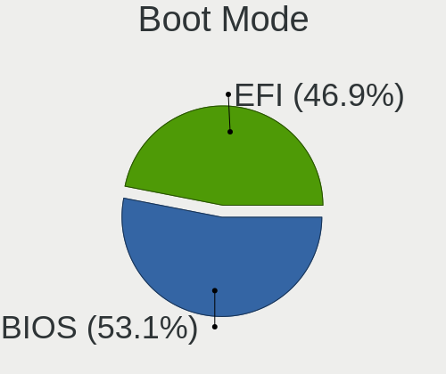
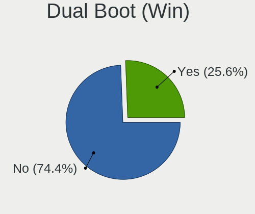
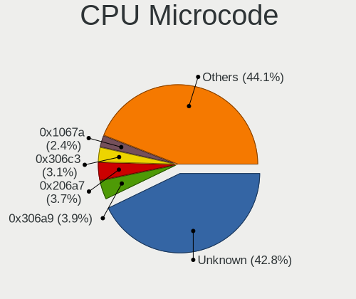
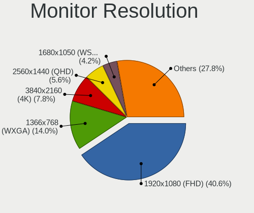
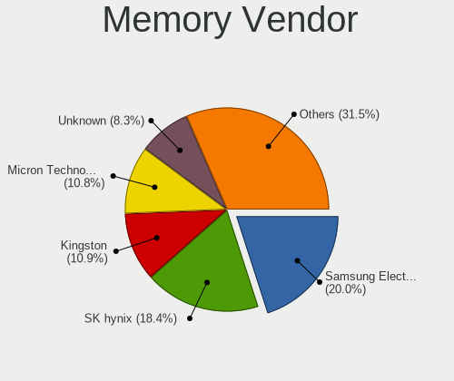
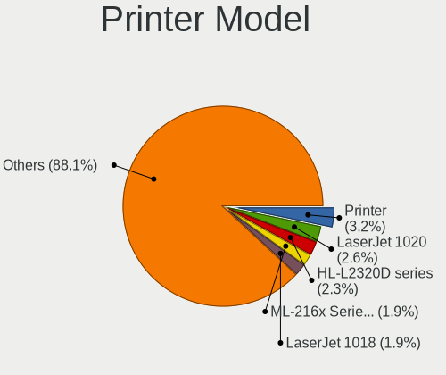

Linux in Canada - Tested Hardware & Statistics
----------------------------------------------

A project to collect tested hardware configurations for Linux in Canada.

Anyone can contribute to this report by the [hw-probe](https://github.com/linuxhw/hw-probe) tool:

    sudo -E hw-probe -all -upload

Please contribute! Especially if your hardware is rare.

This is a report for all computer types. See also reports for [desktops](/Location/Canada/Desktop/README.md) and [notebooks](/Location/Canada/Notebook/README.md).

Contents
--------

* [ Test Cases ](#test-cases)

* [ System ](#system)
  - [ OS                       ](#os)
  - [ OS Family                ](#os-family)
  - [ Kernel                   ](#kernel)
  - [ Kernel Family            ](#kernel-family)
  - [ Kernel Major Ver.        ](#kernel-major-ver)
  - [ Arch                     ](#arch)
  - [ DE                       ](#de)
  - [ Display Server           ](#display-server)
  - [ Display Manager          ](#display-manager)
  - [ OS Lang                  ](#os-lang)
  - [ Boot Mode                ](#boot-mode)
  - [ Filesystem               ](#filesystem)
  - [ Part. scheme             ](#part-scheme)
  - [ Dual Boot with Linux/BSD ](#dual-boot-with-linuxbsd)
  - [ Dual Boot (Win)          ](#dual-boot-win)

* [ Board ](#board)
  - [ Vendor                   ](#vendor)
  - [ Model                    ](#model)
  - [ Model Family             ](#model-family)
  - [ MFG Year                 ](#mfg-year)
  - [ Form Factor              ](#form-factor)
  - [ Secure Boot              ](#secure-boot)
  - [ Coreboot                 ](#coreboot)
  - [ RAM Size                 ](#ram-size)
  - [ RAM Used                 ](#ram-used)
  - [ Total Drives             ](#total-drives)
  - [ Has CD-ROM               ](#has-cd-rom)
  - [ Has Ethernet             ](#has-ethernet)
  - [ Has WiFi                 ](#has-wifi)
  - [ Has Bluetooth            ](#has-bluetooth)

* [ Location ](#location)
  - [ Country                  ](#country)
  - [ City                     ](#city)

* [ Drives ](#drives)
  - [ Drive Vendor             ](#drive-vendor)
  - [ Drive Model              ](#drive-model)
  - [ HDD Vendor               ](#hdd-vendor)
  - [ SSD Vendor               ](#ssd-vendor)
  - [ Drive Kind               ](#drive-kind)
  - [ Drive Connector          ](#drive-connector)
  - [ Drive Size               ](#drive-size)
  - [ Space Total              ](#space-total)
  - [ Space Used               ](#space-used)
  - [ Malfunc. Drives          ](#malfunc-drives)
  - [ Malfunc. Drive Vendor    ](#malfunc-drive-vendor)
  - [ Malfunc. HDD Vendor      ](#malfunc-hdd-vendor)
  - [ Malfunc. Drive Kind      ](#malfunc-drive-kind)
  - [ Failed Drives            ](#failed-drives)
  - [ Failed Drive Vendor      ](#failed-drive-vendor)
  - [ Drive Status             ](#drive-status)

* [ Storage controller ](#storage-controller)
  - [ Storage Vendor           ](#storage-vendor)
  - [ Storage Model            ](#storage-model)
  - [ Storage Kind             ](#storage-kind)

* [ Processor ](#processor)
  - [ CPU Vendor               ](#cpu-vendor)
  - [ CPU Model                ](#cpu-model)
  - [ CPU Model Family         ](#cpu-model-family)
  - [ CPU Cores                ](#cpu-cores)
  - [ CPU Sockets              ](#cpu-sockets)
  - [ CPU Threads              ](#cpu-threads)
  - [ CPU Op-Modes             ](#cpu-op-modes)
  - [ CPU Microcode            ](#cpu-microcode)
  - [ CPU Microarch            ](#cpu-microarch)

* [ Graphics ](#graphics)
  - [ GPU Vendor               ](#gpu-vendor)
  - [ GPU Model                ](#gpu-model)
  - [ GPU Combo                ](#gpu-combo)
  - [ GPU Driver               ](#gpu-driver)
  - [ GPU Memory               ](#gpu-memory)

* [ Monitor ](#monitor)
  - [ Monitor Vendor           ](#monitor-vendor)
  - [ Monitor Model            ](#monitor-model)
  - [ Monitor Resolution       ](#monitor-resolution)
  - [ Monitor Diagonal         ](#monitor-diagonal)
  - [ Monitor Width            ](#monitor-width)
  - [ Aspect Ratio             ](#aspect-ratio)
  - [ Monitor Area             ](#monitor-area)
  - [ Pixel Density            ](#pixel-density)
  - [ Multiple Monitors        ](#multiple-monitors)

* [ Network ](#network)
  - [ Net Controller Vendor    ](#net-controller-vendor)
  - [ Net Controller Model     ](#net-controller-model)
  - [ Wireless Vendor          ](#wireless-vendor)
  - [ Wireless Model           ](#wireless-model)
  - [ Ethernet Vendor          ](#ethernet-vendor)
  - [ Ethernet Model           ](#ethernet-model)
  - [ Net Controller Kind      ](#net-controller-kind)
  - [ Used Controller          ](#used-controller)
  - [ NICs                     ](#nics)
  - [ IPv6                     ](#ipv6)

* [ Bluetooth ](#bluetooth)
  - [ Bluetooth Vendor         ](#bluetooth-vendor)
  - [ Bluetooth Model          ](#bluetooth-model)

* [ Sound ](#sound)
  - [ Sound Vendor             ](#sound-vendor)
  - [ Sound Model              ](#sound-model)

* [ Memory ](#memory)
  - [ Memory Vendor            ](#memory-vendor)
  - [ Memory Model             ](#memory-model)
  - [ Memory Kind              ](#memory-kind)
  - [ Memory Form Factor       ](#memory-form-factor)
  - [ Memory Size              ](#memory-size)
  - [ Memory Speed             ](#memory-speed)

* [ Printers & scanners ](#printers--scanners)
  - [ Printer Vendor           ](#printer-vendor)
  - [ Printer Model            ](#printer-model)
  - [ Scanner Vendor           ](#scanner-vendor)
  - [ Scanner Model            ](#scanner-model)

* [ Camera ](#camera)
  - [ Camera Vendor            ](#camera-vendor)
  - [ Camera Model             ](#camera-model)

* [ Security ](#security)
  - [ Fingerprint Vendor       ](#fingerprint-vendor)
  - [ Fingerprint Model        ](#fingerprint-model)
  - [ Chipcard Vendor          ](#chipcard-vendor)
  - [ Chipcard Model           ](#chipcard-model)

* [ Unsupported ](#unsupported)
  - [ Unsupported Devices      ](#unsupported-devices)
  - [ Unsupported Device Types ](#unsupported-device-types)

Test Cases
----------

Total: 9012

| Vendor        | Model                       | Form-Factor | Probe                                                      | Date         |
|---------------|-----------------------------|-------------|------------------------------------------------------------|--------------|
| CWWK          | CW-J6-6L                    | Desktop     | [8321dcc5ea](https://linux-hardware.org/?probe=8321dcc5ea) | Aug 12, 2023 |
| Dell          | 0FDT3J A01                  | Server      | [fce762afa4](https://linux-hardware.org/?probe=fce762afa4) | Aug 12, 2023 |
| ASUSTek       | ProArt X670E-CREATOR WIF... | Desktop     | [4f6d84a4dd](https://linux-hardware.org/?probe=4f6d84a4dd) | Aug 12, 2023 |
| Microsoft     | Surface Pro 4               | Tablet      | [2b46218f49](https://linux-hardware.org/?probe=2b46218f49) | Aug 11, 2023 |
| Microsoft     | Surface Pro 4               | Tablet      | [77714a2920](https://linux-hardware.org/?probe=77714a2920) | Aug 11, 2023 |
| HP            | Notebook                    | Notebook    | [de8a0230c4](https://linux-hardware.org/?probe=de8a0230c4) | Aug 11, 2023 |
| HP            | EliteBook 840 G1            | Notebook    | [95d93fda2c](https://linux-hardware.org/?probe=95d93fda2c) | Aug 11, 2023 |
| Dell          | 0KV3RP A00                  | Desktop     | [47c45a45e5](https://linux-hardware.org/?probe=47c45a45e5) | Aug 11, 2023 |
| HP            | EliteBook 2560p             | Notebook    | [0b5cf409d8](https://linux-hardware.org/?probe=0b5cf409d8) | Aug 11, 2023 |
| AZW           | Green G4 10                 | Desktop     | [a574280172](https://linux-hardware.org/?probe=a574280172) | Aug 11, 2023 |
| Dell          | Inspiron 3531               | Notebook    | [0384e8a950](https://linux-hardware.org/?probe=0384e8a950) | Aug 11, 2023 |
| ASUSTek       | P8Z68-V LE                  | Desktop     | [a88d7e81e5](https://linux-hardware.org/?probe=a88d7e81e5) | Aug 11, 2023 |
| Google        | Bobba360                    | Notebook    | [128700115a](https://linux-hardware.org/?probe=128700115a) | Aug 10, 2023 |
| MSI           | H310M PRO-VD                | Desktop     | [f542bb8447](https://linux-hardware.org/?probe=f542bb8447) | Aug 10, 2023 |
| Dell          | Latitude 3540               | Notebook    | [496e3ab340](https://linux-hardware.org/?probe=496e3ab340) | Aug 10, 2023 |
| ASUSTek       | ROG STRIX B650-A GAMING ... | Desktop     | [6bf6a38fba](https://linux-hardware.org/?probe=6bf6a38fba) | Aug 10, 2023 |
| Acer          | Aspire TC-885 V:1.1         | Desktop     | [63f0153cfe](https://linux-hardware.org/?probe=63f0153cfe) | Aug 10, 2023 |
| ASUSTek       | PRIME X570-PRO              | Desktop     | [f7fe8fc7f3](https://linux-hardware.org/?probe=f7fe8fc7f3) | Aug 10, 2023 |
| Google        | Snappy                      | Notebook    | [73ecdd5048](https://linux-hardware.org/?probe=73ecdd5048) | Aug 10, 2023 |
| ASUSTek       | VivoBook_ASUSLaptop X170... | Notebook    | [75b55100a9](https://linux-hardware.org/?probe=75b55100a9) | Aug 10, 2023 |
| Dell          | Precision 5540              | Notebook    | [e68fee1e24](https://linux-hardware.org/?probe=e68fee1e24) | Aug 10, 2023 |
| Gateway       | NV57H                       | Notebook    | [826aaf5dd8](https://linux-hardware.org/?probe=826aaf5dd8) | Aug 10, 2023 |
| HP            | ProBook 650 G2              | Notebook    | [8fbbf1483d](https://linux-hardware.org/?probe=8fbbf1483d) | Aug 09, 2023 |
| Unknown       | Unknown                     | Desktop     | [09037ac346](https://linux-hardware.org/?probe=09037ac346) | Aug 09, 2023 |
| Microsoft     | Surface Laptop Go           | Tablet      | [f6040edeb0](https://linux-hardware.org/?probe=f6040edeb0) | Aug 09, 2023 |
| Microsoft     | Surface Laptop Go           | Tablet      | [3b02fcaeb7](https://linux-hardware.org/?probe=3b02fcaeb7) | Aug 09, 2023 |
| Google        | Bobba360                    | Notebook    | [fa4a78b024](https://linux-hardware.org/?probe=fa4a78b024) | Aug 09, 2023 |
| MSI           | PRO B660M-A WIFI DDR4       | Desktop     | [f50b51555f](https://linux-hardware.org/?probe=f50b51555f) | Aug 09, 2023 |
| System76      | Darter Pro                  | Notebook    | [5162d61c01](https://linux-hardware.org/?probe=5162d61c01) | Aug 09, 2023 |
| HP            | ENVY x360 2-in-1 Laptop ... | Convertible | [37b2f22e1f](https://linux-hardware.org/?probe=37b2f22e1f) | Aug 09, 2023 |
| Dell          | Latitude 3350               | Notebook    | [77100b2ef6](https://linux-hardware.org/?probe=77100b2ef6) | Aug 09, 2023 |
| HP            | ProBook 650 G2              | Notebook    | [78859b39fb](https://linux-hardware.org/?probe=78859b39fb) | Aug 09, 2023 |
| ASUSTek       | VivoBook_ASUSLaptop X170... | Notebook    | [f48f680274](https://linux-hardware.org/?probe=f48f680274) | Aug 08, 2023 |
| Dell          | Latitude E5470              | Notebook    | [f64529e38b](https://linux-hardware.org/?probe=f64529e38b) | Aug 08, 2023 |
| ASUSTek       | P5G41T-M                    | Desktop     | [9eccce625b](https://linux-hardware.org/?probe=9eccce625b) | Aug 08, 2023 |
| HP            | Laptop 14-dq3xxx            | Notebook    | [c547f01fbb](https://linux-hardware.org/?probe=c547f01fbb) | Aug 08, 2023 |
| Lenovo        | Legion 5 17ACH6H 82JY       | Notebook    | [088a8fad47](https://linux-hardware.org/?probe=088a8fad47) | Aug 08, 2023 |
| Supermicro    | X10SRG-F                    | Desktop     | [3bdaa7bfef](https://linux-hardware.org/?probe=3bdaa7bfef) | Aug 08, 2023 |
| AZW           | MINI S 10                   | Desktop     | [1de6b9a754](https://linux-hardware.org/?probe=1de6b9a754) | Aug 08, 2023 |
| HP            | Elite x2 1012 G1            | Notebook    | [0ee8428f91](https://linux-hardware.org/?probe=0ee8428f91) | Aug 07, 2023 |
| MSI           | PRO Z790-P WIFI DDR4        | Desktop     | [a79335e604](https://linux-hardware.org/?probe=a79335e604) | Aug 07, 2023 |
| Dell          | Latitude 7300               | Notebook    | [932f04033c](https://linux-hardware.org/?probe=932f04033c) | Aug 07, 2023 |
| MSI           | A68HM-E33 V2                | Desktop     | [047ae922f7](https://linux-hardware.org/?probe=047ae922f7) | Aug 07, 2023 |
| AZW           | SEi                         | Desktop     | [b38e4eec2e](https://linux-hardware.org/?probe=b38e4eec2e) | Aug 07, 2023 |
| HP            | Laptop 15-dy2xxx            | Notebook    | [5777798e8f](https://linux-hardware.org/?probe=5777798e8f) | Aug 07, 2023 |
| Acer          | E1-510                      | Notebook    | [2d6776c4fe](https://linux-hardware.org/?probe=2d6776c4fe) | Aug 06, 2023 |
| MSI           | A68HM-E33 V2                | Desktop     | [341fecf811](https://linux-hardware.org/?probe=341fecf811) | Aug 06, 2023 |
| Lenovo        | ThinkCentre M57 6072BJU     | Desktop     | [9c0231c0f3](https://linux-hardware.org/?probe=9c0231c0f3) | Aug 06, 2023 |
| HP            | EliteBook 840 G5            | Notebook    | [9688966097](https://linux-hardware.org/?probe=9688966097) | Aug 06, 2023 |
| Lenovo        | ThinkPad T420 4180AP3       | Notebook    | [bd989967e7](https://linux-hardware.org/?probe=bd989967e7) | Aug 06, 2023 |
| Apple         | Mac-35C5E08120C7EEAF Mac... | Mini pc     | [feaab502d6](https://linux-hardware.org/?probe=feaab502d6) | Aug 06, 2023 |
| Raspberry ... | Raspberry Pi 4 Model B R... | Soc         | [ce147f9768](https://linux-hardware.org/?probe=ce147f9768) | Aug 06, 2023 |
| Gateway       | SX2185                      | Desktop     | [a6df16b355](https://linux-hardware.org/?probe=a6df16b355) | Aug 05, 2023 |
| Dell          | Inspiron 15 3525            | Notebook    | [0219350ae0](https://linux-hardware.org/?probe=0219350ae0) | Aug 05, 2023 |
| Dell          | Inspiron 15 3525            | Notebook    | [350a405f33](https://linux-hardware.org/?probe=350a405f33) | Aug 05, 2023 |
| MSI           | B450 GAMING PLUS MAX        | Desktop     | [8cc106746a](https://linux-hardware.org/?probe=8cc106746a) | Aug 05, 2023 |
| Apple         | MacBookPro14,1              | Notebook    | [d3630fa2ed](https://linux-hardware.org/?probe=d3630fa2ed) | Aug 05, 2023 |
| ASUSTek       | WS-C621E-SAGE Series        | Server      | [ae0b8a9e36](https://linux-hardware.org/?probe=ae0b8a9e36) | Aug 05, 2023 |
| MSI           | B450 GAMING PLUS MAX        | Desktop     | [4f2449c578](https://linux-hardware.org/?probe=4f2449c578) | Aug 05, 2023 |
| Lenovo        | ThinkPad X131e 33671S2      | Notebook    | [3f83b5efac](https://linux-hardware.org/?probe=3f83b5efac) | Aug 05, 2023 |
| ASUSTek       | Z97-PRO/USB                 | Desktop     | [edd74878c3](https://linux-hardware.org/?probe=edd74878c3) | Aug 05, 2023 |
| Corsair       | Voyager a1600               | Notebook    | [6dea5f2c0c](https://linux-hardware.org/?probe=6dea5f2c0c) | Aug 04, 2023 |
| Lenovo        | ThinkPad 13 2nd Gen 20J2... | Notebook    | [ff55512c0e](https://linux-hardware.org/?probe=ff55512c0e) | Aug 04, 2023 |
| ASUSTek       | ROG STRIX Z690-A GAMING ... | Desktop     | [67cea35f6d](https://linux-hardware.org/?probe=67cea35f6d) | Aug 04, 2023 |
| Lenovo        | 314D SDK0J40697 WIN 3305... | Mini pc     | [1b1f671f30](https://linux-hardware.org/?probe=1b1f671f30) | Aug 04, 2023 |
| Dell          | Inspiron 5720               | Notebook    | [20532065b5](https://linux-hardware.org/?probe=20532065b5) | Aug 04, 2023 |
| Dell          | Inspiron 5720               | Notebook    | [8f6ada13fa](https://linux-hardware.org/?probe=8f6ada13fa) | Aug 04, 2023 |
| ASUSTek       | TUF Gaming X570-PLUS        | Desktop     | [3c3d90d709](https://linux-hardware.org/?probe=3c3d90d709) | Aug 04, 2023 |
| HP            | Laptop 15-fd0xxx            | Notebook    | [8f3b8dea26](https://linux-hardware.org/?probe=8f3b8dea26) | Aug 04, 2023 |
| HP            | EliteBook Folio G1          | Notebook    | [b9bb38ddd4](https://linux-hardware.org/?probe=b9bb38ddd4) | Aug 03, 2023 |
| ASUSTek       | VivoBook_ASUSLaptop X170... | Notebook    | [7d86876920](https://linux-hardware.org/?probe=7d86876920) | Aug 03, 2023 |
| Pegatron      | Eureka3                     | Desktop     | [a999a00c0a](https://linux-hardware.org/?probe=a999a00c0a) | Aug 03, 2023 |
| Dell          | Latitude 5440               | Notebook    | [5791d15bc8](https://linux-hardware.org/?probe=5791d15bc8) | Aug 02, 2023 |
| MSI           | MAG B650M MORTAR WIFI       | Desktop     | [fd259f2acd](https://linux-hardware.org/?probe=fd259f2acd) | Aug 02, 2023 |
| Dell          | Latitude 5540               | Notebook    | [e521b93e2f](https://linux-hardware.org/?probe=e521b93e2f) | Aug 02, 2023 |
| Dell          | Latitude 5440               | Notebook    | [5b0eb512d1](https://linux-hardware.org/?probe=5b0eb512d1) | Aug 02, 2023 |
| HP            | ProBook 650 G4              | Notebook    | [d041df173b](https://linux-hardware.org/?probe=d041df173b) | Aug 02, 2023 |
| Dell          | Inspiron 7706 2n1           | Convertible | [542578b4cf](https://linux-hardware.org/?probe=542578b4cf) | Aug 02, 2023 |
| ASUSTek       | VivoBook_ASUSLaptop X415... | Notebook    | [944afe5083](https://linux-hardware.org/?probe=944afe5083) | Aug 02, 2023 |
| Lenovo        | ThinkPad T470s W10DG 20J... | Notebook    | [74f1782ead](https://linux-hardware.org/?probe=74f1782ead) | Aug 02, 2023 |
| Acer          | Aspire E1-532               | Notebook    | [9042ebc249](https://linux-hardware.org/?probe=9042ebc249) | Aug 01, 2023 |
| HP            | ProLiant DL380p Gen8        | Server      | [53468c11bf](https://linux-hardware.org/?probe=53468c11bf) | Aug 01, 2023 |
| Valve         | Jupiter                     | Notebook    | [896569d1d6](https://linux-hardware.org/?probe=896569d1d6) | Aug 01, 2023 |
| HP            | 18E7                        | Desktop     | [339050cd65](https://linux-hardware.org/?probe=339050cd65) | Aug 01, 2023 |
| Dell          | 09KPNV A01                  | Desktop     | [1768a6834a](https://linux-hardware.org/?probe=1768a6834a) | Aug 01, 2023 |
| ASUSTek       | P6X58D-E                    | Desktop     | [84a5ec2d0b](https://linux-hardware.org/?probe=84a5ec2d0b) | Aug 01, 2023 |
| ASUSTek       | X751LA                      | Notebook    | [928a69b9af](https://linux-hardware.org/?probe=928a69b9af) | Aug 01, 2023 |
| Lenovo        | Yoga 720-13IKB 81C3         | Convertible | [287ea63732](https://linux-hardware.org/?probe=287ea63732) | Aug 01, 2023 |
| Lenovo        | 3000 C100 07612GU           | Notebook    | [3941ecc4f2](https://linux-hardware.org/?probe=3941ecc4f2) | Aug 01, 2023 |
| Dell          | 0HJ054                      | Desktop     | [85ceb83c22](https://linux-hardware.org/?probe=85ceb83c22) | Jul 31, 2023 |
| HP            | ProBook 445 G7              | Notebook    | [96e95e4bd2](https://linux-hardware.org/?probe=96e95e4bd2) | Jul 31, 2023 |
| HP            | EliteBook 840 G2            | Notebook    | [067b112fb8](https://linux-hardware.org/?probe=067b112fb8) | Jul 31, 2023 |
| HP            | Elite x2 1012 G2            | Tablet      | [de727e7124](https://linux-hardware.org/?probe=de727e7124) | Jul 31, 2023 |
| ASRock        | FM2A75 Pro4                 | Desktop     | [831157a9ac](https://linux-hardware.org/?probe=831157a9ac) | Jul 31, 2023 |
| Lenovo        | ThinkPad P50s 20FLCTO1WW    | Notebook    | [1594795f9e](https://linux-hardware.org/?probe=1594795f9e) | Jul 31, 2023 |
| ASUSTek       | P8Z77-V LX                  | Desktop     | [80ab0f5cd2](https://linux-hardware.org/?probe=80ab0f5cd2) | Jul 30, 2023 |
| Lenovo        | ThinkPad T470s 20HGS0DT0... | Notebook    | [bd0d0f2888](https://linux-hardware.org/?probe=bd0d0f2888) | Jul 30, 2023 |
| HP            | ProBook 4540s               | Notebook    | [0fae07b574](https://linux-hardware.org/?probe=0fae07b574) | Jul 30, 2023 |
| Dell          | XPS 15 7590                 | Notebook    | [4f2f49a6b2](https://linux-hardware.org/?probe=4f2f49a6b2) | Jul 30, 2023 |
| BOSGAME       | U56                         | Notebook    | [39d52e51f5](https://linux-hardware.org/?probe=39d52e51f5) | Jul 30, 2023 |
| MSI           | B250 PC MATE                | Desktop     | [9163341ff4](https://linux-hardware.org/?probe=9163341ff4) | Jul 30, 2023 |
| HP            | EliteBook 840 G5            | Notebook    | [c3101b6a76](https://linux-hardware.org/?probe=c3101b6a76) | Jul 30, 2023 |
| HP            | EliteBook 840 G5            | Notebook    | [915938d446](https://linux-hardware.org/?probe=915938d446) | Jul 30, 2023 |
| ASRock        | B450 Pro4 R2.0              | Desktop     | [b49f52b2e1](https://linux-hardware.org/?probe=b49f52b2e1) | Jul 30, 2023 |
| Lenovo        | ThinkPad T470s W10DG 20J... | Notebook    | [74a7a53f6a](https://linux-hardware.org/?probe=74a7a53f6a) | Jul 29, 2023 |
| Lenovo        | ThinkPad E14 Gen 2 20TA0... | Notebook    | [cd073a7899](https://linux-hardware.org/?probe=cd073a7899) | Jul 29, 2023 |
| ASUSTek       | VivoBook_ASUSLaptop X415... | Notebook    | [e62cce964c](https://linux-hardware.org/?probe=e62cce964c) | Jul 29, 2023 |
| HP            | ProBook 455R G6             | Notebook    | [3731e7465c](https://linux-hardware.org/?probe=3731e7465c) | Jul 29, 2023 |
| Dell          | Latitude 5520               | Notebook    | [5151c4275a](https://linux-hardware.org/?probe=5151c4275a) | Jul 29, 2023 |
| ASRockRack    | X470D4U                     | Desktop     | [532a72a722](https://linux-hardware.org/?probe=532a72a722) | Jul 29, 2023 |
| Dell          | 0HD5W2 A01                  | Desktop     | [76394a9fc7](https://linux-hardware.org/?probe=76394a9fc7) | Jul 29, 2023 |
| Framework     | Laptop (12th Gen Intel C... | Notebook    | [d94c3cc0e8](https://linux-hardware.org/?probe=d94c3cc0e8) | Jul 28, 2023 |
| Microsoft     | Surface Pro 8               | Tablet      | [21aa433472](https://linux-hardware.org/?probe=21aa433472) | Jul 28, 2023 |
| HP            | 1825                        | Desktop     | [7bd4e99efa](https://linux-hardware.org/?probe=7bd4e99efa) | Jul 28, 2023 |
| Acer          | Aspire 5810T                | Notebook    | [2d141d703d](https://linux-hardware.org/?probe=2d141d703d) | Jul 28, 2023 |
| MSI           | Katana GF66 11UE            | Notebook    | [78e12df29a](https://linux-hardware.org/?probe=78e12df29a) | Jul 28, 2023 |
| Lenovo        | ThinkPad X220 Tablet 429... | Notebook    | [ea402f269e](https://linux-hardware.org/?probe=ea402f269e) | Jul 28, 2023 |
| Alienware     | m17 R4                      | Notebook    | [eece2da9ed](https://linux-hardware.org/?probe=eece2da9ed) | Jul 27, 2023 |
| Acer          | Aspire 5810T                | Notebook    | [9b7b328324](https://linux-hardware.org/?probe=9b7b328324) | Jul 27, 2023 |
| ASUSTek       | VivoBook_ASUSLaptop X509... | Notebook    | [4152e1f98e](https://linux-hardware.org/?probe=4152e1f98e) | Jul 27, 2023 |
| HP            | 829A                        | Mini pc     | [c78cd4ea03](https://linux-hardware.org/?probe=c78cd4ea03) | Jul 26, 2023 |
| HP            | ProBook 4540s               | Notebook    | [f41d6c4f4b](https://linux-hardware.org/?probe=f41d6c4f4b) | Jul 26, 2023 |
| HP            | G60                         | Notebook    | [4d64158286](https://linux-hardware.org/?probe=4d64158286) | Jul 26, 2023 |
| Lenovo        | Yoga 14sACH 2021 82MS       | Notebook    | [3cb74490f6](https://linux-hardware.org/?probe=3cb74490f6) | Jul 25, 2023 |
| Google        | Droid                       | Notebook    | [ae803483c2](https://linux-hardware.org/?probe=ae803483c2) | Jul 25, 2023 |
| ASUSTek       | ROG STRIX B550-F GAMING ... | Desktop     | [5e77384bb8](https://linux-hardware.org/?probe=5e77384bb8) | Jul 25, 2023 |
| HP            | Laptop 15-db0xxx            | Notebook    | [f01ec95642](https://linux-hardware.org/?probe=f01ec95642) | Jul 25, 2023 |
| HP            | ProBook 4540s               | Notebook    | [5c4b165cea](https://linux-hardware.org/?probe=5c4b165cea) | Jul 25, 2023 |
| HP            | ProBook 4540s               | Notebook    | [4ad8be01ca](https://linux-hardware.org/?probe=4ad8be01ca) | Jul 25, 2023 |
| Lenovo        | ThinkPad T430 2347H91       | Notebook    | [0ed3c4bc6a](https://linux-hardware.org/?probe=0ed3c4bc6a) | Jul 25, 2023 |
| HP            | Laptop 15-fc0xxx            | Notebook    | [5c52eecd16](https://linux-hardware.org/?probe=5c52eecd16) | Jul 25, 2023 |
| HP            | Pavilion dv8000 (ET839UA... | Notebook    | [562e6e1026](https://linux-hardware.org/?probe=562e6e1026) | Jul 25, 2023 |
| Dell          | Latitude 7490               | Notebook    | [066e3b9518](https://linux-hardware.org/?probe=066e3b9518) | Jul 25, 2023 |
| Dell          | 0X501H A00                  | Desktop     | [407c19b590](https://linux-hardware.org/?probe=407c19b590) | Jul 24, 2023 |
| Unknown       | Unknown                     | Desktop     | [a7d120e20a](https://linux-hardware.org/?probe=a7d120e20a) | Jul 24, 2023 |
| Lenovo        | ThinkPad T420s 417152U      | Notebook    | [22e09689b0](https://linux-hardware.org/?probe=22e09689b0) | Jul 24, 2023 |
| Gigabyte      | Z690 AORUS ELITE AX         | Desktop     | [a3284cc458](https://linux-hardware.org/?probe=a3284cc458) | Jul 24, 2023 |
| Apple         | Mac-F226BEC8 PVT            | All in one  | [60c98c273e](https://linux-hardware.org/?probe=60c98c273e) | Jul 24, 2023 |
| ASUSTek       | VivoBook_ASUS Laptop E41... | Notebook    | [032db75736](https://linux-hardware.org/?probe=032db75736) | Jul 23, 2023 |
| Gigabyte      | Z97X-UD5H                   | Desktop     | [3511a9786a](https://linux-hardware.org/?probe=3511a9786a) | Jul 23, 2023 |
| Lenovo        | ThinkPad P53 20QN004BCA     | Notebook    | [04a2ed4bd2](https://linux-hardware.org/?probe=04a2ed4bd2) | Jul 23, 2023 |
| Dell          | 08NPPY A00                  | Desktop     | [63fb3abc69](https://linux-hardware.org/?probe=63fb3abc69) | Jul 23, 2023 |
| Lenovo        | Legion 7 16ITHg6 82K6       | Notebook    | [1ee910fc1c](https://linux-hardware.org/?probe=1ee910fc1c) | Jul 22, 2023 |
| Lenovo        | Legion 7 16ITHg6 82K6       | Notebook    | [d02b0e9f74](https://linux-hardware.org/?probe=d02b0e9f74) | Jul 22, 2023 |
| Gateway       | NV57H                       | Notebook    | [3209dcf267](https://linux-hardware.org/?probe=3209dcf267) | Jul 22, 2023 |
| Gateway       | NV57H                       | Notebook    | [35dac8980f](https://linux-hardware.org/?probe=35dac8980f) | Jul 22, 2023 |
| Apple         | Mac-F4238CC8 PVT            | All in one  | [ce4d5128af](https://linux-hardware.org/?probe=ce4d5128af) | Jul 22, 2023 |
| ASUSTek       | ZenBook UX363EA_UX363EA     | Convertible | [a96fbb9461](https://linux-hardware.org/?probe=a96fbb9461) | Jul 22, 2023 |
| ASRock        | B550M Pro4                  | Desktop     | [46283ad18b](https://linux-hardware.org/?probe=46283ad18b) | Jul 22, 2023 |
| ASRock        | J3355B-ITX                  | Desktop     | [3edbf4710e](https://linux-hardware.org/?probe=3edbf4710e) | Jul 22, 2023 |
| HP            | Pavilion dv7                | Notebook    | [a74719eac2](https://linux-hardware.org/?probe=a74719eac2) | Jul 21, 2023 |
| Lenovo        | ThinkPad P14s Gen 3 21J6... | Notebook    | [27b5dabe8d](https://linux-hardware.org/?probe=27b5dabe8d) | Jul 21, 2023 |
| HP            | 18E7                        | Desktop     | [de29afa344](https://linux-hardware.org/?probe=de29afa344) | Jul 21, 2023 |
| Dell          | 00010C A00                  | Desktop     | [40543af7a5](https://linux-hardware.org/?probe=40543af7a5) | Jul 21, 2023 |
| Lenovo        | 3151 SDK0J40697 WIN 3305... | Mini pc     | [3e6dc436dd](https://linux-hardware.org/?probe=3e6dc436dd) | Jul 21, 2023 |
| Intel         | DP67BG AAG10491-400         | Desktop     | [084b222fa7](https://linux-hardware.org/?probe=084b222fa7) | Jul 21, 2023 |
| Acer          | Aspire TC-780               | Desktop     | [c058e8c58e](https://linux-hardware.org/?probe=c058e8c58e) | Jul 20, 2023 |
| Intel         | DP67BG AAG10491-400         | Desktop     | [e0ff2f40fa](https://linux-hardware.org/?probe=e0ff2f40fa) | Jul 20, 2023 |
| HP            | Pavilion Gaming Laptop 1... | Notebook    | [fb09f582c5](https://linux-hardware.org/?probe=fb09f582c5) | Jul 20, 2023 |
| HP            | Pavilion Gaming Laptop 1... | Notebook    | [2fcc9e6028](https://linux-hardware.org/?probe=2fcc9e6028) | Jul 20, 2023 |
| ASUSTek       | T100TAM                     | Notebook    | [43cb18f0ee](https://linux-hardware.org/?probe=43cb18f0ee) | Jul 20, 2023 |
| Lenovo        | ThinkPad 20JB002BUS         | Tablet      | [ac659620e6](https://linux-hardware.org/?probe=ac659620e6) | Jul 20, 2023 |
| ASUSTek       | ROG CROSSHAIR VIII DARK ... | Desktop     | [cb0ad6375e](https://linux-hardware.org/?probe=cb0ad6375e) | Jul 20, 2023 |
| MSI           | 870-G45                     | Desktop     | [af7442187f](https://linux-hardware.org/?probe=af7442187f) | Jul 20, 2023 |
| ASUSTek       | M11AD                       | Desktop     | [8a8cb2c3e4](https://linux-hardware.org/?probe=8a8cb2c3e4) | Jul 20, 2023 |
| HP            | ENVY x360 Convertible 15... | Convertible | [991cab2fa3](https://linux-hardware.org/?probe=991cab2fa3) | Jul 19, 2023 |
| Lenovo        | ThinkPad 11e 20DAS0C800     | Notebook    | [b894a6d96b](https://linux-hardware.org/?probe=b894a6d96b) | Jul 19, 2023 |
| ASUSTek       | GL502VM                     | Notebook    | [dd46e07611](https://linux-hardware.org/?probe=dd46e07611) | Jul 19, 2023 |
| Microsoft     | Surface Laptop Go           | Tablet      | [91f1d1f94f](https://linux-hardware.org/?probe=91f1d1f94f) | Jul 19, 2023 |
| AZW           | U59                         | Desktop     | [1c919967a8](https://linux-hardware.org/?probe=1c919967a8) | Jul 19, 2023 |
| ASUSTek       | VivoBook_ASUS Laptop X50... | Notebook    | [8cb16d19aa](https://linux-hardware.org/?probe=8cb16d19aa) | Jul 19, 2023 |
| Apple         | MacBookPro11,2              | Notebook    | [3121fc5450](https://linux-hardware.org/?probe=3121fc5450) | Jul 18, 2023 |
| Lenovo        | Legion Pro 7 16IRX8H 82W... | Notebook    | [efd490f52d](https://linux-hardware.org/?probe=efd490f52d) | Jul 18, 2023 |
| Gigabyte      | Z270XP-SLI-CF               | Desktop     | [14478a9226](https://linux-hardware.org/?probe=14478a9226) | Jul 18, 2023 |
| Lenovo        | ThinkCentre M58e 7268C5F    | Desktop     | [e62367803c](https://linux-hardware.org/?probe=e62367803c) | Jul 18, 2023 |
| Lenovo        | ThinkCentre M58e 7268C5F    | Desktop     | [41e06d3720](https://linux-hardware.org/?probe=41e06d3720) | Jul 18, 2023 |
| ASUSTek       | PRIME Z790-P WIFI           | Desktop     | [02f8df2129](https://linux-hardware.org/?probe=02f8df2129) | Jul 18, 2023 |
| ASUSTek       | PRIME Z790-P WIFI           | Desktop     | [e7e056881b](https://linux-hardware.org/?probe=e7e056881b) | Jul 18, 2023 |
| ASRockRack    | X470D4U2-2T                 | Desktop     | [058672ddad](https://linux-hardware.org/?probe=058672ddad) | Jul 18, 2023 |
| HP            | Pavilion Notebook           | Notebook    | [babb224527](https://linux-hardware.org/?probe=babb224527) | Jul 18, 2023 |
| ASUSTek       | M11AD                       | Desktop     | [4019d4eb57](https://linux-hardware.org/?probe=4019d4eb57) | Jul 18, 2023 |
| HP            | Pavilion Laptop 17-ar0xx    | Notebook    | [574cd2e0f8](https://linux-hardware.org/?probe=574cd2e0f8) | Jul 17, 2023 |
| Google        | Phaser360                   | Notebook    | [1e66458514](https://linux-hardware.org/?probe=1e66458514) | Jul 17, 2023 |
| System76      | Serval WS                   | Notebook    | [a916a92726](https://linux-hardware.org/?probe=a916a92726) | Jul 17, 2023 |
| ASUSTek       | X751LA                      | Notebook    | [345fab37ab](https://linux-hardware.org/?probe=345fab37ab) | Jul 17, 2023 |
| Dell          | Latitude E6420              | Notebook    | [7006e50178](https://linux-hardware.org/?probe=7006e50178) | Jul 17, 2023 |
| ASUSTek       | ROG Strix G713PV_G713PV     | Notebook    | [55a5100039](https://linux-hardware.org/?probe=55a5100039) | Jul 16, 2023 |
| ASUSTek       | ROG Strix G713PV_G713PV     | Notebook    | [ad8f031cb2](https://linux-hardware.org/?probe=ad8f031cb2) | Jul 16, 2023 |
| MSI           | MPG B550 GAMING EDGE WIF... | Desktop     | [151797320d](https://linux-hardware.org/?probe=151797320d) | Jul 16, 2023 |
| MSI           | MPG B550 GAMING EDGE WIF... | Desktop     | [e760f4570f](https://linux-hardware.org/?probe=e760f4570f) | Jul 16, 2023 |
| Gateway       | SX2185                      | Desktop     | [1fe932f485](https://linux-hardware.org/?probe=1fe932f485) | Jul 15, 2023 |
| Gateway       | SX2185                      | Desktop     | [00e7bb0f9f](https://linux-hardware.org/?probe=00e7bb0f9f) | Jul 15, 2023 |
| ASUSTek       | 970 PRO GAMING/AURA         | Desktop     | [e8f1a169a1](https://linux-hardware.org/?probe=e8f1a169a1) | Jul 15, 2023 |
| ASUSTek       | PRIME Z490-P                | Desktop     | [9eff556aca](https://linux-hardware.org/?probe=9eff556aca) | Jul 15, 2023 |
| HP            | Pavilion dv7                | Notebook    | [e983b50085](https://linux-hardware.org/?probe=e983b50085) | Jul 15, 2023 |
| MSI           | 870-G45                     | Desktop     | [9fff23ac6a](https://linux-hardware.org/?probe=9fff23ac6a) | Jul 14, 2023 |
| System76      | Pangolin                    | Notebook    | [486df7ead2](https://linux-hardware.org/?probe=486df7ead2) | Jul 14, 2023 |
| Dell          | Precision 5480              | Notebook    | [57d3fff688](https://linux-hardware.org/?probe=57d3fff688) | Jul 14, 2023 |
| ASRock        | B450 Gaming-ITX/ac          | Desktop     | [065aed3358](https://linux-hardware.org/?probe=065aed3358) | Jul 14, 2023 |
| HP            | Pavilion Gaming Laptop 1... | Notebook    | [21fc63e4dd](https://linux-hardware.org/?probe=21fc63e4dd) | Jul 14, 2023 |
| ASRock        | B760M PG Riptide            | Desktop     | [4092f45d41](https://linux-hardware.org/?probe=4092f45d41) | Jul 14, 2023 |
| ASRock        | B760M PG Riptide            | Desktop     | [1ee27caac4](https://linux-hardware.org/?probe=1ee27caac4) | Jul 14, 2023 |
| ASUSTek       | B85M-G                      | Desktop     | [2afe11b7e4](https://linux-hardware.org/?probe=2afe11b7e4) | Jul 13, 2023 |
| HP            | Pavilion Gaming Laptop 1... | Notebook    | [e84bf83ac1](https://linux-hardware.org/?probe=e84bf83ac1) | Jul 13, 2023 |
| ASUSTek       | PRIME X370-PRO              | Desktop     | [3428c47b0c](https://linux-hardware.org/?probe=3428c47b0c) | Jul 13, 2023 |
| Microsoft     | Surface Laptop Go           | Tablet      | [093938a09b](https://linux-hardware.org/?probe=093938a09b) | Jul 13, 2023 |
| ASUSTek       | P8B75-M                     | Desktop     | [df7a7f2c36](https://linux-hardware.org/?probe=df7a7f2c36) | Jul 13, 2023 |
| Panasonic     | CF-S10CDHEDM                | Notebook    | [55204a29c3](https://linux-hardware.org/?probe=55204a29c3) | Jul 12, 2023 |
| Dell          | 09M8Y8 A01                  | Desktop     | [8807f705d0](https://linux-hardware.org/?probe=8807f705d0) | Jul 12, 2023 |
| MSI           | GF65 Thin 10UE              | Notebook    | [414c5bc2c0](https://linux-hardware.org/?probe=414c5bc2c0) | Jul 12, 2023 |
| ASUSTek       | ASUS TUF Gaming F15 FX50... | Notebook    | [15c5dec8dc](https://linux-hardware.org/?probe=15c5dec8dc) | Jul 12, 2023 |
| MSI           | B350M MORTAR                | Desktop     | [41a05302e8](https://linux-hardware.org/?probe=41a05302e8) | Jul 12, 2023 |
| ASUSTek       | P8Z68-V PRO                 | Desktop     | [077367f0bd](https://linux-hardware.org/?probe=077367f0bd) | Jul 12, 2023 |
| Dell          | XPS 13 9305                 | Notebook    | [27df8fc0e5](https://linux-hardware.org/?probe=27df8fc0e5) | Jul 11, 2023 |
| Dell          | 09M8Y8 A01                  | Desktop     | [7a6bfcf1a9](https://linux-hardware.org/?probe=7a6bfcf1a9) | Jul 11, 2023 |
| Dell          | 09M8Y8 A01                  | Desktop     | [2397913be3](https://linux-hardware.org/?probe=2397913be3) | Jul 11, 2023 |
| Dell          | Latitude E5540              | Notebook    | [cdad6cb751](https://linux-hardware.org/?probe=cdad6cb751) | Jul 11, 2023 |
| Lenovo        | IdeaPad Z570 10249UU        | Notebook    | [4179167c95](https://linux-hardware.org/?probe=4179167c95) | Jul 11, 2023 |
| MSI           | MAG B650M MORTAR WIFI       | Desktop     | [ee2dc6ac7b](https://linux-hardware.org/?probe=ee2dc6ac7b) | Jul 11, 2023 |
| MSI           | H310M PRO-VD                | Desktop     | [c44f642440](https://linux-hardware.org/?probe=c44f642440) | Jul 10, 2023 |
| MSI           | GF65 Thin 10UE              | Notebook    | [d73ac20739](https://linux-hardware.org/?probe=d73ac20739) | Jul 10, 2023 |
| MSI           | GF65 Thin 10UE              | Notebook    | [beef3128c2](https://linux-hardware.org/?probe=beef3128c2) | Jul 10, 2023 |
| Gigabyte      | B650 AORUS ELITE AX         | Desktop     | [957c1976c6](https://linux-hardware.org/?probe=957c1976c6) | Jul 10, 2023 |
| Acer          | Aspire V3-571               | Notebook    | [cf25605b3a](https://linux-hardware.org/?probe=cf25605b3a) | Jul 10, 2023 |
| Lenovo        | IdeaPad S340-15IIL 81VW     | Notebook    | [7d5e51d9a8](https://linux-hardware.org/?probe=7d5e51d9a8) | Jul 10, 2023 |
| Acer          | Aspire V3-571               | Notebook    | [3c3c2ac038](https://linux-hardware.org/?probe=3c3c2ac038) | Jul 10, 2023 |
| ASUSTek       | ASUS TUF Gaming F15 FX50... | Notebook    | [707f0b8eeb](https://linux-hardware.org/?probe=707f0b8eeb) | Jul 10, 2023 |
| HP            | 1496                        | Desktop     | [48292f90f9](https://linux-hardware.org/?probe=48292f90f9) | Jul 10, 2023 |
| ASRock        | Z77 Extreme3                | Desktop     | [1312271ad3](https://linux-hardware.org/?probe=1312271ad3) | Jul 10, 2023 |
| HP            | 2B3E                        | All in one  | [9ec58b6284](https://linux-hardware.org/?probe=9ec58b6284) | Jul 09, 2023 |
| ASRockRack    | X470D4U2-2T                 | Desktop     | [59f9ee3ee8](https://linux-hardware.org/?probe=59f9ee3ee8) | Jul 09, 2023 |
| ASUSTek       | ROG CROSSHAIR VIII DARK ... | Desktop     | [1e27d93bb4](https://linux-hardware.org/?probe=1e27d93bb4) | Jul 09, 2023 |
| MSI           | B360M MORTAR TITANIUM       | Desktop     | [31b2aa5991](https://linux-hardware.org/?probe=31b2aa5991) | Jul 08, 2023 |
| ASUSTek       | TUF Gaming X670E-PLUS WI... | Desktop     | [3540170054](https://linux-hardware.org/?probe=3540170054) | Jul 08, 2023 |
| MSI           | GF65 Thin 10UE              | Notebook    | [8dd1516457](https://linux-hardware.org/?probe=8dd1516457) | Jul 08, 2023 |
| ASRockRack    | X470D4U2-2T                 | Desktop     | [a686a6eed6](https://linux-hardware.org/?probe=a686a6eed6) | Jul 08, 2023 |
| MSI           | MPG X570 GAMING PRO CARB... | Desktop     | [4a761f6a66](https://linux-hardware.org/?probe=4a761f6a66) | Jul 08, 2023 |
| Dell          | Latitude 5540               | Notebook    | [1bd623d7b0](https://linux-hardware.org/?probe=1bd623d7b0) | Jul 07, 2023 |
| Acer          | Nitro AN515-57              | Notebook    | [12e3f9ecc7](https://linux-hardware.org/?probe=12e3f9ecc7) | Jul 07, 2023 |
| ASUSTek       | ASUS TUF Gaming F15 FX50... | Notebook    | [46132f9b9c](https://linux-hardware.org/?probe=46132f9b9c) | Jul 07, 2023 |
| Lenovo        | ThinkPad T510 4349RK6       | Notebook    | [e25d3f6783](https://linux-hardware.org/?probe=e25d3f6783) | Jul 07, 2023 |
| Lenovo        | ThinkPad T450s 20BWS0PJ0... | Notebook    | [2345d00757](https://linux-hardware.org/?probe=2345d00757) | Jul 07, 2023 |
| ASUSTek       | PRIME X370-PRO              | Desktop     | [23c5c27995](https://linux-hardware.org/?probe=23c5c27995) | Jul 07, 2023 |
| Dell          | Latitude 3540               | Notebook    | [4ebbd2913f](https://linux-hardware.org/?probe=4ebbd2913f) | Jul 06, 2023 |
| ASUSTek       | GL703VD                     | Notebook    | [68235880f7](https://linux-hardware.org/?probe=68235880f7) | Jul 06, 2023 |
| Framework     | Laptop                      | Notebook    | [ea4c4585d0](https://linux-hardware.org/?probe=ea4c4585d0) | Jul 06, 2023 |
| ASUSTek       | ROG CROSSHAIR VIII DARK ... | Desktop     | [f99a1ccf8f](https://linux-hardware.org/?probe=f99a1ccf8f) | Jul 06, 2023 |
| Apple         | Mac-F221BEC8                | Desktop     | [5e66adbc36](https://linux-hardware.org/?probe=5e66adbc36) | Jul 06, 2023 |
| Dell          | 0C2425 A00                  | Desktop     | [130edcd2b5](https://linux-hardware.org/?probe=130edcd2b5) | Jul 06, 2023 |
| Dell          | XPS 15 9520                 | Notebook    | [f255433162](https://linux-hardware.org/?probe=f255433162) | Jul 06, 2023 |
| Intel         | NUC8BEB J72688-307          | Mini pc     | [a5176fb830](https://linux-hardware.org/?probe=a5176fb830) | Jul 05, 2023 |
| Lenovo        | SHARKBAY 0B98401 PRO        | Desktop     | [d58bb46843](https://linux-hardware.org/?probe=d58bb46843) | Jul 05, 2023 |
| ASUSTek       | TP501UA                     | Notebook    | [ee28aacdd1](https://linux-hardware.org/?probe=ee28aacdd1) | Jul 05, 2023 |
| Lenovo        | ThinkPad T480s 20L70028U... | Notebook    | [46e6f4b081](https://linux-hardware.org/?probe=46e6f4b081) | Jul 05, 2023 |
| Lenovo        | ThinkPad T480s 20L70028U... | Notebook    | [6bf093ef61](https://linux-hardware.org/?probe=6bf093ef61) | Jul 05, 2023 |
| HP            | ProBook 450 G5              | Notebook    | [7a15493631](https://linux-hardware.org/?probe=7a15493631) | Jul 05, 2023 |
| ASUSTek       | ROG CROSSHAIR VIII DARK ... | Desktop     | [3707ca3e1d](https://linux-hardware.org/?probe=3707ca3e1d) | Jul 05, 2023 |
| Lenovo        | ThinkPad P15v Gen 1 20TQ... | Notebook    | [79c5344e62](https://linux-hardware.org/?probe=79c5344e62) | Jul 04, 2023 |
| Microsoft     | Surface Book 2              | Tablet      | [eb928a82c9](https://linux-hardware.org/?probe=eb928a82c9) | Jul 04, 2023 |
| HP            | Pavilion dv7                | Notebook    | [09627980f5](https://linux-hardware.org/?probe=09627980f5) | Jul 04, 2023 |
| Lenovo        | IdeaPad 3 15ADA05 81W1      | Notebook    | [9ec1de725f](https://linux-hardware.org/?probe=9ec1de725f) | Jul 04, 2023 |
| Acer          | Nitro N50-600 V:1.1         | Desktop     | [663261b61f](https://linux-hardware.org/?probe=663261b61f) | Jul 04, 2023 |
| ASUSTek       | Zenbook UM3402YA_UM3402Y... | Notebook    | [5d1b3596c1](https://linux-hardware.org/?probe=5d1b3596c1) | Jul 03, 2023 |
| ASUSTek       | Zenbook UM3402YA_UM3402Y... | Notebook    | [3290dd955a](https://linux-hardware.org/?probe=3290dd955a) | Jul 03, 2023 |
| Toshiba       | TECRA R950                  | Notebook    | [77a720dc31](https://linux-hardware.org/?probe=77a720dc31) | Jul 03, 2023 |
| ASUSTek       | TUF Gaming B550M-PLUS       | Desktop     | [d17e5d7807](https://linux-hardware.org/?probe=d17e5d7807) | Jul 03, 2023 |
| ASUSTek       | TUF Gaming B550M-PLUS       | Desktop     | [29897719d5](https://linux-hardware.org/?probe=29897719d5) | Jul 03, 2023 |
| ASRockRack    | X470D4U2-2T                 | Desktop     | [da271abdd3](https://linux-hardware.org/?probe=da271abdd3) | Jul 03, 2023 |
| ASUSTek       | ROG STRIX X670E-E GAMING... | Desktop     | [364082f281](https://linux-hardware.org/?probe=364082f281) | Jul 03, 2023 |
| Dell          | Latitude 5300 2-in-1        | Convertible | [34832945aa](https://linux-hardware.org/?probe=34832945aa) | Jul 02, 2023 |
| ASUSTek       | TUF B450M-PLUS GAMING       | Desktop     | [4f24850748](https://linux-hardware.org/?probe=4f24850748) | Jul 02, 2023 |
| Dell          | 0Y2MRG A00                  | Desktop     | [e112fcd006](https://linux-hardware.org/?probe=e112fcd006) | Jul 02, 2023 |
| ASRockRack    | X470D4U2-2T                 | Desktop     | [92bf7e658e](https://linux-hardware.org/?probe=92bf7e658e) | Jul 02, 2023 |
| HP            | 1497                        | Desktop     | [e282eb8fe1](https://linux-hardware.org/?probe=e282eb8fe1) | Jul 02, 2023 |
| MSI           | GT72VR 6RD                  | Notebook    | [ea6887d031](https://linux-hardware.org/?probe=ea6887d031) | Jul 01, 2023 |
| Dell          | Latitude 3500               | Notebook    | [8e82f9abda](https://linux-hardware.org/?probe=8e82f9abda) | Jul 01, 2023 |
| Dell          | 09KPNV A01                  | Desktop     | [ca6243303f](https://linux-hardware.org/?probe=ca6243303f) | Jul 01, 2023 |
| Lenovo        | IdeaPad 1 15ADA7 82R1       | Notebook    | [585ee2564e](https://linux-hardware.org/?probe=585ee2564e) | Jul 01, 2023 |
| ASRockRack    | X470D4U2-2T                 | Desktop     | [57424619e8](https://linux-hardware.org/?probe=57424619e8) | Jul 01, 2023 |
| HP            | ENVY m6                     | Notebook    | [b4f8d19895](https://linux-hardware.org/?probe=b4f8d19895) | Jun 30, 2023 |
| HP            | 8158 A01                    | Mini pc     | [6137e1cbbb](https://linux-hardware.org/?probe=6137e1cbbb) | Jun 30, 2023 |
| Gigabyte      | B550 UD AC                  | Desktop     | [7d7d37522c](https://linux-hardware.org/?probe=7d7d37522c) | Jun 30, 2023 |
| Dell          | Latitude E5440              | Notebook    | [1fd8c9652a](https://linux-hardware.org/?probe=1fd8c9652a) | Jun 30, 2023 |
| ASRockRack    | X470D4U2-2T                 | Desktop     | [70ed50862c](https://linux-hardware.org/?probe=70ed50862c) | Jun 30, 2023 |
| ASUSTek       | PRIME Z370-A II             | Desktop     | [5907f43d41](https://linux-hardware.org/?probe=5907f43d41) | Jun 30, 2023 |
| Microsoft     | Surface Go 2                | Tablet      | [ef3b3cf51e](https://linux-hardware.org/?probe=ef3b3cf51e) | Jun 30, 2023 |
| Samsung       | R430/R480                   | Notebook    | [485a09a0d2](https://linux-hardware.org/?probe=485a09a0d2) | Jun 30, 2023 |
| AZW           | MINI S 10                   | Desktop     | [84eec8c276](https://linux-hardware.org/?probe=84eec8c276) | Jun 29, 2023 |
| MSI           | P67A-G43                    | Desktop     | [8e5f71c975](https://linux-hardware.org/?probe=8e5f71c975) | Jun 29, 2023 |
| AZW           | MINI S 10                   | Desktop     | [d1795fbf64](https://linux-hardware.org/?probe=d1795fbf64) | Jun 29, 2023 |
| HP            | 8055                        | Desktop     | [47536e2cde](https://linux-hardware.org/?probe=47536e2cde) | Jun 29, 2023 |
| ASUSTek       | M5A97 R2.0                  | Desktop     | [2dd6be0ddc](https://linux-hardware.org/?probe=2dd6be0ddc) | Jun 29, 2023 |
| Dell          | 0PU052                      | Desktop     | [b4fde65c68](https://linux-hardware.org/?probe=b4fde65c68) | Jun 29, 2023 |
| ASUSTek       | H110M-A                     | Desktop     | [c3118a3d89](https://linux-hardware.org/?probe=c3118a3d89) | Jun 29, 2023 |
| Microsoft     | Surface Laptop Go           | Tablet      | [89f1647ea1](https://linux-hardware.org/?probe=89f1647ea1) | Jun 29, 2023 |
| Lenovo        | ThinkPad Edge E545 20B2S... | Notebook    | [c7e71c8c0b](https://linux-hardware.org/?probe=c7e71c8c0b) | Jun 29, 2023 |
| Lenovo        | ThinkPad Edge E545 20B2S... | Notebook    | [0c3b48af38](https://linux-hardware.org/?probe=0c3b48af38) | Jun 29, 2023 |
| HP            | ProLiant DL160 G6           | Server      | [8a47bef402](https://linux-hardware.org/?probe=8a47bef402) | Jun 29, 2023 |
| Lenovo        | ThinkPad T580 20LAS0DL00    | Notebook    | [5d27a44710](https://linux-hardware.org/?probe=5d27a44710) | Jun 28, 2023 |
| Apple         | MacBookAir7,2               | Notebook    | [92a71d25d7](https://linux-hardware.org/?probe=92a71d25d7) | Jun 28, 2023 |
| Dell          | Latitude 3500               | Notebook    | [e1831984f8](https://linux-hardware.org/?probe=e1831984f8) | Jun 28, 2023 |
| Acer          | Aspire Z3-705               | All in one  | [058c58505d](https://linux-hardware.org/?probe=058c58505d) | Jun 28, 2023 |
| HP            | 8459                        | Desktop     | [7b60320110](https://linux-hardware.org/?probe=7b60320110) | Jun 28, 2023 |
| ASUSTek       | VivoBook_ASUS Laptop E51... | Notebook    | [2debd02f0c](https://linux-hardware.org/?probe=2debd02f0c) | Jun 28, 2023 |
| ASUSTek       | VivoBook_ASUS Laptop E51... | Notebook    | [3b775b8099](https://linux-hardware.org/?probe=3b775b8099) | Jun 28, 2023 |
| ASUSTek       | VivoBook_ASUSLaptop M540... | Notebook    | [9619e6fb09](https://linux-hardware.org/?probe=9619e6fb09) | Jun 27, 2023 |
| Sony          | VPCEB37FD                   | Notebook    | [afe6ac4f32](https://linux-hardware.org/?probe=afe6ac4f32) | Jun 27, 2023 |
| Microsoft     | Surface Laptop Go           | Tablet      | [d0d602b518](https://linux-hardware.org/?probe=d0d602b518) | Jun 27, 2023 |
| MSI           | GP72 7RDX                   | Notebook    | [d61ba42fcf](https://linux-hardware.org/?probe=d61ba42fcf) | Jun 27, 2023 |
| ASUSTek       | TUF B450M-PLUS GAMING       | Desktop     | [9e3cbeb0f5](https://linux-hardware.org/?probe=9e3cbeb0f5) | Jun 27, 2023 |
| HP            | Laptop 15-ef1xxx            | Notebook    | [765d0708eb](https://linux-hardware.org/?probe=765d0708eb) | Jun 26, 2023 |
| ASRock        | G31M-S                      | Desktop     | [2437008395](https://linux-hardware.org/?probe=2437008395) | Jun 26, 2023 |
| Dell          | 0PU052                      | Desktop     | [34eaa7185d](https://linux-hardware.org/?probe=34eaa7185d) | Jun 26, 2023 |
| HP            | 82A2                        | Desktop     | [aa7e838d53](https://linux-hardware.org/?probe=aa7e838d53) | Jun 26, 2023 |
| Lenovo        | IdeaPadFlex 5 14ABR8 82X... | Convertible | [076507dc77](https://linux-hardware.org/?probe=076507dc77) | Jun 26, 2023 |
| Gateway       | NV57H                       | Notebook    | [a49db45595](https://linux-hardware.org/?probe=a49db45595) | Jun 26, 2023 |
| Dell          | XPS 15 7590                 | Notebook    | [dfc817892b](https://linux-hardware.org/?probe=dfc817892b) | Jun 26, 2023 |
| Gateway       | NV57H                       | Notebook    | [ee84597590](https://linux-hardware.org/?probe=ee84597590) | Jun 26, 2023 |
| ASRockRack    | X470D4U2-2T                 | Desktop     | [f36489e090](https://linux-hardware.org/?probe=f36489e090) | Jun 26, 2023 |
| ASUSTek       | VivoBook_ASUS Laptop E41... | Notebook    | [4518a77b73](https://linux-hardware.org/?probe=4518a77b73) | Jun 26, 2023 |
| HP            | ProBook 650 G2              | Notebook    | [d34d125de2](https://linux-hardware.org/?probe=d34d125de2) | Jun 26, 2023 |
| Gigabyte      | 970A-DS3P                   | Desktop     | [77e0f0541a](https://linux-hardware.org/?probe=77e0f0541a) | Jun 26, 2023 |
| HP            | ProBook 650 G2              | Notebook    | [1858ae62ee](https://linux-hardware.org/?probe=1858ae62ee) | Jun 26, 2023 |
| ASUSTek       | VivoBook_ASUSLaptop X510... | Notebook    | [501d3b5530](https://linux-hardware.org/?probe=501d3b5530) | Jun 25, 2023 |
| Lenovo        | ThinkPad T430 2349UA9       | Notebook    | [68117675ab](https://linux-hardware.org/?probe=68117675ab) | Jun 25, 2023 |
| ASUSTek       | E403SA                      | Notebook    | [bdc47269c3](https://linux-hardware.org/?probe=bdc47269c3) | Jun 25, 2023 |
| Lenovo        | ThinkCentre M57 6072BJU     | Desktop     | [0343a0d640](https://linux-hardware.org/?probe=0343a0d640) | Jun 25, 2023 |
| AZW           | SER V1.0                    | Mini pc     | [4493e92d84](https://linux-hardware.org/?probe=4493e92d84) | Jun 25, 2023 |
| ASRockRack    | X470D4U2-2T                 | Desktop     | [cf3b44c0b6](https://linux-hardware.org/?probe=cf3b44c0b6) | Jun 25, 2023 |
| Sony          | VPCEB37FD                   | Notebook    | [e8d24fe375](https://linux-hardware.org/?probe=e8d24fe375) | Jun 25, 2023 |
| Dell          | Inspiron 15-3567            | Notebook    | [614687bba4](https://linux-hardware.org/?probe=614687bba4) | Jun 25, 2023 |
| ASUSTek       | M5A97 R2.0                  | Desktop     | [17c221fa68](https://linux-hardware.org/?probe=17c221fa68) | Jun 24, 2023 |
| ASUSTek       | M5A97 R2.0                  | Desktop     | [6c015f633b](https://linux-hardware.org/?probe=6c015f633b) | Jun 24, 2023 |
| Gigabyte      | B560M AORUS PRO AX          | Desktop     | [090549881a](https://linux-hardware.org/?probe=090549881a) | Jun 24, 2023 |
| ASUSTek       | Berkeley                    | Desktop     | [5d4d2adebe](https://linux-hardware.org/?probe=5d4d2adebe) | Jun 24, 2023 |
| Xplore        | iX104C6                     | Notebook    | [23bb4c656b](https://linux-hardware.org/?probe=23bb4c656b) | Jun 24, 2023 |
| ASUSTek       | ROG STRIX B550-F GAMING     | Desktop     | [f87146e2d5](https://linux-hardware.org/?probe=f87146e2d5) | Jun 23, 2023 |
| HP            | 8055                        | Desktop     | [21f11f538d](https://linux-hardware.org/?probe=21f11f538d) | Jun 23, 2023 |
| HP            | 8055                        | Desktop     | [54e0de7a72](https://linux-hardware.org/?probe=54e0de7a72) | Jun 23, 2023 |
| ASUSTek       | PRIME B550M-A               | Desktop     | [3789bc7deb](https://linux-hardware.org/?probe=3789bc7deb) | Jun 23, 2023 |
| Dell          | XPS 13 9370                 | Notebook    | [7ba7b1dc58](https://linux-hardware.org/?probe=7ba7b1dc58) | Jun 22, 2023 |
| ASUSTek       | ROG CROSSHAIR VIII DARK ... | Desktop     | [abbb1b897d](https://linux-hardware.org/?probe=abbb1b897d) | Jun 22, 2023 |
| Google        | Kefka                       | Notebook    | [2580ed90ee](https://linux-hardware.org/?probe=2580ed90ee) | Jun 22, 2023 |
| ASRock        | NUC-TGL                     | Desktop     | [6dcb1eb43d](https://linux-hardware.org/?probe=6dcb1eb43d) | Jun 22, 2023 |
| ASRock        | B760M PG Riptide            | Desktop     | [08974b3246](https://linux-hardware.org/?probe=08974b3246) | Jun 22, 2023 |
| ASRock        | B760M PG Riptide            | Desktop     | [a6a3ed2eae](https://linux-hardware.org/?probe=a6a3ed2eae) | Jun 21, 2023 |
| HP            | ProBook 450 G2              | Notebook    | [60babdeb16](https://linux-hardware.org/?probe=60babdeb16) | Jun 21, 2023 |
| Microsoft     | Surface Laptop Go           | Tablet      | [481ef14837](https://linux-hardware.org/?probe=481ef14837) | Jun 21, 2023 |
| ASUSTek       | ZenBook UX434IQ_UM433IQ     | Notebook    | [caaf6ce403](https://linux-hardware.org/?probe=caaf6ce403) | Jun 21, 2023 |
| Dell          | 0GM819                      | Desktop     | [5823b51b38](https://linux-hardware.org/?probe=5823b51b38) | Jun 20, 2023 |
| Rockchip      | Orange Pi 5                 | Soc         | [3d50367e9f](https://linux-hardware.org/?probe=3d50367e9f) | Jun 20, 2023 |
| MSI           | Z77A-G41                    | Desktop     | [e7e4924bda](https://linux-hardware.org/?probe=e7e4924bda) | Jun 20, 2023 |
| ASUSTek       | ROG Zephyrus G14 GA401IV... | Notebook    | [e5db90d1b4](https://linux-hardware.org/?probe=e5db90d1b4) | Jun 20, 2023 |
| Apple         | Mac-F221BEC8                | Desktop     | [05b8720dce](https://linux-hardware.org/?probe=05b8720dce) | Jun 19, 2023 |
| Amlogic       | Meson GXL (S905X) P212 D... | Soc         | [7c79fa6641](https://linux-hardware.org/?probe=7c79fa6641) | Jun 19, 2023 |
| Dell          | 0PU052                      | Desktop     | [2eb6dceca9](https://linux-hardware.org/?probe=2eb6dceca9) | Jun 19, 2023 |
| Lenovo        | Legion 5 15ACH6A 82NW       | Notebook    | [f38684c33d](https://linux-hardware.org/?probe=f38684c33d) | Jun 19, 2023 |
| ASUSTek       | PRIME X570-P                | Desktop     | [320b7a9b98](https://linux-hardware.org/?probe=320b7a9b98) | Jun 19, 2023 |
| ASUSTek       | PRIME X570-P                | Desktop     | [32990a28e8](https://linux-hardware.org/?probe=32990a28e8) | Jun 19, 2023 |
| Lenovo        | ThinkBook 15 G4 IAP 21DJ    | Notebook    | [e3ded6b5e4](https://linux-hardware.org/?probe=e3ded6b5e4) | Jun 19, 2023 |
| Apple         | Mac-F226BEC8 PVT            | All in one  | [640ff2ce2e](https://linux-hardware.org/?probe=640ff2ce2e) | Jun 19, 2023 |
| Apple         | MacBookPro8,1               | Notebook    | [70d76362e2](https://linux-hardware.org/?probe=70d76362e2) | Jun 19, 2023 |
| Lenovo        | Yoga 3 Pro-1370 80HE        | Notebook    | [125b4fefa5](https://linux-hardware.org/?probe=125b4fefa5) | Jun 19, 2023 |
| Intel         | NUC6i7KYB H90766-409        | Mini pc     | [0a2b143bf1](https://linux-hardware.org/?probe=0a2b143bf1) | Jun 19, 2023 |
| Dell          | System XPS L502X            | Notebook    | [463e017820](https://linux-hardware.org/?probe=463e017820) | Jun 19, 2023 |
| Lenovo        | ThinkPad E590 20NB001JUS    | Notebook    | [5fb441bf83](https://linux-hardware.org/?probe=5fb441bf83) | Jun 18, 2023 |
| Acer          | Aspire A315-22              | Notebook    | [f977b4851c](https://linux-hardware.org/?probe=f977b4851c) | Jun 18, 2023 |
| MSI           | Z97-G45 GAMING              | Desktop     | [cb20c2c912](https://linux-hardware.org/?probe=cb20c2c912) | Jun 18, 2023 |
| MSI           | PRO Z790-P WIFI DDR4        | Desktop     | [97699ce0ff](https://linux-hardware.org/?probe=97699ce0ff) | Jun 18, 2023 |
| Gigabyte      | B450 AORUS M                | Desktop     | [299db094f8](https://linux-hardware.org/?probe=299db094f8) | Jun 18, 2023 |
| HP            | EliteBook 840 G3            | Notebook    | [e1fc794bc5](https://linux-hardware.org/?probe=e1fc794bc5) | Jun 18, 2023 |
| HP            | Pavilion dv7                | Notebook    | [166b70ddad](https://linux-hardware.org/?probe=166b70ddad) | Jun 18, 2023 |
| ASUSTek       | X553MA                      | Notebook    | [ef0c9e5597](https://linux-hardware.org/?probe=ef0c9e5597) | Jun 18, 2023 |
| Google        | Kefka                       | Notebook    | [86421e3d29](https://linux-hardware.org/?probe=86421e3d29) | Jun 18, 2023 |
| Valve         | Jupiter                     | Notebook    | [9da2af6fe5](https://linux-hardware.org/?probe=9da2af6fe5) | Jun 18, 2023 |
| Microsoft     | Surface Pro 7               | Tablet      | [b61e6bc6d2](https://linux-hardware.org/?probe=b61e6bc6d2) | Jun 17, 2023 |
| HP            | ProBook 445 G7              | Notebook    | [71c3b52599](https://linux-hardware.org/?probe=71c3b52599) | Jun 17, 2023 |
| Lenovo        | ThinkPad E580 20KSCTO1WW    | Notebook    | [d415965e91](https://linux-hardware.org/?probe=d415965e91) | Jun 17, 2023 |
| Dell          | Latitude E6400              | Notebook    | [0f8aca3e72](https://linux-hardware.org/?probe=0f8aca3e72) | Jun 17, 2023 |
| ASRock        | A320M-HDV R4.0              | Desktop     | [e26a82f97f](https://linux-hardware.org/?probe=e26a82f97f) | Jun 17, 2023 |
| Lenovo        | Legion 5 15ACH6A 82NW       | Notebook    | [268b733c44](https://linux-hardware.org/?probe=268b733c44) | Jun 16, 2023 |
| ASUSTek       | ROG STRIX B550-XE GAMING... | Desktop     | [84b103464e](https://linux-hardware.org/?probe=84b103464e) | Jun 16, 2023 |
| ASUSTek       | PRIME B550M-A WIFI II       | Desktop     | [c47a9a7bb8](https://linux-hardware.org/?probe=c47a9a7bb8) | Jun 16, 2023 |
| Acer          | Aspire V3-572P              | Notebook    | [49302da0a9](https://linux-hardware.org/?probe=49302da0a9) | Jun 16, 2023 |
| Apple         | Mac-F227BEC8 PVT            | All in one  | [3b94657fa0](https://linux-hardware.org/?probe=3b94657fa0) | Jun 16, 2023 |
| ASUSTek       | ROG STRIX B450-F GAMING     | Desktop     | [96be22e98f](https://linux-hardware.org/?probe=96be22e98f) | Jun 15, 2023 |
| MSI           | MAG B550M MORTAR            | Desktop     | [9604c6211e](https://linux-hardware.org/?probe=9604c6211e) | Jun 15, 2023 |
| ASUSTek       | ROG STRIX Z690-E GAMING ... | Desktop     | [5a1e944af2](https://linux-hardware.org/?probe=5a1e944af2) | Jun 15, 2023 |
| Lenovo        | IdeaPad Y700-15ISK 80NV     | Notebook    | [3b552a7f4a](https://linux-hardware.org/?probe=3b552a7f4a) | Jun 15, 2023 |
| Apple         | MacBookPro7,1               | Notebook    | [ae4444566b](https://linux-hardware.org/?probe=ae4444566b) | Jun 14, 2023 |
| HP            | 2820h                       | Desktop     | [41fa36550a](https://linux-hardware.org/?probe=41fa36550a) | Jun 14, 2023 |
| Dell          | 0GU083 A00                  | Desktop     | [3d6b3b5013](https://linux-hardware.org/?probe=3d6b3b5013) | Jun 14, 2023 |
| MSI           | MPG X570 GAMING PLUS        | Desktop     | [f6175fd764](https://linux-hardware.org/?probe=f6175fd764) | Jun 14, 2023 |
| ASRock        | Z77 Extreme3                | Desktop     | [143672bf6c](https://linux-hardware.org/?probe=143672bf6c) | Jun 14, 2023 |
| Apple         | MacBookPro5,5               | Notebook    | [b639a64b45](https://linux-hardware.org/?probe=b639a64b45) | Jun 14, 2023 |
| Lenovo        | IdeaPadFlex 5 16IRU8 82Y... | Convertible | [97e81b884c](https://linux-hardware.org/?probe=97e81b884c) | Jun 14, 2023 |
| ASUSTek       | ROG CROSSHAIR VIII DARK ... | Desktop     | [051cebacd1](https://linux-hardware.org/?probe=051cebacd1) | Jun 14, 2023 |
| MSI           | GE62 2QF                    | Notebook    | [aabf8f661a](https://linux-hardware.org/?probe=aabf8f661a) | Jun 14, 2023 |
| ASUSTek       | Zenbook UN5401RA UN5401R... | Convertible | [ad75eab286](https://linux-hardware.org/?probe=ad75eab286) | Jun 13, 2023 |
| Acer          | Aspire 5733                 | Notebook    | [6291133649](https://linux-hardware.org/?probe=6291133649) | Jun 13, 2023 |
| Acer          | Aspire V3-572P              | Notebook    | [12f6b82789](https://linux-hardware.org/?probe=12f6b82789) | Jun 13, 2023 |
| Apple         | MacBookPro5,5               | Notebook    | [b303846ade](https://linux-hardware.org/?probe=b303846ade) | Jun 13, 2023 |
| ASUSTek       | M5A99X EVO R2.0             | Desktop     | [f4f10ca549](https://linux-hardware.org/?probe=f4f10ca549) | Jun 13, 2023 |
| ASRock        | Z77 Extreme3                | Desktop     | [0579a4f6f3](https://linux-hardware.org/?probe=0579a4f6f3) | Jun 13, 2023 |
| Apple         | MacBookPro7,1               | Notebook    | [c1f5bf2148](https://linux-hardware.org/?probe=c1f5bf2148) | Jun 13, 2023 |
| MSI           | B350M MORTAR                | Desktop     | [2b88daaaea](https://linux-hardware.org/?probe=2b88daaaea) | Jun 13, 2023 |
| MSI           | B350M MORTAR                | Desktop     | [c3f70b8f48](https://linux-hardware.org/?probe=c3f70b8f48) | Jun 13, 2023 |
| Dell          | XPS 15 9560                 | Notebook    | [ca84981180](https://linux-hardware.org/?probe=ca84981180) | Jun 12, 2023 |
| Microsoft     | Surface Laptop 4            | Tablet      | [5678f7fb1f](https://linux-hardware.org/?probe=5678f7fb1f) | Jun 12, 2023 |
| Gigabyte      | X570 AORUS ELITE            | Desktop     | [7be8732d39](https://linux-hardware.org/?probe=7be8732d39) | Jun 12, 2023 |
| Fujitsu       | T900                        | Notebook    | [4716750f3f](https://linux-hardware.org/?probe=4716750f3f) | Jun 12, 2023 |
| Apple         | MacBookPro5,5               | Notebook    | [cba5fb51f8](https://linux-hardware.org/?probe=cba5fb51f8) | Jun 11, 2023 |
| ASUSTek       | VivoBook_ASUSLaptop X515... | Notebook    | [3c7683dfc4](https://linux-hardware.org/?probe=3c7683dfc4) | Jun 11, 2023 |
| Dell          | XPS 13 9310                 | Notebook    | [740fb14b2f](https://linux-hardware.org/?probe=740fb14b2f) | Jun 11, 2023 |
| MSI           | Z390-A PRO                  | Desktop     | [8a07e36a48](https://linux-hardware.org/?probe=8a07e36a48) | Jun 11, 2023 |
| ASRockRack    | X470D4U2-2T                 | Desktop     | [8738063b30](https://linux-hardware.org/?probe=8738063b30) | Jun 11, 2023 |
| ASUSTek       | F2A85-V PRO                 | Desktop     | [43991c533e](https://linux-hardware.org/?probe=43991c533e) | Jun 10, 2023 |
| MSI           | MS-B9321                    | Desktop     | [a7a878dbe6](https://linux-hardware.org/?probe=a7a878dbe6) | Jun 10, 2023 |
| ASRock        | B550AM Gaming               | Desktop     | [eca79c3bbb](https://linux-hardware.org/?probe=eca79c3bbb) | Jun 10, 2023 |
| Unknown       | Unknown                     | Desktop     | [4c9c3d929b](https://linux-hardware.org/?probe=4c9c3d929b) | Jun 10, 2023 |
| ASRockRack    | X470D4U2-2T                 | Desktop     | [8e10de95af](https://linux-hardware.org/?probe=8e10de95af) | Jun 10, 2023 |
| Lenovo        | IdeaPad 3 15ITL6 82H8       | Notebook    | [1a36e2fa98](https://linux-hardware.org/?probe=1a36e2fa98) | Jun 10, 2023 |
| ASUSTek       | ROG Strix G512LW_G512LW     | Notebook    | [42722d78d8](https://linux-hardware.org/?probe=42722d78d8) | Jun 10, 2023 |
| Sony          | VPCF120FD                   | Notebook    | [47f02bd498](https://linux-hardware.org/?probe=47f02bd498) | Jun 10, 2023 |
| Lenovo        | 3172 SDK0J40697 WIN 3305... | Mini pc     | [7f437dc929](https://linux-hardware.org/?probe=7f437dc929) | Jun 09, 2023 |
| MSI           | MPG X570 GAMING EDGE WIF... | Desktop     | [0e34d2ee28](https://linux-hardware.org/?probe=0e34d2ee28) | Jun 09, 2023 |
| Sony          | VPCEB2AFD                   | Notebook    | [1d9d6ddd74](https://linux-hardware.org/?probe=1d9d6ddd74) | Jun 09, 2023 |
| Panasonic     | CF-S10CDHEDM                | Notebook    | [19b6085754](https://linux-hardware.org/?probe=19b6085754) | Jun 09, 2023 |
| MSI           | B350M MORTAR                | Desktop     | [6e5323aa42](https://linux-hardware.org/?probe=6e5323aa42) | Jun 09, 2023 |
| MSI           | B350M MORTAR                | Desktop     | [fc4b07cbb0](https://linux-hardware.org/?probe=fc4b07cbb0) | Jun 09, 2023 |
| Apple         | MacBookPro5,5               | Notebook    | [09344fa63e](https://linux-hardware.org/?probe=09344fa63e) | Jun 09, 2023 |
| Gigabyte      | X570 AORUS ELITE            | Desktop     | [8173a6e67f](https://linux-hardware.org/?probe=8173a6e67f) | Jun 08, 2023 |
| Microsoft     | Surface Laptop Go           | Tablet      | [52df878410](https://linux-hardware.org/?probe=52df878410) | Jun 08, 2023 |
| MSI           | MPG X570 GAMING PRO CARB... | Desktop     | [20d28155d8](https://linux-hardware.org/?probe=20d28155d8) | Jun 08, 2023 |
| MSI           | MPG X570 GAMING PRO CARB... | Desktop     | [517cbd7f48](https://linux-hardware.org/?probe=517cbd7f48) | Jun 08, 2023 |
| Dell          | Inspiron 5505               | Notebook    | [05973f7d9b](https://linux-hardware.org/?probe=05973f7d9b) | Jun 08, 2023 |
| Dell          | Inspiron 5547               | Notebook    | [7775c4c871](https://linux-hardware.org/?probe=7775c4c871) | Jun 07, 2023 |
| Dell          | Inspiron 5547               | Notebook    | [3a43778152](https://linux-hardware.org/?probe=3a43778152) | Jun 07, 2023 |
| MSI           | B350M GAMING PRO            | Desktop     | [eb3fbddd2c](https://linux-hardware.org/?probe=eb3fbddd2c) | Jun 06, 2023 |
| Lenovo        | ThinkPad W520 4282AB9       | Notebook    | [790550e99f](https://linux-hardware.org/?probe=790550e99f) | Jun 06, 2023 |
| HP            | 83E1                        | Desktop     | [227e410c6f](https://linux-hardware.org/?probe=227e410c6f) | Jun 06, 2023 |
| Lenovo        | 30D0 NOK                    | Desktop     | [045b011b7a](https://linux-hardware.org/?probe=045b011b7a) | Jun 06, 2023 |
| ASUSTek       | PRIME H370M-PLUS            | Desktop     | [bbbe24d6b6](https://linux-hardware.org/?probe=bbbe24d6b6) | Jun 06, 2023 |
| ASRockRack    | X470D4U2-2T                 | Desktop     | [9c282e76a6](https://linux-hardware.org/?probe=9c282e76a6) | Jun 06, 2023 |
| Apple         | MacBookPro8,1               | Notebook    | [8308d5da16](https://linux-hardware.org/?probe=8308d5da16) | Jun 05, 2023 |
| MSI           | 990FXA GAMING               | Desktop     | [1c99e1316c](https://linux-hardware.org/?probe=1c99e1316c) | Jun 05, 2023 |
| MSI           | 990FXA GAMING               | Desktop     | [60fb09bf5e](https://linux-hardware.org/?probe=60fb09bf5e) | Jun 05, 2023 |
| MSI           | B250 GAMING PRO CARBON      | Desktop     | [32da3735d9](https://linux-hardware.org/?probe=32da3735d9) | Jun 05, 2023 |
| Apple         | MacBookPro8,1               | Notebook    | [2f8dbb707f](https://linux-hardware.org/?probe=2f8dbb707f) | Jun 05, 2023 |
| ASRockRack    | X470D4U2-2T                 | Desktop     | [4592ff63f3](https://linux-hardware.org/?probe=4592ff63f3) | Jun 05, 2023 |
| Valve         | Jupiter                     | Notebook    | [aa2925f22f](https://linux-hardware.org/?probe=aa2925f22f) | Jun 05, 2023 |
| Lenovo        | ThinkPad T460p 20FXS0DR0... | Notebook    | [6fad1535c3](https://linux-hardware.org/?probe=6fad1535c3) | Jun 04, 2023 |
| MSI           | PRO Z790-P WIFI             | Desktop     | [fb0c1a4922](https://linux-hardware.org/?probe=fb0c1a4922) | Jun 04, 2023 |
| Lenovo        | SHARKBAY SDK0E50510 WIN     | Desktop     | [a90856c944](https://linux-hardware.org/?probe=a90856c944) | Jun 04, 2023 |
| MSI           | B150M MORTAR                | Desktop     | [3fc6303165](https://linux-hardware.org/?probe=3fc6303165) | Jun 03, 2023 |
| Dell          | Precision 5540              | Notebook    | [f9f2304792](https://linux-hardware.org/?probe=f9f2304792) | Jun 03, 2023 |
| HP            | ProBook 450 G2              | Notebook    | [55f28b41b4](https://linux-hardware.org/?probe=55f28b41b4) | Jun 03, 2023 |
| MSI           | B250 GAMING PRO CARBON      | Desktop     | [ef7acf6baa](https://linux-hardware.org/?probe=ef7acf6baa) | Jun 03, 2023 |
| ASUSTek       | TUF Gaming X570-PLUS        | Desktop     | [21b7236d20](https://linux-hardware.org/?probe=21b7236d20) | Jun 03, 2023 |
| AZW           | SER V01                     | Mini pc     | [e28ef4a6b7](https://linux-hardware.org/?probe=e28ef4a6b7) | Jun 03, 2023 |
| ASUSTek       | TUF Gaming X570-PLUS        | Desktop     | [d6561ecd7b](https://linux-hardware.org/?probe=d6561ecd7b) | Jun 02, 2023 |
| ASUSTek       | Maximus Formula             | Desktop     | [6a70fa0a86](https://linux-hardware.org/?probe=6a70fa0a86) | Jun 02, 2023 |
| ASUSTek       | Zenbook UM3402YA_UM3402Y... | Notebook    | [d75ea1f93f](https://linux-hardware.org/?probe=d75ea1f93f) | Jun 02, 2023 |
| Alienware     | 0N43JM A00                  | Desktop     | [047bfb6e8e](https://linux-hardware.org/?probe=047bfb6e8e) | Jun 02, 2023 |
| Microsoft     | Surface Laptop Go           | Tablet      | [becb85a201](https://linux-hardware.org/?probe=becb85a201) | Jun 02, 2023 |
| Acer          | Aspire XC-780               | Desktop     | [7789b12750](https://linux-hardware.org/?probe=7789b12750) | Jun 02, 2023 |
| Apple         | MacBookPro5,5               | Notebook    | [29c4ba7312](https://linux-hardware.org/?probe=29c4ba7312) | Jun 01, 2023 |
| Lenovo        | MIIX 320-10ICR 80XF         | Tablet      | [57db123250](https://linux-hardware.org/?probe=57db123250) | Jun 01, 2023 |
| MSI           | MAG X670E TOMAHAWK WIFI     | Desktop     | [7070e55aa0](https://linux-hardware.org/?probe=7070e55aa0) | Jun 01, 2023 |
| HP            | ZBook 15 G3                 | Notebook    | [28eec89b69](https://linux-hardware.org/?probe=28eec89b69) | Jun 01, 2023 |
| Lenovo        | ThinkPad W510 4391B49       | Notebook    | [1e1004a387](https://linux-hardware.org/?probe=1e1004a387) | Jun 01, 2023 |
| ASRockRack    | X470D4U2-2T                 | Desktop     | [9a28272d6e](https://linux-hardware.org/?probe=9a28272d6e) | Jun 01, 2023 |
| Dell          | XPS 13 9310                 | Notebook    | [b3eed1356b](https://linux-hardware.org/?probe=b3eed1356b) | Jun 01, 2023 |
| Dell          | Latitude E5540              | Notebook    | [83d7c0065d](https://linux-hardware.org/?probe=83d7c0065d) | Jun 01, 2023 |
| MSI           | MEG X670E ACE               | Desktop     | [8bc281486e](https://linux-hardware.org/?probe=8bc281486e) | May 31, 2023 |
| Gigabyte      | X570 AORUS ELITE            | Desktop     | [3b9639141c](https://linux-hardware.org/?probe=3b9639141c) | May 31, 2023 |
| ASUSTek       | ROG STRIX Z690-G GAMING ... | Desktop     | [32a85827df](https://linux-hardware.org/?probe=32a85827df) | May 31, 2023 |
| ASRock        | Z77 Extreme3                | Desktop     | [e45b1707bd](https://linux-hardware.org/?probe=e45b1707bd) | May 31, 2023 |
| Apple         | MacBookPro9,1               | Notebook    | [0b958e0c5c](https://linux-hardware.org/?probe=0b958e0c5c) | May 31, 2023 |
| ASRockRack    | X470D4U2-2T                 | Desktop     | [cffbd92b9f](https://linux-hardware.org/?probe=cffbd92b9f) | May 31, 2023 |
| Dell          | 0N4YC8 A00                  | Desktop     | [4a3e8c4d6f](https://linux-hardware.org/?probe=4a3e8c4d6f) | May 31, 2023 |
| Lenovo        | ThinkPad W500 4058CTO       | Notebook    | [e065b72b88](https://linux-hardware.org/?probe=e065b72b88) | May 31, 2023 |
| Lenovo        | ThinkPad W500 4058CTO       | Notebook    | [52047d2230](https://linux-hardware.org/?probe=52047d2230) | May 31, 2023 |
| ASUSTek       | PRIME B550-PLUS             | Desktop     | [698e3b5e35](https://linux-hardware.org/?probe=698e3b5e35) | May 30, 2023 |
| ASRockRack    | X470D4U2-2T                 | Desktop     | [399cce0d30](https://linux-hardware.org/?probe=399cce0d30) | May 30, 2023 |
| ASRock        | Z77 Extreme3                | Desktop     | [67c96085bf](https://linux-hardware.org/?probe=67c96085bf) | May 30, 2023 |
| ASUSTek       | F2A85-M                     | Desktop     | [1793fc9d72](https://linux-hardware.org/?probe=1793fc9d72) | May 30, 2023 |
| ASUSTek       | F2A85-M                     | Desktop     | [94fda2dea0](https://linux-hardware.org/?probe=94fda2dea0) | May 30, 2023 |
| ASRock        | B450M Pro4                  | Desktop     | [c98400b6eb](https://linux-hardware.org/?probe=c98400b6eb) | May 30, 2023 |
| MSI           | GF65 Thin 10UE              | Notebook    | [98e2096ab6](https://linux-hardware.org/?probe=98e2096ab6) | May 29, 2023 |
| Lenovo        | ThinkPad X230 23252UU       | Notebook    | [7819b88c10](https://linux-hardware.org/?probe=7819b88c10) | May 29, 2023 |
| Dell          | Latitude E6530              | Notebook    | [26f783c383](https://linux-hardware.org/?probe=26f783c383) | May 29, 2023 |
| ASRockRack    | X470D4U2-2T                 | Desktop     | [531455206b](https://linux-hardware.org/?probe=531455206b) | May 29, 2023 |
| MSI           | MAG X570 TOMAHAWK WIFI      | Desktop     | [8b1445b47c](https://linux-hardware.org/?probe=8b1445b47c) | May 29, 2023 |
| MSI           | MAG X570 TOMAHAWK WIFI      | Desktop     | [06318d2354](https://linux-hardware.org/?probe=06318d2354) | May 29, 2023 |
| Dell          | Latitude E6530              | Notebook    | [a47a934500](https://linux-hardware.org/?probe=a47a934500) | May 29, 2023 |
| Gigabyte      | X670 AORUS ELITE AX         | Desktop     | [c24eb2f7dd](https://linux-hardware.org/?probe=c24eb2f7dd) | May 29, 2023 |
| MSI           | B350M GAMING PRO            | Desktop     | [52517395ca](https://linux-hardware.org/?probe=52517395ca) | May 29, 2023 |
| Acer          | Aspire E1-572               | Notebook    | [6dc6a9d6f5](https://linux-hardware.org/?probe=6dc6a9d6f5) | May 29, 2023 |
| Lenovo        | ThinkCentre M58p 6137AU8    | Desktop     | [bd80dea70f](https://linux-hardware.org/?probe=bd80dea70f) | May 29, 2023 |
| Lenovo        | ThinkPad T420 4236N79       | Notebook    | [9908724093](https://linux-hardware.org/?probe=9908724093) | May 28, 2023 |
| Acer          | Aspire A315-41              | Notebook    | [8bdf6722e2](https://linux-hardware.org/?probe=8bdf6722e2) | May 28, 2023 |
| ASUSTek       | ZenBook UX431DA_UM431DA     | Notebook    | [22cbc01649](https://linux-hardware.org/?probe=22cbc01649) | May 28, 2023 |
| Apple         | MacBookPro16,2              | Notebook    | [993b013d0a](https://linux-hardware.org/?probe=993b013d0a) | May 28, 2023 |
| ASRock        | A320M-HDV R4.0              | Desktop     | [e2e38da09f](https://linux-hardware.org/?probe=e2e38da09f) | May 28, 2023 |
| ASUSTek       | VivoBook_ASUSLaptop M540... | Notebook    | [6b71e36a41](https://linux-hardware.org/?probe=6b71e36a41) | May 28, 2023 |
| Dell          | Latitude E6330              | Notebook    | [dd302db25c](https://linux-hardware.org/?probe=dd302db25c) | May 27, 2023 |
| ASRock        | B550 Pro4                   | Desktop     | [741e0e805b](https://linux-hardware.org/?probe=741e0e805b) | May 27, 2023 |
| ASRock        | X670E Steel Legend          | Desktop     | [b2672eb1db](https://linux-hardware.org/?probe=b2672eb1db) | May 27, 2023 |
| Acer          | Aspire ES1-523              | Notebook    | [681fbd4a1f](https://linux-hardware.org/?probe=681fbd4a1f) | May 27, 2023 |
| ASUSTek       | ROG STRIX B660-I GAMING ... | Desktop     | [906e585809](https://linux-hardware.org/?probe=906e585809) | May 27, 2023 |
| Dell          | Latitude E6330              | Notebook    | [f93b318d71](https://linux-hardware.org/?probe=f93b318d71) | May 27, 2023 |
| Lenovo        | ThinkPad X1 Carbon 2nd 2... | Notebook    | [8621305f75](https://linux-hardware.org/?probe=8621305f75) | May 27, 2023 |
| Apple         | MacBookPro5,5               | Notebook    | [f1b7ea69ea](https://linux-hardware.org/?probe=f1b7ea69ea) | May 27, 2023 |
| Lenovo        | Unknown                     | Notebook    | [dbf5c576b2](https://linux-hardware.org/?probe=dbf5c576b2) | May 27, 2023 |
| Dell          | XPS 13 7390 2-in-1          | Convertible | [33eb5df96b](https://linux-hardware.org/?probe=33eb5df96b) | May 26, 2023 |
| Samsung       | 910S3G/910S3T               | Notebook    | [e041a5365e](https://linux-hardware.org/?probe=e041a5365e) | May 26, 2023 |
| Acer          | Aspire A315-42              | Notebook    | [d229a8eb01](https://linux-hardware.org/?probe=d229a8eb01) | May 26, 2023 |
| Dell          | 0K095G A02                  | Desktop     | [f11b8418c9](https://linux-hardware.org/?probe=f11b8418c9) | May 26, 2023 |
| Gigabyte      | B660M AORUS PRO AX DDR4     | Desktop     | [5b0dffc2c3](https://linux-hardware.org/?probe=5b0dffc2c3) | May 26, 2023 |
| ASUSTek       | ROG Zephyrus G14 GA402RK... | Notebook    | [925f0e5016](https://linux-hardware.org/?probe=925f0e5016) | May 26, 2023 |
| Acer          | Aspire M3910                | Desktop     | [f4dedc13f9](https://linux-hardware.org/?probe=f4dedc13f9) | May 25, 2023 |
| Acer          | Aspire V3-551               | Notebook    | [316db578fe](https://linux-hardware.org/?probe=316db578fe) | May 25, 2023 |
| Intel         | NUC10i7FNB K61360-304       | Mini pc     | [b00cde0e71](https://linux-hardware.org/?probe=b00cde0e71) | May 25, 2023 |
| Valve         | Jupiter                     | Notebook    | [84756c6406](https://linux-hardware.org/?probe=84756c6406) | May 25, 2023 |
| Gigabyte      | MFLP5IP-00                  | Desktop     | [52e1964d2c](https://linux-hardware.org/?probe=52e1964d2c) | May 25, 2023 |
| Rockchip      | Orange Pi 5                 | Soc         | [3a85770148](https://linux-hardware.org/?probe=3a85770148) | May 25, 2023 |
| Lenovo        | ThinkPad X1 Carbon 5th 2... | Notebook    | [9294d16ea5](https://linux-hardware.org/?probe=9294d16ea5) | May 25, 2023 |
| Apple         | MacBookAir4,1               | Notebook    | [d25345cb25](https://linux-hardware.org/?probe=d25345cb25) | May 25, 2023 |
| Lenovo        | SHARKBAY 0B98401 WIN        | Desktop     | [1523787171](https://linux-hardware.org/?probe=1523787171) | May 24, 2023 |
| Lenovo        | SHARKBAY 0B98401 PRO        | Desktop     | [89d040ffaf](https://linux-hardware.org/?probe=89d040ffaf) | May 24, 2023 |
| Lenovo        | SHARKBAY 0B98401 WIN        | Desktop     | [0a2dc161fe](https://linux-hardware.org/?probe=0a2dc161fe) | May 24, 2023 |
| Alienware     | 17 R3                       | Notebook    | [a567b379a1](https://linux-hardware.org/?probe=a567b379a1) | May 24, 2023 |
| ASUSTek       | ASUS TUF Dash F15 FX517Z... | Notebook    | [d99af6bab2](https://linux-hardware.org/?probe=d99af6bab2) | May 24, 2023 |
| ASRock        | A320M-HDV R4.0              | Desktop     | [deff44e62e](https://linux-hardware.org/?probe=deff44e62e) | May 24, 2023 |
| Microsoft     | Surface Laptop Go           | Tablet      | [48bd340a09](https://linux-hardware.org/?probe=48bd340a09) | May 24, 2023 |
| Gigabyte      | X570 AORUS ELITE            | Desktop     | [ed936908c9](https://linux-hardware.org/?probe=ed936908c9) | May 23, 2023 |
| HP            | 81B3                        | Desktop     | [6b35d06402](https://linux-hardware.org/?probe=6b35d06402) | May 23, 2023 |
| HP            | 158A                        | Desktop     | [a605d12e2d](https://linux-hardware.org/?probe=a605d12e2d) | May 23, 2023 |
| HP            | 158A                        | Desktop     | [a1770c45b0](https://linux-hardware.org/?probe=a1770c45b0) | May 23, 2023 |
| HP            | EliteBook 8570w             | Notebook    | [35a7542634](https://linux-hardware.org/?probe=35a7542634) | May 23, 2023 |
| ASRockRack    | X470D4U2-2T                 | Desktop     | [12a444a75a](https://linux-hardware.org/?probe=12a444a75a) | May 23, 2023 |
| Lenovo        | Yoga 7 16IAH7 82UF          | Convertible | [241bd90f1f](https://linux-hardware.org/?probe=241bd90f1f) | May 23, 2023 |
| Lenovo        | ThinkPad T540p 20BF001NU... | Notebook    | [2a770d2eac](https://linux-hardware.org/?probe=2a770d2eac) | May 23, 2023 |
| HP            | 0AECh D                     | Desktop     | [06f56df636](https://linux-hardware.org/?probe=06f56df636) | May 23, 2023 |
| Gigabyte      | Z97X-UD3H-CF                | Desktop     | [719fbbd5a5](https://linux-hardware.org/?probe=719fbbd5a5) | May 23, 2023 |
| ASUSTek       | PRIME X570-PRO              | Desktop     | [aa33ddd283](https://linux-hardware.org/?probe=aa33ddd283) | May 23, 2023 |
| Apple         | MacBookPro5,5               | Notebook    | [7978c97691](https://linux-hardware.org/?probe=7978c97691) | May 22, 2023 |
| Lenovo        | ThinkPad T490 20N3S4VV00    | Notebook    | [5c190a4d57](https://linux-hardware.org/?probe=5c190a4d57) | May 22, 2023 |
| ASRockRack    | X470D4U2-2T                 | Desktop     | [0f9deafb62](https://linux-hardware.org/?probe=0f9deafb62) | May 22, 2023 |
| HP            | 18E4                        | Desktop     | [5601900c8b](https://linux-hardware.org/?probe=5601900c8b) | May 22, 2023 |
| Unknown       | DT138IB                     | Desktop     | [130e17f9e3](https://linux-hardware.org/?probe=130e17f9e3) | May 21, 2023 |
| Sony          | VPCF120FD                   | Notebook    | [a438459d06](https://linux-hardware.org/?probe=a438459d06) | May 21, 2023 |
| ASUSTek       | P7P55-M                     | Desktop     | [1c5c9709dd](https://linux-hardware.org/?probe=1c5c9709dd) | May 21, 2023 |
| ASUSTek       | ROG STRIX Z590-E GAMING ... | Desktop     | [b6465d2950](https://linux-hardware.org/?probe=b6465d2950) | May 21, 2023 |
| Dell          | 0YP9G7 A00                  | Desktop     | [18853bc139](https://linux-hardware.org/?probe=18853bc139) | May 21, 2023 |
| ASUSTek       | UX430UAR                    | Notebook    | [7815f47a45](https://linux-hardware.org/?probe=7815f47a45) | May 21, 2023 |
| Gigabyte      | Z390 UD                     | Desktop     | [867806192a](https://linux-hardware.org/?probe=867806192a) | May 21, 2023 |
| Dell          | 0H28RR A07                  | Server      | [1dd21b89e9](https://linux-hardware.org/?probe=1dd21b89e9) | May 21, 2023 |
| HP            | EliteBook 840 G5            | Notebook    | [399ea93745](https://linux-hardware.org/?probe=399ea93745) | May 21, 2023 |
| Dell          | 0VNP2H A00                  | Desktop     | [298317e388](https://linux-hardware.org/?probe=298317e388) | May 21, 2023 |
| Dell          | 0HHV7N A00                  | Desktop     | [a3a157f327](https://linux-hardware.org/?probe=a3a157f327) | May 21, 2023 |
| ASRock        | Z77 Extreme3                | Desktop     | [b60db9bc14](https://linux-hardware.org/?probe=b60db9bc14) | May 20, 2023 |
| Gigabyte      | B650 AORUS ELITE AX         | Desktop     | [5ae19394fc](https://linux-hardware.org/?probe=5ae19394fc) | May 20, 2023 |
| Gigabyte      | B650 AORUS ELITE AX         | Desktop     | [14548bc77a](https://linux-hardware.org/?probe=14548bc77a) | May 20, 2023 |
| ASRock        | A320M-HDV R4.0              | Desktop     | [b07192ce16](https://linux-hardware.org/?probe=b07192ce16) | May 19, 2023 |
| ASUSTek       | Z170-A                      | Desktop     | [e168b46b94](https://linux-hardware.org/?probe=e168b46b94) | May 19, 2023 |
| MSI           | MEG X570 UNIFY              | Desktop     | [b001b01a08](https://linux-hardware.org/?probe=b001b01a08) | May 19, 2023 |
| BOSGAME       | B95                         | Notebook    | [3d1805a2eb](https://linux-hardware.org/?probe=3d1805a2eb) | May 19, 2023 |
| HP            | HDX18                       | Notebook    | [fbfe87f9b5](https://linux-hardware.org/?probe=fbfe87f9b5) | May 19, 2023 |
| HP            | HDX18                       | Notebook    | [a0d050763b](https://linux-hardware.org/?probe=a0d050763b) | May 19, 2023 |
| MSI           | MS-B9311                    | Desktop     | [3cfc1fbb83](https://linux-hardware.org/?probe=3cfc1fbb83) | May 19, 2023 |
| ASUSTek       | ROG STRIX Z590-E GAMING ... | Desktop     | [31568d83f7](https://linux-hardware.org/?probe=31568d83f7) | May 18, 2023 |
| HP            | 18E9                        | Desktop     | [2128541eb5](https://linux-hardware.org/?probe=2128541eb5) | May 18, 2023 |
| ASUSTek       | F1A75-M PRO/CSM             | Desktop     | [e0ebac1371](https://linux-hardware.org/?probe=e0ebac1371) | May 18, 2023 |
| Lenovo        | MAHOBAY NOK                 | Desktop     | [a33efd912c](https://linux-hardware.org/?probe=a33efd912c) | May 18, 2023 |
| Dell          | 0VNP2H A00                  | Desktop     | [85da02478a](https://linux-hardware.org/?probe=85da02478a) | May 17, 2023 |
| Intel         | NUC8i7HVB J68196-502        | Mini pc     | [d98feea8ad](https://linux-hardware.org/?probe=d98feea8ad) | May 17, 2023 |
| Acer          | Swift SF316-51              | Notebook    | [663e7fe745](https://linux-hardware.org/?probe=663e7fe745) | May 17, 2023 |
| ASUSTek       | D700SC                      | Desktop     | [eab212a67d](https://linux-hardware.org/?probe=eab212a67d) | May 17, 2023 |
| ASRock        | Z97 Professional            | Desktop     | [7d0ecd3359](https://linux-hardware.org/?probe=7d0ecd3359) | May 17, 2023 |
| EVGA          | 151-HE-E999                 | Desktop     | [aa87f447d5](https://linux-hardware.org/?probe=aa87f447d5) | May 16, 2023 |
| ASUSTek       | PRIME B650M-A AX            | Desktop     | [c7c487333a](https://linux-hardware.org/?probe=c7c487333a) | May 16, 2023 |
| Gigabyte      | Z390 AORUS PRO WIFI-CF      | Desktop     | [afbef25815](https://linux-hardware.org/?probe=afbef25815) | May 16, 2023 |
| Dell          | Precision 5540              | Notebook    | [a97a05dd0e](https://linux-hardware.org/?probe=a97a05dd0e) | May 16, 2023 |
| HP            | ProBook 450 G2              | Notebook    | [a399b17822](https://linux-hardware.org/?probe=a399b17822) | May 16, 2023 |
| HP            | 18E4                        | Desktop     | [7560196205](https://linux-hardware.org/?probe=7560196205) | May 16, 2023 |
| MSI           | 3664h                       | Desktop     | [b45eee9c3a](https://linux-hardware.org/?probe=b45eee9c3a) | May 16, 2023 |
| Gigabyte      | X570 AORUS ELITE            | Desktop     | [aeb8c0e04f](https://linux-hardware.org/?probe=aeb8c0e04f) | May 16, 2023 |
| Supermicro    | H12DSU-iN                   | Desktop     | [05b2b86f35](https://linux-hardware.org/?probe=05b2b86f35) | May 15, 2023 |
| HP            | 18E9                        | Desktop     | [59a47f84ec](https://linux-hardware.org/?probe=59a47f84ec) | May 15, 2023 |
| HP            | EliteBook 8760w             | Notebook    | [4b60a3d942](https://linux-hardware.org/?probe=4b60a3d942) | May 15, 2023 |
| ASUSTek       | M4A89GTD-PRO/USB3           | Desktop     | [5c97b405b5](https://linux-hardware.org/?probe=5c97b405b5) | May 15, 2023 |
| ASRockRack    | X470D4U2-2T                 | Desktop     | [465488c540](https://linux-hardware.org/?probe=465488c540) | May 15, 2023 |
| EVGA          | 151-HE-E999                 | Desktop     | [a431f34e2b](https://linux-hardware.org/?probe=a431f34e2b) | May 14, 2023 |
| Microsoft     | Surface Laptop Go           | Tablet      | [a2c1fd19aa](https://linux-hardware.org/?probe=a2c1fd19aa) | May 14, 2023 |
| HP            | ProBook 450 G2              | Notebook    | [2ab0709f22](https://linux-hardware.org/?probe=2ab0709f22) | May 14, 2023 |
| Acer          | Aspire Z3-705               | All in one  | [1198d368c9](https://linux-hardware.org/?probe=1198d368c9) | May 14, 2023 |
| Dell          | 0KRC95 A02                  | Desktop     | [7380a83f05](https://linux-hardware.org/?probe=7380a83f05) | May 14, 2023 |
| Gigabyte      | GA-970A-UD3                 | Desktop     | [24c81ddf59](https://linux-hardware.org/?probe=24c81ddf59) | May 14, 2023 |
| ASRock        | B450M Pro4                  | Desktop     | [1f657b2f59](https://linux-hardware.org/?probe=1f657b2f59) | May 14, 2023 |
| Gigabyte      | X570S AERO G                | Desktop     | [0f70383aab](https://linux-hardware.org/?probe=0f70383aab) | May 14, 2023 |
| Gigabyte      | X570 AORUS PRO WIFI         | Desktop     | [760b21cf70](https://linux-hardware.org/?probe=760b21cf70) | May 14, 2023 |
| ASRockRack    | X470D4U2-2T                 | Desktop     | [413d3b7b92](https://linux-hardware.org/?probe=413d3b7b92) | May 14, 2023 |
| ASUSTek       | PRIME B450M-A               | Desktop     | [784de41090](https://linux-hardware.org/?probe=784de41090) | May 14, 2023 |
| ASUSTek       | PRIME B450M-A               | Desktop     | [e3dedcbd6a](https://linux-hardware.org/?probe=e3dedcbd6a) | May 14, 2023 |
| Dell          | Precision 5540              | Notebook    | [22e1b4dbd4](https://linux-hardware.org/?probe=22e1b4dbd4) | May 14, 2023 |
| Dell          | Latitude 5490               | Notebook    | [57e94dd4b7](https://linux-hardware.org/?probe=57e94dd4b7) | May 14, 2023 |
| HP            | 18E4                        | Desktop     | [4dc91feab7](https://linux-hardware.org/?probe=4dc91feab7) | May 14, 2023 |
| Microsoft     | Surface Laptop Go           | Tablet      | [59a9ba6e16](https://linux-hardware.org/?probe=59a9ba6e16) | May 13, 2023 |
| Lenovo        | ThinkPad X1 Carbon Gen 8... | Notebook    | [5ce272e9ee](https://linux-hardware.org/?probe=5ce272e9ee) | May 13, 2023 |
| ASRockRack    | X470D4U2-2T                 | Desktop     | [2a69d13961](https://linux-hardware.org/?probe=2a69d13961) | May 13, 2023 |
| HP            | ENVY Laptop 14-eb0xxx       | Notebook    | [79db0c9b3c](https://linux-hardware.org/?probe=79db0c9b3c) | May 13, 2023 |
| Acer          | Aspire E1-570               | Notebook    | [135675c3ad](https://linux-hardware.org/?probe=135675c3ad) | May 13, 2023 |
| Lenovo        | Legion Y530-15ICH 81FV      | Notebook    | [71f1904bc6](https://linux-hardware.org/?probe=71f1904bc6) | May 13, 2023 |
| Google        | Kled                        | Notebook    | [f4e834ff36](https://linux-hardware.org/?probe=f4e834ff36) | May 12, 2023 |
| Panasonic     | CF-19-8                     | Notebook    | [1aa7d4071a](https://linux-hardware.org/?probe=1aa7d4071a) | May 12, 2023 |
| System76      | Gazelle                     | Notebook    | [83ef9e6d2d](https://linux-hardware.org/?probe=83ef9e6d2d) | May 12, 2023 |
| Samsung       | R430/R480                   | Notebook    | [076f13d198](https://linux-hardware.org/?probe=076f13d198) | May 12, 2023 |
| ASRockRack    | X470D4U2-2T                 | Desktop     | [208afe074a](https://linux-hardware.org/?probe=208afe074a) | May 12, 2023 |
| ASRock        | Z270 Killer SLI/ac          | Desktop     | [0953c12312](https://linux-hardware.org/?probe=0953c12312) | May 12, 2023 |
| Lenovo        | ThinkPad X1 Carbon 5th 2... | Notebook    | [c590339049](https://linux-hardware.org/?probe=c590339049) | May 12, 2023 |
| Valve         | Jupiter                     | Notebook    | [9d7e434968](https://linux-hardware.org/?probe=9d7e434968) | May 12, 2023 |
| ASUSTek       | F1A75-M PRO/CSM             | Desktop     | [f9a67e4a1f](https://linux-hardware.org/?probe=f9a67e4a1f) | May 11, 2023 |
| ASUSTek       | F1A75-M PRO/CSM             | Desktop     | [18a4110763](https://linux-hardware.org/?probe=18a4110763) | May 11, 2023 |
| ASUSTek       | TUF Gaming X570-PLUS        | Desktop     | [0ae43bcc58](https://linux-hardware.org/?probe=0ae43bcc58) | May 11, 2023 |
| Apple         | Mac-FA842E06C61E91C5 iMa... | All in one  | [96310a4cfe](https://linux-hardware.org/?probe=96310a4cfe) | May 11, 2023 |
| Apple         | Mac-FA842E06C61E91C5 iMa... | All in one  | [ed6a0c4e82](https://linux-hardware.org/?probe=ed6a0c4e82) | May 11, 2023 |
| Gigabyte      | 970A-DS3P                   | Desktop     | [1e4f2a0daf](https://linux-hardware.org/?probe=1e4f2a0daf) | May 10, 2023 |
| HP            | Laptop 17-by2xxx            | Notebook    | [21faeddba9](https://linux-hardware.org/?probe=21faeddba9) | May 10, 2023 |
| Dell          | 0YTPH7 A01                  | All in one  | [e84bcda5c6](https://linux-hardware.org/?probe=e84bcda5c6) | May 10, 2023 |
| Google        | Edgar                       | Notebook    | [372d5c177f](https://linux-hardware.org/?probe=372d5c177f) | May 10, 2023 |
| HP            | 18E4                        | Desktop     | [2a528dc758](https://linux-hardware.org/?probe=2a528dc758) | May 10, 2023 |
| Intel         | S5520HC E26045-454          | Server      | [deecc1260f](https://linux-hardware.org/?probe=deecc1260f) | May 10, 2023 |
| ASUSTek       | ROG STRIX B460-I GAMING     | Desktop     | [3a9528f661](https://linux-hardware.org/?probe=3a9528f661) | May 10, 2023 |
| ASRock        | Z97 Extreme4                | Desktop     | [5803f15c1d](https://linux-hardware.org/?probe=5803f15c1d) | May 09, 2023 |
| ASRock        | AB350 Pro4                  | Desktop     | [baa9914fa3](https://linux-hardware.org/?probe=baa9914fa3) | May 09, 2023 |
| ASRockRack    | X470D4U2-2T                 | Desktop     | [64bd100bb5](https://linux-hardware.org/?probe=64bd100bb5) | May 09, 2023 |
| ASUSTek       | P5KPL-VM                    | Desktop     | [f173eb5463](https://linux-hardware.org/?probe=f173eb5463) | May 09, 2023 |
| Lenovo        | MAHOBAY                     | Desktop     | [9726453f00](https://linux-hardware.org/?probe=9726453f00) | May 09, 2023 |
| ASUSTek       | ROG CROSSHAIR VIII HERO     | Desktop     | [47fea42b65](https://linux-hardware.org/?probe=47fea42b65) | May 09, 2023 |
| Acer          | Aspire TC-1760              | Desktop     | [24664f3383](https://linux-hardware.org/?probe=24664f3383) | May 09, 2023 |
| Intel         | S5520HC E26045-454          | Server      | [eb9f5de2f5](https://linux-hardware.org/?probe=eb9f5de2f5) | May 09, 2023 |
| Valve         | Jupiter                     | Notebook    | [8cc543c6af](https://linux-hardware.org/?probe=8cc543c6af) | May 09, 2023 |
| Intel         | NUC8BEB J72688-303          | Mini pc     | [0971c53d86](https://linux-hardware.org/?probe=0971c53d86) | May 09, 2023 |
| HP            | Laptop 15                   | Notebook    | [20a0a03b80](https://linux-hardware.org/?probe=20a0a03b80) | May 08, 2023 |
| ASUSTek       | P8Z77-I DELUXE              | Desktop     | [c40e865226](https://linux-hardware.org/?probe=c40e865226) | May 08, 2023 |
| ASUSTek       | TUF Gaming X570-PLUS        | Desktop     | [d055c2e022](https://linux-hardware.org/?probe=d055c2e022) | May 08, 2023 |
| ASRockRack    | X470D4U2-2T                 | Desktop     | [28a1f44a1e](https://linux-hardware.org/?probe=28a1f44a1e) | May 08, 2023 |
| ASUSTek       | K53TK                       | Notebook    | [baf643f95f](https://linux-hardware.org/?probe=baf643f95f) | May 08, 2023 |
| Lenovo        | ThinkPad X1 Carbon 3rd 2... | Notebook    | [6bc581f37c](https://linux-hardware.org/?probe=6bc581f37c) | May 08, 2023 |
| HP            | Pavilion Aero Laptop 13-... | Notebook    | [69dfa20c09](https://linux-hardware.org/?probe=69dfa20c09) | May 07, 2023 |
| ASUSTek       | PRIME B550-PLUS             | Desktop     | [d58e08c9ab](https://linux-hardware.org/?probe=d58e08c9ab) | May 07, 2023 |
| Dell          | Inspiron 5521               | Notebook    | [d5f70fc2eb](https://linux-hardware.org/?probe=d5f70fc2eb) | May 07, 2023 |
| Datto         | SSD                         | Desktop     | [c086218bd4](https://linux-hardware.org/?probe=c086218bd4) | May 07, 2023 |
| HP            | Pavilion dv6                | Notebook    | [a4425e0654](https://linux-hardware.org/?probe=a4425e0654) | May 07, 2023 |
| HP            | 339A                        | Desktop     | [8b646a0fa1](https://linux-hardware.org/?probe=8b646a0fa1) | May 07, 2023 |
| HP            | 339A                        | Desktop     | [e23aaae239](https://linux-hardware.org/?probe=e23aaae239) | May 07, 2023 |
| Gigabyte      | Z170X-Gaming 7              | Desktop     | [8c5b603452](https://linux-hardware.org/?probe=8c5b603452) | May 07, 2023 |
| MSI           | H310M PRO-VD                | Desktop     | [33b7a6ba7c](https://linux-hardware.org/?probe=33b7a6ba7c) | May 06, 2023 |
| HP            | ENVY TS 17                  | Notebook    | [d18f9c3e77](https://linux-hardware.org/?probe=d18f9c3e77) | May 06, 2023 |
| Apple         | Mac-F2238BAE iMac11,3       | All in one  | [ebafddb3f1](https://linux-hardware.org/?probe=ebafddb3f1) | May 06, 2023 |
| Alienware     | 0R3FWM A00                  | Desktop     | [c6dbe0270a](https://linux-hardware.org/?probe=c6dbe0270a) | May 06, 2023 |
| ASUSTek       | ROG STRIX B550-F GAMING     | Desktop     | [1143344e93](https://linux-hardware.org/?probe=1143344e93) | May 06, 2023 |
| Lenovo        | Yoga 7 16IAP7 82QG          | Convertible | [d572509eb2](https://linux-hardware.org/?probe=d572509eb2) | May 06, 2023 |
| Lenovo        | ThinkPad T580 20L9CTO1WW    | Notebook    | [620d5955bb](https://linux-hardware.org/?probe=620d5955bb) | May 06, 2023 |
| ASUSTek       | ZenBook UX434FL_UX434FL     | Notebook    | [21ef45e81c](https://linux-hardware.org/?probe=21ef45e81c) | May 06, 2023 |
| HP            | Pavilion 15                 | Notebook    | [308afd60ea](https://linux-hardware.org/?probe=308afd60ea) | May 06, 2023 |
| GPD           | G1618-04                    | All in one  | [1ac75759ce](https://linux-hardware.org/?probe=1ac75759ce) | May 06, 2023 |
| ASRock        | Z97 Extreme4                | Desktop     | [7b83def3e1](https://linux-hardware.org/?probe=7b83def3e1) | May 06, 2023 |
| HP            | Pavilion 15                 | Notebook    | [2f59970cf9](https://linux-hardware.org/?probe=2f59970cf9) | May 05, 2023 |
| MSI           | MAG B550 TOMAHAWK           | Desktop     | [f0bc6ca2dd](https://linux-hardware.org/?probe=f0bc6ca2dd) | May 05, 2023 |
| ASRock        | Z77 Extreme3                | Desktop     | [0da080327f](https://linux-hardware.org/?probe=0da080327f) | May 05, 2023 |
| Dell          | 02YYK5 A01                  | Desktop     | [6ea350c49d](https://linux-hardware.org/?probe=6ea350c49d) | May 05, 2023 |
| Dell          | 02YYK5 A01                  | Desktop     | [f688c82ff2](https://linux-hardware.org/?probe=f688c82ff2) | May 05, 2023 |
| Dell          | Latitude 5401               | Notebook    | [671e11d184](https://linux-hardware.org/?probe=671e11d184) | May 05, 2023 |
| Dell          | Latitude E6520              | Notebook    | [e6309dff56](https://linux-hardware.org/?probe=e6309dff56) | May 05, 2023 |
| ASUSTek       | Zenbook UM3402YA_UM3402Y... | Notebook    | [72336867ab](https://linux-hardware.org/?probe=72336867ab) | May 04, 2023 |
| Lenovo        | G505s 20255                 | Notebook    | [44c5b43b8d](https://linux-hardware.org/?probe=44c5b43b8d) | May 04, 2023 |
| Microsoft     | Surface Laptop Go           | Tablet      | [e49682836a](https://linux-hardware.org/?probe=e49682836a) | May 04, 2023 |
| ASUSTek       | ROG CROSSHAIR VIII HERO     | Desktop     | [424f0dca9d](https://linux-hardware.org/?probe=424f0dca9d) | May 04, 2023 |
| Dell          | XPS 15 9560                 | Notebook    | [15160b0649](https://linux-hardware.org/?probe=15160b0649) | May 04, 2023 |
| ASUSTek       | Zenbook UM3402YA_UM3402Y... | Notebook    | [1c26fc22d1](https://linux-hardware.org/?probe=1c26fc22d1) | May 04, 2023 |
| ASUSTek       | ROG Strix G713QM_G713QM     | Notebook    | [6a70490cd6](https://linux-hardware.org/?probe=6a70490cd6) | May 03, 2023 |
| HP            | 18E4                        | Desktop     | [d1344e36dd](https://linux-hardware.org/?probe=d1344e36dd) | May 03, 2023 |
| MSI           | PRO B550M-VC WIFI           | Desktop     | [f677ec7e51](https://linux-hardware.org/?probe=f677ec7e51) | May 03, 2023 |
| ASUSTek       | M5A99X EVO                  | Desktop     | [63015eecb0](https://linux-hardware.org/?probe=63015eecb0) | May 03, 2023 |
| ASUSTek       | P8H67-M PRO                 | Desktop     | [ee72f0090b](https://linux-hardware.org/?probe=ee72f0090b) | May 03, 2023 |
| ASUSTek       | VivoBook_ASUSLaptop X510... | Notebook    | [6d2d5b74d2](https://linux-hardware.org/?probe=6d2d5b74d2) | May 03, 2023 |
| Pegatron      | TRUCKEE                     | Desktop     | [7beeddc27c](https://linux-hardware.org/?probe=7beeddc27c) | May 03, 2023 |
| Acer          | Aspire E1-570               | Notebook    | [bf515886ac](https://linux-hardware.org/?probe=bf515886ac) | May 03, 2023 |
| ASUSTek       | Z97-PRO GAMER               | Desktop     | [2da8ff7129](https://linux-hardware.org/?probe=2da8ff7129) | May 03, 2023 |
| HP            | 198E                        | Desktop     | [9c02a85763](https://linux-hardware.org/?probe=9c02a85763) | May 02, 2023 |
| HP            | EliteBook 840 G3            | Notebook    | [6f015f949c](https://linux-hardware.org/?probe=6f015f949c) | May 02, 2023 |
| Dell          | 0D735T A00                  | Desktop     | [3070f4e7da](https://linux-hardware.org/?probe=3070f4e7da) | May 02, 2023 |
| Google        | Kip                         | Notebook    | [19b726ec68](https://linux-hardware.org/?probe=19b726ec68) | May 02, 2023 |
| HP            | EliteBook 840 G2            | Notebook    | [9cee4296b5](https://linux-hardware.org/?probe=9cee4296b5) | May 02, 2023 |
| HP            | EliteBook 840 G2            | Notebook    | [a9406a1851](https://linux-hardware.org/?probe=a9406a1851) | May 02, 2023 |
| ASRockRack    | X470D4U2-2T                 | Desktop     | [2849b9a200](https://linux-hardware.org/?probe=2849b9a200) | May 02, 2023 |
| ASUSTek       | P8H67-M PRO                 | Desktop     | [1362f2e3df](https://linux-hardware.org/?probe=1362f2e3df) | May 02, 2023 |
| Lenovo        | IdeaPadFlex 5 14ITL05 82... | Convertible | [ecc18e59bc](https://linux-hardware.org/?probe=ecc18e59bc) | May 01, 2023 |
| HP            | 3031h                       | Desktop     | [84140549cd](https://linux-hardware.org/?probe=84140549cd) | May 01, 2023 |
| Intel         | S5520HC E26045-454          | Server      | [5c00e2d415](https://linux-hardware.org/?probe=5c00e2d415) | May 01, 2023 |
| EVGA          | 151-HE-E999                 | Desktop     | [b293ade39d](https://linux-hardware.org/?probe=b293ade39d) | May 01, 2023 |
| Lenovo        | ThinkCentre M71e 5033A1U    | Desktop     | [2e39bbf0cf](https://linux-hardware.org/?probe=2e39bbf0cf) | May 01, 2023 |
| HP            | 3033h                       | Desktop     | [31a4e00c60](https://linux-hardware.org/?probe=31a4e00c60) | May 01, 2023 |
| Dell          | XPS 15 9570                 | Notebook    | [5b8daf89b4](https://linux-hardware.org/?probe=5b8daf89b4) | May 01, 2023 |
| Dell          | XPS 15 9570                 | Notebook    | [0f39841ca1](https://linux-hardware.org/?probe=0f39841ca1) | May 01, 2023 |
| HP            | 3648h                       | Desktop     | [38ab69c4e2](https://linux-hardware.org/?probe=38ab69c4e2) | May 01, 2023 |
| Lenovo        | IdeaPad 320-15IKB 80XL      | Notebook    | [1605338d8f](https://linux-hardware.org/?probe=1605338d8f) | May 01, 2023 |
| ASRock        | Z77 Extreme3                | Desktop     | [e89da96576](https://linux-hardware.org/?probe=e89da96576) | May 01, 2023 |
| ASRock        | Z77 Extreme3                | Desktop     | [0aa06876c7](https://linux-hardware.org/?probe=0aa06876c7) | May 01, 2023 |
| Lenovo        | IdeaPad 320-17IKB 80XM      | Notebook    | [e316615297](https://linux-hardware.org/?probe=e316615297) | May 01, 2023 |
| Alienware     | m17 R5 AMD                  | Notebook    | [4e665db2b1](https://linux-hardware.org/?probe=4e665db2b1) | May 01, 2023 |
| Dell          | 09KPNV A01                  | Desktop     | [45dad4b8e9](https://linux-hardware.org/?probe=45dad4b8e9) | May 01, 2023 |
| ASRockRack    | X470D4U2-2T                 | Desktop     | [34e7df2c84](https://linux-hardware.org/?probe=34e7df2c84) | May 01, 2023 |
| ASRockRack    | ROMED8-2T                   | Server      | [457abef5d3](https://linux-hardware.org/?probe=457abef5d3) | May 01, 2023 |
| ASUSTek       | TUF Gaming X570-PLUS        | Desktop     | [2a2bf698ed](https://linux-hardware.org/?probe=2a2bf698ed) | May 01, 2023 |
| ASUSTek       | ROG STRIX X399-E GAMING     | Desktop     | [a3c89effff](https://linux-hardware.org/?probe=a3c89effff) | May 01, 2023 |
| Fanless Mi... | Rev GMLR1                   | Mini pc     | [1f1cb63edc](https://linux-hardware.org/?probe=1f1cb63edc) | May 01, 2023 |
| Acer          | Aspire E1-571               | Notebook    | [e03d5ff056](https://linux-hardware.org/?probe=e03d5ff056) | Apr 30, 2023 |
| ASRock        | Z77 Extreme3                | Desktop     | [1298b74530](https://linux-hardware.org/?probe=1298b74530) | Apr 30, 2023 |
| Lenovo        | ThinkPad T470s W10DG 20J... | Notebook    | [3695c070f9](https://linux-hardware.org/?probe=3695c070f9) | Apr 30, 2023 |
| Intel         | S5520HC E26045-454          | Server      | [f1db72cddb](https://linux-hardware.org/?probe=f1db72cddb) | Apr 30, 2023 |
| ASRockRack    | X470D4U2-2T                 | Desktop     | [f46e9f6ba7](https://linux-hardware.org/?probe=f46e9f6ba7) | Apr 30, 2023 |
| HP            | 828A                        | Desktop     | [f1590b355f](https://linux-hardware.org/?probe=f1590b355f) | Apr 30, 2023 |
| Intel         | S5520HC E26045-454          | Server      | [a5fbe31c54](https://linux-hardware.org/?probe=a5fbe31c54) | Apr 30, 2023 |
| HP            | 18E4                        | Desktop     | [da858ea464](https://linux-hardware.org/?probe=da858ea464) | Apr 30, 2023 |
| HP            | ENVY x360 2-in-1 Laptop ... | Convertible | [e59a8bf7d1](https://linux-hardware.org/?probe=e59a8bf7d1) | Apr 30, 2023 |
| MSI           | H310M PRO-VD                | Desktop     | [c2e2e1d130](https://linux-hardware.org/?probe=c2e2e1d130) | Apr 30, 2023 |
| Acer          | Aspire Z5600                | All in one  | [8a9edf5a44](https://linux-hardware.org/?probe=8a9edf5a44) | Apr 29, 2023 |
| Lenovo        | ThinkPad T550 20CKA00ECD    | Notebook    | [2545d9dd31](https://linux-hardware.org/?probe=2545d9dd31) | Apr 29, 2023 |
| ASRock        | B450 Pro4 R2.0              | Desktop     | [1d00cc1f78](https://linux-hardware.org/?probe=1d00cc1f78) | Apr 29, 2023 |
| Lenovo        | XXXX 3000 H210              | Desktop     | [96644846f5](https://linux-hardware.org/?probe=96644846f5) | Apr 29, 2023 |
| Dell          | Inspiron 7706 2n1           | Convertible | [9a9fdf0dd3](https://linux-hardware.org/?probe=9a9fdf0dd3) | Apr 29, 2023 |
| HP            | Pavilion dv8000 (ET839UA... | Notebook    | [59b9a9ceb3](https://linux-hardware.org/?probe=59b9a9ceb3) | Apr 29, 2023 |
| Apple         | Mac-F221BEC8                | Desktop     | [033718212c](https://linux-hardware.org/?probe=033718212c) | Apr 28, 2023 |
| HP            | G62                         | Notebook    | [e5ae199298](https://linux-hardware.org/?probe=e5ae199298) | Apr 28, 2023 |
| ASUSTek       | N550JX                      | Notebook    | [790f73f0bd](https://linux-hardware.org/?probe=790f73f0bd) | Apr 28, 2023 |
| HP            | Pavilion dv7                | Notebook    | [346cbe0e48](https://linux-hardware.org/?probe=346cbe0e48) | Apr 28, 2023 |
| HP            | Pavilion dv7                | Notebook    | [afafdbce36](https://linux-hardware.org/?probe=afafdbce36) | Apr 28, 2023 |
| ASUSTek       | ROG CROSSHAIR VIII HERO     | Desktop     | [f1679a62d0](https://linux-hardware.org/?probe=f1679a62d0) | Apr 28, 2023 |
| Apple         | Mac-F221BEC8                | Desktop     | [3342a295e8](https://linux-hardware.org/?probe=3342a295e8) | Apr 28, 2023 |
| Microsoft     | Surface Go                  | Tablet      | [38c117ee87](https://linux-hardware.org/?probe=38c117ee87) | Apr 28, 2023 |
| ASRock        | H170A-X1                    | Desktop     | [a89448e417](https://linux-hardware.org/?probe=a89448e417) | Apr 28, 2023 |
| Dell          | 0XNNCJ A03                  | Server      | [ad555bfde2](https://linux-hardware.org/?probe=ad555bfde2) | Apr 27, 2023 |
| Apple         | Mac-F60DEB81FF30ACF6 Mac... | Desktop     | [49033dd76c](https://linux-hardware.org/?probe=49033dd76c) | Apr 27, 2023 |
| HP            | EliteBook 2560p             | Notebook    | [ce35b62e32](https://linux-hardware.org/?probe=ce35b62e32) | Apr 27, 2023 |
| ASRockRack    | X470D4U2-2T                 | Desktop     | [9fdfb825c7](https://linux-hardware.org/?probe=9fdfb825c7) | Apr 27, 2023 |
| ASUSTek       | CM6330_CM6630_CM6730_CM6... | Desktop     | [f3b21405ff](https://linux-hardware.org/?probe=f3b21405ff) | Apr 27, 2023 |
| Gigabyte      | Z170X-Gaming 7              | Desktop     | [4363ca582a](https://linux-hardware.org/?probe=4363ca582a) | Apr 26, 2023 |
| Gigabyte      | Z170X-Gaming 7              | Desktop     | [f5de49d5b3](https://linux-hardware.org/?probe=f5de49d5b3) | Apr 26, 2023 |
| HP            | 8309                        | Desktop     | [cde28bd710](https://linux-hardware.org/?probe=cde28bd710) | Apr 26, 2023 |
| ASUSTek       | ROG Zephyrus G14 GA401IV... | Notebook    | [96006a1098](https://linux-hardware.org/?probe=96006a1098) | Apr 26, 2023 |
| ASUSTek       | ROG Zephyrus G14 GA401IV... | Notebook    | [a3df65a55c](https://linux-hardware.org/?probe=a3df65a55c) | Apr 26, 2023 |
| ASRockRack    | X470D4U2-2T                 | Desktop     | [b24f39801d](https://linux-hardware.org/?probe=b24f39801d) | Apr 26, 2023 |
| HP            | EliteBook 840 G3            | Notebook    | [1413437b1f](https://linux-hardware.org/?probe=1413437b1f) | Apr 26, 2023 |
| Acer          | Swift SF313-53              | Notebook    | [b487229ea2](https://linux-hardware.org/?probe=b487229ea2) | Apr 25, 2023 |
| ASUSTek       | PRIME X570-P                | Desktop     | [7967ed6e8f](https://linux-hardware.org/?probe=7967ed6e8f) | Apr 25, 2023 |
| Dell          | 0PC5F7 A02                  | Desktop     | [c897ecd954](https://linux-hardware.org/?probe=c897ecd954) | Apr 25, 2023 |
| HP            | Pavilion dv7                | Notebook    | [e8318168c4](https://linux-hardware.org/?probe=e8318168c4) | Apr 25, 2023 |
| ASUSTek       | M5A97 R2.0                  | Desktop     | [4231d023e9](https://linux-hardware.org/?probe=4231d023e9) | Apr 25, 2023 |
| HP            | Pavilion dv8000 (ET839UA... | Notebook    | [cc14ce03b0](https://linux-hardware.org/?probe=cc14ce03b0) | Apr 25, 2023 |
| ASUSTek       | ProArt X670E-CREATOR WIF... | Desktop     | [f878b7d23a](https://linux-hardware.org/?probe=f878b7d23a) | Apr 25, 2023 |
| ASUSTek       | B85M-E                      | Desktop     | [135216cc27](https://linux-hardware.org/?probe=135216cc27) | Apr 25, 2023 |
| Acer          | Spin SP513-52N              | Convertible | [bdab97deeb](https://linux-hardware.org/?probe=bdab97deeb) | Apr 25, 2023 |
| Dell          | XPS 13 7390 2-in-1          | Convertible | [0cfe2b34f5](https://linux-hardware.org/?probe=0cfe2b34f5) | Apr 25, 2023 |
| Lenovo        | SHARKBAY 0B98401 PRO        | Desktop     | [d9ad034d8c](https://linux-hardware.org/?probe=d9ad034d8c) | Apr 24, 2023 |
| Dell          | Latitude E7240              | Notebook    | [b72361ca9e](https://linux-hardware.org/?probe=b72361ca9e) | Apr 24, 2023 |
| Alienware     | 13 R2                       | Notebook    | [ee7a023f6d](https://linux-hardware.org/?probe=ee7a023f6d) | Apr 24, 2023 |
| Lenovo        | ThinkPad T480s 20L8S0ER0... | Notebook    | [47ac6239d5](https://linux-hardware.org/?probe=47ac6239d5) | Apr 24, 2023 |
| Lenovo        | ThinkPad T480s 20L8S0ER0... | Notebook    | [a05c41b44d](https://linux-hardware.org/?probe=a05c41b44d) | Apr 24, 2023 |
| Lenovo        | SHARKBAY 0B98401 WIN        | Desktop     | [6531aafbfe](https://linux-hardware.org/?probe=6531aafbfe) | Apr 24, 2023 |
| Acer          | Aspire V5-552P              | Notebook    | [28c276f9da](https://linux-hardware.org/?probe=28c276f9da) | Apr 23, 2023 |
| Gigabyte      | F2A88X-UP4                  | Desktop     | [06859fe586](https://linux-hardware.org/?probe=06859fe586) | Apr 23, 2023 |
| HP            | Pavilion dv7                | Notebook    | [0ca422761e](https://linux-hardware.org/?probe=0ca422761e) | Apr 23, 2023 |
| HP            | Pavilion dv7                | Notebook    | [8b90982317](https://linux-hardware.org/?probe=8b90982317) | Apr 23, 2023 |
| Lenovo        | IdeaPad 3 15ALC6 82KU       | Notebook    | [db614f561e](https://linux-hardware.org/?probe=db614f561e) | Apr 23, 2023 |
| ASUSTek       | X510UAR                     | Notebook    | [3321ccb912](https://linux-hardware.org/?probe=3321ccb912) | Apr 23, 2023 |
| Google        | Kefka                       | Notebook    | [2802d83837](https://linux-hardware.org/?probe=2802d83837) | Apr 23, 2023 |
| Gigabyte      | Z170X-Gaming 7              | Desktop     | [cd11cc0e25](https://linux-hardware.org/?probe=cd11cc0e25) | Apr 23, 2023 |
| ASRock        | Z690 Pro RS                 | Desktop     | [acb9cde3d7](https://linux-hardware.org/?probe=acb9cde3d7) | Apr 23, 2023 |
| ASUSTek       | B85M-E                      | Desktop     | [9a0f95336c](https://linux-hardware.org/?probe=9a0f95336c) | Apr 23, 2023 |
| ASUSTek       | P8H77-I                     | Desktop     | [e2276c080b](https://linux-hardware.org/?probe=e2276c080b) | Apr 22, 2023 |
| ASUSTek       | ROG STRIX X670E-E GAMING... | Desktop     | [ea9dd842c0](https://linux-hardware.org/?probe=ea9dd842c0) | Apr 22, 2023 |
| ASUSTek       | Zenbook UP6502ZD_UP6502Z... | Convertible | [9cd180c75a](https://linux-hardware.org/?probe=9cd180c75a) | Apr 22, 2023 |
| ASUSTek       | VivoBook_ASUSLaptop X415... | Notebook    | [63599179ae](https://linux-hardware.org/?probe=63599179ae) | Apr 22, 2023 |
| MSI           | GP60 2QE                    | Notebook    | [550a1cee3b](https://linux-hardware.org/?probe=550a1cee3b) | Apr 22, 2023 |
| MSI           | B550-A PRO                  | Desktop     | [06bc639254](https://linux-hardware.org/?probe=06bc639254) | Apr 22, 2023 |
| Gigabyte      | AERO 15-X9                  | Notebook    | [5eb2235e10](https://linux-hardware.org/?probe=5eb2235e10) | Apr 22, 2023 |
| Dell          | 0WN7Y6 A01                  | Desktop     | [cc1233b9b9](https://linux-hardware.org/?probe=cc1233b9b9) | Apr 21, 2023 |
| Lenovo        | 102F SDK0J40705 WIN 3425... | Desktop     | [15cc4335c7](https://linux-hardware.org/?probe=15cc4335c7) | Apr 21, 2023 |
| HP            | ENVY Laptop 13-ba1xxx       | Notebook    | [84a6fd49fa](https://linux-hardware.org/?probe=84a6fd49fa) | Apr 21, 2023 |
| HP            | 1905                        | Desktop     | [9e047f751d](https://linux-hardware.org/?probe=9e047f751d) | Apr 21, 2023 |
| ASUSTek       | ROG Zephyrus G14 GA401IV... | Notebook    | [f2f6b7ab4e](https://linux-hardware.org/?probe=f2f6b7ab4e) | Apr 21, 2023 |
| MSI           | MAG Z490 TOMAHAWK           | Desktop     | [97eec10e18](https://linux-hardware.org/?probe=97eec10e18) | Apr 21, 2023 |
| Dell          | Inspiron 3531               | Notebook    | [6222a9aa08](https://linux-hardware.org/?probe=6222a9aa08) | Apr 21, 2023 |
| MSI           | Z97 PC Mate                 | Desktop     | [f1345bd185](https://linux-hardware.org/?probe=f1345bd185) | Apr 21, 2023 |
| MSI           | MAG X570S TOMAHAWK MAX W... | Desktop     | [8e7095e453](https://linux-hardware.org/?probe=8e7095e453) | Apr 20, 2023 |
| ASUSTek       | VivoBook_ASUSLaptop M160... | Notebook    | [44459cbe3a](https://linux-hardware.org/?probe=44459cbe3a) | Apr 20, 2023 |
| Dell          | Latitude E6420              | Notebook    | [6b5cc099a0](https://linux-hardware.org/?probe=6b5cc099a0) | Apr 20, 2023 |
| Gigabyte      | Z270XP-SLI-CF               | Desktop     | [1383ab9981](https://linux-hardware.org/?probe=1383ab9981) | Apr 20, 2023 |
| Apple         | Mac-F2238BAE iMac11,3       | All in one  | [3e1880b375](https://linux-hardware.org/?probe=3e1880b375) | Apr 20, 2023 |
| ASUSTek       | Maximus VIII HERO           | Desktop     | [f83e11ca39](https://linux-hardware.org/?probe=f83e11ca39) | Apr 20, 2023 |
| Dell          | XPS 13 9343                 | Notebook    | [573d482e45](https://linux-hardware.org/?probe=573d482e45) | Apr 20, 2023 |
| ASUSTek       | G10DK                       | Desktop     | [7310d7f91b](https://linux-hardware.org/?probe=7310d7f91b) | Apr 19, 2023 |
| MSI           | H110M PRO-D                 | Desktop     | [cc76c44731](https://linux-hardware.org/?probe=cc76c44731) | Apr 19, 2023 |
| HP            | Pavilion dv7                | Notebook    | [f5c84d7a1b](https://linux-hardware.org/?probe=f5c84d7a1b) | Apr 19, 2023 |
| Apple         | Mac-F2268DC8                | All in one  | [86e2d42f73](https://linux-hardware.org/?probe=86e2d42f73) | Apr 19, 2023 |
| ASUSTek       | B85M-E                      | Desktop     | [748e08d7c7](https://linux-hardware.org/?probe=748e08d7c7) | Apr 19, 2023 |
| Intel         | DH61AG AAG23736-504         | Desktop     | [9a853b9c86](https://linux-hardware.org/?probe=9a853b9c86) | Apr 19, 2023 |
| Lenovo        | ThinkBook 15 G4 IAP 21DJ    | Notebook    | [1a5add814c](https://linux-hardware.org/?probe=1a5add814c) | Apr 18, 2023 |
| Dell          | Latitude E5550              | Notebook    | [ce824f113c](https://linux-hardware.org/?probe=ce824f113c) | Apr 18, 2023 |
| Dell          | Latitude E5550              | Notebook    | [7611d6e018](https://linux-hardware.org/?probe=7611d6e018) | Apr 18, 2023 |
| Dell          | 0KRC95 A00                  | Desktop     | [99ea2c7790](https://linux-hardware.org/?probe=99ea2c7790) | Apr 18, 2023 |
| Lenovo        | ThinkPad Edge 031946U       | Notebook    | [f9d813509a](https://linux-hardware.org/?probe=f9d813509a) | Apr 18, 2023 |
| Dell          | 0XHYJF A00                  | All in one  | [9348834e54](https://linux-hardware.org/?probe=9348834e54) | Apr 18, 2023 |
| Dell          | 0XHYJF A00                  | All in one  | [c8804b1836](https://linux-hardware.org/?probe=c8804b1836) | Apr 18, 2023 |
| Acer          | Aspire TC-885 V:1.1         | Desktop     | [9539ccfd4d](https://linux-hardware.org/?probe=9539ccfd4d) | Apr 18, 2023 |
| Acer          | Nitro AN515-54              | Notebook    | [7b3a68ca48](https://linux-hardware.org/?probe=7b3a68ca48) | Apr 18, 2023 |
| MSI           | Z97 GAMING 5                | Desktop     | [152e32b151](https://linux-hardware.org/?probe=152e32b151) | Apr 17, 2023 |
| MSI           | GF75 Thin 9SC               | Notebook    | [40b6c3bad6](https://linux-hardware.org/?probe=40b6c3bad6) | Apr 17, 2023 |
| Lenovo        | ThinkBook 15 G4 IAP 21DJ    | Notebook    | [f8a45caf43](https://linux-hardware.org/?probe=f8a45caf43) | Apr 17, 2023 |
| Biostar       | TA880GU3+                   | Desktop     | [ee629553e7](https://linux-hardware.org/?probe=ee629553e7) | Apr 17, 2023 |
| Biostar       | TA880GU3+                   | Desktop     | [3553ce4185](https://linux-hardware.org/?probe=3553ce4185) | Apr 17, 2023 |
| ASUSTek       | P8H77-M                     | Desktop     | [6364dbb93a](https://linux-hardware.org/?probe=6364dbb93a) | Apr 16, 2023 |
| Toshiba       | Satellite L850              | Notebook    | [2fd09b6ba5](https://linux-hardware.org/?probe=2fd09b6ba5) | Apr 16, 2023 |
| Dell          | Latitude E6430s             | Notebook    | [5358f67a6d](https://linux-hardware.org/?probe=5358f67a6d) | Apr 16, 2023 |
| ASRock        | X670E Pro RS                | Desktop     | [cfc2be8311](https://linux-hardware.org/?probe=cfc2be8311) | Apr 16, 2023 |
| ASRock        | X670E Pro RS                | Desktop     | [be0c962cda](https://linux-hardware.org/?probe=be0c962cda) | Apr 16, 2023 |
| ASUSTek       | ASUS TUF Dash F15 FX517Z... | Notebook    | [afc478cf27](https://linux-hardware.org/?probe=afc478cf27) | Apr 16, 2023 |
| Lenovo        | Legion 5 17ACH6H 82JY       | Notebook    | [762ad80f82](https://linux-hardware.org/?probe=762ad80f82) | Apr 16, 2023 |
| ASUSTek       | ROG STRIX B550-A GAMING     | Desktop     | [3fb8069a1b](https://linux-hardware.org/?probe=3fb8069a1b) | Apr 16, 2023 |
| ASUSTek       | TUF Gaming X570-PLUS        | Desktop     | [cb21111c89](https://linux-hardware.org/?probe=cb21111c89) | Apr 16, 2023 |
| Lenovo        | Yoga 6 13ALC7 82UD          | Convertible | [35098c2748](https://linux-hardware.org/?probe=35098c2748) | Apr 16, 2023 |
| Lenovo        | IdeaPad 330-15ARR 81D2      | Notebook    | [872416fe62](https://linux-hardware.org/?probe=872416fe62) | Apr 16, 2023 |
| MSI           | Modern 14 B10MW             | Notebook    | [c655afe860](https://linux-hardware.org/?probe=c655afe860) | Apr 15, 2023 |
| HP            | EliteBook 8440p             | Notebook    | [f3b7c9c255](https://linux-hardware.org/?probe=f3b7c9c255) | Apr 14, 2023 |
| ASRock        | A320M-HDV R4.0              | Desktop     | [d78a3541af](https://linux-hardware.org/?probe=d78a3541af) | Apr 14, 2023 |
| Lenovo        | ThinkPad T470s W10DG 20J... | Notebook    | [c7b7e028e4](https://linux-hardware.org/?probe=c7b7e028e4) | Apr 14, 2023 |
| Dell          | Latitude E6420              | Notebook    | [7cf2e649e1](https://linux-hardware.org/?probe=7cf2e649e1) | Apr 14, 2023 |
| MSI           | GP72 7RDX                   | Notebook    | [2236248ba0](https://linux-hardware.org/?probe=2236248ba0) | Apr 14, 2023 |
| Lenovo        | IdeaPad 3 15IGL05 81WQ      | Notebook    | [d4de10f812](https://linux-hardware.org/?probe=d4de10f812) | Apr 14, 2023 |
| Lenovo        | ThinkPad X1 Carbon 7th 2... | Notebook    | [7c862e338c](https://linux-hardware.org/?probe=7c862e338c) | Apr 14, 2023 |
| Microsoft     | Surface Laptop Go           | Tablet      | [03e40fe2cd](https://linux-hardware.org/?probe=03e40fe2cd) | Apr 14, 2023 |
| Gigabyte      | X570 AORUS ELITE WIFI       | Desktop     | [9f723bfac9](https://linux-hardware.org/?probe=9f723bfac9) | Apr 14, 2023 |
| Toshiba       | Satellite L850              | Notebook    | [15de4db91b](https://linux-hardware.org/?probe=15de4db91b) | Apr 14, 2023 |
| Dell          | Latitude 3590               | Notebook    | [eed6f4df10](https://linux-hardware.org/?probe=eed6f4df10) | Apr 14, 2023 |
| MSI           | MPG X570S EDGE MAX WIFI     | Desktop     | [df59296148](https://linux-hardware.org/?probe=df59296148) | Apr 13, 2023 |
| ASUSTek       | PRIME Z270-P                | Desktop     | [3ac19a6abf](https://linux-hardware.org/?probe=3ac19a6abf) | Apr 13, 2023 |
| ASUSTek       | SABERTOOTH P67              | Desktop     | [c1f5858d5f](https://linux-hardware.org/?probe=c1f5858d5f) | Apr 13, 2023 |
| Gigabyte      | P55A-UD4P                   | Desktop     | [ae144ff4c8](https://linux-hardware.org/?probe=ae144ff4c8) | Apr 12, 2023 |
| Toshiba       | Satellite L300D             | Notebook    | [76595cf176](https://linux-hardware.org/?probe=76595cf176) | Apr 12, 2023 |
| Dell          | 0XD433 A00                  | Desktop     | [e0a30bf441](https://linux-hardware.org/?probe=e0a30bf441) | Apr 12, 2023 |
| ASUSTek       | PRIME B450M-A               | Desktop     | [9fbd01e856](https://linux-hardware.org/?probe=9fbd01e856) | Apr 12, 2023 |
| Dell          | Latitude 7390               | Notebook    | [9859e63f40](https://linux-hardware.org/?probe=9859e63f40) | Apr 12, 2023 |
| Intel         | SHARKBAY                    | Desktop     | [3bb10a5574](https://linux-hardware.org/?probe=3bb10a5574) | Apr 12, 2023 |
| ASUSTek       | TUF Gaming X570-PLUS        | Desktop     | [f5241c853f](https://linux-hardware.org/?probe=f5241c853f) | Apr 12, 2023 |
| Lenovo        | ThinkPad X1 Carbon Gen 1... | Notebook    | [a2c9f95f36](https://linux-hardware.org/?probe=a2c9f95f36) | Apr 12, 2023 |
| Lenovo        | ThinkPad X1 Carbon Gen 1... | Notebook    | [26358515bc](https://linux-hardware.org/?probe=26358515bc) | Apr 12, 2023 |
| Lenovo        | Yoga 9 14IAP7 82LU          | Convertible | [c8473ad9e5](https://linux-hardware.org/?probe=c8473ad9e5) | Apr 12, 2023 |
| Lenovo        | ThinkPad X1 Carbon Gen 1... | Notebook    | [509dbf780c](https://linux-hardware.org/?probe=509dbf780c) | Apr 12, 2023 |
| HP            | EliteBook 840 G3            | Notebook    | [0daac07546](https://linux-hardware.org/?probe=0daac07546) | Apr 12, 2023 |
| Gateway       | NE56R                       | Notebook    | [39a33d998b](https://linux-hardware.org/?probe=39a33d998b) | Apr 12, 2023 |
| ASRockRack    | X470D4U2-2T                 | Desktop     | [9dd9a74143](https://linux-hardware.org/?probe=9dd9a74143) | Apr 12, 2023 |
| Apple         | MacBookPro8,1               | Notebook    | [94372e3520](https://linux-hardware.org/?probe=94372e3520) | Apr 12, 2023 |
| Dell          | Latitude 7390               | Notebook    | [5c446957c5](https://linux-hardware.org/?probe=5c446957c5) | Apr 12, 2023 |
| ASUSTek       | ROG STRIX B460-I GAMING     | Desktop     | [14db4e6f1d](https://linux-hardware.org/?probe=14db4e6f1d) | Apr 11, 2023 |
| HP            | Pavilion dv7                | Notebook    | [7cec7666c8](https://linux-hardware.org/?probe=7cec7666c8) | Apr 11, 2023 |
| ASRock        | A320M-HDV R4.0              | Desktop     | [8eaf410d51](https://linux-hardware.org/?probe=8eaf410d51) | Apr 11, 2023 |
| ASUSTek       | P8H67-M PRO                 | Desktop     | [1627e0654a](https://linux-hardware.org/?probe=1627e0654a) | Apr 11, 2023 |
| ASUSTek       | P8H67-M PRO                 | Desktop     | [57aa7d103d](https://linux-hardware.org/?probe=57aa7d103d) | Apr 11, 2023 |
| HP            | Pavilion dv7                | Notebook    | [e3583c2121](https://linux-hardware.org/?probe=e3583c2121) | Apr 11, 2023 |
| ASUSTek       | VivoBook_ASUSLaptop X515... | Notebook    | [d9f95c9169](https://linux-hardware.org/?probe=d9f95c9169) | Apr 11, 2023 |
| ASRock        | B550M-HDV                   | Desktop     | [b10bf3690e](https://linux-hardware.org/?probe=b10bf3690e) | Apr 11, 2023 |
| Intel         | SHARKBAY                    | Desktop     | [4b50be64da](https://linux-hardware.org/?probe=4b50be64da) | Apr 11, 2023 |
| ASUSTek       | PRIME Z690-A                | Desktop     | [b434d4a0b5](https://linux-hardware.org/?probe=b434d4a0b5) | Apr 11, 2023 |
| HP            | 18E4                        | Desktop     | [54c681affc](https://linux-hardware.org/?probe=54c681affc) | Apr 10, 2023 |
| Lenovo        | SHARKBAY SDK0E50510 WIN     | Desktop     | [e35ed3cb0d](https://linux-hardware.org/?probe=e35ed3cb0d) | Apr 10, 2023 |
| Lenovo        | B575 1450ABU                | Notebook    | [ef58d2e8e6](https://linux-hardware.org/?probe=ef58d2e8e6) | Apr 09, 2023 |
| Framework     | Laptop (12th Gen Intel C... | Notebook    | [e762a4eb1d](https://linux-hardware.org/?probe=e762a4eb1d) | Apr 09, 2023 |
| ASUSTek       | B85M-E                      | Desktop     | [fe9976de62](https://linux-hardware.org/?probe=fe9976de62) | Apr 09, 2023 |
| ASUSTek       | VivoBook_ASUSLaptop E210... | Notebook    | [fa54308baa](https://linux-hardware.org/?probe=fa54308baa) | Apr 09, 2023 |
| ASUSTek       | PRIME B450-PLUS             | Desktop     | [3b665833d1](https://linux-hardware.org/?probe=3b665833d1) | Apr 09, 2023 |
| Acer          | Predator PH315-54           | Notebook    | [edbc0b98a4](https://linux-hardware.org/?probe=edbc0b98a4) | Apr 08, 2023 |
| Microsoft     | Surface Pro 8               | Tablet      | [840f96a7df](https://linux-hardware.org/?probe=840f96a7df) | Apr 08, 2023 |
| ASUSTek       | M5A78L-M LX3                | Desktop     | [5125228dd1](https://linux-hardware.org/?probe=5125228dd1) | Apr 08, 2023 |
| Apple         | Mac-F4208DC8 PVT            | Desktop     | [cf325779ee](https://linux-hardware.org/?probe=cf325779ee) | Apr 08, 2023 |
| Apple         | MacBookPro11,1              | Notebook    | [08f117749f](https://linux-hardware.org/?probe=08f117749f) | Apr 08, 2023 |
| Gigabyte      | B650 AORUS PRO AX           | Desktop     | [5a044a37f7](https://linux-hardware.org/?probe=5a044a37f7) | Apr 07, 2023 |
| Gigabyte      | B650 AORUS PRO AX           | Desktop     | [81a8d7a1fc](https://linux-hardware.org/?probe=81a8d7a1fc) | Apr 07, 2023 |
| Gigabyte      | B550 AORUS PRO AC           | Desktop     | [cd157a6ebf](https://linux-hardware.org/?probe=cd157a6ebf) | Apr 06, 2023 |
| Gigabyte      | GA-MA785GM-US2H             | Desktop     | [11edc2be88](https://linux-hardware.org/?probe=11edc2be88) | Apr 06, 2023 |
| ASRockRack    | X470D4U2-2T                 | Desktop     | [d699519c30](https://linux-hardware.org/?probe=d699519c30) | Apr 06, 2023 |
| Gigabyte      | F2A88XN-WIFI                | Desktop     | [ea7a921618](https://linux-hardware.org/?probe=ea7a921618) | Apr 06, 2023 |
| Gigabyte      | F2A88XN-WIFI                | Desktop     | [125f93468e](https://linux-hardware.org/?probe=125f93468e) | Apr 06, 2023 |
| ASUSTek       | ROG STRIX B650E-F GAMING... | Desktop     | [fb8ef4b4af](https://linux-hardware.org/?probe=fb8ef4b4af) | Apr 06, 2023 |
| ASUSTek       | PRIME A320M-K               | Desktop     | [8b92d25f91](https://linux-hardware.org/?probe=8b92d25f91) | Apr 06, 2023 |
| ASUSTek       | Z87M-PLUS                   | Desktop     | [a17064a0db](https://linux-hardware.org/?probe=a17064a0db) | Apr 06, 2023 |
| ASUSTek       | Z87M-PLUS                   | Desktop     | [f1e8cec7f8](https://linux-hardware.org/?probe=f1e8cec7f8) | Apr 06, 2023 |
| ASUSTek       | ROG STRIX B450-F GAMING     | Desktop     | [ca7faa89ba](https://linux-hardware.org/?probe=ca7faa89ba) | Apr 05, 2023 |
| HP            | EliteBook 840 G5            | Notebook    | [0d68e199a9](https://linux-hardware.org/?probe=0d68e199a9) | Apr 05, 2023 |
| HP            | 3397                        | Desktop     | [2c3fa64234](https://linux-hardware.org/?probe=2c3fa64234) | Apr 05, 2023 |
| ASUSTek       | ROG STRIX B450-I GAMING     | Desktop     | [7dc5bea17c](https://linux-hardware.org/?probe=7dc5bea17c) | Apr 05, 2023 |
| Dell          | Precision 7670              | Notebook    | [b5e95f0d21](https://linux-hardware.org/?probe=b5e95f0d21) | Apr 05, 2023 |
| Dell          | Latitude 7490               | Notebook    | [b9a5dadc44](https://linux-hardware.org/?probe=b9a5dadc44) | Apr 05, 2023 |
| ASUSTek       | K30BF_M32BF_A_F_K31BF_6     | Desktop     | [4505cd8ddc](https://linux-hardware.org/?probe=4505cd8ddc) | Apr 05, 2023 |
| Apple         | MacBookPro8,1               | Notebook    | [c80b7018f6](https://linux-hardware.org/?probe=c80b7018f6) | Apr 05, 2023 |
| ASUSTek       | P8Z77-I DELUXE              | Desktop     | [d8dc8a37b1](https://linux-hardware.org/?probe=d8dc8a37b1) | Apr 04, 2023 |
| Gigabyte      | GA-A75M-D2H                 | Desktop     | [9885a8adee](https://linux-hardware.org/?probe=9885a8adee) | Apr 04, 2023 |
| Dell          | 0DF42J A00                  | Desktop     | [056818267b](https://linux-hardware.org/?probe=056818267b) | Apr 04, 2023 |
| MSI           | Z390-A PRO                  | Desktop     | [60583d2cb0](https://linux-hardware.org/?probe=60583d2cb0) | Apr 04, 2023 |
| Lenovo        | ThinkPad X1 Carbon 6th 2... | Notebook    | [a467a04489](https://linux-hardware.org/?probe=a467a04489) | Apr 04, 2023 |
| Pegatron      | Benicia                     | Desktop     | [96ba9b6040](https://linux-hardware.org/?probe=96ba9b6040) | Apr 04, 2023 |
| MSI           | H81M-E34                    | Desktop     | [5e24c6a44a](https://linux-hardware.org/?probe=5e24c6a44a) | Apr 03, 2023 |
| Apple         | MacBookPro5,5               | Notebook    | [c674243118](https://linux-hardware.org/?probe=c674243118) | Apr 03, 2023 |
| Apple         | MacBookPro5,5               | Notebook    | [dca6973952](https://linux-hardware.org/?probe=dca6973952) | Apr 03, 2023 |
| ASUSTek       | ASUS TUF Dash F15 FX517Z... | Notebook    | [0b97a5a77a](https://linux-hardware.org/?probe=0b97a5a77a) | Apr 03, 2023 |
| Lenovo        | ThinkPad E15 Gen 4 21E60... | Notebook    | [7355f06eb3](https://linux-hardware.org/?probe=7355f06eb3) | Apr 03, 2023 |
| ASUSTek       | PRIME B450M-A               | Desktop     | [734efd13d3](https://linux-hardware.org/?probe=734efd13d3) | Apr 03, 2023 |
| WeiBu         | ADL-N Prod                  | Desktop     | [9b96a245f1](https://linux-hardware.org/?probe=9b96a245f1) | Apr 02, 2023 |
| Lenovo        | ThinkCentre M91p 4518RH1    | Desktop     | [ead0ecfb3a](https://linux-hardware.org/?probe=ead0ecfb3a) | Apr 02, 2023 |
| Acer          | Aspire TC-885 V:1.1         | Desktop     | [25c3fdc9f7](https://linux-hardware.org/?probe=25c3fdc9f7) | Apr 02, 2023 |
| ASRockRack    | X470D4U2-2T                 | Desktop     | [fbd686e3e2](https://linux-hardware.org/?probe=fbd686e3e2) | Apr 02, 2023 |
| Shenzhen M... | F7BAA                       | Desktop     | [e2725a09c9](https://linux-hardware.org/?probe=e2725a09c9) | Apr 02, 2023 |
| Acer          | Aspire TC-885 V:1.1         | Desktop     | [8b4f79808a](https://linux-hardware.org/?probe=8b4f79808a) | Apr 01, 2023 |
| Shenzhen W... | GB1                         | Mini pc     | [ca02164e4d](https://linux-hardware.org/?probe=ca02164e4d) | Apr 01, 2023 |
| ASUSTek       | VivoBook_ASUS Laptop E41... | Notebook    | [dabe76e4ca](https://linux-hardware.org/?probe=dabe76e4ca) | Apr 01, 2023 |
| Dell          | 09KPNV A01                  | Desktop     | [2b25e4872f](https://linux-hardware.org/?probe=2b25e4872f) | Apr 01, 2023 |
| ASUSTek       | PRIME B550M-A WIFI II       | Desktop     | [ad3ead1116](https://linux-hardware.org/?probe=ad3ead1116) | Apr 01, 2023 |
| Microsoft     | Surface Go 3                | Tablet      | [d6d1ab6c61](https://linux-hardware.org/?probe=d6d1ab6c61) | Apr 01, 2023 |
| ASRockRack    | X470D4U2-2T                 | Desktop     | [acb0f81194](https://linux-hardware.org/?probe=acb0f81194) | Apr 01, 2023 |
| ASUSTek       | P8Z77-V PREMIUM             | Desktop     | [d774a892d1](https://linux-hardware.org/?probe=d774a892d1) | Apr 01, 2023 |
| Apple         | Mac-F4208DC8 PVT            | Desktop     | [f05009caac](https://linux-hardware.org/?probe=f05009caac) | Apr 01, 2023 |
| Valve         | Jupiter                     | Notebook    | [a91aee62d3](https://linux-hardware.org/?probe=a91aee62d3) | Apr 01, 2023 |
| Gigabyte      | Z170X-Gaming 7              | Desktop     | [f7c90851ac](https://linux-hardware.org/?probe=f7c90851ac) | Apr 01, 2023 |
| Apple         | MacBookPro11,1              | Notebook    | [53717700a1](https://linux-hardware.org/?probe=53717700a1) | Mar 31, 2023 |
| Lenovo        | ThinkPad X1 Carbon 2nd 2... | Notebook    | [016ddeab52](https://linux-hardware.org/?probe=016ddeab52) | Mar 31, 2023 |
| ASUSTek       | TS10                        | Desktop     | [054de4f36a](https://linux-hardware.org/?probe=054de4f36a) | Mar 31, 2023 |
| Dell          | XPS M1330                   | Notebook    | [46b9a5cfde](https://linux-hardware.org/?probe=46b9a5cfde) | Mar 31, 2023 |
| Wistron       | ProLiant ML110 G5           | Desktop     | [925759c41c](https://linux-hardware.org/?probe=925759c41c) | Mar 31, 2023 |
| MSI           | 970 GAMING                  | Desktop     | [d729a0a559](https://linux-hardware.org/?probe=d729a0a559) | Mar 31, 2023 |
| ASUSTek       | X450LD                      | Notebook    | [1ca0cdc1e8](https://linux-hardware.org/?probe=1ca0cdc1e8) | Mar 31, 2023 |
| ASUSTek       | H97-PLUS                    | Desktop     | [5f163f6a24](https://linux-hardware.org/?probe=5f163f6a24) | Mar 31, 2023 |
| ASUSTek       | UN65U                       | Desktop     | [70d0f8f069](https://linux-hardware.org/?probe=70d0f8f069) | Mar 31, 2023 |
| Dell          | Latitude 7490               | Notebook    | [06928c624b](https://linux-hardware.org/?probe=06928c624b) | Mar 31, 2023 |
| ASRock        | A320M-HDV R4.0              | Desktop     | [f5e2675cdd](https://linux-hardware.org/?probe=f5e2675cdd) | Mar 30, 2023 |
| Lenovo        | G550 2958                   | Notebook    | [41f23ded68](https://linux-hardware.org/?probe=41f23ded68) | Mar 30, 2023 |
| ASUSTek       | F2A85-M                     | Desktop     | [4d6ae3ef0f](https://linux-hardware.org/?probe=4d6ae3ef0f) | Mar 30, 2023 |
| Lenovo        | N22 80S6                    | Notebook    | [c6cbeeb984](https://linux-hardware.org/?probe=c6cbeeb984) | Mar 30, 2023 |
| Shuttle       | FH270                       | Desktop     | [83c990d212](https://linux-hardware.org/?probe=83c990d212) | Mar 30, 2023 |
| MSI           | Z97 PC Mate                 | Desktop     | [1e3ec03234](https://linux-hardware.org/?probe=1e3ec03234) | Mar 30, 2023 |
| MSI           | Z97 PC Mate                 | Desktop     | [fe068bd78d](https://linux-hardware.org/?probe=fe068bd78d) | Mar 30, 2023 |
| MSI           | H81M-E34                    | Desktop     | [ac06c6037f](https://linux-hardware.org/?probe=ac06c6037f) | Mar 30, 2023 |
| MSI           | B550M PRO-VDH WIFI          | Desktop     | [aaeb2f2269](https://linux-hardware.org/?probe=aaeb2f2269) | Mar 29, 2023 |
| Dell          | 042P49 A01                  | Desktop     | [9a4f4be1ab](https://linux-hardware.org/?probe=9a4f4be1ab) | Mar 29, 2023 |
| Dell          | 09KPNV A01                  | Desktop     | [6024b90eea](https://linux-hardware.org/?probe=6024b90eea) | Mar 29, 2023 |
| Intel         | 945GCT-M                    | Desktop     | [d7e65e945e](https://linux-hardware.org/?probe=d7e65e945e) | Mar 29, 2023 |
| ECS           | G31T-M                      | Desktop     | [d6149cbd0d](https://linux-hardware.org/?probe=d6149cbd0d) | Mar 29, 2023 |
| HP            | Spectre x360 Convertible... | Convertible | [e27d6594a6](https://linux-hardware.org/?probe=e27d6594a6) | Mar 29, 2023 |
| ASUSTek       | ROG Strix G513RW_G513RW     | Notebook    | [6de889ae8a](https://linux-hardware.org/?probe=6de889ae8a) | Mar 29, 2023 |
| HP            | 0AACh                       | Desktop     | [e313c99b98](https://linux-hardware.org/?probe=e313c99b98) | Mar 28, 2023 |
| Gigabyte      | B450 AORUS PRO WIFI-CF      | Desktop     | [19ffc63f56](https://linux-hardware.org/?probe=19ffc63f56) | Mar 28, 2023 |
| Acer          | Swift SFX14-41G             | Notebook    | [20df1488bd](https://linux-hardware.org/?probe=20df1488bd) | Mar 28, 2023 |
| MSI           | B550-A PRO                  | Desktop     | [999219f420](https://linux-hardware.org/?probe=999219f420) | Mar 28, 2023 |
| Sony          | VPCCB32FD                   | Notebook    | [ef684c34bb](https://linux-hardware.org/?probe=ef684c34bb) | Mar 28, 2023 |
| ASUSTek       | PRIME B450M-A II            | All in one  | [fcd01e22d7](https://linux-hardware.org/?probe=fcd01e22d7) | Mar 28, 2023 |
| Dell          | Studio 1558                 | Notebook    | [955946c74d](https://linux-hardware.org/?probe=955946c74d) | Mar 28, 2023 |
| MSI           | MAG B660M MORTAR WIFI DD... | Desktop     | [11cb22743c](https://linux-hardware.org/?probe=11cb22743c) | Mar 27, 2023 |
| Apple         | Mac-F4208DC8 PVT            | Desktop     | [cdb2c38b76](https://linux-hardware.org/?probe=cdb2c38b76) | Mar 27, 2023 |
| Gigabyte      | X570 AORUS PRO WIFI         | Desktop     | [14380327b0](https://linux-hardware.org/?probe=14380327b0) | Mar 27, 2023 |
| HP            | 0AACh                       | Desktop     | [f354a2f03e](https://linux-hardware.org/?probe=f354a2f03e) | Mar 27, 2023 |
| Lenovo        | 36EB SDK0R32862 WIN 3258... | Desktop     | [943075edf7](https://linux-hardware.org/?probe=943075edf7) | Mar 27, 2023 |
| ASUSTek       | PRIME Z270-P                | Desktop     | [6f41d8a22c](https://linux-hardware.org/?probe=6f41d8a22c) | Mar 27, 2023 |
| ASRockRack    | X470D4U2-2T                 | Desktop     | [d96c0cfcd9](https://linux-hardware.org/?probe=d96c0cfcd9) | Mar 27, 2023 |
| Dell          | Latitude 7490               | Notebook    | [58ccd5d7e0](https://linux-hardware.org/?probe=58ccd5d7e0) | Mar 27, 2023 |
| Acer          | Aspire M3910                | Desktop     | [8cc87c48d1](https://linux-hardware.org/?probe=8cc87c48d1) | Mar 27, 2023 |
| HP            | 18E4                        | Desktop     | [5d10e73e1d](https://linux-hardware.org/?probe=5d10e73e1d) | Mar 26, 2023 |
| ASUSTek       | TUF Gaming B550-PLUS        | Desktop     | [b084807397](https://linux-hardware.org/?probe=b084807397) | Mar 26, 2023 |
| ASUSTek       | TUF Gaming B550-PLUS        | Desktop     | [bc38c5ed22](https://linux-hardware.org/?probe=bc38c5ed22) | Mar 26, 2023 |
| Gigabyte      | B550 AORUS PRO AC           | Desktop     | [8decb2b6c4](https://linux-hardware.org/?probe=8decb2b6c4) | Mar 26, 2023 |
| ASUSTek       | VivoBook_ASUSLaptop X412... | Notebook    | [7dbe4350b5](https://linux-hardware.org/?probe=7dbe4350b5) | Mar 26, 2023 |
| Lenovo        | ThinkPad X220 4290LR3       | Notebook    | [dffa03da18](https://linux-hardware.org/?probe=dffa03da18) | Mar 26, 2023 |
| Lenovo        | ThinkPad T430 4237ZC7       | Notebook    | [845a2ed117](https://linux-hardware.org/?probe=845a2ed117) | Mar 26, 2023 |
| ASUSTek       | PRIME B250M-A               | Desktop     | [3772f7397b](https://linux-hardware.org/?probe=3772f7397b) | Mar 26, 2023 |
| ASUSTek       | PRIME B250M-A               | Desktop     | [915cac124b](https://linux-hardware.org/?probe=915cac124b) | Mar 26, 2023 |
| ASRockRack    | X470D4U2-2T                 | Desktop     | [da489de02c](https://linux-hardware.org/?probe=da489de02c) | Mar 26, 2023 |
| Sony          | VPCCB32FD                   | Notebook    | [20d8516896](https://linux-hardware.org/?probe=20d8516896) | Mar 26, 2023 |
| ASUSTek       | PRIME Z390-A                | Desktop     | [b9095b98c4](https://linux-hardware.org/?probe=b9095b98c4) | Mar 25, 2023 |
| Lenovo        | ThinkPad T470 W10DG 20JN... | Notebook    | [513b14ace5](https://linux-hardware.org/?probe=513b14ace5) | Mar 25, 2023 |
| Lenovo        | ThinkPad X1 Carbon 5th 2... | Notebook    | [4f2d3a2402](https://linux-hardware.org/?probe=4f2d3a2402) | Mar 25, 2023 |
| ASUSTek       | G53SX                       | Notebook    | [ab9ed0121f](https://linux-hardware.org/?probe=ab9ed0121f) | Mar 25, 2023 |
| HP            | ENVY x360 Convertible 13... | Convertible | [811be842de](https://linux-hardware.org/?probe=811be842de) | Mar 25, 2023 |
| Dell          | 0PU052                      | Desktop     | [ccea2ad8e8](https://linux-hardware.org/?probe=ccea2ad8e8) | Mar 25, 2023 |
| Dell          | 02YYK5 A01                  | Desktop     | [aeb58a6898](https://linux-hardware.org/?probe=aeb58a6898) | Mar 24, 2023 |
| Apple         | Mac-F4208DC8 PVT            | Desktop     | [fea1e4cf50](https://linux-hardware.org/?probe=fea1e4cf50) | Mar 24, 2023 |
| Apple         | Mac-F4208DC8 PVT            | Desktop     | [b5cecce6b9](https://linux-hardware.org/?probe=b5cecce6b9) | Mar 24, 2023 |
| Apple         | MacBookPro11,2              | Notebook    | [ded37ac14c](https://linux-hardware.org/?probe=ded37ac14c) | Mar 24, 2023 |
| Apple         | MacBookPro11,2              | Notebook    | [13046d5580](https://linux-hardware.org/?probe=13046d5580) | Mar 24, 2023 |
| Framework     | Laptop (12th Gen Intel C... | Notebook    | [aeb25bc22b](https://linux-hardware.org/?probe=aeb25bc22b) | Mar 23, 2023 |
| Raspberry ... | Raspberry Pi 4 Model B R... | Soc         | [c65fd15277](https://linux-hardware.org/?probe=c65fd15277) | Mar 23, 2023 |

...

See full list of test cases in the file [Test_Cases.md](</Location/Canada/All/Test_Cases.md>).

System
------

OS
--

Installed operating systems

| Name               | Computers | Percent |
|--------------------|-----------|---------|
| Ubuntu 20.04       | 814       | 13.14%  |
| Ubuntu 18.04       | 423       | 6.83%   |
| Ubuntu 22.04       | 322       | 5.2%    |
| Pop!_OS 22.04      | 142       | 2.29%   |
| Debian 11          | 134       | 2.16%   |
| OpenMandriva 4.3   | 118       | 1.91%   |
| Linux Mint 20.3    | 117       | 1.89%   |
| OpenMandriva 4.2   | 116       | 1.87%   |
| Zorin 16           | 114       | 1.84%   |
| Arch Rolling       | 108       | 1.74%   |
| Manjaro            | 104       | 1.68%   |
| KDE neon 20.04     | 100       | 1.61%   |
| Xubuntu 20.04      | 97        | 1.57%   |
| Pop!_OS 20.04      | 89        | 1.44%   |
| ArcoLinux Rolling  | 85        | 1.37%   |
| Pop!_OS 21.04      | 84        | 1.36%   |
| Linux Mint 21.1    | 82        | 1.32%   |
| Arch               | 80        | 1.29%   |
| Linux Mint 20.1    | 78        | 1.26%   |
| Linux Mint 19.3    | 76        | 1.23%   |
| Ubuntu 19.10       | 71        | 1.15%   |
| Zorin 15           | 69        | 1.11%   |
| Ubuntu 21.10       | 69        | 1.11%   |
| Fedora 38          | 68        | 1.1%    |
| Fedora 35          | 68        | 1.1%    |
| Ubuntu 20.10       | 67        | 1.08%   |
| OpenMandriva 23.01 | 67        | 1.08%   |
| Pop!_OS 20.10      | 65        | 1.05%   |
| Linux Mint 20.2    | 65        | 1.05%   |
| Fedora 33          | 64        | 1.03%   |
| Fedora 37          | 62        | 1%      |
| OpenMandriva 23.03 | 60        | 0.97%   |
| Linux Mint 20      | 60        | 0.97%   |
| Fedora 32          | 56        | 0.9%    |
| Ubuntu 22.10       | 55        | 0.89%   |
| Ubuntu 21.04       | 53        | 0.86%   |
| Linux Mint 21      | 51        | 0.82%   |
| Fedora 34          | 50        | 0.81%   |
| Ubuntu 19.04       | 48        | 0.78%   |
| Pop!_OS 21.10      | 48        | 0.78%   |

OS Family
---------

OS without a version

| Name          | Computers | Percent |
|---------------|-----------|---------|
| Ubuntu        | 1920      | 32.74%  |
| Linux Mint    | 540       | 9.21%   |
| Pop!_OS       | 412       | 7.02%   |
| Fedora        | 409       | 6.97%   |
| OpenMandriva  | 385       | 6.56%   |
| Debian        | 233       | 3.97%   |
| Manjaro       | 223       | 3.8%    |
| Zorin         | 192       | 3.27%   |
| Arch          | 182       | 3.1%    |
| Xubuntu       | 156       | 2.66%   |
| KDE neon      | 134       | 2.28%   |
| Kubuntu       | 102       | 1.74%   |
| ArcoLinux     | 91        | 1.55%   |
| ROSA          | 76        | 1.3%    |
| Gentoo        | 60        | 1.02%   |
| Elementary    | 50        | 0.85%   |
| openSUSE      | 49        | 0.84%   |
| EndeavourOS   | 45        | 0.77%   |
| SteamOS       | 40        | 0.68%   |
| Lubuntu       | 38        | 0.65%   |
| Endless       | 36        | 0.61%   |
| Ubuntu MATE   | 33        | 0.56%   |
| Kali          | 29        | 0.49%   |
| Clear Linux   | 28        | 0.48%   |
| CentOS        | 28        | 0.48%   |
| BlackPanther  | 28        | 0.48%   |
| Ubuntu Unity  | 27        | 0.46%   |
| MX            | 26        | 0.44%   |
| LMDE          | 24        | 0.41%   |
| Ubuntu Budgie | 21        | 0.36%   |
| Garuda Linux  | 19        | 0.32%   |
| Nobara        | 16        | 0.27%   |
| Peppermint    | 11        | 0.19%   |
| Parrot        | 11        | 0.19%   |
| LinuxFX       | 11        | 0.19%   |
| Alpine        | 10        | 0.17%   |
| Rocky Linux   | 9         | 0.15%   |
| RHEL          | 9         | 0.15%   |
| Raspbian      | 8         | 0.14%   |
| Xero          | 7         | 0.12%   |

Kernel
------

Version of the Linux kernel

| Version                  | Computers | Percent |
|--------------------------|-----------|---------|
| 5.10.14-desktop-1omv4002 | 113       | 1.63%   |
| 5.16.7-desktop-1omv4003  | 111       | 1.61%   |
| 5.4.0-42-generic         | 92        | 1.33%   |
| 5.15.0-56-generic        | 69        | 1%      |
| 6.1.1-desktop-1omv2290   | 61        | 0.88%   |
| 5.11.0-27-generic        | 59        | 0.85%   |
| 6.2.6-desktop-1omv2390   | 58        | 0.84%   |
| 5.15.0-58-generic        | 55        | 0.8%    |
| 5.4.0-58-generic         | 53        | 0.77%   |
| 5.4.0-48-generic         | 50        | 0.72%   |
| 5.3.0-40-generic         | 50        | 0.72%   |
| 5.15.0-52-generic        | 45        | 0.65%   |
| 5.4.0-52-generic         | 44        | 0.64%   |
| 5.4.0-29-generic         | 43        | 0.62%   |
| 5.8.0-7630-generic       | 42        | 0.61%   |
| 5.11.0-40-generic        | 42        | 0.61%   |
| 5.4.0-40-generic         | 38        | 0.55%   |
| 5.0.0-37-generic         | 38        | 0.55%   |
| 5.4.0-26-generic         | 36        | 0.52%   |
| 5.13.0-39-generic        | 36        | 0.52%   |
| 5.4.0-54-generic         | 35        | 0.51%   |
| 5.3.0-46-generic         | 35        | 0.51%   |
| 5.15.0-48-generic        | 35        | 0.51%   |
| 6.2.6-76060206-generic   | 34        | 0.49%   |
| 5.15.0-47-generic        | 33        | 0.48%   |
| 5.15.0-41-generic        | 33        | 0.48%   |
| 5.11.0-7620-generic      | 33        | 0.48%   |
| 5.4.0-37-generic         | 32        | 0.46%   |
| 5.8.0-50-generic         | 31        | 0.45%   |
| 5.4.0-66-generic         | 30        | 0.43%   |
| 5.15.0-46-generic        | 30        | 0.43%   |
| 5.4.0-45-generic         | 29        | 0.42%   |
| 5.15.0-69-generic        | 28        | 0.41%   |
| 6.2.0-20-generic         | 27        | 0.39%   |
| 5.4.0-47-generic         | 27        | 0.39%   |
| 5.15.0-60-generic        | 27        | 0.39%   |
| 5.11.0-38-generic        | 27        | 0.39%   |
| 5.4.0-91-generic         | 26        | 0.38%   |
| 5.4.0-7634-generic       | 26        | 0.38%   |
| 5.4.0-56-generic         | 26        | 0.38%   |

Kernel Family
-------------

Linux kernel without a distro release

| Version | Computers | Percent |
|---------|-----------|---------|
| 5.4.0   | 1074      | 16.64%  |
| 5.15.0  | 526       | 8.15%   |
| 5.11.0  | 353       | 5.47%   |
| 5.8.0   | 338       | 5.24%   |
| 4.15.0  | 321       | 4.97%   |
| 5.13.0  | 319       | 4.94%   |
| 5.3.0   | 272       | 4.21%   |
| 5.19.0  | 206       | 3.19%   |
| 5.0.0   | 151       | 2.34%   |
| 5.10.0  | 141       | 2.18%   |
| 5.10.14 | 115       | 1.78%   |
| 5.16.7  | 113       | 1.75%   |
| 4.18.0  | 110       | 1.7%    |
| 6.2.6   | 98        | 1.52%   |
| 6.2.0   | 70        | 1.08%   |
| 6.1.1   | 69        | 1.07%   |
| 4.19.0  | 43        | 0.67%   |
| 6.1.0   | 39        | 0.6%    |
| 6.0.12  | 30        | 0.46%   |
| 6.0.0   | 28        | 0.43%   |
| 5.14.0  | 28        | 0.43%   |
| 6.0.6   | 27        | 0.42%   |
| 5.17.5  | 26        | 0.4%    |
| 5.15.5  | 23        | 0.36%   |
| 4.18.16 | 23        | 0.36%   |
| 6.2.9   | 22        | 0.34%   |
| 4.9.20  | 20        | 0.31%   |
| 4.4.0   | 19        | 0.29%   |
| 6.3.5   | 17        | 0.26%   |
| 4.9.60  | 17        | 0.26%   |
| 5.18.0  | 16        | 0.25%   |
| 5.12.4  | 16        | 0.25%   |
| 5.16.0  | 15        | 0.23%   |
| 5.15.11 | 15        | 0.23%   |
| 6.2.10  | 14        | 0.22%   |
| 5.9.16  | 14        | 0.22%   |
| 5.9.11  | 14        | 0.22%   |
| 5.17.9  | 14        | 0.22%   |
| 5.16.13 | 14        | 0.22%   |
| 6.3.4   | 13        | 0.2%    |

Kernel Major Ver.
-----------------

Linux kernel major version

| Version | Computers | Percent |
|---------|-----------|---------|
| 5.4     | 1164      | 18.36%  |
| 5.15    | 714       | 11.26%  |
| 5.8     | 432       | 6.81%   |
| 5.11    | 408       | 6.44%   |
| 5.13    | 374       | 5.9%    |
| 5.10    | 364       | 5.74%   |
| 4.15    | 322       | 5.08%   |
| 5.3     | 294       | 4.64%   |
| 6.2     | 269       | 4.24%   |
| 5.19    | 265       | 4.18%   |
| 5.16    | 219       | 3.45%   |
| 6.1     | 190       | 3%      |
| 5.0     | 160       | 2.52%   |
| 6.0     | 152       | 2.4%    |
| 4.18    | 133       | 2.1%    |
| 5.17    | 97        | 1.53%   |
| 6.3     | 89        | 1.4%    |
| 5.14    | 85        | 1.34%   |
| 5.9     | 84        | 1.32%   |
| 5.18    | 75        | 1.18%   |
| 5.12    | 72        | 1.14%   |
| 4.9     | 66        | 1.04%   |
| 5.6     | 61        | 0.96%   |
| 4.19    | 58        | 0.91%   |
| 5.7     | 51        | 0.8%    |
| 6.4     | 31        | 0.49%   |
| 5.5     | 29        | 0.46%   |
| 4.4     | 23        | 0.36%   |
| 3.10    | 16        | 0.25%   |
| 5.2     | 11        | 0.17%   |
| 4.1     | 6         | 0.09%   |
| 4.13    | 5         | 0.08%   |
| 5.1     | 4         | 0.06%   |
| 4.14    | 3         | 0.05%   |
| 4.8     | 2         | 0.03%   |
| 4.20    | 2         | 0.03%   |
| 4.16    | 2         | 0.03%   |
| 4.12    | 2         | 0.03%   |
| Unknown | 2         | 0.03%   |
| 5       | 1         | 0.02%   |

Arch
----

OS architecture (x86_64, i586, etc.)

| Name    | Computers | Percent |
|---------|-----------|---------|
| x86_64  | 5429      | 96.76%  |
| i686    | 117       | 2.09%   |
| aarch64 | 42        | 0.75%   |
| armv7l  | 19        | 0.34%   |
| mips64  | 2         | 0.04%   |
| armv8l  | 1         | 0.02%   |
| Unknown | 1         | 0.02%   |

DE
--

Desktop Environment

| Name                 | Computers | Percent |
|----------------------|-----------|---------|
| GNOME                | 2595      | 44.02%  |
| KDE5                 | 967       | 16.4%   |
| Unknown              | 733       | 12.43%  |
| X-Cinnamon           | 442       | 7.5%    |
| XFCE                 | 415       | 7.04%   |
| KDE                  | 146       | 2.48%   |
| MATE                 | 132       | 2.24%   |
| Cinnamon             | 72        | 1.22%   |
| KDE4                 | 57        | 0.97%   |
| Pantheon             | 47        | 0.8%    |
| LXQt                 | 46        | 0.78%   |
| i3                   | 42        | 0.71%   |
| Budgie               | 33        | 0.56%   |
| LXDE                 | 31        | 0.53%   |
| Unity                | 30        | 0.51%   |
| GNOME Flashback      | 21        | 0.36%   |
| Deepin               | 14        | 0.24%   |
| GNOME Classic        | 10        | 0.17%   |
| DWM                  | 8         | 0.14%   |
| qtile                | 7         | 0.12%   |
| awesome              | 7         | 0.12%   |
| sway                 | 6         | 0.1%    |
| Hyprland             | 5         | 0.08%   |
| Openbox              | 4         | 0.07%   |
| Enlightenment        | 4         | 0.07%   |
| xmonad               | 3         | 0.05%   |
| chadwm               | 2         | 0.03%   |
| bspwm                | 2         | 0.03%   |
| xsession             | 1         | 0.02%   |
| wmaker-common        | 1         | 0.02%   |
| ubuntustudio         | 1         | 0.02%   |
| trinity              | 1         | 0.02%   |
| swayLANG=en_CA.UTF-8 | 1         | 0.02%   |
| spectrwm             | 1         | 0.02%   |
| river                | 1         | 0.02%   |
| Lubuntu              | 1         | 0.02%   |
| lightdm-xsession     | 1         | 0.02%   |
| LeftWM               | 1         | 0.02%   |
| Jwm                  | 1         | 0.02%   |
| herbstluftwm         | 1         | 0.02%   |

Display Server
--------------

X11 or Wayland

| Name    | Computers | Percent |
|---------|-----------|---------|
| X11     | 4415      | 76.34%  |
| Wayland | 852       | 14.73%  |
| Unknown | 367       | 6.35%   |
| Tty     | 144       | 2.49%   |
| Web     | 5         | 0.09%   |

Display Manager
---------------

SDDM, LightDM, etc.

| Name    | Computers | Percent |
|---------|-----------|---------|
| Unknown | 3119      | 53.26%  |
| SDDM    | 823       | 14.05%  |
| GDM3    | 604       | 10.31%  |
| GDM     | 584       | 9.97%   |
| LightDM | 498       | 8.5%    |
| TDM     | 142       | 2.42%   |
| KDM     | 51        | 0.87%   |
| XDM     | 13        | 0.22%   |
| SLiM    | 7         | 0.12%   |
| Ly      | 6         | 0.1%    |
| LXDM    | 4         | 0.07%   |
| GREETD  | 2         | 0.03%   |
| NODM    | 1         | 0.02%   |
| MDM     | 1         | 0.02%   |
| LY-DM   | 1         | 0.02%   |

OS Lang
-------

Language

| Lang       | Computers | Percent |
|------------|-----------|---------|
| en_CA      | 2988      | 51.38%  |
| en_US      | 1562      | 26.86%  |
| Unknown    | 581       | 9.99%   |
| fr_CA      | 395       | 6.79%   |
| C          | 125       | 2.15%   |
| fr_FR      | 59        | 1.01%   |
| en_GB      | 33        | 0.57%   |
| en_AU      | 9         | 0.15%   |
| POSIX      | 8         | 0.14%   |
| C.UTF8     | 6         | 0.1%    |
| zh_CN      | 4         | 0.07%   |
| pt_BR      | 4         | 0.07%   |
| es_ES      | 4         | 0.07%   |
| en_IN      | 4         | 0.07%   |
| uk_UA      | 3         | 0.05%   |
| ru_RU      | 3         | 0.05%   |
| pa_IN      | 3         | 0.05%   |
| hu_HU      | 3         | 0.05%   |
| de_DE      | 3         | 0.05%   |
| zh_TW      | 2         | 0.03%   |
| pl_PL      | 2         | 0.03%   |
| ro_RO      | 1         | 0.02%   |
| nan_TW     | 1         | 0.02%   |
| iu_CA      | 1         | 0.02%   |
| hr_HR      | 1         | 0.02%   |
| ga_IE      | 1         | 0.02%   |
| es_CL      | 1         | 0.02%   |
| es_BO      | 1         | 0.02%   |
| en_ZM      | 1         | 0.02%   |
| en_ZA      | 1         | 0.02%   |
| en_US.UTF8 | 1         | 0.02%   |
| en_NZ      | 1         | 0.02%   |
| en_IE      | 1         | 0.02%   |
| en_FI      | 1         | 0.02%   |
| de_CH      | 1         | 0.02%   |
| co_FR      | 1         | 0.02%   |

Boot Mode
---------

EFI or BIOS

| Mode | Computers | Percent |
|------|-----------|---------|
| BIOS | 3080      | 53.44%  |
| EFI  | 2684      | 46.56%  |

Filesystem
----------

Type of filesystem

| Type    | Computers | Percent |
|---------|-----------|---------|
| Ext4    | 4273      | 73.95%  |
| Btrfs   | 565       | 9.78%   |
| Overlay | 475       | 8.22%   |
| Unknown | 177       | 3.06%   |
| Xfs     | 96        | 1.66%   |
| Tmpfs   | 85        | 1.47%   |
| Zfs     | 57        | 0.99%   |
| Ext2    | 19        | 0.33%   |
| Ext3    | 10        | 0.17%   |
| F2fs    | 9         | 0.16%   |
| Aufs    | 8         | 0.14%   |
| Jfs     | 2         | 0.03%   |
| XXX4    | 1         | 0.02%   |
| Rootfs  | 1         | 0.02%   |

Part. scheme
------------

Scheme of partitioning

| Type    | Computers | Percent |
|---------|-----------|---------|
| Unknown | 3177      | 55.09%  |
| GPT     | 2020      | 35.03%  |
| MBR     | 570       | 9.88%   |

Dual Boot with Linux/BSD
------------------------

Hosting more than one Linux/BSD

| Dual boot | Computers | Percent |
|-----------|-----------|---------|
| No        | 4824      | 83.94%  |
| Yes       | 923       | 16.06%  |

Dual Boot (Win)
---------------

Hosting Linux and Windows

| Dual boot | Computers | Percent |
|-----------|-----------|---------|
| No        | 4203      | 73.38%  |
| Yes       | 1525      | 26.62%  |

Board
-----

Vendor
------

Motherboard manufacturer

| Name                    | Computers | Percent |
|-------------------------|-----------|---------|
| ASUSTek Computer        | 1058      | 18.88%  |
| Dell                    | 817       | 14.58%  |
| Lenovo                  | 746       | 13.31%  |
| Hewlett-Packard         | 692       | 12.35%  |
| Acer                    | 400       | 7.14%   |
| MSI                     | 356       | 6.35%   |
| Gigabyte Technology     | 332       | 5.92%   |
| Apple                   | 200       | 3.57%   |
| ASRock                  | 148       | 2.64%   |
| Toshiba                 | 100       | 1.78%   |
| Intel                   | 82        | 1.46%   |
| Alienware               | 40        | 0.71%   |
| Raspberry Pi Foundation | 37        | 0.66%   |
| Microsoft               | 37        | 0.66%   |
| Sony                    | 36        | 0.64%   |
| Unknown                 | 36        | 0.64%   |
| Valve                   | 35        | 0.62%   |
| Google                  | 33        | 0.59%   |
| Pegatron                | 31        | 0.55%   |
| Supermicro              | 30        | 0.54%   |
| Gateway                 | 30        | 0.54%   |
| Samsung Electronics     | 27        | 0.48%   |
| Foxconn                 | 26        | 0.46%   |
| System76                | 22        | 0.39%   |
| Panasonic               | 18        | 0.32%   |
| AZW                     | 18        | 0.32%   |
| ECS                     | 12        | 0.21%   |
| Biostar                 | 11        | 0.2%    |
| ZOTAC                   | 9         | 0.16%   |
| Fujitsu                 | 9         | 0.16%   |
| Razer                   | 8         | 0.14%   |
| Framework               | 8         | 0.14%   |
| ASRockRack              | 6         | 0.11%   |
| Notebook                | 5         | 0.09%   |
| HUAWEI                  | 5         | 0.09%   |
| Fanless Mini PC         | 5         | 0.09%   |
| EVGA                    | 5         | 0.09%   |
| eMachines               | 5         | 0.09%   |
| AMI                     | 5         | 0.09%   |
| TYAN Computer           | 4         | 0.07%   |

Model
-----

Motherboard model

| Name                               | Computers | Percent |
|------------------------------------|-----------|---------|
| ASUS All Series                    | 65        | 1.16%   |
| Unknown                            | 48        | 0.86%   |
| Valve Jupiter                      | 35        | 0.62%   |
| ASUS TUF Gaming X570-PLUS          | 24        | 0.43%   |
| HP Notebook                        | 23        | 0.41%   |
| HP Pavilion g6                     | 18        | 0.32%   |
| MSI MS-7C37                        | 15        | 0.27%   |
| Acer Aspire A315-21                | 15        | 0.27%   |
| Dell Latitude E6420                | 14        | 0.25%   |
| ASUS PRIME B450M-A                 | 14        | 0.25%   |
| Apple iMac8,1                      | 14        | 0.25%   |
| MSI MS-7C02                        | 13        | 0.23%   |
| Dell XPS 15 7590                   | 13        | 0.23%   |
| Dell OptiPlex 790                  | 13        | 0.23%   |
| Dell Latitude E6410                | 13        | 0.23%   |
| ASRock B450M Pro4                  | 13        | 0.23%   |
| HP Z400 Workstation                | 12        | 0.21%   |
| HP Pavilion dv6                    | 12        | 0.21%   |
| Dell XPS 15 9500                   | 12        | 0.21%   |
| Apple MacBookPro8,1                | 12        | 0.21%   |
| RPi Raspberry Pi                   | 11        | 0.2%    |
| HP Pavilion 15                     | 11        | 0.2%    |
| Dell OptiPlex 7010                 | 11        | 0.2%    |
| Apple MacBookPro9,2                | 11        | 0.2%    |
| Apple iMac7,1                      | 11        | 0.2%    |
| MSI MS-7C95                        | 10        | 0.18%   |
| MSI MS-7C84                        | 10        | 0.18%   |
| MSI MS-7C56                        | 10        | 0.18%   |
| HP Pavilion Notebook               | 10        | 0.18%   |
| HP EliteBook 8460p                 | 10        | 0.18%   |
| Dell OptiPlex 9020                 | 10        | 0.18%   |
| Dell OptiPlex 780                  | 10        | 0.18%   |
| ASUS TP410UAR                      | 10        | 0.18%   |
| ASUS ROG STRIX B450-F GAMING       | 10        | 0.18%   |
| ASUS M5A97 R2.0                    | 10        | 0.18%   |
| ASUS M5A97 LE R2.0                 | 10        | 0.18%   |
| RPi Raspberry Pi 4 Model B Rev 1.1 | 9         | 0.16%   |
| MSI MS-7C91                        | 9         | 0.16%   |
| MSI MS-7693                        | 9         | 0.16%   |
| Gigabyte B450 AORUS PRO WIFI       | 9         | 0.16%   |

Model Family
------------

Motherboard model prefix

| Name                | Computers | Percent |
|---------------------|-----------|---------|
| Lenovo ThinkPad     | 374       | 6.67%   |
| Acer Aspire         | 312       | 5.57%   |
| Dell Latitude       | 184       | 3.28%   |
| Dell Inspiron       | 171       | 3.05%   |
| Dell XPS            | 146       | 2.6%    |
| ASUS PRIME          | 131       | 2.34%   |
| Dell OptiPlex       | 130       | 2.32%   |
| ASUS ROG            | 128       | 2.28%   |
| HP Pavilion         | 126       | 2.25%   |
| Lenovo ThinkCentre  | 119       | 2.12%   |
| HP Compaq           | 91        | 1.62%   |
| Lenovo IdeaPad      | 90        | 1.61%   |
| HP EliteBook        | 87        | 1.55%   |
| Toshiba Satellite   | 84        | 1.5%    |
| ASUS VivoBook       | 67        | 1.2%    |
| Dell Precision      | 65        | 1.16%   |
| ASUS TUF            | 65        | 1.16%   |
| ASUS All            | 65        | 1.16%   |
| HP Laptop           | 58        | 1.03%   |
| Unknown             | 48        | 0.86%   |
| HP ENVY             | 46        | 0.82%   |
| HP ProBook          | 45        | 0.8%    |
| RPi Raspberry       | 37        | 0.66%   |
| Microsoft Surface   | 37        | 0.66%   |
| Valve Jupiter       | 35        | 0.62%   |
| Dell Vostro         | 32        | 0.57%   |
| Gigabyte X570       | 31        | 0.55%   |
| ASUS Zenbook        | 29        | 0.52%   |
| HP EliteDesk        | 28        | 0.5%    |
| Dell Studio         | 28        | 0.5%    |
| ASUS M5A97          | 25        | 0.45%   |
| Lenovo Yoga         | 24        | 0.43%   |
| Lenovo Legion       | 24        | 0.43%   |
| HP Notebook         | 23        | 0.41%   |
| Gigabyte B450       | 22        | 0.39%   |
| Acer Swift          | 22        | 0.39%   |
| Acer Nitro          | 22        | 0.39%   |
| Dell PowerEdge      | 21        | 0.37%   |
| Lenovo ThinkStation | 20        | 0.36%   |
| ASRock B450M        | 20        | 0.36%   |

MFG Year
--------

Motherboard manufacture year

| Year    | Computers | Percent |
|---------|-----------|---------|
| 2018    | 497       | 8.87%   |
| 2020    | 482       | 8.6%    |
| 2012    | 474       | 8.46%   |
| 2019    | 463       | 8.26%   |
| 2011    | 450       | 8.03%   |
| 2013    | 395       | 7.05%   |
| 2017    | 358       | 6.39%   |
| 2014    | 321       | 5.73%   |
| 2010    | 318       | 5.67%   |
| 2021    | 276       | 4.92%   |
| 2008    | 267       | 4.76%   |
| 2016    | 259       | 4.62%   |
| 2015    | 236       | 4.21%   |
| 2009    | 234       | 4.17%   |
| 2022    | 231       | 4.12%   |
| 2007    | 169       | 3.02%   |
| 2006    | 70        | 1.25%   |
| Unknown | 47        | 0.84%   |
| 2023    | 29        | 0.52%   |
| 2005    | 22        | 0.39%   |
| 2004    | 6         | 0.11%   |
| 2003    | 1         | 0.02%   |

Form Factor
-----------

Physical design of the computer

| Name           | Computers | Percent |
|----------------|-----------|---------|
| Notebook       | 2598      | 46.35%  |
| Desktop        | 2494      | 44.5%   |
| Convertible    | 156       | 2.78%   |
| All in one     | 107       | 1.91%   |
| Mini pc        | 75        | 1.34%   |
| Server         | 67        | 1.2%    |
| System on chip | 53        | 0.95%   |
| Tablet         | 52        | 0.93%   |
| Phone          | 3         | 0.05%   |

Secure Boot
-----------

Enabled or disabled

| State    | Computers | Percent |
|----------|-----------|---------|
| Disabled | 5292      | 93.66%  |
| Enabled  | 358       | 6.34%   |

Coreboot
--------

Have coreboot on board

| Used | Computers | Percent |
|------|-----------|---------|
| No   | 5554      | 99.05%  |
| Yes  | 53        | 0.95%   |

RAM Size
--------

Total RAM memory

| Size in GB      | Computers | Percent |
|-----------------|-----------|---------|
| 16.01-24.0      | 1237      | 21.67%  |
| 4.01-8.0        | 1215      | 21.29%  |
| 8.01-16.0       | 1028      | 18.01%  |
| 3.01-4.0        | 867       | 15.19%  |
| 32.01-64.0      | 697       | 12.21%  |
| 64.01-256.0     | 211       | 3.7%    |
| 1.01-2.0        | 203       | 3.56%   |
| 24.01-32.0      | 115       | 2.01%   |
| 2.01-3.0        | 75        | 1.31%   |
| 0.51-1.0        | 38        | 0.67%   |
| More than 256.0 | 12        | 0.21%   |
| 0.01-0.5        | 8         | 0.14%   |
| Unknown         | 2         | 0.04%   |

RAM Used
--------

Used RAM memory

| Used GB         | Computers | Percent |
|-----------------|-----------|---------|
| 1.01-2.0        | 2120      | 33.66%  |
| 2.01-3.0        | 1531      | 24.31%  |
| 4.01-8.0        | 985       | 15.64%  |
| 3.01-4.0        | 817       | 12.97%  |
| 0.51-1.0        | 375       | 5.95%   |
| 8.01-16.0       | 284       | 4.51%   |
| 0.01-0.5        | 96        | 1.52%   |
| 16.01-24.0      | 31        | 0.49%   |
| 24.01-32.0      | 26        | 0.41%   |
| 32.01-64.0      | 23        | 0.37%   |
| 64.01-256.0     | 6         | 0.1%    |
| Unknown         | 4         | 0.06%   |
| More than 256.0 | 1         | 0.02%   |

Total Drives
------------

Number of drives on board

| Drives  | Computers | Percent |
|---------|-----------|---------|
| 1       | 3275      | 55.94%  |
| 2       | 1362      | 23.27%  |
| 3       | 515       | 8.8%    |
| 4       | 306       | 5.23%   |
| 5       | 145       | 2.48%   |
| 6       | 78        | 1.33%   |
| 0       | 59        | 1.01%   |
| 7       | 41        | 0.7%    |
| 8       | 24        | 0.41%   |
| 9       | 13        | 0.22%   |
| 11      | 8         | 0.14%   |
| 10      | 8         | 0.14%   |
| 12      | 6         | 0.1%    |
| 13      | 5         | 0.09%   |
| Unknown | 4         | 0.07%   |
| 14      | 2         | 0.03%   |
| 26      | 1         | 0.02%   |
| 19      | 1         | 0.02%   |
| 16      | 1         | 0.02%   |

Has CD-ROM
----------

Has CD-ROM on board

| Presented | Computers | Percent |
|-----------|-----------|---------|
| No        | 3296      | 58.19%  |
| Yes       | 2368      | 41.81%  |

Has Ethernet
------------

Has Ethernet on board

| Presented | Computers | Percent |
|-----------|-----------|---------|
| Yes       | 4877      | 86.75%  |
| No        | 745       | 13.25%  |

Has WiFi
--------

Has WiFi module

| Presented | Computers | Percent |
|-----------|-----------|---------|
| Yes       | 4200      | 74.38%  |
| No        | 1447      | 25.62%  |

Has Bluetooth
-------------

Has Bluetooth module

| Presented | Computers | Percent |
|-----------|-----------|---------|
| Yes       | 3261      | 57.25%  |
| No        | 2435      | 42.75%  |

Location
--------

Country
-------

Geographic location (country)

| Country | Computers | Percent |
|---------|-----------|---------|
| Canada  | 5605      | 100%    |

City
----

Geographic location (city)

| City            | Computers | Percent |
|-----------------|-----------|---------|
| Toronto         | 579       | 9.78%   |
| Montreal        | 562       | 9.5%    |
| Vancouver       | 250       | 4.22%   |
| Calgary         | 234       | 3.95%   |
| Ottawa          | 212       | 3.58%   |
| Edmonton        | 187       | 3.16%   |
| Qubec         | 122       | 2.06%   |
| Winnipeg        | 118       | 1.99%   |
| Mississauga     | 86        | 1.45%   |
| Victoria        | 83        | 1.4%    |
| Surrey          | 69        | 1.17%   |
| London          | 63        | 1.06%   |
| Laval           | 63        | 1.06%   |
| Brampton        | 61        | 1.03%   |
| Kitchener       | 60        | 1.01%   |
| Regina          | 58        | 0.98%   |
| Hamilton        | 53        | 0.9%    |
| Burnaby         | 52        | 0.88%   |
| Saskatoon       | 51        | 0.86%   |
| Oshawa          | 49        | 0.83%   |
| Gatineau        | 49        | 0.83%   |
| Windsor         | 44        | 0.74%   |
| Halifax         | 43        | 0.73%   |
| Scarborough     | 40        | 0.68%   |
| Sherbrooke      | 36        | 0.61%   |
| Kingston        | 36        | 0.61%   |
| Richmond Hill   | 32        | 0.54%   |
| Markham         | 31        | 0.52%   |
| Trois-Rivires | 30        | 0.51%   |
| New Westminster | 30        | 0.51%   |
| Kelowna         | 29        | 0.49%   |
| Moncton         | 28        | 0.47%   |
| Oakville        | 27        | 0.46%   |
| Barrie          | 27        | 0.46%   |
| North Vancouver | 26        | 0.44%   |
| Waterloo        | 25        | 0.42%   |
| Fredericton     | 24        | 0.41%   |
| Burlington      | 24        | 0.41%   |
| Greater Sudbury | 23        | 0.39%   |
| Thunder Bay     | 22        | 0.37%   |

Drives
------

Drive Vendor
------------

Hard drive vendors

| Vendor                      | Computers | Drives | Percent |
|-----------------------------|-----------|--------|---------|
| WDC                         | 1542      | 2602   | 17.91%  |
| Seagate                     | 1495      | 2649   | 17.36%  |
| Samsung Electronics         | 1208      | 1914   | 14.03%  |
| Kingston                    | 531       | 733    | 6.17%   |
| Toshiba                     | 448       | 586    | 5.2%    |
| Sandisk                     | 426       | 548    | 4.95%   |
| Unknown                     | 361       | 497    | 4.19%   |
| Hitachi                     | 284       | 395    | 3.3%    |
| Intel                       | 262       | 393    | 3.04%   |
| Crucial                     | 240       | 340    | 2.79%   |
| A-DATA Technology           | 194       | 263    | 2.25%   |
| SK hynix                    | 181       | 227    | 2.1%    |
| HGST                        | 141       | 183    | 1.64%   |
| Micron Technology           | 95        | 131    | 1.1%    |
| Apple                       | 66        | 83     | 0.77%   |
| Phison                      | 57        | 84     | 0.66%   |
| SPCC                        | 47        | 64     | 0.55%   |
| Fujitsu                     | 43        | 57     | 0.5%    |
| KIOXIA                      | 42        | 48     | 0.49%   |
| OCZ                         | 40        | 53     | 0.46%   |
| Corsair                     | 37        | 46     | 0.43%   |
| Silicon Motion              | 35        | 60     | 0.41%   |
| China                       | 35        | 39     | 0.41%   |
| PNY                         | 34        | 52     | 0.39%   |
| Micron/Crucial Technology   | 34        | 52     | 0.39%   |
| LITEONIT                    | 31        | 35     | 0.36%   |
| Phison Electronics          | 28        | 33     | 0.33%   |
| Kingston Technology Company | 27        | 32     | 0.31%   |
| Mushkin                     | 25        | 30     | 0.29%   |
| ASMT                        | 25        | 33     | 0.29%   |
| JMicron Technology          | 24        | 33     | 0.28%   |
| Team                        | 23        | 31     | 0.27%   |
| Patriot                     | 23        | 28     | 0.27%   |
| Unknown                     | 23        | 23     | 0.27%   |
| LITEON                      | 22        | 24     | 0.26%   |
| Hewlett-Packard             | 21        | 32     | 0.24%   |
| XPG                         | 20        | 29     | 0.23%   |
| KingFast                    | 19        | 22     | 0.22%   |
| Maxtor                      | 18        | 24     | 0.21%   |
| SABRENT                     | 17        | 22     | 0.2%    |

Drive Model
-----------

Hard drive models

| Model                                               | Computers | Percent |
|-----------------------------------------------------|-----------|---------|
| Kingston SA400S37240G 240GB SSD                     | 127       | 1.29%   |
| Samsung SSD 850 EVO 250GB                           | 90        | 0.92%   |
| Samsung SSD 860 EVO 500GB                           | 88        | 0.9%    |
| Seagate ST2000DM008-2FR102 2TB                      | 75        | 0.76%   |
| Samsung SSD 850 EVO 500GB                           | 67        | 0.68%   |
| Kingston SA400S37120G 120GB SSD                     | 67        | 0.68%   |
| Seagate ST1000DM010-2EP102 1TB                      | 62        | 0.63%   |
| Samsung SSD 860 EVO 1TB                             | 60        | 0.61%   |
| Unknown MMC Card  64GB                              | 59        | 0.6%    |
| Kingston SA400S37480G 480GB SSD                     | 59        | 0.6%    |
| Unknown MMC Card  32GB                              | 55        | 0.56%   |
| Toshiba MQ01ABD100 1TB                              | 54        | 0.55%   |
| Seagate ST4000DM004-2CV104 4TB                      | 54        | 0.55%   |
| Samsung NVMe SSD Drive 500GB                        | 54        | 0.55%   |
| SanDisk NVMe SSD Drive 500GB                        | 53        | 0.54%   |
| SanDisk NVMe SSD Drive 1TB                          | 53        | 0.54%   |
| WDC WDS500G2B0A-00SM50 500GB SSD                    | 52        | 0.53%   |
| Unknown SD/MMC/MS PRO 128GB                         | 52        | 0.53%   |
| Samsung NVMe SSD Controller SM981/PM981/PM983 500GB | 51        | 0.52%   |
| Seagate ST1000LM035-1RK172 1TB                      | 48        | 0.49%   |
| Seagate ST1000LM024 HN-M101MBB 1TB                  | 47        | 0.48%   |
| Seagate ST500DM002-1BD142 500GB                     | 46        | 0.47%   |
| WDC WDS100T2B0A-00SM50 1TB SSD                      | 45        | 0.46%   |
| Samsung SSD 860 EVO 250GB                           | 45        | 0.46%   |
| WDC WD10EZEX-08WN4A0 1TB                            | 44        | 0.45%   |
| Kingston SV300S37A120G 120GB SSD                    | 44        | 0.45%   |
| Seagate ST1000LX015-1U7172 1TB                      | 43        | 0.44%   |
| Seagate ST2000DM006-2DM164 2TB                      | 42        | 0.43%   |
| Seagate ST2000DM001-1ER164 2TB                      | 41        | 0.42%   |
| Crucial CT1000MX500SSD1 1TB                         | 41        | 0.42%   |
| HGST HTS721010A9E630 1TB                            | 40        | 0.41%   |
| Seagate ST1000DM003-1CH162 1TB                      | 39        | 0.4%    |
| Seagate Expansion Desk 8TB                          | 38        | 0.39%   |
| Toshiba DT01ACA200 2TB                              | 37        | 0.38%   |
| Seagate ST1000DM003-1ER162 1TB                      | 37        | 0.38%   |
| Seagate Expansion 1TB                               | 35        | 0.36%   |
| Toshiba DT01ACA100 1TB                              | 34        | 0.35%   |
| Seagate ST3500418AS 500GB                           | 32        | 0.33%   |
| Kingston SV300S37A240G 240GB SSD                    | 32        | 0.33%   |
| Seagate ST31000528AS 1TB                            | 31        | 0.32%   |

HDD Vendor
----------

Hard disk drive vendors

| Vendor              | Computers | Drives | Percent |
|---------------------|-----------|--------|---------|
| Seagate             | 1445      | 2533   | 38.86%  |
| WDC                 | 1218      | 2061   | 32.76%  |
| Toshiba             | 359       | 478    | 9.66%   |
| Hitachi             | 284       | 395    | 7.64%   |
| HGST                | 141       | 183    | 3.79%   |
| Samsung Electronics | 57        | 80     | 1.53%   |
| Unknown             | 52        | 72     | 1.4%    |
| Fujitsu             | 43        | 57     | 1.16%   |
| Apple               | 24        | 26     | 0.65%   |
| Maxtor              | 18        | 24     | 0.48%   |
| ASMT                | 16        | 20     | 0.43%   |
| JMicron Technology  | 14        | 20     | 0.38%   |
| External            | 14        | 21     | 0.38%   |
| Maxone              | 6         | 8      | 0.16%   |
| QNAP                | 3         | 8      | 0.08%   |
| USB 3.0             | 2         | 6      | 0.05%   |
| SABRENT             | 2         | 2      | 0.05%   |
| Hewlett-Packard     | 2         | 9      | 0.05%   |
| DAS                 | 2         | 14     | 0.05%   |
| ACASIS              | 2         | 2      | 0.05%   |
| USB3.0              | 1         | 2      | 0.03%   |
| Quantum             | 1         | 1      | 0.03%   |
| Pioneer             | 1         | 1      | 0.03%   |
| PHD 3.0             | 1         | 1      | 0.03%   |
| Maxtor 6            | 1         | 1      | 0.03%   |
| MaxDigital          | 1         | 1      | 0.03%   |
| LaCie               | 1         | 1      | 0.03%   |
| KESU                | 1         | 2      | 0.03%   |
| Inateck             | 1         | 1      | 0.03%   |
| Generic-            | 1         | 1      | 0.03%   |
| DellEMC             | 1         | 8      | 0.03%   |
| DELLBOSS            | 1         | 1      | 0.03%   |
| ASMT109x            | 1         | 1      | 0.03%   |
| ASMedia             | 1         | 1      | 0.03%   |

SSD Vendor
----------

Solid state drive vendors

| Vendor              | Computers | Drives | Percent |
|---------------------|-----------|--------|---------|
| Samsung Electronics | 696       | 1052   | 25.27%  |
| Kingston            | 448       | 615    | 16.27%  |
| WDC                 | 244       | 342    | 8.86%   |
| Crucial             | 215       | 296    | 7.81%   |
| SanDisk             | 174       | 207    | 6.32%   |
| A-DATA Technology   | 170       | 232    | 6.17%   |
| Intel               | 113       | 152    | 4.1%    |
| Micron Technology   | 55        | 81     | 2%      |
| SPCC                | 43        | 60     | 1.56%   |
| OCZ                 | 39        | 49     | 1.42%   |
| China               | 35        | 39     | 1.27%   |
| Apple               | 35        | 41     | 1.27%   |
| SK hynix            | 34        | 44     | 1.23%   |
| Seagate             | 34        | 53     | 1.23%   |
| PNY                 | 34        | 52     | 1.23%   |
| LITEONIT            | 31        | 35     | 1.13%   |
| Toshiba             | 28        | 33     | 1.02%   |
| Patriot             | 23        | 28     | 0.84%   |
| Mushkin             | 23        | 28     | 0.84%   |
| Team                | 22        | 30     | 0.8%    |
| Corsair             | 21        | 24     | 0.76%   |
| LITEON              | 18        | 19     | 0.65%   |
| Dogfish             | 16        | 20     | 0.58%   |
| TO Exter            | 13        | 15     | 0.47%   |
| Hewlett-Packard     | 13        | 16     | 0.47%   |
| OWC                 | 11        | 25     | 0.4%    |
| Lexar               | 10        | 13     | 0.36%   |
| NGFF                | 8         | 9      | 0.29%   |
| KingSpec            | 8         | 13     | 0.29%   |
| KingFast            | 8         | 8      | 0.29%   |
| KingDian            | 8         | 8      | 0.29%   |
| Transcend           | 7         | 8      | 0.25%   |
| Timetec             | 7         | 17     | 0.25%   |
| ASMT                | 6         | 7      | 0.22%   |
| TCSUNBOW            | 5         | 6      | 0.18%   |
| T-FORCE             | 5         | 6      | 0.18%   |
| WDC WDS             | 4         | 5      | 0.15%   |
| Vaseky              | 4         | 5      | 0.15%   |
| Super Talent        | 4         | 5      | 0.15%   |
| Unknown             | 4         | 4      | 0.15%   |

Drive Kind
----------

HDD or SSD

| Kind    | Computers | Drives | Percent |
|---------|-----------|--------|---------|
| HDD     | 3045      | 6042   | 40.4%   |
| SSD     | 2346      | 3800   | 31.13%  |
| NVMe    | 1690      | 2599   | 22.42%  |
| MMC     | 304       | 412    | 4.03%   |
| Unknown | 152       | 206    | 2.02%   |

Drive Connector
---------------

SATA, SAS, NVMe, etc.

| Type | Computers | Drives | Percent |
|------|-----------|--------|---------|
| SATA | 4323      | 9270   | 63.6%   |
| NVMe | 1676      | 2568   | 24.66%  |
| SAS  | 494       | 809    | 7.27%   |
| MMC  | 304       | 412    | 4.47%   |

Drive Size
----------

Size of hard drive

| Size in TB | Computers | Drives | Percent |
|------------|-----------|--------|---------|
| 0.01-0.5   | 3068      | 4919   | 51.69%  |
| 0.51-1.0   | 1729      | 2789   | 29.13%  |
| 1.01-2.0   | 575       | 1018   | 9.69%   |
| 4.01-10.0  | 206       | 446    | 3.47%   |
| 3.01-4.0   | 195       | 358    | 3.29%   |
| 2.01-3.0   | 144       | 272    | 2.43%   |
| 10.01-20.0 | 18        | 40     | 0.3%    |

Space Total
-----------

Amount of disk space available on the file system

| Size in GB     | Computers | Percent |
|----------------|-----------|---------|
| 101-250        | 1380      | 22.86%  |
| 251-500        | 1282      | 21.23%  |
| 501-1000       | 964       | 15.97%  |
| 1001-2000      | 522       | 8.65%   |
| 1-20           | 472       | 7.82%   |
| More than 3000 | 456       | 7.55%   |
| 51-100         | 319       | 5.28%   |
| Unknown        | 219       | 3.63%   |
| 21-50          | 218       | 3.61%   |
| 2001-3000      | 206       | 3.41%   |

Space Used
----------

Amount of used disk space

| Used GB        | Computers | Percent |
|----------------|-----------|---------|
| 1-20           | 2399      | 38.25%  |
| 21-50          | 1045      | 16.66%  |
| 101-250        | 709       | 11.3%   |
| 51-100         | 664       | 10.59%  |
| 251-500        | 443       | 7.06%   |
| 501-1000       | 316       | 5.04%   |
| 1001-2000      | 221       | 3.52%   |
| Unknown        | 219       | 3.49%   |
| More than 3000 | 168       | 2.68%   |
| 2001-3000      | 87        | 1.39%   |
| 0              | 1         | 0.02%   |

Malfunc. Drives
---------------

Drive models with a malfunction

| Model                               | Computers | Drives | Percent |
|-------------------------------------|-----------|--------|---------|
| Seagate ST1000LM024 HN-M101MBB 1TB  | 10        | 11     | 1.83%   |
| Seagate ST500DM002-1BD142 500GB     | 8         | 9      | 1.47%   |
| Toshiba MQ01ABD100 1TB              | 6         | 8      | 1.1%    |
| Seagate ST9500325AS 500GB           | 6         | 6      | 1.1%    |
| Seagate ST500LM000-1EJ162 500GB     | 6         | 6      | 1.1%    |
| Seagate ST31000528AS 1TB            | 6         | 8      | 1.1%    |
| HGST HTS541010A9E680 1TB            | 6         | 6      | 1.1%    |
| WDC WD2500HHTZ-04N21V0 250GB        | 5         | 5      | 0.92%   |
| WDC WD20EARS-00MVWB0 2TB            | 5         | 6      | 0.92%   |
| Seagate ST9500420AS 500GB           | 5         | 5      | 0.92%   |
| Seagate ST500LT012-9WS142 500GB     | 5         | 5      | 0.92%   |
| Seagate ST500LM021-1KJ152 500GB     | 5         | 13     | 0.92%   |
| Seagate ST3500418AS 500GB           | 5         | 6      | 0.92%   |
| Kingston SV300S37A120G 120GB SSD    | 5         | 7      | 0.92%   |
| Hitachi HDS721010CLA332 1TB         | 5         | 5      | 0.92%   |
| HGST HTS725050A7E630 500GB          | 5         | 6      | 0.92%   |
| HGST HTS721010A9E630 1TB            | 5         | 5      | 0.92%   |
| WDC WD40EFRX-68WT0N0 4TB            | 4         | 17     | 0.73%   |
| Toshiba MK2555GSXF 250GB            | 4         | 4      | 0.73%   |
| Seagate ST500LT012-1DG142 500GB     | 4         | 5      | 0.73%   |
| Seagate ST31500341AS 1TB            | 4         | 4      | 0.73%   |
| Seagate ST2000DM001-1CH164 2TB      | 4         | 4      | 0.73%   |
| Samsung Electronics SSD 870 EVO 1TB | 4         | 5      | 0.73%   |
| Intel SSDSA1M080G2LE 80GB           | 4         | 4      | 0.73%   |
| HGST HTS545050A7E680 500GB          | 4         | 4      | 0.73%   |
| WDC WD6400AAKS-22A7B2 640GB         | 3         | 3      | 0.55%   |
| WDC WD30EFRX-68EUZN0 3TB            | 3         | 5      | 0.55%   |
| WDC WD10EARX-00N0YB0 1TB            | 3         | 4      | 0.55%   |
| WDC WD1001FALS-00J7B1 1TB           | 3         | 4      | 0.55%   |
| Toshiba MK3261GSYN 320GB            | 3         | 3      | 0.55%   |
| Seagate ST9320325AS 320GB           | 3         | 6      | 0.55%   |
| Seagate ST500LM000-1EJ162-SSHD-8GB  | 3         | 3      | 0.55%   |
| Seagate ST1000LX015-1U7172 1TB      | 3         | 4      | 0.55%   |
| Seagate ST1000LM035-1RK172 1TB      | 3         | 3      | 0.55%   |
| Seagate ST1000DM003-1ER162 1TB      | 3         | 4      | 0.55%   |
| Crucial CT1000P1SSD8 1TB            | 3         | 9      | 0.55%   |
| A-DATA Technology SX900 256GB SSD   | 3         | 3      | 0.55%   |
| WDC WD6400AAKS-65Z7B0 640GB         | 2         | 3      | 0.37%   |
| WDC WD5000LPVX-75V0TT0 500GB        | 2         | 2      | 0.37%   |
| WDC WD5000LPVX-22V0TT0 500GB        | 2         | 2      | 0.37%   |

Malfunc. Drive Vendor
---------------------

Vendors of faulty drives

| Vendor                | Computers | Drives | Percent |
|-----------------------|-----------|--------|---------|
| Seagate               | 167       | 230    | 31.93%  |
| WDC                   | 127       | 176    | 24.28%  |
| Hitachi               | 44        | 46     | 8.41%   |
| Toshiba               | 35        | 37     | 6.69%   |
| Samsung Electronics   | 31        | 46     | 5.93%   |
| HGST                  | 22        | 23     | 4.21%   |
| Kingston              | 20        | 27     | 3.82%   |
| Intel                 | 18        | 20     | 3.44%   |
| Crucial               | 11        | 18     | 2.1%    |
| A-DATA Technology     | 10        | 11     | 1.91%   |
| SK hynix              | 3         | 3      | 0.57%   |
| Mushkin               | 3         | 3      | 0.57%   |
| LITEONIT              | 3         | 3      | 0.57%   |
| Fujitsu               | 3         | 7      | 0.57%   |
| Apple                 | 3         | 3      | 0.57%   |
| Sandisk               | 2         | 2      | 0.38%   |
| OCZ                   | 2         | 2      | 0.38%   |
| Maxtor                | 2         | 2      | 0.38%   |
| KingSpec              | 2         | 2      | 0.38%   |
| Hewlett-Packard       | 2         | 2      | 0.38%   |
| China                 | 2         | 2      | 0.38%   |
| ASMT                  | 2         | 3      | 0.38%   |
| Timetec               | 1         | 2      | 0.19%   |
| Super Talent          | 1         | 1      | 0.19%   |
| Realtek Semiconductor | 1         | 1      | 0.19%   |
| Micron Technology     | 1         | 1      | 0.19%   |
| LITEON                | 1         | 1      | 0.19%   |
| LaCie                 | 1         | 1      | 0.19%   |
| Drevo                 | 1         | 1      | 0.19%   |
| DAS                   | 1         | 3      | 0.19%   |
| Corsair               | 1         | 1      | 0.19%   |

Malfunc. HDD Vendor
-------------------

Vendors of faulty HDD drives

| Vendor              | Computers | Drives | Percent |
|---------------------|-----------|--------|---------|
| Seagate             | 167       | 230    | 40.83%  |
| WDC                 | 126       | 175    | 30.81%  |
| Hitachi             | 44        | 46     | 10.76%  |
| Toshiba             | 32        | 34     | 7.82%   |
| HGST                | 22        | 23     | 5.38%   |
| Samsung Electronics | 8         | 17     | 1.96%   |
| Fujitsu             | 3         | 7      | 0.73%   |
| Maxtor              | 2         | 2      | 0.49%   |
| Apple               | 2         | 2      | 0.49%   |
| LaCie               | 1         | 1      | 0.24%   |
| DAS                 | 1         | 3      | 0.24%   |
| ASMT                | 1         | 1      | 0.24%   |

Malfunc. Drive Kind
-------------------

Kinds of faulty drives

| Kind | Computers | Drives | Percent |
|------|-----------|--------|---------|
| HDD  | 382       | 541    | 77.02%  |
| SSD  | 93        | 109    | 18.75%  |
| NVMe | 21        | 30     | 4.23%   |

Failed Drives
-------------

Failed drive models

| Model                             | Computers | Drives | Percent |
|-----------------------------------|-----------|--------|---------|
| WDC WD2003FYYS-18W0B0 2TB         | 1         | 1      | 20%     |
| Samsung Electronics HD502HJ 500GB | 1         | 1      | 20%     |
| LITEON CA3-8D512 512GB            | 1         | 2      | 20%     |
| Intel SSDSA1M160G2HP 160GB        | 1         | 1      | 20%     |
| Hewlett-Packard EF0450FARMV 450GB | 1         | 4      | 20%     |

Failed Drive Vendor
-------------------

Failed drive vendors

| Vendor              | Computers | Drives | Percent |
|---------------------|-----------|--------|---------|
| WDC                 | 1         | 1      | 20%     |
| Samsung Electronics | 1         | 1      | 20%     |
| LITEON              | 1         | 2      | 20%     |
| Intel               | 1         | 1      | 20%     |
| Hewlett-Packard     | 1         | 4      | 20%     |

Drive Status
------------

Number of failed and malfunc. drives

| Status   | Computers | Drives | Percent |
|----------|-----------|--------|---------|
| Detected | 3656      | 8249   | 59.31%  |
| Works    | 2024      | 4121   | 32.84%  |
| Malfunc  | 479       | 680    | 7.77%   |
| Failed   | 5         | 9      | 0.08%   |

Storage controller
------------------

Storage Vendor
--------------

Storage controller vendors

| Vendor                           | Computers | Percent |
|----------------------------------|-----------|---------|
| Intel                            | 3562      | 49.12%  |
| AMD                              | 1293      | 17.83%  |
| Samsung Electronics              | 591       | 8.15%   |
| SanDisk                          | 401       | 5.53%   |
| ASMedia Technology               | 171       | 2.36%   |
| SK hynix                         | 142       | 1.96%   |
| Marvell Technology Group         | 135       | 1.86%   |
| Nvidia                           | 119       | 1.64%   |
| Kingston Technology Company      | 109       | 1.5%    |
| Phison Electronics               | 99        | 1.37%   |
| JMicron Technology               | 97        | 1.34%   |
| Toshiba America Info Systems     | 64        | 0.88%   |
| Micron/Crucial Technology        | 60        | 0.83%   |
| ADATA Technology                 | 56        | 0.77%   |
| Silicon Motion                   | 48        | 0.66%   |
| KIOXIA                           | 44        | 0.61%   |
| Micron Technology                | 42        | 0.58%   |
| LSI Logic / Symbios Logic        | 42        | 0.58%   |
| Broadcom / LSI                   | 31        | 0.43%   |
| Realtek Semiconductor            | 20        | 0.28%   |
| Silicon Image                    | 16        | 0.22%   |
| Seagate Technology               | 16        | 0.22%   |
| VIA Technologies                 | 11        | 0.15%   |
| Union Memory (Shenzhen)          | 11        | 0.15%   |
| Hewlett-Packard                  | 8         | 0.11%   |
| Apple                            | 8         | 0.11%   |
| Lite-On Technology               | 7         | 0.1%    |
| Lenovo                           | 7         | 0.1%    |
| INNOGRIT                         | 5         | 0.07%   |
| Solid State Storage Technology   | 4         | 0.06%   |
| Shenzhen Longsys Electronics     | 4         | 0.06%   |
| HighPoint Technologies           | 4         | 0.06%   |
| Adaptec                          | 4         | 0.06%   |
| Silicon Integrated Systems [SiS] | 3         | 0.04%   |
| MAXIO Technology (Hangzhou)      | 3         | 0.04%   |
| Integrated Technology Express    | 3         | 0.04%   |
| OCZ Technology Group             | 2         | 0.03%   |
| O2 Micro                         | 2         | 0.03%   |
| Yangtze Memory Technologies      | 1         | 0.01%   |
| ULi Electronics                  | 1         | 0.01%   |

Storage Model
-------------

Storage controller models

| Model                                                                          | Computers | Percent |
|--------------------------------------------------------------------------------|-----------|---------|
| AMD FCH SATA Controller [AHCI mode]                                            | 863       | 10.14%  |
| Samsung NVMe SSD Controller SM981/PM981/PM983                                  | 294       | 3.45%   |
| Intel 8 Series/C220 Series Chipset Family 6-port SATA Controller 1 [AHCI mode] | 251       | 2.95%   |
| Intel 7 Series Chipset Family 6-port SATA Controller [AHCI mode]               | 220       | 2.58%   |
| Intel Sunrise Point-LP SATA Controller [AHCI mode]                             | 189       | 2.22%   |
| Intel 82801 Mobile SATA Controller [RAID mode]                                 | 185       | 2.17%   |
| AMD 400 Series Chipset SATA Controller                                         | 177       | 2.08%   |
| AMD SB7x0/SB8x0/SB9x0 SATA Controller [AHCI mode]                              | 174       | 2.04%   |
| Intel SATA Controller [RAID mode]                                              | 158       | 1.86%   |
| ASMedia ASM1062 Serial ATA Controller                                          | 157       | 1.84%   |
| Intel 6 Series/C200 Series Chipset Family 6 port Desktop SATA AHCI Controller  | 147       | 1.73%   |
| Intel 6 Series/C200 Series Chipset Family 6 port Mobile SATA AHCI Controller   | 146       | 1.71%   |
| Intel Q170/Q150/B150/H170/H110/Z170/CM236 Chipset SATA Controller [AHCI Mode]  | 127       | 1.49%   |
| Intel 7 Series/C210 Series Chipset Family 6-port SATA Controller [AHCI mode]   | 127       | 1.49%   |
| AMD SB7x0/SB8x0/SB9x0 IDE Controller                                           | 109       | 1.28%   |
| SanDisk WD Blue SN550 NVMe SSD                                                 | 104       | 1.22%   |
| Intel 8 Series SATA Controller 1 [AHCI mode]                                   | 103       | 1.21%   |
| Intel 82801IBM/IEM (ICH9M/ICH9M-E) 4 port SATA Controller [AHCI mode]          | 101       | 1.19%   |
| AMD 500 Series Chipset SATA Controller                                         | 101       | 1.19%   |
| Intel Volume Management Device NVMe RAID Controller                            | 99        | 1.16%   |
| Intel 200 Series PCH SATA controller [AHCI mode]                               | 97        | 1.14%   |
| Intel 82801HM/HEM (ICH8M/ICH8M-E) IDE Controller                               | 93        | 1.09%   |
| Intel 5 Series/3400 Series Chipset 6 port SATA AHCI Controller                 | 93        | 1.09%   |
| SanDisk WD Black SN750 / PC SN730 NVMe SSD                                     | 89        | 1.05%   |
| Samsung NVMe SSD Controller SM961/PM961/SM963                                  | 88        | 1.03%   |
| Samsung NVMe SSD Controller 980                                                | 86        | 1.01%   |
| Intel Cannon Lake Mobile PCH SATA AHCI Controller                              | 86        | 1.01%   |
| Samsung NVMe SSD Controller PM9A1/PM9A3/980PRO                                 | 84        | 0.99%   |
| Intel 5 Series/3400 Series Chipset 4 port SATA AHCI Controller                 | 83        | 0.97%   |
| Intel 82801HM/HEM (ICH8M/ICH8M-E) SATA Controller [AHCI mode]                  | 78        | 0.92%   |
| Intel Cannon Lake PCH SATA AHCI Controller                                     | 77        | 0.9%    |
| AMD SB7x0/SB8x0/SB9x0 SATA Controller [IDE mode]                               | 77        | 0.9%    |
| Intel 82801G (ICH7 Family) IDE Controller                                      | 74        | 0.87%   |
| Intel Wildcat Point-LP SATA Controller [AHCI Mode]                             | 71        | 0.83%   |
| Intel NM10/ICH7 Family SATA Controller [IDE mode]                              | 68        | 0.8%    |
| Intel SSD 660P Series                                                          | 63        | 0.74%   |
| Intel HM170/QM170 Chipset SATA Controller [AHCI Mode]                          | 53        | 0.62%   |
| Intel C600/X79 series chipset 6-Port SATA AHCI Controller                      | 53        | 0.62%   |
| SanDisk WD Black 2018/SN750 / PC SN720 NVMe SSD                                | 50        | 0.59%   |
| JMicron JMB363 SATA/IDE Controller                                             | 50        | 0.59%   |

Storage Kind
------------

Kind of storage controller (IDE, SATA, NVMe, SAS, ...)

| Kind | Computers | Percent |
|------|-----------|---------|
| SATA | 4053      | 56.08%  |
| NVMe | 1693      | 23.43%  |
| IDE  | 855       | 11.83%  |
| RAID | 560       | 7.75%   |
| SAS  | 53        | 0.73%   |
| SCSI | 13        | 0.18%   |

Processor
---------

CPU Vendor
----------

Processor vendors

| Vendor   | Computers | Percent |
|----------|-----------|---------|
| Intel    | 4017      | 71.67%  |
| AMD      | 1524      | 27.19%  |
| ARM      | 57        | 1.02%   |
| Unknown  | 6         | 0.11%   |
| QUALCOMM | 1         | 0.02%   |

CPU Model
---------

Processor models

| Model                                   | Computers | Percent |
|-----------------------------------------|-----------|---------|
| Intel Core i5-8250U CPU @ 1.60GHz       | 61        | 1.09%   |
| AMD Ryzen 5 3600 6-Core Processor       | 51        | 0.91%   |
| Intel Core i7-8750H CPU @ 2.20GHz       | 45        | 0.8%    |
| Intel Core i5-2520M CPU @ 2.50GHz       | 45        | 0.8%    |
| Intel Core i7-8550U CPU @ 1.80GHz       | 44        | 0.78%   |
| Intel Core i5-2400 CPU @ 3.10GHz        | 43        | 0.77%   |
| Intel Core i7-3770 CPU @ 3.40GHz        | 40        | 0.71%   |
| AMD Ryzen 7 3700X 8-Core Processor      | 40        | 0.71%   |
| ARM Processor                           | 37        | 0.66%   |
| AMD Ryzen 9 3900X 12-Core Processor     | 37        | 0.66%   |
| Intel Core i7-10750H CPU @ 2.60GHz      | 36        | 0.64%   |
| Intel Core i7-7700HQ CPU @ 2.80GHz      | 35        | 0.62%   |
| Intel Core i7-6700 CPU @ 3.40GHz        | 35        | 0.62%   |
| Intel Core i7-4790 CPU @ 3.60GHz        | 35        | 0.62%   |
| AMD Custom APU 0405                     | 35        | 0.62%   |
| Intel Core i5-3320M CPU @ 2.60GHz       | 34        | 0.61%   |
| Intel 11th Gen Core i5-1135G7 @ 2.40GHz | 34        | 0.61%   |
| Intel Core i5-8265U CPU @ 1.60GHz       | 33        | 0.59%   |
| Intel Core i5-7200U CPU @ 2.50GHz       | 33        | 0.59%   |
| Intel 11th Gen Core i7-1165G7 @ 2.80GHz | 33        | 0.59%   |
| Intel Core i5-6300U CPU @ 2.40GHz       | 32        | 0.57%   |
| Intel Core 2 Duo CPU E8400 @ 3.00GHz    | 30        | 0.53%   |
| Intel Core i7-9750H CPU @ 2.60GHz       | 28        | 0.5%    |
| Intel Core i5-6200U CPU @ 2.30GHz       | 28        | 0.5%    |
| Intel Core i5-4570 CPU @ 3.20GHz        | 28        | 0.5%    |
| AMD Ryzen 5 5600X 6-Core Processor      | 28        | 0.5%    |
| AMD Ryzen 5 2600 Six-Core Processor     | 28        | 0.5%    |
| Intel Core i7-4790K CPU @ 4.00GHz       | 27        | 0.48%   |
| Intel Core i7-4770 CPU @ 3.40GHz        | 27        | 0.48%   |
| Intel Core i5-3470 CPU @ 3.20GHz        | 27        | 0.48%   |
| Intel Core i5 CPU M 520 @ 2.40GHz       | 27        | 0.48%   |
| Intel Core 2 Quad CPU Q6600 @ 2.40GHz   | 26        | 0.46%   |
| AMD FX-8350 Eight-Core Processor        | 26        | 0.46%   |
| Intel Core i7-1065G7 CPU @ 1.30GHz      | 25        | 0.44%   |
| Intel Core i5-3210M CPU @ 2.50GHz       | 25        | 0.44%   |
| AMD Ryzen 7 4700U with Radeon Graphics  | 25        | 0.44%   |
| Intel Core i7-6700HQ CPU @ 2.60GHz      | 24        | 0.43%   |
| Intel Core i7-8650U CPU @ 1.90GHz       | 23        | 0.41%   |
| Intel Core i7-2600K CPU @ 3.40GHz       | 23        | 0.41%   |
| AMD Ryzen 9 5900X 12-Core Processor     | 23        | 0.41%   |

CPU Model Family
----------------

Processor model prefix

| Model                   | Computers | Percent |
|-------------------------|-----------|---------|
| Intel Core i5           | 1182      | 21.05%  |
| Intel Core i7           | 1138      | 20.26%  |
| Other                   | 384       | 6.84%   |
| AMD Ryzen 7             | 301       | 5.36%   |
| AMD Ryzen 5             | 296       | 5.27%   |
| Intel Core i3           | 279       | 4.97%   |
| Intel Core 2 Duo        | 266       | 4.74%   |
| Intel Xeon              | 203       | 3.61%   |
| Intel Celeron           | 171       | 3.04%   |
| AMD Ryzen 9             | 120       | 2.14%   |
| AMD FX                  | 113       | 2.01%   |
| Intel Pentium           | 99        | 1.76%   |
| AMD A6                  | 78        | 1.39%   |
| AMD A10                 | 72        | 1.28%   |
| Intel Core 2 Quad       | 70        | 1.25%   |
| Intel Atom              | 64        | 1.14%   |
| Intel Pentium Dual-Core | 59        | 1.05%   |
| AMD Ryzen 3             | 52        | 0.93%   |
| Intel Core i9           | 48        | 0.85%   |
| AMD A8                  | 44        | 0.78%   |
| AMD Athlon 64 X2        | 41        | 0.73%   |
| Intel Pentium Dual      | 40        | 0.71%   |
| Intel Core 2            | 37        | 0.66%   |
| AMD A4                  | 37        | 0.66%   |
| Intel Genuine           | 22        | 0.39%   |
| AMD Phenom II X4        | 22        | 0.39%   |
| AMD Athlon II X2        | 22        | 0.39%   |
| AMD E                   | 19        | 0.34%   |
| AMD Phenom II X6        | 18        | 0.32%   |
| Intel Pentium Silver    | 17        | 0.3%    |
| AMD Phenom              | 17        | 0.3%    |
| Intel Pentium D         | 16        | 0.28%   |
| Intel Pentium 4         | 16        | 0.28%   |
| AMD Athlon              | 16        | 0.28%   |
| AMD Ryzen Threadripper  | 15        | 0.27%   |
| AMD E2                  | 13        | 0.23%   |
| AMD E1                  | 13        | 0.23%   |
| AMD Ryzen 5 PRO         | 12        | 0.21%   |
| AMD A12                 | 12        | 0.21%   |
| ARM BCM                 | 10        | 0.18%   |

CPU Cores
---------

Number of processor cores

| Number  | Computers | Percent |
|---------|-----------|---------|
| 4       | 2092      | 37.19%  |
| 2       | 2003      | 35.61%  |
| 6       | 579       | 10.29%  |
| 8       | 473       | 8.41%   |
| 12      | 126       | 2.24%   |
| 1       | 112       | 1.99%   |
| 16      | 73        | 1.3%    |
| 3       | 54        | 0.96%   |
| 10      | 41        | 0.73%   |
| 14      | 32        | 0.57%   |
| 24      | 15        | 0.27%   |
| Unknown | 11        | 0.2%    |
| 20      | 7         | 0.12%   |
| 56      | 2         | 0.04%   |
| 128     | 1         | 0.02%   |
| 64      | 1         | 0.02%   |
| 52      | 1         | 0.02%   |
| 28      | 1         | 0.02%   |
| 7       | 1         | 0.02%   |

CPU Sockets
-----------

Number of sockets

| Number  | Computers | Percent |
|---------|-----------|---------|
| 1       | 5507      | 98.18%  |
| 2       | 90        | 1.6%    |
| Unknown | 9         | 0.16%   |
| 3       | 3         | 0.05%   |

CPU Threads
-----------

Threads per core (Hyper-Threading)

| Number  | Computers | Percent |
|---------|-----------|---------|
| 2       | 3668      | 65.3%   |
| 1       | 1936      | 34.47%  |
| Unknown | 11        | 0.2%    |
| 12      | 1         | 0.02%   |
| 4       | 1         | 0.02%   |

CPU Op-Modes
------------

CPU Operation Modes (32-bit, 64-bit)

| Op mode        | Computers | Percent |
|----------------|-----------|---------|
| 32-bit, 64-bit | 5457      | 97.01%  |
| Unknown        | 119       | 2.12%   |
| 32-bit         | 40        | 0.71%   |
| 64-bit         | 9         | 0.16%   |

CPU Microcode
-------------

Microcode number

| Number     | Computers | Percent |
|------------|-----------|---------|
| Unknown    | 1689      | 28.84%  |
| 0x306a9    | 303       | 5.17%   |
| 0x206a7    | 288       | 4.92%   |
| 0x306c3    | 234       | 4%      |
| 0x1067a    | 187       | 3.19%   |
| 0x906ea    | 135       | 2.31%   |
| 0x506e3    | 104       | 1.78%   |
| 0x806ea    | 98        | 1.67%   |
| 0x08701021 | 94        | 1.61%   |
| 0x40651    | 93        | 1.59%   |
| 0x906e9    | 88        | 1.5%    |
| 0x20655    | 88        | 1.5%    |
| 0x806e9    | 76        | 1.3%    |
| 0x6fd      | 75        | 1.28%   |
| 0x406e3    | 74        | 1.26%   |
| 0x806ec    | 65        | 1.11%   |
| 0x06001119 | 60        | 1.02%   |
| 0x306d4    | 57        | 0.97%   |
| 0x20652    | 56        | 0.96%   |
| 0x10676    | 55        | 0.94%   |
| 0x806c1    | 54        | 0.92%   |
| 0x106e5    | 51        | 0.87%   |
| 0x08701013 | 51        | 0.87%   |
| 0x6fb      | 50        | 0.85%   |
| 0x06000852 | 50        | 0.85%   |
| 0x0800820d | 49        | 0.84%   |
| 0xa0652    | 46        | 0.79%   |
| 0x010000c8 | 45        | 0.77%   |
| 0x0a50000c | 43        | 0.73%   |
| 0x706e5    | 38        | 0.65%   |
| 0x30678    | 38        | 0.65%   |
| 0x206d7    | 36        | 0.61%   |
| 0x906ed    | 35        | 0.6%    |
| 0x906a3    | 34        | 0.58%   |
| 0x08108109 | 34        | 0.58%   |
| 0x406c4    | 33        | 0.56%   |
| 0x106a5    | 32        | 0.55%   |
| 0x206c2    | 30        | 0.51%   |
| 0x03000027 | 28        | 0.48%   |
| 0xa0655    | 27        | 0.46%   |

CPU Microarch
-------------

Microarchitecture

| Name             | Computers | Percent |
|------------------|-----------|---------|
| KabyLake         | 733       | 13.06%  |
| Haswell          | 489       | 8.71%   |
| IvyBridge        | 420       | 7.48%   |
| SandyBridge      | 409       | 7.29%   |
| Penryn           | 309       | 5.5%    |
| Zen 2            | 278       | 4.95%   |
| Skylake          | 262       | 4.67%   |
| Unknown          | 254       | 4.52%   |
| Westmere         | 218       | 3.88%   |
| Core             | 206       | 3.67%   |
| Zen 3            | 185       | 3.3%    |
| Zen+             | 163       | 2.9%    |
| Piledriver       | 159       | 2.83%   |
| K10              | 130       | 2.32%   |
| CometLake        | 130       | 2.32%   |
| Silvermont       | 128       | 2.28%   |
| Zen              | 117       | 2.08%   |
| Nehalem          | 110       | 1.96%   |
| Broadwell        | 103       | 1.83%   |
| TigerLake        | 96        | 1.71%   |
| Excavator        | 95        | 1.69%   |
| Alderlake Hybrid | 82        | 1.46%   |
| IceLake          | 76        | 1.35%   |
| K8 Hammer        | 66        | 1.18%   |
| Goldmont plus    | 54        | 0.96%   |
| Puma             | 41        | 0.73%   |
| Bobcat           | 40        | 0.71%   |
| K10 Llano        | 38        | 0.68%   |
| NetBurst         | 37        | 0.66%   |
| Bulldozer        | 35        | 0.62%   |
| Goldmont         | 27        | 0.48%   |
| Bonnell          | 27        | 0.48%   |
| Jaguar           | 26        | 0.46%   |
| Steamroller      | 24        | 0.43%   |
| P6               | 24        | 0.43%   |
| K8 & K10 hybrid  | 12        | 0.21%   |
| Tremont          | 9         | 0.16%   |
| Gracemont        | 2         | 0.04%   |

Graphics
--------

GPU Vendor
----------

Vendors of graphics cards

| Vendor                                       | Computers | Percent |
|----------------------------------------------|-----------|---------|
| Intel                                        | 2834      | 44.62%  |
| Nvidia                                       | 1817      | 28.61%  |
| AMD                                          | 1622      | 25.54%  |
| Matrox Electronics Systems                   | 43        | 0.68%   |
| ASPEED Technology                            | 27        | 0.43%   |
| Silicon Integrated Systems [SiS]             | 3         | 0.05%   |
| XGI Technology (eXtreme Graphics Innovation) | 2         | 0.03%   |
| VIA Technologies                             | 2         | 0.03%   |
| Loongson Technology                          | 1         | 0.02%   |
| ATI Technologies                             | 1         | 0.02%   |

GPU Model
---------

Graphics card models

| Model                                                                                    | Computers | Percent |
|------------------------------------------------------------------------------------------|-----------|---------|
| Intel 2nd Generation Core Processor Family Integrated Graphics Controller                | 264       | 4%      |
| Intel 3rd Gen Core processor Graphics Controller                                         | 194       | 2.94%   |
| AMD Ellesmere [Radeon RX 470/480/570/570X/580/580X/590]                                  | 157       | 2.38%   |
| Intel UHD Graphics 620                                                                   | 144       | 2.18%   |
| Intel Core Processor Integrated Graphics Controller                                      | 132       | 2%      |
| Intel Xeon E3-1200 v3/4th Gen Core Processor Integrated Graphics Controller              | 127       | 1.93%   |
| Intel Haswell-ULT Integrated Graphics Controller                                         | 114       | 1.73%   |
| Intel CoffeeLake-H GT2 [UHD Graphics 630]                                                | 101       | 1.53%   |
| Intel Mobile 4 Series Chipset Integrated Graphics Controller                             | 95        | 1.44%   |
| Intel TigerLake-LP GT2 [Iris Xe Graphics]                                                | 93        | 1.41%   |
| AMD Picasso/Raven 2 [Radeon Vega Series / Radeon Vega Mobile Series]                     | 90        | 1.36%   |
| Intel Skylake GT2 [HD Graphics 520]                                                      | 89        | 1.35%   |
| Intel HD Graphics 530                                                                    | 88        | 1.33%   |
| Intel HD Graphics 620                                                                    | 81        | 1.23%   |
| Intel 4th Gen Core Processor Integrated Graphics Controller                              | 76        | 1.15%   |
| Intel Atom/Celeron/Pentium Processor x5-E8000/J3xxx/N3xxx Integrated Graphics Controller | 75        | 1.14%   |
| Intel HD Graphics 5500                                                                   | 72        | 1.09%   |
| AMD Renoir                                                                               | 71        | 1.08%   |
| Intel WhiskeyLake-U GT2 [UHD Graphics 620]                                               | 70        | 1.06%   |
| Intel HD Graphics 630                                                                    | 67        | 1.02%   |
| Nvidia GK208B [GeForce GT 710]                                                           | 66        | 1%      |
| AMD Cezanne [Radeon Vega Series / Radeon Vega Mobile Series]                             | 66        | 1%      |
| Nvidia GP107 [GeForce GTX 1050 Ti]                                                       | 64        | 0.97%   |
| Intel Xeon E3-1200 v2/3rd Gen Core processor Graphics Controller                         | 60        | 0.91%   |
| Intel CometLake-H GT2 [UHD Graphics]                                                     | 57        | 0.86%   |
| Intel 4 Series Chipset Integrated Graphics Controller                                    | 56        | 0.85%   |
| Intel CoffeeLake-S GT2 [UHD Graphics 630]                                                | 55        | 0.83%   |
| Intel Mobile GM965/GL960 Integrated Graphics Controller (secondary)                      | 52        | 0.79%   |
| Intel Mobile GM965/GL960 Integrated Graphics Controller (primary)                        | 52        | 0.79%   |
| Intel Atom Processor Z36xxx/Z37xxx Series Graphics & Display                             | 51        | 0.77%   |
| AMD Stoney [Radeon R2/R3/R4/R5 Graphics]                                                 | 50        | 0.76%   |
| AMD Navi 10 [Radeon RX 5600 OEM/5600 XT / 5700/5700 XT]                                  | 49        | 0.74%   |
| Intel Alder Lake-P Integrated Graphics Controller                                        | 47        | 0.71%   |
| Nvidia GP106 [GeForce GTX 1060 6GB]                                                      | 43        | 0.65%   |
| Nvidia GM107 [GeForce GTX 750 Ti]                                                        | 41        | 0.62%   |
| AMD Wani [Radeon R5/R6/R7 Graphics]                                                      | 40        | 0.61%   |
| Intel GeminiLake [UHD Graphics 600]                                                      | 39        | 0.59%   |
| Intel CometLake-U GT2 [UHD Graphics]                                                     | 39        | 0.59%   |
| Nvidia GP107M [GeForce GTX 1050 Mobile]                                                  | 37        | 0.56%   |
| Nvidia GP104 [GeForce GTX 1070]                                                          | 37        | 0.56%   |

GPU Combo
---------

Combinations of graphics cards

| Name                      | Computers | Percent |
|---------------------------|-----------|---------|
| 1 x Intel                 | 2157      | 38.08%  |
| 1 x AMD                   | 1369      | 24.17%  |
| 1 x Nvidia                | 1180      | 20.83%  |
| Intel + Nvidia            | 493       | 8.7%    |
| AMD + Nvidia              | 89        | 1.57%   |
| 2 x AMD                   | 81        | 1.43%   |
| Intel + AMD               | 80        | 1.41%   |
| Other                     | 72        | 1.27%   |
| 2 x Nvidia                | 40        | 0.71%   |
| 1 x Matrox                | 32        | 0.56%   |
| 1 x ASPEED                | 21        | 0.37%   |
| 2 x Intel                 | 17        | 0.3%    |
| Nvidia + Matrox           | 9         | 0.16%   |
| Nvidia + ASPEED           | 4         | 0.07%   |
| Intel + 2 x Nvidia        | 4         | 0.07%   |
| 1 x SiS                   | 3         | 0.05%   |
| 1 x VIA                   | 2         | 0.04%   |
| AMD + 2 x Nvidia          | 2         | 0.04%   |
| AMD + Matrox              | 2         | 0.04%   |
| 5 x Nvidia                | 1         | 0.02%   |
| 2 x Loongson Technology   | 1         | 0.02%   |
| 1 x XGI                   | 1         | 0.02%   |
| 1 x Intel + 3 x AMD       | 1         | 0.02%   |
| Intel + ASPEED            | 1         | 0.02%   |
| AMD + XGI                 | 1         | 0.02%   |
| AMD + Nvidia + 1 x ASPEED | 1         | 0.02%   |

GPU Driver
----------

Free vs proprietary

| Driver      | Computers | Percent |
|-------------|-----------|---------|
| Free        | 4381      | 76.83%  |
| Proprietary | 1054      | 18.48%  |
| Unknown     | 267       | 4.68%   |

GPU Memory
----------

Total video memory

| Size in GB | Computers | Percent |
|------------|-----------|---------|
| Unknown    | 3177      | 54.57%  |
| 0.01-0.5   | 690       | 11.85%  |
| 1.01-2.0   | 575       | 9.88%   |
| 0.51-1.0   | 404       | 6.94%   |
| 7.01-8.0   | 335       | 5.75%   |
| 3.01-4.0   | 324       | 5.57%   |
| 5.01-6.0   | 152       | 2.61%   |
| 8.01-16.0  | 103       | 1.77%   |
| 2.01-3.0   | 48        | 0.82%   |
| 16.01-24.0 | 9         | 0.15%   |
| 4.01-5.0   | 4         | 0.07%   |
| 32.01-64.0 | 1         | 0.02%   |

Monitor
-------

Monitor Vendor
--------------

Monitor vendors

| Vendor                  | Computers | Percent |
|-------------------------|-----------|---------|
| Samsung Electronics     | 807       | 12.91%  |
| AU Optronics            | 610       | 9.76%   |
| LG Display              | 444       | 7.1%    |
| Dell                    | 424       | 6.78%   |
| Goldstar                | 378       | 6.05%   |
| Chimei Innolux          | 350       | 5.6%    |
| Acer                    | 350       | 5.6%    |
| BOE                     | 307       | 4.91%   |
| Hewlett-Packard         | 261       | 4.18%   |
| Ancor Communications    | 225       | 3.6%    |
| Sharp                   | 180       | 2.88%   |
| BenQ                    | 176       | 2.82%   |
| Apple                   | 174       | 2.78%   |
| Lenovo                  | 148       | 2.37%   |
| ASUSTek Computer        | 126       | 2.02%   |
| ViewSonic               | 122       | 1.95%   |
| Chi Mei Optoelectronics | 80        | 1.28%   |
| LG Electronics          | 68        | 1.09%   |
| Toshiba                 | 64        | 1.02%   |
| Philips                 | 63        | 1.01%   |
| Unknown                 | 62        | 0.99%   |
| Sony                    | 61        | 0.98%   |
| AOC                     | 55        | 0.88%   |
| PANDA                   | 49        | 0.78%   |
| LG Philips              | 32        | 0.51%   |
| MSI                     | 31        | 0.5%    |
| InfoVision              | 30        | 0.48%   |
| Panasonic               | 26        | 0.42%   |
| NEC Computers           | 25        | 0.4%    |
| Valve                   | 22        | 0.35%   |
| HannStar                | 20        | 0.32%   |
| Gigabyte Technology     | 20        | 0.32%   |
| Unknown                 | 19        | 0.3%    |
| Insignia                | 16        | 0.26%   |
| HKC                     | 16        | 0.26%   |
| Sceptre Tech            | 15        | 0.24%   |
| Gateway                 | 15        | 0.24%   |
| CSO                     | 14        | 0.22%   |
| AUS                     | 13        | 0.21%   |
| Vizio                   | 12        | 0.19%   |

Monitor Model
-------------

Monitor models

| Model                                                                 | Computers | Percent |
|-----------------------------------------------------------------------|-----------|---------|
| Goldstar FULL HD GSM5B55 1920x1080 480x270mm 21.7-inch                | 37        | 0.56%   |
| AU Optronics LCD Monitor AUO10EC 1366x768 344x193mm 15.5-inch         | 33        | 0.5%    |
| Samsung Electronics LCD Monitor SEC5441 1366x768 344x194mm 15.5-inch  | 31        | 0.47%   |
| Goldstar LG IPS FULLHD GSM5AB8 1920x1080 480x270mm 21.7-inch          | 26        | 0.4%    |
| Toshiba TV TSB0206 1920x1080 1600x1000mm 74.3-inch                    | 24        | 0.36%   |
| Valve ANX7530 U VLV3001 800x1280 100x150mm 7.1-inch                   | 20        | 0.3%    |
| AU Optronics LCD Monitor AUO313C 1366x768 309x173mm 13.9-inch         | 20        | 0.3%    |
| LG Display LCD Monitor LGD02DC 1366x768 344x194mm 15.5-inch           | 19        | 0.29%   |
| Unknown                                                               | 19        | 0.29%   |
| Chimei Innolux LCD Monitor CMN14D4 1920x1080 309x173mm 13.9-inch      | 18        | 0.27%   |
| AU Optronics LCD Monitor AUO70EC 1366x768 344x193mm 15.5-inch         | 18        | 0.27%   |
| AU Optronics LCD Monitor AUO26EC 1366x768 344x193mm 15.5-inch         | 18        | 0.27%   |
| Chimei Innolux LCD Monitor CMN15E6 1366x768 344x193mm 15.5-inch       | 17        | 0.26%   |
| Ancor Communications ASUS VS247 ACI249A 1920x1080 521x293mm 23.5-inch | 17        | 0.26%   |
| PANDA LCD Monitor NCP004D 1920x1080 344x194mm 15.5-inch               | 16        | 0.24%   |
| LG Display LCD Monitor LGD0456 1366x768 344x194mm 15.5-inch           | 16        | 0.24%   |
| Goldstar Ultra HD GSM5B09 3840x2160 600x340mm 27.2-inch               | 16        | 0.24%   |
| Chimei Innolux LCD Monitor CMN15F5 1920x1080 344x193mm 15.5-inch      | 16        | 0.24%   |
| AU Optronics LCD Monitor AUO21ED 1920x1080 344x194mm 15.5-inch        | 15        | 0.23%   |
| Samsung Electronics C32F391 SAM0D34 1920x1080 700x390mm 31.5-inch     | 14        | 0.21%   |
| Goldstar ULTRAWIDE GSM59F1 2560x1080 673x284mm 28.8-inch              | 14        | 0.21%   |
| Goldstar FULL HD GSM5ABA 1920x1080 480x270mm 21.7-inch                | 14        | 0.21%   |
| ASUSTek Computer VG245 AUS24A1 1920x1080 530x300mm 24.0-inch          | 14        | 0.21%   |
| Lenovo LCD Monitor LEN40B2 1920x1080 344x193mm 15.5-inch              | 13        | 0.2%    |
| AU Optronics LCD Monitor AUO423D 1920x1080 309x173mm 13.9-inch        | 13        | 0.2%    |
| Ancor Communications VE247 ACI2493 1920x1080 531x299mm 24.0-inch      | 13        | 0.2%    |
| Ancor Communications ASUS VE278 ACI27F6 1920x1080 598x336mm 27.0-inch | 13        | 0.2%    |
| Sharp LCD Monitor SHP14BA 1920x1080 344x194mm 15.5-inch               | 12        | 0.18%   |
| MSI Optix G241VC MSI1462 1920x1080 521x294mm 23.6-inch                | 12        | 0.18%   |
| LG Display LCD Monitor LGD0555 2736x1824 260x173mm 12.3-inch          | 12        | 0.18%   |
| LG Display LCD Monitor LGD046F 1920x1080 344x194mm 15.5-inch          | 12        | 0.18%   |
| BOE LCD Monitor BOE06A4 1366x768 344x194mm 15.5-inch                  | 12        | 0.18%   |
| BenQ GW2765 BNQ78D6 2560x1440 597x336mm 27.0-inch                     | 12        | 0.18%   |
| AU Optronics LCD Monitor AUO22EC 1366x768 344x193mm 15.5-inch         | 12        | 0.18%   |
| Acer G276HL ACR0300 1920x1080 600x340mm 27.2-inch                     | 12        | 0.18%   |
| Toshiba TV TSB0205 1360x768 886x498mm 40.0-inch                       | 11        | 0.17%   |
| Sharp LCD Monitor SHP14D1 1920x1200 336x210mm 15.6-inch               | 11        | 0.17%   |
| Sharp HDMI SHP0FFB 1920x1080 820x460mm 37.0-inch                      | 11        | 0.17%   |
| Panasonic LCD Monitor MEI96A2 2560x1440 309x173mm 13.9-inch           | 11        | 0.17%   |
| LG Display LCD Monitor LGD0563 1920x1080 340x190mm 15.3-inch          | 11        | 0.17%   |

Monitor Resolution
------------------

Monitor screen resolution

| Resolution         | Computers | Percent |
|--------------------|-----------|---------|
| 1920x1080 (FHD)    | 2402      | 39.89%  |
| 1366x768 (WXGA)    | 914       | 15.18%  |
| 3840x2160 (4K)     | 424       | 7.04%   |
| 2560x1440 (QHD)    | 298       | 4.95%   |
| 1680x1050 (WSXGA+) | 281       | 4.67%   |
| 1600x900 (HD+)     | 252       | 4.19%   |
| 1280x1024 (SXGA)   | 198       | 3.29%   |
| 1920x1200 (WUXGA)  | 176       | 2.92%   |
| 1280x800 (WXGA)    | 159       | 2.64%   |
| 1440x900 (WXGA+)   | 148       | 2.46%   |
| Unknown            | 127       | 2.11%   |
| 3440x1440          | 68        | 1.13%   |
| 1360x768           | 63        | 1.05%   |
| 3840x1080          | 53        | 0.88%   |
| 2560x1080          | 40        | 0.66%   |
| 1920x540           | 38        | 0.63%   |
| 2880x1800          | 34        | 0.56%   |
| 2560x1600          | 29        | 0.48%   |
| 800x1280           | 22        | 0.37%   |
| 1024x768 (XGA)     | 18        | 0.3%    |
| 2736x1824          | 17        | 0.28%   |
| 1600x1200          | 17        | 0.28%   |
| 3840x2400          | 16        | 0.27%   |
| 3200x1800 (QHD+)   | 15        | 0.25%   |
| 1280x720 (HD)      | 14        | 0.23%   |
| 1024x600           | 13        | 0.22%   |
| 2256x1504          | 11        | 0.18%   |
| 2160x1440          | 8         | 0.13%   |
| 5760x1080          | 7         | 0.12%   |
| 3840x1200          | 7         | 0.12%   |
| 3600x1080          | 7         | 0.12%   |
| 2288x1287          | 7         | 0.12%   |
| 1920x1280          | 7         | 0.12%   |
| 7680x2160          | 6         | 0.1%    |
| 3200x2000          | 6         | 0.1%    |
| 2048x1152          | 6         | 0.1%    |
| 4480x1440          | 5         | 0.08%   |
| 3200x1080          | 5         | 0.08%   |
| 5760x2160          | 4         | 0.07%   |
| 5120x1440          | 4         | 0.07%   |

Monitor Diagonal
----------------

Diagonal size in inches

| Inches  | Computers | Percent |
|---------|-----------|---------|
| 15      | 1328      | 21.39%  |
| 27      | 531       | 8.55%   |
| 13      | 467       | 7.52%   |
| 24      | 456       | 7.35%   |
| Unknown | 418       | 6.73%   |
| 23      | 413       | 6.65%   |
| 21      | 373       | 6.01%   |
| 14      | 369       | 5.94%   |
| 17      | 304       | 4.9%    |
| 19      | 194       | 3.13%   |
| 31      | 177       | 2.85%   |
| 22      | 161       | 2.59%   |
| 20      | 161       | 2.59%   |
| 34      | 92        | 1.48%   |
| 12      | 81        | 1.3%    |
| 18      | 77        | 1.24%   |
| 72      | 65        | 1.05%   |
| 11      | 62        | 1%      |
| 84      | 61        | 0.98%   |
| 32      | 39        | 0.63%   |
| 40      | 31        | 0.5%    |
| 25      | 27        | 0.43%   |
| 16      | 25        | 0.4%    |
| 74      | 24        | 0.39%   |
| 54      | 21        | 0.34%   |
| 26      | 21        | 0.34%   |
| 10      | 20        | 0.32%   |
| 7       | 20        | 0.32%   |
| 37      | 19        | 0.31%   |
| 28      | 17        | 0.27%   |
| 48      | 14        | 0.23%   |
| 43      | 14        | 0.23%   |
| 39      | 11        | 0.18%   |
| 47      | 10        | 0.16%   |
| 36      | 10        | 0.16%   |
| 49      | 8         | 0.13%   |
| 46      | 8         | 0.13%   |
| 35      | 7         | 0.11%   |
| 65      | 6         | 0.1%    |
| 52      | 6         | 0.1%    |

Monitor Width
-------------

Physical width

| Width in mm    | Computers | Percent |
|----------------|-----------|---------|
| 301-350        | 1947      | 32.12%  |
| 501-600        | 1265      | 20.87%  |
| 401-500        | 844       | 13.92%  |
| 201-300        | 420       | 6.93%   |
| Unknown        | 418       | 6.9%    |
| 351-400        | 391       | 6.45%   |
| 601-700        | 261       | 4.31%   |
| 1501-2000      | 160       | 2.64%   |
| 701-800        | 143       | 2.36%   |
| 1001-1500      | 92        | 1.52%   |
| 801-900        | 72        | 1.19%   |
| 901-1000       | 22        | 0.36%   |
| 1-100          | 22        | 0.36%   |
| More than 2000 | 4         | 0.07%   |
| 101-200        | 1         | 0.02%   |

Aspect Ratio
------------

Proportional relationship between the width and the height

| Ratio   | Computers | Percent |
|---------|-----------|---------|
| 16/9    | 3860      | 69.61%  |
| 16/10   | 848       | 15.29%  |
| Unknown | 343       | 6.19%   |
| 5/4     | 183       | 3.3%    |
| 21/9    | 102       | 1.84%   |
| 3/2     | 84        | 1.51%   |
| 4/3     | 48        | 0.87%   |
| 32/9    | 23        | 0.41%   |
| 0.67    | 20        | 0.36%   |
| 6/5     | 16        | 0.29%   |
| 1.96    | 5         | 0.09%   |
| 1.00    | 4         | 0.07%   |
| 3.40    | 2         | 0.04%   |
| 3.73    | 1         | 0.02%   |
| 3.33    | 1         | 0.02%   |
| 3.20    | 1         | 0.02%   |
| 11/10   | 1         | 0.02%   |
| 0.89    | 1         | 0.02%   |
| 0.56    | 1         | 0.02%   |
| 0.45    | 1         | 0.02%   |

Monitor Area
------------

Area in inch

| Area in inch | Computers | Percent |
|----------------|-----------|---------|
| 101-110        | 1307      | 21.41%  |
| 201-250        | 1124      | 18.41%  |
| 81-90          | 638       | 10.45%  |
| 301-350        | 547       | 8.96%   |
| 151-200        | 443       | 7.26%   |
| Unknown        | 418       | 6.85%   |
| 351-500        | 327       | 5.36%   |
| More than 1000 | 221       | 3.62%   |
| 71-80          | 196       | 3.21%   |
| 121-130        | 185       | 3.03%   |
| 251-300        | 159       | 2.6%    |
| 141-150        | 144       | 2.36%   |
| 501-1000       | 131       | 2.15%   |
| 51-60          | 66        | 1.08%   |
| 61-70          | 65        | 1.06%   |
| 111-120        | 42        | 0.69%   |
| 131-140        | 36        | 0.59%   |
| 1-40           | 23        | 0.38%   |
| 41-50          | 18        | 0.29%   |
| 91-100         | 15        | 0.25%   |

Pixel Density
-------------

Pixels per inch

| Density       | Computers | Percent |
|---------------|-----------|---------|
| 51-100        | 2149      | 36.48%  |
| 101-120       | 1448      | 24.58%  |
| 121-160       | 1201      | 20.39%  |
| Unknown       | 418       | 7.1%    |
| 161-240       | 307       | 5.21%   |
| 1-50          | 223       | 3.79%   |
| More than 240 | 145       | 2.46%   |

Multiple Monitors
-----------------

Total monitors connected

| Total | Computers | Percent |
|-------|-----------|---------|
| 1     | 4351      | 75.38%  |
| 2     | 970       | 16.81%  |
| 0     | 274       | 4.75%   |
| 3     | 159       | 2.75%   |
| 4     | 15        | 0.26%   |
| 5     | 2         | 0.03%   |
| 6     | 1         | 0.02%   |

Network
-------

Net Controller Vendor
---------------------

Controller vendors

| Vendor                          | Computers | Percent |
|---------------------------------|-----------|---------|
| Intel                           | 2973      | 35.28%  |
| Realtek Semiconductor           | 2626      | 31.16%  |
| Qualcomm Atheros                | 909       | 10.79%  |
| Broadcom                        | 571       | 6.78%   |
| Broadcom Limited                | 139       | 1.65%   |
| Marvell Technology Group        | 135       | 1.6%    |
| Ralink                          | 105       | 1.25%   |
| Nvidia                          | 102       | 1.21%   |
| MediaTek                        | 98        | 1.16%   |
| Ralink Technology               | 78        | 0.93%   |
| TP-Link                         | 75        | 0.89%   |
| ASIX Electronics                | 67        | 0.79%   |
| D-Link                          | 66        | 0.78%   |
| Linksys                         | 49        | 0.58%   |
| Samsung Electronics             | 37        | 0.44%   |
| ASUSTek Computer                | 35        | 0.42%   |
| D-Link System                   | 34        | 0.4%    |
| Qualcomm Atheros Communications | 28        | 0.33%   |
| Aquantia                        | 24        | 0.28%   |
| Microsoft                       | 22        | 0.26%   |
| NetGear                         | 21        | 0.25%   |
| DisplayLink                     | 20        | 0.24%   |
| Lenovo                          | 17        | 0.2%    |
| Google                          | 13        | 0.15%   |
| Sierra Wireless                 | 10        | 0.12%   |
| Belkin Components               | 10        | 0.12%   |
| Qualcomm                        | 9         | 0.11%   |
| Mellanox Technologies           | 7         | 0.08%   |
| Apple                           | 7         | 0.08%   |
| Motorola PCS                    | 6         | 0.07%   |
| VIA Technologies                | 5         | 0.06%   |
| Microchip Technology            | 5         | 0.06%   |
| Micro Star International        | 5         | 0.06%   |
| Hewlett-Packard                 | 5         | 0.06%   |
| Gemtek                          | 5         | 0.06%   |
| Edimax Technology               | 5         | 0.06%   |
| Dell                            | 5         | 0.06%   |
| Arduino SA                      | 5         | 0.06%   |
| AMD                             | 5         | 0.06%   |
| LG Electronics                  | 4         | 0.05%   |

Net Controller Model
--------------------

Controller models

| Model                                                             | Computers | Percent |
|-------------------------------------------------------------------|-----------|---------|
| Realtek RTL8111/8168/8411 PCI Express Gigabit Ethernet Controller | 1736      | 17.37%  |
| Intel 82579LM Gigabit Network Connection (Lewisville)             | 314       | 3.14%   |
| Intel Wi-Fi 6 AX200                                               | 287       | 2.87%   |
| Realtek RTL810xE PCI Express Fast Ethernet controller             | 280       | 2.8%    |
| Intel Wireless 8265 / 8275                                        | 180       | 1.8%    |
| Intel I211 Gigabit Network Connection                             | 175       | 1.75%   |
| Realtek RTL8153 Gigabit Ethernet Adapter                          | 144       | 1.44%   |
| Realtek RTL8125 2.5GbE Controller                                 | 138       | 1.38%   |
| Intel Wireless 7260                                               | 128       | 1.28%   |
| Qualcomm Atheros QCA9377 802.11ac Wireless Network Adapter        | 122       | 1.22%   |
| Intel Wireless 7265                                               | 117       | 1.17%   |
| Intel Ethernet Connection I217-LM                                 | 108       | 1.08%   |
| Intel Ethernet Connection (2) I219-V                              | 101       | 1.01%   |
| Intel Dual Band Wireless-AC 3168NGW [Stone Peak]                  | 100       | 1%      |
| Intel Wireless 8260                                               | 98        | 0.98%   |
| Realtek RTL8822CE 802.11ac PCIe Wireless Network Adapter          | 96        | 0.96%   |
| Intel Centrino Advanced-N 6205 [Taylor Peak]                      | 95        | 0.95%   |
| Qualcomm Atheros AR9485 Wireless Network Adapter                  | 94        | 0.94%   |
| Qualcomm Atheros QCA9565 / AR9565 Wireless Network Adapter        | 93        | 0.93%   |
| Qualcomm Atheros AR9285 Wireless Network Adapter (PCI-Express)    | 86        | 0.86%   |
| Intel Cannon Lake PCH CNVi WiFi                                   | 86        | 0.86%   |
| Intel Ethernet Controller I225-V                                  | 85        | 0.85%   |
| Qualcomm Atheros QCA6174 802.11ac Wireless Network Adapter        | 80        | 0.8%    |
| Intel Comet Lake PCH CNVi WiFi                                    | 76        | 0.76%   |
| Intel Wi-Fi 6 AX201                                               | 72        | 0.72%   |
| Intel 82579V Gigabit Network Connection                           | 69        | 0.69%   |
| Qualcomm Atheros AR9462 Wireless Network Adapter                  | 65        | 0.65%   |
| Intel Wireless-AC 9260                                            | 65        | 0.65%   |
| Intel Wi-Fi 6 AX210/AX211/AX411 160MHz                            | 58        | 0.58%   |
| Intel Ethernet Connection (7) I219-V                              | 58        | 0.58%   |
| Realtek RTL8822BE 802.11a/b/g/n/ac WiFi adapter                   | 55        | 0.55%   |
| ASIX AX88179 Gigabit Ethernet                                     | 54        | 0.54%   |
| Intel Wireless 3165                                               | 53        | 0.53%   |
| Realtek RTL8821CE 802.11ac PCIe Wireless Network Adapter          | 52        | 0.52%   |
| Intel Ethernet Connection (2) I219-LM                             | 52        | 0.52%   |
| Intel 82567LM-3 Gigabit Network Connection                        | 52        | 0.52%   |
| Realtek RTL88x2bu [AC1200 Techkey]                                | 51        | 0.51%   |
| Intel Alder Lake-P PCH CNVi WiFi                                  | 51        | 0.51%   |
| Broadcom BCM4313 802.11bgn Wireless Network Adapter               | 51        | 0.51%   |
| Intel Centrino Ultimate-N 6300                                    | 50        | 0.5%    |

Wireless Vendor
---------------

Wireless vendors

| Vendor                                | Computers | Percent |
|---------------------------------------|-----------|---------|
| Intel                                 | 2050      | 45.45%  |
| Qualcomm Atheros                      | 723       | 16.03%  |
| Realtek Semiconductor                 | 614       | 13.61%  |
| Broadcom                              | 377       | 8.36%   |
| Ralink                                | 105       | 2.33%   |
| MediaTek                              | 94        | 2.08%   |
| Broadcom Limited                      | 84        | 1.86%   |
| Ralink Technology                     | 78        | 1.73%   |
| TP-Link                               | 69        | 1.53%   |
| D-Link                                | 64        | 1.42%   |
| Linksys                               | 47        | 1.04%   |
| ASUSTek Computer                      | 35        | 0.78%   |
| Qualcomm Atheros Communications       | 28        | 0.62%   |
| Marvell Technology Group              | 23        | 0.51%   |
| NetGear                               | 21        | 0.47%   |
| D-Link System                         | 21        | 0.47%   |
| Microsoft                             | 16        | 0.35%   |
| Sierra Wireless                       | 10        | 0.22%   |
| Belkin Components                     | 10        | 0.22%   |
| Qualcomm                              | 8         | 0.18%   |
| Micro Star International              | 5         | 0.11%   |
| Gemtek                                | 5         | 0.11%   |
| Edimax Technology                     | 5         | 0.11%   |
| ZyDAS                                 | 3         | 0.07%   |
| 802.11g Adapter [Linksys WUSB54GC v3] | 3         | 0.07%   |
| TRENDnet                              | 2         | 0.04%   |
| Dell                                  | 2         | 0.04%   |
| Wilocity                              | 1         | 0.02%   |
| Wacom                                 | 1         | 0.02%   |
| Samsung Electronics                   | 1         | 0.02%   |
| Panasonic (Matsushita)                | 1         | 0.02%   |
| Cypress Semiconductor                 | 1         | 0.02%   |
| BUFFALO                               | 1         | 0.02%   |
| Belkin                                | 1         | 0.02%   |
| Accton Technology                     | 1         | 0.02%   |

Wireless Model
--------------

Wireless models

| Model                                                          | Computers | Percent |
|----------------------------------------------------------------|-----------|---------|
| Intel Wi-Fi 6 AX200                                            | 287       | 6.3%    |
| Intel Wireless 8265 / 8275                                     | 180       | 3.95%   |
| Intel Wireless 7260                                            | 128       | 2.81%   |
| Qualcomm Atheros QCA9377 802.11ac Wireless Network Adapter     | 122       | 2.68%   |
| Intel Wireless 7265                                            | 117       | 2.57%   |
| Intel Dual Band Wireless-AC 3168NGW [Stone Peak]               | 100       | 2.2%    |
| Intel Wireless 8260                                            | 98        | 2.15%   |
| Realtek RTL8822CE 802.11ac PCIe Wireless Network Adapter       | 96        | 2.11%   |
| Intel Centrino Advanced-N 6205 [Taylor Peak]                   | 95        | 2.09%   |
| Qualcomm Atheros AR9485 Wireless Network Adapter               | 94        | 2.06%   |
| Qualcomm Atheros QCA9565 / AR9565 Wireless Network Adapter     | 93        | 2.04%   |
| Qualcomm Atheros AR9285 Wireless Network Adapter (PCI-Express) | 86        | 1.89%   |
| Intel Cannon Lake PCH CNVi WiFi                                | 86        | 1.89%   |
| Qualcomm Atheros QCA6174 802.11ac Wireless Network Adapter     | 80        | 1.76%   |
| Intel Comet Lake PCH CNVi WiFi                                 | 76        | 1.67%   |
| Intel Wi-Fi 6 AX201                                            | 72        | 1.58%   |
| Qualcomm Atheros AR9462 Wireless Network Adapter               | 65        | 1.43%   |
| Intel Wireless-AC 9260                                         | 65        | 1.43%   |
| Intel Wi-Fi 6 AX210/AX211/AX411 160MHz                         | 58        | 1.27%   |
| Realtek RTL8822BE 802.11a/b/g/n/ac WiFi adapter                | 55        | 1.21%   |
| Intel Wireless 3165                                            | 53        | 1.16%   |
| Realtek RTL8821CE 802.11ac PCIe Wireless Network Adapter       | 52        | 1.14%   |
| Realtek RTL88x2bu [AC1200 Techkey]                             | 51        | 1.12%   |
| Intel Alder Lake-P PCH CNVi WiFi                               | 51        | 1.12%   |
| Broadcom BCM4313 802.11bgn Wireless Network Adapter            | 51        | 1.12%   |
| Intel Centrino Ultimate-N 6300                                 | 50        | 1.1%    |
| Qualcomm Atheros AR928X Wireless Network Adapter (PCI-Express) | 49        | 1.08%   |
| Intel Cannon Point-LP CNVi [Wireless-AC]                       | 47        | 1.03%   |
| Realtek 802.11ac NIC                                           | 43        | 0.94%   |
| Broadcom BCM4360 802.11ac Wireless Network Adapter             | 43        | 0.94%   |
| Broadcom BCM4322 802.11a/b/g/n Wireless LAN Controller         | 38        | 0.83%   |
| MediaTek MT7921 802.11ax PCI Express Wireless Network Adapter  | 37        | 0.81%   |
| Intel PRO/Wireless 3945ABG [Golan] Network Connection          | 37        | 0.81%   |
| Intel Comet Lake PCH-LP CNVi WiFi                              | 37        | 0.81%   |
| Intel Ice Lake-LP PCH CNVi WiFi                                | 36        | 0.79%   |
| Realtek RTL8821AE 802.11ac PCIe Wireless Network Adapter       | 35        | 0.77%   |
| Realtek RTL8188CE 802.11b/g/n WiFi Adapter                     | 35        | 0.77%   |
| Broadcom BCM4331 802.11a/b/g/n                                 | 35        | 0.77%   |
| Intel Centrino Wireless-N 2230                                 | 34        | 0.75%   |
| Realtek RTL8723BE PCIe Wireless Network Adapter                | 33        | 0.72%   |

Ethernet Vendor
---------------

Ethernet vendors

| Vendor                            | Computers | Percent |
|-----------------------------------|-----------|---------|
| Realtek Semiconductor             | 2345      | 45%     |
| Intel                             | 1749      | 33.56%  |
| Broadcom                          | 297       | 5.7%    |
| Qualcomm Atheros                  | 280       | 5.37%   |
| Marvell Technology Group          | 112       | 2.15%   |
| Nvidia                            | 101       | 1.94%   |
| ASIX Electronics                  | 67        | 1.29%   |
| Broadcom Limited                  | 60        | 1.15%   |
| Aquantia                          | 24        | 0.46%   |
| Samsung Electronics               | 21        | 0.4%    |
| DisplayLink                       | 20        | 0.38%   |
| Lenovo                            | 16        | 0.31%   |
| D-Link System                     | 13        | 0.25%   |
| Google                            | 11        | 0.21%   |
| TP-Link                           | 8         | 0.15%   |
| Mellanox Technologies             | 7         | 0.13%   |
| Apple                             | 7         | 0.13%   |
| VIA Technologies                  | 5         | 0.1%    |
| Hewlett-Packard                   | 5         | 0.1%    |
| Microsoft                         | 4         | 0.08%   |
| LG Electronics                    | 4         | 0.08%   |
| D-Link                            | 4         | 0.08%   |
| Xiaomi                            | 3         | 0.06%   |
| Research In Motion                | 3         | 0.06%   |
| Microchip Technology              | 3         | 0.06%   |
| MediaTek                          | 3         | 0.06%   |
| JMicron Technology                | 3         | 0.06%   |
| Dell                              | 3         | 0.06%   |
| American Megatrends               | 3         | 0.06%   |
| 3Com                              | 3         | 0.06%   |
| Silicon Integrated Systems [SiS]  | 2         | 0.04%   |
| Motorola PCS                      | 2         | 0.04%   |
| Linksys                           | 2         | 0.04%   |
| ICS Advent                        | 2         | 0.04%   |
| IBM                               | 2         | 0.04%   |
| Huawei Technologies               | 2         | 0.04%   |
| HMD Global                        | 2         | 0.04%   |
| Chelsio Communications            | 2         | 0.04%   |
| Sundance Technology Inc / IC Plus | 1         | 0.02%   |
| Sun Microsystems                  | 1         | 0.02%   |

Ethernet Model
--------------

Ethernet models

| Model                                                             | Computers | Percent |
|-------------------------------------------------------------------|-----------|---------|
| Realtek RTL8111/8168/8411 PCI Express Gigabit Ethernet Controller | 1736      | 32.41%  |
| Intel 82579LM Gigabit Network Connection (Lewisville)             | 314       | 5.86%   |
| Realtek RTL810xE PCI Express Fast Ethernet controller             | 280       | 5.23%   |
| Intel I211 Gigabit Network Connection                             | 175       | 3.27%   |
| Realtek RTL8153 Gigabit Ethernet Adapter                          | 144       | 2.69%   |
| Realtek RTL8125 2.5GbE Controller                                 | 138       | 2.58%   |
| Intel Ethernet Connection I217-LM                                 | 108       | 2.02%   |
| Intel Ethernet Connection (2) I219-V                              | 101       | 1.89%   |
| Intel Ethernet Controller I225-V                                  | 85        | 1.59%   |
| Intel 82579V Gigabit Network Connection                           | 69        | 1.29%   |
| Intel Ethernet Connection (7) I219-V                              | 58        | 1.08%   |
| ASIX AX88179 Gigabit Ethernet                                     | 54        | 1.01%   |
| Intel Ethernet Connection (2) I219-LM                             | 52        | 0.97%   |
| Intel 82567LM-3 Gigabit Network Connection                        | 52        | 0.97%   |
| Intel 82577LM Gigabit Network Connection                          | 50        | 0.93%   |
| Intel Ethernet Connection (4) I219-LM                             | 49        | 0.91%   |
| Intel 82574L Gigabit Network Connection                           | 47        | 0.88%   |
| Broadcom NetXtreme BCM57765 Gigabit Ethernet PCIe                 | 44        | 0.82%   |
| Broadcom NetXtreme BCM5764M Gigabit Ethernet PCIe                 | 43        | 0.8%    |
| Intel Ethernet Connection I218-LM                                 | 42        | 0.78%   |
| Intel Ethernet Connection (2) I218-V                              | 39        | 0.73%   |
| Intel Ethernet Connection I217-V                                  | 37        | 0.69%   |
| Qualcomm Atheros Killer E220x Gigabit Ethernet Controller         | 36        | 0.67%   |
| Intel I210 Gigabit Network Connection                             | 34        | 0.63%   |
| Intel Ethernet Connection I219-LM                                 | 34        | 0.63%   |
| Qualcomm Atheros AR8151 v2.0 Gigabit Ethernet                     | 32        | 0.6%    |
| Qualcomm Atheros Killer E2500 Gigabit Ethernet Controller         | 30        | 0.56%   |
| Nvidia MCP61 Ethernet                                             | 30        | 0.56%   |
| Marvell Group 88E8058 PCI-E Gigabit Ethernet Controller           | 29        | 0.54%   |
| Intel Ethernet Connection (4) I219-V                              | 29        | 0.54%   |
| Realtek RTL-8100/8101L/8139 PCI Fast Ethernet Adapter             | 27        | 0.5%    |
| Intel Ethernet Connection (3) I218-LM                             | 27        | 0.5%    |
| Nvidia MCP79 Ethernet                                             | 26        | 0.49%   |
| Intel 82567LM Gigabit Network Connection                          | 26        | 0.49%   |
| Broadcom NetLink BCM57780 Gigabit Ethernet PCIe                   | 25        | 0.47%   |
| Qualcomm Atheros Killer E2400 Gigabit Ethernet Controller         | 24        | 0.45%   |
| Qualcomm Atheros AR8161 Gigabit Ethernet                          | 24        | 0.45%   |
| Qualcomm Atheros AR8121/AR8113/AR8114 Gigabit or Fast Ethernet    | 24        | 0.45%   |
| Intel 82566DM-2 Gigabit Network Connection                        | 24        | 0.45%   |
| Broadcom NetXtreme BCM57766 Gigabit Ethernet PCIe                 | 23        | 0.43%   |

Net Controller Kind
-------------------

Ethernet, WiFi or modem

| Kind     | Computers | Percent |
|----------|-----------|---------|
| Ethernet | 4870      | 53.25%  |
| WiFi     | 4194      | 45.86%  |
| Modem    | 70        | 0.77%   |
| Unknown  | 12        | 0.13%   |

Used Controller
---------------

Currently used network controller

| Kind     | Computers | Percent |
|----------|-----------|---------|
| WiFi     | 3114      | 52.75%  |
| Ethernet | 2789      | 47.25%  |

NICs
----

Total network controllers on board

| Total | Computers | Percent |
|-------|-----------|---------|
| 2     | 3109      | 55.06%  |
| 1     | 2189      | 38.76%  |
| 3     | 177       | 3.13%   |
| 0     | 112       | 1.98%   |
| 4     | 32        | 0.57%   |
| 5     | 13        | 0.23%   |
| 6     | 7         | 0.12%   |
| 12    | 2         | 0.04%   |
| 8     | 2         | 0.04%   |
| 22    | 1         | 0.02%   |
| 21    | 1         | 0.02%   |
| 10    | 1         | 0.02%   |
| 7     | 1         | 0.02%   |

IPv6
----

IPv6 vs IPv4

| Used | Computers | Percent |
|------|-----------|---------|
| No   | 4858      | 85.33%  |
| Yes  | 835       | 14.67%  |

Bluetooth
---------

Bluetooth Vendor
----------------

Controller vendors

| Vendor                          | Computers | Percent |
|---------------------------------|-----------|---------|
| Intel                           | 1615      | 48.44%  |
| Realtek Semiconductor           | 219       | 6.57%   |
| Qualcomm Atheros Communications | 219       | 6.57%   |
| Broadcom                        | 219       | 6.57%   |
| Apple                           | 186       | 5.58%   |
| Cambridge Silicon Radio         | 174       | 5.22%   |
| IMC Networks                    | 164       | 4.92%   |
| Lite-On Technology              | 132       | 3.96%   |
| Foxconn / Hon Hai               | 94        | 2.82%   |
| ASUSTek Computer                | 89        | 2.67%   |
| Dell                            | 42        | 1.26%   |
| Hewlett-Packard                 | 30        | 0.9%    |
| MediaTek                        | 25        | 0.75%   |
| Marvell Semiconductor           | 21        | 0.63%   |
| Ralink                          | 16        | 0.48%   |
| Toshiba                         | 14        | 0.42%   |
| Dynex                           | 14        | 0.42%   |
| Realtek                         | 10        | 0.3%    |
| TP-Link                         | 9         | 0.27%   |
| Alps Electric                   | 7         | 0.21%   |
| Micro Star International        | 5         | 0.15%   |
| Logitech                        | 5         | 0.15%   |
| Primax Electronics              | 3         | 0.09%   |
| Integrated System Solution      | 3         | 0.09%   |
| USI                             | 2         | 0.06%   |
| SINO WEALTH                     | 2         | 0.06%   |
| Ralink Technology               | 2         | 0.06%   |
| Zeevo                           | 1         | 0.03%   |
| Taiyo Yuden                     | 1         | 0.03%   |
| Qcom                            | 1         | 0.03%   |
| Nintendo                        | 1         | 0.03%   |
| Kensington                      | 1         | 0.03%   |
| ISSC                            | 1         | 0.03%   |
| HTC (High Tech Computer)        | 1         | 0.03%   |
| Fujitsu                         | 1         | 0.03%   |
| Foxconn International           | 1         | 0.03%   |
| Edimax Technology               | 1         | 0.03%   |
| D-Link System                   | 1         | 0.03%   |
| Belkin Components               | 1         | 0.03%   |
| Askey Computer                  | 1         | 0.03%   |

Bluetooth Model
---------------

Controller models

| Model                                                    | Computers | Percent |
|----------------------------------------------------------|-----------|---------|
| Intel Bluetooth wireless interface                       | 576       | 17.25%  |
| Intel AX200 Bluetooth                                    | 276       | 8.27%   |
| Intel AX201 Bluetooth                                    | 238       | 7.13%   |
| Cambridge Silicon Radio Bluetooth Dongle (HCI mode)      | 174       | 5.21%   |
| Intel Bluetooth 9460/9560 Jefferson Peak (JfP)           | 168       | 5.03%   |
| Realtek Bluetooth Radio                                  | 152       | 4.55%   |
| Qualcomm Atheros  Bluetooth Device                       | 106       | 3.17%   |
| Intel Wireless-AC 3168 Bluetooth                         | 100       | 2.99%   |
| IMC Networks Bluetooth Radio                             | 86        | 2.58%   |
| Apple Bluetooth Host Controller                          | 69        | 2.07%   |
| Intel Wireless-AC 9260 Bluetooth Adapter                 | 63        | 1.89%   |
| Intel Centrino Bluetooth Wireless Transceiver            | 61        | 1.83%   |
| Intel Bluetooth Device                                   | 60        | 1.8%    |
| Broadcom BCM20702A0 Bluetooth 4.0                        | 59        | 1.77%   |
| Intel AX210 Bluetooth                                    | 57        | 1.71%   |
| Apple Bluetooth USB Host Controller                      | 52        | 1.56%   |
| Lite-On Qualcomm Atheros QCA9377 Bluetooth               | 50        | 1.5%    |
| Realtek  Bluetooth 4.2 Adapter                           | 42        | 1.26%   |
| Foxconn / Hon Hai Bluetooth Device                       | 41        | 1.23%   |
| Apple Bluetooth HCI                                      | 37        | 1.11%   |
| Lite-On Atheros AR3012 Bluetooth                         | 36        | 1.08%   |
| Qualcomm Atheros AR3011 Bluetooth                        | 32        | 0.96%   |
| Broadcom BCM2045B (BDC-2.1)                              | 32        | 0.96%   |
| ASUS Broadcom BCM20702A0 Bluetooth                       | 31        | 0.93%   |
| IMC Networks Wireless_Device                             | 29        | 0.87%   |
| Qualcomm Atheros QCA61x4 Bluetooth 4.0                   | 28        | 0.84%   |
| Apple Built-in Bluetooth 2.0+EDR HCI                     | 27        | 0.81%   |
| MediaTek Wireless_Device                                 | 25        | 0.75%   |
| Lite-On Bluetooth Device                                 | 24        | 0.72%   |
| Broadcom BCM20702 Bluetooth 4.0 [ThinkPad]               | 22        | 0.66%   |
| Intel Centrino Advanced-N 6230 Bluetooth adapter         | 21        | 0.63%   |
| IMC Networks Bluetooth Device                            | 21        | 0.63%   |
| Qualcomm Atheros AR3012 Bluetooth 4.0                    | 20        | 0.6%    |
| Broadcom HP Portable SoftSailing                         | 18        | 0.54%   |
| Ralink RT3290 Bluetooth                                  | 16        | 0.48%   |
| Marvell Bluetooth and Wireless LAN Composite             | 16        | 0.48%   |
| HP Broadcom 2070 Bluetooth Combo                         | 16        | 0.48%   |
| Qualcomm Atheros Bluetooth USB Host Controller           | 15        | 0.45%   |
| Dynex Bluetooth 4.0 Adapter [Broadcom, 1.12, BCM20702A0] | 14        | 0.42%   |
| Broadcom BCM2045B (BDC-2.1) [Bluetooth Controller]       | 14        | 0.42%   |

Sound
-----

Sound Vendor
------------

Sound card vendors

| Vendor                               | Computers | Percent |
|--------------------------------------|-----------|---------|
| Intel                                | 3810      | 46.79%  |
| AMD                                  | 1850      | 22.72%  |
| Nvidia                               | 1467      | 18.02%  |
| C-Media Electronics                  | 169       | 2.08%   |
| Logitech                             | 90        | 1.11%   |
| Creative Labs                        | 64        | 0.79%   |
| Realtek Semiconductor                | 35        | 0.43%   |
| Corsair                              | 35        | 0.43%   |
| JMTek                                | 32        | 0.39%   |
| Texas Instruments                    | 30        | 0.37%   |
| Blue Microphones                     | 28        | 0.34%   |
| Creative Technology                  | 27        | 0.33%   |
| SteelSeries ApS                      | 26        | 0.32%   |
| Razer USA                            | 26        | 0.32%   |
| Focusrite-Novation                   | 25        | 0.31%   |
| ASUSTek Computer                     | 25        | 0.31%   |
| Kingston Technology                  | 22        | 0.27%   |
| GN Netcom                            | 21        | 0.26%   |
| Plantronics                          | 20        | 0.25%   |
| Lenovo                               | 18        | 0.22%   |
| Samson Technologies                  | 15        | 0.18%   |
| GYROCOM C&C                          | 14        | 0.17%   |
| Sony                                 | 12        | 0.15%   |
| Generalplus Technology               | 12        | 0.15%   |
| VIA Technologies                     | 11        | 0.14%   |
| Micro Star International             | 11        | 0.14%   |
| M-Audio                              | 10        | 0.12%   |
| Hewlett-Packard                      | 8         | 0.1%    |
| Dell                                 | 8         | 0.1%    |
| XMOS                                 | 7         | 0.09%   |
| Thesycon Systemsoftware & Consulting | 7         | 0.09%   |
| SAVITECH                             | 7         | 0.09%   |
| FiiO Electronics Technology          | 7         | 0.09%   |
| Audio-Technica                       | 7         | 0.09%   |
| Yamaha                               | 6         | 0.07%   |
| Tenx Technology                      | 6         | 0.07%   |
| Cambridge Silicon Radio              | 6         | 0.07%   |
| Bose                                 | 6         | 0.07%   |
| Apple                                | 6         | 0.07%   |
| Sennheiser Communications            | 5         | 0.06%   |

Sound Model
-----------

Sound card models

| Model                                                                      | Computers | Percent |
|----------------------------------------------------------------------------|-----------|---------|
| Intel 7 Series/C216 Chipset Family High Definition Audio Controller        | 396       | 4.12%   |
| AMD Family 17h/19h HD Audio Controller                                     | 364       | 3.79%   |
| Intel 6 Series/C200 Series Chipset Family High Definition Audio Controller | 352       | 3.66%   |
| Intel Sunrise Point-LP HD Audio                                            | 345       | 3.59%   |
| AMD Starship/Matisse HD Audio Controller                                   | 290       | 3.02%   |
| Intel 8 Series/C220 Series Chipset High Definition Audio Controller        | 285       | 2.97%   |
| AMD SBx00 Azalia (Intel HDA)                                               | 255       | 2.65%   |
| Intel 5 Series/3400 Series Chipset High Definition Audio                   | 232       | 2.41%   |
| AMD FCH Azalia Controller                                                  | 219       | 2.28%   |
| Intel Xeon E3-1200 v3/4th Gen Core Processor HD Audio Controller           | 213       | 2.22%   |
| Intel Cannon Lake PCH cAVS                                                 | 198       | 2.06%   |
| Intel 82801I (ICH9 Family) HD Audio Controller                             | 191       | 1.99%   |
| AMD Renoir Radeon High Definition Audio Controller                         | 172       | 1.79%   |
| AMD Ellesmere HDMI Audio [Radeon RX 470/480 / 570/580/590]                 | 159       | 1.65%   |
| Intel 100 Series/C230 Series Chipset Family HD Audio Controller            | 148       | 1.54%   |
| AMD Family 17h (Models 00h-0fh) HD Audio Controller                        | 140       | 1.46%   |
| Intel Haswell-ULT HD Audio Controller                                      | 118       | 1.23%   |
| Intel 8 Series HD Audio Controller                                         | 118       | 1.23%   |
| AMD Raven/Raven2/Fenghuang HDMI/DP Audio Controller                        | 118       | 1.23%   |
| Intel NM10/ICH7 Family High Definition Audio Controller                    | 117       | 1.22%   |
| Intel 82801H (ICH8 Family) HD Audio Controller                             | 111       | 1.16%   |
| Intel 200 Series PCH HD Audio                                              | 110       | 1.14%   |
| Nvidia GP107GL High Definition Audio Controller                            | 107       | 1.11%   |
| Intel 82801JI (ICH10 Family) HD Audio Controller                           | 107       | 1.11%   |
| AMD Kabini HDMI/DP Audio                                                   | 104       | 1.08%   |
| Nvidia GK208 HDMI/DP Audio Controller                                      | 99        | 1.03%   |
| Intel Tiger Lake-LP Smart Sound Technology Audio Controller                | 96        | 1%      |
| Intel Comet Lake PCH cAVS                                                  | 93        | 0.97%   |
| AMD Family 15h (Models 60h-6fh) Audio Controller                           | 92        | 0.96%   |
| Intel Broadwell-U Audio Controller                                         | 89        | 0.93%   |
| AMD Oland/Hainan/Cape Verde/Pitcairn HDMI Audio [Radeon HD 7000 Series]    | 89        | 0.93%   |
| Nvidia TU116 High Definition Audio Controller                              | 85        | 0.88%   |
| Nvidia GP106 High Definition Audio Controller                              | 84        | 0.87%   |
| Nvidia GP104 High Definition Audio Controller                              | 84        | 0.87%   |
| AMD Navi 21/23 HDMI/DP Audio Controller                                    | 83        | 0.86%   |
| Intel Wildcat Point-LP High Definition Audio Controller                    | 81        | 0.84%   |
| Nvidia TU106 High Definition Audio Controller                              | 80        | 0.83%   |
| Intel Cannon Point-LP High Definition Audio Controller                     | 76        | 0.79%   |
| AMD Rembrandt Radeon High Definition Audio Controller                      | 75        | 0.78%   |
| Nvidia GK107 HDMI Audio Controller                                         | 74        | 0.77%   |

Memory
------

Memory Vendor
-------------

Memory module vendors

| Vendor                     | Computers | Percent |
|----------------------------|-----------|---------|
| Samsung Electronics        | 642       | 19.51%  |
| SK hynix                   | 607       | 18.44%  |
| Kingston                   | 390       | 11.85%  |
| Micron Technology          | 330       | 10.03%  |
| Unknown                    | 310       | 9.42%   |
| G.Skill                    | 232       | 7.05%   |
| Corsair                    | 214       | 6.5%    |
| Crucial                    | 146       | 4.44%   |
| Elpida                     | 61        | 1.85%   |
| Nanya Technology           | 57        | 1.73%   |
| A-DATA Technology          | 53        | 1.61%   |
| Ramaxel Technology         | 52        | 1.58%   |
| Patriot                    | 33        | 1%      |
| Unknown                    | 24        | 0.73%   |
| Team                       | 17        | 0.52%   |
| Unknown (ABCD)             | 9         | 0.27%   |
| Timetec                    | 9         | 0.27%   |
| Unifosa                    | 8         | 0.24%   |
| Transcend                  | 8         | 0.24%   |
| ASint Technology           | 8         | 0.24%   |
| Toshiba                    | 6         | 0.18%   |
| Avant                      | 5         | 0.15%   |
| Goldkey                    | 4         | 0.12%   |
| Sesame                     | 3         | 0.09%   |
| Qimonda                    | 3         | 0.09%   |
| PNY                        | 3         | 0.09%   |
| OCZ                        | 3         | 0.09%   |
| Neo Forza                  | 3         | 0.09%   |
| Hewlett-Packard            | 3         | 0.09%   |
| ff                         | 3         | 0.09%   |
| CSX                        | 3         | 0.09%   |
| 4ea5                       | 3         | 0.09%   |
| Unknown (7F7F7F94FFFFFFFF) | 2         | 0.06%   |
| Unknown (0x0C26)           | 2         | 0.06%   |
| SHARETRONIC                | 2         | 0.06%   |
| Mushkin                    | 2         | 0.06%   |
| fef5                       | 2         | 0.06%   |
| Axiom                      | 2         | 0.06%   |
| Apacer                     | 2         | 0.06%   |
| Unknown (0x7F61)           | 1         | 0.03%   |

Memory Model
------------

Memory module models

| Model                                                            | Computers | Percent |
|------------------------------------------------------------------|-----------|---------|
| SK hynix RAM HMA81GS6AFR8N-UH 8GB SODIMM DDR4 2667MT/s           | 34        | 0.95%   |
| Unknown                                                          | 24        | 0.67%   |
| Samsung RAM M471A5244CB0-CTD 4GB SODIMM DDR4 3266MT/s            | 23        | 0.64%   |
| SK hynix RAM HMA81GS6DJR8N-XN 8GB SODIMM DDR4 3200MT/s           | 22        | 0.62%   |
| SK hynix RAM HMA81GS6JJR8N-VK 8GB SODIMM DDR4 2667MT/s           | 21        | 0.59%   |
| Samsung RAM M471B5273DH0-CH9 4GB SODIMM DDR3 1334MT/s            | 21        | 0.59%   |
| Corsair RAM CMK16GX4M2B3200C16 8GB DIMM DDR4 3600MT/s            | 21        | 0.59%   |
| SK hynix RAM HMT41GS6BFR8A-PB 8GB SODIMM DDR3 1600MT/s           | 20        | 0.56%   |
| Samsung RAM M471A5244CB0-CWE 4GB SODIMM DDR4 3200MT/s            | 20        | 0.56%   |
| SK hynix RAM HMT451S6BFR8A-PB 4GB SODIMM DDR3 1600MT/s           | 19        | 0.53%   |
| Samsung RAM M471A1K43CB1-CTD 8GB SODIMM DDR4 2667MT/s            | 19        | 0.53%   |
| G.Skill RAM F4-3200C16-16GVK 16GB DIMM DDR4 3600MT/s             | 18        | 0.5%    |
| Samsung RAM M471B5173QH0-YK0 4096MB SODIMM DDR3 1600MT/s         | 17        | 0.48%   |
| Samsung RAM M471A1K43BB1-CRC 8GB SODIMM DDR4 2667MT/s            | 17        | 0.48%   |
| Kingston RAM KHX1600C10D3/8G 8GB DIMM DDR3 1600MT/s              | 17        | 0.48%   |
| Samsung RAM M471B1G73QH0-YK0 8GB SODIMM DDR3 1867MT/s            | 16        | 0.45%   |
| SK hynix RAM HMAA1GS6CJR6N-XN 8GB SODIMM DDR4 3200MT/s           | 15        | 0.42%   |
| G.Skill RAM F4-3200C16-8GVKB 8GB DIMM DDR4 3866MT/s              | 15        | 0.42%   |
| Samsung RAM M471B5173DB0-YK0 4GB SODIMM DDR3 1600MT/s            | 14        | 0.39%   |
| Micron RAM 8ATF1G64HZ-3G2J1 8GB SODIMM DDR4 3200MT/s             | 14        | 0.39%   |
| SK hynix RAM HMT351S6CFR8C-PB 4GB SODIMM DDR3 1600MT/s           | 13        | 0.36%   |
| Samsung RAM M471A2K43DB1-CWE 16GB SODIMM DDR4 3200MT/s           | 13        | 0.36%   |
| Samsung RAM M471A2K43CB1-CTD 16GB SODIMM DDR4 8400MT/s           | 13        | 0.36%   |
| Samsung RAM M471A1K43DB1-CWE 8192MB SODIMM DDR4 3200MT/s         | 13        | 0.36%   |
| Samsung RAM M471A1G44AB0-CWE 8GB SODIMM DDR4 3200MT/s            | 13        | 0.36%   |
| Corsair RAM CMK16GX4M2B3000C15 8GB DIMM DDR4 3533MT/s            | 13        | 0.36%   |
| Samsung RAM M471B5273CH0-CH9 4GB SODIMM DDR3 1334MT/s            | 12        | 0.34%   |
| Samsung RAM M471B5173EB0-YK0 4GB SODIMM DDR3 1600MT/s            | 12        | 0.34%   |
| Samsung RAM M471B1G73DB0-YK0 8GB SODIMM DDR3 1600MT/s            | 12        | 0.34%   |
| Samsung RAM M471A1K43CB1-CRC 8GB SODIMM DDR4 2667MT/s            | 12        | 0.34%   |
| Micron RAM 4ATF51264HZ-2G6E1 4GB SODIMM DDR4 2667MT/s            | 12        | 0.34%   |
| SK hynix RAM HMA851S6AFR6N-UH 4096MB SODIMM DDR4 2667MT/s        | 11        | 0.31%   |
| SK hynix RAM H9CCNNNCLGALAR-NVD 8GB Row Of Chips LPDDR3 2133MT/s | 11        | 0.31%   |
| Unknown RAM Module 8GB SODIMM DDR3 1600MT/s                      | 10        | 0.28%   |
| SK hynix RAM HMT451S6AFR8A-PB 4GB SODIMM DDR3 1600MT/s           | 10        | 0.28%   |
| SK hynix RAM HMA81GS6AFR8N-UH 8GB SODIMM DDR4 2400MT/s           | 10        | 0.28%   |
| SK hynix RAM HMA41GS6AFR8N-TF 8GB SODIMM DDR4 2667MT/s           | 10        | 0.28%   |
| SK hynix RAM HMT425S6AFR6A-PB 2GB SODIMM DDR3 3200MT/s           | 9         | 0.25%   |
| Samsung RAM M471A5244CB0-CWE 4GB Row Of Chips DDR4 3200MT/s      | 9         | 0.25%   |
| Samsung RAM M471A5244CB0-CRC 4GB SODIMM DDR4 2667MT/s            | 9         | 0.25%   |

Memory Kind
-----------

Memory module kinds

| Kind            | Computers | Percent |
|-----------------|-----------|---------|
| DDR4            | 1202      | 42.87%  |
| DDR3            | 1004      | 35.81%  |
| DDR2            | 156       | 5.56%   |
| LPDDR4          | 101       | 3.6%    |
| LPDDR3          | 81        | 2.89%   |
| SDRAM           | 78        | 2.78%   |
| Unknown         | 70        | 2.5%    |
| DDR5            | 57        | 2.03%   |
| DDR             | 35        | 1.25%   |
| LPDDR5          | 17        | 0.61%   |
| DRAM            | 2         | 0.07%   |
| Logical non-vol | 1         | 0.04%   |

Memory Form Factor
------------------

Physical design of the memory module

| Name            | Computers | Percent |
|-----------------|-----------|---------|
| SODIMM          | 1355      | 48.86%  |
| DIMM            | 1197      | 43.17%  |
| Row Of Chips    | 184       | 6.64%   |
| Chip            | 20        | 0.72%   |
| Unknown         | 12        | 0.43%   |
| FB-DIMM         | 4         | 0.14%   |
| Proprietary Car | 1         | 0.04%   |

Memory Size
-----------

Memory module size

| Size   | Computers | Percent |
|--------|-----------|---------|
| 8192   | 1153      | 37.01%  |
| 4096   | 818       | 26.26%  |
| 16384  | 474       | 15.22%  |
| 2048   | 420       | 13.48%  |
| 1024   | 129       | 4.14%   |
| 32768  | 100       | 3.21%   |
| 512    | 15        | 0.48%   |
| 65536  | 3         | 0.1%    |
| 129408 | 1         | 0.03%   |
| 256    | 1         | 0.03%   |
| 64     | 1         | 0.03%   |

Memory Speed
------------

Memory module speed

| Speed   | Computers | Percent |
|---------|-----------|---------|
| 1600    | 594       | 19.4%   |
| 3200    | 375       | 12.25%  |
| 2667    | 355       | 11.59%  |
| 1333    | 264       | 8.62%   |
| 2400    | 211       | 6.89%   |
| 2133    | 155       | 5.06%   |
| 3600    | 105       | 3.43%   |
| 667     | 85        | 2.78%   |
| 1334    | 81        | 2.65%   |
| 1867    | 78        | 2.55%   |
| 800     | 75        | 2.45%   |
| 1067    | 50        | 1.63%   |
| 4267    | 49        | 1.6%    |
| Unknown | 43        | 1.4%    |
| 4800    | 38        | 1.24%   |
| 1066    | 38        | 1.24%   |
| 3266    | 31        | 1.01%   |
| 1866    | 26        | 0.85%   |
| 3733    | 25        | 0.82%   |
| 6400    | 24        | 0.78%   |
| 3866    | 23        | 0.75%   |
| 3800    | 23        | 0.75%   |
| 1800    | 21        | 0.69%   |
| 2666    | 18        | 0.59%   |
| 2933    | 15        | 0.49%   |
| 3400    | 14        | 0.46%   |
| 3000    | 14        | 0.46%   |
| 533     | 14        | 0.46%   |
| 8400    | 13        | 0.42%   |
| 4199    | 13        | 0.42%   |
| 3533    | 13        | 0.42%   |
| 4266    | 12        | 0.39%   |
| 975     | 10        | 0.33%   |
| 2800    | 9         | 0.29%   |
| 3666    | 8         | 0.26%   |
| 3534    | 8         | 0.26%   |
| 2048    | 8         | 0.26%   |
| 1639    | 8         | 0.26%   |
| 400     | 8         | 0.26%   |
| 3100    | 7         | 0.23%   |

Printers & scanners
-------------------

Printer Vendor
--------------

Printer device vendors

| Vendor                   | Computers | Percent |
|--------------------------|-----------|---------|
| Brother Industries       | 73        | 32.3%   |
| Hewlett-Packard          | 63        | 27.88%  |
| Samsung Electronics      | 35        | 15.49%  |
| Canon                    | 31        | 13.72%  |
| Seiko Epson              | 11        | 4.87%   |
| Lexmark International    | 4         | 1.77%   |
| Dymo-CoStar              | 3         | 1.33%   |
| Dell                     | 2         | 0.88%   |
| Zhuhai Poskey Technology | 1         | 0.44%   |
| Xerox                    | 1         | 0.44%   |
| QinHeng Electronics      | 1         | 0.44%   |
| Prolific Technology      | 1         | 0.44%   |

Printer Model
-------------

Printer device models

| Model                                | Computers | Percent |
|--------------------------------------|-----------|---------|
| Brother Printer                      | 11        | 4.74%   |
| HP LaserJet 1020                     | 6         | 2.59%   |
| Brother HL-L2320D series             | 6         | 2.59%   |
| HP LaserJet 1018                     | 5         | 2.16%   |
| Brother HL-L2390DW                   | 5         | 2.16%   |
| Seiko Epson L6160 Series             | 4         | 1.72%   |
| Samsung ML-216x Series Laser Printer | 4         | 1.72%   |
| Brother MFC-J480DW                   | 4         | 1.72%   |
| Brother HL-5370DW series             | 4         | 1.72%   |
| Brother HL-2270DW Laser Printer      | 4         | 1.72%   |
| Samsung ML-1670 Series               | 3         | 1.29%   |
| Samsung M267x 287x Series            | 3         | 1.29%   |
| HP LaserJet 4250                     | 3         | 1.29%   |
| HP ENVY 4520 series                  | 3         | 1.29%   |
| HP DeskJet 3630 series               | 3         | 1.29%   |
| HP DeskJet 2620 All-in-One Printer   | 3         | 1.29%   |
| Canon PIXMA MX920 Series             | 3         | 1.29%   |
| Canon PIXMA MG2900 Series            | 3         | 1.29%   |
| Brother MFC-9130CW                   | 3         | 1.29%   |
| Brother HL-L2360D series             | 3         | 1.29%   |
| Brother DCP-L2540DW                  | 3         | 1.29%   |
| Seiko Epson WF-3520 Series           | 2         | 0.86%   |
| Samsung SCX-3200 Series              | 2         | 0.86%   |
| Samsung ML-1660 Series               | 2         | 0.86%   |
| Samsung M2070 Series                 | 2         | 0.86%   |
| Samsung M2020 Series                 | 2         | 0.86%   |
| Samsung CLP-310 Color Laser Printer  | 2         | 0.86%   |
| Samsung C460 Series                  | 2         | 0.86%   |
| HP OfficeJet 3830 series             | 2         | 0.86%   |
| HP LaserJet Pro M201dw               | 2         | 0.86%   |
| HP LaserJet M101-M106                | 2         | 0.86%   |
| HP DeskJet F4200 series              | 2         | 0.86%   |
| HP DeskJet 3700 series               | 2         | 0.86%   |
| Dymo-CoStar LabelWriter 450          | 2         | 0.86%   |
| Canon PIXMA MX530 Series             | 2         | 0.86%   |
| Canon MG2100 series                  | 2         | 0.86%   |
| Canon MF4410                         | 2         | 0.86%   |
| Canon MF3010                         | 2         | 0.86%   |
| Brother MFC-J485DW                   | 2         | 0.86%   |
| Brother MFC-9330CDW                  | 2         | 0.86%   |

Scanner Vendor
--------------

Scanner device vendors

| Vendor          | Computers | Percent |
|-----------------|-----------|---------|
| Canon           | 22        | 56.41%  |
| Hewlett-Packard | 9         | 23.08%  |
| Seiko Epson     | 7         | 17.95%  |
| AGFA-Gevaert NV | 1         | 2.56%   |

Scanner Model
-------------

Scanner device models

| Model                                                   | Computers | Percent |
|---------------------------------------------------------|-----------|---------|
| Canon CanoScan LiDE 210                                 | 5         | 12.82%  |
| Canon CanoScan LiDE 700F                                | 4         | 10.26%  |
| Canon CanoScan LiDE 220                                 | 4         | 10.26%  |
| Seiko Epson GT-X820 [Perfection V600 Photo]             | 2         | 5.13%   |
| Seiko Epson GT-8300UF [Perfection 1660 PHOTO]           | 2         | 5.13%   |
| HP ScanJet 82x0C                                        | 2         | 5.13%   |
| Canon CanoScan LiDE 120                                 | 2         | 5.13%   |
| Seiko Epson GT-X750 [Perfection 4490 Photo]             | 1         | 2.56%   |
| Seiko Epson GT-F720 [GT-S620/Perfection V30/V300 Photo] | 1         | 2.56%   |
| Seiko Epson GT-6600U [Perfection 610]                   | 1         | 2.56%   |
| HP ScanJet G4050                                        | 1         | 2.56%   |
| HP ScanJet G4010                                        | 1         | 2.56%   |
| HP ScanJet 5590                                         | 1         | 2.56%   |
| HP ScanJet 5200c                                        | 1         | 2.56%   |
| HP ScanJet 3670                                         | 1         | 2.56%   |
| HP ScanJet 3400cse                                      | 1         | 2.56%   |
| HP ScanJet 2200c                                        | 1         | 2.56%   |
| Canon CanoScan LiDE 70                                  | 1         | 2.56%   |
| Canon CanoScan LiDE 50/LiDE 35/LiDE 40                  | 1         | 2.56%   |
| Canon CanoScan LIDE 25                                  | 1         | 2.56%   |
| Canon CanoScan LiDE 200                                 | 1         | 2.56%   |
| Canon CanoScan LiDE 110                                 | 1         | 2.56%   |
| Canon CanoScan 4200F                                    | 1         | 2.56%   |
| Canon CanoScan                                          | 1         | 2.56%   |
| AGFA-Gevaert NV SnapScan 1212U (?)                      | 1         | 2.56%   |

Camera
------

Camera Vendor
-------------

Camera device vendors

| Vendor                                 | Computers | Percent |
|----------------------------------------|-----------|---------|
| Chicony Electronics                    | 585       | 18.99%  |
| Microdia                               | 315       | 10.23%  |
| Logitech                               | 298       | 9.68%   |
| IMC Networks                           | 257       | 8.34%   |
| Realtek Semiconductor                  | 214       | 6.95%   |
| Apple                                  | 187       | 6.07%   |
| Sunplus Innovation Technology          | 162       | 5.26%   |
| Bison Electronics                      | 122       | 3.96%   |
| Quanta                                 | 110       | 3.57%   |
| Suyin                                  | 97        | 3.15%   |
| Acer                                   | 81        | 2.63%   |
| Microsoft                              | 79        | 2.56%   |
| Cheng Uei Precision Industry (Foxlink) | 68        | 2.21%   |
| Lite-On Technology                     | 43        | 1.4%    |
| Samsung Electronics                    | 41        | 1.33%   |
| Syntek                                 | 40        | 1.3%    |
| Luxvisions Innotech Limited            | 38        | 1.23%   |
| Ricoh                                  | 30        | 0.97%   |
| Silicon Motion                         | 29        | 0.94%   |
| Lenovo                                 | 25        | 0.81%   |
| Z-Star Microelectronics                | 19        | 0.62%   |
| Importek                               | 19        | 0.62%   |
| AVerMedia Technologies                 | 17        | 0.55%   |
| MacroSilicon                           | 14        | 0.45%   |
| Alcor Micro                            | 14        | 0.45%   |
| Sonix Technology                       | 11        | 0.36%   |
| OmniVision Technologies                | 9         | 0.29%   |
| Generalplus Technology                 | 9         | 0.29%   |
| ALi                                    | 9         | 0.29%   |
| 2M UVC CAMERA                          | 9         | 0.29%   |
| LG Electronics                         | 8         | 0.26%   |
| Cubeternet                             | 8         | 0.26%   |
| Primax Electronics                     | 7         | 0.23%   |
| Creative Technology                    | 7         | 0.23%   |
| Linux Foundation                       | 6         | 0.19%   |
| YGTek                                  | 5         | 0.16%   |
| Razer USA                              | 5         | 0.16%   |
| Huawei Technologies                    | 5         | 0.16%   |
| Hewlett-Packard                        | 5         | 0.16%   |
| Genesys Logic                          | 5         | 0.16%   |

Camera Model
------------

Camera device models

| Model                                   | Computers | Percent |
|-----------------------------------------|-----------|---------|
| Chicony integrated camera               | 133       | 4.28%   |
| Microdia Integrated_Webcam_HD           | 117       | 3.77%   |
| IMC Networks USB2.0 HD UVC WebCam       | 96        | 3.09%   |
| Realtek Integrated_Webcam_HD            | 82        | 2.64%   |
| Apple Built-in iSight                   | 68        | 2.19%   |
| Logitech HD Pro Webcam C920             | 65        | 2.09%   |
| Logitech Webcam C270                    | 59        | 1.9%    |
| Chicony HD WebCam                       | 54        | 1.74%   |
| Apple iPhone 5/5C/5S/6/SE/7/8/X         | 54        | 1.74%   |
| IMC Networks Integrated Camera          | 52        | 1.67%   |
| Samsung Galaxy series, misc. (MTP mode) | 41        | 1.32%   |
| Acer Integrated Camera                  | 38        | 1.22%   |
| Sunplus Integrated_Webcam_HD            | 36        | 1.16%   |
| Microdia Integrated Webcam              | 34        | 1.09%   |
| IMC Networks USB2.0 VGA UVC WebCam      | 34        | 1.09%   |
| Apple FaceTime HD Camera (Built-in)     | 33        | 1.06%   |
| Syntek Integrated Camera                | 28        | 0.9%    |
| Sunplus HD WebCam                       | 27        | 0.87%   |
| Microdia Webcam Vitade AF               | 27        | 0.87%   |
| Logitech C922 Pro Stream Webcam         | 26        | 0.84%   |
| Apple FaceTime HD Camera                | 26        | 0.84%   |
| Microdia USB 2.0 Camera                 | 25        | 0.8%    |
| Microsoft LifeCam HD-3000               | 24        | 0.77%   |
| Chicony VGA WebCam                      | 23        | 0.74%   |
| Chicony HP TrueVision HD                | 22        | 0.71%   |
| Bison Integrated Camera                 | 22        | 0.71%   |
| Quanta HD User Facing                   | 20        | 0.64%   |
| Lite-On Integrated Camera               | 20        | 0.64%   |
| Chicony HP HD Camera                    | 20        | 0.64%   |
| Quanta VGA WebCam                       | 19        | 0.61%   |
| Chicony USB2.0 HD UVC WebCam            | 19        | 0.61%   |
| Quanta HP TrueVision HD Camera          | 18        | 0.58%   |
| Realtek USB Camera                      | 17        | 0.55%   |
| Bison SunplusIT Integrated Camera       | 17        | 0.55%   |
| Logitech C920 PRO HD Webcam             | 16        | 0.51%   |
| Chicony USB 2.0 Camera                  | 16        | 0.51%   |
| Chicony TOSHIBA Web Camera - HD         | 15        | 0.48%   |
| Chicony HD User Facing                  | 15        | 0.48%   |
| AVerMedia Live Streamer CAM 313         | 15        | 0.48%   |
| Sunplus HP HD Webcam [Fixed]            | 14        | 0.45%   |

Security
--------

Fingerprint Vendor
------------------

Fingerprint sensor vendors

| Vendor                             | Computers | Percent |
|------------------------------------|-----------|---------|
| Validity Sensors                   | 214       | 38.01%  |
| Synaptics                          | 131       | 23.27%  |
| Shenzhen Goodix Technology         | 55        | 9.77%   |
| Elan Microelectronics              | 43        | 7.64%   |
| Upek                               | 35        | 6.22%   |
| AuthenTec                          | 33        | 5.86%   |
| LighTuning Technology              | 25        | 4.44%   |
| STMicroelectronics                 | 16        | 2.84%   |
| Focal-systems.Corp                 | 4         | 0.71%   |
| Samsung Electronics                | 2         | 0.36%   |
| Microsoft                          | 2         | 0.36%   |
| Realtek USB2.0 Finger Print Bridge | 1         | 0.18%   |
| HOLTEK                             | 1         | 0.18%   |
| Dell                               | 1         | 0.18%   |

Fingerprint Model
-----------------

Fingerprint sensor models

| Model                                                                      | Computers | Percent |
|----------------------------------------------------------------------------|-----------|---------|
| Synaptics Prometheus MIS Touch Fingerprint Reader                          | 48        | 8.53%   |
| Validity Sensors VFS495 Fingerprint Reader                                 | 38        | 6.75%   |
| Elan ELAN:Fingerprint                                                      | 35        | 6.22%   |
| Validity Sensors VFS 5011 fingerprint sensor                               | 34        | 6.04%   |
| Upek Biometric Touchchip/Touchstrip Fingerprint Sensor                     | 34        | 6.04%   |
| Validity Sensors Synaptics WBDI                                            | 28        | 4.97%   |
| Synaptics Metallica MIS Touch Fingerprint Reader                           | 27        | 4.8%    |
| Shenzhen Goodix FingerPrint                                                | 25        | 4.44%   |
| Validity Sensors VFS5011 Fingerprint Reader                                | 19        | 3.37%   |
| Validity Sensors VFS491                                                    | 18        | 3.2%    |
| STMicroelectronics Fingerprint Reader                                      | 16        | 2.84%   |
| Shenzhen Goodix  Fingerprint Device                                        | 15        | 2.66%   |
| Shenzhen Goodix Fingerprint Reader                                         | 15        | 2.66%   |
| Validity Sensors VFS471 Fingerprint Reader                                 | 14        | 2.49%   |
| Synaptics  WBDI                                                            | 14        | 2.49%   |
| AuthenTec AES2810                                                          | 14        | 2.49%   |
| Synaptics WBDI                                                             | 12        | 2.13%   |
| Validity Sensors Fingerprint scanner                                       | 11        | 1.95%   |
| LighTuning EgisTec Touch Fingerprint Sensor                                | 11        | 1.95%   |
| LighTuning ES603 Swipe Fingerprint Sensor                                  | 10        | 1.78%   |
| Validity Sensors VFS7552 Touch Fingerprint Sensor                          | 9         | 1.6%    |
| Validity Sensors VFS7500 Touch Fingerprint Sensor                          | 8         | 1.42%   |
| Validity Sensors VFS301 Fingerprint Reader                                 | 8         | 1.42%   |
| Synaptics UWP WBDI                                                         | 8         | 1.42%   |
| Validity Sensors Synaptics VFS7552 Touch Fingerprint Sensor with PurePrint | 7         | 1.24%   |
| Validity Sensors Swipe Fingerprint Sensor                                  | 7         | 1.24%   |
| AuthenTec Fingerprint Sensor                                               | 7         | 1.24%   |
| AuthenTec AES2501 Fingerprint Sensor                                       | 7         | 1.24%   |
| Elan ELAN:ARM-M4                                                           | 6         | 1.07%   |
| Synaptics WBDI Fingerprint Reader USB 086                                  | 5         | 0.89%   |
| Synaptics UWP WBDI Device                                                  | 5         | 0.89%   |
| Validity Sensors VFS451 Fingerprint Reader                                 | 4         | 0.71%   |
| Focal-systems.Corp FT9201Fingerprint.                                      | 4         | 0.71%   |
| Validity Sensors VFS101 Fingerprint Reader                                 | 3         | 0.53%   |
| Synaptics WBDI Fingerprint Reader USB 102                                  | 3         | 0.53%   |
| Synaptics Fingerprint reader [HP G6]                                       | 3         | 0.53%   |
| AuthenTec AES1600                                                          | 3         | 0.53%   |
| Validity Sensors VFS300 Fingerprint Reader                                 | 2         | 0.36%   |
| Validity Sensors VFS Fingerprint sensor                                    | 2         | 0.36%   |
| Validity Sensors Synaptics VFS7552 Touch Fingerprint Sensor                | 2         | 0.36%   |

Chipcard Vendor
---------------

Chipcard module vendors

| Vendor                    | Computers | Percent |
|---------------------------|-----------|---------|
| Broadcom                  | 93        | 45.81%  |
| Alcor Micro               | 38        | 18.72%  |
| O2 Micro                  | 25        | 12.32%  |
| Upek                      | 22        | 10.84%  |
| Lenovo                    | 12        | 5.91%   |
| Gemalto (was Gemplus)     | 4         | 1.97%   |
| Yubico.com                | 2         | 0.99%   |
| SCM Microsystems          | 2         | 0.99%   |
| Aladdin Knowledge Systems | 2         | 0.99%   |
| In Focus Systems          | 1         | 0.49%   |
| Giesecke & Devrient       | 1         | 0.49%   |
| Clay Logic                | 1         | 0.49%   |

Chipcard Model
--------------

Chipcard module models

| Model                                                                        | Computers | Percent |
|------------------------------------------------------------------------------|-----------|---------|
| Broadcom BCM5880 Secure Applications Processor                               | 49        | 24.14%  |
| Alcor Micro AU9540 Smartcard Reader                                          | 35        | 17.24%  |
| Upek TouchChip Fingerprint Coprocessor (WBF advanced mode)                   | 22        | 10.84%  |
| O2 Micro OZ776 CCID Smartcard Reader                                         | 21        | 10.34%  |
| Broadcom BCM5880 Secure Applications Processor with fingerprint swipe sensor | 19        | 9.36%   |
| Broadcom 5880                                                                | 15        | 7.39%   |
| Lenovo Integrated Smart Card Reader                                          | 12        | 5.91%   |
| Broadcom 58200                                                               | 9         | 4.43%   |
| O2 Micro Oz776 SmartCard Reader                                              | 4         | 1.97%   |
| Gemalto (was Gemplus) GemPC Twin SmartCard Reader                            | 4         | 1.97%   |
| Alcor Micro Watchdata W 1981                                                 | 3         | 1.48%   |
| Aladdin Knowledge Systems Token JC                                           | 2         | 0.99%   |
| Yubico.com Yubikey 4/5 U2F+CCID                                              | 1         | 0.49%   |
| Yubico.com Yubikey 4/5 CCID                                                  | 1         | 0.49%   |
| SCM Microsystems SCR3500 A Contact Reader                                    | 1         | 0.49%   |
| SCM Microsystems SCR331-LC1 / SCR3310 SmartCard Reader                       | 1         | 0.49%   |
| In Focus Systems EMV Smartcard Reader                                        | 1         | 0.49%   |
| Giesecke & Devrient StarSign CUT S                                           | 1         | 0.49%   |
| Clay Logic Nitrokey Pro                                                      | 1         | 0.49%   |
| Broadcom BCM5880 Secure Applications Processor with fingerprint touch sensor | 1         | 0.49%   |

Unsupported
-----------

Unsupported Devices
-------------------

Total unsupported devices on board

| Total | Computers | Percent |
|-------|-----------|---------|
| 0     | 4095      | 71.04%  |
| 1     | 1341      | 23.27%  |
| 2     | 260       | 4.51%   |
| 3     | 45        | 0.78%   |
| 4     | 14        | 0.24%   |
| 5     | 5         | 0.09%   |
| 8     | 2         | 0.03%   |
| 7     | 1         | 0.02%   |
| 6     | 1         | 0.02%   |

Unsupported Device Types
------------------------

Types of unsupported devices

| Type                     | Computers | Percent |
|--------------------------|-----------|---------|
| Fingerprint reader       | 553       | 27.76%  |
| Graphics card            | 424       | 21.29%  |
| Net/wireless             | 291       | 14.61%  |
| Chipcard                 | 185       | 9.29%   |
| Communication controller | 117       | 5.87%   |
| Multimedia controller    | 112       | 5.62%   |
| Unassigned class         | 48        | 2.41%   |
| Bluetooth                | 42        | 2.11%   |
| Camera                   | 40        | 2.01%   |
| Storage                  | 35        | 1.76%   |
| Sound                    | 34        | 1.71%   |
| Net/ethernet             | 28        | 1.41%   |
| Network                  | 16        | 0.8%    |
| Modem                    | 13        | 0.65%   |
| Card reader              | 10        | 0.5%    |
| Dvb card                 | 9         | 0.45%   |
| Storage/ide              | 8         | 0.4%    |
| Firewire controller      | 8         | 0.4%    |
| Storage/raid             | 7         | 0.35%   |
| Flash memory             | 5         | 0.25%   |
| Tv card                  | 3         | 0.15%   |
| Video                    | 1         | 0.05%   |
| Unclassified device      | 1         | 0.05%   |
| Storage/nvme             | 1         | 0.05%   |
| Storage/ata              | 1         | 0.05%   |

