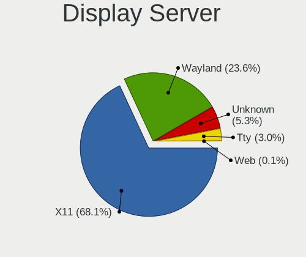
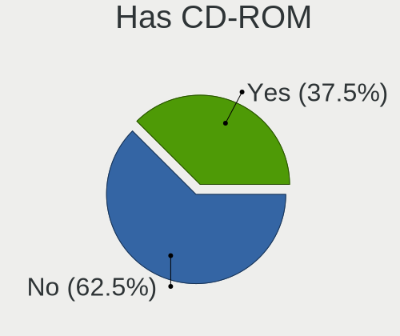
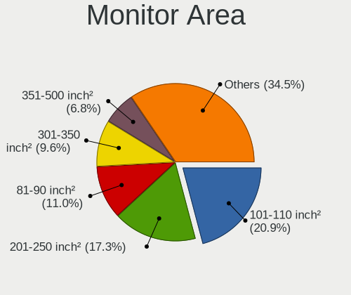
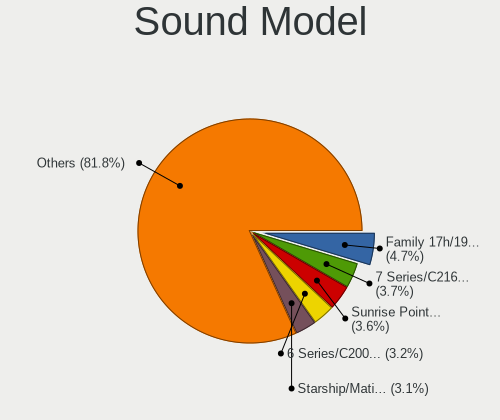
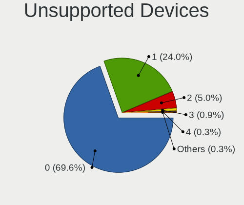

Linux in Canada - Tested Hardware & Statistics
----------------------------------------------

A project to collect tested hardware configurations for Linux in Canada.

Anyone can contribute to this report by the [hw-probe](https://github.com/linuxhw/hw-probe) tool:

    sudo -E hw-probe -all -upload

Please contribute! Especially if your hardware is rare.

This is a report for all computer types. See also reports for [desktops](/Location/Canada/Desktop/README.md) and [notebooks](/Location/Canada/Notebook/README.md).

Contents
--------

* [ Test Cases ](#test-cases)

* [ System ](#system)
  - [ OS                       ](#os)
  - [ OS Family                ](#os-family)
  - [ Kernel                   ](#kernel)
  - [ Kernel Family            ](#kernel-family)
  - [ Kernel Major Ver.        ](#kernel-major-ver)
  - [ Arch                     ](#arch)
  - [ DE                       ](#de)
  - [ Display Server           ](#display-server)
  - [ Display Manager          ](#display-manager)
  - [ OS Lang                  ](#os-lang)
  - [ Boot Mode                ](#boot-mode)
  - [ Filesystem               ](#filesystem)
  - [ Part. scheme             ](#part-scheme)
  - [ Dual Boot with Linux/BSD ](#dual-boot-with-linuxbsd)
  - [ Dual Boot (Win)          ](#dual-boot-win)

* [ Board ](#board)
  - [ Vendor                   ](#vendor)
  - [ Model                    ](#model)
  - [ Model Family             ](#model-family)
  - [ MFG Year                 ](#mfg-year)
  - [ Form Factor              ](#form-factor)
  - [ Secure Boot              ](#secure-boot)
  - [ Coreboot                 ](#coreboot)
  - [ RAM Size                 ](#ram-size)
  - [ RAM Used                 ](#ram-used)
  - [ Total Drives             ](#total-drives)
  - [ Has CD-ROM               ](#has-cd-rom)
  - [ Has Ethernet             ](#has-ethernet)
  - [ Has WiFi                 ](#has-wifi)
  - [ Has Bluetooth            ](#has-bluetooth)

* [ Location ](#location)
  - [ Country                  ](#country)
  - [ City                     ](#city)

* [ Drives ](#drives)
  - [ Drive Vendor             ](#drive-vendor)
  - [ Drive Model              ](#drive-model)
  - [ HDD Vendor               ](#hdd-vendor)
  - [ SSD Vendor               ](#ssd-vendor)
  - [ Drive Kind               ](#drive-kind)
  - [ Drive Connector          ](#drive-connector)
  - [ Drive Size               ](#drive-size)
  - [ Space Total              ](#space-total)
  - [ Space Used               ](#space-used)
  - [ Malfunc. Drives          ](#malfunc-drives)
  - [ Malfunc. Drive Vendor    ](#malfunc-drive-vendor)
  - [ Malfunc. HDD Vendor      ](#malfunc-hdd-vendor)
  - [ Malfunc. Drive Kind      ](#malfunc-drive-kind)
  - [ Failed Drives            ](#failed-drives)
  - [ Failed Drive Vendor      ](#failed-drive-vendor)
  - [ Drive Status             ](#drive-status)

* [ Storage controller ](#storage-controller)
  - [ Storage Vendor           ](#storage-vendor)
  - [ Storage Model            ](#storage-model)
  - [ Storage Kind             ](#storage-kind)

* [ Processor ](#processor)
  - [ CPU Vendor               ](#cpu-vendor)
  - [ CPU Model                ](#cpu-model)
  - [ CPU Model Family         ](#cpu-model-family)
  - [ CPU Cores                ](#cpu-cores)
  - [ CPU Sockets              ](#cpu-sockets)
  - [ CPU Threads              ](#cpu-threads)
  - [ CPU Op-Modes             ](#cpu-op-modes)
  - [ CPU Microcode            ](#cpu-microcode)
  - [ CPU Microarch            ](#cpu-microarch)

* [ Graphics ](#graphics)
  - [ GPU Vendor               ](#gpu-vendor)
  - [ GPU Model                ](#gpu-model)
  - [ GPU Combo                ](#gpu-combo)
  - [ GPU Driver               ](#gpu-driver)
  - [ GPU Memory               ](#gpu-memory)

* [ Monitor ](#monitor)
  - [ Monitor Vendor           ](#monitor-vendor)
  - [ Monitor Model            ](#monitor-model)
  - [ Monitor Resolution       ](#monitor-resolution)
  - [ Monitor Diagonal         ](#monitor-diagonal)
  - [ Monitor Width            ](#monitor-width)
  - [ Aspect Ratio             ](#aspect-ratio)
  - [ Monitor Area             ](#monitor-area)
  - [ Pixel Density            ](#pixel-density)
  - [ Multiple Monitors        ](#multiple-monitors)

* [ Network ](#network)
  - [ Net Controller Vendor    ](#net-controller-vendor)
  - [ Net Controller Model     ](#net-controller-model)
  - [ Wireless Vendor          ](#wireless-vendor)
  - [ Wireless Model           ](#wireless-model)
  - [ Ethernet Vendor          ](#ethernet-vendor)
  - [ Ethernet Model           ](#ethernet-model)
  - [ Net Controller Kind      ](#net-controller-kind)
  - [ Used Controller          ](#used-controller)
  - [ NICs                     ](#nics)
  - [ IPv6                     ](#ipv6)

* [ Bluetooth ](#bluetooth)
  - [ Bluetooth Vendor         ](#bluetooth-vendor)
  - [ Bluetooth Model          ](#bluetooth-model)

* [ Sound ](#sound)
  - [ Sound Vendor             ](#sound-vendor)
  - [ Sound Model              ](#sound-model)

* [ Memory ](#memory)
  - [ Memory Vendor            ](#memory-vendor)
  - [ Memory Model             ](#memory-model)
  - [ Memory Kind              ](#memory-kind)
  - [ Memory Form Factor       ](#memory-form-factor)
  - [ Memory Size              ](#memory-size)
  - [ Memory Speed             ](#memory-speed)

* [ Printers & scanners ](#printers--scanners)
  - [ Printer Vendor           ](#printer-vendor)
  - [ Printer Model            ](#printer-model)
  - [ Scanner Vendor           ](#scanner-vendor)
  - [ Scanner Model            ](#scanner-model)

* [ Camera ](#camera)
  - [ Camera Vendor            ](#camera-vendor)
  - [ Camera Model             ](#camera-model)

* [ Security ](#security)
  - [ Fingerprint Vendor       ](#fingerprint-vendor)
  - [ Fingerprint Model        ](#fingerprint-model)
  - [ Chipcard Vendor          ](#chipcard-vendor)
  - [ Chipcard Model           ](#chipcard-model)

* [ Unsupported ](#unsupported)
  - [ Unsupported Devices      ](#unsupported-devices)
  - [ Unsupported Device Types ](#unsupported-device-types)

Test Cases
----------

Total: 6793

| Vendor        | Model                       | Form-Factor | Probe                                                      | Date         |
|---------------|-----------------------------|-------------|------------------------------------------------------------|--------------|
| Google        | Droid                       | Notebook    | [40550baeb8](https://linux-hardware.org/?probe=40550baeb8) | Oct 01, 2022 |
| Dell          | Latitude E5530 non-vPro     | Notebook    | [b2d146f923](https://linux-hardware.org/?probe=b2d146f923) | Oct 01, 2022 |
| Samsung       | 950XDB/951XDB/950XDY        | Notebook    | [5c5353c8b6](https://linux-hardware.org/?probe=5c5353c8b6) | Oct 01, 2022 |
| ASUSTek       | UX360UAK                    | Convertible | [5077b42a8b](https://linux-hardware.org/?probe=5077b42a8b) | Oct 01, 2022 |
| ASRock        | Z77 Extreme3                | Desktop     | [c92633e1ee](https://linux-hardware.org/?probe=c92633e1ee) | Oct 01, 2022 |
| ASRock        | Z77 Extreme3                | Desktop     | [ada9e56162](https://linux-hardware.org/?probe=ada9e56162) | Oct 01, 2022 |
| Dell          | Latitude E4300              | Notebook    | [a860d9a446](https://linux-hardware.org/?probe=a860d9a446) | Sep 30, 2022 |
| Lenovo        | ThinkPad T480 20L5001FUS    | Notebook    | [a7e0da7aa4](https://linux-hardware.org/?probe=a7e0da7aa4) | Sep 30, 2022 |
| Microsoft     | Surface Pro 2               | Tablet      | [f9cf849f23](https://linux-hardware.org/?probe=f9cf849f23) | Sep 30, 2022 |
| Microsoft     | Surface Pro 2               | Tablet      | [6cf53adb30](https://linux-hardware.org/?probe=6cf53adb30) | Sep 30, 2022 |
| HP            | Pavilion dv8000 (ET839UA... | Notebook    | [46ef409fa9](https://linux-hardware.org/?probe=46ef409fa9) | Sep 30, 2022 |
| ASRock        | X570 Steel Legend           | Desktop     | [40e65e38cf](https://linux-hardware.org/?probe=40e65e38cf) | Sep 30, 2022 |
| HP            | 3398                        | Desktop     | [2f7b1d28b4](https://linux-hardware.org/?probe=2f7b1d28b4) | Sep 30, 2022 |
| HP            | 1496                        | Desktop     | [e89f06542b](https://linux-hardware.org/?probe=e89f06542b) | Sep 30, 2022 |
| Lenovo        | SHARKBAY NOK                | Desktop     | [aa0eeeda6b](https://linux-hardware.org/?probe=aa0eeeda6b) | Sep 29, 2022 |
| ASUSTek       | PRIME Z270-A                | Desktop     | [4118e245a3](https://linux-hardware.org/?probe=4118e245a3) | Sep 29, 2022 |
| Acer          | Veriton X6610G              | Desktop     | [66733e59e2](https://linux-hardware.org/?probe=66733e59e2) | Sep 29, 2022 |
| HP            | Notebook                    | Notebook    | [6b7215bcba](https://linux-hardware.org/?probe=6b7215bcba) | Sep 29, 2022 |
| Lenovo        | 1031 SBB0J05441 WIN 3305... | Desktop     | [75c8af47c2](https://linux-hardware.org/?probe=75c8af47c2) | Sep 29, 2022 |
| Dell          | Latitude E6430              | Notebook    | [f3e5e0005d](https://linux-hardware.org/?probe=f3e5e0005d) | Sep 29, 2022 |
| Lenovo        | ThinkPad T460 20FMS43J0V    | Notebook    | [0453cd781f](https://linux-hardware.org/?probe=0453cd781f) | Sep 28, 2022 |
| MSI           | Z87-GD65 GAMING             | Desktop     | [fe6539c021](https://linux-hardware.org/?probe=fe6539c021) | Sep 28, 2022 |
| Gigabyte      | AORUS 15P YD                | Notebook    | [61e297be71](https://linux-hardware.org/?probe=61e297be71) | Sep 28, 2022 |
| Apple         | Mac-27ADBB7B4CEE8E61 iMa... | All in one  | [8086625f5a](https://linux-hardware.org/?probe=8086625f5a) | Sep 28, 2022 |
| HP            | 212B                        | Desktop     | [38aa6e5478](https://linux-hardware.org/?probe=38aa6e5478) | Sep 28, 2022 |
| Pine Micro... | Pine64 PinePhone (1.2)      | Phone       | [bc3501546b](https://linux-hardware.org/?probe=bc3501546b) | Sep 28, 2022 |
| Dell          | 01V648 A06                  | Server      | [209c9b938c](https://linux-hardware.org/?probe=209c9b938c) | Sep 27, 2022 |
| ASUSTek       | VivoBook_ASUSLaptop X512... | Notebook    | [89c48e7d5a](https://linux-hardware.org/?probe=89c48e7d5a) | Sep 27, 2022 |
| ASUSTek       | VivoBook_ASUSLaptop X512... | Notebook    | [b39aefdcda](https://linux-hardware.org/?probe=b39aefdcda) | Sep 27, 2022 |
| Lenovo        | ThinkPad E15 Gen 4 21EDC... | Notebook    | [fb2de59c3f](https://linux-hardware.org/?probe=fb2de59c3f) | Sep 27, 2022 |
| ASUSTek       | G73Jh                       | Notebook    | [e5405dd3d8](https://linux-hardware.org/?probe=e5405dd3d8) | Sep 27, 2022 |
| Gigabyte      | Z690I AORUS ULTRA DDR4      | Desktop     | [7af967061b](https://linux-hardware.org/?probe=7af967061b) | Sep 27, 2022 |
| Intel         | DP35DP AAD81073-208         | Desktop     | [031ff09179](https://linux-hardware.org/?probe=031ff09179) | Sep 27, 2022 |
| ASUSTek       | G73Jh                       | Notebook    | [ac96a56edf](https://linux-hardware.org/?probe=ac96a56edf) | Sep 27, 2022 |
| HP            | Laptop 15-dw3xxx            | Notebook    | [d7dcd834e2](https://linux-hardware.org/?probe=d7dcd834e2) | Sep 27, 2022 |
| Dell          | CS24-TY                     | Server      | [029e2bdb60](https://linux-hardware.org/?probe=029e2bdb60) | Sep 27, 2022 |
| ASUSTek       | P8H61-M LE/CSM              | Desktop     | [45031620df](https://linux-hardware.org/?probe=45031620df) | Sep 27, 2022 |
| Lenovo        | IdeaPad 3 15IGL05 81WQ      | Notebook    | [4f58ff1174](https://linux-hardware.org/?probe=4f58ff1174) | Sep 26, 2022 |
| Acer          | Aspire A515-55              | Notebook    | [a9ac678198](https://linux-hardware.org/?probe=a9ac678198) | Sep 26, 2022 |
| Acer          | Aspire A515-55              | Notebook    | [8e66a480f3](https://linux-hardware.org/?probe=8e66a480f3) | Sep 26, 2022 |
| ASUSTek       | K52N                        | Notebook    | [8d7b00011f](https://linux-hardware.org/?probe=8d7b00011f) | Sep 26, 2022 |
| HP            | Pavilion Aero Laptop 13-... | Notebook    | [52a86d0701](https://linux-hardware.org/?probe=52a86d0701) | Sep 26, 2022 |
| HP            | Pavilion Aero Laptop 13-... | Notebook    | [683aa83ea4](https://linux-hardware.org/?probe=683aa83ea4) | Sep 26, 2022 |
| MSI           | GS65 Stealth 9SE            | Notebook    | [0c8e0eb1f5](https://linux-hardware.org/?probe=0c8e0eb1f5) | Sep 26, 2022 |
| MSI           | GE75 Raider 8SF             | Notebook    | [094a9b115b](https://linux-hardware.org/?probe=094a9b115b) | Sep 26, 2022 |
| Apple         | MacBookPro14,1              | Notebook    | [f5e9524bff](https://linux-hardware.org/?probe=f5e9524bff) | Sep 25, 2022 |
| Dell          | Inspiron 14 7425 2-in-1     | Convertible | [9a7ec70bad](https://linux-hardware.org/?probe=9a7ec70bad) | Sep 25, 2022 |
| Dell          | Inspiron 1440               | Notebook    | [c928a944c0](https://linux-hardware.org/?probe=c928a944c0) | Sep 24, 2022 |
| Gateway       | IPISB-VR                    | Desktop     | [21ee50eb69](https://linux-hardware.org/?probe=21ee50eb69) | Sep 24, 2022 |
| Dell          | Latitude E5510              | Notebook    | [04f4e9a803](https://linux-hardware.org/?probe=04f4e9a803) | Sep 24, 2022 |
| HP            | Pavilion dv8000 (ET839UA... | Notebook    | [70404f465f](https://linux-hardware.org/?probe=70404f465f) | Sep 24, 2022 |
| Dell          | Cherry Trail CR A00         | Mini pc     | [405ea9a4ca](https://linux-hardware.org/?probe=405ea9a4ca) | Sep 24, 2022 |
| HP            | Notebook                    | Notebook    | [f4e47792c1](https://linux-hardware.org/?probe=f4e47792c1) | Sep 24, 2022 |
| ASUSTek       | SABERTOOTH P67              | Desktop     | [164ad85233](https://linux-hardware.org/?probe=164ad85233) | Sep 23, 2022 |
| Lenovo        | ThinkPad T61p 64575KU       | Notebook    | [a5e3ca7c25](https://linux-hardware.org/?probe=a5e3ca7c25) | Sep 23, 2022 |
| Valve         | Jupiter                     | Notebook    | [ca6d2abcd9](https://linux-hardware.org/?probe=ca6d2abcd9) | Sep 23, 2022 |
| MSI           | 870-G45                     | Desktop     | [082307d0ce](https://linux-hardware.org/?probe=082307d0ce) | Sep 22, 2022 |
| HP            | 8309                        | Desktop     | [118f235878](https://linux-hardware.org/?probe=118f235878) | Sep 22, 2022 |
| Valve         | Jupiter                     | Notebook    | [bea162d6e3](https://linux-hardware.org/?probe=bea162d6e3) | Sep 22, 2022 |
| Lenovo        | ThinkPad Edge E530 3259C... | Notebook    | [cdaec9c224](https://linux-hardware.org/?probe=cdaec9c224) | Sep 22, 2022 |
| Acer          | Aspire A515-55              | Notebook    | [fb1cce613c](https://linux-hardware.org/?probe=fb1cce613c) | Sep 22, 2022 |
| ASUSTek       | G73Jh                       | Notebook    | [58b83fee74](https://linux-hardware.org/?probe=58b83fee74) | Sep 22, 2022 |
| Gigabyte      | EP45-UD3R                   | Desktop     | [920bf9a750](https://linux-hardware.org/?probe=920bf9a750) | Sep 22, 2022 |
| Lenovo        | 1052 NOK                    | Desktop     | [28cd1416fe](https://linux-hardware.org/?probe=28cd1416fe) | Sep 22, 2022 |
| ASUSTek       | G73Jh                       | Notebook    | [e40a8996c4](https://linux-hardware.org/?probe=e40a8996c4) | Sep 22, 2022 |
| HP            | Pavilion dv8000 (ET839UA... | Notebook    | [dd994c3f70](https://linux-hardware.org/?probe=dd994c3f70) | Sep 22, 2022 |
| Acer          | Aspire M3450                | Desktop     | [ff7d0a2394](https://linux-hardware.org/?probe=ff7d0a2394) | Sep 21, 2022 |
| Razer         | Blade                       | Notebook    | [c835fe2f90](https://linux-hardware.org/?probe=c835fe2f90) | Sep 21, 2022 |
| HP            | Pavilion dv8000 (ET839UA... | Notebook    | [79f0e7d5a2](https://linux-hardware.org/?probe=79f0e7d5a2) | Sep 21, 2022 |
| ASRock        | Z77 Extreme3                | Desktop     | [deb21d492d](https://linux-hardware.org/?probe=deb21d492d) | Sep 21, 2022 |
| Valve         | Jupiter                     | Notebook    | [1c7bc3efcf](https://linux-hardware.org/?probe=1c7bc3efcf) | Sep 21, 2022 |
| ASUSTek       | A68HM-K                     | Desktop     | [966ae734c2](https://linux-hardware.org/?probe=966ae734c2) | Sep 20, 2022 |
| Dell          | Latitude E4310              | Notebook    | [06dc3db422](https://linux-hardware.org/?probe=06dc3db422) | Sep 20, 2022 |
| Valve         | Jupiter                     | Notebook    | [090e33f643](https://linux-hardware.org/?probe=090e33f643) | Sep 20, 2022 |
| Acer          | Aspire E5-532               | Notebook    | [1d0f80e0f1](https://linux-hardware.org/?probe=1d0f80e0f1) | Sep 20, 2022 |
| Acer          | Aspire E5-532               | Notebook    | [f349ec9700](https://linux-hardware.org/?probe=f349ec9700) | Sep 20, 2022 |
| Acer          | Nitro AN517-51              | Notebook    | [7bd22a5e38](https://linux-hardware.org/?probe=7bd22a5e38) | Sep 20, 2022 |
| Gigabyte      | B450 I AORUS PRO WIFI-CF    | Desktop     | [df0348739e](https://linux-hardware.org/?probe=df0348739e) | Sep 20, 2022 |
| Gigabyte      | X570 AORUS MASTER           | Desktop     | [424e3ded44](https://linux-hardware.org/?probe=424e3ded44) | Sep 19, 2022 |
| Gigabyte      | A520M DS3H AC               | Desktop     | [9d26eb4243](https://linux-hardware.org/?probe=9d26eb4243) | Sep 19, 2022 |
| HP            | Pavilion dv8000 (ET839UA... | Notebook    | [66596e407c](https://linux-hardware.org/?probe=66596e407c) | Sep 19, 2022 |
| Unknown       | T3 MRD                      | Desktop     | [1f60a4d202](https://linux-hardware.org/?probe=1f60a4d202) | Sep 19, 2022 |
| ASUSTek       | Z97-A                       | Desktop     | [d984474cba](https://linux-hardware.org/?probe=d984474cba) | Sep 19, 2022 |
| ASUSTek       | GL502VMK                    | Notebook    | [9776f2c20c](https://linux-hardware.org/?probe=9776f2c20c) | Sep 19, 2022 |
| MSI           | X570-A PRO                  | Desktop     | [cabf88c8be](https://linux-hardware.org/?probe=cabf88c8be) | Sep 19, 2022 |
| ASUSTek       | F2A85-V PRO                 | Desktop     | [943bb9e023](https://linux-hardware.org/?probe=943bb9e023) | Sep 19, 2022 |
| Acer          | Aspire A515-55              | Notebook    | [c932451f8e](https://linux-hardware.org/?probe=c932451f8e) | Sep 19, 2022 |
| ASUSTek       | SABERTOOTH P67              | Desktop     | [579f73fc88](https://linux-hardware.org/?probe=579f73fc88) | Sep 19, 2022 |
| ASUSTek       | TUF B350M-PLUS GAMING       | Desktop     | [27d1f0c593](https://linux-hardware.org/?probe=27d1f0c593) | Sep 19, 2022 |
| Dell          | Latitude E6540              | Notebook    | [d3140eaa89](https://linux-hardware.org/?probe=d3140eaa89) | Sep 19, 2022 |
| ASUSTek       | PRIME X570-PRO              | Desktop     | [06f5febda2](https://linux-hardware.org/?probe=06f5febda2) | Sep 19, 2022 |
| Dell          | Latitude E6540              | Notebook    | [7bf393c147](https://linux-hardware.org/?probe=7bf393c147) | Sep 19, 2022 |
| ASUSTek       | VivoBook_ASUSLaptop E410... | Notebook    | [b707354c65](https://linux-hardware.org/?probe=b707354c65) | Sep 18, 2022 |
| HP            | Pavilion dv8000 (ET839UA... | Notebook    | [2e1e251503](https://linux-hardware.org/?probe=2e1e251503) | Sep 18, 2022 |
| BESSTAR Te... | TH50                        | Desktop     | [916e9d7e5e](https://linux-hardware.org/?probe=916e9d7e5e) | Sep 18, 2022 |
| HP            | Pavilion dv8000 (ET839UA... | Notebook    | [5f56e8b10f](https://linux-hardware.org/?probe=5f56e8b10f) | Sep 18, 2022 |
| HP            | Pavilion Gaming Laptop 1... | Notebook    | [50da0a8acf](https://linux-hardware.org/?probe=50da0a8acf) | Sep 18, 2022 |
| MSI           | 870-G45                     | Desktop     | [e371716311](https://linux-hardware.org/?probe=e371716311) | Sep 18, 2022 |
| Dell          | XPS 15 7590                 | Notebook    | [a191bd2a9f](https://linux-hardware.org/?probe=a191bd2a9f) | Sep 18, 2022 |
| Razer         | Blade 14 - RZ09-0370        | Notebook    | [1f9f8ee511](https://linux-hardware.org/?probe=1f9f8ee511) | Sep 18, 2022 |
| Unknown       | T3 MRD                      | Desktop     | [b10823b50f](https://linux-hardware.org/?probe=b10823b50f) | Sep 17, 2022 |
| MSI           | 870-G45                     | Desktop     | [74af87b0c5](https://linux-hardware.org/?probe=74af87b0c5) | Sep 17, 2022 |
| MSI           | 870-G45                     | Desktop     | [f360a57f01](https://linux-hardware.org/?probe=f360a57f01) | Sep 17, 2022 |
| HP            | Laptop 15-ef0xxx            | Notebook    | [19d0260ef6](https://linux-hardware.org/?probe=19d0260ef6) | Sep 17, 2022 |
| ASUSTek       | ROG STRIX B450-F GAMING     | Desktop     | [1b40e531b5](https://linux-hardware.org/?probe=1b40e531b5) | Sep 17, 2022 |
| Microsoft     | Surface Laptop Go           | Tablet      | [4f1e683ced](https://linux-hardware.org/?probe=4f1e683ced) | Sep 16, 2022 |
| Lenovo        | MAHOBAY NOK                 | Desktop     | [cce010fd53](https://linux-hardware.org/?probe=cce010fd53) | Sep 16, 2022 |
| ASUSTek       | LITHIUM                     | Desktop     | [3aab1aa49f](https://linux-hardware.org/?probe=3aab1aa49f) | Sep 16, 2022 |
| Lenovo        | ThinkPad P17 Gen 1 20SQS... | Notebook    | [e31f54dfa3](https://linux-hardware.org/?probe=e31f54dfa3) | Sep 16, 2022 |
| Valve         | Jupiter                     | Notebook    | [28a40721a8](https://linux-hardware.org/?probe=28a40721a8) | Sep 16, 2022 |
| ASUSTek       | VivoBook_ASUSLaptop X580... | Notebook    | [70a944e816](https://linux-hardware.org/?probe=70a944e816) | Sep 16, 2022 |
| HP            | 1998                        | Desktop     | [f3ef7a85fe](https://linux-hardware.org/?probe=f3ef7a85fe) | Sep 16, 2022 |
| Lenovo        | IdeaPad 3 15ARE05 81W4      | Notebook    | [4ee2b37edf](https://linux-hardware.org/?probe=4ee2b37edf) | Sep 16, 2022 |
| ASUSTek       | ROG STRIX B450-I GAMING     | Desktop     | [31f9854044](https://linux-hardware.org/?probe=31f9854044) | Sep 16, 2022 |
| AZW           | GK mini                     | Desktop     | [19b8b4dc85](https://linux-hardware.org/?probe=19b8b4dc85) | Sep 15, 2022 |
| ASUSTek       | TUF Gaming X570-PLUS        | Desktop     | [a4dad191d2](https://linux-hardware.org/?probe=a4dad191d2) | Sep 15, 2022 |
| Lenovo        | ThinkPad T430 2347G4U       | Notebook    | [aa5d8a2fc6](https://linux-hardware.org/?probe=aa5d8a2fc6) | Sep 15, 2022 |
| Lenovo        | ThinkPad T430 2347G4U       | Notebook    | [8e62e03e0b](https://linux-hardware.org/?probe=8e62e03e0b) | Sep 15, 2022 |
| Google        | Droid                       | Notebook    | [b4acc4ee70](https://linux-hardware.org/?probe=b4acc4ee70) | Sep 15, 2022 |
| IBT.ca (IB... | MI836                       | Desktop     | [a180af0292](https://linux-hardware.org/?probe=a180af0292) | Sep 15, 2022 |
| IBT.ca (IB... | MI836                       | Desktop     | [a6d16593cc](https://linux-hardware.org/?probe=a6d16593cc) | Sep 15, 2022 |
| ASUSTek       | ROG Strix G513QY_G513QY     | Notebook    | [45309244c3](https://linux-hardware.org/?probe=45309244c3) | Sep 15, 2022 |
| ASUSTek       | PRIME Z270-A                | Desktop     | [2642647feb](https://linux-hardware.org/?probe=2642647feb) | Sep 14, 2022 |
| Lenovo        | ThinkBook 13s G4 ARB 21A... | Notebook    | [efb36530f1](https://linux-hardware.org/?probe=efb36530f1) | Sep 14, 2022 |
| Lenovo        | ThinkPad T510 4349BR8       | Notebook    | [d60b0c8539](https://linux-hardware.org/?probe=d60b0c8539) | Sep 14, 2022 |
| HP            | 1998                        | Desktop     | [bf93a500f4](https://linux-hardware.org/?probe=bf93a500f4) | Sep 14, 2022 |
| Lenovo        | 1031 SBB0J05441 WIN 3305... | Desktop     | [f614aa6ae7](https://linux-hardware.org/?probe=f614aa6ae7) | Sep 14, 2022 |
| Lenovo        | 1031 SBB0J05441 WIN 3305... | Desktop     | [fc1d1cb3bc](https://linux-hardware.org/?probe=fc1d1cb3bc) | Sep 14, 2022 |
| Dell          | Inspiron 15-7568            | Notebook    | [c3b834caec](https://linux-hardware.org/?probe=c3b834caec) | Sep 14, 2022 |
| ASUSTek       | VivoBook_ASUSLaptop X580... | Notebook    | [3f34e5ed01](https://linux-hardware.org/?probe=3f34e5ed01) | Sep 14, 2022 |
| Dell          | Inspiron 5575               | Notebook    | [1ae871a545](https://linux-hardware.org/?probe=1ae871a545) | Sep 14, 2022 |
| Dell          | 0DR845                      | Desktop     | [158b3832bc](https://linux-hardware.org/?probe=158b3832bc) | Sep 13, 2022 |
| HP            | 3031h                       | Desktop     | [9312c20d49](https://linux-hardware.org/?probe=9312c20d49) | Sep 13, 2022 |
| HP            | 3031h                       | Desktop     | [1bbfd867b0](https://linux-hardware.org/?probe=1bbfd867b0) | Sep 13, 2022 |
| Dell          | 0DR845                      | Desktop     | [f65bf44380](https://linux-hardware.org/?probe=f65bf44380) | Sep 13, 2022 |
| DFI           | HD631-Q87CRM                | Desktop     | [b7ed9b1d64](https://linux-hardware.org/?probe=b7ed9b1d64) | Sep 12, 2022 |
| Dell          | XPS 9315                    | Notebook    | [77ecec9e58](https://linux-hardware.org/?probe=77ecec9e58) | Sep 12, 2022 |
| Dell          | XPS 9315                    | Notebook    | [cfaae58ffa](https://linux-hardware.org/?probe=cfaae58ffa) | Sep 12, 2022 |
| Razer         | Blade 14 - RZ09-0370        | Notebook    | [47b15d6b6c](https://linux-hardware.org/?probe=47b15d6b6c) | Sep 12, 2022 |
| ECS           | Nettle3                     | Desktop     | [23f7f8708c](https://linux-hardware.org/?probe=23f7f8708c) | Sep 12, 2022 |
| Acer          | Aspire A515-55              | Notebook    | [5a114e6867](https://linux-hardware.org/?probe=5a114e6867) | Sep 12, 2022 |
| Lenovo        | ThinkPad X1 Carbon Gen 8... | Notebook    | [276e6547f9](https://linux-hardware.org/?probe=276e6547f9) | Sep 11, 2022 |
| Dell          | Latitude 3190               | Notebook    | [14d836c020](https://linux-hardware.org/?probe=14d836c020) | Sep 11, 2022 |
| Pine Micro... | Pine64 PinePhone (1.2)      | Phone       | [bc6ffac174](https://linux-hardware.org/?probe=bc6ffac174) | Sep 11, 2022 |
| Samsung       | 305E4A/305E5A/305E7A        | Notebook    | [f8be9f1680](https://linux-hardware.org/?probe=f8be9f1680) | Sep 11, 2022 |
| Acer          | Swift SF314-52              | Notebook    | [51857d9758](https://linux-hardware.org/?probe=51857d9758) | Sep 11, 2022 |
| Lenovo        | ThinkPad L460 20FVS1BC0S    | Notebook    | [e668edf31d](https://linux-hardware.org/?probe=e668edf31d) | Sep 11, 2022 |
| MSI           | Alpha 15 B5EEK              | Notebook    | [cf9447ce8c](https://linux-hardware.org/?probe=cf9447ce8c) | Sep 10, 2022 |
| HP            | 1998                        | Desktop     | [37cd896e72](https://linux-hardware.org/?probe=37cd896e72) | Sep 10, 2022 |
| HP            | 1998                        | Desktop     | [3da9c3ef8e](https://linux-hardware.org/?probe=3da9c3ef8e) | Sep 10, 2022 |
| Microsoft     | Surface Laptop Go           | Tablet      | [39c0297cb1](https://linux-hardware.org/?probe=39c0297cb1) | Sep 10, 2022 |
| Valve         | Jupiter                     | Notebook    | [2c95ed7c92](https://linux-hardware.org/?probe=2c95ed7c92) | Sep 10, 2022 |
| Dell          | Vostro 3550                 | Notebook    | [2e9e331465](https://linux-hardware.org/?probe=2e9e331465) | Sep 10, 2022 |
| ASRock        | B450M Pro4                  | Desktop     | [9ce6958b9c](https://linux-hardware.org/?probe=9ce6958b9c) | Sep 09, 2022 |
| Toshiba       | Satellite P200              | Notebook    | [c49fec0796](https://linux-hardware.org/?probe=c49fec0796) | Sep 09, 2022 |
| IBT.ca (IB... | MI836                       | Desktop     | [6155d5bd47](https://linux-hardware.org/?probe=6155d5bd47) | Sep 09, 2022 |
| Valve         | Jupiter                     | Notebook    | [48df4850fe](https://linux-hardware.org/?probe=48df4850fe) | Sep 09, 2022 |
| Microsoft     | Surface Laptop Go           | Tablet      | [9690933a68](https://linux-hardware.org/?probe=9690933a68) | Sep 08, 2022 |
| MSI           | MPG X570 GAMING EDGE WIF... | Desktop     | [f714986404](https://linux-hardware.org/?probe=f714986404) | Sep 08, 2022 |
| ASUSTek       | ROG Zephyrus S17 GX703HS... | Notebook    | [041c6dac05](https://linux-hardware.org/?probe=041c6dac05) | Sep 08, 2022 |
| Valve         | Jupiter                     | Notebook    | [3c4865fc8c](https://linux-hardware.org/?probe=3c4865fc8c) | Sep 08, 2022 |
| MSI           | B350M PRO-VDH               | Desktop     | [e5067297e8](https://linux-hardware.org/?probe=e5067297e8) | Sep 07, 2022 |
| HP            | Pavilion dv6700             | Notebook    | [6f32b647ec](https://linux-hardware.org/?probe=6f32b647ec) | Sep 07, 2022 |
| HP            | Spectre x360 2-in-1 Lapt... | Convertible | [2f4e7d54e0](https://linux-hardware.org/?probe=2f4e7d54e0) | Sep 07, 2022 |
| HP            | Spectre x360 2-in-1 Lapt... | Convertible | [6d6c3a5320](https://linux-hardware.org/?probe=6d6c3a5320) | Sep 07, 2022 |
| Valve         | Jupiter                     | Notebook    | [47baad2eed](https://linux-hardware.org/?probe=47baad2eed) | Sep 07, 2022 |
| Valve         | Jupiter                     | Notebook    | [090d406ac3](https://linux-hardware.org/?probe=090d406ac3) | Sep 07, 2022 |
| Lenovo        | ThinkPad T410 2516CTO       | Notebook    | [d3d092e789](https://linux-hardware.org/?probe=d3d092e789) | Sep 07, 2022 |
| Lenovo        | ThinkPad T410 2516CTO       | Notebook    | [424adc035f](https://linux-hardware.org/?probe=424adc035f) | Sep 07, 2022 |
| ASUSTek       | ET2040I                     | Desktop     | [44ab433428](https://linux-hardware.org/?probe=44ab433428) | Sep 06, 2022 |
| Apple         | Mac-031AEE4D24BFF0B1 Mac... | Mini pc     | [b506daf143](https://linux-hardware.org/?probe=b506daf143) | Sep 06, 2022 |
| ASUSTek       | PRIME B560-PLUS             | Desktop     | [989e0d5d57](https://linux-hardware.org/?probe=989e0d5d57) | Sep 06, 2022 |
| ASUSTek       | PRIME B560-PLUS             | Desktop     | [f51b1f139e](https://linux-hardware.org/?probe=f51b1f139e) | Sep 06, 2022 |
| ASUSTek       | ROG STRIX X470-F GAMING     | Desktop     | [ab4f06e457](https://linux-hardware.org/?probe=ab4f06e457) | Sep 05, 2022 |
| Lenovo        | ThinkPad X230 23252UU       | Notebook    | [0853f0ca45](https://linux-hardware.org/?probe=0853f0ca45) | Sep 05, 2022 |
| HP            | ProBook 440 G8 Notebook ... | Notebook    | [3c578ac6c8](https://linux-hardware.org/?probe=3c578ac6c8) | Sep 05, 2022 |
| HP            | ProBook 440 G8 Notebook ... | Notebook    | [e6117fb016](https://linux-hardware.org/?probe=e6117fb016) | Sep 05, 2022 |
| HP            | ProBook 440 G8 Notebook ... | Notebook    | [e8887916fa](https://linux-hardware.org/?probe=e8887916fa) | Sep 05, 2022 |
| Acer          | Swift SF314-42              | Notebook    | [12fbd247f5](https://linux-hardware.org/?probe=12fbd247f5) | Sep 05, 2022 |
| Apple         | Mac-031AEE4D24BFF0B1 Mac... | Mini pc     | [565c10e82f](https://linux-hardware.org/?probe=565c10e82f) | Sep 05, 2022 |
| Gigabyte      | X570 AORUS PRO WIFI         | Desktop     | [e12af15c84](https://linux-hardware.org/?probe=e12af15c84) | Sep 05, 2022 |
| Samsung       | 730QED                      | Convertible | [9af6e3d69d](https://linux-hardware.org/?probe=9af6e3d69d) | Sep 05, 2022 |
| Dell          | Inspiron 15 3525            | Notebook    | [0ec2aca595](https://linux-hardware.org/?probe=0ec2aca595) | Sep 04, 2022 |
| ASUSTek       | Q170M-C                     | Desktop     | [6710f3ecd0](https://linux-hardware.org/?probe=6710f3ecd0) | Sep 04, 2022 |
| ASUSTek       | KCMA-D8                     | Desktop     | [df5fdfccf0](https://linux-hardware.org/?probe=df5fdfccf0) | Sep 04, 2022 |
| HP            | 2ADC                        | Desktop     | [d9e5d2b511](https://linux-hardware.org/?probe=d9e5d2b511) | Sep 04, 2022 |
| Intel         | DQ67SW AAG12527-306         | Desktop     | [9ab6c11be2](https://linux-hardware.org/?probe=9ab6c11be2) | Sep 04, 2022 |
| MSI           | H81M-E34                    | Desktop     | [0fa7f79fdc](https://linux-hardware.org/?probe=0fa7f79fdc) | Sep 03, 2022 |
| Lenovo        | IdeaPad Flex-15IWL 81SR     | Convertible | [6723781de1](https://linux-hardware.org/?probe=6723781de1) | Sep 03, 2022 |
| Dell          | 0FGCC7 A01                  | Server      | [4689cac5c7](https://linux-hardware.org/?probe=4689cac5c7) | Sep 03, 2022 |
| ASUSTek       | X553MA                      | Notebook    | [9567e25730](https://linux-hardware.org/?probe=9567e25730) | Sep 03, 2022 |
| Lenovo        | ThinkPad T410 2518F5U       | Notebook    | [9b61c2fbcc](https://linux-hardware.org/?probe=9b61c2fbcc) | Sep 02, 2022 |
| Acer          | Aspire M3910                | Desktop     | [17c1079582](https://linux-hardware.org/?probe=17c1079582) | Sep 02, 2022 |
| Gigabyte      | GA-870A-UD3                 | Desktop     | [27840cf8d2](https://linux-hardware.org/?probe=27840cf8d2) | Sep 02, 2022 |
| ASUSTek       | X553MA                      | Notebook    | [18756268eb](https://linux-hardware.org/?probe=18756268eb) | Sep 02, 2022 |
| Valve         | Jupiter                     | Notebook    | [b3b1ffd7ff](https://linux-hardware.org/?probe=b3b1ffd7ff) | Sep 02, 2022 |
| Acer          | Aspire TC-605               | Desktop     | [fa13174432](https://linux-hardware.org/?probe=fa13174432) | Sep 02, 2022 |
| Lenovo        | ThinkPad T410 2518F5U       | Notebook    | [95e8dcce67](https://linux-hardware.org/?probe=95e8dcce67) | Sep 02, 2022 |
| Lenovo        | ThinkPad X13 Yoga Gen 2 ... | Convertible | [969ebd4d3a](https://linux-hardware.org/?probe=969ebd4d3a) | Sep 01, 2022 |
| Acer          | Aspire TC-605               | Desktop     | [5ff2a41fcd](https://linux-hardware.org/?probe=5ff2a41fcd) | Sep 01, 2022 |
| Dell          | 0R6PCT A01                  | Desktop     | [02af50752e](https://linux-hardware.org/?probe=02af50752e) | Sep 01, 2022 |
| Acer          | Aspire TC-605               | Desktop     | [fdc6b95d8b](https://linux-hardware.org/?probe=fdc6b95d8b) | Sep 01, 2022 |
| ASUSTek       | ROG STRIX X470-F GAMING     | Desktop     | [a2878122de](https://linux-hardware.org/?probe=a2878122de) | Sep 01, 2022 |
| ASUSTek       | ROG STRIX X470-F GAMING     | Desktop     | [836d60c547](https://linux-hardware.org/?probe=836d60c547) | Sep 01, 2022 |
| ASRock        | B450M Pro4-F                | Desktop     | [d48b9efca4](https://linux-hardware.org/?probe=d48b9efca4) | Sep 01, 2022 |
| Microsoft     | Surface Laptop Go           | Tablet      | [18822e9fbe](https://linux-hardware.org/?probe=18822e9fbe) | Sep 01, 2022 |
| Acer          | Aspire 5810T                | Notebook    | [6f807b1a84](https://linux-hardware.org/?probe=6f807b1a84) | Sep 01, 2022 |
| Lenovo        | ThinkPad T580 20L9CTO1WW    | Notebook    | [d6e9455a63](https://linux-hardware.org/?probe=d6e9455a63) | Aug 31, 2022 |
| JGINYUE       | B85I PLUS V2.1              | Desktop     | [d171691ef3](https://linux-hardware.org/?probe=d171691ef3) | Aug 31, 2022 |
| Samsung       | 305E4A/305E5A/305E7A        | Notebook    | [6eeadaf886](https://linux-hardware.org/?probe=6eeadaf886) | Aug 31, 2022 |
| Lenovo        | ThinkPad X1 Yoga 2nd 20J... | Convertible | [b2456009ae](https://linux-hardware.org/?probe=b2456009ae) | Aug 31, 2022 |
| ASUSTek       | K401UQK                     | Notebook    | [4f026584d7](https://linux-hardware.org/?probe=4f026584d7) | Aug 31, 2022 |
| Samsung       | 305E4A/305E5A/305E7A        | Notebook    | [56e8f54a3e](https://linux-hardware.org/?probe=56e8f54a3e) | Aug 31, 2022 |
| HP            | EliteBook x360 1030 G2      | Convertible | [05e4fbf471](https://linux-hardware.org/?probe=05e4fbf471) | Aug 31, 2022 |
| HP            | Pavilion Gaming Laptop 1... | Notebook    | [20da9d42a4](https://linux-hardware.org/?probe=20da9d42a4) | Aug 30, 2022 |
| Dell          | Inspiron 15-3567            | Notebook    | [39ae8218f6](https://linux-hardware.org/?probe=39ae8218f6) | Aug 30, 2022 |
| Gigabyte      | H370 AORUS GAMING 3 WIFI... | Desktop     | [413bd5a721](https://linux-hardware.org/?probe=413bd5a721) | Aug 29, 2022 |
| Lenovo        | MAHOBAY NO DPK              | Desktop     | [9274f5e876](https://linux-hardware.org/?probe=9274f5e876) | Aug 29, 2022 |
| Lenovo        | ThinkPad X1 Carbon 6th 2... | Notebook    | [a8acbb8d0b](https://linux-hardware.org/?probe=a8acbb8d0b) | Aug 28, 2022 |
| ReachingTe... | Dream Quest Office 2021     | Mini pc     | [b9803fd1ba](https://linux-hardware.org/?probe=b9803fd1ba) | Aug 28, 2022 |
| ReachingTe... | Dream Quest Office 2021     | Mini pc     | [f0e2de2452](https://linux-hardware.org/?probe=f0e2de2452) | Aug 28, 2022 |
| ASUSTek       | TUF Z390-PLUS GAMING        | Desktop     | [3ce9a33fed](https://linux-hardware.org/?probe=3ce9a33fed) | Aug 28, 2022 |
| ASUSTek       | TUF Z390-PLUS GAMING        | Desktop     | [2adf8e9ff6](https://linux-hardware.org/?probe=2adf8e9ff6) | Aug 28, 2022 |
| Gigabyte      | B450 I AORUS PRO WIFI-CF    | Desktop     | [a328df0016](https://linux-hardware.org/?probe=a328df0016) | Aug 28, 2022 |
| HP            | EliteBook x360 1030 G2      | Convertible | [995ab78b23](https://linux-hardware.org/?probe=995ab78b23) | Aug 28, 2022 |
| ASUSTek       | TUF Gaming X570-PLUS        | Desktop     | [505d987d1e](https://linux-hardware.org/?probe=505d987d1e) | Aug 28, 2022 |
| HP            | Pavilion Gaming Laptop 1... | Notebook    | [20bea980d2](https://linux-hardware.org/?probe=20bea980d2) | Aug 28, 2022 |
| Lenovo        | ThinkPad T430 2349DG5       | Notebook    | [740898521d](https://linux-hardware.org/?probe=740898521d) | Aug 27, 2022 |
| ReachingTe... | Dream Quest Office 2021     | Mini pc     | [8faac70cfa](https://linux-hardware.org/?probe=8faac70cfa) | Aug 27, 2022 |
| ReachingTe... | Dream Quest Office 2021     | Mini pc     | [72cf4f38cf](https://linux-hardware.org/?probe=72cf4f38cf) | Aug 27, 2022 |
| ASUSTek       | TUF Gaming B550-PLUS        | Desktop     | [704ce84e6a](https://linux-hardware.org/?probe=704ce84e6a) | Aug 27, 2022 |
| Intel         | DH87RL AAG74240-401         | Desktop     | [814718547c](https://linux-hardware.org/?probe=814718547c) | Aug 27, 2022 |
| Lenovo        | ThinkPad T430 2344BMU       | Notebook    | [c164d20c15](https://linux-hardware.org/?probe=c164d20c15) | Aug 26, 2022 |
| Lenovo        | ThinkPad T460s 20F9004NU... | Notebook    | [04f9f63255](https://linux-hardware.org/?probe=04f9f63255) | Aug 26, 2022 |
| Lenovo        | ThinkPad P14s Gen 2a 21A... | Notebook    | [83377b24dc](https://linux-hardware.org/?probe=83377b24dc) | Aug 25, 2022 |
| MSI           | WF75 10TK                   | Notebook    | [8f395376ba](https://linux-hardware.org/?probe=8f395376ba) | Aug 25, 2022 |
| Lenovo        | ThinkPad T420s 417152U      | Notebook    | [73a97b425c](https://linux-hardware.org/?probe=73a97b425c) | Aug 25, 2022 |
| Acer          | Swift SFX14-41G             | Notebook    | [8d1cad5e52](https://linux-hardware.org/?probe=8d1cad5e52) | Aug 25, 2022 |
| Lenovo        | ThinkPad P14s Gen 2a 21A... | Notebook    | [d2e2d5484c](https://linux-hardware.org/?probe=d2e2d5484c) | Aug 25, 2022 |
| Microsoft     | Surface Laptop Go           | Tablet      | [005afabbff](https://linux-hardware.org/?probe=005afabbff) | Aug 25, 2022 |
| HP            | 18E4                        | Desktop     | [13d5c6848a](https://linux-hardware.org/?probe=13d5c6848a) | Aug 24, 2022 |
| Google        | Rabbid                      | Notebook    | [8049c3894c](https://linux-hardware.org/?probe=8049c3894c) | Aug 24, 2022 |
| Dell          | 0F5C5X A00                  | Desktop     | [80cfa18cfd](https://linux-hardware.org/?probe=80cfa18cfd) | Aug 24, 2022 |
| ASUSTek       | TUF Gaming X570-PLUS        | Desktop     | [d1cae6aca8](https://linux-hardware.org/?probe=d1cae6aca8) | Aug 24, 2022 |
| Dell          | 0F5C5X A00                  | Desktop     | [5e62f9adde](https://linux-hardware.org/?probe=5e62f9adde) | Aug 24, 2022 |
| Lenovo        | 14w 81MQ000JUS              | Notebook    | [1ff769c6ef](https://linux-hardware.org/?probe=1ff769c6ef) | Aug 23, 2022 |
| Valve         | Jupiter                     | Notebook    | [ba1940016e](https://linux-hardware.org/?probe=ba1940016e) | Aug 23, 2022 |
| Dell          | 0YJPT1 A00                  | Desktop     | [1de0aeba8f](https://linux-hardware.org/?probe=1de0aeba8f) | Aug 22, 2022 |
| Valve         | Jupiter                     | Notebook    | [04b0de9007](https://linux-hardware.org/?probe=04b0de9007) | Aug 22, 2022 |
| ASUSTek       | Z97-P                       | Desktop     | [bcd3bcb389](https://linux-hardware.org/?probe=bcd3bcb389) | Aug 22, 2022 |
| System76      | Oryx Pro                    | Notebook    | [7c763e43c6](https://linux-hardware.org/?probe=7c763e43c6) | Aug 21, 2022 |
| ASUSTek       | ROG STRIX Z690-E GAMING ... | Desktop     | [5f90bb65a6](https://linux-hardware.org/?probe=5f90bb65a6) | Aug 21, 2022 |
| HP            | Pavilion 15                 | Notebook    | [c8d31e4708](https://linux-hardware.org/?probe=c8d31e4708) | Aug 21, 2022 |
| Dell          | Inspiron 15-5578            | Notebook    | [a0ff8934e5](https://linux-hardware.org/?probe=a0ff8934e5) | Aug 21, 2022 |
| Sony          | VPCEB12FD                   | Notebook    | [f98be4240a](https://linux-hardware.org/?probe=f98be4240a) | Aug 20, 2022 |
| Lenovo        | ThinkPad T500 2055A38       | Notebook    | [f37fce9f01](https://linux-hardware.org/?probe=f37fce9f01) | Aug 20, 2022 |
| Toshiba       | PORTEGE M780                | Notebook    | [8b7e72c5d9](https://linux-hardware.org/?probe=8b7e72c5d9) | Aug 20, 2022 |
| MSI           | Sword 15 A11UD              | Notebook    | [ca0fbaa451](https://linux-hardware.org/?probe=ca0fbaa451) | Aug 19, 2022 |
| MSI           | Sword 15 A11UD              | Notebook    | [565a6f9022](https://linux-hardware.org/?probe=565a6f9022) | Aug 19, 2022 |
| ASUSTek       | M4A78-E                     | Desktop     | [76028e78e9](https://linux-hardware.org/?probe=76028e78e9) | Aug 19, 2022 |
| HP            | EliteBook 8460p             | Notebook    | [1eca9d2f2d](https://linux-hardware.org/?probe=1eca9d2f2d) | Aug 19, 2022 |
| Intel         | DH87RL AAG74240-401         | Desktop     | [ebc0328fe0](https://linux-hardware.org/?probe=ebc0328fe0) | Aug 19, 2022 |
| Dell          | Latitude E6410              | Notebook    | [3304a70394](https://linux-hardware.org/?probe=3304a70394) | Aug 19, 2022 |
| ASUSTek       | PRIME Z390-A                | Desktop     | [e03daeba5f](https://linux-hardware.org/?probe=e03daeba5f) | Aug 18, 2022 |
| Dell          | 054KM3 A01                  | Desktop     | [3f966fdafa](https://linux-hardware.org/?probe=3f966fdafa) | Aug 17, 2022 |
| Apple         | Mac-4B682C642B45593E iMa... | All in one  | [ac42df990f](https://linux-hardware.org/?probe=ac42df990f) | Aug 17, 2022 |
| Microsoft     | Surface Laptop Go           | Tablet      | [eec78b1552](https://linux-hardware.org/?probe=eec78b1552) | Aug 17, 2022 |
| Intel         | DH87RL AAG74240-401         | Desktop     | [a8c5b732f4](https://linux-hardware.org/?probe=a8c5b732f4) | Aug 17, 2022 |
| Lenovo        | ThinkPad T460s 20F9004NU... | Notebook    | [3b35e8e9da](https://linux-hardware.org/?probe=3b35e8e9da) | Aug 17, 2022 |
| Acer          | Aspire TC-885 V:1.1         | Desktop     | [1ab8003e04](https://linux-hardware.org/?probe=1ab8003e04) | Aug 17, 2022 |
| Acer          | Aspire TC-885 V:1.1         | Desktop     | [2a3c6446e5](https://linux-hardware.org/?probe=2a3c6446e5) | Aug 17, 2022 |
| ASUSTek       | PRIME H370-A                | Desktop     | [da477254e7](https://linux-hardware.org/?probe=da477254e7) | Aug 16, 2022 |
| Apple         | Mac-031AEE4D24BFF0B1 Mac... | Mini pc     | [2a3764a87e](https://linux-hardware.org/?probe=2a3764a87e) | Aug 16, 2022 |
| Lenovo        | ThinkPad T470s 20HFCTO1W... | Notebook    | [4d5eb5e332](https://linux-hardware.org/?probe=4d5eb5e332) | Aug 15, 2022 |
| ASUSTek       | X555LAB                     | Notebook    | [5171fd1732](https://linux-hardware.org/?probe=5171fd1732) | Aug 15, 2022 |
| Dell          | 0PC5F7 A03                  | Desktop     | [56ee42afe3](https://linux-hardware.org/?probe=56ee42afe3) | Aug 15, 2022 |
| Lenovo        | ThinkPad T460s 20F9004NU... | Notebook    | [e09e349f03](https://linux-hardware.org/?probe=e09e349f03) | Aug 15, 2022 |
| ASUSTek       | K30AD_M31AD_M51AD_M32AD     | Desktop     | [239daef655](https://linux-hardware.org/?probe=239daef655) | Aug 15, 2022 |
| Valve         | Jupiter                     | Notebook    | [9ab7a2b695](https://linux-hardware.org/?probe=9ab7a2b695) | Aug 15, 2022 |
| ASUSTek       | TUF Gaming B550-PLUS        | Desktop     | [e75de6c205](https://linux-hardware.org/?probe=e75de6c205) | Aug 15, 2022 |
| ASUSTek       | B85M-G                      | Desktop     | [b44e802677](https://linux-hardware.org/?probe=b44e802677) | Aug 14, 2022 |
| Dell          | XPS 15 9500                 | Notebook    | [08ef9ef965](https://linux-hardware.org/?probe=08ef9ef965) | Aug 14, 2022 |
| HP            | 805D                        | Desktop     | [54f4e0fdb0](https://linux-hardware.org/?probe=54f4e0fdb0) | Aug 14, 2022 |
| MSI           | MS-B9351                    | Desktop     | [a5b1950761](https://linux-hardware.org/?probe=a5b1950761) | Aug 14, 2022 |
| MSI           | MS-B9351                    | Desktop     | [fbf08d2d76](https://linux-hardware.org/?probe=fbf08d2d76) | Aug 14, 2022 |
| Lenovo        | ThinkPad E550 20DF0040CA    | Notebook    | [0f657d4798](https://linux-hardware.org/?probe=0f657d4798) | Aug 14, 2022 |
| ASRock        | B450M Pro4                  | Desktop     | [286fd1791a](https://linux-hardware.org/?probe=286fd1791a) | Aug 14, 2022 |
| HP            | ENVY m6                     | Notebook    | [74d1a937cf](https://linux-hardware.org/?probe=74d1a937cf) | Aug 14, 2022 |
| Apple         | MacBookPro12,1              | Notebook    | [8b417889e1](https://linux-hardware.org/?probe=8b417889e1) | Aug 13, 2022 |
| Dell          | G3 3590                     | Notebook    | [fbe948e194](https://linux-hardware.org/?probe=fbe948e194) | Aug 13, 2022 |
| Toshiba       | PORTEGE M780                | Notebook    | [b7304a84fd](https://linux-hardware.org/?probe=b7304a84fd) | Aug 13, 2022 |
| Valve         | Jupiter                     | Notebook    | [3a1e95f5d5](https://linux-hardware.org/?probe=3a1e95f5d5) | Aug 12, 2022 |
| Dell          | 08GMV7 A00                  | All in one  | [d796aac0eb](https://linux-hardware.org/?probe=d796aac0eb) | Aug 12, 2022 |
| Dell          | 08GMV7 A00                  | All in one  | [40803a469b](https://linux-hardware.org/?probe=40803a469b) | Aug 12, 2022 |
| Dell          | 07PR60 A02                  | Desktop     | [7ed59c8c10](https://linux-hardware.org/?probe=7ed59c8c10) | Aug 12, 2022 |
| ASUSTek       | P5GC-MX                     | Desktop     | [346a48750b](https://linux-hardware.org/?probe=346a48750b) | Aug 12, 2022 |
| Dell          | Latitude 7420               | Notebook    | [26cd6bbb87](https://linux-hardware.org/?probe=26cd6bbb87) | Aug 12, 2022 |
| Dell          | 0CNCJW A08                  | Server      | [b961bc0427](https://linux-hardware.org/?probe=b961bc0427) | Aug 11, 2022 |
| HP            | Pavilion 15                 | Notebook    | [462769d45e](https://linux-hardware.org/?probe=462769d45e) | Aug 11, 2022 |
| Lenovo        | IdeaPad Y410P 20216         | Notebook    | [df3068aea1](https://linux-hardware.org/?probe=df3068aea1) | Aug 10, 2022 |
| Lenovo        | ThinkPad T460s 20F9004NU... | Notebook    | [21044cebb3](https://linux-hardware.org/?probe=21044cebb3) | Aug 10, 2022 |
| HP            | ProBook 4540s               | Notebook    | [426365299d](https://linux-hardware.org/?probe=426365299d) | Aug 10, 2022 |
| Samsung       | 305E4A/305E5A/305E7A        | Notebook    | [b188230a8a](https://linux-hardware.org/?probe=b188230a8a) | Aug 10, 2022 |
| Samsung       | 305E4A/305E5A/305E7A        | Notebook    | [7586fd5a58](https://linux-hardware.org/?probe=7586fd5a58) | Aug 10, 2022 |
| Microsoft     | Surface Laptop Go           | Tablet      | [9c257fb6e7](https://linux-hardware.org/?probe=9c257fb6e7) | Aug 10, 2022 |
| HP            | Laptop 17-by1xxx            | Notebook    | [1be4a11102](https://linux-hardware.org/?probe=1be4a11102) | Aug 09, 2022 |
| Microsoft     | Surface Laptop Go           | Tablet      | [9c5e5976db](https://linux-hardware.org/?probe=9c5e5976db) | Aug 08, 2022 |
| Lenovo        | ThinkPad P15s Gen 1 20T4... | Notebook    | [59250f2c2f](https://linux-hardware.org/?probe=59250f2c2f) | Aug 08, 2022 |
| ASUSTek       | Zenbook UM3402YA_UM3402Y... | Notebook    | [10d18cd30b](https://linux-hardware.org/?probe=10d18cd30b) | Aug 08, 2022 |
| ASUSTek       | G10DK                       | Desktop     | [2401d4af44](https://linux-hardware.org/?probe=2401d4af44) | Aug 08, 2022 |
| ASUSTek       | PRIME B550M-A               | Desktop     | [64e8ddf1c9](https://linux-hardware.org/?probe=64e8ddf1c9) | Aug 07, 2022 |
| Microsoft     | Surface Laptop Go           | Tablet      | [a4556a4076](https://linux-hardware.org/?probe=a4556a4076) | Aug 07, 2022 |
| ASUSTek       | TP410UAR                    | Convertible | [e1f77d1f94](https://linux-hardware.org/?probe=e1f77d1f94) | Aug 07, 2022 |
| AZW           | GTR V01                     | Mini pc     | [504142e8e0](https://linux-hardware.org/?probe=504142e8e0) | Aug 07, 2022 |
| Microsoft     | Surface Laptop Go           | Tablet      | [3ef9c93317](https://linux-hardware.org/?probe=3ef9c93317) | Aug 06, 2022 |
| Razer         | Book 13 - RZ09-0357         | Notebook    | [c4a323d350](https://linux-hardware.org/?probe=c4a323d350) | Aug 06, 2022 |
| ASUSTek       | UX303UA                     | Notebook    | [73145490fa](https://linux-hardware.org/?probe=73145490fa) | Aug 06, 2022 |
| Dell          | 0NV0M7 A02                  | Desktop     | [dbf000aacd](https://linux-hardware.org/?probe=dbf000aacd) | Aug 06, 2022 |
| Gigabyte      | X570 AORUS MASTER           | Desktop     | [dca6f9dfbd](https://linux-hardware.org/?probe=dca6f9dfbd) | Aug 06, 2022 |
| Apple         | MacBookPro9,2               | Notebook    | [a1b55cc875](https://linux-hardware.org/?probe=a1b55cc875) | Aug 06, 2022 |
| Acer          | Aspire 5742                 | Notebook    | [b1ec54ce80](https://linux-hardware.org/?probe=b1ec54ce80) | Aug 05, 2022 |
| ASUSTek       | VivoBook_ASUSLaptop X530... | Notebook    | [4acbeffc03](https://linux-hardware.org/?probe=4acbeffc03) | Aug 05, 2022 |
| Dell          | XPS 13 7390 2-in-1          | Convertible | [f25dd33bc3](https://linux-hardware.org/?probe=f25dd33bc3) | Aug 04, 2022 |
| ASUSTek       | PRIME B450M-A               | Desktop     | [3b290b6c0b](https://linux-hardware.org/?probe=3b290b6c0b) | Aug 04, 2022 |
| Microsoft     | Surface Pro                 | Tablet      | [db66e72de8](https://linux-hardware.org/?probe=db66e72de8) | Aug 04, 2022 |
| ASUSTek       | PRIME B350M-E               | Desktop     | [f9e07e62c2](https://linux-hardware.org/?probe=f9e07e62c2) | Aug 04, 2022 |
| Dell          | XPS 15 9520                 | Notebook    | [385e290982](https://linux-hardware.org/?probe=385e290982) | Aug 03, 2022 |
| Dell          | XPS 15 9520                 | Notebook    | [c7789bc8ca](https://linux-hardware.org/?probe=c7789bc8ca) | Aug 03, 2022 |
| Google        | Droid                       | Notebook    | [15d4518ba0](https://linux-hardware.org/?probe=15d4518ba0) | Aug 03, 2022 |
| Biostar       | TA880GU3+                   | Desktop     | [323c68d80f](https://linux-hardware.org/?probe=323c68d80f) | Aug 03, 2022 |
| HP            | 339A                        | Desktop     | [27ddbfd51d](https://linux-hardware.org/?probe=27ddbfd51d) | Aug 03, 2022 |
| ASUSTek       | VivoBook_ASUSLaptop X509... | Notebook    | [f79a1d3402](https://linux-hardware.org/?probe=f79a1d3402) | Aug 03, 2022 |
| ASUSTek       | VivoBook_ASUSLaptop X509... | Notebook    | [b2e4380743](https://linux-hardware.org/?probe=b2e4380743) | Aug 03, 2022 |
| HP            | 8433 11                     | Desktop     | [cd790281b5](https://linux-hardware.org/?probe=cd790281b5) | Aug 02, 2022 |
| Lenovo        | 102F SDK0E50510 WIN 2625... | Desktop     | [80512402c0](https://linux-hardware.org/?probe=80512402c0) | Aug 02, 2022 |
| Alienware     | x17 R2                      | Notebook    | [48772fabd8](https://linux-hardware.org/?probe=48772fabd8) | Aug 02, 2022 |
| Lenovo        | ThinkPad X1 Carbon 6th 2... | Notebook    | [0df3af0bc5](https://linux-hardware.org/?probe=0df3af0bc5) | Aug 02, 2022 |
| Alienware     | x17 R2                      | Notebook    | [606b777651](https://linux-hardware.org/?probe=606b777651) | Aug 02, 2022 |
| Valve         | Jupiter                     | Notebook    | [bfddbf1d22](https://linux-hardware.org/?probe=bfddbf1d22) | Aug 02, 2022 |
| Gigabyte      | Z690I AORUS ULTRA DDR4      | Desktop     | [4bd0f9e461](https://linux-hardware.org/?probe=4bd0f9e461) | Aug 02, 2022 |
| HP            | Unknown                     | Notebook    | [bd6c9221e7](https://linux-hardware.org/?probe=bd6c9221e7) | Aug 02, 2022 |
| Microsoft     | Surface Laptop Go           | Tablet      | [81f9ca7e45](https://linux-hardware.org/?probe=81f9ca7e45) | Aug 02, 2022 |
| HP            | Pavilion 15                 | Notebook    | [442aaa6069](https://linux-hardware.org/?probe=442aaa6069) | Aug 01, 2022 |
| Valve         | Jupiter                     | Notebook    | [e4c6300b68](https://linux-hardware.org/?probe=e4c6300b68) | Aug 01, 2022 |
| HP            | Laptop 14-dq4xxx            | Notebook    | [1e57f77386](https://linux-hardware.org/?probe=1e57f77386) | Aug 01, 2022 |
| Microsoft     | Surface Laptop Go           | Tablet      | [6b7e94ffa5](https://linux-hardware.org/?probe=6b7e94ffa5) | Aug 01, 2022 |
| Microsoft     | Surface Laptop Go           | Tablet      | [ec13dcb17f](https://linux-hardware.org/?probe=ec13dcb17f) | Aug 01, 2022 |
| ASUSTek       | G73Jh                       | Notebook    | [ec1e513893](https://linux-hardware.org/?probe=ec1e513893) | Aug 01, 2022 |
| Dell          | 0GXM1W A01                  | Desktop     | [91d2f28256](https://linux-hardware.org/?probe=91d2f28256) | Aug 01, 2022 |
| Dell          | 0GXM1W A01                  | Desktop     | [ab895fc1a2](https://linux-hardware.org/?probe=ab895fc1a2) | Aug 01, 2022 |
| Lenovo        | IdeaPad 3 14ALC6 82KT       | Notebook    | [15382de4bf](https://linux-hardware.org/?probe=15382de4bf) | Aug 01, 2022 |
| Apple         | Mac-F221BEC8                | Desktop     | [13cbc87486](https://linux-hardware.org/?probe=13cbc87486) | Jul 31, 2022 |
| Dell          | Latitude E5450              | Notebook    | [b7618f5c14](https://linux-hardware.org/?probe=b7618f5c14) | Jul 31, 2022 |
| Dell          | Latitude E5450              | Notebook    | [2c6979fb39](https://linux-hardware.org/?probe=2c6979fb39) | Jul 31, 2022 |
| HP            | Laptop 15-dy3xxx            | Notebook    | [e54cde5e86](https://linux-hardware.org/?probe=e54cde5e86) | Jul 31, 2022 |
| ASUSTek       | PRIME Z490-A                | Desktop     | [a1923838e1](https://linux-hardware.org/?probe=a1923838e1) | Jul 31, 2022 |
| ASUSTek       | TUF Gaming X570-PLUS        | Desktop     | [22b4bcc010](https://linux-hardware.org/?probe=22b4bcc010) | Jul 31, 2022 |
| Dell          | CS24-TY                     | Server      | [c307dd98ff](https://linux-hardware.org/?probe=c307dd98ff) | Jul 30, 2022 |
| EVGA          | 134-KS-E377                 | Desktop     | [2624cfe274](https://linux-hardware.org/?probe=2624cfe274) | Jul 30, 2022 |
| Apple         | Mac-F42C88C8 Proto1         | Desktop     | [cc3deb0a17](https://linux-hardware.org/?probe=cc3deb0a17) | Jul 30, 2022 |
| Dell          | 0WMJ54 A01                  | Desktop     | [7682000c35](https://linux-hardware.org/?probe=7682000c35) | Jul 30, 2022 |
| Fujitsu       | STYLISTIC Q702              | Notebook    | [2fe4fe7fe5](https://linux-hardware.org/?probe=2fe4fe7fe5) | Jul 30, 2022 |
| Microsoft     | Surface Laptop Go           | Tablet      | [f56b1796ad](https://linux-hardware.org/?probe=f56b1796ad) | Jul 30, 2022 |
| HP            | 339A                        | Desktop     | [7f2505acd4](https://linux-hardware.org/?probe=7f2505acd4) | Jul 30, 2022 |
| AMI           | T3 MRD                      | Notebook    | [7e0a2ced92](https://linux-hardware.org/?probe=7e0a2ced92) | Jul 29, 2022 |
| ASUSTek       | ROG STRIX B450-F GAMING     | Desktop     | [38fae80720](https://linux-hardware.org/?probe=38fae80720) | Jul 29, 2022 |
| Lenovo        | ThinkPad T440s 20ARS4PR0... | Notebook    | [5b91ff037d](https://linux-hardware.org/?probe=5b91ff037d) | Jul 29, 2022 |
| Clevo         | W150HNM/W170HN              | Notebook    | [31c83153b5](https://linux-hardware.org/?probe=31c83153b5) | Jul 29, 2022 |
| BESSTAR Te... | DMAF5 V1.0                  | Desktop     | [a6237b3a28](https://linux-hardware.org/?probe=a6237b3a28) | Jul 29, 2022 |
| MSI           | GF75 Thin 9SC               | Notebook    | [a6113f2e35](https://linux-hardware.org/?probe=a6113f2e35) | Jul 29, 2022 |
| Gigabyte      | Z170XP-SLI-CF               | Desktop     | [5a12531bf9](https://linux-hardware.org/?probe=5a12531bf9) | Jul 29, 2022 |
| Dell          | 0CRWCR A01                  | All in one  | [e1cd0b697d](https://linux-hardware.org/?probe=e1cd0b697d) | Jul 29, 2022 |
| Lenovo        | IdeaPad S145-15IWL 81MV     | Notebook    | [03b39a36f1](https://linux-hardware.org/?probe=03b39a36f1) | Jul 29, 2022 |
| Valve         | Jupiter                     | Notebook    | [dffaa71aed](https://linux-hardware.org/?probe=dffaa71aed) | Jul 28, 2022 |
| ASUSTek       | G10DK                       | Desktop     | [70a71d84a6](https://linux-hardware.org/?probe=70a71d84a6) | Jul 28, 2022 |
| Dell          | Latitude E7440              | Notebook    | [ff1e9aae86](https://linux-hardware.org/?probe=ff1e9aae86) | Jul 28, 2022 |
| HP            | 18E6                        | Desktop     | [60d1a8e6da](https://linux-hardware.org/?probe=60d1a8e6da) | Jul 28, 2022 |
| Lenovo        | SHARKBAY SDK0E50510 WIN     | Desktop     | [da54317b9a](https://linux-hardware.org/?probe=da54317b9a) | Jul 27, 2022 |
| Microsoft     | Surface Laptop Go           | Tablet      | [b6dea628df](https://linux-hardware.org/?probe=b6dea628df) | Jul 27, 2022 |
| Lenovo        | ThinkPad X270 20HMS0GJ00    | Notebook    | [fa45b52c07](https://linux-hardware.org/?probe=fa45b52c07) | Jul 27, 2022 |
| Dell          | 05DN3X A00                  | Desktop     | [e4c1d0bdeb](https://linux-hardware.org/?probe=e4c1d0bdeb) | Jul 27, 2022 |
| Lenovo        | ThinkPad T420 4236CTO       | Notebook    | [6797b09b3b](https://linux-hardware.org/?probe=6797b09b3b) | Jul 27, 2022 |
| Dell          | 0WMJ54 A01                  | Desktop     | [fc499e7600](https://linux-hardware.org/?probe=fc499e7600) | Jul 27, 2022 |
| Dell          | XPS 17 9720                 | Notebook    | [5f7787d9e3](https://linux-hardware.org/?probe=5f7787d9e3) | Jul 27, 2022 |
| HP            | Stream Laptop 14-cb1XX      | Notebook    | [c5f4ae1ac4](https://linux-hardware.org/?probe=c5f4ae1ac4) | Jul 26, 2022 |
| Dell          | 042P49 A01                  | Desktop     | [f9003ad850](https://linux-hardware.org/?probe=f9003ad850) | Jul 26, 2022 |
| ASUSTek       | M51BC                       | Desktop     | [4d6af73032](https://linux-hardware.org/?probe=4d6af73032) | Jul 26, 2022 |
| ASUSTek       | TUF Gaming A520M-PLUS WI... | Desktop     | [b61b6b5fa5](https://linux-hardware.org/?probe=b61b6b5fa5) | Jul 26, 2022 |
| Microsoft     | Surface Laptop Go           | Tablet      | [1683326024](https://linux-hardware.org/?probe=1683326024) | Jul 26, 2022 |
| ASUSTek       | PRIME B450M-A               | Desktop     | [4812de622f](https://linux-hardware.org/?probe=4812de622f) | Jul 26, 2022 |
| Lenovo        | ThinkPad W530 24472SU       | Notebook    | [52f731db42](https://linux-hardware.org/?probe=52f731db42) | Jul 25, 2022 |
| Dell          | CS24-TY                     | Server      | [230ad2532f](https://linux-hardware.org/?probe=230ad2532f) | Jul 24, 2022 |
| Lenovo        | ThinkPad T470 W10DG 20JM... | Notebook    | [acc848feda](https://linux-hardware.org/?probe=acc848feda) | Jul 24, 2022 |
| Lenovo        | ThinkPad T470 W10DG 20JM... | Notebook    | [0084e69574](https://linux-hardware.org/?probe=0084e69574) | Jul 24, 2022 |
| Microsoft     | Surface Laptop Go           | Tablet      | [60b06048f3](https://linux-hardware.org/?probe=60b06048f3) | Jul 24, 2022 |
| Gateway       | DX4840                      | Desktop     | [0df8a716b1](https://linux-hardware.org/?probe=0df8a716b1) | Jul 24, 2022 |
| Pine Micro... | Pine64 RK3566 Quartz64-A    | Soc         | [8e2855140c](https://linux-hardware.org/?probe=8e2855140c) | Jul 24, 2022 |
| MSI           | 970 GAMING                  | Desktop     | [bf2a870952](https://linux-hardware.org/?probe=bf2a870952) | Jul 23, 2022 |
| MSI           | MEG X570 ACE                | Desktop     | [f13fde648e](https://linux-hardware.org/?probe=f13fde648e) | Jul 23, 2022 |
| HP            | EliteBook Folio 1040 G1     | Notebook    | [4c0cb4fd92](https://linux-hardware.org/?probe=4c0cb4fd92) | Jul 23, 2022 |
| Apple         | MacBookPro8,2               | Notebook    | [e31685e3ae](https://linux-hardware.org/?probe=e31685e3ae) | Jul 23, 2022 |
| Pegatron      | 2ACD                        | Desktop     | [c8ce65cd26](https://linux-hardware.org/?probe=c8ce65cd26) | Jul 23, 2022 |
| ASUSTek       | P8P67 PRO                   | Desktop     | [54e6e291bd](https://linux-hardware.org/?probe=54e6e291bd) | Jul 22, 2022 |
| Microsoft     | Surface Laptop Go           | Tablet      | [db6770b5f7](https://linux-hardware.org/?probe=db6770b5f7) | Jul 22, 2022 |
| Apple         | MacBookAir7,2               | Notebook    | [a86b33bdc2](https://linux-hardware.org/?probe=a86b33bdc2) | Jul 22, 2022 |
| Lenovo        | ThinkPad T500 2055A38       | Notebook    | [3b2f2c3bea](https://linux-hardware.org/?probe=3b2f2c3bea) | Jul 22, 2022 |
| Dell          | 0WMJ54 A01                  | Desktop     | [dace7a0b12](https://linux-hardware.org/?probe=dace7a0b12) | Jul 21, 2022 |
| Dell          | Latitude 3190 2-in-1        | Convertible | [dce15b4c00](https://linux-hardware.org/?probe=dce15b4c00) | Jul 21, 2022 |
| ASUSTek       | ROG STRIX B550-I GAMING     | Desktop     | [2e97c3de0b](https://linux-hardware.org/?probe=2e97c3de0b) | Jul 21, 2022 |
| ASUSTek       | ROG STRIX B550-I GAMING     | Desktop     | [d567131bf9](https://linux-hardware.org/?probe=d567131bf9) | Jul 21, 2022 |
| Dell          | Precision 7560              | Notebook    | [c76f72f8c7](https://linux-hardware.org/?probe=c76f72f8c7) | Jul 21, 2022 |
| ASUSTek       | ROG STRIX Z370-E GAMING     | Desktop     | [9689ac8020](https://linux-hardware.org/?probe=9689ac8020) | Jul 21, 2022 |
| HP            | 158B                        | Desktop     | [017875f5a5](https://linux-hardware.org/?probe=017875f5a5) | Jul 21, 2022 |
| Unknown       | T3 MRD                      | Desktop     | [afbe55b100](https://linux-hardware.org/?probe=afbe55b100) | Jul 20, 2022 |
| Dell          | 04Y8V0 A02                  | Desktop     | [f843e569ed](https://linux-hardware.org/?probe=f843e569ed) | Jul 20, 2022 |
| Lenovo        | SHARKBAY 0B98401 WIN        | Desktop     | [0ce9af7993](https://linux-hardware.org/?probe=0ce9af7993) | Jul 20, 2022 |
| Dell          | G3 3590                     | Notebook    | [920eed9524](https://linux-hardware.org/?probe=920eed9524) | Jul 19, 2022 |
| ASUSTek       | X555QA                      | Notebook    | [a34b1c5684](https://linux-hardware.org/?probe=a34b1c5684) | Jul 18, 2022 |
| MSI           | B450M MORTAR TITANIUM       | Desktop     | [6aac7a75e7](https://linux-hardware.org/?probe=6aac7a75e7) | Jul 18, 2022 |
| Microsoft     | Surface Laptop Go           | Tablet      | [10be1cd329](https://linux-hardware.org/?probe=10be1cd329) | Jul 18, 2022 |
| ASUSTek       | VivoBook_ASUSLaptop X512... | Notebook    | [75990d47d7](https://linux-hardware.org/?probe=75990d47d7) | Jul 17, 2022 |
| MSI           | MEG B550 UNIFY              | Desktop     | [d6ecbbbfda](https://linux-hardware.org/?probe=d6ecbbbfda) | Jul 17, 2022 |
| Gigabyte      | Z97X-Gaming 3               | Desktop     | [ec770759cd](https://linux-hardware.org/?probe=ec770759cd) | Jul 17, 2022 |
| Gigabyte      | F2A85XM-D3H                 | Desktop     | [38ebe8f368](https://linux-hardware.org/?probe=38ebe8f368) | Jul 17, 2022 |
| Gigabyte      | F2A85XM-D3H                 | Desktop     | [129bcce64f](https://linux-hardware.org/?probe=129bcce64f) | Jul 17, 2022 |
| Gigabyte      | B250M-DS3H-CF               | Desktop     | [236812ea49](https://linux-hardware.org/?probe=236812ea49) | Jul 17, 2022 |
| Lenovo        | ThinkPad T500 2055A38       | Notebook    | [e8b9689526](https://linux-hardware.org/?probe=e8b9689526) | Jul 17, 2022 |
| ASUSTek       | U30Jc                       | Notebook    | [3a6a0ec169](https://linux-hardware.org/?probe=3a6a0ec169) | Jul 17, 2022 |
| HP            | Laptop 14-dk1xxx            | Notebook    | [cf03561efa](https://linux-hardware.org/?probe=cf03561efa) | Jul 17, 2022 |
| Acer          | Aspire A515-55              | Notebook    | [e762750617](https://linux-hardware.org/?probe=e762750617) | Jul 16, 2022 |
| HP            | Pavilion Gaming Laptop 1... | Notebook    | [a6e936c29d](https://linux-hardware.org/?probe=a6e936c29d) | Jul 16, 2022 |
| HP            | Pavilion Gaming Laptop 1... | Notebook    | [d465259da1](https://linux-hardware.org/?probe=d465259da1) | Jul 16, 2022 |
| Acer          | Aspire A515-55              | Notebook    | [c020ff87e8](https://linux-hardware.org/?probe=c020ff87e8) | Jul 16, 2022 |
| HP            | Pavilion g6                 | Notebook    | [556c813157](https://linux-hardware.org/?probe=556c813157) | Jul 16, 2022 |
| HP            | Notebook                    | Notebook    | [8ef9afa771](https://linux-hardware.org/?probe=8ef9afa771) | Jul 16, 2022 |
| Fanless Mi... | Rev JSL1                    | Mini pc     | [4d57e57019](https://linux-hardware.org/?probe=4d57e57019) | Jul 15, 2022 |
| ASUSTek       | M51BC                       | Desktop     | [d5a6b5628b](https://linux-hardware.org/?probe=d5a6b5628b) | Jul 14, 2022 |
| ASUSTek       | ASUS TUF Gaming F15 FX50... | Notebook    | [46ef1a2cd6](https://linux-hardware.org/?probe=46ef1a2cd6) | Jul 14, 2022 |
| ASRock        | Z77 Pro4-M                  | Desktop     | [69b486ea31](https://linux-hardware.org/?probe=69b486ea31) | Jul 14, 2022 |
| AMI           | T3 MRD                      | Notebook    | [d29d5d14c8](https://linux-hardware.org/?probe=d29d5d14c8) | Jul 14, 2022 |
| Lenovo        | SHARKBAY 0B98401 PRO        | Desktop     | [386dd1ac4b](https://linux-hardware.org/?probe=386dd1ac4b) | Jul 14, 2022 |
| Microsoft     | Surface Laptop Go           | Tablet      | [93b0330bb3](https://linux-hardware.org/?probe=93b0330bb3) | Jul 14, 2022 |
| Lenovo        | ThinkPad T420s 417152U      | Notebook    | [e5c9e4e4d9](https://linux-hardware.org/?probe=e5c9e4e4d9) | Jul 13, 2022 |
| MSI           | A320M PRO-VH PLUS           | Desktop     | [e007a2fbc2](https://linux-hardware.org/?probe=e007a2fbc2) | Jul 13, 2022 |
| MSI           | B450 GAMING PRO CARBON M... | Desktop     | [a6d5a615d0](https://linux-hardware.org/?probe=a6d5a615d0) | Jul 13, 2022 |
| ASUSTek       | TUF Gaming X570-PLUS        | Desktop     | [43e78c262a](https://linux-hardware.org/?probe=43e78c262a) | Jul 12, 2022 |
| Acidanther... | Mac-27AD2F918AE68F61 Mac... | Desktop     | [fdae528732](https://linux-hardware.org/?probe=fdae528732) | Jul 12, 2022 |
| ASUSTek       | TUF Gaming X570-PLUS        | Desktop     | [063f846aad](https://linux-hardware.org/?probe=063f846aad) | Jul 12, 2022 |
| HP            | EliteBook 855 G8 Noteboo... | Notebook    | [34c2c24b3b](https://linux-hardware.org/?probe=34c2c24b3b) | Jul 11, 2022 |
| Dell          | Latitude 5510               | Notebook    | [5f1abb9d12](https://linux-hardware.org/?probe=5f1abb9d12) | Jul 11, 2022 |
| Apple         | MacBookPro14,1              | Notebook    | [32cbf49371](https://linux-hardware.org/?probe=32cbf49371) | Jul 11, 2022 |
| AWOW          | NY41                        | Mini pc     | [a08b96a066](https://linux-hardware.org/?probe=a08b96a066) | Jul 11, 2022 |
| AWOW          | NY41                        | Mini pc     | [330ebff5e1](https://linux-hardware.org/?probe=330ebff5e1) | Jul 11, 2022 |
| HP            | EliteBook 840 G5            | Notebook    | [392310b916](https://linux-hardware.org/?probe=392310b916) | Jul 11, 2022 |
| Lenovo        | IdeaPad Yoga 11S 20246      | Notebook    | [d088d6021c](https://linux-hardware.org/?probe=d088d6021c) | Jul 11, 2022 |
| OEM_MB        | NARRA3                      | Desktop     | [845bdfd72c](https://linux-hardware.org/?probe=845bdfd72c) | Jul 11, 2022 |
| Dell          | 09WH54 A00                  | Desktop     | [8570e35470](https://linux-hardware.org/?probe=8570e35470) | Jul 11, 2022 |
| Acer          | Nitro N50-610               | Desktop     | [48c007b4e2](https://linux-hardware.org/?probe=48c007b4e2) | Jul 10, 2022 |
| Gigabyte      | Z270M-D3H-CF                | Desktop     | [df9ed91803](https://linux-hardware.org/?probe=df9ed91803) | Jul 10, 2022 |
| ASUSTek       | TUF Gaming FX504GD_FX80G... | Notebook    | [2ffa772ac9](https://linux-hardware.org/?probe=2ffa772ac9) | Jul 10, 2022 |
| MSI           | 2AE0                        | Desktop     | [4732ee97fb](https://linux-hardware.org/?probe=4732ee97fb) | Jul 10, 2022 |
| HP            | EliteBook 8540p             | Notebook    | [b161f9e458](https://linux-hardware.org/?probe=b161f9e458) | Jul 10, 2022 |
| Lenovo        | ThinkPad T500 2242CTO       | Notebook    | [47bddb4e10](https://linux-hardware.org/?probe=47bddb4e10) | Jul 10, 2022 |
| Lenovo        | ThinkPad T470s 20HFCTO1W... | Notebook    | [2894597236](https://linux-hardware.org/?probe=2894597236) | Jul 10, 2022 |
| Apple         | Mac-F221BEC8                | Desktop     | [2efb274f31](https://linux-hardware.org/?probe=2efb274f31) | Jul 10, 2022 |
| Dell          | 0GDJXY A00                  | All in one  | [e4f7616dee](https://linux-hardware.org/?probe=e4f7616dee) | Jul 10, 2022 |
| MSI           | B450-A PRO MAX              | Desktop     | [00495f3422](https://linux-hardware.org/?probe=00495f3422) | Jul 09, 2022 |
| Google        | Eve                         | Convertible | [be0c82653c](https://linux-hardware.org/?probe=be0c82653c) | Jul 09, 2022 |
| ASUSTek       | TUF Gaming FX504GD_FX80G... | Notebook    | [48aa7eac9f](https://linux-hardware.org/?probe=48aa7eac9f) | Jul 09, 2022 |
| Apple         | Mac-F226BEC8 PVT            | All in one  | [a9ff12a6e5](https://linux-hardware.org/?probe=a9ff12a6e5) | Jul 08, 2022 |
| Dell          | 0R849J A01                  | Desktop     | [3ea68d63c3](https://linux-hardware.org/?probe=3ea68d63c3) | Jul 08, 2022 |
| MSI           | MPG X570 GAMING PRO CARB... | Desktop     | [5dc09a66d8](https://linux-hardware.org/?probe=5dc09a66d8) | Jul 08, 2022 |
| HP            | 85BA 00100                  | All in one  | [3acda0ef6a](https://linux-hardware.org/?probe=3acda0ef6a) | Jul 08, 2022 |
| Valve         | Jupiter                     | Notebook    | [98711d54c1](https://linux-hardware.org/?probe=98711d54c1) | Jul 08, 2022 |
| ASUSTek       | M51BC                       | Desktop     | [fd0a9ef1c8](https://linux-hardware.org/?probe=fd0a9ef1c8) | Jul 08, 2022 |
| ASUSTek       | M51BC                       | Desktop     | [cc2f84d5d3](https://linux-hardware.org/?probe=cc2f84d5d3) | Jul 08, 2022 |
| Raspberry ... | Raspberry Pi 4 Model B R... | Soc         | [4f51cd80f3](https://linux-hardware.org/?probe=4f51cd80f3) | Jul 08, 2022 |
| ASUSTek       | P7H55-M PRO                 | Desktop     | [35e1af0d15](https://linux-hardware.org/?probe=35e1af0d15) | Jul 08, 2022 |
| Dell          | Latitude 5290 2-in-1        | Notebook    | [5ecc52d011](https://linux-hardware.org/?probe=5ecc52d011) | Jul 08, 2022 |
| Raspberry ... | Raspberry Pi 4 Model B R... | Soc         | [6915522c72](https://linux-hardware.org/?probe=6915522c72) | Jul 08, 2022 |
| HP            | Pavilion Laptop 15-cs3xx... | Notebook    | [2c457a6e4e](https://linux-hardware.org/?probe=2c457a6e4e) | Jul 07, 2022 |
| ASUSTek       | X553MA                      | Notebook    | [80d9c382cd](https://linux-hardware.org/?probe=80d9c382cd) | Jul 07, 2022 |
| ASUSTek       | X553MA                      | Notebook    | [9082e63d7d](https://linux-hardware.org/?probe=9082e63d7d) | Jul 07, 2022 |
| Lenovo        | ThinkPad T500 2242CTO       | Notebook    | [106199561c](https://linux-hardware.org/?probe=106199561c) | Jul 07, 2022 |
| ASRock        | B450M Pro4                  | Desktop     | [ff75212757](https://linux-hardware.org/?probe=ff75212757) | Jul 07, 2022 |
| Acer          | Nitro AN515-53              | Notebook    | [d31c5d1c11](https://linux-hardware.org/?probe=d31c5d1c11) | Jul 06, 2022 |
| Dell          | Latitude 7420               | Notebook    | [219cf18b1e](https://linux-hardware.org/?probe=219cf18b1e) | Jul 06, 2022 |
| Acer          | Nitro AN515-53              | Notebook    | [0304267499](https://linux-hardware.org/?probe=0304267499) | Jul 06, 2022 |
| Fanless Mi... | Rev JSL1                    | Mini pc     | [f188f66d12](https://linux-hardware.org/?probe=f188f66d12) | Jul 06, 2022 |
| MSI           | MPG B560I GAMING EDGE WI... | Desktop     | [ebaa969297](https://linux-hardware.org/?probe=ebaa969297) | Jul 06, 2022 |
| Google        | Aleena                      | Notebook    | [33110c34a9](https://linux-hardware.org/?probe=33110c34a9) | Jul 06, 2022 |
| ASRock        | B550 Phantom Gaming 4       | Desktop     | [7a6f484b16](https://linux-hardware.org/?probe=7a6f484b16) | Jul 06, 2022 |
| HP            | EliteBook 2530p             | Notebook    | [a4b4609db8](https://linux-hardware.org/?probe=a4b4609db8) | Jul 05, 2022 |
| ASUSTek       | G55VW                       | Notebook    | [fa0346f5df](https://linux-hardware.org/?probe=fa0346f5df) | Jul 05, 2022 |
| ASUSTek       | G55VW                       | Notebook    | [832ca8cf45](https://linux-hardware.org/?probe=832ca8cf45) | Jul 05, 2022 |
| ASUSTek       | M5A99FX PRO R2.0            | Desktop     | [d14ad254ca](https://linux-hardware.org/?probe=d14ad254ca) | Jul 05, 2022 |
| ASRock        | G41C-GS R2.0                | Desktop     | [a9a0f46cc7](https://linux-hardware.org/?probe=a9a0f46cc7) | Jul 05, 2022 |
| Unknown       | Unknown                     | All in one  | [1498908025](https://linux-hardware.org/?probe=1498908025) | Jul 05, 2022 |
| MSI           | Z170-A PRO                  | Desktop     | [24a76119e1](https://linux-hardware.org/?probe=24a76119e1) | Jul 04, 2022 |
| MSI           | 970A SLI Krait Edition      | Desktop     | [3199c023cb](https://linux-hardware.org/?probe=3199c023cb) | Jul 04, 2022 |
| Apple         | Mac-F2238BAE iMac11,3       | All in one  | [e0c6593aee](https://linux-hardware.org/?probe=e0c6593aee) | Jul 04, 2022 |
| ASUSTek       | VivoBook_ASUSLaptop X530... | Notebook    | [eb9c212159](https://linux-hardware.org/?probe=eb9c212159) | Jul 04, 2022 |
| ASUSTek       | X541UJ                      | Notebook    | [d3f8e6dee5](https://linux-hardware.org/?probe=d3f8e6dee5) | Jul 04, 2022 |
| Intel         | NUC8BEB J72688-307          | Mini pc     | [a21d756ee1](https://linux-hardware.org/?probe=a21d756ee1) | Jul 03, 2022 |
| Apple         | MacBookPro11,5              | Notebook    | [25e69108df](https://linux-hardware.org/?probe=25e69108df) | Jul 03, 2022 |
| Dell          | 0M6C7G A00                  | Desktop     | [5eee0db64f](https://linux-hardware.org/?probe=5eee0db64f) | Jul 03, 2022 |
| ASUSTek       | PRIME X570-P                | Desktop     | [1a729c627d](https://linux-hardware.org/?probe=1a729c627d) | Jul 03, 2022 |
| Acer          | Aspire TC-280               | Desktop     | [7322461b76](https://linux-hardware.org/?probe=7322461b76) | Jul 03, 2022 |
| Acer          | Aspire A515-52G             | Notebook    | [8ac3e2bcbc](https://linux-hardware.org/?probe=8ac3e2bcbc) | Jul 02, 2022 |
| Acer          | Aspire 5742Z                | Notebook    | [46f56997be](https://linux-hardware.org/?probe=46f56997be) | Jul 02, 2022 |
| Acer          | Aspire TC-280               | Desktop     | [0e497c1c13](https://linux-hardware.org/?probe=0e497c1c13) | Jul 02, 2022 |
| Acer          | Nitro AN517-52              | Notebook    | [3920a80387](https://linux-hardware.org/?probe=3920a80387) | Jul 02, 2022 |
| ASRock        | B450M Pro4                  | Desktop     | [64eae559ae](https://linux-hardware.org/?probe=64eae559ae) | Jul 02, 2022 |
| Acer          | Nitro AN517-52              | Notebook    | [37fbd3a600](https://linux-hardware.org/?probe=37fbd3a600) | Jul 02, 2022 |
| Dell          | Latitude 3190 2-in-1        | Convertible | [39684e88bc](https://linux-hardware.org/?probe=39684e88bc) | Jul 02, 2022 |
| Dell          | Precision 5550              | Notebook    | [0ddb8905e5](https://linux-hardware.org/?probe=0ddb8905e5) | Jul 01, 2022 |
| ASRock        | Z97 Anniversary             | Desktop     | [1e650b504d](https://linux-hardware.org/?probe=1e650b504d) | Jul 01, 2022 |
| Dell          | Inspiron 1720               | Notebook    | [bbd0bf2dc0](https://linux-hardware.org/?probe=bbd0bf2dc0) | Jun 30, 2022 |
| Dell          | 0HJ054                      | Desktop     | [bb9d7a3a58](https://linux-hardware.org/?probe=bb9d7a3a58) | Jun 30, 2022 |
| ASUSTek       | X553MA                      | Notebook    | [804bbd8147](https://linux-hardware.org/?probe=804bbd8147) | Jun 30, 2022 |
| ASUSTek       | X553MA                      | Notebook    | [9fe936cec8](https://linux-hardware.org/?probe=9fe936cec8) | Jun 30, 2022 |
| Dell          | 0M858N A01                  | Desktop     | [6cc8dcd51e](https://linux-hardware.org/?probe=6cc8dcd51e) | Jun 29, 2022 |
| Dell          | Inspiron 3531               | Notebook    | [2c8286100d](https://linux-hardware.org/?probe=2c8286100d) | Jun 29, 2022 |
| ASUSTek       | VivoBook_ASUSLaptop X530... | Notebook    | [9de675d3d1](https://linux-hardware.org/?probe=9de675d3d1) | Jun 29, 2022 |
| ASUSTek       | G752VT                      | Notebook    | [d51730ccbf](https://linux-hardware.org/?probe=d51730ccbf) | Jun 29, 2022 |
| MSI           | MAG X570 TOMAHAWK WIFI      | Desktop     | [cf7b4fb7e1](https://linux-hardware.org/?probe=cf7b4fb7e1) | Jun 29, 2022 |
| Dell          | Latitude 5520               | Notebook    | [0504660b50](https://linux-hardware.org/?probe=0504660b50) | Jun 28, 2022 |
| MSI           | H310M PRO-VD                | Desktop     | [1aec9e08e9](https://linux-hardware.org/?probe=1aec9e08e9) | Jun 28, 2022 |
| MSI           | H310M PRO-VD                | Desktop     | [1812911a41](https://linux-hardware.org/?probe=1812911a41) | Jun 28, 2022 |
| Apple         | MacBookPro10,1              | Notebook    | [a27f696a28](https://linux-hardware.org/?probe=a27f696a28) | Jun 27, 2022 |
| Toshiba       | Satellite A200              | Notebook    | [932496f041](https://linux-hardware.org/?probe=932496f041) | Jun 27, 2022 |
| ASRock        | A320M-HDV R4.0              | Desktop     | [547346f0a9](https://linux-hardware.org/?probe=547346f0a9) | Jun 26, 2022 |
| Lenovo        | ThinkPad T400 6475AT3       | Notebook    | [55fd247328](https://linux-hardware.org/?probe=55fd247328) | Jun 26, 2022 |
| Acer          | Aspire A315-42              | Notebook    | [57d9c7c28a](https://linux-hardware.org/?probe=57d9c7c28a) | Jun 24, 2022 |
| System76      | Darter Pro                  | Notebook    | [db7f217878](https://linux-hardware.org/?probe=db7f217878) | Jun 24, 2022 |
| Microsoft     | Surface Laptop Go           | Tablet      | [7528e47074](https://linux-hardware.org/?probe=7528e47074) | Jun 24, 2022 |
| Toshiba       | Satellite S50-A             | Notebook    | [c2e7c1b26d](https://linux-hardware.org/?probe=c2e7c1b26d) | Jun 24, 2022 |
| Acer          | Nitro AN515-54              | Notebook    | [afce38a95a](https://linux-hardware.org/?probe=afce38a95a) | Jun 24, 2022 |
| Lenovo        | ThinkPad T420 4236J73       | Notebook    | [088ba8b97c](https://linux-hardware.org/?probe=088ba8b97c) | Jun 23, 2022 |
| MSI           | MPG X570S EDGE MAX WIFI     | Desktop     | [2c1f55aa8f](https://linux-hardware.org/?probe=2c1f55aa8f) | Jun 23, 2022 |
| ASUSTek       | P5W DH Deluxe               | Desktop     | [71f0d32783](https://linux-hardware.org/?probe=71f0d32783) | Jun 23, 2022 |
| Gigabyte      | Z77X-UD3H                   | Desktop     | [7d7828a253](https://linux-hardware.org/?probe=7d7828a253) | Jun 23, 2022 |
| HP            | Pavilion g6                 | Notebook    | [c4524cb21f](https://linux-hardware.org/?probe=c4524cb21f) | Jun 23, 2022 |
| ASRock        | A320M-HDV R4.0              | Desktop     | [cf4479fbe9](https://linux-hardware.org/?probe=cf4479fbe9) | Jun 22, 2022 |
| ASUSTek       | PRIME Z370-A                | Desktop     | [8dca736a46](https://linux-hardware.org/?probe=8dca736a46) | Jun 21, 2022 |
| Gigabyte      | B450 AORUS PRO WIFI-CF      | Desktop     | [834bed6eda](https://linux-hardware.org/?probe=834bed6eda) | Jun 21, 2022 |
| Dell          | Latitude E6540              | Notebook    | [c0f2801648](https://linux-hardware.org/?probe=c0f2801648) | Jun 21, 2022 |
| Lenovo        | ThinkPad T420 4236EF4       | Notebook    | [1894bb8853](https://linux-hardware.org/?probe=1894bb8853) | Jun 21, 2022 |
| Dell          | Latitude E6540              | Notebook    | [7d19e0b30e](https://linux-hardware.org/?probe=7d19e0b30e) | Jun 20, 2022 |
| ASUSTek       | P8Z77-V                     | Desktop     | [e32a4e0214](https://linux-hardware.org/?probe=e32a4e0214) | Jun 20, 2022 |
| Google        | Droid                       | Notebook    | [5a175a2a78](https://linux-hardware.org/?probe=5a175a2a78) | Jun 20, 2022 |
| Raspberry ... | Raspberry Pi 4 Model B R... | Soc         | [a9a3470242](https://linux-hardware.org/?probe=a9a3470242) | Jun 19, 2022 |
| HP            | Pavilion dv7                | Notebook    | [ab34fbb528](https://linux-hardware.org/?probe=ab34fbb528) | Jun 19, 2022 |
| ASUSTek       | TUF Gaming FX504GD_FX80G... | Notebook    | [4b10fd12ae](https://linux-hardware.org/?probe=4b10fd12ae) | Jun 19, 2022 |
| HP            | Laptop 15-ef0xxx            | Notebook    | [f0cf5e0f30](https://linux-hardware.org/?probe=f0cf5e0f30) | Jun 18, 2022 |
| HP            | Laptop 14-fq0xxx            | Notebook    | [bc61209d78](https://linux-hardware.org/?probe=bc61209d78) | Jun 18, 2022 |
| MSI           | H310M PRO-VD                | Desktop     | [6516a467b5](https://linux-hardware.org/?probe=6516a467b5) | Jun 17, 2022 |
| Dell          | Latitude E6540              | Notebook    | [4806aec13b](https://linux-hardware.org/?probe=4806aec13b) | Jun 16, 2022 |
| Apple         | MacBookPro8,1               | Notebook    | [145a1e77fc](https://linux-hardware.org/?probe=145a1e77fc) | Jun 16, 2022 |
| ASUSTek       | P8B75-M                     | Desktop     | [9ab6f4690f](https://linux-hardware.org/?probe=9ab6f4690f) | Jun 16, 2022 |
| Gigabyte      | Z68X-UD3H-B3                | Desktop     | [bce90f59c8](https://linux-hardware.org/?probe=bce90f59c8) | Jun 16, 2022 |
| Gigabyte      | Z68X-UD3H-B3                | Desktop     | [6c1c388f3a](https://linux-hardware.org/?probe=6c1c388f3a) | Jun 15, 2022 |
| MSI           | B450 TOMAHAWK               | Desktop     | [e11d001f52](https://linux-hardware.org/?probe=e11d001f52) | Jun 15, 2022 |
| Lenovo        | Legion 7 15IMH05 81YT       | Notebook    | [cc1947a21b](https://linux-hardware.org/?probe=cc1947a21b) | Jun 15, 2022 |
| Lenovo        | Legion 7 15IMH05 81YT       | Notebook    | [cba78f563c](https://linux-hardware.org/?probe=cba78f563c) | Jun 15, 2022 |
| Apple         | MacBookAir7,2               | Notebook    | [fc34430f8d](https://linux-hardware.org/?probe=fc34430f8d) | Jun 15, 2022 |
| ASRock        | H310M-ITX/ac                | Desktop     | [17063e8cc6](https://linux-hardware.org/?probe=17063e8cc6) | Jun 15, 2022 |
| Acer          | Aspire X1400                | Desktop     | [a90701fd86](https://linux-hardware.org/?probe=a90701fd86) | Jun 15, 2022 |
| Dell          | Precision 5550              | Notebook    | [f5f815ceed](https://linux-hardware.org/?probe=f5f815ceed) | Jun 14, 2022 |
| HP            | Laptop 14-fq0xxx            | Notebook    | [d7cccd8f1d](https://linux-hardware.org/?probe=d7cccd8f1d) | Jun 14, 2022 |
| GPU Compan... | GWTN141-10                  | Notebook    | [c856f6d54f](https://linux-hardware.org/?probe=c856f6d54f) | Jun 14, 2022 |
| Lenovo        | IdeaPad 3 15IML05 81WB      | Notebook    | [aa4ef3154d](https://linux-hardware.org/?probe=aa4ef3154d) | Jun 14, 2022 |
| Lenovo        | 0B98401 PRO                 | Desktop     | [23de86aa97](https://linux-hardware.org/?probe=23de86aa97) | Jun 14, 2022 |
| Dell          | 0D28YY A00                  | Desktop     | [18487dbcb1](https://linux-hardware.org/?probe=18487dbcb1) | Jun 14, 2022 |
| Alienware     | 0R3FWM A00                  | Desktop     | [6690a39447](https://linux-hardware.org/?probe=6690a39447) | Jun 13, 2022 |
| Notebook      | P65_P67SE                   | Notebook    | [590b7204da](https://linux-hardware.org/?probe=590b7204da) | Jun 13, 2022 |
| Lenovo        | ThinkPad T14 Gen 1 20UD0... | Notebook    | [e26e612120](https://linux-hardware.org/?probe=e26e612120) | Jun 13, 2022 |
| HP            | EliteBook 840 G3            | Notebook    | [e18df87b93](https://linux-hardware.org/?probe=e18df87b93) | Jun 13, 2022 |
| Microsoft     | Surface Laptop Go           | Tablet      | [9275d3d785](https://linux-hardware.org/?probe=9275d3d785) | Jun 13, 2022 |
| HP            | ProBook 470 G4              | Notebook    | [29f73d7f11](https://linux-hardware.org/?probe=29f73d7f11) | Jun 12, 2022 |
| Lenovo        | IdeaPad Slim 7 Carbon 14... | Notebook    | [9382b4e2c0](https://linux-hardware.org/?probe=9382b4e2c0) | Jun 12, 2022 |
| Lenovo        | IdeaPad Slim 7 Carbon 14... | Notebook    | [06526726ca](https://linux-hardware.org/?probe=06526726ca) | Jun 11, 2022 |
| Microsoft     | Surface Laptop Go           | Tablet      | [2c4fc4748b](https://linux-hardware.org/?probe=2c4fc4748b) | Jun 11, 2022 |
| ASUSTek       | PRIME B550M-A               | Desktop     | [14b9e721b7](https://linux-hardware.org/?probe=14b9e721b7) | Jun 11, 2022 |
| HP            | Pavilion 17                 | Notebook    | [bed3614b80](https://linux-hardware.org/?probe=bed3614b80) | Jun 11, 2022 |
| Razer         | Blade                       | Notebook    | [df8f6881a7](https://linux-hardware.org/?probe=df8f6881a7) | Jun 10, 2022 |
| ASUSTek       | PRIME B450M-A II            | Desktop     | [148d14437b](https://linux-hardware.org/?probe=148d14437b) | Jun 10, 2022 |
| ASUSTek       | PRIME X470-PRO              | Desktop     | [693e499a6d](https://linux-hardware.org/?probe=693e499a6d) | Jun 10, 2022 |
| ASUSTek       | M5A97 R2.0                  | Desktop     | [e92127f694](https://linux-hardware.org/?probe=e92127f694) | Jun 10, 2022 |
| Gigabyte      | Z97X-SLI-CF                 | Desktop     | [294890a076](https://linux-hardware.org/?probe=294890a076) | Jun 10, 2022 |
| Dell          | Latitude E5550              | Notebook    | [95baf2f400](https://linux-hardware.org/?probe=95baf2f400) | Jun 10, 2022 |
| Gigabyte      | GA-78LMT-USB3 SEx           | Desktop     | [9c7b34c996](https://linux-hardware.org/?probe=9c7b34c996) | Jun 09, 2022 |
| ASUSTek       | X541UAK                     | Notebook    | [92a20ee191](https://linux-hardware.org/?probe=92a20ee191) | Jun 08, 2022 |
| Dell          | Latitude E5430 non-vPro     | Notebook    | [ff7b51ffc8](https://linux-hardware.org/?probe=ff7b51ffc8) | Jun 08, 2022 |
| Gigabyte      | AB350M-Gaming 3-CF          | Desktop     | [c18fee9219](https://linux-hardware.org/?probe=c18fee9219) | Jun 08, 2022 |
| Dell          | 0WR7PY A03                  | Desktop     | [630d0bc381](https://linux-hardware.org/?probe=630d0bc381) | Jun 08, 2022 |
| Intel         | DG33FB AAD81072-306         | Desktop     | [78abe45a29](https://linux-hardware.org/?probe=78abe45a29) | Jun 08, 2022 |
| ASUSTek       | G752VT                      | Notebook    | [bb5bb68126](https://linux-hardware.org/?probe=bb5bb68126) | Jun 08, 2022 |
| Lenovo        | ThinkStation S20 410599U    | Desktop     | [072870fb4e](https://linux-hardware.org/?probe=072870fb4e) | Jun 07, 2022 |
| Pine Micro... | Pine64 RK3566 Quartz64-A    | Soc         | [8226efcb30](https://linux-hardware.org/?probe=8226efcb30) | Jun 07, 2022 |
| HP            | 8433 11                     | Desktop     | [fa4c4f5c0e](https://linux-hardware.org/?probe=fa4c4f5c0e) | Jun 07, 2022 |
| Lenovo        | ThinkStation S20 410599U    | Desktop     | [20df21f5d9](https://linux-hardware.org/?probe=20df21f5d9) | Jun 07, 2022 |
| Google        | Cave                        | Notebook    | [16183f9a77](https://linux-hardware.org/?probe=16183f9a77) | Jun 07, 2022 |
| Apple         | Mac-031B6874CF7F642A iMa... | All in one  | [937c62f908](https://linux-hardware.org/?probe=937c62f908) | Jun 07, 2022 |
| Raspberry ... | Raspberry Pi 4 Model B R... | Soc         | [781ae865b0](https://linux-hardware.org/?probe=781ae865b0) | Jun 07, 2022 |
| Toshiba       | Satellite L850              | Notebook    | [809d0bbd73](https://linux-hardware.org/?probe=809d0bbd73) | Jun 07, 2022 |
| Toshiba       | Satellite L850              | Notebook    | [761d37bd31](https://linux-hardware.org/?probe=761d37bd31) | Jun 06, 2022 |
| Lenovo        | IdeaPadFlex 5 14ALC05 82... | Convertible | [aab255864c](https://linux-hardware.org/?probe=aab255864c) | Jun 06, 2022 |
| HP            | Laptop 14-fq0xxx            | Notebook    | [d88feaaf5e](https://linux-hardware.org/?probe=d88feaaf5e) | Jun 06, 2022 |
| Unknown       | Unknown                     | Desktop     | [44afb95fbb](https://linux-hardware.org/?probe=44afb95fbb) | Jun 06, 2022 |
| System76      | Oryx Pro                    | Notebook    | [ec0e78e0f6](https://linux-hardware.org/?probe=ec0e78e0f6) | Jun 06, 2022 |
| Samsung       | 300V3A/300V4A/300V5A/200... | Notebook    | [fffae020ba](https://linux-hardware.org/?probe=fffae020ba) | Jun 06, 2022 |
| Dell          | 0KWVT8 A03                  | Desktop     | [5745c8b787](https://linux-hardware.org/?probe=5745c8b787) | Jun 06, 2022 |
| MSI           | MPG X570S CARBON MAX WIF... | Desktop     | [0d57c069a8](https://linux-hardware.org/?probe=0d57c069a8) | Jun 05, 2022 |
| Gigabyte      | GA-990FXA-UD3               | Desktop     | [e636b14f58](https://linux-hardware.org/?probe=e636b14f58) | Jun 05, 2022 |
| ASRock        | Z97 Anniversary             | Desktop     | [b6a332c085](https://linux-hardware.org/?probe=b6a332c085) | Jun 04, 2022 |
| HP            | Laptop 14-fq0xxx            | Notebook    | [3ebcdc19fa](https://linux-hardware.org/?probe=3ebcdc19fa) | Jun 04, 2022 |
| Microsoft     | Surface Laptop Go           | Tablet      | [51f7ef393f](https://linux-hardware.org/?probe=51f7ef393f) | Jun 04, 2022 |
| MSI           | GP72 6QF                    | Notebook    | [4f62904f80](https://linux-hardware.org/?probe=4f62904f80) | Jun 04, 2022 |
| Microsoft     | Surface Laptop Go           | Tablet      | [2f56cc2ac8](https://linux-hardware.org/?probe=2f56cc2ac8) | Jun 04, 2022 |
| Raspberry ... | Raspberry Pi                | Soc         | [3fd62a1d06](https://linux-hardware.org/?probe=3fd62a1d06) | Jun 04, 2022 |
| Raspberry ... | Raspberry Pi                | Soc         | [7a8d99ead8](https://linux-hardware.org/?probe=7a8d99ead8) | Jun 04, 2022 |
| Apple         | Mac-031B6874CF7F642A iMa... | All in one  | [d0797577a9](https://linux-hardware.org/?probe=d0797577a9) | Jun 04, 2022 |
| ASUSTek       | ROG Zephyrus G15 GA502IV... | Notebook    | [cae8761200](https://linux-hardware.org/?probe=cae8761200) | Jun 03, 2022 |
| Gigabyte      | X570 AORUS ELITE            | Desktop     | [9404638832](https://linux-hardware.org/?probe=9404638832) | Jun 03, 2022 |
| HP            | 3397                        | Desktop     | [775c6990fd](https://linux-hardware.org/?probe=775c6990fd) | Jun 03, 2022 |
| HP            | 3397                        | Desktop     | [2f3fb08195](https://linux-hardware.org/?probe=2f3fb08195) | Jun 03, 2022 |
| HP            | Pavilion x2 Detachable      | Tablet      | [d60056e177](https://linux-hardware.org/?probe=d60056e177) | Jun 03, 2022 |
| BESSTAR Te... | UM700                       | Desktop     | [ea24f8341e](https://linux-hardware.org/?probe=ea24f8341e) | Jun 02, 2022 |
| BESSTAR Te... | UM700                       | Desktop     | [d3799b37d7](https://linux-hardware.org/?probe=d3799b37d7) | Jun 02, 2022 |
| Gigabyte      | B450 AORUS PRO WIFI-CF      | Desktop     | [c50bbae3e1](https://linux-hardware.org/?probe=c50bbae3e1) | Jun 02, 2022 |
| ASUSTek       | ROG Strix G733ZX_G733ZX     | Notebook    | [dca80e1df5](https://linux-hardware.org/?probe=dca80e1df5) | Jun 02, 2022 |
| MACHINIST     | X79 (INTEL Xeon E5/Corei... | Desktop     | [536c6e19de](https://linux-hardware.org/?probe=536c6e19de) | Jun 01, 2022 |
| Dell          | Latitude 7420               | Notebook    | [5be44c8aae](https://linux-hardware.org/?probe=5be44c8aae) | Jun 01, 2022 |
| Apple         | Mac-031B6874CF7F642A iMa... | All in one  | [aed2597085](https://linux-hardware.org/?probe=aed2597085) | Jun 01, 2022 |
| Lenovo        | Edge 15 80K9                | Notebook    | [5c8bb97759](https://linux-hardware.org/?probe=5c8bb97759) | Jun 01, 2022 |
| HP            | 339A                        | Desktop     | [c3c520f59b](https://linux-hardware.org/?probe=c3c520f59b) | Jun 01, 2022 |
| ASUSTek       | F2A85-M                     | Desktop     | [82b4935292](https://linux-hardware.org/?probe=82b4935292) | Jun 01, 2022 |
| Lenovo        | Edge 15 80K9                | Notebook    | [9bbdfc95bb](https://linux-hardware.org/?probe=9bbdfc95bb) | May 31, 2022 |
| ASUSTek       | G73Jh                       | Notebook    | [b7db998ac4](https://linux-hardware.org/?probe=b7db998ac4) | May 31, 2022 |
| Apple         | MacBookAir4,1               | Notebook    | [a0b4c18cd0](https://linux-hardware.org/?probe=a0b4c18cd0) | May 31, 2022 |
| ASUSTek       | VivoBook_ASUSLaptop TP42... | Convertible | [ead15ec00b](https://linux-hardware.org/?probe=ead15ec00b) | May 31, 2022 |
| Lenovo        | Edge 15 80K9                | Notebook    | [586a31368f](https://linux-hardware.org/?probe=586a31368f) | May 30, 2022 |
| HP            | Stream Laptop 11-ak1xxx     | Notebook    | [2d2044b499](https://linux-hardware.org/?probe=2d2044b499) | May 30, 2022 |
| Dell          | 0R6PCT A01                  | Desktop     | [08c460e0a3](https://linux-hardware.org/?probe=08c460e0a3) | May 30, 2022 |
| Dell          | 0R6PCT A01                  | Desktop     | [89aadb96f3](https://linux-hardware.org/?probe=89aadb96f3) | May 30, 2022 |
| Dell          | Latitude 5289               | Notebook    | [f9e3e0fa57](https://linux-hardware.org/?probe=f9e3e0fa57) | May 30, 2022 |
| Apple         | Mac-031B6874CF7F642A iMa... | All in one  | [cdc051336a](https://linux-hardware.org/?probe=cdc051336a) | May 30, 2022 |
| Apple         | Mac-031B6874CF7F642A iMa... | All in one  | [2e1fd846a3](https://linux-hardware.org/?probe=2e1fd846a3) | May 30, 2022 |
| Dell          | Studio XPS 1645             | Notebook    | [5fdf8e3100](https://linux-hardware.org/?probe=5fdf8e3100) | May 29, 2022 |
| ASUSTek       | M5A97 R2.0                  | Desktop     | [5e75c2d00d](https://linux-hardware.org/?probe=5e75c2d00d) | May 29, 2022 |
| ASUSTek       | M5A97 R2.0                  | Desktop     | [ae1874ffd5](https://linux-hardware.org/?probe=ae1874ffd5) | May 29, 2022 |
| ASUSTek       | ROG Maximus X HERO          | Desktop     | [33a2de91a2](https://linux-hardware.org/?probe=33a2de91a2) | May 29, 2022 |
| MSI           | MPG B550 GAMING EDGE WIF... | Desktop     | [c07bfd58f1](https://linux-hardware.org/?probe=c07bfd58f1) | May 29, 2022 |
| ASUSTek       | ROG STRIX Z690-A GAMING ... | Desktop     | [1416d5a87d](https://linux-hardware.org/?probe=1416d5a87d) | May 29, 2022 |
| Microsoft     | Surface Laptop Go           | Tablet      | [462a42a8c9](https://linux-hardware.org/?probe=462a42a8c9) | May 28, 2022 |
| Dell          | XPS 13 9343                 | Notebook    | [5881b6ea1b](https://linux-hardware.org/?probe=5881b6ea1b) | May 28, 2022 |
| Dell          | XPS 13 9365                 | Convertible | [cd703bd1b1](https://linux-hardware.org/?probe=cd703bd1b1) | May 28, 2022 |
| Fanless Mi... | Rev GMLR1                   | Mini pc     | [a7f61e2b9b](https://linux-hardware.org/?probe=a7f61e2b9b) | May 28, 2022 |
| Fanless Mi... | Rev GMLR1                   | Mini pc     | [3442533a85](https://linux-hardware.org/?probe=3442533a85) | May 28, 2022 |
| ASUSTek       | Strix 17 GL703GE            | Notebook    | [5d5ba64239](https://linux-hardware.org/?probe=5d5ba64239) | May 28, 2022 |
| Dell          | Inspiron 5521               | Notebook    | [84cc31cb32](https://linux-hardware.org/?probe=84cc31cb32) | May 27, 2022 |
| Lenovo        | Legion 7 15IMH05 81YT       | Notebook    | [602f942afc](https://linux-hardware.org/?probe=602f942afc) | May 27, 2022 |
| Lenovo        | Legion 7 15IMH05 81YT       | Notebook    | [a7cb65fb76](https://linux-hardware.org/?probe=a7cb65fb76) | May 27, 2022 |
| MSI           | MPG X570S CARBON MAX WIF... | Desktop     | [a4f2a9b24b](https://linux-hardware.org/?probe=a4f2a9b24b) | May 27, 2022 |
| Dell          | Inspiron 15 5510            | Notebook    | [641c79318b](https://linux-hardware.org/?probe=641c79318b) | May 27, 2022 |
| MSI           | MPG X570S CARBON MAX WIF... | Desktop     | [3143793e8f](https://linux-hardware.org/?probe=3143793e8f) | May 27, 2022 |
| Gigabyte      | AB350-Gaming 3-CF           | Desktop     | [63690e08a1](https://linux-hardware.org/?probe=63690e08a1) | May 27, 2022 |
| Dell          | Latitude D630               | Notebook    | [0560d4c462](https://linux-hardware.org/?probe=0560d4c462) | May 27, 2022 |
| Lenovo        | Yoga 7 16IAP7 82QG          | Convertible | [509fc21647](https://linux-hardware.org/?probe=509fc21647) | May 27, 2022 |
| Valve         | Jupiter                     | Notebook    | [43f315aa0c](https://linux-hardware.org/?probe=43f315aa0c) | May 27, 2022 |
| Lenovo        | IdeaPad 3 15ARE05 81W4      | Notebook    | [9b4287fa8b](https://linux-hardware.org/?probe=9b4287fa8b) | May 26, 2022 |
| ASUSTek       | 970 PRO GAMING/AURA         | Desktop     | [24b4b7cb04](https://linux-hardware.org/?probe=24b4b7cb04) | May 26, 2022 |
| Lenovo        | ThinkCentre M90p 5864AL2    | Desktop     | [679cfd5a27](https://linux-hardware.org/?probe=679cfd5a27) | May 26, 2022 |
| Dell          | G15 5515                    | Notebook    | [4f47780467](https://linux-hardware.org/?probe=4f47780467) | May 26, 2022 |
| Acer          | Swift SF314-42              | Notebook    | [42577fc274](https://linux-hardware.org/?probe=42577fc274) | May 26, 2022 |
| Acer          | Swift SF314-42              | Notebook    | [08f7af683d](https://linux-hardware.org/?probe=08f7af683d) | May 26, 2022 |
| ASUSTek       | PRIME X570-P                | Desktop     | [db51e7c435](https://linux-hardware.org/?probe=db51e7c435) | May 26, 2022 |
| Dell          | Latitude E6420              | Notebook    | [425a9e4f0d](https://linux-hardware.org/?probe=425a9e4f0d) | May 26, 2022 |
| Lenovo        | ThinkPad P15 Gen 1 20SUS... | Notebook    | [75063d8f18](https://linux-hardware.org/?probe=75063d8f18) | May 26, 2022 |
| Lenovo        | ThinkPad P15 Gen 1 20SUS... | Notebook    | [0d1ba4ee73](https://linux-hardware.org/?probe=0d1ba4ee73) | May 26, 2022 |
| Gigabyte      | AB350-Gaming 3-CF           | Desktop     | [c9c34c5c6f](https://linux-hardware.org/?probe=c9c34c5c6f) | May 26, 2022 |
| HP            | Laptop 15-ef0xxx            | Notebook    | [a214740f99](https://linux-hardware.org/?probe=a214740f99) | May 25, 2022 |
| A-DATA Tec... | XENIA 15                    | Notebook    | [1d7941d921](https://linux-hardware.org/?probe=1d7941d921) | May 25, 2022 |
| Dell          | 0YJPT1 A00                  | Desktop     | [f4afc8ed1d](https://linux-hardware.org/?probe=f4afc8ed1d) | May 25, 2022 |
| Intel         | S1200SP H57532-250          | Server      | [c8175992e0](https://linux-hardware.org/?probe=c8175992e0) | May 25, 2022 |
| Dell          | Precision 5550              | Notebook    | [6b17026494](https://linux-hardware.org/?probe=6b17026494) | May 24, 2022 |
| Gigabyte      | B550 AORUS PRO AC           | Desktop     | [7260e3bf3b](https://linux-hardware.org/?probe=7260e3bf3b) | May 24, 2022 |
| Lenovo        | Yoga 7 16IAP7 82QG          | Convertible | [0c5e493177](https://linux-hardware.org/?probe=0c5e493177) | May 24, 2022 |
| Dell          | Latitude D830               | Notebook    | [f2f09cee8c](https://linux-hardware.org/?probe=f2f09cee8c) | May 24, 2022 |
| Pine Micro... | Pine64 RK3566 Quartz64-A    | Soc         | [b31235961f](https://linux-hardware.org/?probe=b31235961f) | May 24, 2022 |
| Apple         | Mac-FFE5EF870D7BA81A iMa... | All in one  | [7e8bde85cc](https://linux-hardware.org/?probe=7e8bde85cc) | May 24, 2022 |
| Apple         | Mac-FFE5EF870D7BA81A iMa... | All in one  | [02c35436fd](https://linux-hardware.org/?probe=02c35436fd) | May 24, 2022 |
| Dell          | Latitude E5450              | Notebook    | [7d23576abb](https://linux-hardware.org/?probe=7d23576abb) | May 23, 2022 |
| Dell          | Latitude E5450              | Notebook    | [f0c746ba9e](https://linux-hardware.org/?probe=f0c746ba9e) | May 23, 2022 |
| ASUSTek       | PRIME B660M-A AC D4         | Desktop     | [286688e46b](https://linux-hardware.org/?probe=286688e46b) | May 23, 2022 |
| Dell          | XPS 13 9310                 | Notebook    | [c7cf536a61](https://linux-hardware.org/?probe=c7cf536a61) | May 23, 2022 |
| Microsoft     | Surface Laptop Go           | Tablet      | [4495957eae](https://linux-hardware.org/?probe=4495957eae) | May 23, 2022 |
| Gigabyte      | Z390 UD                     | Desktop     | [d49bf6427c](https://linux-hardware.org/?probe=d49bf6427c) | May 23, 2022 |
| MSI           | 2AE0                        | Desktop     | [ea14a764bb](https://linux-hardware.org/?probe=ea14a764bb) | May 22, 2022 |
| Alienware     | m15 Ryzen Ed. R5            | Notebook    | [f451e1b307](https://linux-hardware.org/?probe=f451e1b307) | May 22, 2022 |
| Lenovo        | Yoga 7 14ITL5 82BH          | Convertible | [9020ffe67d](https://linux-hardware.org/?probe=9020ffe67d) | May 22, 2022 |
| HP            | 3398                        | Desktop     | [d7e6c0c903](https://linux-hardware.org/?probe=d7e6c0c903) | May 22, 2022 |
| Lenovo        | Yoga 7 14ITL5 82BH          | Convertible | [a1d48698b0](https://linux-hardware.org/?probe=a1d48698b0) | May 22, 2022 |
| Lenovo        | ThinkPad W520 42763JF       | Notebook    | [2b87bae835](https://linux-hardware.org/?probe=2b87bae835) | May 22, 2022 |
| Unknown       | Unknown                     | Notebook    | [261a0bf179](https://linux-hardware.org/?probe=261a0bf179) | May 21, 2022 |
| Dell          | XPS 13 9310                 | Notebook    | [06943bb7f1](https://linux-hardware.org/?probe=06943bb7f1) | May 21, 2022 |
| Raspberry ... | Raspberry Pi 4 Model B R... | Soc         | [b6a4466bd7](https://linux-hardware.org/?probe=b6a4466bd7) | May 21, 2022 |
| Raspberry ... | Raspberry Pi 4 Model B R... | Soc         | [d6b65a07a2](https://linux-hardware.org/?probe=d6b65a07a2) | May 21, 2022 |
| Gigabyte      | X470 AORUS ULTRA GAMING-... | Desktop     | [42338941c5](https://linux-hardware.org/?probe=42338941c5) | May 21, 2022 |
| HP            | Notebook                    | Notebook    | [7e7b774d40](https://linux-hardware.org/?probe=7e7b774d40) | May 21, 2022 |
| Intel         | DQ77MK AAG39642-400         | Desktop     | [f694bcfbc5](https://linux-hardware.org/?probe=f694bcfbc5) | May 21, 2022 |
| MSI           | MS-7A34                     | Notebook    | [8956078328](https://linux-hardware.org/?probe=8956078328) | May 21, 2022 |
| Dell          | 0D6H9T A02                  | Desktop     | [3f87c84f7a](https://linux-hardware.org/?probe=3f87c84f7a) | May 20, 2022 |
| MSI           | Stealth GS66 12UE           | Notebook    | [98bccdf1f2](https://linux-hardware.org/?probe=98bccdf1f2) | May 20, 2022 |
| ASUSTek       | PRIME B550M-A               | Desktop     | [1d5fec86a8](https://linux-hardware.org/?probe=1d5fec86a8) | May 20, 2022 |
| Dell          | Inspiron 5565               | Notebook    | [a583bbdc35](https://linux-hardware.org/?probe=a583bbdc35) | May 19, 2022 |
| Dell          | XPS 15 9510                 | Notebook    | [ee62ecda2e](https://linux-hardware.org/?probe=ee62ecda2e) | May 19, 2022 |
| HP            | ProLiant DL360e Gen8        | Server      | [5ac7cb91c3](https://linux-hardware.org/?probe=5ac7cb91c3) | May 18, 2022 |
| Dell          | Latitude 5430 Rugged        | Notebook    | [c32e65738e](https://linux-hardware.org/?probe=c32e65738e) | May 18, 2022 |
| Dell          | Inspiron 5593               | Notebook    | [e08308603a](https://linux-hardware.org/?probe=e08308603a) | May 18, 2022 |
| HP            | Pavilion g4                 | Notebook    | [dcb7b65b12](https://linux-hardware.org/?probe=dcb7b65b12) | May 18, 2022 |
| Lenovo        | ThinkPad T490 20N2CTO1WW    | Notebook    | [9ff24e3f8b](https://linux-hardware.org/?probe=9ff24e3f8b) | May 18, 2022 |
| ASUSTek       | ROG Strix G513QY_G513QY     | Notebook    | [716443586f](https://linux-hardware.org/?probe=716443586f) | May 18, 2022 |
| Microsoft     | Surface Laptop Go           | Tablet      | [bc731dc190](https://linux-hardware.org/?probe=bc731dc190) | May 18, 2022 |
| Microsoft     | Surface Laptop Go           | Tablet      | [aa810f6e41](https://linux-hardware.org/?probe=aa810f6e41) | May 18, 2022 |
| Apple         | Mac-F2238BAE iMac11,3       | All in one  | [48b2a9b021](https://linux-hardware.org/?probe=48b2a9b021) | May 17, 2022 |
| Acer          | Aspire 5250                 | Notebook    | [7ca9e60266](https://linux-hardware.org/?probe=7ca9e60266) | May 17, 2022 |
| HP            | 8704                        | Desktop     | [84fd199efc](https://linux-hardware.org/?probe=84fd199efc) | May 17, 2022 |
| Dell          | XPS 13 9370                 | Notebook    | [6459eab7e8](https://linux-hardware.org/?probe=6459eab7e8) | May 17, 2022 |
| Apple         | Mac-FFE5EF870D7BA81A iMa... | All in one  | [c006d01be7](https://linux-hardware.org/?probe=c006d01be7) | May 17, 2022 |
| MSI           | H310M PRO-VD                | Desktop     | [70a3302b36](https://linux-hardware.org/?probe=70a3302b36) | May 17, 2022 |
| MSI           | H310M PRO-VD                | Desktop     | [a04d3bd332](https://linux-hardware.org/?probe=a04d3bd332) | May 17, 2022 |
| HP            | 8704                        | Desktop     | [863dcbe2ae](https://linux-hardware.org/?probe=863dcbe2ae) | May 17, 2022 |
| Apple         | Mac-FFE5EF870D7BA81A iMa... | All in one  | [de37f2b586](https://linux-hardware.org/?probe=de37f2b586) | May 17, 2022 |
| Acer          | Aspire 5810T                | Notebook    | [1cf713e3df](https://linux-hardware.org/?probe=1cf713e3df) | May 16, 2022 |
| Alienware     | x17 R2                      | Notebook    | [b755419e26](https://linux-hardware.org/?probe=b755419e26) | May 16, 2022 |
| Apple         | MacBookAir4,1               | Notebook    | [c4773713e6](https://linux-hardware.org/?probe=c4773713e6) | May 16, 2022 |
| Apple         | MacBookAir4,1               | Notebook    | [928416ecd0](https://linux-hardware.org/?probe=928416ecd0) | May 16, 2022 |
| Google        | Terra                       | Notebook    | [35088c1c05](https://linux-hardware.org/?probe=35088c1c05) | May 16, 2022 |
| Dell          | 0T656F A01                  | Desktop     | [2df08f807d](https://linux-hardware.org/?probe=2df08f807d) | May 15, 2022 |
| HP            | Laptop 15-bs0xx             | Notebook    | [9445ab07bf](https://linux-hardware.org/?probe=9445ab07bf) | May 15, 2022 |
| Unknown       | Unknown                     | Notebook    | [1243a1c63a](https://linux-hardware.org/?probe=1243a1c63a) | May 15, 2022 |
| Dell          | XPS 15 9510                 | Notebook    | [653725bdde](https://linux-hardware.org/?probe=653725bdde) | May 15, 2022 |
| Gigabyte      | X570S AORUS MASTER          | Desktop     | [b061586ff0](https://linux-hardware.org/?probe=b061586ff0) | May 14, 2022 |
| ASUSTek       | F2A85-V PRO                 | Desktop     | [35209e0a61](https://linux-hardware.org/?probe=35209e0a61) | May 14, 2022 |
| ASUSTek       | ROG Zephyrus G14 GA401QM... | Notebook    | [0f4e4f3887](https://linux-hardware.org/?probe=0f4e4f3887) | May 14, 2022 |
| Acer          | Predator G9-593             | Notebook    | [ab4bc72022](https://linux-hardware.org/?probe=ab4bc72022) | May 14, 2022 |
| Intel         | S5520HC E26045-457          | Server      | [ce6fe2a9cd](https://linux-hardware.org/?probe=ce6fe2a9cd) | May 14, 2022 |
| ASUSTek       | Acacia                      | Desktop     | [4b633150fa](https://linux-hardware.org/?probe=4b633150fa) | May 14, 2022 |
| ASUSTek       | ROG CROSSHAIR VIII DARK ... | Desktop     | [2d1e8a0642](https://linux-hardware.org/?probe=2d1e8a0642) | May 14, 2022 |
| ASRock        | B450M Pro4-F                | Desktop     | [423fbd3a54](https://linux-hardware.org/?probe=423fbd3a54) | May 14, 2022 |
| HP            | 8704                        | Desktop     | [979caa0192](https://linux-hardware.org/?probe=979caa0192) | May 13, 2022 |
| ASUSTek       | B85M-G                      | Desktop     | [6dee77b5ca](https://linux-hardware.org/?probe=6dee77b5ca) | May 13, 2022 |
| Dell          | Latitude E6400              | Notebook    | [2831bacde3](https://linux-hardware.org/?probe=2831bacde3) | May 13, 2022 |
| ASUSTek       | X551MA                      | Notebook    | [6a39b7b0da](https://linux-hardware.org/?probe=6a39b7b0da) | May 13, 2022 |
| ASUSTek       | Strix 17 GL703GE            | Notebook    | [cfff0d1922](https://linux-hardware.org/?probe=cfff0d1922) | May 13, 2022 |
| Acer          | Aspire X3400                | Desktop     | [9dd76b4599](https://linux-hardware.org/?probe=9dd76b4599) | May 13, 2022 |
| Acer          | Aspire X3400                | Desktop     | [b590b149fc](https://linux-hardware.org/?probe=b590b149fc) | May 13, 2022 |
| ASUSTek       | VivoBook_ASUSLaptop E410... | Notebook    | [24d4683d52](https://linux-hardware.org/?probe=24d4683d52) | May 13, 2022 |
| Dell          | Latitude D830               | Notebook    | [d19fc99d54](https://linux-hardware.org/?probe=d19fc99d54) | May 12, 2022 |
| Lenovo        | 0B98401 PRO                 | Desktop     | [ee225906fc](https://linux-hardware.org/?probe=ee225906fc) | May 12, 2022 |
| Dell          | XPS 15 9510                 | Notebook    | [299f811f98](https://linux-hardware.org/?probe=299f811f98) | May 12, 2022 |
| MSI           | Z390-A PRO                  | Desktop     | [58c45bf845](https://linux-hardware.org/?probe=58c45bf845) | May 12, 2022 |
| Gigabyte      | GA-78LMT-USB3               | Desktop     | [5de8d1f805](https://linux-hardware.org/?probe=5de8d1f805) | May 11, 2022 |
| Lenovo        | 0B98401 PRO                 | Desktop     | [16911d5e64](https://linux-hardware.org/?probe=16911d5e64) | May 11, 2022 |
| MSI           | X470 GAMING PLUS            | Desktop     | [565dfeea66](https://linux-hardware.org/?probe=565dfeea66) | May 11, 2022 |
| ASUSTek       | X541UAK                     | Notebook    | [50747765ef](https://linux-hardware.org/?probe=50747765ef) | May 10, 2022 |
| MSI           | GF75 Thin 9SC               | Notebook    | [6e8c40ad7c](https://linux-hardware.org/?probe=6e8c40ad7c) | May 10, 2022 |
| ASUSTek       | X541UAK                     | Notebook    | [c1c837e821](https://linux-hardware.org/?probe=c1c837e821) | May 10, 2022 |
| Gigabyte      | X570 AORUS MASTER           | Desktop     | [c5bad2fcf9](https://linux-hardware.org/?probe=c5bad2fcf9) | May 10, 2022 |
| HP            | Spectre x360 Convertible    | Convertible | [d6dab8b59c](https://linux-hardware.org/?probe=d6dab8b59c) | May 10, 2022 |
| MSI           | A68HM-E33 V2                | Desktop     | [dedc4ce0d5](https://linux-hardware.org/?probe=dedc4ce0d5) | May 10, 2022 |
| ASUSTek       | PRIME Z370-A                | Desktop     | [e930eaf7f8](https://linux-hardware.org/?probe=e930eaf7f8) | May 10, 2022 |
| ASUSTek       | X200CA                      | Notebook    | [e041ed14b2](https://linux-hardware.org/?probe=e041ed14b2) | May 10, 2022 |
| Gigabyte      | B365M GAMING HD             | Desktop     | [5590d9a0f3](https://linux-hardware.org/?probe=5590d9a0f3) | May 10, 2022 |
| Dell          | 0Y2MRG A00                  | Desktop     | [ab85a57857](https://linux-hardware.org/?probe=ab85a57857) | May 10, 2022 |
| HP            | ZBook 15 G3                 | Notebook    | [82bbcd17e8](https://linux-hardware.org/?probe=82bbcd17e8) | May 10, 2022 |
| Toshiba       | Satellite L655              | Notebook    | [d31e2badae](https://linux-hardware.org/?probe=d31e2badae) | May 09, 2022 |
| ASUSTek       | ROG Strix G513QY_G513QY     | Notebook    | [48678afa40](https://linux-hardware.org/?probe=48678afa40) | May 09, 2022 |
| MSI           | MAG B550 TORPEDO            | Desktop     | [1899727b8b](https://linux-hardware.org/?probe=1899727b8b) | May 09, 2022 |
| Acer          | Aspire Z3-705               | All in one  | [a25af1cf28](https://linux-hardware.org/?probe=a25af1cf28) | May 09, 2022 |
| ASUSTek       | P5QL PRO                    | Desktop     | [9ea782b1d2](https://linux-hardware.org/?probe=9ea782b1d2) | May 08, 2022 |
| Lenovo        | ThinkPad X131e 33691J6      | Notebook    | [1f492cb261](https://linux-hardware.org/?probe=1f492cb261) | May 08, 2022 |
| ASUSTek       | X200CA                      | Notebook    | [bed44df427](https://linux-hardware.org/?probe=bed44df427) | May 07, 2022 |
| ASUSTek       | ROG CROSSHAIR VIII HERO     | Desktop     | [180dd73bd6](https://linux-hardware.org/?probe=180dd73bd6) | May 07, 2022 |
| Acer          | Aspire 5810T                | Notebook    | [8d9b944789](https://linux-hardware.org/?probe=8d9b944789) | May 07, 2022 |
| HP            | 3397                        | Desktop     | [157ef440d8](https://linux-hardware.org/?probe=157ef440d8) | May 06, 2022 |
| Lenovo        | ThinkPad T460s 20FAS0F40... | Notebook    | [9d6a8926ec](https://linux-hardware.org/?probe=9d6a8926ec) | May 06, 2022 |
| Lenovo        | ThinkPad T440p 20AN00DEU... | Notebook    | [b13325e763](https://linux-hardware.org/?probe=b13325e763) | May 06, 2022 |
| MSI           | H310M PRO-VD                | Desktop     | [5f977ecef6](https://linux-hardware.org/?probe=5f977ecef6) | May 06, 2022 |
| Apple         | MacBookPro11,2              | Notebook    | [0af35aa835](https://linux-hardware.org/?probe=0af35aa835) | May 06, 2022 |
| Toshiba       | Satellite C670D             | Notebook    | [3eedd8ce6b](https://linux-hardware.org/?probe=3eedd8ce6b) | May 05, 2022 |
| ASUSTek       | VivoBook_ASUSLaptop TP40... | Convertible | [7c416a8fb7](https://linux-hardware.org/?probe=7c416a8fb7) | May 05, 2022 |
| Gigabyte      | Z370P D3-CF                 | Desktop     | [8a561e2442](https://linux-hardware.org/?probe=8a561e2442) | May 05, 2022 |
| ASUSTek       | VM42                        | Desktop     | [cb73da6c51](https://linux-hardware.org/?probe=cb73da6c51) | May 05, 2022 |
| ASUSTek       | VM42                        | Desktop     | [1fb131686b](https://linux-hardware.org/?probe=1fb131686b) | May 05, 2022 |
| MSI           | Z390-A PRO                  | Desktop     | [21e3f8a718](https://linux-hardware.org/?probe=21e3f8a718) | May 05, 2022 |
| ASUSTek       | PRIME Z690-P WIFI D4        | Desktop     | [a23da6e2be](https://linux-hardware.org/?probe=a23da6e2be) | May 05, 2022 |
| MSI           | Z390-A PRO                  | Desktop     | [145317db95](https://linux-hardware.org/?probe=145317db95) | May 05, 2022 |
| Acer          | TravelMate P653-M           | Notebook    | [221d943970](https://linux-hardware.org/?probe=221d943970) | May 04, 2022 |
| ASRock        | X570 Extreme4               | Desktop     | [98e5f20999](https://linux-hardware.org/?probe=98e5f20999) | May 04, 2022 |
| Lenovo        | IdeaPad 3 15ARE05 81W4      | Notebook    | [d861de9453](https://linux-hardware.org/?probe=d861de9453) | May 04, 2022 |
| ASUSTek       | Rampage III Extreme         | Desktop     | [30ff3d44b0](https://linux-hardware.org/?probe=30ff3d44b0) | May 04, 2022 |
| HP            | 2AF7                        | Desktop     | [de6583780a](https://linux-hardware.org/?probe=de6583780a) | May 04, 2022 |
| Gigabyte      | B75M-HD3                    | Desktop     | [7dc76bf420](https://linux-hardware.org/?probe=7dc76bf420) | May 04, 2022 |
| HP            | 2AF7                        | Desktop     | [ee82d627d6](https://linux-hardware.org/?probe=ee82d627d6) | May 04, 2022 |
| Lenovo        | IdeaPad 3 15IIL05 81WE      | Notebook    | [6b9d36debb](https://linux-hardware.org/?probe=6b9d36debb) | May 04, 2022 |
| Alienware     | m15 R4                      | Notebook    | [3b09d65e13](https://linux-hardware.org/?probe=3b09d65e13) | May 04, 2022 |
| Dell          | Vostro 3500                 | Notebook    | [00add28269](https://linux-hardware.org/?probe=00add28269) | May 03, 2022 |
| Acer          | Aspire XC-230               | Desktop     | [b80fa8b04f](https://linux-hardware.org/?probe=b80fa8b04f) | May 03, 2022 |
| Gigabyte      | B365M GAMING HD             | Desktop     | [637890bd75](https://linux-hardware.org/?probe=637890bd75) | May 03, 2022 |
| Alienware     | m15 R4                      | Notebook    | [1f5f3048d6](https://linux-hardware.org/?probe=1f5f3048d6) | May 03, 2022 |
| ASUSTek       | TUF Gaming FX505GT_FX505... | Notebook    | [90aa5187ab](https://linux-hardware.org/?probe=90aa5187ab) | May 02, 2022 |
| MSI           | B450 GAMING PLUS            | Desktop     | [a792e309de](https://linux-hardware.org/?probe=a792e309de) | May 02, 2022 |
| MSI           | GS65 Stealth 8SG            | Notebook    | [05f80b3e70](https://linux-hardware.org/?probe=05f80b3e70) | May 02, 2022 |
| Dell          | Latitude E6540              | Notebook    | [ad5bf6fab1](https://linux-hardware.org/?probe=ad5bf6fab1) | May 01, 2022 |
| Samsung       | 950QCG                      | Convertible | [3010ee5185](https://linux-hardware.org/?probe=3010ee5185) | May 01, 2022 |
| Samsung       | 950QCG                      | Convertible | [257ee40584](https://linux-hardware.org/?probe=257ee40584) | May 01, 2022 |
| Lenovo        | IdeaPadFlex 6-14IKB 81EM    | Convertible | [dfc204b1b4](https://linux-hardware.org/?probe=dfc204b1b4) | May 01, 2022 |
| Lenovo        | IdeaPadFlex 6-14IKB 81EM    | Convertible | [a822b5b8e7](https://linux-hardware.org/?probe=a822b5b8e7) | May 01, 2022 |
| Lenovo        | ThinkPad E15 Gen 3 20YG0... | Notebook    | [6710b89c52](https://linux-hardware.org/?probe=6710b89c52) | Apr 30, 2022 |
| Apple         | Mac-F42C88C8 Proto1         | Desktop     | [3edd5f05f7](https://linux-hardware.org/?probe=3edd5f05f7) | Apr 30, 2022 |
| HP            | Spectre x360 Convertible    | Convertible | [90d6769c58](https://linux-hardware.org/?probe=90d6769c58) | Apr 30, 2022 |
| Lenovo        | ThinkPad Edge E530 62724... | Notebook    | [07334ae084](https://linux-hardware.org/?probe=07334ae084) | Apr 30, 2022 |
| Microsoft     | Surface Laptop Go           | Tablet      | [06b533396d](https://linux-hardware.org/?probe=06b533396d) | Apr 30, 2022 |
| ASUSTek       | TUF Gaming X570-PLUS        | Desktop     | [f157b373a1](https://linux-hardware.org/?probe=f157b373a1) | Apr 29, 2022 |
| ASUSTek       | TUF Gaming X570-PLUS        | Desktop     | [f339d2405b](https://linux-hardware.org/?probe=f339d2405b) | Apr 29, 2022 |
| ASUSTek       | G55VW                       | Notebook    | [6bd8a1b04a](https://linux-hardware.org/?probe=6bd8a1b04a) | Apr 29, 2022 |
| Dell          | 0VNP2H A00                  | Desktop     | [bb480c7f9c](https://linux-hardware.org/?probe=bb480c7f9c) | Apr 29, 2022 |
| ASUSTek       | X541UAK                     | Notebook    | [7bac9962d9](https://linux-hardware.org/?probe=7bac9962d9) | Apr 29, 2022 |
| Microsoft     | Surface Laptop Go           | Tablet      | [5754b2db0d](https://linux-hardware.org/?probe=5754b2db0d) | Apr 29, 2022 |
| Alienware     | 07W25T A00                  | Desktop     | [b989838f70](https://linux-hardware.org/?probe=b989838f70) | Apr 29, 2022 |
| Rockchip      | RK3288 Asus Tinker Board... | Soc         | [db72a98d92](https://linux-hardware.org/?probe=db72a98d92) | Apr 29, 2022 |
| HP            | 8433 11                     | Desktop     | [a5b829538b](https://linux-hardware.org/?probe=a5b829538b) | Apr 29, 2022 |
| Lenovo        | ThinkPad X1 Tablet Gen 2... | Tablet      | [bdb2f1c4ad](https://linux-hardware.org/?probe=bdb2f1c4ad) | Apr 29, 2022 |
| Apple         | Mac-F226BEC8 PVT            | All in one  | [681aa1a670](https://linux-hardware.org/?probe=681aa1a670) | Apr 29, 2022 |
| Acer          | Swift SF314-57              | Notebook    | [d48d0527ee](https://linux-hardware.org/?probe=d48d0527ee) | Apr 28, 2022 |
| HP            | 1495                        | Desktop     | [b6e482940f](https://linux-hardware.org/?probe=b6e482940f) | Apr 28, 2022 |
| HP            | 1495                        | Desktop     | [632386ed8d](https://linux-hardware.org/?probe=632386ed8d) | Apr 28, 2022 |
| HP            | ENVY x360 Convertible 15... | Convertible | [e3ea985a9e](https://linux-hardware.org/?probe=e3ea985a9e) | Apr 28, 2022 |
| Dell          | XPS 15 9560                 | Notebook    | [92e903308e](https://linux-hardware.org/?probe=92e903308e) | Apr 27, 2022 |
| Dell          | 0R1PCR A00                  | Desktop     | [feec38a0f5](https://linux-hardware.org/?probe=feec38a0f5) | Apr 27, 2022 |
| ASUSTek       | M51BC                       | Desktop     | [f997f2d1c1](https://linux-hardware.org/?probe=f997f2d1c1) | Apr 27, 2022 |
| ASUSTek       | SABERTOOTH Z170 S           | Desktop     | [21663dc8b3](https://linux-hardware.org/?probe=21663dc8b3) | Apr 27, 2022 |
| System76      | Pangolin                    | Notebook    | [d326fc9a39](https://linux-hardware.org/?probe=d326fc9a39) | Apr 27, 2022 |
| MSI           | B450M PRO-VDH MAX           | Desktop     | [185c64fa0d](https://linux-hardware.org/?probe=185c64fa0d) | Apr 27, 2022 |
| Gigabyte      | GA-880GM-UD2H               | Desktop     | [3c53a0e59d](https://linux-hardware.org/?probe=3c53a0e59d) | Apr 27, 2022 |
| HP            | Unknown                     | Notebook    | [32f3c98619](https://linux-hardware.org/?probe=32f3c98619) | Apr 27, 2022 |
| Gigabyte      | G1.Sniper A88X-CF           | Desktop     | [68fdd1e81a](https://linux-hardware.org/?probe=68fdd1e81a) | Apr 27, 2022 |
| HP            | ProBook 450 G8 Notebook ... | Notebook    | [ff8e46a260](https://linux-hardware.org/?probe=ff8e46a260) | Apr 27, 2022 |
| HP            | ProBook 450 G8 Notebook ... | Notebook    | [0a6534997e](https://linux-hardware.org/?probe=0a6534997e) | Apr 27, 2022 |
| Dell          | 06JWJY A01                  | Desktop     | [938679bafe](https://linux-hardware.org/?probe=938679bafe) | Apr 26, 2022 |
| Lenovo        | Legion 7 15IMH05 81YT       | Notebook    | [9384c00f6e](https://linux-hardware.org/?probe=9384c00f6e) | Apr 26, 2022 |
| Lenovo        | ThinkPad X13 Yoga Gen 2 ... | Convertible | [184c256d66](https://linux-hardware.org/?probe=184c256d66) | Apr 26, 2022 |
| Apple         | Mac-F42C88C8 Proto1         | Desktop     | [486215d495](https://linux-hardware.org/?probe=486215d495) | Apr 26, 2022 |
| HP            | 3397                        | Desktop     | [754e703cc5](https://linux-hardware.org/?probe=754e703cc5) | Apr 25, 2022 |
| Dell          | 0J3C2F A02                  | Desktop     | [833d1610d5](https://linux-hardware.org/?probe=833d1610d5) | Apr 25, 2022 |
| Acer          | Aspire ES1-523              | Notebook    | [23c9792994](https://linux-hardware.org/?probe=23c9792994) | Apr 25, 2022 |
| Dell          | 05R2TK A01                  | All in one  | [317f2966c3](https://linux-hardware.org/?probe=317f2966c3) | Apr 25, 2022 |
| HP            | EliteBook 830 G5            | Notebook    | [17f9b4e988](https://linux-hardware.org/?probe=17f9b4e988) | Apr 25, 2022 |
| Dell          | Latitude D830               | Notebook    | [1c23417a15](https://linux-hardware.org/?probe=1c23417a15) | Apr 25, 2022 |
| Acer          | Nitro AN515-55              | Notebook    | [04b51fe1cf](https://linux-hardware.org/?probe=04b51fe1cf) | Apr 25, 2022 |
| HUAWEI        | MACH-WX9                    | Notebook    | [0199a1bcec](https://linux-hardware.org/?probe=0199a1bcec) | Apr 24, 2022 |
| MSI           | GP72 6QF                    | Notebook    | [8a2ac9964c](https://linux-hardware.org/?probe=8a2ac9964c) | Apr 24, 2022 |
| Alienware     | m15 R7                      | Notebook    | [77727a1731](https://linux-hardware.org/?probe=77727a1731) | Apr 24, 2022 |
| ASUSTek       | K55A                        | Notebook    | [079c627411](https://linux-hardware.org/?probe=079c627411) | Apr 24, 2022 |
| Dell          | Vostro 3500                 | Notebook    | [33a9b533e8](https://linux-hardware.org/?probe=33a9b533e8) | Apr 23, 2022 |
| Dell          | Vostro 3500                 | Notebook    | [ffb0508bd2](https://linux-hardware.org/?probe=ffb0508bd2) | Apr 23, 2022 |
| HP            | EliteBook 8470p             | Notebook    | [0ee15f97fd](https://linux-hardware.org/?probe=0ee15f97fd) | Apr 23, 2022 |
| Dell          | 0HY9JP A00                  | Desktop     | [9a884ccaa8](https://linux-hardware.org/?probe=9a884ccaa8) | Apr 23, 2022 |
| Apple         | MacBookPro6,1               | Notebook    | [e73885a94d](https://linux-hardware.org/?probe=e73885a94d) | Apr 23, 2022 |
| MSI           | Z77A-GD65                   | Desktop     | [75dc6c44e5](https://linux-hardware.org/?probe=75dc6c44e5) | Apr 23, 2022 |
| ASUSTek       | PRIME B560-PLUS             | Desktop     | [8e31efa5fa](https://linux-hardware.org/?probe=8e31efa5fa) | Apr 23, 2022 |
| Mediacom      | GTZS                        | Notebook    | [41939828a4](https://linux-hardware.org/?probe=41939828a4) | Apr 23, 2022 |
| ASUSTek       | CROSSHAIR II FORMULA        | Desktop     | [d35c4838f2](https://linux-hardware.org/?probe=d35c4838f2) | Apr 22, 2022 |
| ASUSTek       | CROSSHAIR II FORMULA        | Desktop     | [61e0546ed7](https://linux-hardware.org/?probe=61e0546ed7) | Apr 22, 2022 |
| Gateway       | SX2185                      | Desktop     | [d22bb794a1](https://linux-hardware.org/?probe=d22bb794a1) | Apr 22, 2022 |
| Dell          | XPS 15 7590                 | Notebook    | [f2680af572](https://linux-hardware.org/?probe=f2680af572) | Apr 22, 2022 |
| ASUSTek       | TUF Gaming X570-PRO         | Desktop     | [8e0d54760d](https://linux-hardware.org/?probe=8e0d54760d) | Apr 22, 2022 |
| HP            | EliteBook 830 G5            | Notebook    | [6061f1cd1e](https://linux-hardware.org/?probe=6061f1cd1e) | Apr 22, 2022 |
| Unknown       | Unknown                     | Notebook    | [dad86f3306](https://linux-hardware.org/?probe=dad86f3306) | Apr 22, 2022 |
| Supermicro    | X8DTU-6+                    | Server      | [bdb5fddfac](https://linux-hardware.org/?probe=bdb5fddfac) | Apr 21, 2022 |
| Gigabyte      | Z97X-UD5H                   | Desktop     | [15bba912da](https://linux-hardware.org/?probe=15bba912da) | Apr 21, 2022 |
| MSI           | B550-A PRO                  | Desktop     | [212c60ebc5](https://linux-hardware.org/?probe=212c60ebc5) | Apr 21, 2022 |
| ASUSTek       | VivoBook_ASUSLaptop X509... | Notebook    | [58e0a1814b](https://linux-hardware.org/?probe=58e0a1814b) | Apr 21, 2022 |
| Lenovo        | ThinkStation XXXX 415852... | Desktop     | [afabe3060d](https://linux-hardware.org/?probe=afabe3060d) | Apr 21, 2022 |
| ASUSTek       | 970 PRO GAMING/AURA         | Desktop     | [9a6d4db5b7](https://linux-hardware.org/?probe=9a6d4db5b7) | Apr 21, 2022 |
| Lenovo        | IdeaPadFlex 5 15ALC05 82... | Convertible | [ffee4690fb](https://linux-hardware.org/?probe=ffee4690fb) | Apr 21, 2022 |
| Mediacom      | GTZS                        | Notebook    | [edc22ef82a](https://linux-hardware.org/?probe=edc22ef82a) | Apr 21, 2022 |
| Lenovo        | ThinkPad X200 Tablet 744... | Notebook    | [1945aa754f](https://linux-hardware.org/?probe=1945aa754f) | Apr 20, 2022 |
| Lenovo        | ThinkPad T450s 20BWS19E0... | Notebook    | [c6a1ec3df0](https://linux-hardware.org/?probe=c6a1ec3df0) | Apr 20, 2022 |
| ASUSTek       | M4A785-M                    | Desktop     | [03878be4ec](https://linux-hardware.org/?probe=03878be4ec) | Apr 20, 2022 |
| Dell          | 0HJ054                      | Desktop     | [8289626c00](https://linux-hardware.org/?probe=8289626c00) | Apr 20, 2022 |
| ASUSTek       | P5GC-MX                     | Desktop     | [810607b312](https://linux-hardware.org/?probe=810607b312) | Apr 20, 2022 |
| ASUSTek       | P8Z77-V                     | Desktop     | [40e958c5e1](https://linux-hardware.org/?probe=40e958c5e1) | Apr 19, 2022 |
| HP            | ENVY Laptop 15-ep1xxx       | Notebook    | [29f92aa75f](https://linux-hardware.org/?probe=29f92aa75f) | Apr 19, 2022 |
| HP            | 82B4                        | Desktop     | [d15212b522](https://linux-hardware.org/?probe=d15212b522) | Apr 19, 2022 |
| HP            | 2820h                       | Desktop     | [21046a0077](https://linux-hardware.org/?probe=21046a0077) | Apr 19, 2022 |
| HP            | 82B4                        | Desktop     | [c3ed060808](https://linux-hardware.org/?probe=c3ed060808) | Apr 19, 2022 |
| HP            | Laptop 15-dw0xxx            | Notebook    | [7f35172610](https://linux-hardware.org/?probe=7f35172610) | Apr 19, 2022 |
| Dell          | Inspiron 15-3567            | Notebook    | [f8e7d70919](https://linux-hardware.org/?probe=f8e7d70919) | Apr 18, 2022 |
| HP            | ENVY x360 Convertible 15... | Convertible | [4151cdb86a](https://linux-hardware.org/?probe=4151cdb86a) | Apr 18, 2022 |
| HP            | ProBook 4535s               | Notebook    | [23ab986b5e](https://linux-hardware.org/?probe=23ab986b5e) | Apr 18, 2022 |
| HP            | Pavilion dv4                | Notebook    | [7bd955f313](https://linux-hardware.org/?probe=7bd955f313) | Apr 18, 2022 |
| ASUSTek       | ROG STRIX B550-F GAMING     | Desktop     | [4c8ca0d53f](https://linux-hardware.org/?probe=4c8ca0d53f) | Apr 18, 2022 |
| ASRock        | Z68 Extreme4                | Desktop     | [36da46e911](https://linux-hardware.org/?probe=36da46e911) | Apr 18, 2022 |
| Acer          | Aspire V3-571               | Notebook    | [b1ea72b76e](https://linux-hardware.org/?probe=b1ea72b76e) | Apr 18, 2022 |
| Lenovo        | G50-80 80E5                 | Notebook    | [a07c515f60](https://linux-hardware.org/?probe=a07c515f60) | Apr 17, 2022 |
| Dell          | Latitude E6410              | Notebook    | [391866815a](https://linux-hardware.org/?probe=391866815a) | Apr 17, 2022 |
| ASUSTek       | PU401LAC                    | Notebook    | [08a76b8cb8](https://linux-hardware.org/?probe=08a76b8cb8) | Apr 17, 2022 |
| ASUSTek       | P5GC-MX                     | Desktop     | [55cd1e5c8f](https://linux-hardware.org/?probe=55cd1e5c8f) | Apr 17, 2022 |
| Fanless Mi... | Rev GMLR1                   | Mini pc     | [1d954567bf](https://linux-hardware.org/?probe=1d954567bf) | Apr 17, 2022 |
| ASUSTek       | K53Z                        | Notebook    | [2d870acfa1](https://linux-hardware.org/?probe=2d870acfa1) | Apr 16, 2022 |
| Lenovo        | ThinkPad E520 11433BU       | Notebook    | [eb10b5f739](https://linux-hardware.org/?probe=eb10b5f739) | Apr 16, 2022 |
| Dell          | Latitude E6430              | Notebook    | [c9a365bfe3](https://linux-hardware.org/?probe=c9a365bfe3) | Apr 16, 2022 |
| MSI           | 970 GAMING                  | Desktop     | [10ad704b03](https://linux-hardware.org/?probe=10ad704b03) | Apr 16, 2022 |
| ASUSTek       | VivoBook_ASUSLaptop TP41... | Convertible | [3afe0a60fc](https://linux-hardware.org/?probe=3afe0a60fc) | Apr 16, 2022 |
| Dell          | XPS 15 9560                 | Notebook    | [c540449ce7](https://linux-hardware.org/?probe=c540449ce7) | Apr 16, 2022 |
| ASUSTek       | PRIME Z690-P WIFI D4        | Desktop     | [0d1f53febb](https://linux-hardware.org/?probe=0d1f53febb) | Apr 16, 2022 |
| Lenovo        | SHARKBAY 0B98401 WIN        | Desktop     | [90486ad164](https://linux-hardware.org/?probe=90486ad164) | Apr 15, 2022 |
| HP            | 17E2                        | Mini pc     | [a7bb99026f](https://linux-hardware.org/?probe=a7bb99026f) | Apr 15, 2022 |
| Dell          | Latitude E6430              | Notebook    | [fc7e6fce7b](https://linux-hardware.org/?probe=fc7e6fce7b) | Apr 15, 2022 |
| ASUSTek       | A55M-E                      | Desktop     | [76a80df275](https://linux-hardware.org/?probe=76a80df275) | Apr 15, 2022 |
| ASUSTek       | A55M-E                      | Desktop     | [74b8687993](https://linux-hardware.org/?probe=74b8687993) | Apr 15, 2022 |
| Dell          | Latitude E7250              | Notebook    | [532fb04297](https://linux-hardware.org/?probe=532fb04297) | Apr 15, 2022 |
| Pine Micro... | Pine64 RK3566 Quartz64-A    | Soc         | [8ff8aa816f](https://linux-hardware.org/?probe=8ff8aa816f) | Apr 15, 2022 |
| HP            | Laptop 14-cf0xxx            | Notebook    | [3fcf4f7e02](https://linux-hardware.org/?probe=3fcf4f7e02) | Apr 14, 2022 |
| ASUSTek       | M5A97 R2.0                  | Desktop     | [37e172faec](https://linux-hardware.org/?probe=37e172faec) | Apr 14, 2022 |
| ASUSTek       | TUF Gaming X570-PLUS        | Desktop     | [247cd43da9](https://linux-hardware.org/?probe=247cd43da9) | Apr 14, 2022 |
| Acer          | Swift SF314-42              | Notebook    | [85d345a867](https://linux-hardware.org/?probe=85d345a867) | Apr 14, 2022 |
| MSI           | B450 TOMAHAWK MAX           | Desktop     | [843c3d4758](https://linux-hardware.org/?probe=843c3d4758) | Apr 14, 2022 |
| Intel         | NUC5i5RYB H40999-507        | Mini pc     | [469cf437ca](https://linux-hardware.org/?probe=469cf437ca) | Apr 14, 2022 |
| Microsoft     | Surface Laptop 3            | Tablet      | [742326c230](https://linux-hardware.org/?probe=742326c230) | Apr 14, 2022 |
| Gigabyte      | B85M-D3H                    | Desktop     | [a0c2314e31](https://linux-hardware.org/?probe=a0c2314e31) | Apr 14, 2022 |
| ASRock        | AB350 Pro4                  | Desktop     | [137e25f240](https://linux-hardware.org/?probe=137e25f240) | Apr 14, 2022 |
| Dell          | Latitude E7250              | Notebook    | [a1e63550ab](https://linux-hardware.org/?probe=a1e63550ab) | Apr 14, 2022 |
| MSI           | X79A-GD45 Plus              | Desktop     | [fd93542a14](https://linux-hardware.org/?probe=fd93542a14) | Apr 14, 2022 |
| ASUSTek       | Crosshair V Formula         | Desktop     | [3b66db6997](https://linux-hardware.org/?probe=3b66db6997) | Apr 14, 2022 |
| Lenovo        | ThinkPad P53 20QNS00Y00     | Notebook    | [5ef7e630fa](https://linux-hardware.org/?probe=5ef7e630fa) | Apr 14, 2022 |
| Microsoft     | Surface Laptop Go           | Tablet      | [8ea05feeaf](https://linux-hardware.org/?probe=8ea05feeaf) | Apr 13, 2022 |
| Lenovo        | ThinkPad P70 20ERCTO1WW     | Notebook    | [d8a70fe32c](https://linux-hardware.org/?probe=d8a70fe32c) | Apr 13, 2022 |
| System76      | Oryx Pro                    | Notebook    | [8521355f49](https://linux-hardware.org/?probe=8521355f49) | Apr 13, 2022 |
| ASUSTek       | PRIME H570M-PLUS            | Desktop     | [5e6ce90c93](https://linux-hardware.org/?probe=5e6ce90c93) | Apr 13, 2022 |
| Lenovo        | ThinkPad P53s 20N6CTO1WW    | Notebook    | [3b06e810bc](https://linux-hardware.org/?probe=3b06e810bc) | Apr 13, 2022 |
| Dell          | 0K240Y A01                  | Desktop     | [76d4fbf0a6](https://linux-hardware.org/?probe=76d4fbf0a6) | Apr 13, 2022 |
| ASUSTek       | PRIME Z590M-PLUS            | Desktop     | [a0b6dfe7e4](https://linux-hardware.org/?probe=a0b6dfe7e4) | Apr 13, 2022 |
| ASRock        | X570M Pro4                  | Desktop     | [b7373e1f8f](https://linux-hardware.org/?probe=b7373e1f8f) | Apr 13, 2022 |
| Dell          | XPS 15 9500                 | Notebook    | [b64e82a4a6](https://linux-hardware.org/?probe=b64e82a4a6) | Apr 13, 2022 |
| Dell          | Inspiron 7570               | Notebook    | [8d68856bad](https://linux-hardware.org/?probe=8d68856bad) | Apr 13, 2022 |
| MSI           | X470 GAMING PLUS            | Desktop     | [5100c45b65](https://linux-hardware.org/?probe=5100c45b65) | Apr 13, 2022 |
| sunxi         | FriendlyARM NanoPi NEO A... | Soc         | [d9ee5022a4](https://linux-hardware.org/?probe=d9ee5022a4) | Apr 13, 2022 |
| ASUSTek       | TUF B450M-PLUS GAMING       | Desktop     | [c28c553d03](https://linux-hardware.org/?probe=c28c553d03) | Apr 13, 2022 |
| ASUSTek       | H81M-E                      | Desktop     | [b26d147ae3](https://linux-hardware.org/?probe=b26d147ae3) | Apr 13, 2022 |
| Acer          | Aspire A715-74G             | Notebook    | [9f5a2049e3](https://linux-hardware.org/?probe=9f5a2049e3) | Apr 13, 2022 |
| Acer          | Swift SF314-42              | Notebook    | [fe3ebf82b0](https://linux-hardware.org/?probe=fe3ebf82b0) | Apr 13, 2022 |
| Lenovo        | ThinkPad P14s Gen 2a 21A... | Notebook    | [d42f43dc69](https://linux-hardware.org/?probe=d42f43dc69) | Apr 13, 2022 |
| ASUSTek       | PRIME Z370-P                | Desktop     | [3b91a78742](https://linux-hardware.org/?probe=3b91a78742) | Apr 13, 2022 |
| Dell          | Inspiron 5577               | Notebook    | [d82fa1bfc9](https://linux-hardware.org/?probe=d82fa1bfc9) | Apr 13, 2022 |
| ASUSTek       | TUF B450-PLUS GAMING        | Desktop     | [533b8a9f83](https://linux-hardware.org/?probe=533b8a9f83) | Apr 13, 2022 |
| Acer          | Aspire R3-131T              | Notebook    | [44a4c66cfe](https://linux-hardware.org/?probe=44a4c66cfe) | Apr 13, 2022 |
| ASUSTek       | ROG STRIX B550-I GAMING     | Desktop     | [13ad3d5cb4](https://linux-hardware.org/?probe=13ad3d5cb4) | Apr 13, 2022 |
| MSI           | MPG X570 GAMING PLUS        | Desktop     | [e05e4dc47b](https://linux-hardware.org/?probe=e05e4dc47b) | Apr 13, 2022 |
| Lenovo        | ThinkCentre M90p 5536A76    | Desktop     | [f594adac1d](https://linux-hardware.org/?probe=f594adac1d) | Apr 13, 2022 |
| Dell          | 0XCR8D A00                  | Desktop     | [d0f55067b0](https://linux-hardware.org/?probe=d0f55067b0) | Apr 13, 2022 |
| Gigabyte      | B450 AORUS ELITE            | Desktop     | [1ff04268cf](https://linux-hardware.org/?probe=1ff04268cf) | Apr 13, 2022 |
| Acer          | Nitro N50-610               | Desktop     | [46b46c842f](https://linux-hardware.org/?probe=46b46c842f) | Apr 13, 2022 |
| Dell          | XPS 15 7590                 | Notebook    | [d90283da2d](https://linux-hardware.org/?probe=d90283da2d) | Apr 13, 2022 |
| ASUSTek       | ROG CROSSHAIR VIII DARK ... | Desktop     | [71d793e054](https://linux-hardware.org/?probe=71d793e054) | Apr 13, 2022 |
| HP            | ProBook 4535s               | Notebook    | [1aa29ed37f](https://linux-hardware.org/?probe=1aa29ed37f) | Apr 13, 2022 |
| Dell          | 042P49 A02                  | Desktop     | [f7b6132f34](https://linux-hardware.org/?probe=f7b6132f34) | Apr 13, 2022 |
| Panasonic     | CF-31SBLJGDM                | Notebook    | [60a1068658](https://linux-hardware.org/?probe=60a1068658) | Apr 13, 2022 |
| ASUSTek       | ZenBook UX434FL_UX434FL     | Notebook    | [a07d8cec5b](https://linux-hardware.org/?probe=a07d8cec5b) | Apr 13, 2022 |
| Lenovo        | IdeaPad Y550 4186           | Notebook    | [0ba7d3b80a](https://linux-hardware.org/?probe=0ba7d3b80a) | Apr 13, 2022 |
| ASUSTek       | ROG STRIX B550-I GAMING     | Desktop     | [438f675016](https://linux-hardware.org/?probe=438f675016) | Apr 13, 2022 |
| Dell          | Latitude D830               | Notebook    | [54233652ca](https://linux-hardware.org/?probe=54233652ca) | Apr 12, 2022 |
| Nvidia        | Tegra                       | Soc         | [1a369ad73a](https://linux-hardware.org/?probe=1a369ad73a) | Apr 12, 2022 |
| MSI           | B450M PRO-VDH MAX           | Desktop     | [3656e85663](https://linux-hardware.org/?probe=3656e85663) | Apr 12, 2022 |
| ASUSTek       | M51BC                       | Desktop     | [4c52c99ee9](https://linux-hardware.org/?probe=4c52c99ee9) | Apr 12, 2022 |
| Dell          | 0N867P A01                  | Desktop     | [749dc04756](https://linux-hardware.org/?probe=749dc04756) | Apr 12, 2022 |
| ASUSTek       | PRIME B550-PLUS             | Desktop     | [be0d616e99](https://linux-hardware.org/?probe=be0d616e99) | Apr 12, 2022 |
| ASUSTek       | M51BC                       | Desktop     | [162850d6b3](https://linux-hardware.org/?probe=162850d6b3) | Apr 12, 2022 |
| Microsoft     | Surface Laptop Go           | Tablet      | [13df82ae45](https://linux-hardware.org/?probe=13df82ae45) | Apr 12, 2022 |
| HP            | Pavilion Laptop 15-eh1xx... | Notebook    | [0507e6395b](https://linux-hardware.org/?probe=0507e6395b) | Apr 11, 2022 |
| ASUSTek       | PRIME B450M-A               | Desktop     | [921b858e18](https://linux-hardware.org/?probe=921b858e18) | Apr 11, 2022 |
| Gigabyte      | AB350M-DS3H-CF              | Desktop     | [3d3f67170e](https://linux-hardware.org/?probe=3d3f67170e) | Apr 11, 2022 |
| Apple         | Mac-FFE5EF870D7BA81A iMa... | All in one  | [69f81b5d41](https://linux-hardware.org/?probe=69f81b5d41) | Apr 11, 2022 |
| HP            | 85BA 00100                  | All in one  | [9a523d5258](https://linux-hardware.org/?probe=9a523d5258) | Apr 10, 2022 |
| Microsoft     | Surface Laptop Go           | Tablet      | [31aefcd602](https://linux-hardware.org/?probe=31aefcd602) | Apr 10, 2022 |
| Lenovo        | ThinkPad X1 Yoga 3rd 20L... | Convertible | [03b442ccf4](https://linux-hardware.org/?probe=03b442ccf4) | Apr 10, 2022 |
| Lenovo        | ThinkCentre M58p 7484ANU    | Desktop     | [2d7d0de436](https://linux-hardware.org/?probe=2d7d0de436) | Apr 10, 2022 |
| MSI           | B450 GAMING PRO CARBON M... | Desktop     | [63df7871b0](https://linux-hardware.org/?probe=63df7871b0) | Apr 10, 2022 |
| MSI           | B450 GAMING PRO CARBON M... | Desktop     | [6884809c79](https://linux-hardware.org/?probe=6884809c79) | Apr 10, 2022 |
| MSI           | MPG B550 GAMING EDGE WIF... | Desktop     | [28114b7924](https://linux-hardware.org/?probe=28114b7924) | Apr 10, 2022 |
| MSI           | MAG Z690 TOMAHAWK WIFI D... | Desktop     | [1638359c7b](https://linux-hardware.org/?probe=1638359c7b) | Apr 10, 2022 |
| ASUSTek       | ROG Zephyrus G15 GA502IV... | Notebook    | [0def0def83](https://linux-hardware.org/?probe=0def0def83) | Apr 09, 2022 |
| ASUSTek       | PRIME Z390-A                | Desktop     | [9f3f45d840](https://linux-hardware.org/?probe=9f3f45d840) | Apr 09, 2022 |
| HP            | 18E5                        | Desktop     | [5c24443112](https://linux-hardware.org/?probe=5c24443112) | Apr 09, 2022 |
| Acer          | Veriton M6660G V:1.0        | Desktop     | [a41ffdc22b](https://linux-hardware.org/?probe=a41ffdc22b) | Apr 09, 2022 |
| ASUSTek       | GL502VT                     | Notebook    | [bbad575f6a](https://linux-hardware.org/?probe=bbad575f6a) | Apr 08, 2022 |
| HP            | 1998                        | Desktop     | [0ed4dbebcb](https://linux-hardware.org/?probe=0ed4dbebcb) | Apr 08, 2022 |

...

See full list of test cases in the file [Test_Cases.md](</Location/Canada/All/Test_Cases.md>).

System
------

OS
--

Installed operating systems

| Name              | Computers | Percent |
|-------------------|-----------|---------|
| Ubuntu 20.04      | 784       | 16.64%  |
| Ubuntu 18.04      | 418       | 8.87%   |
| OpenMandriva 4.2  | 115       | 2.44%   |
| KDE neon 20.04    | 98        | 2.08%   |
| Ubuntu 22.04      | 97        | 2.06%   |
| Linux Mint 20.3   | 96        | 2.04%   |
| Xubuntu 20.04     | 93        | 1.97%   |
| OpenMandriva 4.3  | 90        | 1.91%   |
| Pop!_OS 20.04     | 88        | 1.87%   |
| Manjaro           | 85        | 1.8%    |
| Pop!_OS 21.04     | 84        | 1.78%   |
| Arch              | 82        | 1.74%   |
| Linux Mint 20.1   | 78        | 1.66%   |
| Linux Mint 19.3   | 74        | 1.57%   |
| Ubuntu 19.10      | 71        | 1.51%   |
| Zorin 15          | 69        | 1.46%   |
| Ubuntu 21.10      | 69        | 1.46%   |
| Debian 11         | 69        | 1.46%   |
| Fedora 35         | 68        | 1.44%   |
| Zorin 16          | 67        | 1.42%   |
| Ubuntu 20.10      | 66        | 1.4%    |
| Pop!_OS 20.10     | 65        | 1.38%   |
| Fedora 33         | 64        | 1.36%   |
| Linux Mint 20.2   | 62        | 1.32%   |
| ArcoLinux Rolling | 58        | 1.23%   |
| Linux Mint 20     | 57        | 1.21%   |
| Fedora 32         | 56        | 1.19%   |
| Ubuntu 21.04      | 52        | 1.1%    |
| Arch Rolling      | 51        | 1.08%   |
| Pop!_OS 22.04     | 50        | 1.06%   |
| Fedora 34         | 50        | 1.06%   |
| Ubuntu 19.04      | 48        | 1.02%   |
| Pop!_OS 21.10     | 48        | 1.02%   |
| Fedora 36         | 35        | 0.74%   |
| Fedora 31         | 33        | 0.7%    |
| Debian 10         | 33        | 0.7%    |
| Kubuntu 20.04     | 29        | 0.62%   |
| Linux Mint 19.2   | 28        | 0.59%   |
| BlackPanther 18.1 | 27        | 0.57%   |
| Xubuntu 18.04     | 25        | 0.53%   |

OS Family
---------

OS without a version

| Name          | Computers | Percent |
|---------------|-----------|---------|
| Ubuntu        | 1583      | 35.32%  |
| Linux Mint    | 403       | 8.99%   |
| Pop!_OS       | 321       | 7.16%   |
| Fedora        | 290       | 6.47%   |
| OpenMandriva  | 232       | 5.18%   |
| Manjaro       | 187       | 4.17%   |
| Zorin         | 145       | 3.24%   |
| Xubuntu       | 138       | 3.08%   |
| Debian        | 136       | 3.03%   |
| Arch          | 129       | 2.88%   |
| KDE neon      | 111       | 2.48%   |
| ROSA          | 75        | 1.67%   |
| Kubuntu       | 74        | 1.65%   |
| ArcoLinux     | 62        | 1.38%   |
| Elementary    | 39        | 0.87%   |
| Gentoo        | 38        | 0.85%   |
| Endless       | 35        | 0.78%   |
| Lubuntu       | 33        | 0.74%   |
| openSUSE      | 30        | 0.67%   |
| EndeavourOS   | 29        | 0.65%   |
| Ubuntu MATE   | 28        | 0.62%   |
| BlackPanther  | 27        | 0.6%    |
| Clear Linux   | 25        | 0.56%   |
| CentOS        | 25        | 0.56%   |
| Ubuntu Unity  | 23        | 0.51%   |
| Ubuntu Budgie | 21        | 0.47%   |
| LMDE          | 20        | 0.45%   |
| Kali          | 20        | 0.45%   |
| SteamOS       | 18        | 0.4%    |
| MX            | 13        | 0.29%   |
| Garuda Linux  | 12        | 0.27%   |
| Peppermint    | 10        | 0.22%   |
| LinuxFX       | 10        | 0.22%   |
| Alpine        | 8         | 0.18%   |
| Reborn OS     | 7         | 0.16%   |
| Raspbian      | 7         | 0.16%   |
| Parrot        | 7         | 0.16%   |
| Solus         | 6         | 0.13%   |
| Slackware     | 6         | 0.13%   |
| RHEL          | 6         | 0.13%   |

Kernel
------

Version of the Linux kernel

| Version                  | Computers | Percent |
|--------------------------|-----------|---------|
| 5.10.14-desktop-1omv4002 | 112       | 2.14%   |
| 5.4.0-42-generic         | 92        | 1.76%   |
| 5.16.7-desktop-1omv4003  | 85        | 1.62%   |
| 5.11.0-27-generic        | 59        | 1.13%   |
| 5.4.0-58-generic         | 53        | 1.01%   |
| 5.4.0-48-generic         | 50        | 0.95%   |
| 5.3.0-40-generic         | 50        | 0.95%   |
| 5.4.0-52-generic         | 44        | 0.84%   |
| 5.4.0-29-generic         | 43        | 0.82%   |
| 5.8.0-7630-generic       | 42        | 0.8%    |
| 5.11.0-40-generic        | 42        | 0.8%    |
| 5.4.0-40-generic         | 38        | 0.73%   |
| 5.0.0-37-generic         | 38        | 0.73%   |
| 5.4.0-26-generic         | 36        | 0.69%   |
| 5.3.0-46-generic         | 35        | 0.67%   |
| 5.13.0-39-generic        | 35        | 0.67%   |
| 5.4.0-54-generic         | 34        | 0.65%   |
| 5.11.0-7620-generic      | 33        | 0.63%   |
| 5.4.0-37-generic         | 32        | 0.61%   |
| 5.8.0-50-generic         | 31        | 0.59%   |
| 5.4.0-66-generic         | 30        | 0.57%   |
| 5.15.0-47-generic        | 30        | 0.57%   |
| 5.4.0-45-generic         | 29        | 0.55%   |
| 5.15.0-41-generic        | 29        | 0.55%   |
| 5.15.0-46-generic        | 28        | 0.53%   |
| 5.4.0-47-generic         | 27        | 0.52%   |
| 5.11.0-38-generic        | 27        | 0.52%   |
| 5.4.0-91-generic         | 26        | 0.5%    |
| 5.4.0-7634-generic       | 26        | 0.5%    |
| 5.4.0-56-generic         | 26        | 0.5%    |
| 5.4.0-33-generic         | 26        | 0.5%    |
| 5.3.0-42-generic         | 26        | 0.5%    |
| 5.8.0-59-generic         | 25        | 0.48%   |
| 5.8.0-44-generic         | 25        | 0.48%   |
| 5.13.0-7614-generic      | 25        | 0.48%   |
| 5.8.0-43-generic         | 24        | 0.46%   |
| 5.8.0-41-generic         | 24        | 0.46%   |
| 5.4.0-74-generic         | 24        | 0.46%   |
| 5.3.0-28-generic         | 24        | 0.46%   |
| 5.13.0-30-generic        | 24        | 0.46%   |

Kernel Family
-------------

Linux kernel without a distro release

| Version | Computers | Percent |
|---------|-----------|---------|
| 5.4.0   | 1033      | 21.11%  |
| 5.11.0  | 350       | 7.15%   |
| 5.8.0   | 337       | 6.89%   |
| 4.15.0  | 316       | 6.46%   |
| 5.13.0  | 293       | 5.99%   |
| 5.3.0   | 272       | 5.56%   |
| 5.15.0  | 177       | 3.62%   |
| 5.0.0   | 150       | 3.07%   |
| 5.10.14 | 114       | 2.33%   |
| 4.18.0  | 105       | 2.15%   |
| 5.10.0  | 88        | 1.8%    |
| 5.16.7  | 87        | 1.78%   |
| 4.19.0  | 43        | 0.88%   |
| 5.17.5  | 25        | 0.51%   |
| 5.15.5  | 23        | 0.47%   |
| 4.18.16 | 22        | 0.45%   |
| 4.9.20  | 20        | 0.41%   |
| 5.14.0  | 18        | 0.37%   |
| 4.4.0   | 18        | 0.37%   |
| 4.9.60  | 17        | 0.35%   |
| 5.19.0  | 16        | 0.33%   |
| 5.16.0  | 15        | 0.31%   |
| 5.15.11 | 15        | 0.31%   |
| 5.12.4  | 15        | 0.31%   |
| 5.9.16  | 14        | 0.29%   |
| 5.9.11  | 14        | 0.29%   |
| 5.17.9  | 14        | 0.29%   |
| 5.7.0   | 13        | 0.27%   |
| 5.18.0  | 12        | 0.25%   |
| 5.16.11 | 12        | 0.25%   |
| 5.15.15 | 12        | 0.25%   |
| 5.11.12 | 12        | 0.25%   |
| 3.10.0  | 12        | 0.25%   |
| 5.17.15 | 11        | 0.22%   |
| 5.16.18 | 11        | 0.22%   |
| 5.13.19 | 11        | 0.22%   |
| 5.13.13 | 11        | 0.22%   |
| 5.9.8   | 10        | 0.2%    |
| 5.8.16  | 10        | 0.2%    |
| 5.6.0   | 10        | 0.2%    |

Kernel Major Ver.
-----------------

Linux kernel major version

| Version | Computers | Percent |
|---------|-----------|---------|
| 5.4     | 1123      | 23.36%  |
| 5.8     | 431       | 8.96%   |
| 5.11    | 405       | 8.42%   |
| 5.13    | 348       | 7.24%   |
| 5.15    | 325       | 6.76%   |
| 4.15    | 317       | 6.59%   |
| 5.10    | 304       | 6.32%   |
| 5.3     | 293       | 6.09%   |
| 5.16    | 191       | 3.97%   |
| 5.0     | 159       | 3.31%   |
| 4.18    | 127       | 2.64%   |
| 5.17    | 93        | 1.93%   |
| 5.9     | 84        | 1.75%   |
| 5.14    | 72        | 1.5%    |
| 5.12    | 71        | 1.48%   |
| 5.18    | 68        | 1.41%   |
| 4.9     | 64        | 1.33%   |
| 5.6     | 60        | 1.25%   |
| 4.19    | 58        | 1.21%   |
| 5.19    | 53        | 1.1%    |
| 5.7     | 51        | 1.06%   |
| 5.5     | 29        | 0.6%    |
| 4.4     | 22        | 0.46%   |
| 3.10    | 15        | 0.31%   |
| 5.2     | 11        | 0.23%   |
| 4.1     | 6         | 0.12%   |
| 4.13    | 5         | 0.1%    |
| 5.1     | 4         | 0.08%   |
| 6.0     | 3         | 0.06%   |
| 4.14    | 3         | 0.06%   |
| 4.8     | 2         | 0.04%   |
| 4.20    | 2         | 0.04%   |
| 4.16    | 2         | 0.04%   |
| 4.12    | 2         | 0.04%   |
| 5       | 1         | 0.02%   |
| 4.17    | 1         | 0.02%   |
| 4.11    | 1         | 0.02%   |
| 4.10    | 1         | 0.02%   |
| Unknown | 1         | 0.02%   |

Arch
----

OS architecture (x86_64, i586, etc.)

| Name    | Computers | Percent |
|---------|-----------|---------|
| x86_64  | 4136      | 96.19%  |
| i686    | 112       | 2.6%    |
| aarch64 | 32        | 0.74%   |
| armv7l  | 17        | 0.4%    |
| mips64  | 1         | 0.02%   |
| armv8l  | 1         | 0.02%   |
| Unknown | 1         | 0.02%   |

DE
--

Desktop Environment

| Name                 | Computers | Percent |
|----------------------|-----------|---------|
| GNOME                | 1984      | 43.86%  |
| Unknown              | 653       | 14.44%  |
| KDE5                 | 605       | 13.38%  |
| XFCE                 | 333       | 7.36%   |
| X-Cinnamon           | 321       | 7.1%    |
| KDE                  | 145       | 3.21%   |
| MATE                 | 101       | 2.23%   |
| Cinnamon             | 60        | 1.33%   |
| KDE4                 | 57        | 1.26%   |
| LXQt                 | 38        | 0.84%   |
| Pantheon             | 37        | 0.82%   |
| i3                   | 33        | 0.73%   |
| Budgie               | 33        | 0.73%   |
| Unity                | 25        | 0.55%   |
| LXDE                 | 24        | 0.53%   |
| GNOME Flashback      | 18        | 0.4%    |
| Deepin               | 11        | 0.24%   |
| GNOME Classic        | 7         | 0.15%   |
| DWM                  | 7         | 0.15%   |
| qtile                | 6         | 0.13%   |
| Openbox              | 4         | 0.09%   |
| enlightenment        | 4         | 0.09%   |
| awesome              | 4         | 0.09%   |
| sway                 | 2         | 0.04%   |
| wmaker-common        | 1         | 0.02%   |
| ubuntustudio         | 1         | 0.02%   |
| trinity              | 1         | 0.02%   |
| swayLANG=en_CA.UTF-8 | 1         | 0.02%   |
| spectrwm             | 1         | 0.02%   |
| river                | 1         | 0.02%   |
| Lubuntu              | 1         | 0.02%   |
| lightdm-xsession     | 1         | 0.02%   |
| LeftWM               | 1         | 0.02%   |
| hyprland             | 1         | 0.02%   |
| bspwm                | 1         | 0.02%   |

Display Server
--------------

X11 or Wayland

| Name    | Computers | Percent |
|---------|-----------|---------|
| X11     | 3528      | 79.86%  |
| Wayland | 470       | 10.64%  |
| Unknown | 333       | 7.54%   |
| Tty     | 84        | 1.9%    |
| Web     | 3         | 0.07%   |

Display Manager
---------------

SDDM, LightDM, etc.

| Name    | Computers | Percent |
|---------|-----------|---------|
| Unknown | 2613      | 58.42%  |
| SDDM    | 545       | 12.18%  |
| GDM     | 492       | 11%     |
| LightDM | 322       | 7.2%    |
| GDM3    | 284       | 6.35%   |
| TDM     | 142       | 3.17%   |
| KDM     | 51        | 1.14%   |
| XDM     | 11        | 0.25%   |
| SLiM    | 7         | 0.16%   |
| Ly      | 2         | 0.04%   |
| LXDM    | 2         | 0.04%   |
| MDM     | 1         | 0.02%   |
| GREETD  | 1         | 0.02%   |

OS Lang
-------

Language

| Lang       | Computers | Percent |
|------------|-----------|---------|
| en_CA      | 2270      | 51.03%  |
| en_US      | 1084      | 24.37%  |
| Unknown    | 565       | 12.7%   |
| fr_CA      | 306       | 6.88%   |
| C          | 99        | 2.23%   |
| fr_FR      | 45        | 1.01%   |
| en_GB      | 23        | 0.52%   |
| en_AU      | 7         | 0.16%   |
| POSIX      | 6         | 0.13%   |
| zh_CN      | 4         | 0.09%   |
| pt_BR      | 4         | 0.09%   |
| es_ES      | 4         | 0.09%   |
| uk_UA      | 3         | 0.07%   |
| ru_RU      | 3         | 0.07%   |
| de_DE      | 3         | 0.07%   |
| C.UTF8     | 3         | 0.07%   |
| pa_IN      | 2         | 0.04%   |
| en_IN      | 2         | 0.04%   |
| zh_TW      | 1         | 0.02%   |
| ro_RO      | 1         | 0.02%   |
| pl_PL      | 1         | 0.02%   |
| nan_TW     | 1         | 0.02%   |
| iu_CA      | 1         | 0.02%   |
| hu_HU      | 1         | 0.02%   |
| ga_IE      | 1         | 0.02%   |
| es_CL      | 1         | 0.02%   |
| en_ZM      | 1         | 0.02%   |
| en_ZA      | 1         | 0.02%   |
| en_US.UTF8 | 1         | 0.02%   |
| en_NZ      | 1         | 0.02%   |
| en_FI      | 1         | 0.02%   |
| de_CH      | 1         | 0.02%   |
| co_FR      | 1         | 0.02%   |

Boot Mode
---------

EFI or BIOS

| Mode | Computers | Percent |
|------|-----------|---------|
| BIOS | 2419      | 54.96%  |
| EFI  | 1982      | 45.04%  |

Filesystem
----------

Type of filesystem

| Type    | Computers | Percent |
|---------|-----------|---------|
| Ext4    | 3414      | 77.45%  |
| Overlay | 334       | 7.58%   |
| Btrfs   | 327       | 7.42%   |
| Unknown | 177       | 4.02%   |
| Xfs     | 69        | 1.57%   |
| Zfs     | 39        | 0.88%   |
| Ext2    | 19        | 0.43%   |
| Ext3    | 9         | 0.2%    |
| Aufs    | 8         | 0.18%   |
| F2fs    | 6         | 0.14%   |
| Tmpfs   | 3         | 0.07%   |
| Jfs     | 2         | 0.05%   |
| XXX4    | 1         | 0.02%   |

Part. scheme
------------

Scheme of partitioning

| Type    | Computers | Percent |
|---------|-----------|---------|
| Unknown | 2752      | 62.7%   |
| GPT     | 1214      | 27.66%  |
| MBR     | 423       | 9.64%   |

Dual Boot with Linux/BSD
------------------------

Hosting more than one Linux/BSD

| Dual boot | Computers | Percent |
|-----------|-----------|---------|
| No        | 3705      | 84.34%  |
| Yes       | 688       | 15.66%  |

Dual Boot (Win)
---------------

Hosting Linux and Windows

| Dual boot | Computers | Percent |
|-----------|-----------|---------|
| No        | 3210      | 73.19%  |
| Yes       | 1176      | 26.81%  |

Board
-----

Vendor
------

Motherboard manufacturer

| Name                    | Computers | Percent |
|-------------------------|-----------|---------|
| ASUSTek Computer        | 778       | 18.11%  |
| Dell                    | 639       | 14.88%  |
| Lenovo                  | 572       | 13.32%  |
| Hewlett-Packard         | 543       | 12.64%  |
| Acer                    | 335       | 7.8%    |
| Gigabyte Technology     | 269       | 6.26%   |
| MSI                     | 260       | 6.05%   |
| Apple                   | 149       | 3.47%   |
| ASRock                  | 105       | 2.44%   |
| Toshiba                 | 91        | 2.12%   |
| Intel                   | 65        | 1.51%   |
| Raspberry Pi Foundation | 33        | 0.77%   |
| Sony                    | 31        | 0.72%   |
| Unknown                 | 30        | 0.7%    |
| Gateway                 | 28        | 0.65%   |
| Alienware               | 28        | 0.65%   |
| Supermicro              | 25        | 0.58%   |
| Samsung Electronics     | 23        | 0.54%   |
| Pegatron                | 23        | 0.54%   |
| Foxconn                 | 23        | 0.54%   |
| Microsoft               | 22        | 0.51%   |
| Google                  | 18        | 0.42%   |
| Valve                   | 16        | 0.37%   |
| System76                | 15        | 0.35%   |
| Panasonic               | 13        | 0.3%    |
| Biostar                 | 10        | 0.23%   |
| ECS                     | 9         | 0.21%   |
| ZOTAC                   | 8         | 0.19%   |
| Razer                   | 6         | 0.14%   |
| Fujitsu                 | 6         | 0.14%   |
| HUAWEI                  | 5         | 0.12%   |
| eMachines               | 5         | 0.12%   |
| AMI                     | 5         | 0.12%   |
| TYAN Computer           | 4         | 0.09%   |
| Notebook                | 4         | 0.09%   |
| LG Electronics          | 4         | 0.09%   |
| Fanless Mini PC         | 4         | 0.09%   |
| EVGA                    | 4         | 0.09%   |
| BESSTAR Tech            | 4         | 0.09%   |
| AZW                     | 4         | 0.09%   |

Model
-----

Motherboard model

| Name                               | Computers | Percent |
|------------------------------------|-----------|---------|
| ASUS All Series                    | 48        | 1.12%   |
| Unknown                            | 40        | 0.93%   |
| HP Notebook                        | 19        | 0.44%   |
| HP Pavilion g6                     | 18        | 0.42%   |
| ASUS TUF Gaming X570-PLUS          | 17        | 0.4%    |
| Valve Jupiter                      | 16        | 0.37%   |
| MSI MS-7C02                        | 13        | 0.3%    |
| Dell OptiPlex 790                  | 13        | 0.3%    |
| Acer Aspire A315-21                | 13        | 0.3%    |
| MSI MS-7C37                        | 12        | 0.28%   |
| Dell XPS 15 7590                   | 12        | 0.28%   |
| Dell Latitude E6410                | 12        | 0.28%   |
| RPi Raspberry Pi                   | 11        | 0.26%   |
| HP Z400 Workstation                | 11        | 0.26%   |
| Dell XPS 15 9500                   | 11        | 0.26%   |
| ASUS PRIME B450M-A                 | 11        | 0.26%   |
| HP Pavilion 15                     | 10        | 0.23%   |
| Dell Latitude E6420                | 10        | 0.23%   |
| ASUS TP410UAR                      | 10        | 0.23%   |
| Apple iMac8,1                      | 10        | 0.23%   |
| RPi Raspberry Pi 4 Model B Rev 1.1 | 9         | 0.21%   |
| MSI MS-7C84                        | 9         | 0.21%   |
| HP Pavilion dv6                    | 9         | 0.21%   |
| HP EliteBook 8460p                 | 9         | 0.21%   |
| Dell OptiPlex 780                  | 9         | 0.21%   |
| ASUS ROG STRIX B450-F GAMING       | 9         | 0.21%   |
| ASUS M5A99FX PRO R2.0              | 9         | 0.21%   |
| ASUS M5A97 LE R2.0                 | 9         | 0.21%   |
| ASRock B450M Pro4                  | 9         | 0.21%   |
| Apple iMac7,1                      | 9         | 0.21%   |
| Toshiba Satellite A200             | 8         | 0.19%   |
| MSI MS-7693                        | 8         | 0.19%   |
| HP Pavilion Notebook               | 8         | 0.19%   |
| Dell OptiPlex 7010                 | 8         | 0.19%   |
| Dell Inspiron 1545                 | 8         | 0.19%   |
| ASUS M5A97 R2.0                    | 8         | 0.19%   |
| Apple MacBookPro9,2                | 8         | 0.19%   |
| Apple iMac12,1                     | 8         | 0.19%   |
| MSI MS-7C56                        | 7         | 0.16%   |
| Lenovo IdeaPadFlex 5 14ARE05 81X2  | 7         | 0.16%   |

Model Family
------------

Motherboard model prefix

| Name                | Computers | Percent |
|---------------------|-----------|---------|
| Lenovo ThinkPad     | 295       | 6.87%   |
| Acer Aspire         | 268       | 6.24%   |
| Dell Inspiron       | 144       | 3.35%   |
| Dell Latitude       | 134       | 3.12%   |
| Dell XPS            | 120       | 2.79%   |
| HP Pavilion         | 107       | 2.49%   |
| Dell OptiPlex       | 99        | 2.31%   |
| Lenovo ThinkCentre  | 89        | 2.07%   |
| ASUS ROG            | 85        | 1.98%   |
| ASUS PRIME          | 85        | 1.98%   |
| Toshiba Satellite   | 78        | 1.82%   |
| HP Compaq           | 78        | 1.82%   |
| HP EliteBook        | 68        | 1.58%   |
| Lenovo IdeaPad      | 66        | 1.54%   |
| ASUS TUF            | 50        | 1.16%   |
| ASUS All            | 48        | 1.12%   |
| HP Laptop           | 44        | 1.02%   |
| Dell Precision      | 43        | 1%      |
| Unknown             | 40        | 0.93%   |
| ASUS VivoBook       | 38        | 0.88%   |
| HP ProBook          | 36        | 0.84%   |
| RPi Raspberry       | 33        | 0.77%   |
| HP ENVY             | 29        | 0.68%   |
| Dell Vostro         | 27        | 0.63%   |
| Gigabyte X570       | 24        | 0.56%   |
| Dell Studio         | 23        | 0.54%   |
| Microsoft Surface   | 22        | 0.51%   |
| ASUS M5A97          | 22        | 0.51%   |
| HP Notebook         | 19        | 0.44%   |
| HP EliteDesk        | 19        | 0.44%   |
| Lenovo ThinkStation | 18        | 0.42%   |
| Acer Nitro          | 18        | 0.42%   |
| Lenovo Yoga         | 17        | 0.4%    |
| Gigabyte B450       | 17        | 0.4%    |
| Dell PowerEdge      | 17        | 0.4%    |
| Valve Jupiter       | 16        | 0.37%   |
| Lenovo Legion       | 16        | 0.37%   |
| ASUS SABERTOOTH     | 16        | 0.37%   |
| ASRock B450M        | 15        | 0.35%   |
| Acer Swift          | 15        | 0.35%   |

MFG Year
--------

Motherboard manufacture year

| Year    | Computers | Percent |
|---------|-----------|---------|
| 2018    | 386       | 8.99%   |
| 2012    | 378       | 8.8%    |
| 2020    | 374       | 8.71%   |
| 2019    | 374       | 8.71%   |
| 2011    | 372       | 8.66%   |
| 2013    | 308       | 7.17%   |
| 2017    | 291       | 6.78%   |
| 2010    | 276       | 6.43%   |
| 2014    | 248       | 5.77%   |
| 2008    | 225       | 5.24%   |
| 2016    | 193       | 4.49%   |
| 2015    | 188       | 4.38%   |
| 2009    | 188       | 4.38%   |
| 2021    | 169       | 3.93%   |
| 2007    | 149       | 3.47%   |
| 2006    | 60        | 1.4%    |
| 2022    | 52        | 1.21%   |
| Unknown | 37        | 0.86%   |
| 2005    | 21        | 0.49%   |
| 2004    | 6         | 0.14%   |

Form Factor
-----------

Physical design of the computer

| Name           | Computers | Percent |
|----------------|-----------|---------|
| Notebook       | 2014      | 46.89%  |
| Desktop        | 1902      | 44.28%  |
| Convertible    | 115       | 2.68%   |
| All in one     | 84        | 1.96%   |
| Server         | 53        | 1.23%   |
| Mini pc        | 48        | 1.12%   |
| System on chip | 42        | 0.98%   |
| Tablet         | 34        | 0.79%   |
| Phone          | 3         | 0.07%   |

Secure Boot
-----------

Enabled or disabled

| State    | Computers | Percent |
|----------|-----------|---------|
| Disabled | 4068      | 93.99%  |
| Enabled  | 260       | 6.01%   |

Coreboot
--------

Have coreboot on board

| Used | Computers | Percent |
|------|-----------|---------|
| No   | 4263      | 99.25%  |
| Yes  | 32        | 0.75%   |

RAM Size
--------

Total RAM memory

| Size in GB      | Computers | Percent |
|-----------------|-----------|---------|
| 4.01-8.0        | 945       | 21.65%  |
| 16.01-24.0      | 939       | 21.51%  |
| 8.01-16.0       | 803       | 18.4%   |
| 3.01-4.0        | 713       | 16.33%  |
| 32.01-64.0      | 477       | 10.93%  |
| 1.01-2.0        | 170       | 3.89%   |
| 64.01-256.0     | 130       | 2.98%   |
| 24.01-32.0      | 74        | 1.7%    |
| 2.01-3.0        | 66        | 1.51%   |
| 0.51-1.0        | 34        | 0.78%   |
| More than 256.0 | 6         | 0.14%   |
| 0.01-0.5        | 6         | 0.14%   |
| Unknown         | 2         | 0.05%   |

RAM Used
--------

Used RAM memory

| Used GB     | Computers | Percent |
|-------------|-----------|---------|
| 1.01-2.0    | 1763      | 36.74%  |
| 2.01-3.0    | 1141      | 23.78%  |
| 4.01-8.0    | 668       | 13.92%  |
| 3.01-4.0    | 592       | 12.34%  |
| 0.51-1.0    | 317       | 6.61%   |
| 8.01-16.0   | 188       | 3.92%   |
| 0.01-0.5    | 72        | 1.5%    |
| 24.01-32.0  | 21        | 0.44%   |
| 32.01-64.0  | 15        | 0.31%   |
| 16.01-24.0  | 14        | 0.29%   |
| 64.01-256.0 | 4         | 0.08%   |
| Unknown     | 4         | 0.08%   |

Total Drives
------------

Number of drives on board

| Drives  | Computers | Percent |
|---------|-----------|---------|
| 1       | 2528      | 56.39%  |
| 2       | 1042      | 23.24%  |
| 3       | 399       | 8.9%    |
| 4       | 223       | 4.97%   |
| 5       | 109       | 2.43%   |
| 6       | 52        | 1.16%   |
| 0       | 48        | 1.07%   |
| 7       | 34        | 0.76%   |
| 8       | 17        | 0.38%   |
| 9       | 10        | 0.22%   |
| 10      | 6         | 0.13%   |
| Unknown | 4         | 0.09%   |
| 12      | 3         | 0.07%   |
| 11      | 3         | 0.07%   |
| 14      | 2         | 0.04%   |
| 13      | 2         | 0.04%   |
| 16      | 1         | 0.02%   |

Has CD-ROM
----------

Has CD-ROM on board

| Presented | Computers | Percent |
|-----------|-----------|---------|
| No        | 2398      | 55.23%  |
| Yes       | 1944      | 44.77%  |

Has Ethernet
------------

Has Ethernet on board

| Presented | Computers | Percent |
|-----------|-----------|---------|
| Yes       | 3793      | 88.07%  |
| No        | 514       | 11.93%  |

Has WiFi
--------

Has WiFi module

| Presented | Computers | Percent |
|-----------|-----------|---------|
| Yes       | 3183      | 73.53%  |
| No        | 1146      | 26.47%  |

Has Bluetooth
-------------

Has Bluetooth module

| Presented | Computers | Percent |
|-----------|-----------|---------|
| Yes       | 2393      | 54.81%  |
| No        | 1973      | 45.19%  |

Location
--------

Country
-------

Geographic location (country)

| Country | Computers | Percent |
|---------|-----------|---------|
| Canada  | 4295      | 100%    |

City
----

Geographic location (city)

| City            | Computers | Percent |
|-----------------|-----------|---------|
| Toronto         | 449       | 9.94%   |
| Montreal        | 443       | 9.81%   |
| Vancouver       | 195       | 4.32%   |
| Calgary         | 174       | 3.85%   |
| Ottawa          | 162       | 3.59%   |
| Edmonton        | 146       | 3.23%   |
| Qubec         | 92        | 2.04%   |
| Winnipeg        | 87        | 1.93%   |
| Mississauga     | 70        | 1.55%   |
| Victoria        | 63        | 1.4%    |
| Surrey          | 55        | 1.22%   |
| Regina          | 48        | 1.06%   |
| Brampton        | 46        | 1.02%   |
| London          | 45        | 1%      |
| Laval           | 45        | 1%      |
| Kitchener       | 45        | 1%      |
| Hamilton        | 43        | 0.95%   |
| Saskatoon       | 39        | 0.86%   |
| Burnaby         | 38        | 0.84%   |
| Gatineau        | 37        | 0.82%   |
| Windsor         | 35        | 0.78%   |
| Halifax         | 32        | 0.71%   |
| Oshawa          | 31        | 0.69%   |
| Sherbrooke      | 27        | 0.6%    |
| Scarborough     | 27        | 0.6%    |
| Kingston        | 26        | 0.58%   |
| Trois-Rivires | 25        | 0.55%   |
| New Westminster | 25        | 0.55%   |
| Richmond Hill   | 23        | 0.51%   |
| Barrie          | 22        | 0.49%   |
| North Vancouver | 21        | 0.47%   |
| Moncton         | 21        | 0.47%   |
| Kelowna         | 21        | 0.47%   |
| Oakville        | 20        | 0.44%   |
| Levis           | 20        | 0.44%   |
| Waterloo        | 19        | 0.42%   |
| Markham         | 19        | 0.42%   |
| Thunder Bay     | 18        | 0.4%    |
| Prince George   | 18        | 0.4%    |
| Fredericton     | 18        | 0.4%    |

Drives
------

Drive Vendor
------------

Hard drive vendors

| Vendor                    | Computers | Drives | Percent |
|---------------------------|-----------|--------|---------|
| WDC                       | 1220      | 1986   | 18.82%  |
| Seagate                   | 1209      | 2089   | 18.65%  |
| Samsung Electronics       | 882       | 1378   | 13.6%   |
| Kingston                  | 399       | 552    | 6.15%   |
| Toshiba                   | 353       | 457    | 5.44%   |
| Unknown                   | 276       | 377    | 4.26%   |
| SanDisk                   | 266       | 333    | 4.1%    |
| Hitachi                   | 239       | 310    | 3.69%   |
| Intel                     | 185       | 290    | 2.85%   |
| Crucial                   | 174       | 236    | 2.68%   |
| A-DATA Technology         | 157       | 208    | 2.42%   |
| SK hynix                  | 127       | 157    | 1.96%   |
| HGST                      | 108       | 139    | 1.67%   |
| Micron Technology         | 64        | 88     | 0.99%   |
| Apple                     | 56        | 69     | 0.86%   |
| Phison                    | 52        | 77     | 0.8%    |
| Fujitsu                   | 39        | 43     | 0.6%    |
| OCZ                       | 36        | 43     | 0.56%   |
| SPCC                      | 30        | 36     | 0.46%   |
| Corsair                   | 29        | 35     | 0.45%   |
| LITEONIT                  | 27        | 28     | 0.42%   |
| China                     | 27        | 30     | 0.42%   |
| KIOXIA                    | 25        | 30     | 0.39%   |
| PNY                       | 24        | 37     | 0.37%   |
| Silicon Motion            | 23        | 33     | 0.35%   |
| Patriot                   | 21        | 24     | 0.32%   |
| Mushkin                   | 21        | 25     | 0.32%   |
| ASMT                      | 21        | 26     | 0.32%   |
| XPG                       | 18        | 26     | 0.28%   |
| Team                      | 18        | 20     | 0.28%   |
| Micron/Crucial Technology | 18        | 25     | 0.28%   |
| Maxtor                    | 16        | 22     | 0.25%   |
| LITEON                    | 16        | 18     | 0.25%   |
| JMicron Technology        | 15        | 20     | 0.23%   |
| Hewlett-Packard           | 14        | 18     | 0.22%   |
| KingFast                  | 13        | 16     | 0.2%    |
| SABRENT                   | 12        | 15     | 0.19%   |
| TO Exter                  | 10        | 12     | 0.15%   |
| External                  | 10        | 17     | 0.15%   |
| Dogfish                   | 10        | 12     | 0.15%   |

Drive Model
-----------

Hard drive models

| Model                              | Computers | Percent |
|------------------------------------|-----------|---------|
| Kingston SA400S37240G 240GB SSD    | 97        | 1.31%   |
| Samsung SSD 850 EVO 250GB          | 72        | 0.98%   |
| Samsung SSD 860 EVO 500GB          | 65        | 0.88%   |
| Seagate ST2000DM008-2FR102 2TB     | 61        | 0.83%   |
| Samsung NVMe SSD Drive 500GB       | 54        | 0.73%   |
| Kingston SA400S37120G 120GB SSD    | 54        | 0.73%   |
| Samsung SSD 850 EVO 500GB          | 50        | 0.68%   |
| SanDisk NVMe SSD Drive 500GB       | 49        | 0.66%   |
| Samsung SSD 860 EVO 1TB            | 49        | 0.66%   |
| Unknown MMC Card  32GB             | 47        | 0.64%   |
| WDC WDS500G2B0A-00SM50 500GB SSD   | 46        | 0.62%   |
| Kingston SA400S37480G 480GB SSD    | 45        | 0.61%   |
| Toshiba MQ01ABD100 1TB             | 44        | 0.6%    |
| Unknown SD/MMC/MS PRO 2GB          | 43        | 0.58%   |
| Seagate ST500DM002-1BD142 500GB    | 40        | 0.54%   |
| Seagate ST1000DM010-2EP102 1TB     | 40        | 0.54%   |
| Unknown MMC Card  64GB             | 39        | 0.53%   |
| Seagate ST4000DM004-2CV104 4TB     | 39        | 0.53%   |
| Seagate ST1000LM024 HN-M101MBB 1TB | 39        | 0.53%   |
| Kingston SV300S37A120G 120GB SSD   | 39        | 0.53%   |
| Seagate ST1000LX015-1U7172 1TB     | 37        | 0.5%    |
| Samsung SSD 860 EVO 250GB          | 37        | 0.5%    |
| WDC WDS100T2B0A-00SM50 1TB SSD     | 36        | 0.49%   |
| Seagate ST2000DM001-1ER164 2TB     | 36        | 0.49%   |
| Seagate ST2000DM006-2DM164 2TB     | 35        | 0.47%   |
| Seagate ST1000LM035-1RK172 1TB     | 35        | 0.47%   |
| SanDisk NVMe SSD Drive 1TB         | 35        | 0.47%   |
| WDC WD10EZEX-08WN4A0 1TB           | 34        | 0.46%   |
| HGST HTS721010A9E630 1TB           | 33        | 0.45%   |
| Seagate ST1000DM003-1ER162 1TB     | 32        | 0.43%   |
| Seagate ST1000DM003-1CH162 1TB     | 32        | 0.43%   |
| Crucial CT1000MX500SSD1 1TB        | 32        | 0.43%   |
| Seagate ST3500418AS 500GB          | 31        | 0.42%   |
| Toshiba DT01ACA200 2TB             | 30        | 0.41%   |
| Seagate Expansion 1TB              | 29        | 0.39%   |
| Samsung NVMe SSD Drive 512GB       | 29        | 0.39%   |
| Samsung NVMe SSD Drive 256GB       | 29        | 0.39%   |
| Seagate ST31000528AS 1TB           | 28        | 0.38%   |
| Seagate Expansion Desk 2TB         | 28        | 0.38%   |
| Intel NVMe SSD Drive 512GB         | 27        | 0.37%   |

HDD Vendor
----------

Hard disk drive vendors

| Vendor              | Computers | Drives | Percent |
|---------------------|-----------|--------|---------|
| Seagate             | 1168      | 2002   | 39.27%  |
| WDC                 | 970       | 1577   | 32.62%  |
| Toshiba             | 287       | 380    | 9.65%   |
| Hitachi             | 239       | 310    | 8.04%   |
| HGST                | 108       | 139    | 3.63%   |
| Samsung Electronics | 47        | 60     | 1.58%   |
| Unknown             | 43        | 56     | 1.45%   |
| Fujitsu             | 39        | 43     | 1.31%   |
| Apple               | 22        | 24     | 0.74%   |
| Maxtor              | 16        | 22     | 0.54%   |
| ASMT                | 7         | 10     | 0.24%   |
| Maxone              | 6         | 8      | 0.2%    |
| JMicron Technology  | 4         | 4      | 0.13%   |
| USB 3.0             | 2         | 5      | 0.07%   |
| DAS                 | 2         | 14     | 0.07%   |
| USB3.0              | 1         | 2      | 0.03%   |
| SATAFIRM            | 1         | 1      | 0.03%   |
| Quantum             | 1         | 1      | 0.03%   |
| QNAP                | 1         | 6      | 0.03%   |
| PHD 3.0             | 1         | 1      | 0.03%   |
| Maxtor 6            | 1         | 1      | 0.03%   |
| MaxDigital          | 1         | 1      | 0.03%   |
| KESU                | 1         | 2      | 0.03%   |
| Inateck             | 1         | 1      | 0.03%   |
| Hewlett-Packard     | 1         | 1      | 0.03%   |
| Generic-            | 1         | 1      | 0.03%   |
| External            | 1         | 1      | 0.03%   |
| DELLBOSS            | 1         | 1      | 0.03%   |
| ASMT109x            | 1         | 1      | 0.03%   |

SSD Vendor
----------

Solid state drive vendors

| Vendor              | Computers | Drives | Percent |
|---------------------|-----------|--------|---------|
| Samsung Electronics | 527       | 810    | 25.17%  |
| Kingston            | 344       | 476    | 16.43%  |
| WDC                 | 177       | 247    | 8.45%   |
| Crucial             | 156       | 202    | 7.45%   |
| A-DATA Technology   | 137       | 182    | 6.54%   |
| SanDisk             | 132       | 155    | 6.3%    |
| Intel               | 87        | 118    | 4.15%   |
| Micron Technology   | 46        | 66     | 2.2%    |
| OCZ                 | 35        | 39     | 1.67%   |
| Seagate             | 30        | 42     | 1.43%   |
| Apple               | 29        | 34     | 1.38%   |
| LITEONIT            | 27        | 28     | 1.29%   |
| China               | 27        | 30     | 1.29%   |
| SPCC                | 26        | 32     | 1.24%   |
| SK hynix            | 26        | 34     | 1.24%   |
| PNY                 | 24        | 37     | 1.15%   |
| Toshiba             | 22        | 25     | 1.05%   |
| Patriot             | 21        | 24     | 1%      |
| Mushkin             | 19        | 23     | 0.91%   |
| Corsair             | 18        | 20     | 0.86%   |
| Team                | 17        | 19     | 0.81%   |
| LITEON              | 13        | 14     | 0.62%   |
| ASMT                | 13        | 15     | 0.62%   |
| TO Exter            | 10        | 12     | 0.48%   |
| Hewlett-Packard     | 10        | 13     | 0.48%   |
| Dogfish             | 10        | 12     | 0.48%   |
| OWC                 | 8         | 17     | 0.38%   |
| Transcend           | 7         | 8      | 0.33%   |
| KingDian            | 6         | 6      | 0.29%   |
| TCSUNBOW            | 5         | 6      | 0.24%   |
| NGFF                | 5         | 5      | 0.24%   |
| Lexar               | 5         | 6      | 0.24%   |
| KingFast            | 5         | 5      | 0.24%   |
| WDC WDS             | 4         | 5      | 0.19%   |
| Vaseky              | 3         | 4      | 0.14%   |
| TSA                 | 3         | 3      | 0.14%   |
| OCZ-VERTEX3         | 3         | 3      | 0.14%   |
| KingSpec            | 3         | 5      | 0.14%   |
| AMD                 | 3         | 4      | 0.14%   |
| T-FORCE             | 2         | 2      | 0.1%    |

Drive Kind
----------

HDD or SSD

| Kind    | Computers | Drives | Percent |
|---------|-----------|--------|---------|
| HDD     | 2453      | 4675   | 43.05%  |
| SSD     | 1790      | 2846   | 31.41%  |
| NVMe    | 1127      | 1686   | 19.78%  |
| MMC     | 219       | 295    | 3.84%   |
| Unknown | 109       | 157    | 1.91%   |

Drive Connector
---------------

SATA, SAS, NVMe, etc.

| Type | Computers | Drives | Percent |
|------|-----------|--------|---------|
| SATA | 3454      | 7132   | 66.99%  |
| NVMe | 1106      | 1642   | 21.45%  |
| SAS  | 377       | 590    | 7.31%   |
| MMC  | 219       | 295    | 4.25%   |

Drive Size
----------

Size of hard drive

| Size in TB | Computers | Drives | Percent |
|------------|-----------|--------|---------|
| 0.01-0.5   | 2500      | 3941   | 53.65%  |
| 0.51-1.0   | 1338      | 2088   | 28.71%  |
| 1.01-2.0   | 458       | 793    | 9.83%   |
| 3.01-4.0   | 148       | 249    | 3.18%   |
| 4.01-10.0  | 113       | 246    | 2.42%   |
| 2.01-3.0   | 97        | 194    | 2.08%   |
| 10.01-20.0 | 6         | 10     | 0.13%   |

Space Total
-----------

Amount of disk space available on the file system

| Size in GB     | Computers | Percent |
|----------------|-----------|---------|
| 101-250        | 1082      | 23.44%  |
| 251-500        | 1015      | 21.98%  |
| 501-1000       | 700       | 15.16%  |
| 1001-2000      | 379       | 8.21%   |
| 1-20           | 353       | 7.65%   |
| More than 3000 | 321       | 6.95%   |
| 51-100         | 252       | 5.46%   |
| 21-50          | 181       | 3.92%   |
| 2001-3000      | 168       | 3.64%   |
| Unknown        | 166       | 3.6%    |

Space Used
----------

Amount of used disk space

| Used GB        | Computers | Percent |
|----------------|-----------|---------|
| 1-20           | 1903      | 39.81%  |
| 21-50          | 788       | 16.49%  |
| 101-250        | 544       | 11.38%  |
| 51-100         | 481       | 10.06%  |
| 251-500        | 328       | 6.86%   |
| 501-1000       | 229       | 4.79%   |
| Unknown        | 166       | 3.47%   |
| 1001-2000      | 160       | 3.35%   |
| More than 3000 | 120       | 2.51%   |
| 2001-3000      | 61        | 1.28%   |

Malfunc. Drives
---------------

Drive models with a malfunction

| Model                               | Computers | Drives | Percent |
|-------------------------------------|-----------|--------|---------|
| Seagate ST500DM002-1BD142 500GB     | 8         | 9      | 2.05%   |
| Seagate ST500LM000-1EJ162 500GB     | 6         | 6      | 1.54%   |
| WDC WD2500HHTZ-04N21V0 250GB        | 5         | 5      | 1.28%   |
| WDC WD20EARS-00MVWB0 2TB            | 5         | 6      | 1.28%   |
| Seagate ST9500420AS 500GB           | 5         | 5      | 1.28%   |
| Seagate ST9500325AS 500GB           | 5         | 5      | 1.28%   |
| Seagate ST3500418AS 500GB           | 5         | 5      | 1.28%   |
| Seagate ST31000528AS 1TB            | 5         | 5      | 1.28%   |
| Seagate ST1000LM024 HN-M101MBB 1TB  | 5         | 6      | 1.28%   |
| Toshiba MQ01ABD100 1TB              | 4         | 5      | 1.03%   |
| Seagate ST500LT012-9WS142 500GB     | 4         | 4      | 1.03%   |
| Kingston SV300S37A120G 120GB SSD    | 4         | 6      | 1.03%   |
| Intel SSDSA1M080G2LE 80GB           | 4         | 4      | 1.03%   |
| HGST HTS721010A9E630 1TB            | 4         | 4      | 1.03%   |
| HGST HTS541010A9E680 1TB            | 4         | 4      | 1.03%   |
| WDC WD40EFRX-68WT0N0 4TB            | 3         | 16     | 0.77%   |
| WDC WD10EARX-00N0YB0 1TB            | 3         | 4      | 0.77%   |
| Seagate ST9320325AS 320GB           | 3         | 6      | 0.77%   |
| Seagate ST500LT012-1DG142 500GB     | 3         | 3      | 0.77%   |
| Seagate ST500LM021-1KJ152 500GB     | 3         | 3      | 0.77%   |
| Seagate ST31500341AS 1TB            | 3         | 3      | 0.77%   |
| Seagate ST1000DM003-1ER162 1TB      | 3         | 4      | 0.77%   |
| Samsung Electronics SSD 870 EVO 1TB | 3         | 3      | 0.77%   |
| Hitachi HDS721010CLA332 1TB         | 3         | 3      | 0.77%   |
| HGST HTS725050A7E630 500GB          | 3         | 3      | 0.77%   |
| HGST HTS545050A7E680 500GB          | 3         | 3      | 0.77%   |
| Crucial CT1000P1SSD8 1TB            | 3         | 9      | 0.77%   |
| A-DATA Technology SX900 256GB SSD   | 3         | 3      | 0.77%   |
| WDC WD6400AAKS-22A7B2 640GB         | 2         | 2      | 0.51%   |
| WDC WD30EFRX-68EUZN0 3TB            | 2         | 2      | 0.51%   |
| WDC WD20EZRZ-00Z5HB0 2TB            | 2         | 2      | 0.51%   |
| WDC WD10EZEX-08WN4A0 1TB            | 2         | 2      | 0.51%   |
| WDC WD10EZEX-08M2NA0 1TB            | 2         | 3      | 0.51%   |
| Toshiba MQ01ABD075 752GB            | 2         | 2      | 0.51%   |
| Toshiba MK2552GSX 250GB             | 2         | 2      | 0.51%   |
| Toshiba MK2035GSS 200GB             | 2         | 2      | 0.51%   |
| Seagate ST8000DM004-2CX188 8TB      | 2         | 4      | 0.51%   |
| Seagate ST8000AS0002-1NA17Z 8TB     | 2         | 2      | 0.51%   |
| Seagate ST500LM012 HN-M500MBB 500GB | 2         | 2      | 0.51%   |
| Seagate ST380013AS 80GB             | 2         | 2      | 0.51%   |

Malfunc. Drive Vendor
---------------------

Vendors of faulty drives

| Vendor              | Computers | Drives | Percent |
|---------------------|-----------|--------|---------|
| Seagate             | 125       | 158    | 33.16%  |
| WDC                 | 98        | 130    | 25.99%  |
| Hitachi             | 32        | 33     | 8.49%   |
| Samsung Electronics | 21        | 23     | 5.57%   |
| Toshiba             | 20        | 21     | 5.31%   |
| HGST                | 15        | 15     | 3.98%   |
| Kingston            | 14        | 19     | 3.71%   |
| Intel               | 11        | 11     | 2.92%   |
| Crucial             | 9         | 16     | 2.39%   |
| A-DATA Technology   | 9         | 9      | 2.39%   |
| SK hynix            | 3         | 3      | 0.8%    |
| LITEONIT            | 3         | 3      | 0.8%    |
| OCZ                 | 2         | 2      | 0.53%   |
| Mushkin             | 2         | 2      | 0.53%   |
| Fujitsu             | 2         | 2      | 0.53%   |
| ASMT                | 2         | 3      | 0.53%   |
| Apple               | 2         | 2      | 0.53%   |
| Micron Technology   | 1         | 1      | 0.27%   |
| Maxtor              | 1         | 1      | 0.27%   |
| LITEON              | 1         | 1      | 0.27%   |
| Hewlett-Packard     | 1         | 1      | 0.27%   |
| Drevo               | 1         | 1      | 0.27%   |
| DAS                 | 1         | 3      | 0.27%   |
| Corsair             | 1         | 1      | 0.27%   |

Malfunc. HDD Vendor
-------------------

Vendors of faulty HDD drives

| Vendor              | Computers | Drives | Percent |
|---------------------|-----------|--------|---------|
| Seagate             | 125       | 158    | 41.12%  |
| WDC                 | 98        | 130    | 32.24%  |
| Hitachi             | 32        | 33     | 10.53%  |
| Toshiba             | 19        | 20     | 6.25%   |
| HGST                | 15        | 15     | 4.93%   |
| Samsung Electronics | 8         | 9      | 2.63%   |
| Fujitsu             | 2         | 2      | 0.66%   |
| Apple               | 2         | 2      | 0.66%   |
| Maxtor              | 1         | 1      | 0.33%   |
| DAS                 | 1         | 3      | 0.33%   |
| ASMT                | 1         | 2      | 0.33%   |

Malfunc. Drive Kind
-------------------

Kinds of faulty drives

| Kind | Computers | Drives | Percent |
|------|-----------|--------|---------|
| HDD  | 286       | 375    | 79.44%  |
| SSD  | 63        | 69     | 17.5%   |
| NVMe | 11        | 17     | 3.06%   |

Failed Drives
-------------

Failed drive models

| Model                             | Computers | Drives | Percent |
|-----------------------------------|-----------|--------|---------|
| WDC WD2003FYYS-18W0B0 2TB         | 1         | 1      | 25%     |
| Samsung Electronics HD502HJ 500GB | 1         | 1      | 25%     |
| LITEON CA3-8D512 512GB            | 1         | 2      | 25%     |
| Intel SSDSA1M160G2HP 160GB        | 1         | 1      | 25%     |

Failed Drive Vendor
-------------------

Failed drive vendors

| Vendor              | Computers | Drives | Percent |
|---------------------|-----------|--------|---------|
| WDC                 | 1         | 1      | 25%     |
| Samsung Electronics | 1         | 1      | 25%     |
| LITEON              | 1         | 2      | 25%     |
| Intel               | 1         | 1      | 25%     |

Drive Status
------------

Number of failed and malfunc. drives

| Status   | Computers | Drives | Percent |
|----------|-----------|--------|---------|
| Detected | 2917      | 6424   | 62.16%  |
| Works    | 1426      | 2769   | 30.39%  |
| Malfunc  | 346       | 461    | 7.37%   |
| Failed   | 4         | 5      | 0.09%   |

Storage controller
------------------

Storage Vendor
--------------

Storage controller vendors

| Vendor                           | Computers | Percent |
|----------------------------------|-----------|---------|
| Intel                            | 2794      | 51.45%  |
| AMD                              | 987       | 18.18%  |
| Samsung Electronics              | 411       | 7.57%   |
| SanDisk                          | 255       | 4.7%    |
| ASMedia Technology               | 124       | 2.28%   |
| Marvell Technology Group         | 109       | 2.01%   |
| SK hynix                         | 100       | 1.84%   |
| Nvidia                           | 97        | 1.79%   |
| JMicron Technology               | 79        | 1.45%   |
| Phison Electronics               | 69        | 1.27%   |
| Kingston Technology Company      | 59        | 1.09%   |
| Toshiba America Info Systems     | 46        | 0.85%   |
| Micron/Crucial Technology        | 37        | 0.68%   |
| ADATA Technology                 | 37        | 0.68%   |
| Silicon Motion                   | 32        | 0.59%   |
| LSI Logic / Symbios Logic        | 30        | 0.55%   |
| KIOXIA                           | 28        | 0.52%   |
| Broadcom / LSI                   | 23        | 0.42%   |
| Micron Technology                | 19        | 0.35%   |
| Realtek Semiconductor            | 14        | 0.26%   |
| Silicon Image                    | 12        | 0.22%   |
| Seagate Technology               | 10        | 0.18%   |
| VIA Technologies                 | 7         | 0.13%   |
| Lite-On Technology               | 6         | 0.11%   |
| Hewlett-Packard                  | 6         | 0.11%   |
| Lenovo                           | 5         | 0.09%   |
| Apple                            | 5         | 0.09%   |
| Unknown                          | 4         | 0.07%   |
| Union Memory (Shenzhen)          | 4         | 0.07%   |
| HighPoint Technologies           | 4         | 0.07%   |
| Adaptec                          | 4         | 0.07%   |
| Silicon Integrated Systems [SiS] | 3         | 0.06%   |
| Integrated Technology Express    | 3         | 0.06%   |
| Shenzhen Longsys Electronics     | 2         | 0.04%   |
| ULi Electronics                  | 1         | 0.02%   |
| Solid State Storage Technology   | 1         | 0.02%   |
| Promise Technology               | 1         | 0.02%   |
| OCZ Technology Group             | 1         | 0.02%   |
| Loongson Technology              | 1         | 0.02%   |

Storage Model
-------------

Storage controller models

| Model                                                                          | Computers | Percent |
|--------------------------------------------------------------------------------|-----------|---------|
| AMD FCH SATA Controller [AHCI mode]                                            | 660       | 10.24%  |
| Samsung NVMe SSD Controller SM981/PM981/PM983                                  | 223       | 3.46%   |
| Intel 8 Series/C220 Series Chipset Family 6-port SATA Controller 1 [AHCI mode] | 193       | 2.99%   |
| Intel 7 Series Chipset Family 6-port SATA Controller [AHCI mode]               | 185       | 2.87%   |
| Intel Sunrise Point-LP SATA Controller [AHCI mode]                             | 153       | 2.37%   |
| Intel 82801 Mobile SATA Controller [RAID mode]                                 | 148       | 2.3%    |
| AMD 400 Series Chipset SATA Controller                                         | 144       | 2.23%   |
| AMD SB7x0/SB8x0/SB9x0 SATA Controller [AHCI mode]                              | 136       | 2.11%   |
| Intel 6 Series/C200 Series Chipset Family 6 port Desktop SATA AHCI Controller  | 123       | 1.91%   |
| Intel SATA Controller [RAID mode]                                              | 122       | 1.89%   |
| Intel 6 Series/C200 Series Chipset Family 6 port Mobile SATA AHCI Controller   | 117       | 1.81%   |
| ASMedia ASM1062 Serial ATA Controller                                          | 117       | 1.81%   |
| Intel Q170/Q150/B150/H170/H110/Z170/CM236 Chipset SATA Controller [AHCI Mode]  | 100       | 1.55%   |
| Intel 7 Series/C210 Series Chipset Family 6-port SATA Controller [AHCI mode]   | 98        | 1.52%   |
| AMD SB7x0/SB8x0/SB9x0 IDE Controller                                           | 92        | 1.43%   |
| Intel 82801IBM/IEM (ICH9M/ICH9M-E) 4 port SATA Controller [AHCI mode]          | 90        | 1.4%    |
| Intel 82801HM/HEM (ICH8M/ICH8M-E) IDE Controller                               | 83        | 1.29%   |
| Intel 8 Series SATA Controller 1 [AHCI mode]                                   | 80        | 1.24%   |
| Intel 5 Series/3400 Series Chipset 6 port SATA AHCI Controller                 | 79        | 1.23%   |
| SanDisk WD Blue SN550 NVMe SSD                                                 | 75        | 1.16%   |
| Intel Cannon Lake Mobile PCH SATA AHCI Controller                              | 73        | 1.13%   |
| Intel 200 Series PCH SATA controller [AHCI mode]                               | 71        | 1.1%    |
| Intel 5 Series/3400 Series Chipset 4 port SATA AHCI Controller                 | 70        | 1.09%   |
| Intel 82801HM/HEM (ICH8M/ICH8M-E) SATA Controller [AHCI mode]                  | 69        | 1.07%   |
| AMD SB7x0/SB8x0/SB9x0 SATA Controller [IDE mode]                               | 68        | 1.05%   |
| Samsung NVMe SSD Controller SM961/PM961/SM963                                  | 67        | 1.04%   |
| Intel 82801G (ICH7 Family) IDE Controller                                      | 65        | 1.01%   |
| SanDisk WD Black SN750 / PC SN730 NVMe SSD                                     | 63        | 0.98%   |
| Intel NM10/ICH7 Family SATA Controller [IDE mode]                              | 57        | 0.88%   |
| AMD 500 Series Chipset SATA Controller                                         | 57        | 0.88%   |
| Intel Cannon Lake PCH SATA AHCI Controller                                     | 56        | 0.87%   |
| Intel Wildcat Point-LP SATA Controller [AHCI Mode]                             | 55        | 0.85%   |
| Samsung NVMe SSD Controller 980                                                | 50        | 0.78%   |
| Intel Volume Management Device NVMe RAID Controller                            | 49        | 0.76%   |
| Intel SSD 660P Series                                                          | 45        | 0.7%    |
| SanDisk WD Black 2018/SN750 / PC SN720 NVMe SSD                                | 43        | 0.67%   |
| JMicron JMB363 SATA/IDE Controller                                             | 41        | 0.64%   |
| Intel HM170/QM170 Chipset SATA Controller [AHCI Mode]                          | 41        | 0.64%   |
| Intel C600/X79 series chipset 6-Port SATA AHCI Controller                      | 41        | 0.64%   |
| Intel 82801JI (ICH10 Family) SATA AHCI Controller                              | 38        | 0.59%   |

Storage Kind
------------

Kind of storage controller (IDE, SATA, NVMe, SAS, ...)

| Kind | Computers | Percent |
|------|-----------|---------|
| SATA | 3148      | 57.63%  |
| NVMe | 1122      | 20.54%  |
| IDE  | 731       | 13.38%  |
| RAID | 413       | 7.56%   |
| SAS  | 35        | 0.64%   |
| SCSI | 13        | 0.24%   |

Processor
---------

CPU Vendor
----------

Processor vendors

| Vendor   | Computers | Percent |
|----------|-----------|---------|
| Intel    | 3102      | 72.22%  |
| AMD      | 1141      | 26.57%  |
| ARM      | 47        | 1.09%   |
| Unknown  | 4         | 0.09%   |
| QUALCOMM | 1         | 0.02%   |

CPU Model
---------

Processor models

| Model                                         | Computers | Percent |
|-----------------------------------------------|-----------|---------|
| Intel Core i5-8250U CPU @ 1.60GHz             | 51        | 1.19%   |
| AMD Ryzen 5 3600 6-Core Processor             | 43        | 1%      |
| Intel Core i7-8750H CPU @ 2.20GHz             | 37        | 0.86%   |
| Intel Core i5-2400 CPU @ 3.10GHz              | 35        | 0.81%   |
| Intel Core i5-2520M CPU @ 2.50GHz             | 34        | 0.79%   |
| Intel Core i7-6700 CPU @ 3.40GHz              | 32        | 0.74%   |
| Intel Core i7-8550U CPU @ 1.80GHz             | 31        | 0.72%   |
| AMD Ryzen 9 3900X 12-Core Processor           | 31        | 0.72%   |
| AMD Ryzen 7 3700X 8-Core Processor            | 31        | 0.72%   |
| Intel Core i7-3770 CPU @ 3.40GHz              | 30        | 0.7%    |
| Intel Core i7-10750H CPU @ 2.60GHz            | 30        | 0.7%    |
| Intel Core i5-3320M CPU @ 2.60GHz             | 29        | 0.67%   |
| ARM Processor                                 | 29        | 0.67%   |
| Intel Core i7-7700HQ CPU @ 2.80GHz            | 28        | 0.65%   |
| Intel Core i5-8265U CPU @ 1.60GHz             | 27        | 0.63%   |
| Intel Core i5-7200U CPU @ 2.50GHz             | 27        | 0.63%   |
| Intel Core i7-9750H CPU @ 2.60GHz             | 26        | 0.6%    |
| Intel Core i7-4790 CPU @ 3.60GHz              | 26        | 0.6%    |
| Intel Core 2 Duo CPU E8400 @ 3.00GHz          | 26        | 0.6%    |
| Intel Core i5-6300U CPU @ 2.40GHz             | 24        | 0.56%   |
| Intel Core i5-3210M CPU @ 2.50GHz             | 24        | 0.56%   |
| Intel Core i5 CPU M 520 @ 2.40GHz             | 24        | 0.56%   |
| Intel Core i5-6200U CPU @ 2.30GHz             | 23        | 0.53%   |
| Intel Core 2 Quad CPU Q6600 @ 2.40GHz         | 23        | 0.53%   |
| Intel Core i5-3470 CPU @ 3.20GHz              | 22        | 0.51%   |
| Intel 11th Gen Core i7-1165G7 @ 2.80GHz       | 22        | 0.51%   |
| AMD Ryzen 5 2600 Six-Core Processor           | 22        | 0.51%   |
| Intel Core i7-8565U CPU @ 1.80GHz             | 21        | 0.49%   |
| Intel Core i5-4570 CPU @ 3.20GHz              | 21        | 0.49%   |
| Intel 11th Gen Core i5-1135G7 @ 2.40GHz       | 21        | 0.49%   |
| AMD Ryzen 7 4700U with Radeon Graphics        | 21        | 0.49%   |
| Intel Core i7-1065G7 CPU @ 1.30GHz            | 20        | 0.46%   |
| AMD FX-8350 Eight-Core Processor              | 19        | 0.44%   |
| Intel Core i5-5200U CPU @ 2.20GHz             | 18        | 0.42%   |
| AMD Ryzen 5 5600X 6-Core Processor            | 18        | 0.42%   |
| AMD Ryzen 5 3500U with Radeon Vega Mobile Gfx | 18        | 0.42%   |
| Intel Core i7-8700K CPU @ 3.70GHz             | 17        | 0.4%    |
| Intel Core i7-6700HQ CPU @ 2.60GHz            | 17        | 0.4%    |
| Intel Core i7-4790K CPU @ 4.00GHz             | 17        | 0.4%    |
| Intel Core i7-4770 CPU @ 3.40GHz              | 17        | 0.4%    |

CPU Model Family
----------------

Processor model prefix

| Model                   | Computers | Percent |
|-------------------------|-----------|---------|
| Intel Core i5           | 924       | 21.49%  |
| Intel Core i7           | 901       | 20.95%  |
| Intel Core 2 Duo        | 222       | 5.16%   |
| Intel Core i3           | 220       | 5.12%   |
| AMD Ryzen 5             | 214       | 4.98%   |
| Other                   | 207       | 4.81%   |
| AMD Ryzen 7             | 194       | 4.51%   |
| Intel Xeon              | 157       | 3.65%   |
| Intel Celeron           | 121       | 2.81%   |
| AMD FX                  | 87        | 2.02%   |
| Intel Pentium           | 78        | 1.81%   |
| AMD Ryzen 9             | 77        | 1.79%   |
| AMD A6                  | 67        | 1.56%   |
| AMD A10                 | 60        | 1.4%    |
| Intel Core 2 Quad       | 58        | 1.35%   |
| Intel Atom              | 56        | 1.3%    |
| Intel Pentium Dual-Core | 54        | 1.26%   |
| AMD Ryzen 3             | 42        | 0.98%   |
| Intel Pentium Dual      | 38        | 0.88%   |
| Intel Core i9           | 37        | 0.86%   |
| AMD A8                  | 36        | 0.84%   |
| AMD Athlon 64 X2        | 35        | 0.81%   |
| Intel Core 2            | 33        | 0.77%   |
| AMD A4                  | 31        | 0.72%   |
| Intel Genuine           | 21        | 0.49%   |
| AMD Athlon II X2        | 20        | 0.47%   |
| AMD Phenom II X4        | 19        | 0.44%   |
| AMD Phenom              | 17        | 0.4%    |
| Intel Pentium D         | 15        | 0.35%   |
| AMD E                   | 15        | 0.35%   |
| Intel Pentium 4         | 14        | 0.33%   |
| Intel Pentium Silver    | 13        | 0.3%    |
| AMD Phenom II X6        | 13        | 0.3%    |
| AMD E2                  | 13        | 0.3%    |
| AMD Athlon              | 13        | 0.3%    |
| AMD Ryzen Threadripper  | 12        | 0.28%   |
| AMD E1                  | 12        | 0.28%   |
| ARM BCM                 | 9         | 0.21%   |
| AMD Turion 64 X2 Mobile | 9         | 0.21%   |
| AMD Athlon X2           | 9         | 0.21%   |

CPU Cores
---------

Number of processor cores

| Number  | Computers | Percent |
|---------|-----------|---------|
| 2       | 1628      | 37.79%  |
| 4       | 1613      | 37.44%  |
| 6       | 437       | 10.14%  |
| 8       | 320       | 7.43%   |
| 1       | 98        | 2.27%   |
| 12      | 82        | 1.9%    |
| 3       | 43        | 1%      |
| 16      | 38        | 0.88%   |
| 10      | 18        | 0.42%   |
| 14      | 8         | 0.19%   |
| Unknown | 7         | 0.16%   |
| 24      | 6         | 0.14%   |
| 20      | 5         | 0.12%   |
| 56      | 2         | 0.05%   |
| 64      | 1         | 0.02%   |
| 28      | 1         | 0.02%   |
| 7       | 1         | 0.02%   |

CPU Sockets
-----------

Number of sockets

| Number  | Computers | Percent |
|---------|-----------|---------|
| 1       | 4220      | 98.21%  |
| 2       | 71        | 1.65%   |
| Unknown | 5         | 0.12%   |
| 3       | 1         | 0.02%   |

CPU Threads
-----------

Threads per core (Hyper-Threading)

| Number  | Computers | Percent |
|---------|-----------|---------|
| 2       | 2741      | 63.73%  |
| 1       | 1553      | 36.11%  |
| Unknown | 7         | 0.16%   |

CPU Op-Modes
------------

CPU Operation Modes (32-bit, 64-bit)

| Op mode        | Computers | Percent |
|----------------|-----------|---------|
| 32-bit, 64-bit | 4158      | 96.38%  |
| Unknown        | 112       | 2.6%    |
| 32-bit         | 37        | 0.86%   |
| 64-bit         | 7         | 0.16%   |

CPU Microcode
-------------

Microcode number

| Number     | Computers | Percent |
|------------|-----------|---------|
| Unknown    | 1048      | 23.52%  |
| 0x306a9    | 253       | 5.68%   |
| 0x206a7    | 251       | 5.63%   |
| 0x306c3    | 189       | 4.24%   |
| 0x1067a    | 168       | 3.77%   |
| 0x906ea    | 121       | 2.72%   |
| 0x506e3    | 83        | 1.86%   |
| 0x20655    | 81        | 1.82%   |
| 0x806ea    | 80        | 1.8%    |
| 0x08701021 | 78        | 1.75%   |
| 0x40651    | 76        | 1.71%   |
| 0x906e9    | 72        | 1.62%   |
| 0x6fd      | 67        | 1.5%    |
| 0x806e9    | 62        | 1.39%   |
| 0x406e3    | 62        | 1.39%   |
| 0x06001119 | 56        | 1.26%   |
| 0x806ec    | 53        | 1.19%   |
| 0x306d4    | 52        | 1.17%   |
| 0x6fb      | 48        | 1.08%   |
| 0x20652    | 48        | 1.08%   |
| 0x10676    | 48        | 1.08%   |
| 0x08701013 | 47        | 1.05%   |
| 0x106e5    | 45        | 1.01%   |
| 0x010000c8 | 43        | 0.96%   |
| 0xa0652    | 42        | 0.94%   |
| 0x06000852 | 42        | 0.94%   |
| 0x0800820d | 41        | 0.92%   |
| 0x806c1    | 38        | 0.85%   |
| 0x706e5    | 35        | 0.79%   |
| 0x30678    | 33        | 0.74%   |
| 0x206d7    | 32        | 0.72%   |
| 0x106a5    | 31        | 0.7%    |
| 0x406c4    | 27        | 0.61%   |
| 0x08108109 | 26        | 0.58%   |
| 0x906ed    | 25        | 0.56%   |
| 0x03000027 | 25        | 0.56%   |
| 0x806eb    | 24        | 0.54%   |
| 0x206c2    | 24        | 0.54%   |
| 0x0a50000c | 24        | 0.54%   |
| 0x08108102 | 24        | 0.54%   |

CPU Microarch
-------------

Microarchitecture

| Name             | Computers | Percent |
|------------------|-----------|---------|
| KabyLake         | 565       | 13.15%  |
| Haswell          | 369       | 8.59%   |
| IvyBridge        | 336       | 7.82%   |
| SandyBridge      | 333       | 7.75%   |
| Penryn           | 260       | 6.05%   |
| Zen 2            | 221       | 5.14%   |
| Skylake          | 197       | 4.58%   |
| Core             | 182       | 4.23%   |
| Westmere         | 179       | 4.16%   |
| Zen+             | 129       | 3%      |
| Piledriver       | 127       | 2.95%   |
| Unknown          | 115       | 2.68%   |
| K10              | 111       | 2.58%   |
| Zen              | 104       | 2.42%   |
| CometLake        | 103       | 2.4%    |
| Silvermont       | 102       | 2.37%   |
| Zen 3            | 97        | 2.26%   |
| Nehalem          | 97        | 2.26%   |
| Broadwell        | 79        | 1.84%   |
| Excavator        | 78        | 1.81%   |
| TigerLake        | 60        | 1.4%    |
| K8 Hammer        | 59        | 1.37%   |
| Icelake          | 55        | 1.28%   |
| Puma             | 37        | 0.86%   |
| Goldmont plus    | 35        | 0.81%   |
| NetBurst         | 34        | 0.79%   |
| Bobcat           | 33        | 0.77%   |
| K10 Llano        | 32        | 0.74%   |
| Bulldozer        | 31        | 0.72%   |
| Bonnell          | 25        | 0.58%   |
| Jaguar           | 24        | 0.56%   |
| P6               | 23        | 0.54%   |
| Alderlake Hybrid | 19        | 0.44%   |
| Goldmont         | 17        | 0.4%    |
| Steamroller      | 16        | 0.37%   |
| K8 & K10 hybrid  | 10        | 0.23%   |
| Tremont          | 4         | 0.09%   |

Graphics
--------

GPU Vendor
----------

Vendors of graphics cards

| Vendor                                       | Computers | Percent |
|----------------------------------------------|-----------|---------|
| Intel                                        | 2155      | 44.39%  |
| Nvidia                                       | 1411      | 29.06%  |
| AMD                                          | 1230      | 25.33%  |
| Matrox Electronics Systems                   | 35        | 0.72%   |
| ASPEED Technology                            | 15        | 0.31%   |
| Silicon Integrated Systems [SiS]             | 3         | 0.06%   |
| XGI Technology (eXtreme Graphics Innovation) | 2         | 0.04%   |
| VIA Technologies                             | 2         | 0.04%   |
| Loongson Technology                          | 1         | 0.02%   |
| ATI Technologies                             | 1         | 0.02%   |

GPU Model
---------

Graphics card models

| Model                                                                                    | Computers | Percent |
|------------------------------------------------------------------------------------------|-----------|---------|
| Intel 2nd Generation Core Processor Family Integrated Graphics Controller                | 209       | 4.14%   |
| Intel 3rd Gen Core processor Graphics Controller                                         | 163       | 3.23%   |
| AMD Ellesmere [Radeon RX 470/480/570/570X/580/580X/590]                                  | 127       | 2.51%   |
| Intel Core Processor Integrated Graphics Controller                                      | 110       | 2.18%   |
| Intel UHD Graphics 620                                                                   | 107       | 2.12%   |
| Intel Mobile 4 Series Chipset Integrated Graphics Controller                             | 87        | 1.72%   |
| Intel Haswell-ULT Integrated Graphics Controller                                         | 87        | 1.72%   |
| Intel CoffeeLake-H GT2 [UHD Graphics 630]                                                | 84        | 1.66%   |
| Intel Xeon E3-1200 v3/4th Gen Core Processor Integrated Graphics Controller              | 81        | 1.6%    |
| Intel Skylake GT2 [HD Graphics 520]                                                      | 72        | 1.43%   |
| AMD Picasso/Raven 2 [Radeon Vega Series / Radeon Vega Mobile Series]                     | 71        | 1.41%   |
| Intel HD Graphics 530                                                                    | 66        | 1.31%   |
| Intel 4th Gen Core Processor Integrated Graphics Controller                              | 63        | 1.25%   |
| Intel HD Graphics 620                                                                    | 61        | 1.21%   |
| Intel TigerLake-LP GT2 [Iris Xe Graphics]                                                | 59        | 1.17%   |
| Intel Atom/Celeron/Pentium Processor x5-E8000/J3xxx/N3xxx Integrated Graphics Controller | 57        | 1.13%   |
| AMD Renoir                                                                               | 57        | 1.13%   |
| Intel WhiskeyLake-U GT2 [UHD Graphics 620]                                               | 56        | 1.11%   |
| Intel HD Graphics 5500                                                                   | 56        | 1.11%   |
| Nvidia GK208B [GeForce GT 710]                                                           | 55        | 1.09%   |
| Intel HD Graphics 630                                                                    | 50        | 0.99%   |
| Nvidia GP107 [GeForce GTX 1050 Ti]                                                       | 49        | 0.97%   |
| Intel Mobile GM965/GL960 Integrated Graphics Controller (secondary)                      | 49        | 0.97%   |
| Intel Mobile GM965/GL960 Integrated Graphics Controller (primary)                        | 49        | 0.97%   |
| Intel CometLake-H GT2 [UHD Graphics]                                                     | 48        | 0.95%   |
| Intel 4 Series Chipset Integrated Graphics Controller                                    | 47        | 0.93%   |
| Intel Xeon E3-1200 v2/3rd Gen Core processor Graphics Controller                         | 45        | 0.89%   |
| Intel Atom Processor Z36xxx/Z37xxx Series Graphics & Display                             | 43        | 0.85%   |
| AMD Stoney [Radeon R2/R3/R4/R5 Graphics]                                                 | 42        | 0.83%   |
| Intel CoffeeLake-S GT2 [UHD Graphics 630]                                                | 41        | 0.81%   |
| AMD Navi 10 [Radeon RX 5600 OEM/5600 XT / 5700/5700 XT]                                  | 39        | 0.77%   |
| AMD Cezanne                                                                              | 36        | 0.71%   |
| Nvidia GP106 [GeForce GTX 1060 6GB]                                                      | 35        | 0.69%   |
| AMD Cedar [Radeon HD 5000/6000/7350/8350 Series]                                         | 34        | 0.67%   |
| Nvidia GP107M [GeForce GTX 1050 Mobile]                                                  | 32        | 0.63%   |
| Intel CometLake-U GT2 [UHD Graphics]                                                     | 31        | 0.61%   |
| AMD Wani [Radeon R5/R6/R7 Graphics]                                                      | 31        | 0.61%   |
| Intel Mobile 945GM/GMS/GME, 943/940GML Express Integrated Graphics Controller            | 30        | 0.59%   |
| Nvidia TU117M [GeForce GTX 1650 Mobile / Max-Q]                                          | 29        | 0.57%   |
| Nvidia GP104 [GeForce GTX 1070]                                                          | 29        | 0.57%   |

GPU Combo
---------

Combinations of graphics cards

| Name                      | Computers | Percent |
|---------------------------|-----------|---------|
| 1 x Intel                 | 1642      | 37.86%  |
| 1 x AMD                   | 1048      | 24.16%  |
| 1 x Nvidia                | 934       | 21.54%  |
| Intel + Nvidia            | 383       | 8.83%   |
| Intel + AMD               | 68        | 1.57%   |
| 2 x AMD                   | 60        | 1.38%   |
| Other                     | 54        | 1.25%   |
| AMD + Nvidia              | 51        | 1.18%   |
| 2 x Nvidia                | 33        | 0.76%   |
| 1 x Matrox                | 27        | 0.62%   |
| 1 x ASPEED                | 12        | 0.28%   |
| Nvidia + Matrox           | 7         | 0.16%   |
| 1 x SiS                   | 3         | 0.07%   |
| Intel + 2 x Nvidia        | 3         | 0.07%   |
| 1 x VIA                   | 2         | 0.05%   |
| Nvidia + ASPEED           | 2         | 0.05%   |
| 5 x Nvidia                | 1         | 0.02%   |
| 2 x Loongson Technology   | 1         | 0.02%   |
| 1 x XGI                   | 1         | 0.02%   |
| 1 x Intel + 3 x AMD       | 1         | 0.02%   |
| AMD + 2 x Nvidia          | 1         | 0.02%   |
| AMD + XGI                 | 1         | 0.02%   |
| AMD + Nvidia + 1 x ASPEED | 1         | 0.02%   |
| AMD + Matrox              | 1         | 0.02%   |

GPU Driver
----------

Free vs proprietary

| Driver      | Computers | Percent |
|-------------|-----------|---------|
| Free        | 3337      | 76.34%  |
| Proprietary | 825       | 18.87%  |
| Unknown     | 209       | 4.78%   |

GPU Memory
----------

Total video memory

| Size in GB | Computers | Percent |
|------------|-----------|---------|
| Unknown    | 2299      | 51.52%  |
| 0.01-0.5   | 572       | 12.82%  |
| 1.01-2.0   | 497       | 11.14%  |
| 0.51-1.0   | 347       | 7.78%   |
| 3.01-4.0   | 271       | 6.07%   |
| 7.01-8.0   | 256       | 5.74%   |
| 5.01-6.0   | 121       | 2.71%   |
| 8.01-16.0  | 56        | 1.26%   |
| 2.01-3.0   | 39        | 0.87%   |
| 4.01-5.0   | 2         | 0.04%   |
| 32.01-64.0 | 1         | 0.02%   |
| 16.01-24.0 | 1         | 0.02%   |

Monitor
-------

Monitor Vendor
--------------

Monitor vendors

| Vendor                  | Computers | Percent |
|-------------------------|-----------|---------|
| Samsung Electronics     | 642       | 13.31%  |
| AU Optronics            | 484       | 10.03%  |
| LG Display              | 358       | 7.42%   |
| Dell                    | 333       | 6.9%    |
| Goldstar                | 289       | 5.99%   |
| Chimei Innolux          | 260       | 5.39%   |
| Acer                    | 250       | 5.18%   |
| BOE                     | 217       | 4.5%    |
| Hewlett-Packard         | 208       | 4.31%   |
| Ancor Communications    | 178       | 3.69%   |
| BenQ                    | 145       | 3.01%   |
| Sharp                   | 141       | 2.92%   |
| Apple                   | 128       | 2.65%   |
| Lenovo                  | 117       | 2.42%   |
| ViewSonic               | 95        | 1.97%   |
| ASUSTek Computer        | 75        | 1.55%   |
| Chi Mei Optoelectronics | 67        | 1.39%   |
| LG Electronics          | 61        | 1.26%   |
| Unknown                 | 53        | 1.1%    |
| Philips                 | 52        | 1.08%   |
| Toshiba                 | 51        | 1.06%   |
| AOC                     | 47        | 0.97%   |
| Sony                    | 46        | 0.95%   |
| PANDA                   | 33        | 0.68%   |
| LG Philips              | 29        | 0.6%    |
| NEC Computers           | 23        | 0.48%   |
| Panasonic               | 22        | 0.46%   |
| InfoVision              | 20        | 0.41%   |
| HannStar                | 19        | 0.39%   |
| MSI                     | 18        | 0.37%   |
| Insignia                | 15        | 0.31%   |
| ANX                     | 14        | 0.29%   |
| Gigabyte Technology     | 11        | 0.23%   |
| Gateway                 | 11        | 0.23%   |
| AUS                     | 11        | 0.23%   |
| Vizio                   | 10        | 0.21%   |
| Sceptre Tech            | 9         | 0.19%   |
| Quanta Display          | 9         | 0.19%   |
| HKC                     | 9         | 0.19%   |
| Hitachi                 | 9         | 0.19%   |

Monitor Model
-------------

Monitor models

| Model                                                                    | Computers | Percent |
|--------------------------------------------------------------------------|-----------|---------|
| AU Optronics LCD Monitor AUO10EC 1366x768 344x193mm 15.5-inch            | 30        | 0.59%   |
| Samsung Electronics LCD Monitor SEC5441 1366x768 353x198mm 15.9-inch     | 29        | 0.57%   |
| Goldstar FULL HD GSM5B55 1920x1080 480x270mm 21.7-inch                   | 27        | 0.53%   |
| Toshiba TV TSB0206 1920x1080 886x498mm 40.0-inch                         | 19        | 0.37%   |
| Goldstar IPS FULLHD GSM5AB8 1920x1080 480x270mm 21.7-inch                | 19        | 0.37%   |
| LG Display LCD Monitor LGD02DC 1366x768 344x194mm 15.5-inch              | 17        | 0.33%   |
| AU Optronics LCD Monitor AUO313C 1366x768 309x173mm 13.9-inch            | 17        | 0.33%   |
| LG Display LCD Monitor LGD0456 1366x768 344x194mm 15.5-inch              | 15        | 0.3%    |
| Chimei Innolux LCD Monitor CMN14D4 1920x1080 309x173mm 13.9-inch         | 15        | 0.3%    |
| AU Optronics LCD Monitor AUO70EC 1366x768 344x193mm 15.5-inch            | 15        | 0.3%    |
| Goldstar FULL HD GSM5ABA 1920x1080 480x270mm 21.7-inch                   | 14        | 0.28%   |
| Chimei Innolux LCD Monitor CMN15E6 1366x768 344x193mm 15.5-inch          | 14        | 0.28%   |
| ANX ANX7530 U ANX7539 800x1280                                           | 14        | 0.28%   |
| Ancor Communications ASUS VS247 ACI249A 1920x1080 521x293mm 23.5-inch    | 14        | 0.28%   |
| AU Optronics LCD Monitor AUO423D 1920x1080 309x173mm 13.9-inch           | 13        | 0.26%   |
| Chimei Innolux LCD Monitor CMN15F5 1920x1080 344x193mm 15.5-inch         | 12        | 0.24%   |
| AU Optronics LCD Monitor AUO26EC 1366x768 344x193mm 15.5-inch            | 12        | 0.24%   |
| AU Optronics LCD Monitor AUO21ED 1920x1080 344x193mm 15.5-inch           | 12        | 0.24%   |
| Sharp LCD Monitor SHP14D1 1920x1200 336x210mm 15.6-inch                  | 11        | 0.22%   |
| Lenovo LCD Monitor LEN40B2 1920x1080 344x193mm 15.5-inch                 | 11        | 0.22%   |
| Goldstar ULTRAWIDE GSM59F1 2560x1080 673x284mm 28.8-inch                 | 11        | 0.22%   |
| Goldstar Ultra HD GSM5B09 3840x2160 600x340mm 27.2-inch                  | 11        | 0.22%   |
| BOE LCD Monitor BOE06A4 1366x768 344x194mm 15.5-inch                     | 11        | 0.22%   |
| BenQ GW2765 BNQ78D6 2560x1440 597x336mm 27.0-inch                        | 11        | 0.22%   |
| AU Optronics LCD Monitor AUO22EC 1366x768 344x193mm 15.5-inch            | 11        | 0.22%   |
| ASUSTek Computer VG245 AUS24A1 1920x1080 531x299mm 24.0-inch             | 11        | 0.22%   |
| Ancor Communications ASUS VE278 ACI27F6 1920x1080 598x336mm 27.0-inch    | 11        | 0.22%   |
| Sharp LCD Monitor SHP14BA 1920x1080 344x194mm 15.5-inch                  | 10        | 0.2%    |
| PANDA LCD Monitor NCP004D 1920x1080 344x194mm 15.5-inch                  | 10        | 0.2%    |
| MSI Optix MAG27C MSI1462 1920x1080 598x336mm 27.0-inch                   | 10        | 0.2%    |
| LG Display LCD Monitor LGD0563 1920x1080 344x194mm 15.5-inch             | 10        | 0.2%    |
| LG Display LCD Monitor LGD046F 1920x1080 345x194mm 15.6-inch             | 10        | 0.2%    |
| Sharp HDMI SHP0FFB 1920x1080 820x460mm 37.0-inch                         | 9         | 0.18%   |
| Samsung Electronics C32F391 SAM0D34 1920x1080 698x393mm 31.5-inch        | 9         | 0.18%   |
| LG Display LCD Monitor LGD046D 1920x1080 309x174mm 14.0-inch             | 9         | 0.18%   |
| Chimei Innolux LCD Monitor CMN1735 1920x1080 382x215mm 17.3-inch         | 9         | 0.18%   |
| Chi Mei Optoelectronics LCD Monitor CMO15A7 1366x768 344x193mm 15.5-inch | 9         | 0.18%   |
| BOE LCD Monitor BOE0718 1920x1080 309x173mm 13.9-inch                    | 9         | 0.18%   |
| AU Optronics LCD Monitor AUO61ED 1920x1080 344x194mm 15.5-inch           | 9         | 0.18%   |
| Ancor Communications VE247 ACI2493 1920x1080 531x299mm 24.0-inch         | 9         | 0.18%   |

Monitor Resolution
------------------

Monitor screen resolution

| Resolution         | Computers | Percent |
|--------------------|-----------|---------|
| 1920x1080 (FHD)    | 1853      | 39.85%  |
| 1366x768 (WXGA)    | 743       | 15.98%  |
| 3840x2160 (4K)     | 305       | 6.56%   |
| 1680x1050 (WSXGA+) | 230       | 4.95%   |
| 1600x900 (HD+)     | 203       | 4.37%   |
| 2560x1440 (QHD)    | 191       | 4.11%   |
| 1280x1024 (SXGA)   | 175       | 3.76%   |
| 1280x800 (WXGA)    | 135       | 2.9%    |
| 1920x1200 (WUXGA)  | 129       | 2.77%   |
| 1440x900 (WXGA+)   | 115       | 2.47%   |
| Unknown            | 106       | 2.28%   |
| 1360x768           | 51        | 1.1%    |
| 3840x1080          | 44        | 0.95%   |
| 3440x1440          | 44        | 0.95%   |
| 1920x540           | 28        | 0.6%    |
| 2560x1080          | 26        | 0.56%   |
| 2880x1800          | 17        | 0.37%   |
| 800x1280           | 16        | 0.34%   |
| 2560x1600          | 16        | 0.34%   |
| 1600x1200          | 15        | 0.32%   |
| 3200x1800 (QHD+)   | 13        | 0.28%   |
| 1024x768 (XGA)     | 13        | 0.28%   |
| 1280x720 (HD)      | 12        | 0.26%   |
| 2736x1824          | 11        | 0.24%   |
| 1024x600           | 11        | 0.24%   |
| 3840x2400          | 9         | 0.19%   |
| 3840x1200          | 7         | 0.15%   |
| 3600x1080          | 7         | 0.15%   |
| 2160x1440          | 6         | 0.13%   |
| 2048x1152          | 6         | 0.13%   |
| 7680x2160          | 5         | 0.11%   |
| 5760x1080          | 5         | 0.11%   |
| 3200x1080          | 5         | 0.11%   |
| 3456x2160          | 4         | 0.09%   |
| 2288x1287          | 4         | 0.09%   |
| 5760x2160          | 3         | 0.06%   |
| 5120x1440          | 3         | 0.06%   |
| 4480x1440          | 3         | 0.06%   |
| 3280x1080          | 3         | 0.06%   |
| 3200x2000          | 3         | 0.06%   |

Monitor Diagonal
----------------

Diagonal size in inches

| Inches  | Computers | Percent |
|---------|-----------|---------|
| 15      | 1053      | 22.04%  |
| 27      | 379       | 7.93%   |
| Unknown | 376       | 7.87%   |
| 13      | 356       | 7.45%   |
| 24      | 338       | 7.07%   |
| 23      | 329       | 6.89%   |
| 21      | 290       | 6.07%   |
| 14      | 277       | 5.8%    |
| 17      | 254       | 5.32%   |
| 19      | 158       | 3.31%   |
| 22      | 129       | 2.7%    |
| 20      | 121       | 2.53%   |
| 31      | 117       | 2.45%   |
| 18      | 65        | 1.36%   |
| 12      | 63        | 1.32%   |
| 34      | 59        | 1.23%   |
| 72      | 45        | 0.94%   |
| 84      | 43        | 0.9%    |
| 11      | 40        | 0.84%   |
| 32      | 31        | 0.65%   |
| 40      | 21        | 0.44%   |
| 25      | 21        | 0.44%   |
| 74      | 19        | 0.4%    |
| 54      | 18        | 0.38%   |
| 37      | 16        | 0.33%   |
| 26      | 16        | 0.33%   |
| 10      | 15        | 0.31%   |
| 43      | 11        | 0.23%   |
| 16      | 11        | 0.23%   |
| 48      | 10        | 0.21%   |
| 49      | 9         | 0.19%   |
| 46      | 9         | 0.19%   |
| 28      | 8         | 0.17%   |
| 47      | 7         | 0.15%   |
| 39      | 6         | 0.13%   |
| 69      | 5         | 0.1%    |
| 52      | 5         | 0.1%    |
| 42      | 5         | 0.1%    |
| 36      | 4         | 0.08%   |
| 35      | 4         | 0.08%   |

Monitor Width
-------------

Physical width

| Width in mm    | Computers | Percent |
|----------------|-----------|---------|
| 301-350        | 1532      | 32.81%  |
| 501-600        | 949       | 20.32%  |
| 401-500        | 656       | 14.05%  |
| Unknown        | 376       | 8.05%   |
| 351-400        | 326       | 6.98%   |
| 201-300        | 302       | 6.47%   |
| 601-700        | 174       | 3.73%   |
| 1501-2000      | 115       | 2.46%   |
| 701-800        | 94        | 2.01%   |
| 1001-1500      | 72        | 1.54%   |
| 801-900        | 50        | 1.07%   |
| 901-1000       | 19        | 0.41%   |
| 1-100          | 3         | 0.06%   |
| More than 2000 | 1         | 0.02%   |
| 101-200        | 1         | 0.02%   |

Aspect Ratio
------------

Proportional relationship between the width and the height

| Ratio   | Computers | Percent |
|---------|-----------|---------|
| 16/9    | 2954      | 68.94%  |
| 16/10   | 643       | 15.01%  |
| Unknown | 302       | 7.05%   |
| 5/4     | 164       | 3.83%   |
| 21/9    | 63        | 1.47%   |
| 3/2     | 58        | 1.35%   |
| 4/3     | 43        | 1%      |
| 32/9    | 18        | 0.42%   |
| 6/5     | 14        | 0.33%   |
| 0.62    | 14        | 0.33%   |
| 1.96    | 4         | 0.09%   |
| 0.67    | 3         | 0.07%   |
| 3.40    | 2         | 0.05%   |
| 3.20    | 1         | 0.02%   |
| 1.00    | 1         | 0.02%   |
| 0.45    | 1         | 0.02%   |

Monitor Area
------------

Area in inch

| Area in inch | Computers | Percent |
|----------------|-----------|---------|
| 101-110        | 1045      | 22.26%  |
| 201-250        | 872       | 18.58%  |
| 81-90          | 488       | 10.4%   |
| 301-350        | 390       | 8.31%   |
| Unknown        | 376       | 8.01%   |
| 151-200        | 353       | 7.52%   |
| 351-500        | 217       | 4.62%   |
| More than 1000 | 156       | 3.32%   |
| 121-130        | 149       | 3.17%   |
| 71-80          | 146       | 3.11%   |
| 141-150        | 127       | 2.71%   |
| 251-300        | 113       | 2.41%   |
| 501-1000       | 99        | 2.11%   |
| 61-70          | 51        | 1.09%   |
| 51-60          | 42        | 0.89%   |
| 131-140        | 27        | 0.58%   |
| 41-50          | 15        | 0.32%   |
| 111-120        | 15        | 0.32%   |
| 91-100         | 9         | 0.19%   |
| 1-40           | 4         | 0.09%   |

Pixel Density
-------------

Pixels per inch

| Density       | Computers | Percent |
|---------------|-----------|---------|
| 51-100        | 1668      | 36.66%  |
| 101-120       | 1134      | 24.92%  |
| 121-160       | 904       | 19.87%  |
| Unknown       | 376       | 8.26%   |
| 161-240       | 194       | 4.26%   |
| 1-50          | 172       | 3.78%   |
| More than 240 | 102       | 2.24%   |

Multiple Monitors
-----------------

Total monitors connected

| Total | Computers | Percent |
|-------|-----------|---------|
| 1     | 3352      | 75.94%  |
| 2     | 734       | 16.63%  |
| 0     | 198       | 4.49%   |
| 3     | 118       | 2.67%   |
| 4     | 9         | 0.2%    |
| 5     | 2         | 0.05%   |
| 6     | 1         | 0.02%   |

Network
-------

Net Controller Vendor
---------------------

Controller vendors

| Vendor                          | Computers | Percent |
|---------------------------------|-----------|---------|
| Intel                           | 2227      | 34.39%  |
| Realtek Semiconductor           | 2012      | 31.07%  |
| Qualcomm Atheros                | 757       | 11.69%  |
| Broadcom                        | 452       | 6.98%   |
| Broadcom Limited                | 119       | 1.84%   |
| Marvell Technology Group        | 111       | 1.71%   |
| Ralink                          | 89        | 1.37%   |
| Nvidia                          | 84        | 1.3%    |
| Ralink Technology               | 69        | 1.07%   |
| TP-Link                         | 60        | 0.93%   |
| D-Link                          | 53        | 0.82%   |
| ASIX Electronics                | 51        | 0.79%   |
| Linksys                         | 38        | 0.59%   |
| D-Link System                   | 31        | 0.48%   |
| MediaTek                        | 29        | 0.45%   |
| Samsung Electronics             | 28        | 0.43%   |
| ASUSTek Computer                | 28        | 0.43%   |
| Qualcomm Atheros Communications | 22        | 0.34%   |
| NetGear                         | 18        | 0.28%   |
| Microsoft                       | 18        | 0.28%   |
| Aquantia                        | 17        | 0.26%   |
| Lenovo                          | 14        | 0.22%   |
| DisplayLink                     | 12        | 0.19%   |
| Google                          | 9         | 0.14%   |
| Belkin Components               | 9         | 0.14%   |
| Sierra Wireless                 | 8         | 0.12%   |
| Motorola PCS                    | 5         | 0.08%   |
| Edimax Technology               | 5         | 0.08%   |
| Arduino SA                      | 5         | 0.08%   |
| AMD                             | 5         | 0.08%   |
| VIA Technologies                | 4         | 0.06%   |
| Qualcomm                        | 4         | 0.06%   |
| Microchip Technology            | 4         | 0.06%   |
| Micro Star International        | 4         | 0.06%   |
| Apple                           | 4         | 0.06%   |
| ZyDAS                           | 3         | 0.05%   |
| Xiaomi                          | 3         | 0.05%   |
| Research In Motion              | 3         | 0.05%   |
| JMicron Technology              | 3         | 0.05%   |
| Hewlett-Packard                 | 3         | 0.05%   |

Net Controller Model
--------------------

Controller models

| Model                                                             | Computers | Percent |
|-------------------------------------------------------------------|-----------|---------|
| Realtek RTL8111/8168/8411 PCI Express Gigabit Ethernet Controller | 1344      | 17.57%  |
| Intel 82579LM Gigabit Network Connection (Lewisville)             | 259       | 3.39%   |
| Realtek RTL810xE PCI Express Fast Ethernet controller             | 248       | 3.24%   |
| Intel Wi-Fi 6 AX200                                               | 203       | 2.65%   |
| Intel I211 Gigabit Network Connection                             | 141       | 1.84%   |
| Intel Wireless 8265 / 8275                                        | 125       | 1.63%   |
| Realtek RTL8153 Gigabit Ethernet Adapter                          | 101       | 1.32%   |
| Qualcomm Atheros QCA9377 802.11ac Wireless Network Adapter        | 99        | 1.29%   |
| Intel Wireless 7260                                               | 94        | 1.23%   |
| Intel Wireless 7265                                               | 89        | 1.16%   |
| Qualcomm Atheros AR9485 Wireless Network Adapter                  | 83        | 1.09%   |
| Intel Ethernet Connection (2) I219-V                              | 82        | 1.07%   |
| Intel Dual Band Wireless-AC 3168NGW [Stone Peak]                  | 81        | 1.06%   |
| Intel Centrino Advanced-N 6205 [Taylor Peak]                      | 81        | 1.06%   |
| Intel Ethernet Connection I217-LM                                 | 77        | 1.01%   |
| Intel Wireless 8260                                               | 76        | 0.99%   |
| Qualcomm Atheros AR9285 Wireless Network Adapter (PCI-Express)    | 75        | 0.98%   |
| Realtek RTL8125 2.5GbE Controller                                 | 73        | 0.95%   |
| Qualcomm Atheros QCA9565 / AR9565 Wireless Network Adapter        | 73        | 0.95%   |
| Intel Cannon Lake PCH CNVi WiFi                                   | 69        | 0.9%    |
| Realtek 802.11ac NIC                                              | 67        | 0.88%   |
| Intel Comet Lake PCH CNVi WiFi                                    | 67        | 0.88%   |
| Realtek RTL8822CE 802.11ac PCIe Wireless Network Adapter          | 64        | 0.84%   |
| Qualcomm Atheros QCA6174 802.11ac Wireless Network Adapter        | 60        | 0.78%   |
| Qualcomm Atheros AR9462 Wireless Network Adapter                  | 55        | 0.72%   |
| Intel 82579V Gigabit Network Connection                           | 54        | 0.71%   |
| Intel Wireless-AC 9260                                            | 49        | 0.64%   |
| Intel Wi-Fi 6 AX201                                               | 45        | 0.59%   |
| Intel 82567LM-3 Gigabit Network Connection                        | 45        | 0.59%   |
| Realtek RTL8822BE 802.11a/b/g/n/ac WiFi adapter                   | 44        | 0.58%   |
| Intel Ethernet Connection (7) I219-V                              | 44        | 0.58%   |
| Intel 82577LM Gigabit Network Connection                          | 43        | 0.56%   |
| Qualcomm Atheros AR928X Wireless Network Adapter (PCI-Express)    | 42        | 0.55%   |
| Intel Centrino Ultimate-N 6300                                    | 42        | 0.55%   |
| Broadcom BCM4313 802.11bgn Wireless Network Adapter               | 40        | 0.52%   |
| ASIX AX88179 Gigabit Ethernet                                     | 40        | 0.52%   |
| Realtek RTL8821CE 802.11ac PCIe Wireless Network Adapter          | 39        | 0.51%   |
| Intel Wireless 3165                                               | 38        | 0.5%    |
| Intel PRO/Wireless 3945ABG [Golan] Network Connection             | 36        | 0.47%   |
| Intel Ethernet Controller I225-V                                  | 36        | 0.47%   |

Wireless Vendor
---------------

Wireless vendors

| Vendor                                | Computers | Percent |
|---------------------------------------|-----------|---------|
| Intel                                 | 1502      | 43.8%   |
| Qualcomm Atheros                      | 604       | 17.61%  |
| Realtek Semiconductor                 | 464       | 13.53%  |
| Broadcom                              | 298       | 8.69%   |
| Ralink                                | 89        | 2.6%    |
| Broadcom Limited                      | 70        | 2.04%   |
| Ralink Technology                     | 69        | 2.01%   |
| TP-Link                               | 55        | 1.6%    |
| D-Link                                | 52        | 1.52%   |
| Linksys                               | 36        | 1.05%   |
| MediaTek                              | 28        | 0.82%   |
| ASUSTek Computer                      | 28        | 0.82%   |
| Qualcomm Atheros Communications       | 22        | 0.64%   |
| D-Link System                         | 19        | 0.55%   |
| NetGear                               | 18        | 0.52%   |
| Marvell Technology Group              | 18        | 0.52%   |
| Microsoft                             | 13        | 0.38%   |
| Belkin Components                     | 9         | 0.26%   |
| Sierra Wireless                       | 8         | 0.23%   |
| Edimax Technology                     | 5         | 0.15%   |
| Qualcomm                              | 4         | 0.12%   |
| Micro Star International              | 4         | 0.12%   |
| ZyDAS                                 | 3         | 0.09%   |
| Gemtek                                | 3         | 0.09%   |
| 802.11g Adapter [Linksys WUSB54GC v3] | 2         | 0.06%   |
| Wilocity                              | 1         | 0.03%   |
| Wacom                                 | 1         | 0.03%   |
| TRENDnet                              | 1         | 0.03%   |
| Dell                                  | 1         | 0.03%   |
| BUFFALO                               | 1         | 0.03%   |
| Accton Technology                     | 1         | 0.03%   |

Wireless Model
--------------

Wireless models

| Model                                                          | Computers | Percent |
|----------------------------------------------------------------|-----------|---------|
| Intel Wi-Fi 6 AX200                                            | 203       | 5.87%   |
| Intel Wireless 8265 / 8275                                     | 125       | 3.61%   |
| Qualcomm Atheros QCA9377 802.11ac Wireless Network Adapter     | 99        | 2.86%   |
| Intel Wireless 7260                                            | 94        | 2.72%   |
| Intel Wireless 7265                                            | 89        | 2.57%   |
| Qualcomm Atheros AR9485 Wireless Network Adapter               | 83        | 2.4%    |
| Intel Dual Band Wireless-AC 3168NGW [Stone Peak]               | 81        | 2.34%   |
| Intel Centrino Advanced-N 6205 [Taylor Peak]                   | 81        | 2.34%   |
| Intel Wireless 8260                                            | 76        | 2.2%    |
| Qualcomm Atheros AR9285 Wireless Network Adapter (PCI-Express) | 75        | 2.17%   |
| Qualcomm Atheros QCA9565 / AR9565 Wireless Network Adapter     | 73        | 2.11%   |
| Intel Cannon Lake PCH CNVi WiFi                                | 69        | 1.99%   |
| Realtek 802.11ac NIC                                           | 67        | 1.94%   |
| Intel Comet Lake PCH CNVi WiFi                                 | 67        | 1.94%   |
| Realtek RTL8822CE 802.11ac PCIe Wireless Network Adapter       | 64        | 1.85%   |
| Qualcomm Atheros QCA6174 802.11ac Wireless Network Adapter     | 60        | 1.73%   |
| Qualcomm Atheros AR9462 Wireless Network Adapter               | 55        | 1.59%   |
| Intel Wireless-AC 9260                                         | 49        | 1.42%   |
| Intel Wi-Fi 6 AX201                                            | 45        | 1.3%    |
| Realtek RTL8822BE 802.11a/b/g/n/ac WiFi adapter                | 44        | 1.27%   |
| Qualcomm Atheros AR928X Wireless Network Adapter (PCI-Express) | 42        | 1.21%   |
| Intel Centrino Ultimate-N 6300                                 | 42        | 1.21%   |
| Broadcom BCM4313 802.11bgn Wireless Network Adapter            | 40        | 1.16%   |
| Realtek RTL8821CE 802.11ac PCIe Wireless Network Adapter       | 39        | 1.13%   |
| Intel Wireless 3165                                            | 38        | 1.1%    |
| Intel PRO/Wireless 3945ABG [Golan] Network Connection          | 36        | 1.04%   |
| Intel Cannon Point-LP CNVi [Wireless-AC]                       | 36        | 1.04%   |
| Intel Comet Lake PCH-LP CNVi WiFi                              | 31        | 0.9%    |
| Realtek RTL8821AE 802.11ac PCIe Wireless Network Adapter       | 30        | 0.87%   |
| Qualcomm Atheros AR9287 Wireless Network Adapter (PCI-Express) | 30        | 0.87%   |
| Broadcom BCM4360 802.11ac Wireless Network Adapter             | 30        | 0.87%   |
| Realtek RTL8188CE 802.11b/g/n WiFi Adapter                     | 28        | 0.81%   |
| Ralink RT3090 Wireless 802.11n 1T/1R PCIe                      | 28        | 0.81%   |
| Intel Wi-Fi 6 AX210/AX211/AX411 160MHz                         | 28        | 0.81%   |
| Intel PRO/Wireless 4965 AG or AGN [Kedron] Network Connection  | 27        | 0.78%   |
| Intel Ice Lake-LP PCH CNVi WiFi                                | 27        | 0.78%   |
| Broadcom BCM4322 802.11a/b/g/n Wireless LAN Controller         | 27        | 0.78%   |
| Realtek RTL8723BE PCIe Wireless Network Adapter                | 26        | 0.75%   |
| Qualcomm Atheros AR93xx Wireless Network Adapter               | 26        | 0.75%   |
| Intel Centrino Wireless-N 2230                                 | 26        | 0.75%   |

Ethernet Vendor
---------------

Ethernet vendors

| Vendor                                 | Computers | Percent |
|----------------------------------------|-----------|---------|
| Realtek Semiconductor                  | 1811      | 44.85%  |
| Intel                                  | 1331      | 32.96%  |
| Broadcom                               | 234       | 5.79%   |
| Qualcomm Atheros                       | 232       | 5.75%   |
| Marvell Technology Group               | 93        | 2.3%    |
| Nvidia                                 | 83        | 2.06%   |
| Broadcom Limited                       | 54        | 1.34%   |
| ASIX Electronics                       | 51        | 1.26%   |
| Samsung Electronics                    | 28        | 0.69%   |
| Aquantia                               | 17        | 0.42%   |
| Lenovo                                 | 13        | 0.32%   |
| DisplayLink                            | 12        | 0.3%    |
| D-Link System                          | 12        | 0.3%    |
| Google                                 | 8         | 0.2%    |
| TP-Link                                | 7         | 0.17%   |
| VIA Technologies                       | 4         | 0.1%    |
| Apple                                  | 4         | 0.1%    |
| Xiaomi                                 | 3         | 0.07%   |
| Research In Motion                     | 3         | 0.07%   |
| Microsoft                              | 3         | 0.07%   |
| Microchip Technology                   | 3         | 0.07%   |
| JMicron Technology                     | 3         | 0.07%   |
| Hewlett-Packard                        | 3         | 0.07%   |
| Silicon Integrated Systems [SiS]       | 2         | 0.05%   |
| Linksys                                | 2         | 0.05%   |
| LG Electronics                         | 2         | 0.05%   |
| ICS Advent                             | 2         | 0.05%   |
| IBM                                    | 2         | 0.05%   |
| Huawei Technologies                    | 2         | 0.05%   |
| D-Link                                 | 2         | 0.05%   |
| 3Com                                   | 2         | 0.05%   |
| Sundance Technology Inc / IC Plus      | 1         | 0.02%   |
| Sun Microsystems                       | 1         | 0.02%   |
| Sony Ericsson Mobile Communications AB | 1         | 0.02%   |
| Motorola PCS                           | 1         | 0.02%   |
| MediaTek                               | 1         | 0.02%   |
| HTC (High Tech Computer)               | 1         | 0.02%   |
| HMD Global                             | 1         | 0.02%   |
| Attansic Technology                    | 1         | 0.02%   |
| ADMtek                                 | 1         | 0.02%   |

Ethernet Model
--------------

Ethernet models

| Model                                                             | Computers | Percent |
|-------------------------------------------------------------------|-----------|---------|
| Realtek RTL8111/8168/8411 PCI Express Gigabit Ethernet Controller | 1344      | 32.51%  |
| Intel 82579LM Gigabit Network Connection (Lewisville)             | 259       | 6.27%   |
| Realtek RTL810xE PCI Express Fast Ethernet controller             | 248       | 6%      |
| Intel I211 Gigabit Network Connection                             | 141       | 3.41%   |
| Realtek RTL8153 Gigabit Ethernet Adapter                          | 101       | 2.44%   |
| Intel Ethernet Connection (2) I219-V                              | 82        | 1.98%   |
| Intel Ethernet Connection I217-LM                                 | 77        | 1.86%   |
| Realtek RTL8125 2.5GbE Controller                                 | 72        | 1.74%   |
| Intel 82579V Gigabit Network Connection                           | 54        | 1.31%   |
| Intel 82567LM-3 Gigabit Network Connection                        | 45        | 1.09%   |
| Intel Ethernet Connection (7) I219-V                              | 44        | 1.06%   |
| Intel 82577LM Gigabit Network Connection                          | 43        | 1.04%   |
| ASIX AX88179 Gigabit Ethernet                                     | 40        | 0.97%   |
| Intel Ethernet Controller I225-V                                  | 36        | 0.87%   |
| Intel Ethernet Connection (2) I219-LM                             | 36        | 0.87%   |
| Intel 82574L Gigabit Network Connection                           | 35        | 0.85%   |
| Broadcom NetXtreme BCM5764M Gigabit Ethernet PCIe                 | 35        | 0.85%   |
| Broadcom NetXtreme BCM57765 Gigabit Ethernet PCIe                 | 33        | 0.8%    |
| Intel Ethernet Connection I218-LM                                 | 31        | 0.75%   |
| Qualcomm Atheros AR8151 v2.0 Gigabit Ethernet                     | 29        | 0.7%    |
| Nvidia MCP61 Ethernet                                             | 29        | 0.7%    |
| Intel Ethernet Connection (4) I219-LM                             | 28        | 0.68%   |
| Intel Ethernet Connection (2) I218-V                              | 28        | 0.68%   |
| Intel I210 Gigabit Network Connection                             | 27        | 0.65%   |
| Intel Ethernet Connection I217-V                                  | 27        | 0.65%   |
| Realtek RTL-8100/8101L/8139 PCI Fast Ethernet Adapter             | 25        | 0.6%    |
| Intel Ethernet Connection I219-LM                                 | 24        | 0.58%   |
| Qualcomm Atheros Killer E2500 Gigabit Ethernet Controller         | 23        | 0.56%   |
| Qualcomm Atheros Killer E220x Gigabit Ethernet Controller         | 23        | 0.56%   |
| Qualcomm Atheros AR8121/AR8113/AR8114 Gigabit or Fast Ethernet    | 23        | 0.56%   |
| Intel Ethernet Connection (4) I219-V                              | 23        | 0.56%   |
| Intel 82567LM Gigabit Network Connection                          | 23        | 0.56%   |
| Marvell Group 88E8058 PCI-E Gigabit Ethernet Controller           | 22        | 0.53%   |
| Qualcomm Atheros AR8161 Gigabit Ethernet                          | 21        | 0.51%   |
| Broadcom NetLink BCM57780 Gigabit Ethernet PCIe                   | 20        | 0.48%   |
| Intel Ethernet Connection (3) I218-LM                             | 19        | 0.46%   |
| Broadcom NetXtreme BCM57766 Gigabit Ethernet PCIe                 | 19        | 0.46%   |
| Qualcomm Atheros QCA8171 Gigabit Ethernet                         | 18        | 0.44%   |
| Marvell Group 88E8056 PCI-E Gigabit Ethernet Controller           | 18        | 0.44%   |
| Intel 82566DM-2 Gigabit Network Connection                        | 18        | 0.44%   |

Net Controller Kind
-------------------

Ethernet, WiFi or modem

| Kind     | Computers | Percent |
|----------|-----------|---------|
| Ethernet | 3787      | 53.95%  |
| WiFi     | 3179      | 45.29%  |
| Modem    | 39        | 0.56%   |
| Unknown  | 14        | 0.2%    |

Used Controller
---------------

Currently used network controller

| Kind     | Computers | Percent |
|----------|-----------|---------|
| WiFi     | 2372      | 52.44%  |
| Ethernet | 2150      | 47.53%  |
| Unknown  | 1         | 0.02%   |

NICs
----

Total network controllers on board

| Total | Computers | Percent |
|-------|-----------|---------|
| 2     | 2397      | 55.46%  |
| 1     | 1670      | 38.64%  |
| 3     | 124       | 2.87%   |
| 0     | 92        | 2.13%   |
| 4     | 22        | 0.51%   |
| 5     | 10        | 0.23%   |
| 6     | 4         | 0.09%   |
| 22    | 1         | 0.02%   |
| 21    | 1         | 0.02%   |
| 12    | 1         | 0.02%   |

IPv6
----

IPv6 vs IPv4

| Used | Computers | Percent |
|------|-----------|---------|
| No   | 3822      | 87.76%  |
| Yes  | 533       | 12.24%  |

Bluetooth
---------

Bluetooth Vendor
----------------

Controller vendors

| Vendor                          | Computers | Percent |
|---------------------------------|-----------|---------|
| Intel                           | 1141      | 46.69%  |
| Broadcom                        | 184       | 7.53%   |
| Realtek Semiconductor           | 164       | 6.71%   |
| Qualcomm Atheros Communications | 164       | 6.71%   |
| Apple                           | 138       | 5.65%   |
| Cambridge Silicon Radio         | 137       | 5.61%   |
| Lite-On Technology              | 112       | 4.58%   |
| IMC Networks                    | 109       | 4.46%   |
| ASUSTek Computer                | 71        | 2.91%   |
| Foxconn / Hon Hai               | 59        | 2.41%   |
| Dell                            | 39        | 1.6%    |
| Hewlett-Packard                 | 27        | 1.1%    |
| Marvell Semiconductor           | 17        | 0.7%    |
| Toshiba                         | 14        | 0.57%   |
| Ralink                          | 13        | 0.53%   |
| Dynex                           | 12        | 0.49%   |
| Alps Electric                   | 6         | 0.25%   |
| Realtek                         | 5         | 0.2%    |
| Logitech                        | 5         | 0.2%    |
| Micro Star International        | 4         | 0.16%   |
| Primax Electronics              | 3         | 0.12%   |
| MediaTek                        | 3         | 0.12%   |
| Integrated System Solution      | 3         | 0.12%   |
| Ralink Technology               | 2         | 0.08%   |
| Zeevo                           | 1         | 0.04%   |
| TP-Link                         | 1         | 0.04%   |
| SINO WEALTH                     | 1         | 0.04%   |
| Qcom                            | 1         | 0.04%   |
| Kensington                      | 1         | 0.04%   |
| HTC (High Tech Computer)        | 1         | 0.04%   |
| Fujitsu                         | 1         | 0.04%   |
| Foxconn International           | 1         | 0.04%   |
| Edimax Technology               | 1         | 0.04%   |
| D-Link System                   | 1         | 0.04%   |
| Belkin Components               | 1         | 0.04%   |
| Askey Computer                  | 1         | 0.04%   |

Bluetooth Model
---------------

Controller models

| Model                                               | Computers | Percent |
|-----------------------------------------------------|-----------|---------|
| Intel Bluetooth wireless interface                  | 419       | 17.12%  |
| Intel AX200 Bluetooth                               | 196       | 8.01%   |
| Intel AX201 Bluetooth                               | 162       | 6.62%   |
| Cambridge Silicon Radio Bluetooth Dongle (HCI mode) | 137       | 5.6%    |
| Intel Bluetooth 9460/9560 Jefferson Peak (JfP)      | 130       | 5.31%   |
| Realtek Bluetooth Radio                             | 114       | 4.66%   |
| Intel Wireless-AC 3168 Bluetooth                    | 81        | 3.31%   |
| Qualcomm Atheros  Bluetooth Device                  | 76        | 3.11%   |
| Intel Wireless-AC 9260 Bluetooth Adapter            | 50        | 2.04%   |
| Broadcom BCM20702A0 Bluetooth 4.0                   | 48        | 1.96%   |
| Intel Centrino Bluetooth Wireless Transceiver       | 47        | 1.92%   |
| Apple Bluetooth Host Controller                     | 46        | 1.88%   |
| Lite-On Qualcomm Atheros QCA9377 Bluetooth          | 42        | 1.72%   |
| Apple Bluetooth USB Host Controller                 | 39        | 1.59%   |
| IMC Networks Bluetooth Radio                        | 37        | 1.51%   |
| Realtek  Bluetooth 4.2 Adapter                      | 36        | 1.47%   |
| Foxconn / Hon Hai Bluetooth Device                  | 34        | 1.39%   |
| Lite-On Atheros AR3012 Bluetooth                    | 32        | 1.31%   |
| Apple Bluetooth HCI                                 | 30        | 1.23%   |
| Intel AX210 Bluetooth                               | 28        | 1.14%   |
| Qualcomm Atheros AR3011 Bluetooth                   | 27        | 1.1%    |
| Broadcom BCM2045B (BDC-2.1)                         | 25        | 1.02%   |
| ASUS Broadcom BCM20702A0 Bluetooth                  | 24        | 0.98%   |
| Apple Built-in Bluetooth 2.0+EDR HCI                | 22        | 0.9%    |
| Lite-On Bluetooth Device                            | 21        | 0.86%   |
| Qualcomm Atheros QCA61x4 Bluetooth 4.0              | 20        | 0.82%   |
| Broadcom BCM20702 Bluetooth 4.0 [ThinkPad]          | 20        | 0.82%   |
| Intel Centrino Advanced-N 6230 Bluetooth adapter    | 19        | 0.78%   |
| IMC Networks Bluetooth Device                       | 17        | 0.69%   |
| IMC Networks 802.11ac WLAN Adapter                  | 16        | 0.65%   |
| Broadcom HP Portable SoftSailing                    | 16        | 0.65%   |
| Qualcomm Atheros AR3012 Bluetooth 4.0               | 15        | 0.61%   |
| HP Broadcom 2070 Bluetooth Combo                    | 14        | 0.57%   |
| Ralink RT3290 Bluetooth                             | 13        | 0.53%   |
| Marvell Bluetooth and Wireless LAN Composite        | 13        | 0.53%   |
| Qualcomm Atheros Bluetooth USB Host Controller      | 12        | 0.49%   |
| Intel Bluetooth Device                              | 12        | 0.49%   |
| HP Bluetooth 2.0 Interface [Broadcom BCM2045]       | 12        | 0.49%   |
| Dynex BCM20702A0                                    | 12        | 0.49%   |
| Realtek RTL8822BE Bluetooth 4.2 Adapter             | 11        | 0.45%   |

Sound
-----

Sound Vendor
------------

Sound card vendors

| Vendor                                          | Computers | Percent |
|-------------------------------------------------|-----------|---------|
| Intel                                           | 2942      | 47.38%  |
| AMD                                             | 1398      | 22.51%  |
| Nvidia                                          | 1115      | 17.95%  |
| C-Media Electronics                             | 134       | 2.16%   |
| Logitech                                        | 70        | 1.13%   |
| Creative Labs                                   | 53        | 0.85%   |
| Corsair                                         | 26        | 0.42%   |
| Texas Instruments                               | 25        | 0.4%    |
| Realtek Semiconductor                           | 24        | 0.39%   |
| JMTek                                           | 23        | 0.37%   |
| Blue Microphones                                | 21        | 0.34%   |
| SteelSeries ApS                                 | 20        | 0.32%   |
| Creative Technology                             | 18        | 0.29%   |
| Razer USA                                       | 16        | 0.26%   |
| Lenovo                                          | 16        | 0.26%   |
| Focusrite-Novation                              | 16        | 0.26%   |
| Kingston Technology                             | 15        | 0.24%   |
| GN Netcom                                       | 15        | 0.24%   |
| Plantronics                                     | 13        | 0.21%   |
| GYROCOM C&C                                     | 13        | 0.21%   |
| Sony                                            | 12        | 0.19%   |
| Samson Technologies                             | 11        | 0.18%   |
| Generalplus Technology                          | 10        | 0.16%   |
| VIA Technologies                                | 8         | 0.13%   |
| M-Audio                                         | 8         | 0.13%   |
| ASUSTek Computer                                | 8         | 0.13%   |
| FiiO Electronics Technology                     | 7         | 0.11%   |
| Yamaha                                          | 6         | 0.1%    |
| XMOS                                            | 6         | 0.1%    |
| SAVITECH                                        | 6         | 0.1%    |
| Dell                                            | 6         | 0.1%    |
| Bose                                            | 6         | 0.1%    |
| Tenx Technology                                 | 5         | 0.08%   |
| Sennheiser Communications                       | 5         | 0.08%   |
| Cambridge Silicon Radio                         | 5         | 0.08%   |
| Audio-Technica                                  | 5         | 0.08%   |
| Thesycon Systemsoftware & Consulting            | 4         | 0.06%   |
| NAD Electronics                                 | 4         | 0.06%   |
| Micro Star International                        | 4         | 0.06%   |
| Licensed by Sony Computer Entertainment America | 4         | 0.06%   |

Sound Model
-----------

Sound card models

| Model                                                                      | Computers | Percent |
|----------------------------------------------------------------------------|-----------|---------|
| Intel 7 Series/C216 Chipset Family High Definition Audio Controller        | 322       | 4.42%   |
| Intel 6 Series/C200 Series Chipset Family High Definition Audio Controller | 286       | 3.93%   |
| Intel Sunrise Point-LP HD Audio                                            | 260       | 3.57%   |
| AMD Family 17h/19h HD Audio Controller                                     | 226       | 3.1%    |
| Intel 8 Series/C220 Series Chipset High Definition Audio Controller        | 215       | 2.95%   |
| AMD Starship/Matisse HD Audio Controller                                   | 210       | 2.88%   |
| AMD SBx00 Azalia (Intel HDA)                                               | 209       | 2.87%   |
| Intel 5 Series/3400 Series Chipset High Definition Audio                   | 197       | 2.7%    |
| AMD FCH Azalia Controller                                                  | 187       | 2.57%   |
| Intel 82801I (ICH9 Family) HD Audio Controller                             | 165       | 2.26%   |
| Intel Cannon Lake PCH cAVS                                                 | 161       | 2.21%   |
| Intel Xeon E3-1200 v3/4th Gen Core Processor HD Audio Controller           | 152       | 2.09%   |
| AMD Ellesmere HDMI Audio [Radeon RX 470/480 / 570/580/590]                 | 127       | 1.74%   |
| AMD Family 17h (Models 00h-0fh) HD Audio Controller                        | 119       | 1.63%   |
| Intel 100 Series/C230 Series Chipset Family HD Audio Controller            | 111       | 1.52%   |
| Intel NM10/ICH7 Family High Definition Audio Controller                    | 102       | 1.4%    |
| AMD Renoir Radeon High Definition Audio Controller                         | 102       | 1.4%    |
| Intel 82801H (ICH8 Family) HD Audio Controller                             | 98        | 1.35%   |
| AMD Raven/Raven2/Fenghuang HDMI/DP Audio Controller                        | 93        | 1.28%   |
| Intel 82801JI (ICH10 Family) HD Audio Controller                           | 91        | 1.25%   |
| AMD Kabini HDMI/DP Audio                                                   | 90        | 1.24%   |
| Intel Haswell-ULT HD Audio Controller                                      | 89        | 1.22%   |
| Intel 8 Series HD Audio Controller                                         | 89        | 1.22%   |
| Nvidia GK208 HDMI/DP Audio Controller                                      | 87        | 1.19%   |
| Nvidia GP107GL High Definition Audio Controller                            | 84        | 1.15%   |
| Intel 200 Series PCH HD Audio                                              | 81        | 1.11%   |
| AMD Oland/Hainan/Cape Verde/Pitcairn HDMI Audio [Radeon HD 7000 Series]    | 78        | 1.07%   |
| AMD Family 15h (Models 60h-6fh) Audio Controller                           | 75        | 1.03%   |
| Intel Comet Lake PCH cAVS                                                  | 74        | 1.02%   |
| Nvidia GP106 High Definition Audio Controller                              | 69        | 0.95%   |
| Intel Broadwell-U Audio Controller                                         | 69        | 0.95%   |
| Intel Wildcat Point-LP High Definition Audio Controller                    | 65        | 0.89%   |
| Nvidia GP104 High Definition Audio Controller                              | 64        | 0.88%   |
| Nvidia TU116 High Definition Audio Controller                              | 63        | 0.86%   |
| Nvidia GK107 HDMI Audio Controller                                         | 62        | 0.85%   |
| Intel Tiger Lake-LP Smart Sound Technology Audio Controller                | 60        | 0.82%   |
| Intel Cannon Point-LP High Definition Audio Controller                     | 60        | 0.82%   |
| Nvidia TU106 High Definition Audio Controller                              | 57        | 0.78%   |
| AMD Navi 10 HDMI Audio                                                     | 52        | 0.71%   |
| Nvidia GM107 High Definition Audio Controller [GeForce 940MX]              | 49        | 0.67%   |

Memory
------

Memory Vendor
-------------

Memory module vendors

| Vendor                                           | Computers | Percent |
|--------------------------------------------------|-----------|---------|
| Samsung Electronics                              | 469       | 19.53%  |
| SK hynix                                         | 447       | 18.62%  |
| Kingston                                         | 292       | 12.16%  |
| Unknown                                          | 254       | 10.58%  |
| Micron Technology                                | 235       | 9.79%   |
| G.Skill                                          | 161       | 6.71%   |
| Corsair                                          | 146       | 6.08%   |
| Crucial                                          | 110       | 4.58%   |
| Elpida                                           | 49        | 2.04%   |
| Nanya Technology                                 | 48        | 2%      |
| Ramaxel Technology                               | 37        | 1.54%   |
| A-DATA Technology                                | 35        | 1.46%   |
| Patriot                                          | 22        | 0.92%   |
| Unknown                                          | 8         | 0.33%   |
| Transcend                                        | 7         | 0.29%   |
| Team                                             | 7         | 0.29%   |
| ASint Technology                                 | 7         | 0.29%   |
| Unknown (ABCD)                                   | 6         | 0.25%   |
| Unifosa                                          | 6         | 0.25%   |
| Toshiba                                          | 6         | 0.25%   |
| Timetec                                          | 4         | 0.17%   |
| Avant                                            | 4         | 0.17%   |
| Qimonda                                          | 3         | 0.12%   |
| PNY                                              | 3         | 0.12%   |
| CSX                                              | 3         | 0.12%   |
| SHARETRONIC                                      | 2         | 0.08%   |
| OCZ                                              | 2         | 0.08%   |
| Neo Forza                                        | 2         | 0.08%   |
| Mushkin                                          | 2         | 0.08%   |
| Axiom                                            | 2         | 0.08%   |
| Unknown (7F7F7F94FFFFFFFF)                       | 1         | 0.04%   |
| Unknown (0x505344323247363637325300000000000000) | 1         | 0.04%   |
| Unknown (0x4D342037305432383634515A332D43453620) | 1         | 0.04%   |
| Unknown (0x0C26)                                 | 1         | 0.04%   |
| Unknown (08AE)                                   | 1         | 0.04%   |
| Thermaltake                                      | 1         | 0.04%   |
| Super Talent                                     | 1         | 0.04%   |
| Sesame                                           | 1         | 0.04%   |
| OM Nanotech                                      | 1         | 0.04%   |
| Lexar                                            | 1         | 0.04%   |

Memory Model
------------

Memory module models

| Model                                                            | Computers | Percent |
|------------------------------------------------------------------|-----------|---------|
| SK hynix RAM HMA81GS6AFR8N-UH 8192MB SODIMM DDR4 2667MT/s        | 21        | 0.81%   |
| SK hynix RAM HMA81GS6DJR8N-XN 8GB SODIMM DDR4 3200MT/s           | 17        | 0.65%   |
| Samsung RAM M471B5273DH0-CH9 4GB SODIMM DDR3 1334MT/s            | 17        | 0.65%   |
| Samsung RAM M471A5244CB0-CTD 4GB SODIMM DDR4 3266MT/s            | 17        | 0.65%   |
| Samsung RAM M471A1K43CB1-CTD 8GB SODIMM DDR4 2667MT/s            | 17        | 0.65%   |
| SK hynix RAM HMA81GS6JJR8N-VK 8GB SODIMM DDR4 2667MT/s           | 16        | 0.61%   |
| SK hynix RAM HMT41GS6BFR8A-PB 8GB SODIMM DDR3 1600MT/s           | 15        | 0.58%   |
| G.Skill RAM F4-3200C16-16GVK 16GB DIMM DDR4 3600MT/s             | 15        | 0.58%   |
| Corsair RAM CMK16GX4M2B3200C16 8GB DIMM DDR4 3600MT/s            | 15        | 0.58%   |
| Samsung RAM M471B5173QH0-YK0 4GB SODIMM DDR3 1600MT/s            | 14        | 0.54%   |
| Samsung RAM M471B1G73QH0-YK0 8192MB SODIMM DDR3 1600MT/s         | 14        | 0.54%   |
| Samsung RAM M471A5244CB0-CWE 4GB SODIMM DDR4 3200MT/s            | 14        | 0.54%   |
| Samsung RAM M471A1K43BB1-CRC 8GB SODIMM DDR4 2667MT/s            | 14        | 0.54%   |
| Micron RAM 8ATF1G64HZ-3G2J1 8GB SODIMM DDR4 3200MT/s             | 13        | 0.5%    |
| Samsung RAM M471A2K43DB1-CWE 16GB SODIMM DDR4 3200MT/s           | 12        | 0.46%   |
| G.Skill RAM F4-3200C16-8GVKB 8GB DIMM DDR4 3200MT/s              | 12        | 0.46%   |
| SK hynix RAM HMT451S6BFR8A-PB 4096MB SODIMM DDR3 1600MT/s        | 11        | 0.42%   |
| Samsung RAM M471A1G44AB0-CWE 8GB SODIMM DDR4 3200MT/s            | 11        | 0.42%   |
| SK hynix RAM HMT351S6CFR8C-PB 4GB SODIMM DDR3 1600MT/s           | 10        | 0.38%   |
| SK hynix RAM H9CCNNNCLGALAR-NVD 8GB Row Of Chips LPDDR3 2133MT/s | 10        | 0.38%   |
| Samsung RAM M471A1K43DB1-CWE 8192MB SODIMM DDR4 3200MT/s         | 10        | 0.38%   |
| Samsung RAM M471A1K43CB1-CRC 8GB SODIMM DDR4 2667MT/s            | 10        | 0.38%   |
| SK hynix RAM HMAA1GS6CJR6N-XN 8GB SODIMM DDR4 3200MT/s           | 9         | 0.35%   |
| SK hynix RAM HMA851S6AFR6N-UH 4GB SODIMM DDR4 2667MT/s           | 9         | 0.35%   |
| Samsung RAM M471B5173EB0-YK0 4GB SODIMM DDR3 1600MT/s            | 9         | 0.35%   |
| Samsung RAM M471B5173DB0-YK0 4GB SODIMM DDR3 1600MT/s            | 9         | 0.35%   |
| Unknown RAM Module 8GB SODIMM DDR3 1600MT/s                      | 8         | 0.31%   |
| Unknown RAM Module 2048MB DIMM 1333MT/s                          | 8         | 0.31%   |
| SK hynix RAM HMA851S6AFR6N-UH 4GB SODIMM DDR4 2400MT/s           | 8         | 0.31%   |
| SK hynix RAM HMA81GS6AFR8N-UH 8GB SODIMM DDR4 2400MT/s           | 8         | 0.31%   |
| SK hynix RAM HMA41GS6AFR8N-TF 8GB SODIMM DDR4 2667MT/s           | 8         | 0.31%   |
| Samsung RAM M471B5273CH0-CH9 4GB SODIMM DDR3 1334MT/s            | 8         | 0.31%   |
| Samsung RAM M471A2K43CB1-CTD 16384MB SODIMM DDR4 8400MT/s        | 8         | 0.31%   |
| Micron RAM 4ATF51264HZ-2G6E1 4GB SODIMM DDR4 2667MT/s            | 8         | 0.31%   |
| Kingston RAM KHX1600C10D3/8G 8GB DIMM DDR3 1600MT/s              | 8         | 0.31%   |
| Unknown                                                          | 8         | 0.31%   |
| Unknown RAM Module 4096MB DIMM 1333MT/s                          | 7         | 0.27%   |
| SK hynix RAM HMT451S6AFR8A-PB 4GB SODIMM DDR3 1600MT/s           | 7         | 0.27%   |
| SK hynix RAM HMT351S6BFR8C-H9 4GB SODIMM DDR3 1333MT/s           | 7         | 0.27%   |
| Samsung RAM Module 8192MB Row Of Chips LPDDR3 2133MT/s           | 7         | 0.27%   |

Memory Kind
-----------

Memory module kinds

| Kind    | Computers | Percent |
|---------|-----------|---------|
| DDR4    | 880       | 43.22%  |
| DDR3    | 748       | 36.74%  |
| DDR2    | 127       | 6.24%   |
| Unknown | 65        | 3.19%   |
| LPDDR3  | 62        | 3.05%   |
| LPDDR4  | 60        | 2.95%   |
| SDRAM   | 59        | 2.9%    |
| DDR     | 26        | 1.28%   |
| DDR5    | 5         | 0.25%   |
| LPDDR5  | 2         | 0.1%    |
| DRAM    | 2         | 0.1%    |

Memory Form Factor
------------------

Physical design of the memory module

| Name         | Computers | Percent |
|--------------|-----------|---------|
| SODIMM       | 996       | 49.48%  |
| DIMM         | 869       | 43.17%  |
| Row Of Chips | 123       | 6.11%   |
| Chip         | 14        | 0.7%    |
| Unknown      | 8         | 0.4%    |
| FB-DIMM      | 3         | 0.15%   |

Memory Size
-----------

Memory module size

| Size   | Computers | Percent |
|--------|-----------|---------|
| 8192   | 811       | 35.81%  |
| 4096   | 651       | 28.74%  |
| 2048   | 327       | 14.44%  |
| 16384  | 311       | 13.73%  |
| 1024   | 101       | 4.46%   |
| 32768  | 51        | 2.25%   |
| 512    | 10        | 0.44%   |
| 129408 | 1         | 0.04%   |
| 65536  | 1         | 0.04%   |
| 256    | 1         | 0.04%   |

Memory Speed
------------

Memory module speed

| Speed   | Computers | Percent |
|---------|-----------|---------|
| 1600    | 448       | 20.13%  |
| 3200    | 268       | 12.04%  |
| 2667    | 265       | 11.9%   |
| 1333    | 214       | 9.61%   |
| 2400    | 159       | 7.14%   |
| 2133    | 121       | 5.44%   |
| 3600    | 79        | 3.55%   |
| 667     | 66        | 2.96%   |
| 800     | 63        | 2.83%   |
| 1334    | 62        | 2.79%   |
| 1867    | 49        | 2.2%    |
| 1067    | 39        | 1.75%   |
| Unknown | 36        | 1.62%   |
| 1066    | 35        | 1.57%   |
| 4267    | 30        | 1.35%   |
| 3466    | 23        | 1.03%   |
| 2666    | 22        | 0.99%   |
| 3266    | 17        | 0.76%   |
| 1866    | 16        | 0.72%   |
| 3733    | 15        | 0.67%   |
| 3400    | 15        | 0.67%   |
| 3000    | 15        | 0.67%   |
| 4199    | 13        | 0.58%   |
| 2933    | 11        | 0.49%   |
| 533     | 11        | 0.49%   |
| 3800    | 10        | 0.45%   |
| 8400    | 8         | 0.36%   |
| 4800    | 8         | 0.36%   |
| 3866    | 7         | 0.31%   |
| 2048    | 7         | 0.31%   |
| 975     | 7         | 0.31%   |
| 400     | 7         | 0.31%   |
| 2800    | 6         | 0.27%   |
| 2000    | 6         | 0.27%   |
| 1639    | 6         | 0.27%   |
| 2465    | 5         | 0.22%   |
| 1800    | 5         | 0.22%   |
| 49926   | 4         | 0.18%   |
| 3334    | 4         | 0.18%   |
| 3100    | 4         | 0.18%   |

Printers & scanners
-------------------

Printer Vendor
--------------

Printer device vendors

| Vendor                   | Computers | Percent |
|--------------------------|-----------|---------|
| Brother Industries       | 64        | 35.56%  |
| Hewlett-Packard          | 52        | 28.89%  |
| Samsung Electronics      | 25        | 13.89%  |
| Canon                    | 23        | 12.78%  |
| Seiko Epson              | 8         | 4.44%   |
| Lexmark International    | 2         | 1.11%   |
| Dymo-CoStar              | 2         | 1.11%   |
| Dell                     | 2         | 1.11%   |
| Zhuhai Poskey Technology | 1         | 0.56%   |
| Prolific Technology      | 1         | 0.56%   |

Printer Model
-------------

Printer device models

| Model                                | Computers | Percent |
|--------------------------------------|-----------|---------|
| Brother Printer                      | 9         | 4.86%   |
| HP LaserJet 1018                     | 5         | 2.7%    |
| Seiko Epson ET-3750 Series           | 4         | 2.16%   |
| HP LaserJet 1020                     | 4         | 2.16%   |
| Brother HL-L2390DW                   | 4         | 2.16%   |
| Brother HL-L2320D series             | 4         | 2.16%   |
| Brother HL-5370DW series             | 4         | 2.16%   |
| Samsung ML-216x Series Laser Printer | 3         | 1.62%   |
| Samsung ML-1670 Series               | 3         | 1.62%   |
| HP ENVY 4520 series                  | 3         | 1.62%   |
| HP DeskJet 3630 series               | 3         | 1.62%   |
| Canon PIXMA MG2900 Series            | 3         | 1.62%   |
| Brother MFC-J480DW                   | 3         | 1.62%   |
| Brother MFC-9130CW                   | 3         | 1.62%   |
| Brother HL-L2360D series             | 3         | 1.62%   |
| Brother HL-2270DW Laser Printer      | 3         | 1.62%   |
| Brother DCP-L2540DW                  | 3         | 1.62%   |
| Samsung ML-1660 Series               | 2         | 1.08%   |
| Samsung M267x 287x Series            | 2         | 1.08%   |
| Samsung M2070 Series                 | 2         | 1.08%   |
| HP OfficeJet 3830 series             | 2         | 1.08%   |
| HP LaserJet Pro M202dw               | 2         | 1.08%   |
| HP LaserJet M101-M106                | 2         | 1.08%   |
| HP LaserJet 4250                     | 2         | 1.08%   |
| HP DeskJet 3700 series               | 2         | 1.08%   |
| HP DeskJet 2620 All-in-One Printer   | 2         | 1.08%   |
| Dymo-CoStar LabelWriter 450          | 2         | 1.08%   |
| Canon PIXMA MX920 Series             | 2         | 1.08%   |
| Canon PIXMA MX530 Series             | 2         | 1.08%   |
| Brother MFC-J485DW                   | 2         | 1.08%   |
| Brother MFC-9330CDW                  | 2         | 1.08%   |
| Brother HL-L3290CDW series           | 2         | 1.08%   |
| Brother HL-2140 series               | 2         | 1.08%   |
| Zhuhai Poskey Printer                | 1         | 0.54%   |
| Seiko Epson XP-4100 Series           | 1         | 0.54%   |
| Seiko Epson WF-3520 Series           | 1         | 0.54%   |
| Seiko Epson L3160 Series             | 1         | 0.54%   |
| Seiko Epson ET-4760 Series           | 1         | 0.54%   |
| Seiko Epson ET-3850 Series           | 1         | 0.54%   |
| Samsung SCX-483x 5x3x Series         | 1         | 0.54%   |

Scanner Vendor
--------------

Scanner device vendors

| Vendor          | Computers | Percent |
|-----------------|-----------|---------|
| Canon           | 17        | 60.71%  |
| Hewlett-Packard | 6         | 21.43%  |
| Seiko Epson     | 5         | 17.86%  |

Scanner Model
-------------

Scanner device models

| Model                                                   | Computers | Percent |
|---------------------------------------------------------|-----------|---------|
| Canon CanoScan LiDE 700F                                | 4         | 14.29%  |
| Canon CanoScan LiDE 220                                 | 4         | 14.29%  |
| Canon CanoScan LiDE 210                                 | 3         | 10.71%  |
| Seiko Epson GT-X820 [Perfection V600 Photo]             | 2         | 7.14%   |
| Seiko Epson GT-X750 [Perfection 4490 Photo]             | 1         | 3.57%   |
| Seiko Epson GT-F720 [GT-S620/Perfection V30/V300 Photo] | 1         | 3.57%   |
| Seiko Epson GT-8300UF [Perfection 1660 PHOTO]           | 1         | 3.57%   |
| HP ScanJet G4050                                        | 1         | 3.57%   |
| HP ScanJet G4010                                        | 1         | 3.57%   |
| HP ScanJet 82x0C                                        | 1         | 3.57%   |
| HP ScanJet 5590                                         | 1         | 3.57%   |
| HP ScanJet 3670                                         | 1         | 3.57%   |
| HP ScanJet 2200c                                        | 1         | 3.57%   |
| Canon CanoScan LiDE 70                                  | 1         | 3.57%   |
| Canon CanoScan LiDE 50/LiDE 35/LiDE 40                  | 1         | 3.57%   |
| Canon CanoScan LiDE 200                                 | 1         | 3.57%   |
| Canon CanoScan LiDE 110                                 | 1         | 3.57%   |
| Canon CanoScan 4200F                                    | 1         | 3.57%   |
| Canon CanoScan                                          | 1         | 3.57%   |

Camera
------

Camera Vendor
-------------

Camera device vendors

| Vendor                                 | Computers | Percent |
|----------------------------------------|-----------|---------|
| Chicony Electronics                    | 460       | 19.56%  |
| Microdia                               | 242       | 10.29%  |
| Logitech                               | 218       | 9.27%   |
| IMC Networks                           | 185       | 7.87%   |
| Realtek Semiconductor                  | 166       | 7.06%   |
| Acer                                   | 157       | 6.68%   |
| Apple                                  | 137       | 5.82%   |
| Sunplus Innovation Technology          | 122       | 5.19%   |
| Suyin                                  | 83        | 3.53%   |
| Quanta                                 | 81        | 3.44%   |
| Microsoft                              | 63        | 2.68%   |
| Cheng Uei Precision Industry (Foxlink) | 52        | 2.21%   |
| Syntek                                 | 34        | 1.45%   |
| Lite-On Technology                     | 33        | 1.4%    |
| Samsung Electronics                    | 31        | 1.32%   |
| Ricoh                                  | 26        | 1.11%   |
| Silicon Motion                         | 24        | 1.02%   |
| Lenovo                                 | 23        | 0.98%   |
| Luxvisions Innotech Limited            | 22        | 0.94%   |
| Importek                               | 18        | 0.77%   |
| Z-Star Microelectronics                | 14        | 0.6%    |
| Alcor Micro                            | 14        | 0.6%    |
| AVerMedia Technologies                 | 13        | 0.55%   |
| MacroSilicon                           | 11        | 0.47%   |
| ALi                                    | 9         | 0.38%   |
| OmniVision Technologies                | 8         | 0.34%   |
| Primax Electronics                     | 7         | 0.3%    |
| LG Electronics                         | 6         | 0.26%   |
| Cubeternet                             | 6         | 0.26%   |
| Creative Technology                    | 6         | 0.26%   |
| Huawei Technologies                    | 5         | 0.21%   |
| Hewlett-Packard                        | 5         | 0.21%   |
| Genesys Logic                          | 5         | 0.21%   |
| 2M UVC CAMERA                          | 5         | 0.21%   |
| Unknown                                | 4         | 0.17%   |
| Sonix Technology                       | 4         | 0.17%   |
| Valve Software                         | 3         | 0.13%   |
| Razer USA                              | 3         | 0.13%   |
| Linux Foundation                       | 3         | 0.13%   |
| Jieli Technology                       | 3         | 0.13%   |

Camera Model
------------

Camera device models

| Model                                    | Computers | Percent |
|------------------------------------------|-----------|---------|
| Chicony Integrated Camera                | 95        | 4%      |
| Microdia Integrated_Webcam_HD            | 90        | 3.79%   |
| Realtek Integrated_Webcam_HD             | 65        | 2.74%   |
| IMC Networks USB2.0 HD UVC WebCam        | 62        | 2.61%   |
| Logitech HD Pro Webcam C920              | 49        | 2.06%   |
| Apple Built-in iSight                    | 48        | 2.02%   |
| Acer Integrated Camera                   | 46        | 1.94%   |
| Logitech Webcam C270                     | 43        | 1.81%   |
| Chicony HD WebCam                        | 43        | 1.81%   |
| IMC Networks Integrated Camera           | 40        | 1.69%   |
| Apple iPhone5/5C/5S/6                    | 39        | 1.64%   |
| Samsung Galaxy A5 (MTP)                  | 31        | 1.31%   |
| Apple FaceTime HD Camera (Built-in)      | 29        | 1.22%   |
| Microdia Integrated Webcam               | 28        | 1.18%   |
| Sunplus Integrated_Webcam_HD             | 26        | 1.1%    |
| Syntek Integrated Camera                 | 25        | 1.05%   |
| IMC Networks USB2.0 VGA UVC WebCam       | 22        | 0.93%   |
| Sunplus HD WebCam                        | 21        | 0.88%   |
| Microdia Webcam Vitade AF                | 21        | 0.88%   |
| Chicony VGA WebCam                       | 21        | 0.88%   |
| Microsoft LifeCam HD-3000                | 19        | 0.8%    |
| Acer Lenovo EasyCamera                   | 19        | 0.8%    |
| Lite-On Integrated Camera                | 18        | 0.76%   |
| Logitech C922 Pro Stream Webcam          | 17        | 0.72%   |
| Chicony USB2.0 HD UVC WebCam             | 17        | 0.72%   |
| Apple FaceTime HD Camera                 | 17        | 0.72%   |
| Chicony USB 2.0 Camera                   | 16        | 0.67%   |
| Chicony HP Truevision HD                 | 16        | 0.67%   |
| Quanta VGA WebCam                        | 15        | 0.63%   |
| Quanta HP TrueVision HD Camera           | 15        | 0.63%   |
| Acer HD Webcam                           | 15        | 0.63%   |
| Realtek USB Camera                       | 14        | 0.59%   |
| Quanta HD User Facing                    | 14        | 0.59%   |
| Chicony TOSHIBA Web Camera - HD          | 13        | 0.55%   |
| Acer SunplusIT Integrated Camera         | 13        | 0.55%   |
| Suyin Acer/HP Integrated Webcam [CN0314] | 12        | 0.51%   |
| Logitech Webcam C930e                    | 12        | 0.51%   |
| Logitech HD Webcam C615                  | 12        | 0.51%   |
| Chicony USB2.0 VGA UVC WebCam            | 12        | 0.51%   |
| Chicony HP HD Camera                     | 12        | 0.51%   |

Security
--------

Fingerprint Vendor
------------------

Fingerprint sensor vendors

| Vendor                     | Computers | Percent |
|----------------------------|-----------|---------|
| Validity Sensors           | 162       | 37.33%  |
| Synaptics                  | 102       | 23.5%   |
| Shenzhen Goodix Technology | 43        | 9.91%   |
| Upek                       | 30        | 6.91%   |
| Elan Microelectronics      | 28        | 6.45%   |
| AuthenTec                  | 27        | 6.22%   |
| LighTuning Technology      | 20        | 4.61%   |
| STMicroelectronics         | 15        | 3.46%   |
| Samsung Electronics        | 2         | 0.46%   |
| Microsoft                  | 2         | 0.46%   |
| HOLTEK                     | 1         | 0.23%   |
| Focal-systems.Corp         | 1         | 0.23%   |
| Dell                       | 1         | 0.23%   |

Fingerprint Model
-----------------

Fingerprint sensor models

| Model                                                                      | Computers | Percent |
|----------------------------------------------------------------------------|-----------|---------|
| Synaptics Prometheus MIS Touch Fingerprint Reader                          | 39        | 8.99%   |
| Upek Biometric Touchchip/Touchstrip Fingerprint Sensor                     | 29        | 6.68%   |
| Validity Sensors VFS495 Fingerprint Reader                                 | 28        | 6.45%   |
| Validity Sensors VFS 5011 fingerprint sensor                               | 27        | 6.22%   |
| Unknown                                                                    | 24        | 5.53%   |
| Synaptics Metallica MIS Touch Fingerprint Reader                           | 22        | 5.07%   |
| Shenzhen Goodix FingerPrint                                                | 22        | 5.07%   |
| Elan ELAN:Fingerprint                                                      | 22        | 5.07%   |
| Validity Sensors VFS5011 Fingerprint Reader                                | 17        | 3.92%   |
| Validity Sensors VFS491                                                    | 17        | 3.92%   |
| Validity Sensors Synaptics WBDI                                            | 17        | 3.92%   |
| STMicroelectronics Fingerprint Reader                                      | 15        | 3.46%   |
| AuthenTec AES2810                                                          | 13        | 3%      |
| Validity Sensors VFS471 Fingerprint Reader                                 | 11        | 2.53%   |
| Synaptics  WBDI                                                            | 11        | 2.53%   |
| Shenzhen Goodix Fingerprint Reader                                         | 11        | 2.53%   |
| Shenzhen Goodix  FingerPrint Device                                        | 10        | 2.3%    |
| LighTuning EgisTec Touch Fingerprint Sensor                                | 10        | 2.3%    |
| Validity Sensors Fingerprint scanner                                       | 8         | 1.84%   |
| LighTuning ES603 Swipe Fingerprint Sensor                                  | 8         | 1.84%   |
| Validity Sensors VFS7500 Touch Fingerprint Sensor                          | 7         | 1.61%   |
| Validity Sensors VFS301 Fingerprint Reader                                 | 7         | 1.61%   |
| Validity Sensors VFS7552 Touch Fingerprint Sensor                          | 6         | 1.38%   |
| AuthenTec AES2501 Fingerprint Sensor                                       | 6         | 1.38%   |
| Validity Sensors Synaptics VFS7552 Touch Fingerprint Sensor with PurePrint | 5         | 1.15%   |
| Elan ELAN:ARM-M4                                                           | 5         | 1.15%   |
| AuthenTec Fingerprint Sensor                                               | 4         | 0.92%   |
| Validity Sensors VFS451 Fingerprint Reader                                 | 3         | 0.69%   |
| AuthenTec AES1600                                                          | 3         | 0.69%   |
| Validity Sensors VFS300 Fingerprint Reader                                 | 2         | 0.46%   |
| Validity Sensors VFS101 Fingerprint Reader                                 | 2         | 0.46%   |
| Validity Sensors VFS Fingerprint sensor                                    | 2         | 0.46%   |
| Validity Sensors Swipe Fingerprint Sensor                                  | 2         | 0.46%   |
| Synaptics  WBDI Fingerprint Reader - USB 052                               | 2         | 0.46%   |
| Synaptics  VFS7552 Touch Fingerprint Sensor with PurePrint                 | 2         | 0.46%   |
| Samsung Fingerprint Sensor Device - 730B                                   | 2         | 0.46%   |
| Microsoft Fingerprint Reader                                               | 2         | 0.46%   |
| Validity Sensors Synaptics VFS7552 Touch Fingerprint Sensor                | 1         | 0.23%   |
| Upek TCS5B Fingerprint sensor                                              | 1         | 0.23%   |
| Synaptics WBDI Device                                                      | 1         | 0.23%   |

Chipcard Vendor
---------------

Chipcard module vendors

| Vendor                    | Computers | Percent |
|---------------------------|-----------|---------|
| Broadcom                  | 70        | 41.67%  |
| Alcor Micro               | 33        | 19.64%  |
| Upek                      | 21        | 12.5%   |
| O2 Micro                  | 21        | 12.5%   |
| Lenovo                    | 11        | 6.55%   |
| Gemalto (was Gemplus)     | 3         | 1.79%   |
| Yubico.com                | 2         | 1.19%   |
| SCM Microsystems          | 2         | 1.19%   |
| Aladdin Knowledge Systems | 2         | 1.19%   |
| In Focus Systems          | 1         | 0.6%    |
| Giesecke & Devrient       | 1         | 0.6%    |
| Clay Logic                | 1         | 0.6%    |

Chipcard Model
--------------

Chipcard module models

| Model                                                                        | Computers | Percent |
|------------------------------------------------------------------------------|-----------|---------|
| Broadcom BCM5880 Secure Applications Processor                               | 39        | 23.21%  |
| Alcor Micro AU9540 Smartcard Reader                                          | 31        | 18.45%  |
| Upek TouchChip Fingerprint Coprocessor (WBF advanced mode)                   | 21        | 12.5%   |
| O2 Micro OZ776 CCID Smartcard Reader                                         | 18        | 10.71%  |
| Broadcom BCM5880 Secure Applications Processor with fingerprint swipe sensor | 16        | 9.52%   |
| Lenovo Integrated Smart Card Reader                                          | 11        | 6.55%   |
| Broadcom 5880                                                                | 9         | 5.36%   |
| Broadcom 58200                                                               | 5         | 2.98%   |
| O2 Micro Oz776 SmartCard Reader                                              | 3         | 1.79%   |
| Gemalto (was Gemplus) GemPC Twin SmartCard Reader                            | 3         | 1.79%   |
| Alcor Micro Watchdata W 1981                                                 | 2         | 1.19%   |
| Aladdin Knowledge Systems Token JC                                           | 2         | 1.19%   |
| Yubico.com Yubikey 4/5 U2F+CCID                                              | 1         | 0.6%    |
| Yubico.com Yubikey 4/5 CCID                                                  | 1         | 0.6%    |
| SCM Microsystems SCR3500 A Contact Reader                                    | 1         | 0.6%    |
| SCM Microsystems SCR331-LC1 / SCR3310 SmartCard Reader                       | 1         | 0.6%    |
| In Focus Systems EMV Smartcard Reader                                        | 1         | 0.6%    |
| Giesecke & Devrient StarSign CUT S                                           | 1         | 0.6%    |
| Clay Logic Nitrokey Pro                                                      | 1         | 0.6%    |
| Broadcom BCM5880 Secure Applications Processor with fingerprint touch sensor | 1         | 0.6%    |

Unsupported
-----------

Unsupported Devices
-------------------

Total unsupported devices on board

| Total | Computers | Percent |
|-------|-----------|---------|
| 0     | 3168      | 71.85%  |
| 1     | 994       | 22.54%  |
| 2     | 197       | 4.47%   |
| 3     | 32        | 0.73%   |
| 4     | 11        | 0.25%   |
| 5     | 4         | 0.09%   |
| 8     | 2         | 0.05%   |
| 6     | 1         | 0.02%   |

Unsupported Device Types
------------------------

Types of unsupported devices

| Type                     | Computers | Percent |
|--------------------------|-----------|---------|
| Fingerprint reader       | 426       | 28.74%  |
| Graphics card            | 284       | 19.16%  |
| Net/wireless             | 224       | 15.11%  |
| Chipcard                 | 153       | 10.32%  |
| Communication controller | 88        | 5.94%   |
| Multimedia controller    | 74        | 4.99%   |
| Unassigned class         | 39        | 2.63%   |
| Bluetooth                | 32        | 2.16%   |
| Storage                  | 29        | 1.96%   |
| Sound                    | 28        | 1.89%   |
| Camera                   | 22        | 1.48%   |
| Net/ethernet             | 20        | 1.35%   |
| Network                  | 13        | 0.88%   |
| Modem                    | 11        | 0.74%   |
| Storage/ide              | 7         | 0.47%   |
| Storage/raid             | 6         | 0.4%    |
| Dvb card                 | 6         | 0.4%    |
| Card reader              | 6         | 0.4%    |
| Firewire controller      | 5         | 0.34%   |
| Flash memory             | 4         | 0.27%   |
| Tv card                  | 2         | 0.13%   |
| Video                    | 1         | 0.07%   |
| Unclassified device      | 1         | 0.07%   |
| Storage/nvme             | 1         | 0.07%   |

