Linux in Chile - Tested Hardware & Statistics
---------------------------------------------

A project to collect tested hardware configurations for Linux in Chile.

Anyone can contribute to this report by the [hw-probe](https://github.com/linuxhw/hw-probe) tool:

    sudo -E hw-probe -all -upload

Please contribute! Especially if your hardware is rare.

This is a report for all computer types. See also reports for [desktops](/Location/Chile/Desktop/README.md) and [notebooks](/Location/Chile/Notebook/README.md).

Contents
--------

* [ Test Cases ](#test-cases)

* [ System ](#system)
  - [ OS                       ](#os)
  - [ OS Family                ](#os-family)
  - [ Kernel                   ](#kernel)
  - [ Kernel Family            ](#kernel-family)
  - [ Kernel Major Ver.        ](#kernel-major-ver)
  - [ Arch                     ](#arch)
  - [ DE                       ](#de)
  - [ Display Server           ](#display-server)
  - [ Display Manager          ](#display-manager)
  - [ OS Lang                  ](#os-lang)
  - [ Boot Mode                ](#boot-mode)
  - [ Filesystem               ](#filesystem)
  - [ Part. scheme             ](#part-scheme)
  - [ Dual Boot with Linux/BSD ](#dual-boot-with-linuxbsd)
  - [ Dual Boot (Win)          ](#dual-boot-win)

* [ Board ](#board)
  - [ Vendor                   ](#vendor)
  - [ Model                    ](#model)
  - [ Model Family             ](#model-family)
  - [ MFG Year                 ](#mfg-year)
  - [ Form Factor              ](#form-factor)
  - [ Secure Boot              ](#secure-boot)
  - [ Coreboot                 ](#coreboot)
  - [ RAM Size                 ](#ram-size)
  - [ RAM Used                 ](#ram-used)
  - [ Total Drives             ](#total-drives)
  - [ Has CD-ROM               ](#has-cd-rom)
  - [ Has Ethernet             ](#has-ethernet)
  - [ Has WiFi                 ](#has-wifi)
  - [ Has Bluetooth            ](#has-bluetooth)

* [ Location ](#location)
  - [ Country                  ](#country)
  - [ City                     ](#city)

* [ Drives ](#drives)
  - [ Drive Vendor             ](#drive-vendor)
  - [ Drive Model              ](#drive-model)
  - [ HDD Vendor               ](#hdd-vendor)
  - [ SSD Vendor               ](#ssd-vendor)
  - [ Drive Kind               ](#drive-kind)
  - [ Drive Connector          ](#drive-connector)
  - [ Drive Size               ](#drive-size)
  - [ Space Total              ](#space-total)
  - [ Space Used               ](#space-used)
  - [ Malfunc. Drives          ](#malfunc-drives)
  - [ Malfunc. Drive Vendor    ](#malfunc-drive-vendor)
  - [ Malfunc. HDD Vendor      ](#malfunc-hdd-vendor)
  - [ Malfunc. Drive Kind      ](#malfunc-drive-kind)
  - [ Failed Drives            ](#failed-drives)
  - [ Failed Drive Vendor      ](#failed-drive-vendor)
  - [ Drive Status             ](#drive-status)

* [ Storage controller ](#storage-controller)
  - [ Storage Vendor           ](#storage-vendor)
  - [ Storage Model            ](#storage-model)
  - [ Storage Kind             ](#storage-kind)

* [ Processor ](#processor)
  - [ CPU Vendor               ](#cpu-vendor)
  - [ CPU Model                ](#cpu-model)
  - [ CPU Model Family         ](#cpu-model-family)
  - [ CPU Cores                ](#cpu-cores)
  - [ CPU Sockets              ](#cpu-sockets)
  - [ CPU Threads              ](#cpu-threads)
  - [ CPU Op-Modes             ](#cpu-op-modes)
  - [ CPU Microcode            ](#cpu-microcode)
  - [ CPU Microarch            ](#cpu-microarch)

* [ Graphics ](#graphics)
  - [ GPU Vendor               ](#gpu-vendor)
  - [ GPU Model                ](#gpu-model)
  - [ GPU Combo                ](#gpu-combo)
  - [ GPU Driver               ](#gpu-driver)
  - [ GPU Memory               ](#gpu-memory)

* [ Monitor ](#monitor)
  - [ Monitor Vendor           ](#monitor-vendor)
  - [ Monitor Model            ](#monitor-model)
  - [ Monitor Resolution       ](#monitor-resolution)
  - [ Monitor Diagonal         ](#monitor-diagonal)
  - [ Monitor Width            ](#monitor-width)
  - [ Aspect Ratio             ](#aspect-ratio)
  - [ Monitor Area             ](#monitor-area)
  - [ Pixel Density            ](#pixel-density)
  - [ Multiple Monitors        ](#multiple-monitors)

* [ Network ](#network)
  - [ Net Controller Vendor    ](#net-controller-vendor)
  - [ Net Controller Model     ](#net-controller-model)
  - [ Wireless Vendor          ](#wireless-vendor)
  - [ Wireless Model           ](#wireless-model)
  - [ Ethernet Vendor          ](#ethernet-vendor)
  - [ Ethernet Model           ](#ethernet-model)
  - [ Net Controller Kind      ](#net-controller-kind)
  - [ Used Controller          ](#used-controller)
  - [ NICs                     ](#nics)
  - [ IPv6                     ](#ipv6)

* [ Bluetooth ](#bluetooth)
  - [ Bluetooth Vendor         ](#bluetooth-vendor)
  - [ Bluetooth Model          ](#bluetooth-model)

* [ Sound ](#sound)
  - [ Sound Vendor             ](#sound-vendor)
  - [ Sound Model              ](#sound-model)

* [ Memory ](#memory)
  - [ Memory Vendor            ](#memory-vendor)
  - [ Memory Model             ](#memory-model)
  - [ Memory Kind              ](#memory-kind)
  - [ Memory Form Factor       ](#memory-form-factor)
  - [ Memory Size              ](#memory-size)
  - [ Memory Speed             ](#memory-speed)

* [ Printers & scanners ](#printers--scanners)
  - [ Printer Vendor           ](#printer-vendor)
  - [ Printer Model            ](#printer-model)
  - [ Scanner Vendor           ](#scanner-vendor)
  - [ Scanner Model            ](#scanner-model)

* [ Camera ](#camera)
  - [ Camera Vendor            ](#camera-vendor)
  - [ Camera Model             ](#camera-model)

* [ Security ](#security)
  - [ Fingerprint Vendor       ](#fingerprint-vendor)
  - [ Fingerprint Model        ](#fingerprint-model)
  - [ Chipcard Vendor          ](#chipcard-vendor)
  - [ Chipcard Model           ](#chipcard-model)

* [ Unsupported ](#unsupported)
  - [ Unsupported Devices      ](#unsupported-devices)
  - [ Unsupported Device Types ](#unsupported-device-types)

Test Cases
----------

Total: 1076

| Vendor        | Model                       | Form-Factor | Probe                                                      | Date         |
|---------------|-----------------------------|-------------|------------------------------------------------------------|--------------|
| ASUSTek       | VivoBook_ASUSLaptop X705... | Notebook    | [4a158afdfd](https://linux-hardware.org/?probe=4a158afdfd) | Nov 02, 2022 |
| Sony          | VAIO                        | All in one  | [cefad415d0](https://linux-hardware.org/?probe=cefad415d0) | Oct 31, 2022 |
| ASUSTek       | ASUS TUF Gaming F15 FX50... | Notebook    | [325516bbce](https://linux-hardware.org/?probe=325516bbce) | Oct 31, 2022 |
| ASUSTek       | ASUS TUF Gaming F15 FX50... | Notebook    | [740d19ba42](https://linux-hardware.org/?probe=740d19ba42) | Oct 31, 2022 |
| Pegatron      | IPPCR-SS                    | Desktop     | [9427da0212](https://linux-hardware.org/?probe=9427da0212) | Oct 31, 2022 |
| ASUSTek       | ASUS TUF Gaming F15 FX50... | Notebook    | [424aaaf5bd](https://linux-hardware.org/?probe=424aaaf5bd) | Oct 30, 2022 |
| Lenovo        | 3111 SDK0J40697 WIN 3305... | Mini pc     | [c6a7aeb8ad](https://linux-hardware.org/?probe=c6a7aeb8ad) | Oct 30, 2022 |
| Toshiba       | TECRA M11                   | Notebook    | [15690a2198](https://linux-hardware.org/?probe=15690a2198) | Oct 30, 2022 |
| ASUSTek       | ASUS TUF Gaming F15 FX50... | Notebook    | [293877c614](https://linux-hardware.org/?probe=293877c614) | Oct 29, 2022 |
| ASUSTek       | ASUS TUF Gaming F15 FX50... | Notebook    | [d7491bf8e7](https://linux-hardware.org/?probe=d7491bf8e7) | Oct 29, 2022 |
| ASUSTek       | ASUS TUF Gaming F15 FX50... | Notebook    | [6bdf703faf](https://linux-hardware.org/?probe=6bdf703faf) | Oct 29, 2022 |
| Huanan        | X99-QD4 V1.0                | Desktop     | [2e4c04ada0](https://linux-hardware.org/?probe=2e4c04ada0) | Oct 27, 2022 |
| Huanan        | X99-QD4 V1.0                | Desktop     | [cb31f9ab8b](https://linux-hardware.org/?probe=cb31f9ab8b) | Oct 26, 2022 |
| Apple         | MacBookAir7,2               | Notebook    | [3d3ac2530c](https://linux-hardware.org/?probe=3d3ac2530c) | Oct 25, 2022 |
| Acer          | Aspire ES1-111M             | Notebook    | [ebff9e2fa5](https://linux-hardware.org/?probe=ebff9e2fa5) | Oct 25, 2022 |
| HP            | 225E                        | Desktop     | [7e246d254b](https://linux-hardware.org/?probe=7e246d254b) | Oct 24, 2022 |
| Acer          | Aspire E5-575G              | Notebook    | [b6b5c1468c](https://linux-hardware.org/?probe=b6b5c1468c) | Oct 23, 2022 |
| ASUSTek       | VivoBook_ASUSLaptop X512... | Notebook    | [7cafd024ea](https://linux-hardware.org/?probe=7cafd024ea) | Oct 22, 2022 |
| Lenovo        | ThinkPad E14 Gen 3 20YDS... | Notebook    | [9f16b5a7e2](https://linux-hardware.org/?probe=9f16b5a7e2) | Oct 22, 2022 |
| Google        | Treeya                      | Notebook    | [1a93d190b0](https://linux-hardware.org/?probe=1a93d190b0) | Oct 21, 2022 |
| Lenovo        | ThinkPad T470 20JNS01R01    | Notebook    | [abb8194196](https://linux-hardware.org/?probe=abb8194196) | Oct 21, 2022 |
| Samsung       | R430/P430/R480              | Notebook    | [a2db8aeade](https://linux-hardware.org/?probe=a2db8aeade) | Oct 19, 2022 |
| Samsung       | R430/P430/R480              | Notebook    | [92957e0afc](https://linux-hardware.org/?probe=92957e0afc) | Oct 19, 2022 |
| ASUSTek       | TUF Gaming B450M-PLUS II    | Desktop     | [cb63aa5619](https://linux-hardware.org/?probe=cb63aa5619) | Oct 17, 2022 |
| Samsung       | R430/P430/R480              | Notebook    | [c2f91318fe](https://linux-hardware.org/?probe=c2f91318fe) | Oct 17, 2022 |
| ASUSTek       | VivoBook 14_ASUS Laptop ... | Notebook    | [e515cd0e66](https://linux-hardware.org/?probe=e515cd0e66) | Oct 15, 2022 |
| Lenovo        | IdeaPad C340-14API 81N6     | Notebook    | [3028d439cf](https://linux-hardware.org/?probe=3028d439cf) | Oct 14, 2022 |
| HP            | 250 G6 Notebook PC          | Notebook    | [2b3c91d2b0](https://linux-hardware.org/?probe=2b3c91d2b0) | Oct 14, 2022 |
| ASUSTek       | VivoBook_ASUSLaptop X512... | Notebook    | [318b3ef82b](https://linux-hardware.org/?probe=318b3ef82b) | Oct 12, 2022 |
| Lenovo        | ThinkPad E14 Gen 3 20YDS... | Notebook    | [17feafd680](https://linux-hardware.org/?probe=17feafd680) | Oct 12, 2022 |
| ASUSTek       | P5B-Deluxe                  | Desktop     | [e3dcca8113](https://linux-hardware.org/?probe=e3dcca8113) | Oct 11, 2022 |
| HP            | Pavilion Laptop 15-cw0xx... | Notebook    | [593d28a4cf](https://linux-hardware.org/?probe=593d28a4cf) | Oct 08, 2022 |
| ASUSTek       | VivoBook_ASUSLaptop M350... | Notebook    | [04e29685a6](https://linux-hardware.org/?probe=04e29685a6) | Oct 07, 2022 |
| ASUSTek       | VivoBook_ASUSLaptop M350... | Notebook    | [2a8fd02f04](https://linux-hardware.org/?probe=2a8fd02f04) | Oct 07, 2022 |
| Acer          | Aspire E5-575G              | Notebook    | [5e60e8faae](https://linux-hardware.org/?probe=5e60e8faae) | Oct 04, 2022 |
| ASUSTek       | ZenBook UX433FN_UX433FN     | Notebook    | [a7764ad0f6](https://linux-hardware.org/?probe=a7764ad0f6) | Oct 03, 2022 |
| Toshiba       | TECRA M11                   | Notebook    | [6680cedc5e](https://linux-hardware.org/?probe=6680cedc5e) | Oct 03, 2022 |
| HP            | Pavilion Gaming Laptop 1... | Notebook    | [55f843ecf6](https://linux-hardware.org/?probe=55f843ecf6) | Oct 02, 2022 |
| HP            | Pavilion Gaming Laptop 1... | Notebook    | [3bbd57ceea](https://linux-hardware.org/?probe=3bbd57ceea) | Oct 02, 2022 |
| Acer          | Swift SF114-34              | Notebook    | [5283dee456](https://linux-hardware.org/?probe=5283dee456) | Oct 02, 2022 |
| HP            | Pavilion Laptop 15-eh0xx... | Notebook    | [9a2de7b77f](https://linux-hardware.org/?probe=9a2de7b77f) | Oct 02, 2022 |
| ASUSTek       | ASUS TUF Gaming F15 FX50... | Notebook    | [32dba0444e](https://linux-hardware.org/?probe=32dba0444e) | Oct 02, 2022 |
| ASUSTek       | ASUS TUF Gaming F15 FX50... | Notebook    | [46d6046fce](https://linux-hardware.org/?probe=46d6046fce) | Oct 02, 2022 |
| Toshiba       | Satellite L45               | Notebook    | [79ff097329](https://linux-hardware.org/?probe=79ff097329) | Oct 02, 2022 |
| Dell          | Inspiron 3501               | Notebook    | [4684b672f6](https://linux-hardware.org/?probe=4684b672f6) | Sep 30, 2022 |
| SK hynix      | HyBook                      | Notebook    | [38b5f704a1](https://linux-hardware.org/?probe=38b5f704a1) | Sep 30, 2022 |
| Dell          | Inspiron 3501               | Notebook    | [ce2d41ee99](https://linux-hardware.org/?probe=ce2d41ee99) | Sep 30, 2022 |
| Samsung       | R430/P430/R480              | Notebook    | [09795617ab](https://linux-hardware.org/?probe=09795617ab) | Sep 30, 2022 |
| HP            | ENVY x360 Convertible 13... | Convertible | [1570daf698](https://linux-hardware.org/?probe=1570daf698) | Sep 29, 2022 |
| AMI           | Cherry Trail CR             | Notebook    | [58caf99a77](https://linux-hardware.org/?probe=58caf99a77) | Sep 29, 2022 |
| ASUSTek       | TUF Gaming FX505DY_FX505... | Notebook    | [bd2dea6653](https://linux-hardware.org/?probe=bd2dea6653) | Sep 29, 2022 |
| AMI           | Cherry Trail CR             | Notebook    | [2d55b9b35e](https://linux-hardware.org/?probe=2d55b9b35e) | Sep 28, 2022 |
| ASUSTek       | P5B-Deluxe                  | Desktop     | [cf179c716e](https://linux-hardware.org/?probe=cf179c716e) | Sep 27, 2022 |
| Lenovo        | IdeaPad C340-14API 81N6     | Notebook    | [01cf3c6f99](https://linux-hardware.org/?probe=01cf3c6f99) | Sep 26, 2022 |
| HP            | Pavilion 15                 | Notebook    | [32670a0451](https://linux-hardware.org/?probe=32670a0451) | Sep 24, 2022 |
| ASUSTek       | PRIME A320M-K               | Desktop     | [d72e6b3865](https://linux-hardware.org/?probe=d72e6b3865) | Sep 23, 2022 |
| ASUSTek       | VivoBook_ASUSLaptop X350... | Notebook    | [7dc3fbcf76](https://linux-hardware.org/?probe=7dc3fbcf76) | Sep 21, 2022 |
| Dell          | Latitude 7490               | Notebook    | [b8c3a5519a](https://linux-hardware.org/?probe=b8c3a5519a) | Sep 21, 2022 |
| Sony          | VAIO                        | All in one  | [0e3271f88f](https://linux-hardware.org/?probe=0e3271f88f) | Sep 19, 2022 |
| BESSTAR Te... | UM700                       | Desktop     | [f6ccaeed5e](https://linux-hardware.org/?probe=f6ccaeed5e) | Sep 16, 2022 |
| Lenovo        | IdeaPad 110-15ISK 80UD      | Notebook    | [277daa8d6d](https://linux-hardware.org/?probe=277daa8d6d) | Sep 14, 2022 |
| ASUSTek       | VivoBook_ASUS Laptop E21... | Notebook    | [2ac6776181](https://linux-hardware.org/?probe=2ac6776181) | Sep 13, 2022 |
| Intel         | NUC8BEB J72693-309          | Mini pc     | [7ec64e9e08](https://linux-hardware.org/?probe=7ec64e9e08) | Sep 13, 2022 |
| Dell          | 060K5C A00                  | Desktop     | [a64a44387b](https://linux-hardware.org/?probe=a64a44387b) | Sep 13, 2022 |
| BESSTAR Te... | UM700                       | Desktop     | [6847632df3](https://linux-hardware.org/?probe=6847632df3) | Sep 12, 2022 |
| Lenovo        | IdeaPad 110-15ISK 80UD      | Notebook    | [6f309073f2](https://linux-hardware.org/?probe=6f309073f2) | Sep 11, 2022 |
| Acer          | Aspire A315-42              | Notebook    | [820c1e2ac6](https://linux-hardware.org/?probe=820c1e2ac6) | Sep 11, 2022 |
| Lenovo        | ThinkPad X1 Carbon 2nd 2... | Notebook    | [f19e04efc1](https://linux-hardware.org/?probe=f19e04efc1) | Sep 10, 2022 |
| MSI           | Modern 14 B5M               | Notebook    | [b11b5bcba5](https://linux-hardware.org/?probe=b11b5bcba5) | Sep 09, 2022 |
| Lenovo        | 14w 81MQ00AVCL              | Notebook    | [c1a16c7963](https://linux-hardware.org/?probe=c1a16c7963) | Sep 06, 2022 |
| Lenovo        | 14w 81MQ00AVCL              | Notebook    | [2ae4968612](https://linux-hardware.org/?probe=2ae4968612) | Sep 06, 2022 |
| ASUSTek       | TUF Gaming X570-PLUS        | Desktop     | [2176e4d70f](https://linux-hardware.org/?probe=2176e4d70f) | Sep 05, 2022 |
| ECS           | H61H-G11/7.0                | Desktop     | [790b93cbee](https://linux-hardware.org/?probe=790b93cbee) | Sep 03, 2022 |
| BESSTAR Te... | UM700                       | Desktop     | [f1198508de](https://linux-hardware.org/?probe=f1198508de) | Sep 03, 2022 |
| Lenovo        | ThinkPad T480 20L6S80G00    | Notebook    | [bd599c876c](https://linux-hardware.org/?probe=bd599c876c) | Sep 02, 2022 |
| MSI           | H81M-E33                    | Desktop     | [ec88b5b492](https://linux-hardware.org/?probe=ec88b5b492) | Sep 02, 2022 |
| ASRock        | X99 Taichi                  | Desktop     | [4cd4bf6c89](https://linux-hardware.org/?probe=4cd4bf6c89) | Sep 01, 2022 |
| Gigabyte      | B450 AORUS PRO WIFI-CF      | Desktop     | [8e1734f31a](https://linux-hardware.org/?probe=8e1734f31a) | Sep 01, 2022 |
| SZMZ          | X99M-G2                     | Desktop     | [eff1231310](https://linux-hardware.org/?probe=eff1231310) | Aug 31, 2022 |
| JGINYUE       | B85M VH PLUS V1.0           | Desktop     | [8712171422](https://linux-hardware.org/?probe=8712171422) | Aug 30, 2022 |
| JGINYUE       | B85M VH PLUS V1.0           | Desktop     | [f065870080](https://linux-hardware.org/?probe=f065870080) | Aug 30, 2022 |
| HP            | Laptop 14-dq2xxx            | Notebook    | [bc4f5f8811](https://linux-hardware.org/?probe=bc4f5f8811) | Aug 24, 2022 |
| Gigabyte      | B450 AORUS PRO WIFI-CF      | Desktop     | [93f28535f8](https://linux-hardware.org/?probe=93f28535f8) | Aug 23, 2022 |
| MSI           | H81M-E33                    | Desktop     | [56808775ee](https://linux-hardware.org/?probe=56808775ee) | Aug 23, 2022 |
| Lenovo        | IdeaPad 5 14ALC05 82LM      | Notebook    | [7169cd34ab](https://linux-hardware.org/?probe=7169cd34ab) | Aug 22, 2022 |
| HP            | Pavilion g4                 | Notebook    | [f8c2fc628e](https://linux-hardware.org/?probe=f8c2fc628e) | Aug 21, 2022 |
| Intel         | X79M-S                      | Desktop     | [b6746f7b8d](https://linux-hardware.org/?probe=b6746f7b8d) | Aug 18, 2022 |
| Intel         | X79M-S                      | Desktop     | [49a7d62fe8](https://linux-hardware.org/?probe=49a7d62fe8) | Aug 18, 2022 |
| HP            | Pavilion Laptop 15-eh0xx... | Notebook    | [59080cc039](https://linux-hardware.org/?probe=59080cc039) | Aug 17, 2022 |
| HP            | Laptop 14-dq2xxx            | Notebook    | [9cefc23bb3](https://linux-hardware.org/?probe=9cefc23bb3) | Aug 17, 2022 |
| Lenovo        | IdeaPad S540-13IML 81XA     | Notebook    | [9ee2e85959](https://linux-hardware.org/?probe=9ee2e85959) | Aug 14, 2022 |
| A-DATA Tec... | XENIA 14                    | Notebook    | [51cc14cc1f](https://linux-hardware.org/?probe=51cc14cc1f) | Aug 14, 2022 |
| HP            | Laptop 14-dq2xxx            | Notebook    | [eeed6b3d08](https://linux-hardware.org/?probe=eeed6b3d08) | Aug 14, 2022 |
| BESSTAR Te... | UM700                       | Desktop     | [81a59240ea](https://linux-hardware.org/?probe=81a59240ea) | Aug 13, 2022 |
| ASUSTek       | M5A78L-M/USB3               | Desktop     | [3db0355713](https://linux-hardware.org/?probe=3db0355713) | Aug 12, 2022 |
| HP            | Pavilion Aero Laptop 13-... | Notebook    | [818d0c73e8](https://linux-hardware.org/?probe=818d0c73e8) | Aug 12, 2022 |
| HP            | ENVY 17 Leap Motion SE N... | Notebook    | [efd4ec3ee7](https://linux-hardware.org/?probe=efd4ec3ee7) | Aug 11, 2022 |
| HP            | TouchSmart tm2              | Notebook    | [541d75d7ee](https://linux-hardware.org/?probe=541d75d7ee) | Aug 11, 2022 |
| HP            | TouchSmart tm2              | Notebook    | [77b260c9f1](https://linux-hardware.org/?probe=77b260c9f1) | Aug 11, 2022 |
| ASUSTek       | TUF Gaming X570-PLUS        | Desktop     | [f9efd8697b](https://linux-hardware.org/?probe=f9efd8697b) | Aug 11, 2022 |
| HP            | 240 G3                      | Notebook    | [77225815d2](https://linux-hardware.org/?probe=77225815d2) | Aug 10, 2022 |
| HP            | Pavilion Aero Laptop 13-... | Notebook    | [832967e639](https://linux-hardware.org/?probe=832967e639) | Aug 09, 2022 |
| Gigabyte      | B550 AORUS ELITE V2         | Desktop     | [18b6026d87](https://linux-hardware.org/?probe=18b6026d87) | Aug 09, 2022 |
| Google        | Treeya                      | Notebook    | [11f77c6171](https://linux-hardware.org/?probe=11f77c6171) | Aug 08, 2022 |
| Render        | NOTEBOOK Revision A         | Notebook    | [90a540652f](https://linux-hardware.org/?probe=90a540652f) | Aug 06, 2022 |
| ASUSTek       | ASUS BR1100CKA BR1100CKA... | Notebook    | [53c997fe1f](https://linux-hardware.org/?probe=53c997fe1f) | Aug 05, 2022 |
| ASUSTek       | ZenBook Pro Duo UX581LV_... | Notebook    | [764d4ebd1b](https://linux-hardware.org/?probe=764d4ebd1b) | Aug 04, 2022 |
| ASUSTek       | ZenBook Pro Duo UX581LV_... | Notebook    | [5dab148c3e](https://linux-hardware.org/?probe=5dab148c3e) | Aug 04, 2022 |
| MOTILE        | M141                        | Notebook    | [7cdc678c70](https://linux-hardware.org/?probe=7cdc678c70) | Aug 03, 2022 |
| HUAWEI        | BOHK-WAX9X                  | Notebook    | [745f6815cb](https://linux-hardware.org/?probe=745f6815cb) | Jul 30, 2022 |
| Sony          | VPCEA45FL                   | Notebook    | [8079ec1351](https://linux-hardware.org/?probe=8079ec1351) | Jul 29, 2022 |
| MACHINIST     | X79 V2.82H                  | Desktop     | [29694e2098](https://linux-hardware.org/?probe=29694e2098) | Jul 29, 2022 |
| Intel         | D54250WYK H13922-303        | Desktop     | [71b03b93a2](https://linux-hardware.org/?probe=71b03b93a2) | Jul 27, 2022 |
| HP            | Pavilion Aero Laptop 13-... | Notebook    | [a58ae4eb60](https://linux-hardware.org/?probe=a58ae4eb60) | Jul 24, 2022 |
| ASUSTek       | X541NA                      | Notebook    | [51aefa0464](https://linux-hardware.org/?probe=51aefa0464) | Jul 21, 2022 |
| Samsung       | 750XED                      | Notebook    | [546562ffbb](https://linux-hardware.org/?probe=546562ffbb) | Jul 21, 2022 |
| Olidata       | Unknown                     | Desktop     | [ac7a530d9d](https://linux-hardware.org/?probe=ac7a530d9d) | Jul 19, 2022 |
| HP            | 245 G2                      | Notebook    | [03a8791b0c](https://linux-hardware.org/?probe=03a8791b0c) | Jul 18, 2022 |
| Dell          | MXG061                      | Notebook    | [9301162b93](https://linux-hardware.org/?probe=9301162b93) | Jul 18, 2022 |
| Lenovo        | ThinkPad Edge E430 32543... | Notebook    | [75cfb6ffa8](https://linux-hardware.org/?probe=75cfb6ffa8) | Jul 17, 2022 |
| HP            | 245 G2                      | Notebook    | [f37ddc5aed](https://linux-hardware.org/?probe=f37ddc5aed) | Jul 17, 2022 |
| Gigabyte      | H410M H                     | Desktop     | [8a0a0ed167](https://linux-hardware.org/?probe=8a0a0ed167) | Jul 16, 2022 |
| Gigabyte      | H410M H                     | Desktop     | [e94723280f](https://linux-hardware.org/?probe=e94723280f) | Jul 16, 2022 |
| Samsung       | 750XED                      | Notebook    | [eb7c27f7ff](https://linux-hardware.org/?probe=eb7c27f7ff) | Jul 15, 2022 |
| HP            | Pavilion g4                 | Notebook    | [40067cace0](https://linux-hardware.org/?probe=40067cace0) | Jul 14, 2022 |
| MSI           | A320M-A PRO MAX             | Desktop     | [31127e76f8](https://linux-hardware.org/?probe=31127e76f8) | Jul 14, 2022 |
| HP            | Laptop 14-fq0xxx            | Notebook    | [c21113bf90](https://linux-hardware.org/?probe=c21113bf90) | Jul 14, 2022 |
| Lenovo        | ThinkPad P50 20EQA05JCL     | Notebook    | [43f5b3c05d](https://linux-hardware.org/?probe=43f5b3c05d) | Jul 13, 2022 |
| MSI           | A320M-A PRO MAX             | Desktop     | [ed83060c1a](https://linux-hardware.org/?probe=ed83060c1a) | Jul 13, 2022 |
| HP            | Notebook                    | Notebook    | [1358a12fdf](https://linux-hardware.org/?probe=1358a12fdf) | Jul 13, 2022 |
| HP            | Pavilion g4                 | Notebook    | [96ba266748](https://linux-hardware.org/?probe=96ba266748) | Jul 11, 2022 |
| Lenovo        | IdeaPad 110-14ISK 80UC      | Notebook    | [269ebd1a4d](https://linux-hardware.org/?probe=269ebd1a4d) | Jul 09, 2022 |
| ASUSTek       | TUF Gaming X570-PLUS        | Desktop     | [0c96551a28](https://linux-hardware.org/?probe=0c96551a28) | Jul 09, 2022 |
| Intel         | NUC8BEB J72693-309          | Mini pc     | [f69a70c4b4](https://linux-hardware.org/?probe=f69a70c4b4) | Jul 08, 2022 |
| Lenovo        | ThinkPad T61 6457B5S        | Notebook    | [34e97dae1e](https://linux-hardware.org/?probe=34e97dae1e) | Jul 08, 2022 |
| Samsung       | 305V4A/305V5A/3415VA        | Notebook    | [bcb40b4a21](https://linux-hardware.org/?probe=bcb40b4a21) | Jul 08, 2022 |
| Lenovo        | ThinkPad X1 Carbon 5th 2... | Notebook    | [c8b9e41a50](https://linux-hardware.org/?probe=c8b9e41a50) | Jul 06, 2022 |
| MSI           | B350 GAMING PLUS            | Desktop     | [de014d917d](https://linux-hardware.org/?probe=de014d917d) | Jul 05, 2022 |
| ASUSTek       | ROG Flow X13 GV301RE_GV3... | Convertible | [03dd055ce5](https://linux-hardware.org/?probe=03dd055ce5) | Jun 30, 2022 |
| HP            | Compaq 15                   | Notebook    | [fb14abab4d](https://linux-hardware.org/?probe=fb14abab4d) | Jun 30, 2022 |
| Lenovo        | ThinkPad X230 2325U5P       | Notebook    | [5b8770aaf7](https://linux-hardware.org/?probe=5b8770aaf7) | Jun 27, 2022 |
| Lenovo        | ThinkPad X230 2325U5P       | Notebook    | [d80f5059d2](https://linux-hardware.org/?probe=d80f5059d2) | Jun 27, 2022 |
| Lenovo        | ThinkPad X230 2325U5P       | Notebook    | [89b9650228](https://linux-hardware.org/?probe=89b9650228) | Jun 27, 2022 |
| ASUSTek       | VivoBook 14_ASUS Laptop ... | Notebook    | [b56f69ff9c](https://linux-hardware.org/?probe=b56f69ff9c) | Jun 26, 2022 |
| Dell          | Inspiron 3505               | Notebook    | [1eaa95f069](https://linux-hardware.org/?probe=1eaa95f069) | Jun 24, 2022 |
| Samsung       | 750XED                      | Notebook    | [49322b3456](https://linux-hardware.org/?probe=49322b3456) | Jun 21, 2022 |
| Dell          | XPS 12 9Q23                 | Notebook    | [463461920a](https://linux-hardware.org/?probe=463461920a) | Jun 21, 2022 |
| Packard Be... | EasyNote MH36               | Notebook    | [ecd7a50e8e](https://linux-hardware.org/?probe=ecd7a50e8e) | Jun 20, 2022 |
| Lenovo        | ThinkPad X13 Gen 1 20T3S... | Notebook    | [bbb3795dc2](https://linux-hardware.org/?probe=bbb3795dc2) | Jun 20, 2022 |
| HP            | Laptop 14-ck0xxx            | Notebook    | [234a9c1523](https://linux-hardware.org/?probe=234a9c1523) | Jun 18, 2022 |
| ASUSTek       | VivoBook_ASUSLaptop X512... | Notebook    | [cb268bf1ab](https://linux-hardware.org/?probe=cb268bf1ab) | Jun 18, 2022 |
| MSI           | MPG X570S EDGE MAX WIFI     | Desktop     | [f5d7a0bba4](https://linux-hardware.org/?probe=f5d7a0bba4) | Jun 17, 2022 |
| BESSTAR Te... | UM700                       | Desktop     | [d0c247db91](https://linux-hardware.org/?probe=d0c247db91) | Jun 17, 2022 |
| Lenovo        | ThinkPad X13 Gen 1 20T3S... | Notebook    | [7d8683dfac](https://linux-hardware.org/?probe=7d8683dfac) | Jun 16, 2022 |
| HP            | ENVY x360 Convertible 13... | Convertible | [7adac78ac0](https://linux-hardware.org/?probe=7adac78ac0) | Jun 15, 2022 |
| Dell          | XPS 12 9Q23                 | Notebook    | [77c4dc4a62](https://linux-hardware.org/?probe=77c4dc4a62) | Jun 14, 2022 |
| HP            | Pavilion Notebook           | Notebook    | [cf08ff4333](https://linux-hardware.org/?probe=cf08ff4333) | Jun 14, 2022 |
| HP            | Pavilion Notebook           | Notebook    | [4b4bd76de7](https://linux-hardware.org/?probe=4b4bd76de7) | Jun 14, 2022 |
| Sony          | VPCM120AL                   | Notebook    | [9eb0e19bd0](https://linux-hardware.org/?probe=9eb0e19bd0) | Jun 13, 2022 |
| HP            | 240 G7                      | Notebook    | [2af5911cf8](https://linux-hardware.org/?probe=2af5911cf8) | Jun 12, 2022 |
| MSI           | B350 PC MATE                | Desktop     | [baf792ad50](https://linux-hardware.org/?probe=baf792ad50) | Jun 12, 2022 |
| HP            | 240 G7                      | Notebook    | [bf52288eb2](https://linux-hardware.org/?probe=bf52288eb2) | Jun 10, 2022 |
| Lenovo        | SHARKBAY SDK0E50510 WIN     | Desktop     | [576c9acdaa](https://linux-hardware.org/?probe=576c9acdaa) | Jun 08, 2022 |
| HP            | EliteBook 840 G5            | Notebook    | [73ba6fe3c0](https://linux-hardware.org/?probe=73ba6fe3c0) | Jun 06, 2022 |
| ASUSTek       | ASUS TUF Gaming F15 FX50... | Notebook    | [83b786e73a](https://linux-hardware.org/?probe=83b786e73a) | Jun 04, 2022 |
| MSI           | Bravo 15 B5DD               | Notebook    | [d561d8dbdb](https://linux-hardware.org/?probe=d561d8dbdb) | Jun 01, 2022 |
| ASUSTek       | VivoBook_ASUSLaptop X509... | Notebook    | [abaa4456ea](https://linux-hardware.org/?probe=abaa4456ea) | Jun 01, 2022 |
| Intel         | DH61BF AAG81311-101         | Desktop     | [b1fe95fd93](https://linux-hardware.org/?probe=b1fe95fd93) | May 31, 2022 |
| HP            | EliteBook 2560p             | Notebook    | [4ad762abcb](https://linux-hardware.org/?probe=4ad762abcb) | May 31, 2022 |
| ECS           | MCP61M-M3                   | Desktop     | [b785b68657](https://linux-hardware.org/?probe=b785b68657) | May 29, 2022 |
| ASUSTek       | PRIME A320M-K               | Desktop     | [b7b419d941](https://linux-hardware.org/?probe=b7b419d941) | May 28, 2022 |
| HP            | 240 G7                      | Notebook    | [687546391a](https://linux-hardware.org/?probe=687546391a) | May 23, 2022 |
| Dell          | Inspiron 5459               | Notebook    | [ea99252046](https://linux-hardware.org/?probe=ea99252046) | May 20, 2022 |
| Intel         | NUC8BEB J72693-309          | Mini pc     | [73bd0df4ae](https://linux-hardware.org/?probe=73bd0df4ae) | May 19, 2022 |
| Unknown       | Unknown                     | Notebook    | [834d86e9da](https://linux-hardware.org/?probe=834d86e9da) | May 17, 2022 |
| ASUSTek       | TUF Gaming X570-PLUS        | Desktop     | [713dcb3d05](https://linux-hardware.org/?probe=713dcb3d05) | May 17, 2022 |
| HP            | 2ADE                        | Desktop     | [77c2ea750b](https://linux-hardware.org/?probe=77c2ea750b) | May 17, 2022 |
| Lenovo        | Legion Y530-15ICH 81FV      | Notebook    | [be93982cf0](https://linux-hardware.org/?probe=be93982cf0) | May 15, 2022 |
| ASUSTek       | VivoBook_ASUSLaptop M760... | Notebook    | [84ae0966e6](https://linux-hardware.org/?probe=84ae0966e6) | May 15, 2022 |
| HP            | EliteBook 840 G3            | Notebook    | [a7fb96d9aa](https://linux-hardware.org/?probe=a7fb96d9aa) | May 13, 2022 |
| ASUSTek       | TUF Gaming X570-PLUS        | Desktop     | [f2f965ba56](https://linux-hardware.org/?probe=f2f965ba56) | May 13, 2022 |
| ASUSTek       | ASUS BR1100CKA BR1100CKA... | Notebook    | [74d92cc46f](https://linux-hardware.org/?probe=74d92cc46f) | May 11, 2022 |
| LG Electro... | 15Z995-U.ARS5U1             | Notebook    | [4efbc907db](https://linux-hardware.org/?probe=4efbc907db) | May 11, 2022 |
| Acer          | Aspire R7-371T              | Notebook    | [207110a3d4](https://linux-hardware.org/?probe=207110a3d4) | May 07, 2022 |
| ASUSTek       | Maximus VI EXTREME          | Desktop     | [21e4e874a2](https://linux-hardware.org/?probe=21e4e874a2) | May 06, 2022 |
| ASUSTek       | Maximus VI EXTREME          | Desktop     | [37e77cbfe5](https://linux-hardware.org/?probe=37e77cbfe5) | May 06, 2022 |
| HP            | EliteBook 2560p             | Notebook    | [c275c52e93](https://linux-hardware.org/?probe=c275c52e93) | May 04, 2022 |
| HP            | EliteBook 2560p             | Notebook    | [799038a9eb](https://linux-hardware.org/?probe=799038a9eb) | May 04, 2022 |
| ASUSTek       | VivoBook_ASUSLaptop X409... | Notebook    | [61e54407f3](https://linux-hardware.org/?probe=61e54407f3) | May 04, 2022 |
| ASUSTek       | VivoBook_ASUSLaptop X409... | Notebook    | [7d0cabeccf](https://linux-hardware.org/?probe=7d0cabeccf) | May 04, 2022 |
| HP            | Pavilion g4                 | Notebook    | [afad13fa01](https://linux-hardware.org/?probe=afad13fa01) | May 04, 2022 |
| MSI           | B250M GAMING PRO            | Desktop     | [cd1e81afae](https://linux-hardware.org/?probe=cd1e81afae) | May 03, 2022 |
| MSI           | B250M GAMING PRO            | Desktop     | [bf6d6784ab](https://linux-hardware.org/?probe=bf6d6784ab) | May 03, 2022 |
| MSI           | B450M BAZOOKA               | Desktop     | [a913401ce9](https://linux-hardware.org/?probe=a913401ce9) | May 02, 2022 |
| MSI           | B450M BAZOOKA               | Desktop     | [726be8a4f1](https://linux-hardware.org/?probe=726be8a4f1) | May 02, 2022 |
| ASUSTek       | H110M-R                     | Desktop     | [0fa0b3d5f4](https://linux-hardware.org/?probe=0fa0b3d5f4) | May 01, 2022 |
| Lenovo        | ThinkPad T61 7659A39        | Notebook    | [e5c32846e2](https://linux-hardware.org/?probe=e5c32846e2) | Apr 30, 2022 |
| Acer          | Aspire E5-411G              | Notebook    | [0629e76746](https://linux-hardware.org/?probe=0629e76746) | Apr 30, 2022 |
| MSI           | H110M PRO-VH PLUS           | Desktop     | [876baf36d7](https://linux-hardware.org/?probe=876baf36d7) | Apr 29, 2022 |
| HP            | Pavilion 14                 | Notebook    | [84bde5e223](https://linux-hardware.org/?probe=84bde5e223) | Apr 29, 2022 |
| HP            | Pavilion g4                 | Notebook    | [a10918283d](https://linux-hardware.org/?probe=a10918283d) | Apr 28, 2022 |
| Intel         | DH61BF AAG81311-101         | Desktop     | [f40f12b9be](https://linux-hardware.org/?probe=f40f12b9be) | Apr 27, 2022 |
| Intel         | Unknown                     | Notebook    | [41b673dda8](https://linux-hardware.org/?probe=41b673dda8) | Apr 26, 2022 |
| HP            | Pavilion Laptop 15-eh0xx... | Notebook    | [6fbbf00053](https://linux-hardware.org/?probe=6fbbf00053) | Apr 23, 2022 |
| Lenovo        | IdeaPadFlex 15 20309        | Notebook    | [6dac014a49](https://linux-hardware.org/?probe=6dac014a49) | Apr 22, 2022 |
| Intel         | NUC8BEB J72693-309          | Mini pc     | [d103edc70e](https://linux-hardware.org/?probe=d103edc70e) | Apr 21, 2022 |
| Intel         | NUC8BEB J72693-309          | Mini pc     | [e5d8c4e246](https://linux-hardware.org/?probe=e5d8c4e246) | Apr 21, 2022 |
| Gigabyte      | B550 AORUS ELITE V2         | Desktop     | [cb4bc274b3](https://linux-hardware.org/?probe=cb4bc274b3) | Apr 21, 2022 |
| HP            | Pavilion Gaming Laptop 1... | Notebook    | [4e2119abc8](https://linux-hardware.org/?probe=4e2119abc8) | Apr 21, 2022 |
| HP            | Pavilion Gaming Laptop 1... | Notebook    | [d43a69ef63](https://linux-hardware.org/?probe=d43a69ef63) | Apr 21, 2022 |
| Chuwi         | Hi10 X                      | Tablet      | [c83cb969dc](https://linux-hardware.org/?probe=c83cb969dc) | Apr 19, 2022 |
| ASUSTek       | M5A78L-M PLUS/USB3          | Desktop     | [79eb10a5ef](https://linux-hardware.org/?probe=79eb10a5ef) | Apr 19, 2022 |
| MSI           | H81M-E33                    | Desktop     | [ff9197cd63](https://linux-hardware.org/?probe=ff9197cd63) | Apr 17, 2022 |
| ASUSTek       | PRIME A320M-K               | Desktop     | [7d0cde0bcd](https://linux-hardware.org/?probe=7d0cde0bcd) | Apr 13, 2022 |
| HP            | Pavilion Laptop 15-eh0xx... | Notebook    | [28897f0c7b](https://linux-hardware.org/?probe=28897f0c7b) | Apr 13, 2022 |
| ASUSTek       | X405UQ                      | Notebook    | [4b63447e77](https://linux-hardware.org/?probe=4b63447e77) | Apr 10, 2022 |
| ASUSTek       | VivoBook 14_ASUS Laptop ... | Notebook    | [4c367d8a9c](https://linux-hardware.org/?probe=4c367d8a9c) | Apr 08, 2022 |
| MSI           | B350 TOMAHAWK               | Desktop     | [f531f62c1b](https://linux-hardware.org/?probe=f531f62c1b) | Apr 03, 2022 |
| Dell          | Vostro A860                 | Notebook    | [15ce9e1f63](https://linux-hardware.org/?probe=15ce9e1f63) | Apr 01, 2022 |
| Lenovo        | IdeaPad Gaming 3 15IMH05... | Notebook    | [4ad9fe021c](https://linux-hardware.org/?probe=4ad9fe021c) | Mar 31, 2022 |
| HP            | 1998                        | Desktop     | [13b901f36a](https://linux-hardware.org/?probe=13b901f36a) | Mar 29, 2022 |
| ASUSTek       | PRIME B450M-A               | Desktop     | [4a8c48df20](https://linux-hardware.org/?probe=4a8c48df20) | Mar 28, 2022 |
| ASUSTek       | PRIME H410M-E               | Desktop     | [e02f2032f1](https://linux-hardware.org/?probe=e02f2032f1) | Mar 28, 2022 |
| Dell          | Latitude E5450              | Notebook    | [776f0672a0](https://linux-hardware.org/?probe=776f0672a0) | Mar 23, 2022 |
| Dell          | Latitude E5450              | Notebook    | [fb7f18d5a2](https://linux-hardware.org/?probe=fb7f18d5a2) | Mar 23, 2022 |
| ASUSTek       | TUF Gaming X570-PLUS        | Desktop     | [9183654349](https://linux-hardware.org/?probe=9183654349) | Mar 22, 2022 |
| HUAWEI        | KLVL-WXX9                   | Notebook    | [95acb8d0af](https://linux-hardware.org/?probe=95acb8d0af) | Mar 21, 2022 |
| ASUSTek       | ZenBook UX363EA_UX363EA     | Convertible | [baae82b163](https://linux-hardware.org/?probe=baae82b163) | Mar 19, 2022 |
| ASUSTek       | SABERTOOTH 990FX R2.0       | Desktop     | [539ebb7dd9](https://linux-hardware.org/?probe=539ebb7dd9) | Mar 15, 2022 |
| Samsung       | 300E4Z/300E5Z/300E7Z        | Notebook    | [95c6b15672](https://linux-hardware.org/?probe=95c6b15672) | Mar 14, 2022 |
| HUAWEI        | NBLK-WAX9X                  | Notebook    | [82cfb46909](https://linux-hardware.org/?probe=82cfb46909) | Mar 13, 2022 |
| ASUSTek       | PRIME H410M-E               | Desktop     | [671a3fc70b](https://linux-hardware.org/?probe=671a3fc70b) | Mar 12, 2022 |
| Packard Be... | EasyNote MH35               | Notebook    | [66bff1bcfd](https://linux-hardware.org/?probe=66bff1bcfd) | Mar 08, 2022 |
| ASUSTek       | G752VY                      | Notebook    | [379733b3e7](https://linux-hardware.org/?probe=379733b3e7) | Mar 07, 2022 |
| Elife         | series                      | Notebook    | [dddf04aa69](https://linux-hardware.org/?probe=dddf04aa69) | Mar 05, 2022 |
| Elife         | series                      | Notebook    | [979e43c05a](https://linux-hardware.org/?probe=979e43c05a) | Mar 05, 2022 |
| HP            | 2140                        | Notebook    | [6956607bfd](https://linux-hardware.org/?probe=6956607bfd) | Mar 02, 2022 |
| ASUSTek       | SABERTOOTH 990FX R2.0       | Desktop     | [332a3f936b](https://linux-hardware.org/?probe=332a3f936b) | Feb 28, 2022 |
| ASUSTek       | ASUS TUF Gaming F15 FX50... | Notebook    | [2f1bb56767](https://linux-hardware.org/?probe=2f1bb56767) | Feb 28, 2022 |
| Lenovo        | ThinkPad T490 20RXS0VX00    | Notebook    | [8f42f6fd5f](https://linux-hardware.org/?probe=8f42f6fd5f) | Feb 28, 2022 |
| ASUSTek       | B85-PRO GAMER               | Desktop     | [3f97cefeb4](https://linux-hardware.org/?probe=3f97cefeb4) | Feb 26, 2022 |
| Sony          | VAIO                        | All in one  | [4d477a343a](https://linux-hardware.org/?probe=4d477a343a) | Feb 26, 2022 |
| ASUSTek       | ZenBook UX325EA_UX325EA     | Notebook    | [8dfdb07f98](https://linux-hardware.org/?probe=8dfdb07f98) | Feb 24, 2022 |
| ASUSTek       | ZenBook UX325EA_UX325EA     | Notebook    | [7a8aaaa5a6](https://linux-hardware.org/?probe=7a8aaaa5a6) | Feb 23, 2022 |
| ASUSTek       | ZenBook UX325EA_UX325EA     | Notebook    | [849ceb3653](https://linux-hardware.org/?probe=849ceb3653) | Feb 23, 2022 |
| Lenovo        | ThinkPad T495 20NJ0004US    | Notebook    | [d8002e9eae](https://linux-hardware.org/?probe=d8002e9eae) | Feb 23, 2022 |
| Google        | Barla                       | Notebook    | [12180ab1ff](https://linux-hardware.org/?probe=12180ab1ff) | Feb 22, 2022 |
| Toshiba       | Satellite L505              | Notebook    | [16e608fb6b](https://linux-hardware.org/?probe=16e608fb6b) | Feb 22, 2022 |
| HP            | ENVY 15                     | Notebook    | [9758bb9b66](https://linux-hardware.org/?probe=9758bb9b66) | Feb 20, 2022 |
| Dell          | 0CT017                      | Desktop     | [27a31fcb1b](https://linux-hardware.org/?probe=27a31fcb1b) | Feb 17, 2022 |
| Lenovo        | IdeaPad 320-15IKB 80XL      | Notebook    | [46021e669f](https://linux-hardware.org/?probe=46021e669f) | Feb 17, 2022 |
| Apple         | MacBookPro11,3              | Notebook    | [4de3659979](https://linux-hardware.org/?probe=4de3659979) | Feb 16, 2022 |
| Samsung       | 900X3C/900X3D/900X3E/900... | Notebook    | [c81bbf6c93](https://linux-hardware.org/?probe=c81bbf6c93) | Feb 16, 2022 |
| Apple         | MacBookPro11,3              | Notebook    | [309f440466](https://linux-hardware.org/?probe=309f440466) | Feb 15, 2022 |
| ASUSTek       | ZenBook UX325EA_UX325EA     | Notebook    | [81f2a365be](https://linux-hardware.org/?probe=81f2a365be) | Feb 13, 2022 |
| HP            | Laptop 15-da0xxx            | Notebook    | [18fa19a4f0](https://linux-hardware.org/?probe=18fa19a4f0) | Feb 10, 2022 |
| Gigabyte      | B450M DS3H V2               | Desktop     | [824518037a](https://linux-hardware.org/?probe=824518037a) | Feb 10, 2022 |
| Pegatron      | 2ACB                        | Desktop     | [b7987fdaa7](https://linux-hardware.org/?probe=b7987fdaa7) | Feb 10, 2022 |
| HP            | EliteBook 840 G6            | Notebook    | [dae40dba1f](https://linux-hardware.org/?probe=dae40dba1f) | Feb 09, 2022 |
| Gigabyte      | B560M DS3H                  | Desktop     | [3c0ad9ce1b](https://linux-hardware.org/?probe=3c0ad9ce1b) | Feb 08, 2022 |
| MSI           | H310M GAMING ARCTIC         | Desktop     | [842ee88335](https://linux-hardware.org/?probe=842ee88335) | Jan 26, 2022 |
| Lenovo        | Legion S7 15ACH6 82K8       | Notebook    | [3060acc083](https://linux-hardware.org/?probe=3060acc083) | Jan 22, 2022 |
| Acer          | Aspire ES1-111M             | Notebook    | [02368f5bb1](https://linux-hardware.org/?probe=02368f5bb1) | Jan 22, 2022 |
| Lenovo        | G400 20235                  | Notebook    | [cba5cda239](https://linux-hardware.org/?probe=cba5cda239) | Jan 21, 2022 |
| HP            | Laptop 15-da1xxx            | Notebook    | [d6706833ff](https://linux-hardware.org/?probe=d6706833ff) | Jan 21, 2022 |
| HP            | EliteBook 840 G7 Noteboo... | Notebook    | [c00dd7c570](https://linux-hardware.org/?probe=c00dd7c570) | Jan 18, 2022 |
| Dell          | Inspiron 3480               | Notebook    | [ca729da91f](https://linux-hardware.org/?probe=ca729da91f) | Jan 16, 2022 |
| Lenovo        | ThinkPad T480 20L6A0UGCL    | Notebook    | [e9dbb29c83](https://linux-hardware.org/?probe=e9dbb29c83) | Jan 16, 2022 |
| Acer          | AOD255E                     | Notebook    | [cf1f3ab0e0](https://linux-hardware.org/?probe=cf1f3ab0e0) | Jan 13, 2022 |
| HP            | Pavilion 15                 | Notebook    | [95f3d87b66](https://linux-hardware.org/?probe=95f3d87b66) | Jan 09, 2022 |
| ASUSTek       | TUF Gaming FX505DT_FX505... | Notebook    | [edc40344ef](https://linux-hardware.org/?probe=edc40344ef) | Jan 08, 2022 |
| HONOR         | NBR-WAX9                    | Notebook    | [979f80197d](https://linux-hardware.org/?probe=979f80197d) | Jan 07, 2022 |
| MSI           | B85M-E33 V2                 | Desktop     | [ef65c0c144](https://linux-hardware.org/?probe=ef65c0c144) | Jan 05, 2022 |
| ASRock        | B550 Steel Legend           | Desktop     | [8107f2613f](https://linux-hardware.org/?probe=8107f2613f) | Jan 05, 2022 |
| ASRock        | B550 Steel Legend           | Desktop     | [704e9c09ad](https://linux-hardware.org/?probe=704e9c09ad) | Jan 05, 2022 |
| Sony          | SVE14A390X                  | Notebook    | [3b11d123cf](https://linux-hardware.org/?probe=3b11d123cf) | Jan 04, 2022 |
| HP            | EliteBook 6930p             | Notebook    | [0346ff374d](https://linux-hardware.org/?probe=0346ff374d) | Dec 26, 2021 |
| Acer          | Aspire E1-531               | Notebook    | [d1d6054fc3](https://linux-hardware.org/?probe=d1d6054fc3) | Dec 22, 2021 |
| Google        | Barla                       | Notebook    | [cfdb4935cd](https://linux-hardware.org/?probe=cfdb4935cd) | Dec 21, 2021 |
| Google        | Barla                       | Notebook    | [0629410759](https://linux-hardware.org/?probe=0629410759) | Dec 21, 2021 |
| HP            | EliteBook 840 G6            | Notebook    | [46dab8c74a](https://linux-hardware.org/?probe=46dab8c74a) | Dec 16, 2021 |
| MSI           | H310M PRO-VDH PLUS          | Desktop     | [2e00250378](https://linux-hardware.org/?probe=2e00250378) | Dec 16, 2021 |
| ASUSTek       | AM1M-A                      | Desktop     | [5113655631](https://linux-hardware.org/?probe=5113655631) | Dec 14, 2021 |
| ASUSTek       | PRIME A320M-K               | Desktop     | [fc49eed81d](https://linux-hardware.org/?probe=fc49eed81d) | Dec 09, 2021 |
| Samsung       | R510/P510                   | Notebook    | [37a9793570](https://linux-hardware.org/?probe=37a9793570) | Dec 08, 2021 |
| Dell          | Inspiron 14-3467            | Notebook    | [c53e56384e](https://linux-hardware.org/?probe=c53e56384e) | Dec 07, 2021 |
| Samsung       | R510/P510                   | Notebook    | [f55c0c88cc](https://linux-hardware.org/?probe=f55c0c88cc) | Dec 07, 2021 |
| Lenovo        | ThinkPad T460 20FMA03MCL    | Notebook    | [aecb392c83](https://linux-hardware.org/?probe=aecb392c83) | Dec 07, 2021 |
| HP            | Pavilion Gaming Laptop 1... | Notebook    | [18da52385a](https://linux-hardware.org/?probe=18da52385a) | Dec 04, 2021 |
| MSI           | 3664h                       | Desktop     | [c4bc6c8049](https://linux-hardware.org/?probe=c4bc6c8049) | Nov 29, 2021 |
| ASUSTek       | PRIME Z590-P                | Desktop     | [6490a6beba](https://linux-hardware.org/?probe=6490a6beba) | Nov 29, 2021 |
| Acer          | Swift SF113-31              | Notebook    | [f1e3d8c722](https://linux-hardware.org/?probe=f1e3d8c722) | Nov 29, 2021 |
| Lenovo        | Legion Y530-15ICH 81FV      | Notebook    | [baa3bf4a04](https://linux-hardware.org/?probe=baa3bf4a04) | Nov 27, 2021 |
| Dell          | Inspiron M5010              | Notebook    | [489679b294](https://linux-hardware.org/?probe=489679b294) | Nov 27, 2021 |
| MSI           | B450 TOMAHAWK MAX II        | Desktop     | [e9b3a62560](https://linux-hardware.org/?probe=e9b3a62560) | Nov 26, 2021 |
| ASUSTek       | TUF Gaming FX506LI_FX506... | Notebook    | [93b6cabcb6](https://linux-hardware.org/?probe=93b6cabcb6) | Nov 25, 2021 |
| HP            | 245 G6                      | Notebook    | [103da5dd76](https://linux-hardware.org/?probe=103da5dd76) | Nov 25, 2021 |
| ASUSTek       | PRIME X570-PRO              | Desktop     | [93e8bc8935](https://linux-hardware.org/?probe=93e8bc8935) | Nov 24, 2021 |
| Acer          | Aspire V5-471P              | Notebook    | [bf3b81cbb6](https://linux-hardware.org/?probe=bf3b81cbb6) | Nov 20, 2021 |
| HP            | 250 G5 Notebook PC          | Notebook    | [befb5b9afe](https://linux-hardware.org/?probe=befb5b9afe) | Nov 18, 2021 |
| Lenovo        | ThinkPad E14 Gen 2 20T6S... | Notebook    | [787fc2d581](https://linux-hardware.org/?probe=787fc2d581) | Nov 18, 2021 |
| HUAWEI        | BOHK-WAX9X                  | Notebook    | [d26e2fac89](https://linux-hardware.org/?probe=d26e2fac89) | Nov 17, 2021 |
| Lenovo        | IdeaPad S340-14IIL 81VV     | Notebook    | [10a3cb9d12](https://linux-hardware.org/?probe=10a3cb9d12) | Nov 15, 2021 |
| Apple         | Mac-8ED6AF5B48C039E1 Mac... | Mini pc     | [2bca77430e](https://linux-hardware.org/?probe=2bca77430e) | Nov 14, 2021 |
| Lenovo        | IdeaPad 720S-14IKB 80XC     | Notebook    | [d0f383a016](https://linux-hardware.org/?probe=d0f383a016) | Nov 13, 2021 |
| Unknown       | Unknown                     | Notebook    | [a61385548e](https://linux-hardware.org/?probe=a61385548e) | Nov 13, 2021 |
| Lenovo        | ThinkPad L470 W10DG 20JV... | Notebook    | [8b26cea464](https://linux-hardware.org/?probe=8b26cea464) | Nov 13, 2021 |
| Lenovo        | ThinkPad E14 Gen 2 20T6S... | Notebook    | [835c948f68](https://linux-hardware.org/?probe=835c948f68) | Nov 13, 2021 |
| Samsung       | 550P5C/550P7C               | Notebook    | [31bc59dcb9](https://linux-hardware.org/?probe=31bc59dcb9) | Nov 12, 2021 |
| ASUSTek       | VivoBook_ASUSLaptop X510... | Notebook    | [ab746b7399](https://linux-hardware.org/?probe=ab746b7399) | Nov 12, 2021 |
| HP            | 2215                        | Desktop     | [4e65fa6078](https://linux-hardware.org/?probe=4e65fa6078) | Nov 09, 2021 |
| HP            | Pavilion x360 Convertibl... | Convertible | [c0671f26c9](https://linux-hardware.org/?probe=c0671f26c9) | Nov 08, 2021 |
| ASUSTek       | VivoBook_ASUSLaptop X510... | Notebook    | [258e2f1594](https://linux-hardware.org/?probe=258e2f1594) | Nov 08, 2021 |
| HP            | Pavilion Gaming Laptop 1... | Notebook    | [1dd0c3ba0a](https://linux-hardware.org/?probe=1dd0c3ba0a) | Nov 05, 2021 |
| HP            | 250 G5 Notebook PC          | Notebook    | [d6eff141a3](https://linux-hardware.org/?probe=d6eff141a3) | Nov 04, 2021 |
| Apple         | Mac-FFE5EF870D7BA81A iMa... | All in one  | [e53f2b7fd5](https://linux-hardware.org/?probe=e53f2b7fd5) | Nov 03, 2021 |
| Apple         | Mac-FFE5EF870D7BA81A iMa... | All in one  | [922c058537](https://linux-hardware.org/?probe=922c058537) | Nov 03, 2021 |
| MSI           | B365M PRO-VH                | Desktop     | [c2976ad59c](https://linux-hardware.org/?probe=c2976ad59c) | Nov 03, 2021 |
| Acer          | Aspire ES1-311              | Notebook    | [594175a2ac](https://linux-hardware.org/?probe=594175a2ac) | Nov 01, 2021 |
| Dell          | Vostro 3500                 | Notebook    | [befb41472e](https://linux-hardware.org/?probe=befb41472e) | Oct 23, 2021 |
| Samsung       | 550P5C/550P7C               | Notebook    | [2713972f14](https://linux-hardware.org/?probe=2713972f14) | Oct 22, 2021 |
| ASUSTek       | TUF Gaming X570-PLUS        | Desktop     | [3f67c7622c](https://linux-hardware.org/?probe=3f67c7622c) | Oct 22, 2021 |
| MSI           | B460M PRO-VDH WIFI          | Desktop     | [76071ec77b](https://linux-hardware.org/?probe=76071ec77b) | Oct 19, 2021 |
| Nvidia        | NF-MCP61                    | Desktop     | [666f204c08](https://linux-hardware.org/?probe=666f204c08) | Oct 18, 2021 |
| HP            | 250 G6 Notebook PC          | Notebook    | [7076268ecc](https://linux-hardware.org/?probe=7076268ecc) | Oct 17, 2021 |
| HP            | Pavilion Gaming Laptop 1... | Notebook    | [f7524634b9](https://linux-hardware.org/?probe=f7524634b9) | Oct 16, 2021 |
| HP            | Compaq CQ45                 | Notebook    | [e51cebc629](https://linux-hardware.org/?probe=e51cebc629) | Oct 16, 2021 |
| HP            | Compaq CQ45                 | Notebook    | [18a1e9d294](https://linux-hardware.org/?probe=18a1e9d294) | Oct 16, 2021 |
| MSI           | B450 TOMAHAWK MAX II        | Desktop     | [8f7c7a493b](https://linux-hardware.org/?probe=8f7c7a493b) | Oct 16, 2021 |
| ASUSTek       | PRIME Z590-P                | Desktop     | [36e45017ff](https://linux-hardware.org/?probe=36e45017ff) | Oct 14, 2021 |
| ASUSTek       | VivoBook_ASUSLaptop X412... | Notebook    | [06b7518f72](https://linux-hardware.org/?probe=06b7518f72) | Oct 14, 2021 |
| Acer          | Aspire ES1-311              | Notebook    | [8f1dd3ce3a](https://linux-hardware.org/?probe=8f1dd3ce3a) | Oct 12, 2021 |
| ASUSTek       | X302LJ                      | Notebook    | [a0e3e93f48](https://linux-hardware.org/?probe=a0e3e93f48) | Oct 12, 2021 |
| Acer          | Aspire ES1-311              | Notebook    | [df266accf1](https://linux-hardware.org/?probe=df266accf1) | Oct 12, 2021 |
| ASUSTek       | X302LJ                      | Notebook    | [ad35db71c7](https://linux-hardware.org/?probe=ad35db71c7) | Oct 12, 2021 |
| ASUSTek       | PRIME Z590-P                | Desktop     | [36d8e83f29](https://linux-hardware.org/?probe=36d8e83f29) | Oct 11, 2021 |
| Lenovo        | Y520-15IKBM 80YY            | Notebook    | [fc28e4f7f8](https://linux-hardware.org/?probe=fc28e4f7f8) | Oct 10, 2021 |
| HP            | x2 210                      | Notebook    | [ccf01919ab](https://linux-hardware.org/?probe=ccf01919ab) | Oct 09, 2021 |
| HP            | x2 210                      | Notebook    | [a35274c0a7](https://linux-hardware.org/?probe=a35274c0a7) | Oct 09, 2021 |
| HP            | Notebook                    | Notebook    | [d332712e6f](https://linux-hardware.org/?probe=d332712e6f) | Oct 08, 2021 |
| HP            | Notebook                    | Notebook    | [04313f623e](https://linux-hardware.org/?probe=04313f623e) | Oct 07, 2021 |
| HP            | Notebook                    | Notebook    | [282f030bc4](https://linux-hardware.org/?probe=282f030bc4) | Oct 07, 2021 |
| Alienware     | M17xR3                      | Notebook    | [740de1796c](https://linux-hardware.org/?probe=740de1796c) | Oct 05, 2021 |
| Dell          | Inspiron N5110              | Notebook    | [8ea6adfced](https://linux-hardware.org/?probe=8ea6adfced) | Oct 03, 2021 |
| ASUSTek       | X555LB                      | Notebook    | [3af223c792](https://linux-hardware.org/?probe=3af223c792) | Sep 30, 2021 |
| Intel         | DG41WV AAE90316-103         | Desktop     | [0055a963ef](https://linux-hardware.org/?probe=0055a963ef) | Sep 30, 2021 |
| Gigabyte      | A520M DS3H                  | Desktop     | [228b36fb26](https://linux-hardware.org/?probe=228b36fb26) | Sep 28, 2021 |
| Dell          | G3 3590                     | Notebook    | [519cea3f38](https://linux-hardware.org/?probe=519cea3f38) | Sep 25, 2021 |
| Dell          | G3 3590                     | Notebook    | [bb25c895cf](https://linux-hardware.org/?probe=bb25c895cf) | Sep 25, 2021 |
| ASUSTek       | X302LJ                      | Notebook    | [281beb5fe7](https://linux-hardware.org/?probe=281beb5fe7) | Sep 23, 2021 |
| ASUSTek       | P8H61-M LX                  | Desktop     | [7360f8d859](https://linux-hardware.org/?probe=7360f8d859) | Sep 23, 2021 |
| Acer          | Aspire ES1-572              | Notebook    | [36c622eabc](https://linux-hardware.org/?probe=36c622eabc) | Sep 21, 2021 |
| Acer          | Aspire ES1-572              | Notebook    | [0ce8da0fe0](https://linux-hardware.org/?probe=0ce8da0fe0) | Sep 21, 2021 |
| Huanan        | X79 249PC V2.3              | Desktop     | [feb9cf5a3f](https://linux-hardware.org/?probe=feb9cf5a3f) | Sep 20, 2021 |
| Huanan        | X79 249PC V2.3              | Desktop     | [0025ab8888](https://linux-hardware.org/?probe=0025ab8888) | Sep 20, 2021 |
| ASUSTek       | TUF Gaming X570-PLUS        | Desktop     | [99773cf00e](https://linux-hardware.org/?probe=99773cf00e) | Sep 19, 2021 |
| ASUSTek       | ASUS TUF Gaming A15 FA50... | Notebook    | [079bf76915](https://linux-hardware.org/?probe=079bf76915) | Sep 18, 2021 |
| ASRock        | Z490 Phantom Gaming 4G      | Desktop     | [7857ce2ffa](https://linux-hardware.org/?probe=7857ce2ffa) | Sep 16, 2021 |
| HP            | EliteBook 840 G5            | Notebook    | [68305a2ede](https://linux-hardware.org/?probe=68305a2ede) | Sep 15, 2021 |
| Dell          | Inspiron 5459               | Notebook    | [ef87caa5ba](https://linux-hardware.org/?probe=ef87caa5ba) | Sep 12, 2021 |
| ASUSTek       | B85M-E                      | Desktop     | [27a6448b5e](https://linux-hardware.org/?probe=27a6448b5e) | Sep 12, 2021 |
| HC            | HCAR357-MI V1.0             | Desktop     | [e2df45f5f6](https://linux-hardware.org/?probe=e2df45f5f6) | Sep 12, 2021 |
| Intel         | X79M-S                      | Desktop     | [95d22f6e90](https://linux-hardware.org/?probe=95d22f6e90) | Sep 11, 2021 |
| Dell          | Inspiron 5459               | Notebook    | [feea6f3fec](https://linux-hardware.org/?probe=feea6f3fec) | Sep 11, 2021 |
| ASUSTek       | B85M-E                      | Desktop     | [36685ad5ea](https://linux-hardware.org/?probe=36685ad5ea) | Sep 11, 2021 |
| ASUSTek       | ASUS TUF Gaming A15 FA50... | Notebook    | [15ed5db330](https://linux-hardware.org/?probe=15ed5db330) | Sep 09, 2021 |
| ASUSTek       | TUF Gaming FX506LI_FX506... | Notebook    | [890790d388](https://linux-hardware.org/?probe=890790d388) | Sep 07, 2021 |
| ASUSTek       | TUF Gaming FX506LI_FX506... | Notebook    | [341d88eae9](https://linux-hardware.org/?probe=341d88eae9) | Sep 07, 2021 |
| HP            | 339A                        | Desktop     | [ae80063e20](https://linux-hardware.org/?probe=ae80063e20) | Sep 07, 2021 |
| HC            | HCAR357-MI V1.0             | Desktop     | [14536c9a37](https://linux-hardware.org/?probe=14536c9a37) | Sep 06, 2021 |
| Intel         | X79M-S                      | Desktop     | [e45160873d](https://linux-hardware.org/?probe=e45160873d) | Sep 06, 2021 |
| Dell          | Inspiron N5110              | Notebook    | [a8f9c859be](https://linux-hardware.org/?probe=a8f9c859be) | Sep 05, 2021 |
| Dell          | Inspiron N5110              | Notebook    | [3c5b6aa997](https://linux-hardware.org/?probe=3c5b6aa997) | Sep 05, 2021 |
| HP            | 339A                        | Desktop     | [ceb91782c2](https://linux-hardware.org/?probe=ceb91782c2) | Sep 05, 2021 |
| HC            | HCAR357-MI V1.0             | Desktop     | [3697a37403](https://linux-hardware.org/?probe=3697a37403) | Sep 04, 2021 |
| HC            | HCAR357-MI V1.0             | Desktop     | [e4d2306204](https://linux-hardware.org/?probe=e4d2306204) | Sep 04, 2021 |
| HP            | 339A                        | Desktop     | [2c96fd74fb](https://linux-hardware.org/?probe=2c96fd74fb) | Sep 04, 2021 |
| Acer          | Swift SF314-59              | Notebook    | [f6df33267b](https://linux-hardware.org/?probe=f6df33267b) | Sep 02, 2021 |
| Lenovo        | G480 20156                  | Notebook    | [436287e7dc](https://linux-hardware.org/?probe=436287e7dc) | Sep 02, 2021 |
| Lenovo        | G480 20156                  | Notebook    | [a89f3e4acf](https://linux-hardware.org/?probe=a89f3e4acf) | Sep 02, 2021 |
| HP            | EliteBook Folio 1040 G3     | Notebook    | [6bf33dd2cb](https://linux-hardware.org/?probe=6bf33dd2cb) | Sep 01, 2021 |
| ASUSTek       | UX410UQK                    | Notebook    | [d2804fad00](https://linux-hardware.org/?probe=d2804fad00) | Sep 01, 2021 |
| ASUSTek       | UX410UQK                    | Notebook    | [819b70e8cb](https://linux-hardware.org/?probe=819b70e8cb) | Sep 01, 2021 |
| Lenovo        | IdeaPad 5 Pro 16ACH6 82L... | Notebook    | [93a7aa0485](https://linux-hardware.org/?probe=93a7aa0485) | Aug 31, 2021 |
| HP            | 339A                        | Desktop     | [5a5ab8d1c2](https://linux-hardware.org/?probe=5a5ab8d1c2) | Aug 31, 2021 |
| HP            | 339A                        | Desktop     | [c0043e4c4c](https://linux-hardware.org/?probe=c0043e4c4c) | Aug 31, 2021 |
| ASUSTek       | TUF Gaming B460M-PLUS       | Desktop     | [190ef257e8](https://linux-hardware.org/?probe=190ef257e8) | Aug 30, 2021 |
| Apple         | MacBookPro11,1              | Notebook    | [1dbc26a990](https://linux-hardware.org/?probe=1dbc26a990) | Aug 29, 2021 |
| Toshiba       | Satellite C845D             | Notebook    | [ac992ef3e5](https://linux-hardware.org/?probe=ac992ef3e5) | Aug 29, 2021 |
| MSI           | MPG B550 GAMING CARBON W... | Desktop     | [f6049274c5](https://linux-hardware.org/?probe=f6049274c5) | Aug 27, 2021 |
| Gigabyte      | H97M-D3H                    | Desktop     | [a2afd00e64](https://linux-hardware.org/?probe=a2afd00e64) | Aug 26, 2021 |
| Lenovo        | ThinkPad X260 20F5S3J00D    | Notebook    | [eeb6586c28](https://linux-hardware.org/?probe=eeb6586c28) | Aug 26, 2021 |
| Sony          | VGN-NW215T                  | Notebook    | [3b59710f01](https://linux-hardware.org/?probe=3b59710f01) | Aug 25, 2021 |
| Supermicro    | H8DG6/H8DGi                 | Server      | [1fe97b31a1](https://linux-hardware.org/?probe=1fe97b31a1) | Aug 24, 2021 |
| Lenovo        | IdeaPad 110-14ISK 80UC      | Notebook    | [207f0c8966](https://linux-hardware.org/?probe=207f0c8966) | Aug 24, 2021 |
| Acer          | Aspire 7741                 | Notebook    | [849c1fe7e3](https://linux-hardware.org/?probe=849c1fe7e3) | Aug 22, 2021 |
| HP            | ProBook 440 G3              | Notebook    | [80aa412668](https://linux-hardware.org/?probe=80aa412668) | Aug 22, 2021 |
| Dell          | 0GDG8Y A00                  | Desktop     | [2a0bf4d1a9](https://linux-hardware.org/?probe=2a0bf4d1a9) | Aug 21, 2021 |
| Lenovo        | V145-15AST 81MT             | Notebook    | [28d8feb60d](https://linux-hardware.org/?probe=28d8feb60d) | Aug 20, 2021 |
| Lenovo        | V145-15AST 81MT             | Notebook    | [f207dc8e9a](https://linux-hardware.org/?probe=f207dc8e9a) | Aug 20, 2021 |
| Lenovo        | IdeaPad 110-14ISK 80UC      | Notebook    | [ab27a12603](https://linux-hardware.org/?probe=ab27a12603) | Aug 18, 2021 |
| ASUSTek       | TUF Gaming B460M-PLUS       | Desktop     | [0eb2abca1d](https://linux-hardware.org/?probe=0eb2abca1d) | Aug 18, 2021 |
| Gigabyte      | B450M DS3H V2               | Desktop     | [9c25f25e8f](https://linux-hardware.org/?probe=9c25f25e8f) | Aug 16, 2021 |
| Pegatron      | 2ADC                        | Desktop     | [48cc7f548e](https://linux-hardware.org/?probe=48cc7f548e) | Aug 13, 2021 |
| MSI           | B75MA-E33                   | Desktop     | [8a1743cb75](https://linux-hardware.org/?probe=8a1743cb75) | Aug 10, 2021 |
| Dell          | Inspiron 5459               | Notebook    | [b99b48660a](https://linux-hardware.org/?probe=b99b48660a) | Aug 08, 2021 |
| Sony          | SVE14A27CLS                 | Notebook    | [53a5965063](https://linux-hardware.org/?probe=53a5965063) | Aug 07, 2021 |
| HP            | ProBook 640 G1              | Notebook    | [4d0bb591af](https://linux-hardware.org/?probe=4d0bb591af) | Aug 06, 2021 |
| Dell          | G3 3590                     | Notebook    | [16bdb588e1](https://linux-hardware.org/?probe=16bdb588e1) | Aug 05, 2021 |
| Dell          | G3 3590                     | Notebook    | [01a9560f9c](https://linux-hardware.org/?probe=01a9560f9c) | Aug 05, 2021 |
| ASUSTek       | TUF Gaming B450M-PLUS II    | Desktop     | [482c64a9c9](https://linux-hardware.org/?probe=482c64a9c9) | Aug 03, 2021 |
| Packard Be... | EasyNote MH35               | Notebook    | [e053c132dc](https://linux-hardware.org/?probe=e053c132dc) | Aug 02, 2021 |
| Dell          | Inspiron 5459               | Notebook    | [acc597c748](https://linux-hardware.org/?probe=acc597c748) | Aug 02, 2021 |
| ASUSTek       | PRIME B450M-A               | Desktop     | [7b213037a5](https://linux-hardware.org/?probe=7b213037a5) | Jul 31, 2021 |
| Lenovo        | SHARKBAY SDK0E50510 WIN     | Desktop     | [60b58b4557](https://linux-hardware.org/?probe=60b58b4557) | Jul 28, 2021 |
| Lenovo        | IdeaPad Gaming 3 15ARH05... | Notebook    | [2e753f12ce](https://linux-hardware.org/?probe=2e753f12ce) | Jul 28, 2021 |
| Medion        | Unknown                     | Notebook    | [021ba4d5b5](https://linux-hardware.org/?probe=021ba4d5b5) | Jul 25, 2021 |
| Medion        | Unknown                     | Notebook    | [e9c5e99e0b](https://linux-hardware.org/?probe=e9c5e99e0b) | Jul 25, 2021 |
| ASUSTek       | PRIME H410M-E               | Desktop     | [cae2419e98](https://linux-hardware.org/?probe=cae2419e98) | Jul 25, 2021 |
| MSI           | 3664h                       | Desktop     | [491117f46c](https://linux-hardware.org/?probe=491117f46c) | Jul 25, 2021 |
| MSI           | 3664h                       | Desktop     | [c9f3c48709](https://linux-hardware.org/?probe=c9f3c48709) | Jul 24, 2021 |
| Lenovo        | IdeaPad 710S-13ISK 80SW     | Notebook    | [1d0f458592](https://linux-hardware.org/?probe=1d0f458592) | Jul 23, 2021 |
| Acer          | Swift SF314-42              | Notebook    | [f8812e14cb](https://linux-hardware.org/?probe=f8812e14cb) | Jul 23, 2021 |
| ASUSTek       | PRIME B450M-A               | Desktop     | [abea66177f](https://linux-hardware.org/?probe=abea66177f) | Jul 20, 2021 |
| Lenovo        | IdeaPad 710S-13ISK 80SW     | Notebook    | [0d3be70373](https://linux-hardware.org/?probe=0d3be70373) | Jul 20, 2021 |
| MSI           | H81M-E33                    | Desktop     | [f56f54e2fa](https://linux-hardware.org/?probe=f56f54e2fa) | Jul 18, 2021 |
| ASUSTek       | PRIME X570-P                | Desktop     | [783a5cafc2](https://linux-hardware.org/?probe=783a5cafc2) | Jul 18, 2021 |
| HP            | ENVY 15                     | Notebook    | [d2a3149a9a](https://linux-hardware.org/?probe=d2a3149a9a) | Jul 17, 2021 |
| eMachines     | EL1352                      | Desktop     | [83c494c15a](https://linux-hardware.org/?probe=83c494c15a) | Jul 17, 2021 |
| HP            | ProBook 640 G1              | Notebook    | [2db57969aa](https://linux-hardware.org/?probe=2db57969aa) | Jul 17, 2021 |
| R-StyleCom... | ALICON AI2S-A21 00.69       | Desktop     | [85a8017eaf](https://linux-hardware.org/?probe=85a8017eaf) | Jul 15, 2021 |
| HP            | Pavilion Gaming Laptop 1... | Notebook    | [f024f2512e](https://linux-hardware.org/?probe=f024f2512e) | Jul 14, 2021 |
| Lenovo        | SHARKBAY SDK0E50510 WIN     | Desktop     | [5320824c78](https://linux-hardware.org/?probe=5320824c78) | Jul 11, 2021 |
| HP            | Spectre x2 Detachable 12... | Tablet      | [efc4c63ac7](https://linux-hardware.org/?probe=efc4c63ac7) | Jul 09, 2021 |
| HP            | Spectre x2 Detachable 12... | Tablet      | [9f7d75d241](https://linux-hardware.org/?probe=9f7d75d241) | Jul 09, 2021 |
| HP            | Spectre Laptop 13-af0xx     | Notebook    | [bfef4cded0](https://linux-hardware.org/?probe=bfef4cded0) | Jul 09, 2021 |
| Lenovo        | G40-30 80FY                 | Notebook    | [ef9a6d3444](https://linux-hardware.org/?probe=ef9a6d3444) | Jul 08, 2021 |
| Apple         | Mac-8ED6AF5B48C039E1 Mac... | Mini pc     | [e3ea65a467](https://linux-hardware.org/?probe=e3ea65a467) | Jul 07, 2021 |
| Dell          | 0Y5DDC A00                  | Desktop     | [1888baa539](https://linux-hardware.org/?probe=1888baa539) | Jul 06, 2021 |
| ASUSTek       | TUF Gaming X570-PLUS        | Desktop     | [a87404851f](https://linux-hardware.org/?probe=a87404851f) | Jul 01, 2021 |
| MSI           | A75MA-G55                   | Desktop     | [3611191f22](https://linux-hardware.org/?probe=3611191f22) | Jun 30, 2021 |
| HP            | Notebook                    | Notebook    | [3087e92283](https://linux-hardware.org/?probe=3087e92283) | Jun 29, 2021 |
| HP            | Spectre x2 Detachable 12... | Tablet      | [771f0fed2a](https://linux-hardware.org/?probe=771f0fed2a) | Jun 27, 2021 |
| HP            | ENVY Laptop 13-ah0xxx       | Notebook    | [48a1dddc38](https://linux-hardware.org/?probe=48a1dddc38) | Jun 27, 2021 |
| Intel         | X79 V2.72B                  | Desktop     | [c78b66e96e](https://linux-hardware.org/?probe=c78b66e96e) | Jun 25, 2021 |
| ASUSTek       | N551JX                      | Notebook    | [3ef394cafb](https://linux-hardware.org/?probe=3ef394cafb) | Jun 24, 2021 |
| Toshiba       | PORTEGE R705                | Notebook    | [fe7063735e](https://linux-hardware.org/?probe=fe7063735e) | Jun 24, 2021 |
| ASUSTek       | TUF Gaming FX504GD_FX80G... | Notebook    | [9d80703f35](https://linux-hardware.org/?probe=9d80703f35) | Jun 23, 2021 |
| Dell          | Inspiron 5459               | Notebook    | [22f31e0de1](https://linux-hardware.org/?probe=22f31e0de1) | Jun 19, 2021 |
| ASUSTek       | TUF Gaming X570-PLUS        | Desktop     | [aa0efa1872](https://linux-hardware.org/?probe=aa0efa1872) | Jun 19, 2021 |
| Toshiba       | PORTEGE R705                | Notebook    | [a53fb9eb09](https://linux-hardware.org/?probe=a53fb9eb09) | Jun 19, 2021 |
| Unknown       | Intel X79                   | Desktop     | [5be1e4c74c](https://linux-hardware.org/?probe=5be1e4c74c) | Jun 18, 2021 |
| Apple         | Mac-F22C86C8                | Mini pc     | [82a162c683](https://linux-hardware.org/?probe=82a162c683) | Jun 18, 2021 |
| ASUSTek       | TUF Gaming X570-PLUS        | Desktop     | [033cd8c9eb](https://linux-hardware.org/?probe=033cd8c9eb) | Jun 17, 2021 |
| Gigabyte      | B450 AORUS PRO WIFI-CF      | Desktop     | [8bb06ce851](https://linux-hardware.org/?probe=8bb06ce851) | Jun 16, 2021 |
| HP            | Spectre x2 Detachable 12... | Tablet      | [d37cfc0abc](https://linux-hardware.org/?probe=d37cfc0abc) | Jun 13, 2021 |
| HP            | Notebook                    | Notebook    | [f1263ec1fc](https://linux-hardware.org/?probe=f1263ec1fc) | Jun 13, 2021 |
| MSI           | 970A-G46                    | Desktop     | [f7b1001ef1](https://linux-hardware.org/?probe=f7b1001ef1) | Jun 13, 2021 |
| Acer          | Aspire A515-56              | Notebook    | [6529cc537c](https://linux-hardware.org/?probe=6529cc537c) | Jun 13, 2021 |
| Acer          | Aspire A515-56              | Notebook    | [2aa173f32b](https://linux-hardware.org/?probe=2aa173f32b) | Jun 12, 2021 |
| Unknown       | Unknown                     | Notebook    | [16d75c0003](https://linux-hardware.org/?probe=16d75c0003) | Jun 11, 2021 |
| Samsung       | 670Z5E                      | Notebook    | [252e20c152](https://linux-hardware.org/?probe=252e20c152) | Jun 11, 2021 |
| Intel         | DZ77GA-70K AAG39009-401     | Desktop     | [a88c5c7685](https://linux-hardware.org/?probe=a88c5c7685) | Jun 09, 2021 |
| Dell          | Inspiron 5567               | Notebook    | [0ffe39ef8d](https://linux-hardware.org/?probe=0ffe39ef8d) | Jun 09, 2021 |
| Sony          | SVE14113ELW                 | Notebook    | [738c72c21c](https://linux-hardware.org/?probe=738c72c21c) | Jun 09, 2021 |
| HP            | ENVY 15                     | Notebook    | [8d7a772e05](https://linux-hardware.org/?probe=8d7a772e05) | Jun 07, 2021 |
| ASUSTek       | PRIME X570-P                | Desktop     | [587e4453b3](https://linux-hardware.org/?probe=587e4453b3) | Jun 04, 2021 |
| Dell          | Precision 5520              | Notebook    | [199dec46c7](https://linux-hardware.org/?probe=199dec46c7) | Jun 01, 2021 |
| HP            | 1000                        | Notebook    | [21fb6389e7](https://linux-hardware.org/?probe=21fb6389e7) | Jun 01, 2021 |
| Lenovo        | ThinkPad T14 Gen 1 20UES... | Notebook    | [4688dc5b46](https://linux-hardware.org/?probe=4688dc5b46) | May 29, 2021 |
| Lenovo        | ThinkPad Yoga 11e 20DAS0... | Notebook    | [b1500a1319](https://linux-hardware.org/?probe=b1500a1319) | May 28, 2021 |
| Lenovo        | ThinkPad Yoga 11e 20DAS0... | Notebook    | [abc55fc46d](https://linux-hardware.org/?probe=abc55fc46d) | May 28, 2021 |
| Intel         | NUC7i5BNB J31144-309        | Mini pc     | [1761317692](https://linux-hardware.org/?probe=1761317692) | May 28, 2021 |
| Raspberry ... | Raspberry Pi                | Soc         | [9654da138c](https://linux-hardware.org/?probe=9654da138c) | May 28, 2021 |
| Personal C... | Iris                        | Notebook    | [835df5c61e](https://linux-hardware.org/?probe=835df5c61e) | May 27, 2021 |
| Toshiba       | PORTEGE R705                | Notebook    | [afd83c5750](https://linux-hardware.org/?probe=afd83c5750) | May 25, 2021 |
| ASUSTek       | ROG STRIX X570-F GAMING     | Desktop     | [86060380c8](https://linux-hardware.org/?probe=86060380c8) | May 23, 2021 |
| Acer          | Swift SF313-53              | Notebook    | [66e4f1aeff](https://linux-hardware.org/?probe=66e4f1aeff) | May 23, 2021 |
| ASUSTek       | P5K3 Deluxe                 | Desktop     | [458525ba70](https://linux-hardware.org/?probe=458525ba70) | May 22, 2021 |
| Unknown       | Unknown                     | Notebook    | [e9dc8181d8](https://linux-hardware.org/?probe=e9dc8181d8) | May 20, 2021 |
| Lenovo        | IdeaPadFlex 5 14ARE05 81... | Convertible | [5287ceef8d](https://linux-hardware.org/?probe=5287ceef8d) | May 17, 2021 |
| ASUSTek       | ROG STRIX B550-E GAMING     | Desktop     | [0be7d156c5](https://linux-hardware.org/?probe=0be7d156c5) | May 17, 2021 |
| Toshiba       | Satellite L45-B             | Notebook    | [544d468137](https://linux-hardware.org/?probe=544d468137) | May 16, 2021 |
| HP            | 435                         | Notebook    | [65bbde1e13](https://linux-hardware.org/?probe=65bbde1e13) | May 16, 2021 |
| HP            | 435                         | Notebook    | [fe5a82cf02](https://linux-hardware.org/?probe=fe5a82cf02) | May 16, 2021 |
| ASUSTek       | ROG STRIX B550-E GAMING     | Desktop     | [493edc40c4](https://linux-hardware.org/?probe=493edc40c4) | May 15, 2021 |
| Dell          | 0CN7X8 A04                  | Server      | [e4dee6faf7](https://linux-hardware.org/?probe=e4dee6faf7) | May 15, 2021 |
| Dell          | 0CN7X8 A04                  | Server      | [aa08de711d](https://linux-hardware.org/?probe=aa08de711d) | May 15, 2021 |
| Samsung       | RV411/RV511/E3511/S3511/... | Notebook    | [a98d93888d](https://linux-hardware.org/?probe=a98d93888d) | May 14, 2021 |
| Intel         | YL-3160L2                   | Desktop     | [c282d94246](https://linux-hardware.org/?probe=c282d94246) | May 13, 2021 |
| Dell          | Latitude 7490               | Notebook    | [c533165389](https://linux-hardware.org/?probe=c533165389) | May 13, 2021 |
| Lenovo        | ThinkCentre M55 8808E19     | Desktop     | [a53c13a5c9](https://linux-hardware.org/?probe=a53c13a5c9) | May 12, 2021 |
| MSI           | X58 PLATINUM SLI            | Desktop     | [1fba25dbcf](https://linux-hardware.org/?probe=1fba25dbcf) | May 12, 2021 |
| MSI           | X58 PLATINUM SLI            | Desktop     | [c71715672c](https://linux-hardware.org/?probe=c71715672c) | May 12, 2021 |
| Samsung       | RF712                       | Notebook    | [a3624b29fa](https://linux-hardware.org/?probe=a3624b29fa) | May 11, 2021 |
| Samsung       | RF712                       | Notebook    | [652fb28adb](https://linux-hardware.org/?probe=652fb28adb) | May 11, 2021 |
| Acer          | Swift SF313-53              | Notebook    | [2e4262cb53](https://linux-hardware.org/?probe=2e4262cb53) | May 11, 2021 |
| Dell          | Inspiron 5567               | Notebook    | [aacf9438d2](https://linux-hardware.org/?probe=aacf9438d2) | May 11, 2021 |
| Lenovo        | ThinkPad P14s Gen 1 20S4... | Notebook    | [2196430972](https://linux-hardware.org/?probe=2196430972) | May 09, 2021 |
| Olidata       | Unknown                     | Desktop     | [1dc7094a4d](https://linux-hardware.org/?probe=1dc7094a4d) | May 09, 2021 |
| HP            | 339A                        | Desktop     | [c103096e94](https://linux-hardware.org/?probe=c103096e94) | May 09, 2021 |
| HP            | 339A                        | Desktop     | [1b94801e8b](https://linux-hardware.org/?probe=1b94801e8b) | May 09, 2021 |
| HP            | EliteBook 840 G6            | Notebook    | [08d59f23ab](https://linux-hardware.org/?probe=08d59f23ab) | May 09, 2021 |
| Olidata       | Unknown                     | Desktop     | [0c2f6b27a9](https://linux-hardware.org/?probe=0c2f6b27a9) | May 08, 2021 |
| HP            | 1000                        | Notebook    | [4205750e24](https://linux-hardware.org/?probe=4205750e24) | May 08, 2021 |
| Lenovo        | IdeaPad 320-15IKB 80XL      | Notebook    | [ce41256b96](https://linux-hardware.org/?probe=ce41256b96) | May 07, 2021 |
| ASUSTek       | VivoBook 14_ASUS Laptop ... | Notebook    | [566133628f](https://linux-hardware.org/?probe=566133628f) | May 07, 2021 |
| Toshiba       | Satellite U505              | Notebook    | [50baa8508f](https://linux-hardware.org/?probe=50baa8508f) | May 05, 2021 |
| Toshiba       | Satellite U505              | Notebook    | [c5785176bd](https://linux-hardware.org/?probe=c5785176bd) | May 05, 2021 |
| MSI           | H81M-E33                    | Desktop     | [47447aaec1](https://linux-hardware.org/?probe=47447aaec1) | May 05, 2021 |
| Packard Be... | EasyNote TM98               | Notebook    | [2bb98626e9](https://linux-hardware.org/?probe=2bb98626e9) | May 03, 2021 |
| HUAWEI        | WRTB-WXX9                   | Notebook    | [f9ceb7c523](https://linux-hardware.org/?probe=f9ceb7c523) | May 02, 2021 |
| HP            | Spectre x2 Detachable 12... | Tablet      | [009abcd381](https://linux-hardware.org/?probe=009abcd381) | May 02, 2021 |
| Dell          | Latitude D630               | Notebook    | [40a03f054f](https://linux-hardware.org/?probe=40a03f054f) | May 02, 2021 |
| Acer          | Aspire ES1-431              | Notebook    | [cc8dd98cc6](https://linux-hardware.org/?probe=cc8dd98cc6) | May 01, 2021 |
| HP            | 14                          | Notebook    | [f2874ea965](https://linux-hardware.org/?probe=f2874ea965) | May 01, 2021 |
| MSI           | MPG B550 GAMING CARBON W... | Desktop     | [ef811a6184](https://linux-hardware.org/?probe=ef811a6184) | May 01, 2021 |
| HP            | ENVY 17 Leap Motion SE N... | Notebook    | [18b8d3d480](https://linux-hardware.org/?probe=18b8d3d480) | Apr 30, 2021 |
| HP            | Pavilion dm4                | Notebook    | [dd8938cac1](https://linux-hardware.org/?probe=dd8938cac1) | Apr 29, 2021 |
| Dell          | System Inspiron N4110       | Notebook    | [17b9bc8eb3](https://linux-hardware.org/?probe=17b9bc8eb3) | Apr 27, 2021 |
| HP            | ProBook 430 G3              | Notebook    | [c3acaeb030](https://linux-hardware.org/?probe=c3acaeb030) | Apr 26, 2021 |
| HP            | ProBook 430 G3              | Notebook    | [de3298645e](https://linux-hardware.org/?probe=de3298645e) | Apr 26, 2021 |
| Lenovo        | IdeaPad L340-15IRH Gamin... | Notebook    | [8ff356e9be](https://linux-hardware.org/?probe=8ff356e9be) | Apr 25, 2021 |
| Chuwi         | Hi10 plus tablet            | Tablet      | [03f22f7870](https://linux-hardware.org/?probe=03f22f7870) | Apr 25, 2021 |
| Gigabyte      | B450M GAMING                | Desktop     | [8ed2b2284e](https://linux-hardware.org/?probe=8ed2b2284e) | Apr 24, 2021 |
| HP            | Spectre x2 Detachable 12... | Tablet      | [9a9bc27310](https://linux-hardware.org/?probe=9a9bc27310) | Apr 23, 2021 |
| Packard Be... | EasyNote_BU45               | Notebook    | [83204d550c](https://linux-hardware.org/?probe=83204d550c) | Apr 19, 2021 |
| Lenovo        | ThinkPad T440p 20AWS0DU0... | Notebook    | [998919a455](https://linux-hardware.org/?probe=998919a455) | Apr 18, 2021 |
| ASUSTek       | P5K SE                      | Desktop     | [73a2ad1fd9](https://linux-hardware.org/?probe=73a2ad1fd9) | Apr 18, 2021 |
| ECS           | MCP61M-M3                   | Desktop     | [2e5b21af19](https://linux-hardware.org/?probe=2e5b21af19) | Apr 17, 2021 |
| Apple         | Mac-031B6874CF7F642A iMa... | All in one  | [0761ed6181](https://linux-hardware.org/?probe=0761ed6181) | Apr 16, 2021 |
| Dell          | Latitude 7410               | Notebook    | [7792c66c17](https://linux-hardware.org/?probe=7792c66c17) | Apr 15, 2021 |
| MSI           | H81M-E33                    | Desktop     | [a5ebd5e702](https://linux-hardware.org/?probe=a5ebd5e702) | Apr 13, 2021 |
| ASUSTek       | ROG Zephyrus GX550LXS_GX... | Notebook    | [8eeff8c77c](https://linux-hardware.org/?probe=8eeff8c77c) | Apr 13, 2021 |
| Unknown       | Unknown                     | Desktop     | [a13b6fcbcd](https://linux-hardware.org/?probe=a13b6fcbcd) | Apr 12, 2021 |
| Dell          | Latitude 7400               | Notebook    | [41a2361010](https://linux-hardware.org/?probe=41a2361010) | Apr 11, 2021 |
| Acer          | Aspire ES1-431              | Notebook    | [9109f31570](https://linux-hardware.org/?probe=9109f31570) | Apr 10, 2021 |
| Acer          | Aspire ES1-431              | Notebook    | [df53cbed23](https://linux-hardware.org/?probe=df53cbed23) | Apr 10, 2021 |
| ASUSTek       | PRIME J4005I-C              | Desktop     | [5a1bc2f8fe](https://linux-hardware.org/?probe=5a1bc2f8fe) | Apr 10, 2021 |
| Toshiba       | PORTEGE R705                | Notebook    | [dd16cda442](https://linux-hardware.org/?probe=dd16cda442) | Apr 10, 2021 |
| ASUSTek       | PRIME J4005I-C              | Desktop     | [79f36c06be](https://linux-hardware.org/?probe=79f36c06be) | Apr 09, 2021 |
| ASUSTek       | N46VB                       | Notebook    | [a425e290d7](https://linux-hardware.org/?probe=a425e290d7) | Apr 09, 2021 |
| Personal C... | Iris                        | Notebook    | [add36a3a7c](https://linux-hardware.org/?probe=add36a3a7c) | Apr 09, 2021 |
| Personal C... | Iris                        | Notebook    | [4ec2ee9e6d](https://linux-hardware.org/?probe=4ec2ee9e6d) | Apr 09, 2021 |
| Samsung       | 300E4A/300E5A/300E7A/343... | Notebook    | [adb7fbfc0d](https://linux-hardware.org/?probe=adb7fbfc0d) | Apr 08, 2021 |
| Lenovo        | IdeaPad 330-15IKB 81DC      | Notebook    | [9b9172e5a7](https://linux-hardware.org/?probe=9b9172e5a7) | Apr 08, 2021 |
| Lenovo        | ThinkPad L14 Gen 1 20U2S... | Notebook    | [3c44770d1a](https://linux-hardware.org/?probe=3c44770d1a) | Apr 07, 2021 |
| Lenovo        | ThinkPad L14 Gen 1 20U2S... | Notebook    | [3a85124409](https://linux-hardware.org/?probe=3a85124409) | Apr 07, 2021 |
| HP            | ENVY Notebook               | Notebook    | [83a0078309](https://linux-hardware.org/?probe=83a0078309) | Apr 06, 2021 |
| Dell          | Inspiron 5459               | Notebook    | [f3b9205a6c](https://linux-hardware.org/?probe=f3b9205a6c) | Apr 06, 2021 |
| ASUSTek       | PRIME B450M-A               | Desktop     | [8e2a8be8ce](https://linux-hardware.org/?probe=8e2a8be8ce) | Apr 06, 2021 |
| Dell          | Inspiron 1545               | Notebook    | [ace9676e8c](https://linux-hardware.org/?probe=ace9676e8c) | Apr 05, 2021 |
| HP            | 15                          | Notebook    | [69d2aa2538](https://linux-hardware.org/?probe=69d2aa2538) | Apr 05, 2021 |
| Lenovo        | ThinkPad T440p 20AWS0DU0... | Notebook    | [8d5f33367e](https://linux-hardware.org/?probe=8d5f33367e) | Apr 04, 2021 |
| Lenovo        | IdeaPad Y480                | Notebook    | [d0aeb8aafc](https://linux-hardware.org/?probe=d0aeb8aafc) | Apr 03, 2021 |
| Foxconn       | G31MV/G31MV-K FAB           | Desktop     | [18047eb612](https://linux-hardware.org/?probe=18047eb612) | Apr 01, 2021 |
| Dell          | Inspiron 3420               | Notebook    | [4d76b6366d](https://linux-hardware.org/?probe=4d76b6366d) | Apr 01, 2021 |
| Lenovo        | IdeaPad 330S-14IKB 81F4     | Notebook    | [742b7afcc8](https://linux-hardware.org/?probe=742b7afcc8) | Apr 01, 2021 |
| Lenovo        | Y520-15IKBN 80WK            | Notebook    | [8856c82ed6](https://linux-hardware.org/?probe=8856c82ed6) | Mar 31, 2021 |
| HP            | ENVY 15                     | Notebook    | [31c601923e](https://linux-hardware.org/?probe=31c601923e) | Mar 31, 2021 |
| HP            | ENVY 15                     | Notebook    | [3628d88bc1](https://linux-hardware.org/?probe=3628d88bc1) | Mar 31, 2021 |
| ASUSTek       | P5K SE                      | Desktop     | [fb06c3aee0](https://linux-hardware.org/?probe=fb06c3aee0) | Mar 31, 2021 |
| ASUSTek       | P5K SE                      | Desktop     | [22e69da73a](https://linux-hardware.org/?probe=22e69da73a) | Mar 30, 2021 |
| HP            | 250 G4 Notebook PC          | Notebook    | [e3119c3a18](https://linux-hardware.org/?probe=e3119c3a18) | Mar 30, 2021 |
| HP            | 245 G7 Notebook PC          | Notebook    | [3a4703f85d](https://linux-hardware.org/?probe=3a4703f85d) | Mar 27, 2021 |
| MSI           | 970A-G46                    | Desktop     | [09083497aa](https://linux-hardware.org/?probe=09083497aa) | Mar 26, 2021 |
| MSI           | 970A-G46                    | Desktop     | [dfb535cf31](https://linux-hardware.org/?probe=dfb535cf31) | Mar 26, 2021 |
| HP            | Spectre x2 Detachable 12... | Tablet      | [22e5f1f5df](https://linux-hardware.org/?probe=22e5f1f5df) | Mar 25, 2021 |
| Lenovo        | Y520-15IKBN 80WK            | Notebook    | [867936010e](https://linux-hardware.org/?probe=867936010e) | Mar 25, 2021 |
| HP            | 18E9                        | Desktop     | [db74abc8b8](https://linux-hardware.org/?probe=db74abc8b8) | Mar 23, 2021 |
| HP            | 18E9                        | Desktop     | [13bfb17279](https://linux-hardware.org/?probe=13bfb17279) | Mar 23, 2021 |
| HP            | ProLiant ML10               | Desktop     | [1b448e4a71](https://linux-hardware.org/?probe=1b448e4a71) | Mar 23, 2021 |
| HP            | ProLiant ML10               | Desktop     | [cd6b0c3826](https://linux-hardware.org/?probe=cd6b0c3826) | Mar 22, 2021 |
| Apple         | Mac-8ED6AF5B48C039E1 Mac... | Mini pc     | [398c74f08f](https://linux-hardware.org/?probe=398c74f08f) | Mar 21, 2021 |
| HP            | Spectre x2 Detachable 12... | Tablet      | [c99084051b](https://linux-hardware.org/?probe=c99084051b) | Mar 21, 2021 |
| Raspberry ... | Raspberry Pi                | Soc         | [d1bd246775](https://linux-hardware.org/?probe=d1bd246775) | Mar 19, 2021 |
| Raspberry ... | Raspberry Pi                | Soc         | [1892b65b62](https://linux-hardware.org/?probe=1892b65b62) | Mar 18, 2021 |
| Dell          | Inspiron 14-3467            | Notebook    | [6079a062b3](https://linux-hardware.org/?probe=6079a062b3) | Mar 18, 2021 |
| HP            | 240 G7 Notebook PC          | Notebook    | [669e53f097](https://linux-hardware.org/?probe=669e53f097) | Mar 16, 2021 |
| Dell          | Inspiron 5721               | Notebook    | [0f95174924](https://linux-hardware.org/?probe=0f95174924) | Mar 15, 2021 |
| ASUSTek       | H110M-D                     | Desktop     | [da2dd5ad1a](https://linux-hardware.org/?probe=da2dd5ad1a) | Mar 15, 2021 |
| HP            | Notebook                    | Notebook    | [9c176242dd](https://linux-hardware.org/?probe=9c176242dd) | Mar 14, 2021 |
| Lenovo        | Legion Y740-17IRHg 81UJ     | Notebook    | [e2e99630ca](https://linux-hardware.org/?probe=e2e99630ca) | Mar 14, 2021 |
| HP            | 15                          | Notebook    | [08b381f369](https://linux-hardware.org/?probe=08b381f369) | Mar 12, 2021 |
| Dell          | Inspiron 14-3467            | Notebook    | [0611d13dff](https://linux-hardware.org/?probe=0611d13dff) | Mar 11, 2021 |
| HP            | ProBook 440 G3              | Notebook    | [fc6181a7c1](https://linux-hardware.org/?probe=fc6181a7c1) | Mar 11, 2021 |
| HP            | ProBook 440 G3              | Notebook    | [38042c5772](https://linux-hardware.org/?probe=38042c5772) | Mar 11, 2021 |
| Toshiba       | PORTEGE R705                | Notebook    | [f537f51a95](https://linux-hardware.org/?probe=f537f51a95) | Mar 09, 2021 |
| ECS           | A740GM-M                    | Desktop     | [442aa41981](https://linux-hardware.org/?probe=442aa41981) | Mar 08, 2021 |
| Intel         | X79 V1.x                    | Desktop     | [2b98f9b956](https://linux-hardware.org/?probe=2b98f9b956) | Mar 08, 2021 |
| Acer          | Aspire 5738                 | Notebook    | [a1a9e12988](https://linux-hardware.org/?probe=a1a9e12988) | Mar 07, 2021 |
| Raspberry ... | Raspberry Pi                | Soc         | [1f2c6bc8af](https://linux-hardware.org/?probe=1f2c6bc8af) | Mar 05, 2021 |
| MSI           | Stealth 15M A11SEK          | Notebook    | [1187156178](https://linux-hardware.org/?probe=1187156178) | Mar 05, 2021 |
| Lenovo        | ThinkPad T14 Gen 1 20UES... | Notebook    | [76006e9ba5](https://linux-hardware.org/?probe=76006e9ba5) | Mar 01, 2021 |
| Dell          | Inspiron 14-3467            | Notebook    | [7991d50dfd](https://linux-hardware.org/?probe=7991d50dfd) | Mar 01, 2021 |
| Lenovo        | ThinkPad X1 Yoga 3rd 20L... | Convertible | [78e3ef84ba](https://linux-hardware.org/?probe=78e3ef84ba) | Feb 28, 2021 |
| Gigabyte      | 970A-DS3P                   | Desktop     | [000cba3fb5](https://linux-hardware.org/?probe=000cba3fb5) | Feb 28, 2021 |
| Unknown       | Unknown                     | Notebook    | [e8359056f7](https://linux-hardware.org/?probe=e8359056f7) | Feb 26, 2021 |
| ASUSTek       | M5A97 R2.0                  | Desktop     | [485a4f1e98](https://linux-hardware.org/?probe=485a4f1e98) | Feb 25, 2021 |
| HP            | Pavilion Notebook           | Notebook    | [45dfe3c2b1](https://linux-hardware.org/?probe=45dfe3c2b1) | Feb 24, 2021 |
| Unknown       | AD12-B                      | Desktop     | [8167d089b9](https://linux-hardware.org/?probe=8167d089b9) | Feb 20, 2021 |
| Dell          | Vostro V13                  | Notebook    | [f9b40741e7](https://linux-hardware.org/?probe=f9b40741e7) | Feb 19, 2021 |
| Toshiba       | Satellite C845D             | Notebook    | [6a73d1fd72](https://linux-hardware.org/?probe=6a73d1fd72) | Feb 19, 2021 |
| Packard Be... | EasyNote TM85               | Notebook    | [972a7d0f8c](https://linux-hardware.org/?probe=972a7d0f8c) | Feb 17, 2021 |
| MSI           | MS-7267                     | Desktop     | [79cfa785c3](https://linux-hardware.org/?probe=79cfa785c3) | Feb 16, 2021 |
| MSI           | MS-7267                     | Desktop     | [9677e2392c](https://linux-hardware.org/?probe=9677e2392c) | Feb 16, 2021 |
| ASUSTek       | GL502VMK                    | Notebook    | [54b49d2dc7](https://linux-hardware.org/?probe=54b49d2dc7) | Feb 15, 2021 |
| ASUSTek       | GL502VMK                    | Notebook    | [514a434029](https://linux-hardware.org/?probe=514a434029) | Feb 15, 2021 |
| Dell          | Latitude 3440               | Notebook    | [d2806294ef](https://linux-hardware.org/?probe=d2806294ef) | Feb 13, 2021 |
| Unknown       | Unknown                     | Notebook    | [acd23bb798](https://linux-hardware.org/?probe=acd23bb798) | Feb 13, 2021 |
| Sony          | VPCEG15FL                   | Notebook    | [48a16e8a4a](https://linux-hardware.org/?probe=48a16e8a4a) | Feb 10, 2021 |
| Dell          | System Inspiron N411Z       | Notebook    | [eed8ecb624](https://linux-hardware.org/?probe=eed8ecb624) | Feb 08, 2021 |
| Dell          | 0CRH6C A01                  | Desktop     | [31da132ae8](https://linux-hardware.org/?probe=31da132ae8) | Feb 08, 2021 |
| Dell          | 0CRH6C A01                  | Desktop     | [8e9e7ffea0](https://linux-hardware.org/?probe=8e9e7ffea0) | Feb 08, 2021 |
| Lenovo        | ThinkPad X1 Carbon 2nd F... | Notebook    | [799c301ad6](https://linux-hardware.org/?probe=799c301ad6) | Feb 08, 2021 |
| Dell          | System Inspiron N411Z       | Notebook    | [f6ea43033f](https://linux-hardware.org/?probe=f6ea43033f) | Feb 07, 2021 |
| Unknown       | AD12-B                      | Desktop     | [6635cbda4d](https://linux-hardware.org/?probe=6635cbda4d) | Feb 06, 2021 |
| Unknown       | AD12-B                      | Desktop     | [05ad299f0e](https://linux-hardware.org/?probe=05ad299f0e) | Feb 06, 2021 |
| Gigabyte      | X570 AORUS PRO WIFI         | Desktop     | [121e3e7d2d](https://linux-hardware.org/?probe=121e3e7d2d) | Feb 02, 2021 |
| Toshiba       | Satellite L745              | Notebook    | [01a4eafbb6](https://linux-hardware.org/?probe=01a4eafbb6) | Feb 02, 2021 |
| Toshiba       | Satellite L745              | Notebook    | [9cc5c245d0](https://linux-hardware.org/?probe=9cc5c245d0) | Feb 02, 2021 |
| HP            | 2ADE                        | Desktop     | [2ee5093250](https://linux-hardware.org/?probe=2ee5093250) | Feb 02, 2021 |
| HP            | 240 G6 Notebook PC          | Notebook    | [2ba1c141b8](https://linux-hardware.org/?probe=2ba1c141b8) | Feb 01, 2021 |
| Lenovo        | ThinkPad E14 Gen 2 20T7S... | Notebook    | [3f400fbc08](https://linux-hardware.org/?probe=3f400fbc08) | Jan 31, 2021 |
| ECS           | MCP61M-M3                   | Desktop     | [445f06dbde](https://linux-hardware.org/?probe=445f06dbde) | Jan 29, 2021 |
| ASUSTek       | PRIME B450M-A               | Desktop     | [1a8312f66a](https://linux-hardware.org/?probe=1a8312f66a) | Jan 29, 2021 |
| ASUSTek       | PRIME B450M-A               | Desktop     | [b024bfc145](https://linux-hardware.org/?probe=b024bfc145) | Jan 29, 2021 |
| ASUSTek       | UX430UNR                    | Notebook    | [e32eec7802](https://linux-hardware.org/?probe=e32eec7802) | Jan 27, 2021 |
| Raspberry ... | Raspberry Pi                | Soc         | [bf3c21f60b](https://linux-hardware.org/?probe=bf3c21f60b) | Jan 25, 2021 |
| HP            | EliteBook 2560p             | Notebook    | [8289f3c10b](https://linux-hardware.org/?probe=8289f3c10b) | Jan 24, 2021 |
| HP            | Pavilion 15                 | Notebook    | [b83dc673fd](https://linux-hardware.org/?probe=b83dc673fd) | Jan 23, 2021 |
| HP            | 14                          | Notebook    | [7c1ff6f4a8](https://linux-hardware.org/?probe=7c1ff6f4a8) | Jan 22, 2021 |
| Dell          | Vostro 1520                 | Notebook    | [36392e13b5](https://linux-hardware.org/?probe=36392e13b5) | Jan 22, 2021 |
| Intel         | SHARKBAY                    | Desktop     | [c1df3dc860](https://linux-hardware.org/?probe=c1df3dc860) | Jan 21, 2021 |
| IBM           | 813311S                     | Desktop     | [c65634928d](https://linux-hardware.org/?probe=c65634928d) | Jan 20, 2021 |
| Lenovo        | IdeaPad S145-15IWL 81MV     | Notebook    | [5f648131f5](https://linux-hardware.org/?probe=5f648131f5) | Jan 19, 2021 |
| IBM           | 813311S                     | Desktop     | [9dc5e1fd39](https://linux-hardware.org/?probe=9dc5e1fd39) | Jan 19, 2021 |
| Huanan        | X79 VAA1                    | Desktop     | [d88d20e6fc](https://linux-hardware.org/?probe=d88d20e6fc) | Jan 15, 2021 |
| ASUSTek       | UX310UQK                    | Notebook    | [7006cf4aa0](https://linux-hardware.org/?probe=7006cf4aa0) | Jan 13, 2021 |
| Lenovo        | IdeaPad Gaming 3 15ARH05... | Notebook    | [4b69e8576c](https://linux-hardware.org/?probe=4b69e8576c) | Jan 11, 2021 |
| MSI           | B360M PRO-VH                | Desktop     | [f666aa301e](https://linux-hardware.org/?probe=f666aa301e) | Jan 08, 2021 |
| Lenovo        | IdeaPad 330-15IKB 81DC      | Notebook    | [7ae430600b](https://linux-hardware.org/?probe=7ae430600b) | Jan 07, 2021 |
| HP            | EliteBook 840 G6            | Notebook    | [5d26e74a5d](https://linux-hardware.org/?probe=5d26e74a5d) | Jan 07, 2021 |
| Lenovo        | IdeaPad 330-15IKB 81DC      | Notebook    | [1ce6d33d5b](https://linux-hardware.org/?probe=1ce6d33d5b) | Jan 07, 2021 |
| Gigabyte      | B450 AORUS PRO WIFI-CF      | Desktop     | [fb8fa788e3](https://linux-hardware.org/?probe=fb8fa788e3) | Jan 07, 2021 |
| Gigabyte      | B450 AORUS PRO WIFI-CF      | Desktop     | [fb56fb77b9](https://linux-hardware.org/?probe=fb56fb77b9) | Jan 07, 2021 |
| HP            | Notebook                    | Notebook    | [38341a3370](https://linux-hardware.org/?probe=38341a3370) | Jan 06, 2021 |
| HP            | EliteBook 840 G6            | Notebook    | [724662dec7](https://linux-hardware.org/?probe=724662dec7) | Jan 05, 2021 |
| Sony          | SVE14113ELW                 | Notebook    | [695f68585f](https://linux-hardware.org/?probe=695f68585f) | Jan 05, 2021 |
| Sony          | SVE14113ELW                 | Notebook    | [88ef270eb5](https://linux-hardware.org/?probe=88ef270eb5) | Jan 03, 2021 |
| Lenovo        | IdeaPad Gaming 3 15ARH05... | Notebook    | [019f053a89](https://linux-hardware.org/?probe=019f053a89) | Jan 02, 2021 |
| HP            | Spectre x2 Detachable 12... | Tablet      | [997d30ab91](https://linux-hardware.org/?probe=997d30ab91) | Jan 01, 2021 |
| HP            | Notebook                    | Notebook    | [cf3a2917d1](https://linux-hardware.org/?probe=cf3a2917d1) | Dec 28, 2020 |
| HP            | Pavilion Laptop 15-cw1xx... | Notebook    | [0a8ed33e62](https://linux-hardware.org/?probe=0a8ed33e62) | Dec 26, 2020 |
| ASUSTek       | M5A78L-M LX PLUS            | Desktop     | [74ccd1687d](https://linux-hardware.org/?probe=74ccd1687d) | Dec 24, 2020 |
| HP            | Pavilion Laptop 15-cw1xx... | Notebook    | [9a02f6b2cf](https://linux-hardware.org/?probe=9a02f6b2cf) | Dec 22, 2020 |
| HP            | Spectre x2 Detachable 12... | Tablet      | [98c8e4f3a6](https://linux-hardware.org/?probe=98c8e4f3a6) | Dec 20, 2020 |
| Lenovo        | IdeaPad 320-15ABR 80XS      | Notebook    | [680d4771b2](https://linux-hardware.org/?probe=680d4771b2) | Dec 15, 2020 |
| Acer          | Aspire 5738                 | Notebook    | [ad2cafcbe8](https://linux-hardware.org/?probe=ad2cafcbe8) | Dec 13, 2020 |
| Samsung       | 300E5EV/300E4EV/270E5EV/... | Notebook    | [43e55c9de6](https://linux-hardware.org/?probe=43e55c9de6) | Dec 13, 2020 |
| HP            | EliteBook 840r G4           | Notebook    | [ebc64db4ca](https://linux-hardware.org/?probe=ebc64db4ca) | Dec 12, 2020 |
| Acer          | Aspire 5738                 | Notebook    | [f29c073cfb](https://linux-hardware.org/?probe=f29c073cfb) | Dec 11, 2020 |
| HP            | Spectre x2 Detachable 12... | Tablet      | [5783b64146](https://linux-hardware.org/?probe=5783b64146) | Dec 11, 2020 |
| Lenovo        | IdeaPad 520-15IKB 80YL      | Notebook    | [5bae11079c](https://linux-hardware.org/?probe=5bae11079c) | Dec 09, 2020 |
| Toshiba       | Satellite C645              | Notebook    | [0e17d5e680](https://linux-hardware.org/?probe=0e17d5e680) | Dec 09, 2020 |
| Toshiba       | Satellite C645              | Notebook    | [0fcca906f6](https://linux-hardware.org/?probe=0fcca906f6) | Dec 09, 2020 |
| ASUSTek       | ZenBook UX433FN_UX433FN     | Notebook    | [d9258de65c](https://linux-hardware.org/?probe=d9258de65c) | Dec 09, 2020 |
| Apple         | MacBookPro9,2               | Notebook    | [7469e3af08](https://linux-hardware.org/?probe=7469e3af08) | Dec 08, 2020 |
| HP            | Spectre x2 Detachable 12... | Tablet      | [fd5f6edfb2](https://linux-hardware.org/?probe=fd5f6edfb2) | Dec 08, 2020 |
| Acer          | One S1003                   | Tablet      | [99ca8fdec1](https://linux-hardware.org/?probe=99ca8fdec1) | Dec 04, 2020 |
| HP            | ProBook 440 G7              | Notebook    | [01b2a334c8](https://linux-hardware.org/?probe=01b2a334c8) | Dec 04, 2020 |
| HP            | Spectre x2 Detachable 12... | Tablet      | [38fa279b2b](https://linux-hardware.org/?probe=38fa279b2b) | Dec 04, 2020 |
| Lenovo        | IdeaPad Z400 20201          | Notebook    | [9f4318e1fa](https://linux-hardware.org/?probe=9f4318e1fa) | Dec 03, 2020 |
| Lenovo        | K2450 20243                 | Notebook    | [33409ba105](https://linux-hardware.org/?probe=33409ba105) | Dec 03, 2020 |
| Dell          | Latitude E7470              | Notebook    | [ff5ee269cb](https://linux-hardware.org/?probe=ff5ee269cb) | Dec 01, 2020 |
| Lenovo        | ThinkPad X1 Carbon 7th 2... | Notebook    | [9be5961a82](https://linux-hardware.org/?probe=9be5961a82) | Nov 25, 2020 |
| ASUSTek       | TUF Gaming FX505DT_FX505... | Notebook    | [2ce0bde22b](https://linux-hardware.org/?probe=2ce0bde22b) | Nov 21, 2020 |
| ASUSTek       | X405UA                      | Notebook    | [e27b62e8d8](https://linux-hardware.org/?probe=e27b62e8d8) | Nov 19, 2020 |
| Lenovo        | K2450 20243                 | Notebook    | [4d44042257](https://linux-hardware.org/?probe=4d44042257) | Nov 19, 2020 |
| HP            | EliteBook 840r G4           | Notebook    | [4782db92e6](https://linux-hardware.org/?probe=4782db92e6) | Nov 19, 2020 |
| Lenovo        | IdeaPad S206 20154          | Notebook    | [393f27acf7](https://linux-hardware.org/?probe=393f27acf7) | Nov 18, 2020 |
| Lenovo        | SDK0F82990 WIN              | All in one  | [824c055b5b](https://linux-hardware.org/?probe=824c055b5b) | Nov 18, 2020 |
| Lenovo        | G400 20235                  | Notebook    | [7cdfc8df41](https://linux-hardware.org/?probe=7cdfc8df41) | Nov 17, 2020 |
| Lenovo        | G400 20235                  | Notebook    | [9d19c00f4e](https://linux-hardware.org/?probe=9d19c00f4e) | Nov 17, 2020 |
| Gigabyte      | B450 AORUS PRO WIFI-CF      | Desktop     | [df5beb221f](https://linux-hardware.org/?probe=df5beb221f) | Nov 15, 2020 |
| Positivo      | Mobile                      | Notebook    | [87704474ae](https://linux-hardware.org/?probe=87704474ae) | Nov 12, 2020 |
| HP            | 1000                        | Notebook    | [a79972678b](https://linux-hardware.org/?probe=a79972678b) | Nov 10, 2020 |
| Lenovo        | ThinkPad T400 6474AU5       | Notebook    | [1b3d0a7938](https://linux-hardware.org/?probe=1b3d0a7938) | Nov 09, 2020 |
| HP            | 420                         | Notebook    | [8b2ce5df27](https://linux-hardware.org/?probe=8b2ce5df27) | Nov 09, 2020 |
| HP            | Spectre x2 Detachable 12... | Tablet      | [60a084dcdf](https://linux-hardware.org/?probe=60a084dcdf) | Nov 06, 2020 |
| Gigabyte      | H97-Gaming 3                | Desktop     | [2c19015153](https://linux-hardware.org/?probe=2c19015153) | Nov 05, 2020 |
| Unknown       | Unknown                     | Notebook    | [8651ede6c2](https://linux-hardware.org/?probe=8651ede6c2) | Nov 04, 2020 |
| Dell          | XPS 13 9300                 | Notebook    | [764cabc447](https://linux-hardware.org/?probe=764cabc447) | Nov 03, 2020 |
| HP            | Spectre x2 Detachable 12... | Tablet      | [323e8e18f8](https://linux-hardware.org/?probe=323e8e18f8) | Nov 02, 2020 |
| HP            | Spectre x2 Detachable 12... | Tablet      | [237294dbc3](https://linux-hardware.org/?probe=237294dbc3) | Nov 01, 2020 |
| ECS           | A785GM-M                    | Desktop     | [fa61acdd56](https://linux-hardware.org/?probe=fa61acdd56) | Oct 30, 2020 |
| HP            | Pavilion dv4                | Notebook    | [80f9a1311e](https://linux-hardware.org/?probe=80f9a1311e) | Oct 30, 2020 |
| Toshiba       | Satellite C45-A             | Notebook    | [bbfec71882](https://linux-hardware.org/?probe=bbfec71882) | Oct 30, 2020 |
| Lenovo        | SDK0F82990 WIN              | All in one  | [012b6a56ef](https://linux-hardware.org/?probe=012b6a56ef) | Oct 26, 2020 |
| HP            | Laptop 14-cf0xxx            | Notebook    | [5ae192d7e1](https://linux-hardware.org/?probe=5ae192d7e1) | Oct 26, 2020 |
| HP            | Laptop 14-cf0xxx            | Notebook    | [8999670eb2](https://linux-hardware.org/?probe=8999670eb2) | Oct 25, 2020 |
| Acer          | Swift SF314-42              | Notebook    | [628265bca0](https://linux-hardware.org/?probe=628265bca0) | Oct 25, 2020 |
| ASUSTek       | A68HM-PLUS                  | Desktop     | [e31a805419](https://linux-hardware.org/?probe=e31a805419) | Oct 24, 2020 |
| ASUSTek       | M5A99X EVO                  | Desktop     | [e2a0899961](https://linux-hardware.org/?probe=e2a0899961) | Oct 23, 2020 |
| ASUSTek       | A68HM-PLUS                  | Desktop     | [e1ac94acb7](https://linux-hardware.org/?probe=e1ac94acb7) | Oct 23, 2020 |
| Lenovo        | IdeaPad S300 20197          | Notebook    | [d03e3dc110](https://linux-hardware.org/?probe=d03e3dc110) | Oct 23, 2020 |
| Intel         | X99                         | Desktop     | [53e51e0b25](https://linux-hardware.org/?probe=53e51e0b25) | Oct 22, 2020 |
| Intel         | X99                         | Desktop     | [194038048f](https://linux-hardware.org/?probe=194038048f) | Oct 22, 2020 |
| Dell          | Latitude E6440              | Notebook    | [46a2699a96](https://linux-hardware.org/?probe=46a2699a96) | Oct 21, 2020 |
| Acer          | Swift SF314-42              | Notebook    | [01143e194b](https://linux-hardware.org/?probe=01143e194b) | Oct 20, 2020 |
| ASUSTek       | X555LB                      | Notebook    | [75ba1f9ee4](https://linux-hardware.org/?probe=75ba1f9ee4) | Oct 19, 2020 |
| Acer          | Aspire E1-531               | Notebook    | [78a57e6fb8](https://linux-hardware.org/?probe=78a57e6fb8) | Oct 13, 2020 |
| HP            | Pavilion Laptop 15-cw0xx... | Notebook    | [63831d979c](https://linux-hardware.org/?probe=63831d979c) | Oct 06, 2020 |
| Lenovo        | IdeaPad 320-15ABR 80XS      | Notebook    | [887dc701b4](https://linux-hardware.org/?probe=887dc701b4) | Oct 05, 2020 |
| HP            | Pavilion Laptop 15-cw0xx... | Notebook    | [eed07ba536](https://linux-hardware.org/?probe=eed07ba536) | Oct 05, 2020 |
| MSI           | B75MA-E33                   | Desktop     | [1616dff15a](https://linux-hardware.org/?probe=1616dff15a) | Oct 04, 2020 |
| Unknown       | Unknown                     | Notebook    | [afc109116d](https://linux-hardware.org/?probe=afc109116d) | Oct 01, 2020 |
| HP            | 530                         | Notebook    | [c330f06c15](https://linux-hardware.org/?probe=c330f06c15) | Sep 30, 2020 |
| Intel         | DH55PJ AAE93812-301         | Desktop     | [f6a0fd4389](https://linux-hardware.org/?probe=f6a0fd4389) | Sep 30, 2020 |
| Lenovo        | IdeaPad 320-15IKB 80XL      | Notebook    | [ad0d202176](https://linux-hardware.org/?probe=ad0d202176) | Sep 29, 2020 |
| HP            | Pavilion Power Laptop 15... | Notebook    | [6f97a1bc53](https://linux-hardware.org/?probe=6f97a1bc53) | Sep 28, 2020 |
| ASUSTek       | TUF B450M-PLUS GAMING       | Desktop     | [5e196929f0](https://linux-hardware.org/?probe=5e196929f0) | Sep 28, 2020 |
| Lenovo        | ThinkPad T460 20FMS05G4L    | Notebook    | [2934114047](https://linux-hardware.org/?probe=2934114047) | Sep 28, 2020 |
| Dell          | XPS 13 9370                 | Notebook    | [bd632f89ef](https://linux-hardware.org/?probe=bd632f89ef) | Sep 26, 2020 |
| HP            | EliteBook 840r G4           | Notebook    | [2ed34e371e](https://linux-hardware.org/?probe=2ed34e371e) | Sep 26, 2020 |
| Unknown       | Unknown                     | Notebook    | [be59c4d6c4](https://linux-hardware.org/?probe=be59c4d6c4) | Sep 23, 2020 |
| ASUSTek       | F2A55-M LK2                 | Desktop     | [0ad4bcad78](https://linux-hardware.org/?probe=0ad4bcad78) | Sep 23, 2020 |
| HP            | EliteBook 840 G6            | Notebook    | [42e3c550cb](https://linux-hardware.org/?probe=42e3c550cb) | Sep 22, 2020 |
| ASUSTek       | X556URK                     | Notebook    | [1c0033b367](https://linux-hardware.org/?probe=1c0033b367) | Sep 20, 2020 |
| ASUSTek       | G55VW                       | Notebook    | [8bfec34af2](https://linux-hardware.org/?probe=8bfec34af2) | Sep 20, 2020 |
| HP            | 245 G5 Notebook PC          | Notebook    | [d2e8cd8f97](https://linux-hardware.org/?probe=d2e8cd8f97) | Sep 15, 2020 |
| HP            | 245 G5 Notebook PC          | Notebook    | [da0f03edfc](https://linux-hardware.org/?probe=da0f03edfc) | Sep 14, 2020 |
| Acer          | Aspire 5542                 | Notebook    | [da115e748b](https://linux-hardware.org/?probe=da115e748b) | Sep 14, 2020 |
| HP            | 2ADE                        | Desktop     | [0ac3191171](https://linux-hardware.org/?probe=0ac3191171) | Sep 10, 2020 |
| HP            | 2ADE                        | Desktop     | [1cf059d943](https://linux-hardware.org/?probe=1cf059d943) | Sep 10, 2020 |
| HP            | Pavilion Laptop 15-cw1xx... | Notebook    | [1f5bd64812](https://linux-hardware.org/?probe=1f5bd64812) | Sep 09, 2020 |
| HP            | Pavilion 15                 | Notebook    | [df560484b4](https://linux-hardware.org/?probe=df560484b4) | Sep 09, 2020 |
| Lenovo        | MIIX 310-10ICR 80SG         | Tablet      | [8222d70ff5](https://linux-hardware.org/?probe=8222d70ff5) | Sep 09, 2020 |
| Acer          | Nitro AN515-43              | Notebook    | [44782a039e](https://linux-hardware.org/?probe=44782a039e) | Sep 07, 2020 |
| Lenovo        | ThinkPad A485 20MVS0N300    | Notebook    | [6ad17e6cf7](https://linux-hardware.org/?probe=6ad17e6cf7) | Sep 05, 2020 |
| HP            | Notebook                    | Notebook    | [c5d0ec5edb](https://linux-hardware.org/?probe=c5d0ec5edb) | Aug 30, 2020 |
| Acer          | Aspire E1-422               | Notebook    | [a239e53a11](https://linux-hardware.org/?probe=a239e53a11) | Aug 29, 2020 |
| MSI           | H61M-P20                    | Desktop     | [9eafb382df](https://linux-hardware.org/?probe=9eafb382df) | Aug 28, 2020 |
| Acer          | Aspire A315-21              | Notebook    | [02f9010c71](https://linux-hardware.org/?probe=02f9010c71) | Aug 26, 2020 |
| HP            | Pavilion Notebook           | Notebook    | [341b0f6231](https://linux-hardware.org/?probe=341b0f6231) | Aug 24, 2020 |
| Lenovo        | ThinkPad X1 Extreme 20MF... | Notebook    | [be74487ec4](https://linux-hardware.org/?probe=be74487ec4) | Aug 23, 2020 |
| HP            | 81C3                        | Desktop     | [d558ddad9e](https://linux-hardware.org/?probe=d558ddad9e) | Aug 22, 2020 |
| Acer          | Aspire ES1-111M             | Notebook    | [fcee1a2241](https://linux-hardware.org/?probe=fcee1a2241) | Aug 21, 2020 |
| Acer          | Aspire ES1-111M             | Notebook    | [43f35553ae](https://linux-hardware.org/?probe=43f35553ae) | Aug 21, 2020 |
| HP            | Pavilion 15                 | Notebook    | [d9c1a66672](https://linux-hardware.org/?probe=d9c1a66672) | Aug 20, 2020 |
| HP            | Laptop 15-bs0xx             | Notebook    | [f6678c3632](https://linux-hardware.org/?probe=f6678c3632) | Aug 17, 2020 |
| Lenovo        | ThinkPad E420 1141DAS       | Notebook    | [ab579f2102](https://linux-hardware.org/?probe=ab579f2102) | Aug 17, 2020 |
| Lenovo        | ThinkPad E420 1141DAS       | Notebook    | [d4beb495bd](https://linux-hardware.org/?probe=d4beb495bd) | Aug 17, 2020 |
| PCPartner     | G43-F71862                  | Desktop     | [6f7db25de0](https://linux-hardware.org/?probe=6f7db25de0) | Aug 12, 2020 |
| Colorful T... | C.Q1900M PRO V20            | Desktop     | [55195790be](https://linux-hardware.org/?probe=55195790be) | Aug 10, 2020 |
| HP            | 82A5                        | Mini pc     | [1840b7c2d6](https://linux-hardware.org/?probe=1840b7c2d6) | Aug 10, 2020 |
| Acer          | Aspire Z1-601               | All in one  | [b3e778a640](https://linux-hardware.org/?probe=b3e778a640) | Aug 08, 2020 |
| AMI           | Cherry Trail CR             | Desktop     | [69e0a22aed](https://linux-hardware.org/?probe=69e0a22aed) | Aug 07, 2020 |
| Gigabyte      | H310M H x.x                 | Desktop     | [8067b679a3](https://linux-hardware.org/?probe=8067b679a3) | Aug 06, 2020 |
| ZOTAC         | ZBOXNANO-AD10               | Mini pc     | [80da000793](https://linux-hardware.org/?probe=80da000793) | Aug 06, 2020 |
| ASUSTek       | FX503VD                     | Notebook    | [26ce95f067](https://linux-hardware.org/?probe=26ce95f067) | Aug 03, 2020 |
| MSI           | H61M-P20                    | Desktop     | [594f095da2](https://linux-hardware.org/?probe=594f095da2) | Aug 02, 2020 |
| HP            | 82DC 1100                   | All in one  | [34270155d0](https://linux-hardware.org/?probe=34270155d0) | Aug 01, 2020 |
| HP            | Laptop 15-bs0xx             | Notebook    | [467112cf04](https://linux-hardware.org/?probe=467112cf04) | Jul 31, 2020 |
| Acer          | One S1003                   | Tablet      | [9a705bc331](https://linux-hardware.org/?probe=9a705bc331) | Jul 30, 2020 |
| HP            | ProBook 440 G3              | Notebook    | [9a34cb7ec7](https://linux-hardware.org/?probe=9a34cb7ec7) | Jul 28, 2020 |
| Acer          | Aspire ES1-572              | Notebook    | [1db75aee39](https://linux-hardware.org/?probe=1db75aee39) | Jul 27, 2020 |
| Acer          | Aspire R3-431T              | Notebook    | [b3bc6f8d90](https://linux-hardware.org/?probe=b3bc6f8d90) | Jul 24, 2020 |
| HP            | Pavilion 15                 | Notebook    | [7410d46ef8](https://linux-hardware.org/?probe=7410d46ef8) | Jul 24, 2020 |
| Lenovo        | ThinkPad X1 Extreme 20MF... | Notebook    | [dbb48c14f0](https://linux-hardware.org/?probe=dbb48c14f0) | Jul 22, 2020 |
| HP            | Notebook                    | Notebook    | [431d1d1482](https://linux-hardware.org/?probe=431d1d1482) | Jul 22, 2020 |
| ASUSTek       | VivoBook 14_ASUS Laptop ... | Notebook    | [3216dbc594](https://linux-hardware.org/?probe=3216dbc594) | Jul 18, 2020 |
| ASUSTek       | VivoBook 14_ASUS Laptop ... | Notebook    | [f8c9b50bc3](https://linux-hardware.org/?probe=f8c9b50bc3) | Jul 18, 2020 |
| Sony          | VGN-FW360TJ                 | Notebook    | [8b037cac91](https://linux-hardware.org/?probe=8b037cac91) | Jul 18, 2020 |
| Acer          | One S1003                   | Tablet      | [7cdd981945](https://linux-hardware.org/?probe=7cdd981945) | Jul 16, 2020 |
| HP            | Pavilion Laptop 15-cw0xx... | Notebook    | [f77f8a2639](https://linux-hardware.org/?probe=f77f8a2639) | Jul 15, 2020 |
| HP            | Pavilion Laptop 15-cw0xx... | Notebook    | [4afe4f5961](https://linux-hardware.org/?probe=4afe4f5961) | Jul 15, 2020 |
| Dell          | 0GDG8Y A00                  | Desktop     | [a1fb518075](https://linux-hardware.org/?probe=a1fb518075) | Jul 12, 2020 |
| Apple         | MacBookAir7,2               | Notebook    | [f53c9923c4](https://linux-hardware.org/?probe=f53c9923c4) | Jul 11, 2020 |
| Dell          | 0GDG8Y A00                  | Desktop     | [8bb25da515](https://linux-hardware.org/?probe=8bb25da515) | Jul 09, 2020 |
| HP            | Presario CQ43               | Notebook    | [48fe8649ca](https://linux-hardware.org/?probe=48fe8649ca) | Jul 08, 2020 |
| HP            | Presario CQ43               | Notebook    | [db6a9d6546](https://linux-hardware.org/?probe=db6a9d6546) | Jul 06, 2020 |
| HP            | ProBook 4440s               | Notebook    | [48a7e1a88c](https://linux-hardware.org/?probe=48a7e1a88c) | Jul 05, 2020 |
| Dell          | Inspiron N5110              | Notebook    | [bd30f237dd](https://linux-hardware.org/?probe=bd30f237dd) | Jul 05, 2020 |
| ASRock        | B450M Pro4                  | Desktop     | [06da0a5ed7](https://linux-hardware.org/?probe=06da0a5ed7) | Jul 05, 2020 |
| Apple         | Mac-031AEE4D24BFF0B1 Mac... | Mini pc     | [07a40e042c](https://linux-hardware.org/?probe=07a40e042c) | Jul 02, 2020 |
| Acer          | Aspire ES1-331              | Notebook    | [b154bdb93b](https://linux-hardware.org/?probe=b154bdb93b) | Jul 02, 2020 |
| ASUSTek       | TUF B450M-PLUS GAMING       | Desktop     | [4788e05f08](https://linux-hardware.org/?probe=4788e05f08) | Jul 01, 2020 |
| HP            | ProBook 640 G1              | Notebook    | [1a2462dee7](https://linux-hardware.org/?probe=1a2462dee7) | Jul 01, 2020 |
| Toshiba       | PORTEGE R30-A               | Notebook    | [d33d8295b1](https://linux-hardware.org/?probe=d33d8295b1) | Jun 29, 2020 |
| ASUSTek       | P5KPL-AM                    | Desktop     | [8b9bb2543f](https://linux-hardware.org/?probe=8b9bb2543f) | Jun 28, 2020 |
| Corporativ... | LX4SI                       | Notebook    | [3a15f8865d](https://linux-hardware.org/?probe=3a15f8865d) | Jun 26, 2020 |
| ASUSTek       | X450LN                      | Notebook    | [347ebd88a5](https://linux-hardware.org/?probe=347ebd88a5) | Jun 25, 2020 |
| ASUSTek       | X450LN                      | Notebook    | [10dd68f147](https://linux-hardware.org/?probe=10dd68f147) | Jun 25, 2020 |
| Corporativ... | LX4SI                       | Notebook    | [f9e67e8a5f](https://linux-hardware.org/?probe=f9e67e8a5f) | Jun 25, 2020 |
| HP            | 240 G6 Notebook PC          | Notebook    | [c43e5357b0](https://linux-hardware.org/?probe=c43e5357b0) | Jun 24, 2020 |
| ASUSTek       | M5A78L-M LX                 | Desktop     | [ee35b699fa](https://linux-hardware.org/?probe=ee35b699fa) | Jun 24, 2020 |
| Packard Be... | DOT S                       | Notebook    | [d2cd9b2728](https://linux-hardware.org/?probe=d2cd9b2728) | Jun 24, 2020 |
| Lenovo        | IdeaPad 500-14ISK 80NS      | Notebook    | [1af5a3043b](https://linux-hardware.org/?probe=1af5a3043b) | Jun 23, 2020 |
| HP            | ProBook 430 G2              | Notebook    | [d988a74820](https://linux-hardware.org/?probe=d988a74820) | Jun 23, 2020 |
| Lenovo        | IdeaPad 720S-14IKB 80XC     | Notebook    | [0fbefbc62c](https://linux-hardware.org/?probe=0fbefbc62c) | Jun 21, 2020 |
| Apple         | Mac-F42C88C8 Proto1         | Desktop     | [646f93ec3a](https://linux-hardware.org/?probe=646f93ec3a) | Jun 20, 2020 |
| Apple         | Mac-F42C88C8 Proto1         | Desktop     | [08ce018dd0](https://linux-hardware.org/?probe=08ce018dd0) | Jun 20, 2020 |
| Lenovo        | IdeaPad 720S-14IKB 80XC     | Notebook    | [a281f8c305](https://linux-hardware.org/?probe=a281f8c305) | Jun 19, 2020 |
| MSI           | MS-7379                     | Desktop     | [b7f52ad261](https://linux-hardware.org/?probe=b7f52ad261) | Jun 18, 2020 |
| TPV-INVENT... | 2AC6 A01                    | Desktop     | [90725b3c8a](https://linux-hardware.org/?probe=90725b3c8a) | Jun 18, 2020 |
| HP            | 245 G4 Notebook PC          | Notebook    | [4f96cc852f](https://linux-hardware.org/?probe=4f96cc852f) | Jun 18, 2020 |
| HP            | 245 G4 Notebook PC          | Notebook    | [2c0356727d](https://linux-hardware.org/?probe=2c0356727d) | Jun 18, 2020 |
| Dell          | Inspiron 3420               | Notebook    | [5101d0c83c](https://linux-hardware.org/?probe=5101d0c83c) | Jun 17, 2020 |
| Dell          | Inspiron 14-3452            | Notebook    | [c83e4c2dd8](https://linux-hardware.org/?probe=c83e4c2dd8) | Jun 15, 2020 |
| Lenovo        | IdeaPad Z470                | Notebook    | [7167c9a1eb](https://linux-hardware.org/?probe=7167c9a1eb) | Jun 10, 2020 |
| Elo TouchS... | ESY1XDX                     | Desktop     | [64aded4262](https://linux-hardware.org/?probe=64aded4262) | Jun 09, 2020 |
| Packard Be... | ENNS11HR                    | Notebook    | [952d5d4772](https://linux-hardware.org/?probe=952d5d4772) | Jun 05, 2020 |
| HP            | ProBook 4440s               | Notebook    | [730e093bc4](https://linux-hardware.org/?probe=730e093bc4) | Jun 05, 2020 |
| HP            | 0AA8h                       | Desktop     | [2f692488e5](https://linux-hardware.org/?probe=2f692488e5) | Jun 05, 2020 |
| HP            | 0AA8h                       | Desktop     | [1ee6fa5fb7](https://linux-hardware.org/?probe=1ee6fa5fb7) | Jun 03, 2020 |
| HP            | 0AA8h                       | Desktop     | [3226f7a8da](https://linux-hardware.org/?probe=3226f7a8da) | Jun 03, 2020 |
| Acer          | Aspire V5-132               | Notebook    | [44a89c002a](https://linux-hardware.org/?probe=44a89c002a) | Jun 02, 2020 |
| Acer          | Aspire V5-132               | Notebook    | [5b82f8d7d3](https://linux-hardware.org/?probe=5b82f8d7d3) | Jun 02, 2020 |
| Elo TouchS... | ESY1XDX                     | Desktop     | [467adf2413](https://linux-hardware.org/?probe=467adf2413) | Jun 01, 2020 |
| Samsung       | 350V5C/350V5X/350V4C/350... | Notebook    | [fbccea1bb2](https://linux-hardware.org/?probe=fbccea1bb2) | May 29, 2020 |
| Gigabyte      | 970A-UD3P                   | Desktop     | [6661e20292](https://linux-hardware.org/?probe=6661e20292) | May 28, 2020 |
| ASUSTek       | VivoBook_ASUSLaptop X420... | Notebook    | [9a867c7a5b](https://linux-hardware.org/?probe=9a867c7a5b) | May 28, 2020 |
| Dell          | Latitude E7450              | Notebook    | [c3eab25bca](https://linux-hardware.org/?probe=c3eab25bca) | May 28, 2020 |
| Gigabyte      | GA-MA790FX-DS5              | Desktop     | [bc3ed232f3](https://linux-hardware.org/?probe=bc3ed232f3) | May 28, 2020 |
| Clevo         | W240HU/W250HUQ              | Notebook    | [9fac55b56b](https://linux-hardware.org/?probe=9fac55b56b) | May 28, 2020 |
| Clevo         | W240HU/W250HUQ              | Notebook    | [9403cfc9c4](https://linux-hardware.org/?probe=9403cfc9c4) | May 27, 2020 |
| Clevo         | W240HU/W250HUQ              | Notebook    | [216a9db389](https://linux-hardware.org/?probe=216a9db389) | May 27, 2020 |
| Lenovo        | ThinkPad X1 Carbon 6th 2... | Notebook    | [38e63a05e2](https://linux-hardware.org/?probe=38e63a05e2) | May 26, 2020 |
| Dell          | Inspiron 14-3452            | Notebook    | [f894499ac3](https://linux-hardware.org/?probe=f894499ac3) | May 26, 2020 |
| HP            | OMEN by Laptop              | Notebook    | [6cea5aa3fd](https://linux-hardware.org/?probe=6cea5aa3fd) | May 26, 2020 |
| HP            | OMEN by Laptop              | Notebook    | [a621749c2d](https://linux-hardware.org/?probe=a621749c2d) | May 26, 2020 |
| Acer          | ES1-111M                    | Notebook    | [53e45e403c](https://linux-hardware.org/?probe=53e45e403c) | May 23, 2020 |
| Olidata       | Unknown                     | Desktop     | [4d13b52bae](https://linux-hardware.org/?probe=4d13b52bae) | May 23, 2020 |
| HP            | ENVY x360 Convertible 13... | Convertible | [9216a7cd89](https://linux-hardware.org/?probe=9216a7cd89) | May 21, 2020 |
| Samsung       | 355V4C/356V4C/3445VC/354... | Notebook    | [fae71925c5](https://linux-hardware.org/?probe=fae71925c5) | May 21, 2020 |
| Apple         | Mac-27ADBB7B4CEE8E61 iMa... | All in one  | [aa6df4c02b](https://linux-hardware.org/?probe=aa6df4c02b) | May 21, 2020 |
| Acer          | Aspire 4739Z                | Notebook    | [f51ee0fe5a](https://linux-hardware.org/?probe=f51ee0fe5a) | May 20, 2020 |
| ASUSTek       | ZenBook UX433FN_UX433FN     | Notebook    | [910d27523a](https://linux-hardware.org/?probe=910d27523a) | May 20, 2020 |
| ASUSTek       | ZenBook UX433FN_UX433FN     | Notebook    | [ffe1142072](https://linux-hardware.org/?probe=ffe1142072) | May 19, 2020 |
| Acer          | Aspire A114-32              | Notebook    | [35ddb37c29](https://linux-hardware.org/?probe=35ddb37c29) | May 17, 2020 |
| Acer          | Aspire E5-551G              | Notebook    | [cda77789ec](https://linux-hardware.org/?probe=cda77789ec) | May 17, 2020 |
| Acer          | Aspire E5-551G              | Notebook    | [ee3ddbe726](https://linux-hardware.org/?probe=ee3ddbe726) | May 17, 2020 |
| Dell          | Latitude E6420              | Notebook    | [46a7b9904a](https://linux-hardware.org/?probe=46a7b9904a) | May 17, 2020 |
| Dell          | Latitude E6420              | Notebook    | [15d9716666](https://linux-hardware.org/?probe=15d9716666) | May 17, 2020 |
| Lenovo        | ThinkPad X1 Carbon 6th 2... | Notebook    | [55850d2bd2](https://linux-hardware.org/?probe=55850d2bd2) | May 17, 2020 |
| ASUSTek       | TUF X470-PLUS GAMING        | Desktop     | [f170547556](https://linux-hardware.org/?probe=f170547556) | May 16, 2020 |
| Dell          | Inspiron 14-3452            | Notebook    | [65292593ee](https://linux-hardware.org/?probe=65292593ee) | May 15, 2020 |
| Lenovo        | ThinkPad T495s 20QKA008C... | Notebook    | [fd09b801b7](https://linux-hardware.org/?probe=fd09b801b7) | May 14, 2020 |
| HP            | Pavilion Notebook           | Notebook    | [825d07d907](https://linux-hardware.org/?probe=825d07d907) | May 14, 2020 |
| Dell          | Precision 7520              | Notebook    | [bf1d29844b](https://linux-hardware.org/?probe=bf1d29844b) | May 13, 2020 |
| Dell          | Inspiron 1420               | Notebook    | [917741e728](https://linux-hardware.org/?probe=917741e728) | May 13, 2020 |
| Lenovo        | ThinkPad T495s 20QKA008C... | Notebook    | [8006d3f65a](https://linux-hardware.org/?probe=8006d3f65a) | May 12, 2020 |
| Lenovo        | ThinkPad T495s 20QKA008C... | Notebook    | [9767ed89e1](https://linux-hardware.org/?probe=9767ed89e1) | May 12, 2020 |
| Lenovo        | Legion Y530-15ICH 81FV      | Notebook    | [f15c21aabd](https://linux-hardware.org/?probe=f15c21aabd) | May 11, 2020 |
| Toshiba       | NB505                       | Notebook    | [26eaa80c8a](https://linux-hardware.org/?probe=26eaa80c8a) | May 10, 2020 |
| ASUSTek       | TP203NA                     | Convertible | [b6fc10efa8](https://linux-hardware.org/?probe=b6fc10efa8) | May 09, 2020 |
| ASUSTek       | VivoBook_ASUSLaptop X571... | Notebook    | [ebf32d4cbf](https://linux-hardware.org/?probe=ebf32d4cbf) | May 08, 2020 |
| ASUSTek       | PRIME B350-PLUS             | Desktop     | [6f3a5a041d](https://linux-hardware.org/?probe=6f3a5a041d) | May 08, 2020 |
| ASUSTek       | K50AB                       | Notebook    | [ac598fedba](https://linux-hardware.org/?probe=ac598fedba) | May 06, 2020 |
| ASUSTek       | K50AB                       | Notebook    | [9e3de662ae](https://linux-hardware.org/?probe=9e3de662ae) | May 06, 2020 |
| Samsung       | 300E5EV/300E4EV/270E5EV/... | Notebook    | [3abae5c4a3](https://linux-hardware.org/?probe=3abae5c4a3) | May 05, 2020 |
| ASUSTek       | TP203NA                     | Convertible | [54a0fffbbb](https://linux-hardware.org/?probe=54a0fffbbb) | May 05, 2020 |
| HP            | Pavilion Notebook           | Notebook    | [b995e0664a](https://linux-hardware.org/?probe=b995e0664a) | May 03, 2020 |
| HP            | ENVY x360 Convertible 15... | Convertible | [6ccb883203](https://linux-hardware.org/?probe=6ccb883203) | May 02, 2020 |
| Intel         | D54250WYK H13922-304        | Desktop     | [cc19077417](https://linux-hardware.org/?probe=cc19077417) | May 01, 2020 |
| HP            | ElitePad 1000 G2            | Notebook    | [40df66d7b8](https://linux-hardware.org/?probe=40df66d7b8) | Apr 29, 2020 |
| HP            | Pavilion x360 Convertibl... | Convertible | [111e5e4411](https://linux-hardware.org/?probe=111e5e4411) | Apr 29, 2020 |
| ASUSTek       | TUF X470-PLUS GAMING        | Desktop     | [d6abc4c56c](https://linux-hardware.org/?probe=d6abc4c56c) | Apr 29, 2020 |
| ECS           | A740GM-M                    | Desktop     | [8af834c918](https://linux-hardware.org/?probe=8af834c918) | Apr 28, 2020 |
| Acer          | Aspire E1-531               | Notebook    | [c814274f99](https://linux-hardware.org/?probe=c814274f99) | Apr 27, 2020 |
| HP            | 240 G6 Notebook PC          | Notebook    | [542ddefbc5](https://linux-hardware.org/?probe=542ddefbc5) | Apr 25, 2020 |
| HP            | 81C7 MVB 0C                 | Server      | [a105a62c55](https://linux-hardware.org/?probe=a105a62c55) | Apr 23, 2020 |
| Samsung       | RV410/RV510/S3510/E3510     | Notebook    | [3fd8a137d5](https://linux-hardware.org/?probe=3fd8a137d5) | Apr 21, 2020 |
| HP            | 240 G6 Notebook PC          | Notebook    | [e96b3b2ace](https://linux-hardware.org/?probe=e96b3b2ace) | Apr 21, 2020 |
| HP            | 240 G6 Notebook PC          | Notebook    | [5058e946ea](https://linux-hardware.org/?probe=5058e946ea) | Apr 21, 2020 |
| Acer          | Aspire E1-531               | Notebook    | [a7e6d42571](https://linux-hardware.org/?probe=a7e6d42571) | Apr 21, 2020 |
| Acer          | Aspire E1-531               | Notebook    | [384b1e8269](https://linux-hardware.org/?probe=384b1e8269) | Apr 20, 2020 |
| HP            | EliteBook 840 G6            | Notebook    | [57feb728c2](https://linux-hardware.org/?probe=57feb728c2) | Apr 19, 2020 |
| Toshiba       | NB505                       | Notebook    | [174dd8b4cd](https://linux-hardware.org/?probe=174dd8b4cd) | Apr 16, 2020 |
| HP            | ENVY 15                     | Notebook    | [d38936efb2](https://linux-hardware.org/?probe=d38936efb2) | Apr 16, 2020 |
| Toshiba       | NB505                       | Notebook    | [a28c9ef432](https://linux-hardware.org/?probe=a28c9ef432) | Apr 12, 2020 |
| HP            | Pavilion g4                 | Notebook    | [ee7f720be3](https://linux-hardware.org/?probe=ee7f720be3) | Apr 12, 2020 |
| HP            | Pavilion Sleekbook 15       | Notebook    | [309b26e9a7](https://linux-hardware.org/?probe=309b26e9a7) | Apr 12, 2020 |
| HP            | Pavilion Sleekbook 15       | Notebook    | [ca7cea286a](https://linux-hardware.org/?probe=ca7cea286a) | Apr 12, 2020 |
| HP            | Pavilion x360 Convertibl... | Convertible | [bdf169950d](https://linux-hardware.org/?probe=bdf169950d) | Apr 10, 2020 |
| Toshiba       | PORTEGE Z20t-C              | Notebook    | [9411f4e22a](https://linux-hardware.org/?probe=9411f4e22a) | Apr 09, 2020 |
| Dell          | Inspiron 15 7000 Gaming     | Notebook    | [cf13d07d7d](https://linux-hardware.org/?probe=cf13d07d7d) | Apr 08, 2020 |
| Intel         | DN2820FYK H24582-204        | Desktop     | [77cf46ddde](https://linux-hardware.org/?probe=77cf46ddde) | Apr 06, 2020 |
| Toshiba       | NB505                       | Notebook    | [c52e8296ad](https://linux-hardware.org/?probe=c52e8296ad) | Apr 06, 2020 |
| HP            | Pavilion x360 Convertibl... | Convertible | [cc0d36466f](https://linux-hardware.org/?probe=cc0d36466f) | Apr 06, 2020 |
| HP            | Notebook                    | Notebook    | [60ebb42480](https://linux-hardware.org/?probe=60ebb42480) | Apr 05, 2020 |
| HP            | Notebook                    | Notebook    | [6102146f30](https://linux-hardware.org/?probe=6102146f30) | Apr 04, 2020 |
| Toshiba       | Satellite P745D             | Notebook    | [82c4813a13](https://linux-hardware.org/?probe=82c4813a13) | Apr 02, 2020 |
| Toshiba       | Satellite P745D             | Notebook    | [dd172e55aa](https://linux-hardware.org/?probe=dd172e55aa) | Apr 02, 2020 |
| Toshiba       | Satellite P745D             | Notebook    | [a04d4d7bcb](https://linux-hardware.org/?probe=a04d4d7bcb) | Apr 02, 2020 |
| HP            | 250 G5 Notebook PC          | Notebook    | [ccc351f3a5](https://linux-hardware.org/?probe=ccc351f3a5) | Apr 01, 2020 |
| ASUSTek       | X580VD                      | Notebook    | [e8c7cfc3af](https://linux-hardware.org/?probe=e8c7cfc3af) | Mar 31, 2020 |
| ECS           | A780GM-A                    | Desktop     | [3530b26663](https://linux-hardware.org/?probe=3530b26663) | Mar 30, 2020 |
| Lenovo        | ThinkPad T410 2537M82       | Notebook    | [7c71cd5a53](https://linux-hardware.org/?probe=7c71cd5a53) | Mar 30, 2020 |
| Samsung       | RF511/RF411/RF711           | Notebook    | [54fd8a8ef3](https://linux-hardware.org/?probe=54fd8a8ef3) | Mar 27, 2020 |
| HP            | Laptop 14-bs0xx             | Notebook    | [872a291771](https://linux-hardware.org/?probe=872a291771) | Mar 26, 2020 |
| Lenovo        | IdeaPad 310-15IAP 80TT      | Notebook    | [62d04b32f4](https://linux-hardware.org/?probe=62d04b32f4) | Mar 25, 2020 |
| ASUSTek       | X455LAB                     | Notebook    | [cfe6c04671](https://linux-hardware.org/?probe=cfe6c04671) | Mar 19, 2020 |
| Acer          | Aspire 4332                 | Notebook    | [1ffe28f950](https://linux-hardware.org/?probe=1ffe28f950) | Mar 19, 2020 |
| Acer          | Aspire 4332                 | Notebook    | [4ef79a9f26](https://linux-hardware.org/?probe=4ef79a9f26) | Mar 19, 2020 |
| HP            | EliteBook 840 G6            | Notebook    | [d512b89622](https://linux-hardware.org/?probe=d512b89622) | Mar 13, 2020 |
| Acer          | TravelMate P258-M           | Notebook    | [6275f9d007](https://linux-hardware.org/?probe=6275f9d007) | Feb 22, 2020 |
| Samsung       | 450R4E/450R5E/450R4V/450... | Notebook    | [6e0ef2fa11](https://linux-hardware.org/?probe=6e0ef2fa11) | Feb 22, 2020 |
| Samsung       | 450R4E/450R5E/450R4V/450... | Notebook    | [152883e525](https://linux-hardware.org/?probe=152883e525) | Feb 22, 2020 |
| HP            | ENVY 17 Leap Motion SE N... | Notebook    | [811ba67ee3](https://linux-hardware.org/?probe=811ba67ee3) | Feb 21, 2020 |
| HP            | 245 G5 Notebook PC          | Notebook    | [ecbab8f357](https://linux-hardware.org/?probe=ecbab8f357) | Feb 19, 2020 |
| HP            | ENVY x360 Convertible 13... | Convertible | [fec78461bd](https://linux-hardware.org/?probe=fec78461bd) | Feb 18, 2020 |
| ASRock        | A320M-HDV R4.0              | Desktop     | [ab20239127](https://linux-hardware.org/?probe=ab20239127) | Feb 09, 2020 |
| Samsung       | R540/R580/R780/SA41/E452    | Notebook    | [b72d68e62c](https://linux-hardware.org/?probe=b72d68e62c) | Jan 31, 2020 |
| Sony          | VPCEG20EL                   | Notebook    | [d2ac041c40](https://linux-hardware.org/?probe=d2ac041c40) | Jan 22, 2020 |
| HP            | Presario CQ56               | Notebook    | [cafdaff7c6](https://linux-hardware.org/?probe=cafdaff7c6) | Jan 16, 2020 |
| AMI           | Unknown                     | Notebook    | [4d89af9f9b](https://linux-hardware.org/?probe=4d89af9f9b) | Jan 16, 2020 |
| ECS           | A960M-MV                    | Desktop     | [b5991a8181](https://linux-hardware.org/?probe=b5991a8181) | Jan 13, 2020 |
| Acer          | Aspire ES1-111M             | Notebook    | [ba1b65c973](https://linux-hardware.org/?probe=ba1b65c973) | Jan 13, 2020 |
| Acer          | Aspire E3-111               | Notebook    | [87473b8d1c](https://linux-hardware.org/?probe=87473b8d1c) | Jan 07, 2020 |
| Dell          | Latitude E7440              | Notebook    | [de95222539](https://linux-hardware.org/?probe=de95222539) | Dec 28, 2019 |
| Insyde        | CherryTrail                 | Notebook    | [9f7a2725e5](https://linux-hardware.org/?probe=9f7a2725e5) | Dec 07, 2019 |
| Samsung       | 300E5EV/300E4EV/270E5EV/... | Notebook    | [ad5138a45f](https://linux-hardware.org/?probe=ad5138a45f) | Dec 04, 2019 |
| Dell          | Latitude E5470              | Notebook    | [5bf1258e74](https://linux-hardware.org/?probe=5bf1258e74) | Dec 03, 2019 |
| HP            | 245 G5 Notebook PC          | Notebook    | [8c201c4443](https://linux-hardware.org/?probe=8c201c4443) | Nov 30, 2019 |
| ASUSTek       | FX503VD                     | Notebook    | [f5dc0694e1](https://linux-hardware.org/?probe=f5dc0694e1) | Nov 28, 2019 |
| ASUSTek       | X406UAR                     | Notebook    | [a1d52e4665](https://linux-hardware.org/?probe=a1d52e4665) | Nov 25, 2019 |
| ASUSTek       | FX503VD                     | Notebook    | [5f33fb689d](https://linux-hardware.org/?probe=5f33fb689d) | Nov 24, 2019 |
| MSI           | GS65 Stealth 9SF            | Notebook    | [dfb909840b](https://linux-hardware.org/?probe=dfb909840b) | Nov 22, 2019 |
| ASUSTek       | FX503VD                     | Notebook    | [a5ad247bdc](https://linux-hardware.org/?probe=a5ad247bdc) | Nov 21, 2019 |
| Gigabyte      | G41MT-S2                    | Desktop     | [1b60792885](https://linux-hardware.org/?probe=1b60792885) | Nov 12, 2019 |
| ASUSTek       | E402NA                      | Notebook    | [07bf7c4021](https://linux-hardware.org/?probe=07bf7c4021) | Nov 10, 2019 |
| Toshiba       | Satellite L745              | Notebook    | [93ab04c913](https://linux-hardware.org/?probe=93ab04c913) | Nov 07, 2019 |
| Apple         | MacBookAir7,2               | Notebook    | [0e1f45ae13](https://linux-hardware.org/?probe=0e1f45ae13) | Oct 22, 2019 |
| ASUSTek       | M5A99X EVO                  | Desktop     | [a0de23ca8b](https://linux-hardware.org/?probe=a0de23ca8b) | Oct 21, 2019 |
| Samsung       | RF511/RF411/RF711           | Notebook    | [3f7beb5458](https://linux-hardware.org/?probe=3f7beb5458) | Oct 20, 2019 |
| Intel         | DG31PR AAD97573-204         | Desktop     | [3ca8dab2bd](https://linux-hardware.org/?probe=3ca8dab2bd) | Oct 14, 2019 |
| ASUSTek       | H81M-A                      | Desktop     | [dbb29527ff](https://linux-hardware.org/?probe=dbb29527ff) | Oct 08, 2019 |
| ASUSTek       | H81M-A                      | Desktop     | [3337b6ddbf](https://linux-hardware.org/?probe=3337b6ddbf) | Oct 08, 2019 |
| ASUSTek       | FX503VD                     | Notebook    | [f95cd75d9e](https://linux-hardware.org/?probe=f95cd75d9e) | Oct 08, 2019 |
| Dell          | Inspiron 5421               | Notebook    | [0403587941](https://linux-hardware.org/?probe=0403587941) | Oct 05, 2019 |
| Dell          | Inspiron 5570               | Notebook    | [3fec0285f1](https://linux-hardware.org/?probe=3fec0285f1) | Oct 05, 2019 |
| HP            | Pavilion 15                 | Notebook    | [c6002f59ca](https://linux-hardware.org/?probe=c6002f59ca) | Oct 02, 2019 |
| OX            | PC-9890166 D0.05T45.18.1... | Notebook    | [75abcb1b69](https://linux-hardware.org/?probe=75abcb1b69) | Sep 29, 2019 |
| OX            | PC-9890166 D0.05T45.18.1... | Notebook    | [9c2460c5e0](https://linux-hardware.org/?probe=9c2460c5e0) | Sep 29, 2019 |
| ASUSTek       | F1A75-M LE                  | Desktop     | [711b77b300](https://linux-hardware.org/?probe=711b77b300) | Sep 28, 2019 |
| HP            | Pavilion Gaming Laptop 1... | Notebook    | [5cebf9dcc4](https://linux-hardware.org/?probe=5cebf9dcc4) | Sep 25, 2019 |
| Acer          | Aspire 4736Z                | Notebook    | [a1a9c940fb](https://linux-hardware.org/?probe=a1a9c940fb) | Sep 22, 2019 |
| Sony          | VGN-NR330FE                 | Notebook    | [71126383fe](https://linux-hardware.org/?probe=71126383fe) | Sep 20, 2019 |
| Dell          | Latitude E6420              | Notebook    | [683f31db53](https://linux-hardware.org/?probe=683f31db53) | Sep 19, 2019 |
| HP            | G42                         | Notebook    | [5addde0384](https://linux-hardware.org/?probe=5addde0384) | Sep 15, 2019 |
| Lenovo        | SKYBAY SDK0J40705 WIN 34... | Desktop     | [e8a0b17de8](https://linux-hardware.org/?probe=e8a0b17de8) | Sep 13, 2019 |
| HP            | 240 G6 Notebook PC          | Notebook    | [45a420f97b](https://linux-hardware.org/?probe=45a420f97b) | Sep 12, 2019 |
| Lenovo        | ThinkPad T470 W10DG 20JN... | Notebook    | [6cbeb4c5dd](https://linux-hardware.org/?probe=6cbeb4c5dd) | Sep 10, 2019 |
| HP            | Unknown                     | Notebook    | [f4e6748e0d](https://linux-hardware.org/?probe=f4e6748e0d) | Sep 06, 2019 |
| Creative V... | C14CT series                | Notebook    | [fe141371eb](https://linux-hardware.org/?probe=fe141371eb) | Sep 04, 2019 |
| ASUSTek       | B75M-A                      | Desktop     | [58ec049231](https://linux-hardware.org/?probe=58ec049231) | Sep 04, 2019 |
| HP            | Pavilion Notebook           | Notebook    | [407ab6ce27](https://linux-hardware.org/?probe=407ab6ce27) | Aug 26, 2019 |
| HP            | 240 G6 Notebook PC          | Notebook    | [48697f4bda](https://linux-hardware.org/?probe=48697f4bda) | Aug 22, 2019 |
| OEM           | V40SI2                      | Notebook    | [0ef7e2c60f](https://linux-hardware.org/?probe=0ef7e2c60f) | Aug 22, 2019 |
| ASUSTek       | P5QC                        | Desktop     | [441e7f2005](https://linux-hardware.org/?probe=441e7f2005) | Aug 19, 2019 |
| ASUSTek       | P5QC                        | Desktop     | [68e31b6013](https://linux-hardware.org/?probe=68e31b6013) | Aug 19, 2019 |
| ASUSTek       | SABERTOOTH 990FX R2.0       | Desktop     | [017c004a48](https://linux-hardware.org/?probe=017c004a48) | Aug 12, 2019 |
| Lenovo        | MIIX 310-10ICR 80SG         | Tablet      | [43fd056268](https://linux-hardware.org/?probe=43fd056268) | Aug 11, 2019 |
| ASUSTek       | FX503VD                     | Notebook    | [b4d34b6e82](https://linux-hardware.org/?probe=b4d34b6e82) | Aug 09, 2019 |
| Acer          | Swift SF314-52G             | Notebook    | [39291bfee6](https://linux-hardware.org/?probe=39291bfee6) | Aug 06, 2019 |
| ASUSTek       | F1A55-M LX                  | Desktop     | [db521911e3](https://linux-hardware.org/?probe=db521911e3) | Aug 06, 2019 |
| HP            | 240 G6 Notebook PC          | Notebook    | [f82cbc8005](https://linux-hardware.org/?probe=f82cbc8005) | Aug 05, 2019 |
| ECS           | A960M-MV                    | Desktop     | [4a3c832524](https://linux-hardware.org/?probe=4a3c832524) | Aug 05, 2019 |
| HP            | Laptop 15-bs0xx             | Notebook    | [f416d66db4](https://linux-hardware.org/?probe=f416d66db4) | Jul 31, 2019 |
| HP            | Laptop 15-bs0xx             | Notebook    | [71e60872ea](https://linux-hardware.org/?probe=71e60872ea) | Jul 31, 2019 |
| HP            | Laptop 15-bw0xx             | Notebook    | [0ab5bf5b1a](https://linux-hardware.org/?probe=0ab5bf5b1a) | Jul 27, 2019 |
| HP            | 240 G6 Notebook PC          | Notebook    | [11487c8b52](https://linux-hardware.org/?probe=11487c8b52) | Jul 26, 2019 |
| HP            | Notebook                    | Notebook    | [8ec780e92f](https://linux-hardware.org/?probe=8ec780e92f) | Jul 18, 2019 |
| Gigabyte      | Z87X-UD4H-CF                | Desktop     | [7875ecd5a5](https://linux-hardware.org/?probe=7875ecd5a5) | Jul 17, 2019 |
| Dell          | Inspiron 3437               | Notebook    | [30c4e0f323](https://linux-hardware.org/?probe=30c4e0f323) | Jul 16, 2019 |
| Lenovo        | ThinkPad E420 1141RH3       | Notebook    | [72424367ad](https://linux-hardware.org/?probe=72424367ad) | Jul 07, 2019 |
| Samsung       | R430/P430                   | Notebook    | [ec62fdb035](https://linux-hardware.org/?probe=ec62fdb035) | Jul 04, 2019 |
| Toshiba       | Satellite L515              | Notebook    | [3832002e7f](https://linux-hardware.org/?probe=3832002e7f) | Jul 01, 2019 |
| MSI           | X399 SLI PLUS               | Desktop     | [db1a79ac69](https://linux-hardware.org/?probe=db1a79ac69) | Jun 29, 2019 |
| HP            | 240 G6 Notebook PC          | Notebook    | [e97a9cf2c6](https://linux-hardware.org/?probe=e97a9cf2c6) | Jun 29, 2019 |
| Dell          | Latitude E6420              | Notebook    | [3cf5c7994e](https://linux-hardware.org/?probe=3cf5c7994e) | Jun 24, 2019 |
| Sony          | SVF14325CLW                 | Notebook    | [67abaeea89](https://linux-hardware.org/?probe=67abaeea89) | Jun 20, 2019 |
| HP            | 240 G6 Notebook PC          | Notebook    | [e333e77665](https://linux-hardware.org/?probe=e333e77665) | Jun 18, 2019 |
| Gigabyte      | Z87X-UD4H-CF                | Desktop     | [dc8d42d5d1](https://linux-hardware.org/?probe=dc8d42d5d1) | Jun 15, 2019 |
| Gigabyte      | Z87X-UD4H-CF                | Desktop     | [b189962fa8](https://linux-hardware.org/?probe=b189962fa8) | Jun 14, 2019 |
| Gigabyte      | Z87X-UD4H-CF                | Desktop     | [3166cd0be4](https://linux-hardware.org/?probe=3166cd0be4) | Jun 14, 2019 |
| Acer          | Aspire E1-422               | Notebook    | [8ba524cf2d](https://linux-hardware.org/?probe=8ba524cf2d) | Jun 14, 2019 |
| Gigabyte      | Z87X-UD4H-CF                | Desktop     | [b08781392f](https://linux-hardware.org/?probe=b08781392f) | Jun 13, 2019 |
| ASUSTek       | X302LJ                      | Notebook    | [ca06e39372](https://linux-hardware.org/?probe=ca06e39372) | Jun 11, 2019 |
| ASUSTek       | X302LJ                      | Notebook    | [38ba3bc487](https://linux-hardware.org/?probe=38ba3bc487) | Jun 11, 2019 |
| Lenovo        | IdeaPad 330S-15ARR 81FB     | Notebook    | [872526f7f7](https://linux-hardware.org/?probe=872526f7f7) | Jun 10, 2019 |
| Lenovo        | IdeaPad 330S-15ARR 81FB     | Notebook    | [fcc5af7203](https://linux-hardware.org/?probe=fcc5af7203) | Jun 10, 2019 |
| TPV-INVENT... | 2AC6 A01                    | Desktop     | [461345008c](https://linux-hardware.org/?probe=461345008c) | Jun 10, 2019 |
| TPV-INVENT... | 2AC6 A01                    | Desktop     | [4421365140](https://linux-hardware.org/?probe=4421365140) | Jun 10, 2019 |
| ASUSTek       | X302LJ                      | Notebook    | [96aa51f787](https://linux-hardware.org/?probe=96aa51f787) | Jun 09, 2019 |
| ASUSTek       | X302LJ                      | Notebook    | [b1c95fbf3d](https://linux-hardware.org/?probe=b1c95fbf3d) | Jun 09, 2019 |
| Apple         | MacBookPro9,2               | Notebook    | [6819d18bc8](https://linux-hardware.org/?probe=6819d18bc8) | Jun 08, 2019 |
| HP            | 0AA8h                       | Desktop     | [6d02866e6c](https://linux-hardware.org/?probe=6d02866e6c) | Jun 05, 2019 |
| ASUSTek       | FX503VD                     | Notebook    | [b8b7156cd0](https://linux-hardware.org/?probe=b8b7156cd0) | Jun 04, 2019 |

...

See full list of test cases in the file [Test_Cases.md](</Location/Chile/All/Test_Cases.md>).

System
------

OS
--

Installed operating systems

| Name                         | Computers | Percent |
|------------------------------|-----------|---------|
| Ubuntu 20.04                 | 97        | 12.73%  |
| Ubuntu 18.04                 | 74        | 9.71%   |
| Arch                         | 23        | 3.02%   |
| Ubuntu 19.04                 | 22        | 2.89%   |
| Ubuntu 22.04                 | 19        | 2.49%   |
| OpenMandriva 4.2             | 19        | 2.49%   |
| OpenMandriva 4.3             | 17        | 2.23%   |
| Debian 10                    | 17        | 2.23%   |
| Manjaro                      | 16        | 2.1%    |
| Fedora 34                    | 16        | 2.1%    |
| Linux Mint 20.1              | 15        | 1.97%   |
| KDE neon 20.04               | 15        | 1.97%   |
| Fedora 35                    | 15        | 1.97%   |
| Debian 11                    | 15        | 1.97%   |
| Zorin 16                     | 14        | 1.84%   |
| Zorin 15                     | 14        | 1.84%   |
| Pop!_OS 20.04                | 13        | 1.71%   |
| Ubuntu 19.10                 | 12        | 1.57%   |
| Ubuntu 21.10                 | 11        | 1.44%   |
| Ubuntu 20.10                 | 11        | 1.44%   |
| Fedora 32                    | 11        | 1.44%   |
| Fedora 36                    | 10        | 1.31%   |
| Fedora 33                    | 10        | 1.31%   |
| Debian Testing               | 10        | 1.31%   |
| Arch Rolling                 | 10        | 1.31%   |
| Ubuntu 21.04                 | 9         | 1.18%   |
| Pop!_OS 22.04                | 9         | 1.18%   |
| Pop!_OS 20.10                | 8         | 1.05%   |
| openSUSE Tumbleweed-XXXXXXXX | 8         | 1.05%   |
| Linux Mint 19.3              | 8         | 1.05%   |
| ROSA R10                     | 7         | 0.92%   |
| Linux Mint 20                | 7         | 0.92%   |
| ArcoLinux Rolling            | 7         | 0.92%   |
| Ubuntu 18.10                 | 6         | 0.79%   |
| Linux Mint 20.2              | 6         | 0.79%   |
| Kubuntu 20.04                | 6         | 0.79%   |
| Elementary 6.1               | 6         | 0.79%   |
| Pop!_OS 21.10                | 5         | 0.66%   |
| Linux Mint 19.1              | 5         | 0.66%   |
| KDE neon 18.04               | 5         | 0.66%   |

OS Family
---------

OS without a version

| Name              | Computers | Percent |
|-------------------|-----------|---------|
| Ubuntu            | 263       | 35.93%  |
| Fedora            | 56        | 7.65%   |
| Linux Mint        | 50        | 6.83%   |
| Debian            | 41        | 5.6%    |
| Pop!_OS           | 37        | 5.05%   |
| OpenMandriva      | 37        | 5.05%   |
| Arch              | 32        | 4.37%   |
| Zorin             | 29        | 3.96%   |
| Manjaro           | 24        | 3.28%   |
| KDE neon          | 22        | 3.01%   |
| ROSA              | 14        | 1.91%   |
| Xubuntu           | 10        | 1.37%   |
| Kubuntu           | 10        | 1.37%   |
| Elementary        | 10        | 1.37%   |
| openSUSE          | 8         | 1.09%   |
| Endless           | 7         | 0.96%   |
| ArcoLinux         | 7         | 0.96%   |
| Ubuntu MATE       | 6         | 0.82%   |
| Lubuntu           | 6         | 0.82%   |
| Ubuntu Budgie     | 5         | 0.68%   |
| Clear Linux       | 5         | 0.68%   |
| LMDE              | 4         | 0.55%   |
| Deepin            | 4         | 0.55%   |
| Ubuntu Unity      | 3         | 0.41%   |
| Parrot            | 3         | 0.41%   |
| Nobara            | 3         | 0.41%   |
| Kali              | 3         | 0.41%   |
| Gentoo            | 3         | 0.41%   |
| Ultramarine Linux | 2         | 0.27%   |
| Solus             | 2         | 0.27%   |
| Slackware         | 2         | 0.27%   |
| MX                | 2         | 0.27%   |
| LinuxFX           | 2         | 0.27%   |
| Linux Lite        | 2         | 0.27%   |
| GNOME OS          | 2         | 0.27%   |
| EndeavourOS       | 2         | 0.27%   |
| CentOS            | 2         | 0.27%   |
| Xero              | 1         | 0.14%   |
| Sparky            | 1         | 0.14%   |
| RHEL              | 1         | 0.14%   |

Kernel
------

Version of the Linux kernel

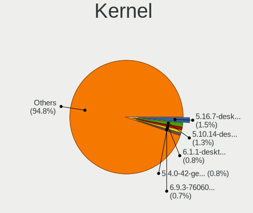

| Version                         | Computers | Percent |
|---------------------------------|-----------|---------|
| 5.16.7-desktop-1omv4003         | 17        | 2.06%   |
| 5.10.14-desktop-1omv4002        | 17        | 2.06%   |
| 5.4.0-42-generic                | 13        | 1.57%   |
| 5.4.0-26-generic                | 9         | 1.09%   |
| 5.0.0-13-generic                | 9         | 1.09%   |
| 5.8.0-50-generic                | 8         | 0.97%   |
| 5.8.0-48-generic                | 8         | 0.97%   |
| 5.4.0-58-generic                | 8         | 0.97%   |
| 5.4.0-48-generic                | 7         | 0.85%   |
| 5.4.0-47-generic                | 7         | 0.85%   |
| 5.15.0-48-generic               | 7         | 0.85%   |
| 5.11.0-27-generic               | 7         | 0.85%   |
| 5.0.0-23-generic                | 7         | 0.85%   |
| 4.18.0-15-generic               | 7         | 0.85%   |
| 5.4.0-56-generic                | 6         | 0.73%   |
| 5.4.0-52-generic                | 6         | 0.73%   |
| 5.4.0-29-generic                | 6         | 0.73%   |
| 5.11.0-37-generic               | 6         | 0.73%   |
| 5.4.0-77-generic                | 5         | 0.61%   |
| 5.4.0-72-generic                | 5         | 0.61%   |
| 5.4.0-37-generic                | 5         | 0.61%   |
| 5.4.0-33-generic                | 5         | 0.61%   |
| 5.3.0-53-generic                | 5         | 0.61%   |
| 5.3.0-46-generic                | 5         | 0.61%   |
| 5.3.0-42-generic                | 5         | 0.61%   |
| 5.15.0-46-generic               | 5         | 0.61%   |
| 5.15.0-43-generic               | 5         | 0.61%   |
| 5.15.0-41-generic               | 5         | 0.61%   |
| 5.13.0-30-generic               | 5         | 0.61%   |
| 5.11.0-7614-generic             | 5         | 0.61%   |
| 5.0.0-32-generic                | 5         | 0.61%   |
| 5.0.0-27-generic                | 5         | 0.61%   |
| 4.9.60-nrj-desktop-1rosa-x86_64 | 5         | 0.61%   |
| 4.18.0-18-generic               | 5         | 0.61%   |
| 4.18.0-17-generic               | 5         | 0.61%   |
| 5.9.16-1-MANJARO                | 4         | 0.48%   |
| 5.8.0-59-generic                | 4         | 0.48%   |
| 5.8.0-43-generic                | 4         | 0.48%   |
| 5.4.0-7634-generic              | 4         | 0.48%   |
| 5.4.0-73-generic                | 4         | 0.48%   |

Kernel Family
-------------

Linux kernel without a distro release

| Version | Computers | Percent |
|---------|-----------|---------|
| 5.4.0   | 149       | 19.01%  |
| 5.11.0  | 49        | 6.25%   |
| 5.8.0   | 47        | 5.99%   |
| 5.0.0   | 45        | 5.74%   |
| 5.15.0  | 41        | 5.23%   |
| 4.15.0  | 40        | 5.1%    |
| 5.3.0   | 38        | 4.85%   |
| 5.13.0  | 28        | 3.57%   |
| 4.18.0  | 27        | 3.44%   |
| 5.10.0  | 18        | 2.3%    |
| 5.16.7  | 17        | 2.17%   |
| 5.10.14 | 17        | 2.17%   |
| 4.19.0  | 13        | 1.66%   |
| 5.14.0  | 10        | 1.28%   |
| 5.19.0  | 8         | 1.02%   |
| 5.9.16  | 6         | 0.77%   |
| 4.9.60  | 6         | 0.77%   |
| 5.17.5  | 5         | 0.64%   |
| 5.8.12  | 4         | 0.51%   |
| 5.18.10 | 4         | 0.51%   |
| 5.16.11 | 4         | 0.51%   |
| 5.13.13 | 4         | 0.51%   |
| 5.12.0  | 4         | 0.51%   |
| 6.0.0   | 3         | 0.38%   |
| 5.9.1   | 3         | 0.38%   |
| 5.5.0   | 3         | 0.38%   |
| 5.18.0  | 3         | 0.38%   |
| 5.17.4  | 3         | 0.38%   |
| 5.17.3  | 3         | 0.38%   |
| 5.17.13 | 3         | 0.38%   |
| 5.13.19 | 3         | 0.38%   |
| 5.13.12 | 3         | 0.38%   |
| 5.11.6  | 3         | 0.38%   |
| 5.11.12 | 3         | 0.38%   |
| 5.11.10 | 3         | 0.38%   |
| 4.4.0   | 3         | 0.38%   |
| 5.9.8   | 2         | 0.26%   |
| 5.9.0   | 2         | 0.26%   |
| 5.7.6   | 2         | 0.26%   |
| 5.6.11  | 2         | 0.26%   |

Kernel Major Ver.
-----------------

Linux kernel major version

| Version | Computers | Percent |
|---------|-----------|---------|
| 5.4     | 155       | 20.03%  |
| 5.11    | 66        | 8.53%   |
| 5.10    | 57        | 7.36%   |
| 5.8     | 52        | 6.72%   |
| 5.15    | 51        | 6.59%   |
| 5.0     | 48        | 6.2%    |
| 5.13    | 44        | 5.68%   |
| 5.3     | 40        | 5.17%   |
| 4.15    | 40        | 5.17%   |
| 5.16    | 31        | 4.01%   |
| 4.18    | 28        | 3.62%   |
| 5.19    | 25        | 3.23%   |
| 5.17    | 20        | 2.58%   |
| 5.14    | 18        | 2.33%   |
| 5.9     | 16        | 2.07%   |
| 5.12    | 15        | 1.94%   |
| 4.19    | 14        | 1.81%   |
| 5.18    | 13        | 1.68%   |
| 4.9     | 10        | 1.29%   |
| 5.6     | 7         | 0.9%    |
| 5.5     | 6         | 0.78%   |
| 6.0     | 4         | 0.52%   |
| 5.7     | 4         | 0.52%   |
| 4.4     | 4         | 0.52%   |
| 5.1     | 3         | 0.39%   |
| 4.13    | 1         | 0.13%   |
| 3.10    | 1         | 0.13%   |
| Unknown | 1         | 0.13%   |

Arch
----

OS architecture (x86_64, i586, etc.)

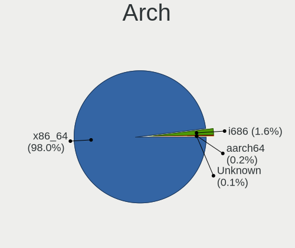

| Name    | Computers | Percent |
|---------|-----------|---------|
| x86_64  | 692       | 96.92%  |
| i686    | 20        | 2.8%    |
| aarch64 | 1         | 0.14%   |
| Unknown | 1         | 0.14%   |

DE
--

Desktop Environment

| Name            | Computers | Percent |
|-----------------|-----------|---------|
| GNOME           | 329       | 44.76%  |
| Unknown         | 107       | 14.56%  |
| KDE5            | 100       | 13.61%  |
| XFCE            | 46        | 6.26%   |
| X-Cinnamon      | 41        | 5.58%   |
| KDE             | 28        | 3.81%   |
| MATE            | 13        | 1.77%   |
| Pantheon        | 10        | 1.36%   |
| KDE4            | 10        | 1.36%   |
| Budgie          | 9         | 1.22%   |
| i3              | 8         | 1.09%   |
| Cinnamon        | 7         | 0.95%   |
| Deepin          | 5         | 0.68%   |
| LXQt            | 4         | 0.54%   |
| Unity           | 3         | 0.41%   |
| LXDE            | 3         | 0.41%   |
| awesome         | 3         | 0.41%   |
| xmonad          | 2         | 0.27%   |
| qtile           | 2         | 0.27%   |
| GNOME Flashback | 2         | 0.27%   |
| Trinity         | 1         | 0.14%   |
| icewm           | 1         | 0.14%   |
| bspwm           | 1         | 0.14%   |

Display Server
--------------

X11 or Wayland

| Name    | Computers | Percent |
|---------|-----------|---------|
| X11     | 561       | 76.74%  |
| Wayland | 100       | 13.68%  |
| Unknown | 65        | 8.89%   |
| Tty     | 5         | 0.68%   |

Display Manager
---------------

SDDM, LightDM, etc.

| Name    | Computers | Percent |
|---------|-----------|---------|
| Unknown | 448       | 61.12%  |
| SDDM    | 83        | 11.32%  |
| GDM     | 83        | 11.32%  |
| LightDM | 42        | 5.73%   |
| GDM3    | 35        | 4.77%   |
| TDM     | 26        | 3.55%   |
| KDM     | 10        | 1.36%   |
| XDM     | 4         | 0.55%   |
| SLIMSKI | 1         | 0.14%   |
| LXDM    | 1         | 0.14%   |

OS Lang
-------

Language

| Lang       | Computers | Percent |
|------------|-----------|---------|
| es_CL      | 379       | 52.13%  |
| en_US      | 148       | 20.36%  |
| Unknown    | 110       | 15.13%  |
| es_ES      | 42        | 5.78%   |
| en_GB      | 10        | 1.38%   |
| es_MX      | 9         | 1.24%   |
| C          | 9         | 1.24%   |
| fr_FR      | 2         | 0.28%   |
| es_VE      | 2         | 0.28%   |
| es_BO      | 2         | 0.28%   |
| es_AR      | 2         | 0.28%   |
| en_CA      | 2         | 0.28%   |
| de_DE      | 2         | 0.28%   |
| ru_RU      | 1         | 0.14%   |
| pt_BR      | 1         | 0.14%   |
| nl_NL      | 1         | 0.14%   |
| es_UY      | 1         | 0.14%   |
| es_CO      | 1         | 0.14%   |
| es_CL.UTF8 | 1         | 0.14%   |
| en_AG      | 1         | 0.14%   |
| arn_CL     | 1         | 0.14%   |

Boot Mode
---------

EFI or BIOS

| Mode | Computers | Percent |
|------|-----------|---------|
| EFI  | 364       | 50.49%  |
| BIOS | 357       | 49.51%  |

Filesystem
----------

Type of filesystem

| Type    | Computers | Percent |
|---------|-----------|---------|
| Ext4    | 579       | 79.64%  |
| Btrfs   | 58        | 7.98%   |
| Unknown | 40        | 5.5%    |
| Overlay | 35        | 4.81%   |
| Xfs     | 7         | 0.96%   |
| Ext2    | 4         | 0.55%   |
| Zfs     | 3         | 0.41%   |
| Ext3    | 1         | 0.14%   |

Part. scheme
------------

Scheme of partitioning

| Type    | Computers | Percent |
|---------|-----------|---------|
| Unknown | 477       | 65.34%  |
| GPT     | 194       | 26.58%  |
| MBR     | 59        | 8.08%   |

Dual Boot with Linux/BSD
------------------------

Hosting more than one Linux/BSD

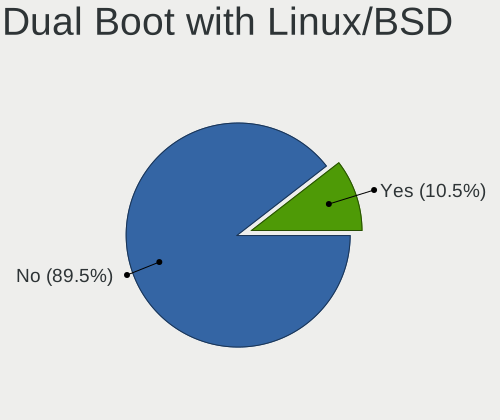

| Dual boot | Computers | Percent |
|-----------|-----------|---------|
| No        | 651       | 90.04%  |
| Yes       | 72        | 9.96%   |

Dual Boot (Win)
---------------

Hosting Linux and Windows

| Dual boot | Computers | Percent |
|-----------|-----------|---------|
| No        | 512       | 70.14%  |
| Yes       | 218       | 29.86%  |

Board
-----

Vendor
------

Motherboard manufacturer

| Name                      | Computers | Percent |
|---------------------------|-----------|---------|
| Hewlett-Packard           | 163       | 22.86%  |
| ASUSTek Computer          | 114       | 15.99%  |
| Lenovo                    | 95        | 13.32%  |
| Dell                      | 59        | 8.27%   |
| Acer                      | 46        | 6.45%   |
| MSI                       | 38        | 5.33%   |
| Samsung Electronics       | 24        | 3.37%   |
| Gigabyte Technology       | 21        | 2.95%   |
| Toshiba                   | 18        | 2.52%   |
| Intel                     | 18        | 2.52%   |
| Apple                     | 15        | 2.1%    |
| Sony                      | 13        | 1.82%   |
| ECS                       | 10        | 1.4%    |
| Unknown                   | 9         | 1.26%   |
| Packard Bell              | 8         | 1.12%   |
| HUAWEI                    | 5         | 0.7%    |
| ASRock                    | 5         | 0.7%    |
| Pegatron                  | 4         | 0.56%   |
| Huanan                    | 3         | 0.42%   |
| Google                    | 3         | 0.42%   |
| AMI                       | 3         | 0.42%   |
| TPV-INVENTA               | 2         | 0.28%   |
| Chuwi                     | 2         | 0.28%   |
| ZOTAC                     | 1         | 0.14%   |
| SZMZ                      | 1         | 0.14%   |
| Supermicro                | 1         | 0.14%   |
| SK hynix                  | 1         | 0.14%   |
| Render                    | 1         | 0.14%   |
| Raspberry Pi Foundation   | 1         | 0.14%   |
| R-StyleComputers          | 1         | 0.14%   |
| Quanta                    | 1         | 0.14%   |
| Positivo                  | 1         | 0.14%   |
| Personal Computer Factory | 1         | 0.14%   |
| PCPartner                 | 1         | 0.14%   |
| OX                        | 1         | 0.14%   |
| Olidata                   | 1         | 0.14%   |
| OEM                       | 1         | 0.14%   |
| Nvidia                    | 1         | 0.14%   |
| MOTILE                    | 1         | 0.14%   |
| Medion                    | 1         | 0.14%   |

Model
-----

Motherboard model

| Name                                           | Computers | Percent |
|------------------------------------------------|-----------|---------|
| Unknown                                        | 14        | 1.96%   |
| HP Notebook                                    | 10        | 1.4%    |
| HP Pavilion Notebook                           | 6         | 0.84%   |
| HP 240 G6 Notebook PC                          | 6         | 0.84%   |
| ASUS All Series                                | 6         | 0.84%   |
| HP Pavilion 15                                 | 5         | 0.7%    |
| MSI MS-7817                                    | 4         | 0.56%   |
| HP Pavilion Laptop 15-eh0xxx                   | 4         | 0.56%   |
| HP ENVY 15                                     | 4         | 0.56%   |
| ASUS PRIME B450M-A                             | 4         | 0.56%   |
| ASUS PRIME A320M-K                             | 4         | 0.56%   |
| Acer Aspire ES1-111M                           | 4         | 0.56%   |
| MSI MS-7A34                                    | 3         | 0.42%   |
| MSI MS-7788                                    | 3         | 0.42%   |
| Lenovo Legion Y530-15ICH 81FV                  | 3         | 0.42%   |
| HP ProBook 440 G3                              | 3         | 0.42%   |
| HP Pavilion Laptop 15-cw0xxx                   | 3         | 0.42%   |
| HP Pavilion g4                                 | 3         | 0.42%   |
| HP ENVY x360 Convertible 13-ag0xxx             | 3         | 0.42%   |
| HP EliteBook 840 G6                            | 3         | 0.42%   |
| HP EliteBook 2560p                             | 3         | 0.42%   |
| HP 14                                          | 3         | 0.42%   |
| HP 1000                                        | 3         | 0.42%   |
| Dell Latitude E6420                            | 3         | 0.42%   |
| Dell Inspiron 14-3467                          | 3         | 0.42%   |
| ASUS ZenBook UX433FN_UX433FN                   | 3         | 0.42%   |
| Apple MacBookPro9,2                            | 3         | 0.42%   |
| Apple MacBookAir7,2                            | 3         | 0.42%   |
| Toshiba Satellite L745                         | 2         | 0.28%   |
| Toshiba Satellite C845D                        | 2         | 0.28%   |
| Samsung RF511/RF411/RF711                      | 2         | 0.28%   |
| Samsung 750XED                                 | 2         | 0.28%   |
| Samsung 300E5EV/300E4EV/270E5EV/270E4EV/2470EV | 2         | 0.28%   |
| Packard Bell EasyNote MH35                     | 2         | 0.28%   |
| MSI Pro 3000/3080                              | 2         | 0.28%   |
| MSI MS-7A65                                    | 2         | 0.28%   |
| Lenovo Y520-15IKBN 80WK                        | 2         | 0.28%   |
| Lenovo MIIX 310-10ICR 80SG                     | 2         | 0.28%   |
| Lenovo IdeaPad Gaming 3 15ARH05 82EY           | 2         | 0.28%   |
| Lenovo IdeaPad 720S-14IKB 80XC                 | 2         | 0.28%   |

Model Family
------------

Motherboard model prefix

| Name                  | Computers | Percent |
|-----------------------|-----------|---------|
| HP Pavilion           | 39        | 5.47%   |
| Lenovo ThinkPad       | 38        | 5.33%   |
| Acer Aspire           | 34        | 4.77%   |
| Lenovo IdeaPad        | 31        | 4.35%   |
| Dell Inspiron         | 23        | 3.23%   |
| ASUS VivoBook         | 16        | 2.24%   |
| HP ENVY               | 15        | 2.1%    |
| HP EliteBook          | 15        | 2.1%    |
| Dell Latitude         | 15        | 2.1%    |
| ASUS PRIME            | 15        | 2.1%    |
| Unknown               | 14        | 1.96%   |
| Toshiba Satellite     | 13        | 1.82%   |
| ASUS TUF              | 12        | 1.68%   |
| HP Laptop             | 11        | 1.54%   |
| HP ProBook            | 10        | 1.4%    |
| HP Notebook           | 10        | 1.4%    |
| HP 240                | 9         | 1.26%   |
| HP Compaq             | 8         | 1.12%   |
| ASUS ZenBook          | 7         | 0.98%   |
| Acer Swift            | 7         | 0.98%   |
| Packard Bell EasyNote | 6         | 0.84%   |
| HP 245                | 6         | 0.84%   |
| ASUS All              | 6         | 0.84%   |
| Lenovo Legion         | 5         | 0.7%    |
| HP 250                | 5         | 0.7%    |
| Dell Vostro           | 5         | 0.7%    |
| Dell Precision        | 5         | 0.7%    |
| ASUS ASUS             | 5         | 0.7%    |
| MSI MS-7817           | 4         | 0.56%   |
| Lenovo ThinkCentre    | 4         | 0.56%   |
| ASUS ROG              | 4         | 0.56%   |
| ASUS M5A78L-M         | 4         | 0.56%   |
| Toshiba PORTEGE       | 3         | 0.42%   |
| Samsung 300E5EV       | 3         | 0.42%   |
| MSI MS-7A34           | 3         | 0.42%   |
| MSI MS-7788           | 3         | 0.42%   |
| HP Presario           | 3         | 0.42%   |
| HP EliteDesk          | 3         | 0.42%   |
| HP 14                 | 3         | 0.42%   |
| HP 1000               | 3         | 0.42%   |

MFG Year
--------

Motherboard manufacture year

| Year    | Computers | Percent |
|---------|-----------|---------|
| 2017    | 75        | 10.52%  |
| 2020    | 69        | 9.68%   |
| 2018    | 67        | 9.4%    |
| 2019    | 60        | 8.42%   |
| 2012    | 58        | 8.13%   |
| 2011    | 58        | 8.13%   |
| 2013    | 56        | 7.85%   |
| 2014    | 47        | 6.59%   |
| 2016    | 42        | 5.89%   |
| 2015    | 38        | 5.33%   |
| 2010    | 32        | 4.49%   |
| 2021    | 27        | 3.79%   |
| 2008    | 25        | 3.51%   |
| 2007    | 23        | 3.23%   |
| 2009    | 22        | 3.09%   |
| 2022    | 10        | 1.4%    |
| 2006    | 2         | 0.28%   |
| 2005    | 1         | 0.14%   |
| Unknown | 1         | 0.14%   |

Form Factor
-----------

Physical design of the computer

| Name           | Computers | Percent |
|----------------|-----------|---------|
| Notebook       | 483       | 67.74%  |
| Desktop        | 191       | 26.79%  |
| Convertible    | 13        | 1.82%   |
| Mini pc        | 8         | 1.12%   |
| All in one     | 8         | 1.12%   |
| Tablet         | 6         | 0.84%   |
| Server         | 3         | 0.42%   |
| System on chip | 1         | 0.14%   |

Secure Boot
-----------

Enabled or disabled

| State    | Computers | Percent |
|----------|-----------|---------|
| Disabled | 651       | 90.54%  |
| Enabled  | 68        | 9.46%   |

Coreboot
--------

Have coreboot on board

| Used | Computers | Percent |
|------|-----------|---------|
| No   | 710       | 99.58%  |
| Yes  | 3         | 0.42%   |

RAM Size
--------

Total RAM memory

| Size in GB  | Computers | Percent |
|-------------|-----------|---------|
| 4.01-8.0    | 198       | 27.5%   |
| 3.01-4.0    | 160       | 22.22%  |
| 8.01-16.0   | 139       | 19.31%  |
| 16.01-24.0  | 104       | 14.44%  |
| 32.01-64.0  | 42        | 5.83%   |
| 1.01-2.0    | 41        | 5.69%   |
| 2.01-3.0    | 15        | 2.08%   |
| 24.01-32.0  | 13        | 1.81%   |
| 64.01-256.0 | 5         | 0.69%   |
| 0.51-1.0    | 2         | 0.28%   |
| Unknown     | 1         | 0.14%   |

RAM Used
--------

Used RAM memory

| Used GB    | Computers | Percent |
|------------|-----------|---------|
| 1.01-2.0   | 292       | 37.58%  |
| 2.01-3.0   | 194       | 24.97%  |
| 3.01-4.0   | 109       | 14.03%  |
| 4.01-8.0   | 107       | 13.77%  |
| 0.51-1.0   | 43        | 5.53%   |
| 8.01-16.0  | 24        | 3.09%   |
| 0.01-0.5   | 5         | 0.64%   |
| 24.01-32.0 | 1         | 0.13%   |
| 16.01-24.0 | 1         | 0.13%   |
| Unknown    | 1         | 0.13%   |

Total Drives
------------

Number of drives on board

| Drives | Computers | Percent |
|--------|-----------|---------|
| 1      | 479       | 66.07%  |
| 2      | 175       | 24.14%  |
| 3      | 39        | 5.38%   |
| 4      | 19        | 2.62%   |
| 0      | 6         | 0.83%   |
| 5      | 5         | 0.69%   |
| 7      | 1         | 0.14%   |
| 6      | 1         | 0.14%   |

Has CD-ROM
----------

Has CD-ROM on board

| Presented | Computers | Percent |
|-----------|-----------|---------|
| No        | 472       | 66.01%  |
| Yes       | 243       | 33.99%  |

Has Ethernet
------------

Has Ethernet on board

| Presented | Computers | Percent |
|-----------|-----------|---------|
| Yes       | 618       | 86.55%  |
| No        | 96        | 13.45%  |

Has WiFi
--------

Has WiFi module

| Presented | Computers | Percent |
|-----------|-----------|---------|
| Yes       | 600       | 84.15%  |
| No        | 113       | 15.85%  |

Has Bluetooth
-------------

Has Bluetooth module

| Presented | Computers | Percent |
|-----------|-----------|---------|
| Yes       | 457       | 63.56%  |
| No        | 262       | 36.44%  |

Location
--------

Country
-------

Geographic location (country)

| Country | Computers | Percent |
|---------|-----------|---------|
| Chile   | 713       | 100%    |

City
----

Geographic location (city)

| City                | Computers | Percent |
|---------------------|-----------|---------|
| Santiago            | 203       | 27.1%   |
| Las Condes          | 35        | 4.67%   |
| Via del Mar       | 32        | 4.27%   |
| Puente Alto         | 29        | 3.87%   |
| Maipu               | 29        | 3.87%   |
| Concepcin         | 27        | 3.6%    |
| La Florida          | 22        | 2.94%   |
| Nunoa               | 19        | 2.54%   |
| Temuco              | 18        | 2.4%    |
| Providencia         | 18        | 2.4%    |
| Valdivia            | 15        | 2%      |
| San Miguel          | 15        | 2%      |
| Antofagasta         | 14        | 1.87%   |
| La Serena           | 13        | 1.74%   |
| Port Montt          | 10        | 1.34%   |
| Coronel             | 9         | 1.2%    |
| Rancagua            | 8         | 1.07%   |
| Quilpu            | 8         | 1.07%   |
| Iquique             | 8         | 1.07%   |
| Coquimbo            | 8         | 1.07%   |
| Valparaso         | 7         | 0.93%   |
| Osorno              | 7         | 0.93%   |
| Los ngeles        | 7         | 0.93%   |
| Colina              | 7         | 0.93%   |
| Penalolen           | 6         | 0.8%    |
| Central             | 6         | 0.8%    |
| Vitacura            | 5         | 0.67%   |
| Talcahuano          | 5         | 0.67%   |
| San Pedro de la Paz | 5         | 0.67%   |
| San Bernardo        | 5         | 0.67%   |
| La Reina            | 5         | 0.67%   |
| El Bosque           | 5         | 0.67%   |
| Copiap            | 5         | 0.67%   |
| Villa Alemana       | 4         | 0.53%   |
| Recoleta            | 4         | 0.53%   |
| Quilicura           | 4         | 0.53%   |
| Punta Arenas        | 4         | 0.53%   |
| Melipilla           | 4         | 0.53%   |
| Macul               | 4         | 0.53%   |
| Independencia       | 4         | 0.53%   |

Drives
------

Drive Vendor
------------

Hard drive vendors

| Vendor                      | Computers | Drives | Percent |
|-----------------------------|-----------|--------|---------|
| WDC                         | 186       | 261    | 19.48%  |
| Seagate                     | 141       | 187    | 14.76%  |
| Toshiba                     | 93        | 103    | 9.74%   |
| Kingston                    | 80        | 114    | 8.38%   |
| Samsung Electronics         | 78        | 103    | 8.17%   |
| Crucial                     | 57        | 70     | 5.97%   |
| Unknown                     | 45        | 67     | 4.71%   |
| Hitachi                     | 39        | 44     | 4.08%   |
| SanDisk                     | 36        | 40     | 3.77%   |
| HGST                        | 26        | 27     | 2.72%   |
| SK hynix                    | 21        | 23     | 2.2%    |
| Intel                       | 16        | 27     | 1.68%   |
| Micron Technology           | 13        | 17     | 1.36%   |
| Apple                       | 13        | 13     | 1.36%   |
| China                       | 11        | 15     | 1.15%   |
| Silicon Motion              | 8         | 8      | 0.84%   |
| KingSpec                    | 8         | 15     | 0.84%   |
| JMicron Technology          | 6         | 6      | 0.63%   |
| Corsair                     | 6         | 11     | 0.63%   |
| XPG                         | 5         | 9      | 0.52%   |
| Micron/Crucial Technology   | 5         | 8      | 0.52%   |
| KIOXIA                      | 5         | 6      | 0.52%   |
| A-DATA Technology           | 5         | 7      | 0.52%   |
| XrayDisk                    | 3         | 3      | 0.31%   |
| LITEON                      | 3         | 3      | 0.31%   |
| Lexar                       | 3         | 7      | 0.31%   |
| WALRAM                      | 2         | 3      | 0.21%   |
| SSSTC                       | 2         | 2      | 0.21%   |
| Realtek Semiconductor       | 2         | 2      | 0.21%   |
| Netac                       | 2         | 2      | 0.21%   |
| Maxtor                      | 2         | 2      | 0.21%   |
| Mass                        | 2         | 2      | 0.21%   |
| Kingston Technology Company | 2         | 2      | 0.21%   |
| Gigabyte Technology         | 2         | 2      | 0.21%   |
| Unknown                     | 2         | 2      | 0.21%   |
| Wdxsky                      | 1         | 1      | 0.1%    |
| Vaseky                      | 1         | 1      | 0.1%    |
| UMIS                        | 1         | 1      | 0.1%    |
| Transcend                   | 1         | 1      | 0.1%    |
| StoreJet                    | 1         | 1      | 0.1%    |

Drive Model
-----------

Hard drive models

| Model                               | Computers | Percent |
|-------------------------------------|-----------|---------|
| WDC WDS240G2G0A-00JH30 240GB SSD    | 18        | 1.74%   |
| Seagate ST1000LM035-1RK172 1TB      | 16        | 1.55%   |
| Kingston SA400S37240G 240GB SSD     | 14        | 1.36%   |
| Toshiba MQ01ABF050 500GB            | 13        | 1.26%   |
| Seagate ST500DM002-1BD142 500GB     | 13        | 1.26%   |
| Kingston SA400S37480G 480GB SSD     | 12        | 1.16%   |
| Unknown MMC Card  32GB              | 11        | 1.07%   |
| Crucial CT240BX500SSD1 240GB        | 10        | 0.97%   |
| WDC WDS120G2G0A-00JH30 120GB SSD    | 9         | 0.87%   |
| Unknown MMC Card  64GB              | 9         | 0.87%   |
| Toshiba MQ04ABF100 1TB              | 9         | 0.87%   |
| Toshiba HDWD110 1TB                 | 9         | 0.87%   |
| Seagate ST1000LM024 HN-M101MBB 1TB  | 9         | 0.87%   |
| Samsung NVMe SSD Drive 512GB        | 9         | 0.87%   |
| Toshiba MQ01ABD100 1TB              | 8         | 0.78%   |
| Toshiba DT01ACA100 1TB              | 8         | 0.78%   |
| Seagate ST500LT012-1DG142 500GB     | 8         | 0.78%   |
| Crucial CT480BX500SSD1 480GB        | 8         | 0.78%   |
| Crucial CT120BX500SSD1 120GB        | 8         | 0.78%   |
| WDC WD10EZEX-08WN4A0 1TB            | 7         | 0.68%   |
| Seagate ST500LM012 HN-M500MBB 500GB | 7         | 0.68%   |
| SanDisk NVMe SSD Drive 500GB        | 7         | 0.68%   |
| Kingston SA400S37120G 120GB SSD     | 7         | 0.68%   |
| HGST HTS545050A7E680 500GB          | 7         | 0.68%   |
| WDC WDS500G2B0A-00SM50 500GB SSD    | 6         | 0.58%   |
| WDC WD5000AAKX-001CA0 500GB         | 6         | 0.58%   |
| Unknown MMC Card  128GB             | 6         | 0.58%   |
| Seagate ST9500325AS 500GB           | 6         | 0.58%   |
| Intel NVMe SSD Drive 512GB          | 6         | 0.58%   |
| Crucial CT120BX300SSD1 120GB        | 6         | 0.58%   |
| WDC WD5000LPVX-22V0TT0 500GB        | 5         | 0.48%   |
| WDC WD5000AAKX-00ERMA0 500GB        | 5         | 0.48%   |
| Toshiba MQ01ACF050 500GB            | 5         | 0.48%   |
| Toshiba MQ01ABD075 752GB            | 5         | 0.48%   |
| Seagate ST500LT012-9WS142 500GB     | 5         | 0.48%   |
| Seagate ST3500418AS 500GB           | 5         | 0.48%   |
| Samsung SSD 850 EVO 250GB           | 5         | 0.48%   |
| Samsung NVMe SSD Drive 1024GB       | 5         | 0.48%   |
| Kingston SNVS500G 500GB             | 5         | 0.48%   |
| Hitachi HTS545050B9A300 500GB       | 5         | 0.48%   |

HDD Vendor
----------

Hard disk drive vendors

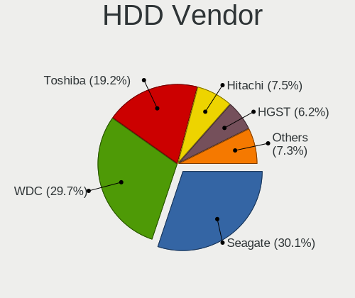

| Vendor              | Computers | Drives | Percent |
|---------------------|-----------|--------|---------|
| Seagate             | 140       | 186    | 31.04%  |
| WDC                 | 133       | 173    | 29.49%  |
| Toshiba             | 86        | 93     | 19.07%  |
| Hitachi             | 39        | 44     | 8.65%   |
| HGST                | 26        | 27     | 5.76%   |
| Samsung Electronics | 12        | 16     | 2.66%   |
| Apple               | 8         | 8      | 1.77%   |
| Unknown             | 2         | 2      | 0.44%   |
| Maxtor              | 2         | 2      | 0.44%   |
| Fujitsu             | 1         | 1      | 0.22%   |
| ASMT                | 1         | 1      | 0.22%   |
| ASMedia             | 1         | 2      | 0.22%   |

SSD Vendor
----------

Solid state drive vendors

| Vendor              | Computers | Drives | Percent |
|---------------------|-----------|--------|---------|
| Kingston            | 66        | 87     | 22.22%  |
| Crucial             | 57        | 69     | 19.19%  |
| WDC                 | 56        | 73     | 18.86%  |
| Samsung Electronics | 31        | 33     | 10.44%  |
| SanDisk             | 15        | 18     | 5.05%   |
| China               | 11        | 15     | 3.7%    |
| KingSpec            | 8         | 15     | 2.69%   |
| Corsair             | 6         | 11     | 2.02%   |
| Micron Technology   | 5         | 5      | 1.68%   |
| Apple               | 5         | 5      | 1.68%   |
| Lexar               | 3         | 7      | 1.01%   |
| Intel               | 3         | 5      | 1.01%   |
| A-DATA Technology   | 3         | 5      | 1.01%   |
| XrayDisk            | 2         | 2      | 0.67%   |
| Toshiba             | 2         | 5      | 0.67%   |
| SK hynix            | 2         | 2      | 0.67%   |
| LITEON              | 2         | 2      | 0.67%   |
| Gigabyte Technology | 2         | 2      | 0.67%   |
| Unknown             | 2         | 2      | 0.67%   |
| Wdxsky              | 1         | 1      | 0.34%   |
| WALRAM              | 1         | 1      | 0.34%   |
| Vaseky              | 1         | 1      | 0.34%   |
| StoreJet            | 1         | 1      | 0.34%   |
| Patriot             | 1         | 1      | 0.34%   |
| OCZ                 | 1         | 2      | 0.34%   |
| NGFF                | 1         | 1      | 0.34%   |
| Netac               | 1         | 1      | 0.34%   |
| LITEONIT            | 1         | 1      | 0.34%   |
| KingDian            | 1         | 2      | 0.34%   |
| Intenso             | 1         | 1      | 0.34%   |
| HS-SSD-C100         | 1         | 1      | 0.34%   |
| Hewlett-Packard     | 1         | 1      | 0.34%   |
| FORESEE             | 1         | 2      | 0.34%   |
| Faspeed             | 1         | 1      | 0.34%   |
| BIWIN               | 1         | 1      | 0.34%   |

Drive Kind
----------

HDD or SSD

| Kind    | Computers | Drives | Percent |
|---------|-----------|--------|---------|
| HDD     | 400       | 555    | 45.25%  |
| SSD     | 267       | 382    | 30.2%   |
| NVMe    | 160       | 227    | 18.1%   |
| MMC     | 42        | 63     | 4.75%   |
| Unknown | 15        | 16     | 1.7%    |

Drive Connector
---------------

SATA, SAS, NVMe, etc.

| Type | Computers | Drives | Percent |
|------|-----------|--------|---------|
| SATA | 581       | 926    | 72.26%  |
| NVMe | 157       | 224    | 19.53%  |
| MMC  | 42        | 63     | 5.22%   |
| SAS  | 24        | 30     | 2.99%   |

Drive Size
----------

Size of hard drive

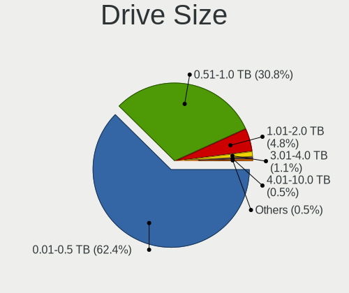

| Size in TB | Computers | Drives | Percent |
|------------|-----------|--------|---------|
| 0.01-0.5   | 435       | 633    | 65.51%  |
| 0.51-1.0   | 190       | 247    | 28.61%  |
| 1.01-2.0   | 25        | 33     | 3.77%   |
| 3.01-4.0   | 7         | 8      | 1.05%   |
| 2.01-3.0   | 4         | 11     | 0.6%    |
| 4.01-10.0  | 3         | 5      | 0.45%   |

Space Total
-----------

Amount of disk space available on the file system

| Size in GB     | Computers | Percent |
|----------------|-----------|---------|
| 251-500        | 219       | 29.24%  |
| 101-250        | 195       | 26.03%  |
| 501-1000       | 110       | 14.69%  |
| 1-20           | 50        | 6.68%   |
| 1001-2000      | 44        | 5.87%   |
| 51-100         | 43        | 5.74%   |
| 21-50          | 35        | 4.67%   |
| More than 3000 | 19        | 2.54%   |
| 2001-3000      | 18        | 2.4%    |
| Unknown        | 16        | 2.14%   |

Space Used
----------

Amount of used disk space

| Used GB        | Computers | Percent |
|----------------|-----------|---------|
| 1-20           | 313       | 40.65%  |
| 21-50          | 145       | 18.83%  |
| 101-250        | 92        | 11.95%  |
| 51-100         | 86        | 11.17%  |
| 251-500        | 53        | 6.88%   |
| 501-1000       | 37        | 4.81%   |
| 1001-2000      | 18        | 2.34%   |
| Unknown        | 16        | 2.08%   |
| More than 3000 | 7         | 0.91%   |
| 2001-3000      | 3         | 0.39%   |

Malfunc. Drives
---------------

Drive models with a malfunction

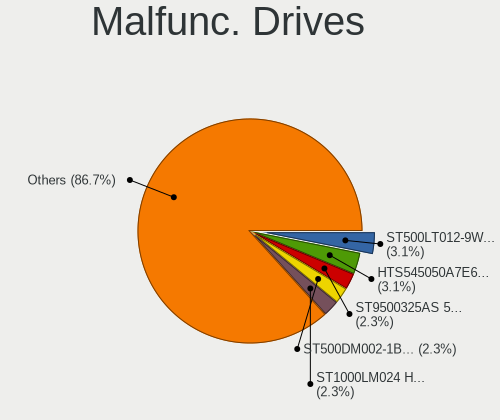

| Model                                | Computers | Drives | Percent |
|--------------------------------------|-----------|--------|---------|
| Seagate ST500LT012-9WS142 500GB      | 3         | 3      | 4.84%   |
| HGST HTS545050A7E680 500GB           | 3         | 3      | 4.84%   |
| Toshiba MQ01ABD075 752GB             | 2         | 2      | 3.23%   |
| Hitachi HTS545050B9A300 500GB        | 2         | 2      | 3.23%   |
| Hitachi HTS545050A7E380 500GB        | 2         | 2      | 3.23%   |
| XrayDisk SSD 256GB                   | 1         | 1      | 1.61%   |
| WDC WDS240G2G0A-00JH30 240GB SSD     | 1         | 1      | 1.61%   |
| WDC WDS120G2G0B-00EPW0 120GB SSD     | 1         | 1      | 1.61%   |
| WDC WD5000LPVX-22V0TT0 500GB         | 1         | 1      | 1.61%   |
| WDC WD5000LPLX-60ZNTT1 500GB         | 1         | 1      | 1.61%   |
| WDC WD5000LPCX-60VHAT0 500GB         | 1         | 1      | 1.61%   |
| WDC WD5000AAKX-083CA1 500GB          | 1         | 1      | 1.61%   |
| WDC WD5000AAKX-00ERMA0 500GB         | 1         | 1      | 1.61%   |
| WDC WD5000AAKX-001CA0 500GB          | 1         | 2      | 1.61%   |
| WDC WD20EARX-00PASB0 2TB             | 1         | 1      | 1.61%   |
| WDC WD10JPVX-22JC3T0 1TB             | 1         | 1      | 1.61%   |
| WDC WD10EARS-003BB1 1TB              | 1         | 1      | 1.61%   |
| Vaseky V820/1TB 1024GB               | 1         | 1      | 1.61%   |
| Toshiba MK3265GSXN 320GB             | 1         | 1      | 1.61%   |
| Toshiba MK3265GSX 320GB              | 1         | 1      | 1.61%   |
| Toshiba MK1652GSX 160GB              | 1         | 1      | 1.61%   |
| Seagate ST9750420AS 752GB            | 1         | 1      | 1.61%   |
| Seagate ST9500325AS 500GB            | 1         | 1      | 1.61%   |
| Seagate ST500LT012-1DG142 500GB      | 1         | 1      | 1.61%   |
| Seagate ST500LM012 HN-M500MBB 500GB  | 1         | 1      | 1.61%   |
| Seagate ST500LM000-1EJ162-SSHD 500GB | 1         | 1      | 1.61%   |
| Seagate ST500DM002-1BD142 500GB      | 1         | 1      | 1.61%   |
| Seagate ST3500418AS 500GB            | 1         | 1      | 1.61%   |
| Seagate ST1000LM048-2E7172 1TB       | 1         | 1      | 1.61%   |
| Seagate ST1000LM035-1RK172 1TB       | 1         | 1      | 1.61%   |
| Seagate ST1000LM024 HN-M101MBB 1TB   | 1         | 5      | 1.61%   |
| Samsung Electronics SSD 870 EVO 1TB  | 1         | 1      | 1.61%   |
| Samsung Electronics HD250HJ 250GB    | 1         | 2      | 1.61%   |
| Samsung Electronics HD081GJ 80GB     | 1         | 1      | 1.61%   |
| LITEON CV8-8E128-HP 128GB SSD        | 1         | 1      | 1.61%   |
| Kingston SVP200S3120G 120GB SSD      | 1         | 1      | 1.61%   |
| Kingston SKC400S371T 1TB SSD         | 1         | 2      | 1.61%   |
| Kingston SA400S37480G 480GB SSD      | 1         | 1      | 1.61%   |
| Kingston SA400S37240G 240GB SSD      | 1         | 1      | 1.61%   |
| Intel SSDSC2BX400G4R 400GB           | 1         | 2      | 1.61%   |

Malfunc. Drive Vendor
---------------------

Vendors of faulty drives

| Vendor              | Computers | Drives | Percent |
|---------------------|-----------|--------|---------|
| Seagate             | 13        | 17     | 21.67%  |
| WDC                 | 11        | 12     | 18.33%  |
| Hitachi             | 9         | 11     | 15%     |
| HGST                | 9         | 9      | 15%     |
| Toshiba             | 5         | 5      | 8.33%   |
| Kingston            | 4         | 5      | 6.67%   |
| Samsung Electronics | 2         | 4      | 3.33%   |
| XrayDisk            | 1         | 1      | 1.67%   |
| Vaseky              | 1         | 1      | 1.67%   |
| LITEON              | 1         | 1      | 1.67%   |
| Intel               | 1         | 2      | 1.67%   |
| Faspeed             | 1         | 1      | 1.67%   |
| Crucial             | 1         | 1      | 1.67%   |
| A-DATA Technology   | 1         | 1      | 1.67%   |

Malfunc. HDD Vendor
-------------------

Vendors of faulty HDD drives

| Vendor              | Computers | Drives | Percent |
|---------------------|-----------|--------|---------|
| Seagate             | 13        | 17     | 28.26%  |
| WDC                 | 9         | 10     | 19.57%  |
| Hitachi             | 9         | 11     | 19.57%  |
| HGST                | 9         | 9      | 19.57%  |
| Toshiba             | 5         | 5      | 10.87%  |
| Samsung Electronics | 1         | 3      | 2.17%   |

Malfunc. Drive Kind
-------------------

Kinds of faulty drives

| Kind | Computers | Drives | Percent |
|------|-----------|--------|---------|
| HDD  | 44        | 55     | 75.86%  |
| SSD  | 13        | 15     | 22.41%  |
| NVMe | 1         | 1      | 1.72%   |

Failed Drives
-------------

Failed drive models

| Model                    | Computers | Drives | Percent |
|--------------------------|-----------|--------|---------|
| Toshiba MQ01ABF050 500GB | 1         | 1      | 100%    |

Failed Drive Vendor
-------------------

Failed drive vendors

| Vendor  | Computers | Drives | Percent |
|---------|-----------|--------|---------|
| Toshiba | 1         | 1      | 100%    |

Drive Status
------------

Number of failed and malfunc. drives

| Status   | Computers | Drives | Percent |
|----------|-----------|--------|---------|
| Detected | 498       | 847    | 65.44%  |
| Works    | 205       | 324    | 26.94%  |
| Malfunc  | 57        | 71     | 7.49%   |
| Failed   | 1         | 1      | 0.13%   |

Storage controller
------------------

Storage Vendor
--------------

Storage controller vendors

| Vendor                           | Computers | Percent |
|----------------------------------|-----------|---------|
| Intel                            | 452       | 55.6%   |
| AMD                              | 167       | 20.54%  |
| Samsung Electronics              | 43        | 5.29%   |
| SanDisk                          | 31        | 3.81%   |
| SK hynix                         | 19        | 2.34%   |
| Kingston Technology Company      | 17        | 2.09%   |
| Silicon Motion                   | 10        | 1.23%   |
| Nvidia                           | 8         | 0.98%   |
| Micron Technology                | 8         | 0.98%   |
| JMicron Technology               | 8         | 0.98%   |
| Realtek Semiconductor            | 7         | 0.86%   |
| Micron/Crucial Technology        | 6         | 0.74%   |
| Marvell Technology Group         | 6         | 0.74%   |
| Toshiba America Info Systems     | 5         | 0.62%   |
| KIOXIA                           | 5         | 0.62%   |
| ADATA Technology                 | 5         | 0.62%   |
| Silicon Integrated Systems [SiS] | 4         | 0.49%   |
| ASMedia Technology               | 4         | 0.49%   |
| Solid State Storage Technology   | 2         | 0.25%   |
| VIA Technologies                 | 1         | 0.12%   |
| Union Memory (Shenzhen)          | 1         | 0.12%   |
| Shenzhen Longsys Electronics     | 1         | 0.12%   |
| Phison Electronics               | 1         | 0.12%   |
| Lite-On Technology               | 1         | 0.12%   |
| Broadcom / LSI                   | 1         | 0.12%   |

Storage Model
-------------

Storage controller models

| Model                                                                                   | Computers | Percent |
|-----------------------------------------------------------------------------------------|-----------|---------|
| AMD FCH SATA Controller [AHCI mode]                                                     | 120       | 12.82%  |
| Intel Sunrise Point-LP SATA Controller [AHCI mode]                                      | 64        | 6.84%   |
| Intel 7 Series Chipset Family 6-port SATA Controller [AHCI mode]                        | 38        | 4.06%   |
| Intel 82801 Mobile SATA Controller [RAID mode]                                          | 28        | 2.99%   |
| Intel 8 Series/C220 Series Chipset Family 6-port SATA Controller 1 [AHCI mode]          | 26        | 2.78%   |
| Samsung NVMe SSD Controller SM981/PM981/PM983                                           | 21        | 2.24%   |
| Intel 6 Series/C200 Series Chipset Family 6 port Mobile SATA AHCI Controller            | 21        | 2.24%   |
| AMD SB7x0/SB8x0/SB9x0 SATA Controller [AHCI mode]                                       | 21        | 2.24%   |
| Intel 8 Series SATA Controller 1 [AHCI mode]                                            | 20        | 2.14%   |
| Intel 82801IBM/IEM (ICH9M/ICH9M-E) 4 port SATA Controller [AHCI mode]                   | 19        | 2.03%   |
| Intel Atom Processor E3800 Series SATA AHCI Controller                                  | 17        | 1.82%   |
| AMD SB7x0/SB8x0/SB9x0 IDE Controller                                                    | 16        | 1.71%   |
| AMD 400 Series Chipset SATA Controller                                                  | 16        | 1.71%   |
| AMD SB7x0/SB8x0/SB9x0 SATA Controller [IDE mode]                                        | 14        | 1.5%    |
| Intel 5 Series/3400 Series Chipset 4 port SATA AHCI Controller                          | 13        | 1.39%   |
| SanDisk WD Black SN750 / PC SN730 NVMe SSD                                              | 11        | 1.18%   |
| Intel Celeron/Pentium Silver Processor SATA Controller                                  | 11        | 1.18%   |
| Intel Volume Management Device NVMe RAID Controller                                     | 10        | 1.07%   |
| Intel NM10/ICH7 Family SATA Controller [IDE mode]                                       | 10        | 1.07%   |
| Intel Atom/Celeron/Pentium Processor x5-E8000/J3xxx/N3xxx Series SATA Controller        | 10        | 1.07%   |
| Silicon Motion SM2263EN/SM2263XT SSD Controller                                         | 9         | 0.96%   |
| Intel Q170/Q150/B150/H170/H110/Z170/CM236 Chipset SATA Controller [AHCI Mode]           | 9         | 0.96%   |
| Micron Non-Volatile memory controller                                                   | 8         | 0.85%   |
| Intel Wildcat Point-LP SATA Controller [AHCI Mode]                                      | 8         | 0.85%   |
| Intel Cannon Point-LP SATA Controller [AHCI Mode]                                       | 8         | 0.85%   |
| Intel 82801G (ICH7 Family) IDE Controller                                               | 8         | 0.85%   |
| Intel 400 Series Chipset Family SATA AHCI Controller                                    | 8         | 0.85%   |
| SanDisk Non-Volatile memory controller                                                  | 7         | 0.75%   |
| Samsung NVMe SSD Controller SM961/PM961/SM963                                           | 7         | 0.75%   |
| Samsung NVMe SSD Controller 980                                                         | 7         | 0.75%   |
| Realtek RTS5763DL NVMe SSD Controller                                                   | 7         | 0.75%   |
| Intel Cannon Lake Mobile PCH SATA AHCI Controller                                       | 7         | 0.75%   |
| Intel 7 Series/C210 Series Chipset Family 6-port SATA Controller [AHCI mode]            | 7         | 0.75%   |
| Intel 6 Series/C200 Series Chipset Family Desktop SATA Controller (IDE mode, ports 4-5) | 7         | 0.75%   |
| Intel 6 Series/C200 Series Chipset Family Desktop SATA Controller (IDE mode, ports 0-3) | 7         | 0.75%   |
| Intel 6 Series/C200 Series Chipset Family 6 port Desktop SATA AHCI Controller           | 7         | 0.75%   |
| Intel 200 Series PCH SATA controller [AHCI mode]                                        | 7         | 0.75%   |
| AMD FCH SATA Controller D                                                               | 7         | 0.75%   |
| SK hynix Gold P31 SSD                                                                   | 6         | 0.64%   |
| SanDisk WD Blue SN550 NVMe SSD                                                          | 6         | 0.64%   |

Storage Kind
------------

Kind of storage controller (IDE, SATA, NVMe, SAS, ...)

| Kind | Computers | Percent |
|------|-----------|---------|
| SATA | 526       | 63.76%  |
| NVMe | 158       | 19.15%  |
| IDE  | 95        | 11.52%  |
| RAID | 46        | 5.58%   |

Processor
---------

CPU Vendor
----------

Processor vendors

| Vendor | Computers | Percent |
|--------|-----------|---------|
| Intel  | 511       | 71.67%  |
| AMD    | 201       | 28.19%  |
| ARM    | 1         | 0.14%   |

CPU Model
---------

Processor models

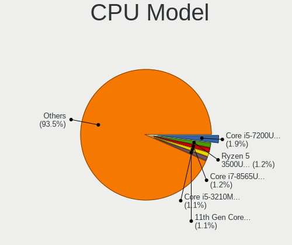

| Model                                         | Computers | Percent |
|-----------------------------------------------|-----------|---------|
| Intel Core i5-7200U CPU @ 2.50GHz             | 11        | 1.53%   |
| Intel Core i5-6200U CPU @ 2.30GHz             | 10        | 1.39%   |
| Intel Core i7-8565U CPU @ 1.80GHz             | 9         | 1.26%   |
| Intel Core i5-3210M CPU @ 2.50GHz             | 9         | 1.26%   |
| Intel Core i7-8550U CPU @ 1.80GHz             | 8         | 1.12%   |
| Intel Core i7-7500U CPU @ 2.70GHz             | 8         | 1.12%   |
| Intel Core i5-8250U CPU @ 1.60GHz             | 7         | 0.98%   |
| Intel Core i3-6006U CPU @ 2.00GHz             | 7         | 0.98%   |
| Intel Atom x5-Z8350 CPU @ 1.44GHz             | 7         | 0.98%   |
| AMD Ryzen 5 3500U with Radeon Vega Mobile Gfx | 7         | 0.98%   |
| Intel Pentium CPU N3540 @ 2.16GHz             | 6         | 0.84%   |
| Intel Core i5-7300HQ CPU @ 2.50GHz            | 6         | 0.84%   |
| Intel Celeron CPU N2840 @ 2.16GHz             | 6         | 0.84%   |
| Intel Core i5-8300H CPU @ 2.30GHz             | 5         | 0.7%    |
| Intel Core i5-8265U CPU @ 1.60GHz             | 5         | 0.7%    |
| Intel Core i5-6300U CPU @ 2.40GHz             | 5         | 0.7%    |
| Intel Core i5-10210U CPU @ 1.60GHz            | 5         | 0.7%    |
| Intel 11th Gen Core i7-1165G7 @ 2.80GHz       | 5         | 0.7%    |
| AMD Ryzen 5 2500U with Radeon Vega Mobile Gfx | 5         | 0.7%    |
| AMD Ryzen 3 4300U with Radeon Graphics        | 5         | 0.7%    |
| AMD FX-6300 Six-Core Processor                | 5         | 0.7%    |
| Intel Pentium CPU P6200 @ 2.13GHz             | 4         | 0.56%   |
| Intel Pentium CPU N4200 @ 1.10GHz             | 4         | 0.56%   |
| Intel Core i7-6600U CPU @ 2.60GHz             | 4         | 0.56%   |
| Intel Core i7-4790 CPU @ 3.60GHz              | 4         | 0.56%   |
| Intel Core i5-10400F CPU @ 2.90GHz            | 4         | 0.56%   |
| Intel Core i3 CPU M 370 @ 2.40GHz             | 4         | 0.56%   |
| Intel Core 2 Duo CPU E8400 @ 3.00GHz          | 4         | 0.56%   |
| Intel Celeron CPU N3060 @ 1.60GHz             | 4         | 0.56%   |
| Intel 11th Gen Core i5-1135G7 @ 2.40GHz       | 4         | 0.56%   |
| AMD Ryzen 7 5800H with Radeon Graphics        | 4         | 0.56%   |
| AMD Ryzen 7 4800H with Radeon Graphics        | 4         | 0.56%   |
| AMD Ryzen 3 3200G with Radeon Vega Graphics   | 4         | 0.56%   |
| Intel Pentium Dual-Core CPU T4500 @ 2.30GHz   | 3         | 0.42%   |
| Intel Core i7-8650U CPU @ 1.90GHz             | 3         | 0.42%   |
| Intel Core i7-6700HQ CPU @ 2.60GHz            | 3         | 0.42%   |
| Intel Core i7-4702MQ CPU @ 2.20GHz            | 3         | 0.42%   |
| Intel Core i7-4600U CPU @ 2.10GHz             | 3         | 0.42%   |
| Intel Core i7-4500U CPU @ 1.80GHz             | 3         | 0.42%   |
| Intel Core i7-3610QM CPU @ 2.30GHz            | 3         | 0.42%   |

CPU Model Family
----------------

Processor model prefix

| Model                   | Computers | Percent |
|-------------------------|-----------|---------|
| Intel Core i5           | 142       | 19.83%  |
| Intel Core i7           | 104       | 14.53%  |
| Intel Core i3           | 64        | 8.94%   |
| Intel Celeron           | 50        | 6.98%   |
| AMD Ryzen 5             | 37        | 5.17%   |
| Intel Pentium           | 30        | 4.19%   |
| AMD Ryzen 7             | 27        | 3.77%   |
| Intel Core 2 Duo        | 25        | 3.49%   |
| Intel Atom              | 22        | 3.07%   |
| Intel Xeon              | 21        | 2.93%   |
| Other                   | 16        | 2.23%   |
| AMD Ryzen 3             | 16        | 2.23%   |
| AMD A10                 | 13        | 1.82%   |
| AMD A6                  | 12        | 1.68%   |
| AMD FX                  | 11        | 1.54%   |
| Intel Pentium Dual-Core | 10        | 1.4%    |
| AMD A8                  | 10        | 1.4%    |
| AMD E                   | 8         | 1.12%   |
| Intel Pentium Dual      | 7         | 0.98%   |
| AMD E2                  | 6         | 0.84%   |
| AMD E1                  | 6         | 0.84%   |
| AMD Athlon              | 6         | 0.84%   |
| AMD A4                  | 6         | 0.84%   |
| AMD Ryzen 9             | 5         | 0.7%    |
| AMD A12                 | 4         | 0.56%   |
| Intel Genuine           | 3         | 0.42%   |
| Intel Core i9           | 3         | 0.42%   |
| Intel Core 2            | 3         | 0.42%   |
| Intel Celeron Dual-Core | 3         | 0.42%   |
| AMD Turion II Dual-Core | 3         | 0.42%   |
| AMD Ryzen 5 PRO         | 3         | 0.42%   |
| AMD Phenom              | 3         | 0.42%   |
| AMD Athlon II X2        | 3         | 0.42%   |
| AMD Athlon II           | 3         | 0.42%   |
| Intel Pentium Silver    | 2         | 0.28%   |
| Intel Pentium Gold      | 2         | 0.28%   |
| Intel Pentium 4         | 2         | 0.28%   |
| AMD Ryzen 7 PRO         | 2         | 0.28%   |
| AMD Phenom II X6        | 2         | 0.28%   |
| AMD Phenom II X4        | 2         | 0.28%   |

CPU Cores
---------

Number of processor cores

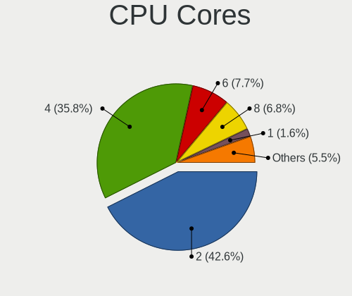

| Number  | Computers | Percent |
|---------|-----------|---------|
| 2       | 356       | 49.58%  |
| 4       | 245       | 34.12%  |
| 8       | 37        | 5.15%   |
| 6       | 36        | 5.01%   |
| 1       | 15        | 2.09%   |
| 3       | 8         | 1.11%   |
| 12      | 6         | 0.84%   |
| Unknown | 6         | 0.84%   |
| 10      | 5         | 0.7%    |
| 16      | 3         | 0.42%   |
| 20      | 1         | 0.14%   |

CPU Sockets
-----------

Number of sockets

| Number  | Computers | Percent |
|---------|-----------|---------|
| 1       | 707       | 99.16%  |
| 2       | 4         | 0.56%   |
| 4       | 1         | 0.14%   |
| Unknown | 1         | 0.14%   |

CPU Threads
-----------

Threads per core (Hyper-Threading)

| Number  | Computers | Percent |
|---------|-----------|---------|
| 2       | 432       | 60.42%  |
| 1       | 277       | 38.74%  |
| Unknown | 6         | 0.84%   |

CPU Op-Modes
------------

CPU Operation Modes (32-bit, 64-bit)

| Op mode        | Computers | Percent |
|----------------|-----------|---------|
| 32-bit, 64-bit | 687       | 96.08%  |
| Unknown        | 15        | 2.1%    |
| 32-bit         | 7         | 0.98%   |
| 64-bit         | 6         | 0.84%   |

CPU Microcode
-------------

Microcode number

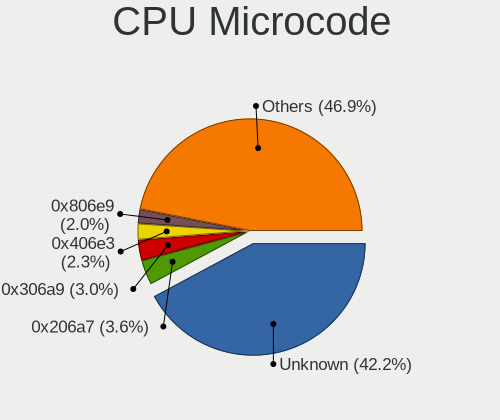

| Number     | Computers | Percent |
|------------|-----------|---------|
| Unknown    | 142       | 19.4%   |
| 0x206a7    | 39        | 5.33%   |
| 0x306a9    | 33        | 4.51%   |
| 0x406e3    | 28        | 3.83%   |
| 0x806e9    | 22        | 3.01%   |
| 0x1067a    | 22        | 3.01%   |
| 0x306c3    | 21        | 2.87%   |
| 0x40651    | 20        | 2.73%   |
| 0x30678    | 19        | 2.6%    |
| 0x806ec    | 17        | 2.32%   |
| 0x806ea    | 14        | 1.91%   |
| 0x08108109 | 14        | 1.91%   |
| 0x906ea    | 13        | 1.78%   |
| 0x906e9    | 12        | 1.64%   |
| 0x6fd      | 12        | 1.64%   |
| 0x406c4    | 12        | 1.64%   |
| 0x20655    | 12        | 1.64%   |
| 0x0810100b | 11        | 1.5%    |
| 0x05000119 | 11        | 1.5%    |
| 0x306d4    | 10        | 1.37%   |
| 0x08701021 | 10        | 1.37%   |
| 0x08108102 | 10        | 1.37%   |
| 0x10676    | 9         | 1.23%   |
| 0x806c1    | 8         | 1.09%   |
| 0x0a50000c | 8         | 1.09%   |
| 0x08600106 | 8         | 1.09%   |
| 0x0700010f | 7         | 0.96%   |
| 0x06000852 | 7         | 0.96%   |
| 0xa0652    | 6         | 0.82%   |
| 0x706a1    | 6         | 0.82%   |
| 0x506c9    | 6         | 0.82%   |
| 0x406c3    | 6         | 0.82%   |
| 0x06001119 | 6         | 0.82%   |
| 0x03000027 | 6         | 0.82%   |
| 0xa0653    | 5         | 0.68%   |
| 0x706a8    | 5         | 0.68%   |
| 0x506e3    | 5         | 0.68%   |
| 0x106ca    | 5         | 0.68%   |
| 0x06006705 | 5         | 0.68%   |
| 0x010000c8 | 5         | 0.68%   |

CPU Microarch
-------------

Microarchitecture

| Name             | Computers | Percent |
|------------------|-----------|---------|
| KabyLake         | 112       | 15.66%  |
| Haswell          | 58        | 8.11%   |
| SandyBridge      | 50        | 6.99%   |
| IvyBridge        | 45        | 6.29%   |
| Skylake          | 42        | 5.87%   |
| Silvermont       | 41        | 5.73%   |
| Penryn           | 39        | 5.45%   |
| Zen+             | 30        | 4.2%    |
| Zen 2            | 29        | 4.06%   |
| Zen              | 20        | 2.8%    |
| Westmere         | 20        | 2.8%    |
| Core             | 19        | 2.66%   |
| Piledriver       | 18        | 2.52%   |
| K10              | 17        | 2.38%   |
| Excavator        | 17        | 2.38%   |
| Bobcat           | 16        | 2.24%   |
| CometLake        | 15        | 2.1%    |
| Broadwell        | 15        | 2.1%    |
| Zen 3            | 13        | 1.82%   |
| TigerLake        | 12        | 1.68%   |
| Goldmont plus    | 11        | 1.54%   |
| Puma             | 9         | 1.26%   |
| Jaguar           | 9         | 1.26%   |
| Bonnell          | 9         | 1.26%   |
| K10 Llano        | 7         | 0.98%   |
| Unknown          | 7         | 0.98%   |
| Goldmont         | 6         | 0.84%   |
| Steamroller      | 4         | 0.56%   |
| K8 Hammer        | 4         | 0.56%   |
| IceLake          | 4         | 0.56%   |
| Bulldozer        | 4         | 0.56%   |
| Tremont          | 3         | 0.42%   |
| P6               | 3         | 0.42%   |
| Nehalem          | 3         | 0.42%   |
| NetBurst         | 2         | 0.28%   |
| K8 & K10 hybrid  | 1         | 0.14%   |
| Alderlake Hybrid | 1         | 0.14%   |

Graphics
--------

GPU Vendor
----------

Vendors of graphics cards

| Vendor                           | Computers | Percent |
|----------------------------------|-----------|---------|
| Intel                            | 427       | 51.08%  |
| AMD                              | 218       | 26.08%  |
| Nvidia                           | 181       | 21.65%  |
| Silicon Integrated Systems [SiS] | 4         | 0.48%   |
| Matrox Electronics Systems       | 3         | 0.36%   |
| ATI Technologies                 | 2         | 0.24%   |
| VIA Technologies                 | 1         | 0.12%   |

GPU Model
---------

Graphics card models

| Model                                                                                    | Computers | Percent |
|------------------------------------------------------------------------------------------|-----------|---------|
| Intel 2nd Generation Core Processor Family Integrated Graphics Controller                | 44        | 5.02%   |
| Intel Skylake GT2 [HD Graphics 520]                                                      | 28        | 3.2%    |
| Intel 3rd Gen Core processor Graphics Controller                                         | 26        | 2.97%   |
| Intel HD Graphics 620                                                                    | 25        | 2.85%   |
| Intel Haswell-ULT Integrated Graphics Controller                                         | 23        | 2.63%   |
| AMD Picasso/Raven 2 [Radeon Vega Series / Radeon Vega Mobile Series]                     | 22        | 2.51%   |
| Intel Atom/Celeron/Pentium Processor x5-E8000/J3xxx/N3xxx Integrated Graphics Controller | 21        | 2.4%    |
| Intel Atom Processor Z36xxx/Z37xxx Series Graphics & Display                             | 20        | 2.28%   |
| Intel UHD Graphics 620                                                                   | 19        | 2.17%   |
| Intel WhiskeyLake-U GT2 [UHD Graphics 620]                                               | 16        | 1.83%   |
| Intel Mobile 4 Series Chipset Integrated Graphics Controller                             | 16        | 1.83%   |
| AMD Renoir                                                                               | 16        | 1.83%   |
| Intel Core Processor Integrated Graphics Controller                                      | 15        | 1.71%   |
| AMD Raven Ridge [Radeon Vega Series / Radeon Vega Mobile Series]                         | 14        | 1.6%    |
| AMD Topaz XT [Radeon R7 M260/M265 / M340/M360 / M440/M445 / 530/535 / 620/625 Mobile]    | 13        | 1.48%   |
| Intel HD Graphics 630                                                                    | 12        | 1.37%   |
| Intel CoffeeLake-H GT2 [UHD Graphics 630]                                                | 12        | 1.37%   |
| AMD Sun XT [Radeon HD 8670A/8670M/8690M / R5 M330 / M430 / Radeon 520 Mobile]            | 12        | 1.37%   |
| Nvidia GP107M [GeForce GTX 1050 Mobile]                                                  | 11        | 1.26%   |
| Intel TigerLake-LP GT2 [Iris Xe Graphics]                                                | 11        | 1.26%   |
| Intel Xeon E3-1200 v3/4th Gen Core Processor Integrated Graphics Controller              | 10        | 1.14%   |
| Intel CometLake-U GT2 [UHD Graphics]                                                     | 10        | 1.14%   |
| Nvidia GM108M [GeForce 940MX]                                                            | 9         | 1.03%   |
| Intel GeminiLake [UHD Graphics 600]                                                      | 9         | 1.03%   |
| Intel 4th Gen Core Processor Integrated Graphics Controller                              | 9         | 1.03%   |
| Intel HD Graphics 5500                                                                   | 8         | 0.91%   |
| AMD Wani [Radeon R5/R6/R7 Graphics]                                                      | 8         | 0.91%   |
| AMD Stoney [Radeon R2/R3/R4/R5 Graphics]                                                 | 8         | 0.91%   |
| Intel CometLake-H GT2 [UHD Graphics]                                                     | 7         | 0.8%    |
| AMD Mullins [Radeon R4/R5 Graphics]                                                      | 7         | 0.8%    |
| AMD Cezanne                                                                              | 7         | 0.8%    |
| Nvidia TU117M                                                                            | 6         | 0.68%   |
| Nvidia GP108M [GeForce MX150]                                                            | 6         | 0.68%   |
| Nvidia GP108 [GeForce GT 1030]                                                           | 6         | 0.68%   |
| Intel Mobile 945GM/GMS/GME, 943/940GML Express Integrated Graphics Controller            | 6         | 0.68%   |
| AMD Navi 10 [Radeon RX 5600 OEM/5600 XT / 5700/5700 XT]                                  | 6         | 0.68%   |
| AMD Ellesmere [Radeon RX 470/480/570/570X/580/580X/590]                                  | 6         | 0.68%   |
| Intel Xeon E3-1200 v2/3rd Gen Core processor Graphics Controller                         | 5         | 0.57%   |
| Intel Mobile GM965/GL960 Integrated Graphics Controller (secondary)                      | 5         | 0.57%   |
| Intel Mobile GM965/GL960 Integrated Graphics Controller (primary)                        | 5         | 0.57%   |

GPU Combo
---------

Combinations of graphics cards

| Name           | Computers | Percent |
|----------------|-----------|---------|
| 1 x Intel      | 321       | 44.96%  |
| 1 x AMD        | 153       | 21.43%  |
| 1 x Nvidia     | 85        | 11.9%   |
| Intel + Nvidia | 82        | 11.48%  |
| 2 x AMD        | 29        | 4.06%   |
| Intel + AMD    | 21        | 2.94%   |
| AMD + Nvidia   | 14        | 1.96%   |
| 1 x SiS        | 4         | 0.56%   |
| 1 x Matrox     | 2         | 0.28%   |
| Other          | 1         | 0.14%   |
| 1 x VIA        | 1         | 0.14%   |
| AMD + Matrox   | 1         | 0.14%   |

GPU Driver
----------

Free vs proprietary

| Driver      | Computers | Percent |
|-------------|-----------|---------|
| Free        | 595       | 82.75%  |
| Proprietary | 97        | 13.49%  |
| Unknown     | 27        | 3.76%   |

GPU Memory
----------

Total video memory

| Size in GB | Computers | Percent |
|------------|-----------|---------|
| Unknown    | 400       | 55.33%  |
| 1.01-2.0   | 100       | 13.83%  |
| 0.01-0.5   | 99        | 13.69%  |
| 0.51-1.0   | 55        | 7.61%   |
| 3.01-4.0   | 42        | 5.81%   |
| 5.01-6.0   | 9         | 1.24%   |
| 7.01-8.0   | 8         | 1.11%   |
| 2.01-3.0   | 5         | 0.69%   |
| 8.01-16.0  | 5         | 0.69%   |

Monitor
-------

Monitor Vendor
--------------

Monitor vendors

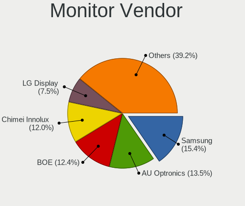

| Vendor                  | Computers | Percent |
|-------------------------|-----------|---------|
| Samsung Electronics     | 125       | 16.32%  |
| AU Optronics            | 107       | 13.97%  |
| BOE                     | 94        | 12.27%  |
| Chimei Innolux          | 79        | 10.31%  |
| LG Display              | 69        | 9.01%   |
| Goldstar                | 59        | 7.7%    |
| Hewlett-Packard         | 20        | 2.61%   |
| Lenovo                  | 17        | 2.22%   |
| Dell                    | 16        | 2.09%   |
| AOC                     | 15        | 1.96%   |
| ViewSonic               | 12        | 1.57%   |
| Sony                    | 10        | 1.31%   |
| LG Electronics          | 10        | 1.31%   |
| Apple                   | 10        | 1.31%   |
| Unknown                 | 9         | 1.17%   |
| Sharp                   | 8         | 1.04%   |
| PANDA                   | 8         | 1.04%   |
| InfoVision              | 8         | 1.04%   |
| Chi Mei Optoelectronics | 8         | 1.04%   |
| Envision                | 7         | 0.91%   |
| SAC                     | 6         | 0.78%   |
| ___                     | 5         | 0.65%   |
| ASUSTek Computer        | 5         | 0.65%   |
| Acer                    | 5         | 0.65%   |
| Packard Bell            | 4         | 0.52%   |
| Hitachi                 | 4         | 0.52%   |
| Ancor Communications    | 4         | 0.52%   |
| MSI                     | 3         | 0.39%   |
| LG Philips              | 3         | 0.39%   |
| KTC                     | 3         | 0.39%   |
| CSO                     | 3         | 0.39%   |
| SKY                     | 2         | 0.26%   |
| Plain Tree Systems      | 2         | 0.26%   |
| Philips                 | 2         | 0.26%   |
| LGD                     | 2         | 0.26%   |
| InnoLux Display         | 2         | 0.26%   |
| CPT                     | 2         | 0.26%   |
| CHR                     | 2         | 0.26%   |
| Westinghouse            | 1         | 0.13%   |
| Unknown (XXX)           | 1         | 0.13%   |

Monitor Model
-------------

Monitor models

| Model                                                                | Computers | Percent |
|----------------------------------------------------------------------|-----------|---------|
| Samsung Electronics C24F390 SAM0D2C 1920x1080 520x290mm 23.4-inch    | 10        | 1.28%   |
| BOE LCD Monitor BOE0697 1366x768 309x173mm 13.9-inch                 | 9         | 1.15%   |
| Goldstar ULTRAWIDE GSM59F1 2560x1080 798x334mm 34.1-inch             | 8         | 1.02%   |
| Goldstar IPS FULLHD GSM5AB8 1920x1080 480x270mm 21.7-inch            | 7         | 0.89%   |
| Chimei Innolux LCD Monitor CMN14D6 1366x768 309x173mm 13.9-inch      | 6         | 0.77%   |
| Samsung Electronics S24F350 SAM0D20 1920x1080 521x293mm 23.5-inch    | 5         | 0.64%   |
| Goldstar FULL HD GSM5B55 1920x1080 480x270mm 21.7-inch               | 5         | 0.64%   |
| Chimei Innolux LCD Monitor CMN14C3 1366x768 309x173mm 13.9-inch      | 5         | 0.64%   |
| BOE LCD Monitor BOE0696 1366x768 309x173mm 13.9-inch                 | 5         | 0.64%   |
| AU Optronics LCD Monitor AUO403D 1920x1080 309x173mm 13.9-inch       | 5         | 0.64%   |
| AU Optronics LCD Monitor AUO2E3C 1366x768 309x173mm 13.9-inch        | 5         | 0.64%   |
| Samsung Electronics LCD Monitor SEC3741 1280x800 331x207mm 15.4-inch | 4         | 0.51%   |
| SAC LED MONITOR SAC952D 1920x1080 480x270mm 21.7-inch                | 4         | 0.51%   |
| Goldstar 2D HD TV GSM59CA 1366x768 509x286mm 23.0-inch               | 4         | 0.51%   |
| Chimei Innolux LCD Monitor CMN15E6 1366x768 344x193mm 15.5-inch      | 4         | 0.51%   |
| Chimei Innolux LCD Monitor CMN15DB 1366x768 344x193mm 15.5-inch      | 4         | 0.51%   |
| Chimei Innolux LCD Monitor CMN1521 1920x1080 344x193mm 15.5-inch     | 4         | 0.51%   |
| Chimei Innolux LCD Monitor CMN1490 1366x768 309x173mm 13.9-inch      | 4         | 0.51%   |
| BOE LCD Monitor BOE06A5 1366x768 344x194mm 15.5-inch                 | 4         | 0.51%   |
| BOE LCD Monitor BOE0628 1366x768 309x173mm 13.9-inch                 | 4         | 0.51%   |
| AU Optronics LCD Monitor AUO70EC 1366x768 344x193mm 15.5-inch        | 4         | 0.51%   |
| AU Optronics LCD Monitor AUO45EC 1366x768 344x193mm 15.5-inch        | 4         | 0.51%   |
| AU Optronics LCD Monitor AUO22EC 1366x768 344x193mm 15.5-inch        | 4         | 0.51%   |
| ___ LCD TV ___9000 1360x768                                          | 3         | 0.38%   |
| Unknown SMART TV 0563 1920x1080 1209x680mm 54.6-inch                 | 3         | 0.38%   |
| Unknown LCDTV16 9000 1360x768 1600x900mm 72.3-inch                   | 3         | 0.38%   |
| Samsung Electronics LCD Monitor SDC4951 1366x768 344x194mm 15.5-inch | 3         | 0.38%   |
| Samsung Electronics C24F390 SAM0D2D 1920x1080 521x293mm 23.5-inch    | 3         | 0.38%   |
| PANDA LCD Monitor NCP002D 1920x1080 344x194mm 15.5-inch              | 3         | 0.38%   |
| LG Display LCD Monitor LGD05E5 1920x1080 344x194mm 15.5-inch         | 3         | 0.38%   |
| LG Display LCD Monitor LGD039F 1366x768 345x194mm 15.6-inch          | 3         | 0.38%   |
| LG Display LCD Monitor LGD02E9 1366x768 309x174mm 14.0-inch          | 3         | 0.38%   |
| LG Display LCD Monitor LGD02DC 1366x768 344x194mm 15.5-inch          | 3         | 0.38%   |
| Lenovo LEN S22e-19 LEN61C9 1920x1080 476x268mm 21.5-inch             | 3         | 0.38%   |
| Goldstar MONITOR GSM59C6 1920x1080 509x286mm 23.0-inch               | 3         | 0.38%   |
| Goldstar HDR WFHD GSM5B9F 2560x1080 798x334mm 34.1-inch              | 3         | 0.38%   |
| Envision L32W931 EPI2009 1360x768 696x392mm 31.4-inch                | 3         | 0.38%   |
| Chimei Innolux LCD Monitor CMN14E5 1920x1080 309x173mm 13.9-inch     | 3         | 0.38%   |
| Chimei Innolux LCD Monitor CMN14D4 1920x1080 309x173mm 13.9-inch     | 3         | 0.38%   |
| Chimei Innolux LCD Monitor CMN1495 1366x768 309x173mm 13.9-inch      | 3         | 0.38%   |

Monitor Resolution
------------------

Monitor screen resolution

| Resolution         | Computers | Percent |
|--------------------|-----------|---------|
| 1366x768 (WXGA)    | 270       | 36.83%  |
| 1920x1080 (FHD)    | 245       | 33.42%  |
| 3840x2160 (4K)     | 30        | 4.09%   |
| 1600x900 (HD+)     | 30        | 4.09%   |
| 1360x768           | 27        | 3.68%   |
| 1440x900 (WXGA+)   | 21        | 2.86%   |
| 1280x800 (WXGA)    | 17        | 2.32%   |
| 1280x1024 (SXGA)   | 14        | 1.91%   |
| 2560x1080          | 12        | 1.64%   |
| 2560x1440 (QHD)    | 10        | 1.36%   |
| 1680x1050 (WSXGA+) | 8         | 1.09%   |
| 1920x1200 (WUXGA)  | 6         | 0.82%   |
| Unknown            | 6         | 0.82%   |
| 3440x1440          | 4         | 0.55%   |
| 2560x1600          | 4         | 0.55%   |
| 1024x600           | 4         | 0.55%   |
| 3840x1080          | 3         | 0.41%   |
| 1920x540           | 3         | 0.41%   |
| 1024x768 (XGA)     | 3         | 0.41%   |
| 3840x1100          | 2         | 0.27%   |
| 2160x1440          | 2         | 0.27%   |
| 1024x576           | 2         | 0.27%   |
| 5760x1080          | 1         | 0.14%   |
| 5440x1800          | 1         | 0.14%   |
| 3840x2400          | 1         | 0.14%   |
| 3286x1080          | 1         | 0.14%   |
| 3000x2000          | 1         | 0.14%   |
| 2288x1287          | 1         | 0.14%   |
| 1680x945           | 1         | 0.14%   |
| 1280x960           | 1         | 0.14%   |
| 1280x768           | 1         | 0.14%   |
| 1280x720 (HD)      | 1         | 0.14%   |

Monitor Diagonal
----------------

Diagonal size in inches

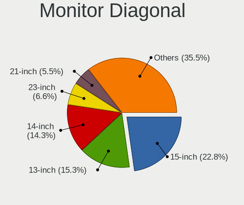

| Inches  | Computers | Percent |
|---------|-----------|---------|
| 15      | 174       | 22.69%  |
| 13      | 133       | 17.34%  |
| 14      | 115       | 14.99%  |
| 21      | 50        | 6.52%   |
| 23      | 49        | 6.39%   |
| Unknown | 32        | 4.17%   |
| 17      | 22        | 2.87%   |
| 19      | 21        | 2.74%   |
| 24      | 19        | 2.48%   |
| 27      | 18        | 2.35%   |
| 18      | 17        | 2.22%   |
| 34      | 15        | 1.96%   |
| 31      | 14        | 1.83%   |
| 20      | 11        | 1.43%   |
| 11      | 11        | 1.43%   |
| 72      | 10        | 1.3%    |
| 12      | 10        | 1.3%    |
| 10      | 8         | 1.04%   |
| 54      | 6         | 0.78%   |
| 84      | 5         | 0.65%   |
| 32      | 5         | 0.65%   |
| 22      | 5         | 0.65%   |
| 40      | 4         | 0.52%   |
| 48      | 3         | 0.39%   |
| 37      | 2         | 0.26%   |
| 16      | 2         | 0.26%   |
| 142     | 1         | 0.13%   |
| 55      | 1         | 0.13%   |
| 52      | 1         | 0.13%   |
| 43      | 1         | 0.13%   |
| 28      | 1         | 0.13%   |
| 26      | 1         | 0.13%   |

Monitor Width
-------------

Physical width

| Width in mm    | Computers | Percent |
|----------------|-----------|---------|
| 301-350        | 383       | 50.73%  |
| 401-500        | 91        | 12.05%  |
| 501-600        | 79        | 10.46%  |
| 201-300        | 69        | 9.14%   |
| Unknown        | 32        | 4.24%   |
| 351-400        | 28        | 3.71%   |
| 701-800        | 20        | 2.65%   |
| 601-700        | 19        | 2.52%   |
| 1501-2000      | 15        | 1.99%   |
| 1001-1500      | 11        | 1.46%   |
| 801-900        | 6         | 0.79%   |
| More than 2000 | 1         | 0.13%   |
| 901-1000       | 1         | 0.13%   |

Aspect Ratio
------------

Proportional relationship between the width and the height

| Ratio   | Computers | Percent |
|---------|-----------|---------|
| 16/9    | 550       | 81.12%  |
| 16/10   | 62        | 9.14%   |
| Unknown | 22        | 3.24%   |
| 5/4     | 15        | 2.21%   |
| 21/9    | 15        | 2.21%   |
| 4/3     | 5         | 0.74%   |
| 3/2     | 3         | 0.44%   |
| 3.40    | 2         | 0.29%   |
| 1.96    | 2         | 0.29%   |
| 32/9    | 1         | 0.15%   |
| 1.00    | 1         | 0.15%   |

Monitor Area
------------

Area in inch

| Area in inch | Computers | Percent |
|----------------|-----------|---------|
| 81-90          | 210       | 27.63%  |
| 101-110        | 172       | 22.63%  |
| 201-250        | 102       | 13.42%  |
| 151-200        | 42        | 5.53%   |
| 71-80          | 35        | 4.61%   |
| 351-500        | 35        | 4.61%   |
| Unknown        | 32        | 4.21%   |
| More than 1000 | 25        | 3.29%   |
| 141-150        | 22        | 2.89%   |
| 301-350        | 19        | 2.5%    |
| 51-60          | 13        | 1.71%   |
| 121-130        | 11        | 1.45%   |
| 61-70          | 9         | 1.18%   |
| 501-1000       | 9         | 1.18%   |
| 41-50          | 8         | 1.05%   |
| 251-300        | 6         | 0.79%   |
| 131-140        | 4         | 0.53%   |
| 111-120        | 3         | 0.39%   |
| 91-100         | 3         | 0.39%   |

Pixel Density
-------------

Pixels per inch

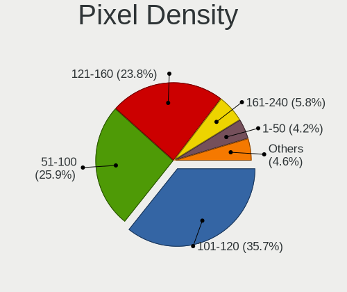

| Density       | Computers | Percent |
|---------------|-----------|---------|
| 101-120       | 310       | 41.17%  |
| 51-100        | 184       | 24.44%  |
| 121-160       | 155       | 20.58%  |
| 1-50          | 35        | 4.65%   |
| Unknown       | 32        | 4.25%   |
| 161-240       | 29        | 3.85%   |
| More than 240 | 8         | 1.06%   |

Multiple Monitors
-----------------

Total monitors connected

| Total | Computers | Percent |
|-------|-----------|---------|
| 1     | 565       | 77.82%  |
| 2     | 115       | 15.84%  |
| 0     | 34        | 4.68%   |
| 3     | 12        | 1.65%   |

Network
-------

Net Controller Vendor
---------------------

Controller vendors

| Vendor                           | Computers | Percent |
|----------------------------------|-----------|---------|
| Realtek Semiconductor            | 466       | 42.13%  |
| Intel                            | 243       | 21.97%  |
| Qualcomm Atheros                 | 141       | 12.75%  |
| Broadcom                         | 64        | 5.79%   |
| Ralink                           | 29        | 2.62%   |
| Ralink Technology                | 21        | 1.9%    |
| TP-Link                          | 17        | 1.54%   |
| Broadcom Limited                 | 17        | 1.54%   |
| Huawei Technologies              | 14        | 1.27%   |
| Marvell Technology Group         | 13        | 1.18%   |
| Xiaomi                           | 11        | 0.99%   |
| Samsung Electronics              | 7         | 0.63%   |
| Qualcomm Atheros Communications  | 7         | 0.63%   |
| Nvidia                           | 7         | 0.63%   |
| MediaTek                         | 6         | 0.54%   |
| D-Link System                    | 5         | 0.45%   |
| Silicon Integrated Systems [SiS] | 4         | 0.36%   |
| JMicron Technology               | 4         | 0.36%   |
| ICS Advent                       | 4         | 0.36%   |
| D-Link                           | 4         | 0.36%   |
| Microsoft                        | 3         | 0.27%   |
| VIA Technologies                 | 2         | 0.18%   |
| Motorola PCS                     | 2         | 0.18%   |
| DisplayLink                      | 2         | 0.18%   |
| Spreadtrum Communications        | 1         | 0.09%   |
| Qcom                             | 1         | 0.09%   |
| Padix (Rockfire)                 | 1         | 0.09%   |
| Oculus VR                        | 1         | 0.09%   |
| Microchip Technology             | 1         | 0.09%   |
| Manta                            | 1         | 0.09%   |
| Lenovo                           | 1         | 0.09%   |
| HMD Global                       | 1         | 0.09%   |
| Hewlett-Packard                  | 1         | 0.09%   |
| ASUSTek Computer                 | 1         | 0.09%   |
| ASIX Electronics                 | 1         | 0.09%   |
| Arduino SA                       | 1         | 0.09%   |
| Apple                            | 1         | 0.09%   |

Net Controller Model
--------------------

Controller models

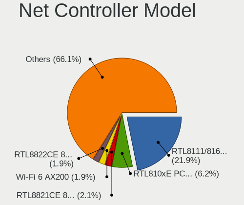

| Model                                                                   | Computers | Percent |
|-------------------------------------------------------------------------|-----------|---------|
| Realtek RTL8111/8168/8411 PCI Express Gigabit Ethernet Controller       | 299       | 22.79%  |
| Realtek RTL810xE PCI Express Fast Ethernet controller                   | 98        | 7.47%   |
| Qualcomm Atheros QCA9565 / AR9565 Wireless Network Adapter              | 29        | 2.21%   |
| Qualcomm Atheros AR9485 Wireless Network Adapter                        | 26        | 1.98%   |
| Realtek RTL8821CE 802.11ac PCIe Wireless Network Adapter                | 25        | 1.91%   |
| Realtek RTL8723BE PCIe Wireless Network Adapter                         | 24        | 1.83%   |
| Qualcomm Atheros QCA9377 802.11ac Wireless Network Adapter              | 23        | 1.75%   |
| Qualcomm Atheros AR9285 Wireless Network Adapter (PCI-Express)          | 20        | 1.52%   |
| Intel Wi-Fi 6 AX200                                                     | 19        | 1.45%   |
| Intel Wireless 8265 / 8275                                              | 18        | 1.37%   |
| Intel Wireless 8260                                                     | 17        | 1.3%    |
| Intel Wireless 7260                                                     | 17        | 1.3%    |
| Realtek RTL8723DE Wireless Network Adapter                              | 16        | 1.22%   |
| Realtek RTL8188EE Wireless Network Adapter                              | 14        | 1.07%   |
| Broadcom BCM4313 802.11bgn Wireless Network Adapter                     | 14        | 1.07%   |
| Realtek RTL8822CE 802.11ac PCIe Wireless Network Adapter                | 13        | 0.99%   |
| Intel Wireless 7265                                                     | 13        | 0.99%   |
| Intel 82579LM Gigabit Network Connection (Lewisville)                   | 12        | 0.91%   |
| Huawei LYA-L09                                                          | 12        | 0.91%   |
| Ralink MT7601U Wireless Adapter                                         | 11        | 0.84%   |
| Intel Cannon Point-LP CNVi [Wireless-AC]                                | 11        | 0.84%   |
| Broadcom BCM43142 802.11b/g/n                                           | 11        | 0.84%   |
| Realtek RTL8822BE 802.11a/b/g/n/ac WiFi adapter                         | 10        | 0.76%   |
| Realtek RTL8153 Gigabit Ethernet Adapter                                | 10        | 0.76%   |
| Intel Ethernet Connection I219-LM                                       | 10        | 0.76%   |
| Intel Dual Band Wireless-AC 3165 Plus Bluetooth                         | 10        | 0.76%   |
| Xiaomi Mi/Redmi series (RNDIS)                                          | 9         | 0.69%   |
| Ralink RT3290 Wireless 802.11n 1T/1R PCIe                               | 9         | 0.69%   |
| Intel Comet Lake PCH-LP CNVi WiFi                                       | 9         | 0.69%   |
| Intel Wi-Fi 6 AX201                                                     | 8         | 0.61%   |
| Realtek RTL8188EUS 802.11n Wireless Network Adapter                     | 7         | 0.53%   |
| Realtek RTL8188CE 802.11b/g/n WiFi Adapter                              | 7         | 0.53%   |
| Ralink RT2870/RT3070 Wireless Adapter                                   | 7         | 0.53%   |
| Qualcomm Atheros AR242x / AR542x Wireless Network Adapter (PCI-Express) | 7         | 0.53%   |
| Intel I211 Gigabit Network Connection                                   | 7         | 0.53%   |
| Intel Ethernet Connection (4) I219-V                                    | 7         | 0.53%   |
| Intel Dual Band Wireless-AC 3168NGW [Stone Peak]                        | 7         | 0.53%   |
| Realtek RTL8125 2.5GbE Controller                                       | 6         | 0.46%   |
| Ralink RT3090 Wireless 802.11n 1T/1R PCIe                               | 6         | 0.46%   |
| Qualcomm Atheros QCA6174 802.11ac Wireless Network Adapter              | 6         | 0.46%   |

Wireless Vendor
---------------

Wireless vendors

| Vendor                          | Computers | Percent |
|---------------------------------|-----------|---------|
| Intel                           | 211       | 32.92%  |
| Realtek Semiconductor           | 154       | 24.02%  |
| Qualcomm Atheros                | 122       | 19.03%  |
| Broadcom                        | 49        | 7.64%   |
| Ralink                          | 29        | 4.52%   |
| Ralink Technology               | 21        | 3.28%   |
| TP-Link                         | 16        | 2.5%    |
| Broadcom Limited                | 13        | 2.03%   |
| Qualcomm Atheros Communications | 7         | 1.09%   |
| MediaTek                        | 6         | 0.94%   |
| Microsoft                       | 3         | 0.47%   |
| D-Link System                   | 3         | 0.47%   |
| D-Link                          | 3         | 0.47%   |
| Samsung Electronics             | 1         | 0.16%   |
| Qcom                            | 1         | 0.16%   |
| Hewlett-Packard                 | 1         | 0.16%   |
| ASUSTek Computer                | 1         | 0.16%   |

Wireless Model
--------------

Wireless models

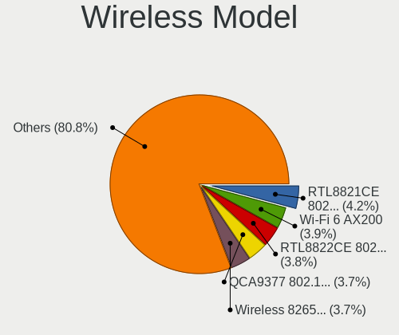

| Model                                                                   | Computers | Percent |
|-------------------------------------------------------------------------|-----------|---------|
| Qualcomm Atheros QCA9565 / AR9565 Wireless Network Adapter              | 29        | 4.51%   |
| Qualcomm Atheros AR9485 Wireless Network Adapter                        | 26        | 4.04%   |
| Realtek RTL8821CE 802.11ac PCIe Wireless Network Adapter                | 25        | 3.89%   |
| Realtek RTL8723BE PCIe Wireless Network Adapter                         | 24        | 3.73%   |
| Qualcomm Atheros QCA9377 802.11ac Wireless Network Adapter              | 23        | 3.58%   |
| Qualcomm Atheros AR9285 Wireless Network Adapter (PCI-Express)          | 20        | 3.11%   |
| Intel Wi-Fi 6 AX200                                                     | 19        | 2.95%   |
| Intel Wireless 8265 / 8275                                              | 18        | 2.8%    |
| Intel Wireless 8260                                                     | 17        | 2.64%   |
| Intel Wireless 7260                                                     | 17        | 2.64%   |
| Realtek RTL8723DE Wireless Network Adapter                              | 16        | 2.49%   |
| Realtek RTL8188EE Wireless Network Adapter                              | 14        | 2.18%   |
| Broadcom BCM4313 802.11bgn Wireless Network Adapter                     | 14        | 2.18%   |
| Realtek RTL8822CE 802.11ac PCIe Wireless Network Adapter                | 13        | 2.02%   |
| Intel Wireless 7265                                                     | 13        | 2.02%   |
| Ralink MT7601U Wireless Adapter                                         | 11        | 1.71%   |
| Intel Cannon Point-LP CNVi [Wireless-AC]                                | 11        | 1.71%   |
| Broadcom BCM43142 802.11b/g/n                                           | 11        | 1.71%   |
| Realtek RTL8822BE 802.11a/b/g/n/ac WiFi adapter                         | 10        | 1.56%   |
| Intel Dual Band Wireless-AC 3165 Plus Bluetooth                         | 10        | 1.56%   |
| Ralink RT3290 Wireless 802.11n 1T/1R PCIe                               | 9         | 1.4%    |
| Intel Comet Lake PCH-LP CNVi WiFi                                       | 9         | 1.4%    |
| Intel Wi-Fi 6 AX201                                                     | 8         | 1.24%   |
| Realtek RTL8188EUS 802.11n Wireless Network Adapter                     | 7         | 1.09%   |
| Realtek RTL8188CE 802.11b/g/n WiFi Adapter                              | 7         | 1.09%   |
| Ralink RT2870/RT3070 Wireless Adapter                                   | 7         | 1.09%   |
| Qualcomm Atheros AR242x / AR542x Wireless Network Adapter (PCI-Express) | 7         | 1.09%   |
| Intel Dual Band Wireless-AC 3168NGW [Stone Peak]                        | 7         | 1.09%   |
| Ralink RT3090 Wireless 802.11n 1T/1R PCIe                               | 6         | 0.93%   |
| Qualcomm Atheros QCA6174 802.11ac Wireless Network Adapter              | 6         | 0.93%   |
| Qualcomm Atheros AR9271 802.11n                                         | 6         | 0.93%   |
| Qualcomm Atheros AR928X Wireless Network Adapter (PCI-Express)          | 6         | 0.93%   |
| Intel Wi-Fi 6 AX210/AX211/AX411 160MHz                                  | 6         | 0.93%   |
| Intel Centrino Advanced-N 6235                                          | 6         | 0.93%   |
| Intel Centrino Advanced-N 6205 [Taylor Peak]                            | 6         | 0.93%   |
| TP-Link 802.11ac WLAN Adapter                                           | 5         | 0.78%   |
| Realtek RTL8821AE 802.11ac PCIe Wireless Network Adapter                | 5         | 0.78%   |
| Realtek RTL8192EU 802.11b/g/n WLAN Adapter                              | 5         | 0.78%   |
| Realtek 802.11ac NIC                                                    | 5         | 0.78%   |
| Intel Wireless 3165                                                     | 5         | 0.78%   |

Ethernet Vendor
---------------

Ethernet vendors

| Vendor                           | Computers | Percent |
|----------------------------------|-----------|---------|
| Realtek Semiconductor            | 417       | 63.66%  |
| Intel                            | 101       | 15.42%  |
| Qualcomm Atheros                 | 30        | 4.58%   |
| Broadcom                         | 26        | 3.97%   |
| Marvell Technology Group         | 13        | 1.98%   |
| Huawei Technologies              | 13        | 1.98%   |
| Xiaomi                           | 11        | 1.68%   |
| Nvidia                           | 7         | 1.07%   |
| Samsung Electronics              | 6         | 0.92%   |
| Silicon Integrated Systems [SiS] | 4         | 0.61%   |
| JMicron Technology               | 4         | 0.61%   |
| ICS Advent                       | 4         | 0.61%   |
| Broadcom Limited                 | 4         | 0.61%   |
| VIA Technologies                 | 2         | 0.31%   |
| DisplayLink                      | 2         | 0.31%   |
| D-Link System                    | 2         | 0.31%   |
| TP-Link                          | 1         | 0.15%   |
| Spreadtrum Communications        | 1         | 0.15%   |
| Motorola PCS                     | 1         | 0.15%   |
| Microchip Technology             | 1         | 0.15%   |
| Lenovo                           | 1         | 0.15%   |
| HMD Global                       | 1         | 0.15%   |
| D-Link                           | 1         | 0.15%   |
| ASIX Electronics                 | 1         | 0.15%   |
| Apple                            | 1         | 0.15%   |

Ethernet Model
--------------

Ethernet models

| Model                                                             | Computers | Percent |
|-------------------------------------------------------------------|-----------|---------|
| Realtek RTL8111/8168/8411 PCI Express Gigabit Ethernet Controller | 299       | 45.1%   |
| Realtek RTL810xE PCI Express Fast Ethernet controller             | 98        | 14.78%  |
| Intel 82579LM Gigabit Network Connection (Lewisville)             | 12        | 1.81%   |
| Huawei LYA-L09                                                    | 12        | 1.81%   |
| Realtek RTL8153 Gigabit Ethernet Adapter                          | 10        | 1.51%   |
| Intel Ethernet Connection I219-LM                                 | 10        | 1.51%   |
| Xiaomi Mi/Redmi series (RNDIS)                                    | 9         | 1.36%   |
| Intel I211 Gigabit Network Connection                             | 7         | 1.06%   |
| Intel Ethernet Connection (4) I219-V                              | 7         | 1.06%   |
| Realtek RTL8125 2.5GbE Controller                                 | 6         | 0.9%    |
| Qualcomm Atheros AR8152 v2.0 Fast Ethernet                        | 6         | 0.9%    |
| Qualcomm Atheros AR8151 v2.0 Gigabit Ethernet                     | 6         | 0.9%    |
| Intel Ethernet Connection I217-V                                  | 6         | 0.9%    |
| Intel Ethernet Connection I217-LM                                 | 6         | 0.9%    |
| Samsung Galaxy series, misc. (tethering mode)                     | 5         | 0.75%   |
| Marvell Group 88E8040 PCI-E Fast Ethernet Controller              | 5         | 0.75%   |
| Intel Ethernet Connection (6) I219-V                              | 5         | 0.75%   |
| Silicon Integrated Systems [SiS] 191 Gigabit Ethernet Adapter     | 4         | 0.6%    |
| Nvidia MCP61 Ethernet                                             | 4         | 0.6%    |
| Intel Ethernet Connection (4) I219-LM                             | 4         | 0.6%    |
| Intel Ethernet Connection (2) I219-V                              | 4         | 0.6%    |
| Intel 82567LM Gigabit Network Connection                          | 4         | 0.6%    |
| Broadcom NetXtreme BCM57766 Gigabit Ethernet PCIe                 | 4         | 0.6%    |
| Broadcom NetXtreme BCM57765 Gigabit Ethernet PCIe                 | 4         | 0.6%    |
| Marvell Group 88E8056 PCI-E Gigabit Ethernet Controller           | 3         | 0.45%   |
| JMicron JMC250 PCI Express Gigabit Ethernet Controller            | 3         | 0.45%   |
| Intel Ethernet Connection I218-LM                                 | 3         | 0.45%   |
| Intel Ethernet Connection (3) I218-LM                             | 3         | 0.45%   |
| Broadcom NetLink BCM57785 Gigabit Ethernet PCIe                   | 3         | 0.45%   |
| Broadcom NetLink BCM57780 Gigabit Ethernet PCIe                   | 3         | 0.45%   |
| Xiaomi Mi/Redmi series (RNDIS + ADB)                              | 2         | 0.3%    |
| Realtek RTL8152 Fast Ethernet Adapter                             | 2         | 0.3%    |
| Realtek RTL-8100/8101L/8139 PCI Fast Ethernet Adapter             | 2         | 0.3%    |
| Qualcomm Atheros QCA8172 Fast Ethernet                            | 2         | 0.3%    |
| Qualcomm Atheros QCA8171 Gigabit Ethernet                         | 2         | 0.3%    |
| Qualcomm Atheros Attansic L1 Gigabit Ethernet                     | 2         | 0.3%    |
| Qualcomm Atheros AR8162 Fast Ethernet                             | 2         | 0.3%    |
| Qualcomm Atheros AR8161 Gigabit Ethernet                          | 2         | 0.3%    |
| Qualcomm Atheros AR8152 v1.1 Fast Ethernet                        | 2         | 0.3%    |
| Qualcomm Atheros AR8132 Fast Ethernet                             | 2         | 0.3%    |

Net Controller Kind
-------------------

Ethernet, WiFi or modem

| Kind     | Computers | Percent |
|----------|-----------|---------|
| Ethernet | 617       | 50.45%  |
| WiFi     | 600       | 49.06%  |
| Modem    | 3         | 0.25%   |
| Unknown  | 3         | 0.25%   |

Used Controller
---------------

Currently used network controller

| Kind     | Computers | Percent |
|----------|-----------|---------|
| WiFi     | 473       | 64.97%  |
| Ethernet | 255       | 35.03%  |

NICs
----

Total network controllers on board

| Total | Computers | Percent |
|-------|-----------|---------|
| 2     | 443       | 62.04%  |
| 1     | 240       | 33.61%  |
| 3     | 15        | 2.1%    |
| 0     | 14        | 1.96%   |
| 4     | 2         | 0.28%   |

IPv6
----

IPv6 vs IPv4

| Used | Computers | Percent |
|------|-----------|---------|
| No   | 667       | 93.03%  |
| Yes  | 50        | 6.97%   |

Bluetooth
---------

Bluetooth Vendor
----------------

Controller vendors

| Vendor                          | Computers | Percent |
|---------------------------------|-----------|---------|
| Intel                           | 169       | 36.42%  |
| Realtek Semiconductor           | 90        | 19.4%   |
| Qualcomm Atheros Communications | 39        | 8.41%   |
| Broadcom                        | 33        | 7.11%   |
| IMC Networks                    | 23        | 4.96%   |
| Lite-On Technology              | 22        | 4.74%   |
| Cambridge Silicon Radio         | 22        | 4.74%   |
| Apple                           | 15        | 3.23%   |
| Foxconn / Hon Hai               | 13        | 2.8%    |
| Ralink                          | 9         | 1.94%   |
| Dell                            | 7         | 1.51%   |
| Realtek                         | 5         | 1.08%   |
| Hewlett-Packard                 | 4         | 0.86%   |
| Toshiba                         | 3         | 0.65%   |
| Ralink Technology               | 3         | 0.65%   |
| ASUSTek Computer                | 3         | 0.65%   |
| Foxconn International           | 2         | 0.43%   |
| MediaTek                        | 1         | 0.22%   |
| Alps Electric                   | 1         | 0.22%   |

Bluetooth Model
---------------

Controller models

| Model                                               | Computers | Percent |
|-----------------------------------------------------|-----------|---------|
| Intel Bluetooth wireless interface                  | 74        | 15.95%  |
| Realtek Bluetooth Radio                             | 49        | 10.56%  |
| Realtek  Bluetooth 4.2 Adapter                      | 35        | 7.54%   |
| Intel AX201 Bluetooth                               | 23        | 4.96%   |
| Cambridge Silicon Radio Bluetooth Dongle (HCI mode) | 22        | 4.74%   |
| Intel Bluetooth 9460/9560 Jefferson Peak (JfP)      | 21        | 4.53%   |
| Qualcomm Atheros  Bluetooth Device                  | 19        | 4.09%   |
| Intel AX200 Bluetooth                               | 19        | 4.09%   |
| Apple Bluetooth USB Host Controller                 | 11        | 2.37%   |
| Ralink RT3290 Bluetooth                             | 9         | 1.94%   |
| Qualcomm Atheros AR3012 Bluetooth 4.0               | 9         | 1.94%   |
| Intel Centrino Bluetooth Wireless Transceiver       | 9         | 1.94%   |
| Lite-On Atheros AR3012 Bluetooth                    | 8         | 1.72%   |
| IMC Networks Bluetooth Radio                        | 8         | 1.72%   |
| IMC Networks Bluetooth Device                       | 8         | 1.72%   |
| Intel Wireless-AC 3168 Bluetooth                    | 7         | 1.51%   |
| Intel Centrino Advanced-N 6230 Bluetooth adapter    | 7         | 1.51%   |
| Lite-On Qualcomm Atheros QCA9377 Bluetooth          | 6         | 1.29%   |
| Intel AX210 Bluetooth                               | 6         | 1.29%   |
| Broadcom BCM43142A0 Bluetooth 4.0                   | 6         | 1.29%   |
| Realtek RTL8821A Bluetooth                          | 5         | 1.08%   |
| Realtek Bluetooth Radio                             | 5         | 1.08%   |
| Qualcomm Atheros AR3011 Bluetooth                   | 5         | 1.08%   |
| Lite-On Bluetooth Device                            | 5         | 1.08%   |
| IMC Networks Wireless_Device                        | 4         | 0.86%   |
| Foxconn / Hon Hai Bluetooth USB Host Controller     | 4         | 0.86%   |
| Broadcom Bluetooth 3.0 Dongle                       | 4         | 0.86%   |
| Broadcom BCM2070 Bluetooth Device                   | 4         | 0.86%   |
| Toshiba Bluetooth Device                            | 3         | 0.65%   |
| Ralink Motorola BC4 Bluetooth 3.0+HS Adapter        | 3         | 0.65%   |
| Intel Wireless-AC 9260 Bluetooth Adapter            | 3         | 0.65%   |
| Dell Wireless 365 Bluetooth                         | 3         | 0.65%   |
| Broadcom HP Portable Bumble Bee                     | 3         | 0.65%   |
| Apple Bluetooth Host Controller                     | 3         | 0.65%   |
| Qualcomm Atheros QCA61x4 Bluetooth 4.0              | 2         | 0.43%   |
| Qualcomm Atheros AR9462 Bluetooth                   | 2         | 0.43%   |
| Lite-On Qualcomm Atheros Bluetooth                  | 2         | 0.43%   |
| IMC Networks Atheros AR3012 Bluetooth 4.0 Adapter   | 2         | 0.43%   |
| HP Broadcom 2070 Bluetooth Combo                    | 2         | 0.43%   |
| HP Bluetooth 2.0 Interface [Broadcom BCM2045]       | 2         | 0.43%   |

Sound
-----

Sound Vendor
------------

Sound card vendors

| Vendor                           | Computers | Percent |
|----------------------------------|-----------|---------|
| Intel                            | 486       | 54.42%  |
| AMD                              | 221       | 24.75%  |
| Nvidia                           | 108       | 12.09%  |
| C-Media Electronics              | 13        | 1.46%   |
| Logitech                         | 6         | 0.67%   |
| Creative Labs                    | 6         | 0.67%   |
| Generalplus Technology           | 5         | 0.56%   |
| Silicon Integrated Systems [SiS] | 4         | 0.45%   |
| Creative Technology              | 4         | 0.45%   |
| Texas Instruments                | 3         | 0.34%   |
| Razer USA                        | 3         | 0.34%   |
| Kingston Technology              | 3         | 0.34%   |
| VIA Technologies                 | 2         | 0.22%   |
| JMTek                            | 2         | 0.22%   |
| Focusrite-Novation               | 2         | 0.22%   |
| Corsair                          | 2         | 0.22%   |
| Arturia                          | 2         | 0.22%   |
| Apple                            | 2         | 0.22%   |
| Unknown                          | 1         | 0.11%   |
| Trust                            | 1         | 0.11%   |
| Shenzhen Riitek Technology       | 1         | 0.11%   |
| PreSonus Audio Electronics       | 1         | 0.11%   |
| Plantronics                      | 1         | 0.11%   |
| Pixart Imaging                   | 1         | 0.11%   |
| Native Instruments               | 1         | 0.11%   |
| Microsoft                        | 1         | 0.11%   |
| Micro Star International         | 1         | 0.11%   |
| Lenovo                           | 1         | 0.11%   |
| Hewlett-Packard                  | 1         | 0.11%   |
| GYROCOM C&C                      | 1         | 0.11%   |
| ESS Technology                   | 1         | 0.11%   |
| eMPIA Technology                 | 1         | 0.11%   |
| DigiTech                         | 1         | 0.11%   |
| Blue Microphones                 | 1         | 0.11%   |
| ATI Technologies                 | 1         | 0.11%   |
| Afatech                          | 1         | 0.11%   |
| Unknown                          | 1         | 0.11%   |

Sound Model
-----------

Sound card models

| Model                                                                                             | Computers | Percent |
|---------------------------------------------------------------------------------------------------|-----------|---------|
| Intel Sunrise Point-LP HD Audio                                                                   | 82        | 7.43%   |
| AMD Family 17h/19h HD Audio Controller                                                            | 70        | 6.34%   |
| Intel 7 Series/C216 Chipset Family High Definition Audio Controller                               | 49        | 4.44%   |
| AMD FCH Azalia Controller                                                                         | 46        | 4.17%   |
| Intel 6 Series/C200 Series Chipset Family High Definition Audio Controller                        | 40        | 3.62%   |
| AMD SBx00 Azalia (Intel HDA)                                                                      | 34        | 3.08%   |
| AMD Raven/Raven2/Fenghuang HDMI/DP Audio Controller                                               | 34        | 3.08%   |
| Intel 8 Series/C220 Series Chipset High Definition Audio Controller                               | 30        | 2.72%   |
| Intel 82801I (ICH9 Family) HD Audio Controller                                                    | 27        | 2.45%   |
| AMD Kabini HDMI/DP Audio                                                                          | 26        | 2.36%   |
| AMD Renoir Radeon High Definition Audio Controller                                                | 24        | 2.17%   |
| Intel Haswell-ULT HD Audio Controller                                                             | 22        | 1.99%   |
| Intel 8 Series HD Audio Controller                                                                | 22        | 1.99%   |
| Intel NM10/ICH7 Family High Definition Audio Controller                                           | 21        | 1.9%    |
| Intel Xeon E3-1200 v3/4th Gen Core Processor HD Audio Controller                                  | 20        | 1.81%   |
| Intel Cannon Point-LP High Definition Audio Controller                                            | 19        | 1.72%   |
| Intel 5 Series/3400 Series Chipset High Definition Audio                                          | 19        | 1.72%   |
| Intel Atom Processor Z36xxx/Z37xxx Series High Definition Audio Controller                        | 18        | 1.63%   |
| AMD Starship/Matisse HD Audio Controller                                                          | 17        | 1.54%   |
| Nvidia GP107GL High Definition Audio Controller                                                   | 16        | 1.45%   |
| Intel Cannon Lake PCH cAVS                                                                        | 14        | 1.27%   |
| Intel Broadwell-U Audio Controller                                                                | 14        | 1.27%   |
| AMD Family 15h (Models 60h-6fh) Audio Controller                                                  | 14        | 1.27%   |
| Intel Wildcat Point-LP High Definition Audio Controller                                           | 13        | 1.18%   |
| Intel Tiger Lake-LP Smart Sound Technology Audio Controller                                       | 12        | 1.09%   |
| Intel Celeron/Pentium Silver Processor High Definition Audio                                      | 11        | 1%      |
| Nvidia TU107 GeForce GTX 1650 High Definition Audio Controller                                    | 10        | 0.91%   |
| Intel Comet Lake PCH-LP cAVS                                                                      | 10        | 0.91%   |
| Intel CM238 HD Audio Controller                                                                   | 10        | 0.91%   |
| Intel Atom/Celeron/Pentium Processor x5-E8000/J3xxx/N3xxx Series High Definition Audio Controller | 10        | 0.91%   |
| AMD Wrestler HDMI Audio                                                                           | 10        | 0.91%   |
| Intel 82801JI (ICH10 Family) HD Audio Controller                                                  | 9         | 0.82%   |
| Intel 82801H (ICH8 Family) HD Audio Controller                                                    | 9         | 0.82%   |
| Intel 100 Series/C230 Series Chipset Family HD Audio Controller                                   | 9         | 0.82%   |
| Nvidia GK208 HDMI/DP Audio Controller                                                             | 8         | 0.72%   |
| Intel Comet Lake PCH cAVS                                                                         | 8         | 0.72%   |
| AMD Trinity HDMI Audio Controller                                                                 | 8         | 0.72%   |
| AMD High Definition Audio Controller                                                              | 8         | 0.72%   |
| AMD Family 17h (Models 00h-0fh) HD Audio Controller                                               | 8         | 0.72%   |
| AMD Baffin HDMI/DP Audio [Radeon RX 550 640SP / RX 560/560X]                                      | 8         | 0.72%   |

Memory
------

Memory Vendor
-------------

Memory module vendors

| Vendor              | Computers | Percent |
|---------------------|-----------|---------|
| Samsung Electronics | 113       | 27.83%  |
| SK hynix            | 66        | 16.26%  |
| Micron Technology   | 49        | 12.07%  |
| Kingston            | 48        | 11.82%  |
| Crucial             | 46        | 11.33%  |
| Unknown             | 22        | 5.42%   |
| Ramaxel Technology  | 13        | 3.2%    |
| Corsair             | 12        | 2.96%   |
| A-DATA Technology   | 7         | 1.72%   |
| G.Skill             | 5         | 1.23%   |
| Patriot             | 3         | 0.74%   |
| Nanya Technology    | 3         | 0.74%   |
| Unknown (ABCD)      | 2         | 0.49%   |
| Elpida              | 2         | 0.49%   |
| Unknown             | 2         | 0.49%   |
| Unknown (090E)      | 1         | 0.25%   |
| Unknown (08C8)      | 1         | 0.25%   |
| Smart               | 1         | 0.25%   |
| PNY                 | 1         | 0.25%   |
| Kreton              | 1         | 0.25%   |
| Kllisre             | 1         | 0.25%   |
| Goldenmars          | 1         | 0.25%   |
| GLOWAY              | 1         | 0.25%   |
| Avant               | 1         | 0.25%   |
| Atermiter           | 1         | 0.25%   |
| ASint Technology    | 1         | 0.25%   |
| Ankowall            | 1         | 0.25%   |
| 48spaces            | 1         | 0.25%   |

Memory Model
------------

Memory module models

| Model                                                            | Computers | Percent |
|------------------------------------------------------------------|-----------|---------|
| Samsung RAM M471A5244CB0-CTD 4GB SODIMM DDR4 3266MT/s            | 10        | 2.31%   |
| SK hynix RAM HMA81GS6AFR8N-UH 8GB SODIMM DDR4 2667MT/s           | 6         | 1.39%   |
| Samsung RAM M471B5273DH0-CH9 4GB SODIMM DDR3 1334MT/s            | 5         | 1.16%   |
| Samsung RAM M471B5273CH0-CH9 4GB SODIMM DDR3 1334MT/s            | 5         | 1.16%   |
| Samsung RAM M471A5244CB0-CRC 4GB SODIMM DDR4 2667MT/s            | 5         | 1.16%   |
| Samsung RAM M471A1K43CB1-CRC 8GB SODIMM DDR4 2667MT/s            | 5         | 1.16%   |
| SK hynix RAM HMA851S6AFR6N-UH 4GB SODIMM DDR4 2667MT/s           | 4         | 0.93%   |
| Samsung RAM M471B5173DB0-YK0 4GB SODIMM DDR3 1600MT/s            | 4         | 0.93%   |
| Samsung RAM M471B1G73EB0-YK0 8GB SODIMM DDR3 1600MT/s            | 4         | 0.93%   |
| Samsung RAM M471A1K43BB1-CRC 8GB SODIMM DDR4 2667MT/s            | 4         | 0.93%   |
| Samsung RAM K4E6E304EC-EGCG 4GB Row Of Chips LPDDR3 2133MT/s     | 4         | 0.93%   |
| Micron RAM 8KTF51264HZ-1G6N1 4096MB SODIMM DDR3 1600MT/s         | 4         | 0.93%   |
| Micron RAM 8KTF51264HZ-1G6E1 4GB SODIMM DDR3 1600MT/s            | 4         | 0.93%   |
| Micron RAM 4ATF51264HZ-3G2J1 4GB SODIMM DDR4 3200MT/s            | 4         | 0.93%   |
| SK hynix RAM HMT451S6BFR8A-PB 4096MB SODIMM DDR3 1600MT/s        | 3         | 0.69%   |
| SK hynix RAM HMT351S6CFR8C-PB 4GB SODIMM DDR3 1600MT/s           | 3         | 0.69%   |
| SK hynix RAM HMAA1GS6CJR6N-XN 8192MB SODIMM DDR4 3200MT/s        | 3         | 0.69%   |
| SK hynix RAM HMA851S6CJR6N-VK 4GB Row Of Chips DDR4 2667MT/s     | 3         | 0.69%   |
| SK hynix RAM HMA81GS6CJR8N-XN 8GB SODIMM DDR4 3200MT/s           | 3         | 0.69%   |
| Samsung RAM M471B5773CHS-CH9 2GB SODIMM DDR3 4199MT/s            | 3         | 0.69%   |
| Samsung RAM M471B5173QH0-YK0 4GB SODIMM DDR3 1600MT/s            | 3         | 0.69%   |
| Patriot RAM 3200 C16 Series 8GB DIMM DDR4 3200MT/s               | 3         | 0.69%   |
| Micron RAM 4ATF51264HZ-2G6E1 4GB SODIMM DDR4 2667MT/s            | 3         | 0.69%   |
| Micron RAM 4ATF51264HZ-2G3B1 4GB SODIMM DDR4 2400MT/s            | 3         | 0.69%   |
| Kingston RAM KHX1866C10D3/8G 8GB DIMM DDR3 2133MT/s              | 3         | 0.69%   |
| Crucial RAM CT8G4SFRA32A.M8FRS 8GB SODIMM DDR4 3200MT/s          | 3         | 0.69%   |
| Unknown RAM Module 8192MB DIMM 1600MT/s                          | 2         | 0.46%   |
| Unknown (ABCD) RAM 123456789012345678 2GB SODIMM LPDDR4 2400MT/s | 2         | 0.46%   |
| SK hynix RAM HMT451S6BFR8A-PB 4GB SODIMM DDR3 1600MT/s           | 2         | 0.46%   |
| SK hynix RAM HMT451S6AFR8A-PB 4GB SODIMM DDR3 1600MT/s           | 2         | 0.46%   |
| SK hynix RAM HMA851S6AFR6N-UH 4GB SODIMM DDR4 2400MT/s           | 2         | 0.46%   |
| SK hynix RAM HMA81GS6JJR8N-VK 8GB SODIMM DDR4 2667MT/s           | 2         | 0.46%   |
| SK hynix RAM H9CCNNNBJTALAR-NVD 4GB Row Of Chips LPDDR3 2133MT/s | 2         | 0.46%   |
| Samsung RAM Module 8GB SODIMM DDR4 2133MT/s                      | 2         | 0.46%   |
| Samsung RAM M471B5173EB0-YK0 4GB SODIMM DDR3 1600MT/s            | 2         | 0.46%   |
| Samsung RAM M471A5244CB0-CWE 4GB SODIMM DDR4 3200MT/s            | 2         | 0.46%   |
| Samsung RAM M471A2G44AM0-CWE 16384MB SODIMM DDR4 3200MT/s        | 2         | 0.46%   |
| Samsung RAM M471A1K43EB1-CWE 8GB SODIMM DDR4 3200MT/s            | 2         | 0.46%   |
| Samsung RAM M471A1K43DB1-CWE 8GB SODIMM DDR4 3200MT/s            | 2         | 0.46%   |
| Samsung RAM M471A1K43CB1-CTD 8GB SODIMM DDR4 2667MT/s            | 2         | 0.46%   |

Memory Kind
-----------

Memory module kinds

| Kind    | Computers | Percent |
|---------|-----------|---------|
| DDR4    | 155       | 47.55%  |
| DDR3    | 119       | 36.5%   |
| LPDDR4  | 14        | 4.29%   |
| DDR2    | 13        | 3.99%   |
| LPDDR3  | 11        | 3.37%   |
| SDRAM   | 8         | 2.45%   |
| Unknown | 4         | 1.23%   |
| RAM     | 1         | 0.31%   |
| DDR     | 1         | 0.31%   |

Memory Form Factor
------------------

Physical design of the memory module

| Name         | Computers | Percent |
|--------------|-----------|---------|
| SODIMM       | 220       | 68.75%  |
| DIMM         | 77        | 24.06%  |
| Row Of Chips | 22        | 6.88%   |
| Unknown      | 1         | 0.31%   |

Memory Size
-----------

Memory module size

| Size  | Computers | Percent |
|-------|-----------|---------|
| 4096  | 147       | 40.5%   |
| 8192  | 128       | 35.26%  |
| 2048  | 40        | 11.02%  |
| 16384 | 38        | 10.47%  |
| 1024  | 5         | 1.38%   |
| 32768 | 4         | 1.1%    |
| 64    | 1         | 0.28%   |

Memory Speed
------------

Memory module speed

| Speed   | Computers | Percent |
|---------|-----------|---------|
| 1600    | 84        | 22.52%  |
| 2667    | 64        | 17.16%  |
| 3200    | 41        | 10.99%  |
| 2400    | 34        | 9.12%   |
| 2133    | 28        | 7.51%   |
| 1333    | 21        | 5.63%   |
| 1334    | 13        | 3.49%   |
| 3266    | 11        | 2.95%   |
| 667     | 10        | 2.68%   |
| 3600    | 7         | 1.88%   |
| 4267    | 6         | 1.61%   |
| 800     | 6         | 1.61%   |
| Unknown | 6         | 1.61%   |
| 3466    | 4         | 1.07%   |
| 1067    | 4         | 1.07%   |
| 4199    | 3         | 0.8%    |
| 2666    | 3         | 0.8%    |
| 1867    | 3         | 0.8%    |
| 1866    | 3         | 0.8%    |
| 1066    | 3         | 0.8%    |
| 4266    | 2         | 0.54%   |
| 2933    | 2         | 0.54%   |
| 2048    | 2         | 0.54%   |
| 933     | 2         | 0.54%   |
| 8400    | 1         | 0.27%   |
| 6400    | 1         | 0.27%   |
| 4000    | 1         | 0.27%   |
| 3800    | 1         | 0.27%   |
| 3666    | 1         | 0.27%   |
| 3400    | 1         | 0.27%   |
| 3134    | 1         | 0.27%   |
| 3000    | 1         | 0.27%   |
| 2800    | 1         | 0.27%   |
| 975     | 1         | 0.27%   |
| 533     | 1         | 0.27%   |

Printers & scanners
-------------------

Printer Vendor
--------------

Printer device vendors

| Vendor              | Computers | Percent |
|---------------------|-----------|---------|
| Hewlett-Packard     | 6         | 37.5%   |
| Brother Industries  | 4         | 25%     |
| Canon               | 3         | 18.75%  |
| Seiko Epson         | 2         | 12.5%   |
| QinHeng Electronics | 1         | 6.25%   |

Printer Model
-------------

Printer device models

| Model                      | Computers | Percent |
|----------------------------|-----------|---------|
| Brother HL-1200 series     | 3         | 18.75%  |
| Seiko Epson Printer        | 1         | 6.25%   |
| Seiko Epson ET-2710 Series | 1         | 6.25%   |
| QinHeng CH340S             | 1         | 6.25%   |
| HP Officejet 4500 G510a-f  | 1         | 6.25%   |
| HP LaserJet P1005          | 1         | 6.25%   |
| HP DeskJet 5820 series     | 1         | 6.25%   |
| HP Deskjet 4640 series     | 1         | 6.25%   |
| HP Deskjet 4620 series     | 1         | 6.25%   |
| HP DeskJet 2130 series     | 1         | 6.25%   |
| Canon PIXMA MP250          | 1         | 6.25%   |
| Canon G2000 series         | 1         | 6.25%   |
| Canon G1000 series         | 1         | 6.25%   |
| Brother DCP-1600           | 1         | 6.25%   |

Scanner Vendor
--------------

Scanner device vendors

| Vendor      | Computers | Percent |
|-------------|-----------|---------|
| Seiko Epson | 2         | 50%     |
| Canon       | 2         | 50%     |

Scanner Model
-------------

Scanner device models

| Model                                         | Computers | Percent |
|-----------------------------------------------|-----------|---------|
| Seiko Epson GT-X820 [Perfection V600 Photo]   | 1         | 25%     |
| Seiko Epson GT-8300UF [Perfection 1660 PHOTO] | 1         | 25%     |
| Canon CanoScan LiDE 110                       | 1         | 25%     |
| Canon CanoScan D1250U2                        | 1         | 25%     |

Camera
------

Camera Vendor
-------------

Camera device vendors

| Vendor                                 | Computers | Percent |
|----------------------------------------|-----------|---------|
| Chicony Electronics                    | 120       | 22.9%   |
| IMC Networks                           | 59        | 11.26%  |
| Realtek Semiconductor                  | 37        | 7.06%   |
| Microdia                               | 35        | 6.68%   |
| Cheng Uei Precision Industry (Foxlink) | 34        | 6.49%   |
| Sunplus Innovation Technology          | 30        | 5.73%   |
| Acer                                   | 25        | 4.77%   |
| Lite-On Technology                     | 20        | 3.82%   |
| Suyin                                  | 19        | 3.63%   |
| Quanta                                 | 17        | 3.24%   |
| Silicon Motion                         | 16        | 3.05%   |
| Apple                                  | 15        | 2.86%   |
| Logitech                               | 12        | 2.29%   |
| Syntek                                 | 8         | 1.53%   |
| Luxvisions Innotech Limited            | 6         | 1.15%   |
| Generalplus Technology                 | 6         | 1.15%   |
| Z-Star Microelectronics                | 5         | 0.95%   |
| Alcor Micro                            | 5         | 0.95%   |
| Ricoh                                  | 4         | 0.76%   |
| Lenovo                                 | 4         | 0.76%   |
| Importek                               | 4         | 0.76%   |
| Samsung Electronics                    | 3         | 0.57%   |
| Microsoft                              | 3         | 0.57%   |
| KYE Systems (Mouse Systems)            | 3         | 0.57%   |
| YGTek                                  | 2         | 0.38%   |
| Unknown                                | 2         | 0.38%   |
| SunplusIT                              | 2         | 0.38%   |
| Sonix Technology                       | 2         | 0.38%   |
| OmniVision Technologies                | 2         | 0.38%   |
| Leap Motion                            | 2         | 0.38%   |
| Huawei Technologies                    | 2         | 0.38%   |
| Foxconn / Hon Hai                      | 2         | 0.38%   |
| DigiTech                               | 2         | 0.38%   |
| ALi                                    | 2         | 0.38%   |
| USB Camera CS                          | 1         | 0.19%   |
| Sunplus Technology                     | 1         | 0.19%   |
| SN0002                                 | 1         | 0.19%   |
| SHENZHEN EMEET TECHNOLOGY              | 1         | 0.19%   |
| Ruision                                | 1         | 0.19%   |
| Mimaki Engineering                     | 1         | 0.19%   |

Camera Model
------------

Camera device models

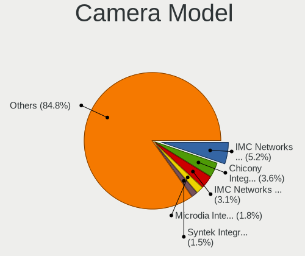

| Model                                                           | Computers | Percent |
|-----------------------------------------------------------------|-----------|---------|
| IMC Networks USB2.0 HD UVC WebCam                               | 25        | 4.73%   |
| Chicony Integrated Camera                                       | 14        | 2.65%   |
| Chicony HD WebCam                                               | 12        | 2.27%   |
| IMC Networks Integrated Camera                                  | 10        | 1.89%   |
| Chicony USB2.0 VGA UVC WebCam                                   | 8         | 1.51%   |
| Realtek Integrated_Webcam_HD                                    | 7         | 1.32%   |
| Realtek HP Truevision HD                                        | 7         | 1.32%   |
| Lite-On Integrated Camera                                       | 7         | 1.32%   |
| IMC Networks USB2.0 VGA UVC WebCam                              | 7         | 1.32%   |
| Chicony HP Wide Vision HD Camera                                | 7         | 1.32%   |
| Chicony EasyCamera                                              | 7         | 1.32%   |
| Cheng Uei Precision Industry (Foxlink) Webcam                   | 7         | 1.32%   |
| Apple iPhone 5/5C/5S/6/SE                                       | 7         | 1.32%   |
| Acer Integrated Camera                                          | 7         | 1.32%   |
| Suyin HP TrueVision HD                                          | 6         | 1.13%   |
| Lite-On HP Wide Vision HD Camera                                | 6         | 1.13%   |
| Generalplus GENERAL WEBCAM                                      | 6         | 1.13%   |
| Chicony HP Webcam                                               | 6         | 1.13%   |
| Cheng Uei Precision Industry (Foxlink) HP Wide Vision HD Camera | 6         | 1.13%   |
| Sunplus HP TrueVision HD Camera                                 | 5         | 0.95%   |
| Microdia Integrated_Webcam_HD                                   | 5         | 0.95%   |
| Microdia HP Webcam                                              | 5         | 0.95%   |
| Chicony HP Truevision HD camera                                 | 5         | 0.95%   |
| Chicony HP Truevision HD                                        | 5         | 0.95%   |
| Cheng Uei Precision Industry (Foxlink) HP Webcam                | 5         | 0.95%   |
| Cheng Uei Precision Industry (Foxlink) HP TrueVision HD Camera  | 5         | 0.95%   |
| Cheng Uei Precision Industry (Foxlink) HP Truevision HD         | 5         | 0.95%   |
| Syntek Integrated Camera                                        | 4         | 0.76%   |
| Sunplus Laptop Integrated WebCam HD                             | 4         | 0.76%   |
| Silicon Motion WebCam SCB-1100N                                 | 4         | 0.76%   |
| Realtek HP "Truevision HD" laptop camera                        | 4         | 0.76%   |
| Quanta HP TrueVision HD Camera                                  | 4         | 0.76%   |
| Quanta HD User Facing                                           | 4         | 0.76%   |
| Logitech C922 Pro Stream Webcam                                 | 4         | 0.76%   |
| Chicony VGA Webcam                                              | 4         | 0.76%   |
| Chicony HP HD Camera                                            | 4         | 0.76%   |
| Acer EasyCamera                                                 | 4         | 0.76%   |
| Suyin Acer/HP Integrated Webcam [CN0314]                        | 3         | 0.57%   |
| Suyin 1.3M WebCam (notebook emachines E730, Acer sub-brand)     | 3         | 0.57%   |
| Sunplus Integrated_Webcam_HD                                    | 3         | 0.57%   |

Security
--------

Fingerprint Vendor
------------------

Fingerprint sensor vendors

| Vendor                     | Computers | Percent |
|----------------------------|-----------|---------|
| Validity Sensors           | 31        | 42.47%  |
| Synaptics                  | 18        | 24.66%  |
| Shenzhen Goodix Technology | 6         | 8.22%   |
| Elan Microelectronics      | 5         | 6.85%   |
| AuthenTec                  | 5         | 6.85%   |
| Upek                       | 3         | 4.11%   |
| STMicroelectronics         | 2         | 2.74%   |
| LighTuning Technology      | 2         | 2.74%   |
| Focal-systems.Corp         | 1         | 1.37%   |

Fingerprint Model
-----------------

Fingerprint sensor models

| Model                                                                      | Computers | Percent |
|----------------------------------------------------------------------------|-----------|---------|
| Validity Sensors Swipe Fingerprint Sensor                                  | 7         | 9.59%   |
| Validity Sensors VFS 5011 fingerprint sensor                               | 6         | 8.22%   |
| Synaptics Prometheus MIS Touch Fingerprint Reader                          | 6         | 8.22%   |
| Validity Sensors VFS495 Fingerprint Reader                                 | 4         | 5.48%   |
| Validity Sensors VFS471 Fingerprint Reader                                 | 4         | 5.48%   |
| Shenzhen Goodix  FingerPrint Device                                        | 4         | 5.48%   |
| Validity Sensors Synaptics WBDI                                            | 3         | 4.11%   |
| Upek Biometric Touchchip/Touchstrip Fingerprint Sensor                     | 3         | 4.11%   |
| Synaptics  WBDI                                                            | 3         | 4.11%   |
| Synaptics  VFS7552 Touch Fingerprint Sensor with PurePrint                 | 3         | 4.11%   |
| Synaptics Metallica MIS Touch Fingerprint Reader                           | 3         | 4.11%   |
| Elan ELAN:ARM-M4                                                           | 3         | 4.11%   |
| AuthenTec AES2810                                                          | 3         | 4.11%   |
| Validity Sensors Synaptics VFS7552 Touch Fingerprint Sensor with PurePrint | 2         | 2.74%   |
| Validity Sensors Fingerprint scanner                                       | 2         | 2.74%   |
| STMicroelectronics Fingerprint Reader                                      | 2         | 2.74%   |
| Shenzhen Goodix Fingerprint Reader                                         | 2         | 2.74%   |
| LighTuning EgisTec Touch Fingerprint Sensor                                | 2         | 2.74%   |
| Elan ELAN:Fingerprint                                                      | 2         | 2.74%   |
| Unknown                                                                    | 2         | 2.74%   |
| Validity Sensors VFS7500 Touch Fingerprint Sensor                          | 1         | 1.37%   |
| Validity Sensors VFS491                                                    | 1         | 1.37%   |
| Validity Sensors VFS301 Fingerprint Reader                                 | 1         | 1.37%   |
| Synaptics  FS7604 Touch Fingerprint Sensor with PurePrint                  | 1         | 1.37%   |
| Focal-systems.Corp FT9201Fingerprint.                                      | 1         | 1.37%   |
| AuthenTec Fingerprint Sensor                                               | 1         | 1.37%   |
| AuthenTec AES1600                                                          | 1         | 1.37%   |

Chipcard Vendor
---------------

Chipcard module vendors

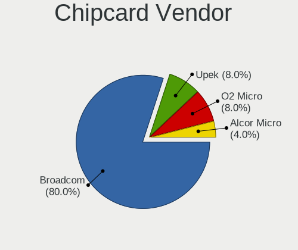

| Vendor   | Computers | Percent |
|----------|-----------|---------|
| Broadcom | 14        | 82.35%  |
| O2 Micro | 2         | 11.76%  |
| Upek     | 1         | 5.88%   |

Chipcard Model
--------------

Chipcard module models

| Model                                                                        | Computers | Percent |
|------------------------------------------------------------------------------|-----------|---------|
| Broadcom BCM5880 Secure Applications Processor                               | 5         | 29.41%  |
| Broadcom 5880                                                                | 5         | 29.41%  |
| Broadcom BCM5880 Secure Applications Processor with fingerprint swipe sensor | 3         | 17.65%  |
| Upek TouchChip Fingerprint Coprocessor (WBF advanced mode)                   | 1         | 5.88%   |
| O2 Micro Oz776 SmartCard Reader                                              | 1         | 5.88%   |
| O2 Micro OZ776 CCID Smartcard Reader                                         | 1         | 5.88%   |
| Broadcom 58200                                                               | 1         | 5.88%   |

Unsupported
-----------

Unsupported Devices
-------------------

Total unsupported devices on board

| Total | Computers | Percent |
|-------|-----------|---------|
| 0     | 516       | 71.37%  |
| 1     | 168       | 23.24%  |
| 2     | 34        | 4.7%    |
| 3     | 3         | 0.41%   |
| 5     | 1         | 0.14%   |
| 4     | 1         | 0.14%   |

Unsupported Device Types
------------------------

Types of unsupported devices

| Type                     | Computers | Percent |
|--------------------------|-----------|---------|
| Fingerprint reader       | 73        | 30.42%  |
| Graphics card            | 51        | 21.25%  |
| Net/wireless             | 39        | 16.25%  |
| Chipcard                 | 16        | 6.67%   |
| Multimedia controller    | 14        | 5.83%   |
| Bluetooth                | 13        | 5.42%   |
| Communication controller | 9         | 3.75%   |
| Unassigned class         | 6         | 2.5%    |
| Storage                  | 4         | 1.67%   |
| Camera                   | 4         | 1.67%   |
| Sound                    | 3         | 1.25%   |
| Net/ethernet             | 3         | 1.25%   |
| Network                  | 2         | 0.83%   |
| Card reader              | 2         | 0.83%   |
| Firewire controller      | 1         | 0.42%   |

