Linux in Chile - Tested Hardware & Statistics (Desktops)
--------------------------------------------------------

A project to collect tested hardware configurations for Linux in Chile.

Anyone can contribute to this report by the [hw-probe](https://github.com/linuxhw/hw-probe) tool:

    sudo -E hw-probe -all -upload

Please contribute! Especially if your hardware is rare.

Contents
--------

* [ Test Cases ](#test-cases)

* [ System ](#system)
  - [ OS                       ](#os)
  - [ OS Family                ](#os-family)
  - [ Kernel                   ](#kernel)
  - [ Kernel Family            ](#kernel-family)
  - [ Kernel Major Ver.        ](#kernel-major-ver)
  - [ Arch                     ](#arch)
  - [ DE                       ](#de)
  - [ Display Server           ](#display-server)
  - [ Display Manager          ](#display-manager)
  - [ OS Lang                  ](#os-lang)
  - [ Boot Mode                ](#boot-mode)
  - [ Filesystem               ](#filesystem)
  - [ Part. scheme             ](#part-scheme)
  - [ Dual Boot with Linux/BSD ](#dual-boot-with-linuxbsd)
  - [ Dual Boot (Win)          ](#dual-boot-win)

* [ Board ](#board)
  - [ Vendor                   ](#vendor)
  - [ Model                    ](#model)
  - [ Model Family             ](#model-family)
  - [ MFG Year                 ](#mfg-year)
  - [ Form Factor              ](#form-factor)
  - [ Secure Boot              ](#secure-boot)
  - [ Coreboot                 ](#coreboot)
  - [ RAM Size                 ](#ram-size)
  - [ RAM Used                 ](#ram-used)
  - [ Total Drives             ](#total-drives)
  - [ Has CD-ROM               ](#has-cd-rom)
  - [ Has Ethernet             ](#has-ethernet)
  - [ Has WiFi                 ](#has-wifi)
  - [ Has Bluetooth            ](#has-bluetooth)

* [ Location ](#location)
  - [ Country                  ](#country)
  - [ City                     ](#city)

* [ Drives ](#drives)
  - [ Drive Vendor             ](#drive-vendor)
  - [ Drive Model              ](#drive-model)
  - [ HDD Vendor               ](#hdd-vendor)
  - [ SSD Vendor               ](#ssd-vendor)
  - [ Drive Kind               ](#drive-kind)
  - [ Drive Connector          ](#drive-connector)
  - [ Drive Size               ](#drive-size)
  - [ Space Total              ](#space-total)
  - [ Space Used               ](#space-used)
  - [ Malfunc. Drives          ](#malfunc-drives)
  - [ Malfunc. Drive Vendor    ](#malfunc-drive-vendor)
  - [ Malfunc. HDD Vendor      ](#malfunc-hdd-vendor)
  - [ Malfunc. Drive Kind      ](#malfunc-drive-kind)
  - [ Failed Drives            ](#failed-drives)
  - [ Failed Drive Vendor      ](#failed-drive-vendor)
  - [ Drive Status             ](#drive-status)

* [ Storage controller ](#storage-controller)
  - [ Storage Vendor           ](#storage-vendor)
  - [ Storage Model            ](#storage-model)
  - [ Storage Kind             ](#storage-kind)

* [ Processor ](#processor)
  - [ CPU Vendor               ](#cpu-vendor)
  - [ CPU Model                ](#cpu-model)
  - [ CPU Model Family         ](#cpu-model-family)
  - [ CPU Cores                ](#cpu-cores)
  - [ CPU Sockets              ](#cpu-sockets)
  - [ CPU Threads              ](#cpu-threads)
  - [ CPU Op-Modes             ](#cpu-op-modes)
  - [ CPU Microcode            ](#cpu-microcode)
  - [ CPU Microarch            ](#cpu-microarch)

* [ Graphics ](#graphics)
  - [ GPU Vendor               ](#gpu-vendor)
  - [ GPU Model                ](#gpu-model)
  - [ GPU Combo                ](#gpu-combo)
  - [ GPU Driver               ](#gpu-driver)
  - [ GPU Memory               ](#gpu-memory)

* [ Monitor ](#monitor)
  - [ Monitor Vendor           ](#monitor-vendor)
  - [ Monitor Model            ](#monitor-model)
  - [ Monitor Resolution       ](#monitor-resolution)
  - [ Monitor Diagonal         ](#monitor-diagonal)
  - [ Monitor Width            ](#monitor-width)
  - [ Aspect Ratio             ](#aspect-ratio)
  - [ Monitor Area             ](#monitor-area)
  - [ Pixel Density            ](#pixel-density)
  - [ Multiple Monitors        ](#multiple-monitors)

* [ Network ](#network)
  - [ Net Controller Vendor    ](#net-controller-vendor)
  - [ Net Controller Model     ](#net-controller-model)
  - [ Wireless Vendor          ](#wireless-vendor)
  - [ Wireless Model           ](#wireless-model)
  - [ Ethernet Vendor          ](#ethernet-vendor)
  - [ Ethernet Model           ](#ethernet-model)
  - [ Net Controller Kind      ](#net-controller-kind)
  - [ Used Controller          ](#used-controller)
  - [ NICs                     ](#nics)
  - [ IPv6                     ](#ipv6)

* [ Bluetooth ](#bluetooth)
  - [ Bluetooth Vendor         ](#bluetooth-vendor)
  - [ Bluetooth Model          ](#bluetooth-model)

* [ Sound ](#sound)
  - [ Sound Vendor             ](#sound-vendor)
  - [ Sound Model              ](#sound-model)

* [ Memory ](#memory)
  - [ Memory Vendor            ](#memory-vendor)
  - [ Memory Model             ](#memory-model)
  - [ Memory Kind              ](#memory-kind)
  - [ Memory Form Factor       ](#memory-form-factor)
  - [ Memory Size              ](#memory-size)
  - [ Memory Speed             ](#memory-speed)

* [ Printers & scanners ](#printers--scanners)
  - [ Printer Vendor           ](#printer-vendor)
  - [ Printer Model            ](#printer-model)
  - [ Scanner Vendor           ](#scanner-vendor)
  - [ Scanner Model            ](#scanner-model)

* [ Camera ](#camera)
  - [ Camera Vendor            ](#camera-vendor)
  - [ Camera Model             ](#camera-model)

* [ Security ](#security)
  - [ Fingerprint Vendor       ](#fingerprint-vendor)
  - [ Fingerprint Model        ](#fingerprint-model)
  - [ Chipcard Vendor          ](#chipcard-vendor)
  - [ Chipcard Model           ](#chipcard-model)

* [ Unsupported ](#unsupported)
  - [ Unsupported Devices      ](#unsupported-devices)
  - [ Unsupported Device Types ](#unsupported-device-types)

Test Cases
----------

Total: 265

| Vendor        | Model                       | Probe                                                      | Date         |
|---------------|-----------------------------|------------------------------------------------------------|--------------|
| MACHINIST     | X79 V2.82H                  | [29694e2098](https://linux-hardware.org/?probe=29694e2098) | Jul 29, 2022 |
| Intel         | D54250WYK H13922-303        | [71b03b93a2](https://linux-hardware.org/?probe=71b03b93a2) | Jul 27, 2022 |
| Olidata       | Unknown                     | [ac7a530d9d](https://linux-hardware.org/?probe=ac7a530d9d) | Jul 19, 2022 |
| Gigabyte      | H410M H                     | [8a0a0ed167](https://linux-hardware.org/?probe=8a0a0ed167) | Jul 16, 2022 |
| Gigabyte      | H410M H                     | [e94723280f](https://linux-hardware.org/?probe=e94723280f) | Jul 16, 2022 |
| MSI           | A320M-A PRO MAX             | [31127e76f8](https://linux-hardware.org/?probe=31127e76f8) | Jul 14, 2022 |
| MSI           | A320M-A PRO MAX             | [ed83060c1a](https://linux-hardware.org/?probe=ed83060c1a) | Jul 13, 2022 |
| ASUSTek       | TUF Gaming X570-PLUS        | [0c96551a28](https://linux-hardware.org/?probe=0c96551a28) | Jul 09, 2022 |
| MSI           | B350 GAMING PLUS            | [de014d917d](https://linux-hardware.org/?probe=de014d917d) | Jul 05, 2022 |
| BESSTAR Te... | UM700                       | [5dc08ee2d7](https://linux-hardware.org/?probe=5dc08ee2d7) | Jun 22, 2022 |
| MSI           | MPG X570S EDGE MAX WIFI     | [f5d7a0bba4](https://linux-hardware.org/?probe=f5d7a0bba4) | Jun 17, 2022 |
| BESSTAR Te... | UM700                       | [d0c247db91](https://linux-hardware.org/?probe=d0c247db91) | Jun 17, 2022 |
| MSI           | B350 PC MATE                | [baf792ad50](https://linux-hardware.org/?probe=baf792ad50) | Jun 12, 2022 |
| Lenovo        | SHARKBAY SDK0E50510 WIN     | [576c9acdaa](https://linux-hardware.org/?probe=576c9acdaa) | Jun 08, 2022 |
| Intel         | DH61BF AAG81311-101         | [b1fe95fd93](https://linux-hardware.org/?probe=b1fe95fd93) | May 31, 2022 |
| ECS           | MCP61M-M3                   | [b785b68657](https://linux-hardware.org/?probe=b785b68657) | May 29, 2022 |
| ASUSTek       | PRIME A320M-K               | [b7b419d941](https://linux-hardware.org/?probe=b7b419d941) | May 28, 2022 |
| ASUSTek       | TUF Gaming X570-PLUS        | [713dcb3d05](https://linux-hardware.org/?probe=713dcb3d05) | May 17, 2022 |
| HP            | 2ADE                        | [77c2ea750b](https://linux-hardware.org/?probe=77c2ea750b) | May 17, 2022 |
| ASUSTek       | TUF Gaming X570-PLUS        | [f2f965ba56](https://linux-hardware.org/?probe=f2f965ba56) | May 13, 2022 |
| ASUSTek       | Maximus VI EXTREME          | [21e4e874a2](https://linux-hardware.org/?probe=21e4e874a2) | May 06, 2022 |
| ASUSTek       | Maximus VI EXTREME          | [37e77cbfe5](https://linux-hardware.org/?probe=37e77cbfe5) | May 06, 2022 |
| MSI           | B250M GAMING PRO            | [cd1e81afae](https://linux-hardware.org/?probe=cd1e81afae) | May 03, 2022 |
| MSI           | B250M GAMING PRO            | [bf6d6784ab](https://linux-hardware.org/?probe=bf6d6784ab) | May 03, 2022 |
| MSI           | B450M BAZOOKA               | [a913401ce9](https://linux-hardware.org/?probe=a913401ce9) | May 02, 2022 |
| MSI           | B450M BAZOOKA               | [726be8a4f1](https://linux-hardware.org/?probe=726be8a4f1) | May 02, 2022 |
| ASUSTek       | H110M-R                     | [0fa0b3d5f4](https://linux-hardware.org/?probe=0fa0b3d5f4) | May 01, 2022 |
| MSI           | H110M PRO-VH PLUS           | [876baf36d7](https://linux-hardware.org/?probe=876baf36d7) | Apr 29, 2022 |
| Intel         | DH61BF AAG81311-101         | [f40f12b9be](https://linux-hardware.org/?probe=f40f12b9be) | Apr 27, 2022 |
| Gigabyte      | B550 AORUS ELITE V2         | [cb4bc274b3](https://linux-hardware.org/?probe=cb4bc274b3) | Apr 21, 2022 |
| ASUSTek       | M5A78L-M PLUS/USB3          | [79eb10a5ef](https://linux-hardware.org/?probe=79eb10a5ef) | Apr 19, 2022 |
| MSI           | H81M-E33                    | [ff9197cd63](https://linux-hardware.org/?probe=ff9197cd63) | Apr 17, 2022 |
| ASUSTek       | PRIME A320M-K               | [7d0cde0bcd](https://linux-hardware.org/?probe=7d0cde0bcd) | Apr 13, 2022 |
| MSI           | B350 TOMAHAWK               | [f531f62c1b](https://linux-hardware.org/?probe=f531f62c1b) | Apr 03, 2022 |
| HP            | 1998                        | [13b901f36a](https://linux-hardware.org/?probe=13b901f36a) | Mar 29, 2022 |
| ASUSTek       | PRIME B450M-A               | [4a8c48df20](https://linux-hardware.org/?probe=4a8c48df20) | Mar 28, 2022 |
| ASUSTek       | PRIME H410M-E               | [e02f2032f1](https://linux-hardware.org/?probe=e02f2032f1) | Mar 28, 2022 |
| ASUSTek       | TUF Gaming X570-PLUS        | [9183654349](https://linux-hardware.org/?probe=9183654349) | Mar 22, 2022 |
| ASUSTek       | SABERTOOTH 990FX R2.0       | [539ebb7dd9](https://linux-hardware.org/?probe=539ebb7dd9) | Mar 15, 2022 |
| ASUSTek       | PRIME H410M-E               | [671a3fc70b](https://linux-hardware.org/?probe=671a3fc70b) | Mar 12, 2022 |
| ASUSTek       | SABERTOOTH 990FX R2.0       | [332a3f936b](https://linux-hardware.org/?probe=332a3f936b) | Feb 28, 2022 |
| ASUSTek       | B85-PRO GAMER               | [3f97cefeb4](https://linux-hardware.org/?probe=3f97cefeb4) | Feb 26, 2022 |
| Dell          | 0CT017                      | [27a31fcb1b](https://linux-hardware.org/?probe=27a31fcb1b) | Feb 17, 2022 |
| Gigabyte      | B450M DS3H V2               | [824518037a](https://linux-hardware.org/?probe=824518037a) | Feb 10, 2022 |
| Pegatron      | 2ACB                        | [b7987fdaa7](https://linux-hardware.org/?probe=b7987fdaa7) | Feb 10, 2022 |
| Gigabyte      | B560M DS3H                  | [3c0ad9ce1b](https://linux-hardware.org/?probe=3c0ad9ce1b) | Feb 08, 2022 |
| MSI           | H310M GAMING ARCTIC         | [842ee88335](https://linux-hardware.org/?probe=842ee88335) | Jan 26, 2022 |
| MSI           | B85M-E33 V2                 | [ef65c0c144](https://linux-hardware.org/?probe=ef65c0c144) | Jan 05, 2022 |
| ASRock        | B550 Steel Legend           | [8107f2613f](https://linux-hardware.org/?probe=8107f2613f) | Jan 05, 2022 |
| ASRock        | B550 Steel Legend           | [704e9c09ad](https://linux-hardware.org/?probe=704e9c09ad) | Jan 05, 2022 |
| MSI           | H310M PRO-VDH PLUS          | [2e00250378](https://linux-hardware.org/?probe=2e00250378) | Dec 16, 2021 |
| ASUSTek       | AM1M-A                      | [5113655631](https://linux-hardware.org/?probe=5113655631) | Dec 14, 2021 |
| ASUSTek       | PRIME A320M-K               | [fc49eed81d](https://linux-hardware.org/?probe=fc49eed81d) | Dec 09, 2021 |
| MSI           | 3664h                       | [c4bc6c8049](https://linux-hardware.org/?probe=c4bc6c8049) | Nov 29, 2021 |
| ASUSTek       | PRIME Z590-P                | [6490a6beba](https://linux-hardware.org/?probe=6490a6beba) | Nov 29, 2021 |
| MSI           | B450 TOMAHAWK MAX II        | [e9b3a62560](https://linux-hardware.org/?probe=e9b3a62560) | Nov 26, 2021 |
| ASUSTek       | PRIME X570-PRO              | [93e8bc8935](https://linux-hardware.org/?probe=93e8bc8935) | Nov 24, 2021 |
| HP            | 2215                        | [4e65fa6078](https://linux-hardware.org/?probe=4e65fa6078) | Nov 09, 2021 |
| MSI           | B365M PRO-VH                | [c2976ad59c](https://linux-hardware.org/?probe=c2976ad59c) | Nov 03, 2021 |
| ASUSTek       | TUF Gaming X570-PLUS        | [3f67c7622c](https://linux-hardware.org/?probe=3f67c7622c) | Oct 22, 2021 |
| MSI           | B460M PRO-VDH WIFI          | [76071ec77b](https://linux-hardware.org/?probe=76071ec77b) | Oct 19, 2021 |
| Nvidia        | NF-MCP61                    | [666f204c08](https://linux-hardware.org/?probe=666f204c08) | Oct 18, 2021 |
| MSI           | B450 TOMAHAWK MAX II        | [8f7c7a493b](https://linux-hardware.org/?probe=8f7c7a493b) | Oct 16, 2021 |
| ASUSTek       | PRIME Z590-P                | [36e45017ff](https://linux-hardware.org/?probe=36e45017ff) | Oct 14, 2021 |
| ASUSTek       | PRIME Z590-P                | [36d8e83f29](https://linux-hardware.org/?probe=36d8e83f29) | Oct 11, 2021 |
| Intel         | DG41WV AAE90316-103         | [0055a963ef](https://linux-hardware.org/?probe=0055a963ef) | Sep 30, 2021 |
| Gigabyte      | A520M DS3H                  | [228b36fb26](https://linux-hardware.org/?probe=228b36fb26) | Sep 28, 2021 |
| ASUSTek       | P8H61-M LX                  | [7360f8d859](https://linux-hardware.org/?probe=7360f8d859) | Sep 23, 2021 |
| Huanan        | X79 249PC V2.3              | [feb9cf5a3f](https://linux-hardware.org/?probe=feb9cf5a3f) | Sep 20, 2021 |
| Huanan        | X79 249PC V2.3              | [0025ab8888](https://linux-hardware.org/?probe=0025ab8888) | Sep 20, 2021 |
| ASUSTek       | TUF Gaming X570-PLUS        | [99773cf00e](https://linux-hardware.org/?probe=99773cf00e) | Sep 19, 2021 |
| ASRock        | Z490 Phantom Gaming 4G      | [7857ce2ffa](https://linux-hardware.org/?probe=7857ce2ffa) | Sep 16, 2021 |
| ASUSTek       | B85M-E                      | [27a6448b5e](https://linux-hardware.org/?probe=27a6448b5e) | Sep 12, 2021 |
| HC            | HCAR357-MI V1.0             | [e2df45f5f6](https://linux-hardware.org/?probe=e2df45f5f6) | Sep 12, 2021 |
| Intel         | X79M-S                      | [95d22f6e90](https://linux-hardware.org/?probe=95d22f6e90) | Sep 11, 2021 |
| ASUSTek       | B85M-E                      | [36685ad5ea](https://linux-hardware.org/?probe=36685ad5ea) | Sep 11, 2021 |
| HP            | 339A                        | [ae80063e20](https://linux-hardware.org/?probe=ae80063e20) | Sep 07, 2021 |
| HC            | HCAR357-MI V1.0             | [14536c9a37](https://linux-hardware.org/?probe=14536c9a37) | Sep 06, 2021 |
| Intel         | X79M-S                      | [e45160873d](https://linux-hardware.org/?probe=e45160873d) | Sep 06, 2021 |
| HP            | 339A                        | [ceb91782c2](https://linux-hardware.org/?probe=ceb91782c2) | Sep 05, 2021 |
| HC            | HCAR357-MI V1.0             | [3697a37403](https://linux-hardware.org/?probe=3697a37403) | Sep 04, 2021 |
| HC            | HCAR357-MI V1.0             | [e4d2306204](https://linux-hardware.org/?probe=e4d2306204) | Sep 04, 2021 |
| HP            | 339A                        | [2c96fd74fb](https://linux-hardware.org/?probe=2c96fd74fb) | Sep 04, 2021 |
| HP            | 339A                        | [5a5ab8d1c2](https://linux-hardware.org/?probe=5a5ab8d1c2) | Aug 31, 2021 |
| HP            | 339A                        | [c0043e4c4c](https://linux-hardware.org/?probe=c0043e4c4c) | Aug 31, 2021 |
| ASUSTek       | TUF Gaming B460M-PLUS       | [190ef257e8](https://linux-hardware.org/?probe=190ef257e8) | Aug 30, 2021 |
| MSI           | MPG B550 GAMING CARBON W... | [f6049274c5](https://linux-hardware.org/?probe=f6049274c5) | Aug 27, 2021 |
| Gigabyte      | H97M-D3H                    | [a2afd00e64](https://linux-hardware.org/?probe=a2afd00e64) | Aug 26, 2021 |
| Dell          | 0GDG8Y A00                  | [2a0bf4d1a9](https://linux-hardware.org/?probe=2a0bf4d1a9) | Aug 21, 2021 |
| ASUSTek       | TUF Gaming B460M-PLUS       | [0eb2abca1d](https://linux-hardware.org/?probe=0eb2abca1d) | Aug 18, 2021 |
| Gigabyte      | B450M DS3H V2               | [9c25f25e8f](https://linux-hardware.org/?probe=9c25f25e8f) | Aug 16, 2021 |
| Pegatron      | 2ADC                        | [48cc7f548e](https://linux-hardware.org/?probe=48cc7f548e) | Aug 13, 2021 |
| MSI           | B75MA-E33                   | [8a1743cb75](https://linux-hardware.org/?probe=8a1743cb75) | Aug 10, 2021 |
| ASUSTek       | TUF Gaming B450M-PLUS II    | [482c64a9c9](https://linux-hardware.org/?probe=482c64a9c9) | Aug 03, 2021 |
| ASUSTek       | PRIME B450M-A               | [7b213037a5](https://linux-hardware.org/?probe=7b213037a5) | Jul 31, 2021 |
| Lenovo        | SHARKBAY SDK0E50510 WIN     | [60b58b4557](https://linux-hardware.org/?probe=60b58b4557) | Jul 28, 2021 |
| ASUSTek       | PRIME H410M-E               | [cae2419e98](https://linux-hardware.org/?probe=cae2419e98) | Jul 25, 2021 |
| MSI           | 3664h                       | [491117f46c](https://linux-hardware.org/?probe=491117f46c) | Jul 25, 2021 |
| MSI           | 3664h                       | [c9f3c48709](https://linux-hardware.org/?probe=c9f3c48709) | Jul 24, 2021 |
| ASUSTek       | PRIME B450M-A               | [abea66177f](https://linux-hardware.org/?probe=abea66177f) | Jul 20, 2021 |
| MSI           | H81M-E33                    | [f56f54e2fa](https://linux-hardware.org/?probe=f56f54e2fa) | Jul 18, 2021 |
| ASUSTek       | PRIME X570-P                | [783a5cafc2](https://linux-hardware.org/?probe=783a5cafc2) | Jul 18, 2021 |
| eMachines     | EL1352                      | [83c494c15a](https://linux-hardware.org/?probe=83c494c15a) | Jul 17, 2021 |
| R-StyleCom... | ALICON AI2S-A21 00.69       | [85a8017eaf](https://linux-hardware.org/?probe=85a8017eaf) | Jul 15, 2021 |
| Lenovo        | SHARKBAY SDK0E50510 WIN     | [5320824c78](https://linux-hardware.org/?probe=5320824c78) | Jul 11, 2021 |
| Dell          | 0Y5DDC A00                  | [1888baa539](https://linux-hardware.org/?probe=1888baa539) | Jul 06, 2021 |
| ASUSTek       | TUF Gaming X570-PLUS        | [a87404851f](https://linux-hardware.org/?probe=a87404851f) | Jul 01, 2021 |
| MSI           | A75MA-G55                   | [3611191f22](https://linux-hardware.org/?probe=3611191f22) | Jun 30, 2021 |
| Intel         | X79 V2.72B                  | [c78b66e96e](https://linux-hardware.org/?probe=c78b66e96e) | Jun 25, 2021 |
| ASUSTek       | TUF Gaming X570-PLUS        | [aa0efa1872](https://linux-hardware.org/?probe=aa0efa1872) | Jun 19, 2021 |
| Unknown       | Intel X79                   | [5be1e4c74c](https://linux-hardware.org/?probe=5be1e4c74c) | Jun 18, 2021 |
| ASUSTek       | TUF Gaming X570-PLUS        | [033cd8c9eb](https://linux-hardware.org/?probe=033cd8c9eb) | Jun 17, 2021 |
| Gigabyte      | B450 AORUS PRO WIFI-CF      | [8bb06ce851](https://linux-hardware.org/?probe=8bb06ce851) | Jun 16, 2021 |
| MSI           | 970A-G46                    | [f7b1001ef1](https://linux-hardware.org/?probe=f7b1001ef1) | Jun 13, 2021 |
| Intel         | DZ77GA-70K AAG39009-401     | [a88c5c7685](https://linux-hardware.org/?probe=a88c5c7685) | Jun 09, 2021 |
| ASUSTek       | PRIME X570-P                | [587e4453b3](https://linux-hardware.org/?probe=587e4453b3) | Jun 04, 2021 |
| ASUSTek       | ROG STRIX X570-F GAMING     | [86060380c8](https://linux-hardware.org/?probe=86060380c8) | May 23, 2021 |
| ASUSTek       | P5K3 Deluxe                 | [458525ba70](https://linux-hardware.org/?probe=458525ba70) | May 22, 2021 |
| ASUSTek       | ROG STRIX B550-E GAMING     | [0be7d156c5](https://linux-hardware.org/?probe=0be7d156c5) | May 17, 2021 |
| ASUSTek       | ROG STRIX B550-E GAMING     | [493edc40c4](https://linux-hardware.org/?probe=493edc40c4) | May 15, 2021 |
| Intel         | YL-3160L2                   | [c282d94246](https://linux-hardware.org/?probe=c282d94246) | May 13, 2021 |
| Lenovo        | ThinkCentre M55 8808E19     | [a53c13a5c9](https://linux-hardware.org/?probe=a53c13a5c9) | May 12, 2021 |
| MSI           | X58 PLATINUM SLI            | [1fba25dbcf](https://linux-hardware.org/?probe=1fba25dbcf) | May 12, 2021 |
| MSI           | X58 PLATINUM SLI            | [c71715672c](https://linux-hardware.org/?probe=c71715672c) | May 12, 2021 |
| Olidata       | Unknown                     | [1dc7094a4d](https://linux-hardware.org/?probe=1dc7094a4d) | May 09, 2021 |
| HP            | 339A                        | [c103096e94](https://linux-hardware.org/?probe=c103096e94) | May 09, 2021 |
| HP            | 339A                        | [1b94801e8b](https://linux-hardware.org/?probe=1b94801e8b) | May 09, 2021 |
| Olidata       | Unknown                     | [0c2f6b27a9](https://linux-hardware.org/?probe=0c2f6b27a9) | May 08, 2021 |
| MSI           | H81M-E33                    | [47447aaec1](https://linux-hardware.org/?probe=47447aaec1) | May 05, 2021 |
| MSI           | MPG B550 GAMING CARBON W... | [ef811a6184](https://linux-hardware.org/?probe=ef811a6184) | May 01, 2021 |
| Gigabyte      | B450M GAMING                | [8ed2b2284e](https://linux-hardware.org/?probe=8ed2b2284e) | Apr 24, 2021 |
| ASUSTek       | P5K SE                      | [73a2ad1fd9](https://linux-hardware.org/?probe=73a2ad1fd9) | Apr 18, 2021 |
| ECS           | MCP61M-M3                   | [2e5b21af19](https://linux-hardware.org/?probe=2e5b21af19) | Apr 17, 2021 |
| MSI           | H81M-E33                    | [a5ebd5e702](https://linux-hardware.org/?probe=a5ebd5e702) | Apr 13, 2021 |
| Unknown       | Unknown                     | [a13b6fcbcd](https://linux-hardware.org/?probe=a13b6fcbcd) | Apr 12, 2021 |
| ASUSTek       | PRIME J4005I-C              | [5a1bc2f8fe](https://linux-hardware.org/?probe=5a1bc2f8fe) | Apr 10, 2021 |
| ASUSTek       | PRIME J4005I-C              | [79f36c06be](https://linux-hardware.org/?probe=79f36c06be) | Apr 09, 2021 |
| ASUSTek       | PRIME B450M-A               | [8e2a8be8ce](https://linux-hardware.org/?probe=8e2a8be8ce) | Apr 06, 2021 |
| Foxconn       | G31MV/G31MV-K FAB           | [18047eb612](https://linux-hardware.org/?probe=18047eb612) | Apr 01, 2021 |
| ASUSTek       | P5K SE                      | [fb06c3aee0](https://linux-hardware.org/?probe=fb06c3aee0) | Mar 31, 2021 |
| ASUSTek       | P5K SE                      | [22e69da73a](https://linux-hardware.org/?probe=22e69da73a) | Mar 30, 2021 |
| MSI           | 970A-G46                    | [09083497aa](https://linux-hardware.org/?probe=09083497aa) | Mar 26, 2021 |
| MSI           | 970A-G46                    | [dfb535cf31](https://linux-hardware.org/?probe=dfb535cf31) | Mar 26, 2021 |
| HP            | 18E9                        | [db74abc8b8](https://linux-hardware.org/?probe=db74abc8b8) | Mar 23, 2021 |
| HP            | 18E9                        | [13bfb17279](https://linux-hardware.org/?probe=13bfb17279) | Mar 23, 2021 |
| HP            | ProLiant ML10               | [1b448e4a71](https://linux-hardware.org/?probe=1b448e4a71) | Mar 23, 2021 |
| HP            | ProLiant ML10               | [cd6b0c3826](https://linux-hardware.org/?probe=cd6b0c3826) | Mar 22, 2021 |
| ASUSTek       | H110M-D                     | [da2dd5ad1a](https://linux-hardware.org/?probe=da2dd5ad1a) | Mar 15, 2021 |
| ECS           | A740GM-M                    | [442aa41981](https://linux-hardware.org/?probe=442aa41981) | Mar 08, 2021 |
| Intel         | X79 V1.x                    | [2b98f9b956](https://linux-hardware.org/?probe=2b98f9b956) | Mar 08, 2021 |
| Gigabyte      | 970A-DS3P                   | [000cba3fb5](https://linux-hardware.org/?probe=000cba3fb5) | Feb 28, 2021 |
| ASUSTek       | M5A97 R2.0                  | [485a4f1e98](https://linux-hardware.org/?probe=485a4f1e98) | Feb 25, 2021 |
| Unknown       | AD12-B                      | [8167d089b9](https://linux-hardware.org/?probe=8167d089b9) | Feb 20, 2021 |
| MSI           | MS-7267                     | [79cfa785c3](https://linux-hardware.org/?probe=79cfa785c3) | Feb 16, 2021 |
| MSI           | MS-7267                     | [9677e2392c](https://linux-hardware.org/?probe=9677e2392c) | Feb 16, 2021 |
| Dell          | 0CRH6C A01                  | [31da132ae8](https://linux-hardware.org/?probe=31da132ae8) | Feb 08, 2021 |
| Dell          | 0CRH6C A01                  | [8e9e7ffea0](https://linux-hardware.org/?probe=8e9e7ffea0) | Feb 08, 2021 |
| Unknown       | AD12-B                      | [6635cbda4d](https://linux-hardware.org/?probe=6635cbda4d) | Feb 06, 2021 |
| Unknown       | AD12-B                      | [05ad299f0e](https://linux-hardware.org/?probe=05ad299f0e) | Feb 06, 2021 |
| Gigabyte      | X570 AORUS PRO WIFI         | [121e3e7d2d](https://linux-hardware.org/?probe=121e3e7d2d) | Feb 02, 2021 |
| HP            | 2ADE                        | [2ee5093250](https://linux-hardware.org/?probe=2ee5093250) | Feb 02, 2021 |
| ECS           | MCP61M-M3                   | [445f06dbde](https://linux-hardware.org/?probe=445f06dbde) | Jan 29, 2021 |
| ASUSTek       | PRIME B450M-A               | [1a8312f66a](https://linux-hardware.org/?probe=1a8312f66a) | Jan 29, 2021 |
| ASUSTek       | PRIME B450M-A               | [b024bfc145](https://linux-hardware.org/?probe=b024bfc145) | Jan 29, 2021 |
| Intel         | SHARKBAY                    | [c1df3dc860](https://linux-hardware.org/?probe=c1df3dc860) | Jan 21, 2021 |
| IBM           | 813311S                     | [c65634928d](https://linux-hardware.org/?probe=c65634928d) | Jan 20, 2021 |
| IBM           | 813311S                     | [9dc5e1fd39](https://linux-hardware.org/?probe=9dc5e1fd39) | Jan 19, 2021 |
| Huanan        | X79 VAA1                    | [d88d20e6fc](https://linux-hardware.org/?probe=d88d20e6fc) | Jan 15, 2021 |
| MSI           | B360M PRO-VH                | [f666aa301e](https://linux-hardware.org/?probe=f666aa301e) | Jan 08, 2021 |
| Gigabyte      | B450 AORUS PRO WIFI-CF      | [fb8fa788e3](https://linux-hardware.org/?probe=fb8fa788e3) | Jan 07, 2021 |
| Gigabyte      | B450 AORUS PRO WIFI-CF      | [fb56fb77b9](https://linux-hardware.org/?probe=fb56fb77b9) | Jan 07, 2021 |
| ASUSTek       | M5A78L-M LX PLUS            | [74ccd1687d](https://linux-hardware.org/?probe=74ccd1687d) | Dec 24, 2020 |
| Gigabyte      | B450 AORUS PRO WIFI-CF      | [df5beb221f](https://linux-hardware.org/?probe=df5beb221f) | Nov 15, 2020 |
| Gigabyte      | H97-Gaming 3                | [2c19015153](https://linux-hardware.org/?probe=2c19015153) | Nov 05, 2020 |
| ECS           | A785GM-M                    | [fa61acdd56](https://linux-hardware.org/?probe=fa61acdd56) | Oct 30, 2020 |
| ASUSTek       | A68HM-PLUS                  | [e31a805419](https://linux-hardware.org/?probe=e31a805419) | Oct 24, 2020 |
| ASUSTek       | M5A99X EVO                  | [e2a0899961](https://linux-hardware.org/?probe=e2a0899961) | Oct 23, 2020 |
| ASUSTek       | A68HM-PLUS                  | [e1ac94acb7](https://linux-hardware.org/?probe=e1ac94acb7) | Oct 23, 2020 |
| Intel         | X99                         | [53e51e0b25](https://linux-hardware.org/?probe=53e51e0b25) | Oct 22, 2020 |
| Intel         | X99                         | [194038048f](https://linux-hardware.org/?probe=194038048f) | Oct 22, 2020 |
| MSI           | B75MA-E33                   | [1616dff15a](https://linux-hardware.org/?probe=1616dff15a) | Oct 04, 2020 |
| Intel         | DH55PJ AAE93812-301         | [f6a0fd4389](https://linux-hardware.org/?probe=f6a0fd4389) | Sep 30, 2020 |
| ASUSTek       | TUF B450M-PLUS GAMING       | [5e196929f0](https://linux-hardware.org/?probe=5e196929f0) | Sep 28, 2020 |
| ASUSTek       | F2A55-M LK2                 | [0ad4bcad78](https://linux-hardware.org/?probe=0ad4bcad78) | Sep 23, 2020 |
| HP            | 2ADE                        | [0ac3191171](https://linux-hardware.org/?probe=0ac3191171) | Sep 10, 2020 |
| HP            | 2ADE                        | [1cf059d943](https://linux-hardware.org/?probe=1cf059d943) | Sep 10, 2020 |
| MSI           | H61M-P20                    | [9eafb382df](https://linux-hardware.org/?probe=9eafb382df) | Aug 28, 2020 |
| HP            | 81C3                        | [d558ddad9e](https://linux-hardware.org/?probe=d558ddad9e) | Aug 22, 2020 |
| PCPartner     | G43-F71862                  | [6f7db25de0](https://linux-hardware.org/?probe=6f7db25de0) | Aug 12, 2020 |
| Colorful T... | C.Q1900M PRO V20            | [55195790be](https://linux-hardware.org/?probe=55195790be) | Aug 10, 2020 |
| AMI           | Cherry Trail CR             | [69e0a22aed](https://linux-hardware.org/?probe=69e0a22aed) | Aug 07, 2020 |
| Gigabyte      | H310M H x.x                 | [8067b679a3](https://linux-hardware.org/?probe=8067b679a3) | Aug 06, 2020 |
| MSI           | H61M-P20                    | [594f095da2](https://linux-hardware.org/?probe=594f095da2) | Aug 02, 2020 |
| Dell          | 0GDG8Y A00                  | [a1fb518075](https://linux-hardware.org/?probe=a1fb518075) | Jul 12, 2020 |
| Dell          | 0GDG8Y A00                  | [8bb25da515](https://linux-hardware.org/?probe=8bb25da515) | Jul 09, 2020 |
| ASRock        | B450M Pro4                  | [06da0a5ed7](https://linux-hardware.org/?probe=06da0a5ed7) | Jul 05, 2020 |
| ASUSTek       | TUF B450M-PLUS GAMING       | [4788e05f08](https://linux-hardware.org/?probe=4788e05f08) | Jul 01, 2020 |
| ASUSTek       | P5KPL-AM                    | [8b9bb2543f](https://linux-hardware.org/?probe=8b9bb2543f) | Jun 28, 2020 |
| ASUSTek       | M5A78L-M LX                 | [ee35b699fa](https://linux-hardware.org/?probe=ee35b699fa) | Jun 24, 2020 |
| Apple         | Mac-F42C88C8 Proto1         | [646f93ec3a](https://linux-hardware.org/?probe=646f93ec3a) | Jun 20, 2020 |
| Apple         | Mac-F42C88C8 Proto1         | [08ce018dd0](https://linux-hardware.org/?probe=08ce018dd0) | Jun 20, 2020 |
| MSI           | MS-7379                     | [b7f52ad261](https://linux-hardware.org/?probe=b7f52ad261) | Jun 18, 2020 |
| TPV-INVENT... | 2AC6 A01                    | [90725b3c8a](https://linux-hardware.org/?probe=90725b3c8a) | Jun 18, 2020 |
| Elo TouchS... | ESY1XDX                     | [64aded4262](https://linux-hardware.org/?probe=64aded4262) | Jun 09, 2020 |
| HP            | 0AA8h                       | [2f692488e5](https://linux-hardware.org/?probe=2f692488e5) | Jun 05, 2020 |
| HP            | 0AA8h                       | [1ee6fa5fb7](https://linux-hardware.org/?probe=1ee6fa5fb7) | Jun 03, 2020 |
| HP            | 0AA8h                       | [3226f7a8da](https://linux-hardware.org/?probe=3226f7a8da) | Jun 03, 2020 |
| Elo TouchS... | ESY1XDX                     | [467adf2413](https://linux-hardware.org/?probe=467adf2413) | Jun 01, 2020 |
| Gigabyte      | 970A-UD3P                   | [6661e20292](https://linux-hardware.org/?probe=6661e20292) | May 28, 2020 |
| Gigabyte      | GA-MA790FX-DS5              | [bc3ed232f3](https://linux-hardware.org/?probe=bc3ed232f3) | May 28, 2020 |
| Olidata       | Unknown                     | [4d13b52bae](https://linux-hardware.org/?probe=4d13b52bae) | May 23, 2020 |
| ASUSTek       | TUF X470-PLUS GAMING        | [f170547556](https://linux-hardware.org/?probe=f170547556) | May 16, 2020 |
| ASUSTek       | PRIME B350-PLUS             | [6f3a5a041d](https://linux-hardware.org/?probe=6f3a5a041d) | May 08, 2020 |
| Intel         | D54250WYK H13922-304        | [cc19077417](https://linux-hardware.org/?probe=cc19077417) | May 01, 2020 |
| ASUSTek       | TUF X470-PLUS GAMING        | [d6abc4c56c](https://linux-hardware.org/?probe=d6abc4c56c) | Apr 29, 2020 |
| ECS           | A740GM-M                    | [8af834c918](https://linux-hardware.org/?probe=8af834c918) | Apr 28, 2020 |
| Intel         | DN2820FYK H24582-204        | [77cf46ddde](https://linux-hardware.org/?probe=77cf46ddde) | Apr 06, 2020 |
| ECS           | A780GM-A                    | [3530b26663](https://linux-hardware.org/?probe=3530b26663) | Mar 30, 2020 |
| ASRock        | A320M-HDV R4.0              | [ab20239127](https://linux-hardware.org/?probe=ab20239127) | Feb 09, 2020 |
| ECS           | A960M-MV                    | [b5991a8181](https://linux-hardware.org/?probe=b5991a8181) | Jan 13, 2020 |
| Gigabyte      | G41MT-S2                    | [1b60792885](https://linux-hardware.org/?probe=1b60792885) | Nov 12, 2019 |
| ASUSTek       | M5A99X EVO                  | [a0de23ca8b](https://linux-hardware.org/?probe=a0de23ca8b) | Oct 21, 2019 |
| Intel         | DG31PR AAD97573-204         | [3ca8dab2bd](https://linux-hardware.org/?probe=3ca8dab2bd) | Oct 14, 2019 |
| ASUSTek       | H81M-A                      | [dbb29527ff](https://linux-hardware.org/?probe=dbb29527ff) | Oct 08, 2019 |
| ASUSTek       | H81M-A                      | [3337b6ddbf](https://linux-hardware.org/?probe=3337b6ddbf) | Oct 08, 2019 |
| ASUSTek       | F1A75-M LE                  | [711b77b300](https://linux-hardware.org/?probe=711b77b300) | Sep 28, 2019 |
| Lenovo        | SKYBAY SDK0J40705 WIN 34... | [e8a0b17de8](https://linux-hardware.org/?probe=e8a0b17de8) | Sep 13, 2019 |
| ASUSTek       | B75M-A                      | [58ec049231](https://linux-hardware.org/?probe=58ec049231) | Sep 04, 2019 |
| ASUSTek       | P5QC                        | [441e7f2005](https://linux-hardware.org/?probe=441e7f2005) | Aug 19, 2019 |
| ASUSTek       | P5QC                        | [68e31b6013](https://linux-hardware.org/?probe=68e31b6013) | Aug 19, 2019 |
| ASUSTek       | SABERTOOTH 990FX R2.0       | [017c004a48](https://linux-hardware.org/?probe=017c004a48) | Aug 12, 2019 |
| ASUSTek       | F1A55-M LX                  | [db521911e3](https://linux-hardware.org/?probe=db521911e3) | Aug 06, 2019 |
| ECS           | A960M-MV                    | [4a3c832524](https://linux-hardware.org/?probe=4a3c832524) | Aug 05, 2019 |
| Gigabyte      | Z87X-UD4H-CF                | [7875ecd5a5](https://linux-hardware.org/?probe=7875ecd5a5) | Jul 17, 2019 |
| MSI           | X399 SLI PLUS               | [db1a79ac69](https://linux-hardware.org/?probe=db1a79ac69) | Jun 29, 2019 |
| Gigabyte      | Z87X-UD4H-CF                | [dc8d42d5d1](https://linux-hardware.org/?probe=dc8d42d5d1) | Jun 15, 2019 |
| Gigabyte      | Z87X-UD4H-CF                | [b189962fa8](https://linux-hardware.org/?probe=b189962fa8) | Jun 14, 2019 |
| Gigabyte      | Z87X-UD4H-CF                | [3166cd0be4](https://linux-hardware.org/?probe=3166cd0be4) | Jun 14, 2019 |
| Gigabyte      | Z87X-UD4H-CF                | [b08781392f](https://linux-hardware.org/?probe=b08781392f) | Jun 13, 2019 |
| TPV-INVENT... | 2AC6 A01                    | [461345008c](https://linux-hardware.org/?probe=461345008c) | Jun 10, 2019 |
| TPV-INVENT... | 2AC6 A01                    | [4421365140](https://linux-hardware.org/?probe=4421365140) | Jun 10, 2019 |
| HP            | 0AA8h                       | [6d02866e6c](https://linux-hardware.org/?probe=6d02866e6c) | Jun 05, 2019 |
| Gigabyte      | Z77X-UD5H                   | [09ccaf8ccf](https://linux-hardware.org/?probe=09ccaf8ccf) | Jun 03, 2019 |
| MSI           | B250M GAMING PRO            | [a935e6e9c7](https://linux-hardware.org/?probe=a935e6e9c7) | May 27, 2019 |
| ASUSTek       | P6T DELUXE V2               | [d1f1be1b36](https://linux-hardware.org/?probe=d1f1be1b36) | May 24, 2019 |
| ASUSTek       | P6T DELUXE V2               | [77f0aad272](https://linux-hardware.org/?probe=77f0aad272) | May 24, 2019 |
| HP            | 0AA8h                       | [f2fbc75122](https://linux-hardware.org/?probe=f2fbc75122) | May 16, 2019 |
| MSI           | H61M-P31/W8                 | [915fd7548f](https://linux-hardware.org/?probe=915fd7548f) | May 13, 2019 |
| HP            | 0AA8h                       | [f0d1f05c8e](https://linux-hardware.org/?probe=f0d1f05c8e) | May 10, 2019 |
| ECS           | A780LM-M                    | [ca438dd2a7](https://linux-hardware.org/?probe=ca438dd2a7) | May 08, 2019 |
| Gigabyte      | A320M-S2H                   | [b4d5cdee78](https://linux-hardware.org/?probe=b4d5cdee78) | May 07, 2019 |
| Gigabyte      | EP45-DS3R                   | [8c9b60b665](https://linux-hardware.org/?probe=8c9b60b665) | May 01, 2019 |
| Dell          | 0GXM1W A02                  | [3841c32f4a](https://linux-hardware.org/?probe=3841c32f4a) | May 01, 2019 |
| Dell          | 0GXM1W A02                  | [e9c14efd74](https://linux-hardware.org/?probe=e9c14efd74) | Apr 30, 2019 |
| Pegatron      | 2AA1h                       | [df47c88db6](https://linux-hardware.org/?probe=df47c88db6) | Apr 23, 2019 |
| Pegatron      | 2AA1h                       | [70922676a8](https://linux-hardware.org/?probe=70922676a8) | Apr 23, 2019 |
| Pegatron      | 2AA1h                       | [07c7ac4546](https://linux-hardware.org/?probe=07c7ac4546) | Apr 23, 2019 |
| MSI           | A58M-E33                    | [987015c03b](https://linux-hardware.org/?probe=987015c03b) | Apr 18, 2019 |
| HP            | 0B4Ch D                     | [8dc7a1b1e8](https://linux-hardware.org/?probe=8dc7a1b1e8) | Feb 14, 2019 |
| Quanta        | 2AC7 011                    | [7a9d5af1ce](https://linux-hardware.org/?probe=7a9d5af1ce) | Jan 27, 2019 |
| Quanta        | 2AC7 011                    | [a2533c8043](https://linux-hardware.org/?probe=a2533c8043) | Jan 27, 2019 |
| ASUSTek       | F2A85-M LE                  | [efbf81762c](https://linux-hardware.org/?probe=efbf81762c) | Jan 09, 2019 |
| ASUSTek       | B85-PRO GAMER               | [09848aacf0](https://linux-hardware.org/?probe=09848aacf0) | Dec 26, 2018 |
| ASUSTek       | B85-PRO GAMER               | [7f0c38474e](https://linux-hardware.org/?probe=7f0c38474e) | Oct 29, 2018 |
| ASUSTek       | P5KC                        | [8ee7c3b1f4](https://linux-hardware.org/?probe=8ee7c3b1f4) | Sep 23, 2018 |

System
------

OS
--

Installed operating systems

| Name                 | Desktops | Percent |
|----------------------|----------|---------|
| Ubuntu 20.04         | 22       | 11.83%  |
| Ubuntu 18.04         | 19       | 10.22%  |
| Arch                 | 10       | 5.38%   |
| Ubuntu 19.04         | 7        | 3.76%   |
| OpenMandriva 4.2     | 7        | 3.76%   |
| Linux Mint 20.1      | 6        | 3.23%   |
| Zorin 15             | 5        | 2.69%   |
| Pop!_OS 20.10        | 5        | 2.69%   |
| Manjaro              | 5        | 2.69%   |
| KDE neon 20.04       | 5        | 2.69%   |
| Ubuntu 21.04         | 4        | 2.15%   |
| Fedora 34            | 4        | 2.15%   |
| Zorin 16             | 3        | 1.61%   |
| Ubuntu 21.10         | 3        | 1.61%   |
| Ubuntu 19.10         | 3        | 1.61%   |
| Pop!_OS 22.04        | 3        | 1.61%   |
| Linux Mint 20        | 3        | 1.61%   |
| Linux Mint 19.3      | 3        | 1.61%   |
| Kubuntu 20.04        | 3        | 1.61%   |
| Fedora 35            | 3        | 1.61%   |
| Fedora 33            | 3        | 1.61%   |
| Fedora 32            | 3        | 1.61%   |
| Debian Testing       | 3        | 1.61%   |
| Arch Rolling         | 3        | 1.61%   |
| Ubuntu 22.04         | 2        | 1.08%   |
| Ubuntu 20.10         | 2        | 1.08%   |
| Ubuntu 18.10         | 2        | 1.08%   |
| Ubuntu 16.04         | 2        | 1.08%   |
| Pop!_OS 21.10        | 2        | 1.08%   |
| Pop!_OS 20.04        | 2        | 1.08%   |
| OpenMandriva 4.3     | 2        | 1.08%   |
| Manjaro 21.0         | 2        | 1.08%   |
| Linux Mint 20.3      | 2        | 1.08%   |
| Linux Mint 20.2      | 2        | 1.08%   |
| Linux Mint 19.2      | 2        | 1.08%   |
| KDE neon 18.04       | 2        | 1.08%   |
| Debian 11            | 2        | 1.08%   |
| ArcoLinux Rolling    | 2        | 1.08%   |
| Zorin 12             | 1        | 0.54%   |
| Ubuntu MATE 21.04    | 1        | 0.54%   |
| Ubuntu MATE 20.04    | 1        | 0.54%   |
| Ubuntu MATE 18.04    | 1        | 0.54%   |
| Ubuntu Budgie 20.04  | 1        | 0.54%   |
| ROSA R10             | 1        | 0.54%   |
| Pop!_OS 21.04        | 1        | 0.54%   |
| OpenMandriva 4.50    | 1        | 0.54%   |
| Manjaro 21.0.1       | 1        | 0.54%   |
| Lubuntu 18.04        | 1        | 0.54%   |
| LMDE 4               | 1        | 0.54%   |
| Linux Mint 19.1      | 1        | 0.54%   |
| Linux Mint 19        | 1        | 0.54%   |
| Linux Lite 5.8       | 1        | 0.54%   |
| Kubuntu 21.10        | 1        | 0.54%   |
| Kali 2022.2          | 1        | 0.54%   |
| Gentoo 2.6           | 1        | 0.54%   |
| Garuda Linux Soaring | 1        | 0.54%   |
| Endless 3.5.3        | 1        | 0.54%   |
| EndeavourOS Rolling  | 1        | 0.54%   |
| Elementary 6         | 1        | 0.54%   |
| Clear Linux 35320    | 1        | 0.54%   |

OS Family
---------

OS without a version

| Name          | Desktops | Percent |
|---------------|----------|---------|
| Ubuntu        | 65       | 36.31%  |
| Linux Mint    | 18       | 10.06%  |
| Pop!_OS       | 13       | 7.26%   |
| Arch          | 13       | 7.26%   |
| Fedora        | 12       | 6.7%    |
| Zorin         | 9        | 5.03%   |
| OpenMandriva  | 9        | 5.03%   |
| Manjaro       | 8        | 4.47%   |
| KDE neon      | 7        | 3.91%   |
| Debian        | 5        | 2.79%   |
| Kubuntu       | 4        | 2.23%   |
| Ubuntu MATE   | 2        | 1.12%   |
| ArcoLinux     | 2        | 1.12%   |
| Ubuntu Budgie | 1        | 0.56%   |
| ROSA          | 1        | 0.56%   |
| Lubuntu       | 1        | 0.56%   |
| LMDE          | 1        | 0.56%   |
| Linux Lite    | 1        | 0.56%   |
| Kali          | 1        | 0.56%   |
| Gentoo        | 1        | 0.56%   |
| Garuda Linux  | 1        | 0.56%   |
| Endless       | 1        | 0.56%   |
| EndeavourOS   | 1        | 0.56%   |
| Elementary    | 1        | 0.56%   |
| Clear Linux   | 1        | 0.56%   |

Kernel
------

Version of the Linux kernel

| Version                  | Desktops | Percent |
|--------------------------|----------|---------|
| 5.4.0-42-generic         | 6        | 2.99%   |
| 5.10.14-desktop-1omv4002 | 6        | 2.99%   |
| 5.9.16-1-MANJARO         | 4        | 1.99%   |
| 5.0.0-13-generic         | 4        | 1.99%   |
| 5.4.0-77-generic         | 3        | 1.49%   |
| 5.4.0-33-generic         | 3        | 1.49%   |
| 5.4.0-26-generic         | 3        | 1.49%   |
| 5.11.0-7614-generic      | 3        | 1.49%   |
| 4.18.0-18-generic        | 3        | 1.49%   |
| 5.8.0-59-generic         | 2        | 1%      |
| 5.8.0-48-generic         | 2        | 1%      |
| 5.4.0-89-generic         | 2        | 1%      |
| 5.4.0-74-generic         | 2        | 1%      |
| 5.4.0-70-generic         | 2        | 1%      |
| 5.4.0-65-generic         | 2        | 1%      |
| 5.4.0-52-generic         | 2        | 1%      |
| 5.4.0-47-generic         | 2        | 1%      |
| 5.4.0-29-generic         | 2        | 1%      |
| 5.4.0-117-generic        | 2        | 1%      |
| 5.3.0-53-generic         | 2        | 1%      |
| 5.17.5-76051705-generic  | 2        | 1%      |
| 5.16.7-desktop-1omv4003  | 2        | 1%      |
| 5.13.0-39-generic        | 2        | 1%      |
| 5.11.0-41-generic        | 2        | 1%      |
| 5.11.0-34-generic        | 2        | 1%      |
| 5.11.0-27-generic        | 2        | 1%      |
| 5.11.0-18-generic        | 2        | 1%      |
| 4.18.0-20-generic        | 2        | 1%      |
| 4.18.0-17-generic        | 2        | 1%      |
| 4.18.0-15-generic        | 2        | 1%      |
| 4.15.0-43-generic        | 2        | 1%      |
| 4.15.0-112-generic       | 2        | 1%      |
| 5.9.8-arch1-1            | 1        | 0.5%    |
| 5.9.16-200.fc33.x86_64   | 1        | 0.5%    |
| 5.9.1-050901-lowlatency  | 1        | 0.5%    |
| 5.8.12-xanmod1           | 1        | 0.5%    |
| 5.8.12-20-tkg-cfs        | 1        | 0.5%    |
| 5.8.0-7642-generic       | 1        | 0.5%    |
| 5.8.0-7625-generic       | 1        | 0.5%    |
| 5.8.0-63-generic         | 1        | 0.5%    |
| 5.8.0-50-generic         | 1        | 0.5%    |
| 5.8.0-44-generic         | 1        | 0.5%    |
| 5.8.0-43-generic         | 1        | 0.5%    |
| 5.8.0-41-generic         | 1        | 0.5%    |
| 5.7.6-12-tkg-bmq         | 1        | 0.5%    |
| 5.7.10-201.fc32.x86_64   | 1        | 0.5%    |
| 5.6.6-300.fc32.x86_64    | 1        | 0.5%    |
| 5.6.18-300.fc32.x86_64   | 1        | 0.5%    |
| 5.4.94-1-lts             | 1        | 0.5%    |
| 5.4.0-99-generic         | 1        | 0.5%    |
| 5.4.0-91-generic         | 1        | 0.5%    |
| 5.4.0-88-generic         | 1        | 0.5%    |
| 5.4.0-84-generic         | 1        | 0.5%    |
| 5.4.0-81-generic         | 1        | 0.5%    |
| 5.4.0-73-generic         | 1        | 0.5%    |
| 5.4.0-72-generic         | 1        | 0.5%    |
| 5.4.0-62-generic         | 1        | 0.5%    |
| 5.4.0-59-generic         | 1        | 0.5%    |
| 5.4.0-48-generic         | 1        | 0.5%    |
| 5.4.0-39-generic         | 1        | 0.5%    |

Kernel Family
-------------

Linux kernel without a distro release

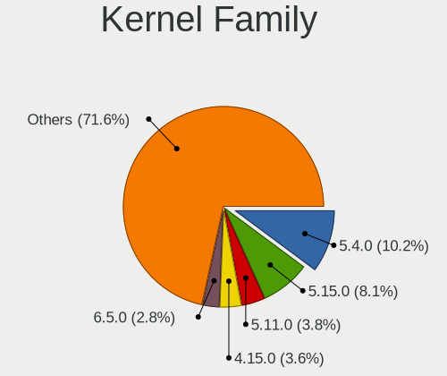

| Version  | Desktops | Percent |
|----------|----------|---------|
| 5.4.0    | 38       | 20.11%  |
| 5.11.0   | 15       | 7.94%   |
| 4.15.0   | 14       | 7.41%   |
| 5.8.0    | 11       | 5.82%   |
| 5.0.0    | 10       | 5.29%   |
| 4.18.0   | 10       | 5.29%   |
| 5.3.0    | 9        | 4.76%   |
| 5.13.0   | 9        | 4.76%   |
| 5.10.14  | 6        | 3.17%   |
| 5.9.16   | 5        | 2.65%   |
| 5.15.0   | 5        | 2.65%   |
| 5.17.5   | 3        | 1.59%   |
| 5.8.12   | 2        | 1.06%   |
| 5.18.10  | 2        | 1.06%   |
| 5.16.7   | 2        | 1.06%   |
| 5.16.16  | 2        | 1.06%   |
| 5.14.0   | 2        | 1.06%   |
| 5.13.13  | 2        | 1.06%   |
| 5.13.12  | 2        | 1.06%   |
| 5.10.0   | 2        | 1.06%   |
| 5.9.8    | 1        | 0.53%   |
| 5.9.1    | 1        | 0.53%   |
| 5.7.6    | 1        | 0.53%   |
| 5.7.10   | 1        | 0.53%   |
| 5.6.6    | 1        | 0.53%   |
| 5.6.18   | 1        | 0.53%   |
| 5.4.94   | 1        | 0.53%   |
| 5.3.1    | 1        | 0.53%   |
| 5.18.9   | 1        | 0.53%   |
| 5.17.1   | 1        | 0.53%   |
| 5.17.0   | 1        | 0.53%   |
| 5.16.11  | 1        | 0.53%   |
| 5.15.4   | 1        | 0.53%   |
| 5.15.15  | 1        | 0.53%   |
| 5.15.11  | 1        | 0.53%   |
| 5.14.3   | 1        | 0.53%   |
| 5.14.16  | 1        | 0.53%   |
| 5.14.15  | 1        | 0.53%   |
| 5.14.12  | 1        | 0.53%   |
| 5.13.8   | 1        | 0.53%   |
| 5.13.7   | 1        | 0.53%   |
| 5.13.16  | 1        | 0.53%   |
| 5.13.10  | 1        | 0.53%   |
| 5.12.9   | 1        | 0.53%   |
| 5.12.7   | 1        | 0.53%   |
| 5.12.15  | 1        | 0.53%   |
| 5.12.0   | 1        | 0.53%   |
| 5.11.16  | 1        | 0.53%   |
| 5.11.14  | 1        | 0.53%   |
| 5.11.12  | 1        | 0.53%   |
| 5.11.10  | 1        | 0.53%   |
| 5.10.89  | 1        | 0.53%   |
| 5.10.6   | 1        | 0.53%   |
| 5.10.16  | 1        | 0.53%   |
| 5.10.105 | 1        | 0.53%   |
| 4.9.60   | 1        | 0.53%   |
| 4.19.226 | 1        | 0.53%   |
| 4.19.0   | 1        | 0.53%   |

Kernel Major Ver.
-----------------

Linux kernel major version

| Version | Desktops | Percent |
|---------|----------|---------|
| 5.4     | 39       | 20.86%  |
| 5.11    | 18       | 9.63%   |
| 5.13    | 17       | 9.09%   |
| 4.15    | 14       | 7.49%   |
| 5.8     | 13       | 6.95%   |
| 5.10    | 12       | 6.42%   |
| 5.3     | 10       | 5.35%   |
| 5.0     | 10       | 5.35%   |
| 4.18    | 10       | 5.35%   |
| 5.15    | 8        | 4.28%   |
| 5.9     | 7        | 3.74%   |
| 5.14    | 6        | 3.21%   |
| 5.17    | 5        | 2.67%   |
| 5.16    | 5        | 2.67%   |
| 5.18    | 3        | 1.6%    |
| 5.12    | 3        | 1.6%    |
| 5.7     | 2        | 1.07%   |
| 5.6     | 2        | 1.07%   |
| 4.19    | 2        | 1.07%   |
| 4.9     | 1        | 0.53%   |

Arch
----

OS architecture (x86_64, i586, etc.)

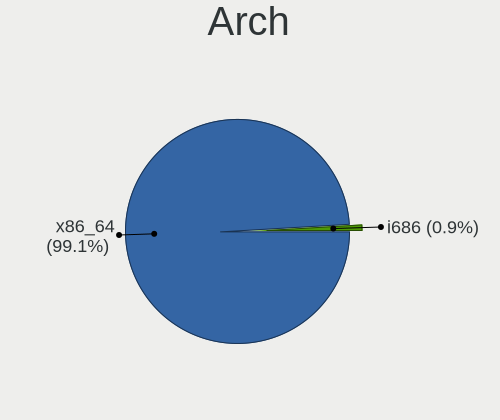

| Name   | Desktops | Percent |
|--------|----------|---------|
| x86_64 | 174      | 98.31%  |
| i686   | 3        | 1.69%   |

DE
--

Desktop Environment

| Name       | Desktops | Percent |
|------------|----------|---------|
| GNOME      | 71       | 39.89%  |
| Unknown    | 32       | 17.98%  |
| KDE5       | 26       | 14.61%  |
| X-Cinnamon | 14       | 7.87%   |
| XFCE       | 13       | 7.3%    |
| KDE        | 10       | 5.62%   |
| xmonad     | 2        | 1.12%   |
| MATE       | 2        | 1.12%   |
| LXDE       | 2        | 1.12%   |
| Cinnamon   | 2        | 1.12%   |
| Pantheon   | 1        | 0.56%   |
| KDE4       | 1        | 0.56%   |
| i3         | 1        | 0.56%   |
| Budgie     | 1        | 0.56%   |

Display Server
--------------

X11 or Wayland

| Name    | Desktops | Percent |
|---------|----------|---------|
| X11     | 136      | 76.4%   |
| Unknown | 25       | 14.04%  |
| Wayland | 16       | 8.99%   |
| Tty     | 1        | 0.56%   |

Display Manager
---------------

SDDM, LightDM, etc.

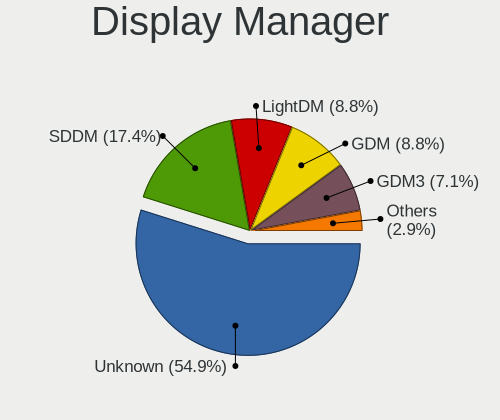

| Name    | Desktops | Percent |
|---------|----------|---------|
| Unknown | 119      | 66.48%  |
| SDDM    | 20       | 11.17%  |
| GDM     | 15       | 8.38%   |
| LightDM | 12       | 6.7%    |
| TDM     | 6        | 3.35%   |
| GDM3    | 5        | 2.79%   |
| LXDM    | 1        | 0.56%   |
| KDM     | 1        | 0.56%   |

OS Lang
-------

Language

| Lang    | Desktops | Percent |
|---------|----------|---------|
| es_CL   | 91       | 51.12%  |
| en_US   | 40       | 22.47%  |
| Unknown | 33       | 18.54%  |
| es_ES   | 7        | 3.93%   |
| en_GB   | 3        | 1.69%   |
| es_MX   | 2        | 1.12%   |
| pt_BR   | 1        | 0.56%   |
| C       | 1        | 0.56%   |

Boot Mode
---------

EFI or BIOS

| Mode | Desktops | Percent |
|------|----------|---------|
| BIOS | 116      | 64.44%  |
| EFI  | 64       | 35.56%  |

Filesystem
----------

Type of filesystem

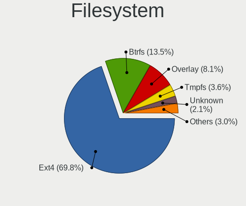

| Type    | Desktops | Percent |
|---------|----------|---------|
| Ext4    | 141      | 79.21%  |
| Btrfs   | 15       | 8.43%   |
| Overlay | 9        | 5.06%   |
| Unknown | 7        | 3.93%   |
| Ext2    | 3        | 1.69%   |
| Zfs     | 2        | 1.12%   |
| Xfs     | 1        | 0.56%   |

Part. scheme
------------

Scheme of partitioning

| Type    | Desktops | Percent |
|---------|----------|---------|
| Unknown | 123      | 69.1%   |
| GPT     | 37       | 20.79%  |
| MBR     | 18       | 10.11%  |

Dual Boot with Linux/BSD
------------------------

Hosting more than one Linux/BSD

| Dual boot | Desktops | Percent |
|-----------|----------|---------|
| No        | 150      | 83.33%  |
| Yes       | 30       | 16.67%  |

Dual Boot (Win)
---------------

Hosting Linux and Windows

| Dual boot | Desktops | Percent |
|-----------|----------|---------|
| No        | 111      | 61.67%  |
| Yes       | 69       | 38.33%  |

Board
-----

Vendor
------

Motherboard manufacturer

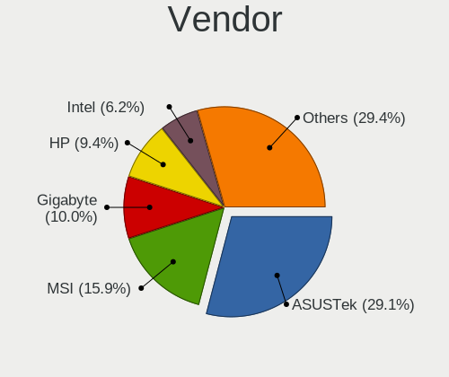

| Name                | Desktops | Percent |
|---------------------|----------|---------|
| ASUSTek Computer    | 51       | 28.81%  |
| MSI                 | 33       | 18.64%  |
| Gigabyte Technology | 21       | 11.86%  |
| Intel               | 14       | 7.91%   |
| Hewlett-Packard     | 12       | 6.78%   |
| ECS                 | 9        | 5.08%   |
| Dell                | 5        | 2.82%   |
| ASRock              | 4        | 2.26%   |
| Pegatron            | 3        | 1.69%   |
| Lenovo              | 3        | 1.69%   |
| Unknown             | 3        | 1.69%   |
| TPV-INVENTA         | 2        | 1.13%   |
| Huanan              | 2        | 1.13%   |
| R-StyleComputers    | 1        | 0.56%   |
| Quanta              | 1        | 0.56%   |
| PCPartner           | 1        | 0.56%   |
| Olidata             | 1        | 0.56%   |
| Nvidia              | 1        | 0.56%   |
| MACHINIST           | 1        | 0.56%   |
| IBM                 | 1        | 0.56%   |
| HC                  | 1        | 0.56%   |
| Foxconn             | 1        | 0.56%   |
| eMachines           | 1        | 0.56%   |
| Elo TouchSystems    | 1        | 0.56%   |
| Colorful Technology | 1        | 0.56%   |
| BESSTAR Tech        | 1        | 0.56%   |
| Apple               | 1        | 0.56%   |
| AMI                 | 1        | 0.56%   |

Model
-----

Motherboard model

| Name                                      | Desktops | Percent |
|-------------------------------------------|----------|---------|
| ASUS All Series                           | 6        | 3.39%   |
| ASUS PRIME B450M-A                        | 4        | 2.26%   |
| Unknown                                   | 4        | 2.26%   |
| MSI MS-7A34                               | 3        | 1.69%   |
| MSI MS-7817                               | 3        | 1.69%   |
| MSI MS-7788                               | 3        | 1.69%   |
| ASUS PRIME A320M-K                        | 3        | 1.69%   |
| MSI Pro 3000/3080                         | 2        | 1.13%   |
| MSI MS-7A65                               | 2        | 1.13%   |
| HP Compaq Pro 6300 SFF                    | 2        | 1.13%   |
| HP Compaq Pro 4300 SFF PC                 | 2        | 1.13%   |
| Gigabyte B450M DS3H V2                    | 2        | 1.13%   |
| Gigabyte B450 AORUS PRO WIFI              | 2        | 1.13%   |
| ECS MCP61M-M3                             | 2        | 1.13%   |
| ECS A960M-MV                              | 2        | 1.13%   |
| ECS A740GM-M                              | 2        | 1.13%   |
| ASUS TUF Gaming X570-PLUS                 | 2        | 1.13%   |
| ASUS SABERTOOTH 990FX R2.0                | 2        | 1.13%   |
| ASUS PRIME H410M-E                        | 2        | 1.13%   |
| ASUS M5A99X EVO                           | 2        | 1.13%   |
| TPV-INVENTA Pro 1005 Series All-in-One PC | 1        | 0.56%   |
| TPV-INVENTA CQ1-3130LA                    | 1        | 0.56%   |
| R-StyleComputers ALICON AI2S-A21 00.69    | 1        | 0.56%   |
| Quanta 120-1016la                         | 1        | 0.56%   |
| Pegatron 9100                             | 1        | 0.56%   |
| Pegatron 520-1135la                       | 1        | 0.56%   |
| Pegatron 23-d015la                        | 1        | 0.56%   |
| PCPartner G43-F71862                      | 1        | 0.56%   |
| Nvidia NF-MCP61                           | 1        | 0.56%   |
| MSI TITAN                                 | 1        | 0.56%   |
| MSI MS-7D53                               | 1        | 0.56%   |
| MSI MS-7C90                               | 1        | 0.56%   |
| MSI MS-7C83                               | 1        | 0.56%   |
| MSI MS-7C52                               | 1        | 0.56%   |
| MSI MS-7C31                               | 1        | 0.56%   |
| MSI MS-7C09                               | 1        | 0.56%   |
| MSI MS-7C02                               | 1        | 0.56%   |
| MSI MS-7B53                               | 1        | 0.56%   |
| MSI MS-7B28                               | 1        | 0.56%   |
| MSI MS-7B09                               | 1        | 0.56%   |
| MSI MS-7A38                               | 1        | 0.56%   |
| MSI MS-7A15                               | 1        | 0.56%   |
| MSI MS-7846                               | 1        | 0.56%   |
| MSI MS-7808                               | 1        | 0.56%   |
| MSI MS-7721                               | 1        | 0.56%   |
| MSI MS-7696                               | 1        | 0.56%   |
| MSI MS-7693                               | 1        | 0.56%   |
| MSI MS-7522                               | 1        | 0.56%   |
| MSI MS-7379                               | 1        | 0.56%   |
| MACHINIST X79 V2.82H                      | 1        | 0.56%   |
| Lenovo ThinkCentre M73z 10BBA0XNCS        | 1        | 0.56%   |
| Lenovo ThinkCentre M700 10GSA05DCS        | 1        | 0.56%   |
| Lenovo ThinkCentre M55 8808E19            | 1        | 0.56%   |
| Intel YL-3160L2                           | 1        | 0.56%   |
| Intel X99                                 | 1        | 0.56%   |
| Intel X79M-S                              | 1        | 0.56%   |
| Intel X79 V2.72B                          | 1        | 0.56%   |
| Intel X64                                 | 1        | 0.56%   |
| Intel SHARKBAY                            | 1        | 0.56%   |
| Intel DZ77GA-70K AAG39009-401             | 1        | 0.56%   |

Model Family
------------

Motherboard model prefix

| Name                    | Desktops | Percent |
|-------------------------|----------|---------|
| ASUS PRIME              | 14       | 7.91%   |
| HP Compaq               | 6        | 3.39%   |
| ASUS TUF                | 6        | 3.39%   |
| ASUS All                | 6        | 3.39%   |
| Unknown                 | 4        | 2.26%   |
| MSI MS-7A34             | 3        | 1.69%   |
| MSI MS-7817             | 3        | 1.69%   |
| MSI MS-7788             | 3        | 1.69%   |
| Lenovo ThinkCentre      | 3        | 1.69%   |
| Gigabyte B450M          | 3        | 1.69%   |
| ASUS M5A78L-M           | 3        | 1.69%   |
| MSI Pro                 | 2        | 1.13%   |
| MSI MS-7A65             | 2        | 1.13%   |
| Intel D54250WYK         | 2        | 1.13%   |
| Huanan X79              | 2        | 1.13%   |
| HP EliteDesk            | 2        | 1.13%   |
| Gigabyte B450           | 2        | 1.13%   |
| ECS MCP61M-M3           | 2        | 1.13%   |
| ECS A960M-MV            | 2        | 1.13%   |
| ECS A740GM-M            | 2        | 1.13%   |
| Dell OptiPlex           | 2        | 1.13%   |
| ASUS SABERTOOTH         | 2        | 1.13%   |
| ASUS ROG                | 2        | 1.13%   |
| ASUS M5A99X             | 2        | 1.13%   |
| TPV-INVENTA Pro         | 1        | 0.56%   |
| TPV-INVENTA CQ1-3130LA  | 1        | 0.56%   |
| R-StyleComputers ALICON | 1        | 0.56%   |
| Quanta 120-1016la       | 1        | 0.56%   |
| Pegatron 9100           | 1        | 0.56%   |
| Pegatron 520-1135la     | 1        | 0.56%   |
| Pegatron 23-d015la      | 1        | 0.56%   |
| PCPartner G43-F71862    | 1        | 0.56%   |
| Nvidia NF-MCP61         | 1        | 0.56%   |
| MSI TITAN               | 1        | 0.56%   |
| MSI MS-7D53             | 1        | 0.56%   |
| MSI MS-7C90             | 1        | 0.56%   |
| MSI MS-7C83             | 1        | 0.56%   |
| MSI MS-7C52             | 1        | 0.56%   |
| MSI MS-7C31             | 1        | 0.56%   |
| MSI MS-7C09             | 1        | 0.56%   |
| MSI MS-7C02             | 1        | 0.56%   |
| MSI MS-7B53             | 1        | 0.56%   |
| MSI MS-7B28             | 1        | 0.56%   |
| MSI MS-7B09             | 1        | 0.56%   |
| MSI MS-7A38             | 1        | 0.56%   |
| MSI MS-7A15             | 1        | 0.56%   |
| MSI MS-7846             | 1        | 0.56%   |
| MSI MS-7808             | 1        | 0.56%   |
| MSI MS-7721             | 1        | 0.56%   |
| MSI MS-7696             | 1        | 0.56%   |
| MSI MS-7693             | 1        | 0.56%   |
| MSI MS-7522             | 1        | 0.56%   |
| MSI MS-7379             | 1        | 0.56%   |
| MACHINIST X79           | 1        | 0.56%   |
| Intel YL-3160L2         | 1        | 0.56%   |
| Intel X99               | 1        | 0.56%   |
| Intel X79M-S            | 1        | 0.56%   |
| Intel X79               | 1        | 0.56%   |
| Intel X64               | 1        | 0.56%   |
| Intel SHARKBAY          | 1        | 0.56%   |

MFG Year
--------

Motherboard manufacture year

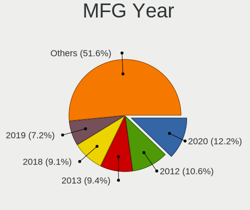

| Year | Desktops | Percent |
|------|----------|---------|
| 2020 | 21       | 11.86%  |
| 2012 | 20       | 11.3%   |
| 2018 | 17       | 9.6%    |
| 2013 | 16       | 9.04%   |
| 2014 | 15       | 8.47%   |
| 2011 | 13       | 7.34%   |
| 2019 | 12       | 6.78%   |
| 2007 | 12       | 6.78%   |
| 2017 | 11       | 6.21%   |
| 2008 | 10       | 5.65%   |
| 2010 | 8        | 4.52%   |
| 2021 | 6        | 3.39%   |
| 2016 | 6        | 3.39%   |
| 2009 | 6        | 3.39%   |
| 2015 | 3        | 1.69%   |
| 2005 | 1        | 0.56%   |

Form Factor
-----------

Physical design of the computer

| Name    | Desktops | Percent |
|---------|----------|---------|
| Desktop | 177      | 100%    |

Secure Boot
-----------

Enabled or disabled

| State    | Desktops | Percent |
|----------|----------|---------|
| Disabled | 174      | 97.75%  |
| Enabled  | 4        | 2.25%   |

Coreboot
--------

Have coreboot on board

| Used | Desktops | Percent |
|------|----------|---------|
| No   | 177      | 100%    |

RAM Size
--------

Total RAM memory

| Size in GB  | Desktops | Percent |
|-------------|----------|---------|
| 8.01-16.0   | 44       | 24.72%  |
| 16.01-24.0  | 36       | 20.22%  |
| 3.01-4.0    | 31       | 17.42%  |
| 4.01-8.0    | 26       | 14.61%  |
| 32.01-64.0  | 22       | 12.36%  |
| 1.01-2.0    | 10       | 5.62%   |
| 24.01-32.0  | 5        | 2.81%   |
| 2.01-3.0    | 3        | 1.69%   |
| 64.01-256.0 | 1        | 0.56%   |

RAM Used
--------

Used RAM memory

| Used GB   | Desktops | Percent |
|-----------|----------|---------|
| 1.01-2.0  | 72       | 37.89%  |
| 2.01-3.0  | 53       | 27.89%  |
| 4.01-8.0  | 28       | 14.74%  |
| 3.01-4.0  | 21       | 11.05%  |
| 8.01-16.0 | 9        | 4.74%   |
| 0.51-1.0  | 5        | 2.63%   |
| 0.01-0.5  | 2        | 1.05%   |

Total Drives
------------

Number of drives on board

| Drives | Desktops | Percent |
|--------|----------|---------|
| 1      | 65       | 36.11%  |
| 2      | 62       | 34.44%  |
| 3      | 29       | 16.11%  |
| 4      | 17       | 9.44%   |
| 5      | 4        | 2.22%   |
| 7      | 1        | 0.56%   |
| 6      | 1        | 0.56%   |
| 0      | 1        | 0.56%   |

Has CD-ROM
----------

Has CD-ROM on board

| Presented | Desktops | Percent |
|-----------|----------|---------|
| No        | 101      | 57.06%  |
| Yes       | 76       | 42.94%  |

Has Ethernet
------------

Has Ethernet on board

| Presented | Desktops | Percent |
|-----------|----------|---------|
| Yes       | 176      | 99.44%  |
| No        | 1        | 0.56%   |

Has WiFi
--------

Has WiFi module

| Presented | Desktops | Percent |
|-----------|----------|---------|
| No        | 93       | 52.54%  |
| Yes       | 84       | 47.46%  |

Has Bluetooth
-------------

Has Bluetooth module

| Presented | Desktops | Percent |
|-----------|----------|---------|
| No        | 124      | 69.27%  |
| Yes       | 55       | 30.73%  |

Location
--------

Country
-------

Geographic location (country)

| Country | Desktops | Percent |
|---------|----------|---------|
| Chile   | 177      | 100%    |

City
----

Geographic location (city)

| City                | Desktops | Percent |
|---------------------|----------|---------|
| Santiago            | 44       | 23.78%  |
| Maipu               | 9        | 4.86%   |
| Puente Alto         | 8        | 4.32%   |
| Las Condes          | 7        | 3.78%   |
| Antofagasta         | 7        | 3.78%   |
| Via del Mar       | 6        | 3.24%   |
| Nunoa               | 6        | 3.24%   |
| La Florida          | 6        | 3.24%   |
| Temuco              | 5        | 2.7%    |
| Providencia         | 5        | 2.7%    |
| Concepcin         | 5        | 2.7%    |
| Valdivia            | 4        | 2.16%   |
| Valparaso         | 3        | 1.62%   |
| San Miguel          | 3        | 1.62%   |
| Port Montt          | 3        | 1.62%   |
| Penalolen           | 3        | 1.62%   |
| Osorno              | 3        | 1.62%   |
| El Bosque           | 3        | 1.62%   |
| Coquimbo            | 3        | 1.62%   |
| Central             | 3        | 1.62%   |
| Vitacura            | 2        | 1.08%   |
| Tome                | 2        | 1.08%   |
| Talca               | 2        | 1.08%   |
| San Pedro de la Paz | 2        | 1.08%   |
| Recoleta            | 2        | 1.08%   |
| Quilpu            | 2        | 1.08%   |
| Los ngeles        | 2        | 1.08%   |
| La Serena           | 2        | 1.08%   |
| La Granja           | 2        | 1.08%   |
| Coronel             | 2        | 1.08%   |
| Colina              | 2        | 1.08%   |
| Chillan             | 2        | 1.08%   |
| Villa Alemana       | 1        | 0.54%   |
| Villa Alegre        | 1        | 0.54%   |
| Vallenar            | 1        | 0.54%   |
| Talagante           | 1        | 0.54%   |
| San Joaquin         | 1        | 0.54%   |
| San Javier          | 1        | 0.54%   |
| San Bernardo        | 1        | 0.54%   |
| Rancagua            | 1        | 0.54%   |
| Quinta Normal       | 1        | 0.54%   |
| Quillota            | 1        | 0.54%   |
| Quilicura           | 1        | 0.54%   |
| Puerto Natales      | 1        | 0.54%   |
| Puchuncavi          | 1        | 0.54%   |
| Pozo Almonte        | 1        | 0.54%   |
| Parral              | 1        | 0.54%   |
| Melipilla           | 1        | 0.54%   |
| Lo Prado            | 1        | 0.54%   |
| La Cisterna         | 1        | 0.54%   |
| Hualpen             | 1        | 0.54%   |
| Espejo              | 1        | 0.54%   |
| El Monte            | 1        | 0.54%   |
| Copiap            | 1        | 0.54%   |
| Concon              | 1        | 0.54%   |
| Conchali            | 1        | 0.54%   |
| Castro              | 1        | 0.54%   |

Drives
------

Drive Vendor
------------

Hard drive vendors

| Vendor                    | Desktops | Drives | Percent |
|---------------------------|----------|--------|---------|
| WDC                       | 74       | 125    | 23.34%  |
| Seagate                   | 64       | 84     | 20.19%  |
| Kingston                  | 34       | 44     | 10.73%  |
| Toshiba                   | 27       | 28     | 8.52%   |
| Crucial                   | 19       | 24     | 5.99%   |
| Samsung Electronics       | 16       | 19     | 5.05%   |
| Hitachi                   | 13       | 17     | 4.1%    |
| Silicon Motion            | 8        | 8      | 2.52%   |
| SanDisk                   | 8        | 9      | 2.52%   |
| China                     | 6        | 8      | 1.89%   |
| Unknown                   | 4        | 5      | 1.26%   |
| Corsair                   | 4        | 9      | 1.26%   |
| XrayDisk                  | 3        | 3      | 0.95%   |
| Micron Technology         | 3        | 6      | 0.95%   |
| A-DATA Technology         | 3        | 3      | 0.95%   |
| XPG                       | 2        | 3      | 0.63%   |
| Realtek Semiconductor     | 2        | 2      | 0.63%   |
| Micron/Crucial Technology | 2        | 5      | 0.63%   |
| Maxtor                    | 2        | 2      | 0.63%   |
| Lexar                     | 2        | 2      | 0.63%   |
| KingSpec                  | 2        | 2      | 0.63%   |
| JMicron Technology        | 2        | 2      | 0.63%   |
| WALRAM                    | 1        | 2      | 0.32%   |
| Transcend                 | 1        | 1      | 0.32%   |
| StoreJet                  | 1        | 1      | 0.32%   |
| SK hynix                  | 1        | 1      | 0.32%   |
| Patriot                   | 1        | 1      | 0.32%   |
| OCZ                       | 1        | 2      | 0.32%   |
| NGFF                      | 1        | 1      | 0.32%   |
| Netac                     | 1        | 1      | 0.32%   |
| Mass                      | 1        | 1      | 0.32%   |
| JASTER                    | 1        | 2      | 0.32%   |
| Intenso                   | 1        | 1      | 0.32%   |
| Gigabyte Technology       | 1        | 1      | 0.32%   |
| BIWIN                     | 1        | 1      | 0.32%   |
| ASMT                      | 1        | 1      | 0.32%   |
| ASMedia                   | 1        | 2      | 0.32%   |
| Apple                     | 1        | 1      | 0.32%   |
| Unknown                   | 1        | 1      | 0.32%   |

Drive Model
-----------

Hard drive models

| Model                                | Desktops | Percent |
|--------------------------------------|----------|---------|
| Seagate ST500DM002-1BD142 500GB      | 11       | 3.06%   |
| WDC WDS240G2G0A-00JH30 240GB SSD     | 9        | 2.5%    |
| Toshiba HDWD110 1TB                  | 8        | 2.22%   |
| Toshiba DT01ACA100 1TB               | 8        | 2.22%   |
| WDC WD10EZEX-08WN4A0 1TB             | 7        | 1.94%   |
| Kingston SA400S37120G 120GB SSD      | 7        | 1.94%   |
| Kingston SA400S37240G 240GB SSD      | 6        | 1.67%   |
| WDC WD5000AAKX-00ERMA0 500GB         | 5        | 1.39%   |
| WDC WD5000AAKX-001CA0 500GB          | 5        | 1.39%   |
| Seagate ST3500418AS 500GB            | 5        | 1.39%   |
| WDC WDS500G2B0A-00SM50 500GB SSD     | 4        | 1.11%   |
| WDC WD10EZEX-00BN5A0 1TB             | 4        | 1.11%   |
| Seagate ST3320418AS 320GB            | 4        | 1.11%   |
| Seagate ST1000DM010-2EP102 1TB       | 4        | 1.11%   |
| SanDisk NVMe SSD Drive 1TB           | 4        | 1.11%   |
| Toshiba DT01ACA050 500GB             | 3        | 0.83%   |
| Seagate ST500LT012-9WS142 500GB      | 3        | 0.83%   |
| Seagate ST500LT012-1DG142 500GB      | 3        | 0.83%   |
| SanDisk NVMe SSD Drive 500GB         | 3        | 0.83%   |
| Kingston SUV400S37240G 240GB SSD     | 3        | 0.83%   |
| Kingston SA400S37480G 480GB SSD      | 3        | 0.83%   |
| Hitachi HDS721050CLA362 500GB        | 3        | 0.83%   |
| Hitachi HDS721032CLA362 320GB        | 3        | 0.83%   |
| Crucial CT500MX500SSD1 500GB         | 3        | 0.83%   |
| XPG SPECTRIX S40G 256GB              | 2        | 0.56%   |
| WDC WDS500G3X0C-00SJG0 500GB         | 2        | 0.56%   |
| WDC WDS240G1G0A-00SS50 240GB SSD     | 2        | 0.56%   |
| WDC WDS120G2G0A-00JH30 120GB SSD     | 2        | 0.56%   |
| WDC WDS100T2B0C-00PXH0 1TB           | 2        | 0.56%   |
| WDC WD20EARX-00PASB0 2TB             | 2        | 0.56%   |
| WDC WD2003FZEX-00Z4SA0 2TB           | 2        | 0.56%   |
| WDC WD1003FBYZ-010FB0 1TB            | 2        | 0.56%   |
| Toshiba HDWD105 500GB                | 2        | 0.56%   |
| Silicon Motion NVMe SSD Drive 512GB  | 2        | 0.56%   |
| Silicon Motion NVMe SSD Drive 1024GB | 2        | 0.56%   |
| Seagate ST9640320AS 640GB            | 2        | 0.56%   |
| Seagate ST500DM002-1BC142 500GB      | 2        | 0.56%   |
| Seagate ST3500320AS 500GB            | 2        | 0.56%   |
| Seagate ST2000DM008-2FR102 2TB       | 2        | 0.56%   |
| Seagate ST2000DM001-1ER164 2TB       | 2        | 0.56%   |
| Seagate Expansion 1TB                | 2        | 0.56%   |
| Samsung SSD 850 EVO 250GB            | 2        | 0.56%   |
| Samsung NVMe SSD Drive 512GB         | 2        | 0.56%   |
| Micron/Crucial NVMe SSD Drive 500GB  | 2        | 0.56%   |
| Lexar 128GB SSD                      | 2        | 0.56%   |
| Kingston SV300S37A120G 120GB SSD     | 2        | 0.56%   |
| Kingston SUV400S37120G 120GB SSD     | 2        | 0.56%   |
| Kingston SKC300S37A120G 120GB SSD    | 2        | 0.56%   |
| Kingston SA400M8120G 120GB SSD       | 2        | 0.56%   |
| Crucial CT480BX500SSD1 480GB         | 2        | 0.56%   |
| Crucial CT250MX500SSD1 250GB         | 2        | 0.56%   |
| Crucial CT240BX500SSD1 240GB         | 2        | 0.56%   |
| Crucial CT120BX500SSD1 120GB         | 2        | 0.56%   |
| Crucial CT1000MX500SSD1 1TB          | 2        | 0.56%   |
| XrayDisk SSD 256GB                   | 1        | 0.28%   |
| XrayDisk SSD 240GB                   | 1        | 0.28%   |
| XrayDisk 512GB                       | 1        | 0.28%   |
| WDC WDS500G2B0B-00YS70 500GB SSD     | 1        | 0.28%   |
| WDC WDS250G2B0A-00SM50 250GB SSD     | 1        | 0.28%   |
| WDC WDS250G2B0A 250GB SSD            | 1        | 0.28%   |

HDD Vendor
----------

Hard disk drive vendors

| Vendor              | Desktops | Drives | Percent |
|---------------------|----------|--------|---------|
| Seagate             | 64       | 84     | 37.87%  |
| WDC                 | 57       | 86     | 33.73%  |
| Toshiba             | 27       | 28     | 15.98%  |
| Hitachi             | 13       | 17     | 7.69%   |
| Samsung Electronics | 4        | 6      | 2.37%   |
| Maxtor              | 2        | 2      | 1.18%   |
| ASMedia             | 1        | 2      | 0.59%   |
| Apple               | 1        | 1      | 0.59%   |

SSD Vendor
----------

Solid state drive vendors

| Vendor              | Desktops | Drives | Percent |
|---------------------|----------|--------|---------|
| Kingston            | 32       | 35     | 28.83%  |
| WDC                 | 23       | 31     | 20.72%  |
| Crucial             | 19       | 23     | 17.12%  |
| Samsung Electronics | 8        | 9      | 7.21%   |
| China               | 6        | 8      | 5.41%   |
| Corsair             | 4        | 9      | 3.6%    |
| XrayDisk            | 2        | 2      | 1.8%    |
| Micron Technology   | 2        | 2      | 1.8%    |
| Lexar               | 2        | 2      | 1.8%    |
| KingSpec            | 2        | 2      | 1.8%    |
| WALRAM              | 1        | 1      | 0.9%    |
| StoreJet            | 1        | 1      | 0.9%    |
| Patriot             | 1        | 1      | 0.9%    |
| OCZ                 | 1        | 2      | 0.9%    |
| NGFF                | 1        | 1      | 0.9%    |
| Intenso             | 1        | 1      | 0.9%    |
| Gigabyte Technology | 1        | 1      | 0.9%    |
| BIWIN               | 1        | 1      | 0.9%    |
| ASMT                | 1        | 1      | 0.9%    |
| A-DATA Technology   | 1        | 1      | 0.9%    |
| Unknown             | 1        | 1      | 0.9%    |

Drive Kind
----------

HDD or SSD

| Kind    | Desktops | Drives | Percent |
|---------|----------|--------|---------|
| HDD     | 128      | 226    | 47.76%  |
| SSD     | 90       | 135    | 33.58%  |
| NVMe    | 41       | 60     | 15.3%   |
| Unknown | 7        | 8      | 2.61%   |
| MMC     | 2        | 2      | 0.75%   |

Drive Connector
---------------

SATA, SAS, NVMe, etc.

| Type | Desktops | Drives | Percent |
|------|----------|--------|---------|
| SATA | 168      | 358    | 76.71%  |
| NVMe | 40       | 59     | 18.26%  |
| SAS  | 9        | 12     | 4.11%   |
| MMC  | 2        | 2      | 0.91%   |

Drive Size
----------

Size of hard drive

| Size in TB | Desktops | Drives | Percent |
|------------|----------|--------|---------|
| 0.01-0.5   | 136      | 241    | 62.1%   |
| 0.51-1.0   | 60       | 84     | 27.4%   |
| 1.01-2.0   | 16       | 23     | 7.31%   |
| 3.01-4.0   | 3        | 3      | 1.37%   |
| 2.01-3.0   | 3        | 8      | 1.37%   |
| 4.01-10.0  | 1        | 2      | 0.46%   |

Space Total
-----------

Amount of disk space available on the file system

| Size in GB     | Desktops | Percent |
|----------------|----------|---------|
| 251-500        | 47       | 25.68%  |
| 101-250        | 36       | 19.67%  |
| 501-1000       | 22       | 12.02%  |
| 1001-2000      | 17       | 9.29%   |
| More than 3000 | 15       | 8.2%    |
| 1-20           | 13       | 7.1%    |
| 2001-3000      | 11       | 6.01%   |
| 51-100         | 11       | 6.01%   |
| 21-50          | 6        | 3.28%   |
| Unknown        | 5        | 2.73%   |

Space Used
----------

Amount of used disk space

| Used GB        | Desktops | Percent |
|----------------|----------|---------|
| 1-20           | 70       | 37.04%  |
| 21-50          | 38       | 20.11%  |
| 101-250        | 21       | 11.11%  |
| 1001-2000      | 13       | 6.88%   |
| 501-1000       | 13       | 6.88%   |
| 51-100         | 11       | 5.82%   |
| 251-500        | 9        | 4.76%   |
| More than 3000 | 6        | 3.17%   |
| Unknown        | 5        | 2.65%   |
| 2001-3000      | 3        | 1.59%   |

Malfunc. Drives
---------------

Drive models with a malfunction

| Model                                | Desktops | Drives | Percent |
|--------------------------------------|----------|--------|---------|
| XrayDisk SSD 256GB                   | 1        | 1      | 4.55%   |
| WDC WD5000AAKX-083CA1 500GB          | 1        | 1      | 4.55%   |
| WDC WD5000AAKX-00ERMA0 500GB         | 1        | 1      | 4.55%   |
| WDC WD5000AAKX-001CA0 500GB          | 1        | 2      | 4.55%   |
| WDC WD20EARX-00PASB0 2TB             | 1        | 1      | 4.55%   |
| WDC WD10EARS-003BB1 1TB              | 1        | 1      | 4.55%   |
| Toshiba MK1652GSX 160GB              | 1        | 1      | 4.55%   |
| Seagate ST500LT012-9WS142 500GB      | 1        | 1      | 4.55%   |
| Seagate ST500LM000-1EJ162-SSHD 500GB | 1        | 1      | 4.55%   |
| Seagate ST500DM002-1BD142 500GB      | 1        | 1      | 4.55%   |
| Seagate ST3500418AS 500GB            | 1        | 1      | 4.55%   |
| Samsung Electronics SSD 870 EVO 1TB  | 1        | 1      | 4.55%   |
| Samsung Electronics HD250HJ 250GB    | 1        | 2      | 4.55%   |
| Samsung Electronics HD081GJ 80GB     | 1        | 1      | 4.55%   |
| Kingston SA400S37480G 480GB SSD      | 1        | 1      | 4.55%   |
| Kingston SA400S37240G 240GB SSD      | 1        | 1      | 4.55%   |
| Hitachi HTS547550A9E384 500GB        | 1        | 1      | 4.55%   |
| Hitachi HTS545050B9A300 500GB        | 1        | 1      | 4.55%   |
| Hitachi HTS545050A7E380 500GB        | 1        | 1      | 4.55%   |
| Hitachi HDS721050CLA660 500GB        | 1        | 1      | 4.55%   |
| Hitachi HDS721032CLA362 320GB        | 1        | 1      | 4.55%   |
| A-DATA Technology SX8100NP 1TB       | 1        | 1      | 4.55%   |

Malfunc. Drive Vendor
---------------------

Vendors of faulty drives

| Vendor              | Desktops | Drives | Percent |
|---------------------|----------|--------|---------|
| WDC                 | 5        | 6      | 25%     |
| Seagate             | 4        | 4      | 20%     |
| Hitachi             | 4        | 5      | 20%     |
| Samsung Electronics | 2        | 4      | 10%     |
| Kingston            | 2        | 2      | 10%     |
| XrayDisk            | 1        | 1      | 5%      |
| Toshiba             | 1        | 1      | 5%      |
| A-DATA Technology   | 1        | 1      | 5%      |

Malfunc. HDD Vendor
-------------------

Vendors of faulty HDD drives

| Vendor              | Desktops | Drives | Percent |
|---------------------|----------|--------|---------|
| WDC                 | 5        | 6      | 33.33%  |
| Seagate             | 4        | 4      | 26.67%  |
| Hitachi             | 4        | 5      | 26.67%  |
| Toshiba             | 1        | 1      | 6.67%   |
| Samsung Electronics | 1        | 3      | 6.67%   |

Malfunc. Drive Kind
-------------------

Kinds of faulty drives

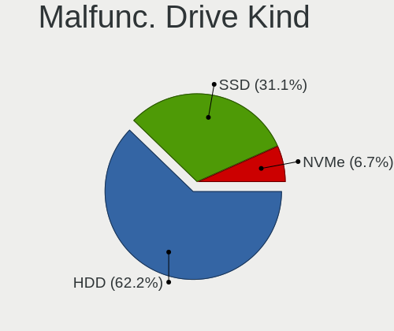

| Kind | Desktops | Drives | Percent |
|------|----------|--------|---------|
| HDD  | 13       | 19     | 72.22%  |
| SSD  | 4        | 4      | 22.22%  |
| NVMe | 1        | 1      | 5.56%   |

Failed Drives
-------------

Failed drive models

| Model                    | Desktops | Drives | Percent |
|--------------------------|----------|--------|---------|
| Toshiba MQ01ABF050 500GB | 1        | 1      | 100%    |

Failed Drive Vendor
-------------------

Failed drive vendors

| Vendor  | Desktops | Drives | Percent |
|---------|----------|--------|---------|
| Toshiba | 1        | 1      | 100%    |

Drive Status
------------

Number of failed and malfunc. drives

| Status   | Desktops | Drives | Percent |
|----------|----------|--------|---------|
| Detected | 127      | 299    | 64.8%   |
| Works    | 51       | 107    | 26.02%  |
| Malfunc  | 17       | 24     | 8.67%   |
| Failed   | 1        | 1      | 0.51%   |

Storage controller
------------------

Storage Vendor
--------------

Storage controller vendors

| Vendor                       | Desktops | Percent |
|------------------------------|----------|---------|
| Intel                        | 98       | 41.88%  |
| AMD                          | 72       | 30.77%  |
| SanDisk                      | 12       | 5.13%   |
| Silicon Motion               | 10       | 4.27%   |
| JMicron Technology           | 7        | 2.99%   |
| Realtek Semiconductor        | 6        | 2.56%   |
| Marvell Technology Group     | 6        | 2.56%   |
| Nvidia                       | 5        | 2.14%   |
| Samsung Electronics          | 4        | 1.71%   |
| ASMedia Technology           | 4        | 1.71%   |
| Micron/Crucial Technology    | 3        | 1.28%   |
| Kingston Technology Company  | 3        | 1.28%   |
| VIA Technologies             | 1        | 0.43%   |
| SK hynix                     | 1        | 0.43%   |
| Shenzhen Longsys Electronics | 1        | 0.43%   |
| Micron Technology            | 1        | 0.43%   |

Storage Model
-------------

Storage controller models

| Model                                                                                   | Desktops | Percent |
|-----------------------------------------------------------------------------------------|----------|---------|
| AMD FCH SATA Controller [AHCI mode]                                                     | 40       | 12.9%   |
| AMD 400 Series Chipset SATA Controller                                                  | 15       | 4.84%   |
| Intel 8 Series/C220 Series Chipset Family 6-port SATA Controller 1 [AHCI mode]          | 13       | 4.19%   |
| AMD SB7x0/SB8x0/SB9x0 IDE Controller                                                    | 13       | 4.19%   |
| AMD SB7x0/SB8x0/SB9x0 SATA Controller [IDE mode]                                        | 11       | 3.55%   |
| AMD SB7x0/SB8x0/SB9x0 SATA Controller [AHCI mode]                                       | 10       | 3.23%   |
| Silicon Motion SM2263EN/SM2263XT SSD Controller                                         | 9        | 2.9%    |
| Intel NM10/ICH7 Family SATA Controller [IDE mode]                                       | 8        | 2.58%   |
| Intel 7 Series/C210 Series Chipset Family 6-port SATA Controller [AHCI mode]            | 7        | 2.26%   |
| Realtek RTS5763DL NVMe SSD Controller                                                   | 6        | 1.94%   |
| Intel C600/X79 series chipset 6-Port SATA AHCI Controller                               | 6        | 1.94%   |
| Intel 82801JI (ICH10 Family) 4 port SATA IDE Controller #1                              | 6        | 1.94%   |
| Intel 82801JI (ICH10 Family) 2 port SATA IDE Controller #2                              | 6        | 1.94%   |
| Intel 82801G (ICH7 Family) IDE Controller                                               | 6        | 1.94%   |
| Intel 6 Series/C200 Series Chipset Family Desktop SATA Controller (IDE mode, ports 4-5) | 6        | 1.94%   |
| Intel 6 Series/C200 Series Chipset Family Desktop SATA Controller (IDE mode, ports 0-3) | 6        | 1.94%   |
| Intel 6 Series/C200 Series Chipset Family 6 port Desktop SATA AHCI Controller           | 6        | 1.94%   |
| AMD FCH SATA Controller D                                                               | 6        | 1.94%   |
| SanDisk WD Black SN750 / PC SN730 NVMe SSD                                              | 5        | 1.61%   |
| JMicron JMB363 SATA/IDE Controller                                                      | 5        | 1.61%   |
| Intel Q170/Q150/B150/H170/H110/Z170/CM236 Chipset SATA Controller [AHCI Mode]           | 5        | 1.61%   |
| Intel 82801I (ICH9 Family) 2 port SATA Controller [IDE mode]                            | 5        | 1.61%   |
| Intel 400 Series Chipset Family SATA AHCI Controller                                    | 5        | 1.61%   |
| Intel 200 Series PCH SATA controller [AHCI mode]                                        | 5        | 1.61%   |
| AMD 500 Series Chipset SATA Controller                                                  | 5        | 1.61%   |
| Nvidia MCP61 SATA Controller                                                            | 4        | 1.29%   |
| Nvidia MCP61 IDE                                                                        | 4        | 1.29%   |
| AMD 300 Series Chipset SATA Controller                                                  | 4        | 1.29%   |
| SanDisk Non-Volatile memory controller                                                  | 3        | 0.97%   |
| Marvell Group 88SE6111/6121 SATA II / PATA Controller                                   | 3        | 0.97%   |
| Intel SATA Controller [RAID mode]                                                       | 3        | 0.97%   |
| Intel 82801IR/IO/IH (ICH9R/DO/DH) 4 port SATA Controller [IDE mode]                     | 3        | 0.97%   |
| Intel 8 Series SATA Controller 1 [AHCI mode]                                            | 3        | 0.97%   |
| ASMedia ASM1062 Serial ATA Controller                                                   | 3        | 0.97%   |
| SanDisk WD Blue SN550 NVMe SSD                                                          | 2        | 0.65%   |
| Samsung NVMe SSD Controller SM981/PM981/PM983                                           | 2        | 0.65%   |
| Marvell Group 88SE9172 SATA 6Gb/s Controller                                            | 2        | 0.65%   |
| JMicron JMB362 SATA Controller                                                          | 2        | 0.65%   |
| Intel Cannon Lake PCH SATA AHCI Controller                                              | 2        | 0.65%   |
| Intel C610/X99 series chipset 6-Port SATA Controller [AHCI mode]                        | 2        | 0.65%   |
| Intel Atom Processor E3800 Series SATA AHCI Controller                                  | 2        | 0.65%   |
| Intel 9 Series Chipset Family SATA Controller [AHCI Mode]                               | 2        | 0.65%   |
| Intel 82Q35 Express PT IDER Controller                                                  | 2        | 0.65%   |
| Intel 82801IB (ICH9) 2 port SATA Controller [IDE mode]                                  | 2        | 0.65%   |
| Intel 82801HR/HO/HH (ICH8R/DO/DH) 2 port SATA Controller [IDE mode]                     | 2        | 0.65%   |
| Intel 82801H (ICH8 Family) 4 port SATA Controller [IDE mode]                            | 2        | 0.65%   |
| Intel 500 Series Chipset Family SATA AHCI Controller                                    | 2        | 0.65%   |
| AMD FCH SATA Controller [IDE mode]                                                      | 2        | 0.65%   |
| AMD FCH IDE Controller                                                                  | 2        | 0.65%   |
| VIA VT82C586A/B/VT82C686/A/B/VT823x/A/C PIPC Bus Master IDE                             | 1        | 0.32%   |
| VIA VIA VT6420 SATA RAID Controller                                                     | 1        | 0.32%   |
| SK hynix BC501 NVMe Solid State Drive                                                   | 1        | 0.32%   |
| Silicon Motion SM2262/SM2262EN SSD Controller                                           | 1        | 0.32%   |
| Shenzhen Longsys Non-Volatile memory controller                                         | 1        | 0.32%   |
| SanDisk WD Blue SN500 / PC SN520 NVMe SSD                                               | 1        | 0.32%   |
| SanDisk WD Black 2018/SN750 / PC SN720 NVMe SSD                                         | 1        | 0.32%   |
| Samsung NVMe SSD Controller SM951/PM951                                                 | 1        | 0.32%   |
| Samsung NVMe SSD Controller PM9A1/PM9A3/980PRO                                          | 1        | 0.32%   |
| Nvidia MCP79 AHCI Controller                                                            | 1        | 0.32%   |
| Micron/Crucial P2 NVMe PCIe SSD                                                         | 1        | 0.32%   |

Storage Kind
------------

Kind of storage controller (IDE, SATA, NVMe, SAS, ...)

| Kind | Desktops | Percent |
|------|----------|---------|
| SATA | 140      | 59.57%  |
| IDE  | 52       | 22.13%  |
| NVMe | 40       | 17.02%  |
| RAID | 3        | 1.28%   |

Processor
---------

CPU Vendor
----------

Processor vendors

| Vendor | Desktops | Percent |
|--------|----------|---------|
| Intel  | 100      | 56.5%   |
| AMD    | 77       | 43.5%   |

CPU Model
---------

Processor models

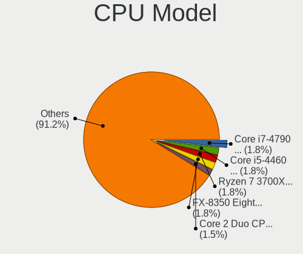

| Model                                       | Desktops | Percent |
|---------------------------------------------|----------|---------|
| AMD FX-6300 Six-Core Processor              | 5        | 2.78%   |
| Intel Core i7-4790 CPU @ 3.60GHz            | 4        | 2.22%   |
| Intel Core i5-10400F CPU @ 2.90GHz          | 4        | 2.22%   |
| Intel Core 2 Duo CPU E8400 @ 3.00GHz        | 4        | 2.22%   |
| Intel Core i5-4460 CPU @ 3.20GHz            | 3        | 1.67%   |
| AMD Ryzen 7 3700X 8-Core Processor          | 3        | 1.67%   |
| AMD Ryzen 3 3200G with Radeon Vega Graphics | 3        | 1.67%   |
| AMD FX-8350 Eight-Core Processor            | 3        | 1.67%   |
| AMD E-450 APU with Radeon HD Graphics       | 3        | 1.67%   |
| AMD Athlon 3000G with Radeon Vega Graphics  | 3        | 1.67%   |
| Intel Xeon CPU E5-2689 0 @ 2.60GHz          | 2        | 1.11%   |
| Intel Xeon CPU E5-2650 v2 @ 2.60GHz         | 2        | 1.11%   |
| Intel Xeon CPU E5-2630 v2 @ 2.60GHz         | 2        | 1.11%   |
| Intel Core i7-3770 CPU @ 3.40GHz            | 2        | 1.11%   |
| Intel Core i7 CPU 920 @ 2.67GHz             | 2        | 1.11%   |
| Intel Core i5-7400 CPU @ 3.00GHz            | 2        | 1.11%   |
| Intel Core i5-6400 CPU @ 2.70GHz            | 2        | 1.11%   |
| Intel Core i5-4570 CPU @ 3.20GHz            | 2        | 1.11%   |
| Intel Core i5-4250U CPU @ 1.30GHz           | 2        | 1.11%   |
| Intel Core i5-3570 CPU @ 3.40GHz            | 2        | 1.11%   |
| Intel Core i5-3330 CPU @ 3.00GHz            | 2        | 1.11%   |
| Intel Core i3-9100 CPU @ 3.60GHz            | 2        | 1.11%   |
| Intel Core i3-2100 CPU @ 3.10GHz            | 2        | 1.11%   |
| Intel Core 2 Duo CPU E8500 @ 3.16GHz        | 2        | 1.11%   |
| Intel Core 2 Duo CPU E6550 @ 2.33GHz        | 2        | 1.11%   |
| AMD Ryzen 9 3900XT 12-Core Processor        | 2        | 1.11%   |
| AMD Ryzen 7 5800X 8-Core Processor          | 2        | 1.11%   |
| AMD Ryzen 7 2700X Eight-Core Processor      | 2        | 1.11%   |
| AMD Ryzen 5 3600X 6-Core Processor          | 2        | 1.11%   |
| AMD Ryzen 5 3600 6-Core Processor           | 2        | 1.11%   |
| AMD Ryzen 5 2600 Six-Core Processor         | 2        | 1.11%   |
| AMD Ryzen 5 2400G with Radeon Vega Graphics | 2        | 1.11%   |
| AMD Ryzen 3 2200G with Radeon Vega Graphics | 2        | 1.11%   |
| AMD Phenom II X6 1090T Processor            | 2        | 1.11%   |
| AMD Phenom II X4 955 Processor              | 2        | 1.11%   |
| AMD Athlon II X2 250 Processor              | 2        | 1.11%   |
| Intel Xeon CPU X5460 @ 3.16GHz              | 1        | 0.56%   |
| Intel Xeon CPU X3220 @ 2.40GHz              | 1        | 0.56%   |
| Intel Xeon CPU W3505 @ 2.53GHz              | 1        | 0.56%   |
| Intel Xeon CPU E5620 @ 2.40GHz              | 1        | 0.56%   |
| Intel Xeon CPU E5462 @ 2.80GHz              | 1        | 0.56%   |
| Intel Xeon CPU E5-2678 v3 @ 2.50GHz         | 1        | 0.56%   |
| Intel Xeon CPU E5-2670 v2 @ 2.50GHz         | 1        | 0.56%   |
| Intel Xeon CPU E5-2620 v3 @ 2.40GHz         | 1        | 0.56%   |
| Intel Xeon CPU E31260L @ 2.40GHz            | 1        | 0.56%   |
| Intel Xeon CPU E3-1220 V2 @ 3.10GHz         | 1        | 0.56%   |
| Intel Pentium Gold G5400 CPU @ 3.70GHz      | 1        | 0.56%   |
| Intel Pentium Dual-Core CPU E5800 @ 3.20GHz | 1        | 0.56%   |
| Intel Pentium Dual-Core CPU E5400 @ 2.70GHz | 1        | 0.56%   |
| Intel Pentium Dual CPU E2200 @ 2.20GHz      | 1        | 0.56%   |
| Intel Pentium Dual CPU E2160 @ 1.80GHz      | 1        | 0.56%   |
| Intel Pentium CPU G860 @ 3.00GHz            | 1        | 0.56%   |
| Intel Pentium CPU G640 @ 2.80GHz            | 1        | 0.56%   |
| Intel Pentium CPU G4560 @ 3.50GHz           | 1        | 0.56%   |
| Intel Pentium CPU G2030 @ 3.00GHz           | 1        | 0.56%   |
| Intel Pentium 4 CPU 3.00GHz                 | 1        | 0.56%   |
| Intel Pentium 4 CPU 2.93GHz                 | 1        | 0.56%   |
| Intel Core i9-10900F CPU @ 2.80GHz          | 1        | 0.56%   |
| Intel Core i7-9700F CPU @ 3.00GHz           | 1        | 0.56%   |
| Intel Core i7-8700 CPU @ 3.20GHz            | 1        | 0.56%   |

CPU Model Family
----------------

Processor model prefix

| Model                   | Desktops | Percent |
|-------------------------|----------|---------|
| Intel Core i5           | 28       | 15.56%  |
| Intel Xeon              | 16       | 8.89%   |
| Intel Core i7           | 14       | 7.78%   |
| AMD Ryzen 5             | 14       | 7.78%   |
| Intel Core i3           | 12       | 6.67%   |
| AMD Ryzen 7             | 11       | 6.11%   |
| Intel Core 2 Duo        | 10       | 5.56%   |
| AMD FX                  | 10       | 5.56%   |
| Intel Celeron           | 7        | 3.89%   |
| AMD Ryzen 3             | 6        | 3.33%   |
| AMD A6                  | 6        | 3.33%   |
| AMD Athlon              | 5        | 2.78%   |
| Intel Pentium           | 4        | 2.22%   |
| AMD Ryzen 9             | 3        | 1.67%   |
| AMD Phenom              | 3        | 1.67%   |
| AMD E                   | 3        | 1.67%   |
| AMD Athlon II X2        | 3        | 1.67%   |
| Intel Pentium Dual-Core | 2        | 1.11%   |
| Intel Pentium Dual      | 2        | 1.11%   |
| Intel Pentium 4         | 2        | 1.11%   |
| AMD Phenom II X6        | 2        | 1.11%   |
| AMD Phenom II X4        | 2        | 1.11%   |
| AMD Athlon 64 X2        | 2        | 1.11%   |
| AMD A10                 | 2        | 1.11%   |
| Intel Pentium Gold      | 1        | 0.56%   |
| Intel Core i9           | 1        | 0.56%   |
| Intel Core 2 Quad       | 1        | 0.56%   |
| Intel Core 2            | 1        | 0.56%   |
| Intel Atom              | 1        | 0.56%   |
| AMD Ryzen Threadripper  | 1        | 0.56%   |
| AMD Ryzen 5 PRO         | 1        | 0.56%   |
| AMD Athlon X4           | 1        | 0.56%   |
| AMD Athlon II X4        | 1        | 0.56%   |
| AMD Athlon II           | 1        | 0.56%   |
| AMD A8                  | 1        | 0.56%   |

CPU Cores
---------

Number of processor cores

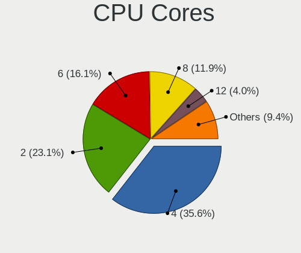

| Number  | Desktops | Percent |
|---------|----------|---------|
| 4       | 68       | 37.78%  |
| 2       | 52       | 28.89%  |
| 6       | 21       | 11.67%  |
| 8       | 17       | 9.44%   |
| 3       | 7        | 3.89%   |
| 1       | 6        | 3.33%   |
| 12      | 4        | 2.22%   |
| 16      | 2        | 1.11%   |
| 10      | 2        | 1.11%   |
| Unknown | 1        | 0.56%   |

CPU Sockets
-----------

Number of sockets

| Number | Desktops | Percent |
|--------|----------|---------|
| 1      | 175      | 98.87%  |
| 2      | 2        | 1.13%   |

CPU Threads
-----------

Threads per core (Hyper-Threading)

| Number  | Desktops | Percent |
|---------|----------|---------|
| 2       | 94       | 52.81%  |
| 1       | 83       | 46.63%  |
| Unknown | 1        | 0.56%   |

CPU Op-Modes
------------

CPU Operation Modes (32-bit, 64-bit)

| Op mode        | Desktops | Percent |
|----------------|----------|---------|
| 32-bit, 64-bit | 171      | 96.61%  |
| Unknown        | 4        | 2.26%   |
| 64-bit         | 1        | 0.56%   |
| 32-bit         | 1        | 0.56%   |

CPU Microcode
-------------

Microcode number

| Number     | Desktops | Percent |
|------------|----------|---------|
| Unknown    | 44       | 23.78%  |
| 0x306c3    | 12       | 6.49%   |
| 0x306a9    | 10       | 5.41%   |
| 0x08701021 | 9        | 4.86%   |
| 0x06000852 | 7        | 3.78%   |
| 0x206a7    | 6        | 3.24%   |
| 0x08108109 | 6        | 3.24%   |
| 0xa0653    | 5        | 2.7%    |
| 0x1067a    | 5        | 2.7%    |
| 0x10676    | 5        | 2.7%    |
| 0x6fd      | 4        | 2.16%   |
| 0x0800820d | 4        | 2.16%   |
| 0x03000027 | 4        | 2.16%   |
| 0x6fb      | 3        | 1.62%   |
| 0x306e4    | 3        | 1.62%   |
| 0x010000c8 | 3        | 1.62%   |
| 0x906ea    | 2        | 1.08%   |
| 0x906e9    | 2        | 1.08%   |
| 0x506e3    | 2        | 1.08%   |
| 0x40651    | 2        | 1.08%   |
| 0x306f2    | 2        | 1.08%   |
| 0x30678    | 2        | 1.08%   |
| 0x206d7    | 2        | 1.08%   |
| 0x106a5    | 2        | 1.08%   |
| 0x08101016 | 2        | 1.08%   |
| 0x08001138 | 2        | 1.08%   |
| 0x06003106 | 2        | 1.08%   |
| 0x06001119 | 2        | 1.08%   |
| 0x0600063e | 2        | 1.08%   |
| 0x05000119 | 2        | 1.08%   |
| 0x010000bf | 2        | 1.08%   |
| 0x01000095 | 2        | 1.08%   |
| 0xf65      | 1        | 0.54%   |
| 0xf41      | 1        | 0.54%   |
| 0xa0655    | 1        | 0.54%   |
| 0x906ed    | 1        | 0.54%   |
| 0x906eb    | 1        | 0.54%   |
| 0x706a1    | 1        | 0.54%   |
| 0x6f2      | 1        | 0.54%   |
| 0x406c4    | 1        | 0.54%   |
| 0x20652    | 1        | 0.54%   |
| 0x10677    | 1        | 0.54%   |
| 0x0a50000c | 1        | 0.54%   |
| 0x0a201016 | 1        | 0.54%   |
| 0x0a201009 | 1        | 0.54%   |
| 0x08701013 | 1        | 0.54%   |
| 0x08600106 | 1        | 0.54%   |
| 0x08108102 | 1        | 0.54%   |
| 0x0810100b | 1        | 0.54%   |
| 0x08001129 | 1        | 0.54%   |
| 0x0700010f | 1        | 0.54%   |
| 0x0600611a | 1        | 0.54%   |
| 0x010000c9 | 1        | 0.54%   |
| 0x010000c7 | 1        | 0.54%   |
| 0x010000b6 | 1        | 0.54%   |

CPU Microarch
-------------

Microarchitecture

| Name          | Desktops | Percent |
|---------------|----------|---------|
| Haswell       | 21       | 11.8%   |
| IvyBridge     | 17       | 9.55%   |
| Penryn        | 14       | 7.87%   |
| Zen+          | 13       | 7.3%    |
| Zen 2         | 12       | 6.74%   |
| K10           | 12       | 6.74%   |
| Piledriver    | 11       | 6.18%   |
| KabyLake      | 10       | 5.62%   |
| Zen           | 9        | 5.06%   |
| SandyBridge   | 8        | 4.49%   |
| Core          | 8        | 4.49%   |
| CometLake     | 8        | 4.49%   |
| Zen 3         | 5        | 2.81%   |
| Silvermont    | 4        | 2.25%   |
| K10 Llano     | 4        | 2.25%   |
| Skylake       | 3        | 1.69%   |
| Nehalem       | 3        | 1.69%   |
| Bobcat        | 3        | 1.69%   |
| Westmere      | 2        | 1.12%   |
| Steamroller   | 2        | 1.12%   |
| NetBurst      | 2        | 1.12%   |
| K8 Hammer     | 2        | 1.12%   |
| Bulldozer     | 2        | 1.12%   |
| Jaguar        | 1        | 0.56%   |
| Goldmont plus | 1        | 0.56%   |
| Excavator     | 1        | 0.56%   |

Graphics
--------

GPU Vendor
----------

Vendors of graphics cards

| Vendor                     | Desktops | Percent |
|----------------------------|----------|---------|
| AMD                        | 67       | 36.02%  |
| Nvidia                     | 65       | 34.95%  |
| Intel                      | 51       | 27.42%  |
| VIA Technologies           | 1        | 0.54%   |
| Matrox Electronics Systems | 1        | 0.54%   |
| ATI Technologies           | 1        | 0.54%   |

GPU Model
---------

Graphics card models

| Model                                                                                    | Desktops | Percent |
|------------------------------------------------------------------------------------------|----------|---------|
| Intel Xeon E3-1200 v3/4th Gen Core Processor Integrated Graphics Controller              | 9        | 4.74%   |
| Nvidia GP108 [GeForce GT 1030]                                                           | 6        | 3.16%   |
| AMD Ellesmere [Radeon RX 470/480/570/570X/580/580X/590]                                  | 6        | 3.16%   |
| Intel Xeon E3-1200 v2/3rd Gen Core processor Graphics Controller                         | 5        | 2.63%   |
| Intel 2nd Generation Core Processor Family Integrated Graphics Controller                | 5        | 2.63%   |
| AMD Picasso/Raven 2 [Radeon Vega Series / Radeon Vega Mobile Series]                     | 5        | 2.63%   |
| AMD Lexa PRO [Radeon 540/540X/550/550X / RX 540X/550/550X]                               | 5        | 2.63%   |
| AMD Caicos [Radeon HD 6450/7450/8450 / R5 230 OEM]                                       | 5        | 2.63%   |
| Nvidia GK208B [GeForce GT 710]                                                           | 4        | 2.11%   |
| AMD Navi 10 [Radeon RX 5600 OEM/5600 XT / 5700/5700 XT]                                  | 4        | 2.11%   |
| Nvidia TU106 [GeForce RTX 2060 Rev. A]                                                   | 3        | 1.58%   |
| Nvidia GT218 [GeForce 210]                                                               | 3        | 1.58%   |
| Nvidia GM206 [GeForce GTX 960]                                                           | 3        | 1.58%   |
| Intel HD Graphics 530                                                                    | 3        | 1.58%   |
| Intel Haswell-ULT Integrated Graphics Controller                                         | 3        | 1.58%   |
| Intel 4 Series Chipset Integrated Graphics Controller                                    | 3        | 1.58%   |
| AMD Wrestler [Radeon HD 6320]                                                            | 3        | 1.58%   |
| AMD Sumo [Radeon HD 6530D]                                                               | 3        | 1.58%   |
| AMD Raven Ridge [Radeon Vega Series / Radeon Vega Mobile Series]                         | 3        | 1.58%   |
| Nvidia TU116 [GeForce GTX 1660 Ti]                                                       | 2        | 1.05%   |
| Nvidia GP107 [GeForce GTX 1050]                                                          | 2        | 1.05%   |
| Nvidia GP107 [GeForce GTX 1050 Ti]                                                       | 2        | 1.05%   |
| Nvidia GP106 [GeForce GTX 1060 6GB]                                                      | 2        | 1.05%   |
| Nvidia GP106 [GeForce GTX 1060 3GB]                                                      | 2        | 1.05%   |
| Nvidia GK208B [GeForce GT 730]                                                           | 2        | 1.05%   |
| Nvidia GK104 [GeForce GTX 770]                                                           | 2        | 1.05%   |
| Nvidia GF106GL [Quadro 2000]                                                             | 2        | 1.05%   |
| Nvidia GA106 [GeForce RTX 3060 Lite Hash Rate]                                           | 2        | 1.05%   |
| Nvidia G98 [GeForce 8400 GS Rev. 2]                                                      | 2        | 1.05%   |
| Intel IvyBridge GT2 [HD Graphics 4000]                                                   | 2        | 1.05%   |
| Intel CometLake-S GT2 [UHD Graphics 630]                                                 | 2        | 1.05%   |
| Intel CoffeeLake-S GT2 [UHD Graphics 630]                                                | 2        | 1.05%   |
| Intel Atom/Celeron/Pentium Processor x5-E8000/J3xxx/N3xxx Integrated Graphics Controller | 2        | 1.05%   |
| Intel Atom Processor Z36xxx/Z37xxx Series Graphics & Display                             | 2        | 1.05%   |
| Intel 82Q35 Express Integrated Graphics Controller                                       | 2        | 1.05%   |
| Intel 82G33/G31 Express Integrated Graphics Controller                                   | 2        | 1.05%   |
| Intel 4th Generation Core Processor Family Integrated Graphics Controller                | 2        | 1.05%   |
| AMD Turks PRO [Radeon HD 6570/7570/8550 / R5 230]                                        | 2        | 1.05%   |
| AMD Tonga PRO [Radeon R9 285/380]                                                        | 2        | 1.05%   |
| AMD RS780L [Radeon 3000]                                                                 | 2        | 1.05%   |
| AMD RS740 [Radeon 2100]                                                                  | 2        | 1.05%   |
| AMD Cedar [Radeon HD 5000/6000/7350/8350 Series]                                         | 2        | 1.05%   |
| AMD Baffin [Radeon RX 550 640SP / RX 560/560X]                                           | 2        | 1.05%   |
| VIA Technologies K8M800/K8N800/K8N800A [S3 UniChrome Pro]                                | 1        | 0.53%   |
| Nvidia TU117 [GeForce GTX 1650]                                                          | 1        | 0.53%   |
| Nvidia TU116 [GeForce GTX 1650]                                                          | 1        | 0.53%   |
| Nvidia TU116 [GeForce GTX 1650 SUPER]                                                    | 1        | 0.53%   |
| Nvidia TU104 [GeForce RTX 2070 SUPER]                                                    | 1        | 0.53%   |
| Nvidia GT216 [GeForce GT 220]                                                            | 1        | 0.53%   |
| Nvidia GT200b [GeForce GTX 275]                                                          | 1        | 0.53%   |
| Nvidia GP102 [GeForce GTX 1080 Ti]                                                       | 1        | 0.53%   |
| Nvidia GM206 [GeForce GTX 950]                                                           | 1        | 0.53%   |
| Nvidia GM204 [GeForce GTX 980]                                                           | 1        | 0.53%   |
| Nvidia GM107GL [Quadro K620]                                                             | 1        | 0.53%   |
| Nvidia GM107 [GeForce GTX 750 Ti]                                                        | 1        | 0.53%   |
| Nvidia GK208 [GeForce GT 720]                                                            | 1        | 0.53%   |
| Nvidia GK110B [GeForce GTX 780 Ti]                                                       | 1        | 0.53%   |
| Nvidia GK107 [GeForce GT 740]                                                            | 1        | 0.53%   |
| Nvidia GK106 [GeForce GTX 660]                                                           | 1        | 0.53%   |
| Nvidia GF119 [GeForce GT 610]                                                            | 1        | 0.53%   |

GPU Combo
---------

Combinations of graphics cards

| Name         | Desktops | Percent |
|--------------|----------|---------|
| 1 x Nvidia   | 62       | 35.03%  |
| 1 x AMD      | 58       | 32.77%  |
| 1 x Intel    | 47       | 26.55%  |
| 2 x AMD      | 4        | 2.26%   |
| AMD + Nvidia | 3        | 1.69%   |
| 1 x VIA      | 1        | 0.56%   |
| 1 x Matrox   | 1        | 0.56%   |
| Intel + AMD  | 1        | 0.56%   |

GPU Driver
----------

Free vs proprietary

| Driver      | Desktops | Percent |
|-------------|----------|---------|
| Free        | 133      | 74.72%  |
| Proprietary | 39       | 21.91%  |
| Unknown     | 6        | 3.37%   |

GPU Memory
----------

Total video memory

| Size in GB | Desktops | Percent |
|------------|----------|---------|
| Unknown    | 74       | 41.57%  |
| 1.01-2.0   | 33       | 18.54%  |
| 0.51-1.0   | 21       | 11.8%   |
| 0.01-0.5   | 17       | 9.55%   |
| 3.01-4.0   | 14       | 7.87%   |
| 5.01-6.0   | 6        | 3.37%   |
| 7.01-8.0   | 5        | 2.81%   |
| 8.01-16.0  | 5        | 2.81%   |
| 2.01-3.0   | 3        | 1.69%   |

Monitor
-------

Monitor Vendor
--------------

Monitor vendors

| Vendor               | Desktops | Percent |
|----------------------|----------|---------|
| Samsung Electronics  | 44       | 24.44%  |
| Goldstar             | 36       | 20%     |
| Hewlett-Packard      | 14       | 7.78%   |
| Dell                 | 11       | 6.11%   |
| LG Electronics       | 10       | 5.56%   |
| AOC                  | 10       | 5.56%   |
| Unknown              | 6        | 3.33%   |
| Lenovo               | 6        | 3.33%   |
| ___                  | 4        | 2.22%   |
| ViewSonic            | 4        | 2.22%   |
| Sony                 | 4        | 2.22%   |
| SAC                  | 3        | 1.67%   |
| Packard Bell         | 3        | 1.67%   |
| KTC                  | 3        | 1.67%   |
| Acer                 | 3        | 1.67%   |
| Plain Tree Systems   | 2        | 1.11%   |
| Philips              | 2        | 1.11%   |
| Hitachi              | 2        | 1.11%   |
| Envision             | 2        | 1.11%   |
| Westinghouse         | 1        | 0.56%   |
| Unknown (XXX)        | 1        | 0.56%   |
| SKY                  | 1        | 0.56%   |
| Sharp                | 1        | 0.56%   |
| MSI                  | 1        | 0.56%   |
| HKC                  | 1        | 0.56%   |
| CHR                  | 1        | 0.56%   |
| BenQ                 | 1        | 0.56%   |
| ASUSTek Computer     | 1        | 0.56%   |
| Ancor Communications | 1        | 0.56%   |
| Unknown              | 1        | 0.56%   |

Monitor Model
-------------

Monitor models

| Model                                                                  | Desktops | Percent |
|------------------------------------------------------------------------|----------|---------|
| Samsung Electronics C24F390 SAM0D2C 1920x1080 521x293mm 23.5-inch      | 5        | 2.63%   |
| Goldstar ULTRAWIDE GSM59F1 2560x1080 673x284mm 28.8-inch               | 5        | 2.63%   |
| Goldstar FULL HD GSM5B55 1920x1080 480x270mm 21.7-inch                 | 4        | 2.11%   |
| Samsung Electronics C24F390 SAM0D2D 1920x1080 521x293mm 23.5-inch      | 3        | 1.58%   |
| Goldstar IPS FULLHD GSM5AB8 1920x1080 480x270mm 21.7-inch              | 3        | 1.58%   |
| Goldstar 2D HD TV GSM59CA 1366x768 509x286mm 23.0-inch                 | 3        | 1.58%   |
| Goldstar 2D FHD TV GSM59C6 1920x1080 509x286mm 23.0-inch               | 3        | 1.58%   |
| ___ LCD TV ___9000 1360x768                                            | 2        | 1.05%   |
| ___ LCD TV ___0101 1360x768                                            | 2        | 1.05%   |
| Unknown SMART TV 0563 1920x1080 1209x680mm 54.6-inch                   | 2        | 1.05%   |
| Unknown LCDTV16 9000 1360x768 1600x900mm 72.3-inch                     | 2        | 1.05%   |
| Unknown LCD TV 0101 1920x1080 1600x900mm 72.3-inch                     | 2        | 1.05%   |
| Samsung Electronics LCD Monitor SAM0F13 3840x2160 890x500mm 40.2-inch  | 2        | 1.05%   |
| SAC LED MONITOR SAC952D 1920x1080 480x270mm 21.7-inch                  | 2        | 1.05%   |
| Philips 190P PHL0831 1280x1024 376x301mm 19.0-inch                     | 2        | 1.05%   |
| LG Electronics LCD Monitor 23MP55 1920x1080                            | 2        | 1.05%   |
| Lenovo LEN S22e-19 LEN61C9 1920x1080 476x268mm 21.5-inch               | 2        | 1.05%   |
| Hewlett-Packard All-in-One HWP4211 1920x1080 509x286mm 23.0-inch       | 2        | 1.05%   |
| Goldstar IPS FULLHD GSM5AB7 1920x1080 480x270mm 21.7-inch              | 2        | 1.05%   |
| AOC LE24H037 AOC2407 1920x1080 521x293mm 23.5-inch                     | 2        | 1.05%   |
| Westinghouse LCM-19v5 WDE1905 1280x1024 376x301mm 19.0-inch            | 1        | 0.53%   |
| ViewSonic VX2253 Series VSC0A28 1920x1080 476x268mm 21.5-inch          | 1        | 0.53%   |
| ViewSonic VG930m-3 VSC991E 1280x1024 376x301mm 19.0-inch               | 1        | 0.53%   |
| ViewSonic VA1926wSERIES VSC5920 1440x900 410x256mm 19.0-inch           | 1        | 0.53%   |
| ViewSonic LCD Monitor VX2370 SERIES 1920x1080                          | 1        | 0.53%   |
| Unknown (XXX) Beyond TV XXX2851 3840x2160 1209x680mm 54.6-inch         | 1        | 0.53%   |
| Sony TV SNY4302 1920x1080                                              | 1        | 0.53%   |
| Sony TV SNY3002 1920x1080 886x498mm 40.0-inch                          | 1        | 0.53%   |
| Sony TV SNY1503 1360x768 1600x900mm 72.3-inch                          | 1        | 0.53%   |
| Sony TV *02 SNYC403 1920x1080 1085x610mm 49.0-inch                     | 1        | 0.53%   |
| SKY TV-monitor SKY0102 1920x1080 885x498mm 40.0-inch                   | 1        | 0.53%   |
| Sharp HDMI SHP101E 1920x540                                            | 1        | 0.53%   |
| Samsung Electronics U28E590 SAM0C4D 3840x2160 607x345mm 27.5-inch      | 1        | 0.53%   |
| Samsung Electronics T22C301 SAM0AD2 1920x1080 477x268mm 21.5-inch      | 1        | 0.53%   |
| Samsung Electronics T19B300 SAM0926 1366x768 410x230mm 18.5-inch       | 1        | 0.53%   |
| Samsung Electronics SyncMaster SAM0576 1280x1024 338x270mm 17.0-inch   | 1        | 0.53%   |
| Samsung Electronics SyncMaster SAM055F 1920x1080                       | 1        | 0.53%   |
| Samsung Electronics SyncMaster SAM0472 1440x900 367x229mm 17.0-inch    | 1        | 0.53%   |
| Samsung Electronics SyncMaster SAM0471 1360x768 344x194mm 15.5-inch    | 1        | 0.53%   |
| Samsung Electronics SyncMaster SAM0322 1440x900 428x255mm 19.6-inch    | 1        | 0.53%   |
| Samsung Electronics SyncMaster SAM02E3 1440x900 367x229mm 17.0-inch    | 1        | 0.53%   |
| Samsung Electronics SyncMaster SAM0274 1440x900 410x257mm 19.1-inch    | 1        | 0.53%   |
| Samsung Electronics SyncMaster SAM01B7 1280x1024 338x270mm 17.0-inch   | 1        | 0.53%   |
| Samsung Electronics SMB2030N SAM0634 1600x900 443x249mm 20.0-inch      | 1        | 0.53%   |
| Samsung Electronics SMB1930N SAM0632 1366x768 410x230mm 18.5-inch      | 1        | 0.53%   |
| Samsung Electronics SA300/SA350 SAM078F 1920x1080 477x268mm 21.5-inch  | 1        | 0.53%   |
| Samsung Electronics S27F350 SAM0D22 1920x1080 598x336mm 27.0-inch      | 1        | 0.53%   |
| Samsung Electronics S24F350 SAM0D20 1920x1080 521x293mm 23.5-inch      | 1        | 0.53%   |
| Samsung Electronics S23C350 SAM0A36 1920x1080 510x287mm 23.0-inch      | 1        | 0.53%   |
| Samsung Electronics S22F350 SAM0D1A 1920x1080 477x268mm 21.5-inch      | 1        | 0.53%   |
| Samsung Electronics S22B300 SAM08A9 1600x900 440x250mm 19.9-inch       | 1        | 0.53%   |
| Samsung Electronics S20B300 SAM08A8 1600x900 443x249mm 20.0-inch       | 1        | 0.53%   |
| Samsung Electronics LU28R55 SAM1017 3840x2160 632x360mm 28.6-inch      | 1        | 0.53%   |
| Samsung Electronics LF22T35 SAM707B 1920x1080 480x270mm 21.7-inch      | 1        | 0.53%   |
| Samsung Electronics LCD Monitor T22C301 1920x1080                      | 1        | 0.53%   |
| Samsung Electronics LCD Monitor T22B350                                | 1        | 0.53%   |
| Samsung Electronics LCD Monitor SAM0B60 1920x1080 1210x680mm 54.6-inch | 1        | 0.53%   |
| Samsung Electronics LCD Monitor SAM0AC6 1920x1080 700x390mm 31.5-inch  | 1        | 0.53%   |
| Samsung Electronics LCD Monitor SAM07D0 1360x768                       | 1        | 0.53%   |
| Samsung Electronics LCD Monitor SAM067A 1360x768                       | 1        | 0.53%   |

Monitor Resolution
------------------

Monitor screen resolution

| Resolution         | Desktops | Percent |
|--------------------|----------|---------|
| 1920x1080 (FHD)    | 73       | 42.69%  |
| 3840x2160 (4K)     | 14       | 8.19%   |
| 1366x768 (WXGA)    | 14       | 8.19%   |
| 1360x768           | 13       | 7.6%    |
| 1440x900 (WXGA+)   | 11       | 6.43%   |
| 1280x1024 (SXGA)   | 9        | 5.26%   |
| 1600x900 (HD+)     | 8        | 4.68%   |
| 2560x1440 (QHD)    | 7        | 4.09%   |
| 2560x1080          | 6        | 3.51%   |
| Unknown            | 4        | 2.34%   |
| 3840x1080          | 3        | 1.75%   |
| 1680x1050 (WSXGA+) | 3        | 1.75%   |
| 1024x768 (XGA)     | 3        | 1.75%   |
| 5760x1080          | 1        | 0.58%   |
| 3440x1440          | 1        | 0.58%   |
| 1280x768           | 1        | 0.58%   |

Monitor Diagonal
----------------

Diagonal size in inches

| Inches  | Desktops | Percent |
|---------|----------|---------|
| 23      | 28       | 15.82%  |
| 21      | 27       | 15.25%  |
| Unknown | 23       | 12.99%  |
| 18      | 12       | 6.78%   |
| 19      | 11       | 6.21%   |
| 27      | 9        | 5.08%   |
| 24      | 9        | 5.08%   |
| 20      | 8        | 4.52%   |
| 34      | 7        | 3.95%   |
| 15      | 7        | 3.95%   |
| 72      | 6        | 3.39%   |
| 17      | 6        | 3.39%   |
| 31      | 5        | 2.82%   |
| 84      | 4        | 2.26%   |
| 54      | 4        | 2.26%   |
| 40      | 3        | 1.69%   |
| 32      | 2        | 1.13%   |
| 22      | 2        | 1.13%   |
| 55      | 1        | 0.56%   |
| 37      | 1        | 0.56%   |
| 28      | 1        | 0.56%   |
| 13      | 1        | 0.56%   |

Monitor Width
-------------

Physical width

| Width in mm | Desktops | Percent |
|-------------|----------|---------|
| 401-500     | 52       | 30.41%  |
| 501-600     | 41       | 23.98%  |
| Unknown     | 23       | 13.45%  |
| 301-350     | 11       | 6.43%   |
| 1501-2000   | 10       | 5.85%   |
| 701-800     | 9        | 5.26%   |
| 601-700     | 8        | 4.68%   |
| 351-400     | 7        | 4.09%   |
| 1001-1500   | 5        | 2.92%   |
| 801-900     | 4        | 2.34%   |
| 201-300     | 1        | 0.58%   |

Aspect Ratio
------------

Proportional relationship between the width and the height

| Ratio   | Desktops | Percent |
|---------|----------|---------|
| 16/9    | 109      | 68.13%  |
| Unknown | 18       | 11.25%  |
| 16/10   | 14       | 8.75%   |
| 5/4     | 9        | 5.63%   |
| 21/9    | 7        | 4.38%   |
| 4/3     | 3        | 1.88%   |

Monitor Area
------------

Area in inch

| Area in inch | Desktops | Percent |
|----------------|----------|---------|
| 201-250        | 55       | 31.98%  |
| 151-200        | 23       | 13.37%  |
| Unknown        | 23       | 13.37%  |
| More than 1000 | 15       | 8.72%   |
| 351-500        | 15       | 8.72%   |
| 141-150        | 15       | 8.72%   |
| 301-350        | 9        | 5.23%   |
| 101-110        | 7        | 4.07%   |
| 501-1000       | 4        | 2.33%   |
| 251-300        | 3        | 1.74%   |
| 131-140        | 2        | 1.16%   |
| 91-100         | 1        | 0.58%   |

Pixel Density
-------------

Pixels per inch

| Density | Desktops | Percent |
|---------|----------|---------|
| 51-100  | 98       | 56.98%  |
| 101-120 | 34       | 19.77%  |
| Unknown | 23       | 13.37%  |
| 1-50    | 13       | 7.56%   |
| 121-160 | 3        | 1.74%   |
| 161-240 | 1        | 0.58%   |

Multiple Monitors
-----------------

Total monitors connected

| Total | Desktops | Percent |
|-------|----------|---------|
| 1     | 133      | 74.72%  |
| 2     | 30       | 16.85%  |
| 0     | 12       | 6.74%   |
| 3     | 3        | 1.69%   |

Network
-------

Net Controller Vendor
---------------------

Controller vendors

| Vendor                          | Desktops | Percent |
|---------------------------------|----------|---------|
| Realtek Semiconductor           | 131      | 48.7%   |
| Intel                           | 44       | 16.36%  |
| Ralink Technology               | 14       | 5.2%    |
| Qualcomm Atheros                | 13       | 4.83%   |
| Ralink                          | 12       | 4.46%   |
| Broadcom                        | 8        | 2.97%   |
| Xiaomi                          | 7        | 2.6%    |
| TP-Link                         | 7        | 2.6%    |
| Nvidia                          | 4        | 1.49%   |
| D-Link System                   | 4        | 1.49%   |
| Broadcom Limited                | 4        | 1.49%   |
| Qualcomm Atheros Communications | 3        | 1.12%   |
| VIA Technologies                | 2        | 0.74%   |
| Samsung Electronics             | 2        | 0.74%   |
| Motorola PCS                    | 2        | 0.74%   |
| Marvell Technology Group        | 2        | 0.74%   |
| Huawei Technologies             | 2        | 0.74%   |
| D-Link                          | 2        | 0.74%   |
| Padix (Rockfire)                | 1        | 0.37%   |
| Oculus VR                       | 1        | 0.37%   |
| Microsoft                       | 1        | 0.37%   |
| Manta                           | 1        | 0.37%   |
| ICS Advent                      | 1        | 0.37%   |
| HMD Global                      | 1        | 0.37%   |

Net Controller Model
--------------------

Controller models

| Model                                                                | Desktops | Percent |
|----------------------------------------------------------------------|----------|---------|
| Realtek RTL8111/8168/8411 PCI Express Gigabit Ethernet Controller    | 107      | 36.27%  |
| Realtek RTL810xE PCI Express Fast Ethernet controller                | 10       | 3.39%   |
| Xiaomi Mi/Redmi series (RNDIS)                                       | 7        | 2.37%   |
| Ralink MT7601U Wireless Adapter                                      | 7        | 2.37%   |
| Realtek RTL8125 2.5GbE Controller                                    | 6        | 2.03%   |
| Intel I211 Gigabit Network Connection                                | 6        | 2.03%   |
| Intel Wi-Fi 6 AX200                                                  | 5        | 1.69%   |
| Intel Ethernet Connection I217-V                                     | 5        | 1.69%   |
| Realtek RTL8192EU 802.11b/g/n WLAN Adapter                           | 4        | 1.36%   |
| Ralink RT2870/RT3070 Wireless Adapter                                | 4        | 1.36%   |
| Ralink RT5392 PCIe Wireless Network Adapter                          | 4        | 1.36%   |
| Ralink RT5390 Wireless 802.11n 1T/1R PCIe                            | 4        | 1.36%   |
| Nvidia MCP61 Ethernet                                                | 4        | 1.36%   |
| Intel Wireless 7260                                                  | 4        | 1.36%   |
| Realtek RTL8192EE PCIe Wireless Network Adapter                      | 3        | 1.02%   |
| Realtek 802.11ac NIC                                                 | 3        | 1.02%   |
| Intel Wi-Fi 6 AX210/AX211/AX411 160MHz                               | 3        | 1.02%   |
| Intel Dual Band Wireless-AC 3168NGW [Stone Peak]                     | 3        | 1.02%   |
| Intel 82579LM Gigabit Network Connection (Lewisville)                | 3        | 1.02%   |
| TP-Link TL-WN823N v2/v3 [Realtek RTL8192EU]                          | 2        | 0.68%   |
| TP-Link TL-WN722N v2/v3 [Realtek RTL8188EUS]                         | 2        | 0.68%   |
| Samsung Galaxy series, misc. (tethering mode)                        | 2        | 0.68%   |
| Realtek RTL8188EUS 802.11n Wireless Network Adapter                  | 2        | 0.68%   |
| Realtek RTL-8185 IEEE 802.11a/b/g Wireless LAN Controller            | 2        | 0.68%   |
| Ralink RT5370 Wireless Adapter                                       | 2        | 0.68%   |
| Ralink RT2561/RT61 rev B 802.11g                                     | 2        | 0.68%   |
| Qualcomm Atheros AR9271 802.11n                                      | 2        | 0.68%   |
| Qualcomm Atheros Attansic L1 Gigabit Ethernet                        | 2        | 0.68%   |
| Marvell Group 88E8056 PCI-E Gigabit Ethernet Controller              | 2        | 0.68%   |
| Intel Wireless-AC 9260                                               | 2        | 0.68%   |
| Intel Ethernet Controller I225-V                                     | 2        | 0.68%   |
| Intel Ethernet Connection I218-V                                     | 2        | 0.68%   |
| Intel Ethernet Connection I217-LM                                    | 2        | 0.68%   |
| Intel Ethernet Connection (2) I219-V                                 | 2        | 0.68%   |
| Intel 82579V Gigabit Network Connection                              | 2        | 0.68%   |
| Intel 82574L Gigabit Network Connection                              | 2        | 0.68%   |
| Intel 82566DM-2 Gigabit Network Connection                           | 2        | 0.68%   |
| Huawei LYA-L09                                                       | 2        | 0.68%   |
| D-Link System DWA-125 Wireless N 150 Adapter(rev.A1) [Ralink RT3070] | 2        | 0.68%   |
| D-Link System DGE-528T Gigabit Ethernet Adapter                      | 2        | 0.68%   |
| Broadcom Limited NetLink BCM57788 Gigabit Ethernet PCIe              | 2        | 0.68%   |
| VIA VT6105/VT6106S [Rhine-III]                                       | 1        | 0.34%   |
| VIA VT6102/VT6103 [Rhine-II]                                         | 1        | 0.34%   |
| TP-Link TL-WN822N Version 4 RTL8192EU                                | 1        | 0.34%   |
| TP-Link 802.11ac WLAN Adapter                                        | 1        | 0.34%   |
| TP-Link 802.11ac NIC                                                 | 1        | 0.34%   |
| Realtek RTL88x2bu [AC1200 Techkey]                                   | 1        | 0.34%   |
| Realtek RTL8821CE 802.11ac PCIe Wireless Network Adapter             | 1        | 0.34%   |
| Realtek RTL8188SU 802.11n WLAN Adapter                               | 1        | 0.34%   |
| Realtek RTL8188FTV 802.11b/g/n 1T1R 2.4G WLAN Adapter                | 1        | 0.34%   |
| Realtek RTL8188EE Wireless Network Adapter                           | 1        | 0.34%   |
| Realtek RTL8187 Wireless Adapter                                     | 1        | 0.34%   |
| Realtek RTL8153 Gigabit Ethernet Adapter                             | 1        | 0.34%   |
| Realtek RTL-8110SC/8169SC Gigabit Ethernet                           | 1        | 0.34%   |
| Realtek RTL-8100/8101L/8139 PCI Fast Ethernet Adapter                | 1        | 0.34%   |
| Ralink MT7610U ("Archer T2U" 2.4G+5G WLAN Adapter                    | 1        | 0.34%   |
| Ralink RT3092 Wireless 802.11n 2T/2R PCIe                            | 1        | 0.34%   |
| Ralink RT3060 Wireless 802.11n 1T/1R                                 | 1        | 0.34%   |
| Qualcomm Atheros QCA9565 / AR9565 Wireless Network Adapter           | 1        | 0.34%   |
| Qualcomm Atheros Killer E220x Gigabit Ethernet Controller            | 1        | 0.34%   |

Wireless Vendor
---------------

Wireless vendors

| Vendor                          | Desktops | Percent |
|---------------------------------|----------|---------|
| Realtek Semiconductor           | 20       | 21.51%  |
| Intel                           | 20       | 21.51%  |
| Ralink Technology               | 14       | 15.05%  |
| Ralink                          | 12       | 12.9%   |
| TP-Link                         | 7        | 7.53%   |
| Qualcomm Atheros                | 7        | 7.53%   |
| Qualcomm Atheros Communications | 3        | 3.23%   |
| Broadcom                        | 3        | 3.23%   |
| D-Link System                   | 2        | 2.15%   |
| D-Link                          | 2        | 2.15%   |
| Broadcom Limited                | 2        | 2.15%   |
| Microsoft                       | 1        | 1.08%   |

Wireless Model
--------------

Wireless models

| Model                                                                         | Desktops | Percent |
|-------------------------------------------------------------------------------|----------|---------|
| Ralink MT7601U Wireless Adapter                                               | 7        | 7.53%   |
| Intel Wi-Fi 6 AX200                                                           | 5        | 5.38%   |
| Realtek RTL8192EU 802.11b/g/n WLAN Adapter                                    | 4        | 4.3%    |
| Ralink RT2870/RT3070 Wireless Adapter                                         | 4        | 4.3%    |
| Ralink RT5392 PCIe Wireless Network Adapter                                   | 4        | 4.3%    |
| Ralink RT5390 Wireless 802.11n 1T/1R PCIe                                     | 4        | 4.3%    |
| Intel Wireless 7260                                                           | 4        | 4.3%    |
| Realtek RTL8192EE PCIe Wireless Network Adapter                               | 3        | 3.23%   |
| Realtek 802.11ac NIC                                                          | 3        | 3.23%   |
| Intel Wi-Fi 6 AX210/AX211/AX411 160MHz                                        | 3        | 3.23%   |
| Intel Dual Band Wireless-AC 3168NGW [Stone Peak]                              | 3        | 3.23%   |
| TP-Link TL-WN823N v2/v3 [Realtek RTL8192EU]                                   | 2        | 2.15%   |
| TP-Link TL-WN722N v2/v3 [Realtek RTL8188EUS]                                  | 2        | 2.15%   |
| Realtek RTL8188EUS 802.11n Wireless Network Adapter                           | 2        | 2.15%   |
| Realtek RTL-8185 IEEE 802.11a/b/g Wireless LAN Controller                     | 2        | 2.15%   |
| Ralink RT5370 Wireless Adapter                                                | 2        | 2.15%   |
| Ralink RT2561/RT61 rev B 802.11g                                              | 2        | 2.15%   |
| Qualcomm Atheros AR9271 802.11n                                               | 2        | 2.15%   |
| Intel Wireless-AC 9260                                                        | 2        | 2.15%   |
| D-Link System DWA-125 Wireless N 150 Adapter(rev.A1) [Ralink RT3070]          | 2        | 2.15%   |
| TP-Link TL-WN822N Version 4 RTL8192EU                                         | 1        | 1.08%   |
| TP-Link 802.11ac WLAN Adapter                                                 | 1        | 1.08%   |
| TP-Link 802.11ac NIC                                                          | 1        | 1.08%   |
| Realtek RTL88x2bu [AC1200 Techkey]                                            | 1        | 1.08%   |
| Realtek RTL8821CE 802.11ac PCIe Wireless Network Adapter                      | 1        | 1.08%   |
| Realtek RTL8188SU 802.11n WLAN Adapter                                        | 1        | 1.08%   |
| Realtek RTL8188FTV 802.11b/g/n 1T1R 2.4G WLAN Adapter                         | 1        | 1.08%   |
| Realtek RTL8188EE Wireless Network Adapter                                    | 1        | 1.08%   |
| Realtek RTL8187 Wireless Adapter                                              | 1        | 1.08%   |
| Ralink MT7610U ("Archer T2U" 2.4G+5G WLAN Adapter                             | 1        | 1.08%   |
| Ralink RT3092 Wireless 802.11n 2T/2R PCIe                                     | 1        | 1.08%   |
| Ralink RT3060 Wireless 802.11n 1T/1R                                          | 1        | 1.08%   |
| Qualcomm Atheros QCA9565 / AR9565 Wireless Network Adapter                    | 1        | 1.08%   |
| Qualcomm Atheros TP-Link TL-WN322G v3 / TL-WN422G v2 802.11g [Atheros AR9271] | 1        | 1.08%   |
| Qualcomm Atheros AR9485 Wireless Network Adapter                              | 1        | 1.08%   |
| Qualcomm Atheros AR9462 Wireless Network Adapter                              | 1        | 1.08%   |
| Qualcomm Atheros AR9287 Wireless Network Adapter (PCI-Express)                | 1        | 1.08%   |
| Qualcomm Atheros AR9285 Wireless Network Adapter (PCI-Express)                | 1        | 1.08%   |
| Qualcomm Atheros AR9227 Wireless Network Adapter                              | 1        | 1.08%   |
| Qualcomm Atheros AR5212/5213/2414 Wireless Network Adapter                    | 1        | 1.08%   |
| Microsoft Xbox 360 Wireless Adapter                                           | 1        | 1.08%   |
| Intel Wireless 8260                                                           | 1        | 1.08%   |
| Intel Wireless 7265                                                           | 1        | 1.08%   |
| Intel Ultimate N WiFi Link 5300                                               | 1        | 1.08%   |
| D-Link DWA-125 Wireless N 150 Adapter(rev.A3) [Ralink RT5370]                 | 1        | 1.08%   |
| D-Link 802.11ac NIC                                                           | 1        | 1.08%   |
| Broadcom Limited BCM43228 802.11a/b/g/n                                       | 1        | 1.08%   |
| Broadcom Limited BCM43224 802.11a/b/g/n                                       | 1        | 1.08%   |
| Broadcom BCM4352 802.11ac Wireless Network Adapter                            | 1        | 1.08%   |
| Broadcom BCM43225 802.11b/g/n                                                 | 1        | 1.08%   |
| Broadcom BCM4322 802.11a/b/g/n Wireless LAN Controller                        | 1        | 1.08%   |

Ethernet Vendor
---------------

Ethernet vendors

| Vendor                   | Desktops | Percent |
|--------------------------|----------|---------|
| Realtek Semiconductor    | 125      | 64.1%   |
| Intel                    | 33       | 16.92%  |
| Xiaomi                   | 7        | 3.59%   |
| Qualcomm Atheros         | 6        | 3.08%   |
| Broadcom                 | 5        | 2.56%   |
| Nvidia                   | 4        | 2.05%   |
| VIA Technologies         | 2        | 1.03%   |
| Samsung Electronics      | 2        | 1.03%   |
| Marvell Technology Group | 2        | 1.03%   |
| Huawei Technologies      | 2        | 1.03%   |
| D-Link System            | 2        | 1.03%   |
| Broadcom Limited         | 2        | 1.03%   |
| Motorola PCS             | 1        | 0.51%   |
| ICS Advent               | 1        | 0.51%   |
| HMD Global               | 1        | 0.51%   |

Ethernet Model
--------------

Ethernet models

| Model                                                             | Desktops | Percent |
|-------------------------------------------------------------------|----------|---------|
| Realtek RTL8111/8168/8411 PCI Express Gigabit Ethernet Controller | 107      | 54.04%  |
| Realtek RTL810xE PCI Express Fast Ethernet controller             | 10       | 5.05%   |
| Xiaomi Mi/Redmi series (RNDIS)                                    | 7        | 3.54%   |
| Realtek RTL8125 2.5GbE Controller                                 | 6        | 3.03%   |
| Intel I211 Gigabit Network Connection                             | 6        | 3.03%   |
| Intel Ethernet Connection I217-V                                  | 5        | 2.53%   |
| Nvidia MCP61 Ethernet                                             | 4        | 2.02%   |
| Intel 82579LM Gigabit Network Connection (Lewisville)             | 3        | 1.52%   |
| Samsung Galaxy series, misc. (tethering mode)                     | 2        | 1.01%   |
| Qualcomm Atheros Attansic L1 Gigabit Ethernet                     | 2        | 1.01%   |
| Marvell Group 88E8056 PCI-E Gigabit Ethernet Controller           | 2        | 1.01%   |
| Intel Ethernet Controller I225-V                                  | 2        | 1.01%   |
| Intel Ethernet Connection I218-V                                  | 2        | 1.01%   |
| Intel Ethernet Connection I217-LM                                 | 2        | 1.01%   |
| Intel Ethernet Connection (2) I219-V                              | 2        | 1.01%   |
| Intel 82579V Gigabit Network Connection                           | 2        | 1.01%   |
| Intel 82574L Gigabit Network Connection                           | 2        | 1.01%   |
| Intel 82566DM-2 Gigabit Network Connection                        | 2        | 1.01%   |
| Huawei LYA-L09                                                    | 2        | 1.01%   |
| D-Link System DGE-528T Gigabit Ethernet Adapter                   | 2        | 1.01%   |
| Broadcom Limited NetLink BCM57788 Gigabit Ethernet PCIe           | 2        | 1.01%   |
| VIA VT6105/VT6106S [Rhine-III]                                    | 1        | 0.51%   |
| VIA VT6102/VT6103 [Rhine-II]                                      | 1        | 0.51%   |
| Realtek RTL8153 Gigabit Ethernet Adapter                          | 1        | 0.51%   |
| Realtek RTL-8110SC/8169SC Gigabit Ethernet                        | 1        | 0.51%   |
| Realtek RTL-8100/8101L/8139 PCI Fast Ethernet Adapter             | 1        | 0.51%   |
| Qualcomm Atheros Killer E220x Gigabit Ethernet Controller         | 1        | 0.51%   |
| Qualcomm Atheros AR8161 Gigabit Ethernet                          | 1        | 0.51%   |
| Qualcomm Atheros AR8151 v2.0 Gigabit Ethernet                     | 1        | 0.51%   |
| Qualcomm Atheros AR8121/AR8113/AR8114 Gigabit or Fast Ethernet    | 1        | 0.51%   |
| Motorola PCS moto g(9) play                                       | 1        | 0.51%   |
| Intel I350 Gigabit Network Connection                             | 1        | 0.51%   |
| Intel Ethernet Connection (7) I219-V                              | 1        | 0.51%   |
| Intel Ethernet Connection (2) I219-LM                             | 1        | 0.51%   |
| Intel Ethernet Connection (12) I219-V                             | 1        | 0.51%   |
| Intel 82578DC Gigabit Network Connection                          | 1        | 0.51%   |
| Intel 82566DC Gigabit Network Connection                          | 1        | 0.51%   |
| Intel 80003ES2LAN Gigabit Ethernet Controller (Copper)            | 1        | 0.51%   |
| ICS Advent DM9601 Fast Ethernet Adapter                           | 1        | 0.51%   |
| HMD Global SDM439-QRD _SN:609DB907                                | 1        | 0.51%   |
| Broadcom NetXtreme BCM5764M Gigabit Ethernet PCIe                 | 1        | 0.51%   |
| Broadcom NetXtreme BCM5762 Gigabit Ethernet PCIe                  | 1        | 0.51%   |
| Broadcom NetXtreme BCM5761 Gigabit Ethernet PCIe                  | 1        | 0.51%   |
| Broadcom NetXtreme BCM5751F Fast Ethernet PCI Express             | 1        | 0.51%   |
| Broadcom NetLink BCM5787 Gigabit Ethernet PCI Express             | 1        | 0.51%   |

Net Controller Kind
-------------------

Ethernet, WiFi or modem

| Kind     | Desktops | Percent |
|----------|----------|---------|
| Ethernet | 176      | 66.67%  |
| WiFi     | 84       | 31.82%  |
| Unknown  | 3        | 1.14%   |
| Modem    | 1        | 0.38%   |

Used Controller
---------------

Currently used network controller

| Kind     | Desktops | Percent |
|----------|----------|---------|
| Ethernet | 127      | 72.57%  |
| WiFi     | 48       | 27.43%  |

NICs
----

Total network controllers on board

| Total | Desktops | Percent |
|-------|----------|---------|
| 1     | 118      | 66.67%  |
| 2     | 50       | 28.25%  |
| 3     | 7        | 3.95%   |
| 4     | 1        | 0.56%   |
| 0     | 1        | 0.56%   |

IPv6
----

IPv6 vs IPv4

| Used | Desktops | Percent |
|------|----------|---------|
| No   | 172      | 96.09%  |
| Yes  | 7        | 3.91%   |

Bluetooth
---------

Bluetooth Vendor
----------------

Controller vendors

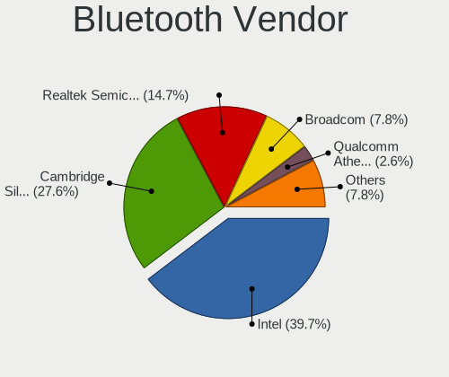

| Vendor                          | Desktops | Percent |
|---------------------------------|----------|---------|
| Intel                           | 19       | 33.33%  |
| Cambridge Silicon Radio         | 18       | 31.58%  |
| Realtek Semiconductor           | 9        | 15.79%  |
| Broadcom                        | 7        | 12.28%  |
| Qualcomm Atheros Communications | 2        | 3.51%   |
| ASUSTek Computer                | 1        | 1.75%   |
| Apple                           | 1        | 1.75%   |

Bluetooth Model
---------------

Controller models

| Model                                               | Desktops | Percent |
|-----------------------------------------------------|----------|---------|
| Cambridge Silicon Radio Bluetooth Dongle (HCI mode) | 18       | 31.58%  |
| Realtek Bluetooth Radio                             | 9        | 15.79%  |
| Intel Bluetooth wireless interface                  | 6        | 10.53%  |
| Intel AX200 Bluetooth                               | 5        | 8.77%   |
| Intel Wireless-AC 3168 Bluetooth                    | 3        | 5.26%   |
| Intel AX210 Bluetooth                               | 3        | 5.26%   |
| Broadcom Bluetooth 3.0 USB Dongle                   | 3        | 5.26%   |
| Intel Bluetooth Device                              | 2        | 3.51%   |
| Qualcomm Atheros  Bluetooth Device                  | 1        | 1.75%   |
| Qualcomm Atheros AR3012 Bluetooth 4.0               | 1        | 1.75%   |
| Broadcom HP Bluetooth Module                        | 1        | 1.75%   |
| Broadcom HP Bluethunder                             | 1        | 1.75%   |
| Broadcom Bluetooth 3.0 Device                       | 1        | 1.75%   |
| Broadcom BCM20702A0 Bluetooth 4.0                   | 1        | 1.75%   |
| ASUS BCM20702A0                                     | 1        | 1.75%   |
| Apple Bluetooth HCI                                 | 1        | 1.75%   |

Sound
-----

Sound Vendor
------------

Sound card vendors

| Vendor                     | Desktops | Percent |
|----------------------------|----------|---------|
| Intel                      | 95       | 33.45%  |
| AMD                        | 90       | 31.69%  |
| Nvidia                     | 59       | 20.77%  |
| C-Media Electronics        | 8        | 2.82%   |
| Creative Labs              | 5        | 1.76%   |
| VIA Technologies           | 2        | 0.7%    |
| Texas Instruments          | 2        | 0.7%    |
| Logitech                   | 2        | 0.7%    |
| Generalplus Technology     | 2        | 0.7%    |
| Arturia                    | 2        | 0.7%    |
| Unknown                    | 1        | 0.35%   |
| Razer USA                  | 1        | 0.35%   |
| PreSonus Audio Electronics | 1        | 0.35%   |
| Native Instruments         | 1        | 0.35%   |
| Micro Star International   | 1        | 0.35%   |
| Kingston Technology        | 1        | 0.35%   |
| JMTek                      | 1        | 0.35%   |
| Hewlett-Packard            | 1        | 0.35%   |
| GYROCOM C&C                | 1        | 0.35%   |
| Focusrite-Novation         | 1        | 0.35%   |
| eMPIA Technology           | 1        | 0.35%   |
| Creative Technology        | 1        | 0.35%   |
| Corsair                    | 1        | 0.35%   |
| Blue Microphones           | 1        | 0.35%   |
| ATI Technologies           | 1        | 0.35%   |
| Apple                      | 1        | 0.35%   |
| Afatech                    | 1        | 0.35%   |

Sound Model
-----------

Sound card models

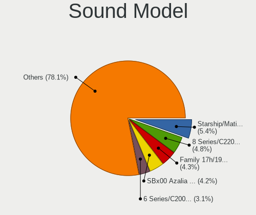

| Model                                                                             | Desktops | Percent |
|-----------------------------------------------------------------------------------|----------|---------|
| AMD SBx00 Azalia (Intel HDA)                                                      | 21       | 6.14%   |
| AMD Starship/Matisse HD Audio Controller                                          | 16       | 4.68%   |
| AMD Family 17h/19h HD Audio Controller                                            | 16       | 4.68%   |
| Intel 8 Series/C220 Series Chipset High Definition Audio Controller               | 14       | 4.09%   |
| Intel 6 Series/C200 Series Chipset Family High Definition Audio Controller        | 11       | 3.22%   |
| AMD FCH Azalia Controller                                                         | 10       | 2.92%   |
| Intel Xeon E3-1200 v3/4th Gen Core Processor HD Audio Controller                  | 9        | 2.63%   |
| Intel 82801JI (ICH10 Family) HD Audio Controller                                  | 9        | 2.63%   |
| Intel NM10/ICH7 Family High Definition Audio Controller                           | 8        | 2.34%   |
| AMD Raven/Raven2/Fenghuang HDMI/DP Audio Controller                               | 8        | 2.34%   |
| AMD Family 17h (Models 00h-0fh) HD Audio Controller                               | 8        | 2.34%   |
| Nvidia GK208 HDMI/DP Audio Controller                                             | 7        | 2.05%   |
| Intel 7 Series/C216 Chipset Family High Definition Audio Controller               | 7        | 2.05%   |
| AMD Ellesmere HDMI Audio [Radeon RX 470/480 / 570/580/590]                        | 7        | 2.05%   |
| AMD Baffin HDMI/DP Audio [Radeon RX 550 640SP / RX 560/560X]                      | 7        | 2.05%   |
| Nvidia GP108 High Definition Audio Controller                                     | 6        | 1.75%   |
| Intel C600/X79 series chipset High Definition Audio Controller                    | 6        | 1.75%   |
| AMD Caicos HDMI Audio [Radeon HD 6450 / 7450/8450/8490 OEM / R5 230/235/235X OEM] | 6        | 1.75%   |
| Intel Comet Lake PCH-V cAVS                                                       | 5        | 1.46%   |
| Intel 100 Series/C230 Series Chipset Family HD Audio Controller                   | 5        | 1.46%   |
| Nvidia TU116 High Definition Audio Controller                                     | 4        | 1.17%   |
| Nvidia MCP61 High Definition Audio                                                | 4        | 1.17%   |
| Nvidia GP107GL High Definition Audio Controller                                   | 4        | 1.17%   |
| Nvidia GP106 High Definition Audio Controller                                     | 4        | 1.17%   |
| Nvidia GM206 High Definition Audio Controller                                     | 4        | 1.17%   |
| Intel 82801I (ICH9 Family) HD Audio Controller                                    | 4        | 1.17%   |
| Intel 200 Series PCH HD Audio                                                     | 4        | 1.17%   |
| AMD Oland/Hainan/Cape Verde/Pitcairn HDMI Audio [Radeon HD 7000 Series]           | 4        | 1.17%   |
| AMD Navi 10 HDMI Audio                                                            | 4        | 1.17%   |
| AMD Cedar HDMI Audio [Radeon HD 5400/6300/7300 Series]                            | 4        | 1.17%   |
| Nvidia TU106 High Definition Audio Controller                                     | 3        | 0.88%   |
| Nvidia High Definition Audio Controller                                           | 3        | 0.88%   |
| Intel Haswell-ULT HD Audio Controller                                             | 3        | 0.88%   |
| Intel 8 Series HD Audio Controller                                                | 3        | 0.88%   |
| AMD Navi 21/23 HDMI/DP Audio Controller                                           | 3        | 0.88%   |
| Nvidia GM107 High Definition Audio Controller [GeForce 940MX]                     | 2        | 0.58%   |
| Nvidia GK104 HDMI Audio Controller                                                | 2        | 0.58%   |
| Nvidia GF119 HDMI Audio Controller                                                | 2        | 0.58%   |
| Nvidia GF106 High Definition Audio Controller                                     | 2        | 0.58%   |
| Nvidia GA106 High Definition Audio Controller                                     | 2        | 0.58%   |
| Nvidia GA102 High Definition Audio Controller                                     | 2        | 0.58%   |
| Intel Cannon Lake PCH cAVS                                                        | 2        | 0.58%   |
| Intel C610/X99 series chipset HD Audio Controller                                 | 2        | 0.58%   |
| Intel Audio device                                                                | 2        | 0.58%   |
| Intel Atom Processor Z36xxx/Z37xxx Series High Definition Audio Controller        | 2        | 0.58%   |
| Intel 9 Series Chipset Family HD Audio Controller                                 | 2        | 0.58%   |
| Intel 82801H (ICH8 Family) HD Audio Controller                                    | 2        | 0.58%   |
| Generalplus Technology USB Audio Device                                           | 2        | 0.58%   |
| Creative Labs CA0106/CA0111 [SB Live!/Audigy/X-Fi Series]                         | 2        | 0.58%   |
| C-Media Electronics CMI8738/CMI8768 PCI Audio                                     | 2        | 0.58%   |
| C-Media Electronics Blue Snowball                                                 | 2        | 0.58%   |
| C-Media Electronics Audio Adapter (Unitek Y-247A)                                 | 2        | 0.58%   |
| AMD Turks HDMI Audio [Radeon HD 6500/6600 / 6700M Series]                         | 2        | 0.58%   |
| AMD Tonga HDMI Audio [Radeon R9 285/380]                                          | 2        | 0.58%   |
| AMD RS780 HDMI Audio [Radeon 3000/3100 / HD 3200/3300]                            | 2        | 0.58%   |
| AMD Renoir Radeon High Definition Audio Controller                                | 2        | 0.58%   |
| AMD Cypress HDMI Audio [Radeon HD 5830/5850/5870 / 6850/6870 Rebrand]             | 2        | 0.58%   |
| VIA Technologies VT8233/A/8235/8237 AC97 Audio Controller                         | 1        | 0.29%   |
| VIA Technologies VT1720/24 [Envy24PT/HT] PCI Multi-Channel Audio Controller       | 1        | 0.29%   |
| Unknown USB Midi                                                                  | 1        | 0.29%   |

Memory
------

Memory Vendor
-------------

Memory module vendors

| Vendor              | Desktops | Percent |
|---------------------|----------|---------|
| Kingston            | 23       | 26.44%  |
| Crucial             | 15       | 17.24%  |
| Unknown             | 10       | 11.49%  |
| Samsung Electronics | 9        | 10.34%  |
| Corsair             | 9        | 10.34%  |
| Micron Technology   | 4        | 4.6%    |
| SK hynix            | 3        | 3.45%   |
| G.Skill             | 3        | 3.45%   |
| A-DATA Technology   | 3        | 3.45%   |
| Patriot             | 1        | 1.15%   |
| Nanya Technology    | 1        | 1.15%   |
| Kreton              | 1        | 1.15%   |
| Goldenmars          | 1        | 1.15%   |
| GLOWAY              | 1        | 1.15%   |
| Elpida              | 1        | 1.15%   |
| Atermiter           | 1        | 1.15%   |
| Ankowall            | 1        | 1.15%   |

Memory Model
------------

Memory module models

| Model                                                                      | Desktops | Percent |
|----------------------------------------------------------------------------|----------|---------|
| Kingston RAM KHX1866C10D3/8G 8GB DIMM DDR3 1867MT/s                        | 3        | 3.06%   |
| Unknown RAM Module 8192MB DIMM 1600MT/s                                    | 2        | 2.04%   |
| Samsung RAM M471B5273DH0-CH9 4GB SODIMM DDR3 1334MT/s                      | 2        | 2.04%   |
| Kingston RAM KHX3466C17D4/16GX 16384MB DIMM DDR4 3466MT/s                  | 2        | 2.04%   |
| Kingston RAM KHX2666C16/8G 8GB DIMM DDR4 3466MT/s                          | 2        | 2.04%   |
| Crucial RAM CT4G4DFS6266.C4FJ 4096MB DIMM DDR4 2666MT/s                    | 2        | 2.04%   |
| Unknown RAM Module 8GB DIMM DDR3 1600MT/s                                  | 1        | 1.02%   |
| Unknown RAM Module 8GB DIMM DDR3 1333MT/s                                  | 1        | 1.02%   |
| Unknown RAM Module 8192MB DIMM DDR3                                        | 1        | 1.02%   |
| Unknown RAM Module 4GB DIMM DDR3 1333MT/s                                  | 1        | 1.02%   |
| Unknown RAM Module 4GB DIMM DDR3 1066MT/s                                  | 1        | 1.02%   |
| Unknown RAM Module 4096MB DIMM DDR3 1333MT/s                               | 1        | 1.02%   |
| Unknown RAM Module 4096MB DIMM 1600MT/s                                    | 1        | 1.02%   |
| Unknown RAM Module 2GB DIMM DDR2 667MT/s                                   | 1        | 1.02%   |
| Unknown RAM Module 2GB DIMM                                                | 1        | 1.02%   |
| Unknown RAM Module 2048MB DIMM DDR2 800MT/s                                | 1        | 1.02%   |
| Unknown RAM Module 2048MB DIMM 1600MT/s                                    | 1        | 1.02%   |
| SK hynix RAM Module 8192MB SODIMM DDR4 2133MT/s                            | 1        | 1.02%   |
| SK hynix RAM Module 2048MB DIMM DDR3 1066MT/s                              | 1        | 1.02%   |
| SK hynix RAM HMT151R7BFR4C 4096MB DIMM DDR3 1333MT/s                       | 1        | 1.02%   |
| Samsung RAM M471B1G73QHO-YK0 8GB SODIMM DDR3 1600MT/s                      | 1        | 1.02%   |
| Samsung RAM M393B5273CH0-YH9 4GB DIMM DDR3 1333MT/s                        | 1        | 1.02%   |
| Samsung RAM M393B5170GB0 4GB DIMM DDR3 1866MT/s                            | 1        | 1.02%   |
| Samsung RAM M393B2G70DB0 16GB DIMM DDR3 1866MT/s                           | 1        | 1.02%   |
| Samsung RAM M378B5773DH0-CH9 2GB DIMM DDR3 1333MT/s                        | 1        | 1.02%   |
| Samsung RAM M378B5173QH0-CK0 4GB DIMM DDR3 1866MT/s                        | 1        | 1.02%   |
| Samsung RAM M378B1G73QH0-CK0 8GB DIMM DDR3 1600MT/s                        | 1        | 1.02%   |
| Patriot RAM 3200 C16 Series 8GB DIMM DDR4 3200MT/s                         | 1        | 1.02%   |
| Nanya RAM NT2GC64B88B0NS-CG 2GB SODIMM DDR3 1334MT/s                       | 1        | 1.02%   |
| Micron RAM M471A3243BB0-CP50 16GB SODIMM DDR4 2667MT/s                     | 1        | 1.02%   |
| Micron RAM 8KTF51264HZ-1G6E1 4GB SODIMM DDR3 1600MT/s                      | 1        | 1.02%   |
| Micron RAM 8JTF25664AZ-1G4D1 2048MB DIMM DDR3 1333MT/s                     | 1        | 1.02%   |
| Micron RAM 16KTF1G64HZ-1G6E1 8192MB DIMM DDR3 1066MT/s                     | 1        | 1.02%   |
| Kreton RAM 51525xxxx68x35xxxx 1GB DIMM DDR2 667MT/s                        | 1        | 1.02%   |
| Kingston RAM Module 2GB DIMM DDR 667MT/s                                   | 1        | 1.02%   |
| Kingston RAM KHX3200C16D4/8GX 8GB DIMM DDR4 3600MT/s                       | 1        | 1.02%   |
| Kingston RAM KHX3200C16D4/16GX 16GB DIMM DDR4 3600MT/s                     | 1        | 1.02%   |
| Kingston RAM KHX2933C15D4/8GX 8192MB DIMM DDR4 2933MT/s                    | 1        | 1.02%   |
| Kingston RAM KHX2666C16D4/16GX 16GB DIMM DDR4 2667MT/s                     | 1        | 1.02%   |
| Kingston RAM KHX2666C16/16G 16GB DIMM DDR4 3200MT/s                        | 1        | 1.02%   |
| Kingston RAM KF3600C16D4/16GX 16GB DIMM DDR4 3600MT/s                      | 1        | 1.02%   |
| Kingston RAM KF2666C16D4/8G 8192MB DIMM DDR4 2667MT/s                      | 1        | 1.02%   |
| Kingston RAM 99U5584-007.A00LF 4096MB DIMM DDR3 1333MT/s                   | 1        | 1.02%   |
| Kingston RAM 99U5469-053.A00LF 4GB SODIMM DDR3 1333MT/s                    | 1        | 1.02%   |
| Kingston RAM 99U5469-041.A00LF 4GB SODIMM DDR3 1600MT/s                    | 1        | 1.02%   |
| Kingston RAM 9905474-036.A00LF 2048MB DIMM DDR3 1067MT/s                   | 1        | 1.02%   |
| Kingston RAM 9905474-019.A00LF 2GB DIMM DDR3 1333MT/s                      | 1        | 1.02%   |
| Kingston RAM 9905471-011.A00LF 4GB DIMM DDR3 1600MT/s                      | 1        | 1.02%   |
| Kingston RAM 9905428-087.A00G 8GB SODIMM DDR3 1600MT/s                     | 1        | 1.02%   |
| Kingston RAM 9905403-038.A00G 4GB DIMM DDR3 1333MT/s                       | 1        | 1.02%   |
| Kingston RAM 9905402-570.A00LF 4GB DIMM DDR3 1333MT/s                      | 1        | 1.02%   |
| Kingston RAM 9905316-005.A04LF 1GB DIMM DDR2 667MT/s                       | 1        | 1.02%   |
| Kingston RAM 32472D5544494D4D00000000000000000000 2048MB DIMM DDR2 667MT/s | 1        | 1.02%   |
| Goldenmars RAM GMT8G04SCL116P-PBA 8GB SODIMM DDR3 1600MT/s                 | 1        | 1.02%   |
| GLOWAY RAM TYP4U3200E16082C 8GB DIMM DDR4 3200MT/s                         | 1        | 1.02%   |
| G.Skill RAM F4-2800C17-8GVR 8GB DIMM DDR4 2133MT/s                         | 1        | 1.02%   |
| G.Skill RAM F3-12800CL9-2GBXL 2GB DIMM DDR3 1600MT/s                       | 1        | 1.02%   |
| G.Skill RAM F2-6400CL5-2GBNT 2GB DIMM DDR 667MT/s                          | 1        | 1.02%   |
| Elpida RAM EBJ21UE8BDS0-DJ-F 2048MB DIMM DDR3 1333MT/s                     | 1        | 1.02%   |
| Crucial RAM Module 4GB DIMM DDR3 1600MT/s                                  | 1        | 1.02%   |

Memory Kind
-----------

Memory module kinds

| Kind    | Desktops | Percent |
|---------|----------|---------|
| DDR4    | 33       | 43.42%  |
| DDR3    | 32       | 42.11%  |
| DDR2    | 5        | 6.58%   |
| Unknown | 3        | 3.95%   |
| SDRAM   | 2        | 2.63%   |
| DDR     | 1        | 1.32%   |

Memory Form Factor
------------------

Physical design of the memory module

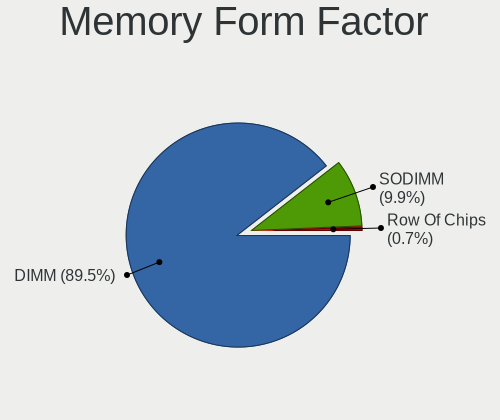

| Name   | Desktops | Percent |
|--------|----------|---------|
| DIMM   | 68       | 90.67%  |
| SODIMM | 7        | 9.33%   |

Memory Size
-----------

Memory module size

| Size  | Desktops | Percent |
|-------|----------|---------|
| 8192  | 31       | 36.47%  |
| 4096  | 24       | 28.24%  |
| 2048  | 16       | 18.82%  |
| 16384 | 12       | 14.12%  |
| 32768 | 1        | 1.18%   |
| 1024  | 1        | 1.18%   |

Memory Speed
------------

Memory module speed

| Speed   | Desktops | Percent |
|---------|----------|---------|
| 1600    | 17       | 19.32%  |
| 1333    | 13       | 14.77%  |
| 2133    | 8        | 9.09%   |
| 3600    | 6        | 6.82%   |
| 2667    | 6        | 6.82%   |
| 3466    | 5        | 5.68%   |
| 667     | 4        | 4.55%   |
| 3200    | 3        | 3.41%   |
| 2400    | 3        | 3.41%   |
| 1866    | 3        | 3.41%   |
| 1066    | 3        | 3.41%   |
| 2666    | 2        | 2.27%   |
| 1334    | 2        | 2.27%   |
| 800     | 2        | 2.27%   |
| Unknown | 2        | 2.27%   |
| 4000    | 1        | 1.14%   |
| 3800    | 1        | 1.14%   |
| 3400    | 1        | 1.14%   |
| 3266    | 1        | 1.14%   |
| 3134    | 1        | 1.14%   |
| 3000    | 1        | 1.14%   |
| 2933    | 1        | 1.14%   |
| 2800    | 1        | 1.14%   |
| 1067    | 1        | 1.14%   |

Printers & scanners
-------------------

Printer Vendor
--------------

Printer device vendors

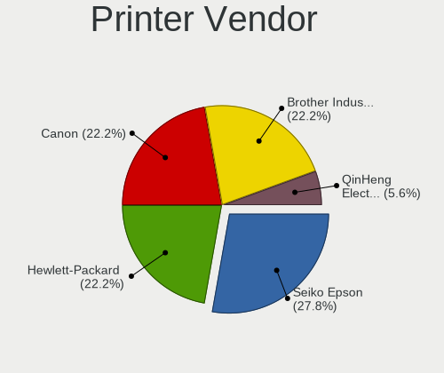

| Vendor              | Desktops | Percent |
|---------------------|----------|---------|
| Canon               | 3        | 30%     |
| Seiko Epson         | 2        | 20%     |
| Hewlett-Packard     | 2        | 20%     |
| Brother Industries  | 2        | 20%     |
| QinHeng Electronics | 1        | 10%     |

Printer Model
-------------

Printer device models

| Model                    | Desktops | Percent |
|--------------------------|----------|---------|
| Brother HL-1200 series   | 2        | 20%     |
| Seiko Epson Printer      | 1        | 10%     |
| Seiko Epson L3150 Series | 1        | 10%     |
| QinHeng CH340S           | 1        | 10%     |
| HP Deskjet 4640 series   | 1        | 10%     |
| HP Deskjet 4620 series   | 1        | 10%     |
| Canon PIXMA MP250        | 1        | 10%     |
| Canon G2000 series       | 1        | 10%     |
| Canon G1000 series       | 1        | 10%     |

Scanner Vendor
--------------

Scanner device vendors

| Vendor      | Desktops | Percent |
|-------------|----------|---------|
| Seiko Epson | 2        | 50%     |
| Canon       | 2        | 50%     |

Scanner Model
-------------

Scanner device models

| Model                                         | Desktops | Percent |
|-----------------------------------------------|----------|---------|
| Seiko Epson GT-X820 [Perfection V600 Photo]   | 1        | 25%     |
| Seiko Epson GT-8300UF [Perfection 1660 PHOTO] | 1        | 25%     |
| Canon CanoScan LiDE 110                       | 1        | 25%     |
| Canon CanoScan D1250U2                        | 1        | 25%     |

Camera
------

Camera Vendor
-------------

Camera device vendors

| Vendor                        | Desktops | Percent |
|-------------------------------|----------|---------|
| Logitech                      | 7        | 18.92%  |
| Chicony Electronics           | 6        | 16.22%  |
| Generalplus Technology        | 4        | 10.81%  |
| Apple                         | 4        | 10.81%  |
| Sunplus Innovation Technology | 2        | 5.41%   |
| Microsoft                     | 2        | 5.41%   |
| Microdia                      | 2        | 5.41%   |
| Z-Star Microelectronics       | 1        | 2.7%    |
| Unknown                       | 1        | 2.7%    |
| OmniVision Technologies       | 1        | 2.7%    |
| MacroSilicon                  | 1        | 2.7%    |
| Lenovo                        | 1        | 2.7%    |
| KYE Systems (Mouse Systems)   | 1        | 2.7%    |
| Jieli Technology              | 1        | 2.7%    |
| AVerMedia Technologies        | 1        | 2.7%    |
| Arkmicro Technologies         | 1        | 2.7%    |
| Alcor Micro                   | 1        | 2.7%    |

Camera Model
------------

Camera device models

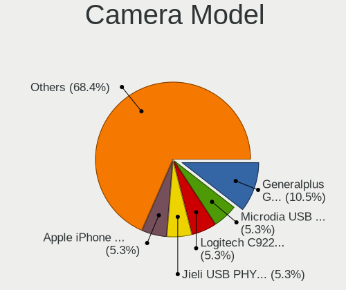

| Model                                         | Desktops | Percent |
|-----------------------------------------------|----------|---------|
| Logitech C922 Pro Stream Webcam               | 4        | 10.81%  |
| Generalplus WEB CAM                           | 4        | 10.81%  |
| Apple iPhone 5/5C/5S/6/SE                     | 4        | 10.81%  |
| Chicony HP 0.3MP Webcam                       | 3        | 8.11%   |
| Sunplus HD 720P webcam                        | 2        | 5.41%   |
| Z-Star Integrated Camera                      | 1        | 2.7%    |
| Unknown HD camera                             | 1        | 2.7%    |
| OmniVision OV511+ Webcam                      | 1        | 2.7%    |
| Microsoft Microsoft LifeCam Studio          | 1        | 2.7%    |
| Microsoft LifeCam VX-800                      | 1        | 2.7%    |
| Microdia USB camera                           | 1        | 2.7%    |
| Microdia Amcrest AWC2198 USB Webcam           | 1        | 2.7%    |
| MacroSilicon MS210x Video Grabber [EasierCAP] | 1        | 2.7%    |
| Logitech Webcam C270                          | 1        | 2.7%    |
| Logitech Webcam C210                          | 1        | 2.7%    |
| Logitech Webcam C170                          | 1        | 2.7%    |
| Lenovo FHD Webcam Audio                       | 1        | 2.7%    |
| KYE Systems (Mouse Systems) FaceCam 1000X     | 1        | 2.7%    |
| Jieli USB PHY 2.0                             | 1        | 2.7%    |
| Chicony HP High Definition 1MP Webcam         | 1        | 2.7%    |
| Chicony HP 1.0MP High Definition Webcam       | 1        | 2.7%    |
| Chicony CNF8050 Webcam                        | 1        | 2.7%    |
| AVerMedia Live Streamer CAM 313               | 1        | 2.7%    |
| Arkmicro USB2.0 PC CAMERA                     | 1        | 2.7%    |
| Alcor Micro USB 2.0 PC Camera                 | 1        | 2.7%    |

Security
--------

Fingerprint Vendor
------------------

Fingerprint sensor vendors

Zero info for selected period =(

Fingerprint Model
-----------------

Fingerprint sensor models

Zero info for selected period =(

Chipcard Vendor
---------------

Chipcard module vendors

Zero info for selected period =(

Chipcard Model
--------------

Chipcard module models

Zero info for selected period =(

Unsupported
-----------

Unsupported Devices
-------------------

Total unsupported devices on board

| Total | Desktops | Percent |
|-------|----------|---------|
| 0     | 154      | 86.52%  |
| 1     | 21       | 11.8%   |
| 2     | 3        | 1.69%   |

Unsupported Device Types
------------------------

Types of unsupported devices

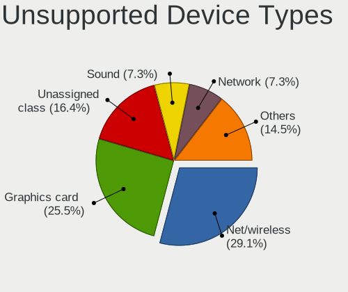

| Type                     | Desktops | Percent |
|--------------------------|----------|---------|
| Net/wireless             | 9        | 36%     |
| Graphics card            | 8        | 32%     |
| Unassigned class         | 2        | 8%      |
| Sound                    | 1        | 4%      |
| Network                  | 1        | 4%      |
| Multimedia controller    | 1        | 4%      |
| Firewire controller      | 1        | 4%      |
| Communication controller | 1        | 4%      |
| Bluetooth                | 1        | 4%      |

