Linux in Chile - Tested Hardware & Statistics (Desktops)
--------------------------------------------------------

A project to collect tested hardware configurations for Linux in Chile.

Anyone can contribute to this report by the [hw-probe](https://github.com/linuxhw/hw-probe) tool:

    sudo -E hw-probe -all -upload

Please contribute! Especially if your hardware is rare.

Contents
--------

* [ Test Cases ](#test-cases)

* [ System ](#system)
  - [ OS                       ](#os)
  - [ OS Family                ](#os-family)
  - [ Kernel                   ](#kernel)
  - [ Kernel Family            ](#kernel-family)
  - [ Kernel Major Ver.        ](#kernel-major-ver)
  - [ Arch                     ](#arch)
  - [ DE                       ](#de)
  - [ Display Server           ](#display-server)
  - [ Display Manager          ](#display-manager)
  - [ OS Lang                  ](#os-lang)
  - [ Boot Mode                ](#boot-mode)
  - [ Filesystem               ](#filesystem)
  - [ Part. scheme             ](#part-scheme)
  - [ Dual Boot with Linux/BSD ](#dual-boot-with-linuxbsd)
  - [ Dual Boot (Win)          ](#dual-boot-win)

* [ Board ](#board)
  - [ Vendor                   ](#vendor)
  - [ Model                    ](#model)
  - [ Model Family             ](#model-family)
  - [ MFG Year                 ](#mfg-year)
  - [ Form Factor              ](#form-factor)
  - [ Secure Boot              ](#secure-boot)
  - [ Coreboot                 ](#coreboot)
  - [ RAM Size                 ](#ram-size)
  - [ RAM Used                 ](#ram-used)
  - [ Total Drives             ](#total-drives)
  - [ Has CD-ROM               ](#has-cd-rom)
  - [ Has Ethernet             ](#has-ethernet)
  - [ Has WiFi                 ](#has-wifi)
  - [ Has Bluetooth            ](#has-bluetooth)

* [ Location ](#location)
  - [ Country                  ](#country)
  - [ City                     ](#city)

* [ Drives ](#drives)
  - [ Drive Vendor             ](#drive-vendor)
  - [ Drive Model              ](#drive-model)
  - [ HDD Vendor               ](#hdd-vendor)
  - [ SSD Vendor               ](#ssd-vendor)
  - [ Drive Kind               ](#drive-kind)
  - [ Drive Connector          ](#drive-connector)
  - [ Drive Size               ](#drive-size)
  - [ Space Total              ](#space-total)
  - [ Space Used               ](#space-used)
  - [ Malfunc. Drives          ](#malfunc-drives)
  - [ Malfunc. Drive Vendor    ](#malfunc-drive-vendor)
  - [ Malfunc. HDD Vendor      ](#malfunc-hdd-vendor)
  - [ Malfunc. Drive Kind      ](#malfunc-drive-kind)
  - [ Failed Drives            ](#failed-drives)
  - [ Failed Drive Vendor      ](#failed-drive-vendor)
  - [ Drive Status             ](#drive-status)

* [ Storage controller ](#storage-controller)
  - [ Storage Vendor           ](#storage-vendor)
  - [ Storage Model            ](#storage-model)
  - [ Storage Kind             ](#storage-kind)

* [ Processor ](#processor)
  - [ CPU Vendor               ](#cpu-vendor)
  - [ CPU Model                ](#cpu-model)
  - [ CPU Model Family         ](#cpu-model-family)
  - [ CPU Cores                ](#cpu-cores)
  - [ CPU Sockets              ](#cpu-sockets)
  - [ CPU Threads              ](#cpu-threads)
  - [ CPU Op-Modes             ](#cpu-op-modes)
  - [ CPU Microcode            ](#cpu-microcode)
  - [ CPU Microarch            ](#cpu-microarch)

* [ Graphics ](#graphics)
  - [ GPU Vendor               ](#gpu-vendor)
  - [ GPU Model                ](#gpu-model)
  - [ GPU Combo                ](#gpu-combo)
  - [ GPU Driver               ](#gpu-driver)
  - [ GPU Memory               ](#gpu-memory)

* [ Monitor ](#monitor)
  - [ Monitor Vendor           ](#monitor-vendor)
  - [ Monitor Model            ](#monitor-model)
  - [ Monitor Resolution       ](#monitor-resolution)
  - [ Monitor Diagonal         ](#monitor-diagonal)
  - [ Monitor Width            ](#monitor-width)
  - [ Aspect Ratio             ](#aspect-ratio)
  - [ Monitor Area             ](#monitor-area)
  - [ Pixel Density            ](#pixel-density)
  - [ Multiple Monitors        ](#multiple-monitors)

* [ Network ](#network)
  - [ Net Controller Vendor    ](#net-controller-vendor)
  - [ Net Controller Model     ](#net-controller-model)
  - [ Wireless Vendor          ](#wireless-vendor)
  - [ Wireless Model           ](#wireless-model)
  - [ Ethernet Vendor          ](#ethernet-vendor)
  - [ Ethernet Model           ](#ethernet-model)
  - [ Net Controller Kind      ](#net-controller-kind)
  - [ Used Controller          ](#used-controller)
  - [ NICs                     ](#nics)
  - [ IPv6                     ](#ipv6)

* [ Bluetooth ](#bluetooth)
  - [ Bluetooth Vendor         ](#bluetooth-vendor)
  - [ Bluetooth Model          ](#bluetooth-model)

* [ Sound ](#sound)
  - [ Sound Vendor             ](#sound-vendor)
  - [ Sound Model              ](#sound-model)

* [ Memory ](#memory)
  - [ Memory Vendor            ](#memory-vendor)
  - [ Memory Model             ](#memory-model)
  - [ Memory Kind              ](#memory-kind)
  - [ Memory Form Factor       ](#memory-form-factor)
  - [ Memory Size              ](#memory-size)
  - [ Memory Speed             ](#memory-speed)

* [ Printers & scanners ](#printers--scanners)
  - [ Printer Vendor           ](#printer-vendor)
  - [ Printer Model            ](#printer-model)
  - [ Scanner Vendor           ](#scanner-vendor)
  - [ Scanner Model            ](#scanner-model)

* [ Camera ](#camera)
  - [ Camera Vendor            ](#camera-vendor)
  - [ Camera Model             ](#camera-model)

* [ Security ](#security)
  - [ Fingerprint Vendor       ](#fingerprint-vendor)
  - [ Fingerprint Model        ](#fingerprint-model)
  - [ Chipcard Vendor          ](#chipcard-vendor)
  - [ Chipcard Model           ](#chipcard-model)

* [ Unsupported ](#unsupported)
  - [ Unsupported Devices      ](#unsupported-devices)
  - [ Unsupported Device Types ](#unsupported-device-types)

Test Cases
----------

Total: 525

| Vendor        | Model                       | Probe                                                      | Date         |
|---------------|-----------------------------|------------------------------------------------------------|--------------|
| HP            | 2215                        | [d4d1a7ad27](https://linux-hardware.org/?probe=d4d1a7ad27) | Jan 05, 2025 |
| Intel         | X99                         | [0179690cc0](https://linux-hardware.org/?probe=0179690cc0) | Jan 05, 2025 |
| Huanan        | X99-F8 GAMING V5.0          | [784d69901d](https://linux-hardware.org/?probe=784d69901d) | Dec 28, 2024 |
| ASUSTek       | P8H61-MX                    | [b9f7d12796](https://linux-hardware.org/?probe=b9f7d12796) | Dec 24, 2024 |
| Intel         | X99                         | [d2e526949b](https://linux-hardware.org/?probe=d2e526949b) | Dec 23, 2024 |
| Intel         | X99                         | [380078a8ea](https://linux-hardware.org/?probe=380078a8ea) | Dec 20, 2024 |
| Gigabyte      | B560M DS3H                  | [f28c3f8b25](https://linux-hardware.org/?probe=f28c3f8b25) | Dec 20, 2024 |
| Gigabyte      | X870 GAMING X WIFI7         | [bf3a0594a1](https://linux-hardware.org/?probe=bf3a0594a1) | Dec 14, 2024 |
| Gigabyte      | H610M H                     | [045fc5193c](https://linux-hardware.org/?probe=045fc5193c) | Dec 10, 2024 |
| HP            | 2820h                       | [b2bef4daf8](https://linux-hardware.org/?probe=b2bef4daf8) | Dec 08, 2024 |
| HP            | 8054                        | [aff3ac8a75](https://linux-hardware.org/?probe=aff3ac8a75) | Dec 02, 2024 |
| Gigabyte      | A320M-S2H V2-CF             | [81a38efac3](https://linux-hardware.org/?probe=81a38efac3) | Nov 16, 2024 |
| Huanan        | X99-F8 GAMING V5.0          | [ae3c4f6ba3](https://linux-hardware.org/?probe=ae3c4f6ba3) | Nov 16, 2024 |
| ASUSTek       | H81M-K                      | [713cf8fabf](https://linux-hardware.org/?probe=713cf8fabf) | Nov 14, 2024 |
| ASUSTek       | M5A99X EVO R2.0             | [168d2c565d](https://linux-hardware.org/?probe=168d2c565d) | Nov 14, 2024 |
| ASUSTek       | M5A99X EVO R2.0             | [58961eb604](https://linux-hardware.org/?probe=58961eb604) | Nov 14, 2024 |
| HP            | 1998                        | [369ca1dd47](https://linux-hardware.org/?probe=369ca1dd47) | Nov 12, 2024 |
| ASUSTek       | TUF Gaming B550M-PLUS WI... | [33618bc34b](https://linux-hardware.org/?probe=33618bc34b) | Nov 09, 2024 |
| Huanan        | X99-F8 GAMING V5.0          | [1e9fb052dd](https://linux-hardware.org/?probe=1e9fb052dd) | Nov 08, 2024 |
| HP            | 1998                        | [54437250d0](https://linux-hardware.org/?probe=54437250d0) | Nov 05, 2024 |
| ASUSTek       | TUF Z370-PLUS GAMING        | [71caa9ae08](https://linux-hardware.org/?probe=71caa9ae08) | Nov 04, 2024 |
| ASUSTek       | TUF Z370-PLUS GAMING        | [8ab293ac66](https://linux-hardware.org/?probe=8ab293ac66) | Nov 04, 2024 |
| MSI           | H110M PRO-VH PLUS           | [0403c46fc9](https://linux-hardware.org/?probe=0403c46fc9) | Oct 29, 2024 |
| MSI           | H110M PRO-VH PLUS           | [29941bb47c](https://linux-hardware.org/?probe=29941bb47c) | Oct 29, 2024 |
| ASUSTek       | B85M-E                      | [82a2dc3146](https://linux-hardware.org/?probe=82a2dc3146) | Oct 27, 2024 |
| MSI           | X670E GAMING PLUS WIFI      | [f3ec231fe2](https://linux-hardware.org/?probe=f3ec231fe2) | Oct 27, 2024 |
| ASUSTek       | PRIME H370M-PLUS            | [909d08958b](https://linux-hardware.org/?probe=909d08958b) | Oct 23, 2024 |
| MSI           | H81M-E33                    | [aeb4f8c680](https://linux-hardware.org/?probe=aeb4f8c680) | Oct 20, 2024 |
| ASUSTek       | M5A97 R2.0                  | [8646abd860](https://linux-hardware.org/?probe=8646abd860) | Oct 13, 2024 |
| MSI           | X670E GAMING PLUS WIFI      | [4e90d6105f](https://linux-hardware.org/?probe=4e90d6105f) | Oct 11, 2024 |
| MSI           | H61M-P21                    | [1dbbce13c7](https://linux-hardware.org/?probe=1dbbce13c7) | Oct 08, 2024 |
| MSI           | A520M-A PRO                 | [6a37860d48](https://linux-hardware.org/?probe=6a37860d48) | Oct 04, 2024 |
| MSI           | H110M PRO-VH PLUS           | [86ed130e09](https://linux-hardware.org/?probe=86ed130e09) | Sep 23, 2024 |
| MSI           | H110M PRO-VH PLUS           | [76f114be0f](https://linux-hardware.org/?probe=76f114be0f) | Sep 23, 2024 |
| MSI           | A520M-A PRO                 | [0a02c29530](https://linux-hardware.org/?probe=0a02c29530) | Sep 22, 2024 |
| MSI           | H81M-E33                    | [161e77e63f](https://linux-hardware.org/?probe=161e77e63f) | Sep 21, 2024 |
| MSI           | H81M-E33                    | [c34d12468d](https://linux-hardware.org/?probe=c34d12468d) | Sep 14, 2024 |
| MSI           | X670E GAMING PLUS WIFI      | [4c82b54925](https://linux-hardware.org/?probe=4c82b54925) | Sep 12, 2024 |
| Gigabyte      | H610M H                     | [496a31fec4](https://linux-hardware.org/?probe=496a31fec4) | Sep 09, 2024 |
| Unknown       | X79                         | [fb92bb7ecc](https://linux-hardware.org/?probe=fb92bb7ecc) | Aug 31, 2024 |
| Gigabyte      | H610M H                     | [bfaf5d315d](https://linux-hardware.org/?probe=bfaf5d315d) | Aug 31, 2024 |
| ASUSTek       | TUF Gaming Z790-PLUS WIF... | [712ad66747](https://linux-hardware.org/?probe=712ad66747) | Aug 25, 2024 |
| ASUSTek       | TUF Gaming Z790-PLUS WIF... | [26d502b9bc](https://linux-hardware.org/?probe=26d502b9bc) | Aug 24, 2024 |
| Olidata       | ALICON AI2S-A21 0.41        | [df62aa88dc](https://linux-hardware.org/?probe=df62aa88dc) | Aug 24, 2024 |
| Olidata       | ALICON AI2S-A21 0.41        | [07fa7b2207](https://linux-hardware.org/?probe=07fa7b2207) | Aug 23, 2024 |
| MSI           | H81M-E33                    | [fdf3a4566b](https://linux-hardware.org/?probe=fdf3a4566b) | Aug 19, 2024 |
| Gigabyte      | H610M H                     | [0544e9bb70](https://linux-hardware.org/?probe=0544e9bb70) | Aug 17, 2024 |
| ASUSTek       | TUF Gaming Z790-PLUS WIF... | [f9ac4e3525](https://linux-hardware.org/?probe=f9ac4e3525) | Aug 13, 2024 |
| ASUSTek       | ROG STRIX B550-F GAMING     | [5fa9b544f6](https://linux-hardware.org/?probe=5fa9b544f6) | Aug 04, 2024 |
| Gigabyte      | H170-Gaming 3               | [84799775ff](https://linux-hardware.org/?probe=84799775ff) | Aug 02, 2024 |
| ECS           | H61H2-MV                    | [4158e740d0](https://linux-hardware.org/?probe=4158e740d0) | Aug 01, 2024 |
| ASUSTek       | PRIME B660M-A D4            | [711db524cd](https://linux-hardware.org/?probe=711db524cd) | Aug 01, 2024 |
| Gigabyte      | H170-Gaming 3               | [e364531174](https://linux-hardware.org/?probe=e364531174) | Jul 31, 2024 |
| ASUSTek       | TUF Z370-PLUS GAMING        | [e9f6ba19fc](https://linux-hardware.org/?probe=e9f6ba19fc) | Jul 29, 2024 |
| ASUSTek       | TUF Gaming Z790-PLUS WIF... | [1205e31e83](https://linux-hardware.org/?probe=1205e31e83) | Jul 28, 2024 |
| AZW           | MINI S                      | [d8754c0201](https://linux-hardware.org/?probe=d8754c0201) | Jul 25, 2024 |
| MSI           | A520M-A PRO                 | [7217eafd23](https://linux-hardware.org/?probe=7217eafd23) | Jul 24, 2024 |
| ASUSTek       | PRIME X570-P                | [d3dc54280d](https://linux-hardware.org/?probe=d3dc54280d) | Jul 22, 2024 |
| Gigabyte      | B550M AORUS ELITE           | [23031969c6](https://linux-hardware.org/?probe=23031969c6) | Jul 22, 2024 |
| Gigabyte      | H610M H                     | [d20875079c](https://linux-hardware.org/?probe=d20875079c) | Jul 17, 2024 |
| Gigabyte      | B550 AORUS ELITE V2         | [dabdfaf7bd](https://linux-hardware.org/?probe=dabdfaf7bd) | Jul 12, 2024 |
| Pegatron      | 2A99                        | [6479f475f5](https://linux-hardware.org/?probe=6479f475f5) | Jul 10, 2024 |
| Gigabyte      | H610M H                     | [290973ae43](https://linux-hardware.org/?probe=290973ae43) | Jul 10, 2024 |
| Gigabyte      | X570 AORUS ELITE            | [3ed2f04a8a](https://linux-hardware.org/?probe=3ed2f04a8a) | Jul 07, 2024 |
| MSI           | H110M PRO-VH PLUS           | [ae38969368](https://linux-hardware.org/?probe=ae38969368) | Jul 05, 2024 |
| Gigabyte      | H610M H                     | [3f30142163](https://linux-hardware.org/?probe=3f30142163) | Jul 02, 2024 |
| MSI           | B550-A PRO[CEC]             | [fc933dc2df](https://linux-hardware.org/?probe=fc933dc2df) | Jun 23, 2024 |
| Gigabyte      | B450 AORUS ELITE            | [ae60c915ff](https://linux-hardware.org/?probe=ae60c915ff) | Jun 20, 2024 |
| ASUSTek       | PRIME B450M-A               | [c141bd23d2](https://linux-hardware.org/?probe=c141bd23d2) | Jun 20, 2024 |
| HP            | 1998                        | [cccee42308](https://linux-hardware.org/?probe=cccee42308) | Jun 19, 2024 |
| HP            | 1998                        | [ee549aa7c5](https://linux-hardware.org/?probe=ee549aa7c5) | Jun 19, 2024 |
| ASUSTek       | PRIME B660M-A D4            | [fade2029a5](https://linux-hardware.org/?probe=fade2029a5) | Jun 16, 2024 |
| Dell          | 0GY6Y8 A02                  | [8d460943ce](https://linux-hardware.org/?probe=8d460943ce) | Jun 14, 2024 |
| Intel         | X99H                        | [bf88c6e5c7](https://linux-hardware.org/?probe=bf88c6e5c7) | Jun 13, 2024 |
| ASUSTek       | PRIME H610M-E D4            | [a9b147099e](https://linux-hardware.org/?probe=a9b147099e) | Jun 07, 2024 |
| Gigabyte      | B450M DS3H V2               | [d4dcdab86b](https://linux-hardware.org/?probe=d4dcdab86b) | Jun 03, 2024 |
| ASRock        | X570 Steel Legend WiFi a... | [990022b7bf](https://linux-hardware.org/?probe=990022b7bf) | Jun 01, 2024 |
| Dell          | 0GY6Y8 A02                  | [ff69f93bc2](https://linux-hardware.org/?probe=ff69f93bc2) | May 27, 2024 |
| ANGXUN        | X79 (INTEL Xeon E5/Corei... | [3cb1b2bfec](https://linux-hardware.org/?probe=3cb1b2bfec) | May 19, 2024 |
| ANGXUN        | X79 (INTEL Xeon E5/Corei... | [742d962e1c](https://linux-hardware.org/?probe=742d962e1c) | May 18, 2024 |
| ASUSTek       | PRIME B450M-A               | [88e8009735](https://linux-hardware.org/?probe=88e8009735) | May 16, 2024 |
| Dell          | 0WR7PY A01                  | [f154c6f22e](https://linux-hardware.org/?probe=f154c6f22e) | May 07, 2024 |
| Shenzhen M... | F7BSC                       | [9e6a5eb0e2](https://linux-hardware.org/?probe=9e6a5eb0e2) | May 07, 2024 |
| ASUSTek       | PRIME X570-P                | [b76f2f11bd](https://linux-hardware.org/?probe=b76f2f11bd) | May 04, 2024 |
| ASUSTek       | TUF Gaming Z790-PLUS WIF... | [22cf049537](https://linux-hardware.org/?probe=22cf049537) | May 04, 2024 |
| Shenzhen M... | F7BSC                       | [b3f2c851de](https://linux-hardware.org/?probe=b3f2c851de) | May 02, 2024 |
| ASUSTek       | TUF Gaming X570-PLUS        | [8739bc2d60](https://linux-hardware.org/?probe=8739bc2d60) | May 01, 2024 |
| ASUSTek       | TUF Gaming X570-PLUS        | [67a23e48b6](https://linux-hardware.org/?probe=67a23e48b6) | May 01, 2024 |
| Pegatron      | 2A99                        | [fcd74433b3](https://linux-hardware.org/?probe=fcd74433b3) | Apr 30, 2024 |
| EVGA          | NF66 2                      | [ef1a49773b](https://linux-hardware.org/?probe=ef1a49773b) | Apr 29, 2024 |
| HP            | 2B02                        | [5272c37a4c](https://linux-hardware.org/?probe=5272c37a4c) | Apr 18, 2024 |
| Unknown       | Unknown                     | [bcaf7cac1a](https://linux-hardware.org/?probe=bcaf7cac1a) | Apr 15, 2024 |
| Unknown       | Unknown                     | [31b430e45e](https://linux-hardware.org/?probe=31b430e45e) | Apr 13, 2024 |
| ASUSTek       | TUF Gaming Z790-PLUS WIF... | [4e25522fd7](https://linux-hardware.org/?probe=4e25522fd7) | Apr 06, 2024 |
| HP            | 2ABA A01                    | [308a7c307f](https://linux-hardware.org/?probe=308a7c307f) | Apr 05, 2024 |
| MSI           | PRO B550M-P GEN3            | [c29b99633c](https://linux-hardware.org/?probe=c29b99633c) | Apr 03, 2024 |
| Dell          | 03KWTV A02                  | [f97822b63a](https://linux-hardware.org/?probe=f97822b63a) | Mar 29, 2024 |
| ASUSTek       | PRIME H610M-E D4            | [44cf5392ad](https://linux-hardware.org/?probe=44cf5392ad) | Mar 23, 2024 |
| HP            | 212B                        | [5ad874f74e](https://linux-hardware.org/?probe=5ad874f74e) | Mar 22, 2024 |
| HP            | 212B                        | [c82c46c22c](https://linux-hardware.org/?probe=c82c46c22c) | Mar 22, 2024 |
| ANGXUN        | X79 (INTEL Xeon E5/Corei... | [3ec8fc69b2](https://linux-hardware.org/?probe=3ec8fc69b2) | Mar 17, 2024 |
| HP            | 805D                        | [7878b71cab](https://linux-hardware.org/?probe=7878b71cab) | Mar 15, 2024 |
| ASUSTek       | ROG STRIX B660-A GAMING ... | [4b181b04ee](https://linux-hardware.org/?probe=4b181b04ee) | Mar 09, 2024 |
| ASRock        | B550M Steel Legend          | [ff01bc4e69](https://linux-hardware.org/?probe=ff01bc4e69) | Mar 03, 2024 |
| ASUSTek       | TUF Gaming Z790-PLUS WIF... | [a358f29362](https://linux-hardware.org/?probe=a358f29362) | Feb 28, 2024 |
| Intel         | X99 V1.0                    | [202a9720c4](https://linux-hardware.org/?probe=202a9720c4) | Jan 30, 2024 |
| ASUSTek       | PRIME X670-P                | [1d4943457c](https://linux-hardware.org/?probe=1d4943457c) | Jan 26, 2024 |
| ASUSTek       | PRIME X670-P                | [75379edae7](https://linux-hardware.org/?probe=75379edae7) | Jan 26, 2024 |
| HP            | 304Ah                       | [5e40a8acee](https://linux-hardware.org/?probe=5e40a8acee) | Jan 24, 2024 |
| ECS           | G31T-M7                     | [254ece65d1](https://linux-hardware.org/?probe=254ece65d1) | Jan 12, 2024 |
| Shenzhen M... | F7BSC                       | [80d405caee](https://linux-hardware.org/?probe=80d405caee) | Jan 09, 2024 |
| ANGXUN        | X79 (INTEL Xeon E5/Corei... | [92d3ce2ee5](https://linux-hardware.org/?probe=92d3ce2ee5) | Dec 30, 2023 |
| ASUSTek       | TUF Gaming B460M-PLUS       | [da4285cce4](https://linux-hardware.org/?probe=da4285cce4) | Dec 26, 2023 |
| MSI           | PRO B550M-P GEN3            | [9662ee22d6](https://linux-hardware.org/?probe=9662ee22d6) | Dec 26, 2023 |
| eMachines     | EMCP61M                     | [d464b480dd](https://linux-hardware.org/?probe=d464b480dd) | Dec 23, 2023 |
| Gigabyte      | B550 AORUS ELITE V2         | [e8847d53ec](https://linux-hardware.org/?probe=e8847d53ec) | Dec 16, 2023 |
| ASUSTek       | TUF Gaming Z790-PLUS WIF... | [1d510c91de](https://linux-hardware.org/?probe=1d510c91de) | Dec 12, 2023 |
| ASUSTek       | ROG STRIX B560-A GAMING ... | [5121b6a20c](https://linux-hardware.org/?probe=5121b6a20c) | Dec 09, 2023 |
| Gigabyte      | B550 AORUS ELITE V2         | [f6ed574e0d](https://linux-hardware.org/?probe=f6ed574e0d) | Dec 08, 2023 |
| ASUSTek       | ROG STRIX B560-A GAMING ... | [8198e47786](https://linux-hardware.org/?probe=8198e47786) | Dec 08, 2023 |
| Gigabyte      | A320M-S2H V2-CF             | [2a593d9294](https://linux-hardware.org/?probe=2a593d9294) | Dec 06, 2023 |
| Gigabyte      | A320M-S2H V2-CF             | [9b6c1bfbf2](https://linux-hardware.org/?probe=9b6c1bfbf2) | Dec 06, 2023 |
| ASUSTek       | PRIME B760M-A WIFI D4       | [707fd0c687](https://linux-hardware.org/?probe=707fd0c687) | Dec 02, 2023 |
| ASUSTek       | 970 PRO GAMING/AURA         | [80be39f0d4](https://linux-hardware.org/?probe=80be39f0d4) | Dec 01, 2023 |
| ASUSTek       | ROG STRIX Z370-H GAMING     | [6005ac3fdd](https://linux-hardware.org/?probe=6005ac3fdd) | Nov 26, 2023 |
| ASUSTek       | TUF Gaming Z790-PLUS WIF... | [f3956e461c](https://linux-hardware.org/?probe=f3956e461c) | Nov 23, 2023 |
| ASUSTek       | 970 PRO GAMING/AURA         | [f8778aa9e9](https://linux-hardware.org/?probe=f8778aa9e9) | Nov 20, 2023 |
| ECS           | H77H2-EM                    | [20c68c0667](https://linux-hardware.org/?probe=20c68c0667) | Nov 16, 2023 |
| MSI           | 880GM-E41                   | [707f319e17](https://linux-hardware.org/?probe=707f319e17) | Nov 12, 2023 |
| ASUSTek       | TUF Gaming B550M-PLUS       | [2c921ede59](https://linux-hardware.org/?probe=2c921ede59) | Nov 08, 2023 |
| Foxconn       | P35A01                      | [e63e8acdaa](https://linux-hardware.org/?probe=e63e8acdaa) | Oct 27, 2023 |
| ASUSTek       | TUF Gaming Z590-PLUS WIF... | [6f89b3f8ad](https://linux-hardware.org/?probe=6f89b3f8ad) | Oct 22, 2023 |
| ASUSTek       | TUF Gaming Z790-PLUS WIF... | [19d60d452f](https://linux-hardware.org/?probe=19d60d452f) | Oct 17, 2023 |
| ASUSTek       | TUF Gaming Z590-PLUS WIF... | [69f9b41478](https://linux-hardware.org/?probe=69f9b41478) | Oct 11, 2023 |
| MSI           | MS-7392                     | [5107ce50a1](https://linux-hardware.org/?probe=5107ce50a1) | Oct 09, 2023 |
| HP            | 2ADE                        | [b701a5c589](https://linux-hardware.org/?probe=b701a5c589) | Sep 27, 2023 |
| ASUSTek       | TUF Z390-PRO GAMING         | [16fe0e3ba6](https://linux-hardware.org/?probe=16fe0e3ba6) | Sep 22, 2023 |
| ASUSTek       | TUF Z390-PRO GAMING         | [aab34fa582](https://linux-hardware.org/?probe=aab34fa582) | Sep 22, 2023 |
| Dell          | 0WN7Y6 A01                  | [f4d4f80645](https://linux-hardware.org/?probe=f4d4f80645) | Sep 20, 2023 |
| ASUSTek       | PRIME B660M-A D4            | [a44de9f197](https://linux-hardware.org/?probe=a44de9f197) | Sep 15, 2023 |
| HP            | 0A60h                       | [107f849e6b](https://linux-hardware.org/?probe=107f849e6b) | Sep 13, 2023 |
| ECS           | H81H3-M4                    | [f1cff1b2ac](https://linux-hardware.org/?probe=f1cff1b2ac) | Sep 11, 2023 |
| Dell          | 04Y8V0 A02                  | [aa2d2a4c29](https://linux-hardware.org/?probe=aa2d2a4c29) | Sep 08, 2023 |
| HP            | 2ADE                        | [f7b01f93c4](https://linux-hardware.org/?probe=f7b01f93c4) | Sep 04, 2023 |
| ASUSTek       | M5A97 R2.0                  | [6215db2c5a](https://linux-hardware.org/?probe=6215db2c5a) | Sep 02, 2023 |
| Unknown       | Unknown                     | [3e3433226b](https://linux-hardware.org/?probe=3e3433226b) | Sep 01, 2023 |
| ASRock        | B550M Pro4                  | [6554eecc36](https://linux-hardware.org/?probe=6554eecc36) | Aug 24, 2023 |
| ASUSTek       | H110M-R                     | [3151636f73](https://linux-hardware.org/?probe=3151636f73) | Aug 16, 2023 |
| ASUSTek       | PRIME H410M-E               | [a9d7216b70](https://linux-hardware.org/?probe=a9d7216b70) | Aug 15, 2023 |
| ASUSTek       | TUF Gaming Z790-PLUS WIF... | [c27b841a97](https://linux-hardware.org/?probe=c27b841a97) | Aug 15, 2023 |
| Gigabyte      | A320M-S2H V2-CF             | [ac7079fac9](https://linux-hardware.org/?probe=ac7079fac9) | Aug 05, 2023 |
| ASUSTek       | TUF B450M-PRO GAMING        | [b8f1735d23](https://linux-hardware.org/?probe=b8f1735d23) | Aug 04, 2023 |
| ASUSTek       | TUF B450M-PRO GAMING        | [6a6f453881](https://linux-hardware.org/?probe=6a6f453881) | Aug 02, 2023 |
| ECS           | H61H2-M17                   | [360623689a](https://linux-hardware.org/?probe=360623689a) | Jul 29, 2023 |
| ECS           | H61H2-M17                   | [aa0f0813e4](https://linux-hardware.org/?probe=aa0f0813e4) | Jul 29, 2023 |
| Unknown       | Unknown                     | [d9c029afa4](https://linux-hardware.org/?probe=d9c029afa4) | Jul 28, 2023 |
| MSI           | B85-G43 GAMING              | [ba47e8e20f](https://linux-hardware.org/?probe=ba47e8e20f) | Jul 27, 2023 |
| ASUSTek       | H110M-R                     | [5300c80b7e](https://linux-hardware.org/?probe=5300c80b7e) | Jul 24, 2023 |
| ASUSTek       | TUF Gaming Z790-PLUS WIF... | [ab65cec6fe](https://linux-hardware.org/?probe=ab65cec6fe) | Jul 19, 2023 |
| ASUSTek       | PRIME A320M-K               | [e056c22283](https://linux-hardware.org/?probe=e056c22283) | Jul 15, 2023 |
| Unknown       | Unknown                     | [3820e840f0](https://linux-hardware.org/?probe=3820e840f0) | Jul 15, 2023 |
| ASUSTek       | PRIME B450M-A               | [6c541c67b9](https://linux-hardware.org/?probe=6c541c67b9) | Jul 11, 2023 |
| ASUSTek       | TUF Gaming B450M-PLUS II    | [eb024b5188](https://linux-hardware.org/?probe=eb024b5188) | Jul 10, 2023 |
| MSI           | H81M-E33                    | [804d078deb](https://linux-hardware.org/?probe=804d078deb) | Jul 10, 2023 |
| ASUSTek       | P7H55-M LX                  | [8a0d6c1825](https://linux-hardware.org/?probe=8a0d6c1825) | Jun 29, 2023 |
| MSI           | 880GM-E41                   | [91a2474332](https://linux-hardware.org/?probe=91a2474332) | Jun 28, 2023 |
| Unknown       | Unknown                     | [172c84a53d](https://linux-hardware.org/?probe=172c84a53d) | Jun 22, 2023 |
| BESSTAR Te... | UM700                       | [37292d4c84](https://linux-hardware.org/?probe=37292d4c84) | Jun 20, 2023 |
| ASUSTek       | TUF Gaming Z790-PLUS WIF... | [6294c25695](https://linux-hardware.org/?probe=6294c25695) | Jun 17, 2023 |
| ASUSTek       | ROG STRIX B450-I GAMING     | [7e8ae5cb7a](https://linux-hardware.org/?probe=7e8ae5cb7a) | Jun 16, 2023 |
| ASUSTek       | TUF Gaming Z790-PLUS WIF... | [176973d157](https://linux-hardware.org/?probe=176973d157) | Jun 16, 2023 |
| ASUSTek       | ROG STRIX B450-I GAMING     | [989287c8b1](https://linux-hardware.org/?probe=989287c8b1) | Jun 16, 2023 |
| ECS           | H61H2-M17                   | [63ded73edb](https://linux-hardware.org/?probe=63ded73edb) | Jun 14, 2023 |
| ECS           | H61H2-M17                   | [fb57cc3ed4](https://linux-hardware.org/?probe=fb57cc3ed4) | Jun 13, 2023 |
| Huanan        | X99-F8 GAMING V2.0          | [a597fc235e](https://linux-hardware.org/?probe=a597fc235e) | Jun 09, 2023 |
| Huanan        | X99-F8 GAMING V2.0          | [6a368b8ecc](https://linux-hardware.org/?probe=6a368b8ecc) | Jun 09, 2023 |
| BESSTAR Te... | UM700                       | [92645b42ac](https://linux-hardware.org/?probe=92645b42ac) | Jun 08, 2023 |
| ASRock        | Z590 Phantom Gaming 4       | [1e9eef0102](https://linux-hardware.org/?probe=1e9eef0102) | Jun 03, 2023 |
| Lenovo        | 30D2 SDK0J40697 WIN 3305... | [259865e80e](https://linux-hardware.org/?probe=259865e80e) | Jun 01, 2023 |
| Intel         | H61                         | [685bd5d439](https://linux-hardware.org/?probe=685bd5d439) | May 12, 2023 |
| Lenovo        | SDK0E50510 WIN 262507960... | [2892c822d5](https://linux-hardware.org/?probe=2892c822d5) | May 12, 2023 |
| ASUSTek       | PRIME B560M-K               | [ce0391bdee](https://linux-hardware.org/?probe=ce0391bdee) | May 09, 2023 |
| ASUSTek       | TUF Gaming B450M-PLUS II    | [c8b7ffa6dc](https://linux-hardware.org/?probe=c8b7ffa6dc) | May 02, 2023 |
| ASUSTek       | PRIME J4005I-C              | [611ed4a200](https://linux-hardware.org/?probe=611ed4a200) | May 01, 2023 |
| ASUSTek       | PRIME X670-P                | [37f98c9450](https://linux-hardware.org/?probe=37f98c9450) | Apr 25, 2023 |
| ASUSTek       | PRIME X670-P                | [ebe7f36c99](https://linux-hardware.org/?probe=ebe7f36c99) | Apr 23, 2023 |
| Gigabyte      | B550M DS3H                  | [1950979b24](https://linux-hardware.org/?probe=1950979b24) | Apr 22, 2023 |
| Intel         | DG41RQ AAE54511-203         | [6a17fe6ead](https://linux-hardware.org/?probe=6a17fe6ead) | Apr 21, 2023 |
| Gigabyte      | B450 AORUS PRO WIFI-CF      | [a7b05c2528](https://linux-hardware.org/?probe=a7b05c2528) | Apr 20, 2023 |
| WZA300S2R1... | SA300-D4                    | [e2a6ae91b9](https://linux-hardware.org/?probe=e2a6ae91b9) | Apr 17, 2023 |
| HP            | 8433 11                     | [911f2844c9](https://linux-hardware.org/?probe=911f2844c9) | Apr 13, 2023 |
| MSI           | MS-7360                     | [48bee654fc](https://linux-hardware.org/?probe=48bee654fc) | Apr 13, 2023 |
| ASRock        | B360M/OEM                   | [d1feabb956](https://linux-hardware.org/?probe=d1feabb956) | Apr 07, 2023 |
| Gigabyte      | B450 AORUS PRO WIFI-CF      | [712e78de35](https://linux-hardware.org/?probe=712e78de35) | Apr 05, 2023 |
| Unknown       | X99-GT                      | [d4b6b3ebe8](https://linux-hardware.org/?probe=d4b6b3ebe8) | Apr 05, 2023 |
| HP            | 8433 11                     | [55f7473ba8](https://linux-hardware.org/?probe=55f7473ba8) | Mar 29, 2023 |
| MSI           | Z270 GAMING M3              | [2c25601c7c](https://linux-hardware.org/?probe=2c25601c7c) | Mar 22, 2023 |
| HP            | 18E7                        | [9e4b5010d8](https://linux-hardware.org/?probe=9e4b5010d8) | Mar 20, 2023 |
| MSI           | MS-7360                     | [6c8cb5d98f](https://linux-hardware.org/?probe=6c8cb5d98f) | Mar 18, 2023 |
| Gigabyte      | B450 AORUS PRO WIFI-CF      | [8a802fa8fe](https://linux-hardware.org/?probe=8a802fa8fe) | Mar 16, 2023 |
| Lenovo        | 30D2 SDK0J40697 WIN 3305... | [679da48c41](https://linux-hardware.org/?probe=679da48c41) | Mar 16, 2023 |
| MSI           | H110M PRO-VH PLUS           | [088b681bdd](https://linux-hardware.org/?probe=088b681bdd) | Mar 13, 2023 |
| MSI           | X58 PLATINUM SLI            | [c8875fb17f](https://linux-hardware.org/?probe=c8875fb17f) | Mar 08, 2023 |
| HP            | 339A                        | [a2af229dad](https://linux-hardware.org/?probe=a2af229dad) | Mar 05, 2023 |
| Dell          | 0NW6H5 A00                  | [b4485b65b3](https://linux-hardware.org/?probe=b4485b65b3) | Feb 27, 2023 |
| Dell          | 0NW6H5 A00                  | [a52e16df32](https://linux-hardware.org/?probe=a52e16df32) | Feb 27, 2023 |
| MSI           | B85-G43 GAMING              | [b2b66e40e1](https://linux-hardware.org/?probe=b2b66e40e1) | Feb 14, 2023 |
| Gigabyte      | B450 AORUS PRO WIFI-CF      | [89f1272cd8](https://linux-hardware.org/?probe=89f1272cd8) | Feb 13, 2023 |
| Gigabyte      | B450M DS3H V2               | [a326374047](https://linux-hardware.org/?probe=a326374047) | Feb 12, 2023 |
| HP            | 1850                        | [54f5b16151](https://linux-hardware.org/?probe=54f5b16151) | Feb 11, 2023 |
| MSI           | 970 GAMING                  | [552d730c6d](https://linux-hardware.org/?probe=552d730c6d) | Feb 09, 2023 |
| ASUSTek       | P5B-Deluxe                  | [3fce6d5f05](https://linux-hardware.org/?probe=3fce6d5f05) | Feb 07, 2023 |
| ASUSTek       | SABERTOOTH Z77              | [104a086d29](https://linux-hardware.org/?probe=104a086d29) | Feb 05, 2023 |
| ASUSTek       | SABERTOOTH Z77              | [578b166faa](https://linux-hardware.org/?probe=578b166faa) | Feb 05, 2023 |
| Dell          | 06D7TR A02                  | [b3bb51473f](https://linux-hardware.org/?probe=b3bb51473f) | Feb 01, 2023 |
| Huanan        | X79 INTEL (INTEL Xeon E5... | [2c021665e1](https://linux-hardware.org/?probe=2c021665e1) | Jan 31, 2023 |
| MACHINIST     | X99Z V102 IENGINEER         | [d2cfaf56df](https://linux-hardware.org/?probe=d2cfaf56df) | Jan 31, 2023 |
| ViewSonic     | VOT132                      | [a8ecfadd53](https://linux-hardware.org/?probe=a8ecfadd53) | Jan 30, 2023 |
| Dell          | 06D7TR A02                  | [cd487a22cd](https://linux-hardware.org/?probe=cd487a22cd) | Jan 25, 2023 |
| HP            | 2ADE                        | [b927cb3f98](https://linux-hardware.org/?probe=b927cb3f98) | Jan 24, 2023 |
| ASUSTek       | F2A55-M LK2                 | [93db1bee75](https://linux-hardware.org/?probe=93db1bee75) | Jan 23, 2023 |
| ASUSTek       | H110M-R                     | [f872a64ba1](https://linux-hardware.org/?probe=f872a64ba1) | Jan 20, 2023 |
| MSI           | H81M-E33                    | [ddb1be1cc6](https://linux-hardware.org/?probe=ddb1be1cc6) | Jan 18, 2023 |
| HC            | HCAR357-MI V1.0             | [b5f80f8eac](https://linux-hardware.org/?probe=b5f80f8eac) | Jan 14, 2023 |
| ASUSTek       | TUF Gaming B450M-PLUS II    | [1a68bed616](https://linux-hardware.org/?probe=1a68bed616) | Jan 12, 2023 |
| HP            | 83F2                        | [7482186165](https://linux-hardware.org/?probe=7482186165) | Jan 11, 2023 |
| ASUSTek       | TUF B450-PLUS GAMING        | [247bb9fe04](https://linux-hardware.org/?probe=247bb9fe04) | Jan 10, 2023 |
| Gigabyte      | B360 AORUS GAMING 3 WIFI... | [e479f87a66](https://linux-hardware.org/?probe=e479f87a66) | Nov 28, 2022 |
| Gigabyte      | B550 AORUS ELITE V2         | [68e1087fde](https://linux-hardware.org/?probe=68e1087fde) | Nov 25, 2022 |
| HP            | 8309                        | [8329dc7b8d](https://linux-hardware.org/?probe=8329dc7b8d) | Nov 23, 2022 |
| MSI           | A320M-A PRO MAX             | [c3aaf6eed2](https://linux-hardware.org/?probe=c3aaf6eed2) | Nov 09, 2022 |
| MSI           | A320M-A PRO MAX             | [5030ff83c2](https://linux-hardware.org/?probe=5030ff83c2) | Nov 08, 2022 |
| ASRock        | H310CM-HDV                  | [cb1cecc5e1](https://linux-hardware.org/?probe=cb1cecc5e1) | Nov 05, 2022 |
| Pegatron      | IPPCR-SS                    | [9427da0212](https://linux-hardware.org/?probe=9427da0212) | Oct 31, 2022 |
| Huanan        | X99-QD4 V1.0                | [2e4c04ada0](https://linux-hardware.org/?probe=2e4c04ada0) | Oct 27, 2022 |
| Huanan        | X99-QD4 V1.0                | [cb31f9ab8b](https://linux-hardware.org/?probe=cb31f9ab8b) | Oct 26, 2022 |
| HP            | 225E                        | [7e246d254b](https://linux-hardware.org/?probe=7e246d254b) | Oct 24, 2022 |
| ASUSTek       | TUF Gaming B450M-PLUS II    | [cb63aa5619](https://linux-hardware.org/?probe=cb63aa5619) | Oct 17, 2022 |
| ASUSTek       | P5B-Deluxe                  | [e3dcca8113](https://linux-hardware.org/?probe=e3dcca8113) | Oct 11, 2022 |
| ASUSTek       | P5B-Deluxe                  | [cf179c716e](https://linux-hardware.org/?probe=cf179c716e) | Sep 27, 2022 |
| ASUSTek       | PRIME A320M-K               | [d72e6b3865](https://linux-hardware.org/?probe=d72e6b3865) | Sep 23, 2022 |
| BESSTAR Te... | UM700                       | [f6ccaeed5e](https://linux-hardware.org/?probe=f6ccaeed5e) | Sep 16, 2022 |
| Dell          | 060K5C A00                  | [a64a44387b](https://linux-hardware.org/?probe=a64a44387b) | Sep 13, 2022 |
| BESSTAR Te... | UM700                       | [6847632df3](https://linux-hardware.org/?probe=6847632df3) | Sep 12, 2022 |
| ASUSTek       | TUF Gaming X570-PLUS        | [2176e4d70f](https://linux-hardware.org/?probe=2176e4d70f) | Sep 05, 2022 |
| ECS           | H61H-G11/7.0                | [790b93cbee](https://linux-hardware.org/?probe=790b93cbee) | Sep 03, 2022 |
| BESSTAR Te... | UM700                       | [f1198508de](https://linux-hardware.org/?probe=f1198508de) | Sep 03, 2022 |
| MSI           | H81M-E33                    | [ec88b5b492](https://linux-hardware.org/?probe=ec88b5b492) | Sep 02, 2022 |
| ASRock        | X99 Taichi                  | [4cd4bf6c89](https://linux-hardware.org/?probe=4cd4bf6c89) | Sep 01, 2022 |
| Gigabyte      | B450 AORUS PRO WIFI-CF      | [8e1734f31a](https://linux-hardware.org/?probe=8e1734f31a) | Sep 01, 2022 |
| SZMZ          | X99M-G2                     | [eff1231310](https://linux-hardware.org/?probe=eff1231310) | Aug 31, 2022 |
| JGINYUE       | B85M VH PLUS V1.0           | [8712171422](https://linux-hardware.org/?probe=8712171422) | Aug 30, 2022 |
| JGINYUE       | B85M VH PLUS V1.0           | [f065870080](https://linux-hardware.org/?probe=f065870080) | Aug 30, 2022 |
| Gigabyte      | B450 AORUS PRO WIFI-CF      | [93f28535f8](https://linux-hardware.org/?probe=93f28535f8) | Aug 23, 2022 |
| MSI           | H81M-E33                    | [56808775ee](https://linux-hardware.org/?probe=56808775ee) | Aug 23, 2022 |
| Intel         | X79M-S                      | [b6746f7b8d](https://linux-hardware.org/?probe=b6746f7b8d) | Aug 18, 2022 |
| Intel         | X79M-S                      | [49a7d62fe8](https://linux-hardware.org/?probe=49a7d62fe8) | Aug 18, 2022 |
| BESSTAR Te... | UM700                       | [81a59240ea](https://linux-hardware.org/?probe=81a59240ea) | Aug 13, 2022 |
| ASUSTek       | M5A78L-M/USB3               | [3db0355713](https://linux-hardware.org/?probe=3db0355713) | Aug 12, 2022 |
| ASUSTek       | TUF Gaming X570-PLUS        | [f9efd8697b](https://linux-hardware.org/?probe=f9efd8697b) | Aug 11, 2022 |
| Gigabyte      | B550 AORUS ELITE V2         | [18b6026d87](https://linux-hardware.org/?probe=18b6026d87) | Aug 09, 2022 |
| MACHINIST     | X79 V2.82H                  | [29694e2098](https://linux-hardware.org/?probe=29694e2098) | Jul 29, 2022 |
| Intel         | D54250WYK H13922-303        | [71b03b93a2](https://linux-hardware.org/?probe=71b03b93a2) | Jul 27, 2022 |
| Olidata       | Unknown                     | [ac7a530d9d](https://linux-hardware.org/?probe=ac7a530d9d) | Jul 19, 2022 |
| Gigabyte      | H410M H                     | [8a0a0ed167](https://linux-hardware.org/?probe=8a0a0ed167) | Jul 16, 2022 |
| Gigabyte      | H410M H                     | [e94723280f](https://linux-hardware.org/?probe=e94723280f) | Jul 16, 2022 |
| MSI           | A320M-A PRO MAX             | [31127e76f8](https://linux-hardware.org/?probe=31127e76f8) | Jul 14, 2022 |
| MSI           | A320M-A PRO MAX             | [ed83060c1a](https://linux-hardware.org/?probe=ed83060c1a) | Jul 13, 2022 |
| ASUSTek       | TUF Gaming X570-PLUS        | [0c96551a28](https://linux-hardware.org/?probe=0c96551a28) | Jul 09, 2022 |
| MSI           | B350 GAMING PLUS            | [de014d917d](https://linux-hardware.org/?probe=de014d917d) | Jul 05, 2022 |
| MSI           | MPG X570S EDGE MAX WIFI     | [f5d7a0bba4](https://linux-hardware.org/?probe=f5d7a0bba4) | Jun 17, 2022 |
| BESSTAR Te... | UM700                       | [d0c247db91](https://linux-hardware.org/?probe=d0c247db91) | Jun 17, 2022 |
| MSI           | B350 PC MATE                | [baf792ad50](https://linux-hardware.org/?probe=baf792ad50) | Jun 12, 2022 |
| Lenovo        | SHARKBAY SDK0E50510 WIN     | [576c9acdaa](https://linux-hardware.org/?probe=576c9acdaa) | Jun 08, 2022 |
| Intel         | DH61BF AAG81311-101         | [b1fe95fd93](https://linux-hardware.org/?probe=b1fe95fd93) | May 31, 2022 |
| ECS           | MCP61M-M3                   | [b785b68657](https://linux-hardware.org/?probe=b785b68657) | May 29, 2022 |
| ASUSTek       | PRIME A320M-K               | [b7b419d941](https://linux-hardware.org/?probe=b7b419d941) | May 28, 2022 |
| ASUSTek       | TUF Gaming X570-PLUS        | [713dcb3d05](https://linux-hardware.org/?probe=713dcb3d05) | May 17, 2022 |
| HP            | 2ADE                        | [77c2ea750b](https://linux-hardware.org/?probe=77c2ea750b) | May 17, 2022 |
| ASUSTek       | TUF Gaming X570-PLUS        | [f2f965ba56](https://linux-hardware.org/?probe=f2f965ba56) | May 13, 2022 |
| ASUSTek       | Maximus VI EXTREME          | [21e4e874a2](https://linux-hardware.org/?probe=21e4e874a2) | May 06, 2022 |
| ASUSTek       | Maximus VI EXTREME          | [37e77cbfe5](https://linux-hardware.org/?probe=37e77cbfe5) | May 06, 2022 |
| MSI           | B250M GAMING PRO            | [cd1e81afae](https://linux-hardware.org/?probe=cd1e81afae) | May 03, 2022 |
| MSI           | B250M GAMING PRO            | [bf6d6784ab](https://linux-hardware.org/?probe=bf6d6784ab) | May 03, 2022 |
| MSI           | B450M BAZOOKA               | [a913401ce9](https://linux-hardware.org/?probe=a913401ce9) | May 02, 2022 |
| MSI           | B450M BAZOOKA               | [726be8a4f1](https://linux-hardware.org/?probe=726be8a4f1) | May 02, 2022 |
| ASUSTek       | H110M-R                     | [0fa0b3d5f4](https://linux-hardware.org/?probe=0fa0b3d5f4) | May 01, 2022 |
| MSI           | H110M PRO-VH PLUS           | [876baf36d7](https://linux-hardware.org/?probe=876baf36d7) | Apr 29, 2022 |
| Intel         | DH61BF AAG81311-101         | [f40f12b9be](https://linux-hardware.org/?probe=f40f12b9be) | Apr 27, 2022 |
| Gigabyte      | B550 AORUS ELITE V2         | [cb4bc274b3](https://linux-hardware.org/?probe=cb4bc274b3) | Apr 21, 2022 |
| ASUSTek       | M5A78L-M PLUS/USB3          | [79eb10a5ef](https://linux-hardware.org/?probe=79eb10a5ef) | Apr 19, 2022 |
| MSI           | H81M-E33                    | [ff9197cd63](https://linux-hardware.org/?probe=ff9197cd63) | Apr 17, 2022 |
| ASUSTek       | PRIME A320M-K               | [7d0cde0bcd](https://linux-hardware.org/?probe=7d0cde0bcd) | Apr 13, 2022 |
| MSI           | B350 TOMAHAWK               | [f531f62c1b](https://linux-hardware.org/?probe=f531f62c1b) | Apr 03, 2022 |
| HP            | 1998                        | [13b901f36a](https://linux-hardware.org/?probe=13b901f36a) | Mar 29, 2022 |
| ASUSTek       | PRIME B450M-A               | [4a8c48df20](https://linux-hardware.org/?probe=4a8c48df20) | Mar 28, 2022 |
| ASUSTek       | PRIME H410M-E               | [e02f2032f1](https://linux-hardware.org/?probe=e02f2032f1) | Mar 28, 2022 |
| ASUSTek       | TUF Gaming X570-PLUS        | [9183654349](https://linux-hardware.org/?probe=9183654349) | Mar 22, 2022 |
| ASUSTek       | SABERTOOTH 990FX R2.0       | [539ebb7dd9](https://linux-hardware.org/?probe=539ebb7dd9) | Mar 15, 2022 |
| ASUSTek       | PRIME H410M-E               | [671a3fc70b](https://linux-hardware.org/?probe=671a3fc70b) | Mar 12, 2022 |
| ASUSTek       | SABERTOOTH 990FX R2.0       | [332a3f936b](https://linux-hardware.org/?probe=332a3f936b) | Feb 28, 2022 |
| ASUSTek       | B85-PRO GAMER               | [3f97cefeb4](https://linux-hardware.org/?probe=3f97cefeb4) | Feb 26, 2022 |
| Dell          | 0CT017                      | [27a31fcb1b](https://linux-hardware.org/?probe=27a31fcb1b) | Feb 17, 2022 |
| Gigabyte      | B450M DS3H V2               | [824518037a](https://linux-hardware.org/?probe=824518037a) | Feb 10, 2022 |
| Pegatron      | 2ACB                        | [b7987fdaa7](https://linux-hardware.org/?probe=b7987fdaa7) | Feb 10, 2022 |
| Gigabyte      | B560M DS3H                  | [3c0ad9ce1b](https://linux-hardware.org/?probe=3c0ad9ce1b) | Feb 08, 2022 |
| MSI           | H310M GAMING ARCTIC         | [842ee88335](https://linux-hardware.org/?probe=842ee88335) | Jan 26, 2022 |
| MSI           | B85M-E33 V2                 | [ef65c0c144](https://linux-hardware.org/?probe=ef65c0c144) | Jan 05, 2022 |
| ASRock        | B550 Steel Legend           | [8107f2613f](https://linux-hardware.org/?probe=8107f2613f) | Jan 05, 2022 |
| ASRock        | B550 Steel Legend           | [704e9c09ad](https://linux-hardware.org/?probe=704e9c09ad) | Jan 05, 2022 |
| MSI           | H310M PRO-VDH PLUS          | [2e00250378](https://linux-hardware.org/?probe=2e00250378) | Dec 16, 2021 |
| ASUSTek       | AM1M-A                      | [5113655631](https://linux-hardware.org/?probe=5113655631) | Dec 14, 2021 |
| ASUSTek       | PRIME A320M-K               | [fc49eed81d](https://linux-hardware.org/?probe=fc49eed81d) | Dec 09, 2021 |
| MSI           | 3664h                       | [c4bc6c8049](https://linux-hardware.org/?probe=c4bc6c8049) | Nov 29, 2021 |
| ASUSTek       | PRIME Z590-P                | [6490a6beba](https://linux-hardware.org/?probe=6490a6beba) | Nov 29, 2021 |
| MSI           | B450 TOMAHAWK MAX II        | [e9b3a62560](https://linux-hardware.org/?probe=e9b3a62560) | Nov 26, 2021 |
| ASUSTek       | PRIME X570-PRO              | [93e8bc8935](https://linux-hardware.org/?probe=93e8bc8935) | Nov 24, 2021 |
| HP            | 2215                        | [4e65fa6078](https://linux-hardware.org/?probe=4e65fa6078) | Nov 09, 2021 |
| MSI           | B365M PRO-VH                | [c2976ad59c](https://linux-hardware.org/?probe=c2976ad59c) | Nov 03, 2021 |
| ASUSTek       | TUF Gaming X570-PLUS        | [3f67c7622c](https://linux-hardware.org/?probe=3f67c7622c) | Oct 22, 2021 |
| MSI           | B460M PRO-VDH WIFI          | [76071ec77b](https://linux-hardware.org/?probe=76071ec77b) | Oct 19, 2021 |
| Nvidia        | NF-MCP61                    | [666f204c08](https://linux-hardware.org/?probe=666f204c08) | Oct 18, 2021 |
| MSI           | B450 TOMAHAWK MAX II        | [8f7c7a493b](https://linux-hardware.org/?probe=8f7c7a493b) | Oct 16, 2021 |
| ASUSTek       | PRIME Z590-P                | [36e45017ff](https://linux-hardware.org/?probe=36e45017ff) | Oct 14, 2021 |
| ASUSTek       | PRIME Z590-P                | [36d8e83f29](https://linux-hardware.org/?probe=36d8e83f29) | Oct 11, 2021 |
| Intel         | DG41WV AAE90316-103         | [0055a963ef](https://linux-hardware.org/?probe=0055a963ef) | Sep 30, 2021 |
| Gigabyte      | A520M DS3H                  | [228b36fb26](https://linux-hardware.org/?probe=228b36fb26) | Sep 28, 2021 |
| ASUSTek       | P8H61-M LX                  | [7360f8d859](https://linux-hardware.org/?probe=7360f8d859) | Sep 23, 2021 |
| Huanan        | X79 249PC V2.3              | [feb9cf5a3f](https://linux-hardware.org/?probe=feb9cf5a3f) | Sep 20, 2021 |
| Huanan        | X79 249PC V2.3              | [0025ab8888](https://linux-hardware.org/?probe=0025ab8888) | Sep 20, 2021 |
| ASUSTek       | TUF Gaming X570-PLUS        | [99773cf00e](https://linux-hardware.org/?probe=99773cf00e) | Sep 19, 2021 |
| ASRock        | Z490 Phantom Gaming 4G      | [7857ce2ffa](https://linux-hardware.org/?probe=7857ce2ffa) | Sep 16, 2021 |
| ASUSTek       | B85M-E                      | [27a6448b5e](https://linux-hardware.org/?probe=27a6448b5e) | Sep 12, 2021 |
| HC            | HCAR357-MI V1.0             | [e2df45f5f6](https://linux-hardware.org/?probe=e2df45f5f6) | Sep 12, 2021 |
| Intel         | X79M-S                      | [95d22f6e90](https://linux-hardware.org/?probe=95d22f6e90) | Sep 11, 2021 |
| ASUSTek       | B85M-E                      | [36685ad5ea](https://linux-hardware.org/?probe=36685ad5ea) | Sep 11, 2021 |
| HP            | 339A                        | [ae80063e20](https://linux-hardware.org/?probe=ae80063e20) | Sep 07, 2021 |
| HC            | HCAR357-MI V1.0             | [14536c9a37](https://linux-hardware.org/?probe=14536c9a37) | Sep 06, 2021 |
| Intel         | X79M-S                      | [e45160873d](https://linux-hardware.org/?probe=e45160873d) | Sep 06, 2021 |
| HP            | 339A                        | [ceb91782c2](https://linux-hardware.org/?probe=ceb91782c2) | Sep 05, 2021 |
| HC            | HCAR357-MI V1.0             | [3697a37403](https://linux-hardware.org/?probe=3697a37403) | Sep 04, 2021 |
| HC            | HCAR357-MI V1.0             | [e4d2306204](https://linux-hardware.org/?probe=e4d2306204) | Sep 04, 2021 |
| HP            | 339A                        | [2c96fd74fb](https://linux-hardware.org/?probe=2c96fd74fb) | Sep 04, 2021 |
| HP            | 339A                        | [5a5ab8d1c2](https://linux-hardware.org/?probe=5a5ab8d1c2) | Aug 31, 2021 |
| HP            | 339A                        | [c0043e4c4c](https://linux-hardware.org/?probe=c0043e4c4c) | Aug 31, 2021 |
| ASUSTek       | TUF Gaming B460M-PLUS       | [190ef257e8](https://linux-hardware.org/?probe=190ef257e8) | Aug 30, 2021 |
| MSI           | MPG B550 GAMING CARBON W... | [f6049274c5](https://linux-hardware.org/?probe=f6049274c5) | Aug 27, 2021 |
| Gigabyte      | H97M-D3H                    | [a2afd00e64](https://linux-hardware.org/?probe=a2afd00e64) | Aug 26, 2021 |
| Dell          | 0GDG8Y A00                  | [2a0bf4d1a9](https://linux-hardware.org/?probe=2a0bf4d1a9) | Aug 21, 2021 |
| ASUSTek       | TUF Gaming B460M-PLUS       | [0eb2abca1d](https://linux-hardware.org/?probe=0eb2abca1d) | Aug 18, 2021 |
| Gigabyte      | B450M DS3H V2               | [9c25f25e8f](https://linux-hardware.org/?probe=9c25f25e8f) | Aug 16, 2021 |
| Pegatron      | 2ADC                        | [48cc7f548e](https://linux-hardware.org/?probe=48cc7f548e) | Aug 13, 2021 |
| MSI           | B75MA-E33                   | [8a1743cb75](https://linux-hardware.org/?probe=8a1743cb75) | Aug 10, 2021 |
| ASUSTek       | TUF Gaming B450M-PLUS II    | [482c64a9c9](https://linux-hardware.org/?probe=482c64a9c9) | Aug 03, 2021 |
| ASUSTek       | PRIME B450M-A               | [7b213037a5](https://linux-hardware.org/?probe=7b213037a5) | Jul 31, 2021 |
| Lenovo        | SHARKBAY SDK0E50510 WIN     | [60b58b4557](https://linux-hardware.org/?probe=60b58b4557) | Jul 28, 2021 |
| ASUSTek       | PRIME H410M-E               | [cae2419e98](https://linux-hardware.org/?probe=cae2419e98) | Jul 25, 2021 |
| MSI           | 3664h                       | [491117f46c](https://linux-hardware.org/?probe=491117f46c) | Jul 25, 2021 |
| MSI           | 3664h                       | [c9f3c48709](https://linux-hardware.org/?probe=c9f3c48709) | Jul 24, 2021 |
| ASUSTek       | PRIME B450M-A               | [abea66177f](https://linux-hardware.org/?probe=abea66177f) | Jul 20, 2021 |
| MSI           | H81M-E33                    | [f56f54e2fa](https://linux-hardware.org/?probe=f56f54e2fa) | Jul 18, 2021 |
| ASUSTek       | PRIME X570-P                | [783a5cafc2](https://linux-hardware.org/?probe=783a5cafc2) | Jul 18, 2021 |
| eMachines     | EL1352                      | [83c494c15a](https://linux-hardware.org/?probe=83c494c15a) | Jul 17, 2021 |
| R-StyleCom... | ALICON AI2S-A21 00.69       | [85a8017eaf](https://linux-hardware.org/?probe=85a8017eaf) | Jul 15, 2021 |
| Lenovo        | SHARKBAY SDK0E50510 WIN     | [5320824c78](https://linux-hardware.org/?probe=5320824c78) | Jul 11, 2021 |
| Dell          | 0Y5DDC A00                  | [1888baa539](https://linux-hardware.org/?probe=1888baa539) | Jul 06, 2021 |
| ASUSTek       | TUF Gaming X570-PLUS        | [a87404851f](https://linux-hardware.org/?probe=a87404851f) | Jul 01, 2021 |
| MSI           | A75MA-G55                   | [3611191f22](https://linux-hardware.org/?probe=3611191f22) | Jun 30, 2021 |
| Intel         | X79 V2.72B                  | [c78b66e96e](https://linux-hardware.org/?probe=c78b66e96e) | Jun 25, 2021 |
| ASUSTek       | TUF Gaming X570-PLUS        | [aa0efa1872](https://linux-hardware.org/?probe=aa0efa1872) | Jun 19, 2021 |
| Unknown       | Intel X79                   | [5be1e4c74c](https://linux-hardware.org/?probe=5be1e4c74c) | Jun 18, 2021 |
| ASUSTek       | TUF Gaming X570-PLUS        | [033cd8c9eb](https://linux-hardware.org/?probe=033cd8c9eb) | Jun 17, 2021 |
| Gigabyte      | B450 AORUS PRO WIFI-CF      | [8bb06ce851](https://linux-hardware.org/?probe=8bb06ce851) | Jun 16, 2021 |
| MSI           | 970A-G46                    | [f7b1001ef1](https://linux-hardware.org/?probe=f7b1001ef1) | Jun 13, 2021 |
| Intel         | DZ77GA-70K AAG39009-401     | [a88c5c7685](https://linux-hardware.org/?probe=a88c5c7685) | Jun 09, 2021 |
| ASUSTek       | PRIME X570-P                | [587e4453b3](https://linux-hardware.org/?probe=587e4453b3) | Jun 04, 2021 |
| ASUSTek       | ROG STRIX X570-F GAMING     | [86060380c8](https://linux-hardware.org/?probe=86060380c8) | May 23, 2021 |
| ASUSTek       | P5K3 Deluxe                 | [458525ba70](https://linux-hardware.org/?probe=458525ba70) | May 22, 2021 |
| ASUSTek       | ROG STRIX B550-E GAMING     | [0be7d156c5](https://linux-hardware.org/?probe=0be7d156c5) | May 17, 2021 |
| ASUSTek       | ROG STRIX B550-E GAMING     | [493edc40c4](https://linux-hardware.org/?probe=493edc40c4) | May 15, 2021 |
| Intel         | YL-3160L2                   | [c282d94246](https://linux-hardware.org/?probe=c282d94246) | May 13, 2021 |
| Lenovo        | ThinkCentre M55 8808E19     | [a53c13a5c9](https://linux-hardware.org/?probe=a53c13a5c9) | May 12, 2021 |
| MSI           | X58 PLATINUM SLI            | [1fba25dbcf](https://linux-hardware.org/?probe=1fba25dbcf) | May 12, 2021 |
| MSI           | X58 PLATINUM SLI            | [c71715672c](https://linux-hardware.org/?probe=c71715672c) | May 12, 2021 |
| Olidata       | Unknown                     | [1dc7094a4d](https://linux-hardware.org/?probe=1dc7094a4d) | May 09, 2021 |
| HP            | 339A                        | [c103096e94](https://linux-hardware.org/?probe=c103096e94) | May 09, 2021 |
| HP            | 339A                        | [1b94801e8b](https://linux-hardware.org/?probe=1b94801e8b) | May 09, 2021 |
| Olidata       | Unknown                     | [0c2f6b27a9](https://linux-hardware.org/?probe=0c2f6b27a9) | May 08, 2021 |
| MSI           | H81M-E33                    | [47447aaec1](https://linux-hardware.org/?probe=47447aaec1) | May 05, 2021 |
| MSI           | MPG B550 GAMING CARBON W... | [ef811a6184](https://linux-hardware.org/?probe=ef811a6184) | May 01, 2021 |
| Gigabyte      | B450M GAMING                | [8ed2b2284e](https://linux-hardware.org/?probe=8ed2b2284e) | Apr 24, 2021 |
| ASUSTek       | P5K SE                      | [73a2ad1fd9](https://linux-hardware.org/?probe=73a2ad1fd9) | Apr 18, 2021 |
| ECS           | MCP61M-M3                   | [2e5b21af19](https://linux-hardware.org/?probe=2e5b21af19) | Apr 17, 2021 |
| MSI           | H81M-E33                    | [a5ebd5e702](https://linux-hardware.org/?probe=a5ebd5e702) | Apr 13, 2021 |
| Unknown       | Unknown                     | [a13b6fcbcd](https://linux-hardware.org/?probe=a13b6fcbcd) | Apr 12, 2021 |
| ASUSTek       | PRIME J4005I-C              | [5a1bc2f8fe](https://linux-hardware.org/?probe=5a1bc2f8fe) | Apr 10, 2021 |
| ASUSTek       | PRIME J4005I-C              | [79f36c06be](https://linux-hardware.org/?probe=79f36c06be) | Apr 09, 2021 |
| ASUSTek       | PRIME B450M-A               | [8e2a8be8ce](https://linux-hardware.org/?probe=8e2a8be8ce) | Apr 06, 2021 |
| Foxconn       | G31MV/G31MV-K FAB           | [18047eb612](https://linux-hardware.org/?probe=18047eb612) | Apr 01, 2021 |
| ASUSTek       | P5K SE                      | [fb06c3aee0](https://linux-hardware.org/?probe=fb06c3aee0) | Mar 31, 2021 |
| ASUSTek       | P5K SE                      | [22e69da73a](https://linux-hardware.org/?probe=22e69da73a) | Mar 30, 2021 |
| MSI           | 970A-G46                    | [09083497aa](https://linux-hardware.org/?probe=09083497aa) | Mar 26, 2021 |
| MSI           | 970A-G46                    | [dfb535cf31](https://linux-hardware.org/?probe=dfb535cf31) | Mar 26, 2021 |
| HP            | 18E9                        | [db74abc8b8](https://linux-hardware.org/?probe=db74abc8b8) | Mar 23, 2021 |
| HP            | 18E9                        | [13bfb17279](https://linux-hardware.org/?probe=13bfb17279) | Mar 23, 2021 |
| HP            | ProLiant ML10               | [1b448e4a71](https://linux-hardware.org/?probe=1b448e4a71) | Mar 23, 2021 |
| HP            | ProLiant ML10               | [cd6b0c3826](https://linux-hardware.org/?probe=cd6b0c3826) | Mar 22, 2021 |
| ASUSTek       | H110M-D                     | [da2dd5ad1a](https://linux-hardware.org/?probe=da2dd5ad1a) | Mar 15, 2021 |
| ECS           | A740GM-M                    | [442aa41981](https://linux-hardware.org/?probe=442aa41981) | Mar 08, 2021 |
| Intel         | X79 V1.x                    | [2b98f9b956](https://linux-hardware.org/?probe=2b98f9b956) | Mar 08, 2021 |
| Gigabyte      | 970A-DS3P                   | [000cba3fb5](https://linux-hardware.org/?probe=000cba3fb5) | Feb 28, 2021 |
| ASUSTek       | M5A97 R2.0                  | [485a4f1e98](https://linux-hardware.org/?probe=485a4f1e98) | Feb 25, 2021 |
| Unknown       | AD12-B                      | [8167d089b9](https://linux-hardware.org/?probe=8167d089b9) | Feb 20, 2021 |
| MSI           | MS-7267                     | [79cfa785c3](https://linux-hardware.org/?probe=79cfa785c3) | Feb 16, 2021 |
| MSI           | MS-7267                     | [9677e2392c](https://linux-hardware.org/?probe=9677e2392c) | Feb 16, 2021 |
| Dell          | 0CRH6C A01                  | [31da132ae8](https://linux-hardware.org/?probe=31da132ae8) | Feb 08, 2021 |
| Dell          | 0CRH6C A01                  | [8e9e7ffea0](https://linux-hardware.org/?probe=8e9e7ffea0) | Feb 08, 2021 |
| Unknown       | AD12-B                      | [6635cbda4d](https://linux-hardware.org/?probe=6635cbda4d) | Feb 06, 2021 |
| Unknown       | AD12-B                      | [05ad299f0e](https://linux-hardware.org/?probe=05ad299f0e) | Feb 06, 2021 |
| Gigabyte      | X570 AORUS PRO WIFI         | [121e3e7d2d](https://linux-hardware.org/?probe=121e3e7d2d) | Feb 02, 2021 |
| HP            | 2ADE                        | [2ee5093250](https://linux-hardware.org/?probe=2ee5093250) | Feb 02, 2021 |
| ECS           | MCP61M-M3                   | [445f06dbde](https://linux-hardware.org/?probe=445f06dbde) | Jan 29, 2021 |
| ASUSTek       | PRIME B450M-A               | [1a8312f66a](https://linux-hardware.org/?probe=1a8312f66a) | Jan 29, 2021 |
| ASUSTek       | PRIME B450M-A               | [b024bfc145](https://linux-hardware.org/?probe=b024bfc145) | Jan 29, 2021 |
| Intel         | SHARKBAY                    | [c1df3dc860](https://linux-hardware.org/?probe=c1df3dc860) | Jan 21, 2021 |
| IBM           | 813311S                     | [c65634928d](https://linux-hardware.org/?probe=c65634928d) | Jan 20, 2021 |
| IBM           | 813311S                     | [9dc5e1fd39](https://linux-hardware.org/?probe=9dc5e1fd39) | Jan 19, 2021 |
| Huanan        | X79 VAA1                    | [d88d20e6fc](https://linux-hardware.org/?probe=d88d20e6fc) | Jan 15, 2021 |
| MSI           | B360M PRO-VH                | [f666aa301e](https://linux-hardware.org/?probe=f666aa301e) | Jan 08, 2021 |
| Gigabyte      | B450 AORUS PRO WIFI-CF      | [fb8fa788e3](https://linux-hardware.org/?probe=fb8fa788e3) | Jan 07, 2021 |
| Gigabyte      | B450 AORUS PRO WIFI-CF      | [fb56fb77b9](https://linux-hardware.org/?probe=fb56fb77b9) | Jan 07, 2021 |
| ASUSTek       | M5A78L-M LX PLUS            | [74ccd1687d](https://linux-hardware.org/?probe=74ccd1687d) | Dec 24, 2020 |
| Gigabyte      | B450 AORUS PRO WIFI-CF      | [df5beb221f](https://linux-hardware.org/?probe=df5beb221f) | Nov 15, 2020 |
| Gigabyte      | H97-Gaming 3                | [2c19015153](https://linux-hardware.org/?probe=2c19015153) | Nov 05, 2020 |
| ECS           | A785GM-M                    | [fa61acdd56](https://linux-hardware.org/?probe=fa61acdd56) | Oct 30, 2020 |
| ASUSTek       | A68HM-PLUS                  | [e31a805419](https://linux-hardware.org/?probe=e31a805419) | Oct 24, 2020 |
| ASUSTek       | M5A99X EVO                  | [e2a0899961](https://linux-hardware.org/?probe=e2a0899961) | Oct 23, 2020 |
| ASUSTek       | A68HM-PLUS                  | [e1ac94acb7](https://linux-hardware.org/?probe=e1ac94acb7) | Oct 23, 2020 |
| Intel         | X99                         | [53e51e0b25](https://linux-hardware.org/?probe=53e51e0b25) | Oct 22, 2020 |
| Intel         | X99                         | [194038048f](https://linux-hardware.org/?probe=194038048f) | Oct 22, 2020 |
| MSI           | B75MA-E33                   | [1616dff15a](https://linux-hardware.org/?probe=1616dff15a) | Oct 04, 2020 |
| Intel         | DH55PJ AAE93812-301         | [f6a0fd4389](https://linux-hardware.org/?probe=f6a0fd4389) | Sep 30, 2020 |
| ASUSTek       | TUF B450M-PLUS GAMING       | [5e196929f0](https://linux-hardware.org/?probe=5e196929f0) | Sep 28, 2020 |
| ASUSTek       | F2A55-M LK2                 | [0ad4bcad78](https://linux-hardware.org/?probe=0ad4bcad78) | Sep 23, 2020 |
| HP            | 2ADE                        | [0ac3191171](https://linux-hardware.org/?probe=0ac3191171) | Sep 10, 2020 |
| HP            | 2ADE                        | [1cf059d943](https://linux-hardware.org/?probe=1cf059d943) | Sep 10, 2020 |
| MSI           | H61M-P20                    | [9eafb382df](https://linux-hardware.org/?probe=9eafb382df) | Aug 28, 2020 |
| HP            | 81C3                        | [d558ddad9e](https://linux-hardware.org/?probe=d558ddad9e) | Aug 22, 2020 |
| PCPartner     | G43-F71862                  | [6f7db25de0](https://linux-hardware.org/?probe=6f7db25de0) | Aug 12, 2020 |
| Colorful T... | C.Q1900M PRO V20            | [55195790be](https://linux-hardware.org/?probe=55195790be) | Aug 10, 2020 |
| AMI           | Cherry Trail CR             | [69e0a22aed](https://linux-hardware.org/?probe=69e0a22aed) | Aug 07, 2020 |
| Gigabyte      | H310M H x.x                 | [8067b679a3](https://linux-hardware.org/?probe=8067b679a3) | Aug 06, 2020 |
| MSI           | H61M-P20                    | [594f095da2](https://linux-hardware.org/?probe=594f095da2) | Aug 02, 2020 |
| Dell          | 0GDG8Y A00                  | [a1fb518075](https://linux-hardware.org/?probe=a1fb518075) | Jul 12, 2020 |
| Dell          | 0GDG8Y A00                  | [8bb25da515](https://linux-hardware.org/?probe=8bb25da515) | Jul 09, 2020 |
| ASRock        | B450M Pro4                  | [06da0a5ed7](https://linux-hardware.org/?probe=06da0a5ed7) | Jul 05, 2020 |
| ASUSTek       | TUF B450M-PLUS GAMING       | [4788e05f08](https://linux-hardware.org/?probe=4788e05f08) | Jul 01, 2020 |
| ASUSTek       | P5KPL-AM                    | [8b9bb2543f](https://linux-hardware.org/?probe=8b9bb2543f) | Jun 28, 2020 |
| ASUSTek       | M5A78L-M LX                 | [ee35b699fa](https://linux-hardware.org/?probe=ee35b699fa) | Jun 24, 2020 |
| Apple         | Mac-F42C88C8 Proto1         | [646f93ec3a](https://linux-hardware.org/?probe=646f93ec3a) | Jun 20, 2020 |
| Apple         | Mac-F42C88C8 Proto1         | [08ce018dd0](https://linux-hardware.org/?probe=08ce018dd0) | Jun 20, 2020 |
| MSI           | MS-7379                     | [b7f52ad261](https://linux-hardware.org/?probe=b7f52ad261) | Jun 18, 2020 |
| TPV-INVENT... | 2AC6 A01                    | [90725b3c8a](https://linux-hardware.org/?probe=90725b3c8a) | Jun 18, 2020 |
| Elo TouchS... | ESY1XDX                     | [64aded4262](https://linux-hardware.org/?probe=64aded4262) | Jun 09, 2020 |
| HP            | 0AA8h                       | [2f692488e5](https://linux-hardware.org/?probe=2f692488e5) | Jun 05, 2020 |
| HP            | 0AA8h                       | [1ee6fa5fb7](https://linux-hardware.org/?probe=1ee6fa5fb7) | Jun 03, 2020 |
| HP            | 0AA8h                       | [3226f7a8da](https://linux-hardware.org/?probe=3226f7a8da) | Jun 03, 2020 |
| Elo TouchS... | ESY1XDX                     | [467adf2413](https://linux-hardware.org/?probe=467adf2413) | Jun 01, 2020 |
| Gigabyte      | 970A-UD3P                   | [6661e20292](https://linux-hardware.org/?probe=6661e20292) | May 28, 2020 |
| Gigabyte      | GA-MA790FX-DS5              | [bc3ed232f3](https://linux-hardware.org/?probe=bc3ed232f3) | May 28, 2020 |
| Olidata       | Unknown                     | [4d13b52bae](https://linux-hardware.org/?probe=4d13b52bae) | May 23, 2020 |
| ASUSTek       | TUF X470-PLUS GAMING        | [f170547556](https://linux-hardware.org/?probe=f170547556) | May 16, 2020 |
| ASUSTek       | PRIME B350-PLUS             | [6f3a5a041d](https://linux-hardware.org/?probe=6f3a5a041d) | May 08, 2020 |
| Intel         | D54250WYK H13922-304        | [cc19077417](https://linux-hardware.org/?probe=cc19077417) | May 01, 2020 |
| ASUSTek       | TUF X470-PLUS GAMING        | [d6abc4c56c](https://linux-hardware.org/?probe=d6abc4c56c) | Apr 29, 2020 |
| ECS           | A740GM-M                    | [8af834c918](https://linux-hardware.org/?probe=8af834c918) | Apr 28, 2020 |
| Intel         | DN2820FYK H24582-204        | [77cf46ddde](https://linux-hardware.org/?probe=77cf46ddde) | Apr 06, 2020 |
| ECS           | A780GM-A                    | [3530b26663](https://linux-hardware.org/?probe=3530b26663) | Mar 30, 2020 |
| ASRock        | A320M-HDV R4.0              | [ab20239127](https://linux-hardware.org/?probe=ab20239127) | Feb 09, 2020 |
| ECS           | A960M-MV                    | [b5991a8181](https://linux-hardware.org/?probe=b5991a8181) | Jan 13, 2020 |
| Gigabyte      | G41MT-S2                    | [1b60792885](https://linux-hardware.org/?probe=1b60792885) | Nov 12, 2019 |
| ASUSTek       | M5A99X EVO                  | [a0de23ca8b](https://linux-hardware.org/?probe=a0de23ca8b) | Oct 21, 2019 |
| Intel         | DG31PR AAD97573-204         | [3ca8dab2bd](https://linux-hardware.org/?probe=3ca8dab2bd) | Oct 14, 2019 |
| ASUSTek       | H81M-A                      | [dbb29527ff](https://linux-hardware.org/?probe=dbb29527ff) | Oct 08, 2019 |
| ASUSTek       | H81M-A                      | [3337b6ddbf](https://linux-hardware.org/?probe=3337b6ddbf) | Oct 08, 2019 |
| ASUSTek       | F1A75-M LE                  | [711b77b300](https://linux-hardware.org/?probe=711b77b300) | Sep 28, 2019 |
| Lenovo        | SKYBAY SDK0J40705 WIN 34... | [e8a0b17de8](https://linux-hardware.org/?probe=e8a0b17de8) | Sep 13, 2019 |
| ASUSTek       | B75M-A                      | [58ec049231](https://linux-hardware.org/?probe=58ec049231) | Sep 04, 2019 |
| ASUSTek       | P5QC                        | [441e7f2005](https://linux-hardware.org/?probe=441e7f2005) | Aug 19, 2019 |
| ASUSTek       | P5QC                        | [68e31b6013](https://linux-hardware.org/?probe=68e31b6013) | Aug 19, 2019 |
| ASUSTek       | SABERTOOTH 990FX R2.0       | [017c004a48](https://linux-hardware.org/?probe=017c004a48) | Aug 12, 2019 |
| ASUSTek       | F1A55-M LX                  | [db521911e3](https://linux-hardware.org/?probe=db521911e3) | Aug 06, 2019 |
| ECS           | A960M-MV                    | [4a3c832524](https://linux-hardware.org/?probe=4a3c832524) | Aug 05, 2019 |
| Gigabyte      | Z87X-UD4H-CF                | [7875ecd5a5](https://linux-hardware.org/?probe=7875ecd5a5) | Jul 17, 2019 |
| MSI           | X399 SLI PLUS               | [db1a79ac69](https://linux-hardware.org/?probe=db1a79ac69) | Jun 29, 2019 |
| Gigabyte      | Z87X-UD4H-CF                | [dc8d42d5d1](https://linux-hardware.org/?probe=dc8d42d5d1) | Jun 15, 2019 |
| Gigabyte      | Z87X-UD4H-CF                | [b189962fa8](https://linux-hardware.org/?probe=b189962fa8) | Jun 14, 2019 |
| Gigabyte      | Z87X-UD4H-CF                | [3166cd0be4](https://linux-hardware.org/?probe=3166cd0be4) | Jun 14, 2019 |
| Gigabyte      | Z87X-UD4H-CF                | [b08781392f](https://linux-hardware.org/?probe=b08781392f) | Jun 13, 2019 |
| TPV-INVENT... | 2AC6 A01                    | [461345008c](https://linux-hardware.org/?probe=461345008c) | Jun 10, 2019 |
| TPV-INVENT... | 2AC6 A01                    | [4421365140](https://linux-hardware.org/?probe=4421365140) | Jun 10, 2019 |
| HP            | 0AA8h                       | [6d02866e6c](https://linux-hardware.org/?probe=6d02866e6c) | Jun 05, 2019 |
| Gigabyte      | Z77X-UD5H                   | [09ccaf8ccf](https://linux-hardware.org/?probe=09ccaf8ccf) | Jun 03, 2019 |
| MSI           | B250M GAMING PRO            | [a935e6e9c7](https://linux-hardware.org/?probe=a935e6e9c7) | May 27, 2019 |
| ASUSTek       | P6T DELUXE V2               | [d1f1be1b36](https://linux-hardware.org/?probe=d1f1be1b36) | May 24, 2019 |
| ASUSTek       | P6T DELUXE V2               | [77f0aad272](https://linux-hardware.org/?probe=77f0aad272) | May 24, 2019 |
| HP            | 0AA8h                       | [f2fbc75122](https://linux-hardware.org/?probe=f2fbc75122) | May 16, 2019 |
| MSI           | H61M-P31/W8                 | [915fd7548f](https://linux-hardware.org/?probe=915fd7548f) | May 13, 2019 |
| HP            | 0AA8h                       | [f0d1f05c8e](https://linux-hardware.org/?probe=f0d1f05c8e) | May 10, 2019 |
| ECS           | A780LM-M                    | [ca438dd2a7](https://linux-hardware.org/?probe=ca438dd2a7) | May 08, 2019 |
| Gigabyte      | A320M-S2H                   | [b4d5cdee78](https://linux-hardware.org/?probe=b4d5cdee78) | May 07, 2019 |
| Gigabyte      | EP45-DS3R                   | [8c9b60b665](https://linux-hardware.org/?probe=8c9b60b665) | May 01, 2019 |
| Dell          | 0GXM1W A02                  | [3841c32f4a](https://linux-hardware.org/?probe=3841c32f4a) | May 01, 2019 |
| Dell          | 0GXM1W A02                  | [e9c14efd74](https://linux-hardware.org/?probe=e9c14efd74) | Apr 30, 2019 |
| Pegatron      | 2AA1h                       | [df47c88db6](https://linux-hardware.org/?probe=df47c88db6) | Apr 23, 2019 |
| Pegatron      | 2AA1h                       | [70922676a8](https://linux-hardware.org/?probe=70922676a8) | Apr 23, 2019 |
| Pegatron      | 2AA1h                       | [07c7ac4546](https://linux-hardware.org/?probe=07c7ac4546) | Apr 23, 2019 |
| MSI           | A58M-E33                    | [987015c03b](https://linux-hardware.org/?probe=987015c03b) | Apr 18, 2019 |
| HP            | 0B4Ch D                     | [8dc7a1b1e8](https://linux-hardware.org/?probe=8dc7a1b1e8) | Feb 14, 2019 |
| Quanta        | 2AC7 011                    | [7a9d5af1ce](https://linux-hardware.org/?probe=7a9d5af1ce) | Jan 27, 2019 |
| Quanta        | 2AC7 011                    | [a2533c8043](https://linux-hardware.org/?probe=a2533c8043) | Jan 27, 2019 |
| ASUSTek       | F2A85-M LE                  | [efbf81762c](https://linux-hardware.org/?probe=efbf81762c) | Jan 09, 2019 |
| ASUSTek       | B85-PRO GAMER               | [09848aacf0](https://linux-hardware.org/?probe=09848aacf0) | Dec 26, 2018 |
| ASUSTek       | B85-PRO GAMER               | [7f0c38474e](https://linux-hardware.org/?probe=7f0c38474e) | Oct 29, 2018 |
| ASUSTek       | P5KC                        | [8ee7c3b1f4](https://linux-hardware.org/?probe=8ee7c3b1f4) | Sep 23, 2018 |

...

See full list of test cases in the file [Test_Cases.md](</Location/Chile/Desktop/Test_Cases.md>).

System
------

OS
--

Installed operating systems

| Name                | Desktops | Percent |
|---------------------|----------|---------|
| Ubuntu 20.04        | 24       | 6.8%    |
| Ubuntu 18.04        | 19       | 5.38%   |
| Ubuntu 22.04        | 18       | 5.1%    |
| Arch Rolling        | 18       | 5.1%    |
| Pop!_OS 22.04       | 11       | 3.12%   |
| Arch                | 10       | 2.83%   |
| Zorin 16            | 9        | 2.55%   |
| OpenMandriva 4.3    | 8        | 2.27%   |
| OpenMandriva 4.2    | 8        | 2.27%   |
| Manjaro             | 8        | 2.27%   |
| Ubuntu 19.04        | 7        | 1.98%   |
| Linux Mint 21.3     | 7        | 1.98%   |
| Linux Mint 21.2     | 6        | 1.7%    |
| Linux Mint 21.1     | 6        | 1.7%    |
| Linux Mint 20.1     | 6        | 1.7%    |
| Debian 12           | 6        | 1.7%    |
| Zorin 15            | 5        | 1.42%   |
| Pop!_OS 20.10       | 5        | 1.42%   |
| OpenMandriva 23.03  | 5        | 1.42%   |
| OpenMandriva 23.01  | 5        | 1.42%   |
| KDE neon 20.04      | 5        | 1.42%   |
| Fedora 38           | 5        | 1.42%   |
| Debian Testing      | 5        | 1.42%   |
| Ubuntu 21.04        | 4        | 1.13%   |
| Fedora 40           | 4        | 1.13%   |
| Fedora 34           | 4        | 1.13%   |
| EndeavourOS Rolling | 4        | 1.13%   |
| Debian 11           | 4        | 1.13%   |
| Zorin 17            | 3        | 0.85%   |
| Ubuntu 22.10        | 3        | 0.85%   |
| Ubuntu 21.10        | 3        | 0.85%   |
| Ubuntu 19.10        | 3        | 0.85%   |
| Linux Mint 20       | 3        | 0.85%   |
| Linux Mint 19.3     | 3        | 0.85%   |
| Kubuntu 24.04       | 3        | 0.85%   |
| Kubuntu 20.04       | 3        | 0.85%   |
| Fedora 37           | 3        | 0.85%   |
| Fedora 35           | 3        | 0.85%   |
| Fedora 33           | 3        | 0.85%   |
| Fedora 32           | 3        | 0.85%   |

OS Family
---------

OS without a version

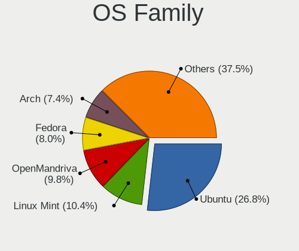

| Name             | Desktops | Percent |
|------------------|----------|---------|
| Ubuntu           | 90       | 26.79%  |
| Linux Mint       | 35       | 10.42%  |
| OpenMandriva     | 33       | 9.82%   |
| Fedora           | 27       | 8.04%   |
| Arch             | 25       | 7.44%   |
| Pop!_OS          | 19       | 5.65%   |
| Zorin            | 18       | 5.36%   |
| Debian           | 17       | 5.06%   |
| Manjaro          | 13       | 3.87%   |
| Kubuntu          | 10       | 2.98%   |
| KDE neon         | 8        | 2.38%   |
| openSUSE         | 4        | 1.19%   |
| EndeavourOS      | 4        | 1.19%   |
| Nobara           | 3        | 0.89%   |
| Elementary       | 3        | 0.89%   |
| Ubuntu MATE      | 2        | 0.6%    |
| Kali             | 2        | 0.6%    |
| Garuda Linux     | 2        | 0.6%    |
| ArcoLinux        | 2        | 0.6%    |
| Xubuntu          | 1        | 0.3%    |
| Void Linux       | 1        | 0.3%    |
| Ubuntu Budgie    | 1        | 0.3%    |
| SteamOS          | 1        | 0.3%    |
| ROSA             | 1        | 0.3%    |
| org.kde.Platform | 1        | 0.3%    |
| MX               | 1        | 0.3%    |
| Lubuntu          | 1        | 0.3%    |
| Loc OS           | 1        | 0.3%    |
| LMDE             | 1        | 0.3%    |
| LinuxFX          | 1        | 0.3%    |
| Linux Lite       | 1        | 0.3%    |
| Gentoo           | 1        | 0.3%    |
| Endless          | 1        | 0.3%    |
| Clear Linux      | 1        | 0.3%    |
| ChimeraOS        | 1        | 0.3%    |
| BuildRoot        | 1        | 0.3%    |
| Bluefin          | 1        | 0.3%    |
| blendOS          | 1        | 0.3%    |

Kernel
------

Version of the Linux kernel

| Version                             | Desktops | Percent |
|-------------------------------------|----------|---------|
| 5.16.7-desktop-1omv4003             | 8        | 1.94%   |
| 5.10.14-desktop-1omv4002            | 7        | 1.69%   |
| 5.4.0-42-generic                    | 6        | 1.45%   |
| 6.2.6-desktop-1omv2390              | 5        | 1.21%   |
| 6.1.1-desktop-1omv2290              | 5        | 1.21%   |
| 5.15.0-58-generic                   | 5        | 1.21%   |
| 5.9.16-1-MANJARO                    | 4        | 0.97%   |
| 5.0.0-13-generic                    | 4        | 0.97%   |
| 6.6.2-desktop-1omv2390              | 3        | 0.73%   |
| 5.4.0-77-generic                    | 3        | 0.73%   |
| 5.4.0-33-generic                    | 3        | 0.73%   |
| 5.4.0-26-generic                    | 3        | 0.73%   |
| 5.15.0-91-generic                   | 3        | 0.73%   |
| 5.15.0-82-generic                   | 3        | 0.73%   |
| 5.11.0-7614-generic                 | 3        | 0.73%   |
| 4.18.0-18-generic                   | 3        | 0.73%   |
| 6.9.3-76060903-generic              | 2        | 0.48%   |
| 6.8.0-76060800daily20240311-generic | 2        | 0.48%   |
| 6.8.0-31-generic                    | 2        | 0.48%   |
| 6.5.0-45-generic                    | 2        | 0.48%   |
| 6.5.0-41-generic                    | 2        | 0.48%   |
| 6.5.0-28-generic                    | 2        | 0.48%   |
| 6.4.11-desktop-1omv2390             | 2        | 0.48%   |
| 6.2.6-76060206-generic              | 2        | 0.48%   |
| 6.2.0-26-generic                    | 2        | 0.48%   |
| 6.11.3-200.fc40.x86_64              | 2        | 0.48%   |
| 6.10.10-200.fc40.x86_64             | 2        | 0.48%   |
| 6.1.0-13-amd64                      | 2        | 0.48%   |
| 5.8.0-59-generic                    | 2        | 0.48%   |
| 5.8.0-48-generic                    | 2        | 0.48%   |
| 5.4.0-89-generic                    | 2        | 0.48%   |
| 5.4.0-74-generic                    | 2        | 0.48%   |
| 5.4.0-70-generic                    | 2        | 0.48%   |
| 5.4.0-65-generic                    | 2        | 0.48%   |
| 5.4.0-52-generic                    | 2        | 0.48%   |
| 5.4.0-47-generic                    | 2        | 0.48%   |
| 5.4.0-29-generic                    | 2        | 0.48%   |
| 5.4.0-124-generic                   | 2        | 0.48%   |
| 5.4.0-117-generic                   | 2        | 0.48%   |
| 5.3.0-53-generic                    | 2        | 0.48%   |

Kernel Family
-------------

Linux kernel without a distro release

| Version | Desktops | Percent |
|---------|----------|---------|
| 5.4.0   | 40       | 10.15%  |
| 5.15.0  | 32       | 8.12%   |
| 5.11.0  | 15       | 3.81%   |
| 4.15.0  | 14       | 3.55%   |
| 6.5.0   | 11       | 2.79%   |
| 5.8.0   | 11       | 2.79%   |
| 6.8.0   | 10       | 2.54%   |
| 5.0.0   | 10       | 2.54%   |
| 4.18.0  | 10       | 2.54%   |
| 5.3.0   | 9        | 2.28%   |
| 5.19.0  | 9        | 2.28%   |
| 5.13.0  | 9        | 2.28%   |
| 6.2.6   | 8        | 2.03%   |
| 6.2.0   | 8        | 2.03%   |
| 5.16.7  | 8        | 2.03%   |
| 5.10.14 | 7        | 1.78%   |
| 6.1.1   | 6        | 1.52%   |
| 6.1.0   | 6        | 1.52%   |
| 6.6.2   | 5        | 1.27%   |
| 5.9.16  | 5        | 1.27%   |
| 6.9.5   | 3        | 0.76%   |
| 6.9.3   | 3        | 0.76%   |
| 6.11.4  | 3        | 0.76%   |
| 6.11.3  | 3        | 0.76%   |
| 6.10.9  | 3        | 0.76%   |
| 6.1.11  | 3        | 0.76%   |
| 5.18.10 | 3        | 0.76%   |
| 5.17.5  | 3        | 0.76%   |
| 5.10.0  | 3        | 0.76%   |
| 6.9.12  | 2        | 0.51%   |
| 6.9.10  | 2        | 0.51%   |
| 6.8.9   | 2        | 0.51%   |
| 6.4.4   | 2        | 0.51%   |
| 6.4.3   | 2        | 0.51%   |
| 6.4.12  | 2        | 0.51%   |
| 6.4.11  | 2        | 0.51%   |
| 6.3.8   | 2        | 0.51%   |
| 6.3.7   | 2        | 0.51%   |
| 6.2.9   | 2        | 0.51%   |
| 6.11.10 | 2        | 0.51%   |

Kernel Major Ver.
-----------------

Linux kernel major version

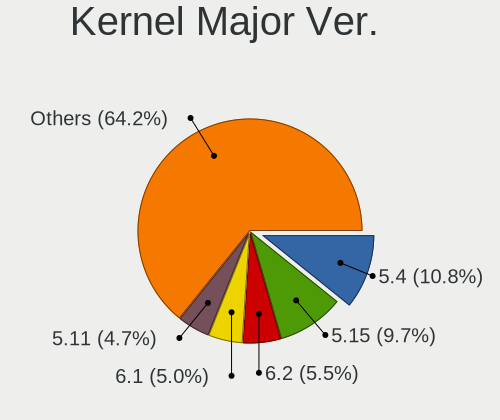

| Version | Desktops | Percent |
|---------|----------|---------|
| 5.4     | 41       | 10.79%  |
| 5.15    | 37       | 9.74%   |
| 6.2     | 21       | 5.53%   |
| 6.1     | 19       | 5%      |
| 5.11    | 18       | 4.74%   |
| 5.13    | 17       | 4.47%   |
| 5.10    | 17       | 4.47%   |
| 6.5     | 16       | 4.21%   |
| 6.9     | 14       | 3.68%   |
| 5.19    | 14       | 3.68%   |
| 4.15    | 14       | 3.68%   |
| 5.8     | 13       | 3.42%   |
| 6.8     | 12       | 3.16%   |
| 6.6     | 11       | 2.89%   |
| 5.16    | 11       | 2.89%   |
| 6.4     | 10       | 2.63%   |
| 6.10    | 10       | 2.63%   |
| 5.3     | 10       | 2.63%   |
| 5.0     | 10       | 2.63%   |
| 4.18    | 10       | 2.63%   |
| 6.11    | 9        | 2.37%   |
| 5.9     | 7        | 1.84%   |
| 6.3     | 6        | 1.58%   |
| 5.17    | 6        | 1.58%   |
| 5.14    | 6        | 1.58%   |
| 5.18    | 5        | 1.32%   |
| 6.7     | 3        | 0.79%   |
| 5.12    | 3        | 0.79%   |
| 6.0     | 2        | 0.53%   |
| 5.7     | 2        | 0.53%   |
| 5.6     | 2        | 0.53%   |
| 4.19    | 2        | 0.53%   |
| 6.12    | 1        | 0.26%   |
| 4.9     | 1        | 0.26%   |

Arch
----

OS architecture (x86_64, i586, etc.)

| Name   | Desktops | Percent |
|--------|----------|---------|
| x86_64 | 317      | 99.06%  |
| i686   | 3        | 0.94%   |

DE
--

Desktop Environment

| Name          | Desktops | Percent |
|---------------|----------|---------|
| GNOME         | 135      | 40.3%   |
| KDE5          | 68       | 20.3%   |
| Unknown       | 38       | 11.34%  |
| X-Cinnamon    | 29       | 8.66%   |
| XFCE          | 25       | 7.46%   |
| KDE           | 11       | 3.28%   |
| KDE6          | 8        | 2.39%   |
| MATE          | 4        | 1.19%   |
| LXDE          | 4        | 1.19%   |
| Pantheon      | 3        | 0.9%    |
| xmonad        | 2        | 0.6%    |
| Cinnamon      | 2        | 0.6%    |
| Budgie        | 2        | 0.6%    |
| KDE4          | 1        | 0.3%    |
| i3            | 1        | 0.3%    |
| Enlightenment | 1        | 0.3%    |
| Deepin        | 1        | 0.3%    |

Display Server
--------------

X11 or Wayland

| Name    | Desktops | Percent |
|---------|----------|---------|
| X11     | 230      | 69.7%   |
| Wayland | 66       | 20%     |
| Unknown | 29       | 8.79%   |
| Tty     | 5        | 1.52%   |

Display Manager
---------------

SDDM, LightDM, etc.

| Name    | Desktops | Percent |
|---------|----------|---------|
| Unknown | 186      | 54.87%  |
| SDDM    | 59       | 17.4%   |
| LightDM | 30       | 8.85%   |
| GDM     | 30       | 8.85%   |
| GDM3    | 24       | 7.08%   |
| TDM     | 6        | 1.77%   |
| LXDM    | 2        | 0.59%   |
| LY-DM   | 1        | 0.29%   |
| KDM     | 1        | 0.29%   |

OS Lang
-------

Language

| Lang     | Desktops | Percent |
|----------|----------|---------|
| es_CL    | 169      | 50.75%  |
| en_US    | 82       | 24.62%  |
| Unknown  | 35       | 10.51%  |
| es_ES    | 24       | 7.21%   |
| es_MX    | 7        | 2.1%    |
| en_GB    | 7        | 2.1%    |
| C        | 5        | 1.5%    |
| pt_BR    | 1        | 0.3%    |
| latam_IT | 1        | 0.3%    |
| es_UY    | 1        | 0.3%    |
| es_AR    | 1        | 0.3%    |

Boot Mode
---------

EFI or BIOS

| Mode | Desktops | Percent |
|------|----------|---------|
| BIOS | 201      | 60.54%  |
| EFI  | 131      | 39.46%  |

Filesystem
----------

Type of filesystem

| Type     | Desktops | Percent |
|----------|----------|---------|
| Ext4     | 233      | 69.76%  |
| Btrfs    | 45       | 13.47%  |
| Overlay  | 27       | 8.08%   |
| Tmpfs    | 12       | 3.59%   |
| Unknown  | 7        | 2.1%    |
| Ext2     | 3        | 0.9%    |
| Zfs      | 2        | 0.6%    |
| Xfs      | 2        | 0.6%    |
| Jfs      | 1        | 0.3%    |
| F2fs     | 1        | 0.3%    |
| Bcachefs | 1        | 0.3%    |

Part. scheme
------------

Scheme of partitioning

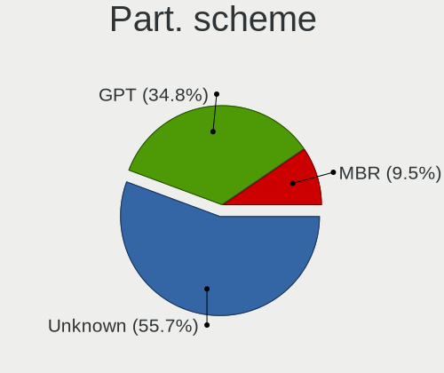

| Type    | Desktops | Percent |
|---------|----------|---------|
| Unknown | 187      | 55.65%  |
| GPT     | 117      | 34.82%  |
| MBR     | 32       | 9.52%   |

Dual Boot with Linux/BSD
------------------------

Hosting more than one Linux/BSD

| Dual boot | Desktops | Percent |
|-----------|----------|---------|
| No        | 279      | 84.55%  |
| Yes       | 51       | 15.45%  |

Dual Boot (Win)
---------------

Hosting Linux and Windows

| Dual boot | Desktops | Percent |
|-----------|----------|---------|
| No        | 211      | 63.36%  |
| Yes       | 122      | 36.64%  |

Board
-----

Vendor
------

Motherboard manufacturer

| Name                                 | Desktops | Percent |
|--------------------------------------|----------|---------|
| ASUSTek Computer                     | 93       | 29.06%  |
| MSI                                  | 51       | 15.94%  |
| Gigabyte Technology                  | 32       | 10%     |
| Hewlett-Packard                      | 30       | 9.38%   |
| Intel                                | 20       | 6.25%   |
| ECS                                  | 15       | 4.69%   |
| Dell                                 | 13       | 4.06%   |
| ASRock                               | 11       | 3.44%   |
| Unknown                              | 9        | 2.81%   |
| Huanan                               | 6        | 1.88%   |
| Pegatron                             | 5        | 1.56%   |
| Lenovo                               | 5        | 1.56%   |
| TPV-INVENTA                          | 2        | 0.63%   |
| Olidata                              | 2        | 0.63%   |
| MACHINIST                            | 2        | 0.63%   |
| HC                                   | 2        | 0.63%   |
| Foxconn                              | 2        | 0.63%   |
| eMachines                            | 2        | 0.63%   |
| WZA300S2R120                         | 1        | 0.31%   |
| ViewSonic                            | 1        | 0.31%   |
| SZMZ                                 | 1        | 0.31%   |
| Shenzhen Meigao Electronic Equipment | 1        | 0.31%   |
| R-StyleComputers                     | 1        | 0.31%   |
| Quanta                               | 1        | 0.31%   |
| PCPartner                            | 1        | 0.31%   |
| Nvidia                               | 1        | 0.31%   |
| JGINYUE                              | 1        | 0.31%   |
| IBM                                  | 1        | 0.31%   |
| EVGA                                 | 1        | 0.31%   |
| Elo TouchSystems                     | 1        | 0.31%   |
| Colorful Technology                  | 1        | 0.31%   |
| BESSTAR Tech                         | 1        | 0.31%   |
| AZW                                  | 1        | 0.31%   |
| Apple                                | 1        | 0.31%   |
| ANGXUN                               | 1        | 0.31%   |
| AMI                                  | 1        | 0.31%   |

Model
-----

Motherboard model

| Name                          | Desktops | Percent |
|-------------------------------|----------|---------|
| Unknown                       | 10       | 3.13%   |
| ASUS All Series               | 8        | 2.5%    |
| MSI MS-7817                   | 6        | 1.88%   |
| ASUS PRIME B450M-A            | 6        | 1.88%   |
| ASUS PRIME A320M-K            | 5        | 1.56%   |
| MSI MS-7A34                   | 3        | 0.94%   |
| MSI MS-7A15                   | 3        | 0.94%   |
| MSI MS-7788                   | 3        | 0.94%   |
| Intel X99                     | 3        | 0.94%   |
| HP EliteDesk 800 G1 SFF       | 3        | 0.94%   |
| HP Compaq Pro 4300 SFF PC     | 3        | 0.94%   |
| Dell OptiPlex 7010            | 3        | 0.94%   |
| ASUS TUF Gaming X570-PLUS     | 3        | 0.94%   |
| ASUS TUF Gaming B450M-PLUS II | 3        | 0.94%   |
| ASUS PRIME H410M-E            | 3        | 0.94%   |
| MSI Pro 3000/3080             | 2        | 0.63%   |
| MSI MS-7A65                   | 2        | 0.63%   |
| MSI MS-7816                   | 2        | 0.63%   |
| MSI MS-7693                   | 2        | 0.63%   |
| MSI MS-7360                   | 2        | 0.63%   |
| Intel X79M-S                  | 2        | 0.63%   |
| HP EliteDesk 705 G1 SFF       | 2        | 0.63%   |
| HP Compaq Pro 6300 SFF        | 2        | 0.63%   |
| HC HCAR357-MI                 | 2        | 0.63%   |
| Gigabyte B550 AORUS ELITE V2  | 2        | 0.63%   |
| Gigabyte B450M DS3H V2        | 2        | 0.63%   |
| Gigabyte B450 AORUS PRO WIFI  | 2        | 0.63%   |
| Gigabyte A320M-S2H V2         | 2        | 0.63%   |
| ECS MCP61M-M3                 | 2        | 0.63%   |
| ECS A960M-MV                  | 2        | 0.63%   |
| ECS A740GM-M                  | 2        | 0.63%   |
| Dell OptiPlex 3060            | 2        | 0.63%   |
| ASUS TUF Gaming B460M-PLUS    | 2        | 0.63%   |
| ASUS SABERTOOTH 990FX R2.0    | 2        | 0.63%   |
| ASUS PRIME X570-P             | 2        | 0.63%   |
| ASUS PRIME B660M-A D4         | 2        | 0.63%   |
| ASUS M5A99X EVO               | 2        | 0.63%   |
| ASUS M5A97 R2.0               | 2        | 0.63%   |
| ASUS H110M-R                  | 2        | 0.63%   |
| ASUS F2A55-M LK2              | 2        | 0.63%   |

Model Family
------------

Motherboard model prefix

| Name               | Desktops | Percent |
|--------------------|----------|---------|
| ASUS PRIME         | 27       | 8.44%   |
| ASUS TUF           | 18       | 5.63%   |
| HP Compaq          | 11       | 3.44%   |
| Unknown            | 10       | 3.13%   |
| Dell OptiPlex      | 8        | 2.5%    |
| ASUS All           | 8        | 2.5%    |
| HP EliteDesk       | 7        | 2.19%   |
| ASUS ROG           | 7        | 2.19%   |
| MSI MS-7817        | 6        | 1.88%   |
| Lenovo ThinkCentre | 5        | 1.56%   |
| Intel X99          | 4        | 1.25%   |
| HP ProDesk         | 4        | 1.25%   |
| ASUS M5A78L-M      | 4        | 1.25%   |
| MSI MS-7A34        | 3        | 0.94%   |
| MSI MS-7A15        | 3        | 0.94%   |
| MSI MS-7788        | 3        | 0.94%   |
| Huanan X79         | 3        | 0.94%   |
| Gigabyte B450M     | 3        | 0.94%   |
| Gigabyte B450      | 3        | 0.94%   |
| Gigabyte A320M-S2H | 3        | 0.94%   |
| Dell Precision     | 3        | 0.94%   |
| ASUS SABERTOOTH    | 3        | 0.94%   |
| ASUS M5A99X        | 3        | 0.94%   |
| MSI Pro            | 2        | 0.63%   |
| MSI MS-7A65        | 2        | 0.63%   |
| MSI MS-7816        | 2        | 0.63%   |
| MSI MS-7693        | 2        | 0.63%   |
| MSI MS-7360        | 2        | 0.63%   |
| Intel X79M-S       | 2        | 0.63%   |
| Intel D54250WYK    | 2        | 0.63%   |
| Huanan X99-F8      | 2        | 0.63%   |
| HC HCAR357-MI      | 2        | 0.63%   |
| Gigabyte X570      | 2        | 0.63%   |
| Gigabyte B550M     | 2        | 0.63%   |
| Gigabyte B550      | 2        | 0.63%   |
| ECS MCP61M-M3      | 2        | 0.63%   |
| ECS A960M-MV       | 2        | 0.63%   |
| ECS A740GM-M       | 2        | 0.63%   |
| ASUS M5A97         | 2        | 0.63%   |
| ASUS H110M-R       | 2        | 0.63%   |

MFG Year
--------

Motherboard manufacture year

| Year | Desktops | Percent |
|------|----------|---------|
| 2020 | 39       | 12.19%  |
| 2012 | 34       | 10.63%  |
| 2013 | 30       | 9.38%   |
| 2018 | 29       | 9.06%   |
| 2019 | 23       | 7.19%   |
| 2014 | 21       | 6.56%   |
| 2021 | 19       | 5.94%   |
| 2011 | 19       | 5.94%   |
| 2017 | 16       | 5%      |
| 2007 | 16       | 5%      |
| 2016 | 13       | 4.06%   |
| 2008 | 13       | 4.06%   |
| 2022 | 11       | 3.44%   |
| 2010 | 11       | 3.44%   |
| 2009 | 9        | 2.81%   |
| 2023 | 6        | 1.88%   |
| 2015 | 6        | 1.88%   |
| 2024 | 2        | 0.63%   |
| 2006 | 2        | 0.63%   |
| 2005 | 1        | 0.31%   |

Form Factor
-----------

Physical design of the computer

| Name    | Desktops | Percent |
|---------|----------|---------|
| Desktop | 320      | 100%    |

Secure Boot
-----------

Enabled or disabled

| State    | Desktops | Percent |
|----------|----------|---------|
| Disabled | 316      | 98.14%  |
| Enabled  | 6        | 1.86%   |

Coreboot
--------

Have coreboot on board

| Used | Desktops | Percent |
|------|----------|---------|
| No   | 320      | 100%    |

RAM Size
--------

Total RAM memory

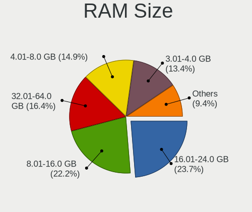

| Size in GB  | Desktops | Percent |
|-------------|----------|---------|
| 16.01-24.0  | 78       | 23.71%  |
| 8.01-16.0   | 73       | 22.19%  |
| 32.01-64.0  | 54       | 16.41%  |
| 4.01-8.0    | 49       | 14.89%  |
| 3.01-4.0    | 44       | 13.37%  |
| 1.01-2.0    | 11       | 3.34%   |
| 24.01-32.0  | 10       | 3.04%   |
| 64.01-256.0 | 6        | 1.82%   |
| 2.01-3.0    | 4        | 1.22%   |

RAM Used
--------

Used RAM memory

| Used GB    | Desktops | Percent |
|------------|----------|---------|
| 1.01-2.0   | 110      | 30.3%   |
| 2.01-3.0   | 96       | 26.45%  |
| 4.01-8.0   | 63       | 17.36%  |
| 3.01-4.0   | 56       | 15.43%  |
| 8.01-16.0  | 23       | 6.34%   |
| 0.51-1.0   | 12       | 3.31%   |
| 0.01-0.5   | 2        | 0.55%   |
| 16.01-24.0 | 1        | 0.28%   |

Total Drives
------------

Number of drives on board

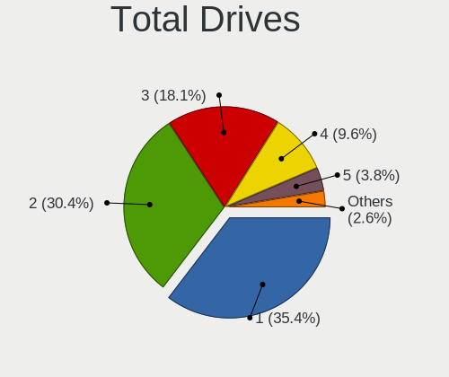

| Drives | Desktops | Percent |
|--------|----------|---------|
| 1      | 121      | 35.38%  |
| 2      | 104      | 30.41%  |
| 3      | 62       | 18.13%  |
| 4      | 33       | 9.65%   |
| 5      | 13       | 3.8%    |
| 7      | 3        | 0.88%   |
| 6      | 3        | 0.88%   |
| 0      | 2        | 0.58%   |
| 8      | 1        | 0.29%   |

Has CD-ROM
----------

Has CD-ROM on board

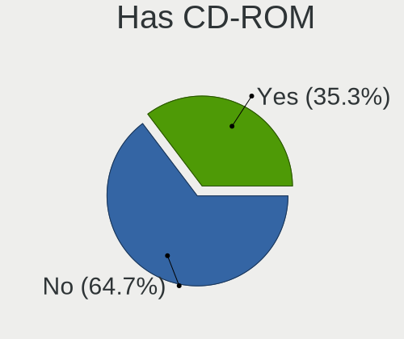

| Presented | Desktops | Percent |
|-----------|----------|---------|
| No        | 209      | 64.71%  |
| Yes       | 114      | 35.29%  |

Has Ethernet
------------

Has Ethernet on board

| Presented | Desktops | Percent |
|-----------|----------|---------|
| Yes       | 318      | 99.38%  |
| No        | 2        | 0.63%   |

Has WiFi
--------

Has WiFi module

| Presented | Desktops | Percent |
|-----------|----------|---------|
| No        | 173      | 53.4%   |
| Yes       | 151      | 46.6%   |

Has Bluetooth
-------------

Has Bluetooth module

| Presented | Desktops | Percent |
|-----------|----------|---------|
| No        | 217      | 66.16%  |
| Yes       | 111      | 33.84%  |

Location
--------

Country
-------

Geographic location (country)

| Country | Desktops | Percent |
|---------|----------|---------|
| Chile   | 320      | 100%    |

City
----

Geographic location (city)

| City                | Desktops | Percent |
|---------------------|----------|---------|
| Santiago            | 127      | 37.13%  |
| Via del Mar       | 14       | 4.09%   |
| Concepcin         | 11       | 3.22%   |
| Antofagasta         | 10       | 2.92%   |
| Maipu               | 9        | 2.63%   |
| Las Condes          | 9        | 2.63%   |
| Valdivia            | 8        | 2.34%   |
| Puente Alto         | 8        | 2.34%   |
| Valparaso         | 7        | 2.05%   |
| Temuco              | 7        | 2.05%   |
| Port Montt          | 7        | 2.05%   |
| Nunoa               | 7        | 2.05%   |
| La Florida          | 6        | 1.75%   |
| San Miguel          | 5        | 1.46%   |
| Providencia         | 5        | 1.46%   |
| Osorno              | 5        | 1.46%   |
| La Serena           | 5        | 1.46%   |
| Central             | 5        | 1.46%   |
| Melipilla           | 4        | 1.17%   |
| Coquimbo            | 4        | 1.17%   |
| Chillan             | 4        | 1.17%   |
| Quilpu            | 3        | 0.88%   |
| Penalolen           | 3        | 0.88%   |
| El Bosque           | 3        | 0.88%   |
| Arica               | 3        | 0.88%   |
| Vitacura            | 2        | 0.58%   |
| Vallenar            | 2        | 0.58%   |
| Tome                | 2        | 0.58%   |
| Talca               | 2        | 0.58%   |
| San Pedro de la Paz | 2        | 0.58%   |
| Recoleta            | 2        | 0.58%   |
| Rancagua            | 2        | 0.58%   |
| Quillota            | 2        | 0.58%   |
| Quilicura           | 2        | 0.58%   |
| Macul               | 2        | 0.58%   |
| Los ngeles        | 2        | 0.58%   |
| La Granja           | 2        | 0.58%   |
| Hualpen             | 2        | 0.58%   |
| Coronel             | 2        | 0.58%   |
| Colina              | 2        | 0.58%   |

Drives
------

Drive Vendor
------------

Hard drive vendors

| Vendor                      | Desktops | Drives | Percent |
|-----------------------------|----------|--------|---------|
| WDC                         | 128      | 224    | 20.95%  |
| Seagate                     | 97       | 149    | 15.88%  |
| Kingston                    | 70       | 123    | 11.46%  |
| Toshiba                     | 58       | 72     | 9.49%   |
| Crucial                     | 37       | 51     | 6.06%   |
| SanDisk                     | 34       | 62     | 5.56%   |
| Samsung Electronics         | 23       | 42     | 3.76%   |
| Hitachi                     | 19       | 27     | 3.11%   |
| China                       | 17       | 23     | 2.78%   |
| Silicon Motion              | 14       | 14     | 2.29%   |
| Kingston Technology Company | 10       | 12     | 1.64%   |
| Unknown                     | 8        | 11     | 1.31%   |
| Micron/Crucial Technology   | 7        | 15     | 1.15%   |
| Micron Technology           | 6        | 17     | 0.98%   |
| XPG                         | 5        | 16     | 0.82%   |
| Phison Electronics          | 5        | 7      | 0.82%   |
| Maxtor                      | 5        | 8      | 0.82%   |
| Lexar                       | 5        | 8      | 0.82%   |
| KingSpec                    | 5        | 6      | 0.82%   |
| SK hynix                    | 4        | 8      | 0.65%   |
| Realtek Semiconductor       | 4        | 5      | 0.65%   |
| Corsair                     | 4        | 9      | 0.65%   |
| A-DATA Technology           | 4        | 6      | 0.65%   |
| XrayDisk                    | 3        | 3      | 0.49%   |
| JMicron Technology          | 3        | 3      | 0.49%   |
| Transcend                   | 2        | 3      | 0.33%   |
| Netac                       | 2        | 3      | 0.33%   |
| MAXIO Technology (Hangzhou) | 2        | 2      | 0.33%   |
| HGST                        | 2        | 3      | 0.33%   |
| Gigabyte Technology         | 2        | 4      | 0.33%   |
| Apple                       | 2        | 3      | 0.33%   |
| ZOTAC                       | 1        | 1      | 0.16%   |
| WALRAM                      | 1        | 2      | 0.16%   |
| USB3.0                      | 1        | 1      | 0.16%   |
| T-FORCE                     | 1        | 1      | 0.16%   |
| StoreJet                    | 1        | 1      | 0.16%   |
| Seagate Technology          | 1        | 1      | 0.16%   |
| SCY                         | 1        | 1      | 0.16%   |
| Realtek                     | 1        | 1      | 0.16%   |
| PNY                         | 1        | 1      | 0.16%   |

Drive Model
-----------

Hard drive models

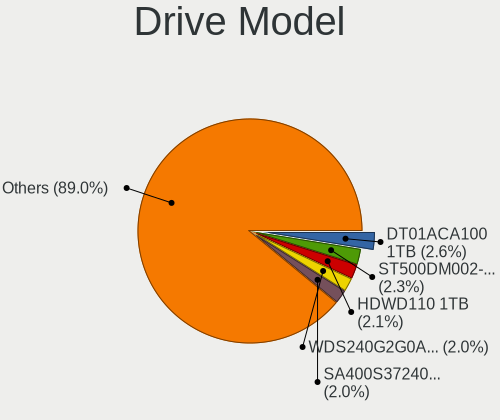

| Model                                                 | Desktops | Percent |
|-------------------------------------------------------|----------|---------|
| Toshiba DT01ACA100 1TB                                | 18       | 2.56%   |
| Seagate ST500DM002-1BD142 500GB                       | 16       | 2.28%   |
| Toshiba HDWD110 1TB                                   | 15       | 2.13%   |
| WDC WDS240G2G0A-00JH30 240GB SSD                      | 14       | 1.99%   |
| Kingston SA400S37240G 240GB SSD                       | 14       | 1.99%   |
| WDC WD10EZEX-08WN4A0 1TB                              | 12       | 1.71%   |
| Kingston SA400S37480G 480GB SSD                       | 12       | 1.71%   |
| Kingston SA400S37120G 120GB SSD                       | 11       | 1.56%   |
| SanDisk NVMe SSD Drive 1TB                            | 8        | 1.14%   |
| Crucial CT240BX500SSD1 240GB                          | 8        | 1.14%   |
| Crucial CT500MX500SSD1 500GB                          | 7        | 1%      |
| WDC WD5000AAKX-001CA0 500GB                           | 6        | 0.85%   |
| Toshiba DT01ACA050 500GB                              | 6        | 0.85%   |
| Seagate ST1000DM010-2EP102 1TB                        | 6        | 0.85%   |
| Kingston SUV400S37120G 120GB SSD                      | 6        | 0.85%   |
| Crucial CT480BX500SSD1 480GB                          | 6        | 0.85%   |
| WDC WDS500G2B0A-00SM50 500GB SSD                      | 5        | 0.71%   |
| WDC WD5000AAKX-00ERMA0 500GB                          | 5        | 0.71%   |
| WDC WD Green 2.5 240GB SSD                            | 5        | 0.71%   |
| Silicon Motion SM2263EN/SM2263XT SSD Controller 256GB | 5        | 0.71%   |
| Seagate ST3500418AS 500GB                             | 5        | 0.71%   |
| Seagate ST1000DM003-1ER162 1TB                        | 5        | 0.71%   |
| Sandisk WD_BLACK SN770 1TB                            | 5        | 0.71%   |
| Kingston Company SNV2S1000G 1TB                       | 5        | 0.71%   |
| XPG GAMMIX S11 Pro 512GB                              | 4        | 0.57%   |
| WDC WD20EZAZ-00L9GB0 2TB                              | 4        | 0.57%   |
| WDC WD10EZEX-00BN5A0 1TB                              | 4        | 0.57%   |
| Seagate ST500LT012-1DG142 500GB                       | 4        | 0.57%   |
| Seagate ST4000DM004-2CV104 4TB                        | 4        | 0.57%   |
| Seagate ST3320418AS 320GB                             | 4        | 0.57%   |
| Sandisk WD Blue SN550 NVMe SSD 256GB                  | 4        | 0.57%   |
| Kingston SUV400S37240G 240GB SSD                      | 4        | 0.57%   |
| Hitachi HDS721050CLA362 500GB                         | 4        | 0.57%   |
| Crucial CT250MX500SSD1 250GB                          | 4        | 0.57%   |
| XPG SPECTRIX S40G 1TB                                 | 3        | 0.43%   |
| WDC WDS480G2G0A-00JH30 480GB SSD                      | 3        | 0.43%   |
| WDC WDS100T2B0C-00PXH0 1TB                            | 3        | 0.43%   |
| WDC WD20EZRZ-00Z5HB0 2TB                              | 3        | 0.43%   |
| Toshiba HDWD105 500GB                                 | 3        | 0.43%   |
| Toshiba DT01ACA200 2TB                                | 3        | 0.43%   |

HDD Vendor
----------

Hard disk drive vendors

| Vendor              | Desktops | Drives | Percent |
|---------------------|----------|--------|---------|
| WDC                 | 97       | 150    | 33.33%  |
| Seagate             | 96       | 146    | 32.99%  |
| Toshiba             | 58       | 72     | 19.93%  |
| Hitachi             | 19       | 27     | 6.53%   |
| Samsung Electronics | 7        | 9      | 2.41%   |
| Maxtor              | 4        | 6      | 1.37%   |
| Unknown             | 2        | 2      | 0.69%   |
| JMicron Technology  | 2        | 2      | 0.69%   |
| HGST                | 2        | 3      | 0.69%   |
| Apple               | 2        | 3      | 0.69%   |
| ASMT                | 1        | 1      | 0.34%   |
| ASMedia             | 1        | 2      | 0.34%   |

SSD Vendor
----------

Solid state drive vendors

| Vendor              | Desktops | Drives | Percent |
|---------------------|----------|--------|---------|
| Kingston            | 63       | 102    | 29.72%  |
| WDC                 | 40       | 63     | 18.87%  |
| Crucial             | 37       | 50     | 17.45%  |
| China               | 17       | 23     | 8.02%   |
| Samsung Electronics | 11       | 22     | 5.19%   |
| Lexar               | 5        | 8      | 2.36%   |
| KingSpec            | 5        | 6      | 2.36%   |
| Corsair             | 4        | 9      | 1.89%   |
| SanDisk             | 3        | 4      | 1.42%   |
| XrayDisk            | 2        | 2      | 0.94%   |
| Micron Technology   | 2        | 2      | 0.94%   |
| Gigabyte Technology | 2        | 4      | 0.94%   |
| A-DATA Technology   | 2        | 4      | 0.94%   |
| ZOTAC               | 1        | 1      | 0.47%   |
| WALRAM              | 1        | 1      | 0.47%   |
| USB3.0              | 1        | 1      | 0.47%   |
| Unknown             | 1        | 1      | 0.47%   |
| StoreJet            | 1        | 1      | 0.47%   |
| SK hynix            | 1        | 1      | 0.47%   |
| SCY                 | 1        | 1      | 0.47%   |
| PNY                 | 1        | 1      | 0.47%   |
| Patriot             | 1        | 1      | 0.47%   |
| OCZ                 | 1        | 2      | 0.47%   |
| NGFF                | 1        | 1      | 0.47%   |
| Min Yi U            | 1        | 1      | 0.47%   |
| Maxtor              | 1        | 2      | 0.47%   |
| LuminouTek          | 1        | 1      | 0.47%   |
| Intenso             | 1        | 1      | 0.47%   |
| FORESEE             | 1        | 1      | 0.47%   |
| Dahua               | 1        | 1      | 0.47%   |
| BIWIN               | 1        | 1      | 0.47%   |
| Unknown             | 1        | 1      | 0.47%   |

Drive Kind
----------

HDD or SSD

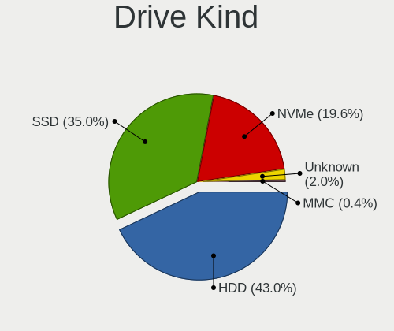

| Kind    | Desktops | Drives | Percent |
|---------|----------|--------|---------|
| HDD     | 217      | 423    | 42.97%  |
| SSD     | 177      | 320    | 35.05%  |
| NVMe    | 99       | 210    | 19.6%   |
| Unknown | 10       | 12     | 1.98%   |
| MMC     | 2        | 2      | 0.4%    |

Drive Connector
---------------

SATA, SAS, NVMe, etc.

| Type | Desktops | Drives | Percent |
|------|----------|--------|---------|
| SATA | 294      | 728    | 70.67%  |
| NVMe | 99       | 209    | 23.8%   |
| SAS  | 21       | 28     | 5.05%   |
| MMC  | 2        | 2      | 0.48%   |

Drive Size
----------

Size of hard drive

| Size in TB | Desktops | Drives | Percent |
|------------|----------|--------|---------|
| 0.01-0.5   | 233      | 460    | 57.25%  |
| 0.51-1.0   | 115      | 179    | 28.26%  |
| 1.01-2.0   | 38       | 64     | 9.34%   |
| 3.01-4.0   | 12       | 16     | 2.95%   |
| 2.01-3.0   | 5        | 12     | 1.23%   |
| 4.01-10.0  | 4        | 12     | 0.98%   |

Space Total
-----------

Amount of disk space available on the file system

| Size in GB     | Desktops | Percent |
|----------------|----------|---------|
| 251-500        | 75       | 21.37%  |
| 101-250        | 67       | 19.09%  |
| 501-1000       | 57       | 16.24%  |
| 1001-2000      | 39       | 11.11%  |
| More than 3000 | 36       | 10.26%  |
| 1-20           | 24       | 6.84%   |
| 2001-3000      | 20       | 5.7%    |
| 51-100         | 16       | 4.56%   |
| Unknown        | 10       | 2.85%   |
| 21-50          | 7        | 1.99%   |

Space Used
----------

Amount of used disk space

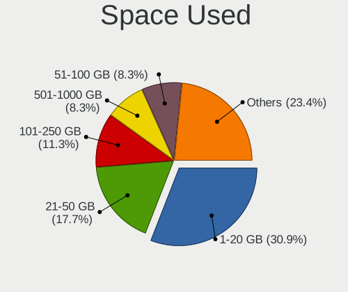

| Used GB        | Desktops | Percent |
|----------------|----------|---------|
| 1-20           | 115      | 30.91%  |
| 21-50          | 66       | 17.74%  |
| 101-250        | 42       | 11.29%  |
| 501-1000       | 31       | 8.33%   |
| 51-100         | 31       | 8.33%   |
| 251-500        | 26       | 6.99%   |
| 1001-2000      | 26       | 6.99%   |
| More than 3000 | 12       | 3.23%   |
| 2001-3000      | 12       | 3.23%   |
| Unknown        | 10       | 2.69%   |
| 0              | 1        | 0.27%   |

Malfunc. Drives
---------------

Drive models with a malfunction

| Model                                | Desktops | Drives | Percent |
|--------------------------------------|----------|--------|---------|
| Seagate ST500DM002-1BD142 500GB      | 3        | 3      | 5.36%   |
| WDC WD1600BB-00GUC0 160GB            | 2        | 2      | 3.57%   |
| Seagate ST31000528AS 1TB             | 2        | 2      | 3.57%   |
| Kingston SKC400S371T 1024GB SSD      | 2        | 13     | 3.57%   |
| Kingston SA400S37480G 480GB SSD      | 2        | 4      | 3.57%   |
| Kingston SA400S37240G 240GB SSD      | 2        | 3      | 3.57%   |
| XrayDisk SSD 256GB                   | 1        | 1      | 1.79%   |
| XPG SPECTRIX S40G 1TB                | 1        | 2      | 1.79%   |
| WDC WDS480G2G0A-00JH30 480GB SSD     | 1        | 1      | 1.79%   |
| WDC WDS240G2G0A-00JH30 240GB SSD     | 1        | 1      | 1.79%   |
| WDC WD5000AAKX-083CA1 500GB          | 1        | 1      | 1.79%   |
| WDC WD5000AAKX-00ERMA0 500GB         | 1        | 1      | 1.79%   |
| WDC WD5000AAKX-001CA0 500GB          | 1        | 2      | 1.79%   |
| WDC WD3200AAKX-001CA0 320GB          | 1        | 1      | 1.79%   |
| WDC WD20EARX-00PASB0 2TB             | 1        | 1      | 1.79%   |
| WDC WD1600BEVT-35VW9T0 160GB         | 1        | 1      | 1.79%   |
| WDC WD10EARS-00Y5B1 1TB              | 1        | 1      | 1.79%   |
| WDC WD10EARS-003BB1 1TB              | 1        | 1      | 1.79%   |
| WDC WD Blue SA510 2.5 1000GB SSD     | 1        | 1      | 1.79%   |
| Toshiba MK1652GSX 160GB              | 1        | 1      | 1.79%   |
| Toshiba HDWE140 4TB                  | 1        | 2      | 1.79%   |
| Toshiba DT01ACA100 1TB               | 1        | 1      | 1.79%   |
| Toshiba DT01ACA050 500GB             | 1        | 1      | 1.79%   |
| Seagate ST500LT012-9WS142 500GB      | 1        | 1      | 1.79%   |
| Seagate ST500LM000-1EJ162-SSHD 500GB | 1        | 1      | 1.79%   |
| Seagate ST4000VX007-2DT166 4TB       | 1        | 1      | 1.79%   |
| Seagate ST3500418AS 500GB            | 1        | 1      | 1.79%   |
| Seagate ST2000DM001-1CH164 2TB       | 1        | 1      | 1.79%   |
| Samsung Electronics SSD 870 EVO 1TB  | 1        | 1      | 1.79%   |
| Samsung Electronics SP1654N 160GB    | 1        | 1      | 1.79%   |
| Samsung Electronics HD250HJ 250GB    | 1        | 2      | 1.79%   |
| Samsung Electronics HD081GJ 80GB     | 1        | 1      | 1.79%   |
| Maxtor 2B020H1 20GB                  | 1        | 1      | 1.79%   |
| Kingston SNV2S500G 500GB             | 1        | 1      | 1.79%   |
| Kingston SA400S37120G 120GB SSD      | 1        | 1      | 1.79%   |
| JMicron Technology Generic 500GB     | 1        | 1      | 1.79%   |
| Hitachi HTS547550A9E384 500GB        | 1        | 1      | 1.79%   |
| Hitachi HTS545050B9A300 500GB        | 1        | 1      | 1.79%   |
| Hitachi HTS545050A7E380 500GB        | 1        | 1      | 1.79%   |
| Hitachi HTS543232A7A384 320GB        | 1        | 1      | 1.79%   |

Malfunc. Drive Vendor
---------------------

Vendors of faulty drives

| Vendor              | Desktops | Drives | Percent |
|---------------------|----------|--------|---------|
| WDC                 | 12       | 14     | 22.64%  |
| Seagate             | 10       | 10     | 18.87%  |
| Kingston            | 8        | 22     | 15.09%  |
| Hitachi             | 8        | 9      | 15.09%  |
| Toshiba             | 4        | 5      | 7.55%   |
| Samsung Electronics | 3        | 5      | 5.66%   |
| China               | 2        | 2      | 3.77%   |
| XrayDisk            | 1        | 1      | 1.89%   |
| XPG                 | 1        | 2      | 1.89%   |
| Maxtor              | 1        | 1      | 1.89%   |
| JMicron Technology  | 1        | 1      | 1.89%   |
| Apple               | 1        | 2      | 1.89%   |
| A-DATA Technology   | 1        | 1      | 1.89%   |

Malfunc. HDD Vendor
-------------------

Vendors of faulty HDD drives

| Vendor              | Desktops | Drives | Percent |
|---------------------|----------|--------|---------|
| WDC                 | 10       | 11     | 27.03%  |
| Seagate             | 10       | 10     | 27.03%  |
| Hitachi             | 8        | 9      | 21.62%  |
| Toshiba             | 4        | 5      | 10.81%  |
| Samsung Electronics | 2        | 4      | 5.41%   |
| Maxtor              | 1        | 1      | 2.7%    |
| JMicron Technology  | 1        | 1      | 2.7%    |
| Apple               | 1        | 2      | 2.7%    |

Malfunc. Drive Kind
-------------------

Kinds of faulty drives

| Kind | Desktops | Drives | Percent |
|------|----------|--------|---------|
| HDD  | 28       | 43     | 62.22%  |
| SSD  | 14       | 28     | 31.11%  |
| NVMe | 3        | 4      | 6.67%   |

Failed Drives
-------------

Failed drive models

| Model                    | Desktops | Drives | Percent |
|--------------------------|----------|--------|---------|
| Toshiba MQ01ABF050 500GB | 1        | 1      | 100%    |

Failed Drive Vendor
-------------------

Failed drive vendors

| Vendor  | Desktops | Drives | Percent |
|---------|----------|--------|---------|
| Toshiba | 1        | 1      | 100%    |

Drive Status
------------

Number of failed and malfunc. drives

| Status   | Desktops | Drives | Percent |
|----------|----------|--------|---------|
| Detected | 215      | 582    | 57.95%  |
| Works    | 115      | 309    | 31%     |
| Malfunc  | 40       | 75     | 10.78%  |
| Failed   | 1        | 1      | 0.27%   |

Storage controller
------------------

Storage Vendor
--------------

Storage controller vendors

| Vendor                       | Desktops | Percent |
|------------------------------|----------|---------|
| Intel                        | 187      | 40.92%  |
| AMD                          | 118      | 25.82%  |
| SanDisk                      | 38       | 8.32%   |
| Kingston Technology Company  | 18       | 3.94%   |
| Silicon Motion               | 17       | 3.72%   |
| Realtek Semiconductor        | 9        | 1.97%   |
| JMicron Technology           | 9        | 1.97%   |
| Nvidia                       | 8        | 1.75%   |
| Micron/Crucial Technology    | 8        | 1.75%   |
| Marvell Technology Group     | 8        | 1.75%   |
| ASMedia Technology           | 7        | 1.53%   |
| Samsung Electronics          | 6        | 1.31%   |
| Phison Electronics           | 5        | 1.09%   |
| ADATA Technology             | 5        | 1.09%   |
| Micron Technology            | 4        | 0.88%   |
| SK hynix                     | 3        | 0.66%   |
| MAXIO Technology (Hangzhou)  | 2        | 0.44%   |
| VIA Technologies             | 1        | 0.22%   |
| Shenzhen Longsys Electronics | 1        | 0.22%   |
| Seagate Technology           | 1        | 0.22%   |
| Netac Technology             | 1        | 0.22%   |
| INNOGRIT                     | 1        | 0.22%   |

Storage Model
-------------

Storage controller models

| Model                                                                                   | Desktops | Percent |
|-----------------------------------------------------------------------------------------|----------|---------|
| AMD FCH SATA Controller [AHCI mode]                                                     | 59       | 10.24%  |
| Intel 8 Series/C220 Series Chipset Family 6-port SATA Controller 1 [AHCI mode]          | 30       | 5.21%   |
| AMD 400 Series Chipset SATA Controller                                                  | 23       | 3.99%   |
| AMD 500 Series Chipset SATA Controller                                                  | 16       | 2.78%   |
| Silicon Motion SM2263EN/SM2263XT (DRAM-less) NVMe SSD Controllers                       | 15       | 2.6%    |
| AMD SB7x0/SB8x0/SB9x0 SATA Controller [AHCI mode]                                       | 15       | 2.6%    |
| AMD SB7x0/SB8x0/SB9x0 IDE Controller                                                    | 15       | 2.6%    |
| AMD SB7x0/SB8x0/SB9x0 SATA Controller [IDE mode]                                        | 13       | 2.26%   |
| Intel 7 Series/C210 Series Chipset Family 6-port SATA Controller [AHCI mode]            | 12       | 2.08%   |
| Intel 6 Series/C200 Series Chipset Family Desktop SATA Controller (IDE mode, ports 4-5) | 12       | 2.08%   |
| Intel 6 Series/C200 Series Chipset Family Desktop SATA Controller (IDE mode, ports 0-3) | 12       | 2.08%   |
| Intel Q170/Q150/B150/H170/H110/Z170/CM236 Chipset SATA Controller [AHCI Mode]           | 11       | 1.91%   |
| Intel NM10/ICH7 Family SATA Controller [IDE mode]                                       | 11       | 1.91%   |
| SanDisk Extreme Pro / WD Black SN750 / PC SN730 / Red SN700 NVMe SSD                    | 9        | 1.56%   |
| Intel SATA Controller [RAID Mode]                                                       | 9        | 1.56%   |
| Intel Cannon Lake PCH SATA AHCI Controller                                              | 9        | 1.56%   |
| Intel 82801I (ICH9 Family) 2 port SATA Controller [IDE mode]                            | 9        | 1.56%   |
| Intel 82801G (ICH7 Family) IDE Controller                                               | 9        | 1.56%   |
| Intel 6 Series/C200 Series Chipset Family 6 port Desktop SATA AHCI Controller           | 9        | 1.56%   |
| Intel 200 Series PCH SATA controller [AHCI mode]                                        | 9        | 1.56%   |
| AMD A320 Chipset SATA Controller [AHCI mode]                                            | 8        | 1.39%   |
| AMD 300 Series Chipset SATA Controller                                                  | 8        | 1.39%   |
| SanDisk Ultra 3D / WD PC SN530, IX SN530, Blue SN550 NVMe SSD (DRAM-less)               | 7        | 1.22%   |
| Realtek RTS5762 NVMe SSD Controller                                                     | 7        | 1.22%   |
| Intel C600/X79 series chipset 6-Port SATA AHCI Controller                               | 7        | 1.22%   |
| SanDisk WD Black SN770 / PC SN740 256GB / PC SN560 (DRAM-less) NVMe SSD                 | 6        | 1.04%   |
| Nvidia MCP61 SATA Controller                                                            | 6        | 1.04%   |
| Kingston Company NV2 NVMe SSD [SM2267XT] (DRAM-less)                                    | 6        | 1.04%   |
| JMicron JMB363 SATA/IDE Controller                                                      | 6        | 1.04%   |
| Intel Volume Management Device NVMe RAID Controller                                     | 6        | 1.04%   |
| Intel C610/X99 series chipset 6-Port SATA Controller [AHCI mode]                        | 6        | 1.04%   |
| Intel 82801JI (ICH10 Family) 4 port SATA IDE Controller #1                              | 6        | 1.04%   |
| Intel 82801JI (ICH10 Family) 2 port SATA IDE Controller #2                              | 6        | 1.04%   |
| Intel 82801IB (ICH9) 2 port SATA Controller [IDE mode]                                  | 6        | 1.04%   |
| Intel 400 Series Chipset Family SATA AHCI Controller                                    | 6        | 1.04%   |
| ASMedia ASM1061/ASM1062 Serial ATA Controller                                           | 6        | 1.04%   |
| SanDisk WD Green SN350 240GB (DRAM-less) / SN560E NVMe SSD                              | 5        | 0.87%   |
| Marvell Group 88SE6111/6121 SATA II / PATA Controller                                   | 5        | 0.87%   |
| Intel Alder Lake-S PCH SATA Controller [AHCI Mode]                                      | 5        | 0.87%   |
| Intel 500 Series Chipset Family SATA AHCI Controller                                    | 5        | 0.87%   |

Storage Kind
------------

Kind of storage controller (IDE, SATA, NVMe, SAS, ...)

| Kind | Desktops | Percent |
|------|----------|---------|
| SATA | 249      | 56.46%  |
| NVMe | 99       | 22.45%  |
| IDE  | 76       | 17.23%  |
| RAID | 17       | 3.85%   |

Processor
---------

CPU Vendor
----------

Processor vendors

| Vendor | Desktops | Percent |
|--------|----------|---------|
| Intel  | 193      | 60.31%  |
| AMD    | 127      | 39.69%  |

CPU Model
---------

Processor models

| Model                                       | Desktops | Percent |
|---------------------------------------------|----------|---------|
| Intel Core i7-4790 CPU @ 3.60GHz            | 6        | 1.82%   |
| Intel Core i5-4460 CPU @ 3.20GHz            | 6        | 1.82%   |
| AMD Ryzen 7 3700X 8-Core Processor          | 6        | 1.82%   |
| AMD FX-8350 Eight-Core Processor            | 6        | 1.82%   |
| Intel Core 2 Duo CPU E8400 @ 3.00GHz        | 5        | 1.52%   |
| AMD Ryzen 5 5600 6-Core Processor           | 5        | 1.52%   |
| AMD Ryzen 3 3200G with Radeon Vega Graphics | 5        | 1.52%   |
| AMD FX-6300 Six-Core Processor              | 5        | 1.52%   |
| Intel Core i7-8700 CPU @ 3.20GHz            | 4        | 1.21%   |
| Intel Core i5-10400F CPU @ 2.90GHz          | 4        | 1.21%   |
| AMD Ryzen 5 3600 6-Core Processor           | 4        | 1.21%   |
| AMD Ryzen 5 2600 Six-Core Processor         | 4        | 1.21%   |
| Intel Xeon CPU E5-2689 0 @ 2.60GHz          | 3        | 0.91%   |
| Intel Xeon CPU E5-2630 v2 @ 2.60GHz         | 3        | 0.91%   |
| Intel Xeon CPU E5-2620 v3 @ 2.40GHz         | 3        | 0.91%   |
| Intel Core i7-7700 CPU @ 3.60GHz            | 3        | 0.91%   |
| Intel Core i7-3770 CPU @ 3.40GHz            | 3        | 0.91%   |
| Intel Core i5-7400 CPU @ 3.00GHz            | 3        | 0.91%   |
| Intel Core i5-6400 CPU @ 2.70GHz            | 3        | 0.91%   |
| Intel Core i5-3570 CPU @ 3.40GHz            | 3        | 0.91%   |
| Intel Core i3-2100 CPU @ 3.10GHz            | 3        | 0.91%   |
| AMD Ryzen 7 5800X 8-Core Processor          | 3        | 0.91%   |
| AMD Ryzen 5 5600X 6-Core Processor          | 3        | 0.91%   |
| AMD Ryzen 5 3600X 6-Core Processor          | 3        | 0.91%   |
| AMD Ryzen 3 2200G with Radeon Vega Graphics | 3        | 0.91%   |
| AMD E-450 APU with Radeon HD Graphics       | 3        | 0.91%   |
| AMD Athlon 3000G with Radeon Vega Graphics  | 3        | 0.91%   |
| Intel Xeon CPU E5-2690 0 @ 2.90GHz          | 2        | 0.61%   |
| Intel Xeon CPU E5-2673 v3 @ 2.40GHz         | 2        | 0.61%   |
| Intel Xeon CPU E5-2670 v3 @ 2.30GHz         | 2        | 0.61%   |
| Intel Xeon CPU E5-2650 v2 @ 2.60GHz         | 2        | 0.61%   |
| Intel Pentium Dual CPU E2160 @ 1.80GHz      | 2        | 0.61%   |
| Intel Core i7-3770K CPU @ 3.50GHz           | 2        | 0.61%   |
| Intel Core i7-2600 CPU @ 3.40GHz            | 2        | 0.61%   |
| Intel Core i7 CPU 920 @ 2.67GHz             | 2        | 0.61%   |
| Intel Core i5-6500 CPU @ 3.20GHz            | 2        | 0.61%   |
| Intel Core i5-4570 CPU @ 3.20GHz            | 2        | 0.61%   |
| Intel Core i5-4250U CPU @ 1.30GHz           | 2        | 0.61%   |
| Intel Core i5-3470 CPU @ 3.20GHz            | 2        | 0.61%   |
| Intel Core i5-3330 CPU @ 3.00GHz            | 2        | 0.61%   |

CPU Model Family
----------------

Processor model prefix

| Model                   | Desktops | Percent |
|-------------------------|----------|---------|
| Intel Core i5           | 51       | 15.6%   |
| Intel Xeon              | 35       | 10.7%   |
| AMD Ryzen 5             | 33       | 10.09%  |
| Intel Core i7           | 30       | 9.17%   |
| AMD Ryzen 7             | 21       | 6.42%   |
| Intel Core i3           | 20       | 6.12%   |
| AMD FX                  | 15       | 4.59%   |
| Intel Core 2 Duo        | 11       | 3.36%   |
| Intel Celeron           | 11       | 3.36%   |
| Other                   | 10       | 3.06%   |
| AMD Ryzen 3             | 10       | 3.06%   |
| AMD Ryzen 9             | 8        | 2.45%   |
| AMD A6                  | 7        | 2.14%   |
| Intel Pentium           | 6        | 1.83%   |
| AMD Athlon              | 6        | 1.83%   |
| Intel Pentium Dual      | 5        | 1.53%   |
| Intel Core 2 Quad       | 4        | 1.22%   |
| AMD E                   | 4        | 1.22%   |
| AMD Phenom II X4        | 3        | 0.92%   |
| AMD Phenom              | 3        | 0.92%   |
| AMD Athlon II X2        | 3        | 0.92%   |
| AMD A8                  | 3        | 0.92%   |
| Intel Pentium Dual-Core | 2        | 0.61%   |
| Intel Pentium 4         | 2        | 0.61%   |
| Intel Core i9           | 2        | 0.61%   |
| Intel Core 2            | 2        | 0.61%   |
| Intel Atom              | 2        | 0.61%   |
| AMD Ryzen 5 PRO         | 2        | 0.61%   |
| AMD Phenom II X6        | 2        | 0.61%   |
| AMD Athlon 64 X2        | 2        | 0.61%   |
| AMD A10                 | 2        | 0.61%   |
| Intel Xeon Bronze       | 1        | 0.31%   |
| Intel Pentium Gold      | 1        | 0.31%   |
| Intel Genuine           | 1        | 0.31%   |
| AMD Ryzen Threadripper  | 1        | 0.31%   |
| AMD Phenom II X2        | 1        | 0.31%   |
| AMD E1                  | 1        | 0.31%   |
| AMD Athlon X4           | 1        | 0.31%   |
| AMD Athlon II X4        | 1        | 0.31%   |
| AMD Athlon II           | 1        | 0.31%   |

CPU Cores
---------

Number of processor cores

| Number  | Desktops | Percent |
|---------|----------|---------|
| 4       | 117      | 35.56%  |
| 2       | 76       | 23.1%   |
| 6       | 53       | 16.11%  |
| 8       | 39       | 11.85%  |
| 12      | 13       | 3.95%   |
| 1       | 9        | 2.74%   |
| 10      | 8        | 2.43%   |
| 3       | 8        | 2.43%   |
| 14      | 3        | 0.91%   |
| 16      | 2        | 0.61%   |
| Unknown | 1        | 0.3%    |

CPU Sockets
-----------

Number of sockets

| Number | Desktops | Percent |
|--------|----------|---------|
| 1      | 317      | 99.06%  |
| 2      | 3        | 0.94%   |

CPU Threads
-----------

Threads per core (Hyper-Threading)

| Number  | Desktops | Percent |
|---------|----------|---------|
| 2       | 192      | 59.63%  |
| 1       | 129      | 40.06%  |
| Unknown | 1        | 0.31%   |

CPU Op-Modes
------------

CPU Operation Modes (32-bit, 64-bit)

| Op mode        | Desktops | Percent |
|----------------|----------|---------|
| 32-bit, 64-bit | 314      | 98.13%  |
| Unknown        | 4        | 1.25%   |
| 64-bit         | 1        | 0.31%   |
| 32-bit         | 1        | 0.31%   |

CPU Microcode
-------------

Microcode number

| Number     | Desktops | Percent |
|------------|----------|---------|
| Unknown    | 142      | 41.16%  |
| 0x306c3    | 17       | 4.93%   |
| 0x08701021 | 13       | 3.77%   |
| 0x306a9    | 12       | 3.48%   |
| 0x06000852 | 10       | 2.9%    |
| 0x206a7    | 9        | 2.61%   |
| 0x08108109 | 9        | 2.61%   |
| 0x1067a    | 7        | 2.03%   |
| 0xa0653    | 6        | 1.74%   |
| 0x6fd      | 6        | 1.74%   |
| 0x906ea    | 5        | 1.45%   |
| 0x906e9    | 5        | 1.45%   |
| 0x10676    | 5        | 1.45%   |
| 0x0800820d | 5        | 1.45%   |
| 0x010000c8 | 5        | 1.45%   |
| 0x306f2    | 4        | 1.16%   |
| 0x306e4    | 4        | 1.16%   |
| 0x206d7    | 4        | 1.16%   |
| 0x03000027 | 4        | 1.16%   |
| 0x6fb      | 3        | 0.87%   |
| 0x506e3    | 3        | 0.87%   |
| 0x08108102 | 3        | 0.87%   |
| 0x06001119 | 3        | 0.87%   |
| 0x0600063e | 3        | 0.87%   |
| 0x05000119 | 3        | 0.87%   |
| 0x40651    | 2        | 0.58%   |
| 0x30678    | 2        | 0.58%   |
| 0x20655    | 2        | 0.58%   |
| 0x106a5    | 2        | 0.58%   |
| 0x0a50000d | 2        | 0.58%   |
| 0x0a20120a | 2        | 0.58%   |
| 0x0a201016 | 2        | 0.58%   |
| 0x08701013 | 2        | 0.58%   |
| 0x08101016 | 2        | 0.58%   |
| 0x08001138 | 2        | 0.58%   |
| 0x06003106 | 2        | 0.58%   |
| 0x010000bf | 2        | 0.58%   |
| 0x01000095 | 2        | 0.58%   |
| 0xf65      | 1        | 0.29%   |
| 0xf41      | 1        | 0.29%   |

CPU Microarch
-------------

Microarchitecture

| Name             | Desktops | Percent |
|------------------|----------|---------|
| Haswell          | 43       | 13.19%  |
| IvyBridge        | 27       | 8.28%   |
| Zen 2            | 26       | 7.98%   |
| KabyLake         | 26       | 7.98%   |
| Zen+             | 20       | 6.13%   |
| SandyBridge      | 18       | 5.52%   |
| Penryn           | 18       | 5.52%   |
| Zen 3            | 17       | 5.21%   |
| Piledriver       | 17       | 5.21%   |
| K10              | 14       | 4.29%   |
| Core             | 14       | 4.29%   |
| Zen              | 11       | 3.37%   |
| Unknown          | 11       | 3.37%   |
| CometLake        | 10       | 3.07%   |
| Skylake          | 9        | 2.76%   |
| Bobcat           | 5        | 1.53%   |
| Westmere         | 4        | 1.23%   |
| Steamroller      | 4        | 1.23%   |
| Silvermont       | 4        | 1.23%   |
| K10 Llano        | 4        | 1.23%   |
| Alderlake Hybrid | 4        | 1.23%   |
| Nehalem          | 3        | 0.92%   |
| K8 Hammer        | 3        | 0.92%   |
| Bulldozer        | 3        | 0.92%   |
| NetBurst         | 2        | 0.61%   |
| Icelake          | 2        | 0.61%   |
| Broadwell        | 2        | 0.61%   |
| Jaguar           | 1        | 0.31%   |
| Gracemont        | 1        | 0.31%   |
| Goldmont plus    | 1        | 0.31%   |
| Excavator        | 1        | 0.31%   |
| Bonnell          | 1        | 0.31%   |

Graphics
--------

GPU Vendor
----------

Vendors of graphics cards

| Vendor                     | Desktops | Percent |
|----------------------------|----------|---------|
| Nvidia                     | 125      | 36.23%  |
| AMD                        | 125      | 36.23%  |
| Intel                      | 92       | 26.67%  |
| VIA Technologies           | 1        | 0.29%   |
| Matrox Electronics Systems | 1        | 0.29%   |
| ATI Technologies           | 1        | 0.29%   |

GPU Model
---------

Graphics card models

| Model                                                                       | Desktops | Percent |
|-----------------------------------------------------------------------------|----------|---------|
| Intel Xeon E3-1200 v3/4th Gen Core Processor Integrated Graphics Controller | 17       | 4.74%   |
| AMD Ellesmere [Radeon RX 470/480/570/570X/580/580X/590]                     | 12       | 3.34%   |
| AMD Picasso/Raven 2 [Radeon Vega Series / Radeon Vega Mobile Series]        | 10       | 2.79%   |
| Intel Xeon E3-1200 v2/3rd Gen Core processor Graphics Controller            | 9        | 2.51%   |
| Nvidia GK208B [GeForce GT 710]                                              | 8        | 2.23%   |
| Intel HD Graphics 530                                                       | 8        | 2.23%   |
| Nvidia TU117 [GeForce GTX 1650]                                             | 7        | 1.95%   |
| Nvidia GP108 [GeForce GT 1030]                                              | 7        | 1.95%   |
| Nvidia GA106 [GeForce RTX 3060 Lite Hash Rate]                              | 7        | 1.95%   |
| Intel CoffeeLake-S GT2 [UHD Graphics 630]                                   | 7        | 1.95%   |
| Intel 2nd Generation Core Processor Family Integrated Graphics Controller   | 7        | 1.95%   |
| Nvidia TU116 [GeForce GTX 1660 SUPER]                                       | 5        | 1.39%   |
| Nvidia GP107 [GeForce GTX 1050 Ti]                                          | 5        | 1.39%   |
| Nvidia GP106 [GeForce GTX 1060 3GB]                                         | 5        | 1.39%   |
| AMD Navi 24 [Radeon RX 6400/6500 XT/6500M]                                  | 5        | 1.39%   |
| AMD Navi 10 [Radeon RX 5600 OEM/5600 XT / 5700/5700 XT]                     | 5        | 1.39%   |
| AMD Lexa PRO [Radeon 540/540X/550/550X / RX 540X/550/550X]                  | 5        | 1.39%   |
| AMD Caicos [Radeon HD 6450/7450/8450 / R5 230 OEM]                          | 5        | 1.39%   |
| Nvidia GT218 [GeForce 210]                                                  | 4        | 1.11%   |
| Nvidia GM206 [GeForce GTX 960]                                              | 4        | 1.11%   |
| Intel RocketLake-S GT1 [UHD Graphics 750]                                   | 4        | 1.11%   |
| Intel 4 Series Chipset Integrated Graphics Controller                       | 4        | 1.11%   |
| AMD Raven Ridge [Radeon Vega Series / Radeon Vega Mobile Series]            | 4        | 1.11%   |
| AMD Polaris 20 XL [Radeon RX 580 2048SP]                                    | 4        | 1.11%   |
| AMD Navi 22 [Radeon RX 6700/6700 XT/6750 XT / 6800M/6850M XT]               | 4        | 1.11%   |
| AMD Baffin [Radeon RX 550 640SP / RX 560/560X]                              | 4        | 1.11%   |
| Nvidia TU106 [GeForce RTX 2060 Rev. A]                                      | 3        | 0.84%   |
| Nvidia GP106 [GeForce GTX 1060 6GB]                                         | 3        | 0.84%   |
| Nvidia GM107 [GeForce GTX 750 Ti]                                           | 3        | 0.84%   |
| Nvidia GF119 [GeForce GT 610]                                               | 3        | 0.84%   |
| Intel IvyBridge GT2 [HD Graphics 4000]                                      | 3        | 0.84%   |
| Intel Haswell-ULT Integrated Graphics Controller                            | 3        | 0.84%   |
| Intel CometLake-S GT2 [UHD Graphics 630]                                    | 3        | 0.84%   |
| Intel 82G33/G31 Express Integrated Graphics Controller                      | 3        | 0.84%   |
| Intel 4th Generation Core Processor Family Integrated Graphics Controller   | 3        | 0.84%   |
| AMD Wrestler [Radeon HD 6320]                                               | 3        | 0.84%   |
| AMD Sumo [Radeon HD 6530D]                                                  | 3        | 0.84%   |
| AMD RS780L [Radeon 3000]                                                    | 3        | 0.84%   |
| AMD Navi 14 [Radeon RX 5500/5500M / Pro 5500M]                              | 3        | 0.84%   |
| AMD Kaveri [Radeon R7 Graphics]                                             | 3        | 0.84%   |

GPU Combo
---------

Combinations of graphics cards

| Name           | Desktops | Percent |
|----------------|----------|---------|
| 1 x Nvidia     | 115      | 35.38%  |
| 1 x AMD        | 111      | 34.15%  |
| 1 x Intel      | 78       | 24%     |
| AMD + Nvidia   | 8        | 2.46%   |
| 2 x AMD        | 6        | 1.85%   |
| Intel + Nvidia | 3        | 0.92%   |
| Intel + AMD    | 2        | 0.62%   |
| 1 x VIA        | 1        | 0.31%   |
| 1 x Matrox     | 1        | 0.31%   |

GPU Driver
----------

Free vs proprietary

| Driver      | Desktops | Percent |
|-------------|----------|---------|
| Free        | 241      | 74.15%  |
| Proprietary | 73       | 22.46%  |
| Unknown     | 11       | 3.38%   |

GPU Memory
----------

Total video memory

| Size in GB | Desktops | Percent |
|------------|----------|---------|
| Unknown    | 155      | 45.99%  |
| 1.01-2.0   | 47       | 13.95%  |
| 0.51-1.0   | 36       | 10.68%  |
| 3.01-4.0   | 27       | 8.01%   |
| 0.01-0.5   | 26       | 7.72%   |
| 7.01-8.0   | 15       | 4.45%   |
| 8.01-16.0  | 13       | 3.86%   |
| 5.01-6.0   | 12       | 3.56%   |
| 2.01-3.0   | 5        | 1.48%   |
| 4.01-5.0   | 1        | 0.3%    |

Monitor
-------

Monitor Vendor
--------------

Monitor vendors

| Vendor               | Desktops | Percent |
|----------------------|----------|---------|
| Samsung Electronics  | 83       | 23.71%  |
| Goldstar             | 62       | 17.71%  |
| Hewlett-Packard      | 36       | 10.29%  |
| Dell                 | 20       | 5.71%   |
| AOC                  | 18       | 5.14%   |
| LG Electronics       | 12       | 3.43%   |
| Lenovo               | 12       | 3.43%   |
| ViewSonic            | 11       | 3.14%   |
| Unknown              | 10       | 2.86%   |
| SAC                  | 7        | 2%      |
| MSI                  | 7        | 2%      |
| ___                  | 5        | 1.43%   |
| Sony                 | 5        | 1.43%   |
| KTC                  | 5        | 1.43%   |
| ASUSTek Computer     | 5        | 1.43%   |
| Unknown (XXX)        | 4        | 1.14%   |
| Plain Tree Systems   | 4        | 1.14%   |
| Philips              | 4        | 1.14%   |
| Acer                 | 4        | 1.14%   |
| Packard Bell         | 3        | 0.86%   |
| Mi                   | 3        | 0.86%   |
| Envision             | 3        | 0.86%   |
| CHR                  | 3        | 0.86%   |
| Ancor Communications | 3        | 0.86%   |
| Sharp                | 2        | 0.57%   |
| HKC                  | 2        | 0.57%   |
| Hitachi              | 2        | 0.57%   |
| Westinghouse         | 1        | 0.29%   |
| Wacom                | 1        | 0.29%   |
| SKY                  | 1        | 0.29%   |
| SGT                  | 1        | 0.29%   |
| RTK                  | 1        | 0.29%   |
| RGT                  | 1        | 0.29%   |
| Pixio                | 1        | 0.29%   |
| NCS                  | 1        | 0.29%   |
| Huion                | 1        | 0.29%   |
| HUAWEI               | 1        | 0.29%   |
| GDH                  | 1        | 0.29%   |
| Denver               | 1        | 0.29%   |
| CHL                  | 1        | 0.29%   |

Monitor Model
-------------

Monitor models

| Model                                                                 | Desktops | Percent |
|-----------------------------------------------------------------------|----------|---------|
| Goldstar ULTRAWIDE GSM59F1 2560x1080 677x290mm 29.0-inch              | 8        | 2.12%   |
| Goldstar FULL HD GSM5B55 1920x1080 480x270mm 21.7-inch                | 8        | 2.12%   |
| Goldstar IPS FULLHD GSM5AB8 1920x1080 480x270mm 21.7-inch             | 6        | 1.59%   |
| Samsung Electronics S27F350 SAM0D22 1920x1080 598x336mm 27.0-inch     | 5        | 1.32%   |
| Samsung Electronics C24F390 SAM0D2C 1920x1080 521x293mm 23.5-inch     | 5        | 1.32%   |
| SAC LED MONITOR SAC952D 1920x1080 443x249mm 20.0-inch                 | 5        | 1.32%   |
| MSI Optix MAG27CQ MSI1462 2560x1440 597x336mm 27.0-inch               | 5        | 1.32%   |
| Samsung Electronics S24F350 SAM0D20 1920x1080 521x293mm 23.5-inch     | 4        | 1.06%   |
| ___ LCD TV ___9000 1360x768                                           | 3        | 0.79%   |
| Unknown LCDTV16 9000 1360x768 1600x900mm 72.3-inch                    | 3        | 0.79%   |
| Unknown (XXX) Beyond TV XXX2851 3840x2160 1210x680mm 54.6-inch        | 3        | 0.79%   |
| Samsung Electronics U28E590 SAM0C4D 3840x2160 607x345mm 27.5-inch     | 3        | 0.79%   |
| Samsung Electronics S22F350 SAM0D1A 1920x1080 477x268mm 21.5-inch     | 3        | 0.79%   |
| Samsung Electronics C24F390 SAM0D2D 1920x1080 521x293mm 23.5-inch     | 3        | 0.79%   |
| LG Electronics LCD Monitor LG IPS FULLHD 1920x1080                    | 3        | 0.79%   |
| Goldstar LG HDR QHD GSM5B96 2560x1440 700x390mm 31.5-inch             | 3        | 0.79%   |
| Goldstar FULL HD GSM5B54 1920x1080 480x270mm 21.7-inch                | 3        | 0.79%   |
| Goldstar 2D HD TV GSM59CA 1366x768 509x286mm 23.0-inch                | 3        | 0.79%   |
| Goldstar 2D FHD TV GSM59C6 1920x1080 509x286mm 23.0-inch              | 3        | 0.79%   |
| CHR CH7511B CHR7511 1920x1080 519x324mm 24.1-inch                     | 3        | 0.79%   |
| AOC LE24H037 AOC2407 1920x1080 521x293mm 23.5-inch                    | 3        | 0.79%   |
| ___ LCDTV16 ___0101 1920x1080                                         | 2        | 0.53%   |
| ViewSonic VX2240w VSC6B20 1680x1050 495x291mm 22.6-inch               | 2        | 0.53%   |
| Unknown SMART TV 0563 1920x1080 1209x680mm 54.6-inch                  | 2        | 0.53%   |
| Unknown LCD TV 0101 1920x1080 1600x900mm 72.3-inch                    | 2        | 0.53%   |
| Unknown LCD Monitor FFFF 2288x1287 2550x2550mm 142.0-inch             | 2        | 0.53%   |
| Samsung Electronics SMB2030N SAM0634 1600x900 443x249mm 20.0-inch     | 2        | 0.53%   |
| Samsung Electronics SMB1930N SAM0632 1360x768 410x230mm 18.5-inch     | 2        | 0.53%   |
| Samsung Electronics LF24T450F SAM7096 1920x1080 527x296mm 23.8-inch   | 2        | 0.53%   |
| Samsung Electronics LCD Monitor SAM0F13 3840x2160 950x540mm 43.0-inch | 2        | 0.53%   |
| Samsung Electronics LCD Monitor SAM0C3C 1366x768 609x347mm 27.6-inch  | 2        | 0.53%   |
| Philips 190P PHL0831 1280x1024 376x301mm 19.0-inch                    | 2        | 0.53%   |
| LG Electronics LCD Monitor 23MP55 1920x1080                           | 2        | 0.53%   |
| Lenovo LEN T24i-20 LEN61F7 1920x1080 527x296mm 23.8-inch              | 2        | 0.53%   |
| Lenovo LEN S22e-19 LEN61C9 1920x1080 476x268mm 21.5-inch              | 2        | 0.53%   |
| Lenovo G27q-20 LEN66C3 2560x1440 597x336mm 27.0-inch                  | 2        | 0.53%   |
| Hewlett-Packard Z23i HWP308F 1920x1080 509x286mm 23.0-inch            | 2        | 0.53%   |
| Hewlett-Packard w1907 HWP26A3 1440x900 408x255mm 18.9-inch            | 2        | 0.53%   |
| Hewlett-Packard M22f FHD HPN3704 1920x1080 476x267mm 21.5-inch        | 2        | 0.53%   |
| Hewlett-Packard HPQ 8300 AiO HWP4211 1920x1080 510x287mm 23.0-inch    | 2        | 0.53%   |

Monitor Resolution
------------------

Monitor screen resolution

| Resolution         | Desktops | Percent |
|--------------------|----------|---------|
| 1920x1080 (FHD)    | 146      | 43.84%  |
| 3840x2160 (4K)     | 32       | 9.61%   |
| 1366x768 (WXGA)    | 28       | 8.41%   |
| 1360x768           | 20       | 6.01%   |
| 1600x900 (HD+)     | 17       | 5.11%   |
| 2560x1440 (QHD)    | 16       | 4.8%    |
| 1440x900 (WXGA+)   | 15       | 4.5%    |
| 1280x1024 (SXGA)   | 11       | 3.3%    |
| 2560x1080          | 10       | 3%      |
| 1680x1050 (WSXGA+) | 8        | 2.4%    |
| 3440x1440          | 6        | 1.8%    |
| Unknown            | 6        | 1.8%    |
| 3840x1080          | 5        | 1.5%    |
| 1024x768 (XGA)     | 5        | 1.5%    |
| 2288x1287          | 2        | 0.6%    |
| 5760x1080          | 1        | 0.3%    |
| 3840x1600          | 1        | 0.3%    |
| 3286x1080          | 1        | 0.3%    |
| 1600x1200          | 1        | 0.3%    |
| 1280x960           | 1        | 0.3%    |
| 1280x768           | 1        | 0.3%    |

Monitor Diagonal
----------------

Diagonal size in inches

| Inches  | Desktops | Percent |
|---------|----------|---------|
| 23      | 51       | 14.61%  |
| 21      | 42       | 12.03%  |
| Unknown | 32       | 9.17%   |
| 31      | 27       | 7.74%   |
| 24      | 27       | 7.74%   |
| 18      | 26       | 7.45%   |
| 27      | 24       | 6.88%   |
| 20      | 17       | 4.87%   |
| 34      | 16       | 4.58%   |
| 19      | 16       | 4.58%   |
| 15      | 13       | 3.72%   |
| 17      | 9        | 2.58%   |
| 84      | 8        | 2.29%   |
| 72      | 7        | 2.01%   |
| 32      | 7        | 2.01%   |
| 54      | 6        | 1.72%   |
| 22      | 5        | 1.43%   |
| 142     | 2        | 0.57%   |
| 46      | 2        | 0.57%   |
| 40      | 2        | 0.57%   |
| 28      | 2        | 0.57%   |
| 65      | 1        | 0.29%   |
| 58      | 1        | 0.29%   |
| 52      | 1        | 0.29%   |
| 49      | 1        | 0.29%   |
| 48      | 1        | 0.29%   |
| 37      | 1        | 0.29%   |
| 14      | 1        | 0.29%   |
| 13      | 1        | 0.29%   |

Monitor Width
-------------

Physical width

| Width in mm    | Desktops | Percent |
|----------------|----------|---------|
| 401-500        | 96       | 28.32%  |
| 501-600        | 91       | 26.84%  |
| 601-700        | 34       | 10.03%  |
| Unknown        | 32       | 9.44%   |
| 701-800        | 23       | 6.78%   |
| 301-350        | 20       | 5.9%    |
| 1501-2000      | 15       | 4.42%   |
| 1001-1500      | 13       | 3.83%   |
| 351-400        | 7        | 2.06%   |
| 801-900        | 3        | 0.88%   |
| 201-300        | 3        | 0.88%   |
| More than 2000 | 2        | 0.59%   |

Aspect Ratio
------------

Proportional relationship between the width and the height

| Ratio   | Desktops | Percent |
|---------|----------|---------|
| 16/9    | 215      | 70.26%  |
| Unknown | 26       | 8.5%    |
| 16/10   | 24       | 7.84%   |
| 21/9    | 17       | 5.56%   |
| 5/4     | 12       | 3.92%   |
| 4/3     | 7        | 2.29%   |
| 32/9    | 2        | 0.65%   |
| 1.00    | 2        | 0.65%   |
| 6/5     | 1        | 0.33%   |

Monitor Area
------------

Area in inch

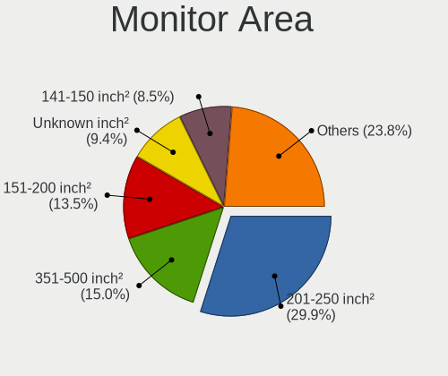

| Area in inch | Desktops | Percent |
|----------------|----------|---------|
| 201-250        | 102      | 29.91%  |
| 351-500        | 51       | 14.96%  |
| 151-200        | 46       | 13.49%  |
| Unknown        | 32       | 9.38%   |
| 141-150        | 29       | 8.5%    |
| More than 1000 | 25       | 7.33%   |
| 301-350        | 24       | 7.04%   |
| 101-110        | 14       | 4.11%   |
| 251-300        | 7        | 2.05%   |
| 501-1000       | 7        | 2.05%   |
| 131-140        | 2        | 0.59%   |
| 121-130        | 1        | 0.29%   |
| 91-100         | 1        | 0.29%   |

Pixel Density
-------------

Pixels per inch

| Density | Desktops | Percent |
|---------|----------|---------|
| 51-100  | 189      | 59.06%  |
| 101-120 | 59       | 18.44%  |
| Unknown | 32       | 10%     |
| 1-50    | 28       | 8.75%   |
| 121-160 | 11       | 3.44%   |
| 161-240 | 1        | 0.31%   |

Multiple Monitors
-----------------

Total monitors connected

| Total | Desktops | Percent |
|-------|----------|---------|
| 1     | 240      | 72.29%  |
| 2     | 63       | 18.98%  |
| 0     | 17       | 5.12%   |
| 3     | 12       | 3.61%   |

Network
-------

Net Controller Vendor
---------------------

Controller vendors

| Vendor                          | Desktops | Percent |
|---------------------------------|----------|---------|
| Realtek Semiconductor           | 228      | 48.1%   |
| Intel                           | 100      | 21.1%   |
| Qualcomm Atheros                | 27       | 5.7%    |
| Ralink Technology               | 15       | 3.16%   |
| Ralink                          | 13       | 2.74%   |
| TP-Link                         | 12       | 2.53%   |
| Broadcom                        | 10       | 2.11%   |
| Xiaomi                          | 9        | 1.9%    |
| Broadcom Limited                | 9        | 1.9%    |
| Nvidia                          | 6        | 1.27%   |
| D-Link System                   | 6        | 1.27%   |
| MediaTek                        | 5        | 1.05%   |
| Qualcomm Atheros Communications | 4        | 0.84%   |
| Microsoft                       | 4        | 0.84%   |
| D-Link                          | 4        | 0.84%   |
| Motorola PCS                    | 3        | 0.63%   |
| Marvell Technology Group        | 3        | 0.63%   |
| Huawei Technologies             | 3        | 0.63%   |
| VIA Technologies                | 2        | 0.42%   |
| Samsung Electronics             | 2        | 0.42%   |
| Spreadtrum Communications       | 1        | 0.21%   |
| QinHeng Electronics             | 1        | 0.21%   |
| Padix (Rockfire)                | 1        | 0.21%   |
| Oculus VR                       | 1        | 0.21%   |
| Mercucys                        | 1        | 0.21%   |
| Manta                           | 1        | 0.21%   |
| ICS Advent                      | 1        | 0.21%   |
| HMD Global                      | 1        | 0.21%   |
| DisplayLink                     | 1        | 0.21%   |

Net Controller Model
--------------------

Controller models

| Model                                                                  | Desktops | Percent |
|------------------------------------------------------------------------|----------|---------|
| Realtek RTL8111/8168/8211/8411 PCI Express Gigabit Ethernet Controller | 179      | 33.77%  |
| Realtek RTL8125 2.5GbE Controller                                      | 17       | 3.21%   |
| Realtek RTL810xE PCI Express Fast Ethernet controller                  | 13       | 2.45%   |
| Realtek 802.11ac NIC                                                   | 11       | 2.08%   |
| Intel Wi-Fi 6 AX200                                                    | 11       | 2.08%   |
| Intel I211 Gigabit Network Connection                                  | 11       | 2.08%   |
| Xiaomi Mi/Redmi series (RNDIS)                                         | 9        | 1.7%    |
| Intel Wireless 7260                                                    | 8        | 1.51%   |
| Intel Wi-Fi 6E(802.11ax) AX210/AX1675* 2x2 [Typhoon Peak]              | 8        | 1.51%   |
| Ralink MT7601U Wireless Adapter                                        | 7        | 1.32%   |
| Intel 82579LM Gigabit Network Connection (Lewisville)                  | 7        | 1.32%   |
| Realtek RTL8192EU 802.11b/g/n WLAN Adapter                             | 5        | 0.94%   |
| Realtek RTL8192EE PCIe Wireless Network Adapter                        | 5        | 0.94%   |
| Nvidia MCP61 Ethernet                                                  | 5        | 0.94%   |
| Intel Ethernet Controller I225-V                                       | 5        | 0.94%   |
| Intel Ethernet Connection I217-V                                       | 5        | 0.94%   |
| Intel Ethernet Connection I217-LM                                      | 5        | 0.94%   |
| Intel Ethernet Connection (7) I219-V                                   | 5        | 0.94%   |
| Intel Ethernet Connection (2) I219-V                                   | 5        | 0.94%   |
| TP-Link AC600 wireless Realtek RTL8811AU [Archer T2U Nano]             | 4        | 0.75%   |
| Realtek RTL8821CE 802.11ac PCIe Wireless Network Adapter               | 4        | 0.75%   |
| Ralink RT2870/RT3070 Wireless Adapter                                  | 4        | 0.75%   |
| Ralink RT5392 PCIe Wireless Network Adapter                            | 4        | 0.75%   |
| Ralink RT5390 Wireless 802.11n 1T/1R PCIe                              | 4        | 0.75%   |
| Qualcomm Atheros Killer E220x Gigabit Ethernet Controller              | 4        | 0.75%   |
| Qualcomm Atheros AR9285 Wireless Network Adapter (PCI-Express)         | 4        | 0.75%   |
| Intel Wireless 7265                                                    | 4        | 0.75%   |
| TP-Link TL-WN823N v2/v3 [Realtek RTL8192EU]                            | 3        | 0.57%   |
| Realtek RTL8187 Wireless Adapter                                       | 3        | 0.57%   |
| Realtek RTL8111/8168/8411 PCI Express Gigabit Ethernet Controller      | 3        | 0.57%   |
| Qualcomm Atheros AR9271 802.11n                                        | 3        | 0.57%   |
| Qualcomm Atheros AR9485 Wireless Network Adapter                       | 3        | 0.57%   |
| Microsoft Xbox 360 Wireless Adapter                                    | 3        | 0.57%   |
| Marvell Group 88E8056 PCI-E Gigabit Ethernet Controller                | 3        | 0.57%   |
| Intel Wi-Fi 5(802.11ac) Wireless-AC 9x6x [Thunder Peak]                | 3        | 0.57%   |
| Intel Ethernet Connection (2) I219-LM                                  | 3        | 0.57%   |
| Intel Dual Band Wireless-AC 3168NGW [Stone Peak]                       | 3        | 0.57%   |
| Intel 82579V Gigabit Network Connection                                | 3        | 0.57%   |
| Intel 82566DM-2 Gigabit Network Connection                             | 3        | 0.57%   |
| Huawei FOA-LX9                                                         | 3        | 0.57%   |

Wireless Vendor
---------------

Wireless vendors

| Vendor                          | Desktops | Percent |
|---------------------------------|----------|---------|
| Intel                           | 49       | 29.17%  |
| Realtek Semiconductor           | 41       | 24.4%   |
| Ralink Technology               | 15       | 8.93%   |
| Ralink                          | 13       | 7.74%   |
| TP-Link                         | 12       | 7.14%   |
| Qualcomm Atheros                | 12       | 7.14%   |
| Qualcomm Atheros Communications | 4        | 2.38%   |
| Microsoft                       | 4        | 2.38%   |
| D-Link                          | 4        | 2.38%   |
| Broadcom Limited                | 4        | 2.38%   |
| MediaTek                        | 3        | 1.79%   |
| D-Link System                   | 3        | 1.79%   |
| Broadcom                        | 3        | 1.79%   |
| Mercucys                        | 1        | 0.6%    |

Wireless Model
--------------

Wireless models

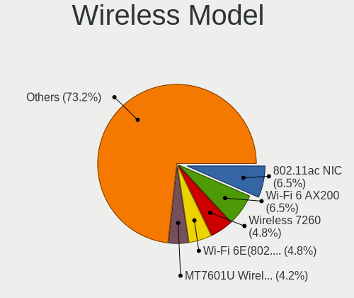

| Model                                                                | Desktops | Percent |
|----------------------------------------------------------------------|----------|---------|
| Realtek 802.11ac NIC                                                 | 11       | 6.55%   |
| Intel Wi-Fi 6 AX200                                                  | 11       | 6.55%   |
| Intel Wireless 7260                                                  | 8        | 4.76%   |
| Intel Wi-Fi 6E(802.11ax) AX210/AX1675* 2x2 [Typhoon Peak]            | 8        | 4.76%   |
| Ralink MT7601U Wireless Adapter                                      | 7        | 4.17%   |
| Realtek RTL8192EU 802.11b/g/n WLAN Adapter                           | 5        | 2.98%   |
| Realtek RTL8192EE PCIe Wireless Network Adapter                      | 5        | 2.98%   |
| TP-Link AC600 wireless Realtek RTL8811AU [Archer T2U Nano]           | 4        | 2.38%   |
| Realtek RTL8821CE 802.11ac PCIe Wireless Network Adapter             | 4        | 2.38%   |
| Ralink RT2870/RT3070 Wireless Adapter                                | 4        | 2.38%   |
| Ralink RT5392 PCIe Wireless Network Adapter                          | 4        | 2.38%   |
| Ralink RT5390 Wireless 802.11n 1T/1R PCIe                            | 4        | 2.38%   |
| Qualcomm Atheros AR9285 Wireless Network Adapter (PCI-Express)       | 4        | 2.38%   |
| Intel Wireless 7265                                                  | 4        | 2.38%   |
| TP-Link TL-WN823N v2/v3 [Realtek RTL8192EU]                          | 3        | 1.79%   |
| Realtek RTL8187 Wireless Adapter                                     | 3        | 1.79%   |
| Qualcomm Atheros AR9271 802.11n                                      | 3        | 1.79%   |
| Qualcomm Atheros AR9485 Wireless Network Adapter                     | 3        | 1.79%   |
| Microsoft Xbox 360 Wireless Adapter                                  | 3        | 1.79%   |
| Intel Wi-Fi 5(802.11ac) Wireless-AC 9x6x [Thunder Peak]              | 3        | 1.79%   |
| Intel Dual Band Wireless-AC 3168NGW [Stone Peak]                     | 3        | 1.79%   |
| D-Link System DWA-125 Wireless N 150 Adapter(rev.A1) [Ralink RT3070] | 3        | 1.79%   |
| TP-Link TL-WN722N v2/v3 [Realtek RTL8188EUS]                         | 2        | 1.19%   |
| Realtek RTL8822BE 802.11a/b/g/n/ac WiFi adapter                      | 2        | 1.19%   |
| Realtek RTL8188EUS 802.11n Wireless Network Adapter                  | 2        | 1.19%   |
| Realtek RTL8188CE 802.11b/g/n WiFi Adapter                           | 2        | 1.19%   |
| Realtek RTL-8185 IEEE 802.11a/b/g Wireless LAN Controller            | 2        | 1.19%   |
| Ralink RT5370 Wireless Adapter                                       | 2        | 1.19%   |
| Ralink MT7610U ("Archer T2U" 2.4G+5G WLAN Adapter                    | 2        | 1.19%   |
| Ralink RT2561/RT61 rev B 802.11g                                     | 2        | 1.19%   |
| Intel Wireless 8260                                                  | 2        | 1.19%   |
| Intel Wireless 3160                                                  | 2        | 1.19%   |
| Intel Tiger Lake PCH CNVi WiFi                                       | 2        | 1.19%   |
| Intel Raptor Lake-S PCH CNVi WiFi                                    | 2        | 1.19%   |
| D-Link WLAN controller                                               | 2        | 1.19%   |
| TP-Link TL-WN822N Version 4 RTL8192EU                                | 1        | 0.6%    |
| TP-Link Archer T4U ver.3                                             | 1        | 0.6%    |
| TP-Link 802.11ac WLAN Adapter                                        | 1        | 0.6%    |
| Realtek RTL88x2bu [AC1200 Techkey]                                   | 1        | 0.6%    |
| Realtek RTL8812AE 802.11ac PCIe Wireless Network Adapter             | 1        | 0.6%    |

Ethernet Vendor
---------------

Ethernet vendors

| Vendor                    | Desktops | Percent |
|---------------------------|----------|---------|
| Realtek Semiconductor     | 213      | 60.86%  |
| Intel                     | 72       | 20.57%  |
| Qualcomm Atheros          | 16       | 4.57%   |
| Xiaomi                    | 9        | 2.57%   |
| Broadcom                  | 7        | 2%      |
| Nvidia                    | 6        | 1.71%   |
| Broadcom Limited          | 5        | 1.43%   |
| Motorola PCS              | 3        | 0.86%   |
| Marvell Technology Group  | 3        | 0.86%   |
| Huawei Technologies       | 3        | 0.86%   |
| D-Link System             | 3        | 0.86%   |
| VIA Technologies          | 2        | 0.57%   |
| Samsung Electronics       | 2        | 0.57%   |
| MediaTek                  | 2        | 0.57%   |
| Spreadtrum Communications | 1        | 0.29%   |
| ICS Advent                | 1        | 0.29%   |
| HMD Global                | 1        | 0.29%   |
| DisplayLink               | 1        | 0.29%   |

Ethernet Model
--------------

Ethernet models

| Model                                                                  | Desktops | Percent |
|------------------------------------------------------------------------|----------|---------|
| Realtek RTL8111/8168/8211/8411 PCI Express Gigabit Ethernet Controller | 179      | 50%     |
| Realtek RTL8125 2.5GbE Controller                                      | 17       | 4.75%   |
| Realtek RTL810xE PCI Express Fast Ethernet controller                  | 13       | 3.63%   |
| Intel I211 Gigabit Network Connection                                  | 11       | 3.07%   |
| Xiaomi Mi/Redmi series (RNDIS)                                         | 9        | 2.51%   |
| Intel 82579LM Gigabit Network Connection (Lewisville)                  | 7        | 1.96%   |
| Nvidia MCP61 Ethernet                                                  | 5        | 1.4%    |
| Intel Ethernet Controller I225-V                                       | 5        | 1.4%    |
| Intel Ethernet Connection I217-V                                       | 5        | 1.4%    |
| Intel Ethernet Connection I217-LM                                      | 5        | 1.4%    |
| Intel Ethernet Connection (7) I219-V                                   | 5        | 1.4%    |
| Intel Ethernet Connection (2) I219-V                                   | 5        | 1.4%    |
| Qualcomm Atheros Killer E220x Gigabit Ethernet Controller              | 4        | 1.12%   |
| Realtek RTL8111/8168/8411 PCI Express Gigabit Ethernet Controller      | 3        | 0.84%   |
| Marvell Group 88E8056 PCI-E Gigabit Ethernet Controller                | 3        | 0.84%   |
| Intel Ethernet Connection (2) I219-LM                                  | 3        | 0.84%   |
| Intel 82579V Gigabit Network Connection                                | 3        | 0.84%   |
| Intel 82566DM-2 Gigabit Network Connection                             | 3        | 0.84%   |
| Huawei FOA-LX9                                                         | 3        | 0.84%   |
| D-Link System DGE-528T Gigabit Ethernet Adapter                        | 3        | 0.84%   |
| Broadcom NetXtreme BCM5762 Gigabit Ethernet PCIe                       | 3        | 0.84%   |
| Broadcom Limited NetLink BCM57788 Gigabit Ethernet PCIe                | 3        | 0.84%   |
| Samsung Galaxy series, misc. (tethering mode)                          | 2        | 0.56%   |
| Realtek RTL8153 Gigabit Ethernet Adapter                               | 2        | 0.56%   |
| Qualcomm Atheros Attansic L1 Gigabit Ethernet                          | 2        | 0.56%   |
| Qualcomm Atheros AR8151 v2.0 Gigabit Ethernet                          | 2        | 0.56%   |
| Qualcomm Atheros AR8131 Gigabit Ethernet                               | 2        | 0.56%   |
| Motorola PCS moto g84 5G                                               | 2        | 0.56%   |
| Intel Ethernet Controller I226-V                                       | 2        | 0.56%   |
| Intel Ethernet Connection I218-V                                       | 2        | 0.56%   |
| Intel Ethernet Connection (17) I219-V                                  | 2        | 0.56%   |
| Intel Ethernet Connection (14) I219-V                                  | 2        | 0.56%   |
| Intel Ethernet Connection (12) I219-V                                  | 2        | 0.56%   |
| Intel 82574L Gigabit Network Connection                                | 2        | 0.56%   |
| VIA VT6105/VT6106S [Rhine-III]                                         | 1        | 0.28%   |
| VIA VT6102/VT6103 [Rhine-II]                                           | 1        | 0.28%   |
| Spreadtrum Unisoc Phone                                                | 1        | 0.28%   |
| Realtek RTL-8110SC/8169SC Gigabit Ethernet                             | 1        | 0.28%   |
| Realtek RTL-8100/8101L/8139 PCI Fast Ethernet Adapter                  | 1        | 0.28%   |
| Qualcomm Atheros Killer E2500 Gigabit Ethernet Controller              | 1        | 0.28%   |

Net Controller Kind
-------------------

Ethernet, WiFi or modem

| Kind     | Desktops | Percent |
|----------|----------|---------|
| Ethernet | 318      | 67.23%  |
| WiFi     | 151      | 31.92%  |
| Modem    | 2        | 0.42%   |
| Unknown  | 2        | 0.42%   |

Used Controller
---------------

Currently used network controller

| Kind     | Desktops | Percent |
|----------|----------|---------|
| Ethernet | 247      | 75.08%  |
| WiFi     | 82       | 24.92%  |

NICs
----

Total network controllers on board

| Total | Desktops | Percent |
|-------|----------|---------|
| 1     | 211      | 64.53%  |
| 2     | 97       | 29.66%  |
| 3     | 15       | 4.59%   |
| 4     | 2        | 0.61%   |
| 0     | 2        | 0.61%   |

IPv6
----

IPv6 vs IPv4

| Used | Desktops | Percent |
|------|----------|---------|
| No   | 280      | 85.37%  |
| Yes  | 48       | 14.63%  |

Bluetooth
---------

Bluetooth Vendor
----------------

Controller vendors

| Vendor                          | Desktops | Percent |
|---------------------------------|----------|---------|
| Intel                           | 46       | 39.66%  |
| Cambridge Silicon Radio         | 32       | 27.59%  |
| Realtek Semiconductor           | 17       | 14.66%  |
| Broadcom                        | 9        | 7.76%   |
| Qualcomm Atheros Communications | 3        | 2.59%   |
| ASUSTek Computer                | 2        | 1.72%   |
| Apple                           | 2        | 1.72%   |
| SINO WEALTH                     | 1        | 0.86%   |
| MediaTek                        | 1        | 0.86%   |
| IMC Networks                    | 1        | 0.86%   |
| Foxconn / Hon Hai               | 1        | 0.86%   |
| Unknown                         | 1        | 0.86%   |

Bluetooth Model
---------------

Controller models

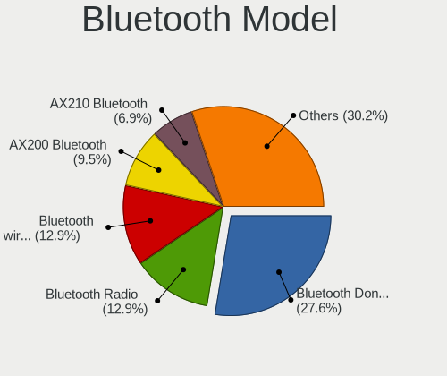

| Model                                               | Desktops | Percent |
|-----------------------------------------------------|----------|---------|
| Cambridge Silicon Radio Bluetooth Dongle (HCI mode) | 32       | 27.59%  |
| Realtek Bluetooth Radio                             | 15       | 12.93%  |
| Intel Bluetooth wireless interface                  | 15       | 12.93%  |
| Intel AX200 Bluetooth                               | 11       | 9.48%   |
| Intel AX210 Bluetooth                               | 8        | 6.9%    |
| Intel AX201 Bluetooth                               | 5        | 4.31%   |
| Broadcom Bluetooth 3.0 Dongle                       | 5        | 4.31%   |
| Intel Wireless-AC 9260 Bluetooth Adapter            | 3        | 2.59%   |
| Intel Wireless-AC 3168 Bluetooth                    | 3        | 2.59%   |
| Realtek  Bluetooth 4.2 Adapter                      | 2        | 1.72%   |
| Qualcomm Atheros  Bluetooth Device                  | 2        | 1.72%   |
| SINO WEALTH RK Bluetooth Keyboar                    | 1        | 0.86%   |
| Qualcomm Atheros AR3012 Bluetooth 4.0               | 1        | 0.86%   |
| MediaTek Wireless_Device                            | 1        | 0.86%   |
| Intel Bluetooth 9460/9560 Jefferson Peak (JfP)      | 1        | 0.86%   |
| IMC Networks Wireless_Device                        | 1        | 0.86%   |
| Foxconn / Hon Hai Wireless_Device                   | 1        | 0.86%   |
| Broadcom HP Bluetooth Module                        | 1        | 0.86%   |
| Broadcom HP Bluethunder                             | 1        | 0.86%   |
| Broadcom Bluetooth 3.0 Device                       | 1        | 0.86%   |
| Broadcom BCM20702A0 Bluetooth 4.0                   | 1        | 0.86%   |
| ASUS Bluetooth Radio                                | 1        | 0.86%   |
| ASUS BCM20702A0                                     | 1        | 0.86%   |
| Apple Bluetooth Host Controller                     | 1        | 0.86%   |
| Apple Bluetooth HCI                                 | 1        | 0.86%   |
| Unknown                                             | 1        | 0.86%   |

Sound
-----

Sound Vendor
------------

Sound card vendors

| Vendor                                       | Desktops | Percent |
|----------------------------------------------|----------|---------|
| Intel                                        | 184      | 32.97%  |
| AMD                                          | 161      | 28.85%  |
| Nvidia                                       | 119      | 21.33%  |
| C-Media Electronics                          | 13       | 2.33%   |
| Logitech                                     | 10       | 1.79%   |
| Creative Labs                                | 8        | 1.43%   |
| Kingston Technology                          | 6        | 1.08%   |
| Razer USA                                    | 5        | 0.9%    |
| JMTek                                        | 4        | 0.72%   |
| Creative Technology                          | 4        | 0.72%   |
| Zoran Co. Personal Media Division (Nogatech) | 3        | 0.54%   |
| Generalplus Technology                       | 3        | 0.54%   |
| Corsair                                      | 3        | 0.54%   |
| VIA Technologies                             | 2        | 0.36%   |
| Trust                                        | 2        | 0.36%   |
| Texas Instruments                            | 2        | 0.36%   |
| Realtek Semiconductor                        | 2        | 0.36%   |
| KTMicro                                      | 2        | 0.36%   |
| Focusrite-Novation                           | 2        | 0.36%   |
| FIFINE Microphones                           | 2        | 0.36%   |
| ASUSTek Computer                             | 2        | 0.36%   |
| Arturia                                      | 2        | 0.36%   |
| Apple                                        | 2        | 0.36%   |
| Unknown                                      | 1        | 0.18%   |
| Synaptics                                    | 1        | 0.18%   |
| SAVITECH                                     | 1        | 0.18%   |
| PreSonus Audio Electronics                   | 1        | 0.18%   |
| Native Instruments                           | 1        | 0.18%   |
| Microsoft                                    | 1        | 0.18%   |
| Micro Star International                     | 1        | 0.18%   |
| Hewlett-Packard                              | 1        | 0.18%   |
| GYROCOM C&C                                  | 1        | 0.18%   |
| GN Netcom                                    | 1        | 0.18%   |
| eMPIA Technology                             | 1        | 0.18%   |
| Cambridge Silicon Radio                      | 1        | 0.18%   |
| Blue Microphones                             | 1        | 0.18%   |
| ATI Technologies                             | 1        | 0.18%   |
| Afatech                                      | 1        | 0.18%   |

Sound Model
-----------

Sound card models

| Model                                                                             | Desktops | Percent |
|-----------------------------------------------------------------------------------|----------|---------|
| AMD Starship/Matisse HD Audio Controller                                          | 36       | 5.4%    |
| Intel 8 Series/C220 Series Chipset High Definition Audio Controller               | 32       | 4.8%    |
| AMD Family 17h/19h/1ah HD Audio Controller                                        | 29       | 4.35%   |
| AMD SBx00 Azalia (Intel HDA)                                                      | 28       | 4.2%    |
| Intel 6 Series/C200 Series Chipset Family High Definition Audio Controller        | 21       | 3.15%   |
| Intel Xeon E3-1200 v3/4th Gen Core Processor HD Audio Controller                  | 18       | 2.7%    |
| AMD Ellesmere HDMI Audio [Radeon RX 470/480 / 570/580/590]                        | 16       | 2.4%    |
| AMD FCH Azalia Controller                                                         | 15       | 2.25%   |
| AMD Raven/Raven2/Fenghuang HDMI/DP Audio Controller                               | 14       | 2.1%    |
| Intel 7 Series/C216 Chipset Family High Definition Audio Controller               | 13       | 1.95%   |
| Intel 100 Series/C230 Series Chipset Family HD Audio Controller                   | 12       | 1.8%    |
| AMD Baffin HDMI/DP Audio [Radeon RX 550 640SP / RX 560/560X]                      | 12       | 1.8%    |
| Nvidia GK208 HDMI/DP Audio Controller                                             | 11       | 1.65%   |
| Intel NM10/ICH7 Family High Definition Audio Controller                           | 11       | 1.65%   |
| AMD Family 17h (Models 00h-0fh) HD Audio Controller                               | 11       | 1.65%   |
| Nvidia TU116 High Definition Audio Controller                                     | 10       | 1.5%    |
| AMD Navi 21/23 HDMI/DP Audio Controller                                           | 10       | 1.5%    |
| Nvidia GP106 High Definition Audio Controller                                     | 9        | 1.35%   |
| Intel Cannon Lake PCH cAVS                                                        | 9        | 1.35%   |
| Intel 82801JI (ICH10 Family) HD Audio Controller                                  | 9        | 1.35%   |
| AMD Caicos HDMI Audio [Radeon HD 6450 / 7450/8450/8490 OEM / R5 230/235/235X OEM] | 9        | 1.35%   |
| Nvidia GP107GL High Definition Audio Controller                                   | 8        | 1.2%    |
| Intel C600/X79 series chipset High Definition Audio Controller                    | 8        | 1.2%    |
| Intel 82801I (ICH9 Family) HD Audio Controller                                    | 8        | 1.2%    |
| Intel 200 Series PCH HD Audio                                                     | 8        | 1.2%    |
| AMD Oland/Hainan/Cape Verde/Pitcairn HDMI Audio [Radeon HD 7000 Series]           | 8        | 1.2%    |
| AMD Navi 10 HDMI Audio                                                            | 8        | 1.2%    |
| Nvidia TU107 GeForce GTX 1650 High Definition Audio Controller                    | 7        | 1.05%   |
| Nvidia GP108 High Definition Audio Controller                                     | 7        | 1.05%   |
| Nvidia GA106 High Definition Audio Controller                                     | 7        | 1.05%   |
| Intel Comet Lake PCH-V cAVS                                                       | 7        | 1.05%   |
| Intel C610/X99 series chipset HD Audio Controller                                 | 7        | 1.05%   |
| Nvidia MCP61 High Definition Audio                                                | 6        | 0.9%    |
| C-Media Electronics Audio Adapter (Unitek Y-247A)                                 | 6        | 0.9%    |
| AMD Renoir Radeon High Definition Audio Controller                                | 6        | 0.9%    |
| Nvidia High Definition Audio Controller                                           | 5        | 0.75%   |
| Nvidia GM206 High Definition Audio Controller                                     | 5        | 0.75%   |
| Nvidia GM107 High Definition Audio Controller [GeForce 940MX]                     | 5        | 0.75%   |
| Nvidia GK104 HDMI Audio Controller                                                | 5        | 0.75%   |
| Nvidia GF119 HDMI Audio Controller                                                | 5        | 0.75%   |

Memory
------

Memory Vendor
-------------

Memory module vendors

| Vendor              | Desktops | Percent |
|---------------------|----------|---------|
| Kingston            | 44       | 23.78%  |
| Crucial             | 25       | 13.51%  |
| Corsair             | 21       | 11.35%  |
| Samsung Electronics | 19       | 10.27%  |
| Unknown             | 18       | 9.73%   |
| SK hynix            | 12       | 6.49%   |
| Micron Technology   | 10       | 5.41%   |
| A-DATA Technology   | 8        | 4.32%   |
| G.Skill             | 7        | 3.78%   |
| Patriot             | 3        | 1.62%   |
| Ramaxel Technology  | 2        | 1.08%   |
| Kreton              | 2        | 1.08%   |
| Hikvision           | 2        | 1.08%   |
| Atermiter           | 2        | 1.08%   |
| Unknown             | 2        | 1.08%   |
| Unknown (C289)      | 1        | 0.54%   |
| Unknown (0x0080)    | 1        | 0.54%   |
| Team                | 1        | 0.54%   |
| Nanya Technology    | 1        | 0.54%   |
| Goldenmars          | 1        | 0.54%   |
| GLOWAY              | 1        | 0.54%   |
| Elpida              | 1        | 0.54%   |
| Ankowall            | 1        | 0.54%   |

Memory Model
------------

Memory module models

| Model                                                    | Desktops | Percent |
|----------------------------------------------------------|----------|---------|
| Kingston RAM KHX2666C16/8G 8GB DIMM DDR4 3466MT/s        | 5        | 2.39%   |
| Kingston RAM KHX1866C10D3/8G 8GB DIMM DDR3 2133MT/s      | 4        | 1.91%   |
| Unknown RAM Module 2GB DIMM SDRAM                        | 3        | 1.44%   |
| Patriot RAM 3200 C16 Series 4GB DIMM DDR4 3600MT/s       | 3        | 1.44%   |
| Crucial RAM CT4G4DFS6266.C4FJ 4GB DIMM DDR4 2666MT/s     | 3        | 1.44%   |
| Corsair RAM CMZ8GX3M1A1600C10 8GB DIMM DDR3 1600MT/s     | 3        | 1.44%   |
| Unknown RAM Module 8192MB DIMM 1600MT/s                  | 2        | 0.96%   |
| Unknown RAM Module 4GB DIMM DDR3 1333MT/s                | 2        | 0.96%   |
| Samsung RAM M471B5273DH0-CH9 4GB SODIMM DDR3 1334MT/s    | 2        | 0.96%   |
| Kingston RAM KHX3466C17D4/16GX 16GB DIMM DDR4 3466MT/s   | 2        | 0.96%   |
| Kingston RAM KHX3000C15D4/8GX 8GB DIMM DDR4 3400MT/s     | 2        | 0.96%   |
| Kingston RAM KF3200C16D4/8GX 8GB DIMM DDR4 3600MT/s      | 2        | 0.96%   |
| Kingston RAM KF2666C16D4/8G 8GB DIMM DDR4 2667MT/s       | 2        | 0.96%   |
| G.Skill RAM F3-2133C9-4GAB 4GB DIMM DDR3 2133MT/s        | 2        | 0.96%   |
| Crucial RAM BLS8G4D30AESEK.M8FE 8GB DIMM DDR4 3600MT/s   | 2        | 0.96%   |
| Corsair RAM VS2GB1333D3 2GB DIMM DDR3 1333MT/s           | 2        | 0.96%   |
| A-DATA RAM DDR4 3200 8GB DIMM DDR4 3600MT/s              | 2        | 0.96%   |
| Unknown                                                  | 2        | 0.96%   |
| Unknown RAM Module 8GB DIMM DDR4 2667MT/s                | 1        | 0.48%   |
| Unknown RAM Module 8GB DIMM DDR3 1600MT/s                | 1        | 0.48%   |
| Unknown RAM Module 8GB DIMM DDR3 1333MT/s                | 1        | 0.48%   |
| Unknown RAM Module 8192MB DIMM DDR3                      | 1        | 0.48%   |
| Unknown RAM Module 4GB SODIMM DDR3 1333MT/s              | 1        | 0.48%   |
| Unknown RAM Module 4GB DIMM DDR3 1066MT/s                | 1        | 0.48%   |
| Unknown RAM Module 4096MB DIMM DDR3 1333MT/s             | 1        | 0.48%   |
| Unknown RAM Module 4096MB DIMM 1600MT/s                  | 1        | 0.48%   |
| Unknown RAM Module 2GB DIMM DDR2 800MT/s                 | 1        | 0.48%   |
| Unknown RAM Module 2GB DIMM DDR2 667MT/s                 | 1        | 0.48%   |
| Unknown RAM Module 2GB DIMM DDR2 400MT/s                 | 1        | 0.48%   |
| Unknown RAM Module 2GB DIMM                              | 1        | 0.48%   |
| Unknown RAM Module 2048MB DIMM DDR2 800MT/s              | 1        | 0.48%   |
| Unknown RAM Module 2048MB DIMM 1600MT/s                  | 1        | 0.48%   |
| Unknown RAM Module 1GB DIMM SDRAM                        | 1        | 0.48%   |
| Unknown (C289) RAM Module 16GB DIMM DDR4 2133MT/s        | 1        | 0.48%   |
| Unknown (0x0080) RAM Module 8GB DIMM DDR4 2666MT/s       | 1        | 0.48%   |
| Team RAM TEAMGROUP-UD4-3200 8GB DIMM DDR4 3733MT/s       | 1        | 0.48%   |
| SK hynix RAM Module 8192MB SODIMM DDR4 2133MT/s          | 1        | 0.48%   |
| SK hynix RAM Module 2048MB DIMM DDR3 1066MT/s            | 1        | 0.48%   |
| SK hynix RAM HYMP125S64CP8-S6 2048MB DIMM SDRAM 2048MT/s | 1        | 0.48%   |
| SK hynix RAM HMT451S6BFR8A-PB 4GB DIMM DDR3 1600MT/s     | 1        | 0.48%   |

Memory Kind
-----------

Memory module kinds

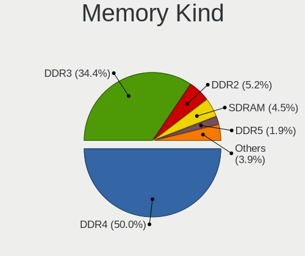

| Kind    | Desktops | Percent |
|---------|----------|---------|
| DDR4    | 77       | 50%     |
| DDR3    | 53       | 34.42%  |
| DDR2    | 8        | 5.19%   |
| SDRAM   | 7        | 4.55%   |
| DDR5    | 3        | 1.95%   |
| Unknown | 3        | 1.95%   |
| LPDDR5  | 1        | 0.65%   |
| DRAM    | 1        | 0.65%   |
| DDR     | 1        | 0.65%   |

Memory Form Factor
------------------

Physical design of the memory module

| Name         | Desktops | Percent |
|--------------|----------|---------|
| DIMM         | 136      | 89.47%  |
| SODIMM       | 15       | 9.87%   |
| Row Of Chips | 1        | 0.66%   |

Memory Size
-----------

Memory module size

| Size  | Desktops | Percent |
|-------|----------|---------|
| 8192  | 76       | 42.94%  |
| 4096  | 40       | 22.6%   |
| 2048  | 26       | 14.69%  |
| 16384 | 21       | 11.86%  |
| 32768 | 11       | 6.21%   |
| 1024  | 3        | 1.69%   |

Memory Speed
------------

Memory module speed

| Speed   | Desktops | Percent |
|---------|----------|---------|
| 1600    | 31       | 16.32%  |
| 1333    | 25       | 13.16%  |
| 2133    | 15       | 7.89%   |
| 3600    | 13       | 6.84%   |
| 3200    | 12       | 6.32%   |
| 2667    | 12       | 6.32%   |
| 2400    | 8        | 4.21%   |
| 3466    | 7        | 3.68%   |
| 2666    | 7        | 3.68%   |
| Unknown | 6        | 3.16%   |
| 3733    | 5        | 2.63%   |
| 2933    | 5        | 2.63%   |
| 800     | 5        | 2.63%   |
| 667     | 5        | 2.63%   |
| 3000    | 4        | 2.11%   |
| 1866    | 4        | 2.11%   |
| 3800    | 3        | 1.58%   |
| 3400    | 3        | 1.58%   |
| 6400    | 2        | 1.05%   |
| 4000    | 2        | 1.05%   |
| 3666    | 2        | 1.05%   |
| 1334    | 2        | 1.05%   |
| 1066    | 2        | 1.05%   |
| 5600    | 1        | 0.53%   |
| 4800    | 1        | 0.53%   |
| 3134    | 1        | 0.53%   |
| 3066    | 1        | 0.53%   |
| 2800    | 1        | 0.53%   |
| 2048    | 1        | 0.53%   |
| 1800    | 1        | 0.53%   |
| 1639    | 1        | 0.53%   |
| 1067    | 1        | 0.53%   |
| 400     | 1        | 0.53%   |

Printers & scanners
-------------------

Printer Vendor
--------------

Printer device vendors

| Vendor              | Desktops | Percent |
|---------------------|----------|---------|
| Seiko Epson         | 5        | 27.78%  |
| Hewlett-Packard     | 4        | 22.22%  |
| Canon               | 4        | 22.22%  |
| Brother Industries  | 4        | 22.22%  |
| QinHeng Electronics | 1        | 5.56%   |

Printer Model
-------------

Printer device models

| Model                      | Desktops | Percent |
|----------------------------|----------|---------|
| Brother HL-1200 series     | 3        | 16.67%  |
| Seiko Epson XP-2100 Series | 1        | 5.56%   |
| Seiko Epson Printer        | 1        | 5.56%   |
| Seiko Epson L3150 Series   | 1        | 5.56%   |
| Seiko Epson L3110 Series   | 1        | 5.56%   |
| Seiko Epson L210 Series    | 1        | 5.56%   |
| QinHeng CH340S             | 1        | 5.56%   |
| HP Smart Tank 510 series   | 1        | 5.56%   |
| HP Deskjet 4640 series     | 1        | 5.56%   |
| HP Deskjet 4620 series     | 1        | 5.56%   |
| HP Deskjet 2050 J510       | 1        | 5.56%   |
| Canon PIXMA MP250          | 1        | 5.56%   |
| Canon LBP6000              | 1        | 5.56%   |
| Canon G2000 series         | 1        | 5.56%   |
| Canon G1000 series         | 1        | 5.56%   |
| Brother HL-1210W series    | 1        | 5.56%   |

Scanner Vendor
--------------

Scanner device vendors

| Vendor      | Desktops | Percent |
|-------------|----------|---------|
| Seiko Epson | 2        | 50%     |
| Canon       | 2        | 50%     |

Scanner Model
-------------

Scanner device models

| Model                                         | Desktops | Percent |
|-----------------------------------------------|----------|---------|
| Seiko Epson GT-X820 [Perfection V600 Photo]   | 1        | 25%     |
| Seiko Epson GT-8300UF [Perfection 1660 PHOTO] | 1        | 25%     |
| Canon CanoScan LiDE 110                       | 1        | 25%     |
| Canon CanoScan D1250U2                        | 1        | 25%     |

Camera
------

Camera Vendor
-------------

Camera device vendors

| Vendor                        | Desktops | Percent |
|-------------------------------|----------|---------|
| Logitech                      | 10       | 13.16%  |
| Microdia                      | 8        | 10.53%  |
| Generalplus Technology        | 8        | 10.53%  |
| Chicony Electronics           | 7        | 9.21%   |
| Sunplus Innovation Technology | 6        | 7.89%   |
| Microsoft                     | 4        | 5.26%   |
| Lenovo                        | 4        | 5.26%   |
| Jieli Technology              | 4        | 5.26%   |
| Apple                         | 4        | 5.26%   |
| Realtek Semiconductor         | 3        | 3.95%   |
| Alcor Micro                   | 3        | 3.95%   |
| 2M UVC CAMERA                 | 2        | 2.63%   |
| Z-Star Microelectronics       | 1        | 1.32%   |
| YGTek                         | 1        | 1.32%   |
| Unknown                       | 1        | 1.32%   |
| SN0002                        | 1        | 1.32%   |
| Remo Tech                     | 1        | 1.32%   |
| Razer USA                     | 1        | 1.32%   |
| OmniVision Technologies       | 1        | 1.32%   |
| MacroSilicon                  | 1        | 1.32%   |
| KYE Systems (Mouse Systems)   | 1        | 1.32%   |
| AVerMedia Technologies        | 1        | 1.32%   |
| Arkmicro Technologies         | 1        | 1.32%   |
| ARC International             | 1        | 1.32%   |
| Anker PowerConf C200          | 1        | 1.32%   |

Camera Model
------------

Camera device models

| Model                                         | Desktops | Percent |
|-----------------------------------------------|----------|---------|
| Generalplus GENERAL WEBCAM                    | 8        | 10.53%  |
| Microdia USB 2.0 Camera                       | 4        | 5.26%   |
| Logitech C922 Pro Stream Webcam               | 4        | 5.26%   |
| Jieli USB PHY 2.0                             | 4        | 5.26%   |
| Apple iPhone 5/5C/5S/6/SE/7/8/X/XR            | 4        | 5.26%   |
| Lenovo Lenovo 500 RGB Camera                  | 3        | 3.95%   |
| Chicony HP 0.3MP Webcam                       | 3        | 3.95%   |
| Sunplus USB Camera                            | 2        | 2.63%   |
| Sunplus HD 720P webcam                        | 2        | 2.63%   |
| Sunplus DICOTA 4K                             | 2        | 2.63%   |
| Microsoft Microsoft LifeCam Studio          | 2        | 2.63%   |
| Microdia Webcam Vitade AF                     | 2        | 2.63%   |
| Logitech Webcam C270                          | 2        | 2.63%   |
| Alcor Micro USB 2.0 PC Camera                 | 2        | 2.63%   |
| 2M UVC CAMERA NexiGo N60 FHD Webcam           | 2        | 2.63%   |
| Z-Star Integrated Camera                      | 1        | 1.32%   |
| YGTek Webcam                                  | 1        | 1.32%   |
| Unknown HD camera                             | 1        | 1.32%   |
| SN0002 1080P Web Camera                       | 1        | 1.32%   |
| Remo Tech OBSBOT Tiny                         | 1        | 1.32%   |
| Realtek USB Camera                            | 1        | 1.32%   |
| Realtek NexiGo N660P FHD Webcam               | 1        | 1.32%   |
| Realtek HP 1.0MP High Definition Webcam       | 1        | 1.32%   |
| Razer USA Razer Kiyo Pro                      | 1        | 1.32%   |
| OmniVision OV511+ Webcam                      | 1        | 1.32%   |
| Microsoft LifeCam VX-800                      | 1        | 1.32%   |
| Microsoft LifeCam VX-2000                     | 1        | 1.32%   |
| Microdia USB camera                           | 1        | 1.32%   |
| Microdia Streaming Camera W8GS                | 1        | 1.32%   |
| MacroSilicon MS210x Video Grabber [EasierCAP] | 1        | 1.32%   |
| Logitech Webcam C210                          | 1        | 1.32%   |
| Logitech Webcam C170                          | 1        | 1.32%   |
| Logitech StreamCam                            | 1        | 1.32%   |
| Logitech HD Pro Webcam C920                   | 1        | 1.32%   |
| Lenovo Lenovo FHD Webcam Audio                | 1        | 1.32%   |
| KYE Systems (Mouse Systems) FaceCam 1000X     | 1        | 1.32%   |
| Chicony USB Webcam                            | 1        | 1.32%   |
| Chicony HP High Definition 1MP Webcam         | 1        | 1.32%   |
| Chicony HP 1.0MP High Definition Webcam       | 1        | 1.32%   |
| Chicony CNF8050 Webcam                        | 1        | 1.32%   |

Security
--------

Fingerprint Vendor
------------------

Fingerprint sensor vendors

Zero info for selected period =(

Fingerprint Model
-----------------

Fingerprint sensor models

Zero info for selected period =(

Chipcard Vendor
---------------

Chipcard module vendors

Zero info for selected period =(

Chipcard Model
--------------

Chipcard module models

Zero info for selected period =(

Unsupported
-----------

Unsupported Devices
-------------------

Total unsupported devices on board

| Total | Desktops | Percent |
|-------|----------|---------|
| 0     | 275      | 84.36%  |
| 1     | 43       | 13.19%  |
| 2     | 8        | 2.45%   |

Unsupported Device Types
------------------------

Types of unsupported devices

| Type                     | Desktops | Percent |
|--------------------------|----------|---------|
| Net/wireless             | 16       | 29.09%  |
| Graphics card            | 14       | 25.45%  |
| Unassigned class         | 9        | 16.36%  |
| Sound                    | 4        | 7.27%   |
| Network                  | 4        | 7.27%   |
| Communication controller | 4        | 7.27%   |
| Multimedia controller    | 1        | 1.82%   |
| Firewire controller      | 1        | 1.82%   |
| Camera                   | 1        | 1.82%   |
| Bluetooth                | 1        | 1.82%   |

