Linux in Chile - Tested Hardware & Statistics (Notebooks)
---------------------------------------------------------

A project to collect tested hardware configurations for Linux in Chile.

Anyone can contribute to this report by the [hw-probe](https://github.com/linuxhw/hw-probe) tool:

    sudo -E hw-probe -all -upload

Please contribute! Especially if your hardware is rare.

Contents
--------

* [ Test Cases ](#test-cases)

* [ System ](#system)
  - [ OS                       ](#os)
  - [ OS Family                ](#os-family)
  - [ Kernel                   ](#kernel)
  - [ Kernel Family            ](#kernel-family)
  - [ Kernel Major Ver.        ](#kernel-major-ver)
  - [ Arch                     ](#arch)
  - [ DE                       ](#de)
  - [ Display Server           ](#display-server)
  - [ Display Manager          ](#display-manager)
  - [ OS Lang                  ](#os-lang)
  - [ Boot Mode                ](#boot-mode)
  - [ Filesystem               ](#filesystem)
  - [ Part. scheme             ](#part-scheme)
  - [ Dual Boot with Linux/BSD ](#dual-boot-with-linuxbsd)
  - [ Dual Boot (Win)          ](#dual-boot-win)

* [ Board ](#board)
  - [ Vendor                   ](#vendor)
  - [ Model                    ](#model)
  - [ Model Family             ](#model-family)
  - [ MFG Year                 ](#mfg-year)
  - [ Form Factor              ](#form-factor)
  - [ Secure Boot              ](#secure-boot)
  - [ Coreboot                 ](#coreboot)
  - [ RAM Size                 ](#ram-size)
  - [ RAM Used                 ](#ram-used)
  - [ Total Drives             ](#total-drives)
  - [ Has CD-ROM               ](#has-cd-rom)
  - [ Has Ethernet             ](#has-ethernet)
  - [ Has WiFi                 ](#has-wifi)
  - [ Has Bluetooth            ](#has-bluetooth)

* [ Location ](#location)
  - [ Country                  ](#country)
  - [ City                     ](#city)

* [ Drives ](#drives)
  - [ Drive Vendor             ](#drive-vendor)
  - [ Drive Model              ](#drive-model)
  - [ HDD Vendor               ](#hdd-vendor)
  - [ SSD Vendor               ](#ssd-vendor)
  - [ Drive Kind               ](#drive-kind)
  - [ Drive Connector          ](#drive-connector)
  - [ Drive Size               ](#drive-size)
  - [ Space Total              ](#space-total)
  - [ Space Used               ](#space-used)
  - [ Malfunc. Drives          ](#malfunc-drives)
  - [ Malfunc. Drive Vendor    ](#malfunc-drive-vendor)
  - [ Malfunc. HDD Vendor      ](#malfunc-hdd-vendor)
  - [ Malfunc. Drive Kind      ](#malfunc-drive-kind)
  - [ Failed Drives            ](#failed-drives)
  - [ Failed Drive Vendor      ](#failed-drive-vendor)
  - [ Drive Status             ](#drive-status)

* [ Storage controller ](#storage-controller)
  - [ Storage Vendor           ](#storage-vendor)
  - [ Storage Model            ](#storage-model)
  - [ Storage Kind             ](#storage-kind)

* [ Processor ](#processor)
  - [ CPU Vendor               ](#cpu-vendor)
  - [ CPU Model                ](#cpu-model)
  - [ CPU Model Family         ](#cpu-model-family)
  - [ CPU Cores                ](#cpu-cores)
  - [ CPU Sockets              ](#cpu-sockets)
  - [ CPU Threads              ](#cpu-threads)
  - [ CPU Op-Modes             ](#cpu-op-modes)
  - [ CPU Microcode            ](#cpu-microcode)
  - [ CPU Microarch            ](#cpu-microarch)

* [ Graphics ](#graphics)
  - [ GPU Vendor               ](#gpu-vendor)
  - [ GPU Model                ](#gpu-model)
  - [ GPU Combo                ](#gpu-combo)
  - [ GPU Driver               ](#gpu-driver)
  - [ GPU Memory               ](#gpu-memory)

* [ Monitor ](#monitor)
  - [ Monitor Vendor           ](#monitor-vendor)
  - [ Monitor Model            ](#monitor-model)
  - [ Monitor Resolution       ](#monitor-resolution)
  - [ Monitor Diagonal         ](#monitor-diagonal)
  - [ Monitor Width            ](#monitor-width)
  - [ Aspect Ratio             ](#aspect-ratio)
  - [ Monitor Area             ](#monitor-area)
  - [ Pixel Density            ](#pixel-density)
  - [ Multiple Monitors        ](#multiple-monitors)

* [ Network ](#network)
  - [ Net Controller Vendor    ](#net-controller-vendor)
  - [ Net Controller Model     ](#net-controller-model)
  - [ Wireless Vendor          ](#wireless-vendor)
  - [ Wireless Model           ](#wireless-model)
  - [ Ethernet Vendor          ](#ethernet-vendor)
  - [ Ethernet Model           ](#ethernet-model)
  - [ Net Controller Kind      ](#net-controller-kind)
  - [ Used Controller          ](#used-controller)
  - [ NICs                     ](#nics)
  - [ IPv6                     ](#ipv6)

* [ Bluetooth ](#bluetooth)
  - [ Bluetooth Vendor         ](#bluetooth-vendor)
  - [ Bluetooth Model          ](#bluetooth-model)

* [ Sound ](#sound)
  - [ Sound Vendor             ](#sound-vendor)
  - [ Sound Model              ](#sound-model)

* [ Memory ](#memory)
  - [ Memory Vendor            ](#memory-vendor)
  - [ Memory Model             ](#memory-model)
  - [ Memory Kind              ](#memory-kind)
  - [ Memory Form Factor       ](#memory-form-factor)
  - [ Memory Size              ](#memory-size)
  - [ Memory Speed             ](#memory-speed)

* [ Printers & scanners ](#printers--scanners)
  - [ Printer Vendor           ](#printer-vendor)
  - [ Printer Model            ](#printer-model)
  - [ Scanner Vendor           ](#scanner-vendor)
  - [ Scanner Model            ](#scanner-model)

* [ Camera ](#camera)
  - [ Camera Vendor            ](#camera-vendor)
  - [ Camera Model             ](#camera-model)

* [ Security ](#security)
  - [ Fingerprint Vendor       ](#fingerprint-vendor)
  - [ Fingerprint Model        ](#fingerprint-model)
  - [ Chipcard Vendor          ](#chipcard-vendor)
  - [ Chipcard Model           ](#chipcard-model)

* [ Unsupported ](#unsupported)
  - [ Unsupported Devices      ](#unsupported-devices)
  - [ Unsupported Device Types ](#unsupported-device-types)

Test Cases
----------

Total: 1339

| Vendor        | Model                       | Probe                                                      | Date         |
|---------------|-----------------------------|------------------------------------------------------------|--------------|
| ASUSTek       | VivoBook_ASUSLaptop M360... | [7373f056b3](https://linux-hardware.org/?probe=7373f056b3) | Jan 06, 2025 |
| Apple         | MacBookPro9,2               | [905b0da038](https://linux-hardware.org/?probe=905b0da038) | Jan 03, 2025 |
| HP            | EliteBook 840 G6            | [6781e260b0](https://linux-hardware.org/?probe=6781e260b0) | Jan 03, 2025 |
| HP            | EliteBook 840 G6            | [fd2f975353](https://linux-hardware.org/?probe=fd2f975353) | Jan 03, 2025 |
| Acer          | Aspire A114-32              | [3af2175d58](https://linux-hardware.org/?probe=3af2175d58) | Dec 31, 2024 |
| Acer          | Aspire A114-32              | [d4aff4e66c](https://linux-hardware.org/?probe=d4aff4e66c) | Dec 30, 2024 |
| Hampoo        | C3W6_AP108_4GB Reserved     | [0b30ad312b](https://linux-hardware.org/?probe=0b30ad312b) | Dec 25, 2024 |
| HP            | OMEN Laptop 15-ek0xxx       | [6061ff7a43](https://linux-hardware.org/?probe=6061ff7a43) | Dec 21, 2024 |
| Lenovo        | ThinkPad L430 2466AE4       | [16fb7548fb](https://linux-hardware.org/?probe=16fb7548fb) | Dec 20, 2024 |
| HP            | EliteBook 840 G6            | [59d4ff9442](https://linux-hardware.org/?probe=59d4ff9442) | Dec 18, 2024 |
| ASUSTek       | ZenBook UX425UA_UM425UA     | [119fb952a9](https://linux-hardware.org/?probe=119fb952a9) | Dec 16, 2024 |
| HP            | Laptop 15-fc0xxx            | [43c7b5ca99](https://linux-hardware.org/?probe=43c7b5ca99) | Dec 15, 2024 |
| Dell          | Latitude 7440               | [54c2b1737c](https://linux-hardware.org/?probe=54c2b1737c) | Dec 15, 2024 |
| Dell          | Latitude 7440               | [2072f1bec0](https://linux-hardware.org/?probe=2072f1bec0) | Dec 14, 2024 |
| Acer          | Aspire VN7-571G             | [244938cec7](https://linux-hardware.org/?probe=244938cec7) | Dec 14, 2024 |
| ASUSTek       | VivoBook S15 X510UF         | [dcf3e70ee3](https://linux-hardware.org/?probe=dcf3e70ee3) | Dec 10, 2024 |
| HP            | Pavilion Gaming Laptop 1... | [440089cb3c](https://linux-hardware.org/?probe=440089cb3c) | Dec 09, 2024 |
| HP            | ProBook 440 G8 Notebook ... | [2646530c8b](https://linux-hardware.org/?probe=2646530c8b) | Dec 07, 2024 |
| HP            | ProBook 440 G8 Notebook ... | [1c12d211a2](https://linux-hardware.org/?probe=1c12d211a2) | Dec 07, 2024 |
| HP            | ProBook 440 G8 Notebook ... | [fdfd2985ff](https://linux-hardware.org/?probe=fdfd2985ff) | Dec 07, 2024 |
| MSI           | Modern 14 B11MOU            | [2212d1af6e](https://linux-hardware.org/?probe=2212d1af6e) | Dec 06, 2024 |
| ASUSTek       | ROG Strix G513RC_G513RC     | [edc5e493f0](https://linux-hardware.org/?probe=edc5e493f0) | Dec 05, 2024 |
| ASUSTek       | ROG Strix G513RC_G513RC     | [c85a51cea1](https://linux-hardware.org/?probe=c85a51cea1) | Dec 05, 2024 |
| ASUSTek       | ROG Strix G512LI            | [2d4be2eb08](https://linux-hardware.org/?probe=2d4be2eb08) | Dec 05, 2024 |
| ASUSTek       | ROG Strix G512LI            | [779e5bad75](https://linux-hardware.org/?probe=779e5bad75) | Dec 05, 2024 |
| ASUSTek       | VivoBook_ASUSLaptop M360... | [f48a60ebd3](https://linux-hardware.org/?probe=f48a60ebd3) | Dec 04, 2024 |
| Dell          | Inspiron 3505               | [3485dcd3fa](https://linux-hardware.org/?probe=3485dcd3fa) | Dec 04, 2024 |
| Lenovo        | IdeaPad Slim 5 14IMH9 83... | [07d1866bcc](https://linux-hardware.org/?probe=07d1866bcc) | Dec 02, 2024 |
| Lenovo        | IdeaPad 3 14ALC6 82KT       | [687f99a0ed](https://linux-hardware.org/?probe=687f99a0ed) | Dec 01, 2024 |
| HP            | ENVY Laptop 13-ba1xxx       | [3931bdd4b4](https://linux-hardware.org/?probe=3931bdd4b4) | Nov 25, 2024 |
| HP            | Pavilion Gaming Laptop 1... | [2c25bb8e66](https://linux-hardware.org/?probe=2c25bb8e66) | Nov 23, 2024 |
| Dell          | G5 5590                     | [4725f348b0](https://linux-hardware.org/?probe=4725f348b0) | Nov 22, 2024 |
| Toshiba       | Satellite C45-A             | [72e74a8746](https://linux-hardware.org/?probe=72e74a8746) | Nov 22, 2024 |
| HP            | ENVY Laptop 13-ba1xxx       | [67630b5598](https://linux-hardware.org/?probe=67630b5598) | Nov 21, 2024 |
| HP            | Stream Laptop 14-ax0XX      | [d3dfd10c89](https://linux-hardware.org/?probe=d3dfd10c89) | Nov 20, 2024 |
| Lenovo        | IdeaPad 3 15ARE05 81W4      | [2a64956b97](https://linux-hardware.org/?probe=2a64956b97) | Nov 19, 2024 |
| Dell          | Precision 5540              | [a230e980fb](https://linux-hardware.org/?probe=a230e980fb) | Nov 17, 2024 |
| Toshiba       | Satellite L515              | [25cdd42a66](https://linux-hardware.org/?probe=25cdd42a66) | Nov 17, 2024 |
| HP            | 14                          | [049df52a18](https://linux-hardware.org/?probe=049df52a18) | Nov 14, 2024 |
| Dell          | Vostro 14-3468              | [64e1ab6cf2](https://linux-hardware.org/?probe=64e1ab6cf2) | Nov 14, 2024 |
| Dell          | Inspiron 3505               | [73c8e352fe](https://linux-hardware.org/?probe=73c8e352fe) | Nov 12, 2024 |
| Lenovo        | IdeaPad Slim 3 15ABR8 82... | [c4579841cc](https://linux-hardware.org/?probe=c4579841cc) | Nov 06, 2024 |
| HP            | 430                         | [becd0ec6e1](https://linux-hardware.org/?probe=becd0ec6e1) | Nov 06, 2024 |
| Samsung       | 940XFG                      | [8d09e8db06](https://linux-hardware.org/?probe=8d09e8db06) | Nov 04, 2024 |
| HP            | 430                         | [d6af750d57](https://linux-hardware.org/?probe=d6af750d57) | Nov 04, 2024 |
| HP            | 550                         | [70807a2c26](https://linux-hardware.org/?probe=70807a2c26) | Nov 04, 2024 |
| ASUSTek       | VivoBook_ASUSLaptop M360... | [8fcf0c4937](https://linux-hardware.org/?probe=8fcf0c4937) | Nov 02, 2024 |
| Dell          | Inspiron 5459               | [7b505da730](https://linux-hardware.org/?probe=7b505da730) | Nov 02, 2024 |
| Dell          | Inspiron 3505               | [51667c2ae8](https://linux-hardware.org/?probe=51667c2ae8) | Oct 31, 2024 |
| ASUSTek       | Vivobook Go E1404FA_E140... | [bcb0de8f92](https://linux-hardware.org/?probe=bcb0de8f92) | Oct 31, 2024 |
| HP            | Laptop 15-fc0xxx            | [ed70122fa1](https://linux-hardware.org/?probe=ed70122fa1) | Oct 31, 2024 |
| Lenovo        | ThinkPad P15v Gen 1 20TQ... | [c8b803b5be](https://linux-hardware.org/?probe=c8b803b5be) | Oct 29, 2024 |
| Sony          | SVF14213CLB                 | [4f3d4c33ee](https://linux-hardware.org/?probe=4f3d4c33ee) | Oct 28, 2024 |
| Sony          | SVF14213CLB                 | [d896c7e63b](https://linux-hardware.org/?probe=d896c7e63b) | Oct 28, 2024 |
| Sony          | SVF14213CLB                 | [bb16b1fa39](https://linux-hardware.org/?probe=bb16b1fa39) | Oct 28, 2024 |
| Lenovo        | LOQ 15IRH8 82XV             | [1a24faada8](https://linux-hardware.org/?probe=1a24faada8) | Oct 27, 2024 |
| Lenovo        | ThinkPad T490s 20NYS4200... | [c2b84c3eba](https://linux-hardware.org/?probe=c2b84c3eba) | Oct 21, 2024 |
| Lenovo        | ThinkPad T490s 20NYS4200... | [54dc21124b](https://linux-hardware.org/?probe=54dc21124b) | Oct 21, 2024 |
| Toshiba       | Satellite L515              | [a76f83a58a](https://linux-hardware.org/?probe=a76f83a58a) | Oct 20, 2024 |
| ASUSTek       | TUF Gaming FX505DV_FX505... | [ba795881fe](https://linux-hardware.org/?probe=ba795881fe) | Oct 19, 2024 |
| HP            | G42                         | [72bf54ec1e](https://linux-hardware.org/?probe=72bf54ec1e) | Oct 18, 2024 |
| Toshiba       | TECRA M11                   | [aee424faeb](https://linux-hardware.org/?probe=aee424faeb) | Oct 18, 2024 |
| Lenovo        | IdeaPad 3 14ALC6 82KT       | [63a9495ac8](https://linux-hardware.org/?probe=63a9495ac8) | Oct 17, 2024 |
| Samsung       | 940XFG                      | [741f7a6544](https://linux-hardware.org/?probe=741f7a6544) | Oct 17, 2024 |
| Acer          | Aspire AL14-31P             | [6ae8586613](https://linux-hardware.org/?probe=6ae8586613) | Oct 16, 2024 |
| ASUSTek       | ASUS TUF Gaming A15 FA50... | [c30967267a](https://linux-hardware.org/?probe=c30967267a) | Oct 16, 2024 |
| HP            | Pavilion Laptop 15-cd0xx    | [b83fb99eb1](https://linux-hardware.org/?probe=b83fb99eb1) | Oct 16, 2024 |
| Lenovo        | ThinkPad P15v Gen 1 20TQ... | [2131d0a645](https://linux-hardware.org/?probe=2131d0a645) | Oct 13, 2024 |
| Acer          | Aspire A314-23P             | [4517a3a431](https://linux-hardware.org/?probe=4517a3a431) | Oct 10, 2024 |
| Samsung       | 940XFG                      | [a30f0716a0](https://linux-hardware.org/?probe=a30f0716a0) | Oct 08, 2024 |
| Lenovo        | ThinkPad T460s 20FAA0GUC... | [0c478e7ee9](https://linux-hardware.org/?probe=0c478e7ee9) | Oct 05, 2024 |
| Lenovo        | Legion Y540-15IRH 81SX      | [395b3fa9c6](https://linux-hardware.org/?probe=395b3fa9c6) | Oct 03, 2024 |
| HP            | G60                         | [b2cbfa9c26](https://linux-hardware.org/?probe=b2cbfa9c26) | Oct 02, 2024 |
| ASUSTek       | ASUS TUF Gaming A15 FA50... | [b501b5c003](https://linux-hardware.org/?probe=b501b5c003) | Oct 01, 2024 |
| Samsung       | 750XED                      | [4678fb79d7](https://linux-hardware.org/?probe=4678fb79d7) | Sep 30, 2024 |
| Toshiba       | Satellite L745              | [089e824e9e](https://linux-hardware.org/?probe=089e824e9e) | Sep 30, 2024 |
| HP            | Laptop 15-dw2xxx            | [43f4d4163d](https://linux-hardware.org/?probe=43f4d4163d) | Sep 29, 2024 |
| HP            | Laptop 15-fc0xxx            | [b06ebcfa91](https://linux-hardware.org/?probe=b06ebcfa91) | Sep 27, 2024 |
| ASUSTek       | ASUS EXPERTBOOK B1402CBA... | [7e49febc40](https://linux-hardware.org/?probe=7e49febc40) | Sep 27, 2024 |
| Packard Be... | DOT SE                      | [838057e7da](https://linux-hardware.org/?probe=838057e7da) | Sep 26, 2024 |
| ASUSTek       | ASUS TUF Gaming A15 FA50... | [6db3471f5e](https://linux-hardware.org/?probe=6db3471f5e) | Sep 23, 2024 |
| VIT           | M2420                       | [0ab836dd8d](https://linux-hardware.org/?probe=0ab836dd8d) | Sep 19, 2024 |
| Lenovo        | IdeaPad 5 Pro 16IHU6 82L... | [3e8533679f](https://linux-hardware.org/?probe=3e8533679f) | Sep 18, 2024 |
| HP            | EliteBook 840 G1            | [a2f78f9d5a](https://linux-hardware.org/?probe=a2f78f9d5a) | Sep 17, 2024 |
| Lenovo        | IdeaPad 3 15IAU7 82RK       | [6fdb9480fd](https://linux-hardware.org/?probe=6fdb9480fd) | Sep 16, 2024 |
| ASUSTek       | X556URK                     | [4b8f57e0d1](https://linux-hardware.org/?probe=4b8f57e0d1) | Sep 16, 2024 |
| HP            | Laptop 15-fc0xxx            | [be1922c0f5](https://linux-hardware.org/?probe=be1922c0f5) | Sep 15, 2024 |
| HP            | G42                         | [ba7eaabeb2](https://linux-hardware.org/?probe=ba7eaabeb2) | Sep 12, 2024 |
| Samsung       | 940XFG                      | [4afba7e537](https://linux-hardware.org/?probe=4afba7e537) | Sep 09, 2024 |
| Apple         | MacBookPro11,2              | [277183655d](https://linux-hardware.org/?probe=277183655d) | Sep 07, 2024 |
| Acer          | Aspire AL14-31P             | [229145b0e7](https://linux-hardware.org/?probe=229145b0e7) | Sep 03, 2024 |
| ASUSTek       | ZenBook UX325EA_UX325EA     | [c137c49524](https://linux-hardware.org/?probe=c137c49524) | Sep 02, 2024 |
| Apple         | MacBookPro7,1               | [a3720d80f0](https://linux-hardware.org/?probe=a3720d80f0) | Sep 01, 2024 |
| Apple         | MacBookPro7,1               | [2000ed4989](https://linux-hardware.org/?probe=2000ed4989) | Sep 01, 2024 |
| ASUSTek       | ProArt P16 H7606WI_H7606... | [f1c3ce98a5](https://linux-hardware.org/?probe=f1c3ce98a5) | Sep 01, 2024 |
| ASUSTek       | VivoBook_ASUSLaptop M760... | [ecb8c40d28](https://linux-hardware.org/?probe=ecb8c40d28) | Aug 30, 2024 |
| Acer          | Aspire ES1-431              | [7aa368e7d6](https://linux-hardware.org/?probe=7aa368e7d6) | Aug 27, 2024 |
| HP            | 240 G6 Notebook PC          | [bfdddf9760](https://linux-hardware.org/?probe=bfdddf9760) | Aug 26, 2024 |
| Acer          | Nitro AN515-42              | [a4ad90766e](https://linux-hardware.org/?probe=a4ad90766e) | Aug 26, 2024 |
| Toshiba       | Satellite C845              | [e043e1d64a](https://linux-hardware.org/?probe=e043e1d64a) | Aug 25, 2024 |
| Lenovo        | ThinkPad X1 Carbon 6th 2... | [2a2229f95b](https://linux-hardware.org/?probe=2a2229f95b) | Aug 23, 2024 |
| Acer          | Aspire A315-42              | [30b8ffa31d](https://linux-hardware.org/?probe=30b8ffa31d) | Aug 19, 2024 |
| Acer          | Aspire A315-42              | [7cd2e9d2f3](https://linux-hardware.org/?probe=7cd2e9d2f3) | Aug 19, 2024 |
| Apple         | MacBookPro15,1              | [e688cf6bf0](https://linux-hardware.org/?probe=e688cf6bf0) | Aug 18, 2024 |
| ASUSTek       | VivoBook_ASUSLaptop X532... | [0c816ddf94](https://linux-hardware.org/?probe=0c816ddf94) | Aug 18, 2024 |
| HP            | Laptop 14-cm0xxx            | [5191de9d88](https://linux-hardware.org/?probe=5191de9d88) | Aug 18, 2024 |
| Valve         | Jupiter                     | [27a29cca1a](https://linux-hardware.org/?probe=27a29cca1a) | Aug 18, 2024 |
| Lenovo        | V14-ADA 82C6                | [5ad0b4dc50](https://linux-hardware.org/?probe=5ad0b4dc50) | Aug 18, 2024 |
| Apple         | MacBookPro11,1              | [e5f8732d9e](https://linux-hardware.org/?probe=e5f8732d9e) | Aug 17, 2024 |
| ASUSTek       | VivoBook_ASUSLaptop X160... | [f255c7443d](https://linux-hardware.org/?probe=f255c7443d) | Aug 17, 2024 |
| Valve         | Jupiter                     | [c2c96a7641](https://linux-hardware.org/?probe=c2c96a7641) | Aug 16, 2024 |
| Valve         | Jupiter                     | [10ab7a64bc](https://linux-hardware.org/?probe=10ab7a64bc) | Aug 14, 2024 |
| ASUSTek       | N53SM                       | [65111d0e17](https://linux-hardware.org/?probe=65111d0e17) | Aug 14, 2024 |
| Lenovo        | IdeaPad 1 14IJL7 82LV       | [50fc9f779b](https://linux-hardware.org/?probe=50fc9f779b) | Aug 14, 2024 |
| Lenovo        | ThinkPad P53 20QQS1PT00     | [4dd35339c8](https://linux-hardware.org/?probe=4dd35339c8) | Aug 13, 2024 |
| Dell          | Latitude 7490               | [c46710a743](https://linux-hardware.org/?probe=c46710a743) | Aug 07, 2024 |
| ASUSTek       | VivoBook_ASUSLaptop M360... | [0c3a85253b](https://linux-hardware.org/?probe=0c3a85253b) | Aug 05, 2024 |
| HP            | Victus by Laptop 16-d0xx... | [0cf0f0de3f](https://linux-hardware.org/?probe=0cf0f0de3f) | Aug 04, 2024 |
| Samsung       | 960XFG                      | [611bdbdf95](https://linux-hardware.org/?probe=611bdbdf95) | Aug 02, 2024 |
| HP            | 425                         | [aa91584619](https://linux-hardware.org/?probe=aa91584619) | Aug 02, 2024 |
| Sony          | VPCF120FL                   | [ed9b23fa9d](https://linux-hardware.org/?probe=ed9b23fa9d) | Aug 01, 2024 |
| HP            | Pavilion Laptop 15-eh1xx... | [8333b31ce7](https://linux-hardware.org/?probe=8333b31ce7) | Jul 26, 2024 |
| ASUSTek       | VivoBook_ASUSLaptop X571... | [0ee0fc3367](https://linux-hardware.org/?probe=0ee0fc3367) | Jul 25, 2024 |
| Acer          | Aspire A315-41              | [05c607b799](https://linux-hardware.org/?probe=05c607b799) | Jul 24, 2024 |
| Acer          | Nitro AN515-45              | [19cb8f5e37](https://linux-hardware.org/?probe=19cb8f5e37) | Jul 21, 2024 |
| HP            | Pavilion dv6                | [dd341c91f8](https://linux-hardware.org/?probe=dd341c91f8) | Jul 21, 2024 |
| ASUSTek       | N53SM                       | [60ad818fc8](https://linux-hardware.org/?probe=60ad818fc8) | Jul 20, 2024 |
| ASUSTek       | ASUS EXPERTBOOK B1400CEA... | [044a4fdad6](https://linux-hardware.org/?probe=044a4fdad6) | Jul 17, 2024 |
| ASUSTek       | ASUS EXPERTBOOK B9450FA_... | [58de6beaf1](https://linux-hardware.org/?probe=58de6beaf1) | Jul 17, 2024 |
| Valve         | Jupiter                     | [d40f3907f4](https://linux-hardware.org/?probe=d40f3907f4) | Jul 16, 2024 |
| Dell          | Inspiron 5459               | [e73cf52cd5](https://linux-hardware.org/?probe=e73cf52cd5) | Jul 15, 2024 |
| HP            | ProBook 440 G5              | [88aa7d03b9](https://linux-hardware.org/?probe=88aa7d03b9) | Jul 14, 2024 |
| HP            | ProBook 440 G5              | [5ca6a9bef8](https://linux-hardware.org/?probe=5ca6a9bef8) | Jul 13, 2024 |
| Lenovo        | ThinkPad T14 Gen 4 21K4C... | [05c6d9255b](https://linux-hardware.org/?probe=05c6d9255b) | Jul 11, 2024 |
| Lenovo        | LOQ 15IRH8 82XV             | [f07dd5ac4f](https://linux-hardware.org/?probe=f07dd5ac4f) | Jul 11, 2024 |
| Lenovo        | LOQ 15IRH8 82XV             | [006338ddbc](https://linux-hardware.org/?probe=006338ddbc) | Jul 11, 2024 |
| ASUSTek       | VivoBook_ASUSLaptop X160... | [720f017e8c](https://linux-hardware.org/?probe=720f017e8c) | Jul 11, 2024 |
| Toshiba       | Satellite C45-A             | [c09c8ef326](https://linux-hardware.org/?probe=c09c8ef326) | Jul 11, 2024 |
| Lenovo        | V14-IIL 82C4                | [3fd2ebf150](https://linux-hardware.org/?probe=3fd2ebf150) | Jul 10, 2024 |
| HP            | ENVY 15                     | [109ffad315](https://linux-hardware.org/?probe=109ffad315) | Jul 10, 2024 |
| Dell          | Latitude 5420               | [17b4168e8a](https://linux-hardware.org/?probe=17b4168e8a) | Jul 07, 2024 |
| Dell          | Latitude 5420               | [1242a62f30](https://linux-hardware.org/?probe=1242a62f30) | Jul 07, 2024 |
| Valve         | Jupiter                     | [eb90d739f5](https://linux-hardware.org/?probe=eb90d739f5) | Jul 05, 2024 |
| Lenovo        | ThinkPad T495 20NJ0004US    | [1b75f0acb9](https://linux-hardware.org/?probe=1b75f0acb9) | Jul 04, 2024 |
| HP            | 420                         | [6ada30790a](https://linux-hardware.org/?probe=6ada30790a) | Jul 02, 2024 |
| Lenovo        | IdeaPad Gaming 3 15IMH05... | [d028dd2318](https://linux-hardware.org/?probe=d028dd2318) | Jul 02, 2024 |
| HP            | 14                          | [f28a807a2e](https://linux-hardware.org/?probe=f28a807a2e) | Jul 01, 2024 |
| Unknown       | Unknown                     | [fddd3e9b10](https://linux-hardware.org/?probe=fddd3e9b10) | Jul 01, 2024 |
| Lenovo        | IdeaPad 3 14IIL05 81WD      | [27e651550b](https://linux-hardware.org/?probe=27e651550b) | Jun 30, 2024 |
| Lenovo        | G400 20235                  | [79478e2007](https://linux-hardware.org/?probe=79478e2007) | Jun 29, 2024 |
| HP            | Pavilion dv6                | [25259c90d4](https://linux-hardware.org/?probe=25259c90d4) | Jun 27, 2024 |
| ASUSTek       | VivoBook_ASUSLaptop X160... | [22240b5af3](https://linux-hardware.org/?probe=22240b5af3) | Jun 26, 2024 |
| HUAWEI        | MACHD-WXX9                  | [e7383572c6](https://linux-hardware.org/?probe=e7383572c6) | Jun 26, 2024 |
| HUAWEI        | MACHD-WXX9                  | [2022a910b7](https://linux-hardware.org/?probe=2022a910b7) | Jun 26, 2024 |
| ASUSTek       | VivoBook_ASUSLaptop X340... | [4bb1502dc7](https://linux-hardware.org/?probe=4bb1502dc7) | Jun 24, 2024 |
| Lenovo        | Legion 5 Pro 16ACH6H 82J... | [7cbb22297f](https://linux-hardware.org/?probe=7cbb22297f) | Jun 24, 2024 |
| Sony          | SVE14125CLB                 | [1d128bfde4](https://linux-hardware.org/?probe=1d128bfde4) | Jun 22, 2024 |
| Sony          | SVE14125CLB                 | [9ca981de07](https://linux-hardware.org/?probe=9ca981de07) | Jun 22, 2024 |
| VIT           | M2420                       | [9a65dd5dd1](https://linux-hardware.org/?probe=9a65dd5dd1) | Jun 21, 2024 |
| VIT           | M2420                       | [68fe58bac5](https://linux-hardware.org/?probe=68fe58bac5) | Jun 21, 2024 |
| Unknown       | Apple MacBook Air (M1, 2... | [0972bec8ac](https://linux-hardware.org/?probe=0972bec8ac) | Jun 18, 2024 |
| Toshiba       | Satellite L45-B             | [e54c28b406](https://linux-hardware.org/?probe=e54c28b406) | Jun 17, 2024 |
| Dell          | Latitude 7400               | [870e9ad53e](https://linux-hardware.org/?probe=870e9ad53e) | Jun 16, 2024 |
| HUAWEI        | BOHBZ-WAX9                  | [c8d74a04a0](https://linux-hardware.org/?probe=c8d74a04a0) | Jun 15, 2024 |
| Dell          | Inspiron 5459               | [df9d105b1b](https://linux-hardware.org/?probe=df9d105b1b) | Jun 14, 2024 |
| Packard Be... | EasyNote ENTE69SK           | [e3351f5a9c](https://linux-hardware.org/?probe=e3351f5a9c) | Jun 13, 2024 |
| Toshiba       | Satellite L515              | [02fdcfb0f4](https://linux-hardware.org/?probe=02fdcfb0f4) | Jun 11, 2024 |
| Dell          | Inspiron 5459               | [5281642282](https://linux-hardware.org/?probe=5281642282) | Jun 11, 2024 |
| Toshiba       | QOSMIO F755                 | [e2270849e9](https://linux-hardware.org/?probe=e2270849e9) | Jun 10, 2024 |
| Lenovo        | IdeaPad Gaming 3 15IMH05... | [cc4d989cf2](https://linux-hardware.org/?probe=cc4d989cf2) | Jun 10, 2024 |
| Dell          | Inspiron 5548               | [25a63b5bbc](https://linux-hardware.org/?probe=25a63b5bbc) | Jun 09, 2024 |
| ASUSTek       | GL503VD                     | [2674cfcd2f](https://linux-hardware.org/?probe=2674cfcd2f) | Jun 09, 2024 |
| ASUSTek       | GL503VD                     | [2bd8f671fa](https://linux-hardware.org/?probe=2bd8f671fa) | Jun 09, 2024 |
| Lenovo        | ThinkPad T480 20L5S1QV00    | [fa6c6f9726](https://linux-hardware.org/?probe=fa6c6f9726) | Jun 09, 2024 |
| Toshiba       | Satellite L515              | [9586fde367](https://linux-hardware.org/?probe=9586fde367) | Jun 06, 2024 |
| HP            | OMEN by Gaming Laptop 16... | [0fadeec498](https://linux-hardware.org/?probe=0fadeec498) | Jun 06, 2024 |
| HP            | EliteBook 840 G5            | [b91f3ef3c5](https://linux-hardware.org/?probe=b91f3ef3c5) | Jun 05, 2024 |
| Samsung       | 960XFG                      | [f4a1e3bf2c](https://linux-hardware.org/?probe=f4a1e3bf2c) | Jun 05, 2024 |
| ASUSTek       | K501UW                      | [c39feab6fe](https://linux-hardware.org/?probe=c39feab6fe) | Jun 03, 2024 |
| Packard Be... | EasyNote ENTE69SK           | [bfe5481262](https://linux-hardware.org/?probe=bfe5481262) | Jun 02, 2024 |
| Lenovo        | ThinkPad P16 Gen 2 21FBC... | [1e83665f05](https://linux-hardware.org/?probe=1e83665f05) | Jun 02, 2024 |
| Acer          | Aspire A315-42              | [21403456bf](https://linux-hardware.org/?probe=21403456bf) | Jun 01, 2024 |
| Lenovo        | IdeaPad 5 15ITL05 82FG      | [df8e59b402](https://linux-hardware.org/?probe=df8e59b402) | May 30, 2024 |
| Sony          | VGN-CR260FE                 | [0265a64f9c](https://linux-hardware.org/?probe=0265a64f9c) | May 30, 2024 |
| Lenovo        | ThinkPad T480 20L6A0LHCL    | [3fdf6daa9a](https://linux-hardware.org/?probe=3fdf6daa9a) | May 29, 2024 |
| ASUSTek       | VivoBook_ASUSLaptop M360... | [409f8fc16d](https://linux-hardware.org/?probe=409f8fc16d) | May 28, 2024 |
| Acer          | Aspire A515-54              | [fbfb9ee390](https://linux-hardware.org/?probe=fbfb9ee390) | May 24, 2024 |
| ASUSTek       | N53SV                       | [89435bcd50](https://linux-hardware.org/?probe=89435bcd50) | May 24, 2024 |
| Lenovo        | ThinkPad L15 Gen 2a 20X8... | [b3a468a604](https://linux-hardware.org/?probe=b3a468a604) | May 24, 2024 |
| Samsung       | 940XFG                      | [6fc322b7b3](https://linux-hardware.org/?probe=6fc322b7b3) | May 22, 2024 |
| HP            | Laptop 15-da0xxx            | [f831dbd6f0](https://linux-hardware.org/?probe=f831dbd6f0) | May 21, 2024 |
| HP            | Pavilion Gaming Laptop 1... | [fcfb875664](https://linux-hardware.org/?probe=fcfb875664) | May 21, 2024 |
| Unknown       | Unknown                     | [5b2ca64802](https://linux-hardware.org/?probe=5b2ca64802) | May 20, 2024 |
| HP            | Presario CQ43               | [39b9f0db33](https://linux-hardware.org/?probe=39b9f0db33) | May 19, 2024 |
| HP            | Presario CQ43               | [58d4a04fb1](https://linux-hardware.org/?probe=58d4a04fb1) | May 19, 2024 |
| Lenovo        | IdeaPad 320-15IKB 80XL      | [ff2e3c37b3](https://linux-hardware.org/?probe=ff2e3c37b3) | May 19, 2024 |
| Acer          | Nitro AN515-57              | [beb44a426c](https://linux-hardware.org/?probe=beb44a426c) | May 18, 2024 |
| Lenovo        | IdeaPad 330-15IKB 81DC      | [54908e5376](https://linux-hardware.org/?probe=54908e5376) | May 17, 2024 |
| Lenovo        | ThinkPad P15v Gen 1 20TQ... | [e37cfd54a0](https://linux-hardware.org/?probe=e37cfd54a0) | May 17, 2024 |
| ASUSTek       | VivoBook_ASUSLaptop M360... | [b853bbc409](https://linux-hardware.org/?probe=b853bbc409) | May 16, 2024 |
| HP            | Notebook                    | [b99c732078](https://linux-hardware.org/?probe=b99c732078) | May 16, 2024 |
| ASUSTek       | VivoBook_ASUSLaptop M360... | [6e282ab8d7](https://linux-hardware.org/?probe=6e282ab8d7) | May 15, 2024 |
| ASUSTek       | VivoBook_ASUSLaptop X415... | [a49c5f8025](https://linux-hardware.org/?probe=a49c5f8025) | May 12, 2024 |
| HP            | ZBook Power 15.6 inch G8... | [e49b5301ae](https://linux-hardware.org/?probe=e49b5301ae) | May 08, 2024 |
| HP            | ZBook Power 15.6 inch G8... | [8acc6c69a3](https://linux-hardware.org/?probe=8acc6c69a3) | May 08, 2024 |
| HP            | EliteBook 840 G2            | [76e6f087bb](https://linux-hardware.org/?probe=76e6f087bb) | May 08, 2024 |
| HP            | Pavilion Gaming Laptop 1... | [3292b37df6](https://linux-hardware.org/?probe=3292b37df6) | May 08, 2024 |
| Dell          | Latitude 7480               | [124ec816c7](https://linux-hardware.org/?probe=124ec816c7) | May 05, 2024 |
| Unknown       | Unknown                     | [53c592f858](https://linux-hardware.org/?probe=53c592f858) | May 04, 2024 |
| ASUSTek       | X555LB                      | [31db777b68](https://linux-hardware.org/?probe=31db777b68) | May 04, 2024 |
| Unknown       | Unknown                     | [3f7e899e58](https://linux-hardware.org/?probe=3f7e899e58) | May 04, 2024 |
| HP            | 1000                        | [5cbdf4ea65](https://linux-hardware.org/?probe=5cbdf4ea65) | May 03, 2024 |
| Dell          | System XPS L502X            | [ba86210a01](https://linux-hardware.org/?probe=ba86210a01) | May 02, 2024 |
| HP            | 1000                        | [57f342d3ff](https://linux-hardware.org/?probe=57f342d3ff) | May 02, 2024 |
| HP            | 250 G6 Notebook PC          | [ff4a31241b](https://linux-hardware.org/?probe=ff4a31241b) | May 02, 2024 |
| Lenovo        | ThinkPad T16 Gen 1 21BWS... | [060878050f](https://linux-hardware.org/?probe=060878050f) | Apr 30, 2024 |
| Samsung       | 750XED                      | [d4c8fa3bde](https://linux-hardware.org/?probe=d4c8fa3bde) | Apr 29, 2024 |
| Samsung       | 750XED                      | [37fcaff384](https://linux-hardware.org/?probe=37fcaff384) | Apr 29, 2024 |
| Dell          | Inspiron 5459               | [b63833a7b2](https://linux-hardware.org/?probe=b63833a7b2) | Apr 28, 2024 |
| Lenovo        | IdeaPad 320-15IKB 80XL      | [814f4429a4](https://linux-hardware.org/?probe=814f4429a4) | Apr 27, 2024 |
| Dell          | Latitude 3420               | [c0bc583333](https://linux-hardware.org/?probe=c0bc583333) | Apr 26, 2024 |
| Dell          | Latitude 3420               | [522bdc6fd0](https://linux-hardware.org/?probe=522bdc6fd0) | Apr 26, 2024 |
| ASUSTek       | VivoBook 14_ASUS Laptop ... | [537da6819a](https://linux-hardware.org/?probe=537da6819a) | Apr 25, 2024 |
| HP            | ENVY 15                     | [20cb7a828b](https://linux-hardware.org/?probe=20cb7a828b) | Apr 24, 2024 |
| Dell          | System XPS L502X            | [1546699c7b](https://linux-hardware.org/?probe=1546699c7b) | Apr 24, 2024 |
| Unknown       | Unknown                     | [def20611a4](https://linux-hardware.org/?probe=def20611a4) | Apr 23, 2024 |
| Acer          | Aspire A515-52G             | [9ee2e8d42a](https://linux-hardware.org/?probe=9ee2e8d42a) | Apr 23, 2024 |
| ASUSTek       | ZenBook UX325UA_UM325UA     | [cfba8255a3](https://linux-hardware.org/?probe=cfba8255a3) | Apr 22, 2024 |
| ASUSTek       | ZenBook UX325UA_UM325UA     | [d89b09df70](https://linux-hardware.org/?probe=d89b09df70) | Apr 19, 2024 |
| Acer          | V5-131                      | [5ca622b910](https://linux-hardware.org/?probe=5ca622b910) | Apr 18, 2024 |
| Acer          | V5-131                      | [984da3beb5](https://linux-hardware.org/?probe=984da3beb5) | Apr 18, 2024 |
| Lenovo        | ThinkPad T16 Gen 1 21BWS... | [d7cf8c586e](https://linux-hardware.org/?probe=d7cf8c586e) | Apr 16, 2024 |
| Lenovo        | ThinkPad L14 Gen 2 20X2S... | [8ef5274513](https://linux-hardware.org/?probe=8ef5274513) | Apr 15, 2024 |
| ASUSTek       | VivoBook_ASUSLaptop M360... | [25a93e1b63](https://linux-hardware.org/?probe=25a93e1b63) | Apr 14, 2024 |
| HP            | Pavilion dv6000 (GM695LA... | [21796df3a5](https://linux-hardware.org/?probe=21796df3a5) | Apr 14, 2024 |
| ASUSTek       | VivoBook_ASUSLaptop M360... | [f6d12e0e88](https://linux-hardware.org/?probe=f6d12e0e88) | Apr 13, 2024 |
| Dell          | Inspiron 3458               | [550b5dcdc0](https://linux-hardware.org/?probe=550b5dcdc0) | Apr 12, 2024 |
| Dell          | Inspiron 3458               | [d263334708](https://linux-hardware.org/?probe=d263334708) | Apr 12, 2024 |
| HP            | ENVY Laptop 15-ep0xxx       | [65d523fbeb](https://linux-hardware.org/?probe=65d523fbeb) | Apr 10, 2024 |
| Dell          | Latitude 7290               | [b23f2a505a](https://linux-hardware.org/?probe=b23f2a505a) | Apr 10, 2024 |
| Lenovo        | IdeaPad S540-15IWL 81NE     | [5b676c4d65](https://linux-hardware.org/?probe=5b676c4d65) | Apr 09, 2024 |
| HP            | 240 G6 Notebook PC          | [00731ce19b](https://linux-hardware.org/?probe=00731ce19b) | Apr 07, 2024 |
| Dell          | Latitude 7480               | [60c813fedb](https://linux-hardware.org/?probe=60c813fedb) | Apr 06, 2024 |
| Dell          | Inspiron 5459               | [fb9702f65e](https://linux-hardware.org/?probe=fb9702f65e) | Apr 05, 2024 |
| HP            | ProBook 440 G8 Notebook ... | [99296143a7](https://linux-hardware.org/?probe=99296143a7) | Apr 03, 2024 |
| ASUSTek       | ASUS EXPERTBOOK B1500CEA... | [2bb5c3d295](https://linux-hardware.org/?probe=2bb5c3d295) | Apr 03, 2024 |
| Wings Mobi... | Wings Book 1                | [532ae4633c](https://linux-hardware.org/?probe=532ae4633c) | Apr 02, 2024 |
| HP            | Pavilion Aero Laptop 13-... | [7f542aae1b](https://linux-hardware.org/?probe=7f542aae1b) | Apr 02, 2024 |
| HP            | Pavilion Aero Laptop 13-... | [0474c0e2a0](https://linux-hardware.org/?probe=0474c0e2a0) | Apr 02, 2024 |
| Dell          | System XPS L502X            | [e176a846de](https://linux-hardware.org/?probe=e176a846de) | Apr 01, 2024 |
| Dell          | System XPS L502X            | [ca3fdd569e](https://linux-hardware.org/?probe=ca3fdd569e) | Mar 31, 2024 |
| Sony          | SVF14221CLW                 | [a6a658aa9b](https://linux-hardware.org/?probe=a6a658aa9b) | Mar 30, 2024 |
| Sony          | SVF14221CLW                 | [1530abd2d4](https://linux-hardware.org/?probe=1530abd2d4) | Mar 30, 2024 |
| Apple         | MacBookPro11,3              | [b90fd9c218](https://linux-hardware.org/?probe=b90fd9c218) | Mar 28, 2024 |
| Lenovo        | ThinkPad T14 Gen 1 20S1S... | [17ddcfee74](https://linux-hardware.org/?probe=17ddcfee74) | Mar 27, 2024 |
| HP            | ENVY 15                     | [11821b80b7](https://linux-hardware.org/?probe=11821b80b7) | Mar 26, 2024 |
| Samsung       | N100                        | [d7a66b3835](https://linux-hardware.org/?probe=d7a66b3835) | Mar 22, 2024 |
| Alienware     | 17 R2                       | [eb210f842b](https://linux-hardware.org/?probe=eb210f842b) | Mar 21, 2024 |
| Dell          | Latitude 7290               | [060d4f8054](https://linux-hardware.org/?probe=060d4f8054) | Mar 20, 2024 |
| Lenovo        | ThinkPad X280 20KEA03YCL    | [304f0db93a](https://linux-hardware.org/?probe=304f0db93a) | Mar 16, 2024 |
| HP            | Pavilion g4                 | [f36a2c4d30](https://linux-hardware.org/?probe=f36a2c4d30) | Mar 15, 2024 |
| ASUSTek       | X580VD                      | [f33436ccfe](https://linux-hardware.org/?probe=f33436ccfe) | Mar 13, 2024 |
| Lenovo        | ThinkPad T16 Gen 1 21BWS... | [b3176660a1](https://linux-hardware.org/?probe=b3176660a1) | Mar 12, 2024 |
| Lenovo        | ThinkPad T16 Gen 1 21BWS... | [25e788b418](https://linux-hardware.org/?probe=25e788b418) | Mar 12, 2024 |
| Lenovo        | G400s 20244                 | [dc5ea071de](https://linux-hardware.org/?probe=dc5ea071de) | Mar 12, 2024 |
| HP            | Compaq 8510p                | [9a70629877](https://linux-hardware.org/?probe=9a70629877) | Mar 09, 2024 |
| Samsung       | 300E5EV/300E4EV/270E5EV/... | [c7b2c1d469](https://linux-hardware.org/?probe=c7b2c1d469) | Mar 08, 2024 |
| Acer          | Aspire A114-33              | [5201890093](https://linux-hardware.org/?probe=5201890093) | Mar 07, 2024 |
| Acer          | Aspire A515-54              | [d4f875966c](https://linux-hardware.org/?probe=d4f875966c) | Mar 06, 2024 |
| HP            | Notebook                    | [025b54a984](https://linux-hardware.org/?probe=025b54a984) | Mar 06, 2024 |
| HP            | Notebook                    | [5f90d8f25b](https://linux-hardware.org/?probe=5f90d8f25b) | Mar 06, 2024 |
| HP            | ENVY 15                     | [6f74377b0a](https://linux-hardware.org/?probe=6f74377b0a) | Mar 05, 2024 |
| HP            | ENVY 15                     | [86b5b9b7d7](https://linux-hardware.org/?probe=86b5b9b7d7) | Mar 04, 2024 |
| HP            | ENVY 15                     | [f8fc004a9c](https://linux-hardware.org/?probe=f8fc004a9c) | Mar 03, 2024 |
| Lenovo        | Legion Y530-15ICH 81FV      | [a33280c60d](https://linux-hardware.org/?probe=a33280c60d) | Feb 28, 2024 |
| ASUSTek       | VivoBook 15_ASUS Laptop ... | [c7441889f1](https://linux-hardware.org/?probe=c7441889f1) | Feb 26, 2024 |
| Lenovo        | ThinkPad X280 20KEA03YCL    | [039aae7236](https://linux-hardware.org/?probe=039aae7236) | Feb 24, 2024 |
| ASUSTek       | Zenbook UX3404VA_UX3404V... | [474d7d9a50](https://linux-hardware.org/?probe=474d7d9a50) | Feb 24, 2024 |
| Lenovo        | Legion Y530-15ICH 81FV      | [8fe4f0e76d](https://linux-hardware.org/?probe=8fe4f0e76d) | Feb 22, 2024 |
| Acer          | Aspire A515-54              | [7a847ee2ac](https://linux-hardware.org/?probe=7a847ee2ac) | Feb 21, 2024 |
| Valve         | Jupiter                     | [cdcf85f04c](https://linux-hardware.org/?probe=cdcf85f04c) | Feb 21, 2024 |
| HP            | Pavilion Laptop 15-eh0xx... | [e843792ce5](https://linux-hardware.org/?probe=e843792ce5) | Feb 18, 2024 |
| HP            | Pavilion Laptop 15-eh0xx... | [63eec59f69](https://linux-hardware.org/?probe=63eec59f69) | Feb 18, 2024 |
| Lenovo        | Yoga 300-11IBY 80M0         | [ced438a574](https://linux-hardware.org/?probe=ced438a574) | Feb 17, 2024 |
| Sony          | VPCEE37FL                   | [611371a88b](https://linux-hardware.org/?probe=611371a88b) | Feb 16, 2024 |
| HP            | ENVY Laptop 15-ep0xxx       | [f8d949c6e1](https://linux-hardware.org/?probe=f8d949c6e1) | Feb 16, 2024 |
| HP            | ENVY Laptop 15-ep0xxx       | [dcd36d6705](https://linux-hardware.org/?probe=dcd36d6705) | Feb 16, 2024 |
| HP            | Pavilion Gaming Laptop 1... | [44eb92e9e8](https://linux-hardware.org/?probe=44eb92e9e8) | Feb 11, 2024 |
| HP            | Pavilion Gaming Laptop 1... | [27231005d1](https://linux-hardware.org/?probe=27231005d1) | Feb 11, 2024 |
| Dell          | Inspiron 5459               | [d40f482a25](https://linux-hardware.org/?probe=d40f482a25) | Feb 10, 2024 |
| ASUSTek       | Zenbook UX3404VA_UX3404V... | [17e2d4fc72](https://linux-hardware.org/?probe=17e2d4fc72) | Feb 10, 2024 |
| ASUSTek       | VivoBook_ASUSLaptop X160... | [2490245b2a](https://linux-hardware.org/?probe=2490245b2a) | Feb 10, 2024 |
| HP            | Pavilion g4                 | [ab845ec197](https://linux-hardware.org/?probe=ab845ec197) | Feb 06, 2024 |
| HP            | Pavilion m6                 | [f12679a936](https://linux-hardware.org/?probe=f12679a936) | Feb 03, 2024 |
| HP            | 240 G8 Notebook PC          | [d4c61a6527](https://linux-hardware.org/?probe=d4c61a6527) | Feb 01, 2024 |
| HP            | Pavilion Laptop 15-eh1xx... | [d743247f69](https://linux-hardware.org/?probe=d743247f69) | Jan 31, 2024 |
| ASUSTek       | X556UQK                     | [970dc5b87d](https://linux-hardware.org/?probe=970dc5b87d) | Jan 31, 2024 |
| HP            | 240 G8 Notebook PC          | [02a1844f63](https://linux-hardware.org/?probe=02a1844f63) | Jan 31, 2024 |
| Lenovo        | ThinkPad T495 20NKS1EP00    | [addeb3711c](https://linux-hardware.org/?probe=addeb3711c) | Jan 30, 2024 |
| Lenovo        | ThinkPad T490 20N3S8DK00    | [4e9cad214e](https://linux-hardware.org/?probe=4e9cad214e) | Jan 28, 2024 |
| HP            | 240 G8 Notebook PC          | [68364930e7](https://linux-hardware.org/?probe=68364930e7) | Jan 27, 2024 |
| ASUSTek       | VivoBook_ASUSLaptop X571... | [3bc0546f62](https://linux-hardware.org/?probe=3bc0546f62) | Jan 23, 2024 |
| ASUSTek       | VivoBook_ASUSLaptop X571... | [95692e9f04](https://linux-hardware.org/?probe=95692e9f04) | Jan 23, 2024 |
| Lenovo        | ThinkPad T14 Gen 2i 20W1... | [2c5947d48c](https://linux-hardware.org/?probe=2c5947d48c) | Jan 22, 2024 |
| HP            | Pavilion g4                 | [ecddd3e100](https://linux-hardware.org/?probe=ecddd3e100) | Jan 21, 2024 |
| Lenovo        | IdeaPad 320-14IKB 80XK      | [de30e068d6](https://linux-hardware.org/?probe=de30e068d6) | Jan 21, 2024 |
| Lenovo        | ThinkPad X280 20KEA03YCL    | [6d4961e126](https://linux-hardware.org/?probe=6d4961e126) | Jan 21, 2024 |
| HP            | ProBook 440 G5              | [1ad08b8198](https://linux-hardware.org/?probe=1ad08b8198) | Jan 21, 2024 |
| Acer          | Nitro AN517-54              | [e736d57544](https://linux-hardware.org/?probe=e736d57544) | Jan 18, 2024 |
| Sony          | VPCF120FL                   | [6ada0707e6](https://linux-hardware.org/?probe=6ada0707e6) | Jan 18, 2024 |
| Valve         | Jupiter                     | [5a872c599e](https://linux-hardware.org/?probe=5a872c599e) | Jan 15, 2024 |
| ASUSTek       | X542UQ                      | [80e9791b86](https://linux-hardware.org/?probe=80e9791b86) | Jan 11, 2024 |
| ASUSTek       | VivoBook_ASUSLaptop X160... | [68a601314f](https://linux-hardware.org/?probe=68a601314f) | Jan 10, 2024 |
| HP            | ProBook 440 G5              | [d7c1f42897](https://linux-hardware.org/?probe=d7c1f42897) | Jan 10, 2024 |
| HP            | 240 G6 Notebook PC          | [52fa49b647](https://linux-hardware.org/?probe=52fa49b647) | Jan 08, 2024 |
| HP            | Notebook                    | [79932769a2](https://linux-hardware.org/?probe=79932769a2) | Jan 08, 2024 |
| ASUSTek       | X542UA                      | [028b7c4d83](https://linux-hardware.org/?probe=028b7c4d83) | Jan 08, 2024 |
| Apple         | MacBook5,2                  | [2ed16f6a80](https://linux-hardware.org/?probe=2ed16f6a80) | Jan 07, 2024 |
| Lenovo        | ThinkPad X1 Carbon 5th 2... | [4285b072d7](https://linux-hardware.org/?probe=4285b072d7) | Jan 05, 2024 |
| HP            | EliteBook 6930p             | [868c32afaa](https://linux-hardware.org/?probe=868c32afaa) | Jan 05, 2024 |
| ASUSTek       | X542UA                      | [5d7b076a1c](https://linux-hardware.org/?probe=5d7b076a1c) | Jan 05, 2024 |
| Lenovo        | IdeaPad S540-15IWL 81NE     | [65ef79e8a1](https://linux-hardware.org/?probe=65ef79e8a1) | Jan 04, 2024 |
| HP            | Notebook                    | [3db48f7d59](https://linux-hardware.org/?probe=3db48f7d59) | Jan 02, 2024 |
| HP            | ProBook 440 G5              | [04753e77e0](https://linux-hardware.org/?probe=04753e77e0) | Jan 02, 2024 |
| ASUSTek       | N551JW                      | [12339778af](https://linux-hardware.org/?probe=12339778af) | Dec 30, 2023 |
| Dell          | Latitude 7390               | [8c74383dab](https://linux-hardware.org/?probe=8c74383dab) | Dec 27, 2023 |
| Dell          | Latitude 7390               | [889337bb1c](https://linux-hardware.org/?probe=889337bb1c) | Dec 27, 2023 |
| HP            | Pavilion Gaming Laptop 1... | [029b043cec](https://linux-hardware.org/?probe=029b043cec) | Dec 25, 2023 |
| Dell          | Latitude 7280               | [5397e7633e](https://linux-hardware.org/?probe=5397e7633e) | Dec 22, 2023 |
| ASUSTek       | VivoBook_ASUSLaptop E203... | [ae01ab2ebe](https://linux-hardware.org/?probe=ae01ab2ebe) | Dec 22, 2023 |
| HP            | Pavilion Gaming Laptop 1... | [dbbab5f96b](https://linux-hardware.org/?probe=dbbab5f96b) | Dec 19, 2023 |
| Acer          | Aspire A515-57              | [f6f623f0d8](https://linux-hardware.org/?probe=f6f623f0d8) | Dec 19, 2023 |
| HP            | Pavilion Gaming Laptop 1... | [5223e586fd](https://linux-hardware.org/?probe=5223e586fd) | Dec 15, 2023 |
| Lenovo        | ThinkPad T16 Gen 1 21BWS... | [165e16505d](https://linux-hardware.org/?probe=165e16505d) | Dec 14, 2023 |
| ASUSTek       | VivoBook_ASUSLaptop X340... | [53ee047174](https://linux-hardware.org/?probe=53ee047174) | Dec 12, 2023 |
| HP            | ProBook 440 G5              | [af38b45c59](https://linux-hardware.org/?probe=af38b45c59) | Dec 12, 2023 |
| Acer          | V5-171                      | [79abc82869](https://linux-hardware.org/?probe=79abc82869) | Dec 11, 2023 |
| SK hynix      | HyBook                      | [cf29911599](https://linux-hardware.org/?probe=cf29911599) | Dec 11, 2023 |
| HP            | 245 G5 Notebook PC          | [f3abc9d11d](https://linux-hardware.org/?probe=f3abc9d11d) | Dec 05, 2023 |
| HP            | Notebook                    | [8d58f80f77](https://linux-hardware.org/?probe=8d58f80f77) | Dec 03, 2023 |
| ASUSTek       | K501UW                      | [bb2313602b](https://linux-hardware.org/?probe=bb2313602b) | Nov 29, 2023 |
| Valve         | Jupiter                     | [933ce1aa7d](https://linux-hardware.org/?probe=933ce1aa7d) | Nov 27, 2023 |
| ASUSTek       | VivoBook_ASUSLaptop X160... | [5b41f73363](https://linux-hardware.org/?probe=5b41f73363) | Nov 25, 2023 |
| ASUSTek       | K501UW                      | [4f1442fcc4](https://linux-hardware.org/?probe=4f1442fcc4) | Nov 24, 2023 |
| HP            | Pavilion Gaming Laptop 1... | [f17333cca3](https://linux-hardware.org/?probe=f17333cca3) | Nov 24, 2023 |
| ASUSTek       | X456UV                      | [f38105228e](https://linux-hardware.org/?probe=f38105228e) | Nov 21, 2023 |
| Lenovo        | ThinkPad X1 Carbon 3rd 2... | [94962a7ceb](https://linux-hardware.org/?probe=94962a7ceb) | Nov 19, 2023 |
| ASUSTek       | N551JW                      | [b05c08e4ab](https://linux-hardware.org/?probe=b05c08e4ab) | Nov 17, 2023 |
| HP            | EliteBook 840 G7 Noteboo... | [5077cde917](https://linux-hardware.org/?probe=5077cde917) | Nov 16, 2023 |
| HP            | Pavilion Gaming Laptop 1... | [4c653190f6](https://linux-hardware.org/?probe=4c653190f6) | Nov 14, 2023 |
| HUAWEI        | BOHB-WAX9                   | [1d2a92df29](https://linux-hardware.org/?probe=1d2a92df29) | Nov 12, 2023 |
| Lenovo        | ThinkPad L15 Gen 2a 20X8... | [4bf49cfb42](https://linux-hardware.org/?probe=4bf49cfb42) | Nov 11, 2023 |
| Samsung       | 900X3C/900X3D/900X3E/900... | [3f794fd46d](https://linux-hardware.org/?probe=3f794fd46d) | Nov 11, 2023 |
| Lenovo        | IdeaPad 320-15AST 80XV      | [5c39f44ed5](https://linux-hardware.org/?probe=5c39f44ed5) | Nov 08, 2023 |
| ASUSTek       | K501UW                      | [54d6d39995](https://linux-hardware.org/?probe=54d6d39995) | Nov 07, 2023 |
| ASUSTek       | X555LN                      | [7971055e99](https://linux-hardware.org/?probe=7971055e99) | Nov 06, 2023 |
| Dell          | Inspiron 5459               | [fc242f51bf](https://linux-hardware.org/?probe=fc242f51bf) | Nov 05, 2023 |
| Toshiba       | Satellite L515              | [70a66852db](https://linux-hardware.org/?probe=70a66852db) | Nov 05, 2023 |
| HP            | ENVY 15                     | [74dae44745](https://linux-hardware.org/?probe=74dae44745) | Nov 01, 2023 |
| Dell          | Latitude 7290               | [b7170343fb](https://linux-hardware.org/?probe=b7170343fb) | Oct 31, 2023 |
| HP            | Laptop 15-dy2xxx            | [8c6cbf3608](https://linux-hardware.org/?probe=8c6cbf3608) | Oct 27, 2023 |
| Lenovo        | IdeaPad 5 14ALC05 82LM      | [c4b4502472](https://linux-hardware.org/?probe=c4b4502472) | Oct 20, 2023 |
| Lenovo        | E41-50 82HW                 | [f31f632ea0](https://linux-hardware.org/?probe=f31f632ea0) | Oct 17, 2023 |
| HP            | 240 G5 Notebook PC          | [22f4ada2e9](https://linux-hardware.org/?probe=22f4ada2e9) | Oct 10, 2023 |
| HP            | 240 G5 Notebook PC          | [db5dd15d83](https://linux-hardware.org/?probe=db5dd15d83) | Oct 08, 2023 |
| ASUSTek       | ASUS EXPERTBOOK B1400CEA... | [26247d8807](https://linux-hardware.org/?probe=26247d8807) | Oct 05, 2023 |
| Dell          | Inspiron 5459               | [965f7580d3](https://linux-hardware.org/?probe=965f7580d3) | Oct 05, 2023 |
| Dell          | Inspiron 13-5378            | [06c1e095a7](https://linux-hardware.org/?probe=06c1e095a7) | Oct 03, 2023 |
| Acer          | Aspire VN7-571G             | [0babc8185b](https://linux-hardware.org/?probe=0babc8185b) | Oct 03, 2023 |
| Toshiba       | Satellite C845D             | [92651c9e51](https://linux-hardware.org/?probe=92651c9e51) | Sep 30, 2023 |
| Acer          | Aspire A514-53              | [6d8a5b1a13](https://linux-hardware.org/?probe=6d8a5b1a13) | Sep 30, 2023 |
| Acer          | Nitro AN515-52              | [e7fb14ee98](https://linux-hardware.org/?probe=e7fb14ee98) | Sep 28, 2023 |
| Dell          | Inspiron 5567               | [91e89424ef](https://linux-hardware.org/?probe=91e89424ef) | Sep 25, 2023 |
| HP            | 250 G6 Notebook PC          | [88ce9be8a1](https://linux-hardware.org/?probe=88ce9be8a1) | Sep 24, 2023 |
| ASUSTek       | VivoBook_ASUSLaptop X513... | [fc14083064](https://linux-hardware.org/?probe=fc14083064) | Sep 24, 2023 |
| ASUSTek       | VivoBook_ASUSLaptop X513... | [acba7de2ec](https://linux-hardware.org/?probe=acba7de2ec) | Sep 24, 2023 |
| Lenovo        | ThinkPad Edge E431 62778... | [31b0e8e9ce](https://linux-hardware.org/?probe=31b0e8e9ce) | Sep 24, 2023 |
| Lenovo        | IdeaPad 330S-15ARR 81FB     | [b61b5cb7e3](https://linux-hardware.org/?probe=b61b5cb7e3) | Sep 23, 2023 |
| Lenovo        | Yoga Slim 9 14ITL5 82D1     | [05ef373ef0](https://linux-hardware.org/?probe=05ef373ef0) | Sep 23, 2023 |
| Lenovo        | Yoga Slim 9 14ITL5 82D1     | [a57b236842](https://linux-hardware.org/?probe=a57b236842) | Sep 23, 2023 |
| Acer          | Aspire ES1-531              | [50023a1d3a](https://linux-hardware.org/?probe=50023a1d3a) | Sep 18, 2023 |
| HP            | Pavilion Gaming Laptop 1... | [68c0d7834d](https://linux-hardware.org/?probe=68c0d7834d) | Sep 18, 2023 |
| Lenovo        | ThinkPad X13 Gen 1 20T3S... | [62375851b3](https://linux-hardware.org/?probe=62375851b3) | Sep 13, 2023 |
| Lenovo        | ThinkPad X13 Gen 1 20T3S... | [c87b0b463c](https://linux-hardware.org/?probe=c87b0b463c) | Sep 13, 2023 |
| Dell          | Inspiron 3501               | [f7eae2e7c4](https://linux-hardware.org/?probe=f7eae2e7c4) | Sep 09, 2023 |
| HP            | Pavilion Gaming Laptop 1... | [d075cbe2e0](https://linux-hardware.org/?probe=d075cbe2e0) | Sep 04, 2023 |
| HP            | ProBook 440 G7              | [2c90811519](https://linux-hardware.org/?probe=2c90811519) | Sep 03, 2023 |
| HP            | ProBook 640 G2              | [c0af84c629](https://linux-hardware.org/?probe=c0af84c629) | Sep 02, 2023 |
| Samsung       | RF511/RF411/RF711           | [ab39767c20](https://linux-hardware.org/?probe=ab39767c20) | Sep 02, 2023 |
| Lenovo        | ThinkPad X201 3680KS9       | [561d8c3891](https://linux-hardware.org/?probe=561d8c3891) | Sep 02, 2023 |
| Lenovo        | ThinkPad Z13 Gen 1 21D20... | [52e8a720ba](https://linux-hardware.org/?probe=52e8a720ba) | Sep 01, 2023 |
| Dell          | Inspiron N4050              | [d354a59a67](https://linux-hardware.org/?probe=d354a59a67) | Aug 29, 2023 |
| HP            | Laptop 14-dq2xxx            | [0c46e2d419](https://linux-hardware.org/?probe=0c46e2d419) | Aug 26, 2023 |
| ASUSTek       | TUF Gaming FX505DY_FX505... | [0b3afd5dce](https://linux-hardware.org/?probe=0b3afd5dce) | Aug 24, 2023 |
| Lenovo        | ThinkPad Z13 Gen 1 21D20... | [4d1d53f6d8](https://linux-hardware.org/?probe=4d1d53f6d8) | Aug 24, 2023 |
| Toshiba       | Satellite L515              | [fa5d7d5547](https://linux-hardware.org/?probe=fa5d7d5547) | Aug 23, 2023 |
| ASUSTek       | ROG Strix G531GU_G531GU     | [627606b933](https://linux-hardware.org/?probe=627606b933) | Aug 22, 2023 |
| HP            | Pavilion Gaming Laptop 1... | [1b985f59a1](https://linux-hardware.org/?probe=1b985f59a1) | Aug 21, 2023 |
| Lenovo        | IdeaPad L340-15IRH Gamin... | [272e3307fe](https://linux-hardware.org/?probe=272e3307fe) | Aug 21, 2023 |
| ASUSTek       | ROG Strix G713PV_G713PV     | [6f1a280aa5](https://linux-hardware.org/?probe=6f1a280aa5) | Aug 21, 2023 |
| Acer          | Aspire A315-42              | [e84eba7c7d](https://linux-hardware.org/?probe=e84eba7c7d) | Aug 20, 2023 |
| Acer          | TravelMate P645-S           | [658d88e2a5](https://linux-hardware.org/?probe=658d88e2a5) | Aug 20, 2023 |
| HP            | Pavilion dv4                | [5f1e0c4484](https://linux-hardware.org/?probe=5f1e0c4484) | Aug 19, 2023 |
| HP            | 435                         | [cb02103775](https://linux-hardware.org/?probe=cb02103775) | Aug 17, 2023 |
| TAGTech       | TAGITOP-UNI C               | [d7402c2c8d](https://linux-hardware.org/?probe=d7402c2c8d) | Aug 17, 2023 |
| TAGTech       | TAGITOP-UNI C               | [1cccdef7f4](https://linux-hardware.org/?probe=1cccdef7f4) | Aug 17, 2023 |
| Lenovo        | IdeaPad 3 14ALC6 82KT       | [dbdb6ca163](https://linux-hardware.org/?probe=dbdb6ca163) | Aug 17, 2023 |
| HP            | Pavilion Gaming Laptop 1... | [4404dc3287](https://linux-hardware.org/?probe=4404dc3287) | Aug 12, 2023 |
| Lenovo        | ThinkPad P1 Gen 4i 20Y30... | [79889c3f89](https://linux-hardware.org/?probe=79889c3f89) | Aug 11, 2023 |
| Acer          | Aspire A514-53              | [26e60daa62](https://linux-hardware.org/?probe=26e60daa62) | Aug 10, 2023 |
| Lenovo        | G460 20041                  | [709445c691](https://linux-hardware.org/?probe=709445c691) | Aug 09, 2023 |
| HP            | Compaq 15                   | [387a3b8af2](https://linux-hardware.org/?probe=387a3b8af2) | Aug 09, 2023 |
| HP            | 240 G5 Notebook PC          | [c801f4bbd0](https://linux-hardware.org/?probe=c801f4bbd0) | Aug 09, 2023 |
| HP            | Laptop 14-dq1xxx            | [f8f4442b09](https://linux-hardware.org/?probe=f8f4442b09) | Aug 05, 2023 |
| Acer          | Nitro AN515-45              | [fda8d0a543](https://linux-hardware.org/?probe=fda8d0a543) | Aug 02, 2023 |
| HP            | EliteBook Folio 1040 G2     | [752821ae1a](https://linux-hardware.org/?probe=752821ae1a) | Aug 01, 2023 |
| HP            | EliteBook Folio 1040 G2     | [b847ac4535](https://linux-hardware.org/?probe=b847ac4535) | Aug 01, 2023 |
| Lenovo        | ThinkPad Edge E430 32543... | [b30651e46f](https://linux-hardware.org/?probe=b30651e46f) | Jul 30, 2023 |
| Lenovo        | ThinkPad X201 3680KS9       | [968bd5d46b](https://linux-hardware.org/?probe=968bd5d46b) | Jul 30, 2023 |
| HP            | Pavilion Gaming Laptop 1... | [2ca3c71f4a](https://linux-hardware.org/?probe=2ca3c71f4a) | Jul 24, 2023 |
| ASUSTek       | ASUS TUF Gaming F15 FX50... | [19aa0d748d](https://linux-hardware.org/?probe=19aa0d748d) | Jul 24, 2023 |
| Lenovo        | Y520-15IKBN 80WK            | [3d8ec4447b](https://linux-hardware.org/?probe=3d8ec4447b) | Jul 24, 2023 |
| HP            | 240 G6 Notebook PC          | [ec2be7713c](https://linux-hardware.org/?probe=ec2be7713c) | Jul 22, 2023 |
| Acer          | Aspire A514-53              | [b754fb3410](https://linux-hardware.org/?probe=b754fb3410) | Jul 21, 2023 |
| HUAWEI        | NBLB-WAX9N                  | [d163198c13](https://linux-hardware.org/?probe=d163198c13) | Jul 21, 2023 |
| ASUSTek       | VivoBook_ASUSLaptop X415... | [35d1400354](https://linux-hardware.org/?probe=35d1400354) | Jul 20, 2023 |
| Dell          | Latitude E6410              | [2a09336b72](https://linux-hardware.org/?probe=2a09336b72) | Jul 20, 2023 |
| Lenovo        | Y520-15IKBN 80WK            | [64b51936ea](https://linux-hardware.org/?probe=64b51936ea) | Jul 20, 2023 |
| Lenovo        | M490s 20215                 | [d029f6cf0b](https://linux-hardware.org/?probe=d029f6cf0b) | Jul 16, 2023 |
| ASUSTek       | ASUS TUF Gaming F15 FX50... | [48b3d62237](https://linux-hardware.org/?probe=48b3d62237) | Jul 15, 2023 |
| HP            | ENVY 15                     | [5cfb9d33bd](https://linux-hardware.org/?probe=5cfb9d33bd) | Jul 14, 2023 |
| Valve         | Jupiter                     | [110622383d](https://linux-hardware.org/?probe=110622383d) | Jul 11, 2023 |
| HP            | EliteBook 840 G6            | [52fafabf05](https://linux-hardware.org/?probe=52fafabf05) | Jul 10, 2023 |
| Lenovo        | ThinkPad Z13 Gen 1 21D20... | [275acaaa00](https://linux-hardware.org/?probe=275acaaa00) | Jul 03, 2023 |
| Lenovo        | ThinkPad X230 23254W5       | [5842896b76](https://linux-hardware.org/?probe=5842896b76) | Jul 03, 2023 |
| HP            | 245 G6 Notebook PC          | [48195d85f8](https://linux-hardware.org/?probe=48195d85f8) | Jul 02, 2023 |
| HP            | 245 G6 Notebook PC          | [189320a2cf](https://linux-hardware.org/?probe=189320a2cf) | Jul 01, 2023 |
| HP            | 245 G6 Notebook PC          | [22a896d74b](https://linux-hardware.org/?probe=22a896d74b) | Jun 30, 2023 |
| HP            | 240 G6 Notebook PC          | [f72fe64697](https://linux-hardware.org/?probe=f72fe64697) | Jun 29, 2023 |
| Acer          | Aspire A315-42              | [d2a1351f86](https://linux-hardware.org/?probe=d2a1351f86) | Jun 28, 2023 |
| Lenovo        | ThinkPad Z13 Gen 1 21D20... | [7487f61ff1](https://linux-hardware.org/?probe=7487f61ff1) | Jun 26, 2023 |
| HONOR         | NBR-WAX9                    | [dfeaf221e6](https://linux-hardware.org/?probe=dfeaf221e6) | Jun 22, 2023 |
| Lenovo        | ThinkPad T440p 20AWS02V0... | [bed60c3010](https://linux-hardware.org/?probe=bed60c3010) | Jun 21, 2023 |
| MSI           | GE75 Raider 10SF            | [b3ce37b2cb](https://linux-hardware.org/?probe=b3ce37b2cb) | Jun 21, 2023 |
| HP            | Compaq 15                   | [d89a75cb42](https://linux-hardware.org/?probe=d89a75cb42) | Jun 20, 2023 |
| ASUSTek       | ROG Zephyrus Duo 15 SE G... | [34610e62fe](https://linux-hardware.org/?probe=34610e62fe) | Jun 18, 2023 |
| ASUSTek       | ROG Zephyrus Duo 15 SE G... | [bd4abe1a68](https://linux-hardware.org/?probe=bd4abe1a68) | Jun 18, 2023 |
| HP            | Compaq 15                   | [a60f50ade5](https://linux-hardware.org/?probe=a60f50ade5) | Jun 18, 2023 |
| Lenovo        | ThinkPad T470 W10DG 20JN... | [97a4ed6110](https://linux-hardware.org/?probe=97a4ed6110) | Jun 17, 2023 |
| Acer          | Aspire V5-471P              | [b00b3b8570](https://linux-hardware.org/?probe=b00b3b8570) | Jun 13, 2023 |
| HP            | Pavilion Gaming Laptop 1... | [eb6dc5143e](https://linux-hardware.org/?probe=eb6dc5143e) | Jun 12, 2023 |
| Acer          | Aspire E5-575G              | [90bcfaba60](https://linux-hardware.org/?probe=90bcfaba60) | Jun 12, 2023 |
| HP            | Pavilion Gaming Laptop 1... | [758afab931](https://linux-hardware.org/?probe=758afab931) | Jun 10, 2023 |
| Lenovo        | ThinkPad P16 Gen 1 21D7S... | [246facab73](https://linux-hardware.org/?probe=246facab73) | Jun 10, 2023 |
| Lenovo        | ThinkPad P16 Gen 1 21D7S... | [233dac6c68](https://linux-hardware.org/?probe=233dac6c68) | Jun 09, 2023 |
| HP            | 240 G6 Notebook PC          | [f7470e08b0](https://linux-hardware.org/?probe=f7470e08b0) | Jun 08, 2023 |
| Lenovo        | ThinkPad P14s Gen 1 20S5... | [0372aa0747](https://linux-hardware.org/?probe=0372aa0747) | Jun 08, 2023 |
| HP            | 240 G6 Notebook PC          | [eda13b898c](https://linux-hardware.org/?probe=eda13b898c) | Jun 08, 2023 |
| HP            | ENVY 15                     | [3776ac93b3](https://linux-hardware.org/?probe=3776ac93b3) | Jun 08, 2023 |
| Acer          | Aspire E5-573G              | [277ddf45b4](https://linux-hardware.org/?probe=277ddf45b4) | Jun 08, 2023 |
| HP            | Pavilion Aero Laptop 13-... | [9c9fb1b1a6](https://linux-hardware.org/?probe=9c9fb1b1a6) | Jun 08, 2023 |
| Unknown       | Unknown                     | [829839a3b3](https://linux-hardware.org/?probe=829839a3b3) | Jun 07, 2023 |
| MSI           | Modern 14 B5M               | [25ffe9ad37](https://linux-hardware.org/?probe=25ffe9ad37) | Jun 03, 2023 |
| SK hynix      | HyBook                      | [c25f19e040](https://linux-hardware.org/?probe=c25f19e040) | Jun 03, 2023 |
| Lenovo        | ThinkPad Z13 Gen 1 21D20... | [f1e9073b3d](https://linux-hardware.org/?probe=f1e9073b3d) | May 31, 2023 |
| Lenovo        | ThinkPad Z13 Gen 1 21D20... | [2f61fcf47d](https://linux-hardware.org/?probe=2f61fcf47d) | May 31, 2023 |
| HP            | EliteBook 6930p             | [882f43330b](https://linux-hardware.org/?probe=882f43330b) | May 30, 2023 |
| Lenovo        | IdeaPad 5 14ALC05 82LM      | [46f455ce35](https://linux-hardware.org/?probe=46f455ce35) | May 30, 2023 |
| MSI           | GE75 Raider 10SF            | [5ee0afea25](https://linux-hardware.org/?probe=5ee0afea25) | May 25, 2023 |
| HUAWEI        | BOHB-WAX9                   | [f69b95b887](https://linux-hardware.org/?probe=f69b95b887) | May 19, 2023 |
| MSI           | GE75 Raider 10SF            | [8aaec63d14](https://linux-hardware.org/?probe=8aaec63d14) | May 19, 2023 |
| MSI           | GE75 Raider 10SF            | [f3724cb7da](https://linux-hardware.org/?probe=f3724cb7da) | May 19, 2023 |
| HP            | Pavilion Gaming Laptop 1... | [33a9b42068](https://linux-hardware.org/?probe=33a9b42068) | May 15, 2023 |
| Dell          | Vostro 3400                 | [37eeeb2f31](https://linux-hardware.org/?probe=37eeeb2f31) | May 13, 2023 |
| Lenovo        | ThinkPad T470 W10DG 20JN... | [2674c1ddb6](https://linux-hardware.org/?probe=2674c1ddb6) | May 12, 2023 |
| Dell          | Latitude 5480               | [eb671ee7d2](https://linux-hardware.org/?probe=eb671ee7d2) | May 11, 2023 |
| HP            | Laptop 14-dq1xxx            | [76f23f434d](https://linux-hardware.org/?probe=76f23f434d) | May 10, 2023 |
| Lenovo        | IdeaPad S540-14API 81NH     | [ce04ace3b3](https://linux-hardware.org/?probe=ce04ace3b3) | May 09, 2023 |
| SK hynix      | HyBook Plus                 | [817a46f154](https://linux-hardware.org/?probe=817a46f154) | May 09, 2023 |
| Valve         | Jupiter                     | [d0eb83c0af](https://linux-hardware.org/?probe=d0eb83c0af) | May 07, 2023 |
| Lenovo        | ThinkPad T460p 20FXS0BB0... | [881068ac47](https://linux-hardware.org/?probe=881068ac47) | May 06, 2023 |
| Apple         | MacBookPro8,1               | [e3dd9f70f6](https://linux-hardware.org/?probe=e3dd9f70f6) | May 04, 2023 |
| Lenovo        | IdeaPad S540-14API 81NH     | [29f68ce8d7](https://linux-hardware.org/?probe=29f68ce8d7) | May 03, 2023 |
| Toshiba       | Satellite L45               | [044db31897](https://linux-hardware.org/?probe=044db31897) | May 02, 2023 |
| Acer          | Aspire V5-471P              | [d44b4f12a5](https://linux-hardware.org/?probe=d44b4f12a5) | May 01, 2023 |
| Lenovo        | B490 20205                  | [c786307607](https://linux-hardware.org/?probe=c786307607) | May 01, 2023 |
| HP            | Compaq 15                   | [0c65bb3d3c](https://linux-hardware.org/?probe=0c65bb3d3c) | May 01, 2023 |
| Lenovo        | ThinkPad T480 20L6A0LJCL    | [f67154866c](https://linux-hardware.org/?probe=f67154866c) | May 01, 2023 |
| Lenovo        | B490 20205                  | [bc1fdb2575](https://linux-hardware.org/?probe=bc1fdb2575) | May 01, 2023 |
| Acer          | Aspire E5-551G              | [bba2f8d1ad](https://linux-hardware.org/?probe=bba2f8d1ad) | Apr 30, 2023 |
| Toshiba       | PORTEGE R830                | [11dc4b3a3e](https://linux-hardware.org/?probe=11dc4b3a3e) | Apr 29, 2023 |
| Lenovo        | ThinkPad X1 Carbon Gen 9... | [ed7c1abb38](https://linux-hardware.org/?probe=ed7c1abb38) | Apr 28, 2023 |
| HP            | ENVY 15                     | [d870c486c7](https://linux-hardware.org/?probe=d870c486c7) | Apr 27, 2023 |
| HP            | EliteBook 6930p             | [014215365a](https://linux-hardware.org/?probe=014215365a) | Apr 27, 2023 |
| HUAWEI        | BOHK-WAX9X                  | [f797b7112c](https://linux-hardware.org/?probe=f797b7112c) | Apr 25, 2023 |
| HP            | ENVY 15                     | [3539894e49](https://linux-hardware.org/?probe=3539894e49) | Apr 25, 2023 |
| Chuwi         | GemiBook Pro                | [1287b17594](https://linux-hardware.org/?probe=1287b17594) | Apr 25, 2023 |
| HP            | ENVY 15                     | [39d32b035a](https://linux-hardware.org/?probe=39d32b035a) | Apr 25, 2023 |
| Lenovo        | ThinkPad X220 4286A44       | [6b6e909d11](https://linux-hardware.org/?probe=6b6e909d11) | Apr 23, 2023 |
| HP            | Pavilion 15                 | [e72f221b5b](https://linux-hardware.org/?probe=e72f221b5b) | Apr 23, 2023 |
| HP            | Notebook                    | [31d24dfe38](https://linux-hardware.org/?probe=31d24dfe38) | Apr 21, 2023 |
| Dell          | G15 5510                    | [43d4ce3c37](https://linux-hardware.org/?probe=43d4ce3c37) | Apr 21, 2023 |
| Toshiba       | Satellite L515              | [5262a186b5](https://linux-hardware.org/?probe=5262a186b5) | Apr 20, 2023 |
| Gear          | Geranium                    | [5e67931961](https://linux-hardware.org/?probe=5e67931961) | Apr 17, 2023 |
| Gear          | Geranium                    | [fe70506e6c](https://linux-hardware.org/?probe=fe70506e6c) | Apr 17, 2023 |
| Lenovo        | G405 20239                  | [e79c183bde](https://linux-hardware.org/?probe=e79c183bde) | Apr 17, 2023 |
| Dell          | Inspiron 3501               | [19b858e5f8](https://linux-hardware.org/?probe=19b858e5f8) | Apr 16, 2023 |
| HP            | Laptop 15-ef1xxx            | [33c25e0c22](https://linux-hardware.org/?probe=33c25e0c22) | Apr 15, 2023 |
| HP            | Laptop 15-ef1xxx            | [33936188c8](https://linux-hardware.org/?probe=33936188c8) | Apr 15, 2023 |
| Dell          | XPS 15 9560                 | [5ab7cc057f](https://linux-hardware.org/?probe=5ab7cc057f) | Apr 14, 2023 |
| Lenovo        | IdeaPad 110-15ACL 80TJ      | [eb800f7d1b](https://linux-hardware.org/?probe=eb800f7d1b) | Apr 14, 2023 |
| HP            | 250 G6 Notebook PC          | [22da370a63](https://linux-hardware.org/?probe=22da370a63) | Apr 08, 2023 |
| HP            | EliteBook 6930p             | [b7d43d9e23](https://linux-hardware.org/?probe=b7d43d9e23) | Apr 06, 2023 |
| ASUSTek       | ZenBook UX325EA_UX325EA     | [ff65115a04](https://linux-hardware.org/?probe=ff65115a04) | Apr 06, 2023 |
| Dell          | Latitude E5440              | [771f3d8665](https://linux-hardware.org/?probe=771f3d8665) | Apr 05, 2023 |
| Lenovo        | IdeaPad 3 14IIL05 81WD      | [a7cb3cf668](https://linux-hardware.org/?probe=a7cb3cf668) | Apr 05, 2023 |
| Lenovo        | IdeaPad 3 14IIL05 81WD      | [16f81f8254](https://linux-hardware.org/?probe=16f81f8254) | Apr 05, 2023 |
| Lenovo        | V110-14IAP 80TF             | [ad6e45cead](https://linux-hardware.org/?probe=ad6e45cead) | Apr 05, 2023 |
| HUAWEI        | NBLB-WAX9N                  | [4710939159](https://linux-hardware.org/?probe=4710939159) | Apr 05, 2023 |
| HP            | EliteBook 6930p             | [98f2b162e1](https://linux-hardware.org/?probe=98f2b162e1) | Apr 01, 2023 |
| ASUSTek       | ZenBook UX325EA_UX325EA     | [4191279e7e](https://linux-hardware.org/?probe=4191279e7e) | Apr 01, 2023 |
| Lenovo        | IdeaPad L340-15IRH Gamin... | [27fbf62ba0](https://linux-hardware.org/?probe=27fbf62ba0) | Apr 01, 2023 |
| HP            | EliteBook 6930p             | [5b087b11f5](https://linux-hardware.org/?probe=5b087b11f5) | Mar 30, 2023 |
| Lenovo        | ThinkPad E14 Gen 2 20TA0... | [e9600e8bfe](https://linux-hardware.org/?probe=e9600e8bfe) | Mar 29, 2023 |
| ASUSTek       | TUF Gaming FX505DT_FX505... | [f7222bf293](https://linux-hardware.org/?probe=f7222bf293) | Mar 28, 2023 |
| Lenovo        | ThinkPad E14 Gen 3 20YDS... | [a438a0c994](https://linux-hardware.org/?probe=a438a0c994) | Mar 27, 2023 |
| Acer          | Swift SF113-31              | [698b73783e](https://linux-hardware.org/?probe=698b73783e) | Mar 24, 2023 |
| ASUSTek       | VivoBook_ASUSLaptop E203... | [036c2c771c](https://linux-hardware.org/?probe=036c2c771c) | Mar 23, 2023 |
| ASUSTek       | ASUS EXPERTBOOK B1400CEA... | [4cbcbc3025](https://linux-hardware.org/?probe=4cbcbc3025) | Mar 22, 2023 |
| HP            | Pavilion Laptop 15-cw1xx... | [d08f174747](https://linux-hardware.org/?probe=d08f174747) | Mar 20, 2023 |
| Dell          | G3 3590                     | [cba689e7f5](https://linux-hardware.org/?probe=cba689e7f5) | Mar 20, 2023 |
| HP            | Pavilion Laptop 15-cw1xx... | [23c1be0005](https://linux-hardware.org/?probe=23c1be0005) | Mar 19, 2023 |
| HP            | ProBook 640 G2              | [9439371137](https://linux-hardware.org/?probe=9439371137) | Mar 18, 2023 |
| HP            | ProBook 640 G2              | [c968526666](https://linux-hardware.org/?probe=c968526666) | Mar 18, 2023 |
| Lenovo        | IdeaPad S540-15IWL 81NE     | [11b2e17886](https://linux-hardware.org/?probe=11b2e17886) | Mar 13, 2023 |
| Toshiba       | Satellite L515              | [11116a9517](https://linux-hardware.org/?probe=11116a9517) | Mar 13, 2023 |
| Gear          | Geranium                    | [8567411d91](https://linux-hardware.org/?probe=8567411d91) | Mar 13, 2023 |
| Gear          | Geranium                    | [1303244018](https://linux-hardware.org/?probe=1303244018) | Mar 13, 2023 |
| Toshiba       | Satellite L515              | [f2ffca7459](https://linux-hardware.org/?probe=f2ffca7459) | Mar 12, 2023 |
| ASUSTek       | K501UW                      | [322b5bf476](https://linux-hardware.org/?probe=322b5bf476) | Mar 12, 2023 |
| HP            | Pavilion Gaming Laptop 1... | [87779bfdea](https://linux-hardware.org/?probe=87779bfdea) | Mar 11, 2023 |
| ASUSTek       | K501UW                      | [9a61fd62b3](https://linux-hardware.org/?probe=9a61fd62b3) | Mar 05, 2023 |
| Dell          | Latitude 5410               | [6f55e8bbfe](https://linux-hardware.org/?probe=6f55e8bbfe) | Mar 05, 2023 |
| Toshiba       | Satellite L515              | [daf95cc1e5](https://linux-hardware.org/?probe=daf95cc1e5) | Mar 03, 2023 |
| Lenovo        | ThinkPad X1 Carbon Gen 8... | [76645fa513](https://linux-hardware.org/?probe=76645fa513) | Feb 28, 2023 |
| HP            | 240 G4 Notebook PC          | [02744836e7](https://linux-hardware.org/?probe=02744836e7) | Feb 28, 2023 |
| Dell          | G3 3590                     | [eb9009fad9](https://linux-hardware.org/?probe=eb9009fad9) | Feb 27, 2023 |
| Lenovo        | IdeaPad L340-15IRH Gamin... | [6b712e555f](https://linux-hardware.org/?probe=6b712e555f) | Feb 26, 2023 |
| Dell          | System XPS L321X            | [4de5ba1c80](https://linux-hardware.org/?probe=4de5ba1c80) | Feb 25, 2023 |
| HP            | ProBook 4730s               | [6d563800a1](https://linux-hardware.org/?probe=6d563800a1) | Feb 24, 2023 |
| Toshiba       | Satellite L515              | [969c2042b9](https://linux-hardware.org/?probe=969c2042b9) | Feb 24, 2023 |
| HP            | Pavilion Notebook           | [f0cb288b9f](https://linux-hardware.org/?probe=f0cb288b9f) | Feb 23, 2023 |
| HP            | 15                          | [470b07302a](https://linux-hardware.org/?probe=470b07302a) | Feb 22, 2023 |
| HP            | Pavilion Notebook           | [63636ce164](https://linux-hardware.org/?probe=63636ce164) | Feb 22, 2023 |
| Samsung       | R430/P430                   | [3bbea19ca4](https://linux-hardware.org/?probe=3bbea19ca4) | Feb 21, 2023 |
| ASUSTek       | Zenbook UM5401QA_UM5401Q... | [51a7f0e66d](https://linux-hardware.org/?probe=51a7f0e66d) | Feb 19, 2023 |
| HP            | 15                          | [60ecad0be7](https://linux-hardware.org/?probe=60ecad0be7) | Feb 18, 2023 |
| HP            | Pavilion Gaming Laptop 1... | [764c7eaffe](https://linux-hardware.org/?probe=764c7eaffe) | Feb 17, 2023 |
| ASUSTek       | K501UW                      | [6d64083839](https://linux-hardware.org/?probe=6d64083839) | Feb 17, 2023 |
| ASUSTek       | K501UW                      | [7857666504](https://linux-hardware.org/?probe=7857666504) | Feb 16, 2023 |
| Dell          | Precision 7560              | [7ed10eebe9](https://linux-hardware.org/?probe=7ed10eebe9) | Feb 16, 2023 |
| ASUSTek       | K501UW                      | [45e719d7c0](https://linux-hardware.org/?probe=45e719d7c0) | Feb 15, 2023 |
| HP            | Pavilion Gaming Laptop 1... | [247ab26b54](https://linux-hardware.org/?probe=247ab26b54) | Feb 14, 2023 |
| HP            | 14                          | [38554cf215](https://linux-hardware.org/?probe=38554cf215) | Feb 14, 2023 |
| Valve         | Jupiter                     | [c3f554a4bf](https://linux-hardware.org/?probe=c3f554a4bf) | Feb 14, 2023 |
| Valve         | Jupiter                     | [4ba93ea14d](https://linux-hardware.org/?probe=4ba93ea14d) | Feb 14, 2023 |
| HP            | 14                          | [610e26434d](https://linux-hardware.org/?probe=610e26434d) | Feb 12, 2023 |
| HP            | Pavilion Laptop 15-cw1xx... | [1867884ede](https://linux-hardware.org/?probe=1867884ede) | Feb 06, 2023 |
| HP            | Presario CQ43               | [76bfeffd5f](https://linux-hardware.org/?probe=76bfeffd5f) | Feb 02, 2023 |
| Apple         | MacBookPro11,4              | [8a5423443a](https://linux-hardware.org/?probe=8a5423443a) | Jan 28, 2023 |
| Lenovo        | V14 G1 IML 82NA             | [c346600bdc](https://linux-hardware.org/?probe=c346600bdc) | Jan 25, 2023 |
| HP            | Pavilion Gaming Laptop 1... | [30b373aafe](https://linux-hardware.org/?probe=30b373aafe) | Jan 25, 2023 |
| Google        | Treeya                      | [27a381272a](https://linux-hardware.org/?probe=27a381272a) | Jan 24, 2023 |
| HP            | Pavilion Gaming Laptop 1... | [a715541f02](https://linux-hardware.org/?probe=a715541f02) | Jan 24, 2023 |
| Dell          | Inspiron 3501               | [a9cad4d873](https://linux-hardware.org/?probe=a9cad4d873) | Jan 18, 2023 |
| HP            | Pavilion Gaming Laptop 1... | [c2c13271fd](https://linux-hardware.org/?probe=c2c13271fd) | Jan 17, 2023 |
| HP            | ProBook 655 G1              | [e5f3b2835d](https://linux-hardware.org/?probe=e5f3b2835d) | Jan 16, 2023 |
| HP            | OMEN by Laptop 16-b0xxx     | [47d090108d](https://linux-hardware.org/?probe=47d090108d) | Jan 16, 2023 |
| HP            | OMEN by Laptop 16-b0xxx     | [219091b4e0](https://linux-hardware.org/?probe=219091b4e0) | Jan 15, 2023 |
| Acer          | Aspire 2920                 | [0766ea34c6](https://linux-hardware.org/?probe=0766ea34c6) | Jan 12, 2023 |
| HP            | Pavilion Gaming Laptop 1... | [2455d11a72](https://linux-hardware.org/?probe=2455d11a72) | Jan 11, 2023 |
| HP            | ProBook 655 G1              | [f61b79535e](https://linux-hardware.org/?probe=f61b79535e) | Jan 10, 2023 |
| Acer          | Aspire A315-41              | [6c7f37297d](https://linux-hardware.org/?probe=6c7f37297d) | Jan 09, 2023 |
| HP            | ProBook 655 G1              | [91948448b6](https://linux-hardware.org/?probe=91948448b6) | Jan 09, 2023 |
| Acer          | Aspire A314-22              | [5729420a54](https://linux-hardware.org/?probe=5729420a54) | Jan 09, 2023 |
| HP            | Pavilion Laptop 15-cw0xx... | [2923dcfe6f](https://linux-hardware.org/?probe=2923dcfe6f) | Jan 09, 2023 |
| HP            | Pavilion Laptop 15-cw0xx... | [b345c4d626](https://linux-hardware.org/?probe=b345c4d626) | Jan 06, 2023 |
| Lenovo        | IdeaPad 110-15ACL 80TJ      | [3a3164f63f](https://linux-hardware.org/?probe=3a3164f63f) | Jan 04, 2023 |
| HP            | EliteBook 8740w (WH274UT... | [e42d4e66a0](https://linux-hardware.org/?probe=e42d4e66a0) | Dec 31, 2022 |
| HUAWEI        | BOHK-WAX9X                  | [68b3b51892](https://linux-hardware.org/?probe=68b3b51892) | Dec 30, 2022 |
| ASUSTek       | ZenBook UX325EA_UX325EA     | [fdb827eff9](https://linux-hardware.org/?probe=fdb827eff9) | Dec 29, 2022 |
| HP            | 240 G6 Notebook PC          | [b593030fef](https://linux-hardware.org/?probe=b593030fef) | Dec 28, 2022 |
| HP            | 240 G6 Notebook PC          | [27e4ff648f](https://linux-hardware.org/?probe=27e4ff648f) | Dec 28, 2022 |
| ASUSTek       | ZenBook UX325EA_UX325EA     | [321cc72064](https://linux-hardware.org/?probe=321cc72064) | Dec 27, 2022 |
| Lenovo        | Legion 7 15IMH05 81YT       | [06d788f40a](https://linux-hardware.org/?probe=06d788f40a) | Dec 27, 2022 |
| Lenovo        | IdeaPad 5 14ALC05 82LM      | [6de981f1fc](https://linux-hardware.org/?probe=6de981f1fc) | Dec 24, 2022 |
| HP            | Pavilion dv7                | [5e5eb2c983](https://linux-hardware.org/?probe=5e5eb2c983) | Dec 22, 2022 |
| HP            | Pavilion 11 x360 PC         | [1397ed80b3](https://linux-hardware.org/?probe=1397ed80b3) | Dec 21, 2022 |
| HP            | 14                          | [4794938b36](https://linux-hardware.org/?probe=4794938b36) | Dec 14, 2022 |
| Dell          | Inspiron 7380               | [29d4feb456](https://linux-hardware.org/?probe=29d4feb456) | Dec 12, 2022 |
| Valve         | Jupiter                     | [d41bef1f84](https://linux-hardware.org/?probe=d41bef1f84) | Dec 09, 2022 |
| Acer          | Aspire E1-532               | [4fd43d5aff](https://linux-hardware.org/?probe=4fd43d5aff) | Dec 09, 2022 |
| Acer          | Aspire A515-52              | [99e671f55f](https://linux-hardware.org/?probe=99e671f55f) | Dec 09, 2022 |
| Acer          | Aspire E1-532               | [13e9fa6c58](https://linux-hardware.org/?probe=13e9fa6c58) | Dec 09, 2022 |
| Dell          | Inspiron 5459               | [9b714617c8](https://linux-hardware.org/?probe=9b714617c8) | Dec 04, 2022 |
| HP            | 14                          | [868daee488](https://linux-hardware.org/?probe=868daee488) | Dec 03, 2022 |
| ASUSTek       | K501UW                      | [1571941805](https://linux-hardware.org/?probe=1571941805) | Dec 03, 2022 |
| ASUSTek       | ASUS BR1100CKA BR1100CKA... | [aa9ad07031](https://linux-hardware.org/?probe=aa9ad07031) | Dec 01, 2022 |
| Dell          | Inspiron MM061              | [703ef1c899](https://linux-hardware.org/?probe=703ef1c899) | Nov 30, 2022 |
| Chuwi         | CoreBook X                  | [f6745ce587](https://linux-hardware.org/?probe=f6745ce587) | Nov 29, 2022 |
| ASUSTek       | ZenBook UX325EA_UX325EA     | [1e52ea39e4](https://linux-hardware.org/?probe=1e52ea39e4) | Nov 28, 2022 |
| Chuwi         | CoreBook X                  | [810ed5914a](https://linux-hardware.org/?probe=810ed5914a) | Nov 28, 2022 |
| Toshiba       | TECRA M11                   | [509dfbf1a4](https://linux-hardware.org/?probe=509dfbf1a4) | Nov 27, 2022 |
| Acer          | Aspire A315-42              | [3413fb7947](https://linux-hardware.org/?probe=3413fb7947) | Nov 26, 2022 |
| Alienware     | M17xR3                      | [438f3639aa](https://linux-hardware.org/?probe=438f3639aa) | Nov 24, 2022 |
| ASUSTek       | ZenBook UX482EA_UX482EA     | [0627894c6b](https://linux-hardware.org/?probe=0627894c6b) | Nov 18, 2022 |
| Lenovo        | IdeaPad 1 14IAU7 82QC       | [12073cb314](https://linux-hardware.org/?probe=12073cb314) | Nov 16, 2022 |
| Sony          | SVE1411EGXB                 | [dafea482eb](https://linux-hardware.org/?probe=dafea482eb) | Nov 14, 2022 |
| HP            | Pavilion g4                 | [44162d8878](https://linux-hardware.org/?probe=44162d8878) | Nov 11, 2022 |
| HP            | ENVY 17 Leap Motion SE N... | [ae40e6e5b3](https://linux-hardware.org/?probe=ae40e6e5b3) | Nov 10, 2022 |
| Acer          | Aspire A515-51G             | [7f498c5723](https://linux-hardware.org/?probe=7f498c5723) | Nov 08, 2022 |
| HP            | OMEN Laptop 15-ek0xxx       | [3d53644c05](https://linux-hardware.org/?probe=3d53644c05) | Nov 08, 2022 |
| ASUSTek       | ASUS TUF Gaming F15 FX50... | [44e88f2879](https://linux-hardware.org/?probe=44e88f2879) | Nov 07, 2022 |
| ASUSTek       | ASUS TUF Gaming F15 FX50... | [61756efe8c](https://linux-hardware.org/?probe=61756efe8c) | Nov 07, 2022 |
| Lenovo        | IdeaPad 110-15ACL 80TJ      | [ece385acfe](https://linux-hardware.org/?probe=ece385acfe) | Nov 05, 2022 |
| HP            | ProBook 440 G7              | [7a183bdeb7](https://linux-hardware.org/?probe=7a183bdeb7) | Nov 05, 2022 |
| ASUSTek       | ASUS TUF Gaming F15 FX50... | [f078009dc8](https://linux-hardware.org/?probe=f078009dc8) | Nov 05, 2022 |
| Acer          | Aspire E5-575G              | [af85812864](https://linux-hardware.org/?probe=af85812864) | Nov 04, 2022 |
| Lenovo        | IdeaPad 110-15ACL 80TJ      | [3bd662e577](https://linux-hardware.org/?probe=3bd662e577) | Nov 02, 2022 |
| ASUSTek       | VivoBook_ASUSLaptop X705... | [4a158afdfd](https://linux-hardware.org/?probe=4a158afdfd) | Nov 02, 2022 |
| ASUSTek       | ASUS TUF Gaming F15 FX50... | [325516bbce](https://linux-hardware.org/?probe=325516bbce) | Oct 31, 2022 |
| ASUSTek       | ASUS TUF Gaming F15 FX50... | [740d19ba42](https://linux-hardware.org/?probe=740d19ba42) | Oct 31, 2022 |
| ASUSTek       | ASUS TUF Gaming F15 FX50... | [424aaaf5bd](https://linux-hardware.org/?probe=424aaaf5bd) | Oct 30, 2022 |
| Toshiba       | TECRA M11                   | [15690a2198](https://linux-hardware.org/?probe=15690a2198) | Oct 30, 2022 |
| ASUSTek       | ASUS TUF Gaming F15 FX50... | [293877c614](https://linux-hardware.org/?probe=293877c614) | Oct 29, 2022 |
| ASUSTek       | ASUS TUF Gaming F15 FX50... | [d7491bf8e7](https://linux-hardware.org/?probe=d7491bf8e7) | Oct 29, 2022 |
| ASUSTek       | ASUS TUF Gaming F15 FX50... | [6bdf703faf](https://linux-hardware.org/?probe=6bdf703faf) | Oct 29, 2022 |
| Apple         | MacBookAir7,2               | [3d3ac2530c](https://linux-hardware.org/?probe=3d3ac2530c) | Oct 25, 2022 |
| Acer          | Aspire ES1-111M             | [ebff9e2fa5](https://linux-hardware.org/?probe=ebff9e2fa5) | Oct 25, 2022 |
| Acer          | Aspire E5-575G              | [b6b5c1468c](https://linux-hardware.org/?probe=b6b5c1468c) | Oct 23, 2022 |
| ASUSTek       | VivoBook_ASUSLaptop X512... | [7cafd024ea](https://linux-hardware.org/?probe=7cafd024ea) | Oct 22, 2022 |
| Lenovo        | ThinkPad E14 Gen 3 20YDS... | [9f16b5a7e2](https://linux-hardware.org/?probe=9f16b5a7e2) | Oct 22, 2022 |
| Google        | Treeya                      | [1a93d190b0](https://linux-hardware.org/?probe=1a93d190b0) | Oct 21, 2022 |
| Lenovo        | ThinkPad T470 20JNS01R01    | [abb8194196](https://linux-hardware.org/?probe=abb8194196) | Oct 21, 2022 |
| Samsung       | R430/P430/R480              | [a2db8aeade](https://linux-hardware.org/?probe=a2db8aeade) | Oct 19, 2022 |
| Samsung       | R430/P430/R480              | [92957e0afc](https://linux-hardware.org/?probe=92957e0afc) | Oct 19, 2022 |
| Samsung       | R430/P430/R480              | [c2f91318fe](https://linux-hardware.org/?probe=c2f91318fe) | Oct 17, 2022 |
| ASUSTek       | VivoBook 14_ASUS Laptop ... | [e515cd0e66](https://linux-hardware.org/?probe=e515cd0e66) | Oct 15, 2022 |
| Lenovo        | IdeaPad C340-14API 81N6     | [3028d439cf](https://linux-hardware.org/?probe=3028d439cf) | Oct 14, 2022 |
| HP            | 250 G6 Notebook PC          | [2b3c91d2b0](https://linux-hardware.org/?probe=2b3c91d2b0) | Oct 14, 2022 |
| ASUSTek       | VivoBook_ASUSLaptop X512... | [318b3ef82b](https://linux-hardware.org/?probe=318b3ef82b) | Oct 12, 2022 |
| Lenovo        | ThinkPad E14 Gen 3 20YDS... | [17feafd680](https://linux-hardware.org/?probe=17feafd680) | Oct 12, 2022 |
| HP            | Pavilion Laptop 15-cw0xx... | [593d28a4cf](https://linux-hardware.org/?probe=593d28a4cf) | Oct 08, 2022 |
| ASUSTek       | VivoBook_ASUSLaptop M350... | [04e29685a6](https://linux-hardware.org/?probe=04e29685a6) | Oct 07, 2022 |
| ASUSTek       | VivoBook_ASUSLaptop M350... | [2a8fd02f04](https://linux-hardware.org/?probe=2a8fd02f04) | Oct 07, 2022 |
| Acer          | Aspire E5-575G              | [5e60e8faae](https://linux-hardware.org/?probe=5e60e8faae) | Oct 04, 2022 |
| ASUSTek       | ZenBook UX433FN_UX433FN     | [a7764ad0f6](https://linux-hardware.org/?probe=a7764ad0f6) | Oct 03, 2022 |
| Toshiba       | TECRA M11                   | [6680cedc5e](https://linux-hardware.org/?probe=6680cedc5e) | Oct 03, 2022 |
| HP            | Pavilion Gaming Laptop 1... | [55f843ecf6](https://linux-hardware.org/?probe=55f843ecf6) | Oct 02, 2022 |
| HP            | Pavilion Gaming Laptop 1... | [3bbd57ceea](https://linux-hardware.org/?probe=3bbd57ceea) | Oct 02, 2022 |
| Acer          | Swift SF114-34              | [5283dee456](https://linux-hardware.org/?probe=5283dee456) | Oct 02, 2022 |
| HP            | Pavilion Laptop 15-eh0xx... | [9a2de7b77f](https://linux-hardware.org/?probe=9a2de7b77f) | Oct 02, 2022 |
| ASUSTek       | ASUS TUF Gaming F15 FX50... | [32dba0444e](https://linux-hardware.org/?probe=32dba0444e) | Oct 02, 2022 |
| ASUSTek       | ASUS TUF Gaming F15 FX50... | [46d6046fce](https://linux-hardware.org/?probe=46d6046fce) | Oct 02, 2022 |
| Toshiba       | Satellite L45               | [79ff097329](https://linux-hardware.org/?probe=79ff097329) | Oct 02, 2022 |
| Dell          | Inspiron 3501               | [4684b672f6](https://linux-hardware.org/?probe=4684b672f6) | Sep 30, 2022 |
| SK hynix      | HyBook                      | [38b5f704a1](https://linux-hardware.org/?probe=38b5f704a1) | Sep 30, 2022 |
| Dell          | Inspiron 3501               | [ce2d41ee99](https://linux-hardware.org/?probe=ce2d41ee99) | Sep 30, 2022 |
| Samsung       | R430/P430/R480              | [09795617ab](https://linux-hardware.org/?probe=09795617ab) | Sep 30, 2022 |
| AMI           | Cherry Trail CR             | [58caf99a77](https://linux-hardware.org/?probe=58caf99a77) | Sep 29, 2022 |
| ASUSTek       | TUF Gaming FX505DY_FX505... | [bd2dea6653](https://linux-hardware.org/?probe=bd2dea6653) | Sep 29, 2022 |
| AMI           | Cherry Trail CR             | [2d55b9b35e](https://linux-hardware.org/?probe=2d55b9b35e) | Sep 28, 2022 |
| Lenovo        | IdeaPad C340-14API 81N6     | [01cf3c6f99](https://linux-hardware.org/?probe=01cf3c6f99) | Sep 26, 2022 |
| HP            | Pavilion 15                 | [32670a0451](https://linux-hardware.org/?probe=32670a0451) | Sep 24, 2022 |
| ASUSTek       | VivoBook_ASUSLaptop X350... | [7dc3fbcf76](https://linux-hardware.org/?probe=7dc3fbcf76) | Sep 21, 2022 |
| Dell          | Latitude 7490               | [b8c3a5519a](https://linux-hardware.org/?probe=b8c3a5519a) | Sep 21, 2022 |
| Lenovo        | IdeaPad 110-15ISK 80UD      | [277daa8d6d](https://linux-hardware.org/?probe=277daa8d6d) | Sep 14, 2022 |
| ASUSTek       | VivoBook_ASUS Laptop E21... | [2ac6776181](https://linux-hardware.org/?probe=2ac6776181) | Sep 13, 2022 |
| Lenovo        | IdeaPad 110-15ISK 80UD      | [6f309073f2](https://linux-hardware.org/?probe=6f309073f2) | Sep 11, 2022 |
| Acer          | Aspire A315-42              | [820c1e2ac6](https://linux-hardware.org/?probe=820c1e2ac6) | Sep 11, 2022 |
| Lenovo        | ThinkPad X1 Carbon 2nd 2... | [f19e04efc1](https://linux-hardware.org/?probe=f19e04efc1) | Sep 10, 2022 |
| MSI           | Modern 14 B5M               | [b11b5bcba5](https://linux-hardware.org/?probe=b11b5bcba5) | Sep 09, 2022 |
| Lenovo        | 14w 81MQ00AVCL              | [c1a16c7963](https://linux-hardware.org/?probe=c1a16c7963) | Sep 06, 2022 |
| Lenovo        | 14w 81MQ00AVCL              | [2ae4968612](https://linux-hardware.org/?probe=2ae4968612) | Sep 06, 2022 |
| Lenovo        | ThinkPad T480 20L6S80G00    | [bd599c876c](https://linux-hardware.org/?probe=bd599c876c) | Sep 02, 2022 |
| HP            | Laptop 14-dq2xxx            | [bc4f5f8811](https://linux-hardware.org/?probe=bc4f5f8811) | Aug 24, 2022 |
| Lenovo        | IdeaPad 5 14ALC05 82LM      | [7169cd34ab](https://linux-hardware.org/?probe=7169cd34ab) | Aug 22, 2022 |
| HP            | Pavilion g4                 | [f8c2fc628e](https://linux-hardware.org/?probe=f8c2fc628e) | Aug 21, 2022 |
| HP            | Pavilion Laptop 15-eh0xx... | [59080cc039](https://linux-hardware.org/?probe=59080cc039) | Aug 17, 2022 |
| HP            | Laptop 14-dq2xxx            | [9cefc23bb3](https://linux-hardware.org/?probe=9cefc23bb3) | Aug 17, 2022 |
| Lenovo        | IdeaPad S540-13IML 81XA     | [9ee2e85959](https://linux-hardware.org/?probe=9ee2e85959) | Aug 14, 2022 |
| A-DATA Tec... | XENIA 14                    | [51cc14cc1f](https://linux-hardware.org/?probe=51cc14cc1f) | Aug 14, 2022 |
| HP            | Laptop 14-dq2xxx            | [eeed6b3d08](https://linux-hardware.org/?probe=eeed6b3d08) | Aug 14, 2022 |
| HP            | Pavilion Aero Laptop 13-... | [818d0c73e8](https://linux-hardware.org/?probe=818d0c73e8) | Aug 12, 2022 |
| HP            | ENVY 17 Leap Motion SE N... | [efd4ec3ee7](https://linux-hardware.org/?probe=efd4ec3ee7) | Aug 11, 2022 |
| HP            | TouchSmart tm2              | [541d75d7ee](https://linux-hardware.org/?probe=541d75d7ee) | Aug 11, 2022 |
| HP            | TouchSmart tm2              | [77b260c9f1](https://linux-hardware.org/?probe=77b260c9f1) | Aug 11, 2022 |
| HP            | 240 G3                      | [77225815d2](https://linux-hardware.org/?probe=77225815d2) | Aug 10, 2022 |
| HP            | Pavilion Aero Laptop 13-... | [832967e639](https://linux-hardware.org/?probe=832967e639) | Aug 09, 2022 |
| Google        | Treeya                      | [11f77c6171](https://linux-hardware.org/?probe=11f77c6171) | Aug 08, 2022 |
| Render        | NOTEBOOK Revision A         | [90a540652f](https://linux-hardware.org/?probe=90a540652f) | Aug 06, 2022 |
| ASUSTek       | ASUS BR1100CKA BR1100CKA... | [53c997fe1f](https://linux-hardware.org/?probe=53c997fe1f) | Aug 05, 2022 |
| ASUSTek       | ZenBook Pro Duo UX581LV_... | [764d4ebd1b](https://linux-hardware.org/?probe=764d4ebd1b) | Aug 04, 2022 |
| ASUSTek       | ZenBook Pro Duo UX581LV_... | [5dab148c3e](https://linux-hardware.org/?probe=5dab148c3e) | Aug 04, 2022 |
| MOTILE        | M141                        | [7cdc678c70](https://linux-hardware.org/?probe=7cdc678c70) | Aug 03, 2022 |
| HUAWEI        | BOHK-WAX9X                  | [745f6815cb](https://linux-hardware.org/?probe=745f6815cb) | Jul 30, 2022 |
| Sony          | VPCEA45FL                   | [8079ec1351](https://linux-hardware.org/?probe=8079ec1351) | Jul 29, 2022 |
| HP            | Pavilion Aero Laptop 13-... | [a58ae4eb60](https://linux-hardware.org/?probe=a58ae4eb60) | Jul 24, 2022 |
| ASUSTek       | X541NA                      | [51aefa0464](https://linux-hardware.org/?probe=51aefa0464) | Jul 21, 2022 |
| Samsung       | 750XED                      | [546562ffbb](https://linux-hardware.org/?probe=546562ffbb) | Jul 21, 2022 |
| HP            | 245 G2                      | [03a8791b0c](https://linux-hardware.org/?probe=03a8791b0c) | Jul 18, 2022 |
| Dell          | MXG061                      | [9301162b93](https://linux-hardware.org/?probe=9301162b93) | Jul 18, 2022 |
| Lenovo        | ThinkPad Edge E430 32543... | [75cfb6ffa8](https://linux-hardware.org/?probe=75cfb6ffa8) | Jul 17, 2022 |
| HP            | 245 G2                      | [f37ddc5aed](https://linux-hardware.org/?probe=f37ddc5aed) | Jul 17, 2022 |
| Samsung       | 750XED                      | [eb7c27f7ff](https://linux-hardware.org/?probe=eb7c27f7ff) | Jul 15, 2022 |
| HP            | Pavilion g4                 | [40067cace0](https://linux-hardware.org/?probe=40067cace0) | Jul 14, 2022 |
| HP            | Laptop 14-fq0xxx            | [c21113bf90](https://linux-hardware.org/?probe=c21113bf90) | Jul 14, 2022 |
| Lenovo        | ThinkPad P50 20EQA05JCL     | [43f5b3c05d](https://linux-hardware.org/?probe=43f5b3c05d) | Jul 13, 2022 |
| HP            | Notebook                    | [1358a12fdf](https://linux-hardware.org/?probe=1358a12fdf) | Jul 13, 2022 |
| HP            | Pavilion g4                 | [96ba266748](https://linux-hardware.org/?probe=96ba266748) | Jul 11, 2022 |
| Lenovo        | IdeaPad 110-14ISK 80UC      | [269ebd1a4d](https://linux-hardware.org/?probe=269ebd1a4d) | Jul 09, 2022 |
| Lenovo        | ThinkPad T61 6457B5S        | [34e97dae1e](https://linux-hardware.org/?probe=34e97dae1e) | Jul 08, 2022 |
| Samsung       | 305V4A/305V5A/3415VA        | [bcb40b4a21](https://linux-hardware.org/?probe=bcb40b4a21) | Jul 08, 2022 |
| Lenovo        | ThinkPad X1 Carbon 5th 2... | [c8b9e41a50](https://linux-hardware.org/?probe=c8b9e41a50) | Jul 06, 2022 |
| HP            | Compaq 15                   | [fb14abab4d](https://linux-hardware.org/?probe=fb14abab4d) | Jun 30, 2022 |
| Lenovo        | ThinkPad X230 2325U5P       | [5b8770aaf7](https://linux-hardware.org/?probe=5b8770aaf7) | Jun 27, 2022 |
| Lenovo        | ThinkPad X230 2325U5P       | [d80f5059d2](https://linux-hardware.org/?probe=d80f5059d2) | Jun 27, 2022 |
| Lenovo        | ThinkPad X230 2325U5P       | [89b9650228](https://linux-hardware.org/?probe=89b9650228) | Jun 27, 2022 |
| ASUSTek       | VivoBook 14_ASUS Laptop ... | [b56f69ff9c](https://linux-hardware.org/?probe=b56f69ff9c) | Jun 26, 2022 |
| Dell          | Inspiron 3505               | [1eaa95f069](https://linux-hardware.org/?probe=1eaa95f069) | Jun 24, 2022 |
| Samsung       | 750XED                      | [49322b3456](https://linux-hardware.org/?probe=49322b3456) | Jun 21, 2022 |
| Dell          | XPS 12 9Q23                 | [463461920a](https://linux-hardware.org/?probe=463461920a) | Jun 21, 2022 |
| Packard Be... | EasyNote MH36               | [ecd7a50e8e](https://linux-hardware.org/?probe=ecd7a50e8e) | Jun 20, 2022 |
| Lenovo        | ThinkPad X13 Gen 1 20T3S... | [bbb3795dc2](https://linux-hardware.org/?probe=bbb3795dc2) | Jun 20, 2022 |
| HP            | Laptop 14-ck0xxx            | [234a9c1523](https://linux-hardware.org/?probe=234a9c1523) | Jun 18, 2022 |
| ASUSTek       | VivoBook_ASUSLaptop X512... | [cb268bf1ab](https://linux-hardware.org/?probe=cb268bf1ab) | Jun 18, 2022 |
| Lenovo        | ThinkPad X13 Gen 1 20T3S... | [7d8683dfac](https://linux-hardware.org/?probe=7d8683dfac) | Jun 16, 2022 |
| Dell          | XPS 12 9Q23                 | [77c4dc4a62](https://linux-hardware.org/?probe=77c4dc4a62) | Jun 14, 2022 |
| HP            | Pavilion Notebook           | [cf08ff4333](https://linux-hardware.org/?probe=cf08ff4333) | Jun 14, 2022 |
| HP            | Pavilion Notebook           | [4b4bd76de7](https://linux-hardware.org/?probe=4b4bd76de7) | Jun 14, 2022 |
| Sony          | VPCM120AL                   | [9eb0e19bd0](https://linux-hardware.org/?probe=9eb0e19bd0) | Jun 13, 2022 |
| HP            | 240 G7                      | [2af5911cf8](https://linux-hardware.org/?probe=2af5911cf8) | Jun 12, 2022 |
| HP            | 240 G7                      | [bf52288eb2](https://linux-hardware.org/?probe=bf52288eb2) | Jun 10, 2022 |
| HP            | EliteBook 840 G5            | [73ba6fe3c0](https://linux-hardware.org/?probe=73ba6fe3c0) | Jun 06, 2022 |
| ASUSTek       | ASUS TUF Gaming F15 FX50... | [83b786e73a](https://linux-hardware.org/?probe=83b786e73a) | Jun 04, 2022 |
| MSI           | Bravo 15 B5DD               | [d561d8dbdb](https://linux-hardware.org/?probe=d561d8dbdb) | Jun 01, 2022 |
| ASUSTek       | VivoBook_ASUSLaptop X509... | [abaa4456ea](https://linux-hardware.org/?probe=abaa4456ea) | Jun 01, 2022 |
| HP            | EliteBook 2560p             | [4ad762abcb](https://linux-hardware.org/?probe=4ad762abcb) | May 31, 2022 |
| HP            | 240 G7                      | [687546391a](https://linux-hardware.org/?probe=687546391a) | May 23, 2022 |
| Dell          | Inspiron 5459               | [ea99252046](https://linux-hardware.org/?probe=ea99252046) | May 20, 2022 |
| Unknown       | Unknown                     | [834d86e9da](https://linux-hardware.org/?probe=834d86e9da) | May 17, 2022 |
| Lenovo        | Legion Y530-15ICH 81FV      | [be93982cf0](https://linux-hardware.org/?probe=be93982cf0) | May 15, 2022 |
| ASUSTek       | VivoBook_ASUSLaptop M760... | [84ae0966e6](https://linux-hardware.org/?probe=84ae0966e6) | May 15, 2022 |
| HP            | EliteBook 840 G3            | [a7fb96d9aa](https://linux-hardware.org/?probe=a7fb96d9aa) | May 13, 2022 |
| ASUSTek       | ASUS BR1100CKA BR1100CKA... | [74d92cc46f](https://linux-hardware.org/?probe=74d92cc46f) | May 11, 2022 |
| LG Electro... | 15Z995-U.ARS5U1             | [4efbc907db](https://linux-hardware.org/?probe=4efbc907db) | May 11, 2022 |
| Acer          | Aspire R7-371T              | [207110a3d4](https://linux-hardware.org/?probe=207110a3d4) | May 07, 2022 |
| HP            | EliteBook 2560p             | [c275c52e93](https://linux-hardware.org/?probe=c275c52e93) | May 04, 2022 |
| HP            | EliteBook 2560p             | [799038a9eb](https://linux-hardware.org/?probe=799038a9eb) | May 04, 2022 |
| ASUSTek       | VivoBook_ASUSLaptop X409... | [61e54407f3](https://linux-hardware.org/?probe=61e54407f3) | May 04, 2022 |
| ASUSTek       | VivoBook_ASUSLaptop X409... | [7d0cabeccf](https://linux-hardware.org/?probe=7d0cabeccf) | May 04, 2022 |
| HP            | Pavilion g4                 | [afad13fa01](https://linux-hardware.org/?probe=afad13fa01) | May 04, 2022 |
| Lenovo        | ThinkPad T61 7659A39        | [e5c32846e2](https://linux-hardware.org/?probe=e5c32846e2) | Apr 30, 2022 |
| Acer          | Aspire E5-411G              | [0629e76746](https://linux-hardware.org/?probe=0629e76746) | Apr 30, 2022 |
| HP            | Pavilion 14                 | [84bde5e223](https://linux-hardware.org/?probe=84bde5e223) | Apr 29, 2022 |
| HP            | Pavilion g4                 | [a10918283d](https://linux-hardware.org/?probe=a10918283d) | Apr 28, 2022 |
| Intel         | Unknown                     | [41b673dda8](https://linux-hardware.org/?probe=41b673dda8) | Apr 26, 2022 |
| HP            | Pavilion Laptop 15-eh0xx... | [6fbbf00053](https://linux-hardware.org/?probe=6fbbf00053) | Apr 23, 2022 |
| Lenovo        | IdeaPadFlex 15 20309        | [6dac014a49](https://linux-hardware.org/?probe=6dac014a49) | Apr 22, 2022 |
| HP            | Pavilion Gaming Laptop 1... | [4e2119abc8](https://linux-hardware.org/?probe=4e2119abc8) | Apr 21, 2022 |
| HP            | Pavilion Gaming Laptop 1... | [d43a69ef63](https://linux-hardware.org/?probe=d43a69ef63) | Apr 21, 2022 |
| HP            | Pavilion Laptop 15-eh0xx... | [28897f0c7b](https://linux-hardware.org/?probe=28897f0c7b) | Apr 13, 2022 |
| ASUSTek       | X405UQ                      | [4b63447e77](https://linux-hardware.org/?probe=4b63447e77) | Apr 10, 2022 |
| ASUSTek       | VivoBook 14_ASUS Laptop ... | [4c367d8a9c](https://linux-hardware.org/?probe=4c367d8a9c) | Apr 08, 2022 |
| Dell          | Vostro A860                 | [15ce9e1f63](https://linux-hardware.org/?probe=15ce9e1f63) | Apr 01, 2022 |
| Lenovo        | IdeaPad Gaming 3 15IMH05... | [4ad9fe021c](https://linux-hardware.org/?probe=4ad9fe021c) | Mar 31, 2022 |
| Dell          | Latitude E5450              | [776f0672a0](https://linux-hardware.org/?probe=776f0672a0) | Mar 23, 2022 |
| Dell          | Latitude E5450              | [fb7f18d5a2](https://linux-hardware.org/?probe=fb7f18d5a2) | Mar 23, 2022 |
| HUAWEI        | KLVL-WXX9                   | [95acb8d0af](https://linux-hardware.org/?probe=95acb8d0af) | Mar 21, 2022 |
| Samsung       | 300E4Z/300E5Z/300E7Z        | [95c6b15672](https://linux-hardware.org/?probe=95c6b15672) | Mar 14, 2022 |
| HUAWEI        | NBLK-WAX9X                  | [82cfb46909](https://linux-hardware.org/?probe=82cfb46909) | Mar 13, 2022 |
| Packard Be... | EasyNote MH35               | [66bff1bcfd](https://linux-hardware.org/?probe=66bff1bcfd) | Mar 08, 2022 |
| ASUSTek       | G752VY                      | [379733b3e7](https://linux-hardware.org/?probe=379733b3e7) | Mar 07, 2022 |
| Elife         | series                      | [dddf04aa69](https://linux-hardware.org/?probe=dddf04aa69) | Mar 05, 2022 |
| Elife         | series                      | [979e43c05a](https://linux-hardware.org/?probe=979e43c05a) | Mar 05, 2022 |
| HP            | 2140                        | [6956607bfd](https://linux-hardware.org/?probe=6956607bfd) | Mar 02, 2022 |
| ASUSTek       | ASUS TUF Gaming F15 FX50... | [2f1bb56767](https://linux-hardware.org/?probe=2f1bb56767) | Feb 28, 2022 |
| Lenovo        | ThinkPad T490 20RXS0VX00    | [8f42f6fd5f](https://linux-hardware.org/?probe=8f42f6fd5f) | Feb 28, 2022 |
| ASUSTek       | ZenBook UX325EA_UX325EA     | [8dfdb07f98](https://linux-hardware.org/?probe=8dfdb07f98) | Feb 24, 2022 |
| ASUSTek       | ZenBook UX325EA_UX325EA     | [7a8aaaa5a6](https://linux-hardware.org/?probe=7a8aaaa5a6) | Feb 23, 2022 |
| ASUSTek       | ZenBook UX325EA_UX325EA     | [849ceb3653](https://linux-hardware.org/?probe=849ceb3653) | Feb 23, 2022 |
| Lenovo        | ThinkPad T495 20NJ0004US    | [d8002e9eae](https://linux-hardware.org/?probe=d8002e9eae) | Feb 23, 2022 |
| Google        | Barla                       | [12180ab1ff](https://linux-hardware.org/?probe=12180ab1ff) | Feb 22, 2022 |
| Toshiba       | Satellite L505              | [16e608fb6b](https://linux-hardware.org/?probe=16e608fb6b) | Feb 22, 2022 |
| HP            | ENVY 15                     | [9758bb9b66](https://linux-hardware.org/?probe=9758bb9b66) | Feb 20, 2022 |
| Lenovo        | IdeaPad 320-15IKB 80XL      | [46021e669f](https://linux-hardware.org/?probe=46021e669f) | Feb 17, 2022 |
| Apple         | MacBookPro11,3              | [4de3659979](https://linux-hardware.org/?probe=4de3659979) | Feb 16, 2022 |
| Samsung       | 900X3C/900X3D/900X3E/900... | [c81bbf6c93](https://linux-hardware.org/?probe=c81bbf6c93) | Feb 16, 2022 |
| Apple         | MacBookPro11,3              | [309f440466](https://linux-hardware.org/?probe=309f440466) | Feb 15, 2022 |
| ASUSTek       | ZenBook UX325EA_UX325EA     | [81f2a365be](https://linux-hardware.org/?probe=81f2a365be) | Feb 13, 2022 |
| HP            | Laptop 15-da0xxx            | [18fa19a4f0](https://linux-hardware.org/?probe=18fa19a4f0) | Feb 10, 2022 |
| HP            | EliteBook 840 G6            | [dae40dba1f](https://linux-hardware.org/?probe=dae40dba1f) | Feb 09, 2022 |
| Lenovo        | Legion S7 15ACH6 82K8       | [3060acc083](https://linux-hardware.org/?probe=3060acc083) | Jan 22, 2022 |
| Acer          | Aspire ES1-111M             | [02368f5bb1](https://linux-hardware.org/?probe=02368f5bb1) | Jan 22, 2022 |
| Lenovo        | G400 20235                  | [cba5cda239](https://linux-hardware.org/?probe=cba5cda239) | Jan 21, 2022 |
| HP            | Laptop 15-da1xxx            | [d6706833ff](https://linux-hardware.org/?probe=d6706833ff) | Jan 21, 2022 |
| HP            | EliteBook 840 G7 Noteboo... | [c00dd7c570](https://linux-hardware.org/?probe=c00dd7c570) | Jan 18, 2022 |
| Dell          | Inspiron 3480               | [ca729da91f](https://linux-hardware.org/?probe=ca729da91f) | Jan 16, 2022 |
| Lenovo        | ThinkPad T480 20L6A0UGCL    | [e9dbb29c83](https://linux-hardware.org/?probe=e9dbb29c83) | Jan 16, 2022 |
| Acer          | AOD255E                     | [cf1f3ab0e0](https://linux-hardware.org/?probe=cf1f3ab0e0) | Jan 13, 2022 |
| HP            | Pavilion 15                 | [95f3d87b66](https://linux-hardware.org/?probe=95f3d87b66) | Jan 09, 2022 |
| ASUSTek       | TUF Gaming FX505DT_FX505... | [edc40344ef](https://linux-hardware.org/?probe=edc40344ef) | Jan 08, 2022 |
| HONOR         | NBR-WAX9                    | [979f80197d](https://linux-hardware.org/?probe=979f80197d) | Jan 07, 2022 |
| Sony          | SVE14A390X                  | [3b11d123cf](https://linux-hardware.org/?probe=3b11d123cf) | Jan 04, 2022 |
| HP            | EliteBook 6930p             | [0346ff374d](https://linux-hardware.org/?probe=0346ff374d) | Dec 26, 2021 |
| Acer          | Aspire E1-531               | [d1d6054fc3](https://linux-hardware.org/?probe=d1d6054fc3) | Dec 22, 2021 |
| Google        | Barla                       | [cfdb4935cd](https://linux-hardware.org/?probe=cfdb4935cd) | Dec 21, 2021 |
| Google        | Barla                       | [0629410759](https://linux-hardware.org/?probe=0629410759) | Dec 21, 2021 |
| HP            | EliteBook 840 G6            | [46dab8c74a](https://linux-hardware.org/?probe=46dab8c74a) | Dec 16, 2021 |
| Samsung       | R510/P510                   | [37a9793570](https://linux-hardware.org/?probe=37a9793570) | Dec 08, 2021 |
| Dell          | Inspiron 14-3467            | [c53e56384e](https://linux-hardware.org/?probe=c53e56384e) | Dec 07, 2021 |
| Samsung       | R510/P510                   | [f55c0c88cc](https://linux-hardware.org/?probe=f55c0c88cc) | Dec 07, 2021 |
| Lenovo        | ThinkPad T460 20FMA03MCL    | [aecb392c83](https://linux-hardware.org/?probe=aecb392c83) | Dec 07, 2021 |
| HP            | Pavilion Gaming Laptop 1... | [18da52385a](https://linux-hardware.org/?probe=18da52385a) | Dec 04, 2021 |
| Acer          | Swift SF113-31              | [f1e3d8c722](https://linux-hardware.org/?probe=f1e3d8c722) | Nov 29, 2021 |
| Lenovo        | Legion Y530-15ICH 81FV      | [baa3bf4a04](https://linux-hardware.org/?probe=baa3bf4a04) | Nov 27, 2021 |
| Dell          | Inspiron M5010              | [489679b294](https://linux-hardware.org/?probe=489679b294) | Nov 27, 2021 |
| ASUSTek       | TUF Gaming FX506LI_FX506... | [93b6cabcb6](https://linux-hardware.org/?probe=93b6cabcb6) | Nov 25, 2021 |
| HP            | 245 G6                      | [103da5dd76](https://linux-hardware.org/?probe=103da5dd76) | Nov 25, 2021 |
| Acer          | Aspire V5-471P              | [bf3b81cbb6](https://linux-hardware.org/?probe=bf3b81cbb6) | Nov 20, 2021 |
| HP            | 250 G5 Notebook PC          | [befb5b9afe](https://linux-hardware.org/?probe=befb5b9afe) | Nov 18, 2021 |
| Lenovo        | ThinkPad E14 Gen 2 20T6S... | [787fc2d581](https://linux-hardware.org/?probe=787fc2d581) | Nov 18, 2021 |
| HUAWEI        | BOHK-WAX9X                  | [d26e2fac89](https://linux-hardware.org/?probe=d26e2fac89) | Nov 17, 2021 |
| Lenovo        | IdeaPad S340-14IIL 81VV     | [10a3cb9d12](https://linux-hardware.org/?probe=10a3cb9d12) | Nov 15, 2021 |
| Lenovo        | IdeaPad 720S-14IKB 80XC     | [d0f383a016](https://linux-hardware.org/?probe=d0f383a016) | Nov 13, 2021 |
| Unknown       | Unknown                     | [a61385548e](https://linux-hardware.org/?probe=a61385548e) | Nov 13, 2021 |
| Lenovo        | ThinkPad L470 W10DG 20JV... | [8b26cea464](https://linux-hardware.org/?probe=8b26cea464) | Nov 13, 2021 |
| Lenovo        | ThinkPad E14 Gen 2 20T6S... | [835c948f68](https://linux-hardware.org/?probe=835c948f68) | Nov 13, 2021 |
| Samsung       | 550P5C/550P7C               | [31bc59dcb9](https://linux-hardware.org/?probe=31bc59dcb9) | Nov 12, 2021 |
| ASUSTek       | VivoBook_ASUSLaptop X510... | [ab746b7399](https://linux-hardware.org/?probe=ab746b7399) | Nov 12, 2021 |
| ASUSTek       | VivoBook_ASUSLaptop X510... | [258e2f1594](https://linux-hardware.org/?probe=258e2f1594) | Nov 08, 2021 |
| HP            | Pavilion Gaming Laptop 1... | [1dd0c3ba0a](https://linux-hardware.org/?probe=1dd0c3ba0a) | Nov 05, 2021 |
| HP            | 250 G5 Notebook PC          | [d6eff141a3](https://linux-hardware.org/?probe=d6eff141a3) | Nov 04, 2021 |
| Acer          | Aspire ES1-311              | [594175a2ac](https://linux-hardware.org/?probe=594175a2ac) | Nov 01, 2021 |
| Dell          | Vostro 3500                 | [befb41472e](https://linux-hardware.org/?probe=befb41472e) | Oct 23, 2021 |
| Samsung       | 550P5C/550P7C               | [2713972f14](https://linux-hardware.org/?probe=2713972f14) | Oct 22, 2021 |
| HP            | 250 G6 Notebook PC          | [7076268ecc](https://linux-hardware.org/?probe=7076268ecc) | Oct 17, 2021 |
| HP            | Pavilion Gaming Laptop 1... | [f7524634b9](https://linux-hardware.org/?probe=f7524634b9) | Oct 16, 2021 |
| HP            | Compaq CQ45                 | [e51cebc629](https://linux-hardware.org/?probe=e51cebc629) | Oct 16, 2021 |
| HP            | Compaq CQ45                 | [18a1e9d294](https://linux-hardware.org/?probe=18a1e9d294) | Oct 16, 2021 |
| ASUSTek       | VivoBook_ASUSLaptop X412... | [06b7518f72](https://linux-hardware.org/?probe=06b7518f72) | Oct 14, 2021 |
| Acer          | Aspire ES1-311              | [8f1dd3ce3a](https://linux-hardware.org/?probe=8f1dd3ce3a) | Oct 12, 2021 |
| ASUSTek       | X302LJ                      | [a0e3e93f48](https://linux-hardware.org/?probe=a0e3e93f48) | Oct 12, 2021 |
| Acer          | Aspire ES1-311              | [df266accf1](https://linux-hardware.org/?probe=df266accf1) | Oct 12, 2021 |
| ASUSTek       | X302LJ                      | [ad35db71c7](https://linux-hardware.org/?probe=ad35db71c7) | Oct 12, 2021 |
| Lenovo        | Y520-15IKBM 80YY            | [fc28e4f7f8](https://linux-hardware.org/?probe=fc28e4f7f8) | Oct 10, 2021 |
| HP            | x2 210                      | [ccf01919ab](https://linux-hardware.org/?probe=ccf01919ab) | Oct 09, 2021 |
| HP            | x2 210                      | [a35274c0a7](https://linux-hardware.org/?probe=a35274c0a7) | Oct 09, 2021 |
| HP            | Notebook                    | [d332712e6f](https://linux-hardware.org/?probe=d332712e6f) | Oct 08, 2021 |
| HP            | Notebook                    | [04313f623e](https://linux-hardware.org/?probe=04313f623e) | Oct 07, 2021 |
| HP            | Notebook                    | [282f030bc4](https://linux-hardware.org/?probe=282f030bc4) | Oct 07, 2021 |
| Alienware     | M17xR3                      | [740de1796c](https://linux-hardware.org/?probe=740de1796c) | Oct 05, 2021 |
| Dell          | Inspiron N5110              | [8ea6adfced](https://linux-hardware.org/?probe=8ea6adfced) | Oct 03, 2021 |
| ASUSTek       | X555LB                      | [3af223c792](https://linux-hardware.org/?probe=3af223c792) | Sep 30, 2021 |
| Dell          | G3 3590                     | [519cea3f38](https://linux-hardware.org/?probe=519cea3f38) | Sep 25, 2021 |
| Dell          | G3 3590                     | [bb25c895cf](https://linux-hardware.org/?probe=bb25c895cf) | Sep 25, 2021 |
| ASUSTek       | X302LJ                      | [281beb5fe7](https://linux-hardware.org/?probe=281beb5fe7) | Sep 23, 2021 |
| Acer          | Aspire ES1-572              | [36c622eabc](https://linux-hardware.org/?probe=36c622eabc) | Sep 21, 2021 |
| Acer          | Aspire ES1-572              | [0ce8da0fe0](https://linux-hardware.org/?probe=0ce8da0fe0) | Sep 21, 2021 |
| ASUSTek       | ASUS TUF Gaming A15 FA50... | [079bf76915](https://linux-hardware.org/?probe=079bf76915) | Sep 18, 2021 |
| HP            | EliteBook 840 G5            | [68305a2ede](https://linux-hardware.org/?probe=68305a2ede) | Sep 15, 2021 |
| Dell          | Inspiron 5459               | [ef87caa5ba](https://linux-hardware.org/?probe=ef87caa5ba) | Sep 12, 2021 |
| Dell          | Inspiron 5459               | [feea6f3fec](https://linux-hardware.org/?probe=feea6f3fec) | Sep 11, 2021 |
| ASUSTek       | ASUS TUF Gaming A15 FA50... | [15ed5db330](https://linux-hardware.org/?probe=15ed5db330) | Sep 09, 2021 |
| ASUSTek       | TUF Gaming FX506LI_FX506... | [890790d388](https://linux-hardware.org/?probe=890790d388) | Sep 07, 2021 |
| ASUSTek       | TUF Gaming FX506LI_FX506... | [341d88eae9](https://linux-hardware.org/?probe=341d88eae9) | Sep 07, 2021 |
| Dell          | Inspiron N5110              | [a8f9c859be](https://linux-hardware.org/?probe=a8f9c859be) | Sep 05, 2021 |
| Dell          | Inspiron N5110              | [3c5b6aa997](https://linux-hardware.org/?probe=3c5b6aa997) | Sep 05, 2021 |
| Acer          | Swift SF314-59              | [f6df33267b](https://linux-hardware.org/?probe=f6df33267b) | Sep 02, 2021 |
| Lenovo        | G480 20156                  | [436287e7dc](https://linux-hardware.org/?probe=436287e7dc) | Sep 02, 2021 |
| Lenovo        | G480 20156                  | [a89f3e4acf](https://linux-hardware.org/?probe=a89f3e4acf) | Sep 02, 2021 |
| HP            | EliteBook Folio 1040 G3     | [6bf33dd2cb](https://linux-hardware.org/?probe=6bf33dd2cb) | Sep 01, 2021 |
| ASUSTek       | UX410UQK                    | [d2804fad00](https://linux-hardware.org/?probe=d2804fad00) | Sep 01, 2021 |
| ASUSTek       | UX410UQK                    | [819b70e8cb](https://linux-hardware.org/?probe=819b70e8cb) | Sep 01, 2021 |
| ASUSTek       | VivoBook_ASUSLaptop X160... | [93a7aa0485](https://linux-hardware.org/?probe=93a7aa0485) | Aug 31, 2021 |
| Apple         | MacBookPro11,1              | [1dbc26a990](https://linux-hardware.org/?probe=1dbc26a990) | Aug 29, 2021 |
| Toshiba       | Satellite C845D             | [ac992ef3e5](https://linux-hardware.org/?probe=ac992ef3e5) | Aug 29, 2021 |
| Lenovo        | ThinkPad X260 20F5S3J00D    | [eeb6586c28](https://linux-hardware.org/?probe=eeb6586c28) | Aug 26, 2021 |
| Sony          | VGN-NW215T                  | [3b59710f01](https://linux-hardware.org/?probe=3b59710f01) | Aug 25, 2021 |
| Lenovo        | IdeaPad 110-14ISK 80UC      | [207f0c8966](https://linux-hardware.org/?probe=207f0c8966) | Aug 24, 2021 |
| Acer          | Aspire 7741                 | [849c1fe7e3](https://linux-hardware.org/?probe=849c1fe7e3) | Aug 22, 2021 |
| HP            | ProBook 440 G3              | [80aa412668](https://linux-hardware.org/?probe=80aa412668) | Aug 22, 2021 |
| Lenovo        | V145-15AST 81MT             | [28d8feb60d](https://linux-hardware.org/?probe=28d8feb60d) | Aug 20, 2021 |
| Lenovo        | V145-15AST 81MT             | [f207dc8e9a](https://linux-hardware.org/?probe=f207dc8e9a) | Aug 20, 2021 |
| Lenovo        | IdeaPad 110-14ISK 80UC      | [ab27a12603](https://linux-hardware.org/?probe=ab27a12603) | Aug 18, 2021 |
| Dell          | Inspiron 5459               | [b99b48660a](https://linux-hardware.org/?probe=b99b48660a) | Aug 08, 2021 |
| Sony          | SVE14A27CLS                 | [53a5965063](https://linux-hardware.org/?probe=53a5965063) | Aug 07, 2021 |
| HP            | ProBook 640 G1              | [4d0bb591af](https://linux-hardware.org/?probe=4d0bb591af) | Aug 06, 2021 |
| Dell          | G3 3590                     | [16bdb588e1](https://linux-hardware.org/?probe=16bdb588e1) | Aug 05, 2021 |
| Dell          | G3 3590                     | [01a9560f9c](https://linux-hardware.org/?probe=01a9560f9c) | Aug 05, 2021 |
| Packard Be... | EasyNote MH35               | [e053c132dc](https://linux-hardware.org/?probe=e053c132dc) | Aug 02, 2021 |
| Dell          | Inspiron 5459               | [acc597c748](https://linux-hardware.org/?probe=acc597c748) | Aug 02, 2021 |
| Lenovo        | IdeaPad Gaming 3 15ARH05... | [2e753f12ce](https://linux-hardware.org/?probe=2e753f12ce) | Jul 28, 2021 |
| Medion        | Unknown                     | [021ba4d5b5](https://linux-hardware.org/?probe=021ba4d5b5) | Jul 25, 2021 |
| Medion        | Unknown                     | [e9c5e99e0b](https://linux-hardware.org/?probe=e9c5e99e0b) | Jul 25, 2021 |
| Lenovo        | IdeaPad 710S-13ISK 80SW     | [1d0f458592](https://linux-hardware.org/?probe=1d0f458592) | Jul 23, 2021 |
| Acer          | Swift SF314-42              | [f8812e14cb](https://linux-hardware.org/?probe=f8812e14cb) | Jul 23, 2021 |
| Lenovo        | IdeaPad 710S-13ISK 80SW     | [0d3be70373](https://linux-hardware.org/?probe=0d3be70373) | Jul 20, 2021 |
| HP            | ENVY 15                     | [d2a3149a9a](https://linux-hardware.org/?probe=d2a3149a9a) | Jul 17, 2021 |
| HP            | ProBook 640 G1              | [2db57969aa](https://linux-hardware.org/?probe=2db57969aa) | Jul 17, 2021 |
| HP            | Pavilion Gaming Laptop 1... | [f024f2512e](https://linux-hardware.org/?probe=f024f2512e) | Jul 14, 2021 |
| HP            | Spectre Laptop 13-af0xx     | [bfef4cded0](https://linux-hardware.org/?probe=bfef4cded0) | Jul 09, 2021 |
| Lenovo        | G40-30 80FY                 | [ef9a6d3444](https://linux-hardware.org/?probe=ef9a6d3444) | Jul 08, 2021 |
| HP            | Notebook                    | [3087e92283](https://linux-hardware.org/?probe=3087e92283) | Jun 29, 2021 |
| HP            | ENVY Laptop 13-ah0xxx       | [48a1dddc38](https://linux-hardware.org/?probe=48a1dddc38) | Jun 27, 2021 |
| ASUSTek       | N551JX                      | [3ef394cafb](https://linux-hardware.org/?probe=3ef394cafb) | Jun 24, 2021 |
| Toshiba       | PORTEGE R705                | [fe7063735e](https://linux-hardware.org/?probe=fe7063735e) | Jun 24, 2021 |
| ASUSTek       | TUF Gaming FX504GD_FX80G... | [9d80703f35](https://linux-hardware.org/?probe=9d80703f35) | Jun 23, 2021 |
| Dell          | Inspiron 5459               | [22f31e0de1](https://linux-hardware.org/?probe=22f31e0de1) | Jun 19, 2021 |
| Toshiba       | PORTEGE R705                | [a53fb9eb09](https://linux-hardware.org/?probe=a53fb9eb09) | Jun 19, 2021 |
| HP            | Notebook                    | [f1263ec1fc](https://linux-hardware.org/?probe=f1263ec1fc) | Jun 13, 2021 |
| Acer          | Aspire A515-56              | [6529cc537c](https://linux-hardware.org/?probe=6529cc537c) | Jun 13, 2021 |
| Acer          | Aspire A515-56              | [2aa173f32b](https://linux-hardware.org/?probe=2aa173f32b) | Jun 12, 2021 |
| Unknown       | Unknown                     | [16d75c0003](https://linux-hardware.org/?probe=16d75c0003) | Jun 11, 2021 |
| Samsung       | 670Z5E                      | [252e20c152](https://linux-hardware.org/?probe=252e20c152) | Jun 11, 2021 |
| Dell          | Inspiron 5567               | [0ffe39ef8d](https://linux-hardware.org/?probe=0ffe39ef8d) | Jun 09, 2021 |
| Sony          | SVE14113ELW                 | [738c72c21c](https://linux-hardware.org/?probe=738c72c21c) | Jun 09, 2021 |
| HP            | ENVY 15                     | [8d7a772e05](https://linux-hardware.org/?probe=8d7a772e05) | Jun 07, 2021 |
| Dell          | Precision 5520              | [199dec46c7](https://linux-hardware.org/?probe=199dec46c7) | Jun 01, 2021 |
| HP            | 1000                        | [21fb6389e7](https://linux-hardware.org/?probe=21fb6389e7) | Jun 01, 2021 |
| Lenovo        | ThinkPad T14 Gen 1 20UES... | [4688dc5b46](https://linux-hardware.org/?probe=4688dc5b46) | May 29, 2021 |
| Lenovo        | ThinkPad Yoga 11e 20DAS0... | [b1500a1319](https://linux-hardware.org/?probe=b1500a1319) | May 28, 2021 |
| Lenovo        | ThinkPad Yoga 11e 20DAS0... | [abc55fc46d](https://linux-hardware.org/?probe=abc55fc46d) | May 28, 2021 |
| Personal C... | Iris                        | [835df5c61e](https://linux-hardware.org/?probe=835df5c61e) | May 27, 2021 |
| Toshiba       | PORTEGE R705                | [afd83c5750](https://linux-hardware.org/?probe=afd83c5750) | May 25, 2021 |
| Acer          | Swift SF313-53              | [66e4f1aeff](https://linux-hardware.org/?probe=66e4f1aeff) | May 23, 2021 |
| Unknown       | Unknown                     | [e9dc8181d8](https://linux-hardware.org/?probe=e9dc8181d8) | May 20, 2021 |
| Toshiba       | Satellite L45-B             | [544d468137](https://linux-hardware.org/?probe=544d468137) | May 16, 2021 |
| HP            | 435                         | [65bbde1e13](https://linux-hardware.org/?probe=65bbde1e13) | May 16, 2021 |
| HP            | 435                         | [fe5a82cf02](https://linux-hardware.org/?probe=fe5a82cf02) | May 16, 2021 |
| Samsung       | RV411/RV511/E3511/S3511/... | [a98d93888d](https://linux-hardware.org/?probe=a98d93888d) | May 14, 2021 |
| Dell          | Latitude 7490               | [c533165389](https://linux-hardware.org/?probe=c533165389) | May 13, 2021 |
| Samsung       | RF712                       | [a3624b29fa](https://linux-hardware.org/?probe=a3624b29fa) | May 11, 2021 |
| Samsung       | RF712                       | [652fb28adb](https://linux-hardware.org/?probe=652fb28adb) | May 11, 2021 |
| Acer          | Swift SF313-53              | [2e4262cb53](https://linux-hardware.org/?probe=2e4262cb53) | May 11, 2021 |
| Dell          | Inspiron 5567               | [aacf9438d2](https://linux-hardware.org/?probe=aacf9438d2) | May 11, 2021 |
| Lenovo        | ThinkPad P14s Gen 1 20S4... | [2196430972](https://linux-hardware.org/?probe=2196430972) | May 09, 2021 |
| HP            | EliteBook 840 G6            | [08d59f23ab](https://linux-hardware.org/?probe=08d59f23ab) | May 09, 2021 |
| HP            | 1000                        | [4205750e24](https://linux-hardware.org/?probe=4205750e24) | May 08, 2021 |
| Lenovo        | IdeaPad 320-15IKB 80XL      | [ce41256b96](https://linux-hardware.org/?probe=ce41256b96) | May 07, 2021 |
| ASUSTek       | VivoBook 14_ASUS Laptop ... | [566133628f](https://linux-hardware.org/?probe=566133628f) | May 07, 2021 |
| Toshiba       | Satellite U505              | [50baa8508f](https://linux-hardware.org/?probe=50baa8508f) | May 05, 2021 |
| Toshiba       | Satellite U505              | [c5785176bd](https://linux-hardware.org/?probe=c5785176bd) | May 05, 2021 |
| Packard Be... | EasyNote TM98               | [2bb98626e9](https://linux-hardware.org/?probe=2bb98626e9) | May 03, 2021 |
| HUAWEI        | WRTB-WXX9                   | [f9ceb7c523](https://linux-hardware.org/?probe=f9ceb7c523) | May 02, 2021 |
| Dell          | Latitude D630               | [40a03f054f](https://linux-hardware.org/?probe=40a03f054f) | May 02, 2021 |
| Acer          | Aspire ES1-431              | [cc8dd98cc6](https://linux-hardware.org/?probe=cc8dd98cc6) | May 01, 2021 |
| HP            | 14                          | [f2874ea965](https://linux-hardware.org/?probe=f2874ea965) | May 01, 2021 |
| HP            | ENVY 17 Leap Motion SE N... | [18b8d3d480](https://linux-hardware.org/?probe=18b8d3d480) | Apr 30, 2021 |
| HP            | Pavilion dm4                | [dd8938cac1](https://linux-hardware.org/?probe=dd8938cac1) | Apr 29, 2021 |
| Dell          | System Inspiron N4110       | [17b9bc8eb3](https://linux-hardware.org/?probe=17b9bc8eb3) | Apr 27, 2021 |
| HP            | ProBook 430 G3              | [c3acaeb030](https://linux-hardware.org/?probe=c3acaeb030) | Apr 26, 2021 |
| HP            | ProBook 430 G3              | [de3298645e](https://linux-hardware.org/?probe=de3298645e) | Apr 26, 2021 |
| Lenovo        | IdeaPad L340-15IRH Gamin... | [8ff356e9be](https://linux-hardware.org/?probe=8ff356e9be) | Apr 25, 2021 |
| Packard Be... | EasyNote_BU45               | [83204d550c](https://linux-hardware.org/?probe=83204d550c) | Apr 19, 2021 |
| Lenovo        | ThinkPad T440p 20AWS0DU0... | [998919a455](https://linux-hardware.org/?probe=998919a455) | Apr 18, 2021 |
| Dell          | Latitude 7410               | [7792c66c17](https://linux-hardware.org/?probe=7792c66c17) | Apr 15, 2021 |
| ASUSTek       | ROG Zephyrus GX550LXS_GX... | [8eeff8c77c](https://linux-hardware.org/?probe=8eeff8c77c) | Apr 13, 2021 |
| Dell          | Latitude 7400               | [41a2361010](https://linux-hardware.org/?probe=41a2361010) | Apr 11, 2021 |
| Acer          | Aspire ES1-431              | [9109f31570](https://linux-hardware.org/?probe=9109f31570) | Apr 10, 2021 |
| Acer          | Aspire ES1-431              | [df53cbed23](https://linux-hardware.org/?probe=df53cbed23) | Apr 10, 2021 |
| Toshiba       | PORTEGE R705                | [dd16cda442](https://linux-hardware.org/?probe=dd16cda442) | Apr 10, 2021 |
| ASUSTek       | N46VB                       | [a425e290d7](https://linux-hardware.org/?probe=a425e290d7) | Apr 09, 2021 |
| Personal C... | Iris                        | [add36a3a7c](https://linux-hardware.org/?probe=add36a3a7c) | Apr 09, 2021 |
| Personal C... | Iris                        | [4ec2ee9e6d](https://linux-hardware.org/?probe=4ec2ee9e6d) | Apr 09, 2021 |
| Samsung       | 300E4A/300E5A/300E7A/343... | [adb7fbfc0d](https://linux-hardware.org/?probe=adb7fbfc0d) | Apr 08, 2021 |
| Lenovo        | IdeaPad 330-15IKB 81DC      | [9b9172e5a7](https://linux-hardware.org/?probe=9b9172e5a7) | Apr 08, 2021 |
| Lenovo        | ThinkPad L14 Gen 1 20U2S... | [3c44770d1a](https://linux-hardware.org/?probe=3c44770d1a) | Apr 07, 2021 |
| Lenovo        | ThinkPad L14 Gen 1 20U2S... | [3a85124409](https://linux-hardware.org/?probe=3a85124409) | Apr 07, 2021 |
| HP            | ENVY Notebook               | [83a0078309](https://linux-hardware.org/?probe=83a0078309) | Apr 06, 2021 |
| Dell          | Inspiron 5459               | [f3b9205a6c](https://linux-hardware.org/?probe=f3b9205a6c) | Apr 06, 2021 |
| Dell          | Inspiron 1545               | [ace9676e8c](https://linux-hardware.org/?probe=ace9676e8c) | Apr 05, 2021 |
| HP            | 15                          | [69d2aa2538](https://linux-hardware.org/?probe=69d2aa2538) | Apr 05, 2021 |
| Lenovo        | ThinkPad T440p 20AWS0DU0... | [8d5f33367e](https://linux-hardware.org/?probe=8d5f33367e) | Apr 04, 2021 |
| Lenovo        | IdeaPad Y480                | [d0aeb8aafc](https://linux-hardware.org/?probe=d0aeb8aafc) | Apr 03, 2021 |
| Dell          | Inspiron 3420               | [4d76b6366d](https://linux-hardware.org/?probe=4d76b6366d) | Apr 01, 2021 |
| Lenovo        | IdeaPad 330S-14IKB 81F4     | [742b7afcc8](https://linux-hardware.org/?probe=742b7afcc8) | Apr 01, 2021 |
| Lenovo        | Y520-15IKBN 80WK            | [8856c82ed6](https://linux-hardware.org/?probe=8856c82ed6) | Mar 31, 2021 |
| HP            | ENVY 15                     | [31c601923e](https://linux-hardware.org/?probe=31c601923e) | Mar 31, 2021 |
| HP            | ENVY 15                     | [3628d88bc1](https://linux-hardware.org/?probe=3628d88bc1) | Mar 31, 2021 |
| HP            | 250 G4 Notebook PC          | [e3119c3a18](https://linux-hardware.org/?probe=e3119c3a18) | Mar 30, 2021 |
| HP            | 245 G7 Notebook PC          | [3a4703f85d](https://linux-hardware.org/?probe=3a4703f85d) | Mar 27, 2021 |
| Lenovo        | Y520-15IKBN 80WK            | [867936010e](https://linux-hardware.org/?probe=867936010e) | Mar 25, 2021 |
| Dell          | Inspiron 14-3467            | [6079a062b3](https://linux-hardware.org/?probe=6079a062b3) | Mar 18, 2021 |
| HP            | 240 G7 Notebook PC          | [669e53f097](https://linux-hardware.org/?probe=669e53f097) | Mar 16, 2021 |
| Dell          | Inspiron 5721               | [0f95174924](https://linux-hardware.org/?probe=0f95174924) | Mar 15, 2021 |
| HP            | Notebook                    | [9c176242dd](https://linux-hardware.org/?probe=9c176242dd) | Mar 14, 2021 |
| Lenovo        | Legion Y740-17IRHg 81UJ     | [e2e99630ca](https://linux-hardware.org/?probe=e2e99630ca) | Mar 14, 2021 |
| HP            | 15                          | [08b381f369](https://linux-hardware.org/?probe=08b381f369) | Mar 12, 2021 |
| Dell          | Inspiron 14-3467            | [0611d13dff](https://linux-hardware.org/?probe=0611d13dff) | Mar 11, 2021 |
| HP            | ProBook 440 G3              | [fc6181a7c1](https://linux-hardware.org/?probe=fc6181a7c1) | Mar 11, 2021 |

...

See full list of test cases in the file [Test_Cases.md](</Location/Chile/Notebook/Test_Cases.md>).

System
------

OS
--

Installed operating systems

| Name                         | Notebooks | Percent |
|------------------------------|-----------|---------|
| Ubuntu 20.04                 | 78        | 8.07%   |
| Ubuntu 18.04                 | 51        | 5.27%   |
| Ubuntu 22.04                 | 49        | 5.07%   |
| Arch Rolling                 | 34        | 3.52%   |
| Fedora 40                    | 31        | 3.21%   |
| Fedora 38                    | 27        | 2.79%   |
| Ubuntu 24.04                 | 25        | 2.59%   |
| Pop!_OS 22.04                | 21        | 2.17%   |
| Debian 12                    | 21        | 2.17%   |
| Manjaro                      | 16        | 1.65%   |
| Fedora 39                    | 16        | 1.65%   |
| Zorin 16                     | 15        | 1.55%   |
| OpenMandriva 4.3             | 15        | 1.55%   |
| Debian 10                    | 15        | 1.55%   |
| Ubuntu 19.04                 | 14        | 1.45%   |
| OpenMandriva 4.2             | 14        | 1.45%   |
| KDE neon 22.04               | 14        | 1.45%   |
| Debian 11                    | 14        | 1.45%   |
| Fedora 37                    | 13        | 1.34%   |
| Zorin 17                     | 12        | 1.24%   |
| Arch                         | 11        | 1.14%   |
| KDE neon 20.04               | 10        | 1.03%   |
| Fedora 35                    | 10        | 1.03%   |
| Ubuntu 22.10                 | 9         | 0.93%   |
| Pop!_OS 20.04                | 9         | 0.93%   |
| openSUSE Tumbleweed-XXXXXXXX | 9         | 0.93%   |
| Linux Mint 21.1              | 9         | 0.93%   |
| Linux Mint 20.1              | 9         | 0.93%   |
| Fedora 36                    | 9         | 0.93%   |
| Fedora 34                    | 9         | 0.93%   |
| ArcoLinux Rolling            | 9         | 0.93%   |
| Zorin 15                     | 8         | 0.83%   |
| Ubuntu 23.04                 | 8         | 0.83%   |
| Ubuntu 21.10                 | 8         | 0.83%   |
| Ubuntu 20.10                 | 8         | 0.83%   |
| Ubuntu 19.10                 | 8         | 0.83%   |
| OpenMandriva 23.08           | 8         | 0.83%   |
| Linux Mint 21.3              | 8         | 0.83%   |
| Linux Mint 21                | 8         | 0.83%   |
| Fedora 41                    | 8         | 0.83%   |

OS Family
---------

OS without a version

| Name          | Notebooks | Percent |
|---------------|-----------|---------|
| Ubuntu        | 264       | 28.82%  |
| Fedora        | 121       | 13.21%  |
| Linux Mint    | 62        | 6.77%   |
| Debian        | 55        | 6%      |
| OpenMandriva  | 52        | 5.68%   |
| Arch          | 43        | 4.69%   |
| Pop!_OS       | 38        | 4.15%   |
| Zorin         | 35        | 3.82%   |
| KDE neon      | 28        | 3.06%   |
| Manjaro       | 22        | 2.4%    |
| Elementary    | 17        | 1.86%   |
| Kubuntu       | 16        | 1.75%   |
| ROSA          | 15        | 1.64%   |
| Xubuntu       | 12        | 1.31%   |
| openSUSE      | 12        | 1.31%   |
| SteamOS       | 10        | 1.09%   |
| Lubuntu       | 9         | 0.98%   |
| ArcoLinux     | 9         | 0.98%   |
| Ubuntu MATE   | 8         | 0.87%   |
| Kali          | 6         | 0.66%   |
| Endless       | 6         | 0.66%   |
| EndeavourOS   | 6         | 0.66%   |
| Ubuntu Budgie | 5         | 0.55%   |
| Loc OS        | 5         | 0.55%   |
| LMDE          | 5         | 0.55%   |
| Xero          | 4         | 0.44%   |
| Nobara        | 4         | 0.44%   |
| Gentoo        | 4         | 0.44%   |
| Solus         | 3         | 0.33%   |
| RHEL          | 3         | 0.33%   |
| Deepin        | 3         | 0.33%   |
| Cuerdos       | 3         | 0.33%   |
| Clear Linux   | 3         | 0.33%   |
| Ultramarine   | 2         | 0.22%   |
| Ubuntu Unity  | 2         | 0.22%   |
| Slackware     | 2         | 0.22%   |
| Parrot        | 2         | 0.22%   |
| MX            | 2         | 0.22%   |
| CentOS        | 2         | 0.22%   |
| Vanilla       | 1         | 0.11%   |

Kernel
------

Version of the Linux kernel

| Version                  | Notebooks | Percent |
|--------------------------|-----------|---------|
| 5.16.7-desktop-1omv4003  | 15        | 1.43%   |
| 5.10.14-desktop-1omv4002 | 13        | 1.24%   |
| 5.4.0-58-generic         | 8         | 0.76%   |
| 5.15.0-56-generic        | 8         | 0.76%   |
| 6.9.3-76060903-generic   | 7         | 0.67%   |
| 6.8.0-40-generic         | 7         | 0.67%   |
| 6.1.1-desktop-1omv2290   | 6         | 0.57%   |
| 5.8.0-48-generic         | 6         | 0.57%   |
| 5.4.0-56-generic         | 6         | 0.57%   |
| 5.4.0-48-generic         | 6         | 0.57%   |
| 5.4.0-42-generic         | 6         | 0.57%   |
| 5.4.0-26-generic         | 6         | 0.57%   |
| 5.15.0-48-generic        | 6         | 0.57%   |
| 5.11.0-37-generic        | 6         | 0.57%   |
| 6.8.11-300.fc40.x86_64   | 5         | 0.48%   |
| 6.8.0-51-generic         | 5         | 0.48%   |
| 6.8.0-49-generic         | 5         | 0.48%   |
| 6.8.0-47-generic         | 5         | 0.48%   |
| 6.8.0-31-generic         | 5         | 0.48%   |
| 6.5.0-41-generic         | 5         | 0.48%   |
| 6.4.11-desktop-1omv2390  | 5         | 0.48%   |
| 6.2.0-39-generic         | 5         | 0.48%   |
| 5.8.0-50-generic         | 5         | 0.48%   |
| 5.3.0-46-generic         | 5         | 0.48%   |
| 5.19.0-38-generic        | 5         | 0.48%   |
| 5.19.0-35-generic        | 5         | 0.48%   |
| 5.15.0-67-generic        | 5         | 0.48%   |
| 5.15.0-60-generic        | 5         | 0.48%   |
| 5.15.0-52-generic        | 5         | 0.48%   |
| 5.15.0-41-generic        | 5         | 0.48%   |
| 5.11.0-27-generic        | 5         | 0.48%   |
| 5.0.0-23-generic         | 5         | 0.48%   |
| 4.18.0-15-generic        | 5         | 0.48%   |
| 6.8.0-36-generic         | 4         | 0.38%   |
| 6.5.0-35-generic         | 4         | 0.38%   |
| 6.5.0-27-generic         | 4         | 0.38%   |
| 6.5.0-26-generic         | 4         | 0.38%   |
| 6.5.0-25-generic         | 4         | 0.38%   |
| 6.2.6-76060206-generic   | 4         | 0.38%   |
| 6.2.0-36-generic         | 4         | 0.38%   |

Kernel Family
-------------

Linux kernel without a distro release

| Version | Notebooks | Percent |
|---------|-----------|---------|
| 5.4.0   | 104       | 10.38%  |
| 5.15.0  | 75        | 7.49%   |
| 6.8.0   | 42        | 4.19%   |
| 6.5.0   | 35        | 3.49%   |
| 5.8.0   | 34        | 3.39%   |
| 5.11.0  | 33        | 3.29%   |
| 5.0.0   | 33        | 3.29%   |
| 5.19.0  | 29        | 2.89%   |
| 6.2.0   | 28        | 2.79%   |
| 5.3.0   | 26        | 2.59%   |
| 4.15.0  | 25        | 2.5%    |
| 5.13.0  | 23        | 2.3%    |
| 6.1.0   | 19        | 1.9%    |
| 5.10.0  | 19        | 1.9%    |
| 4.18.0  | 18        | 1.8%    |
| 5.16.7  | 15        | 1.5%    |
| 5.10.14 | 13        | 1.3%    |
| 4.19.0  | 12        | 1.2%    |
| 5.14.0  | 11        | 1.1%    |
| 6.9.3   | 9         | 0.9%    |
| 6.1.1   | 8         | 0.8%    |
| 6.8.9   | 7         | 0.7%    |
| 6.8.11  | 6         | 0.6%    |
| 6.4.11  | 6         | 0.6%    |
| 6.2.6   | 6         | 0.6%    |
| 6.11.0  | 6         | 0.6%    |
| 6.0.0   | 6         | 0.6%    |
| 6.4.8   | 5         | 0.5%    |
| 6.10.10 | 5         | 0.5%    |
| 6.1.52  | 5         | 0.5%    |
| 4.9.60  | 5         | 0.5%    |
| 6.8.5   | 4         | 0.4%    |
| 6.9.8   | 3         | 0.3%    |
| 6.8.7   | 3         | 0.3%    |
| 6.8.4   | 3         | 0.3%    |
| 6.8.10  | 3         | 0.3%    |
| 6.7.4   | 3         | 0.3%    |
| 6.7.3   | 3         | 0.3%    |
| 6.7.0   | 3         | 0.3%    |
| 6.6.8   | 3         | 0.3%    |

Kernel Major Ver.
-----------------

Linux kernel major version

| Version | Notebooks | Percent |
|---------|-----------|---------|
| 5.4     | 109       | 10.99%  |
| 5.15    | 81        | 8.17%   |
| 6.8     | 67        | 6.75%   |
| 6.1     | 52        | 5.24%   |
| 5.10    | 51        | 5.14%   |
| 6.2     | 49        | 4.94%   |
| 6.5     | 46        | 4.64%   |
| 5.11    | 44        | 4.44%   |
| 5.19    | 42        | 4.23%   |
| 5.8     | 37        | 3.73%   |
| 5.0     | 36        | 3.63%   |
| 5.13    | 29        | 2.92%   |
| 5.3     | 27        | 2.72%   |
| 4.15    | 25        | 2.52%   |
| 6.10    | 24        | 2.42%   |
| 5.16    | 24        | 2.42%   |
| 6.4     | 23        | 2.32%   |
| 6.9     | 20        | 2.02%   |
| 6.6     | 20        | 2.02%   |
| 4.18    | 19        | 1.92%   |
| 6.7     | 18        | 1.81%   |
| 6.11    | 18        | 1.81%   |
| 6.3     | 17        | 1.71%   |
| 6.0     | 17        | 1.71%   |
| 5.17    | 15        | 1.51%   |
| 5.14    | 14        | 1.41%   |
| 4.19    | 13        | 1.31%   |
| 5.12    | 9         | 0.91%   |
| 4.9     | 9         | 0.91%   |
| 5.9     | 7         | 0.71%   |
| 5.18    | 6         | 0.6%    |
| 6.12    | 5         | 0.5%    |
| 5.5     | 5         | 0.5%    |
| 5.6     | 4         | 0.4%    |
| 4.4     | 4         | 0.4%    |
| 5.1     | 3         | 0.3%    |
| 4.13    | 1         | 0.1%    |
| 3.10    | 1         | 0.1%    |
| Unknown | 1         | 0.1%    |

Arch
----

OS architecture (x86_64, i586, etc.)

| Name    | Notebooks | Percent |
|---------|-----------|---------|
| x86_64  | 858       | 97.61%  |
| i686    | 18        | 2.05%   |
| aarch64 | 2         | 0.23%   |
| Unknown | 1         | 0.11%   |

DE
--

Desktop Environment

| Name             | Notebooks | Percent |
|------------------|-----------|---------|
| GNOME            | 429       | 46.38%  |
| KDE5             | 149       | 16.11%  |
| Unknown          | 82        | 8.86%   |
| XFCE             | 60        | 6.49%   |
| X-Cinnamon       | 51        | 5.51%   |
| KDE6             | 24        | 2.59%   |
| KDE              | 20        | 2.16%   |
| Pantheon         | 18        | 1.95%   |
| MATE             | 18        | 1.95%   |
| KDE4             | 11        | 1.19%   |
| LXQt             | 10        | 1.08%   |
| i3               | 9         | 0.97%   |
| Budgie           | 9         | 0.97%   |
| LXDE             | 8         | 0.86%   |
| Cinnamon         | 6         | 0.65%   |
| Deepin           | 4         | 0.43%   |
| GNOME Flashback  | 3         | 0.32%   |
| awesome          | 3         | 0.32%   |
| Unity            | 2         | 0.22%   |
| qtile            | 2         | 0.22%   |
| Trinity          | 1         | 0.11%   |
| sway             | 1         | 0.11%   |
| lightdm-xsession | 1         | 0.11%   |
| icewm            | 1         | 0.11%   |
| Hyprland         | 1         | 0.11%   |
| COSMIC           | 1         | 0.11%   |
| bspwm            | 1         | 0.11%   |

Display Server
--------------

X11 or Wayland

| Name    | Notebooks | Percent |
|---------|-----------|---------|
| X11     | 594       | 64.85%  |
| Wayland | 274       | 29.91%  |
| Unknown | 38        | 4.15%   |
| Tty     | 10        | 1.09%   |

Display Manager
---------------

SDDM, LightDM, etc.

| Name    | Notebooks | Percent |
|---------|-----------|---------|
| Unknown | 483       | 52.67%  |
| SDDM    | 124       | 13.52%  |
| GDM3    | 116       | 12.65%  |
| GDM     | 92        | 10.03%  |
| LightDM | 67        | 7.31%   |
| TDM     | 18        | 1.96%   |
| KDM     | 9         | 0.98%   |
| XDM     | 3         | 0.33%   |
| LXDM    | 2         | 0.22%   |
| SLIMSKI | 1         | 0.11%   |
| LY-DM   | 1         | 0.11%   |
| Ly      | 1         | 0.11%   |

OS Lang
-------

Language

| Lang       | Notebooks | Percent |
|------------|-----------|---------|
| es_CL      | 468       | 51.54%  |
| en_US      | 204       | 22.47%  |
| es_ES      | 79        | 8.7%    |
| Unknown    | 76        | 8.37%   |
| es_MX      | 29        | 3.19%   |
| en_GB      | 14        | 1.54%   |
| C          | 13        | 1.43%   |
| es_AR      | 7         | 0.77%   |
| fr_FR      | 2         | 0.22%   |
| es_VE      | 2         | 0.22%   |
| es_BO      | 2         | 0.22%   |
| en_CA      | 2         | 0.22%   |
| de_DE      | 2         | 0.22%   |
| ru_RU      | 1         | 0.11%   |
| es_US      | 1         | 0.11%   |
| es_EC      | 1         | 0.11%   |
| es_CO      | 1         | 0.11%   |
| es_CL.UTF8 | 1         | 0.11%   |
| en_AU      | 1         | 0.11%   |
| en_AG      | 1         | 0.11%   |
| arn_CL     | 1         | 0.11%   |

Boot Mode
---------

EFI or BIOS

| Mode | Notebooks | Percent |
|------|-----------|---------|
| EFI  | 475       | 53.19%  |
| BIOS | 418       | 46.81%  |

Filesystem
----------

Type of filesystem

| Type    | Notebooks | Percent |
|---------|-----------|---------|
| Ext4    | 621       | 67.72%  |
| Btrfs   | 160       | 17.45%  |
| Tmpfs   | 46        | 5.02%   |
| Overlay | 43        | 4.69%   |
| Unknown | 33        | 3.6%    |
| Xfs     | 12        | 1.31%   |
| Zfs     | 2         | 0.22%   |

Part. scheme
------------

Scheme of partitioning

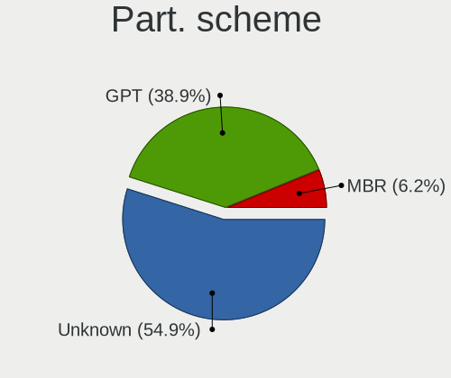

| Type    | Notebooks | Percent |
|---------|-----------|---------|
| Unknown | 498       | 54.91%  |
| GPT     | 353       | 38.92%  |
| MBR     | 56        | 6.17%   |

Dual Boot with Linux/BSD
------------------------

Hosting more than one Linux/BSD

| Dual boot | Notebooks | Percent |
|-----------|-----------|---------|
| No        | 819       | 91.2%   |
| Yes       | 79        | 8.8%    |

Dual Boot (Win)
---------------

Hosting Linux and Windows

| Dual boot | Notebooks | Percent |
|-----------|-----------|---------|
| No        | 687       | 76.16%  |
| Yes       | 215       | 23.84%  |

Board
-----

Vendor
------

Motherboard manufacturer

| Name                      | Notebooks | Percent |
|---------------------------|-----------|---------|
| Hewlett-Packard           | 235       | 26.77%  |
| Lenovo                    | 173       | 19.7%   |
| ASUSTek Computer          | 119       | 13.55%  |
| Dell                      | 87        | 9.91%   |
| Acer                      | 81        | 9.23%   |
| Samsung Electronics       | 33        | 3.76%   |
| Toshiba                   | 27        | 3.08%   |
| Sony                      | 19        | 2.16%   |
| Apple                     | 17        | 1.94%   |
| HUAWEI                    | 13        | 1.48%   |
| Unknown                   | 11        | 1.25%   |
| Valve                     | 10        | 1.14%   |
| Packard Bell              | 10        | 1.14%   |
| MSI                       | 7         | 0.8%    |
| SK hynix                  | 4         | 0.46%   |
| Google                    | 4         | 0.46%   |
| HONOR                     | 2         | 0.23%   |
| Chuwi                     | 2         | 0.23%   |
| AMI                       | 2         | 0.23%   |
| Alienware                 | 2         | 0.23%   |
| Wings Mobile              | 1         | 0.11%   |
| VIT                       | 1         | 0.11%   |
| TAGTech                   | 1         | 0.11%   |
| Render                    | 1         | 0.11%   |
| Positivo                  | 1         | 0.11%   |
| Personal Computer Factory | 1         | 0.11%   |
| OX                        | 1         | 0.11%   |
| OEM                       | 1         | 0.11%   |
| MOTILE                    | 1         | 0.11%   |
| Medion                    | 1         | 0.11%   |
| LG Electronics            | 1         | 0.11%   |
| Intel                     | 1         | 0.11%   |
| Insyde                    | 1         | 0.11%   |
| Hampoo                    | 1         | 0.11%   |
| Gear                      | 1         | 0.11%   |
| Elife                     | 1         | 0.11%   |
| Creative Vision           | 1         | 0.11%   |
| Corporativo Lanix         | 1         | 0.11%   |
| Clevo                     | 1         | 0.11%   |
| A-DATA Technology         | 1         | 0.11%   |

Model
-----

Motherboard model

| Name                                           | Notebooks | Percent |
|------------------------------------------------|-----------|---------|
| Unknown                                        | 15        | 1.71%   |
| HP Notebook                                    | 13        | 1.48%   |
| HP 240 G6 Notebook PC                          | 12        | 1.37%   |
| Valve Jupiter                                  | 10        | 1.14%   |
| HP ENVY 15                                     | 9         | 1.03%   |
| HP Pavilion Notebook                           | 7         | 0.8%    |
| HP Pavilion g4                                 | 6         | 0.68%   |
| HP 14                                          | 6         | 0.68%   |
| ASUS ZenBook UX325EA_UX325EA                   | 6         | 0.68%   |
| ASUS VivoBook_ASUSLaptop X1605VA_X1605VA       | 6         | 0.68%   |
| HP Pavilion Laptop 15-eh0xxx                   | 5         | 0.57%   |
| HP Pavilion Laptop 15-cw1xxx                   | 5         | 0.57%   |
| HP Pavilion Gaming Laptop 15-ec1xxx            | 5         | 0.57%   |
| HP Pavilion 15                                 | 5         | 0.57%   |
| HP EliteBook 840 G6                            | 5         | 0.57%   |
| Acer Aspire A315-42                            | 5         | 0.57%   |
| Lenovo Legion Y530-15ICH 81FV                  | 4         | 0.46%   |
| Lenovo IdeaPad L340-15IRH Gaming 81LK          | 4         | 0.46%   |
| HUAWEI BOHK-WAX9X                              | 4         | 0.46%   |
| HP 250 G6 Notebook PC                          | 4         | 0.46%   |
| HP 1000                                        | 4         | 0.46%   |
| Dell Inspiron 3501                             | 4         | 0.46%   |
| ASUS VivoBook_ASUSLaptop M3604YA_M3604YA       | 4         | 0.46%   |
| Apple MacBookPro9,2                            | 4         | 0.46%   |
| Acer Aspire ES1-111M                           | 4         | 0.46%   |
| Toshiba Satellite L745                         | 3         | 0.34%   |
| Toshiba Satellite C45-A                        | 3         | 0.34%   |
| SK hynix HyBook                                | 3         | 0.34%   |
| Samsung RF511/RF411/RF711                      | 3         | 0.34%   |
| Samsung 750XED                                 | 3         | 0.34%   |
| Samsung 300E5EV/300E4EV/270E5EV/270E4EV/2470EV | 3         | 0.34%   |
| Lenovo Y520-15IKBN 80WK                        | 3         | 0.34%   |
| Lenovo IdeaPad S540-15IWL 81NE                 | 3         | 0.34%   |
| Lenovo IdeaPad Gaming 3 15IMH05 81Y4           | 3         | 0.34%   |
| Lenovo IdeaPad 330S-15ARR 81FB                 | 3         | 0.34%   |
| Lenovo IdeaPad 3 14ALC6 82KT                   | 3         | 0.34%   |
| Lenovo G400 20235                              | 3         | 0.34%   |
| HP ProBook 440 G3                              | 3         | 0.34%   |
| HP Presario CQ43                               | 3         | 0.34%   |
| HP Pavilion Laptop 15-cw0xxx                   | 3         | 0.34%   |

Model Family
------------

Motherboard model prefix

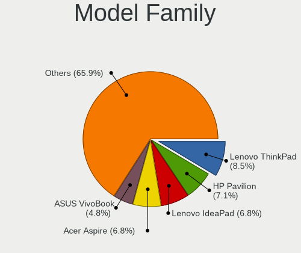

| Name                  | Notebooks | Percent |
|-----------------------|-----------|---------|
| Lenovo ThinkPad       | 75        | 8.54%   |
| HP Pavilion           | 62        | 7.06%   |
| Lenovo IdeaPad        | 60        | 6.83%   |
| Acer Aspire           | 60        | 6.83%   |
| ASUS VivoBook         | 42        | 4.78%   |
| Dell Inspiron         | 35        | 3.99%   |
| Dell Latitude         | 29        | 3.3%    |
| HP EliteBook          | 23        | 2.62%   |
| Toshiba Satellite     | 20        | 2.28%   |
| HP Laptop             | 20        | 2.28%   |
| HP 240                | 19        | 2.16%   |
| HP ENVY               | 18        | 2.05%   |
| HP ProBook            | 17        | 1.94%   |
| ASUS ZenBook          | 15        | 1.71%   |
| Unknown               | 15        | 1.71%   |
| HP Notebook           | 13        | 1.48%   |
| ASUS ASUS             | 12        | 1.37%   |
| Valve Jupiter         | 10        | 1.14%   |
| Lenovo Legion         | 9         | 1.03%   |
| ASUS TUF              | 8         | 0.91%   |
| Acer Swift            | 8         | 0.91%   |
| Packard Bell EasyNote | 7         | 0.8%    |
| HP 250                | 7         | 0.8%    |
| HP 245                | 7         | 0.8%    |
| Acer Nitro            | 7         | 0.8%    |
| HP 14                 | 6         | 0.68%   |
| Dell Vostro           | 6         | 0.68%   |
| ASUS ROG              | 6         | 0.68%   |
| Apple MacBookPro11    | 6         | 0.68%   |
| HP Presario           | 5         | 0.57%   |
| HP OMEN               | 5         | 0.57%   |
| Dell Precision        | 5         | 0.57%   |
| Toshiba PORTEGE       | 4         | 0.46%   |
| SK hynix HyBook       | 4         | 0.46%   |
| Samsung 300E5EV       | 4         | 0.46%   |
| HUAWEI BOHK-WAX9X     | 4         | 0.46%   |
| HP Compaq             | 4         | 0.46%   |
| HP 1000               | 4         | 0.46%   |
| Dell XPS              | 4         | 0.46%   |
| Dell System           | 4         | 0.46%   |

MFG Year
--------

Motherboard manufacture year

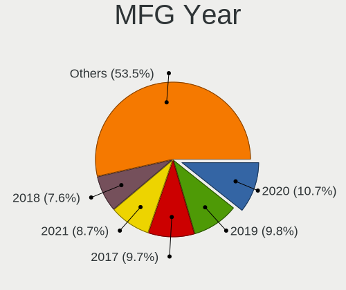

| Year    | Notebooks | Percent |
|---------|-----------|---------|
| 2020    | 94        | 10.71%  |
| 2019    | 86        | 9.79%   |
| 2017    | 85        | 9.68%   |
| 2021    | 76        | 8.66%   |
| 2018    | 67        | 7.63%   |
| 2011    | 63        | 7.18%   |
| 2013    | 61        | 6.95%   |
| 2016    | 50        | 5.69%   |
| 2012    | 47        | 5.35%   |
| 2015    | 43        | 4.9%    |
| 2010    | 42        | 4.78%   |
| 2014    | 40        | 4.56%   |
| 2023    | 28        | 3.19%   |
| 2022    | 28        | 3.19%   |
| 2008    | 23        | 2.62%   |
| 2007    | 19        | 2.16%   |
| 2009    | 18        | 2.05%   |
| 2024    | 4         | 0.46%   |
| 2006    | 2         | 0.23%   |
| Unknown | 2         | 0.23%   |

Form Factor
-----------

Physical design of the computer

| Name     | Notebooks | Percent |
|----------|-----------|---------|
| Notebook | 878       | 100%    |

Secure Boot
-----------

Enabled or disabled

| State    | Notebooks | Percent |
|----------|-----------|---------|
| Disabled | 792       | 89.19%  |
| Enabled  | 96        | 10.81%  |

Coreboot
--------

Have coreboot on board

| Used | Notebooks | Percent |
|------|-----------|---------|
| No   | 874       | 99.54%  |
| Yes  | 4         | 0.46%   |

RAM Size
--------

Total RAM memory

| Size in GB  | Notebooks | Percent |
|-------------|-----------|---------|
| 4.01-8.0    | 280       | 31.32%  |
| 8.01-16.0   | 185       | 20.69%  |
| 3.01-4.0    | 176       | 19.69%  |
| 16.01-24.0  | 143       | 16%     |
| 32.01-64.0  | 37        | 4.14%   |
| 1.01-2.0    | 34        | 3.8%    |
| 24.01-32.0  | 14        | 1.57%   |
| 2.01-3.0    | 14        | 1.57%   |
| 64.01-256.0 | 8         | 0.89%   |
| 0.51-1.0    | 2         | 0.22%   |
| Unknown     | 1         | 0.11%   |

RAM Used
--------

Used RAM memory

| Used GB    | Notebooks | Percent |
|------------|-----------|---------|
| 1.01-2.0   | 277       | 28.47%  |
| 2.01-3.0   | 250       | 25.69%  |
| 3.01-4.0   | 189       | 19.42%  |
| 4.01-8.0   | 174       | 17.88%  |
| 0.51-1.0   | 47        | 4.83%   |
| 8.01-16.0  | 30        | 3.08%   |
| 0.01-0.5   | 3         | 0.31%   |
| 24.01-32.0 | 1         | 0.1%    |
| 16.01-24.0 | 1         | 0.1%    |
| Unknown    | 1         | 0.1%    |

Total Drives
------------

Number of drives on board

| Drives | Notebooks | Percent |
|--------|-----------|---------|
| 1      | 669       | 74.42%  |
| 2      | 205       | 22.8%   |
| 3      | 18        | 2%      |
| 0      | 4         | 0.44%   |
| 4      | 3         | 0.33%   |

Has CD-ROM
----------

Has CD-ROM on board

| Presented | Notebooks | Percent |
|-----------|-----------|---------|
| No        | 666       | 74.92%  |
| Yes       | 223       | 25.08%  |

Has Ethernet
------------

Has Ethernet on board

| Presented | Notebooks | Percent |
|-----------|-----------|---------|
| Yes       | 710       | 80.59%  |
| No        | 171       | 19.41%  |

Has WiFi
--------

Has WiFi module

| Presented | Notebooks | Percent |
|-----------|-----------|---------|
| Yes       | 861       | 97.84%  |
| No        | 19        | 2.16%   |

Has Bluetooth
-------------

Has Bluetooth module

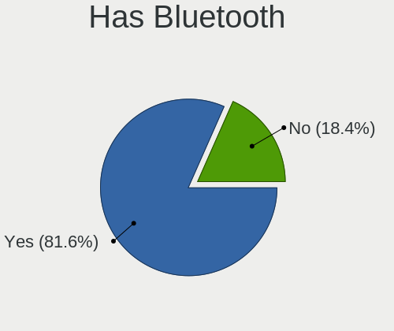

| Presented | Notebooks | Percent |
|-----------|-----------|---------|
| Yes       | 724       | 81.62%  |
| No        | 163       | 18.38%  |

Location
--------

Country
-------

Geographic location (country)

| Country | Notebooks | Percent |
|---------|-----------|---------|
| Chile   | 878       | 100%    |

City
----

Geographic location (city)

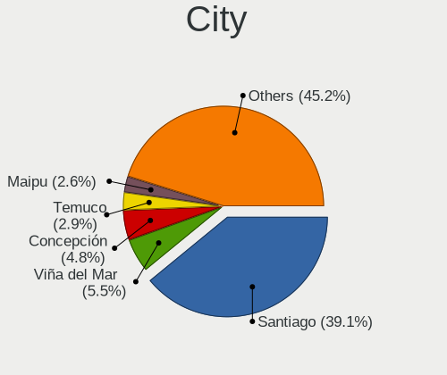

| City                | Notebooks | Percent |
|---------------------|-----------|---------|
| Santiago            | 364       | 39.06%  |
| Via del Mar       | 51        | 5.47%   |
| Concepcin         | 45        | 4.83%   |
| Temuco              | 27        | 2.9%    |
| Maipu               | 24        | 2.58%   |
| Puente Alto         | 23        | 2.47%   |
| Las Condes          | 21        | 2.25%   |
| Valdivia            | 17        | 1.82%   |
| La Florida          | 16        | 1.72%   |
| Nunoa               | 15        | 1.61%   |
| Providencia         | 14        | 1.5%    |
| La Serena           | 14        | 1.5%    |
| Antofagasta         | 13        | 1.39%   |
| San Miguel          | 12        | 1.29%   |
| Quilpu            | 10        | 1.07%   |
| Port Montt          | 10        | 1.07%   |
| Iquique             | 10        | 1.07%   |
| Valparaso         | 9         | 0.97%   |
| Rancagua            | 9         | 0.97%   |
| Coronel             | 9         | 0.97%   |
| Talcahuano          | 7         | 0.75%   |
| Talca               | 7         | 0.75%   |
| Los ngeles        | 7         | 0.75%   |
| San Pedro de la Paz | 6         | 0.64%   |
| San Bernardo        | 6         | 0.64%   |
| Melipilla           | 6         | 0.64%   |
| Curic             | 6         | 0.64%   |
| Coquimbo            | 6         | 0.64%   |
| Quilicura           | 5         | 0.54%   |
| Punta Arenas        | 5         | 0.54%   |
| Osorno              | 5         | 0.54%   |
| Macul               | 5         | 0.54%   |
| La Reina            | 5         | 0.54%   |
| Villa Alemana       | 4         | 0.43%   |
| Quillota            | 4         | 0.43%   |
| Independencia       | 4         | 0.43%   |
| Hualpen             | 4         | 0.43%   |
| Copiap            | 4         | 0.43%   |
| Chiguayante         | 4         | 0.43%   |
| Arica               | 4         | 0.43%   |

Drives
------

Drive Vendor
------------

Hard drive vendors

| Vendor                      | Notebooks | Drives | Percent |
|-----------------------------|-----------|--------|---------|
| WDC                         | 167       | 219    | 15.36%  |
| Samsung Electronics         | 116       | 147    | 10.67%  |
| Seagate                     | 106       | 137    | 9.75%   |
| Toshiba                     | 85        | 100    | 7.82%   |
| Kingston                    | 77        | 99     | 7.08%   |
| Crucial                     | 70        | 81     | 6.44%   |
| Unknown                     | 59        | 69     | 5.43%   |
| SanDisk                     | 53        | 65     | 4.88%   |
| SK hynix                    | 41        | 49     | 3.77%   |
| HGST                        | 41        | 46     | 3.77%   |
| Intel                       | 38        | 56     | 3.5%    |
| Hitachi                     | 32        | 38     | 2.94%   |
| Micron Technology           | 26        | 36     | 2.39%   |
| Kingston Technology Company | 17        | 19     | 1.56%   |
| China                       | 17        | 20     | 1.56%   |
| KIOXIA                      | 14        | 18     | 1.29%   |
| Apple                       | 13        | 17     | 1.2%    |
| JMicron Technology          | 9         | 11     | 0.83%   |
| Micron/Crucial Technology   | 8         | 10     | 0.74%   |
| KingSpec                    | 8         | 17     | 0.74%   |
| LITEON                      | 5         | 5      | 0.46%   |
| A-DATA Technology           | 5         | 7      | 0.46%   |
| SSSTC                       | 4         | 5      | 0.37%   |
| Silicon Motion              | 4         | 5      | 0.37%   |
| O2 Micro                    | 4         | 4      | 0.37%   |
| MAXIO Technology (Hangzhou) | 4         | 6      | 0.37%   |
| XrayDisk                    | 3         | 4      | 0.28%   |
| Realtek                     | 3         | 4      | 0.28%   |
| Phison                      | 3         | 3      | 0.28%   |
| Lexar                       | 3         | 16     | 0.28%   |
| Unknown                     | 3         | 3      | 0.28%   |
| WALRAM                      | 2         | 2      | 0.18%   |
| Union Memory (Shenzhen)     | 2         | 6      | 0.18%   |
| UMIS                        | 2         | 2      | 0.18%   |
| Phison Electronics          | 2         | 2      | 0.18%   |
| Netac                       | 2         | 2      | 0.18%   |
| Mass                        | 2         | 2      | 0.18%   |
| LITEONIT                    | 2         | 2      | 0.18%   |
| HS-SSD-E100N                | 2         | 2      | 0.18%   |
| HS-SSD-C100                 | 2         | 2      | 0.18%   |

Drive Model
-----------

Hard drive models

| Model                                               | Notebooks | Percent |
|-----------------------------------------------------|-----------|---------|
| Seagate ST1000LM035-1RK172 1TB                      | 22        | 1.94%   |
| Toshiba MQ01ABF050 500GB                            | 15        | 1.32%   |
| Samsung NVMe SSD Controller SM981/PM981/PM983 512GB | 15        | 1.32%   |
| Crucial CT240BX500SSD1 240GB                        | 15        | 1.32%   |
| Toshiba MQ04ABF100 1TB                              | 13        | 1.15%   |
| Kingston SA400S37480G 480GB SSD                     | 13        | 1.15%   |
| WDC WDS240G2G0A-00JH30 240GB SSD                    | 12        | 1.06%   |
| Toshiba MQ01ABD100 1TB                              | 12        | 1.06%   |
| Seagate ST9500325AS 500GB                           | 12        | 1.06%   |
| Kingston SA400S37240G 240GB SSD                     | 12        | 1.06%   |
| Unknown MMC Card  64GB                              | 11        | 0.97%   |
| Seagate ST1000LM024 HN-M101MBB 1TB                  | 10        | 0.88%   |
| Unknown MMC Card  128GB                             | 9         | 0.79%   |
| Seagate ST500LT012-1DG142 500GB                     | 9         | 0.79%   |
| Intel SSDPEKNU512GZ 512GB                           | 9         | 0.79%   |
| HGST HTS545050A7E680 500GB                          | 9         | 0.79%   |
| HGST HTS541010A9E680 1TB                            | 9         | 0.79%   |
| Crucial CT480BX500SSD1 480GB                        | 9         | 0.79%   |
| WDC WDS120G2G0A-00JH30 120GB SSD                    | 8         | 0.71%   |
| WDC WD10SPZX-24Z10 1TB                              | 8         | 0.71%   |
| Seagate ST500LM012 HN-M500MBB 500GB                 | 8         | 0.71%   |
| JMicron Generic 500GB                               | 8         | 0.71%   |
| Intel HBRPEKNX0101AHO 16GB                          | 8         | 0.71%   |
| Intel HBRPEKNX0101AH 256GB                          | 8         | 0.71%   |
| Crucial CT500MX500SSD1 500GB                        | 8         | 0.71%   |
| Crucial CT120BX500SSD1 120GB                        | 8         | 0.71%   |
| Crucial CT1000MX500SSD1 1TB                         | 8         | 0.71%   |
| WDC WD10SPZX-60Z10T0 1TB                            | 7         | 0.62%   |
| Unknown MMC Card  32GB                              | 7         | 0.62%   |
| Sandisk WD Black SN750 / PC SN730 NVMe SSD 512GB    | 7         | 0.62%   |
| Samsung NVMe SSD Drive 512GB                        | 7         | 0.62%   |
| Kingston SNVS500G 500GB                             | 7         | 0.62%   |
| HGST HTS545050A7E380 500GB                          | 7         | 0.62%   |
| Toshiba MQ01ABD075 752GB                            | 6         | 0.53%   |
| Samsung MZVL4512HBLU-00BTW 512GB                    | 6         | 0.53%   |
| HGST HTS541010B7E610 1TB                            | 6         | 0.53%   |
| WDC WD5000LPCX-21VHAT0 500GB                        | 5         | 0.44%   |
| WDC WD10JPVX-60JC3T1 1TB                            | 5         | 0.44%   |
| WDC WD10JPVX-60JC3T0 1TB                            | 5         | 0.44%   |
| WDC WD Green 2.5 240GB SSD                          | 5         | 0.44%   |

HDD Vendor
----------

Hard disk drive vendors

| Vendor              | Notebooks | Drives | Percent |
|---------------------|-----------|--------|---------|
| Seagate             | 105       | 135    | 27.7%   |
| WDC                 | 103       | 125    | 27.18%  |
| Toshiba             | 72        | 83     | 19%     |
| HGST                | 41        | 46     | 10.82%  |
| Hitachi             | 32        | 38     | 8.44%   |
| Samsung Electronics | 10        | 12     | 2.64%   |
| JMicron Technology  | 8         | 10     | 2.11%   |
| Unknown             | 2         | 2      | 0.53%   |
| Apple               | 2         | 2      | 0.53%   |
| SAGE                | 1         | 1      | 0.26%   |
| SABRENT             | 1         | 1      | 0.26%   |
| Fujitsu             | 1         | 1      | 0.26%   |
| ASMT                | 1         | 2      | 0.26%   |

SSD Vendor
----------

Solid state drive vendors

| Vendor              | Notebooks | Drives | Percent |
|---------------------|-----------|--------|---------|
| Crucial             | 66        | 77     | 21.57%  |
| WDC                 | 56        | 76     | 18.3%   |
| Kingston            | 52        | 69     | 16.99%  |
| Samsung Electronics | 28        | 31     | 9.15%   |
| SanDisk             | 19        | 21     | 6.21%   |
| China               | 17        | 20     | 5.56%   |
| KingSpec            | 8         | 17     | 2.61%   |
| Apple               | 8         | 8      | 2.61%   |
| SK hynix            | 5         | 8      | 1.63%   |
| A-DATA Technology   | 5         | 7      | 1.63%   |
| Toshiba             | 3         | 7      | 0.98%   |
| LITEON              | 3         | 3      | 0.98%   |
| Lexar               | 3         | 16     | 0.98%   |
| XrayDisk            | 2         | 3      | 0.65%   |
| Netac               | 2         | 2      | 0.65%   |
| Micron Technology   | 2         | 2      | 0.65%   |
| LITEONIT            | 2         | 2      | 0.65%   |
| Intel               | 2         | 3      | 0.65%   |
| HS-SSD-C100         | 2         | 2      | 0.65%   |
| FORESEE             | 2         | 3      | 0.65%   |
| Corsair             | 2         | 2      | 0.65%   |
| Unknown             | 2         | 2      | 0.65%   |
| Wdxsky              | 1         | 1      | 0.33%   |
| WALRAM              | 1         | 1      | 0.33%   |
| Vaseky              | 1         | 1      | 0.33%   |
| Unknown             | 1         | 1      | 0.33%   |
| StoreJet            | 1         | 1      | 0.33%   |
| SCY                 | 1         | 1      | 0.33%   |
| SATA3 25            | 1         | 1      | 0.33%   |
| PNY                 | 1         | 1      | 0.33%   |
| OSCOO               | 1         | 1      | 0.33%   |
| MemoiresTek         | 1         | 1      | 0.33%   |
| Maxell              | 1         | 1      | 0.33%   |
| KingDian            | 1         | 2      | 0.33%   |
| Hewlett-Packard     | 1         | 1      | 0.33%   |
| Gigabyte Technology | 1         | 1      | 0.33%   |
| Faspeed             | 1         | 1      | 0.33%   |

Drive Kind
----------

HDD or SSD

| Kind    | Notebooks | Drives | Percent |
|---------|-----------|--------|---------|
| HDD     | 368       | 458    | 35.49%  |
| NVMe    | 315       | 442    | 30.38%  |
| SSD     | 287       | 397    | 27.68%  |
| MMC     | 53        | 61     | 5.11%   |
| Unknown | 14        | 16     | 1.35%   |

Drive Connector
---------------

SATA, SAS, NVMe, etc.

| Type | Notebooks | Drives | Percent |
|------|-----------|--------|---------|
| SATA | 595       | 840    | 60.1%   |
| NVMe | 314       | 438    | 31.72%  |
| MMC  | 53        | 61     | 5.35%   |
| SAS  | 28        | 35     | 2.83%   |

Drive Size
----------

Size of hard drive

| Size in TB | Notebooks | Drives | Percent |
|------------|-----------|--------|---------|
| 0.01-0.5   | 416       | 575    | 65.31%  |
| 0.51-1.0   | 208       | 266    | 32.65%  |
| 1.01-2.0   | 13        | 14     | 2.04%   |

Space Total
-----------

Amount of disk space available on the file system

| Size in GB     | Notebooks | Percent |
|----------------|-----------|---------|
| 251-500        | 306       | 32.87%  |
| 101-250        | 244       | 26.21%  |
| 501-1000       | 149       | 16%     |
| 1001-2000      | 62        | 6.66%   |
| 1-20           | 56        | 6.02%   |
| 51-100         | 46        | 4.94%   |
| 21-50          | 28        | 3.01%   |
| Unknown        | 17        | 1.83%   |
| 2001-3000      | 14        | 1.5%    |
| More than 3000 | 9         | 0.97%   |

Space Used
----------

Amount of used disk space

| Used GB        | Notebooks | Percent |
|----------------|-----------|---------|
| 1-20           | 369       | 38.12%  |
| 21-50          | 191       | 19.73%  |
| 101-250        | 132       | 13.64%  |
| 51-100         | 128       | 13.22%  |
| 251-500        | 86        | 8.88%   |
| 501-1000       | 35        | 3.62%   |
| Unknown        | 17        | 1.76%   |
| 1001-2000      | 8         | 0.83%   |
| More than 3000 | 1         | 0.1%    |
| 2001-3000      | 1         | 0.1%    |

Malfunc. Drives
---------------

Drive models with a malfunction

| Model                                 | Notebooks | Drives | Percent |
|---------------------------------------|-----------|--------|---------|
| HGST HTS545050A7E680 500GB            | 4         | 4      | 5.8%    |
| Seagate ST9500325AS 500GB             | 3         | 4      | 4.35%   |
| Seagate ST500LT012-9WS142 500GB       | 3         | 3      | 4.35%   |
| Seagate ST1000LM024 HN-M101MBB 1TB    | 3         | 9      | 4.35%   |
| HGST HTS545050A7E380 500GB            | 3         | 3      | 4.35%   |
| WDC WD Green 2.5 240GB SSD            | 2         | 4      | 2.9%    |
| Toshiba MQ01ABD075 752GB              | 2         | 3      | 2.9%    |
| Seagate ST500LT012-1DG142 500GB       | 2         | 2      | 2.9%    |
| Seagate ST500LM012 HN-M500MBB 500GB   | 2         | 2      | 2.9%    |
| Hitachi HTS547575A9E384 752GB         | 2         | 3      | 2.9%    |
| HGST HTS541010B7E610 1TB              | 2         | 3      | 2.9%    |
| HGST HTS541010A9E680 1TB              | 2         | 3      | 2.9%    |
| WDC WDS240G2G0A-00JH30 240GB SSD      | 1         | 1      | 1.45%   |
| WDC WDS120G2G0B-00EPW0 120GB SSD      | 1         | 1      | 1.45%   |
| WDC WD5000LPVX-22V0TT0 500GB          | 1         | 1      | 1.45%   |
| WDC WD5000LPLX-60ZNTT1 500GB          | 1         | 1      | 1.45%   |
| WDC WD5000LPCX-60VHAT0 500GB          | 1         | 1      | 1.45%   |
| WDC WD1600BEVT-35VW9T0 160GB          | 1         | 1      | 1.45%   |
| WDC WD10SPZX-24Z10 1TB                | 1         | 1      | 1.45%   |
| WDC WD10JPVX-22JC3T0 1TB              | 1         | 1      | 1.45%   |
| Vaseky V820/1TB 1024GB                | 1         | 1      | 1.45%   |
| Toshiba MQ01ABF050 500GB              | 1         | 1      | 1.45%   |
| Toshiba MQ01ABD050 500GB              | 1         | 1      | 1.45%   |
| Toshiba MQ01ABD032 320GB              | 1         | 1      | 1.45%   |
| Toshiba MK3265GSXN 320GB              | 1         | 1      | 1.45%   |
| Toshiba MK3265GSX 320GB               | 1         | 1      | 1.45%   |
| Toshiba MK1637GSX 160GB               | 1         | 1      | 1.45%   |
| SK hynix HFS128G39TND-N210A 128GB SSD | 1         | 1      | 1.45%   |
| SK hynix BC711 HFM256GD3JX013N 256GB  | 1         | 1      | 1.45%   |
| Seagate ST9750420AS 752GB             | 1         | 1      | 1.45%   |
| Seagate ST1000LM048-2E7172 1TB        | 1         | 1      | 1.45%   |
| Seagate ST1000LM035-1RK172 1TB        | 1         | 1      | 1.45%   |
| LITEON CV8-8E128-HP 128GB SSD         | 1         | 1      | 1.45%   |
| Kingston SVP200S3120G 120GB SSD       | 1         | 1      | 1.45%   |
| Kingston SUV400S37120G 120GB SSD      | 1         | 2      | 1.45%   |
| Kingston SHFS37A240G 240GB SSD        | 1         | 1      | 1.45%   |
| JMicron Technology Generic 500GB      | 1         | 1      | 1.45%   |
| Hitachi HTS725050A7E630 500GB         | 1         | 2      | 1.45%   |
| Hitachi HTS722016K9A300 160GB         | 1         | 1      | 1.45%   |
| Hitachi HTS547564A9E384 640GB         | 1         | 2      | 1.45%   |

Malfunc. Drive Vendor
---------------------

Vendors of faulty drives

| Vendor             | Notebooks | Drives | Percent |
|--------------------|-----------|--------|---------|
| Seagate            | 16        | 23     | 23.19%  |
| HGST               | 15        | 17     | 21.74%  |
| WDC                | 10        | 12     | 14.49%  |
| Toshiba            | 8         | 9      | 11.59%  |
| Hitachi            | 8         | 12     | 11.59%  |
| Kingston           | 3         | 4      | 4.35%   |
| SK hynix           | 2         | 2      | 2.9%    |
| Crucial            | 2         | 2      | 2.9%    |
| Vaseky             | 1         | 1      | 1.45%   |
| LITEON             | 1         | 1      | 1.45%   |
| JMicron Technology | 1         | 1      | 1.45%   |
| Faspeed            | 1         | 1      | 1.45%   |
| China              | 1         | 2      | 1.45%   |

Malfunc. HDD Vendor
-------------------

Vendors of faulty HDD drives

| Vendor             | Notebooks | Drives | Percent |
|--------------------|-----------|--------|---------|
| Seagate            | 16        | 23     | 29.63%  |
| HGST               | 15        | 17     | 27.78%  |
| Toshiba            | 8         | 9      | 14.81%  |
| Hitachi            | 8         | 12     | 14.81%  |
| WDC                | 6         | 6      | 11.11%  |
| JMicron Technology | 1         | 1      | 1.85%   |

Malfunc. Drive Kind
-------------------

Kinds of faulty drives

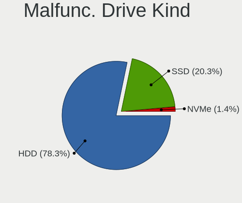

| Kind | Notebooks | Drives | Percent |
|------|-----------|--------|---------|
| HDD  | 54        | 68     | 78.26%  |
| SSD  | 14        | 18     | 20.29%  |
| NVMe | 1         | 1      | 1.45%   |

Failed Drives
-------------

Failed drive models

| Model                     | Notebooks | Drives | Percent |
|---------------------------|-----------|--------|---------|
| Seagate ST9320325AS 320GB | 1         | 1      | 100%    |

Failed Drive Vendor
-------------------

Failed drive vendors

| Vendor  | Notebooks | Drives | Percent |
|---------|-----------|--------|---------|
| Seagate | 1         | 1      | 100%    |

Drive Status
------------

Number of failed and malfunc. drives

| Status   | Notebooks | Drives | Percent |
|----------|-----------|--------|---------|
| Detected | 572       | 835    | 60.92%  |
| Works    | 299       | 451    | 31.84%  |
| Malfunc  | 67        | 87     | 7.14%   |
| Failed   | 1         | 1      | 0.11%   |

Storage controller
------------------

Storage Vendor
--------------

Storage controller vendors

| Vendor                               | Notebooks | Percent |
|--------------------------------------|-----------|---------|
| Intel                                | 571       | 55.33%  |
| AMD                                  | 143       | 13.86%  |
| Samsung Electronics                  | 88        | 8.53%   |
| SanDisk                              | 49        | 4.75%   |
| Kingston Technology Company          | 41        | 3.97%   |
| SK hynix                             | 36        | 3.49%   |
| Micron Technology                    | 24        | 2.33%   |
| KIOXIA                               | 16        | 1.55%   |
| Micron/Crucial Technology            | 12        | 1.16%   |
| Toshiba America Info Systems         | 8         | 0.78%   |
| MAXIO Technology (Hangzhou)          | 6         | 0.58%   |
| Phison Electronics                   | 5         | 0.48%   |
| Nvidia                               | 5         | 0.48%   |
| Solid State Storage Technology       | 4         | 0.39%   |
| Silicon Motion                       | 4         | 0.39%   |
| Silicon Integrated Systems [SiS]     | 4         | 0.39%   |
| O2 Micro                             | 4         | 0.39%   |
| Union Memory (Shenzhen)              | 3         | 0.29%   |
| Lite-On Technology                   | 2         | 0.19%   |
| ADATA Technology                     | 2         | 0.19%   |
| Solidigm                             | 1         | 0.1%    |
| Ramaxel Technology(Shenzhen) Limited | 1         | 0.1%    |
| Lenovo                               | 1         | 0.1%    |
| Hosin Global Electronics             | 1         | 0.1%    |
| Apple                                | 1         | 0.1%    |

Storage Model
-------------

Storage controller models

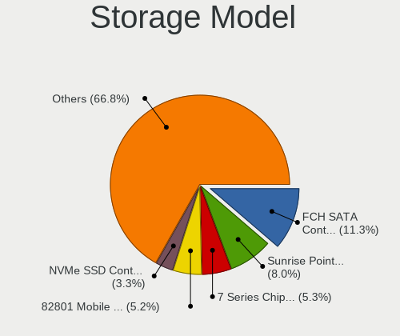

| Model                                                                            | Notebooks | Percent |
|----------------------------------------------------------------------------------|-----------|---------|
| AMD FCH SATA Controller [AHCI mode]                                              | 125       | 11.29%  |
| Intel Sunrise Point-LP SATA Controller [AHCI mode]                               | 89        | 8.04%   |
| Intel 7 Series Chipset Family 6-port SATA Controller [AHCI mode]                 | 59        | 5.33%   |
| Intel 82801 Mobile SATA Controller [RAID mode]                                   | 58        | 5.24%   |
| Samsung NVMe SSD Controller SM981/PM981/PM983                                    | 36        | 3.25%   |
| Intel 6 Series/C200 Series Chipset Family 6 port Mobile SATA AHCI Controller     | 34        | 3.07%   |
| Intel Volume Management Device NVMe RAID Controller                              | 31        | 2.8%    |
| Intel 8 Series SATA Controller 1 [AHCI mode]                                     | 26        | 2.35%   |
| Samsung NVMe SSD Controller 980 (DRAM-less)                                      | 24        | 2.17%   |
| Intel 82801IBM/IEM (ICH9M/ICH9M-E) 4 port SATA Controller [AHCI mode]            | 24        | 2.17%   |
| Intel Celeron/Pentium Silver Processor SATA Controller                           | 19        | 1.72%   |
| AMD SB7x0/SB8x0/SB9x0 SATA Controller [AHCI mode]                                | 18        | 1.63%   |
| Intel Atom Processor E3800 Series SATA AHCI Controller                           | 17        | 1.54%   |
| Intel Wildcat Point-LP SATA Controller [AHCI Mode]                               | 16        | 1.45%   |
| Intel Cannon Lake Mobile PCH SATA AHCI Controller                                | 16        | 1.45%   |
| Intel 5 Series/3400 Series Chipset 4 port SATA AHCI Controller                   | 16        | 1.45%   |
| Intel Comet Lake SATA AHCI Controller                                            | 15        | 1.36%   |
| Intel Cannon Point-LP SATA Controller [AHCI Mode]                                | 14        | 1.26%   |
| Intel Atom/Celeron/Pentium Processor x5-E8000/J3xxx/N3xxx Series SATA Controller | 14        | 1.26%   |
| SK hynix Gold P31/BC711/PC711 NVMe Solid State Drive                             | 13        | 1.17%   |
| SanDisk Extreme Pro / WD Black SN750 / PC SN730 / Red SN700 NVMe SSD             | 13        | 1.17%   |
| KIOXIA NVMe SSD Controller BG4 (DRAM-less)                                       | 13        | 1.17%   |
| SanDisk Ultra 3D / WD PC SN530, IX SN530, Blue SN550 NVMe SSD (DRAM-less)        | 12        | 1.08%   |
| Intel SSD 670p Series [Keystone Harbor]                                          | 12        | 1.08%   |
| Intel Tiger Lake-LP SATA Controller                                              | 11        | 0.99%   |
| Intel 8 Series/C220 Series Chipset Family 6-port SATA Controller 1 [AHCI mode]   | 11        | 0.99%   |
| Intel SSD 660P Series                                                            | 10        | 0.9%    |
| Intel Optane NVME SSD H10 with Solid State Storage [Teton Glacier]               | 10        | 0.9%    |
| Intel Ice Lake-LP SATA Controller [AHCI mode]                                    | 9         | 0.81%   |
| Intel Celeron N3350/Pentium N4200/Atom E3900 Series SATA AHCI Controller         | 9         | 0.81%   |
| SK hynix BC501 NVMe Solid State Drive                                            | 8         | 0.72%   |
| Samsung NVMe SSD Controller PM9B1 (DRAM-less)                                    | 8         | 0.72%   |
| Intel Volume Management Device NVMe RAID Controller Intel Corporation            | 8         | 0.72%   |
| Intel 82801HM/HEM (ICH8M/ICH8M-E) SATA Controller [AHCI mode]                    | 8         | 0.72%   |
| Intel 82801HM/HEM (ICH8M/ICH8M-E) IDE Controller                                 | 8         | 0.72%   |
| Intel 82801GBM/GHM (ICH7-M Family) SATA Controller [IDE mode]                    | 8         | 0.72%   |
| Intel 400 Series Chipset Family SATA AHCI Controller                             | 8         | 0.72%   |
| SK hynix BC511 NVMe SSD                                                          | 7         | 0.63%   |
| Samsung NVMe SSD Controller SM961/PM961/SM963                                    | 7         | 0.63%   |
| Micron/Crucial P2 [Nick P2] / P3 / P3 Plus NVMe PCIe SSD (DRAM-less)             | 7         | 0.63%   |

Storage Kind
------------

Kind of storage controller (IDE, SATA, NVMe, SAS, ...)

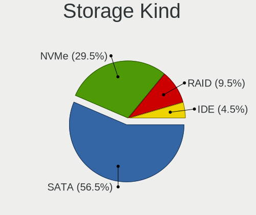

| Kind | Notebooks | Percent |
|------|-----------|---------|
| SATA | 599       | 56.46%  |
| NVMe | 313       | 29.5%   |
| RAID | 101       | 9.52%   |
| IDE  | 48        | 4.52%   |

Processor
---------

CPU Vendor
----------

Processor vendors

| Vendor  | Notebooks | Percent |
|---------|-----------|---------|
| Intel   | 668       | 76.08%  |
| AMD     | 208       | 23.69%  |
| Unknown | 2         | 0.23%   |

CPU Model
---------

Processor models

| Model                                         | Notebooks | Percent |
|-----------------------------------------------|-----------|---------|
| Intel Core i5-7200U CPU @ 2.50GHz             | 24        | 2.73%   |
| AMD Ryzen 5 3500U with Radeon Vega Mobile Gfx | 16        | 1.82%   |
| Intel Core i7-8565U CPU @ 1.80GHz             | 15        | 1.71%   |
| Intel Core i5-10210U CPU @ 1.60GHz            | 13        | 1.48%   |
| Intel 11th Gen Core i7-1165G7 @ 2.80GHz       | 13        | 1.48%   |
| Intel 11th Gen Core i5-1135G7 @ 2.40GHz       | 13        | 1.48%   |
| Intel Core i7-8550U CPU @ 1.80GHz             | 12        | 1.37%   |
| Intel Core i5-6200U CPU @ 2.30GHz             | 12        | 1.37%   |
| Intel Core i5-3210M CPU @ 2.50GHz             | 12        | 1.37%   |
| Intel Core i5-8250U CPU @ 1.60GHz             | 11        | 1.25%   |
| Intel Core i5-10300H CPU @ 2.50GHz            | 10        | 1.14%   |
| AMD Custom APU 0405                           | 10        | 1.14%   |
| Intel Core i7-7500U CPU @ 2.70GHz             | 9         | 1.02%   |
| Intel Core i5-7300HQ CPU @ 2.50GHz            | 9         | 1.02%   |
| AMD Ryzen 5 5500U with Radeon Graphics        | 9         | 1.02%   |
| Intel Core i5-9300H CPU @ 2.40GHz             | 8         | 0.91%   |
| Intel Core i5-8300H CPU @ 2.30GHz             | 8         | 0.91%   |
| Intel Core i3-1005G1 CPU @ 1.20GHz            | 8         | 0.91%   |
| Intel Pentium CPU N3540 @ 2.16GHz             | 7         | 0.8%    |
| Intel Core i7-9750H CPU @ 2.60GHz             | 7         | 0.8%    |
| Intel Core i7-10510U CPU @ 1.80GHz            | 7         | 0.8%    |
| Intel Core i5-8265U CPU @ 1.60GHz             | 7         | 0.8%    |
| Intel Core i5-4210U CPU @ 1.70GHz             | 7         | 0.8%    |
| Intel Core i3-6006U CPU @ 2.00GHz             | 7         | 0.8%    |
| Intel Core i3-3110M CPU @ 2.40GHz             | 7         | 0.8%    |
| Intel 13th Gen Core i9-13900H                 | 7         | 0.8%    |
| AMD Ryzen 7 7730U with Radeon Graphics        | 7         | 0.8%    |
| Intel Core i7-6600U CPU @ 2.60GHz             | 6         | 0.68%   |
| Intel Core i5-6300U CPU @ 2.40GHz             | 6         | 0.68%   |
| Intel Celeron N4500 @ 1.10GHz                 | 6         | 0.68%   |
| Intel Celeron CPU N3050 @ 1.60GHz             | 6         | 0.68%   |
| Intel Celeron CPU N2840 @ 2.16GHz             | 6         | 0.68%   |
| Intel 11th Gen Core i3-1115G4 @ 3.00GHz       | 6         | 0.68%   |
| AMD Ryzen 7 5800H with Radeon Graphics        | 6         | 0.68%   |
| AMD Ryzen 7 4800H with Radeon Graphics        | 6         | 0.68%   |
| AMD Ryzen 3 4300U with Radeon Graphics        | 6         | 0.68%   |
| AMD E1-2100 APU with Radeon HD Graphics       | 6         | 0.68%   |
| Intel Pentium Dual-Core CPU T4400 @ 2.20GHz   | 5         | 0.57%   |
| Intel Core i7-2670QM CPU @ 2.20GHz            | 5         | 0.57%   |
| Intel Core i7-10750H CPU @ 2.60GHz            | 5         | 0.57%   |

CPU Model Family
----------------

Processor model prefix

| Model                   | Notebooks | Percent |
|-------------------------|-----------|---------|
| Intel Core i5           | 193       | 21.96%  |
| Intel Core i7           | 145       | 16.5%   |
| Other                   | 85        | 9.67%   |
| Intel Core i3           | 82        | 9.33%   |
| Intel Celeron           | 63        | 7.17%   |
| AMD Ryzen 5             | 50        | 5.69%   |
| AMD Ryzen 7             | 33        | 3.75%   |
| Intel Pentium           | 32        | 3.64%   |
| Intel Core 2 Duo        | 22        | 2.5%    |
| Intel Atom              | 19        | 2.16%   |
| AMD A10                 | 16        | 1.82%   |
| AMD Ryzen 3             | 14        | 1.59%   |
| Intel Pentium Dual-Core | 12        | 1.37%   |
| AMD A8                  | 10        | 1.14%   |
| AMD A6                  | 10        | 1.14%   |
| AMD E1                  | 9         | 1.02%   |
| AMD E2                  | 7         | 0.8%    |
| AMD E                   | 7         | 0.8%    |
| AMD A4                  | 7         | 0.8%    |
| Intel Pentium Dual      | 6         | 0.68%   |
| Intel Pentium Silver    | 4         | 0.46%   |
| Intel Core i9           | 4         | 0.46%   |
| AMD Turion II Dual-Core | 4         | 0.46%   |
| AMD Ryzen 7 PRO         | 4         | 0.46%   |
| AMD Ryzen 5 PRO         | 4         | 0.46%   |
| AMD A12                 | 4         | 0.46%   |
| Intel Xeon              | 3         | 0.34%   |
| Intel Genuine           | 3         | 0.34%   |
| Intel Celeron Dual-Core | 3         | 0.34%   |
| AMD Ryzen 9             | 3         | 0.34%   |
| Intel Core 2            | 2         | 0.23%   |
| Intel Celeron M         | 2         | 0.23%   |
| AMD Mobile Sempron      | 2         | 0.23%   |
| AMD C-60                | 2         | 0.23%   |
| AMD Athlon II           | 2         | 0.23%   |
| Intel Core m5           | 1         | 0.11%   |
| Intel Core Duo          | 1         | 0.11%   |
| Intel Core 2 Extreme    | 1         | 0.11%   |
| Intel Core              | 1         | 0.11%   |
| AMD V160                | 1         | 0.11%   |

CPU Cores
---------

Number of processor cores

| Number  | Notebooks | Percent |
|---------|-----------|---------|
| 2       | 445       | 50.63%  |
| 4       | 308       | 35.04%  |
| 8       | 42        | 4.78%   |
| 6       | 41        | 4.66%   |
| 1       | 12        | 1.37%   |
| 14      | 8         | 0.91%   |
| 10      | 7         | 0.8%    |
| 12      | 5         | 0.57%   |
| Unknown | 5         | 0.57%   |
| 16      | 3         | 0.34%   |
| 24      | 2         | 0.23%   |
| 3       | 1         | 0.11%   |

CPU Sockets
-----------

Number of sockets

| Number  | Notebooks | Percent |
|---------|-----------|---------|
| 1       | 876       | 99.77%  |
| 4       | 1         | 0.11%   |
| Unknown | 1         | 0.11%   |

CPU Threads
-----------

Threads per core (Hyper-Threading)

| Number  | Notebooks | Percent |
|---------|-----------|---------|
| 2       | 628       | 71.2%   |
| 1       | 249       | 28.23%  |
| Unknown | 5         | 0.57%   |

CPU Op-Modes
------------

CPU Operation Modes (32-bit, 64-bit)

| Op mode        | Notebooks | Percent |
|----------------|-----------|---------|
| 32-bit, 64-bit | 856       | 97.27%  |
| Unknown        | 10        | 1.14%   |
| 64-bit         | 7         | 0.8%    |
| 32-bit         | 7         | 0.8%    |

CPU Microcode
-------------

Microcode number

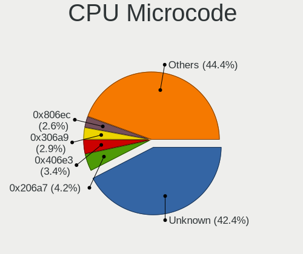

| Number     | Notebooks | Percent |
|------------|-----------|---------|
| Unknown    | 385       | 42.45%  |
| 0x206a7    | 38        | 4.19%   |
| 0x406e3    | 31        | 3.42%   |
| 0x306a9    | 26        | 2.87%   |
| 0x806ec    | 24        | 2.65%   |
| 0x806e9    | 21        | 2.32%   |
| 0x40651    | 21        | 2.32%   |
| 0x1067a    | 19        | 2.09%   |
| 0x806c1    | 16        | 1.76%   |
| 0x30678    | 16        | 1.76%   |
| 0x906ea    | 15        | 1.65%   |
| 0x806ea    | 14        | 1.54%   |
| 0x20655    | 13        | 1.43%   |
| 0xa0652    | 12        | 1.32%   |
| 0x08108102 | 12        | 1.32%   |
| 0x306d4    | 11        | 1.21%   |
| 0x08108109 | 11        | 1.21%   |
| 0x6fd      | 10        | 1.1%    |
| 0x0a50000c | 10        | 1.1%    |
| 0x0810100b | 9         | 0.99%   |
| 0x05000119 | 9         | 0.99%   |
| 0x906e9    | 8         | 0.88%   |
| 0x406c4    | 8         | 0.88%   |
| 0x306c3    | 8         | 0.88%   |
| 0x706e5    | 7         | 0.77%   |
| 0x506c9    | 7         | 0.77%   |
| 0x406c3    | 7         | 0.77%   |
| 0x08608103 | 7         | 0.77%   |
| 0x08600106 | 7         | 0.77%   |
| 0x07030105 | 7         | 0.77%   |
| 0x806eb    | 6         | 0.66%   |
| 0x706a8    | 6         | 0.66%   |
| 0x0700010f | 6         | 0.66%   |
| 0x06006705 | 6         | 0.66%   |
| 0x706a1    | 5         | 0.55%   |
| 0x106ca    | 5         | 0.55%   |
| 0x906c0    | 4         | 0.44%   |
| 0x10676    | 4         | 0.44%   |
| 0x07030106 | 4         | 0.44%   |
| 0x06001119 | 4         | 0.44%   |

CPU Microarch
-------------

Microarchitecture

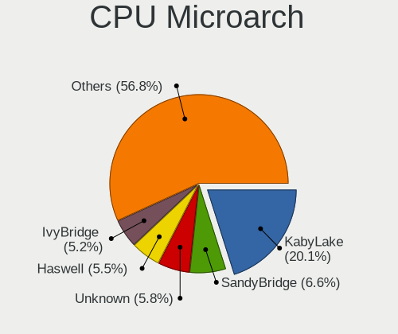

| Name              | Notebooks | Percent |
|-------------------|-----------|---------|
| KabyLake          | 177       | 20.11%  |
| SandyBridge       | 58        | 6.59%   |
| Unknown           | 51        | 5.8%    |
| Haswell           | 48        | 5.45%   |
| IvyBridge         | 46        | 5.23%   |
| Skylake           | 45        | 5.11%   |
| Silvermont        | 40        | 4.55%   |
| TigerLake         | 39        | 4.43%   |
| Zen+              | 34        | 3.86%   |
| Penryn            | 34        | 3.86%   |
| Westmere          | 24        | 2.73%   |
| Zen 3             | 21        | 2.39%   |
| Excavator         | 21        | 2.39%   |
| CometLake         | 21        | 2.39%   |
| Broadwell         | 21        | 2.39%   |
| Zen 2             | 20        | 2.27%   |
| Icelake           | 20        | 2.27%   |
| Goldmont plus     | 19        | 2.16%   |
| Alderlake Hybrid  | 18        | 2.05%   |
| Bobcat            | 15        | 1.7%    |
| Zen               | 13        | 1.48%   |
| Puma              | 13        | 1.48%   |
| Core              | 13        | 1.48%   |
| Bonnell           | 11        | 1.25%   |
| Piledriver        | 10        | 1.14%   |
| Jaguar            | 10        | 1.14%   |
| K10               | 9         | 1.02%   |
| Goldmont          | 9         | 1.02%   |
| Tremont           | 4         | 0.45%   |
| P6                | 4         | 0.45%   |
| K10 Llano         | 4         | 0.45%   |
| K8 Hammer         | 3         | 0.34%   |
| Steamroller       | 2         | 0.23%   |
| Nehalem           | 1         | 0.11%   |
| Meteorlake Hybrid | 1         | 0.11%   |
| K8 & K10 hybrid   | 1         | 0.11%   |

Graphics
--------

GPU Vendor
----------

Vendors of graphics cards

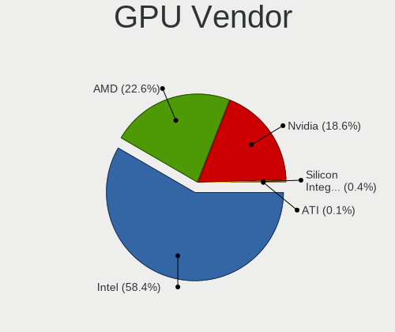

| Vendor                           | Notebooks | Percent |
|----------------------------------|-----------|---------|
| Intel                            | 628       | 58.36%  |
| AMD                              | 243       | 22.58%  |
| Nvidia                           | 200       | 18.59%  |
| Silicon Integrated Systems [SiS] | 4         | 0.37%   |
| ATI Technologies                 | 1         | 0.09%   |

GPU Model
---------

Graphics card models

| Model                                                                                    | Notebooks | Percent |
|------------------------------------------------------------------------------------------|-----------|---------|
| Intel 2nd Generation Core Processor Family Integrated Graphics Controller                | 55        | 4.89%   |
| Intel HD Graphics 620                                                                    | 47        | 4.18%   |
| Intel 3rd Gen Core processor Graphics Controller                                         | 44        | 3.91%   |
| Intel Skylake GT2 [HD Graphics 520]                                                      | 35        | 3.11%   |
| AMD Picasso/Raven 2 [Radeon Vega Series / Radeon Vega Mobile Series]                     | 34        | 3.02%   |
| Intel TigerLake-LP GT2 [Iris Xe Graphics]                                                | 33        | 2.94%   |
| Intel Haswell-ULT Integrated Graphics Controller                                         | 31        | 2.76%   |
| Intel UHD Graphics 620                                                                   | 28        | 2.49%   |
| Intel CometLake-U GT2 [UHD Graphics]                                                     | 28        | 2.49%   |
| Intel WhiskeyLake-U GT2 [UHD Graphics 620]                                               | 26        | 2.31%   |
| Intel CoffeeLake-H GT2 [UHD Graphics 630]                                                | 25        | 2.22%   |
| Intel Atom/Celeron/Pentium Processor x5-E8000/J3xxx/N3xxx Integrated Graphics Controller | 21        | 1.87%   |
| Intel Mobile 4 Series Chipset Integrated Graphics Controller                             | 20        | 1.78%   |
| Intel CometLake-H GT2 [UHD Graphics]                                                     | 20        | 1.78%   |
| AMD Renoir [Radeon Vega Series / Radeon Vega Mobile Series]                              | 20        | 1.78%   |
| Nvidia TU117M [GeForce GTX 1650 Mobile / Max-Q]                                          | 19        | 1.69%   |
| Intel Atom Processor Z36xxx/Z37xxx Series Graphics & Display                             | 19        | 1.69%   |
| Nvidia GP107M [GeForce GTX 1050 Mobile]                                                  | 18        | 1.6%    |
| Intel Core Processor Integrated Graphics Controller                                      | 18        | 1.6%    |
| AMD Sun XT [Radeon HD 8670A/8670M/8690M / R5 M330 / M430 / Radeon 520 Mobile]            | 18        | 1.6%    |
| Intel HD Graphics 5500                                                                   | 16        | 1.42%   |
| Intel GeminiLake [UHD Graphics 600]                                                      | 15        | 1.33%   |
| AMD Topaz XT [Radeon R7 M260/M265 / M340/M360 / M440/M445 / 530/535 / 620/625 Mobile]    | 15        | 1.33%   |
| AMD Cezanne [Radeon Vega Series / Radeon Vega Mobile Series]                             | 14        | 1.25%   |
| Intel 4th Gen Core Processor Integrated Graphics Controller                              | 13        | 1.16%   |
| AMD Raven Ridge [Radeon Vega Series / Radeon Vega Mobile Series]                         | 13        | 1.16%   |
| AMD Lucienne                                                                             | 13        | 1.16%   |
| Nvidia GM108M [GeForce 940MX]                                                            | 12        | 1.07%   |
| Intel Iris Plus Graphics G1 (Ice Lake)                                                   | 12        | 1.07%   |
| Intel HD Graphics 630                                                                    | 12        | 1.07%   |
| Intel Raptor Lake-P [Iris Xe Graphics]                                                   | 11        | 0.98%   |
| AMD Stoney [Radeon R2/R3/R4/R5 Graphics]                                                 | 11        | 0.98%   |
| AMD Mullins [Radeon R4/R5 Graphics]                                                      | 11        | 0.98%   |
| AMD Wani [Radeon R5/R6/R7 Graphics]                                                      | 10        | 0.89%   |
| AMD VanGogh [AMD Custom GPU 0405]                                                        | 10        | 0.89%   |
| AMD RS880M [Mobility Radeon HD 4225/4250]                                                | 9         | 0.8%    |
| Intel Mobile 945GM/GMS/GME, 943/940GML Express Integrated Graphics Controller            | 8         | 0.71%   |
| Nvidia GP107M [GeForce GTX 1050 3 GB Max-Q]                                              | 7         | 0.62%   |
| Nvidia GM108M [GeForce 840M]                                                             | 7         | 0.62%   |
| Intel Mobile GM965/GL960 Integrated Graphics Controller (secondary)                      | 7         | 0.62%   |

GPU Combo
---------

Combinations of graphics cards

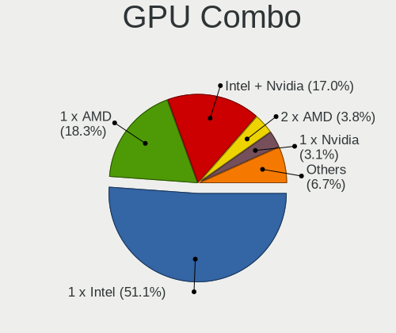

| Name           | Notebooks | Percent |
|----------------|-----------|---------|
| 1 x Intel      | 450       | 51.14%  |
| 1 x AMD        | 161       | 18.3%   |
| Intel + Nvidia | 150       | 17.05%  |
| 2 x AMD        | 33        | 3.75%   |
| 1 x Nvidia     | 27        | 3.07%   |
| Intel + AMD    | 27        | 3.07%   |
| AMD + Nvidia   | 23        | 2.61%   |
| 1 x SiS        | 4         | 0.45%   |
| 2 x Intel      | 3         | 0.34%   |
| Other          | 2         | 0.23%   |

GPU Driver
----------

Free vs proprietary

| Driver      | Notebooks | Percent |
|-------------|-----------|---------|
| Free        | 740       | 83.24%  |
| Proprietary | 107       | 12.04%  |
| Unknown     | 42        | 4.72%   |

GPU Memory
----------

Total video memory

| Size in GB | Notebooks | Percent |
|------------|-----------|---------|
| Unknown    | 610       | 68%     |
| 0.01-0.5   | 106       | 11.82%  |
| 1.01-2.0   | 91        | 10.14%  |
| 0.51-1.0   | 45        | 5.02%   |
| 3.01-4.0   | 32        | 3.57%   |
| 5.01-6.0   | 6         | 0.67%   |
| 7.01-8.0   | 3         | 0.33%   |
| 2.01-3.0   | 3         | 0.33%   |
| 8.01-16.0  | 1         | 0.11%   |

Monitor
-------

Monitor Vendor
--------------

Monitor vendors

| Vendor                  | Notebooks | Percent |
|-------------------------|-----------|---------|
| AU Optronics            | 185       | 18.14%  |
| BOE                     | 173       | 16.96%  |
| Chimei Innolux          | 168       | 16.47%  |
| Samsung Electronics     | 131       | 12.84%  |
| LG Display              | 104       | 10.2%   |
| Goldstar                | 34        | 3.33%   |
| Apple                   | 17        | 1.67%   |
| PANDA                   | 16        | 1.57%   |
| AOC                     | 14        | 1.37%   |
| Lenovo                  | 13        | 1.27%   |
| ViewSonic               | 12        | 1.18%   |
| Dell                    | 11        | 1.08%   |
| Chi Mei Optoelectronics | 11        | 1.08%   |
| CSO                     | 10        | 0.98%   |
| Valve                   | 9         | 0.88%   |
| Sharp                   | 9         | 0.88%   |
| InfoVision              | 9         | 0.88%   |
| Sony                    | 8         | 0.78%   |
| Hewlett-Packard         | 7         | 0.69%   |
| Envision                | 7         | 0.69%   |
| LG Philips              | 6         | 0.59%   |
| ASUSTek Computer        | 6         | 0.59%   |
| Acer                    | 6         | 0.59%   |
| HKC                     | 5         | 0.49%   |
| SAC                     | 4         | 0.39%   |
| Unknown                 | 3         | 0.29%   |
| SLD                     | 3         | 0.29%   |
| MSI                     | 3         | 0.29%   |
| InnoLux Display         | 3         | 0.29%   |
| Ancor Communications    | 3         | 0.29%   |
| STA                     | 2         | 0.2%    |
| RGT                     | 2         | 0.2%    |
| Panasonic               | 2         | 0.2%    |
| LGD                     | 2         | 0.2%    |
| Hitachi                 | 2         | 0.2%    |
| ELD                     | 2         | 0.2%    |
| CPT                     | 2         | 0.2%    |
| ___                     | 1         | 0.1%    |
| Toshiba                 | 1         | 0.1%    |
| SGT                     | 1         | 0.1%    |

Monitor Model
-------------

Monitor models

| Model                                                                 | Notebooks | Percent |
|-----------------------------------------------------------------------|-----------|---------|
| Chimei Innolux LCD Monitor CMN14D6 1366x768 309x173mm 13.9-inch       | 12        | 1.16%   |
| BOE LCD Monitor BOE0697 1366x768 309x173mm 13.9-inch                  | 12        | 1.16%   |
| AU Optronics LCD Monitor AUO2E3C 1366x768 309x173mm 13.9-inch         | 11        | 1.07%   |
| Valve ANX7530 U VLV3001 800x1280 100x150mm 7.1-inch                   | 9         | 0.87%   |
| LG Display LCD Monitor LGD02E9 1366x768 309x174mm 14.0-inch           | 9         | 0.87%   |
| Chimei Innolux LCD Monitor CMN15F5 1920x1080 344x193mm 15.5-inch      | 9         | 0.87%   |
| Chimei Innolux LCD Monitor CMN14C3 1366x768 309x173mm 13.9-inch       | 9         | 0.87%   |
| Chimei Innolux LCD Monitor CMN1618 1920x1200 344x215mm 16.0-inch      | 8         | 0.78%   |
| Chimei Innolux LCD Monitor CMN15E6 1366x768 344x193mm 15.5-inch       | 8         | 0.78%   |
| AU Optronics LCD Monitor AUO403D 1920x1080 309x174mm 14.0-inch        | 8         | 0.78%   |
| Samsung Electronics C24F390 SAM0D2C 1920x1080 521x293mm 23.5-inch     | 7         | 0.68%   |
| Chimei Innolux LCD Monitor CMN1521 1920x1080 344x193mm 15.5-inch      | 7         | 0.68%   |
| Chimei Innolux LCD Monitor CMN14E5 1920x1080 309x173mm 13.9-inch      | 7         | 0.68%   |
| Chimei Innolux LCD Monitor CMN1490 1366x768 309x173mm 13.9-inch       | 7         | 0.68%   |
| BOE LCD Monitor BOE0872 1920x1080 344x194mm 15.5-inch                 | 7         | 0.68%   |
| BOE LCD Monitor BOE0696 1366x768 309x173mm 13.9-inch                  | 7         | 0.68%   |
| Samsung Electronics LCD Monitor SDC4158 1920x1080 294x165mm 13.3-inch | 6         | 0.58%   |
| Chimei Innolux LCD Monitor CMN1493 1366x768 309x173mm 13.9-inch       | 6         | 0.58%   |
| BOE LCD Monitor BOE06A4 1366x768 344x194mm 15.5-inch                  | 6         | 0.58%   |
| BOE LCD Monitor BOE0602 1366x768 344x193mm 15.5-inch                  | 6         | 0.58%   |
| Samsung Electronics LCD Monitor SEC5441 1280x800 286x179mm 13.3-inch  | 5         | 0.48%   |
| Chimei Innolux LCD Monitor CMN15DB 1366x768 344x193mm 15.5-inch       | 5         | 0.48%   |
| Chimei Innolux LCD Monitor CMN14D4 1920x1080 309x173mm 13.9-inch      | 5         | 0.48%   |
| BOE LCD Monitor BOE06A5 1366x768 344x194mm 15.5-inch                  | 5         | 0.48%   |
| BOE LCD Monitor BOE0672 1366x768 344x194mm 15.5-inch                  | 5         | 0.48%   |
| BOE LCD Monitor BOE05BA 1366x768 309x173mm 13.9-inch                  | 5         | 0.48%   |
| AU Optronics LCD Monitor AUO723C 1366x768 309x173mm 13.9-inch         | 5         | 0.48%   |
| AU Optronics LCD Monitor AUO70EC 1366x768 344x193mm 15.5-inch         | 5         | 0.48%   |
| AU Optronics LCD Monitor AUO45EC 1366x768 344x193mm 15.5-inch         | 5         | 0.48%   |
| Samsung Electronics LCD Monitor SEC3741 1280x800 331x207mm 15.4-inch  | 4         | 0.39%   |
| Samsung Electronics LCD Monitor SDC4951 1366x768 344x194mm 15.5-inch  | 4         | 0.39%   |
| PANDA LCD Monitor NCP002D 1920x1080 344x194mm 15.5-inch               | 4         | 0.39%   |
| LG Display LCD Monitor LGD039F 1366x768 345x194mm 15.6-inch           | 4         | 0.39%   |
| Goldstar ULTRAWIDE GSM59F1 2560x1080 677x290mm 29.0-inch              | 4         | 0.39%   |
| Chimei Innolux LCD Monitor CMN1495 1366x768 309x173mm 13.9-inch       | 4         | 0.39%   |
| BOE LCD Monitor BOE08E8 1920x1080 344x194mm 15.5-inch                 | 4         | 0.39%   |
| BOE LCD Monitor BOE0877 1920x1080 309x173mm 13.9-inch                 | 4         | 0.39%   |
| BOE LCD Monitor BOE0628 1366x768 309x173mm 13.9-inch                  | 4         | 0.39%   |
| AU Optronics LCD Monitor AUO459D 1920x1200 344x215mm 16.0-inch        | 4         | 0.39%   |
| AU Optronics LCD Monitor AUO38ED 1920x1080 344x193mm 15.5-inch        | 4         | 0.39%   |

Monitor Resolution
------------------

Monitor screen resolution

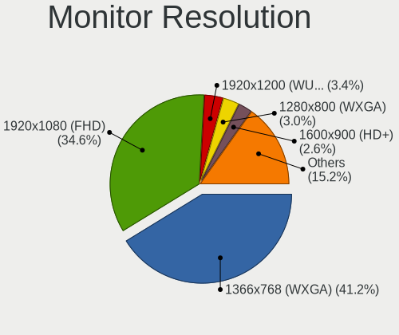

| Resolution         | Notebooks | Percent |
|--------------------|-----------|---------|
| 1366x768 (WXGA)    | 400       | 41.24%  |
| 1920x1080 (FHD)    | 336       | 34.64%  |
| 1920x1200 (WUXGA)  | 33        | 3.4%    |
| 1280x800 (WXGA)    | 29        | 2.99%   |
| 1600x900 (HD+)     | 25        | 2.58%   |
| 3840x2160 (4K)     | 23        | 2.37%   |
| 1360x768           | 17        | 1.75%   |
| 800x1280           | 10        | 1.03%   |
| 2880x1800          | 10        | 1.03%   |
| 2560x1600          | 10        | 1.03%   |
| 2560x1440 (QHD)    | 10        | 1.03%   |
| 1680x1050 (WSXGA+) | 9         | 0.93%   |
| 1440x900 (WXGA+)   | 9         | 0.93%   |
| 1280x1024 (SXGA)   | 8         | 0.82%   |
| 2560x1080          | 7         | 0.72%   |
| 1024x600           | 5         | 0.52%   |
| 2160x1440          | 4         | 0.41%   |
| 3840x2400          | 3         | 0.31%   |
| 3840x1100          | 3         | 0.31%   |
| 3440x1440          | 3         | 0.31%   |
| 1920x540           | 3         | 0.31%   |
| 1024x576           | 2         | 0.21%   |
| Unknown            | 2         | 0.21%   |
| 5440x1800          | 1         | 0.1%    |
| 3840x1080          | 1         | 0.1%    |
| 3286x1080          | 1         | 0.1%    |
| 3000x2000          | 1         | 0.1%    |
| 2288x1287          | 1         | 0.1%    |
| 1920x515           | 1         | 0.1%    |
| 1680x945           | 1         | 0.1%    |
| 1600x2560          | 1         | 0.1%    |
| 1280x720 (HD)      | 1         | 0.1%    |

Monitor Diagonal
----------------

Diagonal size in inches

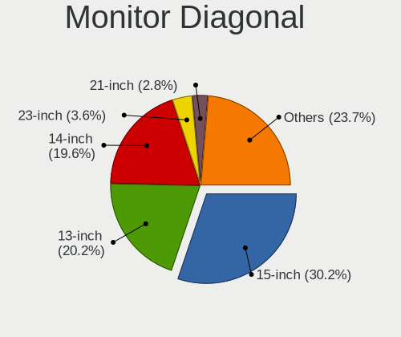

| Inches  | Notebooks | Percent |
|---------|-----------|---------|
| 15      | 310       | 30.19%  |
| 13      | 207       | 20.16%  |
| 14      | 201       | 19.57%  |
| 23      | 37        | 3.6%    |
| 21      | 29        | 2.82%   |
| 16      | 28        | 2.73%   |
| 17      | 23        | 2.24%   |
| 27      | 21        | 2.04%   |
| 31      | 19        | 1.85%   |
| 24      | 19        | 1.85%   |
| 12      | 19        | 1.85%   |
| 11      | 17        | 1.66%   |
| 19      | 11        | 1.07%   |
| 34      | 10        | 0.97%   |
| 18      | 10        | 0.97%   |
| 10      | 9         | 0.88%   |
| 7       | 9         | 0.88%   |
| Unknown | 9         | 0.88%   |
| 72      | 5         | 0.49%   |
| 22      | 5         | 0.49%   |
| 32      | 4         | 0.39%   |
| 20      | 4         | 0.39%   |
| 58      | 3         | 0.29%   |
| 48      | 3         | 0.29%   |
| 84      | 2         | 0.19%   |
| 54      | 2         | 0.19%   |
| 40      | 2         | 0.19%   |
| 142     | 1         | 0.1%    |
| 86      | 1         | 0.1%    |
| 49      | 1         | 0.1%    |
| 46      | 1         | 0.1%    |
| 43      | 1         | 0.1%    |
| 42      | 1         | 0.1%    |
| 28      | 1         | 0.1%    |
| 26      | 1         | 0.1%    |
| 3       | 1         | 0.1%    |

Monitor Width
-------------

Physical width

| Width in mm    | Notebooks | Percent |
|----------------|-----------|---------|
| 301-350        | 676       | 66.54%  |
| 201-300        | 101       | 9.94%   |
| 501-600        | 70        | 6.89%   |
| 401-500        | 52        | 5.12%   |
| 351-400        | 37        | 3.64%   |
| 601-700        | 24        | 2.36%   |
| 701-800        | 14        | 1.38%   |
| 1001-1500      | 11        | 1.08%   |
| 1-100          | 10        | 0.98%   |
| Unknown        | 9         | 0.89%   |
| 1501-2000      | 7         | 0.69%   |
| 801-900        | 2         | 0.2%    |
| 901-1000       | 2         | 0.2%    |
| More than 2000 | 1         | 0.1%    |

Aspect Ratio
------------

Proportional relationship between the width and the height

| Ratio   | Notebooks | Percent |
|---------|-----------|---------|
| 16/9    | 734       | 82.84%  |
| 16/10   | 102       | 11.51%  |
| 21/9    | 10        | 1.13%   |
| 0.67    | 9         | 1.02%   |
| 5/4     | 8         | 0.9%    |
| 3/2     | 6         | 0.68%   |
| Unknown | 4         | 0.45%   |
| 4/3     | 3         | 0.34%   |
| 3.40    | 3         | 0.34%   |
| 1.96    | 2         | 0.23%   |
| 6/5     | 1         | 0.11%   |
| 32/9    | 1         | 0.11%   |
| 3.73    | 1         | 0.11%   |
| 1.00    | 1         | 0.11%   |
| 0.56    | 1         | 0.11%   |

Monitor Area
------------

Area in inch

| Area in inch | Notebooks | Percent |
|----------------|-----------|---------|
| 81-90          | 360       | 35.23%  |
| 101-110        | 312       | 30.53%  |
| 201-250        | 75        | 7.34%   |
| 71-80          | 46        | 4.5%    |
| 351-500        | 33        | 3.23%   |
| 111-120        | 25        | 2.45%   |
| 301-350        | 21        | 2.05%   |
| 151-200        | 21        | 2.05%   |
| 51-60          | 20        | 1.96%   |
| 61-70          | 16        | 1.57%   |
| More than 1000 | 15        | 1.47%   |
| 121-130        | 15        | 1.47%   |
| 141-150        | 13        | 1.27%   |
| 1-40           | 10        | 0.98%   |
| 41-50          | 9         | 0.88%   |
| Unknown        | 9         | 0.88%   |
| 501-1000       | 8         | 0.78%   |
| 251-300        | 5         | 0.49%   |
| 131-140        | 5         | 0.49%   |
| 91-100         | 4         | 0.39%   |

Pixel Density
-------------

Pixels per inch

| Density       | Notebooks | Percent |
|---------------|-----------|---------|
| 101-120       | 427       | 42.4%   |
| 121-160       | 311       | 30.88%  |
| 51-100        | 148       | 14.7%   |
| 161-240       | 68        | 6.75%   |
| 1-50          | 27        | 2.68%   |
| More than 240 | 17        | 1.69%   |
| Unknown       | 9         | 0.89%   |

Multiple Monitors
-----------------

Total monitors connected

| Total | Notebooks | Percent |
|-------|-----------|---------|
| 1     | 692       | 76.3%   |
| 2     | 178       | 19.63%  |
| 0     | 24        | 2.65%   |
| 3     | 12        | 1.32%   |
| 4     | 1         | 0.11%   |

Network
-------

Net Controller Vendor
---------------------

Controller vendors

| Vendor                           | Notebooks | Percent |
|----------------------------------|-----------|---------|
| Realtek Semiconductor            | 557       | 40.3%   |
| Intel                            | 366       | 26.48%  |
| Qualcomm Atheros                 | 186       | 13.46%  |
| Broadcom                         | 91        | 6.58%   |
| MediaTek                         | 33        | 2.39%   |
| Ralink                           | 19        | 1.37%   |
| Xiaomi                           | 13        | 0.94%   |
| Samsung Electronics              | 13        | 0.94%   |
| Huawei Technologies              | 13        | 0.94%   |
| Broadcom Limited                 | 13        | 0.94%   |
| Marvell Technology Group         | 12        | 0.87%   |
| TP-Link                          | 11        | 0.8%    |
| Ralink Technology                | 9         | 0.65%   |
| ASIX Electronics                 | 5         | 0.36%   |
| Silicon Integrated Systems [SiS] | 4         | 0.29%   |
| Qualcomm Atheros Communications  | 4         | 0.29%   |
| Nvidia                           | 4         | 0.29%   |
| JMicron Technology               | 4         | 0.29%   |
| ICS Advent                       | 4         | 0.29%   |
| Lenovo                           | 3         | 0.22%   |
| D-Link                           | 3         | 0.22%   |
| Qualcomm                         | 2         | 0.14%   |
| Qcom                             | 1         | 0.07%   |
| Netchip Technology               | 1         | 0.07%   |
| Motorola PCS                     | 1         | 0.07%   |
| Microsoft                        | 1         | 0.07%   |
| Microchip Technology             | 1         | 0.07%   |
| Linksys                          | 1         | 0.07%   |
| Hewlett-Packard                  | 1         | 0.07%   |
| DisplayLink                      | 1         | 0.07%   |
| D-Link System                    | 1         | 0.07%   |
| Bose                             | 1         | 0.07%   |
| ASUSTek Computer                 | 1         | 0.07%   |
| Arduino SA                       | 1         | 0.07%   |
| Apple                            | 1         | 0.07%   |

Net Controller Model
--------------------

Controller models

| Model                                                                  | Notebooks | Percent |
|------------------------------------------------------------------------|-----------|---------|
| Realtek RTL8111/8168/8211/8411 PCI Express Gigabit Ethernet Controller | 314       | 18.81%  |
| Realtek RTL810xE PCI Express Fast Ethernet controller                  | 127       | 7.61%   |
| Realtek RTL8821CE 802.11ac PCIe Wireless Network Adapter               | 42        | 2.52%   |
| Realtek RTL8822CE 802.11ac PCIe Wireless Network Adapter               | 41        | 2.46%   |
| Qualcomm Atheros QCA9565 / AR9565 Wireless Network Adapter             | 38        | 2.28%   |
| Qualcomm Atheros QCA9377 802.11ac Wireless Network Adapter             | 37        | 2.22%   |
| Qualcomm Atheros AR9485 Wireless Network Adapter                       | 34        | 2.04%   |
| Intel Wireless 8265 / 8275                                             | 34        | 2.04%   |
| Intel Wi-Fi 6 AX201                                                    | 30        | 1.8%    |
| Intel Wi-Fi 6 AX200                                                    | 30        | 1.8%    |
| Realtek RTL8723BE PCIe Wireless Network Adapter                        | 28        | 1.68%   |
| Qualcomm Atheros AR9285 Wireless Network Adapter (PCI-Express)         | 28        | 1.68%   |
| Realtek RTL8723DE Wireless Network Adapter                             | 26        | 1.56%   |
| Intel Comet Lake PCH-LP CNVi WiFi                                      | 26        | 1.56%   |
| Realtek RTL8153 Gigabit Ethernet Adapter                               | 24        | 1.44%   |
| Broadcom BCM43142 802.11b/g/n                                          | 23        | 1.38%   |
| Broadcom BCM4313 802.11bgn Wireless Network Adapter                    | 23        | 1.38%   |
| Intel Wireless 8260                                                    | 20        | 1.2%    |
| Intel Comet Lake PCH CNVi WiFi                                         | 19        | 1.14%   |
| Intel Wireless 7265                                                    | 17        | 1.02%   |
| Intel Wireless 7260                                                    | 16        | 0.96%   |
| Qualcomm Atheros QCA6174 802.11ac Wireless Network Adapter             | 14        | 0.84%   |
| Realtek RTL8822BE 802.11a/b/g/n/ac WiFi adapter                        | 13        | 0.78%   |
| MediaTek Wi-Fi 6E MT7902 Wireless Network Adapter                      | 13        | 0.78%   |
| Intel Ethernet Connection I219-LM                                      | 13        | 0.78%   |
| Intel Cannon Point-LP CNVi [Wireless-AC]                               | 13        | 0.78%   |
| Intel Ethernet Connection (4) I219-V                                   | 12        | 0.72%   |
| Intel Cannon Lake PCH CNVi WiFi                                        | 12        | 0.72%   |
| Intel 82579LM Gigabit Network Connection (Lewisville)                  | 12        | 0.72%   |
| Realtek RTL8821AE 802.11ac PCIe Wireless Network Adapter               | 11        | 0.66%   |
| Realtek RTL8188EE Wireless Network Adapter                             | 11        | 0.66%   |
| Intel Ethernet Connection (4) I219-LM                                  | 11        | 0.66%   |
| Realtek RTL8188EUS 802.11n Wireless Network Adapter                    | 10        | 0.6%    |
| Realtek RTL8152 Fast Ethernet Adapter                                  | 10        | 0.6%    |
| Ralink RT3290 Wireless 802.11n 1T/1R PCIe                              | 10        | 0.6%    |
| Intel Wireless 3165                                                    | 10        | 0.6%    |
| Intel Dual Band Wireless-AC 3165 Plus Bluetooth                        | 10        | 0.6%    |
| Huawei FOA-LX9                                                         | 10        | 0.6%    |
| Xiaomi Mi/Redmi series (RNDIS)                                         | 9         | 0.54%   |
| Samsung Galaxy series, misc. (tethering mode)                          | 9         | 0.54%   |

Wireless Vendor
---------------

Wireless vendors

| Vendor                          | Notebooks | Percent |
|---------------------------------|-----------|---------|
| Intel                           | 355       | 39.31%  |
| Realtek Semiconductor           | 214       | 23.7%   |
| Qualcomm Atheros                | 168       | 18.6%   |
| Broadcom                        | 76        | 8.42%   |
| MediaTek                        | 28        | 3.1%    |
| Ralink                          | 19        | 2.1%    |
| Broadcom Limited                | 11        | 1.22%   |
| TP-Link                         | 10        | 1.11%   |
| Ralink Technology               | 9         | 1%      |
| Qualcomm Atheros Communications | 4         | 0.44%   |
| Qualcomm                        | 2         | 0.22%   |
| D-Link                          | 2         | 0.22%   |
| Qcom                            | 1         | 0.11%   |
| Microsoft                       | 1         | 0.11%   |
| Hewlett-Packard                 | 1         | 0.11%   |
| D-Link System                   | 1         | 0.11%   |
| ASUSTek Computer                | 1         | 0.11%   |

Wireless Model
--------------

Wireless models

| Model                                                                   | Notebooks | Percent |
|-------------------------------------------------------------------------|-----------|---------|
| Realtek RTL8821CE 802.11ac PCIe Wireless Network Adapter                | 42        | 4.62%   |
| Realtek RTL8822CE 802.11ac PCIe Wireless Network Adapter                | 41        | 4.51%   |
| Qualcomm Atheros QCA9565 / AR9565 Wireless Network Adapter              | 38        | 4.18%   |
| Qualcomm Atheros QCA9377 802.11ac Wireless Network Adapter              | 37        | 4.07%   |
| Qualcomm Atheros AR9485 Wireless Network Adapter                        | 34        | 3.74%   |
| Intel Wireless 8265 / 8275                                              | 34        | 3.74%   |
| Intel Wi-Fi 6 AX201                                                     | 30        | 3.3%    |
| Intel Wi-Fi 6 AX200                                                     | 30        | 3.3%    |
| Realtek RTL8723BE PCIe Wireless Network Adapter                         | 28        | 3.08%   |
| Qualcomm Atheros AR9285 Wireless Network Adapter (PCI-Express)          | 28        | 3.08%   |
| Realtek RTL8723DE Wireless Network Adapter                              | 26        | 2.86%   |
| Intel Comet Lake PCH-LP CNVi WiFi                                       | 26        | 2.86%   |
| Broadcom BCM43142 802.11b/g/n                                           | 23        | 2.53%   |
| Broadcom BCM4313 802.11bgn Wireless Network Adapter                     | 23        | 2.53%   |
| Intel Wireless 8260                                                     | 20        | 2.2%    |
| Intel Comet Lake PCH CNVi WiFi                                          | 19        | 2.09%   |
| Intel Wireless 7265                                                     | 17        | 1.87%   |
| Intel Wireless 7260                                                     | 16        | 1.76%   |
| Qualcomm Atheros QCA6174 802.11ac Wireless Network Adapter              | 14        | 1.54%   |
| Realtek RTL8822BE 802.11a/b/g/n/ac WiFi adapter                         | 13        | 1.43%   |
| MediaTek Wi-Fi 6E MT7902 Wireless Network Adapter                       | 13        | 1.43%   |
| Intel Cannon Point-LP CNVi [Wireless-AC]                                | 13        | 1.43%   |
| Intel Cannon Lake PCH CNVi WiFi                                         | 12        | 1.32%   |
| Realtek RTL8821AE 802.11ac PCIe Wireless Network Adapter                | 11        | 1.21%   |
| Realtek RTL8188EE Wireless Network Adapter                              | 11        | 1.21%   |
| Realtek RTL8188EUS 802.11n Wireless Network Adapter                     | 10        | 1.1%    |
| Ralink RT3290 Wireless 802.11n 1T/1R PCIe                               | 10        | 1.1%    |
| Intel Wireless 3165                                                     | 10        | 1.1%    |
| Intel Dual Band Wireless-AC 3165 Plus Bluetooth                         | 10        | 1.1%    |
| Realtek RTL8188CE 802.11b/g/n WiFi Adapter                              | 9         | 0.99%   |
| Qualcomm Atheros AR242x / AR542x Wireless Network Adapter (PCI-Express) | 9         | 0.99%   |
| MediaTek MT7921 802.11ax PCI Express Wireless Network Adapter           | 9         | 0.99%   |
| Intel Wi-Fi 6E(802.11ax) AX210/AX1675* 2x2 [Typhoon Peak]               | 8         | 0.88%   |
| Intel Centrino Advanced-N 6235                                          | 8         | 0.88%   |
| Intel Alder Lake-P PCH CNVi WiFi                                        | 8         | 0.88%   |
| Ralink RT3090 Wireless 802.11n 1T/1R PCIe                               | 7         | 0.77%   |
| Intel Ice Lake-LP PCH CNVi WiFi                                         | 7         | 0.77%   |
| Intel Centrino Advanced-N 6205 [Taylor Peak]                            | 7         | 0.77%   |
| Ralink MT7601U Wireless Adapter                                         | 6         | 0.66%   |
| Qualcomm Atheros AR928X Wireless Network Adapter (PCI-Express)          | 6         | 0.66%   |

Ethernet Vendor
---------------

Ethernet vendors

| Vendor                           | Notebooks | Percent |
|----------------------------------|-----------|---------|
| Realtek Semiconductor            | 482       | 64.61%  |
| Intel                            | 117       | 15.68%  |
| Qualcomm Atheros                 | 35        | 4.69%   |
| Broadcom                         | 26        | 3.49%   |
| Xiaomi                           | 13        | 1.74%   |
| Huawei Technologies              | 13        | 1.74%   |
| Marvell Technology Group         | 12        | 1.61%   |
| Samsung Electronics              | 9         | 1.21%   |
| MediaTek                         | 5         | 0.67%   |
| ASIX Electronics                 | 5         | 0.67%   |
| Silicon Integrated Systems [SiS] | 4         | 0.54%   |
| Nvidia                           | 4         | 0.54%   |
| JMicron Technology               | 4         | 0.54%   |
| ICS Advent                       | 4         | 0.54%   |
| Lenovo                           | 3         | 0.4%    |
| Broadcom Limited                 | 2         | 0.27%   |
| TP-Link                          | 1         | 0.13%   |
| Netchip Technology               | 1         | 0.13%   |
| Motorola PCS                     | 1         | 0.13%   |
| Microchip Technology             | 1         | 0.13%   |
| Linksys                          | 1         | 0.13%   |
| DisplayLink                      | 1         | 0.13%   |
| D-Link                           | 1         | 0.13%   |
| Apple                            | 1         | 0.13%   |

Ethernet Model
--------------

Ethernet models

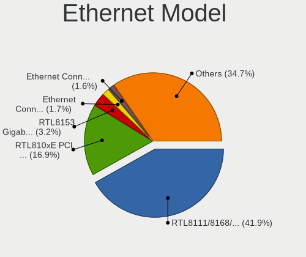

| Model                                                                  | Notebooks | Percent |
|------------------------------------------------------------------------|-----------|---------|
| Realtek RTL8111/8168/8211/8411 PCI Express Gigabit Ethernet Controller | 314       | 41.87%  |
| Realtek RTL810xE PCI Express Fast Ethernet controller                  | 127       | 16.93%  |
| Realtek RTL8153 Gigabit Ethernet Adapter                               | 24        | 3.2%    |
| Intel Ethernet Connection I219-LM                                      | 13        | 1.73%   |
| Intel Ethernet Connection (4) I219-V                                   | 12        | 1.6%    |
| Intel 82579LM Gigabit Network Connection (Lewisville)                  | 12        | 1.6%    |
| Intel Ethernet Connection (4) I219-LM                                  | 11        | 1.47%   |
| Realtek RTL8152 Fast Ethernet Adapter                                  | 10        | 1.33%   |
| Huawei FOA-LX9                                                         | 10        | 1.33%   |
| Xiaomi Mi/Redmi series (RNDIS)                                         | 9         | 1.2%    |
| Samsung Galaxy series, misc. (tethering mode)                          | 9         | 1.2%    |
| Qualcomm Atheros AR8152 v2.0 Fast Ethernet                             | 8         | 1.07%   |
| Intel Ethernet Connection (6) I219-V                                   | 7         | 0.93%   |
| Intel Ethernet Connection (3) I218-LM                                  | 7         | 0.93%   |
| Qualcomm Atheros AR8151 v2.0 Gigabit Ethernet                          | 6         | 0.8%    |
| Marvell Group 88E8040 PCI-E Fast Ethernet Controller                   | 6         | 0.8%    |
| Intel Ethernet Connection (13) I219-V                                  | 6         | 0.8%    |
| Realtek Killer E2600 GbE Controller                                    | 5         | 0.67%   |
| Qualcomm Atheros QCA8172 Fast Ethernet                                 | 5         | 0.67%   |
| Intel Ethernet Connection I218-LM                                      | 5         | 0.67%   |
| Intel Ethernet Connection I217-LM                                      | 5         | 0.67%   |
| Intel Ethernet Connection (10) I219-V                                  | 5         | 0.67%   |
| Intel 82567LM Gigabit Network Connection                               | 5         | 0.67%   |
| Broadcom NetXtreme BCM57765 Gigabit Ethernet PCIe                      | 5         | 0.67%   |
| Xiaomi Mi/Redmi series (RNDIS + ADB)                                   | 4         | 0.53%   |
| Silicon Integrated Systems [SiS] 191 Gigabit Ethernet Adapter          | 4         | 0.53%   |
| Qualcomm Atheros AR8162 Fast Ethernet                                  | 4         | 0.53%   |
| MediaTek Infinix SMART 5                                               | 4         | 0.53%   |
| Intel Ethernet Connection (10) I219-LM                                 | 4         | 0.53%   |
| Intel 82577LM Gigabit Network Connection                               | 4         | 0.53%   |
| Broadcom NetLink BCM57785 Gigabit Ethernet PCIe                        | 4         | 0.53%   |
| Qualcomm Atheros AR8152 v1.1 Fast Ethernet                             | 3         | 0.4%    |
| JMicron JMC250 PCI Express Gigabit Ethernet Controller                 | 3         | 0.4%    |
| Intel 82566MM Gigabit Network Connection                               | 3         | 0.4%    |
| ICS Advent USB 10/100 LAN                                              | 3         | 0.4%    |
| Huawei E353/E3131                                                      | 3         | 0.4%    |
| Broadcom NetLink BCM57780 Gigabit Ethernet PCIe                        | 3         | 0.4%    |
| ASIX AX88179 Gigabit Ethernet                                          | 3         | 0.4%    |
| Realtek RTL-8100/8101L/8139 PCI Fast Ethernet Adapter                  | 2         | 0.27%   |
| Qualcomm Atheros QCA8171 Gigabit Ethernet                              | 2         | 0.27%   |

Net Controller Kind
-------------------

Ethernet, WiFi or modem

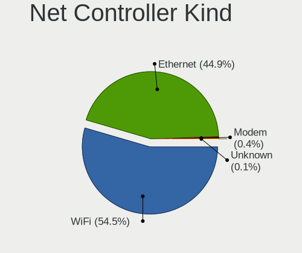

| Kind     | Notebooks | Percent |
|----------|-----------|---------|
| WiFi     | 861       | 54.53%  |
| Ethernet | 709       | 44.9%   |
| Modem    | 7         | 0.44%   |
| Unknown  | 2         | 0.13%   |

Used Controller
---------------

Currently used network controller

| Kind     | Notebooks | Percent |
|----------|-----------|---------|
| WiFi     | 710       | 76.67%  |
| Ethernet | 216       | 23.33%  |

NICs
----

Total network controllers on board

| Total | Notebooks | Percent |
|-------|-----------|---------|
| 2     | 632       | 71.66%  |
| 1     | 232       | 26.3%   |
| 0     | 10        | 1.13%   |
| 3     | 8         | 0.91%   |

IPv6
----

IPv6 vs IPv4

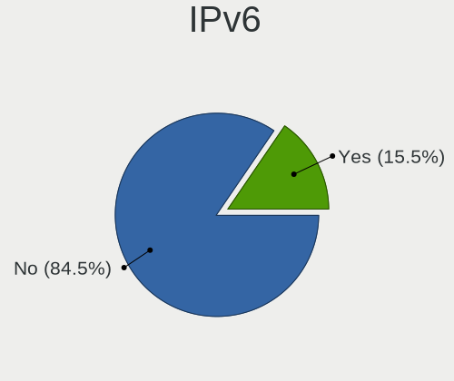

| Used | Notebooks | Percent |
|------|-----------|---------|
| No   | 754       | 84.53%  |
| Yes  | 138       | 15.47%  |

Bluetooth
---------

Bluetooth Vendor
----------------

Controller vendors

| Vendor                          | Notebooks | Percent |
|---------------------------------|-----------|---------|
| Intel                           | 300       | 40.82%  |
| Realtek Semiconductor           | 137       | 18.64%  |
| Qualcomm Atheros Communications | 55        | 7.48%   |
| IMC Networks                    | 54        | 7.35%   |
| Lite-On Technology              | 44        | 5.99%   |
| Broadcom                        | 43        | 5.85%   |
| Foxconn / Hon Hai               | 27        | 3.67%   |
| Apple                           | 16        | 2.18%   |
| Ralink                          | 10        | 1.36%   |
| Dell                            | 8         | 1.09%   |
| Realtek                         | 7         | 0.95%   |
| Hewlett-Packard                 | 7         | 0.95%   |
| Toshiba                         | 5         | 0.68%   |
| Ralink Technology               | 4         | 0.54%   |
| Cambridge Silicon Radio         | 4         | 0.54%   |
| Foxconn International           | 3         | 0.41%   |
| USI                             | 2         | 0.27%   |
| ASUSTek Computer                | 2         | 0.27%   |
| Alps Electric                   | 2         | 0.27%   |
| Actions                         | 2         | 0.27%   |
| MediaTek                        | 1         | 0.14%   |
| Integrated System Solution      | 1         | 0.14%   |
| Unknown                         | 1         | 0.14%   |

Bluetooth Model
---------------

Controller models

| Model                                            | Notebooks | Percent |
|--------------------------------------------------|-----------|---------|
| Intel Bluetooth wireless interface               | 102       | 13.86%  |
| Intel AX201 Bluetooth                            | 74        | 10.05%  |
| Realtek Bluetooth Radio                          | 62        | 8.42%   |
| Realtek  Bluetooth 4.2 Adapter                   | 50        | 6.79%   |
| Intel Bluetooth 9460/9560 Jefferson Peak (JfP)   | 47        | 6.39%   |
| Intel AX200 Bluetooth                            | 30        | 4.08%   |
| IMC Networks Bluetooth Radio                     | 24        | 3.26%   |
| Qualcomm Atheros  Bluetooth Device               | 22        | 2.99%   |
| IMC Networks Wireless_Device                     | 17        | 2.31%   |
| Lite-On Qualcomm Atheros QCA9377 Bluetooth       | 14        | 1.9%    |
| Intel Centrino Bluetooth Wireless Transceiver    | 12        | 1.63%   |
| Realtek RTL8821A Bluetooth                       | 11        | 1.49%   |
| Qualcomm Atheros AR3011 Bluetooth                | 11        | 1.49%   |
| Lite-On Atheros AR3012 Bluetooth                 | 11        | 1.49%   |
| Ralink RT3290 Bluetooth                          | 10        | 1.36%   |
| Qualcomm Atheros AR3012 Bluetooth 4.0            | 10        | 1.36%   |
| Lite-On Bluetooth Device                         | 10        | 1.36%   |
| Intel Centrino Advanced-N 6230 Bluetooth adapter | 10        | 1.36%   |
| IMC Networks Bluetooth Device                    | 10        | 1.36%   |
| Broadcom BCM43142A0 Bluetooth 4.0                | 10        | 1.36%   |
| Realtek 802.11ac WLAN Adapter                    | 9         | 1.22%   |
| Intel AX211 Bluetooth                            | 9         | 1.22%   |
| Intel AX210 Bluetooth                            | 8         | 1.09%   |
| Apple Bluetooth Host Controller                  | 8         | 1.09%   |
| Realtek Bluetooth Radio                          | 7         | 0.95%   |
| Apple Bluetooth USB Host Controller              | 7         | 0.95%   |
| Toshiba Bluetooth Device                         | 5         | 0.68%   |
| Qualcomm Atheros Bluetooth                       | 5         | 0.68%   |
| Intel Wireless-AC 3168 Bluetooth                 | 5         | 0.68%   |
| Foxconn / Hon Hai Bluetooth USB Host Controller  | 5         | 0.68%   |
| Foxconn / Hon Hai Bluetooth Device               | 5         | 0.68%   |
| Broadcom BCM43142A0 Bluetooth Device             | 5         | 0.68%   |
| Broadcom BCM2070 Bluetooth Device                | 5         | 0.68%   |
| Broadcom BCM2070 Bluetooth 2.1 + EDR             | 5         | 0.68%   |
| Realtek RTL8822BE Bluetooth 4.2 Adapter          | 4         | 0.54%   |
| Ralink Motorola BC4 Bluetooth 3.0+HS Adapter     | 4         | 0.54%   |
| Qualcomm Atheros QCA61x4 Bluetooth 4.0           | 4         | 0.54%   |
| Lite-On Broadcom BCM43142A0 Bluetooth Device     | 4         | 0.54%   |
| Intel Wireless-AC 9260 Bluetooth Adapter         | 4         | 0.54%   |
| HP Bluetooth 2.0 Interface [Broadcom BCM2045]    | 4         | 0.54%   |

Sound
-----

Sound Vendor
------------

Sound card vendors

| Vendor                           | Notebooks | Percent |
|----------------------------------|-----------|---------|
| Intel                            | 654       | 63.5%   |
| AMD                              | 216       | 20.97%  |
| Nvidia                           | 102       | 9.9%    |
| Logitech                         | 9         | 0.87%   |
| C-Media Electronics              | 6         | 0.58%   |
| Silicon Integrated Systems [SiS] | 4         | 0.39%   |
| JMTek                            | 4         | 0.39%   |
| Lenovo                           | 3         | 0.29%   |
| Kingston Technology              | 3         | 0.29%   |
| Generalplus Technology           | 3         | 0.29%   |
| Focusrite-Novation               | 3         | 0.29%   |
| Creative Technology              | 3         | 0.29%   |
| Texas Instruments                | 2         | 0.19%   |
| Plantronics                      | 2         | 0.19%   |
| Microsoft                        | 2         | 0.19%   |
| Apple                            | 2         | 0.19%   |
| Shenzhen Riitek Technology       | 1         | 0.1%    |
| SAVITECH                         | 1         | 0.1%    |
| Realtek Semiconductor            | 1         | 0.1%    |
| Pixart Imaging                   | 1         | 0.1%    |
| Medeli Electronics               | 1         | 0.1%    |
| Huawei Technologies              | 1         | 0.1%    |
| GN Netcom                        | 1         | 0.1%    |
| ESS Technology                   | 1         | 0.1%    |
| DigiTech                         | 1         | 0.1%    |
| CMX Systems                      | 1         | 0.1%    |
| ASUSTek Computer                 | 1         | 0.1%    |
| Unknown                          | 1         | 0.1%    |

Sound Model
-----------

Sound card models

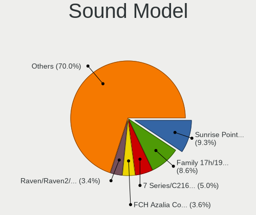

| Model                                                                                             | Notebooks | Percent |
|---------------------------------------------------------------------------------------------------|-----------|---------|
| Intel Sunrise Point-LP HD Audio                                                                   | 118       | 9.34%   |
| AMD Family 17h/19h/1ah HD Audio Controller                                                        | 109       | 8.63%   |
| Intel 7 Series/C216 Chipset Family High Definition Audio Controller                               | 63        | 4.99%   |
| AMD FCH Azalia Controller                                                                         | 46        | 3.64%   |
| AMD Raven/Raven2/Fenghuang HDMI/DP Audio Controller                                               | 43        | 3.4%    |
| Intel 6 Series/C200 Series Chipset Family High Definition Audio Controller                        | 42        | 3.33%   |
| AMD Renoir Radeon High Definition Audio Controller                                                | 42        | 3.33%   |
| Intel Tiger Lake-LP Smart Sound Technology Audio Controller                                       | 39        | 3.09%   |
| AMD Kabini HDMI/DP Audio                                                                          | 33        | 2.61%   |
| Intel Haswell-ULT HD Audio Controller                                                             | 30        | 2.38%   |
| Intel Cannon Point-LP High Definition Audio Controller                                            | 30        | 2.38%   |
| Intel 8 Series HD Audio Controller                                                                | 30        | 2.38%   |
| Intel 82801I (ICH9 Family) HD Audio Controller                                                    | 29        | 2.3%    |
| Intel Comet Lake PCH-LP cAVS                                                                      | 28        | 2.22%   |
| Intel Cannon Lake PCH cAVS                                                                        | 26        | 2.06%   |
| Intel 5 Series/3400 Series Chipset High Definition Audio                                          | 25        | 1.98%   |
| Nvidia TU107 GeForce GTX 1650 High Definition Audio Controller                                    | 21        | 1.66%   |
| Intel Wildcat Point-LP High Definition Audio Controller                                           | 21        | 1.66%   |
| Intel Comet Lake PCH cAVS                                                                         | 21        | 1.66%   |
| Intel Broadwell-U Audio Controller                                                                | 21        | 1.66%   |
| Intel Celeron/Pentium Silver Processor High Definition Audio                                      | 19        | 1.5%    |
| AMD SBx00 Azalia (Intel HDA)                                                                      | 18        | 1.43%   |
| Nvidia GP107GL High Definition Audio Controller                                                   | 17        | 1.35%   |
| Intel NM10/ICH7 Family High Definition Audio Controller                                           | 17        | 1.35%   |
| Intel Ice Lake-LP Smart Sound Technology Audio Controller                                         | 17        | 1.35%   |
| Intel Atom Processor Z36xxx/Z37xxx Series High Definition Audio Controller                        | 17        | 1.35%   |
| Intel 8 Series/C220 Series Chipset High Definition Audio Controller                               | 17        | 1.35%   |
| AMD Family 15h (Models 60h-6fh) Audio Controller                                                  | 17        | 1.35%   |
| AMD Rembrandt Radeon High Definition Audio Controller                                             | 16        | 1.27%   |
| Intel Atom/Celeron/Pentium Processor x5-E8000/J3xxx/N3xxx Series High Definition Audio Controller | 15        | 1.19%   |
| Intel CM238 HD Audio Controller                                                                   | 14        | 1.11%   |
| Intel Xeon E3-1200 v3/4th Gen Core Processor HD Audio Controller                                  | 13        | 1.03%   |
| Intel Raptor Lake-P/U/H cAVS                                                                      | 13        | 1.03%   |
| AMD High Definition Audio Controller                                                              | 11        | 0.87%   |
| Nvidia TU106 High Definition Audio Controller                                                     | 10        | 0.79%   |
| Intel 82801H (ICH8 Family) HD Audio Controller                                                    | 10        | 0.79%   |
| AMD Wrestler HDMI Audio                                                                           | 10        | 0.79%   |
| AMD Trinity HDMI Audio Controller                                                                 | 10        | 0.79%   |
| Intel Celeron N3350/Pentium N4200/Atom E3900 Series Audio Cluster                                 | 9         | 0.71%   |
| Intel Alder Lake PCH-P High Definition Audio Controller                                           | 9         | 0.71%   |

Memory
------

Memory Vendor
-------------

Memory module vendors

| Vendor              | Notebooks | Percent |
|---------------------|-----------|---------|
| Samsung Electronics | 163       | 29%     |
| SK hynix            | 119       | 21.17%  |
| Micron Technology   | 73        | 12.99%  |
| Crucial             | 58        | 10.32%  |
| Kingston            | 56        | 9.96%   |
| Ramaxel Technology  | 23        | 4.09%   |
| Unknown             | 22        | 3.91%   |
| A-DATA Technology   | 10        | 1.78%   |
| Avant               | 7         | 1.25%   |
| Unknown (ABCD)      | 4         | 0.71%   |
| G.Skill             | 3         | 0.53%   |
| Elpida              | 3         | 0.53%   |
| Corsair             | 3         | 0.53%   |
| Unknown             | 3         | 0.53%   |
| Nanya Technology    | 2         | 0.36%   |
| Kllisre             | 2         | 0.36%   |
| Unknown (0x0E9D)    | 1         | 0.18%   |
| Unknown (0BF7)      | 1         | 0.18%   |
| Unknown (090E)      | 1         | 0.18%   |
| Unknown (08C8)      | 1         | 0.18%   |
| Smart               | 1         | 0.18%   |
| PNY                 | 1         | 0.18%   |
| Lexar               | 1         | 0.18%   |
| KingSpec            | 1         | 0.18%   |
| ASint Technology    | 1         | 0.18%   |
| Apacer              | 1         | 0.18%   |
| 48spaces            | 1         | 0.18%   |

Memory Model
------------

Memory module models

| Model                                                            | Notebooks | Percent |
|------------------------------------------------------------------|-----------|---------|
| Samsung RAM M471A5244CB0-CTD 4GB SODIMM DDR4 3266MT/s            | 11        | 1.88%   |
| SK hynix RAM HMA81GS6AFR8N-UH 8GB SODIMM DDR4 2667MT/s           | 10        | 1.71%   |
| SK hynix RAM HMA81GS6DJR8N-XN 8GB SODIMM DDR4 3200MT/s           | 9         | 1.54%   |
| Samsung RAM M471B5173DB0-YK0 4GB SODIMM DDR3 1600MT/s            | 8         | 1.37%   |
| Samsung RAM M471A1K43EB1-CWE 8GB SODIMM DDR4 3200MT/s            | 8         | 1.37%   |
| Samsung RAM M471A5244CB0-CRC 4GB SODIMM DDR4 2667MT/s            | 7         | 1.2%    |
| Micron RAM 4ATF51264HZ-3G2J1 4GB SODIMM DDR4 3200MT/s            | 7         | 1.2%    |
| SK hynix RAM HMT451S6BFR8A-PB 4GB SODIMM DDR3 1600MT/s           | 6         | 1.03%   |
| SK hynix RAM HMA851S6DJR6N-XN 4GB SODIMM DDR4 3200MT/s           | 6         | 1.03%   |
| Samsung RAM M471B5273DH0-CH9 4GB SODIMM DDR3 1334MT/s            | 6         | 1.03%   |
| Samsung RAM M471B5273CH0-CH9 4GB SODIMM DDR3 1334MT/s            | 6         | 1.03%   |
| Samsung RAM M471A5244CB0-CWE 4096MB SODIMM DDR4 3200MT/s         | 6         | 1.03%   |
| Micron RAM 4ATF51264HZ-2G6E1 4GB SODIMM DDR4 2667MT/s            | 6         | 1.03%   |
| Samsung RAM M471B5173QH0-YK0 4GB SODIMM DDR3 1600MT/s            | 5         | 0.85%   |
| Samsung RAM M471B1G73EB0-YK0 8GB SODIMM DDR3 1600MT/s            | 5         | 0.85%   |
| Samsung RAM M471A1K43CB1-CRC 8GB SODIMM DDR4 2667MT/s            | 5         | 0.85%   |
| Samsung RAM M471A1G44BB0-CWE 8GB SODIMM DDR4 3200MT/s            | 5         | 0.85%   |
| Micron RAM 4ATF1G64HZ-3G2F1 8GB SODIMM DDR4 3200MT/s             | 5         | 0.85%   |
| Micron RAM 4ATF1G64HZ-3G2E2 8GB SODIMM DDR4 3200MT/s             | 5         | 0.85%   |
| SK hynix RAM HMA851S6CJR6N-VK 4GB Row Of Chips DDR4 2667MT/s     | 4         | 0.68%   |
| SK hynix RAM HMA851S6AFR6N-UH 4GB SODIMM DDR4 2667MT/s           | 4         | 0.68%   |
| SK hynix RAM HMA81GS6JJR8N-VK 8GB SODIMM DDR4 2667MT/s           | 4         | 0.68%   |
| Samsung RAM M471B5773CHS-CH9 2GB SODIMM DDR3 4199MT/s            | 4         | 0.68%   |
| Samsung RAM M471A1K43CB1-CTD 8GB SODIMM DDR4 2667MT/s            | 4         | 0.68%   |
| Samsung RAM M471A1K43BB1-CRC 8GB SODIMM DDR4 2667MT/s            | 4         | 0.68%   |
| Samsung RAM M471A1G44AB0-CWE 8GB SODIMM DDR4 3200MT/s            | 4         | 0.68%   |
| Samsung RAM K4E6E304EC-EGCG 4GB Row Of Chips LPDDR3 2133MT/s     | 4         | 0.68%   |
| Ramaxel RAM RMSA3260ME78HAF-2666 8GB SODIMM DDR4 2667MT/s        | 4         | 0.68%   |
| Micron RAM 8KTF51264HZ-1G6N1 4GB SODIMM DDR3 1600MT/s            | 4         | 0.68%   |
| Micron RAM 4ATF51264HZ-2G3B1 4GB SODIMM DDR4 3200MT/s            | 4         | 0.68%   |
| Crucial RAM CT8G4SFRA32A.M8FRS 8GB SODIMM DDR4 3200MT/s          | 4         | 0.68%   |
| Crucial RAM CT8G4SFRA32A.M4FF 8GB SODIMM DDR4 3200MT/s           | 4         | 0.68%   |
| Crucial RAM CT51264BF160B.C16F 4GB SODIMM DDR3 1600MT/s          | 4         | 0.68%   |
| Crucial RAM CT102464BF160B.M16 8GB SODIMM DDR3 1600MT/s          | 4         | 0.68%   |
| Avant RAM J641GU42J7240ND 8GB SODIMM DDR4 2400MT/s               | 4         | 0.68%   |
| Unknown RAM Module 4GB SODIMM DDR3                               | 3         | 0.51%   |
| Unknown RAM Module 2GB SODIMM DDR3                               | 3         | 0.51%   |
| Unknown (ABCD) RAM 123456789012345678 2GB SODIMM LPDDR3 2400MT/s | 3         | 0.51%   |
| SK hynix RAM HMT451S6BFR8A-PB 4096MB SODIMM DDR3 1600MT/s        | 3         | 0.51%   |
| SK hynix RAM HMT451S6AFR8A-PB 4GB SODIMM DDR3 1600MT/s           | 3         | 0.51%   |

Memory Kind
-----------

Memory module kinds

| Kind   | Notebooks | Percent |
|--------|-----------|---------|
| DDR4   | 229       | 53.88%  |
| DDR3   | 129       | 30.35%  |
| LPDDR4 | 23        | 5.41%   |
| LPDDR3 | 12        | 2.82%   |
| DDR2   | 10        | 2.35%   |
| SDRAM  | 8         | 1.88%   |
| LPDDR5 | 6         | 1.41%   |
| DDR5   | 6         | 1.41%   |
| RAM    | 1         | 0.24%   |
| DDR    | 1         | 0.24%   |

Memory Form Factor
------------------

Physical design of the memory module

| Name         | Notebooks | Percent |
|--------------|-----------|---------|
| SODIMM       | 375       | 88.65%  |
| Row Of Chips | 43        | 10.17%  |
| DIMM         | 2         | 0.47%   |
| Chip         | 2         | 0.47%   |
| Unknown      | 1         | 0.24%   |

Memory Size
-----------

Memory module size

| Size  | Notebooks | Percent |
|-------|-----------|---------|
| 8192  | 209       | 42.74%  |
| 4096  | 162       | 33.13%  |
| 16384 | 67        | 13.7%   |
| 2048  | 36        | 7.36%   |
| 32768 | 9         | 1.84%   |
| 1024  | 5         | 1.02%   |
| 64    | 1         | 0.2%    |

Memory Speed
------------

Memory module speed

| Speed   | Notebooks | Percent |
|---------|-----------|---------|
| 3200    | 111       | 23.08%  |
| 1600    | 99        | 20.58%  |
| 2667    | 98        | 20.37%  |
| 2400    | 46        | 9.56%   |
| 2133    | 24        | 4.99%   |
| 1334    | 16        | 3.33%   |
| 4267    | 12        | 2.49%   |
| 3266    | 11        | 2.29%   |
| Unknown | 11        | 2.29%   |
| 1333    | 10        | 2.08%   |
| 667     | 7         | 1.46%   |
| 5600    | 4         | 0.83%   |
| 4199    | 4         | 0.83%   |
| 800     | 4         | 0.83%   |
| 7500    | 3         | 0.62%   |
| 4266    | 3         | 0.62%   |
| 1867    | 3         | 0.62%   |
| 1067    | 3         | 0.62%   |
| 6400    | 2         | 0.42%   |
| 4800    | 2         | 0.42%   |
| 2048    | 2         | 0.42%   |
| 975     | 2         | 0.42%   |
| 8600    | 1         | 0.21%   |
| 8400    | 1         | 0.21%   |
| 933     | 1         | 0.21%   |
| 533     | 1         | 0.21%   |

Printers & scanners
-------------------

Printer Vendor
--------------

Printer device vendors

| Vendor             | Notebooks | Percent |
|--------------------|-----------|---------|
| Hewlett-Packard    | 3         | 30%     |
| Brother Industries | 3         | 30%     |
| Canon              | 2         | 20%     |
| Seiko Epson        | 1         | 10%     |
| QUIN               | 1         | 10%     |

Printer Model
-------------

Printer device models

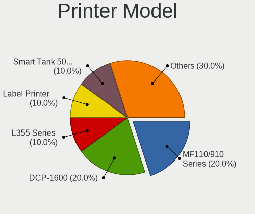

| Model                    | Notebooks | Percent |
|--------------------------|-----------|---------|
| Canon MF110/910 Series   | 2         | 20%     |
| Brother DCP-1600         | 2         | 20%     |
| Seiko Epson L355 Series  | 1         | 10%     |
| QUIN Label Printer       | 1         | 10%     |
| HP Smart Tank 500 series | 1         | 10%     |
| HP Ink Tank 310 series   | 1         | 10%     |
| HP DeskJet 5820 series   | 1         | 10%     |
| Brother HL-1200 series   | 1         | 10%     |

Scanner Vendor
--------------

Scanner device vendors

Zero info for selected period =(

Scanner Model
-------------

Scanner device models

Zero info for selected period =(

Camera
------

Camera Vendor
-------------

Camera device vendors

| Vendor                                 | Notebooks | Percent |
|----------------------------------------|-----------|---------|
| Chicony Electronics                    | 199       | 24.39%  |
| IMC Networks                           | 118       | 14.46%  |
| Realtek Semiconductor                  | 60        | 7.35%   |
| Quanta                                 | 51        | 6.25%   |
| Microdia                               | 51        | 6.25%   |
| Cheng Uei Precision Industry (Foxlink) | 47        | 5.76%   |
| Bison Electronics                      | 41        | 5.02%   |
| Sunplus Innovation Technology          | 40        | 4.9%    |
| Suyin                                  | 27        | 3.31%   |
| Lite-On Technology                     | 26        | 3.19%   |
| Silicon Motion                         | 20        | 2.45%   |
| Luxvisions Innotech Limited            | 20        | 2.45%   |
| Syntek                                 | 15        | 1.84%   |
| Apple                                  | 12        | 1.47%   |
| Logitech                               | 9         | 1.1%    |
| Ricoh                                  | 7         | 0.86%   |
| ShineTech                              | 6         | 0.74%   |
| Acer                                   | 6         | 0.74%   |
| Z-Star Microelectronics                | 5         | 0.61%   |
| Samsung Electronics                    | 5         | 0.61%   |
| Sonix Technology                       | 4         | 0.49%   |
| Importek                               | 4         | 0.49%   |
| Alcor Micro                            | 4         | 0.49%   |
| USB Camera CS                          | 3         | 0.37%   |
| SunplusIT                              | 3         | 0.37%   |
| Lenovo                                 | 3         | 0.37%   |
| Generalplus Technology                 | 3         | 0.37%   |
| YGTek                                  | 2         | 0.25%   |
| Microsoft                              | 2         | 0.25%   |
| Leap Motion                            | 2         | 0.25%   |
| KYE Systems (Mouse Systems)            | 2         | 0.25%   |
| GEMBIRD                                | 2         | 0.25%   |
| Foxconn / Hon Hai                      | 2         | 0.25%   |
| DigiTech                               | 2         | 0.25%   |
| ALi                                    | 2         | 0.25%   |
| Sunplus Technology                     | 1         | 0.12%   |
| Shine-optics                           | 1         | 0.12%   |
| SHENZHEN EMEET TECHNOLOGY              | 1         | 0.12%   |
| Ruision                                | 1         | 0.12%   |
| Primax Electronics                     | 1         | 0.12%   |

Camera Model
------------

Camera device models

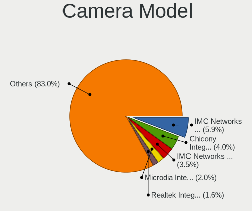

| Model                                                           | Notebooks | Percent |
|-----------------------------------------------------------------|-----------|---------|
| IMC Networks USB2.0 HD UVC WebCam                               | 48        | 5.86%   |
| Chicony Integrated Camera                                       | 33        | 4.03%   |
| IMC Networks Integrated Camera                                  | 29        | 3.54%   |
| Microdia Integrated_Webcam_HD                                   | 16        | 1.95%   |
| Realtek Integrated_Webcam_HD                                    | 13        | 1.59%   |
| Chicony HD WebCam                                               | 13        | 1.59%   |
| IMC Networks USB2.0 VGA UVC WebCam                              | 12        | 1.47%   |
| Chicony HP Wide Vision HD Camera                                | 12        | 1.47%   |
| Bison Integrated Camera                                         | 12        | 1.47%   |
| Quanta HP TrueVision HD Camera                                  | 11        | 1.34%   |
| Lite-On Integrated Camera                                       | 11        | 1.34%   |
| Cheng Uei Precision Industry (Foxlink) Webcam                   | 11        | 1.34%   |
| Sunplus Integrated_Webcam_HD                                    | 10        | 1.22%   |
| Chicony HP Webcam                                               | 10        | 1.22%   |
| Chicony HP Truevision HD camera                                 | 10        | 1.22%   |
| Chicony HD User Facing                                          | 10        | 1.22%   |
| Syntek Integrated Camera                                        | 9         | 1.1%    |
| Realtek HP Truevision HD                                        | 9         | 1.1%    |
| Chicony USB2.0 VGA UVC WebCam                                   | 9         | 1.1%    |
| Chicony HP Truevision HD                                        | 9         | 1.1%    |
| Chicony EasyCamera                                              | 9         | 1.1%    |
| Suyin HP TrueVision HD                                          | 8         | 0.98%   |
| Chicony VGA WebCam                                              | 8         | 0.98%   |
| Sunplus HP TrueVision HD Camera                                 | 7         | 0.85%   |
| Realtek USB Camera                                              | 7         | 0.85%   |
| Quanta HD User Facing                                           | 7         | 0.85%   |
| Luxvisions Innotech Limited Integrated Camera                   | 7         | 0.85%   |
| Cheng Uei Precision Industry (Foxlink) HP TrueVision HD         | 7         | 0.85%   |
| Quanta VGA WebCam                                               | 6         | 0.73%   |
| Quanta USB2.0 HD UVC WebCam                                     | 6         | 0.73%   |
| Quanta HP Wide Vision HD Camera                                 | 6         | 0.73%   |
| Microdia Webcam Vitade AF                                       | 6         | 0.73%   |
| Chicony HP HD Camera                                            | 6         | 0.73%   |
| Cheng Uei Precision Industry (Foxlink) HP Wide Vision HD Camera | 6         | 0.73%   |
| Cheng Uei Precision Industry (Foxlink) HP TrueVision HD Camera  | 6         | 0.73%   |
| Bison EasyCamera                                                | 6         | 0.73%   |
| Silicon Motion WebCam SCB-1100N                                 | 5         | 0.61%   |
| Samsung Galaxy series, misc. (MTP mode)                         | 5         | 0.61%   |
| Microdia HP Webcam                                              | 5         | 0.61%   |
| Luxvisions Innotech Limited HP TrueVision HD Camera             | 5         | 0.61%   |

Security
--------

Fingerprint Vendor
------------------

Fingerprint sensor vendors

| Vendor                     | Notebooks | Percent |
|----------------------------|-----------|---------|
| Validity Sensors           | 48        | 37.21%  |
| Synaptics                  | 34        | 26.36%  |
| Shenzhen Goodix Technology | 15        | 11.63%  |
| Elan Microelectronics      | 10        | 7.75%   |
| Upek                       | 7         | 5.43%   |
| AuthenTec                  | 7         | 5.43%   |
| LighTuning Technology      | 4         | 3.1%    |
| STMicroelectronics         | 2         | 1.55%   |
| Focal-systems.Corp         | 2         | 1.55%   |

Fingerprint Model
-----------------

Fingerprint sensor models

| Model                                                                      | Notebooks | Percent |
|----------------------------------------------------------------------------|-----------|---------|
| Synaptics Prometheus MIS Touch Fingerprint Reader                          | 13        | 10.08%  |
| Validity Sensors Swipe Fingerprint Sensor                                  | 12        | 9.3%    |
| Elan ELAN:ARM-M4                                                           | 9         | 6.98%   |
| Synaptics Metallica MIS Touch Fingerprint Reader                           | 8         | 6.2%    |
| Shenzhen Goodix  Fingerprint Device                                        | 8         | 6.2%    |
| Validity Sensors VFS495 Fingerprint Reader                                 | 7         | 5.43%   |
| Validity Sensors VFS 5011 fingerprint sensor                               | 7         | 5.43%   |
| Upek Biometric Touchchip/Touchstrip Fingerprint Sensor                     | 7         | 5.43%   |
| Shenzhen Goodix Fingerprint Reader                                         | 7         | 5.43%   |
| Validity Sensors VFS471 Fingerprint Reader                                 | 5         | 3.88%   |
| Validity Sensors Synaptics WBDI                                            | 5         | 3.88%   |
| Validity Sensors Fingerprint scanner                                       | 4         | 3.1%    |
| Synaptics Fingerprint reader [HP G6]                                       | 4         | 3.1%    |
| AuthenTec AES2810                                                          | 4         | 3.1%    |
| Synaptics  WBDI                                                            | 3         | 2.33%   |
| LighTuning EgisTec Touch Fingerprint Sensor                                | 3         | 2.33%   |
| Validity Sensors VFS7500 Touch Fingerprint Sensor                          | 2         | 1.55%   |
| Validity Sensors Synaptics VFS7552 Touch Fingerprint Sensor with PurePrint | 2         | 1.55%   |
| Synaptics UWP WBDI Device                                                  | 2         | 1.55%   |
| Synaptics  FS7604 Touch Fingerprint Sensor with PurePrint                  | 2         | 1.55%   |
| STMicroelectronics Fingerprint Reader                                      | 2         | 1.55%   |
| Focal-systems.Corp FT9201Fingerprint.                                  | 2         | 1.55%   |
| Validity Sensors VFS5011 Fingerprint Reader                                | 1         | 0.78%   |
| Validity Sensors VFS491                                                    | 1         | 0.78%   |
| Validity Sensors VFS451 Fingerprint Reader                                 | 1         | 0.78%   |
| Validity Sensors VFS301 Fingerprint Reader                                 | 1         | 0.78%   |
| Synaptics UWP WBDI                                                         | 1         | 0.78%   |
| Synaptics Prometheus Fingerprint Reader                                    | 1         | 0.78%   |
| LighTuning ES603 Swipe Fingerprint Sensor                                  | 1         | 0.78%   |
| Elan ELAN:Fingerprint                                                      | 1         | 0.78%   |
| AuthenTec Fingerprint Sensor                                               | 1         | 0.78%   |
| AuthenTec AES2501 Fingerprint Sensor                                       | 1         | 0.78%   |
| AuthenTec AES1600                                                          | 1         | 0.78%   |

Chipcard Vendor
---------------

Chipcard module vendors

| Vendor      | Notebooks | Percent |
|-------------|-----------|---------|
| Broadcom    | 19        | 79.17%  |
| Upek        | 2         | 8.33%   |
| O2 Micro    | 2         | 8.33%   |
| Alcor Micro | 1         | 4.17%   |

Chipcard Model
--------------

Chipcard module models

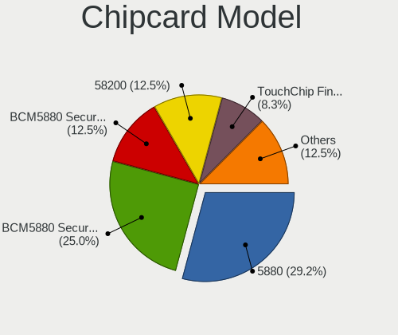

| Model                                                                        | Notebooks | Percent |
|------------------------------------------------------------------------------|-----------|---------|
| Broadcom 5880                                                                | 7         | 29.17%  |
| Broadcom BCM5880 Secure Applications Processor                               | 6         | 25%     |
| Broadcom BCM5880 Secure Applications Processor with fingerprint swipe sensor | 3         | 12.5%   |
| Broadcom 58200                                                               | 3         | 12.5%   |
| Upek TouchChip Fingerprint Coprocessor (WBF advanced mode)                   | 2         | 8.33%   |
| O2 Micro Oz776 SmartCard Reader                                              | 1         | 4.17%   |
| O2 Micro OZ776 CCID Smartcard Reader                                         | 1         | 4.17%   |
| Alcor Micro AU9540 Smartcard Reader                                          | 1         | 4.17%   |

Unsupported
-----------

Unsupported Devices
-------------------

Total unsupported devices on board

| Total | Notebooks | Percent |
|-------|-----------|---------|
| 0     | 591       | 66.55%  |
| 1     | 251       | 28.27%  |
| 2     | 40        | 4.5%    |
| 3     | 4         | 0.45%   |
| 5     | 1         | 0.11%   |
| 4     | 1         | 0.11%   |

Unsupported Device Types
------------------------

Types of unsupported devices

| Type                     | Notebooks | Percent |
|--------------------------|-----------|---------|
| Fingerprint reader       | 129       | 37.94%  |
| Graphics card            | 70        | 20.59%  |
| Net/wireless             | 50        | 14.71%  |
| Multimedia controller    | 30        | 8.82%   |
| Chipcard                 | 23        | 6.76%   |
| Bluetooth                | 14        | 4.12%   |
| Camera                   | 8         | 2.35%   |
| Storage                  | 4         | 1.18%   |
| Communication controller | 4         | 1.18%   |
| Sound                    | 3         | 0.88%   |
| Net/ethernet             | 2         | 0.59%   |
| Card reader              | 2         | 0.59%   |
| Network                  | 1         | 0.29%   |

