Linux in Chile - Tested Hardware & Statistics
---------------------------------------------

A project to collect tested hardware configurations for Linux in Chile.

Anyone can contribute to this report by the [hw-probe](https://github.com/linuxhw/hw-probe) tool:

    sudo -E hw-probe -all -upload

Please contribute! Especially if your hardware is rare.

This is a report for all computer types. See also reports for [desktops](/Location/Chile/Desktop/README.md) and [notebooks](/Location/Chile/Notebook/README.md).

Contents
--------

* [ Test Cases ](#test-cases)

* [ System ](#system)
  - [ OS                       ](#os)
  - [ OS Family                ](#os-family)
  - [ Kernel                   ](#kernel)
  - [ Kernel Family            ](#kernel-family)
  - [ Kernel Major Ver.        ](#kernel-major-ver)
  - [ Arch                     ](#arch)
  - [ DE                       ](#de)
  - [ Display Server           ](#display-server)
  - [ Display Manager          ](#display-manager)
  - [ OS Lang                  ](#os-lang)
  - [ Boot Mode                ](#boot-mode)
  - [ Filesystem               ](#filesystem)
  - [ Part. scheme             ](#part-scheme)
  - [ Dual Boot with Linux/BSD ](#dual-boot-with-linuxbsd)
  - [ Dual Boot (Win)          ](#dual-boot-win)

* [ Board ](#board)
  - [ Vendor                   ](#vendor)
  - [ Model                    ](#model)
  - [ Model Family             ](#model-family)
  - [ MFG Year                 ](#mfg-year)
  - [ Form Factor              ](#form-factor)
  - [ Secure Boot              ](#secure-boot)
  - [ Coreboot                 ](#coreboot)
  - [ RAM Size                 ](#ram-size)
  - [ RAM Used                 ](#ram-used)
  - [ Total Drives             ](#total-drives)
  - [ Has CD-ROM               ](#has-cd-rom)
  - [ Has Ethernet             ](#has-ethernet)
  - [ Has WiFi                 ](#has-wifi)
  - [ Has Bluetooth            ](#has-bluetooth)

* [ Location ](#location)
  - [ Country                  ](#country)
  - [ City                     ](#city)

* [ Drives ](#drives)
  - [ Drive Vendor             ](#drive-vendor)
  - [ Drive Model              ](#drive-model)
  - [ HDD Vendor               ](#hdd-vendor)
  - [ SSD Vendor               ](#ssd-vendor)
  - [ Drive Kind               ](#drive-kind)
  - [ Drive Connector          ](#drive-connector)
  - [ Drive Size               ](#drive-size)
  - [ Space Total              ](#space-total)
  - [ Space Used               ](#space-used)
  - [ Malfunc. Drives          ](#malfunc-drives)
  - [ Malfunc. Drive Vendor    ](#malfunc-drive-vendor)
  - [ Malfunc. HDD Vendor      ](#malfunc-hdd-vendor)
  - [ Malfunc. Drive Kind      ](#malfunc-drive-kind)
  - [ Failed Drives            ](#failed-drives)
  - [ Failed Drive Vendor      ](#failed-drive-vendor)
  - [ Drive Status             ](#drive-status)

* [ Storage controller ](#storage-controller)
  - [ Storage Vendor           ](#storage-vendor)
  - [ Storage Model            ](#storage-model)
  - [ Storage Kind             ](#storage-kind)

* [ Processor ](#processor)
  - [ CPU Vendor               ](#cpu-vendor)
  - [ CPU Model                ](#cpu-model)
  - [ CPU Model Family         ](#cpu-model-family)
  - [ CPU Cores                ](#cpu-cores)
  - [ CPU Sockets              ](#cpu-sockets)
  - [ CPU Threads              ](#cpu-threads)
  - [ CPU Op-Modes             ](#cpu-op-modes)
  - [ CPU Microcode            ](#cpu-microcode)
  - [ CPU Microarch            ](#cpu-microarch)

* [ Graphics ](#graphics)
  - [ GPU Vendor               ](#gpu-vendor)
  - [ GPU Model                ](#gpu-model)
  - [ GPU Combo                ](#gpu-combo)
  - [ GPU Driver               ](#gpu-driver)
  - [ GPU Memory               ](#gpu-memory)

* [ Monitor ](#monitor)
  - [ Monitor Vendor           ](#monitor-vendor)
  - [ Monitor Model            ](#monitor-model)
  - [ Monitor Resolution       ](#monitor-resolution)
  - [ Monitor Diagonal         ](#monitor-diagonal)
  - [ Monitor Width            ](#monitor-width)
  - [ Aspect Ratio             ](#aspect-ratio)
  - [ Monitor Area             ](#monitor-area)
  - [ Pixel Density            ](#pixel-density)
  - [ Multiple Monitors        ](#multiple-monitors)

* [ Network ](#network)
  - [ Net Controller Vendor    ](#net-controller-vendor)
  - [ Net Controller Model     ](#net-controller-model)
  - [ Wireless Vendor          ](#wireless-vendor)
  - [ Wireless Model           ](#wireless-model)
  - [ Ethernet Vendor          ](#ethernet-vendor)
  - [ Ethernet Model           ](#ethernet-model)
  - [ Net Controller Kind      ](#net-controller-kind)
  - [ Used Controller          ](#used-controller)
  - [ NICs                     ](#nics)
  - [ IPv6                     ](#ipv6)

* [ Bluetooth ](#bluetooth)
  - [ Bluetooth Vendor         ](#bluetooth-vendor)
  - [ Bluetooth Model          ](#bluetooth-model)

* [ Sound ](#sound)
  - [ Sound Vendor             ](#sound-vendor)
  - [ Sound Model              ](#sound-model)

* [ Memory ](#memory)
  - [ Memory Vendor            ](#memory-vendor)
  - [ Memory Model             ](#memory-model)
  - [ Memory Kind              ](#memory-kind)
  - [ Memory Form Factor       ](#memory-form-factor)
  - [ Memory Size              ](#memory-size)
  - [ Memory Speed             ](#memory-speed)

* [ Printers & scanners ](#printers--scanners)
  - [ Printer Vendor           ](#printer-vendor)
  - [ Printer Model            ](#printer-model)
  - [ Scanner Vendor           ](#scanner-vendor)
  - [ Scanner Model            ](#scanner-model)

* [ Camera ](#camera)
  - [ Camera Vendor            ](#camera-vendor)
  - [ Camera Model             ](#camera-model)

* [ Security ](#security)
  - [ Fingerprint Vendor       ](#fingerprint-vendor)
  - [ Fingerprint Model        ](#fingerprint-model)
  - [ Chipcard Vendor          ](#chipcard-vendor)
  - [ Chipcard Model           ](#chipcard-model)

* [ Unsupported ](#unsupported)
  - [ Unsupported Devices      ](#unsupported-devices)
  - [ Unsupported Device Types ](#unsupported-device-types)

Test Cases
----------

Total: 2422

| Vendor        | Model                       | Form-Factor | Probe                                                      | Date         |
|---------------|-----------------------------|-------------|------------------------------------------------------------|--------------|
| Acer          | Acadia V1.40                | Notebook    | [021fc9c856](https://linux-hardware.org/?probe=021fc9c856) | Dec 31, 2025 |
| Biostar       | H510MHP                     | Desktop     | [3591012626](https://linux-hardware.org/?probe=3591012626) | Dec 31, 2025 |
| ASUSTek       | VivoBook_ASUSLaptop X409... | Notebook    | [c448184f24](https://linux-hardware.org/?probe=c448184f24) | Dec 31, 2025 |
| Dell          | Inspiron 3501               | Notebook    | [818c2f1bb0](https://linux-hardware.org/?probe=818c2f1bb0) | Dec 31, 2025 |
| MSI           | H310M PRO-VDH PLUS          | Desktop     | [92f6ee03fd](https://linux-hardware.org/?probe=92f6ee03fd) | Dec 30, 2025 |
| HP            | Pavilion Sleekbook 14       | Notebook    | [392964f715](https://linux-hardware.org/?probe=392964f715) | Dec 30, 2025 |
| ASUSTek       | TUF Gaming FX505DT_FX505... | Notebook    | [a92910c112](https://linux-hardware.org/?probe=a92910c112) | Dec 29, 2025 |
| MSI           | GE72VR 7RF                  | Notebook    | [dafc3522f2](https://linux-hardware.org/?probe=dafc3522f2) | Dec 28, 2025 |
| ASUSTek       | TUF Gaming Z790-PLUS WIF... | Desktop     | [66a4ecafef](https://linux-hardware.org/?probe=66a4ecafef) | Dec 28, 2025 |
| Acer          | Aspire E5-573               | Notebook    | [5823c26e6c](https://linux-hardware.org/?probe=5823c26e6c) | Dec 28, 2025 |
| HP            | Pavilion dv6                | Notebook    | [ba5230a7c0](https://linux-hardware.org/?probe=ba5230a7c0) | Dec 28, 2025 |
| QIYIDA        | X99 K9S                     | Desktop     | [050a0da319](https://linux-hardware.org/?probe=050a0da319) | Dec 28, 2025 |
| ASUSTek       | PRIME H410M-E               | Desktop     | [66c427f539](https://linux-hardware.org/?probe=66c427f539) | Dec 25, 2025 |
| Samsung       | 305V4A/305V5A/3415VA        | Notebook    | [31cb0d631d](https://linux-hardware.org/?probe=31cb0d631d) | Dec 25, 2025 |
| HP            | 240 G7 Notebook PC          | Notebook    | [596eaf2b2c](https://linux-hardware.org/?probe=596eaf2b2c) | Dec 25, 2025 |
| Lenovo        | ThinkPad T480s 20L8S8KS0... | Notebook    | [454a8ae092](https://linux-hardware.org/?probe=454a8ae092) | Dec 24, 2025 |
| ASUSTek       | VivoBook_ASUSLaptop X409... | Notebook    | [788835d7f6](https://linux-hardware.org/?probe=788835d7f6) | Dec 23, 2025 |
| Acer          | Aspire E5-576G              | Notebook    | [47e67041a7](https://linux-hardware.org/?probe=47e67041a7) | Dec 22, 2025 |
| ASUSTek       | PRIME A520M-K               | Desktop     | [2ee6860666](https://linux-hardware.org/?probe=2ee6860666) | Dec 20, 2025 |
| HP            | Pavilion Plus Laptop 14-... | Notebook    | [8cd7ab62b9](https://linux-hardware.org/?probe=8cd7ab62b9) | Dec 19, 2025 |
| Lanix         | H55MXV Series               | Desktop     | [3ee74bce06](https://linux-hardware.org/?probe=3ee74bce06) | Dec 19, 2025 |
| ASRock        | B550M Pro4                  | Desktop     | [cbbb193618](https://linux-hardware.org/?probe=cbbb193618) | Dec 19, 2025 |
| Lanix         | H55MXV Series               | Desktop     | [39bfac1cbb](https://linux-hardware.org/?probe=39bfac1cbb) | Dec 18, 2025 |
| Acer          | Aspire E5-573               | Notebook    | [6c9193a2c6](https://linux-hardware.org/?probe=6c9193a2c6) | Dec 17, 2025 |
| ASUSTek       | VivoBook_ASUSLaptop X409... | Notebook    | [68186a0777](https://linux-hardware.org/?probe=68186a0777) | Dec 16, 2025 |
| Lenovo        | ThinkPad X1 Extreme Gen ... | Notebook    | [1ba393931d](https://linux-hardware.org/?probe=1ba393931d) | Dec 12, 2025 |
| ASRock        | B450M Steel Legend          | Desktop     | [bde0a9fd14](https://linux-hardware.org/?probe=bde0a9fd14) | Dec 12, 2025 |
| HP            | 250 G6 Notebook PC          | Notebook    | [fff077dd08](https://linux-hardware.org/?probe=fff077dd08) | Dec 11, 2025 |
| HP            | 250 G6 Notebook PC          | Notebook    | [4c398d7c51](https://linux-hardware.org/?probe=4c398d7c51) | Dec 11, 2025 |
| HP            | 240 G5 Notebook PC          | Notebook    | [8ccc008657](https://linux-hardware.org/?probe=8ccc008657) | Dec 09, 2025 |
| HP            | 8768 A                      | Desktop     | [412662bf4c](https://linux-hardware.org/?probe=412662bf4c) | Dec 07, 2025 |
| HP            | 8768 A                      | Desktop     | [9f34f7b0fc](https://linux-hardware.org/?probe=9f34f7b0fc) | Dec 07, 2025 |
| HP            | 255 G8 Notebook PC          | Notebook    | [70d60b452a](https://linux-hardware.org/?probe=70d60b452a) | Dec 05, 2025 |
| MSI           | H510M-A PRO                 | Desktop     | [f7c1be6aab](https://linux-hardware.org/?probe=f7c1be6aab) | Dec 05, 2025 |
| Lenovo        | IdeaPad Slim 3 14IAN8 82... | Notebook    | [840c7d5ae8](https://linux-hardware.org/?probe=840c7d5ae8) | Dec 04, 2025 |
| MSI           | B450 TOMAHAWK MAX II        | Desktop     | [f39465b88e](https://linux-hardware.org/?probe=f39465b88e) | Dec 03, 2025 |
| Packard Be... | ENNS44HR                    | Notebook    | [e7d0498864](https://linux-hardware.org/?probe=e7d0498864) | Dec 01, 2025 |
| ASUSTek       | PRIME H410M-E               | Desktop     | [124ffa6f64](https://linux-hardware.org/?probe=124ffa6f64) | Nov 30, 2025 |
| HP            | 255 G8 Notebook PC          | Notebook    | [794ef42b00](https://linux-hardware.org/?probe=794ef42b00) | Nov 28, 2025 |
| HP            | 255 G8 Notebook PC          | Notebook    | [affd3a7058](https://linux-hardware.org/?probe=affd3a7058) | Nov 28, 2025 |
| HP            | OMEN by Laptop 15-ce0xx     | Notebook    | [9c171af4ba](https://linux-hardware.org/?probe=9c171af4ba) | Nov 28, 2025 |
| Gigabyte      | B550 GAMING X V2            | Desktop     | [3a942df19b](https://linux-hardware.org/?probe=3a942df19b) | Nov 27, 2025 |
| ASUSTek       | VivoBook_ASUSLaptop X415... | Notebook    | [95e0e72e5d](https://linux-hardware.org/?probe=95e0e72e5d) | Nov 27, 2025 |
| MSI           | MPG Z790I EDGE WIFI         | Desktop     | [a1d91ed3f0](https://linux-hardware.org/?probe=a1d91ed3f0) | Nov 26, 2025 |
| ASRock        | B660M Pro RS                | Desktop     | [25b246b54f](https://linux-hardware.org/?probe=25b246b54f) | Nov 26, 2025 |
| Gigabyte      | B450M DS3H WIFI-CF          | Desktop     | [24f8565c4c](https://linux-hardware.org/?probe=24f8565c4c) | Nov 26, 2025 |
| ASUSTek       | ASUS TUF Gaming F15 FX50... | Notebook    | [8295dc143b](https://linux-hardware.org/?probe=8295dc143b) | Nov 26, 2025 |
| ASUSTek       | A68HM-K                     | Desktop     | [bfed7ea143](https://linux-hardware.org/?probe=bfed7ea143) | Nov 25, 2025 |
| Lenovo        | Yoga Pro 7 14ASP10 83LX     | Notebook    | [8fdb178a49](https://linux-hardware.org/?probe=8fdb178a49) | Nov 25, 2025 |
| Lenovo        | IdeaPad S340-14IWL 81N7     | Notebook    | [e32514ab03](https://linux-hardware.org/?probe=e32514ab03) | Nov 24, 2025 |
| Dell          | Latitude 3510               | Notebook    | [30f7965307](https://linux-hardware.org/?probe=30f7965307) | Nov 23, 2025 |
| ASUSTek       | A68HM-K                     | Desktop     | [8dcaaef299](https://linux-hardware.org/?probe=8dcaaef299) | Nov 22, 2025 |
| JGINYUE       | B650E Snow Dream            | Desktop     | [eeba2802b9](https://linux-hardware.org/?probe=eeba2802b9) | Nov 22, 2025 |
| MSI           | MPG Z790I EDGE WIFI         | Desktop     | [b1516b2bee](https://linux-hardware.org/?probe=b1516b2bee) | Nov 22, 2025 |
| ASUSTek       | TUF Gaming B550-PLUS WIF... | Desktop     | [990b6fd039](https://linux-hardware.org/?probe=990b6fd039) | Nov 20, 2025 |
| HP            | Stream x360 Convertible ... | Convertible | [443b8a0171](https://linux-hardware.org/?probe=443b8a0171) | Nov 20, 2025 |
| HP            | Victus by Laptop 16-d0xx... | Notebook    | [971a417e15](https://linux-hardware.org/?probe=971a417e15) | Nov 20, 2025 |
| Acer          | Aspire ES1-111M             | Notebook    | [2591b49fb1](https://linux-hardware.org/?probe=2591b49fb1) | Nov 18, 2025 |
| HP            | ProBook 430 G2              | Notebook    | [ea90c510e4](https://linux-hardware.org/?probe=ea90c510e4) | Nov 15, 2025 |
| Acer          | Aspire AL16-51P             | Notebook    | [219e36c603](https://linux-hardware.org/?probe=219e36c603) | Nov 15, 2025 |
| Dell          | Inspiron 1012               | Notebook    | [6d1c086f49](https://linux-hardware.org/?probe=6d1c086f49) | Nov 14, 2025 |
| HP            | Stream x360 Convertible ... | Convertible | [082a4d8996](https://linux-hardware.org/?probe=082a4d8996) | Nov 13, 2025 |
| Gigabyte      | B450M DS3H V2               | Desktop     | [55f0664774](https://linux-hardware.org/?probe=55f0664774) | Nov 13, 2025 |
| Gigabyte      | B450M DS3H WIFI-CF          | Desktop     | [b58d6e7a75](https://linux-hardware.org/?probe=b58d6e7a75) | Nov 13, 2025 |
| Lenovo        | 3102 NOK                    | Desktop     | [b47b744f21](https://linux-hardware.org/?probe=b47b744f21) | Nov 11, 2025 |
| ASUSTek       | P8B75-M LX PLUS             | Desktop     | [69381e51df](https://linux-hardware.org/?probe=69381e51df) | Nov 09, 2025 |
| Lenovo        | G40-30 80FY                 | Notebook    | [9407da655b](https://linux-hardware.org/?probe=9407da655b) | Nov 09, 2025 |
| Lenovo        | ThinkPad T430 23499Z9       | Notebook    | [a825f32df4](https://linux-hardware.org/?probe=a825f32df4) | Nov 08, 2025 |
| ASUSTek       | PRIME A320M-K               | Desktop     | [9f287a9506](https://linux-hardware.org/?probe=9f287a9506) | Nov 08, 2025 |
| Acer          | Nitro AN515-54              | Notebook    | [047be40574](https://linux-hardware.org/?probe=047be40574) | Nov 07, 2025 |
| ASUSTek       | ASUS TUF Gaming A15 FA50... | Notebook    | [a47fe41aec](https://linux-hardware.org/?probe=a47fe41aec) | Nov 07, 2025 |
| Samsung       | 270E5J                      | Notebook    | [1337d8c13e](https://linux-hardware.org/?probe=1337d8c13e) | Nov 06, 2025 |
| Lenovo        | ThinkPad T14s Gen 1 20T1... | Notebook    | [dc9e67d349](https://linux-hardware.org/?probe=dc9e67d349) | Nov 05, 2025 |
| HUAWEI        | KLVL-WXXW                   | Notebook    | [2bb612f08e](https://linux-hardware.org/?probe=2bb612f08e) | Nov 05, 2025 |
| Sony          | VGN-TT150FN                 | Notebook    | [f3f641b1a1](https://linux-hardware.org/?probe=f3f641b1a1) | Nov 05, 2025 |
| QIYIDA        | X99 K9S                     | Desktop     | [a7ff6006fd](https://linux-hardware.org/?probe=a7ff6006fd) | Nov 05, 2025 |
| MSI           | A520M-A PRO                 | Desktop     | [7c55d928f5](https://linux-hardware.org/?probe=7c55d928f5) | Nov 03, 2025 |
| Acer          | Nitro AN515-43              | Notebook    | [f7d3b086b8](https://linux-hardware.org/?probe=f7d3b086b8) | Nov 02, 2025 |
| ASUSTek       | P8B75-M LX PLUS             | Desktop     | [86cea39d39](https://linux-hardware.org/?probe=86cea39d39) | Nov 02, 2025 |
| AZW           | SER V1                      | Mini pc     | [b067c77513](https://linux-hardware.org/?probe=b067c77513) | Nov 02, 2025 |
| HP            | Laptop 15-fc0xxx            | Notebook    | [798db5911f](https://linux-hardware.org/?probe=798db5911f) | Nov 01, 2025 |
| Acer          | Aspire A315-42              | Notebook    | [9cc460a00a](https://linux-hardware.org/?probe=9cc460a00a) | Oct 31, 2025 |
| Acer          | Aspire A515-52              | Notebook    | [90e9fd4378](https://linux-hardware.org/?probe=90e9fd4378) | Oct 30, 2025 |
| Dell          | Inspiron 5459               | Notebook    | [5ff42277af](https://linux-hardware.org/?probe=5ff42277af) | Oct 30, 2025 |
| Lenovo        | Legion Go 8APU1 83E1        | Tablet      | [04a9f60067](https://linux-hardware.org/?probe=04a9f60067) | Oct 30, 2025 |
| Dell          | Inspiron 5459               | Notebook    | [f62cab50c1](https://linux-hardware.org/?probe=f62cab50c1) | Oct 29, 2025 |
| Gigabyte      | B450 AORUS ELITE V2         | Desktop     | [5b9a3ad404](https://linux-hardware.org/?probe=5b9a3ad404) | Oct 29, 2025 |
| Soyo          | SY-YL B550M                 | Desktop     | [c5eafd05ee](https://linux-hardware.org/?probe=c5eafd05ee) | Oct 26, 2025 |
| MSI           | H81M-E33                    | Desktop     | [92d397fdb9](https://linux-hardware.org/?probe=92d397fdb9) | Oct 25, 2025 |
| Gigabyte      | A620M S2H                   | Desktop     | [b354f0f0cc](https://linux-hardware.org/?probe=b354f0f0cc) | Oct 24, 2025 |
| ASUSTek       | ASUS EXPERTBOOK B1402CBA... | Notebook    | [66320a9545](https://linux-hardware.org/?probe=66320a9545) | Oct 22, 2025 |
| ASUSTek       | TUF X470-PLUS GAMING        | Desktop     | [ad1c11395b](https://linux-hardware.org/?probe=ad1c11395b) | Oct 18, 2025 |
| Lenovo        | IdeaPad 305-15IBD 80NJ      | Notebook    | [21cb692e02](https://linux-hardware.org/?probe=21cb692e02) | Oct 18, 2025 |
| Lenovo        | ThinkBook 14 G6+ IMH 21L... | Notebook    | [248ad1651d](https://linux-hardware.org/?probe=248ad1651d) | Oct 17, 2025 |
| Lenovo        | ThinkBook 14 G6+ IMH 21L... | Notebook    | [6b904ca68e](https://linux-hardware.org/?probe=6b904ca68e) | Oct 17, 2025 |
| HP            | Unknown                     | Notebook    | [a027ad8515](https://linux-hardware.org/?probe=a027ad8515) | Oct 15, 2025 |
| Acer          | Aspire A515-52              | Notebook    | [5ddd8ed105](https://linux-hardware.org/?probe=5ddd8ed105) | Oct 15, 2025 |
| ASUSTek       | PRIME H310M-E R2.0          | Desktop     | [c6b87d9340](https://linux-hardware.org/?probe=c6b87d9340) | Oct 15, 2025 |
| HP            | 8063                        | All in one  | [794df463ee](https://linux-hardware.org/?probe=794df463ee) | Oct 14, 2025 |
| AZW           | SER V2.0                    | Mini pc     | [20ae4bf6a1](https://linux-hardware.org/?probe=20ae4bf6a1) | Oct 12, 2025 |
| Dell          | Latitude 7290               | Notebook    | [f105e06796](https://linux-hardware.org/?probe=f105e06796) | Oct 12, 2025 |
| MSI           | H270 PC MATE                | Desktop     | [2e98a2cba2](https://linux-hardware.org/?probe=2e98a2cba2) | Oct 12, 2025 |
| Lenovo        | ThinkPad T495 20NKA007CL    | Notebook    | [73bd1e7cd0](https://linux-hardware.org/?probe=73bd1e7cd0) | Oct 10, 2025 |
| Lenovo        | ThinkPad X230 23255SS       | Notebook    | [9f2faa3856](https://linux-hardware.org/?probe=9f2faa3856) | Oct 09, 2025 |
| Toshiba       | Satellite Pro M205          | Notebook    | [ab93757616](https://linux-hardware.org/?probe=ab93757616) | Oct 07, 2025 |
| Dell          | Inspiron 5423               | Notebook    | [76e57e7e57](https://linux-hardware.org/?probe=76e57e7e57) | Oct 07, 2025 |
| Dell          | Inspiron 5423               | Notebook    | [ccc4dcaeeb](https://linux-hardware.org/?probe=ccc4dcaeeb) | Oct 07, 2025 |
| Google        | Treeya                      | Notebook    | [4d63a8557b](https://linux-hardware.org/?probe=4d63a8557b) | Oct 06, 2025 |
| HP            | 240 14 inch G9 Notebook ... | Notebook    | [85e52852f2](https://linux-hardware.org/?probe=85e52852f2) | Oct 04, 2025 |
| Toshiba       | Satellite S45-B             | Notebook    | [bb962f37e8](https://linux-hardware.org/?probe=bb962f37e8) | Oct 01, 2025 |
| HP            | Spectre Laptop 13-af0xx     | Notebook    | [84cf546e2e](https://linux-hardware.org/?probe=84cf546e2e) | Sep 29, 2025 |
| Acer          | Nitro AN515-54              | Notebook    | [65f0b2a8d0](https://linux-hardware.org/?probe=65f0b2a8d0) | Sep 27, 2025 |
| HP            | EliteBook 6930p             | Notebook    | [6c5fc5f0d1](https://linux-hardware.org/?probe=6c5fc5f0d1) | Sep 26, 2025 |
| ASUSTek       | M5A78L-M LX PLUS            | Desktop     | [c4f00607c2](https://linux-hardware.org/?probe=c4f00607c2) | Sep 23, 2025 |
| Gigabyte      | P45T-ES3G                   | Desktop     | [b5601aa2c8](https://linux-hardware.org/?probe=b5601aa2c8) | Sep 23, 2025 |
| HP            | Pavilion Gaming Laptop 1... | Notebook    | [1c1a75ced9](https://linux-hardware.org/?probe=1c1a75ced9) | Sep 23, 2025 |
| Unknown       | Unknown                     | Desktop     | [5d68a69d55](https://linux-hardware.org/?probe=5d68a69d55) | Sep 18, 2025 |
| Toshiba       | Satellite Pro M205          | Notebook    | [1b58980af3](https://linux-hardware.org/?probe=1b58980af3) | Sep 15, 2025 |
| Apple         | MacBookAir7,2               | Notebook    | [2c734eaa4c](https://linux-hardware.org/?probe=2c734eaa4c) | Sep 14, 2025 |
| Unknown       | Unknown                     | Desktop     | [f3638b63b9](https://linux-hardware.org/?probe=f3638b63b9) | Sep 14, 2025 |
| Lenovo        | E41-50 82HW                 | Notebook    | [778f2423f0](https://linux-hardware.org/?probe=778f2423f0) | Sep 14, 2025 |
| Lenovo        | E41-50 82HW                 | Notebook    | [281b384836](https://linux-hardware.org/?probe=281b384836) | Sep 14, 2025 |
| HP            | Laptop 15-fc0xxx            | Notebook    | [62c1434194](https://linux-hardware.org/?probe=62c1434194) | Sep 12, 2025 |
| ASUSTek       | N551JW                      | Notebook    | [f0a9febe1a](https://linux-hardware.org/?probe=f0a9febe1a) | Sep 12, 2025 |
| Dell          | Latitude 5440               | Notebook    | [0ebf4330ff](https://linux-hardware.org/?probe=0ebf4330ff) | Sep 09, 2025 |
| Apple         | MacBookPro8,2               | Notebook    | [95ec254f4d](https://linux-hardware.org/?probe=95ec254f4d) | Sep 09, 2025 |
| HP            | Pavilion g4                 | Notebook    | [ed9707ac74](https://linux-hardware.org/?probe=ed9707ac74) | Sep 08, 2025 |
| Apple         | MacBookPro8,2               | Notebook    | [5a69cff074](https://linux-hardware.org/?probe=5a69cff074) | Sep 05, 2025 |
| HP            | Laptop 15s-eq1xxx           | Notebook    | [0c472819de](https://linux-hardware.org/?probe=0c472819de) | Sep 05, 2025 |
| ASUSTek       | ROG STRIX B450-I GAMING     | Desktop     | [66fc7b54bc](https://linux-hardware.org/?probe=66fc7b54bc) | Sep 04, 2025 |
| Chuwi         | FreeBook                    | Notebook    | [2f65d756da](https://linux-hardware.org/?probe=2f65d756da) | Sep 04, 2025 |
| Lenovo        | Yoga Pro 7 14ASP9 83HN      | Notebook    | [d789a5b507](https://linux-hardware.org/?probe=d789a5b507) | Sep 03, 2025 |
| HP            | Pavilion Notebook           | Notebook    | [3b91dd13f3](https://linux-hardware.org/?probe=3b91dd13f3) | Sep 02, 2025 |
| Toshiba       | Satellite L455              | Notebook    | [81532529d5](https://linux-hardware.org/?probe=81532529d5) | Sep 02, 2025 |
| SK hynix      | HyBook Plus                 | Notebook    | [314a439805](https://linux-hardware.org/?probe=314a439805) | Sep 01, 2025 |
| ASUSTek       | ROG Ally RC71L_RC71L        | Tablet      | [b8b9927eb5](https://linux-hardware.org/?probe=b8b9927eb5) | Aug 31, 2025 |
| Unknown       | Unknown                     | Desktop     | [86804b57a4](https://linux-hardware.org/?probe=86804b57a4) | Aug 31, 2025 |
| Lenovo        | ThinkPad X260 20F6A0DKCL    | Notebook    | [d9397db391](https://linux-hardware.org/?probe=d9397db391) | Aug 30, 2025 |
| HP            | 2B2F MVB,A                  | All in one  | [194a509d4c](https://linux-hardware.org/?probe=194a509d4c) | Aug 27, 2025 |
| HP            | 2B2F MVB,A                  | All in one  | [32dccfa890](https://linux-hardware.org/?probe=32dccfa890) | Aug 27, 2025 |
| HP            | Pavilion Gaming Laptop 1... | Notebook    | [6ae9dac099](https://linux-hardware.org/?probe=6ae9dac099) | Aug 26, 2025 |
| Apple         | MacBookAir7,2               | Notebook    | [6a1b672799](https://linux-hardware.org/?probe=6a1b672799) | Aug 25, 2025 |
| ASRock        | B550 Phantom Gaming 4       | Desktop     | [48bd025164](https://linux-hardware.org/?probe=48bd025164) | Aug 25, 2025 |
| Gigabyte      | A520M K V2                  | Desktop     | [ed6b473d9f](https://linux-hardware.org/?probe=ed6b473d9f) | Aug 24, 2025 |
| Gigabyte      | B450M DS3H WIFI-CF          | Desktop     | [c49406f70b](https://linux-hardware.org/?probe=c49406f70b) | Aug 22, 2025 |
| ASUSTek       | N53SV                       | Notebook    | [f8fce684e7](https://linux-hardware.org/?probe=f8fce684e7) | Aug 21, 2025 |
| Lenovo        | IdeaPad 310S-14AST 80UL     | Notebook    | [1fa4cf0c4d](https://linux-hardware.org/?probe=1fa4cf0c4d) | Aug 20, 2025 |
| Gigabyte      | B550 AORUS ELITE V2         | Desktop     | [08f08853d5](https://linux-hardware.org/?probe=08f08853d5) | Aug 20, 2025 |
| Lenovo        | ThinkPad T480 20L6S8EY00    | Notebook    | [0d9528c289](https://linux-hardware.org/?probe=0d9528c289) | Aug 19, 2025 |
| Gigabyte      | B550M DS3H                  | Desktop     | [6317e61dae](https://linux-hardware.org/?probe=6317e61dae) | Aug 15, 2025 |
| Framework     | Laptop 13 (AMD Ryzen 704... | Notebook    | [868f36811f](https://linux-hardware.org/?probe=868f36811f) | Aug 15, 2025 |
| Gigabyte      | H610M H                     | Desktop     | [165d75ca09](https://linux-hardware.org/?probe=165d75ca09) | Aug 14, 2025 |
| ASUSTek       | ASUS EXPERTBOOK B1400CEA... | Notebook    | [57e8dbe531](https://linux-hardware.org/?probe=57e8dbe531) | Aug 12, 2025 |
| HP            | ENVY x360 Convertible 13... | Convertible | [fe4475da09](https://linux-hardware.org/?probe=fe4475da09) | Aug 12, 2025 |
| ASUSTek       | Zenbook UX5401EA_UX5401E... | Notebook    | [7a6e89f049](https://linux-hardware.org/?probe=7a6e89f049) | Aug 10, 2025 |
| Lenovo        | IdeaPad Gaming 3 15IMH05... | Notebook    | [8c84902e61](https://linux-hardware.org/?probe=8c84902e61) | Aug 10, 2025 |
| Samsung       | 300E5EV/300E4EV/270E5EV/... | Notebook    | [4fd7c0d76d](https://linux-hardware.org/?probe=4fd7c0d76d) | Aug 10, 2025 |
| Lenovo        | IdeaPad Gaming 3 15IMH05... | Notebook    | [64af2167db](https://linux-hardware.org/?probe=64af2167db) | Aug 10, 2025 |
| HP            | Victus by Gaming Laptop ... | Notebook    | [ac9f2fe2cf](https://linux-hardware.org/?probe=ac9f2fe2cf) | Aug 09, 2025 |
| HP            | Laptop 15-bw0xx             | Notebook    | [5773ed37f4](https://linux-hardware.org/?probe=5773ed37f4) | Aug 09, 2025 |
| ASUSTek       | ASUS EXPERTBOOK B1402CBA... | Notebook    | [b51dfbdd65](https://linux-hardware.org/?probe=b51dfbdd65) | Aug 07, 2025 |
| Lenovo        | ThinkPad P16v Gen 1 21FD... | Notebook    | [8ad6240976](https://linux-hardware.org/?probe=8ad6240976) | Aug 06, 2025 |
| Huanan        | X99-QD4 V0.1 693H           | Desktop     | [3275b08eb1](https://linux-hardware.org/?probe=3275b08eb1) | Aug 06, 2025 |
| HP            | 255 G8 Notebook PC          | Notebook    | [7e7e68b027](https://linux-hardware.org/?probe=7e7e68b027) | Aug 05, 2025 |
| Gigabyte      | B550M DS3H                  | Desktop     | [8683bb8848](https://linux-hardware.org/?probe=8683bb8848) | Aug 05, 2025 |
| Acer          | Aspire 4349                 | Notebook    | [58350a19ca](https://linux-hardware.org/?probe=58350a19ca) | Aug 04, 2025 |
| Lenovo        | IdeaPad 1 14IJL7 82LV       | Notebook    | [e99c61e3fe](https://linux-hardware.org/?probe=e99c61e3fe) | Aug 04, 2025 |
| Lenovo        | IdeaPad 1 14IJL7 82LV       | Notebook    | [b6ad156844](https://linux-hardware.org/?probe=b6ad156844) | Aug 04, 2025 |
| Chuwi         | FreeBook                    | Notebook    | [ce88ed25dd](https://linux-hardware.org/?probe=ce88ed25dd) | Aug 04, 2025 |
| Lenovo        | ThinkPad T61 7661P1S        | Notebook    | [a3db7ba32f](https://linux-hardware.org/?probe=a3db7ba32f) | Aug 04, 2025 |
| ASRock        | A620M Pro RS WiFi           | Desktop     | [4a922dd1db](https://linux-hardware.org/?probe=4a922dd1db) | Aug 02, 2025 |
| ASRock        | A620M Pro RS WiFi           | Desktop     | [8a2b96f587](https://linux-hardware.org/?probe=8a2b96f587) | Aug 02, 2025 |
| ASRock        | A620M Pro RS WiFi           | Desktop     | [e4c7e7cf2f](https://linux-hardware.org/?probe=e4c7e7cf2f) | Aug 02, 2025 |
| HP            | 2B00 A01                    | Desktop     | [5eb08746aa](https://linux-hardware.org/?probe=5eb08746aa) | Jul 31, 2025 |
| ASUSTek       | ROG Strix G512LI            | Notebook    | [8bf510a675](https://linux-hardware.org/?probe=8bf510a675) | Jul 28, 2025 |
| Lenovo        | IdeaPad 5 15ITL05 82FG      | Notebook    | [372d5a1ec2](https://linux-hardware.org/?probe=372d5a1ec2) | Jul 28, 2025 |
| Valve         | Jupiter                     | Notebook    | [91845a8b96](https://linux-hardware.org/?probe=91845a8b96) | Jul 28, 2025 |
| HUAWEI        | BOD-WXX9                    | Notebook    | [f74026306f](https://linux-hardware.org/?probe=f74026306f) | Jul 27, 2025 |
| ZOTAC         | ZBOX-ID88/ID89/ID90         | Mini pc     | [ae3ad8d401](https://linux-hardware.org/?probe=ae3ad8d401) | Jul 27, 2025 |
| Chuwi         | HeroBook Pro                | Notebook    | [782713a538](https://linux-hardware.org/?probe=782713a538) | Jul 27, 2025 |
| Lenovo        | Y520-15IKBM 80YY            | Notebook    | [8a0910f56a](https://linux-hardware.org/?probe=8a0910f56a) | Jul 25, 2025 |
| ASUSTek       | K501UW                      | Notebook    | [2f52a9a08a](https://linux-hardware.org/?probe=2f52a9a08a) | Jul 23, 2025 |
| HP            | Pavilion Gaming Laptop 1... | Notebook    | [25b8c05729](https://linux-hardware.org/?probe=25b8c05729) | Jul 23, 2025 |
| Lenovo        | Yoga 500-14IBD 80N4         | Notebook    | [8818cefb7d](https://linux-hardware.org/?probe=8818cefb7d) | Jul 21, 2025 |
| Samsung       | 550XED                      | Notebook    | [d0a91237b5](https://linux-hardware.org/?probe=d0a91237b5) | Jul 20, 2025 |
| Lenovo        | IdeaPad 5 15ITL05 82FG      | Notebook    | [306e383372](https://linux-hardware.org/?probe=306e383372) | Jul 19, 2025 |
| Sony          | SVE14A27CLS                 | Notebook    | [2b6cf71203](https://linux-hardware.org/?probe=2b6cf71203) | Jul 18, 2025 |
| Lenovo        | ThinkPad X1 Tablet Gen 3... | Tablet      | [60db6ffe61](https://linux-hardware.org/?probe=60db6ffe61) | Jul 17, 2025 |
| HP            | Pavilion Laptop 13-an0xx... | Notebook    | [3cbef397de](https://linux-hardware.org/?probe=3cbef397de) | Jul 17, 2025 |
| ASUSTek       | TUF Gaming Z790-PLUS WIF... | Desktop     | [1d9509cf0f](https://linux-hardware.org/?probe=1d9509cf0f) | Jul 15, 2025 |
| MSI           | X670E GAMING PLUS WIFI      | Desktop     | [7a372a2932](https://linux-hardware.org/?probe=7a372a2932) | Jul 15, 2025 |
| HP            | EliteBook 840 G1            | Notebook    | [448b8eab2e](https://linux-hardware.org/?probe=448b8eab2e) | Jul 15, 2025 |
| ASUSTek       | VivoBook_ASUSLaptop X415... | Notebook    | [4c76bad4cf](https://linux-hardware.org/?probe=4c76bad4cf) | Jul 14, 2025 |
| Lenovo        | IdeaPad Slim 3 14IAN8 82... | Notebook    | [3dac5e29b1](https://linux-hardware.org/?probe=3dac5e29b1) | Jul 11, 2025 |
| Lenovo        | IdeaPad 310S-14AST 80UL     | Notebook    | [26d95524f2](https://linux-hardware.org/?probe=26d95524f2) | Jul 11, 2025 |
| Dell          | Vostro V131                 | Notebook    | [a64d3a848c](https://linux-hardware.org/?probe=a64d3a848c) | Jul 06, 2025 |
| Acer          | Aspire 5749Z                | Notebook    | [2236669d82](https://linux-hardware.org/?probe=2236669d82) | Jul 06, 2025 |
| ASUSTek       | ROG Ally RC71L_RC71L        | Tablet      | [77947ee18e](https://linux-hardware.org/?probe=77947ee18e) | Jul 06, 2025 |
| Gigabyte      | B850M AORUS ELITE WIFI6E... | Desktop     | [2ca9864bbd](https://linux-hardware.org/?probe=2ca9864bbd) | Jul 05, 2025 |
| MSI           | PRO Z690-A WIFI             | Notebook    | [54e9eaffc6](https://linux-hardware.org/?probe=54e9eaffc6) | Jul 05, 2025 |
| HP            | Victus by Laptop 16-d0xx... | Notebook    | [022143b7b4](https://linux-hardware.org/?probe=022143b7b4) | Jul 04, 2025 |
| MSI           | MAG B550 TOMAHAWK           | Desktop     | [4c9772035e](https://linux-hardware.org/?probe=4c9772035e) | Jul 04, 2025 |
| Apple         | Mac-CFF7D910A743CAAF iMa... | All in one  | [a8298528ed](https://linux-hardware.org/?probe=a8298528ed) | Jul 04, 2025 |
| HP            | EliteBook 6930p             | Notebook    | [a7ffa81786](https://linux-hardware.org/?probe=a7ffa81786) | Jul 03, 2025 |
| HP            | 420                         | Notebook    | [a510fc29d1](https://linux-hardware.org/?probe=a510fc29d1) | Jul 02, 2025 |
| Lenovo        | 32E4 NOK                    | Mini pc     | [88418e4fa5](https://linux-hardware.org/?probe=88418e4fa5) | Jul 02, 2025 |
| Lenovo        | ThinkBook 15 G3 ACL 21A4    | Notebook    | [5df24a4d14](https://linux-hardware.org/?probe=5df24a4d14) | Jul 02, 2025 |
| ASUSTek       | B85M-E                      | Desktop     | [cea15ce365](https://linux-hardware.org/?probe=cea15ce365) | Jul 01, 2025 |
| HP            | ProBook 445 G8 Notebook ... | Notebook    | [8229e36581](https://linux-hardware.org/?probe=8229e36581) | Jun 30, 2025 |
| HP            | ProBook 440 G5              | Notebook    | [d423d196de](https://linux-hardware.org/?probe=d423d196de) | Jun 29, 2025 |
| Lenovo        | Yoga 500-14IBD 80N4         | Notebook    | [e478c741aa](https://linux-hardware.org/?probe=e478c741aa) | Jun 28, 2025 |
| Toshiba       | Satellite L515              | Notebook    | [5628d108bb](https://linux-hardware.org/?probe=5628d108bb) | Jun 28, 2025 |
| MSI           | B550M-A PRO                 | Desktop     | [3b2b09165b](https://linux-hardware.org/?probe=3b2b09165b) | Jun 27, 2025 |
| Lenovo        | ThinkPad X220 4291CF6       | Notebook    | [83f6939cac](https://linux-hardware.org/?probe=83f6939cac) | Jun 26, 2025 |
| HP            | Laptop 15-fc0xxx            | Notebook    | [cbbb544172](https://linux-hardware.org/?probe=cbbb544172) | Jun 26, 2025 |
| Apple         | MacBookAir7,2               | Notebook    | [631e136e6b](https://linux-hardware.org/?probe=631e136e6b) | Jun 25, 2025 |
| ASUSTek       | B85M-E                      | Desktop     | [634fabee6c](https://linux-hardware.org/?probe=634fabee6c) | Jun 25, 2025 |
| Samsung       | 960XFG                      | Notebook    | [7b9458dce9](https://linux-hardware.org/?probe=7b9458dce9) | Jun 23, 2025 |
| Samsung       | 450R4E/450R5E/450R4V/450... | Notebook    | [5553cecd2e](https://linux-hardware.org/?probe=5553cecd2e) | Jun 20, 2025 |
| MSI           | PRO Z690-A WIFI             | Notebook    | [a71c3190d0](https://linux-hardware.org/?probe=a71c3190d0) | Jun 20, 2025 |
| HP            | Pavilion Gaming Laptop 1... | Notebook    | [754192704e](https://linux-hardware.org/?probe=754192704e) | Jun 20, 2025 |
| Chuwi         | FreeBook                    | Notebook    | [eb8585498c](https://linux-hardware.org/?probe=eb8585498c) | Jun 19, 2025 |
| MSI           | B550M-A PRO                 | Desktop     | [fffc768943](https://linux-hardware.org/?probe=fffc768943) | Jun 19, 2025 |
| Soyo          | SY-YL B550M                 | Desktop     | [d5b0e05732](https://linux-hardware.org/?probe=d5b0e05732) | Jun 18, 2025 |
| Chuwi         | Hi10 X1                     | Tablet      | [24ec1996b4](https://linux-hardware.org/?probe=24ec1996b4) | Jun 15, 2025 |
| Lenovo        | ThinkPad T14 Gen 1 20S1S... | Notebook    | [08e8c6f56c](https://linux-hardware.org/?probe=08e8c6f56c) | Jun 14, 2025 |
| Soyo          | SY-YL B550M                 | Desktop     | [a52447b654](https://linux-hardware.org/?probe=a52447b654) | Jun 13, 2025 |
| Lenovo        | IdeaPad Gaming 3 15ARH05... | Notebook    | [b32f352802](https://linux-hardware.org/?probe=b32f352802) | Jun 13, 2025 |
| Apple         | Mac-942B59F58194171B iMa... | All in one  | [de5284c56e](https://linux-hardware.org/?probe=de5284c56e) | Jun 13, 2025 |
| Lenovo        | IdeaPad 3 15ITL6 82H8       | Notebook    | [d9d4972e47](https://linux-hardware.org/?probe=d9d4972e47) | Jun 10, 2025 |
| Lenovo        | IdeaPad S145-15AST 81N3     | Notebook    | [7ce7e3285a](https://linux-hardware.org/?probe=7ce7e3285a) | Jun 08, 2025 |
| Dell          | 0WR7PY A01                  | Desktop     | [566a5fc932](https://linux-hardware.org/?probe=566a5fc932) | Jun 08, 2025 |
| Lenovo        | ThinkPad T14 Gen 2i 20W1... | Notebook    | [bb9e33d9e7](https://linux-hardware.org/?probe=bb9e33d9e7) | Jun 05, 2025 |
| Fujitsu       | LIFEBOOK U729X              | Convertible | [cdf26c935e](https://linux-hardware.org/?probe=cdf26c935e) | Jun 05, 2025 |
| Lenovo        | IdeaPad Slim 3 14IAN8 82... | Notebook    | [e6f515d646](https://linux-hardware.org/?probe=e6f515d646) | Jun 04, 2025 |
| Lenovo        | 0x36C4 SDK0M26027 WIN 32... | All in one  | [80e49e18d1](https://linux-hardware.org/?probe=80e49e18d1) | Jun 03, 2025 |
| Acer          | AO756                       | Notebook    | [8e3d82f759](https://linux-hardware.org/?probe=8e3d82f759) | Jun 02, 2025 |
| ASUSTek       | ROG Strix G513RW_G513RW     | Notebook    | [7c69f91ec4](https://linux-hardware.org/?probe=7c69f91ec4) | Jun 01, 2025 |
| Acer          | Acadia V1.40                | Notebook    | [55245f3749](https://linux-hardware.org/?probe=55245f3749) | Jun 01, 2025 |
| MSI           | GP62 6QF                    | Notebook    | [9f53fb0179](https://linux-hardware.org/?probe=9f53fb0179) | Jun 01, 2025 |
| Lenovo        | V14 G2 ITL 82KA             | Notebook    | [05d26b4fd4](https://linux-hardware.org/?probe=05d26b4fd4) | Jun 01, 2025 |
| ASRock        | B550M Steel Legend          | Desktop     | [f826c1a0cb](https://linux-hardware.org/?probe=f826c1a0cb) | May 30, 2025 |
| Dell          | Latitude E5250              | Notebook    | [d6946cbb78](https://linux-hardware.org/?probe=d6946cbb78) | May 29, 2025 |
| HP            | Compaq CQ45                 | Notebook    | [22c2ab9efc](https://linux-hardware.org/?probe=22c2ab9efc) | May 28, 2025 |
| Lenovo        | IdeaPad Slim 5 16IRL8 82... | Notebook    | [a94d3a69a2](https://linux-hardware.org/?probe=a94d3a69a2) | May 27, 2025 |
| ASRock        | X570 Phantom Gaming 4 Wi... | Desktop     | [a16efe25bf](https://linux-hardware.org/?probe=a16efe25bf) | May 26, 2025 |
| Dell          | Latitude E6510              | Notebook    | [07e3535160](https://linux-hardware.org/?probe=07e3535160) | May 25, 2025 |
| ASUSTek       | TUF Gaming FX505DY_FX505... | Notebook    | [51a0969760](https://linux-hardware.org/?probe=51a0969760) | May 25, 2025 |
| HP            | Laptop 15-dw2xxx            | Notebook    | [92df975021](https://linux-hardware.org/?probe=92df975021) | May 24, 2025 |
| ASRock        | B550M Pro4                  | Desktop     | [44fe3c34dd](https://linux-hardware.org/?probe=44fe3c34dd) | May 23, 2025 |
| ASUSTek       | N53SV                       | Notebook    | [fa1af0b957](https://linux-hardware.org/?probe=fa1af0b957) | May 22, 2025 |
| MSI           | X58M                        | Desktop     | [a7b49fb9cd](https://linux-hardware.org/?probe=a7b49fb9cd) | May 22, 2025 |
| ASUSTek       | VivoBook 15_ASUS Laptop ... | Notebook    | [843530e4ff](https://linux-hardware.org/?probe=843530e4ff) | May 22, 2025 |
| ASUSTek       | VivoBook_ASUSLaptop X571... | Notebook    | [c134369e8c](https://linux-hardware.org/?probe=c134369e8c) | May 20, 2025 |
| Fujitsu       | LIFEBOOK U729X              | Convertible | [be404c334c](https://linux-hardware.org/?probe=be404c334c) | May 18, 2025 |
| Fujitsu       | LIFEBOOK U729X              | Convertible | [5f052ada0a](https://linux-hardware.org/?probe=5f052ada0a) | May 17, 2025 |
| Lenovo        | G40-30 80FY                 | Notebook    | [32a53fed7f](https://linux-hardware.org/?probe=32a53fed7f) | May 17, 2025 |
| Gigabyte      | H610M H                     | Desktop     | [4621b63d7f](https://linux-hardware.org/?probe=4621b63d7f) | May 15, 2025 |
| MSI           | H310M PRO-VH PLUS           | Desktop     | [ef6c54ca40](https://linux-hardware.org/?probe=ef6c54ca40) | May 12, 2025 |
| Lenovo        | V14 G2 ITL 82KA             | Notebook    | [e4052da9b7](https://linux-hardware.org/?probe=e4052da9b7) | May 11, 2025 |
| Lenovo        | V14 G2 ITL 82KA             | Notebook    | [e91e334c23](https://linux-hardware.org/?probe=e91e334c23) | May 11, 2025 |
| Dell          | 0V52N7 A02                  | Server      | [af1d0e78df](https://linux-hardware.org/?probe=af1d0e78df) | May 11, 2025 |
| Dell          | 0V52N7 A02                  | Server      | [b20519bba9](https://linux-hardware.org/?probe=b20519bba9) | May 11, 2025 |
| Sony          | VAIO                        | All in one  | [02c313bf47](https://linux-hardware.org/?probe=02c313bf47) | May 10, 2025 |
| Lenovo        | Y520-15IKBN 80WK            | Notebook    | [e970b9be31](https://linux-hardware.org/?probe=e970b9be31) | May 10, 2025 |
| Unknown       | Unknown                     | Desktop     | [3b1c0cb33d](https://linux-hardware.org/?probe=3b1c0cb33d) | May 09, 2025 |
| HP            | Victus by Laptop 16-d0xx... | Notebook    | [78cfa4cc56](https://linux-hardware.org/?probe=78cfa4cc56) | May 08, 2025 |
| Packard Be... | EasyNote ENTE69SK           | Notebook    | [90b9397970](https://linux-hardware.org/?probe=90b9397970) | May 07, 2025 |
| Packard Be... | EasyNote ENTE69SK           | Notebook    | [065455879b](https://linux-hardware.org/?probe=065455879b) | May 07, 2025 |
| Lenovo        | IdeaPad S340-14API 81NB     | Notebook    | [09a1adf45d](https://linux-hardware.org/?probe=09a1adf45d) | May 06, 2025 |
| HP            | Pavilion Laptop 15-eh0xx... | Notebook    | [2fc94f0663](https://linux-hardware.org/?probe=2fc94f0663) | May 06, 2025 |
| AZW           | MINI S 10                   | Desktop     | [7c88f06c2b](https://linux-hardware.org/?probe=7c88f06c2b) | May 05, 2025 |
| ASRock        | Z790M PG Lightning/D4       | Desktop     | [6df4b53901](https://linux-hardware.org/?probe=6df4b53901) | May 05, 2025 |
| ASUSTek       | ASUS TUF Gaming A15 FA50... | Notebook    | [e0614ee062](https://linux-hardware.org/?probe=e0614ee062) | May 04, 2025 |
| HP            | Notebook                    | Notebook    | [6435d8f06d](https://linux-hardware.org/?probe=6435d8f06d) | May 02, 2025 |
| HP            | OmniBook Ultra Laptop 14... | Notebook    | [f765efa675](https://linux-hardware.org/?probe=f765efa675) | May 02, 2025 |
| ASUSTek       | X555QA                      | Notebook    | [d0891c943d](https://linux-hardware.org/?probe=d0891c943d) | May 01, 2025 |
| ASUSTek       | X555QA                      | Notebook    | [948cc41838](https://linux-hardware.org/?probe=948cc41838) | May 01, 2025 |
| Nvidia        | MCP61                       | Desktop     | [88f871914e](https://linux-hardware.org/?probe=88f871914e) | Apr 30, 2025 |
| Lenovo        | IdeaPad 720S-14IKB 80XC     | Notebook    | [be5933b5ef](https://linux-hardware.org/?probe=be5933b5ef) | Apr 29, 2025 |
| Acer          | Predator PH315-54           | Notebook    | [c31b670cca](https://linux-hardware.org/?probe=c31b670cca) | Apr 29, 2025 |
| ASUSTek       | K501UW                      | Notebook    | [5e1acde029](https://linux-hardware.org/?probe=5e1acde029) | Apr 29, 2025 |
| Lenovo        | Yoga 510-14ISK 80S7         | Convertible | [84ce54e654](https://linux-hardware.org/?probe=84ce54e654) | Apr 28, 2025 |
| MSI           | B550M PRO-VDH WIFI          | Desktop     | [652b86f0d8](https://linux-hardware.org/?probe=652b86f0d8) | Apr 28, 2025 |
| HP            | ENVY m4                     | Notebook    | [6060430633](https://linux-hardware.org/?probe=6060430633) | Apr 24, 2025 |
| Apple         | Mac-4B682C642B45593E iMa... | All in one  | [30d44600fe](https://linux-hardware.org/?probe=30d44600fe) | Apr 23, 2025 |
| Lenovo        | IdeaPad Z410 20292          | Notebook    | [2249c8cdb0](https://linux-hardware.org/?probe=2249c8cdb0) | Apr 22, 2025 |
| ASUSTek       | H110M-R                     | Desktop     | [9cf7946b7b](https://linux-hardware.org/?probe=9cf7946b7b) | Apr 20, 2025 |
| HP            | Laptop 15-fc0xxx            | Notebook    | [3af2363b11](https://linux-hardware.org/?probe=3af2363b11) | Apr 19, 2025 |
| MSI           | H310M PRO-VDH               | Desktop     | [75e3b12c59](https://linux-hardware.org/?probe=75e3b12c59) | Apr 18, 2025 |
| Lenovo        | G470 20078                  | Notebook    | [484df2c993](https://linux-hardware.org/?probe=484df2c993) | Apr 18, 2025 |
| Acer          | Aspire VN7-571G             | Notebook    | [67e30359ce](https://linux-hardware.org/?probe=67e30359ce) | Apr 16, 2025 |
| Lenovo        | V14 G4 IRU 83A0             | Notebook    | [588b4bf500](https://linux-hardware.org/?probe=588b4bf500) | Apr 15, 2025 |
| ASRock        | H310CM-HDV/M.2              | Desktop     | [e11610b63e](https://linux-hardware.org/?probe=e11610b63e) | Apr 15, 2025 |
| HP            | Laptop 14-cm0xxx            | Notebook    | [67d53e9e01](https://linux-hardware.org/?probe=67d53e9e01) | Apr 12, 2025 |
| Valve         | Jupiter                     | Notebook    | [a55c26687c](https://linux-hardware.org/?probe=a55c26687c) | Apr 11, 2025 |
| Lenovo        | ThinkBook 14 G6 ABP 21KJ    | Notebook    | [bad4c6105c](https://linux-hardware.org/?probe=bad4c6105c) | Apr 10, 2025 |
| Lenovo        | ThinkBook 14 G6 ABP 21KJ    | Notebook    | [9e0470341d](https://linux-hardware.org/?probe=9e0470341d) | Apr 10, 2025 |
| Lenovo        | IdeaPad 3 14ALC6 82KT       | Notebook    | [8979040381](https://linux-hardware.org/?probe=8979040381) | Apr 09, 2025 |
| Lenovo        | Legion 7 16IRX9 83FD        | Notebook    | [e5fe8fb519](https://linux-hardware.org/?probe=e5fe8fb519) | Apr 08, 2025 |
| HP            | ProBook 640 G4              | Notebook    | [08f94e0a1f](https://linux-hardware.org/?probe=08f94e0a1f) | Apr 06, 2025 |
| HUAWEI        | BOHB-WAX9                   | Notebook    | [ffa8eeaec8](https://linux-hardware.org/?probe=ffa8eeaec8) | Apr 05, 2025 |
| ASUSTek       | TUF Gaming Z790-PLUS WIF... | Desktop     | [c69b103ae3](https://linux-hardware.org/?probe=c69b103ae3) | Apr 04, 2025 |
| HP            | Stream Laptop 14-ax0XX      | Notebook    | [5bebf73d1b](https://linux-hardware.org/?probe=5bebf73d1b) | Apr 04, 2025 |
| HP            | ProBook 445 14 inch G10 ... | Notebook    | [56180f8837](https://linux-hardware.org/?probe=56180f8837) | Apr 01, 2025 |
| Lenovo        | Yoga 510-14ISK 80S7         | Convertible | [4d53c55969](https://linux-hardware.org/?probe=4d53c55969) | Apr 01, 2025 |
| Gigabyte      | 970A-D3                     | Desktop     | [56c5dd8d77](https://linux-hardware.org/?probe=56c5dd8d77) | Mar 31, 2025 |
| HP            | Laptop 15-dw1xxx            | Notebook    | [7967edd864](https://linux-hardware.org/?probe=7967edd864) | Mar 29, 2025 |
| Lenovo        | IdeaPad Slim 5 16AHP9 83... | Notebook    | [987d98b025](https://linux-hardware.org/?probe=987d98b025) | Mar 29, 2025 |
| Dell          | Latitude E5520              | Notebook    | [46307a75aa](https://linux-hardware.org/?probe=46307a75aa) | Mar 29, 2025 |
| ZOTAC         | ZBOXNANO-VD01               | Mini pc     | [c80f99ccac](https://linux-hardware.org/?probe=c80f99ccac) | Mar 28, 2025 |
| HP            | 550                         | Notebook    | [ab8251aec6](https://linux-hardware.org/?probe=ab8251aec6) | Mar 26, 2025 |
| Google        | Treeya                      | Notebook    | [9f695b5342](https://linux-hardware.org/?probe=9f695b5342) | Mar 26, 2025 |
| ASUSTek       | ROG STRIX X470-I GAMING     | Desktop     | [1027e6d46a](https://linux-hardware.org/?probe=1027e6d46a) | Mar 26, 2025 |
| Lenovo        | ThinkPad T410 25375V7       | Notebook    | [d38f5c6b65](https://linux-hardware.org/?probe=d38f5c6b65) | Mar 25, 2025 |
| MSI           | 3664h                       | Desktop     | [fabeaa791b](https://linux-hardware.org/?probe=fabeaa791b) | Mar 25, 2025 |
| MSI           | 3664h                       | Desktop     | [ac96916398](https://linux-hardware.org/?probe=ac96916398) | Mar 25, 2025 |
| Apple         | Mac-F226BEC8 PVT            | All in one  | [e62575e69f](https://linux-hardware.org/?probe=e62575e69f) | Mar 25, 2025 |
| Packard Be... | ENNS11HR                    | Notebook    | [c42f2cb312](https://linux-hardware.org/?probe=c42f2cb312) | Mar 25, 2025 |
| Acer          | Aspire A315-41              | Notebook    | [fff7c1ef4c](https://linux-hardware.org/?probe=fff7c1ef4c) | Mar 24, 2025 |
| MSI           | Claw A1M                    | Tablet      | [904fb45d25](https://linux-hardware.org/?probe=904fb45d25) | Mar 23, 2025 |
| Gigabyte      | B550 AORUS ELITE V2         | Desktop     | [67a80868c5](https://linux-hardware.org/?probe=67a80868c5) | Mar 23, 2025 |
| Lenovo        | G40-30 80FY                 | Notebook    | [106a695be3](https://linux-hardware.org/?probe=106a695be3) | Mar 21, 2025 |
| HP            | Stream Laptop 14-ax0XX      | Notebook    | [c83c6830ae](https://linux-hardware.org/?probe=c83c6830ae) | Mar 19, 2025 |
| HP            | Pavilion Gaming Laptop 1... | Notebook    | [aef7fabba6](https://linux-hardware.org/?probe=aef7fabba6) | Mar 19, 2025 |
| HP            | Pavilion Gaming Laptop 1... | Notebook    | [85b0bf72d1](https://linux-hardware.org/?probe=85b0bf72d1) | Mar 19, 2025 |
| Lenovo        | ThinkPad T480 20L5S2GL00    | Notebook    | [53a9752605](https://linux-hardware.org/?probe=53a9752605) | Mar 19, 2025 |
| HP            | Compaq 15                   | Notebook    | [c19f9e03d4](https://linux-hardware.org/?probe=c19f9e03d4) | Mar 18, 2025 |
| Acer          | Aspire A315-42              | Notebook    | [75ae3b1eb2](https://linux-hardware.org/?probe=75ae3b1eb2) | Mar 18, 2025 |
| HP            | 240 G6 Notebook PC          | Notebook    | [38f9c8366e](https://linux-hardware.org/?probe=38f9c8366e) | Mar 18, 2025 |
| Lenovo        | ThinkBook 14 G6 ABP 21KJ    | Notebook    | [a2e302232d](https://linux-hardware.org/?probe=a2e302232d) | Mar 16, 2025 |
| HP            | Laptop 15-fc0xxx            | Notebook    | [434849a797](https://linux-hardware.org/?probe=434849a797) | Mar 15, 2025 |
| ASUSTek       | TUF Gaming Z790-PLUS WIF... | Desktop     | [1bf2d811c6](https://linux-hardware.org/?probe=1bf2d811c6) | Mar 15, 2025 |
| ASUSTek       | TUF Gaming B450M-PLUS II    | Desktop     | [241ee28844](https://linux-hardware.org/?probe=241ee28844) | Mar 14, 2025 |
| Lenovo        | ThinkPad T14 Gen 1 20S1S... | Notebook    | [823e161faf](https://linux-hardware.org/?probe=823e161faf) | Mar 14, 2025 |
| Dell          | Latitude 5450               | Notebook    | [1602cd5746](https://linux-hardware.org/?probe=1602cd5746) | Mar 13, 2025 |
| Dell          | Latitude 5450               | Notebook    | [a979532631](https://linux-hardware.org/?probe=a979532631) | Mar 13, 2025 |
| HP            | OMEN by Laptop              | Notebook    | [4c263572c3](https://linux-hardware.org/?probe=4c263572c3) | Mar 13, 2025 |
| Gigabyte      | MZ32-AR0-00 01000100        | Server      | [eaf1d19911](https://linux-hardware.org/?probe=eaf1d19911) | Mar 12, 2025 |
| HP            | OMEN by Laptop 16-c0xxx     | Notebook    | [969d002c4e](https://linux-hardware.org/?probe=969d002c4e) | Mar 12, 2025 |
| ASUSTek       | PRIME A320M-K               | Desktop     | [53932eccad](https://linux-hardware.org/?probe=53932eccad) | Mar 11, 2025 |
| HP            | Laptop 14-cf2xxx            | Notebook    | [c7f4a0ded6](https://linux-hardware.org/?probe=c7f4a0ded6) | Mar 09, 2025 |
| HP            | Stream Laptop 14-ax0XX      | Notebook    | [8d0c121171](https://linux-hardware.org/?probe=8d0c121171) | Mar 09, 2025 |
| Toshiba       | Satellite C845              | Notebook    | [540518e698](https://linux-hardware.org/?probe=540518e698) | Mar 09, 2025 |
| MSI           | B550M PRO-VDH WIFI          | Desktop     | [7b9744455d](https://linux-hardware.org/?probe=7b9744455d) | Mar 08, 2025 |
| Lenovo        | ThinkPad T14 Gen 5 21MMC... | Notebook    | [5255ab1e3a](https://linux-hardware.org/?probe=5255ab1e3a) | Mar 08, 2025 |
| HP            | 1825                        | Desktop     | [cb43f3e46d](https://linux-hardware.org/?probe=cb43f3e46d) | Mar 07, 2025 |
| Acer          | Nitro AN515-54              | Notebook    | [39bb2f7c9d](https://linux-hardware.org/?probe=39bb2f7c9d) | Mar 07, 2025 |
| HP            | Victus by Laptop 16-d0xx... | Notebook    | [55966ec7e2](https://linux-hardware.org/?probe=55966ec7e2) | Mar 03, 2025 |
| Sony          | SVE14121CLB                 | Notebook    | [cd6f00d395](https://linux-hardware.org/?probe=cd6f00d395) | Mar 03, 2025 |
| Lenovo        | ThinkPad T490s 20NYS4200... | Notebook    | [8cc1497854](https://linux-hardware.org/?probe=8cc1497854) | Mar 02, 2025 |
| HP            | Pavilion Gaming Laptop 1... | Notebook    | [ea0085215d](https://linux-hardware.org/?probe=ea0085215d) | Feb 25, 2025 |
| Gear          | Geranium                    | Notebook    | [aecaf23815](https://linux-hardware.org/?probe=aecaf23815) | Feb 24, 2025 |
| ASUSTek       | PRIME H610M-E D4            | Desktop     | [b4ea19476a](https://linux-hardware.org/?probe=b4ea19476a) | Feb 24, 2025 |
| Gigabyte      | B550 GAMING X V2            | Desktop     | [45f879c620](https://linux-hardware.org/?probe=45f879c620) | Feb 23, 2025 |
| HP            | Laptop 15-gw0xxx            | Notebook    | [b5aa7daee3](https://linux-hardware.org/?probe=b5aa7daee3) | Feb 23, 2025 |
| ASUSTek       | P5P43TD                     | Desktop     | [89b7997a33](https://linux-hardware.org/?probe=89b7997a33) | Feb 22, 2025 |
| ASUSTek       | PRIME H510M-K R2.0          | Desktop     | [4d971602e9](https://linux-hardware.org/?probe=4d971602e9) | Feb 22, 2025 |
| Google        | Treeya                      | Notebook    | [d3af3204d4](https://linux-hardware.org/?probe=d3af3204d4) | Feb 21, 2025 |
| Huanan        | X99-F8 GAMING V5.0          | Desktop     | [50a2333342](https://linux-hardware.org/?probe=50a2333342) | Feb 19, 2025 |
| Lenovo        | 0x36C4 SDK0M26027 WIN 32... | All in one  | [4d43579903](https://linux-hardware.org/?probe=4d43579903) | Feb 19, 2025 |
| ASUSTek       | ProArt P16 H7606WI_H7606... | Notebook    | [ed9740f942](https://linux-hardware.org/?probe=ed9740f942) | Feb 15, 2025 |
| MSI           | B550M-A PRO                 | Desktop     | [8fb6d8b475](https://linux-hardware.org/?probe=8fb6d8b475) | Feb 15, 2025 |
| Huanan        | X99-F8 GAMING V5.0          | Desktop     | [010ba8d992](https://linux-hardware.org/?probe=010ba8d992) | Feb 15, 2025 |
| Lenovo        | ThinkPad P14s Gen 1 20Y2... | Notebook    | [49011e6bff](https://linux-hardware.org/?probe=49011e6bff) | Feb 14, 2025 |
| ASUSTek       | PRIME B450M-A               | Desktop     | [bd4abcbbaa](https://linux-hardware.org/?probe=bd4abcbbaa) | Feb 14, 2025 |
| Acer          | Aspire A114-32              | Notebook    | [de3397b507](https://linux-hardware.org/?probe=de3397b507) | Feb 13, 2025 |
| Apple         | MacBookPro12,1              | Notebook    | [9db5135dd3](https://linux-hardware.org/?probe=9db5135dd3) | Feb 12, 2025 |
| Apple         | MacBookPro12,1              | Notebook    | [4e849433a6](https://linux-hardware.org/?probe=4e849433a6) | Feb 12, 2025 |
| Acer          | TravelMate P645-S           | Notebook    | [8dc6541300](https://linux-hardware.org/?probe=8dc6541300) | Feb 11, 2025 |
| Acer          | TravelMate P645-S           | Notebook    | [700ab22c19](https://linux-hardware.org/?probe=700ab22c19) | Feb 11, 2025 |
| HP            | Laptop 15-fc0xxx            | Notebook    | [1a78bb09a2](https://linux-hardware.org/?probe=1a78bb09a2) | Feb 11, 2025 |
| Acer          | Aspire A114-33              | Notebook    | [1c1bda8ec5](https://linux-hardware.org/?probe=1c1bda8ec5) | Feb 11, 2025 |
| Acer          | Aspire AV15-52              | Notebook    | [9c932579e7](https://linux-hardware.org/?probe=9c932579e7) | Feb 09, 2025 |
| Acer          | Nitro AN515-54              | Notebook    | [802f086613](https://linux-hardware.org/?probe=802f086613) | Feb 08, 2025 |
| Toshiba       | Satellite L745              | Notebook    | [80a135ef66](https://linux-hardware.org/?probe=80a135ef66) | Feb 06, 2025 |
| HP            | Laptop 15-db0xxx            | Notebook    | [94f6830976](https://linux-hardware.org/?probe=94f6830976) | Feb 06, 2025 |
| Dell          | System Vostro 3450          | Notebook    | [e945dbbb88](https://linux-hardware.org/?probe=e945dbbb88) | Feb 05, 2025 |
| HP            | Spectre x360 2-in-1 Lapt... | Convertible | [235f33b4e7](https://linux-hardware.org/?probe=235f33b4e7) | Feb 05, 2025 |
| Dell          | System Vostro 3450          | Notebook    | [adeb7dc553](https://linux-hardware.org/?probe=adeb7dc553) | Feb 05, 2025 |
| Apple         | MacBookPro11,1              | Notebook    | [f6bb2157ba](https://linux-hardware.org/?probe=f6bb2157ba) | Feb 04, 2025 |
| ASUSTek       | H110M-D                     | Desktop     | [3007b70dc6](https://linux-hardware.org/?probe=3007b70dc6) | Feb 03, 2025 |
| Dell          | Latitude 5410               | Notebook    | [25edadab28](https://linux-hardware.org/?probe=25edadab28) | Feb 03, 2025 |
| HP            | EliteBook 6930p             | Notebook    | [5f9098671c](https://linux-hardware.org/?probe=5f9098671c) | Feb 03, 2025 |
| Lenovo        | ThinkBook 14 G6 ABP 21KJ    | Notebook    | [33e5b823f3](https://linux-hardware.org/?probe=33e5b823f3) | Feb 02, 2025 |
| ASUSTek       | GL753VE                     | Notebook    | [478afd7584](https://linux-hardware.org/?probe=478afd7584) | Jan 31, 2025 |
| Dell          | 0W7H8C A05                  | Server      | [c0378fa08c](https://linux-hardware.org/?probe=c0378fa08c) | Jan 31, 2025 |
| Dell          | 0W7H8C A05                  | Server      | [2c6609237f](https://linux-hardware.org/?probe=2c6609237f) | Jan 31, 2025 |
| HP            | EliteBook 8440p             | Notebook    | [6a9efa0203](https://linux-hardware.org/?probe=6a9efa0203) | Jan 30, 2025 |
| HP            | Laptop 15-dw2xxx            | Notebook    | [e7934773cc](https://linux-hardware.org/?probe=e7934773cc) | Jan 30, 2025 |
| HP            | Laptop 15-dw2xxx            | Notebook    | [108b04359e](https://linux-hardware.org/?probe=108b04359e) | Jan 30, 2025 |
| Gigabyte      | H610M H                     | Desktop     | [4bc28e7055](https://linux-hardware.org/?probe=4bc28e7055) | Jan 30, 2025 |
| HP            | 250 G4 Notebook PC          | Notebook    | [a7b247c8eb](https://linux-hardware.org/?probe=a7b247c8eb) | Jan 29, 2025 |
| HP            | OMEN by Laptop 15-dc0xxx    | Notebook    | [0c8fe90a81](https://linux-hardware.org/?probe=0c8fe90a81) | Jan 28, 2025 |
| ASUSTek       | VivoBook_ASUSLaptop X140... | Notebook    | [10e0dab9b4](https://linux-hardware.org/?probe=10e0dab9b4) | Jan 27, 2025 |
| HP            | Pavilion Plus Laptop 14-... | Notebook    | [453ec810ee](https://linux-hardware.org/?probe=453ec810ee) | Jan 27, 2025 |
| MSI           | PRO H610M-E DDR4            | Desktop     | [dbfd6b49d7](https://linux-hardware.org/?probe=dbfd6b49d7) | Jan 26, 2025 |
| Gigabyte      | H610M H                     | Desktop     | [5dfd07f364](https://linux-hardware.org/?probe=5dfd07f364) | Jan 26, 2025 |
| Dell          | 0KC9NP A01                  | Desktop     | [6fd3f82bab](https://linux-hardware.org/?probe=6fd3f82bab) | Jan 25, 2025 |
| Apple         | MacBookPro9,2               | Notebook    | [8fb83e0716](https://linux-hardware.org/?probe=8fb83e0716) | Jan 25, 2025 |
| ASUSTek       | PRIME H410M-E               | Desktop     | [96a2ba45e4](https://linux-hardware.org/?probe=96a2ba45e4) | Jan 24, 2025 |
| HP            | Victus by Laptop 16-d0xx... | Notebook    | [670e995795](https://linux-hardware.org/?probe=670e995795) | Jan 24, 2025 |
| HP            | 250 G4 Notebook PC          | Notebook    | [1af2778a91](https://linux-hardware.org/?probe=1af2778a91) | Jan 23, 2025 |
| ASUSTek       | VivoBook_ASUSLaptop X140... | Notebook    | [9c73f9d274](https://linux-hardware.org/?probe=9c73f9d274) | Jan 22, 2025 |
| ASUSTek       | VivoBook_ASUSLaptop X140... | Notebook    | [340a97cbc2](https://linux-hardware.org/?probe=340a97cbc2) | Jan 22, 2025 |
| HP            | 240 G8 Notebook PC          | Notebook    | [bbbc18fd2e](https://linux-hardware.org/?probe=bbbc18fd2e) | Jan 20, 2025 |
| Dell          | Precision 7680              | Notebook    | [d5a838a1df](https://linux-hardware.org/?probe=d5a838a1df) | Jan 20, 2025 |
| HP            | 245 G4 Notebook PC          | Notebook    | [5379b8ef66](https://linux-hardware.org/?probe=5379b8ef66) | Jan 19, 2025 |
| Dell          | Inspiron 5459               | Notebook    | [c0e344409d](https://linux-hardware.org/?probe=c0e344409d) | Jan 18, 2025 |
| Gigabyte      | H610M H                     | Desktop     | [c9f45ca531](https://linux-hardware.org/?probe=c9f45ca531) | Jan 18, 2025 |
| HP            | EliteBook 840 G6            | Notebook    | [09efbce951](https://linux-hardware.org/?probe=09efbce951) | Jan 17, 2025 |
| HP            | Pavilion Gaming Laptop 1... | Notebook    | [56f19da876](https://linux-hardware.org/?probe=56f19da876) | Jan 17, 2025 |
| ASUSTek       | PRIME H610M-E D4            | Desktop     | [8a3247ae72](https://linux-hardware.org/?probe=8a3247ae72) | Jan 17, 2025 |
| MSI           | B450M BAZOOKA               | Desktop     | [363d72fde1](https://linux-hardware.org/?probe=363d72fde1) | Jan 15, 2025 |
| Acer          | Nitro AN515-43              | Notebook    | [1d993b6bd1](https://linux-hardware.org/?probe=1d993b6bd1) | Jan 15, 2025 |
| HP            | Laptop 15-db0xxx            | Notebook    | [ee5a5d0752](https://linux-hardware.org/?probe=ee5a5d0752) | Jan 14, 2025 |
| HP            | Laptop 15-db0xxx            | Notebook    | [71b4ae98ad](https://linux-hardware.org/?probe=71b4ae98ad) | Jan 14, 2025 |
| Huanan        | X99-F8 GAMING V5.0          | Desktop     | [77aea7343d](https://linux-hardware.org/?probe=77aea7343d) | Jan 13, 2025 |
| Huanan        | X99-F8 GAMING V5.0          | Desktop     | [215a6cecee](https://linux-hardware.org/?probe=215a6cecee) | Jan 12, 2025 |
| HP            | Pavilion Gaming Laptop 1... | Notebook    | [c9e4ff8a7d](https://linux-hardware.org/?probe=c9e4ff8a7d) | Jan 12, 2025 |
| Dell          | 0KC9NP A01                  | Desktop     | [13b52eb094](https://linux-hardware.org/?probe=13b52eb094) | Jan 10, 2025 |
| Sony          | VGN-NR230FE                 | Notebook    | [482cb170f3](https://linux-hardware.org/?probe=482cb170f3) | Jan 09, 2025 |
| ASUSTek       | X580VD                      | Notebook    | [2841166fe7](https://linux-hardware.org/?probe=2841166fe7) | Jan 07, 2025 |
| ASUSTek       | VivoBook_ASUSLaptop M360... | Notebook    | [7373f056b3](https://linux-hardware.org/?probe=7373f056b3) | Jan 06, 2025 |
| HP            | 2215                        | Desktop     | [d4d1a7ad27](https://linux-hardware.org/?probe=d4d1a7ad27) | Jan 05, 2025 |
| Intel         | X99                         | Desktop     | [0179690cc0](https://linux-hardware.org/?probe=0179690cc0) | Jan 05, 2025 |
| Apple         | MacBookPro9,2               | Notebook    | [905b0da038](https://linux-hardware.org/?probe=905b0da038) | Jan 03, 2025 |
| HP            | EliteBook 840 G6            | Notebook    | [6781e260b0](https://linux-hardware.org/?probe=6781e260b0) | Jan 03, 2025 |
| HP            | EliteBook 840 G6            | Notebook    | [fd2f975353](https://linux-hardware.org/?probe=fd2f975353) | Jan 03, 2025 |
| Acer          | Aspire A114-32              | Notebook    | [3af2175d58](https://linux-hardware.org/?probe=3af2175d58) | Dec 31, 2024 |
| Samsung       | Galaxy TabPro S             | Tablet      | [ebd4e47906](https://linux-hardware.org/?probe=ebd4e47906) | Dec 31, 2024 |
| Acer          | Aspire A114-32              | Notebook    | [d4aff4e66c](https://linux-hardware.org/?probe=d4aff4e66c) | Dec 30, 2024 |
| Huanan        | X99-F8 GAMING V5.0          | Desktop     | [784d69901d](https://linux-hardware.org/?probe=784d69901d) | Dec 28, 2024 |
| Hampoo        | C3W6_AP108_4GB Reserved     | Notebook    | [0b30ad312b](https://linux-hardware.org/?probe=0b30ad312b) | Dec 25, 2024 |
| ASUSTek       | P8H61-MX                    | Desktop     | [b9f7d12796](https://linux-hardware.org/?probe=b9f7d12796) | Dec 24, 2024 |
| Intel         | X99                         | Desktop     | [d2e526949b](https://linux-hardware.org/?probe=d2e526949b) | Dec 23, 2024 |
| HP            | OMEN Laptop 15-ek0xxx       | Notebook    | [6061ff7a43](https://linux-hardware.org/?probe=6061ff7a43) | Dec 21, 2024 |
| Lenovo        | ThinkPad X1 Tablet Gen 3... | Tablet      | [aab1a2c43e](https://linux-hardware.org/?probe=aab1a2c43e) | Dec 21, 2024 |
| Intel         | X99                         | Desktop     | [380078a8ea](https://linux-hardware.org/?probe=380078a8ea) | Dec 20, 2024 |
| Lenovo        | ThinkPad L430 2466AE4       | Notebook    | [16fb7548fb](https://linux-hardware.org/?probe=16fb7548fb) | Dec 20, 2024 |
| Gigabyte      | B560M DS3H                  | Desktop     | [f28c3f8b25](https://linux-hardware.org/?probe=f28c3f8b25) | Dec 20, 2024 |
| HP            | EliteBook 840 G6            | Notebook    | [59d4ff9442](https://linux-hardware.org/?probe=59d4ff9442) | Dec 18, 2024 |
| ASUSTek       | ZenBook UX425UA_UM425UA     | Notebook    | [119fb952a9](https://linux-hardware.org/?probe=119fb952a9) | Dec 16, 2024 |
| HP            | Laptop 15-fc0xxx            | Notebook    | [43c7b5ca99](https://linux-hardware.org/?probe=43c7b5ca99) | Dec 15, 2024 |
| Dell          | Latitude 7440               | Notebook    | [54c2b1737c](https://linux-hardware.org/?probe=54c2b1737c) | Dec 15, 2024 |
| Dell          | Latitude 7440               | Notebook    | [2072f1bec0](https://linux-hardware.org/?probe=2072f1bec0) | Dec 14, 2024 |
| Gigabyte      | X870 GAMING X WIFI7         | Desktop     | [bf3a0594a1](https://linux-hardware.org/?probe=bf3a0594a1) | Dec 14, 2024 |
| Acer          | Aspire VN7-571G             | Notebook    | [244938cec7](https://linux-hardware.org/?probe=244938cec7) | Dec 14, 2024 |
| ASUSTek       | VivoBook S15 X510UF         | Notebook    | [dcf3e70ee3](https://linux-hardware.org/?probe=dcf3e70ee3) | Dec 10, 2024 |
| Gigabyte      | H610M H                     | Desktop     | [045fc5193c](https://linux-hardware.org/?probe=045fc5193c) | Dec 10, 2024 |
| HP            | Pavilion Gaming Laptop 1... | Notebook    | [440089cb3c](https://linux-hardware.org/?probe=440089cb3c) | Dec 09, 2024 |
| HP            | 2820h                       | Desktop     | [b2bef4daf8](https://linux-hardware.org/?probe=b2bef4daf8) | Dec 08, 2024 |
| HP            | ProBook 440 G8 Notebook ... | Notebook    | [2646530c8b](https://linux-hardware.org/?probe=2646530c8b) | Dec 07, 2024 |
| HP            | ProBook 440 G8 Notebook ... | Notebook    | [1c12d211a2](https://linux-hardware.org/?probe=1c12d211a2) | Dec 07, 2024 |
| HP            | ProBook 440 G8 Notebook ... | Notebook    | [fdfd2985ff](https://linux-hardware.org/?probe=fdfd2985ff) | Dec 07, 2024 |
| MSI           | Modern 14 B11MOU            | Notebook    | [2212d1af6e](https://linux-hardware.org/?probe=2212d1af6e) | Dec 06, 2024 |
| ASUSTek       | ROG Strix G513RC_G513RC     | Notebook    | [edc5e493f0](https://linux-hardware.org/?probe=edc5e493f0) | Dec 05, 2024 |
| ASUSTek       | ROG Strix G513RC_G513RC     | Notebook    | [c85a51cea1](https://linux-hardware.org/?probe=c85a51cea1) | Dec 05, 2024 |
| ASUSTek       | ROG Strix G512LI            | Notebook    | [2d4be2eb08](https://linux-hardware.org/?probe=2d4be2eb08) | Dec 05, 2024 |
| ASUSTek       | ROG Strix G512LI            | Notebook    | [779e5bad75](https://linux-hardware.org/?probe=779e5bad75) | Dec 05, 2024 |
| ASUSTek       | VivoBook_ASUSLaptop M360... | Notebook    | [f48a60ebd3](https://linux-hardware.org/?probe=f48a60ebd3) | Dec 04, 2024 |
| Dell          | Inspiron 3505               | Notebook    | [3485dcd3fa](https://linux-hardware.org/?probe=3485dcd3fa) | Dec 04, 2024 |
| Lenovo        | IdeaPad Slim 5 14IMH9 83... | Notebook    | [07d1866bcc](https://linux-hardware.org/?probe=07d1866bcc) | Dec 02, 2024 |
| HP            | 8054                        | Desktop     | [aff3ac8a75](https://linux-hardware.org/?probe=aff3ac8a75) | Dec 02, 2024 |
| Lenovo        | IdeaPad 3 14ALC6 82KT       | Notebook    | [687f99a0ed](https://linux-hardware.org/?probe=687f99a0ed) | Dec 01, 2024 |
| HP            | ENVY Laptop 13-ba1xxx       | Notebook    | [3931bdd4b4](https://linux-hardware.org/?probe=3931bdd4b4) | Nov 25, 2024 |
| HP            | Pavilion Gaming Laptop 1... | Notebook    | [2c25bb8e66](https://linux-hardware.org/?probe=2c25bb8e66) | Nov 23, 2024 |
| Dell          | G5 5590                     | Notebook    | [4725f348b0](https://linux-hardware.org/?probe=4725f348b0) | Nov 22, 2024 |
| Toshiba       | Satellite C45-A             | Notebook    | [72e74a8746](https://linux-hardware.org/?probe=72e74a8746) | Nov 22, 2024 |
| HP            | ENVY Laptop 13-ba1xxx       | Notebook    | [67630b5598](https://linux-hardware.org/?probe=67630b5598) | Nov 21, 2024 |
| HP            | Stream Laptop 14-ax0XX      | Notebook    | [d3dfd10c89](https://linux-hardware.org/?probe=d3dfd10c89) | Nov 20, 2024 |
| Lenovo        | IdeaPad 3 15ARE05 81W4      | Notebook    | [2a64956b97](https://linux-hardware.org/?probe=2a64956b97) | Nov 19, 2024 |
| Dell          | Precision 5540              | Notebook    | [a230e980fb](https://linux-hardware.org/?probe=a230e980fb) | Nov 17, 2024 |
| Toshiba       | Satellite L515              | Notebook    | [25cdd42a66](https://linux-hardware.org/?probe=25cdd42a66) | Nov 17, 2024 |
| Gigabyte      | A320M-S2H V2-CF             | Desktop     | [81a38efac3](https://linux-hardware.org/?probe=81a38efac3) | Nov 16, 2024 |
| Huanan        | X99-F8 GAMING V5.0          | Desktop     | [ae3c4f6ba3](https://linux-hardware.org/?probe=ae3c4f6ba3) | Nov 16, 2024 |
| ASUSTek       | H81M-K                      | Desktop     | [713cf8fabf](https://linux-hardware.org/?probe=713cf8fabf) | Nov 14, 2024 |
| HP            | 14                          | Notebook    | [049df52a18](https://linux-hardware.org/?probe=049df52a18) | Nov 14, 2024 |
| ASUSTek       | M5A99X EVO R2.0             | Desktop     | [168d2c565d](https://linux-hardware.org/?probe=168d2c565d) | Nov 14, 2024 |
| ASUSTek       | M5A99X EVO R2.0             | Desktop     | [58961eb604](https://linux-hardware.org/?probe=58961eb604) | Nov 14, 2024 |
| Dell          | Vostro 14-3468              | Notebook    | [64e1ab6cf2](https://linux-hardware.org/?probe=64e1ab6cf2) | Nov 14, 2024 |
| Dell          | Inspiron 3505               | Notebook    | [73c8e352fe](https://linux-hardware.org/?probe=73c8e352fe) | Nov 12, 2024 |
| HP            | 1998                        | Desktop     | [369ca1dd47](https://linux-hardware.org/?probe=369ca1dd47) | Nov 12, 2024 |
| ASUSTek       | TUF Gaming B550M-PLUS WI... | Desktop     | [33618bc34b](https://linux-hardware.org/?probe=33618bc34b) | Nov 09, 2024 |
| Huanan        | X99-F8 GAMING V5.0          | Desktop     | [1e9fb052dd](https://linux-hardware.org/?probe=1e9fb052dd) | Nov 08, 2024 |
| Lenovo        | IdeaPad Slim 3 15ABR8 82... | Notebook    | [c4579841cc](https://linux-hardware.org/?probe=c4579841cc) | Nov 06, 2024 |
| HP            | 430                         | Notebook    | [becd0ec6e1](https://linux-hardware.org/?probe=becd0ec6e1) | Nov 06, 2024 |
| HP            | 1998                        | Desktop     | [54437250d0](https://linux-hardware.org/?probe=54437250d0) | Nov 05, 2024 |
| ASUSTek       | TUF Z370-PLUS GAMING        | Desktop     | [71caa9ae08](https://linux-hardware.org/?probe=71caa9ae08) | Nov 04, 2024 |
| Samsung       | 940XFG                      | Notebook    | [8d09e8db06](https://linux-hardware.org/?probe=8d09e8db06) | Nov 04, 2024 |
| ASUSTek       | TUF Z370-PLUS GAMING        | Desktop     | [8ab293ac66](https://linux-hardware.org/?probe=8ab293ac66) | Nov 04, 2024 |
| HP            | 430                         | Notebook    | [d6af750d57](https://linux-hardware.org/?probe=d6af750d57) | Nov 04, 2024 |
| HP            | 550                         | Notebook    | [70807a2c26](https://linux-hardware.org/?probe=70807a2c26) | Nov 04, 2024 |
| ASUSTek       | VivoBook_ASUSLaptop M360... | Notebook    | [8fcf0c4937](https://linux-hardware.org/?probe=8fcf0c4937) | Nov 02, 2024 |
| Dell          | Inspiron 5459               | Notebook    | [7b505da730](https://linux-hardware.org/?probe=7b505da730) | Nov 02, 2024 |
| Dell          | Inspiron 3505               | Notebook    | [51667c2ae8](https://linux-hardware.org/?probe=51667c2ae8) | Oct 31, 2024 |
| ASUSTek       | Vivobook Go E1404FA_E140... | Notebook    | [bcb0de8f92](https://linux-hardware.org/?probe=bcb0de8f92) | Oct 31, 2024 |
| HP            | Laptop 15-fc0xxx            | Notebook    | [ed70122fa1](https://linux-hardware.org/?probe=ed70122fa1) | Oct 31, 2024 |
| MSI           | H110M PRO-VH PLUS           | Desktop     | [0403c46fc9](https://linux-hardware.org/?probe=0403c46fc9) | Oct 29, 2024 |
| MSI           | H110M PRO-VH PLUS           | Desktop     | [29941bb47c](https://linux-hardware.org/?probe=29941bb47c) | Oct 29, 2024 |
| Lenovo        | ThinkPad P15v Gen 1 20TQ... | Notebook    | [c8b803b5be](https://linux-hardware.org/?probe=c8b803b5be) | Oct 29, 2024 |
| Sony          | SVF14213CLB                 | Notebook    | [4f3d4c33ee](https://linux-hardware.org/?probe=4f3d4c33ee) | Oct 28, 2024 |
| Sony          | SVF14213CLB                 | Notebook    | [d896c7e63b](https://linux-hardware.org/?probe=d896c7e63b) | Oct 28, 2024 |
| Sony          | SVF14213CLB                 | Notebook    | [bb16b1fa39](https://linux-hardware.org/?probe=bb16b1fa39) | Oct 28, 2024 |
| ASUSTek       | B85M-E                      | Desktop     | [82a2dc3146](https://linux-hardware.org/?probe=82a2dc3146) | Oct 27, 2024 |
| MSI           | X670E GAMING PLUS WIFI      | Desktop     | [f3ec231fe2](https://linux-hardware.org/?probe=f3ec231fe2) | Oct 27, 2024 |
| Lenovo        | LOQ 15IRH8 82XV             | Notebook    | [1a24faada8](https://linux-hardware.org/?probe=1a24faada8) | Oct 27, 2024 |
| AZW           | SER V1.0                    | Mini pc     | [94075bd2fd](https://linux-hardware.org/?probe=94075bd2fd) | Oct 24, 2024 |
| ASUSTek       | PRIME H370M-PLUS            | Desktop     | [909d08958b](https://linux-hardware.org/?probe=909d08958b) | Oct 23, 2024 |
| Lenovo        | ThinkPad T490s 20NYS4200... | Notebook    | [c2b84c3eba](https://linux-hardware.org/?probe=c2b84c3eba) | Oct 21, 2024 |
| Lenovo        | ThinkPad T490s 20NYS4200... | Notebook    | [54dc21124b](https://linux-hardware.org/?probe=54dc21124b) | Oct 21, 2024 |
| MSI           | H81M-E33                    | Desktop     | [aeb4f8c680](https://linux-hardware.org/?probe=aeb4f8c680) | Oct 20, 2024 |
| Toshiba       | Satellite L515              | Notebook    | [a76f83a58a](https://linux-hardware.org/?probe=a76f83a58a) | Oct 20, 2024 |
| ASUSTek       | TUF Gaming FX505DV_FX505... | Notebook    | [ba795881fe](https://linux-hardware.org/?probe=ba795881fe) | Oct 19, 2024 |
| HP            | G42                         | Notebook    | [72bf54ec1e](https://linux-hardware.org/?probe=72bf54ec1e) | Oct 18, 2024 |
| Toshiba       | TECRA M11                   | Notebook    | [aee424faeb](https://linux-hardware.org/?probe=aee424faeb) | Oct 18, 2024 |
| Lenovo        | IdeaPad 3 14ALC6 82KT       | Notebook    | [63a9495ac8](https://linux-hardware.org/?probe=63a9495ac8) | Oct 17, 2024 |
| Samsung       | 940XFG                      | Notebook    | [741f7a6544](https://linux-hardware.org/?probe=741f7a6544) | Oct 17, 2024 |
| Acer          | Aspire AL14-31P             | Notebook    | [6ae8586613](https://linux-hardware.org/?probe=6ae8586613) | Oct 16, 2024 |
| ASUSTek       | ASUS TUF Gaming A15 FA50... | Notebook    | [c30967267a](https://linux-hardware.org/?probe=c30967267a) | Oct 16, 2024 |
| HP            | Pavilion Laptop 15-cd0xx    | Notebook    | [b83fb99eb1](https://linux-hardware.org/?probe=b83fb99eb1) | Oct 16, 2024 |
| Lenovo        | ThinkPad P15v Gen 1 20TQ... | Notebook    | [2131d0a645](https://linux-hardware.org/?probe=2131d0a645) | Oct 13, 2024 |
| ASUSTek       | M5A97 R2.0                  | Desktop     | [8646abd860](https://linux-hardware.org/?probe=8646abd860) | Oct 13, 2024 |
| MSI           | X670E GAMING PLUS WIFI      | Desktop     | [4e90d6105f](https://linux-hardware.org/?probe=4e90d6105f) | Oct 11, 2024 |
| Acer          | Aspire A314-23P             | Notebook    | [4517a3a431](https://linux-hardware.org/?probe=4517a3a431) | Oct 10, 2024 |
| Samsung       | 940XFG                      | Notebook    | [a30f0716a0](https://linux-hardware.org/?probe=a30f0716a0) | Oct 08, 2024 |
| MSI           | H61M-P21                    | Desktop     | [1dbbce13c7](https://linux-hardware.org/?probe=1dbbce13c7) | Oct 08, 2024 |
| Lenovo        | ThinkPad T460s 20FAA0GUC... | Notebook    | [0c478e7ee9](https://linux-hardware.org/?probe=0c478e7ee9) | Oct 05, 2024 |
| MSI           | A520M-A PRO                 | Desktop     | [6a37860d48](https://linux-hardware.org/?probe=6a37860d48) | Oct 04, 2024 |
| Dell          | 0JWGHC A02                  | All in one  | [24f4fe0749](https://linux-hardware.org/?probe=24f4fe0749) | Oct 03, 2024 |
| Lenovo        | Legion Y540-15IRH 81SX      | Notebook    | [395b3fa9c6](https://linux-hardware.org/?probe=395b3fa9c6) | Oct 03, 2024 |
| HP            | G60                         | Notebook    | [b2cbfa9c26](https://linux-hardware.org/?probe=b2cbfa9c26) | Oct 02, 2024 |
| ASUSTek       | ASUS TUF Gaming A15 FA50... | Notebook    | [b501b5c003](https://linux-hardware.org/?probe=b501b5c003) | Oct 01, 2024 |
| Samsung       | 750XED                      | Notebook    | [4678fb79d7](https://linux-hardware.org/?probe=4678fb79d7) | Sep 30, 2024 |
| Toshiba       | Satellite L745              | Notebook    | [089e824e9e](https://linux-hardware.org/?probe=089e824e9e) | Sep 30, 2024 |
| HP            | Laptop 15-dw2xxx            | Notebook    | [43f4d4163d](https://linux-hardware.org/?probe=43f4d4163d) | Sep 29, 2024 |
| HP            | Laptop 15-fc0xxx            | Notebook    | [b06ebcfa91](https://linux-hardware.org/?probe=b06ebcfa91) | Sep 27, 2024 |
| ASUSTek       | ASUS EXPERTBOOK B1402CBA... | Notebook    | [7e49febc40](https://linux-hardware.org/?probe=7e49febc40) | Sep 27, 2024 |
| Packard Be... | DOT SE                      | Notebook    | [838057e7da](https://linux-hardware.org/?probe=838057e7da) | Sep 26, 2024 |
| MSI           | H110M PRO-VH PLUS           | Desktop     | [86ed130e09](https://linux-hardware.org/?probe=86ed130e09) | Sep 23, 2024 |
| MSI           | H110M PRO-VH PLUS           | Desktop     | [76f114be0f](https://linux-hardware.org/?probe=76f114be0f) | Sep 23, 2024 |
| ASUSTek       | ASUS TUF Gaming A15 FA50... | Notebook    | [6db3471f5e](https://linux-hardware.org/?probe=6db3471f5e) | Sep 23, 2024 |
| MSI           | A520M-A PRO                 | Desktop     | [0a02c29530](https://linux-hardware.org/?probe=0a02c29530) | Sep 22, 2024 |
| MSI           | H81M-E33                    | Desktop     | [161e77e63f](https://linux-hardware.org/?probe=161e77e63f) | Sep 21, 2024 |
| VIT           | M2420                       | Notebook    | [0ab836dd8d](https://linux-hardware.org/?probe=0ab836dd8d) | Sep 19, 2024 |
| Lenovo        | IdeaPad 5 Pro 16IHU6 82L... | Notebook    | [3e8533679f](https://linux-hardware.org/?probe=3e8533679f) | Sep 18, 2024 |
| HP            | EliteBook 840 G1            | Notebook    | [a2f78f9d5a](https://linux-hardware.org/?probe=a2f78f9d5a) | Sep 17, 2024 |
| Lenovo        | IdeaPad 3 15IAU7 82RK       | Notebook    | [6fdb9480fd](https://linux-hardware.org/?probe=6fdb9480fd) | Sep 16, 2024 |
| ASUSTek       | X556URK                     | Notebook    | [4b8f57e0d1](https://linux-hardware.org/?probe=4b8f57e0d1) | Sep 16, 2024 |
| HP            | Laptop 15-fc0xxx            | Notebook    | [be1922c0f5](https://linux-hardware.org/?probe=be1922c0f5) | Sep 15, 2024 |
| MSI           | H81M-E33                    | Desktop     | [c34d12468d](https://linux-hardware.org/?probe=c34d12468d) | Sep 14, 2024 |
| Dell          | Latitude 5285               | Tablet      | [c39de3b4a0](https://linux-hardware.org/?probe=c39de3b4a0) | Sep 13, 2024 |
| MSI           | X670E GAMING PLUS WIFI      | Desktop     | [4c82b54925](https://linux-hardware.org/?probe=4c82b54925) | Sep 12, 2024 |
| HP            | G42                         | Notebook    | [ba7eaabeb2](https://linux-hardware.org/?probe=ba7eaabeb2) | Sep 12, 2024 |
| Dell          | 0JYH5J A00                  | All in one  | [b1a24dcb7c](https://linux-hardware.org/?probe=b1a24dcb7c) | Sep 11, 2024 |
| Lenovo        | 36E0 SDK0J40688 WIN 3424... | All in one  | [5a2693a415](https://linux-hardware.org/?probe=5a2693a415) | Sep 10, 2024 |
| Gigabyte      | H610M H                     | Desktop     | [496a31fec4](https://linux-hardware.org/?probe=496a31fec4) | Sep 09, 2024 |
| Samsung       | 940XFG                      | Notebook    | [4afba7e537](https://linux-hardware.org/?probe=4afba7e537) | Sep 09, 2024 |
| Apple         | MacBookPro11,2              | Notebook    | [277183655d](https://linux-hardware.org/?probe=277183655d) | Sep 07, 2024 |
| Acer          | Aspire AL14-31P             | Notebook    | [229145b0e7](https://linux-hardware.org/?probe=229145b0e7) | Sep 03, 2024 |
| ASUSTek       | ZenBook UX325EA_UX325EA     | Notebook    | [c137c49524](https://linux-hardware.org/?probe=c137c49524) | Sep 02, 2024 |
| Apple         | MacBookPro7,1               | Notebook    | [a3720d80f0](https://linux-hardware.org/?probe=a3720d80f0) | Sep 01, 2024 |
| Apple         | MacBookPro7,1               | Notebook    | [2000ed4989](https://linux-hardware.org/?probe=2000ed4989) | Sep 01, 2024 |
| ASUSTek       | ProArt P16 H7606WI_H7606... | Notebook    | [f1c3ce98a5](https://linux-hardware.org/?probe=f1c3ce98a5) | Sep 01, 2024 |
| Unknown       | X79                         | Desktop     | [fb92bb7ecc](https://linux-hardware.org/?probe=fb92bb7ecc) | Aug 31, 2024 |
| Gigabyte      | H610M H                     | Desktop     | [bfaf5d315d](https://linux-hardware.org/?probe=bfaf5d315d) | Aug 31, 2024 |
| ASUSTek       | VivoBook_ASUSLaptop M760... | Notebook    | [ecb8c40d28](https://linux-hardware.org/?probe=ecb8c40d28) | Aug 30, 2024 |
| Lenovo        | MIIX 2 11 20327             | Tablet      | [52fb0884a3](https://linux-hardware.org/?probe=52fb0884a3) | Aug 28, 2024 |
| Acer          | Aspire ES1-431              | Notebook    | [7aa368e7d6](https://linux-hardware.org/?probe=7aa368e7d6) | Aug 27, 2024 |
| HP            | 240 G6 Notebook PC          | Notebook    | [bfdddf9760](https://linux-hardware.org/?probe=bfdddf9760) | Aug 26, 2024 |
| Acer          | Nitro AN515-42              | Notebook    | [a4ad90766e](https://linux-hardware.org/?probe=a4ad90766e) | Aug 26, 2024 |
| Sony          | VAIO                        | All in one  | [2ebadea317](https://linux-hardware.org/?probe=2ebadea317) | Aug 25, 2024 |
| Toshiba       | Satellite C845              | Notebook    | [e043e1d64a](https://linux-hardware.org/?probe=e043e1d64a) | Aug 25, 2024 |
| ASUSTek       | TUF Gaming Z790-PLUS WIF... | Desktop     | [712ad66747](https://linux-hardware.org/?probe=712ad66747) | Aug 25, 2024 |
| ASUSTek       | TUF Gaming Z790-PLUS WIF... | Desktop     | [26d502b9bc](https://linux-hardware.org/?probe=26d502b9bc) | Aug 24, 2024 |
| Olidata       | ALICON AI2S-A21 0.41        | Desktop     | [df62aa88dc](https://linux-hardware.org/?probe=df62aa88dc) | Aug 24, 2024 |
| Lenovo        | ThinkPad X1 Carbon 6th 2... | Notebook    | [2a2229f95b](https://linux-hardware.org/?probe=2a2229f95b) | Aug 23, 2024 |
| Olidata       | ALICON AI2S-A21 0.41        | Desktop     | [07fa7b2207](https://linux-hardware.org/?probe=07fa7b2207) | Aug 23, 2024 |
| Acer          | Aspire A315-42              | Notebook    | [30b8ffa31d](https://linux-hardware.org/?probe=30b8ffa31d) | Aug 19, 2024 |
| Acer          | Aspire A315-42              | Notebook    | [7cd2e9d2f3](https://linux-hardware.org/?probe=7cd2e9d2f3) | Aug 19, 2024 |
| MSI           | H81M-E33                    | Desktop     | [fdf3a4566b](https://linux-hardware.org/?probe=fdf3a4566b) | Aug 19, 2024 |
| Apple         | MacBookPro15,1              | Notebook    | [e688cf6bf0](https://linux-hardware.org/?probe=e688cf6bf0) | Aug 18, 2024 |
| ASUSTek       | VivoBook_ASUSLaptop X532... | Notebook    | [0c816ddf94](https://linux-hardware.org/?probe=0c816ddf94) | Aug 18, 2024 |
| HP            | Laptop 14-cm0xxx            | Notebook    | [5191de9d88](https://linux-hardware.org/?probe=5191de9d88) | Aug 18, 2024 |
| Valve         | Jupiter                     | Notebook    | [27a29cca1a](https://linux-hardware.org/?probe=27a29cca1a) | Aug 18, 2024 |
| Lenovo        | V14-ADA 82C6                | Notebook    | [5ad0b4dc50](https://linux-hardware.org/?probe=5ad0b4dc50) | Aug 18, 2024 |
| Gigabyte      | H610M H                     | Desktop     | [0544e9bb70](https://linux-hardware.org/?probe=0544e9bb70) | Aug 17, 2024 |
| Apple         | MacBookPro11,1              | Notebook    | [e5f8732d9e](https://linux-hardware.org/?probe=e5f8732d9e) | Aug 17, 2024 |
| ASUSTek       | VivoBook_ASUSLaptop X160... | Notebook    | [f255c7443d](https://linux-hardware.org/?probe=f255c7443d) | Aug 17, 2024 |
| Apple         | Mac-35C5E08120C7EEAF Mac... | Mini pc     | [9fe31d4092](https://linux-hardware.org/?probe=9fe31d4092) | Aug 17, 2024 |
| Valve         | Jupiter                     | Notebook    | [c2c96a7641](https://linux-hardware.org/?probe=c2c96a7641) | Aug 16, 2024 |
| Valve         | Jupiter                     | Notebook    | [10ab7a64bc](https://linux-hardware.org/?probe=10ab7a64bc) | Aug 14, 2024 |
| ASUSTek       | N53SM                       | Notebook    | [65111d0e17](https://linux-hardware.org/?probe=65111d0e17) | Aug 14, 2024 |
| Lenovo        | IdeaPad 1 14IJL7 82LV       | Notebook    | [50fc9f779b](https://linux-hardware.org/?probe=50fc9f779b) | Aug 14, 2024 |
| ASUSTek       | TUF Gaming Z790-PLUS WIF... | Desktop     | [f9ac4e3525](https://linux-hardware.org/?probe=f9ac4e3525) | Aug 13, 2024 |
| Lenovo        | ThinkPad P53 20QQS1PT00     | Notebook    | [4dd35339c8](https://linux-hardware.org/?probe=4dd35339c8) | Aug 13, 2024 |
| Dell          | Latitude 7490               | Notebook    | [c46710a743](https://linux-hardware.org/?probe=c46710a743) | Aug 07, 2024 |
| ASUSTek       | PN53-G                      | Mini pc     | [4b7aeff864](https://linux-hardware.org/?probe=4b7aeff864) | Aug 06, 2024 |
| ASUSTek       | VivoBook_ASUSLaptop M360... | Notebook    | [0c3a85253b](https://linux-hardware.org/?probe=0c3a85253b) | Aug 05, 2024 |
| ASUSTek       | ROG STRIX B550-F GAMING     | Desktop     | [5fa9b544f6](https://linux-hardware.org/?probe=5fa9b544f6) | Aug 04, 2024 |
| HP            | Victus by Laptop 16-d0xx... | Notebook    | [0cf0f0de3f](https://linux-hardware.org/?probe=0cf0f0de3f) | Aug 04, 2024 |
| Lenovo        | ThinkPad X1 Yoga Gen 8 2... | Convertible | [0c5fababe4](https://linux-hardware.org/?probe=0c5fababe4) | Aug 04, 2024 |
| Samsung       | 960XFG                      | Notebook    | [611bdbdf95](https://linux-hardware.org/?probe=611bdbdf95) | Aug 02, 2024 |
| HP            | 425                         | Notebook    | [aa91584619](https://linux-hardware.org/?probe=aa91584619) | Aug 02, 2024 |
| Gigabyte      | H170-Gaming 3               | Desktop     | [84799775ff](https://linux-hardware.org/?probe=84799775ff) | Aug 02, 2024 |
| Sony          | VPCF120FL                   | Notebook    | [ed9b23fa9d](https://linux-hardware.org/?probe=ed9b23fa9d) | Aug 01, 2024 |
| ECS           | H61H2-MV                    | Desktop     | [4158e740d0](https://linux-hardware.org/?probe=4158e740d0) | Aug 01, 2024 |
| ASUSTek       | PRIME B660M-A D4            | Desktop     | [711db524cd](https://linux-hardware.org/?probe=711db524cd) | Aug 01, 2024 |
| Gigabyte      | H170-Gaming 3               | Desktop     | [e364531174](https://linux-hardware.org/?probe=e364531174) | Jul 31, 2024 |
| AZW           | SER V2.0                    | Mini pc     | [8abdd19040](https://linux-hardware.org/?probe=8abdd19040) | Jul 31, 2024 |
| ASUSTek       | TUF Z370-PLUS GAMING        | Desktop     | [e9f6ba19fc](https://linux-hardware.org/?probe=e9f6ba19fc) | Jul 29, 2024 |
| ASUSTek       | TUF Gaming Z790-PLUS WIF... | Desktop     | [1205e31e83](https://linux-hardware.org/?probe=1205e31e83) | Jul 28, 2024 |
| Apple         | Mac-FFE5EF870D7BA81A iMa... | All in one  | [30b8f841a4](https://linux-hardware.org/?probe=30b8f841a4) | Jul 28, 2024 |
| HP            | Pavilion Laptop 15-eh1xx... | Notebook    | [8333b31ce7](https://linux-hardware.org/?probe=8333b31ce7) | Jul 26, 2024 |
| ASUSTek       | VivoBook_ASUSLaptop X571... | Notebook    | [0ee0fc3367](https://linux-hardware.org/?probe=0ee0fc3367) | Jul 25, 2024 |
| Apple         | Mac-FFE5EF870D7BA81A iMa... | All in one  | [89ebbbea48](https://linux-hardware.org/?probe=89ebbbea48) | Jul 25, 2024 |
| AZW           | MINI S                      | Desktop     | [d8754c0201](https://linux-hardware.org/?probe=d8754c0201) | Jul 25, 2024 |
| Acer          | Aspire A315-41              | Notebook    | [05c607b799](https://linux-hardware.org/?probe=05c607b799) | Jul 24, 2024 |
| MSI           | A520M-A PRO                 | Desktop     | [7217eafd23](https://linux-hardware.org/?probe=7217eafd23) | Jul 24, 2024 |
| ASUSTek       | PRIME X570-P                | Desktop     | [d3dc54280d](https://linux-hardware.org/?probe=d3dc54280d) | Jul 22, 2024 |
| Gigabyte      | B550M AORUS ELITE           | Desktop     | [23031969c6](https://linux-hardware.org/?probe=23031969c6) | Jul 22, 2024 |
| Acer          | Nitro AN515-45              | Notebook    | [19cb8f5e37](https://linux-hardware.org/?probe=19cb8f5e37) | Jul 21, 2024 |
| HP            | Pavilion dv6                | Notebook    | [dd341c91f8](https://linux-hardware.org/?probe=dd341c91f8) | Jul 21, 2024 |
| ASUSTek       | N53SM                       | Notebook    | [60ad818fc8](https://linux-hardware.org/?probe=60ad818fc8) | Jul 20, 2024 |
| ASUSTek       | ASUS EXPERTBOOK B1400CEA... | Notebook    | [044a4fdad6](https://linux-hardware.org/?probe=044a4fdad6) | Jul 17, 2024 |
| ASUSTek       | ASUS EXPERTBOOK B9450FA_... | Notebook    | [58de6beaf1](https://linux-hardware.org/?probe=58de6beaf1) | Jul 17, 2024 |
| Gigabyte      | H610M H                     | Desktop     | [d20875079c](https://linux-hardware.org/?probe=d20875079c) | Jul 17, 2024 |
| Valve         | Jupiter                     | Notebook    | [d40f3907f4](https://linux-hardware.org/?probe=d40f3907f4) | Jul 16, 2024 |
| Dell          | Inspiron 5459               | Notebook    | [e73cf52cd5](https://linux-hardware.org/?probe=e73cf52cd5) | Jul 15, 2024 |
| HP            | ProBook 440 G5              | Notebook    | [88aa7d03b9](https://linux-hardware.org/?probe=88aa7d03b9) | Jul 14, 2024 |
| HP            | ProBook 440 G5              | Notebook    | [5ca6a9bef8](https://linux-hardware.org/?probe=5ca6a9bef8) | Jul 13, 2024 |
| Gigabyte      | B550 AORUS ELITE V2         | Desktop     | [dabdfaf7bd](https://linux-hardware.org/?probe=dabdfaf7bd) | Jul 12, 2024 |
| Lenovo        | ThinkPad T14 Gen 4 21K4C... | Notebook    | [05c6d9255b](https://linux-hardware.org/?probe=05c6d9255b) | Jul 11, 2024 |
| Lenovo        | LOQ 15IRH8 82XV             | Notebook    | [f07dd5ac4f](https://linux-hardware.org/?probe=f07dd5ac4f) | Jul 11, 2024 |
| Lenovo        | LOQ 15IRH8 82XV             | Notebook    | [006338ddbc](https://linux-hardware.org/?probe=006338ddbc) | Jul 11, 2024 |
| ASUSTek       | VivoBook_ASUSLaptop X160... | Notebook    | [720f017e8c](https://linux-hardware.org/?probe=720f017e8c) | Jul 11, 2024 |
| Toshiba       | Satellite C45-A             | Notebook    | [c09c8ef326](https://linux-hardware.org/?probe=c09c8ef326) | Jul 11, 2024 |
| Pegatron      | 2A99                        | Desktop     | [6479f475f5](https://linux-hardware.org/?probe=6479f475f5) | Jul 10, 2024 |
| Lenovo        | V14-IIL 82C4                | Notebook    | [3fd2ebf150](https://linux-hardware.org/?probe=3fd2ebf150) | Jul 10, 2024 |
| ASUSTek       | PN53-G                      | Mini pc     | [003311a98c](https://linux-hardware.org/?probe=003311a98c) | Jul 10, 2024 |
| HP            | ENVY 15                     | Notebook    | [109ffad315](https://linux-hardware.org/?probe=109ffad315) | Jul 10, 2024 |
| Gigabyte      | H610M H                     | Desktop     | [290973ae43](https://linux-hardware.org/?probe=290973ae43) | Jul 10, 2024 |
| Dell          | Latitude 5420               | Notebook    | [17b4168e8a](https://linux-hardware.org/?probe=17b4168e8a) | Jul 07, 2024 |
| Dell          | Latitude 5420               | Notebook    | [1242a62f30](https://linux-hardware.org/?probe=1242a62f30) | Jul 07, 2024 |
| Gigabyte      | X570 AORUS ELITE            | Desktop     | [3ed2f04a8a](https://linux-hardware.org/?probe=3ed2f04a8a) | Jul 07, 2024 |
| MSI           | H110M PRO-VH PLUS           | Desktop     | [ae38969368](https://linux-hardware.org/?probe=ae38969368) | Jul 05, 2024 |
| Valve         | Jupiter                     | Notebook    | [eb90d739f5](https://linux-hardware.org/?probe=eb90d739f5) | Jul 05, 2024 |
| Intel         | NUC7i3BNB J22859-309        | Mini pc     | [40aa0ad6dd](https://linux-hardware.org/?probe=40aa0ad6dd) | Jul 04, 2024 |
| Intel         | NUC7i3BNB J22859-309        | Mini pc     | [588a326e55](https://linux-hardware.org/?probe=588a326e55) | Jul 04, 2024 |
| Lenovo        | ThinkPad T495 20NJ0004US    | Notebook    | [1b75f0acb9](https://linux-hardware.org/?probe=1b75f0acb9) | Jul 04, 2024 |
| Gigabyte      | H610M H                     | Desktop     | [3f30142163](https://linux-hardware.org/?probe=3f30142163) | Jul 02, 2024 |
| HP            | 420                         | Notebook    | [6ada30790a](https://linux-hardware.org/?probe=6ada30790a) | Jul 02, 2024 |
| Lenovo        | IdeaPad Gaming 3 15IMH05... | Notebook    | [d028dd2318](https://linux-hardware.org/?probe=d028dd2318) | Jul 02, 2024 |
| HP            | 14                          | Notebook    | [f28a807a2e](https://linux-hardware.org/?probe=f28a807a2e) | Jul 01, 2024 |
| Unknown       | Unknown                     | Notebook    | [fddd3e9b10](https://linux-hardware.org/?probe=fddd3e9b10) | Jul 01, 2024 |
| Lenovo        | IdeaPad 3 14IIL05 81WD      | Notebook    | [27e651550b](https://linux-hardware.org/?probe=27e651550b) | Jun 30, 2024 |
| Lenovo        | G400 20235                  | Notebook    | [79478e2007](https://linux-hardware.org/?probe=79478e2007) | Jun 29, 2024 |
| HP            | Pavilion dv6                | Notebook    | [25259c90d4](https://linux-hardware.org/?probe=25259c90d4) | Jun 27, 2024 |
| ASUSTek       | VivoBook_ASUSLaptop X160... | Notebook    | [22240b5af3](https://linux-hardware.org/?probe=22240b5af3) | Jun 26, 2024 |
| HUAWEI        | MACHD-WXX9                  | Notebook    | [e7383572c6](https://linux-hardware.org/?probe=e7383572c6) | Jun 26, 2024 |
| HUAWEI        | MACHD-WXX9                  | Notebook    | [2022a910b7](https://linux-hardware.org/?probe=2022a910b7) | Jun 26, 2024 |
| ASUSTek       | VivoBook_ASUSLaptop X340... | Notebook    | [4bb1502dc7](https://linux-hardware.org/?probe=4bb1502dc7) | Jun 24, 2024 |
| Lenovo        | Legion 5 Pro 16ACH6H 82J... | Notebook    | [7cbb22297f](https://linux-hardware.org/?probe=7cbb22297f) | Jun 24, 2024 |
| Intel         | NUC8BEB J72693-309          | Mini pc     | [fa847c686c](https://linux-hardware.org/?probe=fa847c686c) | Jun 23, 2024 |
| MSI           | B550-A PRO[CEC]             | Desktop     | [fc933dc2df](https://linux-hardware.org/?probe=fc933dc2df) | Jun 23, 2024 |
| Sony          | SVE14125CLB                 | Notebook    | [1d128bfde4](https://linux-hardware.org/?probe=1d128bfde4) | Jun 22, 2024 |
| Sony          | SVE14125CLB                 | Notebook    | [9ca981de07](https://linux-hardware.org/?probe=9ca981de07) | Jun 22, 2024 |
| VIT           | M2420                       | Notebook    | [9a65dd5dd1](https://linux-hardware.org/?probe=9a65dd5dd1) | Jun 21, 2024 |
| VIT           | M2420                       | Notebook    | [68fe58bac5](https://linux-hardware.org/?probe=68fe58bac5) | Jun 21, 2024 |
| Gigabyte      | B450 AORUS ELITE            | Desktop     | [ae60c915ff](https://linux-hardware.org/?probe=ae60c915ff) | Jun 20, 2024 |
| ASUSTek       | PRIME B450M-A               | Desktop     | [c141bd23d2](https://linux-hardware.org/?probe=c141bd23d2) | Jun 20, 2024 |
| HP            | 1998                        | Desktop     | [cccee42308](https://linux-hardware.org/?probe=cccee42308) | Jun 19, 2024 |
| HP            | 1998                        | Desktop     | [ee549aa7c5](https://linux-hardware.org/?probe=ee549aa7c5) | Jun 19, 2024 |
| Unknown       | Apple MacBook Air (M1, 2... | Notebook    | [0972bec8ac](https://linux-hardware.org/?probe=0972bec8ac) | Jun 18, 2024 |
| Toshiba       | Satellite L45-B             | Notebook    | [e54c28b406](https://linux-hardware.org/?probe=e54c28b406) | Jun 17, 2024 |
| ASUSTek       | PRIME B660M-A D4            | Desktop     | [fade2029a5](https://linux-hardware.org/?probe=fade2029a5) | Jun 16, 2024 |
| Dell          | Latitude 7400               | Notebook    | [870e9ad53e](https://linux-hardware.org/?probe=870e9ad53e) | Jun 16, 2024 |
| HUAWEI        | BOHBZ-WAX9                  | Notebook    | [c8d74a04a0](https://linux-hardware.org/?probe=c8d74a04a0) | Jun 15, 2024 |
| Dell          | Inspiron 7415 2-in-1        | Convertible | [0b8e0d4884](https://linux-hardware.org/?probe=0b8e0d4884) | Jun 14, 2024 |
| Dell          | 0GY6Y8 A02                  | Desktop     | [8d460943ce](https://linux-hardware.org/?probe=8d460943ce) | Jun 14, 2024 |
| Dell          | Inspiron 5459               | Notebook    | [df9d105b1b](https://linux-hardware.org/?probe=df9d105b1b) | Jun 14, 2024 |
| Dell          | Inspiron 7415 2-in-1        | Convertible | [2fb9cc0441](https://linux-hardware.org/?probe=2fb9cc0441) | Jun 13, 2024 |
| Intel         | X99H                        | Desktop     | [bf88c6e5c7](https://linux-hardware.org/?probe=bf88c6e5c7) | Jun 13, 2024 |
| Packard Be... | EasyNote ENTE69SK           | Notebook    | [e3351f5a9c](https://linux-hardware.org/?probe=e3351f5a9c) | Jun 13, 2024 |
| Toshiba       | Satellite L515              | Notebook    | [02fdcfb0f4](https://linux-hardware.org/?probe=02fdcfb0f4) | Jun 11, 2024 |
| Dell          | Inspiron 5459               | Notebook    | [5281642282](https://linux-hardware.org/?probe=5281642282) | Jun 11, 2024 |
| Toshiba       | QOSMIO F755                 | Notebook    | [e2270849e9](https://linux-hardware.org/?probe=e2270849e9) | Jun 10, 2024 |
| Lenovo        | IdeaPad Gaming 3 15IMH05... | Notebook    | [cc4d989cf2](https://linux-hardware.org/?probe=cc4d989cf2) | Jun 10, 2024 |
| Dell          | Inspiron 5548               | Notebook    | [25a63b5bbc](https://linux-hardware.org/?probe=25a63b5bbc) | Jun 09, 2024 |
| ASUSTek       | GL503VD                     | Notebook    | [2674cfcd2f](https://linux-hardware.org/?probe=2674cfcd2f) | Jun 09, 2024 |
| ASUSTek       | GL503VD                     | Notebook    | [2bd8f671fa](https://linux-hardware.org/?probe=2bd8f671fa) | Jun 09, 2024 |
| Lenovo        | ThinkPad T480 20L5S1QV00    | Notebook    | [fa6c6f9726](https://linux-hardware.org/?probe=fa6c6f9726) | Jun 09, 2024 |
| ASUSTek       | PRIME H610M-E D4            | Desktop     | [a9b147099e](https://linux-hardware.org/?probe=a9b147099e) | Jun 07, 2024 |
| Toshiba       | Satellite L515              | Notebook    | [9586fde367](https://linux-hardware.org/?probe=9586fde367) | Jun 06, 2024 |
| HP            | OMEN by Gaming Laptop 16... | Notebook    | [0fadeec498](https://linux-hardware.org/?probe=0fadeec498) | Jun 06, 2024 |
| HP            | EliteBook 840 G5            | Notebook    | [b91f3ef3c5](https://linux-hardware.org/?probe=b91f3ef3c5) | Jun 05, 2024 |
| Samsung       | 960XFG                      | Notebook    | [f4a1e3bf2c](https://linux-hardware.org/?probe=f4a1e3bf2c) | Jun 05, 2024 |
| Gigabyte      | B450M DS3H V2               | Desktop     | [d4dcdab86b](https://linux-hardware.org/?probe=d4dcdab86b) | Jun 03, 2024 |
| ASUSTek       | K501UW                      | Notebook    | [c39feab6fe](https://linux-hardware.org/?probe=c39feab6fe) | Jun 03, 2024 |
| Packard Be... | EasyNote ENTE69SK           | Notebook    | [bfe5481262](https://linux-hardware.org/?probe=bfe5481262) | Jun 02, 2024 |
| Sony          | VAIO                        | All in one  | [87ffe6492b](https://linux-hardware.org/?probe=87ffe6492b) | Jun 02, 2024 |
| Lenovo        | ThinkPad P16 Gen 2 21FBC... | Notebook    | [1e83665f05](https://linux-hardware.org/?probe=1e83665f05) | Jun 02, 2024 |
| Acer          | Aspire A315-42              | Notebook    | [21403456bf](https://linux-hardware.org/?probe=21403456bf) | Jun 01, 2024 |
| ASRock        | X570 Steel Legend WiFi a... | Desktop     | [990022b7bf](https://linux-hardware.org/?probe=990022b7bf) | Jun 01, 2024 |
| Lenovo        | IdeaPad 5 15ITL05 82FG      | Notebook    | [df8e59b402](https://linux-hardware.org/?probe=df8e59b402) | May 30, 2024 |
| Sony          | VGN-CR260FE                 | Notebook    | [0265a64f9c](https://linux-hardware.org/?probe=0265a64f9c) | May 30, 2024 |
| Lenovo        | ThinkPad T480 20L6A0LHCL    | Notebook    | [3fdf6daa9a](https://linux-hardware.org/?probe=3fdf6daa9a) | May 29, 2024 |
| ASUSTek       | VivoBook_ASUSLaptop M360... | Notebook    | [409f8fc16d](https://linux-hardware.org/?probe=409f8fc16d) | May 28, 2024 |
| Dell          | 0GY6Y8 A02                  | Desktop     | [ff69f93bc2](https://linux-hardware.org/?probe=ff69f93bc2) | May 27, 2024 |
| Acer          | Aspire A515-54              | Notebook    | [fbfb9ee390](https://linux-hardware.org/?probe=fbfb9ee390) | May 24, 2024 |
| ASUSTek       | N53SV                       | Notebook    | [89435bcd50](https://linux-hardware.org/?probe=89435bcd50) | May 24, 2024 |
| Lenovo        | ThinkPad L15 Gen 2a 20X8... | Notebook    | [b3a468a604](https://linux-hardware.org/?probe=b3a468a604) | May 24, 2024 |
| ASUSTek       | PN53-G                      | Mini pc     | [14170049ba](https://linux-hardware.org/?probe=14170049ba) | May 22, 2024 |
| Samsung       | 940XFG                      | Notebook    | [6fc322b7b3](https://linux-hardware.org/?probe=6fc322b7b3) | May 22, 2024 |
| HP            | Laptop 15-da0xxx            | Notebook    | [f831dbd6f0](https://linux-hardware.org/?probe=f831dbd6f0) | May 21, 2024 |
| HP            | Pavilion Gaming Laptop 1... | Notebook    | [fcfb875664](https://linux-hardware.org/?probe=fcfb875664) | May 21, 2024 |
| Unknown       | Unknown                     | Notebook    | [5b2ca64802](https://linux-hardware.org/?probe=5b2ca64802) | May 20, 2024 |
| HP            | Presario CQ43               | Notebook    | [39b9f0db33](https://linux-hardware.org/?probe=39b9f0db33) | May 19, 2024 |
| HP            | Presario CQ43               | Notebook    | [58d4a04fb1](https://linux-hardware.org/?probe=58d4a04fb1) | May 19, 2024 |
| ANGXUN        | X79 (INTEL Xeon E5/Corei... | Desktop     | [3cb1b2bfec](https://linux-hardware.org/?probe=3cb1b2bfec) | May 19, 2024 |
| Lenovo        | IdeaPad 320-15IKB 80XL      | Notebook    | [ff2e3c37b3](https://linux-hardware.org/?probe=ff2e3c37b3) | May 19, 2024 |
| HP            | x2 210 G2                   | Tablet      | [b406c5892e](https://linux-hardware.org/?probe=b406c5892e) | May 19, 2024 |
| ANGXUN        | X79 (INTEL Xeon E5/Corei... | Desktop     | [742d962e1c](https://linux-hardware.org/?probe=742d962e1c) | May 18, 2024 |
| Acer          | Nitro AN515-57              | Notebook    | [beb44a426c](https://linux-hardware.org/?probe=beb44a426c) | May 18, 2024 |
| Lenovo        | IdeaPad 330-15IKB 81DC      | Notebook    | [54908e5376](https://linux-hardware.org/?probe=54908e5376) | May 17, 2024 |
| Lenovo        | ThinkPad P15v Gen 1 20TQ... | Notebook    | [e37cfd54a0](https://linux-hardware.org/?probe=e37cfd54a0) | May 17, 2024 |
| ASUSTek       | VivoBook_ASUSLaptop M360... | Notebook    | [b853bbc409](https://linux-hardware.org/?probe=b853bbc409) | May 16, 2024 |
| HP            | Notebook                    | Notebook    | [b99c732078](https://linux-hardware.org/?probe=b99c732078) | May 16, 2024 |
| ASUSTek       | PRIME B450M-A               | Desktop     | [88e8009735](https://linux-hardware.org/?probe=88e8009735) | May 16, 2024 |
| ASUSTek       | VivoBook_ASUSLaptop M360... | Notebook    | [6e282ab8d7](https://linux-hardware.org/?probe=6e282ab8d7) | May 15, 2024 |
| ASUSTek       | VivoBook_ASUSLaptop X415... | Notebook    | [a49c5f8025](https://linux-hardware.org/?probe=a49c5f8025) | May 12, 2024 |
| Acer          | One S1003                   | Tablet      | [4b36e20081](https://linux-hardware.org/?probe=4b36e20081) | May 09, 2024 |
| HP            | ZBook Power 15.6 inch G8... | Notebook    | [e49b5301ae](https://linux-hardware.org/?probe=e49b5301ae) | May 08, 2024 |
| HP            | ZBook Power 15.6 inch G8... | Notebook    | [8acc6c69a3](https://linux-hardware.org/?probe=8acc6c69a3) | May 08, 2024 |
| HP            | EliteBook 840 G2            | Notebook    | [76e6f087bb](https://linux-hardware.org/?probe=76e6f087bb) | May 08, 2024 |
| HP            | Pavilion Gaming Laptop 1... | Notebook    | [3292b37df6](https://linux-hardware.org/?probe=3292b37df6) | May 08, 2024 |
| Dell          | 0WR7PY A01                  | Desktop     | [f154c6f22e](https://linux-hardware.org/?probe=f154c6f22e) | May 07, 2024 |
| Shenzhen M... | F7BSC                       | Desktop     | [9e6a5eb0e2](https://linux-hardware.org/?probe=9e6a5eb0e2) | May 07, 2024 |
| Dell          | Latitude 7480               | Notebook    | [124ec816c7](https://linux-hardware.org/?probe=124ec816c7) | May 05, 2024 |
| Unknown       | Unknown                     | Notebook    | [53c592f858](https://linux-hardware.org/?probe=53c592f858) | May 04, 2024 |
| ASUSTek       | X555LB                      | Notebook    | [31db777b68](https://linux-hardware.org/?probe=31db777b68) | May 04, 2024 |
| Unknown       | Unknown                     | Notebook    | [3f7e899e58](https://linux-hardware.org/?probe=3f7e899e58) | May 04, 2024 |
| ASUSTek       | PRIME X570-P                | Desktop     | [b76f2f11bd](https://linux-hardware.org/?probe=b76f2f11bd) | May 04, 2024 |
| ASUSTek       | TUF Gaming Z790-PLUS WIF... | Desktop     | [22cf049537](https://linux-hardware.org/?probe=22cf049537) | May 04, 2024 |
| HP            | 1000                        | Notebook    | [5cbdf4ea65](https://linux-hardware.org/?probe=5cbdf4ea65) | May 03, 2024 |
| Shenzhen M... | F7BSC                       | Desktop     | [b3f2c851de](https://linux-hardware.org/?probe=b3f2c851de) | May 02, 2024 |
| Dell          | System XPS L502X            | Notebook    | [ba86210a01](https://linux-hardware.org/?probe=ba86210a01) | May 02, 2024 |
| HP            | 1000                        | Notebook    | [57f342d3ff](https://linux-hardware.org/?probe=57f342d3ff) | May 02, 2024 |
| HP            | 250 G6 Notebook PC          | Notebook    | [ff4a31241b](https://linux-hardware.org/?probe=ff4a31241b) | May 02, 2024 |
| Intel         | NUC13SBBi5 M89887-303       | Mini pc     | [9ef1488e0b](https://linux-hardware.org/?probe=9ef1488e0b) | May 01, 2024 |
| ASUSTek       | TUF Gaming X570-PLUS        | Desktop     | [8739bc2d60](https://linux-hardware.org/?probe=8739bc2d60) | May 01, 2024 |
| ASUSTek       | TUF Gaming X570-PLUS        | Desktop     | [67a23e48b6](https://linux-hardware.org/?probe=67a23e48b6) | May 01, 2024 |
| Pegatron      | 2A99                        | Desktop     | [fcd74433b3](https://linux-hardware.org/?probe=fcd74433b3) | Apr 30, 2024 |
| Lenovo        | ThinkPad T16 Gen 1 21BWS... | Notebook    | [060878050f](https://linux-hardware.org/?probe=060878050f) | Apr 30, 2024 |
| Samsung       | 750XED                      | Notebook    | [d4c8fa3bde](https://linux-hardware.org/?probe=d4c8fa3bde) | Apr 29, 2024 |
| EVGA          | NF66 2                      | Desktop     | [ef1a49773b](https://linux-hardware.org/?probe=ef1a49773b) | Apr 29, 2024 |
| Samsung       | 750XED                      | Notebook    | [37fcaff384](https://linux-hardware.org/?probe=37fcaff384) | Apr 29, 2024 |
| Dell          | Inspiron 5459               | Notebook    | [b63833a7b2](https://linux-hardware.org/?probe=b63833a7b2) | Apr 28, 2024 |
| Lenovo        | IdeaPad 320-15IKB 80XL      | Notebook    | [814f4429a4](https://linux-hardware.org/?probe=814f4429a4) | Apr 27, 2024 |
| Dell          | Latitude 3420               | Notebook    | [c0bc583333](https://linux-hardware.org/?probe=c0bc583333) | Apr 26, 2024 |
| Dell          | Latitude 3420               | Notebook    | [522bdc6fd0](https://linux-hardware.org/?probe=522bdc6fd0) | Apr 26, 2024 |
| ASUSTek       | VivoBook 14_ASUS Laptop ... | Notebook    | [537da6819a](https://linux-hardware.org/?probe=537da6819a) | Apr 25, 2024 |
| HP            | ENVY 15                     | Notebook    | [20cb7a828b](https://linux-hardware.org/?probe=20cb7a828b) | Apr 24, 2024 |
| Dell          | System XPS L502X            | Notebook    | [1546699c7b](https://linux-hardware.org/?probe=1546699c7b) | Apr 24, 2024 |
| Unknown       | Unknown                     | Notebook    | [def20611a4](https://linux-hardware.org/?probe=def20611a4) | Apr 23, 2024 |
| Acer          | Aspire A515-52G             | Notebook    | [9ee2e8d42a](https://linux-hardware.org/?probe=9ee2e8d42a) | Apr 23, 2024 |
| ASUSTek       | ZenBook UX325UA_UM325UA     | Notebook    | [cfba8255a3](https://linux-hardware.org/?probe=cfba8255a3) | Apr 22, 2024 |
| ASUSTek       | ZenBook UX325UA_UM325UA     | Notebook    | [d89b09df70](https://linux-hardware.org/?probe=d89b09df70) | Apr 19, 2024 |
| HP            | 2B02                        | Desktop     | [5272c37a4c](https://linux-hardware.org/?probe=5272c37a4c) | Apr 18, 2024 |
| Acer          | V5-131                      | Notebook    | [5ca622b910](https://linux-hardware.org/?probe=5ca622b910) | Apr 18, 2024 |
| Acer          | V5-131                      | Notebook    | [984da3beb5](https://linux-hardware.org/?probe=984da3beb5) | Apr 18, 2024 |
| Lenovo        | ThinkPad T16 Gen 1 21BWS... | Notebook    | [d7cf8c586e](https://linux-hardware.org/?probe=d7cf8c586e) | Apr 16, 2024 |
| Unknown       | Unknown                     | Desktop     | [bcaf7cac1a](https://linux-hardware.org/?probe=bcaf7cac1a) | Apr 15, 2024 |
| Lenovo        | ThinkPad L14 Gen 2 20X2S... | Notebook    | [8ef5274513](https://linux-hardware.org/?probe=8ef5274513) | Apr 15, 2024 |
| ASUSTek       | VivoBook_ASUSLaptop M360... | Notebook    | [25a93e1b63](https://linux-hardware.org/?probe=25a93e1b63) | Apr 14, 2024 |
| HP            | Pavilion dv6000 (GM695LA... | Notebook    | [21796df3a5](https://linux-hardware.org/?probe=21796df3a5) | Apr 14, 2024 |
| ASUSTek       | VivoBook_ASUSLaptop M360... | Notebook    | [f6d12e0e88](https://linux-hardware.org/?probe=f6d12e0e88) | Apr 13, 2024 |
| Unknown       | Unknown                     | Desktop     | [31b430e45e](https://linux-hardware.org/?probe=31b430e45e) | Apr 13, 2024 |
| Dell          | Inspiron 3458               | Notebook    | [550b5dcdc0](https://linux-hardware.org/?probe=550b5dcdc0) | Apr 12, 2024 |
| Dell          | Inspiron 3458               | Notebook    | [d263334708](https://linux-hardware.org/?probe=d263334708) | Apr 12, 2024 |
| HP            | ENVY Laptop 15-ep0xxx       | Notebook    | [65d523fbeb](https://linux-hardware.org/?probe=65d523fbeb) | Apr 10, 2024 |
| Dell          | Latitude 7290               | Notebook    | [b23f2a505a](https://linux-hardware.org/?probe=b23f2a505a) | Apr 10, 2024 |
| Lenovo        | IdeaPad S540-15IWL 81NE     | Notebook    | [5b676c4d65](https://linux-hardware.org/?probe=5b676c4d65) | Apr 09, 2024 |
| HP            | 240 G6 Notebook PC          | Notebook    | [00731ce19b](https://linux-hardware.org/?probe=00731ce19b) | Apr 07, 2024 |
| Dell          | Latitude 7480               | Notebook    | [60c813fedb](https://linux-hardware.org/?probe=60c813fedb) | Apr 06, 2024 |
| ASUSTek       | TUF Gaming Z790-PLUS WIF... | Desktop     | [4e25522fd7](https://linux-hardware.org/?probe=4e25522fd7) | Apr 06, 2024 |
| HP            | 2ABA A01                    | Desktop     | [308a7c307f](https://linux-hardware.org/?probe=308a7c307f) | Apr 05, 2024 |
| Dell          | Inspiron 5459               | Notebook    | [fb9702f65e](https://linux-hardware.org/?probe=fb9702f65e) | Apr 05, 2024 |
| MSI           | PRO B550M-P GEN3            | Desktop     | [c29b99633c](https://linux-hardware.org/?probe=c29b99633c) | Apr 03, 2024 |
| HP            | ProBook 440 G8 Notebook ... | Notebook    | [99296143a7](https://linux-hardware.org/?probe=99296143a7) | Apr 03, 2024 |
| ASUSTek       | ASUS EXPERTBOOK B1500CEA... | Notebook    | [2bb5c3d295](https://linux-hardware.org/?probe=2bb5c3d295) | Apr 03, 2024 |
| Wings Mobi... | Wings Book 1                | Notebook    | [532ae4633c](https://linux-hardware.org/?probe=532ae4633c) | Apr 02, 2024 |
| HP            | Pavilion Aero Laptop 13-... | Notebook    | [7f542aae1b](https://linux-hardware.org/?probe=7f542aae1b) | Apr 02, 2024 |
| HP            | Pavilion Aero Laptop 13-... | Notebook    | [0474c0e2a0](https://linux-hardware.org/?probe=0474c0e2a0) | Apr 02, 2024 |
| Dell          | System XPS L502X            | Notebook    | [e176a846de](https://linux-hardware.org/?probe=e176a846de) | Apr 01, 2024 |
| Dell          | System XPS L502X            | Notebook    | [ca3fdd569e](https://linux-hardware.org/?probe=ca3fdd569e) | Mar 31, 2024 |
| Sony          | SVF14221CLW                 | Notebook    | [a6a658aa9b](https://linux-hardware.org/?probe=a6a658aa9b) | Mar 30, 2024 |
| Sony          | SVF14221CLW                 | Notebook    | [1530abd2d4](https://linux-hardware.org/?probe=1530abd2d4) | Mar 30, 2024 |
| Dell          | 03KWTV A02                  | Desktop     | [f97822b63a](https://linux-hardware.org/?probe=f97822b63a) | Mar 29, 2024 |
| Apple         | MacBookPro11,3              | Notebook    | [b90fd9c218](https://linux-hardware.org/?probe=b90fd9c218) | Mar 28, 2024 |
| Lenovo        | ThinkPad T14 Gen 1 20S1S... | Notebook    | [17ddcfee74](https://linux-hardware.org/?probe=17ddcfee74) | Mar 27, 2024 |
| HP            | ENVY 15                     | Notebook    | [11821b80b7](https://linux-hardware.org/?probe=11821b80b7) | Mar 26, 2024 |
| ASUSTek       | PRIME H610M-E D4            | Desktop     | [44cf5392ad](https://linux-hardware.org/?probe=44cf5392ad) | Mar 23, 2024 |
| HP            | 212B                        | Desktop     | [5ad874f74e](https://linux-hardware.org/?probe=5ad874f74e) | Mar 22, 2024 |
| HP            | 212B                        | Desktop     | [c82c46c22c](https://linux-hardware.org/?probe=c82c46c22c) | Mar 22, 2024 |
| Samsung       | N100                        | Notebook    | [d7a66b3835](https://linux-hardware.org/?probe=d7a66b3835) | Mar 22, 2024 |
| Alienware     | 17 R2                       | Notebook    | [eb210f842b](https://linux-hardware.org/?probe=eb210f842b) | Mar 21, 2024 |
| Dell          | Latitude 7290               | Notebook    | [060d4f8054](https://linux-hardware.org/?probe=060d4f8054) | Mar 20, 2024 |
| Lenovo        | 0x36C4 SDK0J40679 WIN 32... | All in one  | [044c3275da](https://linux-hardware.org/?probe=044c3275da) | Mar 19, 2024 |
| ANGXUN        | X79 (INTEL Xeon E5/Corei... | Desktop     | [3ec8fc69b2](https://linux-hardware.org/?probe=3ec8fc69b2) | Mar 17, 2024 |
| Lenovo        | ThinkPad X280 20KEA03YCL    | Notebook    | [304f0db93a](https://linux-hardware.org/?probe=304f0db93a) | Mar 16, 2024 |
| HP            | Pavilion g4                 | Notebook    | [f36a2c4d30](https://linux-hardware.org/?probe=f36a2c4d30) | Mar 15, 2024 |
| HP            | 805D                        | Desktop     | [7878b71cab](https://linux-hardware.org/?probe=7878b71cab) | Mar 15, 2024 |
| ASUSTek       | X580VD                      | Notebook    | [f33436ccfe](https://linux-hardware.org/?probe=f33436ccfe) | Mar 13, 2024 |
| Lenovo        | ThinkPad T16 Gen 1 21BWS... | Notebook    | [b3176660a1](https://linux-hardware.org/?probe=b3176660a1) | Mar 12, 2024 |
| Lenovo        | ThinkPad T16 Gen 1 21BWS... | Notebook    | [25e788b418](https://linux-hardware.org/?probe=25e788b418) | Mar 12, 2024 |
| Lenovo        | G400s 20244                 | Notebook    | [dc5ea071de](https://linux-hardware.org/?probe=dc5ea071de) | Mar 12, 2024 |
| Intel         | NUC8BEB J72693-309          | Mini pc     | [74f33723a8](https://linux-hardware.org/?probe=74f33723a8) | Mar 11, 2024 |
| Apple         | Mac-F4238CC8 PVT            | All in one  | [bf63e4ac63](https://linux-hardware.org/?probe=bf63e4ac63) | Mar 10, 2024 |
| Apple         | Mac-F4238CC8 PVT            | All in one  | [f3fc324ad6](https://linux-hardware.org/?probe=f3fc324ad6) | Mar 10, 2024 |
| ASUSTek       | ROG STRIX B660-A GAMING ... | Desktop     | [4b181b04ee](https://linux-hardware.org/?probe=4b181b04ee) | Mar 09, 2024 |
| HP            | Compaq 8510p                | Notebook    | [9a70629877](https://linux-hardware.org/?probe=9a70629877) | Mar 09, 2024 |
| Samsung       | 300E5EV/300E4EV/270E5EV/... | Notebook    | [c7b2c1d469](https://linux-hardware.org/?probe=c7b2c1d469) | Mar 08, 2024 |
| Acer          | Aspire A114-33              | Notebook    | [5201890093](https://linux-hardware.org/?probe=5201890093) | Mar 07, 2024 |
| Acer          | Aspire A515-54              | Notebook    | [d4f875966c](https://linux-hardware.org/?probe=d4f875966c) | Mar 06, 2024 |
| HP            | Notebook                    | Notebook    | [025b54a984](https://linux-hardware.org/?probe=025b54a984) | Mar 06, 2024 |
| HP            | Notebook                    | Notebook    | [5f90d8f25b](https://linux-hardware.org/?probe=5f90d8f25b) | Mar 06, 2024 |
| HP            | ENVY 15                     | Notebook    | [6f74377b0a](https://linux-hardware.org/?probe=6f74377b0a) | Mar 05, 2024 |
| HP            | ENVY 15                     | Notebook    | [86b5b9b7d7](https://linux-hardware.org/?probe=86b5b9b7d7) | Mar 04, 2024 |
| ASRock        | B550M Steel Legend          | Desktop     | [ff01bc4e69](https://linux-hardware.org/?probe=ff01bc4e69) | Mar 03, 2024 |
| HP            | ENVY 15                     | Notebook    | [f8fc004a9c](https://linux-hardware.org/?probe=f8fc004a9c) | Mar 03, 2024 |
| Lenovo        | Legion Y530-15ICH 81FV      | Notebook    | [a33280c60d](https://linux-hardware.org/?probe=a33280c60d) | Feb 28, 2024 |
| ASUSTek       | TUF Gaming Z790-PLUS WIF... | Desktop     | [a358f29362](https://linux-hardware.org/?probe=a358f29362) | Feb 28, 2024 |
| ASUSTek       | VivoBook 15_ASUS Laptop ... | Notebook    | [c7441889f1](https://linux-hardware.org/?probe=c7441889f1) | Feb 26, 2024 |
| Lenovo        | ThinkPad X280 20KEA03YCL    | Notebook    | [039aae7236](https://linux-hardware.org/?probe=039aae7236) | Feb 24, 2024 |
| ASUSTek       | Zenbook UX3404VA_UX3404V... | Notebook    | [474d7d9a50](https://linux-hardware.org/?probe=474d7d9a50) | Feb 24, 2024 |
| Lenovo        | Legion Y530-15ICH 81FV      | Notebook    | [8fe4f0e76d](https://linux-hardware.org/?probe=8fe4f0e76d) | Feb 22, 2024 |
| Acer          | Aspire A515-54              | Notebook    | [7a847ee2ac](https://linux-hardware.org/?probe=7a847ee2ac) | Feb 21, 2024 |
| ASUSTek       | PN53-G                      | Mini pc     | [9dae96099a](https://linux-hardware.org/?probe=9dae96099a) | Feb 21, 2024 |
| Valve         | Jupiter                     | Notebook    | [cdcf85f04c](https://linux-hardware.org/?probe=cdcf85f04c) | Feb 21, 2024 |
| HP            | Pavilion Laptop 15-eh0xx... | Notebook    | [e843792ce5](https://linux-hardware.org/?probe=e843792ce5) | Feb 18, 2024 |
| HP            | Pavilion Laptop 15-eh0xx... | Notebook    | [63eec59f69](https://linux-hardware.org/?probe=63eec59f69) | Feb 18, 2024 |
| Lenovo        | Yoga 300-11IBY 80M0         | Notebook    | [ced438a574](https://linux-hardware.org/?probe=ced438a574) | Feb 17, 2024 |
| Sony          | VPCEE37FL                   | Notebook    | [611371a88b](https://linux-hardware.org/?probe=611371a88b) | Feb 16, 2024 |
| HP            | ENVY Laptop 15-ep0xxx       | Notebook    | [f8d949c6e1](https://linux-hardware.org/?probe=f8d949c6e1) | Feb 16, 2024 |
| HP            | ENVY Laptop 15-ep0xxx       | Notebook    | [dcd36d6705](https://linux-hardware.org/?probe=dcd36d6705) | Feb 16, 2024 |
| HP            | Pavilion Gaming Laptop 1... | Notebook    | [44eb92e9e8](https://linux-hardware.org/?probe=44eb92e9e8) | Feb 11, 2024 |
| HP            | Pavilion Gaming Laptop 1... | Notebook    | [27231005d1](https://linux-hardware.org/?probe=27231005d1) | Feb 11, 2024 |
| Dell          | Inspiron 5459               | Notebook    | [d40f482a25](https://linux-hardware.org/?probe=d40f482a25) | Feb 10, 2024 |
| ASUSTek       | Zenbook UX3404VA_UX3404V... | Notebook    | [17e2d4fc72](https://linux-hardware.org/?probe=17e2d4fc72) | Feb 10, 2024 |
| ASUSTek       | VivoBook_ASUSLaptop X160... | Notebook    | [2490245b2a](https://linux-hardware.org/?probe=2490245b2a) | Feb 10, 2024 |
| HP            | Pavilion g4                 | Notebook    | [ab845ec197](https://linux-hardware.org/?probe=ab845ec197) | Feb 06, 2024 |
| HP            | Pavilion m6                 | Notebook    | [f12679a936](https://linux-hardware.org/?probe=f12679a936) | Feb 03, 2024 |
| HP            | 240 G8 Notebook PC          | Notebook    | [d4c61a6527](https://linux-hardware.org/?probe=d4c61a6527) | Feb 01, 2024 |
| HP            | Pavilion Laptop 15-eh1xx... | Notebook    | [d743247f69](https://linux-hardware.org/?probe=d743247f69) | Jan 31, 2024 |
| ASUSTek       | X556UQK                     | Notebook    | [970dc5b87d](https://linux-hardware.org/?probe=970dc5b87d) | Jan 31, 2024 |
| HP            | 240 G8 Notebook PC          | Notebook    | [02a1844f63](https://linux-hardware.org/?probe=02a1844f63) | Jan 31, 2024 |
| Intel         | X99 V1.0                    | Desktop     | [202a9720c4](https://linux-hardware.org/?probe=202a9720c4) | Jan 30, 2024 |
| Lenovo        | ThinkPad T495 20NKS1EP00    | Notebook    | [addeb3711c](https://linux-hardware.org/?probe=addeb3711c) | Jan 30, 2024 |
| Lenovo        | ThinkPad T490 20N3S8DK00    | Notebook    | [4e9cad214e](https://linux-hardware.org/?probe=4e9cad214e) | Jan 28, 2024 |
| HP            | 240 G8 Notebook PC          | Notebook    | [68364930e7](https://linux-hardware.org/?probe=68364930e7) | Jan 27, 2024 |
| ASUSTek       | PRIME X670-P                | Desktop     | [1d4943457c](https://linux-hardware.org/?probe=1d4943457c) | Jan 26, 2024 |
| ASUSTek       | PRIME X670-P                | Desktop     | [75379edae7](https://linux-hardware.org/?probe=75379edae7) | Jan 26, 2024 |
| HP            | 304Ah                       | Desktop     | [5e40a8acee](https://linux-hardware.org/?probe=5e40a8acee) | Jan 24, 2024 |
| ASUSTek       | VivoBook_ASUSLaptop X571... | Notebook    | [3bc0546f62](https://linux-hardware.org/?probe=3bc0546f62) | Jan 23, 2024 |
| ASUSTek       | VivoBook_ASUSLaptop X571... | Notebook    | [95692e9f04](https://linux-hardware.org/?probe=95692e9f04) | Jan 23, 2024 |
| Lenovo        | Yoga 720-15IKB 80X7         | Convertible | [efa155f365](https://linux-hardware.org/?probe=efa155f365) | Jan 22, 2024 |
| Lenovo        | ThinkPad T14 Gen 2i 20W1... | Notebook    | [2c5947d48c](https://linux-hardware.org/?probe=2c5947d48c) | Jan 22, 2024 |
| HP            | Pavilion g4                 | Notebook    | [ecddd3e100](https://linux-hardware.org/?probe=ecddd3e100) | Jan 21, 2024 |
| Lenovo        | IdeaPad 320-14IKB 80XK      | Notebook    | [de30e068d6](https://linux-hardware.org/?probe=de30e068d6) | Jan 21, 2024 |
| Lenovo        | ThinkPad X280 20KEA03YCL    | Notebook    | [6d4961e126](https://linux-hardware.org/?probe=6d4961e126) | Jan 21, 2024 |
| HP            | ProBook 440 G5              | Notebook    | [1ad08b8198](https://linux-hardware.org/?probe=1ad08b8198) | Jan 21, 2024 |
| Acer          | Nitro AN517-54              | Notebook    | [e736d57544](https://linux-hardware.org/?probe=e736d57544) | Jan 18, 2024 |
| Sony          | VPCF120FL                   | Notebook    | [6ada0707e6](https://linux-hardware.org/?probe=6ada0707e6) | Jan 18, 2024 |
| Valve         | Jupiter                     | Notebook    | [5a872c599e](https://linux-hardware.org/?probe=5a872c599e) | Jan 15, 2024 |
| Lenovo        | SKYBAY SDK0J40709 WIN 32... | All in one  | [2d802ba751](https://linux-hardware.org/?probe=2d802ba751) | Jan 13, 2024 |
| ECS           | G31T-M7                     | Desktop     | [254ece65d1](https://linux-hardware.org/?probe=254ece65d1) | Jan 12, 2024 |
| Apple         | Mac-65CE76090165799A iMa... | All in one  | [13fd289ac7](https://linux-hardware.org/?probe=13fd289ac7) | Jan 11, 2024 |
| ASUSTek       | X542UQ                      | Notebook    | [80e9791b86](https://linux-hardware.org/?probe=80e9791b86) | Jan 11, 2024 |
| ASUSTek       | VivoBook_ASUSLaptop X160... | Notebook    | [68a601314f](https://linux-hardware.org/?probe=68a601314f) | Jan 10, 2024 |
| HP            | ProBook 440 G5              | Notebook    | [d7c1f42897](https://linux-hardware.org/?probe=d7c1f42897) | Jan 10, 2024 |
| Shenzhen M... | F7BSC                       | Desktop     | [80d405caee](https://linux-hardware.org/?probe=80d405caee) | Jan 09, 2024 |
| HP            | 240 G6 Notebook PC          | Notebook    | [52fa49b647](https://linux-hardware.org/?probe=52fa49b647) | Jan 08, 2024 |
| HP            | Notebook                    | Notebook    | [79932769a2](https://linux-hardware.org/?probe=79932769a2) | Jan 08, 2024 |
| ASUSTek       | X542UA                      | Notebook    | [028b7c4d83](https://linux-hardware.org/?probe=028b7c4d83) | Jan 08, 2024 |
| Apple         | MacBook5,2                  | Notebook    | [2ed16f6a80](https://linux-hardware.org/?probe=2ed16f6a80) | Jan 07, 2024 |
| Lenovo        | ThinkPad X1 Carbon 5th 2... | Notebook    | [4285b072d7](https://linux-hardware.org/?probe=4285b072d7) | Jan 05, 2024 |
| HP            | EliteBook 6930p             | Notebook    | [868c32afaa](https://linux-hardware.org/?probe=868c32afaa) | Jan 05, 2024 |
| ASUSTek       | X542UA                      | Notebook    | [5d7b076a1c](https://linux-hardware.org/?probe=5d7b076a1c) | Jan 05, 2024 |
| Lenovo        | IdeaPad S540-15IWL 81NE     | Notebook    | [65ef79e8a1](https://linux-hardware.org/?probe=65ef79e8a1) | Jan 04, 2024 |
| HP            | Notebook                    | Notebook    | [3db48f7d59](https://linux-hardware.org/?probe=3db48f7d59) | Jan 02, 2024 |
| HP            | ProBook 440 G5              | Notebook    | [04753e77e0](https://linux-hardware.org/?probe=04753e77e0) | Jan 02, 2024 |
| ASUSTek       | PN53-G                      | Mini pc     | [63fd2a4477](https://linux-hardware.org/?probe=63fd2a4477) | Dec 31, 2023 |
| ANGXUN        | X79 (INTEL Xeon E5/Corei... | Desktop     | [92d3ce2ee5](https://linux-hardware.org/?probe=92d3ce2ee5) | Dec 30, 2023 |
| ASUSTek       | N551JW                      | Notebook    | [12339778af](https://linux-hardware.org/?probe=12339778af) | Dec 30, 2023 |
| Dell          | Latitude 7390               | Notebook    | [8c74383dab](https://linux-hardware.org/?probe=8c74383dab) | Dec 27, 2023 |
| Dell          | Latitude 7390               | Notebook    | [889337bb1c](https://linux-hardware.org/?probe=889337bb1c) | Dec 27, 2023 |
| ASUSTek       | TUF Gaming B460M-PLUS       | Desktop     | [da4285cce4](https://linux-hardware.org/?probe=da4285cce4) | Dec 26, 2023 |
| MSI           | PRO B550M-P GEN3            | Desktop     | [9662ee22d6](https://linux-hardware.org/?probe=9662ee22d6) | Dec 26, 2023 |
| HP            | Pavilion Gaming Laptop 1... | Notebook    | [029b043cec](https://linux-hardware.org/?probe=029b043cec) | Dec 25, 2023 |
| eMachines     | EMCP61M                     | Desktop     | [d464b480dd](https://linux-hardware.org/?probe=d464b480dd) | Dec 23, 2023 |
| Dell          | Latitude 7280               | Notebook    | [5397e7633e](https://linux-hardware.org/?probe=5397e7633e) | Dec 22, 2023 |
| ASUSTek       | VivoBook_ASUSLaptop E203... | Notebook    | [ae01ab2ebe](https://linux-hardware.org/?probe=ae01ab2ebe) | Dec 22, 2023 |
| HP            | Pavilion Gaming Laptop 1... | Notebook    | [dbbab5f96b](https://linux-hardware.org/?probe=dbbab5f96b) | Dec 19, 2023 |
| Acer          | Aspire A515-57              | Notebook    | [f6f623f0d8](https://linux-hardware.org/?probe=f6f623f0d8) | Dec 19, 2023 |
| Gigabyte      | B550 AORUS ELITE V2         | Desktop     | [e8847d53ec](https://linux-hardware.org/?probe=e8847d53ec) | Dec 16, 2023 |
| HP            | Pavilion Gaming Laptop 1... | Notebook    | [5223e586fd](https://linux-hardware.org/?probe=5223e586fd) | Dec 15, 2023 |
| Lenovo        | ThinkPad T16 Gen 1 21BWS... | Notebook    | [165e16505d](https://linux-hardware.org/?probe=165e16505d) | Dec 14, 2023 |
| ASUSTek       | TUF Gaming Z790-PLUS WIF... | Desktop     | [1d510c91de](https://linux-hardware.org/?probe=1d510c91de) | Dec 12, 2023 |
| HP            | Pavilion x360 Convertibl... | Convertible | [2eeac061b2](https://linux-hardware.org/?probe=2eeac061b2) | Dec 12, 2023 |
| ASUSTek       | VivoBook_ASUSLaptop X340... | Notebook    | [53ee047174](https://linux-hardware.org/?probe=53ee047174) | Dec 12, 2023 |
| HP            | ProBook 440 G5              | Notebook    | [af38b45c59](https://linux-hardware.org/?probe=af38b45c59) | Dec 12, 2023 |
| Acer          | V5-171                      | Notebook    | [79abc82869](https://linux-hardware.org/?probe=79abc82869) | Dec 11, 2023 |
| SK hynix      | HyBook                      | Notebook    | [cf29911599](https://linux-hardware.org/?probe=cf29911599) | Dec 11, 2023 |
| ASUSTek       | ROG STRIX B560-A GAMING ... | Desktop     | [5121b6a20c](https://linux-hardware.org/?probe=5121b6a20c) | Dec 09, 2023 |
| Gigabyte      | B550 AORUS ELITE V2         | Desktop     | [f6ed574e0d](https://linux-hardware.org/?probe=f6ed574e0d) | Dec 08, 2023 |
| ASUSTek       | ROG STRIX B560-A GAMING ... | Desktop     | [8198e47786](https://linux-hardware.org/?probe=8198e47786) | Dec 08, 2023 |
| Gigabyte      | A320M-S2H V2-CF             | Desktop     | [2a593d9294](https://linux-hardware.org/?probe=2a593d9294) | Dec 06, 2023 |
| Gigabyte      | A320M-S2H V2-CF             | Desktop     | [9b6c1bfbf2](https://linux-hardware.org/?probe=9b6c1bfbf2) | Dec 06, 2023 |
| HP            | 245 G5 Notebook PC          | Notebook    | [f3abc9d11d](https://linux-hardware.org/?probe=f3abc9d11d) | Dec 05, 2023 |
| HP            | Notebook                    | Notebook    | [8d58f80f77](https://linux-hardware.org/?probe=8d58f80f77) | Dec 03, 2023 |
| ASUSTek       | PRIME B760M-A WIFI D4       | Desktop     | [707fd0c687](https://linux-hardware.org/?probe=707fd0c687) | Dec 02, 2023 |
| ASUSTek       | 970 PRO GAMING/AURA         | Desktop     | [80be39f0d4](https://linux-hardware.org/?probe=80be39f0d4) | Dec 01, 2023 |
| ASUSTek       | K501UW                      | Notebook    | [bb2313602b](https://linux-hardware.org/?probe=bb2313602b) | Nov 29, 2023 |
| Valve         | Jupiter                     | Notebook    | [933ce1aa7d](https://linux-hardware.org/?probe=933ce1aa7d) | Nov 27, 2023 |
| ASUSTek       | ROG STRIX Z370-H GAMING     | Desktop     | [6005ac3fdd](https://linux-hardware.org/?probe=6005ac3fdd) | Nov 26, 2023 |
| ASUSTek       | VivoBook_ASUSLaptop X160... | Notebook    | [5b41f73363](https://linux-hardware.org/?probe=5b41f73363) | Nov 25, 2023 |
| ASUSTek       | K501UW                      | Notebook    | [4f1442fcc4](https://linux-hardware.org/?probe=4f1442fcc4) | Nov 24, 2023 |
| HP            | Pavilion Gaming Laptop 1... | Notebook    | [f17333cca3](https://linux-hardware.org/?probe=f17333cca3) | Nov 24, 2023 |
| ASUSTek       | TUF Gaming Z790-PLUS WIF... | Desktop     | [f3956e461c](https://linux-hardware.org/?probe=f3956e461c) | Nov 23, 2023 |
| ASUSTek       | X456UV                      | Notebook    | [f38105228e](https://linux-hardware.org/?probe=f38105228e) | Nov 21, 2023 |
| ASUSTek       | 970 PRO GAMING/AURA         | Desktop     | [f8778aa9e9](https://linux-hardware.org/?probe=f8778aa9e9) | Nov 20, 2023 |
| Lenovo        | ThinkPad X1 Carbon 3rd 2... | Notebook    | [94962a7ceb](https://linux-hardware.org/?probe=94962a7ceb) | Nov 19, 2023 |
| ASUSTek       | N551JW                      | Notebook    | [b05c08e4ab](https://linux-hardware.org/?probe=b05c08e4ab) | Nov 17, 2023 |
| HP            | EliteBook 840 G7 Noteboo... | Notebook    | [5077cde917](https://linux-hardware.org/?probe=5077cde917) | Nov 16, 2023 |
| ECS           | H77H2-EM                    | Desktop     | [20c68c0667](https://linux-hardware.org/?probe=20c68c0667) | Nov 16, 2023 |
| HP            | Pavilion Gaming Laptop 1... | Notebook    | [4c653190f6](https://linux-hardware.org/?probe=4c653190f6) | Nov 14, 2023 |
| MSI           | 880GM-E41                   | Desktop     | [707f319e17](https://linux-hardware.org/?probe=707f319e17) | Nov 12, 2023 |
| HUAWEI        | BOHB-WAX9                   | Notebook    | [1d2a92df29](https://linux-hardware.org/?probe=1d2a92df29) | Nov 12, 2023 |
| Lenovo        | ThinkPad L15 Gen 2a 20X8... | Notebook    | [4bf49cfb42](https://linux-hardware.org/?probe=4bf49cfb42) | Nov 11, 2023 |
| Samsung       | 900X3C/900X3D/900X3E/900... | Notebook    | [3f794fd46d](https://linux-hardware.org/?probe=3f794fd46d) | Nov 11, 2023 |
| ASUSTek       | TUF Gaming B550M-PLUS       | Desktop     | [2c921ede59](https://linux-hardware.org/?probe=2c921ede59) | Nov 08, 2023 |
| Lenovo        | IdeaPad 320-15AST 80XV      | Notebook    | [5c39f44ed5](https://linux-hardware.org/?probe=5c39f44ed5) | Nov 08, 2023 |
| ASUSTek       | K501UW                      | Notebook    | [54d6d39995](https://linux-hardware.org/?probe=54d6d39995) | Nov 07, 2023 |
| ASUSTek       | X555LN                      | Notebook    | [7971055e99](https://linux-hardware.org/?probe=7971055e99) | Nov 06, 2023 |
| Dell          | Inspiron 5459               | Notebook    | [fc242f51bf](https://linux-hardware.org/?probe=fc242f51bf) | Nov 05, 2023 |
| Toshiba       | Satellite L515              | Notebook    | [70a66852db](https://linux-hardware.org/?probe=70a66852db) | Nov 05, 2023 |
| HP            | ENVY 15                     | Notebook    | [74dae44745](https://linux-hardware.org/?probe=74dae44745) | Nov 01, 2023 |
| Dell          | Latitude 7290               | Notebook    | [b7170343fb](https://linux-hardware.org/?probe=b7170343fb) | Oct 31, 2023 |
| Lenovo        | 0x36C4 SDK0M26027 WIN 32... | All in one  | [98c2ece6fd](https://linux-hardware.org/?probe=98c2ece6fd) | Oct 28, 2023 |
| HP            | Laptop 15-dy2xxx            | Notebook    | [8c6cbf3608](https://linux-hardware.org/?probe=8c6cbf3608) | Oct 27, 2023 |
| AZW           | SER V1.0                    | Mini pc     | [354a804750](https://linux-hardware.org/?probe=354a804750) | Oct 27, 2023 |
| Foxconn       | P35A01                      | Desktop     | [e63e8acdaa](https://linux-hardware.org/?probe=e63e8acdaa) | Oct 27, 2023 |
| Lenovo        | 0x36C4 SDK0M26027 WIN 32... | All in one  | [e0534a1c2a](https://linux-hardware.org/?probe=e0534a1c2a) | Oct 25, 2023 |
| ASUSTek       | TUF Gaming Z590-PLUS WIF... | Desktop     | [6f89b3f8ad](https://linux-hardware.org/?probe=6f89b3f8ad) | Oct 22, 2023 |
| Lenovo        | IdeaPad 5 14ALC05 82LM      | Notebook    | [c4b4502472](https://linux-hardware.org/?probe=c4b4502472) | Oct 20, 2023 |
| ASUSTek       | PN53-G                      | Mini pc     | [464e218144](https://linux-hardware.org/?probe=464e218144) | Oct 17, 2023 |
| ASUSTek       | TUF Gaming Z790-PLUS WIF... | Desktop     | [19d60d452f](https://linux-hardware.org/?probe=19d60d452f) | Oct 17, 2023 |
| Lenovo        | E41-50 82HW                 | Notebook    | [f31f632ea0](https://linux-hardware.org/?probe=f31f632ea0) | Oct 17, 2023 |
| ASUSTek       | TUF Gaming Z590-PLUS WIF... | Desktop     | [69f9b41478](https://linux-hardware.org/?probe=69f9b41478) | Oct 11, 2023 |
| AZW           | SER V1.0                    | Mini pc     | [1014c56a70](https://linux-hardware.org/?probe=1014c56a70) | Oct 10, 2023 |
| HP            | 240 G5 Notebook PC          | Notebook    | [22f4ada2e9](https://linux-hardware.org/?probe=22f4ada2e9) | Oct 10, 2023 |
| MSI           | MS-7392                     | Desktop     | [5107ce50a1](https://linux-hardware.org/?probe=5107ce50a1) | Oct 09, 2023 |
| HP            | 240 G5 Notebook PC          | Notebook    | [db5dd15d83](https://linux-hardware.org/?probe=db5dd15d83) | Oct 08, 2023 |
| Lenovo        | Yoga 9 14ITL5 82BG          | Convertible | [8c4bcd5155](https://linux-hardware.org/?probe=8c4bcd5155) | Oct 06, 2023 |
| ASUSTek       | ASUS EXPERTBOOK B1400CEA... | Notebook    | [26247d8807](https://linux-hardware.org/?probe=26247d8807) | Oct 05, 2023 |
| Dell          | Inspiron 5459               | Notebook    | [965f7580d3](https://linux-hardware.org/?probe=965f7580d3) | Oct 05, 2023 |
| Dell          | Inspiron 13-5378            | Notebook    | [06c1e095a7](https://linux-hardware.org/?probe=06c1e095a7) | Oct 03, 2023 |
| Acer          | Aspire VN7-571G             | Notebook    | [0babc8185b](https://linux-hardware.org/?probe=0babc8185b) | Oct 03, 2023 |
| Toshiba       | Satellite C845D             | Notebook    | [92651c9e51](https://linux-hardware.org/?probe=92651c9e51) | Sep 30, 2023 |
| Acer          | Aspire A514-53              | Notebook    | [6d8a5b1a13](https://linux-hardware.org/?probe=6d8a5b1a13) | Sep 30, 2023 |
| Acer          | Nitro AN515-52              | Notebook    | [e7fb14ee98](https://linux-hardware.org/?probe=e7fb14ee98) | Sep 28, 2023 |
| HP            | 2ADE                        | Desktop     | [b701a5c589](https://linux-hardware.org/?probe=b701a5c589) | Sep 27, 2023 |
| Dell          | Inspiron 5567               | Notebook    | [91e89424ef](https://linux-hardware.org/?probe=91e89424ef) | Sep 25, 2023 |
| HP            | 250 G6 Notebook PC          | Notebook    | [88ce9be8a1](https://linux-hardware.org/?probe=88ce9be8a1) | Sep 24, 2023 |
| ASUSTek       | VivoBook_ASUSLaptop X513... | Notebook    | [fc14083064](https://linux-hardware.org/?probe=fc14083064) | Sep 24, 2023 |
| ASUSTek       | VivoBook_ASUSLaptop X513... | Notebook    | [acba7de2ec](https://linux-hardware.org/?probe=acba7de2ec) | Sep 24, 2023 |
| Lenovo        | ThinkPad Edge E431 62778... | Notebook    | [31b0e8e9ce](https://linux-hardware.org/?probe=31b0e8e9ce) | Sep 24, 2023 |
| ASUSTek       | PN53-G                      | Mini pc     | [f4a96c9156](https://linux-hardware.org/?probe=f4a96c9156) | Sep 24, 2023 |
| Lenovo        | IdeaPad 330S-15ARR 81FB     | Notebook    | [b61b5cb7e3](https://linux-hardware.org/?probe=b61b5cb7e3) | Sep 23, 2023 |
| Lenovo        | Yoga Slim 9 14ITL5 82D1     | Notebook    | [05ef373ef0](https://linux-hardware.org/?probe=05ef373ef0) | Sep 23, 2023 |
| Lenovo        | Yoga Slim 9 14ITL5 82D1     | Notebook    | [a57b236842](https://linux-hardware.org/?probe=a57b236842) | Sep 23, 2023 |
| ASUSTek       | TUF Z390-PRO GAMING         | Desktop     | [16fe0e3ba6](https://linux-hardware.org/?probe=16fe0e3ba6) | Sep 22, 2023 |
| ASUSTek       | TUF Z390-PRO GAMING         | Desktop     | [aab34fa582](https://linux-hardware.org/?probe=aab34fa582) | Sep 22, 2023 |
| Dell          | 0WN7Y6 A01                  | Desktop     | [f4d4f80645](https://linux-hardware.org/?probe=f4d4f80645) | Sep 20, 2023 |
| Acer          | Aspire ES1-531              | Notebook    | [50023a1d3a](https://linux-hardware.org/?probe=50023a1d3a) | Sep 18, 2023 |
| HP            | Pavilion Gaming Laptop 1... | Notebook    | [68c0d7834d](https://linux-hardware.org/?probe=68c0d7834d) | Sep 18, 2023 |
| ASUSTek       | PRIME B660M-A D4            | Desktop     | [a44de9f197](https://linux-hardware.org/?probe=a44de9f197) | Sep 15, 2023 |
| HP            | 0A60h                       | Desktop     | [107f849e6b](https://linux-hardware.org/?probe=107f849e6b) | Sep 13, 2023 |
| Lenovo        | ThinkPad X13 Gen 1 20T3S... | Notebook    | [62375851b3](https://linux-hardware.org/?probe=62375851b3) | Sep 13, 2023 |
| Lenovo        | ThinkPad X13 Gen 1 20T3S... | Notebook    | [c87b0b463c](https://linux-hardware.org/?probe=c87b0b463c) | Sep 13, 2023 |
| ECS           | H81H3-M4                    | Desktop     | [f1cff1b2ac](https://linux-hardware.org/?probe=f1cff1b2ac) | Sep 11, 2023 |
| Dell          | Inspiron 3501               | Notebook    | [f7eae2e7c4](https://linux-hardware.org/?probe=f7eae2e7c4) | Sep 09, 2023 |
| Dell          | 04Y8V0 A02                  | Desktop     | [aa2d2a4c29](https://linux-hardware.org/?probe=aa2d2a4c29) | Sep 08, 2023 |
| HP            | 2ADE                        | Desktop     | [f7b01f93c4](https://linux-hardware.org/?probe=f7b01f93c4) | Sep 04, 2023 |
| HP            | Pavilion Gaming Laptop 1... | Notebook    | [d075cbe2e0](https://linux-hardware.org/?probe=d075cbe2e0) | Sep 04, 2023 |
| HP            | ProBook 440 G7              | Notebook    | [2c90811519](https://linux-hardware.org/?probe=2c90811519) | Sep 03, 2023 |
| HP            | ProBook 640 G2              | Notebook    | [c0af84c629](https://linux-hardware.org/?probe=c0af84c629) | Sep 02, 2023 |
| ASUSTek       | M5A97 R2.0                  | Desktop     | [6215db2c5a](https://linux-hardware.org/?probe=6215db2c5a) | Sep 02, 2023 |
| Samsung       | RF511/RF411/RF711           | Notebook    | [ab39767c20](https://linux-hardware.org/?probe=ab39767c20) | Sep 02, 2023 |
| Lenovo        | ThinkPad X201 3680KS9       | Notebook    | [561d8c3891](https://linux-hardware.org/?probe=561d8c3891) | Sep 02, 2023 |

...

See full list of test cases in the file [Test_Cases.md](</Location/Chile/All/Test_Cases.md>).

System
------

OS
--

Installed operating systems

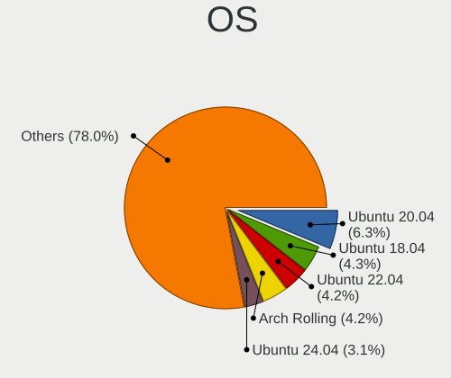

| Name                         | Computers | Percent |
|------------------------------|-----------|---------|
| Ubuntu 20.04                 | 110       | 6.28%   |
| Ubuntu 18.04                 | 75        | 4.28%   |
| Ubuntu 22.04                 | 73        | 4.17%   |
| Arch Rolling                 | 73        | 4.17%   |
| Ubuntu 24.04                 | 54        | 3.08%   |
| Pop!_OS 22.04                | 43        | 2.46%   |
| Debian 12                    | 39        | 2.23%   |
| Fedora 40                    | 38        | 2.17%   |
| Fedora 38                    | 32        | 1.83%   |
| Zorin 17                     | 31        | 1.77%   |
| Manjaro                      | 28        | 1.6%    |
| Zorin 16                     | 26        | 1.48%   |
| OpenMandriva 4.3             | 24        | 1.37%   |
| OpenMandriva 4.2             | 23        | 1.31%   |
| Fedora 42                    | 23        | 1.31%   |
| Arch                         | 23        | 1.31%   |
| Ubuntu 19.04                 | 22        | 1.26%   |
| Linux Mint 22.1              | 21        | 1.2%    |
| Fedora 41                    | 21        | 1.2%    |
| Debian 11                    | 19        | 1.09%   |
| Zorin 18                     | 18        | 1.03%   |
| Kubuntu 24.04                | 17        | 0.97%   |
| KDE neon 22.04               | 17        | 0.97%   |
| Fedora 39                    | 17        | 0.97%   |
| Debian 10                    | 17        | 0.97%   |
| openSUSE Tumbleweed-XXXXXXXX | 16        | 0.91%   |
| Linux Mint 21.3              | 16        | 0.91%   |
| Fedora 37                    | 16        | 0.91%   |
| Fedora 34                    | 16        | 0.91%   |
| OpenMandriva 25.90           | 15        | 0.86%   |
| Linux Mint 21.1              | 15        | 0.86%   |
| Linux Mint 20.1              | 15        | 0.86%   |
| KDE neon 20.04               | 15        | 0.86%   |
| Fedora 35                    | 15        | 0.86%   |
| Zorin 15                     | 14        | 0.8%    |
| OpenMandriva 23.01           | 14        | 0.8%    |
| Pop!_OS 20.04                | 13        | 0.74%   |
| Ubuntu 22.10                 | 12        | 0.69%   |
| Ubuntu 19.10                 | 12        | 0.69%   |
| OpenMandriva 23.08           | 12        | 0.69%   |

OS Family
---------

OS without a version

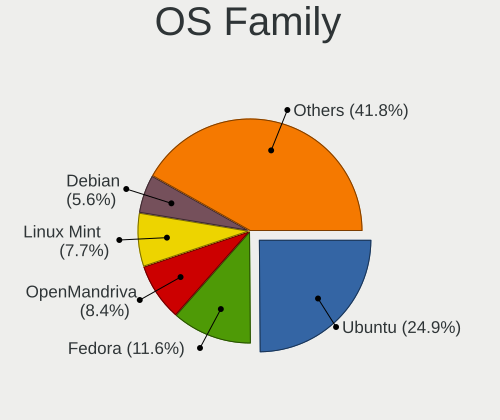

| Name          | Computers | Percent |
|---------------|-----------|---------|
| Ubuntu        | 411       | 24.88%  |
| Fedora        | 192       | 11.62%  |
| OpenMandriva  | 138       | 8.35%   |
| Linux Mint    | 128       | 7.75%   |
| Debian        | 92        | 5.57%   |
| Arch          | 91        | 5.51%   |
| Zorin         | 90        | 5.45%   |
| Pop!_OS       | 71        | 4.3%    |
| Manjaro       | 45        | 2.72%   |
| Kubuntu       | 41        | 2.48%   |
| KDE neon      | 40        | 2.42%   |
| openSUSE      | 23        | 1.39%   |
| Elementary    | 23        | 1.39%   |
| Bazzite       | 19        | 1.15%   |
| ROSA          | 17        | 1.03%   |
| SteamOS       | 15        | 0.91%   |
| Xubuntu       | 14        | 0.85%   |
| Lubuntu       | 13        | 0.79%   |
| Kali          | 12        | 0.73%   |
| EndeavourOS   | 12        | 0.73%   |
| ArcoLinux     | 12        | 0.73%   |
| Ubuntu MATE   | 10        | 0.61%   |
| Nobara        | 10        | 0.61%   |
| Loc OS        | 8         | 0.48%   |
| Gentoo        | 8         | 0.48%   |
| Ubuntu Budgie | 7         | 0.42%   |
| MX            | 7         | 0.42%   |
| LMDE          | 7         | 0.42%   |
| Endless       | 7         | 0.42%   |
| Xero          | 5         | 0.3%    |
| Garuda Linux  | 5         | 0.3%    |
| Cuerdos       | 5         | 0.3%    |
| Clear Linux   | 5         | 0.3%    |
| CachyOS       | 5         | 0.3%    |
| Parrot        | 4         | 0.24%   |
| Deepin        | 4         | 0.24%   |
| BigLinux      | 4         | 0.24%   |
| Ubuntu Unity  | 3         | 0.18%   |
| Solus         | 3         | 0.18%   |
| RHEL          | 3         | 0.18%   |

Kernel
------

Version of the Linux kernel

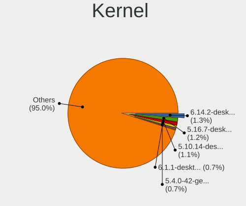

| Version                             | Computers | Percent |
|-------------------------------------|-----------|---------|
| 6.14.2-desktop-3omv2590             | 25        | 1.29%   |
| 5.16.7-desktop-1omv4003             | 24        | 1.24%   |
| 5.10.14-desktop-1omv4002            | 21        | 1.08%   |
| 6.1.1-desktop-1omv2290              | 13        | 0.67%   |
| 5.4.0-42-generic                    | 13        | 0.67%   |
| 6.9.3-76060903-generic              | 12        | 0.62%   |
| 6.8.0-51-generic                    | 12        | 0.62%   |
| 6.6.2-desktop-1omv2390              | 11        | 0.57%   |
| 6.8.0-52-generic                    | 10        | 0.52%   |
| 6.8.0-31-generic                    | 10        | 0.52%   |
| 6.4.11-desktop-1omv2390             | 9         | 0.46%   |
| 6.2.6-desktop-1omv2390              | 9         | 0.46%   |
| 6.14.0-35-generic                   | 9         | 0.46%   |
| 6.12.1-desktop-1omv2490             | 9         | 0.46%   |
| 5.4.0-26-generic                    | 9         | 0.46%   |
| 5.15.0-56-generic                   | 9         | 0.46%   |
| 5.0.0-13-generic                    | 9         | 0.46%   |
| 6.8.0-60-generic                    | 8         | 0.41%   |
| 6.8.0-40-generic                    | 8         | 0.41%   |
| 5.8.0-50-generic                    | 8         | 0.41%   |
| 5.8.0-48-generic                    | 8         | 0.41%   |
| 5.4.0-58-generic                    | 8         | 0.41%   |
| 6.8.0-47-generic                    | 7         | 0.36%   |
| 6.5.0-41-generic                    | 7         | 0.36%   |
| 6.14.0-36-generic                   | 7         | 0.36%   |
| 6.14.0-27-generic                   | 7         | 0.36%   |
| 6.1.0-37-amd64                      | 7         | 0.36%   |
| 5.4.0-48-generic                    | 7         | 0.36%   |
| 5.4.0-47-generic                    | 7         | 0.36%   |
| 5.15.0-58-generic                   | 7         | 0.36%   |
| 5.15.0-52-generic                   | 7         | 0.36%   |
| 5.15.0-48-generic                   | 7         | 0.36%   |
| 5.11.0-27-generic                   | 7         | 0.36%   |
| 5.0.0-23-generic                    | 7         | 0.36%   |
| 4.18.0-15-generic                   | 7         | 0.36%   |
| 6.8.0-76060800daily20240311-generic | 6         | 0.31%   |
| 6.8.0-49-generic                    | 6         | 0.31%   |
| 6.2.6-76060206-generic              | 6         | 0.31%   |
| 6.2.0-39-generic                    | 6         | 0.31%   |
| 6.2.0-20-generic                    | 6         | 0.31%   |

Kernel Family
-------------

Linux kernel without a distro release

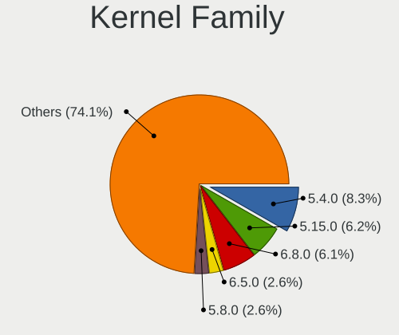

| Version | Computers | Percent |
|---------|-----------|---------|
| 5.4.0   | 154       | 8.28%   |
| 5.15.0  | 116       | 6.24%   |
| 6.8.0   | 114       | 6.13%   |
| 6.5.0   | 49        | 2.64%   |
| 5.8.0   | 49        | 2.64%   |
| 5.11.0  | 49        | 2.64%   |
| 6.14.0  | 46        | 2.47%   |
| 5.0.0   | 45        | 2.42%   |
| 6.1.0   | 41        | 2.21%   |
| 5.19.0  | 41        | 2.21%   |
| 4.15.0  | 41        | 2.21%   |
| 5.3.0   | 38        | 2.04%   |
| 6.2.0   | 37        | 1.99%   |
| 5.13.0  | 33        | 1.78%   |
| 6.14.2  | 28        | 1.51%   |
| 4.18.0  | 28        | 1.51%   |
| 6.11.0  | 27        | 1.45%   |
| 5.16.7  | 24        | 1.29%   |
| 5.10.0  | 22        | 1.18%   |
| 5.10.14 | 21        | 1.13%   |
| 6.2.6   | 16        | 0.86%   |
| 6.1.1   | 16        | 0.86%   |
| 6.9.3   | 15        | 0.81%   |
| 6.6.2   | 14        | 0.75%   |
| 5.14.0  | 13        | 0.7%    |
| 4.19.0  | 13        | 0.7%    |
| 6.4.11  | 10        | 0.54%   |
| 6.12.1  | 10        | 0.54%   |
| 6.8.9   | 9         | 0.48%   |
| 6.17.7  | 9         | 0.48%   |
| 6.10.10 | 9         | 0.48%   |
| 6.0.0   | 9         | 0.48%   |
| 6.4.8   | 7         | 0.38%   |
| 6.14.6  | 7         | 0.38%   |
| 6.8.11  | 6         | 0.32%   |
| 6.17.5  | 6         | 0.32%   |
| 6.12.10 | 6         | 0.32%   |
| 5.9.16  | 6         | 0.32%   |
| 4.9.60  | 6         | 0.32%   |
| 6.9.5   | 5         | 0.27%   |

Kernel Major Ver.
-----------------

Linux kernel major version

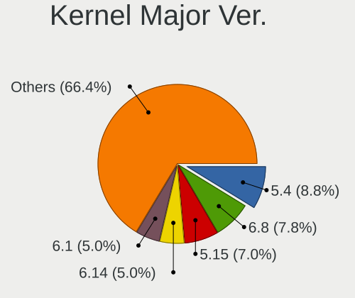

| Version | Computers | Percent |
|---------|-----------|---------|
| 5.4     | 160       | 8.76%   |
| 6.8     | 143       | 7.83%   |
| 5.15    | 128       | 7.01%   |
| 6.14    | 92        | 5.04%   |
| 6.1     | 91        | 4.98%   |
| 6.2     | 73        | 4%      |
| 5.10    | 72        | 3.94%   |
| 6.5     | 69        | 3.78%   |
| 5.11    | 66        | 3.61%   |
| 5.19    | 61        | 3.34%   |
| 5.8     | 54        | 2.96%   |
| 6.11    | 52        | 2.85%   |
| 6.12    | 50        | 2.74%   |
| 5.13    | 49        | 2.68%   |
| 5.0     | 48        | 2.63%   |
| 6.6     | 43        | 2.35%   |
| 4.15    | 41        | 2.25%   |
| 5.3     | 40        | 2.19%   |
| 6.9     | 39        | 2.14%   |
| 6.4     | 39        | 2.14%   |
| 6.10    | 39        | 2.14%   |
| 5.16    | 38        | 2.08%   |
| 6.17    | 32        | 1.75%   |
| 4.18    | 29        | 1.59%   |
| 6.13    | 28        | 1.53%   |
| 6.3     | 24        | 1.31%   |
| 6.15    | 24        | 1.31%   |
| 6.0     | 23        | 1.26%   |
| 6.7     | 22        | 1.2%    |
| 5.17    | 22        | 1.2%    |
| 5.14    | 21        | 1.15%   |
| 5.9     | 16        | 0.88%   |
| 5.12    | 16        | 0.88%   |
| 4.19    | 15        | 0.82%   |
| 6.16    | 14        | 0.77%   |
| 5.18    | 13        | 0.71%   |
| 4.9     | 10        | 0.55%   |
| 5.6     | 7         | 0.38%   |
| 5.5     | 6         | 0.33%   |
| 5.7     | 4         | 0.22%   |

Arch
----

OS architecture (x86_64, i586, etc.)

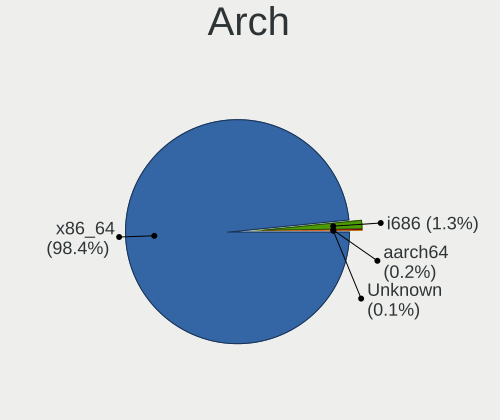

| Name    | Computers | Percent |
|---------|-----------|---------|
| x86_64  | 1540      | 98.4%   |
| i686    | 21        | 1.34%   |
| aarch64 | 3         | 0.19%   |
| Unknown | 1         | 0.06%   |

DE
--

Desktop Environment

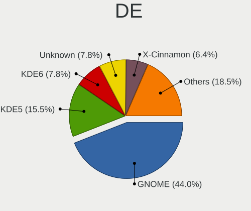

| Name             | Computers | Percent |
|------------------|-----------|---------|
| GNOME            | 732       | 44.04%  |
| KDE5             | 257       | 15.46%  |
| KDE6             | 130       | 7.82%   |
| Unknown          | 130       | 7.82%   |
| X-Cinnamon       | 106       | 6.38%   |
| XFCE             | 102       | 6.14%   |
| KDE              | 39        | 2.35%   |
| MATE             | 28        | 1.68%   |
| Pantheon         | 24        | 1.44%   |
| LXQt             | 16        | 0.96%   |
| LXDE             | 16        | 0.96%   |
| KDE4             | 13        | 0.78%   |
| Budgie           | 12        | 0.72%   |
| i3               | 11        | 0.66%   |
| Cinnamon         | 8         | 0.48%   |
| Deepin           | 6         | 0.36%   |
| Hyprland         | 5         | 0.3%    |
| GNOME Flashback  | 4         | 0.24%   |
| awesome          | 4         | 0.24%   |
| Unity            | 3         | 0.18%   |
| COSMIC           | 3         | 0.18%   |
| xmonad           | 2         | 0.12%   |
| sway             | 2         | 0.12%   |
| qtile            | 2         | 0.12%   |
| icewm            | 2         | 0.12%   |
| Trinity          | 1         | 0.06%   |
| niri             | 1         | 0.06%   |
| lightdm-xsession | 1         | 0.06%   |
| Enlightenment    | 1         | 0.06%   |
| bspwm            | 1         | 0.06%   |

Display Server
--------------

X11 or Wayland

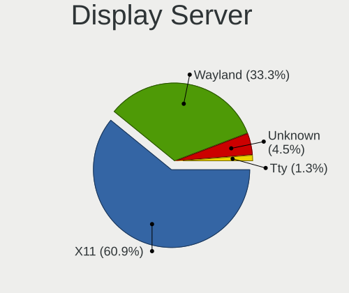

| Name    | Computers | Percent |
|---------|-----------|---------|
| X11     | 998       | 60.89%  |
| Wayland | 546       | 33.31%  |
| Unknown | 74        | 4.51%   |
| Tty     | 21        | 1.28%   |

Display Manager
---------------

SDDM, LightDM, etc.

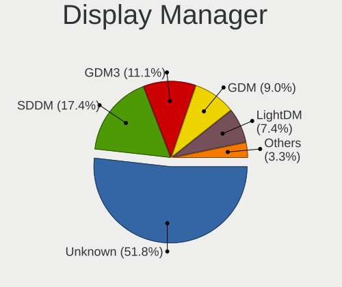

| Name    | Computers | Percent |
|---------|-----------|---------|
| Unknown | 853       | 51.79%  |
| SDDM    | 286       | 17.36%  |
| GDM3    | 183       | 11.11%  |
| GDM     | 149       | 9.05%   |
| LightDM | 122       | 7.41%   |
| TDM     | 26        | 1.58%   |
| KDM     | 10        | 0.61%   |
| LXDM    | 5         | 0.3%    |
| XDM     | 4         | 0.24%   |
| LY-DM   | 4         | 0.24%   |
| SLIMSKI | 2         | 0.12%   |
| Ly      | 2         | 0.12%   |
| GREETD  | 1         | 0.06%   |

OS Lang
-------

Language

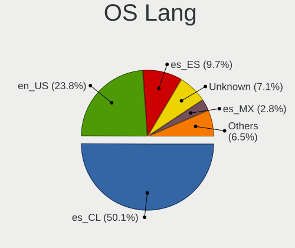

| Lang       | Computers | Percent |
|------------|-----------|---------|
| es_CL      | 813       | 50.09%  |
| en_US      | 386       | 23.78%  |
| es_ES      | 157       | 9.67%   |
| Unknown    | 116       | 7.15%   |
| es_MX      | 46        | 2.83%   |
| C          | 31        | 1.91%   |
| en_GB      | 26        | 1.6%    |
| es_AR      | 16        | 0.99%   |
| fr_FR      | 3         | 0.18%   |
| es_VE      | 3         | 0.18%   |
| ru_RU      | 2         | 0.12%   |
| es_UY      | 2         | 0.12%   |
| es_CO      | 2         | 0.12%   |
| es_BO      | 2         | 0.12%   |
| en_CA      | 2         | 0.12%   |
| en_AU      | 2         | 0.12%   |
| de_DE      | 2         | 0.12%   |
| pt_BR      | 1         | 0.06%   |
| POSIX      | 1         | 0.06%   |
| nl_NL      | 1         | 0.06%   |
| latam_IT   | 1         | 0.06%   |
| it_IT      | 1         | 0.06%   |
| es_US      | 1         | 0.06%   |
| es_PE      | 1         | 0.06%   |
| es_EC      | 1         | 0.06%   |
| es_CL.UTF8 | 1         | 0.06%   |
| en_AG      | 1         | 0.06%   |
| C.UTF8     | 1         | 0.06%   |
| arn_CL     | 1         | 0.06%   |

Boot Mode
---------

EFI or BIOS

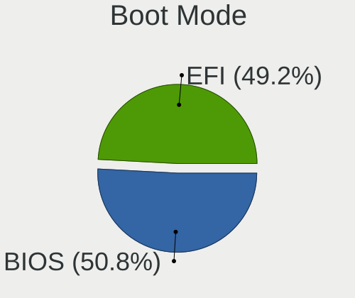

| Mode | Computers | Percent |
|------|-----------|---------|
| BIOS | 819       | 50.84%  |
| EFI  | 792       | 49.16%  |

Filesystem
----------

Type of filesystem

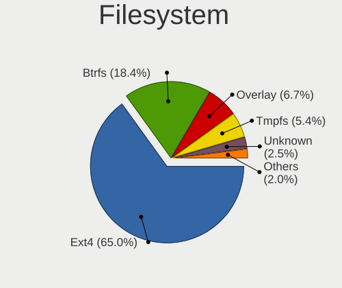

| Type     | Computers | Percent |
|----------|-----------|---------|
| Ext4     | 1064      | 65.04%  |
| Btrfs    | 301       | 18.4%   |
| Overlay  | 109       | 6.66%   |
| Tmpfs    | 88        | 5.38%   |
| Unknown  | 41        | 2.51%   |
| Xfs      | 20        | 1.22%   |
| Zfs      | 4         | 0.24%   |
| Ext2     | 4         | 0.24%   |
| Rootfs   | 1         | 0.06%   |
| Jfs      | 1         | 0.06%   |
| F2fs     | 1         | 0.06%   |
| Ext3     | 1         | 0.06%   |
| Bcachefs | 1         | 0.06%   |

Part. scheme
------------

Scheme of partitioning

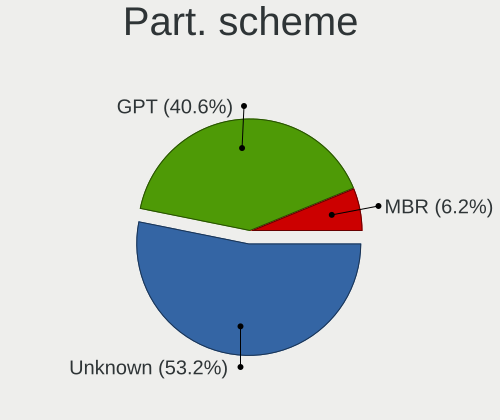

| Type    | Computers | Percent |
|---------|-----------|---------|
| Unknown | 866       | 53.16%  |
| GPT     | 662       | 40.64%  |
| MBR     | 101       | 6.2%    |

Dual Boot with Linux/BSD
------------------------

Hosting more than one Linux/BSD

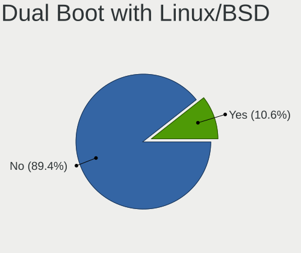

| Dual boot | Computers | Percent |
|-----------|-----------|---------|
| No        | 1435      | 89.41%  |
| Yes       | 170       | 10.59%  |

Dual Boot (Win)
---------------

Hosting Linux and Windows

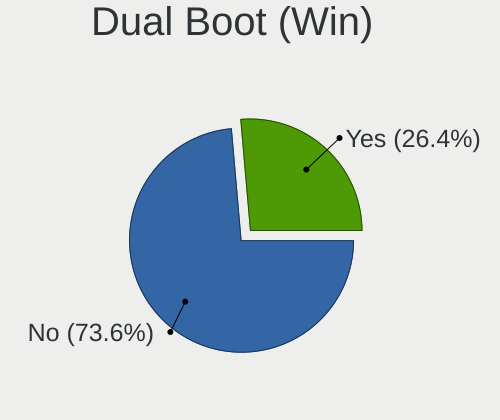

| Dual boot | Computers | Percent |
|-----------|-----------|---------|
| No        | 1186      | 73.62%  |
| Yes       | 425       | 26.38%  |

Board
-----

Vendor
------

Motherboard manufacturer

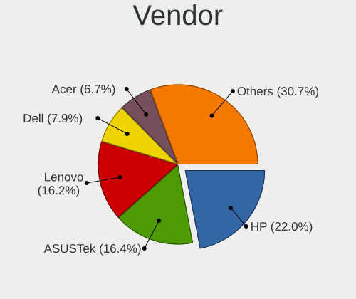

| Name                | Computers | Percent |
|---------------------|-----------|---------|
| Hewlett-Packard     | 344       | 21.99%  |
| ASUSTek Computer    | 257       | 16.43%  |
| Lenovo              | 254       | 16.24%  |
| Dell                | 124       | 7.93%   |
| Acer                | 105       | 6.71%   |
| MSI                 | 76        | 4.86%   |
| Gigabyte Technology | 44        | 2.81%   |
| Apple               | 39        | 2.49%   |
| Samsung Electronics | 38        | 2.43%   |
| Toshiba             | 31        | 1.98%   |
| Intel               | 26        | 1.66%   |
| Sony                | 24        | 1.53%   |
| Unknown             | 24        | 1.53%   |
| ASRock              | 20        | 1.28%   |
| HUAWEI              | 16        | 1.02%   |
| ECS                 | 15        | 0.96%   |
| Packard Bell        | 12        | 0.77%   |
| Valve               | 11        | 0.7%    |
| Chuwi               | 8         | 0.51%   |
| Huanan              | 7         | 0.45%   |
| Google              | 6         | 0.38%   |
| AZW                 | 6         | 0.38%   |
| SK hynix            | 5         | 0.32%   |
| Pegatron            | 5         | 0.32%   |
| ZOTAC               | 3         | 0.19%   |
| AMI                 | 3         | 0.19%   |
| TPV-INVENTA         | 2         | 0.13%   |
| Olidata             | 2         | 0.13%   |
| Nvidia              | 2         | 0.13%   |
| MACHINIST           | 2         | 0.13%   |
| JGINYUE             | 2         | 0.13%   |
| HONOR               | 2         | 0.13%   |
| HC                  | 2         | 0.13%   |
| Gear                | 2         | 0.13%   |
| Foxconn             | 2         | 0.13%   |
| eMachines           | 2         | 0.13%   |
| Alienware           | 2         | 0.13%   |
| WZA300S2R120        | 1         | 0.06%   |
| Wings Mobile        | 1         | 0.06%   |
| VIT                 | 1         | 0.06%   |

Model
-----

Motherboard model

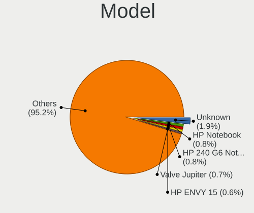

| Name                                     | Computers | Percent |
|------------------------------------------|-----------|---------|
| Unknown                                  | 30        | 1.92%   |
| HP Notebook                              | 13        | 0.83%   |
| HP 240 G6 Notebook PC                    | 12        | 0.77%   |
| Valve Jupiter                            | 11        | 0.7%    |
| HP ENVY 15                               | 9         | 0.58%   |
| ASUS All Series                          | 9         | 0.58%   |
| HP Pavilion Notebook                     | 8         | 0.51%   |
| MSI MS-7817                              | 7         | 0.45%   |
| HP Pavilion g4                           | 7         | 0.45%   |
| ASUS PRIME B450M-A                       | 7         | 0.45%   |
| ASUS PRIME A320M-K                       | 7         | 0.45%   |
| HP Victus by Laptop 16-d0xxx             | 6         | 0.38%   |
| HP Pavilion Laptop 15-eh0xxx             | 6         | 0.38%   |
| HP Pavilion Gaming Laptop 15-dk0xxx      | 6         | 0.38%   |
| HP 14                                    | 6         | 0.38%   |
| ASUS ZenBook UX325EA_UX325EA             | 6         | 0.38%   |
| ASUS VivoBook_ASUSLaptop X1605VA_X1605VA | 6         | 0.38%   |
| Apple MacBookAir7,2                      | 6         | 0.38%   |
| Acer Aspire A315-42                      | 6         | 0.38%   |
| Lenovo IdeaPad Gaming 3 15IMH05 81Y4     | 5         | 0.32%   |
| HP Pavilion Laptop 15-cw1xxx             | 5         | 0.32%   |
| HP Pavilion Gaming Laptop 15-ec1xxx      | 5         | 0.32%   |
| HP Pavilion 15                           | 5         | 0.32%   |
| HP EliteBook 840 G6                      | 5         | 0.32%   |
| HP 250 G6 Notebook PC                    | 5         | 0.32%   |
| Google Treeya                            | 5         | 0.32%   |
| Dell Inspiron 3501                       | 5         | 0.32%   |
| ASUS PRIME H410M-E                       | 5         | 0.32%   |
| Acer Aspire ES1-111M                     | 5         | 0.32%   |
| Lenovo Y520-15IKBN 80WK                  | 4         | 0.26%   |
| Lenovo Legion Y530-15ICH 81FV            | 4         | 0.26%   |
| Lenovo IdeaPad L340-15IRH Gaming 81LK    | 4         | 0.26%   |
| Lenovo IdeaPad 3 14ALC6 82KT             | 4         | 0.26%   |
| HUAWEI BOHK-WAX9X                        | 4         | 0.26%   |
| HP 1000                                  | 4         | 0.26%   |
| AZW SER                                  | 4         | 0.26%   |
| ASUS VivoBook_ASUSLaptop M3604YA_M3604YA | 4         | 0.26%   |
| ASUS TUF Gaming FX505DT_FX505DT          | 4         | 0.26%   |
| Apple MacBookPro9,2                      | 4         | 0.26%   |
| Toshiba Satellite L745                   | 3         | 0.19%   |

Model Family
------------

Motherboard model prefix

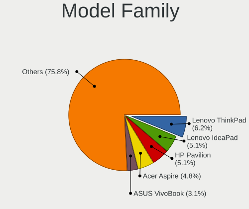

| Name                  | Computers | Percent |
|-----------------------|-----------|---------|
| Lenovo ThinkPad       | 97        | 6.2%    |
| Lenovo IdeaPad        | 79        | 5.05%   |
| HP Pavilion           | 79        | 5.05%   |
| Acer Aspire           | 75        | 4.8%    |
| ASUS VivoBook         | 49        | 3.13%   |
| Dell Inspiron         | 41        | 2.62%   |
| Dell Latitude         | 38        | 2.43%   |
| ASUS PRIME            | 35        | 2.24%   |
| ASUS TUF              | 30        | 1.92%   |
| Unknown               | 30        | 1.92%   |
| HP Laptop             | 27        | 1.73%   |
| HP ENVY               | 25        | 1.6%    |
| HP EliteBook          | 25        | 1.6%    |
| Toshiba Satellite     | 24        | 1.53%   |
| HP 240                | 23        | 1.47%   |
| HP ProBook            | 21        | 1.34%   |
| ASUS ROG              | 18        | 1.15%   |
| HP Compaq             | 17        | 1.09%   |
| ASUS ZenBook          | 17        | 1.09%   |
| ASUS ASUS             | 16        | 1.02%   |
| HP Notebook           | 13        | 0.83%   |
| Acer Nitro            | 12        | 0.77%   |
| Valve Jupiter         | 11        | 0.7%    |
| Lenovo Legion         | 11        | 0.7%    |
| Dell OptiPlex         | 11        | 0.7%    |
| HP OMEN               | 10        | 0.64%   |
| Lenovo Yoga           | 9         | 0.58%   |
| Lenovo ThinkCentre    | 9         | 0.58%   |
| HP 250                | 9         | 0.58%   |
| Dell Precision        | 9         | 0.58%   |
| ASUS All              | 9         | 0.58%   |
| HP EliteDesk          | 8         | 0.51%   |
| HP 245                | 8         | 0.51%   |
| Dell Vostro           | 8         | 0.51%   |
| Acer Swift            | 8         | 0.51%   |
| Packard Bell EasyNote | 7         | 0.45%   |
| MSI MS-7817           | 7         | 0.45%   |
| HP Victus             | 7         | 0.45%   |
| Apple MacBookPro11    | 7         | 0.45%   |
| HP 14                 | 6         | 0.38%   |

MFG Year
--------

Motherboard manufacture year

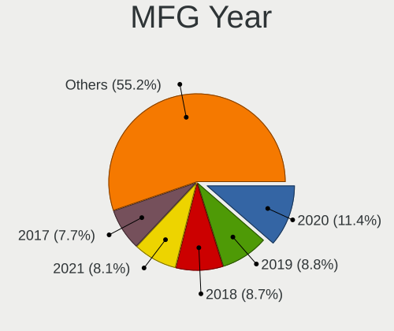

| Year    | Computers | Percent |
|---------|-----------|---------|
| 2020    | 178       | 11.38%  |
| 2019    | 138       | 8.82%   |
| 2018    | 136       | 8.7%    |
| 2021    | 127       | 8.12%   |
| 2017    | 121       | 7.74%   |
| 2012    | 101       | 6.46%   |
| 2013    | 100       | 6.39%   |
| 2011    | 96        | 6.14%   |
| 2016    | 83        | 5.31%   |
| 2014    | 83        | 5.31%   |
| 2015    | 62        | 3.96%   |
| 2010    | 62        | 3.96%   |
| 2023    | 61        | 3.9%    |
| 2022    | 60        | 3.84%   |
| 2008    | 41        | 2.62%   |
| 2007    | 37        | 2.37%   |
| 2009    | 35        | 2.24%   |
| 2024    | 24        | 1.53%   |
| 2006    | 10        | 0.64%   |
| 2025    | 5         | 0.32%   |
| Unknown | 3         | 0.19%   |
| 2005    | 1         | 0.06%   |

Form Factor
-----------

Physical design of the computer

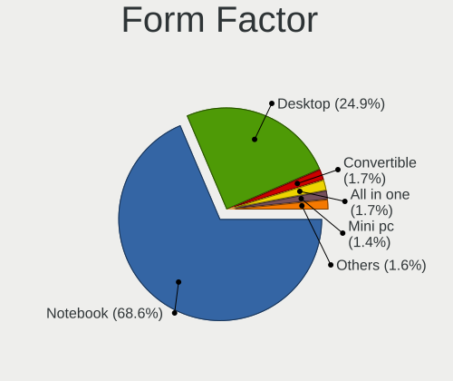

| Name           | Computers | Percent |
|----------------|-----------|---------|
| Notebook       | 1073      | 68.61%  |
| Desktop        | 390       | 24.94%  |
| Convertible    | 27        | 1.73%   |
| All in one     | 27        | 1.73%   |
| Mini pc        | 22        | 1.41%   |
| Tablet         | 18        | 1.15%   |
| Server         | 6         | 0.38%   |
| System on chip | 1         | 0.06%   |

Secure Boot
-----------

Enabled or disabled

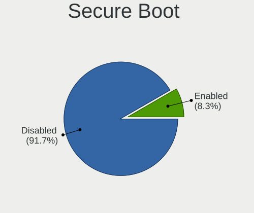

| State    | Computers | Percent |
|----------|-----------|---------|
| Disabled | 1450      | 91.66%  |
| Enabled  | 132       | 8.34%   |

Coreboot
--------

Have coreboot on board

| Used | Computers | Percent |
|------|-----------|---------|
| No   | 1558      | 99.62%  |
| Yes  | 6         | 0.38%   |

RAM Size
--------

Total RAM memory

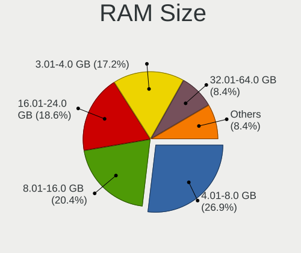

| Size in GB      | Computers | Percent |
|-----------------|-----------|---------|
| 4.01-8.0        | 430       | 26.88%  |
| 8.01-16.0       | 327       | 20.44%  |
| 16.01-24.0      | 298       | 18.63%  |
| 3.01-4.0        | 275       | 17.19%  |
| 32.01-64.0      | 135       | 8.44%   |
| 1.01-2.0        | 54        | 3.38%   |
| 24.01-32.0      | 36        | 2.25%   |
| 64.01-256.0     | 22        | 1.38%   |
| 2.01-3.0        | 19        | 1.19%   |
| 0.51-1.0        | 2         | 0.13%   |
| More than 256.0 | 1         | 0.06%   |
| Unknown         | 1         | 0.06%   |

RAM Used
--------

Used RAM memory

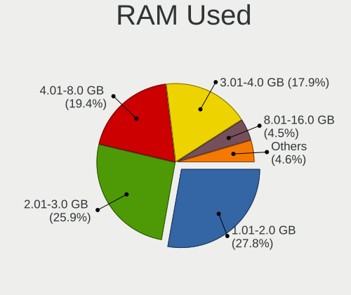

| Used GB    | Computers | Percent |
|------------|-----------|---------|
| 1.01-2.0   | 488       | 27.79%  |
| 2.01-3.0   | 455       | 25.91%  |
| 4.01-8.0   | 340       | 19.36%  |
| 3.01-4.0   | 314       | 17.88%  |
| 8.01-16.0  | 79        | 4.5%    |
| 0.51-1.0   | 67        | 3.82%   |
| 0.01-0.5   | 6         | 0.34%   |
| 16.01-24.0 | 4         | 0.23%   |
| 24.01-32.0 | 2         | 0.11%   |
| Unknown    | 1         | 0.06%   |

Total Drives
------------

Number of drives on board

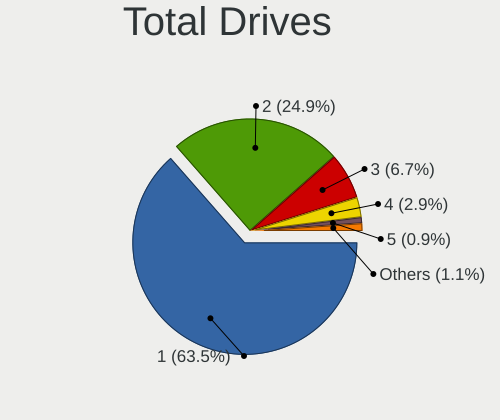

| Drives | Computers | Percent |
|--------|-----------|---------|
| 1      | 1032      | 63.55%  |
| 2      | 405       | 24.94%  |
| 3      | 108       | 6.65%   |
| 4      | 47        | 2.89%   |
| 5      | 14        | 0.86%   |
| 0      | 7         | 0.43%   |
| 7      | 4         | 0.25%   |
| 6      | 4         | 0.25%   |
| 8      | 2         | 0.12%   |
| 12     | 1         | 0.06%   |

Has CD-ROM
----------

Has CD-ROM on board

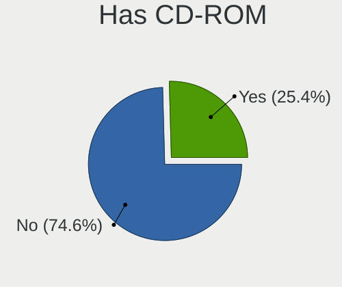

| Presented | Computers | Percent |
|-----------|-----------|---------|
| No        | 1176      | 74.57%  |
| Yes       | 401       | 25.43%  |

Has Ethernet
------------

Has Ethernet on board

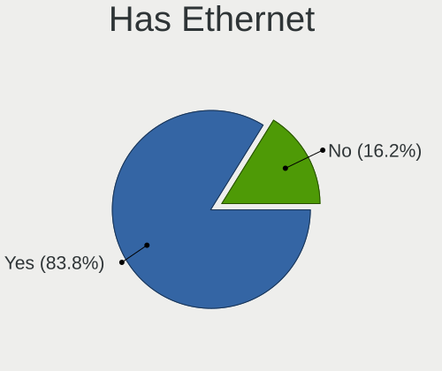

| Presented | Computers | Percent |
|-----------|-----------|---------|
| Yes       | 1317      | 83.83%  |
| No        | 254       | 16.17%  |

Has WiFi
--------

Has WiFi module

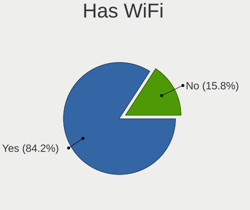

| Presented | Computers | Percent |
|-----------|-----------|---------|
| Yes       | 1323      | 84.16%  |
| No        | 249       | 15.84%  |

Has Bluetooth
-------------

Has Bluetooth module

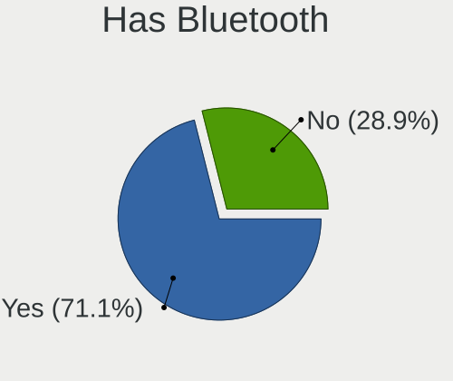

| Presented | Computers | Percent |
|-----------|-----------|---------|
| Yes       | 1125      | 71.07%  |
| No        | 458       | 28.93%  |

Location
--------

Country
-------

Geographic location (country)

| Country | Computers | Percent |
|---------|-----------|---------|
| Chile   | 1564      | 100%    |

City
----

Geographic location (city)

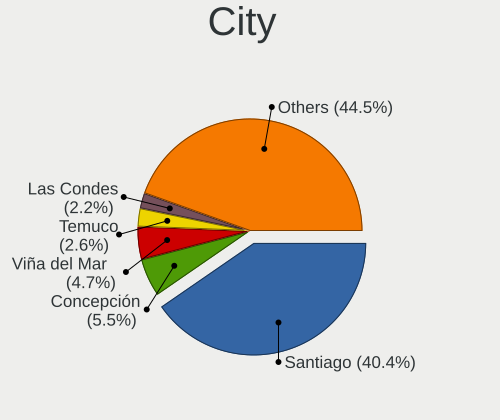

| City                | Computers | Percent |
|---------------------|-----------|---------|
| Santiago            | 675       | 40.39%  |
| Concepción         | 92        | 5.51%   |
| Viña del Mar       | 79        | 4.73%   |
| Temuco              | 44        | 2.63%   |
| Las Condes          | 37        | 2.21%   |
| Maipu               | 34        | 2.03%   |
| Puente Alto         | 33        | 1.97%   |
| Valdivia            | 31        | 1.86%   |
| Antofagasta         | 27        | 1.62%   |
| La Florida          | 26        | 1.56%   |
| Nunoa               | 23        | 1.38%   |
| Providencia         | 22        | 1.32%   |
| La Serena           | 22        | 1.32%   |
| Valparaíso         | 21        | 1.26%   |
| Port Montt          | 21        | 1.26%   |
| Rancagua            | 20        | 1.2%    |
| Quilpué            | 18        | 1.08%   |
| Iquique             | 18        | 1.08%   |
| San Miguel          | 17        | 1.02%   |
| Talca               | 15        | 0.9%    |
| Coquimbo            | 14        | 0.84%   |
| Chillan             | 13        | 0.78%   |
| Osorno              | 12        | 0.72%   |
| Curicó             | 12        | 0.72%   |
| Talcahuano          | 11        | 0.66%   |
| Melipilla           | 11        | 0.66%   |
| Los Ángeles        | 11        | 0.66%   |
| Coronel             | 11        | 0.66%   |
| Arica               | 10        | 0.6%    |
| San Pedro de la Paz | 8         | 0.48%   |
| San Bernardo        | 8         | 0.48%   |
| Quillota            | 8         | 0.48%   |
| Macul               | 8         | 0.48%   |
| Quilicura           | 7         | 0.42%   |
| Linares             | 7         | 0.42%   |
| La Reina            | 7         | 0.42%   |
| Colina              | 7         | 0.42%   |
| Villa Alemana       | 6         | 0.36%   |
| Punta Arenas        | 6         | 0.36%   |
| Penalolen           | 6         | 0.36%   |

Drives
------

Drive Vendor
------------

Hard drive vendors

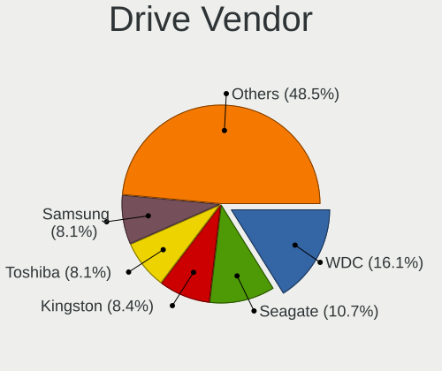

| Vendor                      | Computers | Drives | Percent |
|-----------------------------|-----------|--------|---------|
| WDC                         | 359       | 541    | 16.13%  |
| Seagate                     | 239       | 337    | 10.74%  |
| Kingston                    | 188       | 283    | 8.45%   |
| Toshiba                     | 180       | 222    | 8.09%   |
| Samsung Electronics         | 180       | 247    | 8.09%   |
| Crucial                     | 135       | 172    | 6.06%   |
| SanDisk                     | 119       | 186    | 5.35%   |
| Unknown                     | 102       | 136    | 4.58%   |
| Hitachi                     | 64        | 78     | 2.88%   |
| SK hynix                    | 58        | 78     | 2.61%   |
| HGST                        | 53        | 60     | 2.38%   |
| Intel                       | 51        | 75     | 2.29%   |
| Kingston Technology Company | 47        | 68     | 2.11%   |
| China                       | 47        | 58     | 2.11%   |
| Micron Technology           | 44        | 76     | 1.98%   |
| Apple                       | 27        | 32     | 1.21%   |
| Silicon Motion              | 24        | 25     | 1.08%   |
| Micron/Crucial Technology   | 21        | 33     | 0.94%   |
| KIOXIA                      | 20        | 24     | 0.9%    |
| KingSpec                    | 19        | 30     | 0.85%   |
| MAXIO Technology (Hangzhou) | 16        | 20     | 0.72%   |
| Lexar                       | 14        | 33     | 0.63%   |
| JMicron Technology          | 14        | 16     | 0.63%   |
| Phison Electronics          | 12        | 14     | 0.54%   |
| A-DATA Technology           | 12        | 16     | 0.54%   |
| XrayDisk                    | 9         | 10     | 0.4%    |
| Realtek                     | 7         | 8      | 0.31%   |
| Gigabyte Technology         | 7         | 10     | 0.31%   |
| Unknown                     | 7         | 7      | 0.31%   |
| XPG                         | 6         | 19     | 0.27%   |
| Realtek Semiconductor       | 6         | 8      | 0.27%   |
| Corsair                     | 6         | 11     | 0.27%   |
| ADATA Technology            | 6         | 8      | 0.27%   |
| Phison                      | 5         | 5      | 0.22%   |
| O2 Micro                    | 5         | 6      | 0.22%   |
| Maxtor                      | 5         | 8      | 0.22%   |
| LITEON                      | 5         | 5      | 0.22%   |
| Union Memory (Shenzhen)     | 4         | 8      | 0.18%   |
| SSSTC                       | 4         | 5      | 0.18%   |
| Netac                       | 4         | 5      | 0.18%   |

Drive Model
-----------

Hard drive models

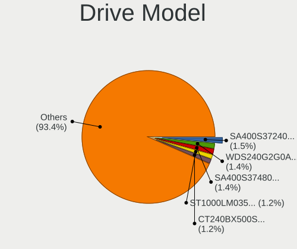

| Model                                                 | Computers | Percent |
|-------------------------------------------------------|-----------|---------|
| Kingston SA400S37240G 240GB SSD                       | 36        | 1.49%   |
| WDC WDS240G2G0A-00JH30 240GB SSD                      | 33        | 1.37%   |
| Kingston SA400S37480G 480GB SSD                       | 33        | 1.37%   |
| Seagate ST1000LM035-1RK172 1TB                        | 28        | 1.16%   |
| Crucial CT240BX500SSD1 240GB                          | 28        | 1.16%   |
| Toshiba DT01ACA100 1TB                                | 23        | 0.95%   |
| Seagate ST500LT012-1DG142 500GB                       | 22        | 0.91%   |
| Samsung NVMe SSD Controller SM981/PM981/PM983 1TB     | 21        | 0.87%   |
| Crucial CT500MX500SSD1 500GB                          | 21        | 0.87%   |
| Toshiba MQ04ABF100 1TB                                | 20        | 0.83%   |
| Toshiba HDWD110 1TB                                   | 20        | 0.83%   |
| Toshiba MQ01ABF050 500GB                              | 19        | 0.79%   |
| Toshiba MQ01ABD100 1TB                                | 19        | 0.79%   |
| Unknown MMC Card  32GB                                | 18        | 0.75%   |
| Seagate ST500DM002-1BD142 500GB                       | 18        | 0.75%   |
| Unknown MMC Card  64GB                                | 17        | 0.71%   |
| Kingston Company SNV2S1000G 1TB                       | 17        | 0.71%   |
| Sandisk WD Black SN750 / PC SN730 NVMe SSD 500GB      | 16        | 0.66%   |
| Crucial CT480BX500SSD1 480GB                          | 16        | 0.66%   |
| WDC WD Green 2.5 240GB                                | 15        | 0.62%   |
| Kingston SA400S37120G 120GB SSD                       | 15        | 0.62%   |
| Unknown MMC Card  128GB                               | 14        | 0.58%   |
| Seagate ST1000LM024 HN-M101MBB 1TB                    | 14        | 0.58%   |
| WDC WD10EZEX-08WN4A0 1TB                              | 13        | 0.54%   |
| Seagate ST9500325AS 500GB                             | 13        | 0.54%   |
| HGST HTS545050A7E680 500GB                            | 13        | 0.54%   |
| WDC WDS500G2B0A-00SM50 500GB                          | 12        | 0.5%    |
| WDC WDS120G2G0A-00JH30 120GB SSD                      | 12        | 0.5%    |
| Silicon Motion SM2263EN/SM2263XT SSD Controller 512GB | 12        | 0.5%    |
| Crucial CT1000MX500SSD1 1TB                           | 12        | 0.5%    |
| Seagate ST500LM012 HN-M500MBB 500GB                   | 11        | 0.46%   |
| Sandisk WD Blue SN550 NVMe SSD 1024GB                 | 11        | 0.46%   |
| Micron/Crucial P2 NVMe PCIe SSD 2TB                   | 11        | 0.46%   |
| MAXIO (Hangzhou) NVMe SSD Controller MAP1202 2TB      | 11        | 0.46%   |
| Kingston SUV400S37120G 120GB SSD                      | 10        | 0.41%   |
| JMicron Generic 320GB                                 | 10        | 0.41%   |
| Intel SSDPEKNU512GZ 512GB                             | 10        | 0.41%   |
| HGST HTS545050A7E380 500GB                            | 10        | 0.41%   |
| Crucial CT120BX500SSD1 120GB                          | 10        | 0.41%   |
| WDC WDS480G2G0A-00JH30 480GB SSD                      | 9         | 0.37%   |

HDD Vendor
----------

Hard disk drive vendors

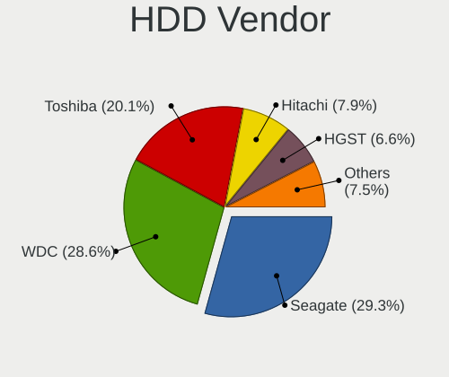

| Vendor              | Computers | Drives | Percent |
|---------------------|-----------|--------|---------|
| Seagate             | 237       | 332    | 29.3%   |
| WDC                 | 231       | 324    | 28.55%  |
| Toshiba             | 163       | 201    | 20.15%  |
| Hitachi             | 64        | 78     | 7.91%   |
| HGST                | 53        | 60     | 6.55%   |
| Samsung Electronics | 18        | 22     | 2.22%   |
| Apple               | 11        | 12     | 1.36%   |
| JMicron Technology  | 10        | 12     | 1.24%   |
| Unknown             | 8         | 8      | 0.99%   |
| Maxtor              | 4         | 6      | 0.49%   |
| USB3.0              | 2         | 2      | 0.25%   |
| Fujitsu             | 2         | 2      | 0.25%   |
| ASMT                | 2         | 3      | 0.25%   |
| SAGE                | 1         | 1      | 0.12%   |
| HGST HTS            | 1         | 1      | 0.12%   |
| External            | 1         | 1      | 0.12%   |
| ASMedia             | 1         | 2      | 0.12%   |

SSD Vendor
----------

Solid state drive vendors

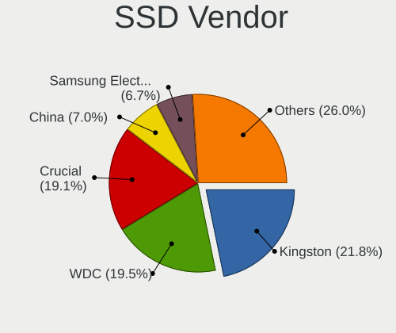

| Vendor              | Computers | Drives | Percent |
|---------------------|-----------|--------|---------|
| Kingston            | 144       | 215    | 21.79%  |
| WDC                 | 129       | 182    | 19.52%  |
| Crucial             | 126       | 160    | 19.06%  |
| China               | 46        | 57     | 6.96%   |
| Samsung Electronics | 44        | 59     | 6.66%   |
| SanDisk             | 26        | 34     | 3.93%   |
| KingSpec            | 18        | 29     | 2.72%   |
| Lexar               | 12        | 30     | 1.82%   |
| Apple               | 12        | 12     | 1.82%   |
| A-DATA Technology   | 8         | 12     | 1.21%   |
| Micron Technology   | 7         | 7      | 1.06%   |
| Gigabyte Technology | 7         | 10     | 1.06%   |
| XrayDisk            | 6         | 7      | 0.91%   |
| SK hynix            | 6         | 9      | 0.91%   |
| Corsair             | 6         | 11     | 0.91%   |
| Toshiba             | 3         | 7      | 0.45%   |
| Patriot             | 3         | 3      | 0.45%   |
| LITEON              | 3         | 3      | 0.45%   |
| Intel               | 3         | 5      | 0.45%   |
| HS-SSD-C100         | 3         | 3      | 0.45%   |
| FORESEE             | 3         | 4      | 0.45%   |
| Unknown             | 3         | 3      | 0.45%   |
| WALRAM              | 2         | 3      | 0.3%    |
| StoreJet            | 2         | 2      | 0.3%    |
| SCY                 | 2         | 2      | 0.3%    |
| PNY                 | 2         | 2      | 0.3%    |
| Netac               | 2         | 2      | 0.3%    |
| LITEONIT            | 2         | 2      | 0.3%    |
| Fanxiang            | 2         | 3      | 0.3%    |
| ZOTAC               | 1         | 1      | 0.15%   |
| Wdxsky              | 1         | 1      | 0.15%   |
| Vaseky              | 1         | 1      | 0.15%   |
| tecmiyo             | 1         | 1      | 0.15%   |
| Team                | 1         | 1      | 0.15%   |
| sobetter            | 1         | 1      | 0.15%   |
| Seapiy              | 1         | 1      | 0.15%   |
| SATA3 25            | 1         | 1      | 0.15%   |
| SABRENT             | 1         | 1      | 0.15%   |
| Rayson              | 1         | 1      | 0.15%   |
| PUSKILL             | 1         | 1      | 0.15%   |

Drive Kind
----------

HDD or SSD

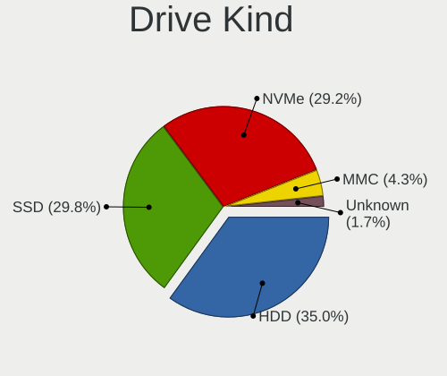

| Kind    | Computers | Drives | Percent |
|---------|-----------|--------|---------|
| HDD     | 706       | 1067   | 35%     |
| SSD     | 601       | 910    | 29.8%   |
| NVMe    | 589       | 959    | 29.2%   |
| MMC     | 86        | 116    | 4.26%   |
| Unknown | 35        | 40     | 1.74%   |

Drive Connector
---------------

SATA, SAS, NVMe, etc.

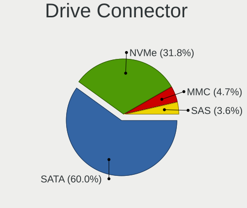

| Type | Computers | Drives | Percent |
|------|-----------|--------|---------|
| SATA | 1108      | 1940   | 59.96%  |
| NVMe | 587       | 951    | 31.76%  |
| MMC  | 86        | 116    | 4.65%   |
| SAS  | 67        | 85     | 3.63%   |

Drive Size
----------

Size of hard drive

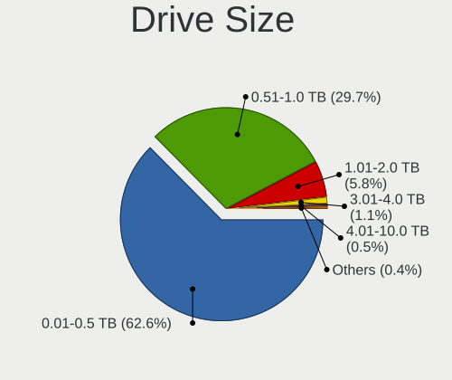

| Size in TB | Computers | Drives | Percent |
|------------|-----------|--------|---------|
| 0.01-0.5   | 811       | 1268   | 62.58%  |
| 0.51-1.0   | 385       | 538    | 29.71%  |
| 1.01-2.0   | 75        | 108    | 5.79%   |
| 3.01-4.0   | 14        | 21     | 1.08%   |
| 4.01-10.0  | 6         | 30     | 0.46%   |
| 2.01-3.0   | 5         | 12     | 0.39%   |

Space Total
-----------

Amount of disk space available on the file system

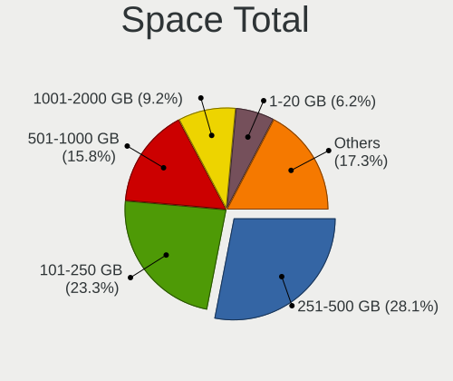

| Size in GB     | Computers | Percent |
|----------------|-----------|---------|
| 251-500        | 471       | 28.05%  |
| 101-250        | 392       | 23.35%  |
| 501-1000       | 266       | 15.84%  |
| 1001-2000      | 155       | 9.23%   |
| 1-20           | 104       | 6.19%   |
| 51-100         | 84        | 5%      |
| More than 3000 | 66        | 3.93%   |
| 2001-3000      | 50        | 2.98%   |
| 21-50          | 48        | 2.86%   |
| Unknown        | 43        | 2.56%   |

Space Used
----------

Amount of used disk space

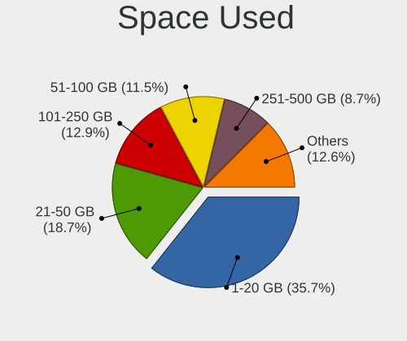

| Used GB        | Computers | Percent |
|----------------|-----------|---------|
| 1-20           | 630       | 35.65%  |
| 21-50          | 330       | 18.68%  |
| 101-250        | 228       | 12.9%   |
| 51-100         | 203       | 11.49%  |
| 251-500        | 154       | 8.72%   |
| 501-1000       | 94        | 5.32%   |
| 1001-2000      | 51        | 2.89%   |
| Unknown        | 43        | 2.43%   |
| More than 3000 | 16        | 0.91%   |
| 2001-3000      | 15        | 0.85%   |
| 0              | 3         | 0.17%   |

Malfunc. Drives
---------------

Drive models with a malfunction

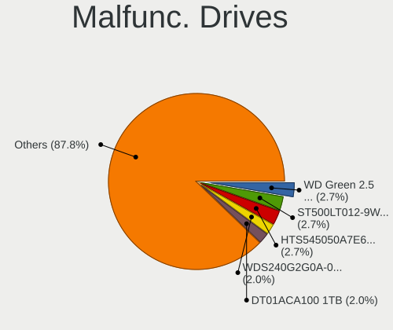

| Model                               | Computers | Drives | Percent |
|-------------------------------------|-----------|--------|---------|
| WDC WD Green 2.5 240GB              | 4         | 7      | 2.7%    |
| Seagate ST500LT012-9WS142 500GB     | 4         | 4      | 2.7%    |
| HGST HTS545050A7E680 500GB          | 4         | 4      | 2.7%    |
| WDC WDS240G2G0A-00JH30 240GB SSD    | 3         | 3      | 2.03%   |
| Toshiba DT01ACA100 1TB              | 3         | 3      | 2.03%   |
| Seagate ST9500325AS 500GB           | 3         | 4      | 2.03%   |
| Seagate ST500DM002-1BD142 500GB     | 3         | 3      | 2.03%   |
| Seagate ST1000LM024 HN-M101MBB 1TB  | 3         | 9      | 2.03%   |
| Hitachi HTS725050A7E630 500GB       | 3         | 4      | 2.03%   |
| Hitachi HTS547575A9E384 752GB       | 3         | 4      | 2.03%   |
| HGST HTS545050A7E380 500GB          | 3         | 3      | 2.03%   |
| WDC WD1600BEVT-35VW9T0 160GB        | 2         | 2      | 1.35%   |
| WDC WD1600BB-00GUC0 160GB           | 2         | 2      | 1.35%   |
| Toshiba MQ04ABF100 1TB              | 2         | 2      | 1.35%   |
| Toshiba MQ01ABD075 752GB            | 2         | 3      | 1.35%   |
| Seagate ST500LT012-1DG142 500GB     | 2         | 2      | 1.35%   |
| Seagate ST500LM012 HN-M500MBB 500GB | 2         | 2      | 1.35%   |
| Seagate ST31000528AS 1TB            | 2         | 2      | 1.35%   |
| Kingston SKC400S371T 1TB            | 2         | 13     | 1.35%   |
| Kingston SA400S37480G 480GB SSD     | 2         | 4      | 1.35%   |
| Kingston SA400S37240G 240GB SSD     | 2         | 4      | 1.35%   |
| JMicron Technology Generic 320GB    | 2         | 2      | 1.35%   |
| Hitachi HTS545050B9A300 500GB       | 2         | 3      | 1.35%   |
| Hitachi HTS545050A7E380 500GB       | 2         | 2      | 1.35%   |
| HGST HTS541010B7E610 1TB            | 2         | 3      | 1.35%   |
| HGST HTS541010A9E680 1TB            | 2         | 3      | 1.35%   |
| China SSD 500GB                     | 2         | 5      | 1.35%   |
| XrayDisk SSD 256GB                  | 1         | 1      | 0.68%   |
| XPG SPECTRIX S40G 1TB               | 1         | 2      | 0.68%   |
| WDC WDS480G2G0A-00JH30 480GB SSD    | 1         | 1      | 0.68%   |
| WDC WDS120G2G0B-00EPW0 120GB SSD    | 1         | 1      | 0.68%   |
| WDC WD5000LPVX-22V0TT0 500GB        | 1         | 1      | 0.68%   |
| WDC WD5000LPVT-22G33T0 500GB        | 1         | 1      | 0.68%   |
| WDC WD5000LPLX-60ZNTT1 500GB        | 1         | 1      | 0.68%   |
| WDC WD5000LPCX-60VHAT0 500GB        | 1         | 1      | 0.68%   |
| WDC WD5000AAKX-083CA1 500GB         | 1         | 1      | 0.68%   |
| WDC WD5000AAKX-00ERMA0 500GB        | 1         | 1      | 0.68%   |
| WDC WD5000AAKX-001CA0 500GB         | 1         | 2      | 0.68%   |
| WDC WD3200AAKX-001CA0 320GB         | 1         | 1      | 0.68%   |
| WDC WD20EARX-00PASB0 2TB            | 1         | 1      | 0.68%   |

Malfunc. Drive Vendor
---------------------

Vendors of faulty drives

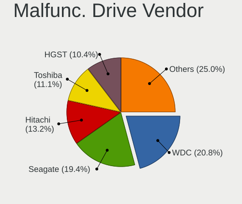

| Vendor                      | Computers | Drives | Percent |
|-----------------------------|-----------|--------|---------|
| WDC                         | 30        | 36     | 20.83%  |
| Seagate                     | 28        | 36     | 19.44%  |
| Hitachi                     | 19        | 24     | 13.19%  |
| Toshiba                     | 16        | 18     | 11.11%  |
| HGST                        | 15        | 17     | 10.42%  |
| Kingston                    | 11        | 27     | 7.64%   |
| China                       | 5         | 8      | 3.47%   |
| Samsung Electronics         | 3         | 5      | 2.08%   |
| SK hynix                    | 2         | 2      | 1.39%   |
| JMicron Technology          | 2         | 2      | 1.39%   |
| Crucial                     | 2         | 2      | 1.39%   |
| XrayDisk                    | 1         | 1      | 0.69%   |
| XPG                         | 1         | 2      | 0.69%   |
| Vaseky                      | 1         | 1      | 0.69%   |
| Maxtor                      | 1         | 1      | 0.69%   |
| MAXIO Technology (Hangzhou) | 1         | 1      | 0.69%   |
| LITEON                      | 1         | 1      | 0.69%   |
| Intel                       | 1         | 2      | 0.69%   |
| Fujitsu                     | 1         | 1      | 0.69%   |
| Faspeed                     | 1         | 1      | 0.69%   |
| Apple                       | 1         | 2      | 0.69%   |
| A-DATA Technology           | 1         | 1      | 0.69%   |

Malfunc. HDD Vendor
-------------------

Vendors of faulty HDD drives

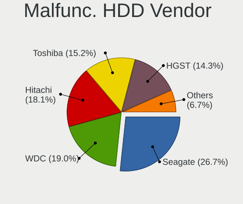

| Vendor              | Computers | Drives | Percent |
|---------------------|-----------|--------|---------|
| Seagate             | 28        | 36     | 26.67%  |
| WDC                 | 20        | 22     | 19.05%  |
| Hitachi             | 19        | 24     | 18.1%   |
| Toshiba             | 16        | 18     | 15.24%  |
| HGST                | 15        | 17     | 14.29%  |
| Samsung Electronics | 2         | 4      | 1.9%    |
| JMicron Technology  | 2         | 2      | 1.9%    |
| Maxtor              | 1         | 1      | 0.95%   |
| Fujitsu             | 1         | 1      | 0.95%   |
| Apple               | 1         | 2      | 0.95%   |

Malfunc. Drive Kind
-------------------

Kinds of faulty drives

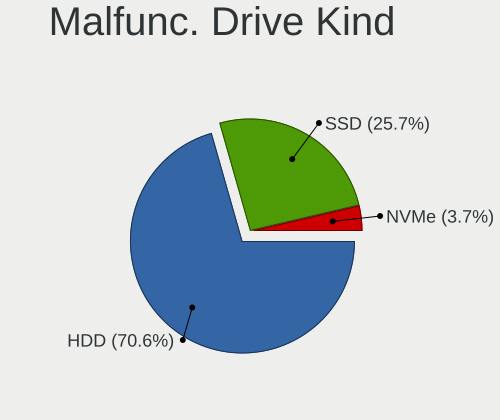

| Kind | Computers | Drives | Percent |
|------|-----------|--------|---------|
| HDD  | 96        | 127    | 70.59%  |
| SSD  | 35        | 58     | 25.74%  |
| NVMe | 5         | 6      | 3.68%   |

Failed Drives
-------------

Failed drive models

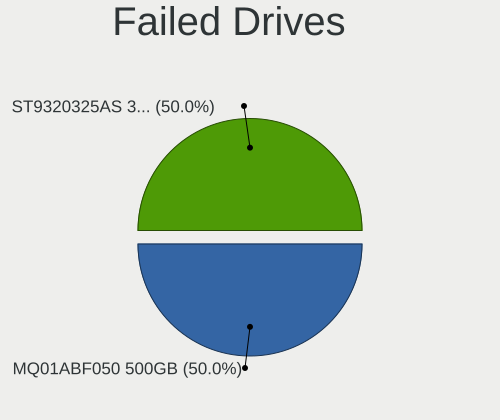

| Model                     | Computers | Drives | Percent |
|---------------------------|-----------|--------|---------|
| Toshiba MQ01ABF050 500GB  | 1         | 1      | 50%     |
| Seagate ST9320325AS 320GB | 1         | 1      | 50%     |

Failed Drive Vendor
-------------------

Failed drive vendors

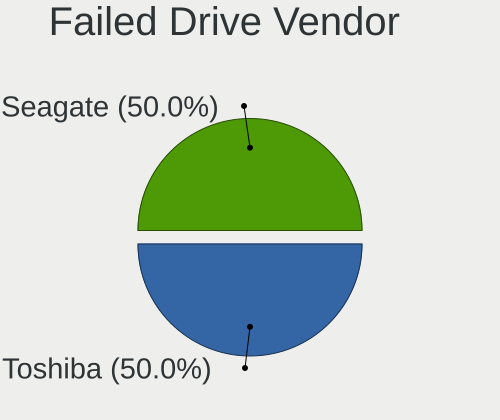

| Vendor  | Computers | Drives | Percent |
|---------|-----------|--------|---------|
| Toshiba | 1         | 1      | 50%     |
| Seagate | 1         | 1      | 50%     |

Drive Status
------------

Number of failed and malfunc. drives

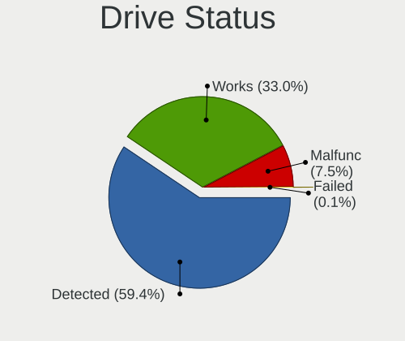

| Status   | Computers | Drives | Percent |
|----------|-----------|--------|---------|
| Detected | 1018      | 1839   | 59.39%  |
| Works    | 565       | 1060   | 32.96%  |
| Malfunc  | 129       | 191    | 7.53%   |
| Failed   | 2         | 2      | 0.12%   |

Storage controller
------------------

Storage Vendor
--------------

Storage controller vendors

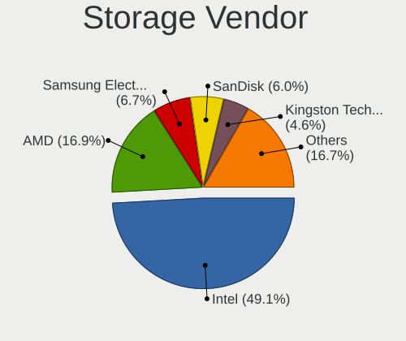

| Vendor                                  | Computers | Percent |
|-----------------------------------------|-----------|---------|
| Intel                                   | 972       | 49.12%  |
| AMD                                     | 334       | 16.88%  |
| Samsung Electronics                     | 133       | 6.72%   |
| SanDisk                                 | 118       | 5.96%   |
| Kingston Technology Company             | 91        | 4.6%    |
| SK hynix                                | 52        | 2.63%   |
| Micron Technology                       | 37        | 1.87%   |
| Micron/Crucial Technology               | 30        | 1.52%   |
| Silicon Motion                          | 27        | 1.36%   |
| KIOXIA                                  | 22        | 1.11%   |
| MAXIO Technology (Hangzhou)             | 21        | 1.06%   |
| Phison Electronics                      | 17        | 0.86%   |
| Nvidia                                  | 15        | 0.76%   |
| Realtek Semiconductor                   | 14        | 0.71%   |
| Toshiba America Info Systems            | 12        | 0.61%   |
| ADATA Technology                        | 12        | 0.61%   |
| JMicron Technology                      | 11        | 0.56%   |
| ASMedia Technology                      | 9         | 0.45%   |
| Marvell Technology Group                | 8         | 0.4%    |
| O2 Micro                                | 5         | 0.25%   |
| Union Memory (Shenzhen)                 | 4         | 0.2%    |
| Solid State Storage Technology          | 4         | 0.2%    |
| Silicon Integrated Systems [SiS]        | 4         | 0.2%    |
| INNOGRIT                                | 4         | 0.2%    |
| Solidigm                                | 3         | 0.15%   |
| Shenzhen Longsys Electronics            | 3         | 0.15%   |
| VIA Technologies                        | 2         | 0.1%    |
| Shenzhen Unionmemory Information System | 2         | 0.1%    |
| Lite-On Technology                      | 2         | 0.1%    |
| Hosin Global Electronics                | 2         | 0.1%    |
| Broadcom / LSI                          | 2         | 0.1%    |
| Apple                                   | 2         | 0.1%    |
| TenaFe                                  | 1         | 0.05%   |
| Seagate Technology                      | 1         | 0.05%   |
| Ramaxel Technology(Shenzhen) Limited    | 1         | 0.05%   |
| Netac Technology                        | 1         | 0.05%   |
| Lenovo                                  | 1         | 0.05%   |

Storage Model
-------------

Storage controller models

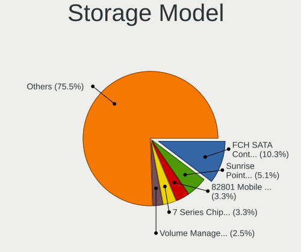

| Model                                                                            | Computers | Percent |
|----------------------------------------------------------------------------------|-----------|---------|
| AMD FCH SATA Controller [AHCI mode]                                              | 229       | 10.35%  |
| Intel Sunrise Point-LP SATA Controller [AHCI mode]                               | 112       | 5.06%   |
| Intel 82801 Mobile SATA Controller [RAID mode]                                   | 74        | 3.34%   |
| Intel 7 Series Chipset Family 6-port SATA Controller [AHCI mode]                 | 72        | 3.25%   |
| Intel Volume Management Device NVMe RAID Controller                              | 55        | 2.49%   |
| Intel 8 Series/C220 Series Chipset Family 6-port SATA Controller 1 [AHCI mode]   | 49        | 2.21%   |
| Samsung NVMe SSD Controller SM981/PM981/PM983                                    | 46        | 2.08%   |
| Intel 6 Series/C200 Series Chipset Family 6 port Mobile SATA AHCI Controller     | 45        | 2.03%   |
| Samsung NVMe SSD Controller 980 (DRAM-less)                                      | 37        | 1.67%   |
| Intel 8 Series SATA Controller 1 [AHCI mode]                                     | 33        | 1.49%   |
| AMD SB7x0/SB8x0/SB9x0 SATA Controller [AHCI mode]                                | 33        | 1.49%   |
| SanDisk Extreme Pro / WD Black SN750 / PC SN730 / Red SN700 NVMe SSD             | 30        | 1.36%   |
| AMD 500 Series Chipset SATA Controller                                           | 30        | 1.36%   |
| AMD 400 Series Chipset SATA Controller                                           | 30        | 1.36%   |
| Intel 82801IBM/IEM (ICH9M/ICH9M-E) 4 port SATA Controller [AHCI mode]            | 28        | 1.27%   |
| Intel Celeron/Pentium Silver Processor SATA Controller                           | 26        | 1.17%   |
| SanDisk Ultra 3D / WD PC SN530, IX SN530, Blue SN550 NVMe SSD (DRAM-less)        | 23        | 1.04%   |
| Intel Atom Processor E3800 Series SATA AHCI Controller                           | 23        | 1.04%   |
| Silicon Motion SM2263EN/SM2263XT (DRAM-less) NVMe SSD Controllers                | 22        | 0.99%   |
| Intel Wildcat Point-LP SATA Controller [AHCI Mode]                               | 22        | 0.99%   |
| Intel Comet Lake SATA AHCI Controller                                            | 21        | 0.95%   |
| Intel Cannon Point-LP SATA Controller [AHCI Mode]                                | 21        | 0.95%   |
| AMD SB7x0/SB8x0/SB9x0 IDE Controller                                             | 21        | 0.95%   |
| Intel Q170/Q150/B150/H170/H110/Z170/CM236 Chipset SATA Controller [AHCI Mode]    | 20        | 0.9%    |
| Kingston Company NV2 NVMe SSD [SM2267XT] (DRAM-less)                             | 19        | 0.86%   |
| Intel Cannon Lake Mobile PCH SATA AHCI Controller                                | 19        | 0.86%   |
| Intel 400 Series Chipset Family SATA AHCI Controller                             | 19        | 0.86%   |
| Micron/Crucial P2 [Nick P2] / P3 / P3 Plus NVMe PCIe SSD (DRAM-less)             | 18        | 0.81%   |
| SK hynix Gold P31/BC711/PC711 NVMe Solid State Drive                             | 17        | 0.77%   |
| Kingston Company KC3000/FURY Renegade NVMe SSD [E18]                             | 17        | 0.77%   |
| Intel 5 Series/3400 Series Chipset 4 port SATA AHCI Controller                   | 17        | 0.77%   |
| Intel 200 Series PCH SATA controller [AHCI mode]                                 | 17        | 0.77%   |
| AMD SB7x0/SB8x0/SB9x0 SATA Controller [IDE mode]                                 | 17        | 0.77%   |
| MAXIO (Hangzhou) NVMe SSD Controller MAP1202 (DRAM-less)                         | 16        | 0.72%   |
| Intel Tiger Lake-LP SATA Controller                                              | 16        | 0.72%   |
| Intel Atom/Celeron/Pentium Processor x5-E8000/J3xxx/N3xxx Series SATA Controller | 16        | 0.72%   |
| Intel Optane NVME SSD H10 with Solid State Storage [Teton Glacier]               | 15        | 0.68%   |
| SanDisk WD SN560/SN740/SN770/SN5000 NVMe SSD                                     | 14        | 0.63%   |
| KIOXIA NVMe SSD Controller BG4 (DRAM-less)                                       | 14        | 0.63%   |
| Intel SSD 670p Series [Keystone Harbor]                                          | 14        | 0.63%   |

Storage Kind
------------

Kind of storage controller (IDE, SATA, NVMe, SAS, ...)

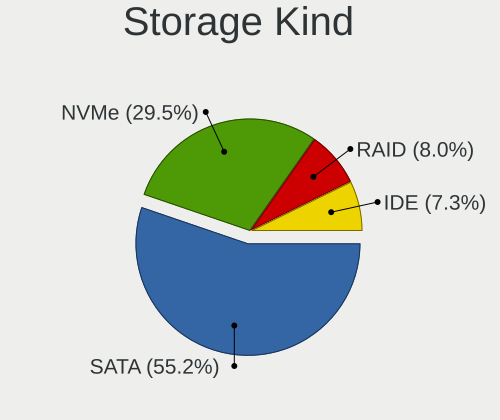

| Kind | Computers | Percent |
|------|-----------|---------|
| SATA | 1097      | 55.24%  |
| NVMe | 586       | 29.51%  |
| RAID | 159       | 8.01%   |
| IDE  | 144       | 7.25%   |

Processor
---------

CPU Vendor
----------

Processor vendors

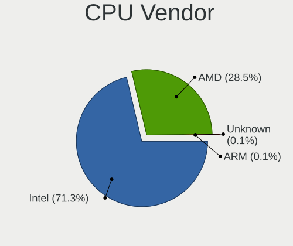

| Vendor       | Computers | Percent |
|--------------|-----------|---------|
| Intel        | 1115      | 71.29%  |
| AMD          | 445       | 28.45%  |
| Unknown      | 2         | 0.13%   |
| CentaurHauls | 1         | 0.06%   |
| ARM          | 1         | 0.06%   |

CPU Model
---------

Processor models

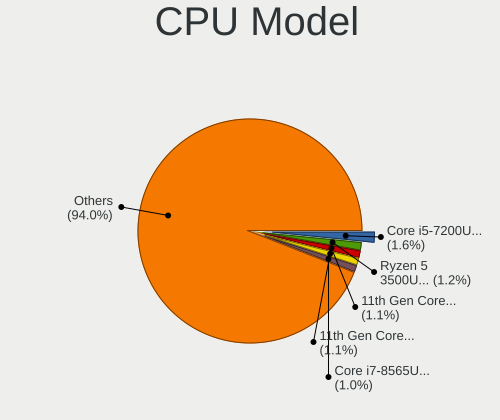

| Model                                         | Computers | Percent |
|-----------------------------------------------|-----------|---------|
| Intel Core i5-7200U CPU @ 2.50GHz             | 25        | 1.59%   |
| AMD Ryzen 5 3500U with Radeon Vega Mobile Gfx | 19        | 1.2%    |
| Intel 11th Gen Core i7-1165G7 @ 2.80GHz       | 17        | 1.08%   |
| Intel 11th Gen Core i5-1135G7 @ 2.40GHz       | 17        | 1.08%   |
| Intel Core i7-8565U CPU @ 1.80GHz             | 16        | 1.01%   |
| Intel Core i5-3210M CPU @ 2.50GHz             | 16        | 1.01%   |
| Intel Core i5-10210U CPU @ 1.60GHz            | 16        | 1.01%   |
| Intel Core i7-8550U CPU @ 1.80GHz             | 14        | 0.89%   |
| Intel Core i5-8250U CPU @ 1.60GHz             | 14        | 0.89%   |
| Intel Core i5-6200U CPU @ 2.30GHz             | 14        | 0.89%   |
| Intel Core i5-9300H CPU @ 2.40GHz             | 13        | 0.82%   |
| Intel Core i7-7500U CPU @ 2.70GHz             | 12        | 0.76%   |
| Intel Core i5-10300H CPU @ 2.50GHz            | 12        | 0.76%   |
| Intel Core i5-8265U CPU @ 1.60GHz             | 11        | 0.7%    |
| Intel Core i5-7300HQ CPU @ 2.50GHz            | 11        | 0.7%    |
| AMD Ryzen 5 5500U with Radeon Graphics        | 11        | 0.7%    |
| AMD Custom APU 0405                           | 11        | 0.7%    |
| Intel Core i3-1005G1 CPU @ 1.20GHz            | 10        | 0.63%   |
| Intel Pentium CPU N3540 @ 2.16GHz             | 9         | 0.57%   |
| Intel Core i7-7700HQ CPU @ 2.80GHz            | 9         | 0.57%   |
| Intel Core i5-8300H CPU @ 2.30GHz             | 9         | 0.57%   |
| Intel Atom x5-Z8350 CPU @ 1.44GHz             | 9         | 0.57%   |
| AMD Ryzen 7 7730U with Radeon Graphics        | 9         | 0.57%   |
| AMD Ryzen 7 5800H with Radeon Graphics        | 9         | 0.57%   |
| AMD Ryzen 5 2500U with Radeon Vega Mobile Gfx | 9         | 0.57%   |
| Intel Core i7-9750H CPU @ 2.60GHz             | 8         | 0.51%   |
| Intel Core i3-6006U CPU @ 2.00GHz             | 8         | 0.51%   |
| Intel Core i3-3110M CPU @ 2.40GHz             | 8         | 0.51%   |
| Intel Celeron N4500 @ 1.10GHz                 | 8         | 0.51%   |
| Intel Celeron CPU N3060 @ 1.60GHz             | 8         | 0.51%   |
| Intel Celeron CPU N2840 @ 2.16GHz             | 8         | 0.51%   |
| Intel 11th Gen Core i3-1115G4 @ 3.00GHz       | 8         | 0.51%   |
| AMD Ryzen 7 5700X 8-Core Processor            | 8         | 0.51%   |
| AMD Ryzen 5 5600 6-Core Processor             | 8         | 0.51%   |
| AMD Ryzen 5 3550H with Radeon Vega Mobile Gfx | 8         | 0.51%   |
| Intel Core i7-8650U CPU @ 1.90GHz             | 7         | 0.44%   |
| Intel Core i7-10510U CPU @ 1.80GHz            | 7         | 0.44%   |
| Intel Core i5-4210U CPU @ 1.70GHz             | 7         | 0.44%   |
| Intel Celeron N4020 CPU @ 1.10GHz             | 7         | 0.44%   |
| Intel Celeron CPU N3050 @ 1.60GHz             | 7         | 0.44%   |

CPU Model Family
----------------

Processor model prefix

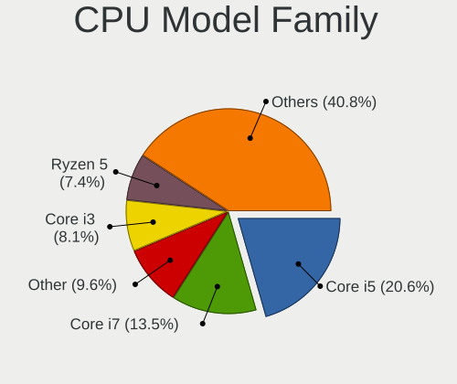

| Model                   | Computers | Percent |
|-------------------------|-----------|---------|
| Intel Core i5           | 324       | 20.6%   |
| Intel Core i7           | 212       | 13.48%  |
| Other                   | 151       | 9.6%    |
| Intel Core i3           | 127       | 8.07%   |
| AMD Ryzen 5             | 117       | 7.44%   |
| Intel Celeron           | 98        | 6.23%   |
| AMD Ryzen 7             | 82        | 5.21%   |
| Intel Pentium           | 48        | 3.05%   |
| Intel Xeon              | 44        | 2.8%    |
| Intel Core 2 Duo        | 41        | 2.61%   |
| Intel Atom              | 28        | 1.78%   |
| AMD Ryzen 3             | 28        | 1.78%   |
| AMD A10                 | 20        | 1.27%   |
| AMD A6                  | 19        | 1.21%   |
| AMD FX                  | 17        | 1.08%   |
| AMD E1                  | 16        | 1.02%   |
| Intel Pentium Dual-Core | 15        | 0.95%   |
| AMD Ryzen 9             | 15        | 0.95%   |
| AMD E                   | 13        | 0.83%   |
| AMD A8                  | 13        | 0.83%   |
| Intel Pentium Dual      | 12        | 0.76%   |
| AMD A4                  | 12        | 0.76%   |
| AMD Athlon              | 11        | 0.7%    |
| Intel Core i9           | 8         | 0.51%   |
| AMD E2                  | 7         | 0.45%   |
| Intel Pentium Silver    | 6         | 0.38%   |
| AMD Ryzen 7 PRO         | 6         | 0.38%   |
| AMD Ryzen 5 PRO         | 6         | 0.38%   |
| Intel Core 2 Quad       | 5         | 0.32%   |
| Intel Core              | 5         | 0.32%   |
| AMD A12                 | 5         | 0.32%   |
| Intel Pentium Gold      | 4         | 0.25%   |
| Intel Genuine           | 4         | 0.25%   |
| Intel Core 2            | 4         | 0.25%   |
| AMD Turion II Dual-Core | 4         | 0.25%   |
| AMD Athlon II X2        | 4         | 0.25%   |
| Intel Celeron Dual-Core | 3         | 0.19%   |
| AMD Phenom II X4        | 3         | 0.19%   |
| AMD Phenom              | 3         | 0.19%   |
| AMD Athlon II           | 3         | 0.19%   |

CPU Cores
---------

Number of processor cores

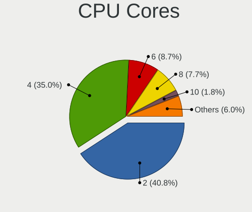

| Number  | Computers | Percent |
|---------|-----------|---------|
| 2       | 643       | 40.83%  |
| 4       | 551       | 34.98%  |
| 6       | 137       | 8.7%    |
| 8       | 122       | 7.75%   |
| 10      | 28        | 1.78%   |
| 1       | 24        | 1.52%   |
| 12      | 22        | 1.4%    |
| 14      | 17        | 1.08%   |
| 3       | 9         | 0.57%   |
| 16      | 8         | 0.51%   |
| Unknown | 6         | 0.38%   |
| 20      | 4         | 0.25%   |
| 24      | 3         | 0.19%   |
| 64      | 1         | 0.06%   |

CPU Sockets
-----------

Number of sockets

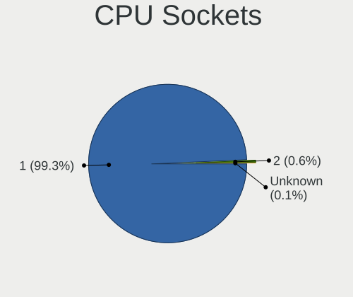

| Number  | Computers | Percent |
|---------|-----------|---------|
| 1       | 1553      | 99.3%   |
| 2       | 9         | 0.58%   |
| 4       | 1         | 0.06%   |
| Unknown | 1         | 0.06%   |

CPU Threads
-----------

Threads per core (Hyper-Threading)

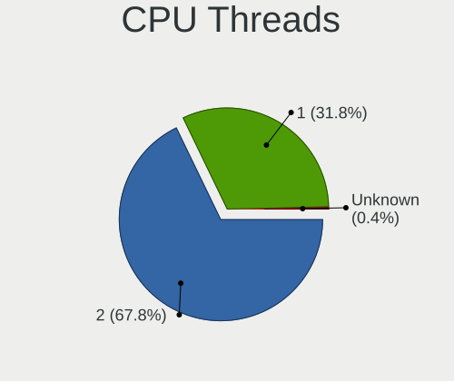

| Number  | Computers | Percent |
|---------|-----------|---------|
| 2       | 1065      | 67.83%  |
| 1       | 499       | 31.78%  |
| Unknown | 6         | 0.38%   |

CPU Op-Modes
------------

CPU Operation Modes (32-bit, 64-bit)

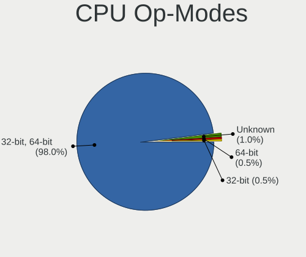

| Op mode        | Computers | Percent |
|----------------|-----------|---------|
| 32-bit, 64-bit | 1535      | 98.02%  |
| Unknown        | 15        | 0.96%   |
| 64-bit         | 8         | 0.51%   |
| 32-bit         | 8         | 0.51%   |

CPU Microcode
-------------

Microcode number

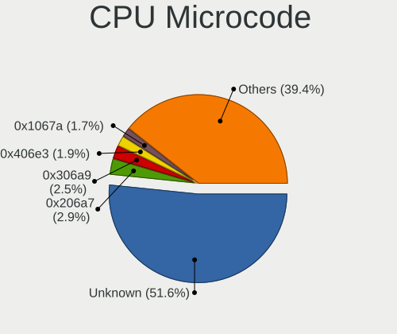

| Number     | Computers | Percent |
|------------|-----------|---------|
| Unknown    | 842       | 51.62%  |
| 0x206a7    | 48        | 2.94%   |
| 0x306a9    | 40        | 2.45%   |
| 0x406e3    | 31        | 1.9%    |
| 0x1067a    | 28        | 1.72%   |
| 0x806e9    | 27        | 1.66%   |
| 0x306c3    | 26        | 1.59%   |
| 0x806ec    | 24        | 1.47%   |
| 0x40651    | 23        | 1.41%   |
| 0x906ea    | 21        | 1.29%   |
| 0x30678    | 21        | 1.29%   |
| 0x08108109 | 20        | 1.23%   |
| 0x806c1    | 18        | 1.1%    |
| 0x806ea    | 17        | 1.04%   |
| 0x906e9    | 16        | 0.98%   |
| 0x6fd      | 16        | 0.98%   |
| 0x20655    | 15        | 0.92%   |
| 0x08108102 | 15        | 0.92%   |
| 0x406c4    | 14        | 0.86%   |
| 0x0810100b | 14        | 0.86%   |
| 0x08701021 | 13        | 0.8%    |
| 0xa0652    | 12        | 0.74%   |
| 0x05000119 | 12        | 0.74%   |
| 0x306d4    | 11        | 0.67%   |
| 0x0a50000c | 11        | 0.67%   |
| 0x10676    | 10        | 0.61%   |
| 0x06000852 | 10        | 0.61%   |
| 0x706a8    | 9         | 0.55%   |
| 0x506c9    | 9         | 0.55%   |
| 0x08600106 | 9         | 0.55%   |
| 0x0700010f | 9         | 0.55%   |
| 0x010000c8 | 9         | 0.55%   |
| 0x07030105 | 8         | 0.49%   |
| 0x806eb    | 7         | 0.43%   |
| 0x706e5    | 7         | 0.43%   |
| 0x506e3    | 7         | 0.43%   |
| 0x406c3    | 7         | 0.43%   |
| 0x08608103 | 7         | 0.43%   |
| 0x06001119 | 7         | 0.43%   |
| 0x03000027 | 7         | 0.43%   |

CPU Microarch
-------------

Microarchitecture

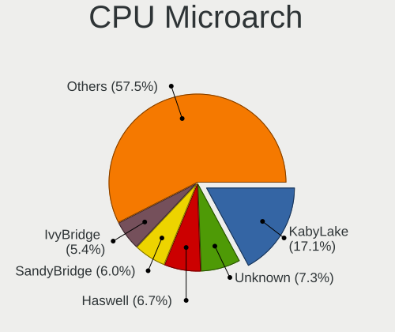

| Name              | Computers | Percent |
|-------------------|-----------|---------|
| KabyLake          | 270       | 17.11%  |
| Unknown           | 115       | 7.29%   |
| Haswell           | 106       | 6.72%   |
| SandyBridge       | 94        | 5.96%   |
| IvyBridge         | 86        | 5.45%   |
| Zen+              | 71        | 4.5%    |
| Skylake           | 68        | 4.31%   |
| Zen 3             | 67        | 4.25%   |
| Penryn            | 63        | 3.99%   |
| Silvermont        | 59        | 3.74%   |
| Zen 2             | 56        | 3.55%   |
| TigerLake         | 51        | 3.23%   |
| CometLake         | 41        | 2.6%    |
| Broadwell         | 36        | 2.28%   |
| Westmere          | 32        | 2.03%   |
| Excavator         | 32        | 2.03%   |
| Alderlake Hybrid  | 32        | 2.03%   |
| Core              | 31        | 1.96%   |
| Zen               | 30        | 1.9%    |
| Piledriver        | 29        | 1.84%   |
| IceLake           | 28        | 1.77%   |
| Goldmont plus     | 26        | 1.65%   |
| K10               | 24        | 1.52%   |
| Bobcat            | 22        | 1.39%   |
| Puma              | 15        | 0.95%   |
| Jaguar            | 15        | 0.95%   |
| Goldmont          | 13        | 0.82%   |
| Bonnell           | 13        | 0.82%   |
| K10 Llano         | 9         | 0.57%   |
| Steamroller       | 7         | 0.44%   |
| Nehalem           | 7         | 0.44%   |
| K8 Hammer         | 6         | 0.38%   |
| Gracemont         | 5         | 0.32%   |
| Bulldozer         | 5         | 0.32%   |
| Tremont           | 4         | 0.25%   |
| P6                | 4         | 0.25%   |
| Meteorlake Hybrid | 3         | 0.19%   |
| NetBurst          | 2         | 0.13%   |
| K8 & K10 hybrid   | 1         | 0.06%   |

Graphics
--------

GPU Vendor
----------

Vendors of graphics cards

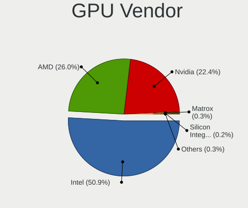

| Vendor                           | Computers | Percent |
|----------------------------------|-----------|---------|
| Intel                            | 940       | 50.89%  |
| AMD                              | 480       | 25.99%  |
| Nvidia                           | 413       | 22.36%  |
| Matrox Electronics Systems       | 5         | 0.27%   |
| Silicon Integrated Systems [SiS] | 4         | 0.22%   |
| VIA Technologies                 | 2         | 0.11%   |
| ATI Technologies                 | 2         | 0.11%   |
| ASPEED Technology                | 1         | 0.05%   |

GPU Model
---------

Graphics card models

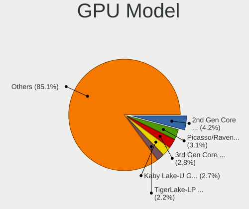

| Model                                                                                    | Computers | Percent |
|------------------------------------------------------------------------------------------|-----------|---------|
| Intel 2nd Generation Core Processor Family Integrated Graphics Controller                | 80        | 4.16%   |
| AMD Picasso/Raven 2 [Radeon Vega Series / Radeon Vega Mobile Series]                     | 59        | 3.06%   |
| Intel 3rd Gen Core processor Graphics Controller                                         | 54        | 2.81%   |
| Intel Kaby Lake-U GT2 [HD Graphics 620]                                                  | 52        | 2.7%    |
| Intel TigerLake-LP GT2 [Iris Xe Graphics]                                                | 42        | 2.18%   |
| Intel Skylake-U GT2 [HD Graphics 520]                                                    | 39        | 2.03%   |
| Intel Kaby Lake-R GT2 [UHD Graphics 620]                                                 | 38        | 1.97%   |
| Intel Haswell-ULT Integrated Graphics Controller                                         | 38        | 1.97%   |
| Intel CometLake-U GT2 [UHD Graphics]                                                     | 36        | 1.87%   |
| Intel Atom/Celeron/Pentium Processor x5-E8000/J3xxx/N3xxx Integrated Graphics Controller | 33        | 1.71%   |
| Intel WhiskeyLake-U GT2 [UHD Graphics 620]                                               | 32        | 1.66%   |
| Intel CoffeeLake-H GT2 [UHD Graphics 630]                                                | 32        | 1.66%   |
| AMD Renoir [Radeon Vega Series / Radeon Vega Mobile Series]                              | 28        | 1.45%   |
| Nvidia TU117M [GeForce GTX 1650 Mobile / Max-Q]                                          | 26        | 1.35%   |
| Intel Atom Processor Z36xxx/Z37xxx Series Graphics & Display                             | 26        | 1.35%   |
| AMD Cezanne [Radeon Vega Series / Radeon Vega Mobile Series]                             | 26        | 1.35%   |
| Nvidia GP107M [GeForce GTX 1050 Mobile]                                                  | 25        | 1.3%    |
| Intel Mobile 4 Series Chipset Integrated Graphics Controller                             | 24        | 1.25%   |
| Intel Core Processor Integrated Graphics Controller                                      | 24        | 1.25%   |
| Intel CometLake-H GT2 [UHD Graphics]                                                     | 23        | 1.19%   |
| AMD Sun XT [Radeon HD 8670A/8670M/8690M / R5 M330 / M430 / Radeon 520 Mobile]            | 23        | 1.19%   |
| AMD Raven Ridge [Radeon Vega Series / Radeon Vega Mobile Series]                         | 23        | 1.19%   |
| Intel Broadwell-U GT2 [HD Graphics 5500]                                                 | 22        | 1.14%   |
| Intel Xeon E3-1200 v3/4th Gen Core Processor Integrated Graphics Controller              | 21        | 1.09%   |
| Intel Kaby Lake-H GT2 [HD Graphics 630]                                                  | 20        | 1.04%   |
| Intel GeminiLake [UHD Graphics 600]                                                      | 20        | 1.04%   |
| AMD Stoney [Radeon R2/R3/R4/R5 Graphics]                                                 | 19        | 0.99%   |
| AMD Topaz XT [Radeon R7 M260/M265 / M340/M360 / M440/M445 / 530/535 / 620/625 Mobile]    | 17        | 0.88%   |
| AMD Lucienne                                                                             | 16        | 0.83%   |
| Intel Iris Plus Graphics G1 (Ice Lake)                                                   | 15        | 0.78%   |
| Nvidia GM108M [GeForce 940MX]                                                            | 14        | 0.73%   |
| Intel Raptor Lake-P [Iris Xe Graphics]                                                   | 14        | 0.73%   |
| Intel 4th Gen Core Processor Integrated Graphics Controller                              | 14        | 0.73%   |
| AMD Ellesmere [Radeon RX 470/480/570/570X/580/580X/590]                                  | 14        | 0.73%   |
| Intel TigerLake-H GT1 [UHD Graphics]                                                     | 13        | 0.68%   |
| Intel Skylake-S GT2 [HD Graphics 530]                                                    | 12        | 0.62%   |
| AMD Wani [Radeon R5/R6/R7 Graphics]                                                      | 12        | 0.62%   |
| Nvidia GK208B [GeForce GT 710]                                                           | 11        | 0.57%   |
| Intel Mobile GM965/GL960 Integrated Graphics Controller (secondary)                      | 11        | 0.57%   |
| Intel Mobile GM965/GL960 Integrated Graphics Controller (primary)                        | 11        | 0.57%   |

GPU Combo
---------

Combinations of graphics cards

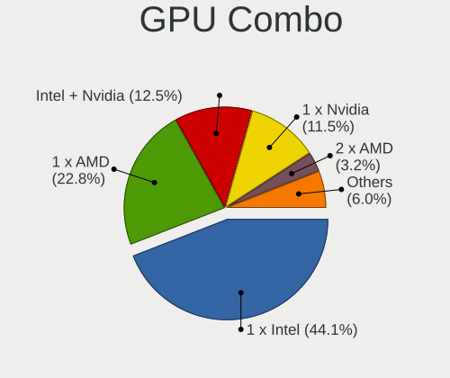

| Name           | Computers | Percent |
|----------------|-----------|---------|
| 1 x Intel      | 694       | 44.09%  |
| 1 x AMD        | 359       | 22.81%  |
| Intel + Nvidia | 196       | 12.45%  |
| 1 x Nvidia     | 181       | 11.5%   |
| 2 x AMD        | 50        | 3.18%   |
| AMD + Nvidia   | 39        | 2.48%   |
| Intel + AMD    | 34        | 2.16%   |
| 2 x Intel      | 6         | 0.38%   |
| 1 x SiS        | 4         | 0.25%   |
| 1 x Matrox     | 4         | 0.25%   |
| Other          | 3         | 0.19%   |
| 1 x VIA        | 2         | 0.13%   |
| 1 x ASPEED     | 1         | 0.06%   |
| AMD + Matrox   | 1         | 0.06%   |

GPU Driver
----------

Free vs proprietary

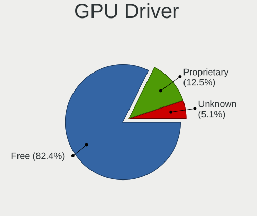

| Driver      | Computers | Percent |
|-------------|-----------|---------|
| Free        | 1307      | 82.36%  |
| Proprietary | 199       | 12.54%  |
| Unknown     | 81        | 5.1%    |

GPU Memory
----------

Total video memory

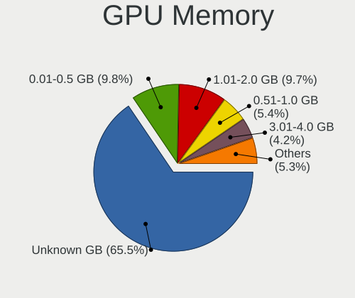

| Size in GB | Computers | Percent |
|------------|-----------|---------|
| Unknown    | 1059      | 65.53%  |
| 0.01-0.5   | 158       | 9.78%   |
| 1.01-2.0   | 157       | 9.72%   |
| 0.51-1.0   | 88        | 5.45%   |
| 3.01-4.0   | 68        | 4.21%   |
| 7.01-8.0   | 32        | 1.98%   |
| 5.01-6.0   | 22        | 1.36%   |
| 8.01-16.0  | 20        | 1.24%   |
| 2.01-3.0   | 11        | 0.68%   |
| 4.01-5.0   | 1         | 0.06%   |

Monitor
-------

Monitor Vendor
--------------

Monitor vendors

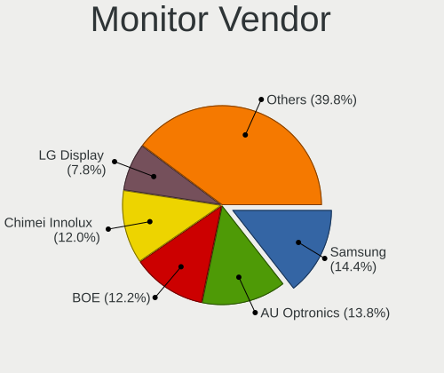

| Vendor                  | Computers | Percent |
|-------------------------|-----------|---------|
| Samsung Electronics     | 254       | 14.44%  |
| AU Optronics            | 243       | 13.81%  |
| BOE                     | 214       | 12.17%  |
| Chimei Innolux          | 211       | 12%     |
| LG Display              | 137       | 7.79%   |
| Goldstar                | 119       | 6.77%   |
| Hewlett-Packard         | 61        | 3.47%   |
| Lenovo                  | 44        | 2.5%    |
| Dell                    | 40        | 2.27%   |
| AOC                     | 36        | 2.05%   |
| Apple                   | 31        | 1.76%   |
| ViewSonic               | 30        | 1.71%   |
| ASUSTek Computer        | 21        | 1.19%   |
| PANDA                   | 18        | 1.02%   |
| Sharp                   | 16        | 0.91%   |
| Unknown                 | 15        | 0.85%   |
| Chi Mei Optoelectronics | 15        | 0.85%   |
| Sony                    | 14        | 0.8%    |
| SAC                     | 13        | 0.74%   |
| LG Electronics          | 13        | 0.74%   |
| Acer                    | 13        | 0.74%   |
| MSI                     | 12        | 0.68%   |
| InfoVision              | 11        | 0.63%   |
| CSO                     | 11        | 0.63%   |
| Valve                   | 10        | 0.57%   |
| Envision                | 10        | 0.57%   |
| Ancor Communications    | 9         | 0.51%   |
| HKC                     | 8         | 0.45%   |
| ___                     | 7         | 0.4%    |
| Mi                      | 7         | 0.4%    |
| Unknown (XXX)           | 6         | 0.34%   |
| Plain Tree Systems      | 6         | 0.34%   |
| LG Philips              | 6         | 0.34%   |
| KTC                     | 6         | 0.34%   |
| RGT                     | 5         | 0.28%   |
| Philips                 | 5         | 0.28%   |
| Panasonic               | 5         | 0.28%   |
| Packard Bell            | 4         | 0.23%   |
| InnoLux Display         | 4         | 0.23%   |
| Hitachi                 | 4         | 0.23%   |

Monitor Model
-------------

Monitor models

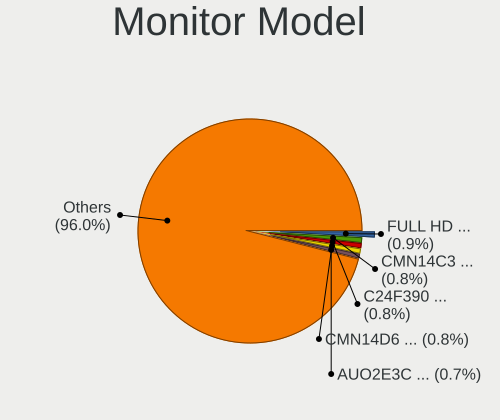

| Model                                                                 | Computers | Percent |
|-----------------------------------------------------------------------|-----------|---------|
| Goldstar FULL HD GSM5B55 1920x1080 480x270mm 21.7-inch                | 16        | 0.88%   |
| Chimei Innolux LCD Monitor CMN14C3 1366x768 309x173mm 13.9-inch       | 15        | 0.83%   |
| Samsung Electronics C24F390 SAM0D2C 1920x1080 521x293mm 23.5-inch     | 14        | 0.77%   |
| Chimei Innolux LCD Monitor CMN14D6 1366x768 309x173mm 13.9-inch       | 14        | 0.77%   |
| AU Optronics LCD Monitor AUO2E3C 1366x768 309x173mm 13.9-inch         | 13        | 0.72%   |
| Goldstar LG ULTRAWIDE GSM59F1 2560x1080 670x280mm 28.6-inch           | 12        | 0.66%   |
| BOE LCD Monitor BOE0697 1366x768 309x173mm 13.9-inch                  | 12        | 0.66%   |
| LG Display LCD Monitor LGD02E9 1366x768 309x174mm 14.0-inch           | 11        | 0.61%   |
| Valve ANX7530 U VLV3001 800x1280 100x150mm 7.1-inch                   | 10        | 0.55%   |
| Goldstar LG IPS FULLHD GSM5AB8 1920x1080 480x270mm 21.7-inch          | 10        | 0.55%   |
| Chimei Innolux LCD Monitor CMN15F5 1920x1080 344x193mm 15.5-inch      | 10        | 0.55%   |
| Samsung Electronics S24F350 SAM0D20 1920x1080 521x293mm 23.5-inch     | 9         | 0.5%    |
| Chimei Innolux LCD Monitor CMN1521 1920x1080 344x193mm 15.5-inch      | 9         | 0.5%    |
| Chimei Innolux LCD Monitor CMN1490 1366x768 309x174mm 14.0-inch       | 9         | 0.5%    |
| BOE LCD Monitor BOE0872 1920x1080 344x194mm 15.5-inch                 | 9         | 0.5%    |
| BOE LCD Monitor BOE0696 1366x768 309x173mm 13.9-inch                  | 9         | 0.5%    |
| AU Optronics LCD Monitor AUO723C 1366x768 309x173mm 13.9-inch         | 9         | 0.5%    |
| AU Optronics LCD Monitor AUO403D 1920x1080 309x174mm 14.0-inch        | 9         | 0.5%    |
| Samsung Electronics S27F350 SAM0D22 1920x1080 598x336mm 27.0-inch     | 8         | 0.44%   |
| Chimei Innolux LCD Monitor CMN1618 1920x1200 344x215mm 16.0-inch      | 8         | 0.44%   |
| Chimei Innolux LCD Monitor CMN15E6 1366x768 344x193mm 15.5-inch       | 8         | 0.44%   |
| Chimei Innolux LCD Monitor CMN14E5 1920x1080 309x173mm 13.9-inch      | 8         | 0.44%   |
| BOE LCD Monitor BOE06A4 1366x768 344x194mm 15.5-inch                  | 8         | 0.44%   |
| Samsung Electronics LCD Monitor SEC5441 1280x800 331x207mm 15.4-inch  | 7         | 0.39%   |
| SAC LED MONITOR SAC952D 1920x1080 480x270mm 21.7-inch                 | 7         | 0.39%   |
| MSI Optix MAG27CQ MSI1462 2560x1440 597x336mm 27.0-inch               | 7         | 0.39%   |
| Chimei Innolux LCD Monitor CMN14D4 1920x1080 309x173mm 13.9-inch      | 7         | 0.39%   |
| BOE LCD Monitor BOE06A5 1366x768 344x194mm 15.5-inch                  | 7         | 0.39%   |
| Samsung Electronics S22F350 SAM0D1A 1920x1080 477x268mm 21.5-inch     | 6         | 0.33%   |
| Samsung Electronics LCD Monitor SDC4158 1920x1080 294x165mm 13.3-inch | 6         | 0.33%   |
| PANDA LCD Monitor NCP002D 1920x1080 344x194mm 15.5-inch               | 6         | 0.33%   |
| LG Display LCD Monitor LGD0563 1920x1080 344x194mm 15.5-inch          | 6         | 0.33%   |
| Chimei Innolux LCD Monitor CMN15DB 1366x768 344x193mm 15.5-inch       | 6         | 0.33%   |
| Chimei Innolux LCD Monitor CMN1493 1366x768 309x173mm 13.9-inch       | 6         | 0.33%   |
| BOE LCD Monitor BOE08E8 1920x1080 344x194mm 15.5-inch                 | 6         | 0.33%   |
| BOE LCD Monitor BOE0672 1366x768 344x194mm 15.5-inch                  | 6         | 0.33%   |
| BOE LCD Monitor BOE0602 1366x768 344x193mm 15.5-inch                  | 6         | 0.33%   |
| BOE LCD Monitor BOE05BA 1366x768 309x173mm 13.9-inch                  | 6         | 0.33%   |
| AU Optronics LCD Monitor AUO38ED 1920x1080 344x193mm 15.5-inch        | 6         | 0.33%   |
| AU Optronics LCD Monitor AUO106C 1366x768 276x155mm 12.5-inch         | 6         | 0.33%   |

Monitor Resolution
------------------

Monitor screen resolution

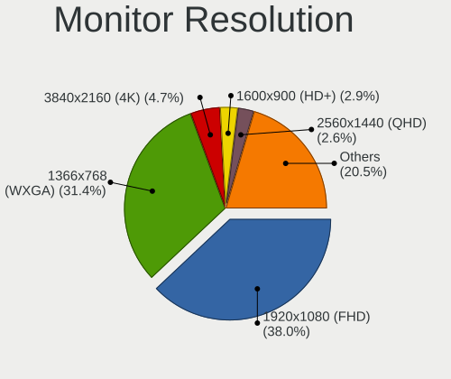

| Resolution         | Computers | Percent |
|--------------------|-----------|---------|
| 1920x1080 (FHD)    | 637       | 37.98%  |
| 1366x768 (WXGA)    | 527       | 31.43%  |
| 3840x2160 (4K)     | 79        | 4.71%   |
| 1600x900 (HD+)     | 48        | 2.86%   |
| 2560x1440 (QHD)    | 43        | 2.56%   |
| 1920x1200 (WUXGA)  | 42        | 2.5%    |
| 1360x768           | 42        | 2.5%    |
| 1440x900 (WXGA+)   | 37        | 2.21%   |
| 1280x800 (WXGA)    | 33        | 1.97%   |
| 1680x1050 (WSXGA+) | 23        | 1.37%   |
| 1280x1024 (SXGA)   | 23        | 1.37%   |
| 2560x1080          | 19        | 1.13%   |
| 2880x1800          | 14        | 0.83%   |
| 3440x1440          | 12        | 0.72%   |
| 2560x1600          | 12        | 0.72%   |
| 800x1280           | 11        | 0.66%   |
| Unknown            | 9         | 0.54%   |
| 3840x1080          | 6         | 0.36%   |
| 1920x540           | 5         | 0.3%    |
| 1024x768 (XGA)     | 5         | 0.3%    |
| 1024x600           | 5         | 0.3%    |
| 3840x2400          | 4         | 0.24%   |
| 3000x2000          | 4         | 0.24%   |
| 2160x1440          | 4         | 0.24%   |
| 3840x1100          | 3         | 0.18%   |
| 2288x1287          | 3         | 0.18%   |
| 3286x1080          | 2         | 0.12%   |
| 2256x1504          | 2         | 0.12%   |
| 2240x1400          | 2         | 0.12%   |
| 1920x1280          | 2         | 0.12%   |
| 1600x2560          | 2         | 0.12%   |
| 1600x1200          | 2         | 0.12%   |
| 1280x960           | 2         | 0.12%   |
| 1280x720 (HD)      | 2         | 0.12%   |
| 1024x576           | 2         | 0.12%   |
| 5760x1080          | 1         | 0.06%   |
| 5440x1800          | 1         | 0.06%   |
| 3840x1600          | 1         | 0.06%   |
| 3072x1920          | 1         | 0.06%   |
| 2944x1840          | 1         | 0.06%   |

Monitor Diagonal
----------------

Diagonal size in inches

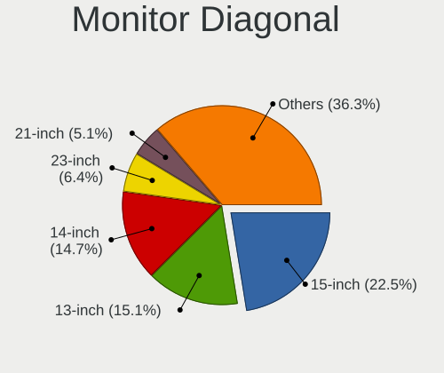

| Inches  | Computers | Percent |
|---------|-----------|---------|
| 15      | 398       | 22.46%  |
| 13      | 267       | 15.07%  |
| 14      | 260       | 14.67%  |
| 23      | 114       | 6.43%   |
| 21      | 90        | 5.08%   |
| 27      | 81        | 4.57%   |
| 24      | 65        | 3.67%   |
| 31      | 59        | 3.33%   |
| Unknown | 49        | 2.77%   |
| 18      | 42        | 2.37%   |
| 16      | 40        | 2.26%   |
| 17      | 39        | 2.2%    |
| 19      | 36        | 2.03%   |
| 34      | 30        | 1.69%   |
| 12      | 27        | 1.52%   |
| 20      | 26        | 1.47%   |
| 11      | 25        | 1.41%   |
| 72      | 13        | 0.73%   |
| 22      | 13        | 0.73%   |
| 84      | 12        | 0.68%   |
| 32      | 12        | 0.68%   |
| 7       | 12        | 0.68%   |
| 10      | 11        | 0.62%   |
| 40      | 7         | 0.4%    |
| 54      | 6         | 0.34%   |
| 48      | 5         | 0.28%   |
| 63      | 4         | 0.23%   |
| 58      | 4         | 0.23%   |
| 142     | 3         | 0.17%   |
| 46      | 3         | 0.17%   |
| 42      | 3         | 0.17%   |
| 28      | 3         | 0.17%   |
| 52      | 2         | 0.11%   |
| 49      | 2         | 0.11%   |
| 37      | 2         | 0.11%   |
| 26      | 2         | 0.11%   |
| 86      | 1         | 0.06%   |
| 65      | 1         | 0.06%   |
| 43      | 1         | 0.06%   |
| 8       | 1         | 0.06%   |

Monitor Width
-------------

Physical width

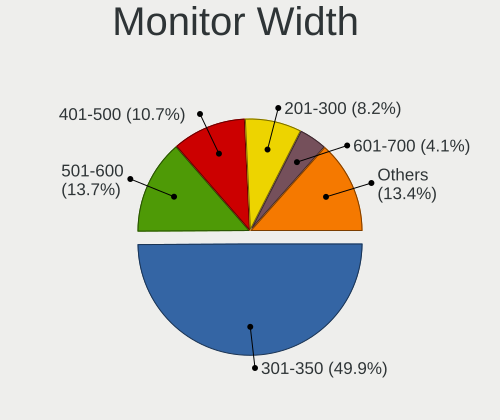

| Width in mm    | Computers | Percent |
|----------------|-----------|---------|
| 301-350        | 869       | 49.91%  |
| 501-600        | 238       | 13.67%  |
| 401-500        | 186       | 10.68%  |
| 201-300        | 143       | 8.21%   |
| 601-700        | 71        | 4.08%   |
| 351-400        | 61        | 3.5%    |
| Unknown        | 49        | 2.81%   |
| 701-800        | 42        | 2.41%   |
| 1001-1500      | 27        | 1.55%   |
| 1501-2000      | 25        | 1.44%   |
| 1-100          | 11        | 0.63%   |
| 801-900        | 9         | 0.52%   |
| 901-1000       | 4         | 0.23%   |
| More than 2000 | 3         | 0.17%   |
| 101-200        | 3         | 0.17%   |

Aspect Ratio
------------

Proportional relationship between the width and the height

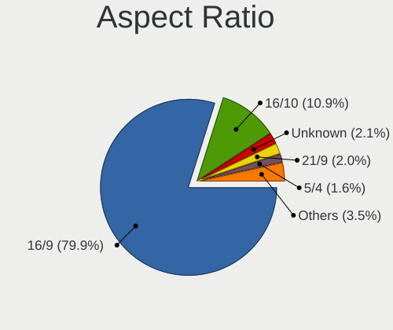

| Ratio   | Computers | Percent |
|---------|-----------|---------|
| 16/9    | 1234      | 79.87%  |
| 16/10   | 169       | 10.94%  |
| Unknown | 32        | 2.07%   |
| 21/9    | 31        | 2.01%   |
| 5/4     | 25        | 1.62%   |
| 3/2     | 14        | 0.91%   |
| 4/3     | 12        | 0.78%   |
| 0.67    | 10        | 0.65%   |
| 32/9    | 4         | 0.26%   |
| 6/5     | 3         | 0.19%   |
| 3.40    | 3         | 0.19%   |
| 1.00    | 3         | 0.19%   |
| 1.96    | 2         | 0.13%   |
| 3.73    | 1         | 0.06%   |
| 0.63    | 1         | 0.06%   |
| 0.56    | 1         | 0.06%   |

Monitor Area
------------

Area in inch²

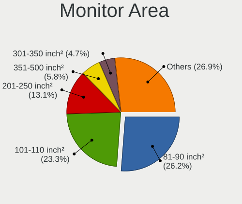

| Area in inch² | Computers | Percent |
|----------------|-----------|---------|
| 81-90          | 459       | 26.23%  |
| 101-110        | 407       | 23.26%  |
| 201-250        | 230       | 13.14%  |
| 351-500        | 102       | 5.83%   |
| 301-350        | 82        | 4.69%   |
| 151-200        | 81        | 4.63%   |
| 71-80          | 60        | 3.43%   |
| 141-150        | 50        | 2.86%   |
| Unknown        | 49        | 2.8%    |
| More than 1000 | 46        | 2.63%   |
| 111-120        | 31        | 1.77%   |
| 51-60          | 28        | 1.6%    |
| 61-70          | 24        | 1.37%   |
| 251-300        | 21        | 1.2%    |
| 501-1000       | 21        | 1.2%    |
| 121-130        | 18        | 1.03%   |
| 1-40           | 14        | 0.8%    |
| 41-50          | 11        | 0.63%   |
| 131-140        | 9         | 0.51%   |
| 91-100         | 7         | 0.4%    |

Pixel Density
-------------

Pixels per inch

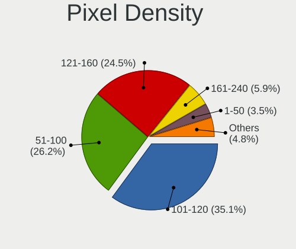

| Density       | Computers | Percent |
|---------------|-----------|---------|
| 101-120       | 598       | 35.09%  |
| 51-100        | 446       | 26.17%  |
| 121-160       | 418       | 24.53%  |
| 161-240       | 101       | 5.93%   |
| 1-50          | 60        | 3.52%   |
| Unknown       | 49        | 2.88%   |
| More than 240 | 32        | 1.88%   |

Multiple Monitors
-----------------

Total monitors connected

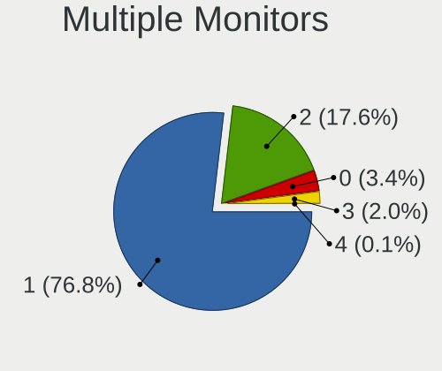

| Total | Computers | Percent |
|-------|-----------|---------|
| 1     | 1248      | 76.85%  |
| 2     | 286       | 17.61%  |
| 0     | 56        | 3.45%   |
| 3     | 33        | 2.03%   |
| 4     | 1         | 0.06%   |

Network
-------

Net Controller Vendor
---------------------

Controller vendors

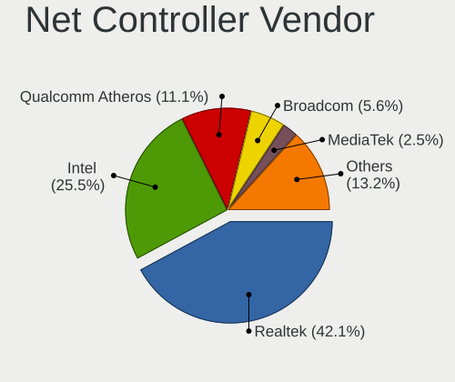

| Vendor                           | Computers | Percent |
|----------------------------------|-----------|---------|
| Realtek Semiconductor            | 1006      | 42.13%  |
| Intel                            | 610       | 25.54%  |
| Qualcomm Atheros                 | 264       | 11.06%  |
| Broadcom                         | 133       | 5.57%   |
| MediaTek                         | 59        | 2.47%   |
| Ralink                           | 37        | 1.55%   |
| TP-Link                          | 33        | 1.38%   |
| Broadcom Limited                 | 31        | 1.3%    |
| Xiaomi                           | 26        | 1.09%   |
| Ralink Technology                | 25        | 1.05%   |
| Samsung Electronics              | 21        | 0.88%   |
| Marvell Technology Group         | 19        | 0.8%    |
| Huawei Technologies              | 16        | 0.67%   |
| Nvidia                           | 12        | 0.5%    |
| ASIX Electronics                 | 10        | 0.42%   |
| Qualcomm Atheros Communications  | 8         | 0.34%   |
| Microsoft                        | 7         | 0.29%   |
| D-Link System                    | 7         | 0.29%   |
| D-Link                           | 7         | 0.29%   |
| ICS Advent                       | 6         | 0.25%   |
| Motorola PCS                     | 5         | 0.21%   |
| Lenovo                           | 5         | 0.21%   |
| Silicon Integrated Systems [SiS] | 4         | 0.17%   |
| JMicron Technology               | 4         | 0.17%   |
| DisplayLink                      | 4         | 0.17%   |
| VIA Technologies                 | 3         | 0.13%   |
| QinHeng Electronics              | 3         | 0.13%   |
| Tenda                            | 2         | 0.08%   |
| Qualcomm                         | 2         | 0.08%   |
| ZTE WCDMA Technologies MSM       | 1         | 0.04%   |
| STMicroelectronics               | 1         | 0.04%   |
| Spreadtrum Communications        | 1         | 0.04%   |
| Shenzhen Goodix Technology       | 1         | 0.04%   |
| Qcom                             | 1         | 0.04%   |
| Padix (Rockfire)                 | 1         | 0.04%   |
| Oculus VR                        | 1         | 0.04%   |
| Netchip Technology               | 1         | 0.04%   |
| Microchip Technology             | 1         | 0.04%   |
| Mercucys                         | 1         | 0.04%   |
| Manta                            | 1         | 0.04%   |

Net Controller Model
--------------------

Controller models

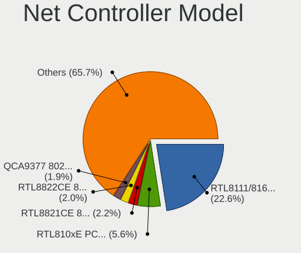

| Model                                                                  | Computers | Percent |
|------------------------------------------------------------------------|-----------|---------|
| Realtek RTL8111/8168/8211/8411 PCI Express Gigabit Ethernet Controller | 642       | 22.56%  |
| Realtek RTL810xE PCI Express Fast Ethernet controller                  | 160       | 5.62%   |
| Realtek RTL8821CE 802.11ac PCIe Wireless Network Adapter               | 62        | 2.18%   |
| Realtek RTL8822CE 802.11ac PCIe Wireless Network Adapter               | 57        | 2%      |
| Qualcomm Atheros QCA9377 802.11ac Wireless Network Adapter             | 54        | 1.9%    |
| Intel Wireless 8265 / 8275                                             | 49        | 1.72%   |
| Intel Wi-Fi 6 AX200                                                    | 49        | 1.72%   |
| Qualcomm Atheros AR9485 Wireless Network Adapter                       | 46        | 1.62%   |
| Qualcomm Atheros QCA9565 / AR9565 Wireless Network Adapter             | 44        | 1.55%   |
| Intel Wi-Fi 6 AX201                                                    | 39        | 1.37%   |
| Qualcomm Atheros AR9285 Wireless Network Adapter (PCI-Express)         | 35        | 1.23%   |
| Realtek RTL8723BE PCIe Wireless Network Adapter                        | 34        | 1.19%   |
| Realtek RTL8153 Gigabit Ethernet Adapter                               | 34        | 1.19%   |
| Intel Comet Lake PCH-LP CNVi WiFi                                      | 32        | 1.12%   |
| Realtek RTL8723DE Wireless Network Adapter                             | 31        | 1.09%   |
| Realtek RTL8125 2.5GbE Controller                                      | 30        | 1.05%   |
| Intel Wireless 7265                                                    | 30        | 1.05%   |
| Broadcom BCM4313 802.11bgn Wireless Network Adapter                    | 27        | 0.95%   |
| Realtek RTL8822BE 802.11a/b/g/n/ac WiFi adapter                        | 26        | 0.91%   |
| Broadcom BCM43142 802.11b/g/n                                          | 26        | 0.91%   |
| Intel Wireless 7260                                                    | 25        | 0.88%   |
| Intel Wireless 8260                                                    | 24        | 0.84%   |
| Intel Wi-Fi 6E(802.11ax) AX210/AX1675* 2x2 [Typhoon Peak]              | 24        | 0.84%   |
| Xiaomi Mi/Redmi series (RNDIS)                                         | 22        | 0.77%   |
| Intel Comet Lake PCH CNVi WiFi                                         | 22        | 0.77%   |
| Intel 82579LM Gigabit Network Connection (Lewisville)                  | 22        | 0.77%   |
| Realtek 802.11ac NIC                                                   | 20        | 0.7%    |
| Intel Cannon Lake PCH CNVi WiFi                                        | 20        | 0.7%    |
| Realtek RTL8188EE Wireless Network Adapter                             | 19        | 0.67%   |
| Qualcomm Atheros QCA6174 802.11ac Wireless Network Adapter             | 19        | 0.67%   |
| Samsung Galaxy series, misc. (tethering mode)                          | 17        | 0.6%    |
| MediaTek MT7902 802.11ax PCIe Wireless Network Adapter [Filogic 310]   | 17        | 0.6%    |
| Intel Ethernet Connection (4) I219-V                                   | 17        | 0.6%    |
| Intel Cannon Point-LP CNVi [Wireless-AC]                               | 17        | 0.6%    |
| Intel Dual Band Wireless-AC 3165 Plus Bluetooth                        | 16        | 0.56%   |
| Intel Wireless 3165                                                    | 15        | 0.53%   |
| Intel Ethernet Connection (4) I219-LM                                  | 15        | 0.53%   |
| MediaTek MT7922 802.11ax PCI Express Wireless Network Adapter          | 14        | 0.49%   |
| MediaTek MT7921 802.11ax PCIe Wireless Network Adapter [Filogic 330]   | 14        | 0.49%   |
| Intel Alder Lake-P PCH CNVi WiFi                                       | 14        | 0.49%   |

Wireless Vendor
---------------

Wireless vendors

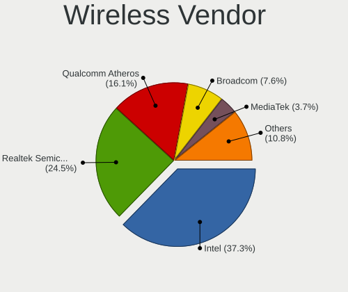

| Vendor                          | Computers | Percent |
|---------------------------------|-----------|---------|
| Intel                           | 520       | 37.3%   |
| Realtek Semiconductor           | 341       | 24.46%  |
| Qualcomm Atheros                | 225       | 16.14%  |
| Broadcom                        | 106       | 7.6%    |
| MediaTek                        | 52        | 3.73%   |
| Ralink                          | 37        | 2.65%   |
| TP-Link                         | 31        | 2.22%   |
| Ralink Technology               | 25        | 1.79%   |
| Broadcom Limited                | 23        | 1.65%   |
| Qualcomm Atheros Communications | 8         | 0.57%   |
| Microsoft                       | 7         | 0.5%    |
| D-Link                          | 6         | 0.43%   |
| D-Link System                   | 4         | 0.29%   |
| Tenda                           | 2         | 0.14%   |
| Qualcomm                        | 2         | 0.14%   |
| Samsung Electronics             | 1         | 0.07%   |
| Qcom                            | 1         | 0.07%   |
| Mercucys                        | 1         | 0.07%   |
| Hewlett-Packard                 | 1         | 0.07%   |
| ASUSTek Computer                | 1         | 0.07%   |

Wireless Model
--------------

Wireless models

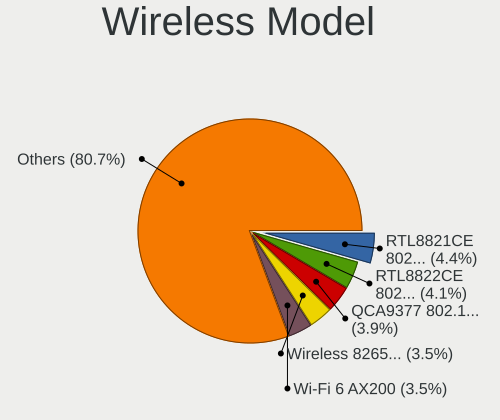

| Model                                                                   | Computers | Percent |
|-------------------------------------------------------------------------|-----------|---------|
| Realtek RTL8821CE 802.11ac PCIe Wireless Network Adapter                | 62        | 4.42%   |
| Realtek RTL8822CE 802.11ac PCIe Wireless Network Adapter                | 57        | 4.07%   |
| Qualcomm Atheros QCA9377 802.11ac Wireless Network Adapter              | 54        | 3.85%   |
| Intel Wireless 8265 / 8275                                              | 49        | 3.5%    |
| Intel Wi-Fi 6 AX200                                                     | 49        | 3.5%    |
| Qualcomm Atheros AR9485 Wireless Network Adapter                        | 46        | 3.28%   |
| Qualcomm Atheros QCA9565 / AR9565 Wireless Network Adapter              | 44        | 3.14%   |
| Intel Wi-Fi 6 AX201                                                     | 39        | 2.78%   |
| Qualcomm Atheros AR9285 Wireless Network Adapter (PCI-Express)          | 35        | 2.5%    |
| Realtek RTL8723BE PCIe Wireless Network Adapter                         | 34        | 2.43%   |
| Intel Comet Lake PCH-LP CNVi WiFi                                       | 32        | 2.28%   |
| Realtek RTL8723DE Wireless Network Adapter                              | 31        | 2.21%   |
| Intel Wireless 7265                                                     | 30        | 2.14%   |
| Broadcom BCM4313 802.11bgn Wireless Network Adapter                     | 27        | 1.93%   |
| Realtek RTL8822BE 802.11a/b/g/n/ac WiFi adapter                         | 26        | 1.85%   |
| Broadcom BCM43142 802.11b/g/n                                           | 26        | 1.85%   |
| Intel Wireless 7260                                                     | 25        | 1.78%   |
| Intel Wireless 8260                                                     | 24        | 1.71%   |
| Intel Wi-Fi 6E(802.11ax) AX210/AX1675* 2x2 [Typhoon Peak]               | 24        | 1.71%   |
| Intel Comet Lake PCH CNVi WiFi                                          | 22        | 1.57%   |
| Realtek 802.11ac NIC                                                    | 20        | 1.43%   |
| Intel Cannon Lake PCH CNVi WiFi                                         | 20        | 1.43%   |
| Realtek RTL8188EE Wireless Network Adapter                              | 19        | 1.36%   |
| Qualcomm Atheros QCA6174 802.11ac Wireless Network Adapter              | 19        | 1.36%   |
| MediaTek MT7902 802.11ax PCIe Wireless Network Adapter [Filogic 310]    | 17        | 1.21%   |
| Intel Cannon Point-LP CNVi [Wireless-AC]                                | 17        | 1.21%   |
| Intel Dual Band Wireless-AC 3165 Plus Bluetooth                         | 16        | 1.14%   |
| Intel Wireless 3165                                                     | 15        | 1.07%   |
| MediaTek MT7921 802.11ax PCIe Wireless Network Adapter [Filogic 330]    | 14        | 1%      |
| Realtek RTL8188EUS 802.11n Wireless Network Adapter                     | 13        | 0.93%   |
| Ralink MT7601U Wireless Adapter                                         | 13        | 0.93%   |
| Realtek RTL8188CE 802.11b/g/n WiFi Adapter                              | 12        | 0.86%   |
| Ralink RT3290 Wireless 802.11n 1T/1R PCIe                               | 12        | 0.86%   |
| MediaTek MT7922 802.11ax PCI Express Wireless Network Adapter           | 12        | 0.86%   |
| Realtek RTL8821AE 802.11ac PCIe Wireless Network Adapter                | 11        | 0.78%   |
| Intel Dual Band Wireless-AC 3168NGW [Stone Peak]                        | 11        | 0.78%   |
| TP-Link AC600 wireless Realtek RTL8811AU [Archer T2U Nano]              | 10        | 0.71%   |
| Qualcomm Atheros AR242x / AR542x Wireless Network Adapter (PCI-Express) | 10        | 0.71%   |
| Intel Wireless 3160                                                     | 10        | 0.71%   |
| Intel Raptor Lake PCH CNVi WiFi                                         | 10        | 0.71%   |

Ethernet Vendor
---------------

Ethernet vendors

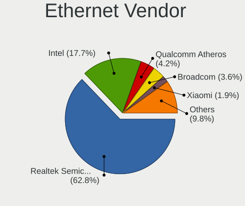

| Vendor                           | Computers | Percent |
|----------------------------------|-----------|---------|
| Realtek Semiconductor            | 883       | 62.85%  |
| Intel                            | 248       | 17.65%  |
| Qualcomm Atheros                 | 59        | 4.2%    |
| Broadcom                         | 51        | 3.63%   |
| Xiaomi                           | 26        | 1.85%   |
| Samsung Electronics              | 20        | 1.42%   |
| Marvell Technology Group         | 19        | 1.35%   |
| Huawei Technologies              | 16        | 1.14%   |
| Nvidia                           | 12        | 0.85%   |
| ASIX Electronics                 | 10        | 0.71%   |
| Broadcom Limited                 | 8         | 0.57%   |
| MediaTek                         | 7         | 0.5%    |
| ICS Advent                       | 6         | 0.43%   |
| Motorola PCS                     | 5         | 0.36%   |
| Lenovo                           | 5         | 0.36%   |
| Silicon Integrated Systems [SiS] | 4         | 0.28%   |
| JMicron Technology               | 4         | 0.28%   |
| DisplayLink                      | 4         | 0.28%   |
| VIA Technologies                 | 3         | 0.21%   |
| D-Link System                    | 3         | 0.21%   |
| TP-Link                          | 2         | 0.14%   |
| ZTE WCDMA Technologies MSM       | 1         | 0.07%   |
| Spreadtrum Communications        | 1         | 0.07%   |
| QinHeng Electronics              | 1         | 0.07%   |
| Netchip Technology               | 1         | 0.07%   |
| Microchip Technology             | 1         | 0.07%   |
| Linksys                          | 1         | 0.07%   |
| HMD Global                       | 1         | 0.07%   |
| D-Link                           | 1         | 0.07%   |
| Aquantia                         | 1         | 0.07%   |
| Apple                            | 1         | 0.07%   |

Ethernet Model
--------------

Ethernet models

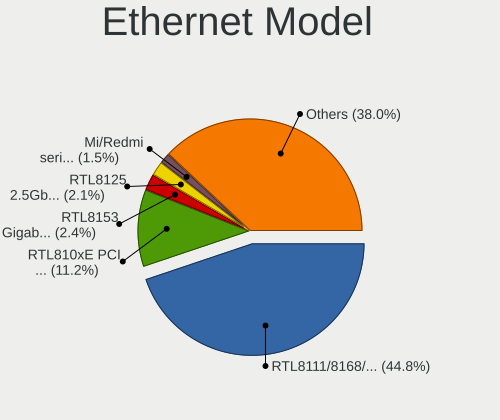

| Model                                                                  | Computers | Percent |
|------------------------------------------------------------------------|-----------|---------|
| Realtek RTL8111/8168/8211/8411 PCI Express Gigabit Ethernet Controller | 642       | 44.83%  |
| Realtek RTL810xE PCI Express Fast Ethernet controller                  | 160       | 11.17%  |
| Realtek RTL8153 Gigabit Ethernet Adapter                               | 34        | 2.37%   |
| Realtek RTL8125 2.5GbE Controller                                      | 30        | 2.09%   |
| Xiaomi Mi/Redmi series (RNDIS)                                         | 22        | 1.54%   |
| Intel 82579LM Gigabit Network Connection (Lewisville)                  | 22        | 1.54%   |
| Samsung Galaxy series, misc. (tethering mode)                          | 17        | 1.19%   |
| Intel Ethernet Connection (4) I219-V                                   | 17        | 1.19%   |
| Intel Ethernet Connection (4) I219-LM                                  | 15        | 1.05%   |
| Huawei FOA-LX9                                                         | 14        | 0.98%   |
| Qualcomm Atheros AR8152 v2.0 Fast Ethernet                             | 13        | 0.91%   |
| Intel I211 Gigabit Network Connection                                  | 13        | 0.91%   |
| Intel Ethernet Connection I219-LM                                      | 13        | 0.91%   |
| Intel Ethernet Connection I217-LM                                      | 12        | 0.84%   |
| Realtek RTL8152 Fast Ethernet Adapter                                  | 11        | 0.77%   |
| Broadcom NetXtreme BCM57766 Gigabit Ethernet PCIe                      | 10        | 0.7%    |
| Intel Ethernet Connection (6) I219-V                                   | 9         | 0.63%   |
| Qualcomm Atheros AR8151 v2.0 Gigabit Ethernet                          | 8         | 0.56%   |
| Intel Ethernet Connection (7) I219-V                                   | 8         | 0.56%   |
| Intel Ethernet Connection (2) I219-V                                   | 8         | 0.56%   |
| Intel Alder Lake-P PCH CNVi WiFi                                       | 8         | 0.56%   |
| Broadcom NetXtreme BCM57765 Gigabit Ethernet PCIe                      | 8         | 0.56%   |
| Intel Ethernet Connection (3) I218-LM                                  | 7         | 0.49%   |
| Intel Ethernet Connection (13) I219-V                                  | 7         | 0.49%   |
| Intel Ethernet Connection (10) I219-V                                  | 7         | 0.49%   |
| Intel Ethernet Connection (10) I219-LM                                 | 7         | 0.49%   |
| Intel 82577LM Gigabit Network Connection                               | 7         | 0.49%   |
| Intel 82567LM Gigabit Network Connection                               | 7         | 0.49%   |
| Broadcom NetLink BCM57785 Gigabit Ethernet PCIe                        | 7         | 0.49%   |
| Realtek RTL8111/8168/8411 PCI Express Gigabit Ethernet Controller      | 6         | 0.42%   |
| Realtek Killer E2600 GbE Controller                                    | 6         | 0.42%   |
| Nvidia MCP61 Ethernet                                                  | 6         | 0.42%   |
| Marvell Group 88E8040 PCI-E Fast Ethernet Controller                   | 6         | 0.42%   |
| Intel Ethernet Controller I225-V                                       | 6         | 0.42%   |
| Intel Ethernet Connection I218-LM                                      | 6         | 0.42%   |
| Intel Ethernet Connection I217-V                                       | 6         | 0.42%   |
| ASIX AX88179 Gigabit Ethernet                                          | 6         | 0.42%   |
| Qualcomm Atheros QCA8172 Fast Ethernet                                 | 5         | 0.35%   |
| Qualcomm Atheros Killer E220x Gigabit Ethernet Controller              | 5         | 0.35%   |
| Qualcomm Atheros AR8162 Fast Ethernet                                  | 5         | 0.35%   |

Net Controller Kind
-------------------

Ethernet, WiFi or modem

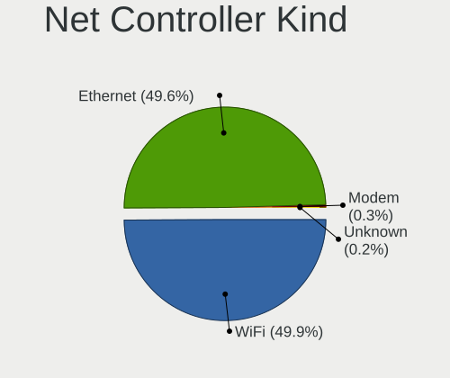

| Kind     | Computers | Percent |
|----------|-----------|---------|
| WiFi     | 1323      | 49.92%  |
| Ethernet | 1315      | 49.62%  |
| Modem    | 8         | 0.3%    |
| Unknown  | 4         | 0.15%   |

Used Controller
---------------

Currently used network controller

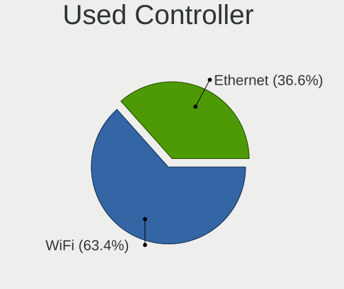

| Kind     | Computers | Percent |
|----------|-----------|---------|
| WiFi     | 1033      | 63.41%  |
| Ethernet | 596       | 36.59%  |

NICs
----

Total network controllers on board

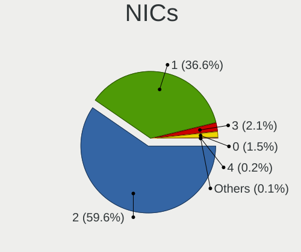

| Total | Computers | Percent |
|-------|-----------|---------|
| 2     | 941       | 59.63%  |
| 1     | 577       | 36.57%  |
| 3     | 33        | 2.09%   |
| 0     | 23        | 1.46%   |
| 4     | 3         | 0.19%   |
| 6     | 1         | 0.06%   |

IPv6
----

IPv6 vs IPv4

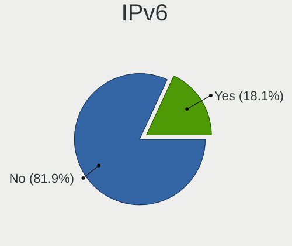

| Used | Computers | Percent |
|------|-----------|---------|
| No   | 1309      | 81.91%  |
| Yes  | 289       | 18.09%  |

Bluetooth
---------

Bluetooth Vendor
----------------

Controller vendors

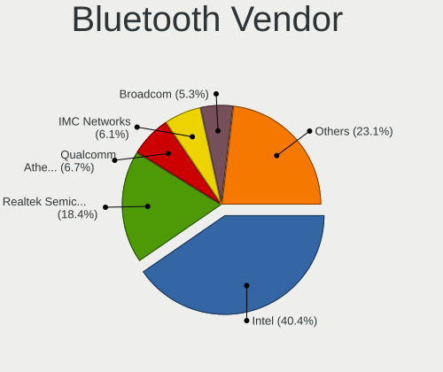

| Vendor                          | Computers | Percent |
|---------------------------------|-----------|---------|
| Intel                           | 465       | 40.4%   |
| Realtek Semiconductor           | 212       | 18.42%  |
| Qualcomm Atheros Communications | 77        | 6.69%   |
| IMC Networks                    | 70        | 6.08%   |
| Broadcom                        | 61        | 5.3%    |
| Lite-On Technology              | 56        | 4.87%   |
| Cambridge Silicon Radio         | 44        | 3.82%   |
| Foxconn / Hon Hai               | 41        | 3.56%   |
| Apple                           | 38        | 3.3%    |
| Ralink                          | 12        | 1.04%   |
| Dell                            | 10        | 0.87%   |
| Realtek                         | 9         | 0.78%   |
| MediaTek                        | 9         | 0.78%   |
| Toshiba                         | 8         | 0.7%    |
| Hewlett-Packard                 | 8         | 0.7%    |
| Ralink Technology               | 5         | 0.43%   |
| ASUSTek Computer                | 5         | 0.43%   |
| Unknown                         | 5         | 0.43%   |
| Foxconn International           | 4         | 0.35%   |
| USI                             | 2         | 0.17%   |
| TP-Link                         | 2         | 0.17%   |
| SINO WEALTH                     | 2         | 0.17%   |
| Alps Electric                   | 2         | 0.17%   |
| Actions                         | 2         | 0.17%   |
| Integrated System Solution      | 1         | 0.09%   |
| Fujitsu                         | 1         | 0.09%   |

Bluetooth Model
---------------

Controller models

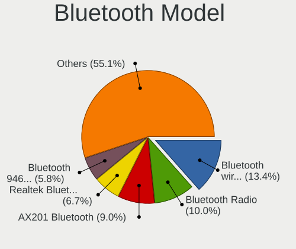

| Model                                               | Computers | Percent |
|-----------------------------------------------------|-----------|---------|
| Intel Bluetooth wireless interface                  | 155       | 13.43%  |
| Realtek Bluetooth Radio                             | 115       | 9.97%   |
| Intel AX201 Bluetooth                               | 104       | 9.01%   |
| Realtek  Bluetooth 4.2 Adapter                      | 77        | 6.67%   |
| Intel Bluetooth 9460/9560 Jefferson Peak (JfP)      | 67        | 5.81%   |
| Intel AX200 Bluetooth                               | 49        | 4.25%   |
| Cambridge Silicon Radio Bluetooth Dongle (HCI mode) | 44        | 3.81%   |
| Qualcomm Atheros  Bluetooth Device                  | 33        | 2.86%   |
| IMC Networks Bluetooth Radio                        | 31        | 2.69%   |
| IMC Networks Wireless_Device                        | 25        | 2.17%   |
| Intel AX210 Bluetooth                               | 24        | 2.08%   |
| Intel Bluetooth Device                              | 23        | 1.99%   |
| Lite-On Qualcomm Atheros QCA9377 Bluetooth          | 22        | 1.91%   |
| Apple Bluetooth USB Host Controller                 | 17        | 1.47%   |
| Apple Bluetooth Host Controller                     | 16        | 1.39%   |
| Qualcomm Atheros AR3012 Bluetooth 4.0               | 15        | 1.3%    |
| Intel Centrino Bluetooth Wireless Transceiver       | 15        | 1.3%    |
| Ralink RT3290 Bluetooth                             | 12        | 1.04%   |
| Qualcomm Atheros AR3011 Bluetooth                   | 12        | 1.04%   |
| Lite-On Bluetooth Device                            | 12        | 1.04%   |
| Lite-On Atheros AR3012 Bluetooth                    | 12        | 1.04%   |
| Foxconn / Hon Hai Wireless_Device                   | 12        | 1.04%   |
| Broadcom BCM43142A0 Bluetooth 4.0                   | 12        | 1.04%   |
| Realtek RTL8821A Bluetooth                          | 11        | 0.95%   |
| Intel Wireless-AC 3168 Bluetooth                    | 11        | 0.95%   |
| Intel Centrino Advanced-N 6230 Bluetooth adapter    | 11        | 0.95%   |
| IMC Networks Bluetooth Device                       | 11        | 0.95%   |
| Realtek Bluetooth Radio                             | 9         | 0.78%   |
| MediaTek Wireless_Device                            | 9         | 0.78%   |
| Intel Wireless-AC 9260 Bluetooth Adapter            | 8         | 0.69%   |
| Foxconn / Hon Hai Bluetooth USB Host Controller     | 8         | 0.69%   |
| Broadcom Bluetooth 3.0 USB Dongle                   | 8         | 0.69%   |
| Qualcomm Atheros QCA61x4 Bluetooth 4.0              | 7         | 0.61%   |
| Toshiba Bluetooth Device                            | 6         | 0.52%   |
| Qualcomm Atheros Bluetooth                          | 6         | 0.52%   |
| Foxconn / Hon Hai Bluetooth Device                  | 6         | 0.52%   |
| Broadcom HP Portable Bumble Bee                     | 6         | 0.52%   |
| Realtek RTL8822BE Bluetooth 4.2 Adapter             | 5         | 0.43%   |
| Ralink Motorola BC4 Bluetooth 3.0+HS Adapter        | 5         | 0.43%   |
| Broadcom BCM43142A0 Bluetooth Device                | 5         | 0.43%   |

Sound
-----

Sound Vendor
------------

Sound card vendors

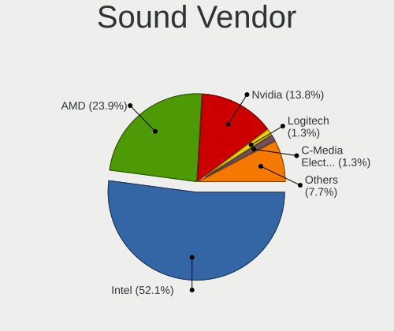

| Vendor                                       | Computers | Percent |
|----------------------------------------------|-----------|---------|
| Intel                                        | 1081      | 52.1%   |
| AMD                                          | 495       | 23.86%  |
| Nvidia                                       | 287       | 13.83%  |
| Logitech                                     | 26        | 1.25%   |
| C-Media Electronics                          | 26        | 1.25%   |
| Kingston Technology                          | 11        | 0.53%   |
| JMTek                                        | 10        | 0.48%   |
| Creative Labs                                | 9         | 0.43%   |
| Generalplus Technology                       | 8         | 0.39%   |
| Creative Technology                          | 7         | 0.34%   |
| Texas Instruments                            | 6         | 0.29%   |
| Razer USA                                    | 6         | 0.29%   |
| Focusrite-Novation                           | 6         | 0.29%   |
| Apple                                        | 5         | 0.24%   |
| Zoran Co. Personal Media Division (Nogatech) | 4         | 0.19%   |
| Silicon Integrated Systems [SiS]             | 4         | 0.19%   |
| Realtek Semiconductor                        | 4         | 0.19%   |
| Lenovo                                       | 4         | 0.19%   |
| Corsair                                      | 4         | 0.19%   |
| ASUSTek Computer                             | 4         | 0.19%   |
| VIA Technologies                             | 3         | 0.14%   |
| Trust                                        | 3         | 0.14%   |
| Sony                                         | 3         | 0.14%   |
| Microsoft                                    | 3         | 0.14%   |
| liyuany                                      | 3         | 0.14%   |
| KTMicro                                      | 3         | 0.14%   |
| ATI Technologies                             | 3         | 0.14%   |
| Unknown                                      | 3         | 0.14%   |
| Synaptics                                    | 2         | 0.1%    |
| SAVITECH                                     | 2         | 0.1%    |
| Plantronics                                  | 2         | 0.1%    |
| MV-SILICON                                   | 2         | 0.1%    |
| Micro Star International                     | 2         | 0.1%    |
| GN Netcom                                    | 2         | 0.1%    |
| FIFINE Microphones                           | 2         | 0.1%    |
| ESS Technology                               | 2         | 0.1%    |
| EDFIER                                       | 2         | 0.1%    |
| Arturia                                      | 2         | 0.1%    |
| Vitana                                       | 1         | 0.05%   |
| Unknown                                      | 1         | 0.05%   |

Sound Model
-----------

Sound card models

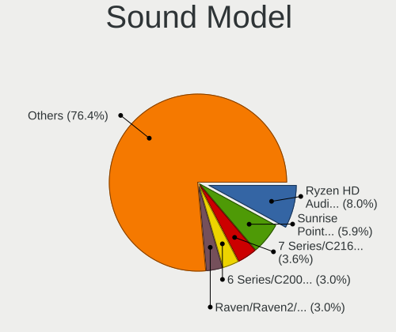

| Model                                                                                             | Computers | Percent |
|---------------------------------------------------------------------------------------------------|-----------|---------|
| AMD Ryzen HD Audio Controller                                                                     | 201       | 7.96%   |
| Intel Sunrise Point-LP HD Audio                                                                   | 148       | 5.86%   |
| Intel 7 Series/C216 Chipset Family High Definition Audio Controller                               | 92        | 3.64%   |
| Intel 6 Series/C200 Series Chipset Family High Definition Audio Controller                        | 77        | 3.05%   |
| AMD Raven/Raven2/Fenghuang HDMI/DP Audio Controller                                               | 77        | 3.05%   |
| AMD FCH Azalia Controller                                                                         | 71        | 2.81%   |
| AMD Renoir/Cezanne HDMI/DP Audio Controller                                                       | 70        | 2.77%   |
| Intel 8 Series/C220 Series Chipset High Definition Audio Controller                               | 56        | 2.22%   |
| AMD Starship/Matisse HD Audio Controller                                                          | 54        | 2.14%   |
| Intel Tiger Lake-LP Smart Sound Technology Audio Controller                                       | 51        | 2.02%   |
| AMD SBx00 Azalia (Intel HDA)                                                                      | 49        | 1.94%   |
| Intel Cannon Lake PCH cAVS                                                                        | 47        | 1.86%   |
| Intel 82801I (ICH9 Family) HD Audio Controller                                                    | 42        | 1.66%   |
| AMD Kabini HDMI/DP Audio                                                                          | 42        | 1.66%   |
| Intel Cannon Point-LP High Definition Audio Controller                                            | 40        | 1.58%   |
| Intel Haswell-ULT HD Audio Controller                                                             | 38        | 1.5%    |
| Intel 8 Series HD Audio Controller                                                                | 38        | 1.5%    |
| Nvidia TU107 GeForce GTX 1650 High Definition Audio Controller                                    | 37        | 1.46%   |
| Intel Xeon E3-1200 v3/4th Gen Core Processor HD Audio Controller                                  | 36        | 1.43%   |
| Intel Comet Lake PCH-LP cAVS                                                                      | 36        | 1.43%   |
| Nvidia GP107GL High Definition Audio Controller                                                   | 35        | 1.39%   |
| AMD Radeon High Definition Audio Controller                                                       | 34        | 1.35%   |
| Intel Broadwell-U Audio Controller                                                                | 33        | 1.31%   |
| Intel 5 Series/3400 Series Chipset High Definition Audio                                          | 33        | 1.31%   |
| Intel Wildcat Point-LP High Definition Audio Controller                                           | 31        | 1.23%   |
| Intel NM10/ICH7 Family High Definition Audio Controller                                           | 29        | 1.15%   |
| Intel Comet Lake PCH cAVS                                                                         | 27        | 1.07%   |
| Intel Celeron/Pentium Silver Processor High Definition Audio                                      | 26        | 1.03%   |
| AMD Family 15h (Models 60h-6fh) Audio Controller                                                  | 26        | 1.03%   |
| Intel Atom Processor Z36xxx/Z37xxx Series High Definition Audio Controller                        | 24        | 0.95%   |
| Intel 100 Series/C230 Series Chipset Family HD Audio Controller                                   | 23        | 0.91%   |
| Intel CM238 HD Audio Controller                                                                   | 22        | 0.87%   |
| AMD Ellesmere HDMI Audio [Radeon RX 470/480 / 570/580/590]                                        | 21        | 0.83%   |
| Intel Ice Lake-LP Smart Sound Technology Audio Controller                                         | 20        | 0.79%   |
| Intel Atom/Celeron/Pentium Processor x5-E8000/J3xxx/N3xxx Series High Definition Audio Controller | 20        | 0.79%   |
| Intel 82801H (ICH8 Family) HD Audio Controller                                                    | 20        | 0.79%   |
| AMD Navi 21/23 HDMI/DP Audio Controller                                                           | 20        | 0.79%   |
| Intel Alder Lake PCH-P High Definition Audio Controller                                           | 19        | 0.75%   |
| Intel Tiger Lake-H HD Audio Controller                                                            | 18        | 0.71%   |
| Intel Raptor Lake-P/U/H cAVS                                                                      | 18        | 0.71%   |

Memory
------

Memory Vendor
-------------

Memory module vendors

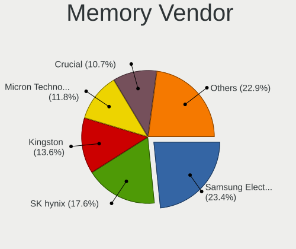

| Vendor              | Computers | Percent |
|---------------------|-----------|---------|
| Samsung Electronics | 227       | 23.4%   |
| SK hynix            | 171       | 17.63%  |
| Kingston            | 132       | 13.61%  |
| Micron Technology   | 114       | 11.75%  |
| Crucial             | 104       | 10.72%  |
| Unknown             | 48        | 4.95%   |
| Ramaxel Technology  | 32        | 3.3%    |
| Corsair             | 31        | 3.2%    |
| A-DATA Technology   | 24        | 2.47%   |
| G.Skill             | 13        | 1.34%   |
| Unknown             | 9         | 0.93%   |
| Avant               | 8         | 0.82%   |
| Unknown (ABCD)      | 7         | 0.72%   |
| Elpida              | 6         | 0.62%   |
| Patriot             | 3         | 0.31%   |
| Nanya Technology    | 3         | 0.31%   |
| Lexar               | 3         | 0.31%   |
| Kllisre             | 3         | 0.31%   |
| Hikvision           | 3         | 0.31%   |
| PUSKILL             | 2         | 0.21%   |
| Kreton              | 2         | 0.21%   |
| KingSpec            | 2         | 0.21%   |
| Juhor               | 2         | 0.21%   |
| Atermiter           | 2         | 0.21%   |
| Apacer              | 2         | 0.21%   |
| Unknown (C289)      | 1         | 0.1%    |
| Unknown (0x0E9D)    | 1         | 0.1%    |
| Unknown (0x0080)    | 1         | 0.1%    |
| Unknown (0BF7)      | 1         | 0.1%    |
| Unknown (090E)      | 1         | 0.1%    |
| Unknown (08C8)      | 1         | 0.1%    |
| Team                | 1         | 0.1%    |
| Smart               | 1         | 0.1%    |
| Shenzhen SCY        | 1         | 0.1%    |
| PNY                 | 1         | 0.1%    |
| Patriot Memory      | 1         | 0.1%    |
| Goldenmars          | 1         | 0.1%    |
| Golden Empire       | 1         | 0.1%    |
| GLOWAY              | 1         | 0.1%    |
| ASint Technology    | 1         | 0.1%    |

Memory Model
------------

Memory module models

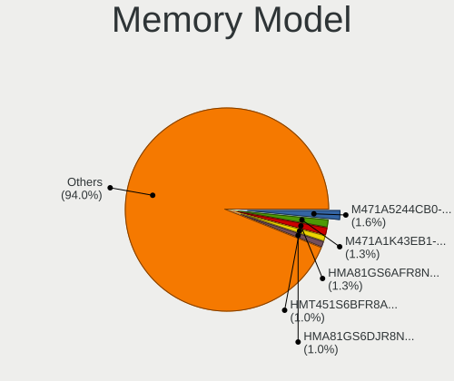

| Model                                                            | Computers | Percent |
|------------------------------------------------------------------|-----------|---------|
| Samsung RAM M471A5244CB0-CTD 4GB SODIMM DDR4 3266MT/s            | 16        | 1.56%   |
| SK hynix RAM HMA81GS6AFR8N-UH 8GB SODIMM DDR4 2667MT/s           | 13        | 1.27%   |
| Samsung RAM M471A1K43EB1-CWE 8GB SODIMM DDR4 3200MT/s            | 13        | 1.27%   |
| SK hynix RAM HMT451S6BFR8A-PB 4GB SODIMM DDR3 1600MT/s           | 10        | 0.97%   |
| SK hynix RAM HMA81GS6DJR8N-XN 8GB SODIMM DDR4 3200MT/s           | 10        | 0.97%   |
| Samsung RAM M471A5244CB0-CWE 4GB SODIMM DDR4 3200MT/s            | 9         | 0.88%   |
| Unknown                                                          | 9         | 0.88%   |
| Samsung RAM M471B5273DH0-CH9 4GB SODIMM DDR3 1600MT/s            | 8         | 0.78%   |
| Samsung RAM M471B5173DB0-YK0 4GB SODIMM DDR3 1600MT/s            | 8         | 0.78%   |
| SK hynix RAM HMA851S6DJR6N-XN 4GB SODIMM DDR4 3200MT/s           | 7         | 0.68%   |
| Samsung RAM M471B5273CH0-CH9 4GB SODIMM DDR3 1334MT/s            | 7         | 0.68%   |
| Samsung RAM M471A5244CB0-CRC 4GB SODIMM DDR4 2667MT/s            | 7         | 0.68%   |
| Samsung RAM M471A1K43CB1-CRC 8GB SODIMM DDR4 8400MT/s            | 7         | 0.68%   |
| Micron RAM 4ATF51264HZ-3G2J1 4GB SODIMM DDR4 3200MT/s            | 7         | 0.68%   |
| Micron RAM 4ATF1G64HZ-3G2F1 8GB SODIMM DDR4 3200MT/s             | 7         | 0.68%   |
| Unknown (ABCD) RAM 123456789012345678 2GB SODIMM LPDDR4 2400MT/s | 6         | 0.58%   |
| Samsung RAM M471A1K43BB1-CRC 8GB SODIMM DDR4 2667MT/s            | 6         | 0.58%   |
| Micron RAM 8KTF51264HZ-1G6E1 4GB SODIMM DDR3 1600MT/s            | 6         | 0.58%   |
| Micron RAM 4ATF51264HZ-2G6E1 4GB SODIMM DDR4 2667MT/s            | 6         | 0.58%   |
| Micron RAM 4ATF51264HZ-2G3B1 4GB SODIMM DDR4 3200MT/s            | 6         | 0.58%   |
| Kingston RAM KHX2666C16/8G 8GiB DIMM DDR4 3466MT/s               | 6         | 0.58%   |
| Samsung RAM M471B5173QH0-YK0 4GB SODIMM DDR3 1600MT/s            | 5         | 0.49%   |
| Samsung RAM M471B1G73EB0-YK0 8192MB SODIMM DDR3 1600MT/s         | 5         | 0.49%   |
| Samsung RAM M471A2G44AM0-CWE 16GB SODIMM DDR4 3200MT/s           | 5         | 0.49%   |
| Samsung RAM M471A1G44BB0-CWE 8GB SODIMM DDR4 3200MT/s            | 5         | 0.49%   |
| Micron RAM 8ATF1G64HZ-2G6E1 8GB SODIMM DDR4 2667MT/s             | 5         | 0.49%   |
| Micron RAM 4ATF1G64HZ-3G2E2 8GB SODIMM DDR4 3200MT/s             | 5         | 0.49%   |
| Crucial RAM CT102464BF160B.M16 8GB SODIMM DDR3 1600MT/s          | 5         | 0.49%   |
| Unknown RAM Module 4GB SODIMM DDR3                               | 4         | 0.39%   |
| SK hynix RAM HMT351S6CFR8C-PB 4GB SODIMM DDR3 1600MT/s           | 4         | 0.39%   |
| SK hynix RAM HMA851S6CJR6N-VK 4GB Row Of Chips DDR4 2667MT/s     | 4         | 0.39%   |
| SK hynix RAM HMA851S6AFR6N-UH 4GB SODIMM DDR4 2667MT/s           | 4         | 0.39%   |
| SK hynix RAM HMA81GS6JJR8N-VK 8GB SODIMM DDR4 2667MT/s           | 4         | 0.39%   |
| Samsung RAM M471B5773CHS-CH9 2GB SODIMM DDR3 4199MT/s            | 4         | 0.39%   |
| Samsung RAM M471B5173EB0-YK0 4GB SODIMM DDR3 1600MT/s            | 4         | 0.39%   |
| Samsung RAM M471A1K43CB1-CTD 8GB SODIMM DDR4 3200MT/s            | 4         | 0.39%   |
| Samsung RAM M471A1G44AB0-CWE 8GiB SODIMM DDR4 3200MT/s           | 4         | 0.39%   |
| Samsung RAM K4E6E304EC-EGCG 4GB Row Of Chips LPDDR3 2133MT/s     | 4         | 0.39%   |
| Ramaxel RAM RMSA3260ME78HAF-2666 8GB SODIMM DDR4 2667MT/s        | 4         | 0.39%   |
| Micron RAM MT40A512M16TB-062E:J 4GB SODIMM DDR4 3200MT/s         | 4         | 0.39%   |

Memory Kind
-----------

Memory module kinds

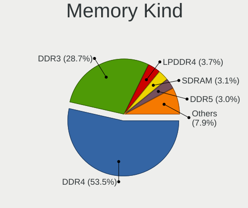

| Kind    | Computers | Percent |
|---------|-----------|---------|
| DDR4    | 408       | 53.54%  |
| DDR3    | 219       | 28.74%  |
| LPDDR4  | 28        | 3.67%   |
| SDRAM   | 24        | 3.15%   |
| DDR5    | 23        | 3.02%   |
| DDR2    | 22        | 2.89%   |
| LPDDR3  | 15        | 1.97%   |
| LPDDR5  | 14        | 1.84%   |
| Unknown | 4         | 0.52%   |
| DRAM    | 2         | 0.26%   |
| DDR     | 2         | 0.26%   |
| RAM     | 1         | 0.13%   |

Memory Form Factor
------------------

Physical design of the memory module

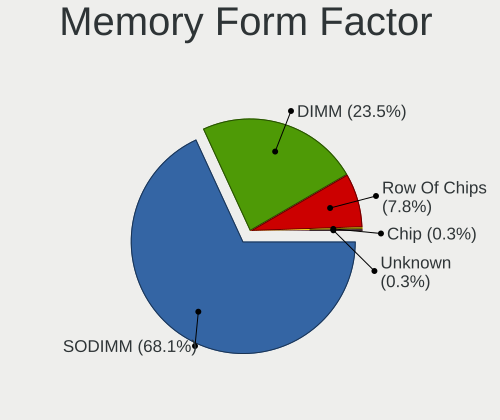

| Name         | Computers | Percent |
|--------------|-----------|---------|
| SODIMM       | 513       | 68.13%  |
| DIMM         | 177       | 23.51%  |
| Row Of Chips | 59        | 7.84%   |
| Chip         | 2         | 0.27%   |
| Unknown      | 2         | 0.27%   |

Memory Size
-----------

Memory module size

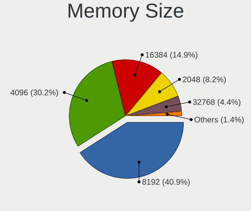

| Size  | Computers | Percent |
|-------|-----------|---------|
| 8192  | 355       | 40.95%  |
| 4096  | 262       | 30.22%  |
| 16384 | 129       | 14.88%  |
| 2048  | 71        | 8.19%   |
| 32768 | 38        | 4.38%   |
| 1024  | 9         | 1.04%   |
| 65536 | 1         | 0.12%   |
| 3072  | 1         | 0.12%   |
| 64    | 1         | 0.12%   |

Memory Speed
------------

Memory module speed

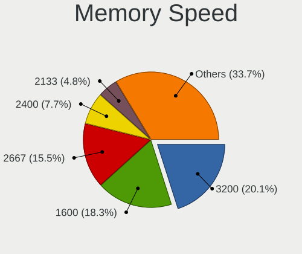

| Speed   | Computers | Percent |
|---------|-----------|---------|
| 3200    | 177       | 20.07%  |
| 1600    | 161       | 18.25%  |
| 2667    | 137       | 15.53%  |
| 2400    | 68        | 7.71%   |
| 2133    | 42        | 4.76%   |
| 1333    | 42        | 4.76%   |
| 3600    | 19        | 2.15%   |
| Unknown | 18        | 2.04%   |
| 3266    | 17        | 1.93%   |
| 1334    | 17        | 1.93%   |
| 4267    | 14        | 1.59%   |
| 667     | 13        | 1.47%   |
| 5600    | 12        | 1.36%   |
| 800     | 11        | 1.25%   |
| 4199    | 9         | 1.02%   |
| 3733    | 9         | 1.02%   |
| 8400    | 8         | 0.91%   |
| 6400    | 8         | 0.91%   |
| 3466    | 8         | 0.91%   |
| 2666    | 8         | 0.91%   |
| 1067    | 7         | 0.79%   |
| 7500    | 6         | 0.68%   |
| 4800    | 6         | 0.68%   |
| 2933    | 6         | 0.68%   |
| 1867    | 6         | 0.68%   |
| 3800    | 4         | 0.45%   |
| 1866    | 4         | 0.45%   |
| 1639    | 4         | 0.45%   |
| 1066    | 4         | 0.45%   |
| 4266    | 3         | 0.34%   |
| 4000    | 3         | 0.34%   |
| 3400    | 3         | 0.34%   |
| 3000    | 3         | 0.34%   |
| 2048    | 3         | 0.34%   |
| 975     | 3         | 0.34%   |
| 5200    | 2         | 0.23%   |
| 2800    | 2         | 0.23%   |
| 533     | 2         | 0.23%   |
| 8600    | 1         | 0.11%   |
| 6000    | 1         | 0.11%   |

Printers & scanners
-------------------

Printer Vendor
--------------

Printer device vendors

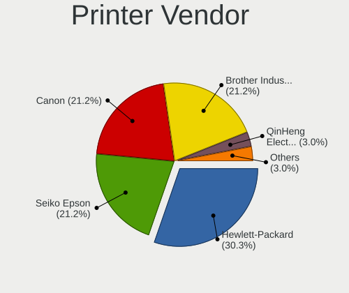

| Vendor              | Computers | Percent |
|---------------------|-----------|---------|
| Hewlett-Packard     | 10        | 30.3%   |
| Seiko Epson         | 7         | 21.21%  |
| Canon               | 7         | 21.21%  |
| Brother Industries  | 7         | 21.21%  |
| QinHeng Electronics | 1         | 3.03%   |
| PM                  | 1         | 3.03%   |

Printer Model
-------------

Printer device models

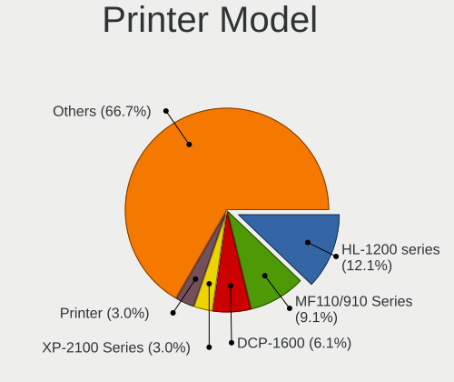

| Model                      | Computers | Percent |
|----------------------------|-----------|---------|
| Brother HL-1200 series     | 4         | 12.12%  |
| Canon MF110/910 Series     | 3         | 9.09%   |
| Brother DCP-1600           | 2         | 6.06%   |
| Seiko Epson XP-2100 Series | 1         | 3.03%   |
| Seiko Epson Printer        | 1         | 3.03%   |
| Seiko Epson L380 Series    | 1         | 3.03%   |
| Seiko Epson L355 Series    | 1         | 3.03%   |
| Seiko Epson L3110 Series   | 1         | 3.03%   |
| Seiko Epson L210 Series    | 1         | 3.03%   |
| Seiko Epson ET-2710 Series | 1         | 3.03%   |
| QinHeng CH340S             | 1         | 3.03%   |
| PM PM241-BT                | 1         | 3.03%   |
| HP Smart Tank 510 series   | 1         | 3.03%   |
| HP Smart Tank 500 series   | 1         | 3.03%   |
| HP Officejet 4500 G510a-f  | 1         | 3.03%   |
| HP LaserJet P1005          | 1         | 3.03%   |
| HP Ink Tank 310 series     | 1         | 3.03%   |
| HP DeskJet 5820 series     | 1         | 3.03%   |
| HP Deskjet 4640 series     | 1         | 3.03%   |
| HP Deskjet 4620 series     | 1         | 3.03%   |
| HP DeskJet 2130 series     | 1         | 3.03%   |
| HP Deskjet 2050 J510       | 1         | 3.03%   |
| Canon PIXMA MP250          | 1         | 3.03%   |
| Canon LBP6000              | 1         | 3.03%   |
| Canon G2000 series         | 1         | 3.03%   |
| Canon G1000 series         | 1         | 3.03%   |
| Brother HL-1210W series    | 1         | 3.03%   |

Scanner Vendor
--------------

Scanner device vendors

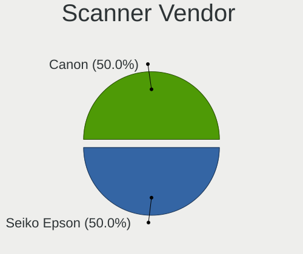

| Vendor      | Computers | Percent |
|-------------|-----------|---------|
| Seiko Epson | 2         | 50%     |
| Canon       | 2         | 50%     |

Scanner Model
-------------

Scanner device models

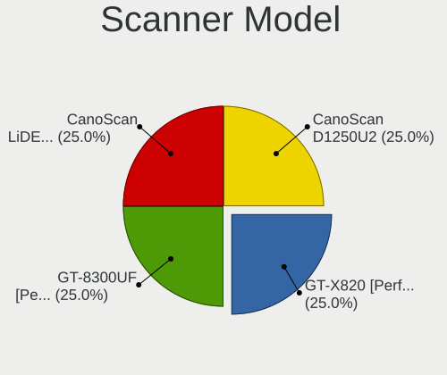

| Model                                         | Computers | Percent |
|-----------------------------------------------|-----------|---------|
| Seiko Epson GT-X820 [Perfection V600 Photo]   | 1         | 25%     |
| Seiko Epson GT-8300UF [Perfection 1660 PHOTO] | 1         | 25%     |
| Canon CanoScan LiDE 110                       | 1         | 25%     |
| Canon CanoScan D1250U2                        | 1         | 25%     |

Camera
------

Camera Vendor
-------------

Camera device vendors

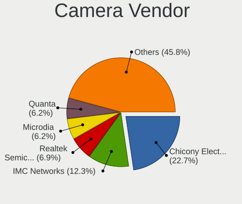

| Vendor                                 | Computers | Percent |
|----------------------------------------|-----------|---------|
| Chicony Electronics                    | 258       | 22.67%  |
| IMC Networks                           | 140       | 12.3%   |
| Realtek Semiconductor                  | 78        | 6.85%   |
| Microdia                               | 71        | 6.24%   |
| Quanta                                 | 70        | 6.15%   |
| Bison Electronics                      | 65        | 5.71%   |
| Cheng Uei Precision Industry (Foxlink) | 62        | 5.45%   |
| Sunplus Innovation Technology          | 57        | 5.01%   |
| Lite-On Technology                     | 33        | 2.9%    |
| Suyin                                  | 32        | 2.81%   |
| Syntek                                 | 30        | 2.64%   |
| Luxvisions Innotech Limited            | 30        | 2.64%   |
| Apple                                  | 27        | 2.37%   |
| Logitech                               | 24        | 2.11%   |
| Silicon Motion                         | 21        | 1.85%   |
| Generalplus Technology                 | 12        | 1.05%   |
| Ricoh                                  | 10        | 0.88%   |
| Lenovo                                 | 8         | 0.7%    |
| Alcor Micro                            | 8         | 0.7%    |
| Microsoft                              | 7         | 0.62%   |
| Z-Star Microelectronics                | 6         | 0.53%   |
| Sonix Technology                       | 6         | 0.53%   |
| ShineTech                              | 6         | 0.53%   |
| Samsung Electronics                    | 5         | 0.44%   |
| Jieli Technology                       | 5         | 0.44%   |
| SunplusIT                              | 4         | 0.35%   |
| KYE Systems (Mouse Systems)            | 4         | 0.35%   |
| Importek                               | 4         | 0.35%   |
| Acer                                   | 4         | 0.35%   |
| YGTek                                  | 3         | 0.26%   |
| webcam                                 | 3         | 0.26%   |
| USB Camera CS                          | 3         | 0.26%   |
| Shine-optics                           | 3         | 0.26%   |
| Foxconn / Hon Hai                      | 3         | 0.26%   |
| ALi                                    | 3         | 0.26%   |
| Unknown                                | 2         | 0.18%   |
| Sunplus Technology                     | 2         | 0.18%   |
| SN0002                                 | 2         | 0.18%   |
| OmniVision Technologies                | 2         | 0.18%   |
| Leap Motion                            | 2         | 0.18%   |

Camera Model
------------

Camera device models

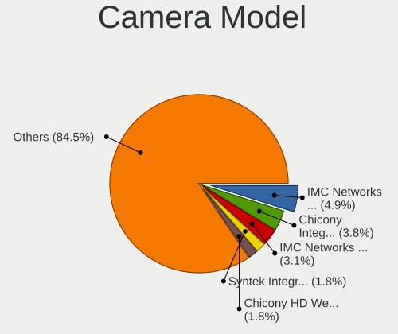

| Model                                                           | Computers | Percent |
|-----------------------------------------------------------------|-----------|---------|
| IMC Networks USB2.0 HD UVC WebCam                               | 56        | 4.89%   |
| Chicony Integrated Camera                                       | 44        | 3.84%   |
| IMC Networks Integrated Camera                                  | 36        | 3.14%   |
| Syntek Integrated Camera                                        | 21        | 1.83%   |
| Chicony HD WebCam                                               | 21        | 1.83%   |
| Bison Integrated Camera                                         | 21        | 1.83%   |
| Chicony HP Wide Vision HD Camera                                | 19        | 1.66%   |
| Microdia Integrated_Webcam_HD                                   | 17        | 1.48%   |
| IMC Networks USB2.0 VGA UVC WebCam                              | 17        | 1.48%   |
| Quanta HP TrueVision HD Camera                                  | 15        | 1.31%   |
| Chicony HD User Facing                                          | 14        | 1.22%   |
| Sunplus Integrated_Webcam_HD                                    | 13        | 1.13%   |
| Realtek Integrated_Webcam_HD                                    | 13        | 1.13%   |
| Lite-On Integrated Camera                                       | 13        | 1.13%   |
| Chicony HP Truevision HD                                        | 13        | 1.13%   |
| Bison EasyCamera                                                | 13        | 1.13%   |
| Generalplus GENERAL WEBCAM                                      | 12        | 1.05%   |
| Chicony HP Webcam                                               | 12        | 1.05%   |
| Chicony HP TrueVision HD Camera                                 | 12        | 1.05%   |
| Cheng Uei Precision Industry (Foxlink) Webcam                   | 12        | 1.05%   |
| Quanta HP Wide Vision HD Camera                                 | 11        | 0.96%   |
| Chicony EasyCamera                                              | 11        | 0.96%   |
| Realtek USB Camera                                              | 10        | 0.87%   |
| Quanta HD User Facing                                           | 10        | 0.87%   |
| Chicony USB2.0 VGA UVC WebCam                                   | 10        | 0.87%   |
| Suyin HP TrueVision HD                                          | 9         | 0.79%   |
| Realtek HP Truevision HD                                        | 9         | 0.79%   |
| Quanta VGA WebCam                                               | 9         | 0.79%   |
| Microdia Webcam Vitade AF                                       | 9         | 0.79%   |
| Cheng Uei Precision Industry (Foxlink) HP Wide Vision HD Camera | 9         | 0.79%   |
| Apple iPhone 5/5C/5S/6/SE/7/8/X                                 | 9         | 0.79%   |
| Luxvisions Innotech Limited Integrated Camera                   | 8         | 0.7%    |
| Lite-On HP Wide Vision HD Camera                                | 8         | 0.7%    |
| Chicony VGA WebCam                                              | 8         | 0.7%    |
| Cheng Uei Precision Industry (Foxlink) HP Webcam                | 8         | 0.7%    |
| Cheng Uei Precision Industry (Foxlink) HP Truevision HD         | 8         | 0.7%    |
| Bison Lenovo EasyCamera                                         | 8         | 0.7%    |
| Sunplus HP TrueVision HD Camera                                 | 7         | 0.61%   |
| Microdia HP Webcam                                              | 7         | 0.61%   |
| Luxvisions Innotech Limited HP Wide Vision HD Camera            | 7         | 0.61%   |

Security
--------

Fingerprint Vendor
------------------

Fingerprint sensor vendors

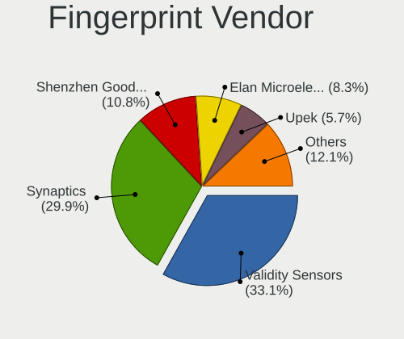

| Vendor                     | Computers | Percent |
|----------------------------|-----------|---------|
| Validity Sensors           | 52        | 33.12%  |
| Synaptics                  | 47        | 29.94%  |
| Shenzhen Goodix Technology | 17        | 10.83%  |
| Elan Microelectronics      | 13        | 8.28%   |
| Upek                       | 9         | 5.73%   |
| AuthenTec                  | 9         | 5.73%   |
| STMicroelectronics         | 4         | 2.55%   |
| LighTuning Technology      | 4         | 2.55%   |
| Focal-systems.Corp         | 2         | 1.27%   |

Fingerprint Model
-----------------

Fingerprint sensor models

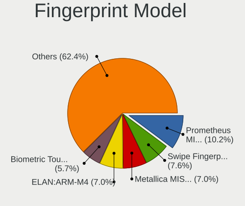

| Model                                                                      | Computers | Percent |
|----------------------------------------------------------------------------|-----------|---------|
| Synaptics Prometheus MIS Touch Fingerprint Reader                          | 16        | 10.19%  |
| Validity Sensors Swipe Fingerprint Sensor                                  | 12        | 7.64%   |
| Synaptics Metallica MIS Touch Fingerprint Reader                           | 11        | 7.01%   |
| Elan ELAN:ARM-M4                                                           | 11        | 7.01%   |
| Upek Biometric Touchchip/Touchstrip Fingerprint Sensor                     | 9         | 5.73%   |
| Shenzhen Goodix  FingerPrint Device                                        | 9         | 5.73%   |
| Validity Sensors VFS495 Fingerprint Reader                                 | 8         | 5.1%    |
| Shenzhen Goodix Fingerprint Reader                                         | 8         | 5.1%    |
| Validity Sensors VFS 5011 fingerprint sensor                               | 7         | 4.46%   |
| Validity Sensors VFS471 Fingerprint Reader                                 | 5         | 3.18%   |
| Validity Sensors Synaptics WBDI                                            | 5         | 3.18%   |
| Synaptics  WBDI                                                            | 5         | 3.18%   |
| AuthenTec AES2810                                                          | 5         | 3.18%   |
| Validity Sensors Fingerprint scanner                                       | 4         | 2.55%   |
| Synaptics Fingerprint reader [HP G6]                                       | 4         | 2.55%   |
| STMicroelectronics Fingerprint Reader                                      | 4         | 2.55%   |
| Validity Sensors VFS5011 Fingerprint Reader                                | 3         | 1.91%   |
| Synaptics UWP WBDI Device                                                  | 3         | 1.91%   |
| LighTuning EgisTec Touch Fingerprint Sensor                                | 3         | 1.91%   |
| Validity Sensors VFS7500 Touch Fingerprint Sensor                          | 2         | 1.27%   |
| Validity Sensors VFS451 Fingerprint Reader                                 | 2         | 1.27%   |
| Validity Sensors Synaptics VFS7552 Touch Fingerprint Sensor with PurePrint | 2         | 1.27%   |
| Synaptics UWP WBDI                                                         | 2         | 1.27%   |
| Synaptics  FS7604 Touch Fingerprint Sensor with PurePrint                  | 2         | 1.27%   |
| Synaptics Prometheus Fingerprint Reader                                    | 2         | 1.27%   |
| Focal-systems.Corp FT9201Fingerprint.                                      | 2         | 1.27%   |
| Elan ELAN:Fingerprint                                                      | 2         | 1.27%   |
| AuthenTec Fingerprint Sensor                                               | 2         | 1.27%   |
| Validity Sensors VFS491                                                    | 1         | 0.64%   |
| Validity Sensors VFS301 Fingerprint Reader                                 | 1         | 0.64%   |
| Synaptics WBDI                                                             | 1         | 0.64%   |
| Synaptics Fingerprint scanner                                              | 1         | 0.64%   |
| LighTuning ES603 Swipe Fingerprint Sensor                                  | 1         | 0.64%   |
| AuthenTec AES2501 Fingerprint Sensor                                       | 1         | 0.64%   |
| AuthenTec AES1600                                                          | 1         | 0.64%   |

Chipcard Vendor
---------------

Chipcard module vendors

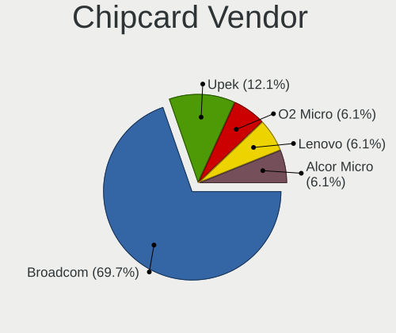

| Vendor      | Computers | Percent |
|-------------|-----------|---------|
| Broadcom    | 23        | 69.7%   |
| Upek        | 4         | 12.12%  |
| O2 Micro    | 2         | 6.06%   |
| Lenovo      | 2         | 6.06%   |
| Alcor Micro | 2         | 6.06%   |

Chipcard Model
--------------

Chipcard module models

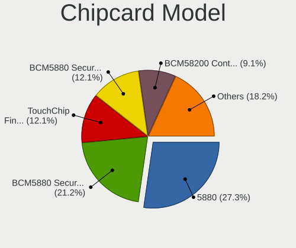

| Model                                                                        | Computers | Percent |
|------------------------------------------------------------------------------|-----------|---------|
| Broadcom 5880                                                                | 9         | 27.27%  |
| Broadcom BCM5880 Secure Applications Processor                               | 7         | 21.21%  |
| Upek TouchChip Fingerprint Coprocessor (WBF advanced mode)                   | 4         | 12.12%  |
| Broadcom BCM5880 Secure Applications Processor with fingerprint swipe sensor | 4         | 12.12%  |
| Broadcom BCM58200 ControlVault 3 (FingerPrint sensor + Contacted SmartCard)  | 3         | 9.09%   |
| Lenovo Integrated Smart Card Reader                                          | 2         | 6.06%   |
| Alcor Micro AU9540 Smartcard Reader                                          | 2         | 6.06%   |
| O2 Micro Oz776 SmartCard Reader                                              | 1         | 3.03%   |
| O2 Micro OZ776 CCID Smartcard Reader                                         | 1         | 3.03%   |

Unsupported
-----------

Unsupported Devices
-------------------

Total unsupported devices on board

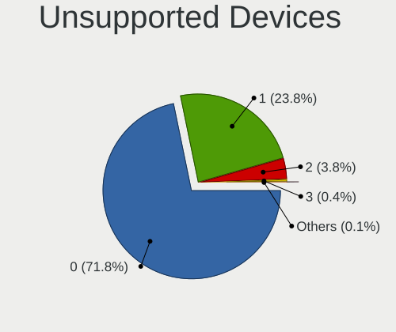

| Total | Computers | Percent |
|-------|-----------|---------|
| 0     | 1144      | 71.77%  |
| 1     | 379       | 23.78%  |
| 2     | 61        | 3.83%   |
| 3     | 7         | 0.44%   |
| 4     | 2         | 0.13%   |
| 5     | 1         | 0.06%   |

Unsupported Device Types
------------------------

Types of unsupported devices

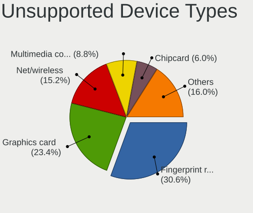

| Type                     | Computers | Percent |
|--------------------------|-----------|---------|
| Fingerprint reader       | 157       | 30.6%   |
| Graphics card            | 120       | 23.39%  |
| Net/wireless             | 78        | 15.2%   |
| Multimedia controller    | 45        | 8.77%   |
| Chipcard                 | 31        | 6.04%   |
| Bluetooth                | 19        | 3.7%    |
| Unassigned class         | 13        | 2.53%   |
| Communication controller | 12        | 2.34%   |
| Camera                   | 10        | 1.95%   |
| Sound                    | 9         | 1.75%   |
| Storage                  | 5         | 0.97%   |
| Network                  | 5         | 0.97%   |
| Net/ethernet             | 5         | 0.97%   |
| Card reader              | 2         | 0.39%   |
| Storage/raid             | 1         | 0.19%   |
| Firewire controller      | 1         | 0.19%   |

