Linux in China - Tested Hardware & Statistics
---------------------------------------------

A project to collect tested hardware configurations for Linux in China.

Anyone can contribute to this report by the [hw-probe](https://github.com/linuxhw/hw-probe) tool:

    sudo -E hw-probe -all -upload

Please contribute! Especially if your hardware is rare.

This is a report for all computer types. See also reports for [desktops](/Location/China/Desktop/README.md) and [notebooks](/Location/China/Notebook/README.md).

Contents
--------

* [ Test Cases ](#test-cases)

* [ System ](#system)
  - [ OS                       ](#os)
  - [ OS Family                ](#os-family)
  - [ Kernel                   ](#kernel)
  - [ Kernel Family            ](#kernel-family)
  - [ Kernel Major Ver.        ](#kernel-major-ver)
  - [ Arch                     ](#arch)
  - [ DE                       ](#de)
  - [ Display Server           ](#display-server)
  - [ Display Manager          ](#display-manager)
  - [ OS Lang                  ](#os-lang)
  - [ Boot Mode                ](#boot-mode)
  - [ Filesystem               ](#filesystem)
  - [ Part. scheme             ](#part-scheme)
  - [ Dual Boot with Linux/BSD ](#dual-boot-with-linuxbsd)
  - [ Dual Boot (Win)          ](#dual-boot-win)

* [ Board ](#board)
  - [ Vendor                   ](#vendor)
  - [ Model                    ](#model)
  - [ Model Family             ](#model-family)
  - [ MFG Year                 ](#mfg-year)
  - [ Form Factor              ](#form-factor)
  - [ Secure Boot              ](#secure-boot)
  - [ Coreboot                 ](#coreboot)
  - [ RAM Size                 ](#ram-size)
  - [ RAM Used                 ](#ram-used)
  - [ Total Drives             ](#total-drives)
  - [ Has CD-ROM               ](#has-cd-rom)
  - [ Has Ethernet             ](#has-ethernet)
  - [ Has WiFi                 ](#has-wifi)
  - [ Has Bluetooth            ](#has-bluetooth)

* [ Location ](#location)
  - [ Country                  ](#country)
  - [ City                     ](#city)

* [ Drives ](#drives)
  - [ Drive Vendor             ](#drive-vendor)
  - [ Drive Model              ](#drive-model)
  - [ HDD Vendor               ](#hdd-vendor)
  - [ SSD Vendor               ](#ssd-vendor)
  - [ Drive Kind               ](#drive-kind)
  - [ Drive Connector          ](#drive-connector)
  - [ Drive Size               ](#drive-size)
  - [ Space Total              ](#space-total)
  - [ Space Used               ](#space-used)
  - [ Malfunc. Drives          ](#malfunc-drives)
  - [ Malfunc. Drive Vendor    ](#malfunc-drive-vendor)
  - [ Malfunc. HDD Vendor      ](#malfunc-hdd-vendor)
  - [ Malfunc. Drive Kind      ](#malfunc-drive-kind)
  - [ Failed Drives            ](#failed-drives)
  - [ Failed Drive Vendor      ](#failed-drive-vendor)
  - [ Drive Status             ](#drive-status)

* [ Storage controller ](#storage-controller)
  - [ Storage Vendor           ](#storage-vendor)
  - [ Storage Model            ](#storage-model)
  - [ Storage Kind             ](#storage-kind)

* [ Processor ](#processor)
  - [ CPU Vendor               ](#cpu-vendor)
  - [ CPU Model                ](#cpu-model)
  - [ CPU Model Family         ](#cpu-model-family)
  - [ CPU Cores                ](#cpu-cores)
  - [ CPU Sockets              ](#cpu-sockets)
  - [ CPU Threads              ](#cpu-threads)
  - [ CPU Op-Modes             ](#cpu-op-modes)
  - [ CPU Microcode            ](#cpu-microcode)
  - [ CPU Microarch            ](#cpu-microarch)

* [ Graphics ](#graphics)
  - [ GPU Vendor               ](#gpu-vendor)
  - [ GPU Model                ](#gpu-model)
  - [ GPU Combo                ](#gpu-combo)
  - [ GPU Driver               ](#gpu-driver)
  - [ GPU Memory               ](#gpu-memory)

* [ Monitor ](#monitor)
  - [ Monitor Vendor           ](#monitor-vendor)
  - [ Monitor Model            ](#monitor-model)
  - [ Monitor Resolution       ](#monitor-resolution)
  - [ Monitor Diagonal         ](#monitor-diagonal)
  - [ Monitor Width            ](#monitor-width)
  - [ Aspect Ratio             ](#aspect-ratio)
  - [ Monitor Area             ](#monitor-area)
  - [ Pixel Density            ](#pixel-density)
  - [ Multiple Monitors        ](#multiple-monitors)

* [ Network ](#network)
  - [ Net Controller Vendor    ](#net-controller-vendor)
  - [ Net Controller Model     ](#net-controller-model)
  - [ Wireless Vendor          ](#wireless-vendor)
  - [ Wireless Model           ](#wireless-model)
  - [ Ethernet Vendor          ](#ethernet-vendor)
  - [ Ethernet Model           ](#ethernet-model)
  - [ Net Controller Kind      ](#net-controller-kind)
  - [ Used Controller          ](#used-controller)
  - [ NICs                     ](#nics)
  - [ IPv6                     ](#ipv6)

* [ Bluetooth ](#bluetooth)
  - [ Bluetooth Vendor         ](#bluetooth-vendor)
  - [ Bluetooth Model          ](#bluetooth-model)

* [ Sound ](#sound)
  - [ Sound Vendor             ](#sound-vendor)
  - [ Sound Model              ](#sound-model)

* [ Memory ](#memory)
  - [ Memory Vendor            ](#memory-vendor)
  - [ Memory Model             ](#memory-model)
  - [ Memory Kind              ](#memory-kind)
  - [ Memory Form Factor       ](#memory-form-factor)
  - [ Memory Size              ](#memory-size)
  - [ Memory Speed             ](#memory-speed)

* [ Printers & scanners ](#printers--scanners)
  - [ Printer Vendor           ](#printer-vendor)
  - [ Printer Model            ](#printer-model)
  - [ Scanner Vendor           ](#scanner-vendor)
  - [ Scanner Model            ](#scanner-model)

* [ Camera ](#camera)
  - [ Camera Vendor            ](#camera-vendor)
  - [ Camera Model             ](#camera-model)

* [ Security ](#security)
  - [ Fingerprint Vendor       ](#fingerprint-vendor)
  - [ Fingerprint Model        ](#fingerprint-model)
  - [ Chipcard Vendor          ](#chipcard-vendor)
  - [ Chipcard Model           ](#chipcard-model)

* [ Unsupported ](#unsupported)
  - [ Unsupported Devices      ](#unsupported-devices)
  - [ Unsupported Device Types ](#unsupported-device-types)

Test Cases
----------

Total: 3731

| Vendor        | Model                       | Form-Factor | Probe                                                      | Date         |
|---------------|-----------------------------|-------------|------------------------------------------------------------|--------------|
| Acer          | Aspire 4738ZG               | Notebook    | [5d96e6a01f](https://linux-hardware.org/?probe=5d96e6a01f) | Jan 03, 2026 |
| ASRock        | H670M-ITX/ax                | Desktop     | [0c303027f1](https://linux-hardware.org/?probe=0c303027f1) | Jan 03, 2026 |
| MECHREVO      | WUJIE14 PRO                 | Notebook    | [a5a2b25cc6](https://linux-hardware.org/?probe=a5a2b25cc6) | Jan 03, 2026 |
| MECHREVO      | WUJIE14 PRO                 | Notebook    | [134f5477ce](https://linux-hardware.org/?probe=134f5477ce) | Jan 03, 2026 |
| HP            | 806A                        | Desktop     | [aa66f48837](https://linux-hardware.org/?probe=aa66f48837) | Jan 01, 2026 |
| KaiTian       | 2OBEA009KX                  | Notebook    | [03ecd95419](https://linux-hardware.org/?probe=03ecd95419) | Jan 01, 2026 |
| Microsoft     | Surface Pro                 | Tablet      | [2d53140a45](https://linux-hardware.org/?probe=2d53140a45) | Dec 31, 2025 |
| ASUSTek       | TUF Gaming FX505GE_FX86F... | Notebook    | [be25621cf5](https://linux-hardware.org/?probe=be25621cf5) | Dec 31, 2025 |
| KaiTian       | 2OBEA009KX                  | Notebook    | [7759f0539d](https://linux-hardware.org/?probe=7759f0539d) | Dec 30, 2025 |
| HUAWEI        | CREFG-XX                    | Notebook    | [1730da8466](https://linux-hardware.org/?probe=1730da8466) | Dec 30, 2025 |
| ASUSTek       | X870 AYW GAMING WIFI W      | Desktop     | [23c665b5c0](https://linux-hardware.org/?probe=23c665b5c0) | Dec 30, 2025 |
| ASUSTek       | X870 AYW GAMING WIFI W      | Desktop     | [8b33491860](https://linux-hardware.org/?probe=8b33491860) | Dec 30, 2025 |
| ASUSTek       | TX Gaming FX608LM_FX608L... | Notebook    | [1d4de8ab43](https://linux-hardware.org/?probe=1d4de8ab43) | Dec 30, 2025 |
| ASUSTek       | X870 AYW GAMING WIFI W      | Desktop     | [5bed698159](https://linux-hardware.org/?probe=5bed698159) | Dec 30, 2025 |
| Unknown       | Unknown                     | Desktop     | [cd73ca1ad4](https://linux-hardware.org/?probe=cd73ca1ad4) | Dec 29, 2025 |
| Unknown       | sun60iw2                    | Soc         | [49791b76f4](https://linux-hardware.org/?probe=49791b76f4) | Dec 29, 2025 |
| MAXHUB        | BPAN03                      | Mini pc     | [d8763daf35](https://linux-hardware.org/?probe=d8763daf35) | Dec 29, 2025 |
| Unknown       | sun60iw2                    | Soc         | [b7c6b4cc64](https://linux-hardware.org/?probe=b7c6b4cc64) | Dec 29, 2025 |
| UniOne        | GTW8102                     | Notebook    | [d24b01bc71](https://linux-hardware.org/?probe=d24b01bc71) | Dec 29, 2025 |
| Google        | Kaisa rev4                  | Mini pc     | [60d0e7e197](https://linux-hardware.org/?probe=60d0e7e197) | Dec 29, 2025 |
| ASUSTek       | X870 AYW GAMING WIFI W      | Desktop     | [c69224dd1b](https://linux-hardware.org/?probe=c69224dd1b) | Dec 29, 2025 |
| MECHREVO      | JiguangX Series GM6IR7C     | Notebook    | [a403adf2f0](https://linux-hardware.org/?probe=a403adf2f0) | Dec 27, 2025 |
| LZ            | LZ1004_3                    | Notebook    | [ffb23d772e](https://linux-hardware.org/?probe=ffb23d772e) | Dec 27, 2025 |
| Standard      | Unknown                     | Notebook    | [436b90c308](https://linux-hardware.org/?probe=436b90c308) | Dec 26, 2025 |
| KaiTian       | LXCF-ZXE-ZX200-mATX ZZX2... | Desktop     | [ad4e532296](https://linux-hardware.org/?probe=ad4e532296) | Dec 26, 2025 |
| HUAWEI        | VGHH-XX                     | Notebook    | [dd7831b2b5](https://linux-hardware.org/?probe=dd7831b2b5) | Dec 26, 2025 |
| Lenovo        | ThinkPad S3-S431 20AX000... | Notebook    | [1fa42b3faf](https://linux-hardware.org/?probe=1fa42b3faf) | Dec 22, 2025 |
| GITSTAR       | GM9-7002 VF                 | Desktop     | [1574f6b134](https://linux-hardware.org/?probe=1574f6b134) | Dec 22, 2025 |
| Lenovo        | ThinkBook 14 G5+ IRH 21H... | Notebook    | [a15dfa7601](https://linux-hardware.org/?probe=a15dfa7601) | Dec 22, 2025 |
| Haier         | ZEB19 V1.1                  | Desktop     | [439d06b0b4](https://linux-hardware.org/?probe=439d06b0b4) | Dec 21, 2025 |
| Nvidia        | Jetson Orin Nano Enginee... | Soc         | [ec48b6d0ff](https://linux-hardware.org/?probe=ec48b6d0ff) | Dec 21, 2025 |
| MSI           | MAG B550M MORTAR WIFI       | Desktop     | [1dabb6acae](https://linux-hardware.org/?probe=1dabb6acae) | Dec 20, 2025 |
| Centerm       | C73N                        | Notebook    | [442fefc6bc](https://linux-hardware.org/?probe=442fefc6bc) | Dec 19, 2025 |
| Lenovo        | ThinkPad T14p Gen 3 21RU... | Notebook    | [d75ea91b23](https://linux-hardware.org/?probe=d75ea91b23) | Dec 19, 2025 |
| Giga Compu... | MZ72-HB2-00 01010101        | Server      | [e42b4e97ab](https://linux-hardware.org/?probe=e42b4e97ab) | Dec 19, 2025 |
| Lenovo        | ThinkPad SL410 28429GC      | Notebook    | [22a698eb58](https://linux-hardware.org/?probe=22a698eb58) | Dec 17, 2025 |
| HONOR         | FMB-P                       | Notebook    | [b06b6670ae](https://linux-hardware.org/?probe=b06b6670ae) | Dec 17, 2025 |
| HONOR         | FMB-P                       | Notebook    | [0b0c46c17f](https://linux-hardware.org/?probe=0b0c46c17f) | Dec 17, 2025 |
| Timi          | TM1612                      | Notebook    | [1e08543322](https://linux-hardware.org/?probe=1e08543322) | Dec 17, 2025 |
| Sony          | VPCEH16EC                   | Notebook    | [eeb16474ca](https://linux-hardware.org/?probe=eeb16474ca) | Dec 17, 2025 |
| Loongson      | CTCI02LS3A6000C-K CTCI V... | Desktop     | [9b5fd8e975](https://linux-hardware.org/?probe=9b5fd8e975) | Dec 16, 2025 |
| Lenovo        | MAHOBAY NO DPK              | Desktop     | [6c7262f853](https://linux-hardware.org/?probe=6c7262f853) | Dec 15, 2025 |
| Nvidia        | Jetson AGX Orin Develope... | Soc         | [4df8424ebc](https://linux-hardware.org/?probe=4df8424ebc) | Dec 15, 2025 |
| Maibenben     | XiaoMai5                    | Notebook    | [d3ae6b11b4](https://linux-hardware.org/?probe=d3ae6b11b4) | Dec 15, 2025 |
| Micro Comp... | MS-R1                       | Soc         | [f2de0fa9ec](https://linux-hardware.org/?probe=f2de0fa9ec) | Dec 14, 2025 |
| HUAWEI        | VGHH-XX                     | Notebook    | [7313bd0a72](https://linux-hardware.org/?probe=7313bd0a72) | Dec 14, 2025 |
| MECHREVO      | CODE Series                 | Notebook    | [9bf271153e](https://linux-hardware.org/?probe=9bf271153e) | Dec 13, 2025 |
| AZW           | LZX TBD                     | Desktop     | [7306b65d94](https://linux-hardware.org/?probe=7306b65d94) | Dec 13, 2025 |
| Shanghai Z... | ZXE CRB                     | Notebook    | [e22d161ef6](https://linux-hardware.org/?probe=e22d161ef6) | Dec 13, 2025 |
| Lenovo        | ThinkPad T480 20L5A00PCD    | Notebook    | [598f3890d0](https://linux-hardware.org/?probe=598f3890d0) | Dec 13, 2025 |
| ASUSTek       | ZenBook 13 UX310UFR         | Notebook    | [1c744c7cea](https://linux-hardware.org/?probe=1c744c7cea) | Dec 13, 2025 |
| MECHREVO      | CODE Series                 | Notebook    | [facb14264a](https://linux-hardware.org/?probe=facb14264a) | Dec 12, 2025 |
| Lenovo        | 1064 NOK                    | Desktop     | [edea700c18](https://linux-hardware.org/?probe=edea700c18) | Dec 11, 2025 |
| Lenovo        | ThinkPad T14p Gen 3 21RU... | Notebook    | [c136f2ee83](https://linux-hardware.org/?probe=c136f2ee83) | Dec 11, 2025 |
| AZW           | LZX TBD                     | Desktop     | [10ba7b03f3](https://linux-hardware.org/?probe=10ba7b03f3) | Dec 11, 2025 |
| Intel         | G41                         | Desktop     | [c5dd939ad7](https://linux-hardware.org/?probe=c5dd939ad7) | Dec 11, 2025 |
| IPASON        | LL300                       | Notebook    | [298a93383f](https://linux-hardware.org/?probe=298a93383f) | Dec 11, 2025 |
| IPASON        | LL300                       | Notebook    | [317788ff9e](https://linux-hardware.org/?probe=317788ff9e) | Dec 11, 2025 |
| Lenovo        | 3316 NOK                    | Desktop     | [cff96fc34b](https://linux-hardware.org/?probe=cff96fc34b) | Dec 11, 2025 |
| Lenovo        | ThinkPad T14p Gen 3 21RU... | Notebook    | [a72143615c](https://linux-hardware.org/?probe=a72143615c) | Dec 10, 2025 |
| Chuwi         | FreeBook                    | Notebook    | [2c360130f1](https://linux-hardware.org/?probe=2c360130f1) | Dec 09, 2025 |
| Unknown (1... | MAG B550M MORTAR            | Desktop     | [2678a6e567](https://linux-hardware.org/?probe=2678a6e567) | Dec 09, 2025 |
| Unknown (1... | MAG B550M MORTAR            | Desktop     | [a44bff56ff](https://linux-hardware.org/?probe=a44bff56ff) | Dec 09, 2025 |
| Lenovo        | ThinkBook 14 G7+ IAH 21T... | Notebook    | [924f90096a](https://linux-hardware.org/?probe=924f90096a) | Dec 08, 2025 |
| ASUSTek       | TUF Gaming B550M-PLUS WI... | Desktop     | [d4472ce7f5](https://linux-hardware.org/?probe=d4472ce7f5) | Dec 08, 2025 |
| ADLINK Tec... | cPCI-3510                   | Notebook    | [f1c4eb8958](https://linux-hardware.org/?probe=f1c4eb8958) | Dec 08, 2025 |
| HP            | 158B                        | Desktop     | [12ee930c05](https://linux-hardware.org/?probe=12ee930c05) | Dec 08, 2025 |
| ASUSTek       | PRIME B650M-K               | Desktop     | [cf1fe41c18](https://linux-hardware.org/?probe=cf1fe41c18) | Dec 07, 2025 |
| IP3 Tech      | EA170 TBD                   | Desktop     | [5a4934878f](https://linux-hardware.org/?probe=5a4934878f) | Dec 06, 2025 |
| OEM           | OEM                         | Desktop     | [ee2ca53267](https://linux-hardware.org/?probe=ee2ca53267) | Dec 05, 2025 |
| Lenovo        | ThinkPad T14 Gen 4 21HD0... | Notebook    | [8a596a41dd](https://linux-hardware.org/?probe=8a596a41dd) | Dec 05, 2025 |
| Centerm       | C73N                        | Notebook    | [5e57934530](https://linux-hardware.org/?probe=5e57934530) | Dec 04, 2025 |
| IPASON        | LL300                       | Notebook    | [6a9b6c1048](https://linux-hardware.org/?probe=6a9b6c1048) | Dec 03, 2025 |
| AZW           | LZX TBD                     | Desktop     | [3663e001c9](https://linux-hardware.org/?probe=3663e001c9) | Dec 03, 2025 |
| KaiTian       | 2OBEA009KX                  | Notebook    | [0d8eab5d45](https://linux-hardware.org/?probe=0d8eab5d45) | Dec 03, 2025 |
| Haier         | ZEB19 V1.1                  | Desktop     | [6f8c2fd403](https://linux-hardware.org/?probe=6f8c2fd403) | Dec 02, 2025 |
| HP            | 158B                        | Desktop     | [b410504428](https://linux-hardware.org/?probe=b410504428) | Dec 02, 2025 |
| ASUSTek       | TUF Gaming B650M-PLUS WI... | Desktop     | [0057b3d5e3](https://linux-hardware.org/?probe=0057b3d5e3) | Dec 01, 2025 |
| Gigabyte      | H110M-S2-CF                 | Desktop     | [bb3657a14d](https://linux-hardware.org/?probe=bb3657a14d) | Dec 01, 2025 |
| MSI           | B850MPOWER                  | Desktop     | [96354e444f](https://linux-hardware.org/?probe=96354e444f) | Nov 30, 2025 |
| Centerm       | C73N                        | Notebook    | [d474498003](https://linux-hardware.org/?probe=d474498003) | Nov 30, 2025 |
| Centerm       | C73N                        | Notebook    | [3b325e602f](https://linux-hardware.org/?probe=3b325e602f) | Nov 30, 2025 |
| Raspberry ... | Raspberry Pi 5 Model B R... | Soc         | [e4f4aa4ce5](https://linux-hardware.org/?probe=e4f4aa4ce5) | Nov 30, 2025 |
| Loongson      | CTCI02LS3A6000C-K CTCI V... | Desktop     | [bc0d27f083](https://linux-hardware.org/?probe=bc0d27f083) | Nov 29, 2025 |
| Centerm       | C73N                        | Notebook    | [99ab7320bc](https://linux-hardware.org/?probe=99ab7320bc) | Nov 29, 2025 |
| AZW           | LZX TBD                     | Desktop     | [f046259f39](https://linux-hardware.org/?probe=f046259f39) | Nov 29, 2025 |
| MSI           | MAG B650M MORTAR            | Desktop     | [d74283ee06](https://linux-hardware.org/?probe=d74283ee06) | Nov 29, 2025 |
| ASUSTek       | ROG CROSSHAIR X870E HERO    | Desktop     | [1921803972](https://linux-hardware.org/?probe=1921803972) | Nov 28, 2025 |
| W             | I1170D00U                   | Desktop     | [e53ac0472d](https://linux-hardware.org/?probe=e53ac0472d) | Nov 27, 2025 |
| W             | I1170D00U                   | Desktop     | [919b7306bf](https://linux-hardware.org/?probe=919b7306bf) | Nov 27, 2025 |
| Lenovo        | ThinkPad T14 Gen 4 21HD0... | Notebook    | [9b6dd0a875](https://linux-hardware.org/?probe=9b6dd0a875) | Nov 26, 2025 |
| Lenovo        | ThinkPad X220 4286AC9       | Notebook    | [4c7f433ae2](https://linux-hardware.org/?probe=4c7f433ae2) | Nov 26, 2025 |
| MECHREVO      | WUJIE14XA                   | Notebook    | [f3f9354627](https://linux-hardware.org/?probe=f3f9354627) | Nov 26, 2025 |
| Lenovo        | ThinkBook 14 G7+ IAH 21T... | Notebook    | [71f6f7f26f](https://linux-hardware.org/?probe=71f6f7f26f) | Nov 25, 2025 |
| Unknown       | Beelink GT-King             | Soc         | [2d72fef1ee](https://linux-hardware.org/?probe=2d72fef1ee) | Nov 25, 2025 |
| Unknown       | Beelink GT-King             | Soc         | [fe509dcf64](https://linux-hardware.org/?probe=fe509dcf64) | Nov 25, 2025 |
| COLORFUL      | X15 XS 22                   | Notebook    | [05efc3e8d3](https://linux-hardware.org/?probe=05efc3e8d3) | Nov 24, 2025 |
| Apple         | Mac-AA95B1DDAB278B95 iMa... | All in one  | [256cb6096a](https://linux-hardware.org/?probe=256cb6096a) | Nov 24, 2025 |
| KaiTian       | 2OBEA009KX                  | Notebook    | [a6a9e0d353](https://linux-hardware.org/?probe=a6a9e0d353) | Nov 24, 2025 |
| ASUSTek       | X555SJ                      | Notebook    | [e25e878d9e](https://linux-hardware.org/?probe=e25e878d9e) | Nov 20, 2025 |
| Unknown       | Unknown                     | Desktop     | [5053f26753](https://linux-hardware.org/?probe=5053f26753) | Nov 20, 2025 |
| HUAWEI        | HKF-WXX                     | Notebook    | [ce3c02a28f](https://linux-hardware.org/?probe=ce3c02a28f) | Nov 20, 2025 |
| Lenovo        | ThinkPad T14 Gen 4 21HD0... | Notebook    | [c532b57082](https://linux-hardware.org/?probe=c532b57082) | Nov 20, 2025 |
| Biostar       | B650MP-E PRO                | Desktop     | [5afa4c1ee2](https://linux-hardware.org/?probe=5afa4c1ee2) | Nov 18, 2025 |
| KaiTian       | 2OBEA009KX                  | Notebook    | [75dedc317c](https://linux-hardware.org/?probe=75dedc317c) | Nov 16, 2025 |
| ASUSTek       | ASUS TUF Gaming A15 FA50... | Notebook    | [b1297246eb](https://linux-hardware.org/?probe=b1297246eb) | Nov 16, 2025 |
| Acer          | Aspire AV14-51              | Notebook    | [45184f6310](https://linux-hardware.org/?probe=45184f6310) | Nov 15, 2025 |
| Gigabyte      | H110M-S2-CF                 | Desktop     | [434c20de93](https://linux-hardware.org/?probe=434c20de93) | Nov 14, 2025 |
| Phytium       | FT-2000+/64 V0001           | Server      | [8e5262ba36](https://linux-hardware.org/?probe=8e5262ba36) | Nov 14, 2025 |
| Lenovo        | ThinkPad X1 Carbon Gen 1... | Notebook    | [dc56e6aa62](https://linux-hardware.org/?probe=dc56e6aa62) | Nov 13, 2025 |
| Inspur        | CP300H2                     | Notebook    | [f9d0897749](https://linux-hardware.org/?probe=f9d0897749) | Nov 13, 2025 |
| Loongson      | LS3A6000-7A2000-NL38        | Notebook    | [062c83efb8](https://linux-hardware.org/?probe=062c83efb8) | Nov 13, 2025 |
| Loongson      | LS3A6000-7A2000-NL38        | Notebook    | [21f963f41e](https://linux-hardware.org/?probe=21f963f41e) | Nov 12, 2025 |
| Colorful T... | C.N78T Ver1.5               | Desktop     | [0767dd3511](https://linux-hardware.org/?probe=0767dd3511) | Nov 12, 2025 |
| Lenovo        | Legion Y7000P 81HC          | Notebook    | [21f01b21e1](https://linux-hardware.org/?probe=21f01b21e1) | Nov 12, 2025 |
| MECHREVO      | WUJIE14XA                   | Notebook    | [20d89b97c8](https://linux-hardware.org/?probe=20d89b97c8) | Nov 11, 2025 |
| HP            | EliteBook Ultra G1i 14 i... | Notebook    | [ca64191737](https://linux-hardware.org/?probe=ca64191737) | Nov 10, 2025 |
| Apple         | MacBookPro14,3              | Notebook    | [dafeee6b0b](https://linux-hardware.org/?probe=dafeee6b0b) | Nov 10, 2025 |
| Lenovo        | Legion R9000P ADR10 83LV    | Notebook    | [1054ea7592](https://linux-hardware.org/?probe=1054ea7592) | Nov 10, 2025 |
| Lenovo        | Legion R9000P ADR10 83LV    | Notebook    | [db0f687ed4](https://linux-hardware.org/?probe=db0f687ed4) | Nov 09, 2025 |
| MSI           | MS-B9411                    | Desktop     | [6055d20b1c](https://linux-hardware.org/?probe=6055d20b1c) | Nov 09, 2025 |
| Lenovo        | Yoga Pro 16 IAH10 83L0      | Notebook    | [a8872c086c](https://linux-hardware.org/?probe=a8872c086c) | Nov 09, 2025 |
| Dell          | 0V1N3D A00                  | Desktop     | [93cfe8695b](https://linux-hardware.org/?probe=93cfe8695b) | Nov 09, 2025 |
| Dell          | 0V1N3D A00                  | Desktop     | [010bcba9db](https://linux-hardware.org/?probe=010bcba9db) | Nov 09, 2025 |
| MAXSUN        | MS-TZZ H81M-V3H M.2         | Desktop     | [faed1ff69e](https://linux-hardware.org/?probe=faed1ff69e) | Nov 08, 2025 |
| TYAN Compu... | S8030GM2NE 5411T6180007     | Desktop     | [84ff05cd41](https://linux-hardware.org/?probe=84ff05cd41) | Nov 08, 2025 |
| MSI           | MAG B650M MORTAR            | Desktop     | [6db9bb306e](https://linux-hardware.org/?probe=6db9bb306e) | Nov 07, 2025 |
| Loongson      | LS3A6000-7A2000-NL38        | Notebook    | [212c9078d0](https://linux-hardware.org/?probe=212c9078d0) | Nov 07, 2025 |
| Supermicro    | X11DGO-T                    | Server      | [c951b9bbaa](https://linux-hardware.org/?probe=c951b9bbaa) | Nov 06, 2025 |
| Unknown       | Xunlei OneCloud             | Desktop     | [a4340bde74](https://linux-hardware.org/?probe=a4340bde74) | Nov 05, 2025 |
| Lenovo        | ThinkPad T420 4180AF1       | Notebook    | [c936754231](https://linux-hardware.org/?probe=c936754231) | Nov 05, 2025 |
| HP            | 8D3E                        | Mini pc     | [f98ddca7e6](https://linux-hardware.org/?probe=f98ddca7e6) | Nov 04, 2025 |
| HP            | 8D3E                        | Mini pc     | [749700b3e0](https://linux-hardware.org/?probe=749700b3e0) | Nov 04, 2025 |
| HASEE Comp... | QNLYS Series                | Notebook    | [a3ae8b56bd](https://linux-hardware.org/?probe=a3ae8b56bd) | Nov 03, 2025 |
| HP            | 8D3E                        | Mini pc     | [b7736c3047](https://linux-hardware.org/?probe=b7736c3047) | Nov 03, 2025 |
| HUAWEI        | BOHL-WXX9                   | Notebook    | [edd81d71eb](https://linux-hardware.org/?probe=edd81d71eb) | Nov 03, 2025 |
| Loongson      | CTCI02LS3A6000C-K CTCI V... | Desktop     | [817cc4cdd6](https://linux-hardware.org/?probe=817cc4cdd6) | Nov 02, 2025 |
| Supermicro    | X11DGO-T                    | Server      | [4bb2d3c56c](https://linux-hardware.org/?probe=4bb2d3c56c) | Nov 02, 2025 |
| HONOR         | BRN-HXXB                    | Notebook    | [61aafc9d05](https://linux-hardware.org/?probe=61aafc9d05) | Nov 01, 2025 |
| Dell          | Latitude E6320              | Notebook    | [5c42f5c28e](https://linux-hardware.org/?probe=5c42f5c28e) | Nov 01, 2025 |
| Dell          | Latitude E6320              | Notebook    | [a4138be5cc](https://linux-hardware.org/?probe=a4138be5cc) | Nov 01, 2025 |
| Biostar       | B650MP-E PRO                | Desktop     | [fbb21dd100](https://linux-hardware.org/?probe=fbb21dd100) | Oct 31, 2025 |
| Dell          | Latitude 5330               | Notebook    | [f662e011b9](https://linux-hardware.org/?probe=f662e011b9) | Oct 31, 2025 |
| UNICOMPUTE    | UNIS L3893 G3               | Notebook    | [c052fa6879](https://linux-hardware.org/?probe=c052fa6879) | Oct 30, 2025 |
| AYANEO        | AIR 1S                      | Tablet      | [d1cfa1148e](https://linux-hardware.org/?probe=d1cfa1148e) | Oct 30, 2025 |
| MECHREVO      | WUJIE14XA                   | Notebook    | [b5b678819a](https://linux-hardware.org/?probe=b5b678819a) | Oct 29, 2025 |
| MSI           | MAG B650M MORTAR            | Desktop     | [c54acd2fe5](https://linux-hardware.org/?probe=c54acd2fe5) | Oct 29, 2025 |
| HUAWEI        | VGHH-XX                     | Notebook    | [bd70f0e8a2](https://linux-hardware.org/?probe=bd70f0e8a2) | Oct 29, 2025 |
| Huanan        | X11D-16D V1.0               | Desktop     | [e678133d03](https://linux-hardware.org/?probe=e678133d03) | Oct 28, 2025 |
| HP            | ProLiant DL180 G6           | Server      | [0ea25c1954](https://linux-hardware.org/?probe=0ea25c1954) | Oct 28, 2025 |
| MSI           | MAG B760M MORTAR WIFI II    | Desktop     | [55c90e00f3](https://linux-hardware.org/?probe=55c90e00f3) | Oct 28, 2025 |
| ASUSTek       | ROG STRIX B860-I GAMING ... | Desktop     | [17c1298d03](https://linux-hardware.org/?probe=17c1298d03) | Oct 27, 2025 |
| MECHREVO      | JIGUANG Series              | Notebook    | [d8c25ae1c1](https://linux-hardware.org/?probe=d8c25ae1c1) | Oct 27, 2025 |
| ASUSTek       | TUF Gaming B450M-PRO S      | Desktop     | [919de6b9e2](https://linux-hardware.org/?probe=919de6b9e2) | Oct 27, 2025 |
| Lenovo        | Yoga 700-11ISK 80QE         | Notebook    | [c5bdb39084](https://linux-hardware.org/?probe=c5bdb39084) | Oct 27, 2025 |
| Lenovo        | MIIX 320-10ICR 80XF         | Tablet      | [034d37219f](https://linux-hardware.org/?probe=034d37219f) | Oct 25, 2025 |
| Acer          | Predator PHN16-71           | Notebook    | [d3b7b6e4e3](https://linux-hardware.org/?probe=d3b7b6e4e3) | Oct 25, 2025 |
| Supermicro    | C9X299-RPGF-L               | Server      | [8aa530c915](https://linux-hardware.org/?probe=8aa530c915) | Oct 24, 2025 |
| Shanghai Z... | ZXE CRB                     | Notebook    | [350bf85e80](https://linux-hardware.org/?probe=350bf85e80) | Oct 22, 2025 |
| MECHREVO      | WUJIE 14 Series GX4HRXL     | Notebook    | [4022552e97](https://linux-hardware.org/?probe=4022552e97) | Oct 21, 2025 |
| Supermicro    | H12SSL-i                    | Server      | [33a2a05eec](https://linux-hardware.org/?probe=33a2a05eec) | Oct 20, 2025 |
| AYANEO        | AIR 1S                      | Tablet      | [2ceba2fd2e](https://linux-hardware.org/?probe=2ceba2fd2e) | Oct 19, 2025 |
| Lenovo        | ZHAOYANG E40-80 80HR        | Notebook    | [8a61c30343](https://linux-hardware.org/?probe=8a61c30343) | Oct 18, 2025 |
| ASUSTek       | TUF B450M-PRO GAMING        | Desktop     | [b712dece4b](https://linux-hardware.org/?probe=b712dece4b) | Oct 17, 2025 |
| HUAWEI        | HUAWEIPGU-WBY0              | Soc         | [49e1200724](https://linux-hardware.org/?probe=49e1200724) | Oct 17, 2025 |
| ASUSTek       | PRIME H410M-K               | Desktop     | [dd42c54c62](https://linux-hardware.org/?probe=dd42c54c62) | Oct 17, 2025 |
| Unknown       | Unknown                     | Desktop     | [ad7ef3d8ff](https://linux-hardware.org/?probe=ad7ef3d8ff) | Oct 16, 2025 |
| Lenovo        | ThinkPad T420 4180J4C       | Notebook    | [a916fdf812](https://linux-hardware.org/?probe=a916fdf812) | Oct 15, 2025 |
| Loongson      | LS3A6000-7A2000-1w-V0.1-... | Desktop     | [8d642f41ea](https://linux-hardware.org/?probe=8d642f41ea) | Oct 15, 2025 |
| MSI           | X399 SLI PLUS               | Desktop     | [2967bb728e](https://linux-hardware.org/?probe=2967bb728e) | Oct 08, 2025 |
| Lenovo        | MAHOBAY 31900005 STD        | All in one  | [776a8b14cf](https://linux-hardware.org/?probe=776a8b14cf) | Oct 07, 2025 |
| Lenovo        | Yoga 3 Pro-1370 80HE        | Notebook    | [ace8416a51](https://linux-hardware.org/?probe=ace8416a51) | Oct 05, 2025 |
| HONOR         | BRN-HXXB                    | Notebook    | [3b03cc918b](https://linux-hardware.org/?probe=3b03cc918b) | Oct 04, 2025 |
| ASUSTek       | Zenbook UX3402VA_UX3402V... | Notebook    | [dcc6013859](https://linux-hardware.org/?probe=dcc6013859) | Oct 04, 2025 |
| Supermicro    | H12SSL-i                    | Server      | [dd4867dfda](https://linux-hardware.org/?probe=dd4867dfda) | Oct 04, 2025 |
| Chuwi         | MiniBook X                  | Notebook    | [356de46611](https://linux-hardware.org/?probe=356de46611) | Oct 03, 2025 |
| Dell          | Latitude E6230              | Notebook    | [c64418a51d](https://linux-hardware.org/?probe=c64418a51d) | Oct 03, 2025 |
| HUAWEI        | WRT-WX9                     | Notebook    | [c7864acd47](https://linux-hardware.org/?probe=c7864acd47) | Oct 02, 2025 |
| Lenovo        | 1064 NOK                    | Desktop     | [d5e6aff45d](https://linux-hardware.org/?probe=d5e6aff45d) | Sep 30, 2025 |
| Lenovo        | ThinkPad E14 Gen 4 21E30... | Notebook    | [85d81d2769](https://linux-hardware.org/?probe=85d81d2769) | Sep 29, 2025 |
| Intel         | NUC13ANBi7 M89645-203       | Mini pc     | [30fc7bb80a](https://linux-hardware.org/?probe=30fc7bb80a) | Sep 29, 2025 |
| Intel         | NUC13ANBi7 M89645-203       | Mini pc     | [60d6365823](https://linux-hardware.org/?probe=60d6365823) | Sep 29, 2025 |
| ASUSTek       | TX Gaming FA608PP_FA608P... | Notebook    | [8b175d9e21](https://linux-hardware.org/?probe=8b175d9e21) | Sep 28, 2025 |
| Fujitsu       | FMVU35021                   | Convertible | [4a13972a37](https://linux-hardware.org/?probe=4a13972a37) | Sep 28, 2025 |
| Fujitsu       | FMVU35021                   | Convertible | [c9ce7b540a](https://linux-hardware.org/?probe=c9ce7b540a) | Sep 28, 2025 |
| HP            | 8D3E                        | Mini pc     | [fecd65eb1a](https://linux-hardware.org/?probe=fecd65eb1a) | Sep 28, 2025 |
| Lenovo        | ThinkBook 14 G4+ IAP 21C... | Notebook    | [d003b0b05e](https://linux-hardware.org/?probe=d003b0b05e) | Sep 27, 2025 |
| Lenovo        | ThinkPad T480s 20L8SA3Q0... | Notebook    | [f875c2450f](https://linux-hardware.org/?probe=f875c2450f) | Sep 27, 2025 |
| ASUSTek       | ROG Flow X13 GV301QH_GV3... | Notebook    | [09679a44e2](https://linux-hardware.org/?probe=09679a44e2) | Sep 27, 2025 |
| Apple         | MacBookPro7,1               | Notebook    | [f780867d90](https://linux-hardware.org/?probe=f780867d90) | Sep 27, 2025 |
| ASUSTek       | M5A78L-M LX3 PLUS           | Desktop     | [08ae6003a8](https://linux-hardware.org/?probe=08ae6003a8) | Sep 26, 2025 |
| ASUSTek       | ROG Flow X13 GV301QH_GV3... | Notebook    | [350473ad18](https://linux-hardware.org/?probe=350473ad18) | Sep 26, 2025 |
| Apple         | MacBookPro7,1               | Notebook    | [cb55cdef5a](https://linux-hardware.org/?probe=cb55cdef5a) | Sep 26, 2025 |
| Lenovo        | ThinkPad E14 Gen 6 21M7A... | Notebook    | [87e05a5eeb](https://linux-hardware.org/?probe=87e05a5eeb) | Sep 25, 2025 |
| Lenovo        | ThinkPad X1 Carbon 3443C... | Notebook    | [92f1070368](https://linux-hardware.org/?probe=92f1070368) | Sep 23, 2025 |
| Lenovo        | ThinkPad E460 20ETA00DCD    | Notebook    | [80ea7ec482](https://linux-hardware.org/?probe=80ea7ec482) | Sep 23, 2025 |
| ASUSTek       | TUF B450M-PRO GAMING        | Desktop     | [a8db5b7aab](https://linux-hardware.org/?probe=a8db5b7aab) | Sep 21, 2025 |
| sunxi         | OrangePi 3 LTS              | Soc         | [41d36b30e3](https://linux-hardware.org/?probe=41d36b30e3) | Sep 20, 2025 |
| Dell          | 018D1Y A00                  | Desktop     | [2938dd1233](https://linux-hardware.org/?probe=2938dd1233) | Sep 20, 2025 |
| HP            | 255 15.6 inch G9 Noteboo... | Notebook    | [231fca2302](https://linux-hardware.org/?probe=231fca2302) | Sep 20, 2025 |
| ASUSTek       | ROG Flow X13 GV301QH_GV3... | Notebook    | [c1d4e2814b](https://linux-hardware.org/?probe=c1d4e2814b) | Sep 19, 2025 |
| HUAWEI        | WRT-WX9                     | Notebook    | [ca828ded55](https://linux-hardware.org/?probe=ca828ded55) | Sep 19, 2025 |
| Lenovo        | ThinkPad S3 20QC000DCD      | Notebook    | [6472032027](https://linux-hardware.org/?probe=6472032027) | Sep 17, 2025 |
| GITSTAR       | GDC-1461                    | Notebook    | [1ee0ac4d46](https://linux-hardware.org/?probe=1ee0ac4d46) | Sep 17, 2025 |
| Loongson      | 3A6000-7A2000-1w-EVB-V1.... | Desktop     | [724dab935c](https://linux-hardware.org/?probe=724dab935c) | Sep 17, 2025 |
| Loongson      | LS3A6000-7A2000-NL38        | Notebook    | [18d9d4fcf1](https://linux-hardware.org/?probe=18d9d4fcf1) | Sep 17, 2025 |
| Intel         | H81U                        | Notebook    | [3453a83029](https://linux-hardware.org/?probe=3453a83029) | Sep 17, 2025 |
| Lenovo        | ThinkPad S3 20QC000DCD      | Notebook    | [0d82d2e808](https://linux-hardware.org/?probe=0d82d2e808) | Sep 16, 2025 |
| MECHREVO      | Z3 Air Series GM5TGEO       | Notebook    | [482b312ef2](https://linux-hardware.org/?probe=482b312ef2) | Sep 14, 2025 |
| Lenovo        | 3176 NOK                    | Desktop     | [ff5e993fcc](https://linux-hardware.org/?probe=ff5e993fcc) | Sep 14, 2025 |
| Lenovo        | MIIX 720-12IKB 80VV         | Tablet      | [923dc8e8bd](https://linux-hardware.org/?probe=923dc8e8bd) | Sep 13, 2025 |
| ZMY           | D1500 Ver.A                 | Server      | [f92cfcf271](https://linux-hardware.org/?probe=f92cfcf271) | Sep 13, 2025 |
| Lenovo        | ThinkPad T14 Gen 4          | Notebook    | [689e59587a](https://linux-hardware.org/?probe=689e59587a) | Sep 13, 2025 |
| Dell          | Latitude E6400              | Notebook    | [cd1f4f46d2](https://linux-hardware.org/?probe=cd1f4f46d2) | Sep 13, 2025 |
| KaiTian       | 2OBEA009KX                  | Notebook    | [052eb4141d](https://linux-hardware.org/?probe=052eb4141d) | Sep 12, 2025 |
| Loongson      | LS3A6000-7A2000-NL38        | Notebook    | [2b24be151c](https://linux-hardware.org/?probe=2b24be151c) | Sep 12, 2025 |
| Lenovo        | XiaoXin Air 12 80UN         | Notebook    | [6597f540e2](https://linux-hardware.org/?probe=6597f540e2) | Sep 12, 2025 |
| win elemen... | MoreFine S500+              | Notebook    | [f03055b6c7](https://linux-hardware.org/?probe=f03055b6c7) | Sep 12, 2025 |
| Loongson      | 3A6000-HV-7A2000-1w-EVB-... | Desktop     | [be0853c561](https://linux-hardware.org/?probe=be0853c561) | Sep 11, 2025 |
| SYWZ          | S200 Series                 | Desktop     | [4601bda16f](https://linux-hardware.org/?probe=4601bda16f) | Sep 11, 2025 |
| Unknown       | Unknown                     | Mini pc     | [3b6a207514](https://linux-hardware.org/?probe=3b6a207514) | Sep 11, 2025 |
| Loongson      | CTCI02LS3A6000C-K CTCI V... | Desktop     | [2eb94ec489](https://linux-hardware.org/?probe=2eb94ec489) | Sep 11, 2025 |
| Loongson      | 3A6000-HV-7A2000-NUC QA6... | Desktop     | [d5c0475497](https://linux-hardware.org/?probe=d5c0475497) | Sep 11, 2025 |
| HP            | Pavilion 15                 | Notebook    | [8097841500](https://linux-hardware.org/?probe=8097841500) | Sep 11, 2025 |
| KaiTian       | 2OBEA009KX                  | Notebook    | [95abe2a4ba](https://linux-hardware.org/?probe=95abe2a4ba) | Sep 11, 2025 |
| HP            | Pavilion 15                 | Notebook    | [b2a630c80c](https://linux-hardware.org/?probe=b2a630c80c) | Sep 11, 2025 |
| Lenovo        | ThinkPad T14 Gen 4 21HD0... | Notebook    | [f0f7885993](https://linux-hardware.org/?probe=f0f7885993) | Sep 11, 2025 |
| THUNDEROBO... | R15                         | Notebook    | [05c69294c9](https://linux-hardware.org/?probe=05c69294c9) | Sep 11, 2025 |
| Teclast       | F7 Plus                     | Notebook    | [fda9bf1ae0](https://linux-hardware.org/?probe=fda9bf1ae0) | Sep 09, 2025 |
| Teclast       | F7 Plus                     | Notebook    | [dc0131eb54](https://linux-hardware.org/?probe=dc0131eb54) | Sep 09, 2025 |
| Gigabyte      | F2A88XM-D3H                 | Desktop     | [9bd362657c](https://linux-hardware.org/?probe=9bd362657c) | Sep 09, 2025 |
| Timi          | TM1612                      | Notebook    | [70117e9995](https://linux-hardware.org/?probe=70117e9995) | Sep 09, 2025 |
| Gigabyte      | X570 UD                     | Desktop     | [50070073a9](https://linux-hardware.org/?probe=50070073a9) | Sep 09, 2025 |
| ASUSTek       | ROG Strix G513QY_G513QY     | Notebook    | [50378148ec](https://linux-hardware.org/?probe=50378148ec) | Sep 07, 2025 |
| METAPHYUNI    | MetawiseBook                | Notebook    | [71f5dad07e](https://linux-hardware.org/?probe=71f5dad07e) | Sep 06, 2025 |
| ASUSTek       | H81M-E R2.0                 | Desktop     | [bf319caf3c](https://linux-hardware.org/?probe=bf319caf3c) | Sep 06, 2025 |
| ASUSTek       | Pro WS C621-64L SAGE Ser... | Desktop     | [9072a1a520](https://linux-hardware.org/?probe=9072a1a520) | Sep 06, 2025 |
| Biostar       | B650MP-E PRO                | Desktop     | [2d8b7b50c0](https://linux-hardware.org/?probe=2d8b7b50c0) | Sep 06, 2025 |
| Centerm       | C73N                        | Notebook    | [6f2705615c](https://linux-hardware.org/?probe=6f2705615c) | Sep 05, 2025 |
| ASUSTek       | ROG Strix G513QY_G513QY     | Notebook    | [23a62e71ee](https://linux-hardware.org/?probe=23a62e71ee) | Sep 05, 2025 |
| ASUSTek       | Maximus VII IMPACT          | Desktop     | [32bebb124a](https://linux-hardware.org/?probe=32bebb124a) | Sep 04, 2025 |
| ASUSTek       | Maximus VII IMPACT          | Desktop     | [3b7db4a17f](https://linux-hardware.org/?probe=3b7db4a17f) | Sep 04, 2025 |
| MAXSUN        | MS-Terminator B860M         | Desktop     | [eb6b2fd9b3](https://linux-hardware.org/?probe=eb6b2fd9b3) | Sep 04, 2025 |
| KaiTian       | 2OBEA009KX                  | Notebook    | [d1c9ffed4a](https://linux-hardware.org/?probe=d1c9ffed4a) | Sep 03, 2025 |
| ASUSTek       | ASUS TUF Gaming A15 FA50... | Notebook    | [3369009a91](https://linux-hardware.org/?probe=3369009a91) | Sep 02, 2025 |
| HASEE Comp... | N960Kx                      | Notebook    | [951a35fd16](https://linux-hardware.org/?probe=951a35fd16) | Sep 01, 2025 |
| MSI           | Katana A15 AI B8VF          | Notebook    | [89c4fbf389](https://linux-hardware.org/?probe=89c4fbf389) | Sep 01, 2025 |
| Loongson      | 3A6000-HV-7A2000-NUC QA6... | Desktop     | [66229111f4](https://linux-hardware.org/?probe=66229111f4) | Sep 01, 2025 |
| GPD           | G1619-04                    | Notebook    | [a00d672624](https://linux-hardware.org/?probe=a00d672624) | Aug 29, 2025 |
| GPD           | G1619-04                    | Notebook    | [2e0d1d01de](https://linux-hardware.org/?probe=2e0d1d01de) | Aug 29, 2025 |
| Acer          | Aspire E5-572G              | Notebook    | [fb3a9e4cba](https://linux-hardware.org/?probe=fb3a9e4cba) | Aug 29, 2025 |
| Lenovo        | ThinkBook 16p G5 IRX 21N... | Notebook    | [430bf042f5](https://linux-hardware.org/?probe=430bf042f5) | Aug 29, 2025 |
| HUAWEI        | KLV-WX9                     | Notebook    | [4de9b4203e](https://linux-hardware.org/?probe=4de9b4203e) | Aug 28, 2025 |
| HP            | OMEN by Gaming Laptop 16... | Notebook    | [8499ae4538](https://linux-hardware.org/?probe=8499ae4538) | Aug 27, 2025 |
| HP            | Pavilion g6                 | Notebook    | [c7908bf385](https://linux-hardware.org/?probe=c7908bf385) | Aug 27, 2025 |
| Lenovo        | LOQ 15APH8 82XT             | Notebook    | [57c6d70a52](https://linux-hardware.org/?probe=57c6d70a52) | Aug 26, 2025 |
| Dell          | XPS 15 9570                 | Notebook    | [1aba888aa5](https://linux-hardware.org/?probe=1aba888aa5) | Aug 23, 2025 |
| Lenovo        | Legion Y7000P IRX9 83DG     | Notebook    | [cf68b71160](https://linux-hardware.org/?probe=cf68b71160) | Aug 22, 2025 |
| HASEE Comp... | CP65S                       | Notebook    | [9c56789c4b](https://linux-hardware.org/?probe=9c56789c4b) | Aug 22, 2025 |
| HP            | ZBook Power 16 inch G11 ... | Notebook    | [b3365c78ba](https://linux-hardware.org/?probe=b3365c78ba) | Aug 20, 2025 |
| Lenovo        | ThinkPad X1 Carbon Gen 1... | Notebook    | [45298d7ac1](https://linux-hardware.org/?probe=45298d7ac1) | Aug 20, 2025 |
| Gigabyte      | H410M H V2                  | Desktop     | [1bc206cbd3](https://linux-hardware.org/?probe=1bc206cbd3) | Aug 20, 2025 |
| HUAWEI        | KLVC-WXX9                   | Notebook    | [99c270a920](https://linux-hardware.org/?probe=99c270a920) | Aug 19, 2025 |
| OrangePi      | Zero3                       | Soc         | [5f5a8e90fd](https://linux-hardware.org/?probe=5f5a8e90fd) | Aug 18, 2025 |
| XIAOMI        | REDMI Book Pro 16 2025      | Notebook    | [dc1689517b](https://linux-hardware.org/?probe=dc1689517b) | Aug 16, 2025 |
| Intel         | X99H                        | Desktop     | [718d01fd9a](https://linux-hardware.org/?probe=718d01fd9a) | Aug 16, 2025 |
| Lenovo        | YogaPro 14s APH8 82Y8       | Notebook    | [370437aea9](https://linux-hardware.org/?probe=370437aea9) | Aug 15, 2025 |
| ASRock        | X600-ITX                    | Notebook    | [045e3c153d](https://linux-hardware.org/?probe=045e3c153d) | Aug 14, 2025 |
| Lenovo        | Legion Y7000P 2020H 82AX    | Notebook    | [5f1cfa8d2b](https://linux-hardware.org/?probe=5f1cfa8d2b) | Aug 13, 2025 |
| Lenovo        | ThinkBook 14 G6+ IMH 21L... | Notebook    | [7c19038891](https://linux-hardware.org/?probe=7c19038891) | Aug 11, 2025 |
| MSI           | B850 GAMING PLUS WIFI       | Desktop     | [ef5a228a00](https://linux-hardware.org/?probe=ef5a228a00) | Aug 11, 2025 |
| Loongson      | LS3A5000-7A1000-1w-EVB-V... | Desktop     | [2a8085f13e](https://linux-hardware.org/?probe=2a8085f13e) | Aug 11, 2025 |
| SU            | ARB19DH                     | Mini pc     | [7dc969b4b5](https://linux-hardware.org/?probe=7dc969b4b5) | Aug 10, 2025 |
| ZTE           | CT321                       | Notebook    | [c0ab4d82bf](https://linux-hardware.org/?probe=c0ab4d82bf) | Aug 09, 2025 |
| Lenovo        | 20282                       | Notebook    | [07eb2b2048](https://linux-hardware.org/?probe=07eb2b2048) | Aug 09, 2025 |
| KaiTian       | 2OBEA009KX                  | Notebook    | [d1e54d12e7](https://linux-hardware.org/?probe=d1e54d12e7) | Aug 08, 2025 |
| Gigabyte      | AB350M-D3H-CF               | Desktop     | [7f140deae1](https://linux-hardware.org/?probe=7f140deae1) | Aug 08, 2025 |
| GITSTAR       | GDC-1461                    | Notebook    | [5fa89ba7b9](https://linux-hardware.org/?probe=5fa89ba7b9) | Aug 07, 2025 |
| HUAWEI        | PUL-WDX9-PCB-B1 M1040       | Desktop     | [de5218c0da](https://linux-hardware.org/?probe=de5218c0da) | Aug 07, 2025 |
| Gigabyte      | B85-HD3                     | Desktop     | [63f6a85f8b](https://linux-hardware.org/?probe=63f6a85f8b) | Aug 07, 2025 |
| Unknown       | TL3562-EVM                  | Soc         | [3c97620709](https://linux-hardware.org/?probe=3c97620709) | Aug 07, 2025 |
| Lenovo        | ThinkPad E15 Gen 4 21E60... | Notebook    | [fa0a9f2db9](https://linux-hardware.org/?probe=fa0a9f2db9) | Aug 05, 2025 |
| COLORFIRE     | MEOW R15 24                 | Notebook    | [5dee6e9258](https://linux-hardware.org/?probe=5dee6e9258) | Aug 04, 2025 |
| Lenovo        | ThinkPad E15 Gen 4 21E60... | Notebook    | [69ff95a777](https://linux-hardware.org/?probe=69ff95a777) | Aug 04, 2025 |
| Dell          | 0WPMFG A00                  | Desktop     | [e5526fc969](https://linux-hardware.org/?probe=e5526fc969) | Aug 03, 2025 |
| ASUSTek       | B760M-AYW WIFI D4           | Desktop     | [c78829e688](https://linux-hardware.org/?probe=c78829e688) | Aug 03, 2025 |
| HP            | Pavilion g6                 | Notebook    | [a07e07476a](https://linux-hardware.org/?probe=a07e07476a) | Aug 03, 2025 |
| Dell          | Inspiron 7560               | Notebook    | [0c71275c23](https://linux-hardware.org/?probe=0c71275c23) | Aug 02, 2025 |
| HP            | EliteBook 865 16 inch G9... | Notebook    | [b95bf6adbc](https://linux-hardware.org/?probe=b95bf6adbc) | Jul 29, 2025 |
| Lenovo        | Legion Y7000P IRX10 83NN    | Notebook    | [fabc5dab5b](https://linux-hardware.org/?probe=fabc5dab5b) | Jul 29, 2025 |
| ZOTAC         | ZBOX-QRP7N3500              | Mini pc     | [c0cc1388a1](https://linux-hardware.org/?probe=c0cc1388a1) | Jul 29, 2025 |
| HP            | 8D3E                        | Mini pc     | [1f3359e5cd](https://linux-hardware.org/?probe=1f3359e5cd) | Jul 29, 2025 |
| Lenovo        | ThinkPad T480 20L5A01LCD    | Notebook    | [46999a6e0b](https://linux-hardware.org/?probe=46999a6e0b) | Jul 28, 2025 |
| Firebat Co... | T7-6R                       | Notebook    | [815887f435](https://linux-hardware.org/?probe=815887f435) | Jul 27, 2025 |
| NEC Comput... | PC-VK26MBZCF                | Notebook    | [868b44f1c5](https://linux-hardware.org/?probe=868b44f1c5) | Jul 27, 2025 |
| ASUSTek       | VivoBook_ASUSLaptop K350... | Notebook    | [b89520b9ba](https://linux-hardware.org/?probe=b89520b9ba) | Jul 24, 2025 |
| Dell          | Latitude E6530              | Notebook    | [e00e05f0f9](https://linux-hardware.org/?probe=e00e05f0f9) | Jul 23, 2025 |
| Supermicro    | X13SWA-TF                   | Server      | [0f40eab5db](https://linux-hardware.org/?probe=0f40eab5db) | Jul 22, 2025 |
| MSI           | MAG B550 TOMAHAWK           | Desktop     | [67a77ca1c4](https://linux-hardware.org/?probe=67a77ca1c4) | Jul 21, 2025 |
| Timi          | RedmiBook Pro 15            | Notebook    | [b22a54dc48](https://linux-hardware.org/?probe=b22a54dc48) | Jul 21, 2025 |
| Lenovo        | Legion Y7000P IRX9 83DG     | Notebook    | [a49cc44507](https://linux-hardware.org/?probe=a49cc44507) | Jul 20, 2025 |
| HUAWEI        | NbDE-WXX9                   | Notebook    | [7bd3eba5d9](https://linux-hardware.org/?probe=7bd3eba5d9) | Jul 20, 2025 |
| Loongson      | CTCI02LS3A6000C-K CTCI V... | Desktop     | [e6cbb1132b](https://linux-hardware.org/?probe=e6cbb1132b) | Jul 19, 2025 |
| WIKO          | LYOI-XX                     | Notebook    | [788dc18c4e](https://linux-hardware.org/?probe=788dc18c4e) | Jul 19, 2025 |
| ASUSTek       | ROG Zephyrus G14 GA402RJ... | Notebook    | [d70719a49e](https://linux-hardware.org/?probe=d70719a49e) | Jul 18, 2025 |
| Unknown       | CM311-1a-YST                | Soc         | [06d33d30b3](https://linux-hardware.org/?probe=06d33d30b3) | Jul 18, 2025 |
| Lenovo        | XiaoXin Air-14ARE 2020 8... | Notebook    | [5057ba9ea7](https://linux-hardware.org/?probe=5057ba9ea7) | Jul 17, 2025 |
| Apple         | MacBookPro12,1              | Notebook    | [28b1dbb3ba](https://linux-hardware.org/?probe=28b1dbb3ba) | Jul 17, 2025 |
| Biostar       | B850MT-E PRO                | Desktop     | [ef09cde865](https://linux-hardware.org/?probe=ef09cde865) | Jul 17, 2025 |
| Unknown       | NVIDIA Orin Nano Develop... | Soc         | [d4598a3b88](https://linux-hardware.org/?probe=d4598a3b88) | Jul 17, 2025 |
| Loongson      | CTCI02LS3A6000C-K CTCI V... | Desktop     | [d82453e97f](https://linux-hardware.org/?probe=d82453e97f) | Jul 17, 2025 |
| Centerm       | C73N                        | Notebook    | [824954f1f9](https://linux-hardware.org/?probe=824954f1f9) | Jul 17, 2025 |
| Unknown       | Unknown                     | Notebook    | [98ff142968](https://linux-hardware.org/?probe=98ff142968) | Jul 17, 2025 |
| HP            | 8D3E                        | Mini pc     | [085b01215e](https://linux-hardware.org/?probe=085b01215e) | Jul 16, 2025 |
| Unknown       | Unknown                     | Soc         | [ae34b35b92](https://linux-hardware.org/?probe=ae34b35b92) | Jul 15, 2025 |
| Unknown       | Unknown                     | Soc         | [27adbfae02](https://linux-hardware.org/?probe=27adbfae02) | Jul 15, 2025 |
| HP            | OMEN MAX Gaming Laptop 1... | Notebook    | [138390b494](https://linux-hardware.org/?probe=138390b494) | Jul 15, 2025 |
| GITSTAR       | GDC-1461                    | Notebook    | [070604e5c4](https://linux-hardware.org/?probe=070604e5c4) | Jul 12, 2025 |
| Lenovo        | Legion Y7000P IRX9 83DG     | Notebook    | [c10bc9a8c6](https://linux-hardware.org/?probe=c10bc9a8c6) | Jul 12, 2025 |
| Timi          | RedmiBook Pro 15            | Notebook    | [93b61fa6ae](https://linux-hardware.org/?probe=93b61fa6ae) | Jul 12, 2025 |
| Lenovo        | ThinkBook 14 G5+ ARP 21H... | Notebook    | [9207c0fd00](https://linux-hardware.org/?probe=9207c0fd00) | Jul 11, 2025 |
| GITSTAR       | GDC-1461                    | Notebook    | [5df41491d1](https://linux-hardware.org/?probe=5df41491d1) | Jul 10, 2025 |
| Unknown       | Unknown                     | Desktop     | [6cb9f76eba](https://linux-hardware.org/?probe=6cb9f76eba) | Jul 07, 2025 |
| Lenovo        | ZHAOYANG E40-70 80EQ        | Notebook    | [5260fde1ff](https://linux-hardware.org/?probe=5260fde1ff) | Jul 07, 2025 |
| Huanan        | X99-TF GAMING V3.0          | Desktop     | [88bbee0f82](https://linux-hardware.org/?probe=88bbee0f82) | Jul 07, 2025 |
| Intel         | X79                         | Desktop     | [7b61c4a7d4](https://linux-hardware.org/?probe=7b61c4a7d4) | Jul 07, 2025 |
| Unknown       | JDNMB190                    | Desktop     | [184953a3b5](https://linux-hardware.org/?probe=184953a3b5) | Jul 05, 2025 |
| Dell          | Latitude 7320               | Notebook    | [369a1c55d3](https://linux-hardware.org/?probe=369a1c55d3) | Jul 03, 2025 |
| ASUSTek       | E3 PRO GAMING V5            | Desktop     | [af7cba84bc](https://linux-hardware.org/?probe=af7cba84bc) | Jul 02, 2025 |
| Lenovo        | Legion Y9000X 2020 81TH     | Notebook    | [a85eabc941](https://linux-hardware.org/?probe=a85eabc941) | Jul 01, 2025 |
| Unknown       | Unknown                     | Desktop     | [a3d67294b5](https://linux-hardware.org/?probe=a3d67294b5) | Jul 01, 2025 |
| Supermicro    | H12SSL-i                    | Server      | [2f49a0c008](https://linux-hardware.org/?probe=2f49a0c008) | Jul 01, 2025 |
| Loongson      | 3A6000-HV-7A2000-NUC QA6... | Desktop     | [2c69ad37f1](https://linux-hardware.org/?probe=2c69ad37f1) | Jun 30, 2025 |
| HP            | EliteBook 745 G6            | Notebook    | [493194af11](https://linux-hardware.org/?probe=493194af11) | Jun 30, 2025 |
| ZOTAC         | ZBOX-QCM7T3000/EN072080S... | Mini pc     | [13f0d8e5c3](https://linux-hardware.org/?probe=13f0d8e5c3) | Jun 29, 2025 |
| Timi          | Redmi Book Pro 14 2022      | Notebook    | [6ca839a735](https://linux-hardware.org/?probe=6ca839a735) | Jun 29, 2025 |
| KaiTian       | N80z G2e                    | Notebook    | [712528a48d](https://linux-hardware.org/?probe=712528a48d) | Jun 28, 2025 |
| HUAWEI        | BC11HGSB0 V100R003          | Server      | [9daa3a928c](https://linux-hardware.org/?probe=9daa3a928c) | Jun 28, 2025 |
| ONE-NETBOO... | ONEXPLAYER X1 mini          | Notebook    | [517a6d5085](https://linux-hardware.org/?probe=517a6d5085) | Jun 27, 2025 |
| Xiaomi        | Mipad2                      | Tablet      | [9f1c9af201](https://linux-hardware.org/?probe=9f1c9af201) | Jun 26, 2025 |
| Supermicro    | X12DPi-N6                   | Server      | [f710f67e88](https://linux-hardware.org/?probe=f710f67e88) | Jun 24, 2025 |
| FUXI          | EGS-01 E63448-400           | Server      | [a5944ff110](https://linux-hardware.org/?probe=a5944ff110) | Jun 23, 2025 |
| FUXI          | EGS-01 E63448-400           | Server      | [7aa63d7083](https://linux-hardware.org/?probe=7aa63d7083) | Jun 23, 2025 |
| HP            | ZHANX 14 G1i AI             | Notebook    | [36eefb2480](https://linux-hardware.org/?probe=36eefb2480) | Jun 20, 2025 |
| GPD           | G1628-04                    | Notebook    | [8008c76c2e](https://linux-hardware.org/?probe=8008c76c2e) | Jun 19, 2025 |
| Gigabyte      | Z890 GAMING X WIFI7         | Desktop     | [0cf4c77b82](https://linux-hardware.org/?probe=0cf4c77b82) | Jun 19, 2025 |
| GPD           | G1628-04                    | Notebook    | [0c623e0866](https://linux-hardware.org/?probe=0c623e0866) | Jun 18, 2025 |
| Lenovo        | ThinkPad E570 20H5A01PCD    | Notebook    | [7b5145ed08](https://linux-hardware.org/?probe=7b5145ed08) | Jun 18, 2025 |
| Intel Clie... | LAPBC510                    | Notebook    | [5b8cf9272c](https://linux-hardware.org/?probe=5b8cf9272c) | Jun 18, 2025 |
| GPD           | MicroPC                     | Notebook    | [c5100e4d38](https://linux-hardware.org/?probe=c5100e4d38) | Jun 17, 2025 |
| Valve         | Jupiter                     | Notebook    | [c3aca39bac](https://linux-hardware.org/?probe=c3aca39bac) | Jun 17, 2025 |
| Lenovo        | 300e 2nd Gen 81M9           | Convertible | [8db3178b7f](https://linux-hardware.org/?probe=8db3178b7f) | Jun 14, 2025 |
| MSI           | MPG B550 GAMING CARBON W... | Desktop     | [9ff67808de](https://linux-hardware.org/?probe=9ff67808de) | Jun 13, 2025 |
| Shenzhen M... | F7BSW                       | Mini pc     | [62eb3d13a6](https://linux-hardware.org/?probe=62eb3d13a6) | Jun 11, 2025 |
| Unknown       | Unknown                     | Soc         | [dea8ba65f0](https://linux-hardware.org/?probe=dea8ba65f0) | Jun 09, 2025 |
| Lenovo        | ThinkBook 14 G4+ ARA 21D... | Notebook    | [097ded093a](https://linux-hardware.org/?probe=097ded093a) | Jun 09, 2025 |
| Lenovo        | ThinkPad E460 20ETA00DCD    | Notebook    | [da3505d921](https://linux-hardware.org/?probe=da3505d921) | Jun 09, 2025 |
| MECHREVO      | Jiaolong Series GK5NR0O     | Notebook    | [c3d5acb171](https://linux-hardware.org/?probe=c3d5acb171) | Jun 08, 2025 |
| Apple         | MacBookPro11,1              | Notebook    | [5f2dcf4db5](https://linux-hardware.org/?probe=5f2dcf4db5) | Jun 07, 2025 |
| Intel         | NUC10i5FNB K61361-305       | Mini pc     | [9aa5615c02](https://linux-hardware.org/?probe=9aa5615c02) | Jun 07, 2025 |
| Unknown       | AX6H                        | Desktop     | [10bce3c431](https://linux-hardware.org/?probe=10bce3c431) | Jun 06, 2025 |
| GMKtec        | NucBox K6                   | Desktop     | [af28fb6007](https://linux-hardware.org/?probe=af28fb6007) | Jun 06, 2025 |
| GreatWall     | GW-XXXXXX-XXX               | Notebook    | [9a5319bf98](https://linux-hardware.org/?probe=9a5319bf98) | Jun 06, 2025 |
| Lenovo        | ThinkPad X220 42918B8       | Notebook    | [ae1b180612](https://linux-hardware.org/?probe=ae1b180612) | Jun 06, 2025 |
| Unknown       | AX6H                        | Desktop     | [977be96589](https://linux-hardware.org/?probe=977be96589) | Jun 06, 2025 |
| KaiTian       | 2OBEA009KX                  | Notebook    | [508480e05d](https://linux-hardware.org/?probe=508480e05d) | Jun 05, 2025 |
| ADLINK Tec... | IMB-M47                     | Desktop     | [620354dc91](https://linux-hardware.org/?probe=620354dc91) | Jun 05, 2025 |
| ADLINK Tec... | IMB-M47                     | Desktop     | [b954d9a609](https://linux-hardware.org/?probe=b954d9a609) | Jun 05, 2025 |
| HUAWEI        | CREM-WXX9                   | Notebook    | [11d44e85d2](https://linux-hardware.org/?probe=11d44e85d2) | Jun 05, 2025 |
| Lenovo        | R720-15IKBN 80WW            | Notebook    | [8f62b457c4](https://linux-hardware.org/?probe=8f62b457c4) | Jun 03, 2025 |
| Unknown       | Unknown                     | Soc         | [863ebe398d](https://linux-hardware.org/?probe=863ebe398d) | Jun 02, 2025 |
| Lenovo        | ThinkPad X395 20NL000TCD    | Notebook    | [9f551ee74d](https://linux-hardware.org/?probe=9f551ee74d) | Jun 02, 2025 |
| Lenovo        | ThinkPad T430 2349BG6       | Notebook    | [f8573b8015](https://linux-hardware.org/?probe=f8573b8015) | Jun 01, 2025 |
| HUAWEI        | ENZH-XX                     | Notebook    | [ce77acdcf0](https://linux-hardware.org/?probe=ce77acdcf0) | Jun 01, 2025 |
| Dynabook      | PORTEGE X30L-M              | Notebook    | [2366f13031](https://linux-hardware.org/?probe=2366f13031) | Jun 01, 2025 |
| HONOR         | GLO-NX6                     | Notebook    | [882141a7b1](https://linux-hardware.org/?probe=882141a7b1) | Jun 01, 2025 |
| HONOR         | GLO-NX6                     | Notebook    | [de6747eaad](https://linux-hardware.org/?probe=de6747eaad) | Jun 01, 2025 |
| Unknown       | Unknown                     | Soc         | [5f0ea04bc2](https://linux-hardware.org/?probe=5f0ea04bc2) | Jun 01, 2025 |
| MECHREVO      | WUJIE14 PRO                 | Notebook    | [2eddf95511](https://linux-hardware.org/?probe=2eddf95511) | May 31, 2025 |
| HUAWEI        | ENZH-XX                     | Notebook    | [3e756df58a](https://linux-hardware.org/?probe=3e756df58a) | May 31, 2025 |
| Dell          | Inspiron 5493               | Notebook    | [3a5682d6cb](https://linux-hardware.org/?probe=3a5682d6cb) | May 31, 2025 |
| Gigabyte      | GA-880GA-UD3H               | Desktop     | [20ba746255](https://linux-hardware.org/?probe=20ba746255) | May 30, 2025 |
| ASUSTek       | G15DK                       | Desktop     | [f1d6fce63b](https://linux-hardware.org/?probe=f1d6fce63b) | May 30, 2025 |
| Lenovo        | ThinkPad T14p Gen 2 21KU... | Notebook    | [5afae42eb9](https://linux-hardware.org/?probe=5afae42eb9) | May 30, 2025 |
| Panasonic     | CF-B11JWCYS                 | Notebook    | [facce3a678](https://linux-hardware.org/?probe=facce3a678) | May 30, 2025 |
| ASUSTek       | TUF Gaming FX505GU_FX95G... | Notebook    | [1b12c190ac](https://linux-hardware.org/?probe=1b12c190ac) | May 30, 2025 |
| Lenovo        | G510 20238                  | Notebook    | [21d0f02ac3](https://linux-hardware.org/?probe=21d0f02ac3) | May 29, 2025 |
| HASEE Comp... | QNLXS                       | Notebook    | [19cc953409](https://linux-hardware.org/?probe=19cc953409) | May 29, 2025 |
| ASUSTek       | P8H61-M LX3 PLUS R2.0       | Desktop     | [b58856fee5](https://linux-hardware.org/?probe=b58856fee5) | May 29, 2025 |
| Lenovo        | ThinkPad X1 Tablet Gen 2... | Tablet      | [dc37dd526a](https://linux-hardware.org/?probe=dc37dd526a) | May 28, 2025 |
| Unknown       | Unknown                     | Desktop     | [c8a3e63d5b](https://linux-hardware.org/?probe=c8a3e63d5b) | May 28, 2025 |
| Lenovo        | XiaoXin 310-14ISK 80U7      | Notebook    | [bab451d90e](https://linux-hardware.org/?probe=bab451d90e) | May 28, 2025 |
| Lenovo        | ThinkPad P14s Gen 5 AMD ... | Notebook    | [f92a09524a](https://linux-hardware.org/?probe=f92a09524a) | May 28, 2025 |
| Lenovo        | XiaoXinPro 14 APH8 83AM     | Notebook    | [9139f2b65b](https://linux-hardware.org/?probe=9139f2b65b) | May 27, 2025 |
| HUAWEI        | KLV-WX9                     | Notebook    | [064c9eff37](https://linux-hardware.org/?probe=064c9eff37) | May 27, 2025 |
| Unknown       | DG-3399                     | Soc         | [f1ca0223a9](https://linux-hardware.org/?probe=f1ca0223a9) | May 25, 2025 |
| Loongson      | CTCI02LS3A6000C-K CTCI V... | Desktop     | [5d4050e2d4](https://linux-hardware.org/?probe=5d4050e2d4) | May 25, 2025 |
| Centerm       | C73N                        | Notebook    | [b88b16c60b](https://linux-hardware.org/?probe=b88b16c60b) | May 25, 2025 |
| HUAWEI        | HKD-WXX                     | Notebook    | [92f8a70349](https://linux-hardware.org/?probe=92f8a70349) | May 23, 2025 |
| Lenovo        | IdeaPad Y470 20090          | Notebook    | [a024e8a9ce](https://linux-hardware.org/?probe=a024e8a9ce) | May 22, 2025 |
| Dell          | 0NK5PH A00                  | Desktop     | [9ec8471c29](https://linux-hardware.org/?probe=9ec8471c29) | May 22, 2025 |
| KaiTian       | 2OBEA009KX                  | Notebook    | [332a2ded59](https://linux-hardware.org/?probe=332a2ded59) | May 22, 2025 |
| Lenovo        | SKYBAY SDK0L77767 WIN 34... | All in one  | [67435b5024](https://linux-hardware.org/?probe=67435b5024) | May 21, 2025 |
| Centerm       | C73N                        | Notebook    | [6ff15c6371](https://linux-hardware.org/?probe=6ff15c6371) | May 21, 2025 |
| Lenovo        | IdeaPad Y470 20090          | Notebook    | [b9ffc52d26](https://linux-hardware.org/?probe=b9ffc52d26) | May 20, 2025 |
| Google        | Atlas                       | Notebook    | [15ac696b9f](https://linux-hardware.org/?probe=15ac696b9f) | May 20, 2025 |
| HP            | ZBook Power 15.6 inch G9... | Notebook    | [7aec32fdee](https://linux-hardware.org/?probe=7aec32fdee) | May 20, 2025 |
| Lenovo        | ThinkPad Edge E531 68851... | Notebook    | [8975313fc6](https://linux-hardware.org/?probe=8975313fc6) | May 19, 2025 |
| TYAN Compu... | S8030GM2NE 5411T6180007     | Desktop     | [fc9ee7f3d1](https://linux-hardware.org/?probe=fc9ee7f3d1) | May 19, 2025 |
| Timi          | TM1612                      | Notebook    | [35925a1041](https://linux-hardware.org/?probe=35925a1041) | May 19, 2025 |
| COLORFUL      | X15 AT 23H2                 | Notebook    | [185023a3bb](https://linux-hardware.org/?probe=185023a3bb) | May 19, 2025 |
| Shenzhen M... | AHBTB                       | Desktop     | [ba486fb81d](https://linux-hardware.org/?probe=ba486fb81d) | May 19, 2025 |
| GOOXI         | G4DCT_PCBA                  | Server      | [eb39bca78e](https://linux-hardware.org/?probe=eb39bca78e) | May 19, 2025 |
| Lenovo        | ThinkBook 14 G6+ AHP 21L... | Notebook    | [c06e11b26b](https://linux-hardware.org/?probe=c06e11b26b) | May 19, 2025 |
| Lenovo        | Legion R9000P ARX8 82WM     | Notebook    | [66de325b54](https://linux-hardware.org/?probe=66de325b54) | May 18, 2025 |
| AOC           | ARB20X BIOS-A110            | Desktop     | [13767ea9b2](https://linux-hardware.org/?probe=13767ea9b2) | May 18, 2025 |
| AOC           | ARB20X BIOS-A110            | Desktop     | [6417043658](https://linux-hardware.org/?probe=6417043658) | May 18, 2025 |
| HP            | 81C6 MVB 0C                 | Server      | [9355414166](https://linux-hardware.org/?probe=9355414166) | May 17, 2025 |
| Lenovo        | ZHAOYANG E43                | Notebook    | [0f341668d9](https://linux-hardware.org/?probe=0f341668d9) | May 17, 2025 |
| Lenovo        | ZHAOYANG E43                | Notebook    | [ae8c2ee138](https://linux-hardware.org/?probe=ae8c2ee138) | May 17, 2025 |
| Lenovo        | ThinkPad T14p Gen 2 21KU... | Notebook    | [ed50e54647](https://linux-hardware.org/?probe=ed50e54647) | May 17, 2025 |
| Lenovo        | XiaoXinPro-13API 2019 81... | Notebook    | [f3c123c504](https://linux-hardware.org/?probe=f3c123c504) | May 17, 2025 |
| Unknown       | Unknown                     | Desktop     | [c7046cd58a](https://linux-hardware.org/?probe=c7046cd58a) | May 15, 2025 |
| Lenovo        | Legion Y7000 IRX9 83JJ      | Notebook    | [c8be0f2423](https://linux-hardware.org/?probe=c8be0f2423) | May 15, 2025 |
| Apple         | Mac-35C5E08120C7EEAF Mac... | Mini pc     | [e0cab703f0](https://linux-hardware.org/?probe=e0cab703f0) | May 14, 2025 |
| MECHREVO      | WUJIE14 PRO                 | Notebook    | [7e07254a40](https://linux-hardware.org/?probe=7e07254a40) | May 13, 2025 |
| ASUSTek       | T100TAF                     | Notebook    | [ff32193e10](https://linux-hardware.org/?probe=ff32193e10) | May 13, 2025 |
| MSI           | Z87M GAMING                 | Desktop     | [f43957fc3c](https://linux-hardware.org/?probe=f43957fc3c) | May 13, 2025 |
| FriendlyEl... | NanoPi M6                   | Soc         | [4d6cbc4a9a](https://linux-hardware.org/?probe=4d6cbc4a9a) | May 12, 2025 |
| Loongson      | 3A6000-HV-7A2000-NUC QA6... | Desktop     | [2f11deddf9](https://linux-hardware.org/?probe=2f11deddf9) | May 12, 2025 |
| KaiTian       | 2OBEA009KX                  | Notebook    | [1edddee906](https://linux-hardware.org/?probe=1edddee906) | May 11, 2025 |
| GITSTAR       | GDC-1461                    | Notebook    | [8b49909bd8](https://linux-hardware.org/?probe=8b49909bd8) | May 11, 2025 |
| Shanghai Z... | ZXE CRB                     | Notebook    | [6caf1b33a6](https://linux-hardware.org/?probe=6caf1b33a6) | May 10, 2025 |
| Dell          | 0X75JG A01                  | Desktop     | [f635b0b683](https://linux-hardware.org/?probe=f635b0b683) | May 10, 2025 |
| Radxa         | ROCK 5C                     | Soc         | [536df94089](https://linux-hardware.org/?probe=536df94089) | May 10, 2025 |
| ASUSTek       | ROG Zephyrus M16 GU603ZM... | Notebook    | [92be9bc963](https://linux-hardware.org/?probe=92be9bc963) | May 09, 2025 |
| FriendlyEl... | NanoPi M6                   | Soc         | [b3eeec9d76](https://linux-hardware.org/?probe=b3eeec9d76) | May 09, 2025 |
| Acer          | Aspire Z3620                | All in one  | [8d557d40bf](https://linux-hardware.org/?probe=8d557d40bf) | May 09, 2025 |
| Gigabyte      | B85M-D2V Plus-SI            | Desktop     | [f8a1fe0a98](https://linux-hardware.org/?probe=f8a1fe0a98) | May 08, 2025 |
| GITSTAR       | GDC-1461                    | Notebook    | [271fabb7a4](https://linux-hardware.org/?probe=271fabb7a4) | May 07, 2025 |
| Gigabyte      | B85M-D2V Plus-SI            | Desktop     | [18d577e8cb](https://linux-hardware.org/?probe=18d577e8cb) | May 07, 2025 |
| HONOR         | NBLK-WAX9X                  | Notebook    | [882933497a](https://linux-hardware.org/?probe=882933497a) | May 07, 2025 |
| HP            | 83E2                        | Desktop     | [45ae65d295](https://linux-hardware.org/?probe=45ae65d295) | May 06, 2025 |
| METAPHYUNI    | MetamechBook                | Notebook    | [2ba09f7a1e](https://linux-hardware.org/?probe=2ba09f7a1e) | May 06, 2025 |
| Lenovo        | ThinkPad X220 42918B8       | Notebook    | [bc8f5f0ab4](https://linux-hardware.org/?probe=bc8f5f0ab4) | May 06, 2025 |
| Lenovo        | ThinkPad X220 42918B8       | Notebook    | [b7fdfee85d](https://linux-hardware.org/?probe=b7fdfee85d) | May 06, 2025 |
| Centerm       | C73N                        | Notebook    | [6828e5bafc](https://linux-hardware.org/?probe=6828e5bafc) | May 06, 2025 |
| MECHREVO      | Yaoshi15Pro Series GM5IX... | Notebook    | [35b5194ddc](https://linux-hardware.org/?probe=35b5194ddc) | May 04, 2025 |
| Loongson      | 3A6000-HV-7A2000-NUC QA6... | Desktop     | [770f36936a](https://linux-hardware.org/?probe=770f36936a) | May 03, 2025 |
| Colorful T... | C.H81M PRO V23A             | Desktop     | [7d2e66a074](https://linux-hardware.org/?probe=7d2e66a074) | May 03, 2025 |
| Lenovo        | XiaoXinPro 14 APH8 83AM     | Notebook    | [027b0556fa](https://linux-hardware.org/?probe=027b0556fa) | May 03, 2025 |
| Lenovo        | ZHAOYANG K4e-ITL 82F8       | Notebook    | [ef0812d072](https://linux-hardware.org/?probe=ef0812d072) | May 02, 2025 |
| Lenovo        | ThinkPad Edge E430c 3365... | Notebook    | [22d727a135](https://linux-hardware.org/?probe=22d727a135) | May 01, 2025 |
| Loongson      | CTCI02LS3A6000C-K CTCI V... | Desktop     | [77439aad64](https://linux-hardware.org/?probe=77439aad64) | May 01, 2025 |
| Loongson      | 3A6000-HV-7A2000-NUC QA6... | Desktop     | [131f712b47](https://linux-hardware.org/?probe=131f712b47) | May 01, 2025 |
| HONOR         | BOD-WXX9                    | Notebook    | [af7b6676e9](https://linux-hardware.org/?probe=af7b6676e9) | Apr 30, 2025 |
| Haier DT C... | BSW-P1                      | Desktop     | [21a26e8d07](https://linux-hardware.org/?probe=21a26e8d07) | Apr 30, 2025 |
| Ruijie        | 80062000 TBD                | Desktop     | [3ace7ef95a](https://linux-hardware.org/?probe=3ace7ef95a) | Apr 30, 2025 |
| ASUSTek       | ASUS Zenbook S 14 UX5406... | Notebook    | [873fbedc9e](https://linux-hardware.org/?probe=873fbedc9e) | Apr 29, 2025 |
| ASUSTek       | X555SJ                      | Notebook    | [449f4f337b](https://linux-hardware.org/?probe=449f4f337b) | Apr 29, 2025 |
| NEC Comput... | PC-VK26MBZCF                | Notebook    | [376cef5669](https://linux-hardware.org/?probe=376cef5669) | Apr 29, 2025 |
| Samsung       | 370E4J/370E4Q               | Notebook    | [7fd67e4ba6](https://linux-hardware.org/?probe=7fd67e4ba6) | Apr 29, 2025 |
| Lenovo        | ThinkPad 11e 4th Gen 20H... | Notebook    | [14acb544b7](https://linux-hardware.org/?probe=14acb544b7) | Apr 28, 2025 |
| Notebook      | W35xSTQ_370ST               | Notebook    | [6f4d39d4be](https://linux-hardware.org/?probe=6f4d39d4be) | Apr 27, 2025 |
| HP            | ProBook 455R G6             | Notebook    | [1d55409e69](https://linux-hardware.org/?probe=1d55409e69) | Apr 27, 2025 |
| Samsung       | 300E5EV/300E4EV/270E5EV/... | Notebook    | [584bb6cea0](https://linux-hardware.org/?probe=584bb6cea0) | Apr 27, 2025 |
| Notebook      | W35xSTQ_370ST               | Notebook    | [538f1997e8](https://linux-hardware.org/?probe=538f1997e8) | Apr 26, 2025 |
| Gigabyte      | X870 AORUS ELITE WIFI7      | Desktop     | [f4b7b4aa86](https://linux-hardware.org/?probe=f4b7b4aa86) | Apr 26, 2025 |
| Centerm       | C73N                        | Notebook    | [e0c940e3db](https://linux-hardware.org/?probe=e0c940e3db) | Apr 26, 2025 |
| ASUSTek       | K53SV                       | Notebook    | [ac07afdd6a](https://linux-hardware.org/?probe=ac07afdd6a) | Apr 26, 2025 |
| Centerm       | C73N                        | Notebook    | [03e7cedbd9](https://linux-hardware.org/?probe=03e7cedbd9) | Apr 26, 2025 |
| Timi          | Redmi Book Pro 14 2022      | Notebook    | [6aa1f6549b](https://linux-hardware.org/?probe=6aa1f6549b) | Apr 24, 2025 |
| ASUSTek       | X455LF                      | Notebook    | [226ae9da6c](https://linux-hardware.org/?probe=226ae9da6c) | Apr 24, 2025 |
| GITSTAR       | GDC-1461                    | Notebook    | [58facb533d](https://linux-hardware.org/?probe=58facb533d) | Apr 24, 2025 |
| Unknown       | Unknown                     | Other       | [67c573d5ef](https://linux-hardware.org/?probe=67c573d5ef) | Apr 23, 2025 |
| Lenovo        | XiaoXinPro 16ACH 2021 82... | Notebook    | [d023d6d8b7](https://linux-hardware.org/?probe=d023d6d8b7) | Apr 23, 2025 |
| Loongson      | 3A6000-HV-7A2000-NUC QA6... | Desktop     | [d501133692](https://linux-hardware.org/?probe=d501133692) | Apr 22, 2025 |
| Centerm       | C73N                        | Notebook    | [a12fa2b0d3](https://linux-hardware.org/?probe=a12fa2b0d3) | Apr 21, 2025 |
| Centerm       | C73N                        | Notebook    | [fba06b3648](https://linux-hardware.org/?probe=fba06b3648) | Apr 21, 2025 |
| Centerm       | C73N                        | Notebook    | [e801195f5c](https://linux-hardware.org/?probe=e801195f5c) | Apr 20, 2025 |
| Gigabyte      | GA-G41M-ES2L                | Desktop     | [2273369351](https://linux-hardware.org/?probe=2273369351) | Apr 20, 2025 |
| Gigabyte      | Z790 D DDR4                 | Desktop     | [9750b390df](https://linux-hardware.org/?probe=9750b390df) | Apr 19, 2025 |
| Lenovo        | ThinkPad Edge E531 68851... | Notebook    | [c3133a5414](https://linux-hardware.org/?probe=c3133a5414) | Apr 19, 2025 |
| THUNDEROBO... | ZERO                        | Notebook    | [a13ce1cd79](https://linux-hardware.org/?probe=a13ce1cd79) | Apr 19, 2025 |
| Gigabyte      | Z790 D DDR4                 | Desktop     | [7033d9ecfb](https://linux-hardware.org/?probe=7033d9ecfb) | Apr 18, 2025 |
| Google        | Sentry                      | Notebook    | [f783b61139](https://linux-hardware.org/?probe=f783b61139) | Apr 18, 2025 |
| ASUSTek       | P8H61-M LX3 PLUS R2.0       | Desktop     | [1122e7eda4](https://linux-hardware.org/?probe=1122e7eda4) | Apr 18, 2025 |
| Unknown       | V10                         | Mini pc     | [6ef96e26e6](https://linux-hardware.org/?probe=6ef96e26e6) | Apr 18, 2025 |
| Gigabyte      | F2A88XM-D3H                 | Desktop     | [858eea93e9](https://linux-hardware.org/?probe=858eea93e9) | Apr 18, 2025 |
| Lenovo        | ThinkPad T14 Gen 4 21HD0... | Notebook    | [08a4a653ad](https://linux-hardware.org/?probe=08a4a653ad) | Apr 17, 2025 |
| Timi          | TM1612                      | Notebook    | [56bc4e31c1](https://linux-hardware.org/?probe=56bc4e31c1) | Apr 17, 2025 |
| Lenovo        | ThinkPad T14 Gen 4 21HD0... | Notebook    | [2526766dac](https://linux-hardware.org/?probe=2526766dac) | Apr 17, 2025 |
| Shenzhen M... | AHBTB                       | Desktop     | [9caa270f3c](https://linux-hardware.org/?probe=9caa270f3c) | Apr 17, 2025 |
| Intel         | NUC9i7QNB K49245-500        | Mini pc     | [4489bfdac8](https://linux-hardware.org/?probe=4489bfdac8) | Apr 17, 2025 |
| ASUSTek       | PRIME Z490-P                | Desktop     | [d9aed08a2b](https://linux-hardware.org/?probe=d9aed08a2b) | Apr 17, 2025 |
| Intel         | EY-MoDT SKYLINE ITX D5 E... | Desktop     | [498bc8fac7](https://linux-hardware.org/?probe=498bc8fac7) | Apr 17, 2025 |
| MAXSUN        | MS-Terminator Z790M D5 V... | Desktop     | [89272c1692](https://linux-hardware.org/?probe=89272c1692) | Apr 17, 2025 |
| Intel         | EY-MoDT SKYLINE ITX D5 E... | Desktop     | [4cb6d92fde](https://linux-hardware.org/?probe=4cb6d92fde) | Apr 17, 2025 |
| AZW           | LZX TBD                     | Desktop     | [57a8b44750](https://linux-hardware.org/?probe=57a8b44750) | Apr 16, 2025 |
| AZW           | LZX TBD                     | Desktop     | [425cdd41a7](https://linux-hardware.org/?probe=425cdd41a7) | Apr 16, 2025 |
| Intel         | NUC11DBBi9 M17026-402       | Mini pc     | [7818076cec](https://linux-hardware.org/?probe=7818076cec) | Apr 15, 2025 |
| Lenovo        | SHARKBAY NOK                | Desktop     | [ed508838a7](https://linux-hardware.org/?probe=ed508838a7) | Apr 15, 2025 |
| Intel         | NUC11DBBi9 M17026-402       | Mini pc     | [b15b4658a0](https://linux-hardware.org/?probe=b15b4658a0) | Apr 14, 2025 |
| Haier DT C... | BSW-P1                      | Desktop     | [0b1c3c2df9](https://linux-hardware.org/?probe=0b1c3c2df9) | Apr 14, 2025 |
| Haier DT C... | BSW-P1                      | Desktop     | [c8fb849105](https://linux-hardware.org/?probe=c8fb849105) | Apr 14, 2025 |
| IP3 Tech      | EA170 TBD                   | Desktop     | [702764cbd0](https://linux-hardware.org/?probe=702764cbd0) | Apr 14, 2025 |
| Unknown       | Unknown                     | Desktop     | [b97d97211d](https://linux-hardware.org/?probe=b97d97211d) | Apr 14, 2025 |
| Rockchip      | RK3588 EVB4 LP4 V10         | Soc         | [45efe39eed](https://linux-hardware.org/?probe=45efe39eed) | Apr 14, 2025 |
| Lenovo        | ThinkPad E14 Gen 2 20T6A... | Notebook    | [92c46a71f5](https://linux-hardware.org/?probe=92c46a71f5) | Apr 14, 2025 |
| Raspberry ... | Raspberry Pi Zero W Rev ... | Soc         | [9ee10607d1](https://linux-hardware.org/?probe=9ee10607d1) | Apr 13, 2025 |
| Lenovo        | ThinkPad X13 Gen 1 20UF0... | Notebook    | [3002f492a4](https://linux-hardware.org/?probe=3002f492a4) | Apr 12, 2025 |
| Gigabyte      | H77M-D3H                    | Desktop     | [5e8f4685ff](https://linux-hardware.org/?probe=5e8f4685ff) | Apr 12, 2025 |
| ASUSTek       | B85M-G                      | Desktop     | [161d40a39b](https://linux-hardware.org/?probe=161d40a39b) | Apr 11, 2025 |
| Unknown       | Orange Pi 5 Plus            | Soc         | [99160732a8](https://linux-hardware.org/?probe=99160732a8) | Apr 11, 2025 |
| Lenovo        | ThinkBook X IMH 21NW        | Notebook    | [43998371ff](https://linux-hardware.org/?probe=43998371ff) | Apr 11, 2025 |
| Ruijie        | 80062000 TBD                | Desktop     | [9154268215](https://linux-hardware.org/?probe=9154268215) | Apr 10, 2025 |
| XIAOMI        | Redmi Book Pro 14 2024      | Notebook    | [b7c0c56c45](https://linux-hardware.org/?probe=b7c0c56c45) | Apr 10, 2025 |
| ASUSTek       | PRIME H610M-A D4            | Desktop     | [aff80b8726](https://linux-hardware.org/?probe=aff80b8726) | Apr 10, 2025 |
| ASUSTek       | PRIME H610M-A D4            | Desktop     | [449998e76a](https://linux-hardware.org/?probe=449998e76a) | Apr 09, 2025 |
| Shenzhen M... | AHBTB                       | Desktop     | [55a21abbc2](https://linux-hardware.org/?probe=55a21abbc2) | Apr 09, 2025 |
| HP            | 9176 A01                    | Mini pc     | [d4d09c435a](https://linux-hardware.org/?probe=d4d09c435a) | Apr 08, 2025 |
| Lenovo        | Legion R7000P2021H 82JU     | Notebook    | [d1a033006c](https://linux-hardware.org/?probe=d1a033006c) | Apr 08, 2025 |
| Loongson      | 3A6000-HV-7A2000-1w-EVB-... | Desktop     | [294440b7e0](https://linux-hardware.org/?probe=294440b7e0) | Apr 08, 2025 |
| Lenovo        | XiaoXinPro 14 IRH8 83AL     | Notebook    | [d5e8725e74](https://linux-hardware.org/?probe=d5e8725e74) | Apr 07, 2025 |
| Gigabyte      | Z390 M GAMING-CF            | Desktop     | [77464924ba](https://linux-hardware.org/?probe=77464924ba) | Apr 07, 2025 |
| Advantech     | ASMB-815-00A2               | Server      | [e8cf798017](https://linux-hardware.org/?probe=e8cf798017) | Apr 07, 2025 |
| Loongson      | 3A6000-HV-7A2000-NUC QA6... | Desktop     | [0fdf74d3c6](https://linux-hardware.org/?probe=0fdf74d3c6) | Apr 07, 2025 |
| IP3 Tech      | EA170 TBD                   | Desktop     | [4c48752626](https://linux-hardware.org/?probe=4c48752626) | Apr 07, 2025 |
| Dell          | 0RGP90 A00                  | Mini pc     | [dae5218cc1](https://linux-hardware.org/?probe=dae5218cc1) | Apr 06, 2025 |
| ASUSTek       | X870 AYW GAMING WIFI W      | Desktop     | [829a105604](https://linux-hardware.org/?probe=829a105604) | Apr 04, 2025 |
| GITSTAR       | GDC-1461                    | Notebook    | [a112fea8b8](https://linux-hardware.org/?probe=a112fea8b8) | Apr 04, 2025 |
| Unknown       | Unknown                     | Desktop     | [2602e6ce07](https://linux-hardware.org/?probe=2602e6ce07) | Apr 04, 2025 |
| ASUSTek       | TUF Gaming B450M-PRO S      | Desktop     | [72f087509f](https://linux-hardware.org/?probe=72f087509f) | Apr 03, 2025 |
| MECHREVO      | Yilong15Pro Series GM5HG... | Notebook    | [a8446be82d](https://linux-hardware.org/?probe=a8446be82d) | Apr 03, 2025 |
| Intel         | SHARKBAY                    | Desktop     | [4b6c1f8c59](https://linux-hardware.org/?probe=4b6c1f8c59) | Apr 01, 2025 |
| MECHREVO      | Code01 Ver2.0               | Notebook    | [b4aebeaed1](https://linux-hardware.org/?probe=b4aebeaed1) | Mar 30, 2025 |
| IP3 Tech      | EA170 TBD                   | Desktop     | [a1f0eccc71](https://linux-hardware.org/?probe=a1f0eccc71) | Mar 30, 2025 |
| Lenovo        | XiaoXinPro 14 AHP9 83D3     | Notebook    | [07256aa959](https://linux-hardware.org/?probe=07256aa959) | Mar 30, 2025 |
| ASUSTek       | TUF Gaming X570-PLUS        | Desktop     | [e101877f97](https://linux-hardware.org/?probe=e101877f97) | Mar 29, 2025 |
| Supermicro    | H11DSi-NT                   | Server      | [47556f6624](https://linux-hardware.org/?probe=47556f6624) | Mar 29, 2025 |
| Lenovo        | IdeaPad MIIX 700-12ISK 8... | Notebook    | [fcc38d2948](https://linux-hardware.org/?probe=fcc38d2948) | Mar 29, 2025 |
| Intel         | X99H                        | Desktop     | [069141a32c](https://linux-hardware.org/?probe=069141a32c) | Mar 29, 2025 |
| Unknown       | Unknown                     | Desktop     | [3add63447c](https://linux-hardware.org/?probe=3add63447c) | Mar 28, 2025 |
| Gigabyte      | X570S AORUS MASTER          | Desktop     | [8e57fa9422](https://linux-hardware.org/?probe=8e57fa9422) | Mar 28, 2025 |
| Gigabyte      | X570S AORUS MASTER          | Desktop     | [56a09ee633](https://linux-hardware.org/?probe=56a09ee633) | Mar 28, 2025 |
| Radxa         | ROCK Pi 4A                  | Soc         | [601a6ab861](https://linux-hardware.org/?probe=601a6ab861) | Mar 28, 2025 |
| Radxa         | ROCK Pi 4A                  | Soc         | [2fe0ea0895](https://linux-hardware.org/?probe=2fe0ea0895) | Mar 28, 2025 |
| Unknown       | Unknown                     | Soc         | [84683a6102](https://linux-hardware.org/?probe=84683a6102) | Mar 27, 2025 |
| GITSTAR       | GDC-1461                    | Notebook    | [5b2bbf61d3](https://linux-hardware.org/?probe=5b2bbf61d3) | Mar 27, 2025 |
| Centerm       | C73N                        | Notebook    | [ed6ed32f7b](https://linux-hardware.org/?probe=ed6ed32f7b) | Mar 27, 2025 |
| Apple         | MacBook9,1                  | Notebook    | [3c19053543](https://linux-hardware.org/?probe=3c19053543) | Mar 26, 2025 |
| GITSTAR       | GM9-2003 VB                 | Desktop     | [db64a1e594](https://linux-hardware.org/?probe=db64a1e594) | Mar 26, 2025 |
| Centerm       | C73N                        | Notebook    | [7fe8f0103d](https://linux-hardware.org/?probe=7fe8f0103d) | Mar 26, 2025 |
| Lenovo        | 313A NOK                    | Desktop     | [1271b1c4b4](https://linux-hardware.org/?probe=1271b1c4b4) | Mar 25, 2025 |
| Lenovo        | 313A NOK                    | Desktop     | [d9f03744bd](https://linux-hardware.org/?probe=d9f03744bd) | Mar 25, 2025 |
| Ruijie        | 80062000 TBD                | Desktop     | [e9df4d3bcd](https://linux-hardware.org/?probe=e9df4d3bcd) | Mar 24, 2025 |
| Ruijie        | 80062000 TBD                | Desktop     | [edabc25462](https://linux-hardware.org/?probe=edabc25462) | Mar 23, 2025 |
| Valve         | Jupiter                     | Notebook    | [f7d4b1b417](https://linux-hardware.org/?probe=f7d4b1b417) | Mar 21, 2025 |
| Intel         | NUC12SNKi72 M45201-500      | Mini pc     | [f040d5977f](https://linux-hardware.org/?probe=f040d5977f) | Mar 21, 2025 |
| GITSTAR       | GDC-1461                    | Notebook    | [1c4f3224c0](https://linux-hardware.org/?probe=1c4f3224c0) | Mar 20, 2025 |
| Lenovo        | Legion Y9000P IRX9 83DF     | Notebook    | [7c3c9442dd](https://linux-hardware.org/?probe=7c3c9442dd) | Mar 20, 2025 |
| HC Technol... | AX6H2                       | Desktop     | [8869a2542c](https://linux-hardware.org/?probe=8869a2542c) | Mar 19, 2025 |
| Gigabyte      | B760M D2H DDR4              | Desktop     | [3908d96e62](https://linux-hardware.org/?probe=3908d96e62) | Mar 19, 2025 |
| HC Technol... | AX6H2                       | Desktop     | [7435469552](https://linux-hardware.org/?probe=7435469552) | Mar 19, 2025 |
| Lenovo        | Legion Y9000P IRX9 83DF     | Notebook    | [6572bfc87d](https://linux-hardware.org/?probe=6572bfc87d) | Mar 19, 2025 |
| Loongson      | 3A6000-HV-7A2000-1w-EVB-... | Desktop     | [26a1220f52](https://linux-hardware.org/?probe=26a1220f52) | Mar 18, 2025 |
| Centerm       | C73N                        | Notebook    | [ba80c9ee4d](https://linux-hardware.org/?probe=ba80c9ee4d) | Mar 18, 2025 |
| Loongson      | CTCI02LS3A6000C-K CTCI V... | Desktop     | [ac8d5cc16b](https://linux-hardware.org/?probe=ac8d5cc16b) | Mar 18, 2025 |
| HP            | Pavilion Plus Laptop 14-... | Notebook    | [ac71740d3c](https://linux-hardware.org/?probe=ac71740d3c) | Mar 17, 2025 |
| Lenovo        | ThinkPad Edge E531 68851... | Notebook    | [d2ebc2a237](https://linux-hardware.org/?probe=d2ebc2a237) | Mar 17, 2025 |
| Shenzhen M... | AHBTB                       | Desktop     | [beed833ab2](https://linux-hardware.org/?probe=beed833ab2) | Mar 17, 2025 |
| Timi          | TM1612                      | Notebook    | [372b89f104](https://linux-hardware.org/?probe=372b89f104) | Mar 17, 2025 |
| HEDY          | N100                        | Desktop     | [72aac08355](https://linux-hardware.org/?probe=72aac08355) | Mar 17, 2025 |
| HEDY          | N100                        | Desktop     | [d1773ccd5f](https://linux-hardware.org/?probe=d1773ccd5f) | Mar 16, 2025 |
| Huanan        | X99-F8D PLUS V1.32          | Desktop     | [24d0110fb3](https://linux-hardware.org/?probe=24d0110fb3) | Mar 16, 2025 |
| Timi          | Redmi Book Pro 15 2022      | Notebook    | [a6ab1a9312](https://linux-hardware.org/?probe=a6ab1a9312) | Mar 16, 2025 |
| HASEE Comp... | CV15S                       | Notebook    | [f93fb41fbe](https://linux-hardware.org/?probe=f93fb41fbe) | Mar 16, 2025 |
| Timi          | Redmi Book Pro 15 2022      | Notebook    | [a64a4f4f82](https://linux-hardware.org/?probe=a64a4f4f82) | Mar 16, 2025 |
| LG Electro... | 16Z90P-G.AA74C              | Notebook    | [db2d4f9f67](https://linux-hardware.org/?probe=db2d4f9f67) | Mar 15, 2025 |
| Lenovo        | ThinkBook 16 G7+ IAH 21T... | Notebook    | [a81f6be044](https://linux-hardware.org/?probe=a81f6be044) | Mar 15, 2025 |
| Loongson      | 3A6000-HV-7A2000-NUC QA6... | Desktop     | [3b8f3ad3ad](https://linux-hardware.org/?probe=3b8f3ad3ad) | Mar 15, 2025 |
| Unknown       | cms7018                     | Desktop     | [bef5b4ac35](https://linux-hardware.org/?probe=bef5b4ac35) | Mar 15, 2025 |
| Lenovo        | ThinkPad X200 7455HS2       | Notebook    | [c9b05377a2](https://linux-hardware.org/?probe=c9b05377a2) | Mar 15, 2025 |
| Raspberry ... | Raspberry Pi 2 Model B R... | Soc         | [11c335b5b1](https://linux-hardware.org/?probe=11c335b5b1) | Mar 15, 2025 |
| Lenovo        | S14 G2 ITL 82MU             | Notebook    | [f39d8add49](https://linux-hardware.org/?probe=f39d8add49) | Mar 15, 2025 |
| Unknown       | Unknown                     | Desktop     | [862c4b1b43](https://linux-hardware.org/?probe=862c4b1b43) | Mar 15, 2025 |
| ASUSTek       | VivoBook_ASUSLaptop K350... | Notebook    | [1777f690a1](https://linux-hardware.org/?probe=1777f690a1) | Mar 15, 2025 |
| Gigabyte      | F2A88XM-HD3                 | Desktop     | [d5e2860c6e](https://linux-hardware.org/?probe=d5e2860c6e) | Mar 15, 2025 |
| METAPHYUNI    | MetawiseBook                | Notebook    | [1657a676ed](https://linux-hardware.org/?probe=1657a676ed) | Mar 14, 2025 |
| Unknown       | Unknown                     | Soc         | [1bb8dd341c](https://linux-hardware.org/?probe=1bb8dd341c) | Mar 14, 2025 |
| Loongson      | 3A6000-HV-7A2000-1w-EVB-... | Desktop     | [826c803d6f](https://linux-hardware.org/?probe=826c803d6f) | Mar 14, 2025 |
| Centerm       | C73N                        | Notebook    | [c1c81bc301](https://linux-hardware.org/?probe=c1c81bc301) | Mar 13, 2025 |
| ZTE           | MB53Z03A 54f00000           | Server      | [1308957589](https://linux-hardware.org/?probe=1308957589) | Mar 13, 2025 |
| Loongson      | CTCI02LS3A6000C-K CTCI V... | Desktop     | [62ddfd06b8](https://linux-hardware.org/?probe=62ddfd06b8) | Mar 13, 2025 |
| Intel         | X99E V1.0                   | Desktop     | [765a871e7a](https://linux-hardware.org/?probe=765a871e7a) | Mar 12, 2025 |
| Lenovo        | ThinkPad E15 Gen 4 21E60... | Notebook    | [f2b136c54a](https://linux-hardware.org/?probe=f2b136c54a) | Mar 12, 2025 |
| MECHREVO      | WUJIE14 PRO                 | Notebook    | [a43287fed2](https://linux-hardware.org/?probe=a43287fed2) | Mar 11, 2025 |
| Centerm       | C73N                        | Notebook    | [311ebae169](https://linux-hardware.org/?probe=311ebae169) | Mar 11, 2025 |
| Lenovo        | ThinkBook 14 G7+ ASP 21Q... | Notebook    | [db0daabda2](https://linux-hardware.org/?probe=db0daabda2) | Mar 10, 2025 |
| Centerm       | C73N                        | Notebook    | [7ee8b1f9eb](https://linux-hardware.org/?probe=7ee8b1f9eb) | Mar 10, 2025 |
| LOONGSON      | TD522E0 TD522E0             | Server      | [3b321969dd](https://linux-hardware.org/?probe=3b321969dd) | Mar 10, 2025 |
| HP            | 82A1                        | Desktop     | [35598f1ad5](https://linux-hardware.org/?probe=35598f1ad5) | Mar 10, 2025 |
| Centerm       | C73N                        | Notebook    | [da1eb4b000](https://linux-hardware.org/?probe=da1eb4b000) | Mar 10, 2025 |
| Lenovo        | ThinkBook 14 G7+ ASP 21Q... | Notebook    | [2bd9c59427](https://linux-hardware.org/?probe=2bd9c59427) | Mar 09, 2025 |
| KaiTian       | N89z G1d                    | Notebook    | [efeb7e2ce3](https://linux-hardware.org/?probe=efeb7e2ce3) | Mar 09, 2025 |
| Google        | Atlas                       | Notebook    | [f9ad33f301](https://linux-hardware.org/?probe=f9ad33f301) | Mar 08, 2025 |
| GITSTAR       | GDC-1461                    | Notebook    | [013074c86b](https://linux-hardware.org/?probe=013074c86b) | Mar 07, 2025 |
| Timi          | Redmi Book Pro 15 2022      | Notebook    | [bb40f2690a](https://linux-hardware.org/?probe=bb40f2690a) | Mar 06, 2025 |
| Lenovo        | ThinkBook 16p G5 IRX 21N... | Notebook    | [97cdcb27b8](https://linux-hardware.org/?probe=97cdcb27b8) | Mar 05, 2025 |
| HP            | 8AC1                        | Desktop     | [65eb26d455](https://linux-hardware.org/?probe=65eb26d455) | Mar 04, 2025 |
| HUAWEI        | MACH-WX9                    | Notebook    | [c8e19fa185](https://linux-hardware.org/?probe=c8e19fa185) | Mar 04, 2025 |
| Gigabyte      | F2A85XM-DS2                 | Desktop     | [fc2c9e5206](https://linux-hardware.org/?probe=fc2c9e5206) | Mar 02, 2025 |
| Lenovo        | Legion Y9000P IRX9 83DF     | Notebook    | [f612507914](https://linux-hardware.org/?probe=f612507914) | Mar 02, 2025 |
| MECHREVO      | WUJIE15XA                   | Notebook    | [3bac11a1c7](https://linux-hardware.org/?probe=3bac11a1c7) | Mar 01, 2025 |
| Gigabyte      | B650M AORUS PRO AX          | Desktop     | [873175925f](https://linux-hardware.org/?probe=873175925f) | Feb 28, 2025 |
| Loongson      | CTCI02LS3A6000C-K CTCI V... | Desktop     | [178bac024d](https://linux-hardware.org/?probe=178bac024d) | Feb 28, 2025 |
| Lenovo        | ThinkPad Edge E440 20C5S... | Notebook    | [6be454f02b](https://linux-hardware.org/?probe=6be454f02b) | Feb 27, 2025 |
| HP            | ProBook 430 G8 Notebook ... | Notebook    | [dcc96eb722](https://linux-hardware.org/?probe=dcc96eb722) | Feb 27, 2025 |
| ASUSTek       | TUF Gaming B660M-PLUS WI... | Desktop     | [b9cc0ed630](https://linux-hardware.org/?probe=b9cc0ed630) | Feb 26, 2025 |
| Lenovo        | Legion Y7000P IAH7 82RC     | Notebook    | [09aef34007](https://linux-hardware.org/?probe=09aef34007) | Feb 24, 2025 |
| Loongson      | 3A6000-7A2000-1w-EVB-V1.... | Desktop     | [fe4973e14e](https://linux-hardware.org/?probe=fe4973e14e) | Feb 23, 2025 |
| Loongson      | 3A6000-7A2000-1w-EVB-V1.... | Desktop     | [ea6e0fc07c](https://linux-hardware.org/?probe=ea6e0fc07c) | Feb 23, 2025 |
| Supermicro    | X11DPG-QTA                  | Server      | [c1e1f62c43](https://linux-hardware.org/?probe=c1e1f62c43) | Feb 21, 2025 |
| Lenovo        | MAHOBAY NOK                 | Desktop     | [d4d2015817](https://linux-hardware.org/?probe=d4d2015817) | Feb 21, 2025 |
| Lenovo        | MAHOBAY NOK                 | Desktop     | [8605e23b7e](https://linux-hardware.org/?probe=8605e23b7e) | Feb 20, 2025 |
| Valve         | Jupiter                     | Notebook    | [a17b8389e3](https://linux-hardware.org/?probe=a17b8389e3) | Feb 20, 2025 |
| MSI           | X99A SLI PLUS               | Desktop     | [0395d5cc12](https://linux-hardware.org/?probe=0395d5cc12) | Feb 19, 2025 |
| Loongson      | 3A6000-HV-7A2000-1w-V0.1... | Desktop     | [345f7f4cbb](https://linux-hardware.org/?probe=345f7f4cbb) | Feb 19, 2025 |
| ASUSTek       | K14PG-D24 Series 60SB0B4... | Server      | [cdc202ca8f](https://linux-hardware.org/?probe=cdc202ca8f) | Feb 18, 2025 |
| Valve         | Jupiter                     | Notebook    | [4338221772](https://linux-hardware.org/?probe=4338221772) | Feb 18, 2025 |
| ASUSTek       | B250M-PIXIU                 | Desktop     | [da6fba10b6](https://linux-hardware.org/?probe=da6fba10b6) | Feb 17, 2025 |
| Google        | Dratini                     | Notebook    | [d9a804e97d](https://linux-hardware.org/?probe=d9a804e97d) | Feb 17, 2025 |
| ASUSTek       | ASUS TUF Gaming F15 FX50... | Notebook    | [e56962f917](https://linux-hardware.org/?probe=e56962f917) | Feb 17, 2025 |
| HASEE Comp... | CW65S                       | Notebook    | [2e78146f17](https://linux-hardware.org/?probe=2e78146f17) | Feb 17, 2025 |
| HASEE Comp... | NH5x_7xDPx                  | Notebook    | [fbf4a0ea57](https://linux-hardware.org/?probe=fbf4a0ea57) | Feb 17, 2025 |
| Lenovo        | ThinkPad X1 Nano Gen 3 2... | Notebook    | [a88d652513](https://linux-hardware.org/?probe=a88d652513) | Feb 15, 2025 |
| HP            | OMEN by Laptop 16-b0xxx     | Notebook    | [62ab4bb590](https://linux-hardware.org/?probe=62ab4bb590) | Feb 15, 2025 |
| HP            | OMEN by Laptop 16-b0xxx     | Notebook    | [f392da1165](https://linux-hardware.org/?probe=f392da1165) | Feb 15, 2025 |
| ASUSTek       | K14PG-D24 Series 60SB0B4... | Server      | [98c98e01b5](https://linux-hardware.org/?probe=98c98e01b5) | Feb 14, 2025 |
| ASUSTek       | K14PG-D24 Series 60SB0B4... | Server      | [386656c2cf](https://linux-hardware.org/?probe=386656c2cf) | Feb 14, 2025 |
| ASUSTek       | TUF Gaming B450M-PRO S      | Desktop     | [de4f6bf26c](https://linux-hardware.org/?probe=de4f6bf26c) | Feb 13, 2025 |
| MSI           | MPG X670E CARBON WIFI       | Desktop     | [b01eaf81d9](https://linux-hardware.org/?probe=b01eaf81d9) | Feb 13, 2025 |
| ASUSTek       | ProArt P16 H7606WI_H7606... | Notebook    | [bbe4723b3c](https://linux-hardware.org/?probe=bbe4723b3c) | Feb 13, 2025 |
| MECHREVO      | WUJIE15XA                   | Notebook    | [dd2134b935](https://linux-hardware.org/?probe=dd2134b935) | Feb 12, 2025 |
| Lenovo        | ThinkBook 14 G6+ IMH 21L... | Notebook    | [a2dde1c519](https://linux-hardware.org/?probe=a2dde1c519) | Feb 12, 2025 |
| HASEE Comp... | CP65S                       | Notebook    | [711f839879](https://linux-hardware.org/?probe=711f839879) | Feb 12, 2025 |
| Lenovo        | Legion R70002021 82JW       | Notebook    | [b711e309a9](https://linux-hardware.org/?probe=b711e309a9) | Feb 11, 2025 |
| HP            | 81C5 MVB                    | Desktop     | [90301ac6d1](https://linux-hardware.org/?probe=90301ac6d1) | Feb 11, 2025 |
| MSI           | PRO Z790-A WIFI             | Desktop     | [505ba9d92a](https://linux-hardware.org/?probe=505ba9d92a) | Feb 11, 2025 |
| Raspberry ... | Raspberry Pi 5 Model B R... | Soc         | [56f5f7021a](https://linux-hardware.org/?probe=56f5f7021a) | Feb 11, 2025 |
| Colorful T... | CVN B550M GAMING FROZEN ... | Desktop     | [9a536dec9b](https://linux-hardware.org/?probe=9a536dec9b) | Feb 10, 2025 |
| FriendlyEl... | NanoPi NEO3                 | Soc         | [2c0fcd01df](https://linux-hardware.org/?probe=2c0fcd01df) | Feb 10, 2025 |
| Dell          | 09PR9H A01                  | Desktop     | [92a7733259](https://linux-hardware.org/?probe=92a7733259) | Feb 08, 2025 |
| Apple         | MacBookPro14,1              | Notebook    | [f915daa4d5](https://linux-hardware.org/?probe=f915daa4d5) | Feb 08, 2025 |
| HUAWEI        | NbF-XX                      | Notebook    | [38f907fd07](https://linux-hardware.org/?probe=38f907fd07) | Feb 08, 2025 |
| Raspberry ... | Raspberry Pi 5 Model B R... | Soc         | [c7a383c175](https://linux-hardware.org/?probe=c7a383c175) | Feb 08, 2025 |
| Google        | Treeya                      | Notebook    | [8bcda9aea1](https://linux-hardware.org/?probe=8bcda9aea1) | Feb 07, 2025 |
| HP            | 8AC1                        | Desktop     | [04dfb1da31](https://linux-hardware.org/?probe=04dfb1da31) | Feb 06, 2025 |
| Lenovo        | 3339 SDK0T76479 WIN 3423... | Desktop     | [4fc7e7f566](https://linux-hardware.org/?probe=4fc7e7f566) | Feb 06, 2025 |
| MSI           | B85M-IE35                   | Desktop     | [967bc337ab](https://linux-hardware.org/?probe=967bc337ab) | Feb 04, 2025 |
| AZW           | EQ                          | Desktop     | [00a734cc76](https://linux-hardware.org/?probe=00a734cc76) | Feb 04, 2025 |
| HUAWEI        | BOHK-WAX9X                  | Notebook    | [425d0ed464](https://linux-hardware.org/?probe=425d0ed464) | Feb 03, 2025 |
| Lenovo        | ThinkPad P14s Gen 1 20S4... | Notebook    | [40d074f40b](https://linux-hardware.org/?probe=40d074f40b) | Feb 03, 2025 |
| HUAWEI        | BOHK-WAX9X                  | Notebook    | [abbf6fa8c4](https://linux-hardware.org/?probe=abbf6fa8c4) | Feb 03, 2025 |
| Unknown       | Unknown                     | Soc         | [1a66926448](https://linux-hardware.org/?probe=1a66926448) | Feb 02, 2025 |
| HUAWEI        | NBM-WXX9                    | Notebook    | [11b8bb1367](https://linux-hardware.org/?probe=11b8bb1367) | Feb 02, 2025 |
| GITSTAR       | GDC-1461                    | Notebook    | [6ba7bd0270](https://linux-hardware.org/?probe=6ba7bd0270) | Jan 27, 2025 |
| Lenovo        | Kabini CRB NOK              | Desktop     | [13d31c68c4](https://linux-hardware.org/?probe=13d31c68c4) | Jan 26, 2025 |
| Unknown       | Unknown                     | Soc         | [e6ce8b6d4e](https://linux-hardware.org/?probe=e6ce8b6d4e) | Jan 26, 2025 |
| MSI           | MPG X670E CARBON WIFI       | Desktop     | [7acfa10166](https://linux-hardware.org/?probe=7acfa10166) | Jan 25, 2025 |
| Loongson      | 3A6000-HV-7A2000-1w-EVB-... | Desktop     | [151ceee08b](https://linux-hardware.org/?probe=151ceee08b) | Jan 25, 2025 |
| Lenovo        | ThinkPad T14 Gen 4 21HD0... | Notebook    | [6fef15fd9a](https://linux-hardware.org/?probe=6fef15fd9a) | Jan 25, 2025 |
| Radxa Comp... | Orion O6                    | Soc         | [b769b48de3](https://linux-hardware.org/?probe=b769b48de3) | Jan 24, 2025 |
| Timi          | A34R                        | Notebook    | [29bc0c9597](https://linux-hardware.org/?probe=29bc0c9597) | Jan 24, 2025 |
| ASUSTek       | NUC12WSB-M 60AS00F0-MB5A... | Mini pc     | [69fe515ad1](https://linux-hardware.org/?probe=69fe515ad1) | Jan 24, 2025 |
| Unknown       | Unknown                     | Soc         | [89021b4ca0](https://linux-hardware.org/?probe=89021b4ca0) | Jan 23, 2025 |
| Lenovo        | ThinkPad P16v Gen 1 21FC... | Notebook    | [4f699b464d](https://linux-hardware.org/?probe=4f699b464d) | Jan 23, 2025 |
| MSI           | MPG X670E CARBON WIFI       | Desktop     | [5dfdfbe9db](https://linux-hardware.org/?probe=5dfdfbe9db) | Jan 23, 2025 |
| Lenovo        | ThinkPad P16v Gen 1 21FC... | Notebook    | [0881a183de](https://linux-hardware.org/?probe=0881a183de) | Jan 23, 2025 |
| Suma          | 22DB4                       | Desktop     | [9834ca06c6](https://linux-hardware.org/?probe=9834ca06c6) | Jan 23, 2025 |
| Loongson      | CTCI02LS3A6000C-K CTCI V... | Desktop     | [934609b3bc](https://linux-hardware.org/?probe=934609b3bc) | Jan 21, 2025 |
| Loongson      | 3A6000-HV-7A2000-NUC QA6... | Desktop     | [685d919dc0](https://linux-hardware.org/?probe=685d919dc0) | Jan 21, 2025 |
| Haier         | ZEB19 V1.1                  | Desktop     | [721a441550](https://linux-hardware.org/?probe=721a441550) | Jan 21, 2025 |
| AZW           | LZX TBD                     | Desktop     | [6c1ca81876](https://linux-hardware.org/?probe=6c1ca81876) | Jan 21, 2025 |
| AZW           | LZX TBD                     | Desktop     | [5dac6edb76](https://linux-hardware.org/?probe=5dac6edb76) | Jan 21, 2025 |
| AZW           | LZX TBD                     | Desktop     | [cfe778dd59](https://linux-hardware.org/?probe=cfe778dd59) | Jan 21, 2025 |
| AMD           | Cato CRB                    | Desktop     | [e595360c14](https://linux-hardware.org/?probe=e595360c14) | Jan 20, 2025 |
| HASEE Comp... | CV56S                       | Notebook    | [1545d89d9f](https://linux-hardware.org/?probe=1545d89d9f) | Jan 18, 2025 |
| Raspberry ... | Raspberry Pi 400 Rev 1.0    | Soc         | [4e353735fe](https://linux-hardware.org/?probe=4e353735fe) | Jan 18, 2025 |
| Timi          | TM1612                      | Notebook    | [f1169a5323](https://linux-hardware.org/?probe=f1169a5323) | Jan 16, 2025 |
| Shenzhen M... | AHBTB                       | Desktop     | [751ac7f041](https://linux-hardware.org/?probe=751ac7f041) | Jan 16, 2025 |
| Lenovo        | Legion Y9000P IAH7H 82RF    | Notebook    | [7331aa0041](https://linux-hardware.org/?probe=7331aa0041) | Jan 15, 2025 |
| HP            | ProBook 450 G2              | Notebook    | [bd651ce16d](https://linux-hardware.org/?probe=bd651ce16d) | Jan 15, 2025 |
| Lenovo        | ThinkPad T14 Gen 4 21HD0... | Notebook    | [f2797393f2](https://linux-hardware.org/?probe=f2797393f2) | Jan 15, 2025 |
| Unknown       | CreateBest ZB3588           | Soc         | [f7f2b29a0d](https://linux-hardware.org/?probe=f7f2b29a0d) | Jan 15, 2025 |
| ASUSTek       | TUF Gaming B760M-PLUS D4    | Desktop     | [d288ab343d](https://linux-hardware.org/?probe=d288ab343d) | Jan 14, 2025 |
| Lenovo        | ThinkPad T420 4180AE5       | Notebook    | [abebcc753a](https://linux-hardware.org/?probe=abebcc753a) | Jan 14, 2025 |
| Unknown       | Orange Pi Ai Pro            | Soc         | [8b69364c92](https://linux-hardware.org/?probe=8b69364c92) | Jan 14, 2025 |
| Timi          | TM1612                      | Notebook    | [03f0eb0f41](https://linux-hardware.org/?probe=03f0eb0f41) | Jan 14, 2025 |
| Shenzhen M... | AHBTB                       | Desktop     | [1124c2468f](https://linux-hardware.org/?probe=1124c2468f) | Jan 14, 2025 |
| Lenovo        | MAHOBAY                     | Desktop     | [da9c7c13ed](https://linux-hardware.org/?probe=da9c7c13ed) | Jan 13, 2025 |
| Loongson      | CTCI02LS3A6000C-K CTCI V... | Desktop     | [aa152110dc](https://linux-hardware.org/?probe=aa152110dc) | Jan 11, 2025 |
| Lenovo        | XiaoXin-15IIL 2020 81YL     | Notebook    | [45938a7404](https://linux-hardware.org/?probe=45938a7404) | Jan 11, 2025 |
| Raspberry ... | Raspberry Pi 4 Model B R... | Soc         | [55a8350bcc](https://linux-hardware.org/?probe=55a8350bcc) | Jan 09, 2025 |
| GITSTAR       | GDC-1461                    | Notebook    | [c5e5bcbaab](https://linux-hardware.org/?probe=c5e5bcbaab) | Jan 08, 2025 |
| Lenovo        | TIANYI F41A                 | Notebook    | [7b6921240b](https://linux-hardware.org/?probe=7b6921240b) | Jan 08, 2025 |
| NEC Comput... | PC-VK23TGVGU                | Convertible | [47f77c4fbc](https://linux-hardware.org/?probe=47f77c4fbc) | Jan 07, 2025 |
| HP            | 8580                        | Desktop     | [d3f46a2098](https://linux-hardware.org/?probe=d3f46a2098) | Jan 07, 2025 |
| ASUSTek       | K55VD                       | Notebook    | [d0bc9affdb](https://linux-hardware.org/?probe=d0bc9affdb) | Jan 06, 2025 |
| MAXSUN        | MS-A86FX FS M.3             | Desktop     | [778b3689c2](https://linux-hardware.org/?probe=778b3689c2) | Jan 05, 2025 |
| GITSTAR       | GDC-1461                    | Notebook    | [08243d6a0b](https://linux-hardware.org/?probe=08243d6a0b) | Jan 05, 2025 |
| Lenovo        | NOK                         | Desktop     | [2b5c2e2c8a](https://linux-hardware.org/?probe=2b5c2e2c8a) | Jan 04, 2025 |
| Intel         | 14650HX                     | Desktop     | [a9e917c056](https://linux-hardware.org/?probe=a9e917c056) | Jan 02, 2025 |
| Valve         | Jupiter                     | Notebook    | [d8901f7e5b](https://linux-hardware.org/?probe=d8901f7e5b) | Jan 02, 2025 |
| GITSTAR       | GDC-1461                    | Notebook    | [e2fee21ed2](https://linux-hardware.org/?probe=e2fee21ed2) | Jan 01, 2025 |
| Lenovo        | ThinkPad SL410 2842EVC      | Notebook    | [344aabb4c4](https://linux-hardware.org/?probe=344aabb4c4) | Jan 01, 2025 |
| Loongson      | CTCI02LS3A6000C-K CTCI V... | Desktop     | [b6f0fc1399](https://linux-hardware.org/?probe=b6f0fc1399) | Dec 31, 2024 |
| MSI           | B450M MORTAR TITANIUM       | Desktop     | [2bbf71e498](https://linux-hardware.org/?probe=2bbf71e498) | Dec 28, 2024 |
| Lenovo        | ThinkPad E480 20KNA04RCD    | Notebook    | [d64710669e](https://linux-hardware.org/?probe=d64710669e) | Dec 27, 2024 |
| Loongson      | CTCI02LS3A6000C-K CTCI V... | Desktop     | [0cc3198ea4](https://linux-hardware.org/?probe=0cc3198ea4) | Dec 27, 2024 |
| Haier         | ZEB19 V1.1                  | Desktop     | [fa29b7de8f](https://linux-hardware.org/?probe=fa29b7de8f) | Dec 27, 2024 |
| AZW           | LZX TBD                     | Desktop     | [92975fb393](https://linux-hardware.org/?probe=92975fb393) | Dec 27, 2024 |
| AZW           | LZX TBD                     | Desktop     | [7bad615f3c](https://linux-hardware.org/?probe=7bad615f3c) | Dec 27, 2024 |
| AZW           | LZX TBD                     | Desktop     | [ea53b402e4](https://linux-hardware.org/?probe=ea53b402e4) | Dec 27, 2024 |
| GITSTAR       | GDC-1461                    | Notebook    | [5d52d6cbb3](https://linux-hardware.org/?probe=5d52d6cbb3) | Dec 27, 2024 |
| Shanghai Z... | ZXE CRB                     | Notebook    | [b1723d54f1](https://linux-hardware.org/?probe=b1723d54f1) | Dec 27, 2024 |
| Shanghai Z... | ZXE CRB                     | Notebook    | [b991e63212](https://linux-hardware.org/?probe=b991e63212) | Dec 27, 2024 |
| Shanghai Z... | ZXE CRB                     | Notebook    | [6d28566eaf](https://linux-hardware.org/?probe=6d28566eaf) | Dec 27, 2024 |
| Shanghai Z... | ZXE CRB                     | Notebook    | [af6004637f](https://linux-hardware.org/?probe=af6004637f) | Dec 27, 2024 |
| GITSTAR       | GDC-1461                    | Notebook    | [d3d0e4ef66](https://linux-hardware.org/?probe=d3d0e4ef66) | Dec 27, 2024 |
| HP            | 255 15.6 inch G9 Noteboo... | Notebook    | [1c64d7883e](https://linux-hardware.org/?probe=1c64d7883e) | Dec 26, 2024 |
| ASUSTek       | NUC12WSB-M 60AS00F0-MB5A... | Mini pc     | [9f5263b2e2](https://linux-hardware.org/?probe=9f5263b2e2) | Dec 26, 2024 |
| ASUSTek       | NUC12WSB-M 60AS00F0-MB5A... | Mini pc     | [0da8180c1f](https://linux-hardware.org/?probe=0da8180c1f) | Dec 26, 2024 |
| Fujitsu       | FMVA08008                   | Notebook    | [fc76839db5](https://linux-hardware.org/?probe=fc76839db5) | Dec 23, 2024 |
| MSI           | H610M BOMBER DDR4           | Desktop     | [2d757efd33](https://linux-hardware.org/?probe=2d757efd33) | Dec 22, 2024 |
| Lenovo        | ThinkPad S2 Gen 6 20VMA0... | Notebook    | [df6fdd6e8a](https://linux-hardware.org/?probe=df6fdd6e8a) | Dec 22, 2024 |
| HP            | Pavilion Laptop 14-ce1xx... | Notebook    | [8b6523038d](https://linux-hardware.org/?probe=8b6523038d) | Dec 22, 2024 |
| Lenovo        | ThinkPad S2 Gen 6 20VMA0... | Notebook    | [17282fe4c7](https://linux-hardware.org/?probe=17282fe4c7) | Dec 21, 2024 |
| HUAWEI        | MDG-XX                      | Notebook    | [1f5ee29f02](https://linux-hardware.org/?probe=1f5ee29f02) | Dec 21, 2024 |
| Lenovo        | Yoga 14sARH 2021 82LB       | Notebook    | [f7b8a3e850](https://linux-hardware.org/?probe=f7b8a3e850) | Dec 20, 2024 |
| Lenovo        | Yoga 14sARH 2021 82LB       | Notebook    | [df7c4252e6](https://linux-hardware.org/?probe=df7c4252e6) | Dec 17, 2024 |
| ASUSTek       | TUF Gaming B660M-PLUS WI... | Desktop     | [1e7ff6fa41](https://linux-hardware.org/?probe=1e7ff6fa41) | Dec 17, 2024 |
| Lenovo        | Legion Y7000 81FW           | Notebook    | [b74286b627](https://linux-hardware.org/?probe=b74286b627) | Dec 16, 2024 |
| ASUSTek       | K42JY                       | Notebook    | [35095b2b4c](https://linux-hardware.org/?probe=35095b2b4c) | Dec 16, 2024 |
| MSI           | PRO Z790-A MAX WIFI         | Desktop     | [9d8b439c00](https://linux-hardware.org/?probe=9d8b439c00) | Dec 15, 2024 |
| Lenovo        | 3135 SDK0J40675 WIN 3305... | Mini pc     | [0518e5912f](https://linux-hardware.org/?probe=0518e5912f) | Dec 14, 2024 |
| Lenovo        | Legion R9000P2021H 82JQ     | Notebook    | [a0c8f35a1b](https://linux-hardware.org/?probe=a0c8f35a1b) | Dec 13, 2024 |
| GMKtec        | NucBox K6                   | Desktop     | [0ba5e79a99](https://linux-hardware.org/?probe=0ba5e79a99) | Dec 12, 2024 |
| Lenovo        | Legion Y9000P IRX9 83DF     | Notebook    | [35b1e770a7](https://linux-hardware.org/?probe=35b1e770a7) | Dec 11, 2024 |
| Lenovo        | ThinkPad X13 Gen 1 20UF0... | Notebook    | [0c5a8d044d](https://linux-hardware.org/?probe=0c5a8d044d) | Dec 11, 2024 |
| AZW           | LZX TBD                     | Desktop     | [33c820c4ff](https://linux-hardware.org/?probe=33c820c4ff) | Dec 10, 2024 |
| Loongson      | CTCI02LS3A6000C-K CTCI V... | Desktop     | [7348079cd8](https://linux-hardware.org/?probe=7348079cd8) | Dec 08, 2024 |
| GMKtec        | NucBox G3                   | Other       | [df121e1e40](https://linux-hardware.org/?probe=df121e1e40) | Dec 06, 2024 |
| Lenovo        | XiaoXinAir-14API 2019 81... | Notebook    | [5804fcefee](https://linux-hardware.org/?probe=5804fcefee) | Dec 05, 2024 |
| Loongson      | 3A6000-HV-7A2000-1w-V0.1... | Desktop     | [6db45d6f6f](https://linux-hardware.org/?probe=6db45d6f6f) | Dec 04, 2024 |
| Loongson      | 3A6000-HV-7A2000-NUC QA6... | Desktop     | [7ec85b65bc](https://linux-hardware.org/?probe=7ec85b65bc) | Dec 03, 2024 |
| Loongson      | 3A6000-HV-7A2000-1w-V0.1... | Desktop     | [d93b073b67](https://linux-hardware.org/?probe=d93b073b67) | Dec 03, 2024 |
| Loongson      | 3A6000-HV-7A2000-NUC QA6... | Desktop     | [b702d01268](https://linux-hardware.org/?probe=b702d01268) | Dec 02, 2024 |
| Lenovo        | ThinkPad X220 4286AC9       | Notebook    | [d19e70af90](https://linux-hardware.org/?probe=d19e70af90) | Dec 02, 2024 |
| MECHREVO      | WUJIE14 PRO                 | Notebook    | [06cabfde10](https://linux-hardware.org/?probe=06cabfde10) | Dec 01, 2024 |
| Lenovo        | ThinkPad X220 4286AC9       | Notebook    | [c4bb97c903](https://linux-hardware.org/?probe=c4bb97c903) | Nov 30, 2024 |
| Gigabyte      | H61M-S1                     | Desktop     | [00aeb0fa4c](https://linux-hardware.org/?probe=00aeb0fa4c) | Nov 28, 2024 |
| Intel         | NUC10i7FNB K61360-303       | Mini pc     | [2601c319b5](https://linux-hardware.org/?probe=2601c319b5) | Nov 28, 2024 |
| Lenovo        | RESCUER R720-15IKBN 80WW    | Notebook    | [0e9a9bef8d](https://linux-hardware.org/?probe=0e9a9bef8d) | Nov 28, 2024 |
| MSI           | B450M MORTAR                | Desktop     | [39200492be](https://linux-hardware.org/?probe=39200492be) | Nov 27, 2024 |
| AZW           | LZX TBD                     | Desktop     | [c1af486886](https://linux-hardware.org/?probe=c1af486886) | Nov 27, 2024 |
| Valve         | Jupiter                     | Notebook    | [6597b78dae](https://linux-hardware.org/?probe=6597b78dae) | Nov 27, 2024 |
| Loongson      | 3A6000-HV-7A2000-1w-EVB-... | Desktop     | [5cabe27847](https://linux-hardware.org/?probe=5cabe27847) | Nov 25, 2024 |
| ASUSTek       | TUF Gaming B450M-PRO S      | Desktop     | [2df85a6e04](https://linux-hardware.org/?probe=2df85a6e04) | Nov 25, 2024 |
| Loongson      | 3A6000-HV-7A2000-1w-EVB-... | Desktop     | [5284f27588](https://linux-hardware.org/?probe=5284f27588) | Nov 23, 2024 |
| Dell          | Latitude 5290 2-in-1        | Tablet      | [3ca2e47b48](https://linux-hardware.org/?probe=3ca2e47b48) | Nov 23, 2024 |
| KaiTian       | 2OBEA002KX                  | Notebook    | [516bb56dce](https://linux-hardware.org/?probe=516bb56dce) | Nov 22, 2024 |
| ASUSTek       | B760M-AYW WIFI              | Desktop     | [d5062f3897](https://linux-hardware.org/?probe=d5062f3897) | Nov 22, 2024 |
| Lenovo        | 30D5 NOK                    | All in one  | [76c6716d58](https://linux-hardware.org/?probe=76c6716d58) | Nov 22, 2024 |
| HONOR         | BRI-XX                      | Notebook    | [fee72d5d1f](https://linux-hardware.org/?probe=fee72d5d1f) | Nov 21, 2024 |
| Unknown       | Unknown                     | Desktop     | [027b46be42](https://linux-hardware.org/?probe=027b46be42) | Nov 21, 2024 |
| Lenovo        | ThinkPad T480 20L5A023HK    | Notebook    | [c52db1921e](https://linux-hardware.org/?probe=c52db1921e) | Nov 21, 2024 |
| Unknown       | Unknown                     | Desktop     | [4c3a6e2cdb](https://linux-hardware.org/?probe=4c3a6e2cdb) | Nov 18, 2024 |
| Unknown       | Unknown                     | Desktop     | [1763b2c1d2](https://linux-hardware.org/?probe=1763b2c1d2) | Nov 18, 2024 |
| Lenovo        | 3716 SDK0L77769 WIN 3423... | Desktop     | [74f4ee0967](https://linux-hardware.org/?probe=74f4ee0967) | Nov 17, 2024 |
| Lenovo        | Legion Y7000P2021 82JK      | Notebook    | [db50a44dfb](https://linux-hardware.org/?probe=db50a44dfb) | Nov 17, 2024 |
| ASUSTek       | PRIME H610M-K D4            | Desktop     | [749193ebff](https://linux-hardware.org/?probe=749193ebff) | Nov 16, 2024 |
| Loongson      | 3A6000-HV-7A2000-1w-EVB-... | Desktop     | [1524ee89c3](https://linux-hardware.org/?probe=1524ee89c3) | Nov 16, 2024 |
| Lenovo        | ThinkBook 14 G7+ ASP 21Q... | Notebook    | [9e752bc702](https://linux-hardware.org/?probe=9e752bc702) | Nov 16, 2024 |
| Lenovo        | ThinkPad T14 Gen 4 21HD0... | Notebook    | [f38d8fa44e](https://linux-hardware.org/?probe=f38d8fa44e) | Nov 16, 2024 |
| Apple         | MacBookPro6,2               | Notebook    | [f0eae2187b](https://linux-hardware.org/?probe=f0eae2187b) | Nov 15, 2024 |
| HUAWEI        | KLVD-WXX9                   | Notebook    | [f27eff2279](https://linux-hardware.org/?probe=f27eff2279) | Nov 15, 2024 |
| HUAWEI        | KLVD-WXX9                   | Notebook    | [07e19f11fd](https://linux-hardware.org/?probe=07e19f11fd) | Nov 15, 2024 |
| Lenovo        | B41-35 80LD                 | Notebook    | [f1ad7d31a0](https://linux-hardware.org/?probe=f1ad7d31a0) | Nov 14, 2024 |
| Shenzhen M... | AHBTB                       | Desktop     | [576f6f05a3](https://linux-hardware.org/?probe=576f6f05a3) | Nov 13, 2024 |
| THUNDEROBO... | 911M                        | Notebook    | [79f6af2768](https://linux-hardware.org/?probe=79f6af2768) | Nov 13, 2024 |
| HP            | 212B                        | Desktop     | [bb6c4a75f7](https://linux-hardware.org/?probe=bb6c4a75f7) | Nov 13, 2024 |
| Loongson      | 3A6000-HV-7A2000-NUC QA6... | Desktop     | [ce55076923](https://linux-hardware.org/?probe=ce55076923) | Nov 12, 2024 |
| MECHREVO      | WUJIE14XA                   | Notebook    | [96ed82ccbf](https://linux-hardware.org/?probe=96ed82ccbf) | Nov 12, 2024 |
| Shenzhen M... | AHBTB                       | Desktop     | [e62cdd7dd4](https://linux-hardware.org/?probe=e62cdd7dd4) | Nov 12, 2024 |
| MECHREVO      | WUJIE14XA                   | Notebook    | [f67868b6d1](https://linux-hardware.org/?probe=f67868b6d1) | Nov 12, 2024 |
| ONDA          | M3 miniPC VER               | Desktop     | [099d60e8a1](https://linux-hardware.org/?probe=099d60e8a1) | Nov 11, 2024 |
| HP            | Victus by Laptop 16-d1xx... | Notebook    | [8589373272](https://linux-hardware.org/?probe=8589373272) | Nov 11, 2024 |
| Silicom       | 80200-0240-G02 R200         | Desktop     | [547701de33](https://linux-hardware.org/?probe=547701de33) | Nov 11, 2024 |
| MECHREVO      | Kuangshi16Pro Series GM6... | Notebook    | [e0254a7e9a](https://linux-hardware.org/?probe=e0254a7e9a) | Nov 10, 2024 |
| MSI           | PRO X870-P WIFI             | Desktop     | [1a9e9db131](https://linux-hardware.org/?probe=1a9e9db131) | Nov 09, 2024 |
| Gigabyte      | X870 EAGLE WIFI7            | Desktop     | [c65ae30c51](https://linux-hardware.org/?probe=c65ae30c51) | Nov 09, 2024 |
| Lenovo        | 3102 SDK0L77767 WIN 3423... | Desktop     | [3a3945760d](https://linux-hardware.org/?probe=3a3945760d) | Nov 09, 2024 |
| Lenovo        | ThinkPad X230 2324BN2       | Notebook    | [2040b5fccb](https://linux-hardware.org/?probe=2040b5fccb) | Nov 08, 2024 |
| HP            | Victus by Laptop 16-d1xx... | Notebook    | [d37b1e618c](https://linux-hardware.org/?probe=d37b1e618c) | Nov 08, 2024 |
| Unknown       | Unknown                     | Soc         | [ce59b60adb](https://linux-hardware.org/?probe=ce59b60adb) | Nov 06, 2024 |
| Lenovo        | ThinkPad P53 20QQS38314     | Notebook    | [c04225f7b2](https://linux-hardware.org/?probe=c04225f7b2) | Nov 06, 2024 |
| Lenovo        | 102F SDK0E50518 STD 2621... | Desktop     | [b5f2869b8a](https://linux-hardware.org/?probe=b5f2869b8a) | Nov 06, 2024 |
| ASUSTek       | Pro WS WRX80E-SAGE SE WI... | Desktop     | [802476b534](https://linux-hardware.org/?probe=802476b534) | Nov 06, 2024 |
| ASUSTek       | ROG STRIX Z790-A GAMING ... | Desktop     | [42e0ed467d](https://linux-hardware.org/?probe=42e0ed467d) | Nov 06, 2024 |
| Lenovo        | 102F SDK0E50518 STD 2621... | Desktop     | [d30d873b70](https://linux-hardware.org/?probe=d30d873b70) | Nov 06, 2024 |
| Timi          | Xiaomi Book Pro 14 2022     | Notebook    | [cee54323a9](https://linux-hardware.org/?probe=cee54323a9) | Nov 06, 2024 |
| ASUSTek       | Pro WS WRX80E-SAGE SE WI... | Desktop     | [97d248356e](https://linux-hardware.org/?probe=97d248356e) | Nov 04, 2024 |
| MSI           | X670E GAMING PLUS WIFI      | Desktop     | [ee5c01978c](https://linux-hardware.org/?probe=ee5c01978c) | Nov 04, 2024 |
| MSI           | X670E GAMING PLUS WIFI      | Desktop     | [f502d96b27](https://linux-hardware.org/?probe=f502d96b27) | Nov 03, 2024 |
| HP            | ProBook 6570b               | Notebook    | [4aa25d1213](https://linux-hardware.org/?probe=4aa25d1213) | Nov 02, 2024 |
| Lenovo        | 104E NO DPK                 | Server      | [791dc0869d](https://linux-hardware.org/?probe=791dc0869d) | Nov 01, 2024 |
| Lenovo        | Legion Y7000P IRH8 82YA     | Notebook    | [6e69005df8](https://linux-hardware.org/?probe=6e69005df8) | Nov 01, 2024 |
| AZW           | SER                         | Mini pc     | [80af405ca3](https://linux-hardware.org/?probe=80af405ca3) | Nov 01, 2024 |
| Intel         | STRIX X99 GAMING II         | Desktop     | [9a78cb45fa](https://linux-hardware.org/?probe=9a78cb45fa) | Nov 01, 2024 |
| Lenovo        | ThinkPad T460 20FNA06ACD    | Notebook    | [f74faac599](https://linux-hardware.org/?probe=f74faac599) | Oct 31, 2024 |
| HP            | 212B                        | Desktop     | [8eb5ac95f4](https://linux-hardware.org/?probe=8eb5ac95f4) | Oct 31, 2024 |
| Dell          | Vostro 5470                 | Notebook    | [2f038c197f](https://linux-hardware.org/?probe=2f038c197f) | Oct 31, 2024 |
| HUAWEI        | KPRC-WX0                    | Notebook    | [3b8dd1a9b7](https://linux-hardware.org/?probe=3b8dd1a9b7) | Oct 29, 2024 |
| ASUSTek       | ROG CROSSHAIR VIII DARK ... | Desktop     | [b5efbc2d65](https://linux-hardware.org/?probe=b5efbc2d65) | Oct 29, 2024 |
| ASUSTek       | PRIME X570-P                | Desktop     | [49dcca995f](https://linux-hardware.org/?probe=49dcca995f) | Oct 29, 2024 |
| Lenovo        | MAHOBAY NOK                 | Desktop     | [039371fc2a](https://linux-hardware.org/?probe=039371fc2a) | Oct 28, 2024 |
| HP            | EliteBook 830 G5            | Notebook    | [8934de3762](https://linux-hardware.org/?probe=8934de3762) | Oct 27, 2024 |
| MSI           | H81M-P33 V2                 | Desktop     | [48eeb28cb1](https://linux-hardware.org/?probe=48eeb28cb1) | Oct 26, 2024 |
| OEM           | X11SSH-F                    | Server      | [0840c7521e](https://linux-hardware.org/?probe=0840c7521e) | Oct 25, 2024 |
| ASUSTek       | TUF Gaming B550M-PLUS WI... | Desktop     | [3aef400bdc](https://linux-hardware.org/?probe=3aef400bdc) | Oct 25, 2024 |
| Dell          | Vostro 5470                 | Notebook    | [545581e660](https://linux-hardware.org/?probe=545581e660) | Oct 24, 2024 |
| HP            | EliteBook Folio 9470m       | Notebook    | [8348d88897](https://linux-hardware.org/?probe=8348d88897) | Oct 22, 2024 |
| HP            | EliteBook Folio 9470m       | Notebook    | [248d1d4fac](https://linux-hardware.org/?probe=248d1d4fac) | Oct 22, 2024 |
| Lenovo        | ThinkPad neo 14 21DN0018... | Notebook    | [6eaa5db5ab](https://linux-hardware.org/?probe=6eaa5db5ab) | Oct 21, 2024 |
| MSI           | Alpha 17 C7VG               | Notebook    | [dbcee0fcec](https://linux-hardware.org/?probe=dbcee0fcec) | Oct 20, 2024 |
| Gigabyte      | B650M AORUS ELITE AX ICE    | Desktop     | [33dbc334ba](https://linux-hardware.org/?probe=33dbc334ba) | Oct 20, 2024 |
| ASUSTek       | B760M-AYW WIFI D4           | Desktop     | [3296923f5c](https://linux-hardware.org/?probe=3296923f5c) | Oct 18, 2024 |
| Lenovo        | ThinkPad T14 Gen 1 20UES... | Notebook    | [db6240abe4](https://linux-hardware.org/?probe=db6240abe4) | Oct 18, 2024 |
| AZW           | LZX TBD                     | Desktop     | [f6d5bd13f2](https://linux-hardware.org/?probe=f6d5bd13f2) | Oct 17, 2024 |
| Haier         | ZEB19 V1.1                  | Desktop     | [beb67a0dab](https://linux-hardware.org/?probe=beb67a0dab) | Oct 17, 2024 |
| AZW           | LZX TBD                     | Desktop     | [2e135005d9](https://linux-hardware.org/?probe=2e135005d9) | Oct 17, 2024 |
| AZW           | LZX TBD                     | Desktop     | [50e47d2806](https://linux-hardware.org/?probe=50e47d2806) | Oct 17, 2024 |
| AZW           | LZX TBD                     | Desktop     | [e1fdd1e3ec](https://linux-hardware.org/?probe=e1fdd1e3ec) | Oct 15, 2024 |
| Valve         | Jupiter                     | Notebook    | [d69953f1a7](https://linux-hardware.org/?probe=d69953f1a7) | Oct 13, 2024 |
| Lenovo        | Yoga 14sITL 2021 82G2       | Notebook    | [e87b219656](https://linux-hardware.org/?probe=e87b219656) | Oct 13, 2024 |
| Dell          | Inspiron 7447               | Notebook    | [73c997aee9](https://linux-hardware.org/?probe=73c997aee9) | Oct 11, 2024 |
| ASUSTek       | P8H61 R2.0                  | Desktop     | [f32503f55b](https://linux-hardware.org/?probe=f32503f55b) | Oct 11, 2024 |
| Gigabyte      | B650E AORUS PRO X USB4      | Desktop     | [441f16f225](https://linux-hardware.org/?probe=441f16f225) | Oct 10, 2024 |
| Unknown       | Unknown                     | Desktop     | [8012aa8b7d](https://linux-hardware.org/?probe=8012aa8b7d) | Oct 09, 2024 |
| Unknown       | Unknown                     | Desktop     | [53ef60efc2](https://linux-hardware.org/?probe=53ef60efc2) | Oct 09, 2024 |
| Colorful T... | BATTLE-AX B760M-T WIFI V... | Desktop     | [6b37decd9c](https://linux-hardware.org/?probe=6b37decd9c) | Oct 09, 2024 |
| Lenovo        | V330-14IKB 81B0             | Notebook    | [6feeb04bd6](https://linux-hardware.org/?probe=6feeb04bd6) | Oct 09, 2024 |
| Amlogic       | Meson GXM (S912) Q201 De... | Soc         | [ab5a54e4b2](https://linux-hardware.org/?probe=ab5a54e4b2) | Oct 08, 2024 |
| Amlogic       | Meson GXM (S912) Q201 De... | Soc         | [815e9911bb](https://linux-hardware.org/?probe=815e9911bb) | Oct 08, 2024 |
| Unknown       | Unknown                     | Desktop     | [80a672c3d8](https://linux-hardware.org/?probe=80a672c3d8) | Oct 07, 2024 |
| AYANEO        | AB05-AMD                    | Notebook    | [a9f0ebcf7c](https://linux-hardware.org/?probe=a9f0ebcf7c) | Oct 07, 2024 |
| Lenovo        | ThinkBook 14 G6+ IMH 21L... | Notebook    | [3e569110fc](https://linux-hardware.org/?probe=3e569110fc) | Oct 07, 2024 |
| Lenovo        | ThinkPad E450c 20EHA003C... | Notebook    | [05857518a1](https://linux-hardware.org/?probe=05857518a1) | Oct 07, 2024 |
| HUAWEI        | WRTD-WXX9                   | Notebook    | [b0429b8af0](https://linux-hardware.org/?probe=b0429b8af0) | Oct 06, 2024 |
| Synology      | DS216+                      | Notebook    | [af10f30c79](https://linux-hardware.org/?probe=af10f30c79) | Oct 06, 2024 |
| GMKtec        | NucBox K2                   | Desktop     | [37f6119616](https://linux-hardware.org/?probe=37f6119616) | Oct 06, 2024 |
| Lenovo        | ThinkPad T14 Gen 4 21HD0... | Notebook    | [201204cf6c](https://linux-hardware.org/?probe=201204cf6c) | Oct 06, 2024 |
| Dell          | Inspiron 3543               | Notebook    | [b675409877](https://linux-hardware.org/?probe=b675409877) | Oct 04, 2024 |
| ABIT          | B760ITX PLUS D4 V1.1        | Desktop     | [ded6b54f27](https://linux-hardware.org/?probe=ded6b54f27) | Oct 03, 2024 |
| Apple         | MacBookPro11,4              | Notebook    | [b373b972bf](https://linux-hardware.org/?probe=b373b972bf) | Oct 03, 2024 |
| Lenovo        | Legion Y9000P IAH7H 82RF    | Notebook    | [797a2c8fd3](https://linux-hardware.org/?probe=797a2c8fd3) | Oct 02, 2024 |
| Lenovo        | MAHOBAY NOK                 | Desktop     | [22f11cd06e](https://linux-hardware.org/?probe=22f11cd06e) | Oct 02, 2024 |
| HP            | OMEN by Gaming Laptop 16... | Notebook    | [48137752ca](https://linux-hardware.org/?probe=48137752ca) | Oct 01, 2024 |
| MECHREVO      | Yilong15Pro Series GM5HG... | Notebook    | [f72e327582](https://linux-hardware.org/?probe=f72e327582) | Oct 01, 2024 |
| HP            | OMEN by Gaming Laptop 16... | Notebook    | [fb89302a2c](https://linux-hardware.org/?probe=fb89302a2c) | Sep 30, 2024 |
| Unknown       | Unknown                     | All in one  | [6b8f089361](https://linux-hardware.org/?probe=6b8f089361) | Sep 30, 2024 |
| Timi          | Redmi G 2022                | Notebook    | [115c01ddd7](https://linux-hardware.org/?probe=115c01ddd7) | Sep 29, 2024 |
| Unknown       | NVIDIA Orin NX Developer... | Soc         | [868ebc7932](https://linux-hardware.org/?probe=868ebc7932) | Sep 29, 2024 |
| HP            | OMEN by Gaming Laptop 16... | Notebook    | [b2b12658a9](https://linux-hardware.org/?probe=b2b12658a9) | Sep 29, 2024 |
| Lenovo        | NOK                         | Desktop     | [869a19c237](https://linux-hardware.org/?probe=869a19c237) | Sep 27, 2024 |
| Colorful T... | C.A68HM PRO V14             | Desktop     | [524b75af5e](https://linux-hardware.org/?probe=524b75af5e) | Sep 25, 2024 |
| Xiaomi        | Mipad2                      | Tablet      | [5f3a7b7a19](https://linux-hardware.org/?probe=5f3a7b7a19) | Sep 24, 2024 |
| ASUSTek       | PRIME Z270-A                | Desktop     | [fba4ef3b0e](https://linux-hardware.org/?probe=fba4ef3b0e) | Sep 24, 2024 |
| Loongson      | LS3A5000-7A2000-1w-EVB-V... | Desktop     | [67cc533524](https://linux-hardware.org/?probe=67cc533524) | Sep 24, 2024 |
| MSI           | B360M PRO-VD                | Desktop     | [874ab2a802](https://linux-hardware.org/?probe=874ab2a802) | Sep 23, 2024 |
| Lenovo        | ThinkPad T14 Gen 4 21HD0... | Notebook    | [28057f9ed2](https://linux-hardware.org/?probe=28057f9ed2) | Sep 23, 2024 |
| Shenzhen M... | AHBTB                       | Desktop     | [f562b4afcc](https://linux-hardware.org/?probe=f562b4afcc) | Sep 23, 2024 |
| Panasonic     | CF-SX3JDHCS                 | Notebook    | [cd02ae3c91](https://linux-hardware.org/?probe=cd02ae3c91) | Sep 22, 2024 |
| AZW           | LZX TBD                     | Desktop     | [242bb69a07](https://linux-hardware.org/?probe=242bb69a07) | Sep 22, 2024 |
| Lenovo        | XiaoXinDuet IAU7 82TQ       | Tablet      | [f2b2ffbffe](https://linux-hardware.org/?probe=f2b2ffbffe) | Sep 22, 2024 |
| JGINYUE       | H81M VH PLUS V1.1           | Desktop     | [15128e9c08](https://linux-hardware.org/?probe=15128e9c08) | Sep 22, 2024 |
| Loongson      | LS3A5000-7A2000-1w-EVB-V... | Desktop     | [09d361b09c](https://linux-hardware.org/?probe=09d361b09c) | Sep 21, 2024 |
| MECHREVO      | WUJIE14XA                   | Notebook    | [7c2e3b925b](https://linux-hardware.org/?probe=7c2e3b925b) | Sep 21, 2024 |
| Lenovo        | NOK                         | Desktop     | [04441047f1](https://linux-hardware.org/?probe=04441047f1) | Sep 21, 2024 |
| Lenovo        | K4450 20229                 | Notebook    | [1a2a5fe2de](https://linux-hardware.org/?probe=1a2a5fe2de) | Sep 20, 2024 |
| ASRock        | B550M Pro4                  | Desktop     | [9ef268f88f](https://linux-hardware.org/?probe=9ef268f88f) | Sep 20, 2024 |
| Google        | Lindar rev2                 | Notebook    | [5ece0457a9](https://linux-hardware.org/?probe=5ece0457a9) | Sep 20, 2024 |
| ASUSTek       | TUF Gaming B550M-PLUS WI... | Desktop     | [74442529cd](https://linux-hardware.org/?probe=74442529cd) | Sep 20, 2024 |
| Unknown       | Unknown                     | Notebook    | [33f5563605](https://linux-hardware.org/?probe=33f5563605) | Sep 20, 2024 |
| HUAWEI        | WRTD-WXX9                   | Notebook    | [ffef25ebe6](https://linux-hardware.org/?probe=ffef25ebe6) | Sep 20, 2024 |
| GreatWall     | \xe4\xb8\x96\xe6\x81\x92... | Soc         | [83f3a5dae1](https://linux-hardware.org/?probe=83f3a5dae1) | Sep 20, 2024 |
| Colorful T... | B460M-K PRO V21             | Desktop     | [6d090db07d](https://linux-hardware.org/?probe=6d090db07d) | Sep 19, 2024 |
| Colorful T... | B460M-K PRO V21             | Desktop     | [ef78c6a52a](https://linux-hardware.org/?probe=ef78c6a52a) | Sep 19, 2024 |
| Lenovo        | 3148 NOK                    | Desktop     | [cc1cf1f7fd](https://linux-hardware.org/?probe=cc1cf1f7fd) | Sep 19, 2024 |
| Loongson      | LS3C5000L-7A1000-16w-LS4... | Server      | [030db5bbf1](https://linux-hardware.org/?probe=030db5bbf1) | Sep 19, 2024 |
| HP            | EliteBook 845 14 inch G1... | Notebook    | [3135d9039d](https://linux-hardware.org/?probe=3135d9039d) | Sep 19, 2024 |
| HUAWEI        | WRTD-WXX9                   | Notebook    | [0e0a845726](https://linux-hardware.org/?probe=0e0a845726) | Sep 19, 2024 |
| Apple         | MacBookPro15,2              | Notebook    | [3351846d95](https://linux-hardware.org/?probe=3351846d95) | Sep 18, 2024 |
| PC            | Unknown                     | Notebook    | [b2809aeee4](https://linux-hardware.org/?probe=b2809aeee4) | Sep 16, 2024 |
| PC            | Unknown                     | Notebook    | [96871207d2](https://linux-hardware.org/?probe=96871207d2) | Sep 16, 2024 |
| Lenovo        | ThinkPad E450c 20EHA003C... | Notebook    | [221cf509e7](https://linux-hardware.org/?probe=221cf509e7) | Sep 14, 2024 |
| Notebook      | N9x0TC                      | Notebook    | [04ca3f6994](https://linux-hardware.org/?probe=04ca3f6994) | Sep 14, 2024 |
| AZW           | LZX TBD                     | Desktop     | [555138dd5b](https://linux-hardware.org/?probe=555138dd5b) | Sep 13, 2024 |
| Haier         | ZEB19 V1.1                  | Desktop     | [fc948e0f5d](https://linux-hardware.org/?probe=fc948e0f5d) | Sep 13, 2024 |
| Lenovo        | Legion R9000P ARX8 82WM     | Notebook    | [c16aaf7f55](https://linux-hardware.org/?probe=c16aaf7f55) | Sep 12, 2024 |
| HONOR         | MRA-XXX                     | Notebook    | [90ed7d8b2e](https://linux-hardware.org/?probe=90ed7d8b2e) | Sep 12, 2024 |
| ASUSTek       | ASUS EXPERTBOOK B5404CMA... | Notebook    | [90d94858c9](https://linux-hardware.org/?probe=90d94858c9) | Sep 11, 2024 |
| Lenovo        | Legion Y9000P IRX9 83DF     | Notebook    | [fbab806d43](https://linux-hardware.org/?probe=fbab806d43) | Sep 11, 2024 |
| ASUSTek       | PRIME B660M-K D4            | Desktop     | [0cff0b79b1](https://linux-hardware.org/?probe=0cff0b79b1) | Sep 11, 2024 |
| MSI           | B650M GAMING PLUS WIFI      | Desktop     | [3098e621e9](https://linux-hardware.org/?probe=3098e621e9) | Sep 10, 2024 |
| HUAWEI        | MCLG-XX                     | Notebook    | [48e833a318](https://linux-hardware.org/?probe=48e833a318) | Sep 08, 2024 |
| MECHREVO      | Yilong15Pro Series GM5HG... | Notebook    | [2f07b320a4](https://linux-hardware.org/?probe=2f07b320a4) | Sep 08, 2024 |
| ASUSTek       | P8Z77-V LK                  | Desktop     | [56ea173567](https://linux-hardware.org/?probe=56ea173567) | Sep 08, 2024 |
| Dell          | Latitude 3570               | Notebook    | [3e681d572e](https://linux-hardware.org/?probe=3e681d572e) | Sep 08, 2024 |
| Lenovo        | ThinkPad E450c 20EHA003C... | Notebook    | [c3005e1e45](https://linux-hardware.org/?probe=c3005e1e45) | Sep 07, 2024 |
| MSI           | PRO H610M-S DDR4            | Desktop     | [0bd913b9b9](https://linux-hardware.org/?probe=0bd913b9b9) | Sep 07, 2024 |
| Lenovo        | ThinkPad E450c 20EHA003C... | Notebook    | [5946bf2573](https://linux-hardware.org/?probe=5946bf2573) | Sep 05, 2024 |
| MECHREVO      | Yilong15Pro Series GM5HG... | Notebook    | [1df882bd82](https://linux-hardware.org/?probe=1df882bd82) | Sep 04, 2024 |
| Shenzhen M... | AHBTB                       | Desktop     | [0f2d9d0459](https://linux-hardware.org/?probe=0f2d9d0459) | Sep 03, 2024 |
| Timi          | TM1612                      | Notebook    | [f5aa0c155f](https://linux-hardware.org/?probe=f5aa0c155f) | Sep 03, 2024 |
| Shenzhen M... | AHBTB                       | Desktop     | [7f3f0c1493](https://linux-hardware.org/?probe=7f3f0c1493) | Sep 02, 2024 |
| Timi          | TM1612                      | Notebook    | [c58c79c0c3](https://linux-hardware.org/?probe=c58c79c0c3) | Sep 02, 2024 |
| Lenovo        | ThinkBook 14 G2 ARE 20VF    | Notebook    | [edb6fa41a1](https://linux-hardware.org/?probe=edb6fa41a1) | Sep 02, 2024 |
| Lenovo        | ThinkBook 14 G2 ARE 20VF    | Notebook    | [99088eb4a0](https://linux-hardware.org/?probe=99088eb4a0) | Sep 02, 2024 |
| Haier         | ZEB19 V1.1                  | Desktop     | [dd01bca542](https://linux-hardware.org/?probe=dd01bca542) | Sep 01, 2024 |
| Unknown       | Unknown                     | Desktop     | [35b563fbe4](https://linux-hardware.org/?probe=35b563fbe4) | Sep 01, 2024 |
| Unknown       | Unknown                     | Desktop     | [6f7a85fa0d](https://linux-hardware.org/?probe=6f7a85fa0d) | Sep 01, 2024 |
| Xiaomi        | Pad 5                       | Soc         | [5407e3568b](https://linux-hardware.org/?probe=5407e3568b) | Aug 31, 2024 |
| MECHREVO      | F7BSC V1.0                  | Mini pc     | [3137c1d2ca](https://linux-hardware.org/?probe=3137c1d2ca) | Aug 31, 2024 |
| Xiaomi        | Pad 5                       | Notebook    | [6351e40a47](https://linux-hardware.org/?probe=6351e40a47) | Aug 30, 2024 |
| HUAWEI        | W515 PGUV-WBY0              | Soc         | [bf1d53ab19](https://linux-hardware.org/?probe=bf1d53ab19) | Aug 30, 2024 |
| Dell          | Inspiron 3541               | Notebook    | [7a48a71719](https://linux-hardware.org/?probe=7a48a71719) | Aug 29, 2024 |
| LZ            | LZ1004_3                    | Notebook    | [8ad0eef591](https://linux-hardware.org/?probe=8ad0eef591) | Aug 28, 2024 |
| ASUSTek       | TUF Gaming FX505GE_FX86F... | Notebook    | [f8a5fac34e](https://linux-hardware.org/?probe=f8a5fac34e) | Aug 28, 2024 |
| Lenovo        | ThinkBook 16p Gen 4 21J8    | Notebook    | [66abd812b2](https://linux-hardware.org/?probe=66abd812b2) | Aug 28, 2024 |
| MSI           | PRO B760M-A WIFI DDR4 II    | Desktop     | [3d9b3902d2](https://linux-hardware.org/?probe=3d9b3902d2) | Aug 28, 2024 |
| MSI           | PRO B760M-A WIFI DDR4 II    | Desktop     | [7f6110c2d1](https://linux-hardware.org/?probe=7f6110c2d1) | Aug 28, 2024 |
| Timi          | TM1703                      | Notebook    | [b8b26286ce](https://linux-hardware.org/?probe=b8b26286ce) | Aug 27, 2024 |
| Haier         | ZEB19 V1.1                  | Desktop     | [f600ce1cc4](https://linux-hardware.org/?probe=f600ce1cc4) | Aug 27, 2024 |
| Dell          | Studio 1749                 | Notebook    | [caff4fc4c0](https://linux-hardware.org/?probe=caff4fc4c0) | Aug 26, 2024 |
| Dell          | Inspiron 3541               | Notebook    | [a327460bc3](https://linux-hardware.org/?probe=a327460bc3) | Aug 26, 2024 |
| Lenovo        | 3316 NOK                    | Desktop     | [56a5385b64](https://linux-hardware.org/?probe=56a5385b64) | Aug 24, 2024 |
| MSI           | A320M PRO-VD/S              | Desktop     | [ded0ad40d1](https://linux-hardware.org/?probe=ded0ad40d1) | Aug 21, 2024 |
| Gigabyte      | X150-PRO ECC-CF             | Desktop     | [b70f2a7f30](https://linux-hardware.org/?probe=b70f2a7f30) | Aug 20, 2024 |
| Gigabyte      | MZ32-AR0-00 00000100        | Server      | [f9eca543f7](https://linux-hardware.org/?probe=f9eca543f7) | Aug 19, 2024 |
| Apple         | MacBookPro11,5              | Notebook    | [b31f952991](https://linux-hardware.org/?probe=b31f952991) | Aug 19, 2024 |
| ASUSTek       | ROG STRIX B550-A GAMING     | Desktop     | [238c382370](https://linux-hardware.org/?probe=238c382370) | Aug 17, 2024 |
| ASRock        | H310M-STX/COM               | Desktop     | [e3d70f1096](https://linux-hardware.org/?probe=e3d70f1096) | Aug 17, 2024 |
| Lenovo        | XiaoXinPro-13IML 2019 81... | Notebook    | [9d4ed4f113](https://linux-hardware.org/?probe=9d4ed4f113) | Aug 17, 2024 |
| Lenovo        | XiaoXinPro 14 APH8 83AM     | Notebook    | [1b73b99a29](https://linux-hardware.org/?probe=1b73b99a29) | Aug 17, 2024 |
| Radxa         | NIO 12L                     | Soc         | [3b258a7433](https://linux-hardware.org/?probe=3b258a7433) | Aug 16, 2024 |
| Lenovo        | ThinkPad E485 20KU000CCD    | Notebook    | [86d2276d54](https://linux-hardware.org/?probe=86d2276d54) | Aug 16, 2024 |
| ASUSTek       | TUF Gaming B560M-PLUS       | Desktop     | [668f599883](https://linux-hardware.org/?probe=668f599883) | Aug 14, 2024 |
| Lenovo        | ThinkBook 16p Gen 4 21J8    | Notebook    | [a9333f8734](https://linux-hardware.org/?probe=a9333f8734) | Aug 14, 2024 |
| Lenovo        | ThinkBook 16p Gen 4 21J8    | Notebook    | [4cb408849b](https://linux-hardware.org/?probe=4cb408849b) | Aug 14, 2024 |
| ASUSTek       | ROG Ally X RC72LA_RC72LA    | Tablet      | [770c975c85](https://linux-hardware.org/?probe=770c975c85) | Aug 12, 2024 |
| ASUSTek       | P5G41T-M LX                 | Desktop     | [061482f47f](https://linux-hardware.org/?probe=061482f47f) | Aug 12, 2024 |
| ASUSTek       | ASUS TUF Gaming F15 FX50... | Notebook    | [523a8c5b1b](https://linux-hardware.org/?probe=523a8c5b1b) | Aug 12, 2024 |
| Unknown       | Unknown                     | Notebook    | [42c6e5ad9f](https://linux-hardware.org/?probe=42c6e5ad9f) | Aug 11, 2024 |
| Lenovo        | Unknown                     | Notebook    | [8911c70f7c](https://linux-hardware.org/?probe=8911c70f7c) | Aug 11, 2024 |
| MSI           | Z170I GAMING PRO AC         | Desktop     | [fe369e7902](https://linux-hardware.org/?probe=fe369e7902) | Aug 11, 2024 |
| Valve         | Jupiter                     | Notebook    | [12921125a4](https://linux-hardware.org/?probe=12921125a4) | Aug 10, 2024 |
| HP            | Mini China Mobile Editio... | Notebook    | [573e118166](https://linux-hardware.org/?probe=573e118166) | Aug 09, 2024 |
| HP            | Mini China Mobile Editio... | Notebook    | [f1700dec96](https://linux-hardware.org/?probe=f1700dec96) | Aug 09, 2024 |
| ASUSTek       | TUF Gaming B550M-PLUS       | Desktop     | [60f2dd435d](https://linux-hardware.org/?probe=60f2dd435d) | Aug 09, 2024 |
| Valve         | Jupiter                     | Notebook    | [c7b59219b7](https://linux-hardware.org/?probe=c7b59219b7) | Aug 08, 2024 |
| ASUSTek       | H81M-K                      | Desktop     | [417f0bdccc](https://linux-hardware.org/?probe=417f0bdccc) | Aug 07, 2024 |
| Valve         | Jupiter                     | Notebook    | [b9e860d80b](https://linux-hardware.org/?probe=b9e860d80b) | Aug 06, 2024 |
| Unknown       | axera,ax650x                | Soc         | [91d750536e](https://linux-hardware.org/?probe=91d750536e) | Aug 05, 2024 |
| Timi          | Redmi G 2022                | Notebook    | [bd14ac1c75](https://linux-hardware.org/?probe=bd14ac1c75) | Aug 05, 2024 |
| Lenovo        | XiaoXinPro 14ACH 2021 82... | Notebook    | [c9c8110625](https://linux-hardware.org/?probe=c9c8110625) | Aug 03, 2024 |
| ABIT          | B760ITX PLUS D4 V1.1        | Desktop     | [17c2e4249a](https://linux-hardware.org/?probe=17c2e4249a) | Aug 03, 2024 |
| ASUSTek       | Z790-AYW OC WIFI            | Desktop     | [bcfbfe5ee1](https://linux-hardware.org/?probe=bcfbfe5ee1) | Aug 02, 2024 |
| HUAWEI        | CREFG-XX                    | Notebook    | [84f4c4c132](https://linux-hardware.org/?probe=84f4c4c132) | Aug 01, 2024 |
| HP            | Pavilion Plus Laptop 14-... | Notebook    | [e1fbcd82c0](https://linux-hardware.org/?probe=e1fbcd82c0) | Aug 01, 2024 |
| Unknown       | Unknown                     | Soc         | [1f5f82a980](https://linux-hardware.org/?probe=1f5f82a980) | Jul 30, 2024 |
| Intel         | NUC11ATBC4 M53051-302       | Mini pc     | [fe6db18682](https://linux-hardware.org/?probe=fe6db18682) | Jul 30, 2024 |
| ASUSTek       | ROG Ally X RC72LA_RC72LA    | Tablet      | [025706fb65](https://linux-hardware.org/?probe=025706fb65) | Jul 29, 2024 |
| ABIT          | B760ITX PLUS D4 V1.1        | Desktop     | [f009b5b55f](https://linux-hardware.org/?probe=f009b5b55f) | Jul 28, 2024 |
| Acer          | Swift SF314-512             | Notebook    | [a316199737](https://linux-hardware.org/?probe=a316199737) | Jul 28, 2024 |
| HASEE Comp... | K590P                       | Notebook    | [6bae6674d2](https://linux-hardware.org/?probe=6bae6674d2) | Jul 27, 2024 |
| Pegatron      | 3580                        | Desktop     | [5ddaaa65f5](https://linux-hardware.org/?probe=5ddaaa65f5) | Jul 26, 2024 |
| Gigabyte      | Z170X-Gaming 3              | Desktop     | [63a97ec55b](https://linux-hardware.org/?probe=63a97ec55b) | Jul 24, 2024 |
| Lenovo        | YogaPro 14s APH8 82Y8       | Notebook    | [2b41283766](https://linux-hardware.org/?probe=2b41283766) | Jul 23, 2024 |
| Lenovo        | YogaPro 14s APH8 82Y8       | Notebook    | [3d7bb2e0f5](https://linux-hardware.org/?probe=3d7bb2e0f5) | Jul 23, 2024 |
| Dell          | 072TMP A01                  | Desktop     | [9c356ce13f](https://linux-hardware.org/?probe=9c356ce13f) | Jul 23, 2024 |
| AMI           | Aptio CRB                   | Mini pc     | [67a0549543](https://linux-hardware.org/?probe=67a0549543) | Jul 23, 2024 |
| Gigabyte      | B85-D3V-A                   | Desktop     | [3a623faece](https://linux-hardware.org/?probe=3a623faece) | Jul 23, 2024 |
| DS            | ADL-P                       | Desktop     | [187175cfcb](https://linux-hardware.org/?probe=187175cfcb) | Jul 22, 2024 |
| HP            | ProBook 6560b               | Notebook    | [8492f0d6a2](https://linux-hardware.org/?probe=8492f0d6a2) | Jul 22, 2024 |
| HP            | ProBook 6560b               | Notebook    | [cb6317449c](https://linux-hardware.org/?probe=cb6317449c) | Jul 22, 2024 |
| Alienware     | m15 R6                      | Notebook    | [12574a3dbf](https://linux-hardware.org/?probe=12574a3dbf) | Jul 21, 2024 |
| Lenovo        | ThinkPad Edge E430c 3365... | Notebook    | [ed4ee723bc](https://linux-hardware.org/?probe=ed4ee723bc) | Jul 21, 2024 |
| Lenovo        | XiaoXinPro 14ACH 2021 82... | Notebook    | [5ef18ce115](https://linux-hardware.org/?probe=5ef18ce115) | Jul 20, 2024 |
| AMI           | Aptio CRB                   | Mini pc     | [f024d64f74](https://linux-hardware.org/?probe=f024d64f74) | Jul 20, 2024 |

...

See full list of test cases in the file [Test_Cases.md](</Location/China/All/Test_Cases.md>).

System
------

OS
--

Installed operating systems

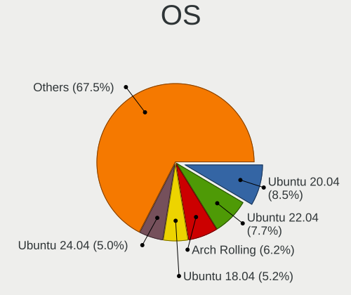

| Name                         | Computers | Percent |
|------------------------------|-----------|---------|
| Ubuntu 20.04                 | 231       | 8.51%   |
| Ubuntu 22.04                 | 209       | 7.7%    |
| Arch Rolling                 | 168       | 6.19%   |
| Ubuntu 18.04                 | 140       | 5.15%   |
| Ubuntu 24.04                 | 136       | 5.01%   |
| Debian 12                    | 108       | 3.98%   |
| Debian 11                    | 85        | 3.13%   |
| Kylin V10                    | 58        | 2.14%   |
| Arch                         | 50        | 1.84%   |
| Debian                       | 47        | 1.73%   |
| UOS 20                       | 31        | 1.14%   |
| openSUSE Tumbleweed-XXXXXXXX | 30        | 1.1%    |
| Manjaro                      | 29        | 1.07%   |
| Debian 10                    | 29        | 1.07%   |
| OpenMandriva 4.3             | 24        | 0.88%   |
| ArcoLinux Rolling            | 24        | 0.88%   |
| Debian 13                    | 23        | 0.85%   |
| Ubuntu 19.04                 | 21        | 0.77%   |
| OpenMandriva 4.2             | 20        | 0.74%   |
| Gentoo 2.8                   | 20        | 0.74%   |
| Fedora 42                    | 20        | 0.74%   |
| Fedora 40                    | 20        | 0.74%   |
| Ubuntu 16.04                 | 19        | 0.7%    |
| Deepin 23                    | 19        | 0.7%    |
| OpenMandriva 24.12           | 18        | 0.66%   |
| Fedora 38                    | 18        | 0.66%   |
| Ubuntu 23.10                 | 17        | 0.63%   |
| OpenMandriva 25.90           | 17        | 0.63%   |
| KDE neon 20.04               | 17        | 0.63%   |
| CentOS 7                     | 17        | 0.63%   |
| Ubuntu 23.04                 | 16        | 0.59%   |
| Ubuntu 21.10                 | 16        | 0.59%   |
| Gentoo 2.7                   | 16        | 0.59%   |
| Fedora 39                    | 15        | 0.55%   |
| Ubuntu 21.04                 | 14        | 0.52%   |
| Ubuntu 19.10                 | 14        | 0.52%   |
| Pop!_OS 22.04                | 14        | 0.52%   |
| OpenMandriva 5.0             | 14        | 0.52%   |
| Fedora 41                    | 14        | 0.52%   |
| Ubuntu 22.10                 | 13        | 0.48%   |

OS Family
---------

OS without a version

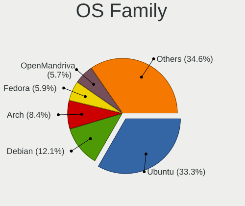

| Name         | Computers | Percent |
|--------------|-----------|---------|
| Ubuntu       | 854       | 33.33%  |
| Debian       | 309       | 12.06%  |
| Arch         | 215       | 8.39%   |
| Fedora       | 150       | 5.85%   |
| OpenMandriva | 147       | 5.74%   |
| Manjaro      | 88        | 3.43%   |
| Linux Mint   | 74        | 2.89%   |
| Deepin       | 70        | 2.73%   |
| Gentoo       | 67        | 2.62%   |
| Kylin        | 60        | 2.34%   |
| Kubuntu      | 46        | 1.8%    |
| Atz          | 37        | 1.44%   |
| openSUSE     | 36        | 1.41%   |
| CentOS       | 32        | 1.25%   |
| SteamOS      | 29        | 1.13%   |
| Pop!_OS      | 28        | 1.09%   |
| ArcoLinux    | 25        | 0.98%   |
| Kali         | 24        | 0.94%   |
| Xubuntu      | 23        | 0.9%    |
| KDE neon     | 23        | 0.9%    |
| ROSA         | 16        | 0.62%   |
| Zorin        | 14        | 0.55%   |
| Elementary   | 14        | 0.55%   |
| Ubuntu Unity | 13        | 0.51%   |
| Xero         | 9         | 0.35%   |
| EndeavourOS  | 9         | 0.35%   |
| Clear Linux  | 9         | 0.35%   |
| Lubuntu      | 8         | 0.31%   |
| OpenEuler    | 7         | 0.27%   |
| AlmaLinux    | 6         | 0.23%   |
| Trisquel     | 5         | 0.2%    |
| NixOS        | 5         | 0.2%    |
| AOSC OS      | 5         | 0.2%    |
| Ubuntu MATE  | 4         | 0.16%   |
| TUXEDO OS    | 4         | 0.16%   |
| Rocky Linux  | 4         | 0.16%   |
| ChimeraOS    | 4         | 0.16%   |
| BlackPanther | 4         | 0.16%   |
| Android      | 4         | 0.16%   |
| Alpine       | 4         | 0.16%   |

Kernel
------

Version of the Linux kernel

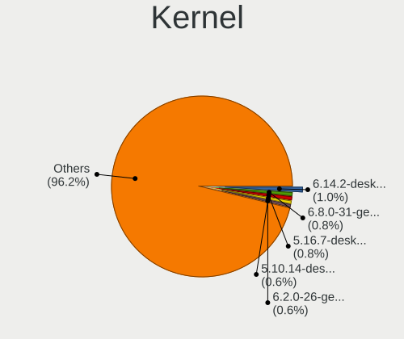

| Version                  | Computers | Percent |
|--------------------------|-----------|---------|
| 6.14.2-desktop-3omv2590  | 29        | 0.99%   |
| 6.8.0-31-generic         | 22        | 0.75%   |
| 5.16.7-desktop-1omv4003  | 22        | 0.75%   |
| 5.10.14-desktop-1omv4002 | 19        | 0.65%   |
| 6.2.0-26-generic         | 18        | 0.61%   |
| 6.12.1-desktop-1omv2490  | 18        | 0.61%   |
| 6.8.0-48-generic         | 16        | 0.55%   |
| 6.6.2-desktop-1omv2390   | 16        | 0.55%   |
| 5.4.0-42-generic         | 15        | 0.51%   |
| 6.8.0-51-generic         | 12        | 0.41%   |
| 6.1.0-13-amd64           | 12        | 0.41%   |
| 6.8.0-41-generic         | 11        | 0.38%   |
| 6.4.11-desktop-1omv2390  | 11        | 0.38%   |
| 5.15.0-67-generic        | 11        | 0.38%   |
| 6.8.0-45-generic         | 10        | 0.34%   |
| 6.8.0-40-generic         | 10        | 0.34%   |
| 6.5.0-14-generic         | 10        | 0.34%   |
| 6.2.6-desktop-1omv2390   | 10        | 0.34%   |
| 6.2.0-32-generic         | 10        | 0.34%   |
| 6.14.0-15-generic        | 10        | 0.34%   |
| 5.19.0-46-generic        | 10        | 0.34%   |
| 5.15.0-56-generic        | 10        | 0.34%   |
| 5.13.0-30-generic        | 10        | 0.34%   |
| 5.10.0-8-amd64           | 10        | 0.34%   |
| 5.0.0-23-generic         | 10        | 0.34%   |
| 6.8.0-60-generic         | 9         | 0.31%   |
| 6.5.0-26-generic         | 9         | 0.31%   |
| 6.2.0-39-generic         | 9         | 0.31%   |
| 6.14.0-29-generic        | 9         | 0.31%   |
| 5.15.0-46-generic        | 9         | 0.31%   |
| 5.10.0-21-amd64          | 9         | 0.31%   |
| 6.2.0-20-generic         | 8         | 0.27%   |
| 6.11.0-21-generic        | 8         | 0.27%   |
| 6.1.0-9-amd64            | 8         | 0.27%   |
| 5.12.4-desktop-1omv4050  | 8         | 0.27%   |
| 5.11.0-43-generic        | 8         | 0.27%   |
| 4.18.0-25-generic        | 8         | 0.27%   |
| 6.8.0-49-generic         | 7         | 0.24%   |
| 6.5.0-25-generic         | 7         | 0.24%   |
| 6.14.0-33-generic        | 7         | 0.24%   |

Kernel Family
-------------

Linux kernel without a distro release

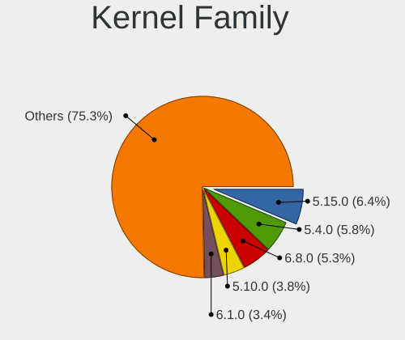

| Version | Computers | Percent |
|---------|-----------|---------|
| 5.15.0  | 179       | 6.37%   |
| 5.4.0   | 162       | 5.76%   |
| 6.8.0   | 148       | 5.26%   |
| 5.10.0  | 108       | 3.84%   |
| 6.1.0   | 97        | 3.45%   |
| 6.5.0   | 69        | 2.45%   |
| 4.15.0  | 66        | 2.35%   |
| 6.2.0   | 65        | 2.31%   |
| 5.13.0  | 62        | 2.2%    |
| 5.11.0  | 60        | 2.13%   |
| 6.14.0  | 57        | 2.03%   |
| 6.11.0  | 50        | 1.78%   |
| 5.19.0  | 49        | 1.74%   |
| 4.18.0  | 46        | 1.64%   |
| 5.8.0   | 45        | 1.6%    |
| 5.0.0   | 44        | 1.56%   |
| 5.3.0   | 35        | 1.24%   |
| 4.19.0  | 34        | 1.21%   |
| 6.14.2  | 29        | 1.03%   |
| 5.16.7  | 23        | 0.82%   |
| 6.12.1  | 19        | 0.68%   |
| 5.10.14 | 19        | 0.68%   |
| 6.6.2   | 17        | 0.6%    |
| 5.14.0  | 16        | 0.57%   |
| 6.9.3   | 15        | 0.53%   |
| 6.4.11  | 15        | 0.53%   |
| 3.10.0  | 14        | 0.5%    |
| 5.4.18  | 13        | 0.46%   |
| 6.2.6   | 11        | 0.39%   |
| 6.9.7   | 10        | 0.36%   |
| 6.1.52  | 10        | 0.36%   |
| 6.6.0   | 9         | 0.32%   |
| 6.6.9   | 8         | 0.28%   |
| 6.17.0  | 8         | 0.28%   |
| 6.12.38 | 8         | 0.28%   |
| 6.12.10 | 8         | 0.28%   |
| 6.10.11 | 8         | 0.28%   |
| 6.10.0  | 8         | 0.28%   |
| 5.18.0  | 8         | 0.28%   |
| 5.16.0  | 8         | 0.28%   |

Kernel Major Ver.
-----------------

Linux kernel major version

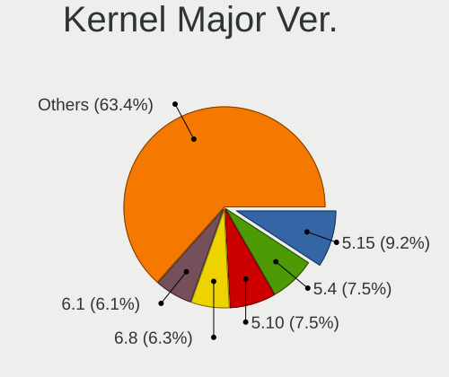

| Version | Computers | Percent |
|---------|-----------|---------|
| 5.15    | 254       | 9.22%   |
| 5.4     | 206       | 7.47%   |
| 5.10    | 206       | 7.47%   |
| 6.8     | 173       | 6.28%   |
| 6.1     | 169       | 6.13%   |
| 6.14    | 109       | 3.96%   |
| 6.6     | 105       | 3.81%   |
| 6.5     | 99        | 3.59%   |
| 6.12    | 99        | 3.59%   |
| 6.2     | 94        | 3.41%   |
| 5.11    | 77        | 2.79%   |
| 6.11    | 76        | 2.76%   |
| 5.13    | 73        | 2.65%   |
| 4.15    | 66        | 2.39%   |
| 5.8     | 61        | 2.21%   |
| 5.19    | 61        | 2.21%   |
| 4.19    | 57        | 2.07%   |
| 5.0     | 48        | 1.74%   |
| 4.18    | 48        | 1.74%   |
| 6.9     | 46        | 1.67%   |
| 5.16    | 46        | 1.67%   |
| 6.4     | 45        | 1.63%   |
| 5.3     | 42        | 1.52%   |
| 5.18    | 38        | 1.38%   |
| 5.14    | 35        | 1.27%   |
| 6.17    | 34        | 1.23%   |
| 6.15    | 31        | 1.12%   |
| 6.10    | 30        | 1.09%   |
| 6.0     | 28        | 1.02%   |
| 5.17    | 28        | 1.02%   |
| 6.7     | 27        | 0.98%   |
| 6.16    | 27        | 0.98%   |
| 6.3     | 26        | 0.94%   |
| 5.12    | 25        | 0.91%   |
| 6.13    | 22        | 0.8%    |
| 5.9     | 21        | 0.76%   |
| 5.6     | 19        | 0.69%   |
| 3.10    | 16        | 0.58%   |
| 4.9     | 14        | 0.51%   |
| 5.7     | 12        | 0.44%   |

Arch
----

OS architecture (x86_64, i586, etc.)

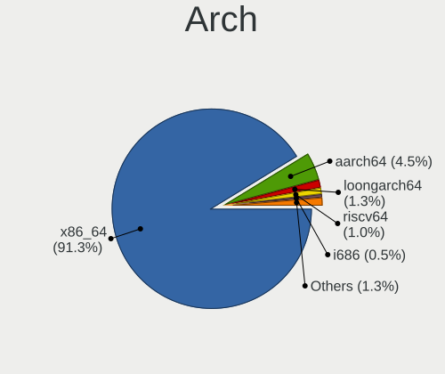

| Name        | Computers | Percent |
|-------------|-----------|---------|
| x86_64      | 2267      | 91.26%  |
| aarch64     | 113       | 4.55%   |
| loongarch64 | 32        | 1.29%   |
| riscv64     | 26        | 1.05%   |
| i686        | 13        | 0.52%   |
| armv7l      | 12        | 0.48%   |
| ppc64       | 7         | 0.28%   |
| sparc64     | 2         | 0.08%   |
| ppc64le     | 2         | 0.08%   |
| mips64      | 2         | 0.08%   |
| sw_64       | 1         | 0.04%   |
| sh4a        | 1         | 0.04%   |
| ppc         | 1         | 0.04%   |
| i586        | 1         | 0.04%   |
| i486        | 1         | 0.04%   |
| armv8l      | 1         | 0.04%   |
| armv6l      | 1         | 0.04%   |
| Unknown     | 1         | 0.04%   |

DE
--

Desktop Environment

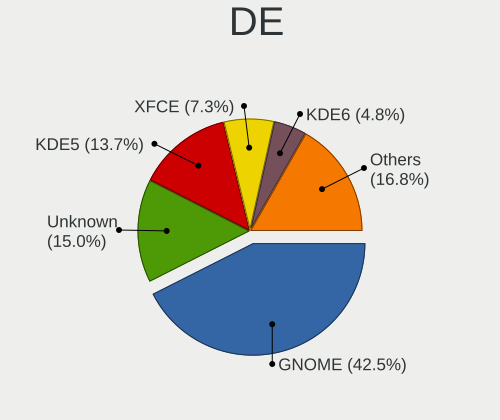

| Name             | Computers | Percent |
|------------------|-----------|---------|
| GNOME            | 1107      | 42.54%  |
| Unknown          | 389       | 14.95%  |
| KDE5             | 357       | 13.72%  |
| XFCE             | 189       | 7.26%   |
| KDE6             | 124       | 4.77%   |
| X-Cinnamon       | 66        | 2.54%   |
| KDE              | 57        | 2.19%   |
| Deepin           | 56        | 2.15%   |
| MATE             | 39        | 1.5%    |
| i3               | 27        | 1.04%   |
| LXQt             | 24        | 0.92%   |
| UKUI             | 22        | 0.85%   |
| Pantheon         | 15        | 0.58%   |
| Cinnamon         | 14        | 0.54%   |
| DDE              | 13        | 0.5%    |
| Unity            | 12        | 0.46%   |
| Hyprland         | 12        | 0.46%   |
| LXDE             | 11        | 0.42%   |
| KDE4             | 10        | 0.38%   |
| GNOME Flashback  | 10        | 0.38%   |
| Budgie           | 10        | 0.38%   |
| sway             | 7         | 0.27%   |
| Openbox          | 7         | 0.27%   |
| GNOME Classic    | 5         | 0.19%   |
| Dwm              | 3         | 0.12%   |
| xmonad           | 2         | 0.08%   |
| GNUstep          | 2         | 0.08%   |
| COSMIC           | 2         | 0.08%   |
| weston           | 1         | 0.04%   |
| Wayfire          | 1         | 0.04%   |
| qtile            | 1         | 0.04%   |
| niri             | 1         | 0.04%   |
| lightdm-xsession | 1         | 0.04%   |
| labwc:wlroots    | 1         | 0.04%   |
| default          | 1         | 0.04%   |
| chadwm           | 1         | 0.04%   |
| bspwm            | 1         | 0.04%   |
| awesome          | 1         | 0.04%   |

Display Server
--------------

X11 or Wayland

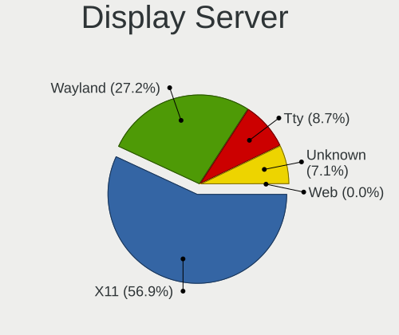

| Name    | Computers | Percent |
|---------|-----------|---------|
| X11     | 1461      | 56.91%  |
| Wayland | 699       | 27.23%  |
| Tty     | 224       | 8.73%   |
| Unknown | 182       | 7.09%   |
| Web     | 1         | 0.04%   |

Display Manager
---------------

SDDM, LightDM, etc.

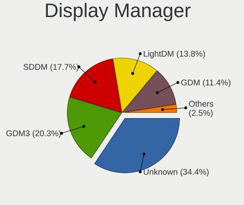

| Name           | Computers | Percent |
|----------------|-----------|---------|
| Unknown        | 878       | 34.4%   |
| GDM3           | 517       | 20.26%  |
| SDDM           | 451       | 17.67%  |
| LightDM        | 351       | 13.75%  |
| GDM            | 291       | 11.4%   |
| TDM            | 43        | 1.68%   |
| SLiM           | 4         | 0.16%   |
| LXDM           | 4         | 0.16%   |
| KDM            | 4         | 0.16%   |
| XDM            | 3         | 0.12%   |
| LY-DM          | 3         | 0.12%   |
| COSMIC-GREETER | 2         | 0.08%   |
| GREETD         | 1         | 0.04%   |

OS Lang
-------

Language

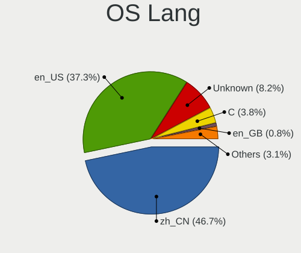

| Lang        | Computers | Percent |
|-------------|-----------|---------|
| zh_CN       | 1183      | 46.72%  |
| en_US       | 945       | 37.32%  |
| Unknown     | 208       | 8.21%   |
| C           | 97        | 3.83%   |
| en_GB       | 21        | 0.83%   |
| en_HK       | 18        | 0.71%   |
| zh_TW       | 10        | 0.39%   |
| de_DE       | 7         | 0.28%   |
| ru_RU       | 6         | 0.24%   |
| en_AU       | 5         | 0.2%    |
| C.UTF8      | 5         | 0.2%    |
| mn_CN       | 4         | 0.16%   |
| fr_FR       | 3         | 0.12%   |
| ja_JP       | 2         | 0.08%   |
| en_US.UTF8  | 2         | 0.08%   |
| en_SG       | 2         | 0.08%   |
| zh_SG       | 1         | 0.04%   |
| zh_HK       | 1         | 0.04%   |
| zh_CN.utf-8 | 1         | 0.04%   |
| th_TH       | 1         | 0.04%   |
| pt_PT       | 1         | 0.04%   |
| pt_BR       | 1         | 0.04%   |
| POSIX       | 1         | 0.04%   |
| es_ES       | 1         | 0.04%   |
| en_ZA       | 1         | 0.04%   |
| en_US.utf-8 | 1         | 0.04%   |
| en_US,UTF-8 | 1         | 0.04%   |
| en_DK       | 1         | 0.04%   |
| af_ZA       | 1         | 0.04%   |
| .en_US      | 1         | 0.04%   |

Boot Mode
---------

EFI or BIOS

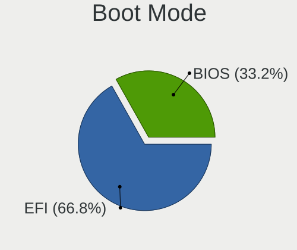

| Mode | Computers | Percent |
|------|-----------|---------|
| EFI  | 1680      | 66.83%  |
| BIOS | 834       | 33.17%  |

Filesystem
----------

Type of filesystem

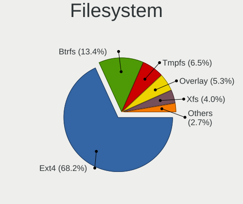

| Type       | Computers | Percent |
|------------|-----------|---------|
| Ext4       | 1722      | 68.17%  |
| Btrfs      | 338       | 13.38%  |
| Tmpfs      | 165       | 6.53%   |
| Overlay    | 133       | 5.27%   |
| Xfs        | 100       | 3.96%   |
| Unknown    | 33        | 1.31%   |
| Zfs        | 17        | 0.67%   |
| F2fs       | 7         | 0.28%   |
| Rootfs     | 5         | 0.2%    |
| Ext3       | 2         | 0.08%   |
| XXXXXXX    | 1         | 0.04%   |
| XXXfs      | 1         | 0.04%   |
| Reiserfs   | 1         | 0.04%   |
| Fuse.sshfs | 1         | 0.04%   |

Part. scheme
------------

Scheme of partitioning

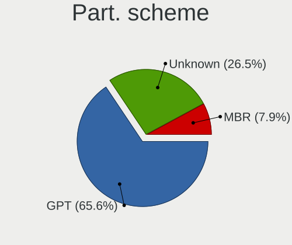

| Type    | Computers | Percent |
|---------|-----------|---------|
| GPT     | 1650      | 65.61%  |
| Unknown | 667       | 26.52%  |
| MBR     | 198       | 7.87%   |

Dual Boot with Linux/BSD
------------------------

Hosting more than one Linux/BSD

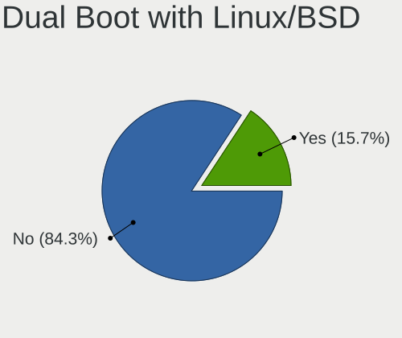

| Dual boot | Computers | Percent |
|-----------|-----------|---------|
| No        | 2136      | 84.26%  |
| Yes       | 399       | 15.74%  |

Dual Boot (Win)
---------------

Hosting Linux and Windows

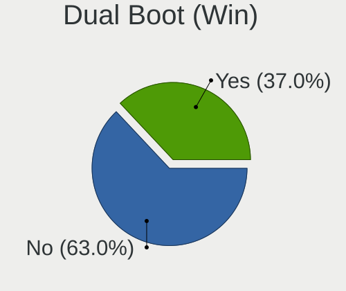

| Dual boot | Computers | Percent |
|-----------|-----------|---------|
| No        | 1578      | 62.99%  |
| Yes       | 927       | 37.01%  |

Board
-----

Vendor
------

Motherboard manufacturer

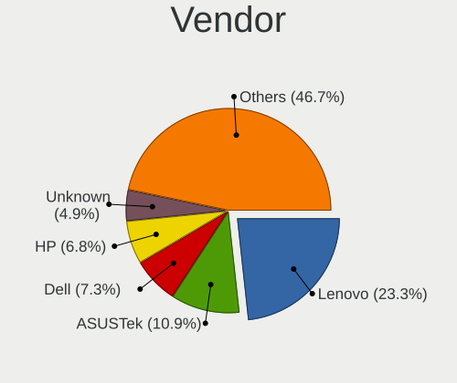

| Name                       | Computers | Percent |
|----------------------------|-----------|---------|
| Lenovo                     | 578       | 23.28%  |
| ASUSTek Computer           | 271       | 10.91%  |
| Dell                       | 182       | 7.33%   |
| Hewlett-Packard            | 170       | 6.85%   |
| Unknown                    | 122       | 4.91%   |
| HUAWEI                     | 99        | 3.99%   |
| MSI                        | 96        | 3.87%   |
| Gigabyte Technology        | 94        | 3.79%   |
| Intel                      | 66        | 2.66%   |
| Timi                       | 59        | 2.38%   |
| MECHREVO                   | 48        | 1.93%   |
| Acer                       | 45        | 1.81%   |
| Apple                      | 34        | 1.37%   |
| Loongson                   | 28        | 1.13%   |
| HASEE Computer             | 25        | 1.01%   |
| Valve                      | 22        | 0.89%   |
| ASRock                     | 22        | 0.89%   |
| Supermicro                 | 19        | 0.77%   |
| Raspberry Pi Foundation    | 18        | 0.72%   |
| Google                     | 18        | 0.72%   |
| HONOR                      | 17        | 0.68%   |
| AZW                        | 16        | 0.64%   |
| GPD                        | 14        | 0.56%   |
| Colorful Technology        | 14        | 0.56%   |
| XIAOMI                     | 12        | 0.48%   |
| Phytium                    | 12        | 0.48%   |
| Microsoft                  | 12        | 0.48%   |
| GreatWall                  | 11        | 0.44%   |
| Toshiba                    | 10        | 0.4%    |
| Huanan                     | 10        | 0.4%    |
| Sony                       | 9         | 0.36%   |
| OEM                        | 9         | 0.36%   |
| MAXSUN                     | 9         | 0.36%   |
| AMI                        | 9         | 0.36%   |
| TYAN Computer              | 8         | 0.32%   |
| TSINGHUA TONGFANG COMPUTER | 8         | 0.32%   |
| Samsung Electronics        | 8         | 0.32%   |
| Notebook                   | 8         | 0.32%   |
| Centerm                    | 8         | 0.32%   |
| Rockchip                   | 7         | 0.28%   |

Model
-----

Motherboard model

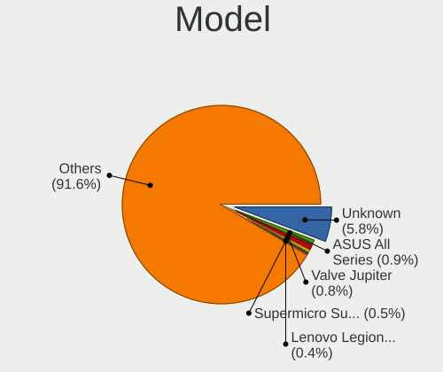

| Name                                  | Computers | Percent |
|---------------------------------------|-----------|---------|
| Unknown                               | 143       | 5.76%   |
| ASUS All Series                       | 23        | 0.93%   |
| Valve Jupiter                         | 21        | 0.85%   |
| Supermicro Super Server               | 12        | 0.48%   |
| Lenovo Legion R9000P2021H 82JQ        | 10        | 0.4%    |
| Loongson 3A6000-HV-7A2000-1w-V0.1-EVB | 9         | 0.36%   |
| TSINGHUA TONGFANG COMPUTER E500       | 8         | 0.32%   |
| MSI MS-7B89                           | 8         | 0.32%   |
| HUAWEI HLY-WX9XX                      | 8         | 0.32%   |
| AZW SER                               | 7         | 0.28%   |
| AMI Aptio CRB                         | 7         | 0.28%   |
| Timi RedmiBook Pro 15S                | 6         | 0.24%   |
| MSI MS-7C94                           | 6         | 0.24%   |
| MECHREVO WUJIE14XA                    | 6         | 0.24%   |
| Lenovo Legion Y7000 81FW              | 6         | 0.24%   |
| Dell XPS 15 9570                      | 6         | 0.24%   |
| ASUS TUF Gaming B550M-PLUS            | 6         | 0.24%   |
| Timi TM1701                           | 5         | 0.2%    |
| Lenovo XiaoXinPro-13IML 2019 81XB     | 5         | 0.2%    |
| Lenovo ThinkBook 14 G4+ IAP 21CX      | 5         | 0.2%    |
| Lenovo Legion R7000 2020 82B6         | 5         | 0.2%    |
| HUAWEI WRT-WX9                        | 5         | 0.2%    |
| HUAWEI KPRC-WX0                       | 5         | 0.2%    |
| Centerm C73N                          | 5         | 0.2%    |
| ASUS M5A78L-M LX3 PLUS                | 5         | 0.2%    |
| Acer Swift SF314-512                  | 5         | 0.2%    |
| TYAN TA80-B7071                       | 4         | 0.16%   |
| Timi TM1709                           | 4         | 0.16%   |
| Timi Redmi G 2022                     | 4         | 0.16%   |
| Timi Redmi Book Pro 15 2022           | 4         | 0.16%   |
| Shanghai Zhaoxin ZXE CRB              | 4         | 0.16%   |
| RPi Raspberry Pi 4 Model B Rev 1.5    | 4         | 0.16%   |
| Phytium FT-2000/4                     | 4         | 0.16%   |
| MSI MS-7E07                           | 4         | 0.16%   |
| MECHREVO WUJIE14 PRO                  | 4         | 0.16%   |
| Lenovo Yoga 14sITL 2021 82G2          | 4         | 0.16%   |
| Lenovo XiaoXinPro-13ARE 2020 82DM     | 4         | 0.16%   |
| Lenovo XiaoXin-15ARE 2020 81YR        | 4         | 0.16%   |
| Lenovo ThinkStation P520 30BFSG3Y00   | 4         | 0.16%   |
| Lenovo ThinkBook 15p Gen 2 21B1       | 4         | 0.16%   |

Model Family
------------

Motherboard model prefix

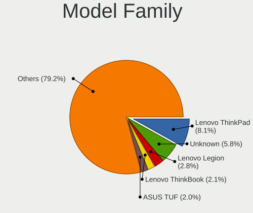

| Name                                  | Computers | Percent |
|---------------------------------------|-----------|---------|
| Lenovo ThinkPad                       | 201       | 8.1%    |
| Unknown                               | 143       | 5.76%   |
| Lenovo Legion                         | 70        | 2.82%   |
| Lenovo ThinkBook                      | 52        | 2.09%   |
| ASUS TUF                              | 50        | 2.01%   |
| ASUS ROG                              | 44        | 1.77%   |
| Dell Inspiron                         | 43        | 1.73%   |
| ASUS PRIME                            | 33        | 1.33%   |
| HP EliteBook                          | 30        | 1.21%   |
| Dell Latitude                         | 29        | 1.17%   |
| Dell Precision                        | 27        | 1.09%   |
| HP OMEN                               | 26        | 1.05%   |
| Dell OptiPlex                         | 24        | 0.97%   |
| ASUS All                              | 23        | 0.93%   |
| Lenovo IdeaPad                        | 22        | 0.89%   |
| Valve Jupiter                         | 21        | 0.85%   |
| Lenovo Yoga                           | 21        | 0.85%   |
| Acer Aspire                           | 20        | 0.81%   |
| Lenovo ZHAOYANG                       | 19        | 0.77%   |
| Timi RedmiBook                        | 18        | 0.72%   |
| RPi Raspberry                         | 18        | 0.72%   |
| HP ZHAN                               | 18        | 0.72%   |
| Dell XPS                              | 18        | 0.72%   |
| Lenovo ThinkStation                   | 17        | 0.68%   |
| Lenovo ThinkCentre                    | 17        | 0.68%   |
| HP ProBook                            | 17        | 0.68%   |
| Lenovo XiaoXinPro                     | 15        | 0.6%    |
| HP Pavilion                           | 14        | 0.56%   |
| Dell Vostro                           | 14        | 0.56%   |
| Acer Swift                            | 14        | 0.56%   |
| Dell PowerEdge                        | 13        | 0.52%   |
| Supermicro Super                      | 12        | 0.48%   |
| Microsoft Surface                     | 12        | 0.48%   |
| Timi Redmi                            | 11        | 0.44%   |
| ASUS ASUS                             | 10        | 0.4%    |
| Loongson 3A6000-HV-7A2000-1w-V0.1-EVB | 9         | 0.36%   |
| Lenovo XiaoXin                        | 9         | 0.36%   |
| HP ENVY                               | 9         | 0.36%   |
| ASUS VivoBook                         | 9         | 0.36%   |
| TSINGHUA TONGFANG COMPUTER E500       | 8         | 0.32%   |

MFG Year
--------

Motherboard manufacture year

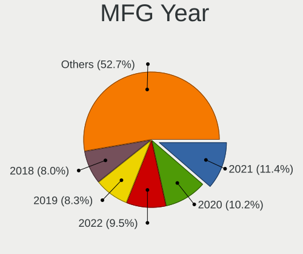

| Year    | Computers | Percent |
|---------|-----------|---------|
| 2021    | 282       | 11.36%  |
| 2020    | 253       | 10.19%  |
| 2022    | 235       | 9.46%   |
| 2019    | 205       | 8.26%   |
| 2018    | 199       | 8.01%   |
| 2023    | 191       | 7.69%   |
| 2024    | 149       | 6%      |
| Unknown | 132       | 5.32%   |
| 2017    | 130       | 5.24%   |
| 2015    | 106       | 4.27%   |
| 2012    | 99        | 3.99%   |
| 2014    | 98        | 3.95%   |
| 2013    | 95        | 3.83%   |
| 2016    | 94        | 3.79%   |
| 2011    | 67        | 2.7%    |
| 2025    | 53        | 2.13%   |
| 2008    | 29        | 1.17%   |
| 2010    | 28        | 1.13%   |
| 2009    | 23        | 0.93%   |
| 2007    | 9         | 0.36%   |
| 2006    | 5         | 0.2%    |
| 2000    | 1         | 0.04%   |

Form Factor
-----------

Physical design of the computer

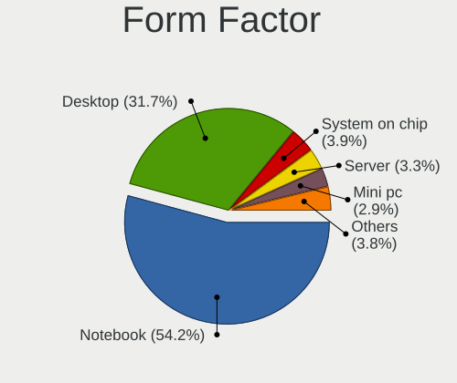

| Name           | Computers | Percent |
|----------------|-----------|---------|
| Notebook       | 1346      | 54.21%  |
| Desktop        | 788       | 31.74%  |
| System on chip | 98        | 3.95%   |
| Server         | 83        | 3.34%   |
| Mini pc        | 73        | 2.94%   |
| Tablet         | 43        | 1.73%   |
| Convertible    | 26        | 1.05%   |
| All in one     | 20        | 0.81%   |
| Phone          | 4         | 0.16%   |
| Other          | 2         | 0.08%   |

Secure Boot
-----------

Enabled or disabled

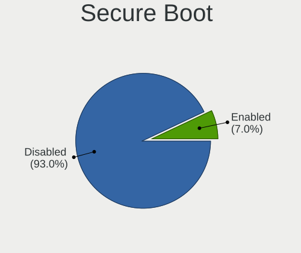

| State    | Computers | Percent |
|----------|-----------|---------|
| Disabled | 2323      | 92.99%  |
| Enabled  | 175       | 7.01%   |

Coreboot
--------

Have coreboot on board

| Used | Computers | Percent |
|------|-----------|---------|
| No   | 2461      | 99.11%  |
| Yes  | 22        | 0.89%   |

RAM Size
--------

Total RAM memory

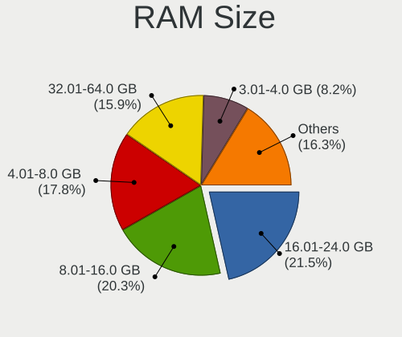

| Size in GB      | Computers | Percent |
|-----------------|-----------|---------|
| 16.01-24.0      | 545       | 21.5%   |
| 8.01-16.0       | 514       | 20.28%  |
| 4.01-8.0        | 452       | 17.83%  |
| 32.01-64.0      | 402       | 15.86%  |
| 3.01-4.0        | 208       | 8.21%   |
| 64.01-256.0     | 177       | 6.98%   |
| 24.01-32.0      | 101       | 3.98%   |
| 1.01-2.0        | 53        | 2.09%   |
| More than 256.0 | 33        | 1.3%    |
| Unknown         | 18        | 0.71%   |
| 0.51-1.0        | 17        | 0.67%   |
| 0.01-0.5        | 8         | 0.32%   |
| 2.01-3.0        | 5         | 0.2%    |
| 0               | 2         | 0.08%   |

RAM Used
--------

Used RAM memory

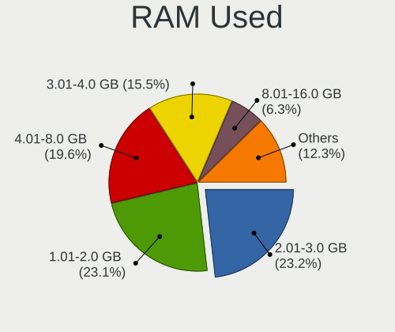

| Used GB     | Computers | Percent |
|-------------|-----------|---------|
| 2.01-3.0    | 631       | 23.19%  |
| 1.01-2.0    | 628       | 23.08%  |
| 4.01-8.0    | 533       | 19.59%  |
| 3.01-4.0    | 423       | 15.55%  |
| 8.01-16.0   | 171       | 6.28%   |
| 0.51-1.0    | 158       | 5.81%   |
| 0.01-0.5    | 78        | 2.87%   |
| 16.01-24.0  | 39        | 1.43%   |
| Unknown     | 27        | 0.99%   |
| 32.01-64.0  | 12        | 0.44%   |
| 24.01-32.0  | 12        | 0.44%   |
| 64.01-256.0 | 8         | 0.29%   |
| 0           | 1         | 0.04%   |

Total Drives
------------

Number of drives on board

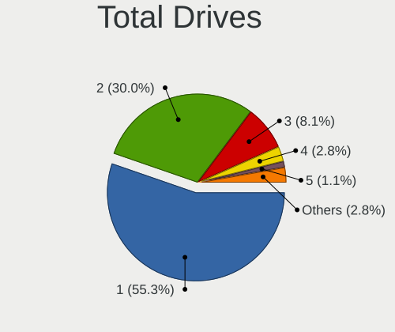

| Drives  | Computers | Percent |
|---------|-----------|---------|
| 1       | 1400      | 55.29%  |
| 2       | 759       | 29.98%  |
| 3       | 205       | 8.1%    |
| 4       | 70        | 2.76%   |
| 5       | 28        | 1.11%   |
| 0       | 21        | 0.83%   |
| 6       | 16        | 0.63%   |
| 8       | 8         | 0.32%   |
| 7       | 8         | 0.32%   |
| 10      | 7         | 0.28%   |
| 9       | 3         | 0.12%   |
| 46      | 1         | 0.04%   |
| 36      | 1         | 0.04%   |
| 32      | 1         | 0.04%   |
| 27      | 1         | 0.04%   |
| 21      | 1         | 0.04%   |
| 11      | 1         | 0.04%   |
| Unknown | 1         | 0.04%   |

Has CD-ROM
----------

Has CD-ROM on board

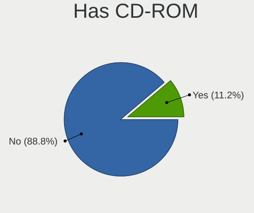

| Presented | Computers | Percent |
|-----------|-----------|---------|
| No        | 2210      | 88.79%  |
| Yes       | 279       | 11.21%  |

Has Ethernet
------------

Has Ethernet on board

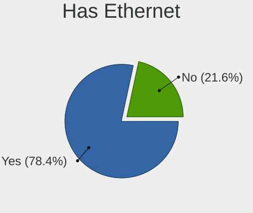

| Presented | Computers | Percent |
|-----------|-----------|---------|
| Yes       | 1954      | 78.38%  |
| No        | 539       | 21.62%  |

Has WiFi
--------

Has WiFi module

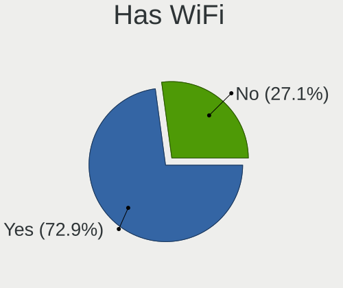

| Presented | Computers | Percent |
|-----------|-----------|---------|
| Yes       | 1819      | 72.88%  |
| No        | 677       | 27.12%  |

Has Bluetooth
-------------

Has Bluetooth module

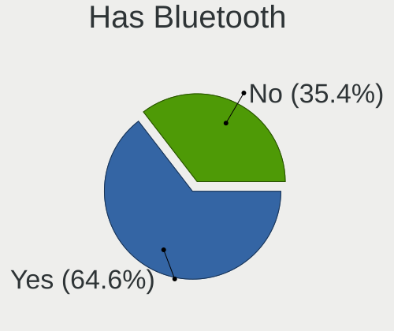

| Presented | Computers | Percent |
|-----------|-----------|---------|
| Yes       | 1617      | 64.55%  |
| No        | 888       | 35.45%  |

Location
--------

Country
-------

Geographic location (country)

| Country | Computers | Percent |
|---------|-----------|---------|
| China   | 2483      | 100%    |

City
----

Geographic location (city)

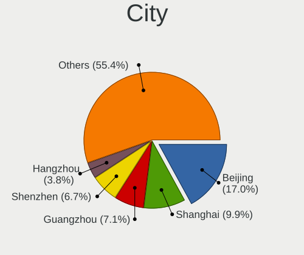

| City         | Computers | Percent |
|--------------|-----------|---------|
| Beijing      | 449       | 17.04%  |
| Shanghai     | 262       | 9.94%   |
| Guangzhou    | 186       | 7.06%   |
| Shenzhen     | 177       | 6.72%   |
| Hangzhou     | 101       | 3.83%   |
| Chengdu      | 88        | 3.34%   |
| Wuhan        | 79        | 3%      |
| Nanjing      | 60        | 2.28%   |
| Jinrongjie   | 52        | 1.97%   |
| Kunming      | 50        | 1.9%    |
| Xi'an        | 43        | 1.63%   |
| Zhengzhou    | 38        | 1.44%   |
| Changsha     | 36        | 1.37%   |
| Chongqing    | 35        | 1.33%   |
| Haidian      | 31        | 1.18%   |
| Tianjin      | 30        | 1.14%   |
| Jinan        | 29        | 1.1%    |
| Hefei        | 28        | 1.06%   |
| Dongguan     | 28        | 1.06%   |
| Shenyang     | 25        | 0.95%   |
| Foshan       | 25        | 0.95%   |
| Qingdao      | 24        | 0.91%   |
| Suzhou       | 23        | 0.87%   |
| Nanning      | 21        | 0.8%    |
| Fuzhou       | 20        | 0.76%   |
| Xuhui        | 18        | 0.68%   |
| Harbin       | 17        | 0.65%   |
| Xiamen       | 16        | 0.61%   |
| Shijiazhuang | 16        | 0.61%   |
| Dalian       | 15        | 0.57%   |
| Jilin City   | 13        | 0.49%   |
| Jianshui     | 13        | 0.49%   |
| Hohhot       | 13        | 0.49%   |
| Huangpu      | 12        | 0.46%   |
| Bieligutai   | 12        | 0.46%   |
| Wuxi         | 9         | 0.34%   |
| Ningbo       | 9         | 0.34%   |
| Nanhao       | 9         | 0.34%   |
| Zhuhai       | 8         | 0.3%    |
| Taiyuan      | 8         | 0.3%    |

Drives
------

Drive Vendor
------------

Hard drive vendors

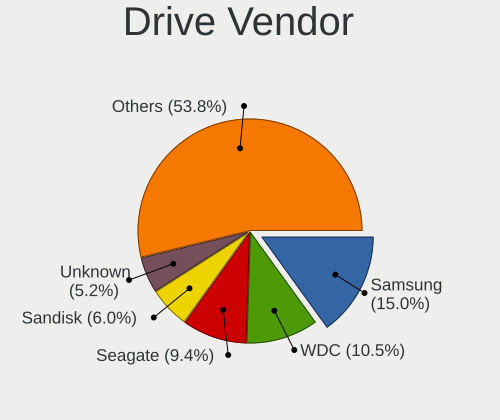

| Vendor                       | Computers | Drives | Percent |
|------------------------------|-----------|--------|---------|
| Samsung Electronics          | 571       | 782    | 15.05%  |
| WDC                          | 397       | 554    | 10.46%  |
| Seagate                      | 357       | 612    | 9.41%   |
| Sandisk                      | 229       | 271    | 6.03%   |
| Unknown                      | 199       | 249    | 5.24%   |
| Toshiba                      | 169       | 236    | 4.45%   |
| SK hynix                     | 124       | 147    | 3.27%   |
| Kingston                     | 107       | 129    | 2.82%   |
| Intel                        | 106       | 194    | 2.79%   |
| Yangtze Memory Technologies  | 77        | 109    | 2.03%   |
| Micron Technology            | 75        | 85     | 1.98%   |
| HGST                         | 69        | 116    | 1.82%   |
| Unknown                      | 67        | 74     | 1.77%   |
| KIOXIA                       | 58        | 85     | 1.53%   |
| Silicon Motion               | 53        | 73     | 1.4%    |
| MAXIO Technology (Hangzhou)  | 53        | 64     | 1.4%    |
| ZHITAI                       | 46        | 73     | 1.21%   |
| Crucial                      | 46        | 54     | 1.21%   |
| Hitachi                      | 39        | 60     | 1.03%   |
| Plextor                      | 36        | 44     | 0.95%   |
| Phison                       | 35        | 40     | 0.92%   |
| China                        | 30        | 43     | 0.79%   |
| Lenovo                       | 29        | 39     | 0.76%   |
| Fanxiang                     | 27        | 33     | 0.71%   |
| Kingston Technology Company  | 25        | 32     | 0.66%   |
| LITEON                       | 24        | 30     | 0.63%   |
| Apple                        | 24        | 28     | 0.63%   |
| Hewlett-Packard              | 23        | 29     | 0.61%   |
| A-DATA Technology            | 23        | 32     | 0.61%   |
| Phison Electronics           | 22        | 25     | 0.58%   |
| KIOXIA-EXCERIA               | 21        | 25     | 0.55%   |
| Colorful                     | 21        | 26     | 0.55%   |
| YMTC                         | 20        | 36     | 0.53%   |
| FORESEE                      | 20        | 23     | 0.53%   |
| Teclast                      | 19        | 20     | 0.5%    |
| Netac                        | 19        | 22     | 0.5%    |
| GLOWAY                       | 17        | 25     | 0.45%   |
| Union Memory (Shenzhen)      | 15        | 18     | 0.4%    |
| Shenzhen Longsys Electronics | 15        | 16     | 0.4%    |
| Hikvision                    | 15        | 31     | 0.4%    |

Drive Model
-----------

Hard drive models

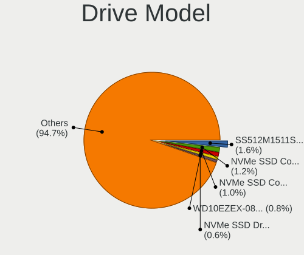

| Model                                                 | Computers | Percent |
|-------------------------------------------------------|-----------|---------|
| Unknown                                               | 67        | 1.63%   |
| Samsung NVMe SSD Controller PM9A1/PM9A3/980PRO 1TB    | 51        | 1.24%   |
| Samsung NVMe SSD Controller SM981/PM981/PM983 1TB     | 42        | 1.02%   |
| WDC WD10EZEX-08WN4A0 1TB                              | 32        | 0.78%   |
| SanDisk NVMe SSD Drive 1TB                            | 26        | 0.63%   |
| Seagate ST1000DM010-2EP102 1TB                        | 25        | 0.61%   |
| SanDisk NVMe SSD Drive 512GB                          | 23        | 0.56%   |
| Samsung NVMe SSD Drive 512GB                          | 23        | 0.56%   |
| Silicon Motion SM2263EN/SM2263XT SSD Controller 512GB | 22        | 0.53%   |
| Seagate ST500DM002-1BD142 500GB                       | 22        | 0.53%   |
| Seagate ST1000LM035-1RK172 1TB                        | 22        | 0.53%   |
| Sandisk WD Black SN750 / PC SN730 NVMe SSD 500GB      | 22        | 0.53%   |
| Unknown MMC Card  128GB                               | 21        | 0.51%   |
| HGST HTS721010A9E630 1TB                              | 20        | 0.49%   |
| Seagate ST1000DM003-1SB102 1TB                        | 19        | 0.46%   |
| Samsung SSD 980 1TB                                   | 19        | 0.46%   |
| Samsung SSD 860 EVO 500GB                             | 19        | 0.46%   |
| MAXIO (Hangzhou) NVMe SSD Controller MAP1202 2TB      | 18        | 0.44%   |
| Seagate ST500LT012-1DG142 500GB                       | 16        | 0.39%   |
| Seagate ST1000LM048-2E7172 1TB                        | 16        | 0.39%   |
| Samsung MZVLB512HBJQ-000L2 512GB                      | 15        | 0.36%   |
| Unknown MMC Card  64GB                                | 14        | 0.34%   |
| Kingston SA400S37240G 240GB SSD                       | 14        | 0.34%   |
| Yangtze Memory ZHITAI TiPlus7100 2TB                  | 13        | 0.32%   |
| Unknown MMC Card  32GB                                | 13        | 0.32%   |
| Sandisk WD Blue SN550 NVMe SSD 1024GB                 | 13        | 0.32%   |
| Yangtze Memory ZHITAI TiPlus5000 1TB                  | 12        | 0.29%   |
| WDC WDS100T2B0C-00PXH0 1TB                            | 12        | 0.29%   |
| Unknown SD64G  64GB                                   | 12        | 0.29%   |
| Toshiba MQ01ABD100 1TB                                | 12        | 0.29%   |
| SK hynix SKHynix_HFS512GDE9X084N 512GB                | 12        | 0.29%   |
| Samsung NVMe SSD Drive 256GB                          | 12        | 0.29%   |
| Samsung NVMe SSD Drive 1024GB                         | 12        | 0.29%   |
| SanDisk NVMe SSD Drive 2TB                            | 11        | 0.27%   |
| Plextor PX-128M6S 128GB SSD                           | 11        | 0.27%   |
| Kingston SA400S37480G 480GB SSD                       | 11        | 0.27%   |
| HGST HTS725050A7E630 500GB                            | 11        | 0.27%   |
| Yangtze Memory ZHITAI TiPlus7100 1TB                  | 10        | 0.24%   |
| Unknown NVMe SSD Drive 512GB                          | 10        | 0.24%   |
| Toshiba DT01ACA200 2TB                                | 10        | 0.24%   |

HDD Vendor
----------

Hard disk drive vendors

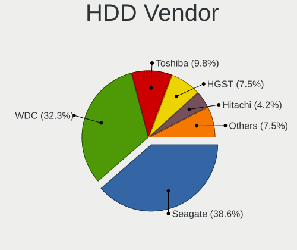

| Vendor              | Computers | Drives | Percent |
|---------------------|-----------|--------|---------|
| Seagate             | 353       | 607    | 38.62%  |
| WDC                 | 295       | 407    | 32.28%  |
| Toshiba             | 90        | 137    | 9.85%   |
| HGST                | 69        | 116    | 7.55%   |
| Hitachi             | 38        | 58     | 4.16%   |
| Samsung Electronics | 14        | 16     | 1.53%   |
| Fujitsu             | 10        | 11     | 1.09%   |
| JMicron Technology  | 8         | 11     | 0.88%   |
| External            | 6         | 9      | 0.66%   |
| Pear 2TB            | 5         | 5      | 0.55%   |
| TO Exter            | 3         | 3      | 0.33%   |
| SSK                 | 2         | 2      | 0.22%   |
| Hewlett-Packard     | 2         | 2      | 0.22%   |
| Apple               | 2         | 2      | 0.22%   |
| ACASIS              | 2         | 2      | 0.22%   |
| Unknown             | 2         | 3      | 0.22%   |
| Western             | 1         | 1      | 0.11%   |
| Unknown             | 1         | 1      | 0.11%   |
| TDAS                | 1         | 1      | 0.11%   |
| QUANTUM             | 1         | 1      | 0.11%   |
| Maxtor              | 1         | 1      | 0.11%   |
| LIO-ORG             | 1         | 9      | 0.11%   |
| IBM H0              | 1         | 1      | 0.11%   |
| HGST HTS            | 1         | 1      | 0.11%   |
| GOKE                | 1         | 1      | 0.11%   |
| FORESEE             | 1         | 1      | 0.11%   |
| ExcelStor           | 1         | 1      | 0.11%   |
| DELLBOSS            | 1         | 1      | 0.11%   |
| ASMT                | 1         | 1      | 0.11%   |

SSD Vendor
----------

Solid state drive vendors

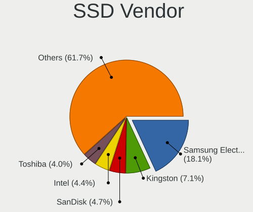

| Vendor              | Computers | Drives | Percent |
|---------------------|-----------|--------|---------|
| Samsung Electronics | 170       | 242    | 18.1%   |
| Kingston            | 67        | 82     | 7.14%   |
| SanDisk             | 44        | 47     | 4.69%   |
| Intel               | 41        | 90     | 4.37%   |
| Toshiba             | 38        | 46     | 4.05%   |
| Plextor             | 33        | 40     | 3.51%   |
| Crucial             | 32        | 40     | 3.41%   |
| WDC                 | 30        | 48     | 3.19%   |
| China               | 27        | 40     | 2.88%   |
| Micron Technology   | 23        | 25     | 2.45%   |
| LITEON              | 23        | 29     | 2.45%   |
| Lenovo              | 22        | 27     | 2.34%   |
| Teclast             | 19        | 20     | 2.02%   |
| Unknown             | 19        | 23     | 2.02%   |
| A-DATA Technology   | 18        | 26     | 1.92%   |
| Netac               | 17        | 20     | 1.81%   |
| GLOWAY              | 14        | 22     | 1.49%   |
| Colorful            | 14        | 16     | 1.49%   |
| ZHITAI              | 13        | 27     | 1.38%   |
| KIOXIA-EXCERIA      | 11        | 11     | 1.17%   |
| Kingchuxing         | 11        | 16     | 1.17%   |
| GALAX               | 11        | 11     | 1.17%   |
| Apple               | 11        | 12     | 1.17%   |
| SK hynix            | 10        | 10     | 1.06%   |
| Hewlett-Packard     | 10        | 13     | 1.06%   |
| FORESEE             | 10        | 11     | 1.06%   |
| Phison              | 8         | 10     | 0.85%   |
| Fanxiang            | 8         | 8      | 0.85%   |
| Transcend           | 7         | 8      | 0.75%   |
| Unknown             | 6         | 7      | 0.64%   |
| KingSpec            | 6         | 7      | 0.64%   |
| tigo                | 5         | 6      | 0.53%   |
| LITEONIT            | 5         | 5      | 0.53%   |
| faspeed             | 5         | 5      | 0.53%   |
| Q200                | 4         | 7      | 0.43%   |
| MAXSUN              | 4         | 4      | 0.43%   |
| Lexar               | 4         | 4      | 0.43%   |
| KINGBANK            | 4         | 5      | 0.43%   |
| UNIC2               | 3         | 3      | 0.32%   |
| Soyo                | 3         | 3      | 0.32%   |

Drive Kind
----------

HDD or SSD

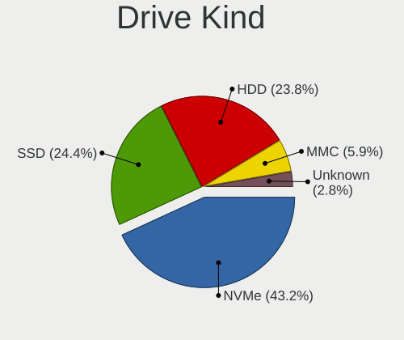

| Kind    | Computers | Drives | Percent |
|---------|-----------|--------|---------|
| NVMe    | 1436      | 2172   | 43.16%  |
| SSD     | 813       | 1265   | 24.44%  |
| HDD     | 791       | 1412   | 23.78%  |
| MMC     | 195       | 241    | 5.86%   |
| Unknown | 92        | 113    | 2.77%   |

Drive Connector
---------------

SATA, SAS, NVMe, etc.

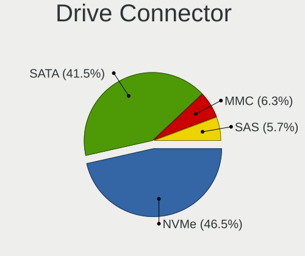

| Type | Computers | Drives | Percent |
|------|-----------|--------|---------|
| NVMe | 1432      | 2150   | 46.49%  |
| SATA | 1278      | 2559   | 41.49%  |
| MMC  | 195       | 241    | 6.33%   |
| SAS  | 175       | 253    | 5.68%   |

Drive Size
----------

Size of hard drive

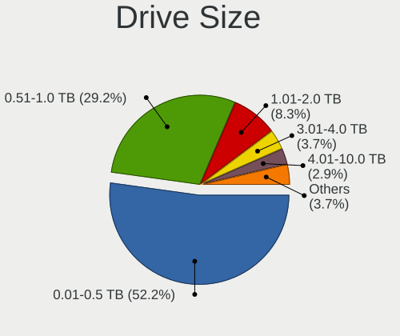

| Size in TB | Computers | Drives | Percent |
|------------|-----------|--------|---------|
| 0.01-0.5   | 871       | 1417   | 52.19%  |
| 0.51-1.0   | 488       | 642    | 29.24%  |
| 1.01-2.0   | 139       | 208    | 8.33%   |
| 3.01-4.0   | 61        | 91     | 3.65%   |
| 4.01-10.0  | 48        | 209    | 2.88%   |
| 2.01-3.0   | 32        | 62     | 1.92%   |
| 10.01-20.0 | 28        | 45     | 1.68%   |
| 20.01-50.0 | 1         | 1      | 0.06%   |
| 0          | 1         | 2      | 0.06%   |

Space Total
-----------

Amount of disk space available on the file system

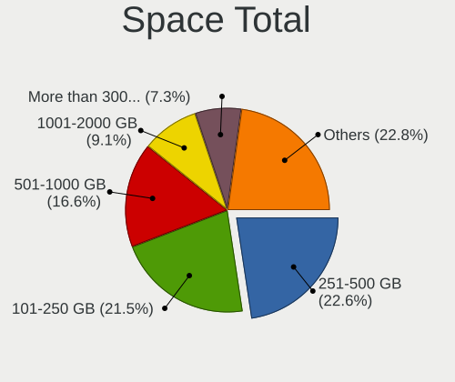

| Size in GB     | Computers | Percent |
|----------------|-----------|---------|
| 251-500        | 587       | 22.62%  |
| 101-250        | 559       | 21.54%  |
| 501-1000       | 431       | 16.61%  |
| 1001-2000      | 236       | 9.09%   |
| More than 3000 | 190       | 7.32%   |
| 51-100         | 185       | 7.13%   |
| 1-20           | 148       | 5.7%    |
| 21-50          | 97        | 3.74%   |
| 2001-3000      | 86        | 3.31%   |
| Unknown        | 76        | 2.93%   |

Space Used
----------

Amount of used disk space

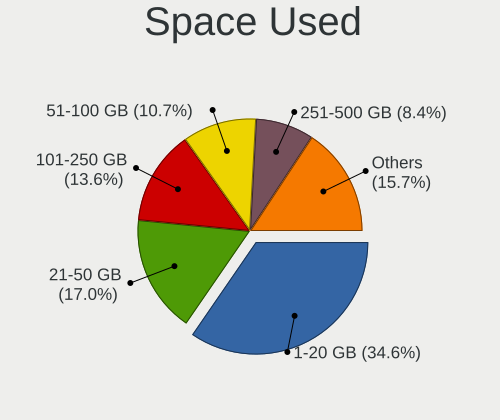

| Used GB        | Computers | Percent |
|----------------|-----------|---------|
| 1-20           | 926       | 34.59%  |
| 21-50          | 454       | 16.96%  |
| 101-250        | 365       | 13.63%  |
| 51-100         | 286       | 10.68%  |
| 251-500        | 225       | 8.4%    |
| 501-1000       | 142       | 5.3%    |
| 1001-2000      | 101       | 3.77%   |
| Unknown        | 76        | 2.84%   |
| More than 3000 | 58        | 2.17%   |
| 2001-3000      | 37        | 1.38%   |
| 0              | 7         | 0.26%   |

Malfunc. Drives
---------------

Drive models with a malfunction

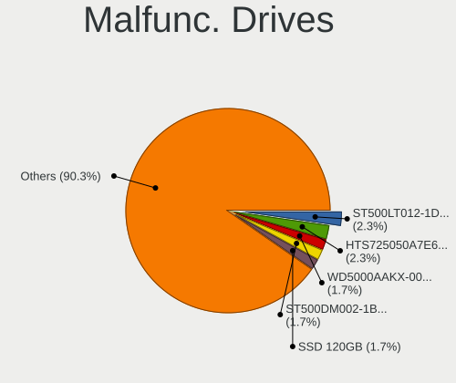

| Model                              | Computers | Drives | Percent |
|------------------------------------|-----------|--------|---------|
| Seagate ST500LT012-1DG142 500GB    | 4         | 7      | 2.27%   |
| HGST HTS725050A7E630 500GB         | 4         | 4      | 2.27%   |
| WDC WD5000AAKX-00ERMA0 500GB       | 3         | 4      | 1.7%    |
| Seagate ST500DM002-1BD142 500GB    | 3         | 3      | 1.7%    |
| Netac SSD 120GB                    | 3         | 4      | 1.7%    |
| HGST HTS721010A9E630 1TB           | 3         | 3      | 1.7%    |
| WDC WD63EJRX-89BFMY0 6TB           | 2         | 2      | 1.14%   |
| WDC WD5000AAKX-001CA0 500GB        | 2         | 2      | 1.14%   |
| WDC WD40EJRX-89AKWY0 4TB           | 2         | 6      | 1.14%   |
| WDC WD30EZRX-00SPEB0 3TB           | 2         | 2      | 1.14%   |
| WDC WD10EZEX-08WN4A0 1TB           | 2         | 2      | 1.14%   |
| Toshiba MQ04ABF100 1TB             | 2         | 2      | 1.14%   |
| Toshiba MQ01ABF050 500GB           | 2         | 2      | 1.14%   |
| Seagate ST500LM021-1KJ152 500GB    | 2         | 2      | 1.14%   |
| Seagate ST31000524AS 1TB           | 2         | 2      | 1.14%   |
| Seagate ST1000LM048-2E7172 1TB     | 2         | 2      | 1.14%   |
| Seagate ST1000LM024 HN-M101MBB 1TB | 2         | 2      | 1.14%   |
| Hitachi HUS724030ALE641 3TB        | 2         | 2      | 1.14%   |
| Crucial CT240M500SSD1 240GB        | 2         | 2      | 1.14%   |
| A-DATA Technology SP900 128GB SSD  | 2         | 3      | 1.14%   |
| WDC WDS240G2G0B-00EPW0 240GB SSD   | 1         | 1      | 0.57%   |
| WDC WDS240G2G0A-00JH30 240GB SSD   | 1         | 1      | 0.57%   |
| WDC WD5003ABYZ-011FA0 500GB        | 1         | 1      | 0.57%   |
| WDC WD5003ABYX-01WERA1 500GB       | 1         | 1      | 0.57%   |
| WDC WD5000LPLX-08ZNTT0 500GB       | 1         | 1      | 0.57%   |
| WDC WD5000LPCX-24C6HT0 500GB       | 1         | 1      | 0.57%   |
| WDC WD5000AZLX-60K2TA0 500GB       | 1         | 1      | 0.57%   |
| WDC WD5000AVDS-63U7B0 500GB        | 1         | 1      | 0.57%   |
| WDC WD5000AAKX-75U6AA0 500GB       | 1         | 1      | 0.57%   |
| WDC WD5000AAKX-60U6AA0 500GB       | 1         | 1      | 0.57%   |
| WDC WD5000AAKX-08U6AA0 500GB       | 1         | 1      | 0.57%   |
| WDC WD5000AAKX-08ERMA0 500GB       | 1         | 1      | 0.57%   |
| WDC WD5000AAKX-083CA1 500GB        | 1         | 2      | 0.57%   |
| WDC WD5000AAKX-00PWEA0 500GB       | 1         | 1      | 0.57%   |
| WDC WD5000AAKX-0 500GB             | 1         | 1      | 0.57%   |
| WDC WD40PURX-78AKYY0 4TB           | 1         | 1      | 0.57%   |
| WDC WD40PURX-64AKYY0 4TB           | 1         | 1      | 0.57%   |
| WDC WD3200BVVT-63A26Y0 320GB       | 1         | 1      | 0.57%   |
| WDC WD3200BEKT-60V5T1 320GB        | 1         | 1      | 0.57%   |
| WDC WD20EARX-00PASB0 2TB           | 1         | 1      | 0.57%   |

Malfunc. Drive Vendor
---------------------

Vendors of faulty drives

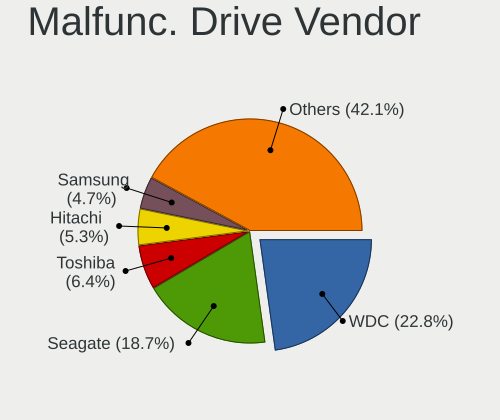

| Vendor              | Computers | Drives | Percent |
|---------------------|-----------|--------|---------|
| WDC                 | 39        | 49     | 22.81%  |
| Seagate             | 32        | 39     | 18.71%  |
| Toshiba             | 11        | 12     | 6.43%   |
| Hitachi             | 9         | 10     | 5.26%   |
| Samsung Electronics | 8         | 19     | 4.68%   |
| HGST                | 8         | 8      | 4.68%   |
| Intel               | 7         | 8      | 4.09%   |
| Kingston            | 4         | 4      | 2.34%   |
| GLOWAY              | 4         | 11     | 2.34%   |
| A-DATA Technology   | 4         | 5      | 2.34%   |
| Netac               | 3         | 4      | 1.75%   |
| Hewlett-Packard     | 3         | 4      | 1.75%   |
| Fujitsu             | 3         | 3      | 1.75%   |
| Crucial             | 3         | 3      | 1.75%   |
| Teclast             | 2         | 2      | 1.17%   |
| SanDisk             | 2         | 2      | 1.17%   |
| Plextor             | 2         | 2      | 1.17%   |
| Micron Technology   | 2         | 2      | 1.17%   |
| Lenovo              | 2         | 2      | 1.17%   |
| Colorful            | 2         | 2      | 1.17%   |
| Unknown             | 1         | 1      | 0.58%   |
| Union Memory        | 1         | 1      | 0.58%   |
| Teelkoou            | 1         | 1      | 0.58%   |
| SK hynix            | 1         | 1      | 0.58%   |
| Saichi              | 1         | 1      | 0.58%   |
| Ramsta              | 1         | 1      | 0.58%   |
| NT-512              | 1         | 1      | 0.58%   |
| KingSpec            | 1         | 1      | 0.58%   |
| KingFast            | 1         | 1      | 0.58%   |
| HS-SSD-C160         | 1         | 1      | 0.58%   |
| HP Phison           | 1         | 1      | 0.58%   |
| HIKSEMI             | 1         | 1      | 0.58%   |
| HANCHU              | 1         | 1      | 0.58%   |
| Getrich             | 1         | 1      | 0.58%   |
| FORESEE             | 1         | 1      | 0.58%   |
| Flashwar            | 1         | 1      | 0.58%   |
| faspeed             | 1         | 1      | 0.58%   |
| ExcelStor           | 1         | 1      | 0.58%   |
| ADATA Technology    | 1         | 1      | 0.58%   |
| Acer                | 1         | 1      | 0.58%   |

Malfunc. HDD Vendor
-------------------

Vendors of faulty HDD drives

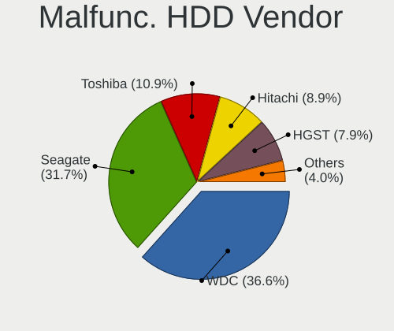

| Vendor    | Computers | Drives | Percent |
|-----------|-----------|--------|---------|
| WDC       | 37        | 47     | 36.63%  |
| Seagate   | 32        | 39     | 31.68%  |
| Toshiba   | 11        | 12     | 10.89%  |
| Hitachi   | 9         | 10     | 8.91%   |
| HGST      | 8         | 8      | 7.92%   |
| Fujitsu   | 3         | 3      | 2.97%   |
| ExcelStor | 1         | 1      | 0.99%   |

Malfunc. Drive Kind
-------------------

Kinds of faulty drives

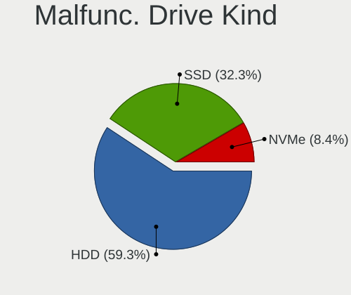

| Kind | Computers | Drives | Percent |
|------|-----------|--------|---------|
| HDD  | 99        | 120    | 59.28%  |
| SSD  | 54        | 77     | 32.34%  |
| NVMe | 14        | 15     | 8.38%   |

Failed Drives
-------------

Failed drive models

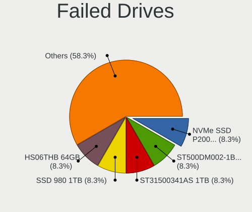

| Model                                   | Computers | Drives | Percent |
|-----------------------------------------|-----------|--------|---------|
| SOLIDIGM SSDSC2KB076TZ 8TB              | 1         | 1      | 8.33%   |
| SK hynix BC501 HFM128GDJTNG-8310A 128GB | 1         | 1      | 8.33%   |
| Seagate ST500DM002-1BD142 500GB         | 1         | 1      | 8.33%   |
| Seagate ST31500341AS 1TB                | 1         | 1      | 8.33%   |
| Samsung Electronics SSD 980 1TB         | 1         | 1      | 8.33%   |
| Samsung Electronics HS06THB 64GB        | 1         | 1      | 8.33%   |
| Samsung Electronics HM160HI 160GB       | 1         | 1      | 8.33%   |
| Phison ESO128GTLC9-E8C-2 128GB          | 1         | 1      | 8.33%   |
| HGST HUH728080ALN600 8TB                | 1         | 1      | 8.33%   |
| HGST HTS725050A7E630 500GB              | 1         | 2      | 8.33%   |
| Hewlett-Packard SSD S700 500GB          | 1         | 2      | 8.33%   |
| aigo NVMe SSD P2000 128GB               | 1         | 1      | 8.33%   |

Failed Drive Vendor
-------------------

Failed drive vendors

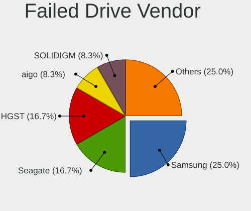

| Vendor              | Computers | Drives | Percent |
|---------------------|-----------|--------|---------|
| Samsung Electronics | 3         | 3      | 25%     |
| Seagate             | 2         | 2      | 16.67%  |
| HGST                | 2         | 3      | 16.67%  |
| SOLIDIGM            | 1         | 1      | 8.33%   |
| SK hynix            | 1         | 1      | 8.33%   |
| Phison              | 1         | 1      | 8.33%   |
| Hewlett-Packard     | 1         | 2      | 8.33%   |
| aigo                | 1         | 1      | 8.33%   |

Drive Status
------------

Number of failed and malfunc. drives

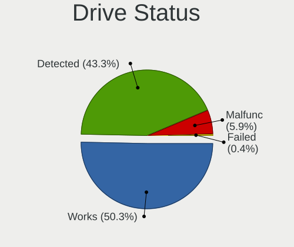

| Status   | Computers | Drives | Percent |
|----------|-----------|--------|---------|
| Works    | 1375      | 2796   | 50.33%  |
| Detected | 1183      | 2181   | 43.3%   |
| Malfunc  | 162       | 212    | 5.93%   |
| Failed   | 12        | 14     | 0.44%   |

Storage controller
------------------

Storage Vendor
--------------

Storage controller vendors

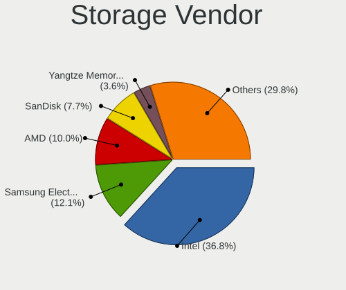

| Vendor                                  | Computers | Percent |
|-----------------------------------------|-----------|---------|
| Intel                                   | 1252      | 36.76%  |
| Samsung Electronics                     | 413       | 12.13%  |
| AMD                                     | 342       | 10.04%  |
| SanDisk                                 | 262       | 7.69%   |
| Yangtze Memory Technologies             | 123       | 3.61%   |
| SK hynix                                | 114       | 3.35%   |
| MAXIO Technology (Hangzhou)             | 97        | 2.85%   |
| Silicon Motion                          | 81        | 2.38%   |
| KIOXIA                                  | 72        | 2.11%   |
| Kingston Technology Company             | 61        | 1.79%   |
| Micron Technology                       | 57        | 1.67%   |
| Phison Electronics                      | 56        | 1.64%   |
| Toshiba America Info Systems            | 47        | 1.38%   |
| ASMedia Technology                      | 41        | 1.2%    |
| Marvell Technology Group                | 37        | 1.09%   |
| Loongson Technology                     | 32        | 0.94%   |
| Shenzhen Longsys Electronics            | 29        | 0.85%   |
| Biwin Storage Technology                | 27        | 0.79%   |
| Broadcom / LSI                          | 26        | 0.76%   |
| Shenzhen Unionmemory Information System | 23        | 0.68%   |
| Zhaoxin                                 | 18        | 0.53%   |
| Micron/Crucial Technology               | 16        | 0.47%   |
| LSI Logic / Symbios Logic               | 13        | 0.38%   |
| JMicron Technology                      | 12        | 0.35%   |
| INNOGRIT                                | 12        | 0.35%   |
| Solidigm                                | 11        | 0.32%   |
| Solid State Storage Technology          | 11        | 0.32%   |
| Realtek Semiconductor                   | 11        | 0.32%   |
| ADATA Technology                        | 10        | 0.29%   |
| Apple                                   | 9         | 0.26%   |
| Union Memory (Shenzhen)                 | 8         | 0.23%   |
| Lite-On Technology                      | 8         | 0.23%   |
| Huawei Technologies                     | 8         | 0.23%   |
| Seagate Technology                      | 6         | 0.18%   |
| Jiangsu Xinsheng Intelligent Technology | 5         | 0.15%   |
| IBM                                     | 5         | 0.15%   |
| O2 Micro                                | 4         | 0.12%   |
| Nvidia                                  | 4         | 0.12%   |
| Hefei DATANG Storage Technology         | 4         | 0.12%   |
| Silicon Integrated Systems [SiS]        | 3         | 0.09%   |

Storage Model
-------------

Storage controller models

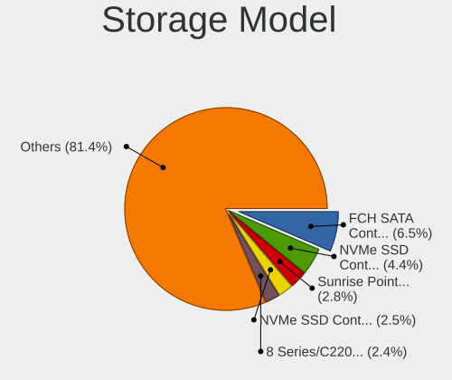

| Model                                                                          | Computers | Percent |
|--------------------------------------------------------------------------------|-----------|---------|
| AMD FCH SATA Controller [AHCI mode]                                            | 241       | 6.46%   |
| Samsung NVMe SSD Controller SM981/PM981/PM983                                  | 165       | 4.43%   |
| Intel Sunrise Point-LP SATA Controller [AHCI mode]                             | 105       | 2.82%   |
| Samsung NVMe SSD Controller PM9A1/PM9A3/980PRO                                 | 93        | 2.49%   |
| Intel 8 Series/C220 Series Chipset Family 6-port SATA Controller 1 [AHCI mode] | 88        | 2.36%   |
| Intel 7 Series Chipset Family 6-port SATA Controller [AHCI mode]               | 67        | 1.8%    |
| Intel Volume Management Device NVMe RAID Controller                            | 63        | 1.69%   |
| SanDisk Extreme Pro / WD Black SN750 / PC SN730 / Red SN700 NVMe SSD           | 62        | 1.66%   |
| Intel 200 Series PCH SATA controller [AHCI mode]                               | 61        | 1.64%   |
| Silicon Motion SM2263EN/SM2263XT (DRAM-less) NVMe SSD Controllers              | 58        | 1.56%   |
| Samsung NVMe SSD Controller 980 (DRAM-less)                                    | 54        | 1.45%   |
| MAXIO (Hangzhou) NVMe SSD Controller MAP1202 (DRAM-less)                       | 52        | 1.39%   |
| Samsung NVMe SSD Controller SM961/PM961/SM963                                  | 47        | 1.26%   |
| Intel 8 Series SATA Controller 1 [AHCI mode]                                   | 46        | 1.23%   |
| AMD 400 Series Chipset SATA Controller                                         | 46        | 1.23%   |
| Yangtze Memory ZHITAI TiPlus7100                                               | 45        | 1.21%   |
| SanDisk Ultra 3D / WD PC SN530, IX SN530, Blue SN550 NVMe SSD (DRAM-less)      | 45        | 1.21%   |
| Intel 6 Series/C200 Series Chipset Family 6 port Mobile SATA AHCI Controller   | 44        | 1.18%   |
| SK hynix Gold P31/BC711/PC711 NVMe Solid State Drive                           | 43        | 1.15%   |
| Intel Q170/Q150/B150/H170/H110/Z170/CM236 Chipset SATA Controller [AHCI Mode]  | 43        | 1.15%   |
| MAXIO (Hangzhou) NVMe SSD Controller MAP1602 (DRAM-less)                       | 42        | 1.13%   |
| Intel Cannon Lake Mobile PCH SATA AHCI Controller                              | 42        | 1.13%   |
| Intel Alder Lake-S PCH SATA Controller [AHCI Mode]                             | 37        | 0.99%   |
| Intel Cannon Lake PCH SATA AHCI Controller                                     | 36        | 0.97%   |
| AMD 500 Series Chipset SATA Controller                                         | 36        | 0.97%   |
| SanDisk WD SN560/SN740/SN770/SN5000 NVMe SSD                                   | 35        | 0.94%   |
| Intel 400 Series Chipset Family SATA AHCI Controller                           | 33        | 0.89%   |
| Intel Comet Lake SATA AHCI Controller                                          | 32        | 0.86%   |
| Intel 82801 Mobile SATA Controller [RAID mode]                                 | 32        | 0.86%   |
| Intel Raptor Lake SATA AHCI Controller                                         | 31        | 0.83%   |
| Intel SATA Controller [RAID Mode]                                              | 30        | 0.8%    |
| AMD 600 Series Chipset SATA Controller                                         | 29        | 0.78%   |
| SanDisk Extreme Pro / WD Black 2018/SN750/PC SN720 NVMe SSD                    | 27        | 0.72%   |
| Loongson 2K2000 / 7A2000 Chipset 6Gb/s SATA AHCI Controller                    | 27        | 0.72%   |
| ASMedia ASM1061/ASM1062 Serial ATA Controller                                  | 27        | 0.72%   |
| Intel HM170/QM170 Chipset SATA Controller [AHCI Mode]                          | 26        | 0.7%    |
| Yangtze Memory ZHITAI TiPro5000 NVMe SSD                                       | 24        | 0.64%   |
| Intel Wildcat Point-LP SATA Controller [AHCI Mode]                             | 24        | 0.64%   |
| Phison PS5013-E13 PCIe3 NVMe Controller (DRAM-less)                            | 23        | 0.62%   |
| Intel Atom Processor E3800 Series SATA AHCI Controller                         | 23        | 0.62%   |

Storage Kind
------------

Kind of storage controller (IDE, SATA, NVMe, SAS, ...)

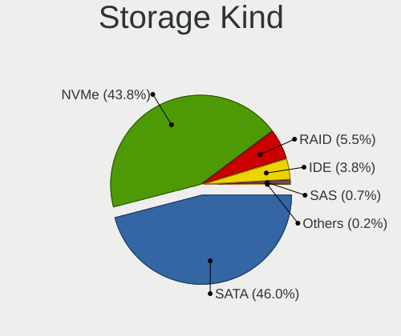

| Kind | Computers | Percent |
|------|-----------|---------|
| SATA | 1507      | 45.96%  |
| NVMe | 1436      | 43.79%  |
| RAID | 181       | 5.52%   |
| IDE  | 125       | 3.81%   |
| SAS  | 24        | 0.73%   |
| SCSI | 6         | 0.18%   |

Processor
---------

CPU Vendor
----------

Processor vendors

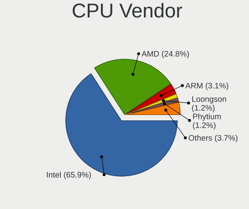

| Vendor            | Computers | Percent |
|-------------------|-----------|---------|
| Intel             | 1636      | 65.89%  |
| AMD               | 615       | 24.77%  |
| ARM               | 78        | 3.14%   |
| Loongson          | 31        | 1.25%   |
| Phytium           | 30        | 1.21%   |
| CentaurHauls      | 29        | 1.17%   |
| Unknown           | 24        | 0.97%   |
| Qualcomm          | 7         | 0.28%   |
| sifive,u74-mc     | 6         | 0.24%   |
| CHRP IBM,8233-E8B | 5         | 0.2%    |
| sifive,bullet0    | 3         | 0.12%   |
| HISILICON         | 3         | 0.12%   |
| eswin,eic770x     | 3         | 0.12%   |
| ky,x60            | 2         | 0.08%   |
| HygonGenuine      | 2         | 0.08%   |
| CHRP IBM,9131-52A | 2         | 0.08%   |
| WIAT              | 1         | 0.04%   |
| thead,c906        | 1         | 0.04%   |
| spacemit,x60      | 1         | 0.04%   |
| PowerNV FP5466G2  | 1         | 0.04%   |
| PowerNV C829UAG3  | 1         | 0.04%   |
| HUAWEI            | 1         | 0.04%   |
| FSP-1             | 1         | 0.04%   |

CPU Model
---------

Processor models

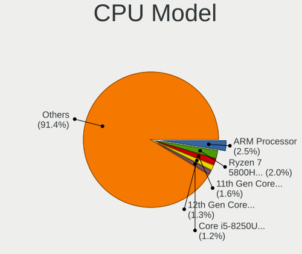

| Model                                          | Computers | Percent |
|------------------------------------------------|-----------|---------|
| ARM Processor                                  | 63        | 2.53%   |
| AMD Ryzen 7 5800H with Radeon Graphics         | 50        | 2%      |
| Intel 11th Gen Core i5-1135G7 @ 2.40GHz        | 40        | 1.6%    |
| Intel 12th Gen Core i7-12700H                  | 33        | 1.32%   |
| Intel Core i5-8250U CPU @ 1.60GHz              | 29        | 1.16%   |
| Intel 11th Gen Core i7-1165G7 @ 2.80GHz        | 29        | 1.16%   |
| Intel Core i7-9750H CPU @ 2.60GHz              | 26        | 1.04%   |
| AMD Ryzen 5 3500U with Radeon Vega Mobile Gfx  | 25        | 1%      |
| Intel Core i5-7200U CPU @ 2.50GHz              | 24        | 0.96%   |
|                                                | 24        | 0.96%   |
| Loongson Loongson 3A                           | 21        | 0.84%   |
| AMD Custom APU 0405                            | 21        | 0.84%   |
| AMD Ryzen 7 6800H with Radeon Graphics         | 20        | 0.8%    |
| Intel Core i7-8550U CPU @ 1.80GHz              | 19        | 0.76%   |
| Intel Core i5-8265U CPU @ 1.60GHz              | 18        | 0.72%   |
| Intel Core i5-6200U CPU @ 2.30GHz              | 18        | 0.72%   |
| Intel Core i5-10210U CPU @ 1.60GHz             | 18        | 0.72%   |
| AMD Ryzen 7 4800H with Radeon Graphics         | 18        | 0.72%   |
| Intel 12th Gen Core i5-1240P                   | 16        | 0.64%   |
| AMD Ryzen 7 8845HS w/ Radeon 780M Graphics     | 16        | 0.64%   |
| Intel Core i7-10510U CPU @ 1.80GHz             | 15        | 0.6%    |
| Intel Celeron CPU J1900 @ 1.99GHz              | 15        | 0.6%    |
| Intel Core i7-8750H CPU @ 2.20GHz              | 14        | 0.56%   |
| Intel 11th Gen Core i7-11800H @ 2.30GHz        | 14        | 0.56%   |
| Intel Core i5-8300H CPU @ 2.30GHz              | 13        | 0.52%   |
| AMD Ryzen 7 7840HS w/ Radeon 780M Graphics     | 13        | 0.52%   |
| Intel Core i7-8700 CPU @ 3.20GHz               | 12        | 0.48%   |
| CentaurHauls ZHAOXIN KaiXian KX-6640MA@2.2+GHz | 12        | 0.48%   |
| Intel N100                                     | 11        | 0.44%   |
| Intel Core i7-7700 CPU @ 3.60GHz               | 11        | 0.44%   |
| Intel Core i7-4790 CPU @ 3.60GHz               | 11        | 0.44%   |
| Intel Core i7-10750H CPU @ 2.60GHz             | 11        | 0.44%   |
| Intel Core i5-4590 CPU @ 3.30GHz               | 11        | 0.44%   |
| Intel Core i5-3320M CPU @ 2.60GHz              | 11        | 0.44%   |
| CentaurHauls ZHAOXIN KaiXian KX-U6780A@2.7GHz  | 11        | 0.44%   |
| Intel Core i7-8565U CPU @ 1.80GHz              | 10        | 0.4%    |
| Intel Core i7-7700HQ CPU @ 2.80GHz             | 10        | 0.4%    |
| Intel Core i7-10700 CPU @ 2.90GHz              | 10        | 0.4%    |
| Intel Core i5-3210M CPU @ 2.50GHz              | 10        | 0.4%    |
| Intel Celeron N5105 @ 2.00GHz                  | 10        | 0.4%    |

CPU Model Family
----------------

Processor model prefix

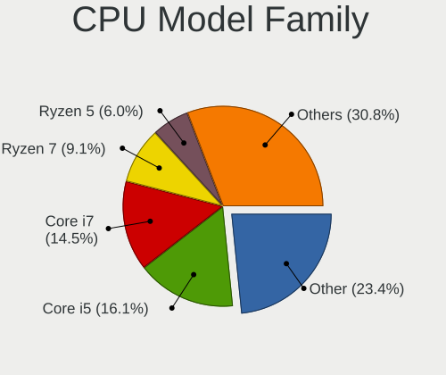

| Model                   | Computers | Percent |
|-------------------------|-----------|---------|
| Other                   | 582       | 23.41%  |
| Intel Core i5           | 400       | 16.09%  |
| Intel Core i7           | 361       | 14.52%  |
| AMD Ryzen 7             | 227       | 9.13%   |
| AMD Ryzen 5             | 150       | 6.03%   |
| Intel Xeon              | 112       | 4.51%   |
| Intel Core i3           | 98        | 3.94%   |
| Intel Celeron           | 90        | 3.62%   |
| AMD Ryzen 9             | 65        | 2.61%   |
| Intel Core              | 42        | 1.69%   |
| Intel Pentium           | 36        | 1.45%   |
| Intel Atom              | 35        | 1.41%   |
| Intel Core i9           | 31        | 1.25%   |
| Intel Core 2 Duo        | 30        | 1.21%   |
| AMD Ryzen 7 PRO         | 24        | 0.97%   |
| AMD EPYC                | 16        | 0.64%   |
| Intel Core m3           | 10        | 0.4%    |
| AMD Ryzen 5 PRO         | 10        | 0.4%    |
| AMD A8                  | 10        | 0.4%    |
| Intel Genuine           | 9         | 0.36%   |
| AMD A6                  | 9         | 0.36%   |
| Intel Pentium Silver    | 8         | 0.32%   |
| AMD FX                  | 8         | 0.32%   |
| AMD A10                 | 8         | 0.32%   |
| Intel Xeon Silver       | 7         | 0.28%   |
| Intel Xeon Platinum     | 7         | 0.28%   |
| Intel Xeon Gold         | 7         | 0.28%   |
| AMD Athlon II X2        | 7         | 0.28%   |
| Intel Pentium Dual-Core | 6         | 0.24%   |
| AMD Ryzen 3             | 6         | 0.24%   |
| AMD E                   | 6         | 0.24%   |
| AMD Athlon              | 6         | 0.24%   |
| AMD Athlon X4           | 5         | 0.2%    |
| AMD Athlon II X4        | 5         | 0.2%    |
| Intel Pentium Dual      | 4         | 0.16%   |
| Intel Core 2            | 4         | 0.16%   |
| ARM BCM                 | 4         | 0.16%   |
| AMD E2                  | 4         | 0.16%   |
| Intel Core m5           | 3         | 0.12%   |
| Intel Core M            | 3         | 0.12%   |

CPU Cores
---------

Number of processor cores

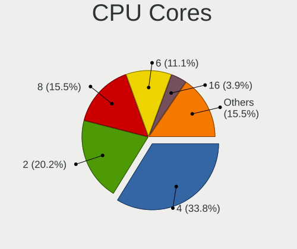

| Number  | Computers | Percent |
|---------|-----------|---------|
| 4       | 844       | 33.79%  |
| 2       | 505       | 20.22%  |
| 8       | 387       | 15.49%  |
| 6       | 278       | 11.13%  |
| 16      | 97        | 3.88%   |
| 12      | 89        | 3.56%   |
| 14      | 76        | 3.04%   |
| 10      | 47        | 1.88%   |
| Unknown | 44        | 1.76%   |
| 24      | 41        | 1.64%   |
| 1       | 25        | 1%      |
| 20      | 13        | 0.52%   |
| 64      | 12        | 0.48%   |
| 32      | 9         | 0.36%   |
| 28      | 4         | 0.16%   |
| 192     | 3         | 0.12%   |
| 96      | 3         | 0.12%   |
| 48      | 3         | 0.12%   |
| 18      | 3         | 0.12%   |
| 3       | 3         | 0.12%   |
| 128     | 2         | 0.08%   |
| 52      | 2         | 0.08%   |
| 40      | 2         | 0.08%   |
| 36      | 2         | 0.08%   |
| 26      | 1         | 0.04%   |
| 22      | 1         | 0.04%   |
| 11      | 1         | 0.04%   |
| 7       | 1         | 0.04%   |

CPU Sockets
-----------

Number of sockets

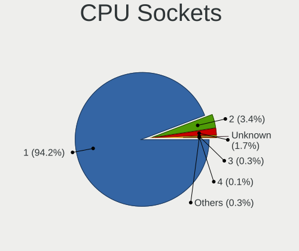

| Number  | Computers | Percent |
|---------|-----------|---------|
| 1       | 2344      | 94.21%  |
| 2       | 84        | 3.38%   |
| Unknown | 43        | 1.73%   |
| 3       | 7         | 0.28%   |
| 4       | 3         | 0.12%   |
| 14      | 2         | 0.08%   |
| 24      | 1         | 0.04%   |
| 20      | 1         | 0.04%   |
| 16      | 1         | 0.04%   |
| 11      | 1         | 0.04%   |
| 6       | 1         | 0.04%   |

CPU Threads
-----------

Threads per core (Hyper-Threading)

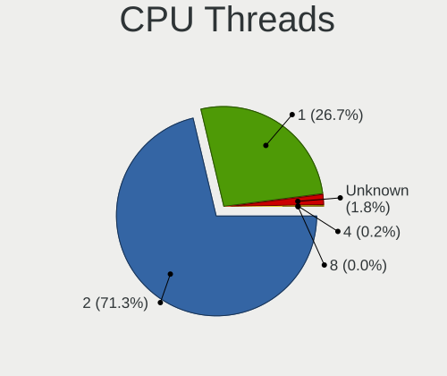

| Number  | Computers | Percent |
|---------|-----------|---------|
| 2       | 1779      | 71.3%   |
| 1       | 665       | 26.65%  |
| Unknown | 44        | 1.76%   |
| 4       | 6         | 0.24%   |
| 8       | 1         | 0.04%   |

CPU Op-Modes
------------

CPU Operation Modes (32-bit, 64-bit)

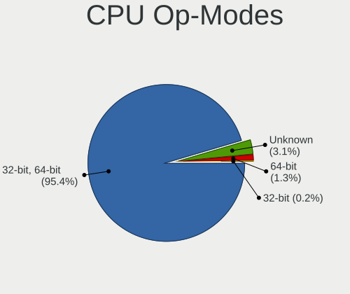

| Op mode        | Computers | Percent |
|----------------|-----------|---------|
| 32-bit, 64-bit | 2376      | 95.42%  |
| Unknown        | 76        | 3.05%   |
| 64-bit         | 32        | 1.29%   |
| 32-bit         | 6         | 0.24%   |

CPU Microcode
-------------

Microcode number

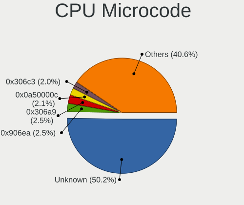

| Number     | Computers | Percent |
|------------|-----------|---------|
| Unknown    | 1282      | 50.24%  |
| 0x906ea    | 65        | 2.55%   |
| 0x306a9    | 64        | 2.51%   |
| 0x0a50000c | 54        | 2.12%   |
| 0x306c3    | 52        | 2.04%   |
| 0x806ec    | 40        | 1.57%   |
| 0x806c1    | 40        | 1.57%   |
| 0x206a7    | 40        | 1.57%   |
| 0x806ea    | 39        | 1.53%   |
| 0x906e9    | 37        | 1.45%   |
| 0x806e9    | 35        | 1.37%   |
| 0x506e3    | 35        | 1.37%   |
| 0x08600106 | 34        | 1.33%   |
| 0x40651    | 31        | 1.21%   |
| 0x906a3    | 29        | 1.14%   |
| 0x0a404102 | 23        | 0.9%    |
| 0x406e3    | 22        | 0.86%   |
| 0x306d4    | 21        | 0.82%   |
| 0x30678    | 21        | 0.82%   |
| 0x08108102 | 19        | 0.74%   |
| 0x1067a    | 17        | 0.67%   |
| 0x08108109 | 17        | 0.67%   |
| 0x50654    | 16        | 0.63%   |
| 0xa0655    | 15        | 0.59%   |
| 0xa0652    | 14        | 0.55%   |
| 0xb0671    | 13        | 0.51%   |
| 0x906c0    | 13        | 0.51%   |
| 0x90672    | 13        | 0.51%   |
| 0x08600104 | 13        | 0.51%   |
| 0x806d1    | 12        | 0.47%   |
| 0x0a704103 | 12        | 0.47%   |
| 0x0a50000d | 12        | 0.47%   |
| 0x50657    | 11        | 0.43%   |
| 0x306f2    | 11        | 0.43%   |
| 0x08701013 | 11        | 0.43%   |
| 0x706a1    | 9         | 0.35%   |
| 0x0a601203 | 9         | 0.35%   |
| 0xb06a2    | 8         | 0.31%   |
| 0xa0660    | 8         | 0.31%   |
| 0xa0653    | 8         | 0.31%   |

CPU Microarch
-------------

Microarchitecture

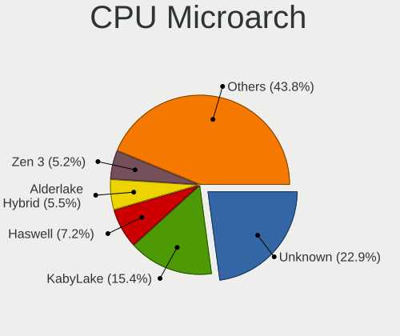

| Name               | Computers | Percent |
|--------------------|-----------|---------|
| Unknown            | 571       | 22.88%  |
| KabyLake           | 384       | 15.38%  |
| Haswell            | 180       | 7.21%   |
| Alderlake Hybrid   | 138       | 5.53%   |
| Zen 3              | 130       | 5.21%   |
| Skylake            | 129       | 5.17%   |
| IvyBridge          | 119       | 4.77%   |
| Zen 2              | 115       | 4.61%   |
| TigerLake          | 92        | 3.69%   |
| CometLake          | 77        | 3.08%   |
| SandyBridge        | 75        | 3%      |
| Zen+               | 60        | 2.4%    |
| Silvermont         | 60        | 2.4%    |
| Broadwell          | 52        | 2.08%   |
| Icelake            | 43        | 1.72%   |
| Penryn             | 38        | 1.52%   |
| Zen                | 29        | 1.16%   |
| Goldmont plus      | 22        | 0.88%   |
| K10                | 18        | 0.72%   |
| Westmere           | 16        | 0.64%   |
| Tremont            | 16        | 0.64%   |
| Piledriver         | 16        | 0.64%   |
| Gracemont          | 14        | 0.56%   |
| Core               | 14        | 0.56%   |
| Steamroller        | 12        | 0.48%   |
| Bonnell            | 9         | 0.36%   |
| Meteorlake Hybrid  | 8         | 0.32%   |
| Goldmont           | 8         | 0.32%   |
| Puma               | 7         | 0.28%   |
| Sapphire Rapids    | 6         | 0.24%   |
| Excavator          | 6         | 0.24%   |
| Lunarlake Hybrid   | 5         | 0.2%    |
| Jaguar             | 5         | 0.2%    |
| P6                 | 4         | 0.16%   |
| Nehalem            | 4         | 0.16%   |
| Bobcat             | 4         | 0.16%   |
| ArrowLake-H Hybrid | 4         | 0.16%   |
| K10 Llano          | 2         | 0.08%   |
| Bulldozer          | 2         | 0.08%   |
| NetBurst           | 1         | 0.04%   |

Graphics
--------

GPU Vendor
----------

Vendors of graphics cards

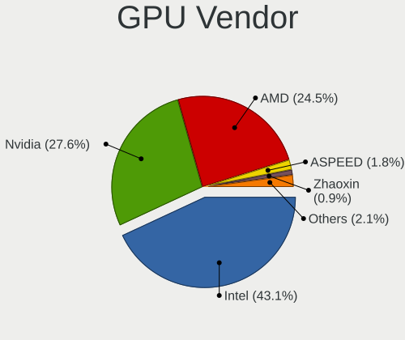

| Vendor                           | Computers | Percent |
|----------------------------------|-----------|---------|
| Intel                            | 1293      | 43.07%  |
| Nvidia                           | 828       | 27.58%  |
| AMD                              | 735       | 24.48%  |
| ASPEED Technology                | 54        | 1.8%    |
| Zhaoxin                          | 28        | 0.93%   |
| Loongson Technology              | 24        | 0.8%    |
| Matrox Electronics Systems       | 22        | 0.73%   |
| Phytium Technology               | 3         | 0.1%    |
| Jingjia Microelectronics         | 3         | 0.1%    |
| Huawei Technologies              | 3         | 0.1%    |
| Silicon Integrated Systems [SiS] | 2         | 0.07%   |
| Silicon Motion                   | 1         | 0.03%   |
| Nanjing Ruixinview Technology    | 1         | 0.03%   |
| Moore Threads Technology         | 1         | 0.03%   |
| Innosilicon                      | 1         | 0.03%   |
| Glenfly Tech                     | 1         | 0.03%   |
| Cirrus Logic                     | 1         | 0.03%   |
| 3DLabs                           | 1         | 0.03%   |

GPU Model
---------

Graphics card models

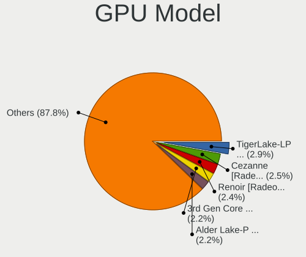

| Model                                                                                    | Computers | Percent |
|------------------------------------------------------------------------------------------|-----------|---------|
| Intel TigerLake-LP GT2 [Iris Xe Graphics]                                                | 88        | 2.87%   |
| AMD Cezanne [Radeon Vega Series / Radeon Vega Mobile Series]                             | 78        | 2.54%   |
| AMD Renoir [Radeon Vega Series / Radeon Vega Mobile Series]                              | 73        | 2.38%   |
| Intel 3rd Gen Core processor Graphics Controller                                         | 68        | 2.21%   |
| Intel Alder Lake-P GT2 [Iris Xe Graphics]                                                | 67        | 2.18%   |
| Intel Kaby Lake-R GT2 [UHD Graphics 620]                                                 | 62        | 2.02%   |
| Intel 2nd Generation Core Processor Family Integrated Graphics Controller                | 57        | 1.86%   |
| ASPEED Technology ASPEED Graphics Family                                                 | 54        | 1.76%   |
| Intel CoffeeLake-H GT2 [UHD Graphics 630]                                                | 52        | 1.69%   |
| AMD Rembrandt [Radeon 680M]                                                              | 52        | 1.69%   |
| AMD Picasso/Raven 2 [Radeon Vega Series / Radeon Vega Mobile Series]                     | 51        | 1.66%   |
| Nvidia GA106M [GeForce RTX 3060 Mobile / Max-Q]                                          | 49        | 1.6%    |
| Intel Haswell-ULT Integrated Graphics Controller                                         | 49        | 1.6%    |
| Intel Atom Processor Z36xxx/Z37xxx Series Graphics & Display                             | 39        | 1.27%   |
| AMD Phoenix1                                                                             | 37        | 1.21%   |
| Intel Xeon E3-1200 v3/4th Gen Core Processor Integrated Graphics Controller              | 36        | 1.17%   |
| Intel Kaby Lake-U GT2 [HD Graphics 620]                                                  | 36        | 1.17%   |
| Intel CometLake-U GT2 [UHD Graphics]                                                     | 36        | 1.17%   |
| Intel WhiskeyLake-U GT2 [UHD Graphics 620]                                               | 33        | 1.07%   |
| Intel CoffeeLake-S GT2 [UHD Graphics 630]                                                | 31        | 1.01%   |
| AMD HawkPoint1                                                                           | 30        | 0.98%   |
| Nvidia AD107M [GeForce RTX 4060 Max-Q / Mobile]                                          | 29        | 0.94%   |
| Intel Skylake-U GT2 [HD Graphics 520]                                                    | 28        | 0.91%   |
| Intel 4th Gen Core Processor Integrated Graphics Controller                              | 28        | 0.91%   |
| Nvidia TU117M [GeForce GTX 1650 Mobile / Max-Q]                                          | 26        | 0.85%   |
| Zhaoxin KX-6000 C-960 GPU                                                                | 25        | 0.81%   |
| Nvidia GP108M [GeForce MX150]                                                            | 23        | 0.75%   |
| Intel Skylake-S GT2 [HD Graphics 530]                                                    | 23        | 0.75%   |
| AMD Oland [Radeon HD 8570 / R5 430 OEM / R7 240/340 / Radeon 520 OEM]                    | 23        | 0.75%   |
| Nvidia GP108M [GeForce MX250]                                                            | 22        | 0.72%   |
| Intel Kaby Lake-S GT2 [HD Graphics 630]                                                  | 22        | 0.72%   |
| Intel CometLake-S GT2 [UHD Graphics 630]                                                 | 22        | 0.72%   |
| Intel Raptor Lake-P [Iris Xe Graphics]                                                   | 21        | 0.68%   |
| Intel Atom/Celeron/Pentium Processor x5-E8000/J3xxx/N3xxx Integrated Graphics Controller | 21        | 0.68%   |
| AMD VanGogh [AMD Custom GPU 0405]                                                        | 21        | 0.68%   |
| AMD Raven Ridge [Radeon Vega Series / Radeon Vega Mobile Series]                         | 21        | 0.68%   |
| Loongson Technology 2K2000 / 7A2000 Chipset Display Controller                           | 20        | 0.65%   |
| Intel JasperLake [UHD Graphics]                                                          | 20        | 0.65%   |
| Intel Broadwell-U GT2 [HD Graphics 5500]                                                 | 20        | 0.65%   |
| AMD Raphael                                                                              | 20        | 0.65%   |

GPU Combo
---------

Combinations of graphics cards

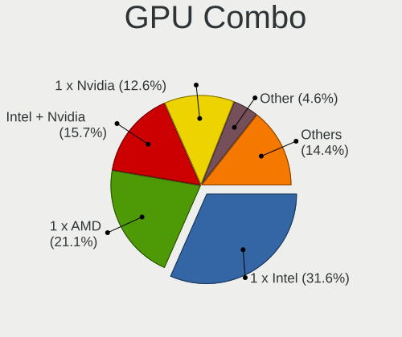

| Name                              | Computers | Percent |
|-----------------------------------|-----------|---------|
| 1 x Intel                         | 790       | 31.59%  |
| 1 x AMD                           | 528       | 21.11%  |
| Intel + Nvidia                    | 392       | 15.67%  |
| 1 x Nvidia                        | 316       | 12.63%  |
| Other                             | 115       | 4.6%    |
| AMD + Nvidia                      | 87        | 3.48%   |
| Intel + AMD                       | 75        | 3%      |
| 1 x Zhaoxin                       | 28        | 1.12%   |
| 2 x AMD                           | 27        | 1.08%   |
| 1 x ASPEED                        | 22        | 0.88%   |
| Nvidia + ASPEED                   | 21        | 0.84%   |
| 1 x Matrox                        | 19        | 0.76%   |
| 1 x Loongson Technology           | 19        | 0.76%   |
| 2 x Intel                         | 12        | 0.48%   |
| 2 x Nvidia                        | 8         | 0.32%   |
| AMD + ASPEED                      | 7         | 0.28%   |
| AMD + Loongson Technology         | 5         | 0.2%    |
| AMD + Matrox                      | 4         | 0.16%   |
| 1 x Phytium Technology            | 3         | 0.12%   |
| 1 x Jingjia Microelectronics      | 3         | 0.12%   |
| 2 x Nvidia + 1 x ASPEED           | 2         | 0.08%   |
| 1 x SiS                           | 2         | 0.08%   |
| Nvidia + Huawei Technologies      | 2         | 0.08%   |
| 1 x Silicon Motion                | 1         | 0.04%   |
| Nvidia + Matrox                   | 1         | 0.04%   |
| 1 x Nanjing Ruixinview Technology | 1         | 0.04%   |
| 1 x Moore Threads Technology      | 1         | 0.04%   |
| 1 x Intel + 3 x Nvidia            | 1         | 0.04%   |
| Intel + 2 x Nvidia                | 1         | 0.04%   |
| Intel + Matrox                    | 1         | 0.04%   |
| Intel + ASPEED                    | 1         | 0.04%   |
| 1 x Innosilicon                   | 1         | 0.04%   |
| 1 x Huawei Technologies           | 1         | 0.04%   |
| 1 x Glenfly Tech                  | 1         | 0.04%   |
| 1 x Cirrus Logic                  | 1         | 0.04%   |
| ASPEED + Loongson Technology      | 1         | 0.04%   |
| AMD + 3DLabs                      | 1         | 0.04%   |

GPU Driver
----------

Free vs proprietary

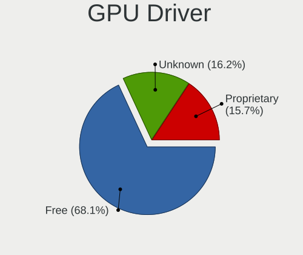

| Driver      | Computers | Percent |
|-------------|-----------|---------|
| Free        | 1713      | 68.08%  |
| Unknown     | 408       | 16.22%  |
| Proprietary | 395       | 15.7%   |

GPU Memory
----------

Total video memory

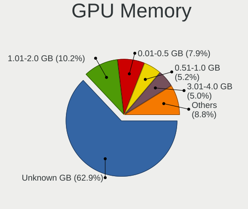

| Size in GB | Computers | Percent |
|------------|-----------|---------|
| Unknown    | 1600      | 62.94%  |
| 1.01-2.0   | 259       | 10.19%  |
| 0.01-0.5   | 200       | 7.87%   |
| 0.51-1.0   | 133       | 5.23%   |
| 3.01-4.0   | 126       | 4.96%   |
| 7.01-8.0   | 91        | 3.58%   |
| 5.01-6.0   | 61        | 2.4%    |
| 8.01-16.0  | 36        | 1.42%   |
| 16.01-24.0 | 13        | 0.51%   |
| 2.01-3.0   | 11        | 0.43%   |
| 4.01-5.0   | 7         | 0.28%   |
| 24.01-32.0 | 4         | 0.16%   |
| 32.01-64.0 | 1         | 0.04%   |

Monitor
-------

Monitor Vendor
--------------

Monitor vendors

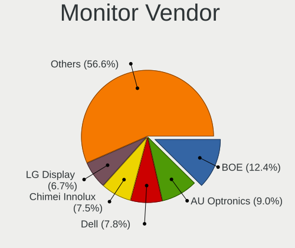

| Vendor                  | Computers | Percent |
|-------------------------|-----------|---------|
| BOE                     | 294       | 12.38%  |
| AU Optronics            | 214       | 9.01%   |
| Dell                    | 184       | 7.75%   |
| Chimei Innolux          | 179       | 7.54%   |
| LG Display              | 160       | 6.74%   |
| Samsung Electronics     | 135       | 5.69%   |
| AOC                     | 125       | 5.27%   |
| Lenovo                  | 106       | 4.47%   |
| Philips                 | 76        | 3.2%    |
| CSO                     | 68        | 2.86%   |
| Sharp                   | 53        | 2.23%   |
| Goldstar                | 44        | 1.85%   |
| Hewlett-Packard         | 42        | 1.77%   |
| TMX                     | 31        | 1.31%   |
| ViewSonic               | 30        | 1.26%   |
| Apple                   | 29        | 1.22%   |
| Mi                      | 27        | 1.14%   |
| HKC                     | 26        | 1.1%    |
| PANDA                   | 24        | 1.01%   |
| BenQ                    | 24        | 1.01%   |
| RTK                     | 23        | 0.97%   |
| Valve                   | 20        | 0.84%   |
| InfoVision              | 20        | 0.84%   |
| Acer                    | 18        | 0.76%   |
| Xiaomi                  | 15        | 0.63%   |
| TMA                     | 15        | 0.63%   |
| IPS                     | 12        | 0.51%   |
| HUAWEI                  | 12        | 0.51%   |
| CSOT                    | 11        | 0.46%   |
| SGT                     | 10        | 0.42%   |
| SAC                     | 10        | 0.42%   |
| Chi Mei Optoelectronics | 10        | 0.42%   |
| Unknown                 | 10        | 0.42%   |
| SKG                     | 9         | 0.38%   |
| Unknown                 | 8         | 0.34%   |
| Sony                    | 8         | 0.34%   |
| JDI                     | 8         | 0.34%   |
| CSW                     | 8         | 0.34%   |
| ASUSTek Computer        | 8         | 0.34%   |
| Denver                  | 7         | 0.29%   |

Monitor Model
-------------

Monitor models

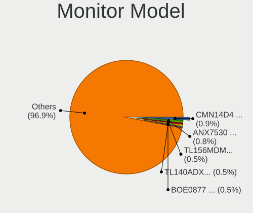

| Model                                                            | Computers | Percent |
|------------------------------------------------------------------|-----------|---------|
| Chimei Innolux LCD Monitor CMN14D4 1920x1080 309x173mm 13.9-inch | 21        | 0.87%   |
| Valve ANX7530 U VLV3001 800x1280 100x150mm 7.1-inch              | 19        | 0.78%   |
| TMX TL156MDMP11-0 TMX1560 3200x2000 336x210mm 15.6-inch          | 12        | 0.49%   |
| TMA TL140ADXP24-0 TMA2004 2880x1800 300x190mm 14.0-inch          | 12        | 0.49%   |
| BOE LCD Monitor BOE0877 1920x1080 309x173mm 13.9-inch            | 11        | 0.45%   |
| Xiaomi Mi TV XMD004A 3840x2160 708x398mm 32.0-inch               | 10        | 0.41%   |
| Dell P2422H DELA1C5 1920x1080 527x296mm 23.8-inch                | 10        | 0.41%   |
| CSO LCD Monitor CSO1402 2880x1800 302x188mm 14.0-inch            | 10        | 0.41%   |
| AOC U2790B AOC2790 3840x2160 597x336mm 27.0-inch                 | 10        | 0.41%   |
| Unknown                                                          | 10        | 0.41%   |
| Chimei Innolux LCD Monitor CMN14A7 1920x1080 308x173mm 13.9-inch | 9         | 0.37%   |
| BOE LCD Monitor BOE0893 2160x1440 296x197mm 14.0-inch            | 9         | 0.37%   |
| AOC 27G2G4 AOC2702 1920x1080 598x336mm 27.0-inch                 | 9         | 0.37%   |
| AOC 24G2W1G3 AOC2402 1920x1080 527x296mm 23.8-inch               | 9         | 0.37%   |
| CSO LCD Monitor CSO076D 2560x1600 286x179mm 13.3-inch            | 8         | 0.33%   |
| Chimei Innolux LCD Monitor CMN15E8 1920x1080 344x193mm 15.5-inch | 8         | 0.33%   |
| AU Optronics LCD Monitor AUO683D 1920x1080 309x174mm 14.0-inch   | 8         | 0.33%   |
| AU Optronics LCD Monitor AUO2E3C 1366x768 309x173mm 13.9-inch    | 8         | 0.33%   |
| AOC 24B1W1 AOC2401 1920x1080 527x296mm 23.8-inch                 | 8         | 0.33%   |
| Sharp LCD Monitor SHP1447 1920x1080 294x165mm 13.3-inch          | 7         | 0.29%   |
| Goldstar HDR 4K GSM7706 3840x2160 600x340mm 27.2-inch            | 7         | 0.29%   |
| Chimei Innolux LCD Monitor CMN1602 1920x1080 355x199mm 16.0-inch | 7         | 0.29%   |
| Chimei Innolux LCD Monitor CMN14D5 1920x1080 309x173mm 13.9-inch | 7         | 0.29%   |
| BOE LCD Monitor BOE07DB 1920x1080 309x174mm 14.0-inch            | 7         | 0.29%   |
| AU Optronics LCD Monitor AUOC391 2880x1800 301x188mm 14.0-inch   | 7         | 0.29%   |
| AU Optronics LCD Monitor AUO403D 1920x1080 309x174mm 14.0-inch   | 7         | 0.29%   |
| AOC 27G1G4 AOC2701 1920x1080 598x336mm 27.0-inch                 | 7         | 0.29%   |
| Unknown LCD Monitor FFFF 2288x1287 2550x2550mm 142.0-inch        | 6         | 0.25%   |
| Sharp LCD Monitor SHP149A 1920x1080 344x194mm 15.5-inch          | 6         | 0.25%   |
| PANDA LCD Monitor NCP004D 1920x1080 344x194mm 15.5-inch          | 6         | 0.25%   |
| Lenovo LT2252p Wide LEN0A0C 1680x1050 474x296mm 22.0-inch        | 6         | 0.25%   |
| Lenovo L197 Wide LEN1152 1440x900 410x257mm 19.1-inch            | 6         | 0.25%   |
| Chimei Innolux P130ZFA-BA1 CMN8201 2160x1440 275x183mm 13.0-inch | 6         | 0.25%   |
| Chimei Innolux LCD Monitor CMN1604 1920x1080 355x199mm 16.0-inch | 6         | 0.25%   |
| Chimei Innolux LCD Monitor CMN1540 2560x1440 344x193mm 15.5-inch | 6         | 0.25%   |
| BOE LCD Monitor BOE098E 1920x1080 344x194mm 15.5-inch            | 6         | 0.25%   |
| BOE LCD Monitor BOE092E 1920x1080 310x173mm 14.0-inch            | 6         | 0.25%   |
| BOE LCD Monitor BOE0747 1920x1080 344x194mm 15.5-inch            | 6         | 0.25%   |
| AU Optronics LCD Monitor AUOA08B 1920x1080 344x193mm 15.5-inch   | 6         | 0.25%   |
| AOC K27U3D AOC2703 3840x2160 597x336mm 27.0-inch                 | 6         | 0.25%   |

Monitor Resolution
------------------

Monitor screen resolution

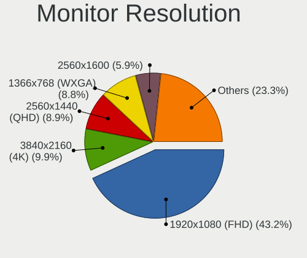

| Resolution         | Computers | Percent |
|--------------------|-----------|---------|
| 1920x1080 (FHD)    | 993       | 43.17%  |
| 3840x2160 (4K)     | 228       | 9.91%   |
| 2560x1440 (QHD)    | 204       | 8.87%   |
| 1366x768 (WXGA)    | 203       | 8.83%   |
| 2560x1600          | 136       | 5.91%   |
| 2880x1800          | 65        | 2.83%   |
| 1920x1200 (WUXGA)  | 56        | 2.43%   |
| 1440x900 (WXGA+)   | 45        | 1.96%   |
| 2160x1440          | 35        | 1.52%   |
| 1600x900 (HD+)     | 34        | 1.48%   |
| 1280x1024 (SXGA)   | 27        | 1.17%   |
| 1680x1050 (WSXGA+) | 25        | 1.09%   |
| 800x1280           | 23        | 1%      |
| Unknown            | 22        | 0.96%   |
| 3072x1920          | 21        | 0.91%   |
| 3200x2000          | 19        | 0.83%   |
| 1280x800 (WXGA)    | 19        | 0.83%   |
| 3440x1440          | 17        | 0.74%   |
| 2240x1400          | 13        | 0.57%   |
| 2520x1680          | 10        | 0.43%   |
| 2560x1080          | 9         | 0.39%   |
| 3840x2400          | 8         | 0.35%   |
| 2880x1920          | 8         | 0.35%   |
| 3000x2000          | 7         | 0.3%    |
| 2288x1287          | 7         | 0.3%    |
| 2256x1504          | 4         | 0.17%   |
| 2160x1350          | 4         | 0.17%   |
| 1600x2560          | 4         | 0.17%   |
| 1024x600           | 4         | 0.17%   |
| 2880x1620          | 3         | 0.13%   |
| 1920x540           | 3         | 0.13%   |
| 1920x1280          | 3         | 0.13%   |
| 1800x1200          | 3         | 0.13%   |
| 1400x1050          | 3         | 0.13%   |
| 1360x768           | 3         | 0.13%   |
| 1080x1920          | 3         | 0.13%   |
| 3840x1080          | 2         | 0.09%   |
| 3360x1080          | 2         | 0.09%   |
| 3286x1080          | 2         | 0.09%   |
| 3200x1800 (QHD+)   | 2         | 0.09%   |

Monitor Diagonal
----------------

Diagonal size in inches

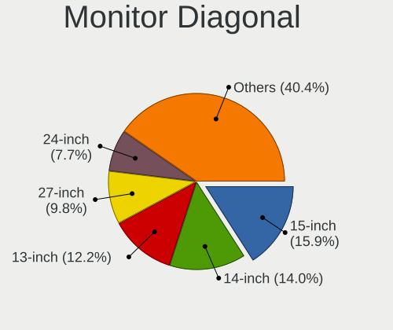

| Inches  | Computers | Percent |
|---------|-----------|---------|
| 15      | 376       | 15.91%  |
| 14      | 332       | 14.05%  |
| 13      | 288       | 12.19%  |
| 27      | 231       | 9.78%   |
| 24      | 182       | 7.7%    |
| 23      | 178       | 7.53%   |
| 16      | 141       | 5.97%   |
| 21      | 108       | 4.57%   |
| Unknown | 74        | 3.13%   |
| 12      | 52        | 2.2%    |
| 17      | 48        | 2.03%   |
| 19      | 40        | 1.69%   |
| 31      | 39        | 1.65%   |
| 18      | 24        | 1.02%   |
| 7       | 24        | 1.02%   |
| 22      | 23        | 0.97%   |
| 40      | 19        | 0.8%    |
| 34      | 17        | 0.72%   |
| 11      | 15        | 0.63%   |
| 32      | 14        | 0.59%   |
| 20      | 14        | 0.59%   |
| 25      | 13        | 0.55%   |
| 65      | 12        | 0.51%   |
| 26      | 11        | 0.47%   |
| 63      | 8         | 0.34%   |
| 49      | 8         | 0.34%   |
| 28      | 7         | 0.3%    |
| 10      | 7         | 0.3%    |
| 142     | 6         | 0.25%   |
| 43      | 6         | 0.25%   |
| 52      | 5         | 0.21%   |
| 72      | 4         | 0.17%   |
| 54      | 4         | 0.17%   |
| 8       | 4         | 0.17%   |
| 57      | 3         | 0.13%   |
| 36      | 3         | 0.13%   |
| 84      | 2         | 0.08%   |
| 82      | 2         | 0.08%   |
| 46      | 2         | 0.08%   |
| 39      | 2         | 0.08%   |

Monitor Width
-------------

Physical width

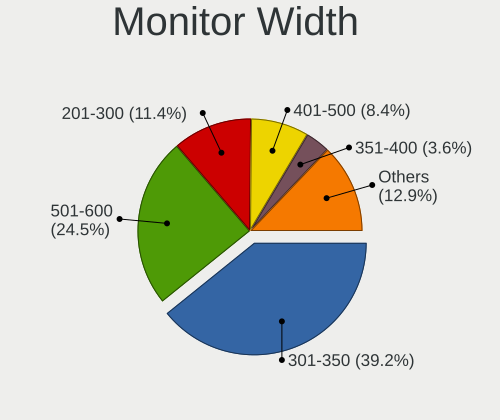

| Width in mm    | Computers | Percent |
|----------------|-----------|---------|
| 301-350        | 915       | 39.2%   |
| 501-600        | 572       | 24.51%  |
| 201-300        | 267       | 11.44%  |
| 401-500        | 196       | 8.4%    |
| 351-400        | 83        | 3.56%   |
| Unknown        | 74        | 3.17%   |
| 601-700        | 70        | 3%      |
| 1001-1500      | 43        | 1.84%   |
| 701-800        | 37        | 1.59%   |
| 801-900        | 23        | 0.99%   |
| 1-100          | 22        | 0.94%   |
| 1501-2000      | 10        | 0.43%   |
| 101-200        | 9         | 0.39%   |
| 901-1000       | 7         | 0.3%    |
| More than 2000 | 6         | 0.26%   |

Aspect Ratio
------------

Proportional relationship between the width and the height

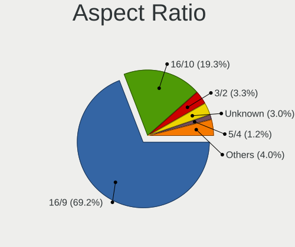

| Ratio   | Computers | Percent |
|---------|-----------|---------|
| 16/9    | 1510      | 69.17%  |
| 16/10   | 421       | 19.29%  |
| 3/2     | 72        | 3.3%    |
| Unknown | 66        | 3.02%   |
| 5/4     | 26        | 1.19%   |
| 21/9    | 19        | 0.87%   |
| 0.67    | 19        | 0.87%   |
| 4/3     | 17        | 0.78%   |
| 32/9    | 8         | 0.37%   |
| 1.00    | 7         | 0.32%   |
| 0.56    | 6         | 0.27%   |
| 6/5     | 3         | 0.14%   |
| 0.62    | 3         | 0.14%   |
| 2.00    | 2         | 0.09%   |
| 0.63    | 2         | 0.09%   |
| 3.33    | 1         | 0.05%   |
| 0.45    | 1         | 0.05%   |

Monitor Area
------------

Area in inch²

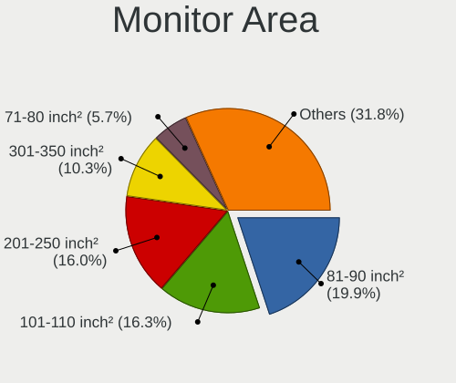

| Area in inch² | Computers | Percent |
|----------------|-----------|---------|
| 81-90          | 469       | 19.95%  |
| 101-110        | 383       | 16.29%  |
| 201-250        | 377       | 16.04%  |
| 301-350        | 242       | 10.29%  |
| 71-80          | 133       | 5.66%   |
| 151-200        | 128       | 5.44%   |
| 111-120        | 124       | 5.27%   |
| 351-500        | 77        | 3.28%   |
| Unknown        | 74        | 3.15%   |
| 251-300        | 63        | 2.68%   |
| More than 1000 | 52        | 2.21%   |
| 61-70          | 46        | 1.96%   |
| 501-1000       | 42        | 1.79%   |
| 91-100         | 32        | 1.36%   |
| 121-130        | 31        | 1.32%   |
| 1-40           | 30        | 1.28%   |
| 141-150        | 26        | 1.11%   |
| 51-60          | 14        | 0.6%    |
| 41-50          | 7         | 0.3%    |
| 131-140        | 1         | 0.04%   |

Pixel Density
-------------

Pixels per inch

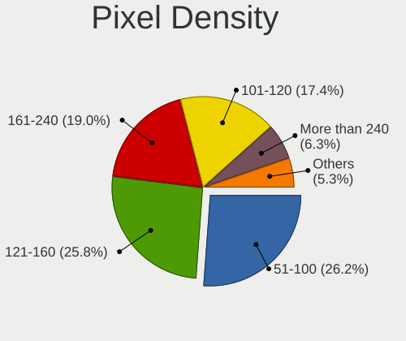

| Density       | Computers | Percent |
|---------------|-----------|---------|
| 51-100        | 608       | 26.16%  |
| 121-160       | 600       | 25.82%  |
| 161-240       | 441       | 18.98%  |
| 101-120       | 405       | 17.43%  |
| More than 240 | 147       | 6.33%   |
| Unknown       | 74        | 3.18%   |
| 1-50          | 49        | 2.11%   |

Multiple Monitors
-----------------

Total monitors connected

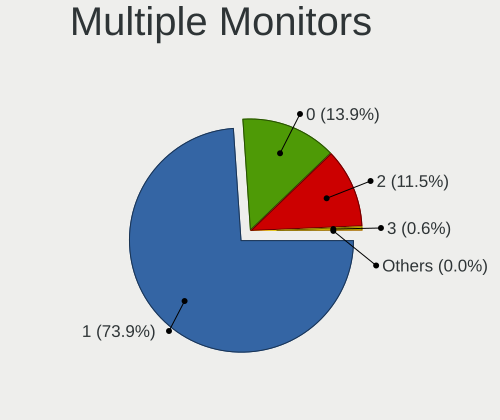

| Total | Computers | Percent |
|-------|-----------|---------|
| 1     | 1876      | 73.92%  |
| 0     | 353       | 13.91%  |
| 2     | 292       | 11.51%  |
| 3     | 15        | 0.59%   |
| 5     | 1         | 0.04%   |
| 4     | 1         | 0.04%   |

Network
-------

Net Controller Vendor
---------------------

Controller vendors

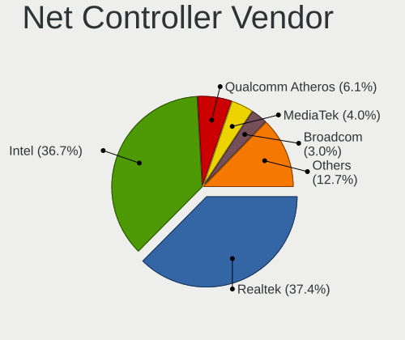

| Vendor                                 | Computers | Percent |
|----------------------------------------|-----------|---------|
| Realtek Semiconductor                  | 1356      | 37.43%  |
| Intel                                  | 1329      | 36.68%  |
| Qualcomm Atheros                       | 222       | 6.13%   |
| MediaTek                               | 146       | 4.03%   |
| Broadcom                               | 109       | 3.01%   |
| ASIX Electronics                       | 57        | 1.57%   |
| Broadcom Limited                       | 38        | 1.05%   |
| Ralink Technology                      | 33        | 0.91%   |
| Huawei Technologies                    | 30        | 0.83%   |
| Xiaomi                                 | 26        | 0.72%   |
| Qualcomm                               | 26        | 0.72%   |
| Suzhou Motorcomm Electronic Technology | 16        | 0.44%   |
| Mellanox Technologies                  | 15        | 0.41%   |
| Microsoft                              | 14        | 0.39%   |
| Marvell Technology Group               | 13        | 0.36%   |
| Loongson Technology                    | 13        | 0.36%   |
| Shenzhen Goodix Technology             | 10        | 0.28%   |
| Quectel Wireless Solutions             | 10        | 0.28%   |
| OPPO Electronics                       | 10        | 0.28%   |
| Ralink                                 | 8         | 0.22%   |
| Qualcomm Atheros Communications        | 7         | 0.19%   |
| Aquantia                               | 7         | 0.19%   |
| American Megatrends                    | 7         | 0.19%   |
| TP-Link                                | 6         | 0.17%   |
| IBM                                    | 6         | 0.17%   |
| Tenda                                  | 5         | 0.14%   |
| Samsung Electronics                    | 5         | 0.14%   |
| Qualcomm Technologies                  | 5         | 0.14%   |
| NetGear                                | 5         | 0.14%   |
| Insyde Software                        | 5         | 0.14%   |
| ICS Advent                             | 5         | 0.14%   |
| Dell                                   | 5         | 0.14%   |
| ZTE WCDMA Technologies MSM             | 4         | 0.11%   |
| DisplayLink                            | 4         | 0.11%   |
| D-Link                                 | 4         | 0.11%   |
| vivo                                   | 3         | 0.08%   |
| Sierra Wireless                        | 3         | 0.08%   |
| QinHeng Electronics                    | 3         | 0.08%   |
| Nvidia                                 | 3         | 0.08%   |
| Motorcomm Microelectronics.            | 3         | 0.08%   |

Net Controller Model
--------------------

Controller models

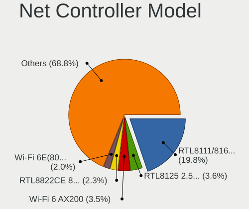

| Model                                                                  | Computers | Percent |
|------------------------------------------------------------------------|-----------|---------|
| Realtek RTL8111/8168/8211/8411 PCI Express Gigabit Ethernet Controller | 837       | 19.78%  |
| Realtek RTL8125 2.5GbE Controller                                      | 151       | 3.57%   |
| Intel Wi-Fi 6 AX200                                                    | 150       | 3.54%   |
| Realtek RTL8822CE 802.11ac PCIe Wireless Network Adapter               | 97        | 2.29%   |
| Intel Wi-Fi 6E(802.11ax) AX210/AX1675* 2x2 [Typhoon Peak]              | 84        | 1.98%   |
| Intel Alder Lake-P PCH CNVi WiFi                                       | 82        | 1.94%   |
| Realtek RTL810xE PCI Express Fast Ethernet controller                  | 78        | 1.84%   |
| Realtek RTL8153 Gigabit Ethernet Adapter                               | 70        | 1.65%   |
| Intel Wi-Fi 6 AX201                                                    | 70        | 1.65%   |
| Intel Wireless 8265 / 8275                                             | 65        | 1.54%   |
| Intel 82579LM Gigabit Network Connection (Lewisville)                  | 51        | 1.21%   |
| Realtek RTL8852BE PCIe 802.11ax Wireless Network Controller            | 47        | 1.11%   |
| Intel Wireless 7265                                                    | 47        | 1.11%   |
| ASIX AX88179 Gigabit Ethernet                                          | 47        | 1.11%   |
| Qualcomm Atheros QCA9377 802.11ac Wireless Network Adapter             | 44        | 1.04%   |
| MediaTek MT7922 802.11ax PCI Express Wireless Network Adapter          | 43        | 1.02%   |
| Qualcomm Atheros QCA6174 802.11ac Wireless Network Adapter             | 41        | 0.97%   |
| Intel Ethernet Controller I225-V                                       | 41        | 0.97%   |
| Intel Comet Lake PCH-LP CNVi WiFi                                      | 41        | 0.97%   |
| MediaTek MT7921 802.11ax PCIe Wireless Network Adapter [Filogic 330]   | 40        | 0.95%   |
| Intel I211 Gigabit Network Connection                                  | 37        | 0.87%   |
| Realtek RTL8821CE 802.11ac PCIe Wireless Network Adapter               | 35        | 0.83%   |
| Intel I210 Gigabit Network Connection                                  | 35        | 0.83%   |
| Intel Cannon Lake PCH CNVi WiFi                                        | 35        | 0.83%   |
| Intel Wireless 7260                                                    | 33        | 0.78%   |
| Intel I350 Gigabit Network Connection                                  | 31        | 0.73%   |
| Intel Ethernet Connection (2) I219-V                                   | 31        | 0.73%   |
| Intel 700 Series Chipset CNVi WiFi                                     | 31        | 0.73%   |
| Intel Wireless 3165                                                    | 30        | 0.71%   |
| Realtek RTL8188EUS 802.11n Wireless Network Adapter                    | 28        | 0.66%   |
| Intel Ethernet Controller I226-V                                       | 28        | 0.66%   |
| Intel Cannon Point-LP CNVi [Wireless-AC]                               | 28        | 0.66%   |
| Realtek 802.11ac NIC                                                   | 27        | 0.64%   |
| Intel Raptor Lake PCH CNVi WiFi                                        | 27        | 0.64%   |
| Intel Wi-Fi 5(802.11ac) Wireless-AC 9x6x [Thunder Peak]                | 26        | 0.61%   |
| Intel Wireless 8260                                                    | 25        | 0.59%   |
| Intel Comet Lake PCH CNVi WiFi                                         | 25        | 0.59%   |
| Qualcomm Atheros AR9485 Wireless Network Adapter                       | 23        | 0.54%   |
| Intel Ethernet Connection (2) I219-LM                                  | 23        | 0.54%   |
| Ralink MT7601U Wireless Adapter                                        | 22        | 0.52%   |

Wireless Vendor
---------------

Wireless vendors

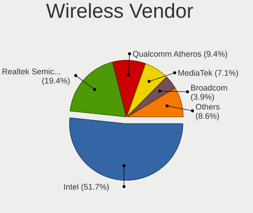

| Vendor                          | Computers | Percent |
|---------------------------------|-----------|---------|
| Intel                           | 980       | 51.66%  |
| Realtek Semiconductor           | 368       | 19.4%   |
| Qualcomm Atheros                | 178       | 9.38%   |
| MediaTek                        | 134       | 7.06%   |
| Broadcom                        | 74        | 3.9%    |
| Ralink Technology               | 33        | 1.74%   |
| Broadcom Limited                | 29        | 1.53%   |
| Qualcomm                        | 19        | 1%      |
| Quectel Wireless Solutions      | 10        | 0.53%   |
| Microsoft                       | 9         | 0.47%   |
| Ralink                          | 8         | 0.42%   |
| Qualcomm Atheros Communications | 7         | 0.37%   |
| TP-Link                         | 6         | 0.32%   |
| Tenda                           | 5         | 0.26%   |
| NetGear                         | 5         | 0.26%   |
| Marvell Technology Group        | 5         | 0.26%   |
| Xiaomi                          | 4         | 0.21%   |
| D-Link                          | 4         | 0.21%   |
| Sierra Wireless                 | 3         | 0.16%   |
| Mercucys                        | 3         | 0.16%   |
| Wilocity                        | 2         | 0.11%   |
| Dell                            | 2         | 0.11%   |
| Unknown                         | 2         | 0.11%   |
| Sagem                           | 1         | 0.05%   |
| Realtek                         | 1         | 0.05%   |
| IMC Networks                    | 1         | 0.05%   |
| Hewlett-Packard                 | 1         | 0.05%   |
| Fibocom                         | 1         | 0.05%   |
| D-Link System                   | 1         | 0.05%   |
| ASUSTek Computer                | 1         | 0.05%   |

Wireless Model
--------------

Wireless models

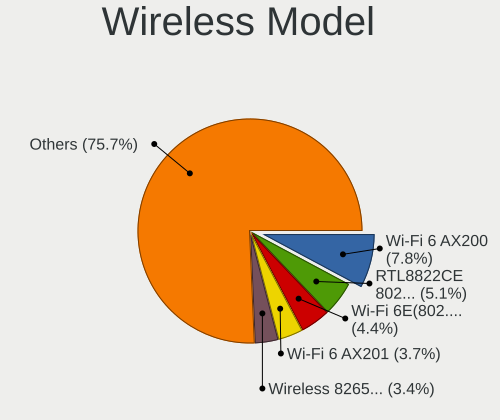

| Model                                                                | Computers | Percent |
|----------------------------------------------------------------------|-----------|---------|
| Intel Wi-Fi 6 AX200                                                  | 150       | 7.83%   |
| Realtek RTL8822CE 802.11ac PCIe Wireless Network Adapter             | 97        | 5.06%   |
| Intel Wi-Fi 6E(802.11ax) AX210/AX1675* 2x2 [Typhoon Peak]            | 84        | 4.38%   |
| Intel Wi-Fi 6 AX201                                                  | 70        | 3.65%   |
| Intel Wireless 8265 / 8275                                           | 65        | 3.39%   |
| Intel Alder Lake-P PCH CNVi WiFi                                     | 54        | 2.82%   |
| Intel Wireless 7265                                                  | 47        | 2.45%   |
| Qualcomm Atheros QCA9377 802.11ac Wireless Network Adapter           | 44        | 2.3%    |
| Qualcomm Atheros QCA6174 802.11ac Wireless Network Adapter           | 41        | 2.14%   |
| Intel Comet Lake PCH-LP CNVi WiFi                                    | 41        | 2.14%   |
| MediaTek MT7921 802.11ax PCIe Wireless Network Adapter [Filogic 330] | 40        | 2.09%   |
| Realtek RTL8821CE 802.11ac PCIe Wireless Network Adapter             | 35        | 1.83%   |
| Intel Cannon Lake PCH CNVi WiFi                                      | 35        | 1.83%   |
| Realtek RTL8852BE PCIe 802.11ax Wireless Network Controller          | 33        | 1.72%   |
| Intel Wireless 7260                                                  | 33        | 1.72%   |
| MediaTek MT7922 802.11ax PCI Express Wireless Network Adapter        | 32        | 1.67%   |
| Intel 700 Series Chipset CNVi WiFi                                   | 31        | 1.62%   |
| Intel Wireless 3165                                                  | 30        | 1.57%   |
| Realtek RTL8188EUS 802.11n Wireless Network Adapter                  | 28        | 1.46%   |
| Intel Cannon Point-LP CNVi [Wireless-AC]                             | 28        | 1.46%   |
| Realtek 802.11ac NIC                                                 | 27        | 1.41%   |
| Intel Raptor Lake PCH CNVi WiFi                                      | 27        | 1.41%   |
| Intel Wi-Fi 5(802.11ac) Wireless-AC 9x6x [Thunder Peak]              | 26        | 1.36%   |
| Intel Wireless 8260                                                  | 25        | 1.3%    |
| Intel Comet Lake PCH CNVi WiFi                                       | 25        | 1.3%    |
| Qualcomm Atheros AR9485 Wireless Network Adapter                     | 23        | 1.2%    |
| Ralink MT7601U Wireless Adapter                                      | 22        | 1.15%   |
| MediaTek MT7921K (RZ608) Wi-Fi 6E 80MHz                              | 22        | 1.15%   |
| Realtek RTL8852AE 802.11ax PCIe Wireless Network Adapter             | 21        | 1.1%    |
| Realtek RTL8822BE 802.11a/b/g/n/ac WiFi adapter                      | 21        | 1.1%    |
| Intel Tiger Lake PCH CNVi WiFi                                       | 21        | 1.1%    |
| Intel Centrino Advanced-N 6205 [Taylor Peak]                         | 21        | 1.1%    |
| Intel Meteor Lake PCH CNVi WiFi                                      | 20        | 1.04%   |
| Qualcomm QCNFA765 Wireless Network Adapter                           | 19        | 0.99%   |
| Qualcomm Atheros QCA9565 / AR9565 Wireless Network Adapter           | 19        | 0.99%   |
| Intel Dual Band Wireless-AC 3165 Plus Bluetooth                      | 18        | 0.94%   |
| Realtek RTL8723BE PCIe Wireless Network Adapter                      | 17        | 0.89%   |
| Qualcomm Atheros AR9285 Wireless Network Adapter (PCI-Express)       | 15        | 0.78%   |
| Intel Wireless 3160                                                  | 15        | 0.78%   |
| Broadcom Limited BCM4360 802.11ac Dual Band Wireless Network Adapter | 15        | 0.78%   |

Ethernet Vendor
---------------

Ethernet vendors

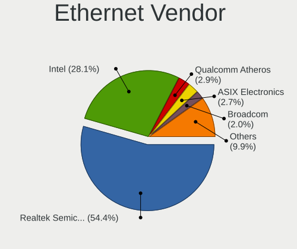

| Vendor                                 | Computers | Percent |
|----------------------------------------|-----------|---------|
| Realtek Semiconductor                  | 1165      | 54.44%  |
| Intel                                  | 602       | 28.13%  |
| Qualcomm Atheros                       | 61        | 2.85%   |
| ASIX Electronics                       | 57        | 2.66%   |
| Broadcom                               | 43        | 2.01%   |
| Huawei Technologies                    | 25        | 1.17%   |
| Xiaomi                                 | 22        | 1.03%   |
| Suzhou Motorcomm Electronic Technology | 16        | 0.75%   |
| Loongson Technology                    | 13        | 0.61%   |
| Mellanox Technologies                  | 12        | 0.56%   |
| MediaTek                               | 12        | 0.56%   |
| OPPO Electronics                       | 10        | 0.47%   |
| Broadcom Limited                       | 9         | 0.42%   |
| Marvell Technology Group               | 8         | 0.37%   |
| Aquantia                               | 7         | 0.33%   |
| American Megatrends                    | 7         | 0.33%   |
| Qualcomm                               | 6         | 0.28%   |
| IBM                                    | 6         | 0.28%   |
| Samsung Electronics                    | 5         | 0.23%   |
| Qualcomm Technologies                  | 5         | 0.23%   |
| Insyde Software                        | 5         | 0.23%   |
| ICS Advent                             | 5         | 0.23%   |
| Microsoft                              | 4         | 0.19%   |
| DisplayLink                            | 4         | 0.19%   |
| vivo                                   | 3         | 0.14%   |
| Nvidia                                 | 3         | 0.14%   |
| Motorcomm Microelectronics.            | 3         | 0.14%   |
| Lenovo                                 | 3         | 0.14%   |
| Dell                                   | 3         | 0.14%   |
| Silicon Integrated Systems [SiS]       | 2         | 0.09%   |
| Raspberry Pi                           | 2         | 0.09%   |
| Microchip Technology                   | 2         | 0.09%   |
| QinHeng Electronics                    | 1         | 0.05%   |
| Picocom Technology                     | 1         | 0.05%   |
| OnePlus Technology (Shenzhen)          | 1         | 0.05%   |
| NetXen Incorporated                    | 1         | 0.05%   |
| Linux Foundation                       | 1         | 0.05%   |
| JMicron Technology                     | 1         | 0.05%   |
| Google                                 | 1         | 0.05%   |
| Attansic Technology                    | 1         | 0.05%   |

Ethernet Model
--------------

Ethernet models

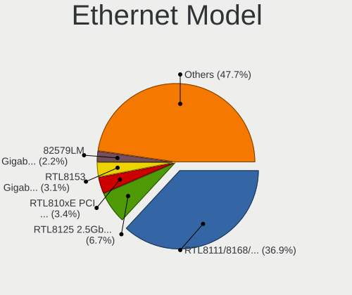

| Model                                                                  | Computers | Percent |
|------------------------------------------------------------------------|-----------|---------|
| Realtek RTL8111/8168/8211/8411 PCI Express Gigabit Ethernet Controller | 837       | 36.87%  |
| Realtek RTL8125 2.5GbE Controller                                      | 151       | 6.65%   |
| Realtek RTL810xE PCI Express Fast Ethernet controller                  | 78        | 3.44%   |
| Realtek RTL8153 Gigabit Ethernet Adapter                               | 70        | 3.08%   |
| Intel 82579LM Gigabit Network Connection (Lewisville)                  | 51        | 2.25%   |
| ASIX AX88179 Gigabit Ethernet                                          | 47        | 2.07%   |
| Intel Ethernet Controller I225-V                                       | 41        | 1.81%   |
| Intel I211 Gigabit Network Connection                                  | 37        | 1.63%   |
| Intel I210 Gigabit Network Connection                                  | 35        | 1.54%   |
| Intel I350 Gigabit Network Connection                                  | 31        | 1.37%   |
| Intel Ethernet Connection (2) I219-V                                   | 31        | 1.37%   |
| Intel Ethernet Controller I226-V                                       | 28        | 1.23%   |
| Intel Alder Lake-P PCH CNVi WiFi                                       | 28        | 1.23%   |
| Intel Ethernet Connection (2) I219-LM                                  | 23        | 1.01%   |
| Intel Ethernet Connection I217-LM                                      | 20        | 0.88%   |
| Realtek RTL8152 Fast Ethernet Adapter                                  | 19        | 0.84%   |
| Intel Ethernet Connection (16) I219-V                                  | 17        | 0.75%   |
| Huawei FOA-LX9                                                         | 17        | 0.75%   |
| Suzhou Motorcomm Electronic YT6801 Gigabit Ethernet Controller         | 16        | 0.7%    |
| Intel Ethernet Connection (4) I219-V                                   | 15        | 0.66%   |
| Realtek RTL8852BE PCIe 802.11ax Wireless Network Controller            | 14        | 0.62%   |
| Intel Ethernet Connection (7) I219-V                                   | 14        | 0.62%   |
| Intel Ethernet Connection (7) I219-LM                                  | 14        | 0.62%   |
| Intel Ethernet Connection (10) I219-V                                  | 13        | 0.57%   |
| Xiaomi Mi/Redmi series (RNDIS)                                         | 12        | 0.53%   |
| Intel Ethernet Connection (13) I219-V                                  | 12        | 0.53%   |
| MediaTek MT7922 802.11ax PCI Express Wireless Network Adapter          | 11        | 0.48%   |
| Intel 82599ES 10-Gigabit SFI/SFP+ Network Connection                   | 11        | 0.48%   |
| Intel 82567LM Gigabit Network Connection                               | 11        | 0.48%   |
| Qualcomm Atheros QCA8171 Gigabit Ethernet                              | 10        | 0.44%   |
| Qualcomm Atheros AR8161 Gigabit Ethernet                               | 10        | 0.44%   |
| Intel Ethernet Connection (4) I219-LM                                  | 10        | 0.44%   |
| Intel Ethernet Connection (2) I218-V                                   | 10        | 0.44%   |
| Intel Ethernet Connection (18) I219-LM                                 | 10        | 0.44%   |
| Intel Ethernet Connection (12) I219-V                                  | 10        | 0.44%   |
| Broadcom NetXtreme BCM5720 Gigabit Ethernet PCIe                       | 10        | 0.44%   |
| Xiaomi Mi/Redmi series (RNDIS + ADB)                                   | 9         | 0.4%    |
| Realtek USB 10/100/1G/2.5 LAN                                          | 9         | 0.4%    |
| Loongson 2K2000 / 7A2000 Chipset Gigabit Ethernet Controller           | 9         | 0.4%    |
| Intel 82574L Gigabit Network Connection                                | 9         | 0.4%    |

Net Controller Kind
-------------------

Ethernet, WiFi or modem

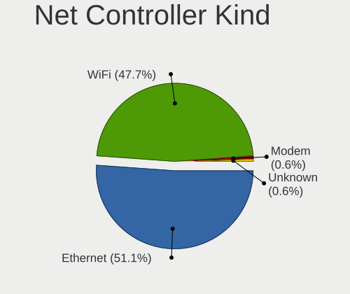

| Kind     | Computers | Percent |
|----------|-----------|---------|
| Ethernet | 1945      | 51.13%  |
| WiFi     | 1815      | 47.71%  |
| Modem    | 23        | 0.6%    |
| Unknown  | 21        | 0.55%   |

Used Controller
---------------

Currently used network controller

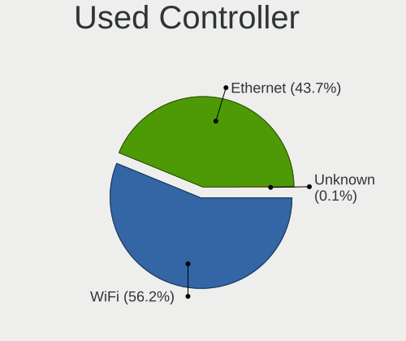

| Kind     | Computers | Percent |
|----------|-----------|---------|
| WiFi     | 1353      | 56.19%  |
| Ethernet | 1053      | 43.73%  |
| Unknown  | 2         | 0.08%   |

NICs
----

Total network controllers on board

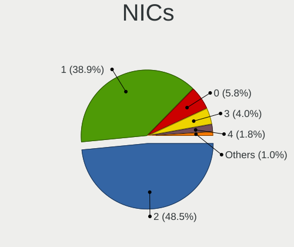

| Total | Computers | Percent |
|-------|-----------|---------|
| 2     | 1210      | 48.46%  |
| 1     | 971       | 38.89%  |
| 0     | 144       | 5.77%   |
| 3     | 101       | 4.04%   |
| 4     | 45        | 1.8%    |
| 6     | 11        | 0.44%   |
| 5     | 6         | 0.24%   |
| 7     | 5         | 0.2%    |
| 8     | 2         | 0.08%   |
| 42    | 1         | 0.04%   |
| 11    | 1         | 0.04%   |

IPv6
----

IPv6 vs IPv4

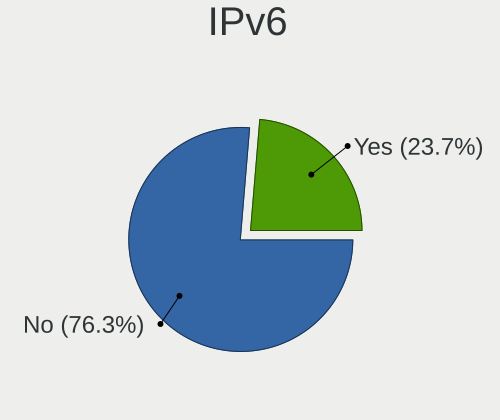

| Used | Computers | Percent |
|------|-----------|---------|
| No   | 1947      | 76.32%  |
| Yes  | 604       | 23.68%  |

Bluetooth
---------

Bluetooth Vendor
----------------

Controller vendors

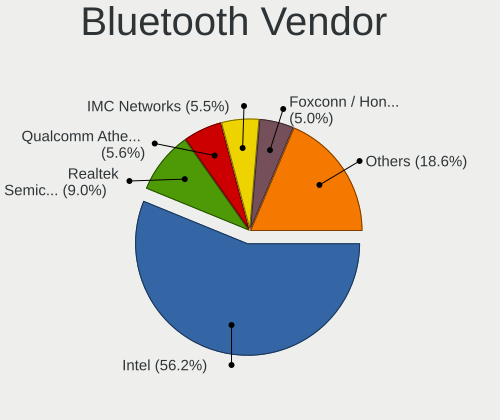

| Vendor                          | Computers | Percent |
|---------------------------------|-----------|---------|
| Intel                           | 919       | 56.17%  |
| Realtek Semiconductor           | 148       | 9.05%   |
| Qualcomm Atheros Communications | 92        | 5.62%   |
| IMC Networks                    | 90        | 5.5%    |
| Foxconn / Hon Hai               | 82        | 5.01%   |
| Cambridge Silicon Radio         | 69        | 4.22%   |
| MediaTek                        | 43        | 2.63%   |
| Broadcom                        | 42        | 2.57%   |
| Realtek                         | 37        | 2.26%   |
| Apple                           | 31        | 1.89%   |
| Lite-On Technology              | 16        | 0.98%   |
| ASUSTek Computer                | 13        | 0.79%   |
| Opticis                         | 10        | 0.61%   |
| Foxconn International           | 7         | 0.43%   |
| Dell                            | 7         | 0.43%   |
| Hewlett-Packard                 | 5         | 0.31%   |
| Ralink                          | 4         | 0.24%   |
| Marvell Semiconductor           | 4         | 0.24%   |
| AICSemi                         | 4         | 0.24%   |
| Unknown                         | 3         | 0.18%   |
| USI                             | 2         | 0.12%   |
| Toshiba                         | 2         | 0.12%   |
| Taiyo Yuden                     | 2         | 0.12%   |
| Alps Electric                   | 2         | 0.12%   |
| SINO WEALTH                     | 1         | 0.06%   |
| Actions                         | 1         | 0.06%   |

Bluetooth Model
---------------

Controller models

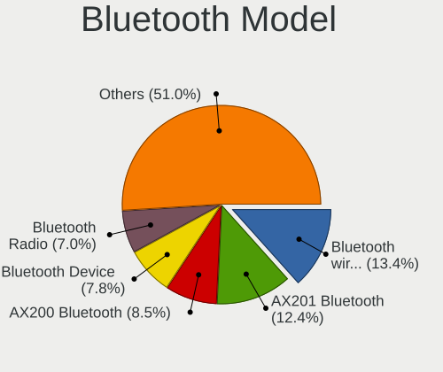

| Model                                               | Computers | Percent |
|-----------------------------------------------------|-----------|---------|
| Intel Bluetooth wireless interface                  | 219       | 13.37%  |
| Intel AX201 Bluetooth                               | 203       | 12.39%  |
| Intel AX200 Bluetooth                               | 139       | 8.49%   |
| Intel Bluetooth Device                              | 128       | 7.81%   |
| Realtek Bluetooth Radio                             | 114       | 6.96%   |
| Intel Bluetooth 9460/9560 Jefferson Peak (JfP)      | 98        | 5.98%   |
| Intel AX210 Bluetooth                               | 81        | 4.95%   |
| Cambridge Silicon Radio Bluetooth Dongle (HCI mode) | 69        | 4.21%   |
| Qualcomm Atheros  Bluetooth Device                  | 57        | 3.48%   |
| IMC Networks Bluetooth Radio                        | 49        | 2.99%   |
| MediaTek Wireless_Device                            | 43        | 2.63%   |
| Realtek Bluetooth Radio                             | 37        | 2.26%   |
| IMC Networks Wireless_Device                        | 34        | 2.08%   |
| Foxconn / Hon Hai Wireless_Device                   | 27        | 1.65%   |
| Foxconn / Hon Hai Bluetooth Device                  | 26        | 1.59%   |
| Intel Wireless-AC 9260 Bluetooth Adapter            | 24        | 1.47%   |
| Apple Bluetooth Host Controller                     | 22        | 1.34%   |
| Foxconn / Hon Hai MediaTek Bluetooth Adapter        | 20        | 1.22%   |
| Qualcomm Atheros QCA61x4 Bluetooth 4.0              | 18        | 1.1%    |
| Qualcomm Atheros AR3012 Bluetooth 4.0               | 13        | 0.79%   |
| Broadcom BCM2045B (BDC-2.1)                         | 13        | 0.79%   |
| Realtek RTL8723B Bluetooth                          | 12        | 0.73%   |
| Realtek  Bluetooth 4.2 Adapter                      | 12        | 0.73%   |
| Opticis Bluetooth Radio                             | 10        | 0.61%   |
| Intel Centrino Bluetooth Wireless Transceiver       | 10        | 0.61%   |
| Intel Wireless-AC 3168 Bluetooth                    | 9         | 0.55%   |
| Realtek RTL8822BE Bluetooth 4.2 Adapter             | 8         | 0.49%   |
| Apple Bluetooth USB Host Controller                 | 8         | 0.49%   |
| Lite-On Bluetooth Device                            | 7         | 0.43%   |
| Foxconn International BCM43142A0 Bluetooth module   | 7         | 0.43%   |
| Intel Centrino Advanced-N 6230 Bluetooth adapter    | 6         | 0.37%   |
| IMC Networks Bluetooth Device                       | 6         | 0.37%   |
| Broadcom BCM20702 Bluetooth 4.0 [ThinkPad]          | 6         | 0.37%   |
| Broadcom BCM2045B (BDC-2.1) [Bluetooth Controller]  | 6         | 0.37%   |
| Ralink RT3290 Bluetooth                             | 4         | 0.24%   |
| Marvell Bluetooth and Wireless LAN Composite        | 4         | 0.24%   |
| ASUS Bluetooth Radio                                | 4         | 0.24%   |
| Intel Bluetooth                                     | 3         | 0.18%   |
| HP Broadcom 2070 Bluetooth Combo                    | 3         | 0.18%   |
| Foxconn / Hon Hai Broadcom BCM20702A1 Bluetooth     | 3         | 0.18%   |

Sound
-----

Sound Vendor
------------

Sound card vendors

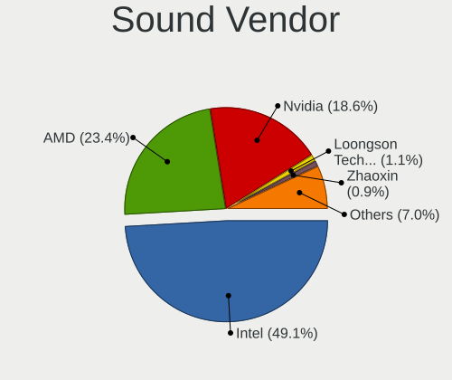

| Vendor                                       | Computers | Percent |
|----------------------------------------------|-----------|---------|
| Intel                                        | 1547      | 49.1%   |
| AMD                                          | 737       | 23.39%  |
| Nvidia                                       | 585       | 18.57%  |
| Loongson Technology                          | 34        | 1.08%   |
| Zhaoxin                                      | 29        | 0.92%   |
| C-Media Electronics                          | 25        | 0.79%   |
| Zoran Co. Personal Media Division (Nogatech) | 12        | 0.38%   |
| Micro Star International                     | 12        | 0.38%   |
| Realtek Semiconductor                        | 11        | 0.35%   |
| Generalplus Technology                       | 11        | 0.35%   |
| ASUSTek Computer                             | 9         | 0.29%   |
| Apple                                        | 8         | 0.25%   |
| Jieli Technology                             | 7         | 0.22%   |
| Creative Labs                                | 6         | 0.19%   |
| XMOS                                         | 5         | 0.16%   |
| Walmart                                      | 5         | 0.16%   |
| Huawei Technologies                          | 5         | 0.16%   |
| HECATE G4 TE GAMING HEADSET                  | 5         | 0.16%   |
| Texas Instruments                            | 4         | 0.13%   |
| KTMicro                                      | 4         | 0.13%   |
| Yamaha                                       | 3         | 0.1%    |
| Sony                                         | 3         | 0.1%    |
| Silicon Integrated Systems [SiS]             | 3         | 0.1%    |
| Phytium Technology                           | 3         | 0.1%    |
| M-Audio                                      | 3         | 0.1%    |
| JMTek                                        | 3         | 0.1%    |
| Actions Semiconductor                        | 3         | 0.1%    |
| VIA Technologies                             | 2         | 0.06%   |
| ULi Electronics                              | 2         | 0.06%   |
| Thesycon Systemsoftware & Consulting         | 2         | 0.06%   |
| Razer USA                                    | 2         | 0.06%   |
| Plantronics                                  | 2         | 0.06%   |
| Medeli Electronics                           | 2         | 0.06%   |
| Logitech                                     | 2         | 0.06%   |
| Giga-Byte Technology                         | 2         | 0.06%   |
| Focusrite-Novation                           | 2         | 0.06%   |
| EDIFIER                                      | 2         | 0.06%   |
| Drop                                         | 2         | 0.06%   |
| Dell                                         | 2         | 0.06%   |
| Conexant Systems                             | 2         | 0.06%   |

Sound Model
-----------

Sound card models

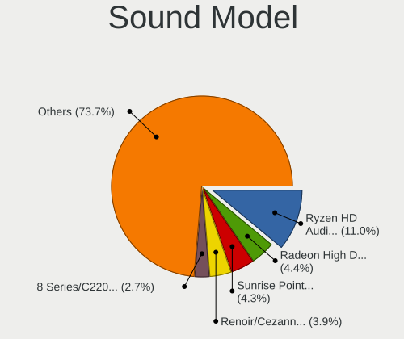

| Model                                                                                     | Computers | Percent |
|-------------------------------------------------------------------------------------------|-----------|---------|
| AMD Ryzen HD Audio Controller                                                             | 424       | 11.04%  |
| AMD Radeon High Definition Audio Controller                                               | 170       | 4.43%   |
| Intel Sunrise Point-LP HD Audio                                                           | 164       | 4.27%   |
| AMD Renoir/Cezanne HDMI/DP Audio Controller                                               | 151       | 3.93%   |
| Intel 8 Series/C220 Series Chipset High Definition Audio Controller                       | 103       | 2.68%   |
| Intel Cannon Lake PCH cAVS                                                                | 96        | 2.5%    |
| Intel 7 Series/C216 Chipset Family High Definition Audio Controller                       | 96        | 2.5%    |
| Intel Alder Lake PCH-P High Definition Audio Controller                                   | 93        | 2.42%   |
| Intel Tiger Lake-LP Smart Sound Technology Audio Controller                               | 91        | 2.37%   |
| Intel 6 Series/C200 Series Chipset Family High Definition Audio Controller                | 82        | 2.13%   |
| AMD Raven/Raven2/Fenghuang HDMI/DP Audio Controller                                       | 71        | 1.85%   |
| Intel 200 Series PCH HD Audio                                                             | 66        | 1.72%   |
| Nvidia GA106 High Definition Audio Controller                                             | 63        | 1.64%   |
| Intel Xeon E3-1200 v3/4th Gen Core Processor HD Audio Controller                          | 62        | 1.61%   |
| Intel 100 Series/C230 Series Chipset Family HD Audio Controller                           | 59        | 1.54%   |
| AMD Starship/Matisse HD Audio Controller                                                  | 57        | 1.48%   |
| Intel Raptor Lake High Definition Audio Controller                                        | 56        | 1.46%   |
| Intel 8 Series HD Audio Controller                                                        | 50        | 1.3%    |
| Intel Haswell-ULT HD Audio Controller                                                     | 49        | 1.28%   |
| Intel Comet Lake PCH-LP cAVS                                                              | 46        | 1.2%    |
| AMD FCH Azalia Controller                                                                 | 41        | 1.07%   |
| Intel Alder Lake-S HD Audio Controller                                                    | 39        | 1.02%   |
| AMD Baffin HDMI/DP Audio [Radeon RX 550 640SP / RX 560/560X]                              | 39        | 1.02%   |
| Intel Cannon Point-LP High Definition Audio Controller                                    | 38        | 0.99%   |
| Intel Comet Lake PCH cAVS                                                                 | 37        | 0.96%   |
| Nvidia TU106 High Definition Audio Controller                                             | 36        | 0.94%   |
| Nvidia GP106 High Definition Audio Controller                                             | 36        | 0.94%   |
| Intel Tiger Lake-H HD Audio Controller                                                    | 35        | 0.91%   |
| Nvidia AD107 High Definition Audio Controller                                             | 34        | 0.89%   |
| Loongson Technology 2K1000/2000 / 7A1000/2000 Chipset HD Audio Controller                 | 34        | 0.89%   |
| AMD Oland/Hainan/Cape Verde/Pitcairn HDMI Audio [Radeon HD 7000 Series]                   | 34        | 0.89%   |
| Intel Broadwell-U Audio Controller                                                        | 33        | 0.86%   |
| AMD Navi 21/23 HDMI/DP Audio Controller                                                   | 33        | 0.86%   |
| Nvidia TU107 GeForce GTX 1650 High Definition Audio Controller                            | 31        | 0.81%   |
| Nvidia GK208 HDMI/DP Audio Controller                                                     | 31        | 0.81%   |
| Intel Wildcat Point-LP High Definition Audio Controller                                   | 31        | 0.81%   |
| Intel Raptor Lake-P/U/H cAVS                                                              | 31        | 0.81%   |
| Zhaoxin ZX-100/KX-5000/KX-6000/KX-6000G/KH-40000/KX-7000 High Definition Audio Controller | 29        | 0.76%   |
| Nvidia GP107GL High Definition Audio Controller                                           | 29        | 0.76%   |
| AMD Caicos HDMI Audio [Radeon HD 6450 / 7450/8450/8490 OEM / R5 230/235/235X OEM]         | 27        | 0.7%    |

Memory
------

Memory Vendor
-------------

Memory module vendors

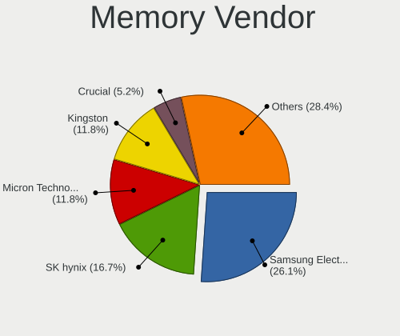

| Vendor                     | Computers | Percent |
|----------------------------|-----------|---------|
| Samsung Electronics        | 483       | 26.08%  |
| SK hynix                   | 309       | 16.68%  |
| Micron Technology          | 219       | 11.83%  |
| Kingston                   | 219       | 11.83%  |
| Crucial                    | 96        | 5.18%   |
| Unknown                    | 92        | 4.97%   |
| Unknown                    | 60        | 3.24%   |
| A-DATA Technology          | 58        | 3.13%   |
| Ramaxel Technology         | 43        | 2.32%   |
| Corsair                    | 36        | 1.94%   |
| KINGBANK                   | 17        | 0.92%   |
| Elpida                     | 15        | 0.81%   |
| UniIC                      | 14        | 0.76%   |
| G.Skill                    | 11        | 0.59%   |
| Unknown (ABCD)             | 10        | 0.54%   |
| Apacer                     | 9         | 0.49%   |
| Transcend                  | 8         | 0.43%   |
| Team                       | 8         | 0.43%   |
| Lenovo                     | 8         | 0.43%   |
| Unknown (0x0B92)           | 7         | 0.38%   |
| tigo                       | 7         | 0.38%   |
| Nanya Technology           | 7         | 0.38%   |
| Juhor                      | 7         | 0.38%   |
| GLOWAY                     | 7         | 0.38%   |
| Unknown (08C8)             | 6         | 0.32%   |
| Unilc                      | 5         | 0.27%   |
| Kingmax                    | 5         | 0.27%   |
| Asgard                     | 5         | 0.27%   |
| Acer                       | 5         | 0.27%   |
| Xi'an UniIC Semiconductors | 4         | 0.22%   |
| Unknown (08B5)             | 4         | 0.22%   |
| Colorful                   | 4         | 0.22%   |
| SK_Hynix                   | 3         | 0.16%   |
| Shenzhen WODPOSIT          | 3         | 0.16%   |
| Ramsta                     | 3         | 0.16%   |
| Kimtigo                    | 3         | 0.16%   |
| Hakatronics                | 3         | 0.16%   |
| GeIL                       | 3         | 0.16%   |
| Unknown (0x0F83)           | 2         | 0.11%   |
| KLEVV                      | 2         | 0.11%   |

Memory Model
------------

Memory module models

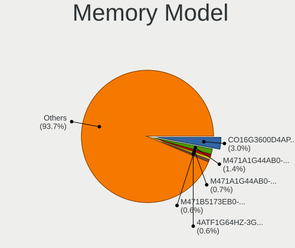

| Model                                                            | Computers | Percent |
|------------------------------------------------------------------|-----------|---------|
| Unknown                                                          | 60        | 3%      |
| Samsung RAM M471A1G44AB0-CWE 8GB Row Of Chips DDR4 3200MT/s      | 28        | 1.4%    |
| Samsung RAM M471A1G44AB0-CWE 8GiB SODIMM DDR4 3200MT/s           | 14        | 0.7%    |
| Samsung RAM M471B5173EB0-YK0 4GB SODIMM DDR3 1600MT/s            | 12        | 0.6%    |
| Micron RAM 4ATF1G64HZ-3G2E1 8GB Row Of Chips DDR4 3200MT/s       | 12        | 0.6%    |
| SK hynix RAM HMT451S6BFR8A-PB 4GB SODIMM DDR3 1600MT/s           | 11        | 0.55%   |
| SK hynix RAM HMAA1GS6CMR6N-VK 8GB Row Of Chips DDR4 2667MT/s     | 11        | 0.55%   |
| Samsung RAM M471A1K43EB1-CWE 8GB SODIMM DDR4 3200MT/s            | 11        | 0.55%   |
| Samsung RAM M471A1K43DB1-CTD 8GB SODIMM DDR4 2667MT/s            | 11        | 0.55%   |
| Samsung RAM M471A1G44AB0-CTD 8GB SODIMM DDR4 2667MT/s            | 11        | 0.55%   |
| SK hynix RAM HMA81GS6DJR8N-XN 8GB SODIMM DDR4 3200MT/s           | 10        | 0.5%    |
| SK hynix RAM HMT351S6CFR8C-PB 4GB SODIMM DDR3 1600MT/s           | 9         | 0.45%   |
| Samsung RAM M471A5244CB0-CTD 4GB SODIMM DDR4 3266MT/s            | 9         | 0.45%   |
| Samsung RAM M471A1K43DB1-CWE 8GB SODIMM DDR4 3200MT/s            | 9         | 0.45%   |
| Samsung RAM M471A1K43CB1-CRC 8GB SODIMM DDR4 8400MT/s            | 9         | 0.45%   |
| Samsung RAM M425R1GB4BB0-CQKOL 8GB SODIMM DDR5 4800MT/s          | 9         | 0.45%   |
| Micron RAM MTC4C10163S1SC48BA1 8GB SODIMM DDR5 4800MT/s          | 9         | 0.45%   |
| Crucial RAM CT16G48C40S5.M8A1 16GB SODIMM DDR5 4800MT/s          | 9         | 0.45%   |
| Unknown RAM Module 16GB DIMM DDR4 3200MT/s                       | 8         | 0.4%    |
| Unknown (ABCD) RAM 123456789012345678 2GB SODIMM LPDDR4 2400MT/s | 8         | 0.4%    |
| SK hynix RAM HMA81GS6AFR8N-UH 8GB SODIMM DDR4 2667MT/s           | 8         | 0.4%    |
| SK hynix RAM H9JCNNNCP3MLYR-N6E 2GB Row Of Chips LPDDR5 6400MT/s | 8         | 0.4%    |
| Samsung RAM M471A5244CB0-CRC 4GB SODIMM DDR4 2667MT/s            | 8         | 0.4%    |
| Samsung RAM M425R1GB4BB0-CQKOD 8GB SODIMM DDR5 4800MT/s          | 8         | 0.4%    |
| Kingston RAM KHX3200C16D4/16GX 16GB DIMM DDR4 3600MT/s           | 8         | 0.4%    |
| Kingston RAM 99P5474-013.A00LF 4GB DIMM DDR3 1600MT/s            | 8         | 0.4%    |
| Unknown RAM Module 2GB SODIMM DDR3 1333MT/s                      | 7         | 0.35%   |
| SK hynix RAM HMA851S6CJR6N-VK 4GB SODIMM DDR4 2667MT/s           | 7         | 0.35%   |
| SK hynix RAM H58G66BK7BX067 8GB Row Of Chips LPDDR5 7500MT/s     | 7         | 0.35%   |
| Samsung RAM M471B1G73EB0-YK0 8192MB SODIMM DDR3 1600MT/s         | 7         | 0.35%   |
| Samsung RAM M471A1K43BB1-CRC 8GB SODIMM DDR4 2667MT/s            | 7         | 0.35%   |
| Samsung RAM K4UBE3D4AA-MGCR 2GB Row Of Chips LPDDR4 4267MT/s     | 7         | 0.35%   |
| Micron RAM 53E1G32D2NP-046 2GB Row Of Chips LPDDR4 4267MT/s      | 7         | 0.35%   |
| Micron RAM 4ATF1G64HZ-3G2E1 8GB SODIMM DDR4 3200MT/s             | 7         | 0.35%   |
| SK hynix RAM HMAA1GS6CMR6N-XN 8GB Row Of Chips DDR4 3200MT/s     | 6         | 0.3%    |
| SK hynix RAM HMAA1GS6CJR6N-XN 8GB SODIMM DDR4 3200MT/s           | 6         | 0.3%    |
| SK hynix RAM HMAA1GS6CJR6N-XN 8GB Row Of Chips DDR4 3200MT/s     | 6         | 0.3%    |
| SK hynix RAM HMA851S6CJR6N-VK 4GB Row Of Chips DDR4 2667MT/s     | 6         | 0.3%    |
| SK hynix RAM HMA81GS6CJR8N-VK 8GB SODIMM DDR4 2667MT/s           | 6         | 0.3%    |
| SK hynix RAM HMA41GS6AFR8N-TF 8GB SODIMM DDR4 2667MT/s           | 6         | 0.3%    |

Memory Kind
-----------

Memory module kinds

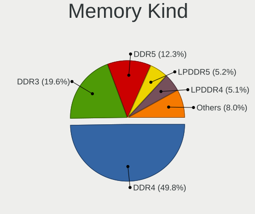

| Kind    | Computers | Percent |
|---------|-----------|---------|
| DDR4    | 816       | 49.76%  |
| DDR3    | 321       | 19.57%  |
| DDR5    | 202       | 12.32%  |
| LPDDR5  | 86        | 5.24%   |
| LPDDR4  | 83        | 5.06%   |
| LPDDR3  | 56        | 3.41%   |
| Unknown | 23        | 1.4%    |
| SDRAM   | 19        | 1.16%   |
| DDR2    | 17        | 1.04%   |
| DRAM    | 15        | 0.91%   |
| DDR     | 2         | 0.12%   |

Memory Form Factor
------------------

Physical design of the memory module

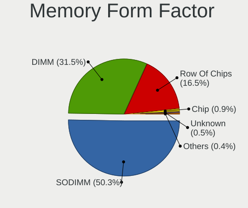

| Name         | Computers | Percent |
|--------------|-----------|---------|
| SODIMM       | 828       | 50.27%  |
| DIMM         | 519       | 31.51%  |
| Row Of Chips | 272       | 16.51%  |
| Chip         | 14        | 0.85%   |
| Unknown      | 8         | 0.49%   |
| RIMM         | 6         | 0.36%   |

Memory Size
-----------

Memory module size

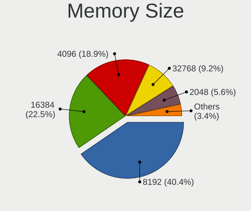

| Size  | Computers | Percent |
|-------|-----------|---------|
| 8192  | 711       | 40.44%  |
| 16384 | 395       | 22.47%  |
| 4096  | 333       | 18.94%  |
| 32768 | 161       | 9.16%   |
| 2048  | 98        | 5.57%   |
| 1024  | 15        | 0.85%   |
| 65536 | 13        | 0.74%   |
| 49152 | 10        | 0.57%   |
| 24576 | 7         | 0.4%    |
| 12288 | 6         | 0.34%   |
| 3072  | 3         | 0.17%   |
| 512   | 2         | 0.11%   |
| 16315 | 1         | 0.06%   |
| 14336 | 1         | 0.06%   |
| 6144  | 1         | 0.06%   |
| 256   | 1         | 0.06%   |

Memory Speed
------------

Memory module speed

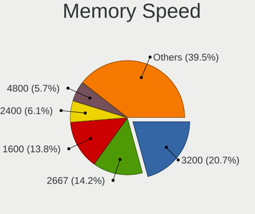

| Speed   | Computers | Percent |
|---------|-----------|---------|
| 3200    | 361       | 20.74%  |
| 2667    | 247       | 14.19%  |
| 1600    | 240       | 13.79%  |
| 2400    | 106       | 6.09%   |
| 4800    | 100       | 5.74%   |
| 5600    | 84        | 4.82%   |
| 2133    | 82        | 4.71%   |
| 6400    | 55        | 3.16%   |
| 2666    | 51        | 2.93%   |
| 4267    | 47        | 2.7%    |
| 1333    | 45        | 2.58%   |
| 1867    | 32        | 1.84%   |
| 3600    | 25        | 1.44%   |
| 7500    | 20        | 1.15%   |
| 6000    | 17        | 0.98%   |
| Unknown | 15        | 0.86%   |
| 1866    | 14        | 0.8%    |
| 800     | 14        | 0.8%    |
| 8400    | 13        | 0.75%   |
| 1066    | 12        | 0.69%   |
| 8533    | 11        | 0.63%   |
| 4266    | 11        | 0.63%   |
| 3733    | 11        | 0.63%   |
| 3266    | 11        | 0.63%   |
| 1067    | 11        | 0.63%   |
| 2933    | 9         | 0.52%   |
| 1334    | 9         | 0.52%   |
| 667     | 9         | 0.52%   |
| 2668    | 8         | 0.46%   |
| 3466    | 7         | 0.4%    |
| 4199    | 6         | 0.34%   |
| 3000    | 5         | 0.29%   |
| 3800    | 4         | 0.23%   |
| 3400    | 4         | 0.23%   |
| 2048    | 4         | 0.23%   |
| 400     | 4         | 0.23%   |
| 4000    | 3         | 0.17%   |
| 1800    | 3         | 0.17%   |
| 7467    | 2         | 0.11%   |
| 5200    | 2         | 0.11%   |

Printers & scanners
-------------------

Printer Vendor
--------------

Printer device vendors

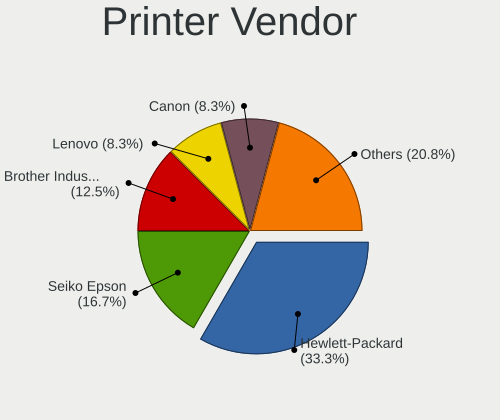

| Vendor                             | Computers | Percent |
|------------------------------------|-----------|---------|
| Hewlett-Packard                    | 8         | 33.33%  |
| Seiko Epson                        | 4         | 16.67%  |
| Brother Industries                 | 3         | 12.5%   |
| Lenovo                             | 2         | 8.33%   |
| Canon                              | 2         | 8.33%   |
| Xiaomi                             | 1         | 4.17%   |
| STMicroelectronics                 | 1         | 4.17%   |
| Samsung Electronics                | 1         | 4.17%   |
| Pantum                             | 1         | 4.17%   |
| BeiJing LanXum Computer Technology | 1         | 4.17%   |

Printer Model
-------------

Printer device models

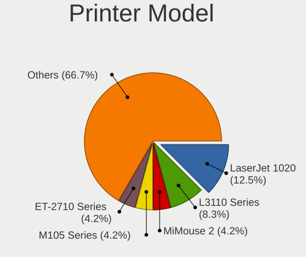

| Model                                                     | Computers | Percent |
|-----------------------------------------------------------|-----------|---------|
| HP LaserJet 1020                                          | 3         | 12.5%   |
| Seiko Epson L3110 Series                                  | 2         | 8.33%   |
| Xiaomi MiMouse 2                                          | 1         | 4.17%   |
| STMicroelectronics LED badge -- mini LED display -- 11x44 | 1         | 4.17%   |
| Seiko Epson M105 Series                                   | 1         | 4.17%   |
| Seiko Epson ET-2710 Series                                | 1         | 4.17%   |
| Samsung SCX-3200 Series                                   | 1         | 4.17%   |
| Pantum P2200W-series                                      | 1         | 4.17%   |
| Lenovo M7675DXF                                           | 1         | 4.17%   |
| Lenovo G336DN                                             | 1         | 4.17%   |
| HP Officejet 4500 G510g-m                                 | 1         | 4.17%   |
| HP LaserJet P1102                                         | 1         | 4.17%   |
| HP LaserJet P1007                                         | 1         | 4.17%   |
| HP Laser NS 1020                                          | 1         | 4.17%   |
| HP DeskJet 2130 series                                    | 1         | 4.17%   |
| Canon PIXMA MP280                                         | 1         | 4.17%   |
| Canon iP1100 series                                       | 1         | 4.17%   |
| Brother HL-L8260CDN series                                | 1         | 4.17%   |
| Brother HL-L2350DW series                                 | 1         | 4.17%   |
| Brother HL-5440D series                                   | 1         | 4.17%   |
| BeiJing LanXum Technology Black and White Laser Printer   | 1         | 4.17%   |

Scanner Vendor
--------------

Scanner device vendors

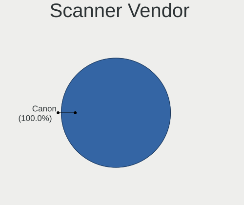

| Vendor | Computers | Percent |
|--------|-----------|---------|
| Canon  | 2         | 100%    |

Scanner Model
-------------

Scanner device models

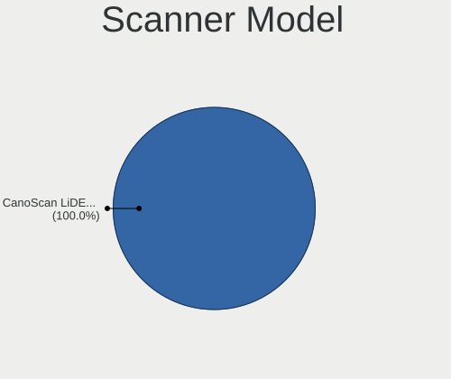

| Model                   | Computers | Percent |
|-------------------------|-----------|---------|
| Canon CanoScan LiDE 120 | 2         | 100%    |

Camera
------

Camera Vendor
-------------

Camera device vendors

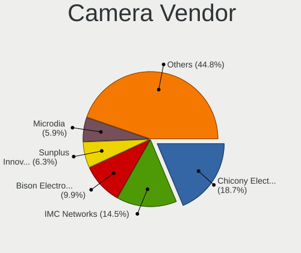

| Vendor                                 | Computers | Percent |
|----------------------------------------|-----------|---------|
| Chicony Electronics                    | 235       | 18.68%  |
| IMC Networks                           | 183       | 14.55%  |
| Bison Electronics                      | 124       | 9.86%   |
| Sunplus Innovation Technology          | 79        | 6.28%   |
| Microdia                               | 74        | 5.88%   |
| Realtek Semiconductor                  | 71        | 5.64%   |
| Luxvisions Innotech Limited            | 69        | 5.48%   |
| Quanta                                 | 68        | 5.41%   |
| Syntek                                 | 44        | 3.5%    |
| Cheng Uei Precision Industry (Foxlink) | 43        | 3.42%   |
| SunplusIT                              | 34        | 2.7%    |
| Lite-On Technology                     | 26        | 2.07%   |
| Apple                                  | 21        | 1.67%   |
| Suyin                                  | 20        | 1.59%   |
| Alcor Micro                            | 15        | 1.19%   |
| Logitech                               | 13        | 1.03%   |
| Sonix Technology                       | 10        | 0.79%   |
| Silicon Motion                         | 10        | 0.79%   |
| Z-Star Microelectronics                | 9         | 0.72%   |
| Lenovo                                 | 9         | 0.72%   |
| Acer                                   | 9         | 0.72%   |
| Shinetech                              | 8         | 0.64%   |
| icSpring                               | 6         | 0.48%   |
| Ricoh                                  | 5         | 0.4%    |
| SN0002                                 | 4         | 0.32%   |
| ShineOptics                            | 4         | 0.32%   |
| Tripath Technology                     | 3         | 0.24%   |
| Microsoft                              | 3         | 0.24%   |
| Intel                                  | 3         | 0.24%   |
| Importek                               | 3         | 0.24%   |
| Genesys Logic                          | 3         | 0.24%   |
| GEMBIRD                                | 3         | 0.24%   |
| Unknown (0000066029)                   | 2         | 0.16%   |
| Samsung Electronics                    | 2         | 0.16%   |
| Primax Electronics                     | 2         | 0.16%   |
| Orbbec 3D Technology International     | 2         | 0.16%   |
| OPPO Electronics                       | 2         | 0.16%   |
| Nebraska Furniture Mart                | 2         | 0.16%   |
| MacroSilicon                           | 2         | 0.16%   |
| Google                                 | 2         | 0.16%   |

Camera Model
------------

Camera device models

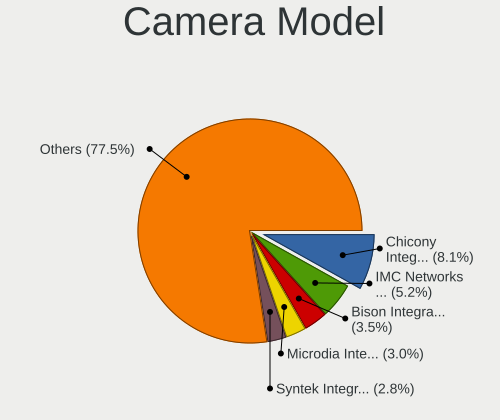

| Model                                                        | Computers | Percent |
|--------------------------------------------------------------|-----------|---------|
| Chicony Integrated Camera                                    | 103       | 8.11%   |
| IMC Networks Integrated Camera                               | 66        | 5.2%    |
| Bison Integrated Camera                                      | 44        | 3.46%   |
| Microdia Integrated_Webcam_HD                                | 38        | 2.99%   |
| Syntek Integrated Camera                                     | 35        | 2.76%   |
| IMC Networks HD Camera                                       | 35        | 2.76%   |
| IMC Networks USB2.0 HD UVC WebCam                            | 32        | 2.52%   |
| Luxvisions Innotech Limited Integrated Camera                | 25        | 1.97%   |
| Chicony HD Webcam                                            | 21        | 1.65%   |
| Luxvisions Innotech Limited Integrated RGB Camera            | 18        | 1.42%   |
| Sunplus XiaoMi USB 2.0 Webcam                                | 17        | 1.34%   |
| SunplusIT HD Webcam                                          | 16        | 1.26%   |
| Realtek Integrated_Webcam_HD                                 | 16        | 1.26%   |
| Bison BisonCam,NB Pro                                        | 16        | 1.26%   |
| Cheng Uei Precision Industry (Foxlink) XiaoMi USB 2.0 Webcam | 14        | 1.1%    |
| Bison SunplusIT Integrated Camera                            | 14        | 1.1%    |
| Sunplus Integrated_Webcam_HD                                 | 13        | 1.02%   |
| IMC Networks ov9734_azurewave_camera                         | 13        | 1.02%   |
| Apple iPhone 5/5C/5S/6/SE/7/8/X                              | 13        | 1.02%   |
| IMC Networks XHC Camera                                      | 12        | 0.94%   |
| Bison Integrated RGB Camera                                  | 12        | 0.94%   |
| Quanta ov9734_techfront_camera                               | 10        | 0.79%   |
| Lite-On Integrated Camera                                    | 10        | 0.79%   |
| Quanta HP HD Camera                                          | 9         | 0.71%   |
| Chicony Lenovo Integrated Camera (0.3MP)                     | 9         | 0.71%   |
| Quanta hm1091_techfront                                      | 8         | 0.63%   |
| Quanta HD User Facing                                        | 8         | 0.63%   |
| Microdia Webcam Vitade AF                                    | 8         | 0.63%   |
| Luxvisions Innotech Limited HP Wide Vision HD Camera         | 8         | 0.63%   |
| Bison Lenovo EasyCamera                                      | 8         | 0.63%   |
| Realtek Integrated Webcam                                    | 7         | 0.55%   |
| Lite-On HP HD Camera                                         | 7         | 0.55%   |
| Chicony XiaoMi USB 2.0 Webcam                                | 7         | 0.55%   |
| Chicony Integrated Camera (1280x720@30)                      | 7         | 0.55%   |
| Chicony HP Wide Vision HD Camera                             | 7         | 0.55%   |
| Alcor Micro USB 2.0 Camera                                   | 7         | 0.55%   |
| Syntek Lenovo EasyCamera                                     | 6         | 0.47%   |
| SunplusIT XiaoMi WebCam                                      | 6         | 0.47%   |
| SunplusIT XiaoMi USB 2.0 Webcam                              | 6         | 0.47%   |
| Sunplus USB 2.0 Camera                                       | 6         | 0.47%   |

Security
--------

Fingerprint Vendor
------------------

Fingerprint sensor vendors

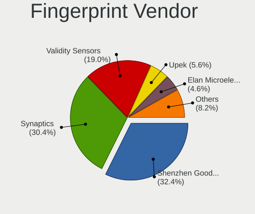

| Vendor                             | Computers | Percent |
|------------------------------------|-----------|---------|
| Shenzhen Goodix Technology         | 99        | 32.35%  |
| Synaptics                          | 93        | 30.39%  |
| Validity Sensors                   | 58        | 18.95%  |
| Upek                               | 17        | 5.56%   |
| Elan Microelectronics              | 14        | 4.58%   |
| AuthenTec                          | 6         | 1.96%   |
| HOLTEK                             | 5         | 1.63%   |
| Focal-systems.Corp                 | 4         | 1.31%   |
| LighTuning Technology              | 3         | 0.98%   |
| STMicroelectronics                 | 2         | 0.65%   |
| Realtek USB2.0 Finger Print Bridge | 2         | 0.65%   |
| FocalTech                          | 2         | 0.65%   |
| GDMicroelectronics                 | 1         | 0.33%   |

Fingerprint Model
-----------------

Fingerprint sensor models

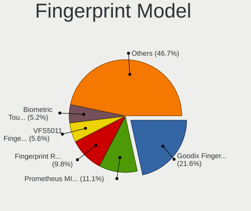

| Model                                                                      | Computers | Percent |
|----------------------------------------------------------------------------|-----------|---------|
| Shenzhen Goodix  Fingerprint Device                                        | 66        | 21.57%  |
| Synaptics Prometheus MIS Touch Fingerprint Reader                          | 34        | 11.11%  |
| Shenzhen Goodix Fingerprint Reader                                         | 30        | 9.8%    |
| Validity Sensors VFS5011 Fingerprint Reader                                | 17        | 5.56%   |
| Upek Biometric Touchchip/Touchstrip Fingerprint Sensor                     | 16        | 5.23%   |
| Elan ELAN:Fingerprint                                                      | 12        | 3.92%   |
| Synaptics Metallica MIS Touch Fingerprint Reader                           | 10        | 3.27%   |
| Validity Sensors VFS 5011 fingerprint sensor                               | 8         | 2.61%   |
| Validity Sensors Synaptics VFS7552 Touch Fingerprint Sensor with PurePrint | 8         | 2.61%   |
| Synaptics UWP WBDI Device                                                  | 8         | 2.61%   |
| Synaptics  FS7604 Touch Fingerprint Sensor with PurePrint                  | 8         | 2.61%   |
| Synaptics FS7604 Touch Fingerprint Sensor with PurePrint                   | 8         | 2.61%   |
| Validity Sensors Synaptics WBDI                                            | 6         | 1.96%   |
| Synaptics Fingerprint reader [HP G6]                                       | 6         | 1.96%   |
| Validity Sensors VFS7500 Touch Fingerprint Sensor                          | 5         | 1.63%   |
| Synaptics WBDI Device                                                      | 5         | 1.63%   |
| Synaptics Prometheus Fingerprint Reader                                    | 5         | 1.63%   |
| HOLTEK FocalTech Fingerprint Device                                        | 5         | 1.63%   |
| Validity Sensors VFS495 Fingerprint Reader                                 | 4         | 1.31%   |
| Validity Sensors VFS491                                                    | 4         | 1.31%   |
| Synaptics WBDI                                                             | 4         | 1.31%   |
| Focal-systems.Corp FT9201Fingerprint.                                      | 4         | 1.31%   |
| AuthenTec AES2810                                                          | 4         | 1.31%   |
| Validity Sensors VFS471 Fingerprint Reader                                 | 3         | 0.98%   |
| Synaptics UWP WBDI                                                         | 3         | 0.98%   |
| Shenzhen Goodix FingerPrint                                                | 3         | 0.98%   |
| STMicroelectronics Fingerprint Reader                                      | 2         | 0.65%   |
| Realtek USB2.0 Finger Print Bridge FocalTech Fingerprint Device            | 2         | 0.65%   |
| Elan ELAN:ARM-M4                                                           | 2         | 0.65%   |
| Unknown                                                                    | 2         | 0.65%   |
| Validity Sensors VFS7552 Touch Fingerprint Sensor                          | 1         | 0.33%   |
| Validity Sensors VFS Fingerprint sensor                                    | 1         | 0.33%   |
| Validity Sensors Fingerprint scanner                                       | 1         | 0.33%   |
| Upek TCS5B Fingerprint sensor                                              | 1         | 0.33%   |
| LighTuning Fingerprint Sensor                                              | 1         | 0.33%   |
| LighTuning ES603 Swipe Fingerprint Sensor                                  | 1         | 0.33%   |
| LighTuning EgisTec Touch Fingerprint Sensor                                | 1         | 0.33%   |
| GDMicroelectronics Touch Fingerprint Sensor                                | 1         | 0.33%   |
| FocalTech FocalTech Fingerprint Device                                     | 1         | 0.33%   |
| FocalTech Fingerprint Device                                               | 1         | 0.33%   |

Chipcard Vendor
---------------

Chipcard module vendors

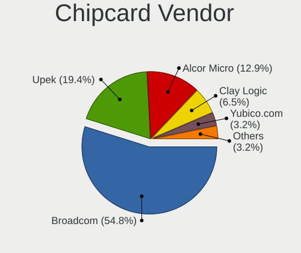

| Vendor                | Computers | Percent |
|-----------------------|-----------|---------|
| Broadcom              | 17        | 54.84%  |
| Upek                  | 6         | 19.35%  |
| Alcor Micro           | 4         | 12.9%   |
| Clay Logic            | 2         | 6.45%   |
| Yubico.com            | 1         | 3.23%   |
| Advanced Card Systems | 1         | 3.23%   |

Chipcard Model
--------------

Chipcard module models

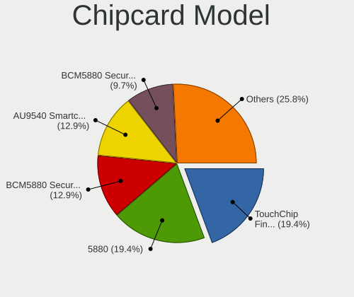

| Model                                                                        | Computers | Percent |
|------------------------------------------------------------------------------|-----------|---------|
| Upek TouchChip Fingerprint Coprocessor (WBF advanced mode)                   | 6         | 19.35%  |
| Broadcom 5880                                                                | 6         | 19.35%  |
| Broadcom BCM5880 Secure Applications Processor                               | 4         | 12.9%   |
| Alcor Micro AU9540 Smartcard Reader                                          | 4         | 12.9%   |
| Broadcom BCM5880 Secure Applications Processor with fingerprint swipe sensor | 3         | 9.68%   |
| Broadcom BCM58200 ControlVault 3 (FingerPrint sensor + Contacted SmartCard)  | 3         | 9.68%   |
| Clay Logic CanoKey Canary                                                    | 2         | 6.45%   |
| Yubico.com Yubikey 4/5 U2F+CCID                                              | 1         | 3.23%   |
| Broadcom 58200                                                               | 1         | 3.23%   |
| Advanced Card Systems ACR1581                                                | 1         | 3.23%   |

Unsupported
-----------

Unsupported Devices
-------------------

Total unsupported devices on board

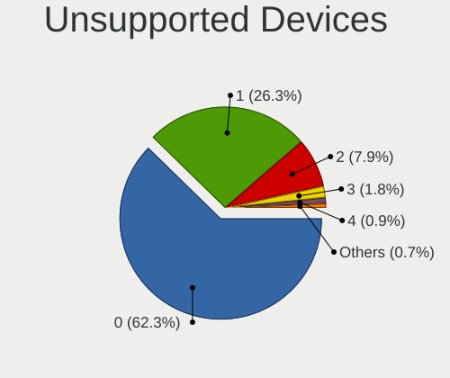

| Total | Computers | Percent |
|-------|-----------|---------|
| 0     | 1595      | 62.3%   |
| 1     | 674       | 26.33%  |
| 2     | 202       | 7.89%   |
| 3     | 47        | 1.84%   |
| 4     | 24        | 0.94%   |
| 5     | 9         | 0.35%   |
| 6     | 4         | 0.16%   |
| 8     | 2         | 0.08%   |
| 7     | 2         | 0.08%   |
| 10    | 1         | 0.04%   |

Unsupported Device Types
------------------------

Types of unsupported devices

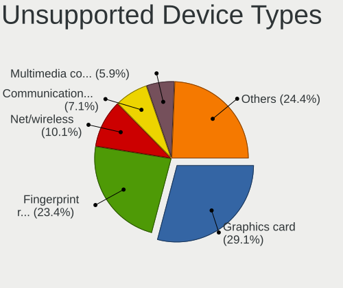

| Type                     | Computers | Percent |
|--------------------------|-----------|---------|
| Graphics card            | 374       | 29.11%  |
| Fingerprint reader       | 301       | 23.42%  |
| Net/wireless             | 130       | 10.12%  |
| Communication controller | 91        | 7.08%   |
| Multimedia controller    | 76        | 5.91%   |
| Sound                    | 75        | 5.84%   |
| Unassigned class         | 65        | 5.06%   |
| Net/ethernet             | 36        | 2.8%    |
| Bluetooth                | 35        | 2.72%   |
| Camera                   | 34        | 2.65%   |
| Chipcard                 | 26        | 2.02%   |
| Network                  | 14        | 1.09%   |
| Storage/raid             | 9         | 0.7%    |
| Storage                  | 5         | 0.39%   |
| Card reader              | 5         | 0.39%   |
| Storage/nvme             | 3         | 0.23%   |
| Storage/ata              | 2         | 0.16%   |
| Wireless                 | 1         | 0.08%   |
| Modem                    | 1         | 0.08%   |
| Firewire controller      | 1         | 0.08%   |
| Dvb card                 | 1         | 0.08%   |

