Linux in China - Tested Hardware & Statistics
---------------------------------------------

A project to collect tested hardware configurations for Linux in China.

Anyone can contribute to this report by the [hw-probe](https://github.com/linuxhw/hw-probe) tool:

    sudo -E hw-probe -all -upload

Please contribute! Especially if your hardware is rare.

This is a report for all computer types. See also reports for [desktops](/Location/China/Desktop/README.md) and [notebooks](/Location/China/Notebook/README.md).

Contents
--------

* [ Test Cases ](#test-cases)

* [ System ](#system)
  - [ OS                       ](#os)
  - [ OS Family                ](#os-family)
  - [ Kernel                   ](#kernel)
  - [ Kernel Family            ](#kernel-family)
  - [ Kernel Major Ver.        ](#kernel-major-ver)
  - [ Arch                     ](#arch)
  - [ DE                       ](#de)
  - [ Display Server           ](#display-server)
  - [ Display Manager          ](#display-manager)
  - [ OS Lang                  ](#os-lang)
  - [ Boot Mode                ](#boot-mode)
  - [ Filesystem               ](#filesystem)
  - [ Part. scheme             ](#part-scheme)
  - [ Dual Boot with Linux/BSD ](#dual-boot-with-linuxbsd)
  - [ Dual Boot (Win)          ](#dual-boot-win)

* [ Board ](#board)
  - [ Vendor                   ](#vendor)
  - [ Model                    ](#model)
  - [ Model Family             ](#model-family)
  - [ MFG Year                 ](#mfg-year)
  - [ Form Factor              ](#form-factor)
  - [ Secure Boot              ](#secure-boot)
  - [ Coreboot                 ](#coreboot)
  - [ RAM Size                 ](#ram-size)
  - [ RAM Used                 ](#ram-used)
  - [ Total Drives             ](#total-drives)
  - [ Has CD-ROM               ](#has-cd-rom)
  - [ Has Ethernet             ](#has-ethernet)
  - [ Has WiFi                 ](#has-wifi)
  - [ Has Bluetooth            ](#has-bluetooth)

* [ Location ](#location)
  - [ Country                  ](#country)
  - [ City                     ](#city)

* [ Drives ](#drives)
  - [ Drive Vendor             ](#drive-vendor)
  - [ Drive Model              ](#drive-model)
  - [ HDD Vendor               ](#hdd-vendor)
  - [ SSD Vendor               ](#ssd-vendor)
  - [ Drive Kind               ](#drive-kind)
  - [ Drive Connector          ](#drive-connector)
  - [ Drive Size               ](#drive-size)
  - [ Space Total              ](#space-total)
  - [ Space Used               ](#space-used)
  - [ Malfunc. Drives          ](#malfunc-drives)
  - [ Malfunc. Drive Vendor    ](#malfunc-drive-vendor)
  - [ Malfunc. HDD Vendor      ](#malfunc-hdd-vendor)
  - [ Malfunc. Drive Kind      ](#malfunc-drive-kind)
  - [ Failed Drives            ](#failed-drives)
  - [ Failed Drive Vendor      ](#failed-drive-vendor)
  - [ Drive Status             ](#drive-status)

* [ Storage controller ](#storage-controller)
  - [ Storage Vendor           ](#storage-vendor)
  - [ Storage Model            ](#storage-model)
  - [ Storage Kind             ](#storage-kind)

* [ Processor ](#processor)
  - [ CPU Vendor               ](#cpu-vendor)
  - [ CPU Model                ](#cpu-model)
  - [ CPU Model Family         ](#cpu-model-family)
  - [ CPU Cores                ](#cpu-cores)
  - [ CPU Sockets              ](#cpu-sockets)
  - [ CPU Threads              ](#cpu-threads)
  - [ CPU Op-Modes             ](#cpu-op-modes)
  - [ CPU Microcode            ](#cpu-microcode)
  - [ CPU Microarch            ](#cpu-microarch)

* [ Graphics ](#graphics)
  - [ GPU Vendor               ](#gpu-vendor)
  - [ GPU Model                ](#gpu-model)
  - [ GPU Combo                ](#gpu-combo)
  - [ GPU Driver               ](#gpu-driver)
  - [ GPU Memory               ](#gpu-memory)

* [ Monitor ](#monitor)
  - [ Monitor Vendor           ](#monitor-vendor)
  - [ Monitor Model            ](#monitor-model)
  - [ Monitor Resolution       ](#monitor-resolution)
  - [ Monitor Diagonal         ](#monitor-diagonal)
  - [ Monitor Width            ](#monitor-width)
  - [ Aspect Ratio             ](#aspect-ratio)
  - [ Monitor Area             ](#monitor-area)
  - [ Pixel Density            ](#pixel-density)
  - [ Multiple Monitors        ](#multiple-monitors)

* [ Network ](#network)
  - [ Net Controller Vendor    ](#net-controller-vendor)
  - [ Net Controller Model     ](#net-controller-model)
  - [ Wireless Vendor          ](#wireless-vendor)
  - [ Wireless Model           ](#wireless-model)
  - [ Ethernet Vendor          ](#ethernet-vendor)
  - [ Ethernet Model           ](#ethernet-model)
  - [ Net Controller Kind      ](#net-controller-kind)
  - [ Used Controller          ](#used-controller)
  - [ NICs                     ](#nics)
  - [ IPv6                     ](#ipv6)

* [ Bluetooth ](#bluetooth)
  - [ Bluetooth Vendor         ](#bluetooth-vendor)
  - [ Bluetooth Model          ](#bluetooth-model)

* [ Sound ](#sound)
  - [ Sound Vendor             ](#sound-vendor)
  - [ Sound Model              ](#sound-model)

* [ Memory ](#memory)
  - [ Memory Vendor            ](#memory-vendor)
  - [ Memory Model             ](#memory-model)
  - [ Memory Kind              ](#memory-kind)
  - [ Memory Form Factor       ](#memory-form-factor)
  - [ Memory Size              ](#memory-size)
  - [ Memory Speed             ](#memory-speed)

* [ Printers & scanners ](#printers--scanners)
  - [ Printer Vendor           ](#printer-vendor)
  - [ Printer Model            ](#printer-model)
  - [ Scanner Vendor           ](#scanner-vendor)
  - [ Scanner Model            ](#scanner-model)

* [ Camera ](#camera)
  - [ Camera Vendor            ](#camera-vendor)
  - [ Camera Model             ](#camera-model)

* [ Security ](#security)
  - [ Fingerprint Vendor       ](#fingerprint-vendor)
  - [ Fingerprint Model        ](#fingerprint-model)
  - [ Chipcard Vendor          ](#chipcard-vendor)
  - [ Chipcard Model           ](#chipcard-model)

* [ Unsupported ](#unsupported)
  - [ Unsupported Devices      ](#unsupported-devices)
  - [ Unsupported Device Types ](#unsupported-device-types)

Test Cases
----------

Total: 1242

| Vendor        | Model                       | Form-Factor | Probe                                                      | Date         |
|---------------|-----------------------------|-------------|------------------------------------------------------------|--------------|
| Lenovo        | NO DPK                      | Desktop     | [24340ea9a8](https://linux-hardware.org/?probe=24340ea9a8) | May 06, 2022 |
| Schenker      | XMG_APEX15_XAP15E20         | Notebook    | [428f653301](https://linux-hardware.org/?probe=428f653301) | May 05, 2022 |
| Timi          | Redmi G                     | Notebook    | [a2738a4d6e](https://linux-hardware.org/?probe=a2738a4d6e) | May 05, 2022 |
| Dell          | Latitude 7420               | Notebook    | [7fd2239abb](https://linux-hardware.org/?probe=7fd2239abb) | May 05, 2022 |
| Google        | Atlas                       | Notebook    | [dce87f3691](https://linux-hardware.org/?probe=dce87f3691) | May 05, 2022 |
| Lenovo        | NO DPK                      | Desktop     | [dc8d8b070e](https://linux-hardware.org/?probe=dc8d8b070e) | May 05, 2022 |
| Lenovo        | ZHAOYANG K4e-ITL 82F8       | Notebook    | [6103e540b9](https://linux-hardware.org/?probe=6103e540b9) | May 04, 2022 |
| Dell          | Latitude 5300               | Notebook    | [fa0246b764](https://linux-hardware.org/?probe=fa0246b764) | May 04, 2022 |
| Dell          | Precision 3541              | Notebook    | [feaee0b7ff](https://linux-hardware.org/?probe=feaee0b7ff) | May 04, 2022 |
| Lenovo        | ThinkPad W541 20EFCTO1WW    | Notebook    | [b812cd9eb1](https://linux-hardware.org/?probe=b812cd9eb1) | May 04, 2022 |
| Lenovo        | IdeaPad Y470 20090          | Notebook    | [690c12e995](https://linux-hardware.org/?probe=690c12e995) | May 03, 2022 |
| HP            | G42                         | Notebook    | [6ee2b19fc7](https://linux-hardware.org/?probe=6ee2b19fc7) | May 01, 2022 |
| HP            | G42                         | Notebook    | [731ba8d968](https://linux-hardware.org/?probe=731ba8d968) | May 01, 2022 |
| HP            | G42                         | Notebook    | [e23740df6e](https://linux-hardware.org/?probe=e23740df6e) | Apr 30, 2022 |
| HP            | G42                         | Notebook    | [f6ca4559f5](https://linux-hardware.org/?probe=f6ca4559f5) | Apr 30, 2022 |
| Dell          | Inspiron 7400               | Notebook    | [0c0af6919d](https://linux-hardware.org/?probe=0c0af6919d) | Apr 29, 2022 |
| Raspberry ... | Raspberry Pi 4 Model B R... | Soc         | [ff9b46fd29](https://linux-hardware.org/?probe=ff9b46fd29) | Apr 29, 2022 |
| OEM           | V1.0                        | Desktop     | [167ee50568](https://linux-hardware.org/?probe=167ee50568) | Apr 29, 2022 |
| Dell          | Inspiron 7400               | Notebook    | [8e5289a5e7](https://linux-hardware.org/?probe=8e5289a5e7) | Apr 28, 2022 |
| HUAWEI        | NBM-WXX9                    | Notebook    | [4f15ab06cc](https://linux-hardware.org/?probe=4f15ab06cc) | Apr 28, 2022 |
| Lenovo        | AILZx                       | Notebook    | [efa15d667f](https://linux-hardware.org/?probe=efa15d667f) | Apr 26, 2022 |
| Timi          | RedmiBook Pro 15S           | Notebook    | [07ccc93cd4](https://linux-hardware.org/?probe=07ccc93cd4) | Apr 25, 2022 |
| Raspberry ... | Raspberry Pi 4 Model B R... | Soc         | [f0671e360b](https://linux-hardware.org/?probe=f0671e360b) | Apr 25, 2022 |
| ASRock        | Z170 Gaming K4              | Desktop     | [96b772b4e6](https://linux-hardware.org/?probe=96b772b4e6) | Apr 24, 2022 |
| Timi          | TM1612                      | Notebook    | [9e6b6f4737](https://linux-hardware.org/?probe=9e6b6f4737) | Apr 24, 2022 |
| GreatWall     | TN140A2                     | Notebook    | [69043361cf](https://linux-hardware.org/?probe=69043361cf) | Apr 24, 2022 |
| Dell          | Latitude 5290               | Notebook    | [e373cb6fa1](https://linux-hardware.org/?probe=e373cb6fa1) | Apr 23, 2022 |
| Lenovo        | Legion Y7000 81FW           | Notebook    | [c56c469d4f](https://linux-hardware.org/?probe=c56c469d4f) | Apr 21, 2022 |
| Acer          | Swift SF314-512             | Notebook    | [d7e77fd856](https://linux-hardware.org/?probe=d7e77fd856) | Apr 21, 2022 |
| ASUSTek       | ASUS TUF Gaming F15 FX50... | Notebook    | [5f78518f42](https://linux-hardware.org/?probe=5f78518f42) | Apr 21, 2022 |
| ASRock        | Z170 Gaming K4              | Desktop     | [81e06a1dcb](https://linux-hardware.org/?probe=81e06a1dcb) | Apr 18, 2022 |
| Gigabyte      | H61M-D2P-B3                 | Desktop     | [c4561b1073](https://linux-hardware.org/?probe=c4561b1073) | Apr 18, 2022 |
| Lenovo        | ThinkBook 14 G3 ACL 21A2    | Notebook    | [3faf048414](https://linux-hardware.org/?probe=3faf048414) | Apr 18, 2022 |
| Shanghai Z... | ZXE CRB                     | Notebook    | [fe284f4173](https://linux-hardware.org/?probe=fe284f4173) | Apr 17, 2022 |
| J&W           | J1900T                      | Desktop     | [7c87f17ed7](https://linux-hardware.org/?probe=7c87f17ed7) | Apr 17, 2022 |
| Apple         | MacBookPro12,1              | Notebook    | [3c5f232016](https://linux-hardware.org/?probe=3c5f232016) | Apr 17, 2022 |
| ASRock        | H110M-DVS R2.0              | Desktop     | [aa88339957](https://linux-hardware.org/?probe=aa88339957) | Apr 16, 2022 |
| Timi          | RedmiBook Pro 15S           | Notebook    | [e29970db9c](https://linux-hardware.org/?probe=e29970db9c) | Apr 16, 2022 |
| Lenovo        | Legion Y7000P 2019 81Q5     | Notebook    | [7e346154a5](https://linux-hardware.org/?probe=7e346154a5) | Apr 16, 2022 |
| Timi          | A34                         | Notebook    | [ff24fc7e19](https://linux-hardware.org/?probe=ff24fc7e19) | Apr 15, 2022 |
| Lenovo        | XiaoXin Chao7000-14IKBR ... | Notebook    | [2394088db1](https://linux-hardware.org/?probe=2394088db1) | Apr 14, 2022 |
| Unknown       | Xiaobao Nas I               | Soc         | [0acc620cac](https://linux-hardware.org/?probe=0acc620cac) | Apr 13, 2022 |
| Lenovo        | MAHOBAY 31900005 STD        | Desktop     | [d82d73ba0a](https://linux-hardware.org/?probe=d82d73ba0a) | Apr 12, 2022 |
| Gigabyte      | H61M-D2P-B3                 | Desktop     | [a8e2ef2c76](https://linux-hardware.org/?probe=a8e2ef2c76) | Apr 12, 2022 |
| HONOR         | NBD-WXX9                    | Notebook    | [090560f0c5](https://linux-hardware.org/?probe=090560f0c5) | Apr 12, 2022 |
| Intel         | SHARKBAY                    | Desktop     | [f676b9a255](https://linux-hardware.org/?probe=f676b9a255) | Apr 11, 2022 |
| Lenovo        | ThinkBook 15-IIL 20SM       | Notebook    | [a86b688768](https://linux-hardware.org/?probe=a86b688768) | Apr 11, 2022 |
| Lenovo        | XiaoXin Air 13IML 81WV      | Notebook    | [c5ae7c810d](https://linux-hardware.org/?probe=c5ae7c810d) | Apr 09, 2022 |
| Lenovo        | Legion Y7000P 2019 81Q5     | Notebook    | [e8e6eefea7](https://linux-hardware.org/?probe=e8e6eefea7) | Apr 09, 2022 |
| HP            | OMEN by Laptop 17-ck1xxx    | Notebook    | [10654de5c8](https://linux-hardware.org/?probe=10654de5c8) | Apr 08, 2022 |
| HP            | Tablet 11-be0xxx            | Tablet      | [e3bcbaf593](https://linux-hardware.org/?probe=e3bcbaf593) | Apr 08, 2022 |
| HP            | OMEN by Laptop 17-ck1xxx    | Notebook    | [60cd34cb85](https://linux-hardware.org/?probe=60cd34cb85) | Apr 07, 2022 |
| Gigabyte      | H61M-D2P-B3                 | Desktop     | [686ef53bc5](https://linux-hardware.org/?probe=686ef53bc5) | Apr 07, 2022 |
| Lenovo        | ThinkPad S2 5th Gen 20R7... | Notebook    | [4e1cbba139](https://linux-hardware.org/?probe=4e1cbba139) | Apr 07, 2022 |
| Gigabyte      | H61M-D2P-B3                 | Desktop     | [aad4b24a04](https://linux-hardware.org/?probe=aad4b24a04) | Apr 06, 2022 |
| Timi          | TM1701                      | Notebook    | [e2930f3884](https://linux-hardware.org/?probe=e2930f3884) | Apr 06, 2022 |
| IPASON        | MaxBook P1                  | Notebook    | [d66d062f54](https://linux-hardware.org/?probe=d66d062f54) | Apr 05, 2022 |
| ASUSTek       | X99-DELUXE II               | Desktop     | [82939dc69f](https://linux-hardware.org/?probe=82939dc69f) | Apr 05, 2022 |
| Lenovo        | ThinkPad L470 20J5A240CD    | Notebook    | [2c7d1c1f02](https://linux-hardware.org/?probe=2c7d1c1f02) | Apr 04, 2022 |
| Timi          | RedmiBook Pro 15S           | Notebook    | [9c1fd6c304](https://linux-hardware.org/?probe=9c1fd6c304) | Apr 04, 2022 |
| Razer         | Blade 14 - RZ09-0370        | Notebook    | [f1f8a33de1](https://linux-hardware.org/?probe=f1f8a33de1) | Apr 03, 2022 |
| Unknown       | Unknown                     | Desktop     | [aac8a6f7e4](https://linux-hardware.org/?probe=aac8a6f7e4) | Apr 03, 2022 |
| Lenovo        | 32E9 SDK0T76479 WIN 3423... | Desktop     | [d8dbd14b3e](https://linux-hardware.org/?probe=d8dbd14b3e) | Apr 02, 2022 |
| Gigabyte      | P65                         | Notebook    | [28a10c32cf](https://linux-hardware.org/?probe=28a10c32cf) | Apr 02, 2022 |
| Lenovo        | QiTianM7150                 | Desktop     | [a6a37565b7](https://linux-hardware.org/?probe=a6a37565b7) | Apr 02, 2022 |
| MECHREVO      | X10 Pro Series GM7TG8S      | Notebook    | [eceb9b69ed](https://linux-hardware.org/?probe=eceb9b69ed) | Apr 01, 2022 |
| HP            | ProBook 440 G8 Notebook ... | Notebook    | [802940c8ef](https://linux-hardware.org/?probe=802940c8ef) | Mar 30, 2022 |
| HP            | ProBook 440 G8 Notebook ... | Notebook    | [51f7153768](https://linux-hardware.org/?probe=51f7153768) | Mar 30, 2022 |
| Gigabyte      | AERO 15WV8                  | Notebook    | [8fdae867c0](https://linux-hardware.org/?probe=8fdae867c0) | Mar 30, 2022 |
| Unknown       | X133                        | Notebook    | [996dfaa50f](https://linux-hardware.org/?probe=996dfaa50f) | Mar 28, 2022 |
| Phytium       | FT-2000/4 V0001             | Server      | [b9bbb89cca](https://linux-hardware.org/?probe=b9bbb89cca) | Mar 28, 2022 |
| Phytium       | FT-2000/4 V0001             | Server      | [6385010257](https://linux-hardware.org/?probe=6385010257) | Mar 28, 2022 |
| Lenovo        | ThinkPad R400 2784A48       | Notebook    | [f760bbcc2f](https://linux-hardware.org/?probe=f760bbcc2f) | Mar 27, 2022 |
| Lenovo        | ThinkPad R400 2784A48       | Notebook    | [b7093f8912](https://linux-hardware.org/?probe=b7093f8912) | Mar 27, 2022 |
| Acer          | Swift SF314-510G            | Notebook    | [a105ea5158](https://linux-hardware.org/?probe=a105ea5158) | Mar 27, 2022 |
| Inspur        | NF5270M3                    | Desktop     | [053fcd58fc](https://linux-hardware.org/?probe=053fcd58fc) | Mar 26, 2022 |
| ASUSTek       | B360M-D3H                   | Desktop     | [bf6e46cd01](https://linux-hardware.org/?probe=bf6e46cd01) | Mar 26, 2022 |
| Lenovo        | ThinkPad A485 20MU0007CD    | Notebook    | [1e231d6b08](https://linux-hardware.org/?probe=1e231d6b08) | Mar 26, 2022 |
| Timi          | A7S                         | Notebook    | [c39211692e](https://linux-hardware.org/?probe=c39211692e) | Mar 25, 2022 |
| Timi          | Mi Laptop Pro 15            | Notebook    | [33f98f8274](https://linux-hardware.org/?probe=33f98f8274) | Mar 23, 2022 |
| ASUSTek       | TUF B450M-PLUS GAMING       | Desktop     | [847b9e1fbb](https://linux-hardware.org/?probe=847b9e1fbb) | Mar 23, 2022 |
| Dell          | 0D61XP A02                  | Server      | [87f57e757f](https://linux-hardware.org/?probe=87f57e757f) | Mar 23, 2022 |
| Lenovo        | ThinkPad L15 Gen 1 20U4A... | Notebook    | [a257719dcf](https://linux-hardware.org/?probe=a257719dcf) | Mar 23, 2022 |
| Dell          | 0NT78X A08                  | Server      | [99cdcd7a9d](https://linux-hardware.org/?probe=99cdcd7a9d) | Mar 23, 2022 |
| HUAWEI        | FRD-WX9                     | Notebook    | [e027a60ac6](https://linux-hardware.org/?probe=e027a60ac6) | Mar 23, 2022 |
| IBM           | Unknown                     | Notebook    | [2bcbb8a946](https://linux-hardware.org/?probe=2bcbb8a946) | Mar 21, 2022 |
| Lenovo        | ThinkPad P53 20QQA004CD     | Notebook    | [c99fae499f](https://linux-hardware.org/?probe=c99fae499f) | Mar 20, 2022 |
| Lenovo        | ThinkPad X13 Gen 2i 20WK... | Notebook    | [ee813d0051](https://linux-hardware.org/?probe=ee813d0051) | Mar 19, 2022 |
| Lenovo        | ThinkPad X13 Gen 2i 20WK... | Notebook    | [6adea9d280](https://linux-hardware.org/?probe=6adea9d280) | Mar 19, 2022 |
| Timi          | RedmiBook Pro 15S           | Notebook    | [c06992ac2b](https://linux-hardware.org/?probe=c06992ac2b) | Mar 18, 2022 |
| Notebook      | NH5xAx                      | Notebook    | [cddad9e5c8](https://linux-hardware.org/?probe=cddad9e5c8) | Mar 17, 2022 |
| HP            | OMEN by Laptop 16-b1xxx     | Notebook    | [7e92a522e9](https://linux-hardware.org/?probe=7e92a522e9) | Mar 16, 2022 |
| MSI           | B450M MORTAR                | Desktop     | [4c4039754c](https://linux-hardware.org/?probe=4c4039754c) | Mar 13, 2022 |
| Dell          | Vostro 3401                 | Notebook    | [225095b10b](https://linux-hardware.org/?probe=225095b10b) | Mar 12, 2022 |
| IPASON        | MaxBook P1                  | Notebook    | [70a5dc4f94](https://linux-hardware.org/?probe=70a5dc4f94) | Mar 12, 2022 |
| IPASON        | MaxBook P1                  | Notebook    | [8fdeae3b33](https://linux-hardware.org/?probe=8fdeae3b33) | Mar 12, 2022 |
| HP            | OMEN by Laptop 15-dh0xxx    | Notebook    | [9c61029e1f](https://linux-hardware.org/?probe=9c61029e1f) | Mar 11, 2022 |
| Lenovo        | G580 20150                  | Notebook    | [1f84b1e42d](https://linux-hardware.org/?probe=1f84b1e42d) | Mar 11, 2022 |
| Lenovo        | 3187 SDK0L77769 WIN 3423... | Desktop     | [545b878c51](https://linux-hardware.org/?probe=545b878c51) | Mar 10, 2022 |
| HANWEI        | FT-208-COME-B               | Soc         | [2b4cd63d88](https://linux-hardware.org/?probe=2b4cd63d88) | Mar 10, 2022 |
| Samsung       | 500R5L/501R5L/500R5P/550... | Notebook    | [8d792e6db0](https://linux-hardware.org/?probe=8d792e6db0) | Mar 09, 2022 |
| ASUSTek       | PRIME H510M-K               | Desktop     | [3edcfcdf53](https://linux-hardware.org/?probe=3edcfcdf53) | Mar 08, 2022 |
| Timi          | RedmiBook Air 13            | Notebook    | [cb1fd6a511](https://linux-hardware.org/?probe=cb1fd6a511) | Mar 08, 2022 |
| Toshiba       | Satellite C850-C008         | Notebook    | [d18b844729](https://linux-hardware.org/?probe=d18b844729) | Mar 07, 2022 |
| Lenovo        | Legion Y7000P 2019 81Q5     | Notebook    | [e1da80ec6f](https://linux-hardware.org/?probe=e1da80ec6f) | Mar 05, 2022 |
| ASUSTek       | TUF GAMING Z590-PLUS WIF... | Desktop     | [5c95114871](https://linux-hardware.org/?probe=5c95114871) | Mar 02, 2022 |
| ASUSTek       | ROG Flow X13 GV301QH_GV3... | Notebook    | [c697a91a8e](https://linux-hardware.org/?probe=c697a91a8e) | Mar 02, 2022 |
| ASUSTek       | TUF GAMING Z590-PLUS WIF... | Desktop     | [6931b9fe82](https://linux-hardware.org/?probe=6931b9fe82) | Mar 02, 2022 |
| ASUSTek       | TUF Gaming Z590-PLUS WIF... | Desktop     | [842379fc35](https://linux-hardware.org/?probe=842379fc35) | Mar 01, 2022 |
| Lenovo        | MAHOBAY                     | Desktop     | [cd7e96054b](https://linux-hardware.org/?probe=cd7e96054b) | Mar 01, 2022 |
| Dell          | Latitude 7285               | Notebook    | [8d3fe46d72](https://linux-hardware.org/?probe=8d3fe46d72) | Mar 01, 2022 |
| Lenovo        | ThinkBook 15p Gen 2 21B1    | Notebook    | [f2fb3da876](https://linux-hardware.org/?probe=f2fb3da876) | Mar 01, 2022 |
| Raspberry ... | Raspberry Pi                | Soc         | [2511c4e555](https://linux-hardware.org/?probe=2511c4e555) | Feb 28, 2022 |
| Gigabyte      | EP43T-UD3L                  | Desktop     | [e1ba37c64a](https://linux-hardware.org/?probe=e1ba37c64a) | Feb 27, 2022 |
| Gigabyte      | EP43T-UD3L                  | Desktop     | [5d56069677](https://linux-hardware.org/?probe=5d56069677) | Feb 27, 2022 |
| Lenovo        | NOK                         | Desktop     | [05c2b02bd3](https://linux-hardware.org/?probe=05c2b02bd3) | Feb 26, 2022 |
| HANWEI        | FT-208-COME-B               | Soc         | [93aca5cd19](https://linux-hardware.org/?probe=93aca5cd19) | Feb 25, 2022 |
| Shanghai Z... | ZXE CRB                     | Notebook    | [7fe4a3390b](https://linux-hardware.org/?probe=7fe4a3390b) | Feb 25, 2022 |
| Timi          | Mi Laptop Air 12.5          | Notebook    | [7aa852e941](https://linux-hardware.org/?probe=7aa852e941) | Feb 25, 2022 |
| Timi          | TM1709                      | Notebook    | [16e699bea8](https://linux-hardware.org/?probe=16e699bea8) | Feb 25, 2022 |
| Timi          | Mi Laptop Air 12.5          | Notebook    | [67297aad2c](https://linux-hardware.org/?probe=67297aad2c) | Feb 25, 2022 |
| LG Electro... | 16Z90P-G.AA56C              | Notebook    | [f4b91cfb92](https://linux-hardware.org/?probe=f4b91cfb92) | Feb 22, 2022 |
| Dell          | XPS 13 9365                 | Convertible | [cde7566ecb](https://linux-hardware.org/?probe=cde7566ecb) | Feb 22, 2022 |
| MSI           | B350 TOMAHAWK               | Desktop     | [a07d445338](https://linux-hardware.org/?probe=a07d445338) | Feb 21, 2022 |
| Dell          | XPS 13 9365                 | Convertible | [5dea4207b1](https://linux-hardware.org/?probe=5dea4207b1) | Feb 20, 2022 |
| Lenovo        | Legion R9000P2021H 82JQ     | Notebook    | [5c3eba73d5](https://linux-hardware.org/?probe=5c3eba73d5) | Feb 20, 2022 |
| Lenovo        | XiaoXinPro 16ACH 2021 82... | Notebook    | [215889b22b](https://linux-hardware.org/?probe=215889b22b) | Feb 19, 2022 |
| Lenovo        | Legion R9000P2021H 82JQ     | Notebook    | [b91f497b74](https://linux-hardware.org/?probe=b91f497b74) | Feb 19, 2022 |
| Lenovo        | NOK                         | Desktop     | [3936474618](https://linux-hardware.org/?probe=3936474618) | Feb 18, 2022 |
| Lenovo        | NOK                         | Desktop     | [1236b9a36b](https://linux-hardware.org/?probe=1236b9a36b) | Feb 17, 2022 |
| MSI           | A88XM-E45                   | Desktop     | [b58bd64798](https://linux-hardware.org/?probe=b58bd64798) | Feb 17, 2022 |
| Lenovo        | XiaoXinPro 14IHU 2021 82... | Notebook    | [d994752dc6](https://linux-hardware.org/?probe=d994752dc6) | Feb 15, 2022 |
| MSI           | WT72 2OM                    | Notebook    | [e266645b4a](https://linux-hardware.org/?probe=e266645b4a) | Feb 14, 2022 |
| Dell          | System Inspiron N4110       | Notebook    | [695b7bb3dd](https://linux-hardware.org/?probe=695b7bb3dd) | Feb 14, 2022 |
| Lenovo        | ThinkPad L13 Yoga Gen 2 ... | Convertible | [2fe2235d74](https://linux-hardware.org/?probe=2fe2235d74) | Feb 13, 2022 |
| Unknown       | Unknown                     | Notebook    | [fa14786b94](https://linux-hardware.org/?probe=fa14786b94) | Feb 13, 2022 |
| Acer          | Swift SF314-510G            | Notebook    | [6c4dbc81d8](https://linux-hardware.org/?probe=6c4dbc81d8) | Feb 12, 2022 |
| Dell          | Inspiron 7472               | Notebook    | [62bdd11635](https://linux-hardware.org/?probe=62bdd11635) | Feb 11, 2022 |
| Dell          | G7 7500                     | Notebook    | [61f4625e4c](https://linux-hardware.org/?probe=61f4625e4c) | Feb 11, 2022 |
| ASUSTek       | PN40                        | Mini pc     | [27bb88805d](https://linux-hardware.org/?probe=27bb88805d) | Feb 10, 2022 |
| ASUSTek       | PN40                        | Mini pc     | [6f558be780](https://linux-hardware.org/?probe=6f558be780) | Feb 10, 2022 |
| Lenovo        | ThinkPad T61p 64608VU       | Notebook    | [73fddf3dcc](https://linux-hardware.org/?probe=73fddf3dcc) | Feb 10, 2022 |
| Lenovo        | ThinkPad X230 2324A14       | Notebook    | [502457cef5](https://linux-hardware.org/?probe=502457cef5) | Feb 09, 2022 |
| Lenovo        | Yoga 14cACN 2021 82N7       | Convertible | [b9019fac00](https://linux-hardware.org/?probe=b9019fac00) | Feb 09, 2022 |
| Lenovo        | Yoga 14cACN 2021 82N7       | Convertible | [beb9e79811](https://linux-hardware.org/?probe=beb9e79811) | Feb 09, 2022 |
| Lenovo        | ThinkPad X61 76733NJ        | Notebook    | [42dec79e1d](https://linux-hardware.org/?probe=42dec79e1d) | Feb 08, 2022 |
| MSI           | GS66 Stealth 10UH           | Notebook    | [a154ac8369](https://linux-hardware.org/?probe=a154ac8369) | Feb 08, 2022 |
| Phytium       | FT-2000/4 V0001             | Server      | [0e264c593f](https://linux-hardware.org/?probe=0e264c593f) | Feb 07, 2022 |
| Lenovo        | Unknown                     | Notebook    | [8f315e1abe](https://linux-hardware.org/?probe=8f315e1abe) | Feb 07, 2022 |
| HUAWEI        | KLV-WX9                     | Notebook    | [80eec7db33](https://linux-hardware.org/?probe=80eec7db33) | Feb 07, 2022 |
| Lenovo        | Unknown                     | Notebook    | [bf281646d9](https://linux-hardware.org/?probe=bf281646d9) | Feb 07, 2022 |
| Dell          | Inspiron 3476               | Notebook    | [468adecdcc](https://linux-hardware.org/?probe=468adecdcc) | Feb 05, 2022 |
| Lenovo        | ThinkPad E450 20DCA07JCD    | Notebook    | [ce693a499b](https://linux-hardware.org/?probe=ce693a499b) | Feb 05, 2022 |
| Timi          | TM1612                      | Notebook    | [fe85c2d733](https://linux-hardware.org/?probe=fe85c2d733) | Feb 05, 2022 |
| Synology      | DS216+                      | Notebook    | [f4d851d128](https://linux-hardware.org/?probe=f4d851d128) | Feb 04, 2022 |
| ECS           | BSWI-DA                     | Desktop     | [2b3dda83e5](https://linux-hardware.org/?probe=2b3dda83e5) | Feb 04, 2022 |
| Lenovo        | Yoga Duet IML 2020 82E9     | Tablet      | [927ed071b3](https://linux-hardware.org/?probe=927ed071b3) | Jan 30, 2022 |
| HANWEI        | FT-208-COME-B               | Soc         | [b79cd8c2b0](https://linux-hardware.org/?probe=b79cd8c2b0) | Jan 30, 2022 |
| HUAWEI        | NBLBZ-WAX9N                 | Notebook    | [5802ec7cbc](https://linux-hardware.org/?probe=5802ec7cbc) | Jan 30, 2022 |
| HUAWEI        | NBLBZ-WAX9N                 | Notebook    | [d2d9c64d63](https://linux-hardware.org/?probe=d2d9c64d63) | Jan 30, 2022 |
| HP            | ProLiant DL580 G7           | Server      | [fe6b8cb2e4](https://linux-hardware.org/?probe=fe6b8cb2e4) | Jan 29, 2022 |
| Lenovo        | SHARKBAY NO DPK             | Desktop     | [0bef76b548](https://linux-hardware.org/?probe=0bef76b548) | Jan 28, 2022 |
| HANWEI        | FT-208-COME-B               | Soc         | [e578c5f173](https://linux-hardware.org/?probe=e578c5f173) | Jan 28, 2022 |
| Phytium       | FT-2000/4 V0001             | Server      | [fb7e1fcf47](https://linux-hardware.org/?probe=fb7e1fcf47) | Jan 28, 2022 |
| ASUSTek       | PRIME Z370-A                | Desktop     | [53b2c696ff](https://linux-hardware.org/?probe=53b2c696ff) | Jan 26, 2022 |
| ASUSTek       | PRIME Z370-A                | Desktop     | [7b2482036e](https://linux-hardware.org/?probe=7b2482036e) | Jan 26, 2022 |
| Lenovo        | Legion Y7000 2020H 81Y7     | Notebook    | [2ab4cacc1e](https://linux-hardware.org/?probe=2ab4cacc1e) | Jan 26, 2022 |
| Lenovo        | Legion Y7000 2020H 81Y7     | Notebook    | [787aec5f1c](https://linux-hardware.org/?probe=787aec5f1c) | Jan 26, 2022 |
| Unknown       | 0XWDCF A01                  | Server      | [f5f07bffc2](https://linux-hardware.org/?probe=f5f07bffc2) | Jan 24, 2022 |
| Lenovo        | Yoga 14cACN 2021 82N7       | Convertible | [a3aa535c25](https://linux-hardware.org/?probe=a3aa535c25) | Jan 24, 2022 |
| Lenovo        | ThinkPad L13 Yoga Gen 2 ... | Convertible | [8d72f7a752](https://linux-hardware.org/?probe=8d72f7a752) | Jan 23, 2022 |
| Phytium       | FT-2000/4 V0001             | Server      | [d0ecbeff52](https://linux-hardware.org/?probe=d0ecbeff52) | Jan 23, 2022 |
| HANWEI        | FT-208-COME-B               | Soc         | [d22caa9915](https://linux-hardware.org/?probe=d22caa9915) | Jan 23, 2022 |
| HUAWEI        | KLVL-WXX9                   | Notebook    | [fb18e68215](https://linux-hardware.org/?probe=fb18e68215) | Jan 22, 2022 |
| Intel         | G41 V1.0                    | Desktop     | [e1f1c99851](https://linux-hardware.org/?probe=e1f1c99851) | Jan 22, 2022 |
| Phytium       | FT-2000/4 V0001             | Server      | [794a06d193](https://linux-hardware.org/?probe=794a06d193) | Jan 22, 2022 |
| HP            | ProLiant DL580 G7           | Server      | [8c817d64a7](https://linux-hardware.org/?probe=8c817d64a7) | Jan 21, 2022 |
| Timi          | A7S                         | Notebook    | [9c419e0bab](https://linux-hardware.org/?probe=9c419e0bab) | Jan 20, 2022 |
| Acer          | Aspire V5-471G              | Notebook    | [7c07d2e27d](https://linux-hardware.org/?probe=7c07d2e27d) | Jan 19, 2022 |
| Timi          | Mi Laptop Pro 15            | Notebook    | [65ce2eb070](https://linux-hardware.org/?probe=65ce2eb070) | Jan 19, 2022 |
| Lenovo        | Yoga 14cACN 2021 82N7       | Convertible | [90b4523b21](https://linux-hardware.org/?probe=90b4523b21) | Jan 19, 2022 |
| Phytium       | FT-2000/4 V0001             | Server      | [152a75acd0](https://linux-hardware.org/?probe=152a75acd0) | Jan 19, 2022 |
| Lenovo        | ThinkBook 14s Yoga ITL 2... | Convertible | [75c70d6dee](https://linux-hardware.org/?probe=75c70d6dee) | Jan 19, 2022 |
| ASUSTek       | ROG Flow X13 GV301QH_GV3... | Notebook    | [d6cba98531](https://linux-hardware.org/?probe=d6cba98531) | Jan 18, 2022 |
| Lenovo        | Legion R9000P2021H 82JQ     | Notebook    | [51d6b35ddf](https://linux-hardware.org/?probe=51d6b35ddf) | Jan 17, 2022 |
| MSI           | H310M-S03                   | Desktop     | [8c009a1259](https://linux-hardware.org/?probe=8c009a1259) | Jan 17, 2022 |
| ASUSTek       | PRO B460M-C                 | Desktop     | [31b2f44066](https://linux-hardware.org/?probe=31b2f44066) | Jan 17, 2022 |
| Lenovo        | ThinkPad P53 20QQA004CD     | Notebook    | [9d63aff476](https://linux-hardware.org/?probe=9d63aff476) | Jan 14, 2022 |
| Lenovo        | ThinkPad T470 20HDA022CD    | Notebook    | [3b3eeaa6b7](https://linux-hardware.org/?probe=3b3eeaa6b7) | Jan 14, 2022 |
| Synology      | DS216+                      | Notebook    | [8650ca59f1](https://linux-hardware.org/?probe=8650ca59f1) | Jan 10, 2022 |
| Dell          | Latitude E6400              | Notebook    | [ba6b82b98b](https://linux-hardware.org/?probe=ba6b82b98b) | Jan 01, 2022 |
| Lenovo        | ThinkPad T14 Gen 2a 20XK... | Notebook    | [45d678095f](https://linux-hardware.org/?probe=45d678095f) | Jan 01, 2022 |
| HP            | Spectre x360 Convertible... | Convertible | [b3a76ceb99](https://linux-hardware.org/?probe=b3a76ceb99) | Dec 31, 2021 |
| HP            | Spectre x360 Convertible... | Convertible | [8d56c47c8d](https://linux-hardware.org/?probe=8d56c47c8d) | Dec 31, 2021 |
| HP            | ENVY Laptop 13-ad1xx        | Notebook    | [666b0b18f5](https://linux-hardware.org/?probe=666b0b18f5) | Dec 30, 2021 |
| Dell          | 0MWYPT A02                  | Desktop     | [08d5ba6a97](https://linux-hardware.org/?probe=08d5ba6a97) | Dec 30, 2021 |
| ASRock        | Z170 Gaming K4              | Desktop     | [590ae02fdb](https://linux-hardware.org/?probe=590ae02fdb) | Dec 29, 2021 |
| Lenovo        | V310-14ISK 80SX             | Notebook    | [ad94c90825](https://linux-hardware.org/?probe=ad94c90825) | Dec 29, 2021 |
| Samsung       | 500R5L/501R5L/500R5P/550... | Notebook    | [1f24ba261b](https://linux-hardware.org/?probe=1f24ba261b) | Dec 27, 2021 |
| Google        | Akemi                       | Notebook    | [295fd594af](https://linux-hardware.org/?probe=295fd594af) | Dec 27, 2021 |
| HP            | EliteBook 8470w             | Notebook    | [87c1cb1da7](https://linux-hardware.org/?probe=87c1cb1da7) | Dec 23, 2021 |
| Microsoft     | Surface Go 3                | Tablet      | [70703de094](https://linux-hardware.org/?probe=70703de094) | Dec 22, 2021 |
| TSINGHUA T... | B460M-HDV                   | Desktop     | [8447bd4156](https://linux-hardware.org/?probe=8447bd4156) | Dec 22, 2021 |
| Lenovo        | Legion Y7000 81FW           | Notebook    | [a7cc31a69f](https://linux-hardware.org/?probe=a7cc31a69f) | Dec 22, 2021 |
| Lenovo        | Legion Y7000 81FW           | Notebook    | [b51cd97bf2](https://linux-hardware.org/?probe=b51cd97bf2) | Dec 22, 2021 |
| Lenovo        | XiaoXin-15ARE 2020 81YR     | Notebook    | [fabd656de1](https://linux-hardware.org/?probe=fabd656de1) | Dec 21, 2021 |
| ASUSTek       | ROG STRIX B550-I GAMING     | Desktop     | [50d0f206e1](https://linux-hardware.org/?probe=50d0f206e1) | Dec 21, 2021 |
| AMI           | Aptio CRB                   | Mini pc     | [c2474eed31](https://linux-hardware.org/?probe=c2474eed31) | Dec 21, 2021 |
| Microsoft     | Surface Go 3                | Tablet      | [1081ed2c15](https://linux-hardware.org/?probe=1081ed2c15) | Dec 20, 2021 |
| ASUSTek       | M5A97 EVO R2.0              | Desktop     | [1564f2f5ea](https://linux-hardware.org/?probe=1564f2f5ea) | Dec 18, 2021 |
| Lenovo        | Product                     | Desktop     | [64951d70ab](https://linux-hardware.org/?probe=64951d70ab) | Dec 16, 2021 |
| ASUSTek       | ROG Flow X13 GV301QH_GV3... | Notebook    | [314899553a](https://linux-hardware.org/?probe=314899553a) | Dec 15, 2021 |
| TSINGHUA T... | B460M-HDV                   | Desktop     | [1146dc777c](https://linux-hardware.org/?probe=1146dc777c) | Dec 15, 2021 |
| Acer          | Aspire 4752                 | Notebook    | [e3c15cfedb](https://linux-hardware.org/?probe=e3c15cfedb) | Dec 14, 2021 |
| Acer          | Aspire 4752                 | Notebook    | [5559a99303](https://linux-hardware.org/?probe=5559a99303) | Dec 14, 2021 |
| ASUSTek       | ROG Flow X13 GV301QH_GV3... | Notebook    | [c029d9c42b](https://linux-hardware.org/?probe=c029d9c42b) | Dec 14, 2021 |
| ASUSTek       | B85M-F                      | Desktop     | [04b3b165f6](https://linux-hardware.org/?probe=04b3b165f6) | Dec 14, 2021 |
| Lenovo        | [9532AC1] STC               | Server      | [78113d1370](https://linux-hardware.org/?probe=78113d1370) | Dec 13, 2021 |
| Dell          | XPS 12 9250                 | Tablet      | [ce9a3f2c74](https://linux-hardware.org/?probe=ce9a3f2c74) | Dec 13, 2021 |
| ASRock        | Z170 Gaming K4              | Desktop     | [4f8e294d95](https://linux-hardware.org/?probe=4f8e294d95) | Dec 13, 2021 |
| HP            | ProBook 440 G6              | Notebook    | [bf19b30902](https://linux-hardware.org/?probe=bf19b30902) | Dec 13, 2021 |
| Lenovo        | 3141 NOK                    | Desktop     | [cc90d7c889](https://linux-hardware.org/?probe=cc90d7c889) | Dec 13, 2021 |
| Dell          | XPS 12 9250                 | Tablet      | [877a0414c3](https://linux-hardware.org/?probe=877a0414c3) | Dec 12, 2021 |
| Dell          | XPS 12 9250                 | Tablet      | [c4efae322a](https://linux-hardware.org/?probe=c4efae322a) | Dec 12, 2021 |
| Lenovo        | ThinkPad Edge E430 3254A... | Notebook    | [bd4021ec3d](https://linux-hardware.org/?probe=bd4021ec3d) | Dec 11, 2021 |
| Insyde        | CherryTrail                 | Notebook    | [1525831810](https://linux-hardware.org/?probe=1525831810) | Dec 11, 2021 |
| Lenovo        | Legion Y9000X 2020 81YY     | Notebook    | [acd0b9c831](https://linux-hardware.org/?probe=acd0b9c831) | Dec 11, 2021 |
| HASEE Comp... | E400                        | Notebook    | [32bee165ba](https://linux-hardware.org/?probe=32bee165ba) | Dec 11, 2021 |
| HP            | ProBook 440 G6              | Notebook    | [8c952bfc3d](https://linux-hardware.org/?probe=8c952bfc3d) | Dec 11, 2021 |
| Lenovo        | Unknown                     | Convertible | [fac9e252e4](https://linux-hardware.org/?probe=fac9e252e4) | Dec 11, 2021 |
| MSI           | B450I GAMING PLUS AC        | Desktop     | [fe97757850](https://linux-hardware.org/?probe=fe97757850) | Dec 10, 2021 |
| Fujitsu       | FMVNQ8P9                    | Notebook    | [fe3a7ec790](https://linux-hardware.org/?probe=fe3a7ec790) | Dec 10, 2021 |
| Fujitsu       | FMVNQ8P9                    | Notebook    | [209150aa33](https://linux-hardware.org/?probe=209150aa33) | Dec 10, 2021 |
| Fujitsu       | FMVNQ8P9                    | Notebook    | [c6f3827cb1](https://linux-hardware.org/?probe=c6f3827cb1) | Dec 09, 2021 |
| Fujitsu       | FMVNQ8P9                    | Notebook    | [04ca55ea2b](https://linux-hardware.org/?probe=04ca55ea2b) | Dec 09, 2021 |
| ASUSTek       | PRO B460M-C                 | Desktop     | [ff8706d7ac](https://linux-hardware.org/?probe=ff8706d7ac) | Dec 07, 2021 |
| OEM           | TOP77D Ver1.0               | Desktop     | [5747ccfcd4](https://linux-hardware.org/?probe=5747ccfcd4) | Dec 07, 2021 |
| ASRock        | B360M-ITX/ac                | Desktop     | [2490a94114](https://linux-hardware.org/?probe=2490a94114) | Dec 07, 2021 |
| Schenker      | XMG_APEX15_XAP15E20         | Notebook    | [801df46937](https://linux-hardware.org/?probe=801df46937) | Dec 07, 2021 |
| Supermicro    | X10DRL-i                    | Server      | [e7819a0518](https://linux-hardware.org/?probe=e7819a0518) | Dec 06, 2021 |
| Nvidia        | Tegra                       | Soc         | [b62c884aec](https://linux-hardware.org/?probe=b62c884aec) | Dec 05, 2021 |
| AOC           | A815HB                      | Desktop     | [b1aec8b16c](https://linux-hardware.org/?probe=b1aec8b16c) | Dec 04, 2021 |
| Lenovo        | B41-80 80LG                 | Notebook    | [96e84134f0](https://linux-hardware.org/?probe=96e84134f0) | Dec 03, 2021 |
| OEM           | TOP77D Ver1.0               | Desktop     | [8348cb42fc](https://linux-hardware.org/?probe=8348cb42fc) | Dec 02, 2021 |
| Lenovo        | ThinkPad X1 Carbon Gen 8... | Notebook    | [63dade9d7b](https://linux-hardware.org/?probe=63dade9d7b) | Dec 01, 2021 |
| OEM           | TOP77D Ver1.0               | Desktop     | [6b91b58b81](https://linux-hardware.org/?probe=6b91b58b81) | Nov 30, 2021 |
| Lenovo        | Yoga 14sARH 2021 82LB       | Notebook    | [8e84498214](https://linux-hardware.org/?probe=8e84498214) | Nov 30, 2021 |
| MSI           | B550M PRO-VDH WIFI          | Desktop     | [69a76fd0b6](https://linux-hardware.org/?probe=69a76fd0b6) | Nov 29, 2021 |
| Huawei        | BC11SPCC V100R001C10        | Server      | [eb5771b190](https://linux-hardware.org/?probe=eb5771b190) | Nov 29, 2021 |
| Lenovo        | Unknown                     | Notebook    | [5b1b00738d](https://linux-hardware.org/?probe=5b1b00738d) | Nov 28, 2021 |
| Timi          | A7S                         | Notebook    | [ae14f4acfe](https://linux-hardware.org/?probe=ae14f4acfe) | Nov 28, 2021 |
| Lenovo        | Yoga 14sARH 2021 82LB       | Notebook    | [906d652496](https://linux-hardware.org/?probe=906d652496) | Nov 28, 2021 |
| Timi          | A7S                         | Notebook    | [625bafd45f](https://linux-hardware.org/?probe=625bafd45f) | Nov 27, 2021 |
| Lenovo        | ThinkBook 15p Gen 2 21B1    | Notebook    | [109d14527f](https://linux-hardware.org/?probe=109d14527f) | Nov 27, 2021 |
| ASUSTek       | PRO B460M-C                 | Desktop     | [b316c12d03](https://linux-hardware.org/?probe=b316c12d03) | Nov 27, 2021 |
| Lenovo        | Yoga 14sARH 2021 82LB       | Notebook    | [27a4935e65](https://linux-hardware.org/?probe=27a4935e65) | Nov 26, 2021 |
| Jemper        | EZPAD WS_reserve            | Notebook    | [de173db361](https://linux-hardware.org/?probe=de173db361) | Nov 25, 2021 |
| Gigabyte      | H61M-DS2                    | Desktop     | [c487bf6a9c](https://linux-hardware.org/?probe=c487bf6a9c) | Nov 24, 2021 |
| ASUSTek       | TUF GAMING B550M-PLUS       | Desktop     | [fa956800a1](https://linux-hardware.org/?probe=fa956800a1) | Nov 24, 2021 |
| ASUSTek       | TUF GAMING B550M-PLUS       | Desktop     | [3d27077285](https://linux-hardware.org/?probe=3d27077285) | Nov 24, 2021 |
| ASUSTek       | B85M-G PLUS                 | Desktop     | [e198df930c](https://linux-hardware.org/?probe=e198df930c) | Nov 23, 2021 |
| ASUSTek       | B85M-G PLUS                 | Desktop     | [023ab776cd](https://linux-hardware.org/?probe=023ab776cd) | Nov 23, 2021 |
| Google        | Panther                     | Desktop     | [5e5d9936ec](https://linux-hardware.org/?probe=5e5d9936ec) | Nov 23, 2021 |
| ASRock        | Z170 Gaming K4              | Desktop     | [6a0bda5a7d](https://linux-hardware.org/?probe=6a0bda5a7d) | Nov 22, 2021 |
| Dell          | 0R790T A00                  | Desktop     | [af9a5a76c3](https://linux-hardware.org/?probe=af9a5a76c3) | Nov 22, 2021 |
| Gigabyte      | B85M-D3V-A                  | Desktop     | [12bcc06e6e](https://linux-hardware.org/?probe=12bcc06e6e) | Nov 21, 2021 |
| Lenovo        | 3734 SDK0L77769 WIN 3423... | All in one  | [53462f848a](https://linux-hardware.org/?probe=53462f848a) | Nov 20, 2021 |
| Lenovo        | Legion R9000P2021H 82JQ     | Notebook    | [7734a8d28c](https://linux-hardware.org/?probe=7734a8d28c) | Nov 18, 2021 |
| Lenovo        | Yoga 14sACH 2021 82MS       | Notebook    | [69c06885de](https://linux-hardware.org/?probe=69c06885de) | Nov 18, 2021 |
| Lenovo        | ThinkPad T14 Gen 2i 20W0... | Notebook    | [6da7601574](https://linux-hardware.org/?probe=6da7601574) | Nov 18, 2021 |
| AOC           | A815HB                      | Desktop     | [ea74cb7ca0](https://linux-hardware.org/?probe=ea74cb7ca0) | Nov 17, 2021 |
| ASRock        | TRX40 Creator               | Desktop     | [bdd3471fa2](https://linux-hardware.org/?probe=bdd3471fa2) | Nov 17, 2021 |
| Intel         | NUC5i5RYB H40999-504        | Mini pc     | [4d73c8557a](https://linux-hardware.org/?probe=4d73c8557a) | Nov 17, 2021 |
| Lenovo        | ThinkPad T430 2347G61       | Notebook    | [12ee1cee2b](https://linux-hardware.org/?probe=12ee1cee2b) | Nov 16, 2021 |
| AOC           | A815HB                      | Desktop     | [e56b509a5a](https://linux-hardware.org/?probe=e56b509a5a) | Nov 16, 2021 |
| Lenovo        | ThinkPad T14 Gen 2i 20W0... | Notebook    | [8c23aaf339](https://linux-hardware.org/?probe=8c23aaf339) | Nov 15, 2021 |
| ASUSTek       | PRIME Z370-A                | Desktop     | [01b7731b34](https://linux-hardware.org/?probe=01b7731b34) | Nov 14, 2021 |
| MSI           | Delta 15 A5EFK              | Notebook    | [bc348014b5](https://linux-hardware.org/?probe=bc348014b5) | Nov 13, 2021 |
| Lenovo        | Legion R7000P2021H 82JU     | Notebook    | [19ffbfb846](https://linux-hardware.org/?probe=19ffbfb846) | Nov 13, 2021 |
| Dell          | Inspiron 7447               | Notebook    | [4ca16063da](https://linux-hardware.org/?probe=4ca16063da) | Nov 12, 2021 |
| Lenovo        | 3734 SDK0L77769 WIN 3423... | All in one  | [51d1a5ac24](https://linux-hardware.org/?probe=51d1a5ac24) | Nov 12, 2021 |
| Lenovo        | ThinkPad T14 Gen 2i 20W0... | Notebook    | [00e34bc46e](https://linux-hardware.org/?probe=00e34bc46e) | Nov 11, 2021 |
| Shanghai Z... | EA170_ TBD                  | Desktop     | [edc1846e0f](https://linux-hardware.org/?probe=edc1846e0f) | Nov 10, 2021 |
| Shanghai Z... | EA170_ TBD                  | Desktop     | [9f839630ac](https://linux-hardware.org/?probe=9f839630ac) | Nov 10, 2021 |
| Jumper        | EZbook                      | Notebook    | [f1391c1f4b](https://linux-hardware.org/?probe=f1391c1f4b) | Nov 10, 2021 |
| Jumper        | EZbook                      | Notebook    | [69829eec74](https://linux-hardware.org/?probe=69829eec74) | Nov 10, 2021 |
| Dell          | Inspiron 7472               | Notebook    | [2508fadf63](https://linux-hardware.org/?probe=2508fadf63) | Nov 10, 2021 |
| Lenovo        | XiaoXin Chao7000-14IKBR ... | Notebook    | [531b838f59](https://linux-hardware.org/?probe=531b838f59) | Nov 09, 2021 |
| Lenovo        | XiaoXin Chao7000-14IKBR ... | Notebook    | [8ea29d23df](https://linux-hardware.org/?probe=8ea29d23df) | Nov 09, 2021 |
| ASUSTek       | TUF Z370-PLUS GAMING        | Desktop     | [74d845aae1](https://linux-hardware.org/?probe=74d845aae1) | Nov 07, 2021 |
| Dell          | XPS 15 9570                 | Notebook    | [67670eea60](https://linux-hardware.org/?probe=67670eea60) | Nov 07, 2021 |
| Dell          | G15 5515                    | Notebook    | [1e5e0ab274](https://linux-hardware.org/?probe=1e5e0ab274) | Nov 06, 2021 |
| Google        | Akemi                       | Notebook    | [7408ab9056](https://linux-hardware.org/?probe=7408ab9056) | Nov 06, 2021 |
| Google        | Akemi                       | Notebook    | [dc4808bd56](https://linux-hardware.org/?probe=dc4808bd56) | Nov 06, 2021 |
| HP            | ZHAN 66 Pro A 14 G3         | Notebook    | [17339fe912](https://linux-hardware.org/?probe=17339fe912) | Nov 03, 2021 |
| Notebook      | NH5xAx                      | Notebook    | [7aa37239c1](https://linux-hardware.org/?probe=7aa37239c1) | Nov 03, 2021 |
| Dell          | XPS 13 9343                 | Notebook    | [0d89b6423c](https://linux-hardware.org/?probe=0d89b6423c) | Oct 31, 2021 |
| Intel         | NUC5PPYB H76558-109         | Mini pc     | [127b977658](https://linux-hardware.org/?probe=127b977658) | Oct 31, 2021 |
| Timi          | A34R                        | Notebook    | [f5385d6b10](https://linux-hardware.org/?probe=f5385d6b10) | Oct 31, 2021 |
| Acer          | Aspire 4752                 | Notebook    | [8a74691ba9](https://linux-hardware.org/?probe=8a74691ba9) | Oct 30, 2021 |
| ASUSTek       | ROG STRIX Z490-E GAMING     | Desktop     | [cafc4421b2](https://linux-hardware.org/?probe=cafc4421b2) | Oct 29, 2021 |
| Dell          | G3 3500                     | Notebook    | [a2d09beb8d](https://linux-hardware.org/?probe=a2d09beb8d) | Oct 25, 2021 |
| Toshiba       | dynabook Satellite T772/... | Notebook    | [070723f36c](https://linux-hardware.org/?probe=070723f36c) | Oct 24, 2021 |
| Lenovo        | 3107 SDK0L77769 WIN 3423... | Desktop     | [6a7a621271](https://linux-hardware.org/?probe=6a7a621271) | Oct 22, 2021 |
| HP            | ZHAN 66 Pro A 14 G3         | Notebook    | [2815629b34](https://linux-hardware.org/?probe=2815629b34) | Oct 21, 2021 |
| HUAWEI        | HLYL-WXX9                   | Notebook    | [9f2d69e4c4](https://linux-hardware.org/?probe=9f2d69e4c4) | Oct 20, 2021 |
| Dell          | 0H21J3 A07                  | Server      | [c7b39e92ca](https://linux-hardware.org/?probe=c7b39e92ca) | Oct 19, 2021 |
| Dell          | 0H21J3 A07                  | Server      | [9b3a90c143](https://linux-hardware.org/?probe=9b3a90c143) | Oct 19, 2021 |
| Unknown       | Unknown                     | Desktop     | [2fb1797d3d](https://linux-hardware.org/?probe=2fb1797d3d) | Oct 19, 2021 |
| Dell          | G3 3500                     | Notebook    | [ec734562a6](https://linux-hardware.org/?probe=ec734562a6) | Oct 19, 2021 |
| Timi          | A34                         | Notebook    | [e2fbec93e6](https://linux-hardware.org/?probe=e2fbec93e6) | Oct 17, 2021 |
| Lenovo        | ThinkPad X13 Gen 1 20T2A... | Notebook    | [0c261084db](https://linux-hardware.org/?probe=0c261084db) | Oct 16, 2021 |
| HP            | ZHAN 66 Pro A 14 G3         | Notebook    | [00196d9727](https://linux-hardware.org/?probe=00196d9727) | Oct 15, 2021 |
| Lenovo        | ThinkPad X1 Carbon Gen 9... | Notebook    | [4aa5287a00](https://linux-hardware.org/?probe=4aa5287a00) | Oct 15, 2021 |
| ASRock        | B85M Pro4                   | Desktop     | [bf91ce9da1](https://linux-hardware.org/?probe=bf91ce9da1) | Oct 14, 2021 |
| Lenovo        | ThinkPad S3 Yoga 14 20DM... | Notebook    | [050314f62a](https://linux-hardware.org/?probe=050314f62a) | Oct 13, 2021 |
| Lenovo        | ThinkBook 14p Gen 2 20YN    | Notebook    | [d2b877508b](https://linux-hardware.org/?probe=d2b877508b) | Oct 13, 2021 |
| HP            | ZHAN 66 Pro A 14 G3         | Notebook    | [d3fdfb0745](https://linux-hardware.org/?probe=d3fdfb0745) | Oct 13, 2021 |
| Dell          | 0C96W1 A02                  | Desktop     | [edb83b3d2f](https://linux-hardware.org/?probe=edb83b3d2f) | Oct 12, 2021 |
| ASUSTek       | ROG Maximus XII HERO        | Desktop     | [3eb7a24e5a](https://linux-hardware.org/?probe=3eb7a24e5a) | Oct 12, 2021 |
| ASUSTek       | ROG Maximus XII HERO        | Desktop     | [38bb1cfdc4](https://linux-hardware.org/?probe=38bb1cfdc4) | Oct 12, 2021 |
| Gigabyte      | B550M AORUS ELITE           | Desktop     | [5e8e9aea62](https://linux-hardware.org/?probe=5e8e9aea62) | Oct 12, 2021 |
| Acer          | Swift SF314-42              | Notebook    | [bce3e39f4c](https://linux-hardware.org/?probe=bce3e39f4c) | Oct 10, 2021 |
| Acer          | Swift SF314-42              | Notebook    | [1c4fbe0fa4](https://linux-hardware.org/?probe=1c4fbe0fa4) | Oct 10, 2021 |
| HP            | 520                         | Notebook    | [4aea2d24b1](https://linux-hardware.org/?probe=4aea2d24b1) | Oct 10, 2021 |
| HP            | ZHAN 66 Pro G1              | Notebook    | [a1a1c41c6a](https://linux-hardware.org/?probe=a1a1c41c6a) | Oct 09, 2021 |
| Notebook      | NH5xAx                      | Notebook    | [d63fd746be](https://linux-hardware.org/?probe=d63fd746be) | Oct 09, 2021 |
| HP            | ZHAN 66 Pro G1              | Notebook    | [fcc291e2f1](https://linux-hardware.org/?probe=fcc291e2f1) | Oct 08, 2021 |
| Intel         | NUC11PHBi7 M26151-402       | Mini pc     | [bc9337f46e](https://linux-hardware.org/?probe=bc9337f46e) | Oct 07, 2021 |
| Lenovo        | ThinkPad T14 Gen 2i 20W0... | Notebook    | [cbb2ea622b](https://linux-hardware.org/?probe=cbb2ea622b) | Oct 07, 2021 |
| Raspberry ... | Raspberry Pi                | Soc         | [abd011c6b2](https://linux-hardware.org/?probe=abd011c6b2) | Oct 06, 2021 |
| ASUSTek       | A55BM-E                     | Desktop     | [970153a68c](https://linux-hardware.org/?probe=970153a68c) | Oct 03, 2021 |
| HP            | ZHAN 66 Pro 15 G3           | Notebook    | [0f58e969f6](https://linux-hardware.org/?probe=0f58e969f6) | Oct 03, 2021 |
| Timi          | Mi Laptop Pro 15            | Notebook    | [e2057e68dd](https://linux-hardware.org/?probe=e2057e68dd) | Oct 03, 2021 |
| Timi          | TM1613                      | Notebook    | [f6bb688e77](https://linux-hardware.org/?probe=f6bb688e77) | Sep 29, 2021 |
| Lenovo        | Legion Y7000 2020 82AV      | Notebook    | [64d71e1177](https://linux-hardware.org/?probe=64d71e1177) | Sep 29, 2021 |
| Lenovo        | MAHOBAY                     | Desktop     | [f1420c5af0](https://linux-hardware.org/?probe=f1420c5af0) | Sep 29, 2021 |
| Timi          | Mi Laptop Pro 15            | Notebook    | [de13c8f3fa](https://linux-hardware.org/?probe=de13c8f3fa) | Sep 29, 2021 |
| Lenovo        | ThinkBook 14 G2 ITL 20VD    | Notebook    | [1b471b415d](https://linux-hardware.org/?probe=1b471b415d) | Sep 29, 2021 |
| Lenovo        | G510 20238                  | Notebook    | [5f5ae3035b](https://linux-hardware.org/?probe=5f5ae3035b) | Sep 29, 2021 |
| ASRock        | TRX40 Creator               | Desktop     | [c7b8fcc312](https://linux-hardware.org/?probe=c7b8fcc312) | Sep 29, 2021 |
| Unknown       | Unknown                     | Server      | [4c18e17d7d](https://linux-hardware.org/?probe=4c18e17d7d) | Sep 29, 2021 |
| Soyo          | SY-Thin Mini H110           | Mini pc     | [ca900f89d0](https://linux-hardware.org/?probe=ca900f89d0) | Sep 28, 2021 |
| Lenovo        | ThinkPad X13 Yoga Gen 2 ... | Convertible | [33ba6a7228](https://linux-hardware.org/?probe=33ba6a7228) | Sep 28, 2021 |
| MSI           | B450M MORTAR MAX            | Desktop     | [8adcff21a2](https://linux-hardware.org/?probe=8adcff21a2) | Sep 27, 2021 |
| Lenovo        | XiaoXinAir 14ALC 2021 82... | Notebook    | [df352fba0f](https://linux-hardware.org/?probe=df352fba0f) | Sep 27, 2021 |
| Acer          | Nitro AN515-52              | Notebook    | [bb17541aae](https://linux-hardware.org/?probe=bb17541aae) | Sep 26, 2021 |
| Terrans Fo... | AMD                         | Notebook    | [db4b9e36ab](https://linux-hardware.org/?probe=db4b9e36ab) | Sep 26, 2021 |
| Gigabyte      | B450M DS3H-CF               | Desktop     | [10ce8f4e5e](https://linux-hardware.org/?probe=10ce8f4e5e) | Sep 25, 2021 |
| Gigabyte      | B450M DS3H-CF               | Desktop     | [b62637ba85](https://linux-hardware.org/?probe=b62637ba85) | Sep 25, 2021 |
| ASRockRack    | EPC621D8A                   | Server      | [2244eb7809](https://linux-hardware.org/?probe=2244eb7809) | Sep 24, 2021 |
| Lenovo        | ThinkPad T14s Gen 1 20UH... | Notebook    | [01362b36bf](https://linux-hardware.org/?probe=01362b36bf) | Sep 24, 2021 |
| Lenovo        | ThinkPad X200 74574AC       | Notebook    | [be9156bd20](https://linux-hardware.org/?probe=be9156bd20) | Sep 24, 2021 |
| Lenovo        | ThinkPad X13 Yoga Gen 2 ... | Convertible | [77a1a8b396](https://linux-hardware.org/?probe=77a1a8b396) | Sep 24, 2021 |
| Lenovo        | ThinkPad X13 Yoga Gen 2 ... | Convertible | [c78d3594b1](https://linux-hardware.org/?probe=c78d3594b1) | Sep 23, 2021 |
| Lenovo        | XiaoXin-15IWL 2019 81QS     | Notebook    | [f726b13948](https://linux-hardware.org/?probe=f726b13948) | Sep 22, 2021 |
| Lenovo        | ThinkPad E555 20DHA01MCD    | Notebook    | [0a99b9ac87](https://linux-hardware.org/?probe=0a99b9ac87) | Sep 22, 2021 |
| Lenovo        | ThinkPad E555 20DHA01MCD    | Notebook    | [ea86578390](https://linux-hardware.org/?probe=ea86578390) | Sep 22, 2021 |
| ASUSTek       | H87-PRO                     | Desktop     | [508bab38ae](https://linux-hardware.org/?probe=508bab38ae) | Sep 20, 2021 |
| Lenovo        | ThinkPad P1 Gen 2 20QTA0... | Notebook    | [9a59e3a4f1](https://linux-hardware.org/?probe=9a59e3a4f1) | Sep 20, 2021 |
| ASUSTek       | H87-PRO                     | Desktop     | [8b09747789](https://linux-hardware.org/?probe=8b09747789) | Sep 20, 2021 |
| Lenovo        | ThinkPad P53 20QQA004CD     | Notebook    | [50b6533131](https://linux-hardware.org/?probe=50b6533131) | Sep 20, 2021 |
| Sapphire T... | PURE PLATINUM 970A-PLUS     | Desktop     | [d64d86eced](https://linux-hardware.org/?probe=d64d86eced) | Sep 19, 2021 |
| TSINGHUA T... | B460M-HDV                   | Desktop     | [bc175433f9](https://linux-hardware.org/?probe=bc175433f9) | Sep 18, 2021 |
| TSINGHUA T... | B460M-HDV                   | Desktop     | [80017bc79b](https://linux-hardware.org/?probe=80017bc79b) | Sep 18, 2021 |
| ASUSTek       | B360M-BASALT                | Desktop     | [f1783ce369](https://linux-hardware.org/?probe=f1783ce369) | Sep 18, 2021 |
| Lenovo        | ThinkPad X200 74574AC       | Notebook    | [18cbc8a35f](https://linux-hardware.org/?probe=18cbc8a35f) | Sep 18, 2021 |
| Lenovo        | ThinkPad X200 74574AC       | Notebook    | [5debd35710](https://linux-hardware.org/?probe=5debd35710) | Sep 18, 2021 |
| GXNOVA Com... | GX2                         | Notebook    | [ab148b2b4e](https://linux-hardware.org/?probe=ab148b2b4e) | Sep 14, 2021 |
| Lenovo        | NOK                         | Desktop     | [61a15d9531](https://linux-hardware.org/?probe=61a15d9531) | Sep 14, 2021 |
| Notebook      | P65xHP                      | Notebook    | [12a7ec2b86](https://linux-hardware.org/?probe=12a7ec2b86) | Sep 14, 2021 |
| Intel         | AST2600EVB                  | Server      | [aead99f55d](https://linux-hardware.org/?probe=aead99f55d) | Sep 14, 2021 |
| Lenovo        | ThinkPad E14 Gen 2 20TAA... | Notebook    | [ebcb7d7982](https://linux-hardware.org/?probe=ebcb7d7982) | Sep 14, 2021 |
| Gigabyte      | X570 AORUS PRO WIFI         | Desktop     | [a48ec730b7](https://linux-hardware.org/?probe=a48ec730b7) | Sep 13, 2021 |
| ASUSTek       | TUF B450M-PLUS GAMING       | Desktop     | [db46242eec](https://linux-hardware.org/?probe=db46242eec) | Sep 13, 2021 |
| HP            | 431                         | Notebook    | [c2510d05b4](https://linux-hardware.org/?probe=c2510d05b4) | Sep 12, 2021 |
| HP            | 431                         | Notebook    | [d19b47e4d8](https://linux-hardware.org/?probe=d19b47e4d8) | Sep 12, 2021 |
| Sony          | SVT11215CGW                 | Notebook    | [0e12747ab1](https://linux-hardware.org/?probe=0e12747ab1) | Sep 12, 2021 |
| Intel         | NUC11PHBi7 M26151-402       | Mini pc     | [35ee76ca1b](https://linux-hardware.org/?probe=35ee76ca1b) | Sep 08, 2021 |
| Intel         | EAGLESTREAM E63448-400      | Server      | [7c59811abb](https://linux-hardware.org/?probe=7c59811abb) | Sep 08, 2021 |
| HP            | EliteBook 840 G5            | Notebook    | [35ee0ea8e4](https://linux-hardware.org/?probe=35ee0ea8e4) | Sep 06, 2021 |
| Lenovo        | ThinkPad X1 Carbon 5th 2... | Notebook    | [2a4adea555](https://linux-hardware.org/?probe=2a4adea555) | Sep 05, 2021 |
| Lenovo        | ThinkPad T14s Gen 1 20UH... | Notebook    | [025d2a8ddb](https://linux-hardware.org/?probe=025d2a8ddb) | Sep 05, 2021 |
| Lenovo        | ThinkPad T14s Gen 1 20UH... | Notebook    | [9bbf3f2d82](https://linux-hardware.org/?probe=9bbf3f2d82) | Sep 05, 2021 |
| HP            | ZHAN 66 Pro 14 G4 Notebo... | Notebook    | [3758bf5026](https://linux-hardware.org/?probe=3758bf5026) | Sep 01, 2021 |
| Timi          | TM1613                      | Notebook    | [f25eeca060](https://linux-hardware.org/?probe=f25eeca060) | Sep 01, 2021 |
| Dell          | Latitude E6530              | Notebook    | [5996acf813](https://linux-hardware.org/?probe=5996acf813) | Aug 31, 2021 |
| GPD           | G1618-03                    | Notebook    | [d680dd4360](https://linux-hardware.org/?probe=d680dd4360) | Aug 31, 2021 |
| HP            | Pavilion Aero Laptop 13-... | Notebook    | [48c720456a](https://linux-hardware.org/?probe=48c720456a) | Aug 30, 2021 |
| HUAWEI        | KPL-W0X                     | Notebook    | [27b23ba02b](https://linux-hardware.org/?probe=27b23ba02b) | Aug 29, 2021 |
| HP            | EliteBook 840 G3            | Notebook    | [8625d6f2f1](https://linux-hardware.org/?probe=8625d6f2f1) | Aug 28, 2021 |
| ASUSTek       | ASUS TUF Gaming A15 FA50... | Notebook    | [b9a6b71efc](https://linux-hardware.org/?probe=b9a6b71efc) | Aug 28, 2021 |
| ASUSTek       | Z170-A                      | Desktop     | [2d0a7ed28d](https://linux-hardware.org/?probe=2d0a7ed28d) | Aug 28, 2021 |
| ASUSTek       | Z170-A                      | Desktop     | [fc294326ce](https://linux-hardware.org/?probe=fc294326ce) | Aug 28, 2021 |
| Lenovo        | ThinkPad X220 429044C       | Notebook    | [20057996af](https://linux-hardware.org/?probe=20057996af) | Aug 27, 2021 |
| Dell          | 0R790T A00                  | Desktop     | [03b37f86b2](https://linux-hardware.org/?probe=03b37f86b2) | Aug 27, 2021 |
| Dell          | XPS 13 9305                 | Notebook    | [08b5160307](https://linux-hardware.org/?probe=08b5160307) | Aug 27, 2021 |
| Lenovo        | K4450 20229                 | Notebook    | [70e7af9fae](https://linux-hardware.org/?probe=70e7af9fae) | Aug 26, 2021 |
| Lenovo        | ThinkBook 14 G2 ITL 20VD    | Notebook    | [4563619600](https://linux-hardware.org/?probe=4563619600) | Aug 25, 2021 |
| Lenovo        | SHARKBAY NOK                | Desktop     | [33cc1aba5f](https://linux-hardware.org/?probe=33cc1aba5f) | Aug 25, 2021 |
| Lenovo        | K4450 20229                 | Notebook    | [e1c019df72](https://linux-hardware.org/?probe=e1c019df72) | Aug 24, 2021 |
| Unknown       | Unknown                     | Server      | [e0e805180d](https://linux-hardware.org/?probe=e0e805180d) | Aug 22, 2021 |
| Lenovo        | ThinkPad E455 20DEA027CD    | Notebook    | [8edb3642cb](https://linux-hardware.org/?probe=8edb3642cb) | Aug 22, 2021 |
| Timi          | TM1612                      | Notebook    | [485caf5846](https://linux-hardware.org/?probe=485caf5846) | Aug 20, 2021 |
| ASUSTek       | ROG STRIX B450-I GAMING     | Desktop     | [ce37ed52aa](https://linux-hardware.org/?probe=ce37ed52aa) | Aug 19, 2021 |
| ASUSTek       | ROG STRIX B450-I GAMING     | Desktop     | [18f0785e64](https://linux-hardware.org/?probe=18f0785e64) | Aug 19, 2021 |
| Lenovo        | IdeaPad 500-15ACZ 80K4      | Notebook    | [321cf3c58f](https://linux-hardware.org/?probe=321cf3c58f) | Aug 18, 2021 |
| ASUSTek       | ROG STRIX B450-I GAMING     | Desktop     | [753b5b706d](https://linux-hardware.org/?probe=753b5b706d) | Aug 18, 2021 |
| Acer          | Nitro AN515-57              | Notebook    | [3c18d3a700](https://linux-hardware.org/?probe=3c18d3a700) | Aug 17, 2021 |
| Alienware     | m17                         | Notebook    | [5fdd4a64a3](https://linux-hardware.org/?probe=5fdd4a64a3) | Aug 17, 2021 |
| Lenovo        | Legion R9000K2021H 82N6     | Notebook    | [048b8332cc](https://linux-hardware.org/?probe=048b8332cc) | Aug 13, 2021 |
| Lenovo        | ThinkPad L430 2466EY7       | Notebook    | [b93128f327](https://linux-hardware.org/?probe=b93128f327) | Aug 12, 2021 |
| HP            | ENVY Laptop 13-ad1xx        | Notebook    | [4d023d9be2](https://linux-hardware.org/?probe=4d023d9be2) | Aug 11, 2021 |
| HP            | ENVY Laptop 13-ad1xx        | Notebook    | [927a3673b9](https://linux-hardware.org/?probe=927a3673b9) | Aug 11, 2021 |
| ASUSTek       | ASUS TUF Gaming A15 FA50... | Notebook    | [5e1cc5b229](https://linux-hardware.org/?probe=5e1cc5b229) | Aug 11, 2021 |
| Intel         | NUC8i7HVB J68196-502        | Mini pc     | [aaef52aca2](https://linux-hardware.org/?probe=aaef52aca2) | Aug 10, 2021 |
| MSI           | GP66 Leopard 11UG           | Notebook    | [98a65d0b3b](https://linux-hardware.org/?probe=98a65d0b3b) | Aug 10, 2021 |
| Yanling       | YL-KBRL2 Series Ver:1.01    | Desktop     | [ad2f5f75d8](https://linux-hardware.org/?probe=ad2f5f75d8) | Aug 10, 2021 |
| TSINGHUA T... | B460-N2                     | Desktop     | [59d9384348](https://linux-hardware.org/?probe=59d9384348) | Aug 09, 2021 |
| ASUSTek       | Z97-PRO                     | Desktop     | [a0e65d5ee7](https://linux-hardware.org/?probe=a0e65d5ee7) | Aug 08, 2021 |
| ASUSTek       | FX503VD                     | Notebook    | [7c2b153867](https://linux-hardware.org/?probe=7c2b153867) | Aug 08, 2021 |
| Fujitsu       | LIFEBOOK V1020              | Notebook    | [8eff816347](https://linux-hardware.org/?probe=8eff816347) | Aug 08, 2021 |
| Dell          | Latitude 5290 2-in-1        | Notebook    | [293b45eded](https://linux-hardware.org/?probe=293b45eded) | Aug 07, 2021 |
| GPD           | G1618-03                    | Notebook    | [42a8413063](https://linux-hardware.org/?probe=42a8413063) | Aug 07, 2021 |
| GPD           | G1618-03                    | Notebook    | [25a0b540aa](https://linux-hardware.org/?probe=25a0b540aa) | Aug 07, 2021 |
| Dell          | Inspiron 11-3168            | Notebook    | [67552d79ac](https://linux-hardware.org/?probe=67552d79ac) | Aug 05, 2021 |
| Microsoft     | Surface Pro 6               | Tablet      | [30526e56ab](https://linux-hardware.org/?probe=30526e56ab) | Aug 05, 2021 |
| Lenovo        | ZhaoYang K3-ITL 82E3        | Notebook    | [ee2be4cea9](https://linux-hardware.org/?probe=ee2be4cea9) | Aug 03, 2021 |
| MSI           | MAG B550M MORTAR WIFI       | Desktop     | [07e9ee8610](https://linux-hardware.org/?probe=07e9ee8610) | Aug 02, 2021 |
| Chuwi         | UBook                       | Tablet      | [1da6b43703](https://linux-hardware.org/?probe=1da6b43703) | Aug 02, 2021 |
| Lenovo        | MIIX 2 8 20326              | Tablet      | [205a7c853a](https://linux-hardware.org/?probe=205a7c853a) | Jul 31, 2021 |
| Gigabyte      | MZ71-CE1-00 01000100        | Server      | [c6e1e678f5](https://linux-hardware.org/?probe=c6e1e678f5) | Jul 30, 2021 |
| Gigabyte      | MZ71-CE1-00 01000100        | Server      | [8d9705bd2a](https://linux-hardware.org/?probe=8d9705bd2a) | Jul 30, 2021 |
| Apple         | MacBookPro16,1              | Notebook    | [124425a1ed](https://linux-hardware.org/?probe=124425a1ed) | Jul 28, 2021 |
| MSI           | GT62VR 7RE                  | Notebook    | [5f02658195](https://linux-hardware.org/?probe=5f02658195) | Jul 27, 2021 |
| Dell          | Latitude 7390 2-in-1        | Notebook    | [e411a84d3c](https://linux-hardware.org/?probe=e411a84d3c) | Jul 26, 2021 |
| Lenovo        | Legion Y7000 2019 81NS      | Notebook    | [1722982c29](https://linux-hardware.org/?probe=1722982c29) | Jul 26, 2021 |
| Dell          | 0R790T A00                  | Desktop     | [474dfcb3e3](https://linux-hardware.org/?probe=474dfcb3e3) | Jul 26, 2021 |
| Apple         | MacBookPro11,1              | Notebook    | [e4d71ee9a8](https://linux-hardware.org/?probe=e4d71ee9a8) | Jul 24, 2021 |
| Intel         | Corbett Park CRB Revisio... | Notebook    | [17f1a1e73e](https://linux-hardware.org/?probe=17f1a1e73e) | Jul 21, 2021 |
| Lenovo        | Legion R70002020 82B6       | Notebook    | [d620ec97eb](https://linux-hardware.org/?probe=d620ec97eb) | Jul 21, 2021 |
| Lenovo        | G50-70m 20423               | Notebook    | [0b1a40c724](https://linux-hardware.org/?probe=0b1a40c724) | Jul 21, 2021 |
| Lenovo        | ThinkPad X230 23257Y1       | Notebook    | [f282cf1244](https://linux-hardware.org/?probe=f282cf1244) | Jul 18, 2021 |
| Microsoft     | Surface Go                  | Tablet      | [06221fa5e9](https://linux-hardware.org/?probe=06221fa5e9) | Jul 16, 2021 |
| Microsoft     | Surface Go                  | Tablet      | [9f2fb87684](https://linux-hardware.org/?probe=9f2fb87684) | Jul 16, 2021 |
| Toshiba       | NB300                       | Notebook    | [03b62f85cb](https://linux-hardware.org/?probe=03b62f85cb) | Jul 15, 2021 |
| Lenovo        | XiaoXinPro 14ITL 2021 82... | Notebook    | [dd73dac900](https://linux-hardware.org/?probe=dd73dac900) | Jul 15, 2021 |
| Lenovo        | 3188 SDK0L77769 WIN 3423... | Desktop     | [d84332d50b](https://linux-hardware.org/?probe=d84332d50b) | Jul 14, 2021 |
| Lenovo        | XiaoXinAir-14ARE 2020 81... | Notebook    | [d563d62b5f](https://linux-hardware.org/?probe=d563d62b5f) | Jul 14, 2021 |
| Lenovo        | 3188 SDK0L77769 WIN 3423... | Desktop     | [f68b508049](https://linux-hardware.org/?probe=f68b508049) | Jul 14, 2021 |
| Intel         | NUC10i7FNB K61360-302       | Mini pc     | [82c1959e49](https://linux-hardware.org/?probe=82c1959e49) | Jul 13, 2021 |
| Dell          | XPS 13 9305                 | Notebook    | [60c8b3011a](https://linux-hardware.org/?probe=60c8b3011a) | Jul 12, 2021 |
| AMD           | BL2 V2.3                    | Desktop     | [1053adf355](https://linux-hardware.org/?probe=1053adf355) | Jul 12, 2021 |
| HASEE Comp... | Computer                    | Notebook    | [641cab4c92](https://linux-hardware.org/?probe=641cab4c92) | Jul 11, 2021 |
| Clevo         | Modified by dsanke          | Notebook    | [98eeef735f](https://linux-hardware.org/?probe=98eeef735f) | Jul 07, 2021 |
| Lenovo        | ThinkBook 14 G2 ITL 20VD    | Notebook    | [9d18d07e36](https://linux-hardware.org/?probe=9d18d07e36) | Jul 06, 2021 |
| HUAWEI        | HLYL-WXX9                   | Notebook    | [26b5b9e3d3](https://linux-hardware.org/?probe=26b5b9e3d3) | Jul 06, 2021 |
| ASUSTek       | VivoBook S14 X411UF         | Notebook    | [f5a3e8f307](https://linux-hardware.org/?probe=f5a3e8f307) | Jul 06, 2021 |
| Acer          | Swift SF314-42              | Notebook    | [d90c6cbf04](https://linux-hardware.org/?probe=d90c6cbf04) | Jul 04, 2021 |
| Quanta        | Winterfell                  | Server      | [e0ef143493](https://linux-hardware.org/?probe=e0ef143493) | Jul 03, 2021 |
| MSI           | Z590-A PRO                  | Desktop     | [50d75ad77d](https://linux-hardware.org/?probe=50d75ad77d) | Jul 03, 2021 |
| Dell          | 0GX297                      | Desktop     | [f4debf994a](https://linux-hardware.org/?probe=f4debf994a) | Jun 30, 2021 |
| Lenovo        | ZhaoYangCF4620Z-A123 590... | Notebook    | [6f716961de](https://linux-hardware.org/?probe=6f716961de) | Jun 29, 2021 |
| Lenovo        | XiaoXin-15ARE 2020 81YR     | Notebook    | [279dea011e](https://linux-hardware.org/?probe=279dea011e) | Jun 28, 2021 |
| HP            | 18E7                        | Desktop     | [5f0e216922](https://linux-hardware.org/?probe=5f0e216922) | Jun 28, 2021 |
| Terrans Fo... | X511                        | Notebook    | [7c131d9b3c](https://linux-hardware.org/?probe=7c131d9b3c) | Jun 27, 2021 |
| HUAWEI        | HN-WX9X                     | Notebook    | [c9180096a8](https://linux-hardware.org/?probe=c9180096a8) | Jun 26, 2021 |
| Toshiba       | Satellite C600              | Notebook    | [2be9935e22](https://linux-hardware.org/?probe=2be9935e22) | Jun 25, 2021 |
| Lenovo        | Yoga DuetITL 2021 82MA      | Tablet      | [48335e0b08](https://linux-hardware.org/?probe=48335e0b08) | Jun 24, 2021 |
| TSINGHUA T... | B460-N2 V1.1                | Desktop     | [70d8ede642](https://linux-hardware.org/?probe=70d8ede642) | Jun 23, 2021 |
| Dell          | G7 7500                     | Notebook    | [fc4a38d0b1](https://linux-hardware.org/?probe=fc4a38d0b1) | Jun 23, 2021 |
| Gigabyte      | GA-970A-D3                  | Desktop     | [61460e5cfc](https://linux-hardware.org/?probe=61460e5cfc) | Jun 23, 2021 |
| Gigabyte      | GA-970A-D3                  | Desktop     | [c916e64b0d](https://linux-hardware.org/?probe=c916e64b0d) | Jun 23, 2021 |
| TSINGHUA T... | B460-N2 V1.1                | Desktop     | [8431bcbed8](https://linux-hardware.org/?probe=8431bcbed8) | Jun 22, 2021 |
| Apple         | MacBookAir5,2               | Notebook    | [6c83856ca5](https://linux-hardware.org/?probe=6c83856ca5) | Jun 22, 2021 |
| Toshiba       | Satellite C850-C008         | Notebook    | [91fc03f063](https://linux-hardware.org/?probe=91fc03f063) | Jun 21, 2021 |
| Timi          | TM1612                      | Notebook    | [c4fb55cbfd](https://linux-hardware.org/?probe=c4fb55cbfd) | Jun 21, 2021 |
| Lenovo        | ThinkPad X1 Carbon 5th 2... | Notebook    | [f1200f8ad1](https://linux-hardware.org/?probe=f1200f8ad1) | Jun 20, 2021 |
| Timi          | TM1612                      | Notebook    | [dcb999a722](https://linux-hardware.org/?probe=dcb999a722) | Jun 20, 2021 |
| ASUSTek       | P5QL PRO                    | Desktop     | [c76462e732](https://linux-hardware.org/?probe=c76462e732) | Jun 20, 2021 |
| MSI           | MAG B550M MORTAR WIFI       | Desktop     | [c0ecdee03e](https://linux-hardware.org/?probe=c0ecdee03e) | Jun 20, 2021 |
| Lenovo        | Legion Y7000 2019 PG0 81... | Notebook    | [4373344c26](https://linux-hardware.org/?probe=4373344c26) | Jun 20, 2021 |
| Lenovo        | Legion Y7000 2019 PG0 81... | Notebook    | [38fdb76f0c](https://linux-hardware.org/?probe=38fdb76f0c) | Jun 20, 2021 |
| HUAWEI        | KLVL-WXX9                   | Notebook    | [43ef80b625](https://linux-hardware.org/?probe=43ef80b625) | Jun 19, 2021 |
| Lenovo        | ThinkBook 15-IIL 20SM       | Notebook    | [439593d28e](https://linux-hardware.org/?probe=439593d28e) | Jun 19, 2021 |
| Lenovo        | Legion Y7000 2019 PG0 81... | Notebook    | [45b203fa1d](https://linux-hardware.org/?probe=45b203fa1d) | Jun 19, 2021 |
| ASUSTek       | P5QL PRO                    | Desktop     | [8b9f25c98b](https://linux-hardware.org/?probe=8b9f25c98b) | Jun 19, 2021 |
| MSI           | GS66 Stealth 10SFS          | Notebook    | [7535868db2](https://linux-hardware.org/?probe=7535868db2) | Jun 18, 2021 |
| Dell          | Inspiron 3576               | Notebook    | [c9a19ce57f](https://linux-hardware.org/?probe=c9a19ce57f) | Jun 18, 2021 |
| Lenovo        | ThinkPad X1 Yoga 4th 20S... | Convertible | [c8249a8836](https://linux-hardware.org/?probe=c8249a8836) | Jun 17, 2021 |
| MSI           | GS66 Stealth 10SFS          | Notebook    | [c095a4437c](https://linux-hardware.org/?probe=c095a4437c) | Jun 17, 2021 |
| Hampoo        | Cherry Trail CR V300        | Notebook    | [344ff5676f](https://linux-hardware.org/?probe=344ff5676f) | Jun 16, 2021 |
| Loongson      | LS3A3000-7A1000-1w-V1.2-... | Desktop     | [014bdabb68](https://linux-hardware.org/?probe=014bdabb68) | Jun 16, 2021 |
| Lenovo        | Legion Y9000K 2019 SE 81... | Notebook    | [374ace3f30](https://linux-hardware.org/?probe=374ace3f30) | Jun 15, 2021 |
| Lenovo        | Yoga 14sARH 2021 82LB       | Notebook    | [54128eb7cf](https://linux-hardware.org/?probe=54128eb7cf) | Jun 13, 2021 |
| HP            | Pavilion 15                 | Notebook    | [9e0e3015c3](https://linux-hardware.org/?probe=9e0e3015c3) | Jun 13, 2021 |
| Lenovo        | Yoga 14sARH 2021 82LB       | Notebook    | [c178189191](https://linux-hardware.org/?probe=c178189191) | Jun 12, 2021 |
| Lenovo        | IdeaPad D330-10IGM 81H3     | Tablet      | [82334ce2ee](https://linux-hardware.org/?probe=82334ce2ee) | Jun 12, 2021 |
| Lenovo        | H310                        | Desktop     | [309031a039](https://linux-hardware.org/?probe=309031a039) | Jun 12, 2021 |
| Lenovo        | ThinkPad T14s Gen 1 20UH... | Notebook    | [8834a1f44c](https://linux-hardware.org/?probe=8834a1f44c) | Jun 11, 2021 |
| Acer          | Swift SF314-42              | Notebook    | [41d143b254](https://linux-hardware.org/?probe=41d143b254) | Jun 09, 2021 |
| Dell          | XPS 13 9370                 | Notebook    | [c8937f439d](https://linux-hardware.org/?probe=c8937f439d) | Jun 09, 2021 |
| HUAWEI        | HLY-WX9XX                   | Notebook    | [72f511586b](https://linux-hardware.org/?probe=72f511586b) | Jun 09, 2021 |
| HASEE Comp... | CW67S                       | Notebook    | [3012373a54](https://linux-hardware.org/?probe=3012373a54) | Jun 08, 2021 |
| MSI           | Z590-A PRO                  | Desktop     | [46c5072a2d](https://linux-hardware.org/?probe=46c5072a2d) | Jun 08, 2021 |
| Advantech     | DMS-BC30 A101-2             | Desktop     | [e9ee5e90e8](https://linux-hardware.org/?probe=e9ee5e90e8) | Jun 08, 2021 |
| Advantech     | DMS-BC30 A101-2             | Desktop     | [2fd059f38d](https://linux-hardware.org/?probe=2fd059f38d) | Jun 08, 2021 |
| Acer          | Swift SF314-42              | Notebook    | [ddded1a13c](https://linux-hardware.org/?probe=ddded1a13c) | Jun 07, 2021 |
| MECHREVO      | X3 Series GK7CP6R           | Notebook    | [0592a0c693](https://linux-hardware.org/?probe=0592a0c693) | Jun 06, 2021 |
| Microsoft     | Surface Pro 6               | Tablet      | [2ddd57f551](https://linux-hardware.org/?probe=2ddd57f551) | Jun 06, 2021 |
| Timi          | TM1612                      | Notebook    | [902746e81d](https://linux-hardware.org/?probe=902746e81d) | Jun 06, 2021 |
| Lenovo        | H310                        | Desktop     | [3fcd2a8ff0](https://linux-hardware.org/?probe=3fcd2a8ff0) | Jun 06, 2021 |
| Lenovo        | H310                        | Desktop     | [f36653c4fb](https://linux-hardware.org/?probe=f36653c4fb) | Jun 06, 2021 |
| Lenovo        | ThinkPad X1 Carbon 5th 2... | Notebook    | [eeb5037642](https://linux-hardware.org/?probe=eeb5037642) | Jun 05, 2021 |
| Lenovo        | XiaoXin-15ARE 2020 81YR     | Notebook    | [efb0b681f0](https://linux-hardware.org/?probe=efb0b681f0) | Jun 05, 2021 |
| Timi          | TM1612                      | Notebook    | [14f8479e7c](https://linux-hardware.org/?probe=14f8479e7c) | Jun 05, 2021 |
| Timi          | TM1612                      | Notebook    | [40318f2d95](https://linux-hardware.org/?probe=40318f2d95) | Jun 05, 2021 |
| Lenovo        | ThinkPad T14s Gen 1 20UH... | Notebook    | [e0ed654a3a](https://linux-hardware.org/?probe=e0ed654a3a) | Jun 05, 2021 |
| Lenovo        | ThinkPad T14s Gen 1 20UH... | Notebook    | [173f1c74f4](https://linux-hardware.org/?probe=173f1c74f4) | Jun 04, 2021 |
| Unknown       | Unknown                     | Soc         | [2a8b1a08bc](https://linux-hardware.org/?probe=2a8b1a08bc) | Jun 04, 2021 |
| Unknown       | Unknown                     | Soc         | [ead2c4250e](https://linux-hardware.org/?probe=ead2c4250e) | Jun 04, 2021 |
| Huanghe       | PRO H410M-C                 | Desktop     | [37534d085b](https://linux-hardware.org/?probe=37534d085b) | Jun 04, 2021 |
| Lenovo        | ThinkPad X230 23257Y1       | Notebook    | [d507dfaef3](https://linux-hardware.org/?probe=d507dfaef3) | Jun 02, 2021 |
| HP            | ProBook 430 G3              | Notebook    | [7a11677611](https://linux-hardware.org/?probe=7a11677611) | Jun 01, 2021 |
| AMI           | Aptio CRB                   | Mini pc     | [eed35a825a](https://linux-hardware.org/?probe=eed35a825a) | May 31, 2021 |
| Lenovo        | Zhaoyang K29 20186          | Notebook    | [f02d15e805](https://linux-hardware.org/?probe=f02d15e805) | May 31, 2021 |
| HP            | ProBook 450 G8 Notebook ... | Notebook    | [b6047b1557](https://linux-hardware.org/?probe=b6047b1557) | May 31, 2021 |
| Huanghe       | PRO H410M-C                 | Desktop     | [1c92e63940](https://linux-hardware.org/?probe=1c92e63940) | May 31, 2021 |
| Supermicro    | X8DTH                       | Server      | [d9ed4f04a3](https://linux-hardware.org/?probe=d9ed4f04a3) | May 30, 2021 |
| Huanan        | X79 VAA1                    | Desktop     | [150afcb2d1](https://linux-hardware.org/?probe=150afcb2d1) | May 30, 2021 |
| Toshiba       | Satellite U800W             | Notebook    | [ac79b35dfd](https://linux-hardware.org/?probe=ac79b35dfd) | May 30, 2021 |
| Lenovo        | ThinkPad X1 Yoga 4th 20S... | Convertible | [32ca60dcea](https://linux-hardware.org/?probe=32ca60dcea) | May 30, 2021 |
| HUAWEI        | KPR-WX9                     | Notebook    | [9c73a8d7d6](https://linux-hardware.org/?probe=9c73a8d7d6) | May 29, 2021 |
| HP            | ENVY x360 Convertible 15... | Convertible | [0696814cbe](https://linux-hardware.org/?probe=0696814cbe) | May 26, 2021 |
| HUAWEI        | BOHK-WAX9X                  | Notebook    | [83d261308f](https://linux-hardware.org/?probe=83d261308f) | May 26, 2021 |
| LORD ELECT... | LORD G4x 775 ICH7 8712 A... | Desktop     | [a22fbcde28](https://linux-hardware.org/?probe=a22fbcde28) | May 26, 2021 |
| MSI           | B550M PRO-VDH WIFI          | Desktop     | [59f94e4db6](https://linux-hardware.org/?probe=59f94e4db6) | May 25, 2021 |
| Centerm       | C92                         | Desktop     | [fe4761d2b2](https://linux-hardware.org/?probe=fe4761d2b2) | May 25, 2021 |
| Acer          | Aspire TC-606               | Desktop     | [db910234a6](https://linux-hardware.org/?probe=db910234a6) | May 25, 2021 |
| Soyo          | SY-I5GC2-L                  | Desktop     | [02a90f300e](https://linux-hardware.org/?probe=02a90f300e) | May 24, 2021 |
| Soyo          | SY-I5GC2-L                  | Desktop     | [91bdc4a9a0](https://linux-hardware.org/?probe=91bdc4a9a0) | May 24, 2021 |
| Dell          | Latitude E6440              | Notebook    | [c4842eda94](https://linux-hardware.org/?probe=c4842eda94) | May 24, 2021 |
| Acer          | Swift SF314-42              | Notebook    | [5dca660f7e](https://linux-hardware.org/?probe=5dca660f7e) | May 22, 2021 |
| Acer          | Swift SF314-42              | Notebook    | [1e4b0663d5](https://linux-hardware.org/?probe=1e4b0663d5) | May 22, 2021 |
| MSI           | Z590-A PRO                  | Desktop     | [b74e96d4be](https://linux-hardware.org/?probe=b74e96d4be) | May 22, 2021 |
| Lenovo        | Legion R9000P2021H 82JQ     | Notebook    | [c9e7ae41ba](https://linux-hardware.org/?probe=c9e7ae41ba) | May 21, 2021 |
| Lenovo        | ThinkPad X220 4290BB8       | Notebook    | [e147d7b57e](https://linux-hardware.org/?probe=e147d7b57e) | May 21, 2021 |
| HUAWEI        | BOHK-WAX9X                  | Notebook    | [72904aba23](https://linux-hardware.org/?probe=72904aba23) | May 20, 2021 |
| HUAWEI        | MACH-WX9                    | Notebook    | [6331748487](https://linux-hardware.org/?probe=6331748487) | May 20, 2021 |
| MSI           | Z590-A PRO                  | Desktop     | [7927669f65](https://linux-hardware.org/?probe=7927669f65) | May 20, 2021 |
| ASUSTek       | UX302LA                     | Notebook    | [c04c98c26f](https://linux-hardware.org/?probe=c04c98c26f) | May 19, 2021 |
| Dell          | 0HN7XN A01                  | Desktop     | [fa2352afac](https://linux-hardware.org/?probe=fa2352afac) | May 19, 2021 |
| HP            | Laptop 14s-fr0xxx           | Notebook    | [ee4105df76](https://linux-hardware.org/?probe=ee4105df76) | May 18, 2021 |
| MSI           | GS60 6QE                    | Notebook    | [41fe777475](https://linux-hardware.org/?probe=41fe777475) | May 18, 2021 |
| Dell          | Vostro 13 5310              | Notebook    | [ed812af95a](https://linux-hardware.org/?probe=ed812af95a) | May 17, 2021 |
| Gigabyte      | B365M D2V                   | Desktop     | [887f18105e](https://linux-hardware.org/?probe=887f18105e) | May 17, 2021 |
| Gigabyte      | B365M D2V                   | Desktop     | [644431aa47](https://linux-hardware.org/?probe=644431aa47) | May 17, 2021 |
| Gigabyte      | Z170X-UD3-CF                | Desktop     | [41fbd83170](https://linux-hardware.org/?probe=41fbd83170) | May 17, 2021 |
| Lenovo        | 3176 SDK0L77767 WIN 3423... | Desktop     | [d418b8e0e9](https://linux-hardware.org/?probe=d418b8e0e9) | May 17, 2021 |
| Lenovo        | 3176 SDK0L77767 WIN 3423... | Desktop     | [b04d956c6e](https://linux-hardware.org/?probe=b04d956c6e) | May 17, 2021 |
| MSI           | Z590-A PRO                  | Desktop     | [8548e79e77](https://linux-hardware.org/?probe=8548e79e77) | May 16, 2021 |
| MSI           | Z590-A PRO                  | Desktop     | [b2cc4333b0](https://linux-hardware.org/?probe=b2cc4333b0) | May 16, 2021 |
| Dell          | Inspiron 7370               | Notebook    | [ee3ff1a75d](https://linux-hardware.org/?probe=ee3ff1a75d) | May 15, 2021 |
| Gigabyte      | B460M AORUS PRO             | Desktop     | [ef3422dd2d](https://linux-hardware.org/?probe=ef3422dd2d) | May 14, 2021 |
| HUAWEI        | HLY-WX9XX                   | Notebook    | [96c74bb052](https://linux-hardware.org/?probe=96c74bb052) | May 14, 2021 |
| Jumper        | EZbook                      | Notebook    | [8a28589e34](https://linux-hardware.org/?probe=8a28589e34) | May 13, 2021 |
| Lenovo        | ThinkPad P14s Gen 1 20S4... | Notebook    | [049f443199](https://linux-hardware.org/?probe=049f443199) | May 11, 2021 |
| Jumper        | EZbook                      | Notebook    | [9c48c2d8c5](https://linux-hardware.org/?probe=9c48c2d8c5) | May 07, 2021 |
| HP            | EliteBook 745 G5            | Notebook    | [21422647b7](https://linux-hardware.org/?probe=21422647b7) | May 06, 2021 |
| Jumper        | EZbook                      | Notebook    | [741a5fbc51](https://linux-hardware.org/?probe=741a5fbc51) | May 06, 2021 |
| HP            | ENVY x360 Convertible 13... | Convertible | [9e86c8ede5](https://linux-hardware.org/?probe=9e86c8ede5) | May 05, 2021 |
| Lenovo        | Yoga C940-14IIL 81Q9        | Convertible | [f813c25e0d](https://linux-hardware.org/?probe=f813c25e0d) | May 05, 2021 |
| HP            | EliteBook 830 G5            | Notebook    | [b3ffc8d1cb](https://linux-hardware.org/?probe=b3ffc8d1cb) | May 04, 2021 |
| ASUSTek       | TUF GAMING B550M-PLUS       | Desktop     | [321f62efb9](https://linux-hardware.org/?probe=321f62efb9) | May 04, 2021 |
| Lenovo        | ThinkPad E480 20KN000UCD    | Notebook    | [f665cfa22e](https://linux-hardware.org/?probe=f665cfa22e) | May 04, 2021 |
| Lenovo        | ThinkPad E14 20RA002JCD     | Notebook    | [ca3b61c51a](https://linux-hardware.org/?probe=ca3b61c51a) | May 04, 2021 |
| ASUSTek       | X455LJ                      | Notebook    | [e769a18f8a](https://linux-hardware.org/?probe=e769a18f8a) | May 04, 2021 |
| MSI           | B450M MORTAR                | Desktop     | [586195f9e8](https://linux-hardware.org/?probe=586195f9e8) | May 03, 2021 |
| MSI           | B450M MORTAR                | Desktop     | [c0103b3066](https://linux-hardware.org/?probe=c0103b3066) | May 03, 2021 |
| MSI           | B450M MORTAR                | Desktop     | [8177ee7a36](https://linux-hardware.org/?probe=8177ee7a36) | May 02, 2021 |
| MSI           | B450M MORTAR                | Desktop     | [0f71a5127c](https://linux-hardware.org/?probe=0f71a5127c) | May 01, 2021 |
| HP            | EliteBook 840 G7 Noteboo... | Notebook    | [ebe2901cc8](https://linux-hardware.org/?probe=ebe2901cc8) | Apr 30, 2021 |
| HP            | ZHAN 99 G2 Mobile Workst... | Notebook    | [8647f6f8fb](https://linux-hardware.org/?probe=8647f6f8fb) | Apr 29, 2021 |
| HP            | ZHAN 99 G2 Mobile Workst... | Notebook    | [eabcee3a53](https://linux-hardware.org/?probe=eabcee3a53) | Apr 29, 2021 |
| Dell          | XPS 15 9560                 | Notebook    | [6ee00932dc](https://linux-hardware.org/?probe=6ee00932dc) | Apr 29, 2021 |
| HASEE Comp... | QTC6                        | Notebook    | [7f1f85fd8c](https://linux-hardware.org/?probe=7f1f85fd8c) | Apr 28, 2021 |
| Dell          | Inspiron 3482               | Notebook    | [a8ab0451de](https://linux-hardware.org/?probe=a8ab0451de) | Apr 27, 2021 |
| Lenovo        | ZHAOYANG K43c-80 81HX       | Notebook    | [de6628af88](https://linux-hardware.org/?probe=de6628af88) | Apr 27, 2021 |
| Lenovo        | No DPK                      | Desktop     | [15a0f7dbe3](https://linux-hardware.org/?probe=15a0f7dbe3) | Apr 27, 2021 |
| ELSKY         | M219F-6C                    | Desktop     | [85ce077799](https://linux-hardware.org/?probe=85ce077799) | Apr 22, 2021 |
| HP            | ZHAN 66 Pro 14 G4 Notebo... | Notebook    | [5f7bac315c](https://linux-hardware.org/?probe=5f7bac315c) | Apr 19, 2021 |
| Acer          | Swift SF313-52              | Notebook    | [0f4028c401](https://linux-hardware.org/?probe=0f4028c401) | Apr 19, 2021 |
| Samsung       | 535U4C                      | Notebook    | [1bdb581e3d](https://linux-hardware.org/?probe=1bdb581e3d) | Apr 17, 2021 |
| Dell          | XPS 15 9570                 | Notebook    | [ee1c82a186](https://linux-hardware.org/?probe=ee1c82a186) | Apr 15, 2021 |
| Samsung       | 535U4C                      | Notebook    | [1a406d4a9e](https://linux-hardware.org/?probe=1a406d4a9e) | Apr 15, 2021 |
| Samsung       | 535U4C                      | Notebook    | [1f61906add](https://linux-hardware.org/?probe=1f61906add) | Apr 15, 2021 |
| HASEE Comp... | Unknown                     | Notebook    | [5abcc341b3](https://linux-hardware.org/?probe=5abcc341b3) | Apr 14, 2021 |
| HASEE Comp... | Unknown                     | Notebook    | [76f3519f3f](https://linux-hardware.org/?probe=76f3519f3f) | Apr 14, 2021 |
| Lenovo        | ThinkPad T410s 2912B99      | Notebook    | [cce75356c4](https://linux-hardware.org/?probe=cce75356c4) | Apr 11, 2021 |
| Unknown       | Unknown                     | Phone       | [1fb0779a5b](https://linux-hardware.org/?probe=1fb0779a5b) | Apr 10, 2021 |
| HP            | EliteBook 8770w             | Notebook    | [4b01a44998](https://linux-hardware.org/?probe=4b01a44998) | Apr 10, 2021 |
| HP            | OMEN by HP Laptop 15-dc1... | Notebook    | [7c883d58c6](https://linux-hardware.org/?probe=7c883d58c6) | Apr 10, 2021 |
| Lenovo        | V10 ThinkPad X63            | Notebook    | [60ee0c7112](https://linux-hardware.org/?probe=60ee0c7112) | Apr 08, 2021 |
| Lenovo        | V10 ThinkPad X63            | Notebook    | [dfa1081980](https://linux-hardware.org/?probe=dfa1081980) | Apr 08, 2021 |
| Lenovo        | ThinkPad X1 Carbon 3rd 2... | Notebook    | [e03bf9d1a9](https://linux-hardware.org/?probe=e03bf9d1a9) | Apr 07, 2021 |
| MECHREVO      | S3 Pro                      | Notebook    | [a8656190d7](https://linux-hardware.org/?probe=a8656190d7) | Apr 04, 2021 |
| Dell          | System XPS L702X            | Notebook    | [e15be45763](https://linux-hardware.org/?probe=e15be45763) | Apr 04, 2021 |
| Dell          | 0H21J3 A09                  | Server      | [51fb8fee00](https://linux-hardware.org/?probe=51fb8fee00) | Apr 04, 2021 |
| ASUSTek       | ROG STRIX B450-I GAMING     | Desktop     | [c557439d9f](https://linux-hardware.org/?probe=c557439d9f) | Apr 03, 2021 |
| HP            | OMEN by HP Laptop 15-dc1... | Notebook    | [66d76dda01](https://linux-hardware.org/?probe=66d76dda01) | Apr 03, 2021 |
| MSI           | B450M MORTAR                | Desktop     | [8406dee7f4](https://linux-hardware.org/?probe=8406dee7f4) | Apr 02, 2021 |
| MSI           | B450M MORTAR                | Desktop     | [6e403bbf50](https://linux-hardware.org/?probe=6e403bbf50) | Apr 02, 2021 |
| GPD           | P2 MAX                      | Notebook    | [b07bc1f694](https://linux-hardware.org/?probe=b07bc1f694) | Apr 02, 2021 |
| HP            | OMEN by HP Laptop 15-dc1... | Notebook    | [aa8f00686c](https://linux-hardware.org/?probe=aa8f00686c) | Apr 01, 2021 |
| HP            | ZHAN 66 Pro 14 G4 Notebo... | Notebook    | [7ffd62b3fa](https://linux-hardware.org/?probe=7ffd62b3fa) | Mar 31, 2021 |
| ASUSTek       | UX370UAF                    | Convertible | [6570252e3e](https://linux-hardware.org/?probe=6570252e3e) | Mar 30, 2021 |
| ASUSTek       | UX370UAF                    | Convertible | [e5d6fad721](https://linux-hardware.org/?probe=e5d6fad721) | Mar 30, 2021 |
| Lenovo        | Unknown                     | Notebook    | [98ed905fb1](https://linux-hardware.org/?probe=98ed905fb1) | Mar 28, 2021 |
| ASUSTek       | UX370UAF                    | Convertible | [5965f6dec2](https://linux-hardware.org/?probe=5965f6dec2) | Mar 28, 2021 |
| Lenovo        | ThinkPad X230 2324DM2       | Notebook    | [2cf882da9e](https://linux-hardware.org/?probe=2cf882da9e) | Mar 28, 2021 |
| Dell          | Latitude E6400              | Notebook    | [ac6d60eaa9](https://linux-hardware.org/?probe=ac6d60eaa9) | Mar 26, 2021 |
| Dell          | Latitude E6400              | Notebook    | [7b97516ad8](https://linux-hardware.org/?probe=7b97516ad8) | Mar 26, 2021 |
| Acer          | Swift SF314-42              | Notebook    | [4ff6ff15fc](https://linux-hardware.org/?probe=4ff6ff15fc) | Mar 26, 2021 |
| Acer          | Swift SF314-42              | Notebook    | [7b707e5588](https://linux-hardware.org/?probe=7b707e5588) | Mar 25, 2021 |
| HP            | OMEN by HP Laptop 15-ce0... | Notebook    | [16f1d9e647](https://linux-hardware.org/?probe=16f1d9e647) | Mar 18, 2021 |
| HP            | ZHAN 99 G2 Mobile Workst... | Notebook    | [d16fc044eb](https://linux-hardware.org/?probe=d16fc044eb) | Mar 18, 2021 |
| Acer          | Swift SF314-42              | Notebook    | [a95086c30b](https://linux-hardware.org/?probe=a95086c30b) | Mar 18, 2021 |
| Acer          | Swift SF314-42              | Notebook    | [d98e2dea30](https://linux-hardware.org/?probe=d98e2dea30) | Mar 17, 2021 |
| Acer          | Swift SF314-42              | Notebook    | [e10243fa5c](https://linux-hardware.org/?probe=e10243fa5c) | Mar 17, 2021 |
| HP            | OMEN by HP Laptop 15-dc1... | Notebook    | [9378abad5c](https://linux-hardware.org/?probe=9378abad5c) | Mar 16, 2021 |
| HP            | OMEN by HP Laptop 15-dc1... | Notebook    | [b96252ab8f](https://linux-hardware.org/?probe=b96252ab8f) | Mar 15, 2021 |
| SYWZ          | S210H Series                | Desktop     | [2e8183b6eb](https://linux-hardware.org/?probe=2e8183b6eb) | Mar 14, 2021 |
| SYWZ          | S210H Series                | Desktop     | [d0f36756ab](https://linux-hardware.org/?probe=d0f36756ab) | Mar 14, 2021 |
| Timi          | Mi Laptop Pro 15            | Notebook    | [d73ebe56eb](https://linux-hardware.org/?probe=d73ebe56eb) | Mar 11, 2021 |
| Lenovo        | Legion R7000 2020 82B6      | Notebook    | [4202717644](https://linux-hardware.org/?probe=4202717644) | Mar 05, 2021 |
| Lenovo        | Legion R7000 2020 82B6      | Notebook    | [3b64f161c0](https://linux-hardware.org/?probe=3b64f161c0) | Mar 05, 2021 |
| Lenovo        | Legion R7000 2020 82B6      | Notebook    | [f3cfea77ac](https://linux-hardware.org/?probe=f3cfea77ac) | Mar 04, 2021 |
| Lenovo        | ThinkPad X220 4291HL8       | Notebook    | [f8dd5d3807](https://linux-hardware.org/?probe=f8dd5d3807) | Mar 02, 2021 |
| Dell          | XPS 12 9250                 | Tablet      | [229409a8dc](https://linux-hardware.org/?probe=229409a8dc) | Feb 25, 2021 |
| Dell          | XPS 12 9250                 | Tablet      | [336e949796](https://linux-hardware.org/?probe=336e949796) | Feb 24, 2021 |
| HP            | OMEN by HP Laptop 15-dc1... | Notebook    | [96a3577708](https://linux-hardware.org/?probe=96a3577708) | Feb 24, 2021 |
| HP            | 1000                        | Notebook    | [2ab8891f42](https://linux-hardware.org/?probe=2ab8891f42) | Feb 23, 2021 |
| Lenovo        | IdeaPad 710S-13ISK 80SW     | Notebook    | [44013b0bb4](https://linux-hardware.org/?probe=44013b0bb4) | Feb 23, 2021 |
| HP            | ZHAN 66 Pro 14 G4 Notebo... | Notebook    | [93e1220042](https://linux-hardware.org/?probe=93e1220042) | Feb 22, 2021 |
| HP            | ZHAN 66 Pro 14 G4 Notebo... | Notebook    | [78ec6d58ba](https://linux-hardware.org/?probe=78ec6d58ba) | Feb 22, 2021 |
| Dell          | 03CPWF A00                  | Desktop     | [126a2e8974](https://linux-hardware.org/?probe=126a2e8974) | Feb 22, 2021 |
| ASUSTek       | TUF GAMING Z490-PLUS        | Desktop     | [0ac46a588c](https://linux-hardware.org/?probe=0ac46a588c) | Feb 21, 2021 |
| Lenovo        | ThinkPad T440p 20ANCTO1W... | Notebook    | [bbace409ed](https://linux-hardware.org/?probe=bbace409ed) | Feb 18, 2021 |
| Lenovo        | ThinkPad X13 Gen 1 20UF0... | Notebook    | [df1e1e308b](https://linux-hardware.org/?probe=df1e1e308b) | Feb 18, 2021 |
| Lenovo        | ThinkPad T440p 20ANCTO1W... | Notebook    | [94362e140c](https://linux-hardware.org/?probe=94362e140c) | Feb 18, 2021 |
| Lenovo        | IdeaPad 300-15ISK 80Q7      | Notebook    | [6e1c4be9d8](https://linux-hardware.org/?probe=6e1c4be9d8) | Feb 17, 2021 |
| HASEE Comp... | E460                        | Notebook    | [5af90fef31](https://linux-hardware.org/?probe=5af90fef31) | Feb 17, 2021 |
| Gigabyte      | B85M-D2V-SI                 | Desktop     | [a0779807a2](https://linux-hardware.org/?probe=a0779807a2) | Feb 15, 2021 |
| Timi          | TM1703                      | Notebook    | [53183984c3](https://linux-hardware.org/?probe=53183984c3) | Feb 14, 2021 |
| Dell          | 04VF8V A01                  | Desktop     | [14d2de53c9](https://linux-hardware.org/?probe=14d2de53c9) | Feb 14, 2021 |
| Timi          | Mi Laptop Pro 15            | Notebook    | [5b5df6dbfc](https://linux-hardware.org/?probe=5b5df6dbfc) | Feb 13, 2021 |
| Lenovo        | ThinkPad T14 Gen 1 20UD0... | Notebook    | [3792a88564](https://linux-hardware.org/?probe=3792a88564) | Feb 08, 2021 |
| Lenovo        | ThinkPad T14 Gen 1 20UD0... | Notebook    | [797c58c227](https://linux-hardware.org/?probe=797c58c227) | Feb 08, 2021 |
| ASRock        | A320M-HDV                   | Desktop     | [d844c4f50e](https://linux-hardware.org/?probe=d844c4f50e) | Feb 05, 2021 |
| ASRock        | A320M-HDV                   | Desktop     | [5c23d11a52](https://linux-hardware.org/?probe=5c23d11a52) | Feb 05, 2021 |
| Lenovo        | Unknown                     | Convertible | [1dad570af9](https://linux-hardware.org/?probe=1dad570af9) | Feb 04, 2021 |
| HUAWEI        | W510 PGU-WBY0               | Soc         | [bd05c84564](https://linux-hardware.org/?probe=bd05c84564) | Feb 04, 2021 |
| Lenovo        | ThinkPad X1 Carbon 6th 2... | Notebook    | [d538017b75](https://linux-hardware.org/?probe=d538017b75) | Feb 04, 2021 |
| HP            | 81C6 MVB 0C                 | Server      | [279b8964e5](https://linux-hardware.org/?probe=279b8964e5) | Feb 03, 2021 |
| Timi          | RedmiBook 14 II             | Notebook    | [1ed34422ce](https://linux-hardware.org/?probe=1ed34422ce) | Feb 02, 2021 |
| HP            | ENVY x360 Convertible 13... | Convertible | [02cd7a5160](https://linux-hardware.org/?probe=02cd7a5160) | Feb 02, 2021 |
| HUAWEI        | NBLL-WXX9                   | Notebook    | [b8558ad233](https://linux-hardware.org/?probe=b8558ad233) | Feb 02, 2021 |
| Lenovo        | ThinkPad T14 Gen 1 20UD0... | Notebook    | [c0cd6afd03](https://linux-hardware.org/?probe=c0cd6afd03) | Feb 02, 2021 |
| Lenovo        | ThinkPad T14 Gen 1 20UD0... | Notebook    | [2135ddb8dd](https://linux-hardware.org/?probe=2135ddb8dd) | Feb 02, 2021 |
| Dell          | 06JWJY A00                  | Desktop     | [1f2099e9d3](https://linux-hardware.org/?probe=1f2099e9d3) | Feb 02, 2021 |
| Lenovo        | XiaoXinAir-14ARE 2020 81... | Notebook    | [8db56c19da](https://linux-hardware.org/?probe=8db56c19da) | Feb 02, 2021 |
| MSI           | B450I GAMING PLUS AC        | Desktop     | [5b274af228](https://linux-hardware.org/?probe=5b274af228) | Feb 02, 2021 |
| Lenovo        | ThinkPad X1 Carbon 6th 2... | Notebook    | [39c3dd1edd](https://linux-hardware.org/?probe=39c3dd1edd) | Feb 02, 2021 |
| ASUSTek       | PRIME Z270-A                | Desktop     | [9c21c30887](https://linux-hardware.org/?probe=9c21c30887) | Jan 30, 2021 |
| HP            | ENVY Laptop 13-ad0xx        | Notebook    | [32ba9cc321](https://linux-hardware.org/?probe=32ba9cc321) | Jan 29, 2021 |
| MSI           | MAG B460M MORTAR WIFI       | Desktop     | [35d97e2d21](https://linux-hardware.org/?probe=35d97e2d21) | Jan 28, 2021 |
| Intel         | NUC5PPYB H76558-109         | Mini pc     | [5e7f5ea64a](https://linux-hardware.org/?probe=5e7f5ea64a) | Jan 28, 2021 |
| Intel         | NUC5PPYB H76558-109         | Mini pc     | [81aa504e98](https://linux-hardware.org/?probe=81aa504e98) | Jan 28, 2021 |
| Dell          | 0CYTN6 A00                  | All in one  | [48d68a1579](https://linux-hardware.org/?probe=48d68a1579) | Jan 28, 2021 |
| Dell          | 0CYTN6 A00                  | All in one  | [4f2e0e65f7](https://linux-hardware.org/?probe=4f2e0e65f7) | Jan 27, 2021 |
| HP            | EliteBook 840 G1            | Notebook    | [11db0c5d50](https://linux-hardware.org/?probe=11db0c5d50) | Jan 27, 2021 |
| Lenovo        | Legion Y7000 81FW           | Notebook    | [a7106e3642](https://linux-hardware.org/?probe=a7106e3642) | Jan 27, 2021 |
| MSI           | B450I GAMING PLUS AC        | Desktop     | [a1c263681f](https://linux-hardware.org/?probe=a1c263681f) | Jan 26, 2021 |
| ASUSTek       | PRIME H310M-F R2.0          | Desktop     | [3c4d584c27](https://linux-hardware.org/?probe=3c4d584c27) | Jan 26, 2021 |
| Timi          | RedmiBook 14 II             | Notebook    | [f888388942](https://linux-hardware.org/?probe=f888388942) | Jan 23, 2021 |
| Lenovo        | RESCUER R720-15IKBN 80WW    | Notebook    | [583f0d9ea2](https://linux-hardware.org/?probe=583f0d9ea2) | Jan 22, 2021 |
| Dell          | 0CYTN6 A00                  | All in one  | [e77cf82db6](https://linux-hardware.org/?probe=e77cf82db6) | Jan 21, 2021 |
| ASUSTek       | PRIME H410M-E               | Desktop     | [1b100a591d](https://linux-hardware.org/?probe=1b100a591d) | Jan 19, 2021 |
| Dell          | Precision 5750              | Notebook    | [11a4cc2ef1](https://linux-hardware.org/?probe=11a4cc2ef1) | Jan 19, 2021 |
| HP            | Pavilion Notebook           | Notebook    | [66efbfed55](https://linux-hardware.org/?probe=66efbfed55) | Jan 19, 2021 |
| Lenovo        | 317E SDK0L77767 WIN 3423... | Desktop     | [6e82572f07](https://linux-hardware.org/?probe=6e82572f07) | Jan 17, 2021 |
| Lenovo        | IdeaPad 320C-15IKB 81FU     | Notebook    | [32af8085e3](https://linux-hardware.org/?probe=32af8085e3) | Jan 15, 2021 |
| MSI           | B450 TOMAHAWK               | Desktop     | [edbfbb65b8](https://linux-hardware.org/?probe=edbfbb65b8) | Jan 15, 2021 |
| HP            | ZHAN 66 Pro A 14 G3         | Notebook    | [1e5e57866d](https://linux-hardware.org/?probe=1e5e57866d) | Jan 14, 2021 |
| HP            | ZHAN 66 Pro A 14 G3         | Notebook    | [4149fbf824](https://linux-hardware.org/?probe=4149fbf824) | Jan 14, 2021 |
| Lenovo        | Unknown                     | Notebook    | [38c41d5178](https://linux-hardware.org/?probe=38c41d5178) | Jan 13, 2021 |
| Lenovo        | Legion Y7000 81FW           | Notebook    | [ca1391c20d](https://linux-hardware.org/?probe=ca1391c20d) | Jan 13, 2021 |
| Lenovo        | Legion Y7000 81FW           | Notebook    | [1a4ee1ce22](https://linux-hardware.org/?probe=1a4ee1ce22) | Jan 13, 2021 |
| HP            | ZHAN 66 Pro 15 G3           | Notebook    | [309b0b4383](https://linux-hardware.org/?probe=309b0b4383) | Jan 12, 2021 |
| HP            | ProBook 6565b               | Notebook    | [517e898344](https://linux-hardware.org/?probe=517e898344) | Jan 12, 2021 |
| HP            | ProBook 6565b               | Notebook    | [3a95dfc151](https://linux-hardware.org/?probe=3a95dfc151) | Jan 12, 2021 |
| Lenovo        | 3107 NOK                    | Desktop     | [902ea74b31](https://linux-hardware.org/?probe=902ea74b31) | Jan 08, 2021 |
| Acer          | Aspire V5-571G              | Notebook    | [a1499db9fc](https://linux-hardware.org/?probe=a1499db9fc) | Jan 07, 2021 |
| Lenovo        | Legion Y7000 81FW           | Notebook    | [8b678d540d](https://linux-hardware.org/?probe=8b678d540d) | Jan 06, 2021 |
| Lenovo        | Legion Y7000 81FW           | Notebook    | [95eb2199fd](https://linux-hardware.org/?probe=95eb2199fd) | Jan 06, 2021 |
| Dell          | G3 3500                     | Notebook    | [584259b642](https://linux-hardware.org/?probe=584259b642) | Jan 02, 2021 |
| Lenovo        | Unknown                     | Notebook    | [bfa46b3e89](https://linux-hardware.org/?probe=bfa46b3e89) | Jan 01, 2021 |
| Google        | Zako                        | Desktop     | [d8df4eefd6](https://linux-hardware.org/?probe=d8df4eefd6) | Jan 01, 2021 |
| Dell          | G3 3579                     | Notebook    | [200c758b4b](https://linux-hardware.org/?probe=200c758b4b) | Jan 01, 2021 |
| Google        | Zako                        | Desktop     | [6bedd150e9](https://linux-hardware.org/?probe=6bedd150e9) | Jan 01, 2021 |
| HP            | 82A4                        | Desktop     | [bf686ef745](https://linux-hardware.org/?probe=bf686ef745) | Jan 01, 2021 |
| ASUSTek       | F81Se                       | Notebook    | [78420c272f](https://linux-hardware.org/?probe=78420c272f) | Dec 30, 2020 |
| ASUSTek       | F81Se                       | Notebook    | [f88933df38](https://linux-hardware.org/?probe=f88933df38) | Dec 30, 2020 |
| Lenovo        | G580 20150                  | Notebook    | [3e777432b1](https://linux-hardware.org/?probe=3e777432b1) | Dec 29, 2020 |
| Lenovo        | Unknown                     | Notebook    | [d789a34be2](https://linux-hardware.org/?probe=d789a34be2) | Dec 29, 2020 |
| Lenovo        | Unknown                     | Notebook    | [9ea48b71d6](https://linux-hardware.org/?probe=9ea48b71d6) | Dec 29, 2020 |
| Lenovo        | ThinkPad T14 Gen 1 20UD0... | Notebook    | [258a4745bf](https://linux-hardware.org/?probe=258a4745bf) | Dec 29, 2020 |
| Timi          | RedmiBook 14 II             | Notebook    | [6d6ce6a47a](https://linux-hardware.org/?probe=6d6ce6a47a) | Dec 29, 2020 |
| Lenovo        | XiaoXinAir-14ARE 2020 81... | Notebook    | [c9a2d0d9e0](https://linux-hardware.org/?probe=c9a2d0d9e0) | Dec 28, 2020 |
| Lenovo        | Legion R7000 2020 82B6      | Notebook    | [dc8521e74c](https://linux-hardware.org/?probe=dc8521e74c) | Dec 28, 2020 |
| Lenovo        | 1.0                         | Desktop     | [897523f5fd](https://linux-hardware.org/?probe=897523f5fd) | Dec 27, 2020 |
| Lenovo        | 1.0                         | Desktop     | [53a763dc24](https://linux-hardware.org/?probe=53a763dc24) | Dec 27, 2020 |
| ASUSTek       | F81Se                       | Notebook    | [7097b9f272](https://linux-hardware.org/?probe=7097b9f272) | Dec 26, 2020 |
| ASUSTek       | F81Se                       | Notebook    | [f33f999200](https://linux-hardware.org/?probe=f33f999200) | Dec 26, 2020 |
| Gigabyte      | B550I AORUS PRO AX          | Desktop     | [fd025ae38b](https://linux-hardware.org/?probe=fd025ae38b) | Dec 23, 2020 |
| Gigabyte      | B550I AORUS PRO AX          | Desktop     | [a141f2ed51](https://linux-hardware.org/?probe=a141f2ed51) | Dec 22, 2020 |
| Dell          | Inspiron 1010               | Notebook    | [0b958b270d](https://linux-hardware.org/?probe=0b958b270d) | Dec 22, 2020 |
| Dell          | Inspiron 1010               | Notebook    | [94d64e448f](https://linux-hardware.org/?probe=94d64e448f) | Dec 21, 2020 |
| Lenovo        | MIIX 520-12IKB 20M4         | Tablet      | [f78d607b1f](https://linux-hardware.org/?probe=f78d607b1f) | Dec 18, 2020 |
| HASEE Comp... | PF4WN2F                     | Notebook    | [9855617493](https://linux-hardware.org/?probe=9855617493) | Dec 15, 2020 |
| Gigabyte      | B450 I AORUS PRO WIFI-CF    | Desktop     | [224c36cf4d](https://linux-hardware.org/?probe=224c36cf4d) | Dec 15, 2020 |
| ASRock        | Z170 Gaming K4              | Desktop     | [a246612b17](https://linux-hardware.org/?probe=a246612b17) | Dec 13, 2020 |
| Dell          | G3 3500                     | Notebook    | [1942f38f6b](https://linux-hardware.org/?probe=1942f38f6b) | Dec 11, 2020 |
| Lenovo        | ThinkPad X230 2325DV4       | Notebook    | [03eaed4dcb](https://linux-hardware.org/?probe=03eaed4dcb) | Dec 11, 2020 |
| ASUSTek       | PRIME H270-PLUS             | Desktop     | [0c0911cd7b](https://linux-hardware.org/?probe=0c0911cd7b) | Dec 11, 2020 |
| GPD           | P2 MAX                      | Notebook    | [f6249e6387](https://linux-hardware.org/?probe=f6249e6387) | Dec 11, 2020 |
| HUAWEI        | HLY-WX9XX                   | Notebook    | [87cfa2982d](https://linux-hardware.org/?probe=87cfa2982d) | Dec 09, 2020 |
| Unknown       | Unknown                     | Notebook    | [8b7c746735](https://linux-hardware.org/?probe=8b7c746735) | Dec 08, 2020 |
| ASUSTek       | PRIME B450M-A               | Desktop     | [b20c8c639e](https://linux-hardware.org/?probe=b20c8c639e) | Dec 08, 2020 |
| HUAWEI        | HLY-WX9XX                   | Notebook    | [290c53b26c](https://linux-hardware.org/?probe=290c53b26c) | Dec 08, 2020 |
| Unknown       | Unknown                     | Soc         | [cbd268b858](https://linux-hardware.org/?probe=cbd268b858) | Dec 04, 2020 |
| Unknown       | Unknown                     | Soc         | [da163e34c7](https://linux-hardware.org/?probe=da163e34c7) | Dec 04, 2020 |
| ASUSTek       | PRIME A520M-K               | Desktop     | [7eb641e51d](https://linux-hardware.org/?probe=7eb641e51d) | Dec 01, 2020 |
| ASUSTek       | B85M-G                      | Desktop     | [216a0f765e](https://linux-hardware.org/?probe=216a0f765e) | Dec 01, 2020 |
| Gigabyte      | B250-D3A-CF                 | Desktop     | [907d35d953](https://linux-hardware.org/?probe=907d35d953) | Nov 30, 2020 |
| Lenovo        | ThinkPad P53 20QQA004CD     | Notebook    | [a9e2438f51](https://linux-hardware.org/?probe=a9e2438f51) | Nov 28, 2020 |
| Gigabyte      | B250-HD3-CF                 | Desktop     | [d1c0a8df13](https://linux-hardware.org/?probe=d1c0a8df13) | Nov 23, 2020 |
| Gigabyte      | B250-HD3-CF                 | Desktop     | [7975ba3888](https://linux-hardware.org/?probe=7975ba3888) | Nov 23, 2020 |
| Unknown       | Unknown                     | Desktop     | [d58e8b793e](https://linux-hardware.org/?probe=d58e8b793e) | Nov 22, 2020 |
| Unknown       | Unknown                     | Desktop     | [c0e8909067](https://linux-hardware.org/?probe=c0e8909067) | Nov 22, 2020 |
| Unknown       | Unknown                     | Desktop     | [c0d7c657b1](https://linux-hardware.org/?probe=c0d7c657b1) | Nov 22, 2020 |
| Gigabyte      | 970-GAMING                  | Desktop     | [44f42f7676](https://linux-hardware.org/?probe=44f42f7676) | Nov 21, 2020 |
| Lenovo        | Legion Y9000X 2020 81TH     | Notebook    | [2aa8c29fb4](https://linux-hardware.org/?probe=2aa8c29fb4) | Nov 21, 2020 |
| Dell          | 028PX1 A00                  | Server      | [00fda23065](https://linux-hardware.org/?probe=00fda23065) | Nov 20, 2020 |
| Colorful T... | C.H110M-K PRO V21           | Desktop     | [c8211ace73](https://linux-hardware.org/?probe=c8211ace73) | Nov 20, 2020 |
| HUAWEI        | BOHK-WAX9X                  | Notebook    | [73c5a8bd67](https://linux-hardware.org/?probe=73c5a8bd67) | Nov 19, 2020 |
| HUAWEI        | BOHK-WAX9X                  | Notebook    | [23418fe6cc](https://linux-hardware.org/?probe=23418fe6cc) | Nov 19, 2020 |
| ASUSTek       | PRIME X570-P                | Desktop     | [0999a52054](https://linux-hardware.org/?probe=0999a52054) | Nov 18, 2020 |
| Apple         | MacBookPro11,3              | Notebook    | [a01b45c371](https://linux-hardware.org/?probe=a01b45c371) | Nov 17, 2020 |
| Lenovo        | ThinkPad X270 20HNA00RAD    | Notebook    | [37dbdd4b85](https://linux-hardware.org/?probe=37dbdd4b85) | Nov 16, 2020 |
| Lenovo        | ThinkPad X270 20HNA00RAD    | Notebook    | [5182cf15a5](https://linux-hardware.org/?probe=5182cf15a5) | Nov 16, 2020 |
| Acer          | Aspire V5-571G              | Notebook    | [49707be15c](https://linux-hardware.org/?probe=49707be15c) | Nov 16, 2020 |
| Lenovo        | Y430P 20435                 | Notebook    | [2ee9b87c44](https://linux-hardware.org/?probe=2ee9b87c44) | Nov 15, 2020 |
| Lenovo        | Y430P 20435                 | Notebook    | [6962f20a57](https://linux-hardware.org/?probe=6962f20a57) | Nov 14, 2020 |
| HASEE Comp... | QTH6                        | Notebook    | [a2a60413b1](https://linux-hardware.org/?probe=a2a60413b1) | Nov 13, 2020 |
| HASEE Comp... | QL9S                        | Notebook    | [a1bd3a60dc](https://linux-hardware.org/?probe=a1bd3a60dc) | Nov 13, 2020 |
| HASEE Comp... | QL9S                        | Notebook    | [799ba586bd](https://linux-hardware.org/?probe=799ba586bd) | Nov 13, 2020 |
| Dell          | Inspiron 3576               | Notebook    | [6a4d9ea0e6](https://linux-hardware.org/?probe=6a4d9ea0e6) | Nov 13, 2020 |
| Dell          | Inspiron 3576               | Notebook    | [d68d6cdf18](https://linux-hardware.org/?probe=d68d6cdf18) | Nov 13, 2020 |
| ASUSTek       | TUF GAMING B550M-PLUS       | Desktop     | [a5d5227154](https://linux-hardware.org/?probe=a5d5227154) | Nov 12, 2020 |
| HP            | EliteBook 855 G7 Noteboo... | Notebook    | [069182cff6](https://linux-hardware.org/?probe=069182cff6) | Nov 12, 2020 |
| Dell          | Latitude 5490               | Notebook    | [894bd38b38](https://linux-hardware.org/?probe=894bd38b38) | Nov 11, 2020 |
| Timi          | Mi Laptop Pro 15            | Notebook    | [28c7cf4458](https://linux-hardware.org/?probe=28c7cf4458) | Nov 11, 2020 |
| Timi          | Mi Laptop Pro 15            | Notebook    | [b4fbf1f2e6](https://linux-hardware.org/?probe=b4fbf1f2e6) | Nov 11, 2020 |
| Dell          | Precision 7510              | Notebook    | [5cb1751259](https://linux-hardware.org/?probe=5cb1751259) | Nov 11, 2020 |
| Sony          | VPCZ115FC                   | Notebook    | [7e886b81d0](https://linux-hardware.org/?probe=7e886b81d0) | Nov 09, 2020 |
| HP            | ENVY x360 Convertible 13... | Convertible | [c9dbcdd42b](https://linux-hardware.org/?probe=c9dbcdd42b) | Nov 09, 2020 |
| Lenovo        | Unknown                     | Notebook    | [d689908218](https://linux-hardware.org/?probe=d689908218) | Nov 08, 2020 |
| Lenovo        | ThinkPad X250 20CLA272CD    | Notebook    | [a9075402e1](https://linux-hardware.org/?probe=a9075402e1) | Nov 08, 2020 |
| HP            | 81C7 MVB 0C                 | Server      | [ed3c250112](https://linux-hardware.org/?probe=ed3c250112) | Nov 03, 2020 |
| HP            | 8455                        | Desktop     | [8fbf07649a](https://linux-hardware.org/?probe=8fbf07649a) | Nov 03, 2020 |
| HP            | 81C7 MVB 0C                 | Server      | [d3ed1625b0](https://linux-hardware.org/?probe=d3ed1625b0) | Nov 03, 2020 |
| Unknown       | Unknown                     | Notebook    | [274614478c](https://linux-hardware.org/?probe=274614478c) | Nov 02, 2020 |
| Lenovo        | Legion R7000P2020H 82GR     | Notebook    | [907de62181](https://linux-hardware.org/?probe=907de62181) | Oct 31, 2020 |
| ASUSTek       | Z9PA-D8 Series              | Server      | [105a5c3241](https://linux-hardware.org/?probe=105a5c3241) | Oct 31, 2020 |
| HP            | 81C7 MVB 0C                 | Server      | [4cc9a41607](https://linux-hardware.org/?probe=4cc9a41607) | Oct 30, 2020 |
| HP            | 81C7 MVB 0C                 | Server      | [d69c97a2c3](https://linux-hardware.org/?probe=d69c97a2c3) | Oct 30, 2020 |
| Lenovo        | Legion R7000 2020 82B6      | Notebook    | [1affea93fd](https://linux-hardware.org/?probe=1affea93fd) | Oct 27, 2020 |
| HUAWEI        | HLY-WX9XX                   | Notebook    | [e930aac9b6](https://linux-hardware.org/?probe=e930aac9b6) | Oct 27, 2020 |
| HUAWEI        | KPL-W0X                     | Notebook    | [cf48a4f7b0](https://linux-hardware.org/?probe=cf48a4f7b0) | Oct 26, 2020 |
| Intel         | SKYBAY                      | Desktop     | [ebc35582c8](https://linux-hardware.org/?probe=ebc35582c8) | Oct 23, 2020 |
| Intel         | SKYBAY                      | Desktop     | [ce89df6806](https://linux-hardware.org/?probe=ce89df6806) | Oct 23, 2020 |
| Lenovo        | M5400 20281                 | Notebook    | [08fa33ca8e](https://linux-hardware.org/?probe=08fa33ca8e) | Oct 22, 2020 |
| HP            | ZHAN 66 Pro 15 G2           | Notebook    | [adb6a00cd2](https://linux-hardware.org/?probe=adb6a00cd2) | Oct 22, 2020 |
| Lenovo        | Legion R7000 2020 82B6      | Notebook    | [f101c9246f](https://linux-hardware.org/?probe=f101c9246f) | Oct 17, 2020 |
| Dell          | G3 3500                     | Notebook    | [5cb1ce307e](https://linux-hardware.org/?probe=5cb1ce307e) | Oct 16, 2020 |
| MSI           | X99A XPOWER GAMING TITAN... | Desktop     | [6faf6514f5](https://linux-hardware.org/?probe=6faf6514f5) | Oct 15, 2020 |
| Lenovo        | ThinkPad X1 Carbon 4th 2... | Notebook    | [5af00a6f4a](https://linux-hardware.org/?probe=5af00a6f4a) | Oct 13, 2020 |
| Unknown       | Unknown                     | Notebook    | [b4ead91a12](https://linux-hardware.org/?probe=b4ead91a12) | Oct 05, 2020 |
| HP            | ZHAN 66 Pro 14 G2           | Notebook    | [b690ea4e11](https://linux-hardware.org/?probe=b690ea4e11) | Oct 03, 2020 |
| HUAWEI        | NBLK-WAX9X                  | Notebook    | [88e5775f0f](https://linux-hardware.org/?probe=88e5775f0f) | Oct 02, 2020 |
| HUAWEI        | NBLK-WAX9X                  | Notebook    | [2972557e3e](https://linux-hardware.org/?probe=2972557e3e) | Oct 02, 2020 |
| Acidanther... | Mac-DB15BD556843C820 iMa... | All in one  | [ca7807180d](https://linux-hardware.org/?probe=ca7807180d) | Sep 30, 2020 |
| Lenovo        | ThinkPad E580 20KS002BCD    | Notebook    | [e89a66365d](https://linux-hardware.org/?probe=e89a66365d) | Sep 29, 2020 |
| Lenovo        | M5400 20281                 | Notebook    | [839f6b0ddc](https://linux-hardware.org/?probe=839f6b0ddc) | Sep 28, 2020 |
| Dell          | Inspiron 7720               | Notebook    | [cafa640700](https://linux-hardware.org/?probe=cafa640700) | Sep 27, 2020 |
| Gigabyte      | B85M-D2V                    | Desktop     | [3393bfd809](https://linux-hardware.org/?probe=3393bfd809) | Sep 25, 2020 |
| Gigabyte      | B85M-D2V                    | Desktop     | [4ef60f3d1d](https://linux-hardware.org/?probe=4ef60f3d1d) | Sep 25, 2020 |
| ASRock        | FM2A85M-DG3                 | Desktop     | [8516ddc869](https://linux-hardware.org/?probe=8516ddc869) | Sep 24, 2020 |
| HUAWEI        | KPL-W0X                     | Notebook    | [b53090f7ec](https://linux-hardware.org/?probe=b53090f7ec) | Sep 20, 2020 |
| HUAWEI        | NBLK-WAX9X                  | Notebook    | [814cb96243](https://linux-hardware.org/?probe=814cb96243) | Sep 19, 2020 |
| HP            | ProBook 6565b               | Notebook    | [92c570e1f9](https://linux-hardware.org/?probe=92c570e1f9) | Sep 18, 2020 |
| Dell          | 04WYPY A05                  | Server      | [4c88b2e09b](https://linux-hardware.org/?probe=4c88b2e09b) | Sep 18, 2020 |
| Dell          | 04WYPY A05                  | Server      | [76edc44044](https://linux-hardware.org/?probe=76edc44044) | Sep 18, 2020 |
| Lenovo        | ThinkPad T450s 20BX002GH... | Notebook    | [2e10a094c7](https://linux-hardware.org/?probe=2e10a094c7) | Sep 17, 2020 |
| Lenovo        | Legion R7000P2020H 82GR     | Notebook    | [dae1221cfd](https://linux-hardware.org/?probe=dae1221cfd) | Sep 16, 2020 |
| HUAWEI        | HLY-WX9XX                   | Notebook    | [55bf2ea24a](https://linux-hardware.org/?probe=55bf2ea24a) | Sep 16, 2020 |
| AEWIN         | SCB-1711A                   | Desktop     | [2d8dbb0d3a](https://linux-hardware.org/?probe=2d8dbb0d3a) | Sep 09, 2020 |
| Dell          | Precision 5510              | Notebook    | [f4f4ec51bf](https://linux-hardware.org/?probe=f4f4ec51bf) | Sep 09, 2020 |
| AMI           | Aptio CRB                   | Mini pc     | [d8db035524](https://linux-hardware.org/?probe=d8db035524) | Sep 05, 2020 |
| RBQ           | RongBotQiu X79.810          | Desktop     | [71e839ea6f](https://linux-hardware.org/?probe=71e839ea6f) | Sep 03, 2020 |
| Lenovo        | 36EF SDK0L77767 WIN 3423... | Desktop     | [a01c93c314](https://linux-hardware.org/?probe=a01c93c314) | Sep 01, 2020 |
| Lenovo        | IdeaPad S410 20301          | Notebook    | [b4410055a6](https://linux-hardware.org/?probe=b4410055a6) | Aug 31, 2020 |
| Lenovo        | Unknown                     | Notebook    | [7dad252a0d](https://linux-hardware.org/?probe=7dad252a0d) | Aug 31, 2020 |
| Lenovo        | 36EF SDK0L77767 WIN 3423... | Desktop     | [2800d63edf](https://linux-hardware.org/?probe=2800d63edf) | Aug 30, 2020 |
| Intel         | H81U                        | Notebook    | [9dfe47a2b3](https://linux-hardware.org/?probe=9dfe47a2b3) | Aug 26, 2020 |
| Intel         | H81U                        | Notebook    | [65f88785ff](https://linux-hardware.org/?probe=65f88785ff) | Aug 26, 2020 |
| Lenovo        | ThinkPad X1 Carbon 7th 2... | Notebook    | [f0150526b6](https://linux-hardware.org/?probe=f0150526b6) | Aug 24, 2020 |
| HUAWEI        | HLY-WX9XX                   | Notebook    | [d53a271c2a](https://linux-hardware.org/?probe=d53a271c2a) | Aug 23, 2020 |
| Lenovo        | Unknown                     | Notebook    | [7ba1cf5064](https://linux-hardware.org/?probe=7ba1cf5064) | Aug 19, 2020 |
| HUAWEI        | HLY-WX9XX                   | Notebook    | [fb2ef05779](https://linux-hardware.org/?probe=fb2ef05779) | Aug 17, 2020 |
| Dell          | Inspiron N4050              | Notebook    | [c51c0d5538](https://linux-hardware.org/?probe=c51c0d5538) | Aug 15, 2020 |
| Gigabyte      | B450 AORUS M                | Desktop     | [f0d9b71d6d](https://linux-hardware.org/?probe=f0d9b71d6d) | Aug 15, 2020 |
| Lenovo        | Yoga C940-14IIL 81Q9        | Convertible | [2b3d080fd4](https://linux-hardware.org/?probe=2b3d080fd4) | Aug 14, 2020 |
| ASUSTek       | ROG STRIX X370-F GAMING     | Desktop     | [e32815911a](https://linux-hardware.org/?probe=e32815911a) | Aug 11, 2020 |
| ASUSTek       | ROG STRIX X370-F GAMING     | Desktop     | [36a4789e67](https://linux-hardware.org/?probe=36a4789e67) | Aug 10, 2020 |
| HASEE Comp... | GJ5CN64                     | Notebook    | [629359f065](https://linux-hardware.org/?probe=629359f065) | Aug 07, 2020 |
| Sony          | VPCYB35JC                   | Notebook    | [7872a30f96](https://linux-hardware.org/?probe=7872a30f96) | Aug 06, 2020 |
| Lenovo        | Legion R7000 2020 82B6      | Notebook    | [b948b0ffe7](https://linux-hardware.org/?probe=b948b0ffe7) | Aug 03, 2020 |
| Lenovo        | Legion R7000 2020 82B6      | Notebook    | [0f826bb295](https://linux-hardware.org/?probe=0f826bb295) | Aug 03, 2020 |
| Intel         | NUC6i7KYB H90766-406        | Mini pc     | [c84ef6859b](https://linux-hardware.org/?probe=c84ef6859b) | Aug 03, 2020 |
| HUAWEI        | HLY-WX9XX                   | Notebook    | [8dbd75e1d5](https://linux-hardware.org/?probe=8dbd75e1d5) | Aug 03, 2020 |
| Lenovo        | Unknown                     | Notebook    | [570aec33e6](https://linux-hardware.org/?probe=570aec33e6) | Aug 02, 2020 |
| Lenovo        | Unknown                     | Notebook    | [cdabfce7b7](https://linux-hardware.org/?probe=cdabfce7b7) | Aug 02, 2020 |
| TR            | ThundeRobot                 | Notebook    | [c22560abf3](https://linux-hardware.org/?probe=c22560abf3) | Aug 02, 2020 |
| Acer          | Aspire 4560                 | Notebook    | [aacc9842e1](https://linux-hardware.org/?probe=aacc9842e1) | Aug 01, 2020 |
| HP            | EliteBook 820 G2            | Notebook    | [0defe9b34c](https://linux-hardware.org/?probe=0defe9b34c) | Aug 01, 2020 |
| HP            | EliteBook 820 G2            | Notebook    | [44e1ce47dc](https://linux-hardware.org/?probe=44e1ce47dc) | Aug 01, 2020 |
| Lenovo        | ThinkPad W550s 20E2000CM... | Notebook    | [fae2775795](https://linux-hardware.org/?probe=fae2775795) | Jul 30, 2020 |
| Teclast       | tPAD                        | Notebook    | [2fdb26f348](https://linux-hardware.org/?probe=2fdb26f348) | Jul 29, 2020 |
| Gigabyte      | B360 AORUS GAMING 3 WIFI... | Desktop     | [2e6c21ed23](https://linux-hardware.org/?probe=2e6c21ed23) | Jul 26, 2020 |
| Lenovo        | NOK                         | Desktop     | [99cea2b8c1](https://linux-hardware.org/?probe=99cea2b8c1) | Jul 22, 2020 |
| Lenovo        | XiaoXinPro-13ARE 2020 82... | Notebook    | [cb12b1101c](https://linux-hardware.org/?probe=cb12b1101c) | Jul 20, 2020 |
| Lenovo        | Board                       | Desktop     | [9e428d8ef9](https://linux-hardware.org/?probe=9e428d8ef9) | Jul 16, 2020 |
| MSI           | 880GM-E41                   | Desktop     | [620e8dbc2c](https://linux-hardware.org/?probe=620e8dbc2c) | Jul 13, 2020 |
| Gigabyte      | AB350M-DS2-CF               | Desktop     | [014b2718ae](https://linux-hardware.org/?probe=014b2718ae) | Jul 13, 2020 |
| Gigabyte      | AB350M-DS2-CF               | Desktop     | [6ea3c86837](https://linux-hardware.org/?probe=6ea3c86837) | Jul 13, 2020 |
| HUAWEI        | NBLK-WAX9X                  | Notebook    | [a577a84015](https://linux-hardware.org/?probe=a577a84015) | Jul 12, 2020 |
| Dell          | XPS 15 7590                 | Notebook    | [cc4958e2d1](https://linux-hardware.org/?probe=cc4958e2d1) | Jul 12, 2020 |
| HP            | ZHAN 66 Pro G1              | Notebook    | [a2da22d929](https://linux-hardware.org/?probe=a2da22d929) | Jul 11, 2020 |
| Gigabyte      | Z77M-D3H                    | Desktop     | [ce5f57a42d](https://linux-hardware.org/?probe=ce5f57a42d) | Jul 09, 2020 |
| HUAWEI        | HLY-WX9XX                   | Notebook    | [80eb037b79](https://linux-hardware.org/?probe=80eb037b79) | Jul 09, 2020 |
| Lenovo        | ThinkPad P53 20QQA01JCD     | Notebook    | [38faa849ff](https://linux-hardware.org/?probe=38faa849ff) | Jul 08, 2020 |
| Unknown       | Unknown                     | Phone       | [2f52d0b34d](https://linux-hardware.org/?probe=2f52d0b34d) | Jul 07, 2020 |
| Lenovo        | ThinkPad X395 20NL000YCD    | Notebook    | [8ce881d65e](https://linux-hardware.org/?probe=8ce881d65e) | Jul 06, 2020 |
| Dell          | Inspiron N4050              | Notebook    | [2a05830be5](https://linux-hardware.org/?probe=2a05830be5) | Jul 05, 2020 |
| Intel         | H81C                        | Desktop     | [54732275c2](https://linux-hardware.org/?probe=54732275c2) | Jul 04, 2020 |
| Lenovo        | IdeaPad Y460                | Notebook    | [eec296f86e](https://linux-hardware.org/?probe=eec296f86e) | Jul 04, 2020 |
| HP            | Laptop 14s-dk0xxx           | Notebook    | [6d2e4339ac](https://linux-hardware.org/?probe=6d2e4339ac) | Jul 02, 2020 |
| Dell          | 0PYVT1 A03                  | Server      | [b7f3606e31](https://linux-hardware.org/?probe=b7f3606e31) | Jun 30, 2020 |
| HP            | ProBook 6565b               | Notebook    | [19bad7a13f](https://linux-hardware.org/?probe=19bad7a13f) | Jun 30, 2020 |
| HP            | ProBook 6565b               | Notebook    | [3a81652253](https://linux-hardware.org/?probe=3a81652253) | Jun 30, 2020 |
| Dell          | Precision 5520              | Notebook    | [c2407629ef](https://linux-hardware.org/?probe=c2407629ef) | Jun 30, 2020 |
| Dell          | XPS 15 9500                 | Notebook    | [b0029da795](https://linux-hardware.org/?probe=b0029da795) | Jun 27, 2020 |
| IP3 Tech      | AB4                         | Mini pc     | [c242dec3cc](https://linux-hardware.org/?probe=c242dec3cc) | Jun 27, 2020 |
| IP3 Tech      | AB4                         | Mini pc     | [c49176954b](https://linux-hardware.org/?probe=c49176954b) | Jun 27, 2020 |
| HP            | 81C7 MVB 0C                 | Server      | [670706063d](https://linux-hardware.org/?probe=670706063d) | Jun 25, 2020 |
| Gigabyte      | B360 AORUS GAMING 3 WIFI... | Desktop     | [176c1bcb0a](https://linux-hardware.org/?probe=176c1bcb0a) | Jun 24, 2020 |
| Supermicro    | X11DPG-QTA                  | Server      | [f9d0b2bc99](https://linux-hardware.org/?probe=f9d0b2bc99) | Jun 22, 2020 |
| Dell          | XPS 15 9570                 | Notebook    | [2a82160500](https://linux-hardware.org/?probe=2a82160500) | Jun 19, 2020 |
| HP            | 81C7 MVB 0C                 | Server      | [d78a90c712](https://linux-hardware.org/?probe=d78a90c712) | Jun 18, 2020 |
| HP            | 81C7 MVB 0C                 | Server      | [b5360affff](https://linux-hardware.org/?probe=b5360affff) | Jun 18, 2020 |
| HUAWEI        | HLY-WX9XX                   | Notebook    | [f532f4f740](https://linux-hardware.org/?probe=f532f4f740) | Jun 17, 2020 |
| Unknown       | Qualcomm Technologies, I... | Phone       | [3549318c8d](https://linux-hardware.org/?probe=3549318c8d) | Jun 16, 2020 |
| HP            | ENVY Laptop 13-ah1xxx       | Notebook    | [b9c34fddc7](https://linux-hardware.org/?probe=b9c34fddc7) | Jun 15, 2020 |
| Supermicro    | X9DRi-LN4+/X9DR3-LN4+       | Server      | [0c9dfeb831](https://linux-hardware.org/?probe=0c9dfeb831) | Jun 15, 2020 |
| AVITA         | NS14A8                      | Notebook    | [6148b267ec](https://linux-hardware.org/?probe=6148b267ec) | Jun 13, 2020 |
| HP            | ENVY Laptop 13-ah1xxx       | Notebook    | [3fa545e765](https://linux-hardware.org/?probe=3fa545e765) | Jun 12, 2020 |
| HUAWEI        | HLY-WX9XX                   | Notebook    | [443ec260d7](https://linux-hardware.org/?probe=443ec260d7) | Jun 12, 2020 |
| HP            | ENVY Laptop 13-ah1xxx       | Notebook    | [ed5af09293](https://linux-hardware.org/?probe=ed5af09293) | Jun 09, 2020 |
| MSI           | Z370-OC PRO                 | Desktop     | [a37abc19ef](https://linux-hardware.org/?probe=a37abc19ef) | Jun 08, 2020 |
| Lenovo        | Y430P 20435                 | Notebook    | [1a02a65fe2](https://linux-hardware.org/?probe=1a02a65fe2) | Jun 07, 2020 |
| HUAWEI        | KPR-WX9                     | Notebook    | [383ede6256](https://linux-hardware.org/?probe=383ede6256) | Jun 06, 2020 |
| Lenovo        | XiaoXinAir-14IIL 2020 81... | Notebook    | [761aaee925](https://linux-hardware.org/?probe=761aaee925) | Jun 06, 2020 |
| ASUSTek       | Z97-PRO                     | Desktop     | [c534bc4bc6](https://linux-hardware.org/?probe=c534bc4bc6) | Jun 04, 2020 |
| Lenovo        | ThinkPad W500 4063RT3       | Notebook    | [1263b95cf5](https://linux-hardware.org/?probe=1263b95cf5) | Jun 01, 2020 |
| HUAWEI        | HLY-WX9XX                   | Notebook    | [e4105f6fc1](https://linux-hardware.org/?probe=e4105f6fc1) | May 31, 2020 |
| ASUSTek       | STRIX Z270E GAMING          | Desktop     | [29eb8f828b](https://linux-hardware.org/?probe=29eb8f828b) | May 30, 2020 |
| Lenovo        | ThinkPad T470 20HDA01MCD    | Notebook    | [bd45efa3fb](https://linux-hardware.org/?probe=bd45efa3fb) | May 29, 2020 |
| Acer          | Aspire E5-553G              | Notebook    | [334a330b2b](https://linux-hardware.org/?probe=334a330b2b) | May 29, 2020 |
| HUAWEI        | BOHK-WAX9X                  | Notebook    | [1ef79c4312](https://linux-hardware.org/?probe=1ef79c4312) | May 27, 2020 |
| HUAWEI        | BOHK-WAX9X                  | Notebook    | [49337f4321](https://linux-hardware.org/?probe=49337f4321) | May 27, 2020 |
| ASUSTek       | T100TAF                     | Notebook    | [6d2999ebb1](https://linux-hardware.org/?probe=6d2999ebb1) | May 26, 2020 |
| Sony          | SVF15N17DJS                 | Notebook    | [da222707b2](https://linux-hardware.org/?probe=da222707b2) | May 26, 2020 |
| HP            | 82A1                        | Desktop     | [ddd727fd22](https://linux-hardware.org/?probe=ddd727fd22) | May 25, 2020 |
| HP            | 807D                        | Desktop     | [0523c549d5](https://linux-hardware.org/?probe=0523c549d5) | May 25, 2020 |
| LG Electro... | 13Z990-V.AA53C              | Notebook    | [2674ee06bd](https://linux-hardware.org/?probe=2674ee06bd) | May 24, 2020 |
| MSI           | MPG X570 GAMING PRO CARB... | Desktop     | [220e504029](https://linux-hardware.org/?probe=220e504029) | May 23, 2020 |
| HP            | 807D                        | Desktop     | [d82ca940de](https://linux-hardware.org/?probe=d82ca940de) | May 22, 2020 |
| Lenovo        | Legion Y9000X 2020 81TH     | Notebook    | [bd60f2ac06](https://linux-hardware.org/?probe=bd60f2ac06) | May 22, 2020 |
| Lenovo        | ThinkPad X220 4287A11       | Notebook    | [ac9926d32d](https://linux-hardware.org/?probe=ac9926d32d) | May 19, 2020 |
| Dell          | Inspiron 7537               | Notebook    | [5e800e551c](https://linux-hardware.org/?probe=5e800e551c) | May 18, 2020 |
| Unknown       | Unknown                     | Notebook    | [e70916ddfb](https://linux-hardware.org/?probe=e70916ddfb) | May 18, 2020 |
| Biostar       | H110MLC                     | Desktop     | [70e9170fa4](https://linux-hardware.org/?probe=70e9170fa4) | May 15, 2020 |
| HUAWEI        | HLY-WX9XX                   | Notebook    | [ffd9df1914](https://linux-hardware.org/?probe=ffd9df1914) | May 14, 2020 |
| Dell          | 09PR9H A02                  | Desktop     | [a0f6d2eac4](https://linux-hardware.org/?probe=a0f6d2eac4) | May 11, 2020 |
| ASUSTek       | X541UJ                      | Notebook    | [d02c3d787d](https://linux-hardware.org/?probe=d02c3d787d) | May 11, 2020 |
| ASUSTek       | X541UJ                      | Notebook    | [7f3ef9343e](https://linux-hardware.org/?probe=7f3ef9343e) | May 11, 2020 |
| ASUSTek       | X541UJ                      | Notebook    | [b9be90e66e](https://linux-hardware.org/?probe=b9be90e66e) | May 11, 2020 |
| ASUSTek       | TUF Gaming FA506IV_FA506... | Notebook    | [8d8b69ef00](https://linux-hardware.org/?probe=8d8b69ef00) | May 10, 2020 |
| ASUSTek       | Z97-C                       | Desktop     | [6eb7ec99eb](https://linux-hardware.org/?probe=6eb7ec99eb) | May 08, 2020 |
| Raspberry ... | Raspberry Pi 4 Model B R... | Soc         | [b89e15e7c5](https://linux-hardware.org/?probe=b89e15e7c5) | May 07, 2020 |
| Dell          | Latitude E6220              | Notebook    | [a4db1d31a5](https://linux-hardware.org/?probe=a4db1d31a5) | May 05, 2020 |
| Dell          | Latitude E6220              | Notebook    | [c0152a3b02](https://linux-hardware.org/?probe=c0152a3b02) | May 05, 2020 |
| Gigabyte      | X58A-UD3R                   | Desktop     | [a244f111f8](https://linux-hardware.org/?probe=a244f111f8) | May 05, 2020 |
| Gigabyte      | X58A-UD3R                   | Desktop     | [69210022d8](https://linux-hardware.org/?probe=69210022d8) | May 05, 2020 |
| Lenovo        | ThinkPad X201s 5397G4C      | Notebook    | [e37ac78744](https://linux-hardware.org/?probe=e37ac78744) | May 05, 2020 |
| Acer          | Aspire E1-471G              | Notebook    | [6ebcffa76b](https://linux-hardware.org/?probe=6ebcffa76b) | May 04, 2020 |
| Lenovo        | ZHAOYANG E42-80 80T8        | Notebook    | [58d0c0c1af](https://linux-hardware.org/?probe=58d0c0c1af) | May 03, 2020 |
| Dell          | 0VRC38 A06                  | Server      | [9d14faedef](https://linux-hardware.org/?probe=9d14faedef) | May 02, 2020 |
| Dell          | 0VRC38 A06                  | Server      | [961a6e8ebe](https://linux-hardware.org/?probe=961a6e8ebe) | May 02, 2020 |
| Raspberry ... | Raspberry Pi 4 Model B R... | Soc         | [4a3b758c10](https://linux-hardware.org/?probe=4a3b758c10) | May 02, 2020 |
| HUAWEI        | BOHK-WAX9X                  | Notebook    | [729a079629](https://linux-hardware.org/?probe=729a079629) | Apr 28, 2020 |
| HUAWEI        | BOHK-WAX9X                  | Notebook    | [6e5f544240](https://linux-hardware.org/?probe=6e5f544240) | Apr 28, 2020 |
| Gigabyte      | F2A88XM-DS2-TE              | Desktop     | [2b96fc655b](https://linux-hardware.org/?probe=2b96fc655b) | Apr 28, 2020 |
| Gigabyte      | F2A88XM-DS2-TE              | Desktop     | [a7ad0d40e4](https://linux-hardware.org/?probe=a7ad0d40e4) | Apr 28, 2020 |
| Gigabyte      | F2A88XM-DS2-TE              | Desktop     | [c53b21972a](https://linux-hardware.org/?probe=c53b21972a) | Apr 28, 2020 |
| ASUSTek       | B85M-G                      | Desktop     | [1339b47680](https://linux-hardware.org/?probe=1339b47680) | Apr 22, 2020 |
| Samsung       | R440                        | Notebook    | [2b527c692e](https://linux-hardware.org/?probe=2b527c692e) | Apr 21, 2020 |
| Samsung       | R440                        | Notebook    | [7c20fb1986](https://linux-hardware.org/?probe=7c20fb1986) | Apr 21, 2020 |
| Dell          | 042P49 A02                  | Desktop     | [bd064eace3](https://linux-hardware.org/?probe=bd064eace3) | Apr 21, 2020 |
| Intel         | NUC10i7FNB K61360-302       | Mini pc     | [baed6b33b5](https://linux-hardware.org/?probe=baed6b33b5) | Apr 20, 2020 |
| HUAWEI        | WRT-WX9                     | Notebook    | [38be8071f2](https://linux-hardware.org/?probe=38be8071f2) | Apr 19, 2020 |
| Lenovo        | Tiger Hill                  | Desktop     | [7f92e05b46](https://linux-hardware.org/?probe=7f92e05b46) | Apr 14, 2020 |
| Lenovo        | Legion Y9000X 2020 81TH     | Notebook    | [bc52c2ff9a](https://linux-hardware.org/?probe=bc52c2ff9a) | Apr 12, 2020 |
| Lenovo        | ThinkPad X220 4287A11       | Notebook    | [97e8cae9bb](https://linux-hardware.org/?probe=97e8cae9bb) | Apr 11, 2020 |
| HP            | Laptop 14-bw0xx             | Notebook    | [50cfedd24a](https://linux-hardware.org/?probe=50cfedd24a) | Apr 11, 2020 |
| Lenovo        | XiaoXinPro-13IML 2019 81... | Notebook    | [ca529580d5](https://linux-hardware.org/?probe=ca529580d5) | Apr 10, 2020 |
| Lenovo        | ThinkPad X1 Carbon 7th 2... | Notebook    | [2e5075d2e8](https://linux-hardware.org/?probe=2e5075d2e8) | Apr 10, 2020 |
| HUAWEI        | MACHC-WAX9                  | Notebook    | [4d780e5077](https://linux-hardware.org/?probe=4d780e5077) | Apr 09, 2020 |
| Insyde        | Braswell                    | Notebook    | [ad8f4d2408](https://linux-hardware.org/?probe=ad8f4d2408) | Apr 07, 2020 |
| Lenovo        | XiaoXinPro-13IML 2019 81... | Notebook    | [e6963791cb](https://linux-hardware.org/?probe=e6963791cb) | Apr 07, 2020 |
| HP            | EliteBook 8770w             | Notebook    | [c8c1149b77](https://linux-hardware.org/?probe=c8c1149b77) | Apr 04, 2020 |
| NEC Comput... | PC-VY24GXZ7A                | Notebook    | [a602b4a98e](https://linux-hardware.org/?probe=a602b4a98e) | Apr 02, 2020 |
| Dell          | 040DDP A01                  | Desktop     | [ab41c29212](https://linux-hardware.org/?probe=ab41c29212) | Mar 31, 2020 |
| Microsoft     | Surface Book                | Tablet      | [41b3cfd135](https://linux-hardware.org/?probe=41b3cfd135) | Mar 25, 2020 |
| ECS           | H61H2-TAIO                  | Desktop     | [e6f8d21b5a](https://linux-hardware.org/?probe=e6f8d21b5a) | Mar 24, 2020 |
| HUAWEI        | KLVC-WXX9                   | Notebook    | [dc892ce89f](https://linux-hardware.org/?probe=dc892ce89f) | Mar 22, 2020 |
| Lenovo        | ThinkPad X220 4290FP2       | Notebook    | [46bf7f136a](https://linux-hardware.org/?probe=46bf7f136a) | Mar 22, 2020 |
| Dell          | Latitude E7250              | Notebook    | [db8f980af7](https://linux-hardware.org/?probe=db8f980af7) | Mar 21, 2020 |
| ASUSTek       | Z170-A                      | Desktop     | [4629800e33](https://linux-hardware.org/?probe=4629800e33) | Mar 19, 2020 |
| Lenovo        | XiaoXin V4000 80MY          | Notebook    | [f84cb81dba](https://linux-hardware.org/?probe=f84cb81dba) | Mar 18, 2020 |
| MECHREVO      | X9Ti-R Series GK7CP0S       | Notebook    | [ee88c9e543](https://linux-hardware.org/?probe=ee88c9e543) | Mar 13, 2020 |
| MECHREVO      | X9Ti-R Series GK7CP0S       | Notebook    | [f65b70dee5](https://linux-hardware.org/?probe=f65b70dee5) | Mar 12, 2020 |
| Acer          | Aspire V5-552G              | Notebook    | [1e7e0572b2](https://linux-hardware.org/?probe=1e7e0572b2) | Mar 12, 2020 |
| Gigabyte      | B85-HD3                     | Desktop     | [fb4cdf6f1a](https://linux-hardware.org/?probe=fb4cdf6f1a) | Mar 09, 2020 |
| Intel         | NUC10i7FNB K61360-302       | Mini pc     | [b76f9f945c](https://linux-hardware.org/?probe=b76f9f945c) | Mar 07, 2020 |
| Intel         | NUC10i7FNB K61360-302       | Mini pc     | [9946078bc6](https://linux-hardware.org/?probe=9946078bc6) | Mar 07, 2020 |
| Lenovo        | XiaoXinPro-13IML 2019 81... | Notebook    | [005dfa63d7](https://linux-hardware.org/?probe=005dfa63d7) | Mar 07, 2020 |
| HP            | Pavilion dv6                | Notebook    | [f125c0e156](https://linux-hardware.org/?probe=f125c0e156) | Mar 05, 2020 |
| Acer          | Aspire VN7-792G             | Notebook    | [3924df2c92](https://linux-hardware.org/?probe=3924df2c92) | Feb 28, 2020 |
| ECS           | H61H2-TAIO                  | Desktop     | [6ee3574f22](https://linux-hardware.org/?probe=6ee3574f22) | Feb 26, 2020 |
| ECS           | H61H2-TAIO                  | Desktop     | [32a0959f61](https://linux-hardware.org/?probe=32a0959f61) | Feb 25, 2020 |
| Dell          | Inspiron 15-3567            | Notebook    | [676d073b68](https://linux-hardware.org/?probe=676d073b68) | Feb 24, 2020 |
| Dell          | Inspiron 15-3567            | Notebook    | [426bc40176](https://linux-hardware.org/?probe=426bc40176) | Feb 24, 2020 |
| ASUSTek       | 1015B                       | Notebook    | [04ff15312c](https://linux-hardware.org/?probe=04ff15312c) | Feb 24, 2020 |
| ASUSTek       | 1015B                       | Notebook    | [63d24474a4](https://linux-hardware.org/?probe=63d24474a4) | Feb 24, 2020 |
| Dell          | Inspiron 7559               | Notebook    | [6f0a1ae634](https://linux-hardware.org/?probe=6f0a1ae634) | Feb 22, 2020 |
| HP            | Spectre x360 Convertible... | Convertible | [c686b99849](https://linux-hardware.org/?probe=c686b99849) | Feb 20, 2020 |
| ASUSTek       | N82JQ                       | Notebook    | [f03777a2b9](https://linux-hardware.org/?probe=f03777a2b9) | Feb 20, 2020 |
| Lenovo        | XiaoXin Air 13IWL 81J8      | Notebook    | [4d3479c7df](https://linux-hardware.org/?probe=4d3479c7df) | Feb 19, 2020 |
| Unknown       | .p6                         | Notebook    | [235b076f4f](https://linux-hardware.org/?probe=235b076f4f) | Feb 19, 2020 |
| HUAWEI        | KPRC-WX0                    | Notebook    | [8cfec181a0](https://linux-hardware.org/?probe=8cfec181a0) | Feb 18, 2020 |
| ASUSTek       | SABERTOOTH 990FX R2.0       | Desktop     | [73afca4618](https://linux-hardware.org/?probe=73afca4618) | Feb 17, 2020 |
| Acer          | Aspire 4736Z                | Notebook    | [2b6edf8d9a](https://linux-hardware.org/?probe=2b6edf8d9a) | Feb 15, 2020 |
| Lenovo        | ThinkPad T440s 20ARS2H40... | Notebook    | [0f32bfa665](https://linux-hardware.org/?probe=0f32bfa665) | Feb 11, 2020 |
| Dell          | Precision 5510              | Notebook    | [bab9a0d0c8](https://linux-hardware.org/?probe=bab9a0d0c8) | Feb 11, 2020 |
| Dell          | Precision 5510              | Notebook    | [4c17778c81](https://linux-hardware.org/?probe=4c17778c81) | Feb 05, 2020 |
| Lenovo        | ZHAOYANG E40-80 80HR        | Notebook    | [78f39c1935](https://linux-hardware.org/?probe=78f39c1935) | Feb 05, 2020 |
| Timi          | TM1709                      | Notebook    | [ffc5e87668](https://linux-hardware.org/?probe=ffc5e87668) | Feb 03, 2020 |
| HP            | Laptop 15-db0xxx            | Notebook    | [03731a6e89](https://linux-hardware.org/?probe=03731a6e89) | Jan 28, 2020 |
| Gigabyte      | Z390 I AORUS PRO WIFI-CF    | Desktop     | [81586acd13](https://linux-hardware.org/?probe=81586acd13) | Jan 27, 2020 |
| Gigabyte      | Z390 I AORUS PRO WIFI-CF    | Desktop     | [a9cada02fe](https://linux-hardware.org/?probe=a9cada02fe) | Jan 27, 2020 |
| Toshiba       | Satellite L55-B             | Notebook    | [cbf62518f7](https://linux-hardware.org/?probe=cbf62518f7) | Jan 25, 2020 |
| Colorful T... | C.Q1900M PRO V20            | Desktop     | [17664b4797](https://linux-hardware.org/?probe=17664b4797) | Jan 25, 2020 |
| Colorful T... | C.Q1900M PRO V20            | Desktop     | [697fd84aaa](https://linux-hardware.org/?probe=697fd84aaa) | Jan 25, 2020 |
| Colorful T... | C.Q1900M PRO V20            | Desktop     | [7d74dd2717](https://linux-hardware.org/?probe=7d74dd2717) | Jan 25, 2020 |
| Colorful T... | C.Q1900M PRO V20            | Desktop     | [8bc2fe0d86](https://linux-hardware.org/?probe=8bc2fe0d86) | Jan 25, 2020 |
| ASUSTek       | ZenBook UX433FN_U4300FN     | Notebook    | [cb91151a43](https://linux-hardware.org/?probe=cb91151a43) | Jan 22, 2020 |
| ASUSTek       | ZenBook UX433FN_U4300FN     | Notebook    | [f3558727ea](https://linux-hardware.org/?probe=f3558727ea) | Jan 22, 2020 |
| HUAWEI        | HLY-WX9XX                   | Notebook    | [9f6e79326e](https://linux-hardware.org/?probe=9f6e79326e) | Jan 14, 2020 |
| Sony          | VGN-CR322H_P                | Notebook    | [459dd43900](https://linux-hardware.org/?probe=459dd43900) | Jan 11, 2020 |
| Sony          | VGN-CR322H_P                | Notebook    | [472c58dc32](https://linux-hardware.org/?probe=472c58dc32) | Jan 11, 2020 |
| Sony          | VGN-CR322H_P                | Notebook    | [a131f14c28](https://linux-hardware.org/?probe=a131f14c28) | Jan 11, 2020 |
| MSI           | B450M MORTAR                | Desktop     | [eb4106d83f](https://linux-hardware.org/?probe=eb4106d83f) | Jan 10, 2020 |
| MSI           | GF72 8RE                    | Notebook    | [cf1687b0dd](https://linux-hardware.org/?probe=cf1687b0dd) | Jan 09, 2020 |
| MSI           | GF72 8RE                    | Notebook    | [ff9ee83e94](https://linux-hardware.org/?probe=ff9ee83e94) | Jan 09, 2020 |
| Dell          | Inspiron 7560               | Notebook    | [262434461f](https://linux-hardware.org/?probe=262434461f) | Jan 08, 2020 |
| ASUSTek       | Z97-PRO                     | Desktop     | [e814486254](https://linux-hardware.org/?probe=e814486254) | Jan 07, 2020 |
| MSI           | MPG X570 GAMING PLUS        | Desktop     | [34f134e5b0](https://linux-hardware.org/?probe=34f134e5b0) | Jan 06, 2020 |
| ASUSTek       | H110M-E/M.2                 | Desktop     | [df17ba12c1](https://linux-hardware.org/?probe=df17ba12c1) | Jan 05, 2020 |
| Lenovo        | ThinkPad X1 Carbon 2nd 2... | Notebook    | [95488c6be1](https://linux-hardware.org/?probe=95488c6be1) | Jan 02, 2020 |
| Lenovo        | ThinkPad X1 Carbon 2nd 2... | Notebook    | [925412ddcd](https://linux-hardware.org/?probe=925412ddcd) | Jan 02, 2020 |
| Lenovo        | ThinkPad T530 2429C54       | Notebook    | [e100864771](https://linux-hardware.org/?probe=e100864771) | Jan 02, 2020 |
| Timi          | TM1709                      | Notebook    | [3914d93846](https://linux-hardware.org/?probe=3914d93846) | Dec 29, 2019 |
| Intel         | MAHOBAY                     | Desktop     | [30a583066a](https://linux-hardware.org/?probe=30a583066a) | Dec 29, 2019 |
| HUAWEI        | WRT-WX9                     | Notebook    | [895ba48236](https://linux-hardware.org/?probe=895ba48236) | Dec 29, 2019 |
| Lenovo        | ThinkPad X1 Carbon 7th 2... | Notebook    | [79fd5db054](https://linux-hardware.org/?probe=79fd5db054) | Dec 28, 2019 |
| MECHREVO      | Z2 Air Series GK5CP5X       | Notebook    | [9959b07810](https://linux-hardware.org/?probe=9959b07810) | Dec 28, 2019 |
| Dell          | Latitude 7300               | Notebook    | [f576ddf5dc](https://linux-hardware.org/?probe=f576ddf5dc) | Dec 25, 2019 |
| HUAWEI        | KPRC-WX0                    | Notebook    | [53631f5f96](https://linux-hardware.org/?probe=53631f5f96) | Dec 20, 2019 |
| HUAWEI        | KPRC-WX0                    | Notebook    | [243373ad36](https://linux-hardware.org/?probe=243373ad36) | Dec 19, 2019 |
| Timi          | TM1701                      | Notebook    | [4dcfeff869](https://linux-hardware.org/?probe=4dcfeff869) | Dec 19, 2019 |
| Timi          | TM1701                      | Notebook    | [452b0f742b](https://linux-hardware.org/?probe=452b0f742b) | Dec 19, 2019 |
| Lenovo        | Legion Y9000X 2020 81TH     | Notebook    | [dbca41493b](https://linux-hardware.org/?probe=dbca41493b) | Dec 16, 2019 |
| Dell          | 0VRJCG A05                  | Server      | [0fc3f83656](https://linux-hardware.org/?probe=0fc3f83656) | Dec 14, 2019 |
| Dell          | Latitude E7450              | Notebook    | [611a318d07](https://linux-hardware.org/?probe=611a318d07) | Dec 14, 2019 |
| HUAWEI        | KPL-W0X                     | Notebook    | [85df07509c](https://linux-hardware.org/?probe=85df07509c) | Dec 13, 2019 |
| ONDA          | ONDA B320-IPC Ver:1.02      | Desktop     | [06286179c2](https://linux-hardware.org/?probe=06286179c2) | Dec 09, 2019 |
| Lenovo        | Legion Y9000X 2020 81TH     | Notebook    | [626a3add4b](https://linux-hardware.org/?probe=626a3add4b) | Dec 09, 2019 |
| Lenovo        | ThinkPad T440s 20AQS0110... | Notebook    | [7d62d9cb36](https://linux-hardware.org/?probe=7d62d9cb36) | Dec 06, 2019 |
| MSI           | X99A XPOWER GAMING TITAN... | Desktop     | [65df5317a4](https://linux-hardware.org/?probe=65df5317a4) | Dec 06, 2019 |
| MSI           | X99A XPOWER GAMING TITAN... | Desktop     | [3278fe621d](https://linux-hardware.org/?probe=3278fe621d) | Dec 04, 2019 |
| Dell          | Inspiron 5498               | Notebook    | [6028d35682](https://linux-hardware.org/?probe=6028d35682) | Dec 03, 2019 |
| Lenovo        | ThinkPad X220 Tablet 429... | Notebook    | [73176f470c](https://linux-hardware.org/?probe=73176f470c) | Nov 24, 2019 |
| Dell          | 0XR1GT A00                  | Desktop     | [76dba7bb94](https://linux-hardware.org/?probe=76dba7bb94) | Nov 22, 2019 |
| Lenovo        | XiaoXin Air 15IKBR 81GY     | Notebook    | [772f437ade](https://linux-hardware.org/?probe=772f437ade) | Nov 22, 2019 |
| ASUSTek       | M5A97                       | Desktop     | [ac3e990070](https://linux-hardware.org/?probe=ac3e990070) | Nov 20, 2019 |
| ASUSTek       | M5A97                       | Desktop     | [742601efb5](https://linux-hardware.org/?probe=742601efb5) | Nov 20, 2019 |
| Lenovo        | ThinkPad X220 Tablet 429... | Notebook    | [3cb609415c](https://linux-hardware.org/?probe=3cb609415c) | Nov 17, 2019 |
| Gigabyte      | Z87P-D3                     | Desktop     | [db5a6d60dd](https://linux-hardware.org/?probe=db5a6d60dd) | Nov 17, 2019 |
| ASUSTek       | B75M-A                      | Desktop     | [bba74ed5a2](https://linux-hardware.org/?probe=bba74ed5a2) | Nov 15, 2019 |
| HP            | 843C                        | Desktop     | [e5e15df58d](https://linux-hardware.org/?probe=e5e15df58d) | Nov 14, 2019 |
| HP            | OMEN by HP Laptop 17-cb0... | Notebook    | [8295b3db5f](https://linux-hardware.org/?probe=8295b3db5f) | Nov 13, 2019 |
| MSI           | X99A XPOWER GAMING TITAN... | Desktop     | [bda577e787](https://linux-hardware.org/?probe=bda577e787) | Nov 12, 2019 |
| HP            | Notebook                    | Notebook    | [4aae147ff7](https://linux-hardware.org/?probe=4aae147ff7) | Nov 01, 2019 |
| Lenovo        | 3107 NOK                    | Desktop     | [8545691fd8](https://linux-hardware.org/?probe=8545691fd8) | Oct 24, 2019 |
| Lenovo        | ThinkPad T470 20HDA01FCD    | Notebook    | [83338c47ea](https://linux-hardware.org/?probe=83338c47ea) | Oct 19, 2019 |
| Dell          | Inspiron 3541               | Notebook    | [91758c6727](https://linux-hardware.org/?probe=91758c6727) | Oct 19, 2019 |
| AMI           | Aptio CRB                   | Mini pc     | [268f9a3cb7](https://linux-hardware.org/?probe=268f9a3cb7) | Oct 19, 2019 |
| Lenovo        | ThinkPad X1 Carbon 4th 2... | Notebook    | [3497939f58](https://linux-hardware.org/?probe=3497939f58) | Oct 18, 2019 |
| Lenovo        | ThinkPad X1 Carbon 4th 2... | Notebook    | [a04ed98be8](https://linux-hardware.org/?probe=a04ed98be8) | Oct 18, 2019 |
| Lenovo        | ThinkPad T470 20HDA01FCD    | Notebook    | [6d6e604144](https://linux-hardware.org/?probe=6d6e604144) | Oct 18, 2019 |
| ASUSTek       | X455LD                      | Notebook    | [33104ec50e](https://linux-hardware.org/?probe=33104ec50e) | Oct 17, 2019 |
| ASUSTek       | P2440UQ                     | Notebook    | [e75ef73723](https://linux-hardware.org/?probe=e75ef73723) | Oct 15, 2019 |
| MSI           | Z370 GAMING PRO CARBON A... | Desktop     | [30939907c1](https://linux-hardware.org/?probe=30939907c1) | Oct 13, 2019 |
| MSI           | Z370 GAMING PRO CARBON A... | Desktop     | [a5712c3211](https://linux-hardware.org/?probe=a5712c3211) | Oct 12, 2019 |
| MSI           | Z370 GAMING PRO CARBON A... | Desktop     | [6b0db76cfd](https://linux-hardware.org/?probe=6b0db76cfd) | Oct 12, 2019 |
| Dell          | 0D2D5F A03                  | Server      | [8fc5d79962](https://linux-hardware.org/?probe=8fc5d79962) | Oct 12, 2019 |
| Sony          | VGN-TZ37N_X                 | Notebook    | [7b4b0311ea](https://linux-hardware.org/?probe=7b4b0311ea) | Oct 07, 2019 |
| Dell          | Latitude E4200              | Notebook    | [1e42f988c0](https://linux-hardware.org/?probe=1e42f988c0) | Oct 05, 2019 |
| Sony          | VGN-TZ37N_X                 | Notebook    | [7fb842e685](https://linux-hardware.org/?probe=7fb842e685) | Oct 05, 2019 |
| ASUSTek       | Z8NA-D6                     | Desktop     | [5eab0577d3](https://linux-hardware.org/?probe=5eab0577d3) | Sep 28, 2019 |
| GPD           | MicroPC                     | Notebook    | [8fc0176f69](https://linux-hardware.org/?probe=8fc0176f69) | Sep 28, 2019 |
| ASUSTek       | B85M-G PLUS/USB             | Desktop     | [174aed26d5](https://linux-hardware.org/?probe=174aed26d5) | Sep 27, 2019 |
| H3C           | C100                        | Notebook    | [ffeae72515](https://linux-hardware.org/?probe=ffeae72515) | Sep 25, 2019 |
| Lenovo        | Board                       | Desktop     | [670fee2c10](https://linux-hardware.org/?probe=670fee2c10) | Sep 20, 2019 |
| Unknown       | Unknown                     | Notebook    | [4f9b8fb05a](https://linux-hardware.org/?probe=4f9b8fb05a) | Sep 05, 2019 |
| ASUSTek       | M5A78L-M LX3 PLUS           | Desktop     | [9f0b99fb29](https://linux-hardware.org/?probe=9f0b99fb29) | Sep 03, 2019 |
| Lenovo        | 36EB SDK0L77769 WIN 3423... | Desktop     | [5697eebc76](https://linux-hardware.org/?probe=5697eebc76) | Sep 02, 2019 |
| ASUSTek       | ROG STRIX B450-F GAMING     | Desktop     | [5652e9e755](https://linux-hardware.org/?probe=5652e9e755) | Aug 31, 2019 |
| Gigabyte      | Z270-HD3-CF                 | Desktop     | [1245fd6da5](https://linux-hardware.org/?probe=1245fd6da5) | Aug 30, 2019 |
| Dell          | Precision 7540              | Notebook    | [840094a0e1](https://linux-hardware.org/?probe=840094a0e1) | Aug 27, 2019 |
| HP            | 81C7 MVB 0C                 | Desktop     | [931ea9a398](https://linux-hardware.org/?probe=931ea9a398) | Aug 27, 2019 |
| Unknown       | Unknown                     | Tablet      | [84a981f74b](https://linux-hardware.org/?probe=84a981f74b) | Aug 24, 2019 |
| Dell          | Precision 7540              | Notebook    | [da3219e516](https://linux-hardware.org/?probe=da3219e516) | Aug 22, 2019 |
| HP            | OMEN by HP Laptop           | Notebook    | [faa579ff30](https://linux-hardware.org/?probe=faa579ff30) | Aug 22, 2019 |
| Lenovo        | ThinkPad T480 20L5001YCD    | Notebook    | [7d7e6ad5d5](https://linux-hardware.org/?probe=7d7e6ad5d5) | Aug 21, 2019 |
| Dell          | 0GDG8Y A00                  | Desktop     | [a055c74af6](https://linux-hardware.org/?probe=a055c74af6) | Aug 18, 2019 |
| Gigabyte      | M68M-S2P                    | Desktop     | [0decbcaa1f](https://linux-hardware.org/?probe=0decbcaa1f) | Aug 16, 2019 |
| Acer          | Aspire V3-571G              | Notebook    | [e95e422e8a](https://linux-hardware.org/?probe=e95e422e8a) | Aug 15, 2019 |
| ASUSTek       | M5A78L-M LX3 PLUS           | Desktop     | [ee8b6a4998](https://linux-hardware.org/?probe=ee8b6a4998) | Aug 14, 2019 |
| ASRock        | X470 Gaming-ITX/ac          | Desktop     | [641383210d](https://linux-hardware.org/?probe=641383210d) | Aug 12, 2019 |
| ASUSTek       | M5A78L-M LX3 PLUS           | Desktop     | [e87b327f29](https://linux-hardware.org/?probe=e87b327f29) | Aug 11, 2019 |
| AMI           | PB_1900A                    | Desktop     | [2c3f429517](https://linux-hardware.org/?probe=2c3f429517) | Aug 10, 2019 |
| ASUSTek       | Z97-AR                      | Desktop     | [510b031ce9](https://linux-hardware.org/?probe=510b031ce9) | Aug 09, 2019 |
| Lenovo        | 36E7 SDK0L77769 WIN 3423... | Desktop     | [69d10d1093](https://linux-hardware.org/?probe=69d10d1093) | Aug 02, 2019 |
| Apple         | MacBookAir7,2               | Notebook    | [da4eaeda69](https://linux-hardware.org/?probe=da4eaeda69) | Aug 02, 2019 |
| Apple         | MacBookAir7,2               | Notebook    | [58d8b334ea](https://linux-hardware.org/?probe=58d8b334ea) | Aug 02, 2019 |
| Dell          | Precision 5530              | Notebook    | [23f5fb44a9](https://linux-hardware.org/?probe=23f5fb44a9) | Jul 31, 2019 |
| HP            | OMEN by HP Laptop 15-ce0... | Notebook    | [6e93995c1c](https://linux-hardware.org/?probe=6e93995c1c) | Jul 25, 2019 |
| HP            | OMEN by HP Laptop 15-ce0... | Notebook    | [04b0989528](https://linux-hardware.org/?probe=04b0989528) | Jul 25, 2019 |
| HP            | OMEN by HP Laptop 15-ce0... | Notebook    | [7b62136912](https://linux-hardware.org/?probe=7b62136912) | Jul 25, 2019 |
| HP            | OMEN by HP Laptop 15-ce0... | Notebook    | [7722453223](https://linux-hardware.org/?probe=7722453223) | Jul 25, 2019 |
| HP            | OMEN by HP Laptop 15-ce0... | Notebook    | [565953b703](https://linux-hardware.org/?probe=565953b703) | Jul 24, 2019 |
| HP            | OMEN by HP Laptop 15-ce0... | Notebook    | [a6db64d021](https://linux-hardware.org/?probe=a6db64d021) | Jul 24, 2019 |
| ASUSTek       | Zephyrus S GX531GW_GX531... | Notebook    | [383a34edd1](https://linux-hardware.org/?probe=383a34edd1) | Jul 23, 2019 |
| Dell          | 0N9Y46 A00                  | Desktop     | [3548830389](https://linux-hardware.org/?probe=3548830389) | Jul 23, 2019 |
| Gigabyte      | B250M-D3V-CF                | Desktop     | [cba535c695](https://linux-hardware.org/?probe=cba535c695) | Jul 18, 2019 |
| HP            | ProBook 455R G6             | Notebook    | [0d375562bd](https://linux-hardware.org/?probe=0d375562bd) | Jul 17, 2019 |
| HP            | ProBook 455R G6             | Notebook    | [12d1faa353](https://linux-hardware.org/?probe=12d1faa353) | Jul 17, 2019 |
| Lenovo        | M40-70 20445                | Notebook    | [afd92bf265](https://linux-hardware.org/?probe=afd92bf265) | Jul 15, 2019 |
| Alienware     | 17                          | Notebook    | [d5269a87b6](https://linux-hardware.org/?probe=d5269a87b6) | Jul 10, 2019 |
| HP            | 0B10H                       | Desktop     | [758924e4f2](https://linux-hardware.org/?probe=758924e4f2) | Jul 08, 2019 |
| Dell          | Latitude 7390               | Notebook    | [dbb0ffdb96](https://linux-hardware.org/?probe=dbb0ffdb96) | Jul 07, 2019 |
| Lenovo        | MAHOBAY NOK                 | Desktop     | [74dfe126d0](https://linux-hardware.org/?probe=74dfe126d0) | Jul 04, 2019 |
| Lenovo        | ThinkPad X1 Carbon 6th 2... | Notebook    | [4b9beb25c2](https://linux-hardware.org/?probe=4b9beb25c2) | Jul 03, 2019 |
| Lenovo        | ThinkPad X1 Carbon 6th 2... | Notebook    | [af9708b601](https://linux-hardware.org/?probe=af9708b601) | Jul 03, 2019 |
| Lenovo        | ThinkPad E485 20KUA00FCD    | Notebook    | [12b55814de](https://linux-hardware.org/?probe=12b55814de) | Jun 30, 2019 |
| Acer          | Aspire V3-571G              | Notebook    | [b2644c9243](https://linux-hardware.org/?probe=b2644c9243) | Jun 30, 2019 |
| Lenovo        | ThinkPad Edge E531 68851... | Notebook    | [c25904b3ca](https://linux-hardware.org/?probe=c25904b3ca) | Jun 27, 2019 |
| Dell          | 0DNKMN A00                  | Desktop     | [24870345d1](https://linux-hardware.org/?probe=24870345d1) | Jun 25, 2019 |
| Dell          | 0DNKMN A00                  | Desktop     | [3b7ba479ae](https://linux-hardware.org/?probe=3b7ba479ae) | Jun 25, 2019 |
| Dell          | 0DNKMN A00                  | Desktop     | [44e012b7fb](https://linux-hardware.org/?probe=44e012b7fb) | Jun 25, 2019 |
| Lenovo        | 1038 NO DPK                 | Server      | [ed799888eb](https://linux-hardware.org/?probe=ed799888eb) | Jun 25, 2019 |
| Lenovo        | IdeaPad Y430 20005          | Notebook    | [5988593465](https://linux-hardware.org/?probe=5988593465) | Jun 21, 2019 |
| Dell          | Inspiron 5488               | Notebook    | [1e82deb58e](https://linux-hardware.org/?probe=1e82deb58e) | Jun 20, 2019 |
| Dell          | 0C96W1 A03                  | Desktop     | [3d80eacdfc](https://linux-hardware.org/?probe=3d80eacdfc) | Jun 18, 2019 |
| Lenovo        | ThinkPad E555 20DHA01MCD    | Notebook    | [f7a1ce2a5b](https://linux-hardware.org/?probe=f7a1ce2a5b) | Jun 15, 2019 |
| Lenovo        | ThinkPad T400 276711U       | Notebook    | [3a3a57b619](https://linux-hardware.org/?probe=3a3a57b619) | Jun 14, 2019 |
| Timi          | TM1701                      | Notebook    | [cde89e0f6e](https://linux-hardware.org/?probe=cde89e0f6e) | Jun 13, 2019 |
| Lenovo        | ZHAOYANG E42-80 80T9        | Notebook    | [bd7312440f](https://linux-hardware.org/?probe=bd7312440f) | Jun 13, 2019 |
| ASUSTek       | M5A78L-M LX3 PLUS           | Desktop     | [579eebbcea](https://linux-hardware.org/?probe=579eebbcea) | Jun 07, 2019 |
| ASUSTek       | P8P67 LE                    | Desktop     | [63f1b6d26c](https://linux-hardware.org/?probe=63f1b6d26c) | Jun 06, 2019 |
| ASUSTek       | P8P67 LE                    | Desktop     | [928d66c1a0](https://linux-hardware.org/?probe=928d66c1a0) | Jun 06, 2019 |
| ASUSTek       | P8P67 LE                    | Desktop     | [7ece60be1d](https://linux-hardware.org/?probe=7ece60be1d) | Jun 05, 2019 |
| ASUSTek       | P8P67 LE                    | Desktop     | [83a1805c76](https://linux-hardware.org/?probe=83a1805c76) | Jun 05, 2019 |
| Lenovo        | ZHENGJIUZHE REN7000-28IC... | Desktop     | [1b85d8db4e](https://linux-hardware.org/?probe=1b85d8db4e) | Jun 04, 2019 |
| Gigabyte      | B85M-D2V-SI                 | Desktop     | [6be6da3a8e](https://linux-hardware.org/?probe=6be6da3a8e) | May 31, 2019 |
| Gigabyte      | B85M-D2V-SI                 | Desktop     | [900bc7e93c](https://linux-hardware.org/?probe=900bc7e93c) | May 31, 2019 |
| BenQ          | Joybook R43                 | Notebook    | [f367ae30d1](https://linux-hardware.org/?probe=f367ae30d1) | May 27, 2019 |
| ASUSTek       | PRIME H310T                 | Desktop     | [851b9539e3](https://linux-hardware.org/?probe=851b9539e3) | May 24, 2019 |
| Dell          | 0XFWHV A00                  | Desktop     | [6dac78db97](https://linux-hardware.org/?probe=6dac78db97) | May 23, 2019 |
| Dell          | 0XFWHV A00                  | Desktop     | [5139f8e9ce](https://linux-hardware.org/?probe=5139f8e9ce) | May 23, 2019 |
| MECHREVO      | X6Ti Series                 | Notebook    | [c27e2b94d0](https://linux-hardware.org/?probe=c27e2b94d0) | May 23, 2019 |
| Dell          | 0XFWHV A00                  | Desktop     | [82e6a2d735](https://linux-hardware.org/?probe=82e6a2d735) | May 19, 2019 |
| HP            | EliteBook 8770w             | Notebook    | [ea9a7cc6f1](https://linux-hardware.org/?probe=ea9a7cc6f1) | May 15, 2019 |
| Dell          | Inspiron 3568               | Notebook    | [fb4851964c](https://linux-hardware.org/?probe=fb4851964c) | May 14, 2019 |
| ASUSTek       | P6X58D PREMIUM              | Desktop     | [e9440445bc](https://linux-hardware.org/?probe=e9440445bc) | May 09, 2019 |
| Gigabyte      | B85N PHOENIX-CF             | Desktop     | [734eb3795e](https://linux-hardware.org/?probe=734eb3795e) | May 08, 2019 |
| ASUSTek       | M2A-VM                      | Desktop     | [3a02e6759d](https://linux-hardware.org/?probe=3a02e6759d) | May 08, 2019 |
| ASUSTek       | H61M-E                      | Desktop     | [6f9f39bbb6](https://linux-hardware.org/?probe=6f9f39bbb6) | May 07, 2019 |
| ASUSTek       | M2A-VM                      | Desktop     | [ac318056f7](https://linux-hardware.org/?probe=ac318056f7) | May 07, 2019 |
| Unknown       | Unknown                     | Notebook    | [f00e135a18](https://linux-hardware.org/?probe=f00e135a18) | May 07, 2019 |
| Acer          | Aspire TC-606               | Desktop     | [5de5deb65e](https://linux-hardware.org/?probe=5de5deb65e) | May 06, 2019 |
| Lenovo        | SHARKBAY NOK                | Desktop     | [8df3c6b792](https://linux-hardware.org/?probe=8df3c6b792) | May 06, 2019 |
| HP            | ENVY Laptop 13-ad1xx        | Notebook    | [62c7769c30](https://linux-hardware.org/?probe=62c7769c30) | May 06, 2019 |
| Acer          | Aspire TC-606               | Desktop     | [1900e5ff06](https://linux-hardware.org/?probe=1900e5ff06) | May 06, 2019 |
| HP            | EliteBook 8770w             | Notebook    | [06ce50566b](https://linux-hardware.org/?probe=06ce50566b) | May 06, 2019 |
| Lenovo        | IdeaPad Y470 20090          | Notebook    | [df1a1447c6](https://linux-hardware.org/?probe=df1a1447c6) | May 05, 2019 |
| Lenovo        | ZHAOYANG E40-70 80EQ003R... | Notebook    | [0a41151a39](https://linux-hardware.org/?probe=0a41151a39) | May 01, 2019 |
| Gigabyte      | H270N-WIFI-CF               | Desktop     | [61bd5624bb](https://linux-hardware.org/?probe=61bd5624bb) | Apr 30, 2019 |
| Dell          | Precision 5510              | Notebook    | [37725757fc](https://linux-hardware.org/?probe=37725757fc) | Apr 28, 2019 |
| Dell          | Precision 5510              | Notebook    | [69e4d1dead](https://linux-hardware.org/?probe=69e4d1dead) | Apr 28, 2019 |
| Dell          | Precision 5510              | Notebook    | [77456e54b0](https://linux-hardware.org/?probe=77456e54b0) | Apr 28, 2019 |
| Intel         | NUC8BEB J72688-305          | Mini pc     | [0b66bdfee9](https://linux-hardware.org/?probe=0b66bdfee9) | Apr 25, 2019 |
| Gigabyte      | H270N-WIFI-CF               | Desktop     | [b0a660db1e](https://linux-hardware.org/?probe=b0a660db1e) | Apr 23, 2019 |
| Gigabyte      | H270N-WIFI-CF               | Desktop     | [e921d0539a](https://linux-hardware.org/?probe=e921d0539a) | Apr 23, 2019 |
| Gigabyte      | H270N-WIFI-CF               | Desktop     | [3fd02cfa82](https://linux-hardware.org/?probe=3fd02cfa82) | Apr 23, 2019 |
| Intel         | NUC7JYB J67967-401          | Mini pc     | [8f42487a13](https://linux-hardware.org/?probe=8f42487a13) | Apr 21, 2019 |
| Intel         | NUC7JYB J67967-401          | Mini pc     | [f7c28e5bd5](https://linux-hardware.org/?probe=f7c28e5bd5) | Apr 21, 2019 |
| ASUSTek       | B85M-G PLUS/USB             | Desktop     | [8f686df361](https://linux-hardware.org/?probe=8f686df361) | Apr 15, 2019 |
| Lenovo        | ZHAOYANG E40-70 80EQ003R... | Notebook    | [1b42c99fc5](https://linux-hardware.org/?probe=1b42c99fc5) | Apr 15, 2019 |
| AMI           | Aptio CRB                   | Mini pc     | [4e82dec8fe](https://linux-hardware.org/?probe=4e82dec8fe) | Apr 13, 2019 |
| Lenovo        | ZHAOYANG E40-70 80EQ003R... | Notebook    | [fd9346a540](https://linux-hardware.org/?probe=fd9346a540) | Apr 12, 2019 |
| Lenovo        | ZHAOYANG E40-70 80EQ003R... | Notebook    | [d69b467ad1](https://linux-hardware.org/?probe=d69b467ad1) | Apr 12, 2019 |
| ASUSTek       | M5A78L-M LX3 PLUS           | Desktop     | [6a9582e524](https://linux-hardware.org/?probe=6a9582e524) | Apr 10, 2019 |
| AMI           | Aptio CRB                   | Mini pc     | [ea343990ce](https://linux-hardware.org/?probe=ea343990ce) | Apr 09, 2019 |
| ASRock        | B360M-HDV                   | Desktop     | [59151791cf](https://linux-hardware.org/?probe=59151791cf) | Apr 09, 2019 |
| Lenovo        | ZHAOYANG E42-80 80T9        | Notebook    | [cd29b46afd](https://linux-hardware.org/?probe=cd29b46afd) | Apr 07, 2019 |
| Gigabyte      | B150M-Power2-EC-CF          | Desktop     | [68b2380c53](https://linux-hardware.org/?probe=68b2380c53) | Apr 05, 2019 |
| Gigabyte      | Z170X-Gaming 5              | Desktop     | [4efc7fbdc6](https://linux-hardware.org/?probe=4efc7fbdc6) | Apr 01, 2019 |
| Lenovo        | SHARKBAY NOK                | Desktop     | [14cba25e3e](https://linux-hardware.org/?probe=14cba25e3e) | Apr 01, 2019 |
| Dell          | Inspiron 7447               | Notebook    | [ecb26ec38f](https://linux-hardware.org/?probe=ecb26ec38f) | Apr 01, 2019 |
| Lenovo        | ThinkPad R400 7445A64       | Notebook    | [c5fb273856](https://linux-hardware.org/?probe=c5fb273856) | Mar 31, 2019 |
| Timi          | TM1801                      | Notebook    | [abab034f2c](https://linux-hardware.org/?probe=abab034f2c) | Mar 31, 2019 |
| Lenovo        | ThinkPad R400 7445A64       | Notebook    | [ca66ac8ff7](https://linux-hardware.org/?probe=ca66ac8ff7) | Mar 31, 2019 |
| MSI           | GL62 6QF                    | Notebook    | [a8aec7c577](https://linux-hardware.org/?probe=a8aec7c577) | Mar 31, 2019 |
| Lenovo        | ThinkPad P50 20EQS0UP00     | Notebook    | [c30803f7e0](https://linux-hardware.org/?probe=c30803f7e0) | Mar 31, 2019 |
| Lenovo        | ThinkPad P50 20EQS0UP00     | Notebook    | [723ee99eb3](https://linux-hardware.org/?probe=723ee99eb3) | Mar 31, 2019 |
| Dell          | Latitude E5420              | Notebook    | [d53b90fc99](https://linux-hardware.org/?probe=d53b90fc99) | Mar 30, 2019 |
| Dell          | Latitude E5420              | Notebook    | [19583c2aa2](https://linux-hardware.org/?probe=19583c2aa2) | Mar 29, 2019 |
| Lenovo        | 1030 SBB0J05441 WIN 3305... | Desktop     | [92262238c3](https://linux-hardware.org/?probe=92262238c3) | Mar 28, 2019 |
| ASUSTek       | PRIME B350-PLUS             | Desktop     | [175525d48c](https://linux-hardware.org/?probe=175525d48c) | Mar 25, 2019 |
| ASUSTek       | PRIME B350-PLUS             | Desktop     | [dccca67c2e](https://linux-hardware.org/?probe=dccca67c2e) | Mar 25, 2019 |
| ASUSTek       | PRIME B350-PLUS             | Desktop     | [d0787d5045](https://linux-hardware.org/?probe=d0787d5045) | Mar 25, 2019 |
| Lenovo        | 36E7 SDK0L77767 WIN 3423... | Desktop     | [80816fc39e](https://linux-hardware.org/?probe=80816fc39e) | Mar 25, 2019 |
| Gigabyte      | Z87-HD3                     | Desktop     | [050c0abdc8](https://linux-hardware.org/?probe=050c0abdc8) | Mar 18, 2019 |
| HASEE Comp... | CN17S                       | Notebook    | [5d40a7ddb4](https://linux-hardware.org/?probe=5d40a7ddb4) | Mar 17, 2019 |
| ASUSTek       | G501VW                      | Notebook    | [66160704ce](https://linux-hardware.org/?probe=66160704ce) | Mar 15, 2019 |
| ASUSTek       | PRIME Z370-P II             | Desktop     | [0b6eea7daa](https://linux-hardware.org/?probe=0b6eea7daa) | Mar 15, 2019 |
| Yeston Dig... | YESTON A78L Policeman V3... | Desktop     | [3a74ed7842](https://linux-hardware.org/?probe=3a74ed7842) | Mar 12, 2019 |
| Yeston Dig... | YESTON A78L Policeman V3... | Desktop     | [3c900dd5ac](https://linux-hardware.org/?probe=3c900dd5ac) | Mar 12, 2019 |
| Gigabyte      | Z87-HD3                     | Desktop     | [4ed3bcc8ed](https://linux-hardware.org/?probe=4ed3bcc8ed) | Mar 02, 2019 |
| Gigabyte      | Z87-HD3                     | Desktop     | [a4ad17d97c](https://linux-hardware.org/?probe=a4ad17d97c) | Mar 02, 2019 |
| Dell          | Inspiron 15 7000 Gaming     | Notebook    | [f8e464a0c0](https://linux-hardware.org/?probe=f8e464a0c0) | Feb 22, 2019 |
| Notebook      | P95_HR                      | Notebook    | [c8a8910a82](https://linux-hardware.org/?probe=c8a8910a82) | Feb 21, 2019 |
| Toshiba       | Satellite L855              | Notebook    | [2393db4d67](https://linux-hardware.org/?probe=2393db4d67) | Feb 19, 2019 |
| ASUSTek       | PRIME Z370-A                | Desktop     | [a9e837c9eb](https://linux-hardware.org/?probe=a9e837c9eb) | Feb 08, 2019 |
| Lenovo        | 36E7 SDK0L77769 WIN 3423... | Desktop     | [1b722df896](https://linux-hardware.org/?probe=1b722df896) | Jan 21, 2019 |
| ASUSTek       | PRIME B450M-A               | Desktop     | [e077ae4d59](https://linux-hardware.org/?probe=e077ae4d59) | Jan 20, 2019 |
| HP            | 2B4F                        | Desktop     | [188b0e90bc](https://linux-hardware.org/?probe=188b0e90bc) | Jan 08, 2019 |
| Lenovo        | Unknown                     | Notebook    | [433ec22487](https://linux-hardware.org/?probe=433ec22487) | Jan 07, 2019 |
| Lenovo        | Unknown                     | Notebook    | [e43d9001ec](https://linux-hardware.org/?probe=e43d9001ec) | Jan 07, 2019 |
| Dell          | 077RRV A00                  | Desktop     | [c7b9c0beb8](https://linux-hardware.org/?probe=c7b9c0beb8) | Dec 29, 2018 |
| Dell          | 077RRV A00                  | Desktop     | [61fbd70285](https://linux-hardware.org/?probe=61fbd70285) | Dec 29, 2018 |
| Dell          | 077RRV A00                  | Desktop     | [88d3983de4](https://linux-hardware.org/?probe=88d3983de4) | Dec 29, 2018 |
| Intel         | S2600CP                     | Server      | [f65ec09250](https://linux-hardware.org/?probe=f65ec09250) | Dec 09, 2018 |
| ASUSTek       | UX31E                       | Notebook    | [2333e930af](https://linux-hardware.org/?probe=2333e930af) | Dec 06, 2018 |
| Timi          | TM1709                      | Notebook    | [c8d28d98f3](https://linux-hardware.org/?probe=c8d28d98f3) | Dec 04, 2018 |
| ASUSTek       | B85M-G PLUS/USB             | Desktop     | [cbb464c414](https://linux-hardware.org/?probe=cbb464c414) | Dec 04, 2018 |
| HASEE Comp... | P870TM_TM1                  | Notebook    | [a7db7c544f](https://linux-hardware.org/?probe=a7db7c544f) | Nov 26, 2018 |
| Timi          | TM1604                      | Notebook    | [09435f5ab9](https://linux-hardware.org/?probe=09435f5ab9) | Nov 26, 2018 |
| HASEE Comp... | P870TM_TM1                  | Notebook    | [8ba4b8de88](https://linux-hardware.org/?probe=8ba4b8de88) | Nov 23, 2018 |
| HASEE Comp... | P870TM_TM1                  | Notebook    | [4f125a3a7b](https://linux-hardware.org/?probe=4f125a3a7b) | Nov 23, 2018 |
| HASEE Comp... | P870TM_TM1                  | Notebook    | [93547de344](https://linux-hardware.org/?probe=93547de344) | Nov 23, 2018 |
| Dell          | 084YMW A07                  | Server      | [cbfb7c31d8](https://linux-hardware.org/?probe=cbfb7c31d8) | Nov 22, 2018 |
| Dell          | 084YMW A07                  | Server      | [ab025272de](https://linux-hardware.org/?probe=ab025272de) | Nov 22, 2018 |
| Lenovo        | 3102 SDK0L77769 WIN 3423... | Desktop     | [2143ae0253](https://linux-hardware.org/?probe=2143ae0253) | Nov 13, 2018 |
| Huanan        | X79 PLUS V6.11              | Desktop     | [0a36000504](https://linux-hardware.org/?probe=0a36000504) | Nov 05, 2018 |
| Fujitsu       | LIFEBOOK U2010              | Notebook    | [c4e618e233](https://linux-hardware.org/?probe=c4e618e233) | Nov 01, 2018 |
| Dell          | Inspiron 11-3157            | Notebook    | [22a545025c](https://linux-hardware.org/?probe=22a545025c) | Oct 29, 2018 |
| Huanan        | X79 V1.4                    | Desktop     | [1204ed863a](https://linux-hardware.org/?probe=1204ed863a) | Oct 29, 2018 |
| Lenovo        | 36C5 SDK0L77767 WIN 3423... | Desktop     | [73b72b86b8](https://linux-hardware.org/?probe=73b72b86b8) | Oct 29, 2018 |
| MSI           | GE60 0NC\0ND                | Notebook    | [4500f40ba8](https://linux-hardware.org/?probe=4500f40ba8) | Oct 26, 2018 |
| MSI           | GE60 0NC\0ND                | Notebook    | [50d4655cc8](https://linux-hardware.org/?probe=50d4655cc8) | Oct 26, 2018 |
| Lenovo        | ThinkPad Edge E431 62771... | Notebook    | [c843257cd9](https://linux-hardware.org/?probe=c843257cd9) | Oct 26, 2018 |
| Lenovo        | ThinkPad Edge E431 62771... | Notebook    | [b79afee742](https://linux-hardware.org/?probe=b79afee742) | Oct 26, 2018 |
| Lenovo        | B450 1S16800336200F7        | Notebook    | [23ed383b90](https://linux-hardware.org/?probe=23ed383b90) | Sep 25, 2018 |
| Lenovo        | ThinkPad X240 20AMS0KG00    | Notebook    | [1069f23a4c](https://linux-hardware.org/?probe=1069f23a4c) | Jul 03, 2018 |
| Dell          | Inspiron 3559               | Notebook    | [b3ad3b61ac](https://linux-hardware.org/?probe=b3ad3b61ac) | Jun 03, 2018 |
| Dell          | Inspiron 3559               | Notebook    | [15b2cb5350](https://linux-hardware.org/?probe=15b2cb5350) | May 02, 2018 |
| Dell          | Inspiron 3559               | Notebook    | [d068125f3c](https://linux-hardware.org/?probe=d068125f3c) | Apr 28, 2018 |
| Dell          | Inspiron 3559               | Notebook    | [5d77eff84b](https://linux-hardware.org/?probe=5d77eff84b) | Apr 28, 2018 |
| Dell          | Inspiron 3559               | Notebook    | [5938d1800a](https://linux-hardware.org/?probe=5938d1800a) | Apr 14, 2018 |
| ASUSTek       | K56CB                       | Notebook    | [c2992a0291](https://linux-hardware.org/?probe=c2992a0291) | Apr 14, 2018 |
| Dell          | Inspiron 3559               | Notebook    | [77c2584a27](https://linux-hardware.org/?probe=77c2584a27) | Mar 11, 2018 |
| Dell          | Inspiron 3559               | Notebook    | [f1d49b5cb9](https://linux-hardware.org/?probe=f1d49b5cb9) | Feb 25, 2018 |
| Lenovo        | Erazer Y40-70 20407         | Notebook    | [3aaa7ea4d0](https://linux-hardware.org/?probe=3aaa7ea4d0) | Feb 12, 2018 |
| Gigabyte      | F2A88XM-D3H                 | Desktop     | [94d087771b](https://linux-hardware.org/?probe=94d087771b) | Sep 24, 2017 |
| Dell          | Inspiron 7560               | Notebook    | [49389100fc](https://linux-hardware.org/?probe=49389100fc) | Apr 15, 2017 |
| MSI           | GS60 6QC                    | Notebook    | [404f145917](https://linux-hardware.org/?probe=404f145917) | May 18, 2016 |

System
------

OS
--

Installed operating systems

| Name              | Computers | Percent |
|-------------------|-----------|---------|
| Ubuntu 20.04      | 141       | 15.97%  |
| Ubuntu 18.04      | 125       | 14.16%  |
| Arch              | 37        | 4.19%   |
| Debian 11         | 26        | 2.94%   |
| Arch Rolling      | 22        | 2.49%   |
| Ubuntu 19.04      | 21        | 2.38%   |
| OpenMandriva 4.2  | 20        | 2.27%   |
| Ubuntu 16.04      | 18        | 2.04%   |
| Manjaro           | 18        | 2.04%   |
| Gentoo 2.7        | 17        | 1.93%   |
| Debian 10         | 17        | 1.93%   |
| UOS 20            | 16        | 1.81%   |
| Ubuntu 21.10      | 15        | 1.7%    |
| Ubuntu 21.04      | 15        | 1.7%    |
| Ubuntu 19.10      | 14        | 1.59%   |
| Ubuntu 22.04      | 13        | 1.47%   |
| Fedora 33         | 13        | 1.47%   |
| OpenMandriva 4.3  | 12        | 1.36%   |
| Linux Mint 20.1   | 12        | 1.36%   |
| KDE neon 20.04    | 12        | 1.36%   |
| CentOS 7          | 10        | 1.13%   |
| Ubuntu 20.10      | 8         | 0.91%   |
| Linux Mint 20.2   | 8         | 0.91%   |
| Gentoo 2.6        | 8         | 0.91%   |
| Fedora 35         | 8         | 0.91%   |
| Fedora 34         | 8         | 0.91%   |
| Fedora 32         | 8         | 0.91%   |
| CentOS 8          | 8         | 0.91%   |
| ROSA R10          | 7         | 0.79%   |
| Linux Mint 20     | 7         | 0.79%   |
| Debian Testing    | 7         | 0.79%   |
| OpenMandriva 4.50 | 6         | 0.68%   |
| ArcoLinux Rolling | 6         | 0.68%   |
| Manjaro 18.1.4    | 5         | 0.57%   |
| Linux Mint 20.3   | 5         | 0.57%   |
| Kubuntu 20.04     | 5         | 0.57%   |
| Ubuntu 18.10      | 4         | 0.45%   |
| Kylin V10         | 4         | 0.45%   |
| Fedora 31         | 4         | 0.45%   |
| BlackPanther 18.1 | 4         | 0.45%   |
| Atz 11.3          | 4         | 0.45%   |
| Android           | 4         | 0.45%   |
| Xubuntu 20.04     | 3         | 0.34%   |
| Pop!_OS 21.04     | 3         | 0.34%   |
| Pop!_OS 20.04     | 3         | 0.34%   |
| Manjaro 20.2.1    | 3         | 0.34%   |
| Manjaro 20.2      | 3         | 0.34%   |
| Manjaro 20.0      | 3         | 0.34%   |
| Manjaro 19.0.2    | 3         | 0.34%   |
| Fedora 30         | 3         | 0.34%   |
| Debian 9          | 3         | 0.34%   |
| Zorin 16          | 2         | 0.23%   |
| Xubuntu 18.04     | 2         | 0.23%   |
| RedFlag 11.0      | 2         | 0.23%   |
| Pop!_OS 21.10     | 2         | 0.23%   |
| Pop!_OS 20.10     | 2         | 0.23%   |
| openSUSE 20181022 | 2         | 0.23%   |
| MX 19             | 2         | 0.23%   |
| Manjaro 21.2.5    | 2         | 0.23%   |
| Manjaro 21.0.5    | 2         | 0.23%   |

OS Family
---------

OS without a version

| Name         | Computers | Percent |
|--------------|-----------|---------|
| Ubuntu       | 366       | 42.41%  |
| Arch         | 59        | 6.84%   |
| Debian       | 56        | 6.49%   |
| Manjaro      | 51        | 5.91%   |
| Fedora       | 44        | 5.1%    |
| OpenMandriva | 38        | 4.4%    |
| Linux Mint   | 36        | 4.17%   |
| Deepin       | 27        | 3.13%   |
| Gentoo       | 26        | 3.01%   |
| CentOS       | 19        | 2.2%    |
| openSUSE     | 16        | 1.85%   |
| KDE neon     | 14        | 1.62%   |
| ROSA         | 11        | 1.27%   |
| Kubuntu      | 11        | 1.27%   |
| Pop!_OS      | 10        | 1.16%   |
| Xubuntu      | 7         | 0.81%   |
| Kali         | 7         | 0.81%   |
| Clear Linux  | 7         | 0.81%   |
| ArcoLinux    | 7         | 0.81%   |
| Kylin        | 6         | 0.7%    |
| Atz          | 5         | 0.58%   |
| Elementary   | 4         | 0.46%   |
| BlackPanther | 4         | 0.46%   |
| Android      | 4         | 0.46%   |
| Ubuntu MATE  | 3         | 0.35%   |
| Zorin        | 2         | 0.23%   |
| RedFlag      | 2         | 0.23%   |
| MX           | 2         | 0.23%   |
| LMDE         | 2         | 0.23%   |
| Guix         | 2         | 0.23%   |
| Endless      | 2         | 0.23%   |
| Trisquel     | 1         | 0.12%   |
| Solus        | 1         | 0.12%   |
| Rocky Linux  | 1         | 0.12%   |
| RHEL         | 1         | 0.12%   |
| PureOS       | 1         | 0.12%   |
| NFS Desktop  | 1         | 0.12%   |
| Lubuntu      | 1         | 0.12%   |
| LinuxFX      | 1         | 0.12%   |
| Garuda Linux | 1         | 0.12%   |
| DSM          | 1         | 0.12%   |
| Artix        | 1         | 0.12%   |
| Aosc-os      | 1         | 0.12%   |
| Alpine       | 1         | 0.12%   |

Kernel
------

Version of the Linux kernel

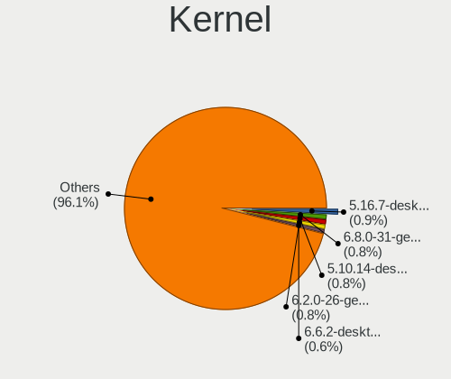

| Version                         | Computers | Percent |
|---------------------------------|-----------|---------|
| 5.10.14-desktop-1omv4002        | 19        | 2.02%   |
| 5.4.0-42-generic                | 13        | 1.38%   |
| 5.16.7-desktop-1omv4003         | 12        | 1.28%   |
| 5.10.0-8-amd64                  | 10        | 1.06%   |
| 5.0.0-23-generic                | 9         | 0.96%   |
| 5.13.0-30-generic               | 8         | 0.85%   |
| 4.18.0-25-generic               | 8         | 0.85%   |
| 5.4.0-58-generic                | 7         | 0.74%   |
| 5.0.0-13-generic                | 7         | 0.74%   |
| 4.18.0-16-generic               | 7         | 0.74%   |
| 5.8.0-50-generic                | 6         | 0.64%   |
| 5.4.0-74-generic                | 6         | 0.64%   |
| 5.4.0-73-generic                | 6         | 0.64%   |
| 5.4.0-52-generic                | 6         | 0.64%   |
| 5.4.0-48-generic                | 6         | 0.64%   |
| 5.4.0-33-generic                | 6         | 0.64%   |
| 5.4.0-29-generic                | 6         | 0.64%   |
| 5.3.0-46-generic                | 6         | 0.64%   |
| 5.12.4-desktop-1omv4050         | 6         | 0.64%   |
| 5.11.0-43-generic               | 6         | 0.64%   |
| 5.11.0-34-generic               | 6         | 0.64%   |
| 5.8.0-63-generic                | 5         | 0.53%   |
| 5.8.0-43-generic                | 5         | 0.53%   |
| 5.4.0-77-generic                | 5         | 0.53%   |
| 5.3.0-28-generic                | 5         | 0.53%   |
| 5.15.0-2-amd64                  | 5         | 0.53%   |
| 5.13.0-35-generic               | 5         | 0.53%   |
| 5.13.0-22-generic               | 5         | 0.53%   |
| 5.11.0-41-generic               | 5         | 0.53%   |
| 5.11.0-40-generic               | 5         | 0.53%   |
| 5.11.0-37-generic               | 5         | 0.53%   |
| 5.10.41-amd64-desktop           | 5         | 0.53%   |
| 5.0.0-25-generic                | 5         | 0.53%   |
| 4.18.0-15-generic               | 5         | 0.53%   |
| 5.8.0-55-generic                | 4         | 0.43%   |
| 5.6.14-desktop-2bP              | 4         | 0.43%   |
| 5.4.0-54-generic                | 4         | 0.43%   |
| 5.4.0-53-generic                | 4         | 0.43%   |
| 5.4.0-47-generic                | 4         | 0.43%   |
| 5.4.0-40-generic                | 4         | 0.43%   |
| 5.4.0-37-generic                | 4         | 0.43%   |
| 5.4.0-107-generic               | 4         | 0.43%   |
| 5.3.0-24-generic                | 4         | 0.43%   |
| 5.3.0-18-generic                | 4         | 0.43%   |
| 5.15.0-27-generic               | 4         | 0.43%   |
| 5.15.0-25-generic               | 4         | 0.43%   |
| 5.13.0-28-generic               | 4         | 0.43%   |
| 5.11.0-27-generic               | 4         | 0.43%   |
| 5.11.0-25-generic               | 4         | 0.43%   |
| 5.10.36-2-MANJARO               | 4         | 0.43%   |
| 5.10.0-9-amd64                  | 4         | 0.43%   |
| 5.10.0-1011-oem                 | 4         | 0.43%   |
| 5.0.0-37-generic                | 4         | 0.43%   |
| 4.9.60-nrj-desktop-1rosa-x86_64 | 4         | 0.43%   |
| 4.18.0-17-generic               | 4         | 0.43%   |
| 4.15.0-58-generic               | 4         | 0.43%   |
| 4.15.0-47-generic               | 4         | 0.43%   |
| 4.15.0-45-generic               | 4         | 0.43%   |
| 5.9.16-1-MANJARO                | 3         | 0.32%   |
| 5.8.0-48-generic                | 3         | 0.32%   |

Kernel Family
-------------

Linux kernel without a distro release

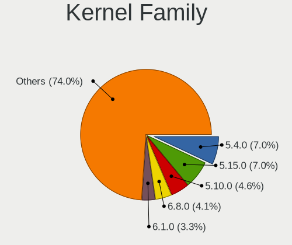

| Version | Computers | Percent |
|---------|-----------|---------|
| 5.4.0   | 124       | 13.63%  |
| 4.15.0  | 56        | 6.15%   |
| 5.11.0  | 54        | 5.93%   |
| 5.8.0   | 45        | 4.95%   |
| 5.0.0   | 43        | 4.73%   |
| 4.18.0  | 43        | 4.73%   |
| 5.13.0  | 41        | 4.51%   |
| 5.10.0  | 38        | 4.18%   |
| 5.3.0   | 35        | 3.85%   |
| 4.19.0  | 22        | 2.42%   |
| 5.15.0  | 19        | 2.09%   |
| 5.10.14 | 19        | 2.09%   |
| 5.16.7  | 13        | 1.43%   |
| 3.10.0  | 9         | 0.99%   |
| 5.6.14  | 7         | 0.77%   |
| 5.16.0  | 7         | 0.77%   |
| 5.12.4  | 6         | 0.66%   |
| 4.9.60  | 6         | 0.66%   |
| 5.7.7   | 5         | 0.55%   |
| 5.6.0   | 5         | 0.55%   |
| 5.10.41 | 5         | 0.55%   |
| 5.10.36 | 5         | 0.55%   |
| 5.9.16  | 4         | 0.44%   |
| 5.9.11  | 4         | 0.44%   |
| 5.4.2   | 4         | 0.44%   |
| 5.4.18  | 4         | 0.44%   |
| 5.17.1  | 4         | 0.44%   |
| 5.14.6  | 4         | 0.44%   |
| 5.14.0  | 4         | 0.44%   |
| 5.10.27 | 4         | 0.44%   |
| 5.8.18  | 3         | 0.33%   |
| 5.16.9  | 3         | 0.33%   |
| 5.15.5  | 3         | 0.33%   |
| 5.15.28 | 3         | 0.33%   |
| 5.13.13 | 3         | 0.33%   |
| 5.12.9  | 3         | 0.33%   |
| 5.12.10 | 3         | 0.33%   |
| 5.12.0  | 3         | 0.33%   |
| 5.11.12 | 3         | 0.33%   |
| 5.10.60 | 3         | 0.33%   |
| 5.10.35 | 3         | 0.33%   |
| 4.9.0   | 3         | 0.33%   |
| 4.13.0  | 3         | 0.33%   |
| 4.1.42  | 3         | 0.33%   |
| 5.9.8   | 2         | 0.22%   |
| 5.9.12  | 2         | 0.22%   |
| 5.9.10  | 2         | 0.22%   |
| 5.9.0   | 2         | 0.22%   |
| 5.8.9   | 2         | 0.22%   |
| 5.8.3   | 2         | 0.22%   |
| 5.8.15  | 2         | 0.22%   |
| 5.8.12  | 2         | 0.22%   |
| 5.7.8   | 2         | 0.22%   |
| 5.7.10  | 2         | 0.22%   |
| 5.5.2   | 2         | 0.22%   |
| 5.4.50  | 2         | 0.22%   |
| 5.4.3   | 2         | 0.22%   |
| 5.4.23  | 2         | 0.22%   |
| 5.3.5   | 2         | 0.22%   |
| 5.3.18  | 2         | 0.22%   |

Kernel Major Ver.
-----------------

Linux kernel major version

| Version | Computers | Percent |
|---------|-----------|---------|
| 5.4     | 152       | 16.87%  |
| 5.10    | 104       | 11.54%  |
| 5.11    | 72        | 7.99%   |
| 5.8     | 61        | 6.77%   |
| 4.15    | 56        | 6.22%   |
| 5.13    | 51        | 5.66%   |
| 5.0     | 47        | 5.22%   |
| 5.15    | 45        | 4.99%   |
| 4.18    | 45        | 4.99%   |
| 5.3     | 43        | 4.77%   |
| 5.16    | 30        | 3.33%   |
| 4.19    | 27        | 3%      |
| 5.12    | 23        | 2.55%   |
| 5.14    | 22        | 2.44%   |
| 5.9     | 21        | 2.33%   |
| 5.6     | 19        | 2.11%   |
| 5.7     | 13        | 1.44%   |
| 4.9     | 12        | 1.33%   |
| 3.10    | 11        | 1.22%   |
| 5.17    | 10        | 1.11%   |
| 5.5     | 8         | 0.89%   |
| 5.1     | 5         | 0.55%   |
| 4.1     | 5         | 0.55%   |
| 4.14    | 4         | 0.44%   |
| 4.13    | 3         | 0.33%   |
| 5.2     | 2         | 0.22%   |
| 4.4     | 2         | 0.22%   |
| 4.20    | 2         | 0.22%   |
| 4.6     | 1         | 0.11%   |
| 4.17    | 1         | 0.11%   |
| 4.12    | 1         | 0.11%   |
| 4.10    | 1         | 0.11%   |
| 3.4     | 1         | 0.11%   |
| Unknown | 1         | 0.11%   |

Arch
----

OS architecture (x86_64, i586, etc.)

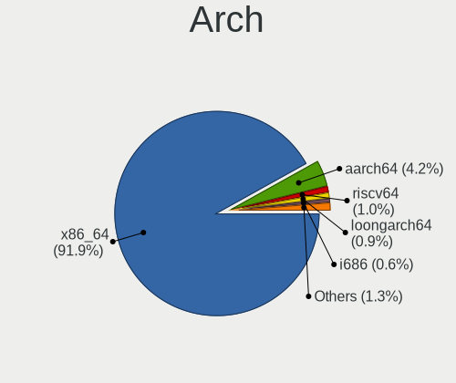

| Name    | Computers | Percent |
|---------|-----------|---------|
| x86_64  | 813       | 95.99%  |
| aarch64 | 19        | 2.24%   |
| i686    | 8         | 0.94%   |
| ppc64   | 3         | 0.35%   |
| mips64  | 1         | 0.12%   |
| armv8l  | 1         | 0.12%   |
| armv7l  | 1         | 0.12%   |
| Unknown | 1         | 0.12%   |

DE
--

Desktop Environment

| Name            | Computers | Percent |
|-----------------|-----------|---------|
| GNOME           | 353       | 40.86%  |
| Unknown         | 174       | 20.14%  |
| KDE5            | 121       | 14%     |
| XFCE            | 52        | 6.02%   |
| KDE             | 33        | 3.82%   |
| X-Cinnamon      | 32        | 3.7%    |
| Deepin          | 25        | 2.89%   |
| i3              | 14        | 1.62%   |
| MATE            | 12        | 1.39%   |
| Unity           | 10        | 1.16%   |
| Cinnamon        | 6         | 0.69%   |
| UKUI            | 4         | 0.46%   |
| Pantheon        | 4         | 0.46%   |
| LXDE            | 4         | 0.46%   |
| KDE4            | 4         | 0.46%   |
| GNOME Flashback | 4         | 0.46%   |
| GNOME Classic   | 3         | 0.35%   |
| Budgie          | 3         | 0.35%   |
| GNUstep         | 2         | 0.23%   |
| xmonad          | 1         | 0.12%   |
| sway            | 1         | 0.12%   |
| LXQt            | 1         | 0.12%   |
| bspwm           | 1         | 0.12%   |

Display Server
--------------

X11 or Wayland

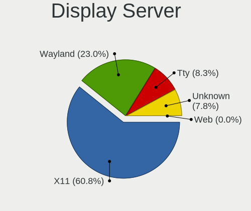

| Name    | Computers | Percent |
|---------|-----------|---------|
| X11     | 637       | 74.07%  |
| Wayland | 101       | 11.74%  |
| Unknown | 88        | 10.23%  |
| Tty     | 34        | 3.95%   |

Display Manager
---------------

SDDM, LightDM, etc.

| Name    | Computers | Percent |
|---------|-----------|---------|
| Unknown | 432       | 50%     |
| GDM     | 131       | 15.16%  |
| SDDM    | 114       | 13.19%  |
| LightDM | 73        | 8.45%   |
| GDM3    | 63        | 7.29%   |
| TDM     | 43        | 4.98%   |
| KDM     | 3         | 0.35%   |
| XDM     | 2         | 0.23%   |
| LXDM    | 2         | 0.23%   |
| SLiM    | 1         | 0.12%   |

OS Lang
-------

Language

| Lang        | Computers | Percent |
|-------------|-----------|---------|
| zh_CN       | 358       | 41.58%  |
| en_US       | 296       | 34.38%  |
| Unknown     | 163       | 18.93%  |
| C           | 10        | 1.16%   |
| en_HK       | 8         | 0.93%   |
| en_GB       | 7         | 0.81%   |
| mn_CN       | 4         | 0.46%   |
| en_AU       | 3         | 0.35%   |
| ja_JP       | 2         | 0.23%   |
| de_DE       | 2         | 0.23%   |
| th_TH       | 1         | 0.12%   |
| POSIX       | 1         | 0.12%   |
| fr_FR       | 1         | 0.12%   |
| en_ZA       | 1         | 0.12%   |
| en_US.utf-8 | 1         | 0.12%   |
| en_SG       | 1         | 0.12%   |
| C.UTF8      | 1         | 0.12%   |
| .en_US      | 1         | 0.12%   |

Boot Mode
---------

EFI or BIOS

| Mode | Computers | Percent |
|------|-----------|---------|
| EFI  | 544       | 63.4%   |
| BIOS | 314       | 36.6%   |

Filesystem
----------

Type of filesystem

| Type       | Computers | Percent |
|------------|-----------|---------|
| Ext4       | 681       | 79.28%  |
| Btrfs      | 56        | 6.52%   |
| Xfs        | 38        | 4.42%   |
| Overlay    | 37        | 4.31%   |
| Unknown    | 31        | 3.61%   |
| Zfs        | 9         | 1.05%   |
| F2fs       | 4         | 0.47%   |
| Tmpfs      | 1         | 0.12%   |
| Reiserfs   | 1         | 0.12%   |
| Fuse.sshfs | 1         | 0.12%   |

Part. scheme
------------

Scheme of partitioning

| Type    | Computers | Percent |
|---------|-----------|---------|
| Unknown | 416       | 48.88%  |
| GPT     | 362       | 42.54%  |
| MBR     | 73        | 8.58%   |

Dual Boot with Linux/BSD
------------------------

Hosting more than one Linux/BSD

| Dual boot | Computers | Percent |
|-----------|-----------|---------|
| No        | 752       | 87.44%  |
| Yes       | 108       | 12.56%  |

Dual Boot (Win)
---------------

Hosting Linux and Windows

| Dual boot | Computers | Percent |
|-----------|-----------|---------|
| No        | 510       | 59.86%  |
| Yes       | 342       | 40.14%  |

Board
-----

Vendor
------

Motherboard manufacturer

| Name                           | Computers | Percent |
|--------------------------------|-----------|---------|
| Lenovo                         | 232       | 27.42%  |
| Dell                           | 103       | 12.17%  |
| ASUSTek Computer               | 84        | 9.93%   |
| Hewlett-Packard                | 69        | 8.16%   |
| HUAWEI                         | 40        | 4.73%   |
| Gigabyte Technology            | 39        | 4.61%   |
| MSI                            | 33        | 3.9%    |
| Timi                           | 27        | 3.19%   |
| Acer                           | 21        | 2.48%   |
| Intel                          | 20        | 2.36%   |
| Unknown                        | 20        | 2.36%   |
| HASEE Computer                 | 12        | 1.42%   |
| ASRock                         | 10        | 1.18%   |
| Apple                          | 7         | 0.83%   |
| Toshiba                        | 6         | 0.71%   |
| Sony                           | 6         | 0.71%   |
| Raspberry Pi Foundation        | 6         | 0.71%   |
| MECHREVO                       | 6         | 0.71%   |
| AMI                            | 6         | 0.71%   |
| Microsoft                      | 5         | 0.59%   |
| Google                         | 5         | 0.59%   |
| TSINGHUA TONGFANG COMPUTER     | 4         | 0.47%   |
| Supermicro                     | 4         | 0.47%   |
| Phytium                        | 4         | 0.47%   |
| GPD                            | 4         | 0.47%   |
| Samsung Electronics            | 3         | 0.35%   |
| Notebook                       | 3         | 0.35%   |
| Huanan                         | 3         | 0.35%   |
| Fujitsu                        | 3         | 0.35%   |
| Terrans Force                  | 2         | 0.24%   |
| Soyo                           | 2         | 0.24%   |
| Shanghai Zhaoxin Semiconductor | 2         | 0.24%   |
| OEM                            | 2         | 0.24%   |
| LG Electronics                 | 2         | 0.24%   |
| Jumper                         | 2         | 0.24%   |
| Insyde                         | 2         | 0.24%   |
| ECS                            | 2         | 0.24%   |
| Colorful Technology            | 2         | 0.24%   |
| Alienware                      | 2         | 0.24%   |
| Yeston Digital Technology      | 1         | 0.12%   |
| Yanling                        | 1         | 0.12%   |
| TR                             | 1         | 0.12%   |
| Teclast                        | 1         | 0.12%   |
| SYWZ                           | 1         | 0.12%   |
| Synology                       | 1         | 0.12%   |
| Schenker                       | 1         | 0.12%   |
| Sapphire Technology Limited    | 1         | 0.12%   |
| RBQ                            | 1         | 0.12%   |
| Razer                          | 1         | 0.12%   |
| Quanta                         | 1         | 0.12%   |
| ONDA                           | 1         | 0.12%   |
| Nvidia                         | 1         | 0.12%   |
| LORD ELECTRONICS               | 1         | 0.12%   |
| Loongson                       | 1         | 0.12%   |
| Jemper                         | 1         | 0.12%   |
| J&W                            | 1         | 0.12%   |
| IPASON                         | 1         | 0.12%   |
| IP3 Tech                       | 1         | 0.12%   |
| Inspur                         | 1         | 0.12%   |
| IBM                            | 1         | 0.12%   |

Model
-----

Motherboard model

| Name                                     | Computers | Percent |
|------------------------------------------|-----------|---------|
| Unknown                                  | 28        | 3.31%   |
| ASUS All Series                          | 10        | 1.18%   |
| HUAWEI HLY-WX9XX                         | 8         | 0.95%   |
| MSI MS-7B89                              | 5         | 0.59%   |
| Lenovo Legion R9000P2021H 82JQ           | 5         | 0.59%   |
| Lenovo Legion R7000 2020 82B6            | 5         | 0.59%   |
| TSINGHUA TONGFANG COMPUTER E500          | 4         | 0.47%   |
| Timi TM1701                              | 4         | 0.47%   |
| Phytium FT-2000/4                        | 4         | 0.47%   |
| HUAWEI BOHK-WAX9X                        | 4         | 0.47%   |
| AMI Aptio CRB                            | 4         | 0.47%   |
| Timi TM1709                              | 3         | 0.35%   |
| Timi RedmiBook Pro 15S                   | 3         | 0.35%   |
| Timi RedmiBook 14 II                     | 3         | 0.35%   |
| Lenovo Yoga 14cACN 2021 82N7             | 3         | 0.35%   |
| Lenovo XiaoXinPro-13IML 2019 81XB        | 3         | 0.35%   |
| Lenovo XiaoXinAir-14ARE 2020 81YN        | 3         | 0.35%   |
| Lenovo XiaoXin-15ARE 2020 81YR           | 3         | 0.35%   |
| Lenovo ThinkBook 14 G2 ITL 20VD          | 3         | 0.35%   |
| Lenovo Product                           | 3         | 0.35%   |
| Lenovo Legion Y7000 81FW                 | 3         | 0.35%   |
| HUAWEI NBLK-WAX9X                        | 3         | 0.35%   |
| HUAWEI KPRC-WX0                          | 3         | 0.35%   |
| HUAWEI KPL-W0X                           | 3         | 0.35%   |
| HP ENVY Laptop 13-ad1xx                  | 3         | 0.35%   |
| Dell XPS 15 9570                         | 3         | 0.35%   |
| ASUS TUF GAMING B550M-PLUS               | 3         | 0.35%   |
| ASUS M5A78L-M LX3 PLUS                   | 3         | 0.35%   |
| Acer Swift SF314-42                      | 3         | 0.35%   |
| Timi TM1613                              | 2         | 0.24%   |
| Timi Mi Laptop Pro 15                    | 2         | 0.24%   |
| Supermicro Super Server                  | 2         | 0.24%   |
| Shanghai Zhaoxin ZXE CRB                 | 2         | 0.24%   |
| RPi Raspberry Pi 4 Model B Rev 1.5       | 2         | 0.24%   |
| RPi Raspberry Pi 4 Model B Rev 1.1       | 2         | 0.24%   |
| RPi Raspberry Pi                         | 2         | 0.24%   |
| MSI MS-7C94                              | 2         | 0.24%   |
| MSI MS-7A40                              | 2         | 0.24%   |
| Microsoft Surface Go                     | 2         | 0.24%   |
| Lenovo ZHAOYANG E42-80 80T9              | 2         | 0.24%   |
| Lenovo Yoga C940-14IIL 81Q9              | 2         | 0.24%   |
| Lenovo Yoga 14sARH 2021 82LB             | 2         | 0.24%   |
| Lenovo XiaoXin Chao7000-14IKBR 81GA      | 2         | 0.24%   |
| Lenovo ThinkPad T14 Gen 1 20UD0004CD     | 2         | 0.24%   |
| Lenovo ThinkPad E555 20DHA01MCD          | 2         | 0.24%   |
| Lenovo ThinkCentre M910t-N000 10N9CTO1WW | 2         | 0.24%   |
| Lenovo ThinkBook 15p Gen 2 21B1          | 2         | 0.24%   |
| Lenovo Legion Y9000X 2020 81TH           | 2         | 0.24%   |
| Lenovo Legion R7000P2020H 82GR           | 2         | 0.24%   |
| Lenovo IdeaPad Y470 20090                | 2         | 0.24%   |
| Jumper EZbook                            | 2         | 0.24%   |
| Intel NUC5PPYB H76558-109                | 2         | 0.24%   |
| Intel NUC10i7FNH                         | 2         | 0.24%   |
| HUAWEI WRT-WX9                           | 2         | 0.24%   |
| HUAWEI KPR-WX9                           | 2         | 0.24%   |
| HUAWEI KLVL-WXX9                         | 2         | 0.24%   |
| HUAWEI HLYL-WXX9                         | 2         | 0.24%   |
| HP ZHAN 66 Pro G1                        | 2         | 0.24%   |
| HP ZHAN 66 Pro A 14 G3                   | 2         | 0.24%   |
| HP ZHAN 66 Pro 15 G3                     | 2         | 0.24%   |

Model Family
------------

Motherboard model prefix

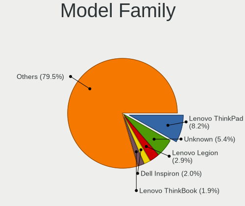

| Name                            | Computers | Percent |
|---------------------------------|-----------|---------|
| Lenovo ThinkPad                 | 81        | 9.57%   |
| Dell Inspiron                   | 30        | 3.55%   |
| Unknown                         | 28        | 3.31%   |
| Lenovo Legion                   | 27        | 3.19%   |
| Dell Latitude                   | 17        | 2.01%   |
| ASUS PRIME                      | 14        | 1.65%   |
| Dell OptiPlex                   | 13        | 1.54%   |
| HP ZHAN                         | 12        | 1.42%   |
| Dell XPS                        | 12        | 1.42%   |
| Acer Aspire                     | 12        | 1.42%   |
| Lenovo Yoga                     | 11        | 1.3%    |
| Dell Precision                  | 11        | 1.3%    |
| Lenovo IdeaPad                  | 10        | 1.18%   |
| HP EliteBook                    | 10        | 1.18%   |
| ASUS TUF                        | 10        | 1.18%   |
| ASUS All                        | 10        | 1.18%   |
| Lenovo ZHAOYANG                 | 9         | 1.06%   |
| Lenovo ThinkCentre              | 9         | 1.06%   |
| Lenovo ThinkBook                | 9         | 1.06%   |
| Dell PowerEdge                  | 9         | 1.06%   |
| HUAWEI HLY-WX9XX                | 8         | 0.95%   |
| HP OMEN                         | 8         | 0.95%   |
| Timi RedmiBook                  | 7         | 0.83%   |
| HP ENVY                         | 7         | 0.83%   |
| ASUS ROG                        | 7         | 0.83%   |
| Acer Swift                      | 7         | 0.83%   |
| RPi Raspberry                   | 6         | 0.71%   |
| Lenovo XiaoXin                  | 6         | 0.71%   |
| HP ProBook                      | 6         | 0.71%   |
| MSI MS-7B89                     | 5         | 0.59%   |
| Microsoft Surface               | 5         | 0.59%   |
| Lenovo ThinkStation             | 5         | 0.59%   |
| TSINGHUA TONGFANG COMPUTER E500 | 4         | 0.47%   |
| Toshiba Satellite               | 4         | 0.47%   |
| Timi TM1701                     | 4         | 0.47%   |
| Phytium FT-2000                 | 4         | 0.47%   |
| Lenovo ZHENGJIUZHE              | 4         | 0.47%   |
| HUAWEI BOHK-WAX9X               | 4         | 0.47%   |
| HP Pavilion                     | 4         | 0.47%   |
| AMI Aptio                       | 4         | 0.47%   |
| Timi TM1709                     | 3         | 0.35%   |
| Timi Mi                         | 3         | 0.35%   |
| Lenovo XiaoXinPro-13IML         | 3         | 0.35%   |
| Lenovo XiaoXinPro               | 3         | 0.35%   |
| Lenovo XiaoXinAir-14ARE         | 3         | 0.35%   |
| Lenovo XiaoXin-15ARE            | 3         | 0.35%   |
| Lenovo Product                  | 3         | 0.35%   |
| HUAWEI NBLK-WAX9X               | 3         | 0.35%   |
| HUAWEI KPRC-WX0                 | 3         | 0.35%   |
| HUAWEI KPL-W0X                  | 3         | 0.35%   |
| Huanan X79                      | 3         | 0.35%   |
| HP ProDesk                      | 3         | 0.35%   |
| HP Laptop                       | 3         | 0.35%   |
| Dell Vostro                     | 3         | 0.35%   |
| Dell G3                         | 3         | 0.35%   |
| ASUS M5A78L-M                   | 3         | 0.35%   |
| ASUS ASUS                       | 3         | 0.35%   |
| Timi TM1613                     | 2         | 0.24%   |
| Supermicro Super                | 2         | 0.24%   |
| Shanghai Zhaoxin ZXE            | 2         | 0.24%   |

MFG Year
--------

Motherboard manufacture year

| Year    | Computers | Percent |
|---------|-----------|---------|
| 2020    | 126       | 14.89%  |
| 2018    | 117       | 13.83%  |
| 2019    | 115       | 13.59%  |
| 2021    | 94        | 11.11%  |
| 2017    | 67        | 7.92%   |
| 2015    | 63        | 7.45%   |
| 2016    | 49        | 5.79%   |
| 2012    | 41        | 4.85%   |
| 2013    | 39        | 4.61%   |
| 2014    | 38        | 4.49%   |
| 2011    | 33        | 3.9%    |
| Unknown | 16        | 1.89%   |
| 2010    | 13        | 1.54%   |
| 2009    | 13        | 1.54%   |
| 2008    | 11        | 1.3%    |
| 2007    | 7         | 0.83%   |
| 2022    | 3         | 0.35%   |
| 2006    | 1         | 0.12%   |

Form Factor
-----------

Physical design of the computer

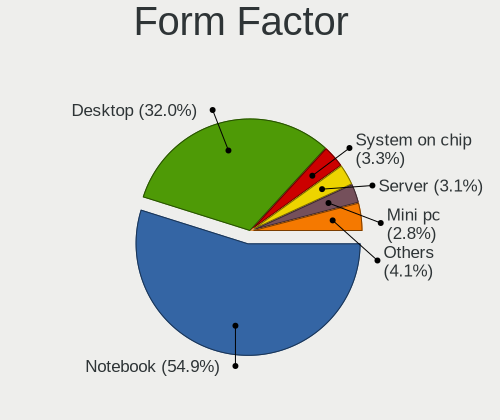

| Name           | Computers | Percent |
|----------------|-----------|---------|
| Notebook       | 506       | 59.81%  |
| Desktop        | 239       | 28.25%  |
| Server         | 35        | 4.14%   |
| Mini pc        | 18        | 2.13%   |
| Convertible    | 16        | 1.89%   |
| Tablet         | 14        | 1.65%   |
| System on chip | 12        | 1.42%   |
| Phone          | 3         | 0.35%   |
| All in one     | 3         | 0.35%   |

Secure Boot
-----------

Enabled or disabled

| State    | Computers | Percent |
|----------|-----------|---------|
| Disabled | 770       | 90.59%  |
| Enabled  | 80        | 9.41%   |

Coreboot
--------

Have coreboot on board

| Used | Computers | Percent |
|------|-----------|---------|
| No   | 841       | 99.41%  |
| Yes  | 5         | 0.59%   |

RAM Size
--------

Total RAM memory

| Size in GB      | Computers | Percent |
|-----------------|-----------|---------|
| 16.01-24.0      | 208       | 24.36%  |
| 4.01-8.0        | 198       | 23.19%  |
| 8.01-16.0       | 186       | 21.78%  |
| 3.01-4.0        | 94        | 11.01%  |
| 32.01-64.0      | 81        | 9.48%   |
| 64.01-256.0     | 36        | 4.22%   |
| 1.01-2.0        | 20        | 2.34%   |
| 24.01-32.0      | 15        | 1.76%   |
| 0.51-1.0        | 7         | 0.82%   |
| Unknown         | 5         | 0.59%   |
| More than 256.0 | 3         | 0.35%   |
| 2.01-3.0        | 1         | 0.12%   |

RAM Used
--------

Used RAM memory

| Used GB     | Computers | Percent |
|-------------|-----------|---------|
| 1.01-2.0    | 260       | 28.6%   |
| 2.01-3.0    | 233       | 25.63%  |
| 4.01-8.0    | 153       | 16.83%  |
| 3.01-4.0    | 135       | 14.85%  |
| 0.51-1.0    | 53        | 5.83%   |
| 8.01-16.0   | 38        | 4.18%   |
| 0.01-0.5    | 18        | 1.98%   |
| Unknown     | 8         | 0.88%   |
| 32.01-64.0  | 4         | 0.44%   |
| 16.01-24.0  | 4         | 0.44%   |
| 24.01-32.0  | 2         | 0.22%   |
| 64.01-256.0 | 1         | 0.11%   |

Total Drives
------------

Number of drives on board

| Drives  | Computers | Percent |
|---------|-----------|---------|
| 1       | 479       | 55.83%  |
| 2       | 265       | 30.89%  |
| 3       | 63        | 7.34%   |
| 4       | 23        | 2.68%   |
| 5       | 9         | 1.05%   |
| 0       | 8         | 0.93%   |
| 6       | 4         | 0.47%   |
| 10      | 2         | 0.23%   |
| 9       | 2         | 0.23%   |
| 36      | 1         | 0.12%   |
| 11      | 1         | 0.12%   |
| Unknown | 1         | 0.12%   |

Has CD-ROM
----------

Has CD-ROM on board

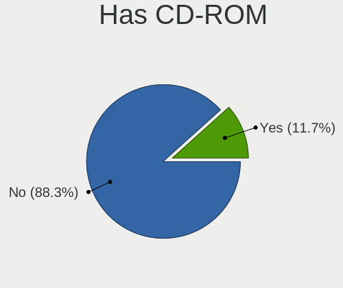

| Presented | Computers | Percent |
|-----------|-----------|---------|
| No        | 719       | 84.69%  |
| Yes       | 130       | 15.31%  |

Has Ethernet
------------

Has Ethernet on board

| Presented | Computers | Percent |
|-----------|-----------|---------|
| Yes       | 672       | 79.06%  |
| No        | 178       | 20.94%  |

Has WiFi
--------

Has WiFi module

| Presented | Computers | Percent |
|-----------|-----------|---------|
| Yes       | 663       | 78.09%  |
| No        | 186       | 21.91%  |

Has Bluetooth
-------------

Has Bluetooth module

| Presented | Computers | Percent |
|-----------|-----------|---------|
| Yes       | 554       | 64.87%  |
| No        | 300       | 35.13%  |

Location
--------

Country
-------

Geographic location (country)

| Country | Computers | Percent |
|---------|-----------|---------|
| China   | 846       | 100%    |

City
----

Geographic location (city)

| City          | Computers | Percent |
|---------------|-----------|---------|
| Beijing       | 156       | 17.75%  |
| Shanghai      | 82        | 9.33%   |
| Shenzhen      | 69        | 7.85%   |
| Guangzhou     | 64        | 7.28%   |
| Chengdu       | 32        | 3.64%   |
| Hangzhou      | 26        | 2.96%   |
| Wuhan         | 24        | 2.73%   |
| Nanjing       | 19        | 2.16%   |
| Xi'an         | 17        | 1.93%   |
| Tianjin       | 15        | 1.71%   |
| Zhengzhou     | 11        | 1.25%   |
| Xuhui         | 11        | 1.25%   |
| Haidian       | 11        | 1.25%   |
| Nanning       | 10        | 1.14%   |
| Jinan         | 9         | 1.02%   |
| Hefei         | 9         | 1.02%   |
| Dalian        | 9         | 1.02%   |
| Shenyang      | 8         | 0.91%   |
| Kunming       | 8         | 0.91%   |
| Jinrongjie    | 8         | 0.91%   |
| Hohhot        | 8         | 0.91%   |
| Changsha      | 8         | 0.91%   |
| Zhuhai        | 7         | 0.8%    |
| Suzhou        | 7         | 0.8%    |
| Guangzhou Shi | 7         | 0.8%    |
| Xiamen        | 6         | 0.68%   |
| Qingdao       | 6         | 0.68%   |
| Dongguan      | 6         | 0.68%   |
| Xining        | 5         | 0.57%   |
| Foshan        | 5         | 0.57%   |
| Changchun     | 5         | 0.57%   |
| Wuxi          | 4         | 0.46%   |
| Shahekou      | 4         | 0.46%   |
| Ningbo        | 4         | 0.46%   |
| Huxi          | 4         | 0.46%   |
| Huangpu       | 4         | 0.46%   |
| Chongqing     | 4         | 0.46%   |
| Baiyun        | 4         | 0.46%   |
| Taiyuan       | 3         | 0.34%   |
| Songjiang     | 3         | 0.34%   |
| Huizhou       | 3         | 0.34%   |
| Hongkou       | 3         | 0.34%   |
| Guiyang       | 3         | 0.34%   |
| Fuzhou        | 3         | 0.34%   |
| Chenzhou      | 3         | 0.34%   |
| Changzhou     | 3         | 0.34%   |
| Zhongshan     | 2         | 0.23%   |
| Zhanjiang     | 2         | 0.23%   |
| Yiwu          | 2         | 0.23%   |
| Yingchuan     | 2         | 0.23%   |
| Yanqing       | 2         | 0.23%   |
| Yangquan      | 2         | 0.23%   |
| Weifang       | 2         | 0.23%   |
| Qinzhou       | 2         | 0.23%   |
| Qinnan        | 2         | 0.23%   |
| Putuo         | 2         | 0.23%   |
| Pudong        | 2         | 0.23%   |
| Nankai        | 2         | 0.23%   |
| Liuli         | 2         | 0.23%   |
| Lishui        | 2         | 0.23%   |

Drives
------

Drive Vendor
------------

Hard drive vendors

| Vendor                      | Computers | Drives | Percent |
|-----------------------------|-----------|--------|---------|
| Samsung Electronics         | 225       | 279    | 17.86%  |
| WDC                         | 175       | 225    | 13.89%  |
| Seagate                     | 162       | 224    | 12.86%  |
| Toshiba                     | 86        | 106    | 6.83%   |
| Unknown                     | 55        | 71     | 4.37%   |
| Sandisk                     | 52        | 63     | 4.13%   |
| Intel                       | 47        | 67     | 3.73%   |
| SK Hynix                    | 37        | 43     | 2.94%   |
| Kingston                    | 32        | 38     | 2.54%   |
| HGST                        | 29        | 39     | 2.3%    |
| Micron Technology           | 23        | 23     | 1.83%   |
| PLEXTOR                     | 22        | 24     | 1.75%   |
| Silicon Motion              | 18        | 20     | 1.43%   |
| Hitachi                     | 16        | 26     | 1.27%   |
| Lenovo                      | 14        | 21     | 1.11%   |
| Crucial                     | 13        | 14     | 1.03%   |
| LITEON                      | 12        | 15     | 0.95%   |
| Phison                      | 11        | 14     | 0.87%   |
| A-DATA Technology           | 11        | 14     | 0.87%   |
| GALAX                       | 10        | 10     | 0.79%   |
| FORESEE                     | 8         | 8      | 0.63%   |
| Teclast                     | 7         | 7      | 0.56%   |
| Netac                       | 7         | 8      | 0.56%   |
| JMicron                     | 7         | 5      | 0.56%   |
| Hikvision                   | 7         | 7      | 0.56%   |
| Hewlett-Packard             | 7         | 9      | 0.56%   |
| Colorful                    | 7         | 8      | 0.56%   |
| Unknown                     | 7         | 7      | 0.56%   |
| Transcend                   | 6         | 7      | 0.48%   |
| KIOXIA-EXCERIA              | 6         | 9      | 0.48%   |
| KIOXIA                      | 6         | 9      | 0.48%   |
| Fujitsu                     | 6         | 6      | 0.48%   |
| China                       | 6         | 7      | 0.48%   |
| Lite-On                     | 5         | 7      | 0.4%    |
| KINGBANK                    | 5         | 7      | 0.4%    |
| Apple                       | 5         | 5      | 0.4%    |
| Pear 2TB                    | 4         | 4      | 0.32%   |
| GLOWAY                      | 4         | 4      | 0.32%   |
| FASPEED                     | 4         | 4      | 0.32%   |
| ZHITAI                      | 3         | 3      | 0.24%   |
| Lexar                       | 3         | 3      | 0.24%   |
| KingSpec                    | 3         | 3      | 0.24%   |
| Kingchuxing                 | 3         | 3      | 0.24%   |
| External                    | 3         | 5      | 0.24%   |
| Vaseky                      | 2         | 2      | 0.16%   |
| UMIS                        | 2         | 2      | 0.16%   |
| Q200                        | 2         | 5      | 0.16%   |
| Phison Electronics          | 2         | 2      | 0.16%   |
| OCZ                         | 2         | 2      | 0.16%   |
| KINGSHARE                   | 2         | 2      | 0.16%   |
| KDATA                       | 2         | 4      | 0.16%   |
| Getrich                     | 2         | 2      | 0.16%   |
| Galaxy                      | 2         | 2      | 0.16%   |
| ASMT                        | 2         | 5      | 0.16%   |
| Acer                        | 2         | 3      | 0.16%   |
| ACASIS                      | 2         | 2      | 0.16%   |
| Yangtze Memory Technologies | 1         | 1      | 0.08%   |
| XPG                         | 1         | 1      | 0.08%   |
| Xinsujie                    | 1         | 1      | 0.08%   |
| WDC WDS1                    | 1         | 1      | 0.08%   |

Drive Model
-----------

Hard drive models

| Model                                  | Computers | Percent |
|----------------------------------------|-----------|---------|
| Samsung NVMe SSD Drive 512GB           | 21        | 1.53%   |
| WDC WD10EZEX-08WN4A0 1TB               | 14        | 1.02%   |
| Seagate ST1000LM035-1RK172 1TB         | 14        | 1.02%   |
| Sandisk NVMe SSD Drive 512GB           | 14        | 1.02%   |
| Samsung MZVLB512HBJQ-000L2 512GB       | 13        | 0.95%   |
| HGST HTS721010A9E630 1TB               | 13        | 0.95%   |
| Samsung NVMe SSD Drive 1024GB          | 12        | 0.87%   |
| Seagate ST1000DM003-1SB102 1TB         | 11        | 0.8%    |
| Samsung NVMe SSD Drive 256GB           | 11        | 0.8%    |
| Samsung SSD 860 EVO 500GB              | 9         | 0.66%   |
| Seagate ST500LT012-1DG142 500GB        | 8         | 0.58%   |
| Seagate ST2000LM007-1R8174 2TB         | 8         | 0.58%   |
| Seagate ST1000DM010-2EP102 1TB         | 8         | 0.58%   |
| Samsung MZVLB512HBJQ-000L7 512GB       | 8         | 0.58%   |
| Samsung MZVLB512HAJQ-00000 512GB       | 8         | 0.58%   |
| PLEXTOR PX-128M6S 128GB SSD            | 8         | 0.58%   |
| Unknown MMC Card  64GB                 | 7         | 0.51%   |
| Toshiba KBG30ZMS128G 128GB NVMe SSD    | 7         | 0.51%   |
| SK Hynix NVMe SSD Drive 512GB          | 7         | 0.51%   |
| Seagate ST500LM021-1KJ152 500GB        | 7         | 0.51%   |
| Seagate ST500DM002-1BD142 500GB        | 7         | 0.51%   |
| Seagate ST1000LM048-2E7172 1TB         | 7         | 0.51%   |
| Unknown                                | 7         | 0.51%   |
| WDC WDS100T2B0C-00PXH0 1TB             | 6         | 0.44%   |
| WDC WD10EZEX-08M2NA0 1TB               | 6         | 0.44%   |
| Toshiba MQ01ABD100 1TB                 | 6         | 0.44%   |
| Seagate ST3500418AS 500GB              | 6         | 0.44%   |
| Samsung NVMe SSD Drive 500GB           | 6         | 0.44%   |
| GALAX TA1D0240A 240GB                  | 6         | 0.44%   |
| Unknown MMC Card  32GB                 | 5         | 0.36%   |
| Unknown MMC Card  128GB                | 5         | 0.36%   |
| Toshiba TR200 480GB SSD                | 5         | 0.36%   |
| Toshiba NVMe SSD Drive 512GB           | 5         | 0.36%   |
| Toshiba NVMe SSD Drive 256GB           | 5         | 0.36%   |
| Toshiba DT01ACA200 2TB                 | 5         | 0.36%   |
| SK Hynix SKHynix_HFS512GDE9X084N 512GB | 5         | 0.36%   |
| Silicon Motion NVMe SSD Drive 1024GB   | 5         | 0.36%   |
| Seagate ST1000LM024 HN-M101MBB 1TB     | 5         | 0.36%   |
| Sandisk NVMe SSD Drive 1TB             | 5         | 0.36%   |
| Intel NVMe SSD Drive 512GB             | 5         | 0.36%   |
| HGST HTS725050A7E630 500GB             | 5         | 0.36%   |
| WDC WD10SPZX-22Z10T0 1TB               | 4         | 0.29%   |
| WDC WD10EZEX-22MFCA0 1TB               | 4         | 0.29%   |
| WDC PC SN730 SDBQNTY-512G-1001 512GB   | 4         | 0.29%   |
| WDC PC SN730 SDBPNTY-512G-1101 512GB   | 4         | 0.29%   |
| Silicon Motion NVMe SSD Drive 1TB      | 4         | 0.29%   |
| Seagate ST3000DM008-2DM166 3TB         | 4         | 0.29%   |
| Seagate ST3000DM001-1ER166 3TB         | 4         | 0.29%   |
| Seagate ST2000DM006-2DM164 2TB         | 4         | 0.29%   |
| Seagate ST1000DM003-1ER162 1TB         | 4         | 0.29%   |
| Samsung SSD 860 EVO 250GB              | 4         | 0.29%   |
| Samsung SM963 2.5" NVMe PCIe SSD 128GB | 4         | 0.29%   |
| Samsung MZVLB1T0HBLR-000L2 1TB         | 4         | 0.29%   |
| Samsung MZNLH512HALU-00000 512GB SSD   | 4         | 0.29%   |
| Samsung MZ7KM480HMHQ-000 480GB SSD     | 4         | 0.29%   |
| Pear 2TB Disk 2TB                      | 4         | 0.29%   |
| Micron MTFDHBA512TDV 512GB             | 4         | 0.29%   |
| JMicron Generic 160GB                  | 4         | 0.29%   |
| Intel SSDPEKNW010T8 1TB                | 4         | 0.29%   |
| Hikvision HS-SSD-E2000L 512G           | 4         | 0.29%   |

HDD Vendor
----------

Hard disk drive vendors

| Vendor              | Computers | Drives | Percent |
|---------------------|-----------|--------|---------|
| Seagate             | 161       | 222    | 41.39%  |
| WDC                 | 125       | 158    | 32.13%  |
| Toshiba             | 34        | 44     | 8.74%   |
| HGST                | 29        | 39     | 7.46%   |
| Hitachi             | 16        | 26     | 4.11%   |
| Samsung Electronics | 9         | 10     | 2.31%   |
| Fujitsu             | 6         | 6      | 1.54%   |
| Pear 2TB            | 4         | 4      | 1.03%   |
| ACASIS              | 2         | 2      | 0.51%   |
| LIO-ORG             | 1         | 9      | 0.26%   |
| IBM H0              | 1         | 1      | 0.26%   |
| ASMT                | 1         | 1      | 0.26%   |

SSD Vendor
----------

Solid state drive vendors

| Vendor              | Computers | Drives | Percent |
|---------------------|-----------|--------|---------|
| Samsung Electronics | 78        | 94     | 20.97%  |
| Toshiba             | 22        | 24     | 5.91%   |
| SanDisk             | 22        | 24     | 5.91%   |
| Kingston            | 22        | 27     | 5.91%   |
| PLEXTOR             | 20        | 21     | 5.38%   |
| Intel               | 16        | 20     | 4.3%    |
| WDC                 | 13        | 15     | 3.49%   |
| Micron Technology   | 11        | 11     | 2.96%   |
| LITEON              | 11        | 14     | 2.96%   |
| GALAX               | 10        | 10     | 2.69%   |
| Crucial             | 10        | 11     | 2.69%   |
| A-DATA Technology   | 9         | 12     | 2.42%   |
| Lenovo              | 8         | 9      | 2.15%   |
| Teclast             | 7         | 7      | 1.88%   |
| Netac               | 7         | 8      | 1.88%   |
| China               | 6         | 7      | 1.61%   |
| Transcend           | 5         | 6      | 1.34%   |
| SK Hynix            | 5         | 5      | 1.34%   |
| JMicron             | 4         | 4      | 1.08%   |
| FORESEE             | 4         | 4      | 1.08%   |
| Colorful            | 4         | 4      | 1.08%   |
| Apple               | 4         | 4      | 1.08%   |
| Unknown             | 4         | 4      | 1.08%   |
| Unknown             | 3         | 4      | 0.81%   |
| Lexar               | 3         | 3      | 0.81%   |
| Kingchuxing         | 3         | 3      | 0.81%   |
| GLOWAY              | 3         | 3      | 0.81%   |
| External            | 3         | 5      | 0.81%   |
| Vaseky              | 2         | 2      | 0.54%   |
| Q200                | 2         | 5      | 0.54%   |
| Phison              | 2         | 3      | 0.54%   |
| OCZ                 | 2         | 2      | 0.54%   |
| KIOXIA-EXCERIA      | 2         | 2      | 0.54%   |
| KINGSHARE           | 2         | 2      | 0.54%   |
| KINGBANK            | 2         | 2      | 0.54%   |
| Hewlett-Packard     | 2         | 4      | 0.54%   |
| Galaxy              | 2         | 2      | 0.54%   |
| ZHITAI              | 1         | 1      | 0.27%   |
| WDC WDS1            | 1         | 1      | 0.27%   |
| UNIC2               | 1         | 1      | 0.27%   |
| TurXun              | 1         | 1      | 0.27%   |
| TO Exter            | 1         | 1      | 0.27%   |
| tigo                | 1         | 1      | 0.27%   |
| TAISU               | 1         | 1      | 0.27%   |
| StoreJet            | 1         | 1      | 0.27%   |
| Shinedisk           | 1         | 1      | 0.27%   |
| SCWW                | 1         | 1      | 0.27%   |
| Pear                | 1         | 1      | 0.27%   |
| NGFF                | 1         | 1      | 0.27%   |
| MX                  | 1         | 1      | 0.27%   |
| MR                  | 1         | 3      | 0.27%   |
| Maxmemroy           | 1         | 1      | 0.27%   |
| MAXIO               | 1         | 1      | 0.27%   |
| LITEONIT            | 1         | 1      | 0.27%   |
| Lite-On             | 1         | 1      | 0.27%   |
| LIO-ORG             | 1         | 24     | 0.27%   |
| LenovoSPEED         | 1         | 1      | 0.27%   |
| LB                  | 1         | 1      | 0.27%   |
| Lanbo               | 1         | 1      | 0.27%   |
| KingSpec            | 1         | 1      | 0.27%   |

Drive Kind
----------

HDD or SSD

| Kind    | Computers | Drives | Percent |
|---------|-----------|--------|---------|
| NVMe    | 394       | 525    | 34.38%  |
| HDD     | 340       | 522    | 29.67%  |
| SSD     | 323       | 455    | 28.18%  |
| MMC     | 47        | 58     | 4.1%    |
| Unknown | 42        | 51     | 3.66%   |

Drive Connector
---------------

SATA, SAS, NVMe, etc.

| Type | Computers | Drives | Percent |
|------|-----------|--------|---------|
| SATA | 536       | 956    | 51.74%  |
| NVMe | 394       | 525    | 38.03%  |
| SAS  | 59        | 72     | 5.69%   |
| MMC  | 47        | 58     | 4.54%   |

Drive Size
----------

Size of hard drive

| Size in TB | Computers | Drives | Percent |
|------------|-----------|--------|---------|
| 0.01-0.5   | 361       | 562    | 53.96%  |
| 0.51-1.0   | 216       | 267    | 32.29%  |
| 1.01-2.0   | 53        | 66     | 7.92%   |
| 3.01-4.0   | 14        | 26     | 2.09%   |
| 2.01-3.0   | 12        | 21     | 1.79%   |
| 4.01-10.0  | 9         | 29     | 1.35%   |
| 10.01-20.0 | 4         | 6      | 0.6%    |

Space Total
-----------

Amount of disk space available on the file system

| Size in GB     | Computers | Percent |
|----------------|-----------|---------|
| 251-500        | 219       | 25.03%  |
| 101-250        | 212       | 24.23%  |
| 501-1000       | 132       | 15.09%  |
| 51-100         | 80        | 9.14%   |
| 1001-2000      | 68        | 7.77%   |
| 1-20           | 46        | 5.26%   |
| More than 3000 | 40        | 4.57%   |
| 21-50          | 34        | 3.89%   |
| Unknown        | 23        | 2.63%   |
| 2001-3000      | 21        | 2.4%    |

Space Used
----------

Amount of used disk space

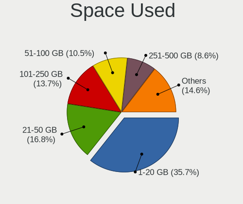

| Used GB        | Computers | Percent |
|----------------|-----------|---------|
| 1-20           | 359       | 40.11%  |
| 21-50          | 141       | 15.75%  |
| 101-250        | 123       | 13.74%  |
| 51-100         | 90        | 10.06%  |
| 251-500        | 74        | 8.27%   |
| 501-1000       | 39        | 4.36%   |
| 1001-2000      | 26        | 2.91%   |
| Unknown        | 23        | 2.57%   |
| More than 3000 | 11        | 1.23%   |
| 2001-3000      | 9         | 1.01%   |

Malfunc. Drives
---------------

Drive models with a malfunction

| Model                                        | Computers | Drives | Percent |
|----------------------------------------------|-----------|--------|---------|
| Seagate ST500LT012-1DG142 500GB              | 2         | 2      | 4.17%   |
| Seagate ST1000LM048-2E7172 1TB               | 2         | 2      | 4.17%   |
| Crucial CT240M500SSD1 240GB                  | 2         | 2      | 4.17%   |
| WDC WDS240G2G0B-00EPW0 240GB SSD             | 1         | 1      | 2.08%   |
| WDC WD5003ABYZ-011FA0 500GB                  | 1         | 1      | 2.08%   |
| WDC WD5000AAKX-08ERMA0 500GB                 | 1         | 1      | 2.08%   |
| WDC WD5000AAKX-00ERMA0 500GB                 | 1         | 1      | 2.08%   |
| WDC WD5000AAKX-0 500GB                       | 1         | 1      | 2.08%   |
| WDC WD20EARX-00PASB0 2TB                     | 1         | 1      | 2.08%   |
| WDC WD10SPZX-60Z10T0 1TB                     | 1         | 1      | 2.08%   |
| WDC WD10JPVX-22JC3T0 1TB                     | 1         | 1      | 2.08%   |
| WDC WD10EZEX-00BN5A0 1TB                     | 1         | 1      | 2.08%   |
| Toshiba MQ04ABF100 1TB                       | 1         | 1      | 2.08%   |
| Toshiba MK3259GSXP 320GB                     | 1         | 1      | 2.08%   |
| Toshiba MK2555GSX 250GB                      | 1         | 1      | 2.08%   |
| Toshiba DT01ACA300 3TB                       | 1         | 1      | 2.08%   |
| Seagate ST980811AS 80GB                      | 1         | 1      | 2.08%   |
| Seagate ST750LM022 HN-M750MBB 752GB          | 1         | 1      | 2.08%   |
| Seagate ST500LT012-9WS142 500GB              | 1         | 2      | 2.08%   |
| Seagate ST500LM021-1KJ152 500GB              | 1         | 1      | 2.08%   |
| Seagate ST500DM009-2DM14C 500GB              | 1         | 1      | 2.08%   |
| Seagate ST500DM002-1BD142 500GB              | 1         | 1      | 2.08%   |
| Seagate ST5000AS0011-1L5178 5TB              | 1         | 1      | 2.08%   |
| Seagate ST31000524AS 1TB                     | 1         | 1      | 2.08%   |
| Seagate ST1000LM024 HN-M101MBB 1TB           | 1         | 1      | 2.08%   |
| SanDisk SSD U100 128GB                       | 1         | 1      | 2.08%   |
| SanDisk SD9SN8W-256G-1006 256GB SSD          | 1         | 1      | 2.08%   |
| Samsung Electronics SSD 970 EVO 500GB        | 1         | 1      | 2.08%   |
| Samsung Electronics MZVLW512HMJP-00000 512GB | 1         | 1      | 2.08%   |
| PLEXTOR PX-256M6S+ 256GB SSD                 | 1         | 1      | 2.08%   |
| PLEXTOR PX-128M6S 128GB SSD                  | 1         | 1      | 2.08%   |
| Netac SSD 120GB                              | 1         | 1      | 2.08%   |
| Intel SSDSC2KW240H6 240GB                    | 1         | 1      | 2.08%   |
| Intel SSDSC2BW360H6 360GB                    | 1         | 1      | 2.08%   |
| Intel SSDPEKKF256G7H 256GB                   | 1         | 1      | 2.08%   |
| Hitachi HTS547575A9E384 752GB                | 1         | 1      | 2.08%   |
| Hitachi HTS541060G9SA00 58GB                 | 1         | 1      | 2.08%   |
| Hitachi HTS541040G9AT00 40GB                 | 1         | 1      | 2.08%   |
| HGST HTS725050A7E630 500GB                   | 1         | 1      | 2.08%   |
| HGST HTS721010A9E630 1TB                     | 1         | 1      | 2.08%   |
| Fujitsu MJA2250BH G2 250GB                   | 1         | 1      | 2.08%   |
| Fujitsu MHV2100BH PL 100GB                   | 1         | 1      | 2.08%   |
| Crucial M4-CT128M4SSD1 128GB                 | 1         | 1      | 2.08%   |
| Colorful SL500 320GB SSD                     | 1         | 1      | 2.08%   |
| A-DATA Technology SP900 128GB SSD            | 1         | 2      | 2.08%   |

Malfunc. Drive Vendor
---------------------

Vendors of faulty drives

| Vendor              | Computers | Drives | Percent |
|---------------------|-----------|--------|---------|
| Seagate             | 12        | 14     | 25.53%  |
| WDC                 | 9         | 9      | 19.15%  |
| Toshiba             | 4         | 4      | 8.51%   |
| Intel               | 3         | 3      | 6.38%   |
| Hitachi             | 3         | 3      | 6.38%   |
| Crucial             | 3         | 3      | 6.38%   |
| SanDisk             | 2         | 2      | 4.26%   |
| Samsung Electronics | 2         | 2      | 4.26%   |
| PLEXTOR             | 2         | 2      | 4.26%   |
| HGST                | 2         | 2      | 4.26%   |
| Fujitsu             | 2         | 2      | 4.26%   |
| Netac               | 1         | 1      | 2.13%   |
| Colorful            | 1         | 1      | 2.13%   |
| A-DATA Technology   | 1         | 2      | 2.13%   |

Malfunc. HDD Vendor
-------------------

Vendors of faulty HDD drives

| Vendor  | Computers | Drives | Percent |
|---------|-----------|--------|---------|
| Seagate | 12        | 14     | 38.71%  |
| WDC     | 8         | 8      | 25.81%  |
| Toshiba | 4         | 4      | 12.9%   |
| Hitachi | 3         | 3      | 9.68%   |
| HGST    | 2         | 2      | 6.45%   |
| Fujitsu | 2         | 2      | 6.45%   |

Malfunc. Drive Kind
-------------------

Kinds of faulty drives

| Kind | Computers | Drives | Percent |
|------|-----------|--------|---------|
| HDD  | 30        | 33     | 68.18%  |
| SSD  | 11        | 14     | 25%     |
| NVMe | 3         | 3      | 6.82%   |

Failed Drives
-------------

Failed drive models

| Model                             | Computers | Drives | Percent |
|-----------------------------------|-----------|--------|---------|
| Seagate ST31500341AS 1TB          | 1         | 1      | 33.33%  |
| Samsung Electronics HS06THB 64GB  | 1         | 1      | 33.33%  |
| Samsung Electronics HM160HI 160GB | 1         | 1      | 33.33%  |

Failed Drive Vendor
-------------------

Failed drive vendors

| Vendor              | Computers | Drives | Percent |
|---------------------|-----------|--------|---------|
| Samsung Electronics | 2         | 2      | 66.67%  |
| Seagate             | 1         | 1      | 33.33%  |

Drive Status
------------

Number of failed and malfunc. drives

| Status   | Computers | Drives | Percent |
|----------|-----------|--------|---------|
| Detected | 470       | 888    | 52.4%   |
| Works    | 382       | 670    | 42.59%  |
| Malfunc  | 42        | 50     | 4.68%   |
| Failed   | 3         | 3      | 0.33%   |

Storage controller
------------------

Storage Vendor
--------------

Storage controller vendors

| Vendor                           | Computers | Percent |
|----------------------------------|-----------|---------|
| Intel                            | 525       | 47.25%  |
| Samsung Electronics              | 152       | 13.68%  |
| AMD                              | 131       | 11.79%  |
| Sandisk                          | 69        | 6.21%   |
| Toshiba America Info Systems     | 32        | 2.88%   |
| SK Hynix                         | 32        | 2.88%   |
| Silicon Motion                   | 29        | 2.61%   |
| Phison Electronics               | 16        | 1.44%   |
| Marvell Technology Group         | 13        | 1.17%   |
| Micron Technology                | 12        | 1.08%   |
| KIOXIA                           | 12        | 1.08%   |
| Kingston Technology Company      | 10        | 0.9%    |
| Broadcom / LSI                   | 8         | 0.72%   |
| LSI Logic / Symbios Logic        | 6         | 0.54%   |
| Lite-On Technology               | 6         | 0.54%   |
| ASMedia Technology               | 6         | 0.54%   |
| Shenzhen Longsys Electronics     | 5         | 0.45%   |
| Union Memory (Shenzhen)          | 4         | 0.36%   |
| JMicron Technology               | 4         | 0.36%   |
| Zhaoxin                          | 3         | 0.27%   |
| Yangtze Memory Technologies      | 3         | 0.27%   |
| Silicon Integrated Systems [SiS] | 3         | 0.27%   |
| Micron/Crucial Technology        | 3         | 0.27%   |
| Huawei Technologies              | 3         | 0.27%   |
| ADATA Technology                 | 3         | 0.27%   |
| Solid State Storage Technology   | 2         | 0.18%   |
| Mylex                            | 2         | 0.18%   |
| MAXIO Technology (Hangzhou)      | 2         | 0.18%   |
| Biwin Storage Technology         | 2         | 0.18%   |
| Beijing Starblaze Technology     | 2         | 0.18%   |
| Silicon Image                    | 1         | 0.09%   |
| Seagate Technology               | 1         | 0.09%   |
| Realtek Semiconductor            | 1         | 0.09%   |
| Nvidia                           | 1         | 0.09%   |
| Loongson Technology              | 1         | 0.09%   |
| Lenovo                           | 1         | 0.09%   |
| IBM                              | 1         | 0.09%   |
| HighPoint Technologies           | 1         | 0.09%   |
| Hewlett-Packard                  | 1         | 0.09%   |
| Hefei DATANG Storage Technology  | 1         | 0.09%   |
| Apple                            | 1         | 0.09%   |

Storage Model
-------------

Storage controller models

| Model                                                                            | Computers | Percent |
|----------------------------------------------------------------------------------|-----------|---------|
| AMD FCH SATA Controller [AHCI mode]                                              | 103       | 8.39%   |
| Samsung NVMe SSD Controller SM981/PM981/PM983                                    | 93        | 7.57%   |
| Intel Sunrise Point-LP SATA Controller [AHCI mode]                               | 59        | 4.8%    |
| Intel 8 Series/C220 Series Chipset Family 6-port SATA Controller 1 [AHCI mode]   | 40        | 3.26%   |
| Intel 7 Series Chipset Family 6-port SATA Controller [AHCI mode]                 | 31        | 2.52%   |
| Samsung NVMe SSD Controller SM961/PM961/SM963                                    | 28        | 2.28%   |
| Intel 200 Series PCH SATA controller [AHCI mode]                                 | 26        | 2.12%   |
| Intel Cannon Lake Mobile PCH SATA AHCI Controller                                | 23        | 1.87%   |
| AMD 400 Series Chipset SATA Controller                                           | 22        | 1.79%   |
| Sandisk WD Black SN750 / PC SN730 NVMe SSD                                       | 20        | 1.63%   |
| Intel Q170/Q150/B150/H170/H110/Z170/CM236 Chipset SATA Controller [AHCI Mode]    | 19        | 1.55%   |
| Intel 8 Series SATA Controller 1 [AHCI mode]                                     | 19        | 1.55%   |
| Intel 6 Series/C200 Series Chipset Family 6 port Mobile SATA AHCI Controller     | 19        | 1.55%   |
| Sandisk WD Black 2018/SN750 / PC SN720 NVMe SSD                                  | 18        | 1.47%   |
| Intel HM170/QM170 Chipset SATA Controller [AHCI Mode]                            | 18        | 1.47%   |
| Intel 82801 Mobile SATA Controller [RAID mode]                                   | 18        | 1.47%   |
| Silicon Motion SM2263EN/SM2263XT SSD Controller                                  | 17        | 1.38%   |
| Intel Cannon Lake PCH SATA AHCI Controller                                       | 17        | 1.38%   |
| Intel 400 Series Chipset Family SATA AHCI Controller                             | 17        | 1.38%   |
| Sandisk WD Blue SN550 NVMe SSD                                                   | 16        | 1.3%    |
| Samsung NVMe SSD Controller 980                                                  | 15        | 1.22%   |
| Intel Wildcat Point-LP SATA Controller [AHCI Mode]                               | 15        | 1.22%   |
| Intel Volume Management Device NVMe RAID Controller                              | 15        | 1.22%   |
| Intel Comet Lake SATA AHCI Controller                                            | 14        | 1.14%   |
| SK Hynix Gold P31 SSD                                                            | 13        | 1.06%   |
| Toshiba America Info Systems XG6 NVMe SSD Controller                             | 12        | 0.98%   |
| Micron Non-Volatile memory controller                                            | 12        | 0.98%   |
| Intel SSD Pro 7600p/760p/E 6100p Series                                          | 12        | 0.98%   |
| Silicon Motion SM2262/SM2262EN SSD Controller                                    | 11        | 0.9%    |
| Samsung NVMe SSD Controller PM9A1/PM9A3/980PRO                                   | 11        | 0.9%    |
| Intel NM10/ICH7 Family SATA Controller [IDE mode]                                | 11        | 0.9%    |
| Toshiba America Info Systems BG3 NVMe SSD Controller                             | 10        | 0.81%   |
| Intel SATA Controller [RAID mode]                                                | 10        | 0.81%   |
| Intel 7 Series/C210 Series Chipset Family 6-port SATA Controller [AHCI mode]     | 10        | 0.81%   |
| AMD 500 Series Chipset SATA Controller                                           | 10        | 0.81%   |
| SK Hynix Non-Volatile memory controller                                          | 9         | 0.73%   |
| Phison PS5013 E13 NVMe Controller                                                | 9         | 0.73%   |
| KIOXIA Non-Volatile memory controller                                            | 9         | 0.73%   |
| Intel SSD 600P Series                                                            | 9         | 0.73%   |
| Intel Cannon Point-LP SATA Controller [AHCI Mode]                                | 9         | 0.73%   |
| Intel C600/X79 series chipset 6-Port SATA AHCI Controller                        | 9         | 0.73%   |
| Intel Atom Processor E3800 Series SATA AHCI Controller                           | 9         | 0.73%   |
| Intel SSD 660P Series                                                            | 8         | 0.65%   |
| Intel Celeron/Pentium Silver Processor SATA Controller                           | 8         | 0.65%   |
| Intel 82801IBM/IEM (ICH9M/ICH9M-E) 4 port SATA Controller [AHCI mode]            | 8         | 0.65%   |
| Intel 500 Series Chipset Family SATA AHCI Controller                             | 8         | 0.65%   |
| AMD SB7x0/SB8x0/SB9x0 SATA Controller [AHCI mode]                                | 8         | 0.65%   |
| Sandisk Non-Volatile memory controller                                           | 7         | 0.57%   |
| Intel Atom/Celeron/Pentium Processor x5-E8000/J3xxx/N3xxx Series SATA Controller | 7         | 0.57%   |
| Intel 82801G (ICH7 Family) IDE Controller                                        | 7         | 0.57%   |
| Intel 6 Series/C200 Series Chipset Family 6 port Desktop SATA AHCI Controller    | 7         | 0.57%   |
| SK Hynix BC511                                                                   | 6         | 0.49%   |
| Lite-On Non-Volatile memory controller                                           | 6         | 0.49%   |
| Intel C610/X99 series chipset 6-Port SATA Controller [AHCI mode]                 | 6         | 0.49%   |
| Intel 82801JI (ICH10 Family) SATA AHCI Controller                                | 6         | 0.49%   |
| ASMedia ASM1062 Serial ATA Controller                                            | 6         | 0.49%   |
| AMD SB7x0/SB8x0/SB9x0 IDE Controller                                             | 6         | 0.49%   |
| Toshiba America Info Systems Toshiba America Info Non-Volatile memory controller | 5         | 0.41%   |
| Phison NVMe Storage Controller                                                   | 5         | 0.41%   |
| Intel Tiger Lake-LP SATA Controller [AHCI mode]                                  | 5         | 0.41%   |

Storage Kind
------------

Kind of storage controller (IDE, SATA, NVMe, SAS, ...)

| Kind | Computers | Percent |
|------|-----------|---------|
| SATA | 581       | 52.15%  |
| NVMe | 399       | 35.82%  |
| RAID | 66        | 5.92%   |
| IDE  | 59        | 5.3%    |
| SAS  | 7         | 0.63%   |
| SCSI | 2         | 0.18%   |

Processor
---------

CPU Vendor
----------

Processor vendors

| Vendor            | Computers | Percent |
|-------------------|-----------|---------|
| Intel             | 633       | 74.82%  |
| AMD               | 185       | 21.87%  |
| ARM               | 9         | 1.06%   |
| PHYTIUM           | 6         | 0.71%   |
| Unknown           | 5         | 0.59%   |
| CentaurHauls      | 3         | 0.35%   |
| QUALCOMM          | 2         | 0.24%   |
| CHRP IBM,9131-52A | 2         | 0.24%   |
| CHRP IBM,8233-E8B | 1         | 0.12%   |

CPU Model
---------

Processor models

| Model                                         | Computers | Percent |
|-----------------------------------------------|-----------|---------|
| Intel Core i5-8250U CPU @ 1.60GHz             | 17        | 2.01%   |
| Intel Core i7-9750H CPU @ 2.60GHz             | 16        | 1.89%   |
| AMD Ryzen 7 5800H with Radeon Graphics        | 16        | 1.89%   |
| Intel 11th Gen Core i7-1165G7 @ 2.80GHz       | 15        | 1.77%   |
| Intel 11th Gen Core i5-1135G7 @ 2.40GHz       | 14        | 1.65%   |
| AMD Ryzen 5 3500U with Radeon Vega Mobile Gfx | 14        | 1.65%   |
| Intel Core i7-8550U CPU @ 1.80GHz             | 13        | 1.53%   |
| Intel Core i5-7200U CPU @ 2.50GHz             | 13        | 1.53%   |
| Intel Core i5-10210U CPU @ 1.60GHz            | 12        | 1.42%   |
| Intel Core i5-6200U CPU @ 2.30GHz             | 11        | 1.3%    |
| AMD Ryzen 7 4800H with Radeon Graphics        | 11        | 1.3%    |
| Intel Core i5-8265U CPU @ 1.60GHz             | 10        | 1.18%   |
| Intel Core i7-10510U CPU @ 1.80GHz            | 9         | 1.06%   |
| Intel Core i5-4590 CPU @ 3.30GHz              | 9         | 1.06%   |
| Intel Core i7-8750H CPU @ 2.20GHz             | 8         | 0.94%   |
| Intel Core i7-7700 CPU @ 3.60GHz              | 8         | 0.94%   |
| Intel Core i7-6700HQ CPU @ 2.60GHz            | 8         | 0.94%   |
| ARM Processor                                 | 8         | 0.94%   |
| Intel Core i7-8700 CPU @ 3.20GHz              | 7         | 0.83%   |
| Intel Core i7-7700HQ CPU @ 2.80GHz            | 7         | 0.83%   |
| Intel Core i7-4790 CPU @ 3.60GHz              | 7         | 0.83%   |
| Intel Core i7-10710U CPU @ 1.10GHz            | 7         | 0.83%   |
| AMD Ryzen 5 3550H with Radeon Vega Mobile Gfx | 7         | 0.83%   |
| Intel Core i7-7500U CPU @ 2.70GHz             | 6         | 0.71%   |
| Intel Core i5-8400 CPU @ 2.80GHz              | 6         | 0.71%   |
| Intel Celeron CPU J1900 @ 1.99GHz             | 6         | 0.71%   |
| AMD Ryzen 5 4600H with Radeon Graphics        | 6         | 0.71%   |
| AMD Ryzen 5 4500U with Radeon Graphics        | 6         | 0.71%   |
| AMD Ryzen 5 2500U with Radeon Vega Mobile Gfx | 6         | 0.71%   |
| Intel Core i7-8700K CPU @ 3.70GHz             | 5         | 0.59%   |
| Intel Core i7-8565U CPU @ 1.80GHz             | 5         | 0.59%   |
| Intel Core i7-4600U CPU @ 2.10GHz             | 5         | 0.59%   |
| Intel Core i7-10700 CPU @ 2.90GHz             | 5         | 0.59%   |
| Intel Core i5-8300H CPU @ 2.30GHz             | 5         | 0.59%   |
| Intel Core i5-5200U CPU @ 2.20GHz             | 5         | 0.59%   |
| Intel Core i5-3320M CPU @ 2.60GHz             | 5         | 0.59%   |
| Intel Core i5-2520M CPU @ 2.50GHz             | 5         | 0.59%   |
| Intel Core i3-2330M CPU @ 2.20GHz             | 5         | 0.59%   |
| AMD Ryzen 7 PRO 4750U with Radeon Graphics    | 5         | 0.59%   |
| AMD Ryzen 5 4600U with Radeon Graphics        | 5         | 0.59%   |
|                                               | 5         | 0.59%   |
| Phytium FT-2000/4                             | 4         | 0.47%   |
| Intel Core i7-8650U CPU @ 1.90GHz             | 4         | 0.47%   |
| Intel Core i7-6700 CPU @ 3.40GHz              | 4         | 0.47%   |
| Intel Core i7-3630QM CPU @ 2.40GHz            | 4         | 0.47%   |
| Intel Core i7-10750H CPU @ 2.60GHz            | 4         | 0.47%   |
| Intel Core i7-1065G7 CPU @ 1.30GHz            | 4         | 0.47%   |
| Intel Core i5-3210M CPU @ 2.50GHz             | 4         | 0.47%   |
| Intel Core i3-2350M CPU @ 2.30GHz             | 4         | 0.47%   |
| AMD Ryzen 7 PRO 4750G with Radeon Graphics    | 4         | 0.47%   |
| AMD Ryzen 7 3700X 8-Core Processor            | 4         | 0.47%   |
| AMD Ryzen 5 3600 6-Core Processor             | 4         | 0.47%   |
| AMD Ryzen 5 2400G with Radeon Vega Graphics   | 4         | 0.47%   |
| Intel Xeon CPU E3-1231 v3 @ 3.40GHz           | 3         | 0.35%   |
| Intel Pentium CPU N3700 @ 1.60GHz             | 3         | 0.35%   |
| Intel Pentium CPU G2030 @ 3.00GHz             | 3         | 0.35%   |
| Intel Core m3-8100Y CPU @ 1.10GHz             | 3         | 0.35%   |
| Intel Core i7-7700K CPU @ 4.20GHz             | 3         | 0.35%   |
| Intel Core i7-5600U CPU @ 2.60GHz             | 3         | 0.35%   |
| Intel Core i7-4720HQ CPU @ 2.60GHz            | 3         | 0.35%   |

CPU Model Family
----------------

Processor model prefix

| Model                   | Computers | Percent |
|-------------------------|-----------|---------|
| Intel Core i7           | 198       | 23.4%   |
| Intel Core i5           | 193       | 22.81%  |
| Other                   | 76        | 8.98%   |
| AMD Ryzen 5             | 65        | 7.68%   |
| AMD Ryzen 7             | 50        | 5.91%   |
| Intel Core i3           | 41        | 4.85%   |
| Intel Xeon              | 38        | 4.49%   |
| Intel Celeron           | 27        | 3.19%   |
| Intel Pentium           | 18        | 2.13%   |
| Intel Atom              | 15        | 1.77%   |
| Intel Core 2 Duo        | 14        | 1.65%   |
| AMD Ryzen 7 PRO         | 12        | 1.42%   |
| Intel Core i9           | 7         | 0.83%   |
| AMD Ryzen 9             | 6         | 0.71%   |
| AMD FX                  | 6         | 0.71%   |
| AMD A6                  | 6         | 0.71%   |
| AMD A10                 | 6         | 0.71%   |
| AMD Ryzen 5 PRO         | 5         | 0.59%   |
| AMD Athlon II X2        | 5         | 0.59%   |
| Intel Pentium Dual      | 4         | 0.47%   |
| Intel Core m3           | 4         | 0.47%   |
| AMD A8                  | 4         | 0.47%   |
| Intel Xeon Silver       | 3         | 0.35%   |
| Intel Xeon Gold         | 3         | 0.35%   |
| Intel Pentium Silver    | 3         | 0.35%   |
| Intel Pentium Dual-Core | 3         | 0.35%   |
| Intel Genuine           | 3         | 0.35%   |
| AMD Athlon              | 3         | 0.35%   |
| Intel Core M            | 2         | 0.24%   |
| Intel Core 2 Quad       | 2         | 0.24%   |
| Intel Core 2            | 2         | 0.24%   |
| AMD Ryzen 3             | 2         | 0.24%   |
| AMD EPYC                | 2         | 0.24%   |
| AMD Athlon X4           | 2         | 0.24%   |
| QUALCOMM AArch64        | 1         | 0.12%   |
| Intel Xeon Platinum     | 1         | 0.12%   |
| Intel Xeon Bronze       | 1         | 0.12%   |
| Intel Pentium M         | 1         | 0.12%   |
| Intel Core m5           | 1         | 0.12%   |
| Intel Core Duo          | 1         | 0.12%   |
| Intel Core              | 1         | 0.12%   |
| Intel Celeron Dual-Core | 1         | 0.12%   |
| ARM AArch64             | 1         | 0.12%   |
| AMD Ryzen Threadripper  | 1         | 0.12%   |
| AMD Phenom II X4        | 1         | 0.12%   |
| AMD E2                  | 1         | 0.12%   |
| AMD E                   | 1         | 0.12%   |
| AMD C-50                | 1         | 0.12%   |
| AMD Athlon 64 X2        | 1         | 0.12%   |
| AMD A4                  | 1         | 0.12%   |

CPU Cores
---------

Number of processor cores

| Number  | Computers | Percent |
|---------|-----------|---------|
| 4       | 350       | 41.27%  |
| 2       | 235       | 27.71%  |
| 6       | 112       | 13.21%  |
| 8       | 93        | 10.97%  |
| 12      | 13        | 1.53%   |
| 1       | 10        | 1.18%   |
| 16      | 7         | 0.83%   |
| 24      | 6         | 0.71%   |
| 10      | 5         | 0.59%   |
| Unknown | 3         | 0.35%   |
| 96      | 2         | 0.24%   |
| 32      | 2         | 0.24%   |
| 20      | 2         | 0.24%   |
| 14      | 2         | 0.24%   |
| 64      | 1         | 0.12%   |
| 40      | 1         | 0.12%   |
| 36      | 1         | 0.12%   |
| 28      | 1         | 0.12%   |
| 26      | 1         | 0.12%   |
| 3       | 1         | 0.12%   |

CPU Sockets
-----------

Number of sockets

| Number  | Computers | Percent |
|---------|-----------|---------|
| 1       | 811       | 95.75%  |
| 2       | 30        | 3.54%   |
| Unknown | 3         | 0.35%   |
| 6       | 1         | 0.12%   |
| 4       | 1         | 0.12%   |
| 3       | 1         | 0.12%   |

CPU Threads
-----------

Threads per core (Hyper-Threading)

| Number  | Computers | Percent |
|---------|-----------|---------|
| 2       | 641       | 75.59%  |
| 1       | 203       | 23.94%  |
| Unknown | 3         | 0.35%   |
| 4       | 1         | 0.12%   |

CPU Op-Modes
------------

CPU Operation Modes (32-bit, 64-bit)

| Op mode        | Computers | Percent |
|----------------|-----------|---------|
| 32-bit, 64-bit | 821       | 96.82%  |
| Unknown        | 21        | 2.48%   |
| 32-bit         | 4         | 0.47%   |
| 64-bit         | 2         | 0.24%   |

CPU Microcode
-------------

Microcode number

| Number     | Computers | Percent |
|------------|-----------|---------|
| Unknown    | 168       | 19.44%  |
| 0x906ea    | 44        | 5.09%   |
| 0x306c3    | 43        | 4.98%   |
| 0x306a9    | 39        | 4.51%   |
| 0x806ea    | 32        | 3.7%    |
| 0x206a7    | 30        | 3.47%   |
| 0x806e9    | 27        | 3.13%   |
| 0x806ec    | 26        | 3.01%   |
| 0x806c1    | 25        | 2.89%   |
| 0x506e3    | 25        | 2.89%   |
| 0x906e9    | 24        | 2.78%   |
| 0x08600106 | 23        | 2.66%   |
| 0x0a50000c | 19        | 2.2%    |
| 0x40651    | 18        | 2.08%   |
| 0x406e3    | 17        | 1.97%   |
| 0x306d4    | 17        | 1.97%   |
| 0x08108102 | 15        | 1.74%   |
| 0x1067a    | 12        | 1.39%   |
| 0x08600104 | 12        | 1.39%   |
| 0xa0652    | 11        | 1.27%   |
| 0x08108109 | 11        | 1.27%   |
| 0xa0655    | 8         | 0.93%   |
| 0xa0660    | 7         | 0.81%   |
| 0x706e5    | 7         | 0.81%   |
| 0x50654    | 7         | 0.81%   |
| 0x306e4    | 7         | 0.81%   |
| 0x30678    | 7         | 0.81%   |
| 0x08701013 | 7         | 0.81%   |
| 0x706a1    | 6         | 0.69%   |
| 0x08600103 | 6         | 0.69%   |
| 0x0810100b | 6         | 0.69%   |
| 0x806eb    | 5         | 0.58%   |
| 0x806d1    | 5         | 0.58%   |
| 0x6fd      | 5         | 0.58%   |
| 0x406c3    | 5         | 0.58%   |
| 0x06001119 | 5         | 0.58%   |
| 0x906ed    | 4         | 0.46%   |
| 0x206c2    | 4         | 0.46%   |
| 0x08101007 | 4         | 0.46%   |
| 0x010000c8 | 4         | 0.46%   |
| 0xa0671    | 3         | 0.35%   |
| 0xa0653    | 3         | 0.35%   |
| 0x906a3    | 3         | 0.35%   |
| 0x706a8    | 3         | 0.35%   |
| 0x306f2    | 3         | 0.35%   |
| 0x30679    | 3         | 0.35%   |
| 0x206d7    | 3         | 0.35%   |
| 0x20655    | 3         | 0.35%   |
| 0x0a50000b | 3         | 0.35%   |
| 0x08701021 | 3         | 0.35%   |
| 0x08600102 | 3         | 0.35%   |
| 0x08001138 | 3         | 0.35%   |
| 0x906eb    | 2         | 0.23%   |
| 0x806f3    | 2         | 0.23%   |
| 0x806c2    | 2         | 0.23%   |
| 0x506ca    | 2         | 0.23%   |
| 0x50657    | 2         | 0.23%   |
| 0x406f1    | 2         | 0.23%   |
| 0x30673    | 2         | 0.23%   |
| 0x106e5    | 2         | 0.23%   |

CPU Microarch
-------------

Microarchitecture

| Name             | Computers | Percent |
|------------------|-----------|---------|
| KabyLake         | 204       | 24.09%  |
| Haswell          | 77        | 9.09%   |
| Zen 2            | 64        | 7.56%   |
| Skylake          | 59        | 6.97%   |
| IvyBridge        | 53        | 6.26%   |
| CometLake        | 37        | 4.37%   |
| SandyBridge      | 36        | 4.25%   |
| Unknown          | 36        | 4.25%   |
| TigerLake        | 34        | 4.01%   |
| Zen 3            | 31        | 3.66%   |
| Zen+             | 30        | 3.54%   |
| Silvermont       | 26        | 3.07%   |
| Broadwell        | 23        | 2.72%   |
| Zen              | 19        | 2.24%   |
| Penryn           | 19        | 2.24%   |
| Icelake          | 13        | 1.53%   |
| Westmere         | 10        | 1.18%   |
| Piledriver       | 9         | 1.06%   |
| Goldmont plus    | 9         | 1.06%   |
| Core             | 9         | 1.06%   |
| K10              | 7         | 0.83%   |
| Steamroller      | 5         | 0.59%   |
| Bonnell          | 5         | 0.59%   |
| Nehalem          | 4         | 0.47%   |
| Excavator        | 4         | 0.47%   |
| Puma             | 3         | 0.35%   |
| Goldmont         | 3         | 0.35%   |
| Alderlake Hybrid | 3         | 0.35%   |
| Sapphire Rapids  | 2         | 0.24%   |
| P6               | 2         | 0.24%   |
| K10 Llano        | 2         | 0.24%   |
| Jaguar           | 2         | 0.24%   |
| Bulldozer        | 2         | 0.24%   |
| Bobcat           | 2         | 0.24%   |
| Tremont          | 1         | 0.12%   |
| NetBurst         | 1         | 0.12%   |
| K8 Hammer        | 1         | 0.12%   |

Graphics
--------

GPU Vendor
----------

Vendors of graphics cards

| Vendor                           | Computers | Percent |
|----------------------------------|-----------|---------|
| Intel                            | 511       | 47.85%  |
| Nvidia                           | 291       | 27.25%  |
| AMD                              | 236       | 22.1%   |
| Matrox Electronics Systems       | 14        | 1.31%   |
| ASPEED Technology                | 9         | 0.84%   |
| Zhaoxin                          | 3         | 0.28%   |
| Silicon Integrated Systems [SiS] | 2         | 0.19%   |
| Loongson Technology              | 1         | 0.09%   |
| Huawei Technologies              | 1         | 0.09%   |

GPU Model
---------

Graphics card models

| Model                                                                                    | Computers | Percent |
|------------------------------------------------------------------------------------------|-----------|---------|
| AMD Renoir                                                                               | 43        | 3.95%   |
| Intel UHD Graphics 620                                                                   | 38        | 3.49%   |
| Intel TigerLake-LP GT2 [Iris Xe Graphics]                                                | 34        | 3.12%   |
| Intel 2nd Generation Core Processor Family Integrated Graphics Controller                | 30        | 2.75%   |
| Intel 3rd Gen Core processor Graphics Controller                                         | 29        | 2.66%   |
| Intel CoffeeLake-H GT2 [UHD Graphics 630]                                                | 28        | 2.57%   |
| AMD Picasso/Raven 2 [Radeon Vega Series / Radeon Vega Mobile Series]                     | 26        | 2.39%   |
| Intel HD Graphics 530                                                                    | 22        | 2.02%   |
| AMD Cezanne                                                                              | 22        | 2.02%   |
| Intel HD Graphics 630                                                                    | 21        | 1.93%   |
| Intel HD Graphics 620                                                                    | 21        | 1.93%   |
| Intel CometLake-U GT2 [UHD Graphics]                                                     | 21        | 1.93%   |
| Intel Xeon E3-1200 v3/4th Gen Core Processor Integrated Graphics Controller              | 19        | 1.74%   |
| Intel Haswell-ULT Integrated Graphics Controller                                         | 19        | 1.74%   |
| Intel CoffeeLake-S GT2 [UHD Graphics 630]                                                | 17        | 1.56%   |
| Intel WhiskeyLake-U GT2 [UHD Graphics 620]                                               | 16        | 1.47%   |
| Nvidia GP108M [GeForce MX150]                                                            | 15        | 1.38%   |
| Intel Skylake GT2 [HD Graphics 520]                                                      | 15        | 1.38%   |
| Intel Atom Processor Z36xxx/Z37xxx Series Graphics & Display                             | 14        | 1.29%   |
| Intel 4th Gen Core Processor Integrated Graphics Controller                              | 14        | 1.29%   |
| AMD Raven Ridge [Radeon Vega Series / Radeon Vega Mobile Series]                         | 14        | 1.29%   |
| Intel HD Graphics 5500                                                                   | 13        | 1.19%   |
| Nvidia GP108M [GeForce MX250]                                                            | 12        | 1.1%    |
| Nvidia GA106M [GeForce RTX 3060 Mobile / Max-Q]                                          | 12        | 1.1%    |
| Intel Atom/Celeron/Pentium Processor x5-E8000/J3xxx/N3xxx Integrated Graphics Controller | 12        | 1.1%    |
| Nvidia TU117M                                                                            | 10        | 0.92%   |
| Nvidia TU106M [GeForce RTX 2060 Mobile]                                                  | 10        | 0.92%   |
| Intel CometLake-S GT2 [UHD Graphics 630]                                                 | 10        | 0.92%   |
| Intel CometLake-H GT2 [UHD Graphics]                                                     | 10        | 0.92%   |
| Intel Comet Lake UHD Graphics                                                            | 9         | 0.83%   |
| ASPEED Technology ASPEED Graphics Family                                                 | 9         | 0.83%   |
| AMD Oland [Radeon HD 8570 / R5 430 OEM / R7 240/340 / Radeon 520 OEM]                    | 9         | 0.83%   |
| Nvidia TU117M [GeForce MX450]                                                            | 8         | 0.73%   |
| Nvidia GP107M [GeForce GTX 1050 Ti Mobile]                                               | 8         | 0.73%   |
| Nvidia GP106 [GeForce GTX 1060 6GB]                                                      | 8         | 0.73%   |
| Nvidia GM108M [GeForce 940MX]                                                            | 8         | 0.73%   |
| AMD Sun XT [Radeon HD 8670A/8670M/8690M / R5 M330 / M430 / Radeon 520 Mobile]            | 8         | 0.73%   |
| AMD Lexa PRO [Radeon 540/540X/550/550X / RX 540X/550/550X]                               | 8         | 0.73%   |
| Nvidia GM107M [GeForce GTX 960M]                                                         | 7         | 0.64%   |
| Intel Xeon E3-1200 v2/3rd Gen Core processor Graphics Controller                         | 7         | 0.64%   |
| Intel UHD Graphics 615                                                                   | 7         | 0.64%   |
| Intel GeminiLake [UHD Graphics 600]                                                      | 7         | 0.64%   |
| AMD Topaz XT [Radeon R7 M260/M265 / M340/M360 / M440/M445 / 530/535 / 620/625 Mobile]    | 7         | 0.64%   |
| AMD Ellesmere [Radeon RX 470/480/570/570X/580/580X/590]                                  | 7         | 0.64%   |
| Nvidia GP107M [GeForce GTX 1050 Mobile]                                                  | 6         | 0.55%   |
| Matrox Electronics Systems G200eR2                                                       | 6         | 0.55%   |
| Intel Mobile 4 Series Chipset Integrated Graphics Controller                             | 6         | 0.55%   |
| Nvidia TU117M [GeForce GTX 1650 Mobile / Max-Q]                                          | 5         | 0.46%   |
| Nvidia GP106M [GeForce GTX 1060 Mobile]                                                  | 5         | 0.46%   |
| Nvidia GP102 [GeForce GTX 1080 Ti]                                                       | 5         | 0.46%   |
| Nvidia GK208B [GeForce GT 730]                                                           | 5         | 0.46%   |
| Nvidia GF117M [GeForce 610M/710M/810M/820M / GT 620M/625M/630M/720M]                     | 5         | 0.46%   |
| Nvidia TU116M [GeForce GTX 1660 Ti Mobile]                                               | 4         | 0.37%   |
| Nvidia GP108 [GeForce GT 1030]                                                           | 4         | 0.37%   |
| Nvidia GP106 [GeForce GTX 1060 3GB]                                                      | 4         | 0.37%   |
| Nvidia GP104 [GeForce GTX 1080]                                                          | 4         | 0.37%   |
| Nvidia GF108M [GeForce GT 620M/630M/635M/640M LE]                                        | 4         | 0.37%   |
| Intel TigerLake-H GT1 [UHD Graphics]                                                     | 4         | 0.37%   |
| Intel Iris Plus Graphics G7                                                              | 4         | 0.37%   |
| Intel Core Processor Integrated Graphics Controller                                      | 4         | 0.37%   |

GPU Combo
---------

Combinations of graphics cards

| Name                         | Computers | Percent |
|------------------------------|-----------|---------|
| 1 x Intel                    | 302       | 35.49%  |
| 1 x AMD                      | 166       | 19.51%  |
| Intel + Nvidia               | 158       | 18.57%  |
| 1 x Nvidia                   | 110       | 12.93%  |
| Intel + AMD                  | 38        | 4.47%   |
| AMD + Nvidia                 | 17        | 2%      |
| Other                        | 12        | 1.41%   |
| 1 x Matrox                   | 12        | 1.41%   |
| 2 x AMD                      | 11        | 1.29%   |
| 1 x ASPEED                   | 5         | 0.59%   |
| 2 x Intel                    | 3         | 0.35%   |
| 1 x Zhaoxin                  | 3         | 0.35%   |
| 2 x Nvidia                   | 2         | 0.24%   |
| 1 x SiS                      | 2         | 0.24%   |
| Nvidia + ASPEED              | 2         | 0.24%   |
| AMD + Matrox                 | 2         | 0.24%   |
| AMD + ASPEED                 | 2         | 0.24%   |
| Nvidia + Huawei Technologies | 1         | 0.12%   |
| 1 x Loongson Technology      | 1         | 0.12%   |
| 1 x Intel + 3 x Nvidia       | 1         | 0.12%   |
| Intel + 2 x Nvidia           | 1         | 0.12%   |

GPU Driver
----------

Free vs proprietary

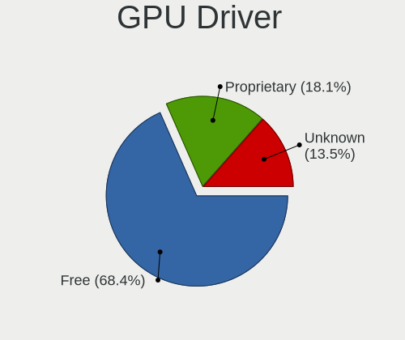

| Driver      | Computers | Percent |
|-------------|-----------|---------|
| Free        | 642       | 75.18%  |
| Proprietary | 147       | 17.21%  |
| Unknown     | 65        | 7.61%   |

GPU Memory
----------

Total video memory

| Size in GB | Computers | Percent |
|------------|-----------|---------|
| Unknown    | 465       | 54.07%  |
| 1.01-2.0   | 123       | 14.3%   |
| 0.51-1.0   | 70        | 8.14%   |
| 0.01-0.5   | 67        | 7.79%   |
| 3.01-4.0   | 54        | 6.28%   |
| 5.01-6.0   | 33        | 3.84%   |
| 7.01-8.0   | 28        | 3.26%   |
| 8.01-16.0  | 10        | 1.16%   |
| 2.01-3.0   | 6         | 0.7%    |
| 24.01-32.0 | 2         | 0.23%   |
| 4.01-5.0   | 1         | 0.12%   |
| 16.01-24.0 | 1         | 0.12%   |

Monitor
-------

Monitor Vendor
--------------

Monitor vendors

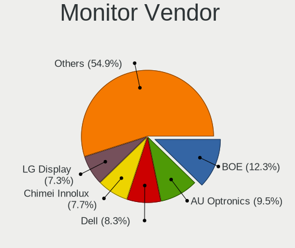

| Vendor                  | Computers | Percent |
|-------------------------|-----------|---------|
| BOE                     | 103       | 12.05%  |
| LG Display              | 90        | 10.53%  |
| AU Optronics            | 86        | 10.06%  |
| Chimei Innolux          | 83        | 9.71%   |
| Dell                    | 69        | 8.07%   |
| AOC                     | 46        | 5.38%   |
| Lenovo                  | 45        | 5.26%   |
| Samsung Electronics     | 43        | 5.03%   |
| Sharp                   | 34        | 3.98%   |
| Philips                 | 19        | 2.22%   |
| Hewlett-Packard         | 19        | 2.22%   |
| Goldstar                | 17        | 1.99%   |
| CSO                     | 17        | 1.99%   |
| ViewSonic               | 12        | 1.4%    |
| BenQ                    | 12        | 1.4%    |
| PANDA                   | 11        | 1.29%   |
| InfoVision              | 10        | 1.17%   |
| Acer                    | 9         | 1.05%   |
| HKC                     | 8         | 0.94%   |
| Xiaomi                  | 7         | 0.82%   |
| Apple                   | 7         | 0.82%   |
| Unknown                 | 4         | 0.47%   |
| IPS                     | 4         | 0.47%   |
| CHD                     | 4         | 0.47%   |
| TMX                     | 3         | 0.35%   |
| Panasonic               | 3         | 0.35%   |
| LGD                     | 3         | 0.35%   |
| CHR                     | 3         | 0.35%   |
| Chi Mei Optoelectronics | 3         | 0.35%   |
| ASUSTek Computer        | 3         | 0.35%   |
| Ancor Communications    | 3         | 0.35%   |
| TFC                     | 2         | 0.23%   |
| Sony                    | 2         | 0.23%   |
| SKY                     | 2         | 0.23%   |
| SGT                     | 2         | 0.23%   |
| RTK                     | 2         | 0.23%   |
| NEC Computers           | 2         | 0.23%   |
| Mi                      | 2         | 0.23%   |
| LG Electronics          | 2         | 0.23%   |
| KOIOS                   | 2         | 0.23%   |
| JDI                     | 2         | 0.23%   |
| InnoLux Display         | 2         | 0.23%   |
| HannStar                | 2         | 0.23%   |
| Envision Peripherals    | 2         | 0.23%   |
| BOE Technology Group    | 2         | 0.23%   |
| AGO                     | 2         | 0.23%   |
| Unknown                 | 2         | 0.23%   |
| ZTY                     | 1         | 0.12%   |
| Unknown (AAA)           | 1         | 0.12%   |
| TUP                     | 1         | 0.12%   |
| TCL                     | 1         | 0.12%   |
| SUG                     | 1         | 0.12%   |
| SLE                     | 1         | 0.12%   |
| SAC                     | 1         | 0.12%   |
| QSM                     | 1         | 0.12%   |
| QCM                     | 1         | 0.12%   |
| Pixio                   | 1         | 0.12%   |
| PFL                     | 1         | 0.12%   |
| PDI                     | 1         | 0.12%   |
| MStar                   | 1         | 0.12%   |

Monitor Model
-------------

Monitor models

| Model                                                                 | Computers | Percent |
|-----------------------------------------------------------------------|-----------|---------|
| Chimei Innolux LCD Monitor CMN14D4 1920x1080 309x173mm 13.9-inch      | 9         | 1.03%   |
| Xiaomi Mi TV XMD004A 1920x1080 1110x620mm 50.1-inch                   | 7         | 0.8%    |
| Chimei Innolux LCD Monitor CMN14A7 1920x1080 308x173mm 13.9-inch      | 7         | 0.8%    |
| Chimei Innolux LCD Monitor CMN1604 1920x1080 355x199mm 16.0-inch      | 6         | 0.68%   |
| AU Optronics LCD Monitor AUO403D 1920x1080 309x173mm 13.9-inch        | 6         | 0.68%   |
| BOE LCD Monitor BOE0877 1920x1080 309x173mm 13.9-inch                 | 5         | 0.57%   |
| BOE LCD Monitor BOE0747 1920x1080 344x194mm 15.5-inch                 | 5         | 0.57%   |
| AU Optronics LCD Monitor AUO106C 1366x768 277x156mm 12.5-inch         | 5         | 0.57%   |
| AOC 24B1W1 AOC2401 1920x1080 527x296mm 23.8-inch                      | 5         | 0.57%   |
| Sharp LCD Monitor SHP1453 1920x1080 346x194mm 15.6-inch               | 4         | 0.46%   |
| Sharp LCD Monitor SHP1447 1920x1080 294x165mm 13.3-inch               | 4         | 0.46%   |
| LG Display LCD Monitor LGD02D8 1366x768 277x156mm 12.5-inch           | 4         | 0.46%   |
| Lenovo LEN LT2252pwA LEN0A0C 1680x1050 474x296mm 22.0-inch            | 4         | 0.46%   |
| InfoVision LCD Monitor IVO061F 1920x1080 344x194mm 15.5-inch          | 4         | 0.46%   |
| CSO LCD Monitor CSO1402 2880x1800 302x188mm 14.0-inch                 | 4         | 0.46%   |
| Chimei Innolux LCD Monitor CMN15E8 1920x1080 344x193mm 15.5-inch      | 4         | 0.46%   |
| Chimei Innolux LCD Monitor CMN14D5 1920x1080 309x173mm 13.9-inch      | 4         | 0.46%   |
| CHD CHUD CHD0030 3840x2160 1394x784mm 63.0-inch                       | 4         | 0.46%   |
| BOE LCD Monitor BOE0872 1920x1080 344x194mm 15.5-inch                 | 4         | 0.46%   |
| AU Optronics LCD Monitor AUO133D 1920x1080 309x173mm 13.9-inch        | 4         | 0.46%   |
| AOC U2790B AOC2790 3840x2160 597x336mm 27.0-inch                      | 4         | 0.46%   |
| AOC 2491W AOC2491 1920x1080 521x293mm 23.5-inch                       | 4         | 0.46%   |
| TMX TL156MDMP01-0 TMX1560 3200x2000 336x210mm 15.6-inch               | 3         | 0.34%   |
| Sharp LCD Monitor SHP149A 1920x1080 344x194mm 15.5-inch               | 3         | 0.34%   |
| Samsung Electronics C24F390 SAM0D2C 1920x1080 521x293mm 23.5-inch     | 3         | 0.34%   |
| Philips PHL 243V7 PHLC155 1920x1080 527x296mm 23.8-inch               | 3         | 0.34%   |
| PANDA LCD Monitor NCP004D 1920x1080 344x194mm 15.5-inch               | 3         | 0.34%   |
| Panasonic LCD Monitor MEI96A2 2880x1620 344x193mm 15.5-inch           | 3         | 0.34%   |
| LG Display LCD Monitor LGD0618 1920x1080 344x194mm 15.5-inch          | 3         | 0.34%   |
| LG Display LCD Monitor LGD05F1 1920x1080 309x174mm 14.0-inch          | 3         | 0.34%   |
| LG Display LCD Monitor LGD02F8 1366x768 309x174mm 14.0-inch           | 3         | 0.34%   |
| Lenovo LCD Monitor LEN4035 1280x800 303x190mm 14.1-inch               | 3         | 0.34%   |
| Goldstar HDR 4K GSM7707 3840x2160 600x340mm 27.2-inch                 | 3         | 0.34%   |
| Dell P2422H DELA1C5 1920x1080 530x300mm 24.0-inch                     | 3         | 0.34%   |
| Dell E2216HV DELF06F 1920x1080 476x268mm 21.5-inch                    | 3         | 0.34%   |
| Chimei Innolux P130ZFA-BA1 CMN8201 2160x1440 275x183mm 13.0-inch      | 3         | 0.34%   |
| Chimei Innolux LCD Monitor CMN1603 1920x1080 355x199mm 16.0-inch      | 3         | 0.34%   |
| Chimei Innolux LCD Monitor CMN1490 1366x768 309x173mm 13.9-inch       | 3         | 0.34%   |
| BOE LCD Monitor BOE0900 1920x1080 344x194mm 15.5-inch                 | 3         | 0.34%   |
| BOE LCD Monitor BOE07DB 1920x1080 309x174mm 14.0-inch                 | 3         | 0.34%   |
| BOE LCD Monitor BOE06F2 1920x1080 309x173mm 13.9-inch                 | 3         | 0.34%   |
| AU Optronics LCD Monitor AUO683D 1920x1080 309x174mm 14.0-inch        | 3         | 0.34%   |
| AU Optronics LCD Monitor AUO45ED 1920x1080 344x193mm 15.5-inch        | 3         | 0.34%   |
| AU Optronics LCD Monitor AUO2E3C 1366x768 309x173mm 13.9-inch         | 3         | 0.34%   |
| AU Optronics LCD Monitor AUO21ED 1920x1080 344x193mm 15.5-inch        | 3         | 0.34%   |
| AU Optronics LCD Monitor AUO183C 1366x768 309x173mm 13.9-inch         | 3         | 0.34%   |
| Unknown LCD Monitor FFFF 2288x1287 2550x2550mm 142.0-inch             | 2         | 0.23%   |
| Sharp LQ156M1JW01 SHP14C3 1920x1080 344x194mm 15.5-inch               | 2         | 0.23%   |
| Sharp LQ100P1JX51 SHP14A6 1800x1200 211x141mm 10.0-inch               | 2         | 0.23%   |
| Samsung Electronics S24E360 SAM0C10 1920x1080 520x290mm 23.4-inch     | 2         | 0.23%   |
| Samsung Electronics S24D300 SAM0B43 1920x1080 531x299mm 24.0-inch     | 2         | 0.23%   |
| Samsung Electronics LCD Monitor SEC414C 1366x768 309x174mm 14.0-inch  | 2         | 0.23%   |
| Samsung Electronics LCD Monitor SDC4C48 1920x1080 239x134mm 10.8-inch | 2         | 0.23%   |
| Samsung Electronics LCD Monitor S19B360                               | 2         | 0.23%   |
| PANDA LCD Monitor NCP005C 2560x1600 302x189mm 14.0-inch               | 2         | 0.23%   |
| LGD LCD Monitor 1920x1080                                             | 2         | 0.23%   |
| LG Display LCD Monitor LGD40BA 1920x1080 344x194mm 15.5-inch          | 2         | 0.23%   |
| LG Display LCD Monitor LGD0619 1920x1080 309x174mm 14.0-inch          | 2         | 0.23%   |
| LG Display LCD Monitor LGD060A 1920x1080 294x165mm 13.3-inch          | 2         | 0.23%   |
| LG Display LCD Monitor LGD05FA 1920x1080 309x174mm 14.0-inch          | 2         | 0.23%   |

Monitor Resolution
------------------

Monitor screen resolution

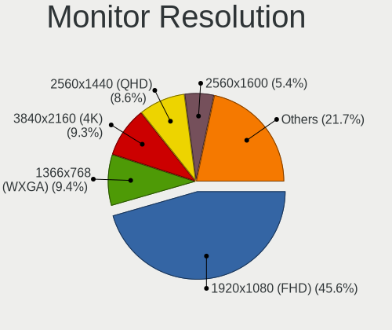

| Resolution         | Computers | Percent |
|--------------------|-----------|---------|
| 1920x1080 (FHD)    | 439       | 53.47%  |
| 1366x768 (WXGA)    | 93        | 11.33%  |
| 3840x2160 (4K)     | 69        | 8.4%    |
| 2560x1440 (QHD)    | 51        | 6.21%   |
| 1440x900 (WXGA+)   | 22        | 2.68%   |
| 2560x1600          | 20        | 2.44%   |
| 1600x900 (HD+)     | 16        | 1.95%   |
| 1920x1200 (WUXGA)  | 13        | 1.58%   |
| 1680x1050 (WSXGA+) | 10        | 1.22%   |
| 1280x1024 (SXGA)   | 9         | 1.1%    |
| 2160x1440          | 8         | 0.97%   |
| Unknown            | 8         | 0.97%   |
| 3440x1440          | 6         | 0.73%   |
| 1280x800 (WXGA)    | 6         | 0.73%   |
| 2880x1800          | 5         | 0.61%   |
| 3200x2000          | 3         | 0.37%   |
| 2560x1080          | 3         | 0.37%   |
| 3360x1080          | 2         | 0.24%   |
| 3286x1080          | 2         | 0.24%   |
| 3000x2000          | 2         | 0.24%   |
| 2736x1824          | 2         | 0.24%   |
| 2288x1287          | 2         | 0.24%   |
| 2240x1400          | 2         | 0.24%   |
| 2160x1350          | 2         | 0.24%   |
| 1920x1280          | 2         | 0.24%   |
| 1800x1200          | 2         | 0.24%   |
| 1400x1050          | 2         | 0.24%   |
| 1024x768 (XGA)     | 2         | 0.24%   |
| 1024x600           | 2         | 0.24%   |
| 5206x1080          | 1         | 0.12%   |
| 4480x1440          | 1         | 0.12%   |
| 4382x1080          | 1         | 0.12%   |
| 3840x2400          | 1         | 0.12%   |
| 3840x1080          | 1         | 0.12%   |
| 3520x1080          | 1         | 0.12%   |
| 3200x1800 (QHD+)   | 1         | 0.12%   |
| 3072x1920          | 1         | 0.12%   |
| 2880x1920          | 1         | 0.12%   |
| 2800x1752          | 1         | 0.12%   |
| 2256x1504          | 1         | 0.12%   |
| 2200x1650          | 1         | 0.12%   |
| 1920x540           | 1         | 0.12%   |
| 1792x768           | 1         | 0.12%   |
| 1360x768           | 1         | 0.12%   |
| 1280x960           | 1         | 0.12%   |

Monitor Diagonal
----------------

Diagonal size in inches

| Inches  | Computers | Percent |
|---------|-----------|---------|
| 15      | 168       | 19.74%  |
| 13      | 131       | 15.39%  |
| 14      | 111       | 13.04%  |
| 23      | 68        | 7.99%   |
| 24      | 59        | 6.93%   |
| 27      | 56        | 6.58%   |
| Unknown | 38        | 4.47%   |
| 21      | 35        | 4.11%   |
| 12      | 31        | 3.64%   |
| 17      | 29        | 3.41%   |
| 16      | 18        | 2.12%   |
| 19      | 14        | 1.65%   |
| 18      | 13        | 1.53%   |
| 31      | 12        | 1.41%   |
| 22      | 8         | 0.94%   |
| 65      | 7         | 0.82%   |
| 25      | 7         | 0.82%   |
| 20      | 7         | 0.82%   |
| 34      | 6         | 0.71%   |
| 11      | 6         | 0.71%   |
| 40      | 5         | 0.59%   |
| 10      | 5         | 0.59%   |
| 63      | 4         | 0.47%   |
| 32      | 3         | 0.35%   |
| 142     | 2         | 0.24%   |
| 43      | 2         | 0.24%   |
| 66      | 1         | 0.12%   |
| 46      | 1         | 0.12%   |
| 42      | 1         | 0.12%   |
| 37      | 1         | 0.12%   |
| 36      | 1         | 0.12%   |
| 26      | 1         | 0.12%   |

Monitor Width
-------------

Physical width

| Width in mm    | Computers | Percent |
|----------------|-----------|---------|
| 301-350        | 350       | 41.57%  |
| 501-600        | 176       | 20.9%   |
| 201-300        | 113       | 13.42%  |
| 401-500        | 73        | 8.67%   |
| 351-400        | 39        | 4.63%   |
| Unknown        | 38        | 4.51%   |
| 601-700        | 20        | 2.38%   |
| 1001-1500      | 12        | 1.43%   |
| 701-800        | 9         | 1.07%   |
| 801-900        | 7         | 0.83%   |
| 901-1000       | 3         | 0.36%   |
| More than 2000 | 2         | 0.24%   |

Aspect Ratio
------------

Proportional relationship between the width and the height

| Ratio   | Computers | Percent |
|---------|-----------|---------|
| 16/9    | 599       | 77.19%  |
| 16/10   | 96        | 12.37%  |
| Unknown | 36        | 4.64%   |
| 3/2     | 20        | 2.58%   |
| 5/4     | 10        | 1.29%   |
| 21/9    | 7         | 0.9%    |
| 4/3     | 5         | 0.64%   |
| 1.00    | 2         | 0.26%   |
| 0.45    | 1         | 0.13%   |

Monitor Area
------------

Area in inch

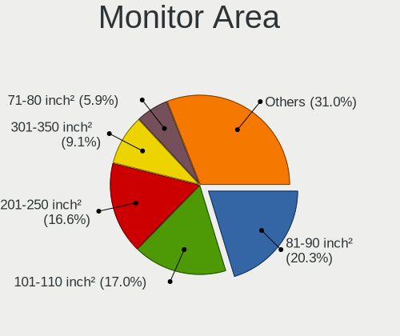

| Area in inch | Computers | Percent |
|----------------|-----------|---------|
| 81-90          | 179       | 21.06%  |
| 101-110        | 173       | 20.35%  |
| 201-250        | 134       | 15.76%  |
| 71-80          | 67        | 7.88%   |
| 301-350        | 57        | 6.71%   |
| 151-200        | 48        | 5.65%   |
| Unknown        | 38        | 4.47%   |
| 61-70          | 25        | 2.94%   |
| 251-300        | 23        | 2.71%   |
| 121-130        | 22        | 2.59%   |
| 351-500        | 21        | 2.47%   |
| More than 1000 | 14        | 1.65%   |
| 141-150        | 12        | 1.41%   |
| 501-1000       | 11        | 1.29%   |
| 111-120        | 10        | 1.18%   |
| 51-60          | 7         | 0.82%   |
| 91-100         | 5         | 0.59%   |
| 41-50          | 4         | 0.47%   |

Pixel Density
-------------

Pixels per inch

| Density       | Computers | Percent |
|---------------|-----------|---------|
| 121-160       | 296       | 35.2%   |
| 51-100        | 208       | 24.73%  |
| 101-120       | 143       | 17%     |
| 161-240       | 111       | 13.2%   |
| Unknown       | 38        | 4.52%   |
| More than 240 | 32        | 3.8%    |
| 1-50          | 13        | 1.55%   |

Multiple Monitors
-----------------

Total monitors connected

| Total | Computers | Percent |
|-------|-----------|---------|
| 1     | 663       | 77.36%  |
| 2     | 111       | 12.95%  |
| 0     | 74        | 8.63%   |
| 3     | 9         | 1.05%   |

Network
-------

Net Controller Vendor
---------------------

Controller vendors

| Vendor                           | Computers | Percent |
|----------------------------------|-----------|---------|
| Intel                            | 478       | 38.89%  |
| Realtek Semiconductor            | 456       | 37.1%   |
| Qualcomm Atheros                 | 108       | 8.79%   |
| Broadcom                         | 36        | 2.93%   |
| Broadcom Limited                 | 20        | 1.63%   |
| Ralink Technology                | 16        | 1.3%    |
| MediaTek                         | 16        | 1.3%    |
| ASIX Electronics                 | 12        | 0.98%   |
| Xiaomi                           | 11        | 0.9%    |
| Huawei Technologies              | 11        | 0.9%    |
| Marvell Technology Group         | 8         | 0.65%   |
| Ralink                           | 5         | 0.41%   |
| Microsoft                        | 5         | 0.41%   |
| Tenda                            | 3         | 0.24%   |
| Samsung Electronics              | 3         | 0.24%   |
| TP-Link                          | 2         | 0.16%   |
| Silicon Integrated Systems [SiS] | 2         | 0.16%   |
| Sierra Wireless                  | 2         | 0.16%   |
| Quectel Wireless Solutions       | 2         | 0.16%   |
| Qualcomm Atheros Communications  | 2         | 0.16%   |
| OPPO Electronics                 | 2         | 0.16%   |
| NetGear                          | 2         | 0.16%   |
| IBM                              | 2         | 0.16%   |
| Dell                             | 2         | 0.16%   |
| D-Link                           | 2         | 0.16%   |
| Aquantia                         | 2         | 0.16%   |
| ZTE WCDMA Technologies MSM       | 1         | 0.08%   |
| Wilocity                         | 1         | 0.08%   |
| vivo                             | 1         | 0.08%   |
| ST-Ericsson                      | 1         | 0.08%   |
| Shenzhen Goodix Technology       | 1         | 0.08%   |
| Qualcomm                         | 1         | 0.08%   |
| OnePlus Technology (Shenzhen)    | 1         | 0.08%   |
| Oculus VR                        | 1         | 0.08%   |
| Nvidia                           | 1         | 0.08%   |
| NetXen Incorporated              | 1         | 0.08%   |
| Meizu                            | 1         | 0.08%   |
| Loongson Technology              | 1         | 0.08%   |
| Lenovo                           | 1         | 0.08%   |
| ICS Advent                       | 1         | 0.08%   |
| Hewlett-Packard                  | 1         | 0.08%   |
| Fibocom                          | 1         | 0.08%   |
| Exar                             | 1         | 0.08%   |
| D-Link System                    | 1         | 0.08%   |
| Attansic Technology              | 1         | 0.08%   |

Net Controller Model
--------------------

Controller models

| Model                                                             | Computers | Percent |
|-------------------------------------------------------------------|-----------|---------|
| Realtek RTL8111/8168/8411 PCI Express Gigabit Ethernet Controller | 302       | 21.09%  |
| Intel Wi-Fi 6 AX200                                               | 66        | 4.61%   |
| Intel Wireless 8265 / 8275                                        | 45        | 3.14%   |
| Realtek RTL810xE PCI Express Fast Ethernet controller             | 42        | 2.93%   |
| Realtek RTL8822CE 802.11ac PCIe Wireless Network Adapter          | 38        | 2.65%   |
| Realtek RTL8153 Gigabit Ethernet Adapter                          | 26        | 1.82%   |
| Intel Comet Lake PCH-LP CNVi WiFi                                 | 26        | 1.82%   |
| Intel Wi-Fi 6 AX201                                               | 25        | 1.75%   |
| Qualcomm Atheros QCA9377 802.11ac Wireless Network Adapter        | 22        | 1.54%   |
| Intel Wireless 7265                                               | 22        | 1.54%   |
| Intel 82579LM Gigabit Network Connection (Lewisville)             | 22        | 1.54%   |
| Qualcomm Atheros QCA6174 802.11ac Wireless Network Adapter        | 21        | 1.47%   |
| Intel Wireless 7260                                               | 18        | 1.26%   |
| Intel I211 Gigabit Network Connection                             | 18        | 1.26%   |
| Intel Cannon Lake PCH CNVi WiFi                                   | 18        | 1.26%   |
| Intel Wireless 8260                                               | 17        | 1.19%   |
| Intel Wireless 3165                                               | 16        | 1.12%   |
| Intel Cannon Point-LP CNVi [Wireless-AC]                          | 15        | 1.05%   |
| Intel Ethernet Connection (2) I219-V                              | 14        | 0.98%   |
| Intel Comet Lake PCH CNVi WiFi                                    | 13        | 0.91%   |
| Realtek 802.11ac NIC                                              | 12        | 0.84%   |
| Realtek RTL8821CE 802.11ac PCIe Wireless Network Adapter          | 11        | 0.77%   |
| Realtek RTL8125 2.5GbE Controller                                 | 11        | 0.77%   |
| Intel Wi-Fi 6 AX210/AX211/AX411 160MHz                            | 11        | 0.77%   |
| Intel Ethernet Connection I217-LM                                 | 11        | 0.77%   |
| Intel Dual Band Wireless-AC 3165 Plus Bluetooth                   | 11        | 0.77%   |
| Intel Centrino Advanced-N 6205 [Taylor Peak]                      | 11        | 0.77%   |
| Realtek RTL8852AE 802.11ax PCIe Wireless Network Adapter          | 10        | 0.7%    |
| Ralink MT7601U Wireless Adapter                                   | 10        | 0.7%    |
| Intel Ethernet Connection (2) I219-LM                             | 10        | 0.7%    |
| Realtek RTL8723BE PCIe Wireless Network Adapter                   | 9         | 0.63%   |
| Intel Wireless-AC 9260                                            | 9         | 0.63%   |
| Intel Ethernet Connection (7) I219-V                              | 9         | 0.63%   |
| Intel Ethernet Connection (4) I219-V                              | 9         | 0.63%   |
| Intel Ethernet Connection (10) I219-V                             | 9         | 0.63%   |
| Realtek RTL8822BE 802.11a/b/g/n/ac WiFi adapter                   | 8         | 0.56%   |
| Realtek RTL8188EUS 802.11n Wireless Network Adapter               | 8         | 0.56%   |
| Qualcomm Atheros AR9485 Wireless Network Adapter                  | 8         | 0.56%   |
| Qualcomm Atheros AR9285 Wireless Network Adapter (PCI-Express)    | 8         | 0.56%   |
| Qualcomm Atheros QCA9565 / AR9565 Wireless Network Adapter        | 7         | 0.49%   |
| Qualcomm Atheros Killer E2400 Gigabit Ethernet Controller         | 7         | 0.49%   |
| MEDIATEK MT7921 802.11ax PCI Express Wireless Network Adapter     | 7         | 0.49%   |
| Intel Wireless 3160                                               | 7         | 0.49%   |
| Intel I350 Gigabit Network Connection                             | 7         | 0.49%   |
| Huawei JNY-LX1                                                    | 7         | 0.49%   |
| Realtek RTL8188CE 802.11b/g/n WiFi Adapter                        | 6         | 0.42%   |
| Realtek 802.11n WLAN Adapter                                      | 6         | 0.42%   |
| Qualcomm Atheros QCA8171 Gigabit Ethernet                         | 6         | 0.42%   |
| Qualcomm Atheros AR9462 Wireless Network Adapter                  | 6         | 0.42%   |
| Intel Tiger Lake PCH CNVi WiFi                                    | 6         | 0.42%   |
| Intel Ice Lake-LP PCH CNVi WiFi                                   | 6         | 0.42%   |
| Intel I210 Gigabit Network Connection                             | 6         | 0.42%   |
| Intel Ethernet Connection (4) I219-LM                             | 6         | 0.42%   |
| Intel Ethernet Connection (3) I218-LM                             | 6         | 0.42%   |
| Broadcom Limited BCM4360 802.11ac Wireless Network Adapter        | 6         | 0.42%   |
| ASIX AX88772B                                                     | 6         | 0.42%   |
| Xiaomi Mi/Redmi series (RNDIS + ADB)                              | 5         | 0.35%   |
| Realtek RTL-8100/8101L/8139 PCI Fast Ethernet Adapter             | 5         | 0.35%   |
| MediaTek Wireless                                                 | 5         | 0.35%   |
| Intel PRO/Wireless 5100 AGN [Shiloh] Network Connection           | 5         | 0.35%   |

Wireless Vendor
---------------

Wireless vendors

| Vendor                          | Computers | Percent |
|---------------------------------|-----------|---------|
| Intel                           | 386       | 56.1%   |
| Realtek Semiconductor           | 121       | 17.59%  |
| Qualcomm Atheros                | 83        | 12.06%  |
| Broadcom                        | 21        | 3.05%   |
| Ralink Technology               | 16        | 2.33%   |
| MediaTek                        | 16        | 2.33%   |
| Broadcom Limited                | 15        | 2.18%   |
| Ralink                          | 5         | 0.73%   |
| Tenda                           | 3         | 0.44%   |
| Xiaomi                          | 2         | 0.29%   |
| TP-Link                         | 2         | 0.29%   |
| Sierra Wireless                 | 2         | 0.29%   |
| Quectel Wireless Solutions      | 2         | 0.29%   |
| Qualcomm Atheros Communications | 2         | 0.29%   |
| NetGear                         | 2         | 0.29%   |
| Microsoft                       | 2         | 0.29%   |
| Marvell Technology Group        | 2         | 0.29%   |
| D-Link                          | 2         | 0.29%   |
| Wilocity                        | 1         | 0.15%   |
| Hewlett-Packard                 | 1         | 0.15%   |
| Dell                            | 1         | 0.15%   |
| D-Link System                   | 1         | 0.15%   |

Wireless Model
--------------

Wireless models

| Model                                                                   | Computers | Percent |
|-------------------------------------------------------------------------|-----------|---------|
| Intel Wi-Fi 6 AX200                                                     | 66        | 9.52%   |
| Intel Wireless 8265 / 8275                                              | 45        | 6.49%   |
| Realtek RTL8822CE 802.11ac PCIe Wireless Network Adapter                | 38        | 5.48%   |
| Intel Comet Lake PCH-LP CNVi WiFi                                       | 26        | 3.75%   |
| Intel Wi-Fi 6 AX201                                                     | 25        | 3.61%   |
| Qualcomm Atheros QCA9377 802.11ac Wireless Network Adapter              | 22        | 3.17%   |
| Intel Wireless 7265                                                     | 22        | 3.17%   |
| Qualcomm Atheros QCA6174 802.11ac Wireless Network Adapter              | 21        | 3.03%   |
| Intel Wireless 7260                                                     | 18        | 2.6%    |
| Intel Cannon Lake PCH CNVi WiFi                                         | 18        | 2.6%    |
| Intel Wireless 8260                                                     | 17        | 2.45%   |
| Intel Wireless 3165                                                     | 16        | 2.31%   |
| Intel Cannon Point-LP CNVi [Wireless-AC]                                | 15        | 2.16%   |
| Intel Comet Lake PCH CNVi WiFi                                          | 13        | 1.88%   |
| Realtek 802.11ac NIC                                                    | 12        | 1.73%   |
| Realtek RTL8821CE 802.11ac PCIe Wireless Network Adapter                | 11        | 1.59%   |
| Intel Wi-Fi 6 AX210/AX211/AX411 160MHz                                  | 11        | 1.59%   |
| Intel Dual Band Wireless-AC 3165 Plus Bluetooth                         | 11        | 1.59%   |
| Intel Centrino Advanced-N 6205 [Taylor Peak]                            | 11        | 1.59%   |
| Realtek RTL8852AE 802.11ax PCIe Wireless Network Adapter                | 10        | 1.44%   |
| Ralink MT7601U Wireless Adapter                                         | 10        | 1.44%   |
| Realtek RTL8723BE PCIe Wireless Network Adapter                         | 9         | 1.3%    |
| Intel Wireless-AC 9260                                                  | 9         | 1.3%    |
| Realtek RTL8822BE 802.11a/b/g/n/ac WiFi adapter                         | 8         | 1.15%   |
| Realtek RTL8188EUS 802.11n Wireless Network Adapter                     | 8         | 1.15%   |
| Qualcomm Atheros AR9485 Wireless Network Adapter                        | 8         | 1.15%   |
| Qualcomm Atheros AR9285 Wireless Network Adapter (PCI-Express)          | 8         | 1.15%   |
| Qualcomm Atheros QCA9565 / AR9565 Wireless Network Adapter              | 7         | 1.01%   |
| MEDIATEK MT7921 802.11ax PCI Express Wireless Network Adapter           | 7         | 1.01%   |
| Intel Wireless 3160                                                     | 7         | 1.01%   |
| Realtek RTL8188CE 802.11b/g/n WiFi Adapter                              | 6         | 0.87%   |
| Realtek 802.11n WLAN Adapter                                            | 6         | 0.87%   |
| Qualcomm Atheros AR9462 Wireless Network Adapter                        | 6         | 0.87%   |
| Intel Tiger Lake PCH CNVi WiFi                                          | 6         | 0.87%   |
| Intel Ice Lake-LP PCH CNVi WiFi                                         | 6         | 0.87%   |
| Broadcom Limited BCM4360 802.11ac Wireless Network Adapter              | 6         | 0.87%   |
| MediaTek Wireless                                                       | 5         | 0.72%   |
| Intel PRO/Wireless 5100 AGN [Shiloh] Network Connection                 | 5         | 0.72%   |
| Intel Centrino Wireless-N 2230                                          | 5         | 0.72%   |
| Realtek RTL8188CUS 802.11n WLAN Adapter                                 | 4         | 0.58%   |
| Qualcomm Atheros AR242x / AR542x Wireless Network Adapter (PCI-Express) | 4         | 0.58%   |
| Intel Dual Band Wireless-AC 3168NGW [Stone Peak]                        | 4         | 0.58%   |
| Broadcom Limited BCM4352 802.11ac Wireless Network Adapter              | 4         | 0.58%   |
| Broadcom BCM4360 802.11ac Wireless Network Adapter                      | 4         | 0.58%   |
| Broadcom BCM43228 802.11a/b/g/n                                         | 4         | 0.58%   |
| Tenda U12                                                               | 3         | 0.43%   |
| Ralink RT2870/RT3070 Wireless Adapter                                   | 3         | 0.43%   |
| Ralink RT3290 Wireless 802.11n 1T/1R PCIe                               | 3         | 0.43%   |
| Qualcomm Atheros AR928X Wireless Network Adapter (PCI-Express)          | 3         | 0.43%   |
| MediaTek 802.11 n WLAN                                                  | 3         | 0.43%   |
| Intel Gemini Lake PCH CNVi WiFi                                         | 3         | 0.43%   |
| Intel Centrino Ultimate-N 6300                                          | 3         | 0.43%   |
| Intel Centrino Advanced-N 6230 [Rainbow Peak]                           | 3         | 0.43%   |
| Intel Centrino Advanced-N 6200                                          | 3         | 0.43%   |
| Intel Alder Lake-P PCH CNVi WiFi                                        | 3         | 0.43%   |
| Broadcom BCM4322 802.11a/b/g/n Wireless LAN Controller                  | 3         | 0.43%   |
| Broadcom BCM4313 802.11bgn Wireless Network Adapter                     | 3         | 0.43%   |
| Xiaomi MediaTek MT7601U [MI WiFi]                                       | 2         | 0.29%   |
| TP-Link RTL8812AU Archer T4U 802.11ac                                   | 2         | 0.29%   |
| Realtek RTL88x2bu [AC1200 Techkey]                                      | 2         | 0.29%   |

Ethernet Vendor
---------------

Ethernet vendors

| Vendor                           | Computers | Percent |
|----------------------------------|-----------|---------|
| Realtek Semiconductor            | 387       | 55.36%  |
| Intel                            | 199       | 28.47%  |
| Qualcomm Atheros                 | 32        | 4.58%   |
| Broadcom                         | 16        | 2.29%   |
| ASIX Electronics                 | 12        | 1.72%   |
| Huawei Technologies              | 10        | 1.43%   |
| Xiaomi                           | 9         | 1.29%   |
| Marvell Technology Group         | 6         | 0.86%   |
| Broadcom Limited                 | 5         | 0.72%   |
| Samsung Electronics              | 3         | 0.43%   |
| Microsoft                        | 3         | 0.43%   |
| Silicon Integrated Systems [SiS] | 2         | 0.29%   |
| OPPO Electronics                 | 2         | 0.29%   |
| IBM                              | 2         | 0.29%   |
| Aquantia                         | 2         | 0.29%   |
| Qualcomm                         | 1         | 0.14%   |
| OnePlus Technology (Shenzhen)    | 1         | 0.14%   |
| Nvidia                           | 1         | 0.14%   |
| NetXen Incorporated              | 1         | 0.14%   |
| Loongson Technology              | 1         | 0.14%   |
| Lenovo                           | 1         | 0.14%   |
| ICS Advent                       | 1         | 0.14%   |
| Fibocom                          | 1         | 0.14%   |
| Attansic Technology              | 1         | 0.14%   |

Ethernet Model
--------------

Ethernet models

| Model                                                             | Computers | Percent |
|-------------------------------------------------------------------|-----------|---------|
| Realtek RTL8111/8168/8411 PCI Express Gigabit Ethernet Controller | 302       | 41.54%  |
| Realtek RTL810xE PCI Express Fast Ethernet controller             | 42        | 5.78%   |
| Realtek RTL8153 Gigabit Ethernet Adapter                          | 26        | 3.58%   |
| Intel 82579LM Gigabit Network Connection (Lewisville)             | 22        | 3.03%   |
| Intel I211 Gigabit Network Connection                             | 18        | 2.48%   |
| Intel Ethernet Connection (2) I219-V                              | 14        | 1.93%   |
| Realtek RTL8125 2.5GbE Controller                                 | 11        | 1.51%   |
| Intel Ethernet Connection I217-LM                                 | 11        | 1.51%   |
| Intel Ethernet Connection (2) I219-LM                             | 10        | 1.38%   |
| Intel Ethernet Connection (7) I219-V                              | 9         | 1.24%   |
| Intel Ethernet Connection (4) I219-V                              | 9         | 1.24%   |
| Intel Ethernet Connection (10) I219-V                             | 9         | 1.24%   |
| Qualcomm Atheros Killer E2400 Gigabit Ethernet Controller         | 7         | 0.96%   |
| Intel I350 Gigabit Network Connection                             | 7         | 0.96%   |
| Huawei JNY-LX1                                                    | 7         | 0.96%   |
| Qualcomm Atheros QCA8171 Gigabit Ethernet                         | 6         | 0.83%   |
| Intel I210 Gigabit Network Connection                             | 6         | 0.83%   |
| Intel Ethernet Connection (4) I219-LM                             | 6         | 0.83%   |
| Intel Ethernet Connection (3) I218-LM                             | 6         | 0.83%   |
| ASIX AX88772B                                                     | 6         | 0.83%   |
| Xiaomi Mi/Redmi series (RNDIS + ADB)                              | 5         | 0.69%   |
| Realtek RTL-8100/8101L/8139 PCI Fast Ethernet Adapter             | 5         | 0.69%   |
| Intel Ethernet Controller I225-V                                  | 5         | 0.69%   |
| Intel Ethernet Connection (3) I219-LM                             | 5         | 0.69%   |
| Intel Ethernet Connection (2) I218-V                              | 5         | 0.69%   |
| Intel Ethernet Connection (12) I219-V                             | 5         | 0.69%   |
| Intel 82599ES 10-Gigabit SFI/SFP+ Network Connection              | 5         | 0.69%   |
| Intel 82567LM Gigabit Network Connection                          | 5         | 0.69%   |
| Broadcom NetXtreme BCM5720 Gigabit Ethernet PCIe                  | 5         | 0.69%   |
| ASIX AX88179 Gigabit Ethernet                                     | 5         | 0.69%   |
| Xiaomi Mi/Redmi series (RNDIS)                                    | 4         | 0.55%   |
| Realtek RTL8152 Fast Ethernet Adapter                             | 4         | 0.55%   |
| Qualcomm Atheros AR8161 Gigabit Ethernet                          | 4         | 0.55%   |
| Intel Ethernet Connection X722 for 1GbE                           | 4         | 0.55%   |
| Intel Ethernet Connection I218-LM                                 | 4         | 0.55%   |
| Intel Ethernet Connection (7) I219-LM                             | 4         | 0.55%   |
| Intel Ethernet Connection (13) I219-V                             | 4         | 0.55%   |
| Intel 82574L Gigabit Network Connection                           | 4         | 0.55%   |
| Qualcomm Atheros Killer E2500 Gigabit Ethernet Controller         | 3         | 0.41%   |
| Qualcomm Atheros Killer E220x Gigabit Ethernet Controller         | 3         | 0.41%   |
| Microsoft RTL8153 GigE [Surface Dock Ethernet]                    | 3         | 0.41%   |
| Intel Ethernet Controller I225-LM                                 | 3         | 0.41%   |
| Intel Ethernet Connection X722                                    | 3         | 0.41%   |
| Intel Ethernet Connection I219-V                                  | 3         | 0.41%   |
| Intel Ethernet Connection (6) I219-V                              | 3         | 0.41%   |
| Intel 82576 Gigabit Network Connection                            | 3         | 0.41%   |
| Huawei HNS GE/10GE/25GE RDMA Network Controller                   | 3         | 0.41%   |
| Broadcom NetLink BCM57785 Gigabit Ethernet PCIe                   | 3         | 0.41%   |
| Silicon Integrated Systems [SiS] 191 Gigabit Ethernet Adapter     | 2         | 0.28%   |
| Samsung Galaxy series, misc. (tethering mode)                     | 2         | 0.28%   |
| Qualcomm Atheros AR8162 Fast Ethernet                             | 2         | 0.28%   |
| Qualcomm Atheros AR8152 v2.0 Fast Ethernet                        | 2         | 0.28%   |
| Qualcomm Atheros AR8131 Gigabit Ethernet                          | 2         | 0.28%   |
| OPPO SDM665-IDP _SN:18689828                                      | 2         | 0.28%   |
| Marvell Group 88E8056 PCI-E Gigabit Ethernet Controller           | 2         | 0.28%   |
| Marvell Group 88E8040 PCI-E Fast Ethernet Controller              | 2         | 0.28%   |
| Intel Ethernet controller                                         | 2         | 0.28%   |
| Intel Ethernet Connection I217-V                                  | 2         | 0.28%   |
| Intel Ethernet Connection (3) I218-V                              | 2         | 0.28%   |
| Intel Ethernet Connection (11) I219-V                             | 2         | 0.28%   |

Net Controller Kind
-------------------

Ethernet, WiFi or modem

| Kind     | Computers | Percent |
|----------|-----------|---------|
| Ethernet | 669       | 49.78%  |
| WiFi     | 663       | 49.33%  |
| Unknown  | 7         | 0.52%   |
| Modem    | 5         | 0.37%   |

Used Controller
---------------

Currently used network controller

| Kind     | Computers | Percent |
|----------|-----------|---------|
| WiFi     | 528       | 55%     |
| Ethernet | 431       | 44.9%   |
| Unknown  | 1         | 0.1%    |

NICs
----

Total network controllers on board

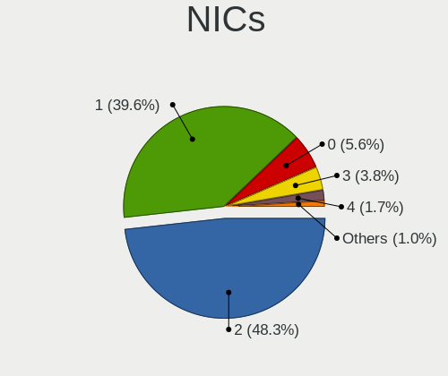

| Total | Computers | Percent |
|-------|-----------|---------|
| 2     | 423       | 50%     |
| 1     | 353       | 41.73%  |
| 0     | 30        | 3.55%   |
| 3     | 25        | 2.96%   |
| 4     | 9         | 1.06%   |
| 6     | 4         | 0.47%   |
| 8     | 1         | 0.12%   |
| 5     | 1         | 0.12%   |

IPv6
----

IPv6 vs IPv4

| Used | Computers | Percent |
|------|-----------|---------|
| No   | 762       | 89.12%  |
| Yes  | 93        | 10.88%  |

Bluetooth
---------

Bluetooth Vendor
----------------

Controller vendors

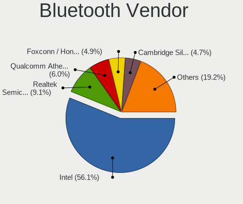

| Vendor                          | Computers | Percent |
|---------------------------------|-----------|---------|
| Intel                           | 332       | 59.5%   |
| Realtek Semiconductor           | 49        | 8.78%   |
| Qualcomm Atheros Communications | 45        | 8.06%   |
| Cambridge Silicon Radio         | 31        | 5.56%   |
| Realtek                         | 24        | 4.3%    |
| Broadcom                        | 19        | 3.41%   |
| Foxconn / Hon Hai               | 10        | 1.79%   |
| Apple                           | 8         | 1.43%   |
| Lite-On Technology              | 7         | 1.25%   |
| IMC Networks                    | 7         | 1.25%   |
| ASUSTek Computer                | 5         | 0.9%    |
| Opticis                         | 4         | 0.72%   |
| Dell                            | 4         | 0.72%   |
| Ralink                          | 3         | 0.54%   |
| Toshiba                         | 2         | 0.36%   |
| Taiyo Yuden                     | 2         | 0.36%   |
| Marvell Semiconductor           | 2         | 0.36%   |
| Alps Electric                   | 2         | 0.36%   |
| Hewlett-Packard                 | 1         | 0.18%   |
| Foxconn International           | 1         | 0.18%   |

Bluetooth Model
---------------

Controller models

| Model                                                 | Computers | Percent |
|-------------------------------------------------------|-----------|---------|
| Intel Bluetooth wireless interface                    | 123       | 22.04%  |
| Intel AX200 Bluetooth                                 | 63        | 11.29%  |
| Intel AX201 Bluetooth                                 | 61        | 10.93%  |
| Intel Bluetooth 9460/9560 Jefferson Peak (JfP)        | 50        | 8.96%   |
| Realtek Bluetooth Radio                               | 35        | 6.27%   |
| Qualcomm Atheros  Bluetooth Device                    | 31        | 5.56%   |
| Cambridge Silicon Radio Bluetooth Dongle (HCI mode)   | 31        | 5.56%   |
| Realtek Bluetooth Radio                               | 24        | 4.3%    |
| Intel AX210 Bluetooth                                 | 9         | 1.61%   |
| Realtek  Bluetooth 4.2 Adapter                        | 8         | 1.43%   |
| Intel Wireless-AC 9260 Bluetooth Adapter              | 8         | 1.43%   |
| Intel Bluetooth Device                                | 8         | 1.43%   |
| Realtek RTL8723B Bluetooth                            | 6         | 1.08%   |
| Qualcomm Atheros QCA61x4 Bluetooth 4.0                | 6         | 1.08%   |
| Qualcomm Atheros AR3012 Bluetooth 4.0                 | 6         | 1.08%   |
| Intel Centrino Bluetooth Wireless Transceiver         | 6         | 1.08%   |
| Foxconn / Hon Hai Wireless_Device                     | 5         | 0.9%    |
| Broadcom BCM2045B (BDC-2.1)                           | 5         | 0.9%    |
| Opticis Bluetooth Radio                               | 4         | 0.72%   |
| Intel Wireless-AC 3168 Bluetooth                      | 4         | 0.72%   |
| Apple Bluetooth Host Controller                       | 4         | 0.72%   |
| Ralink RT3290 Bluetooth                               | 3         | 0.54%   |
| Lite-On Bluetooth Device                              | 3         | 0.54%   |
| IMC Networks Bluetooth Device                         | 3         | 0.54%   |
| Broadcom BCM20702 Bluetooth 4.0 [ThinkPad]            | 3         | 0.54%   |
| Broadcom BCM2045B (BDC-2.1) [Bluetooth Controller]    | 3         | 0.54%   |
| Apple Bluetooth USB Host Controller                   | 3         | 0.54%   |
| Taiyo Yuden Bluetooth Device                          | 2         | 0.36%   |
| Marvell Bluetooth and Wireless LAN Composite          | 2         | 0.36%   |
| Lite-On Bluetooth 4.0 [Broadcom BCM20702A0]           | 2         | 0.36%   |
| IMC Networks Wireless_Device                          | 2         | 0.36%   |
| IMC Networks Bluetooth Radio                          | 2         | 0.36%   |
| Foxconn / Hon Hai Bluetooth Device                    | 2         | 0.36%   |
| Foxconn / Hon Hai BCM20702A0                          | 2         | 0.36%   |
| Dell DW375 Bluetooth Module                           | 2         | 0.36%   |
| Broadcom BCM20702A0 Bluetooth 4.0                     | 2         | 0.36%   |
| Broadcom BCM20702A0 Bluetooth                         | 2         | 0.36%   |
| ASUS Broadcom BCM20702 Single-Chip Bluetooth 4.0 + LE | 2         | 0.36%   |
| Toshiba RT Bluetooth Radio                            | 1         | 0.18%   |
| Toshiba Atheros AR3012 Bluetooth                      | 1         | 0.18%   |
| Qualcomm Atheros AR9462 Bluetooth                     | 1         | 0.18%   |
| Qualcomm Atheros AR3011 Bluetooth                     | 1         | 0.18%   |
| Lite-On Qualcomm Atheros QCA9377 Bluetooth            | 1         | 0.18%   |
| Lite-On Atheros Bluetooth                             | 1         | 0.18%   |
| HP Broadcom 2070 Bluetooth Combo                      | 1         | 0.18%   |
| Foxconn International BCM43142A0 Bluetooth module     | 1         | 0.18%   |
| Foxconn / Hon Hai BCM2045A0                           | 1         | 0.18%   |
| Dell Wireless 370 Bluetooth Mini-card                 | 1         | 0.18%   |
| Dell BCM20702A0 Bluetooth Module                      | 1         | 0.18%   |
| Broadcom HP Portable SoftSailing                      | 1         | 0.18%   |
| Broadcom Bluetooth 3.0 USB Dongle                     | 1         | 0.18%   |
| Broadcom BCM2070 Bluetooth Device                     | 1         | 0.18%   |
| Broadcom BCM2046 Bluetooth Device                     | 1         | 0.18%   |
| ASUS Qualcomm Bluetooth 4.1                           | 1         | 0.18%   |
| ASUS Broadcom BCM20702A0 Bluetooth                    | 1         | 0.18%   |
| ASUS Bluetooth Radio                                  | 1         | 0.18%   |
| Apple Built-in Bluetooth 2.0+EDR HCI                  | 1         | 0.18%   |
| Alps Electric Bluetooth Adapter                       | 1         | 0.18%   |
| Alps Electric BCM2046 Bluetooth Device                | 1         | 0.18%   |

Sound
-----

Sound Vendor
------------

Sound card vendors

| Vendor                           | Computers | Percent |
|----------------------------------|-----------|---------|
| Intel                            | 595       | 56.72%  |
| AMD                              | 231       | 22.02%  |
| Nvidia                           | 171       | 16.3%   |
| C-Media Electronics              | 8         | 0.76%   |
| Realtek Semiconductor            | 5         | 0.48%   |
| XMOS                             | 4         | 0.38%   |
| Creative Labs                    | 4         | 0.38%   |
| Zhaoxin                          | 3         | 0.29%   |
| Silicon Integrated Systems [SiS] | 3         | 0.29%   |
| Huawei Technologies              | 3         | 0.29%   |
| Generalplus Technology           | 3         | 0.29%   |
| Texas Instruments                | 2         | 0.19%   |
| Dell                             | 2         | 0.19%   |
| Unknown                          | 1         | 0.1%    |
| Sony                             | 1         | 0.1%    |
| Sennheiser Communications        | 1         | 0.1%    |
| NXP Semiconductors               | 1         | 0.1%    |
| Loongson Technology              | 1         | 0.1%    |
| Lenovo                           | 1         | 0.1%    |
| JMTek                            | 1         | 0.1%    |
| iCreate Technologies             | 1         | 0.1%    |
| ESI                              | 1         | 0.1%    |
| Creative Technology              | 1         | 0.1%    |
| BY EDIFIER                       | 1         | 0.1%    |
| AudioQuest                       | 1         | 0.1%    |
| Atmel                            | 1         | 0.1%    |
| Apple                            | 1         | 0.1%    |
| ACTIONS                          | 1         | 0.1%    |

Sound Model
-----------

Sound card models

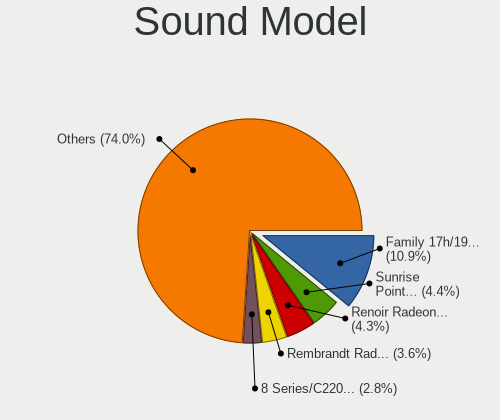

| Model                                                                                             | Computers | Percent |
|---------------------------------------------------------------------------------------------------|-----------|---------|
| AMD Family 17h/19h HD Audio Controller                                                            | 117       | 9.28%   |
| Intel Sunrise Point-LP HD Audio                                                                   | 90        | 7.14%   |
| AMD Renoir Radeon High Definition Audio Controller                                                | 58        | 4.6%    |
| Intel Cannon Lake PCH cAVS                                                                        | 49        | 3.89%   |
| Intel 8 Series/C220 Series Chipset High Definition Audio Controller                               | 49        | 3.89%   |
| Intel 7 Series/C216 Chipset Family High Definition Audio Controller                               | 43        | 3.41%   |
| AMD Raven/Raven2/Fenghuang HDMI/DP Audio Controller                                               | 40        | 3.17%   |
| Intel Tiger Lake-LP Smart Sound Technology Audio Controller                                       | 34        | 2.7%    |
| Intel 6 Series/C200 Series Chipset Family High Definition Audio Controller                        | 34        | 2.7%    |
| Intel 100 Series/C230 Series Chipset Family HD Audio Controller                                   | 33        | 2.62%   |
| Intel Xeon E3-1200 v3/4th Gen Core Processor HD Audio Controller                                  | 30        | 2.38%   |
| Intel 200 Series PCH HD Audio                                                                     | 29        | 2.3%    |
| Intel Comet Lake PCH-LP cAVS                                                                      | 28        | 2.22%   |
| Nvidia TU106 High Definition Audio Controller                                                     | 20        | 1.59%   |
| Intel Wildcat Point-LP High Definition Audio Controller                                           | 20        | 1.59%   |
| Intel Haswell-ULT HD Audio Controller                                                             | 20        | 1.59%   |
| Intel Broadwell-U Audio Controller                                                                | 20        | 1.59%   |
| Intel 8 Series HD Audio Controller                                                                | 20        | 1.59%   |
| Nvidia GP106 High Definition Audio Controller                                                     | 18        | 1.43%   |
| Intel Cannon Point-LP High Definition Audio Controller                                            | 18        | 1.43%   |
| AMD Starship/Matisse HD Audio Controller                                                          | 18        | 1.43%   |
| AMD FCH Azalia Controller                                                                         | 18        | 1.43%   |
| Nvidia TU107 GeForce GTX 1650 High Definition Audio Controller                                    | 16        | 1.27%   |
| Nvidia GP104 High Definition Audio Controller                                                     | 16        | 1.27%   |
| Intel Comet Lake PCH cAVS                                                                         | 16        | 1.27%   |
| AMD Baffin HDMI/DP Audio [Radeon RX 550 640SP / RX 560/560X]                                      | 16        | 1.27%   |
| AMD Oland/Hainan/Cape Verde/Pitcairn HDMI Audio [Radeon HD 7000 Series]                           | 15        | 1.19%   |
| Nvidia Audio device                                                                               | 14        | 1.11%   |
| AMD SBx00 Azalia (Intel HDA)                                                                      | 14        | 1.11%   |
| Intel NM10/ICH7 Family High Definition Audio Controller                                           | 13        | 1.03%   |
| Intel Comet Lake PCH-V cAVS                                                                       | 13        | 1.03%   |
| Intel CM238 HD Audio Controller                                                                   | 11        | 0.87%   |
| Nvidia GP107GL High Definition Audio Controller                                                   | 10        | 0.79%   |
| Intel Celeron/Pentium Silver Processor High Definition Audio                                      | 9         | 0.71%   |
| Intel Atom Processor Z36xxx/Z37xxx Series High Definition Audio Controller                        | 9         | 0.71%   |
| Intel 82801I (ICH9 Family) HD Audio Controller                                                    | 9         | 0.71%   |
| AMD Ellesmere HDMI Audio [Radeon RX 470/480 / 570/580/590]                                        | 9         | 0.71%   |
| Nvidia TU116 High Definition Audio Controller                                                     | 8         | 0.63%   |
| Nvidia GK208 HDMI/DP Audio Controller                                                             | 8         | 0.63%   |
| Nvidia GF119 HDMI Audio Controller                                                                | 8         | 0.63%   |
| Intel Tiger Lake-H HD Audio Controller                                                            | 8         | 0.63%   |
| AMD Family 17h (Models 00h-0fh) HD Audio Controller                                               | 8         | 0.63%   |
| Intel Lewisburg MROM 0                                                                            | 7         | 0.56%   |
| Intel Ice Lake-LP Smart Sound Technology Audio Controller                                         | 7         | 0.56%   |
| Intel 5 Series/3400 Series Chipset High Definition Audio                                          | 7         | 0.56%   |
| Nvidia GM107 High Definition Audio Controller [GeForce 940MX]                                     | 6         | 0.48%   |
| Nvidia GF108 High Definition Audio Controller                                                     | 6         | 0.48%   |
| Intel Atom/Celeron/Pentium Processor x5-E8000/J3xxx/N3xxx Series High Definition Audio Controller | 6         | 0.48%   |
| AMD Turks HDMI Audio [Radeon HD 6500/6600 / 6700M Series]                                         | 6         | 0.48%   |
| AMD Kabini HDMI/DP Audio                                                                          | 6         | 0.48%   |
| Realtek Semiconductor USB Audio                                                                   | 5         | 0.4%    |
| Nvidia TU102 High Definition Audio Controller                                                     | 5         | 0.4%    |
| Nvidia GP102 HDMI Audio Controller                                                                | 5         | 0.4%    |
| Nvidia GK106 HDMI Audio Controller                                                                | 5         | 0.4%    |
| Intel 82801JI (ICH10 Family) HD Audio Controller                                                  | 5         | 0.4%    |
| Intel 82801H (ICH8 Family) HD Audio Controller                                                    | 5         | 0.4%    |
| AMD Caicos HDMI Audio [Radeon HD 6450 / 7450/8450/8490 OEM / R5 230/235/235X OEM]                 | 5         | 0.4%    |
| Nvidia GP108 High Definition Audio Controller                                                     | 4         | 0.32%   |
| Nvidia GA104 High Definition Audio Controller                                                     | 4         | 0.32%   |
| AMD Kaveri HDMI/DP Audio Controller                                                               | 4         | 0.32%   |

Memory
------

Memory Vendor
-------------

Memory module vendors

| Vendor              | Computers | Percent |
|---------------------|-----------|---------|
| Samsung Electronics | 167       | 29.77%  |
| SK Hynix            | 111       | 19.79%  |
| Kingston            | 95        | 16.93%  |
| Micron Technology   | 58        | 10.34%  |
| Unknown             | 33        | 5.88%   |
| A-DATA Technology   | 22        | 3.92%   |
| Ramaxel Technology  | 15        | 2.67%   |
| Crucial             | 8         | 1.43%   |
| Elpida              | 6         | 1.07%   |
| Transcend           | 5         | 0.89%   |
| Corsair             | 5         | 0.89%   |
| Team                | 4         | 0.71%   |
| Unknown (ABCD)      | 3         | 0.53%   |
| G.Skill             | 3         | 0.53%   |
| Apacer              | 3         | 0.53%   |
| Kingmax             | 2         | 0.36%   |
| Unknown             | 2         | 0.36%   |
| Unknown (08C8)      | 1         | 0.18%   |
| Unknown (08B5)      | 1         | 0.18%   |
| Tigo                | 1         | 0.18%   |
| Thermaltake         | 1         | 0.18%   |
| Shenzhen WODPOSIT   | 1         | 0.18%   |
| SHARETRONIC         | 1         | 0.18%   |
| Nanya Technology    | 1         | 0.18%   |
| MTASE               | 1         | 0.18%   |
| Mircon              | 1         | 0.18%   |
| MAXSUN              | 1         | 0.18%   |
| Lexar Co Limited    | 1         | 0.18%   |
| Lenovo              | 1         | 0.18%   |
| Klevv               | 1         | 0.18%   |
| KingBank            | 1         | 0.18%   |
| Kimtigo             | 1         | 0.18%   |
| JEDEC ID: 0000h     | 1         | 0.18%   |
| Gloway              | 1         | 0.18%   |
| Essencore           | 1         | 0.18%   |
| 06F104B306F1        | 1         | 0.18%   |

Memory Model
------------

Memory module models

| Model                                                               | Computers | Percent |
|---------------------------------------------------------------------|-----------|---------|
| Samsung RAM M471A1G44AB0-CWE 8GB Row Of Chips DDR4 3200MT/s         | 10        | 1.64%   |
| Samsung RAM M471B5173EB0-YK0 4GB SODIMM DDR3 1600MT/s               | 9         | 1.47%   |
| SK Hynix RAM HMAA1GS6CMR6N-VK 8192MB Row Of Chips DDR4 2667MT/s     | 7         | 1.15%   |
| SK Hynix RAM HMA851S6CJR6N-VK 4GB SODIMM DDR4 2667MT/s              | 6         | 0.98%   |
| Samsung RAM M471A5244CB0-CTD 4GB SODIMM DDR4 3266MT/s               | 6         | 0.98%   |
| SK Hynix RAM HMA81GS6DJR8N-XN 8GB SODIMM DDR4 3200MT/s              | 5         | 0.82%   |
| Samsung RAM M471A5244CB0-CTD 4GB Row Of Chips DDR4 2667MT/s         | 5         | 0.82%   |
| Micron RAM 4ATF1G64HZ-3G2E1 8GB SODIMM DDR4 3200MT/s                | 5         | 0.82%   |
| Micron RAM 4ATF1G64HZ-3G2E1 8GB Row Of Chips DDR4 3200MT/s          | 5         | 0.82%   |
| Kingston RAM KHX3200C16D4/16GX 16384MB DIMM DDR4 3600MT/s           | 5         | 0.82%   |
| SK Hynix RAM HMA851S6CJR6N-VK 4GB Row Of Chips DDR4 2667MT/s        | 4         | 0.65%   |
| SK Hynix RAM HMA41GS6AFR8N-TF 8GB SODIMM DDR4 2667MT/s              | 4         | 0.65%   |
| Samsung RAM M471A4G43MB1-CTD 32GB SODIMM DDR4 2667MT/s              | 4         | 0.65%   |
| Samsung RAM M471A1K43BB1-CRC 8GB SODIMM DDR4 2667MT/s               | 4         | 0.65%   |
| Samsung RAM M471A1G44AB0-CTD 8GB SODIMM DDR4 2667MT/s               | 4         | 0.65%   |
| Samsung RAM M471A1G44AB0-CTD 8GB Row Of Chips DDR4 2667MT/s         | 4         | 0.65%   |
| Samsung RAM 6478545886 16GB DIMM DDR4 2668MT/s                      | 4         | 0.65%   |
| Micron RAM 8ATF1G64HZ-2G6E1 8192MB SODIMM DDR4 2667MT/s             | 4         | 0.65%   |
| Micron RAM 53E1G32D2NP-046 2GB Row Of Chips LPDDR4 4267MT/s         | 4         | 0.65%   |
| Kingston RAM LV32D4S2S8HD-8 8GB SODIMM DDR4 3200MT/s                | 4         | 0.65%   |
| Kingston RAM 99U5469-045.A00LF 4GB SODIMM DDR3 1600MT/s             | 4         | 0.65%   |
| Unknown (ABCD) RAM 123456789012345678 2048MB SODIMM LPDDR4 2400MT/s | 3         | 0.49%   |
| SK Hynix RAM HMT451S6BFR8A-PB 4GB SODIMM DDR3 1600MT/s              | 3         | 0.49%   |
| SK Hynix RAM HMT41GS6BFR8A-PB 8GB SODIMM DDR3 1600MT/s              | 3         | 0.49%   |
| SK Hynix RAM HMT41GS6AFR8A-PB 8GB SODIMM DDR3 1600MT/s              | 3         | 0.49%   |
| SK Hynix RAM HMT351S6CFR8C-PB 4GB SODIMM DDR3 1600MT/s              | 3         | 0.49%   |
| SK Hynix RAM HMA81GS6AFR8N-UH 8GB SODIMM DDR4 2667MT/s              | 3         | 0.49%   |
| SK Hynix RAM H9CCNNNCLGALAR-NVD 8192MB Row Of Chips LPDDR3 2133MT/s | 3         | 0.49%   |
| Samsung RAM UBE3D4AA-MGCR 2GB Row Of Chips LPDDR4 4267MT/s          | 3         | 0.49%   |
| Samsung RAM Module 16384MB SODIMM DDR4 2667MT/s                     | 3         | 0.49%   |
| Samsung RAM M471B1G73EB0-YK0 8192MB SODIMM DDR3 1600MT/s            | 3         | 0.49%   |
| Samsung RAM M471A5244CB0-CWE 4GB SODIMM DDR4 3200MT/s               | 3         | 0.49%   |
| Samsung RAM M471A1K43EB1-CWE 8192MB SODIMM DDR4 3200MT/s            | 3         | 0.49%   |
| Samsung RAM M471A1K43DB1-CWE 8GB SODIMM DDR4 3200MT/s               | 3         | 0.49%   |
| Samsung RAM M471A1K43CB1-CTD 8GB SODIMM DDR4 2667MT/s               | 3         | 0.49%   |
| Samsung RAM M471A1K43CB1-CRC 8GB SODIMM DDR4 2667MT/s               | 3         | 0.49%   |
| Samsung RAM M471A1G44AB0-CWE 8GB SODIMM DDR4 3200MT/s               | 3         | 0.49%   |
| Samsung RAM K4E6E304EB-EGCF 4GB Row Of Chips LPDDR3 1867MT/s        | 3         | 0.49%   |
| Ramaxel RAM RMSA3320MJ78HAF-3200 8GB SODIMM DDR4 3200MT/s           | 3         | 0.49%   |
| Micron RAM MT52L1G32D4PG-093 8GB Row Of Chips LPDDR3 2133MT/s       | 3         | 0.49%   |
| Micron RAM 8KTF51264HZ-1G6E1 4GB SODIMM DDR3 1600MT/s               | 3         | 0.49%   |
| Kingston RAM KHX3200C16D4/8GX 8GB DIMM DDR4 3533MT/s                | 3         | 0.49%   |
| Kingston RAM KHX2666C16/8G 8GB DIMM DDR4 3466MT/s                   | 3         | 0.49%   |
| Kingston RAM KHX1600C9S3L/8G 8192MB SODIMM DDR3 1600MT/s            | 3         | 0.49%   |
| Kingston RAM 99U5469-041.A00LF 4GB SODIMM DDR3 1600MT/s             | 3         | 0.49%   |
| Kingston RAM 99P5471-033.A00LF 8GB DIMM DDR3 1600MT/s               | 3         | 0.49%   |
| Kingston RAM 6478545886 16GB DIMM DDR4 2400MT/s                     | 3         | 0.49%   |
| Unknown RAM Module 8GB Row Of Chips LPDDR3 2133MT/s                 | 2         | 0.33%   |
| Unknown RAM Module 4096MB DIMM 1333MT/s                             | 2         | 0.33%   |
| Unknown RAM Module 2GB SODIMM DDR2 667MT/s                          | 2         | 0.33%   |
| Transcend RAM TS512MSK64W6H 4GB SODIMM DDR3 1600MT/s                | 2         | 0.33%   |
| SK Hynix RAM Module 64GB DIMM 4800MT/s                              | 2         | 0.33%   |
| SK Hynix RAM HMT351S6EFR8A-PB 4GB SODIMM DDR3 1600MT/s              | 2         | 0.33%   |
| SK Hynix RAM HMT125S6BFR8C-G7 2048MB SODIMM DDR3 1067MT/s           | 2         | 0.33%   |
| SK Hynix RAM HMAB2GS6AMR6N-XN 16GB SODIMM DDR4 3200MT/s             | 2         | 0.33%   |
| SK Hynix RAM HMAB2GS6AMR6N-XN 16384MB SODIMM DDR4 3200MT/s          | 2         | 0.33%   |
| SK Hynix RAM HMAA1GS6CMR6N-XN 8192MB Row Of Chips DDR4 3200MT/s     | 2         | 0.33%   |
| SK Hynix RAM HMA851S6CJR6N-UH 4GB SODIMM DDR4 2400MT/s              | 2         | 0.33%   |
| SK Hynix RAM HMA81GS6JJR8N-VK 8GB SODIMM DDR4 2667MT/s              | 2         | 0.33%   |
| SK Hynix RAM HMA81GS6CJR8N-VK 8GB SODIMM DDR4 2667MT/s              | 2         | 0.33%   |

Memory Kind
-----------

Memory module kinds

| Kind    | Computers | Percent |
|---------|-----------|---------|
| DDR4    | 270       | 54.55%  |
| DDR3    | 138       | 27.88%  |
| LPDDR3  | 31        | 6.26%   |
| LPDDR4  | 26        | 5.25%   |
| Unknown | 11        | 2.22%   |
| SDRAM   | 10        | 2.02%   |
| DDR2    | 8         | 1.62%   |
| DDR     | 1         | 0.2%    |

Memory Form Factor
------------------

Physical design of the memory module

| Name         | Computers | Percent |
|--------------|-----------|---------|
| SODIMM       | 264       | 53.33%  |
| DIMM         | 137       | 27.68%  |
| Row Of Chips | 90        | 18.18%  |
| Chip         | 3         | 0.61%   |
| Unknown      | 1         | 0.2%    |

Memory Size
-----------

Memory module size

| Size  | Computers | Percent |
|-------|-----------|---------|
| 8192  | 236       | 44.95%  |
| 4096  | 142       | 27.05%  |
| 16384 | 84        | 16%     |
| 2048  | 33        | 6.29%   |
| 32768 | 18        | 3.43%   |
| 1024  | 8         | 1.52%   |
| 65536 | 3         | 0.57%   |
| 512   | 1         | 0.19%   |

Memory Speed
------------

Memory module speed

| Speed   | Computers | Percent |
|---------|-----------|---------|
| 2667    | 106       | 19.96%  |
| 1600    | 99        | 18.64%  |
| 3200    | 90        | 16.95%  |
| 2400    | 40        | 7.53%   |
| 2133    | 34        | 6.4%    |
| 1333    | 24        | 4.52%   |
| 1867    | 16        | 3.01%   |
| 4267    | 15        | 2.82%   |
| 2666    | 13        | 2.45%   |
| 3600    | 8         | 1.51%   |
| 1334    | 7         | 1.32%   |
| 800     | 7         | 1.32%   |
| 3266    | 6         | 1.13%   |
| 1066    | 5         | 0.94%   |
| Unknown | 5         | 0.94%   |
| 4800    | 4         | 0.75%   |
| 4266    | 4         | 0.75%   |
| 2933    | 4         | 0.75%   |
| 2668    | 4         | 0.75%   |
| 1866    | 4         | 0.75%   |
| 1067    | 4         | 0.75%   |
| 4199    | 3         | 0.56%   |
| 3733    | 3         | 0.56%   |
| 3533    | 3         | 0.56%   |
| 3466    | 3         | 0.56%   |
| 667     | 3         | 0.56%   |
| 3000    | 2         | 0.38%   |
| 2800    | 2         | 0.38%   |
| 1800    | 2         | 0.38%   |
| 266     | 2         | 0.38%   |
| 4133    | 1         | 0.19%   |
| 3800    | 1         | 0.19%   |
| 3500    | 1         | 0.19%   |
| 3400    | 1         | 0.19%   |
| 2200    | 1         | 0.19%   |
| 2187    | 1         | 0.19%   |
| 2048    | 1         | 0.19%   |
| 400     | 1         | 0.19%   |
| 333     | 1         | 0.19%   |

Printers & scanners
-------------------

Printer Vendor
--------------

Printer device vendors

| Vendor                             | Computers | Percent |
|------------------------------------|-----------|---------|
| Hewlett-Packard                    | 3         | 37.5%   |
| Canon                              | 2         | 25%     |
| Xiaomi                             | 1         | 12.5%   |
| Brother Industries                 | 1         | 12.5%   |
| BeiJing LanXum Computer Technology | 1         | 12.5%   |

Printer Model
-------------

Printer device models

| Model                                                   | Computers | Percent |
|---------------------------------------------------------|-----------|---------|
| HP LaserJet 1020                                        | 2         | 25%     |
| Xiaomi MiMouse 2                                        | 1         | 12.5%   |
| HP Officejet 4500 G510g-m                               | 1         | 12.5%   |
| Canon PIXMA MP280                                       | 1         | 12.5%   |
| Canon iP1100 series                                     | 1         | 12.5%   |
| Brother HL-5440D series                                 | 1         | 12.5%   |
| BeiJing LanXum Technology Black and White Laser Printer | 1         | 12.5%   |

Scanner Vendor
--------------

Scanner device vendors

| Vendor | Computers | Percent |
|--------|-----------|---------|
| Canon  | 1         | 100%    |

Scanner Model
-------------

Scanner device models

| Model                   | Computers | Percent |
|-------------------------|-----------|---------|
| Canon CanoScan LiDE 120 | 1         | 100%    |

Camera
------

Camera Vendor
-------------

Camera device vendors

| Vendor                                 | Computers | Percent |
|----------------------------------------|-----------|---------|
| Chicony Electronics                    | 95        | 19.79%  |
| IMC Networks                           | 78        | 16.25%  |
| Acer                                   | 51        | 10.63%  |
| Realtek Semiconductor                  | 34        | 7.08%   |
| Microdia                               | 32        | 6.67%   |
| Sunplus Innovation Technology          | 30        | 6.25%   |
| Cheng Uei Precision Industry (Foxlink) | 27        | 5.63%   |
| Quanta                                 | 23        | 4.79%   |
| Syntek                                 | 19        | 3.96%   |
| Suyin                                  | 15        | 3.13%   |
| Lite-On Technology                     | 12        | 2.5%    |
| Logitech                               | 8         | 1.67%   |
| Apple                                  | 8         | 1.67%   |
| Silicon Motion                         | 6         | 1.25%   |
| Alcor Micro                            | 6         | 1.25%   |
| Ricoh                                  | 4         | 0.83%   |
| Luxvisions Innotech Limited            | 4         | 0.83%   |
| Z-Star Microelectronics                | 3         | 0.63%   |
| Lenovo                                 | 3         | 0.63%   |
| Importek                               | 3         | 0.63%   |
| Nebraska Furniture Mart                | 2         | 0.42%   |
| Google                                 | 2         | 0.42%   |
| Y Media                                | 1         | 0.21%   |
| USB Camera                             | 1         | 0.21%   |
| Unknown                                | 1         | 0.21%   |
| U0AS01A-0                              | 1         | 0.21%   |
| Sonix Technology                       | 1         | 0.21%   |
| SN0002                                 | 1         | 0.21%   |
| Primax Electronics                     | 1         | 0.21%   |
| Mitsumi                                | 1         | 0.21%   |
| MacroSilicon                           | 1         | 0.21%   |
| Goodong Industry                       | 1         | 0.21%   |
| Genesys Logic                          | 1         | 0.21%   |
| GEMBIRD                                | 1         | 0.21%   |
| DMWCV0ABIG5EGN                         | 1         | 0.21%   |
| Cubeternet                             | 1         | 0.21%   |
| ARC International                      | 1         | 0.21%   |

Camera Model
------------

Camera device models

| Model                                                        | Computers | Percent |
|--------------------------------------------------------------|-----------|---------|
| Chicony Integrated Camera                                    | 42        | 8.66%   |
| IMC Networks Integrated Camera                               | 34        | 7.01%   |
| Microdia Integrated_Webcam_HD                                | 22        | 4.54%   |
| IMC Networks HD Camera                                       | 19        | 3.92%   |
| Acer Integrated Camera                                       | 19        | 3.92%   |
| Syntek Integrated Camera                                     | 13        | 2.68%   |
| Cheng Uei Precision Industry (Foxlink) XiaoMi USB 2.0 Webcam | 12        | 2.47%   |
| Sunplus Integrated_Webcam_HD                                 | 11        | 2.27%   |
| Realtek Integrated_Webcam_HD                                 | 11        | 2.27%   |
| Chicony HD Webcam                                            | 10        | 2.06%   |
| Apple iPhone 5/5C/5S/6/SE                                    | 7         | 1.44%   |
| Quanta hm1091_techfront                                      | 6         | 1.24%   |
| IMC Networks ov9734_azurewave_camera                         | 6         | 1.24%   |
| Acer BisonCam, NB Pro                                        | 6         | 1.24%   |
| Sunplus XiaoMi USB 2.0 Webcam                                | 5         | 1.03%   |
| Sunplus HD WebCam                                            | 5         | 1.03%   |
| Silicon Motion 300k Pixel Camera                             | 5         | 1.03%   |
| Realtek Integrated Webcam                                    | 5         | 1.03%   |
| Realtek HP Wide Vision HD Camera                             | 5         | 1.03%   |
| Quanta HP HD Camera                                          | 5         | 1.03%   |
| Lite-On Integrated Camera                                    | 5         | 1.03%   |
| IMC Networks USB2.0 HD UVC WebCam                            | 5         | 1.03%   |
| Chicony XiaoMi USB 2.0 Webcam                                | 5         | 1.03%   |
| Acer Lenovo EasyCamera                                       | 5         | 1.03%   |
| Quanta HD User Facing                                        | 4         | 0.82%   |
| IMC Networks Lenovo EasyCamera                               | 4         | 0.82%   |
| Chicony Lenovo Integrated Camera (0.3MP)                     | 4         | 0.82%   |
| Chicony Integrated Camera (1280x720@30)                      | 4         | 0.82%   |
| Chicony HP HD Camera                                         | 4         | 0.82%   |
| Cheng Uei Precision Industry (Foxlink) HP HD Camera          | 4         | 0.82%   |
| Syntek Lenovo EasyCamera                                     | 3         | 0.62%   |
| Suyin 1.3M HD WebCam                                         | 3         | 0.62%   |
| Microdia Webcam Vitade AF                                    | 3         | 0.62%   |
| Luxvisions Innotech Limited Integrated Camera                | 3         | 0.62%   |
| Logitech HD Pro Webcam C920                                  | 3         | 0.62%   |
| Lite-On HP Wide Vision HD Camera                             | 3         | 0.62%   |
| Lite-On HP HD Camera                                         | 3         | 0.62%   |
| Chicony USB 2.0 Camera                                       | 3         | 0.62%   |
| Chicony HP Wide Vision HD Camera                             | 3         | 0.62%   |
| Chicony EasyCamera                                           | 3         | 0.62%   |
| Cheng Uei Precision Industry (Foxlink) HD Camera             | 3         | 0.62%   |
| Acer ThinkPad Integrated Camera                              | 3         | 0.62%   |
| Acer SunplusIT Integrated Camera                             | 3         | 0.62%   |
| Acer HD Webcam                                               | 3         | 0.62%   |
| Acer BisonCam,NB Pro                                         | 3         | 0.62%   |
| Syntek EasyCamera                                            | 2         | 0.41%   |
| Suyin Lenovo EasyCamera                                      | 2         | 0.41%   |
| Suyin Integrated_Webcam_HD                                   | 2         | 0.41%   |
| Suyin Integrated Webcam                                      | 2         | 0.41%   |
| Sunplus Laptop_Integrated_Webcam_HD                          | 2         | 0.41%   |
| Sunplus Integrated_Webcam_FHD                                | 2         | 0.41%   |
| Sunplus HP Wide Vision HD                                    | 2         | 0.41%   |
| Realtek USB Camera                                           | 2         | 0.41%   |
| Realtek Front Camera                                         | 2         | 0.41%   |
| Quanta ov9734_techfront_camera                               | 2         | 0.41%   |
| Quanta HD Webcam                                             | 2         | 0.41%   |
| Nebraska Furniture Mart USB 2.0 PC cam                       | 2         | 0.41%   |
| Logitech Webcam C310                                         | 2         | 0.41%   |
| Importek TOSHIBA Web Camera - HD                             | 2         | 0.41%   |
| IMC Networks USB2.0 VGA UVC WebCam                           | 2         | 0.41%   |

Security
--------

Fingerprint Vendor
------------------

Fingerprint sensor vendors

| Vendor                     | Computers | Percent |
|----------------------------|-----------|---------|
| Shenzhen Goodix Technology | 48        | 33.33%  |
| Validity Sensors           | 37        | 25.69%  |
| Synaptics                  | 36        | 25%     |
| Elan Microelectronics      | 10        | 6.94%   |
| Upek                       | 8         | 5.56%   |
| AuthenTec                  | 3         | 2.08%   |
| STMicroelectronics         | 1         | 0.69%   |
| LighTuning Technology      | 1         | 0.69%   |

Fingerprint Model
-----------------

Fingerprint sensor models

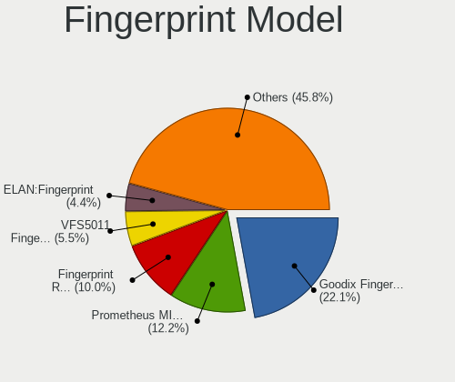

| Model                                                                      | Computers | Percent |
|----------------------------------------------------------------------------|-----------|---------|
| Shenzhen Goodix  FingerPrint Device                                        | 24        | 16.67%  |
| Shenzhen Goodix Fingerprint Reader                                         | 22        | 15.28%  |
| Synaptics Prometheus MIS Touch Fingerprint Reader                          | 18        | 12.5%   |
| Validity Sensors VFS5011 Fingerprint Reader                                | 9         | 6.25%   |
| Elan ELAN:Fingerprint                                                      | 9         | 6.25%   |
| Validity Sensors VFS 5011 fingerprint sensor                               | 7         | 4.86%   |
| Upek Biometric Touchchip/Touchstrip Fingerprint Sensor                     | 7         | 4.86%   |
| Unknown                                                                    | 7         | 4.86%   |
| Validity Sensors Synaptics WBDI                                            | 6         | 4.17%   |
| Validity Sensors Synaptics VFS7552 Touch Fingerprint Sensor with PurePrint | 4         | 2.78%   |
| Validity Sensors VFS7500 Touch Fingerprint Sensor                          | 3         | 2.08%   |
| Synaptics WBDI Device                                                      | 3         | 2.08%   |
| Synaptics  FS7604 Touch Fingerprint Sensor with PurePrint                  | 3         | 2.08%   |
| Synaptics Metallica MIS Touch Fingerprint Reader                           | 3         | 2.08%   |
| Validity Sensors VFS495 Fingerprint Reader                                 | 2         | 1.39%   |
| Validity Sensors VFS491                                                    | 2         | 1.39%   |
| Synaptics  VFS7552 Touch Fingerprint Sensor with PurePrint                 | 2         | 1.39%   |
| Shenzhen Goodix FingerPrint                                                | 2         | 1.39%   |
| Validity Sensors VFS7552 Touch Fingerprint Sensor                          | 1         | 0.69%   |
| Validity Sensors VFS471 Fingerprint Reader                                 | 1         | 0.69%   |
| Validity Sensors VFS Fingerprint sensor                                    | 1         | 0.69%   |
| Validity Sensors Fingerprint scanner                                       | 1         | 0.69%   |
| Upek TCS5B Fingerprint sensor                                              | 1         | 0.69%   |
| STMicroelectronics Fingerprint Reader                                      | 1         | 0.69%   |
| LighTuning EgisTec Touch Fingerprint Sensor                                | 1         | 0.69%   |
| Elan ELAN:ARM-M4                                                           | 1         | 0.69%   |
| AuthenTec Fingerprint Sensor                                               | 1         | 0.69%   |
| AuthenTec AES2810                                                          | 1         | 0.69%   |
| AuthenTec AES2550 Fingerprint Sensor                                       | 1         | 0.69%   |

Chipcard Vendor
---------------

Chipcard module vendors

| Vendor      | Computers | Percent |
|-------------|-----------|---------|
| Broadcom    | 12        | 75%     |
| Alcor Micro | 2         | 12.5%   |
| Upek        | 1         | 6.25%   |
| Clay Logic  | 1         | 6.25%   |

Chipcard Model
--------------

Chipcard module models

| Model                                                                        | Computers | Percent |
|------------------------------------------------------------------------------|-----------|---------|
| Broadcom 5880                                                                | 5         | 31.25%  |
| Broadcom BCM5880 Secure Applications Processor with fingerprint swipe sensor | 3         | 18.75%  |
| Broadcom BCM5880 Secure Applications Processor                               | 2         | 12.5%   |
| Broadcom 58200                                                               | 2         | 12.5%   |
| Alcor Micro AU9540 Smartcard Reader                                          | 2         | 12.5%   |
| Upek TouchChip Fingerprint Coprocessor (WBF advanced mode)                   | 1         | 6.25%   |
| Clay Logic CanoKey                                                           | 1         | 6.25%   |

Unsupported
-----------

Unsupported Devices
-------------------

Total unsupported devices on board

| Total | Computers | Percent |
|-------|-----------|---------|
| 0     | 515       | 59.4%   |
| 1     | 278       | 32.06%  |
| 2     | 52        | 6%      |
| 3     | 8         | 0.92%   |
| 4     | 7         | 0.81%   |
| 5     | 4         | 0.46%   |
| 8     | 2         | 0.23%   |
| 6     | 1         | 0.12%   |

Unsupported Device Types
------------------------

Types of unsupported devices

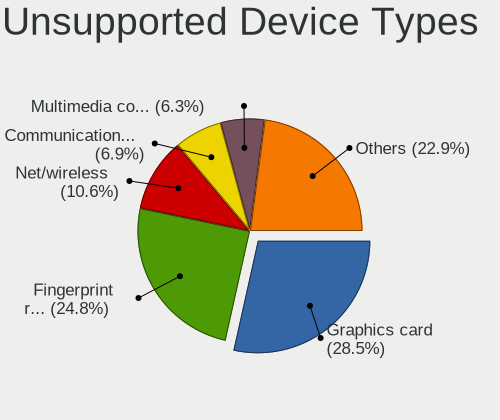

| Type                     | Computers | Percent |
|--------------------------|-----------|---------|
| Fingerprint reader       | 141       | 32.12%  |
| Graphics card            | 104       | 23.69%  |
| Net/wireless             | 47        | 10.71%  |
| Communication controller | 33        | 7.52%   |
| Multimedia controller    | 24        | 5.47%   |
| Unassigned class         | 17        | 3.87%   |
| Chipcard                 | 15        | 3.42%   |
| Sound                    | 14        | 3.19%   |
| Bluetooth                | 14        | 3.19%   |
| Camera                   | 8         | 1.82%   |
| Network                  | 7         | 1.59%   |
| Net/ethernet             | 5         | 1.14%   |
| Storage/raid             | 3         | 0.68%   |
| Storage                  | 3         | 0.68%   |
| Card reader              | 2         | 0.46%   |
| Storage/ata              | 1         | 0.23%   |
| Modem                    | 1         | 0.23%   |

