Linux in China - Tested Hardware & Statistics
---------------------------------------------

A project to collect tested hardware configurations for Linux in China.

Anyone can contribute to this report by the [hw-probe](https://github.com/linuxhw/hw-probe) tool:

    sudo -E hw-probe -all -upload

Please contribute! Especially if your hardware is rare.

This is a report for all computer types. See also reports for [desktops](/Location/China/Desktop/README.md) and [notebooks](/Location/China/Notebook/README.md).

Contents
--------

* [ Test Cases ](#test-cases)

* [ System ](#system)
  - [ OS                       ](#os)
  - [ OS Family                ](#os-family)
  - [ Kernel                   ](#kernel)
  - [ Kernel Family            ](#kernel-family)
  - [ Kernel Major Ver.        ](#kernel-major-ver)
  - [ Arch                     ](#arch)
  - [ DE                       ](#de)
  - [ Display Server           ](#display-server)
  - [ Display Manager          ](#display-manager)
  - [ OS Lang                  ](#os-lang)
  - [ Boot Mode                ](#boot-mode)
  - [ Filesystem               ](#filesystem)
  - [ Part. scheme             ](#part-scheme)
  - [ Dual Boot with Linux/BSD ](#dual-boot-with-linuxbsd)
  - [ Dual Boot (Win)          ](#dual-boot-win)

* [ Board ](#board)
  - [ Vendor                   ](#vendor)
  - [ Model                    ](#model)
  - [ Model Family             ](#model-family)
  - [ MFG Year                 ](#mfg-year)
  - [ Form Factor              ](#form-factor)
  - [ Secure Boot              ](#secure-boot)
  - [ Coreboot                 ](#coreboot)
  - [ RAM Size                 ](#ram-size)
  - [ RAM Used                 ](#ram-used)
  - [ Total Drives             ](#total-drives)
  - [ Has CD-ROM               ](#has-cd-rom)
  - [ Has Ethernet             ](#has-ethernet)
  - [ Has WiFi                 ](#has-wifi)
  - [ Has Bluetooth            ](#has-bluetooth)

* [ Location ](#location)
  - [ Country                  ](#country)
  - [ City                     ](#city)

* [ Drives ](#drives)
  - [ Drive Vendor             ](#drive-vendor)
  - [ Drive Model              ](#drive-model)
  - [ HDD Vendor               ](#hdd-vendor)
  - [ SSD Vendor               ](#ssd-vendor)
  - [ Drive Kind               ](#drive-kind)
  - [ Drive Connector          ](#drive-connector)
  - [ Drive Size               ](#drive-size)
  - [ Space Total              ](#space-total)
  - [ Space Used               ](#space-used)
  - [ Malfunc. Drives          ](#malfunc-drives)
  - [ Malfunc. Drive Vendor    ](#malfunc-drive-vendor)
  - [ Malfunc. HDD Vendor      ](#malfunc-hdd-vendor)
  - [ Malfunc. Drive Kind      ](#malfunc-drive-kind)
  - [ Failed Drives            ](#failed-drives)
  - [ Failed Drive Vendor      ](#failed-drive-vendor)
  - [ Drive Status             ](#drive-status)

* [ Storage controller ](#storage-controller)
  - [ Storage Vendor           ](#storage-vendor)
  - [ Storage Model            ](#storage-model)
  - [ Storage Kind             ](#storage-kind)

* [ Processor ](#processor)
  - [ CPU Vendor               ](#cpu-vendor)
  - [ CPU Model                ](#cpu-model)
  - [ CPU Model Family         ](#cpu-model-family)
  - [ CPU Cores                ](#cpu-cores)
  - [ CPU Sockets              ](#cpu-sockets)
  - [ CPU Threads              ](#cpu-threads)
  - [ CPU Op-Modes             ](#cpu-op-modes)
  - [ CPU Microcode            ](#cpu-microcode)
  - [ CPU Microarch            ](#cpu-microarch)

* [ Graphics ](#graphics)
  - [ GPU Vendor               ](#gpu-vendor)
  - [ GPU Model                ](#gpu-model)
  - [ GPU Combo                ](#gpu-combo)
  - [ GPU Driver               ](#gpu-driver)
  - [ GPU Memory               ](#gpu-memory)

* [ Monitor ](#monitor)
  - [ Monitor Vendor           ](#monitor-vendor)
  - [ Monitor Model            ](#monitor-model)
  - [ Monitor Resolution       ](#monitor-resolution)
  - [ Monitor Diagonal         ](#monitor-diagonal)
  - [ Monitor Width            ](#monitor-width)
  - [ Aspect Ratio             ](#aspect-ratio)
  - [ Monitor Area             ](#monitor-area)
  - [ Pixel Density            ](#pixel-density)
  - [ Multiple Monitors        ](#multiple-monitors)

* [ Network ](#network)
  - [ Net Controller Vendor    ](#net-controller-vendor)
  - [ Net Controller Model     ](#net-controller-model)
  - [ Wireless Vendor          ](#wireless-vendor)
  - [ Wireless Model           ](#wireless-model)
  - [ Ethernet Vendor          ](#ethernet-vendor)
  - [ Ethernet Model           ](#ethernet-model)
  - [ Net Controller Kind      ](#net-controller-kind)
  - [ Used Controller          ](#used-controller)
  - [ NICs                     ](#nics)
  - [ IPv6                     ](#ipv6)

* [ Bluetooth ](#bluetooth)
  - [ Bluetooth Vendor         ](#bluetooth-vendor)
  - [ Bluetooth Model          ](#bluetooth-model)

* [ Sound ](#sound)
  - [ Sound Vendor             ](#sound-vendor)
  - [ Sound Model              ](#sound-model)

* [ Memory ](#memory)
  - [ Memory Vendor            ](#memory-vendor)
  - [ Memory Model             ](#memory-model)
  - [ Memory Kind              ](#memory-kind)
  - [ Memory Form Factor       ](#memory-form-factor)
  - [ Memory Size              ](#memory-size)
  - [ Memory Speed             ](#memory-speed)

* [ Printers & scanners ](#printers--scanners)
  - [ Printer Vendor           ](#printer-vendor)
  - [ Printer Model            ](#printer-model)
  - [ Scanner Vendor           ](#scanner-vendor)
  - [ Scanner Model            ](#scanner-model)

* [ Camera ](#camera)
  - [ Camera Vendor            ](#camera-vendor)
  - [ Camera Model             ](#camera-model)

* [ Security ](#security)
  - [ Fingerprint Vendor       ](#fingerprint-vendor)
  - [ Fingerprint Model        ](#fingerprint-model)
  - [ Chipcard Vendor          ](#chipcard-vendor)
  - [ Chipcard Model           ](#chipcard-model)

* [ Unsupported ](#unsupported)
  - [ Unsupported Devices      ](#unsupported-devices)
  - [ Unsupported Device Types ](#unsupported-device-types)

Test Cases
----------

Total: 3023

| Vendor        | Model                       | Form-Factor | Probe                                                      | Date         |
|---------------|-----------------------------|-------------|------------------------------------------------------------|--------------|
| ASUSTek       | K55VD                       | Notebook    | [d0bc9affdb](https://linux-hardware.org/?probe=d0bc9affdb) | Jan 06, 2025 |
| MAXSUN        | MS-A86FX FS M.3             | Desktop     | [778b3689c2](https://linux-hardware.org/?probe=778b3689c2) | Jan 05, 2025 |
| GITSTAR       | GDC-1461                    | Notebook    | [08243d6a0b](https://linux-hardware.org/?probe=08243d6a0b) | Jan 05, 2025 |
| Lenovo        | NOK                         | Desktop     | [2b5c2e2c8a](https://linux-hardware.org/?probe=2b5c2e2c8a) | Jan 04, 2025 |
| Intel         | 14650HX                     | Desktop     | [a9e917c056](https://linux-hardware.org/?probe=a9e917c056) | Jan 02, 2025 |
| Valve         | Jupiter                     | Notebook    | [d8901f7e5b](https://linux-hardware.org/?probe=d8901f7e5b) | Jan 02, 2025 |
| GITSTAR       | GDC-1461                    | Notebook    | [e2fee21ed2](https://linux-hardware.org/?probe=e2fee21ed2) | Jan 01, 2025 |
| Lenovo        | ThinkPad SL410 2842EVC      | Notebook    | [344aabb4c4](https://linux-hardware.org/?probe=344aabb4c4) | Jan 01, 2025 |
| Loongson      | CTCI02LS3A6000C-K CTCI V... | Desktop     | [b6f0fc1399](https://linux-hardware.org/?probe=b6f0fc1399) | Dec 31, 2024 |
| MSI           | B450M MORTAR TITANIUM       | Desktop     | [2bbf71e498](https://linux-hardware.org/?probe=2bbf71e498) | Dec 28, 2024 |
| Lenovo        | ThinkPad E480 20KNA04RCD    | Notebook    | [d64710669e](https://linux-hardware.org/?probe=d64710669e) | Dec 27, 2024 |
| Loongson      | CTCI02LS3A6000C-K CTCI V... | Desktop     | [0cc3198ea4](https://linux-hardware.org/?probe=0cc3198ea4) | Dec 27, 2024 |
| Haier         | ZEB19 V1.1                  | Desktop     | [fa29b7de8f](https://linux-hardware.org/?probe=fa29b7de8f) | Dec 27, 2024 |
| AZW           | LZX TBD                     | Desktop     | [92975fb393](https://linux-hardware.org/?probe=92975fb393) | Dec 27, 2024 |
| AZW           | LZX TBD                     | Desktop     | [7bad615f3c](https://linux-hardware.org/?probe=7bad615f3c) | Dec 27, 2024 |
| AZW           | LZX TBD                     | Desktop     | [ea53b402e4](https://linux-hardware.org/?probe=ea53b402e4) | Dec 27, 2024 |
| GITSTAR       | GDC-1461                    | Notebook    | [5d52d6cbb3](https://linux-hardware.org/?probe=5d52d6cbb3) | Dec 27, 2024 |
| Shanghai Z... | ZXE CRB                     | Notebook    | [b1723d54f1](https://linux-hardware.org/?probe=b1723d54f1) | Dec 27, 2024 |
| Shanghai Z... | ZXE CRB                     | Notebook    | [b991e63212](https://linux-hardware.org/?probe=b991e63212) | Dec 27, 2024 |
| Shanghai Z... | ZXE CRB                     | Notebook    | [6d28566eaf](https://linux-hardware.org/?probe=6d28566eaf) | Dec 27, 2024 |
| Shanghai Z... | ZXE CRB                     | Notebook    | [af6004637f](https://linux-hardware.org/?probe=af6004637f) | Dec 27, 2024 |
| GITSTAR       | GDC-1461                    | Notebook    | [d3d0e4ef66](https://linux-hardware.org/?probe=d3d0e4ef66) | Dec 27, 2024 |
| HP            | 255 15.6 inch G9 Noteboo... | Notebook    | [1c64d7883e](https://linux-hardware.org/?probe=1c64d7883e) | Dec 26, 2024 |
| ASUSTek       | NUC12WSB-M 60AS00F0-MB5A... | Mini pc     | [9f5263b2e2](https://linux-hardware.org/?probe=9f5263b2e2) | Dec 26, 2024 |
| ASUSTek       | NUC12WSB-M 60AS00F0-MB5A... | Mini pc     | [0da8180c1f](https://linux-hardware.org/?probe=0da8180c1f) | Dec 26, 2024 |
| Fujitsu       | FMVA08008                   | Notebook    | [fc76839db5](https://linux-hardware.org/?probe=fc76839db5) | Dec 23, 2024 |
| MSI           | H610M BOMBER DDR4           | Desktop     | [2d757efd33](https://linux-hardware.org/?probe=2d757efd33) | Dec 22, 2024 |
| Lenovo        | ThinkPad S2 Gen 6 20VMA0... | Notebook    | [df6fdd6e8a](https://linux-hardware.org/?probe=df6fdd6e8a) | Dec 22, 2024 |
| HP            | Pavilion Laptop 14-ce1xx... | Notebook    | [8b6523038d](https://linux-hardware.org/?probe=8b6523038d) | Dec 22, 2024 |
| Lenovo        | ThinkPad S2 Gen 6 20VMA0... | Notebook    | [17282fe4c7](https://linux-hardware.org/?probe=17282fe4c7) | Dec 21, 2024 |
| HUAWEI        | MDG-XX                      | Notebook    | [1f5ee29f02](https://linux-hardware.org/?probe=1f5ee29f02) | Dec 21, 2024 |
| Lenovo        | Yoga 14sARH 2021 82LB       | Notebook    | [f7b8a3e850](https://linux-hardware.org/?probe=f7b8a3e850) | Dec 20, 2024 |
| Lenovo        | Yoga 14sARH 2021 82LB       | Notebook    | [df7c4252e6](https://linux-hardware.org/?probe=df7c4252e6) | Dec 17, 2024 |
| ASUSTek       | TUF Gaming B660M-PLUS WI... | Desktop     | [1e7ff6fa41](https://linux-hardware.org/?probe=1e7ff6fa41) | Dec 17, 2024 |
| Lenovo        | Legion Y7000 81FW           | Notebook    | [b74286b627](https://linux-hardware.org/?probe=b74286b627) | Dec 16, 2024 |
| ASUSTek       | K42JY                       | Notebook    | [35095b2b4c](https://linux-hardware.org/?probe=35095b2b4c) | Dec 16, 2024 |
| MSI           | PRO Z790-A MAX WIFI         | Desktop     | [9d8b439c00](https://linux-hardware.org/?probe=9d8b439c00) | Dec 15, 2024 |
| Lenovo        | 3135 SDK0J40675 WIN 3305... | Mini pc     | [0518e5912f](https://linux-hardware.org/?probe=0518e5912f) | Dec 14, 2024 |
| Lenovo        | Legion R9000P2021H 82JQ     | Notebook    | [a0c8f35a1b](https://linux-hardware.org/?probe=a0c8f35a1b) | Dec 13, 2024 |
| GMKtec        | NucBox K6                   | Desktop     | [0ba5e79a99](https://linux-hardware.org/?probe=0ba5e79a99) | Dec 12, 2024 |
| Lenovo        | Legion Y9000P IRX9 83DF     | Notebook    | [35b1e770a7](https://linux-hardware.org/?probe=35b1e770a7) | Dec 11, 2024 |
| Lenovo        | ThinkPad X13 Gen 1 20UF0... | Notebook    | [0c5a8d044d](https://linux-hardware.org/?probe=0c5a8d044d) | Dec 11, 2024 |
| AZW           | LZX TBD                     | Desktop     | [33c820c4ff](https://linux-hardware.org/?probe=33c820c4ff) | Dec 10, 2024 |
| Loongson      | CTCI02LS3A6000C-K CTCI V... | Desktop     | [7348079cd8](https://linux-hardware.org/?probe=7348079cd8) | Dec 08, 2024 |
| GMKtec        | NucBox G3                   | Other       | [df121e1e40](https://linux-hardware.org/?probe=df121e1e40) | Dec 06, 2024 |
| Lenovo        | XiaoXinAir-14API 2019 81... | Notebook    | [5804fcefee](https://linux-hardware.org/?probe=5804fcefee) | Dec 05, 2024 |
| Loongson      | 3A6000-HV-7A2000-1w-V0.1... | Desktop     | [6db45d6f6f](https://linux-hardware.org/?probe=6db45d6f6f) | Dec 04, 2024 |
| Loongson      | 3A6000-HV-7A2000-NUC QA6... | Desktop     | [7ec85b65bc](https://linux-hardware.org/?probe=7ec85b65bc) | Dec 03, 2024 |
| Loongson      | 3A6000-HV-7A2000-1w-V0.1... | Desktop     | [d93b073b67](https://linux-hardware.org/?probe=d93b073b67) | Dec 03, 2024 |
| Loongson      | 3A6000-HV-7A2000-NUC QA6... | Desktop     | [b702d01268](https://linux-hardware.org/?probe=b702d01268) | Dec 02, 2024 |
| Lenovo        | ThinkPad X220 4286AC9       | Notebook    | [d19e70af90](https://linux-hardware.org/?probe=d19e70af90) | Dec 02, 2024 |
| MECHREVO      | WUJIE14 PRO                 | Notebook    | [06cabfde10](https://linux-hardware.org/?probe=06cabfde10) | Dec 01, 2024 |
| Lenovo        | ThinkPad X220 4286AC9       | Notebook    | [c4bb97c903](https://linux-hardware.org/?probe=c4bb97c903) | Nov 30, 2024 |
| Gigabyte      | H61M-S1                     | Desktop     | [00aeb0fa4c](https://linux-hardware.org/?probe=00aeb0fa4c) | Nov 28, 2024 |
| Intel         | NUC10i7FNB K61360-303       | Mini pc     | [2601c319b5](https://linux-hardware.org/?probe=2601c319b5) | Nov 28, 2024 |
| Lenovo        | RESCUER R720-15IKBN 80WW    | Notebook    | [0e9a9bef8d](https://linux-hardware.org/?probe=0e9a9bef8d) | Nov 28, 2024 |
| MSI           | B450M MORTAR                | Desktop     | [39200492be](https://linux-hardware.org/?probe=39200492be) | Nov 27, 2024 |
| AZW           | LZX TBD                     | Desktop     | [c1af486886](https://linux-hardware.org/?probe=c1af486886) | Nov 27, 2024 |
| Valve         | Jupiter                     | Notebook    | [6597b78dae](https://linux-hardware.org/?probe=6597b78dae) | Nov 27, 2024 |
| Loongson      | 3C6000-7A2000-2w-EVB-V1.... | Desktop     | [5cabe27847](https://linux-hardware.org/?probe=5cabe27847) | Nov 25, 2024 |
| ASUSTek       | TUF Gaming B450M-PRO S      | Desktop     | [2df85a6e04](https://linux-hardware.org/?probe=2df85a6e04) | Nov 25, 2024 |
| Loongson      | 3C6000-7A2000-2w-EVB-V1.... | Desktop     | [5284f27588](https://linux-hardware.org/?probe=5284f27588) | Nov 23, 2024 |
| Dell          | Latitude 5290 2-in-1        | Tablet      | [3ca2e47b48](https://linux-hardware.org/?probe=3ca2e47b48) | Nov 23, 2024 |
| KaiTian       | 2OBEA002KX                  | Notebook    | [516bb56dce](https://linux-hardware.org/?probe=516bb56dce) | Nov 22, 2024 |
| ASUSTek       | B760M-AYW WIFI              | Desktop     | [d5062f3897](https://linux-hardware.org/?probe=d5062f3897) | Nov 22, 2024 |
| Lenovo        | 30D5 NOK                    | All in one  | [76c6716d58](https://linux-hardware.org/?probe=76c6716d58) | Nov 22, 2024 |
| HONOR         | BRI-XX                      | Notebook    | [fee72d5d1f](https://linux-hardware.org/?probe=fee72d5d1f) | Nov 21, 2024 |
| Unknown       | Unknown                     | Desktop     | [027b46be42](https://linux-hardware.org/?probe=027b46be42) | Nov 21, 2024 |
| Lenovo        | ThinkPad T480 20L5A023HK    | Notebook    | [c52db1921e](https://linux-hardware.org/?probe=c52db1921e) | Nov 21, 2024 |
| Unknown       | Unknown                     | Desktop     | [4c3a6e2cdb](https://linux-hardware.org/?probe=4c3a6e2cdb) | Nov 18, 2024 |
| Unknown       | Unknown                     | Desktop     | [1763b2c1d2](https://linux-hardware.org/?probe=1763b2c1d2) | Nov 18, 2024 |
| Lenovo        | 3716 SDK0L77769 WIN 3423... | Desktop     | [74f4ee0967](https://linux-hardware.org/?probe=74f4ee0967) | Nov 17, 2024 |
| Lenovo        | Legion Y7000P2021 82JK      | Notebook    | [db50a44dfb](https://linux-hardware.org/?probe=db50a44dfb) | Nov 17, 2024 |
| ASUSTek       | PRIME H610M-K D4            | Desktop     | [749193ebff](https://linux-hardware.org/?probe=749193ebff) | Nov 16, 2024 |
| Loongson      | 3A6000-HV-7A2000-1w-EVB-... | Desktop     | [1524ee89c3](https://linux-hardware.org/?probe=1524ee89c3) | Nov 16, 2024 |
| Lenovo        | ThinkBook 14 G7+ ASP 21Q... | Notebook    | [9e752bc702](https://linux-hardware.org/?probe=9e752bc702) | Nov 16, 2024 |
| Lenovo        | ThinkPad T14 Gen 4 21HD0... | Notebook    | [f38d8fa44e](https://linux-hardware.org/?probe=f38d8fa44e) | Nov 16, 2024 |
| Apple         | MacBookPro6,2               | Notebook    | [f0eae2187b](https://linux-hardware.org/?probe=f0eae2187b) | Nov 15, 2024 |
| HUAWEI        | KLVD-WXX9                   | Notebook    | [f27eff2279](https://linux-hardware.org/?probe=f27eff2279) | Nov 15, 2024 |
| HUAWEI        | KLVD-WXX9                   | Notebook    | [07e19f11fd](https://linux-hardware.org/?probe=07e19f11fd) | Nov 15, 2024 |
| Lenovo        | B41-35 80LD                 | Notebook    | [f1ad7d31a0](https://linux-hardware.org/?probe=f1ad7d31a0) | Nov 14, 2024 |
| Shenzhen M... | AHBTB                       | Desktop     | [576f6f05a3](https://linux-hardware.org/?probe=576f6f05a3) | Nov 13, 2024 |
| THUNDEROBO... | 911M                        | Notebook    | [79f6af2768](https://linux-hardware.org/?probe=79f6af2768) | Nov 13, 2024 |
| HP            | 212B                        | Desktop     | [bb6c4a75f7](https://linux-hardware.org/?probe=bb6c4a75f7) | Nov 13, 2024 |
| Loongson      | 3A6000-HV-7A2000-NUC QA6... | Desktop     | [ce55076923](https://linux-hardware.org/?probe=ce55076923) | Nov 12, 2024 |
| MECHREVO      | WUJIE14XA                   | Notebook    | [96ed82ccbf](https://linux-hardware.org/?probe=96ed82ccbf) | Nov 12, 2024 |
| Shenzhen M... | AHBTB                       | Desktop     | [e62cdd7dd4](https://linux-hardware.org/?probe=e62cdd7dd4) | Nov 12, 2024 |
| MECHREVO      | WUJIE14XA                   | Notebook    | [f67868b6d1](https://linux-hardware.org/?probe=f67868b6d1) | Nov 12, 2024 |
| ONDA          | M3 miniPC VER               | Desktop     | [099d60e8a1](https://linux-hardware.org/?probe=099d60e8a1) | Nov 11, 2024 |
| HP            | Victus by Laptop 16-d1xx... | Notebook    | [8589373272](https://linux-hardware.org/?probe=8589373272) | Nov 11, 2024 |
| Silicom       | 80200-0240-G02 R200         | Desktop     | [547701de33](https://linux-hardware.org/?probe=547701de33) | Nov 11, 2024 |
| MECHREVO      | Kuangshi16Pro Series GM6... | Notebook    | [e0254a7e9a](https://linux-hardware.org/?probe=e0254a7e9a) | Nov 10, 2024 |
| MSI           | PRO X870-P WIFI             | Desktop     | [1a9e9db131](https://linux-hardware.org/?probe=1a9e9db131) | Nov 09, 2024 |
| Gigabyte      | X870 EAGLE WIFI7            | Desktop     | [c65ae30c51](https://linux-hardware.org/?probe=c65ae30c51) | Nov 09, 2024 |
| Lenovo        | 3102 SDK0L77767 WIN 3423... | Desktop     | [3a3945760d](https://linux-hardware.org/?probe=3a3945760d) | Nov 09, 2024 |
| Lenovo        | ThinkPad X230 2324BN2       | Notebook    | [2040b5fccb](https://linux-hardware.org/?probe=2040b5fccb) | Nov 08, 2024 |
| HP            | Victus by Laptop 16-d1xx... | Notebook    | [d37b1e618c](https://linux-hardware.org/?probe=d37b1e618c) | Nov 08, 2024 |
| Unknown       | Unknown                     | Soc         | [ce59b60adb](https://linux-hardware.org/?probe=ce59b60adb) | Nov 06, 2024 |
| Lenovo        | ThinkPad P53 20QQS38314     | Notebook    | [c04225f7b2](https://linux-hardware.org/?probe=c04225f7b2) | Nov 06, 2024 |
| Lenovo        | 102F SDK0E50518 STD 2621... | Desktop     | [b5f2869b8a](https://linux-hardware.org/?probe=b5f2869b8a) | Nov 06, 2024 |
| ASUSTek       | Pro WS WRX80E-SAGE SE WI... | Desktop     | [802476b534](https://linux-hardware.org/?probe=802476b534) | Nov 06, 2024 |
| ASUSTek       | ROG STRIX Z790-A GAMING ... | Desktop     | [42e0ed467d](https://linux-hardware.org/?probe=42e0ed467d) | Nov 06, 2024 |
| Lenovo        | 102F SDK0E50518 STD 2621... | Desktop     | [d30d873b70](https://linux-hardware.org/?probe=d30d873b70) | Nov 06, 2024 |
| Timi          | Xiaomi Book Pro 14 2022     | Notebook    | [cee54323a9](https://linux-hardware.org/?probe=cee54323a9) | Nov 06, 2024 |
| ASUSTek       | Pro WS WRX80E-SAGE SE WI... | Desktop     | [97d248356e](https://linux-hardware.org/?probe=97d248356e) | Nov 04, 2024 |
| MSI           | X670E GAMING PLUS WIFI      | Desktop     | [ee5c01978c](https://linux-hardware.org/?probe=ee5c01978c) | Nov 04, 2024 |
| MSI           | X670E GAMING PLUS WIFI      | Desktop     | [f502d96b27](https://linux-hardware.org/?probe=f502d96b27) | Nov 03, 2024 |
| HP            | ProBook 6570b               | Notebook    | [4aa25d1213](https://linux-hardware.org/?probe=4aa25d1213) | Nov 02, 2024 |
| Lenovo        | 104E NO DPK                 | Server      | [791dc0869d](https://linux-hardware.org/?probe=791dc0869d) | Nov 01, 2024 |
| Lenovo        | Legion Y7000P IRH8 82YA     | Notebook    | [6e69005df8](https://linux-hardware.org/?probe=6e69005df8) | Nov 01, 2024 |
| AZW           | SER                         | Mini pc     | [80af405ca3](https://linux-hardware.org/?probe=80af405ca3) | Nov 01, 2024 |
| Intel         | STRIX X99 GAMING II         | Desktop     | [9a78cb45fa](https://linux-hardware.org/?probe=9a78cb45fa) | Nov 01, 2024 |
| Lenovo        | ThinkPad T460 20FNA06ACD    | Notebook    | [f74faac599](https://linux-hardware.org/?probe=f74faac599) | Oct 31, 2024 |
| HP            | 212B                        | Desktop     | [8eb5ac95f4](https://linux-hardware.org/?probe=8eb5ac95f4) | Oct 31, 2024 |
| Dell          | Vostro 5470                 | Notebook    | [2f038c197f](https://linux-hardware.org/?probe=2f038c197f) | Oct 31, 2024 |
| HUAWEI        | KPRC-WX0                    | Notebook    | [3b8dd1a9b7](https://linux-hardware.org/?probe=3b8dd1a9b7) | Oct 29, 2024 |
| ASUSTek       | ROG CROSSHAIR VIII DARK ... | Desktop     | [b5efbc2d65](https://linux-hardware.org/?probe=b5efbc2d65) | Oct 29, 2024 |
| ASUSTek       | PRIME X570-P                | Desktop     | [49dcca995f](https://linux-hardware.org/?probe=49dcca995f) | Oct 29, 2024 |
| Lenovo        | MAHOBAY NOK                 | Desktop     | [039371fc2a](https://linux-hardware.org/?probe=039371fc2a) | Oct 28, 2024 |
| HP            | EliteBook 830 G5            | Notebook    | [8934de3762](https://linux-hardware.org/?probe=8934de3762) | Oct 27, 2024 |
| MSI           | H81M-P33 V2                 | Desktop     | [48eeb28cb1](https://linux-hardware.org/?probe=48eeb28cb1) | Oct 26, 2024 |
| OEM           | X11SSH-F                    | Server      | [0840c7521e](https://linux-hardware.org/?probe=0840c7521e) | Oct 25, 2024 |
| ASUSTek       | TUF Gaming B550M-PLUS WI... | Desktop     | [3aef400bdc](https://linux-hardware.org/?probe=3aef400bdc) | Oct 25, 2024 |
| Dell          | Vostro 5470                 | Notebook    | [545581e660](https://linux-hardware.org/?probe=545581e660) | Oct 24, 2024 |
| HP            | EliteBook Folio 9470m       | Notebook    | [8348d88897](https://linux-hardware.org/?probe=8348d88897) | Oct 22, 2024 |
| HP            | EliteBook Folio 9470m       | Notebook    | [248d1d4fac](https://linux-hardware.org/?probe=248d1d4fac) | Oct 22, 2024 |
| Lenovo        | ThinkPad neo 14 21DN0018... | Notebook    | [6eaa5db5ab](https://linux-hardware.org/?probe=6eaa5db5ab) | Oct 21, 2024 |
| MSI           | Alpha 17 C7VG               | Notebook    | [dbcee0fcec](https://linux-hardware.org/?probe=dbcee0fcec) | Oct 20, 2024 |
| Gigabyte      | B650M AORUS ELITE AX ICE    | Desktop     | [33dbc334ba](https://linux-hardware.org/?probe=33dbc334ba) | Oct 20, 2024 |
| ASUSTek       | B760M-AYW WIFI D4           | Desktop     | [3296923f5c](https://linux-hardware.org/?probe=3296923f5c) | Oct 18, 2024 |
| Lenovo        | ThinkPad T14 Gen 1 20UES... | Notebook    | [db6240abe4](https://linux-hardware.org/?probe=db6240abe4) | Oct 18, 2024 |
| AZW           | LZX TBD                     | Desktop     | [f6d5bd13f2](https://linux-hardware.org/?probe=f6d5bd13f2) | Oct 17, 2024 |
| Haier         | ZEB19 V1.1                  | Desktop     | [beb67a0dab](https://linux-hardware.org/?probe=beb67a0dab) | Oct 17, 2024 |
| AZW           | LZX TBD                     | Desktop     | [2e135005d9](https://linux-hardware.org/?probe=2e135005d9) | Oct 17, 2024 |
| AZW           | LZX TBD                     | Desktop     | [50e47d2806](https://linux-hardware.org/?probe=50e47d2806) | Oct 17, 2024 |
| AZW           | LZX TBD                     | Desktop     | [e1fdd1e3ec](https://linux-hardware.org/?probe=e1fdd1e3ec) | Oct 15, 2024 |
| Valve         | Jupiter                     | Notebook    | [d69953f1a7](https://linux-hardware.org/?probe=d69953f1a7) | Oct 13, 2024 |
| Lenovo        | Yoga 14sITL 2021 82G2       | Notebook    | [e87b219656](https://linux-hardware.org/?probe=e87b219656) | Oct 13, 2024 |
| Dell          | Inspiron 7447               | Notebook    | [73c997aee9](https://linux-hardware.org/?probe=73c997aee9) | Oct 11, 2024 |
| ASUSTek       | P8H61 R2.0                  | Desktop     | [f32503f55b](https://linux-hardware.org/?probe=f32503f55b) | Oct 11, 2024 |
| Gigabyte      | B650E AORUS PRO X USB4      | Desktop     | [441f16f225](https://linux-hardware.org/?probe=441f16f225) | Oct 10, 2024 |
| Unknown       | Unknown                     | Desktop     | [8012aa8b7d](https://linux-hardware.org/?probe=8012aa8b7d) | Oct 09, 2024 |
| Unknown       | Unknown                     | Desktop     | [53ef60efc2](https://linux-hardware.org/?probe=53ef60efc2) | Oct 09, 2024 |
| Colorful T... | BATTLE-AX B760M-T WIFI V... | Desktop     | [6b37decd9c](https://linux-hardware.org/?probe=6b37decd9c) | Oct 09, 2024 |
| Lenovo        | V330-14IKB 81B0             | Notebook    | [6feeb04bd6](https://linux-hardware.org/?probe=6feeb04bd6) | Oct 09, 2024 |
| Amlogic       | Meson GXM (S912) Q201 De... | Soc         | [ab5a54e4b2](https://linux-hardware.org/?probe=ab5a54e4b2) | Oct 08, 2024 |
| Amlogic       | Meson GXM (S912) Q201 De... | Soc         | [815e9911bb](https://linux-hardware.org/?probe=815e9911bb) | Oct 08, 2024 |
| Unknown       | Unknown                     | Desktop     | [80a672c3d8](https://linux-hardware.org/?probe=80a672c3d8) | Oct 07, 2024 |
| AYANEO        | AB05-AMD                    | Notebook    | [a9f0ebcf7c](https://linux-hardware.org/?probe=a9f0ebcf7c) | Oct 07, 2024 |
| Lenovo        | ThinkBook 14 G6+ IMH 21L... | Notebook    | [3e569110fc](https://linux-hardware.org/?probe=3e569110fc) | Oct 07, 2024 |
| Lenovo        | ThinkPad E450c 20EHA003C... | Notebook    | [05857518a1](https://linux-hardware.org/?probe=05857518a1) | Oct 07, 2024 |
| HUAWEI        | WRTD-WXX9                   | Notebook    | [b0429b8af0](https://linux-hardware.org/?probe=b0429b8af0) | Oct 06, 2024 |
| Synology      | DS216+                      | Notebook    | [af10f30c79](https://linux-hardware.org/?probe=af10f30c79) | Oct 06, 2024 |
| GMKtec        | NucBox K2                   | Desktop     | [37f6119616](https://linux-hardware.org/?probe=37f6119616) | Oct 06, 2024 |
| Lenovo        | ThinkPad T14 Gen 4 21HD0... | Notebook    | [201204cf6c](https://linux-hardware.org/?probe=201204cf6c) | Oct 06, 2024 |
| Dell          | Inspiron 3543               | Notebook    | [b675409877](https://linux-hardware.org/?probe=b675409877) | Oct 04, 2024 |
| ABIT          | B760ITX PLUS D4 V1.1        | Desktop     | [ded6b54f27](https://linux-hardware.org/?probe=ded6b54f27) | Oct 03, 2024 |
| Apple         | MacBookPro11,4              | Notebook    | [b373b972bf](https://linux-hardware.org/?probe=b373b972bf) | Oct 03, 2024 |
| Lenovo        | Legion Y9000P IAH7H 82RF    | Notebook    | [797a2c8fd3](https://linux-hardware.org/?probe=797a2c8fd3) | Oct 02, 2024 |
| Lenovo        | MAHOBAY NOK                 | Desktop     | [22f11cd06e](https://linux-hardware.org/?probe=22f11cd06e) | Oct 02, 2024 |
| HP            | OMEN by Gaming Laptop 16... | Notebook    | [48137752ca](https://linux-hardware.org/?probe=48137752ca) | Oct 01, 2024 |
| MECHREVO      | Yilong15Pro Series GM5HG... | Notebook    | [f72e327582](https://linux-hardware.org/?probe=f72e327582) | Oct 01, 2024 |
| HP            | OMEN by Gaming Laptop 16... | Notebook    | [fb89302a2c](https://linux-hardware.org/?probe=fb89302a2c) | Sep 30, 2024 |
| Unknown       | Unknown                     | All in one  | [6b8f089361](https://linux-hardware.org/?probe=6b8f089361) | Sep 30, 2024 |
| Timi          | Redmi G 2022                | Notebook    | [115c01ddd7](https://linux-hardware.org/?probe=115c01ddd7) | Sep 29, 2024 |
| Unknown       | NVIDIA Orin NX Developer... | Soc         | [868ebc7932](https://linux-hardware.org/?probe=868ebc7932) | Sep 29, 2024 |
| HP            | OMEN by Gaming Laptop 16... | Notebook    | [b2b12658a9](https://linux-hardware.org/?probe=b2b12658a9) | Sep 29, 2024 |
| Lenovo        | NOK                         | Desktop     | [869a19c237](https://linux-hardware.org/?probe=869a19c237) | Sep 27, 2024 |
| Colorful T... | C.A68HM PRO V14             | Desktop     | [524b75af5e](https://linux-hardware.org/?probe=524b75af5e) | Sep 25, 2024 |
| Xiaomi        | Mipad2                      | Tablet      | [5f3a7b7a19](https://linux-hardware.org/?probe=5f3a7b7a19) | Sep 24, 2024 |
| ASUSTek       | PRIME Z270-A                | Desktop     | [fba4ef3b0e](https://linux-hardware.org/?probe=fba4ef3b0e) | Sep 24, 2024 |
| Loongson      | LS3A5000-7A2000-1w-EVB-V... | Desktop     | [67cc533524](https://linux-hardware.org/?probe=67cc533524) | Sep 24, 2024 |
| MSI           | B360M PRO-VD                | Desktop     | [874ab2a802](https://linux-hardware.org/?probe=874ab2a802) | Sep 23, 2024 |
| Lenovo        | ThinkPad T14 Gen 4 21HD0... | Notebook    | [28057f9ed2](https://linux-hardware.org/?probe=28057f9ed2) | Sep 23, 2024 |
| Shenzhen M... | AHBTB                       | Desktop     | [f562b4afcc](https://linux-hardware.org/?probe=f562b4afcc) | Sep 23, 2024 |
| Panasonic     | CF-SX3JDHCS                 | Notebook    | [cd02ae3c91](https://linux-hardware.org/?probe=cd02ae3c91) | Sep 22, 2024 |
| AZW           | LZX TBD                     | Desktop     | [242bb69a07](https://linux-hardware.org/?probe=242bb69a07) | Sep 22, 2024 |
| Lenovo        | XiaoXinDuet IAU7 82TQ       | Tablet      | [f2b2ffbffe](https://linux-hardware.org/?probe=f2b2ffbffe) | Sep 22, 2024 |
| JGINYUE       | H81M VH PLUS V1.1           | Desktop     | [15128e9c08](https://linux-hardware.org/?probe=15128e9c08) | Sep 22, 2024 |
| Loongson      | LS3A5000-7A2000-1w-EVB-V... | Desktop     | [09d361b09c](https://linux-hardware.org/?probe=09d361b09c) | Sep 21, 2024 |
| MECHREVO      | WUJIE14XA                   | Notebook    | [7c2e3b925b](https://linux-hardware.org/?probe=7c2e3b925b) | Sep 21, 2024 |
| Lenovo        | NOK                         | Desktop     | [04441047f1](https://linux-hardware.org/?probe=04441047f1) | Sep 21, 2024 |
| Lenovo        | K4450 20229                 | Notebook    | [1a2a5fe2de](https://linux-hardware.org/?probe=1a2a5fe2de) | Sep 20, 2024 |
| ASRock        | B550M Pro4                  | Desktop     | [9ef268f88f](https://linux-hardware.org/?probe=9ef268f88f) | Sep 20, 2024 |
| Google        | Lindar rev2                 | Notebook    | [5ece0457a9](https://linux-hardware.org/?probe=5ece0457a9) | Sep 20, 2024 |
| ASUSTek       | TUF Gaming B550M-PLUS WI... | Desktop     | [74442529cd](https://linux-hardware.org/?probe=74442529cd) | Sep 20, 2024 |
| Unknown       | Unknown                     | Notebook    | [33f5563605](https://linux-hardware.org/?probe=33f5563605) | Sep 20, 2024 |
| HUAWEI        | WRTD-WXX9                   | Notebook    | [ffef25ebe6](https://linux-hardware.org/?probe=ffef25ebe6) | Sep 20, 2024 |
| GreatWall     | \xe4\xb8\x96\xe6\x81\x92... | Soc         | [83f3a5dae1](https://linux-hardware.org/?probe=83f3a5dae1) | Sep 20, 2024 |
| Colorful T... | B460M-K PRO V21             | Desktop     | [6d090db07d](https://linux-hardware.org/?probe=6d090db07d) | Sep 19, 2024 |
| Colorful T... | B460M-K PRO V21             | Desktop     | [ef78c6a52a](https://linux-hardware.org/?probe=ef78c6a52a) | Sep 19, 2024 |
| Lenovo        | 3148 NOK                    | Desktop     | [cc1cf1f7fd](https://linux-hardware.org/?probe=cc1cf1f7fd) | Sep 19, 2024 |
| Loongson      | LS3C5000L-7A1000-16w-LS4... | Server      | [030db5bbf1](https://linux-hardware.org/?probe=030db5bbf1) | Sep 19, 2024 |
| HP            | EliteBook 845 14 inch G1... | Notebook    | [3135d9039d](https://linux-hardware.org/?probe=3135d9039d) | Sep 19, 2024 |
| HUAWEI        | WRTD-WXX9                   | Notebook    | [0e0a845726](https://linux-hardware.org/?probe=0e0a845726) | Sep 19, 2024 |
| Apple         | MacBookPro15,2              | Notebook    | [3351846d95](https://linux-hardware.org/?probe=3351846d95) | Sep 18, 2024 |
| PC            | Unknown                     | Notebook    | [b2809aeee4](https://linux-hardware.org/?probe=b2809aeee4) | Sep 16, 2024 |
| PC            | Unknown                     | Notebook    | [96871207d2](https://linux-hardware.org/?probe=96871207d2) | Sep 16, 2024 |
| Lenovo        | ThinkPad E450c 20EHA003C... | Notebook    | [221cf509e7](https://linux-hardware.org/?probe=221cf509e7) | Sep 14, 2024 |
| Notebook      | N9x0TC                      | Notebook    | [04ca3f6994](https://linux-hardware.org/?probe=04ca3f6994) | Sep 14, 2024 |
| AZW           | LZX TBD                     | Desktop     | [555138dd5b](https://linux-hardware.org/?probe=555138dd5b) | Sep 13, 2024 |
| Haier         | ZEB19 V1.1                  | Desktop     | [fc948e0f5d](https://linux-hardware.org/?probe=fc948e0f5d) | Sep 13, 2024 |
| Lenovo        | Legion R9000P ARX8 82WM     | Notebook    | [c16aaf7f55](https://linux-hardware.org/?probe=c16aaf7f55) | Sep 12, 2024 |
| HONOR         | MRA-XXX                     | Notebook    | [90ed7d8b2e](https://linux-hardware.org/?probe=90ed7d8b2e) | Sep 12, 2024 |
| ASUSTek       | ASUS EXPERTBOOK B5404CMA... | Notebook    | [90d94858c9](https://linux-hardware.org/?probe=90d94858c9) | Sep 11, 2024 |
| Lenovo        | Legion Y9000P IRX9 83DF     | Notebook    | [fbab806d43](https://linux-hardware.org/?probe=fbab806d43) | Sep 11, 2024 |
| ASUSTek       | PRIME B660M-K D4            | Desktop     | [0cff0b79b1](https://linux-hardware.org/?probe=0cff0b79b1) | Sep 11, 2024 |
| MSI           | B650M GAMING PLUS WIFI      | Desktop     | [3098e621e9](https://linux-hardware.org/?probe=3098e621e9) | Sep 10, 2024 |
| HUAWEI        | MCLG-XX                     | Notebook    | [48e833a318](https://linux-hardware.org/?probe=48e833a318) | Sep 08, 2024 |
| MECHREVO      | Yilong15Pro Series GM5HG... | Notebook    | [2f07b320a4](https://linux-hardware.org/?probe=2f07b320a4) | Sep 08, 2024 |
| ASUSTek       | P8Z77-V LK                  | Desktop     | [56ea173567](https://linux-hardware.org/?probe=56ea173567) | Sep 08, 2024 |
| Dell          | Latitude 3570               | Notebook    | [3e681d572e](https://linux-hardware.org/?probe=3e681d572e) | Sep 08, 2024 |
| Lenovo        | ThinkPad E450c 20EHA003C... | Notebook    | [c3005e1e45](https://linux-hardware.org/?probe=c3005e1e45) | Sep 07, 2024 |
| MSI           | PRO H610M-S DDR4            | Desktop     | [0bd913b9b9](https://linux-hardware.org/?probe=0bd913b9b9) | Sep 07, 2024 |
| Lenovo        | ThinkPad E450c 20EHA003C... | Notebook    | [5946bf2573](https://linux-hardware.org/?probe=5946bf2573) | Sep 05, 2024 |
| MECHREVO      | Yilong15Pro Series GM5HG... | Notebook    | [1df882bd82](https://linux-hardware.org/?probe=1df882bd82) | Sep 04, 2024 |
| Shenzhen M... | AHBTB                       | Desktop     | [0f2d9d0459](https://linux-hardware.org/?probe=0f2d9d0459) | Sep 03, 2024 |
| Timi          | TM1612                      | Notebook    | [f5aa0c155f](https://linux-hardware.org/?probe=f5aa0c155f) | Sep 03, 2024 |
| Shenzhen M... | AHBTB                       | Desktop     | [7f3f0c1493](https://linux-hardware.org/?probe=7f3f0c1493) | Sep 02, 2024 |
| Timi          | TM1612                      | Notebook    | [c58c79c0c3](https://linux-hardware.org/?probe=c58c79c0c3) | Sep 02, 2024 |
| Lenovo        | ThinkBook 14 G2 ARE 20VF    | Notebook    | [edb6fa41a1](https://linux-hardware.org/?probe=edb6fa41a1) | Sep 02, 2024 |
| Lenovo        | ThinkBook 14 G2 ARE 20VF    | Notebook    | [99088eb4a0](https://linux-hardware.org/?probe=99088eb4a0) | Sep 02, 2024 |
| Haier         | ZEB19 V1.1                  | Desktop     | [dd01bca542](https://linux-hardware.org/?probe=dd01bca542) | Sep 01, 2024 |
| Unknown       | Unknown                     | Desktop     | [35b563fbe4](https://linux-hardware.org/?probe=35b563fbe4) | Sep 01, 2024 |
| Unknown       | Unknown                     | Desktop     | [6f7a85fa0d](https://linux-hardware.org/?probe=6f7a85fa0d) | Sep 01, 2024 |
| Xiaomi        | Pad 5                       | Soc         | [5407e3568b](https://linux-hardware.org/?probe=5407e3568b) | Aug 31, 2024 |
| MECHREVO      | F7BSC V1.0                  | Mini pc     | [3137c1d2ca](https://linux-hardware.org/?probe=3137c1d2ca) | Aug 31, 2024 |
| Xiaomi        | Pad 5                       | Notebook    | [6351e40a47](https://linux-hardware.org/?probe=6351e40a47) | Aug 30, 2024 |
| HUAWEI        | W515 PGUV-WBY0              | Soc         | [bf1d53ab19](https://linux-hardware.org/?probe=bf1d53ab19) | Aug 30, 2024 |
| Dell          | Inspiron 3541               | Notebook    | [7a48a71719](https://linux-hardware.org/?probe=7a48a71719) | Aug 29, 2024 |
| LZ            | LZ1004_3                    | Notebook    | [8ad0eef591](https://linux-hardware.org/?probe=8ad0eef591) | Aug 28, 2024 |
| ASUSTek       | TUF Gaming FX505GE_FX86F... | Notebook    | [f8a5fac34e](https://linux-hardware.org/?probe=f8a5fac34e) | Aug 28, 2024 |
| Lenovo        | ThinkBook 16p Gen 4 21J8    | Notebook    | [66abd812b2](https://linux-hardware.org/?probe=66abd812b2) | Aug 28, 2024 |
| MSI           | PRO B760M-A WIFI DDR4 II    | Desktop     | [3d9b3902d2](https://linux-hardware.org/?probe=3d9b3902d2) | Aug 28, 2024 |
| MSI           | PRO B760M-A WIFI DDR4 II    | Desktop     | [7f6110c2d1](https://linux-hardware.org/?probe=7f6110c2d1) | Aug 28, 2024 |
| Timi          | TM1703                      | Notebook    | [b8b26286ce](https://linux-hardware.org/?probe=b8b26286ce) | Aug 27, 2024 |
| Haier         | ZEB19 V1.1                  | Desktop     | [f600ce1cc4](https://linux-hardware.org/?probe=f600ce1cc4) | Aug 27, 2024 |
| Dell          | Studio 1749                 | Notebook    | [caff4fc4c0](https://linux-hardware.org/?probe=caff4fc4c0) | Aug 26, 2024 |
| Dell          | Inspiron 3541               | Notebook    | [a327460bc3](https://linux-hardware.org/?probe=a327460bc3) | Aug 26, 2024 |
| Lenovo        | 3316 NOK                    | Desktop     | [56a5385b64](https://linux-hardware.org/?probe=56a5385b64) | Aug 24, 2024 |
| MSI           | A320M PRO-VD/S              | Desktop     | [ded0ad40d1](https://linux-hardware.org/?probe=ded0ad40d1) | Aug 21, 2024 |
| Gigabyte      | X150-PRO ECC-CF             | Desktop     | [b70f2a7f30](https://linux-hardware.org/?probe=b70f2a7f30) | Aug 20, 2024 |
| Gigabyte      | MZ32-AR0-00 00000100        | Server      | [f9eca543f7](https://linux-hardware.org/?probe=f9eca543f7) | Aug 19, 2024 |
| Apple         | MacBookPro11,5              | Notebook    | [b31f952991](https://linux-hardware.org/?probe=b31f952991) | Aug 19, 2024 |
| ASUSTek       | ROG STRIX B550-A GAMING     | Desktop     | [238c382370](https://linux-hardware.org/?probe=238c382370) | Aug 17, 2024 |
| ASRock        | H310M-STX/COM               | Desktop     | [e3d70f1096](https://linux-hardware.org/?probe=e3d70f1096) | Aug 17, 2024 |
| Lenovo        | XiaoXinPro-13IML 2019 81... | Notebook    | [9d4ed4f113](https://linux-hardware.org/?probe=9d4ed4f113) | Aug 17, 2024 |
| Lenovo        | XiaoXinPro 14 APH8 83AM     | Notebook    | [1b73b99a29](https://linux-hardware.org/?probe=1b73b99a29) | Aug 17, 2024 |
| Radxa         | NIO 12L                     | Soc         | [3b258a7433](https://linux-hardware.org/?probe=3b258a7433) | Aug 16, 2024 |
| Lenovo        | ThinkPad E485 20KU000CCD    | Notebook    | [86d2276d54](https://linux-hardware.org/?probe=86d2276d54) | Aug 16, 2024 |
| ASUSTek       | TUF Gaming B560M-PLUS       | Desktop     | [668f599883](https://linux-hardware.org/?probe=668f599883) | Aug 14, 2024 |
| Lenovo        | ThinkBook 16p Gen 4 21J8    | Notebook    | [a9333f8734](https://linux-hardware.org/?probe=a9333f8734) | Aug 14, 2024 |
| Lenovo        | ThinkBook 16p Gen 4 21J8    | Notebook    | [4cb408849b](https://linux-hardware.org/?probe=4cb408849b) | Aug 14, 2024 |
| ASUSTek       | ROG Ally X RC72LA_RC72LA    | Tablet      | [770c975c85](https://linux-hardware.org/?probe=770c975c85) | Aug 12, 2024 |
| ASUSTek       | P5G41T-M LX                 | Desktop     | [061482f47f](https://linux-hardware.org/?probe=061482f47f) | Aug 12, 2024 |
| ASUSTek       | ASUS TUF Gaming F15 FX50... | Notebook    | [523a8c5b1b](https://linux-hardware.org/?probe=523a8c5b1b) | Aug 12, 2024 |
| Unknown       | Unknown                     | Notebook    | [42c6e5ad9f](https://linux-hardware.org/?probe=42c6e5ad9f) | Aug 11, 2024 |
| Lenovo        | Unknown                     | Notebook    | [8911c70f7c](https://linux-hardware.org/?probe=8911c70f7c) | Aug 11, 2024 |
| MSI           | Z170I GAMING PRO AC         | Desktop     | [fe369e7902](https://linux-hardware.org/?probe=fe369e7902) | Aug 11, 2024 |
| Valve         | Jupiter                     | Notebook    | [12921125a4](https://linux-hardware.org/?probe=12921125a4) | Aug 10, 2024 |
| HP            | Mini China Mobile Editio... | Notebook    | [573e118166](https://linux-hardware.org/?probe=573e118166) | Aug 09, 2024 |
| HP            | Mini China Mobile Editio... | Notebook    | [f1700dec96](https://linux-hardware.org/?probe=f1700dec96) | Aug 09, 2024 |
| ASUSTek       | TUF Gaming B550M-PLUS       | Desktop     | [60f2dd435d](https://linux-hardware.org/?probe=60f2dd435d) | Aug 09, 2024 |
| Valve         | Jupiter                     | Notebook    | [c7b59219b7](https://linux-hardware.org/?probe=c7b59219b7) | Aug 08, 2024 |
| ASUSTek       | H81M-K                      | Desktop     | [417f0bdccc](https://linux-hardware.org/?probe=417f0bdccc) | Aug 07, 2024 |
| Valve         | Jupiter                     | Notebook    | [b9e860d80b](https://linux-hardware.org/?probe=b9e860d80b) | Aug 06, 2024 |
| Unknown       | axera,ax650x                | Soc         | [91d750536e](https://linux-hardware.org/?probe=91d750536e) | Aug 05, 2024 |
| Timi          | Redmi G 2022                | Notebook    | [bd14ac1c75](https://linux-hardware.org/?probe=bd14ac1c75) | Aug 05, 2024 |
| Lenovo        | XiaoXinPro 14ACH 2021 82... | Notebook    | [c9c8110625](https://linux-hardware.org/?probe=c9c8110625) | Aug 03, 2024 |
| ABIT          | B760ITX PLUS D4 V1.1        | Desktop     | [17c2e4249a](https://linux-hardware.org/?probe=17c2e4249a) | Aug 03, 2024 |
| ASUSTek       | Z790-AYW OC WIFI            | Desktop     | [bcfbfe5ee1](https://linux-hardware.org/?probe=bcfbfe5ee1) | Aug 02, 2024 |
| HUAWEI        | CREFG-XX                    | Notebook    | [84f4c4c132](https://linux-hardware.org/?probe=84f4c4c132) | Aug 01, 2024 |
| HP            | Pavilion Plus Laptop 14-... | Notebook    | [e1fbcd82c0](https://linux-hardware.org/?probe=e1fbcd82c0) | Aug 01, 2024 |
| Unknown       | Unknown                     | Soc         | [1f5f82a980](https://linux-hardware.org/?probe=1f5f82a980) | Jul 30, 2024 |
| Intel         | NUC11ATBC4 M53051-302       | Mini pc     | [fe6db18682](https://linux-hardware.org/?probe=fe6db18682) | Jul 30, 2024 |
| ASUSTek       | ROG Ally X RC72LA_RC72LA    | Tablet      | [025706fb65](https://linux-hardware.org/?probe=025706fb65) | Jul 29, 2024 |
| ABIT          | B760ITX PLUS D4 V1.1        | Desktop     | [f009b5b55f](https://linux-hardware.org/?probe=f009b5b55f) | Jul 28, 2024 |
| Acer          | Swift SF314-512             | Notebook    | [a316199737](https://linux-hardware.org/?probe=a316199737) | Jul 28, 2024 |
| HASEE Comp... | K590P                       | Notebook    | [6bae6674d2](https://linux-hardware.org/?probe=6bae6674d2) | Jul 27, 2024 |
| Pegatron      | 3580                        | Desktop     | [5ddaaa65f5](https://linux-hardware.org/?probe=5ddaaa65f5) | Jul 26, 2024 |
| Gigabyte      | Z170X-Gaming 3              | Desktop     | [63a97ec55b](https://linux-hardware.org/?probe=63a97ec55b) | Jul 24, 2024 |
| Lenovo        | YogaPro 14s APH8 82Y8       | Notebook    | [2b41283766](https://linux-hardware.org/?probe=2b41283766) | Jul 23, 2024 |
| Lenovo        | YogaPro 14s APH8 82Y8       | Notebook    | [3d7bb2e0f5](https://linux-hardware.org/?probe=3d7bb2e0f5) | Jul 23, 2024 |
| Dell          | 072TMP A01                  | Desktop     | [9c356ce13f](https://linux-hardware.org/?probe=9c356ce13f) | Jul 23, 2024 |
| AMI           | Aptio CRB                   | Mini pc     | [67a0549543](https://linux-hardware.org/?probe=67a0549543) | Jul 23, 2024 |
| Gigabyte      | B85-D3V-A                   | Desktop     | [3a623faece](https://linux-hardware.org/?probe=3a623faece) | Jul 23, 2024 |
| DS            | ADL-P                       | Desktop     | [187175cfcb](https://linux-hardware.org/?probe=187175cfcb) | Jul 22, 2024 |
| HP            | ProBook 6560b               | Notebook    | [8492f0d6a2](https://linux-hardware.org/?probe=8492f0d6a2) | Jul 22, 2024 |
| HP            | ProBook 6560b               | Notebook    | [cb6317449c](https://linux-hardware.org/?probe=cb6317449c) | Jul 22, 2024 |
| Alienware     | m15 R6                      | Notebook    | [12574a3dbf](https://linux-hardware.org/?probe=12574a3dbf) | Jul 21, 2024 |
| Lenovo        | ThinkPad Edge E430c 3365... | Notebook    | [ed4ee723bc](https://linux-hardware.org/?probe=ed4ee723bc) | Jul 21, 2024 |
| Lenovo        | XiaoXinPro 14ACH 2021 82... | Notebook    | [5ef18ce115](https://linux-hardware.org/?probe=5ef18ce115) | Jul 20, 2024 |
| AMI           | Aptio CRB                   | Mini pc     | [f024d64f74](https://linux-hardware.org/?probe=f024d64f74) | Jul 20, 2024 |
| Timi          | A7S                         | Notebook    | [731b981fc4](https://linux-hardware.org/?probe=731b981fc4) | Jul 19, 2024 |
| Lenovo        | ThinkPad T14 Gen 4 21HD0... | Notebook    | [d57f4d29a8](https://linux-hardware.org/?probe=d57f4d29a8) | Jul 18, 2024 |
| Lenovo        | 3102 SDK0L77767 WIN 3423... | Desktop     | [10c1c24087](https://linux-hardware.org/?probe=10c1c24087) | Jul 17, 2024 |
| Lenovo        | ThinkBook 16 G4+ IAP 21C... | Notebook    | [2bd5211193](https://linux-hardware.org/?probe=2bd5211193) | Jul 17, 2024 |
| MSI           | B560M BOMBER                | Desktop     | [e3bca7b6c9](https://linux-hardware.org/?probe=e3bca7b6c9) | Jul 17, 2024 |
| Lenovo        | ThinkPad T14 Gen 4 21HD0... | Notebook    | [0a947b6f0e](https://linux-hardware.org/?probe=0a947b6f0e) | Jul 17, 2024 |
| Loongson      | 3A6000-HV-7A2000-1w-EVB-... | Desktop     | [9bd9a54c9c](https://linux-hardware.org/?probe=9bd9a54c9c) | Jul 16, 2024 |
| HUAWEI        | FRD-WX9                     | Notebook    | [460787d14f](https://linux-hardware.org/?probe=460787d14f) | Jul 16, 2024 |
| GizmoSpher... | Gizmo2                      | Desktop     | [d28509b5a4](https://linux-hardware.org/?probe=d28509b5a4) | Jul 15, 2024 |
| MECHREVO      | Jiaolong Series MRID6       | Notebook    | [69f258c315](https://linux-hardware.org/?probe=69f258c315) | Jul 15, 2024 |
| Loongson      | 3A6000-HV-7A2000-1w-V0.1... | Desktop     | [20ee8b447f](https://linux-hardware.org/?probe=20ee8b447f) | Jul 13, 2024 |
| Dell          | XPS 15 9570                 | Notebook    | [e8745337a2](https://linux-hardware.org/?probe=e8745337a2) | Jul 13, 2024 |
| GPD           | G1619-04                    | Notebook    | [14e178aeea](https://linux-hardware.org/?probe=14e178aeea) | Jul 13, 2024 |
| Lenovo        | ThinkBook 16 G6+ AHP 21L... | Notebook    | [6c1e32ad5d](https://linux-hardware.org/?probe=6c1e32ad5d) | Jul 13, 2024 |
| Loongson      | 3A6000-HV-7A2000-1w-V0.1... | Desktop     | [aeb61aff07](https://linux-hardware.org/?probe=aeb61aff07) | Jul 12, 2024 |
| Rockchip      | RK3588 EVM3588 Board (DT... | Soc         | [edb8b76d02](https://linux-hardware.org/?probe=edb8b76d02) | Jul 12, 2024 |
| Loongson      | LS3A6000-7A2000-1w-V0.1-... | Desktop     | [84480a9583](https://linux-hardware.org/?probe=84480a9583) | Jul 10, 2024 |
| Lenovo        | ThinkBook 14 G4+ IAP 21C... | Notebook    | [abca4ba4dc](https://linux-hardware.org/?probe=abca4ba4dc) | Jul 10, 2024 |
| Lenovo        | ThinkPad E450 20DCA073CD    | Notebook    | [8c1d664955](https://linux-hardware.org/?probe=8c1d664955) | Jul 10, 2024 |
| Gigabyte      | F2A88XM-D3H                 | Desktop     | [e48aa14807](https://linux-hardware.org/?probe=e48aa14807) | Jul 10, 2024 |
| EAECIS        | DF35                        | Soc         | [c4d7255808](https://linux-hardware.org/?probe=c4d7255808) | Jul 09, 2024 |
| HUAWEI        | MACHD-WXX9                  | Notebook    | [300afe7700](https://linux-hardware.org/?probe=300afe7700) | Jul 08, 2024 |
| Lenovo        | ThinkPad E470c 20H3A013C... | Notebook    | [3a0eb6920e](https://linux-hardware.org/?probe=3a0eb6920e) | Jul 08, 2024 |
| Unknown       | ADL-N Prod                  | Desktop     | [dff7bf2f65](https://linux-hardware.org/?probe=dff7bf2f65) | Jul 07, 2024 |
| Unknown       | RK3399 TB-LS3399            | Soc         | [bb8e9b2536](https://linux-hardware.org/?probe=bb8e9b2536) | Jul 07, 2024 |
| Lenovo        | XiaoXinAir 15ITL 2021 82... | Notebook    | [fc62f48a28](https://linux-hardware.org/?probe=fc62f48a28) | Jul 07, 2024 |
| ASUSTek       | B85M-K                      | Desktop     | [8e139cdbe5](https://linux-hardware.org/?probe=8e139cdbe5) | Jul 06, 2024 |
| HASEE Comp... | CV15S                       | Notebook    | [19fc3d7f8e](https://linux-hardware.org/?probe=19fc3d7f8e) | Jul 06, 2024 |
| Xiaomi        | Pad 5                       | Notebook    | [c7ef51b5ed](https://linux-hardware.org/?probe=c7ef51b5ed) | Jul 06, 2024 |
| Unknown       | Unknown                     | Notebook    | [1b5e39cb12](https://linux-hardware.org/?probe=1b5e39cb12) | Jul 06, 2024 |
| Gigabyte      | B460M D2V                   | Desktop     | [584771b0fa](https://linux-hardware.org/?probe=584771b0fa) | Jul 06, 2024 |
| Lenovo        | ThinkPad T14 Gen 4 21HD0... | Notebook    | [33faa63099](https://linux-hardware.org/?probe=33faa63099) | Jul 06, 2024 |
| Lenovo        | ThinkPad Edge E531 68851... | Notebook    | [07fd16528a](https://linux-hardware.org/?probe=07fd16528a) | Jul 03, 2024 |
| Raspberry ... | Raspberry Pi 4 Model B R... | Soc         | [b2c5b796ff](https://linux-hardware.org/?probe=b2c5b796ff) | Jul 03, 2024 |
| Loongson      | 3A6000-HV-7A2000-1w-V0.1... | Desktop     | [7b0229c8a1](https://linux-hardware.org/?probe=7b0229c8a1) | Jul 03, 2024 |
| Loongson      | LS3A6000-7A2000-1w-V0.1-... | Desktop     | [b1cfdeee2f](https://linux-hardware.org/?probe=b1cfdeee2f) | Jul 03, 2024 |
| MSI           | Z490-A PRO                  | Desktop     | [13ced43097](https://linux-hardware.org/?probe=13ced43097) | Jul 03, 2024 |
| Shenzhen M... | AHBTB                       | Desktop     | [75322448fe](https://linux-hardware.org/?probe=75322448fe) | Jul 03, 2024 |
| Lenovo        | Legion Y7000P IRH8 82YA     | Notebook    | [56c8cbcf5d](https://linux-hardware.org/?probe=56c8cbcf5d) | Jul 03, 2024 |
| Lenovo        | ThinkPad E470 20H1A0A3CD    | Notebook    | [d75b55652e](https://linux-hardware.org/?probe=d75b55652e) | Jul 03, 2024 |
| Lenovo        | IdeaPad Y450                | Notebook    | [31f2b508f0](https://linux-hardware.org/?probe=31f2b508f0) | Jul 03, 2024 |
| Gigabyte      | B760M D2H DDR4              | Desktop     | [0d6f7b7b49](https://linux-hardware.org/?probe=0d6f7b7b49) | Jul 02, 2024 |
| Gigabyte      | B760M D2H DDR4              | Desktop     | [df78933f80](https://linux-hardware.org/?probe=df78933f80) | Jul 02, 2024 |
| Lenovo        | ThinkPad Edge E531 68851... | Notebook    | [ccbb2df5c2](https://linux-hardware.org/?probe=ccbb2df5c2) | Jul 02, 2024 |
| Rockchip      | RK3588 OPi 5 Plus           | Soc         | [ee86f5ecfa](https://linux-hardware.org/?probe=ee86f5ecfa) | Jul 02, 2024 |
| MSI           | B450M PRO-M2 MAX            | Desktop     | [77635deef5](https://linux-hardware.org/?probe=77635deef5) | Jul 02, 2024 |
| ONDA          | M3 miniPC VER               | Desktop     | [ea4d3d1b11](https://linux-hardware.org/?probe=ea4d3d1b11) | Jul 02, 2024 |
| Lenovo        | XiaoXin-14API 2019 81QQ     | Notebook    | [85c5b22d7e](https://linux-hardware.org/?probe=85c5b22d7e) | Jul 01, 2024 |
| Timi          | TM1612                      | Notebook    | [0192c78e4a](https://linux-hardware.org/?probe=0192c78e4a) | Jul 01, 2024 |
| Shenzhen M... | AHBTB                       | Desktop     | [9a6f4d055a](https://linux-hardware.org/?probe=9a6f4d055a) | Jul 01, 2024 |
| Lenovo        | ThinkPad X1 Carbon Gen 1... | Notebook    | [2c74ddfd04](https://linux-hardware.org/?probe=2c74ddfd04) | Jun 30, 2024 |
| Loongson      | 3A6000-HV-7A2000-NUC QA6... | Desktop     | [4d7a9d3bbd](https://linux-hardware.org/?probe=4d7a9d3bbd) | Jun 30, 2024 |
| Lenovo        | ThinkPad X1 Carbon Gen 1... | Notebook    | [281b059224](https://linux-hardware.org/?probe=281b059224) | Jun 30, 2024 |
| Unknown       | Unknown                     | Soc         | [5daced6744](https://linux-hardware.org/?probe=5daced6744) | Jun 30, 2024 |
| MAXSUN        | MS-N3150 Quad               | Desktop     | [9661180b64](https://linux-hardware.org/?probe=9661180b64) | Jun 29, 2024 |
| MAXSUN        | MS-N3150 Quad               | Desktop     | [4bd7010223](https://linux-hardware.org/?probe=4bd7010223) | Jun 29, 2024 |
| MECHREVO      | F7BSC V1.0                  | Mini pc     | [c8374ef181](https://linux-hardware.org/?probe=c8374ef181) | Jun 28, 2024 |
| American M... | X133JR610                   | Notebook    | [5d89edbc74](https://linux-hardware.org/?probe=5d89edbc74) | Jun 27, 2024 |
| Lenovo        | 3148 NOK                    | Desktop     | [cab675a851](https://linux-hardware.org/?probe=cab675a851) | Jun 27, 2024 |
| MSI           | PRO Z790-A MAX WIFI         | Desktop     | [5036a2aebe](https://linux-hardware.org/?probe=5036a2aebe) | Jun 26, 2024 |
| MSI           | PRO Z790-A MAX WIFI         | Desktop     | [8e04d80757](https://linux-hardware.org/?probe=8e04d80757) | Jun 26, 2024 |
| Lenovo        | ThinkPad E450 20DCA002CD    | Notebook    | [e829cbb140](https://linux-hardware.org/?probe=e829cbb140) | Jun 26, 2024 |
| Unknown       | Unknown                     | Soc         | [f4ad561b15](https://linux-hardware.org/?probe=f4ad561b15) | Jun 25, 2024 |
| Phytium       | D3000                       | Server      | [848915cb5f](https://linux-hardware.org/?probe=848915cb5f) | Jun 25, 2024 |
| GreatWall     | GW-001M1A-FTF               | Soc         | [42e529e8ee](https://linux-hardware.org/?probe=42e529e8ee) | Jun 25, 2024 |
| GreatWall     | GW-001M1A-FTF               | Soc         | [ce4e1f1c6b](https://linux-hardware.org/?probe=ce4e1f1c6b) | Jun 25, 2024 |
| Lenovo        | ThinkPad X13 Gen 1 20UF0... | Notebook    | [777cc73936](https://linux-hardware.org/?probe=777cc73936) | Jun 23, 2024 |
| MW            | GMLK-2_5G4L                 | Desktop     | [877fe861e1](https://linux-hardware.org/?probe=877fe861e1) | Jun 22, 2024 |
| Rockchip      | Unknown                     | Soc         | [555525adc2](https://linux-hardware.org/?probe=555525adc2) | Jun 22, 2024 |
| Dell          | 01WCY3 A01                  | All in one  | [4ac0474c47](https://linux-hardware.org/?probe=4ac0474c47) | Jun 22, 2024 |
| Dell          | 01WCY3 A01                  | All in one  | [9ce00d7a44](https://linux-hardware.org/?probe=9ce00d7a44) | Jun 22, 2024 |
| Lenovo        | RESCUER R720-15IKBN 80WW    | Notebook    | [5f12698f4b](https://linux-hardware.org/?probe=5f12698f4b) | Jun 21, 2024 |
| Lenovo        | Legion R70002021 82JW       | Notebook    | [30d9883905](https://linux-hardware.org/?probe=30d9883905) | Jun 21, 2024 |
| LG Electro... | 14T990-U.AAS8U1             | Convertible | [4ee4dcf3b3](https://linux-hardware.org/?probe=4ee4dcf3b3) | Jun 21, 2024 |
| Lenovo        | ThinkBook 14 G7 IML 21MR    | Notebook    | [3d0aef654d](https://linux-hardware.org/?probe=3d0aef654d) | Jun 21, 2024 |
| MECHREVO      | WUJIE14 PRO                 | Notebook    | [3cee894989](https://linux-hardware.org/?probe=3cee894989) | Jun 21, 2024 |
| Lenovo        | ThinkPad X1 Tablet Gen 2... | Tablet      | [b3223f3163](https://linux-hardware.org/?probe=b3223f3163) | Jun 20, 2024 |
| Unknown       | Unknown                     | Notebook    | [1f68436287](https://linux-hardware.org/?probe=1f68436287) | Jun 20, 2024 |
| Loongson      | 3A6000-HV-7A2000-NUC QA6... | Desktop     | [8501410a5c](https://linux-hardware.org/?probe=8501410a5c) | Jun 20, 2024 |
| ONDA          | B75E                        | Desktop     | [c42fc0c3e5](https://linux-hardware.org/?probe=c42fc0c3e5) | Jun 19, 2024 |
| ASUSTek       | TUF Gaming Z790-PRO WIFI    | Desktop     | [04bf129ff9](https://linux-hardware.org/?probe=04bf129ff9) | Jun 17, 2024 |
| Intel         | NUC9i5QNB K49247-500        | Mini pc     | [bc4f34345a](https://linux-hardware.org/?probe=bc4f34345a) | Jun 16, 2024 |
| Lenovo        | ThinkPad X390 20Q00039CD    | Notebook    | [1a88d526f1](https://linux-hardware.org/?probe=1a88d526f1) | Jun 16, 2024 |
| METAPHYUNI    | MetawillBook03              | Notebook    | [c73de233b1](https://linux-hardware.org/?probe=c73de233b1) | Jun 15, 2024 |
| Microsoft     | Surface Laptop 4            | Tablet      | [8ebcce7e1a](https://linux-hardware.org/?probe=8ebcce7e1a) | Jun 14, 2024 |
| ASUSTek       | Zenbook UX8402ZE_UX8402Z... | Notebook    | [5541061e08](https://linux-hardware.org/?probe=5541061e08) | Jun 12, 2024 |
| Timi          | RedmiBook Pro 14            | Notebook    | [85660f4fa7](https://linux-hardware.org/?probe=85660f4fa7) | Jun 12, 2024 |
| Raspberry ... | Raspberry Pi 4 Model B R... | Soc         | [98a41546a6](https://linux-hardware.org/?probe=98a41546a6) | Jun 10, 2024 |
| MECHREVO      | WUJIE14 PRO                 | Notebook    | [a55886c1f8](https://linux-hardware.org/?probe=a55886c1f8) | Jun 10, 2024 |
| YANYU         | ITX-WM192                   | Desktop     | [d5480f4dff](https://linux-hardware.org/?probe=d5480f4dff) | Jun 10, 2024 |
| Intel         | X99-6PLUS V5.1              | Desktop     | [e99e9a02ce](https://linux-hardware.org/?probe=e99e9a02ce) | Jun 09, 2024 |
| Soyo          | SY-H110D4 FS V3.0           | Desktop     | [723da98b7e](https://linux-hardware.org/?probe=723da98b7e) | Jun 09, 2024 |
| ONE-NETBOO... | ONEXPLAYER 2 PRO ARP23P     | Notebook    | [326ee7fd03](https://linux-hardware.org/?probe=326ee7fd03) | Jun 08, 2024 |
| Lenovo        | ThinkBook 16 G7 AHP 21MU    | Notebook    | [05495f57c5](https://linux-hardware.org/?probe=05495f57c5) | Jun 08, 2024 |
| Lenovo        | ThinkBook 16 G7 AHP 21MU    | Notebook    | [bb09bb36cd](https://linux-hardware.org/?probe=bb09bb36cd) | Jun 08, 2024 |
| ASUSTek       | Zenbook UX3402VA_UX3402V... | Notebook    | [91141580f8](https://linux-hardware.org/?probe=91141580f8) | Jun 07, 2024 |
| Lenovo        | Legion Y9000X IAH7 82TF     | Notebook    | [75d409796a](https://linux-hardware.org/?probe=75d409796a) | Jun 07, 2024 |
| RuggedPC      | RuggedBookJ17               | Tablet      | [d4bdf1aa7d](https://linux-hardware.org/?probe=d4bdf1aa7d) | Jun 07, 2024 |
| Apple         | MacBookPro11,1              | Notebook    | [b59155251c](https://linux-hardware.org/?probe=b59155251c) | Jun 06, 2024 |
| HP            | Pavilion x360 Convertibl... | Convertible | [7c36931530](https://linux-hardware.org/?probe=7c36931530) | Jun 05, 2024 |
| Lenovo        | XiaoXinAir 15ITL 2021 82... | Notebook    | [769af1d021](https://linux-hardware.org/?probe=769af1d021) | Jun 05, 2024 |
| Lenovo        | Kabini CRB NOK              | Desktop     | [f1053f6b0e](https://linux-hardware.org/?probe=f1053f6b0e) | Jun 05, 2024 |
| MECHREVO      | Jiaolong Series GM5ZG0O     | Notebook    | [83173e6eff](https://linux-hardware.org/?probe=83173e6eff) | Jun 05, 2024 |
| Supermicro    | X10SRL-FB                   | Server      | [cff09c5796](https://linux-hardware.org/?probe=cff09c5796) | Jun 04, 2024 |
| ASUSTek       | Zenbook Flip UP3404VA_UP... | Convertible | [76635b29f0](https://linux-hardware.org/?probe=76635b29f0) | Jun 04, 2024 |
| ASUSTek       | ROG STRIX B760-I GAMING ... | Desktop     | [f2c3443779](https://linux-hardware.org/?probe=f2c3443779) | Jun 03, 2024 |
| Acer          | Swift SF314-512             | Notebook    | [9ebeaeab3a](https://linux-hardware.org/?probe=9ebeaeab3a) | Jun 03, 2024 |
| Acer          | Swift SF314-512             | Notebook    | [7a8c98e525](https://linux-hardware.org/?probe=7a8c98e525) | Jun 03, 2024 |
| HP            | Pavilion Plus Laptop 14-... | Notebook    | [8a322dcdaf](https://linux-hardware.org/?probe=8a322dcdaf) | Jun 02, 2024 |
| Lenovo        | XiaoXinPro-13API 2019 81... | Notebook    | [3a906f8bdc](https://linux-hardware.org/?probe=3a906f8bdc) | Jun 02, 2024 |
| HP            | ZBook Power 15.6 inch G9... | Notebook    | [2aef3e835d](https://linux-hardware.org/?probe=2aef3e835d) | Jun 01, 2024 |
| Gigabyte      | X570 UD                     | Desktop     | [9a97ec934e](https://linux-hardware.org/?probe=9a97ec934e) | May 31, 2024 |
| MSI           | PRO Z790-A MAX WIFI         | Desktop     | [3fbcfecb81](https://linux-hardware.org/?probe=3fbcfecb81) | May 31, 2024 |
| Shanghai Z... | ZXE CRB                     | Notebook    | [7d07bf9f58](https://linux-hardware.org/?probe=7d07bf9f58) | May 29, 2024 |
| Colorful T... | CVN B760I FROZEN WIFI V2... | Desktop     | [917515523d](https://linux-hardware.org/?probe=917515523d) | May 29, 2024 |
| Intel         | X99-DD41 V1.0               | Desktop     | [3e7027e8d3](https://linux-hardware.org/?probe=3e7027e8d3) | May 29, 2024 |
| Lenovo        | ThinkPad X1 Carbon Gen 1... | Notebook    | [660f49d108](https://linux-hardware.org/?probe=660f49d108) | May 29, 2024 |
| HP            | EliteBook 2560p             | Notebook    | [53781364b3](https://linux-hardware.org/?probe=53781364b3) | May 28, 2024 |
| Lenovo        | Legion Y9000P IAH7H 82RF    | Notebook    | [a68fac89ac](https://linux-hardware.org/?probe=a68fac89ac) | May 27, 2024 |
| Dell          | Precision 3490              | Notebook    | [b400ee7f76](https://linux-hardware.org/?probe=b400ee7f76) | May 27, 2024 |
| ASUSTek       | K43SJ                       | Notebook    | [024cdb1c18](https://linux-hardware.org/?probe=024cdb1c18) | May 27, 2024 |
| Lenovo        | IdeaPad S410 20301          | Notebook    | [c29dffbfae](https://linux-hardware.org/?probe=c29dffbfae) | May 27, 2024 |
| Lenovo        | Legion Y9000P IAH7H 82RF    | Notebook    | [2b78b64bb5](https://linux-hardware.org/?probe=2b78b64bb5) | May 27, 2024 |
| MECHREVO      | Jiaolong Series MRID6       | Notebook    | [8ee84f3f91](https://linux-hardware.org/?probe=8ee84f3f91) | May 26, 2024 |
| MECHREVO      | Jiaolong Series MRID6       | Notebook    | [4f1a07100e](https://linux-hardware.org/?probe=4f1a07100e) | May 26, 2024 |
| Intel         | NUC12WSBi5 M93888-303       | Mini pc     | [6487919b31](https://linux-hardware.org/?probe=6487919b31) | May 26, 2024 |
| Lenovo        | ZHAOYANG E43-80 81CJ        | Notebook    | [1aa1f43251](https://linux-hardware.org/?probe=1aa1f43251) | May 26, 2024 |
| Rockchip      | Orange Pi 5                 | Soc         | [59ff8bf9b8](https://linux-hardware.org/?probe=59ff8bf9b8) | May 25, 2024 |
| HUAWEI        | VGHH-XX                     | Notebook    | [43d5bcfa6c](https://linux-hardware.org/?probe=43d5bcfa6c) | May 24, 2024 |
| HUAWEI        | IT21EKMA V200R002C00        | Server      | [5bdd494f43](https://linux-hardware.org/?probe=5bdd494f43) | May 24, 2024 |
| HASEE Comp... | GI5CN54                     | Notebook    | [c0c280376b](https://linux-hardware.org/?probe=c0c280376b) | May 22, 2024 |
| Timi          | A7S                         | Notebook    | [0a4512b760](https://linux-hardware.org/?probe=0a4512b760) | May 20, 2024 |
| ONDA          | M3 miniPC VER               | Desktop     | [0a891a65c6](https://linux-hardware.org/?probe=0a891a65c6) | May 19, 2024 |
| Lenovo        | Legion Y9000P IAH7H 82RF    | Notebook    | [c9c13f9aca](https://linux-hardware.org/?probe=c9c13f9aca) | May 18, 2024 |
| Lenovo        | Legion Y9000P IAH7H 82RF    | Notebook    | [c3cac230e5](https://linux-hardware.org/?probe=c3cac230e5) | May 18, 2024 |
| Unknown       | Unknown                     | Desktop     | [c8be20c3f5](https://linux-hardware.org/?probe=c8be20c3f5) | May 18, 2024 |
| ASRock        | X570 Phantom Gaming-ITX/... | Desktop     | [26ccfc6d25](https://linux-hardware.org/?probe=26ccfc6d25) | May 18, 2024 |
| ASRock        | X570 Phantom Gaming-ITX/... | Desktop     | [49b695b596](https://linux-hardware.org/?probe=49b695b596) | May 18, 2024 |
| HUAWEI        | NbDE-WXX9                   | Notebook    | [42e1a31841](https://linux-hardware.org/?probe=42e1a31841) | May 18, 2024 |
| Lenovo        | ThinkPad T14 Gen 4 21HD0... | Notebook    | [85f843311f](https://linux-hardware.org/?probe=85f843311f) | May 18, 2024 |
| Valve         | Jupiter                     | Notebook    | [cab7d8548c](https://linux-hardware.org/?probe=cab7d8548c) | May 18, 2024 |
| ECS           | A790GXM-AD3                 | Desktop     | [162df05b10](https://linux-hardware.org/?probe=162df05b10) | May 17, 2024 |
| OEM           | T1DMGEP VER.B               | Server      | [6e707724ac](https://linux-hardware.org/?probe=6e707724ac) | May 17, 2024 |
| OEM           | T1DMGEP VER.B               | Server      | [097d0addb7](https://linux-hardware.org/?probe=097d0addb7) | May 17, 2024 |
| Valve         | Jupiter                     | Notebook    | [617b6ab231](https://linux-hardware.org/?probe=617b6ab231) | May 17, 2024 |
| Timi          | TM1612                      | Notebook    | [b2a95327e3](https://linux-hardware.org/?probe=b2a95327e3) | May 17, 2024 |
| Intel         | N5095-AIO T1 E1.0G          | All in one  | [87ef2cab75](https://linux-hardware.org/?probe=87ef2cab75) | May 17, 2024 |
| Unknown       | Unknown                     | Desktop     | [6fa8e3254c](https://linux-hardware.org/?probe=6fa8e3254c) | May 17, 2024 |
| HP            | ProBook 455 G8 Notebook ... | Notebook    | [d7154c76ef](https://linux-hardware.org/?probe=d7154c76ef) | May 17, 2024 |
| Shanghai Z... | ZXE CRB                     | Notebook    | [f773f20191](https://linux-hardware.org/?probe=f773f20191) | May 17, 2024 |
| Lenovo        | Yoga 14sITL 2021 82G2       | Notebook    | [2ad81c7620](https://linux-hardware.org/?probe=2ad81c7620) | May 17, 2024 |
| GPD           | G1618-03                    | Notebook    | [9e3bd9bdf5](https://linux-hardware.org/?probe=9e3bd9bdf5) | May 16, 2024 |
| TYAN Compu... | TA80-B7071                  | Desktop     | [9c03773279](https://linux-hardware.org/?probe=9c03773279) | May 16, 2024 |
| TYAN Compu... | TA80-B7071                  | Desktop     | [02df39d1c3](https://linux-hardware.org/?probe=02df39d1c3) | May 16, 2024 |
| TYAN Compu... | TA80-B7071                  | Desktop     | [50fe95423c](https://linux-hardware.org/?probe=50fe95423c) | May 16, 2024 |
| TYAN Compu... | TA80-B7071                  | Desktop     | [f95a864d3b](https://linux-hardware.org/?probe=f95a864d3b) | May 16, 2024 |
| ASUSTek       | Z97-A                       | Desktop     | [f9344ea5de](https://linux-hardware.org/?probe=f9344ea5de) | May 16, 2024 |
| HUAWEI        | CREFG-XX                    | Notebook    | [be83f51b8f](https://linux-hardware.org/?probe=be83f51b8f) | May 15, 2024 |
| HUAWEI        | DRC-WXX                     | Tablet      | [b663ced92d](https://linux-hardware.org/?probe=b663ced92d) | May 15, 2024 |
| HUAWEI        | DRC-WXX                     | Tablet      | [9175db8526](https://linux-hardware.org/?probe=9175db8526) | May 15, 2024 |
| HONOR         | NMH-WCX9                    | Notebook    | [5b1922a2ea](https://linux-hardware.org/?probe=5b1922a2ea) | May 14, 2024 |
| Valve         | Jupiter                     | Notebook    | [ba91321fa0](https://linux-hardware.org/?probe=ba91321fa0) | May 14, 2024 |
| Valve         | Jupiter                     | Notebook    | [08f916fd15](https://linux-hardware.org/?probe=08f916fd15) | May 14, 2024 |
| Valve         | Jupiter                     | Notebook    | [073c85e73d](https://linux-hardware.org/?probe=073c85e73d) | May 14, 2024 |
| ASRock        | H77M-ITX                    | Desktop     | [5d07390e69](https://linux-hardware.org/?probe=5d07390e69) | May 13, 2024 |
| Lenovo        | MAHOBAY NO DPK              | Desktop     | [c061257aee](https://linux-hardware.org/?probe=c061257aee) | May 12, 2024 |
| Lenovo        | Kabini CRB NOK              | Desktop     | [f5c76261aa](https://linux-hardware.org/?probe=f5c76261aa) | May 12, 2024 |
| HP            | OMEN by Laptop 16-c0xxx     | Notebook    | [f57a5df74b](https://linux-hardware.org/?probe=f57a5df74b) | May 12, 2024 |
| Lenovo        | ThinkPad T14 Gen 2i 20W0... | Notebook    | [18dae17cbe](https://linux-hardware.org/?probe=18dae17cbe) | May 11, 2024 |
| Lenovo        | Legion R9000P ARX8 82WM     | Notebook    | [5c9388af66](https://linux-hardware.org/?probe=5c9388af66) | May 10, 2024 |
| Dell          | Inspiron 5557               | Notebook    | [8bd131f659](https://linux-hardware.org/?probe=8bd131f659) | May 10, 2024 |
| Suma          | 62DB32 24002350             | Server      | [94cf2395e7](https://linux-hardware.org/?probe=94cf2395e7) | May 09, 2024 |
| Suma          | 62DB32 24002350             | Server      | [94ce75884d](https://linux-hardware.org/?probe=94ce75884d) | May 09, 2024 |
| TianBei       | GEM12                       | Desktop     | [d7b4f33b27](https://linux-hardware.org/?probe=d7b4f33b27) | May 09, 2024 |
| TianBei       | GEM12                       | Desktop     | [5e850d92f6](https://linux-hardware.org/?probe=5e850d92f6) | May 08, 2024 |
| GEDU          | YourLand                    | Soc         | [e400f0c9b6](https://linux-hardware.org/?probe=e400f0c9b6) | May 07, 2024 |
| Lenovo        | ThinkPad T480 20L5A023HK    | Notebook    | [ff78bb7112](https://linux-hardware.org/?probe=ff78bb7112) | May 07, 2024 |
| Lenovo        | XiaoXin-15IIL 2020 81YL     | Notebook    | [b95cda619a](https://linux-hardware.org/?probe=b95cda619a) | May 06, 2024 |
| Apple         | MacBookPro8,1               | Notebook    | [2487a975e8](https://linux-hardware.org/?probe=2487a975e8) | May 06, 2024 |
| GEDU          | YourLand                    | Soc         | [5bfcf863da](https://linux-hardware.org/?probe=5bfcf863da) | May 06, 2024 |
| ASUSTek       | X450CC                      | Notebook    | [1085d5cad5](https://linux-hardware.org/?probe=1085d5cad5) | May 05, 2024 |
| Unknown       | Unknown                     | Notebook    | [ce0eb6aa57](https://linux-hardware.org/?probe=ce0eb6aa57) | May 05, 2024 |
| Lenovo        | ThinkPad T14 Gen 4 21HD0... | Notebook    | [db370ffb35](https://linux-hardware.org/?probe=db370ffb35) | May 05, 2024 |
| Apple         | MacBookPro8,1               | Notebook    | [54ecba24d6](https://linux-hardware.org/?probe=54ecba24d6) | May 04, 2024 |
| Centerm       | C92                         | Desktop     | [beaeac18bc](https://linux-hardware.org/?probe=beaeac18bc) | May 04, 2024 |
| METAPHYUNI    | MetawillBook03              | Notebook    | [d5af716feb](https://linux-hardware.org/?probe=d5af716feb) | May 04, 2024 |
| ONDA          | A320IPC                     | Desktop     | [da543bfbd2](https://linux-hardware.org/?probe=da543bfbd2) | May 01, 2024 |
| Apple         | MacBookPro5,5               | Notebook    | [2ddfed1c8a](https://linux-hardware.org/?probe=2ddfed1c8a) | May 01, 2024 |
| Lenovo        | MAHOBAY                     | Desktop     | [ff63252cfb](https://linux-hardware.org/?probe=ff63252cfb) | May 01, 2024 |
| MAXSUN        | MS-TZZ H81ITX               | Desktop     | [59394b9090](https://linux-hardware.org/?probe=59394b9090) | Apr 30, 2024 |
| AMI           | Aptio CRB                   | Mini pc     | [92e3a6d0ec](https://linux-hardware.org/?probe=92e3a6d0ec) | Apr 30, 2024 |
| BCM Advanc... | MX87QD                      | Desktop     | [5f5deeae12](https://linux-hardware.org/?probe=5f5deeae12) | Apr 30, 2024 |
| Lenovo        | Kabini CRB NOK              | Desktop     | [dfa3d8f2cd](https://linux-hardware.org/?probe=dfa3d8f2cd) | Apr 29, 2024 |
| Timi          | RedmiBook Pro 14S           | Notebook    | [a330c6b15e](https://linux-hardware.org/?probe=a330c6b15e) | Apr 28, 2024 |
| Haier         | N1406W                      | Notebook    | [1c70c3d8b2](https://linux-hardware.org/?probe=1c70c3d8b2) | Apr 26, 2024 |
| XIAOMI        | Redmi Book Pro 14 2024      | Notebook    | [5e4ee36b4a](https://linux-hardware.org/?probe=5e4ee36b4a) | Apr 25, 2024 |
| MECHREVO      | WUJIE14XA                   | Notebook    | [c43bb34bc6](https://linux-hardware.org/?probe=c43bb34bc6) | Apr 23, 2024 |
| Haier         | TIGD2-CI                    | Desktop     | [dc4f526a80](https://linux-hardware.org/?probe=dc4f526a80) | Apr 23, 2024 |
| Unknown       | LS1046A PSCB                | Soc         | [37707a34e6](https://linux-hardware.org/?probe=37707a34e6) | Apr 22, 2024 |
| MECHREVO      | WUJIE14XA                   | Notebook    | [2b34ae91ef](https://linux-hardware.org/?probe=2b34ae91ef) | Apr 22, 2024 |
| Ruijie        | RG-Rain305E                 | Notebook    | [48f650b68e](https://linux-hardware.org/?probe=48f650b68e) | Apr 19, 2024 |
| Raspberry ... | Raspberry Pi 4 Model B R... | Soc         | [d9119d4702](https://linux-hardware.org/?probe=d9119d4702) | Apr 18, 2024 |
| Unknown       | X133                        | Notebook    | [b12f5e7b59](https://linux-hardware.org/?probe=b12f5e7b59) | Apr 18, 2024 |
| Lenovo        | ZHAOYANG E43                | Notebook    | [1192eac8f1](https://linux-hardware.org/?probe=1192eac8f1) | Apr 17, 2024 |
| Unknown       | Unknown                     | All in one  | [fadcc61645](https://linux-hardware.org/?probe=fadcc61645) | Apr 17, 2024 |
| Intel         | H61                         | Desktop     | [e0bacf6b01](https://linux-hardware.org/?probe=e0bacf6b01) | Apr 17, 2024 |
| HUAWEI        | NbDE-WXX9                   | Notebook    | [ae3aece643](https://linux-hardware.org/?probe=ae3aece643) | Apr 16, 2024 |
| Unknown       | Unknown                     | Desktop     | [b8c681a7fb](https://linux-hardware.org/?probe=b8c681a7fb) | Apr 15, 2024 |
| Dell          | Inspiron 14 5420            | Notebook    | [6ae28bdf30](https://linux-hardware.org/?probe=6ae28bdf30) | Apr 14, 2024 |
| MSI           | B360M MORTAR                | Desktop     | [e915eb334e](https://linux-hardware.org/?probe=e915eb334e) | Apr 14, 2024 |
| MAXSUN        | MS-Terminator B760M D4 V... | Desktop     | [5a0687cb6d](https://linux-hardware.org/?probe=5a0687cb6d) | Apr 13, 2024 |
| ASUSTek       | CUSL2-C                     | Desktop     | [0d7e468cb8](https://linux-hardware.org/?probe=0d7e468cb8) | Apr 13, 2024 |
| ASUSTek       | CUSL2-C                     | Desktop     | [c64a5747f2](https://linux-hardware.org/?probe=c64a5747f2) | Apr 12, 2024 |
| Unknown       | Unknown                     | Desktop     | [ae3aeb1c14](https://linux-hardware.org/?probe=ae3aeb1c14) | Apr 12, 2024 |
| HUAWEI        | KLVL-WXX9                   | Notebook    | [cbeae24a2b](https://linux-hardware.org/?probe=cbeae24a2b) | Apr 12, 2024 |
| Supermicro    | X10SRL-FB                   | Server      | [10b2f6ed9d](https://linux-hardware.org/?probe=10b2f6ed9d) | Apr 11, 2024 |
| Lenovo        | ThinkBook 16 G6+ AHP 21L... | Notebook    | [52de364ea7](https://linux-hardware.org/?probe=52de364ea7) | Apr 11, 2024 |
| Dell          | Latitude E6440              | Notebook    | [727e37c03c](https://linux-hardware.org/?probe=727e37c03c) | Apr 10, 2024 |
| GITSTAR       | GDC-1461                    | Notebook    | [fcb625bfff](https://linux-hardware.org/?probe=fcb625bfff) | Apr 10, 2024 |
| Acer          | Swift SFX14-41G             | Notebook    | [47966edb56](https://linux-hardware.org/?probe=47966edb56) | Apr 09, 2024 |
| HUAWEI        | KLVL-WXX9                   | Notebook    | [d1451542a0](https://linux-hardware.org/?probe=d1451542a0) | Apr 08, 2024 |
| ASUSTek       | STRIX X99 GAMING            | Desktop     | [12dec4280c](https://linux-hardware.org/?probe=12dec4280c) | Apr 07, 2024 |
| HUAWEI        | HKD-WXX                     | Notebook    | [a1e39d45ea](https://linux-hardware.org/?probe=a1e39d45ea) | Apr 07, 2024 |
| Lenovo        | ThinkPad X390 20Q00039CD    | Notebook    | [9e8475784d](https://linux-hardware.org/?probe=9e8475784d) | Apr 05, 2024 |
| Lenovo        | G40-80 80E4                 | Notebook    | [76642434b9](https://linux-hardware.org/?probe=76642434b9) | Apr 05, 2024 |
| HP            | EliteBook 8730w             | Notebook    | [342f90f8c1](https://linux-hardware.org/?probe=342f90f8c1) | Apr 05, 2024 |
| HP            | EliteBook 8730w             | Notebook    | [b4c4b71cdb](https://linux-hardware.org/?probe=b4c4b71cdb) | Apr 05, 2024 |
| Lenovo        | ThinkBook 15 G2 ARE 20VG    | Notebook    | [e759ee33bf](https://linux-hardware.org/?probe=e759ee33bf) | Apr 04, 2024 |
| Intel         | NUC13SBBi9 M58736-303       | Mini pc     | [63776eb61e](https://linux-hardware.org/?probe=63776eb61e) | Apr 04, 2024 |
| Lenovo        | ThinkPad X1 Carbon 4th 2... | Notebook    | [d0c6efef85](https://linux-hardware.org/?probe=d0c6efef85) | Apr 03, 2024 |
| Dell          | Vostro 5590                 | Notebook    | [9046f24617](https://linux-hardware.org/?probe=9046f24617) | Apr 03, 2024 |
| Dinson        | Unknown                     | Desktop     | [2aff8e107a](https://linux-hardware.org/?probe=2aff8e107a) | Apr 01, 2024 |
| Gigabyte      | B85M-HD3                    | Desktop     | [c8a96b857d](https://linux-hardware.org/?probe=c8a96b857d) | Apr 01, 2024 |
| ASRock        | Z170 Gaming K4              | Desktop     | [aaa5775b1a](https://linux-hardware.org/?probe=aaa5775b1a) | Mar 31, 2024 |
| MECHREVO      | Code01 Ver2.0               | Notebook    | [559e9886b1](https://linux-hardware.org/?probe=559e9886b1) | Mar 31, 2024 |
| Lenovo        | ThinkPad X1 Carbon 5th 2... | Notebook    | [5eccb2015c](https://linux-hardware.org/?probe=5eccb2015c) | Mar 29, 2024 |
| ASUSTek       | ASUS TUF Gaming F15 FX50... | Notebook    | [5ae20a11dc](https://linux-hardware.org/?probe=5ae20a11dc) | Mar 29, 2024 |
| Toshiba       | Satellite L700              | Notebook    | [d2073d2786](https://linux-hardware.org/?probe=d2073d2786) | Mar 29, 2024 |
| ASUSTek       | VivoBook_ASUSLaptop X515... | Notebook    | [aeb6dba24f](https://linux-hardware.org/?probe=aeb6dba24f) | Mar 28, 2024 |
| ASUSTek       | VivoBook_ASUSLaptop X515... | Notebook    | [9641d580da](https://linux-hardware.org/?probe=9641d580da) | Mar 28, 2024 |
| Shenzhen M... | F6BFC                       | Desktop     | [0ffa86437e](https://linux-hardware.org/?probe=0ffa86437e) | Mar 28, 2024 |
| Unknown       | sun8i                       | Notebook    | [ffd31fc8c2](https://linux-hardware.org/?probe=ffd31fc8c2) | Mar 28, 2024 |
| Lenovo        | 3328 SDK0T76479 WIN 3423... | Desktop     | [b46252cbb8](https://linux-hardware.org/?probe=b46252cbb8) | Mar 27, 2024 |
| MSI           | B250M PRO-V                 | Desktop     | [8327c9e66a](https://linux-hardware.org/?probe=8327c9e66a) | Mar 27, 2024 |
| Dell          | 02F83K A00                  | Desktop     | [0ef2e9355a](https://linux-hardware.org/?probe=0ef2e9355a) | Mar 27, 2024 |
| Lenovo        | V14-ARE 82DQ                | Notebook    | [f7e010a048](https://linux-hardware.org/?probe=f7e010a048) | Mar 27, 2024 |
| Lenovo        | IdeaPad Y410P 20216         | Notebook    | [40a6b1e81c](https://linux-hardware.org/?probe=40a6b1e81c) | Mar 23, 2024 |
| Lenovo        | IdeaPad Y410P 20216         | Notebook    | [75974a7deb](https://linux-hardware.org/?probe=75974a7deb) | Mar 23, 2024 |
| Shanghai Z... | ZXE CRB                     | Notebook    | [9046eff55a](https://linux-hardware.org/?probe=9046eff55a) | Mar 22, 2024 |
| ASRock        | A320M-HDV                   | Desktop     | [69bd8b3475](https://linux-hardware.org/?probe=69bd8b3475) | Mar 22, 2024 |
| HONOR         | HYM-WXX                     | Notebook    | [2d11f15773](https://linux-hardware.org/?probe=2d11f15773) | Mar 22, 2024 |
| Lenovo        | ThinkPad E14 Gen 2 20TAA... | Notebook    | [de970e3adc](https://linux-hardware.org/?probe=de970e3adc) | Mar 21, 2024 |
| HONOR         | GLO-GXXX                    | Notebook    | [aa0a3c2273](https://linux-hardware.org/?probe=aa0a3c2273) | Mar 19, 2024 |
| HONOR         | GLO-GXXX                    | Notebook    | [e6fbe7ffad](https://linux-hardware.org/?probe=e6fbe7ffad) | Mar 19, 2024 |
| Lenovo        | YangTian S550-14-API 82B... | Notebook    | [d91083aa5c](https://linux-hardware.org/?probe=d91083aa5c) | Mar 19, 2024 |
| Lenovo        | ThinkPad L490 20Q6A2MYCD    | Notebook    | [171ff29e85](https://linux-hardware.org/?probe=171ff29e85) | Mar 19, 2024 |
| Lenovo        | ThinkPad L490 20Q6A2MYCD    | Notebook    | [1fe1956a79](https://linux-hardware.org/?probe=1fe1956a79) | Mar 19, 2024 |
| Lenovo        | ThinkPad L14 Gen 3 21C11... | Notebook    | [043dcda6e9](https://linux-hardware.org/?probe=043dcda6e9) | Mar 18, 2024 |
| Lenovo        | ZHAOYANG K4e-ITL 82F8       | Notebook    | [1df66c1a5d](https://linux-hardware.org/?probe=1df66c1a5d) | Mar 18, 2024 |
| ASUSTek       | TUF Gaming B550M-E          | Desktop     | [561b64300b](https://linux-hardware.org/?probe=561b64300b) | Mar 17, 2024 |
| Lenovo        | ZHAOYANG K4e-ITL 82F8       | Notebook    | [4b3021b1db](https://linux-hardware.org/?probe=4b3021b1db) | Mar 17, 2024 |
| Colorful T... | CVN Z790M FROZEN D5 V20     | Desktop     | [05f6953852](https://linux-hardware.org/?probe=05f6953852) | Mar 17, 2024 |
| Unknown       | ADL-N Prod                  | Desktop     | [12da5385de](https://linux-hardware.org/?probe=12da5385de) | Mar 17, 2024 |
| ASUSTek       | TUF Gaming A620M-PLUS WI... | Desktop     | [aa2afae5e1](https://linux-hardware.org/?probe=aa2afae5e1) | Mar 17, 2024 |
| ASUSTek       | PRIME B760-PLUS             | Desktop     | [f17fbd7f2f](https://linux-hardware.org/?probe=f17fbd7f2f) | Mar 16, 2024 |
| ONE-NETBOO... | ONEXPLAYER F1               | Tablet      | [2b4990129d](https://linux-hardware.org/?probe=2b4990129d) | Mar 16, 2024 |
| Gigabyte      | B450M AORUS ELITE           | Desktop     | [d54d058ff4](https://linux-hardware.org/?probe=d54d058ff4) | Mar 16, 2024 |
| Valve         | Galileo                     | Notebook    | [94545cd73f](https://linux-hardware.org/?probe=94545cd73f) | Mar 16, 2024 |
| Lenovo        | 333B SDK0T76479 WIN 3423... | Desktop     | [278e2453eb](https://linux-hardware.org/?probe=278e2453eb) | Mar 15, 2024 |
| Loongson      | LS3A5000-7A2000-1w-EVB-V... | Desktop     | [46b1ca62b1](https://linux-hardware.org/?probe=46b1ca62b1) | Mar 15, 2024 |
| Colorful T... | CVN Z790M FROZEN D5 V20     | Desktop     | [d43454b637](https://linux-hardware.org/?probe=d43454b637) | Mar 15, 2024 |
| Shanghai Z... | ZXE CRB                     | Notebook    | [18b2050901](https://linux-hardware.org/?probe=18b2050901) | Mar 14, 2024 |
| XIAOMI        | Redmi Book Pro 14 2024      | Notebook    | [91890298e9](https://linux-hardware.org/?probe=91890298e9) | Mar 14, 2024 |
| Insyde        | BayTrail                    | Notebook    | [89d859d241](https://linux-hardware.org/?probe=89d859d241) | Mar 14, 2024 |
| ASUSTek       | TUF Gaming B550M-PLUS WI... | Desktop     | [da89580342](https://linux-hardware.org/?probe=da89580342) | Mar 13, 2024 |
| Gigabyte      | X470 AORUS GAMING 5 WIFI... | Desktop     | [21b5121219](https://linux-hardware.org/?probe=21b5121219) | Mar 13, 2024 |
| Unknown       | Unknown                     | Desktop     | [43cc7195bf](https://linux-hardware.org/?probe=43cc7195bf) | Mar 13, 2024 |
| Rockchip      | RK3566 OPi 3B               | Soc         | [4f9b43f852](https://linux-hardware.org/?probe=4f9b43f852) | Mar 13, 2024 |
| Unknown       | Unknown                     | Desktop     | [857000f5f1](https://linux-hardware.org/?probe=857000f5f1) | Mar 13, 2024 |
| Acer          | S50-54                      | Notebook    | [9fcc7996c7](https://linux-hardware.org/?probe=9fcc7996c7) | Mar 12, 2024 |
| Lenovo        | KaiTian N80z G1d            | Notebook    | [cf81d4918a](https://linux-hardware.org/?probe=cf81d4918a) | Mar 12, 2024 |
| Lenovo        | ThinkPad T14 Gen 4 21HD0... | Notebook    | [9d9bbf3378](https://linux-hardware.org/?probe=9d9bbf3378) | Mar 11, 2024 |
| ASUSTek       | ROG STRIX Z690-A GAMING ... | Desktop     | [07f79129c6](https://linux-hardware.org/?probe=07f79129c6) | Mar 11, 2024 |
| Lenovo        | XiaoXinPro 14 AHP9 83D3     | Notebook    | [fe15e50e85](https://linux-hardware.org/?probe=fe15e50e85) | Mar 09, 2024 |
| Lenovo        | ZHAOYANG K4e-IML 81VQ       | Notebook    | [748726f682](https://linux-hardware.org/?probe=748726f682) | Mar 09, 2024 |
| HP            | 8876 11                     | Desktop     | [0024f849b9](https://linux-hardware.org/?probe=0024f849b9) | Mar 08, 2024 |
| HP            | 8876 11                     | Desktop     | [d9125b61ad](https://linux-hardware.org/?probe=d9125b61ad) | Mar 08, 2024 |
| Lenovo        | ThinkPad T14 Gen 4 21HD0... | Notebook    | [201df141f4](https://linux-hardware.org/?probe=201df141f4) | Mar 07, 2024 |
| Acer          | S50-54                      | Notebook    | [70296abf24](https://linux-hardware.org/?probe=70296abf24) | Mar 07, 2024 |
| Lenovo        | Unknown                     | Notebook    | [32588f809f](https://linux-hardware.org/?probe=32588f809f) | Mar 07, 2024 |
| Gigabyte      | B450 I AORUS PRO WIFI-CF    | Desktop     | [ac24b8ae8b](https://linux-hardware.org/?probe=ac24b8ae8b) | Mar 06, 2024 |
| Unknown       | Unknown                     | Soc         | [52fda62c9f](https://linux-hardware.org/?probe=52fda62c9f) | Mar 06, 2024 |
| HP            | 212B                        | Desktop     | [858156c918](https://linux-hardware.org/?probe=858156c918) | Mar 05, 2024 |
| AZW           | LZX TBD                     | Desktop     | [25f3849b23](https://linux-hardware.org/?probe=25f3849b23) | Mar 03, 2024 |
| Timi          | RedmiBook Pro 15S           | Notebook    | [402f19be59](https://linux-hardware.org/?probe=402f19be59) | Mar 02, 2024 |
| HONOR         | NMH-WCX9                    | Notebook    | [80f1759519](https://linux-hardware.org/?probe=80f1759519) | Mar 02, 2024 |
| HONOR         | NMH-WCX9                    | Notebook    | [bd909cfa51](https://linux-hardware.org/?probe=bd909cfa51) | Mar 02, 2024 |
| ONDA          | M3 miniPC VER               | Desktop     | [7a1fc049eb](https://linux-hardware.org/?probe=7a1fc049eb) | Mar 02, 2024 |
| ONDA          | M3 miniPC VER               | Desktop     | [bb1926351a](https://linux-hardware.org/?probe=bb1926351a) | Mar 02, 2024 |
| Lenovo        | IdeaPad Yoga 11S 20246      | Notebook    | [56d3aefd4b](https://linux-hardware.org/?probe=56d3aefd4b) | Mar 01, 2024 |
| AZW           | LZX TBD                     | Desktop     | [41557cc57d](https://linux-hardware.org/?probe=41557cc57d) | Mar 01, 2024 |
| Timi          | TM1612                      | Notebook    | [8805cb7e87](https://linux-hardware.org/?probe=8805cb7e87) | Mar 01, 2024 |
| AZW           | LZX TBD                     | Desktop     | [2036ce8e24](https://linux-hardware.org/?probe=2036ce8e24) | Feb 29, 2024 |
| HP            | Laptop 15g-dr0xxx           | Notebook    | [8ac7be2322](https://linux-hardware.org/?probe=8ac7be2322) | Feb 29, 2024 |
| HP            | Laptop 15g-dr0xxx           | Notebook    | [c57a0747d5](https://linux-hardware.org/?probe=c57a0747d5) | Feb 29, 2024 |
| Gigabyte      | F2A88XM-D3H                 | Desktop     | [1954346289](https://linux-hardware.org/?probe=1954346289) | Feb 29, 2024 |
| MECHREVO      | JiguangPro Series GM6PQ7... | Notebook    | [3d3ce46c84](https://linux-hardware.org/?probe=3d3ce46c84) | Feb 29, 2024 |
| Lenovo        | ThinkPad E14 20RA003CCD     | Notebook    | [c8cbfa128f](https://linux-hardware.org/?probe=c8cbfa128f) | Feb 29, 2024 |
| Anbernic      | Win600                      | Notebook    | [309a79c0c5](https://linux-hardware.org/?probe=309a79c0c5) | Feb 28, 2024 |
| Raspberry ... | Raspberry Pi 2 Model B R... | Soc         | [45391daf35](https://linux-hardware.org/?probe=45391daf35) | Feb 26, 2024 |
| Intel         | H81U                        | Notebook    | [80fbd74068](https://linux-hardware.org/?probe=80fbd74068) | Feb 25, 2024 |
| Acer          | TravelMate P249-G2-M        | Notebook    | [09fc7e1bb9](https://linux-hardware.org/?probe=09fc7e1bb9) | Feb 24, 2024 |
| Lenovo        | ThinkPad E450c 20EH0001C... | Notebook    | [75c5905fab](https://linux-hardware.org/?probe=75c5905fab) | Feb 21, 2024 |
| XIAOMI        | Redmi Book 16 2024 (Gen1... | Notebook    | [aa280685df](https://linux-hardware.org/?probe=aa280685df) | Feb 21, 2024 |
| Unknown       | Unknown                     | Desktop     | [88a934f458](https://linux-hardware.org/?probe=88a934f458) | Feb 21, 2024 |
| Loongson      | 3A6000-HV-7A2000-1w-EVB-... | Desktop     | [0dd2083acb](https://linux-hardware.org/?probe=0dd2083acb) | Feb 20, 2024 |
| ASUSTek       | STRIX X99 GAMING            | Desktop     | [b1b7feb57c](https://linux-hardware.org/?probe=b1b7feb57c) | Feb 19, 2024 |
| Dell          | Inspiron 16 Plus 7630       | Notebook    | [a98e400993](https://linux-hardware.org/?probe=a98e400993) | Feb 19, 2024 |
| Acer          | Swift SF314-512             | Notebook    | [8bc80a2f94](https://linux-hardware.org/?probe=8bc80a2f94) | Feb 18, 2024 |
| ASUSTek       | STRIX X99 GAMING            | Desktop     | [ad3b333c11](https://linux-hardware.org/?probe=ad3b333c11) | Feb 18, 2024 |
| ASUSTek       | STRIX X99 GAMING            | Desktop     | [8e57dc67fb](https://linux-hardware.org/?probe=8e57dc67fb) | Feb 18, 2024 |
| XIAOMI        | Redmi Book 16 2024 (Gen1... | Notebook    | [48959e4424](https://linux-hardware.org/?probe=48959e4424) | Feb 17, 2024 |
| MECHREVO      | WUJIE14 PRO                 | Notebook    | [343f712c04](https://linux-hardware.org/?probe=343f712c04) | Feb 17, 2024 |
| Acer          | Predator PH317-56           | Notebook    | [dc130d91e8](https://linux-hardware.org/?probe=dc130d91e8) | Feb 17, 2024 |
| MSI           | B450M PRO-VDH MAX           | Desktop     | [288572728a](https://linux-hardware.org/?probe=288572728a) | Feb 17, 2024 |
| HP            | 2129                        | Desktop     | [48a12967dd](https://linux-hardware.org/?probe=48a12967dd) | Feb 16, 2024 |
| Unknown       | Unknown                     | Desktop     | [0df8d427ea](https://linux-hardware.org/?probe=0df8d427ea) | Feb 14, 2024 |
| Unknown       | Unknown                     | Desktop     | [a1010c1dc5](https://linux-hardware.org/?probe=a1010c1dc5) | Feb 14, 2024 |
| Inspur        | CE520F                      | Soc         | [908f43a2c1](https://linux-hardware.org/?probe=908f43a2c1) | Feb 14, 2024 |
| Unknown       | Unknown                     | Desktop     | [5be4fcf8fd](https://linux-hardware.org/?probe=5be4fcf8fd) | Feb 14, 2024 |
| Unknown       | Unknown                     | Desktop     | [4d5af450c4](https://linux-hardware.org/?probe=4d5af450c4) | Feb 14, 2024 |
| MSI           | Alpha 17 C7VG               | Notebook    | [c6580a01b8](https://linux-hardware.org/?probe=c6580a01b8) | Feb 13, 2024 |
| ONE-NETBOO... | ONEXPLAYER 2 ARP23 Ver.1... | Notebook    | [6f6961026c](https://linux-hardware.org/?probe=6f6961026c) | Feb 13, 2024 |
| Lenovo        | ThinkPad E550 20DFA06NCD    | Notebook    | [7858b1e150](https://linux-hardware.org/?probe=7858b1e150) | Feb 12, 2024 |
| Unknown       | Unknown                     | Desktop     | [f897496a27](https://linux-hardware.org/?probe=f897496a27) | Feb 09, 2024 |
| ASUSTek       | ASUS TUF Gaming A15 FA50... | Notebook    | [41dcbdad69](https://linux-hardware.org/?probe=41dcbdad69) | Feb 09, 2024 |
| Unknown       | Orange Pi Ai Pro            | Soc         | [aaa498b5e4](https://linux-hardware.org/?probe=aaa498b5e4) | Feb 09, 2024 |
| Lenovo        | Reserver for OEM 2OAVZ08... | Notebook    | [19855922a9](https://linux-hardware.org/?probe=19855922a9) | Feb 09, 2024 |
| HP            | Victus by Gaming Laptop ... | Notebook    | [3b920b7ddd](https://linux-hardware.org/?probe=3b920b7ddd) | Feb 08, 2024 |
| Lenovo        | ThinkBook 15 G3 ACL 21A4    | Notebook    | [cd4c156951](https://linux-hardware.org/?probe=cd4c156951) | Feb 08, 2024 |
| Valve         | Jupiter                     | Notebook    | [85375b8312](https://linux-hardware.org/?probe=85375b8312) | Feb 07, 2024 |
| Lenovo        | XiaoXinPro-13IML 2019 81... | Notebook    | [66c0cc51e3](https://linux-hardware.org/?probe=66c0cc51e3) | Feb 06, 2024 |
| Unknown       | Unknown                     | Notebook    | [7f23752859](https://linux-hardware.org/?probe=7f23752859) | Feb 06, 2024 |
| Lenovo        | Legion R70002021 82JW       | Notebook    | [292593aa58](https://linux-hardware.org/?probe=292593aa58) | Feb 05, 2024 |
| Lenovo        | ThinkPad E480 20KN001ACD    | Notebook    | [43827bde86](https://linux-hardware.org/?probe=43827bde86) | Feb 05, 2024 |
| MSI           | MAG B650M MORTAR WIFI       | Desktop     | [3f9bd89ac1](https://linux-hardware.org/?probe=3f9bd89ac1) | Feb 04, 2024 |
| Apple         | MacBookPro11,2              | Notebook    | [1466cd2d4f](https://linux-hardware.org/?probe=1466cd2d4f) | Feb 04, 2024 |
| Unknown       | Unknown                     | Desktop     | [cd21b7a3b5](https://linux-hardware.org/?probe=cd21b7a3b5) | Feb 04, 2024 |
| Huanan        | X99-4MF V1.0                | Desktop     | [ea01d597b3](https://linux-hardware.org/?probe=ea01d597b3) | Feb 04, 2024 |
| XIAOMI        | Redmi Book 16 2024 (Gen1... | Notebook    | [517ddc9a76](https://linux-hardware.org/?probe=517ddc9a76) | Feb 03, 2024 |
| ASUSTek       | B85M-K                      | Desktop     | [dc3ec9e412](https://linux-hardware.org/?probe=dc3ec9e412) | Feb 03, 2024 |
| MSI           | MAG B650M MORTAR WIFI       | Desktop     | [441817b442](https://linux-hardware.org/?probe=441817b442) | Feb 03, 2024 |
| MECHREVO      | S1 Pro Series               | Notebook    | [ba68410f96](https://linux-hardware.org/?probe=ba68410f96) | Feb 02, 2024 |
| Lenovo        | NO DPK                      | Desktop     | [ce1ff05aed](https://linux-hardware.org/?probe=ce1ff05aed) | Feb 02, 2024 |
| MSI           | MAG B550M MORTAR            | Desktop     | [7ad6a0ecce](https://linux-hardware.org/?probe=7ad6a0ecce) | Jan 31, 2024 |
| Lenovo        | NO DPK                      | Desktop     | [fd4b4dd902](https://linux-hardware.org/?probe=fd4b4dd902) | Jan 31, 2024 |
| MECHREVO      | WUJIE14 PRO                 | Notebook    | [5e58868dbf](https://linux-hardware.org/?probe=5e58868dbf) | Jan 30, 2024 |
| Huanan        | X99-4MF V1.0                | Desktop     | [63f228ae04](https://linux-hardware.org/?probe=63f228ae04) | Jan 29, 2024 |
| AZW           | SER V1.0                    | Mini pc     | [385d8d4782](https://linux-hardware.org/?probe=385d8d4782) | Jan 29, 2024 |
| Lenovo        | G40-45 80E1                 | Notebook    | [1e01df8e73](https://linux-hardware.org/?probe=1e01df8e73) | Jan 27, 2024 |
| ASUSTek       | B85M-K                      | Desktop     | [78e893cbdb](https://linux-hardware.org/?probe=78e893cbdb) | Jan 26, 2024 |
| Lenovo        | ThinkPad E15 Gen 2 20TDA... | Notebook    | [6456dc0020](https://linux-hardware.org/?probe=6456dc0020) | Jan 26, 2024 |
| ASUSTek       | B85M-K                      | Desktop     | [42c598a7c2](https://linux-hardware.org/?probe=42c598a7c2) | Jan 23, 2024 |
| Dell          | Inspiron 5557               | Notebook    | [e331563298](https://linux-hardware.org/?probe=e331563298) | Jan 22, 2024 |
| Colorful T... | CVN B550M GAMING FROZEN ... | Desktop     | [1d6e70910a](https://linux-hardware.org/?probe=1d6e70910a) | Jan 21, 2024 |
| HP            | ProBook 455R G6             | Notebook    | [59026d385f](https://linux-hardware.org/?probe=59026d385f) | Jan 21, 2024 |
| Dell          | 0WCJNT A06                  | Server      | [f98fce82ef](https://linux-hardware.org/?probe=f98fce82ef) | Jan 21, 2024 |
| ASUSTek       | P8Z77-V PRO                 | Desktop     | [5c7cfc2209](https://linux-hardware.org/?probe=5c7cfc2209) | Jan 20, 2024 |
| ASUSTek       | H81M-K                      | Desktop     | [5b51e88413](https://linux-hardware.org/?probe=5b51e88413) | Jan 20, 2024 |
| Great Wall    | MBX-Z60AR110 TBD            | Desktop     | [fdfa81d344](https://linux-hardware.org/?probe=fdfa81d344) | Jan 18, 2024 |
| ASUSTek       | P8Z77-V PRO                 | Desktop     | [53e10082bf](https://linux-hardware.org/?probe=53e10082bf) | Jan 17, 2024 |
| ASUSTek       | ROG CROSSHAIR X670E HERO    | Desktop     | [fe24385194](https://linux-hardware.org/?probe=fe24385194) | Jan 16, 2024 |
| Lenovo        | ThinkPad P15v Gen 3 21D8... | Notebook    | [bfbba978c3](https://linux-hardware.org/?probe=bfbba978c3) | Jan 16, 2024 |
| Dell          | Inspiron 5557               | Notebook    | [938a3ee950](https://linux-hardware.org/?probe=938a3ee950) | Jan 16, 2024 |
| Dell          | Vostro 5470                 | Notebook    | [21f78f0847](https://linux-hardware.org/?probe=21f78f0847) | Jan 16, 2024 |
| HP            | ProBook 450 15.6 inch G1... | Notebook    | [54ed51acbb](https://linux-hardware.org/?probe=54ed51acbb) | Jan 15, 2024 |
| Acer          | Swift SFX14-41G             | Notebook    | [947678b939](https://linux-hardware.org/?probe=947678b939) | Jan 15, 2024 |
| MSI           | Z370-OC PRO                 | Desktop     | [4ffb04a6df](https://linux-hardware.org/?probe=4ffb04a6df) | Jan 15, 2024 |
| ASUSTek       | STRIX X99 GAMING            | Desktop     | [a77f0d6a70](https://linux-hardware.org/?probe=a77f0d6a70) | Jan 15, 2024 |
| Timi          | TM1612                      | Notebook    | [89ef61c3ee](https://linux-hardware.org/?probe=89ef61c3ee) | Jan 14, 2024 |
| Unknown       | Unknown                     | Soc         | [951b07d2a5](https://linux-hardware.org/?probe=951b07d2a5) | Jan 13, 2024 |
| SPESTECH      | IB.IELK.CW01                | Desktop     | [3a97c43bcc](https://linux-hardware.org/?probe=3a97c43bcc) | Jan 11, 2024 |
| YanRay Tec... | B1904                       | Desktop     | [a9c8ebfbbd](https://linux-hardware.org/?probe=a9c8ebfbbd) | Jan 09, 2024 |
| Phytium       | FT2000/4                    | Server      | [a7c0849de0](https://linux-hardware.org/?probe=a7c0849de0) | Jan 08, 2024 |
| MECHREVO      | S1 Pro Series               | Notebook    | [419dfc25b2](https://linux-hardware.org/?probe=419dfc25b2) | Jan 08, 2024 |
| Lenovo        | ZHAOYANG K4e-ITL 82F8       | Notebook    | [1188890272](https://linux-hardware.org/?probe=1188890272) | Jan 07, 2024 |
| Lenovo        | ZHAOYANG K4e-ITL 82F8       | Notebook    | [cb8f846b0f](https://linux-hardware.org/?probe=cb8f846b0f) | Jan 07, 2024 |
| Dell          | Inspiron 5493               | Notebook    | [eb9b8edc2c](https://linux-hardware.org/?probe=eb9b8edc2c) | Jan 07, 2024 |
| ASUSTek       | VivoBook_ASUSLaptop M650... | Notebook    | [98da18a6c0](https://linux-hardware.org/?probe=98da18a6c0) | Jan 06, 2024 |
| ASUSTek       | VivoBook_ASUSLaptop M650... | Notebook    | [2602d65d52](https://linux-hardware.org/?probe=2602d65d52) | Jan 06, 2024 |
| MECHREVO      | S1 Pro Series               | Notebook    | [da21c08192](https://linux-hardware.org/?probe=da21c08192) | Jan 06, 2024 |
| AZW           | SER                         | Mini pc     | [f4be01e0c9](https://linux-hardware.org/?probe=f4be01e0c9) | Jan 05, 2024 |
| Intel         | X99                         | Desktop     | [ed34568c2b](https://linux-hardware.org/?probe=ed34568c2b) | Jan 05, 2024 |
| ASUSTek       | B760M-AYW WIFI              | Desktop     | [6a471fb5e8](https://linux-hardware.org/?probe=6a471fb5e8) | Jan 05, 2024 |
| KUU           | Andes II                    | Notebook    | [512394ef85](https://linux-hardware.org/?probe=512394ef85) | Jan 04, 2024 |
| Timi          | TM1709                      | Notebook    | [79d0628d57](https://linux-hardware.org/?probe=79d0628d57) | Jan 03, 2024 |
| TYAN Compu... | S8030GM2NE 5411T6180004     | Desktop     | [b8716bfb8f](https://linux-hardware.org/?probe=b8716bfb8f) | Jan 03, 2024 |
| Timi          | TM1709                      | Notebook    | [b934e033e4](https://linux-hardware.org/?probe=b934e033e4) | Jan 03, 2024 |
| ASUSTek       | M5A78L-M LX3 PLUS           | Desktop     | [d53af9a54d](https://linux-hardware.org/?probe=d53af9a54d) | Jan 03, 2024 |
| ASUSTek       | H610A-IM-A                  | Desktop     | [a3d7b469e5](https://linux-hardware.org/?probe=a3d7b469e5) | Jan 03, 2024 |
| MECHREVO      | S2 Air Series PF4NU1F       | Notebook    | [08703baf6e](https://linux-hardware.org/?probe=08703baf6e) | Jan 03, 2024 |
| TYAN Compu... | S8030GM2NE 5411T6180004     | Desktop     | [a7f5e10167](https://linux-hardware.org/?probe=a7f5e10167) | Jan 03, 2024 |
| Valve         | Jupiter                     | Notebook    | [b3ada6c407](https://linux-hardware.org/?probe=b3ada6c407) | Jan 02, 2024 |
| Lenovo        | Legion Y7000P2020H 82AX     | Notebook    | [59d5eb147b](https://linux-hardware.org/?probe=59d5eb147b) | Jan 01, 2024 |
| Centerm       | C92                         | Desktop     | [5ede09f987](https://linux-hardware.org/?probe=5ede09f987) | Jan 01, 2024 |
| Centerm       | C92                         | Desktop     | [0201370bf4](https://linux-hardware.org/?probe=0201370bf4) | Jan 01, 2024 |
| Win Elemen... | M9                          | Desktop     | [33b3133a1c](https://linux-hardware.org/?probe=33b3133a1c) | Jan 01, 2024 |
| Win Elemen... | M9                          | Desktop     | [93f17e23c2](https://linux-hardware.org/?probe=93f17e23c2) | Jan 01, 2024 |
| Timi          | A34R                        | Notebook    | [d72018ec19](https://linux-hardware.org/?probe=d72018ec19) | Dec 29, 2023 |
| Google        | Dratini                     | Notebook    | [a81971bf37](https://linux-hardware.org/?probe=a81971bf37) | Dec 28, 2023 |
| Dell          | Vostro 5470                 | Notebook    | [25e05316e9](https://linux-hardware.org/?probe=25e05316e9) | Dec 28, 2023 |
| Lenovo        | ThinkBook 14 G4+ IAP 21C... | Notebook    | [151f072ac9](https://linux-hardware.org/?probe=151f072ac9) | Dec 27, 2023 |
| ASUSTek       | ROG STRIX B360-G GAMING     | Desktop     | [136b8b5f83](https://linux-hardware.org/?probe=136b8b5f83) | Dec 27, 2023 |
| GITSTAR       | GDC-1461                    | Notebook    | [398e4f42e4](https://linux-hardware.org/?probe=398e4f42e4) | Dec 26, 2023 |
| Dell          | Vostro 5470                 | Notebook    | [76b6b08744](https://linux-hardware.org/?probe=76b6b08744) | Dec 26, 2023 |
| Gigabyte      | Z790 D DDR4                 | Desktop     | [68f5cfe720](https://linux-hardware.org/?probe=68f5cfe720) | Dec 25, 2023 |
| MECHREVO      | S2 Air Series PF4NU1F       | Notebook    | [edb1d110e2](https://linux-hardware.org/?probe=edb1d110e2) | Dec 25, 2023 |
| HP            | Pavilion Gaming Laptop 1... | Notebook    | [f47caaa0e1](https://linux-hardware.org/?probe=f47caaa0e1) | Dec 25, 2023 |
| Lenovo        | ThinkPad W530 2436CT0       | Notebook    | [7f8be52856](https://linux-hardware.org/?probe=7f8be52856) | Dec 24, 2023 |
| Lenovo        | Legion R9000P2021H 82JQ     | Notebook    | [2394204218](https://linux-hardware.org/?probe=2394204218) | Dec 24, 2023 |
| Unknown       | Unknown                     | Desktop     | [74c274a303](https://linux-hardware.org/?probe=74c274a303) | Dec 24, 2023 |
| Unknown       | Unknown                     | Desktop     | [123aa39382](https://linux-hardware.org/?probe=123aa39382) | Dec 24, 2023 |
| Unknown       | Unknown                     | Desktop     | [9549fcd83e](https://linux-hardware.org/?probe=9549fcd83e) | Dec 23, 2023 |
| GITSTAR       | GDC-1461                    | Notebook    | [5412cf0f39](https://linux-hardware.org/?probe=5412cf0f39) | Dec 23, 2023 |
| Timi          | TM1612                      | Notebook    | [cf4f859193](https://linux-hardware.org/?probe=cf4f859193) | Dec 23, 2023 |
| ASUSTek       | M4A785-M                    | Desktop     | [f6f10099c2](https://linux-hardware.org/?probe=f6f10099c2) | Dec 22, 2023 |
| Lenovo        | ThinkPad Edge E431 62771... | Notebook    | [e6f38cb85e](https://linux-hardware.org/?probe=e6f38cb85e) | Dec 22, 2023 |
| Dell          | 0D4MD1 A00                  | Desktop     | [858b84769f](https://linux-hardware.org/?probe=858b84769f) | Dec 22, 2023 |
| ASUSTek       | STRIX X99 GAMING            | Desktop     | [2af66f541d](https://linux-hardware.org/?probe=2af66f541d) | Dec 22, 2023 |
| ASUSTek       | M4A785-M                    | Desktop     | [271869a253](https://linux-hardware.org/?probe=271869a253) | Dec 21, 2023 |
| Razer         | Blade 15 (2022) - RZ09-0... | Notebook    | [4e4e1e2329](https://linux-hardware.org/?probe=4e4e1e2329) | Dec 21, 2023 |
| Gigabyte      | F2A88XM-D3H                 | Desktop     | [d111002a9c](https://linux-hardware.org/?probe=d111002a9c) | Dec 20, 2023 |
| Unknown       | Unknown                     | Desktop     | [32f0587c3f](https://linux-hardware.org/?probe=32f0587c3f) | Dec 20, 2023 |
| HUAWEI        | W515 PGUV-WBY0              | Soc         | [b3d022d177](https://linux-hardware.org/?probe=b3d022d177) | Dec 19, 2023 |
| Timi          | TM1612                      | Notebook    | [38a41877ef](https://linux-hardware.org/?probe=38a41877ef) | Dec 19, 2023 |
| Win elemen... | M600                        | Desktop     | [0d0f7a6719](https://linux-hardware.org/?probe=0d0f7a6719) | Dec 19, 2023 |
| MSI           | B450M MORTAR                | Desktop     | [5de00ab671](https://linux-hardware.org/?probe=5de00ab671) | Dec 18, 2023 |
| MSI           | B450M MORTAR                | Desktop     | [b6e59d6e3e](https://linux-hardware.org/?probe=b6e59d6e3e) | Dec 18, 2023 |
| Unknown       | Unknown                     | Desktop     | [3764b249f4](https://linux-hardware.org/?probe=3764b249f4) | Dec 18, 2023 |
| Sony          | SVD1321L2EW                 | Notebook    | [b753425d70](https://linux-hardware.org/?probe=b753425d70) | Dec 17, 2023 |
| Unknown       | Unknown                     | Desktop     | [c88b531754](https://linux-hardware.org/?probe=c88b531754) | Dec 17, 2023 |
| Unknown       | Unknown                     | Desktop     | [e3d9d4d8a7](https://linux-hardware.org/?probe=e3d9d4d8a7) | Dec 17, 2023 |
| Apple         | MacBookPro16,1              | Notebook    | [f04605f94c](https://linux-hardware.org/?probe=f04605f94c) | Dec 17, 2023 |
| Lenovo        | XiaoXinDuoduet IAU7 82TQ    | Tablet      | [93610bc88d](https://linux-hardware.org/?probe=93610bc88d) | Dec 15, 2023 |
| Lenovo        | XiaoXinDuoduet IAU7 82TQ    | Tablet      | [f662912ecd](https://linux-hardware.org/?probe=f662912ecd) | Dec 15, 2023 |
| Dell          | 09PR9H A03                  | Desktop     | [25d5c9ce02](https://linux-hardware.org/?probe=25d5c9ce02) | Dec 13, 2023 |
| Dell          | 0101XX A00                  | Desktop     | [87b101a810](https://linux-hardware.org/?probe=87b101a810) | Dec 13, 2023 |
| Unknown       | Unknown                     | Soc         | [9c60527586](https://linux-hardware.org/?probe=9c60527586) | Dec 13, 2023 |
| Unknown       | Unknown                     | Soc         | [50c635dba3](https://linux-hardware.org/?probe=50c635dba3) | Dec 13, 2023 |
| Lenovo        | Tilapia CRB                 | Desktop     | [1527115ecf](https://linux-hardware.org/?probe=1527115ecf) | Dec 12, 2023 |
| Unknown       | Unknown                     | Desktop     | [4fd70c36f8](https://linux-hardware.org/?probe=4fd70c36f8) | Dec 12, 2023 |
| MSI           | H610M BOMBER DDR4           | Desktop     | [7ea9e34c4c](https://linux-hardware.org/?probe=7ea9e34c4c) | Dec 11, 2023 |
| ASUSTek       | PRIME B250M-A               | Desktop     | [74c10ca70c](https://linux-hardware.org/?probe=74c10ca70c) | Dec 11, 2023 |
| HUAWEI        | RLEFG-XX                    | Notebook    | [d47423dd6f](https://linux-hardware.org/?probe=d47423dd6f) | Dec 11, 2023 |
| ASUSTek       | PRIME B250M-A               | Desktop     | [40cbcb37ea](https://linux-hardware.org/?probe=40cbcb37ea) | Dec 11, 2023 |
| MECHREVO      | Kuangshi16Pro Series GM6... | Notebook    | [e551d0d31e](https://linux-hardware.org/?probe=e551d0d31e) | Dec 11, 2023 |
| ASUSTek       | K55DR                       | Notebook    | [a869089d9a](https://linux-hardware.org/?probe=a869089d9a) | Dec 09, 2023 |
| Pegatron      | 3580                        | Desktop     | [580355d3da](https://linux-hardware.org/?probe=580355d3da) | Dec 08, 2023 |
| Unknown       | Unknown                     | Desktop     | [dd97dbccbd](https://linux-hardware.org/?probe=dd97dbccbd) | Dec 08, 2023 |
| Lenovo        | MAHOBAY NOK                 | Desktop     | [1d8b3c85a3](https://linux-hardware.org/?probe=1d8b3c85a3) | Dec 07, 2023 |
| Lenovo        | Legion R9000P2021H 82JQ     | Notebook    | [e9ddadffad](https://linux-hardware.org/?probe=e9ddadffad) | Dec 07, 2023 |
| Unknown       | Unknown                     | Desktop     | [13c1812169](https://linux-hardware.org/?probe=13c1812169) | Dec 06, 2023 |
| Unknown       | Unknown                     | Desktop     | [d59a49d5b5](https://linux-hardware.org/?probe=d59a49d5b5) | Dec 06, 2023 |
| HUAWEI        | CREM-WXX9                   | Notebook    | [cf753bfc89](https://linux-hardware.org/?probe=cf753bfc89) | Dec 05, 2023 |
| ASUSTek       | K55DR                       | Notebook    | [a13beb506c](https://linux-hardware.org/?probe=a13beb506c) | Dec 05, 2023 |
| Lenovo        | Legion R9000P ARX8 82WM     | Notebook    | [0964d78171](https://linux-hardware.org/?probe=0964d78171) | Dec 04, 2023 |
| Timi          | RedmiBook 14-APCS           | Notebook    | [468a017a07](https://linux-hardware.org/?probe=468a017a07) | Dec 04, 2023 |
| Lenovo        | 30BD NOK                    | Desktop     | [0bc5f46c93](https://linux-hardware.org/?probe=0bc5f46c93) | Dec 02, 2023 |
| ONDA          | H81M                        | Desktop     | [76c44af7fc](https://linux-hardware.org/?probe=76c44af7fc) | Dec 02, 2023 |
| ASUSTek       | H81M-K                      | Desktop     | [8f5c7fb36e](https://linux-hardware.org/?probe=8f5c7fb36e) | Dec 02, 2023 |
| Lenovo        | ThinkPad X220 4291OL3       | Notebook    | [d07f89fdd6](https://linux-hardware.org/?probe=d07f89fdd6) | Dec 02, 2023 |
| Dell          | Latitude 5290 2-in-1        | Tablet      | [797de8d000](https://linux-hardware.org/?probe=797de8d000) | Dec 01, 2023 |
| Gigabyte      | B250-D3A-CF                 | Desktop     | [5d3de45ec6](https://linux-hardware.org/?probe=5d3de45ec6) | Dec 01, 2023 |
| ASUSTek       | M4A88T-M LE                 | Desktop     | [a2f1655886](https://linux-hardware.org/?probe=a2f1655886) | Dec 01, 2023 |
| ASUSTek       | TUF Gaming X570-PRO         | Desktop     | [96a30d5a91](https://linux-hardware.org/?probe=96a30d5a91) | Nov 30, 2023 |
| ASUSTek       | PRIME Z790-P WIFI           | Desktop     | [6169504543](https://linux-hardware.org/?probe=6169504543) | Nov 30, 2023 |
| ASUSTek       | STRIX Z270I GAMING          | Desktop     | [67f4d1ef37](https://linux-hardware.org/?probe=67f4d1ef37) | Nov 30, 2023 |
| Dell          | Precision 7750              | Notebook    | [1edebf75b2](https://linux-hardware.org/?probe=1edebf75b2) | Nov 30, 2023 |
| ASUSTek       | PRIME Z790-P WIFI           | Desktop     | [a28950ea38](https://linux-hardware.org/?probe=a28950ea38) | Nov 30, 2023 |
| ASUSTek       | M4A88T-M LE                 | Desktop     | [1e982d5ac9](https://linux-hardware.org/?probe=1e982d5ac9) | Nov 30, 2023 |
| AZW           | LZX TBD                     | Desktop     | [11f35f4369](https://linux-hardware.org/?probe=11f35f4369) | Nov 30, 2023 |
| Loongson      | 3A6000-HV-7A2000-1w-EVB-... | Desktop     | [f16bc78368](https://linux-hardware.org/?probe=f16bc78368) | Nov 29, 2023 |
| Loongson      | 3A6000-HV-7A2000-1w-EVB-... | Desktop     | [879c59cf41](https://linux-hardware.org/?probe=879c59cf41) | Nov 29, 2023 |
| Gigabyte      | H310M S2                    | Desktop     | [4cd53ef516](https://linux-hardware.org/?probe=4cd53ef516) | Nov 29, 2023 |
| HP            | 8053                        | Desktop     | [6d6877e008](https://linux-hardware.org/?probe=6d6877e008) | Nov 29, 2023 |
| Founder       | Q87H3-AM V:1.0              | Desktop     | [56a7ef0f8a](https://linux-hardware.org/?probe=56a7ef0f8a) | Nov 29, 2023 |
| Notebook      | P7xxTM                      | Notebook    | [d1a0cf0f45](https://linux-hardware.org/?probe=d1a0cf0f45) | Nov 28, 2023 |
| GITSTAR       | GDC-1461                    | Notebook    | [26a9582fb3](https://linux-hardware.org/?probe=26a9582fb3) | Nov 28, 2023 |
| Shanghai Z... | ZXE CRB                     | Notebook    | [db0496034a](https://linux-hardware.org/?probe=db0496034a) | Nov 28, 2023 |
| ASUSTek       | TUF Gaming B650M-PLUS WI... | Desktop     | [12a35cc75d](https://linux-hardware.org/?probe=12a35cc75d) | Nov 28, 2023 |
| Valve         | Jupiter                     | Notebook    | [d2e56a6b92](https://linux-hardware.org/?probe=d2e56a6b92) | Nov 27, 2023 |
| Google        | Terra                       | Notebook    | [b21072bf0e](https://linux-hardware.org/?probe=b21072bf0e) | Nov 27, 2023 |
| HP            | Pavilion Gaming Laptop 1... | Notebook    | [97e207d679](https://linux-hardware.org/?probe=97e207d679) | Nov 27, 2023 |
| Dell          | 0VNM11 A01                  | Desktop     | [63c8ac9339](https://linux-hardware.org/?probe=63c8ac9339) | Nov 27, 2023 |
| Lenovo        | ThinkPad X200 7458PN6       | Notebook    | [e37f4ef1d4](https://linux-hardware.org/?probe=e37f4ef1d4) | Nov 27, 2023 |
| MSI           | MPG B650 CARBON WIFI        | Desktop     | [eda83a98f2](https://linux-hardware.org/?probe=eda83a98f2) | Nov 27, 2023 |
| ASUSTek       | PRIME B660M-K D4            | Desktop     | [a6ab0954e0](https://linux-hardware.org/?probe=a6ab0954e0) | Nov 25, 2023 |
| Lenovo        | ThinkBook 16p Gen 4 21J8    | Notebook    | [4ce52b15f5](https://linux-hardware.org/?probe=4ce52b15f5) | Nov 24, 2023 |
| HP            | EliteBook 845 14 inch G9... | Notebook    | [c45c9df0f9](https://linux-hardware.org/?probe=c45c9df0f9) | Nov 24, 2023 |
| Lenovo        | Legion Y7000P IAH7 82RC     | Notebook    | [4065934176](https://linux-hardware.org/?probe=4065934176) | Nov 22, 2023 |
| Loongson      | LS3A6000-7A2000-1w-V0.1-... | Desktop     | [7930532d04](https://linux-hardware.org/?probe=7930532d04) | Nov 21, 2023 |
| Lenovo        | Legion R7000P ARH7 82RE     | Notebook    | [0ae39d9390](https://linux-hardware.org/?probe=0ae39d9390) | Nov 20, 2023 |
| MACHENIKE     | L16W                        | Notebook    | [7c881a79a6](https://linux-hardware.org/?probe=7c881a79a6) | Nov 19, 2023 |
| ASUSTek       | PRIME H610M-K D4            | Desktop     | [da00d0b6ca](https://linux-hardware.org/?probe=da00d0b6ca) | Nov 18, 2023 |
| ASUSTek       | S300CA                      | Notebook    | [0d1a79b878](https://linux-hardware.org/?probe=0d1a79b878) | Nov 18, 2023 |
| Timi          | RedmiBook 14-APCS           | Notebook    | [8337bc9061](https://linux-hardware.org/?probe=8337bc9061) | Nov 17, 2023 |
| BananaPi      | RK3568-BPI-R2PRO-PC HDMI... | Soc         | [9395029e63](https://linux-hardware.org/?probe=9395029e63) | Nov 17, 2023 |
| HONOR         | HYM-WXX                     | Notebook    | [8fd3066986](https://linux-hardware.org/?probe=8fd3066986) | Nov 16, 2023 |
| Lenovo        | Legion R9000P2021H 82JQ     | Notebook    | [6de33389c6](https://linux-hardware.org/?probe=6de33389c6) | Nov 16, 2023 |
| MSI           | MPG B650 CARBON WIFI        | Desktop     | [6ca61734e4](https://linux-hardware.org/?probe=6ca61734e4) | Nov 16, 2023 |
| Lenovo        | XiaoXinPro 16 IRH8 83AQ     | Notebook    | [1eb15d0477](https://linux-hardware.org/?probe=1eb15d0477) | Nov 15, 2023 |
| ASUSTek       | VivoBook_ASUSLaptop M160... | Notebook    | [5d3a796122](https://linux-hardware.org/?probe=5d3a796122) | Nov 14, 2023 |
| HP            | ZHAN 66 Pro G2 Notebook ... | Notebook    | [f93402c5f5](https://linux-hardware.org/?probe=f93402c5f5) | Nov 14, 2023 |
| WanYou        | WanYouChunXiao              | Desktop     | [82c62804fc](https://linux-hardware.org/?probe=82c62804fc) | Nov 13, 2023 |
| Timi          | TM1612                      | Notebook    | [3f53f3ed81](https://linux-hardware.org/?probe=3f53f3ed81) | Nov 13, 2023 |
| MSI           | Z97S SLI Krait Edition      | Desktop     | [090f08ef48](https://linux-hardware.org/?probe=090f08ef48) | Nov 12, 2023 |
| Lenovo        | XINYUANMENGF2895            | Desktop     | [14d0895e0f](https://linux-hardware.org/?probe=14d0895e0f) | Nov 12, 2023 |
| Timi          | TM1612                      | Notebook    | [e8b2659a5f](https://linux-hardware.org/?probe=e8b2659a5f) | Nov 11, 2023 |
| Gigabyte      | F2A88XM-D3H                 | Desktop     | [cf0781bb38](https://linux-hardware.org/?probe=cf0781bb38) | Nov 11, 2023 |
| ASUSTek       | M4A785-M                    | Desktop     | [7235010ee8](https://linux-hardware.org/?probe=7235010ee8) | Nov 11, 2023 |
| ASUSTek       | ROG Zephyrus G15 GA503RM... | Notebook    | [671a836d23](https://linux-hardware.org/?probe=671a836d23) | Nov 10, 2023 |
| Loongson      | LS3A6000-7A2000-1w-V0.1-... | Desktop     | [ea4b644bef](https://linux-hardware.org/?probe=ea4b644bef) | Nov 10, 2023 |
| Lenovo        | NOK                         | Desktop     | [6964dd3654](https://linux-hardware.org/?probe=6964dd3654) | Nov 10, 2023 |
| TYAN Compu... | S8030GM2NE 5411T6180004     | Desktop     | [8d9e3d8367](https://linux-hardware.org/?probe=8d9e3d8367) | Nov 10, 2023 |
| ASUSTek       | M4A785-M                    | Desktop     | [38694893da](https://linux-hardware.org/?probe=38694893da) | Nov 10, 2023 |
| MSI           | B450M MORTAR                | Desktop     | [838e2f455b](https://linux-hardware.org/?probe=838e2f455b) | Nov 09, 2023 |
| ASUSTek       | TX300CA                     | Notebook    | [b6176e4138](https://linux-hardware.org/?probe=b6176e4138) | Nov 09, 2023 |
| Dell          | 0101XX A00                  | Desktop     | [da57698f7d](https://linux-hardware.org/?probe=da57698f7d) | Nov 09, 2023 |
| ASUSTek       | PRIME Z270-P                | Desktop     | [1de1299edf](https://linux-hardware.org/?probe=1de1299edf) | Nov 08, 2023 |
| Raspberry ... | Raspberry Pi 4 Model B R... | Soc         | [a5b74f84c4](https://linux-hardware.org/?probe=a5b74f84c4) | Nov 08, 2023 |
| Raspberry ... | Raspberry Pi 4 Model B R... | Soc         | [9010e8e3d3](https://linux-hardware.org/?probe=9010e8e3d3) | Nov 08, 2023 |
| ASUSTek       | TUF Gaming B660M-PLUS D4    | Desktop     | [715aee0ee7](https://linux-hardware.org/?probe=715aee0ee7) | Nov 08, 2023 |
| Lenovo        | ThinkPad X1 Carbon Gen 1... | Notebook    | [54b91fa265](https://linux-hardware.org/?probe=54b91fa265) | Nov 08, 2023 |
| XIAOMI        | Redmi Book Pro 15 2023      | Notebook    | [ec440eff42](https://linux-hardware.org/?probe=ec440eff42) | Nov 08, 2023 |
| ASUSTek       | ROG CROSSHAIR X670E GENE    | Desktop     | [655da69777](https://linux-hardware.org/?probe=655da69777) | Nov 07, 2023 |
| Dell          | Latitude 5290 2-in-1        | Tablet      | [ec05870944](https://linux-hardware.org/?probe=ec05870944) | Nov 07, 2023 |
| GITSTAR       | GDC-1461                    | Notebook    | [4139b9476a](https://linux-hardware.org/?probe=4139b9476a) | Nov 07, 2023 |
| Gigabyte      | F2A88XM-D3H                 | Desktop     | [c9a30d1e0b](https://linux-hardware.org/?probe=c9a30d1e0b) | Nov 07, 2023 |
| ASUSTek       | TUF Gaming FX505DT_FX95D... | Notebook    | [050ecd56d1](https://linux-hardware.org/?probe=050ecd56d1) | Nov 06, 2023 |
| Gigabyte      | F2A88XM-D3H                 | Desktop     | [ea2142174c](https://linux-hardware.org/?probe=ea2142174c) | Nov 06, 2023 |
| MSI           | MPG B650 CARBON WIFI        | Desktop     | [fcd42a2056](https://linux-hardware.org/?probe=fcd42a2056) | Nov 06, 2023 |
| MECHREVO      | Code 01 Series PF5NU1G      | Notebook    | [767c3ff7fa](https://linux-hardware.org/?probe=767c3ff7fa) | Nov 05, 2023 |
| Lenovo        | XiaoXinPro 14 IRH8 83AL     | Notebook    | [de5461c78b](https://linux-hardware.org/?probe=de5461c78b) | Nov 05, 2023 |
| ASUSTek       | ROG Zephyrus G14 GA401QM... | Notebook    | [b0487db7bf](https://linux-hardware.org/?probe=b0487db7bf) | Nov 04, 2023 |
| Timi          | TM1612                      | Notebook    | [f4284a928a](https://linux-hardware.org/?probe=f4284a928a) | Nov 04, 2023 |
| ASUSTek       | X205TA                      | Notebook    | [b29e9ebfbe](https://linux-hardware.org/?probe=b29e9ebfbe) | Nov 03, 2023 |
| MSI           | B450M-A PRO MAX             | Desktop     | [3618f2a4b5](https://linux-hardware.org/?probe=3618f2a4b5) | Nov 03, 2023 |
| HP            | ZHAN 66 Pro A 14 G3         | Notebook    | [249f2a954a](https://linux-hardware.org/?probe=249f2a954a) | Nov 02, 2023 |
| ASUSTek       | ROG Flow X13 GV301RE_GV3... | Convertible | [6b3d70f496](https://linux-hardware.org/?probe=6b3d70f496) | Nov 01, 2023 |
| Dell          | Vostro 5590                 | Notebook    | [300630cf8c](https://linux-hardware.org/?probe=300630cf8c) | Nov 01, 2023 |
| MSI           | MPG B650 CARBON WIFI        | Desktop     | [fdc23b8b95](https://linux-hardware.org/?probe=fdc23b8b95) | Oct 31, 2023 |
| Gigabyte      | F2A88XM-D3H                 | Desktop     | [99ca6d62d6](https://linux-hardware.org/?probe=99ca6d62d6) | Oct 31, 2023 |
| Intel         | NUC11PABi7 K90104-302       | Mini pc     | [1472813490](https://linux-hardware.org/?probe=1472813490) | Oct 31, 2023 |
| Gigabyte      | X299 AORUS Gaming 3 Pro-... | Desktop     | [ed34df5e34](https://linux-hardware.org/?probe=ed34df5e34) | Oct 30, 2023 |
| Intel         | NUC11PABi7 K90104-302       | Mini pc     | [75cde64adb](https://linux-hardware.org/?probe=75cde64adb) | Oct 30, 2023 |
| Gigabyte      | X299 AORUS Gaming 3 Pro-... | Desktop     | [6e367fa914](https://linux-hardware.org/?probe=6e367fa914) | Oct 30, 2023 |
| HUAWEI        | KLVL-WXXW                   | Notebook    | [672304cacd](https://linux-hardware.org/?probe=672304cacd) | Oct 29, 2023 |
| GITSTAR       | GDC-1461                    | Notebook    | [ece71c7e63](https://linux-hardware.org/?probe=ece71c7e63) | Oct 29, 2023 |
| Win elemen... | M600                        | Desktop     | [6a027c490c](https://linux-hardware.org/?probe=6a027c490c) | Oct 28, 2023 |
| HUAWEI        | KLVDZ-WXX9                  | Notebook    | [d6486c4e50](https://linux-hardware.org/?probe=d6486c4e50) | Oct 27, 2023 |
| Timi          | TM1612                      | Notebook    | [067b75cd11](https://linux-hardware.org/?probe=067b75cd11) | Oct 27, 2023 |
| HUAWEI        | NBM-WXX9                    | Notebook    | [9444fd16a7](https://linux-hardware.org/?probe=9444fd16a7) | Oct 26, 2023 |
| Gigabyte      | X570 GAMING X               | Desktop     | [b65f692868](https://linux-hardware.org/?probe=b65f692868) | Oct 26, 2023 |
| Lemote        | LS3B4000-7A1000-2w-V01-s... | Server      | [bb997db6d6](https://linux-hardware.org/?probe=bb997db6d6) | Oct 25, 2023 |
| Lemote        | LS3B4000-7A1000-2w-V01-s... | Server      | [52a1551f31](https://linux-hardware.org/?probe=52a1551f31) | Oct 25, 2023 |
| GITSTAR       | GDC-1461                    | Notebook    | [dbde4628a1](https://linux-hardware.org/?probe=dbde4628a1) | Oct 25, 2023 |
| Shanghai Z... | ZXE CRB                     | Notebook    | [35b07b6e34](https://linux-hardware.org/?probe=35b07b6e34) | Oct 25, 2023 |
| WUYING        | NS01-4BGXG                  | Notebook    | [5c999216df](https://linux-hardware.org/?probe=5c999216df) | Oct 25, 2023 |
| ASUSTek       | TUF Gaming FX505GT          | Notebook    | [a5fde2a0ed](https://linux-hardware.org/?probe=a5fde2a0ed) | Oct 24, 2023 |
| Timi          | A34S                        | Notebook    | [56c5c23ce9](https://linux-hardware.org/?probe=56c5c23ce9) | Oct 23, 2023 |
| Lenovo        | Unknown                     | Notebook    | [8681ebe19c](https://linux-hardware.org/?probe=8681ebe19c) | Oct 22, 2023 |
| Lenovo        | ThinkBook 16p Gen 3 21EK    | Notebook    | [f96d0ccdef](https://linux-hardware.org/?probe=f96d0ccdef) | Oct 21, 2023 |
| MSI           | B85M-E45                    | Desktop     | [faedd980e0](https://linux-hardware.org/?probe=faedd980e0) | Oct 20, 2023 |
| Dell          | Precision 7680              | Notebook    | [70f6453d4c](https://linux-hardware.org/?probe=70f6453d4c) | Oct 18, 2023 |
| Dell          | 0MWYPT A02                  | Desktop     | [c0e68da51a](https://linux-hardware.org/?probe=c0e68da51a) | Oct 18, 2023 |
| Unknown       | Unknown                     | Desktop     | [626c7e1591](https://linux-hardware.org/?probe=626c7e1591) | Oct 16, 2023 |
| GITSTAR       | GDC-1461                    | Notebook    | [120e7ba365](https://linux-hardware.org/?probe=120e7ba365) | Oct 15, 2023 |
| HP            | Spectre x360 2-in-1 Lapt... | Convertible | [059145d98c](https://linux-hardware.org/?probe=059145d98c) | Oct 15, 2023 |
| Lenovo        | ThinkBook 14 G2 ITL 20VD    | Notebook    | [a55a8998ea](https://linux-hardware.org/?probe=a55a8998ea) | Oct 15, 2023 |
| ASUSTek       | VivoBook 15_ASUS Laptop ... | Notebook    | [a9438a93a7](https://linux-hardware.org/?probe=a9438a93a7) | Oct 15, 2023 |
| Intel         | X79 V3.0                    | Desktop     | [525be51dcd](https://linux-hardware.org/?probe=525be51dcd) | Oct 15, 2023 |
| HP            | OMEN by Gaming Laptop 16... | Notebook    | [5584acb2f0](https://linux-hardware.org/?probe=5584acb2f0) | Oct 14, 2023 |
| MSI           | GE60 0NC/GE60 0ND           | Notebook    | [14103b4b6a](https://linux-hardware.org/?probe=14103b4b6a) | Oct 14, 2023 |
| HASEE Comp... | CV15S                       | Notebook    | [3bb0d698b5](https://linux-hardware.org/?probe=3bb0d698b5) | Oct 14, 2023 |
| HP            | OMEN by Laptop 16-c0xxx     | Notebook    | [8be373f42f](https://linux-hardware.org/?probe=8be373f42f) | Oct 14, 2023 |
| Microsoft     | Surface Pro 3               | Tablet      | [a5124741f5](https://linux-hardware.org/?probe=a5124741f5) | Oct 12, 2023 |
| Gigabyte      | F2A88XM-D3H                 | Desktop     | [25cc758735](https://linux-hardware.org/?probe=25cc758735) | Oct 12, 2023 |
| Lenovo        | ThinkBook 14 G3 ACL 21A2    | Notebook    | [c221b8e1e6](https://linux-hardware.org/?probe=c221b8e1e6) | Oct 12, 2023 |
| Lenovo        | Legion Y7000 2019 PG0 81... | Notebook    | [39e3632f1f](https://linux-hardware.org/?probe=39e3632f1f) | Oct 11, 2023 |
| Timi          | TM1612                      | Notebook    | [e8c807e4c6](https://linux-hardware.org/?probe=e8c807e4c6) | Oct 11, 2023 |
| Lenovo        | Legion Y7000 2019 PG0 81... | Notebook    | [b1b0f03790](https://linux-hardware.org/?probe=b1b0f03790) | Oct 11, 2023 |
| TYAN Compu... | S8030GM2NE 5411T6180004     | Desktop     | [b0ed209424](https://linux-hardware.org/?probe=b0ed209424) | Oct 10, 2023 |
| Timi          | TM1612                      | Notebook    | [e853046494](https://linux-hardware.org/?probe=e853046494) | Oct 10, 2023 |
| Unknown       | Unknown                     | Soc         | [35b752ce47](https://linux-hardware.org/?probe=35b752ce47) | Oct 10, 2023 |
| HP            | OMEN by Laptop 16-b0xxx     | Notebook    | [6e8b2311e4](https://linux-hardware.org/?probe=6e8b2311e4) | Oct 09, 2023 |
| Gigabyte      | F2A88XM-D3H                 | Desktop     | [406f3baace](https://linux-hardware.org/?probe=406f3baace) | Oct 09, 2023 |
| Samsung       | DT1234567890 SAMSUNG_SW_... | Desktop     | [38e3f527a6](https://linux-hardware.org/?probe=38e3f527a6) | Oct 07, 2023 |
| Dell          | 0WG860                      | Desktop     | [122cbed188](https://linux-hardware.org/?probe=122cbed188) | Oct 07, 2023 |
| Timi          | RedmiBook Air 13            | Notebook    | [63ea7be36f](https://linux-hardware.org/?probe=63ea7be36f) | Oct 07, 2023 |
| HONOR         | FRI-HXX                     | Notebook    | [fd2a01c055](https://linux-hardware.org/?probe=fd2a01c055) | Oct 06, 2023 |
| Dell          | 0R790T A00                  | Desktop     | [06e6c33346](https://linux-hardware.org/?probe=06e6c33346) | Oct 05, 2023 |
| TYAN Compu... | S8030GM2NE 5411T6180004     | Desktop     | [389a1e8c4e](https://linux-hardware.org/?probe=389a1e8c4e) | Oct 03, 2023 |
| TH510         | D4 v2.3                     | All in one  | [36210c2a9c](https://linux-hardware.org/?probe=36210c2a9c) | Oct 02, 2023 |
| Colorful T... | BATTLE-AX B365M-D V20       | Desktop     | [0beb9e9e28](https://linux-hardware.org/?probe=0beb9e9e28) | Oct 01, 2023 |
| Colorful T... | BATTLE-AX B365M-D V20       | Desktop     | [f8c7c20100](https://linux-hardware.org/?probe=f8c7c20100) | Oct 01, 2023 |
| Colorful T... | BATTLE-AX B365M-D V20       | Desktop     | [c118982282](https://linux-hardware.org/?probe=c118982282) | Oct 01, 2023 |
| Colorful T... | BATTLE-AX B365M-D V20       | Desktop     | [e212af9208](https://linux-hardware.org/?probe=e212af9208) | Sep 30, 2023 |
| Dell          | Vostro 3350                 | Notebook    | [1034a53a9d](https://linux-hardware.org/?probe=1034a53a9d) | Sep 30, 2023 |
| HP            | OMEN by Laptop 15-dc1xxx    | Notebook    | [2d31a3d858](https://linux-hardware.org/?probe=2d31a3d858) | Sep 29, 2023 |
| ASUSTek       | ROG STRIX Z790-A GAMING ... | Desktop     | [a5467c367d](https://linux-hardware.org/?probe=a5467c367d) | Sep 29, 2023 |
| Lenovo        | ThinkPad X13 Gen 2i 20WK... | Notebook    | [49090587ce](https://linux-hardware.org/?probe=49090587ce) | Sep 28, 2023 |
| MSI           | B450 TOMAHAWK               | Desktop     | [e7b135256f](https://linux-hardware.org/?probe=e7b135256f) | Sep 28, 2023 |
| GreatWall     | GW-001Y1B-FTF               | All in one  | [7a7a16fc50](https://linux-hardware.org/?probe=7a7a16fc50) | Sep 28, 2023 |
| Loongson      | 3A6000-HV-7A2000-1w-EVB-... | Desktop     | [89d08f5ea8](https://linux-hardware.org/?probe=89d08f5ea8) | Sep 28, 2023 |
| Loongson      | 3A6000-HV-7A2000-1w-EVB-... | Desktop     | [576c14796a](https://linux-hardware.org/?probe=576c14796a) | Sep 28, 2023 |
| Colorful T... | BATTLE-AX B365M-D V20       | Desktop     | [dfdb4a33bd](https://linux-hardware.org/?probe=dfdb4a33bd) | Sep 26, 2023 |
| Lenovo        | ThinkPad P15 Gen 1 20STS... | Notebook    | [124f7a0f29](https://linux-hardware.org/?probe=124f7a0f29) | Sep 26, 2023 |
| Intel         | NUC12WSBi5 M46425-302       | Mini pc     | [cb9b76af08](https://linux-hardware.org/?probe=cb9b76af08) | Sep 25, 2023 |
| Dell          | Vostro 3350                 | Notebook    | [8bb6c19a73](https://linux-hardware.org/?probe=8bb6c19a73) | Sep 24, 2023 |
| ASUSTek       | ROG Zephyrus G14 GA401IV... | Notebook    | [1af364233f](https://linux-hardware.org/?probe=1af364233f) | Sep 23, 2023 |
| ASUSTek       | ASUS TUF Gaming A15 FA50... | Notebook    | [3bb5a0e5a0](https://linux-hardware.org/?probe=3bb5a0e5a0) | Sep 22, 2023 |
| Biostar       | B85MG                       | Desktop     | [f71d8a75fc](https://linux-hardware.org/?probe=f71d8a75fc) | Sep 22, 2023 |
| Lenovo        | XiaoXin Chao7000-14IKBR ... | Notebook    | [454afdd117](https://linux-hardware.org/?probe=454afdd117) | Sep 21, 2023 |
| Lenovo        | XiaoXin Chao7000-14IKBR ... | Notebook    | [a020038e27](https://linux-hardware.org/?probe=a020038e27) | Sep 21, 2023 |
| Timi          | Xiaomi Book Pro 16 2022     | Notebook    | [94e8c710d5](https://linux-hardware.org/?probe=94e8c710d5) | Sep 20, 2023 |
| HP            | EliteBook 865 16 inch G9... | Notebook    | [5cab8957eb](https://linux-hardware.org/?probe=5cab8957eb) | Sep 18, 2023 |
| GreatWall     | Unknown                     | Soc         | [9b283b5931](https://linux-hardware.org/?probe=9b283b5931) | Sep 18, 2023 |
| HP            | 8062                        | Desktop     | [248710765a](https://linux-hardware.org/?probe=248710765a) | Sep 18, 2023 |
| Timi          | Xiaomi Book Pro 16 2022     | Notebook    | [290f6c66d1](https://linux-hardware.org/?probe=290f6c66d1) | Sep 17, 2023 |
| Lenovo        | ThinkPad L440 20ASEB3       | Notebook    | [20d35c7482](https://linux-hardware.org/?probe=20d35c7482) | Sep 17, 2023 |
| Timi          | RedmiBook Pro 15S           | Notebook    | [3306655fb2](https://linux-hardware.org/?probe=3306655fb2) | Sep 17, 2023 |
| Timi          | RedmiBook Pro 15S           | Notebook    | [75a8af42cd](https://linux-hardware.org/?probe=75a8af42cd) | Sep 17, 2023 |
| ASUSTek       | PN41                        | Mini pc     | [4b250084f8](https://linux-hardware.org/?probe=4b250084f8) | Sep 17, 2023 |
| HP            | ZBook Fury 16 G9 Mobile ... | Notebook    | [f74d2ae164](https://linux-hardware.org/?probe=f74d2ae164) | Sep 16, 2023 |
| Lenovo        | Legion R9000X2021R 82K8     | Notebook    | [de832cd47a](https://linux-hardware.org/?probe=de832cd47a) | Sep 16, 2023 |
| Lenovo        | ThinkPad T530 235927C       | Notebook    | [85c9a93599](https://linux-hardware.org/?probe=85c9a93599) | Sep 15, 2023 |
| Lenovo        | ThinkPad E470 20H1A0A3CD    | Notebook    | [f71a427eaf](https://linux-hardware.org/?probe=f71a427eaf) | Sep 13, 2023 |
| HP            | 8062                        | Desktop     | [21d9cabd77](https://linux-hardware.org/?probe=21d9cabd77) | Sep 13, 2023 |
| Lenovo        | ThinkPad E470 20H1A0A3CD    | Notebook    | [1f5e019771](https://linux-hardware.org/?probe=1f5e019771) | Sep 13, 2023 |
| AZW           | SER                         | Mini pc     | [f811aed169](https://linux-hardware.org/?probe=f811aed169) | Sep 12, 2023 |
| Google        | Panther                     | Desktop     | [369d9cc69f](https://linux-hardware.org/?probe=369d9cc69f) | Sep 12, 2023 |
| HP            | 82A1                        | Desktop     | [8a68160c22](https://linux-hardware.org/?probe=8a68160c22) | Sep 12, 2023 |
| Lenovo        | Yoga Pro 14s IAH7 82TK      | Notebook    | [53961bd222](https://linux-hardware.org/?probe=53961bd222) | Sep 12, 2023 |
| AZW           | SER                         | Mini pc     | [b21cbfa2d7](https://linux-hardware.org/?probe=b21cbfa2d7) | Sep 11, 2023 |
| Loongson      | 3A6000-HV-7A2000-1w-EVB-... | Desktop     | [0dabf67d5f](https://linux-hardware.org/?probe=0dabf67d5f) | Sep 11, 2023 |
| HP            | EliteBook 845 14 inch G1... | Notebook    | [b409947c26](https://linux-hardware.org/?probe=b409947c26) | Sep 11, 2023 |
| Timi          | Redmi G 2022                | Notebook    | [320bbb4e83](https://linux-hardware.org/?probe=320bbb4e83) | Sep 10, 2023 |
| Timi          | Redmi G 2022                | Notebook    | [534003f1ab](https://linux-hardware.org/?probe=534003f1ab) | Sep 10, 2023 |
| HP            | EliteBook 845 14 inch G1... | Notebook    | [f7f7964c03](https://linux-hardware.org/?probe=f7f7964c03) | Sep 09, 2023 |
| ASUSTek       | ROG Strix G733PY_G733PY     | Notebook    | [d5c5247f67](https://linux-hardware.org/?probe=d5c5247f67) | Sep 09, 2023 |
| ASUSTek       | ROG Strix G713PV_G713PV     | Notebook    | [0d1c562190](https://linux-hardware.org/?probe=0d1c562190) | Sep 08, 2023 |
| Lenovo        | ZhaoYangN4620Z 20A0Z037K... | Notebook    | [1a6a64e046](https://linux-hardware.org/?probe=1a6a64e046) | Sep 08, 2023 |
| HP            | EliteBook 865 16 inch G9... | Notebook    | [872f12f24c](https://linux-hardware.org/?probe=872f12f24c) | Sep 08, 2023 |
| Acer          | Swift SF514-55T             | Notebook    | [35816546f8](https://linux-hardware.org/?probe=35816546f8) | Sep 08, 2023 |
| Lenovo        | Legion Y7000P IRH8 82YA     | Notebook    | [9ebc45f613](https://linux-hardware.org/?probe=9ebc45f613) | Sep 07, 2023 |
| Dell          | 0NDYHG A01                  | Desktop     | [250bc7b8ea](https://linux-hardware.org/?probe=250bc7b8ea) | Sep 07, 2023 |
| HP            | EliteBook 845 14 inch G1... | Notebook    | [6459a498c5](https://linux-hardware.org/?probe=6459a498c5) | Sep 07, 2023 |
| Intel         | NUC8BEB J72692-310          | Mini pc     | [46729805b3](https://linux-hardware.org/?probe=46729805b3) | Sep 07, 2023 |
| Intel         | NUC8BEB J72692-310          | Mini pc     | [4ffdbcca94](https://linux-hardware.org/?probe=4ffdbcca94) | Sep 07, 2023 |
| HP            | EliteBook 845 14 inch G1... | Notebook    | [c57f9232a2](https://linux-hardware.org/?probe=c57f9232a2) | Sep 05, 2023 |
| Loongson      | 3A6000-HV-7A2000-1w-EVB-... | Desktop     | [48e1f16931](https://linux-hardware.org/?probe=48e1f16931) | Sep 05, 2023 |
| Unknown       | Unknown                     | Soc         | [ac8b7f6a77](https://linux-hardware.org/?probe=ac8b7f6a77) | Sep 05, 2023 |
| ASUSTek       | S400CA                      | Notebook    | [453335f199](https://linux-hardware.org/?probe=453335f199) | Sep 04, 2023 |
| Lenovo        | IdeaPad 510-15IKB 80SV      | Notebook    | [b3e23f1718](https://linux-hardware.org/?probe=b3e23f1718) | Sep 04, 2023 |
| Unknown       | Unknown                     | Desktop     | [0c53c2df55](https://linux-hardware.org/?probe=0c53c2df55) | Sep 04, 2023 |
| HP            | EliteBook 845 14 inch G1... | Notebook    | [8b11ecfd36](https://linux-hardware.org/?probe=8b11ecfd36) | Sep 04, 2023 |
| Notebook      | NK50S5_SZ                   | Notebook    | [f0718be353](https://linux-hardware.org/?probe=f0718be353) | Sep 03, 2023 |
| Broadcom      | platform                    | Soc         | [7b330403ca](https://linux-hardware.org/?probe=7b330403ca) | Sep 02, 2023 |
| Apple         | MacBookPro11,1              | Notebook    | [edca0e0264](https://linux-hardware.org/?probe=edca0e0264) | Sep 02, 2023 |
| Lenovo        | IdeaPad Z370                | Notebook    | [5c21431c9d](https://linux-hardware.org/?probe=5c21431c9d) | Sep 01, 2023 |
| TYAN Compu... | S8030GM2NE 5411T6180004     | Desktop     | [f20796c492](https://linux-hardware.org/?probe=f20796c492) | Aug 31, 2023 |
| TYAN Compu... | S8030GM2NE 5411T6180004     | Desktop     | [434c880abf](https://linux-hardware.org/?probe=434c880abf) | Aug 31, 2023 |
| Loongson      | 3A6000-HV-7A2000-1w-EVB-... | Desktop     | [a99a5ccc55](https://linux-hardware.org/?probe=a99a5ccc55) | Aug 30, 2023 |
| TSINGHUA T... | B460M-HDV                   | Desktop     | [f82a030bce](https://linux-hardware.org/?probe=f82a030bce) | Aug 30, 2023 |
| Lenovo        | ThinkBook 14 G4+ IAP 21C... | Notebook    | [0eeb1276f0](https://linux-hardware.org/?probe=0eeb1276f0) | Aug 29, 2023 |
| Lenovo        | Legion 5 15ACH6H 82JU       | Notebook    | [dfb8d0f76b](https://linux-hardware.org/?probe=dfb8d0f76b) | Aug 28, 2023 |
| ASUSTek       | X542BP                      | Notebook    | [58cc535a58](https://linux-hardware.org/?probe=58cc535a58) | Aug 26, 2023 |
| HP            | EliteBook 845 14 inch G1... | Notebook    | [ac607e5597](https://linux-hardware.org/?probe=ac607e5597) | Aug 25, 2023 |
| MECHREVO      | Code01 Ver2.0               | Notebook    | [f5f6d366a1](https://linux-hardware.org/?probe=f5f6d366a1) | Aug 24, 2023 |
| Lenovo        | Legion Y7000P IRH8 82YA     | Notebook    | [4b21c7c00f](https://linux-hardware.org/?probe=4b21c7c00f) | Aug 24, 2023 |
| Lenovo        | IdeaPad Z485 20151          | Notebook    | [599346f806](https://linux-hardware.org/?probe=599346f806) | Aug 23, 2023 |
| Dell          | Latitude E6400              | Notebook    | [d3bc465020](https://linux-hardware.org/?probe=d3bc465020) | Aug 23, 2023 |
| Google        | Nami                        | Notebook    | [db2c6bfb0a](https://linux-hardware.org/?probe=db2c6bfb0a) | Aug 23, 2023 |
| ASUSTek       | PRIME X570-PRO              | Desktop     | [bbae205fe2](https://linux-hardware.org/?probe=bbae205fe2) | Aug 23, 2023 |
| Dell          | Latitude E6400              | Notebook    | [a1b816015e](https://linux-hardware.org/?probe=a1b816015e) | Aug 23, 2023 |
| ASUSTek       | PRIME X299-DELUXE           | Desktop     | [266edae3d0](https://linux-hardware.org/?probe=266edae3d0) | Aug 23, 2023 |
| FriendlyEl... | NanoPi R2S                  | Soc         | [9777892665](https://linux-hardware.org/?probe=9777892665) | Aug 23, 2023 |
| MSI           | Z370-OC PRO                 | Desktop     | [4ee0bb1c63](https://linux-hardware.org/?probe=4ee0bb1c63) | Aug 23, 2023 |
| Google        | Nami                        | Notebook    | [69d8c7bfb8](https://linux-hardware.org/?probe=69d8c7bfb8) | Aug 22, 2023 |
| ASUSTek       | Pro WS X570-ACE             | Desktop     | [236b200fd8](https://linux-hardware.org/?probe=236b200fd8) | Aug 22, 2023 |
| Samsung       | 905S3G/906S3G/915S3G        | Notebook    | [ae599c9d4b](https://linux-hardware.org/?probe=ae599c9d4b) | Aug 22, 2023 |
| ASUSTek       | Pro WS X570-ACE             | Desktop     | [16d770ddb1](https://linux-hardware.org/?probe=16d770ddb1) | Aug 22, 2023 |
| MSI           | Z370-OC PRO                 | Desktop     | [bbd85c94d6](https://linux-hardware.org/?probe=bbd85c94d6) | Aug 22, 2023 |
| Dell          | Latitude 5290 2-in-1        | Tablet      | [c0e0a27946](https://linux-hardware.org/?probe=c0e0a27946) | Aug 22, 2023 |
| Lenovo        | xxxx IdeaCentre A300        | All in one  | [988ed124ee](https://linux-hardware.org/?probe=988ed124ee) | Aug 21, 2023 |
| Unknown       | Orange Pi 5 Plus            | Soc         | [d2d0a35161](https://linux-hardware.org/?probe=d2d0a35161) | Aug 20, 2023 |
| Unknown       | Orange Pi 5 Plus            | Soc         | [09b4672dc1](https://linux-hardware.org/?probe=09b4672dc1) | Aug 20, 2023 |
| ASUSTek       | ROG Zephyrus G16 GU603VV... | Notebook    | [b156da40ac](https://linux-hardware.org/?probe=b156da40ac) | Aug 20, 2023 |
| ASUSTek       | ROG Zephyrus G16 GU603VV... | Notebook    | [8b4709e684](https://linux-hardware.org/?probe=8b4709e684) | Aug 20, 2023 |
| Lenovo        | xxxx IdeaCentre A300        | All in one  | [402e225e25](https://linux-hardware.org/?probe=402e225e25) | Aug 19, 2023 |
| Dell          | XPS 15 9500                 | Notebook    | [006d138f62](https://linux-hardware.org/?probe=006d138f62) | Aug 19, 2023 |
| Timi          | RedmiBook Pro 15S           | Notebook    | [3223b9a4bb](https://linux-hardware.org/?probe=3223b9a4bb) | Aug 19, 2023 |
| Loongson      | 3C6000-7A2000-2w-EVB-V1.... | Desktop     | [cc09706b5f](https://linux-hardware.org/?probe=cc09706b5f) | Aug 19, 2023 |
| HUAWEI        | FRD-WX9                     | Notebook    | [678a3a9328](https://linux-hardware.org/?probe=678a3a9328) | Aug 19, 2023 |
| AZW           | EQ                          | Desktop     | [6fda99ad46](https://linux-hardware.org/?probe=6fda99ad46) | Aug 18, 2023 |
| Lenovo        | ThinkPad X1 Carbon 4th 2... | Notebook    | [b8ceea98b8](https://linux-hardware.org/?probe=b8ceea98b8) | Aug 18, 2023 |
| Lenovo        | G40-30 80FY                 | Notebook    | [d14c477dc9](https://linux-hardware.org/?probe=d14c477dc9) | Aug 18, 2023 |
| Dell          | Latitude 5420               | Notebook    | [4656cc9656](https://linux-hardware.org/?probe=4656cc9656) | Aug 17, 2023 |

...

See full list of test cases in the file [Test_Cases.md](</Location/China/All/Test_Cases.md>).

System
------

OS
--

Installed operating systems

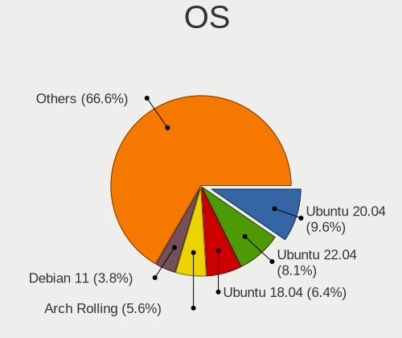

| Name                         | Computers | Percent |
|------------------------------|-----------|---------|
| Ubuntu 20.04                 | 211       | 9.58%   |
| Ubuntu 22.04                 | 178       | 8.08%   |
| Ubuntu 18.04                 | 140       | 6.35%   |
| Arch Rolling                 | 123       | 5.58%   |
| Debian 11                    | 83        | 3.77%   |
| Debian 12                    | 75        | 3.4%    |
| Ubuntu 24.04                 | 62        | 2.81%   |
| Arch                         | 50        | 2.27%   |
| Kylin V10                    | 49        | 2.22%   |
| UOS 20                       | 29        | 1.32%   |
| Manjaro                      | 29        | 1.32%   |
| Debian 10                    | 29        | 1.32%   |
| openSUSE Tumbleweed-XXXXXXXX | 25        | 1.13%   |
| Debian                       | 25        | 1.13%   |
| OpenMandriva 4.3             | 24        | 1.09%   |
| ArcoLinux Rolling            | 22        | 1%      |
| Ubuntu 19.04                 | 21        | 0.95%   |
| OpenMandriva 4.2             | 20        | 0.91%   |
| Gentoo 2.8                   | 20        | 0.91%   |
| Ubuntu 16.04                 | 19        | 0.86%   |
| Fedora 40                    | 19        | 0.86%   |
| Deepin 23                    | 19        | 0.86%   |
| Fedora 38                    | 18        | 0.82%   |
| Ubuntu 23.10                 | 17        | 0.77%   |
| KDE neon 20.04               | 17        | 0.77%   |
| Ubuntu 23.04                 | 16        | 0.73%   |
| Ubuntu 21.10                 | 16        | 0.73%   |
| Gentoo 2.7                   | 16        | 0.73%   |
| CentOS 7                     | 16        | 0.73%   |
| Fedora 39                    | 15        | 0.68%   |
| Ubuntu 21.04                 | 14        | 0.64%   |
| Ubuntu 19.10                 | 14        | 0.64%   |
| Ubuntu 22.10                 | 13        | 0.59%   |
| OpenMandriva 5.0             | 13        | 0.59%   |
| OpenMandriva 23.08           | 13        | 0.59%   |
| Fedora 33                    | 13        | 0.59%   |
| Linux Mint 20.3              | 12        | 0.54%   |
| Linux Mint 20.1              | 12        | 0.54%   |
| Gentoo 2.14                  | 11        | 0.5%    |
| CentOS 8                     | 11        | 0.5%    |

OS Family
---------

OS without a version

| Name         | Computers | Percent |
|--------------|-----------|---------|
| Ubuntu       | 712       | 34.17%  |
| Debian       | 234       | 11.23%  |
| Arch         | 170       | 8.16%   |
| Fedora       | 110       | 5.28%   |
| OpenMandriva | 99        | 4.75%   |
| Manjaro      | 86        | 4.13%   |
| Deepin       | 64        | 3.07%   |
| Linux Mint   | 63        | 3.02%   |
| Gentoo       | 60        | 2.88%   |
| Kylin        | 51        | 2.45%   |
| Atz          | 35        | 1.68%   |
| Kubuntu      | 34        | 1.63%   |
| CentOS       | 31        | 1.49%   |
| openSUSE     | 30        | 1.44%   |
| SteamOS      | 24        | 1.15%   |
| ArcoLinux    | 23        | 1.1%    |
| Pop!_OS      | 20        | 0.96%   |
| KDE neon     | 20        | 0.96%   |
| Xubuntu      | 19        | 0.91%   |
| Kali         | 19        | 0.91%   |
| ROSA         | 14        | 0.67%   |
| Ubuntu Unity | 13        | 0.62%   |
| Zorin        | 11        | 0.53%   |
| Elementary   | 11        | 0.53%   |
| Xero         | 9         | 0.43%   |
| Clear Linux  | 9         | 0.43%   |
| OpenEuler    | 6         | 0.29%   |
| Lubuntu      | 6         | 0.29%   |
| EndeavourOS  | 6         | 0.29%   |
| AlmaLinux    | 6         | 0.29%   |
| AOSC OS      | 5         | 0.24%   |
| Trisquel     | 4         | 0.19%   |
| NixOS        | 4         | 0.19%   |
| ChimeraOS    | 4         | 0.19%   |
| BlackPanther | 4         | 0.19%   |
| Android      | 4         | 0.19%   |
| Ubuntu MATE  | 3         | 0.14%   |
| TUXEDO OS    | 3         | 0.14%   |
| NFS Desktop  | 3         | 0.14%   |
| MX           | 3         | 0.14%   |

Kernel
------

Version of the Linux kernel

| Version                     | Computers | Percent |
|-----------------------------|-----------|---------|
| 5.16.7-desktop-1omv4003     | 22        | 0.93%   |
| 6.8.0-31-generic            | 19        | 0.81%   |
| 5.10.14-desktop-1omv4002    | 19        | 0.81%   |
| 6.2.0-26-generic            | 18        | 0.76%   |
| 6.6.2-desktop-1omv2390      | 15        | 0.64%   |
| 5.4.0-42-generic            | 15        | 0.64%   |
| 6.1.0-13-amd64              | 12        | 0.51%   |
| 6.8.0-48-generic            | 11        | 0.47%   |
| 6.4.11-desktop-1omv2390     | 11        | 0.47%   |
| 6.8.0-45-generic            | 10        | 0.42%   |
| 6.8.0-41-generic            | 10        | 0.42%   |
| 6.5.0-14-generic            | 10        | 0.42%   |
| 6.2.6-desktop-1omv2390      | 10        | 0.42%   |
| 6.2.0-32-generic            | 10        | 0.42%   |
| 5.19.0-46-generic           | 10        | 0.42%   |
| 5.15.0-56-generic           | 10        | 0.42%   |
| 5.13.0-30-generic           | 10        | 0.42%   |
| 5.10.0-8-amd64              | 10        | 0.42%   |
| 5.0.0-23-generic            | 10        | 0.42%   |
| 6.8.0-40-generic            | 9         | 0.38%   |
| 6.5.0-26-generic            | 9         | 0.38%   |
| 6.2.0-39-generic            | 9         | 0.38%   |
| 5.15.0-67-generic           | 9         | 0.38%   |
| 5.15.0-46-generic           | 9         | 0.38%   |
| 5.10.0-21-amd64             | 9         | 0.38%   |
| 6.2.0-20-generic            | 8         | 0.34%   |
| 6.1.0-9-amd64               | 8         | 0.34%   |
| 5.11.0-43-generic           | 8         | 0.34%   |
| 4.18.0-25-generic           | 8         | 0.34%   |
| 6.8.0-49-generic            | 7         | 0.3%    |
| 6.1.52-valve16-1-neptune-61 | 7         | 0.3%    |
| 6.1.0-18-amd64              | 7         | 0.3%    |
| 5.4.0-58-generic            | 7         | 0.3%    |
| 5.19.0-35-generic           | 7         | 0.3%    |
| 5.19.0-26-generic           | 7         | 0.3%    |
| 5.19.0-23-generic           | 7         | 0.3%    |
| 5.15.0-52-generic           | 7         | 0.3%    |
| 5.15.0-25-generic           | 7         | 0.3%    |
| 5.12.4-desktop-1omv4050     | 7         | 0.3%    |
| 5.11.0-27-generic           | 7         | 0.3%    |

Kernel Family
-------------

Linux kernel without a distro release

| Version  | Computers | Percent |
|----------|-----------|---------|
| 5.4.0    | 158       | 7.01%   |
| 5.15.0   | 157       | 6.97%   |
| 5.10.0   | 104       | 4.61%   |
| 6.8.0    | 93        | 4.13%   |
| 6.1.0    | 75        | 3.33%   |
| 4.15.0   | 66        | 2.93%   |
| 6.5.0    | 65        | 2.88%   |
| 6.2.0    | 65        | 2.88%   |
| 5.13.0   | 62        | 2.75%   |
| 5.11.0   | 60        | 2.66%   |
| 5.19.0   | 49        | 2.17%   |
| 5.8.0    | 45        | 2%      |
| 4.18.0   | 45        | 2%      |
| 5.0.0    | 44        | 1.95%   |
| 5.3.0    | 35        | 1.55%   |
| 4.19.0   | 32        | 1.42%   |
| 5.16.7   | 23        | 1.02%   |
| 5.10.14  | 19        | 0.84%   |
| 6.6.2    | 16        | 0.71%   |
| 6.4.11   | 15        | 0.67%   |
| 5.14.0   | 15        | 0.67%   |
| 3.10.0   | 14        | 0.62%   |
| 6.9.3    | 13        | 0.58%   |
| 6.2.6    | 11        | 0.49%   |
| 6.11.0   | 11        | 0.49%   |
| 5.4.18   | 11        | 0.49%   |
| 6.9.7    | 10        | 0.44%   |
| 6.1.52   | 10        | 0.44%   |
| 6.6.9    | 8         | 0.35%   |
| 6.10.11  | 8         | 0.35%   |
| 5.18.0   | 8         | 0.35%   |
| 5.16.0   | 8         | 0.35%   |
| 5.10.110 | 8         | 0.35%   |
| 6.5.3    | 7         | 0.31%   |
| 6.10.0   | 7         | 0.31%   |
| 6.0.0    | 7         | 0.31%   |
| 5.6.14   | 7         | 0.31%   |
| 5.17.0   | 7         | 0.31%   |
| 5.12.4   | 7         | 0.31%   |
| 5.10.113 | 7         | 0.31%   |

Kernel Major Ver.
-----------------

Linux kernel major version

| Version | Computers | Percent |
|---------|-----------|---------|
| 5.15    | 227       | 10.19%  |
| 5.4     | 200       | 8.98%   |
| 5.10    | 196       | 8.8%    |
| 6.1     | 137       | 6.15%   |
| 6.8     | 117       | 5.25%   |
| 6.5     | 94        | 4.22%   |
| 6.2     | 94        | 4.22%   |
| 6.6     | 85        | 3.82%   |
| 5.11    | 77        | 3.46%   |
| 5.13    | 73        | 3.28%   |
| 4.15    | 66        | 2.96%   |
| 5.8     | 61        | 2.74%   |
| 5.19    | 60        | 2.69%   |
| 4.19    | 54        | 2.42%   |
| 5.0     | 48        | 2.16%   |
| 4.18    | 47        | 2.11%   |
| 5.16    | 46        | 2.07%   |
| 6.9     | 44        | 1.98%   |
| 6.4     | 44        | 1.98%   |
| 5.3     | 42        | 1.89%   |
| 5.18    | 38        | 1.71%   |
| 5.14    | 34        | 1.53%   |
| 6.11    | 31        | 1.39%   |
| 6.10    | 29        | 1.3%    |
| 6.0     | 28        | 1.26%   |
| 5.17    | 28        | 1.26%   |
| 6.7     | 27        | 1.21%   |
| 6.3     | 26        | 1.17%   |
| 5.12    | 24        | 1.08%   |
| 5.9     | 21        | 0.94%   |
| 5.6     | 19        | 0.85%   |
| 3.10    | 16        | 0.72%   |
| 6.12    | 15        | 0.67%   |
| 4.9     | 14        | 0.63%   |
| 5.7     | 12        | 0.54%   |
| 4.1     | 9         | 0.4%    |
| 5.5     | 8         | 0.36%   |
| 5.1     | 5         | 0.22%   |
| 4.14    | 5         | 0.22%   |
| 4.4     | 3         | 0.13%   |

Arch
----

OS architecture (x86_64, i586, etc.)

| Name        | Computers | Percent |
|-------------|-----------|---------|
| x86_64      | 1856      | 91.93%  |
| aarch64     | 85        | 4.21%   |
| riscv64     | 20        | 0.99%   |
| loongarch64 | 19        | 0.94%   |
| i686        | 13        | 0.64%   |
| armv7l      | 8         | 0.4%    |
| ppc64       | 7         | 0.35%   |
| ppc64le     | 2         | 0.1%    |
| mips64      | 2         | 0.1%    |
| sparc64     | 1         | 0.05%   |
| sh4a        | 1         | 0.05%   |
| ppc         | 1         | 0.05%   |
| i586        | 1         | 0.05%   |
| i486        | 1         | 0.05%   |
| armv8l      | 1         | 0.05%   |
| Unknown     | 1         | 0.05%   |

DE
--

Desktop Environment

| Name            | Computers | Percent |
|-----------------|-----------|---------|
| GNOME           | 897       | 42.55%  |
| Unknown         | 338       | 16.03%  |
| KDE5            | 335       | 15.89%  |
| XFCE            | 162       | 7.69%   |
| X-Cinnamon      | 55        | 2.61%   |
| Deepin          | 52        | 2.47%   |
| KDE             | 43        | 2.04%   |
| MATE            | 32        | 1.52%   |
| KDE6            | 24        | 1.14%   |
| i3              | 23        | 1.09%   |
| UKUI            | 19        | 0.9%    |
| LXQt            | 17        | 0.81%   |
| Unity           | 12        | 0.57%   |
| Pantheon        | 11        | 0.52%   |
| Hyprland        | 11        | 0.52%   |
| DDE             | 11        | 0.52%   |
| Cinnamon        | 11        | 0.52%   |
| LXDE            | 9         | 0.43%   |
| KDE4            | 8         | 0.38%   |
| Budgie          | 7         | 0.33%   |
| GNOME Flashback | 6         | 0.28%   |
| GNOME Classic   | 5         | 0.24%   |
| sway            | 4         | 0.19%   |
| Openbox         | 4         | 0.19%   |
| DWM             | 3         | 0.14%   |
| GNUstep         | 2         | 0.09%   |
| xmonad          | 1         | 0.05%   |
| Wayfire         | 1         | 0.05%   |
| qtile           | 1         | 0.05%   |
| default         | 1         | 0.05%   |
| chadwm          | 1         | 0.05%   |
| bspwm           | 1         | 0.05%   |
| awesome         | 1         | 0.05%   |

Display Server
--------------

X11 or Wayland

| Name    | Computers | Percent |
|---------|-----------|---------|
| X11     | 1269      | 60.78%  |
| Wayland | 481       | 23.04%  |
| Tty     | 174       | 8.33%   |
| Unknown | 163       | 7.81%   |
| Web     | 1         | 0.05%   |

Display Manager
---------------

SDDM, LightDM, etc.

| Name    | Computers | Percent |
|---------|-----------|---------|
| Unknown | 756       | 36.49%  |
| GDM3    | 385       | 18.58%  |
| SDDM    | 328       | 15.83%  |
| LightDM | 296       | 14.29%  |
| GDM     | 247       | 11.92%  |
| TDM     | 43        | 2.08%   |
| LXDM    | 4         | 0.19%   |
| KDM     | 4         | 0.19%   |
| XDM     | 3         | 0.14%   |
| SLiM    | 3         | 0.14%   |
| LY-DM   | 3         | 0.14%   |

OS Lang
-------

Language

| Lang        | Computers | Percent |
|-------------|-----------|---------|
| zh_CN       | 948       | 46.04%  |
| en_US       | 750       | 36.43%  |
| Unknown     | 198       | 9.62%   |
| C           | 81        | 3.93%   |
| en_HK       | 17        | 0.83%   |
| en_GB       | 17        | 0.83%   |
| zh_TW       | 8         | 0.39%   |
| ru_RU       | 5         | 0.24%   |
| de_DE       | 5         | 0.24%   |
| C.UTF8      | 5         | 0.24%   |
| mn_CN       | 4         | 0.19%   |
| en_AU       | 3         | 0.15%   |
| ja_JP       | 2         | 0.1%    |
| fr_FR       | 2         | 0.1%    |
| en_US.UTF8  | 2         | 0.1%    |
| en_SG       | 2         | 0.1%    |
| zh_SG       | 1         | 0.05%   |
| zh_HK       | 1         | 0.05%   |
| th_TH       | 1         | 0.05%   |
| pt_PT       | 1         | 0.05%   |
| POSIX       | 1         | 0.05%   |
| en_ZA       | 1         | 0.05%   |
| en_US.utf-8 | 1         | 0.05%   |
| en_US,UTF-8 | 1         | 0.05%   |
| af_ZA       | 1         | 0.05%   |
| .en_US      | 1         | 0.05%   |

Boot Mode
---------

EFI or BIOS

| Mode | Computers | Percent |
|------|-----------|---------|
| EFI  | 1358      | 66.41%  |
| BIOS | 687       | 33.59%  |

Filesystem
----------

Type of filesystem

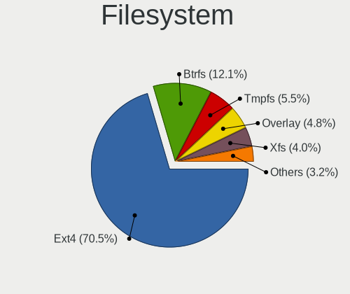

| Type       | Computers | Percent |
|------------|-----------|---------|
| Ext4       | 1446      | 70.47%  |
| Btrfs      | 249       | 12.13%  |
| Tmpfs      | 112       | 5.46%   |
| Overlay    | 98        | 4.78%   |
| Xfs        | 82        | 4%      |
| Unknown    | 33        | 1.61%   |
| Zfs        | 16        | 0.78%   |
| F2fs       | 6         | 0.29%   |
| Rootfs     | 5         | 0.24%   |
| Ext3       | 2         | 0.1%    |
| XXXXXXX    | 1         | 0.05%   |
| Reiserfs   | 1         | 0.05%   |
| Fuse.sshfs | 1         | 0.05%   |

Part. scheme
------------

Scheme of partitioning

| Type    | Computers | Percent |
|---------|-----------|---------|
| GPT     | 1280      | 62.59%  |
| Unknown | 598       | 29.24%  |
| MBR     | 167       | 8.17%   |

Dual Boot with Linux/BSD
------------------------

Hosting more than one Linux/BSD

| Dual boot | Computers | Percent |
|-----------|-----------|---------|
| No        | 1733      | 84.04%  |
| Yes       | 329       | 15.96%  |

Dual Boot (Win)
---------------

Hosting Linux and Windows

| Dual boot | Computers | Percent |
|-----------|-----------|---------|
| No        | 1260      | 61.83%  |
| Yes       | 778       | 38.17%  |

Board
-----

Vendor
------

Motherboard manufacturer

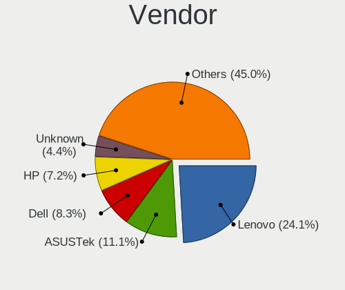

| Name                       | Computers | Percent |
|----------------------------|-----------|---------|
| Lenovo                     | 486       | 24.08%  |
| ASUSTek Computer           | 223       | 11.05%  |
| Dell                       | 167       | 8.28%   |
| Hewlett-Packard            | 145       | 7.19%   |
| Unknown                    | 89        | 4.41%   |
| HUAWEI                     | 80        | 3.96%   |
| MSI                        | 79        | 3.91%   |
| Gigabyte Technology        | 76        | 3.77%   |
| Timi                       | 54        | 2.68%   |
| Intel                      | 53        | 2.63%   |
| Acer                       | 41        | 2.03%   |
| MECHREVO                   | 32        | 1.59%   |
| Apple                      | 27        | 1.34%   |
| ASRock                     | 20        | 0.99%   |
| Loongson                   | 19        | 0.94%   |
| Valve                      | 18        | 0.89%   |
| HASEE Computer             | 18        | 0.89%   |
| AZW                        | 15        | 0.74%   |
| Raspberry Pi Foundation    | 13        | 0.64%   |
| Google                     | 12        | 0.59%   |
| Colorful Technology        | 12        | 0.59%   |
| Phytium                    | 11        | 0.55%   |
| Microsoft                  | 11        | 0.55%   |
| HONOR                      | 11        | 0.55%   |
| GPD                        | 11        | 0.55%   |
| Toshiba                    | 10        | 0.5%    |
| Supermicro                 | 10        | 0.5%    |
| GreatWall                  | 10        | 0.5%    |
| XIAOMI                     | 9         | 0.45%   |
| AMI                        | 9         | 0.45%   |
| TSINGHUA TONGFANG COMPUTER | 8         | 0.4%    |
| Sony                       | 8         | 0.4%    |
| OEM                        | 8         | 0.4%    |
| Notebook                   | 7         | 0.35%   |
| Huanan                     | 7         | 0.35%   |
| TYAN Computer              | 6         | 0.3%    |
| Samsung Electronics        | 6         | 0.3%    |
| Rockchip                   | 6         | 0.3%    |
| ONDA                       | 6         | 0.3%    |
| MAXSUN                     | 6         | 0.3%    |

Model
-----

Motherboard model

| Name                                  | Computers | Percent |
|---------------------------------------|-----------|---------|
| Unknown                               | 109       | 5.4%    |
| ASUS All Series                       | 20        | 0.99%   |
| Valve Jupiter                         | 17        | 0.84%   |
| Lenovo Legion R9000P2021H 82JQ        | 10        | 0.5%    |
| TSINGHUA TONGFANG COMPUTER E500       | 8         | 0.4%    |
| MSI MS-7B89                           | 8         | 0.4%    |
| HUAWEI HLY-WX9XX                      | 8         | 0.4%    |
| AZW SER                               | 7         | 0.35%   |
| AMI Aptio CRB                         | 7         | 0.35%   |
| Timi RedmiBook Pro 15S                | 6         | 0.3%    |
| Loongson 3A6000-HV-7A2000-1w-V0.1-EVB | 6         | 0.3%    |
| Lenovo Legion Y7000 81FW              | 6         | 0.3%    |
| ASUS TUF Gaming B550M-PLUS            | 6         | 0.3%    |
| Timi TM1701                           | 5         | 0.25%   |
| Supermicro Super Server               | 5         | 0.25%   |
| MSI MS-7C94                           | 5         | 0.25%   |
| Lenovo XiaoXinPro-13IML 2019 81XB     | 5         | 0.25%   |
| Lenovo Legion R7000 2020 82B6         | 5         | 0.25%   |
| HUAWEI KPRC-WX0                       | 5         | 0.25%   |
| Dell XPS 15 9570                      | 5         | 0.25%   |
| Acer Swift SF314-512                  | 5         | 0.25%   |
| TYAN TA80-B7071                       | 4         | 0.2%    |
| Timi TM1709                           | 4         | 0.2%    |
| Timi Redmi G 2022                     | 4         | 0.2%    |
| Shanghai Zhaoxin ZXE CRB              | 4         | 0.2%    |
| Phytium FT-2000/4                     | 4         | 0.2%    |
| Lenovo Yoga 14sITL 2021 82G2          | 4         | 0.2%    |
| Lenovo XiaoXinPro-13ARE 2020 82DM     | 4         | 0.2%    |
| Lenovo XiaoXin-15ARE 2020 81YR        | 4         | 0.2%    |
| Lenovo ThinkStation P520 30BFSG3Y00   | 4         | 0.2%    |
| Lenovo ThinkBook 15p Gen 2 21B1       | 4         | 0.2%    |
| Lenovo ThinkBook 14 G4+ IAP 21CX      | 4         | 0.2%    |
| Lenovo ThinkBook 14 G2 ITL 20VD       | 4         | 0.2%    |
| Intel NUC11ATKC4                      | 4         | 0.2%    |
| HUAWEI NBLK-WAX9X                     | 4         | 0.2%    |
| HUAWEI BOHK-WAX9X                     | 4         | 0.2%    |
| Dell PowerEdge R730xd                 | 4         | 0.2%    |
| AZW LZX                               | 4         | 0.2%    |
| ASUS M5A78L-M LX3 PLUS                | 4         | 0.2%    |
| Apple MacBookPro16,1                  | 4         | 0.2%    |

Model Family
------------

Motherboard model prefix

| Name                            | Computers | Percent |
|---------------------------------|-----------|---------|
| Lenovo ThinkPad                 | 166       | 8.23%   |
| Unknown                         | 109       | 5.4%    |
| Lenovo Legion                   | 59        | 2.92%   |
| Dell Inspiron                   | 40        | 1.98%   |
| Lenovo ThinkBook                | 39        | 1.93%   |
| ASUS TUF                        | 38        | 1.88%   |
| ASUS ROG                        | 38        | 1.88%   |
| ASUS PRIME                      | 29        | 1.44%   |
| HP EliteBook                    | 28        | 1.39%   |
| Dell Precision                  | 25        | 1.24%   |
| Dell Latitude                   | 24        | 1.19%   |
| HP OMEN                         | 23        | 1.14%   |
| Dell OptiPlex                   | 23        | 1.14%   |
| Lenovo IdeaPad                  | 20        | 0.99%   |
| ASUS All                        | 20        | 0.99%   |
| Lenovo Yoga                     | 18        | 0.89%   |
| HP ZHAN                         | 18        | 0.89%   |
| Valve Jupiter                   | 17        | 0.84%   |
| Timi RedmiBook                  | 17        | 0.84%   |
| Acer Aspire                     | 17        | 0.84%   |
| Lenovo ZHAOYANG                 | 16        | 0.79%   |
| Dell XPS                        | 16        | 0.79%   |
| Lenovo ThinkStation             | 15        | 0.74%   |
| Lenovo ThinkCentre              | 15        | 0.74%   |
| HP ProBook                      | 14        | 0.69%   |
| Acer Swift                      | 14        | 0.69%   |
| RPi Raspberry                   | 13        | 0.64%   |
| Dell Vostro                     | 13        | 0.64%   |
| Dell PowerEdge                  | 13        | 0.64%   |
| Microsoft Surface               | 11        | 0.55%   |
| Lenovo XiaoXinPro               | 11        | 0.55%   |
| HP Pavilion                     | 11        | 0.55%   |
| HP ENVY                         | 9         | 0.45%   |
| TSINGHUA TONGFANG COMPUTER E500 | 8         | 0.4%    |
| MSI MS-7B89                     | 8         | 0.4%    |
| HUAWEI HLY-WX9XX                | 8         | 0.4%    |
| ASUS ASUS                       | 8         | 0.4%    |
| Timi Redmi                      | 7         | 0.35%   |
| AZW SER                         | 7         | 0.35%   |
| ASUS VivoBook                   | 7         | 0.35%   |

MFG Year
--------

Motherboard manufacture year

| Year    | Computers | Percent |
|---------|-----------|---------|
| 2021    | 247       | 12.24%  |
| 2020    | 225       | 11.15%  |
| 2022    | 194       | 9.61%   |
| 2019    | 188       | 9.32%   |
| 2018    | 181       | 8.97%   |
| 2023    | 137       | 6.79%   |
| 2017    | 121       | 6%      |
| Unknown | 96        | 4.76%   |
| 2015    | 88        | 4.36%   |
| 2014    | 88        | 4.36%   |
| 2013    | 86        | 4.26%   |
| 2012    | 84        | 4.16%   |
| 2016    | 77        | 3.82%   |
| 2024    | 67        | 3.32%   |
| 2011    | 56        | 2.78%   |
| 2008    | 25        | 1.24%   |
| 2010    | 24        | 1.19%   |
| 2009    | 19        | 0.94%   |
| 2007    | 11        | 0.55%   |
| 2006    | 3         | 0.15%   |
| 2000    | 1         | 0.05%   |

Form Factor
-----------

Physical design of the computer

| Name           | Computers | Percent |
|----------------|-----------|---------|
| Notebook       | 1107      | 54.86%  |
| Desktop        | 645       | 31.96%  |
| System on chip | 66        | 3.27%   |
| Server         | 62        | 3.07%   |
| Mini pc        | 56        | 2.78%   |
| Tablet         | 37        | 1.83%   |
| Convertible    | 23        | 1.14%   |
| All in one     | 17        | 0.84%   |
| Phone          | 4         | 0.2%    |
| Other          | 1         | 0.05%   |

Secure Boot
-----------

Enabled or disabled

| State    | Computers | Percent |
|----------|-----------|---------|
| Disabled | 1882      | 92.66%  |
| Enabled  | 149       | 7.34%   |

Coreboot
--------

Have coreboot on board

| Used | Computers | Percent |
|------|-----------|---------|
| No   | 2004      | 99.31%  |
| Yes  | 14        | 0.69%   |

RAM Size
--------

Total RAM memory

| Size in GB      | Computers | Percent |
|-----------------|-----------|---------|
| 16.01-24.0      | 473       | 22.97%  |
| 8.01-16.0       | 432       | 20.98%  |
| 4.01-8.0        | 378       | 18.36%  |
| 32.01-64.0      | 292       | 14.18%  |
| 3.01-4.0        | 178       | 8.64%   |
| 64.01-256.0     | 125       | 6.07%   |
| 24.01-32.0      | 77        | 3.74%   |
| 1.01-2.0        | 39        | 1.89%   |
| More than 256.0 | 22        | 1.07%   |
| Unknown         | 18        | 0.87%   |
| 0.51-1.0        | 16        | 0.78%   |
| 0.01-0.5        | 5         | 0.24%   |
| 2.01-3.0        | 2         | 0.1%    |
| 0               | 2         | 0.1%    |

RAM Used
--------

Used RAM memory

| Used GB     | Computers | Percent |
|-------------|-----------|---------|
| 1.01-2.0    | 547       | 24.65%  |
| 2.01-3.0    | 534       | 24.06%  |
| 4.01-8.0    | 401       | 18.07%  |
| 3.01-4.0    | 336       | 15.14%  |
| 0.51-1.0    | 130       | 5.86%   |
| 8.01-16.0   | 128       | 5.77%   |
| 0.01-0.5    | 63        | 2.84%   |
| 16.01-24.0  | 27        | 1.22%   |
| Unknown     | 27        | 1.22%   |
| 32.01-64.0  | 10        | 0.45%   |
| 24.01-32.0  | 9         | 0.41%   |
| 64.01-256.0 | 7         | 0.32%   |

Total Drives
------------

Number of drives on board

| Drives  | Computers | Percent |
|---------|-----------|---------|
| 1       | 1131      | 54.96%  |
| 2       | 620       | 30.13%  |
| 3       | 173       | 8.41%   |
| 4       | 51        | 2.48%   |
| 5       | 27        | 1.31%   |
| 0       | 18        | 0.87%   |
| 6       | 10        | 0.49%   |
| 10      | 6         | 0.29%   |
| 8       | 6         | 0.29%   |
| 7       | 6         | 0.29%   |
| 9       | 3         | 0.15%   |
| 46      | 1         | 0.05%   |
| 36      | 1         | 0.05%   |
| 32      | 1         | 0.05%   |
| 27      | 1         | 0.05%   |
| 21      | 1         | 0.05%   |
| 11      | 1         | 0.05%   |
| Unknown | 1         | 0.05%   |

Has CD-ROM
----------

Has CD-ROM on board

| Presented | Computers | Percent |
|-----------|-----------|---------|
| No        | 1789      | 88.35%  |
| Yes       | 236       | 11.65%  |

Has Ethernet
------------

Has Ethernet on board

| Presented | Computers | Percent |
|-----------|-----------|---------|
| Yes       | 1594      | 78.6%   |
| No        | 434       | 21.4%   |

Has WiFi
--------

Has WiFi module

| Presented | Computers | Percent |
|-----------|-----------|---------|
| Yes       | 1526      | 75.28%  |
| No        | 501       | 24.72%  |

Has Bluetooth
-------------

Has Bluetooth module

| Presented | Computers | Percent |
|-----------|-----------|---------|
| Yes       | 1321      | 64.85%  |
| No        | 716       | 35.15%  |

Location
--------

Country
-------

Geographic location (country)

| Country | Computers | Percent |
|---------|-----------|---------|
| China   | 2018      | 100%    |

City
----

Geographic location (city)

| City         | Computers | Percent |
|--------------|-----------|---------|
| Beijing      | 376       | 17.59%  |
| Shanghai     | 199       | 9.31%   |
| Shenzhen     | 158       | 7.39%   |
| Guangzhou    | 146       | 6.83%   |
| Hangzhou     | 75        | 3.51%   |
| Chengdu      | 68        | 3.18%   |
| Wuhan        | 66        | 3.09%   |
| Nanjing      | 48        | 2.25%   |
| Jinrongjie   | 41        | 1.92%   |
| Xi'an        | 36        | 1.68%   |
| Zhengzhou    | 32        | 1.5%    |
| Kunming      | 29        | 1.36%   |
| Chongqing    | 28        | 1.31%   |
| Changsha     | 28        | 1.31%   |
| Jinan        | 26        | 1.22%   |
| Hefei        | 26        | 1.22%   |
| Tianjin      | 25        | 1.17%   |
| Haidian      | 25        | 1.17%   |
| Dongguan     | 23        | 1.08%   |
| Suzhou       | 21        | 0.98%   |
| Shenyang     | 21        | 0.98%   |
| Foshan       | 21        | 0.98%   |
| Xuhui        | 18        | 0.84%   |
| Qingdao      | 18        | 0.84%   |
| Nanning      | 17        | 0.8%    |
| Xiamen       | 14        | 0.65%   |
| Fuzhou       | 14        | 0.65%   |
| Dalian       | 14        | 0.65%   |
| Jianshui     | 13        | 0.61%   |
| Huangpu      | 12        | 0.56%   |
| Harbin       | 12        | 0.56%   |
| Bieligutai   | 12        | 0.56%   |
| Shijiazhuang | 11        | 0.51%   |
| Nanhao       | 9         | 0.42%   |
| Hohhot       | 9         | 0.42%   |
| Pudong       | 8         | 0.37%   |
| Ningbo       | 8         | 0.37%   |
| Guiyang      | 8         | 0.37%   |
| Zhuhai       | 7         | 0.33%   |
| Zhangzhou    | 7         | 0.33%   |

Drives
------

Drive Vendor
------------

Hard drive vendors

| Vendor                       | Computers | Drives | Percent |
|------------------------------|-----------|--------|---------|
| Samsung Electronics          | 483       | 666    | 15.68%  |
| WDC                          | 345       | 482    | 11.2%   |
| Seagate                      | 306       | 536    | 9.94%   |
| SanDisk                      | 182       | 218    | 5.91%   |
| Unknown                      | 155       | 200    | 5.03%   |
| Toshiba                      | 151       | 216    | 4.9%    |
| SK hynix                     | 104       | 125    | 3.38%   |
| Intel                        | 93        | 170    | 3.02%   |
| Kingston                     | 88        | 106    | 2.86%   |
| HGST                         | 64        | 105    | 2.08%   |
| Micron Technology            | 54        | 63     | 1.75%   |
| Yangtze Memory Technologies  | 50        | 66     | 1.62%   |
| Unknown                      | 48        | 55     | 1.56%   |
| Silicon Motion               | 45        | 63     | 1.46%   |
| KIOXIA                       | 41        | 58     | 1.33%   |
| Crucial                      | 35        | 41     | 1.14%   |
| MAXIO Technology (Hangzhou)  | 34        | 40     | 1.1%    |
| Hitachi                      | 34        | 52     | 1.1%    |
| Plextor                      | 33        | 40     | 1.07%   |
| ZHITAI                       | 30        | 42     | 0.97%   |
| Lenovo                       | 29        | 39     | 0.94%   |
| Phison                       | 28        | 32     | 0.91%   |
| LITEON                       | 24        | 30     | 0.78%   |
| China                        | 21        | 33     | 0.68%   |
| Phison Electronics           | 20        | 22     | 0.65%   |
| Fanxiang                     | 20        | 23     | 0.65%   |
| Colorful                     | 19        | 24     | 0.62%   |
| Apple                        | 19        | 21     | 0.62%   |
| A-DATA Technology            | 19        | 28     | 0.62%   |
| Kingston Technology Company  | 18        | 24     | 0.58%   |
| Hewlett-Packard              | 18        | 23     | 0.58%   |
| FORESEE                      | 17        | 20     | 0.55%   |
| Teclast                      | 16        | 17     | 0.52%   |
| GLOWAY                       | 16        | 24     | 0.52%   |
| KIOXIA-EXCERIA               | 15        | 19     | 0.49%   |
| JMicron Technology           | 14        | 16     | 0.45%   |
| Netac                        | 12        | 14     | 0.39%   |
| Hikvision                    | 12        | 22     | 0.39%   |
| Shenzhen Longsys Electronics | 11        | 12     | 0.36%   |
| Kingchuxing                  | 11        | 13     | 0.36%   |

Drive Model
-----------

Hard drive models

| Model                                                 | Computers | Percent |
|-------------------------------------------------------|-----------|---------|
| Unknown                                               | 48        | 1.43%   |
| Samsung NVMe SSD Controller PM9A1/PM9A3/980PRO 512GB  | 42        | 1.25%   |
| Samsung NVMe SSD Controller SM981/PM981/PM983 512GB   | 31        | 0.93%   |
| WDC WD10EZEX-08WN4A0 1TB                              | 28        | 0.84%   |
| Samsung NVMe SSD Drive 512GB                          | 23        | 0.69%   |
| SanDisk NVMe SSD Drive 512GB                          | 22        | 0.66%   |
| SanDisk NVMe SSD Drive 1TB                            | 21        | 0.63%   |
| Seagate ST1000LM035-1RK172 1TB                        | 20        | 0.6%    |
| Seagate ST1000DM010-2EP102 1TB                        | 20        | 0.6%    |
| Seagate ST500DM002-1BD142 500GB                       | 19        | 0.57%   |
| Sandisk WD Black SN750 / PC SN730 NVMe SSD 512GB      | 19        | 0.57%   |
| Samsung SSD 860 EVO 500GB                             | 19        | 0.57%   |
| HGST HTS721010A9E630 1TB                              | 19        | 0.57%   |
| Seagate ST1000DM003-1SB102 1TB                        | 17        | 0.51%   |
| Unknown MMC Card  128GB                               | 15        | 0.45%   |
| Silicon Motion SM2263EN/SM2263XT SSD Controller 256GB | 15        | 0.45%   |
| Seagate ST500LT012-1DG142 500GB                       | 15        | 0.45%   |
| Samsung SSD 980 1TB                                   | 15        | 0.45%   |
| Seagate ST1000LM048-2E7172 1TB                        | 14        | 0.42%   |
| Samsung MZVLB512HBJQ-000L2 512GB                      | 14        | 0.42%   |
| Yangtze Memory ZHITAI TiPlus5000 1TB                  | 12        | 0.36%   |
| Unknown MMC Card  64GB                                | 12        | 0.36%   |
| Toshiba MQ01ABD100 1TB                                | 12        | 0.36%   |
| Samsung NVMe SSD Drive 256GB                          | 12        | 0.36%   |
| Samsung NVMe SSD Drive 1024GB                         | 12        | 0.36%   |
| MAXIO (Hangzhou) NVMe SSD Controller MAP1202 512GB    | 12        | 0.36%   |
| WDC WDS100T2B0C-00PXH0 1TB                            | 11        | 0.33%   |
| SK hynix SKHynix_HFS512GDE9X084N 512GB                | 11        | 0.33%   |
| Plextor PX-128M6S 128GB SSD                           | 11        | 0.33%   |
| HGST HTS725050A7E630 500GB                            | 11        | 0.33%   |
| Toshiba DT01ACA200 2TB                                | 10        | 0.3%    |
| SK hynix NVMe SSD Drive 512GB                         | 10        | 0.3%    |
| Seagate ST500LM021-1KJ152 500GB                       | 10        | 0.3%    |
| Seagate ST2000LM007-1R8174 2TB                        | 10        | 0.3%    |
| Samsung MZVLB512HAJQ-00000 512GB                      | 10        | 0.3%    |
| Kingston SA400S37480G 480GB SSD                       | 10        | 0.3%    |
| Unknown NVMe SSD Drive 512GB                          | 9         | 0.27%   |
| SK hynix SKHynix_HFS512GD9TNI-L2A0B 512GB             | 9         | 0.27%   |
| Seagate ST6000NM0115-1YZ110 6TB                       | 9         | 0.27%   |
| SanDisk NVMe SSD Drive 2TB                            | 9         | 0.27%   |

HDD Vendor
----------

Hard disk drive vendors

| Vendor              | Computers | Drives | Percent |
|---------------------|-----------|--------|---------|
| Seagate             | 303       | 532    | 38.4%   |
| WDC                 | 250       | 350    | 31.69%  |
| Toshiba             | 78        | 125    | 9.89%   |
| HGST                | 64        | 105    | 8.11%   |
| Hitachi             | 34        | 52     | 4.31%   |
| Samsung Electronics | 14        | 16     | 1.77%   |
| JMicron Technology  | 8         | 11     | 1.01%   |
| Fujitsu             | 8         | 8      | 1.01%   |
| External            | 6         | 9      | 0.76%   |
| Pear 2TB            | 5         | 5      | 0.63%   |
| TO Exter            | 2         | 2      | 0.25%   |
| Hewlett-Packard     | 2         | 2      | 0.25%   |
| ASMT                | 2         | 2      | 0.25%   |
| ACASIS              | 2         | 2      | 0.25%   |
| Unknown             | 2         | 3      | 0.25%   |
| QUANTUM             | 1         | 1      | 0.13%   |
| LIO-ORG             | 1         | 9      | 0.13%   |
| IBM H0              | 1         | 1      | 0.13%   |
| HGST HTS            | 1         | 1      | 0.13%   |
| GOKE                | 1         | 1      | 0.13%   |
| FORESEE             | 1         | 1      | 0.13%   |
| ExcelStor           | 1         | 1      | 0.13%   |
| DELLBOSS            | 1         | 1      | 0.13%   |
| Apple               | 1         | 1      | 0.13%   |

SSD Vendor
----------

Solid state drive vendors

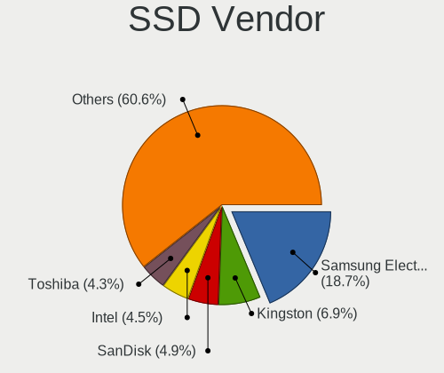

| Vendor              | Computers | Drives | Percent |
|---------------------|-----------|--------|---------|
| Samsung Electronics | 144       | 208    | 18.7%   |
| Kingston            | 53        | 64     | 6.88%   |
| SanDisk             | 38        | 41     | 4.94%   |
| Intel               | 35        | 82     | 4.55%   |
| Toshiba             | 33        | 40     | 4.29%   |
| Plextor             | 30        | 36     | 3.9%    |
| WDC                 | 26        | 38     | 3.38%   |
| Crucial             | 26        | 32     | 3.38%   |
| LITEON              | 23        | 29     | 2.99%   |
| Lenovo              | 22        | 27     | 2.86%   |
| China               | 21        | 33     | 2.73%   |
| Teclast             | 16        | 17     | 2.08%   |
| A-DATA Technology   | 15        | 23     | 1.95%   |
| Micron Technology   | 14        | 16     | 1.82%   |
| Unknown             | 14        | 18     | 1.82%   |
| Netac               | 12        | 14     | 1.56%   |
| GLOWAY              | 12        | 20     | 1.56%   |
| Colorful            | 12        | 13     | 1.56%   |
| ZHITAI              | 10        | 16     | 1.3%    |
| SK hynix            | 10        | 10     | 1.3%    |
| Kingchuxing         | 10        | 12     | 1.3%    |
| GALAX               | 10        | 10     | 1.3%    |
| Apple               | 9         | 9      | 1.17%   |
| KIOXIA-EXCERIA      | 8         | 8      | 1.04%   |
| FORESEE             | 8         | 9      | 1.04%   |
| Transcend           | 6         | 7      | 0.78%   |
| Phison              | 6         | 7      | 0.78%   |
| Hewlett-Packard     | 6         | 9      | 0.78%   |
| Unknown             | 5         | 6      | 0.65%   |
| LITEONIT            | 5         | 5      | 0.65%   |
| KingSpec            | 5         | 6      | 0.65%   |
| Q200                | 4         | 7      | 0.52%   |
| Lexar               | 4         | 4      | 0.52%   |
| faspeed             | 4         | 4      | 0.52%   |
| Fanxiang            | 4         | 4      | 0.52%   |
| tigo                | 3         | 3      | 0.39%   |
| Soyo                | 3         | 3      | 0.39%   |
| Pear                | 3         | 12     | 0.39%   |
| MaiChai             | 3         | 5      | 0.39%   |
| KINGBANK            | 3         | 4      | 0.39%   |

Drive Kind
----------

HDD or SSD

| Kind    | Computers | Drives | Percent |
|---------|-----------|--------|---------|
| NVMe    | 1134      | 1683   | 41.71%  |
| HDD     | 680       | 1241   | 25.01%  |
| SSD     | 679       | 1048   | 24.97%  |
| MMC     | 147       | 184    | 5.41%   |
| Unknown | 79        | 100    | 2.91%   |

Drive Connector
---------------

SATA, SAS, NVMe, etc.

| Type | Computers | Drives | Percent |
|------|-----------|--------|---------|
| NVMe | 1130      | 1664   | 45.07%  |
| SATA | 1088      | 2206   | 43.4%   |
| MMC  | 147       | 184    | 5.86%   |
| SAS  | 142       | 202    | 5.66%   |

Drive Size
----------

Size of hard drive

| Size in TB | Computers | Drives | Percent |
|------------|-----------|--------|---------|
| 0.01-0.5   | 741       | 1209   | 52.63%  |
| 0.51-1.0   | 428       | 563    | 30.4%   |
| 1.01-2.0   | 113       | 173    | 8.03%   |
| 3.01-4.0   | 38        | 57     | 2.7%    |
| 4.01-10.0  | 38        | 194    | 2.7%    |
| 2.01-3.0   | 26        | 53     | 1.85%   |
| 10.01-20.0 | 23        | 38     | 1.63%   |
| 0          | 1         | 2      | 0.07%   |

Space Total
-----------

Amount of disk space available on the file system

| Size in GB     | Computers | Percent |
|----------------|-----------|---------|
| 251-500        | 511       | 24.18%  |
| 101-250        | 466       | 22.05%  |
| 501-1000       | 328       | 15.52%  |
| 1001-2000      | 186       | 8.8%    |
| 51-100         | 164       | 7.76%   |
| More than 3000 | 135       | 6.39%   |
| 1-20           | 119       | 5.63%   |
| 21-50          | 79        | 3.74%   |
| 2001-3000      | 69        | 3.27%   |
| Unknown        | 56        | 2.65%   |

Space Used
----------

Amount of used disk space

| Used GB        | Computers | Percent |
|----------------|-----------|---------|
| 1-20           | 776       | 35.68%  |
| 21-50          | 366       | 16.83%  |
| 101-250        | 298       | 13.7%   |
| 51-100         | 229       | 10.53%  |
| 251-500        | 188       | 8.64%   |
| 501-1000       | 112       | 5.15%   |
| 1001-2000      | 74        | 3.4%    |
| Unknown        | 56        | 2.57%   |
| More than 3000 | 43        | 1.98%   |
| 2001-3000      | 27        | 1.24%   |
| 0              | 6         | 0.28%   |

Malfunc. Drives
---------------

Drive models with a malfunction

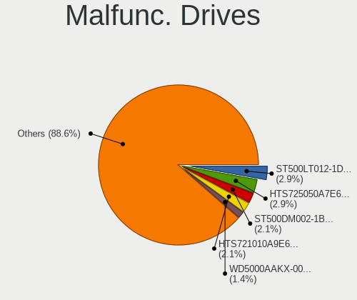

| Model                              | Computers | Drives | Percent |
|------------------------------------|-----------|--------|---------|
| Seagate ST500LT012-1DG142 500GB    | 4         | 4      | 2.86%   |
| HGST HTS725050A7E630 500GB         | 4         | 4      | 2.86%   |
| Seagate ST500DM002-1BD142 500GB    | 3         | 3      | 2.14%   |
| HGST HTS721010A9E630 1TB           | 3         | 3      | 2.14%   |
| WDC WD5000AAKX-00ERMA0 500GB       | 2         | 2      | 1.43%   |
| WDC WD5000AAKX-001CA0 500GB        | 2         | 2      | 1.43%   |
| Toshiba MQ04ABF100 1TB             | 2         | 2      | 1.43%   |
| Toshiba MQ01ABF050 500GB           | 2         | 2      | 1.43%   |
| Seagate ST500LM021-1KJ152 500GB    | 2         | 2      | 1.43%   |
| Seagate ST31000524AS 1TB           | 2         | 2      | 1.43%   |
| Seagate ST1000LM048-2E7172 1TB     | 2         | 2      | 1.43%   |
| Seagate ST1000LM024 HN-M101MBB 1TB | 2         | 2      | 1.43%   |
| Netac SSD 120GB                    | 2         | 2      | 1.43%   |
| Hitachi HUS724030ALE641 3TB        | 2         | 2      | 1.43%   |
| Crucial CT240M500SSD1 240GB        | 2         | 2      | 1.43%   |
| A-DATA Technology SP900 128GB SSD  | 2         | 3      | 1.43%   |
| WDC WDS240G2G0B-00EPW0 240GB SSD   | 1         | 1      | 0.71%   |
| WDC WDS240G2G0A-00JH30 240GB SSD   | 1         | 1      | 0.71%   |
| WDC WD5003ABYZ-011FA0 500GB        | 1         | 1      | 0.71%   |
| WDC WD5003ABYX-01WERA1 500GB       | 1         | 1      | 0.71%   |
| WDC WD5000LPCX-24C6HT0 500GB       | 1         | 1      | 0.71%   |
| WDC WD5000AZLX-60K2TA0 500GB       | 1         | 1      | 0.71%   |
| WDC WD5000AAKX-75U6AA0 500GB       | 1         | 1      | 0.71%   |
| WDC WD5000AAKX-60U6AA0 500GB       | 1         | 1      | 0.71%   |
| WDC WD5000AAKX-08U6AA0 500GB       | 1         | 1      | 0.71%   |
| WDC WD5000AAKX-08ERMA0 500GB       | 1         | 1      | 0.71%   |
| WDC WD5000AAKX-083CA1 500GB        | 1         | 2      | 0.71%   |
| WDC WD5000AAKX-00PWEA0 500GB       | 1         | 1      | 0.71%   |
| WDC WD5000AAKX-0 500GB             | 1         | 1      | 0.71%   |
| WDC WD40EJRX-89AKWY0 4TB           | 1         | 3      | 0.71%   |
| WDC WD3200BVVT-63A26Y0 320GB       | 1         | 1      | 0.71%   |
| WDC WD3200BEKT-60V5T1 320GB        | 1         | 1      | 0.71%   |
| WDC WD30EZRX-00SPEB0 3TB           | 1         | 1      | 0.71%   |
| WDC WD20EARX-00PASB0 2TB           | 1         | 1      | 0.71%   |
| WDC WD10SPZX-60Z10T0 1TB           | 1         | 1      | 0.71%   |
| WDC WD10JPVX-22JC3T0 1TB           | 1         | 1      | 0.71%   |
| WDC WD10JPLX-00MBPT1 1TB           | 1         | 2      | 0.71%   |
| WDC WD10EZEX-08WN4A1 1TB           | 1         | 1      | 0.71%   |
| WDC WD10EZEX-00BN5A0 1TB           | 1         | 1      | 0.71%   |
| WDC WD100EZAZ-11TDBA0 10TB         | 1         | 2      | 0.71%   |

Malfunc. Drive Vendor
---------------------

Vendors of faulty drives

| Vendor              | Computers | Drives | Percent |
|---------------------|-----------|--------|---------|
| WDC                 | 28        | 35     | 20.59%  |
| Seagate             | 27        | 31     | 19.85%  |
| Toshiba             | 9         | 10     | 6.62%   |
| Hitachi             | 8         | 9      | 5.88%   |
| HGST                | 8         | 8      | 5.88%   |
| Samsung Electronics | 7         | 18     | 5.15%   |
| Kingston            | 4         | 4      | 2.94%   |
| Intel               | 4         | 4      | 2.94%   |
| GLOWAY              | 4         | 11     | 2.94%   |
| A-DATA Technology   | 4         | 5      | 2.94%   |
| Fujitsu             | 3         | 3      | 2.21%   |
| Crucial             | 3         | 3      | 2.21%   |
| SanDisk             | 2         | 2      | 1.47%   |
| Plextor             | 2         | 2      | 1.47%   |
| Netac               | 2         | 2      | 1.47%   |
| Lenovo              | 2         | 2      | 1.47%   |
| Hewlett-Packard     | 2         | 3      | 1.47%   |
| Colorful            | 2         | 2      | 1.47%   |
| Union Memory        | 1         | 1      | 0.74%   |
| Teclast             | 1         | 1      | 0.74%   |
| SK hynix            | 1         | 1      | 0.74%   |
| Saichi              | 1         | 1      | 0.74%   |
| Ramsta              | 1         | 1      | 0.74%   |
| NT-512              | 1         | 1      | 0.74%   |
| HS-SSD-C160         | 1         | 1      | 0.74%   |
| HIKSEMI             | 1         | 1      | 0.74%   |
| HANCHU              | 1         | 1      | 0.74%   |
| Getrich             | 1         | 1      | 0.74%   |
| Flashwar            | 1         | 1      | 0.74%   |
| faspeed             | 1         | 1      | 0.74%   |
| ExcelStor           | 1         | 1      | 0.74%   |
| ADATA Technology    | 1         | 1      | 0.74%   |
| Acer                | 1         | 1      | 0.74%   |

Malfunc. HDD Vendor
-------------------

Vendors of faulty HDD drives

| Vendor    | Computers | Drives | Percent |
|-----------|-----------|--------|---------|
| Seagate   | 27        | 31     | 32.93%  |
| WDC       | 26        | 33     | 31.71%  |
| Toshiba   | 9         | 10     | 10.98%  |
| Hitachi   | 8         | 9      | 9.76%   |
| HGST      | 8         | 8      | 9.76%   |
| Fujitsu   | 3         | 3      | 3.66%   |
| ExcelStor | 1         | 1      | 1.22%   |

Malfunc. Drive Kind
-------------------

Kinds of faulty drives

| Kind | Computers | Drives | Percent |
|------|-----------|--------|---------|
| HDD  | 81        | 95     | 60.9%   |
| SSD  | 39        | 60     | 29.32%  |
| NVMe | 13        | 14     | 9.77%   |

Failed Drives
-------------

Failed drive models

| Model                             | Computers | Drives | Percent |
|-----------------------------------|-----------|--------|---------|
| Seagate ST500DM002-1BD142 500GB   | 1         | 1      | 11.11%  |
| Seagate ST31500341AS 1TB          | 1         | 1      | 11.11%  |
| Samsung Electronics SSD 980 1TB   | 1         | 1      | 11.11%  |
| Samsung Electronics HS06THB 64GB  | 1         | 1      | 11.11%  |
| Samsung Electronics HM160HI 160GB | 1         | 1      | 11.11%  |
| Phison ESO128GTLC9-E8C-2 128GB    | 1         | 1      | 11.11%  |
| HGST HUH728080ALN600 8TB          | 1         | 1      | 11.11%  |
| HGST HTS725050A7E630 500GB        | 1         | 2      | 11.11%  |
| Hewlett-Packard SSD S700 500GB    | 1         | 2      | 11.11%  |

Failed Drive Vendor
-------------------

Failed drive vendors

| Vendor              | Computers | Drives | Percent |
|---------------------|-----------|--------|---------|
| Samsung Electronics | 3         | 3      | 33.33%  |
| Seagate             | 2         | 2      | 22.22%  |
| HGST                | 2         | 3      | 22.22%  |
| Phison              | 1         | 1      | 11.11%  |
| Hewlett-Packard     | 1         | 2      | 11.11%  |

Drive Status
------------

Number of failed and malfunc. drives

| Status   | Computers | Drives | Percent |
|----------|-----------|--------|---------|
| Works    | 1085      | 2229   | 49.03%  |
| Detected | 991       | 1847   | 44.78%  |
| Malfunc  | 128       | 169    | 5.78%   |
| Failed   | 9         | 11     | 0.41%   |

Storage controller
------------------

Storage Vendor
--------------

Storage controller vendors

| Vendor                                  | Computers | Percent |
|-----------------------------------------|-----------|---------|
| Intel                                   | 1064      | 38.44%  |
| Samsung Electronics                     | 349       | 12.61%  |
| AMD                                     | 292       | 10.55%  |
| SanDisk                                 | 217       | 7.84%   |
| SK hynix                                | 93        | 3.36%   |
| Yangtze Memory Technologies             | 77        | 2.78%   |
| Silicon Motion                          | 67        | 2.42%   |
| MAXIO Technology (Hangzhou)             | 59        | 2.13%   |
| KIOXIA                                  | 51        | 1.84%   |
| Kingston Technology Company             | 50        | 1.81%   |
| Phison Electronics                      | 49        | 1.77%   |
| Toshiba America Info Systems            | 45        | 1.63%   |
| Micron Technology                       | 41        | 1.48%   |
| Marvell Technology Group                | 34        | 1.23%   |
| ASMedia Technology                      | 31        | 1.12%   |
| Shenzhen Longsys Electronics            | 23        | 0.83%   |
| Loongson Technology                     | 20        | 0.72%   |
| Broadcom / LSI                          | 19        | 0.69%   |
| Biwin Storage Technology                | 16        | 0.58%   |
| Zhaoxin                                 | 13        | 0.47%   |
| Micron/Crucial Technology               | 12        | 0.43%   |
| LSI Logic / Symbios Logic               | 12        | 0.43%   |
| Shenzhen Unionmemory Information System | 10        | 0.36%   |
| JMicron Technology                      | 10        | 0.36%   |
| Solid State Storage Technology          | 9         | 0.33%   |
| Realtek Semiconductor                   | 8         | 0.29%   |
| Lite-On Technology                      | 8         | 0.29%   |
| INNOGRIT                                | 8         | 0.29%   |
| Apple                                   | 8         | 0.29%   |
| ADATA Technology                        | 8         | 0.29%   |
| Union Memory (Shenzhen)                 | 7         | 0.25%   |
| Huawei Technologies                     | 6         | 0.22%   |
| Solidigm                                | 5         | 0.18%   |
| IBM                                     | 5         | 0.18%   |
| O2 Micro                                | 4         | 0.14%   |
| Silicon Integrated Systems [SiS]        | 3         | 0.11%   |
| Shenzhen Shichuangyi Electronics        | 3         | 0.11%   |
| Seagate Technology                      | 3         | 0.11%   |
| Jiangsu Xinsheng Intelligent Technology | 3         | 0.11%   |
| Hefei DATANG Storage Technology         | 3         | 0.11%   |

Storage Model
-------------

Storage controller models

| Model                                                                          | Computers | Percent |
|--------------------------------------------------------------------------------|-----------|---------|
| AMD FCH SATA Controller [AHCI mode]                                            | 216       | 7.11%   |
| Samsung NVMe SSD Controller SM981/PM981/PM983                                  | 148       | 4.87%   |
| Intel Sunrise Point-LP SATA Controller [AHCI mode]                             | 89        | 2.93%   |
| Samsung NVMe SSD Controller PM9A1/PM9A3/980PRO                                 | 80        | 2.63%   |
| Intel 8 Series/C220 Series Chipset Family 6-port SATA Controller 1 [AHCI mode] | 72        | 2.37%   |
| Intel 7 Series Chipset Family 6-port SATA Controller [AHCI mode]               | 58        | 1.91%   |
| SanDisk Extreme Pro / WD Black SN750 / PC SN730 / Red SN700 NVMe SSD           | 57        | 1.88%   |
| Intel 200 Series PCH SATA controller [AHCI mode]                               | 57        | 1.88%   |
| Intel Volume Management Device NVMe RAID Controller                            | 52        | 1.71%   |
| Silicon Motion SM2263EN/SM2263XT (DRAM-less) NVMe SSD Controllers              | 47        | 1.55%   |
| Samsung NVMe SSD Controller 980 (DRAM-less)                                    | 47        | 1.55%   |
| Samsung NVMe SSD Controller SM961/PM961/SM963                                  | 43        | 1.42%   |
| SK hynix Gold P31/BC711/PC711 NVMe Solid State Drive                           | 41        | 1.35%   |
| AMD 400 Series Chipset SATA Controller                                         | 41        | 1.35%   |
| Intel 8 Series SATA Controller 1 [AHCI mode]                                   | 39        | 1.28%   |
| SanDisk Ultra 3D / WD PC SN530, IX SN530, Blue SN550 NVMe SSD (DRAM-less)      | 38        | 1.25%   |
| Intel Cannon Lake Mobile PCH SATA AHCI Controller                              | 38        | 1.25%   |
| Intel Q170/Q150/B150/H170/H110/Z170/CM236 Chipset SATA Controller [AHCI Mode]  | 37        | 1.22%   |
| Intel 6 Series/C200 Series Chipset Family 6 port Mobile SATA AHCI Controller   | 36        | 1.19%   |
| Intel Cannon Lake PCH SATA AHCI Controller                                     | 30        | 0.99%   |
| Intel 82801 Mobile SATA Controller [RAID mode]                                 | 30        | 0.99%   |
| MAXIO (Hangzhou) NVMe SSD Controller MAP1202 (DRAM-less)                       | 29        | 0.95%   |
| Intel 400 Series Chipset Family SATA AHCI Controller                           | 29        | 0.95%   |
| AMD 500 Series Chipset SATA Controller                                         | 29        | 0.95%   |
| MAXIO (Hangzhou) NVMe SSD Controller MAP1602 (DRAM-less)                       | 28        | 0.92%   |
| Intel SATA Controller [RAID Mode]                                              | 27        | 0.89%   |
| Intel Alder Lake-S PCH SATA Controller [AHCI Mode]                             | 27        | 0.89%   |
| Intel Comet Lake SATA AHCI Controller                                          | 26        | 0.86%   |
| Intel Raptor Lake SATA AHCI Controller                                         | 25        | 0.82%   |
| SanDisk WD Black SN770 / PC SN740 256GB / PC SN560 (DRAM-less) NVMe SSD        | 24        | 0.79%   |
| Intel HM170/QM170 Chipset SATA Controller [AHCI Mode]                          | 24        | 0.79%   |
| Yangtze Memory ZHITAI TiPlus7100                                               | 23        | 0.76%   |
| SanDisk Extreme Pro / WD Black 2018/SN750/PC SN720 NVMe SSD                    | 23        | 0.76%   |
| Phison PS5013-E13 PCIe3 NVMe Controller (DRAM-less)                            | 22        | 0.72%   |
| Intel Wildcat Point-LP SATA Controller [AHCI Mode]                             | 22        | 0.72%   |
| Yangtze Memory ZHITAI TiPro5000 NVMe SSD                                       | 21        | 0.69%   |
| Intel 7 Series/C210 Series Chipset Family 6-port SATA Controller [AHCI mode]   | 21        | 0.69%   |
| ASMedia ASM1061/ASM1062 Serial ATA Controller                                  | 21        | 0.69%   |
| Intel SSD DC P4101/Pro 7600p/760p/E 6100p Series                               | 20        | 0.66%   |
| Marvell Group 88SE9215 PCIe 2.0 x1 4-port SATA 6 Gb/s Controller               | 19        | 0.63%   |

Storage Kind
------------

Kind of storage controller (IDE, SATA, NVMe, SAS, ...)

| Kind | Computers | Percent |
|------|-----------|---------|
| SATA | 1271      | 47.23%  |
| NVMe | 1134      | 42.14%  |
| RAID | 159       | 5.91%   |
| IDE  | 104       | 3.86%   |
| SAS  | 18        | 0.67%   |
| SCSI | 5         | 0.19%   |

Processor
---------

CPU Vendor
----------

Processor vendors

| Vendor            | Computers | Percent |
|-------------------|-----------|---------|
| Intel             | 1350      | 66.9%   |
| AMD               | 503       | 24.93%  |
| ARM               | 49        | 2.43%   |
| Phytium           | 28        | 1.39%   |
| Unknown           | 21        | 1.04%   |
| Loongson          | 18        | 0.89%   |
| CentaurHauls      | 18        | 0.89%   |
| QUALCOMM          | 7         | 0.35%   |
| sifive,u74-mc     | 6         | 0.3%    |
| CHRP IBM,8233-E8B | 5         | 0.25%   |
| sifive,bullet0    | 3         | 0.15%   |
| HiSilicon         | 2         | 0.1%    |
| CHRP IBM,9131-52A | 2         | 0.1%    |
| thead,c906        | 1         | 0.05%   |
| PowerNV FP5466G2  | 1         | 0.05%   |
| PowerNV C829UAG3  | 1         | 0.05%   |
| HUAWEI            | 1         | 0.05%   |
| FSP-1             | 1         | 0.05%   |
| eswin,eic770x     | 1         | 0.05%   |

CPU Model
---------

Processor models

| Model                                          | Computers | Percent |
|------------------------------------------------|-----------|---------|
| AMD Ryzen 7 5800H with Radeon Graphics         | 46        | 2.27%   |
| ARM Processor                                  | 39        | 1.92%   |
| Intel 11th Gen Core i5-1135G7 @ 2.40GHz        | 37        | 1.83%   |
| Intel 12th Gen Core i7-12700H                  | 29        | 1.43%   |
| Intel Core i5-8250U CPU @ 1.60GHz              | 27        | 1.33%   |
| Intel 11th Gen Core i7-1165G7 @ 2.80GHz        | 25        | 1.23%   |
| AMD Ryzen 5 3500U with Radeon Vega Mobile Gfx  | 24        | 1.18%   |
| Intel Core i7-9750H CPU @ 2.60GHz              | 23        | 1.13%   |
|                                                | 21        | 1.04%   |
| Intel Core i5-7200U CPU @ 2.50GHz              | 20        | 0.99%   |
| Intel Core i7-8550U CPU @ 1.80GHz              | 17        | 0.84%   |
| Intel Core i5-10210U CPU @ 1.60GHz             | 17        | 0.84%   |
| AMD Custom APU 0405                            | 17        | 0.84%   |
| Intel Core i5-6200U CPU @ 2.30GHz              | 16        | 0.79%   |
| AMD Ryzen 7 4800H with Radeon Graphics         | 16        | 0.79%   |
| Intel Core i5-8265U CPU @ 1.60GHz              | 15        | 0.74%   |
| AMD Ryzen 7 6800H with Radeon Graphics         | 15        | 0.74%   |
| Intel Core i7-8750H CPU @ 2.20GHz              | 14        | 0.69%   |
| Intel Core i7-10510U CPU @ 1.80GHz             | 14        | 0.69%   |
| Intel 11th Gen Core i7-11800H @ 2.30GHz        | 14        | 0.69%   |
| Intel 12th Gen Core i5-1240P                   | 13        | 0.64%   |
| Intel Celeron CPU J1900 @ 1.99GHz              | 12        | 0.59%   |
| CentaurHauls ZHAOXIN KaiXian KX-6640MA@2.2+GHz | 12        | 0.59%   |
| Intel Core i5-4590 CPU @ 3.30GHz               | 11        | 0.54%   |
| Intel Core i7-8700 CPU @ 3.20GHz               | 10        | 0.49%   |
| Intel Core i7-8565U CPU @ 1.80GHz              | 10        | 0.49%   |
| Intel Core i7-7700HQ CPU @ 2.80GHz             | 10        | 0.49%   |
| Intel Core i7-7700 CPU @ 3.60GHz               | 10        | 0.49%   |
| Intel Core i7-4790 CPU @ 3.60GHz               | 10        | 0.49%   |
| Intel Core i7-10700 CPU @ 2.90GHz              | 10        | 0.49%   |
| Intel Core i5-8300H CPU @ 2.30GHz              | 10        | 0.49%   |
| Intel Celeron N5105 @ 2.00GHz                  | 10        | 0.49%   |
| AMD Ryzen 5 3550H with Radeon Vega Mobile Gfx  | 10        | 0.49%   |
| Intel Core i7-10750H CPU @ 2.60GHz             | 9         | 0.44%   |
| Intel Core i7-10710U CPU @ 1.10GHz             | 9         | 0.44%   |
| Intel Core i5-6500 CPU @ 3.20GHz               | 9         | 0.44%   |
| Intel Core i5-5200U CPU @ 2.20GHz              | 9         | 0.44%   |
| Intel Core i5-3210M CPU @ 2.50GHz              | 9         | 0.44%   |
| AMD Ryzen 9 7945HX with Radeon Graphics        | 9         | 0.44%   |
| Phytium FT-2000/4                              | 8         | 0.39%   |

CPU Model Family
----------------

Processor model prefix

| Model                   | Computers | Percent |
|-------------------------|-----------|---------|
| Other                   | 442       | 21.88%  |
| Intel Core i5           | 351       | 17.38%  |
| Intel Core i7           | 319       | 15.79%  |
| AMD Ryzen 7             | 178       | 8.81%   |
| AMD Ryzen 5             | 130       | 6.44%   |
| Intel Xeon              | 92        | 4.55%   |
| Intel Core i3           | 85        | 4.21%   |
| Intel Celeron           | 73        | 3.61%   |
| AMD Ryzen 9             | 51        | 2.52%   |
| Intel Pentium           | 30        | 1.49%   |
| Intel Atom              | 30        | 1.49%   |
| Intel Core 2 Duo        | 26        | 1.29%   |
| AMD Ryzen 7 PRO         | 22        | 1.09%   |
| Intel Core i9           | 19        | 0.94%   |
| AMD A8                  | 10        | 0.5%    |
| Intel Core              | 9         | 0.45%   |
| AMD A6                  | 9         | 0.45%   |
| AMD Ryzen 5 PRO         | 8         | 0.4%    |
| AMD EPYC                | 8         | 0.4%    |
| Intel Genuine           | 7         | 0.35%   |
| Intel Core m3           | 7         | 0.35%   |
| AMD FX                  | 7         | 0.35%   |
| AMD Athlon II X2        | 7         | 0.35%   |
| Intel Xeon Silver       | 6         | 0.3%    |
| Intel Xeon Gold         | 6         | 0.3%    |
| Intel Pentium Silver    | 6         | 0.3%    |
| AMD Athlon              | 6         | 0.3%    |
| AMD A10                 | 6         | 0.3%    |
| AMD Ryzen 3             | 5         | 0.25%   |
| AMD Athlon X4           | 5         | 0.25%   |
| AMD Athlon II X4        | 5         | 0.25%   |
| Intel Pentium Dual-Core | 4         | 0.2%    |
| Intel Pentium Dual      | 4         | 0.2%    |
| Intel Core 2            | 4         | 0.2%    |
| AMD E2                  | 4         | 0.2%    |
| AMD E                   | 4         | 0.2%    |
| Intel Core 2 Quad       | 3         | 0.15%   |
| ARM BCM                 | 3         | 0.15%   |
| Intel Xeon Platinum     | 2         | 0.1%    |
| Intel Core M            | 2         | 0.1%    |

CPU Cores
---------

Number of processor cores

| Number  | Computers | Percent |
|---------|-----------|---------|
| 4       | 726       | 35.8%   |
| 2       | 426       | 21.01%  |
| 8       | 304       | 14.99%  |
| 6       | 243       | 11.98%  |
| 12      | 64        | 3.16%   |
| 16      | 58        | 2.86%   |
| 14      | 55        | 2.71%   |
| 10      | 36        | 1.78%   |
| Unknown | 34        | 1.68%   |
| 24      | 22        | 1.08%   |
| 1       | 21        | 1.04%   |
| 20      | 8         | 0.39%   |
| 64      | 7         | 0.35%   |
| 32      | 7         | 0.35%   |
| 28      | 3         | 0.15%   |
| 192     | 2         | 0.1%    |
| 96      | 2         | 0.1%    |
| 48      | 2         | 0.1%    |
| 40      | 2         | 0.1%    |
| 36      | 2         | 0.1%    |
| 26      | 1         | 0.05%   |
| 22      | 1         | 0.05%   |
| 18      | 1         | 0.05%   |
| 3       | 1         | 0.05%   |

CPU Sockets
-----------

Number of sockets

| Number  | Computers | Percent |
|---------|-----------|---------|
| 1       | 1910      | 94.46%  |
| 2       | 67        | 3.31%   |
| Unknown | 33        | 1.63%   |
| 3       | 7         | 0.35%   |
| 4       | 3         | 0.15%   |
| 16      | 1         | 0.05%   |
| 6       | 1         | 0.05%   |

CPU Threads
-----------

Threads per core (Hyper-Threading)

| Number  | Computers | Percent |
|---------|-----------|---------|
| 2       | 1469      | 72.54%  |
| 1       | 515       | 25.43%  |
| Unknown | 34        | 1.68%   |
| 4       | 6         | 0.3%    |
| 8       | 1         | 0.05%   |

CPU Op-Modes
------------

CPU Operation Modes (32-bit, 64-bit)

| Op mode        | Computers | Percent |
|----------------|-----------|---------|
| 32-bit, 64-bit | 1937      | 95.89%  |
| Unknown        | 64        | 3.17%   |
| 64-bit         | 13        | 0.64%   |
| 32-bit         | 6         | 0.3%    |

CPU Microcode
-------------

Microcode number

| Number     | Computers | Percent |
|------------|-----------|---------|
| Unknown    | 859       | 41.38%  |
| 0x906ea    | 64        | 3.08%   |
| 0x306a9    | 58        | 2.79%   |
| 0x0a50000c | 53        | 2.55%   |
| 0x306c3    | 52        | 2.5%    |
| 0x206a7    | 40        | 1.93%   |
| 0x806ec    | 39        | 1.88%   |
| 0x806c1    | 39        | 1.88%   |
| 0x806ea    | 38        | 1.83%   |
| 0x906e9    | 37        | 1.78%   |
| 0x506e3    | 35        | 1.69%   |
| 0x806e9    | 34        | 1.64%   |
| 0x08600106 | 34        | 1.64%   |
| 0x40651    | 28        | 1.35%   |
| 0x906a3    | 25        | 1.2%    |
| 0x0a404102 | 23        | 1.11%   |
| 0x406e3    | 22        | 1.06%   |
| 0x306d4    | 21        | 1.01%   |
| 0x08108102 | 19        | 0.92%   |
| 0x30678    | 18        | 0.87%   |
| 0x1067a    | 17        | 0.82%   |
| 0x08108109 | 17        | 0.82%   |
| 0x50654    | 15        | 0.72%   |
| 0xa0655    | 14        | 0.67%   |
| 0xa0652    | 14        | 0.67%   |
| 0x906c0    | 13        | 0.63%   |
| 0x90672    | 13        | 0.63%   |
| 0x08600104 | 13        | 0.63%   |
| 0x806d1    | 12        | 0.58%   |
| 0x0a704103 | 12        | 0.58%   |
| 0x0a50000d | 12        | 0.58%   |
| 0x306f2    | 11        | 0.53%   |
| 0x08701013 | 11        | 0.53%   |
| 0x50657    | 10        | 0.48%   |
| 0x706a1    | 9         | 0.43%   |
| 0x0a601203 | 9         | 0.43%   |
| 0xb0671    | 8         | 0.39%   |
| 0xa0660    | 8         | 0.39%   |
| 0x706e5    | 8         | 0.39%   |
| 0x08600103 | 8         | 0.39%   |

CPU Microarch
-------------

Microarchitecture

| Name              | Computers | Percent |
|-------------------|-----------|---------|
| Unknown           | 388       | 19.13%  |
| KabyLake          | 337       | 16.62%  |
| Haswell           | 154       | 7.59%   |
| Zen 3             | 113       | 5.57%   |
| Skylake           | 108       | 5.33%   |
| Zen 2             | 103       | 5.08%   |
| IvyBridge         | 103       | 5.08%   |
| Alderlake Hybrid  | 98        | 4.83%   |
| TigerLake         | 80        | 3.94%   |
| CometLake         | 70        | 3.45%   |
| SandyBridge       | 64        | 3.16%   |
| Zen+              | 54        | 2.66%   |
| Silvermont        | 49        | 2.42%   |
| Broadwell         | 43        | 2.12%   |
| Icelake           | 37        | 1.82%   |
| Penryn            | 33        | 1.63%   |
| Zen               | 28        | 1.38%   |
| Tremont           | 16        | 0.79%   |
| K10               | 16        | 0.79%   |
| Goldmont plus     | 16        | 0.79%   |
| Westmere          | 14        | 0.69%   |
| Piledriver        | 13        | 0.64%   |
| Steamroller       | 12        | 0.59%   |
| Core              | 12        | 0.59%   |
| Gracemont         | 9         | 0.44%   |
| Goldmont          | 8         | 0.39%   |
| Bonnell           | 8         | 0.39%   |
| Puma              | 7         | 0.35%   |
| Jaguar            | 5         | 0.25%   |
| Excavator         | 5         | 0.25%   |
| P6                | 4         | 0.2%    |
| Nehalem           | 4         | 0.2%    |
| Meteorlake Hybrid | 4         | 0.2%    |
| Bobcat            | 4         | 0.2%    |
| Sapphire Rapids   | 3         | 0.15%   |
| K10 Llano         | 2         | 0.1%    |
| Bulldozer         | 2         | 0.1%    |
| NetBurst          | 1         | 0.05%   |
| K8 Hammer         | 1         | 0.05%   |

Graphics
--------

GPU Vendor
----------

Vendors of graphics cards

| Vendor                           | Computers | Percent |
|----------------------------------|-----------|---------|
| Intel                            | 1058      | 43.15%  |
| Nvidia                           | 678       | 27.65%  |
| AMD                              | 612       | 24.96%  |
| ASPEED Technology                | 34        | 1.39%   |
| Matrox Electronics Systems       | 22        | 0.9%    |
| Zhaoxin                          | 18        | 0.73%   |
| Loongson Technology              | 15        | 0.61%   |
| Phytium Technology               | 3         | 0.12%   |
| Jingjia Microelectronics         | 3         | 0.12%   |
| Silicon Integrated Systems [SiS] | 2         | 0.08%   |
| Huawei Technologies              | 2         | 0.08%   |
| Silicon Motion                   | 1         | 0.04%   |
| Nanjing Ruixinview Technology    | 1         | 0.04%   |
| Moore Threads Technology         | 1         | 0.04%   |
| Cirrus Logic                     | 1         | 0.04%   |
| 3DLabs                           | 1         | 0.04%   |

GPU Model
---------

Graphics card models

| Model                                                                                    | Computers | Percent |
|------------------------------------------------------------------------------------------|-----------|---------|
| Intel TigerLake-LP GT2 [Iris Xe Graphics]                                                | 77        | 3.07%   |
| AMD Cezanne [Radeon Vega Series / Radeon Vega Mobile Series]                             | 69        | 2.75%   |
| AMD Renoir [Radeon Vega Series / Radeon Vega Mobile Series]                              | 66        | 2.63%   |
| Intel 3rd Gen Core processor Graphics Controller                                         | 58        | 2.31%   |
| Intel UHD Graphics 620                                                                   | 56        | 2.23%   |
| Intel Alder Lake-P GT2 [Iris Xe Graphics]                                                | 51        | 2.03%   |
| Intel 2nd Generation Core Processor Family Integrated Graphics Controller                | 48        | 1.91%   |
| AMD Picasso/Raven 2 [Radeon Vega Series / Radeon Vega Mobile Series]                     | 47        | 1.87%   |
| Intel CoffeeLake-H GT2 [UHD Graphics 630]                                                | 46        | 1.83%   |
| Nvidia GA106M [GeForce RTX 3060 Mobile / Max-Q]                                          | 43        | 1.71%   |
| AMD Rembrandt [Radeon 680M]                                                              | 43        | 1.71%   |
| Intel Haswell-ULT Integrated Graphics Controller                                         | 42        | 1.67%   |
| Intel HD Graphics 630                                                                    | 36        | 1.43%   |
| ASPEED Technology ASPEED Graphics Family                                                 | 34        | 1.36%   |
| Intel HD Graphics 530                                                                    | 33        | 1.32%   |
| Intel CometLake-U GT2 [UHD Graphics]                                                     | 33        | 1.32%   |
| Intel Atom Processor Z36xxx/Z37xxx Series Graphics & Display                             | 33        | 1.32%   |
| Intel Xeon E3-1200 v3/4th Gen Core Processor Integrated Graphics Controller              | 32        | 1.28%   |
| Intel HD Graphics 620                                                                    | 31        | 1.24%   |
| Intel WhiskeyLake-U GT2 [UHD Graphics 620]                                               | 28        | 1.12%   |
| AMD Phoenix1                                                                             | 27        | 1.08%   |
| Intel CoffeeLake-S GT2 [UHD Graphics 630]                                                | 26        | 1.04%   |
| Nvidia TU117M [GeForce GTX 1650 Mobile / Max-Q]                                          | 25        | 1%      |
| Intel Skylake GT2 [HD Graphics 520]                                                      | 24        | 0.96%   |
| Intel 4th Gen Core Processor Integrated Graphics Controller                              | 23        | 0.92%   |
| Nvidia GP108M [GeForce MX250]                                                            | 21        | 0.84%   |
| Intel CometLake-S GT2 [UHD Graphics 630]                                                 | 21        | 0.84%   |
| AMD Raven Ridge [Radeon Vega Series / Radeon Vega Mobile Series]                         | 21        | 0.84%   |
| Nvidia GP108M [GeForce MX150]                                                            | 20        | 0.8%    |
| Intel JasperLake [UHD Graphics]                                                          | 20        | 0.8%    |
| AMD Oland [Radeon HD 8570 / R5 430 OEM / R7 240/340 / Radeon 520 OEM]                    | 20        | 0.8%    |
| Nvidia AD107M [GeForce RTX 4060 Max-Q / Mobile]                                          | 19        | 0.76%   |
| Intel HD Graphics 5500                                                                   | 19        | 0.76%   |
| Zhaoxin KX-6000 C-960 GPU                                                                | 17        | 0.68%   |
| Nvidia TU117M [GeForce MX450]                                                            | 17        | 0.68%   |
| AMD VanGogh [AMD Custom GPU 0405]                                                        | 17        | 0.68%   |
| AMD Lexa PRO [Radeon 540/540X/550/550X / RX 540X/550/550X]                               | 17        | 0.68%   |
| Intel TigerLake-H GT1 [UHD Graphics]                                                     | 16        | 0.64%   |
| Intel Atom/Celeron/Pentium Processor x5-E8000/J3xxx/N3xxx Integrated Graphics Controller | 16        | 0.64%   |
| AMD Topaz XT [Radeon R7 M260/M265 / M340/M360 / M440/M445 / 530/535 / 620/625 Mobile]    | 16        | 0.64%   |

GPU Combo
---------

Combinations of graphics cards

| Name                              | Computers | Percent |
|-----------------------------------|-----------|---------|
| 1 x Intel                         | 643       | 31.61%  |
| 1 x AMD                           | 441       | 21.68%  |
| Intel + Nvidia                    | 324       | 15.93%  |
| 1 x Nvidia                        | 267       | 13.13%  |
| Other                             | 80        | 3.93%   |
| AMD + Nvidia                      | 68        | 3.34%   |
| Intel + AMD                       | 63        | 3.1%    |
| 2 x AMD                           | 25        | 1.23%   |
| 1 x Matrox                        | 19        | 0.93%   |
| 1 x Zhaoxin                       | 18        | 0.88%   |
| 1 x ASPEED                        | 14        | 0.69%   |
| Nvidia + ASPEED                   | 13        | 0.64%   |
| 1 x Loongson Technology           | 10        | 0.49%   |
| 2 x Nvidia                        | 8         | 0.39%   |
| 2 x Intel                         | 7         | 0.34%   |
| AMD + ASPEED                      | 5         | 0.25%   |
| AMD + Matrox                      | 4         | 0.2%    |
| AMD + Loongson Technology         | 4         | 0.2%    |
| 1 x Phytium Technology            | 3         | 0.15%   |
| 1 x Jingjia Microelectronics      | 3         | 0.15%   |
| 1 x SiS                           | 2         | 0.1%    |
| 1 x Silicon Motion                | 1         | 0.05%   |
| Nvidia + Matrox                   | 1         | 0.05%   |
| Nvidia + Huawei Technologies      | 1         | 0.05%   |
| 1 x Nanjing Ruixinview Technology | 1         | 0.05%   |
| 1 x Moore Threads Technology      | 1         | 0.05%   |
| 1 x Intel + 3 x Nvidia            | 1         | 0.05%   |
| Intel + 2 x Nvidia                | 1         | 0.05%   |
| Intel + Matrox                    | 1         | 0.05%   |
| Intel + ASPEED                    | 1         | 0.05%   |
| 1 x Huawei Technologies           | 1         | 0.05%   |
| 1 x Cirrus Logic                  | 1         | 0.05%   |
| ASPEED + Loongson Technology      | 1         | 0.05%   |
| AMD + 3DLabs                      | 1         | 0.05%   |

GPU Driver
----------

Free vs proprietary

| Driver      | Computers | Percent |
|-------------|-----------|---------|
| Free        | 1401      | 68.41%  |
| Proprietary | 371       | 18.12%  |
| Unknown     | 276       | 13.48%  |

GPU Memory
----------

Total video memory

| Size in GB | Computers | Percent |
|------------|-----------|---------|
| Unknown    | 1229      | 59.46%  |
| 1.01-2.0   | 236       | 11.42%  |
| 0.01-0.5   | 173       | 8.37%   |
| 0.51-1.0   | 128       | 6.19%   |
| 3.01-4.0   | 116       | 5.61%   |
| 7.01-8.0   | 74        | 3.58%   |
| 5.01-6.0   | 58        | 2.81%   |
| 8.01-16.0  | 22        | 1.06%   |
| 2.01-3.0   | 11        | 0.53%   |
| 16.01-24.0 | 10        | 0.48%   |
| 4.01-5.0   | 7         | 0.34%   |
| 24.01-32.0 | 2         | 0.1%    |
| 32.01-64.0 | 1         | 0.05%   |

Monitor
-------

Monitor Vendor
--------------

Monitor vendors

| Vendor                  | Computers | Percent |
|-------------------------|-----------|---------|
| BOE                     | 237       | 12.27%  |
| AU Optronics            | 183       | 9.48%   |
| Dell                    | 160       | 8.29%   |
| Chimei Innolux          | 149       | 7.72%   |
| LG Display              | 141       | 7.3%    |
| Samsung Electronics     | 105       | 5.44%   |
| AOC                     | 105       | 5.44%   |
| Lenovo                  | 89        | 4.61%   |
| CSO                     | 68        | 3.52%   |
| Philips                 | 63        | 3.26%   |
| Sharp                   | 50        | 2.59%   |
| Goldstar                | 38        | 1.97%   |
| Hewlett-Packard         | 33        | 1.71%   |
| ViewSonic               | 27        | 1.4%    |
| TMX                     | 24        | 1.24%   |
| Apple                   | 23        | 1.19%   |
| PANDA                   | 22        | 1.14%   |
| BenQ                    | 20        | 1.04%   |
| RTK                     | 19        | 0.98%   |
| Mi                      | 18        | 0.93%   |
| HKC                     | 18        | 0.93%   |
| Acer                    | 17        | 0.88%   |
| Valve                   | 16        | 0.83%   |
| InfoVision              | 16        | 0.83%   |
| Xiaomi                  | 14        | 0.73%   |
| SGT                     | 9         | 0.47%   |
| IPS                     | 9         | 0.47%   |
| Chi Mei Optoelectronics | 8         | 0.41%   |
| HUAWEI                  | 7         | 0.36%   |
| ASUSTek Computer        | 7         | 0.36%   |
| Unknown                 | 7         | 0.36%   |
| Unknown                 | 6         | 0.31%   |
| TMA                     | 6         | 0.31%   |
| Sony                    | 6         | 0.31%   |
| SKG                     | 6         | 0.31%   |
| Panasonic               | 5         | 0.26%   |
| Lenovo Group Limited    | 5         | 0.26%   |
| JDI                     | 5         | 0.26%   |
| Denver                  | 5         | 0.26%   |
| TFC                     | 4         | 0.21%   |

Monitor Model
-------------

Monitor models

| Model                                                            | Computers | Percent |
|------------------------------------------------------------------|-----------|---------|
| Chimei Innolux LCD Monitor CMN14D4 1920x1080 309x173mm 13.9-inch | 20        | 1.01%   |
| Valve ANX7530 U VLV3001 800x1280 100x150mm 7.1-inch              | 15        | 0.76%   |
| Xiaomi Mi TV XMD004A 1920x1080 708x398mm 32.0-inch               | 10        | 0.5%    |
| Dell P2422H DELA1C5 1920x1080 527x296mm 23.8-inch                | 10        | 0.5%    |
| CSO LCD Monitor CSO1402 2880x1800 302x188mm 14.0-inch            | 10        | 0.5%    |
| TMX TL156VDXP01 TMX1560 1920x1080 344x194mm 15.5-inch            | 9         | 0.45%   |
| Chimei Innolux LCD Monitor CMN14A7 1920x1080 308x173mm 13.9-inch | 9         | 0.45%   |
| BOE LCD Monitor BOE0877 1920x1080 309x173mm 13.9-inch            | 9         | 0.45%   |
| CSO LCD Monitor CSO076D 2560x1600 286x179mm 13.3-inch            | 8         | 0.4%    |
| BOE LCD Monitor BOE0893 2160x1440 296x197mm 14.0-inch            | 8         | 0.4%    |
| AOC U2790B AOC2790 3840x2160 597x336mm 27.0-inch                 | 8         | 0.4%    |
| AOC 24G2W1G5 AOC2402 1920x1080 527x296mm 23.8-inch               | 8         | 0.4%    |
| Sharp LCD Monitor SHP1447 1920x1080 294x165mm 13.3-inch          | 7         | 0.35%   |
| Chimei Innolux LCD Monitor CMN15E8 1920x1080 344x193mm 15.5-inch | 7         | 0.35%   |
| Chimei Innolux LCD Monitor CMN14D5 1920x1080 309x173mm 13.9-inch | 7         | 0.35%   |
| BOE LCD Monitor BOE07DB 1920x1080 309x174mm 14.0-inch            | 7         | 0.35%   |
| AU Optronics LCD Monitor AUO683D 1920x1080 309x174mm 14.0-inch   | 7         | 0.35%   |
| AU Optronics LCD Monitor AUO403D 1920x1080 309x174mm 14.0-inch   | 7         | 0.35%   |
| AU Optronics LCD Monitor AUO2E3C 1366x768 309x173mm 13.9-inch    | 7         | 0.35%   |
| AOC 24B1W1 AOC2401 1920x1080 527x296mm 23.8-inch                 | 7         | 0.35%   |
| Unknown                                                          | 7         | 0.35%   |
| TMA TL140ADXP24-0 TMA2004 2880x1800 300x190mm 14.0-inch          | 6         | 0.3%    |
| PANDA LCD Monitor NCP004D 1920x1080 344x194mm 15.5-inch          | 6         | 0.3%    |
| Goldstar HDR 4K GSM7706 3840x2160 600x340mm 27.2-inch            | 6         | 0.3%    |
| Chimei Innolux LCD Monitor CMN1604 1920x1080 355x199mm 16.0-inch | 6         | 0.3%    |
| Chimei Innolux LCD Monitor CMN1602 1920x1080 355x199mm 16.0-inch | 6         | 0.3%    |
| BOE LCD Monitor BOE0747 1920x1080 344x194mm 15.5-inch            | 6         | 0.3%    |
| AOC Q27G2WG4 AOC2702 2560x1440 597x336mm 27.0-inch               | 6         | 0.3%    |
| AOC 27G1G4 AOC2701 1920x1080 598x336mm 27.0-inch                 | 6         | 0.3%    |
| Sharp LCD Monitor SHP149A 1920x1080 344x194mm 15.5-inch          | 5         | 0.25%   |
| Philips PHL 243V7 PHLC155 1920x1080 527x296mm 23.8-inch          | 5         | 0.25%   |
| Panasonic LCD Monitor MEI96A2 2560x1440 309x173mm 13.9-inch      | 5         | 0.25%   |
| Mi Monitor XMI23C3 1920x1080 527x293mm 23.7-inch                 | 5         | 0.25%   |
| LG Display LCD Monitor LGD40BA 1920x1080 344x194mm 15.5-inch     | 5         | 0.25%   |
| LG Display LCD Monitor LGD0521 1920x1080 309x174mm 14.0-inch     | 5         | 0.25%   |
| LG Display LCD Monitor LGD02D8 1366x768 277x156mm 12.5-inch      | 5         | 0.25%   |
| Lenovo LEN LT2252pwA LEN0A0C 1680x1050 474x296mm 22.0-inch       | 5         | 0.25%   |
| Lenovo L197 Wide LEN1152 1440x900 410x257mm 19.1-inch            | 5         | 0.25%   |
| IPS GF270H IPS2700 1920x1080 597x336mm 27.0-inch                 | 5         | 0.25%   |
| Dell P2422H DELA1C3 1920x1080 527x296mm 23.8-inch                | 5         | 0.25%   |

Monitor Resolution
------------------

Monitor screen resolution

| Resolution         | Computers | Percent |
|--------------------|-----------|---------|
| 1920x1080 (FHD)    | 851       | 45.56%  |
| 1366x768 (WXGA)    | 176       | 9.42%   |
| 3840x2160 (4K)     | 174       | 9.31%   |
| 2560x1440 (QHD)    | 161       | 8.62%   |
| 2560x1600          | 101       | 5.41%   |
| 2880x1800          | 43        | 2.3%    |
| 1440x900 (WXGA+)   | 40        | 2.14%   |
| 1920x1200 (WUXGA)  | 39        | 2.09%   |
| 1600x900 (HD+)     | 28        | 1.5%    |
| 2160x1440          | 24        | 1.28%   |
| 1280x1024 (SXGA)   | 24        | 1.28%   |
| 1680x1050 (WSXGA+) | 22        | 1.18%   |
| 800x1280           | 19        | 1.02%   |
| 3440x1440          | 17        | 0.91%   |
| Unknown            | 16        | 0.86%   |
| 1280x800 (WXGA)    | 15        | 0.8%    |
| 3200x2000          | 14        | 0.75%   |
| 3072x1920          | 9         | 0.48%   |
| 2240x1400          | 9         | 0.48%   |
| 2560x1080          | 8         | 0.43%   |
| 3840x2400          | 7         | 0.37%   |
| 2520x1680          | 6         | 0.32%   |
| 3000x2000          | 5         | 0.27%   |
| 2880x1920          | 5         | 0.27%   |
| 2288x1287          | 5         | 0.27%   |
| 2256x1504          | 4         | 0.21%   |
| 2160x1350          | 3         | 0.16%   |
| 1920x540           | 3         | 0.16%   |
| 1920x1280          | 3         | 0.16%   |
| 1800x1200          | 3         | 0.16%   |
| 1400x1050          | 3         | 0.16%   |
| 3360x1080          | 2         | 0.11%   |
| 3286x1080          | 2         | 0.11%   |
| 2200x1650          | 2         | 0.11%   |
| 1600x2560          | 2         | 0.11%   |
| 1080x1920          | 2         | 0.11%   |
| 1024x768 (XGA)     | 2         | 0.11%   |
| 1024x600           | 2         | 0.11%   |
| 6400x2160          | 1         | 0.05%   |
| 5206x1080          | 1         | 0.05%   |

Monitor Diagonal
----------------

Diagonal size in inches

| Inches  | Computers | Percent |
|---------|-----------|---------|
| 15      | 316       | 16.41%  |
| 14      | 258       | 13.4%   |
| 13      | 249       | 12.93%  |
| 27      | 167       | 8.67%   |
| 24      | 153       | 7.94%   |
| 23      | 150       | 7.79%   |
| 16      | 108       | 5.61%   |
| 21      | 88        | 4.57%   |
| Unknown | 64        | 3.32%   |
| 17      | 46        | 2.39%   |
| 12      | 44        | 2.28%   |
| 31      | 34        | 1.77%   |
| 19      | 34        | 1.77%   |
| 22      | 21        | 1.09%   |
| 7       | 20        | 1.04%   |
| 18      | 19        | 0.99%   |
| 34      | 16        | 0.83%   |
| 40      | 14        | 0.73%   |
| 65      | 12        | 0.62%   |
| 20      | 12        | 0.62%   |
| 25      | 11        | 0.57%   |
| 11      | 11        | 0.57%   |
| 32      | 10        | 0.52%   |
| 26      | 8         | 0.42%   |
| 10      | 7         | 0.36%   |
| 28      | 5         | 0.26%   |
| 142     | 4         | 0.21%   |
| 63      | 4         | 0.21%   |
| 54      | 4         | 0.21%   |
| 49      | 4         | 0.21%   |
| 72      | 3         | 0.16%   |
| 57      | 3         | 0.16%   |
| 52      | 3         | 0.16%   |
| 43      | 3         | 0.16%   |
| 36      | 3         | 0.16%   |
| 84      | 2         | 0.1%    |
| 46      | 2         | 0.1%    |
| 39      | 2         | 0.1%    |
| 8       | 2         | 0.1%    |
| 3       | 2         | 0.1%    |

Monitor Width
-------------

Physical width

| Width in mm    | Computers | Percent |
|----------------|-----------|---------|
| 301-350        | 756       | 39.77%  |
| 501-600        | 453       | 23.83%  |
| 201-300        | 215       | 11.31%  |
| 401-500        | 162       | 8.52%   |
| 351-400        | 75        | 3.95%   |
| Unknown        | 64        | 3.37%   |
| 601-700        | 57        | 3%      |
| 701-800        | 32        | 1.68%   |
| 1001-1500      | 30        | 1.58%   |
| 801-900        | 18        | 0.95%   |
| 1-100          | 18        | 0.95%   |
| 101-200        | 7         | 0.37%   |
| 1501-2000      | 6         | 0.32%   |
| More than 2000 | 4         | 0.21%   |
| 901-1000       | 4         | 0.21%   |

Aspect Ratio
------------

Proportional relationship between the width and the height

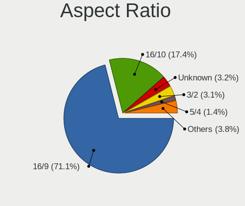

| Ratio   | Computers | Percent |
|---------|-----------|---------|
| 16/9    | 1255      | 71.06%  |
| 16/10   | 308       | 17.44%  |
| Unknown | 57        | 3.23%   |
| 3/2     | 54        | 3.06%   |
| 5/4     | 25        | 1.42%   |
| 21/9    | 18        | 1.02%   |
| 0.67    | 15        | 0.85%   |
| 4/3     | 12        | 0.68%   |
| 1.00    | 5         | 0.28%   |
| 0.56    | 5         | 0.28%   |
| 32/9    | 3         | 0.17%   |
| 0.62    | 3         | 0.17%   |
| 6/5     | 2         | 0.11%   |
| 2.00    | 2         | 0.11%   |
| 3.33    | 1         | 0.06%   |
| 0.45    | 1         | 0.06%   |

Monitor Area
------------

Area in inch

| Area in inch | Computers | Percent |
|----------------|-----------|---------|
| 81-90          | 389       | 20.3%   |
| 101-110        | 326       | 17.01%  |
| 201-250        | 318       | 16.6%   |
| 301-350        | 175       | 9.13%   |
| 71-80          | 114       | 5.95%   |
| 151-200        | 108       | 5.64%   |
| 111-120        | 92        | 4.8%    |
| 351-500        | 65        | 3.39%   |
| Unknown        | 64        | 3.34%   |
| 251-300        | 51        | 2.66%   |
| More than 1000 | 39        | 2.04%   |
| 61-70          | 38        | 1.98%   |
| 121-130        | 29        | 1.51%   |
| 501-1000       | 28        | 1.46%   |
| 1-40           | 25        | 1.3%    |
| 141-150        | 23        | 1.2%    |
| 91-100         | 15        | 0.78%   |
| 51-60          | 10        | 0.52%   |
| 41-50          | 6         | 0.31%   |
| 131-140        | 1         | 0.05%   |

Pixel Density
-------------

Pixels per inch

| Density       | Computers | Percent |
|---------------|-----------|---------|
| 121-160       | 518       | 27.36%  |
| 51-100        | 511       | 26.99%  |
| 161-240       | 335       | 17.7%   |
| 101-120       | 334       | 17.64%  |
| More than 240 | 102       | 5.39%   |
| Unknown       | 64        | 3.38%   |
| 1-50          | 29        | 1.53%   |

Multiple Monitors
-----------------

Total monitors connected

| Total | Computers | Percent |
|-------|-----------|---------|
| 1     | 1517      | 73.53%  |
| 0     | 283       | 13.72%  |
| 2     | 250       | 12.12%  |
| 3     | 12        | 0.58%   |
| 5     | 1         | 0.05%   |

Network
-------

Net Controller Vendor
---------------------

Controller vendors

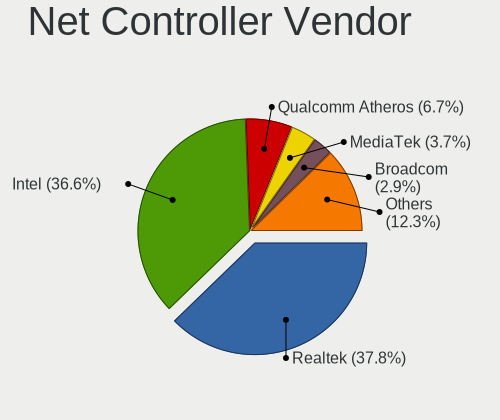

| Vendor                                 | Computers | Percent |
|----------------------------------------|-----------|---------|
| Realtek Semiconductor                  | 1113      | 37.75%  |
| Intel                                  | 1080      | 36.64%  |
| Qualcomm Atheros                       | 198       | 6.72%   |
| MediaTek                               | 109       | 3.7%    |
| Broadcom                               | 85        | 2.88%   |
| ASIX Electronics                       | 46        | 1.56%   |
| Broadcom Limited                       | 33        | 1.12%   |
| Ralink Technology                      | 30        | 1.02%   |
| Huawei Technologies                    | 28        | 0.95%   |
| Xiaomi                                 | 21        | 0.71%   |
| Qualcomm                               | 19        | 0.64%   |
| Mellanox Technologies                  | 13        | 0.44%   |
| Loongson Technology                    | 12        | 0.41%   |
| Microsoft                              | 11        | 0.37%   |
| Marvell Technology Group               | 11        | 0.37%   |
| OPPO Electronics                       | 9         | 0.31%   |
| Ralink                                 | 7         | 0.24%   |
| Quectel Wireless Solutions             | 7         | 0.24%   |
| TP-Link                                | 6         | 0.2%    |
| IBM                                    | 6         | 0.2%    |
| Suzhou Motorcomm Electronic Technology | 5         | 0.17%   |
| Qualcomm Technologies                  | 5         | 0.17%   |
| Qualcomm Atheros Communications        | 5         | 0.17%   |
| NetGear                                | 5         | 0.17%   |
| Dell                                   | 5         | 0.17%   |
| Aquantia                               | 5         | 0.17%   |
| ZTE WCDMA Technologies MSM             | 4         | 0.14%   |
| Tenda                                  | 4         | 0.14%   |
| Samsung Electronics                    | 4         | 0.14%   |
| ICS Advent                             | 4         | 0.14%   |
| DisplayLink                            | 4         | 0.14%   |
| Sierra Wireless                        | 3         | 0.1%    |
| Mercucys                               | 3         | 0.1%    |
| D-Link                                 | 3         | 0.1%    |
| American Megatrends                    | 3         | 0.1%    |
| Wilocity                               | 2         | 0.07%   |
| vivo                                   | 2         | 0.07%   |
| Silicon Integrated Systems [SiS]       | 2         | 0.07%   |
| Shenzhen Goodix Technology             | 2         | 0.07%   |
| OnePlus Technology (Shenzhen)          | 2         | 0.07%   |

Net Controller Model
--------------------

Controller models

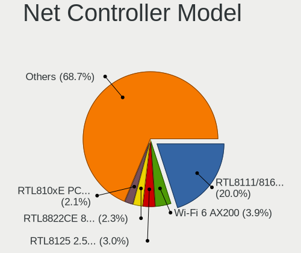

| Model                                                                  | Computers | Percent |
|------------------------------------------------------------------------|-----------|---------|
| Realtek RTL8111/8168/8211/8411 PCI Express Gigabit Ethernet Controller | 686       | 20.03%  |
| Intel Wi-Fi 6 AX200                                                    | 132       | 3.85%   |
| Realtek RTL8125 2.5GbE Controller                                      | 102       | 2.98%   |
| Realtek RTL8822CE 802.11ac PCIe Wireless Network Adapter               | 80        | 2.34%   |
| Realtek RTL810xE PCI Express Fast Ethernet controller                  | 71        | 2.07%   |
| Realtek RTL8153 Gigabit Ethernet Adapter                               | 65        | 1.9%    |
| Intel Alder Lake-P PCH CNVi WiFi                                       | 64        | 1.87%   |
| Intel Wi-Fi 6E(802.11ax) AX210/AX1675* 2x2 [Typhoon Peak]              | 62        | 1.81%   |
| Intel Wi-Fi 6 AX201                                                    | 61        | 1.78%   |
| Intel Wireless 8265 / 8275                                             | 57        | 1.66%   |
| Intel Wireless 7265                                                    | 41        | 1.2%    |
| Intel 82579LM Gigabit Network Connection (Lewisville)                  | 40        | 1.17%   |
| Qualcomm Atheros QCA6174 802.11ac Wireless Network Adapter             | 39        | 1.14%   |
| Qualcomm Atheros QCA9377 802.11ac Wireless Network Adapter             | 38        | 1.11%   |
| Intel Comet Lake PCH-LP CNVi WiFi                                      | 38        | 1.11%   |
| Intel Ethernet Controller I225-V                                       | 36        | 1.05%   |
| ASIX AX88179 Gigabit Ethernet                                          | 36        | 1.05%   |
| Intel I211 Gigabit Network Connection                                  | 35        | 1.02%   |
| MediaTek MT7921 802.11ax PCI Express Wireless Network Adapter          | 34        | 0.99%   |
| Intel Cannon Lake PCH CNVi WiFi                                        | 33        | 0.96%   |
| Realtek RTL8821CE 802.11ac PCIe Wireless Network Adapter               | 32        | 0.93%   |
| MediaTek MT7922 802.11ax PCI Express Wireless Network Adapter          | 32        | 0.93%   |
| Intel Wireless 7260                                                    | 32        | 0.93%   |
| Intel Ethernet Connection (2) I219-V                                   | 30        | 0.88%   |
| Realtek RTL8188EUS 802.11n Wireless Network Adapter                    | 26        | 0.76%   |
| Realtek RTL8852BE PCIe 802.11ax Wireless Network Controller            | 25        | 0.73%   |
| Intel I350 Gigabit Network Connection                                  | 25        | 0.73%   |
| Realtek 802.11ac NIC                                                   | 24        | 0.7%    |
| Intel Wireless 8260                                                    | 24        | 0.7%    |
| Intel Wireless 3165                                                    | 24        | 0.7%    |
| Intel Cannon Point-LP CNVi [Wireless-AC]                               | 24        | 0.7%    |
| Intel Comet Lake PCH CNVi WiFi                                         | 23        | 0.67%   |
| Intel I210 Gigabit Network Connection                                  | 22        | 0.64%   |
| Intel Ethernet Connection (2) I219-LM                                  | 22        | 0.64%   |
| Realtek RTL8852AE 802.11ax PCIe Wireless Network Adapter               | 21        | 0.61%   |
| Ralink MT7601U Wireless Adapter                                        | 21        | 0.61%   |
| Qualcomm Atheros AR9485 Wireless Network Adapter                       | 20        | 0.58%   |
| MediaTek MT7921K (RZ608) Wi-Fi 6E 80MHz                                | 20        | 0.58%   |
| Intel Wi-Fi 5(802.11ac) Wireless-AC 9x6x [Thunder Peak]                | 19        | 0.55%   |
| Intel Tiger Lake PCH CNVi WiFi                                         | 19        | 0.55%   |

Wireless Vendor
---------------

Wireless vendors

| Vendor                          | Computers | Percent |
|---------------------------------|-----------|---------|
| Intel                           | 828       | 52.04%  |
| Realtek Semiconductor           | 306       | 19.23%  |
| Qualcomm Atheros                | 158       | 9.93%   |
| MediaTek                        | 101       | 6.35%   |
| Broadcom                        | 55        | 3.46%   |
| Ralink Technology               | 30        | 1.89%   |
| Broadcom Limited                | 26        | 1.63%   |
| Qualcomm                        | 14        | 0.88%   |
| Ralink                          | 7         | 0.44%   |
| Quectel Wireless Solutions      | 7         | 0.44%   |
| TP-Link                         | 6         | 0.38%   |
| Microsoft                       | 6         | 0.38%   |
| Qualcomm Technologies           | 5         | 0.31%   |
| Qualcomm Atheros Communications | 5         | 0.31%   |
| NetGear                         | 5         | 0.31%   |
| Xiaomi                          | 4         | 0.25%   |
| Tenda                           | 4         | 0.25%   |
| Marvell Technology Group        | 4         | 0.25%   |
| Sierra Wireless                 | 3         | 0.19%   |
| Mercucys                        | 3         | 0.19%   |
| D-Link                          | 3         | 0.19%   |
| Wilocity                        | 2         | 0.13%   |
| Dell                            | 2         | 0.13%   |
| Sagem                           | 1         | 0.06%   |
| Realtek                         | 1         | 0.06%   |
| IMC Networks                    | 1         | 0.06%   |
| Hewlett-Packard                 | 1         | 0.06%   |
| Fibocom                         | 1         | 0.06%   |
| D-Link System                   | 1         | 0.06%   |
| ASUSTek Computer                | 1         | 0.06%   |

Wireless Model
--------------

Wireless models

| Model                                                                | Computers | Percent |
|----------------------------------------------------------------------|-----------|---------|
| Intel Wi-Fi 6 AX200                                                  | 132       | 8.21%   |
| Realtek RTL8822CE 802.11ac PCIe Wireless Network Adapter             | 80        | 4.98%   |
| Intel Alder Lake-P PCH CNVi WiFi                                     | 64        | 3.98%   |
| Intel Wi-Fi 6E(802.11ax) AX210/AX1675* 2x2 [Typhoon Peak]            | 62        | 3.86%   |
| Intel Wi-Fi 6 AX201                                                  | 61        | 3.79%   |
| Intel Wireless 8265 / 8275                                           | 57        | 3.54%   |
| Intel Wireless 7265                                                  | 41        | 2.55%   |
| Qualcomm Atheros QCA6174 802.11ac Wireless Network Adapter           | 39        | 2.43%   |
| Qualcomm Atheros QCA9377 802.11ac Wireless Network Adapter           | 38        | 2.36%   |
| Intel Comet Lake PCH-LP CNVi WiFi                                    | 38        | 2.36%   |
| MediaTek MT7921 802.11ax PCI Express Wireless Network Adapter        | 34        | 2.11%   |
| Intel Cannon Lake PCH CNVi WiFi                                      | 33        | 2.05%   |
| Realtek RTL8821CE 802.11ac PCIe Wireless Network Adapter             | 32        | 1.99%   |
| Intel Wireless 7260                                                  | 32        | 1.99%   |
| Realtek RTL8188EUS 802.11n Wireless Network Adapter                  | 26        | 1.62%   |
| MediaTek MT7922 802.11ax PCI Express Wireless Network Adapter        | 26        | 1.62%   |
| Realtek 802.11ac NIC                                                 | 24        | 1.49%   |
| Intel Wireless 8260                                                  | 24        | 1.49%   |
| Intel Wireless 3165                                                  | 24        | 1.49%   |
| Intel Cannon Point-LP CNVi [Wireless-AC]                             | 24        | 1.49%   |
| Realtek RTL8852BE PCIe 802.11ax Wireless Network Controller          | 23        | 1.43%   |
| Intel Comet Lake PCH CNVi WiFi                                       | 23        | 1.43%   |
| Realtek RTL8852AE 802.11ax PCIe Wireless Network Adapter             | 21        | 1.31%   |
| Ralink MT7601U Wireless Adapter                                      | 21        | 1.31%   |
| Qualcomm Atheros AR9485 Wireless Network Adapter                     | 20        | 1.24%   |
| MediaTek MT7921K (RZ608) Wi-Fi 6E 80MHz                              | 20        | 1.24%   |
| Intel Wi-Fi 5(802.11ac) Wireless-AC 9x6x [Thunder Peak]              | 19        | 1.18%   |
| Intel Tiger Lake PCH CNVi WiFi                                       | 19        | 1.18%   |
| Intel Raptor Lake-S PCH CNVi WiFi                                    | 18        | 1.12%   |
| Intel Raptor Lake PCH CNVi WiFi                                      | 18        | 1.12%   |
| Realtek RTL8822BE 802.11a/b/g/n/ac WiFi adapter                      | 17        | 1.06%   |
| Qualcomm Atheros QCA9565 / AR9565 Wireless Network Adapter           | 16        | 1%      |
| Realtek RTL8723BE PCIe Wireless Network Adapter                      | 15        | 0.93%   |
| Intel Dual Band Wireless-AC 3165 Plus Bluetooth                      | 15        | 0.93%   |
| Intel Centrino Advanced-N 6205 [Taylor Peak]                         | 15        | 0.93%   |
| Qualcomm QCNFA765 Wireless Network Adapter                           | 14        | 0.87%   |
| Broadcom Limited BCM4360 802.11ac Dual Band Wireless Network Adapter | 14        | 0.87%   |
| Qualcomm Atheros AR9285 Wireless Network Adapter (PCI-Express)       | 13        | 0.81%   |
| Intel Wireless 3160                                                  | 13        | 0.81%   |
| Intel Alder Lake-S PCH CNVi WiFi                                     | 12        | 0.75%   |

Ethernet Vendor
---------------

Ethernet vendors

| Vendor                                 | Computers | Percent |
|----------------------------------------|-----------|---------|
| Realtek Semiconductor                  | 942       | 55.15%  |
| Intel                                  | 479       | 28.04%  |
| Qualcomm Atheros                       | 56        | 3.28%   |
| ASIX Electronics                       | 46        | 2.69%   |
| Broadcom                               | 35        | 2.05%   |
| Huawei Technologies                    | 23        | 1.35%   |
| Xiaomi                                 | 17        | 1%      |
| Loongson Technology                    | 12        | 0.7%    |
| OPPO Electronics                       | 9         | 0.53%   |
| MediaTek                               | 8         | 0.47%   |
| Marvell Technology Group               | 7         | 0.41%   |
| Broadcom Limited                       | 7         | 0.41%   |
| Mellanox Technologies                  | 6         | 0.35%   |
| IBM                                    | 6         | 0.35%   |
| Suzhou Motorcomm Electronic Technology | 5         | 0.29%   |
| Aquantia                               | 5         | 0.29%   |
| Samsung Electronics                    | 4         | 0.23%   |
| Qualcomm                               | 4         | 0.23%   |
| Microsoft                              | 4         | 0.23%   |
| ICS Advent                             | 4         | 0.23%   |
| DisplayLink                            | 4         | 0.23%   |
| Dell                                   | 3         | 0.18%   |
| American Megatrends                    | 3         | 0.18%   |
| vivo                                   | 2         | 0.12%   |
| Silicon Integrated Systems [SiS]       | 2         | 0.12%   |
| Nvidia                                 | 2         | 0.12%   |
| Microchip Technology                   | 2         | 0.12%   |
| Lenovo                                 | 2         | 0.12%   |
| Unknown                                | 2         | 0.12%   |
| Picocom Technology                     | 1         | 0.06%   |
| OnePlus Technology (Shenzhen)          | 1         | 0.06%   |
| NetXen Incorporated                    | 1         | 0.06%   |
| JMicron Technology                     | 1         | 0.06%   |
| Attansic Technology                    | 1         | 0.06%   |
| Apple                                  | 1         | 0.06%   |
| Android                                | 1         | 0.06%   |

Ethernet Model
--------------

Ethernet models

| Model                                                                  | Computers | Percent |
|------------------------------------------------------------------------|-----------|---------|
| Realtek RTL8111/8168/8211/8411 PCI Express Gigabit Ethernet Controller | 686       | 38.5%   |
| Realtek RTL8125 2.5GbE Controller                                      | 102       | 5.72%   |
| Realtek RTL810xE PCI Express Fast Ethernet controller                  | 71        | 3.98%   |
| Realtek RTL8153 Gigabit Ethernet Adapter                               | 65        | 3.65%   |
| Intel 82579LM Gigabit Network Connection (Lewisville)                  | 40        | 2.24%   |
| Intel Ethernet Controller I225-V                                       | 36        | 2.02%   |
| ASIX AX88179 Gigabit Ethernet                                          | 36        | 2.02%   |
| Intel I211 Gigabit Network Connection                                  | 35        | 1.96%   |
| Intel Ethernet Connection (2) I219-V                                   | 30        | 1.68%   |
| Intel I350 Gigabit Network Connection                                  | 25        | 1.4%    |
| Intel I210 Gigabit Network Connection                                  | 22        | 1.23%   |
| Intel Ethernet Connection (2) I219-LM                                  | 22        | 1.23%   |
| Intel Ethernet Controller I226-V                                       | 18        | 1.01%   |
| Intel Ethernet Connection I217-LM                                      | 18        | 1.01%   |
| Realtek RTL8152 Fast Ethernet Adapter                                  | 16        | 0.9%    |
| Huawei FOA-LX9                                                         | 16        | 0.9%    |
| Intel Ethernet Connection (4) I219-V                                   | 14        | 0.79%   |
| Intel Ethernet Connection (7) I219-V                                   | 13        | 0.73%   |
| Intel Ethernet Connection (13) I219-V                                  | 12        | 0.67%   |
| Intel Ethernet Connection (10) I219-V                                  | 12        | 0.67%   |
| Intel Ethernet Connection (7) I219-LM                                  | 11        | 0.62%   |
| Intel Ethernet Connection (16) I219-V                                  | 11        | 0.62%   |
| Qualcomm Atheros AR8161 Gigabit Ethernet                               | 10        | 0.56%   |
| Intel Ethernet Connection (12) I219-V                                  | 10        | 0.56%   |
| Intel 82567LM Gigabit Network Connection                               | 10        | 0.56%   |
| Xiaomi Mi/Redmi series (RNDIS)                                         | 9         | 0.51%   |
| Loongson Ethernet controller                                           | 9         | 0.51%   |
| Xiaomi Mi/Redmi series (RNDIS + ADB)                                   | 8         | 0.45%   |
| Qualcomm Atheros QCA8171 Gigabit Ethernet                              | 8         | 0.45%   |
| Qualcomm Atheros Killer E2500 Gigabit Ethernet Controller              | 8         | 0.45%   |
| Intel Ethernet Connection (4) I219-LM                                  | 8         | 0.45%   |
| Intel Ethernet Connection (2) I218-V                                   | 8         | 0.45%   |
| Intel 82599ES 10-Gigabit SFI/SFP+ Network Connection                   | 8         | 0.45%   |
| Broadcom NetXtreme BCM5720 Gigabit Ethernet PCIe                       | 8         | 0.45%   |
| ASIX AX88772B                                                          | 8         | 0.45%   |
| Realtek Killer E2600 GbE Controller                                    | 7         | 0.39%   |
| Qualcomm Atheros Killer E2400 Gigabit Ethernet Controller              | 7         | 0.39%   |
| Intel Ethernet Connection I218-LM                                      | 7         | 0.39%   |
| Intel Ethernet Connection (6) I219-V                                   | 7         | 0.39%   |
| Intel Ethernet Connection (2) I218-LM                                  | 7         | 0.39%   |

Net Controller Kind
-------------------

Ethernet, WiFi or modem

| Kind     | Computers | Percent |
|----------|-----------|---------|
| Ethernet | 1585      | 50.45%  |
| WiFi     | 1523      | 48.47%  |
| Unknown  | 21        | 0.67%   |
| Modem    | 13        | 0.41%   |

Used Controller
---------------

Currently used network controller

| Kind     | Computers | Percent |
|----------|-----------|---------|
| WiFi     | 1127      | 57.24%  |
| Ethernet | 840       | 42.66%  |
| Unknown  | 2         | 0.1%    |

NICs
----

Total network controllers on board

| Total | Computers | Percent |
|-------|-----------|---------|
| 2     | 979       | 48.25%  |
| 1     | 804       | 39.63%  |
| 0     | 114       | 5.62%   |
| 3     | 77        | 3.79%   |
| 4     | 35        | 1.72%   |
| 6     | 10        | 0.49%   |
| 5     | 5         | 0.25%   |
| 8     | 2         | 0.1%    |
| 7     | 2         | 0.1%    |
| 42    | 1         | 0.05%   |

IPv6
----

IPv6 vs IPv4

| Used | Computers | Percent |
|------|-----------|---------|
| No   | 1633      | 78.89%  |
| Yes  | 437       | 21.11%  |

Bluetooth
---------

Bluetooth Vendor
----------------

Controller vendors

| Vendor                          | Computers | Percent |
|---------------------------------|-----------|---------|
| Intel                           | 747       | 56.12%  |
| Realtek Semiconductor           | 121       | 9.09%   |
| Qualcomm Atheros Communications | 80        | 6.01%   |
| Foxconn / Hon Hai               | 65        | 4.88%   |
| Cambridge Silicon Radio         | 62        | 4.66%   |
| IMC Networks                    | 61        | 4.58%   |
| Realtek                         | 34        | 2.55%   |
| Broadcom                        | 33        | 2.48%   |
| MediaTek                        | 32        | 2.4%    |
| Apple                           | 27        | 2.03%   |
| Lite-On Technology              | 16        | 1.2%    |
| ASUSTek Computer                | 12        | 0.9%    |
| Opticis                         | 8         | 0.6%    |
| Hewlett-Packard                 | 5         | 0.38%   |
| Foxconn International           | 5         | 0.38%   |
| Dell                            | 5         | 0.38%   |
| Ralink                          | 4         | 0.3%    |
| Marvell Semiconductor           | 3         | 0.23%   |
| Toshiba                         | 2         | 0.15%   |
| Taiyo Yuden                     | 2         | 0.15%   |
| Alps Electric                   | 2         | 0.15%   |
| Unknown                         | 2         | 0.15%   |
| USI                             | 1         | 0.08%   |
| SINO WEALTH                     | 1         | 0.08%   |
| Actions                         | 1         | 0.08%   |

Bluetooth Model
---------------

Controller models

| Model                                               | Computers | Percent |
|-----------------------------------------------------|-----------|---------|
| Intel Bluetooth wireless interface                  | 193       | 14.48%  |
| Intel AX201 Bluetooth                               | 165       | 12.38%  |
| Intel AX200 Bluetooth                               | 123       | 9.23%   |
| Intel Bluetooth 9460/9560 Jefferson Peak (JfP)      | 88        | 6.6%    |
| Intel AX211 Bluetooth                               | 79        | 5.93%   |
| Realtek Bluetooth Radio                             | 74        | 5.55%   |
| Cambridge Silicon Radio Bluetooth Dongle (HCI mode) | 62        | 4.65%   |
| Intel AX210 Bluetooth                               | 59        | 4.43%   |
| Qualcomm Atheros  Bluetooth Device                  | 49        | 3.68%   |
| Realtek Bluetooth Radio                             | 34        | 2.55%   |
| MediaTek Wireless_Device                            | 32        | 2.4%    |
| IMC Networks Bluetooth Radio                        | 31        | 2.33%   |
| IMC Networks Wireless_Device                        | 23        | 1.73%   |
| Foxconn / Hon Hai Wireless_Device                   | 22        | 1.65%   |
| Foxconn / Hon Hai Bluetooth Device                  | 21        | 1.58%   |
| Apple Bluetooth Host Controller                     | 19        | 1.43%   |
| Realtek 802.11ac WLAN Adapter                       | 18        | 1.35%   |
| Intel Wireless-AC 9260 Bluetooth Adapter            | 17        | 1.28%   |
| Qualcomm Atheros QCA61x4 Bluetooth 4.0              | 16        | 1.2%    |
| Foxconn / Hon Hai MediaTek Bluetooth Adapter        | 16        | 1.2%    |
| Realtek  Bluetooth 4.2 Adapter                      | 11        | 0.83%   |
| Qualcomm Atheros AR3012 Bluetooth 4.0               | 11        | 0.83%   |
| Realtek RTL8723B Bluetooth                          | 10        | 0.75%   |
| Intel Centrino Bluetooth Wireless Transceiver       | 9         | 0.68%   |
| Opticis Bluetooth Radio                             | 8         | 0.6%    |
| Broadcom BCM2045B (BDC-2.1)                         | 8         | 0.6%    |
| Lite-On Bluetooth Device                            | 7         | 0.53%   |
| Intel Wireless-AC 3168 Bluetooth                    | 7         | 0.53%   |
| Apple Bluetooth USB Host Controller                 | 7         | 0.53%   |
| Realtek RTL8822BE Bluetooth 4.2 Adapter             | 6         | 0.45%   |
| Intel Centrino Advanced-N 6230 Bluetooth adapter    | 6         | 0.45%   |
| IMC Networks Bluetooth Device                       | 6         | 0.45%   |
| Broadcom BCM2045B (BDC-2.1) [Bluetooth Controller]  | 6         | 0.45%   |
| Foxconn International BCM43142A0 Bluetooth module   | 5         | 0.38%   |
| Broadcom BCM20702 Bluetooth 4.0 [ThinkPad]          | 5         | 0.38%   |
| Ralink RT3290 Bluetooth                             | 4         | 0.3%    |
| ASUS Bluetooth Radio                                | 4         | 0.3%    |
| Marvell Bluetooth and Wireless LAN Composite        | 3         | 0.23%   |
| HP Broadcom 2070 Bluetooth Combo                    | 3         | 0.23%   |
| ASUS Qualcomm Bluetooth 4.1                         | 3         | 0.23%   |

Sound
-----

Sound Vendor
------------

Sound card vendors

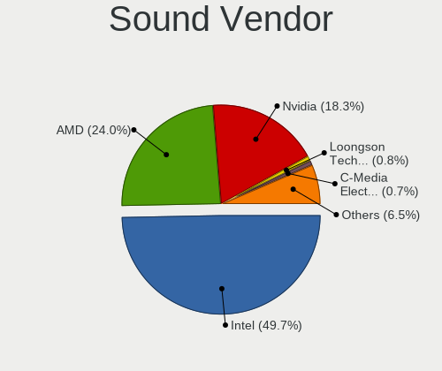

| Vendor                                       | Computers | Percent |
|----------------------------------------------|-----------|---------|
| Intel                                        | 1270      | 49.69%  |
| AMD                                          | 614       | 24.02%  |
| Nvidia                                       | 467       | 18.27%  |
| Loongson Technology                          | 21        | 0.82%   |
| C-Media Electronics                          | 19        | 0.74%   |
| Zhaoxin                                      | 18        | 0.7%    |
| Zoran Co. Personal Media Division (Nogatech) | 10        | 0.39%   |
| Realtek Semiconductor                        | 9         | 0.35%   |
| Generalplus Technology                       | 8         | 0.31%   |
| Apple                                        | 8         | 0.31%   |
| Jieli Technology                             | 7         | 0.27%   |
| ASUSTek Computer                             | 7         | 0.27%   |
| Micro Star International                     | 6         | 0.23%   |
| Creative Labs                                | 6         | 0.23%   |
| XMOS                                         | 5         | 0.2%    |
| Huawei Technologies                          | 5         | 0.2%    |
| BY EDIFIER                                   | 4         | 0.16%   |
| Walmart                                      | 3         | 0.12%   |
| Silicon Integrated Systems [SiS]             | 3         | 0.12%   |
| Phytium Technology                           | 3         | 0.12%   |
| JMTek                                        | 3         | 0.12%   |
| Yamaha                                       | 2         | 0.08%   |
| VIA Technologies                             | 2         | 0.08%   |
| Texas Instruments                            | 2         | 0.08%   |
| Sony                                         | 2         | 0.08%   |
| Medeli Electronics                           | 2         | 0.08%   |
| Logitech                                     | 2         | 0.08%   |
| KTMicro                                      | 2         | 0.08%   |
| Giga-Byte Technology                         | 2         | 0.08%   |
| Focusrite-Novation                           | 2         | 0.08%   |
| Drop                                         | 2         | 0.08%   |
| Dell                                         | 2         | 0.08%   |
| USB-Speaker                                  | 1         | 0.04%   |
| ULi Electronics                              | 1         | 0.04%   |
| TTGK Technology                              | 1         | 0.04%   |
| TerraTec Electronic                          | 1         | 0.04%   |
| Synaptics                                    | 1         | 0.04%   |
| SteelSeries ApS                              | 1         | 0.04%   |
| Specialix                                    | 1         | 0.04%   |
| SoundPlus Technology                         | 1         | 0.04%   |

Sound Model
-----------

Sound card models

| Model                                                                             | Computers | Percent |
|-----------------------------------------------------------------------------------|-----------|---------|
| AMD Family 17h/19h/1ah HD Audio Controller                                        | 340       | 10.93%  |
| Intel Sunrise Point-LP HD Audio                                                   | 137       | 4.4%    |
| AMD Renoir Radeon High Definition Audio Controller                                | 134       | 4.31%   |
| AMD Rembrandt Radeon High Definition Audio Controller                             | 113       | 3.63%   |
| Intel 8 Series/C220 Series Chipset High Definition Audio Controller               | 86        | 2.76%   |
| Intel Cannon Lake PCH cAVS                                                        | 84        | 2.7%    |
| Intel 7 Series/C216 Chipset Family High Definition Audio Controller               | 84        | 2.7%    |
| Intel Tiger Lake-LP Smart Sound Technology Audio Controller                       | 79        | 2.54%   |
| Intel Alder Lake PCH-P High Definition Audio Controller                           | 72        | 2.31%   |
| Intel 6 Series/C200 Series Chipset Family High Definition Audio Controller        | 68        | 2.19%   |
| AMD Raven/Raven2/Fenghuang HDMI/DP Audio Controller                               | 67        | 2.15%   |
| Intel 200 Series PCH HD Audio                                                     | 62        | 1.99%   |
| Intel Xeon E3-1200 v3/4th Gen Core Processor HD Audio Controller                  | 52        | 1.67%   |
| Intel 100 Series/C230 Series Chipset Family HD Audio Controller                   | 51        | 1.64%   |
| Nvidia GA106 High Definition Audio Controller                                     | 50        | 1.61%   |
| AMD Starship/Matisse HD Audio Controller                                          | 50        | 1.61%   |
| Intel Haswell-ULT HD Audio Controller                                             | 43        | 1.38%   |
| Intel Comet Lake PCH-LP cAVS                                                      | 43        | 1.38%   |
| Intel 8 Series HD Audio Controller                                                | 43        | 1.38%   |
| AMD FCH Azalia Controller                                                         | 38        | 1.22%   |
| Intel Raptor Lake High Definition Audio Controller                                | 35        | 1.13%   |
| Nvidia GP106 High Definition Audio Controller                                     | 34        | 1.09%   |
| AMD Baffin HDMI/DP Audio [Radeon RX 550 640SP / RX 560/560X]                      | 34        | 1.09%   |
| Intel Cannon Point-LP High Definition Audio Controller                            | 33        | 1.06%   |
| Nvidia TU107 GeForce GTX 1650 High Definition Audio Controller                    | 31        | 1%      |
| Nvidia TU106 High Definition Audio Controller                                     | 31        | 1%      |
| Intel Comet Lake PCH cAVS                                                         | 31        | 1%      |
| Intel Tiger Lake-H HD Audio Controller                                            | 30        | 0.96%   |
| Intel Broadwell-U Audio Controller                                                | 29        | 0.93%   |
| Intel Alder Lake-S HD Audio Controller                                            | 29        | 0.93%   |
| AMD Oland/Hainan/Cape Verde/Pitcairn HDMI Audio [Radeon HD 7000 Series]           | 29        | 0.93%   |
| Intel Wildcat Point-LP High Definition Audio Controller                           | 28        | 0.9%    |
| Nvidia GK208 HDMI/DP Audio Controller                                             | 27        | 0.87%   |
| Nvidia GP107GL High Definition Audio Controller                                   | 25        | 0.8%    |
| AMD Caicos HDMI Audio [Radeon HD 6450 / 7450/8450/8490 OEM / R5 230/235/235X OEM] | 25        | 0.8%    |
| Nvidia GP104 High Definition Audio Controller                                     | 24        | 0.77%   |
| AMD Navi 21/23 HDMI/DP Audio Controller                                           | 24        | 0.77%   |
| Nvidia TU116 High Definition Audio Controller                                     | 23        | 0.74%   |
| Nvidia AD107 High Definition Audio Controller                                     | 23        | 0.74%   |
| Intel Comet Lake PCH-V cAVS                                                       | 23        | 0.74%   |

Memory
------

Memory Vendor
-------------

Memory module vendors

| Vendor                     | Computers | Percent |
|----------------------------|-----------|---------|
| Samsung Electronics        | 388       | 26.15%  |
| SK hynix                   | 257       | 17.32%  |
| Kingston                   | 197       | 13.27%  |
| Micron Technology          | 171       | 11.52%  |
| Unknown                    | 78        | 5.26%   |
| Crucial                    | 72        | 4.85%   |
| A-DATA Technology          | 45        | 3.03%   |
| Unknown                    | 42        | 2.83%   |
| Ramaxel Technology         | 32        | 2.16%   |
| Corsair                    | 25        | 1.68%   |
| KINGBANK                   | 17        | 1.15%   |
| Elpida                     | 11        | 0.74%   |
| UniIC                      | 10        | 0.67%   |
| Unknown (ABCD)             | 8         | 0.54%   |
| G.Skill                    | 8         | 0.54%   |
| Team                       | 7         | 0.47%   |
| Lenovo                     | 7         | 0.47%   |
| Transcend                  | 6         | 0.4%    |
| Nanya Technology           | 6         | 0.4%    |
| Unknown (0x0B92)           | 5         | 0.34%   |
| UnilC                      | 5         | 0.34%   |
| Kingmax                    | 5         | 0.34%   |
| Juhor                      | 5         | 0.34%   |
| GLOWAY                     | 5         | 0.34%   |
| Unknown (08C8)             | 4         | 0.27%   |
| tigo                       | 4         | 0.27%   |
| Asgard                     | 4         | 0.27%   |
| Apacer                     | 4         | 0.27%   |
| Xi'an UniIC Semiconductors | 3         | 0.2%    |
| Shenzhen WODPOSIT          | 3         | 0.2%    |
| Ramsta                     | 3         | 0.2%    |
| Hakatronics                | 3         | 0.2%    |
| Unknown (08B5)             | 2         | 0.13%   |
| KLEVV                      | 2         | 0.13%   |
| Kimtigo                    | 2         | 0.13%   |
| Guangzhou MiaoYuanJi       | 2         | 0.13%   |
| GeIL                       | 2         | 0.13%   |
| CUSO                       | 2         | 0.13%   |
| Colorful                   | 2         | 0.13%   |
| Zentel                     | 1         | 0.07%   |

Memory Model
------------

Memory module models

| Model                                                            | Computers | Percent |
|------------------------------------------------------------------|-----------|---------|
| Unknown                                                          | 42        | 2.62%   |
| Samsung RAM M471A1G44AB0-CWE 8GB Row Of Chips DDR4 3200MT/s      | 27        | 1.69%   |
| Samsung RAM M471A1G44AB0-CWE 8GB SODIMM DDR4 3200MT/s            | 12        | 0.75%   |
| Samsung RAM M471B5173EB0-YK0 4GB SODIMM DDR3 1600MT/s            | 11        | 0.69%   |
| Samsung RAM M471A1K43DB1-CTD 8GB SODIMM DDR4 2667MT/s            | 11        | 0.69%   |
| Micron RAM 4ATF1G64HZ-3G2E1 8GB Row Of Chips DDR4 3200MT/s       | 11        | 0.69%   |
| Samsung RAM M471A1K43EB1-CWE 8GB SODIMM DDR4 3200MT/s            | 10        | 0.62%   |
| Samsung RAM M471A1G44AB0-CTD 8GB SODIMM DDR4 2667MT/s            | 10        | 0.62%   |
| SK hynix RAM HMT351S6CFR8C-PB 4GB SODIMM DDR3 1600MT/s           | 9         | 0.56%   |
| SK hynix RAM HMAA1GS6CMR6N-VK 8GB Row Of Chips DDR4 2667MT/s     | 9         | 0.56%   |
| SK hynix RAM HMA81GS6DJR8N-XN 8GB SODIMM DDR4 3200MT/s           | 9         | 0.56%   |
| Samsung RAM M471A1K43DB1-CWE 8GB SODIMM DDR4 3200MT/s            | 8         | 0.5%    |
| Samsung RAM M425R1GB4BB0-CQKOL 8GB SODIMM DDR5 4800MT/s          | 8         | 0.5%    |
| Micron RAM MTC4C10163S1SC48BA1 8GB SODIMM DDR5 4800MT/s          | 8         | 0.5%    |
| Kingston RAM KHX3200C16D4/16GX 16GB DIMM DDR4 3600MT/s           | 8         | 0.5%    |
| SK hynix RAM HMT451S6BFR8A-PB 4GB SODIMM DDR3 1600MT/s           | 7         | 0.44%   |
| SK hynix RAM HMA851S6CJR6N-VK 4GB SODIMM DDR4 2667MT/s           | 7         | 0.44%   |
| Samsung RAM M471A5244CB0-CTD 4GB SODIMM DDR4 3266MT/s            | 7         | 0.44%   |
| Samsung RAM M425R1GB4BB0-CQKOD 8GB SODIMM DDR5 4800MT/s          | 7         | 0.44%   |
| Micron RAM 53E1G32D2NP-046 2GB Row Of Chips LPDDR4 4267MT/s      | 7         | 0.44%   |
| Micron RAM 4ATF1G64HZ-3G2E1 8GB SODIMM DDR4 3200MT/s             | 7         | 0.44%   |
| Unknown (ABCD) RAM 123456789012345678 2GB SODIMM LPDDR3 2400MT/s | 6         | 0.37%   |
| SK hynix RAM HMAA1GS6CMR6N-XN 8GB Row Of Chips DDR4 3200MT/s     | 6         | 0.37%   |
| SK hynix RAM HMAA1GS6CJR6N-XN 8GB Row Of Chips DDR4 3200MT/s     | 6         | 0.37%   |
| SK hynix RAM HMA851S6CJR6N-VK 4GB Row Of Chips DDR4 2667MT/s     | 6         | 0.37%   |
| SK hynix RAM HMA81GS6AFR8N-UH 8GB SODIMM DDR4 2667MT/s           | 6         | 0.37%   |
| SK hynix RAM HMA41GS6AFR8N-TF 8GB SODIMM DDR4 2667MT/s           | 6         | 0.37%   |
| SK hynix RAM H9JCNNNCP3MLYR-N6E 2GB Row Of Chips LPDDR5 6400MT/s | 6         | 0.37%   |
| Samsung RAM M471B1G73EB0-YK0 8GB SODIMM DDR3 1600MT/s            | 6         | 0.37%   |
| Samsung RAM M471A5244CB0-CRC 4GB SODIMM DDR4 2667MT/s            | 6         | 0.37%   |
| Samsung RAM M471A1K43CB1-CTD 8GB SODIMM DDR4 2667MT/s            | 6         | 0.37%   |
| Samsung RAM M471A1K43CB1-CRC 8GB SODIMM DDR4 2667MT/s            | 6         | 0.37%   |
| Samsung RAM M471A1K43BB1-CRC 8GB SODIMM DDR4 2667MT/s            | 6         | 0.37%   |
| Samsung RAM M471A1G44AB0-CTD 8GB Row Of Chips DDR4 2667MT/s      | 6         | 0.37%   |
| Kingston RAM LV32D4S2S8HD-8 8GB SODIMM DDR4 3200MT/s             | 6         | 0.37%   |
| Kingston RAM KHX2666C16/8G 8GB DIMM DDR4 3466MT/s                | 6         | 0.37%   |
| Kingston RAM 99P5474-013.A00LF 4GB DIMM DDR3 1600MT/s            | 6         | 0.37%   |
| Crucial RAM CT16G48C40S5.M8A1 16GB SODIMM DDR5 4800MT/s          | 6         | 0.37%   |
| Unknown RAM Module 2GB SODIMM DDR3 1333MT/s                      | 5         | 0.31%   |
| Unknown RAM Module 2GB SODIMM DDR2 667MT/s                       | 5         | 0.31%   |

Memory Kind
-----------

Memory module kinds

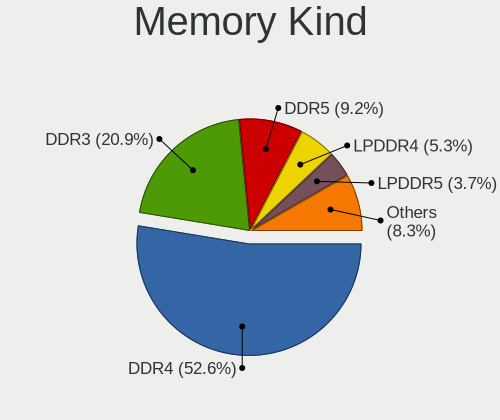

| Kind    | Computers | Percent |
|---------|-----------|---------|
| DDR4    | 691       | 52.59%  |
| DDR3    | 274       | 20.85%  |
| DDR5    | 121       | 9.21%   |
| LPDDR4  | 70        | 5.33%   |
| LPDDR5  | 49        | 3.73%   |
| LPDDR3  | 43        | 3.27%   |
| Unknown | 22        | 1.67%   |
| SDRAM   | 16        | 1.22%   |
| DDR2    | 15        | 1.14%   |
| DRAM    | 11        | 0.84%   |
| DDR     | 2         | 0.15%   |

Memory Form Factor
------------------

Physical design of the memory module

| Name         | Computers | Percent |
|--------------|-----------|---------|
| SODIMM       | 667       | 50.45%  |
| DIMM         | 417       | 31.54%  |
| Row Of Chips | 216       | 16.34%  |
| Chip         | 12        | 0.91%   |
| RIMM         | 5         | 0.38%   |
| Unknown      | 5         | 0.38%   |

Memory Size
-----------

Memory module size

| Size  | Computers | Percent |
|-------|-----------|---------|
| 8192  | 609       | 43.1%   |
| 16384 | 312       | 22.08%  |
| 4096  | 271       | 19.18%  |
| 32768 | 107       | 7.57%   |
| 2048  | 77        | 5.45%   |
| 1024  | 13        | 0.92%   |
| 65536 | 10        | 0.71%   |
| 49152 | 5         | 0.35%   |
| 24576 | 2         | 0.14%   |
| 12288 | 2         | 0.14%   |
| 512   | 2         | 0.14%   |
| 16315 | 1         | 0.07%   |
| 6144  | 1         | 0.07%   |
| 256   | 1         | 0.07%   |

Memory Speed
------------

Memory module speed

| Speed   | Computers | Percent |
|---------|-----------|---------|
| 3200    | 290       | 20.8%   |
| 2667    | 220       | 15.78%  |
| 1600    | 202       | 14.49%  |
| 2400    | 94        | 6.74%   |
| 4800    | 77        | 5.52%   |
| 2133    | 66        | 4.73%   |
| 2666    | 39        | 2.8%    |
| 6400    | 38        | 2.73%   |
| 1333    | 38        | 2.73%   |
| 4267    | 37        | 2.65%   |
| 5600    | 35        | 2.51%   |
| 1867    | 27        | 1.94%   |
| 3600    | 21        | 1.51%   |
| Unknown | 14        | 1%      |
| 800     | 13        | 0.93%   |
| 1334    | 12        | 0.86%   |
| 1066    | 12        | 0.86%   |
| 4266    | 11        | 0.79%   |
| 3733    | 11        | 0.79%   |
| 7500    | 10        | 0.72%   |
| 1866    | 9         | 0.65%   |
| 1067    | 9         | 0.65%   |
| 3266    | 8         | 0.57%   |
| 667     | 8         | 0.57%   |
| 3466    | 7         | 0.5%    |
| 3000    | 7         | 0.5%    |
| 2933    | 7         | 0.5%    |
| 2668    | 7         | 0.5%    |
| 1800    | 6         | 0.43%   |
| 6000    | 5         | 0.36%   |
| 8400    | 4         | 0.29%   |
| 4199    | 4         | 0.29%   |
| 2048    | 4         | 0.29%   |
| 8533    | 3         | 0.22%   |
| 5200    | 3         | 0.22%   |
| 3800    | 3         | 0.22%   |
| 3400    | 3         | 0.22%   |
| 5808    | 2         | 0.14%   |
| 4000    | 2         | 0.14%   |
| 3933    | 2         | 0.14%   |

Printers & scanners
-------------------

Printer Vendor
--------------

Printer device vendors

| Vendor                             | Computers | Percent |
|------------------------------------|-----------|---------|
| Hewlett-Packard                    | 7         | 41.18%  |
| Brother Industries                 | 3         | 17.65%  |
| Seiko Epson                        | 2         | 11.76%  |
| Canon                              | 2         | 11.76%  |
| Xiaomi                             | 1         | 5.88%   |
| Pantum                             | 1         | 5.88%   |
| BeiJing LanXum Computer Technology | 1         | 5.88%   |

Printer Model
-------------

Printer device models

| Model                                                   | Computers | Percent |
|---------------------------------------------------------|-----------|---------|
| HP LaserJet 1020                                        | 3         | 17.65%  |
| Xiaomi MiMouse 2                                        | 1         | 5.88%   |
| Seiko Epson M105 Series                                 | 1         | 5.88%   |
| Seiko Epson L3150 Series                                | 1         | 5.88%   |
| Pantum P2200W-series                                    | 1         | 5.88%   |
| HP Officejet 4500 G510g-m                               | 1         | 5.88%   |
| HP LaserJet P1102                                       | 1         | 5.88%   |
| HP Laser NS 1020                                        | 1         | 5.88%   |
| HP DeskJet 2130 series                                  | 1         | 5.88%   |
| Canon PIXMA MP280                                       | 1         | 5.88%   |
| Canon iP1100 series                                     | 1         | 5.88%   |
| Brother HL-L8260CDN series                              | 1         | 5.88%   |
| Brother HL-L2350DW series                               | 1         | 5.88%   |
| Brother HL-5440D series                                 | 1         | 5.88%   |
| BeiJing LanXum Technology Black and White Laser Printer | 1         | 5.88%   |

Scanner Vendor
--------------

Scanner device vendors

| Vendor | Computers | Percent |
|--------|-----------|---------|
| Canon  | 2         | 100%    |

Scanner Model
-------------

Scanner device models

| Model                   | Computers | Percent |
|-------------------------|-----------|---------|
| Canon CanoScan LiDE 120 | 2         | 100%    |

Camera
------

Camera Vendor
-------------

Camera device vendors

| Vendor                                 | Computers | Percent |
|----------------------------------------|-----------|---------|
| Chicony Electronics                    | 194       | 18.91%  |
| IMC Networks                           | 160       | 15.59%  |
| Bison Electronics                      | 73        | 7.12%   |
| Microdia                               | 66        | 6.43%   |
| Sunplus Innovation Technology          | 63        | 6.14%   |
| Realtek Semiconductor                  | 62        | 6.04%   |
| Quanta                                 | 57        | 5.56%   |
| Luxvisions Innotech Limited            | 49        | 4.78%   |
| Cheng Uei Precision Industry (Foxlink) | 42        | 4.09%   |
| Syntek                                 | 35        | 3.41%   |
| Acer                                   | 34        | 3.31%   |
| Lite-On Technology                     | 21        | 2.05%   |
| Suyin                                  | 18        | 1.75%   |
| SunplusIT                              | 18        | 1.75%   |
| Apple                                  | 17        | 1.66%   |
| Alcor Micro                            | 13        | 1.27%   |
| Logitech                               | 12        | 1.17%   |
| Z-Star Microelectronics                | 8         | 0.78%   |
| Silicon Motion                         | 8         | 0.78%   |
| Sonix Technology                       | 7         | 0.68%   |
| Lenovo                                 | 7         | 0.68%   |
| icSpring                               | 6         | 0.58%   |
| Ricoh                                  | 4         | 0.39%   |
| SN0002                                 | 3         | 0.29%   |
| ShineTech                              | 3         | 0.29%   |
| Microsoft                              | 3         | 0.29%   |
| Importek                               | 3         | 0.29%   |
| GEMBIRD                                | 3         | 0.29%   |
| Unknown (0000066029)                   | 2         | 0.19%   |
| Tripath Technology                     | 2         | 0.19%   |
| ShineOptics                            | 2         | 0.19%   |
| Primax Electronics                     | 2         | 0.19%   |
| OPPO Electronics                       | 2         | 0.19%   |
| Nebraska Furniture Mart                | 2         | 0.19%   |
| Google                                 | 2         | 0.19%   |
| Genesys Logic                          | 2         | 0.19%   |
| Cubeternet                             | 2         | 0.19%   |
| Y Media                                | 1         | 0.1%    |
| Vimicro                                | 1         | 0.1%    |
| Unknown                                | 1         | 0.1%    |

Camera Model
------------

Camera device models

| Model                                                        | Computers | Percent |
|--------------------------------------------------------------|-----------|---------|
| Chicony Integrated Camera                                    | 88        | 8.49%   |
| IMC Networks Integrated Camera                               | 63        | 6.08%   |
| IMC Networks HD Camera                                       | 35        | 3.38%   |
| Microdia Integrated_Webcam_HD                                | 34        | 3.28%   |
| Bison Integrated Camera                                      | 30        | 2.9%    |
| Syntek Integrated Camera                                     | 26        | 2.51%   |
| IMC Networks USB2.0 HD UVC WebCam                            | 25        | 2.41%   |
| Luxvisions Innotech Limited Integrated Camera                | 19        | 1.83%   |
| Realtek Integrated_Webcam_HD                                 | 16        | 1.54%   |
| Chicony HD Webcam                                            | 15        | 1.45%   |
| Sunplus XiaoMi USB 2.0 Webcam                                | 14        | 1.35%   |
| Cheng Uei Precision Industry (Foxlink) XiaoMi USB 2.0 Webcam | 14        | 1.35%   |
| Sunplus Integrated_Webcam_HD                                 | 13        | 1.25%   |
| IMC Networks ov9734_azurewave_camera                         | 12        | 1.16%   |
| Bison SunplusIT Integrated Camera                            | 12        | 1.16%   |
| Luxvisions Innotech Limited Integrated RGB Camera            | 11        | 1.06%   |
| Apple iPhone 5/5C/5S/6/SE/7/8/X/XR                           | 11        | 1.06%   |
| Quanta HP HD Camera                                          | 9         | 0.87%   |
| Acer BisonCam,NB Pro                                         | 9         | 0.87%   |
| Sunplus HD WebCam                                            | 8         | 0.77%   |
| Quanta hm1091_techfront                                      | 8         | 0.77%   |
| Quanta HD User Facing                                        | 8         | 0.77%   |
| Microdia Webcam Vitade AF                                    | 8         | 0.77%   |
| Acer Integrated Camera                                       | 8         | 0.77%   |
| Realtek Integrated Webcam                                    | 7         | 0.68%   |
| Quanta ov9734_techfront_camera                               | 7         | 0.68%   |
| Luxvisions Innotech Limited HP Wide Vision HD Camera         | 7         | 0.68%   |
| Lite-On Integrated Camera                                    | 7         | 0.68%   |
| Chicony XiaoMi USB 2.0 Webcam                                | 7         | 0.68%   |
| Chicony Lenovo Integrated Camera (0.3MP)                     | 7         | 0.68%   |
| Chicony HP Wide Vision HD Camera                             | 7         | 0.68%   |
| Syntek Lenovo EasyCamera                                     | 6         | 0.58%   |
| SunplusIT HD Webcam                                          | 6         | 0.58%   |
| Lite-On HP HD Camera                                         | 6         | 0.58%   |
| IMC Networks Lenovo EasyCamera                               | 6         | 0.58%   |
| icSpring camera                                              | 6         | 0.58%   |
| Chicony Integrated Camera (1280x720@30)                      | 6         | 0.58%   |
| Silicon Motion 300k Pixel Camera                             | 5         | 0.48%   |
| Realtek USB Camera                                           | 5         | 0.48%   |
| Realtek HP Wide Vision HD Camera                             | 5         | 0.48%   |

Security
--------

Fingerprint Vendor
------------------

Fingerprint sensor vendors

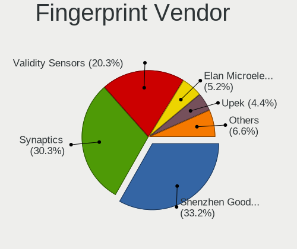

| Vendor                             | Computers | Percent |
|------------------------------------|-----------|---------|
| Shenzhen Goodix Technology         | 90        | 33.21%  |
| Synaptics                          | 82        | 30.26%  |
| Validity Sensors                   | 55        | 20.3%   |
| Elan Microelectronics              | 14        | 5.17%   |
| Upek                               | 12        | 4.43%   |
| AuthenTec                          | 6         | 2.21%   |
| Focal-systems.Corp                 | 4         | 1.48%   |
| LighTuning Technology              | 3         | 1.11%   |
| STMicroelectronics                 | 2         | 0.74%   |
| FocalTech                          | 2         | 0.74%   |
| Realtek USB2.0 Finger Print Bridge | 1         | 0.37%   |

Fingerprint Model
-----------------

Fingerprint sensor models

| Model                                                                      | Computers | Percent |
|----------------------------------------------------------------------------|-----------|---------|
| Shenzhen Goodix  Fingerprint Device                                        | 60        | 22.14%  |
| Synaptics Prometheus MIS Touch Fingerprint Reader                          | 33        | 12.18%  |
| Shenzhen Goodix Fingerprint Reader                                         | 27        | 9.96%   |
| Validity Sensors VFS5011 Fingerprint Reader                                | 15        | 5.54%   |
| Elan ELAN:Fingerprint                                                      | 12        | 4.43%   |
| Upek Biometric Touchchip/Touchstrip Fingerprint Sensor                     | 11        | 4.06%   |
| Validity Sensors VFS 5011 fingerprint sensor                               | 8         | 2.95%   |
| Validity Sensors Synaptics VFS7552 Touch Fingerprint Sensor with PurePrint | 8         | 2.95%   |
| Synaptics  FS7604 Touch Fingerprint Sensor with PurePrint                  | 8         | 2.95%   |
| Synaptics FS7604 Touch Fingerprint Sensor with PurePrint                   | 8         | 2.95%   |
| Synaptics Metallica MIS Touch Fingerprint Reader                           | 7         | 2.58%   |
| Validity Sensors Synaptics WBDI                                            | 6         | 2.21%   |
| Validity Sensors VFS7500 Touch Fingerprint Sensor                          | 5         | 1.85%   |
| Synaptics WBDI Device                                                      | 5         | 1.85%   |
| Validity Sensors VFS491                                                    | 4         | 1.48%   |
| Synaptics WBDI                                                             | 4         | 1.48%   |
| Synaptics UWP WBDI Device                                                  | 4         | 1.48%   |
| Synaptics Prometheus Fingerprint Reader                                    | 4         | 1.48%   |
| Synaptics Fingerprint reader [HP G6]                                       | 4         | 1.48%   |
| Focal-systems.Corp FT9201Fingerprint.                                  | 4         | 1.48%   |
| AuthenTec AES2810                                                          | 4         | 1.48%   |
| Validity Sensors VFS495 Fingerprint Reader                                 | 3         | 1.11%   |
| Validity Sensors VFS471 Fingerprint Reader                                 | 3         | 1.11%   |
| Synaptics UWP WBDI                                                         | 3         | 1.11%   |
| Shenzhen Goodix FingerPrint                                                | 3         | 1.11%   |
| STMicroelectronics Fingerprint Reader                                      | 2         | 0.74%   |
| Elan ELAN:ARM-M4                                                           | 2         | 0.74%   |
| Unknown                                                                    | 2         | 0.74%   |
| Validity Sensors VFS7552 Touch Fingerprint Sensor                          | 1         | 0.37%   |
| Validity Sensors VFS Fingerprint sensor                                    | 1         | 0.37%   |
| Validity Sensors Fingerprint scanner                                       | 1         | 0.37%   |
| Upek TCS5B Fingerprint sensor                                              | 1         | 0.37%   |
| Realtek USB2.0 Finger Print Bridge FocalTech Fingerprint Device            | 1         | 0.37%   |
| LighTuning Fingerprint Sensor                                              | 1         | 0.37%   |
| LighTuning ES603 Swipe Fingerprint Sensor                                  | 1         | 0.37%   |
| LighTuning EgisTec Touch Fingerprint Sensor                                | 1         | 0.37%   |
| FocalTech FocalTech Fingerprint Device                                     | 1         | 0.37%   |
| FocalTech Fingerprint Device                                               | 1         | 0.37%   |
| AuthenTec Fingerprint Sensor                                               | 1         | 0.37%   |
| AuthenTec AES2550 Fingerprint Sensor                                       | 1         | 0.37%   |

Chipcard Vendor
---------------

Chipcard module vendors

| Vendor                | Computers | Percent |
|-----------------------|-----------|---------|
| Broadcom              | 15        | 57.69%  |
| Upek                  | 4         | 15.38%  |
| Alcor Micro           | 3         | 11.54%  |
| Clay Logic            | 2         | 7.69%   |
| Yubico.com            | 1         | 3.85%   |
| Advanced Card Systems | 1         | 3.85%   |

Chipcard Model
--------------

Chipcard module models

| Model                                                                        | Computers | Percent |
|------------------------------------------------------------------------------|-----------|---------|
| Broadcom 5880                                                                | 6         | 23.08%  |
| Upek TouchChip Fingerprint Coprocessor (WBF advanced mode)                   | 4         | 15.38%  |
| Broadcom BCM5880 Secure Applications Processor with fingerprint swipe sensor | 3         | 11.54%  |
| Broadcom BCM5880 Secure Applications Processor                               | 3         | 11.54%  |
| Broadcom 58200                                                               | 3         | 11.54%  |
| Alcor Micro AU9540 Smartcard Reader                                          | 3         | 11.54%  |
| Clay Logic CanoKey Pigeon                                                    | 2         | 7.69%   |
| Yubico.com Yubikey 4/5 U2F+CCID                                              | 1         | 3.85%   |
| Advanced Card Systems ACR1581                                                | 1         | 3.85%   |

Unsupported
-----------

Unsupported Devices
-------------------

Total unsupported devices on board

| Total | Computers | Percent |
|-------|-----------|---------|
| 0     | 1279      | 61.7%   |
| 1     | 557       | 26.87%  |
| 2     | 164       | 7.91%   |
| 3     | 38        | 1.83%   |
| 4     | 22        | 1.06%   |
| 5     | 5         | 0.24%   |
| 6     | 3         | 0.14%   |
| 8     | 2         | 0.1%    |
| 7     | 2         | 0.1%    |
| 10    | 1         | 0.05%   |

Unsupported Device Types
------------------------

Types of unsupported devices

| Type                     | Computers | Percent |
|--------------------------|-----------|---------|
| Graphics card            | 306       | 28.49%  |
| Fingerprint reader       | 266       | 24.77%  |
| Net/wireless             | 114       | 10.61%  |
| Communication controller | 74        | 6.89%   |
| Multimedia controller    | 68        | 6.33%   |
| Sound                    | 56        | 5.21%   |
| Unassigned class         | 52        | 4.84%   |
| Camera                   | 31        | 2.89%   |
| Bluetooth                | 31        | 2.89%   |
| Net/ethernet             | 21        | 1.96%   |
| Chipcard                 | 21        | 1.96%   |
| Network                  | 10        | 0.93%   |
| Storage/raid             | 7         | 0.65%   |
| Storage                  | 5         | 0.47%   |
| Card reader              | 5         | 0.47%   |
| Storage/nvme             | 2         | 0.19%   |
| Storage/ata              | 2         | 0.19%   |
| Wireless                 | 1         | 0.09%   |
| Modem                    | 1         | 0.09%   |
| Dvb card                 | 1         | 0.09%   |

