Linux in China - Tested Hardware & Statistics (Desktops)
--------------------------------------------------------

A project to collect tested hardware configurations for Linux in China.

Anyone can contribute to this report by the [hw-probe](https://github.com/linuxhw/hw-probe) tool:

    sudo -E hw-probe -all -upload

Please contribute! Especially if your hardware is rare.

Contents
--------

* [ Test Cases ](#test-cases)

* [ System ](#system)
  - [ OS                       ](#os)
  - [ OS Family                ](#os-family)
  - [ Kernel                   ](#kernel)
  - [ Kernel Family            ](#kernel-family)
  - [ Kernel Major Ver.        ](#kernel-major-ver)
  - [ Arch                     ](#arch)
  - [ DE                       ](#de)
  - [ Display Server           ](#display-server)
  - [ Display Manager          ](#display-manager)
  - [ OS Lang                  ](#os-lang)
  - [ Boot Mode                ](#boot-mode)
  - [ Filesystem               ](#filesystem)
  - [ Part. scheme             ](#part-scheme)
  - [ Dual Boot with Linux/BSD ](#dual-boot-with-linuxbsd)
  - [ Dual Boot (Win)          ](#dual-boot-win)

* [ Board ](#board)
  - [ Vendor                   ](#vendor)
  - [ Model                    ](#model)
  - [ Model Family             ](#model-family)
  - [ MFG Year                 ](#mfg-year)
  - [ Form Factor              ](#form-factor)
  - [ Secure Boot              ](#secure-boot)
  - [ Coreboot                 ](#coreboot)
  - [ RAM Size                 ](#ram-size)
  - [ RAM Used                 ](#ram-used)
  - [ Total Drives             ](#total-drives)
  - [ Has CD-ROM               ](#has-cd-rom)
  - [ Has Ethernet             ](#has-ethernet)
  - [ Has WiFi                 ](#has-wifi)
  - [ Has Bluetooth            ](#has-bluetooth)

* [ Location ](#location)
  - [ Country                  ](#country)
  - [ City                     ](#city)

* [ Drives ](#drives)
  - [ Drive Vendor             ](#drive-vendor)
  - [ Drive Model              ](#drive-model)
  - [ HDD Vendor               ](#hdd-vendor)
  - [ SSD Vendor               ](#ssd-vendor)
  - [ Drive Kind               ](#drive-kind)
  - [ Drive Connector          ](#drive-connector)
  - [ Drive Size               ](#drive-size)
  - [ Space Total              ](#space-total)
  - [ Space Used               ](#space-used)
  - [ Malfunc. Drives          ](#malfunc-drives)
  - [ Malfunc. Drive Vendor    ](#malfunc-drive-vendor)
  - [ Malfunc. HDD Vendor      ](#malfunc-hdd-vendor)
  - [ Malfunc. Drive Kind      ](#malfunc-drive-kind)
  - [ Failed Drives            ](#failed-drives)
  - [ Failed Drive Vendor      ](#failed-drive-vendor)
  - [ Drive Status             ](#drive-status)

* [ Storage controller ](#storage-controller)
  - [ Storage Vendor           ](#storage-vendor)
  - [ Storage Model            ](#storage-model)
  - [ Storage Kind             ](#storage-kind)

* [ Processor ](#processor)
  - [ CPU Vendor               ](#cpu-vendor)
  - [ CPU Model                ](#cpu-model)
  - [ CPU Model Family         ](#cpu-model-family)
  - [ CPU Cores                ](#cpu-cores)
  - [ CPU Sockets              ](#cpu-sockets)
  - [ CPU Threads              ](#cpu-threads)
  - [ CPU Op-Modes             ](#cpu-op-modes)
  - [ CPU Microcode            ](#cpu-microcode)
  - [ CPU Microarch            ](#cpu-microarch)

* [ Graphics ](#graphics)
  - [ GPU Vendor               ](#gpu-vendor)
  - [ GPU Model                ](#gpu-model)
  - [ GPU Combo                ](#gpu-combo)
  - [ GPU Driver               ](#gpu-driver)
  - [ GPU Memory               ](#gpu-memory)

* [ Monitor ](#monitor)
  - [ Monitor Vendor           ](#monitor-vendor)
  - [ Monitor Model            ](#monitor-model)
  - [ Monitor Resolution       ](#monitor-resolution)
  - [ Monitor Diagonal         ](#monitor-diagonal)
  - [ Monitor Width            ](#monitor-width)
  - [ Aspect Ratio             ](#aspect-ratio)
  - [ Monitor Area             ](#monitor-area)
  - [ Pixel Density            ](#pixel-density)
  - [ Multiple Monitors        ](#multiple-monitors)

* [ Network ](#network)
  - [ Net Controller Vendor    ](#net-controller-vendor)
  - [ Net Controller Model     ](#net-controller-model)
  - [ Wireless Vendor          ](#wireless-vendor)
  - [ Wireless Model           ](#wireless-model)
  - [ Ethernet Vendor          ](#ethernet-vendor)
  - [ Ethernet Model           ](#ethernet-model)
  - [ Net Controller Kind      ](#net-controller-kind)
  - [ Used Controller          ](#used-controller)
  - [ NICs                     ](#nics)
  - [ IPv6                     ](#ipv6)

* [ Bluetooth ](#bluetooth)
  - [ Bluetooth Vendor         ](#bluetooth-vendor)
  - [ Bluetooth Model          ](#bluetooth-model)

* [ Sound ](#sound)
  - [ Sound Vendor             ](#sound-vendor)
  - [ Sound Model              ](#sound-model)

* [ Memory ](#memory)
  - [ Memory Vendor            ](#memory-vendor)
  - [ Memory Model             ](#memory-model)
  - [ Memory Kind              ](#memory-kind)
  - [ Memory Form Factor       ](#memory-form-factor)
  - [ Memory Size              ](#memory-size)
  - [ Memory Speed             ](#memory-speed)

* [ Printers & scanners ](#printers--scanners)
  - [ Printer Vendor           ](#printer-vendor)
  - [ Printer Model            ](#printer-model)
  - [ Scanner Vendor           ](#scanner-vendor)
  - [ Scanner Model            ](#scanner-model)

* [ Camera ](#camera)
  - [ Camera Vendor            ](#camera-vendor)
  - [ Camera Model             ](#camera-model)

* [ Security ](#security)
  - [ Fingerprint Vendor       ](#fingerprint-vendor)
  - [ Fingerprint Model        ](#fingerprint-model)
  - [ Chipcard Vendor          ](#chipcard-vendor)
  - [ Chipcard Model           ](#chipcard-model)

* [ Unsupported ](#unsupported)
  - [ Unsupported Devices      ](#unsupported-devices)
  - [ Unsupported Device Types ](#unsupported-device-types)

Test Cases
----------

Total: 1241

| Vendor        | Model                       | Probe                                                      | Date         |
|---------------|-----------------------------|------------------------------------------------------------|--------------|
| ASRock        | H670M-ITX/ax                | [0c303027f1](https://linux-hardware.org/?probe=0c303027f1) | Jan 03, 2026 |
| HP            | 806A                        | [aa66f48837](https://linux-hardware.org/?probe=aa66f48837) | Jan 01, 2026 |
| ASUSTek       | X870 AYW GAMING WIFI W      | [23c665b5c0](https://linux-hardware.org/?probe=23c665b5c0) | Dec 30, 2025 |
| ASUSTek       | X870 AYW GAMING WIFI W      | [8b33491860](https://linux-hardware.org/?probe=8b33491860) | Dec 30, 2025 |
| ASUSTek       | X870 AYW GAMING WIFI W      | [5bed698159](https://linux-hardware.org/?probe=5bed698159) | Dec 30, 2025 |
| Unknown       | Unknown                     | [cd73ca1ad4](https://linux-hardware.org/?probe=cd73ca1ad4) | Dec 29, 2025 |
| ASUSTek       | X870 AYW GAMING WIFI W      | [c69224dd1b](https://linux-hardware.org/?probe=c69224dd1b) | Dec 29, 2025 |
| KaiTian       | LXCF-ZXE-ZX200-mATX ZZX2... | [ad4e532296](https://linux-hardware.org/?probe=ad4e532296) | Dec 26, 2025 |
| GITSTAR       | GM9-7002 VF                 | [1574f6b134](https://linux-hardware.org/?probe=1574f6b134) | Dec 22, 2025 |
| Haier         | ZEB19 V1.1                  | [439d06b0b4](https://linux-hardware.org/?probe=439d06b0b4) | Dec 21, 2025 |
| MSI           | MAG B550M MORTAR WIFI       | [1dabb6acae](https://linux-hardware.org/?probe=1dabb6acae) | Dec 20, 2025 |
| Loongson      | CTCI02LS3A6000C-K CTCI V... | [9b5fd8e975](https://linux-hardware.org/?probe=9b5fd8e975) | Dec 16, 2025 |
| Lenovo        | MAHOBAY NO DPK              | [6c7262f853](https://linux-hardware.org/?probe=6c7262f853) | Dec 15, 2025 |
| AZW           | LZX TBD                     | [7306b65d94](https://linux-hardware.org/?probe=7306b65d94) | Dec 13, 2025 |
| Lenovo        | 1064 NOK                    | [edea700c18](https://linux-hardware.org/?probe=edea700c18) | Dec 11, 2025 |
| AZW           | LZX TBD                     | [10ba7b03f3](https://linux-hardware.org/?probe=10ba7b03f3) | Dec 11, 2025 |
| Intel         | G41                         | [c5dd939ad7](https://linux-hardware.org/?probe=c5dd939ad7) | Dec 11, 2025 |
| Lenovo        | 3316 NOK                    | [cff96fc34b](https://linux-hardware.org/?probe=cff96fc34b) | Dec 11, 2025 |
| Unknown (1... | MAG B550M MORTAR            | [2678a6e567](https://linux-hardware.org/?probe=2678a6e567) | Dec 09, 2025 |
| Unknown (1... | MAG B550M MORTAR            | [a44bff56ff](https://linux-hardware.org/?probe=a44bff56ff) | Dec 09, 2025 |
| ASUSTek       | TUF Gaming B550M-PLUS WI... | [d4472ce7f5](https://linux-hardware.org/?probe=d4472ce7f5) | Dec 08, 2025 |
| HP            | 158B                        | [12ee930c05](https://linux-hardware.org/?probe=12ee930c05) | Dec 08, 2025 |
| ASUSTek       | PRIME B650M-K               | [cf1fe41c18](https://linux-hardware.org/?probe=cf1fe41c18) | Dec 07, 2025 |
| IP3 Tech      | EA170 TBD                   | [5a4934878f](https://linux-hardware.org/?probe=5a4934878f) | Dec 06, 2025 |
| OEM           | OEM                         | [ee2ca53267](https://linux-hardware.org/?probe=ee2ca53267) | Dec 05, 2025 |
| AZW           | LZX TBD                     | [3663e001c9](https://linux-hardware.org/?probe=3663e001c9) | Dec 03, 2025 |
| Haier         | ZEB19 V1.1                  | [6f8c2fd403](https://linux-hardware.org/?probe=6f8c2fd403) | Dec 02, 2025 |
| HP            | 158B                        | [b410504428](https://linux-hardware.org/?probe=b410504428) | Dec 02, 2025 |
| ASUSTek       | TUF Gaming B650M-PLUS WI... | [0057b3d5e3](https://linux-hardware.org/?probe=0057b3d5e3) | Dec 01, 2025 |
| Gigabyte      | H110M-S2-CF                 | [bb3657a14d](https://linux-hardware.org/?probe=bb3657a14d) | Dec 01, 2025 |
| MSI           | B850MPOWER                  | [96354e444f](https://linux-hardware.org/?probe=96354e444f) | Nov 30, 2025 |
| Loongson      | CTCI02LS3A6000C-K CTCI V... | [bc0d27f083](https://linux-hardware.org/?probe=bc0d27f083) | Nov 29, 2025 |
| AZW           | LZX TBD                     | [f046259f39](https://linux-hardware.org/?probe=f046259f39) | Nov 29, 2025 |
| MSI           | MAG B650M MORTAR            | [d74283ee06](https://linux-hardware.org/?probe=d74283ee06) | Nov 29, 2025 |
| ASUSTek       | ROG CROSSHAIR X870E HERO    | [1921803972](https://linux-hardware.org/?probe=1921803972) | Nov 28, 2025 |
| W             | I1170D00U                   | [e53ac0472d](https://linux-hardware.org/?probe=e53ac0472d) | Nov 27, 2025 |
| W             | I1170D00U                   | [919b7306bf](https://linux-hardware.org/?probe=919b7306bf) | Nov 27, 2025 |
| Unknown       | Unknown                     | [5053f26753](https://linux-hardware.org/?probe=5053f26753) | Nov 20, 2025 |
| Biostar       | B650MP-E PRO                | [5afa4c1ee2](https://linux-hardware.org/?probe=5afa4c1ee2) | Nov 18, 2025 |
| Gigabyte      | H110M-S2-CF                 | [434c20de93](https://linux-hardware.org/?probe=434c20de93) | Nov 14, 2025 |
| Colorful T... | C.N78T Ver1.5               | [0767dd3511](https://linux-hardware.org/?probe=0767dd3511) | Nov 12, 2025 |
| MSI           | MS-B9411                    | [6055d20b1c](https://linux-hardware.org/?probe=6055d20b1c) | Nov 09, 2025 |
| Dell          | 0V1N3D A00                  | [93cfe8695b](https://linux-hardware.org/?probe=93cfe8695b) | Nov 09, 2025 |
| Dell          | 0V1N3D A00                  | [010bcba9db](https://linux-hardware.org/?probe=010bcba9db) | Nov 09, 2025 |
| MAXSUN        | MS-TZZ H81M-V3H M.2         | [faed1ff69e](https://linux-hardware.org/?probe=faed1ff69e) | Nov 08, 2025 |
| TYAN Compu... | S8030GM2NE 5411T6180007     | [84ff05cd41](https://linux-hardware.org/?probe=84ff05cd41) | Nov 08, 2025 |
| MSI           | MAG B650M MORTAR            | [6db9bb306e](https://linux-hardware.org/?probe=6db9bb306e) | Nov 07, 2025 |
| Unknown       | Xunlei OneCloud             | [a4340bde74](https://linux-hardware.org/?probe=a4340bde74) | Nov 05, 2025 |
| Loongson      | CTCI02LS3A6000C-K CTCI V... | [817cc4cdd6](https://linux-hardware.org/?probe=817cc4cdd6) | Nov 02, 2025 |
| Biostar       | B650MP-E PRO                | [fbb21dd100](https://linux-hardware.org/?probe=fbb21dd100) | Oct 31, 2025 |
| MSI           | MAG B650M MORTAR            | [c54acd2fe5](https://linux-hardware.org/?probe=c54acd2fe5) | Oct 29, 2025 |
| Huanan        | X11D-16D V1.0               | [e678133d03](https://linux-hardware.org/?probe=e678133d03) | Oct 28, 2025 |
| MSI           | MAG B760M MORTAR WIFI II    | [55c90e00f3](https://linux-hardware.org/?probe=55c90e00f3) | Oct 28, 2025 |
| ASUSTek       | ROG STRIX B860-I GAMING ... | [17c1298d03](https://linux-hardware.org/?probe=17c1298d03) | Oct 27, 2025 |
| ASUSTek       | TUF Gaming B450M-PRO S      | [919de6b9e2](https://linux-hardware.org/?probe=919de6b9e2) | Oct 27, 2025 |
| ASUSTek       | TUF B450M-PRO GAMING        | [b712dece4b](https://linux-hardware.org/?probe=b712dece4b) | Oct 17, 2025 |
| ASUSTek       | PRIME H410M-K               | [dd42c54c62](https://linux-hardware.org/?probe=dd42c54c62) | Oct 17, 2025 |
| Unknown       | Unknown                     | [ad7ef3d8ff](https://linux-hardware.org/?probe=ad7ef3d8ff) | Oct 16, 2025 |
| Loongson      | LS3A6000-7A2000-1w-V0.1-... | [8d642f41ea](https://linux-hardware.org/?probe=8d642f41ea) | Oct 15, 2025 |
| MSI           | X399 SLI PLUS               | [2967bb728e](https://linux-hardware.org/?probe=2967bb728e) | Oct 08, 2025 |
| Lenovo        | 1064 NOK                    | [d5e6aff45d](https://linux-hardware.org/?probe=d5e6aff45d) | Sep 30, 2025 |
| ASUSTek       | M5A78L-M LX3 PLUS           | [08ae6003a8](https://linux-hardware.org/?probe=08ae6003a8) | Sep 26, 2025 |
| ASUSTek       | TUF B450M-PRO GAMING        | [a8db5b7aab](https://linux-hardware.org/?probe=a8db5b7aab) | Sep 21, 2025 |
| Dell          | 018D1Y A00                  | [2938dd1233](https://linux-hardware.org/?probe=2938dd1233) | Sep 20, 2025 |
| Loongson      | 3A6000-7A2000-1w-EVB-V1.... | [724dab935c](https://linux-hardware.org/?probe=724dab935c) | Sep 17, 2025 |
| Lenovo        | 3176 NOK                    | [ff5e993fcc](https://linux-hardware.org/?probe=ff5e993fcc) | Sep 14, 2025 |
| Loongson      | 3A6000-HV-7A2000-1w-EVB-... | [be0853c561](https://linux-hardware.org/?probe=be0853c561) | Sep 11, 2025 |
| SYWZ          | S200 Series                 | [4601bda16f](https://linux-hardware.org/?probe=4601bda16f) | Sep 11, 2025 |
| Loongson      | CTCI02LS3A6000C-K CTCI V... | [2eb94ec489](https://linux-hardware.org/?probe=2eb94ec489) | Sep 11, 2025 |
| Loongson      | 3A6000-HV-7A2000-NUC QA6... | [d5c0475497](https://linux-hardware.org/?probe=d5c0475497) | Sep 11, 2025 |
| Gigabyte      | F2A88XM-D3H                 | [9bd362657c](https://linux-hardware.org/?probe=9bd362657c) | Sep 09, 2025 |
| Gigabyte      | X570 UD                     | [50070073a9](https://linux-hardware.org/?probe=50070073a9) | Sep 09, 2025 |
| ASUSTek       | H81M-E R2.0                 | [bf319caf3c](https://linux-hardware.org/?probe=bf319caf3c) | Sep 06, 2025 |
| ASUSTek       | Pro WS C621-64L SAGE Ser... | [9072a1a520](https://linux-hardware.org/?probe=9072a1a520) | Sep 06, 2025 |
| Biostar       | B650MP-E PRO                | [2d8b7b50c0](https://linux-hardware.org/?probe=2d8b7b50c0) | Sep 06, 2025 |
| ASUSTek       | Maximus VII IMPACT          | [32bebb124a](https://linux-hardware.org/?probe=32bebb124a) | Sep 04, 2025 |
| ASUSTek       | Maximus VII IMPACT          | [3b7db4a17f](https://linux-hardware.org/?probe=3b7db4a17f) | Sep 04, 2025 |
| MAXSUN        | MS-Terminator B860M         | [eb6b2fd9b3](https://linux-hardware.org/?probe=eb6b2fd9b3) | Sep 04, 2025 |
| Loongson      | 3A6000-HV-7A2000-NUC QA6... | [66229111f4](https://linux-hardware.org/?probe=66229111f4) | Sep 01, 2025 |
| Gigabyte      | H410M H V2                  | [1bc206cbd3](https://linux-hardware.org/?probe=1bc206cbd3) | Aug 20, 2025 |
| Intel         | X99H                        | [718d01fd9a](https://linux-hardware.org/?probe=718d01fd9a) | Aug 16, 2025 |
| MSI           | B850 GAMING PLUS WIFI       | [ef5a228a00](https://linux-hardware.org/?probe=ef5a228a00) | Aug 11, 2025 |
| Loongson      | LS3A5000-7A1000-1w-EVB-V... | [2a8085f13e](https://linux-hardware.org/?probe=2a8085f13e) | Aug 11, 2025 |
| Gigabyte      | AB350M-D3H-CF               | [7f140deae1](https://linux-hardware.org/?probe=7f140deae1) | Aug 08, 2025 |
| HUAWEI        | PUL-WDX9-PCB-B1 M1040       | [de5218c0da](https://linux-hardware.org/?probe=de5218c0da) | Aug 07, 2025 |
| Gigabyte      | B85-HD3                     | [63f6a85f8b](https://linux-hardware.org/?probe=63f6a85f8b) | Aug 07, 2025 |
| Dell          | 0WPMFG A00                  | [e5526fc969](https://linux-hardware.org/?probe=e5526fc969) | Aug 03, 2025 |
| ASUSTek       | B760M-AYW WIFI D4           | [c78829e688](https://linux-hardware.org/?probe=c78829e688) | Aug 03, 2025 |
| MSI           | MAG B550 TOMAHAWK           | [67a77ca1c4](https://linux-hardware.org/?probe=67a77ca1c4) | Jul 21, 2025 |
| Loongson      | CTCI02LS3A6000C-K CTCI V... | [e6cbb1132b](https://linux-hardware.org/?probe=e6cbb1132b) | Jul 19, 2025 |
| Biostar       | B850MT-E PRO                | [ef09cde865](https://linux-hardware.org/?probe=ef09cde865) | Jul 17, 2025 |
| Loongson      | CTCI02LS3A6000C-K CTCI V... | [d82453e97f](https://linux-hardware.org/?probe=d82453e97f) | Jul 17, 2025 |
| Unknown       | Unknown                     | [6cb9f76eba](https://linux-hardware.org/?probe=6cb9f76eba) | Jul 07, 2025 |
| Huanan        | X99-TF GAMING V3.0          | [88bbee0f82](https://linux-hardware.org/?probe=88bbee0f82) | Jul 07, 2025 |
| Intel         | X79                         | [7b61c4a7d4](https://linux-hardware.org/?probe=7b61c4a7d4) | Jul 07, 2025 |
| Unknown       | JDNMB190                    | [184953a3b5](https://linux-hardware.org/?probe=184953a3b5) | Jul 05, 2025 |
| ASUSTek       | E3 PRO GAMING V5            | [af7cba84bc](https://linux-hardware.org/?probe=af7cba84bc) | Jul 02, 2025 |
| Unknown       | Unknown                     | [a3d67294b5](https://linux-hardware.org/?probe=a3d67294b5) | Jul 01, 2025 |
| Loongson      | 3A6000-HV-7A2000-NUC QA6... | [2c69ad37f1](https://linux-hardware.org/?probe=2c69ad37f1) | Jun 30, 2025 |
| Gigabyte      | Z890 GAMING X WIFI7         | [0cf4c77b82](https://linux-hardware.org/?probe=0cf4c77b82) | Jun 19, 2025 |
| MSI           | MPG B550 GAMING CARBON W... | [9ff67808de](https://linux-hardware.org/?probe=9ff67808de) | Jun 13, 2025 |
| Unknown       | AX6H                        | [10bce3c431](https://linux-hardware.org/?probe=10bce3c431) | Jun 06, 2025 |
| GMKtec        | NucBox K6                   | [af28fb6007](https://linux-hardware.org/?probe=af28fb6007) | Jun 06, 2025 |
| Unknown       | AX6H                        | [977be96589](https://linux-hardware.org/?probe=977be96589) | Jun 06, 2025 |
| ADLINK Tec... | IMB-M47                     | [620354dc91](https://linux-hardware.org/?probe=620354dc91) | Jun 05, 2025 |
| ADLINK Tec... | IMB-M47                     | [b954d9a609](https://linux-hardware.org/?probe=b954d9a609) | Jun 05, 2025 |
| Gigabyte      | GA-880GA-UD3H               | [20ba746255](https://linux-hardware.org/?probe=20ba746255) | May 30, 2025 |
| ASUSTek       | G15DK                       | [f1d6fce63b](https://linux-hardware.org/?probe=f1d6fce63b) | May 30, 2025 |
| ASUSTek       | P8H61-M LX3 PLUS R2.0       | [b58856fee5](https://linux-hardware.org/?probe=b58856fee5) | May 29, 2025 |
| Unknown       | Unknown                     | [c8a3e63d5b](https://linux-hardware.org/?probe=c8a3e63d5b) | May 28, 2025 |
| Loongson      | CTCI02LS3A6000C-K CTCI V... | [5d4050e2d4](https://linux-hardware.org/?probe=5d4050e2d4) | May 25, 2025 |
| Dell          | 0NK5PH A00                  | [9ec8471c29](https://linux-hardware.org/?probe=9ec8471c29) | May 22, 2025 |
| TYAN Compu... | S8030GM2NE 5411T6180007     | [fc9ee7f3d1](https://linux-hardware.org/?probe=fc9ee7f3d1) | May 19, 2025 |
| Shenzhen M... | AHBTB                       | [ba486fb81d](https://linux-hardware.org/?probe=ba486fb81d) | May 19, 2025 |
| AOC           | ARB20X BIOS-A110            | [13767ea9b2](https://linux-hardware.org/?probe=13767ea9b2) | May 18, 2025 |
| AOC           | ARB20X BIOS-A110            | [6417043658](https://linux-hardware.org/?probe=6417043658) | May 18, 2025 |
| Unknown       | Unknown                     | [c7046cd58a](https://linux-hardware.org/?probe=c7046cd58a) | May 15, 2025 |
| MSI           | Z87M GAMING                 | [f43957fc3c](https://linux-hardware.org/?probe=f43957fc3c) | May 13, 2025 |
| Loongson      | 3A6000-HV-7A2000-NUC QA6... | [2f11deddf9](https://linux-hardware.org/?probe=2f11deddf9) | May 12, 2025 |
| Dell          | 0X75JG A01                  | [f635b0b683](https://linux-hardware.org/?probe=f635b0b683) | May 10, 2025 |
| Gigabyte      | B85M-D2V Plus-SI            | [f8a1fe0a98](https://linux-hardware.org/?probe=f8a1fe0a98) | May 08, 2025 |
| Gigabyte      | B85M-D2V Plus-SI            | [18d577e8cb](https://linux-hardware.org/?probe=18d577e8cb) | May 07, 2025 |
| HP            | 83E2                        | [45ae65d295](https://linux-hardware.org/?probe=45ae65d295) | May 06, 2025 |
| Loongson      | 3A6000-HV-7A2000-NUC QA6... | [770f36936a](https://linux-hardware.org/?probe=770f36936a) | May 03, 2025 |
| Colorful T... | C.H81M PRO V23A             | [7d2e66a074](https://linux-hardware.org/?probe=7d2e66a074) | May 03, 2025 |
| Loongson      | CTCI02LS3A6000C-K CTCI V... | [77439aad64](https://linux-hardware.org/?probe=77439aad64) | May 01, 2025 |
| Loongson      | 3A6000-HV-7A2000-NUC QA6... | [131f712b47](https://linux-hardware.org/?probe=131f712b47) | May 01, 2025 |
| Haier DT C... | BSW-P1                      | [21a26e8d07](https://linux-hardware.org/?probe=21a26e8d07) | Apr 30, 2025 |
| Ruijie        | 80062000 TBD                | [3ace7ef95a](https://linux-hardware.org/?probe=3ace7ef95a) | Apr 30, 2025 |
| Gigabyte      | X870 AORUS ELITE WIFI7      | [f4b7b4aa86](https://linux-hardware.org/?probe=f4b7b4aa86) | Apr 26, 2025 |
| Loongson      | 3A6000-HV-7A2000-NUC QA6... | [d501133692](https://linux-hardware.org/?probe=d501133692) | Apr 22, 2025 |
| Gigabyte      | GA-G41M-ES2L                | [2273369351](https://linux-hardware.org/?probe=2273369351) | Apr 20, 2025 |
| Gigabyte      | Z790 D DDR4                 | [9750b390df](https://linux-hardware.org/?probe=9750b390df) | Apr 19, 2025 |
| Gigabyte      | Z790 D DDR4                 | [7033d9ecfb](https://linux-hardware.org/?probe=7033d9ecfb) | Apr 18, 2025 |
| ASUSTek       | P8H61-M LX3 PLUS R2.0       | [1122e7eda4](https://linux-hardware.org/?probe=1122e7eda4) | Apr 18, 2025 |
| Gigabyte      | F2A88XM-D3H                 | [858eea93e9](https://linux-hardware.org/?probe=858eea93e9) | Apr 18, 2025 |
| Shenzhen M... | AHBTB                       | [9caa270f3c](https://linux-hardware.org/?probe=9caa270f3c) | Apr 17, 2025 |
| ASUSTek       | PRIME Z490-P                | [d9aed08a2b](https://linux-hardware.org/?probe=d9aed08a2b) | Apr 17, 2025 |
| Intel         | EY-MoDT SKYLINE ITX D5 E... | [498bc8fac7](https://linux-hardware.org/?probe=498bc8fac7) | Apr 17, 2025 |
| MAXSUN        | MS-Terminator Z790M D5 V... | [89272c1692](https://linux-hardware.org/?probe=89272c1692) | Apr 17, 2025 |
| Intel         | EY-MoDT SKYLINE ITX D5 E... | [4cb6d92fde](https://linux-hardware.org/?probe=4cb6d92fde) | Apr 17, 2025 |
| AZW           | LZX TBD                     | [57a8b44750](https://linux-hardware.org/?probe=57a8b44750) | Apr 16, 2025 |
| AZW           | LZX TBD                     | [425cdd41a7](https://linux-hardware.org/?probe=425cdd41a7) | Apr 16, 2025 |
| Lenovo        | SHARKBAY NOK                | [ed508838a7](https://linux-hardware.org/?probe=ed508838a7) | Apr 15, 2025 |
| Haier DT C... | BSW-P1                      | [0b1c3c2df9](https://linux-hardware.org/?probe=0b1c3c2df9) | Apr 14, 2025 |
| Haier DT C... | BSW-P1                      | [c8fb849105](https://linux-hardware.org/?probe=c8fb849105) | Apr 14, 2025 |
| IP3 Tech      | EA170 TBD                   | [702764cbd0](https://linux-hardware.org/?probe=702764cbd0) | Apr 14, 2025 |
| Unknown       | Unknown                     | [b97d97211d](https://linux-hardware.org/?probe=b97d97211d) | Apr 14, 2025 |
| Gigabyte      | H77M-D3H                    | [5e8f4685ff](https://linux-hardware.org/?probe=5e8f4685ff) | Apr 12, 2025 |
| ASUSTek       | B85M-G                      | [161d40a39b](https://linux-hardware.org/?probe=161d40a39b) | Apr 11, 2025 |
| Ruijie        | 80062000 TBD                | [9154268215](https://linux-hardware.org/?probe=9154268215) | Apr 10, 2025 |
| ASUSTek       | PRIME H610M-A D4            | [aff80b8726](https://linux-hardware.org/?probe=aff80b8726) | Apr 10, 2025 |
| ASUSTek       | PRIME H610M-A D4            | [449998e76a](https://linux-hardware.org/?probe=449998e76a) | Apr 09, 2025 |
| Shenzhen M... | AHBTB                       | [55a21abbc2](https://linux-hardware.org/?probe=55a21abbc2) | Apr 09, 2025 |
| Loongson      | 3A6000-HV-7A2000-1w-EVB-... | [294440b7e0](https://linux-hardware.org/?probe=294440b7e0) | Apr 08, 2025 |
| Gigabyte      | Z390 M GAMING-CF            | [77464924ba](https://linux-hardware.org/?probe=77464924ba) | Apr 07, 2025 |
| Loongson      | 3A6000-HV-7A2000-NUC QA6... | [0fdf74d3c6](https://linux-hardware.org/?probe=0fdf74d3c6) | Apr 07, 2025 |
| IP3 Tech      | EA170 TBD                   | [4c48752626](https://linux-hardware.org/?probe=4c48752626) | Apr 07, 2025 |
| ASUSTek       | X870 AYW GAMING WIFI W      | [829a105604](https://linux-hardware.org/?probe=829a105604) | Apr 04, 2025 |
| Unknown       | Unknown                     | [2602e6ce07](https://linux-hardware.org/?probe=2602e6ce07) | Apr 04, 2025 |
| ASUSTek       | TUF Gaming B450M-PRO S      | [72f087509f](https://linux-hardware.org/?probe=72f087509f) | Apr 03, 2025 |
| Intel         | SHARKBAY                    | [4b6c1f8c59](https://linux-hardware.org/?probe=4b6c1f8c59) | Apr 01, 2025 |
| IP3 Tech      | EA170 TBD                   | [a1f0eccc71](https://linux-hardware.org/?probe=a1f0eccc71) | Mar 30, 2025 |
| ASUSTek       | TUF Gaming X570-PLUS        | [e101877f97](https://linux-hardware.org/?probe=e101877f97) | Mar 29, 2025 |
| Intel         | X99H                        | [069141a32c](https://linux-hardware.org/?probe=069141a32c) | Mar 29, 2025 |
| Unknown       | Unknown                     | [3add63447c](https://linux-hardware.org/?probe=3add63447c) | Mar 28, 2025 |
| Gigabyte      | X570S AORUS MASTER          | [8e57fa9422](https://linux-hardware.org/?probe=8e57fa9422) | Mar 28, 2025 |
| Gigabyte      | X570S AORUS MASTER          | [56a09ee633](https://linux-hardware.org/?probe=56a09ee633) | Mar 28, 2025 |
| GITSTAR       | GM9-2003 VB                 | [db64a1e594](https://linux-hardware.org/?probe=db64a1e594) | Mar 26, 2025 |
| Lenovo        | 313A NOK                    | [1271b1c4b4](https://linux-hardware.org/?probe=1271b1c4b4) | Mar 25, 2025 |
| Lenovo        | 313A NOK                    | [d9f03744bd](https://linux-hardware.org/?probe=d9f03744bd) | Mar 25, 2025 |
| Ruijie        | 80062000 TBD                | [e9df4d3bcd](https://linux-hardware.org/?probe=e9df4d3bcd) | Mar 24, 2025 |
| Ruijie        | 80062000 TBD                | [edabc25462](https://linux-hardware.org/?probe=edabc25462) | Mar 23, 2025 |
| HC Technol... | AX6H2                       | [8869a2542c](https://linux-hardware.org/?probe=8869a2542c) | Mar 19, 2025 |
| Gigabyte      | B760M D2H DDR4              | [3908d96e62](https://linux-hardware.org/?probe=3908d96e62) | Mar 19, 2025 |
| HC Technol... | AX6H2                       | [7435469552](https://linux-hardware.org/?probe=7435469552) | Mar 19, 2025 |
| Loongson      | 3A6000-HV-7A2000-1w-EVB-... | [26a1220f52](https://linux-hardware.org/?probe=26a1220f52) | Mar 18, 2025 |
| Loongson      | CTCI02LS3A6000C-K CTCI V... | [ac8d5cc16b](https://linux-hardware.org/?probe=ac8d5cc16b) | Mar 18, 2025 |
| Shenzhen M... | AHBTB                       | [beed833ab2](https://linux-hardware.org/?probe=beed833ab2) | Mar 17, 2025 |
| HEDY          | N100                        | [72aac08355](https://linux-hardware.org/?probe=72aac08355) | Mar 17, 2025 |
| HEDY          | N100                        | [d1773ccd5f](https://linux-hardware.org/?probe=d1773ccd5f) | Mar 16, 2025 |
| Huanan        | X99-F8D PLUS V1.32          | [24d0110fb3](https://linux-hardware.org/?probe=24d0110fb3) | Mar 16, 2025 |
| Loongson      | 3A6000-HV-7A2000-NUC QA6... | [3b8f3ad3ad](https://linux-hardware.org/?probe=3b8f3ad3ad) | Mar 15, 2025 |
| Unknown       | cms7018                     | [bef5b4ac35](https://linux-hardware.org/?probe=bef5b4ac35) | Mar 15, 2025 |
| Unknown       | Unknown                     | [862c4b1b43](https://linux-hardware.org/?probe=862c4b1b43) | Mar 15, 2025 |
| Gigabyte      | F2A88XM-HD3                 | [d5e2860c6e](https://linux-hardware.org/?probe=d5e2860c6e) | Mar 15, 2025 |
| Loongson      | 3A6000-HV-7A2000-1w-EVB-... | [826c803d6f](https://linux-hardware.org/?probe=826c803d6f) | Mar 14, 2025 |
| Loongson      | CTCI02LS3A6000C-K CTCI V... | [62ddfd06b8](https://linux-hardware.org/?probe=62ddfd06b8) | Mar 13, 2025 |
| Intel         | X99E V1.0                   | [765a871e7a](https://linux-hardware.org/?probe=765a871e7a) | Mar 12, 2025 |
| HP            | 82A1                        | [35598f1ad5](https://linux-hardware.org/?probe=35598f1ad5) | Mar 10, 2025 |
| HP            | 8AC1                        | [65eb26d455](https://linux-hardware.org/?probe=65eb26d455) | Mar 04, 2025 |
| Gigabyte      | F2A85XM-DS2                 | [fc2c9e5206](https://linux-hardware.org/?probe=fc2c9e5206) | Mar 02, 2025 |
| Gigabyte      | B650M AORUS PRO AX          | [873175925f](https://linux-hardware.org/?probe=873175925f) | Feb 28, 2025 |
| Loongson      | CTCI02LS3A6000C-K CTCI V... | [178bac024d](https://linux-hardware.org/?probe=178bac024d) | Feb 28, 2025 |
| ASUSTek       | TUF Gaming B660M-PLUS WI... | [b9cc0ed630](https://linux-hardware.org/?probe=b9cc0ed630) | Feb 26, 2025 |
| Loongson      | 3A6000-7A2000-1w-EVB-V1.... | [fe4973e14e](https://linux-hardware.org/?probe=fe4973e14e) | Feb 23, 2025 |
| Loongson      | 3A6000-7A2000-1w-EVB-V1.... | [ea6e0fc07c](https://linux-hardware.org/?probe=ea6e0fc07c) | Feb 23, 2025 |
| Lenovo        | MAHOBAY NOK                 | [d4d2015817](https://linux-hardware.org/?probe=d4d2015817) | Feb 21, 2025 |
| Lenovo        | MAHOBAY NOK                 | [8605e23b7e](https://linux-hardware.org/?probe=8605e23b7e) | Feb 20, 2025 |
| MSI           | X99A SLI PLUS               | [0395d5cc12](https://linux-hardware.org/?probe=0395d5cc12) | Feb 19, 2025 |
| Loongson      | 3A6000-HV-7A2000-1w-V0.1... | [345f7f4cbb](https://linux-hardware.org/?probe=345f7f4cbb) | Feb 19, 2025 |
| ASUSTek       | B250M-PIXIU                 | [da6fba10b6](https://linux-hardware.org/?probe=da6fba10b6) | Feb 17, 2025 |
| ASUSTek       | TUF Gaming B450M-PRO S      | [de4f6bf26c](https://linux-hardware.org/?probe=de4f6bf26c) | Feb 13, 2025 |
| MSI           | MPG X670E CARBON WIFI       | [b01eaf81d9](https://linux-hardware.org/?probe=b01eaf81d9) | Feb 13, 2025 |
| HP            | 81C5 MVB                    | [90301ac6d1](https://linux-hardware.org/?probe=90301ac6d1) | Feb 11, 2025 |
| MSI           | PRO Z790-A WIFI             | [505ba9d92a](https://linux-hardware.org/?probe=505ba9d92a) | Feb 11, 2025 |
| Colorful T... | CVN B550M GAMING FROZEN ... | [9a536dec9b](https://linux-hardware.org/?probe=9a536dec9b) | Feb 10, 2025 |
| Dell          | 09PR9H A01                  | [92a7733259](https://linux-hardware.org/?probe=92a7733259) | Feb 08, 2025 |
| HP            | 8AC1                        | [04dfb1da31](https://linux-hardware.org/?probe=04dfb1da31) | Feb 06, 2025 |
| Lenovo        | 3339 SDK0T76479 WIN 3423... | [4fc7e7f566](https://linux-hardware.org/?probe=4fc7e7f566) | Feb 06, 2025 |
| MSI           | B85M-IE35                   | [967bc337ab](https://linux-hardware.org/?probe=967bc337ab) | Feb 04, 2025 |
| AZW           | EQ                          | [00a734cc76](https://linux-hardware.org/?probe=00a734cc76) | Feb 04, 2025 |
| Lenovo        | Kabini CRB NOK              | [13d31c68c4](https://linux-hardware.org/?probe=13d31c68c4) | Jan 26, 2025 |
| MSI           | MPG X670E CARBON WIFI       | [7acfa10166](https://linux-hardware.org/?probe=7acfa10166) | Jan 25, 2025 |
| Loongson      | 3A6000-HV-7A2000-1w-EVB-... | [151ceee08b](https://linux-hardware.org/?probe=151ceee08b) | Jan 25, 2025 |
| MSI           | MPG X670E CARBON WIFI       | [5dfdfbe9db](https://linux-hardware.org/?probe=5dfdfbe9db) | Jan 23, 2025 |
| Suma          | 22DB4                       | [9834ca06c6](https://linux-hardware.org/?probe=9834ca06c6) | Jan 23, 2025 |
| Loongson      | CTCI02LS3A6000C-K CTCI V... | [934609b3bc](https://linux-hardware.org/?probe=934609b3bc) | Jan 21, 2025 |
| Loongson      | 3A6000-HV-7A2000-NUC QA6... | [685d919dc0](https://linux-hardware.org/?probe=685d919dc0) | Jan 21, 2025 |
| Haier         | ZEB19 V1.1                  | [721a441550](https://linux-hardware.org/?probe=721a441550) | Jan 21, 2025 |
| AZW           | LZX TBD                     | [6c1ca81876](https://linux-hardware.org/?probe=6c1ca81876) | Jan 21, 2025 |
| AZW           | LZX TBD                     | [5dac6edb76](https://linux-hardware.org/?probe=5dac6edb76) | Jan 21, 2025 |
| AZW           | LZX TBD                     | [cfe778dd59](https://linux-hardware.org/?probe=cfe778dd59) | Jan 21, 2025 |
| AMD           | Cato CRB                    | [e595360c14](https://linux-hardware.org/?probe=e595360c14) | Jan 20, 2025 |
| Shenzhen M... | AHBTB                       | [751ac7f041](https://linux-hardware.org/?probe=751ac7f041) | Jan 16, 2025 |
| ASUSTek       | TUF Gaming B760M-PLUS D4    | [d288ab343d](https://linux-hardware.org/?probe=d288ab343d) | Jan 14, 2025 |
| Shenzhen M... | AHBTB                       | [1124c2468f](https://linux-hardware.org/?probe=1124c2468f) | Jan 14, 2025 |
| Lenovo        | MAHOBAY                     | [da9c7c13ed](https://linux-hardware.org/?probe=da9c7c13ed) | Jan 13, 2025 |
| Loongson      | CTCI02LS3A6000C-K CTCI V... | [aa152110dc](https://linux-hardware.org/?probe=aa152110dc) | Jan 11, 2025 |
| HP            | 8580                        | [d3f46a2098](https://linux-hardware.org/?probe=d3f46a2098) | Jan 07, 2025 |
| MAXSUN        | MS-A86FX FS M.3             | [778b3689c2](https://linux-hardware.org/?probe=778b3689c2) | Jan 05, 2025 |
| Lenovo        | NOK                         | [2b5c2e2c8a](https://linux-hardware.org/?probe=2b5c2e2c8a) | Jan 04, 2025 |
| Intel         | 14650HX                     | [a9e917c056](https://linux-hardware.org/?probe=a9e917c056) | Jan 02, 2025 |
| Loongson      | CTCI02LS3A6000C-K CTCI V... | [b6f0fc1399](https://linux-hardware.org/?probe=b6f0fc1399) | Dec 31, 2024 |
| MSI           | B450M MORTAR TITANIUM       | [2bbf71e498](https://linux-hardware.org/?probe=2bbf71e498) | Dec 28, 2024 |
| Loongson      | CTCI02LS3A6000C-K CTCI V... | [0cc3198ea4](https://linux-hardware.org/?probe=0cc3198ea4) | Dec 27, 2024 |
| Haier         | ZEB19 V1.1                  | [fa29b7de8f](https://linux-hardware.org/?probe=fa29b7de8f) | Dec 27, 2024 |
| AZW           | LZX TBD                     | [92975fb393](https://linux-hardware.org/?probe=92975fb393) | Dec 27, 2024 |
| AZW           | LZX TBD                     | [7bad615f3c](https://linux-hardware.org/?probe=7bad615f3c) | Dec 27, 2024 |
| AZW           | LZX TBD                     | [ea53b402e4](https://linux-hardware.org/?probe=ea53b402e4) | Dec 27, 2024 |
| MSI           | H610M BOMBER DDR4           | [2d757efd33](https://linux-hardware.org/?probe=2d757efd33) | Dec 22, 2024 |
| ASUSTek       | TUF Gaming B660M-PLUS WI... | [1e7ff6fa41](https://linux-hardware.org/?probe=1e7ff6fa41) | Dec 17, 2024 |
| MSI           | PRO Z790-A MAX WIFI         | [9d8b439c00](https://linux-hardware.org/?probe=9d8b439c00) | Dec 15, 2024 |
| GMKtec        | NucBox K6                   | [0ba5e79a99](https://linux-hardware.org/?probe=0ba5e79a99) | Dec 12, 2024 |
| AZW           | LZX TBD                     | [33c820c4ff](https://linux-hardware.org/?probe=33c820c4ff) | Dec 10, 2024 |
| Loongson      | CTCI02LS3A6000C-K CTCI V... | [7348079cd8](https://linux-hardware.org/?probe=7348079cd8) | Dec 08, 2024 |
| Loongson      | 3A6000-HV-7A2000-1w-V0.1... | [6db45d6f6f](https://linux-hardware.org/?probe=6db45d6f6f) | Dec 04, 2024 |
| Loongson      | 3A6000-HV-7A2000-NUC QA6... | [7ec85b65bc](https://linux-hardware.org/?probe=7ec85b65bc) | Dec 03, 2024 |
| Loongson      | 3A6000-HV-7A2000-1w-V0.1... | [d93b073b67](https://linux-hardware.org/?probe=d93b073b67) | Dec 03, 2024 |
| Loongson      | 3A6000-HV-7A2000-NUC QA6... | [b702d01268](https://linux-hardware.org/?probe=b702d01268) | Dec 02, 2024 |
| Gigabyte      | H61M-S1                     | [00aeb0fa4c](https://linux-hardware.org/?probe=00aeb0fa4c) | Nov 28, 2024 |
| MSI           | B450M MORTAR                | [39200492be](https://linux-hardware.org/?probe=39200492be) | Nov 27, 2024 |
| AZW           | LZX TBD                     | [c1af486886](https://linux-hardware.org/?probe=c1af486886) | Nov 27, 2024 |
| Loongson      | 3A6000-HV-7A2000-1w-EVB-... | [5cabe27847](https://linux-hardware.org/?probe=5cabe27847) | Nov 25, 2024 |
| ASUSTek       | TUF Gaming B450M-PRO S      | [2df85a6e04](https://linux-hardware.org/?probe=2df85a6e04) | Nov 25, 2024 |
| Loongson      | 3A6000-HV-7A2000-1w-EVB-... | [5284f27588](https://linux-hardware.org/?probe=5284f27588) | Nov 23, 2024 |
| ASUSTek       | B760M-AYW WIFI              | [d5062f3897](https://linux-hardware.org/?probe=d5062f3897) | Nov 22, 2024 |
| Unknown       | Unknown                     | [027b46be42](https://linux-hardware.org/?probe=027b46be42) | Nov 21, 2024 |
| Unknown       | Unknown                     | [4c3a6e2cdb](https://linux-hardware.org/?probe=4c3a6e2cdb) | Nov 18, 2024 |
| Unknown       | Unknown                     | [1763b2c1d2](https://linux-hardware.org/?probe=1763b2c1d2) | Nov 18, 2024 |
| Lenovo        | 3716 SDK0L77769 WIN 3423... | [74f4ee0967](https://linux-hardware.org/?probe=74f4ee0967) | Nov 17, 2024 |
| ASUSTek       | PRIME H610M-K D4            | [749193ebff](https://linux-hardware.org/?probe=749193ebff) | Nov 16, 2024 |
| Loongson      | 3A6000-HV-7A2000-1w-EVB-... | [1524ee89c3](https://linux-hardware.org/?probe=1524ee89c3) | Nov 16, 2024 |
| Shenzhen M... | AHBTB                       | [576f6f05a3](https://linux-hardware.org/?probe=576f6f05a3) | Nov 13, 2024 |
| HP            | 212B                        | [bb6c4a75f7](https://linux-hardware.org/?probe=bb6c4a75f7) | Nov 13, 2024 |
| Loongson      | 3A6000-HV-7A2000-NUC QA6... | [ce55076923](https://linux-hardware.org/?probe=ce55076923) | Nov 12, 2024 |
| Shenzhen M... | AHBTB                       | [e62cdd7dd4](https://linux-hardware.org/?probe=e62cdd7dd4) | Nov 12, 2024 |
| ONDA          | M3 miniPC VER               | [099d60e8a1](https://linux-hardware.org/?probe=099d60e8a1) | Nov 11, 2024 |
| Silicom       | 80200-0240-G02 R200         | [547701de33](https://linux-hardware.org/?probe=547701de33) | Nov 11, 2024 |
| MSI           | PRO X870-P WIFI             | [1a9e9db131](https://linux-hardware.org/?probe=1a9e9db131) | Nov 09, 2024 |
| Gigabyte      | X870 EAGLE WIFI7            | [c65ae30c51](https://linux-hardware.org/?probe=c65ae30c51) | Nov 09, 2024 |
| Lenovo        | 3102 SDK0L77767 WIN 3423... | [3a3945760d](https://linux-hardware.org/?probe=3a3945760d) | Nov 09, 2024 |
| Lenovo        | 102F SDK0E50518 STD 2621... | [b5f2869b8a](https://linux-hardware.org/?probe=b5f2869b8a) | Nov 06, 2024 |
| ASUSTek       | Pro WS WRX80E-SAGE SE WI... | [802476b534](https://linux-hardware.org/?probe=802476b534) | Nov 06, 2024 |
| ASUSTek       | ROG STRIX Z790-A GAMING ... | [42e0ed467d](https://linux-hardware.org/?probe=42e0ed467d) | Nov 06, 2024 |
| Lenovo        | 102F SDK0E50518 STD 2621... | [d30d873b70](https://linux-hardware.org/?probe=d30d873b70) | Nov 06, 2024 |
| ASUSTek       | Pro WS WRX80E-SAGE SE WI... | [97d248356e](https://linux-hardware.org/?probe=97d248356e) | Nov 04, 2024 |
| MSI           | X670E GAMING PLUS WIFI      | [ee5c01978c](https://linux-hardware.org/?probe=ee5c01978c) | Nov 04, 2024 |
| MSI           | X670E GAMING PLUS WIFI      | [f502d96b27](https://linux-hardware.org/?probe=f502d96b27) | Nov 03, 2024 |
| Intel         | STRIX X99 GAMING II         | [9a78cb45fa](https://linux-hardware.org/?probe=9a78cb45fa) | Nov 01, 2024 |
| HP            | 212B                        | [8eb5ac95f4](https://linux-hardware.org/?probe=8eb5ac95f4) | Oct 31, 2024 |
| ASUSTek       | ROG CROSSHAIR VIII DARK ... | [b5efbc2d65](https://linux-hardware.org/?probe=b5efbc2d65) | Oct 29, 2024 |
| ASUSTek       | PRIME X570-P                | [49dcca995f](https://linux-hardware.org/?probe=49dcca995f) | Oct 29, 2024 |
| Lenovo        | MAHOBAY NOK                 | [039371fc2a](https://linux-hardware.org/?probe=039371fc2a) | Oct 28, 2024 |
| MSI           | H81M-P33 V2                 | [48eeb28cb1](https://linux-hardware.org/?probe=48eeb28cb1) | Oct 26, 2024 |
| ASUSTek       | TUF Gaming B550M-PLUS WI... | [3aef400bdc](https://linux-hardware.org/?probe=3aef400bdc) | Oct 25, 2024 |
| Gigabyte      | B650M AORUS ELITE AX ICE    | [33dbc334ba](https://linux-hardware.org/?probe=33dbc334ba) | Oct 20, 2024 |
| ASUSTek       | B760M-AYW WIFI D4           | [3296923f5c](https://linux-hardware.org/?probe=3296923f5c) | Oct 18, 2024 |
| AZW           | LZX TBD                     | [f6d5bd13f2](https://linux-hardware.org/?probe=f6d5bd13f2) | Oct 17, 2024 |
| Haier         | ZEB19 V1.1                  | [beb67a0dab](https://linux-hardware.org/?probe=beb67a0dab) | Oct 17, 2024 |
| AZW           | LZX TBD                     | [2e135005d9](https://linux-hardware.org/?probe=2e135005d9) | Oct 17, 2024 |
| AZW           | LZX TBD                     | [50e47d2806](https://linux-hardware.org/?probe=50e47d2806) | Oct 17, 2024 |
| AZW           | LZX TBD                     | [e1fdd1e3ec](https://linux-hardware.org/?probe=e1fdd1e3ec) | Oct 15, 2024 |
| ASUSTek       | P8H61 R2.0                  | [f32503f55b](https://linux-hardware.org/?probe=f32503f55b) | Oct 11, 2024 |
| Gigabyte      | B650E AORUS PRO X USB4      | [441f16f225](https://linux-hardware.org/?probe=441f16f225) | Oct 10, 2024 |
| Unknown       | Unknown                     | [8012aa8b7d](https://linux-hardware.org/?probe=8012aa8b7d) | Oct 09, 2024 |
| Unknown       | Unknown                     | [53ef60efc2](https://linux-hardware.org/?probe=53ef60efc2) | Oct 09, 2024 |
| Colorful T... | BATTLE-AX B760M-T WIFI V... | [6b37decd9c](https://linux-hardware.org/?probe=6b37decd9c) | Oct 09, 2024 |
| Unknown       | Unknown                     | [80a672c3d8](https://linux-hardware.org/?probe=80a672c3d8) | Oct 07, 2024 |
| GMKtec        | NucBox K2                   | [37f6119616](https://linux-hardware.org/?probe=37f6119616) | Oct 06, 2024 |
| ABIT          | B760ITX PLUS D4 V1.1        | [ded6b54f27](https://linux-hardware.org/?probe=ded6b54f27) | Oct 03, 2024 |
| Lenovo        | MAHOBAY NOK                 | [22f11cd06e](https://linux-hardware.org/?probe=22f11cd06e) | Oct 02, 2024 |
| Lenovo        | NOK                         | [869a19c237](https://linux-hardware.org/?probe=869a19c237) | Sep 27, 2024 |
| Colorful T... | C.A68HM PRO V14             | [524b75af5e](https://linux-hardware.org/?probe=524b75af5e) | Sep 25, 2024 |
| ASUSTek       | PRIME Z270-A                | [fba4ef3b0e](https://linux-hardware.org/?probe=fba4ef3b0e) | Sep 24, 2024 |
| Loongson      | LS3A5000-7A2000-1w-EVB-V... | [67cc533524](https://linux-hardware.org/?probe=67cc533524) | Sep 24, 2024 |
| MSI           | B360M PRO-VD                | [874ab2a802](https://linux-hardware.org/?probe=874ab2a802) | Sep 23, 2024 |
| Shenzhen M... | AHBTB                       | [f562b4afcc](https://linux-hardware.org/?probe=f562b4afcc) | Sep 23, 2024 |
| AZW           | LZX TBD                     | [242bb69a07](https://linux-hardware.org/?probe=242bb69a07) | Sep 22, 2024 |
| JGINYUE       | H81M VH PLUS V1.1           | [15128e9c08](https://linux-hardware.org/?probe=15128e9c08) | Sep 22, 2024 |
| Loongson      | LS3A5000-7A2000-1w-EVB-V... | [09d361b09c](https://linux-hardware.org/?probe=09d361b09c) | Sep 21, 2024 |
| Lenovo        | NOK                         | [04441047f1](https://linux-hardware.org/?probe=04441047f1) | Sep 21, 2024 |
| ASRock        | B550M Pro4                  | [9ef268f88f](https://linux-hardware.org/?probe=9ef268f88f) | Sep 20, 2024 |
| ASUSTek       | TUF Gaming B550M-PLUS WI... | [74442529cd](https://linux-hardware.org/?probe=74442529cd) | Sep 20, 2024 |
| Colorful T... | B460M-K PRO V21             | [6d090db07d](https://linux-hardware.org/?probe=6d090db07d) | Sep 19, 2024 |
| Colorful T... | B460M-K PRO V21             | [ef78c6a52a](https://linux-hardware.org/?probe=ef78c6a52a) | Sep 19, 2024 |
| Lenovo        | 3148 NOK                    | [cc1cf1f7fd](https://linux-hardware.org/?probe=cc1cf1f7fd) | Sep 19, 2024 |
| AZW           | LZX TBD                     | [555138dd5b](https://linux-hardware.org/?probe=555138dd5b) | Sep 13, 2024 |
| Haier         | ZEB19 V1.1                  | [fc948e0f5d](https://linux-hardware.org/?probe=fc948e0f5d) | Sep 13, 2024 |
| ASUSTek       | PRIME B660M-K D4            | [0cff0b79b1](https://linux-hardware.org/?probe=0cff0b79b1) | Sep 11, 2024 |
| MSI           | B650M GAMING PLUS WIFI      | [3098e621e9](https://linux-hardware.org/?probe=3098e621e9) | Sep 10, 2024 |
| ASUSTek       | P8Z77-V LK                  | [56ea173567](https://linux-hardware.org/?probe=56ea173567) | Sep 08, 2024 |
| MSI           | PRO H610M-S DDR4            | [0bd913b9b9](https://linux-hardware.org/?probe=0bd913b9b9) | Sep 07, 2024 |
| Shenzhen M... | AHBTB                       | [0f2d9d0459](https://linux-hardware.org/?probe=0f2d9d0459) | Sep 03, 2024 |
| Shenzhen M... | AHBTB                       | [7f3f0c1493](https://linux-hardware.org/?probe=7f3f0c1493) | Sep 02, 2024 |
| Haier         | ZEB19 V1.1                  | [dd01bca542](https://linux-hardware.org/?probe=dd01bca542) | Sep 01, 2024 |
| Unknown       | Unknown                     | [35b563fbe4](https://linux-hardware.org/?probe=35b563fbe4) | Sep 01, 2024 |
| Unknown       | Unknown                     | [6f7a85fa0d](https://linux-hardware.org/?probe=6f7a85fa0d) | Sep 01, 2024 |
| MSI           | PRO B760M-A WIFI DDR4 II    | [3d9b3902d2](https://linux-hardware.org/?probe=3d9b3902d2) | Aug 28, 2024 |
| MSI           | PRO B760M-A WIFI DDR4 II    | [7f6110c2d1](https://linux-hardware.org/?probe=7f6110c2d1) | Aug 28, 2024 |
| Haier         | ZEB19 V1.1                  | [f600ce1cc4](https://linux-hardware.org/?probe=f600ce1cc4) | Aug 27, 2024 |
| Lenovo        | 3316 NOK                    | [56a5385b64](https://linux-hardware.org/?probe=56a5385b64) | Aug 24, 2024 |
| MSI           | A320M PRO-VD/S              | [ded0ad40d1](https://linux-hardware.org/?probe=ded0ad40d1) | Aug 21, 2024 |
| Gigabyte      | X150-PRO ECC-CF             | [b70f2a7f30](https://linux-hardware.org/?probe=b70f2a7f30) | Aug 20, 2024 |
| ASUSTek       | ROG STRIX B550-A GAMING     | [238c382370](https://linux-hardware.org/?probe=238c382370) | Aug 17, 2024 |
| ASRock        | H310M-STX/COM               | [e3d70f1096](https://linux-hardware.org/?probe=e3d70f1096) | Aug 17, 2024 |
| ASUSTek       | TUF Gaming B560M-PLUS       | [668f599883](https://linux-hardware.org/?probe=668f599883) | Aug 14, 2024 |
| ASUSTek       | P5G41T-M LX                 | [061482f47f](https://linux-hardware.org/?probe=061482f47f) | Aug 12, 2024 |
| MSI           | Z170I GAMING PRO AC         | [fe369e7902](https://linux-hardware.org/?probe=fe369e7902) | Aug 11, 2024 |
| ASUSTek       | TUF Gaming B550M-PLUS       | [60f2dd435d](https://linux-hardware.org/?probe=60f2dd435d) | Aug 09, 2024 |
| ASUSTek       | H81M-K                      | [417f0bdccc](https://linux-hardware.org/?probe=417f0bdccc) | Aug 07, 2024 |
| ABIT          | B760ITX PLUS D4 V1.1        | [17c2e4249a](https://linux-hardware.org/?probe=17c2e4249a) | Aug 03, 2024 |
| ASUSTek       | Z790-AYW OC WIFI            | [bcfbfe5ee1](https://linux-hardware.org/?probe=bcfbfe5ee1) | Aug 02, 2024 |
| ABIT          | B760ITX PLUS D4 V1.1        | [f009b5b55f](https://linux-hardware.org/?probe=f009b5b55f) | Jul 28, 2024 |
| Pegatron      | 3580                        | [5ddaaa65f5](https://linux-hardware.org/?probe=5ddaaa65f5) | Jul 26, 2024 |
| Gigabyte      | Z170X-Gaming 3              | [63a97ec55b](https://linux-hardware.org/?probe=63a97ec55b) | Jul 24, 2024 |
| Dell          | 072TMP A01                  | [9c356ce13f](https://linux-hardware.org/?probe=9c356ce13f) | Jul 23, 2024 |
| Gigabyte      | B85-D3V-A                   | [3a623faece](https://linux-hardware.org/?probe=3a623faece) | Jul 23, 2024 |
| DS            | ADL-P                       | [187175cfcb](https://linux-hardware.org/?probe=187175cfcb) | Jul 22, 2024 |
| Lenovo        | 3102 SDK0L77767 WIN 3423... | [10c1c24087](https://linux-hardware.org/?probe=10c1c24087) | Jul 17, 2024 |
| MSI           | B560M BOMBER                | [e3bca7b6c9](https://linux-hardware.org/?probe=e3bca7b6c9) | Jul 17, 2024 |
| Loongson      | 3A6000-7A2000-1w-EVB-V1.... | [9bd9a54c9c](https://linux-hardware.org/?probe=9bd9a54c9c) | Jul 16, 2024 |
| GizmoSpher... | Gizmo2                      | [d28509b5a4](https://linux-hardware.org/?probe=d28509b5a4) | Jul 15, 2024 |
| Loongson      | 3A6000-HV-7A2000-1w-V0.1... | [20ee8b447f](https://linux-hardware.org/?probe=20ee8b447f) | Jul 13, 2024 |
| Loongson      | 3A6000-HV-7A2000-1w-V0.1... | [aeb61aff07](https://linux-hardware.org/?probe=aeb61aff07) | Jul 12, 2024 |
| Loongson      | LS3A6000-7A2000-1w-V0.1-... | [84480a9583](https://linux-hardware.org/?probe=84480a9583) | Jul 10, 2024 |
| Gigabyte      | F2A88XM-D3H                 | [e48aa14807](https://linux-hardware.org/?probe=e48aa14807) | Jul 10, 2024 |
| Unknown       | ADL-N Prod                  | [dff7bf2f65](https://linux-hardware.org/?probe=dff7bf2f65) | Jul 07, 2024 |
| ASUSTek       | B85M-K                      | [8e139cdbe5](https://linux-hardware.org/?probe=8e139cdbe5) | Jul 06, 2024 |
| Gigabyte      | B460M D2V                   | [584771b0fa](https://linux-hardware.org/?probe=584771b0fa) | Jul 06, 2024 |
| Loongson      | 3A6000-HV-7A2000-1w-V0.1... | [7b0229c8a1](https://linux-hardware.org/?probe=7b0229c8a1) | Jul 03, 2024 |
| Loongson      | LS3A6000-7A2000-1w-V0.1-... | [b1cfdeee2f](https://linux-hardware.org/?probe=b1cfdeee2f) | Jul 03, 2024 |
| MSI           | Z490-A PRO                  | [13ced43097](https://linux-hardware.org/?probe=13ced43097) | Jul 03, 2024 |
| Shenzhen M... | AHBTB                       | [75322448fe](https://linux-hardware.org/?probe=75322448fe) | Jul 03, 2024 |
| Gigabyte      | B760M D2H DDR4              | [0d6f7b7b49](https://linux-hardware.org/?probe=0d6f7b7b49) | Jul 02, 2024 |
| Gigabyte      | B760M D2H DDR4              | [df78933f80](https://linux-hardware.org/?probe=df78933f80) | Jul 02, 2024 |
| MSI           | B450M PRO-M2 MAX            | [77635deef5](https://linux-hardware.org/?probe=77635deef5) | Jul 02, 2024 |
| ONDA          | M3 miniPC VER               | [ea4d3d1b11](https://linux-hardware.org/?probe=ea4d3d1b11) | Jul 02, 2024 |
| Shenzhen M... | AHBTB                       | [9a6f4d055a](https://linux-hardware.org/?probe=9a6f4d055a) | Jul 01, 2024 |
| Loongson      | 3A6000-HV-7A2000-NUC QA6... | [4d7a9d3bbd](https://linux-hardware.org/?probe=4d7a9d3bbd) | Jun 30, 2024 |
| MAXSUN        | MS-N3150 Quad               | [9661180b64](https://linux-hardware.org/?probe=9661180b64) | Jun 29, 2024 |
| MAXSUN        | MS-N3150 Quad               | [4bd7010223](https://linux-hardware.org/?probe=4bd7010223) | Jun 29, 2024 |
| Lenovo        | 3148 NOK                    | [cab675a851](https://linux-hardware.org/?probe=cab675a851) | Jun 27, 2024 |
| MSI           | PRO Z790-A MAX WIFI         | [5036a2aebe](https://linux-hardware.org/?probe=5036a2aebe) | Jun 26, 2024 |
| MSI           | PRO Z790-A MAX WIFI         | [8e04d80757](https://linux-hardware.org/?probe=8e04d80757) | Jun 26, 2024 |
| MW            | GMLK-2_5G4L                 | [877fe861e1](https://linux-hardware.org/?probe=877fe861e1) | Jun 22, 2024 |
| Loongson      | 3A6000-HV-7A2000-NUC QA6... | [8501410a5c](https://linux-hardware.org/?probe=8501410a5c) | Jun 20, 2024 |
| ONDA          | B75E                        | [c42fc0c3e5](https://linux-hardware.org/?probe=c42fc0c3e5) | Jun 19, 2024 |
| ASUSTek       | TUF Gaming Z790-PRO WIFI    | [04bf129ff9](https://linux-hardware.org/?probe=04bf129ff9) | Jun 17, 2024 |
| YANYU         | ITX-WM192                   | [d5480f4dff](https://linux-hardware.org/?probe=d5480f4dff) | Jun 10, 2024 |
| Intel         | X99-6PLUS V5.1              | [e99e9a02ce](https://linux-hardware.org/?probe=e99e9a02ce) | Jun 09, 2024 |
| Soyo          | SY-H110D4 FS V3.0           | [723da98b7e](https://linux-hardware.org/?probe=723da98b7e) | Jun 09, 2024 |
| Lenovo        | Kabini CRB NOK              | [f1053f6b0e](https://linux-hardware.org/?probe=f1053f6b0e) | Jun 05, 2024 |
| ASUSTek       | ROG STRIX B760-I GAMING ... | [f2c3443779](https://linux-hardware.org/?probe=f2c3443779) | Jun 03, 2024 |
| Gigabyte      | X570 UD                     | [9a97ec934e](https://linux-hardware.org/?probe=9a97ec934e) | May 31, 2024 |
| MSI           | PRO Z790-A MAX WIFI         | [3fbcfecb81](https://linux-hardware.org/?probe=3fbcfecb81) | May 31, 2024 |
| Colorful T... | CVN B760I FROZEN WIFI V2... | [917515523d](https://linux-hardware.org/?probe=917515523d) | May 29, 2024 |
| Intel         | X99-DD41 V1.0               | [3e7027e8d3](https://linux-hardware.org/?probe=3e7027e8d3) | May 29, 2024 |
| ONDA          | M3 miniPC VER               | [0a891a65c6](https://linux-hardware.org/?probe=0a891a65c6) | May 19, 2024 |
| Unknown       | Unknown                     | [c8be20c3f5](https://linux-hardware.org/?probe=c8be20c3f5) | May 18, 2024 |
| ASRock        | X570 Phantom Gaming-ITX/... | [26ccfc6d25](https://linux-hardware.org/?probe=26ccfc6d25) | May 18, 2024 |
| ASRock        | X570 Phantom Gaming-ITX/... | [49b695b596](https://linux-hardware.org/?probe=49b695b596) | May 18, 2024 |
| ECS           | A790GXM-AD3                 | [162df05b10](https://linux-hardware.org/?probe=162df05b10) | May 17, 2024 |
| Unknown       | Unknown                     | [6fa8e3254c](https://linux-hardware.org/?probe=6fa8e3254c) | May 17, 2024 |
| TYAN Compu... | TA80-B7071                  | [9c03773279](https://linux-hardware.org/?probe=9c03773279) | May 16, 2024 |
| TYAN Compu... | TA80-B7071                  | [02df39d1c3](https://linux-hardware.org/?probe=02df39d1c3) | May 16, 2024 |
| TYAN Compu... | TA80-B7071                  | [50fe95423c](https://linux-hardware.org/?probe=50fe95423c) | May 16, 2024 |
| TYAN Compu... | TA80-B7071                  | [f95a864d3b](https://linux-hardware.org/?probe=f95a864d3b) | May 16, 2024 |
| ASUSTek       | Z97-A                       | [f9344ea5de](https://linux-hardware.org/?probe=f9344ea5de) | May 16, 2024 |
| ASRock        | H77M-ITX                    | [5d07390e69](https://linux-hardware.org/?probe=5d07390e69) | May 13, 2024 |
| Lenovo        | MAHOBAY NO DPK              | [c061257aee](https://linux-hardware.org/?probe=c061257aee) | May 12, 2024 |
| Lenovo        | Kabini CRB NOK              | [f5c76261aa](https://linux-hardware.org/?probe=f5c76261aa) | May 12, 2024 |
| TianBei       | GEM12                       | [d7b4f33b27](https://linux-hardware.org/?probe=d7b4f33b27) | May 09, 2024 |
| TianBei       | GEM12                       | [5e850d92f6](https://linux-hardware.org/?probe=5e850d92f6) | May 08, 2024 |
| Centerm       | C92                         | [beaeac18bc](https://linux-hardware.org/?probe=beaeac18bc) | May 04, 2024 |
| ONDA          | A320IPC                     | [da543bfbd2](https://linux-hardware.org/?probe=da543bfbd2) | May 01, 2024 |
| Lenovo        | MAHOBAY                     | [ff63252cfb](https://linux-hardware.org/?probe=ff63252cfb) | May 01, 2024 |
| MAXSUN        | MS-TZZ H81ITX               | [59394b9090](https://linux-hardware.org/?probe=59394b9090) | Apr 30, 2024 |
| BCM Advanc... | MX87QD                      | [5f5deeae12](https://linux-hardware.org/?probe=5f5deeae12) | Apr 30, 2024 |
| Lenovo        | Kabini CRB NOK              | [dfa3d8f2cd](https://linux-hardware.org/?probe=dfa3d8f2cd) | Apr 29, 2024 |
| Haier         | TIGD2-CI                    | [dc4f526a80](https://linux-hardware.org/?probe=dc4f526a80) | Apr 23, 2024 |
| Intel         | H61                         | [e0bacf6b01](https://linux-hardware.org/?probe=e0bacf6b01) | Apr 17, 2024 |
| Unknown       | Unknown                     | [b8c681a7fb](https://linux-hardware.org/?probe=b8c681a7fb) | Apr 15, 2024 |
| MSI           | B360M MORTAR                | [e915eb334e](https://linux-hardware.org/?probe=e915eb334e) | Apr 14, 2024 |
| MAXSUN        | MS-Terminator B760M D4 V... | [5a0687cb6d](https://linux-hardware.org/?probe=5a0687cb6d) | Apr 13, 2024 |
| ASUSTek       | CUSL2-C                     | [0d7e468cb8](https://linux-hardware.org/?probe=0d7e468cb8) | Apr 13, 2024 |
| ASUSTek       | CUSL2-C                     | [c64a5747f2](https://linux-hardware.org/?probe=c64a5747f2) | Apr 12, 2024 |
| Unknown       | Unknown                     | [ae3aeb1c14](https://linux-hardware.org/?probe=ae3aeb1c14) | Apr 12, 2024 |
| ASUSTek       | STRIX X99 GAMING            | [12dec4280c](https://linux-hardware.org/?probe=12dec4280c) | Apr 07, 2024 |
| Dinson        | Unknown                     | [2aff8e107a](https://linux-hardware.org/?probe=2aff8e107a) | Apr 01, 2024 |
| Gigabyte      | B85M-HD3                    | [c8a96b857d](https://linux-hardware.org/?probe=c8a96b857d) | Apr 01, 2024 |
| ASRock        | Z170 Gaming K4              | [aaa5775b1a](https://linux-hardware.org/?probe=aaa5775b1a) | Mar 31, 2024 |
| Shenzhen M... | F6BFC                       | [0ffa86437e](https://linux-hardware.org/?probe=0ffa86437e) | Mar 28, 2024 |
| Lenovo        | 3328 SDK0T76479 WIN 3423... | [b46252cbb8](https://linux-hardware.org/?probe=b46252cbb8) | Mar 27, 2024 |
| MSI           | B250M PRO-V                 | [8327c9e66a](https://linux-hardware.org/?probe=8327c9e66a) | Mar 27, 2024 |
| Dell          | 02F83K A00                  | [0ef2e9355a](https://linux-hardware.org/?probe=0ef2e9355a) | Mar 27, 2024 |
| ASRock        | A320M-HDV                   | [69bd8b3475](https://linux-hardware.org/?probe=69bd8b3475) | Mar 22, 2024 |
| ASUSTek       | TUF Gaming B550M-E          | [561b64300b](https://linux-hardware.org/?probe=561b64300b) | Mar 17, 2024 |
| Colorful T... | CVN Z790M FROZEN D5 V20     | [05f6953852](https://linux-hardware.org/?probe=05f6953852) | Mar 17, 2024 |
| Unknown       | ADL-N Prod                  | [12da5385de](https://linux-hardware.org/?probe=12da5385de) | Mar 17, 2024 |
| ASUSTek       | TUF Gaming A620M-PLUS WI... | [aa2afae5e1](https://linux-hardware.org/?probe=aa2afae5e1) | Mar 17, 2024 |
| ASUSTek       | PRIME B760-PLUS             | [f17fbd7f2f](https://linux-hardware.org/?probe=f17fbd7f2f) | Mar 16, 2024 |
| Gigabyte      | B450M AORUS ELITE           | [d54d058ff4](https://linux-hardware.org/?probe=d54d058ff4) | Mar 16, 2024 |
| Lenovo        | 333B SDK0T76479 WIN 3423... | [278e2453eb](https://linux-hardware.org/?probe=278e2453eb) | Mar 15, 2024 |
| Loongson      | LS3A5000-7A2000-1w-EVB-V... | [46b1ca62b1](https://linux-hardware.org/?probe=46b1ca62b1) | Mar 15, 2024 |
| Colorful T... | CVN Z790M FROZEN D5 V20     | [d43454b637](https://linux-hardware.org/?probe=d43454b637) | Mar 15, 2024 |
| ASUSTek       | TUF Gaming B550M-PLUS WI... | [da89580342](https://linux-hardware.org/?probe=da89580342) | Mar 13, 2024 |
| Gigabyte      | X470 AORUS GAMING 5 WIFI... | [21b5121219](https://linux-hardware.org/?probe=21b5121219) | Mar 13, 2024 |
| Unknown       | Unknown                     | [43cc7195bf](https://linux-hardware.org/?probe=43cc7195bf) | Mar 13, 2024 |
| Unknown       | Unknown                     | [857000f5f1](https://linux-hardware.org/?probe=857000f5f1) | Mar 13, 2024 |
| ASUSTek       | ROG STRIX Z690-A GAMING ... | [07f79129c6](https://linux-hardware.org/?probe=07f79129c6) | Mar 11, 2024 |
| HP            | 8876 11                     | [0024f849b9](https://linux-hardware.org/?probe=0024f849b9) | Mar 08, 2024 |
| HP            | 8876 11                     | [d9125b61ad](https://linux-hardware.org/?probe=d9125b61ad) | Mar 08, 2024 |
| Gigabyte      | B450 I AORUS PRO WIFI-CF    | [ac24b8ae8b](https://linux-hardware.org/?probe=ac24b8ae8b) | Mar 06, 2024 |
| HP            | 212B                        | [858156c918](https://linux-hardware.org/?probe=858156c918) | Mar 05, 2024 |
| AZW           | LZX TBD                     | [25f3849b23](https://linux-hardware.org/?probe=25f3849b23) | Mar 03, 2024 |
| ONDA          | M3 miniPC VER               | [7a1fc049eb](https://linux-hardware.org/?probe=7a1fc049eb) | Mar 02, 2024 |
| ONDA          | M3 miniPC VER               | [bb1926351a](https://linux-hardware.org/?probe=bb1926351a) | Mar 02, 2024 |
| AZW           | LZX TBD                     | [41557cc57d](https://linux-hardware.org/?probe=41557cc57d) | Mar 01, 2024 |
| AZW           | LZX TBD                     | [2036ce8e24](https://linux-hardware.org/?probe=2036ce8e24) | Feb 29, 2024 |
| Gigabyte      | F2A88XM-D3H                 | [1954346289](https://linux-hardware.org/?probe=1954346289) | Feb 29, 2024 |
| Unknown       | Unknown                     | [88a934f458](https://linux-hardware.org/?probe=88a934f458) | Feb 21, 2024 |
| Loongson      | 3A6000-HV-7A2000-1w-EVB-... | [0dd2083acb](https://linux-hardware.org/?probe=0dd2083acb) | Feb 20, 2024 |
| ASUSTek       | STRIX X99 GAMING            | [b1b7feb57c](https://linux-hardware.org/?probe=b1b7feb57c) | Feb 19, 2024 |
| ASUSTek       | STRIX X99 GAMING            | [ad3b333c11](https://linux-hardware.org/?probe=ad3b333c11) | Feb 18, 2024 |
| ASUSTek       | STRIX X99 GAMING            | [8e57dc67fb](https://linux-hardware.org/?probe=8e57dc67fb) | Feb 18, 2024 |
| MSI           | B450M PRO-VDH MAX           | [288572728a](https://linux-hardware.org/?probe=288572728a) | Feb 17, 2024 |
| HP            | 2129                        | [48a12967dd](https://linux-hardware.org/?probe=48a12967dd) | Feb 16, 2024 |
| Unknown       | Unknown                     | [0df8d427ea](https://linux-hardware.org/?probe=0df8d427ea) | Feb 14, 2024 |
| Unknown       | Unknown                     | [a1010c1dc5](https://linux-hardware.org/?probe=a1010c1dc5) | Feb 14, 2024 |
| Unknown       | Unknown                     | [5be4fcf8fd](https://linux-hardware.org/?probe=5be4fcf8fd) | Feb 14, 2024 |
| Unknown       | Unknown                     | [4d5af450c4](https://linux-hardware.org/?probe=4d5af450c4) | Feb 14, 2024 |
| Unknown       | Unknown                     | [f897496a27](https://linux-hardware.org/?probe=f897496a27) | Feb 09, 2024 |
| MSI           | MAG B650M MORTAR WIFI       | [3f9bd89ac1](https://linux-hardware.org/?probe=3f9bd89ac1) | Feb 04, 2024 |
| Unknown       | Unknown                     | [cd21b7a3b5](https://linux-hardware.org/?probe=cd21b7a3b5) | Feb 04, 2024 |
| Huanan        | X99-4MF V1.0                | [ea01d597b3](https://linux-hardware.org/?probe=ea01d597b3) | Feb 04, 2024 |
| ASUSTek       | B85M-K                      | [dc3ec9e412](https://linux-hardware.org/?probe=dc3ec9e412) | Feb 03, 2024 |
| MSI           | MAG B650M MORTAR WIFI       | [441817b442](https://linux-hardware.org/?probe=441817b442) | Feb 03, 2024 |
| Lenovo        | NO DPK                      | [ce1ff05aed](https://linux-hardware.org/?probe=ce1ff05aed) | Feb 02, 2024 |
| MSI           | MAG B550M MORTAR            | [7ad6a0ecce](https://linux-hardware.org/?probe=7ad6a0ecce) | Jan 31, 2024 |
| Lenovo        | NO DPK                      | [fd4b4dd902](https://linux-hardware.org/?probe=fd4b4dd902) | Jan 31, 2024 |
| Huanan        | X99-4MF V1.0                | [63f228ae04](https://linux-hardware.org/?probe=63f228ae04) | Jan 29, 2024 |
| ASUSTek       | B85M-K                      | [78e893cbdb](https://linux-hardware.org/?probe=78e893cbdb) | Jan 26, 2024 |
| ASUSTek       | B85M-K                      | [42c598a7c2](https://linux-hardware.org/?probe=42c598a7c2) | Jan 23, 2024 |
| Colorful T... | CVN B550M GAMING FROZEN ... | [1d6e70910a](https://linux-hardware.org/?probe=1d6e70910a) | Jan 21, 2024 |
| ASUSTek       | P8Z77-V PRO                 | [5c7cfc2209](https://linux-hardware.org/?probe=5c7cfc2209) | Jan 20, 2024 |
| ASUSTek       | H81M-K                      | [5b51e88413](https://linux-hardware.org/?probe=5b51e88413) | Jan 20, 2024 |
| Great Wall    | MBX-Z60AR110 TBD            | [fdfa81d344](https://linux-hardware.org/?probe=fdfa81d344) | Jan 18, 2024 |
| ASUSTek       | P8Z77-V PRO                 | [53e10082bf](https://linux-hardware.org/?probe=53e10082bf) | Jan 17, 2024 |
| ASUSTek       | ROG CROSSHAIR X670E HERO    | [fe24385194](https://linux-hardware.org/?probe=fe24385194) | Jan 16, 2024 |
| MSI           | Z370-OC PRO                 | [4ffb04a6df](https://linux-hardware.org/?probe=4ffb04a6df) | Jan 15, 2024 |
| ASUSTek       | STRIX X99 GAMING            | [a77f0d6a70](https://linux-hardware.org/?probe=a77f0d6a70) | Jan 15, 2024 |
| SPESTECH      | IB.IELK.CW01                | [3a97c43bcc](https://linux-hardware.org/?probe=3a97c43bcc) | Jan 11, 2024 |
| YanRay Tec... | B1904                       | [a9c8ebfbbd](https://linux-hardware.org/?probe=a9c8ebfbbd) | Jan 09, 2024 |
| Intel         | X99                         | [ed34568c2b](https://linux-hardware.org/?probe=ed34568c2b) | Jan 05, 2024 |
| ASUSTek       | B760M-AYW WIFI              | [6a471fb5e8](https://linux-hardware.org/?probe=6a471fb5e8) | Jan 05, 2024 |
| TYAN Compu... | S8030GM2NE 5411T6180004     | [b8716bfb8f](https://linux-hardware.org/?probe=b8716bfb8f) | Jan 03, 2024 |
| ASUSTek       | M5A78L-M LX3 PLUS           | [d53af9a54d](https://linux-hardware.org/?probe=d53af9a54d) | Jan 03, 2024 |
| ASUSTek       | H610A-IM-A                  | [a3d7b469e5](https://linux-hardware.org/?probe=a3d7b469e5) | Jan 03, 2024 |
| TYAN Compu... | S8030GM2NE 5411T6180004     | [a7f5e10167](https://linux-hardware.org/?probe=a7f5e10167) | Jan 03, 2024 |
| Centerm       | C92                         | [5ede09f987](https://linux-hardware.org/?probe=5ede09f987) | Jan 01, 2024 |
| Centerm       | C92                         | [0201370bf4](https://linux-hardware.org/?probe=0201370bf4) | Jan 01, 2024 |
| Win Elemen... | M9                          | [33b3133a1c](https://linux-hardware.org/?probe=33b3133a1c) | Jan 01, 2024 |
| Win Elemen... | M9                          | [93f17e23c2](https://linux-hardware.org/?probe=93f17e23c2) | Jan 01, 2024 |
| ASUSTek       | ROG STRIX B360-G GAMING     | [136b8b5f83](https://linux-hardware.org/?probe=136b8b5f83) | Dec 27, 2023 |
| Gigabyte      | Z790 D DDR4                 | [68f5cfe720](https://linux-hardware.org/?probe=68f5cfe720) | Dec 25, 2023 |
| Unknown       | Unknown                     | [74c274a303](https://linux-hardware.org/?probe=74c274a303) | Dec 24, 2023 |
| Unknown       | Unknown                     | [123aa39382](https://linux-hardware.org/?probe=123aa39382) | Dec 24, 2023 |
| Unknown       | Unknown                     | [9549fcd83e](https://linux-hardware.org/?probe=9549fcd83e) | Dec 23, 2023 |
| ASUSTek       | M4A785-M                    | [f6f10099c2](https://linux-hardware.org/?probe=f6f10099c2) | Dec 22, 2023 |
| Dell          | 0D4MD1 A00                  | [858b84769f](https://linux-hardware.org/?probe=858b84769f) | Dec 22, 2023 |
| ASUSTek       | STRIX X99 GAMING            | [2af66f541d](https://linux-hardware.org/?probe=2af66f541d) | Dec 22, 2023 |
| ASUSTek       | M4A785-M                    | [271869a253](https://linux-hardware.org/?probe=271869a253) | Dec 21, 2023 |
| Gigabyte      | F2A88XM-D3H                 | [d111002a9c](https://linux-hardware.org/?probe=d111002a9c) | Dec 20, 2023 |
| Unknown       | Unknown                     | [32f0587c3f](https://linux-hardware.org/?probe=32f0587c3f) | Dec 20, 2023 |
| Win elemen... | M600                        | [0d0f7a6719](https://linux-hardware.org/?probe=0d0f7a6719) | Dec 19, 2023 |
| MSI           | B450M MORTAR                | [5de00ab671](https://linux-hardware.org/?probe=5de00ab671) | Dec 18, 2023 |
| MSI           | B450M MORTAR                | [b6e59d6e3e](https://linux-hardware.org/?probe=b6e59d6e3e) | Dec 18, 2023 |
| Unknown       | Unknown                     | [3764b249f4](https://linux-hardware.org/?probe=3764b249f4) | Dec 18, 2023 |
| Unknown       | Unknown                     | [c88b531754](https://linux-hardware.org/?probe=c88b531754) | Dec 17, 2023 |
| Unknown       | Unknown                     | [e3d9d4d8a7](https://linux-hardware.org/?probe=e3d9d4d8a7) | Dec 17, 2023 |
| Dell          | 09PR9H A03                  | [25d5c9ce02](https://linux-hardware.org/?probe=25d5c9ce02) | Dec 13, 2023 |
| Dell          | 0101XX A00                  | [87b101a810](https://linux-hardware.org/?probe=87b101a810) | Dec 13, 2023 |
| Lenovo        | Tilapia CRB                 | [1527115ecf](https://linux-hardware.org/?probe=1527115ecf) | Dec 12, 2023 |
| Unknown       | Unknown                     | [4fd70c36f8](https://linux-hardware.org/?probe=4fd70c36f8) | Dec 12, 2023 |
| MSI           | H610M BOMBER DDR4           | [7ea9e34c4c](https://linux-hardware.org/?probe=7ea9e34c4c) | Dec 11, 2023 |
| ASUSTek       | PRIME B250M-A               | [74c10ca70c](https://linux-hardware.org/?probe=74c10ca70c) | Dec 11, 2023 |
| ASUSTek       | PRIME B250M-A               | [40cbcb37ea](https://linux-hardware.org/?probe=40cbcb37ea) | Dec 11, 2023 |
| Pegatron      | 3580                        | [580355d3da](https://linux-hardware.org/?probe=580355d3da) | Dec 08, 2023 |
| Unknown       | Unknown                     | [dd97dbccbd](https://linux-hardware.org/?probe=dd97dbccbd) | Dec 08, 2023 |
| Lenovo        | MAHOBAY NOK                 | [1d8b3c85a3](https://linux-hardware.org/?probe=1d8b3c85a3) | Dec 07, 2023 |
| Unknown       | Unknown                     | [13c1812169](https://linux-hardware.org/?probe=13c1812169) | Dec 06, 2023 |
| Unknown       | Unknown                     | [d59a49d5b5](https://linux-hardware.org/?probe=d59a49d5b5) | Dec 06, 2023 |
| Lenovo        | 30BD NOK                    | [0bc5f46c93](https://linux-hardware.org/?probe=0bc5f46c93) | Dec 02, 2023 |
| ONDA          | H81M                        | [76c44af7fc](https://linux-hardware.org/?probe=76c44af7fc) | Dec 02, 2023 |
| ASUSTek       | H81M-K                      | [8f5c7fb36e](https://linux-hardware.org/?probe=8f5c7fb36e) | Dec 02, 2023 |
| Gigabyte      | B250-D3A-CF                 | [5d3de45ec6](https://linux-hardware.org/?probe=5d3de45ec6) | Dec 01, 2023 |
| ASUSTek       | M4A88T-M LE                 | [a2f1655886](https://linux-hardware.org/?probe=a2f1655886) | Dec 01, 2023 |
| ASUSTek       | TUF Gaming X570-PRO         | [96a30d5a91](https://linux-hardware.org/?probe=96a30d5a91) | Nov 30, 2023 |
| ASUSTek       | PRIME Z790-P WIFI           | [6169504543](https://linux-hardware.org/?probe=6169504543) | Nov 30, 2023 |
| ASUSTek       | STRIX Z270I GAMING          | [67f4d1ef37](https://linux-hardware.org/?probe=67f4d1ef37) | Nov 30, 2023 |
| ASUSTek       | PRIME Z790-P WIFI           | [a28950ea38](https://linux-hardware.org/?probe=a28950ea38) | Nov 30, 2023 |
| ASUSTek       | M4A88T-M LE                 | [1e982d5ac9](https://linux-hardware.org/?probe=1e982d5ac9) | Nov 30, 2023 |
| AZW           | LZX TBD                     | [11f35f4369](https://linux-hardware.org/?probe=11f35f4369) | Nov 30, 2023 |
| Loongson      | 3A6000-HV-7A2000-1w-EVB-... | [f16bc78368](https://linux-hardware.org/?probe=f16bc78368) | Nov 29, 2023 |
| Loongson      | 3A6000-HV-7A2000-1w-EVB-... | [879c59cf41](https://linux-hardware.org/?probe=879c59cf41) | Nov 29, 2023 |
| Gigabyte      | H310M S2                    | [4cd53ef516](https://linux-hardware.org/?probe=4cd53ef516) | Nov 29, 2023 |
| HP            | 8053                        | [6d6877e008](https://linux-hardware.org/?probe=6d6877e008) | Nov 29, 2023 |
| Founder       | Q87H3-AM V:1.0              | [56a7ef0f8a](https://linux-hardware.org/?probe=56a7ef0f8a) | Nov 29, 2023 |
| ASUSTek       | TUF Gaming B650M-PLUS WI... | [12a35cc75d](https://linux-hardware.org/?probe=12a35cc75d) | Nov 28, 2023 |
| Dell          | 0VNM11 A01                  | [63c8ac9339](https://linux-hardware.org/?probe=63c8ac9339) | Nov 27, 2023 |
| MSI           | MPG B650 CARBON WIFI        | [eda83a98f2](https://linux-hardware.org/?probe=eda83a98f2) | Nov 27, 2023 |
| ASUSTek       | PRIME B660M-K D4            | [a6ab0954e0](https://linux-hardware.org/?probe=a6ab0954e0) | Nov 25, 2023 |
| Loongson      | LS3A6000-7A2000-1w-V0.1-... | [7930532d04](https://linux-hardware.org/?probe=7930532d04) | Nov 21, 2023 |
| ASUSTek       | PRIME H610M-K D4            | [da00d0b6ca](https://linux-hardware.org/?probe=da00d0b6ca) | Nov 18, 2023 |
| MSI           | MPG B650 CARBON WIFI        | [6ca61734e4](https://linux-hardware.org/?probe=6ca61734e4) | Nov 16, 2023 |
| WanYou        | WanYouChunXiao              | [82c62804fc](https://linux-hardware.org/?probe=82c62804fc) | Nov 13, 2023 |
| MSI           | Z97S SLI Krait Edition      | [090f08ef48](https://linux-hardware.org/?probe=090f08ef48) | Nov 12, 2023 |
| Lenovo        | XINYUANMENGF2895            | [14d0895e0f](https://linux-hardware.org/?probe=14d0895e0f) | Nov 12, 2023 |
| Gigabyte      | F2A88XM-D3H                 | [cf0781bb38](https://linux-hardware.org/?probe=cf0781bb38) | Nov 11, 2023 |
| ASUSTek       | M4A785-M                    | [7235010ee8](https://linux-hardware.org/?probe=7235010ee8) | Nov 11, 2023 |
| Loongson      | LS3A6000-7A2000-1w-V0.1-... | [ea4b644bef](https://linux-hardware.org/?probe=ea4b644bef) | Nov 10, 2023 |
| Lenovo        | NOK                         | [6964dd3654](https://linux-hardware.org/?probe=6964dd3654) | Nov 10, 2023 |
| TYAN Compu... | S8030GM2NE 5411T6180004     | [8d9e3d8367](https://linux-hardware.org/?probe=8d9e3d8367) | Nov 10, 2023 |
| ASUSTek       | M4A785-M                    | [38694893da](https://linux-hardware.org/?probe=38694893da) | Nov 10, 2023 |
| MSI           | B450M MORTAR                | [838e2f455b](https://linux-hardware.org/?probe=838e2f455b) | Nov 09, 2023 |
| Dell          | 0101XX A00                  | [da57698f7d](https://linux-hardware.org/?probe=da57698f7d) | Nov 09, 2023 |
| ASUSTek       | PRIME Z270-P                | [1de1299edf](https://linux-hardware.org/?probe=1de1299edf) | Nov 08, 2023 |
| ASUSTek       | TUF Gaming B660M-PLUS D4    | [715aee0ee7](https://linux-hardware.org/?probe=715aee0ee7) | Nov 08, 2023 |
| ASUSTek       | ROG CROSSHAIR X670E GENE    | [655da69777](https://linux-hardware.org/?probe=655da69777) | Nov 07, 2023 |
| Gigabyte      | F2A88XM-D3H                 | [c9a30d1e0b](https://linux-hardware.org/?probe=c9a30d1e0b) | Nov 07, 2023 |
| Gigabyte      | F2A88XM-D3H                 | [ea2142174c](https://linux-hardware.org/?probe=ea2142174c) | Nov 06, 2023 |
| MSI           | MPG B650 CARBON WIFI        | [fcd42a2056](https://linux-hardware.org/?probe=fcd42a2056) | Nov 06, 2023 |
| MSI           | B450M-A PRO MAX             | [3618f2a4b5](https://linux-hardware.org/?probe=3618f2a4b5) | Nov 03, 2023 |
| MSI           | MPG B650 CARBON WIFI        | [fdc23b8b95](https://linux-hardware.org/?probe=fdc23b8b95) | Oct 31, 2023 |
| Gigabyte      | F2A88XM-D3H                 | [99ca6d62d6](https://linux-hardware.org/?probe=99ca6d62d6) | Oct 31, 2023 |
| Gigabyte      | X299 AORUS Gaming 3 Pro-... | [ed34df5e34](https://linux-hardware.org/?probe=ed34df5e34) | Oct 30, 2023 |
| Gigabyte      | X299 AORUS Gaming 3 Pro-... | [6e367fa914](https://linux-hardware.org/?probe=6e367fa914) | Oct 30, 2023 |
| Win elemen... | M600                        | [6a027c490c](https://linux-hardware.org/?probe=6a027c490c) | Oct 28, 2023 |
| Gigabyte      | X570 GAMING X               | [b65f692868](https://linux-hardware.org/?probe=b65f692868) | Oct 26, 2023 |
| MSI           | B85M-E45                    | [faedd980e0](https://linux-hardware.org/?probe=faedd980e0) | Oct 20, 2023 |
| Dell          | 0MWYPT A02                  | [c0e68da51a](https://linux-hardware.org/?probe=c0e68da51a) | Oct 18, 2023 |
| Unknown       | Unknown                     | [626c7e1591](https://linux-hardware.org/?probe=626c7e1591) | Oct 16, 2023 |
| Intel         | X79 V3.0                    | [525be51dcd](https://linux-hardware.org/?probe=525be51dcd) | Oct 15, 2023 |
| Gigabyte      | F2A88XM-D3H                 | [25cc758735](https://linux-hardware.org/?probe=25cc758735) | Oct 12, 2023 |
| TYAN Compu... | S8030GM2NE 5411T6180004     | [b0ed209424](https://linux-hardware.org/?probe=b0ed209424) | Oct 10, 2023 |
| Gigabyte      | F2A88XM-D3H                 | [406f3baace](https://linux-hardware.org/?probe=406f3baace) | Oct 09, 2023 |
| Samsung       | DT1234567890 SAMSUNG_SW_... | [38e3f527a6](https://linux-hardware.org/?probe=38e3f527a6) | Oct 07, 2023 |
| Dell          | 0WG860                      | [122cbed188](https://linux-hardware.org/?probe=122cbed188) | Oct 07, 2023 |
| Dell          | 0R790T A00                  | [06e6c33346](https://linux-hardware.org/?probe=06e6c33346) | Oct 05, 2023 |
| TYAN Compu... | S8030GM2NE 5411T6180004     | [389a1e8c4e](https://linux-hardware.org/?probe=389a1e8c4e) | Oct 03, 2023 |
| Colorful T... | BATTLE-AX B365M-D V20       | [0beb9e9e28](https://linux-hardware.org/?probe=0beb9e9e28) | Oct 01, 2023 |
| Colorful T... | BATTLE-AX B365M-D V20       | [f8c7c20100](https://linux-hardware.org/?probe=f8c7c20100) | Oct 01, 2023 |
| Colorful T... | BATTLE-AX B365M-D V20       | [c118982282](https://linux-hardware.org/?probe=c118982282) | Oct 01, 2023 |
| Colorful T... | BATTLE-AX B365M-D V20       | [e212af9208](https://linux-hardware.org/?probe=e212af9208) | Sep 30, 2023 |
| ASUSTek       | ROG STRIX Z790-A GAMING ... | [a5467c367d](https://linux-hardware.org/?probe=a5467c367d) | Sep 29, 2023 |
| MSI           | B450 TOMAHAWK               | [e7b135256f](https://linux-hardware.org/?probe=e7b135256f) | Sep 28, 2023 |
| Loongson      | 3A6000-HV-7A2000-1w-EVB-... | [89d08f5ea8](https://linux-hardware.org/?probe=89d08f5ea8) | Sep 28, 2023 |
| Loongson      | 3A6000-HV-7A2000-1w-EVB-... | [576c14796a](https://linux-hardware.org/?probe=576c14796a) | Sep 28, 2023 |
| Colorful T... | BATTLE-AX B365M-D V20       | [dfdb4a33bd](https://linux-hardware.org/?probe=dfdb4a33bd) | Sep 26, 2023 |
| Biostar       | B85MG                       | [f71d8a75fc](https://linux-hardware.org/?probe=f71d8a75fc) | Sep 22, 2023 |
| HP            | 8062                        | [248710765a](https://linux-hardware.org/?probe=248710765a) | Sep 18, 2023 |
| HP            | 8062                        | [21d9cabd77](https://linux-hardware.org/?probe=21d9cabd77) | Sep 13, 2023 |
| Google        | Panther                     | [369d9cc69f](https://linux-hardware.org/?probe=369d9cc69f) | Sep 12, 2023 |
| HP            | 82A1                        | [8a68160c22](https://linux-hardware.org/?probe=8a68160c22) | Sep 12, 2023 |
| Loongson      | 3A6000-HV-7A2000-1w-EVB-... | [0dabf67d5f](https://linux-hardware.org/?probe=0dabf67d5f) | Sep 11, 2023 |
| Dell          | 0NDYHG A01                  | [250bc7b8ea](https://linux-hardware.org/?probe=250bc7b8ea) | Sep 07, 2023 |
| Loongson      | 3A6000-HV-7A2000-1w-EVB-... | [48e1f16931](https://linux-hardware.org/?probe=48e1f16931) | Sep 05, 2023 |
| Unknown       | Unknown                     | [0c53c2df55](https://linux-hardware.org/?probe=0c53c2df55) | Sep 04, 2023 |
| TYAN Compu... | S8030GM2NE 5411T6180004     | [f20796c492](https://linux-hardware.org/?probe=f20796c492) | Aug 31, 2023 |
| TYAN Compu... | S8030GM2NE 5411T6180004     | [434c880abf](https://linux-hardware.org/?probe=434c880abf) | Aug 31, 2023 |
| Loongson      | 3A6000-HV-7A2000-1w-EVB-... | [a99a5ccc55](https://linux-hardware.org/?probe=a99a5ccc55) | Aug 30, 2023 |
| TSINGHUA T... | B460M-HDV                   | [f82a030bce](https://linux-hardware.org/?probe=f82a030bce) | Aug 30, 2023 |
| ASUSTek       | PRIME X570-PRO              | [bbae205fe2](https://linux-hardware.org/?probe=bbae205fe2) | Aug 23, 2023 |
| ASUSTek       | PRIME X299-DELUXE           | [266edae3d0](https://linux-hardware.org/?probe=266edae3d0) | Aug 23, 2023 |
| MSI           | Z370-OC PRO                 | [4ee0bb1c63](https://linux-hardware.org/?probe=4ee0bb1c63) | Aug 23, 2023 |
| ASUSTek       | Pro WS X570-ACE             | [236b200fd8](https://linux-hardware.org/?probe=236b200fd8) | Aug 22, 2023 |
| ASUSTek       | Pro WS X570-ACE             | [16d770ddb1](https://linux-hardware.org/?probe=16d770ddb1) | Aug 22, 2023 |
| MSI           | Z370-OC PRO                 | [bbd85c94d6](https://linux-hardware.org/?probe=bbd85c94d6) | Aug 22, 2023 |
| Loongson      | 3A6000-HV-7A2000-1w-EVB-... | [cc09706b5f](https://linux-hardware.org/?probe=cc09706b5f) | Aug 19, 2023 |
| AZW           | EQ                          | [6fda99ad46](https://linux-hardware.org/?probe=6fda99ad46) | Aug 18, 2023 |
| CWWK          | N3050 P1                    | [dd3dfb0c02](https://linux-hardware.org/?probe=dd3dfb0c02) | Aug 17, 2023 |
| Shenzhen M... | F7BSC                       | [bfe3223b92](https://linux-hardware.org/?probe=bfe3223b92) | Aug 17, 2023 |
| TSINGHUA T... | B460M-HDV                   | [815cb59889](https://linux-hardware.org/?probe=815cb59889) | Aug 16, 2023 |
| TSINGHUA T... | B460-N2                     | [f7f87f7a07](https://linux-hardware.org/?probe=f7f87f7a07) | Aug 16, 2023 |
| Dell          | 0GNVHC A00                  | [27e3be4942](https://linux-hardware.org/?probe=27e3be4942) | Aug 12, 2023 |
| ASUSTek       | PRIME B660M-K D4            | [dad31fab00](https://linux-hardware.org/?probe=dad31fab00) | Aug 12, 2023 |
| Unknown       | Unknown                     | [a28cd220cd](https://linux-hardware.org/?probe=a28cd220cd) | Aug 12, 2023 |
| Unknown       | Unknown                     | [f62d9a8a9a](https://linux-hardware.org/?probe=f62d9a8a9a) | Aug 12, 2023 |
| TYAN Compu... | S8030GM2NE 5411T6180004     | [bc9cacebe8](https://linux-hardware.org/?probe=bc9cacebe8) | Aug 11, 2023 |
| TYAN Compu... | S8030GM2NE 5411T6180004     | [99458c04da](https://linux-hardware.org/?probe=99458c04da) | Aug 10, 2023 |
| YANYU         | EPIC-C57                    | [6d42c0f9af](https://linux-hardware.org/?probe=6d42c0f9af) | Aug 10, 2023 |
| GMKtec        | NucBox K4                   | [64b27a1390](https://linux-hardware.org/?probe=64b27a1390) | Aug 05, 2023 |
| Gigabyte      | H510M H                     | [d74aab937a](https://linux-hardware.org/?probe=d74aab937a) | Aug 02, 2023 |
| MSI           | Z97S SLI Krait Edition      | [136d063ffc](https://linux-hardware.org/?probe=136d063ffc) | Jul 23, 2023 |
| ASUSTek       | P8Z77-V PRO                 | [ef3c6c941e](https://linux-hardware.org/?probe=ef3c6c941e) | Jul 18, 2023 |
| ONDA          | A320SD4-ITX Ver:2.00        | [ffe435deca](https://linux-hardware.org/?probe=ffe435deca) | Jul 18, 2023 |
| ASRock        | X470 Gaming K4              | [7217058966](https://linux-hardware.org/?probe=7217058966) | Jul 18, 2023 |
| MSI           | MAG Z690 TORPEDO            | [8f4a9f7202](https://linux-hardware.org/?probe=8f4a9f7202) | Jul 16, 2023 |
| Lenovo        | MAHOBAY NO DPK              | [538375bd43](https://linux-hardware.org/?probe=538375bd43) | Jul 14, 2023 |
| Unknown       | Unknown                     | [beea313884](https://linux-hardware.org/?probe=beea313884) | Jul 13, 2023 |
| ASUSTek       | P8Z77-V PRO                 | [3924343595](https://linux-hardware.org/?probe=3924343595) | Jul 10, 2023 |
| Loongson      | LS3A5000-7A2000-1w-EVB-V... | [97348ef480](https://linux-hardware.org/?probe=97348ef480) | Jul 10, 2023 |
| WeiBu         | ADL-N Prod                  | [23746411d7](https://linux-hardware.org/?probe=23746411d7) | Jul 10, 2023 |
| Supermicro    | X9DAi                       | [952f122742](https://linux-hardware.org/?probe=952f122742) | Jul 07, 2023 |
| HP            | 8860 A                      | [5bc7810c4b](https://linux-hardware.org/?probe=5bc7810c4b) | Jul 06, 2023 |
| Lenovo        | ThinkCentre M6300T          | [d70e22a967](https://linux-hardware.org/?probe=d70e22a967) | Jul 05, 2023 |
| Loongson      | LS3A5000-7A2000-1w-EVB-V... | [10aeee3539](https://linux-hardware.org/?probe=10aeee3539) | Jul 03, 2023 |
| ASUSTek       | TUF Gaming X570-PLUS        | [d6cb722f64](https://linux-hardware.org/?probe=d6cb722f64) | Jun 29, 2023 |
| Loongson      | LS3A5000-7A2000-1w-EVB-V... | [7baa260d16](https://linux-hardware.org/?probe=7baa260d16) | Jun 29, 2023 |
| ASUSTek       | EX-B250M-V3                 | [0746c8e92b](https://linux-hardware.org/?probe=0746c8e92b) | Jun 27, 2023 |
| Gigabyte      | B450M GAMING                | [bc4e778aa5](https://linux-hardware.org/?probe=bc4e778aa5) | Jun 26, 2023 |
| MSI           | B660M BOMBER DDR4           | [bebc7de8d4](https://linux-hardware.org/?probe=bebc7de8d4) | Jun 17, 2023 |
| MSI           | B660M BOMBER DDR4           | [0a02c36bd6](https://linux-hardware.org/?probe=0a02c36bd6) | Jun 17, 2023 |
| Colorful T... | CVN B550M GAMING FROZEN ... | [53a0b2f173](https://linux-hardware.org/?probe=53a0b2f173) | Jun 15, 2023 |
| Win elemen... | M600                        | [360ab80d9b](https://linux-hardware.org/?probe=360ab80d9b) | Jun 06, 2023 |
| Gigabyte      | F2A88XM-D3H                 | [6640281a3b](https://linux-hardware.org/?probe=6640281a3b) | Jun 06, 2023 |
| Gigabyte      | B560M AORUS ELITE           | [f06cb8954c](https://linux-hardware.org/?probe=f06cb8954c) | Jun 06, 2023 |
| HP            | 8768 A                      | [17d0560a85](https://linux-hardware.org/?probe=17d0560a85) | Jun 05, 2023 |
| ASUSTek       | TUF Gaming B550M-E WIFI     | [54e2e07ac6](https://linux-hardware.org/?probe=54e2e07ac6) | Jun 05, 2023 |
| ASUSTek       | PRIME Z790-P WIFI           | [4ba1a29c23](https://linux-hardware.org/?probe=4ba1a29c23) | Jun 05, 2023 |
| Unknown       | Unknown                     | [9cb76f0184](https://linux-hardware.org/?probe=9cb76f0184) | Jun 04, 2023 |
| Unknown       | Unknown                     | [7e2052896c](https://linux-hardware.org/?probe=7e2052896c) | Jun 04, 2023 |
| Gigabyte      | F2A88XM-D3H                 | [f88c53fd11](https://linux-hardware.org/?probe=f88c53fd11) | Jun 04, 2023 |
| Gigabyte      | F2A88XM-D3H                 | [c142ea01cd](https://linux-hardware.org/?probe=c142ea01cd) | Jun 03, 2023 |
| ASUSTek       | ROG CROSSHAIR VIII DARK ... | [0523005c68](https://linux-hardware.org/?probe=0523005c68) | Jun 03, 2023 |
| ChangWang     | CW56-58                     | [e00e626ea6](https://linux-hardware.org/?probe=e00e626ea6) | Jun 01, 2023 |
| Unknown       | Unknown                     | [0f85a652ad](https://linux-hardware.org/?probe=0f85a652ad) | May 28, 2023 |
| ONDA          | M3 miniPC VER               | [1a6a6ab3e6](https://linux-hardware.org/?probe=1a6a6ab3e6) | May 27, 2023 |
| ONDA          | M3 miniPC VER               | [c4c78fe843](https://linux-hardware.org/?probe=c4c78fe843) | May 24, 2023 |
| Dell          | 0J1C3P A00                  | [5f3d8a94e6](https://linux-hardware.org/?probe=5f3d8a94e6) | May 22, 2023 |
| Dell          | 0FDY5C A00                  | [3d9b02954b](https://linux-hardware.org/?probe=3d9b02954b) | May 16, 2023 |
| MSI           | MAG B560M MORTAR            | [2323128fd2](https://linux-hardware.org/?probe=2323128fd2) | May 16, 2023 |
| Koloe         | X58                         | [7c1acc3b84](https://linux-hardware.org/?probe=7c1acc3b84) | May 08, 2023 |
| Gigabyte      | F2A88XM-D3H                 | [850ea7c843](https://linux-hardware.org/?probe=850ea7c843) | May 06, 2023 |
| MSI           | Z97S SLI Krait Edition      | [eb289c3d5f](https://linux-hardware.org/?probe=eb289c3d5f) | May 06, 2023 |
| Unknown       | Unknown                     | [043c078caf](https://linux-hardware.org/?probe=043c078caf) | May 05, 2023 |
| Huanan        | B75                         | [597233d5d2](https://linux-hardware.org/?probe=597233d5d2) | May 02, 2023 |
| Huanan        | B75                         | [1f988e5101](https://linux-hardware.org/?probe=1f988e5101) | May 02, 2023 |
| MAXSUN        | MS-A86FX FS M.3             | [3ce20d3b05](https://linux-hardware.org/?probe=3ce20d3b05) | May 01, 2023 |
| Gigabyte      | F2A88XM-D3H                 | [b37927b9d4](https://linux-hardware.org/?probe=b37927b9d4) | May 01, 2023 |
| Gigabyte      | F2A88XM-D3H                 | [a188684584](https://linux-hardware.org/?probe=a188684584) | Apr 30, 2023 |
| Colorful T... | CVN B550M GAMING FROZEN ... | [233ea7cdd8](https://linux-hardware.org/?probe=233ea7cdd8) | Apr 30, 2023 |
| Colorful T... | CVN B550M GAMING FROZEN ... | [177fe2fc00](https://linux-hardware.org/?probe=177fe2fc00) | Apr 30, 2023 |
| HEDYCOMPUT... | IH81MF-Q3                   | [3444236ed4](https://linux-hardware.org/?probe=3444236ed4) | Apr 30, 2023 |
| Gigabyte      | H77-DS3H                    | [6750e5f83d](https://linux-hardware.org/?probe=6750e5f83d) | Apr 30, 2023 |
| Colorful T... | CVN Z590 GAMING PRO V20     | [209ec5e477](https://linux-hardware.org/?probe=209ec5e477) | Apr 28, 2023 |
| Unknown       | iKoolCore R1 iKoolCore R... | [429d6f994a](https://linux-hardware.org/?probe=429d6f994a) | Apr 28, 2023 |
| Lenovo        | SHARKBAY NO DPK             | [9a22f330c4](https://linux-hardware.org/?probe=9a22f330c4) | Apr 28, 2023 |
| Gigabyte      | F2A88XM-D3H                 | [97a3b73c44](https://linux-hardware.org/?probe=97a3b73c44) | Apr 27, 2023 |
| Unknown       | Unknown                     | [c5824f9cae](https://linux-hardware.org/?probe=c5824f9cae) | Apr 25, 2023 |
| Lenovo        | 1036 NO DPK                 | [f5b9a50e56](https://linux-hardware.org/?probe=f5b9a50e56) | Apr 23, 2023 |
| Lenovo        | 1036 NO DPK                 | [edcf4e959d](https://linux-hardware.org/?probe=edcf4e959d) | Apr 23, 2023 |
| Lenovo        | 1036 NO DPK                 | [d1ca2bb309](https://linux-hardware.org/?probe=d1ca2bb309) | Apr 23, 2023 |
| ASRock        | Z170 Gaming K4              | [8209f53171](https://linux-hardware.org/?probe=8209f53171) | Apr 22, 2023 |
| Dell          | 0FDY5C A00                  | [ddf678b11a](https://linux-hardware.org/?probe=ddf678b11a) | Apr 20, 2023 |
| UGREEN        | DX4600                      | [cbe70de89c](https://linux-hardware.org/?probe=cbe70de89c) | Apr 19, 2023 |
| Unknown       | Unknown                     | [018daf402b](https://linux-hardware.org/?probe=018daf402b) | Apr 15, 2023 |
| Unknown       | Unknown                     | [d45af08c99](https://linux-hardware.org/?probe=d45af08c99) | Apr 14, 2023 |
| Unknown       | Unknown                     | [6925c48705](https://linux-hardware.org/?probe=6925c48705) | Apr 14, 2023 |
| Unknown       | Unknown                     | [158dacc1ce](https://linux-hardware.org/?probe=158dacc1ce) | Apr 13, 2023 |
| Unknown       | Unknown                     | [52aeca6f98](https://linux-hardware.org/?probe=52aeca6f98) | Apr 13, 2023 |
| ASRock        | B150 Combo                  | [c4acc08020](https://linux-hardware.org/?probe=c4acc08020) | Apr 09, 2023 |
| ASUSTek       | A68HM-E                     | [0c9ae9bcd7](https://linux-hardware.org/?probe=0c9ae9bcd7) | Apr 06, 2023 |
| HP            | 1790                        | [55e3d423e0](https://linux-hardware.org/?probe=55e3d423e0) | Apr 05, 2023 |
| Unknown       | Unknown                     | [cdd67e12ca](https://linux-hardware.org/?probe=cdd67e12ca) | Apr 03, 2023 |
| Lenovo        | SHARKBAY NOK                | [091d2eda88](https://linux-hardware.org/?probe=091d2eda88) | Apr 01, 2023 |
| Gigabyte      | B650I AORUS ULTRA           | [a33a768662](https://linux-hardware.org/?probe=a33a768662) | Mar 29, 2023 |
| Dell          | 0R5KF8 A03                  | [decf0f5193](https://linux-hardware.org/?probe=decf0f5193) | Mar 28, 2023 |
| Unknown       | FT2000plus Generic Borad... | [43ec5396f3](https://linux-hardware.org/?probe=43ec5396f3) | Mar 28, 2023 |
| Unknown       | FT2000plus Generic Borad... | [c305aa7562](https://linux-hardware.org/?probe=c305aa7562) | Mar 28, 2023 |
| ASRock        | A320M-HDV                   | [9685e81600](https://linux-hardware.org/?probe=9685e81600) | Mar 27, 2023 |
| ASUSTek       | Z97-K R2.0                  | [b1e1f4d711](https://linux-hardware.org/?probe=b1e1f4d711) | Mar 27, 2023 |
| ASUSTek       | ROG STRIX X570-E GAMING     | [4731c6e59f](https://linux-hardware.org/?probe=4731c6e59f) | Mar 23, 2023 |
| ASUSTek       | ROG STRIX X570-E GAMING     | [127173d60b](https://linux-hardware.org/?probe=127173d60b) | Mar 23, 2023 |
| Dell          | 0NDYHG A00                  | [f007ab3692](https://linux-hardware.org/?probe=f007ab3692) | Mar 20, 2023 |
| Lenovo        | 1036 NO DPK                 | [3b6514e9c4](https://linux-hardware.org/?probe=3b6514e9c4) | Mar 16, 2023 |
| Unknown       | Unknown                     | [0eb13c3117](https://linux-hardware.org/?probe=0eb13c3117) | Mar 15, 2023 |
| Unknown       | Unknown                     | [6e24f7a3c1](https://linux-hardware.org/?probe=6e24f7a3c1) | Mar 15, 2023 |
| Lenovo        | 313A SDK0L77767 WIN 3423... | [869582f7a7](https://linux-hardware.org/?probe=869582f7a7) | Mar 10, 2023 |
| ASUSTek       | TUF Gaming B460M-PLUS       | [a5a874dac0](https://linux-hardware.org/?probe=a5a874dac0) | Mar 10, 2023 |
| AZW           | GTR V02                     | [06b17c5206](https://linux-hardware.org/?probe=06b17c5206) | Mar 09, 2023 |
| Lenovo        | 313A SDK0L77767 WIN 3423... | [828ae3c8fd](https://linux-hardware.org/?probe=828ae3c8fd) | Mar 07, 2023 |
| Gigabyte      | Z690 UD DDR4 V2             | [fa84567d3f](https://linux-hardware.org/?probe=fa84567d3f) | Mar 06, 2023 |
| Gigabyte      | Z690 UD DDR4 V2             | [b58f671799](https://linux-hardware.org/?probe=b58f671799) | Mar 06, 2023 |
| Unknown       | Unknown                     | [89822406cc](https://linux-hardware.org/?probe=89822406cc) | Feb 28, 2023 |
| ASUSTek       | H87-PLUS                    | [f56bb767fd](https://linux-hardware.org/?probe=f56bb767fd) | Feb 26, 2023 |
| ASUSTek       | H87-PLUS                    | [98e70b4028](https://linux-hardware.org/?probe=98e70b4028) | Feb 26, 2023 |
| Unknown       | Unknown                     | [65a35ffeea](https://linux-hardware.org/?probe=65a35ffeea) | Feb 24, 2023 |
| Unknown       | Unknown                     | [3d8e9cb31b](https://linux-hardware.org/?probe=3d8e9cb31b) | Feb 24, 2023 |
| Dell          | 0CNWVK A02                  | [1fd825c3df](https://linux-hardware.org/?probe=1fd825c3df) | Feb 24, 2023 |
| Dell          | 0V7K5Y A00                  | [831a493e15](https://linux-hardware.org/?probe=831a493e15) | Feb 24, 2023 |
| ASUSTek       | X99-M WS                    | [69eb540783](https://linux-hardware.org/?probe=69eb540783) | Feb 20, 2023 |
| Gigabyte      | X299 AORUS Gaming 7         | [cd5fcc7d4c](https://linux-hardware.org/?probe=cd5fcc7d4c) | Feb 17, 2023 |
| Gigabyte      | X299 AORUS Gaming 7         | [8ef4a011f7](https://linux-hardware.org/?probe=8ef4a011f7) | Feb 17, 2023 |
| ASUSTek       | ROG STRIX X299-E GAMING     | [5160909d57](https://linux-hardware.org/?probe=5160909d57) | Feb 17, 2023 |
| Gigabyte      | X299 UD4 Pro-CF             | [2c3699dc3c](https://linux-hardware.org/?probe=2c3699dc3c) | Feb 17, 2023 |
| ASUSTek       | ROG STRIX X299-E GAMING     | [21ef26978d](https://linux-hardware.org/?probe=21ef26978d) | Feb 17, 2023 |
| ASUSTek       | ROG STRIX X299-E GAMING     | [ba50ff27b1](https://linux-hardware.org/?probe=ba50ff27b1) | Feb 17, 2023 |
| Gigabyte      | X299 AORUS Gaming 7         | [ad9381188b](https://linux-hardware.org/?probe=ad9381188b) | Feb 17, 2023 |
| Gigabyte      | X299 UD4 Pro-CF             | [96e79838f4](https://linux-hardware.org/?probe=96e79838f4) | Feb 17, 2023 |
| ASUSTek       | TUF X299 MARK 2             | [ddafe146cc](https://linux-hardware.org/?probe=ddafe146cc) | Feb 17, 2023 |
| Gigabyte      | X299 AORUS Gaming 7         | [386273f2fc](https://linux-hardware.org/?probe=386273f2fc) | Feb 17, 2023 |
| Gigabyte      | X299 AORUS Gaming 7         | [1a9e50653b](https://linux-hardware.org/?probe=1a9e50653b) | Feb 17, 2023 |
| ASUSTek       | ROG STRIX X299-E GAMING     | [d97f8e5a87](https://linux-hardware.org/?probe=d97f8e5a87) | Feb 17, 2023 |
| Gigabyte      | X299 UD4 Pro-CF             | [a8816819e2](https://linux-hardware.org/?probe=a8816819e2) | Feb 17, 2023 |
| ASUSTek       | ROG STRIX X299-E GAMING     | [38223114be](https://linux-hardware.org/?probe=38223114be) | Feb 17, 2023 |
| ASUSTek       | ROG STRIX X299-E GAMING     | [afe7d688f2](https://linux-hardware.org/?probe=afe7d688f2) | Feb 17, 2023 |
| Gigabyte      | X299 UD4 Pro-CF             | [cbc7919c26](https://linux-hardware.org/?probe=cbc7919c26) | Feb 17, 2023 |
| Gigabyte      | X299 AORUS Gaming 7         | [4a97ea8e7a](https://linux-hardware.org/?probe=4a97ea8e7a) | Feb 17, 2023 |
| ASUSTek       | TUF X299 MARK 2             | [976a71dfac](https://linux-hardware.org/?probe=976a71dfac) | Feb 17, 2023 |
| MSI           | A520M-A PRO                 | [fd678baa9f](https://linux-hardware.org/?probe=fd678baa9f) | Feb 16, 2023 |
| Unknown       | Unknown                     | [fe12f077df](https://linux-hardware.org/?probe=fe12f077df) | Feb 15, 2023 |
| Gigabyte      | X299 AORUS Gaming 7         | [63a1a75985](https://linux-hardware.org/?probe=63a1a75985) | Feb 14, 2023 |
| Gigabyte      | X299 AORUS Gaming 7         | [b1d0b59ec2](https://linux-hardware.org/?probe=b1d0b59ec2) | Feb 14, 2023 |
| ASUSTek       | ROG STRIX X299-E GAMING     | [7c15b6acdf](https://linux-hardware.org/?probe=7c15b6acdf) | Feb 14, 2023 |
| ASUSTek       | ROG STRIX X299-E GAMING     | [9e6adb8535](https://linux-hardware.org/?probe=9e6adb8535) | Feb 14, 2023 |
| Gigabyte      | X299 AORUS Gaming 7         | [df0ce521b3](https://linux-hardware.org/?probe=df0ce521b3) | Feb 14, 2023 |
| ASUSTek       | ROG STRIX X299-E GAMING     | [f427323448](https://linux-hardware.org/?probe=f427323448) | Feb 14, 2023 |
| Gigabyte      | X299 UD4 Pro-CF             | [c62c075365](https://linux-hardware.org/?probe=c62c075365) | Feb 14, 2023 |
| Gigabyte      | X299 UD4 Pro-CF             | [2bde59c923](https://linux-hardware.org/?probe=2bde59c923) | Feb 14, 2023 |
| ASUSTek       | TUF X299 MARK 2             | [745ac39390](https://linux-hardware.org/?probe=745ac39390) | Feb 14, 2023 |
| Dell          | 0Y7WYT A00                  | [e289b5bb8d](https://linux-hardware.org/?probe=e289b5bb8d) | Feb 13, 2023 |
| Unknown       | Unknown                     | [c49317ce12](https://linux-hardware.org/?probe=c49317ce12) | Feb 13, 2023 |
| Unknown       | Unknown                     | [b1d1f36f51](https://linux-hardware.org/?probe=b1d1f36f51) | Feb 13, 2023 |
| ASUSTek       | ROG STRIX Z690-G GAMING ... | [1423d5ac1b](https://linux-hardware.org/?probe=1423d5ac1b) | Feb 10, 2023 |
| ASUSTek       | ROG STRIX Z690-G GAMING ... | [bb589c5e58](https://linux-hardware.org/?probe=bb589c5e58) | Feb 10, 2023 |
| Loongson      | LS3A5000-7A1000-1w-EVB-V... | [cbf5d56cfc](https://linux-hardware.org/?probe=cbf5d56cfc) | Feb 09, 2023 |
| Lenovo        | 3328 SDK0T76479 WIN 3423... | [8667299d04](https://linux-hardware.org/?probe=8667299d04) | Feb 04, 2023 |
| Lenovo        | 3328 SDK0T76479 WIN 3423... | [7862a9afc7](https://linux-hardware.org/?probe=7862a9afc7) | Feb 04, 2023 |
| Lenovo        | 3148 NOK                    | [72815c2ab8](https://linux-hardware.org/?probe=72815c2ab8) | Jan 30, 2023 |
| OEM           | KX-01 V1.0                  | [75d9dc396c](https://linux-hardware.org/?probe=75d9dc396c) | Jan 28, 2023 |
| ASUSTek       | TUF Gaming B550M-PLUS       | [510b879339](https://linux-hardware.org/?probe=510b879339) | Jan 26, 2023 |
| ASUSTek       | A88XM-PLUS                  | [68fcb008b1](https://linux-hardware.org/?probe=68fcb008b1) | Jan 15, 2023 |
| ASUSTek       | PRIME Z790-P                | [a4fb531cc9](https://linux-hardware.org/?probe=a4fb531cc9) | Jan 13, 2023 |
| Gigabyte      | F2A88XM-D3H                 | [eab87def73](https://linux-hardware.org/?probe=eab87def73) | Jan 12, 2023 |
| ASUSTek       | A88XM-PLUS                  | [a595895c7e](https://linux-hardware.org/?probe=a595895c7e) | Jan 11, 2023 |
| ASUSTek       | PRIME H310I-PLUS R2.0       | [56544d809f](https://linux-hardware.org/?probe=56544d809f) | Jan 11, 2023 |
| AZW           | EQ59                        | [3eb85d9ee5](https://linux-hardware.org/?probe=3eb85d9ee5) | Jan 10, 2023 |
| Intel         | JSL MRD                     | [f567ba0a06](https://linux-hardware.org/?probe=f567ba0a06) | Dec 24, 2022 |
| MSI           | H510M BOMBER                | [bb7a4c8457](https://linux-hardware.org/?probe=bb7a4c8457) | Dec 23, 2022 |
| Gigabyte      | F2A88XM-D3H                 | [37de981132](https://linux-hardware.org/?probe=37de981132) | Dec 21, 2022 |
| Gigabyte      | F2A88XM-D3H                 | [b270e219ba](https://linux-hardware.org/?probe=b270e219ba) | Dec 20, 2022 |
| Gigabyte      | F2A88XM-D3H                 | [525bdfe9c0](https://linux-hardware.org/?probe=525bdfe9c0) | Dec 20, 2022 |
| Dell          | 0J1C3P A00                  | [1bd9b328b2](https://linux-hardware.org/?probe=1bd9b328b2) | Dec 17, 2022 |
| ASUSTek       | TUF Gaming X570-PLUS        | [d872d58e4c](https://linux-hardware.org/?probe=d872d58e4c) | Dec 15, 2022 |
| ASUSTek       | Z10PH-D16 Series            | [18911cf243](https://linux-hardware.org/?probe=18911cf243) | Dec 13, 2022 |
| Dell          | 0NK5PH A00                  | [08b0ff8839](https://linux-hardware.org/?probe=08b0ff8839) | Dec 12, 2022 |
| Gigabyte      | X299 UD4 Pro-CF             | [89da872b13](https://linux-hardware.org/?probe=89da872b13) | Dec 12, 2022 |
| Huanan        | X99-T8D V1.0                | [e4bd42a26b](https://linux-hardware.org/?probe=e4bd42a26b) | Dec 09, 2022 |
| Gigabyte      | F2A88XM-D3H                 | [b0bf36f700](https://linux-hardware.org/?probe=b0bf36f700) | Dec 01, 2022 |
| Gigabyte      | F2A88XM-D3H                 | [f5a5a30379](https://linux-hardware.org/?probe=f5a5a30379) | Dec 01, 2022 |
| ONDA          | M3 miniPC VER               | [35f4c45eb5](https://linux-hardware.org/?probe=35f4c45eb5) | Dec 01, 2022 |
| Pegatron      | BYT-X1                      | [edadb85201](https://linux-hardware.org/?probe=edadb85201) | Nov 30, 2022 |
| Pegatron      | BYT-X1                      | [b248df8671](https://linux-hardware.org/?probe=b248df8671) | Nov 30, 2022 |
| ASRock        | B450M Pro4-F                | [8d0514a0df](https://linux-hardware.org/?probe=8d0514a0df) | Nov 28, 2022 |
| MSI           | B450M PRO-VDH PLUS          | [f168cc5b93](https://linux-hardware.org/?probe=f168cc5b93) | Nov 27, 2022 |
| Gigabyte      | X299 UD4 Pro-CF             | [4ef7a46399](https://linux-hardware.org/?probe=4ef7a46399) | Nov 25, 2022 |
| ASUSTek       | TUF X299 MARK 2             | [d742abf044](https://linux-hardware.org/?probe=d742abf044) | Nov 23, 2022 |
| ASUSTek       | TUF X299 MARK 2             | [cac488b207](https://linux-hardware.org/?probe=cac488b207) | Nov 21, 2022 |
| GuoGuang      | IC2M1028N-3                 | [32351ceb62](https://linux-hardware.org/?probe=32351ceb62) | Nov 16, 2022 |
| HP            | 212B                        | [e1c7e7693e](https://linux-hardware.org/?probe=e1c7e7693e) | Nov 16, 2022 |
| ASUSTek       | P8Z68-V LX                  | [a3c41dcc96](https://linux-hardware.org/?probe=a3c41dcc96) | Nov 16, 2022 |
| Gigabyte      | F2A88XM-D3H                 | [340f38c8e2](https://linux-hardware.org/?probe=340f38c8e2) | Nov 15, 2022 |
| Lenovo        | 3716 SDK0K17763 WIN 1801... | [93c2091f01](https://linux-hardware.org/?probe=93c2091f01) | Nov 15, 2022 |
| Dell          | 0CNWVK A02                  | [726074bce6](https://linux-hardware.org/?probe=726074bce6) | Nov 09, 2022 |
| Dell          | 0CNWVK A02                  | [3ac38eb9be](https://linux-hardware.org/?probe=3ac38eb9be) | Nov 09, 2022 |
| Unknown       | Unknown                     | [ff3d968ae9](https://linux-hardware.org/?probe=ff3d968ae9) | Nov 08, 2022 |
| Gigabyte      | F2A88XM-D3H                 | [0fa75a005b](https://linux-hardware.org/?probe=0fa75a005b) | Nov 08, 2022 |
| ASUSTek       | Maximus VII HERO            | [010836bb97](https://linux-hardware.org/?probe=010836bb97) | Nov 07, 2022 |
| IBM           | M97IP SIT                   | [78703d62ae](https://linux-hardware.org/?probe=78703d62ae) | Nov 07, 2022 |
| ONDA          | M3 miniPC VER               | [d485a7def3](https://linux-hardware.org/?probe=d485a7def3) | Nov 07, 2022 |
| IBM           | M97IP SIT                   | [0301b99674](https://linux-hardware.org/?probe=0301b99674) | Nov 07, 2022 |
| MSI           | 880GMS-E41                  | [2f53fa13ed](https://linux-hardware.org/?probe=2f53fa13ed) | Nov 06, 2022 |
| Unknown       | Unknown                     | [aa1a843244](https://linux-hardware.org/?probe=aa1a843244) | Nov 04, 2022 |
| Unknown       | Unknown                     | [0a55753066](https://linux-hardware.org/?probe=0a55753066) | Nov 04, 2022 |
| Unknown       | Unknown                     | [0e60d35498](https://linux-hardware.org/?probe=0e60d35498) | Nov 04, 2022 |
| Intel         | ChiefRiver                  | [1e1f44f251](https://linux-hardware.org/?probe=1e1f44f251) | Nov 04, 2022 |
| Dell          | 0CNWVK A02                  | [9017e31507](https://linux-hardware.org/?probe=9017e31507) | Nov 04, 2022 |
| Intel         | ChiefRiver                  | [64e4630da2](https://linux-hardware.org/?probe=64e4630da2) | Nov 04, 2022 |
| Dell          | 0N0992 A01                  | [6f4decf3b2](https://linux-hardware.org/?probe=6f4decf3b2) | Nov 04, 2022 |
| Unknown       | Unknown                     | [4457bb7b7e](https://linux-hardware.org/?probe=4457bb7b7e) | Nov 03, 2022 |
| Unknown       | Unknown                     | [bc4f9a5a35](https://linux-hardware.org/?probe=bc4f9a5a35) | Nov 02, 2022 |
| Unknown       | Unknown                     | [f87c0b1010](https://linux-hardware.org/?probe=f87c0b1010) | Nov 01, 2022 |
| OEM           | H310MD4                     | [947bf0d86f](https://linux-hardware.org/?probe=947bf0d86f) | Nov 01, 2022 |
| Unknown       | Unknown                     | [0e92fb8c99](https://linux-hardware.org/?probe=0e92fb8c99) | Oct 31, 2022 |
| Unknown       | Unknown                     | [673c23713c](https://linux-hardware.org/?probe=673c23713c) | Oct 30, 2022 |
| Huanan        | H510-D4 V4.0                | [89b298973c](https://linux-hardware.org/?probe=89b298973c) | Oct 30, 2022 |
| Unknown       | Unknown                     | [a517f2e2dd](https://linux-hardware.org/?probe=a517f2e2dd) | Oct 30, 2022 |
| Unknown       | Unknown                     | [03f3800569](https://linux-hardware.org/?probe=03f3800569) | Oct 29, 2022 |
| Unknown       | Unknown                     | [79b9335389](https://linux-hardware.org/?probe=79b9335389) | Oct 26, 2022 |
| Unknown       | Unknown                     | [07a0af33a1](https://linux-hardware.org/?probe=07a0af33a1) | Oct 26, 2022 |
| Unknown       | Unknown                     | [3ba090d9a2](https://linux-hardware.org/?probe=3ba090d9a2) | Oct 26, 2022 |
| Biostar       | H61MLV2                     | [5b6f2b76da](https://linux-hardware.org/?probe=5b6f2b76da) | Oct 25, 2022 |
| Dell          | 0MWYPT A02                  | [cf186994cc](https://linux-hardware.org/?probe=cf186994cc) | Oct 25, 2022 |
| MSI           | Z97S SLI Krait Edition      | [e31e22263a](https://linux-hardware.org/?probe=e31e22263a) | Oct 23, 2022 |
| NORCO         | BPC-7951                    | [7612662684](https://linux-hardware.org/?probe=7612662684) | Oct 19, 2022 |
| ASUSTek       | TUF Gaming B550M-PLUS       | [7afa527ad7](https://linux-hardware.org/?probe=7afa527ad7) | Oct 17, 2022 |
| ASUSTek       | TUF Gaming B550M-PLUS       | [547c973486](https://linux-hardware.org/?probe=547c973486) | Oct 17, 2022 |
| ASUSTek       | TUF Gaming B560M-PLUS       | [ca42d57a93](https://linux-hardware.org/?probe=ca42d57a93) | Oct 14, 2022 |
| AMD           | A88                         | [1ee2502537](https://linux-hardware.org/?probe=1ee2502537) | Oct 12, 2022 |
| ASUSTek       | V-P8H67E                    | [b4f0f561d2](https://linux-hardware.org/?probe=b4f0f561d2) | Oct 08, 2022 |
| OEM           | Unknown                     | [306d50f7e3](https://linux-hardware.org/?probe=306d50f7e3) | Oct 03, 2022 |
| OEM           | Unknown                     | [68b7e03b06](https://linux-hardware.org/?probe=68b7e03b06) | Sep 29, 2022 |
| Gigabyte      | F2A88XM-D3H                 | [f750ea8b83](https://linux-hardware.org/?probe=f750ea8b83) | Sep 26, 2022 |
| MSI           | Z97S SLI Krait Edition      | [f35b53ca7c](https://linux-hardware.org/?probe=f35b53ca7c) | Sep 25, 2022 |
| ASRock        | E3V5 Performance Gaming/... | [3653dbd804](https://linux-hardware.org/?probe=3653dbd804) | Sep 20, 2022 |
| AZW           | GK55                        | [9a9019eee6](https://linux-hardware.org/?probe=9a9019eee6) | Sep 19, 2022 |
| Gigabyte      | F2A88XM-D3H                 | [4dce87f7fa](https://linux-hardware.org/?probe=4dce87f7fa) | Sep 16, 2022 |
| Lenovo        | 1036 NO DPK                 | [1b7cb7f0d2](https://linux-hardware.org/?probe=1b7cb7f0d2) | Sep 14, 2022 |
| Lenovo        | 1036 NO DPK                 | [0ac056f016](https://linux-hardware.org/?probe=0ac056f016) | Sep 14, 2022 |
| ONDA          | M3 miniPC VER               | [81ebde1d65](https://linux-hardware.org/?probe=81ebde1d65) | Sep 13, 2022 |
| Colorful T... | H510M-D M.2 V20 V20         | [9b25859acf](https://linux-hardware.org/?probe=9b25859acf) | Sep 11, 2022 |
| MSI           | B450M MORTAR                | [2e0d41f272](https://linux-hardware.org/?probe=2e0d41f272) | Sep 10, 2022 |
| MSI           | B450M MORTAR                | [06ee689632](https://linux-hardware.org/?probe=06ee689632) | Sep 10, 2022 |
| Unknown       | Unknown                     | [a0c1db14a0](https://linux-hardware.org/?probe=a0c1db14a0) | Sep 09, 2022 |
| ONDA          | M3 miniPC VER               | [40f73e6e82](https://linux-hardware.org/?probe=40f73e6e82) | Sep 07, 2022 |
| Dell          | 0NV0M7 A02                  | [23024b776e](https://linux-hardware.org/?probe=23024b776e) | Sep 06, 2022 |
| ASUSTek       | BM6630_BM6330_BP6230        | [d510db88c4](https://linux-hardware.org/?probe=d510db88c4) | Sep 02, 2022 |
| Lenovo        | SHARKBAY NO DPK             | [f872d36cd5](https://linux-hardware.org/?probe=f872d36cd5) | Sep 01, 2022 |
| Unknown       | Unknown                     | [ef43339df1](https://linux-hardware.org/?probe=ef43339df1) | Aug 28, 2022 |
| retsamarre... | Unknown                     | [5bc4dd4776](https://linux-hardware.org/?probe=5bc4dd4776) | Aug 23, 2022 |
| retsamarre... | Unknown                     | [8f8e0f49df](https://linux-hardware.org/?probe=8f8e0f49df) | Aug 23, 2022 |
| MSI           | MAG B660M MORTAR WIFI DD... | [8898d24c48](https://linux-hardware.org/?probe=8898d24c48) | Aug 22, 2022 |
| Biostar       | B550M-SILVER                | [d3a371bce6](https://linux-hardware.org/?probe=d3a371bce6) | Aug 20, 2022 |
| Lenovo        | 3102 SDK0L77767 WIN 3423... | [5d884c320f](https://linux-hardware.org/?probe=5d884c320f) | Aug 16, 2022 |
| MSI           | MAG B550M MORTAR            | [baf348cae9](https://linux-hardware.org/?probe=baf348cae9) | Aug 12, 2022 |
| HP            | 8183                        | [19f5199de8](https://linux-hardware.org/?probe=19f5199de8) | Aug 12, 2022 |
| HP            | 8183                        | [c441ead9f8](https://linux-hardware.org/?probe=c441ead9f8) | Aug 11, 2022 |
| ASRock        | H81M-HDS                    | [1d636956f2](https://linux-hardware.org/?probe=1d636956f2) | Aug 07, 2022 |
| Unknown       | Unknown                     | [7d2ea1146a](https://linux-hardware.org/?probe=7d2ea1146a) | Aug 07, 2022 |
| Unknown       | Unknown                     | [dbafe167dc](https://linux-hardware.org/?probe=dbafe167dc) | Aug 06, 2022 |
| Gigabyte      | B450M GAMING                | [c1d23f2838](https://linux-hardware.org/?probe=c1d23f2838) | Aug 06, 2022 |
| Lenovo        | 102F NO DPK                 | [1a040c2717](https://linux-hardware.org/?probe=1a040c2717) | Aug 04, 2022 |
| Intel         | X99                         | [33e0d23783](https://linux-hardware.org/?probe=33e0d23783) | Aug 04, 2022 |
| Lenovo        | 3133 SDK0J40675 WIN 3305... | [4434d4d78a](https://linux-hardware.org/?probe=4434d4d78a) | Jul 29, 2022 |
| ASUSTek       | F2A55-M LK2 PLUS            | [a0a4abeb19](https://linux-hardware.org/?probe=a0a4abeb19) | Jul 28, 2022 |
| Intel         | D54250WYK H13922-303        | [5ff32931fa](https://linux-hardware.org/?probe=5ff32931fa) | Jul 27, 2022 |
| Gigabyte      | Z690I A ULTRA PLUS D4       | [453b2cce27](https://linux-hardware.org/?probe=453b2cce27) | Jul 22, 2022 |
| X79-1356      | Unknown                     | [2db70d0471](https://linux-hardware.org/?probe=2db70d0471) | Jul 22, 2022 |
| Lenovo        | NOK                         | [a47a727578](https://linux-hardware.org/?probe=a47a727578) | Jul 22, 2022 |
| MSI           | MAG B550M MORTAR WIFI       | [6ff44b9490](https://linux-hardware.org/?probe=6ff44b9490) | Jul 15, 2022 |
| MSI           | Z370-OC PRO                 | [2c9d1d78df](https://linux-hardware.org/?probe=2c9d1d78df) | Jul 12, 2022 |
| Colorful T... | H310M-T PRO V21             | [b922e2142b](https://linux-hardware.org/?probe=b922e2142b) | Jul 11, 2022 |
| Unknown       | Unknown                     | [7b1c72c3e7](https://linux-hardware.org/?probe=7b1c72c3e7) | Jul 06, 2022 |
| Gigabyte      | Z87P-D3                     | [2ae62ac227](https://linux-hardware.org/?probe=2ae62ac227) | Jun 30, 2022 |
| MSI           | Z68A-GD80                   | [2e2ca703b0](https://linux-hardware.org/?probe=2e2ca703b0) | Jun 30, 2022 |
| Gigabyte      | EP45-UD3                    | [bb62363ad2](https://linux-hardware.org/?probe=bb62363ad2) | Jun 29, 2022 |
| MSI           | B360M MORTAR                | [607f489961](https://linux-hardware.org/?probe=607f489961) | Jun 25, 2022 |
| Unknown       | Unknown                     | [b3def4c8ad](https://linux-hardware.org/?probe=b3def4c8ad) | Jun 25, 2022 |
| MSI           | MAG B550M MORTAR            | [209001317a](https://linux-hardware.org/?probe=209001317a) | Jun 23, 2022 |
| MAINBRD       | OPS62A-SHA                  | [7c16967701](https://linux-hardware.org/?probe=7c16967701) | Jun 10, 2022 |
| Unknown       | Unknown                     | [2a25ea86fc](https://linux-hardware.org/?probe=2a25ea86fc) | Jun 05, 2022 |
| Unknown       | Unknown                     | [4c36218f66](https://linux-hardware.org/?probe=4c36218f66) | Jun 04, 2022 |
| ASUSTek       | TUF X470-PLUS GAMING        | [a9c714d138](https://linux-hardware.org/?probe=a9c714d138) | Jun 03, 2022 |
| MAINBRD       | OPS62A-SHA                  | [33201d3794](https://linux-hardware.org/?probe=33201d3794) | Jun 02, 2022 |
| Unknown       | Unknown                     | [bcb55ce8ce](https://linux-hardware.org/?probe=bcb55ce8ce) | Jun 01, 2022 |
| Unknown       | Unknown                     | [24a7b3121f](https://linux-hardware.org/?probe=24a7b3121f) | May 29, 2022 |
| Gigabyte      | X570 GAMING X               | [3ddc17645b](https://linux-hardware.org/?probe=3ddc17645b) | May 29, 2022 |
| Unknown       | Unknown                     | [1da299e36e](https://linux-hardware.org/?probe=1da299e36e) | May 29, 2022 |
| ASUSTek       | PRIME Z690-P WIFI           | [91306ce19f](https://linux-hardware.org/?probe=91306ce19f) | May 29, 2022 |
| Intel         | D54250WYK H13922-303        | [59eda31291](https://linux-hardware.org/?probe=59eda31291) | May 24, 2022 |
| MSI           | H97M-P35                    | [2b5866b09d](https://linux-hardware.org/?probe=2b5866b09d) | May 23, 2022 |
| Intel         | HURONRIVER                  | [1ebb900517](https://linux-hardware.org/?probe=1ebb900517) | May 22, 2022 |
| MSI           | B450M-A PRO MAX             | [fce678a9e8](https://linux-hardware.org/?probe=fce678a9e8) | May 21, 2022 |
| Lenovo        | NOK                         | [567c167a97](https://linux-hardware.org/?probe=567c167a97) | May 20, 2022 |
| MAXSUN        | MS-M3A78EL                  | [98d8c5a6ee](https://linux-hardware.org/?probe=98d8c5a6ee) | May 14, 2022 |
| ASUSTek       | TUF Gaming B460-PLUS        | [a83103153b](https://linux-hardware.org/?probe=a83103153b) | May 12, 2022 |
| TSINGHUA T... | B460M-HDV                   | [3c126b8a1d](https://linux-hardware.org/?probe=3c126b8a1d) | May 10, 2022 |
| Lenovo        | NO DPK                      | [24340ea9a8](https://linux-hardware.org/?probe=24340ea9a8) | May 06, 2022 |
| Lenovo        | NO DPK                      | [dc8d8b070e](https://linux-hardware.org/?probe=dc8d8b070e) | May 05, 2022 |
| OEM           | V1.0                        | [167ee50568](https://linux-hardware.org/?probe=167ee50568) | Apr 29, 2022 |
| ASRock        | Z170 Gaming K4              | [96b772b4e6](https://linux-hardware.org/?probe=96b772b4e6) | Apr 24, 2022 |
| ASRock        | Z170 Gaming K4              | [81e06a1dcb](https://linux-hardware.org/?probe=81e06a1dcb) | Apr 18, 2022 |
| Gigabyte      | H61M-D2P-B3                 | [c4561b1073](https://linux-hardware.org/?probe=c4561b1073) | Apr 18, 2022 |
| J&W           | J1900T                      | [7c87f17ed7](https://linux-hardware.org/?probe=7c87f17ed7) | Apr 17, 2022 |
| ASRock        | H110M-DVS R2.0              | [aa88339957](https://linux-hardware.org/?probe=aa88339957) | Apr 16, 2022 |
| Lenovo        | MAHOBAY 31900005 STD        | [d82d73ba0a](https://linux-hardware.org/?probe=d82d73ba0a) | Apr 12, 2022 |
| Gigabyte      | H61M-D2P-B3                 | [a8e2ef2c76](https://linux-hardware.org/?probe=a8e2ef2c76) | Apr 12, 2022 |
| Intel         | SHARKBAY                    | [f676b9a255](https://linux-hardware.org/?probe=f676b9a255) | Apr 11, 2022 |
| Gigabyte      | H61M-D2P-B3                 | [686ef53bc5](https://linux-hardware.org/?probe=686ef53bc5) | Apr 07, 2022 |
| Gigabyte      | H61M-D2P-B3                 | [aad4b24a04](https://linux-hardware.org/?probe=aad4b24a04) | Apr 06, 2022 |
| ASUSTek       | X99-DELUXE II               | [82939dc69f](https://linux-hardware.org/?probe=82939dc69f) | Apr 05, 2022 |
| Unknown       | Unknown                     | [aac8a6f7e4](https://linux-hardware.org/?probe=aac8a6f7e4) | Apr 03, 2022 |
| Lenovo        | 32E9 SDK0T76479 WIN 3423... | [d8dbd14b3e](https://linux-hardware.org/?probe=d8dbd14b3e) | Apr 02, 2022 |
| Lenovo        | QiTianM7150                 | [a6a37565b7](https://linux-hardware.org/?probe=a6a37565b7) | Apr 02, 2022 |
| Inspur        | NF5270M3                    | [053fcd58fc](https://linux-hardware.org/?probe=053fcd58fc) | Mar 26, 2022 |
| ASUSTek       | B360M-D3H                   | [bf6e46cd01](https://linux-hardware.org/?probe=bf6e46cd01) | Mar 26, 2022 |
| ASUSTek       | TUF B450M-PLUS GAMING       | [847b9e1fbb](https://linux-hardware.org/?probe=847b9e1fbb) | Mar 23, 2022 |
| MSI           | B450M MORTAR                | [4c4039754c](https://linux-hardware.org/?probe=4c4039754c) | Mar 13, 2022 |
| Lenovo        | 3187 SDK0L77769 WIN 3423... | [545b878c51](https://linux-hardware.org/?probe=545b878c51) | Mar 10, 2022 |
| ASUSTek       | PRIME H510M-K               | [3edcfcdf53](https://linux-hardware.org/?probe=3edcfcdf53) | Mar 08, 2022 |
| ASUSTek       | TUF Gaming Z590-PLUS WIF... | [5c95114871](https://linux-hardware.org/?probe=5c95114871) | Mar 02, 2022 |
| ASUSTek       | TUF Gaming Z590-PLUS WIF... | [6931b9fe82](https://linux-hardware.org/?probe=6931b9fe82) | Mar 02, 2022 |
| ASUSTek       | TUF Gaming Z590-PLUS WIF... | [842379fc35](https://linux-hardware.org/?probe=842379fc35) | Mar 01, 2022 |
| Lenovo        | MAHOBAY                     | [cd7e96054b](https://linux-hardware.org/?probe=cd7e96054b) | Mar 01, 2022 |
| Gigabyte      | EP43T-UD3L                  | [e1ba37c64a](https://linux-hardware.org/?probe=e1ba37c64a) | Feb 27, 2022 |
| Gigabyte      | EP43T-UD3L                  | [5d56069677](https://linux-hardware.org/?probe=5d56069677) | Feb 27, 2022 |
| Lenovo        | NOK                         | [05c2b02bd3](https://linux-hardware.org/?probe=05c2b02bd3) | Feb 26, 2022 |
| MSI           | B350 TOMAHAWK               | [a07d445338](https://linux-hardware.org/?probe=a07d445338) | Feb 21, 2022 |
| Lenovo        | NOK                         | [3936474618](https://linux-hardware.org/?probe=3936474618) | Feb 18, 2022 |
| Lenovo        | NOK                         | [1236b9a36b](https://linux-hardware.org/?probe=1236b9a36b) | Feb 17, 2022 |
| MSI           | A88XM-E45                   | [b58bd64798](https://linux-hardware.org/?probe=b58bd64798) | Feb 17, 2022 |
| ECS           | BSWI-DA                     | [2b3dda83e5](https://linux-hardware.org/?probe=2b3dda83e5) | Feb 04, 2022 |
| Lenovo        | SHARKBAY NO DPK             | [0bef76b548](https://linux-hardware.org/?probe=0bef76b548) | Jan 28, 2022 |
| ASUSTek       | PRIME Z370-A                | [53b2c696ff](https://linux-hardware.org/?probe=53b2c696ff) | Jan 26, 2022 |
| ASUSTek       | PRIME Z370-A                | [7b2482036e](https://linux-hardware.org/?probe=7b2482036e) | Jan 26, 2022 |
| Intel         | G41 V1.0                    | [e1f1c99851](https://linux-hardware.org/?probe=e1f1c99851) | Jan 22, 2022 |
| MSI           | H310M-S03                   | [8c009a1259](https://linux-hardware.org/?probe=8c009a1259) | Jan 17, 2022 |
| ASUSTek       | PRO B460M-C                 | [31b2f44066](https://linux-hardware.org/?probe=31b2f44066) | Jan 17, 2022 |
| Dell          | 0MWYPT A02                  | [08d5ba6a97](https://linux-hardware.org/?probe=08d5ba6a97) | Dec 30, 2021 |
| ASRock        | Z170 Gaming K4              | [590ae02fdb](https://linux-hardware.org/?probe=590ae02fdb) | Dec 29, 2021 |
| TSINGHUA T... | B460M-HDV                   | [8447bd4156](https://linux-hardware.org/?probe=8447bd4156) | Dec 22, 2021 |
| ASUSTek       | ROG STRIX B550-I GAMING     | [50d0f206e1](https://linux-hardware.org/?probe=50d0f206e1) | Dec 21, 2021 |
| ASUSTek       | M5A97 EVO R2.0              | [1564f2f5ea](https://linux-hardware.org/?probe=1564f2f5ea) | Dec 18, 2021 |
| Lenovo        | MAHOBAY                     | [64951d70ab](https://linux-hardware.org/?probe=64951d70ab) | Dec 16, 2021 |
| TSINGHUA T... | B460M-HDV                   | [1146dc777c](https://linux-hardware.org/?probe=1146dc777c) | Dec 15, 2021 |
| ASUSTek       | B85M-F                      | [04b3b165f6](https://linux-hardware.org/?probe=04b3b165f6) | Dec 14, 2021 |
| ASRock        | Z170 Gaming K4              | [4f8e294d95](https://linux-hardware.org/?probe=4f8e294d95) | Dec 13, 2021 |
| Lenovo        | 3141 NOK                    | [cc90d7c889](https://linux-hardware.org/?probe=cc90d7c889) | Dec 13, 2021 |
| MSI           | B450I GAMING PLUS AC        | [fe97757850](https://linux-hardware.org/?probe=fe97757850) | Dec 10, 2021 |
| ASUSTek       | PRO B460M-C                 | [ff8706d7ac](https://linux-hardware.org/?probe=ff8706d7ac) | Dec 07, 2021 |
| OEM           | TOP77D Ver1.0               | [5747ccfcd4](https://linux-hardware.org/?probe=5747ccfcd4) | Dec 07, 2021 |
| ASRock        | B360M-ITX/ac                | [2490a94114](https://linux-hardware.org/?probe=2490a94114) | Dec 07, 2021 |
| AOC           | A815HB                      | [b1aec8b16c](https://linux-hardware.org/?probe=b1aec8b16c) | Dec 04, 2021 |
| OEM           | TOP77D Ver1.0               | [6b91b58b81](https://linux-hardware.org/?probe=6b91b58b81) | Nov 30, 2021 |
| MSI           | B550M PRO-VDH WIFI          | [69a76fd0b6](https://linux-hardware.org/?probe=69a76fd0b6) | Nov 29, 2021 |
| ASUSTek       | PRO B460M-C                 | [b316c12d03](https://linux-hardware.org/?probe=b316c12d03) | Nov 27, 2021 |
| Gigabyte      | H61M-DS2                    | [c487bf6a9c](https://linux-hardware.org/?probe=c487bf6a9c) | Nov 24, 2021 |
| ASUSTek       | TUF Gaming B550M-PLUS       | [fa956800a1](https://linux-hardware.org/?probe=fa956800a1) | Nov 24, 2021 |
| ASUSTek       | TUF Gaming B550M-PLUS       | [3d27077285](https://linux-hardware.org/?probe=3d27077285) | Nov 24, 2021 |
| ASUSTek       | B85M-G PLUS                 | [e198df930c](https://linux-hardware.org/?probe=e198df930c) | Nov 23, 2021 |
| ASUSTek       | B85M-G PLUS                 | [023ab776cd](https://linux-hardware.org/?probe=023ab776cd) | Nov 23, 2021 |
| Google        | Panther                     | [5e5d9936ec](https://linux-hardware.org/?probe=5e5d9936ec) | Nov 23, 2021 |
| ASRock        | Z170 Gaming K4              | [6a0bda5a7d](https://linux-hardware.org/?probe=6a0bda5a7d) | Nov 22, 2021 |
| Dell          | 0R790T A00                  | [af9a5a76c3](https://linux-hardware.org/?probe=af9a5a76c3) | Nov 22, 2021 |
| Gigabyte      | B85M-D3V-A                  | [12bcc06e6e](https://linux-hardware.org/?probe=12bcc06e6e) | Nov 21, 2021 |
| ASRock        | TRX40 Creator               | [bdd3471fa2](https://linux-hardware.org/?probe=bdd3471fa2) | Nov 17, 2021 |
| AOC           | A815HB                      | [e56b509a5a](https://linux-hardware.org/?probe=e56b509a5a) | Nov 16, 2021 |
| ASUSTek       | PRIME Z370-A                | [01b7731b34](https://linux-hardware.org/?probe=01b7731b34) | Nov 14, 2021 |
| Shanghai Z... | EA170_ TBD                  | [edc1846e0f](https://linux-hardware.org/?probe=edc1846e0f) | Nov 10, 2021 |
| Shanghai Z... | EA170_ TBD                  | [9f839630ac](https://linux-hardware.org/?probe=9f839630ac) | Nov 10, 2021 |
| ASUSTek       | TUF Z370-PLUS GAMING        | [74d845aae1](https://linux-hardware.org/?probe=74d845aae1) | Nov 07, 2021 |
| ASUSTek       | ROG STRIX Z490-E GAMING     | [cafc4421b2](https://linux-hardware.org/?probe=cafc4421b2) | Oct 29, 2021 |
| Lenovo        | 3107 SDK0L77769 WIN 3423... | [6a7a621271](https://linux-hardware.org/?probe=6a7a621271) | Oct 22, 2021 |
| Unknown       | Unknown                     | [2fb1797d3d](https://linux-hardware.org/?probe=2fb1797d3d) | Oct 19, 2021 |
| ASRock        | B85M Pro4                   | [bf91ce9da1](https://linux-hardware.org/?probe=bf91ce9da1) | Oct 14, 2021 |
| Dell          | 0C96W1 A02                  | [edb83b3d2f](https://linux-hardware.org/?probe=edb83b3d2f) | Oct 12, 2021 |
| ASUSTek       | ROG Maximus XII HERO        | [3eb7a24e5a](https://linux-hardware.org/?probe=3eb7a24e5a) | Oct 12, 2021 |
| ASUSTek       | ROG Maximus XII HERO        | [38bb1cfdc4](https://linux-hardware.org/?probe=38bb1cfdc4) | Oct 12, 2021 |
| Gigabyte      | B550M AORUS ELITE           | [5e8e9aea62](https://linux-hardware.org/?probe=5e8e9aea62) | Oct 12, 2021 |
| ASUSTek       | A55BM-E                     | [970153a68c](https://linux-hardware.org/?probe=970153a68c) | Oct 03, 2021 |
| Lenovo        | MAHOBAY                     | [f1420c5af0](https://linux-hardware.org/?probe=f1420c5af0) | Sep 29, 2021 |
| ASRock        | TRX40 Creator               | [c7b8fcc312](https://linux-hardware.org/?probe=c7b8fcc312) | Sep 29, 2021 |
| Unknown       | Unknown                     | [4c18e17d7d](https://linux-hardware.org/?probe=4c18e17d7d) | Sep 29, 2021 |
| MSI           | B450M MORTAR MAX            | [8adcff21a2](https://linux-hardware.org/?probe=8adcff21a2) | Sep 27, 2021 |
| Gigabyte      | B450M DS3H-CF               | [10ce8f4e5e](https://linux-hardware.org/?probe=10ce8f4e5e) | Sep 25, 2021 |
| Gigabyte      | B450M DS3H-CF               | [b62637ba85](https://linux-hardware.org/?probe=b62637ba85) | Sep 25, 2021 |
| ASUSTek       | H87-PRO                     | [508bab38ae](https://linux-hardware.org/?probe=508bab38ae) | Sep 20, 2021 |
| ASUSTek       | H87-PRO                     | [8b09747789](https://linux-hardware.org/?probe=8b09747789) | Sep 20, 2021 |
| Sapphire      | Pure Platinum 970A-PLUS     | [d64d86eced](https://linux-hardware.org/?probe=d64d86eced) | Sep 19, 2021 |
| TSINGHUA T... | B460M-HDV                   | [bc175433f9](https://linux-hardware.org/?probe=bc175433f9) | Sep 18, 2021 |
| TSINGHUA T... | B460M-HDV                   | [80017bc79b](https://linux-hardware.org/?probe=80017bc79b) | Sep 18, 2021 |
| ASUSTek       | B360M-BASALT                | [f1783ce369](https://linux-hardware.org/?probe=f1783ce369) | Sep 18, 2021 |
| Lenovo        | NOK                         | [61a15d9531](https://linux-hardware.org/?probe=61a15d9531) | Sep 14, 2021 |
| Gigabyte      | X570 AORUS PRO WIFI         | [a48ec730b7](https://linux-hardware.org/?probe=a48ec730b7) | Sep 13, 2021 |
| ASUSTek       | TUF B450M-PLUS GAMING       | [db46242eec](https://linux-hardware.org/?probe=db46242eec) | Sep 13, 2021 |
| ASUSTek       | Z170-A                      | [2d0a7ed28d](https://linux-hardware.org/?probe=2d0a7ed28d) | Aug 28, 2021 |
| ASUSTek       | Z170-A                      | [fc294326ce](https://linux-hardware.org/?probe=fc294326ce) | Aug 28, 2021 |
| Dell          | 0R790T A00                  | [03b37f86b2](https://linux-hardware.org/?probe=03b37f86b2) | Aug 27, 2021 |
| Lenovo        | SHARKBAY NOK                | [33cc1aba5f](https://linux-hardware.org/?probe=33cc1aba5f) | Aug 25, 2021 |

...

See full list of test cases in the file [Test_Cases.md](</Location/China/Desktop/Test_Cases.md>).

System
------

OS
--

Installed operating systems

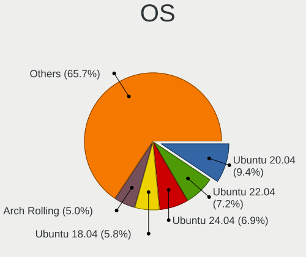

| Name               | Desktops | Percent |
|--------------------|----------|---------|
| Ubuntu 20.04       | 82       | 9.38%   |
| Ubuntu 22.04       | 63       | 7.21%   |
| Ubuntu 24.04       | 60       | 6.86%   |
| Ubuntu 18.04       | 51       | 5.84%   |
| Arch Rolling       | 44       | 5.03%   |
| Debian 12          | 30       | 3.43%   |
| Debian             | 24       | 2.75%   |
| Debian 11          | 23       | 2.63%   |
| Arch               | 19       | 2.17%   |
| Ubuntu 16.04       | 12       | 1.37%   |
| UOS 20             | 11       | 1.26%   |
| Ubuntu 19.04       | 11       | 1.26%   |
| Debian 10          | 11       | 1.26%   |
| OpenMandriva 4.3   | 10       | 1.14%   |
| OpenMandriva 5.0   | 9        | 1.03%   |
| OpenMandriva 24.12 | 9        | 1.03%   |
| OpenMandriva 23.08 | 9        | 1.03%   |
| Ubuntu 24.10       | 8        | 0.92%   |
| Ubuntu 23.10       | 8        | 0.92%   |
| Ubuntu 21.04       | 8        | 0.92%   |
| Kylin V10          | 8        | 0.92%   |
| Debian 13          | 8        | 0.92%   |
| CentOS 7           | 8        | 0.92%   |
| Fedora 40          | 7        | 0.8%    |
| Ubuntu 19.10       | 6        | 0.69%   |
| OpenMandriva 23.03 | 6        | 0.69%   |
| Manjaro            | 6        | 0.69%   |
| Fedora 41          | 6        | 0.69%   |
| Fedora 38          | 6        | 0.69%   |
| Deepin 23          | 6        | 0.69%   |
| Debian 8           | 6        | 0.69%   |
| Ubuntu Unity 16.04 | 5        | 0.57%   |
| Ubuntu 21.10       | 5        | 0.57%   |
| OpenMandriva 4.2   | 5        | 0.57%   |
| OpenMandriva 25.90 | 5        | 0.57%   |
| Kubuntu 23.10      | 5        | 0.57%   |
| Gentoo 2.14        | 5        | 0.57%   |
| Fedora 39          | 5        | 0.57%   |
| Debian Unstable    | 5        | 0.57%   |
| Atz 12.6.1         | 5        | 0.57%   |

OS Family
---------

OS without a version

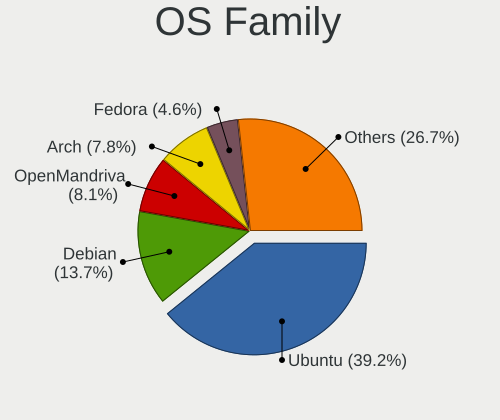

| Name             | Desktops | Percent |
|------------------|----------|---------|
| Ubuntu           | 318      | 39.16%  |
| Debian           | 111      | 13.67%  |
| OpenMandriva     | 66       | 8.13%   |
| Arch             | 63       | 7.76%   |
| Fedora           | 37       | 4.56%   |
| Deepin           | 21       | 2.59%   |
| Linux Mint       | 20       | 2.46%   |
| Manjaro          | 15       | 1.85%   |
| Gentoo           | 15       | 1.85%   |
| Atz              | 14       | 1.72%   |
| CentOS           | 12       | 1.48%   |
| Kubuntu          | 10       | 1.23%   |
| Kylin            | 8        | 0.99%   |
| Ubuntu Unity     | 7        | 0.86%   |
| ROSA             | 7        | 0.86%   |
| Pop!_OS          | 7        | 0.86%   |
| KDE neon         | 7        | 0.86%   |
| Xubuntu          | 5        | 0.62%   |
| ArcoLinux        | 5        | 0.62%   |
| Lubuntu          | 4        | 0.49%   |
| AOSC OS          | 4        | 0.49%   |
| Zorin            | 3        | 0.37%   |
| openSUSE         | 3        | 0.37%   |
| OpenEuler        | 3        | 0.37%   |
| Loongnix         | 3        | 0.37%   |
| Elementary       | 3        | 0.37%   |
| Clear Linux      | 3        | 0.37%   |
| AlmaLinux        | 3        | 0.37%   |
| TUXEDO OS        | 2        | 0.25%   |
| Slackware        | 2        | 0.25%   |
| Rocky Linux      | 2        | 0.25%   |
| org.kde.Platform | 2        | 0.25%   |
| NFS Desktop      | 2        | 0.25%   |
| LFS              | 2        | 0.25%   |
| Kali             | 2        | 0.25%   |
| Bazzite          | 2        | 0.25%   |
| Xero             | 1        | 0.12%   |
| Ubuntu Kylin     | 1        | 0.12%   |
| Ubuntu Budgie    | 1        | 0.12%   |
| Trisquel         | 1        | 0.12%   |

Kernel
------

Version of the Linux kernel

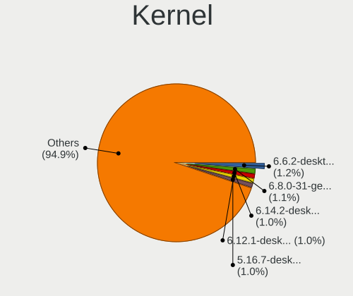

| Version                            | Desktops | Percent |
|------------------------------------|----------|---------|
| 6.6.2-desktop-1omv2390             | 11       | 1.18%   |
| 6.8.0-31-generic                   | 10       | 1.07%   |
| 6.14.2-desktop-3omv2590            | 9        | 0.96%   |
| 6.12.1-desktop-1omv2490            | 9        | 0.96%   |
| 5.16.7-desktop-1omv4003            | 9        | 0.96%   |
| 6.8.0-48-generic                   | 8        | 0.85%   |
| 6.4.11-desktop-1omv2390            | 7        | 0.75%   |
| 6.11.0-8-generic                   | 7        | 0.75%   |
| 6.8.0-41-generic                   | 6        | 0.64%   |
| 6.5.0-14-generic                   | 6        | 0.64%   |
| 6.2.6-desktop-1omv2390             | 6        | 0.64%   |
| 5.15.0-56-generic                  | 6        | 0.64%   |
| 5.15.0-52-generic                  | 6        | 0.64%   |
| 5.0.0-23-generic                   | 6        | 0.64%   |
| 4.19.147-rivoreo-amd64             | 6        | 0.64%   |
| 4.15.0-142-generic                 | 6        | 0.64%   |
| 6.8.0-60-generic                   | 5        | 0.53%   |
| 6.8.0-51-generic                   | 5        | 0.53%   |
| 6.8.0-40-generic                   | 5        | 0.53%   |
| 6.5.0-26-generic                   | 5        | 0.53%   |
| 6.2.0-26-generic                   | 5        | 0.53%   |
| 5.15.0-67-generic                  | 5        | 0.53%   |
| 5.13.0-22-generic                  | 5        | 0.53%   |
| 5.10.14-desktop-1omv4002           | 5        | 0.53%   |
| 6.8.0-52-generic                   | 4        | 0.43%   |
| 6.12.6-amd64                       | 4        | 0.43%   |
| 6.12.10-amd64                      | 4        | 0.43%   |
| 5.4.0-58-generic                   | 4        | 0.43%   |
| 5.15.0-97-generic                  | 4        | 0.43%   |
| 5.15.0-91-generic                  | 4        | 0.43%   |
| 5.13.0-30-generic                  | 4        | 0.43%   |
| 5.12.4-desktop-1omv4050            | 4        | 0.43%   |
| 5.11.0-43-generic                  | 4        | 0.43%   |
| 5.0.0-25-generic                   | 4        | 0.43%   |
| 4.18.0-16-generic                  | 4        | 0.43%   |
| 4.1.42-rivoreo-powerpc64-largepage | 4        | 0.43%   |
| 4.1.42-rivoreo-powerpc64           | 4        | 0.43%   |
| 6.6.47-amd64-desktop-hwe           | 3        | 0.32%   |
| 6.5.0-25-generic                   | 3        | 0.32%   |
| 6.5.0-17-generic                   | 3        | 0.32%   |

Kernel Family
-------------

Linux kernel without a distro release

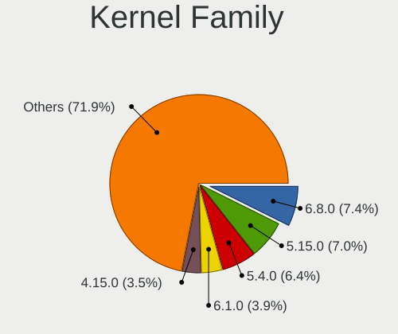

| Version  | Desktops | Percent |
|----------|----------|---------|
| 6.8.0    | 66       | 7.36%   |
| 5.15.0   | 63       | 7.02%   |
| 5.4.0    | 57       | 6.35%   |
| 6.1.0    | 35       | 3.9%    |
| 4.15.0   | 31       | 3.46%   |
| 6.5.0    | 26       | 2.9%    |
| 5.10.0   | 26       | 2.9%    |
| 6.11.0   | 23       | 2.56%   |
| 5.0.0    | 23       | 2.56%   |
| 5.11.0   | 20       | 2.23%   |
| 4.18.0   | 18       | 2.01%   |
| 6.2.0    | 17       | 1.9%    |
| 6.14.0   | 16       | 1.78%   |
| 5.13.0   | 16       | 1.78%   |
| 5.8.0    | 13       | 1.45%   |
| 4.19.0   | 12       | 1.34%   |
| 6.6.2    | 11       | 1.23%   |
| 6.14.2   | 9        | 1%      |
| 6.12.1   | 9        | 1%      |
| 5.19.0   | 9        | 1%      |
| 5.16.7   | 9        | 1%      |
| 6.4.11   | 7        | 0.78%   |
| 5.3.0    | 7        | 0.78%   |
| 4.1.42   | 7        | 0.78%   |
| 6.2.6    | 6        | 0.67%   |
| 5.14.0   | 6        | 0.67%   |
| 4.19.147 | 6        | 0.67%   |
| 3.10.0   | 6        | 0.67%   |
| 6.6.0    | 5        | 0.56%   |
| 5.10.14  | 5        | 0.56%   |
| 6.9.7    | 4        | 0.45%   |
| 6.6.47   | 4        | 0.45%   |
| 6.16.3   | 4        | 0.45%   |
| 6.12.6   | 4        | 0.45%   |
| 6.12.10  | 4        | 0.45%   |
| 6.11.7   | 4        | 0.45%   |
| 5.12.4   | 4        | 0.45%   |
| 6.4.10   | 3        | 0.33%   |
| 6.15.9   | 3        | 0.33%   |
| 6.13.11  | 3        | 0.33%   |

Kernel Major Ver.
-----------------

Linux kernel major version

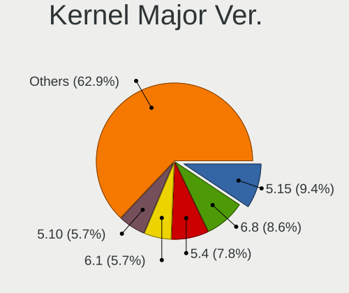

| Version | Desktops | Percent |
|---------|----------|---------|
| 5.15    | 82       | 9.35%   |
| 6.8     | 75       | 8.55%   |
| 5.4     | 68       | 7.75%   |
| 6.1     | 50       | 5.7%    |
| 5.10    | 50       | 5.7%    |
| 6.12    | 38       | 4.33%   |
| 6.6     | 35       | 3.99%   |
| 6.5     | 33       | 3.76%   |
| 6.11    | 33       | 3.76%   |
| 4.15    | 31       | 3.53%   |
| 6.14    | 30       | 3.42%   |
| 6.2     | 25       | 2.85%   |
| 5.0     | 25       | 2.85%   |
| 5.11    | 22       | 2.51%   |
| 4.19    | 22       | 2.51%   |
| 5.13    | 19       | 2.17%   |
| 4.18    | 18       | 2.05%   |
| 6.4     | 17       | 1.94%   |
| 5.8     | 14       | 1.6%    |
| 5.16    | 14       | 1.6%    |
| 5.19    | 11       | 1.25%   |
| 6.9     | 10       | 1.14%   |
| 6.16    | 10       | 1.14%   |
| 5.14    | 10       | 1.14%   |
| 6.17    | 9        | 1.03%   |
| 6.10    | 9        | 1.03%   |
| 5.18    | 9        | 1.03%   |
| 6.15    | 8        | 0.91%   |
| 6.13    | 8        | 0.91%   |
| 5.9     | 8        | 0.91%   |
| 5.17    | 8        | 0.91%   |
| 5.12    | 8        | 0.91%   |
| 6.7     | 7        | 0.8%    |
| 5.3     | 7        | 0.8%    |
| 4.1     | 7        | 0.8%    |
| 3.10    | 6        | 0.68%   |
| 6.3     | 5        | 0.57%   |
| 5.6     | 5        | 0.57%   |
| 4.9     | 5        | 0.57%   |
| 5.7     | 4        | 0.46%   |

Arch
----

OS architecture (x86_64, i586, etc.)

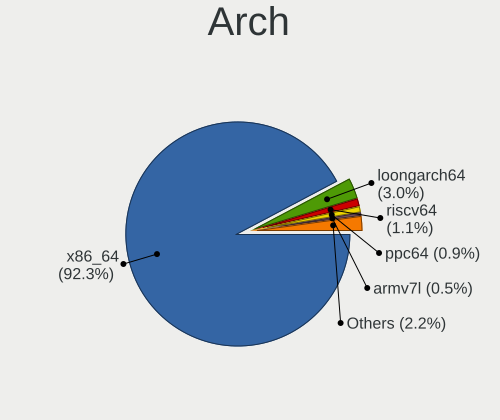

| Name        | Desktops | Percent |
|-------------|----------|---------|
| x86_64      | 727      | 92.26%  |
| loongarch64 | 24       | 3.05%   |
| riscv64     | 9        | 1.14%   |
| ppc64       | 7        | 0.89%   |
| armv7l      | 4        | 0.51%   |
| aarch64     | 4        | 0.51%   |
| i686        | 3        | 0.38%   |
| sparc64     | 2        | 0.25%   |
| ppc64le     | 2        | 0.25%   |
| sw_64       | 1        | 0.13%   |
| sh4a        | 1        | 0.13%   |
| ppc         | 1        | 0.13%   |
| mips64      | 1        | 0.13%   |
| i586        | 1        | 0.13%   |
| i486        | 1        | 0.13%   |

DE
--

Desktop Environment

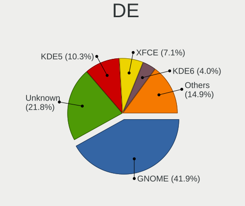

| Name             | Desktops | Percent |
|------------------|----------|---------|
| GNOME            | 349      | 41.95%  |
| Unknown          | 181      | 21.75%  |
| KDE5             | 86       | 10.34%  |
| XFCE             | 59       | 7.09%   |
| KDE6             | 33       | 3.97%   |
| Deepin           | 19       | 2.28%   |
| X-Cinnamon       | 17       | 2.04%   |
| MATE             | 14       | 1.68%   |
| LXQt             | 14       | 1.68%   |
| KDE              | 12       | 1.44%   |
| Unity            | 7        | 0.84%   |
| LXDE             | 4        | 0.48%   |
| i3               | 4        | 0.48%   |
| DDE              | 4        | 0.48%   |
| Cinnamon         | 4        | 0.48%   |
| Pantheon         | 3        | 0.36%   |
| KDE4             | 3        | 0.36%   |
| GNOME Flashback  | 3        | 0.36%   |
| Budgie           | 3        | 0.36%   |
| UKUI             | 2        | 0.24%   |
| sway             | 2        | 0.24%   |
| Hyprland         | 2        | 0.24%   |
| weston           | 1        | 0.12%   |
| Wayfire          | 1        | 0.12%   |
| lightdm-xsession | 1        | 0.12%   |
| GNOME Classic    | 1        | 0.12%   |
| DWM              | 1        | 0.12%   |
| default          | 1        | 0.12%   |
| awesome          | 1        | 0.12%   |

Display Server
--------------

X11 or Wayland

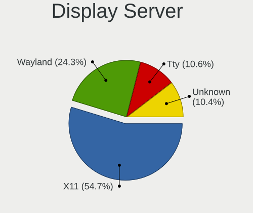

| Name    | Desktops | Percent |
|---------|----------|---------|
| X11     | 448      | 54.7%   |
| Wayland | 199      | 24.3%   |
| Tty     | 87       | 10.62%  |
| Unknown | 85       | 10.38%  |

Display Manager
---------------

SDDM, LightDM, etc.

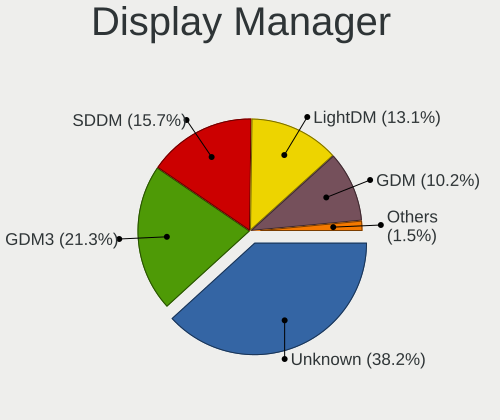

| Name           | Desktops | Percent |
|----------------|----------|---------|
| Unknown        | 310      | 38.22%  |
| GDM3           | 173      | 21.33%  |
| SDDM           | 127      | 15.66%  |
| LightDM        | 106      | 13.07%  |
| GDM            | 83       | 10.23%  |
| TDM            | 6        | 0.74%   |
| KDM            | 2        | 0.25%   |
| SLiM           | 1        | 0.12%   |
| LY-DM          | 1        | 0.12%   |
| LXDM           | 1        | 0.12%   |
| COSMIC-GREETER | 1        | 0.12%   |

OS Lang
-------

Language

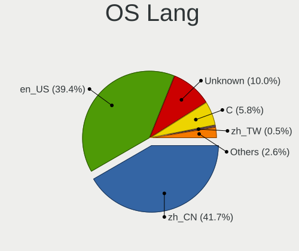

| Lang        | Desktops | Percent |
|-------------|----------|---------|
| zh_CN       | 335      | 41.67%  |
| en_US       | 317      | 39.43%  |
| Unknown     | 80       | 9.95%   |
| C           | 47       | 5.85%   |
| zh_TW       | 4        | 0.5%    |
| en_HK       | 4        | 0.5%    |
| en_GB       | 4        | 0.5%    |
| ru_RU       | 3        | 0.37%   |
| de_DE       | 3        | 0.37%   |
| en_AU       | 2        | 0.25%   |
| zh_HK       | 1        | 0.12%   |
| ja_JP       | 1        | 0.12%   |
| en_US.utf-8 | 1        | 0.12%   |
| en_SG       | 1        | 0.12%   |
| af_ZA       | 1        | 0.12%   |

Boot Mode
---------

EFI or BIOS

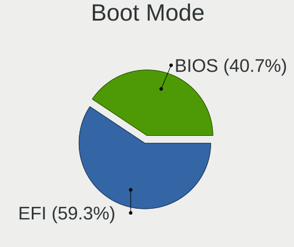

| Mode | Desktops | Percent |
|------|----------|---------|
| EFI  | 473      | 59.35%  |
| BIOS | 324      | 40.65%  |

Filesystem
----------

Type of filesystem

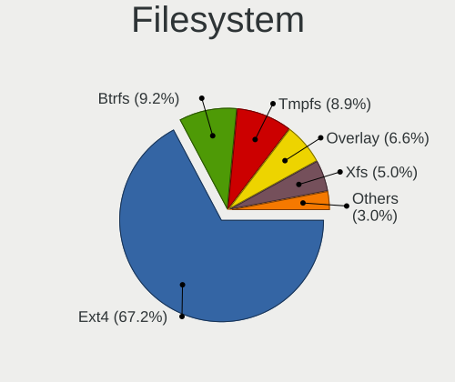

| Type       | Desktops | Percent |
|------------|----------|---------|
| Ext4       | 538      | 67.25%  |
| Btrfs      | 74       | 9.25%   |
| Tmpfs      | 71       | 8.88%   |
| Overlay    | 53       | 6.63%   |
| Xfs        | 40       | 5%      |
| Unknown    | 10       | 1.25%   |
| Zfs        | 7        | 0.88%   |
| Rootfs     | 5        | 0.63%   |
| Reiserfs   | 1        | 0.13%   |
| Fuse.sshfs | 1        | 0.13%   |

Part. scheme
------------

Scheme of partitioning

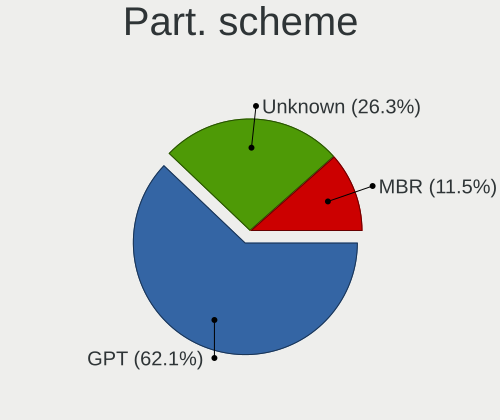

| Type    | Desktops | Percent |
|---------|----------|---------|
| GPT     | 495      | 62.11%  |
| Unknown | 210      | 26.35%  |
| MBR     | 92       | 11.54%  |

Dual Boot with Linux/BSD
------------------------

Hosting more than one Linux/BSD

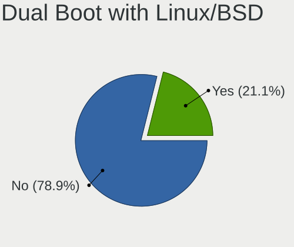

| Dual boot | Desktops | Percent |
|-----------|----------|---------|
| No        | 636      | 78.91%  |
| Yes       | 170      | 21.09%  |

Dual Boot (Win)
---------------

Hosting Linux and Windows

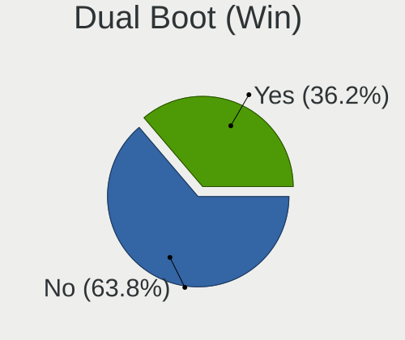

| Dual boot | Desktops | Percent |
|-----------|----------|---------|
| No        | 507      | 63.77%  |
| Yes       | 288      | 36.23%  |

Board
-----

Vendor
------

Motherboard manufacturer

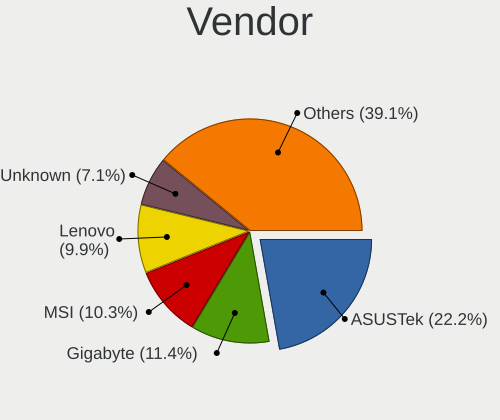

| Name                                 | Desktops | Percent |
|--------------------------------------|----------|---------|
| ASUSTek Computer                     | 175      | 22.21%  |
| Gigabyte Technology                  | 90       | 11.42%  |
| MSI                                  | 81       | 10.28%  |
| Lenovo                               | 78       | 9.9%    |
| Unknown                              | 56       | 7.11%   |
| Dell                                 | 46       | 5.84%   |
| Hewlett-Packard                      | 26       | 3.3%    |
| Loongson                             | 24       | 3.05%   |
| Intel                                | 24       | 3.05%   |
| ASRock                               | 21       | 2.66%   |
| Colorful Technology                  | 14       | 1.78%   |
| Huanan                               | 10       | 1.27%   |
| MAXSUN                               | 9        | 1.14%   |
| AZW                                  | 9        | 1.14%   |
| TYAN Computer                        | 8        | 1.02%   |
| TSINGHUA TONGFANG COMPUTER           | 8        | 1.02%   |
| ONDA                                 | 6        | 0.76%   |
| OEM                                  | 6        | 0.76%   |
| Biostar                              | 6        | 0.76%   |
| GMKtec                               | 4        | 0.51%   |
| Shenzhen Meigao Electronic Equipment | 3        | 0.38%   |
| HUAWEI                               | 3        | 0.38%   |
| ECS                                  | 3        | 0.38%   |
| Centerm                              | 3        | 0.38%   |
| AMD                                  | 3        | 0.38%   |
| YANYU                                | 2        | 0.25%   |
| Win Element                          | 2        | 0.25%   |
| SYWZ                                 | 2        | 0.25%   |
| Soyo                                 | 2        | 0.25%   |
| Pegatron                             | 2        | 0.25%   |
| Haier DT Computer                    | 2        | 0.25%   |
| Haier                                | 2        | 0.25%   |
| Google                               | 2        | 0.25%   |
| GITSTAR                              | 2        | 0.25%   |
| AOC                                  | 2        | 0.25%   |
| Acer                                 | 2        | 0.25%   |
| Yeston Digital Technology            | 1        | 0.13%   |
| YanRay Technology                    | 1        | 0.13%   |
| Yanling                              | 1        | 0.13%   |
| X79-1356                             | 1        | 0.13%   |

Model
-----

Motherboard model

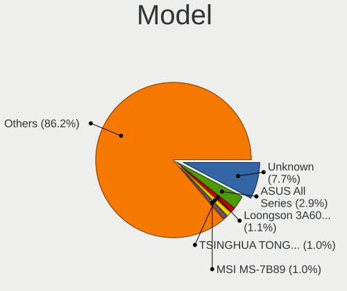

| Name                                  | Desktops | Percent |
|---------------------------------------|----------|---------|
| Unknown                               | 61       | 7.74%   |
| ASUS All Series                       | 23       | 2.92%   |
| Loongson 3A6000-HV-7A2000-1w-V0.1-EVB | 9        | 1.14%   |
| TSINGHUA TONGFANG COMPUTER E500       | 8        | 1.02%   |
| MSI MS-7B89                           | 8        | 1.02%   |
| MSI MS-7C94                           | 6        | 0.76%   |
| ASUS TUF Gaming B550M-PLUS            | 6        | 0.76%   |
| ASUS M5A78L-M LX3 PLUS                | 5        | 0.63%   |
| TYAN TA80-B7071                       | 4        | 0.51%   |
| MSI MS-7E07                           | 4        | 0.51%   |
| Lenovo ThinkStation P520 30BFSG3Y00   | 4        | 0.51%   |
| Intel X99                             | 4        | 0.51%   |
| Dell OptiPlex 7010                    | 4        | 0.51%   |
| AZW LZX                               | 4        | 0.51%   |
| ASUS TUF Gaming B550M-PLUS WIFI II    | 4        | 0.51%   |
| ASUS TUF Gaming B450M-PRO S           | 4        | 0.51%   |
| MSI MS-7D76                           | 3        | 0.38%   |
| MSI MS-7D46                           | 3        | 0.38%   |
| Loongson LS3A6000-7A2000-1w-V0.1-EVB  | 3        | 0.38%   |
| Loongson 3A6000-HV-7A2000-NUC         | 3        | 0.38%   |
| Gigabyte X299 AORUS Gaming 7          | 3        | 0.38%   |
| Dell Precision 3660                   | 3        | 0.38%   |
| Centerm C92                           | 3        | 0.38%   |
| ASUS X870 AYW GAMING WIFI W           | 3        | 0.38%   |
| ASUS TUF Gaming X570-PLUS             | 3        | 0.38%   |
| ASUS ROG STRIX X299-E GAMING          | 3        | 0.38%   |
| TYAN S8030GM2NE 5411T6180007          | 2        | 0.25%   |
| TYAN S8030GM2NE                       | 2        | 0.25%   |
| MSI MS-7D70                           | 2        | 0.25%   |
| MSI MS-7C52                           | 2        | 0.25%   |
| MSI MS-7C02                           | 2        | 0.25%   |
| MSI MS-7B23                           | 2        | 0.25%   |
| MSI MS-7A40                           | 2        | 0.25%   |
| MSI MS-7A38                           | 2        | 0.25%   |
| MSI MS-7817                           | 2        | 0.25%   |
| MAXSUN MS-A86FX FS M.3                | 2        | 0.25%   |
| Loongson LS3A5000-7A1000-1w-V0.1-CRB  | 2        | 0.25%   |
| Loongson 3A6000-7A2000-1w-V0.1-EVB    | 2        | 0.25%   |
| Loongson 3A5000-HV-7A2000-1w-V0.1-EVB | 2        | 0.25%   |
| Lenovo YangTianT4900v-00              | 2        | 0.25%   |

Model Family
------------

Motherboard model prefix

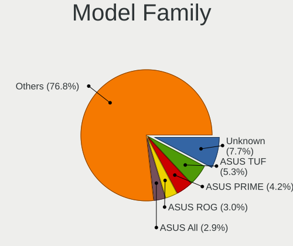

| Name                                  | Desktops | Percent |
|---------------------------------------|----------|---------|
| Unknown                               | 61       | 7.74%   |
| ASUS TUF                              | 42       | 5.33%   |
| ASUS PRIME                            | 33       | 4.19%   |
| ASUS ROG                              | 24       | 3.05%   |
| ASUS All                              | 23       | 2.92%   |
| Dell OptiPlex                         | 22       | 2.79%   |
| Lenovo ThinkCentre                    | 17       | 2.16%   |
| Lenovo ThinkStation                   | 14       | 1.78%   |
| Dell Precision                        | 12       | 1.52%   |
| Loongson 3A6000-HV-7A2000-1w-V0.1-EVB | 9        | 1.14%   |
| TSINGHUA TONGFANG COMPUTER E500       | 8        | 1.02%   |
| MSI MS-7B89                           | 8        | 1.02%   |
| HP ProDesk                            | 7        | 0.89%   |
| MSI MS-7C94                           | 6        | 0.76%   |
| Gigabyte X299                         | 6        | 0.76%   |
| Gigabyte X570                         | 5        | 0.63%   |
| ASUS M5A78L-M                         | 5        | 0.63%   |
| TYAN TA80-B7071                       | 4        | 0.51%   |
| TYAN S8030GM2NE                       | 4        | 0.51%   |
| MSI MS-7E07                           | 4        | 0.51%   |
| Lenovo ZHENGJIUZHE                    | 4        | 0.51%   |
| Intel X99                             | 4        | 0.51%   |
| GMKtec NucBox                         | 4        | 0.51%   |
| Gigabyte B450M                        | 4        | 0.51%   |
| Dell Vostro                           | 4        | 0.51%   |
| Dell Inspiron                         | 4        | 0.51%   |
| Colorful CVN                          | 4        | 0.51%   |
| AZW LZX                               | 4        | 0.51%   |
| ASUS PRO                              | 4        | 0.51%   |
| MSI MS-7D76                           | 3        | 0.38%   |
| MSI MS-7D46                           | 3        | 0.38%   |
| MAXSUN MS-Terminator                  | 3        | 0.38%   |
| Loongson LS3A6000-7A2000-1w-V0.1-EVB  | 3        | 0.38%   |
| Loongson 3A6000-HV-7A2000-NUC         | 3        | 0.38%   |
| Lenovo YangTianT4900v-00              | 3        | 0.38%   |
| Lenovo IdeaCentre                     | 3        | 0.38%   |
| Huanan X79                            | 3        | 0.38%   |
| Gigabyte B450                         | 3        | 0.38%   |
| Centerm C92                           | 3        | 0.38%   |
| ASUS X870                             | 3        | 0.38%   |

MFG Year
--------

Motherboard manufacture year

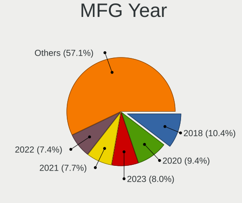

| Year    | Desktops | Percent |
|---------|----------|---------|
| 2018    | 82       | 10.41%  |
| 2020    | 74       | 9.39%   |
| 2023    | 63       | 7.99%   |
| 2021    | 61       | 7.74%   |
| 2022    | 58       | 7.36%   |
| 2019    | 57       | 7.23%   |
| 2017    | 53       | 6.73%   |
| Unknown | 48       | 6.09%   |
| 2015    | 45       | 5.71%   |
| 2012    | 43       | 5.46%   |
| 2024    | 41       | 5.2%    |
| 2013    | 40       | 5.08%   |
| 2016    | 33       | 4.19%   |
| 2014    | 33       | 4.19%   |
| 2011    | 13       | 1.65%   |
| 2025    | 12       | 1.52%   |
| 2010    | 12       | 1.52%   |
| 2009    | 10       | 1.27%   |
| 2008    | 5        | 0.63%   |
| 2007    | 4        | 0.51%   |
| 2000    | 1        | 0.13%   |

Form Factor
-----------

Physical design of the computer

| Name    | Desktops | Percent |
|---------|----------|---------|
| Desktop | 788      | 100%    |

Secure Boot
-----------

Enabled or disabled

| State    | Desktops | Percent |
|----------|----------|---------|
| Disabled | 769      | 97.34%  |
| Enabled  | 21       | 2.66%   |

Coreboot
--------

Have coreboot on board

| Used | Desktops | Percent |
|------|----------|---------|
| No   | 784      | 99.49%  |
| Yes  | 4        | 0.51%   |

RAM Size
--------

Total RAM memory

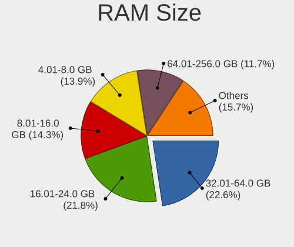

| Size in GB      | Desktops | Percent |
|-----------------|----------|---------|
| 32.01-64.0      | 184      | 22.63%  |
| 16.01-24.0      | 177      | 21.77%  |
| 8.01-16.0       | 116      | 14.27%  |
| 4.01-8.0        | 113      | 13.9%   |
| 64.01-256.0     | 95       | 11.69%  |
| 3.01-4.0        | 50       | 6.15%   |
| 24.01-32.0      | 31       | 3.81%   |
| Unknown         | 15       | 1.85%   |
| More than 256.0 | 10       | 1.23%   |
| 1.01-2.0        | 8        | 0.98%   |
| 0.51-1.0        | 5        | 0.62%   |
| 0.01-0.5        | 4        | 0.49%   |
| 2.01-3.0        | 3        | 0.37%   |
| 0               | 2        | 0.25%   |

RAM Used
--------

Used RAM memory

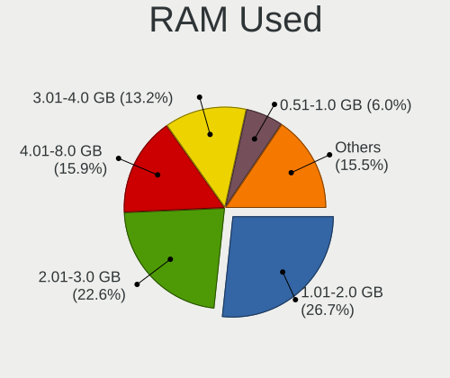

| Used GB     | Desktops | Percent |
|-------------|----------|---------|
| 1.01-2.0    | 230      | 26.68%  |
| 2.01-3.0    | 195      | 22.62%  |
| 4.01-8.0    | 137      | 15.89%  |
| 3.01-4.0    | 114      | 13.23%  |
| 0.51-1.0    | 52       | 6.03%   |
| 8.01-16.0   | 47       | 5.45%   |
| 0.01-0.5    | 29       | 3.36%   |
| 16.01-24.0  | 22       | 2.55%   |
| Unknown     | 20       | 2.32%   |
| 24.01-32.0  | 7        | 0.81%   |
| 32.01-64.0  | 5        | 0.58%   |
| 64.01-256.0 | 4        | 0.46%   |

Total Drives
------------

Number of drives on board

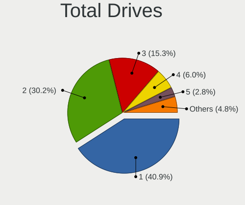

| Drives | Desktops | Percent |
|--------|----------|---------|
| 1      | 332      | 40.89%  |
| 2      | 245      | 30.17%  |
| 3      | 124      | 15.27%  |
| 4      | 49       | 6.03%   |
| 5      | 23       | 2.83%   |
| 6      | 12       | 1.48%   |
| 0      | 11       | 1.35%   |
| 8      | 7        | 0.86%   |
| 7      | 4        | 0.49%   |
| 9      | 2        | 0.25%   |
| 46     | 1        | 0.12%   |
| 11     | 1        | 0.12%   |
| 10     | 1        | 0.12%   |

Has CD-ROM
----------

Has CD-ROM on board

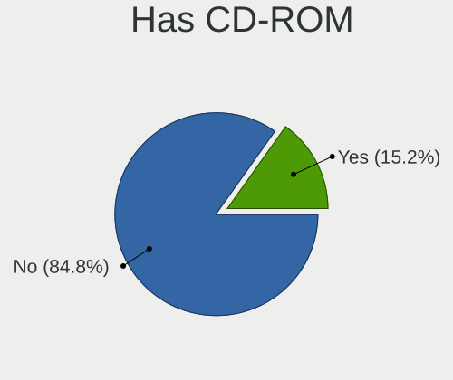

| Presented | Desktops | Percent |
|-----------|----------|---------|
| No        | 671      | 84.83%  |
| Yes       | 120      | 15.17%  |

Has Ethernet
------------

Has Ethernet on board

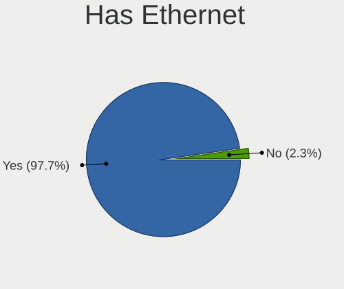

| Presented | Desktops | Percent |
|-----------|----------|---------|
| Yes       | 771      | 97.72%  |
| No        | 18       | 2.28%   |

Has WiFi
--------

Has WiFi module

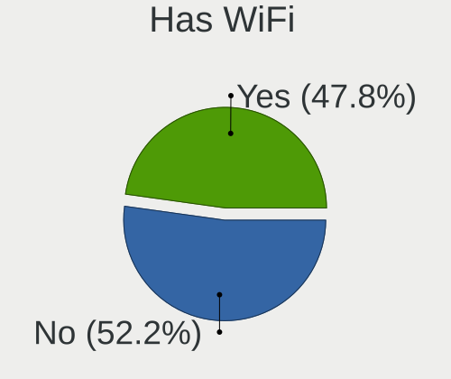

| Presented | Desktops | Percent |
|-----------|----------|---------|
| No        | 416      | 52.2%   |
| Yes       | 381      | 47.8%   |

Has Bluetooth
-------------

Has Bluetooth module

| Presented | Desktops | Percent |
|-----------|----------|---------|
| No        | 491      | 61.15%  |
| Yes       | 312      | 38.85%  |

Location
--------

Country
-------

Geographic location (country)

| Country | Desktops | Percent |
|---------|----------|---------|
| China   | 788      | 100%    |

City
----

Geographic location (city)

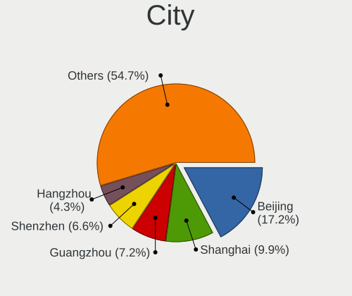

| City         | Desktops | Percent |
|--------------|----------|---------|
| Beijing      | 143      | 17.23%  |
| Shanghai     | 82       | 9.88%   |
| Guangzhou    | 60       | 7.23%   |
| Shenzhen     | 55       | 6.63%   |
| Hangzhou     | 36       | 4.34%   |
| Wuhan        | 28       | 3.37%   |
| Chengdu      | 27       | 3.25%   |
| Nanjing      | 19       | 2.29%   |
| Kunming      | 19       | 2.29%   |
| Xi'an        | 13       | 1.57%   |
| Chongqing    | 13       | 1.57%   |
| Qingdao      | 12       | 1.45%   |
| Haidian      | 12       | 1.45%   |
| Zhengzhou    | 11       | 1.33%   |
| Jinan        | 11       | 1.33%   |
| Hefei        | 11       | 1.33%   |
| Tianjin      | 10       | 1.2%    |
| Changsha     | 10       | 1.2%    |
| Bieligutai   | 10       | 1.2%    |
| Nanhao       | 9        | 1.08%   |
| Jinrongjie   | 9        | 1.08%   |
| Xiamen       | 8        | 0.96%   |
| Shenyang     | 8        | 0.96%   |
| Foshan       | 8        | 0.96%   |
| Nanning      | 7        | 0.84%   |
| Suzhou       | 6        | 0.72%   |
| Xuhui        | 5        | 0.6%    |
| Shijiazhuang | 5        | 0.6%    |
| Jilin City   | 5        | 0.6%    |
| Jianshui     | 5        | 0.6%    |
| Fuzhou       | 4        | 0.48%   |
| Dongguan     | 4        | 0.48%   |
| Wuxi         | 3        | 0.36%   |
| Wulipu       | 3        | 0.36%   |
| Wenshan City | 3        | 0.36%   |
| Putuo        | 3        | 0.36%   |
| Liuzhou      | 3        | 0.36%   |
| Hohhot       | 3        | 0.36%   |
| Harbin       | 3        | 0.36%   |
| Dalian       | 3        | 0.36%   |

Drives
------

Drive Vendor
------------

Hard drive vendors

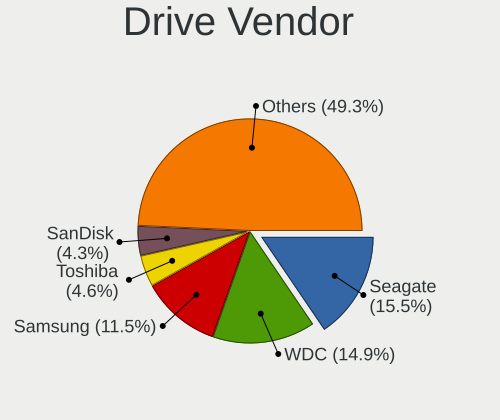

| Vendor                       | Desktops | Drives | Percent |
|------------------------------|----------|--------|---------|
| Seagate                      | 221      | 391    | 15.51%  |
| WDC                          | 212      | 294    | 14.88%  |
| Samsung Electronics          | 164      | 221    | 11.51%  |
| Toshiba                      | 65       | 89     | 4.56%   |
| SanDisk                      | 61       | 76     | 4.28%   |
| Kingston                     | 50       | 63     | 3.51%   |
| Intel                        | 45       | 92     | 3.16%   |
| Unknown                      | 33       | 50     | 2.32%   |
| Silicon Motion               | 30       | 46     | 2.11%   |
| Yangtze Memory Technologies  | 28       | 38     | 1.96%   |
| HGST                         | 26       | 44     | 1.82%   |
| ZHITAI                       | 24       | 41     | 1.68%   |
| MAXIO Technology (Hangzhou)  | 24       | 28     | 1.68%   |
| Unknown                      | 20       | 25     | 1.4%    |
| Hitachi                      | 19       | 32     | 1.33%   |
| Crucial                      | 16       | 18     | 1.12%   |
| China                        | 16       | 19     | 1.12%   |
| SK hynix                     | 14       | 15     | 0.98%   |
| Plextor                      | 14       | 18     | 0.98%   |
| Micron Technology            | 12       | 13     | 0.84%   |
| Colorful                     | 12       | 16     | 0.84%   |
| Phison                       | 11       | 13     | 0.77%   |
| Netac                        | 11       | 14     | 0.77%   |
| FORESEE                      | 11       | 11     | 0.77%   |
| KIOXIA-EXCERIA               | 10       | 11     | 0.7%    |
| Fanxiang                     | 10       | 14     | 0.7%    |
| Teclast                      | 9        | 9      | 0.63%   |
| KIOXIA                       | 9        | 13     | 0.63%   |
| Kingston Technology Company  | 9        | 13     | 0.63%   |
| GLOWAY                       | 9        | 16     | 0.63%   |
| Lenovo                       | 8        | 10     | 0.56%   |
| Hewlett-Packard              | 8        | 12     | 0.56%   |
| A-DATA Technology            | 8        | 9      | 0.56%   |
| LITEON                       | 7        | 11     | 0.49%   |
| tigo                         | 5        | 6      | 0.35%   |
| Shenzhen Longsys Electronics | 5        | 5      | 0.35%   |
| KINGBANK                     | 5        | 5      | 0.35%   |
| GALAX                        | 5        | 5      | 0.35%   |
| faspeed                      | 5        | 5      | 0.35%   |
| aigo                         | 5        | 7      | 0.35%   |

Drive Model
-----------

Hard drive models

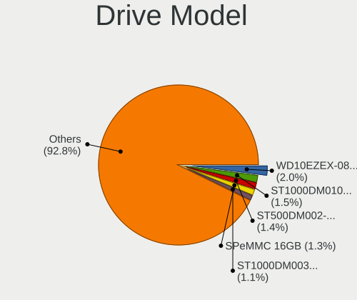

| Model                                                 | Desktops | Percent |
|-------------------------------------------------------|----------|---------|
| WDC WD10EZEX-08WN4A0 1TB                              | 32       | 2.02%   |
| Seagate ST1000DM010-2EP102 1TB                        | 24       | 1.51%   |
| Seagate ST500DM002-1BD142 500GB                       | 22       | 1.39%   |
| Unknown                                               | 20       | 1.26%   |
| Seagate ST1000DM003-1SB102 1TB                        | 17       | 1.07%   |
| Silicon Motion SM2263EN/SM2263XT SSD Controller 512GB | 13       | 0.82%   |
| Samsung NVMe SSD Controller PM9A1/PM9A3/980PRO 1TB    | 13       | 0.82%   |
| Samsung NVMe SSD Controller SM981/PM981/PM983 1TB     | 12       | 0.76%   |
| Samsung SSD 860 EVO 500GB                             | 10       | 0.63%   |
| MAXIO (Hangzhou) NVMe SSD Controller MAP1202 2TB      | 10       | 0.63%   |
| Seagate ST6000NM0115-1YZ110 6TB                       | 9        | 0.57%   |
| Seagate ST3500418AS 500GB                             | 9        | 0.57%   |
| SanDisk NVMe SSD Drive 1TB                            | 9        | 0.57%   |
| WDC WD10EZEX-08M2NA0 1TB                              | 8        | 0.5%    |
| Toshiba DT01ACA200 2TB                                | 8        | 0.5%    |
| Seagate ST3000DM008-2DM166 3TB                        | 8        | 0.5%    |
| Seagate ST2000DM001-1ER164 2TB                        | 8        | 0.5%    |
| Kingston SA400S37480G 480GB SSD                       | 8        | 0.5%    |
| WDC WDS100T2B0C-00PXH0 1TB                            | 7        | 0.44%   |
| WDC WD10EZEX-22MFCA0 1TB                              | 7        | 0.44%   |
| Toshiba DT01ACA100 1TB                                | 7        | 0.44%   |
| Kingston SA400S37240G 240GB SSD                       | 7        | 0.44%   |
| Seagate ST3500413AS 500GB                             | 6        | 0.38%   |
| Seagate ST3000DM001-1ER166 3TB                        | 6        | 0.38%   |
| Seagate ST2000DM008-2FR102 2TB                        | 6        | 0.38%   |
| Seagate ST1000DM003-1ER162 1TB                        | 6        | 0.38%   |
| Sandisk WD Black SN750 / PC SN730 NVMe SSD 500GB      | 6        | 0.38%   |
| SanDisk NVMe SSD Drive 2TB                            | 6        | 0.38%   |
| Samsung SSD 850 EVO 250GB                             | 6        | 0.38%   |
| Netac SSD 120GB                                       | 6        | 0.38%   |
| Yangtze Memory ZHITAI TiPlus7100 2TB                  | 5        | 0.31%   |
| Yangtze Memory ZHITAI TiPlus7100 1TB                  | 5        | 0.31%   |
| Yangtze Memory ZHITAI TiPlus5000 1TB                  | 5        | 0.31%   |
| Yangtze Memory ZHITAI Ti600 1TB                       | 5        | 0.31%   |
| WDC WD10EZEX-00WN4A0 1TB                              | 5        | 0.31%   |
| Unknown NVMe SSD Drive 1TB                            | 5        | 0.31%   |
| Toshiba Q300. 240GB SSD                               | 5        | 0.31%   |
| Seagate ST3250318AS 250GB                             | 5        | 0.31%   |
| Seagate ST300MM0008 304GB                             | 5        | 0.31%   |
| Seagate ST300MM0006 304GB                             | 5        | 0.31%   |

HDD Vendor
----------

Hard disk drive vendors

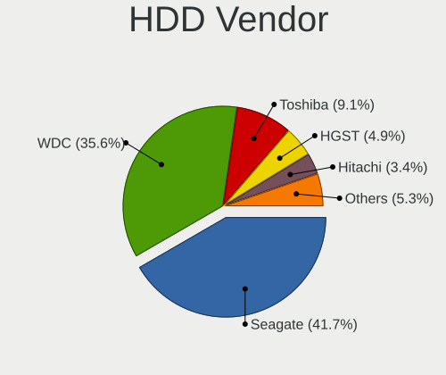

| Vendor              | Desktops | Drives | Percent |
|---------------------|----------|--------|---------|
| Seagate             | 220      | 390    | 41.67%  |
| WDC                 | 188      | 256    | 35.61%  |
| Toshiba             | 48       | 61     | 9.09%   |
| HGST                | 26       | 44     | 4.92%   |
| Hitachi             | 18       | 30     | 3.41%   |
| Samsung Electronics | 8        | 9      | 1.52%   |
| Fujitsu             | 3        | 3      | 0.57%   |
| SSK                 | 2        | 2      | 0.38%   |
| JMicron Technology  | 2        | 5      | 0.38%   |
| Unknown             | 2        | 3      | 0.38%   |
| TO Exter            | 1        | 1      | 0.19%   |
| QUANTUM             | 1        | 1      | 0.19%   |
| Pear 2TB            | 1        | 1      | 0.19%   |
| Maxtor              | 1        | 1      | 0.19%   |
| IBM H0              | 1        | 1      | 0.19%   |
| Hewlett-Packard     | 1        | 1      | 0.19%   |
| GOKE                | 1        | 1      | 0.19%   |
| FORESEE             | 1        | 1      | 0.19%   |
| External            | 1        | 2      | 0.19%   |
| ExcelStor           | 1        | 1      | 0.19%   |
| ACASIS              | 1        | 1      | 0.19%   |

SSD Vendor
----------

Solid state drive vendors

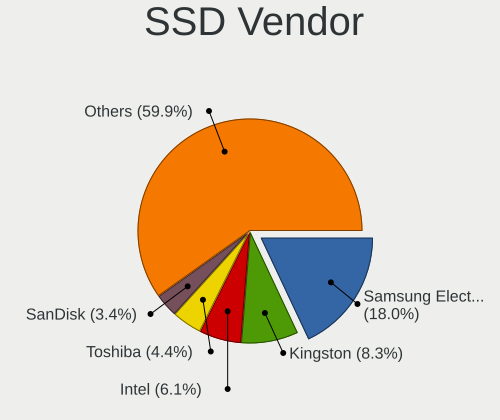

| Vendor              | Desktops | Drives | Percent |
|---------------------|----------|--------|---------|
| Samsung Electronics | 74       | 89     | 18%     |
| Kingston            | 34       | 42     | 8.27%   |
| Intel               | 25       | 66     | 6.08%   |
| Toshiba             | 18       | 22     | 4.38%   |
| SanDisk             | 14       | 15     | 3.41%   |
| China               | 14       | 17     | 3.41%   |
| WDC                 | 13       | 15     | 3.16%   |
| Plextor             | 13       | 16     | 3.16%   |
| Crucial             | 13       | 15     | 3.16%   |
| Netac               | 11       | 14     | 2.68%   |
| Unknown             | 11       | 15     | 2.68%   |
| Teclast             | 9        | 9      | 2.19%   |
| ZHITAI              | 8        | 16     | 1.95%   |
| GLOWAY              | 8        | 15     | 1.95%   |
| Colorful            | 8        | 9      | 1.95%   |
| LITEON              | 7        | 11     | 1.7%    |
| Lenovo              | 7        | 9      | 1.7%    |
| A-DATA Technology   | 7        | 7      | 1.7%    |
| Micron Technology   | 6        | 7      | 1.46%   |
| tigo                | 5        | 6      | 1.22%   |
| KIOXIA-EXCERIA      | 5        | 5      | 1.22%   |
| GALAX               | 5        | 5      | 1.22%   |
| FORESEE             | 5        | 5      | 1.22%   |
| Fanxiang            | 5        | 5      | 1.22%   |
| Unknown             | 4        | 5      | 0.97%   |
| Kingchuxing         | 4        | 4      | 0.97%   |
| faspeed             | 4        | 4      | 0.97%   |
| OCZ                 | 3        | 3      | 0.73%   |
| MAXSUN              | 3        | 3      | 0.73%   |
| KINGBANK            | 3        | 3      | 0.73%   |
| J.ZAO               | 3        | 3      | 0.73%   |
| Hewlett-Packard     | 3        | 5      | 0.73%   |
| StoreJet            | 2        | 2      | 0.49%   |
| Ramsta              | 2        | 2      | 0.49%   |
| Q200                | 2        | 5      | 0.49%   |
| Pear                | 2        | 11     | 0.49%   |
| MOVESPEED           | 2        | 2      | 0.49%   |
| LuminouTek          | 2        | 2      | 0.49%   |
| KingShare           | 2        | 2      | 0.49%   |
| aigo                | 2        | 4      | 0.49%   |

Drive Kind
----------

HDD or SSD

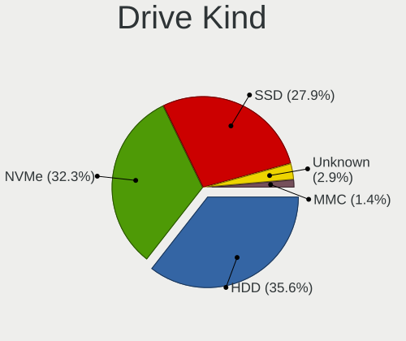

| Kind    | Desktops | Drives | Percent |
|---------|----------|--------|---------|
| HDD     | 432      | 815    | 35.56%  |
| NVMe    | 392      | 624    | 32.26%  |
| SSD     | 339      | 547    | 27.9%   |
| Unknown | 35       | 46     | 2.88%   |
| MMC     | 17       | 22     | 1.4%    |

Drive Connector
---------------

SATA, SAS, NVMe, etc.

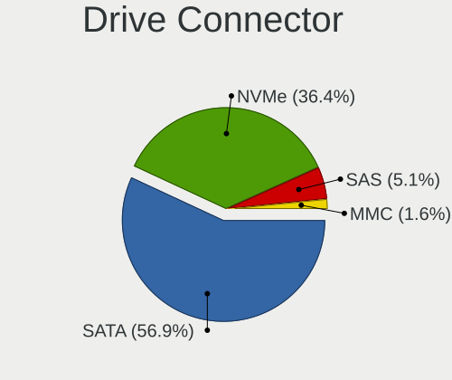

| Type | Desktops | Drives | Percent |
|------|----------|--------|---------|
| SATA | 609      | 1314   | 56.92%  |
| NVMe | 389      | 620    | 36.36%  |
| SAS  | 55       | 98     | 5.14%   |
| MMC  | 17       | 22     | 1.59%   |

Drive Size
----------

Size of hard drive

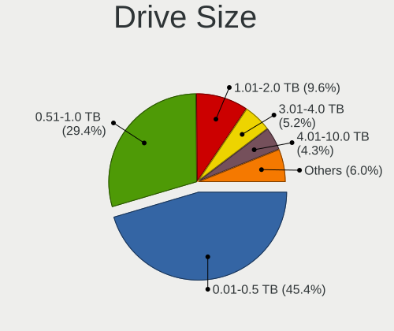

| Size in TB | Desktops | Drives | Percent |
|------------|----------|--------|---------|
| 0.01-0.5   | 383      | 668    | 45.43%  |
| 0.51-1.0   | 248      | 324    | 29.42%  |
| 1.01-2.0   | 81       | 111    | 9.61%   |
| 3.01-4.0   | 44       | 63     | 5.22%   |
| 4.01-10.0  | 36       | 114    | 4.27%   |
| 2.01-3.0   | 29       | 50     | 3.44%   |
| 10.01-20.0 | 21       | 31     | 2.49%   |
| 20.01-50.0 | 1        | 1      | 0.12%   |

Space Total
-----------

Amount of disk space available on the file system

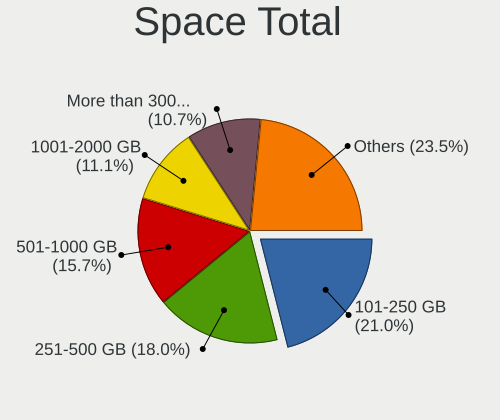

| Size in GB     | Desktops | Percent |
|----------------|----------|---------|
| 101-250        | 173      | 21.05%  |
| 251-500        | 148      | 18%     |
| 501-1000       | 129      | 15.69%  |
| 1001-2000      | 91       | 11.07%  |
| More than 3000 | 88       | 10.71%  |
| 51-100         | 57       | 6.93%   |
| 1-20           | 45       | 5.47%   |
| 2001-3000      | 32       | 3.89%   |
| Unknown        | 31       | 3.77%   |
| 21-50          | 28       | 3.41%   |

Space Used
----------

Amount of used disk space

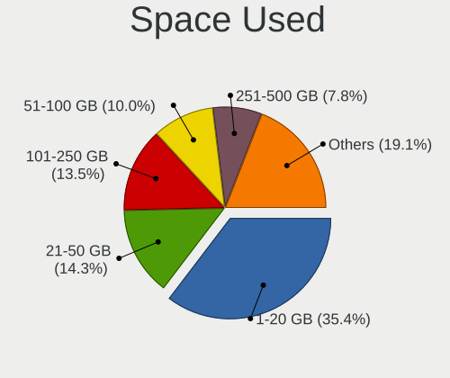

| Used GB        | Desktops | Percent |
|----------------|----------|---------|
| 1-20           | 302      | 35.36%  |
| 21-50          | 122      | 14.29%  |
| 101-250        | 115      | 13.47%  |
| 51-100         | 85       | 9.95%   |
| 251-500        | 67       | 7.85%   |
| 501-1000       | 44       | 5.15%   |
| 1001-2000      | 37       | 4.33%   |
| More than 3000 | 31       | 3.63%   |
| Unknown        | 31       | 3.63%   |
| 2001-3000      | 16       | 1.87%   |
| 0              | 4        | 0.47%   |

Malfunc. Drives
---------------

Drive models with a malfunction

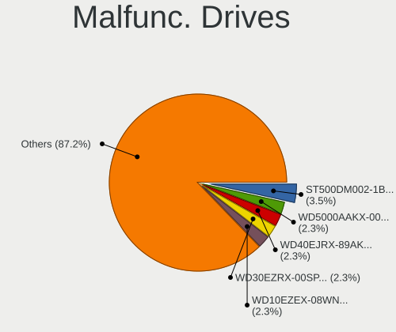

| Model                               | Desktops | Drives | Percent |
|-------------------------------------|----------|--------|---------|
| Seagate ST500DM002-1BD142 500GB     | 3        | 3      | 3.49%   |
| WDC WD5000AAKX-001CA0 500GB         | 2        | 2      | 2.33%   |
| WDC WD40EJRX-89AKWY0 4TB            | 2        | 6      | 2.33%   |
| WDC WD30EZRX-00SPEB0 3TB            | 2        | 2      | 2.33%   |
| WDC WD10EZEX-08WN4A0 1TB            | 2        | 2      | 2.33%   |
| Seagate ST31000524AS 1TB            | 2        | 2      | 2.33%   |
| Netac SSD 120GB                     | 2        | 3      | 2.33%   |
| WDC WDS240G2G0B-00EPW0 240GB SSD    | 1        | 1      | 1.16%   |
| WDC WD5003ABYZ-011FA0 500GB         | 1        | 1      | 1.16%   |
| WDC WD5003ABYX-01WERA1 500GB        | 1        | 1      | 1.16%   |
| WDC WD5000AZLX-60K2TA0 500GB        | 1        | 1      | 1.16%   |
| WDC WD5000AAKX-75U6AA0 500GB        | 1        | 1      | 1.16%   |
| WDC WD5000AAKX-08ERMA0 500GB        | 1        | 1      | 1.16%   |
| WDC WD5000AAKX-083CA1 500GB         | 1        | 2      | 1.16%   |
| WDC WD5000AAKX-00PWEA0 500GB        | 1        | 1      | 1.16%   |
| WDC WD5000AAKX-00ERMA0 500GB        | 1        | 1      | 1.16%   |
| WDC WD5000AAKX-0 500GB              | 1        | 1      | 1.16%   |
| WDC WD40PURX-78AKYY0 4TB            | 1        | 1      | 1.16%   |
| WDC WD40PURX-64AKYY0 4TB            | 1        | 1      | 1.16%   |
| WDC WD3200BEKT-60V5T1 320GB         | 1        | 1      | 1.16%   |
| WDC WD20EARX-00PASB0 2TB            | 1        | 1      | 1.16%   |
| WDC WD10JPVX-22JC3T0 1TB            | 1        | 1      | 1.16%   |
| WDC WD10JPLX-00MBPT1 1TB            | 1        | 2      | 1.16%   |
| WDC WD10EZEX-08WN4A1 1TB            | 1        | 1      | 1.16%   |
| WDC WD10EZEX-00BN5A0 1TB            | 1        | 1      | 1.16%   |
| WDC WD100EZAZ-11TDBA0 10TB          | 1        | 2      | 1.16%   |
| Toshiba DT01ACA300 3TB              | 1        | 1      | 1.16%   |
| Toshiba DT01ACA100 1TB              | 1        | 1      | 1.16%   |
| Toshiba DT01ACA050 500GB            | 1        | 2      | 1.16%   |
| Teelkoou SSD 128GB                  | 1        | 1      | 1.16%   |
| Seagate ST980811AS 80GB             | 1        | 1      | 1.16%   |
| Seagate ST750LM022 HN-M750MBB 752GB | 1        | 1      | 1.16%   |
| Seagate ST500LT012-1DG142 500GB     | 1        | 1      | 1.16%   |
| Seagate ST500LT0 12-9WS142 500GB    | 1        | 1      | 1.16%   |
| Seagate ST500DM009-2DM14C 500GB     | 1        | 1      | 1.16%   |
| Seagate ST5000AS0011-1L5178 5TB     | 1        | 1      | 1.16%   |
| Seagate ST4000VX007-2DT166 4TB      | 1        | 1      | 1.16%   |
| Seagate ST3500413AS 500GB           | 1        | 1      | 1.16%   |
| Seagate ST3320620AS 320GB           | 1        | 1      | 1.16%   |
| Seagate ST3160812AS 160GB           | 1        | 1      | 1.16%   |

Malfunc. Drive Vendor
---------------------

Vendors of faulty drives

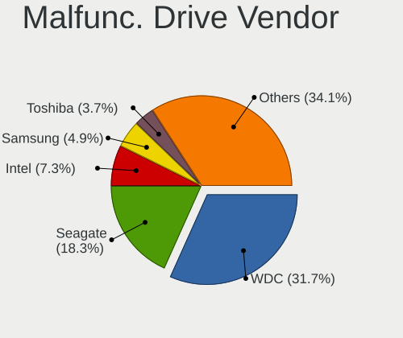

| Vendor              | Desktops | Drives | Percent |
|---------------------|----------|--------|---------|
| WDC                 | 26       | 34     | 31.71%  |
| Seagate             | 15       | 18     | 18.29%  |
| Intel               | 6        | 7      | 7.32%   |
| Samsung Electronics | 4        | 4      | 4.88%   |
| Toshiba             | 3        | 4      | 3.66%   |
| Kingston            | 3        | 3      | 3.66%   |
| Netac               | 2        | 3      | 2.44%   |
| Hitachi             | 2        | 2      | 2.44%   |
| GLOWAY              | 2        | 9      | 2.44%   |
| Colorful            | 2        | 2      | 2.44%   |
| Teelkoou            | 1        | 1      | 1.22%   |
| Saichi              | 1        | 1      | 1.22%   |
| Ramsta              | 1        | 1      | 1.22%   |
| Plextor             | 1        | 1      | 1.22%   |
| Micron Technology   | 1        | 1      | 1.22%   |
| Lenovo              | 1        | 1      | 1.22%   |
| Hewlett-Packard     | 1        | 2      | 1.22%   |
| HANCHU              | 1        | 1      | 1.22%   |
| Getrich             | 1        | 1      | 1.22%   |
| Fujitsu             | 1        | 1      | 1.22%   |
| FORESEE             | 1        | 1      | 1.22%   |
| Flashwar            | 1        | 1      | 1.22%   |
| faspeed             | 1        | 1      | 1.22%   |
| ExcelStor           | 1        | 1      | 1.22%   |
| Crucial             | 1        | 1      | 1.22%   |
| A-DATA Technology   | 1        | 1      | 1.22%   |
| Unknown             | 1        | 1      | 1.22%   |

Malfunc. HDD Vendor
-------------------

Vendors of faulty HDD drives

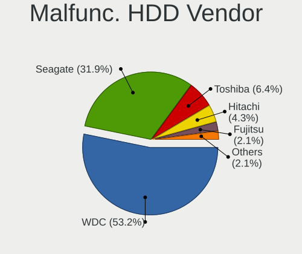

| Vendor    | Desktops | Drives | Percent |
|-----------|----------|--------|---------|
| WDC       | 25       | 33     | 53.19%  |
| Seagate   | 15       | 18     | 31.91%  |
| Toshiba   | 3        | 4      | 6.38%   |
| Hitachi   | 2        | 2      | 4.26%   |
| Fujitsu   | 1        | 1      | 2.13%   |
| ExcelStor | 1        | 1      | 2.13%   |

Malfunc. Drive Kind
-------------------

Kinds of faulty drives

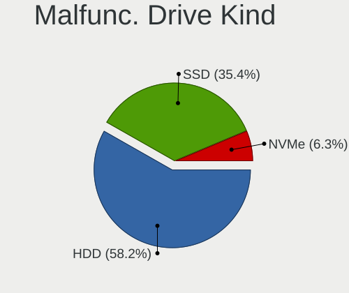

| Kind | Desktops | Drives | Percent |
|------|----------|--------|---------|
| HDD  | 46       | 59     | 58.23%  |
| SSD  | 28       | 39     | 35.44%  |
| NVMe | 5        | 6      | 6.33%   |

Failed Drives
-------------

Failed drive models

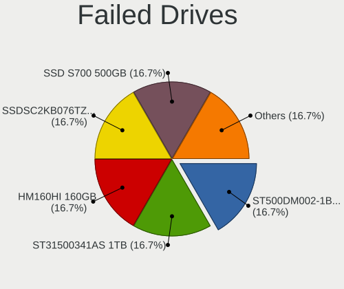

| Model                             | Desktops | Drives | Percent |
|-----------------------------------|----------|--------|---------|
| SOLIDIGM SSDSC2KB076TZ 8TB        | 1        | 1      | 16.67%  |
| Seagate ST500DM002-1BD142 500GB   | 1        | 1      | 16.67%  |
| Seagate ST31500341AS 1TB          | 1        | 1      | 16.67%  |
| Samsung Electronics HM160HI 160GB | 1        | 1      | 16.67%  |
| HGST HUH728080ALN600 8TB          | 1        | 1      | 16.67%  |
| Hewlett-Packard SSD S700 500GB    | 1        | 2      | 16.67%  |

Failed Drive Vendor
-------------------

Failed drive vendors

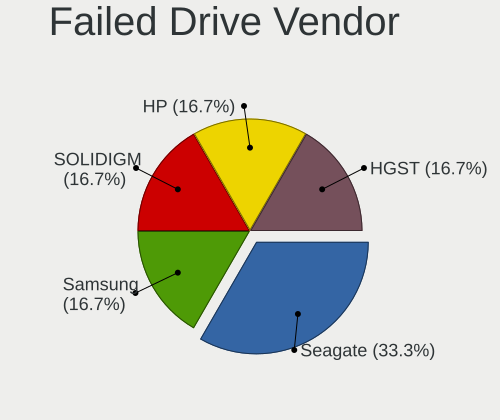

| Vendor              | Desktops | Drives | Percent |
|---------------------|----------|--------|---------|
| Seagate             | 2        | 2      | 33.33%  |
| SOLIDIGM            | 1        | 1      | 16.67%  |
| Samsung Electronics | 1        | 1      | 16.67%  |
| HGST                | 1        | 1      | 16.67%  |
| Hewlett-Packard     | 1        | 2      | 16.67%  |

Drive Status
------------

Number of failed and malfunc. drives

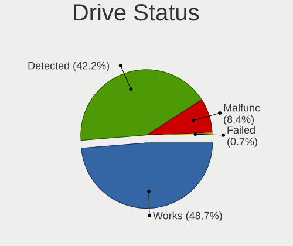

| Status   | Desktops | Drives | Percent |
|----------|----------|--------|---------|
| Works    | 434      | 1058   | 48.71%  |
| Detected | 376      | 885    | 42.2%   |
| Malfunc  | 75       | 104    | 8.42%   |
| Failed   | 6        | 7      | 0.67%   |

Storage controller
------------------

Storage Vendor
--------------

Storage controller vendors

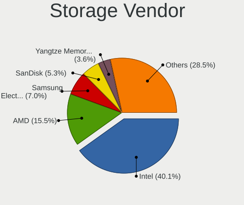

| Vendor                                  | Desktops | Percent |
|-----------------------------------------|----------|---------|
| Intel                                   | 506      | 40.13%  |
| AMD                                     | 195      | 15.46%  |
| Samsung Electronics                     | 88       | 6.98%   |
| SanDisk                                 | 67       | 5.31%   |
| Yangtze Memory Technologies             | 46       | 3.65%   |
| MAXIO Technology (Hangzhou)             | 44       | 3.49%   |
| Silicon Motion                          | 41       | 3.25%   |
| ASMedia Technology                      | 33       | 2.62%   |
| Loongson Technology                     | 25       | 1.98%   |
| Kingston Technology Company             | 23       | 1.82%   |
| Phison Electronics                      | 15       | 1.19%   |
| KIOXIA                                  | 15       | 1.19%   |
| SK hynix                                | 14       | 1.11%   |
| Shenzhen Longsys Electronics            | 13       | 1.03%   |
| Zhaoxin                                 | 12       | 0.95%   |
| Marvell Technology Group                | 12       | 0.95%   |
| Broadcom / LSI                          | 12       | 0.95%   |
| JMicron Technology                      | 11       | 0.87%   |
| Micron Technology                       | 6        | 0.48%   |
| Toshiba America Info Systems            | 5        | 0.4%    |
| Realtek Semiconductor                   | 5        | 0.4%    |
| Micron/Crucial Technology               | 5        | 0.4%    |
| Lite-On Technology                      | 5        | 0.4%    |
| IBM                                     | 5        | 0.4%    |
| Solidigm                                | 4        | 0.32%   |
| Jiangsu Xinsheng Intelligent Technology | 4        | 0.32%   |
| INNOGRIT                                | 4        | 0.32%   |
| ADATA Technology                        | 4        | 0.32%   |
| Huawei Technologies                     | 3        | 0.24%   |
| Biwin Storage Technology                | 3        | 0.24%   |
| Beijing Starblaze Technology            | 3        | 0.24%   |
| Beijing Memblaze Technology             | 3        | 0.24%   |
| Union Memory (Shenzhen)                 | 2        | 0.16%   |
| ULi Electronics                         | 2        | 0.16%   |
| Solid State Storage Technology          | 2        | 0.16%   |
| Silicon Image                           | 2        | 0.16%   |
| Shenzhen Unionmemory Information System | 2        | 0.16%   |
| Seagate Technology                      | 2        | 0.16%   |
| Nvidia                                  | 2        | 0.16%   |
| Mylex                                   | 2        | 0.16%   |

Storage Model
-------------

Storage controller models

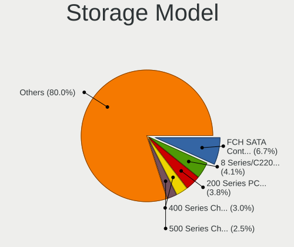

| Model                                                                                   | Desktops | Percent |
|-----------------------------------------------------------------------------------------|----------|---------|
| AMD FCH SATA Controller [AHCI mode]                                                     | 98       | 6.75%   |
| Intel 8 Series/C220 Series Chipset Family 6-port SATA Controller 1 [AHCI mode]          | 59       | 4.06%   |
| Intel 200 Series PCH SATA controller [AHCI mode]                                        | 55       | 3.79%   |
| AMD 400 Series Chipset SATA Controller                                                  | 43       | 2.96%   |
| AMD 500 Series Chipset SATA Controller                                                  | 36       | 2.48%   |
| Intel Q170/Q150/B150/H170/H110/Z170/CM236 Chipset SATA Controller [AHCI Mode]           | 35       | 2.41%   |
| Intel Alder Lake-S PCH SATA Controller [AHCI Mode]                                      | 35       | 2.41%   |
| Silicon Motion SM2263EN/SM2263XT (DRAM-less) NVMe SSD Controllers                       | 30       | 2.07%   |
| Intel Raptor Lake SATA AHCI Controller                                                  | 30       | 2.07%   |
| Intel Cannon Lake PCH SATA AHCI Controller                                              | 30       | 2.07%   |
| Samsung NVMe SSD Controller SM981/PM981/PM983                                           | 29       | 2%      |
| AMD 600 Series Chipset SATA Controller                                                  | 29       | 2%      |
| MAXIO (Hangzhou) NVMe SSD Controller MAP1202 (DRAM-less)                                | 26       | 1.79%   |
| ASMedia ASM1061/ASM1062 Serial ATA Controller                                           | 25       | 1.72%   |
| Intel SATA Controller [RAID mode]                                                       | 23       | 1.58%   |
| Samsung NVMe SSD Controller PM9A1/PM9A3/980PRO                                          | 22       | 1.52%   |
| Loongson 2K2000 / 7A2000 Chipset 6Gb/s SATA AHCI Controller                             | 22       | 1.52%   |
| Intel 400 Series Chipset Family SATA AHCI Controller                                    | 22       | 1.52%   |
| Yangtze Memory ZHITAI TiPlus7100                                                        | 21       | 1.45%   |
| Intel 6 Series/C200 Series Chipset Family 6 port Desktop SATA AHCI Controller           | 21       | 1.45%   |
| Intel 7 Series/C210 Series Chipset Family 6-port SATA Controller [AHCI mode]            | 20       | 1.38%   |
| Intel 500 Series Chipset Family SATA AHCI Controller                                    | 18       | 1.24%   |
| SanDisk Ultra 3D / WD PC SN530, IX SN530, Blue SN550 NVMe SSD (DRAM-less)               | 16       | 1.1%    |
| Samsung NVMe SSD Controller SM961/PM961/SM963                                           | 16       | 1.1%    |
| MAXIO (Hangzhou) NVMe SSD Controller MAP1602 (DRAM-less)                                | 16       | 1.1%    |
| Intel Volume Management Device NVMe RAID Controller                                     | 15       | 1.03%   |
| Intel NM10/ICH7 Family SATA Controller [IDE mode]                                       | 13       | 0.9%    |
| AMD SB7x0/SB8x0/SB9x0 SATA Controller [IDE mode]                                        | 13       | 0.9%    |
| AMD SB7x0/SB8x0/SB9x0 IDE Controller                                                    | 13       | 0.9%    |
| Zhaoxin ZX-100/ZX-200/KX-6000/KX-6000G/KH-40000/KX-7000 StorX AHCI Controller           | 12       | 0.83%   |
| Intel C610/X99 series chipset sSATA Controller [AHCI mode]                              | 12       | 0.83%   |
| Intel C610/X99 series chipset 6-Port SATA Controller [AHCI mode]                        | 12       | 0.83%   |
| Intel Atom Processor E3800 Series SATA AHCI Controller                                  | 12       | 0.83%   |
| Samsung NVMe SSD Controller 980 (DRAM-less)                                             | 11       | 0.76%   |
| Intel RST Volume Management Device Controller                                           | 11       | 0.76%   |
| Intel Alder Lake-N SATA AHCI Controller                                                 | 11       | 0.76%   |
| SanDisk Extreme Pro / WD Black SN750 / PC SN730 / Red SN700 NVMe SSD                    | 10       | 0.69%   |
| Phison PS5013-E13 PCIe3 NVMe Controller (DRAM-less)                                     | 10       | 0.69%   |
| Intel 6 Series/C200 Series Chipset Family Desktop SATA Controller (IDE mode, ports 4-5) | 10       | 0.69%   |
| AMD FCH IDE Controller                                                                  | 10       | 0.69%   |

Storage Kind
------------

Kind of storage controller (IDE, SATA, NVMe, SAS, ...)

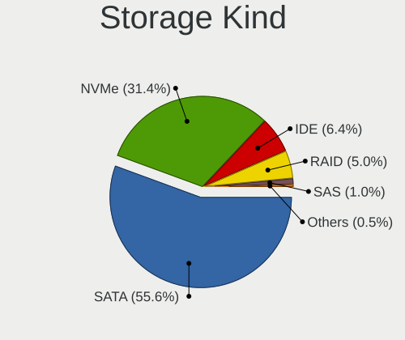

| Kind | Desktops | Percent |
|------|----------|---------|
| SATA | 690      | 55.6%   |
| NVMe | 390      | 31.43%  |
| IDE  | 80       | 6.45%   |
| RAID | 62       | 5%      |
| SAS  | 13       | 1.05%   |
| SCSI | 6        | 0.48%   |

Processor
---------

CPU Vendor
----------

Processor vendors

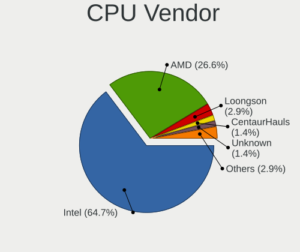

| Vendor            | Desktops | Percent |
|-------------------|----------|---------|
| Intel             | 510      | 64.72%  |
| AMD               | 210      | 26.65%  |
| Loongson          | 23       | 2.92%   |
| CentaurHauls      | 11       | 1.4%    |
| Unknown           | 11       | 1.4%    |
| CHRP IBM,8233-E8B | 5        | 0.63%   |
| sifive,u74-mc     | 4        | 0.51%   |
| ARM               | 4        | 0.51%   |
| sifive,bullet0    | 3        | 0.38%   |
| CHRP IBM,9131-52A | 2        | 0.25%   |
| WIAT              | 1        | 0.13%   |
| PowerNV FP5466G2  | 1        | 0.13%   |
| PowerNV C829UAG3  | 1        | 0.13%   |
| HygonGenuine      | 1        | 0.13%   |
| FSP-1             | 1        | 0.13%   |

CPU Model
---------

Processor models

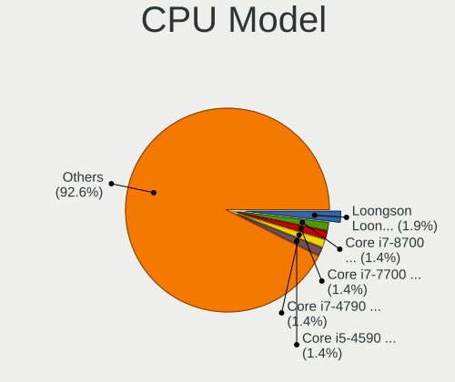

| Model                                                     | Desktops | Percent |
|-----------------------------------------------------------|----------|---------|
| Loongson Loongson 3A                                      | 15       | 1.88%   |
| Intel Core i7-8700 CPU @ 3.20GHz                          | 11       | 1.38%   |
| Intel Core i7-7700 CPU @ 3.60GHz                          | 11       | 1.38%   |
| Intel Core i7-4790 CPU @ 3.60GHz                          | 11       | 1.38%   |
| Intel Core i5-4590 CPU @ 3.30GHz                          | 11       | 1.38%   |
|                                                           | 11       | 1.38%   |
| Intel Core i7-10700 CPU @ 2.90GHz                         | 10       | 1.25%   |
| Intel Core i7-7800X CPU @ 3.50GHz                         | 9        | 1.13%   |
| Intel Core i5-6500 CPU @ 3.20GHz                          | 9        | 1.13%   |
| AMD Ryzen 9 9950X 16-Core Processor                       | 9        | 1.13%   |
| Intel N100                                                | 8        | 1%      |
| Intel Celeron CPU J1900 @ 1.99GHz                         | 8        | 1%      |
| AMD Ryzen 5 5600G with Radeon Graphics                    | 8        | 1%      |
| Intel Xeon CPU E3-1231 v3 @ 3.40GHz                       | 7        | 0.88%   |
| Intel Core i7-6700 CPU @ 3.40GHz                          | 7        | 0.88%   |
| Intel Core i5-7500 CPU @ 3.40GHz                          | 7        | 0.88%   |
| Intel 11th Gen Core i7-11700 @ 2.50GHz                    | 7        | 0.88%   |
| AMD Ryzen 5 3600 6-Core Processor                         | 7        | 0.88%   |
| AMD Ryzen 5 2400G with Radeon Vega Graphics               | 7        | 0.88%   |
| Loongson 3A6000-HV                                        | 6        | 0.75%   |
| Intel Core i7-7700K CPU @ 4.20GHz                         | 6        | 0.75%   |
| Intel Core i5-8400 CPU @ 2.80GHz                          | 6        | 0.75%   |
| Intel Core i5-10400 CPU @ 2.90GHz                         | 6        | 0.75%   |
| Intel 12th Gen Core i5-12400                              | 6        | 0.75%   |
| AMD Ryzen 7 5700G with Radeon Graphics                    | 6        | 0.75%   |
| AMD Ryzen 7 3700X 8-Core Processor                        | 6        | 0.75%   |
| Intel Core i9-10900K CPU @ 3.70GHz                        | 5        | 0.63%   |
| Intel Core i7-3770 CPU @ 3.40GHz                          | 5        | 0.63%   |
| Intel Core i5-7400 CPU @ 3.00GHz                          | 5        | 0.63%   |
| Intel Core i5-4460 CPU @ 3.20GHz                          | 5        | 0.63%   |
| CHRP IBM,8233-E8B POWER7 (architected), altivec supported | 5        | 0.63%   |
| CentaurHauls ZHAOXIN KaiXian KX-6640MA@2.2+GHz            | 5        | 0.63%   |
| AMD Ryzen 9 5950X 16-Core Processor                       | 5        | 0.63%   |
| AMD Ryzen 7 5800X 8-Core Processor                        | 5        | 0.63%   |
| AMD Ryzen 5 5600 6-Core Processor                         | 5        | 0.63%   |
| AMD Ryzen 5 2600 Six-Core Processor                       | 5        | 0.63%   |
| Intel Xeon W-2223 CPU @ 3.60GHz                           | 4        | 0.5%    |
| Intel Xeon CPU E5-2620 v4 @ 2.10GHz                       | 4        | 0.5%    |
| Intel Xeon CPU E3-1230 V2 @ 3.30GHz                       | 4        | 0.5%    |
| Intel Core i9-14900K                                      | 4        | 0.5%    |

CPU Model Family
----------------

Processor model prefix

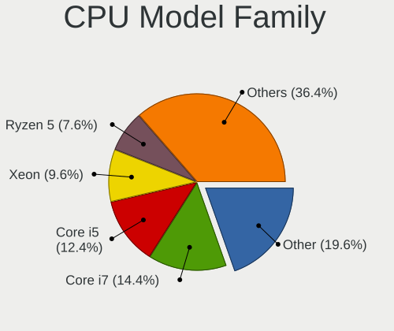

| Model                   | Desktops | Percent |
|-------------------------|----------|---------|
| Other                   | 155      | 19.6%   |
| Intel Core i7           | 114      | 14.41%  |
| Intel Core i5           | 98       | 12.39%  |
| Intel Xeon              | 76       | 9.61%   |
| AMD Ryzen 5             | 60       | 7.59%   |
| Intel Celeron           | 41       | 5.18%   |
| AMD Ryzen 7             | 41       | 5.18%   |
| AMD Ryzen 9             | 39       | 4.93%   |
| Intel Core i3           | 38       | 4.8%    |
| Intel Pentium           | 18       | 2.28%   |
| Intel Core i9           | 15       | 1.9%    |
| AMD FX                  | 8        | 1.01%   |
| AMD Athlon II X2        | 7        | 0.88%   |
| AMD A8                  | 6        | 0.76%   |
| AMD Athlon X4           | 5        | 0.63%   |
| AMD Athlon II X4        | 5        | 0.63%   |
| Intel Pentium Dual-Core | 4        | 0.51%   |
| Intel Genuine           | 4        | 0.51%   |
| Intel Core 2 Duo        | 4        | 0.51%   |
| Intel Atom              | 4        | 0.51%   |
| AMD Ryzen 7 PRO         | 4        | 0.51%   |
| AMD Ryzen 3             | 4        | 0.51%   |
| AMD EPYC                | 4        | 0.51%   |
| AMD Athlon              | 4        | 0.51%   |
| Intel Core 2 Quad       | 3        | 0.38%   |
| Intel Core              | 3        | 0.38%   |
| AMD Ryzen Threadripper  | 3        | 0.38%   |
| AMD Phenom II X4        | 3        | 0.38%   |
| AMD A10                 | 3        | 0.38%   |
| Intel Pentium Gold      | 2        | 0.25%   |
| Intel Core 2            | 2        | 0.25%   |
| AMD Ryzen 5 PRO         | 2        | 0.25%   |
| AMD E                   | 2        | 0.25%   |
| Intel Xeon Bronze       | 1        | 0.13%   |
| Intel Pentium Silver    | 1        | 0.13%   |
| Intel Pentium III       | 1        | 0.13%   |
| Intel Pentium Dual      | 1        | 0.13%   |
| ARM Allwinner           | 1        | 0.13%   |
| AMD Phenom II X6        | 1        | 0.13%   |
| AMD GX                  | 1        | 0.13%   |

CPU Cores
---------

Number of processor cores

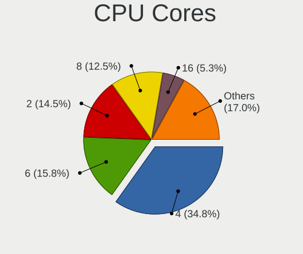

| Number  | Desktops | Percent |
|---------|----------|---------|
| 4       | 278      | 34.84%  |
| 6       | 126      | 15.79%  |
| 2       | 116      | 14.54%  |
| 8       | 100      | 12.53%  |
| 16      | 42       | 5.26%   |
| 12      | 32       | 4.01%   |
| 10      | 26       | 3.26%   |
| 24      | 16       | 2.01%   |
| 1       | 13       | 1.63%   |
| Unknown | 12       | 1.5%    |
| 14      | 10       | 1.25%   |
| 20      | 8        | 1%      |
| 32      | 6        | 0.75%   |
| 28      | 3        | 0.38%   |
| 18      | 3        | 0.38%   |
| 64      | 2        | 0.25%   |
| 3       | 2        | 0.25%   |
| 52      | 1        | 0.13%   |
| 40      | 1        | 0.13%   |
| 22      | 1        | 0.13%   |

CPU Sockets
-----------

Number of sockets

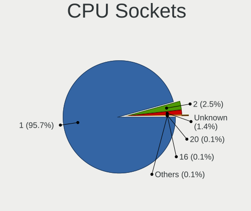

| Number  | Desktops | Percent |
|---------|----------|---------|
| 1       | 756      | 95.7%   |
| 2       | 20       | 2.53%   |
| Unknown | 11       | 1.39%   |
| 20      | 1        | 0.13%   |
| 16      | 1        | 0.13%   |
| 6       | 1        | 0.13%   |

CPU Threads
-----------

Threads per core (Hyper-Threading)

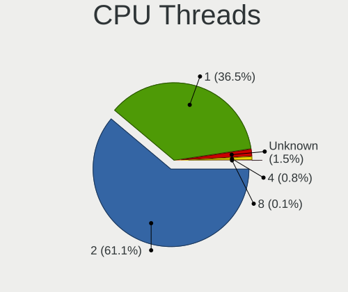

| Number  | Desktops | Percent |
|---------|----------|---------|
| 2       | 486      | 61.13%  |
| 1       | 290      | 36.48%  |
| Unknown | 12       | 1.51%   |
| 4       | 6        | 0.75%   |
| 8       | 1        | 0.13%   |

CPU Op-Modes
------------

CPU Operation Modes (32-bit, 64-bit)

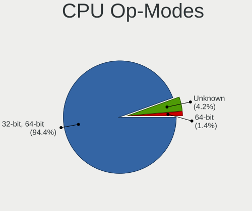

| Op mode        | Desktops | Percent |
|----------------|----------|---------|
| 32-bit, 64-bit | 748      | 94.44%  |
| Unknown        | 33       | 4.17%   |
| 64-bit         | 11       | 1.39%   |

CPU Microcode
-------------

Microcode number

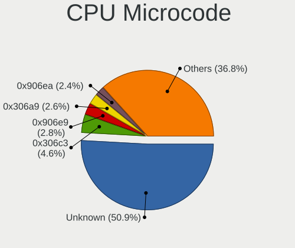

| Number     | Desktops | Percent |
|------------|----------|---------|
| Unknown    | 411      | 50.87%  |
| 0x306c3    | 37       | 4.58%   |
| 0x906e9    | 23       | 2.85%   |
| 0x306a9    | 21       | 2.6%    |
| 0x906ea    | 19       | 2.35%   |
| 0x506e3    | 16       | 1.98%   |
| 0xa0655    | 15       | 1.86%   |
| 0x90672    | 13       | 1.61%   |
| 0x206a7    | 13       | 1.61%   |
| 0xb0671    | 9        | 1.11%   |
| 0xa0653    | 8        | 0.99%   |
| 0x50654    | 8        | 0.99%   |
| 0x30678    | 8        | 0.99%   |
| 0x08701013 | 8        | 0.99%   |
| 0x1067a    | 7        | 0.87%   |
| 0x0a50000d | 7        | 0.87%   |
| 0x06003106 | 7        | 0.87%   |
| 0x010000c8 | 7        | 0.87%   |
| 0xa0671    | 6        | 0.74%   |
| 0x50657    | 6        | 0.74%   |
| 0x08701021 | 6        | 0.74%   |
| 0x306f2    | 5        | 0.62%   |
| 0x0a50000c | 5        | 0.62%   |
| 0x08101016 | 5        | 0.62%   |
| 0x906c0    | 4        | 0.5%    |
| 0x406f1    | 4        | 0.5%    |
| 0x0a20120a | 4        | 0.5%    |
| 0x0810100b | 4        | 0.5%    |
| 0x0800820d | 4        | 0.5%    |
| 0x08001138 | 4        | 0.5%    |
| 0xb06f2    | 3        | 0.37%   |
| 0xb06e0    | 3        | 0.37%   |
| 0x906ed    | 3        | 0.37%   |
| 0x706a8    | 3        | 0.37%   |
| 0x40651    | 3        | 0.37%   |
| 0x30661    | 3        | 0.37%   |
| 0x206d7    | 3        | 0.37%   |
| 0x206c2    | 3        | 0.37%   |
| 0x0a601206 | 3        | 0.37%   |
| 0x0a601203 | 3        | 0.37%   |

CPU Microarch
-------------

Microarchitecture

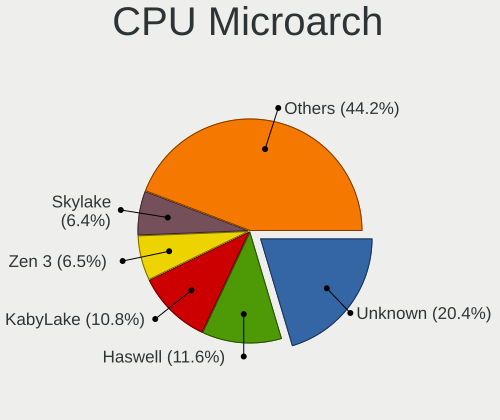

| Name             | Desktops | Percent |
|------------------|----------|---------|
| Unknown          | 162      | 20.4%   |
| Haswell          | 92       | 11.59%  |
| KabyLake         | 86       | 10.83%  |
| Zen 3            | 52       | 6.55%   |
| Skylake          | 51       | 6.42%   |
| IvyBridge        | 42       | 5.29%   |
| CometLake        | 39       | 4.91%   |
| Alderlake Hybrid | 39       | 4.91%   |
| Zen 2            | 35       | 4.41%   |
| SandyBridge      | 23       | 2.9%    |
| Zen              | 19       | 2.39%   |
| Silvermont       | 18       | 2.27%   |
| K10              | 18       | 2.27%   |
| Broadwell        | 17       | 2.14%   |
| Zen+             | 14       | 1.76%   |
| Penryn           | 12       | 1.51%   |
| Piledriver       | 11       | 1.39%   |
| Steamroller      | 9        | 1.13%   |
| Icelake          | 9        | 1.13%   |
| Gracemont        | 9        | 1.13%   |
| Core             | 6        | 0.76%   |
| Tremont          | 5        | 0.63%   |
| TigerLake        | 4        | 0.5%    |
| Goldmont plus    | 4        | 0.5%    |
| Westmere         | 3        | 0.38%   |
| Bonnell          | 3        | 0.38%   |
| Jaguar           | 2        | 0.25%   |
| Bulldozer        | 2        | 0.25%   |
| Puma             | 1        | 0.13%   |
| P6               | 1        | 0.13%   |
| NetBurst         | 1        | 0.13%   |
| Nehalem          | 1        | 0.13%   |
| Lunarlake Hybrid | 1        | 0.13%   |
| K8 Hammer        | 1        | 0.13%   |
| Goldmont         | 1        | 0.13%   |
| Excavator        | 1        | 0.13%   |

Graphics
--------

GPU Vendor
----------

Vendors of graphics cards

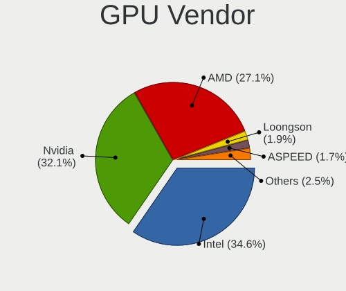

| Vendor                           | Desktops | Percent |
|----------------------------------|----------|---------|
| Intel                            | 306      | 34.62%  |
| Nvidia                           | 284      | 32.13%  |
| AMD                              | 240      | 27.15%  |
| Loongson Technology              | 17       | 1.92%   |
| ASPEED Technology                | 15       | 1.7%    |
| Zhaoxin                          | 10       | 1.13%   |
| Matrox Electronics Systems       | 7        | 0.79%   |
| Silicon Integrated Systems [SiS] | 1        | 0.11%   |
| Moore Threads Technology         | 1        | 0.11%   |
| Glenfly Tech                     | 1        | 0.11%   |
| Cirrus Logic                     | 1        | 0.11%   |
| 3DLabs                           | 1        | 0.11%   |

GPU Model
---------

Graphics card models

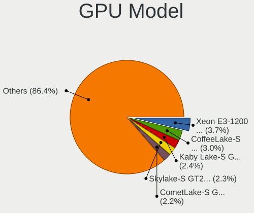

| Model                                                                       | Desktops | Percent |
|-----------------------------------------------------------------------------|----------|---------|
| Intel Xeon E3-1200 v3/4th Gen Core Processor Integrated Graphics Controller | 34       | 3.74%   |
| Intel CoffeeLake-S GT2 [UHD Graphics 630]                                   | 27       | 2.97%   |
| Intel Kaby Lake-S GT2 [HD Graphics 630]                                     | 22       | 2.42%   |
| Intel Skylake-S GT2 [HD Graphics 530]                                       | 21       | 2.31%   |
| Intel CometLake-S GT2 [UHD Graphics 630]                                    | 20       | 2.2%    |
| AMD Oland [Radeon HD 8570 / R5 430 OEM / R7 240/340 / Radeon 520 OEM]       | 17       | 1.87%   |
| AMD Cezanne [Radeon Vega Series / Radeon Vega Mobile Series]                | 17       | 1.87%   |
| Nvidia GK208B [GeForce GT 730]                                              | 16       | 1.76%   |
| ASPEED Technology ASPEED Graphics Family                                    | 15       | 1.65%   |
| AMD Ellesmere [Radeon RX 470/480/570/570X/580/580X/590]                     | 15       | 1.65%   |
| Nvidia GA102 [GeForce RTX 3090]                                             | 14       | 1.54%   |
| Loongson Technology 2K2000 / 7A2000 Chipset Display Controller              | 14       | 1.54%   |
| Intel Raptor Lake-S GT1 [UHD Graphics 770]                                  | 14       | 1.54%   |
| Intel Atom Processor Z36xxx/Z37xxx Series Graphics & Display                | 13       | 1.43%   |
| Intel 2nd Generation Core Processor Family Integrated Graphics Controller   | 13       | 1.43%   |
| Nvidia GA106 [GeForce RTX 3060 Lite Hash Rate]                              | 12       | 1.32%   |
| Intel Xeon E3-1200 v2/3rd Gen Core processor Graphics Controller            | 12       | 1.32%   |
| Intel Alder Lake-S GT1 [UHD Graphics 770]                                   | 12       | 1.32%   |
| Intel Alder Lake-N [UHD Graphics]                                           | 12       | 1.32%   |
| AMD Raven Ridge [Radeon Vega Series / Radeon Vega Mobile Series]            | 12       | 1.32%   |
| AMD Granite Ridge [Radeon Graphics]                                         | 12       | 1.32%   |
| Nvidia AD106 [GeForce RTX 4060 Ti]                                          | 11       | 1.21%   |
| Zhaoxin KX-6000 C-960 GPU                                                   | 10       | 1.1%    |
| Nvidia GP102 [GeForce GTX 1080 Ti]                                          | 10       | 1.1%    |
| Nvidia GM107 [GeForce GTX 750 Ti]                                           | 10       | 1.1%    |
| Nvidia GP106 [GeForce GTX 1060 6GB]                                         | 9        | 0.99%   |
| Nvidia GP106 [GeForce GTX 1060 3GB]                                         | 9        | 0.99%   |
| Nvidia AD102 [GeForce RTX 4090]                                             | 9        | 0.99%   |
| Intel Alder Lake-S GT1 [UHD Graphics 730]                                   | 9        | 0.99%   |
| AMD Raphael                                                                 | 9        | 0.99%   |
| Nvidia GP107 [GeForce GTX 1050 Ti]                                          | 8        | 0.88%   |
| Nvidia GK208B [GeForce GT 710]                                              | 8        | 0.88%   |
| Nvidia GM206 [GeForce GTX 960]                                              | 7        | 0.77%   |
| AMD Lexa PRO [Radeon 540/540X/550/550X / RX 540X/550/550X]                  | 7        | 0.77%   |
| AMD Caicos [Radeon HD 6450/7450/8450 / R5 230 OEM]                          | 7        | 0.77%   |
| Nvidia TU116 [GeForce GTX 1660]                                             | 6        | 0.66%   |
| Nvidia GP104 [GeForce GTX 1080]                                             | 6        | 0.66%   |
| Intel JasperLake [UHD Graphics]                                             | 6        | 0.66%   |
| Intel IvyBridge GT2 [HD Graphics 4000]                                      | 6        | 0.66%   |
| AMD Renoir [Radeon Vega Series / Radeon Vega Mobile Series]                 | 6        | 0.66%   |

GPU Combo
---------

Combinations of graphics cards

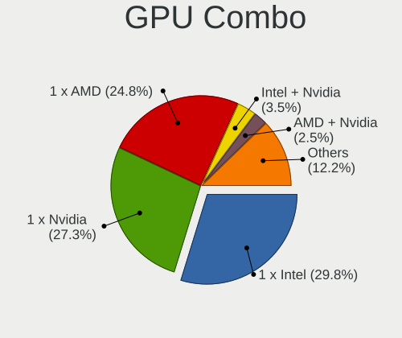

| Name                         | Desktops | Percent |
|------------------------------|----------|---------|
| 1 x Intel                    | 238      | 29.75%  |
| 1 x Nvidia                   | 218      | 27.25%  |
| 1 x AMD                      | 198      | 24.75%  |
| Intel + Nvidia               | 28       | 3.5%    |
| AMD + Nvidia                 | 20       | 2.5%    |
| Other                        | 15       | 1.88%   |
| 1 x Loongson Technology      | 13       | 1.63%   |
| 1 x Zhaoxin                  | 10       | 1.25%   |
| Nvidia + ASPEED              | 9        | 1.13%   |
| Intel + AMD                  | 9        | 1.13%   |
| 2 x Nvidia                   | 8        | 1%      |
| 1 x Matrox                   | 6        | 0.75%   |
| 2 x AMD                      | 5        | 0.63%   |
| AMD + Loongson Technology    | 5        | 0.63%   |
| 1 x ASPEED                   | 4        | 0.5%    |
| 2 x Intel                    | 2        | 0.25%   |
| AMD + Matrox                 | 2        | 0.25%   |
| 2 x Nvidia + 1 x ASPEED      | 1        | 0.13%   |
| 1 x SiS                      | 1        | 0.13%   |
| 1 x Moore Threads Technology | 1        | 0.13%   |
| 1 x Intel + 3 x Nvidia       | 1        | 0.13%   |
| Intel + 2 x Nvidia           | 1        | 0.13%   |
| Intel + Matrox               | 1        | 0.13%   |
| 1 x Glenfly Tech             | 1        | 0.13%   |
| 1 x Cirrus Logic             | 1        | 0.13%   |
| AMD + ASPEED                 | 1        | 0.13%   |
| AMD + 3DLabs                 | 1        | 0.13%   |

GPU Driver
----------

Free vs proprietary

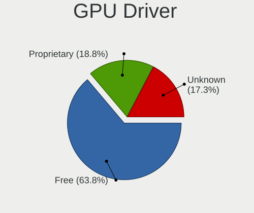

| Driver      | Desktops | Percent |
|-------------|----------|---------|
| Free        | 512      | 63.84%  |
| Proprietary | 151      | 18.83%  |
| Unknown     | 139      | 17.33%  |

GPU Memory
----------

Total video memory

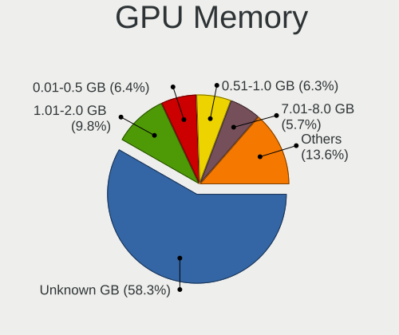

| Size in GB | Desktops | Percent |
|------------|----------|---------|
| Unknown    | 472      | 58.27%  |
| 1.01-2.0   | 79       | 9.75%   |
| 0.01-0.5   | 52       | 6.42%   |
| 0.51-1.0   | 51       | 6.3%    |
| 7.01-8.0   | 46       | 5.68%   |
| 3.01-4.0   | 36       | 4.44%   |
| 8.01-16.0  | 25       | 3.09%   |
| 5.01-6.0   | 19       | 2.35%   |
| 16.01-24.0 | 12       | 1.48%   |
| 2.01-3.0   | 9        | 1.11%   |
| 4.01-5.0   | 6        | 0.74%   |
| 24.01-32.0 | 3        | 0.37%   |

Monitor
-------

Monitor Vendor
--------------

Monitor vendors

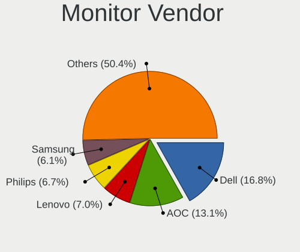

| Vendor               | Desktops | Percent |
|----------------------|----------|---------|
| Dell                 | 116      | 16.84%  |
| AOC                  | 90       | 13.06%  |
| Lenovo               | 48       | 6.97%   |
| Philips              | 46       | 6.68%   |
| Samsung Electronics  | 42       | 6.1%    |
| Goldstar             | 28       | 4.06%   |
| Hewlett-Packard      | 23       | 3.34%   |
| ViewSonic            | 21       | 3.05%   |
| HKC                  | 16       | 2.32%   |
| BenQ                 | 16       | 2.32%   |
| Mi                   | 14       | 2.03%   |
| Acer                 | 14       | 2.03%   |
| Unknown              | 7        | 1.02%   |
| SAC                  | 7        | 1.02%   |
| RTK                  | 7        | 1.02%   |
| IPS                  | 7        | 1.02%   |
| Xiaomi               | 6        | 0.87%   |
| BOE                  | 6        | 0.87%   |
| Unknown              | 6        | 0.87%   |
| HUAWEI               | 5        | 0.73%   |
| Sony                 | 4        | 0.58%   |
| SKG                  | 4        | 0.58%   |
| SGT                  | 4        | 0.58%   |
| Lenovo Group Limited | 4        | 0.58%   |
| Lecoo                | 4        | 0.58%   |
| HLG                  | 4        | 0.58%   |
| Eizo                 | 4        | 0.58%   |
| Denver               | 4        | 0.58%   |
| Ancor Communications | 4        | 0.58%   |
| TFC                  | 3        | 0.44%   |
| TCL                  | 3        | 0.44%   |
| Skyworth             | 3        | 0.44%   |
| PRISM+               | 3        | 0.44%   |
| MSI                  | 3        | 0.44%   |
| LG Electronics       | 3        | 0.44%   |
| Hitachi              | 3        | 0.44%   |
| CHD                  | 3        | 0.44%   |
| CGC                  | 3        | 0.44%   |
| ASUSTek Computer     | 3        | 0.44%   |
| VIM                  | 2        | 0.29%   |

Monitor Model
-------------

Monitor models

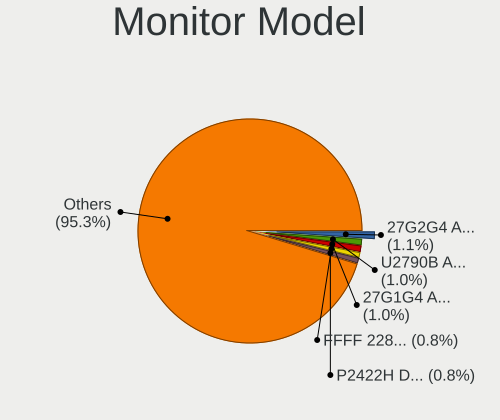

| Model                                                                 | Desktops | Percent |
|-----------------------------------------------------------------------|----------|---------|
| AOC 27G2G4 AOC2702 1920x1080 598x336mm 27.0-inch                      | 8        | 1.1%    |
| AOC U2790B AOC2790 3840x2160 597x336mm 27.0-inch                      | 7        | 0.96%   |
| AOC 27G1G4 AOC2701 1920x1080 598x336mm 27.0-inch                      | 7        | 0.96%   |
| Unknown LCD Monitor FFFF 2288x1287 2550x2550mm 142.0-inch             | 6        | 0.83%   |
| Dell P2422H DELA1C5 1920x1080 527x296mm 23.8-inch                     | 6        | 0.83%   |
| AOC 24G2W1G3 AOC2402 1920x1080 527x296mm 23.8-inch                    | 6        | 0.83%   |
| AOC 24B1W1 AOC2401 1920x1080 527x296mm 23.8-inch                      | 6        | 0.83%   |
| Unknown                                                               | 6        | 0.83%   |
| Dell P2422H DELA1C3 1920x1080 530x300mm 24.0-inch                     | 5        | 0.69%   |
| Xiaomi Mi TV XMD004A 3840x2160 708x398mm 32.0-inch                    | 4        | 0.55%   |
| Philips PHL 243V7 PHLC155 1920x1080 527x296mm 23.8-inch               | 4        | 0.55%   |
| Lenovo LT2252p Wide LEN0A0C 1680x1050 474x296mm 22.0-inch             | 4        | 0.55%   |
| Lenovo L197 Wide LEN1152 1440x900 410x257mm 19.1-inch                 | 4        | 0.55%   |
| Lenovo E24-28 LEN62C7 1920x1080 527x296mm 23.8-inch                   | 4        | 0.55%   |
| HUAWEI AD80HW HWV2402 1920x1080 527x296mm 23.8-inch                   | 4        | 0.55%   |
| HLG SL17-01 HLG1701 1280x1024 337x270mm 17.0-inch                     | 4        | 0.55%   |
| Goldstar ULTRAFINE GSM5BC2 3840x2160 697x392mm 31.5-inch              | 4        | 0.55%   |
| Dell U2417H DEL40E7 1920x1080 527x296mm 23.8-inch                     | 4        | 0.55%   |
| Dell U2412M DELA07B 1920x1200 518x324mm 24.1-inch                     | 4        | 0.55%   |
| AOC K27U3D AOC2703 3840x2160 597x336mm 27.0-inch                      | 4        | 0.55%   |
| ViewSonic VA2478-H-2 VSC8335 1920x1080 527x296mm 23.8-inch            | 3        | 0.41%   |
| PRISM+ C34S INN3400 3440x1440 795x334mm 33.9-inch                     | 3        | 0.41%   |
| Philips PHL 243V5 PHLC0D1 1920x1080 521x293mm 23.5-inch               | 3        | 0.41%   |
| Philips 190VL PHLC080 1440x900 408x255mm 18.9-inch                    | 3        | 0.41%   |
| Mi Redmi 27 NU XMIB005 3840x2160 597x335mm 27.0-inch                  | 3        | 0.41%   |
| Lenovo LEN T2254A LEN60CD 1680x1050 474x296mm 22.0-inch               | 3        | 0.41%   |
| Lenovo LEN LI2364 LEN65C7 1920x1080 509x286mm 23.0-inch               | 3        | 0.41%   |
| IPS T270LG IPS2700 3840x2160 602x339mm 27.2-inch                      | 3        | 0.41%   |
| Goldstar LG TV SSCR2 GSMC0C8 3840x2160                                | 3        | 0.41%   |
| Denver MO-HHS-32C LHCFFFF 1920x1080 699x393mm 31.6-inch               | 3        | 0.41%   |
| Dell UP2716D DEL40DD 2560x1440 597x336mm 27.0-inch                    | 3        | 0.41%   |
| Dell U2518D DEL413C 2560x1440 553x311mm 25.0-inch                     | 3        | 0.41%   |
| VIM HX320S-2 VIM3150 3840x2160 698x393mm 31.5-inch                    | 2        | 0.28%   |
| ViewSonic VA2730 Series VSCA539 1920x1080 598x336mm 27.0-inch         | 2        | 0.28%   |
| ViewSonic VA2430-H-3 VSC3A3E 1920x1080 527x296mm 23.8-inch            | 2        | 0.28%   |
| Samsung Electronics SMEX2220 SAM0686 1920x1080 477x268mm 21.5-inch    | 2        | 0.28%   |
| Samsung Electronics S24E360 SAM0C10 1920x1080 521x293mm 23.5-inch     | 2        | 0.28%   |
| Samsung Electronics S24E360 SAM0C0F 1920x1080 521x293mm 23.5-inch     | 2        | 0.28%   |
| Samsung Electronics LCD Monitor SAM7103 3840x2160 700x390mm 31.5-inch | 2        | 0.28%   |
| Samsung Electronics LCD Monitor S19B360                               | 2        | 0.28%   |

Monitor Resolution
------------------

Monitor screen resolution

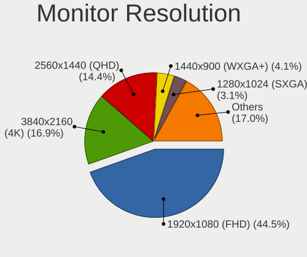

| Resolution         | Desktops | Percent |
|--------------------|----------|---------|
| 1920x1080 (FHD)    | 306      | 44.54%  |
| 3840x2160 (4K)     | 116      | 16.89%  |
| 2560x1440 (QHD)    | 99       | 14.41%  |
| 1440x900 (WXGA+)   | 28       | 4.08%   |
| 1280x1024 (SXGA)   | 21       | 3.06%   |
| 1920x1200 (WUXGA)  | 19       | 2.77%   |
| 1680x1050 (WSXGA+) | 16       | 2.33%   |
| 1600x900 (HD+)     | 15       | 2.18%   |
| 3440x1440          | 10       | 1.46%   |
| Unknown            | 10       | 1.46%   |
| 1366x768 (WXGA)    | 8        | 1.16%   |
| 2288x1287          | 7        | 1.02%   |
| 2560x1600          | 3        | 0.44%   |
| 1360x768           | 3        | 0.44%   |
| 3360x1080          | 2        | 0.29%   |
| 3286x1080          | 2        | 0.29%   |
| 2560x1080          | 2        | 0.29%   |
| 2200x1650          | 2        | 0.29%   |
| 2160x1440          | 2        | 0.29%   |
| 1920x540           | 2        | 0.29%   |
| 1400x1050          | 2        | 0.29%   |
| 800x1280           | 1        | 0.15%   |
| 6400x2160          | 1        | 0.15%   |
| 5206x1080          | 1        | 0.15%   |
| 3840x2400          | 1        | 0.15%   |
| 3840x1080          | 1        | 0.15%   |
| 3600x1080          | 1        | 0.15%   |
| 3520x1080          | 1        | 0.15%   |
| 3000x2000          | 1        | 0.15%   |
| 1600x1200          | 1        | 0.15%   |
| 1280x800 (WXGA)    | 1        | 0.15%   |
| 1280x720 (HD)      | 1        | 0.15%   |
| 1024x600           | 1        | 0.15%   |

Monitor Diagonal
----------------

Diagonal size in inches

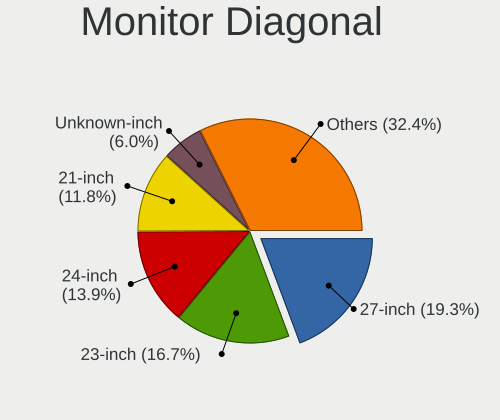

| Inches  | Desktops | Percent |
|---------|----------|---------|
| 27      | 133      | 19.3%   |
| 23      | 115      | 16.69%  |
| 24      | 96       | 13.93%  |
| 21      | 81       | 11.76%  |
| Unknown | 41       | 5.95%   |
| 31      | 28       | 4.06%   |
| 19      | 27       | 3.92%   |
| 22      | 17       | 2.47%   |
| 18      | 15       | 2.18%   |
| 17      | 15       | 2.18%   |
| 20      | 11       | 1.6%    |
| 25      | 10       | 1.45%   |
| 32      | 9        | 1.31%   |
| 34      | 8        | 1.16%   |
| 142     | 6        | 0.87%   |
| 40      | 6        | 0.87%   |
| 28      | 5        | 0.73%   |
| 26      | 5        | 0.73%   |
| 14      | 5        | 0.73%   |
| 12      | 5        | 0.73%   |
| 72      | 4        | 0.58%   |
| 65      | 4        | 0.58%   |
| 63      | 4        | 0.58%   |
| 49      | 4        | 0.58%   |
| 16      | 4        | 0.58%   |
| 54      | 3        | 0.44%   |
| 43      | 3        | 0.44%   |
| 15      | 3        | 0.44%   |
| 52      | 2        | 0.29%   |
| 46      | 2        | 0.29%   |
| 39      | 2        | 0.29%   |
| 29      | 2        | 0.29%   |
| 13      | 2        | 0.29%   |
| 82      | 1        | 0.15%   |
| 80      | 1        | 0.15%   |
| 75      | 1        | 0.15%   |
| 60      | 1        | 0.15%   |
| 48      | 1        | 0.15%   |
| 45      | 1        | 0.15%   |
| 42      | 1        | 0.15%   |

Monitor Width
-------------

Physical width

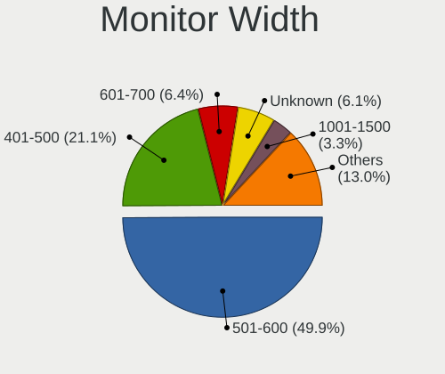

| Width in mm    | Desktops | Percent |
|----------------|----------|---------|
| 501-600        | 333      | 49.93%  |
| 401-500        | 141      | 21.14%  |
| 601-700        | 43       | 6.45%   |
| Unknown        | 41       | 6.15%   |
| 301-350        | 22       | 3.3%    |
| 1001-1500      | 22       | 3.3%    |
| 701-800        | 17       | 2.55%   |
| 201-300        | 11       | 1.65%   |
| 801-900        | 10       | 1.5%    |
| 351-400        | 9        | 1.35%   |
| 1501-2000      | 7        | 1.05%   |
| More than 2000 | 6        | 0.9%    |
| 901-1000       | 4        | 0.6%    |
| 101-200        | 1        | 0.15%   |

Aspect Ratio
------------

Proportional relationship between the width and the height

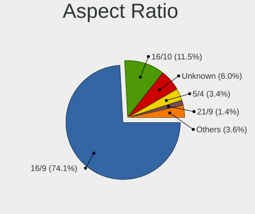

| Ratio   | Desktops | Percent |
|---------|----------|---------|
| 16/9    | 479      | 74.15%  |
| 16/10   | 74       | 11.46%  |
| Unknown | 39       | 6.04%   |
| 5/4     | 22       | 3.41%   |
| 21/9    | 9        | 1.39%   |
| 4/3     | 8        | 1.24%   |
| 1.00    | 7        | 1.08%   |
| 32/9    | 4        | 0.62%   |
| 2.00    | 2        | 0.31%   |
| 6/5     | 1        | 0.15%   |
| 3/2     | 1        | 0.15%   |

Monitor Area
------------

Area in inch²

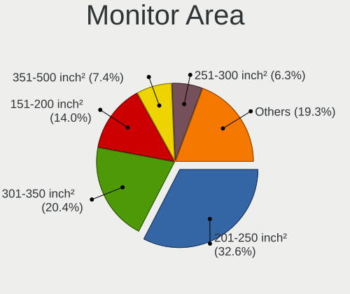

| Area in inch² | Desktops | Percent |
|----------------|----------|---------|
| 201-250        | 221      | 32.6%   |
| 301-350        | 138      | 20.35%  |
| 151-200        | 95       | 14.01%  |
| 351-500        | 50       | 7.37%   |
| 251-300        | 43       | 6.34%   |
| Unknown        | 41       | 6.05%   |
| More than 1000 | 28       | 4.13%   |
| 141-150        | 21       | 3.1%    |
| 501-1000       | 20       | 2.95%   |
| 81-90          | 5        | 0.74%   |
| 71-80          | 4        | 0.59%   |
| 111-120        | 4        | 0.59%   |
| 101-110        | 2        | 0.29%   |
| 91-100         | 2        | 0.29%   |
| 61-70          | 1        | 0.15%   |
| 51-60          | 1        | 0.15%   |
| 1-40           | 1        | 0.15%   |
| 121-130        | 1        | 0.15%   |

Pixel Density
-------------

Pixels per inch

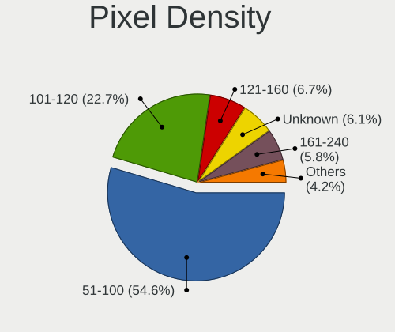

| Density       | Desktops | Percent |
|---------------|----------|---------|
| 51-100        | 368      | 54.6%   |
| 101-120       | 153      | 22.7%   |
| 121-160       | 45       | 6.68%   |
| Unknown       | 41       | 6.08%   |
| 161-240       | 39       | 5.79%   |
| 1-50          | 26       | 3.86%   |
| More than 240 | 2        | 0.3%    |

Multiple Monitors
-----------------

Total monitors connected

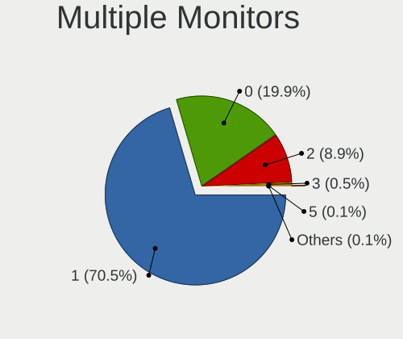

| Total | Desktops | Percent |
|-------|----------|---------|
| 1     | 570      | 70.46%  |
| 0     | 161      | 19.9%   |
| 2     | 72       | 8.9%    |
| 3     | 4        | 0.49%   |
| 5     | 1        | 0.12%   |
| 4     | 1        | 0.12%   |

Network
-------

Net Controller Vendor
---------------------

Controller vendors

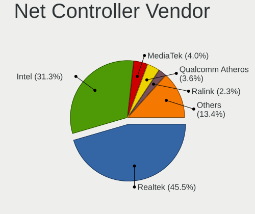

| Vendor                                 | Desktops | Percent |
|----------------------------------------|----------|---------|
| Realtek Semiconductor                  | 528      | 45.48%  |
| Intel                                  | 363      | 31.27%  |
| MediaTek                               | 46       | 3.96%   |
| Qualcomm Atheros                       | 42       | 3.62%   |
| Ralink Technology                      | 27       | 2.33%   |
| Broadcom                               | 21       | 1.81%   |
| Loongson Technology                    | 12       | 1.03%   |
| Mellanox Technologies                  | 11       | 0.95%   |
| ASIX Electronics                       | 11       | 0.95%   |
| Xiaomi                                 | 8        | 0.69%   |
| Huawei Technologies                    | 7        | 0.6%    |
| Microsoft                              | 6        | 0.52%   |
| IBM                                    | 5        | 0.43%   |
| Broadcom Limited                       | 5        | 0.43%   |
| Tenda                                  | 4        | 0.34%   |
| Qualcomm Technologies                  | 4        | 0.34%   |
| Qualcomm                               | 4        | 0.34%   |
| NetGear                                | 4        | 0.34%   |
| Marvell Technology Group               | 4        | 0.34%   |
| D-Link                                 | 4        | 0.34%   |
| Aquantia                               | 4        | 0.34%   |
| TP-Link                                | 3        | 0.26%   |
| Samsung Electronics                    | 3        | 0.26%   |
| ZTE WCDMA Technologies MSM             | 2        | 0.17%   |
| Suzhou Motorcomm Electronic Technology | 2        | 0.17%   |
| Shenzhen Goodix Technology             | 2        | 0.17%   |
| Qualcomm Atheros Communications        | 2        | 0.17%   |
| OPPO Electronics                       | 2        | 0.17%   |
| Oculus VR                              | 2        | 0.17%   |
| Mercucys                               | 2        | 0.17%   |
| DisplayLink                            | 2        | 0.17%   |
| American Megatrends                    | 2        | 0.17%   |
| Wilocity                               | 1        | 0.09%   |
| vivo                                   | 1        | 0.09%   |
| SEGGER                                 | 1        | 0.09%   |
| Sagem                                  | 1        | 0.09%   |
| Realtek                                | 1        | 0.09%   |
| Ralink                                 | 1        | 0.09%   |
| QinHeng Electronics                    | 1        | 0.09%   |
| OnePlus Technology (Shenzhen)          | 1        | 0.09%   |

Net Controller Model
--------------------

Controller models

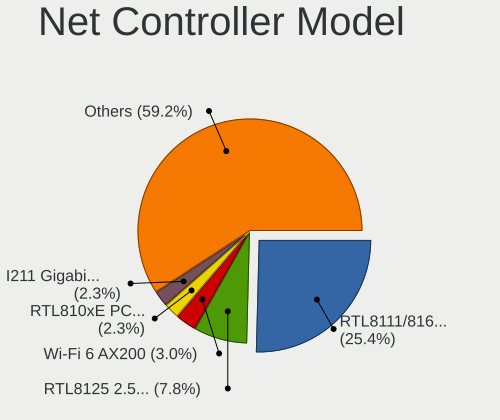

| Model                                                                  | Desktops | Percent |
|------------------------------------------------------------------------|----------|---------|
| Realtek RTL8111/8168/8211/8411 PCI Express Gigabit Ethernet Controller | 343      | 25.41%  |
| Realtek RTL8125 2.5GbE Controller                                      | 105      | 7.78%   |
| Intel Wi-Fi 6 AX200                                                    | 41       | 3.04%   |
| Realtek RTL810xE PCI Express Fast Ethernet controller                  | 31       | 2.3%    |
| Intel I211 Gigabit Network Connection                                  | 31       | 2.3%    |
| Intel Ethernet Connection (2) I219-V                                   | 31       | 2.3%    |
| Intel Ethernet Controller I225-V                                       | 28       | 2.07%   |
| Intel Ethernet Controller I226-V                                       | 26       | 1.93%   |
| Intel Wi-Fi 6E(802.11ax) AX210/AX1675* 2x2 [Typhoon Peak]              | 21       | 1.56%   |
| Realtek 802.11ac NIC                                                   | 20       | 1.48%   |
| Ralink MT7601U Wireless Adapter                                        | 18       | 1.33%   |
| Intel I210 Gigabit Network Connection                                  | 18       | 1.33%   |
| Intel Ethernet Connection (2) I219-LM                                  | 16       | 1.19%   |
| Realtek RTL8188EUS 802.11n Wireless Network Adapter                    | 14       | 1.04%   |
| Intel 82579LM Gigabit Network Connection (Lewisville)                  | 14       | 1.04%   |
| Intel Ethernet Connection I217-LM                                      | 13       | 0.96%   |
| Intel I350 Gigabit Network Connection                                  | 12       | 0.89%   |
| Intel Alder Lake-S PCH CNVi WiFi                                       | 12       | 0.89%   |
| Realtek RTL8822CE 802.11ac PCIe Wireless Network Adapter               | 11       | 0.81%   |
| Realtek RTL8188GU 802.11n WLAN Adapter (After Modeswitch)              | 11       | 0.81%   |
| Intel Wireless 7265                                                    | 11       | 0.81%   |
| Intel 700 Series Chipset CNVi WiFi                                     | 11       | 0.81%   |
| ASIX AX88179 Gigabit Ethernet                                          | 11       | 0.81%   |
| MediaTek MT7902 802.11ax PCIe Wireless Network Adapter [Filogic 310]   | 10       | 0.74%   |
| Intel Ethernet Connection (7) I219-V                                   | 10       | 0.74%   |
| Intel Ethernet Connection (2) I218-V                                   | 10       | 0.74%   |
| Intel Ethernet Connection (12) I219-V                                  | 10       | 0.74%   |
| Realtek RTL8852BE PCIe 802.11ax Wireless Network Controller            | 9        | 0.67%   |
| MediaTek MT7922 802.11ax PCI Express Wireless Network Adapter          | 9        | 0.67%   |
| Loongson 2K2000 / 7A2000 Chipset Gigabit Ethernet Controller           | 9        | 0.67%   |
| Intel Wireless 7260                                                    | 9        | 0.67%   |
| Intel Wi-Fi 5(802.11ac) Wireless-AC 9x6x [Thunder Peak]                | 9        | 0.67%   |
| Realtek RTL8192CU 802.11n WLAN Adapter                                 | 8        | 0.59%   |
| Qualcomm Atheros QCA6174 802.11ac Wireless Network Adapter             | 8        | 0.59%   |
| MediaTek MT7921 802.11ax PCIe Wireless Network Adapter [Filogic 330]   | 8        | 0.59%   |
| Intel Dual Band Wireless-AC 3165 Plus Bluetooth                        | 8        | 0.59%   |
| Realtek RTL88x2bu [AC1200 Techkey]                                     | 7        | 0.52%   |
| Realtek RTL8188CUS 802.11n WLAN Adapter                                | 7        | 0.52%   |
| Intel Ethernet Connection (2) I218-LM                                  | 7        | 0.52%   |
| Realtek RTL8821CE 802.11ac PCIe Wireless Network Adapter               | 6        | 0.44%   |

Wireless Vendor
---------------

Wireless vendors

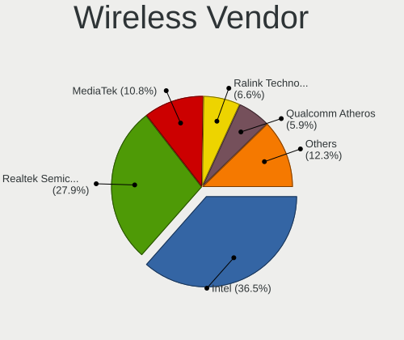

| Vendor                          | Desktops | Percent |
|---------------------------------|----------|---------|
| Intel                           | 149      | 36.52%  |
| Realtek Semiconductor           | 114      | 27.94%  |
| MediaTek                        | 44       | 10.78%  |
| Ralink Technology               | 27       | 6.62%   |
| Qualcomm Atheros                | 24       | 5.88%   |
| Broadcom                        | 13       | 3.19%   |
| Microsoft                       | 5        | 1.23%   |
| Broadcom Limited                | 5        | 1.23%   |
| Tenda                           | 4        | 0.98%   |
| NetGear                         | 4        | 0.98%   |
| D-Link                          | 4        | 0.98%   |
| TP-Link                         | 3        | 0.74%   |
| Qualcomm Atheros Communications | 2        | 0.49%   |
| Mercucys                        | 2        | 0.49%   |
| Xiaomi                          | 1        | 0.25%   |
| Wilocity                        | 1        | 0.25%   |
| Sagem                           | 1        | 0.25%   |
| Realtek                         | 1        | 0.25%   |
| Ralink                          | 1        | 0.25%   |
| IMC Networks                    | 1        | 0.25%   |
| D-Link System                   | 1        | 0.25%   |
| ASUSTek Computer                | 1        | 0.25%   |

Wireless Model
--------------

Wireless models

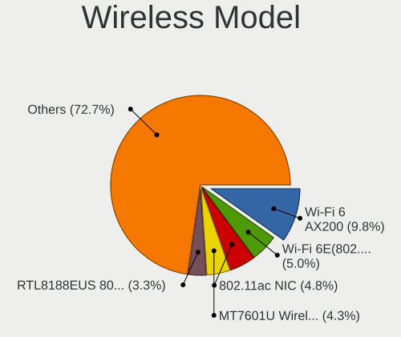

| Model                                                                           | Desktops | Percent |
|---------------------------------------------------------------------------------|----------|---------|
| Intel Wi-Fi 6 AX200                                                             | 41       | 9.81%   |
| Intel Wi-Fi 6E(802.11ax) AX210/AX1675* 2x2 [Typhoon Peak]                       | 21       | 5.02%   |
| Realtek 802.11ac NIC                                                            | 20       | 4.78%   |
| Ralink MT7601U Wireless Adapter                                                 | 18       | 4.31%   |
| Realtek RTL8188EUS 802.11n Wireless Network Adapter                             | 14       | 3.35%   |
| Realtek RTL8822CE 802.11ac PCIe Wireless Network Adapter                        | 11       | 2.63%   |
| Realtek RTL8188GU 802.11n WLAN Adapter (After Modeswitch)                       | 11       | 2.63%   |
| Intel Wireless 7265                                                             | 11       | 2.63%   |
| Intel 700 Series Chipset CNVi WiFi                                              | 11       | 2.63%   |
| MediaTek MT7902 802.11ax PCIe Wireless Network Adapter [Filogic 310]            | 10       | 2.39%   |
| MediaTek MT7922 802.11ax PCI Express Wireless Network Adapter                   | 9        | 2.15%   |
| Intel Wireless 7260                                                             | 9        | 2.15%   |
| Intel Wi-Fi 5(802.11ac) Wireless-AC 9x6x [Thunder Peak]                         | 9        | 2.15%   |
| Realtek RTL8192CU 802.11n WLAN Adapter                                          | 8        | 1.91%   |
| Qualcomm Atheros QCA6174 802.11ac Wireless Network Adapter                      | 8        | 1.91%   |
| MediaTek MT7921 802.11ax PCIe Wireless Network Adapter [Filogic 330]            | 8        | 1.91%   |
| Intel Dual Band Wireless-AC 3165 Plus Bluetooth                                 | 8        | 1.91%   |
| Realtek RTL88x2bu [AC1200 Techkey]                                              | 7        | 1.67%   |
| Realtek RTL8852BE PCIe 802.11ax Wireless Network Controller                     | 7        | 1.67%   |
| Realtek RTL8188CUS 802.11n WLAN Adapter                                         | 7        | 1.67%   |
| Intel Alder Lake-S PCH CNVi WiFi                                                | 7        | 1.67%   |
| Realtek RTL8821CE 802.11ac PCIe Wireless Network Adapter                        | 6        | 1.44%   |
| Realtek RTL8188EE Wireless Network Adapter                                      | 5        | 1.2%    |
| Realtek 802.11n WLAN Adapter                                                    | 5        | 1.2%    |
| Ralink RT2870/RT3070 Wireless Adapter                                           | 5        | 1.2%    |
| Qualcomm Atheros AR9485 Wireless Network Adapter                                | 5        | 1.2%    |
| MediaTek MT7921K (RZ608) Wi-Fi 6E 80MHz                                         | 5        | 1.2%    |
| MediaTek MT7612U 802.11a/b/g/n/ac Wireless Adapter                              | 5        | 1.2%    |
| Broadcom BCM4360 802.11ac Dual Band Wireless Network Adapter                    | 5        | 1.2%    |
| Tenda U12                                                                       | 4        | 0.96%   |
| Realtek RTL8822BE 802.11a/b/g/n/ac WiFi adapter                                 | 4        | 0.96%   |
| Realtek RTL8192EU 802.11b/g/n WLAN Adapter                                      | 4        | 0.96%   |
| Microsoft Xbox Wireless Adapter for Windows                                     | 4        | 0.96%   |
| Intel Wireless 8260                                                             | 4        | 0.96%   |
| Intel Dual Band Wireless-AC 3168NGW [Stone Peak]                                | 4        | 0.96%   |
| Intel Alder Lake-N PCH CNVi WiFi                                                | 4        | 0.96%   |
| Broadcom Limited BCM4360 802.11ac Dual Band Wireless Network Adapter            | 4        | 0.96%   |
| Realtek 802.11ax WLAN Adapter                                                   | 3        | 0.72%   |
| Qualcomm Atheros QCA9377 802.11ac Wireless Network Adapter                      | 3        | 0.72%   |
| MediaTek MT7925 802.11be 160MHz 2x2 PCIe Wireless Network Adapter [Filogic 360] | 3        | 0.72%   |

Ethernet Vendor
---------------

Ethernet vendors

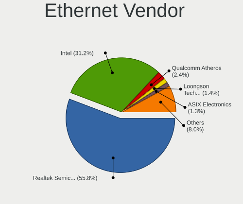

| Vendor                                 | Desktops | Percent |
|----------------------------------------|----------|---------|
| Realtek Semiconductor                  | 483      | 55.77%  |
| Intel                                  | 270      | 31.18%  |
| Qualcomm Atheros                       | 21       | 2.42%   |
| Loongson Technology                    | 12       | 1.39%   |
| ASIX Electronics                       | 11       | 1.27%   |
| Mellanox Technologies                  | 10       | 1.15%   |
| Broadcom                               | 8        | 0.92%   |
| Xiaomi                                 | 7        | 0.81%   |
| Huawei Technologies                    | 7        | 0.81%   |
| IBM                                    | 5        | 0.58%   |
| Qualcomm Technologies                  | 4        | 0.46%   |
| Qualcomm                               | 4        | 0.46%   |
| Marvell Technology Group               | 4        | 0.46%   |
| Aquantia                               | 4        | 0.46%   |
| Samsung Electronics                    | 3        | 0.35%   |
| Suzhou Motorcomm Electronic Technology | 2        | 0.23%   |
| OPPO Electronics                       | 2        | 0.23%   |
| DisplayLink                            | 2        | 0.23%   |
| American Megatrends                    | 2        | 0.23%   |
| vivo                                   | 1        | 0.12%   |
| Nvidia                                 | 1        | 0.12%   |
| Microsoft                              | 1        | 0.12%   |
| MediaTek                               | 1        | 0.12%   |
| Google                                 | 1        | 0.12%   |

Ethernet Model
--------------

Ethernet models

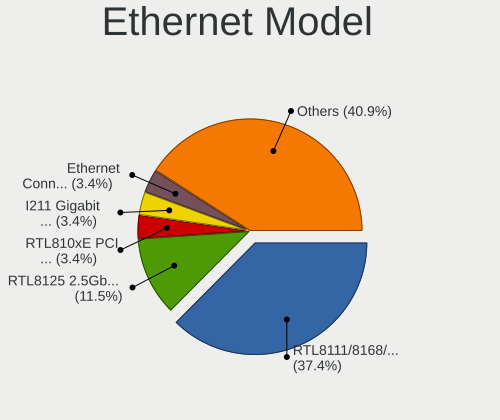

| Model                                                                  | Desktops | Percent |
|------------------------------------------------------------------------|----------|---------|
| Realtek RTL8111/8168/8211/8411 PCI Express Gigabit Ethernet Controller | 343      | 37.45%  |
| Realtek RTL8125 2.5GbE Controller                                      | 105      | 11.46%  |
| Realtek RTL810xE PCI Express Fast Ethernet controller                  | 31       | 3.38%   |
| Intel I211 Gigabit Network Connection                                  | 31       | 3.38%   |
| Intel Ethernet Connection (2) I219-V                                   | 31       | 3.38%   |
| Intel Ethernet Controller I225-V                                       | 28       | 3.06%   |
| Intel Ethernet Controller I226-V                                       | 26       | 2.84%   |
| Intel I210 Gigabit Network Connection                                  | 18       | 1.97%   |
| Intel Ethernet Connection (2) I219-LM                                  | 16       | 1.75%   |
| Intel 82579LM Gigabit Network Connection (Lewisville)                  | 14       | 1.53%   |
| Intel Ethernet Connection I217-LM                                      | 13       | 1.42%   |
| Intel I350 Gigabit Network Connection                                  | 12       | 1.31%   |
| ASIX AX88179 Gigabit Ethernet                                          | 11       | 1.2%    |
| Intel Ethernet Connection (7) I219-V                                   | 10       | 1.09%   |
| Intel Ethernet Connection (2) I218-V                                   | 10       | 1.09%   |
| Intel Ethernet Connection (12) I219-V                                  | 10       | 1.09%   |
| Loongson 2K2000 / 7A2000 Chipset Gigabit Ethernet Controller           | 9        | 0.98%   |
| Intel Ethernet Connection (2) I218-LM                                  | 7        | 0.76%   |
| Qualcomm Atheros QCA8171 Gigabit Ethernet                              | 6        | 0.66%   |
| Mellanox MT27500 Family [ConnectX-3]                                   | 6        | 0.66%   |
| Intel Ethernet Connection (7) I219-LM                                  | 6        | 0.66%   |
| Intel Ethernet Connection (17) I219-V                                  | 6        | 0.66%   |
| Intel Ethernet Connection (17) I219-LM                                 | 6        | 0.66%   |
| Intel 82574L Gigabit Network Connection                                | 6        | 0.66%   |
| Realtek RTL-8100/8101L/8139 PCI Fast Ethernet Adapter                  | 5        | 0.55%   |
| Intel Ethernet Connection (11) I219-V                                  | 5        | 0.55%   |
| Intel Alder Lake-S PCH CNVi WiFi                                       | 5        | 0.55%   |
| IBM IBM                                                                | 5        | 0.55%   |
| Realtek RTL8126 5GbE Controller                                        | 4        | 0.44%   |
| Qualcomm WCN785x Wi-Fi 7(802.11be) 320MHz 2x2 [FastConnect 7800]       | 4        | 0.44%   |
| Xiaomi Mi/Redmi series (RNDIS)                                         | 3        | 0.33%   |
| Xiaomi Mi/Redmi series (RNDIS + ADB)                                   | 3        | 0.33%   |
| Realtek RTL8152 Fast Ethernet Adapter                                  | 3        | 0.33%   |
| Qualcomm Atheros Killer E2500 Gigabit Ethernet Controller              | 3        | 0.33%   |
| Qualcomm Atheros Killer E2400 Gigabit Ethernet Controller              | 3        | 0.33%   |
| Qualcomm Atheros Killer E220x Gigabit Ethernet Controller              | 3        | 0.33%   |
| Loongson 2K1000/2000 / 7A1000 Chipset Gigabit Ethernet Controller      | 3        | 0.33%   |
| Intel Ethernet Connection I217-V                                       | 3        | 0.33%   |
| Intel Ethernet Connection (14) I219-LM                                 | 3        | 0.33%   |
| Intel 82579V Gigabit Network Connection                                | 3        | 0.33%   |

Net Controller Kind
-------------------

Ethernet, WiFi or modem

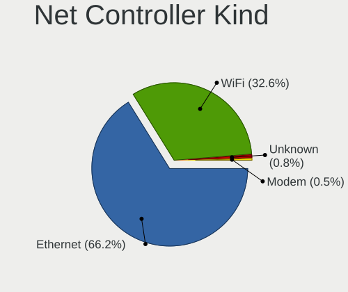

| Kind     | Desktops | Percent |
|----------|----------|---------|
| Ethernet | 772      | 66.15%  |
| WiFi     | 380      | 32.56%  |
| Unknown  | 9        | 0.77%   |
| Modem    | 6        | 0.51%   |

Used Controller
---------------

Currently used network controller

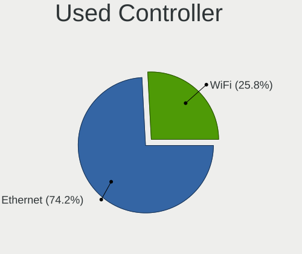

| Kind     | Desktops | Percent |
|----------|----------|---------|
| Ethernet | 571      | 74.16%  |
| WiFi     | 199      | 25.84%  |

NICs
----

Total network controllers on board

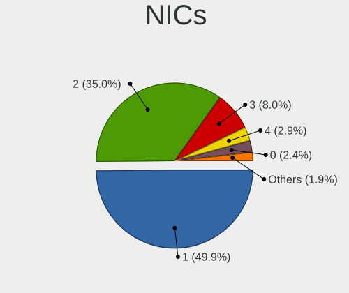

| Total | Desktops | Percent |
|-------|----------|---------|
| 1     | 399      | 49.88%  |
| 2     | 280      | 35%     |
| 3     | 64       | 8%      |
| 4     | 23       | 2.88%   |
| 0     | 19       | 2.38%   |
| 6     | 6        | 0.75%   |
| 5     | 4        | 0.5%    |
| 7     | 3        | 0.38%   |
| 11    | 1        | 0.13%   |
| 8     | 1        | 0.13%   |

IPv6
----

IPv6 vs IPv4

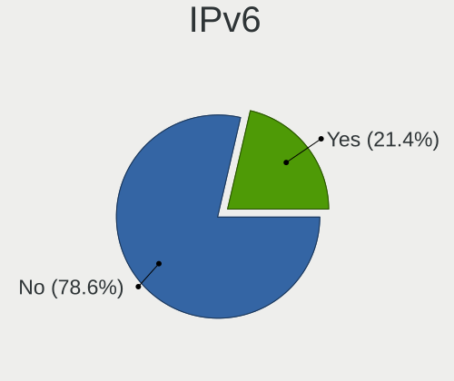

| Used | Desktops | Percent |
|------|----------|---------|
| No   | 636      | 78.62%  |
| Yes  | 173      | 21.38%  |

Bluetooth
---------

Bluetooth Vendor
----------------

Controller vendors

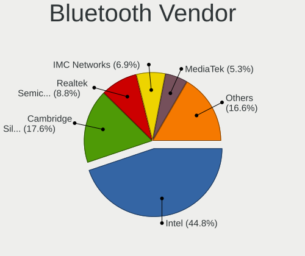

| Vendor                          | Desktops | Percent |
|---------------------------------|----------|---------|
| Intel                           | 143      | 44.83%  |
| Cambridge Silicon Radio         | 56       | 17.55%  |
| Realtek Semiconductor           | 28       | 8.78%   |
| IMC Networks                    | 22       | 6.9%    |
| MediaTek                        | 17       | 5.33%   |
| Foxconn / Hon Hai               | 12       | 3.76%   |
| ASUSTek Computer                | 12       | 3.76%   |
| Qualcomm Atheros Communications | 9        | 2.82%   |
| Apple                           | 6        | 1.88%   |
| Realtek                         | 5        | 1.57%   |
| Broadcom                        | 4        | 1.25%   |
| AICSemi                         | 2        | 0.63%   |
| Unknown                         | 2        | 0.63%   |
| Actions                         | 1        | 0.31%   |

Bluetooth Model
---------------

Controller models

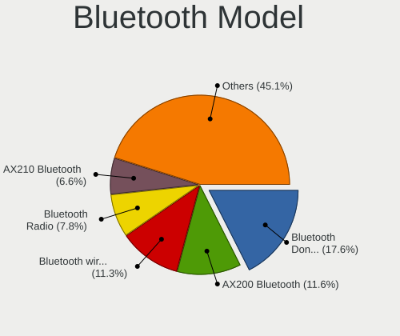

| Model                                                 | Desktops | Percent |
|-------------------------------------------------------|----------|---------|
| Cambridge Silicon Radio Bluetooth Dongle (HCI mode)   | 56       | 17.55%  |
| Intel AX200 Bluetooth                                 | 37       | 11.6%   |
| Intel Bluetooth wireless interface                    | 36       | 11.29%  |
| Realtek Bluetooth Radio                               | 25       | 7.84%   |
| Intel AX210 Bluetooth                                 | 21       | 6.58%   |
| Intel AX201 Bluetooth                                 | 20       | 6.27%   |
| MediaTek Wireless_Device                              | 17       | 5.33%   |
| IMC Networks Wireless_Device                          | 15       | 4.7%    |
| Intel Bluetooth Device                                | 14       | 4.39%   |
| Intel Wireless-AC 9260 Bluetooth Adapter              | 8        | 2.51%   |
| IMC Networks Bluetooth Radio                          | 6        | 1.88%   |
| Foxconn / Hon Hai Bluetooth Device                    | 6        | 1.88%   |
| Realtek Bluetooth Radio                               | 5        | 1.57%   |
| Qualcomm Atheros  Bluetooth Device                    | 4        | 1.25%   |
| Qualcomm Atheros QCA61x4 Bluetooth 4.0                | 4        | 1.25%   |
| Intel Wireless-AC 3168 Bluetooth                      | 4        | 1.25%   |
| Foxconn / Hon Hai Wireless_Device                     | 4        | 1.25%   |
| ASUS Bluetooth Radio                                  | 4        | 1.25%   |
| Intel Bluetooth 9460/9560 Jefferson Peak (JfP)        | 3        | 0.94%   |
| ASUS Qualcomm Bluetooth 4.1                           | 3        | 0.94%   |
| ASUS Broadcom BCM20702 Single-Chip Bluetooth 4.0 + LE | 3        | 0.94%   |
| Apple Bluetooth USB Host Controller                   | 3        | 0.94%   |
| Apple Bluetooth Host Controller                       | 3        | 0.94%   |
| Realtek  Bluetooth 4.2 Adapter                        | 2        | 0.63%   |
| Broadcom BCM20702A0 Bluetooth 4.0                     | 2        | 0.63%   |
| AICSemi AIC8800DC                                     | 2        | 0.63%   |
| Unknown                                               | 2        | 0.63%   |
| Realtek 802.11n WLAN Adapter                          | 1        | 0.31%   |
| Qualcomm Atheros AR3012 Bluetooth 4.0                 | 1        | 0.31%   |
| IMC Networks Bluetooth Device                         | 1        | 0.31%   |
| Foxconn / Hon Hai MediaTek Bluetooth Adapter          | 1        | 0.31%   |
| Foxconn / Hon Hai Bluetooth USB Host Controller       | 1        | 0.31%   |
| Broadcom Bluetooth 3.0 USB Dongle                     | 1        | 0.31%   |
| Broadcom BCM20702A0                                   | 1        | 0.31%   |
| ASUS Bluetooth Device                                 | 1        | 0.31%   |
| ASUS BCM20702A0                                       | 1        | 0.31%   |
| Actions general adapter                               | 1        | 0.31%   |

Sound
-----

Sound Vendor
------------

Sound card vendors

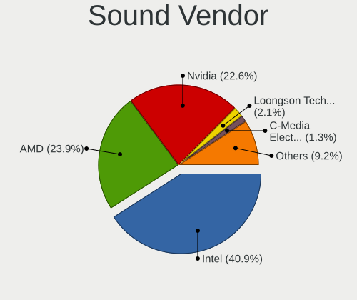

| Vendor                                       | Desktops | Percent |
|----------------------------------------------|----------|---------|
| Intel                                        | 492      | 40.93%  |
| AMD                                          | 287      | 23.88%  |
| Nvidia                                       | 272      | 22.63%  |
| Loongson Technology                          | 25       | 2.08%   |
| C-Media Electronics                          | 16       | 1.33%   |
| Micro Star International                     | 12       | 1%      |
| Zhaoxin                                      | 11       | 0.92%   |
| ASUSTek Computer                             | 7        | 0.58%   |
| Generalplus Technology                       | 6        | 0.5%    |
| Jieli Technology                             | 5        | 0.42%   |
| XMOS                                         | 4        | 0.33%   |
| Realtek Semiconductor                        | 4        | 0.33%   |
| Creative Labs                                | 4        | 0.33%   |
| M-Audio                                      | 3        | 0.25%   |
| KTMicro                                      | 3        | 0.25%   |
| HECATE G4 TE GAMING HEADSET                  | 3        | 0.25%   |
| Zoran Co. Personal Media Division (Nogatech) | 2        | 0.17%   |
| Walmart                                      | 2        | 0.17%   |
| VIA Technologies                             | 2        | 0.17%   |
| ULi Electronics                              | 2        | 0.17%   |
| Texas Instruments                            | 2        | 0.17%   |
| Medeli Electronics                           | 2        | 0.17%   |
| JMTek                                        | 2        | 0.17%   |
| Giga-Byte Technology                         | 2        | 0.17%   |
| Drop                                         | 2        | 0.17%   |
| Dell                                         | 2        | 0.17%   |
| USB-Speaker                                  | 1        | 0.08%   |
| TerraTec Electronic                          | 1        | 0.08%   |
| SteelSeries ApS                              | 1        | 0.08%   |
| Sony                                         | 1        | 0.08%   |
| Silicon Integrated Systems [SiS]             | 1        | 0.08%   |
| Razer USA                                    | 1        | 0.08%   |
| Polycom                                      | 1        | 0.08%   |
| Plantronics                                  | 1        | 0.08%   |
| NXP Semiconductors                           | 1        | 0.08%   |
| Moore Threads Technology                     | 1        | 0.08%   |
| Midiplus                                     | 1        | 0.08%   |
| Logitech                                     | 1        | 0.08%   |
| liyuany                                      | 1        | 0.08%   |
| Kingston Technology                          | 1        | 0.08%   |

Sound Model
-----------

Sound card models

| Model                                                                             | Desktops | Percent |
|-----------------------------------------------------------------------------------|----------|---------|
| AMD Ryzen HD Audio Controller                                                     | 86       | 6.02%   |
| Intel 8 Series/C220 Series Chipset High Definition Audio Controller               | 67       | 4.69%   |
| Intel 200 Series PCH HD Audio                                                     | 61       | 4.27%   |
| AMD Starship/Matisse HD Audio Controller                                          | 54       | 3.78%   |
| Intel 100 Series/C230 Series Chipset Family HD Audio Controller                   | 36       | 2.52%   |
| Intel Alder Lake-S HD Audio Controller                                            | 35       | 2.45%   |
| Intel Xeon E3-1200 v3/4th Gen Core Processor HD Audio Controller                  | 33       | 2.31%   |
| Intel Raptor Lake High Definition Audio Controller                                | 32       | 2.24%   |
| Intel 6 Series/C200 Series Chipset Family High Definition Audio Controller        | 32       | 2.24%   |
| AMD Radeon High Definition Audio Controller                                       | 32       | 2.24%   |
| Intel Cannon Lake PCH cAVS                                                        | 30       | 2.1%    |
| AMD Renoir/Cezanne HDMI/DP Audio Controller                                       | 30       | 2.1%    |
| AMD Navi 21/23 HDMI/DP Audio Controller                                           | 27       | 1.89%   |
| Nvidia GK208 HDMI/DP Audio Controller                                             | 26       | 1.82%   |
| Loongson Technology 2K1000/2000 / 7A1000/2000 Chipset HD Audio Controller         | 25       | 1.75%   |
| Nvidia GP106 High Definition Audio Controller                                     | 24       | 1.68%   |
| Intel 7 Series/C216 Chipset Family High Definition Audio Controller               | 24       | 1.68%   |
| AMD Oland/Hainan/Cape Verde/Pitcairn HDMI Audio [Radeon HD 7000 Series]           | 24       | 1.68%   |
| Intel Comet Lake PCH-V cAVS                                                       | 23       | 1.61%   |
| AMD SBx00 Azalia (Intel HDA)                                                      | 23       | 1.61%   |
| AMD Ellesmere HDMI Audio [Radeon RX 470/480 / 570/580/590]                        | 22       | 1.54%   |
| Nvidia GA102 High Definition Audio Controller                                     | 20       | 1.4%    |
| AMD FCH Azalia Controller                                                         | 20       | 1.4%    |
| AMD Baffin HDMI/DP Audio [Radeon RX 550 640SP / RX 560/560X]                      | 20       | 1.4%    |
| Intel C610/X99 series chipset HD Audio Controller                                 | 19       | 1.33%   |
| AMD Caicos HDMI Audio [Radeon HD 6450 / 7450/8450/8490 OEM / R5 230/235/235X OEM] | 18       | 1.26%   |
| AMD Raven/Raven2/Fenghuang HDMI/DP Audio Controller                               | 16       | 1.12%   |
| Nvidia TU116 High Definition Audio Controller                                     | 15       | 1.05%   |
| Nvidia GP104 High Definition Audio Controller                                     | 15       | 1.05%   |
| Nvidia GM107 High Definition Audio Controller [GeForce 940MX]                     | 15       | 1.05%   |
| Loongson Technology 2K2000 HDMI Audio Controller                                  | 15       | 1.05%   |
| AMD Family 17h (Models 00h-0fh) HD Audio Controller                               | 15       | 1.05%   |
| Nvidia GF119 HDMI Audio Controller                                                | 14       | 0.98%   |
| Nvidia GA106 High Definition Audio Controller                                     | 14       | 0.98%   |
| Intel Tiger Lake-H HD Audio Controller                                            | 13       | 0.91%   |
| Intel NM10/ICH7 Family High Definition Audio Controller                           | 13       | 0.91%   |
| Nvidia GP107GL High Definition Audio Controller                                   | 12       | 0.84%   |
| Nvidia AD106M High Definition Audio Controller                                    | 12       | 0.84%   |
| Micro Star International USB Audio                                                | 12       | 0.84%   |
| Intel Atom Processor Z36xxx/Z37xxx Series High Definition Audio Controller        | 12       | 0.84%   |

Memory
------

Memory Vendor
-------------

Memory module vendors

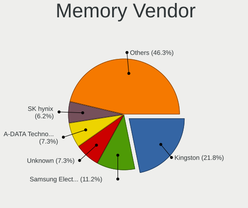

| Vendor                     | Desktops | Percent |
|----------------------------|----------|---------|
| Kingston                   | 123      | 21.81%  |
| Samsung Electronics        | 63       | 11.17%  |
| Unknown                    | 41       | 7.27%   |
| A-DATA Technology          | 41       | 7.27%   |
| SK hynix                   | 35       | 6.21%   |
| Micron Technology          | 35       | 6.21%   |
| Corsair                    | 34       | 6.03%   |
| Unknown                    | 30       | 5.32%   |
| Crucial                    | 20       | 3.55%   |
| KINGBANK                   | 13       | 2.3%    |
| Ramaxel Technology         | 11       | 1.95%   |
| G.Skill                    | 9        | 1.6%    |
| Unknown (0x0B92)           | 7        | 1.24%   |
| UniIC                      | 7        | 1.24%   |
| GLOWAY                     | 7        | 1.24%   |
| Apacer                     | 7        | 1.24%   |
| tigo                       | 6        | 1.06%   |
| Team                       | 6        | 1.06%   |
| Kingmax                    | 5        | 0.89%   |
| Juhor                      | 5        | 0.89%   |
| Acer                       | 5        | 0.89%   |
| Colorful                   | 4        | 0.71%   |
| Asgard                     | 4        | 0.71%   |
| Xi'an UniIC Semiconductors | 3        | 0.53%   |
| Ramsta                     | 3        | 0.53%   |
| Hakatronics                | 3        | 0.53%   |
| Unknown (0x0F83)           | 2        | 0.35%   |
| Unknown (08C8)             | 2        | 0.35%   |
| Lenovo                     | 2        | 0.35%   |
| Guangzhou MiaoYuanJi       | 2        | 0.35%   |
| GeIL                       | 2        | 0.35%   |
| CUSO                       | 2        | 0.35%   |
| Zentel                     | 1        | 0.18%   |
| Unknown(L:00               | 1        | 0.18%   |
| Unknown (ABCD)             | 1        | 0.18%   |
| Unknown (8AF1)             | 1        | 0.18%   |
| Unknown (0x0C32)           | 1        | 0.18%   |
| Unknown (0B92)             | 1        | 0.18%   |
| Unknown (0000000084C8)     | 1        | 0.18%   |
| Transcend                  | 1        | 0.18%   |

Memory Model
------------

Memory module models

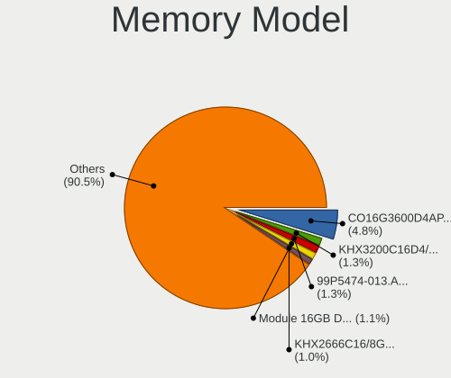

| Model                                                   | Desktops | Percent |
|---------------------------------------------------------|----------|---------|
| Unknown                                                 | 30       | 4.81%   |
| Kingston RAM KHX3200C16D4/16GX 16GB DIMM DDR4 3600MT/s  | 8        | 1.28%   |
| Kingston RAM 99P5474-013.A00LF 4GB DIMM DDR3 1600MT/s   | 8        | 1.28%   |
| Unknown RAM Module 16GB DIMM DDR4 3200MT/s              | 7        | 1.12%   |
| Kingston RAM KHX2666C16/8G 8GiB DIMM DDR4 3466MT/s      | 6        | 0.96%   |
| Unknown RAM Module 16GB DIMM DDR4 2133MT/s              | 5        | 0.8%    |
| Crucial RAM CT16G48C40S5.M8A1 16GB SODIMM DDR5 4800MT/s | 5        | 0.8%    |
| Ramaxel RAM RMR5030ED58E8W1600 2GB DIMM DDR3 1600MT/s   | 4        | 0.64%   |
| Kingston RAM TF32D4U2S1MEH-8 8192MB DIMM DDR4 3200MT/s  | 4        | 0.64%   |
| Kingston RAM KHX3200C16D4/8GX 8GB DIMM DDR4 3733MT/s    | 4        | 0.64%   |
| Kingston RAM 99P5471-033.A00LF 8GB DIMM DDR3 1600MT/s   | 4        | 0.64%   |
| KINGBANK RAM Module 16GB DIMM DDR4 3200MT/s             | 4        | 0.64%   |
| Corsair RAM Module 16GB DIMM DDR4 2133MT/s              | 4        | 0.64%   |
| Corsair RAM CM4X32GC3200C16K2E 32GB DIMM DDR4 3200MT/s  | 4        | 0.64%   |
| Corsair RAM CM4X16GC3200C16K2E 16GB DIMM DDR4 3200MT/s  | 4        | 0.64%   |
| UniIC RAM SCC16GU03H4F1C-32AA 16GB DIMM DDR4 3200MT/s   | 3        | 0.48%   |
| UniIC RAM SCC16GU03H2F1C-32AA 16GB DIMM DDR4 3200MT/s   | 3        | 0.48%   |
| Team RAM TEAMGROUP-UD3-1600 8GB DIMM DDR3 1866MT/s      | 3        | 0.48%   |
| SK hynix RAM HMA81GU6AFR8N-UH 8GB DIMM DDR4 2400MT/s    | 3        | 0.48%   |
| Micron RAM Module 16GB DIMM DDR4 3200MT/s               | 3        | 0.48%   |
| Kingston RAM KF3200C16D4/8GX 8GiB DIMM DDR4 3600MT/s    | 3        | 0.48%   |
| Kingston RAM 99P5471-048.A00LF 8GB DIMM DDR3 1600MT/s   | 3        | 0.48%   |
| Kingston RAM 99P5471-016..A00LF 8GB DIMM DDR3           | 3        | 0.48%   |
| KINGBANK RAM Module 16GB DIMM DDR4 2666MT/s             | 3        | 0.48%   |
| Hakatronics RAM Z6FAGH3SBCA-MC 16GB DIMM DDR4 3200MT/s  | 3        | 0.48%   |
| Crucial RAM CT8G4SFS832A.M8FRS 8GB DIMM DDR4 3200MT/s   | 3        | 0.48%   |
| Crucial RAM BL16G32C16U4W.16FE 16GB DIMM DDR4 3200MT/s  | 3        | 0.48%   |
| A-DATA RAM Module 8GB DIMM DDR4 2666MT/s                | 3        | 0.48%   |
| A-DATA RAM Module 4GB DIMM DDR3 1600MT/s                | 3        | 0.48%   |
| A-DATA RAM DDR4 3200 16GB DIMM DDR4 3600MT/s            | 3        | 0.48%   |
| Unknown RAM Module 4GB DIMM SDRAM                       | 2        | 0.32%   |
| Unknown RAM Module 4GB DIMM 1333MT/s                    | 2        | 0.32%   |
| Unknown RAM Module 4096MB DIMM 1333MT/s                 | 2        | 0.32%   |
| Unknown RAM Module 16GB DIMM DDR4 2666MT/s              | 2        | 0.32%   |
| Unknown (0x0F83) RAM TOPMORE 16GB DIMM DDR5 6000MT/s    | 2        | 0.32%   |
| tigo RAM 2666MHz-8G 8GB DIMM DDR4 2666MT/s              | 2        | 0.32%   |
| SK hynix RAM Module 8GB DIMM DDR3 1600MT/s              | 2        | 0.32%   |
| SK hynix RAM HMT41GU6BFR8C-PB 8GB DIMM DDR3 1600MT/s    | 2        | 0.32%   |
| SK hynix RAM HMT351U6CFR8C-PB 4GB DIMM DDR3 1800MT/s    | 2        | 0.32%   |
| SK hynix RAM HMAA2GU6CJR8N-XN 16GB DIMM DDR4 3200MT/s   | 2        | 0.32%   |

Memory Kind
-----------

Memory module kinds

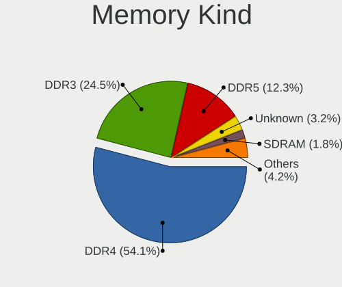

| Kind    | Desktops | Percent |
|---------|----------|---------|
| DDR4    | 272      | 54.08%  |
| DDR3    | 123      | 24.45%  |
| DDR5    | 62       | 12.33%  |
| Unknown | 16       | 3.18%   |
| SDRAM   | 9        | 1.79%   |
| DRAM    | 8        | 1.59%   |
| DDR2    | 6        | 1.19%   |
| LPDDR4  | 4        | 0.8%    |
| LPDDR5  | 2        | 0.4%    |
| DDR     | 1        | 0.2%    |

Memory Form Factor
------------------

Physical design of the memory module

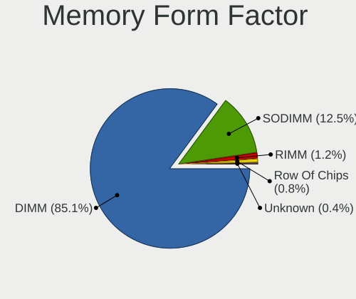

| Name         | Desktops | Percent |
|--------------|----------|---------|
| DIMM         | 429      | 85.12%  |
| SODIMM       | 63       | 12.5%   |
| RIMM         | 6        | 1.19%   |
| Row Of Chips | 4        | 0.79%   |
| Unknown      | 2        | 0.4%    |

Memory Size
-----------

Memory module size

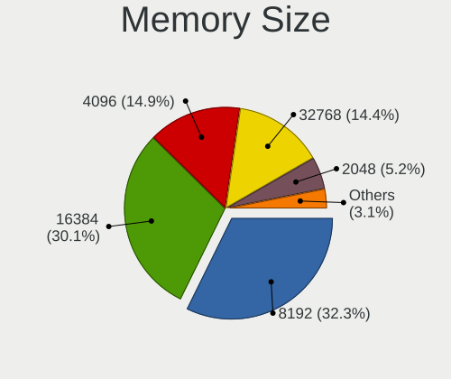

| Size  | Desktops | Percent |
|-------|----------|---------|
| 8192  | 175      | 32.29%  |
| 16384 | 163      | 30.07%  |
| 4096  | 81       | 14.94%  |
| 32768 | 78       | 14.39%  |
| 2048  | 28       | 5.17%   |
| 24576 | 5        | 0.92%   |
| 65536 | 4        | 0.74%   |
| 49152 | 3        | 0.55%   |
| 1024  | 2        | 0.37%   |
| 12288 | 1        | 0.18%   |
| 512   | 1        | 0.18%   |
| 256   | 1        | 0.18%   |

Memory Speed
------------

Memory module speed

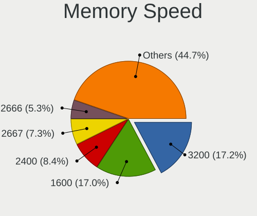

| Speed   | Desktops | Percent |
|---------|----------|---------|
| 3200    | 94       | 17.22%  |
| 1600    | 93       | 17.03%  |
| 2400    | 46       | 8.42%   |
| 2667    | 40       | 7.33%   |
| 2666    | 29       | 5.31%   |
| 4800    | 28       | 5.13%   |
| 2133    | 26       | 4.76%   |
| 3600    | 24       | 4.4%    |
| 1333    | 19       | 3.48%   |
| 6000    | 15       | 2.75%   |
| 5600    | 13       | 2.38%   |
| 1866    | 13       | 2.38%   |
| 800     | 12       | 2.2%    |
| Unknown | 8        | 1.47%   |
| 3466    | 7        | 1.28%   |
| 3733    | 6        | 1.1%    |
| 2933    | 5        | 0.92%   |
| 1066    | 5        | 0.92%   |
| 6400    | 4        | 0.73%   |
| 3800    | 4        | 0.73%   |
| 3400    | 4        | 0.73%   |
| 3000    | 4        | 0.73%   |
| 1867    | 4        | 0.73%   |
| 4000    | 3        | 0.55%   |
| 3266    | 3        | 0.55%   |
| 1800    | 3        | 0.55%   |
| 667     | 3        | 0.55%   |
| 3933    | 2        | 0.37%   |
| 3500    | 2        | 0.37%   |
| 3066    | 2        | 0.37%   |
| 2448    | 2        | 0.37%   |
| 400     | 2        | 0.37%   |
| 65535   | 1        | 0.18%   |
| 12800   | 1        | 0.18%   |
| 8400    | 1        | 0.18%   |
| 7000    | 1        | 0.18%   |
| 6800    | 1        | 0.18%   |
| 6200    | 1        | 0.18%   |
| 5400    | 1        | 0.18%   |
| 4267    | 1        | 0.18%   |

Printers & scanners
-------------------

Printer Vendor
--------------

Printer device vendors

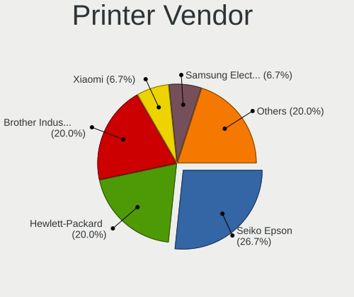

| Vendor                             | Desktops | Percent |
|------------------------------------|----------|---------|
| Seiko Epson                        | 4        | 26.67%  |
| Hewlett-Packard                    | 3        | 20%     |
| Brother Industries                 | 3        | 20%     |
| Xiaomi                             | 1        | 6.67%   |
| Samsung Electronics                | 1        | 6.67%   |
| Lenovo                             | 1        | 6.67%   |
| Canon                              | 1        | 6.67%   |
| BeiJing LanXum Computer Technology | 1        | 6.67%   |

Printer Model
-------------

Printer device models

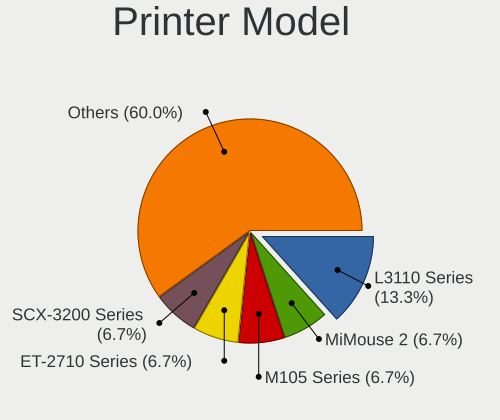

| Model                                                   | Desktops | Percent |
|---------------------------------------------------------|----------|---------|
| Seiko Epson L3110 Series                                | 2        | 13.33%  |
| Xiaomi MiMouse 2                                        | 1        | 6.67%   |
| Seiko Epson M105 Series                                 | 1        | 6.67%   |
| Seiko Epson ET-2710 Series                              | 1        | 6.67%   |
| Samsung SCX-3200 Series                                 | 1        | 6.67%   |
| Lenovo G336DN                                           | 1        | 6.67%   |
| HP LaserJet P1007                                       | 1        | 6.67%   |
| HP LaserJet 1020                                        | 1        | 6.67%   |
| HP DeskJet 2130 series                                  | 1        | 6.67%   |
| Canon PIXMA MP280                                       | 1        | 6.67%   |
| Brother HL-L8260CDN series                              | 1        | 6.67%   |
| Brother HL-L2350DW series                               | 1        | 6.67%   |
| Brother HL-5440D series                                 | 1        | 6.67%   |
| BeiJing LanXum Technology Black and White Laser Printer | 1        | 6.67%   |

Scanner Vendor
--------------

Scanner device vendors

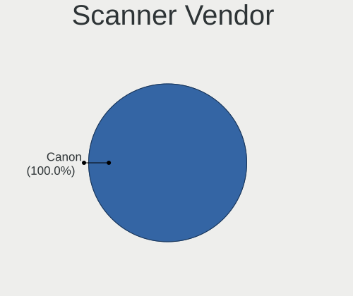

| Vendor | Desktops | Percent |
|--------|----------|---------|
| Canon  | 2        | 100%    |

Scanner Model
-------------

Scanner device models

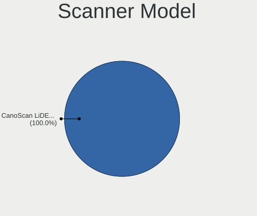

| Model                   | Desktops | Percent |
|-------------------------|----------|---------|
| Canon CanoScan LiDE 120 | 2        | 100%    |

Camera
------

Camera Vendor
-------------

Camera device vendors

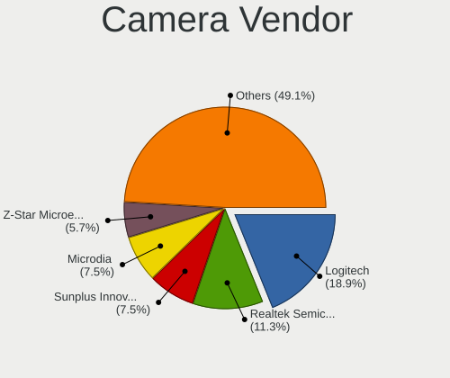

| Vendor                        | Desktops | Percent |
|-------------------------------|----------|---------|
| Logitech                      | 10       | 18.87%  |
| Realtek Semiconductor         | 6        | 11.32%  |
| Sunplus Innovation Technology | 4        | 7.55%   |
| Microdia                      | 4        | 7.55%   |
| Z-Star Microelectronics       | 3        | 5.66%   |
| Apple                         | 3        | 5.66%   |
| SN0002                        | 2        | 3.77%   |
| Genesys Logic                 | 2        | 3.77%   |
| Chicony Electronics           | 2        | 3.77%   |
| Alcor Micro                   | 2        | 3.77%   |
| Vimicro                       | 1        | 1.89%   |
| Sunplus IT                    | 1        | 1.89%   |
| Sonix Technology              | 1        | 1.89%   |
| Silicon Motion                | 1        | 1.89%   |
| Shenzhen e-loam Technology    | 1        | 1.89%   |
| Qualcomm                      | 1        | 1.89%   |
| OPPO Electronics              | 1        | 1.89%   |
| MacroSilicon                  | 1        | 1.89%   |
| Lite-On Technology            | 1        | 1.89%   |
| JSXRGB0230-D046               | 1        | 1.89%   |
| IMC Networks                  | 1        | 1.89%   |
| Google                        | 1        | 1.89%   |
| Generalplus Technology        | 1        | 1.89%   |
| GEMBIRD                       | 1        | 1.89%   |
| Cubeternet                    | 1        | 1.89%   |

Camera Model
------------

Camera device models

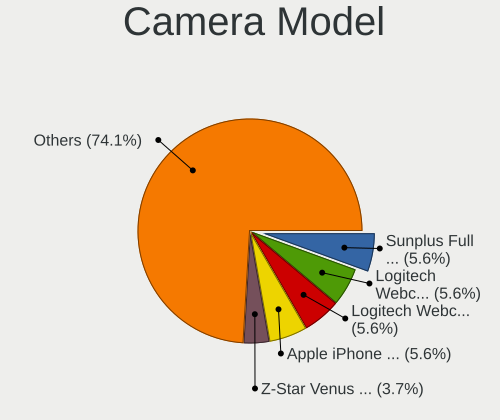

| Model                                   | Desktops | Percent |
|-----------------------------------------|----------|---------|
| Sunplus Full HD webcam                  | 3        | 5.56%   |
| Logitech Webcam C310                    | 3        | 5.56%   |
| Logitech Webcam C270                    | 3        | 5.56%   |
| Apple iPhone 5/5C/5S/6/SE/7/8/X         | 3        | 5.56%   |
| Z-Star Venus USB2.0 Camera              | 2        | 3.7%    |
| Realtek USB Camera                      | 2        | 3.7%    |
| Microdia Camera                         | 2        | 3.7%    |
| Logitech HD Pro Webcam C920             | 2        | 3.7%    |
| Z-Star Traveler TV 6500 SF Dia-scanner  | 1        | 1.85%   |
| Vimicro S108-45100                      | 1        | 1.85%   |
| Sunplus IT USB CAM2                     | 1        | 1.85%   |
| Sunplus aoni webcam A30                 | 1        | 1.85%   |
| Sonix S1020B                            | 1        | 1.85%   |
| SN0002 HIK 2K USB CAMERA                | 1        | 1.85%   |
| SN0002 2K USB Camera                    | 1        | 1.85%   |
| Silicon Motion 300k Pixel Camera        | 1        | 1.85%   |
| Shenzhen e-loam S1850                   | 1        | 1.85%   |
| Realtek Windows Hello CAM               | 1        | 1.85%   |
| Realtek Web Camera                      | 1        | 1.85%   |
| Realtek Thronmax Stream Go Pro Webcam   | 1        | 1.85%   |
| Realtek Full HD webcam                  | 1        | 1.85%   |
| Qualcomm Mi Conference Bar              | 1        | 1.85%   |
| OPPO Oppo N1                            | 1        | 1.85%   |
| Microdia Webcam Vitade AF               | 1        | 1.85%   |
| Microdia Document Scanner               | 1        | 1.85%   |
| MacroSilicon USB Video                  | 1        | 1.85%   |
| Logitech Logitech Webcam C100           | 1        | 1.85%   |
| Logitech C930c                          | 1        | 1.85%   |
| Logitech BRIO Ultra HD Webcam           | 1        | 1.85%   |
| Lite-On HP Full-HD Camera               | 1        | 1.85%   |
| JSXRGB0230-D046 JSXRGB0230-D046         | 1        | 1.85%   |
| IMC Networks XHC Camera                 | 1        | 1.85%   |
| Google Nexus/Pixel Device (MTP + debug) | 1        | 1.85%   |
| Genesys Logic HD camera                 | 1        | 1.85%   |
| Genesys Logic Camera                    | 1        | 1.85%   |
| Generalplus GENERAL WEBCAM              | 1        | 1.85%   |
| GEMBIRD USB2.0 PC CAMERA                | 1        | 1.85%   |
| Cubeternet WebCam                       | 1        | 1.85%   |
| Chicony HP Wide Vision FHD Camera       | 1        | 1.85%   |
| Chicony HP WebCam                       | 1        | 1.85%   |

Security
--------

Fingerprint Vendor
------------------

Fingerprint sensor vendors

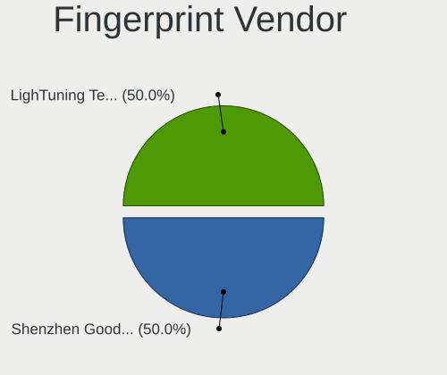

| Vendor                     | Desktops | Percent |
|----------------------------|----------|---------|
| Synaptics                  | 1        | 33.33%  |
| Shenzhen Goodix Technology | 1        | 33.33%  |
| LighTuning Technology      | 1        | 33.33%  |

Fingerprint Model
-----------------

Fingerprint sensor models

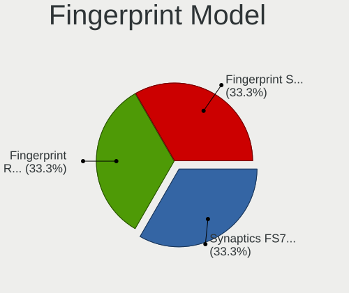

| Model                                                     | Desktops | Percent |
|-----------------------------------------------------------|----------|---------|
| Synaptics  FS7604 Touch Fingerprint Sensor with PurePrint | 1        | 33.33%  |
| Shenzhen Goodix Fingerprint Reader                        | 1        | 33.33%  |
| LighTuning Fingerprint Sensor                             | 1        | 33.33%  |

Chipcard Vendor
---------------

Chipcard module vendors

| Vendor      | Desktops | Percent |
|-------------|----------|---------|
| Alcor Micro | 1        | 100%    |

Chipcard Model
--------------

Chipcard module models

| Model                               | Desktops | Percent |
|-------------------------------------|----------|---------|
| Alcor Micro AU9540 Smartcard Reader | 1        | 100%    |

Unsupported
-----------

Unsupported Devices
-------------------

Total unsupported devices on board

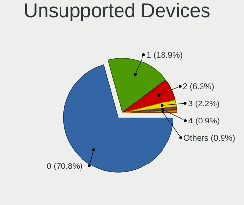

| Total | Desktops | Percent |
|-------|----------|---------|
| 0     | 580      | 70.82%  |
| 1     | 155      | 18.93%  |
| 2     | 52       | 6.35%   |
| 3     | 18       | 2.2%    |
| 4     | 7        | 0.85%   |
| 7     | 2        | 0.24%   |
| 6     | 2        | 0.24%   |
| 5     | 2        | 0.24%   |
| 8     | 1        | 0.12%   |

Unsupported Device Types
------------------------

Types of unsupported devices

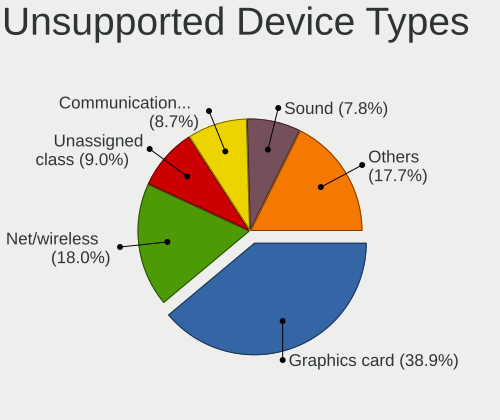

| Type                     | Desktops | Percent |
|--------------------------|----------|---------|
| Graphics card            | 130      | 38.92%  |
| Net/wireless             | 60       | 17.96%  |
| Unassigned class         | 30       | 8.98%   |
| Communication controller | 29       | 8.68%   |
| Sound                    | 26       | 7.78%   |
| Net/ethernet             | 15       | 4.49%   |
| Bluetooth                | 12       | 3.59%   |
| Network                  | 10       | 2.99%   |
| Storage/raid             | 6        | 1.8%    |
| Multimedia controller    | 4        | 1.2%    |
| Fingerprint reader       | 3        | 0.9%    |
| Camera                   | 3        | 0.9%    |
| Wireless                 | 1        | 0.3%    |
| Storage/nvme             | 1        | 0.3%    |
| Storage/ata              | 1        | 0.3%    |
| Firewire controller      | 1        | 0.3%    |
| Chipcard                 | 1        | 0.3%    |
| Card reader              | 1        | 0.3%    |

