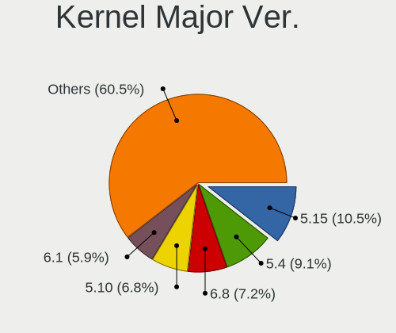
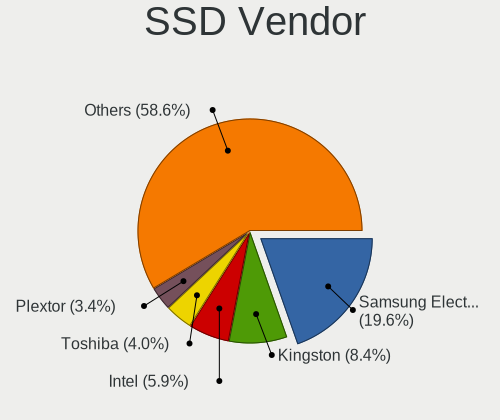
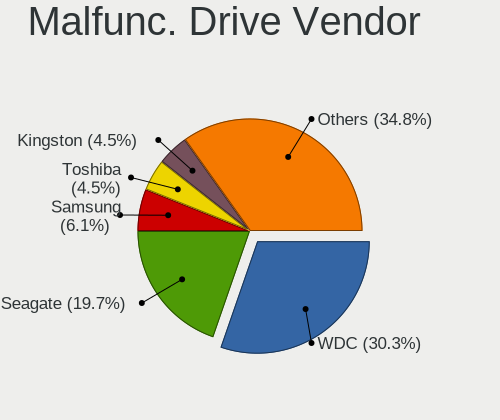
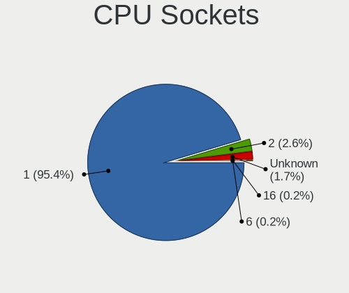
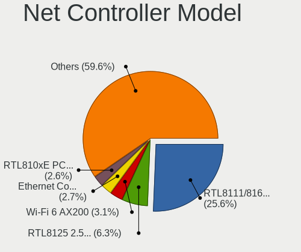
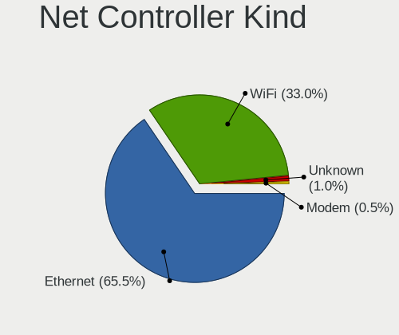
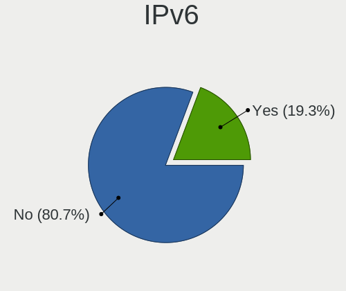
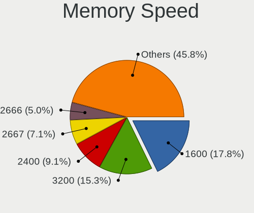
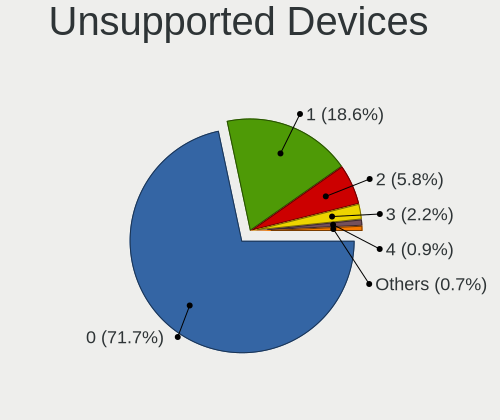

Linux in China - Tested Hardware & Statistics (Desktops)
--------------------------------------------------------

A project to collect tested hardware configurations for Linux in China.

Anyone can contribute to this report by the [hw-probe](https://github.com/linuxhw/hw-probe) tool:

    sudo -E hw-probe -all -upload

Please contribute! Especially if your hardware is rare.

Contents
--------

* [ Test Cases ](#test-cases)

* [ System ](#system)
  - [ OS                       ](#os)
  - [ OS Family                ](#os-family)
  - [ Kernel                   ](#kernel)
  - [ Kernel Family            ](#kernel-family)
  - [ Kernel Major Ver.        ](#kernel-major-ver)
  - [ Arch                     ](#arch)
  - [ DE                       ](#de)
  - [ Display Server           ](#display-server)
  - [ Display Manager          ](#display-manager)
  - [ OS Lang                  ](#os-lang)
  - [ Boot Mode                ](#boot-mode)
  - [ Filesystem               ](#filesystem)
  - [ Part. scheme             ](#part-scheme)
  - [ Dual Boot with Linux/BSD ](#dual-boot-with-linuxbsd)
  - [ Dual Boot (Win)          ](#dual-boot-win)

* [ Board ](#board)
  - [ Vendor                   ](#vendor)
  - [ Model                    ](#model)
  - [ Model Family             ](#model-family)
  - [ MFG Year                 ](#mfg-year)
  - [ Form Factor              ](#form-factor)
  - [ Secure Boot              ](#secure-boot)
  - [ Coreboot                 ](#coreboot)
  - [ RAM Size                 ](#ram-size)
  - [ RAM Used                 ](#ram-used)
  - [ Total Drives             ](#total-drives)
  - [ Has CD-ROM               ](#has-cd-rom)
  - [ Has Ethernet             ](#has-ethernet)
  - [ Has WiFi                 ](#has-wifi)
  - [ Has Bluetooth            ](#has-bluetooth)

* [ Location ](#location)
  - [ Country                  ](#country)
  - [ City                     ](#city)

* [ Drives ](#drives)
  - [ Drive Vendor             ](#drive-vendor)
  - [ Drive Model              ](#drive-model)
  - [ HDD Vendor               ](#hdd-vendor)
  - [ SSD Vendor               ](#ssd-vendor)
  - [ Drive Kind               ](#drive-kind)
  - [ Drive Connector          ](#drive-connector)
  - [ Drive Size               ](#drive-size)
  - [ Space Total              ](#space-total)
  - [ Space Used               ](#space-used)
  - [ Malfunc. Drives          ](#malfunc-drives)
  - [ Malfunc. Drive Vendor    ](#malfunc-drive-vendor)
  - [ Malfunc. HDD Vendor      ](#malfunc-hdd-vendor)
  - [ Malfunc. Drive Kind      ](#malfunc-drive-kind)
  - [ Failed Drives            ](#failed-drives)
  - [ Failed Drive Vendor      ](#failed-drive-vendor)
  - [ Drive Status             ](#drive-status)

* [ Storage controller ](#storage-controller)
  - [ Storage Vendor           ](#storage-vendor)
  - [ Storage Model            ](#storage-model)
  - [ Storage Kind             ](#storage-kind)

* [ Processor ](#processor)
  - [ CPU Vendor               ](#cpu-vendor)
  - [ CPU Model                ](#cpu-model)
  - [ CPU Model Family         ](#cpu-model-family)
  - [ CPU Cores                ](#cpu-cores)
  - [ CPU Sockets              ](#cpu-sockets)
  - [ CPU Threads              ](#cpu-threads)
  - [ CPU Op-Modes             ](#cpu-op-modes)
  - [ CPU Microcode            ](#cpu-microcode)
  - [ CPU Microarch            ](#cpu-microarch)

* [ Graphics ](#graphics)
  - [ GPU Vendor               ](#gpu-vendor)
  - [ GPU Model                ](#gpu-model)
  - [ GPU Combo                ](#gpu-combo)
  - [ GPU Driver               ](#gpu-driver)
  - [ GPU Memory               ](#gpu-memory)

* [ Monitor ](#monitor)
  - [ Monitor Vendor           ](#monitor-vendor)
  - [ Monitor Model            ](#monitor-model)
  - [ Monitor Resolution       ](#monitor-resolution)
  - [ Monitor Diagonal         ](#monitor-diagonal)
  - [ Monitor Width            ](#monitor-width)
  - [ Aspect Ratio             ](#aspect-ratio)
  - [ Monitor Area             ](#monitor-area)
  - [ Pixel Density            ](#pixel-density)
  - [ Multiple Monitors        ](#multiple-monitors)

* [ Network ](#network)
  - [ Net Controller Vendor    ](#net-controller-vendor)
  - [ Net Controller Model     ](#net-controller-model)
  - [ Wireless Vendor          ](#wireless-vendor)
  - [ Wireless Model           ](#wireless-model)
  - [ Ethernet Vendor          ](#ethernet-vendor)
  - [ Ethernet Model           ](#ethernet-model)
  - [ Net Controller Kind      ](#net-controller-kind)
  - [ Used Controller          ](#used-controller)
  - [ NICs                     ](#nics)
  - [ IPv6                     ](#ipv6)

* [ Bluetooth ](#bluetooth)
  - [ Bluetooth Vendor         ](#bluetooth-vendor)
  - [ Bluetooth Model          ](#bluetooth-model)

* [ Sound ](#sound)
  - [ Sound Vendor             ](#sound-vendor)
  - [ Sound Model              ](#sound-model)

* [ Memory ](#memory)
  - [ Memory Vendor            ](#memory-vendor)
  - [ Memory Model             ](#memory-model)
  - [ Memory Kind              ](#memory-kind)
  - [ Memory Form Factor       ](#memory-form-factor)
  - [ Memory Size              ](#memory-size)
  - [ Memory Speed             ](#memory-speed)

* [ Printers & scanners ](#printers--scanners)
  - [ Printer Vendor           ](#printer-vendor)
  - [ Printer Model            ](#printer-model)
  - [ Scanner Vendor           ](#scanner-vendor)
  - [ Scanner Model            ](#scanner-model)

* [ Camera ](#camera)
  - [ Camera Vendor            ](#camera-vendor)
  - [ Camera Model             ](#camera-model)

* [ Security ](#security)
  - [ Fingerprint Vendor       ](#fingerprint-vendor)
  - [ Fingerprint Model        ](#fingerprint-model)
  - [ Chipcard Vendor          ](#chipcard-vendor)
  - [ Chipcard Model           ](#chipcard-model)

* [ Unsupported ](#unsupported)
  - [ Unsupported Devices      ](#unsupported-devices)
  - [ Unsupported Device Types ](#unsupported-device-types)

Test Cases
----------

Total: 1011

| Vendor        | Model                       | Probe                                                      | Date         |
|---------------|-----------------------------|------------------------------------------------------------|--------------|
| MAXSUN        | MS-A86FX FS M.3             | [778b3689c2](https://linux-hardware.org/?probe=778b3689c2) | Jan 05, 2025 |
| Lenovo        | NOK                         | [2b5c2e2c8a](https://linux-hardware.org/?probe=2b5c2e2c8a) | Jan 04, 2025 |
| Intel         | 14650HX                     | [a9e917c056](https://linux-hardware.org/?probe=a9e917c056) | Jan 02, 2025 |
| Loongson      | CTCI02LS3A6000C-K CTCI V... | [b6f0fc1399](https://linux-hardware.org/?probe=b6f0fc1399) | Dec 31, 2024 |
| MSI           | B450M MORTAR TITANIUM       | [2bbf71e498](https://linux-hardware.org/?probe=2bbf71e498) | Dec 28, 2024 |
| Loongson      | CTCI02LS3A6000C-K CTCI V... | [0cc3198ea4](https://linux-hardware.org/?probe=0cc3198ea4) | Dec 27, 2024 |
| Haier         | ZEB19 V1.1                  | [fa29b7de8f](https://linux-hardware.org/?probe=fa29b7de8f) | Dec 27, 2024 |
| AZW           | LZX TBD                     | [92975fb393](https://linux-hardware.org/?probe=92975fb393) | Dec 27, 2024 |
| AZW           | LZX TBD                     | [7bad615f3c](https://linux-hardware.org/?probe=7bad615f3c) | Dec 27, 2024 |
| AZW           | LZX TBD                     | [ea53b402e4](https://linux-hardware.org/?probe=ea53b402e4) | Dec 27, 2024 |
| MSI           | H610M BOMBER DDR4           | [2d757efd33](https://linux-hardware.org/?probe=2d757efd33) | Dec 22, 2024 |
| ASUSTek       | TUF Gaming B660M-PLUS WI... | [1e7ff6fa41](https://linux-hardware.org/?probe=1e7ff6fa41) | Dec 17, 2024 |
| MSI           | PRO Z790-A MAX WIFI         | [9d8b439c00](https://linux-hardware.org/?probe=9d8b439c00) | Dec 15, 2024 |
| GMKtec        | NucBox K6                   | [0ba5e79a99](https://linux-hardware.org/?probe=0ba5e79a99) | Dec 12, 2024 |
| AZW           | LZX TBD                     | [33c820c4ff](https://linux-hardware.org/?probe=33c820c4ff) | Dec 10, 2024 |
| Loongson      | CTCI02LS3A6000C-K CTCI V... | [7348079cd8](https://linux-hardware.org/?probe=7348079cd8) | Dec 08, 2024 |
| Loongson      | 3A6000-HV-7A2000-1w-V0.1... | [6db45d6f6f](https://linux-hardware.org/?probe=6db45d6f6f) | Dec 04, 2024 |
| Loongson      | 3A6000-HV-7A2000-NUC QA6... | [7ec85b65bc](https://linux-hardware.org/?probe=7ec85b65bc) | Dec 03, 2024 |
| Loongson      | 3A6000-HV-7A2000-1w-V0.1... | [d93b073b67](https://linux-hardware.org/?probe=d93b073b67) | Dec 03, 2024 |
| Loongson      | 3A6000-HV-7A2000-NUC QA6... | [b702d01268](https://linux-hardware.org/?probe=b702d01268) | Dec 02, 2024 |
| Gigabyte      | H61M-S1                     | [00aeb0fa4c](https://linux-hardware.org/?probe=00aeb0fa4c) | Nov 28, 2024 |
| MSI           | B450M MORTAR                | [39200492be](https://linux-hardware.org/?probe=39200492be) | Nov 27, 2024 |
| AZW           | LZX TBD                     | [c1af486886](https://linux-hardware.org/?probe=c1af486886) | Nov 27, 2024 |
| Loongson      | 3C6000-7A2000-2w-EVB-V1.... | [5cabe27847](https://linux-hardware.org/?probe=5cabe27847) | Nov 25, 2024 |
| ASUSTek       | TUF Gaming B450M-PRO S      | [2df85a6e04](https://linux-hardware.org/?probe=2df85a6e04) | Nov 25, 2024 |
| Loongson      | 3C6000-7A2000-2w-EVB-V1.... | [5284f27588](https://linux-hardware.org/?probe=5284f27588) | Nov 23, 2024 |
| ASUSTek       | B760M-AYW WIFI              | [d5062f3897](https://linux-hardware.org/?probe=d5062f3897) | Nov 22, 2024 |
| Unknown       | Unknown                     | [027b46be42](https://linux-hardware.org/?probe=027b46be42) | Nov 21, 2024 |
| Unknown       | Unknown                     | [4c3a6e2cdb](https://linux-hardware.org/?probe=4c3a6e2cdb) | Nov 18, 2024 |
| Unknown       | Unknown                     | [1763b2c1d2](https://linux-hardware.org/?probe=1763b2c1d2) | Nov 18, 2024 |
| Lenovo        | 3716 SDK0L77769 WIN 3423... | [74f4ee0967](https://linux-hardware.org/?probe=74f4ee0967) | Nov 17, 2024 |
| ASUSTek       | PRIME H610M-K D4            | [749193ebff](https://linux-hardware.org/?probe=749193ebff) | Nov 16, 2024 |
| Loongson      | 3A6000-HV-7A2000-1w-EVB-... | [1524ee89c3](https://linux-hardware.org/?probe=1524ee89c3) | Nov 16, 2024 |
| Shenzhen M... | AHBTB                       | [576f6f05a3](https://linux-hardware.org/?probe=576f6f05a3) | Nov 13, 2024 |
| HP            | 212B                        | [bb6c4a75f7](https://linux-hardware.org/?probe=bb6c4a75f7) | Nov 13, 2024 |
| Loongson      | 3A6000-HV-7A2000-NUC QA6... | [ce55076923](https://linux-hardware.org/?probe=ce55076923) | Nov 12, 2024 |
| Shenzhen M... | AHBTB                       | [e62cdd7dd4](https://linux-hardware.org/?probe=e62cdd7dd4) | Nov 12, 2024 |
| ONDA          | M3 miniPC VER               | [099d60e8a1](https://linux-hardware.org/?probe=099d60e8a1) | Nov 11, 2024 |
| Silicom       | 80200-0240-G02 R200         | [547701de33](https://linux-hardware.org/?probe=547701de33) | Nov 11, 2024 |
| MSI           | PRO X870-P WIFI             | [1a9e9db131](https://linux-hardware.org/?probe=1a9e9db131) | Nov 09, 2024 |
| Gigabyte      | X870 EAGLE WIFI7            | [c65ae30c51](https://linux-hardware.org/?probe=c65ae30c51) | Nov 09, 2024 |
| Lenovo        | 3102 SDK0L77767 WIN 3423... | [3a3945760d](https://linux-hardware.org/?probe=3a3945760d) | Nov 09, 2024 |
| Lenovo        | 102F SDK0E50518 STD 2621... | [b5f2869b8a](https://linux-hardware.org/?probe=b5f2869b8a) | Nov 06, 2024 |
| ASUSTek       | Pro WS WRX80E-SAGE SE WI... | [802476b534](https://linux-hardware.org/?probe=802476b534) | Nov 06, 2024 |
| ASUSTek       | ROG STRIX Z790-A GAMING ... | [42e0ed467d](https://linux-hardware.org/?probe=42e0ed467d) | Nov 06, 2024 |
| Lenovo        | 102F SDK0E50518 STD 2621... | [d30d873b70](https://linux-hardware.org/?probe=d30d873b70) | Nov 06, 2024 |
| ASUSTek       | Pro WS WRX80E-SAGE SE WI... | [97d248356e](https://linux-hardware.org/?probe=97d248356e) | Nov 04, 2024 |
| MSI           | X670E GAMING PLUS WIFI      | [ee5c01978c](https://linux-hardware.org/?probe=ee5c01978c) | Nov 04, 2024 |
| MSI           | X670E GAMING PLUS WIFI      | [f502d96b27](https://linux-hardware.org/?probe=f502d96b27) | Nov 03, 2024 |
| Intel         | STRIX X99 GAMING II         | [9a78cb45fa](https://linux-hardware.org/?probe=9a78cb45fa) | Nov 01, 2024 |
| HP            | 212B                        | [8eb5ac95f4](https://linux-hardware.org/?probe=8eb5ac95f4) | Oct 31, 2024 |
| ASUSTek       | ROG CROSSHAIR VIII DARK ... | [b5efbc2d65](https://linux-hardware.org/?probe=b5efbc2d65) | Oct 29, 2024 |
| ASUSTek       | PRIME X570-P                | [49dcca995f](https://linux-hardware.org/?probe=49dcca995f) | Oct 29, 2024 |
| Lenovo        | MAHOBAY NOK                 | [039371fc2a](https://linux-hardware.org/?probe=039371fc2a) | Oct 28, 2024 |
| MSI           | H81M-P33 V2                 | [48eeb28cb1](https://linux-hardware.org/?probe=48eeb28cb1) | Oct 26, 2024 |
| ASUSTek       | TUF Gaming B550M-PLUS WI... | [3aef400bdc](https://linux-hardware.org/?probe=3aef400bdc) | Oct 25, 2024 |
| Gigabyte      | B650M AORUS ELITE AX ICE    | [33dbc334ba](https://linux-hardware.org/?probe=33dbc334ba) | Oct 20, 2024 |
| ASUSTek       | B760M-AYW WIFI D4           | [3296923f5c](https://linux-hardware.org/?probe=3296923f5c) | Oct 18, 2024 |
| AZW           | LZX TBD                     | [f6d5bd13f2](https://linux-hardware.org/?probe=f6d5bd13f2) | Oct 17, 2024 |
| Haier         | ZEB19 V1.1                  | [beb67a0dab](https://linux-hardware.org/?probe=beb67a0dab) | Oct 17, 2024 |
| AZW           | LZX TBD                     | [2e135005d9](https://linux-hardware.org/?probe=2e135005d9) | Oct 17, 2024 |
| AZW           | LZX TBD                     | [50e47d2806](https://linux-hardware.org/?probe=50e47d2806) | Oct 17, 2024 |
| AZW           | LZX TBD                     | [e1fdd1e3ec](https://linux-hardware.org/?probe=e1fdd1e3ec) | Oct 15, 2024 |
| ASUSTek       | P8H61 R2.0                  | [f32503f55b](https://linux-hardware.org/?probe=f32503f55b) | Oct 11, 2024 |
| Gigabyte      | B650E AORUS PRO X USB4      | [441f16f225](https://linux-hardware.org/?probe=441f16f225) | Oct 10, 2024 |
| Unknown       | Unknown                     | [8012aa8b7d](https://linux-hardware.org/?probe=8012aa8b7d) | Oct 09, 2024 |
| Unknown       | Unknown                     | [53ef60efc2](https://linux-hardware.org/?probe=53ef60efc2) | Oct 09, 2024 |
| Colorful T... | BATTLE-AX B760M-T WIFI V... | [6b37decd9c](https://linux-hardware.org/?probe=6b37decd9c) | Oct 09, 2024 |
| Unknown       | Unknown                     | [80a672c3d8](https://linux-hardware.org/?probe=80a672c3d8) | Oct 07, 2024 |
| GMKtec        | NucBox K2                   | [37f6119616](https://linux-hardware.org/?probe=37f6119616) | Oct 06, 2024 |
| ABIT          | B760ITX PLUS D4 V1.1        | [ded6b54f27](https://linux-hardware.org/?probe=ded6b54f27) | Oct 03, 2024 |
| Lenovo        | MAHOBAY NOK                 | [22f11cd06e](https://linux-hardware.org/?probe=22f11cd06e) | Oct 02, 2024 |
| Lenovo        | NOK                         | [869a19c237](https://linux-hardware.org/?probe=869a19c237) | Sep 27, 2024 |
| Colorful T... | C.A68HM PRO V14             | [524b75af5e](https://linux-hardware.org/?probe=524b75af5e) | Sep 25, 2024 |
| ASUSTek       | PRIME Z270-A                | [fba4ef3b0e](https://linux-hardware.org/?probe=fba4ef3b0e) | Sep 24, 2024 |
| Loongson      | LS3A5000-7A2000-1w-EVB-V... | [67cc533524](https://linux-hardware.org/?probe=67cc533524) | Sep 24, 2024 |
| MSI           | B360M PRO-VD                | [874ab2a802](https://linux-hardware.org/?probe=874ab2a802) | Sep 23, 2024 |
| Shenzhen M... | AHBTB                       | [f562b4afcc](https://linux-hardware.org/?probe=f562b4afcc) | Sep 23, 2024 |
| AZW           | LZX TBD                     | [242bb69a07](https://linux-hardware.org/?probe=242bb69a07) | Sep 22, 2024 |
| JGINYUE       | H81M VH PLUS V1.1           | [15128e9c08](https://linux-hardware.org/?probe=15128e9c08) | Sep 22, 2024 |
| Loongson      | LS3A5000-7A2000-1w-EVB-V... | [09d361b09c](https://linux-hardware.org/?probe=09d361b09c) | Sep 21, 2024 |
| Lenovo        | NOK                         | [04441047f1](https://linux-hardware.org/?probe=04441047f1) | Sep 21, 2024 |
| ASRock        | B550M Pro4                  | [9ef268f88f](https://linux-hardware.org/?probe=9ef268f88f) | Sep 20, 2024 |
| ASUSTek       | TUF Gaming B550M-PLUS WI... | [74442529cd](https://linux-hardware.org/?probe=74442529cd) | Sep 20, 2024 |
| Colorful T... | B460M-K PRO V21             | [6d090db07d](https://linux-hardware.org/?probe=6d090db07d) | Sep 19, 2024 |
| Colorful T... | B460M-K PRO V21             | [ef78c6a52a](https://linux-hardware.org/?probe=ef78c6a52a) | Sep 19, 2024 |
| Lenovo        | 3148 NOK                    | [cc1cf1f7fd](https://linux-hardware.org/?probe=cc1cf1f7fd) | Sep 19, 2024 |
| AZW           | LZX TBD                     | [555138dd5b](https://linux-hardware.org/?probe=555138dd5b) | Sep 13, 2024 |
| Haier         | ZEB19 V1.1                  | [fc948e0f5d](https://linux-hardware.org/?probe=fc948e0f5d) | Sep 13, 2024 |
| ASUSTek       | PRIME B660M-K D4            | [0cff0b79b1](https://linux-hardware.org/?probe=0cff0b79b1) | Sep 11, 2024 |
| MSI           | B650M GAMING PLUS WIFI      | [3098e621e9](https://linux-hardware.org/?probe=3098e621e9) | Sep 10, 2024 |
| ASUSTek       | P8Z77-V LK                  | [56ea173567](https://linux-hardware.org/?probe=56ea173567) | Sep 08, 2024 |
| MSI           | PRO H610M-S DDR4            | [0bd913b9b9](https://linux-hardware.org/?probe=0bd913b9b9) | Sep 07, 2024 |
| Shenzhen M... | AHBTB                       | [0f2d9d0459](https://linux-hardware.org/?probe=0f2d9d0459) | Sep 03, 2024 |
| Shenzhen M... | AHBTB                       | [7f3f0c1493](https://linux-hardware.org/?probe=7f3f0c1493) | Sep 02, 2024 |
| Haier         | ZEB19 V1.1                  | [dd01bca542](https://linux-hardware.org/?probe=dd01bca542) | Sep 01, 2024 |
| Unknown       | Unknown                     | [35b563fbe4](https://linux-hardware.org/?probe=35b563fbe4) | Sep 01, 2024 |
| Unknown       | Unknown                     | [6f7a85fa0d](https://linux-hardware.org/?probe=6f7a85fa0d) | Sep 01, 2024 |
| MSI           | PRO B760M-A WIFI DDR4 II    | [3d9b3902d2](https://linux-hardware.org/?probe=3d9b3902d2) | Aug 28, 2024 |
| MSI           | PRO B760M-A WIFI DDR4 II    | [7f6110c2d1](https://linux-hardware.org/?probe=7f6110c2d1) | Aug 28, 2024 |
| Haier         | ZEB19 V1.1                  | [f600ce1cc4](https://linux-hardware.org/?probe=f600ce1cc4) | Aug 27, 2024 |
| Lenovo        | 3316 NOK                    | [56a5385b64](https://linux-hardware.org/?probe=56a5385b64) | Aug 24, 2024 |
| MSI           | A320M PRO-VD/S              | [ded0ad40d1](https://linux-hardware.org/?probe=ded0ad40d1) | Aug 21, 2024 |
| Gigabyte      | X150-PRO ECC-CF             | [b70f2a7f30](https://linux-hardware.org/?probe=b70f2a7f30) | Aug 20, 2024 |
| ASUSTek       | ROG STRIX B550-A GAMING     | [238c382370](https://linux-hardware.org/?probe=238c382370) | Aug 17, 2024 |
| ASRock        | H310M-STX/COM               | [e3d70f1096](https://linux-hardware.org/?probe=e3d70f1096) | Aug 17, 2024 |
| ASUSTek       | TUF Gaming B560M-PLUS       | [668f599883](https://linux-hardware.org/?probe=668f599883) | Aug 14, 2024 |
| ASUSTek       | P5G41T-M LX                 | [061482f47f](https://linux-hardware.org/?probe=061482f47f) | Aug 12, 2024 |
| MSI           | Z170I GAMING PRO AC         | [fe369e7902](https://linux-hardware.org/?probe=fe369e7902) | Aug 11, 2024 |
| ASUSTek       | TUF Gaming B550M-PLUS       | [60f2dd435d](https://linux-hardware.org/?probe=60f2dd435d) | Aug 09, 2024 |
| ASUSTek       | H81M-K                      | [417f0bdccc](https://linux-hardware.org/?probe=417f0bdccc) | Aug 07, 2024 |
| ABIT          | B760ITX PLUS D4 V1.1        | [17c2e4249a](https://linux-hardware.org/?probe=17c2e4249a) | Aug 03, 2024 |
| ASUSTek       | Z790-AYW OC WIFI            | [bcfbfe5ee1](https://linux-hardware.org/?probe=bcfbfe5ee1) | Aug 02, 2024 |
| ABIT          | B760ITX PLUS D4 V1.1        | [f009b5b55f](https://linux-hardware.org/?probe=f009b5b55f) | Jul 28, 2024 |
| Pegatron      | 3580                        | [5ddaaa65f5](https://linux-hardware.org/?probe=5ddaaa65f5) | Jul 26, 2024 |
| Gigabyte      | Z170X-Gaming 3              | [63a97ec55b](https://linux-hardware.org/?probe=63a97ec55b) | Jul 24, 2024 |
| Dell          | 072TMP A01                  | [9c356ce13f](https://linux-hardware.org/?probe=9c356ce13f) | Jul 23, 2024 |
| Gigabyte      | B85-D3V-A                   | [3a623faece](https://linux-hardware.org/?probe=3a623faece) | Jul 23, 2024 |
| DS            | ADL-P                       | [187175cfcb](https://linux-hardware.org/?probe=187175cfcb) | Jul 22, 2024 |
| Lenovo        | 3102 SDK0L77767 WIN 3423... | [10c1c24087](https://linux-hardware.org/?probe=10c1c24087) | Jul 17, 2024 |
| MSI           | B560M BOMBER                | [e3bca7b6c9](https://linux-hardware.org/?probe=e3bca7b6c9) | Jul 17, 2024 |
| Loongson      | 3A6000-HV-7A2000-1w-EVB-... | [9bd9a54c9c](https://linux-hardware.org/?probe=9bd9a54c9c) | Jul 16, 2024 |
| GizmoSpher... | Gizmo2                      | [d28509b5a4](https://linux-hardware.org/?probe=d28509b5a4) | Jul 15, 2024 |
| Loongson      | 3A6000-HV-7A2000-1w-V0.1... | [20ee8b447f](https://linux-hardware.org/?probe=20ee8b447f) | Jul 13, 2024 |
| Loongson      | 3A6000-HV-7A2000-1w-V0.1... | [aeb61aff07](https://linux-hardware.org/?probe=aeb61aff07) | Jul 12, 2024 |
| Loongson      | LS3A6000-7A2000-1w-V0.1-... | [84480a9583](https://linux-hardware.org/?probe=84480a9583) | Jul 10, 2024 |
| Gigabyte      | F2A88XM-D3H                 | [e48aa14807](https://linux-hardware.org/?probe=e48aa14807) | Jul 10, 2024 |
| Unknown       | ADL-N Prod                  | [dff7bf2f65](https://linux-hardware.org/?probe=dff7bf2f65) | Jul 07, 2024 |
| ASUSTek       | B85M-K                      | [8e139cdbe5](https://linux-hardware.org/?probe=8e139cdbe5) | Jul 06, 2024 |
| Gigabyte      | B460M D2V                   | [584771b0fa](https://linux-hardware.org/?probe=584771b0fa) | Jul 06, 2024 |
| Loongson      | 3A6000-HV-7A2000-1w-V0.1... | [7b0229c8a1](https://linux-hardware.org/?probe=7b0229c8a1) | Jul 03, 2024 |
| Loongson      | LS3A6000-7A2000-1w-V0.1-... | [b1cfdeee2f](https://linux-hardware.org/?probe=b1cfdeee2f) | Jul 03, 2024 |
| MSI           | Z490-A PRO                  | [13ced43097](https://linux-hardware.org/?probe=13ced43097) | Jul 03, 2024 |
| Shenzhen M... | AHBTB                       | [75322448fe](https://linux-hardware.org/?probe=75322448fe) | Jul 03, 2024 |
| Gigabyte      | B760M D2H DDR4              | [0d6f7b7b49](https://linux-hardware.org/?probe=0d6f7b7b49) | Jul 02, 2024 |
| Gigabyte      | B760M D2H DDR4              | [df78933f80](https://linux-hardware.org/?probe=df78933f80) | Jul 02, 2024 |
| MSI           | B450M PRO-M2 MAX            | [77635deef5](https://linux-hardware.org/?probe=77635deef5) | Jul 02, 2024 |
| ONDA          | M3 miniPC VER               | [ea4d3d1b11](https://linux-hardware.org/?probe=ea4d3d1b11) | Jul 02, 2024 |
| Shenzhen M... | AHBTB                       | [9a6f4d055a](https://linux-hardware.org/?probe=9a6f4d055a) | Jul 01, 2024 |
| Loongson      | 3A6000-HV-7A2000-NUC QA6... | [4d7a9d3bbd](https://linux-hardware.org/?probe=4d7a9d3bbd) | Jun 30, 2024 |
| MAXSUN        | MS-N3150 Quad               | [9661180b64](https://linux-hardware.org/?probe=9661180b64) | Jun 29, 2024 |
| MAXSUN        | MS-N3150 Quad               | [4bd7010223](https://linux-hardware.org/?probe=4bd7010223) | Jun 29, 2024 |
| Lenovo        | 3148 NOK                    | [cab675a851](https://linux-hardware.org/?probe=cab675a851) | Jun 27, 2024 |
| MSI           | PRO Z790-A MAX WIFI         | [5036a2aebe](https://linux-hardware.org/?probe=5036a2aebe) | Jun 26, 2024 |
| MSI           | PRO Z790-A MAX WIFI         | [8e04d80757](https://linux-hardware.org/?probe=8e04d80757) | Jun 26, 2024 |
| MW            | GMLK-2_5G4L                 | [877fe861e1](https://linux-hardware.org/?probe=877fe861e1) | Jun 22, 2024 |
| Loongson      | 3A6000-HV-7A2000-NUC QA6... | [8501410a5c](https://linux-hardware.org/?probe=8501410a5c) | Jun 20, 2024 |
| ONDA          | B75E                        | [c42fc0c3e5](https://linux-hardware.org/?probe=c42fc0c3e5) | Jun 19, 2024 |
| ASUSTek       | TUF Gaming Z790-PRO WIFI    | [04bf129ff9](https://linux-hardware.org/?probe=04bf129ff9) | Jun 17, 2024 |
| YANYU         | ITX-WM192                   | [d5480f4dff](https://linux-hardware.org/?probe=d5480f4dff) | Jun 10, 2024 |
| Intel         | X99-6PLUS V5.1              | [e99e9a02ce](https://linux-hardware.org/?probe=e99e9a02ce) | Jun 09, 2024 |
| Soyo          | SY-H110D4 FS V3.0           | [723da98b7e](https://linux-hardware.org/?probe=723da98b7e) | Jun 09, 2024 |
| Lenovo        | Kabini CRB NOK              | [f1053f6b0e](https://linux-hardware.org/?probe=f1053f6b0e) | Jun 05, 2024 |
| ASUSTek       | ROG STRIX B760-I GAMING ... | [f2c3443779](https://linux-hardware.org/?probe=f2c3443779) | Jun 03, 2024 |
| Gigabyte      | X570 UD                     | [9a97ec934e](https://linux-hardware.org/?probe=9a97ec934e) | May 31, 2024 |
| MSI           | PRO Z790-A MAX WIFI         | [3fbcfecb81](https://linux-hardware.org/?probe=3fbcfecb81) | May 31, 2024 |
| Colorful T... | CVN B760I FROZEN WIFI V2... | [917515523d](https://linux-hardware.org/?probe=917515523d) | May 29, 2024 |
| Intel         | X99-DD41 V1.0               | [3e7027e8d3](https://linux-hardware.org/?probe=3e7027e8d3) | May 29, 2024 |
| ONDA          | M3 miniPC VER               | [0a891a65c6](https://linux-hardware.org/?probe=0a891a65c6) | May 19, 2024 |
| Unknown       | Unknown                     | [c8be20c3f5](https://linux-hardware.org/?probe=c8be20c3f5) | May 18, 2024 |
| ASRock        | X570 Phantom Gaming-ITX/... | [26ccfc6d25](https://linux-hardware.org/?probe=26ccfc6d25) | May 18, 2024 |
| ASRock        | X570 Phantom Gaming-ITX/... | [49b695b596](https://linux-hardware.org/?probe=49b695b596) | May 18, 2024 |
| ECS           | A790GXM-AD3                 | [162df05b10](https://linux-hardware.org/?probe=162df05b10) | May 17, 2024 |
| Unknown       | Unknown                     | [6fa8e3254c](https://linux-hardware.org/?probe=6fa8e3254c) | May 17, 2024 |
| TYAN Compu... | TA80-B7071                  | [9c03773279](https://linux-hardware.org/?probe=9c03773279) | May 16, 2024 |
| TYAN Compu... | TA80-B7071                  | [02df39d1c3](https://linux-hardware.org/?probe=02df39d1c3) | May 16, 2024 |
| TYAN Compu... | TA80-B7071                  | [50fe95423c](https://linux-hardware.org/?probe=50fe95423c) | May 16, 2024 |
| TYAN Compu... | TA80-B7071                  | [f95a864d3b](https://linux-hardware.org/?probe=f95a864d3b) | May 16, 2024 |
| ASUSTek       | Z97-A                       | [f9344ea5de](https://linux-hardware.org/?probe=f9344ea5de) | May 16, 2024 |
| ASRock        | H77M-ITX                    | [5d07390e69](https://linux-hardware.org/?probe=5d07390e69) | May 13, 2024 |
| Lenovo        | MAHOBAY NO DPK              | [c061257aee](https://linux-hardware.org/?probe=c061257aee) | May 12, 2024 |
| Lenovo        | Kabini CRB NOK              | [f5c76261aa](https://linux-hardware.org/?probe=f5c76261aa) | May 12, 2024 |
| TianBei       | GEM12                       | [d7b4f33b27](https://linux-hardware.org/?probe=d7b4f33b27) | May 09, 2024 |
| TianBei       | GEM12                       | [5e850d92f6](https://linux-hardware.org/?probe=5e850d92f6) | May 08, 2024 |
| Centerm       | C92                         | [beaeac18bc](https://linux-hardware.org/?probe=beaeac18bc) | May 04, 2024 |
| ONDA          | A320IPC                     | [da543bfbd2](https://linux-hardware.org/?probe=da543bfbd2) | May 01, 2024 |
| Lenovo        | MAHOBAY                     | [ff63252cfb](https://linux-hardware.org/?probe=ff63252cfb) | May 01, 2024 |
| MAXSUN        | MS-TZZ H81ITX               | [59394b9090](https://linux-hardware.org/?probe=59394b9090) | Apr 30, 2024 |
| BCM Advanc... | MX87QD                      | [5f5deeae12](https://linux-hardware.org/?probe=5f5deeae12) | Apr 30, 2024 |
| Lenovo        | Kabini CRB NOK              | [dfa3d8f2cd](https://linux-hardware.org/?probe=dfa3d8f2cd) | Apr 29, 2024 |
| Haier         | TIGD2-CI                    | [dc4f526a80](https://linux-hardware.org/?probe=dc4f526a80) | Apr 23, 2024 |
| Intel         | H61                         | [e0bacf6b01](https://linux-hardware.org/?probe=e0bacf6b01) | Apr 17, 2024 |
| Unknown       | Unknown                     | [b8c681a7fb](https://linux-hardware.org/?probe=b8c681a7fb) | Apr 15, 2024 |
| MSI           | B360M MORTAR                | [e915eb334e](https://linux-hardware.org/?probe=e915eb334e) | Apr 14, 2024 |
| MAXSUN        | MS-Terminator B760M D4 V... | [5a0687cb6d](https://linux-hardware.org/?probe=5a0687cb6d) | Apr 13, 2024 |
| ASUSTek       | CUSL2-C                     | [0d7e468cb8](https://linux-hardware.org/?probe=0d7e468cb8) | Apr 13, 2024 |
| ASUSTek       | CUSL2-C                     | [c64a5747f2](https://linux-hardware.org/?probe=c64a5747f2) | Apr 12, 2024 |
| Unknown       | Unknown                     | [ae3aeb1c14](https://linux-hardware.org/?probe=ae3aeb1c14) | Apr 12, 2024 |
| ASUSTek       | STRIX X99 GAMING            | [12dec4280c](https://linux-hardware.org/?probe=12dec4280c) | Apr 07, 2024 |
| Dinson        | Unknown                     | [2aff8e107a](https://linux-hardware.org/?probe=2aff8e107a) | Apr 01, 2024 |
| Gigabyte      | B85M-HD3                    | [c8a96b857d](https://linux-hardware.org/?probe=c8a96b857d) | Apr 01, 2024 |
| ASRock        | Z170 Gaming K4              | [aaa5775b1a](https://linux-hardware.org/?probe=aaa5775b1a) | Mar 31, 2024 |
| Shenzhen M... | F6BFC                       | [0ffa86437e](https://linux-hardware.org/?probe=0ffa86437e) | Mar 28, 2024 |
| Lenovo        | 3328 SDK0T76479 WIN 3423... | [b46252cbb8](https://linux-hardware.org/?probe=b46252cbb8) | Mar 27, 2024 |
| MSI           | B250M PRO-V                 | [8327c9e66a](https://linux-hardware.org/?probe=8327c9e66a) | Mar 27, 2024 |
| Dell          | 02F83K A00                  | [0ef2e9355a](https://linux-hardware.org/?probe=0ef2e9355a) | Mar 27, 2024 |
| ASRock        | A320M-HDV                   | [69bd8b3475](https://linux-hardware.org/?probe=69bd8b3475) | Mar 22, 2024 |
| ASUSTek       | TUF Gaming B550M-E          | [561b64300b](https://linux-hardware.org/?probe=561b64300b) | Mar 17, 2024 |
| Colorful T... | CVN Z790M FROZEN D5 V20     | [05f6953852](https://linux-hardware.org/?probe=05f6953852) | Mar 17, 2024 |
| Unknown       | ADL-N Prod                  | [12da5385de](https://linux-hardware.org/?probe=12da5385de) | Mar 17, 2024 |
| ASUSTek       | TUF Gaming A620M-PLUS WI... | [aa2afae5e1](https://linux-hardware.org/?probe=aa2afae5e1) | Mar 17, 2024 |
| ASUSTek       | PRIME B760-PLUS             | [f17fbd7f2f](https://linux-hardware.org/?probe=f17fbd7f2f) | Mar 16, 2024 |
| Gigabyte      | B450M AORUS ELITE           | [d54d058ff4](https://linux-hardware.org/?probe=d54d058ff4) | Mar 16, 2024 |
| Lenovo        | 333B SDK0T76479 WIN 3423... | [278e2453eb](https://linux-hardware.org/?probe=278e2453eb) | Mar 15, 2024 |
| Loongson      | LS3A5000-7A2000-1w-EVB-V... | [46b1ca62b1](https://linux-hardware.org/?probe=46b1ca62b1) | Mar 15, 2024 |
| Colorful T... | CVN Z790M FROZEN D5 V20     | [d43454b637](https://linux-hardware.org/?probe=d43454b637) | Mar 15, 2024 |
| ASUSTek       | TUF Gaming B550M-PLUS WI... | [da89580342](https://linux-hardware.org/?probe=da89580342) | Mar 13, 2024 |
| Gigabyte      | X470 AORUS GAMING 5 WIFI... | [21b5121219](https://linux-hardware.org/?probe=21b5121219) | Mar 13, 2024 |
| Unknown       | Unknown                     | [43cc7195bf](https://linux-hardware.org/?probe=43cc7195bf) | Mar 13, 2024 |
| Unknown       | Unknown                     | [857000f5f1](https://linux-hardware.org/?probe=857000f5f1) | Mar 13, 2024 |
| ASUSTek       | ROG STRIX Z690-A GAMING ... | [07f79129c6](https://linux-hardware.org/?probe=07f79129c6) | Mar 11, 2024 |
| HP            | 8876 11                     | [0024f849b9](https://linux-hardware.org/?probe=0024f849b9) | Mar 08, 2024 |
| HP            | 8876 11                     | [d9125b61ad](https://linux-hardware.org/?probe=d9125b61ad) | Mar 08, 2024 |
| Gigabyte      | B450 I AORUS PRO WIFI-CF    | [ac24b8ae8b](https://linux-hardware.org/?probe=ac24b8ae8b) | Mar 06, 2024 |
| HP            | 212B                        | [858156c918](https://linux-hardware.org/?probe=858156c918) | Mar 05, 2024 |
| AZW           | LZX TBD                     | [25f3849b23](https://linux-hardware.org/?probe=25f3849b23) | Mar 03, 2024 |
| ONDA          | M3 miniPC VER               | [7a1fc049eb](https://linux-hardware.org/?probe=7a1fc049eb) | Mar 02, 2024 |
| ONDA          | M3 miniPC VER               | [bb1926351a](https://linux-hardware.org/?probe=bb1926351a) | Mar 02, 2024 |
| AZW           | LZX TBD                     | [41557cc57d](https://linux-hardware.org/?probe=41557cc57d) | Mar 01, 2024 |
| AZW           | LZX TBD                     | [2036ce8e24](https://linux-hardware.org/?probe=2036ce8e24) | Feb 29, 2024 |
| Gigabyte      | F2A88XM-D3H                 | [1954346289](https://linux-hardware.org/?probe=1954346289) | Feb 29, 2024 |
| Unknown       | Unknown                     | [88a934f458](https://linux-hardware.org/?probe=88a934f458) | Feb 21, 2024 |
| Loongson      | 3A6000-HV-7A2000-1w-EVB-... | [0dd2083acb](https://linux-hardware.org/?probe=0dd2083acb) | Feb 20, 2024 |
| ASUSTek       | STRIX X99 GAMING            | [b1b7feb57c](https://linux-hardware.org/?probe=b1b7feb57c) | Feb 19, 2024 |
| ASUSTek       | STRIX X99 GAMING            | [ad3b333c11](https://linux-hardware.org/?probe=ad3b333c11) | Feb 18, 2024 |
| ASUSTek       | STRIX X99 GAMING            | [8e57dc67fb](https://linux-hardware.org/?probe=8e57dc67fb) | Feb 18, 2024 |
| MSI           | B450M PRO-VDH MAX           | [288572728a](https://linux-hardware.org/?probe=288572728a) | Feb 17, 2024 |
| HP            | 2129                        | [48a12967dd](https://linux-hardware.org/?probe=48a12967dd) | Feb 16, 2024 |
| Unknown       | Unknown                     | [0df8d427ea](https://linux-hardware.org/?probe=0df8d427ea) | Feb 14, 2024 |
| Unknown       | Unknown                     | [a1010c1dc5](https://linux-hardware.org/?probe=a1010c1dc5) | Feb 14, 2024 |
| Unknown       | Unknown                     | [5be4fcf8fd](https://linux-hardware.org/?probe=5be4fcf8fd) | Feb 14, 2024 |
| Unknown       | Unknown                     | [4d5af450c4](https://linux-hardware.org/?probe=4d5af450c4) | Feb 14, 2024 |
| Unknown       | Unknown                     | [f897496a27](https://linux-hardware.org/?probe=f897496a27) | Feb 09, 2024 |
| MSI           | MAG B650M MORTAR WIFI       | [3f9bd89ac1](https://linux-hardware.org/?probe=3f9bd89ac1) | Feb 04, 2024 |
| Unknown       | Unknown                     | [cd21b7a3b5](https://linux-hardware.org/?probe=cd21b7a3b5) | Feb 04, 2024 |
| Huanan        | X99-4MF V1.0                | [ea01d597b3](https://linux-hardware.org/?probe=ea01d597b3) | Feb 04, 2024 |
| ASUSTek       | B85M-K                      | [dc3ec9e412](https://linux-hardware.org/?probe=dc3ec9e412) | Feb 03, 2024 |
| MSI           | MAG B650M MORTAR WIFI       | [441817b442](https://linux-hardware.org/?probe=441817b442) | Feb 03, 2024 |
| Lenovo        | NO DPK                      | [ce1ff05aed](https://linux-hardware.org/?probe=ce1ff05aed) | Feb 02, 2024 |
| MSI           | MAG B550M MORTAR            | [7ad6a0ecce](https://linux-hardware.org/?probe=7ad6a0ecce) | Jan 31, 2024 |
| Lenovo        | NO DPK                      | [fd4b4dd902](https://linux-hardware.org/?probe=fd4b4dd902) | Jan 31, 2024 |
| Huanan        | X99-4MF V1.0                | [63f228ae04](https://linux-hardware.org/?probe=63f228ae04) | Jan 29, 2024 |
| ASUSTek       | B85M-K                      | [78e893cbdb](https://linux-hardware.org/?probe=78e893cbdb) | Jan 26, 2024 |
| ASUSTek       | B85M-K                      | [42c598a7c2](https://linux-hardware.org/?probe=42c598a7c2) | Jan 23, 2024 |
| Colorful T... | CVN B550M GAMING FROZEN ... | [1d6e70910a](https://linux-hardware.org/?probe=1d6e70910a) | Jan 21, 2024 |
| ASUSTek       | P8Z77-V PRO                 | [5c7cfc2209](https://linux-hardware.org/?probe=5c7cfc2209) | Jan 20, 2024 |
| ASUSTek       | H81M-K                      | [5b51e88413](https://linux-hardware.org/?probe=5b51e88413) | Jan 20, 2024 |
| Great Wall    | MBX-Z60AR110 TBD            | [fdfa81d344](https://linux-hardware.org/?probe=fdfa81d344) | Jan 18, 2024 |
| ASUSTek       | P8Z77-V PRO                 | [53e10082bf](https://linux-hardware.org/?probe=53e10082bf) | Jan 17, 2024 |
| ASUSTek       | ROG CROSSHAIR X670E HERO    | [fe24385194](https://linux-hardware.org/?probe=fe24385194) | Jan 16, 2024 |
| MSI           | Z370-OC PRO                 | [4ffb04a6df](https://linux-hardware.org/?probe=4ffb04a6df) | Jan 15, 2024 |
| ASUSTek       | STRIX X99 GAMING            | [a77f0d6a70](https://linux-hardware.org/?probe=a77f0d6a70) | Jan 15, 2024 |
| SPESTECH      | IB.IELK.CW01                | [3a97c43bcc](https://linux-hardware.org/?probe=3a97c43bcc) | Jan 11, 2024 |
| YanRay Tec... | B1904                       | [a9c8ebfbbd](https://linux-hardware.org/?probe=a9c8ebfbbd) | Jan 09, 2024 |
| Intel         | X99                         | [ed34568c2b](https://linux-hardware.org/?probe=ed34568c2b) | Jan 05, 2024 |
| ASUSTek       | B760M-AYW WIFI              | [6a471fb5e8](https://linux-hardware.org/?probe=6a471fb5e8) | Jan 05, 2024 |
| TYAN Compu... | S8030GM2NE 5411T6180004     | [b8716bfb8f](https://linux-hardware.org/?probe=b8716bfb8f) | Jan 03, 2024 |
| ASUSTek       | M5A78L-M LX3 PLUS           | [d53af9a54d](https://linux-hardware.org/?probe=d53af9a54d) | Jan 03, 2024 |
| ASUSTek       | H610A-IM-A                  | [a3d7b469e5](https://linux-hardware.org/?probe=a3d7b469e5) | Jan 03, 2024 |
| TYAN Compu... | S8030GM2NE 5411T6180004     | [a7f5e10167](https://linux-hardware.org/?probe=a7f5e10167) | Jan 03, 2024 |
| Centerm       | C92                         | [5ede09f987](https://linux-hardware.org/?probe=5ede09f987) | Jan 01, 2024 |
| Centerm       | C92                         | [0201370bf4](https://linux-hardware.org/?probe=0201370bf4) | Jan 01, 2024 |
| Win Elemen... | M9                          | [33b3133a1c](https://linux-hardware.org/?probe=33b3133a1c) | Jan 01, 2024 |
| Win Elemen... | M9                          | [93f17e23c2](https://linux-hardware.org/?probe=93f17e23c2) | Jan 01, 2024 |
| ASUSTek       | ROG STRIX B360-G GAMING     | [136b8b5f83](https://linux-hardware.org/?probe=136b8b5f83) | Dec 27, 2023 |
| Gigabyte      | Z790 D DDR4                 | [68f5cfe720](https://linux-hardware.org/?probe=68f5cfe720) | Dec 25, 2023 |
| Unknown       | Unknown                     | [74c274a303](https://linux-hardware.org/?probe=74c274a303) | Dec 24, 2023 |
| Unknown       | Unknown                     | [123aa39382](https://linux-hardware.org/?probe=123aa39382) | Dec 24, 2023 |
| Unknown       | Unknown                     | [9549fcd83e](https://linux-hardware.org/?probe=9549fcd83e) | Dec 23, 2023 |
| ASUSTek       | M4A785-M                    | [f6f10099c2](https://linux-hardware.org/?probe=f6f10099c2) | Dec 22, 2023 |
| Dell          | 0D4MD1 A00                  | [858b84769f](https://linux-hardware.org/?probe=858b84769f) | Dec 22, 2023 |
| ASUSTek       | STRIX X99 GAMING            | [2af66f541d](https://linux-hardware.org/?probe=2af66f541d) | Dec 22, 2023 |
| ASUSTek       | M4A785-M                    | [271869a253](https://linux-hardware.org/?probe=271869a253) | Dec 21, 2023 |
| Gigabyte      | F2A88XM-D3H                 | [d111002a9c](https://linux-hardware.org/?probe=d111002a9c) | Dec 20, 2023 |
| Unknown       | Unknown                     | [32f0587c3f](https://linux-hardware.org/?probe=32f0587c3f) | Dec 20, 2023 |
| Win elemen... | M600                        | [0d0f7a6719](https://linux-hardware.org/?probe=0d0f7a6719) | Dec 19, 2023 |
| MSI           | B450M MORTAR                | [5de00ab671](https://linux-hardware.org/?probe=5de00ab671) | Dec 18, 2023 |
| MSI           | B450M MORTAR                | [b6e59d6e3e](https://linux-hardware.org/?probe=b6e59d6e3e) | Dec 18, 2023 |
| Unknown       | Unknown                     | [3764b249f4](https://linux-hardware.org/?probe=3764b249f4) | Dec 18, 2023 |
| Unknown       | Unknown                     | [c88b531754](https://linux-hardware.org/?probe=c88b531754) | Dec 17, 2023 |
| Unknown       | Unknown                     | [e3d9d4d8a7](https://linux-hardware.org/?probe=e3d9d4d8a7) | Dec 17, 2023 |
| Dell          | 09PR9H A03                  | [25d5c9ce02](https://linux-hardware.org/?probe=25d5c9ce02) | Dec 13, 2023 |
| Dell          | 0101XX A00                  | [87b101a810](https://linux-hardware.org/?probe=87b101a810) | Dec 13, 2023 |
| Lenovo        | Tilapia CRB                 | [1527115ecf](https://linux-hardware.org/?probe=1527115ecf) | Dec 12, 2023 |
| Unknown       | Unknown                     | [4fd70c36f8](https://linux-hardware.org/?probe=4fd70c36f8) | Dec 12, 2023 |
| MSI           | H610M BOMBER DDR4           | [7ea9e34c4c](https://linux-hardware.org/?probe=7ea9e34c4c) | Dec 11, 2023 |
| ASUSTek       | PRIME B250M-A               | [74c10ca70c](https://linux-hardware.org/?probe=74c10ca70c) | Dec 11, 2023 |
| ASUSTek       | PRIME B250M-A               | [40cbcb37ea](https://linux-hardware.org/?probe=40cbcb37ea) | Dec 11, 2023 |
| Pegatron      | 3580                        | [580355d3da](https://linux-hardware.org/?probe=580355d3da) | Dec 08, 2023 |
| Unknown       | Unknown                     | [dd97dbccbd](https://linux-hardware.org/?probe=dd97dbccbd) | Dec 08, 2023 |
| Lenovo        | MAHOBAY NOK                 | [1d8b3c85a3](https://linux-hardware.org/?probe=1d8b3c85a3) | Dec 07, 2023 |
| Unknown       | Unknown                     | [13c1812169](https://linux-hardware.org/?probe=13c1812169) | Dec 06, 2023 |
| Unknown       | Unknown                     | [d59a49d5b5](https://linux-hardware.org/?probe=d59a49d5b5) | Dec 06, 2023 |
| Lenovo        | 30BD NOK                    | [0bc5f46c93](https://linux-hardware.org/?probe=0bc5f46c93) | Dec 02, 2023 |
| ONDA          | H81M                        | [76c44af7fc](https://linux-hardware.org/?probe=76c44af7fc) | Dec 02, 2023 |
| ASUSTek       | H81M-K                      | [8f5c7fb36e](https://linux-hardware.org/?probe=8f5c7fb36e) | Dec 02, 2023 |
| Gigabyte      | B250-D3A-CF                 | [5d3de45ec6](https://linux-hardware.org/?probe=5d3de45ec6) | Dec 01, 2023 |
| ASUSTek       | M4A88T-M LE                 | [a2f1655886](https://linux-hardware.org/?probe=a2f1655886) | Dec 01, 2023 |
| ASUSTek       | TUF Gaming X570-PRO         | [96a30d5a91](https://linux-hardware.org/?probe=96a30d5a91) | Nov 30, 2023 |
| ASUSTek       | PRIME Z790-P WIFI           | [6169504543](https://linux-hardware.org/?probe=6169504543) | Nov 30, 2023 |
| ASUSTek       | STRIX Z270I GAMING          | [67f4d1ef37](https://linux-hardware.org/?probe=67f4d1ef37) | Nov 30, 2023 |
| ASUSTek       | PRIME Z790-P WIFI           | [a28950ea38](https://linux-hardware.org/?probe=a28950ea38) | Nov 30, 2023 |
| ASUSTek       | M4A88T-M LE                 | [1e982d5ac9](https://linux-hardware.org/?probe=1e982d5ac9) | Nov 30, 2023 |
| AZW           | LZX TBD                     | [11f35f4369](https://linux-hardware.org/?probe=11f35f4369) | Nov 30, 2023 |
| Loongson      | 3A6000-HV-7A2000-1w-EVB-... | [f16bc78368](https://linux-hardware.org/?probe=f16bc78368) | Nov 29, 2023 |
| Loongson      | 3A6000-HV-7A2000-1w-EVB-... | [879c59cf41](https://linux-hardware.org/?probe=879c59cf41) | Nov 29, 2023 |
| Gigabyte      | H310M S2                    | [4cd53ef516](https://linux-hardware.org/?probe=4cd53ef516) | Nov 29, 2023 |
| HP            | 8053                        | [6d6877e008](https://linux-hardware.org/?probe=6d6877e008) | Nov 29, 2023 |
| Founder       | Q87H3-AM V:1.0              | [56a7ef0f8a](https://linux-hardware.org/?probe=56a7ef0f8a) | Nov 29, 2023 |
| ASUSTek       | TUF Gaming B650M-PLUS WI... | [12a35cc75d](https://linux-hardware.org/?probe=12a35cc75d) | Nov 28, 2023 |
| Dell          | 0VNM11 A01                  | [63c8ac9339](https://linux-hardware.org/?probe=63c8ac9339) | Nov 27, 2023 |
| MSI           | MPG B650 CARBON WIFI        | [eda83a98f2](https://linux-hardware.org/?probe=eda83a98f2) | Nov 27, 2023 |
| ASUSTek       | PRIME B660M-K D4            | [a6ab0954e0](https://linux-hardware.org/?probe=a6ab0954e0) | Nov 25, 2023 |
| Loongson      | LS3A6000-7A2000-1w-V0.1-... | [7930532d04](https://linux-hardware.org/?probe=7930532d04) | Nov 21, 2023 |
| ASUSTek       | PRIME H610M-K D4            | [da00d0b6ca](https://linux-hardware.org/?probe=da00d0b6ca) | Nov 18, 2023 |
| MSI           | MPG B650 CARBON WIFI        | [6ca61734e4](https://linux-hardware.org/?probe=6ca61734e4) | Nov 16, 2023 |
| WanYou        | WanYouChunXiao              | [82c62804fc](https://linux-hardware.org/?probe=82c62804fc) | Nov 13, 2023 |
| MSI           | Z97S SLI Krait Edition      | [090f08ef48](https://linux-hardware.org/?probe=090f08ef48) | Nov 12, 2023 |
| Lenovo        | XINYUANMENGF2895            | [14d0895e0f](https://linux-hardware.org/?probe=14d0895e0f) | Nov 12, 2023 |
| Gigabyte      | F2A88XM-D3H                 | [cf0781bb38](https://linux-hardware.org/?probe=cf0781bb38) | Nov 11, 2023 |
| ASUSTek       | M4A785-M                    | [7235010ee8](https://linux-hardware.org/?probe=7235010ee8) | Nov 11, 2023 |
| Loongson      | LS3A6000-7A2000-1w-V0.1-... | [ea4b644bef](https://linux-hardware.org/?probe=ea4b644bef) | Nov 10, 2023 |
| Lenovo        | NOK                         | [6964dd3654](https://linux-hardware.org/?probe=6964dd3654) | Nov 10, 2023 |
| TYAN Compu... | S8030GM2NE 5411T6180004     | [8d9e3d8367](https://linux-hardware.org/?probe=8d9e3d8367) | Nov 10, 2023 |
| ASUSTek       | M4A785-M                    | [38694893da](https://linux-hardware.org/?probe=38694893da) | Nov 10, 2023 |
| MSI           | B450M MORTAR                | [838e2f455b](https://linux-hardware.org/?probe=838e2f455b) | Nov 09, 2023 |
| Dell          | 0101XX A00                  | [da57698f7d](https://linux-hardware.org/?probe=da57698f7d) | Nov 09, 2023 |
| ASUSTek       | PRIME Z270-P                | [1de1299edf](https://linux-hardware.org/?probe=1de1299edf) | Nov 08, 2023 |
| ASUSTek       | TUF Gaming B660M-PLUS D4    | [715aee0ee7](https://linux-hardware.org/?probe=715aee0ee7) | Nov 08, 2023 |
| ASUSTek       | ROG CROSSHAIR X670E GENE    | [655da69777](https://linux-hardware.org/?probe=655da69777) | Nov 07, 2023 |
| Gigabyte      | F2A88XM-D3H                 | [c9a30d1e0b](https://linux-hardware.org/?probe=c9a30d1e0b) | Nov 07, 2023 |
| Gigabyte      | F2A88XM-D3H                 | [ea2142174c](https://linux-hardware.org/?probe=ea2142174c) | Nov 06, 2023 |
| MSI           | MPG B650 CARBON WIFI        | [fcd42a2056](https://linux-hardware.org/?probe=fcd42a2056) | Nov 06, 2023 |
| MSI           | B450M-A PRO MAX             | [3618f2a4b5](https://linux-hardware.org/?probe=3618f2a4b5) | Nov 03, 2023 |
| MSI           | MPG B650 CARBON WIFI        | [fdc23b8b95](https://linux-hardware.org/?probe=fdc23b8b95) | Oct 31, 2023 |
| Gigabyte      | F2A88XM-D3H                 | [99ca6d62d6](https://linux-hardware.org/?probe=99ca6d62d6) | Oct 31, 2023 |
| Gigabyte      | X299 AORUS Gaming 3 Pro-... | [ed34df5e34](https://linux-hardware.org/?probe=ed34df5e34) | Oct 30, 2023 |
| Gigabyte      | X299 AORUS Gaming 3 Pro-... | [6e367fa914](https://linux-hardware.org/?probe=6e367fa914) | Oct 30, 2023 |
| Win elemen... | M600                        | [6a027c490c](https://linux-hardware.org/?probe=6a027c490c) | Oct 28, 2023 |
| Gigabyte      | X570 GAMING X               | [b65f692868](https://linux-hardware.org/?probe=b65f692868) | Oct 26, 2023 |
| MSI           | B85M-E45                    | [faedd980e0](https://linux-hardware.org/?probe=faedd980e0) | Oct 20, 2023 |
| Dell          | 0MWYPT A02                  | [c0e68da51a](https://linux-hardware.org/?probe=c0e68da51a) | Oct 18, 2023 |
| Unknown       | Unknown                     | [626c7e1591](https://linux-hardware.org/?probe=626c7e1591) | Oct 16, 2023 |
| Intel         | X79 V3.0                    | [525be51dcd](https://linux-hardware.org/?probe=525be51dcd) | Oct 15, 2023 |
| Gigabyte      | F2A88XM-D3H                 | [25cc758735](https://linux-hardware.org/?probe=25cc758735) | Oct 12, 2023 |
| TYAN Compu... | S8030GM2NE 5411T6180004     | [b0ed209424](https://linux-hardware.org/?probe=b0ed209424) | Oct 10, 2023 |
| Gigabyte      | F2A88XM-D3H                 | [406f3baace](https://linux-hardware.org/?probe=406f3baace) | Oct 09, 2023 |
| Samsung       | DT1234567890 SAMSUNG_SW_... | [38e3f527a6](https://linux-hardware.org/?probe=38e3f527a6) | Oct 07, 2023 |
| Dell          | 0WG860                      | [122cbed188](https://linux-hardware.org/?probe=122cbed188) | Oct 07, 2023 |
| Dell          | 0R790T A00                  | [06e6c33346](https://linux-hardware.org/?probe=06e6c33346) | Oct 05, 2023 |
| TYAN Compu... | S8030GM2NE 5411T6180004     | [389a1e8c4e](https://linux-hardware.org/?probe=389a1e8c4e) | Oct 03, 2023 |
| Colorful T... | BATTLE-AX B365M-D V20       | [0beb9e9e28](https://linux-hardware.org/?probe=0beb9e9e28) | Oct 01, 2023 |
| Colorful T... | BATTLE-AX B365M-D V20       | [f8c7c20100](https://linux-hardware.org/?probe=f8c7c20100) | Oct 01, 2023 |
| Colorful T... | BATTLE-AX B365M-D V20       | [c118982282](https://linux-hardware.org/?probe=c118982282) | Oct 01, 2023 |
| Colorful T... | BATTLE-AX B365M-D V20       | [e212af9208](https://linux-hardware.org/?probe=e212af9208) | Sep 30, 2023 |
| ASUSTek       | ROG STRIX Z790-A GAMING ... | [a5467c367d](https://linux-hardware.org/?probe=a5467c367d) | Sep 29, 2023 |
| MSI           | B450 TOMAHAWK               | [e7b135256f](https://linux-hardware.org/?probe=e7b135256f) | Sep 28, 2023 |
| Loongson      | 3A6000-HV-7A2000-1w-EVB-... | [89d08f5ea8](https://linux-hardware.org/?probe=89d08f5ea8) | Sep 28, 2023 |
| Loongson      | 3A6000-HV-7A2000-1w-EVB-... | [576c14796a](https://linux-hardware.org/?probe=576c14796a) | Sep 28, 2023 |
| Colorful T... | BATTLE-AX B365M-D V20       | [dfdb4a33bd](https://linux-hardware.org/?probe=dfdb4a33bd) | Sep 26, 2023 |
| Biostar       | B85MG                       | [f71d8a75fc](https://linux-hardware.org/?probe=f71d8a75fc) | Sep 22, 2023 |
| HP            | 8062                        | [248710765a](https://linux-hardware.org/?probe=248710765a) | Sep 18, 2023 |
| HP            | 8062                        | [21d9cabd77](https://linux-hardware.org/?probe=21d9cabd77) | Sep 13, 2023 |
| Google        | Panther                     | [369d9cc69f](https://linux-hardware.org/?probe=369d9cc69f) | Sep 12, 2023 |
| HP            | 82A1                        | [8a68160c22](https://linux-hardware.org/?probe=8a68160c22) | Sep 12, 2023 |
| Loongson      | 3A6000-HV-7A2000-1w-EVB-... | [0dabf67d5f](https://linux-hardware.org/?probe=0dabf67d5f) | Sep 11, 2023 |
| Dell          | 0NDYHG A01                  | [250bc7b8ea](https://linux-hardware.org/?probe=250bc7b8ea) | Sep 07, 2023 |
| Loongson      | 3A6000-HV-7A2000-1w-EVB-... | [48e1f16931](https://linux-hardware.org/?probe=48e1f16931) | Sep 05, 2023 |
| Unknown       | Unknown                     | [0c53c2df55](https://linux-hardware.org/?probe=0c53c2df55) | Sep 04, 2023 |
| TYAN Compu... | S8030GM2NE 5411T6180004     | [f20796c492](https://linux-hardware.org/?probe=f20796c492) | Aug 31, 2023 |
| TYAN Compu... | S8030GM2NE 5411T6180004     | [434c880abf](https://linux-hardware.org/?probe=434c880abf) | Aug 31, 2023 |
| Loongson      | 3A6000-HV-7A2000-1w-EVB-... | [a99a5ccc55](https://linux-hardware.org/?probe=a99a5ccc55) | Aug 30, 2023 |
| TSINGHUA T... | B460M-HDV                   | [f82a030bce](https://linux-hardware.org/?probe=f82a030bce) | Aug 30, 2023 |
| ASUSTek       | PRIME X570-PRO              | [bbae205fe2](https://linux-hardware.org/?probe=bbae205fe2) | Aug 23, 2023 |
| ASUSTek       | PRIME X299-DELUXE           | [266edae3d0](https://linux-hardware.org/?probe=266edae3d0) | Aug 23, 2023 |
| MSI           | Z370-OC PRO                 | [4ee0bb1c63](https://linux-hardware.org/?probe=4ee0bb1c63) | Aug 23, 2023 |
| ASUSTek       | Pro WS X570-ACE             | [236b200fd8](https://linux-hardware.org/?probe=236b200fd8) | Aug 22, 2023 |
| ASUSTek       | Pro WS X570-ACE             | [16d770ddb1](https://linux-hardware.org/?probe=16d770ddb1) | Aug 22, 2023 |
| MSI           | Z370-OC PRO                 | [bbd85c94d6](https://linux-hardware.org/?probe=bbd85c94d6) | Aug 22, 2023 |
| Loongson      | 3C6000-7A2000-2w-EVB-V1.... | [cc09706b5f](https://linux-hardware.org/?probe=cc09706b5f) | Aug 19, 2023 |
| AZW           | EQ                          | [6fda99ad46](https://linux-hardware.org/?probe=6fda99ad46) | Aug 18, 2023 |
| CWWK          | N3050 P1                    | [dd3dfb0c02](https://linux-hardware.org/?probe=dd3dfb0c02) | Aug 17, 2023 |
| Shenzhen M... | F7BSC                       | [bfe3223b92](https://linux-hardware.org/?probe=bfe3223b92) | Aug 17, 2023 |
| TSINGHUA T... | B460M-HDV                   | [815cb59889](https://linux-hardware.org/?probe=815cb59889) | Aug 16, 2023 |
| TSINGHUA T... | B460-N2                     | [f7f87f7a07](https://linux-hardware.org/?probe=f7f87f7a07) | Aug 16, 2023 |
| Dell          | 0GNVHC A00                  | [27e3be4942](https://linux-hardware.org/?probe=27e3be4942) | Aug 12, 2023 |
| ASUSTek       | PRIME B660M-K D4            | [dad31fab00](https://linux-hardware.org/?probe=dad31fab00) | Aug 12, 2023 |
| Unknown       | Unknown                     | [a28cd220cd](https://linux-hardware.org/?probe=a28cd220cd) | Aug 12, 2023 |
| Unknown       | Unknown                     | [f62d9a8a9a](https://linux-hardware.org/?probe=f62d9a8a9a) | Aug 12, 2023 |
| TYAN Compu... | S8030GM2NE 5411T6180004     | [bc9cacebe8](https://linux-hardware.org/?probe=bc9cacebe8) | Aug 11, 2023 |
| TYAN Compu... | S8030GM2NE 5411T6180004     | [99458c04da](https://linux-hardware.org/?probe=99458c04da) | Aug 10, 2023 |
| YANYU         | EPIC-C57                    | [6d42c0f9af](https://linux-hardware.org/?probe=6d42c0f9af) | Aug 10, 2023 |
| GMKtec        | NucBox K4                   | [64b27a1390](https://linux-hardware.org/?probe=64b27a1390) | Aug 05, 2023 |
| Gigabyte      | H510M H                     | [d74aab937a](https://linux-hardware.org/?probe=d74aab937a) | Aug 02, 2023 |
| MSI           | Z97S SLI Krait Edition      | [136d063ffc](https://linux-hardware.org/?probe=136d063ffc) | Jul 23, 2023 |
| ASUSTek       | P8Z77-V PRO                 | [ef3c6c941e](https://linux-hardware.org/?probe=ef3c6c941e) | Jul 18, 2023 |
| ONDA          | A320SD4-ITX Ver:2.00        | [ffe435deca](https://linux-hardware.org/?probe=ffe435deca) | Jul 18, 2023 |
| ASRock        | X470 Gaming K4              | [7217058966](https://linux-hardware.org/?probe=7217058966) | Jul 18, 2023 |
| MSI           | MAG Z690 TORPEDO            | [8f4a9f7202](https://linux-hardware.org/?probe=8f4a9f7202) | Jul 16, 2023 |
| Lenovo        | MAHOBAY NO DPK              | [538375bd43](https://linux-hardware.org/?probe=538375bd43) | Jul 14, 2023 |
| Unknown       | Unknown                     | [beea313884](https://linux-hardware.org/?probe=beea313884) | Jul 13, 2023 |
| ASUSTek       | P8Z77-V PRO                 | [3924343595](https://linux-hardware.org/?probe=3924343595) | Jul 10, 2023 |
| Loongson      | LS3A5000-7A2000-1w-EVB-V... | [97348ef480](https://linux-hardware.org/?probe=97348ef480) | Jul 10, 2023 |
| WeiBu         | ADL-N Prod                  | [23746411d7](https://linux-hardware.org/?probe=23746411d7) | Jul 10, 2023 |
| Supermicro    | X9DAi                       | [952f122742](https://linux-hardware.org/?probe=952f122742) | Jul 07, 2023 |
| HP            | 8860 A                      | [5bc7810c4b](https://linux-hardware.org/?probe=5bc7810c4b) | Jul 06, 2023 |
| Lenovo        | ThinkCentre M6300T          | [d70e22a967](https://linux-hardware.org/?probe=d70e22a967) | Jul 05, 2023 |
| Loongson      | LS3A5000-7A2000-1w-EVB-V... | [10aeee3539](https://linux-hardware.org/?probe=10aeee3539) | Jul 03, 2023 |
| ASUSTek       | TUF Gaming X570-PLUS        | [d6cb722f64](https://linux-hardware.org/?probe=d6cb722f64) | Jun 29, 2023 |
| Loongson      | LS3A5000-7A2000-1w-EVB-V... | [7baa260d16](https://linux-hardware.org/?probe=7baa260d16) | Jun 29, 2023 |
| ASUSTek       | EX-B250M-V3                 | [0746c8e92b](https://linux-hardware.org/?probe=0746c8e92b) | Jun 27, 2023 |
| Gigabyte      | B450M GAMING                | [bc4e778aa5](https://linux-hardware.org/?probe=bc4e778aa5) | Jun 26, 2023 |
| MSI           | B660M BOMBER DDR4           | [bebc7de8d4](https://linux-hardware.org/?probe=bebc7de8d4) | Jun 17, 2023 |
| MSI           | B660M BOMBER DDR4           | [0a02c36bd6](https://linux-hardware.org/?probe=0a02c36bd6) | Jun 17, 2023 |
| Colorful T... | CVN B550M GAMING FROZEN ... | [53a0b2f173](https://linux-hardware.org/?probe=53a0b2f173) | Jun 15, 2023 |
| Win elemen... | M600                        | [360ab80d9b](https://linux-hardware.org/?probe=360ab80d9b) | Jun 06, 2023 |
| Gigabyte      | F2A88XM-D3H                 | [6640281a3b](https://linux-hardware.org/?probe=6640281a3b) | Jun 06, 2023 |
| Gigabyte      | B560M AORUS ELITE           | [f06cb8954c](https://linux-hardware.org/?probe=f06cb8954c) | Jun 06, 2023 |
| HP            | 8768 A                      | [17d0560a85](https://linux-hardware.org/?probe=17d0560a85) | Jun 05, 2023 |
| ASUSTek       | TUF Gaming B550M-E WIFI     | [54e2e07ac6](https://linux-hardware.org/?probe=54e2e07ac6) | Jun 05, 2023 |
| ASUSTek       | PRIME Z790-P WIFI           | [4ba1a29c23](https://linux-hardware.org/?probe=4ba1a29c23) | Jun 05, 2023 |
| Unknown       | Unknown                     | [9cb76f0184](https://linux-hardware.org/?probe=9cb76f0184) | Jun 04, 2023 |
| Unknown       | Unknown                     | [7e2052896c](https://linux-hardware.org/?probe=7e2052896c) | Jun 04, 2023 |
| Gigabyte      | F2A88XM-D3H                 | [f88c53fd11](https://linux-hardware.org/?probe=f88c53fd11) | Jun 04, 2023 |
| Gigabyte      | F2A88XM-D3H                 | [c142ea01cd](https://linux-hardware.org/?probe=c142ea01cd) | Jun 03, 2023 |
| ASUSTek       | ROG CROSSHAIR VIII DARK ... | [0523005c68](https://linux-hardware.org/?probe=0523005c68) | Jun 03, 2023 |
| ChangWang     | CW56-58                     | [e00e626ea6](https://linux-hardware.org/?probe=e00e626ea6) | Jun 01, 2023 |
| Unknown       | Unknown                     | [0f85a652ad](https://linux-hardware.org/?probe=0f85a652ad) | May 28, 2023 |
| ONDA          | M3 miniPC VER               | [1a6a6ab3e6](https://linux-hardware.org/?probe=1a6a6ab3e6) | May 27, 2023 |
| ONDA          | M3 miniPC VER               | [c4c78fe843](https://linux-hardware.org/?probe=c4c78fe843) | May 24, 2023 |
| Dell          | 0J1C3P A00                  | [5f3d8a94e6](https://linux-hardware.org/?probe=5f3d8a94e6) | May 22, 2023 |
| Dell          | 0FDY5C A00                  | [3d9b02954b](https://linux-hardware.org/?probe=3d9b02954b) | May 16, 2023 |
| MSI           | MAG B560M MORTAR            | [2323128fd2](https://linux-hardware.org/?probe=2323128fd2) | May 16, 2023 |
| Koloe         | X58                         | [7c1acc3b84](https://linux-hardware.org/?probe=7c1acc3b84) | May 08, 2023 |
| Gigabyte      | F2A88XM-D3H                 | [850ea7c843](https://linux-hardware.org/?probe=850ea7c843) | May 06, 2023 |
| MSI           | Z97S SLI Krait Edition      | [eb289c3d5f](https://linux-hardware.org/?probe=eb289c3d5f) | May 06, 2023 |
| Unknown       | Unknown                     | [043c078caf](https://linux-hardware.org/?probe=043c078caf) | May 05, 2023 |
| Huanan        | B75                         | [597233d5d2](https://linux-hardware.org/?probe=597233d5d2) | May 02, 2023 |
| Huanan        | B75                         | [1f988e5101](https://linux-hardware.org/?probe=1f988e5101) | May 02, 2023 |
| MAXSUN        | MS-A86FX FS M.3             | [3ce20d3b05](https://linux-hardware.org/?probe=3ce20d3b05) | May 01, 2023 |
| Gigabyte      | F2A88XM-D3H                 | [b37927b9d4](https://linux-hardware.org/?probe=b37927b9d4) | May 01, 2023 |
| Gigabyte      | F2A88XM-D3H                 | [a188684584](https://linux-hardware.org/?probe=a188684584) | Apr 30, 2023 |
| Colorful T... | CVN B550M GAMING FROZEN ... | [233ea7cdd8](https://linux-hardware.org/?probe=233ea7cdd8) | Apr 30, 2023 |
| Colorful T... | CVN B550M GAMING FROZEN ... | [177fe2fc00](https://linux-hardware.org/?probe=177fe2fc00) | Apr 30, 2023 |
| HEDYCOMPUT... | IH81MF-Q3                   | [3444236ed4](https://linux-hardware.org/?probe=3444236ed4) | Apr 30, 2023 |
| Gigabyte      | H77-DS3H                    | [6750e5f83d](https://linux-hardware.org/?probe=6750e5f83d) | Apr 30, 2023 |
| Colorful T... | CVN Z590 GAMING PRO V20     | [209ec5e477](https://linux-hardware.org/?probe=209ec5e477) | Apr 28, 2023 |
| Unknown       | iKoolCore R1 iKoolCore R... | [429d6f994a](https://linux-hardware.org/?probe=429d6f994a) | Apr 28, 2023 |
| Lenovo        | SHARKBAY NO DPK             | [9a22f330c4](https://linux-hardware.org/?probe=9a22f330c4) | Apr 28, 2023 |
| Gigabyte      | F2A88XM-D3H                 | [97a3b73c44](https://linux-hardware.org/?probe=97a3b73c44) | Apr 27, 2023 |
| Unknown       | Unknown                     | [c5824f9cae](https://linux-hardware.org/?probe=c5824f9cae) | Apr 25, 2023 |
| Lenovo        | 1036 NO DPK                 | [f5b9a50e56](https://linux-hardware.org/?probe=f5b9a50e56) | Apr 23, 2023 |
| Lenovo        | 1036 NO DPK                 | [edcf4e959d](https://linux-hardware.org/?probe=edcf4e959d) | Apr 23, 2023 |
| Lenovo        | 1036 NO DPK                 | [d1ca2bb309](https://linux-hardware.org/?probe=d1ca2bb309) | Apr 23, 2023 |
| ASRock        | Z170 Gaming K4              | [8209f53171](https://linux-hardware.org/?probe=8209f53171) | Apr 22, 2023 |
| Dell          | 0FDY5C A00                  | [ddf678b11a](https://linux-hardware.org/?probe=ddf678b11a) | Apr 20, 2023 |
| UGREEN        | DX4600                      | [cbe70de89c](https://linux-hardware.org/?probe=cbe70de89c) | Apr 19, 2023 |
| Unknown       | Unknown                     | [018daf402b](https://linux-hardware.org/?probe=018daf402b) | Apr 15, 2023 |
| Unknown       | Unknown                     | [d45af08c99](https://linux-hardware.org/?probe=d45af08c99) | Apr 14, 2023 |
| Unknown       | Unknown                     | [6925c48705](https://linux-hardware.org/?probe=6925c48705) | Apr 14, 2023 |
| Unknown       | Unknown                     | [158dacc1ce](https://linux-hardware.org/?probe=158dacc1ce) | Apr 13, 2023 |
| Unknown       | Unknown                     | [52aeca6f98](https://linux-hardware.org/?probe=52aeca6f98) | Apr 13, 2023 |
| ASRock        | B150 Combo                  | [c4acc08020](https://linux-hardware.org/?probe=c4acc08020) | Apr 09, 2023 |
| ASUSTek       | A68HM-E                     | [0c9ae9bcd7](https://linux-hardware.org/?probe=0c9ae9bcd7) | Apr 06, 2023 |
| HP            | 1790                        | [55e3d423e0](https://linux-hardware.org/?probe=55e3d423e0) | Apr 05, 2023 |
| Unknown       | Unknown                     | [cdd67e12ca](https://linux-hardware.org/?probe=cdd67e12ca) | Apr 03, 2023 |
| Lenovo        | SHARKBAY NOK                | [091d2eda88](https://linux-hardware.org/?probe=091d2eda88) | Apr 01, 2023 |
| Gigabyte      | B650I AORUS ULTRA           | [a33a768662](https://linux-hardware.org/?probe=a33a768662) | Mar 29, 2023 |
| Dell          | 0R5KF8 A03                  | [decf0f5193](https://linux-hardware.org/?probe=decf0f5193) | Mar 28, 2023 |
| Unknown       | FT2000plus Generic Borad... | [43ec5396f3](https://linux-hardware.org/?probe=43ec5396f3) | Mar 28, 2023 |
| Unknown       | FT2000plus Generic Borad... | [c305aa7562](https://linux-hardware.org/?probe=c305aa7562) | Mar 28, 2023 |
| ASRock        | A320M-HDV                   | [9685e81600](https://linux-hardware.org/?probe=9685e81600) | Mar 27, 2023 |
| ASUSTek       | Z97-K R2.0                  | [b1e1f4d711](https://linux-hardware.org/?probe=b1e1f4d711) | Mar 27, 2023 |
| ASUSTek       | ROG STRIX X570-E GAMING     | [4731c6e59f](https://linux-hardware.org/?probe=4731c6e59f) | Mar 23, 2023 |
| ASUSTek       | ROG STRIX X570-E GAMING     | [127173d60b](https://linux-hardware.org/?probe=127173d60b) | Mar 23, 2023 |
| Dell          | 0NDYHG A00                  | [f007ab3692](https://linux-hardware.org/?probe=f007ab3692) | Mar 20, 2023 |
| Lenovo        | 1036 NO DPK                 | [3b6514e9c4](https://linux-hardware.org/?probe=3b6514e9c4) | Mar 16, 2023 |
| Unknown       | Unknown                     | [0eb13c3117](https://linux-hardware.org/?probe=0eb13c3117) | Mar 15, 2023 |
| Unknown       | Unknown                     | [6e24f7a3c1](https://linux-hardware.org/?probe=6e24f7a3c1) | Mar 15, 2023 |
| Lenovo        | 313A SDK0L77767 WIN 3423... | [869582f7a7](https://linux-hardware.org/?probe=869582f7a7) | Mar 10, 2023 |
| ASUSTek       | TUF Gaming B460M-PLUS       | [a5a874dac0](https://linux-hardware.org/?probe=a5a874dac0) | Mar 10, 2023 |
| AZW           | GTR V02                     | [06b17c5206](https://linux-hardware.org/?probe=06b17c5206) | Mar 09, 2023 |
| Lenovo        | 313A SDK0L77767 WIN 3423... | [828ae3c8fd](https://linux-hardware.org/?probe=828ae3c8fd) | Mar 07, 2023 |
| Gigabyte      | Z690 UD DDR4 V2             | [fa84567d3f](https://linux-hardware.org/?probe=fa84567d3f) | Mar 06, 2023 |
| Gigabyte      | Z690 UD DDR4 V2             | [b58f671799](https://linux-hardware.org/?probe=b58f671799) | Mar 06, 2023 |
| Unknown       | Unknown                     | [89822406cc](https://linux-hardware.org/?probe=89822406cc) | Feb 28, 2023 |
| ASUSTek       | H87-PLUS                    | [f56bb767fd](https://linux-hardware.org/?probe=f56bb767fd) | Feb 26, 2023 |
| ASUSTek       | H87-PLUS                    | [98e70b4028](https://linux-hardware.org/?probe=98e70b4028) | Feb 26, 2023 |
| Unknown       | Unknown                     | [65a35ffeea](https://linux-hardware.org/?probe=65a35ffeea) | Feb 24, 2023 |
| Unknown       | Unknown                     | [3d8e9cb31b](https://linux-hardware.org/?probe=3d8e9cb31b) | Feb 24, 2023 |
| Dell          | 0CNWVK A02                  | [1fd825c3df](https://linux-hardware.org/?probe=1fd825c3df) | Feb 24, 2023 |
| Dell          | 0V7K5Y A00                  | [831a493e15](https://linux-hardware.org/?probe=831a493e15) | Feb 24, 2023 |
| ASUSTek       | X99-M WS                    | [69eb540783](https://linux-hardware.org/?probe=69eb540783) | Feb 20, 2023 |
| Gigabyte      | X299 AORUS Gaming 7         | [cd5fcc7d4c](https://linux-hardware.org/?probe=cd5fcc7d4c) | Feb 17, 2023 |
| Gigabyte      | X299 AORUS Gaming 7         | [8ef4a011f7](https://linux-hardware.org/?probe=8ef4a011f7) | Feb 17, 2023 |
| ASUSTek       | ROG STRIX X299-E GAMING     | [5160909d57](https://linux-hardware.org/?probe=5160909d57) | Feb 17, 2023 |
| Gigabyte      | X299 UD4 Pro-CF             | [2c3699dc3c](https://linux-hardware.org/?probe=2c3699dc3c) | Feb 17, 2023 |
| ASUSTek       | ROG STRIX X299-E GAMING     | [21ef26978d](https://linux-hardware.org/?probe=21ef26978d) | Feb 17, 2023 |
| ASUSTek       | ROG STRIX X299-E GAMING     | [ba50ff27b1](https://linux-hardware.org/?probe=ba50ff27b1) | Feb 17, 2023 |
| Gigabyte      | X299 AORUS Gaming 7         | [ad9381188b](https://linux-hardware.org/?probe=ad9381188b) | Feb 17, 2023 |
| Gigabyte      | X299 UD4 Pro-CF             | [96e79838f4](https://linux-hardware.org/?probe=96e79838f4) | Feb 17, 2023 |
| ASUSTek       | TUF X299 MARK 2             | [ddafe146cc](https://linux-hardware.org/?probe=ddafe146cc) | Feb 17, 2023 |
| Gigabyte      | X299 AORUS Gaming 7         | [386273f2fc](https://linux-hardware.org/?probe=386273f2fc) | Feb 17, 2023 |
| Gigabyte      | X299 AORUS Gaming 7         | [1a9e50653b](https://linux-hardware.org/?probe=1a9e50653b) | Feb 17, 2023 |
| ASUSTek       | ROG STRIX X299-E GAMING     | [d97f8e5a87](https://linux-hardware.org/?probe=d97f8e5a87) | Feb 17, 2023 |
| Gigabyte      | X299 UD4 Pro-CF             | [a8816819e2](https://linux-hardware.org/?probe=a8816819e2) | Feb 17, 2023 |
| ASUSTek       | ROG STRIX X299-E GAMING     | [38223114be](https://linux-hardware.org/?probe=38223114be) | Feb 17, 2023 |
| ASUSTek       | ROG STRIX X299-E GAMING     | [afe7d688f2](https://linux-hardware.org/?probe=afe7d688f2) | Feb 17, 2023 |
| Gigabyte      | X299 UD4 Pro-CF             | [cbc7919c26](https://linux-hardware.org/?probe=cbc7919c26) | Feb 17, 2023 |
| Gigabyte      | X299 AORUS Gaming 7         | [4a97ea8e7a](https://linux-hardware.org/?probe=4a97ea8e7a) | Feb 17, 2023 |
| ASUSTek       | TUF X299 MARK 2             | [976a71dfac](https://linux-hardware.org/?probe=976a71dfac) | Feb 17, 2023 |
| MSI           | A520M-A PRO                 | [fd678baa9f](https://linux-hardware.org/?probe=fd678baa9f) | Feb 16, 2023 |
| Unknown       | Unknown                     | [fe12f077df](https://linux-hardware.org/?probe=fe12f077df) | Feb 15, 2023 |
| Gigabyte      | X299 AORUS Gaming 7         | [63a1a75985](https://linux-hardware.org/?probe=63a1a75985) | Feb 14, 2023 |
| Gigabyte      | X299 AORUS Gaming 7         | [b1d0b59ec2](https://linux-hardware.org/?probe=b1d0b59ec2) | Feb 14, 2023 |
| ASUSTek       | ROG STRIX X299-E GAMING     | [7c15b6acdf](https://linux-hardware.org/?probe=7c15b6acdf) | Feb 14, 2023 |
| ASUSTek       | ROG STRIX X299-E GAMING     | [9e6adb8535](https://linux-hardware.org/?probe=9e6adb8535) | Feb 14, 2023 |
| Gigabyte      | X299 AORUS Gaming 7         | [df0ce521b3](https://linux-hardware.org/?probe=df0ce521b3) | Feb 14, 2023 |
| ASUSTek       | ROG STRIX X299-E GAMING     | [f427323448](https://linux-hardware.org/?probe=f427323448) | Feb 14, 2023 |
| Gigabyte      | X299 UD4 Pro-CF             | [c62c075365](https://linux-hardware.org/?probe=c62c075365) | Feb 14, 2023 |
| Gigabyte      | X299 UD4 Pro-CF             | [2bde59c923](https://linux-hardware.org/?probe=2bde59c923) | Feb 14, 2023 |
| ASUSTek       | TUF X299 MARK 2             | [745ac39390](https://linux-hardware.org/?probe=745ac39390) | Feb 14, 2023 |
| Dell          | 0Y7WYT A00                  | [e289b5bb8d](https://linux-hardware.org/?probe=e289b5bb8d) | Feb 13, 2023 |
| Unknown       | Unknown                     | [c49317ce12](https://linux-hardware.org/?probe=c49317ce12) | Feb 13, 2023 |
| Unknown       | Unknown                     | [b1d1f36f51](https://linux-hardware.org/?probe=b1d1f36f51) | Feb 13, 2023 |
| ASUSTek       | ROG STRIX Z690-G GAMING ... | [1423d5ac1b](https://linux-hardware.org/?probe=1423d5ac1b) | Feb 10, 2023 |
| ASUSTek       | ROG STRIX Z690-G GAMING ... | [bb589c5e58](https://linux-hardware.org/?probe=bb589c5e58) | Feb 10, 2023 |
| Loongson      | LS3A5000-7A1000-1w-EVB-V... | [cbf5d56cfc](https://linux-hardware.org/?probe=cbf5d56cfc) | Feb 09, 2023 |
| Lenovo        | 3328 SDK0T76479 WIN 3423... | [8667299d04](https://linux-hardware.org/?probe=8667299d04) | Feb 04, 2023 |
| Lenovo        | 3328 SDK0T76479 WIN 3423... | [7862a9afc7](https://linux-hardware.org/?probe=7862a9afc7) | Feb 04, 2023 |
| Lenovo        | 3148 NOK                    | [72815c2ab8](https://linux-hardware.org/?probe=72815c2ab8) | Jan 30, 2023 |
| OEM           | KX-01 V1.0                  | [75d9dc396c](https://linux-hardware.org/?probe=75d9dc396c) | Jan 28, 2023 |
| ASUSTek       | TUF Gaming B550M-PLUS       | [510b879339](https://linux-hardware.org/?probe=510b879339) | Jan 26, 2023 |
| ASUSTek       | A88XM-PLUS                  | [68fcb008b1](https://linux-hardware.org/?probe=68fcb008b1) | Jan 15, 2023 |
| ASUSTek       | PRIME Z790-P                | [a4fb531cc9](https://linux-hardware.org/?probe=a4fb531cc9) | Jan 13, 2023 |
| Gigabyte      | F2A88XM-D3H                 | [eab87def73](https://linux-hardware.org/?probe=eab87def73) | Jan 12, 2023 |
| ASUSTek       | A88XM-PLUS                  | [a595895c7e](https://linux-hardware.org/?probe=a595895c7e) | Jan 11, 2023 |
| ASUSTek       | PRIME H310I-PLUS R2.0       | [56544d809f](https://linux-hardware.org/?probe=56544d809f) | Jan 11, 2023 |
| AZW           | EQ59                        | [3eb85d9ee5](https://linux-hardware.org/?probe=3eb85d9ee5) | Jan 10, 2023 |
| Intel         | JSL MRD                     | [f567ba0a06](https://linux-hardware.org/?probe=f567ba0a06) | Dec 24, 2022 |
| MSI           | H510M BOMBER                | [bb7a4c8457](https://linux-hardware.org/?probe=bb7a4c8457) | Dec 23, 2022 |
| Gigabyte      | F2A88XM-D3H                 | [37de981132](https://linux-hardware.org/?probe=37de981132) | Dec 21, 2022 |
| Gigabyte      | F2A88XM-D3H                 | [b270e219ba](https://linux-hardware.org/?probe=b270e219ba) | Dec 20, 2022 |
| Gigabyte      | F2A88XM-D3H                 | [525bdfe9c0](https://linux-hardware.org/?probe=525bdfe9c0) | Dec 20, 2022 |
| Dell          | 0J1C3P A00                  | [1bd9b328b2](https://linux-hardware.org/?probe=1bd9b328b2) | Dec 17, 2022 |
| ASUSTek       | TUF Gaming X570-PLUS        | [d872d58e4c](https://linux-hardware.org/?probe=d872d58e4c) | Dec 15, 2022 |
| ASUSTek       | Z10PH-D16 Series            | [18911cf243](https://linux-hardware.org/?probe=18911cf243) | Dec 13, 2022 |
| Dell          | 0NK5PH A00                  | [08b0ff8839](https://linux-hardware.org/?probe=08b0ff8839) | Dec 12, 2022 |
| Gigabyte      | X299 UD4 Pro-CF             | [89da872b13](https://linux-hardware.org/?probe=89da872b13) | Dec 12, 2022 |
| Huanan        | X99-T8D V1.0                | [e4bd42a26b](https://linux-hardware.org/?probe=e4bd42a26b) | Dec 09, 2022 |
| Gigabyte      | F2A88XM-D3H                 | [b0bf36f700](https://linux-hardware.org/?probe=b0bf36f700) | Dec 01, 2022 |
| Gigabyte      | F2A88XM-D3H                 | [f5a5a30379](https://linux-hardware.org/?probe=f5a5a30379) | Dec 01, 2022 |
| ONDA          | M3 miniPC VER               | [35f4c45eb5](https://linux-hardware.org/?probe=35f4c45eb5) | Dec 01, 2022 |
| Pegatron      | BYT-X1                      | [edadb85201](https://linux-hardware.org/?probe=edadb85201) | Nov 30, 2022 |
| Pegatron      | BYT-X1                      | [b248df8671](https://linux-hardware.org/?probe=b248df8671) | Nov 30, 2022 |
| ASRock        | B450M Pro4-F                | [8d0514a0df](https://linux-hardware.org/?probe=8d0514a0df) | Nov 28, 2022 |
| MSI           | B450M PRO-VDH PLUS          | [f168cc5b93](https://linux-hardware.org/?probe=f168cc5b93) | Nov 27, 2022 |
| Gigabyte      | X299 UD4 Pro-CF             | [4ef7a46399](https://linux-hardware.org/?probe=4ef7a46399) | Nov 25, 2022 |
| ASUSTek       | TUF X299 MARK 2             | [d742abf044](https://linux-hardware.org/?probe=d742abf044) | Nov 23, 2022 |
| ASUSTek       | TUF X299 MARK 2             | [cac488b207](https://linux-hardware.org/?probe=cac488b207) | Nov 21, 2022 |
| GuoGuang      | IC2M1028N-3                 | [32351ceb62](https://linux-hardware.org/?probe=32351ceb62) | Nov 16, 2022 |
| HP            | 212B                        | [e1c7e7693e](https://linux-hardware.org/?probe=e1c7e7693e) | Nov 16, 2022 |
| ASUSTek       | P8Z68-V LX                  | [a3c41dcc96](https://linux-hardware.org/?probe=a3c41dcc96) | Nov 16, 2022 |
| Gigabyte      | F2A88XM-D3H                 | [340f38c8e2](https://linux-hardware.org/?probe=340f38c8e2) | Nov 15, 2022 |
| Lenovo        | 3716 SDK0K17763 WIN 1801... | [93c2091f01](https://linux-hardware.org/?probe=93c2091f01) | Nov 15, 2022 |
| Dell          | 0CNWVK A02                  | [726074bce6](https://linux-hardware.org/?probe=726074bce6) | Nov 09, 2022 |
| Dell          | 0CNWVK A02                  | [3ac38eb9be](https://linux-hardware.org/?probe=3ac38eb9be) | Nov 09, 2022 |
| Unknown       | Unknown                     | [ff3d968ae9](https://linux-hardware.org/?probe=ff3d968ae9) | Nov 08, 2022 |
| Gigabyte      | F2A88XM-D3H                 | [0fa75a005b](https://linux-hardware.org/?probe=0fa75a005b) | Nov 08, 2022 |
| ASUSTek       | Maximus VII HERO            | [010836bb97](https://linux-hardware.org/?probe=010836bb97) | Nov 07, 2022 |
| IBM           | M97IP SIT                   | [78703d62ae](https://linux-hardware.org/?probe=78703d62ae) | Nov 07, 2022 |
| ONDA          | M3 miniPC VER               | [d485a7def3](https://linux-hardware.org/?probe=d485a7def3) | Nov 07, 2022 |
| IBM           | M97IP SIT                   | [0301b99674](https://linux-hardware.org/?probe=0301b99674) | Nov 07, 2022 |
| MSI           | 880GMS-E41                  | [2f53fa13ed](https://linux-hardware.org/?probe=2f53fa13ed) | Nov 06, 2022 |
| Unknown       | Unknown                     | [aa1a843244](https://linux-hardware.org/?probe=aa1a843244) | Nov 04, 2022 |
| Unknown       | Unknown                     | [0a55753066](https://linux-hardware.org/?probe=0a55753066) | Nov 04, 2022 |
| Unknown       | Unknown                     | [0e60d35498](https://linux-hardware.org/?probe=0e60d35498) | Nov 04, 2022 |
| Intel         | ChiefRiver                  | [1e1f44f251](https://linux-hardware.org/?probe=1e1f44f251) | Nov 04, 2022 |
| Dell          | 0CNWVK A02                  | [9017e31507](https://linux-hardware.org/?probe=9017e31507) | Nov 04, 2022 |
| Intel         | ChiefRiver                  | [64e4630da2](https://linux-hardware.org/?probe=64e4630da2) | Nov 04, 2022 |
| Dell          | 0N0992 A01                  | [6f4decf3b2](https://linux-hardware.org/?probe=6f4decf3b2) | Nov 04, 2022 |
| Unknown       | Unknown                     | [4457bb7b7e](https://linux-hardware.org/?probe=4457bb7b7e) | Nov 03, 2022 |
| Unknown       | Unknown                     | [bc4f9a5a35](https://linux-hardware.org/?probe=bc4f9a5a35) | Nov 02, 2022 |
| Unknown       | Unknown                     | [f87c0b1010](https://linux-hardware.org/?probe=f87c0b1010) | Nov 01, 2022 |
| OEM           | H310MD4                     | [947bf0d86f](https://linux-hardware.org/?probe=947bf0d86f) | Nov 01, 2022 |
| Unknown       | Unknown                     | [0e92fb8c99](https://linux-hardware.org/?probe=0e92fb8c99) | Oct 31, 2022 |
| Unknown       | Unknown                     | [673c23713c](https://linux-hardware.org/?probe=673c23713c) | Oct 30, 2022 |
| Huanan        | H510-D4 V4.0                | [89b298973c](https://linux-hardware.org/?probe=89b298973c) | Oct 30, 2022 |
| Unknown       | Unknown                     | [a517f2e2dd](https://linux-hardware.org/?probe=a517f2e2dd) | Oct 30, 2022 |
| Unknown       | Unknown                     | [03f3800569](https://linux-hardware.org/?probe=03f3800569) | Oct 29, 2022 |
| Unknown       | Unknown                     | [79b9335389](https://linux-hardware.org/?probe=79b9335389) | Oct 26, 2022 |
| Unknown       | Unknown                     | [07a0af33a1](https://linux-hardware.org/?probe=07a0af33a1) | Oct 26, 2022 |
| Unknown       | Unknown                     | [3ba090d9a2](https://linux-hardware.org/?probe=3ba090d9a2) | Oct 26, 2022 |
| Biostar       | H61MLV2                     | [5b6f2b76da](https://linux-hardware.org/?probe=5b6f2b76da) | Oct 25, 2022 |
| Dell          | 0MWYPT A02                  | [cf186994cc](https://linux-hardware.org/?probe=cf186994cc) | Oct 25, 2022 |
| MSI           | Z97S SLI Krait Edition      | [e31e22263a](https://linux-hardware.org/?probe=e31e22263a) | Oct 23, 2022 |
| NORCO         | BPC-7951                    | [7612662684](https://linux-hardware.org/?probe=7612662684) | Oct 19, 2022 |
| ASUSTek       | TUF Gaming B550M-PLUS       | [7afa527ad7](https://linux-hardware.org/?probe=7afa527ad7) | Oct 17, 2022 |
| ASUSTek       | TUF Gaming B550M-PLUS       | [547c973486](https://linux-hardware.org/?probe=547c973486) | Oct 17, 2022 |
| ASUSTek       | TUF Gaming B560M-PLUS       | [ca42d57a93](https://linux-hardware.org/?probe=ca42d57a93) | Oct 14, 2022 |
| AMD           | A88                         | [1ee2502537](https://linux-hardware.org/?probe=1ee2502537) | Oct 12, 2022 |
| ASUSTek       | V-P8H67E                    | [b4f0f561d2](https://linux-hardware.org/?probe=b4f0f561d2) | Oct 08, 2022 |
| OEM           | Unknown                     | [306d50f7e3](https://linux-hardware.org/?probe=306d50f7e3) | Oct 03, 2022 |
| OEM           | Unknown                     | [68b7e03b06](https://linux-hardware.org/?probe=68b7e03b06) | Sep 29, 2022 |
| Gigabyte      | F2A88XM-D3H                 | [f750ea8b83](https://linux-hardware.org/?probe=f750ea8b83) | Sep 26, 2022 |
| MSI           | Z97S SLI Krait Edition      | [f35b53ca7c](https://linux-hardware.org/?probe=f35b53ca7c) | Sep 25, 2022 |
| ASRock        | E3V5 Performance Gaming/... | [3653dbd804](https://linux-hardware.org/?probe=3653dbd804) | Sep 20, 2022 |
| AZW           | GK55                        | [9a9019eee6](https://linux-hardware.org/?probe=9a9019eee6) | Sep 19, 2022 |
| Gigabyte      | F2A88XM-D3H                 | [4dce87f7fa](https://linux-hardware.org/?probe=4dce87f7fa) | Sep 16, 2022 |
| Lenovo        | 1036 NO DPK                 | [1b7cb7f0d2](https://linux-hardware.org/?probe=1b7cb7f0d2) | Sep 14, 2022 |
| Lenovo        | 1036 NO DPK                 | [0ac056f016](https://linux-hardware.org/?probe=0ac056f016) | Sep 14, 2022 |
| ONDA          | M3 miniPC VER               | [81ebde1d65](https://linux-hardware.org/?probe=81ebde1d65) | Sep 13, 2022 |
| Colorful T... | H510M-D M.2 V20 V20         | [9b25859acf](https://linux-hardware.org/?probe=9b25859acf) | Sep 11, 2022 |
| MSI           | B450M MORTAR                | [2e0d41f272](https://linux-hardware.org/?probe=2e0d41f272) | Sep 10, 2022 |
| MSI           | B450M MORTAR                | [06ee689632](https://linux-hardware.org/?probe=06ee689632) | Sep 10, 2022 |
| Unknown       | Unknown                     | [a0c1db14a0](https://linux-hardware.org/?probe=a0c1db14a0) | Sep 09, 2022 |
| ONDA          | M3 miniPC VER               | [40f73e6e82](https://linux-hardware.org/?probe=40f73e6e82) | Sep 07, 2022 |
| Dell          | 0NV0M7 A02                  | [23024b776e](https://linux-hardware.org/?probe=23024b776e) | Sep 06, 2022 |
| ASUSTek       | BM6630_BM6330_BP6230        | [d510db88c4](https://linux-hardware.org/?probe=d510db88c4) | Sep 02, 2022 |
| Lenovo        | SHARKBAY NO DPK             | [f872d36cd5](https://linux-hardware.org/?probe=f872d36cd5) | Sep 01, 2022 |
| Unknown       | Unknown                     | [ef43339df1](https://linux-hardware.org/?probe=ef43339df1) | Aug 28, 2022 |
| retsamarre... | Unknown                     | [5bc4dd4776](https://linux-hardware.org/?probe=5bc4dd4776) | Aug 23, 2022 |
| retsamarre... | Unknown                     | [8f8e0f49df](https://linux-hardware.org/?probe=8f8e0f49df) | Aug 23, 2022 |
| MSI           | MAG B660M MORTAR WIFI DD... | [8898d24c48](https://linux-hardware.org/?probe=8898d24c48) | Aug 22, 2022 |
| Biostar       | B550M-SILVER                | [d3a371bce6](https://linux-hardware.org/?probe=d3a371bce6) | Aug 20, 2022 |
| Lenovo        | 3102 SDK0L77767 WIN 3423... | [5d884c320f](https://linux-hardware.org/?probe=5d884c320f) | Aug 16, 2022 |
| MSI           | MAG B550M MORTAR            | [baf348cae9](https://linux-hardware.org/?probe=baf348cae9) | Aug 12, 2022 |
| HP            | 8183                        | [19f5199de8](https://linux-hardware.org/?probe=19f5199de8) | Aug 12, 2022 |
| HP            | 8183                        | [c441ead9f8](https://linux-hardware.org/?probe=c441ead9f8) | Aug 11, 2022 |
| ASRock        | H81M-HDS                    | [1d636956f2](https://linux-hardware.org/?probe=1d636956f2) | Aug 07, 2022 |
| Unknown       | Unknown                     | [7d2ea1146a](https://linux-hardware.org/?probe=7d2ea1146a) | Aug 07, 2022 |
| Unknown       | Unknown                     | [dbafe167dc](https://linux-hardware.org/?probe=dbafe167dc) | Aug 06, 2022 |
| Gigabyte      | B450M GAMING                | [c1d23f2838](https://linux-hardware.org/?probe=c1d23f2838) | Aug 06, 2022 |
| Lenovo        | 102F NO DPK                 | [1a040c2717](https://linux-hardware.org/?probe=1a040c2717) | Aug 04, 2022 |
| Intel         | X99                         | [33e0d23783](https://linux-hardware.org/?probe=33e0d23783) | Aug 04, 2022 |
| Lenovo        | 3133 SDK0J40675 WIN 3305... | [4434d4d78a](https://linux-hardware.org/?probe=4434d4d78a) | Jul 29, 2022 |
| ASUSTek       | F2A55-M LK2 PLUS            | [a0a4abeb19](https://linux-hardware.org/?probe=a0a4abeb19) | Jul 28, 2022 |
| Intel         | D54250WYK H13922-303        | [5ff32931fa](https://linux-hardware.org/?probe=5ff32931fa) | Jul 27, 2022 |
| Gigabyte      | Z690I A ULTRA PLUS D4       | [453b2cce27](https://linux-hardware.org/?probe=453b2cce27) | Jul 22, 2022 |
| X79-1356      | Unknown                     | [2db70d0471](https://linux-hardware.org/?probe=2db70d0471) | Jul 22, 2022 |
| Lenovo        | NOK                         | [a47a727578](https://linux-hardware.org/?probe=a47a727578) | Jul 22, 2022 |
| MSI           | MAG B550M MORTAR WIFI       | [6ff44b9490](https://linux-hardware.org/?probe=6ff44b9490) | Jul 15, 2022 |
| MSI           | Z370-OC PRO                 | [2c9d1d78df](https://linux-hardware.org/?probe=2c9d1d78df) | Jul 12, 2022 |
| Colorful T... | H310M-T PRO V21             | [b922e2142b](https://linux-hardware.org/?probe=b922e2142b) | Jul 11, 2022 |
| Unknown       | Unknown                     | [7b1c72c3e7](https://linux-hardware.org/?probe=7b1c72c3e7) | Jul 06, 2022 |
| Gigabyte      | Z87P-D3                     | [2ae62ac227](https://linux-hardware.org/?probe=2ae62ac227) | Jun 30, 2022 |
| MSI           | Z68A-GD80                   | [2e2ca703b0](https://linux-hardware.org/?probe=2e2ca703b0) | Jun 30, 2022 |
| Gigabyte      | EP45-UD3                    | [bb62363ad2](https://linux-hardware.org/?probe=bb62363ad2) | Jun 29, 2022 |
| MSI           | B360M MORTAR                | [607f489961](https://linux-hardware.org/?probe=607f489961) | Jun 25, 2022 |
| Unknown       | Unknown                     | [b3def4c8ad](https://linux-hardware.org/?probe=b3def4c8ad) | Jun 25, 2022 |
| MSI           | MAG B550M MORTAR            | [209001317a](https://linux-hardware.org/?probe=209001317a) | Jun 23, 2022 |
| MAINBRD       | OPS62A-SHA                  | [7c16967701](https://linux-hardware.org/?probe=7c16967701) | Jun 10, 2022 |
| Unknown       | Unknown                     | [2a25ea86fc](https://linux-hardware.org/?probe=2a25ea86fc) | Jun 05, 2022 |
| Unknown       | Unknown                     | [4c36218f66](https://linux-hardware.org/?probe=4c36218f66) | Jun 04, 2022 |
| ASUSTek       | TUF X470-PLUS GAMING        | [a9c714d138](https://linux-hardware.org/?probe=a9c714d138) | Jun 03, 2022 |
| MAINBRD       | OPS62A-SHA                  | [33201d3794](https://linux-hardware.org/?probe=33201d3794) | Jun 02, 2022 |
| Unknown       | Unknown                     | [bcb55ce8ce](https://linux-hardware.org/?probe=bcb55ce8ce) | Jun 01, 2022 |
| Unknown       | Unknown                     | [24a7b3121f](https://linux-hardware.org/?probe=24a7b3121f) | May 29, 2022 |
| Gigabyte      | X570 GAMING X               | [3ddc17645b](https://linux-hardware.org/?probe=3ddc17645b) | May 29, 2022 |
| Unknown       | Unknown                     | [1da299e36e](https://linux-hardware.org/?probe=1da299e36e) | May 29, 2022 |
| ASUSTek       | PRIME Z690-P WIFI           | [91306ce19f](https://linux-hardware.org/?probe=91306ce19f) | May 29, 2022 |
| Intel         | D54250WYK H13922-303        | [59eda31291](https://linux-hardware.org/?probe=59eda31291) | May 24, 2022 |
| MSI           | H97M-P35                    | [2b5866b09d](https://linux-hardware.org/?probe=2b5866b09d) | May 23, 2022 |
| Intel         | HURONRIVER                  | [1ebb900517](https://linux-hardware.org/?probe=1ebb900517) | May 22, 2022 |
| MSI           | B450M-A PRO MAX             | [fce678a9e8](https://linux-hardware.org/?probe=fce678a9e8) | May 21, 2022 |
| Lenovo        | NOK                         | [567c167a97](https://linux-hardware.org/?probe=567c167a97) | May 20, 2022 |
| MAXSUN        | MS-M3A78EL                  | [98d8c5a6ee](https://linux-hardware.org/?probe=98d8c5a6ee) | May 14, 2022 |
| ASUSTek       | TUF Gaming B460-PLUS        | [a83103153b](https://linux-hardware.org/?probe=a83103153b) | May 12, 2022 |
| TSINGHUA T... | B460M-HDV                   | [3c126b8a1d](https://linux-hardware.org/?probe=3c126b8a1d) | May 10, 2022 |
| Lenovo        | NO DPK                      | [24340ea9a8](https://linux-hardware.org/?probe=24340ea9a8) | May 06, 2022 |
| Lenovo        | NO DPK                      | [dc8d8b070e](https://linux-hardware.org/?probe=dc8d8b070e) | May 05, 2022 |
| OEM           | V1.0                        | [167ee50568](https://linux-hardware.org/?probe=167ee50568) | Apr 29, 2022 |
| ASRock        | Z170 Gaming K4              | [96b772b4e6](https://linux-hardware.org/?probe=96b772b4e6) | Apr 24, 2022 |
| ASRock        | Z170 Gaming K4              | [81e06a1dcb](https://linux-hardware.org/?probe=81e06a1dcb) | Apr 18, 2022 |
| Gigabyte      | H61M-D2P-B3                 | [c4561b1073](https://linux-hardware.org/?probe=c4561b1073) | Apr 18, 2022 |
| J&W           | J1900T                      | [7c87f17ed7](https://linux-hardware.org/?probe=7c87f17ed7) | Apr 17, 2022 |
| ASRock        | H110M-DVS R2.0              | [aa88339957](https://linux-hardware.org/?probe=aa88339957) | Apr 16, 2022 |
| Lenovo        | MAHOBAY 31900005 STD        | [d82d73ba0a](https://linux-hardware.org/?probe=d82d73ba0a) | Apr 12, 2022 |
| Gigabyte      | H61M-D2P-B3                 | [a8e2ef2c76](https://linux-hardware.org/?probe=a8e2ef2c76) | Apr 12, 2022 |
| Intel         | SHARKBAY                    | [f676b9a255](https://linux-hardware.org/?probe=f676b9a255) | Apr 11, 2022 |
| Gigabyte      | H61M-D2P-B3                 | [686ef53bc5](https://linux-hardware.org/?probe=686ef53bc5) | Apr 07, 2022 |
| Gigabyte      | H61M-D2P-B3                 | [aad4b24a04](https://linux-hardware.org/?probe=aad4b24a04) | Apr 06, 2022 |
| ASUSTek       | X99-DELUXE II               | [82939dc69f](https://linux-hardware.org/?probe=82939dc69f) | Apr 05, 2022 |
| Unknown       | Unknown                     | [aac8a6f7e4](https://linux-hardware.org/?probe=aac8a6f7e4) | Apr 03, 2022 |
| Lenovo        | 32E9 SDK0T76479 WIN 3423... | [d8dbd14b3e](https://linux-hardware.org/?probe=d8dbd14b3e) | Apr 02, 2022 |
| Lenovo        | QiTianM7150                 | [a6a37565b7](https://linux-hardware.org/?probe=a6a37565b7) | Apr 02, 2022 |
| Inspur        | NF5270M3                    | [053fcd58fc](https://linux-hardware.org/?probe=053fcd58fc) | Mar 26, 2022 |
| ASUSTek       | B360M-D3H                   | [bf6e46cd01](https://linux-hardware.org/?probe=bf6e46cd01) | Mar 26, 2022 |
| ASUSTek       | TUF B450M-PLUS GAMING       | [847b9e1fbb](https://linux-hardware.org/?probe=847b9e1fbb) | Mar 23, 2022 |
| MSI           | B450M MORTAR                | [4c4039754c](https://linux-hardware.org/?probe=4c4039754c) | Mar 13, 2022 |
| Lenovo        | 3187 SDK0L77769 WIN 3423... | [545b878c51](https://linux-hardware.org/?probe=545b878c51) | Mar 10, 2022 |
| ASUSTek       | PRIME H510M-K               | [3edcfcdf53](https://linux-hardware.org/?probe=3edcfcdf53) | Mar 08, 2022 |
| ASUSTek       | TUF Gaming Z590-PLUS WIF... | [5c95114871](https://linux-hardware.org/?probe=5c95114871) | Mar 02, 2022 |
| ASUSTek       | TUF Gaming Z590-PLUS WIF... | [6931b9fe82](https://linux-hardware.org/?probe=6931b9fe82) | Mar 02, 2022 |
| ASUSTek       | TUF Gaming Z590-PLUS WIF... | [842379fc35](https://linux-hardware.org/?probe=842379fc35) | Mar 01, 2022 |
| Lenovo        | MAHOBAY                     | [cd7e96054b](https://linux-hardware.org/?probe=cd7e96054b) | Mar 01, 2022 |
| Gigabyte      | EP43T-UD3L                  | [e1ba37c64a](https://linux-hardware.org/?probe=e1ba37c64a) | Feb 27, 2022 |
| Gigabyte      | EP43T-UD3L                  | [5d56069677](https://linux-hardware.org/?probe=5d56069677) | Feb 27, 2022 |
| Lenovo        | NOK                         | [05c2b02bd3](https://linux-hardware.org/?probe=05c2b02bd3) | Feb 26, 2022 |
| MSI           | B350 TOMAHAWK               | [a07d445338](https://linux-hardware.org/?probe=a07d445338) | Feb 21, 2022 |
| Lenovo        | NOK                         | [3936474618](https://linux-hardware.org/?probe=3936474618) | Feb 18, 2022 |
| Lenovo        | NOK                         | [1236b9a36b](https://linux-hardware.org/?probe=1236b9a36b) | Feb 17, 2022 |
| MSI           | A88XM-E45                   | [b58bd64798](https://linux-hardware.org/?probe=b58bd64798) | Feb 17, 2022 |
| ECS           | BSWI-DA                     | [2b3dda83e5](https://linux-hardware.org/?probe=2b3dda83e5) | Feb 04, 2022 |
| Lenovo        | SHARKBAY NO DPK             | [0bef76b548](https://linux-hardware.org/?probe=0bef76b548) | Jan 28, 2022 |
| ASUSTek       | PRIME Z370-A                | [53b2c696ff](https://linux-hardware.org/?probe=53b2c696ff) | Jan 26, 2022 |
| ASUSTek       | PRIME Z370-A                | [7b2482036e](https://linux-hardware.org/?probe=7b2482036e) | Jan 26, 2022 |
| Intel         | G41 V1.0                    | [e1f1c99851](https://linux-hardware.org/?probe=e1f1c99851) | Jan 22, 2022 |
| MSI           | H310M-S03                   | [8c009a1259](https://linux-hardware.org/?probe=8c009a1259) | Jan 17, 2022 |
| ASUSTek       | PRO B460M-C                 | [31b2f44066](https://linux-hardware.org/?probe=31b2f44066) | Jan 17, 2022 |
| Dell          | 0MWYPT A02                  | [08d5ba6a97](https://linux-hardware.org/?probe=08d5ba6a97) | Dec 30, 2021 |
| ASRock        | Z170 Gaming K4              | [590ae02fdb](https://linux-hardware.org/?probe=590ae02fdb) | Dec 29, 2021 |
| TSINGHUA T... | B460M-HDV                   | [8447bd4156](https://linux-hardware.org/?probe=8447bd4156) | Dec 22, 2021 |
| ASUSTek       | ROG STRIX B550-I GAMING     | [50d0f206e1](https://linux-hardware.org/?probe=50d0f206e1) | Dec 21, 2021 |
| ASUSTek       | M5A97 EVO R2.0              | [1564f2f5ea](https://linux-hardware.org/?probe=1564f2f5ea) | Dec 18, 2021 |
| Lenovo        | MAHOBAY                     | [64951d70ab](https://linux-hardware.org/?probe=64951d70ab) | Dec 16, 2021 |
| TSINGHUA T... | B460M-HDV                   | [1146dc777c](https://linux-hardware.org/?probe=1146dc777c) | Dec 15, 2021 |
| ASUSTek       | B85M-F                      | [04b3b165f6](https://linux-hardware.org/?probe=04b3b165f6) | Dec 14, 2021 |
| ASRock        | Z170 Gaming K4              | [4f8e294d95](https://linux-hardware.org/?probe=4f8e294d95) | Dec 13, 2021 |
| Lenovo        | 3141 NOK                    | [cc90d7c889](https://linux-hardware.org/?probe=cc90d7c889) | Dec 13, 2021 |
| MSI           | B450I GAMING PLUS AC        | [fe97757850](https://linux-hardware.org/?probe=fe97757850) | Dec 10, 2021 |
| ASUSTek       | PRO B460M-C                 | [ff8706d7ac](https://linux-hardware.org/?probe=ff8706d7ac) | Dec 07, 2021 |
| OEM           | TOP77D Ver1.0               | [5747ccfcd4](https://linux-hardware.org/?probe=5747ccfcd4) | Dec 07, 2021 |
| ASRock        | B360M-ITX/ac                | [2490a94114](https://linux-hardware.org/?probe=2490a94114) | Dec 07, 2021 |
| AOC           | A815HB                      | [b1aec8b16c](https://linux-hardware.org/?probe=b1aec8b16c) | Dec 04, 2021 |
| OEM           | TOP77D Ver1.0               | [6b91b58b81](https://linux-hardware.org/?probe=6b91b58b81) | Nov 30, 2021 |
| MSI           | B550M PRO-VDH WIFI          | [69a76fd0b6](https://linux-hardware.org/?probe=69a76fd0b6) | Nov 29, 2021 |
| ASUSTek       | PRO B460M-C                 | [b316c12d03](https://linux-hardware.org/?probe=b316c12d03) | Nov 27, 2021 |
| Gigabyte      | H61M-DS2                    | [c487bf6a9c](https://linux-hardware.org/?probe=c487bf6a9c) | Nov 24, 2021 |
| ASUSTek       | TUF Gaming B550M-PLUS       | [fa956800a1](https://linux-hardware.org/?probe=fa956800a1) | Nov 24, 2021 |
| ASUSTek       | TUF Gaming B550M-PLUS       | [3d27077285](https://linux-hardware.org/?probe=3d27077285) | Nov 24, 2021 |
| ASUSTek       | B85M-G PLUS                 | [e198df930c](https://linux-hardware.org/?probe=e198df930c) | Nov 23, 2021 |
| ASUSTek       | B85M-G PLUS                 | [023ab776cd](https://linux-hardware.org/?probe=023ab776cd) | Nov 23, 2021 |
| Google        | Panther                     | [5e5d9936ec](https://linux-hardware.org/?probe=5e5d9936ec) | Nov 23, 2021 |
| ASRock        | Z170 Gaming K4              | [6a0bda5a7d](https://linux-hardware.org/?probe=6a0bda5a7d) | Nov 22, 2021 |
| Dell          | 0R790T A00                  | [af9a5a76c3](https://linux-hardware.org/?probe=af9a5a76c3) | Nov 22, 2021 |
| Gigabyte      | B85M-D3V-A                  | [12bcc06e6e](https://linux-hardware.org/?probe=12bcc06e6e) | Nov 21, 2021 |
| ASRock        | TRX40 Creator               | [bdd3471fa2](https://linux-hardware.org/?probe=bdd3471fa2) | Nov 17, 2021 |
| AOC           | A815HB                      | [e56b509a5a](https://linux-hardware.org/?probe=e56b509a5a) | Nov 16, 2021 |
| ASUSTek       | PRIME Z370-A                | [01b7731b34](https://linux-hardware.org/?probe=01b7731b34) | Nov 14, 2021 |
| Shanghai Z... | EA170_ TBD                  | [edc1846e0f](https://linux-hardware.org/?probe=edc1846e0f) | Nov 10, 2021 |
| Shanghai Z... | EA170_ TBD                  | [9f839630ac](https://linux-hardware.org/?probe=9f839630ac) | Nov 10, 2021 |
| ASUSTek       | TUF Z370-PLUS GAMING        | [74d845aae1](https://linux-hardware.org/?probe=74d845aae1) | Nov 07, 2021 |
| ASUSTek       | ROG STRIX Z490-E GAMING     | [cafc4421b2](https://linux-hardware.org/?probe=cafc4421b2) | Oct 29, 2021 |
| Lenovo        | 3107 SDK0L77769 WIN 3423... | [6a7a621271](https://linux-hardware.org/?probe=6a7a621271) | Oct 22, 2021 |
| Unknown       | Unknown                     | [2fb1797d3d](https://linux-hardware.org/?probe=2fb1797d3d) | Oct 19, 2021 |
| ASRock        | B85M Pro4                   | [bf91ce9da1](https://linux-hardware.org/?probe=bf91ce9da1) | Oct 14, 2021 |
| Dell          | 0C96W1 A02                  | [edb83b3d2f](https://linux-hardware.org/?probe=edb83b3d2f) | Oct 12, 2021 |
| ASUSTek       | ROG Maximus XII HERO        | [3eb7a24e5a](https://linux-hardware.org/?probe=3eb7a24e5a) | Oct 12, 2021 |
| ASUSTek       | ROG Maximus XII HERO        | [38bb1cfdc4](https://linux-hardware.org/?probe=38bb1cfdc4) | Oct 12, 2021 |
| Gigabyte      | B550M AORUS ELITE           | [5e8e9aea62](https://linux-hardware.org/?probe=5e8e9aea62) | Oct 12, 2021 |
| ASUSTek       | A55BM-E                     | [970153a68c](https://linux-hardware.org/?probe=970153a68c) | Oct 03, 2021 |
| Lenovo        | MAHOBAY                     | [f1420c5af0](https://linux-hardware.org/?probe=f1420c5af0) | Sep 29, 2021 |
| ASRock        | TRX40 Creator               | [c7b8fcc312](https://linux-hardware.org/?probe=c7b8fcc312) | Sep 29, 2021 |
| Unknown       | Unknown                     | [4c18e17d7d](https://linux-hardware.org/?probe=4c18e17d7d) | Sep 29, 2021 |
| MSI           | B450M MORTAR MAX            | [8adcff21a2](https://linux-hardware.org/?probe=8adcff21a2) | Sep 27, 2021 |
| Gigabyte      | B450M DS3H-CF               | [10ce8f4e5e](https://linux-hardware.org/?probe=10ce8f4e5e) | Sep 25, 2021 |
| Gigabyte      | B450M DS3H-CF               | [b62637ba85](https://linux-hardware.org/?probe=b62637ba85) | Sep 25, 2021 |
| ASUSTek       | H87-PRO                     | [508bab38ae](https://linux-hardware.org/?probe=508bab38ae) | Sep 20, 2021 |
| ASUSTek       | H87-PRO                     | [8b09747789](https://linux-hardware.org/?probe=8b09747789) | Sep 20, 2021 |
| Sapphire      | Pure Platinum 970A-PLUS     | [d64d86eced](https://linux-hardware.org/?probe=d64d86eced) | Sep 19, 2021 |
| TSINGHUA T... | B460M-HDV                   | [bc175433f9](https://linux-hardware.org/?probe=bc175433f9) | Sep 18, 2021 |
| TSINGHUA T... | B460M-HDV                   | [80017bc79b](https://linux-hardware.org/?probe=80017bc79b) | Sep 18, 2021 |
| ASUSTek       | B360M-BASALT                | [f1783ce369](https://linux-hardware.org/?probe=f1783ce369) | Sep 18, 2021 |
| Lenovo        | NOK                         | [61a15d9531](https://linux-hardware.org/?probe=61a15d9531) | Sep 14, 2021 |
| Gigabyte      | X570 AORUS PRO WIFI         | [a48ec730b7](https://linux-hardware.org/?probe=a48ec730b7) | Sep 13, 2021 |
| ASUSTek       | TUF B450M-PLUS GAMING       | [db46242eec](https://linux-hardware.org/?probe=db46242eec) | Sep 13, 2021 |
| ASUSTek       | Z170-A                      | [2d0a7ed28d](https://linux-hardware.org/?probe=2d0a7ed28d) | Aug 28, 2021 |
| ASUSTek       | Z170-A                      | [fc294326ce](https://linux-hardware.org/?probe=fc294326ce) | Aug 28, 2021 |
| Dell          | 0R790T A00                  | [03b37f86b2](https://linux-hardware.org/?probe=03b37f86b2) | Aug 27, 2021 |
| Lenovo        | SHARKBAY NOK                | [33cc1aba5f](https://linux-hardware.org/?probe=33cc1aba5f) | Aug 25, 2021 |
| Unknown       | Unknown                     | [e0e805180d](https://linux-hardware.org/?probe=e0e805180d) | Aug 22, 2021 |
| ASUSTek       | ROG STRIX B450-I GAMING     | [ce37ed52aa](https://linux-hardware.org/?probe=ce37ed52aa) | Aug 19, 2021 |
| ASUSTek       | ROG STRIX B450-I GAMING     | [18f0785e64](https://linux-hardware.org/?probe=18f0785e64) | Aug 19, 2021 |
| ASUSTek       | ROG STRIX B450-I GAMING     | [753b5b706d](https://linux-hardware.org/?probe=753b5b706d) | Aug 18, 2021 |
| Yanling       | YL-KBRL2 Series Ver:1.01    | [ad2f5f75d8](https://linux-hardware.org/?probe=ad2f5f75d8) | Aug 10, 2021 |
| TSINGHUA T... | B460-N2                     | [59d9384348](https://linux-hardware.org/?probe=59d9384348) | Aug 09, 2021 |
| ASUSTek       | Z97-PRO                     | [a0e65d5ee7](https://linux-hardware.org/?probe=a0e65d5ee7) | Aug 08, 2021 |
| MSI           | MAG B550M MORTAR WIFI       | [07e9ee8610](https://linux-hardware.org/?probe=07e9ee8610) | Aug 02, 2021 |
| Dell          | 0R790T A00                  | [474dfcb3e3](https://linux-hardware.org/?probe=474dfcb3e3) | Jul 26, 2021 |
| Lenovo        | 3188 SDK0L77769 WIN 3423... | [d84332d50b](https://linux-hardware.org/?probe=d84332d50b) | Jul 14, 2021 |
| Lenovo        | 3188 SDK0L77769 WIN 3423... | [f68b508049](https://linux-hardware.org/?probe=f68b508049) | Jul 14, 2021 |
| AMD           | BL2 V2.3                    | [1053adf355](https://linux-hardware.org/?probe=1053adf355) | Jul 12, 2021 |
| MSI           | Z590-A PRO                  | [50d75ad77d](https://linux-hardware.org/?probe=50d75ad77d) | Jul 03, 2021 |
| Dell          | 0GX297                      | [f4debf994a](https://linux-hardware.org/?probe=f4debf994a) | Jun 30, 2021 |
| HP            | 18E7                        | [5f0e216922](https://linux-hardware.org/?probe=5f0e216922) | Jun 28, 2021 |
| TSINGHUA T... | B460-N2 V1.1                | [70d8ede642](https://linux-hardware.org/?probe=70d8ede642) | Jun 23, 2021 |
| Gigabyte      | GA-970A-D3                  | [61460e5cfc](https://linux-hardware.org/?probe=61460e5cfc) | Jun 23, 2021 |
| Gigabyte      | GA-970A-D3                  | [c916e64b0d](https://linux-hardware.org/?probe=c916e64b0d) | Jun 23, 2021 |
| TSINGHUA T... | B460-N2 V1.1                | [8431bcbed8](https://linux-hardware.org/?probe=8431bcbed8) | Jun 22, 2021 |
| ASUSTek       | P5QL PRO                    | [c76462e732](https://linux-hardware.org/?probe=c76462e732) | Jun 20, 2021 |
| MSI           | MAG B550M MORTAR WIFI       | [c0ecdee03e](https://linux-hardware.org/?probe=c0ecdee03e) | Jun 20, 2021 |
| ASUSTek       | P5QL PRO                    | [8b9f25c98b](https://linux-hardware.org/?probe=8b9f25c98b) | Jun 19, 2021 |
| Loongson      | LS3A3000-7A1000-1w-V1.2-... | [014bdabb68](https://linux-hardware.org/?probe=014bdabb68) | Jun 16, 2021 |
| Lenovo        | H310                        | [309031a039](https://linux-hardware.org/?probe=309031a039) | Jun 12, 2021 |
| Advantech     | DMS-BC30 A101-2             | [e9ee5e90e8](https://linux-hardware.org/?probe=e9ee5e90e8) | Jun 08, 2021 |
| Advantech     | DMS-BC30 A101-2             | [2fd059f38d](https://linux-hardware.org/?probe=2fd059f38d) | Jun 08, 2021 |
| Lenovo        | H310                        | [f36653c4fb](https://linux-hardware.org/?probe=f36653c4fb) | Jun 06, 2021 |
| Unknown       | Kunpeng Desktop Board D9... | [2a8b1a08bc](https://linux-hardware.org/?probe=2a8b1a08bc) | Jun 04, 2021 |
| Unknown       | Kunpeng Desktop Board D9... | [ead2c4250e](https://linux-hardware.org/?probe=ead2c4250e) | Jun 04, 2021 |
| Huanghe       | PRO H410M-C                 | [37534d085b](https://linux-hardware.org/?probe=37534d085b) | Jun 04, 2021 |
| Huanghe       | PRO H410M-C                 | [1c92e63940](https://linux-hardware.org/?probe=1c92e63940) | May 31, 2021 |
| Huanan        | X79 VAA1                    | [150afcb2d1](https://linux-hardware.org/?probe=150afcb2d1) | May 30, 2021 |
| LORD ELECT... | LORD G4x 775 ICH7 8712 A... | [a22fbcde28](https://linux-hardware.org/?probe=a22fbcde28) | May 26, 2021 |
| MSI           | B550M PRO-VDH WIFI          | [59f94e4db6](https://linux-hardware.org/?probe=59f94e4db6) | May 25, 2021 |
| Centerm       | C92                         | [fe4761d2b2](https://linux-hardware.org/?probe=fe4761d2b2) | May 25, 2021 |
| Acer          | Aspire TC-606               | [db910234a6](https://linux-hardware.org/?probe=db910234a6) | May 25, 2021 |
| Soyo          | SY-I5GC2-L                  | [02a90f300e](https://linux-hardware.org/?probe=02a90f300e) | May 24, 2021 |
| Soyo          | SY-I5GC2-L                  | [91bdc4a9a0](https://linux-hardware.org/?probe=91bdc4a9a0) | May 24, 2021 |
| MSI           | Z590-A PRO                  | [b74e96d4be](https://linux-hardware.org/?probe=b74e96d4be) | May 22, 2021 |
| Dell          | 0HN7XN A01                  | [fa2352afac](https://linux-hardware.org/?probe=fa2352afac) | May 19, 2021 |
| Gigabyte      | B365M D2V                   | [887f18105e](https://linux-hardware.org/?probe=887f18105e) | May 17, 2021 |
| Gigabyte      | B365M D2V                   | [644431aa47](https://linux-hardware.org/?probe=644431aa47) | May 17, 2021 |
| Gigabyte      | Z170X-UD3-CF                | [41fbd83170](https://linux-hardware.org/?probe=41fbd83170) | May 17, 2021 |
| Lenovo        | 3176 SDK0L77767 WIN 3423... | [d418b8e0e9](https://linux-hardware.org/?probe=d418b8e0e9) | May 17, 2021 |
| Lenovo        | 3176 SDK0L77767 WIN 3423... | [b04d956c6e](https://linux-hardware.org/?probe=b04d956c6e) | May 17, 2021 |
| MSI           | Z590-A PRO                  | [b2cc4333b0](https://linux-hardware.org/?probe=b2cc4333b0) | May 16, 2021 |
| Gigabyte      | B460M AORUS PRO             | [ef3422dd2d](https://linux-hardware.org/?probe=ef3422dd2d) | May 14, 2021 |
| ASUSTek       | TUF Gaming B550M-PLUS       | [321f62efb9](https://linux-hardware.org/?probe=321f62efb9) | May 04, 2021 |
| MSI           | B450M MORTAR                | [586195f9e8](https://linux-hardware.org/?probe=586195f9e8) | May 03, 2021 |
| MSI           | B450M MORTAR                | [0f71a5127c](https://linux-hardware.org/?probe=0f71a5127c) | May 01, 2021 |
| Lenovo        | No DPK                      | [15a0f7dbe3](https://linux-hardware.org/?probe=15a0f7dbe3) | Apr 27, 2021 |
| ELSKY         | M219F-6C                    | [85ce077799](https://linux-hardware.org/?probe=85ce077799) | Apr 22, 2021 |
| ASUSTek       | ROG STRIX B450-I GAMING     | [c557439d9f](https://linux-hardware.org/?probe=c557439d9f) | Apr 03, 2021 |
| MSI           | B450M MORTAR                | [8406dee7f4](https://linux-hardware.org/?probe=8406dee7f4) | Apr 02, 2021 |
| MSI           | B450M MORTAR                | [6e403bbf50](https://linux-hardware.org/?probe=6e403bbf50) | Apr 02, 2021 |
| SYWZ          | S210H Series                | [2e8183b6eb](https://linux-hardware.org/?probe=2e8183b6eb) | Mar 14, 2021 |
| SYWZ          | S210H Series                | [d0f36756ab](https://linux-hardware.org/?probe=d0f36756ab) | Mar 14, 2021 |
| Dell          | 03CPWF A00                  | [126a2e8974](https://linux-hardware.org/?probe=126a2e8974) | Feb 22, 2021 |
| ASUSTek       | TUF Gaming Z490-PLUS        | [0ac46a588c](https://linux-hardware.org/?probe=0ac46a588c) | Feb 21, 2021 |
| Gigabyte      | B85M-D2V-SI                 | [a0779807a2](https://linux-hardware.org/?probe=a0779807a2) | Feb 15, 2021 |
| Dell          | 04VF8V A01                  | [14d2de53c9](https://linux-hardware.org/?probe=14d2de53c9) | Feb 14, 2021 |
| ASRock        | A320M-HDV                   | [d844c4f50e](https://linux-hardware.org/?probe=d844c4f50e) | Feb 05, 2021 |
| ASRock        | A320M-HDV                   | [5c23d11a52](https://linux-hardware.org/?probe=5c23d11a52) | Feb 05, 2021 |
| HUAWEI        | SP1PGUM M1020               | [bd05c84564](https://linux-hardware.org/?probe=bd05c84564) | Feb 04, 2021 |
| Dell          | 06JWJY A00                  | [1f2099e9d3](https://linux-hardware.org/?probe=1f2099e9d3) | Feb 02, 2021 |
| MSI           | B450I GAMING PLUS AC        | [5b274af228](https://linux-hardware.org/?probe=5b274af228) | Feb 02, 2021 |
| ASUSTek       | PRIME Z270-A                | [9c21c30887](https://linux-hardware.org/?probe=9c21c30887) | Jan 30, 2021 |
| MSI           | MAG B460M MORTAR WIFI       | [35d97e2d21](https://linux-hardware.org/?probe=35d97e2d21) | Jan 28, 2021 |
| MSI           | B450I GAMING PLUS AC        | [a1c263681f](https://linux-hardware.org/?probe=a1c263681f) | Jan 26, 2021 |
| ASUSTek       | PRIME H310M-F R2.0          | [3c4d584c27](https://linux-hardware.org/?probe=3c4d584c27) | Jan 26, 2021 |
| ASUSTek       | PRIME H410M-E               | [1b100a591d](https://linux-hardware.org/?probe=1b100a591d) | Jan 19, 2021 |
| Lenovo        | 317E SDK0L77767 WIN 3423... | [6e82572f07](https://linux-hardware.org/?probe=6e82572f07) | Jan 17, 2021 |
| MSI           | B450 TOMAHAWK               | [edbfbb65b8](https://linux-hardware.org/?probe=edbfbb65b8) | Jan 15, 2021 |
| Lenovo        | 3107 NOK                    | [902ea74b31](https://linux-hardware.org/?probe=902ea74b31) | Jan 08, 2021 |
| Google        | Zako                        | [d8df4eefd6](https://linux-hardware.org/?probe=d8df4eefd6) | Jan 01, 2021 |
| Google        | Zako                        | [6bedd150e9](https://linux-hardware.org/?probe=6bedd150e9) | Jan 01, 2021 |
| HP            | 82A4                        | [bf686ef745](https://linux-hardware.org/?probe=bf686ef745) | Jan 01, 2021 |
| Lenovo        | 1.0                         | [897523f5fd](https://linux-hardware.org/?probe=897523f5fd) | Dec 27, 2020 |
| Lenovo        | 1.0                         | [53a763dc24](https://linux-hardware.org/?probe=53a763dc24) | Dec 27, 2020 |
| Gigabyte      | B550I AORUS PRO AX          | [fd025ae38b](https://linux-hardware.org/?probe=fd025ae38b) | Dec 23, 2020 |
| Gigabyte      | B550I AORUS PRO AX          | [a141f2ed51](https://linux-hardware.org/?probe=a141f2ed51) | Dec 22, 2020 |
| Gigabyte      | B450 I AORUS PRO WIFI-CF    | [224c36cf4d](https://linux-hardware.org/?probe=224c36cf4d) | Dec 15, 2020 |
| ASRock        | Z170 Gaming K4              | [a246612b17](https://linux-hardware.org/?probe=a246612b17) | Dec 13, 2020 |
| ASUSTek       | PRIME H270-PLUS             | [0c0911cd7b](https://linux-hardware.org/?probe=0c0911cd7b) | Dec 11, 2020 |
| ASUSTek       | PRIME B450M-A               | [b20c8c639e](https://linux-hardware.org/?probe=b20c8c639e) | Dec 08, 2020 |
| HUAWEI        | Kunpeng Desktop             | [cbd268b858](https://linux-hardware.org/?probe=cbd268b858) | Dec 04, 2020 |
| HUAWEI        | Kunpeng Desktop             | [da163e34c7](https://linux-hardware.org/?probe=da163e34c7) | Dec 04, 2020 |
| ASUSTek       | PRIME A520M-K               | [7eb641e51d](https://linux-hardware.org/?probe=7eb641e51d) | Dec 01, 2020 |
| ASUSTek       | B85M-G                      | [216a0f765e](https://linux-hardware.org/?probe=216a0f765e) | Dec 01, 2020 |
| Gigabyte      | B250-D3A-CF                 | [907d35d953](https://linux-hardware.org/?probe=907d35d953) | Nov 30, 2020 |
| Gigabyte      | B250-HD3-CF                 | [d1c0a8df13](https://linux-hardware.org/?probe=d1c0a8df13) | Nov 23, 2020 |
| Gigabyte      | B250-HD3-CF                 | [7975ba3888](https://linux-hardware.org/?probe=7975ba3888) | Nov 23, 2020 |
| Unknown       | Unknown                     | [d58e8b793e](https://linux-hardware.org/?probe=d58e8b793e) | Nov 22, 2020 |
| Unknown       | Unknown                     | [c0e8909067](https://linux-hardware.org/?probe=c0e8909067) | Nov 22, 2020 |
| Unknown       | Unknown                     | [c0d7c657b1](https://linux-hardware.org/?probe=c0d7c657b1) | Nov 22, 2020 |
| Gigabyte      | 970-GAMING                  | [44f42f7676](https://linux-hardware.org/?probe=44f42f7676) | Nov 21, 2020 |
| Colorful T... | C.H110M-K PRO V21           | [c8211ace73](https://linux-hardware.org/?probe=c8211ace73) | Nov 20, 2020 |
| ASUSTek       | PRIME X570-P                | [0999a52054](https://linux-hardware.org/?probe=0999a52054) | Nov 18, 2020 |
| ASUSTek       | TUF Gaming B550M-PLUS       | [a5d5227154](https://linux-hardware.org/?probe=a5d5227154) | Nov 12, 2020 |
| HP            | 8455                        | [8fbf07649a](https://linux-hardware.org/?probe=8fbf07649a) | Nov 03, 2020 |
| Intel         | SKYBAY                      | [ebc35582c8](https://linux-hardware.org/?probe=ebc35582c8) | Oct 23, 2020 |
| Intel         | SKYBAY                      | [ce89df6806](https://linux-hardware.org/?probe=ce89df6806) | Oct 23, 2020 |
| MSI           | X99A XPOWER GAMING TITAN... | [6faf6514f5](https://linux-hardware.org/?probe=6faf6514f5) | Oct 15, 2020 |
| Gigabyte      | B85M-D2V                    | [3393bfd809](https://linux-hardware.org/?probe=3393bfd809) | Sep 25, 2020 |
| Gigabyte      | B85M-D2V                    | [4ef60f3d1d](https://linux-hardware.org/?probe=4ef60f3d1d) | Sep 25, 2020 |
| ASRock        | FM2A85M-DG3                 | [8516ddc869](https://linux-hardware.org/?probe=8516ddc869) | Sep 24, 2020 |
| AEWIN         | SCB-1711A                   | [2d8dbb0d3a](https://linux-hardware.org/?probe=2d8dbb0d3a) | Sep 09, 2020 |
| RBQ           | RongBotQiu X79.810          | [71e839ea6f](https://linux-hardware.org/?probe=71e839ea6f) | Sep 03, 2020 |
| Lenovo        | 36EF SDK0L77767 WIN 3423... | [a01c93c314](https://linux-hardware.org/?probe=a01c93c314) | Sep 01, 2020 |
| Lenovo        | 36EF SDK0L77767 WIN 3423... | [2800d63edf](https://linux-hardware.org/?probe=2800d63edf) | Aug 30, 2020 |
| Gigabyte      | B450 AORUS M                | [f0d9b71d6d](https://linux-hardware.org/?probe=f0d9b71d6d) | Aug 15, 2020 |
| ASUSTek       | ROG STRIX X370-F GAMING     | [e32815911a](https://linux-hardware.org/?probe=e32815911a) | Aug 11, 2020 |
| ASUSTek       | ROG STRIX X370-F GAMING     | [36a4789e67](https://linux-hardware.org/?probe=36a4789e67) | Aug 10, 2020 |
| Gigabyte      | B360 AORUS GAMING 3 WIFI... | [2e6c21ed23](https://linux-hardware.org/?probe=2e6c21ed23) | Jul 26, 2020 |
| Lenovo        | NOK                         | [99cea2b8c1](https://linux-hardware.org/?probe=99cea2b8c1) | Jul 22, 2020 |
| Lenovo        | Unknown                     | [9e428d8ef9](https://linux-hardware.org/?probe=9e428d8ef9) | Jul 16, 2020 |
| MSI           | 880GM-E41                   | [620e8dbc2c](https://linux-hardware.org/?probe=620e8dbc2c) | Jul 13, 2020 |
| Gigabyte      | AB350M-DS2-CF               | [014b2718ae](https://linux-hardware.org/?probe=014b2718ae) | Jul 13, 2020 |
| Gigabyte      | AB350M-DS2-CF               | [6ea3c86837](https://linux-hardware.org/?probe=6ea3c86837) | Jul 13, 2020 |
| Gigabyte      | Z77M-D3H                    | [ce5f57a42d](https://linux-hardware.org/?probe=ce5f57a42d) | Jul 09, 2020 |
| Intel         | H81C                        | [54732275c2](https://linux-hardware.org/?probe=54732275c2) | Jul 04, 2020 |
| Gigabyte      | B360 AORUS GAMING 3 WIFI... | [176c1bcb0a](https://linux-hardware.org/?probe=176c1bcb0a) | Jun 24, 2020 |
| MSI           | Z370-OC PRO                 | [a37abc19ef](https://linux-hardware.org/?probe=a37abc19ef) | Jun 08, 2020 |
| ASUSTek       | Z97-PRO                     | [c534bc4bc6](https://linux-hardware.org/?probe=c534bc4bc6) | Jun 04, 2020 |
| ASUSTek       | STRIX Z270E GAMING          | [29eb8f828b](https://linux-hardware.org/?probe=29eb8f828b) | May 30, 2020 |
| HP            | 82A1                        | [ddd727fd22](https://linux-hardware.org/?probe=ddd727fd22) | May 25, 2020 |
| HP            | 807D                        | [0523c549d5](https://linux-hardware.org/?probe=0523c549d5) | May 25, 2020 |
| MSI           | MPG X570 GAMING PRO CARB... | [220e504029](https://linux-hardware.org/?probe=220e504029) | May 23, 2020 |
| HP            | 807D                        | [d82ca940de](https://linux-hardware.org/?probe=d82ca940de) | May 22, 2020 |
| Biostar       | H110MLC                     | [70e9170fa4](https://linux-hardware.org/?probe=70e9170fa4) | May 15, 2020 |
| Dell          | 09PR9H A02                  | [a0f6d2eac4](https://linux-hardware.org/?probe=a0f6d2eac4) | May 11, 2020 |
| ASUSTek       | Z97-C                       | [6eb7ec99eb](https://linux-hardware.org/?probe=6eb7ec99eb) | May 08, 2020 |
| Gigabyte      | X58A-UD3R                   | [a244f111f8](https://linux-hardware.org/?probe=a244f111f8) | May 05, 2020 |
| Gigabyte      | X58A-UD3R                   | [69210022d8](https://linux-hardware.org/?probe=69210022d8) | May 05, 2020 |
| Gigabyte      | F2A88XM-DS2-TE              | [2b96fc655b](https://linux-hardware.org/?probe=2b96fc655b) | Apr 28, 2020 |
| Gigabyte      | F2A88XM-DS2-TE              | [c53b21972a](https://linux-hardware.org/?probe=c53b21972a) | Apr 28, 2020 |
| ASUSTek       | B85M-G                      | [1339b47680](https://linux-hardware.org/?probe=1339b47680) | Apr 22, 2020 |
| Dell          | 042P49 A02                  | [bd064eace3](https://linux-hardware.org/?probe=bd064eace3) | Apr 21, 2020 |
| Lenovo        | Tiger Hill                  | [7f92e05b46](https://linux-hardware.org/?probe=7f92e05b46) | Apr 14, 2020 |
| Dell          | 040DDP A01                  | [ab41c29212](https://linux-hardware.org/?probe=ab41c29212) | Mar 31, 2020 |
| ECS           | H61H2-TAIO                  | [e6f8d21b5a](https://linux-hardware.org/?probe=e6f8d21b5a) | Mar 24, 2020 |
| ASUSTek       | Z170-A                      | [4629800e33](https://linux-hardware.org/?probe=4629800e33) | Mar 19, 2020 |
| Gigabyte      | B85-HD3                     | [fb4cdf6f1a](https://linux-hardware.org/?probe=fb4cdf6f1a) | Mar 09, 2020 |
| ECS           | H61H2-TAIO                  | [6ee3574f22](https://linux-hardware.org/?probe=6ee3574f22) | Feb 26, 2020 |
| ECS           | H61H2-TAIO                  | [32a0959f61](https://linux-hardware.org/?probe=32a0959f61) | Feb 25, 2020 |
| ASUSTek       | SABERTOOTH 990FX R2.0       | [73afca4618](https://linux-hardware.org/?probe=73afca4618) | Feb 17, 2020 |
| Gigabyte      | Z390 I AORUS PRO WIFI-CF    | [81586acd13](https://linux-hardware.org/?probe=81586acd13) | Jan 27, 2020 |
| Gigabyte      | Z390 I AORUS PRO WIFI-CF    | [a9cada02fe](https://linux-hardware.org/?probe=a9cada02fe) | Jan 27, 2020 |
| Colorful T... | C.Q1900M PRO V20            | [17664b4797](https://linux-hardware.org/?probe=17664b4797) | Jan 25, 2020 |
| Colorful T... | C.Q1900M PRO V20            | [8bc2fe0d86](https://linux-hardware.org/?probe=8bc2fe0d86) | Jan 25, 2020 |
| MSI           | B450M MORTAR                | [eb4106d83f](https://linux-hardware.org/?probe=eb4106d83f) | Jan 10, 2020 |
| ASUSTek       | Z97-PRO                     | [e814486254](https://linux-hardware.org/?probe=e814486254) | Jan 07, 2020 |
| MSI           | MPG X570 GAMING PLUS        | [34f134e5b0](https://linux-hardware.org/?probe=34f134e5b0) | Jan 06, 2020 |
| ASUSTek       | H110M-E/M.2                 | [df17ba12c1](https://linux-hardware.org/?probe=df17ba12c1) | Jan 05, 2020 |
| Intel         | MAHOBAY                     | [30a583066a](https://linux-hardware.org/?probe=30a583066a) | Dec 29, 2019 |
| ONDA          | B320-IPC Ver:1.02           | [06286179c2](https://linux-hardware.org/?probe=06286179c2) | Dec 09, 2019 |
| MSI           | X99A XPOWER GAMING TITAN... | [65df5317a4](https://linux-hardware.org/?probe=65df5317a4) | Dec 06, 2019 |
| Dell          | 0XR1GT A00                  | [76dba7bb94](https://linux-hardware.org/?probe=76dba7bb94) | Nov 22, 2019 |
| ASUSTek       | M5A97                       | [ac3e990070](https://linux-hardware.org/?probe=ac3e990070) | Nov 20, 2019 |
| ASUSTek       | M5A97                       | [742601efb5](https://linux-hardware.org/?probe=742601efb5) | Nov 20, 2019 |
| Gigabyte      | Z87P-D3                     | [db5a6d60dd](https://linux-hardware.org/?probe=db5a6d60dd) | Nov 17, 2019 |
| ASUSTek       | B75M-A                      | [bba74ed5a2](https://linux-hardware.org/?probe=bba74ed5a2) | Nov 15, 2019 |
| HP            | 843C                        | [e5e15df58d](https://linux-hardware.org/?probe=e5e15df58d) | Nov 14, 2019 |
| MSI           | X99A XPOWER GAMING TITAN... | [bda577e787](https://linux-hardware.org/?probe=bda577e787) | Nov 12, 2019 |
| Lenovo        | 3107 NOK                    | [8545691fd8](https://linux-hardware.org/?probe=8545691fd8) | Oct 24, 2019 |
| MSI           | Z370 GAMING PRO CARBON A... | [30939907c1](https://linux-hardware.org/?probe=30939907c1) | Oct 13, 2019 |
| MSI           | Z370 GAMING PRO CARBON A... | [6b0db76cfd](https://linux-hardware.org/?probe=6b0db76cfd) | Oct 12, 2019 |
| ASUSTek       | Z8NA-D6                     | [5eab0577d3](https://linux-hardware.org/?probe=5eab0577d3) | Sep 28, 2019 |
| ASUSTek       | B85M-G PLUS/USB             | [174aed26d5](https://linux-hardware.org/?probe=174aed26d5) | Sep 27, 2019 |
| Lenovo        | QiTianM6900                 | [670fee2c10](https://linux-hardware.org/?probe=670fee2c10) | Sep 20, 2019 |
| ASUSTek       | M5A78L-M LX3 PLUS           | [9f0b99fb29](https://linux-hardware.org/?probe=9f0b99fb29) | Sep 03, 2019 |
| Lenovo        | 36EB SDK0L77769 WIN 3423... | [5697eebc76](https://linux-hardware.org/?probe=5697eebc76) | Sep 02, 2019 |
| ASUSTek       | ROG STRIX B450-F GAMING     | [5652e9e755](https://linux-hardware.org/?probe=5652e9e755) | Aug 31, 2019 |
| Gigabyte      | Z270-HD3-CF                 | [1245fd6da5](https://linux-hardware.org/?probe=1245fd6da5) | Aug 30, 2019 |
| HP            | 81C7 MVB 0C                 | [931ea9a398](https://linux-hardware.org/?probe=931ea9a398) | Aug 27, 2019 |
| Dell          | 0GDG8Y A00                  | [a055c74af6](https://linux-hardware.org/?probe=a055c74af6) | Aug 18, 2019 |
| Gigabyte      | M68M-S2P                    | [0decbcaa1f](https://linux-hardware.org/?probe=0decbcaa1f) | Aug 16, 2019 |
| ASUSTek       | M5A78L-M LX3 PLUS           | [ee8b6a4998](https://linux-hardware.org/?probe=ee8b6a4998) | Aug 14, 2019 |
| ASRock        | X470 Gaming-ITX/ac          | [641383210d](https://linux-hardware.org/?probe=641383210d) | Aug 12, 2019 |
| ASUSTek       | M5A78L-M LX3 PLUS           | [e87b327f29](https://linux-hardware.org/?probe=e87b327f29) | Aug 11, 2019 |
| AMI           | PB_1900A                    | [2c3f429517](https://linux-hardware.org/?probe=2c3f429517) | Aug 10, 2019 |
| ASUSTek       | Z97-AR                      | [510b031ce9](https://linux-hardware.org/?probe=510b031ce9) | Aug 09, 2019 |
| Lenovo        | 36E7 SDK0L77769 WIN 3423... | [69d10d1093](https://linux-hardware.org/?probe=69d10d1093) | Aug 02, 2019 |
| Dell          | 0N9Y46 A00                  | [3548830389](https://linux-hardware.org/?probe=3548830389) | Jul 23, 2019 |
| Gigabyte      | B250M-D3V-CF                | [cba535c695](https://linux-hardware.org/?probe=cba535c695) | Jul 18, 2019 |
| HP            | 0B10H                       | [758924e4f2](https://linux-hardware.org/?probe=758924e4f2) | Jul 08, 2019 |
| Lenovo        | MAHOBAY NOK                 | [74dfe126d0](https://linux-hardware.org/?probe=74dfe126d0) | Jul 04, 2019 |
| Dell          | 0DNKMN A00                  | [24870345d1](https://linux-hardware.org/?probe=24870345d1) | Jun 25, 2019 |
| Dell          | 0DNKMN A00                  | [44e012b7fb](https://linux-hardware.org/?probe=44e012b7fb) | Jun 25, 2019 |
| Dell          | 0C96W1 A03                  | [3d80eacdfc](https://linux-hardware.org/?probe=3d80eacdfc) | Jun 18, 2019 |
| ASUSTek       | M5A78L-M LX3 PLUS           | [579eebbcea](https://linux-hardware.org/?probe=579eebbcea) | Jun 07, 2019 |
| ASUSTek       | P8P67 LE                    | [63f1b6d26c](https://linux-hardware.org/?probe=63f1b6d26c) | Jun 06, 2019 |
| ASUSTek       | P8P67 LE                    | [928d66c1a0](https://linux-hardware.org/?probe=928d66c1a0) | Jun 06, 2019 |
| ASUSTek       | P8P67 LE                    | [7ece60be1d](https://linux-hardware.org/?probe=7ece60be1d) | Jun 05, 2019 |
| ASUSTek       | P8P67 LE                    | [83a1805c76](https://linux-hardware.org/?probe=83a1805c76) | Jun 05, 2019 |
| Lenovo        | ZHENGJIUZHE REN7000-28IC... | [1b85d8db4e](https://linux-hardware.org/?probe=1b85d8db4e) | Jun 04, 2019 |
| Gigabyte      | B85M-D2V-SI                 | [6be6da3a8e](https://linux-hardware.org/?probe=6be6da3a8e) | May 31, 2019 |
| Gigabyte      | B85M-D2V-SI                 | [900bc7e93c](https://linux-hardware.org/?probe=900bc7e93c) | May 31, 2019 |
| ASUSTek       | PRIME H310T                 | [851b9539e3](https://linux-hardware.org/?probe=851b9539e3) | May 24, 2019 |
| Dell          | 0XFWHV A00                  | [6dac78db97](https://linux-hardware.org/?probe=6dac78db97) | May 23, 2019 |
| Dell          | 0XFWHV A00                  | [82e6a2d735](https://linux-hardware.org/?probe=82e6a2d735) | May 19, 2019 |
| ASUSTek       | P6X58D PREMIUM              | [e9440445bc](https://linux-hardware.org/?probe=e9440445bc) | May 09, 2019 |
| Gigabyte      | B85N PHOENIX-CF             | [734eb3795e](https://linux-hardware.org/?probe=734eb3795e) | May 08, 2019 |
| ASUSTek       | M2A-VM                      | [3a02e6759d](https://linux-hardware.org/?probe=3a02e6759d) | May 08, 2019 |
| ASUSTek       | H61M-E                      | [6f9f39bbb6](https://linux-hardware.org/?probe=6f9f39bbb6) | May 07, 2019 |
| ASUSTek       | M2A-VM                      | [ac318056f7](https://linux-hardware.org/?probe=ac318056f7) | May 07, 2019 |
| Acer          | Aspire TC-606               | [5de5deb65e](https://linux-hardware.org/?probe=5de5deb65e) | May 06, 2019 |
| Lenovo        | SHARKBAY NOK                | [8df3c6b792](https://linux-hardware.org/?probe=8df3c6b792) | May 06, 2019 |
| Acer          | Aspire TC-606               | [1900e5ff06](https://linux-hardware.org/?probe=1900e5ff06) | May 06, 2019 |
| Gigabyte      | H270N-WIFI-CF               | [61bd5624bb](https://linux-hardware.org/?probe=61bd5624bb) | Apr 30, 2019 |
| Gigabyte      | H270N-WIFI-CF               | [b0a660db1e](https://linux-hardware.org/?probe=b0a660db1e) | Apr 23, 2019 |
| Gigabyte      | H270N-WIFI-CF               | [3fd02cfa82](https://linux-hardware.org/?probe=3fd02cfa82) | Apr 23, 2019 |
| ASUSTek       | B85M-G PLUS/USB             | [8f686df361](https://linux-hardware.org/?probe=8f686df361) | Apr 15, 2019 |
| ASUSTek       | M5A78L-M LX3 PLUS           | [6a9582e524](https://linux-hardware.org/?probe=6a9582e524) | Apr 10, 2019 |
| ASRock        | B360M-HDV                   | [59151791cf](https://linux-hardware.org/?probe=59151791cf) | Apr 09, 2019 |
| Gigabyte      | B150M-Power2-EC-CF          | [68b2380c53](https://linux-hardware.org/?probe=68b2380c53) | Apr 05, 2019 |
| Gigabyte      | Z170X-Gaming 5              | [4efc7fbdc6](https://linux-hardware.org/?probe=4efc7fbdc6) | Apr 01, 2019 |
| Lenovo        | SHARKBAY NOK                | [14cba25e3e](https://linux-hardware.org/?probe=14cba25e3e) | Apr 01, 2019 |
| Lenovo        | 1030 SBB0J05441 WIN 3305... | [92262238c3](https://linux-hardware.org/?probe=92262238c3) | Mar 28, 2019 |
| ASUSTek       | PRIME B350-PLUS             | [175525d48c](https://linux-hardware.org/?probe=175525d48c) | Mar 25, 2019 |
| ASUSTek       | PRIME B350-PLUS             | [dccca67c2e](https://linux-hardware.org/?probe=dccca67c2e) | Mar 25, 2019 |
| ASUSTek       | PRIME B350-PLUS             | [d0787d5045](https://linux-hardware.org/?probe=d0787d5045) | Mar 25, 2019 |
| Lenovo        | 36E7 SDK0L77767 WIN 3423... | [80816fc39e](https://linux-hardware.org/?probe=80816fc39e) | Mar 25, 2019 |
| Gigabyte      | Z87-HD3                     | [050c0abdc8](https://linux-hardware.org/?probe=050c0abdc8) | Mar 18, 2019 |
| ASUSTek       | PRIME Z370-P II             | [0b6eea7daa](https://linux-hardware.org/?probe=0b6eea7daa) | Mar 15, 2019 |
| Yeston Dig... | YESTON A78L Policeman V3... | [3a74ed7842](https://linux-hardware.org/?probe=3a74ed7842) | Mar 12, 2019 |
| Yeston Dig... | YESTON A78L Policeman V3... | [3c900dd5ac](https://linux-hardware.org/?probe=3c900dd5ac) | Mar 12, 2019 |
| Gigabyte      | Z87-HD3                     | [a4ad17d97c](https://linux-hardware.org/?probe=a4ad17d97c) | Mar 02, 2019 |
| ASUSTek       | PRIME Z370-A                | [a9e837c9eb](https://linux-hardware.org/?probe=a9e837c9eb) | Feb 08, 2019 |
| Lenovo        | 36E7 SDK0L77769 WIN 3423... | [1b722df896](https://linux-hardware.org/?probe=1b722df896) | Jan 21, 2019 |

...

See full list of test cases in the file [Test_Cases.md](</Location/China/Desktop/Test_Cases.md>).

System
------

OS
--

Installed operating systems

| Name               | Desktops | Percent |
|--------------------|----------|---------|
| Ubuntu 20.04       | 75       | 10.49%  |
| Ubuntu 22.04       | 53       | 7.41%   |
| Ubuntu 18.04       | 51       | 7.13%   |
| Arch Rolling       | 34       | 4.76%   |
| Ubuntu 24.04       | 31       | 4.34%   |
| Debian 11          | 22       | 3.08%   |
| Debian 12          | 19       | 2.66%   |
| Arch               | 19       | 2.66%   |
| Debian             | 16       | 2.24%   |
| Ubuntu 16.04       | 12       | 1.68%   |
| Ubuntu 19.04       | 11       | 1.54%   |
| Debian 10          | 11       | 1.54%   |
| UOS 20             | 10       | 1.4%    |
| OpenMandriva 4.3   | 10       | 1.4%    |
| OpenMandriva 5.0   | 9        | 1.26%   |
| OpenMandriva 23.08 | 9        | 1.26%   |
| Ubuntu 23.10       | 8        | 1.12%   |
| Ubuntu 21.04       | 8        | 1.12%   |
| CentOS 7           | 7        | 0.98%   |
| Ubuntu 24.10       | 6        | 0.84%   |
| Ubuntu 19.10       | 6        | 0.84%   |
| OpenMandriva 23.03 | 6        | 0.84%   |
| Manjaro            | 6        | 0.84%   |
| Kylin V10          | 6        | 0.84%   |
| Fedora 40          | 6        | 0.84%   |
| Fedora 38          | 6        | 0.84%   |
| Deepin 23          | 6        | 0.84%   |
| Debian 8           | 6        | 0.84%   |
| Ubuntu Unity 16.04 | 5        | 0.7%    |
| Ubuntu 21.10       | 5        | 0.7%    |
| OpenMandriva 4.2   | 5        | 0.7%    |
| Kubuntu 23.10      | 5        | 0.7%    |
| Gentoo 2.14        | 5        | 0.7%    |
| Fedora 39          | 5        | 0.7%    |
| Debian Unstable    | 5        | 0.7%    |
| Atz 12.6.1         | 5        | 0.7%    |
| Ubuntu 23.04       | 4        | 0.56%   |
| Ubuntu 18.10       | 4        | 0.56%   |
| OpenMandriva 4.50  | 4        | 0.56%   |
| OpenMandriva 24.07 | 4        | 0.56%   |

OS Family
---------

OS without a version

| Name             | Desktops | Percent |
|------------------|----------|---------|
| Ubuntu           | 267      | 40.15%  |
| Debian           | 84       | 12.63%  |
| Arch             | 53       | 7.97%   |
| OpenMandriva     | 48       | 7.22%   |
| Fedora           | 27       | 4.06%   |
| Deepin           | 20       | 3.01%   |
| Linux Mint       | 17       | 2.56%   |
| Manjaro          | 15       | 2.26%   |
| Gentoo           | 13       | 1.95%   |
| Atz              | 13       | 1.95%   |
| CentOS           | 11       | 1.65%   |
| Kubuntu          | 9        | 1.35%   |
| Ubuntu Unity     | 7        | 1.05%   |
| ROSA             | 6        | 0.9%    |
| Kylin            | 6        | 0.9%    |
| Xubuntu          | 5        | 0.75%   |
| KDE neon         | 5        | 0.75%   |
| ArcoLinux        | 5        | 0.75%   |
| Pop!_OS          | 4        | 0.6%    |
| AOSC OS          | 4        | 0.6%    |
| Zorin            | 3        | 0.45%   |
| openSUSE         | 3        | 0.45%   |
| OpenEuler        | 3        | 0.45%   |
| Lubuntu          | 3        | 0.45%   |
| Clear Linux      | 3        | 0.45%   |
| AlmaLinux        | 3        | 0.45%   |
| org.kde.Platform | 2        | 0.3%    |
| NFS Desktop      | 2        | 0.3%    |
| Loongnix         | 2        | 0.3%    |
| Elementary       | 2        | 0.3%    |
| Xero             | 1        | 0.15%   |
| Ubuntu Kylin     | 1        | 0.15%   |
| TUXEDO OS        | 1        | 0.15%   |
| Trisquel         | 1        | 0.15%   |
| Slackware        | 1        | 0.15%   |
| Rocky Linux      | 1        | 0.15%   |
| RHEL             | 1        | 0.15%   |
| RedFlag          | 1        | 0.15%   |
| RED              | 1        | 0.15%   |
| Parabola         | 1        | 0.15%   |

Kernel
------

Version of the Linux kernel

| Version                            | Desktops | Percent |
|------------------------------------|----------|---------|
| 6.6.2-desktop-1omv2390             | 11       | 1.46%   |
| 6.8.0-31-generic                   | 9        | 1.2%    |
| 5.16.7-desktop-1omv4003            | 9        | 1.2%    |
| 6.4.11-desktop-1omv2390            | 7        | 0.93%   |
| 6.8.0-48-generic                   | 6        | 0.8%    |
| 6.8.0-41-generic                   | 6        | 0.8%    |
| 6.5.0-14-generic                   | 6        | 0.8%    |
| 6.2.6-desktop-1omv2390             | 6        | 0.8%    |
| 6.11.0-8-generic                   | 6        | 0.8%    |
| 5.15.0-56-generic                  | 6        | 0.8%    |
| 5.15.0-52-generic                  | 6        | 0.8%    |
| 5.0.0-23-generic                   | 6        | 0.8%    |
| 4.19.147-rivoreo-amd64             | 6        | 0.8%    |
| 4.15.0-142-generic                 | 6        | 0.8%    |
| 6.8.0-40-generic                   | 5        | 0.67%   |
| 6.5.0-26-generic                   | 5        | 0.67%   |
| 6.2.0-26-generic                   | 5        | 0.67%   |
| 5.15.0-67-generic                  | 5        | 0.67%   |
| 5.13.0-22-generic                  | 5        | 0.67%   |
| 5.10.14-desktop-1omv4002           | 5        | 0.67%   |
| 6.12.6-amd64                       | 4        | 0.53%   |
| 5.4.0-58-generic                   | 4        | 0.53%   |
| 5.15.0-97-generic                  | 4        | 0.53%   |
| 5.15.0-91-generic                  | 4        | 0.53%   |
| 5.13.0-30-generic                  | 4        | 0.53%   |
| 5.12.4-desktop-1omv4050            | 4        | 0.53%   |
| 5.11.0-43-generic                  | 4        | 0.53%   |
| 5.0.0-25-generic                   | 4        | 0.53%   |
| 4.18.0-16-generic                  | 4        | 0.53%   |
| 4.1.42-rivoreo-powerpc64-largepage | 4        | 0.53%   |
| 4.1.42-rivoreo-powerpc64           | 4        | 0.53%   |
| 6.6.47-amd64-desktop-hwe           | 3        | 0.4%    |
| 6.5.0-17-generic                   | 3        | 0.4%    |
| 6.2.0-39-generic                   | 3        | 0.4%    |
| 6.2.0-37-generic                   | 3        | 0.4%    |
| 6.10.0-desktop-1omv2490            | 3        | 0.4%    |
| 6.1.0-22-rt-amd64                  | 3        | 0.4%    |
| 6.1.0-18-rt-amd64                  | 3        | 0.4%    |
| 6.1.0-13-rt-amd64                  | 3        | 0.4%    |
| 5.8.0-50-generic                   | 3        | 0.4%    |

Kernel Family
-------------

Linux kernel without a distro release

| Version  | Desktops | Percent |
|----------|----------|---------|
| 5.15.0   | 57       | 7.96%   |
| 5.4.0    | 54       | 7.54%   |
| 6.8.0    | 42       | 5.87%   |
| 4.15.0   | 31       | 4.33%   |
| 6.1.0    | 28       | 3.91%   |
| 6.5.0    | 25       | 3.49%   |
| 5.10.0   | 25       | 3.49%   |
| 5.0.0    | 23       | 3.21%   |
| 5.11.0   | 20       | 2.79%   |
| 4.18.0   | 18       | 2.51%   |
| 6.2.0    | 17       | 2.37%   |
| 5.13.0   | 16       | 2.23%   |
| 5.8.0    | 13       | 1.82%   |
| 6.6.2    | 11       | 1.54%   |
| 4.19.0   | 11       | 1.54%   |
| 5.19.0   | 9        | 1.26%   |
| 5.16.7   | 9        | 1.26%   |
| 6.11.0   | 8        | 1.12%   |
| 6.4.11   | 7        | 0.98%   |
| 5.3.0    | 7        | 0.98%   |
| 4.1.42   | 7        | 0.98%   |
| 6.2.6    | 6        | 0.84%   |
| 4.19.147 | 6        | 0.84%   |
| 3.10.0   | 6        | 0.84%   |
| 6.6.0    | 5        | 0.7%    |
| 5.14.0   | 5        | 0.7%    |
| 5.10.14  | 5        | 0.7%    |
| 6.9.7    | 4        | 0.56%   |
| 6.6.47   | 4        | 0.56%   |
| 6.12.6   | 4        | 0.56%   |
| 6.11.7   | 4        | 0.56%   |
| 5.12.4   | 4        | 0.56%   |
| 6.4.10   | 3        | 0.42%   |
| 6.11.9   | 3        | 0.42%   |
| 6.10.0   | 3        | 0.42%   |
| 5.16.0   | 3        | 0.42%   |
| 5.15.77  | 3        | 0.42%   |
| 5.10.35  | 3        | 0.42%   |
| 4.9.0    | 3        | 0.42%   |
| 4.19.271 | 3        | 0.42%   |

Kernel Major Ver.
-----------------

Linux kernel major version

| Version | Desktops | Percent |
|---------|----------|---------|
| 5.15    | 75       | 10.55%  |
| 5.4     | 65       | 9.14%   |
| 6.8     | 51       | 7.17%   |
| 5.10    | 48       | 6.75%   |
| 6.1     | 42       | 5.91%   |
| 6.6     | 32       | 4.5%    |
| 6.5     | 32       | 4.5%    |
| 4.15    | 31       | 4.36%   |
| 6.2     | 25       | 3.52%   |
| 5.0     | 25       | 3.52%   |
| 5.11    | 22       | 3.09%   |
| 4.19    | 21       | 2.95%   |
| 5.13    | 19       | 2.67%   |
| 4.18    | 18       | 2.53%   |
| 6.4     | 17       | 2.39%   |
| 6.11    | 16       | 2.25%   |
| 5.8     | 14       | 1.97%   |
| 5.16    | 14       | 1.97%   |
| 5.19    | 11       | 1.55%   |
| 6.9     | 10       | 1.41%   |
| 6.10    | 9        | 1.27%   |
| 5.18    | 9        | 1.27%   |
| 5.14    | 9        | 1.27%   |
| 6.12    | 8        | 1.13%   |
| 5.9     | 8        | 1.13%   |
| 5.17    | 8        | 1.13%   |
| 5.12    | 8        | 1.13%   |
| 6.7     | 7        | 0.98%   |
| 5.3     | 7        | 0.98%   |
| 4.1     | 7        | 0.98%   |
| 3.10    | 6        | 0.84%   |
| 6.3     | 5        | 0.7%    |
| 5.6     | 5        | 0.7%    |
| 4.9     | 5        | 0.7%    |
| 5.7     | 4        | 0.56%   |
| 4.4     | 3        | 0.42%   |
| 2.6     | 3        | 0.42%   |
| 5.1     | 2        | 0.28%   |
| 4.13    | 2        | 0.28%   |
| 6.0     | 1        | 0.14%   |

Arch
----

OS architecture (x86_64, i586, etc.)

| Name        | Desktops | Percent |
|-------------|----------|---------|
| x86_64      | 596      | 92.4%   |
| loongarch64 | 17       | 2.64%   |
| riscv64     | 9        | 1.4%    |
| ppc64       | 7        | 1.09%   |
| aarch64     | 4        | 0.62%   |
| i686        | 3        | 0.47%   |
| ppc64le     | 2        | 0.31%   |
| sparc64     | 1        | 0.16%   |
| sh4a        | 1        | 0.16%   |
| ppc         | 1        | 0.16%   |
| mips64      | 1        | 0.16%   |
| i586        | 1        | 0.16%   |
| i486        | 1        | 0.16%   |
| armv7l      | 1        | 0.16%   |

DE
--

Desktop Environment

| Name            | Desktops | Percent |
|-----------------|----------|---------|
| GNOME           | 281      | 41.51%  |
| Unknown         | 157      | 23.19%  |
| KDE5            | 82       | 12.11%  |
| XFCE            | 51       | 7.53%   |
| Deepin          | 18       | 2.66%   |
| MATE            | 13       | 1.92%   |
| X-Cinnamon      | 12       | 1.77%   |
| LXQt            | 11       | 1.62%   |
| KDE             | 11       | 1.62%   |
| Unity           | 7        | 1.03%   |
| KDE6            | 4        | 0.59%   |
| DDE             | 4        | 0.59%   |
| KDE4            | 3        | 0.44%   |
| i3              | 3        | 0.44%   |
| Cinnamon        | 3        | 0.44%   |
| UKUI            | 2        | 0.3%    |
| sway            | 2        | 0.3%    |
| Pantheon        | 2        | 0.3%    |
| LXDE            | 2        | 0.3%    |
| Hyprland        | 2        | 0.3%    |
| Wayfire         | 1        | 0.15%   |
| GNOME Flashback | 1        | 0.15%   |
| GNOME Classic   | 1        | 0.15%   |
| DWM             | 1        | 0.15%   |
| default         | 1        | 0.15%   |
| Budgie          | 1        | 0.15%   |
| awesome         | 1        | 0.15%   |

Display Server
--------------

X11 or Wayland

| Name    | Desktops | Percent |
|---------|----------|---------|
| X11     | 392      | 58.59%  |
| Wayland | 134      | 20.03%  |
| Unknown | 73       | 10.91%  |
| Tty     | 70       | 10.46%  |

Display Manager
---------------

SDDM, LightDM, etc.

| Name    | Desktops | Percent |
|---------|----------|---------|
| Unknown | 268      | 40.61%  |
| GDM3    | 132      | 20%     |
| SDDM    | 91       | 13.79%  |
| LightDM | 87       | 13.18%  |
| GDM     | 71       | 10.76%  |
| TDM     | 6        | 0.91%   |
| KDM     | 2        | 0.3%    |
| SLiM    | 1        | 0.15%   |
| LY-DM   | 1        | 0.15%   |
| LXDM    | 1        | 0.15%   |

OS Lang
-------

Language

| Lang        | Desktops | Percent |
|-------------|----------|---------|
| zh_CN       | 273      | 41.49%  |
| en_US       | 242      | 36.78%  |
| Unknown     | 77       | 11.7%   |
| C           | 45       | 6.84%   |
| zh_TW       | 4        | 0.61%   |
| en_HK       | 4        | 0.61%   |
| ru_RU       | 3        | 0.46%   |
| en_GB       | 3        | 0.46%   |
| zh_HK       | 1        | 0.15%   |
| ja_JP       | 1        | 0.15%   |
| en_US.utf-8 | 1        | 0.15%   |
| en_SG       | 1        | 0.15%   |
| en_AU       | 1        | 0.15%   |
| de_DE       | 1        | 0.15%   |
| af_ZA       | 1        | 0.15%   |

Boot Mode
---------

EFI or BIOS

| Mode | Desktops | Percent |
|------|----------|---------|
| EFI  | 382      | 58.5%   |
| BIOS | 271      | 41.5%   |

Filesystem
----------

Type of filesystem

| Type       | Desktops | Percent |
|------------|----------|---------|
| Ext4       | 457      | 69.77%  |
| Btrfs      | 53       | 8.09%   |
| Tmpfs      | 49       | 7.48%   |
| Overlay    | 41       | 6.26%   |
| Xfs        | 31       | 4.73%   |
| Unknown    | 10       | 1.53%   |
| Zfs        | 7        | 1.07%   |
| Rootfs     | 5        | 0.76%   |
| Reiserfs   | 1        | 0.15%   |
| Fuse.sshfs | 1        | 0.15%   |

Part. scheme
------------

Scheme of partitioning

| Type    | Desktops | Percent |
|---------|----------|---------|
| GPT     | 383      | 58.65%  |
| Unknown | 189      | 28.94%  |
| MBR     | 81       | 12.4%   |

Dual Boot with Linux/BSD
------------------------

Hosting more than one Linux/BSD

| Dual boot | Desktops | Percent |
|-----------|----------|---------|
| No        | 521      | 79.06%  |
| Yes       | 138      | 20.94%  |

Dual Boot (Win)
---------------

Hosting Linux and Windows

| Dual boot | Desktops | Percent |
|-----------|----------|---------|
| No        | 409      | 62.73%  |
| Yes       | 243      | 37.27%  |

Board
-----

Vendor
------

Motherboard manufacturer

| Name                                 | Desktops | Percent |
|--------------------------------------|----------|---------|
| ASUSTek Computer                     | 146      | 22.64%  |
| Gigabyte Technology                  | 72       | 11.16%  |
| Lenovo                               | 70       | 10.85%  |
| MSI                                  | 65       | 10.08%  |
| Unknown                              | 42       | 6.51%   |
| Dell                                 | 40       | 6.2%    |
| Hewlett-Packard                      | 20       | 3.1%    |
| ASRock                               | 20       | 3.1%    |
| Loongson                             | 18       | 2.79%   |
| Intel                                | 17       | 2.64%   |
| Colorful Technology                  | 12       | 1.86%   |
| TSINGHUA TONGFANG COMPUTER           | 8        | 1.24%   |
| AZW                                  | 8        | 1.24%   |
| Huanan                               | 7        | 1.09%   |
| TYAN Computer                        | 6        | 0.93%   |
| ONDA                                 | 6        | 0.93%   |
| MAXSUN                               | 6        | 0.93%   |
| OEM                                  | 5        | 0.78%   |
| Biostar                              | 4        | 0.62%   |
| Shenzhen Meigao Electronic Equipment | 3        | 0.47%   |
| GMKtec                               | 3        | 0.47%   |
| ECS                                  | 3        | 0.47%   |
| Centerm                              | 3        | 0.47%   |
| YANYU                                | 2        | 0.31%   |
| Win element                          | 2        | 0.31%   |
| Soyo                                 | 2        | 0.31%   |
| Pegatron                             | 2        | 0.31%   |
| HUAWEI                               | 2        | 0.31%   |
| Haier                                | 2        | 0.31%   |
| Google                               | 2        | 0.31%   |
| AMD                                  | 2        | 0.31%   |
| Acer                                 | 2        | 0.31%   |
| Yeston Digital Technology            | 1        | 0.16%   |
| YanRay Technology                    | 1        | 0.16%   |
| Yanling                              | 1        | 0.16%   |
| X79-1356                             | 1        | 0.16%   |
| WeiBu                                | 1        | 0.16%   |
| WanYou                               | 1        | 0.16%   |
| UGREEN                               | 1        | 0.16%   |
| TianBei                              | 1        | 0.16%   |

Model
-----

Motherboard model

| Name                                     | Desktops | Percent |
|------------------------------------------|----------|---------|
| Unknown                                  | 47       | 7.29%   |
| ASUS All Series                          | 20       | 3.1%    |
| TSINGHUA TONGFANG COMPUTER E500          | 8        | 1.24%   |
| MSI MS-7B89                              | 8        | 1.24%   |
| Loongson 3A6000-HV-7A2000-1w-V0.1-EVB    | 6        | 0.93%   |
| ASUS TUF Gaming B550M-PLUS               | 6        | 0.93%   |
| MSI MS-7C94                              | 5        | 0.78%   |
| TYAN TA80-B7071                          | 4        | 0.62%   |
| Lenovo ThinkStation P520 30BFSG3Y00      | 4        | 0.62%   |
| AZW LZX                                  | 4        | 0.62%   |
| ASUS M5A78L-M LX3 PLUS                   | 4        | 0.62%   |
| MSI MS-7E07                              | 3        | 0.47%   |
| MSI MS-7D46                              | 3        | 0.47%   |
| Loongson LS3A6000-7A2000-1w-V0.1-EVB     | 3        | 0.47%   |
| Loongson 3A6000-HV-7A2000-NUC            | 3        | 0.47%   |
| Gigabyte X299 AORUS Gaming 7             | 3        | 0.47%   |
| Dell Precision 3660                      | 3        | 0.47%   |
| Dell OptiPlex 7010                       | 3        | 0.47%   |
| Centerm C92                              | 3        | 0.47%   |
| ASUS TUF Gaming B550M-PLUS WIFI II       | 3        | 0.47%   |
| ASUS ROG STRIX X299-E GAMING             | 3        | 0.47%   |
| TYAN S8030GM2NE                          | 2        | 0.31%   |
| MSI MS-7C52                              | 2        | 0.31%   |
| MSI MS-7C02                              | 2        | 0.31%   |
| MSI MS-7B23                              | 2        | 0.31%   |
| MSI MS-7A40                              | 2        | 0.31%   |
| MSI MS-7A38                              | 2        | 0.31%   |
| MAXSUN MS-A86FX FS M.3                   | 2        | 0.31%   |
| Loongson 3A5000-HV-7A2000-1w-V0.1-EVB    | 2        | 0.31%   |
| Lenovo YangTianT4900v-00                 | 2        | 0.31%   |
| Lenovo YangTianT4900d-00 90GKCTO1WW      | 2        | 0.31%   |
| Lenovo YangTianT4900c-00 90ETCTO1WW      | 2        | 0.31%   |
| Lenovo ThinkStation P300 10DACTO1WW      | 2        | 0.31%   |
| Lenovo ThinkCentre M910t-N000 10N9CTO1WW | 2        | 0.31%   |
| Lenovo MAHOBAY                           | 2        | 0.31%   |
| Intel X99                                | 2        | 0.31%   |
| HP Z440 Workstation                      | 2        | 0.31%   |
| HP ProDesk 400 G4 MT                     | 2        | 0.31%   |
| Gigabyte Z87P-D3                         | 2        | 0.31%   |
| Gigabyte X570 GAMING X                   | 2        | 0.31%   |

Model Family
------------

Motherboard model prefix

| Name                                  | Desktops | Percent |
|---------------------------------------|----------|---------|
| Unknown                               | 47       | 7.29%   |
| ASUS TUF                              | 32       | 4.96%   |
| ASUS PRIME                            | 29       | 4.5%    |
| Dell OptiPlex                         | 21       | 3.26%   |
| ASUS ROG                              | 21       | 3.26%   |
| ASUS All                              | 20       | 3.1%    |
| Lenovo ThinkCentre                    | 15       | 2.33%   |
| Lenovo ThinkStation                   | 12       | 1.86%   |
| Dell Precision                        | 10       | 1.55%   |
| TSINGHUA TONGFANG COMPUTER E500       | 8        | 1.24%   |
| MSI MS-7B89                           | 8        | 1.24%   |
| Loongson 3A6000-HV-7A2000-1w-V0.1-EVB | 6        | 0.93%   |
| Gigabyte X299                         | 6        | 0.93%   |
| MSI MS-7C94                           | 5        | 0.78%   |
| HP ProDesk                            | 5        | 0.78%   |
| TYAN TA80-B7071                       | 4        | 0.62%   |
| Lenovo ZHENGJIUZHE                    | 4        | 0.62%   |
| Gigabyte X570                         | 4        | 0.62%   |
| Gigabyte B450M                        | 4        | 0.62%   |
| Colorful CVN                          | 4        | 0.62%   |
| AZW LZX                               | 4        | 0.62%   |
| ASUS M5A78L-M                         | 4        | 0.62%   |
| MSI MS-7E07                           | 3        | 0.47%   |
| MSI MS-7D46                           | 3        | 0.47%   |
| Loongson LS3A6000-7A2000-1w-V0.1-EVB  | 3        | 0.47%   |
| Loongson 3A6000-HV-7A2000-NUC         | 3        | 0.47%   |
| Lenovo YangTianT4900v-00              | 3        | 0.47%   |
| Lenovo IdeaCentre                     | 3        | 0.47%   |
| Huanan X79                            | 3        | 0.47%   |
| GMKtec NucBox                         | 3        | 0.47%   |
| Gigabyte B450                         | 3        | 0.47%   |
| Dell Vostro                           | 3        | 0.47%   |
| Dell Inspiron                         | 3        | 0.47%   |
| Centerm C92                           | 3        | 0.47%   |
| ASUS PRO                              | 3        | 0.47%   |
| ASUS B760M-AYW                        | 3        | 0.47%   |
| TYAN S8030GM2NE                       | 2        | 0.31%   |
| MSI MS-7C52                           | 2        | 0.31%   |
| MSI MS-7C02                           | 2        | 0.31%   |
| MSI MS-7B23                           | 2        | 0.31%   |

MFG Year
--------

Motherboard manufacture year

| Year    | Desktops | Percent |
|---------|----------|---------|
| 2018    | 77       | 11.94%  |
| 2020    | 63       | 9.77%   |
| 2021    | 51       | 7.91%   |
| 2017    | 51       | 7.91%   |
| 2019    | 49       | 7.6%    |
| 2022    | 45       | 6.98%   |
| 2023    | 43       | 6.67%   |
| Unknown | 39       | 6.05%   |
| 2013    | 37       | 5.74%   |
| 2015    | 36       | 5.58%   |
| 2012    | 34       | 5.27%   |
| 2014    | 31       | 4.81%   |
| 2016    | 27       | 4.19%   |
| 2024    | 21       | 3.26%   |
| 2011    | 13       | 2.02%   |
| 2010    | 10       | 1.55%   |
| 2009    | 9        | 1.4%    |
| 2008    | 4        | 0.62%   |
| 2007    | 4        | 0.62%   |
| 2000    | 1        | 0.16%   |

Form Factor
-----------

Physical design of the computer

| Name    | Desktops | Percent |
|---------|----------|---------|
| Desktop | 645      | 100%    |

Secure Boot
-----------

Enabled or disabled

| State    | Desktops | Percent |
|----------|----------|---------|
| Disabled | 627      | 96.91%  |
| Enabled  | 20       | 3.09%   |

Coreboot
--------

Have coreboot on board

| Used | Desktops | Percent |
|------|----------|---------|
| No   | 642      | 99.53%  |
| Yes  | 3        | 0.47%   |

RAM Size
--------

Total RAM memory

| Size in GB      | Desktops | Percent |
|-----------------|----------|---------|
| 16.01-24.0      | 153      | 23.08%  |
| 32.01-64.0      | 138      | 20.81%  |
| 8.01-16.0       | 100      | 15.08%  |
| 4.01-8.0        | 94       | 14.18%  |
| 64.01-256.0     | 72       | 10.86%  |
| 3.01-4.0        | 43       | 6.49%   |
| 24.01-32.0      | 26       | 3.92%   |
| Unknown         | 15       | 2.26%   |
| More than 256.0 | 7        | 1.06%   |
| 1.01-2.0        | 5        | 0.75%   |
| 0.51-1.0        | 4        | 0.6%    |
| 0.01-0.5        | 3        | 0.45%   |
| 0               | 2        | 0.3%    |
| 2.01-3.0        | 1        | 0.15%   |

RAM Used
--------

Used RAM memory

| Used GB     | Desktops | Percent |
|-------------|----------|---------|
| 1.01-2.0    | 198      | 27.97%  |
| 2.01-3.0    | 161      | 22.74%  |
| 4.01-8.0    | 102      | 14.41%  |
| 3.01-4.0    | 92       | 12.99%  |
| 0.51-1.0    | 46       | 6.5%    |
| 8.01-16.0   | 35       | 4.94%   |
| 0.01-0.5    | 24       | 3.39%   |
| Unknown     | 20       | 2.82%   |
| 16.01-24.0  | 18       | 2.54%   |
| 32.01-64.0  | 4        | 0.56%   |
| 24.01-32.0  | 4        | 0.56%   |
| 64.01-256.0 | 4        | 0.56%   |

Total Drives
------------

Number of drives on board

| Drives | Desktops | Percent |
|--------|----------|---------|
| 1      | 267      | 40.21%  |
| 2      | 205      | 30.87%  |
| 3      | 103      | 15.51%  |
| 4      | 35       | 5.27%   |
| 5      | 23       | 3.46%   |
| 0      | 11       | 1.66%   |
| 6      | 8        | 1.2%    |
| 8      | 5        | 0.75%   |
| 9      | 2        | 0.3%    |
| 7      | 2        | 0.3%    |
| 46     | 1        | 0.15%   |
| 11     | 1        | 0.15%   |
| 10     | 1        | 0.15%   |

Has CD-ROM
----------

Has CD-ROM on board

| Presented | Desktops | Percent |
|-----------|----------|---------|
| No        | 545      | 84.1%   |
| Yes       | 103      | 15.9%   |

Has Ethernet
------------

Has Ethernet on board

| Presented | Desktops | Percent |
|-----------|----------|---------|
| Yes       | 631      | 97.68%  |
| No        | 15       | 2.32%   |

Has WiFi
--------

Has WiFi module

| Presented | Desktops | Percent |
|-----------|----------|---------|
| No        | 336      | 51.45%  |
| Yes       | 317      | 48.55%  |

Has Bluetooth
-------------

Has Bluetooth module

| Presented | Desktops | Percent |
|-----------|----------|---------|
| No        | 403      | 61.15%  |
| Yes       | 256      | 38.85%  |

Location
--------

Country
-------

Geographic location (country)

| Country | Desktops | Percent |
|---------|----------|---------|
| China   | 645      | 100%    |

City
----

Geographic location (city)

| City             | Desktops | Percent |
|------------------|----------|---------|
| Beijing          | 117      | 17.38%  |
| Shanghai         | 60       | 8.92%   |
| Shenzhen         | 50       | 7.43%   |
| Guangzhou        | 47       | 6.98%   |
| Hangzhou         | 29       | 4.31%   |
| Wuhan            | 26       | 3.86%   |
| Chengdu          | 19       | 2.82%   |
| Nanjing          | 17       | 2.53%   |
| Kunming          | 13       | 1.93%   |
| Xi'an            | 11       | 1.63%   |
| Zhengzhou        | 10       | 1.49%   |
| Jinan            | 10       | 1.49%   |
| Hefei            | 10       | 1.49%   |
| Bieligutai       | 10       | 1.49%   |
| Qingdao          | 9        | 1.34%   |
| Nanhao           | 9        | 1.34%   |
| Haidian          | 9        | 1.34%   |
| Chongqing        | 9        | 1.34%   |
| Changsha         | 9        | 1.34%   |
| Foshan           | 8        | 1.19%   |
| Xiamen           | 7        | 1.04%   |
| Tianjin          | 7        | 1.04%   |
| Jinrongjie       | 7        | 1.04%   |
| Xuhui            | 5        | 0.74%   |
| Suzhou           | 5        | 0.74%   |
| Shenyang         | 5        | 0.74%   |
| Nanning          | 5        | 0.74%   |
| Jianshui         | 5        | 0.74%   |
| Wulipu           | 3        | 0.45%   |
| Wenshan City     | 3        | 0.45%   |
| Shijiazhuang     | 3        | 0.45%   |
| Putuo            | 3        | 0.45%   |
| Hohhot           | 3        | 0.45%   |
| Zhaoqing         | 2        | 0.3%    |
| Zhangzhou        | 2        | 0.3%    |
| Xicheng District | 2        | 0.3%    |
| Xiaolou          | 2        | 0.3%    |
| Wuxi             | 2        | 0.3%    |
| Wuhu             | 2        | 0.3%    |
| Weifang          | 2        | 0.3%    |

Drives
------

Drive Vendor
------------

Hard drive vendors

| Vendor                       | Desktops | Drives | Percent |
|------------------------------|----------|--------|---------|
| Seagate                      | 186      | 344    | 16.06%  |
| WDC                          | 184      | 257    | 15.89%  |
| Samsung Electronics          | 137      | 187    | 11.83%  |
| Toshiba                      | 54       | 76     | 4.66%   |
| SanDisk                      | 45       | 58     | 3.89%   |
| Kingston                     | 40       | 50     | 3.45%   |
| Intel                        | 36       | 76     | 3.11%   |
| Unknown                      | 30       | 47     | 2.59%   |
| Silicon Motion               | 25       | 39     | 2.16%   |
| HGST                         | 22       | 35     | 1.9%    |
| Yangtze Memory Technologies  | 20       | 24     | 1.73%   |
| ZHITAI                       | 19       | 25     | 1.64%   |
| Hitachi                      | 17       | 27     | 1.47%   |
| MAXIO Technology (Hangzhou)  | 13       | 16     | 1.12%   |
| Unknown                      | 13       | 18     | 1.12%   |
| Plextor                      | 12       | 16     | 1.04%   |
| SK hynix                     | 11       | 11     | 0.95%   |
| Crucial                      | 11       | 12     | 0.95%   |
| Colorful                     | 11       | 15     | 0.95%   |
| China                        | 11       | 13     | 0.95%   |
| Phison                       | 10       | 12     | 0.86%   |
| FORESEE                      | 10       | 10     | 0.86%   |
| Micron Technology            | 9        | 10     | 0.78%   |
| Lenovo                       | 8        | 10     | 0.69%   |
| KIOXIA-EXCERIA               | 8        | 9      | 0.69%   |
| Kingston Technology Company  | 8        | 11     | 0.69%   |
| GLOWAY                       | 8        | 15     | 0.69%   |
| Teclast                      | 7        | 7      | 0.6%    |
| Netac                        | 7        | 9      | 0.6%    |
| LITEON                       | 7        | 11     | 0.6%    |
| Hewlett-Packard              | 7        | 10     | 0.6%    |
| KIOXIA                       | 6        | 8      | 0.52%   |
| A-DATA Technology            | 6        | 7      | 0.52%   |
| GALAX                        | 5        | 5      | 0.43%   |
| Faspeed                      | 5        | 5      | 0.43%   |
| Fanxiang                     | 5        | 6      | 0.43%   |
| Shenzhen Longsys Electronics | 4        | 4      | 0.35%   |
| Phison Electronics           | 4        | 4      | 0.35%   |
| Lite-On                      | 4        | 6      | 0.35%   |
| KINGBANK                     | 4        | 4      | 0.35%   |

Drive Model
-----------

Hard drive models

| Model                                                 | Desktops | Percent |
|-------------------------------------------------------|----------|---------|
| WDC WD10EZEX-08WN4A0 1TB                              | 28       | 2.17%   |
| Seagate ST500DM002-1BD142 500GB                       | 19       | 1.48%   |
| Seagate ST1000DM010-2EP102 1TB                        | 19       | 1.48%   |
| Seagate ST1000DM003-1SB102 1TB                        | 16       | 1.24%   |
| Unknown                                               | 13       | 1.01%   |
| Samsung SSD 860 EVO 500GB                             | 10       | 0.78%   |
| Samsung NVMe SSD Controller PM9A1/PM9A3/980PRO 512GB  | 10       | 0.78%   |
| Silicon Motion SM2263EN/SM2263XT SSD Controller 256GB | 9        | 0.7%    |
| Seagate ST6000NM0115-1YZ110 6TB                       | 9        | 0.7%    |
| WDC WD10EZEX-08M2NA0 1TB                              | 8        | 0.62%   |
| Toshiba DT01ACA200 2TB                                | 8        | 0.62%   |
| Seagate ST3500418AS 500GB                             | 8        | 0.62%   |
| SanDisk NVMe SSD Drive 1TB                            | 8        | 0.62%   |
| Samsung NVMe SSD Controller SM981/PM981/PM983 512GB   | 8        | 0.62%   |
| WDC WD10EZEX-22MFCA0 1TB                              | 7        | 0.54%   |
| Kingston SA400S37480G 480GB SSD                       | 7        | 0.54%   |
| WDC WDS100T2B0C-00PXH0 1TB                            | 6        | 0.47%   |
| Toshiba DT01ACA100 1TB                                | 6        | 0.47%   |
| Seagate ST3500413AS 500GB                             | 6        | 0.47%   |
| Seagate ST3000DM008-2DM166 3TB                        | 6        | 0.47%   |
| Seagate ST3000DM001-1ER166 3TB                        | 6        | 0.47%   |
| Samsung SSD 850 EVO 250GB                             | 6        | 0.47%   |
| Yangtze Memory ZHITAI TiPlus5000 1TB                  | 5        | 0.39%   |
| WDC WD10EZEX-00WN4A0 1TB                              | 5        | 0.39%   |
| Seagate ST300MM0008 304GB                             | 5        | 0.39%   |
| Seagate ST300MM0006 304GB                             | 5        | 0.39%   |
| Seagate ST2000DM008-2FR102 2TB                        | 5        | 0.39%   |
| Seagate ST2000DM006-2DM164 2TB                        | 5        | 0.39%   |
| Seagate ST2000DM001-1ER164 2TB                        | 5        | 0.39%   |
| Seagate ST1000DM003-1ER162 1TB                        | 5        | 0.39%   |
| MAXIO (Hangzhou) NVMe SSD Controller MAP1202 512GB    | 5        | 0.39%   |
| Kingston SA400S37240G 240GB SSD                       | 5        | 0.39%   |
| ZHITAI SC001 Active 512GB SSD                         | 4        | 0.31%   |
| Yangtze Memory ZHITAI PC005 Active 512GB              | 4        | 0.31%   |
| WDC WD5000AAKX-001CA0 500GB                           | 4        | 0.31%   |
| Unknown SD64G  64GB                                   | 4        | 0.31%   |
| Unknown NVMe SSD Drive 256GB                          | 4        | 0.31%   |
| Unknown NVMe SSD Drive 1TB                            | 4        | 0.31%   |
| Toshiba TR200 480GB SSD                               | 4        | 0.31%   |
| Toshiba MQ01ABD100 1TB                                | 4        | 0.31%   |

HDD Vendor
----------

Hard disk drive vendors

| Vendor              | Desktops | Drives | Percent |
|---------------------|----------|--------|---------|
| Seagate             | 185      | 343    | 40.93%  |
| WDC                 | 162      | 223    | 35.84%  |
| Toshiba             | 42       | 55     | 9.29%   |
| HGST                | 22       | 35     | 4.87%   |
| Hitachi             | 17       | 27     | 3.76%   |
| Samsung Electronics | 8        | 9      | 1.77%   |
| Fujitsu             | 3        | 3      | 0.66%   |
| JMicron Technology  | 2        | 5      | 0.44%   |
| Unknown             | 2        | 3      | 0.44%   |
| QUANTUM             | 1        | 1      | 0.22%   |
| Pear 2TB            | 1        | 1      | 0.22%   |
| IBM H0              | 1        | 1      | 0.22%   |
| Hewlett-Packard     | 1        | 1      | 0.22%   |
| GOKE                | 1        | 1      | 0.22%   |
| FORESEE             | 1        | 1      | 0.22%   |
| External            | 1        | 2      | 0.22%   |
| ExcelStor           | 1        | 1      | 0.22%   |
| ACASIS              | 1        | 1      | 0.22%   |

SSD Vendor
----------

Solid state drive vendors

| Vendor              | Desktops | Drives | Percent |
|---------------------|----------|--------|---------|
| Samsung Electronics | 63       | 77     | 19.63%  |
| Kingston            | 27       | 32     | 8.41%   |
| Intel               | 19       | 58     | 5.92%   |
| Toshiba             | 13       | 16     | 4.05%   |
| Plextor             | 11       | 14     | 3.43%   |
| China               | 11       | 13     | 3.43%   |
| WDC                 | 10       | 12     | 3.12%   |
| SanDisk             | 10       | 11     | 3.12%   |
| Crucial             | 9        | 10     | 2.8%    |
| Teclast             | 7        | 7      | 2.18%   |
| Netac               | 7        | 9      | 2.18%   |
| LITEON              | 7        | 11     | 2.18%   |
| Lenovo              | 7        | 9      | 2.18%   |
| GLOWAY              | 7        | 14     | 2.18%   |
| Colorful            | 7        | 8      | 2.18%   |
| Unknown             | 7        | 11     | 2.18%   |
| ZHITAI              | 6        | 9      | 1.87%   |
| GALAX               | 5        | 5      | 1.56%   |
| A-DATA Technology   | 5        | 5      | 1.56%   |
| Unknown             | 4        | 5      | 1.25%   |
| Micron Technology   | 4        | 5      | 1.25%   |
| KIOXIA-EXCERIA      | 4        | 4      | 1.25%   |
| FORESEE             | 4        | 4      | 1.25%   |
| Faspeed             | 4        | 4      | 1.25%   |
| tigo                | 3        | 3      | 0.93%   |
| Kingchuxing         | 3        | 3      | 0.93%   |
| J.ZAO               | 3        | 3      | 0.93%   |
| Hewlett-Packard     | 3        | 5      | 0.93%   |
| StoreJet            | 2        | 2      | 0.62%   |
| Ramsta              | 2        | 2      | 0.62%   |
| Q200                | 2        | 5      | 0.62%   |
| Pear                | 2        | 11     | 0.62%   |
| OCZ                 | 2        | 2      | 0.62%   |
| MOVESPEED           | 2        | 2      | 0.62%   |
| KingShare           | 2        | 2      | 0.62%   |
| KINGBANK            | 2        | 2      | 0.62%   |
| aigo                | 2        | 4      | 0.62%   |
| YANYU               | 1        | 1      | 0.31%   |
| Vaseky              | 1        | 1      | 0.31%   |
| UNIC2               | 1        | 1      | 0.31%   |

Drive Kind
----------

HDD or SSD

| Kind    | Desktops | Drives | Percent |
|---------|----------|--------|---------|
| HDD     | 369      | 713    | 37.01%  |
| NVMe    | 308      | 470    | 30.89%  |
| SSD     | 276      | 438    | 27.68%  |
| Unknown | 32       | 43     | 3.21%   |
| MMC     | 12       | 17     | 1.2%    |

Drive Connector
---------------

SATA, SAS, NVMe, etc.

| Type | Desktops | Drives | Percent |
|------|----------|--------|---------|
| SATA | 507      | 1114   | 58.21%  |
| NVMe | 305      | 464    | 35.02%  |
| SAS  | 47       | 86     | 5.4%    |
| MMC  | 12       | 17     | 1.38%   |

Drive Size
----------

Size of hard drive

| Size in TB | Desktops | Drives | Percent |
|------------|----------|--------|---------|
| 0.01-0.5   | 320      | 567    | 45.85%  |
| 0.51-1.0   | 214      | 279    | 30.66%  |
| 1.01-2.0   | 64       | 89     | 9.17%   |
| 4.01-10.0  | 29       | 102    | 4.15%   |
| 3.01-4.0   | 28       | 43     | 4.01%   |
| 2.01-3.0   | 24       | 42     | 3.44%   |
| 10.01-20.0 | 19       | 29     | 2.72%   |

Space Total
-----------

Amount of disk space available on the file system

| Size in GB     | Desktops | Percent |
|----------------|----------|---------|
| 101-250        | 141      | 20.92%  |
| 251-500        | 135      | 20.03%  |
| 501-1000       | 99       | 14.69%  |
| 1001-2000      | 73       | 10.83%  |
| More than 3000 | 65       | 9.64%   |
| 51-100         | 48       | 7.12%   |
| 1-20           | 36       | 5.34%   |
| 2001-3000      | 27       | 4.01%   |
| Unknown        | 26       | 3.86%   |
| 21-50          | 24       | 3.56%   |

Space Used
----------

Amount of used disk space

| Used GB        | Desktops | Percent |
|----------------|----------|---------|
| 1-20           | 253      | 36.4%   |
| 21-50          | 95       | 13.67%  |
| 101-250        | 95       | 13.67%  |
| 51-100         | 65       | 9.35%   |
| 251-500        | 58       | 8.35%   |
| 501-1000       | 39       | 5.61%   |
| Unknown        | 26       | 3.74%   |
| 1001-2000      | 25       | 3.6%    |
| More than 3000 | 24       | 3.45%   |
| 2001-3000      | 11       | 1.58%   |
| 0              | 4        | 0.58%   |

Malfunc. Drives
---------------

Drive models with a malfunction

| Model                                           | Desktops | Drives | Percent |
|-------------------------------------------------|----------|--------|---------|
| Seagate ST500DM002-1BD142 500GB                 | 3        | 3      | 4.35%   |
| WDC WD5000AAKX-001CA0 500GB                     | 2        | 2      | 2.9%    |
| Seagate ST31000524AS 1TB                        | 2        | 2      | 2.9%    |
| WDC WDS240G2G0B-00EPW0 240GB SSD                | 1        | 1      | 1.45%   |
| WDC WD5003ABYZ-011FA0 500GB                     | 1        | 1      | 1.45%   |
| WDC WD5003ABYX-01WERA1 500GB                    | 1        | 1      | 1.45%   |
| WDC WD5000AZLX-60K2TA0 500GB                    | 1        | 1      | 1.45%   |
| WDC WD5000AAKX-75U6AA0 500GB                    | 1        | 1      | 1.45%   |
| WDC WD5000AAKX-08ERMA0 500GB                    | 1        | 1      | 1.45%   |
| WDC WD5000AAKX-083CA1 500GB                     | 1        | 2      | 1.45%   |
| WDC WD5000AAKX-00PWEA0 500GB                    | 1        | 1      | 1.45%   |
| WDC WD5000AAKX-00ERMA0 500GB                    | 1        | 1      | 1.45%   |
| WDC WD5000AAKX-0 500GB                          | 1        | 1      | 1.45%   |
| WDC WD40EJRX-89AKWY0 4TB                        | 1        | 3      | 1.45%   |
| WDC WD3200BEKT-60V5T1 320GB                     | 1        | 1      | 1.45%   |
| WDC WD30EZRX-00SPEB0 3TB                        | 1        | 1      | 1.45%   |
| WDC WD20EARX-00PASB0 2TB                        | 1        | 1      | 1.45%   |
| WDC WD10JPVX-22JC3T0 1TB                        | 1        | 1      | 1.45%   |
| WDC WD10JPLX-00MBPT1 1TB                        | 1        | 2      | 1.45%   |
| WDC WD10EZEX-08WN4A1 1TB                        | 1        | 1      | 1.45%   |
| WDC WD10EZEX-00BN5A0 1TB                        | 1        | 1      | 1.45%   |
| WDC WD100EZAZ-11TDBA0 10TB                      | 1        | 2      | 1.45%   |
| Toshiba DT01ACA300 3TB                          | 1        | 1      | 1.45%   |
| Toshiba DT01ACA100 1TB                          | 1        | 1      | 1.45%   |
| Toshiba DT01ACA050 500GB                        | 1        | 2      | 1.45%   |
| Seagate ST980811AS 80GB                         | 1        | 1      | 1.45%   |
| Seagate ST750LM022 HN-M750MBB 752GB             | 1        | 1      | 1.45%   |
| Seagate ST500LT012-1DG142 500GB                 | 1        | 1      | 1.45%   |
| Seagate ST500LT0 12-9WS142 500GB                | 1        | 1      | 1.45%   |
| Seagate ST500DM009-2DM14C 500GB                 | 1        | 1      | 1.45%   |
| Seagate ST5000AS0011-1L5178 5TB                 | 1        | 1      | 1.45%   |
| Seagate ST4000VX007-2DT166 4TB                  | 1        | 1      | 1.45%   |
| Seagate ST3500413AS 500GB                       | 1        | 1      | 1.45%   |
| Seagate ST2000DM001-1CH164 2TB                  | 1        | 1      | 1.45%   |
| Seagate ST1000DM010-2EP102 1TB                  | 1        | 2      | 1.45%   |
| Samsung Electronics SSD 980 1TB S649NX0T432942B | 1        | 1      | 1.45%   |
| Samsung Electronics SSD 970 EVO 500GB           | 1        | 1      | 1.45%   |
| Samsung Electronics SSD 870 EVO 500GB           | 1        | 1      | 1.45%   |
| Samsung Electronics MZVL2512HCJQ-00B00 512GB    | 1        | 1      | 1.45%   |
| Saichi K300 SSD 128GB                           | 1        | 1      | 1.45%   |

Malfunc. Drive Vendor
---------------------

Vendors of faulty drives

| Vendor              | Desktops | Drives | Percent |
|---------------------|----------|--------|---------|
| WDC                 | 20       | 26     | 30.3%   |
| Seagate             | 13       | 16     | 19.7%   |
| Samsung Electronics | 4        | 4      | 6.06%   |
| Toshiba             | 3        | 4      | 4.55%   |
| Kingston            | 3        | 3      | 4.55%   |
| Intel               | 3        | 3      | 4.55%   |
| Hitachi             | 2        | 2      | 3.03%   |
| GLOWAY              | 2        | 9      | 3.03%   |
| Colorful            | 2        | 2      | 3.03%   |
| Saichi              | 1        | 1      | 1.52%   |
| Ramsta              | 1        | 1      | 1.52%   |
| Plextor             | 1        | 1      | 1.52%   |
| Netac               | 1        | 1      | 1.52%   |
| Lenovo              | 1        | 1      | 1.52%   |
| Hewlett-Packard     | 1        | 2      | 1.52%   |
| HANCHU              | 1        | 1      | 1.52%   |
| Getrich             | 1        | 1      | 1.52%   |
| Fujitsu             | 1        | 1      | 1.52%   |
| Flashwar            | 1        | 1      | 1.52%   |
| faspeed             | 1        | 1      | 1.52%   |
| ExcelStor           | 1        | 1      | 1.52%   |
| Crucial             | 1        | 1      | 1.52%   |
| A-DATA Technology   | 1        | 1      | 1.52%   |

Malfunc. HDD Vendor
-------------------

Vendors of faulty HDD drives

| Vendor    | Desktops | Drives | Percent |
|-----------|----------|--------|---------|
| WDC       | 19       | 25     | 48.72%  |
| Seagate   | 13       | 16     | 33.33%  |
| Toshiba   | 3        | 4      | 7.69%   |
| Hitachi   | 2        | 2      | 5.13%   |
| Fujitsu   | 1        | 1      | 2.56%   |
| ExcelStor | 1        | 1      | 2.56%   |

Malfunc. Drive Kind
-------------------

Kinds of faulty drives

| Kind | Desktops | Drives | Percent |
|------|----------|--------|---------|
| HDD  | 38       | 49     | 60.32%  |
| SSD  | 20       | 29     | 31.75%  |
| NVMe | 5        | 6      | 7.94%   |

Failed Drives
-------------

Failed drive models

| Model                             | Desktops | Drives | Percent |
|-----------------------------------|----------|--------|---------|
| Seagate ST500DM002-1BD142 500GB   | 1        | 1      | 20%     |
| Seagate ST31500341AS 1TB          | 1        | 1      | 20%     |
| Samsung Electronics HM160HI 160GB | 1        | 1      | 20%     |
| HGST HUH728080ALN600 8TB          | 1        | 1      | 20%     |
| Hewlett-Packard SSD S700 500GB    | 1        | 2      | 20%     |

Failed Drive Vendor
-------------------

Failed drive vendors

| Vendor              | Desktops | Drives | Percent |
|---------------------|----------|--------|---------|
| Seagate             | 2        | 2      | 40%     |
| Samsung Electronics | 1        | 1      | 20%     |
| HGST                | 1        | 1      | 20%     |
| Hewlett-Packard     | 1        | 2      | 20%     |

Drive Status
------------

Number of failed and malfunc. drives

| Status   | Desktops | Drives | Percent |
|----------|----------|--------|---------|
| Works    | 345      | 832    | 47.59%  |
| Detected | 316      | 759    | 43.59%  |
| Malfunc  | 59       | 84     | 8.14%   |
| Failed   | 5        | 6      | 0.69%   |

Storage controller
------------------

Storage Vendor
--------------

Storage controller vendors

| Vendor                                  | Desktops | Percent |
|-----------------------------------------|----------|---------|
| Intel                                   | 424      | 41.98%  |
| AMD                                     | 155      | 15.35%  |
| Samsung Electronics                     | 71       | 7.03%   |
| SanDisk                                 | 53       | 5.25%   |
| Yangtze Memory Technologies             | 34       | 3.37%   |
| Silicon Motion                          | 34       | 3.37%   |
| MAXIO Technology (Hangzhou)             | 26       | 2.57%   |
| ASMedia Technology                      | 24       | 2.38%   |
| Kingston Technology Company             | 19       | 1.88%   |
| Loongson Technology                     | 18       | 1.78%   |
| Phison Electronics                      | 14       | 1.39%   |
| Shenzhen Longsys Electronics            | 12       | 1.19%   |
| Marvell Technology Group                | 12       | 1.19%   |
| SK hynix                                | 11       | 1.09%   |
| KIOXIA                                  | 10       | 0.99%   |
| JMicron Technology                      | 9        | 0.89%   |
| Zhaoxin                                 | 8        | 0.79%   |
| Broadcom / LSI                          | 8        | 0.79%   |
| Micron Technology                       | 5        | 0.5%    |
| Lite-On Technology                      | 5        | 0.5%    |
| IBM                                     | 5        | 0.5%    |
| Toshiba America Info Systems            | 4        | 0.4%    |
| Realtek Semiconductor                   | 4        | 0.4%    |
| Micron/Crucial Technology               | 4        | 0.4%    |
| Huawei Technologies                     | 3        | 0.3%    |
| Beijing Starblaze Technology            | 3        | 0.3%    |
| ADATA Technology                        | 3        | 0.3%    |
| Union Memory (Shenzhen)                 | 2        | 0.2%    |
| Solidigm                                | 2        | 0.2%    |
| Solid State Storage Technology          | 2        | 0.2%    |
| Silicon Image                           | 2        | 0.2%    |
| Shenzhen Unionmemory Information System | 2        | 0.2%    |
| Seagate Technology                      | 2        | 0.2%    |
| Mylex                                   | 2        | 0.2%    |
| LSI Logic / Symbios Logic               | 2        | 0.2%    |
| Jiangsu Xinsheng Intelligent Technology | 2        | 0.2%    |
| INNOGRIT                                | 2        | 0.2%    |
| ULi Electronics                         | 1        | 0.1%    |
| Silicon Integrated Systems [SiS]        | 1        | 0.1%    |
| ShenZhen TIGO Semiconductor             | 1        | 0.1%    |

Storage Model
-------------

Storage controller models

| Model                                                                                   | Desktops | Percent |
|-----------------------------------------------------------------------------------------|----------|---------|
| AMD FCH SATA Controller [AHCI mode]                                                     | 83       | 7.1%    |
| Intel 200 Series PCH SATA controller [AHCI mode]                                        | 52       | 4.45%   |
| Intel 8 Series/C220 Series Chipset Family 6-port SATA Controller 1 [AHCI mode]          | 50       | 4.28%   |
| AMD 400 Series Chipset SATA Controller                                                  | 38       | 3.25%   |
| Intel Q170/Q150/B150/H170/H110/Z170/CM236 Chipset SATA Controller [AHCI Mode]           | 29       | 2.48%   |
| AMD 500 Series Chipset SATA Controller                                                  | 29       | 2.48%   |
| Intel Alder Lake-S PCH SATA Controller [AHCI Mode]                                      | 26       | 2.22%   |
| Silicon Motion SM2263EN/SM2263XT (DRAM-less) NVMe SSD Controllers                       | 25       | 2.14%   |
| Intel Cannon Lake PCH SATA AHCI Controller                                              | 25       | 2.14%   |
| Intel Raptor Lake SATA AHCI Controller                                                  | 24       | 2.05%   |
| Samsung NVMe SSD Controller SM981/PM981/PM983                                           | 22       | 1.88%   |
| Intel SATA Controller [RAID mode]                                                       | 21       | 1.8%    |
| Intel 400 Series Chipset Family SATA AHCI Controller                                    | 21       | 1.8%    |
| ASMedia ASM1061/ASM1062 Serial ATA Controller                                           | 20       | 1.71%   |
| Intel 7 Series/C210 Series Chipset Family 6-port SATA Controller [AHCI mode]            | 19       | 1.63%   |
| Samsung NVMe SSD Controller PM9A1/PM9A3/980PRO                                          | 18       | 1.54%   |
| Intel 6 Series/C200 Series Chipset Family 6 port Desktop SATA AHCI Controller           | 18       | 1.54%   |
| Intel 500 Series Chipset Family SATA AHCI Controller                                    | 17       | 1.45%   |
| Samsung NVMe SSD Controller SM961/PM961/SM963                                           | 16       | 1.37%   |
| Loongson SATA 3 AHCI Controller                                                         | 16       | 1.37%   |
| SanDisk Ultra 3D / WD PC SN530, IX SN530, Blue SN550 NVMe SSD (DRAM-less)               | 14       | 1.2%    |
| MAXIO (Hangzhou) NVMe SSD Controller MAP1202 (DRAM-less)                                | 14       | 1.2%    |
| Yangtze Memory ZHITAI TiPlus7100                                                        | 13       | 1.11%   |
| Intel Volume Management Device NVMe RAID Controller                                     | 13       | 1.11%   |
| AMD 600 Series Chipset SATA Controller                                                  | 13       | 1.11%   |
| Intel NM10/ICH7 Family SATA Controller [IDE mode]                                       | 12       | 1.03%   |
| AMD SB7x0/SB8x0/SB9x0 SATA Controller [IDE mode]                                        | 12       | 1.03%   |
| AMD SB7x0/SB8x0/SB9x0 IDE Controller                                                    | 12       | 1.03%   |
| MAXIO (Hangzhou) NVMe SSD Controller MAP1602 (DRAM-less)                                | 11       | 0.94%   |
| Intel C610/X99 series chipset sSATA Controller [AHCI mode]                              | 10       | 0.86%   |
| Intel Atom Processor E3800 Series SATA AHCI Controller                                  | 10       | 0.86%   |
| Yangtze Memory ZHITAI TiPro5000 NVMe SSD                                                | 9        | 0.77%   |
| Samsung NVMe SSD Controller 980 (DRAM-less)                                             | 9        | 0.77%   |
| Phison PS5013-E13 PCIe3 NVMe Controller (DRAM-less)                                     | 9        | 0.77%   |
| Intel Volume Management Device NVMe RAID Controller Intel Corporation                   | 9        | 0.77%   |
| Intel 6 Series/C200 Series Chipset Family Desktop SATA Controller (IDE mode, ports 4-5) | 9        | 0.77%   |
| Zhaoxin ZX-100/ZX-200/KX-6000/KX-6000G/KH-40000/KX-7000 StorX AHCI Controller           | 8        | 0.68%   |
| Silicon Motion SM2262/SM2262EN SSD Controller                                           | 8        | 0.68%   |
| SanDisk Extreme Pro / WD Black SN750 / PC SN730 / Red SN700 NVMe SSD                    | 8        | 0.68%   |
| Intel C610/X99 series chipset 6-Port SATA Controller [AHCI mode]                        | 8        | 0.68%   |

Storage Kind
------------

Kind of storage controller (IDE, SATA, NVMe, SAS, ...)

| Kind | Desktops | Percent |
|------|----------|---------|
| SATA | 564      | 56.06%  |
| NVMe | 306      | 30.42%  |
| IDE  | 65       | 6.46%   |
| RAID | 56       | 5.57%   |
| SAS  | 10       | 0.99%   |
| SCSI | 5        | 0.5%    |

Processor
---------

CPU Vendor
----------

Processor vendors

| Vendor            | Desktops | Percent |
|-------------------|----------|---------|
| Intel             | 428      | 66.36%  |
| AMD               | 165      | 25.58%  |
| Loongson          | 16       | 2.48%   |
| Unknown           | 10       | 1.55%   |
| CentaurHauls      | 8        | 1.24%   |
| CHRP IBM,8233-E8B | 5        | 0.78%   |
| sifive,u74-mc     | 4        | 0.62%   |
| sifive,bullet0    | 3        | 0.47%   |
| CHRP IBM,9131-52A | 2        | 0.31%   |
| PowerNV FP5466G2  | 1        | 0.16%   |
| PowerNV C829UAG3  | 1        | 0.16%   |
| FSP-1             | 1        | 0.16%   |
| ARM               | 1        | 0.16%   |

CPU Model
---------

Processor models

| Model                                                     | Desktops | Percent |
|-----------------------------------------------------------|----------|---------|
| Intel Core i5-4590 CPU @ 3.30GHz                          | 11       | 1.69%   |
| Intel Core i7-7700 CPU @ 3.60GHz                          | 10       | 1.53%   |
| Intel Core i7-4790 CPU @ 3.60GHz                          | 10       | 1.53%   |
| Intel Core i7-10700 CPU @ 2.90GHz                         | 10       | 1.53%   |
|                                                           | 10       | 1.53%   |
| Intel Core i7-8700 CPU @ 3.20GHz                          | 9        | 1.38%   |
| Intel Core i5-6500 CPU @ 3.20GHz                          | 9        | 1.38%   |
| Intel Core i7-7800X CPU @ 3.50GHz                         | 8        | 1.23%   |
| Loongson Loongson 3A                                      | 7        | 1.07%   |
| Intel Core i7-6700 CPU @ 3.40GHz                          | 7        | 1.07%   |
| Intel 11th Gen Core i7-11700 @ 2.50GHz                    | 7        | 1.07%   |
| AMD Ryzen 5 3600 6-Core Processor                         | 7        | 1.07%   |
| AMD Ryzen 5 2400G with Radeon Vega Graphics               | 7        | 1.07%   |
| Loongson 3A6000-HV                                        | 6        | 0.92%   |
| Intel Xeon CPU E3-1231 v3 @ 3.40GHz                       | 6        | 0.92%   |
| Intel N100                                                | 6        | 0.92%   |
| Intel Core i7-7700K CPU @ 4.20GHz                         | 6        | 0.92%   |
| Intel Core i5-8400 CPU @ 2.80GHz                          | 6        | 0.92%   |
| Intel Core i5-7500 CPU @ 3.40GHz                          | 6        | 0.92%   |
| Intel Core i5-10400 CPU @ 2.90GHz                         | 6        | 0.92%   |
| Intel Celeron CPU J1900 @ 1.99GHz                         | 6        | 0.92%   |
| AMD Ryzen 7 3700X 8-Core Processor                        | 6        | 0.92%   |
| AMD Ryzen 5 5600G with Radeon Graphics                    | 6        | 0.92%   |
| Intel Core i5-7400 CPU @ 3.00GHz                          | 5        | 0.77%   |
| Intel 12th Gen Core i5-12400                              | 5        | 0.77%   |
| CHRP IBM,8233-E8B POWER7 (architected), altivec supported | 5        | 0.77%   |
| CentaurHauls ZHAOXIN KaiXian KX-6640MA@2.2+GHz            | 5        | 0.77%   |
| AMD Ryzen 9 5950X 16-Core Processor                       | 5        | 0.77%   |
| AMD Ryzen 7 5700G with Radeon Graphics                    | 5        | 0.77%   |
| AMD Ryzen 5 5600 6-Core Processor                         | 5        | 0.77%   |
| AMD Ryzen 5 2600 Six-Core Processor                       | 5        | 0.77%   |
| Intel Xeon W-2223 CPU @ 3.60GHz                           | 4        | 0.61%   |
| Intel Xeon CPU E5-2620 v4 @ 2.10GHz                       | 4        | 0.61%   |
| Intel Core i9-10900K CPU @ 3.70GHz                        | 4        | 0.61%   |
| Intel Core i7-8700K CPU @ 3.70GHz                         | 4        | 0.61%   |
| Intel Core i7-4790K CPU @ 4.00GHz                         | 4        | 0.61%   |
| Intel Core i7-3770 CPU @ 3.40GHz                          | 4        | 0.61%   |
| Intel Core i5-9400F CPU @ 2.90GHz                         | 4        | 0.61%   |
| Intel Core i5-4460 CPU @ 3.20GHz                          | 4        | 0.61%   |
| Intel Core i5-3570 CPU @ 3.40GHz                          | 4        | 0.61%   |

CPU Model Family
----------------

Processor model prefix

| Model                   | Desktops | Percent |
|-------------------------|----------|---------|
| Other                   | 119      | 18.39%  |
| Intel Core i7           | 101      | 15.61%  |
| Intel Core i5           | 89       | 13.76%  |
| Intel Xeon              | 60       | 9.27%   |
| AMD Ryzen 5             | 47       | 7.26%   |
| Intel Core i3           | 34       | 5.26%   |
| Intel Celeron           | 32       | 4.95%   |
| AMD Ryzen 7             | 30       | 4.64%   |
| AMD Ryzen 9             | 28       | 4.33%   |
| Intel Pentium           | 15       | 2.32%   |
| Intel Core i9           | 11       | 1.7%    |
| AMD FX                  | 7        | 1.08%   |
| AMD Athlon II X2        | 7        | 1.08%   |
| AMD A8                  | 6        | 0.93%   |
| AMD Athlon X4           | 5        | 0.77%   |
| AMD Athlon II X4        | 5        | 0.77%   |
| Intel Core 2 Duo        | 4        | 0.62%   |
| Intel Atom              | 4        | 0.62%   |
| AMD Ryzen 7 PRO         | 4        | 0.62%   |
| AMD Athlon              | 4        | 0.62%   |
| Intel Pentium Dual-Core | 3        | 0.46%   |
| Intel Genuine           | 3        | 0.46%   |
| Intel Core 2 Quad       | 3        | 0.46%   |
| AMD Ryzen 3             | 3        | 0.46%   |
| Intel Core 2            | 2        | 0.31%   |
| AMD Ryzen Threadripper  | 2        | 0.31%   |
| AMD Ryzen 5 PRO         | 2        | 0.31%   |
| AMD Phenom II X4        | 2        | 0.31%   |
| AMD EPYC                | 2        | 0.31%   |
| Intel Xeon Bronze       | 1        | 0.15%   |
| Intel Pentium Silver    | 1        | 0.15%   |
| Intel Pentium III       | 1        | 0.15%   |
| Intel Pentium Gold      | 1        | 0.15%   |
| Intel Pentium Dual      | 1        | 0.15%   |
| ARM Allwinner           | 1        | 0.15%   |
| AMD Phenom II X6        | 1        | 0.15%   |
| AMD GX                  | 1        | 0.15%   |
| AMD E2                  | 1        | 0.15%   |
| AMD E                   | 1        | 0.15%   |
| AMD Athlon 64 X2        | 1        | 0.15%   |

CPU Cores
---------

Number of processor cores

| Number  | Desktops | Percent |
|---------|----------|---------|
| 4       | 230      | 35.33%  |
| 6       | 107      | 16.44%  |
| 2       | 103      | 15.82%  |
| 8       | 77       | 11.83%  |
| 16      | 32       | 4.92%   |
| 12      | 26       | 3.99%   |
| 10      | 21       | 3.23%   |
| 1       | 12       | 1.84%   |
| Unknown | 12       | 1.84%   |
| 24      | 9        | 1.38%   |
| 32      | 5        | 0.77%   |
| 20      | 5        | 0.77%   |
| 14      | 5        | 0.77%   |
| 28      | 2        | 0.31%   |
| 64      | 1        | 0.15%   |
| 40      | 1        | 0.15%   |
| 22      | 1        | 0.15%   |
| 18      | 1        | 0.15%   |
| 3       | 1        | 0.15%   |

CPU Sockets
-----------

Number of sockets

| Number  | Desktops | Percent |
|---------|----------|---------|
| 1       | 617      | 95.36%  |
| 2       | 17       | 2.63%   |
| Unknown | 11       | 1.7%    |
| 16      | 1        | 0.15%   |
| 6       | 1        | 0.15%   |

CPU Threads
-----------

Threads per core (Hyper-Threading)

| Number  | Desktops | Percent |
|---------|----------|---------|
| 2       | 394      | 60.8%   |
| 1       | 235      | 36.27%  |
| Unknown | 12       | 1.85%   |
| 4       | 6        | 0.93%   |
| 8       | 1        | 0.15%   |

CPU Op-Modes
------------

CPU Operation Modes (32-bit, 64-bit)

| Op mode        | Desktops | Percent |
|----------------|----------|---------|
| 32-bit, 64-bit | 613      | 95.04%  |
| Unknown        | 29       | 4.5%    |
| 64-bit         | 3        | 0.47%   |

CPU Microcode
-------------

Microcode number

| Number     | Desktops | Percent |
|------------|----------|---------|
| Unknown    | 284      | 42.84%  |
| 0x306c3    | 37       | 5.58%   |
| 0x906e9    | 23       | 3.47%   |
| 0x906ea    | 19       | 2.87%   |
| 0x306a9    | 19       | 2.87%   |
| 0x506e3    | 16       | 2.41%   |
| 0xa0655    | 14       | 2.11%   |
| 0x90672    | 13       | 1.96%   |
| 0x206a7    | 13       | 1.96%   |
| 0x50654    | 8        | 1.21%   |
| 0x08701013 | 8        | 1.21%   |
| 0xb0671    | 7        | 1.06%   |
| 0x30678    | 7        | 1.06%   |
| 0x1067a    | 7        | 1.06%   |
| 0x0a50000d | 7        | 1.06%   |
| 0x06003106 | 7        | 1.06%   |
| 0x010000c8 | 7        | 1.06%   |
| 0xa0671    | 6        | 0.9%    |
| 0xa0653    | 6        | 0.9%    |
| 0x50657    | 6        | 0.9%    |
| 0x08701021 | 6        | 0.9%    |
| 0x306f2    | 5        | 0.75%   |
| 0x0a50000c | 5        | 0.75%   |
| 0x08101016 | 5        | 0.75%   |
| 0x906c0    | 4        | 0.6%    |
| 0x406f1    | 4        | 0.6%    |
| 0x0a20120a | 4        | 0.6%    |
| 0x0810100b | 4        | 0.6%    |
| 0xb06f2    | 3        | 0.45%   |
| 0xb06e0    | 3        | 0.45%   |
| 0x706a8    | 3        | 0.45%   |
| 0x30661    | 3        | 0.45%   |
| 0x206d7    | 3        | 0.45%   |
| 0x206c2    | 3        | 0.45%   |
| 0x0a601203 | 3        | 0.45%   |
| 0x0a20120e | 3        | 0.45%   |
| 0x0a201009 | 3        | 0.45%   |
| 0x08600106 | 3        | 0.45%   |
| 0x0800820d | 3        | 0.45%   |
| 0x08001138 | 3        | 0.45%   |

CPU Microarch
-------------

Microarchitecture

| Name             | Desktops | Percent |
|------------------|----------|---------|
| Unknown          | 110      | 16.92%  |
| Haswell          | 78       | 12%     |
| KabyLake         | 74       | 11.38%  |
| Skylake          | 44       | 6.77%   |
| Zen 3            | 40       | 6.15%   |
| IvyBridge        | 37       | 5.69%   |
| CometLake        | 35       | 5.38%   |
| Zen 2            | 32       | 4.92%   |
| Alderlake Hybrid | 30       | 4.62%   |
| SandyBridge      | 21       | 3.23%   |
| Zen              | 18       | 2.77%   |
| K10              | 16       | 2.46%   |
| Silvermont       | 14       | 2.15%   |
| Broadwell        | 13       | 2%      |
| Zen+             | 12       | 1.85%   |
| Penryn           | 11       | 1.69%   |
| Steamroller      | 9        | 1.38%   |
| Piledriver       | 8        | 1.23%   |
| Icelake          | 8        | 1.23%   |
| Gracemont        | 8        | 1.23%   |
| Tremont          | 5        | 0.77%   |
| Core             | 5        | 0.77%   |
| Westmere         | 3        | 0.46%   |
| Goldmont plus    | 3        | 0.46%   |
| Bonnell          | 3        | 0.46%   |
| TigerLake        | 2        | 0.31%   |
| Jaguar           | 2        | 0.31%   |
| Bulldozer        | 2        | 0.31%   |
| Puma             | 1        | 0.15%   |
| P6               | 1        | 0.15%   |
| NetBurst         | 1        | 0.15%   |
| Nehalem          | 1        | 0.15%   |
| K8 Hammer        | 1        | 0.15%   |
| Goldmont         | 1        | 0.15%   |
| Excavator        | 1        | 0.15%   |

Graphics
--------

GPU Vendor
----------

Vendors of graphics cards

| Vendor                           | Desktops | Percent |
|----------------------------------|----------|---------|
| Intel                            | 252      | 35%     |
| Nvidia                           | 230      | 31.94%  |
| AMD                              | 194      | 26.94%  |
| Loongson Technology              | 13       | 1.81%   |
| ASPEED Technology                | 12       | 1.67%   |
| Zhaoxin                          | 8        | 1.11%   |
| Matrox Electronics Systems       | 7        | 0.97%   |
| Silicon Integrated Systems [SiS] | 1        | 0.14%   |
| Moore Threads Technology         | 1        | 0.14%   |
| Cirrus Logic                     | 1        | 0.14%   |
| 3DLabs                           | 1        | 0.14%   |

GPU Model
---------

Graphics card models

| Model                                                                       | Desktops | Percent |
|-----------------------------------------------------------------------------|----------|---------|
| Intel Xeon E3-1200 v3/4th Gen Core Processor Integrated Graphics Controller | 30       | 4.05%   |
| Intel CoffeeLake-S GT2 [UHD Graphics 630]                                   | 22       | 2.97%   |
| Intel HD Graphics 630                                                       | 21       | 2.83%   |
| Intel HD Graphics 530                                                       | 19       | 2.56%   |
| Intel CometLake-S GT2 [UHD Graphics 630]                                    | 19       | 2.56%   |
| AMD Oland [Radeon HD 8570 / R5 430 OEM / R7 240/340 / Radeon 520 OEM]       | 15       | 2.02%   |
| Nvidia GK208B [GeForce GT 730]                                              | 13       | 1.75%   |
| Intel Xeon E3-1200 v2/3rd Gen Core processor Graphics Controller            | 12       | 1.62%   |
| Intel 2nd Generation Core Processor Family Integrated Graphics Controller   | 12       | 1.62%   |
| ASPEED Technology ASPEED Graphics Family                                    | 12       | 1.62%   |
| AMD Raven Ridge [Radeon Vega Series / Radeon Vega Mobile Series]            | 12       | 1.62%   |
| AMD Cezanne [Radeon Vega Series / Radeon Vega Mobile Series]                | 12       | 1.62%   |
| Nvidia GA102 [GeForce RTX 3090]                                             | 11       | 1.48%   |
| Loongson Technology Display Controller                                      | 11       | 1.48%   |
| Intel Atom Processor Z36xxx/Z37xxx Series Graphics & Display                | 11       | 1.48%   |
| Nvidia GP102 [GeForce GTX 1080 Ti]                                          | 10       | 1.35%   |
| Intel AlderLake-S GT1                                                       | 10       | 1.35%   |
| AMD Ellesmere [Radeon RX 470/480/570/570X/580/580X/590]                     | 10       | 1.35%   |
| Nvidia GP106 [GeForce GTX 1060 6GB]                                         | 9        | 1.21%   |
| Intel Raptor Lake-S GT1 [UHD Graphics 770]                                  | 9        | 1.21%   |
| Intel Alder Lake-N [UHD Graphics]                                           | 9        | 1.21%   |
| Zhaoxin KX-6000 C-960 GPU                                                   | 8        | 1.08%   |
| Nvidia GK208B [GeForce GT 710]                                              | 8        | 1.08%   |
| Nvidia GA106 [GeForce RTX 3060 Lite Hash Rate]                              | 8        | 1.08%   |
| Nvidia GP107 [GeForce GTX 1050 Ti]                                          | 7        | 0.94%   |
| Nvidia GP106 [GeForce GTX 1060 3GB]                                         | 7        | 0.94%   |
| Nvidia GM107 [GeForce GTX 750 Ti]                                           | 7        | 0.94%   |
| Nvidia AD106 [GeForce RTX 4060 Ti]                                          | 7        | 0.94%   |
| Nvidia AD102 [GeForce RTX 4090]                                             | 7        | 0.94%   |
| Intel Alder Lake-S GT1 [UHD Graphics 730]                                   | 7        | 0.94%   |
| AMD Lexa PRO [Radeon 540/540X/550/550X / RX 540X/550/550X]                  | 7        | 0.94%   |
| Nvidia TU116 [GeForce GTX 1660]                                             | 6        | 0.81%   |
| Nvidia GP104 [GeForce GTX 1080]                                             | 6        | 0.81%   |
| Nvidia GM206 [GeForce GTX 960]                                              | 6        | 0.81%   |
| Intel JasperLake [UHD Graphics]                                             | 6        | 0.81%   |
| AMD Raphael                                                                 | 6        | 0.81%   |
| AMD Polaris 20 XL [Radeon RX 580 2048SP]                                    | 6        | 0.81%   |
| AMD Cedar [Radeon HD 5000/6000/7350/8350 Series]                            | 6        | 0.81%   |
| AMD Caicos [Radeon HD 6450/7450/8450 / R5 230 OEM]                          | 6        | 0.81%   |
| Nvidia GP108 [GeForce GT 1030]                                              | 5        | 0.67%   |

GPU Combo
---------

Combinations of graphics cards

| Name                         | Desktops | Percent |
|------------------------------|----------|---------|
| 1 x Intel                    | 197      | 30.08%  |
| 1 x Nvidia                   | 182      | 27.79%  |
| 1 x AMD                      | 163      | 24.89%  |
| Intel + Nvidia               | 21       | 3.21%   |
| Other                        | 12       | 1.83%   |
| AMD + Nvidia                 | 11       | 1.68%   |
| 1 x Loongson Technology      | 9        | 1.37%   |
| 2 x Nvidia                   | 8        | 1.22%   |
| 1 x Zhaoxin                  | 8        | 1.22%   |
| Nvidia + ASPEED              | 8        | 1.22%   |
| Intel + AMD                  | 7        | 1.07%   |
| 1 x Matrox                   | 6        | 0.92%   |
| 2 x AMD                      | 5        | 0.76%   |
| AMD + Loongson Technology    | 4        | 0.61%   |
| 1 x ASPEED                   | 3        | 0.46%   |
| AMD + Matrox                 | 2        | 0.31%   |
| 2 x Intel                    | 1        | 0.15%   |
| 1 x SiS                      | 1        | 0.15%   |
| 1 x Moore Threads Technology | 1        | 0.15%   |
| 1 x Intel + 3 x Nvidia       | 1        | 0.15%   |
| Intel + 2 x Nvidia           | 1        | 0.15%   |
| Intel + Matrox               | 1        | 0.15%   |
| 1 x Cirrus Logic             | 1        | 0.15%   |
| AMD + ASPEED                 | 1        | 0.15%   |
| AMD + 3DLabs                 | 1        | 0.15%   |

GPU Driver
----------

Free vs proprietary

| Driver      | Desktops | Percent |
|-------------|----------|---------|
| Free        | 418      | 63.62%  |
| Proprietary | 131      | 19.94%  |
| Unknown     | 108      | 16.44%  |

GPU Memory
----------

Total video memory

| Size in GB | Desktops | Percent |
|------------|----------|---------|
| Unknown    | 369      | 55.74%  |
| 1.01-2.0   | 67       | 10.12%  |
| 0.51-1.0   | 50       | 7.55%   |
| 0.01-0.5   | 43       | 6.5%    |
| 7.01-8.0   | 41       | 6.19%   |
| 3.01-4.0   | 34       | 5.14%   |
| 5.01-6.0   | 17       | 2.57%   |
| 8.01-16.0  | 15       | 2.27%   |
| 2.01-3.0   | 9        | 1.36%   |
| 16.01-24.0 | 9        | 1.36%   |
| 4.01-5.0   | 6        | 0.91%   |
| 24.01-32.0 | 2        | 0.3%    |

Monitor
-------

Monitor Vendor
--------------

Monitor vendors

| Vendor               | Desktops | Percent |
|----------------------|----------|---------|
| Dell                 | 101      | 18%     |
| AOC                  | 73       | 13.01%  |
| Lenovo               | 44       | 7.84%   |
| Philips              | 40       | 7.13%   |
| Samsung Electronics  | 35       | 6.24%   |
| Goldstar             | 24       | 4.28%   |
| ViewSonic            | 20       | 3.57%   |
| Hewlett-Packard      | 20       | 3.57%   |
| BenQ                 | 13       | 2.32%   |
| Acer                 | 13       | 2.32%   |
| HKC                  | 11       | 1.96%   |
| Mi                   | 7        | 1.25%   |
| Xiaomi               | 6        | 1.07%   |
| Unknown              | 5        | 0.89%   |
| IPS                  | 5        | 0.89%   |
| BOE                  | 5        | 0.89%   |
| SGT                  | 4        | 0.71%   |
| RTK                  | 4        | 0.71%   |
| Lenovo Group Limited | 4        | 0.71%   |
| HLG                  | 4        | 0.71%   |
| Ancor Communications | 4        | 0.71%   |
| Unknown              | 4        | 0.71%   |
| TFC                  | 3        | 0.53%   |
| TCL                  | 3        | 0.53%   |
| SKG                  | 3        | 0.53%   |
| SAC                  | 3        | 0.53%   |
| LG Electronics       | 3        | 0.53%   |
| Eizo                 | 3        | 0.53%   |
| VIM                  | 2        | 0.36%   |
| Sony                 | 2        | 0.36%   |
| SKY                  | 2        | 0.36%   |
| PRISM+               | 2        | 0.36%   |
| NCS                  | 2        | 0.36%   |
| LG Display           | 2        | 0.36%   |
| Lecoo                | 2        | 0.36%   |
| KOIOS                | 2        | 0.36%   |
| HUAWEI               | 2        | 0.36%   |
| HJW                  | 2        | 0.36%   |
| Hitachi              | 2        | 0.36%   |
| HannStar             | 2        | 0.36%   |

Monitor Model
-------------

Monitor models

| Model                                                                 | Desktops | Percent |
|-----------------------------------------------------------------------|----------|---------|
| Dell P2422H DELA1C5 1920x1080 527x296mm 23.8-inch                     | 6        | 1%      |
| AOC 27G1G4 AOC2701 1920x1080 598x336mm 27.0-inch                      | 6        | 1%      |
| Dell P2422H DELA1C3 1920x1080 527x296mm 23.8-inch                     | 5        | 0.83%   |
| AOC U2790B AOC2790 3840x2160 597x336mm 27.0-inch                      | 5        | 0.83%   |
| AOC Q27G2WG4 AOC2702 2560x1440 597x336mm 27.0-inch                    | 5        | 0.83%   |
| AOC 24G2W1G5 AOC2402 1920x1080 527x296mm 23.8-inch                    | 5        | 0.83%   |
| AOC 24B1W1 AOC2401 1920x1080 527x296mm 23.8-inch                      | 5        | 0.83%   |
| Xiaomi Mi TV XMD004A 1920x1080 708x398mm 32.0-inch                    | 4        | 0.67%   |
| Unknown LCD Monitor FFFF 2288x1287 2550x2550mm 142.0-inch             | 4        | 0.67%   |
| Philips PHL 243V7 PHLC155 1920x1080 527x296mm 23.8-inch               | 4        | 0.67%   |
| Lenovo L197 Wide LEN1152 1440x900 410x257mm 19.1-inch                 | 4        | 0.67%   |
| Lenovo E24-28 LEN62C7 1920x1080 527x296mm 23.8-inch                   | 4        | 0.67%   |
| HLG SL17-01 HLG1701 1280x1024 337x270mm 17.0-inch                     | 4        | 0.67%   |
| Unknown                                                               | 4        | 0.67%   |
| ViewSonic VA2478-H-2 VSC8335 1920x1080 527x296mm 23.8-inch            | 3        | 0.5%    |
| Philips PHL 243V5 PHLC0D1 1920x1080 521x293mm 23.5-inch               | 3        | 0.5%    |
| Philips 190VL PHLC080 1440x900 408x255mm 18.9-inch                    | 3        | 0.5%    |
| Lenovo LEN T2254A LEN60CD 1680x1050 474x296mm 22.0-inch               | 3        | 0.5%    |
| Lenovo LEN LT2252pwA LEN0A0C 1680x1050 474x296mm 22.0-inch            | 3        | 0.5%    |
| Lenovo LEN LI2364 LEN65C7 1920x1080 509x286mm 23.0-inch               | 3        | 0.5%    |
| IPS GF270H IPS2700 1920x1080 597x336mm 27.0-inch                      | 3        | 0.5%    |
| Dell UP2716D DEL40DD 2560x1440 597x336mm 27.0-inch                    | 3        | 0.5%    |
| Dell U2417H DEL40E7 1920x1080 527x296mm 23.8-inch                     | 3        | 0.5%    |
| AOC Q27B3MA AOC2703 2560x1440 597x336mm 27.0-inch                     | 3        | 0.5%    |
| VIM HX320S-2 VIM3150 3840x2160 698x393mm 31.5-inch                    | 2        | 0.33%   |
| ViewSonic VA2730 Series VSCA539 1920x1080 598x336mm 27.0-inch         | 2        | 0.33%   |
| ViewSonic VA2430-H-3 VSC3A3E 1920x1080 527x296mm 23.8-inch            | 2        | 0.33%   |
| Samsung Electronics SMEX2220 SAM0686 1920x1080 477x268mm 21.5-inch    | 2        | 0.33%   |
| Samsung Electronics S24E360 SAM0C10 1920x1080 521x293mm 23.5-inch     | 2        | 0.33%   |
| Samsung Electronics LCD Monitor SAM7103 3840x2160 700x390mm 31.5-inch | 2        | 0.33%   |
| Samsung Electronics LCD Monitor S19B360                               | 2        | 0.33%   |
| Samsung Electronics C24F390 SAM0D2C 1920x1080 521x293mm 23.5-inch     | 2        | 0.33%   |
| PRISM+ C34S INN3400 3440x1440 795x334mm 33.9-inch                     | 2        | 0.33%   |
| Philips PHL 242M8 PHLC214 1920x1080 527x296mm 23.8-inch               | 2        | 0.33%   |
| Philips PHL 223V5 PHLC0CF 1920x1080 480x270mm 21.7-inch               | 2        | 0.33%   |
| NCS LCD Monitor NCS2275 1920x1080 256x192mm 12.6-inch                 | 2        | 0.33%   |
| Mi Redmi 238 NFS XMIC003 1920x1080 527x293mm 23.7-inch                | 2        | 0.33%   |
| Mi Monitor XMI23C3 1920x1080 527x293mm 23.7-inch                      | 2        | 0.33%   |
| Lenovo X24q-10 LEN61A4 2560x1440 530x300mm 24.0-inch                  | 2        | 0.33%   |
| HUAWEI AD80HW HWV2402 1920x1080 527x296mm 23.8-inch                   | 2        | 0.33%   |

Monitor Resolution
------------------

Monitor screen resolution

| Resolution         | Desktops | Percent |
|--------------------|----------|---------|
| 1920x1080 (FHD)    | 263      | 46.8%   |
| 3840x2160 (4K)     | 85       | 15.12%  |
| 2560x1440 (QHD)    | 76       | 13.52%  |
| 1440x900 (WXGA+)   | 25       | 4.45%   |
| 1280x1024 (SXGA)   | 20       | 3.56%   |
| 1680x1050 (WSXGA+) | 15       | 2.67%   |
| 1920x1200 (WUXGA)  | 12       | 2.14%   |
| 1600x900 (HD+)     | 11       | 1.96%   |
| Unknown            | 10       | 1.78%   |
| 3440x1440          | 9        | 1.6%    |
| 1366x768 (WXGA)    | 7        | 1.25%   |
| 2288x1287          | 5        | 0.89%   |
| 3360x1080          | 2        | 0.36%   |
| 3286x1080          | 2        | 0.36%   |
| 2560x1600          | 2        | 0.36%   |
| 2560x1080          | 2        | 0.36%   |
| 2200x1650          | 2        | 0.36%   |
| 1920x540           | 2        | 0.36%   |
| 1400x1050          | 2        | 0.36%   |
| 800x1280           | 1        | 0.18%   |
| 6400x2160          | 1        | 0.18%   |
| 5206x1080          | 1        | 0.18%   |
| 3840x2400          | 1        | 0.18%   |
| 3600x1080          | 1        | 0.18%   |
| 3520x1080          | 1        | 0.18%   |
| 1600x1200          | 1        | 0.18%   |
| 1360x768           | 1        | 0.18%   |
| 1280x800 (WXGA)    | 1        | 0.18%   |
| 1280x720 (HD)      | 1        | 0.18%   |

Monitor Diagonal
----------------

Diagonal size in inches

| Inches  | Desktops | Percent |
|---------|----------|---------|
| 27      | 96       | 17.05%  |
| 23      | 96       | 17.05%  |
| 24      | 81       | 14.39%  |
| 21      | 69       | 12.26%  |
| Unknown | 39       | 6.93%   |
| 31      | 24       | 4.26%   |
| 19      | 24       | 4.26%   |
| 22      | 15       | 2.66%   |
| 17      | 14       | 2.49%   |
| 18      | 12       | 2.13%   |
| 20      | 10       | 1.78%   |
| 25      | 9        | 1.6%    |
| 32      | 7        | 1.24%   |
| 34      | 6        | 1.07%   |
| 40      | 5        | 0.89%   |
| 12      | 5        | 0.89%   |
| 142     | 4        | 0.71%   |
| 65      | 4        | 0.71%   |
| 28      | 4        | 0.71%   |
| 14      | 4        | 0.71%   |
| 72      | 3        | 0.53%   |
| 54      | 3        | 0.53%   |
| 49      | 3        | 0.53%   |
| 26      | 3        | 0.53%   |
| 16      | 3        | 0.53%   |
| 63      | 2        | 0.36%   |
| 52      | 2        | 0.36%   |
| 46      | 2        | 0.36%   |
| 43      | 2        | 0.36%   |
| 39      | 2        | 0.36%   |
| 13      | 2        | 0.36%   |
| 80      | 1        | 0.18%   |
| 42      | 1        | 0.18%   |
| 37      | 1        | 0.18%   |
| 36      | 1        | 0.18%   |
| 30      | 1        | 0.18%   |
| 29      | 1        | 0.18%   |
| 11      | 1        | 0.18%   |
| 7       | 1        | 0.18%   |

Monitor Width
-------------

Physical width

| Width in mm    | Desktops | Percent |
|----------------|----------|---------|
| 501-600        | 262      | 48.34%  |
| 401-500        | 120      | 22.14%  |
| Unknown        | 39       | 7.2%    |
| 601-700        | 35       | 6.46%   |
| 301-350        | 18       | 3.32%   |
| 1001-1500      | 16       | 2.95%   |
| 701-800        | 13       | 2.4%    |
| 801-900        | 9        | 1.66%   |
| 351-400        | 9        | 1.66%   |
| 201-300        | 9        | 1.66%   |
| More than 2000 | 4        | 0.74%   |
| 1501-2000      | 4        | 0.74%   |
| 901-1000       | 3        | 0.55%   |
| 101-200        | 1        | 0.18%   |

Aspect Ratio
------------

Proportional relationship between the width and the height

| Ratio   | Desktops | Percent |
|---------|----------|---------|
| 16/9    | 387      | 73.3%   |
| 16/10   | 61       | 11.55%  |
| Unknown | 37       | 7.01%   |
| 5/4     | 21       | 3.98%   |
| 21/9    | 7        | 1.33%   |
| 4/3     | 6        | 1.14%   |
| 1.00    | 5        | 0.95%   |
| 32/9    | 2        | 0.38%   |
| 2.00    | 2        | 0.38%   |

Monitor Area
------------

Area in inch

| Area in inch | Desktops | Percent |
|----------------|----------|---------|
| 201-250        | 188      | 33.94%  |
| 301-350        | 99       | 17.87%  |
| 151-200        | 82       | 14.8%   |
| 351-500        | 41       | 7.4%    |
| Unknown        | 39       | 7.04%   |
| 251-300        | 35       | 6.32%   |
| More than 1000 | 20       | 3.61%   |
| 141-150        | 19       | 3.43%   |
| 501-1000       | 15       | 2.71%   |
| 71-80          | 5        | 0.9%    |
| 81-90          | 4        | 0.72%   |
| 111-120        | 3        | 0.54%   |
| 61-70          | 1        | 0.18%   |
| 51-60          | 1        | 0.18%   |
| 1-40           | 1        | 0.18%   |
| 101-110        | 1        | 0.18%   |

Pixel Density
-------------

Pixels per inch

| Density       | Desktops | Percent |
|---------------|----------|---------|
| 51-100        | 312      | 56.62%  |
| 101-120       | 121      | 21.96%  |
| Unknown       | 39       | 7.08%   |
| 121-160       | 33       | 5.99%   |
| 161-240       | 29       | 5.26%   |
| 1-50          | 16       | 2.9%    |
| More than 240 | 1        | 0.18%   |

Multiple Monitors
-----------------

Total monitors connected

| Total | Desktops | Percent |
|-------|----------|---------|
| 1     | 462      | 69.89%  |
| 0     | 130      | 19.67%  |
| 2     | 64       | 9.68%   |
| 3     | 4        | 0.61%   |
| 5     | 1        | 0.15%   |

Network
-------

Net Controller Vendor
---------------------

Controller vendors

| Vendor                                 | Desktops | Percent |
|----------------------------------------|----------|---------|
| Realtek Semiconductor                  | 422      | 44.7%   |
| Intel                                  | 302      | 31.99%  |
| Qualcomm Atheros                       | 36       | 3.81%   |
| MediaTek                               | 30       | 3.18%   |
| Ralink Technology                      | 25       | 2.65%   |
| Broadcom                               | 16       | 1.69%   |
| Loongson Technology                    | 11       | 1.17%   |
| Mellanox Technologies                  | 10       | 1.06%   |
| ASIX Electronics                       | 10       | 1.06%   |
| Huawei Technologies                    | 7        | 0.74%   |
| Xiaomi                                 | 5        | 0.53%   |
| Microsoft                              | 5        | 0.53%   |
| IBM                                    | 5        | 0.53%   |
| Tenda                                  | 4        | 0.42%   |
| Qualcomm Technologies                  | 4        | 0.42%   |
| NetGear                                | 4        | 0.42%   |
| Broadcom Limited                       | 4        | 0.42%   |
| TP-Link                                | 3        | 0.32%   |
| Marvell Technology Group               | 3        | 0.32%   |
| D-Link                                 | 3        | 0.32%   |
| Aquantia                               | 3        | 0.32%   |
| ZTE WCDMA Technologies MSM             | 2        | 0.21%   |
| Suzhou Motorcomm Electronic Technology | 2        | 0.21%   |
| Samsung Electronics                    | 2        | 0.21%   |
| Qualcomm                               | 2        | 0.21%   |
| OPPO Electronics                       | 2        | 0.21%   |
| Oculus VR                              | 2        | 0.21%   |
| Mercucys                               | 2        | 0.21%   |
| DisplayLink                            | 2        | 0.21%   |
| Wilocity                               | 1        | 0.11%   |
| vivo                                   | 1        | 0.11%   |
| Shenzhen Goodix Technology             | 1        | 0.11%   |
| Sagem                                  | 1        | 0.11%   |
| Realtek                                | 1        | 0.11%   |
| Ralink                                 | 1        | 0.11%   |
| Qualcomm Atheros Communications        | 1        | 0.11%   |
| OnePlus Technology (Shenzhen)          | 1        | 0.11%   |
| Nvidia                                 | 1        | 0.11%   |
| IMC Networks                           | 1        | 0.11%   |
| Google                                 | 1        | 0.11%   |

Net Controller Model
--------------------

Controller models

| Model                                                                  | Desktops | Percent |
|------------------------------------------------------------------------|----------|---------|
| Realtek RTL8111/8168/8211/8411 PCI Express Gigabit Ethernet Controller | 281      | 25.64%  |
| Realtek RTL8125 2.5GbE Controller                                      | 69       | 6.3%    |
| Intel Wi-Fi 6 AX200                                                    | 34       | 3.1%    |
| Intel Ethernet Connection (2) I219-V                                   | 30       | 2.74%   |
| Realtek RTL810xE PCI Express Fast Ethernet controller                  | 29       | 2.65%   |
| Intel I211 Gigabit Network Connection                                  | 29       | 2.65%   |
| Intel Ethernet Controller I225-V                                       | 23       | 2.1%    |
| Realtek 802.11ac NIC                                                   | 19       | 1.73%   |
| Ralink MT7601U Wireless Adapter                                        | 17       | 1.55%   |
| Intel Ethernet Controller I226-V                                       | 17       | 1.55%   |
| Intel Ethernet Connection (2) I219-LM                                  | 15       | 1.37%   |
| Intel Wi-Fi 6E(802.11ax) AX210/AX1675* 2x2 [Typhoon Peak]              | 14       | 1.28%   |
| Realtek RTL8188EUS 802.11n Wireless Network Adapter                    | 13       | 1.19%   |
| Intel Ethernet Connection I217-LM                                      | 12       | 1.09%   |
| Intel 82579LM Gigabit Network Connection (Lewisville)                  | 12       | 1.09%   |
| Intel I350 Gigabit Network Connection                                  | 11       | 1%      |
| Intel I210 Gigabit Network Connection                                  | 11       | 1%      |
| Intel Ethernet Connection (12) I219-V                                  | 10       | 0.91%   |
| ASIX AX88179 Gigabit Ethernet                                          | 10       | 0.91%   |
| Realtek RTL8188GU 802.11n WLAN Adapter (After Modeswitch)              | 9        | 0.82%   |
| Loongson Ethernet controller                                           | 9        | 0.82%   |
| Intel Wireless 7260                                                    | 9        | 0.82%   |
| Intel Wi-Fi 5(802.11ac) Wireless-AC 9x6x [Thunder Peak]                | 9        | 0.82%   |
| Intel Raptor Lake-S PCH CNVi WiFi                                      | 9        | 0.82%   |
| Intel Ethernet Connection (7) I219-V                                   | 9        | 0.82%   |
| Intel Alder Lake-S PCH CNVi WiFi                                       | 9        | 0.82%   |
| Realtek RTL8822CE 802.11ac PCIe Wireless Network Adapter               | 8        | 0.73%   |
| Qualcomm Atheros QCA6174 802.11ac Wireless Network Adapter             | 8        | 0.73%   |
| Intel Wireless 7265                                                    | 8        | 0.73%   |
| Intel Ethernet Connection (2) I218-V                                   | 8        | 0.73%   |
| Intel Dual Band Wireless-AC 3165 Plus Bluetooth                        | 8        | 0.73%   |
| Realtek RTL88x2bu [AC1200 Techkey]                                     | 7        | 0.64%   |
| Intel Ethernet Connection (2) I218-LM                                  | 7        | 0.64%   |
| Realtek RTL8852BE PCIe 802.11ax Wireless Network Controller            | 6        | 0.55%   |
| Realtek RTL8192CU 802.11n WLAN Adapter                                 | 6        | 0.55%   |
| Realtek RTL8188CUS 802.11n WLAN Adapter                                | 6        | 0.55%   |
| Mellanox MT27500 Family [ConnectX-3]                                   | 6        | 0.55%   |
| MediaTek MT7922 802.11ax PCI Express Wireless Network Adapter          | 6        | 0.55%   |
| Realtek RTL8821CE 802.11ac PCIe Wireless Network Adapter               | 5        | 0.46%   |
| Realtek RTL-8100/8101L/8139 PCI Fast Ethernet Adapter                  | 5        | 0.46%   |

Wireless Vendor
---------------

Wireless vendors

| Vendor                          | Desktops | Percent |
|---------------------------------|----------|---------|
| Intel                           | 123      | 36.28%  |
| Realtek Semiconductor           | 95       | 28.02%  |
| MediaTek                        | 28       | 8.26%   |
| Ralink Technology               | 25       | 7.37%   |
| Qualcomm Atheros                | 22       | 6.49%   |
| Broadcom                        | 9        | 2.65%   |
| Tenda                           | 4        | 1.18%   |
| Qualcomm Technologies           | 4        | 1.18%   |
| NetGear                         | 4        | 1.18%   |
| Microsoft                       | 4        | 1.18%   |
| Broadcom Limited                | 4        | 1.18%   |
| TP-Link                         | 3        | 0.88%   |
| D-Link                          | 3        | 0.88%   |
| Mercucys                        | 2        | 0.59%   |
| Xiaomi                          | 1        | 0.29%   |
| Wilocity                        | 1        | 0.29%   |
| Sagem                           | 1        | 0.29%   |
| Realtek                         | 1        | 0.29%   |
| Ralink                          | 1        | 0.29%   |
| Qualcomm Atheros Communications | 1        | 0.29%   |
| IMC Networks                    | 1        | 0.29%   |
| D-Link System                   | 1        | 0.29%   |
| ASUSTek Computer                | 1        | 0.29%   |

Wireless Model
--------------

Wireless models

| Model                                                                | Desktops | Percent |
|----------------------------------------------------------------------|----------|---------|
| Intel Wi-Fi 6 AX200                                                  | 34       | 9.77%   |
| Realtek 802.11ac NIC                                                 | 19       | 5.46%   |
| Ralink MT7601U Wireless Adapter                                      | 17       | 4.89%   |
| Intel Wi-Fi 6E(802.11ax) AX210/AX1675* 2x2 [Typhoon Peak]            | 14       | 4.02%   |
| Realtek RTL8188EUS 802.11n Wireless Network Adapter                  | 13       | 3.74%   |
| Realtek RTL8188GU 802.11n WLAN Adapter (After Modeswitch)            | 9        | 2.59%   |
| Intel Wireless 7260                                                  | 9        | 2.59%   |
| Intel Wi-Fi 5(802.11ac) Wireless-AC 9x6x [Thunder Peak]              | 9        | 2.59%   |
| Intel Raptor Lake-S PCH CNVi WiFi                                    | 9        | 2.59%   |
| Intel Alder Lake-S PCH CNVi WiFi                                     | 9        | 2.59%   |
| Realtek RTL8822CE 802.11ac PCIe Wireless Network Adapter             | 8        | 2.3%    |
| Qualcomm Atheros QCA6174 802.11ac Wireless Network Adapter           | 8        | 2.3%    |
| Intel Wireless 7265                                                  | 8        | 2.3%    |
| Intel Dual Band Wireless-AC 3165 Plus Bluetooth                      | 8        | 2.3%    |
| Realtek RTL88x2bu [AC1200 Techkey]                                   | 7        | 2.01%   |
| Realtek RTL8192CU 802.11n WLAN Adapter                               | 6        | 1.72%   |
| Realtek RTL8188CUS 802.11n WLAN Adapter                              | 6        | 1.72%   |
| MediaTek MT7922 802.11ax PCI Express Wireless Network Adapter        | 6        | 1.72%   |
| Realtek RTL8852BE PCIe 802.11ax Wireless Network Controller          | 5        | 1.44%   |
| Realtek RTL8821CE 802.11ac PCIe Wireless Network Adapter             | 5        | 1.44%   |
| Ralink RT2870/RT3070 Wireless Adapter                                | 5        | 1.44%   |
| Qualcomm Atheros AR9485 Wireless Network Adapter                     | 5        | 1.44%   |
| MediaTek Wi-Fi 6E MT7902 Wireless Network Adapter                    | 5        | 1.44%   |
| MediaTek MT7921K (RZ608) Wi-Fi 6E 80MHz                              | 5        | 1.44%   |
| MediaTek MT7921 802.11ax PCI Express Wireless Network Adapter        | 5        | 1.44%   |
| Broadcom BCM4360 802.11ac Dual Band Wireless Network Adapter         | 5        | 1.44%   |
| Tenda U12                                                            | 4        | 1.15%   |
| Realtek RTL8822BE 802.11a/b/g/n/ac WiFi adapter                      | 4        | 1.15%   |
| Realtek 802.11n WLAN Adapter                                         | 4        | 1.15%   |
| Qualcomm WCN785x Wi-Fi 7(802.11be) 320MHz 2x2 [FastConnect 7800]     | 4        | 1.15%   |
| MediaTek MT7612U 802.11a/b/g/n/ac Wireless Adapter                   | 4        | 1.15%   |
| Intel Wireless 8260                                                  | 4        | 1.15%   |
| Intel Dual Band Wireless-AC 3168NGW [Stone Peak]                     | 4        | 1.15%   |
| Broadcom Limited BCM4360 802.11ac Dual Band Wireless Network Adapter | 4        | 1.15%   |
| Realtek RTL8192EU 802.11b/g/n WLAN Adapter                           | 3        | 0.86%   |
| Microsoft Xbox Wireless Adapter for Windows                          | 3        | 0.86%   |
| Intel Tiger Lake PCH CNVi WiFi                                       | 3        | 0.86%   |
| Intel Comet Lake PCH CNVi WiFi                                       | 3        | 0.86%   |
| TP-Link RTL8812AU Archer T4U 802.11ac                                | 2        | 0.57%   |
| Realtek RTL8821AE 802.11ac PCIe Wireless Network Adapter             | 2        | 0.57%   |

Ethernet Vendor
---------------

Ethernet vendors

| Vendor                                 | Desktops | Percent |
|----------------------------------------|----------|---------|
| Realtek Semiconductor                  | 381      | 54.66%  |
| Intel                                  | 228      | 32.71%  |
| Qualcomm Atheros                       | 17       | 2.44%   |
| Loongson Technology                    | 11       | 1.58%   |
| ASIX Electronics                       | 10       | 1.43%   |
| Huawei Technologies                    | 7        | 1%      |
| Broadcom                               | 7        | 1%      |
| Mellanox Technologies                  | 5        | 0.72%   |
| IBM                                    | 5        | 0.72%   |
| Xiaomi                                 | 4        | 0.57%   |
| Marvell Technology Group               | 3        | 0.43%   |
| Aquantia                               | 3        | 0.43%   |
| Suzhou Motorcomm Electronic Technology | 2        | 0.29%   |
| Samsung Electronics                    | 2        | 0.29%   |
| Qualcomm                               | 2        | 0.29%   |
| OPPO Electronics                       | 2        | 0.29%   |
| MediaTek                               | 2        | 0.29%   |
| DisplayLink                            | 2        | 0.29%   |
| vivo                                   | 1        | 0.14%   |
| Nvidia                                 | 1        | 0.14%   |
| Microsoft                              | 1        | 0.14%   |
| American Megatrends                    | 1        | 0.14%   |

Ethernet Model
--------------

Ethernet models

| Model                                                                  | Desktops | Percent |
|------------------------------------------------------------------------|----------|---------|
| Realtek RTL8111/8168/8211/8411 PCI Express Gigabit Ethernet Controller | 281      | 38.34%  |
| Realtek RTL8125 2.5GbE Controller                                      | 69       | 9.41%   |
| Intel Ethernet Connection (2) I219-V                                   | 30       | 4.09%   |
| Realtek RTL810xE PCI Express Fast Ethernet controller                  | 29       | 3.96%   |
| Intel I211 Gigabit Network Connection                                  | 29       | 3.96%   |
| Intel Ethernet Controller I225-V                                       | 23       | 3.14%   |
| Intel Ethernet Controller I226-V                                       | 17       | 2.32%   |
| Intel Ethernet Connection (2) I219-LM                                  | 15       | 2.05%   |
| Intel Ethernet Connection I217-LM                                      | 12       | 1.64%   |
| Intel 82579LM Gigabit Network Connection (Lewisville)                  | 12       | 1.64%   |
| Intel I350 Gigabit Network Connection                                  | 11       | 1.5%    |
| Intel I210 Gigabit Network Connection                                  | 11       | 1.5%    |
| Intel Ethernet Connection (12) I219-V                                  | 10       | 1.36%   |
| ASIX AX88179 Gigabit Ethernet                                          | 10       | 1.36%   |
| Loongson Ethernet controller                                           | 9        | 1.23%   |
| Intel Ethernet Connection (7) I219-V                                   | 9        | 1.23%   |
| Intel Ethernet Connection (2) I218-V                                   | 8        | 1.09%   |
| Intel Ethernet Connection (2) I218-LM                                  | 7        | 0.95%   |
| Realtek RTL-8100/8101L/8139 PCI Fast Ethernet Adapter                  | 5        | 0.68%   |
| IBM IBM                                                                | 5        | 0.68%   |
| Qualcomm Atheros QCA8171 Gigabit Ethernet                              | 4        | 0.55%   |
| Intel Ethernet Connection (7) I219-LM                                  | 4        | 0.55%   |
| Intel Ethernet Connection (17) I219-V                                  | 4        | 0.55%   |
| Intel Ethernet Connection (17) I219-LM                                 | 4        | 0.55%   |
| Intel Ethernet Connection (11) I219-V                                  | 4        | 0.55%   |
| Intel 82574L Gigabit Network Connection                                | 4        | 0.55%   |
| Qualcomm Atheros Killer E2500 Gigabit Ethernet Controller              | 3        | 0.41%   |
| Qualcomm Atheros Killer E2400 Gigabit Ethernet Controller              | 3        | 0.41%   |
| Intel Ethernet Connection (14) I219-LM                                 | 3        | 0.41%   |
| Intel 82579V Gigabit Network Connection                                | 3        | 0.41%   |
| Huawei HNS GE/10GE/25GE RDMA Network Controller                        | 3        | 0.41%   |
| Huawei FOA-LX9                                                         | 3        | 0.41%   |
| Xiaomi Mi/Redmi series (RNDIS)                                         | 2        | 0.27%   |
| Xiaomi Mi/Redmi series (RNDIS + ADB)                                   | 2        | 0.27%   |
| Suzhou Motorcomm Electronic YT6801 Gigabit Ethernet Controller         | 2        | 0.27%   |
| Realtek RTL8153 Gigabit Ethernet Adapter                               | 2        | 0.27%   |
| Realtek RTL8152 Fast Ethernet Adapter                                  | 2        | 0.27%   |
| Realtek RTL8111/8168/8411 PCI Express Gigabit Ethernet Controller      | 2        | 0.27%   |
| Qualcomm Atheros Killer E220x Gigabit Ethernet Controller              | 2        | 0.27%   |
| OPPO CPH2477                                                           | 2        | 0.27%   |

Net Controller Kind
-------------------

Ethernet, WiFi or modem

| Kind     | Desktops | Percent |
|----------|----------|---------|
| Ethernet | 632      | 65.49%  |
| WiFi     | 318      | 32.95%  |
| Unknown  | 10       | 1.04%   |
| Modem    | 5        | 0.52%   |

Used Controller
---------------

Currently used network controller

| Kind     | Desktops | Percent |
|----------|----------|---------|
| Ethernet | 469      | 74.21%  |
| WiFi     | 163      | 25.79%  |

NICs
----

Total network controllers on board

| Total | Desktops | Percent |
|-------|----------|---------|
| 1     | 339      | 51.83%  |
| 2     | 217      | 33.18%  |
| 3     | 50       | 7.65%   |
| 4     | 20       | 3.06%   |
| 0     | 16       | 2.45%   |
| 6     | 6        | 0.92%   |
| 5     | 4        | 0.61%   |
| 8     | 1        | 0.15%   |
| 7     | 1        | 0.15%   |

IPv6
----

IPv6 vs IPv4

| Used | Desktops | Percent |
|------|----------|---------|
| No   | 532      | 80.73%  |
| Yes  | 127      | 19.27%  |

Bluetooth
---------

Bluetooth Vendor
----------------

Controller vendors

| Vendor                          | Desktops | Percent |
|---------------------------------|----------|---------|
| Intel                           | 121      | 46.36%  |
| Cambridge Silicon Radio         | 51       | 19.54%  |
| Realtek Semiconductor           | 21       | 8.05%   |
| IMC Networks                    | 14       | 5.36%   |
| MediaTek                        | 12       | 4.6%    |
| ASUSTek Computer                | 11       | 4.21%   |
| Qualcomm Atheros Communications | 8        | 3.07%   |
| Foxconn / Hon Hai               | 8        | 3.07%   |
| Apple                           | 5        | 1.92%   |
| Realtek                         | 4        | 1.53%   |
| Broadcom                        | 3        | 1.15%   |
| Unknown                         | 2        | 0.77%   |
| Actions                         | 1        | 0.38%   |

Bluetooth Model
---------------

Controller models

| Model                                                 | Desktops | Percent |
|-------------------------------------------------------|----------|---------|
| Cambridge Silicon Radio Bluetooth Dongle (HCI mode)   | 51       | 19.54%  |
| Intel Bluetooth wireless interface                    | 33       | 12.64%  |
| Intel AX200 Bluetooth                                 | 32       | 12.26%  |
| Intel AX201 Bluetooth                                 | 18       | 6.9%    |
| Realtek Bluetooth Radio                               | 16       | 6.13%   |
| Intel AX210 Bluetooth                                 | 14       | 5.36%   |
| MediaTek Wireless_Device                              | 12       | 4.6%    |
| IMC Networks Wireless_Device                          | 9        | 3.45%   |
| Intel Wireless-AC 9260 Bluetooth Adapter              | 8        | 3.07%   |
| Intel AX211 Bluetooth                                 | 8        | 3.07%   |
| Foxconn / Hon Hai Bluetooth Device                    | 5        | 1.92%   |
| Realtek Bluetooth Radio                               | 4        | 1.53%   |
| Qualcomm Atheros QCA61x4 Bluetooth 4.0                | 4        | 1.53%   |
| Intel Wireless-AC 3168 Bluetooth                      | 4        | 1.53%   |
| IMC Networks Bluetooth Radio                          | 4        | 1.53%   |
| ASUS Bluetooth Radio                                  | 4        | 1.53%   |
| Qualcomm Atheros  Bluetooth Device                    | 3        | 1.15%   |
| ASUS Qualcomm Bluetooth 4.1                           | 3        | 1.15%   |
| ASUS Broadcom BCM20702 Single-Chip Bluetooth 4.0 + LE | 3        | 1.15%   |
| Apple Bluetooth Host Controller                       | 3        | 1.15%   |
| Realtek  Bluetooth 4.2 Adapter                        | 2        | 0.77%   |
| Realtek 802.11ac WLAN Adapter                         | 2        | 0.77%   |
| Intel Bluetooth Device                                | 2        | 0.77%   |
| Intel Bluetooth 9460/9560 Jefferson Peak (JfP)        | 2        | 0.77%   |
| Foxconn / Hon Hai Wireless_Device                     | 2        | 0.77%   |
| Broadcom BCM20702A0 Bluetooth 4.0                     | 2        | 0.77%   |
| Apple Bluetooth USB Host Controller                   | 2        | 0.77%   |
| Unknown                                               | 2        | 0.77%   |
| Realtek 802.11n WLAN Adapter                          | 1        | 0.38%   |
| Qualcomm Atheros AR3012 Bluetooth 4.0                 | 1        | 0.38%   |
| IMC Networks Bluetooth Device                         | 1        | 0.38%   |
| Foxconn / Hon Hai Bluetooth USB Host Controller       | 1        | 0.38%   |
| Broadcom Bluetooth 3.0 Dongle                         | 1        | 0.38%   |
| ASUS Bluetooth Device                                 | 1        | 0.38%   |
| Actions general adapter                               | 1        | 0.38%   |

Sound
-----

Sound Vendor
------------

Sound card vendors

| Vendor                                       | Desktops | Percent |
|----------------------------------------------|----------|---------|
| Intel                                        | 409      | 41.95%  |
| AMD                                          | 234      | 24%     |
| Nvidia                                       | 219      | 22.46%  |
| Loongson Technology                          | 18       | 1.85%   |
| C-Media Electronics                          | 11       | 1.13%   |
| Zhaoxin                                      | 8        | 0.82%   |
| Micro Star International                     | 6        | 0.62%   |
| ASUSTek Computer                             | 6        | 0.62%   |
| Jieli Technology                             | 5        | 0.51%   |
| XMOS                                         | 4        | 0.41%   |
| Realtek Semiconductor                        | 4        | 0.41%   |
| Generalplus Technology                       | 4        | 0.41%   |
| Creative Labs                                | 4        | 0.41%   |
| Zoran Co. Personal Media Division (Nogatech) | 2        | 0.21%   |
| Walmart                                      | 2        | 0.21%   |
| VIA Technologies                             | 2        | 0.21%   |
| Texas Instruments                            | 2        | 0.21%   |
| Medeli Electronics                           | 2        | 0.21%   |
| KTMicro                                      | 2        | 0.21%   |
| JMTek                                        | 2        | 0.21%   |
| Giga-Byte Technology                         | 2        | 0.21%   |
| Drop                                         | 2        | 0.21%   |
| Dell                                         | 2        | 0.21%   |
| BY EDIFIER                                   | 2        | 0.21%   |
| USB-Speaker                                  | 1        | 0.1%    |
| ULi Electronics                              | 1        | 0.1%    |
| TerraTec Electronic                          | 1        | 0.1%    |
| SteelSeries ApS                              | 1        | 0.1%    |
| Sony                                         | 1        | 0.1%    |
| Silicon Integrated Systems [SiS]             | 1        | 0.1%    |
| Polycom                                      | 1        | 0.1%    |
| NXP Semiconductors                           | 1        | 0.1%    |
| Moore Threads Technology                     | 1        | 0.1%    |
| Midiplus                                     | 1        | 0.1%    |
| M-Audio                                      | 1        | 0.1%    |
| Logitech                                     | 1        | 0.1%    |
| Kingston Technology                          | 1        | 0.1%    |
| HECATE G4 S PRO                              | 1        | 0.1%    |
| Focusrite-Novation                           | 1        | 0.1%    |
| ESS Technology                               | 1        | 0.1%    |

Sound Model
-----------

Sound card models

| Model                                                                             | Desktops | Percent |
|-----------------------------------------------------------------------------------|----------|---------|
| AMD Family 17h/19h/1ah HD Audio Controller                                        | 58       | 5.05%   |
| Intel 200 Series PCH HD Audio                                                     | 57       | 4.96%   |
| Intel 8 Series/C220 Series Chipset High Definition Audio Controller               | 56       | 4.87%   |
| AMD Starship/Matisse HD Audio Controller                                          | 47       | 4.09%   |
| Intel 100 Series/C230 Series Chipset Family HD Audio Controller                   | 30       | 2.61%   |
| Intel Xeon E3-1200 v3/4th Gen Core Processor HD Audio Controller                  | 28       | 2.44%   |
| Intel 6 Series/C200 Series Chipset Family High Definition Audio Controller        | 28       | 2.44%   |
| Intel Raptor Lake High Definition Audio Controller                                | 26       | 2.26%   |
| Intel Alder Lake-S HD Audio Controller                                            | 26       | 2.26%   |
| Intel Cannon Lake PCH cAVS                                                        | 25       | 2.18%   |
| Nvidia GK208 HDMI/DP Audio Controller                                             | 23       | 2%      |
| Nvidia GP106 High Definition Audio Controller                                     | 22       | 1.91%   |
| Intel Comet Lake PCH-V cAVS                                                       | 22       | 1.91%   |
| Intel 7 Series/C216 Chipset Family High Definition Audio Controller               | 22       | 1.91%   |
| AMD Renoir Radeon High Definition Audio Controller                                | 22       | 1.91%   |
| AMD SBx00 Azalia (Intel HDA)                                                      | 21       | 1.83%   |
| AMD Oland/Hainan/Cape Verde/Pitcairn HDMI Audio [Radeon HD 7000 Series]           | 20       | 1.74%   |
| AMD Navi 21/23 HDMI/DP Audio Controller                                           | 20       | 1.74%   |
| Loongson Technology HDA (High Definition Audio) Controller                        | 18       | 1.57%   |
| AMD Baffin HDMI/DP Audio [Radeon RX 550 640SP / RX 560/560X]                      | 18       | 1.57%   |
| AMD Rembrandt Radeon High Definition Audio Controller                             | 17       | 1.48%   |
| AMD FCH Azalia Controller                                                         | 17       | 1.48%   |
| AMD Ellesmere HDMI Audio [Radeon RX 470/480 / 570/580/590]                        | 17       | 1.48%   |
| AMD Raven/Raven2/Fenghuang HDMI/DP Audio Controller                               | 16       | 1.39%   |
| AMD Caicos HDMI Audio [Radeon HD 6450 / 7450/8450/8490 OEM / R5 230/235/235X OEM] | 16       | 1.39%   |
| Nvidia TU116 High Definition Audio Controller                                     | 15       | 1.31%   |
| Nvidia GP104 High Definition Audio Controller                                     | 15       | 1.31%   |
| Nvidia GA102 High Definition Audio Controller                                     | 15       | 1.31%   |
| Intel C610/X99 series chipset HD Audio Controller                                 | 15       | 1.31%   |
| AMD Family 17h (Models 00h-0fh) HD Audio Controller                               | 13       | 1.13%   |
| Nvidia GF119 HDMI Audio Controller                                                | 12       | 1.04%   |
| Intel Tiger Lake-H HD Audio Controller                                            | 12       | 1.04%   |
| Intel NM10/ICH7 Family High Definition Audio Controller                           | 12       | 1.04%   |
| Nvidia GP102 HDMI Audio Controller                                                | 11       | 0.96%   |
| Loongson Technology Audio device                                                  | 11       | 0.96%   |
| Nvidia GP107GL High Definition Audio Controller                                   | 10       | 0.87%   |
| Nvidia GM107 High Definition Audio Controller [GeForce 940MX]                     | 10       | 0.87%   |
| Intel Atom Processor Z36xxx/Z37xxx Series High Definition Audio Controller        | 10       | 0.87%   |
| Intel Alder Lake-N PCH High Definition Audio Controller                           | 9        | 0.78%   |
| Zhaoxin ZX-E High Definition Audio Controller                                     | 8        | 0.7%    |

Memory
------

Memory Vendor
-------------

Memory module vendors

| Vendor                     | Desktops | Percent |
|----------------------------|----------|---------|
| Kingston                   | 109      | 24.55%  |
| Samsung Electronics        | 50       | 11.26%  |
| Unknown                    | 35       | 7.88%   |
| A-DATA Technology          | 34       | 7.66%   |
| SK hynix                   | 31       | 6.98%   |
| Corsair                    | 23       | 5.18%   |
| Unknown                    | 23       | 5.18%   |
| Micron Technology          | 22       | 4.95%   |
| Crucial                    | 18       | 4.05%   |
| KINGBANK                   | 13       | 2.93%   |
| Ramaxel Technology         | 7        | 1.58%   |
| G.Skill                    | 6        | 1.35%   |
| Unknown (0x0B92)           | 5        | 1.13%   |
| UniIC                      | 5        | 1.13%   |
| Team                       | 5        | 1.13%   |
| Kingmax                    | 5        | 1.13%   |
| GLOWAY                     | 5        | 1.13%   |
| tigo                       | 3        | 0.68%   |
| Ramsta                     | 3        | 0.68%   |
| Juhor                      | 3        | 0.68%   |
| Hakatronics                | 3        | 0.68%   |
| Asgard                     | 3        | 0.68%   |
| Xi'an UniIC Semiconductors | 2        | 0.45%   |
| Guangzhou MiaoYuanJi       | 2        | 0.45%   |
| GeIL                       | 2        | 0.45%   |
| CUSO                       | 2        | 0.45%   |
| Colorful                   | 2        | 0.45%   |
| Apacer                     | 2        | 0.45%   |
| Zentel                     | 1        | 0.23%   |
| Unknown (ABCD)             | 1        | 0.23%   |
| Unknown (8AF1)             | 1        | 0.23%   |
| Unknown (0x0C32)           | 1        | 0.23%   |
| Unknown (0B92)             | 1        | 0.23%   |
| Transcend                  | 1        | 0.23%   |
| Thermaltake                | 1        | 0.23%   |
| Teikon                     | 1        | 0.23%   |
| Shenzhen Mic               | 1        | 0.23%   |
| Shenzhen Longsys           | 1        | 0.23%   |
| Sesame                     | 1        | 0.23%   |
| PCCOOLER                   | 1        | 0.23%   |

Memory Model
------------

Memory module models

| Model                                                     | Desktops | Percent |
|-----------------------------------------------------------|----------|---------|
| Unknown                                                   | 23       | 4.71%   |
| Kingston RAM KHX3200C16D4/16GX 16GB DIMM DDR4 3600MT/s    | 8        | 1.64%   |
| Kingston RAM KHX2666C16/8G 8GB DIMM DDR4 3466MT/s         | 6        | 1.23%   |
| Kingston RAM 99P5474-013.A00LF 4GB DIMM DDR3 1600MT/s     | 6        | 1.23%   |
| Unknown RAM Module 16GB DIMM DDR4 2133MT/s                | 5        | 1.02%   |
| Unknown RAM Module 16GB DIMM DDR4 3200MT/s                | 4        | 0.82%   |
| Kingston RAM TF32D4U2S1MEH-8 8192MB DIMM DDR4 3200MT/s    | 4        | 0.82%   |
| Kingston RAM KHX3200C16D4/8GX 8GB DIMM DDR4 3733MT/s      | 4        | 0.82%   |
| Kingston RAM 99P5471-033.A00LF 8GB DIMM DDR3 1600MT/s     | 4        | 0.82%   |
| KINGBANK RAM Module 16GB DIMM DDR4 3200MT/s               | 4        | 0.82%   |
| Crucial RAM CT16G48C40S5.M8A1 16GB SODIMM DDR5 4800MT/s   | 4        | 0.82%   |
| Corsair RAM Module 16GB DIMM DDR4 2133MT/s                | 4        | 0.82%   |
| Team RAM TEAMGROUP-UD3-1600 8GB DIMM DDR3 1600MT/s        | 3        | 0.61%   |
| SK hynix RAM HMA81GU6AFR8N-UH 8GB DIMM DDR4 2400MT/s      | 3        | 0.61%   |
| Kingston RAM 99P5471-048.A00LF 8GB DIMM DDR3 1600MT/s     | 3        | 0.61%   |
| Kingston RAM 99P5471-016.A00LF 8GB DIMM DDR3 1600MT/s     | 3        | 0.61%   |
| KINGBANK RAM Module 16GB DIMM DDR4 2666MT/s               | 3        | 0.61%   |
| Hakatronics RAM Z6FAGH3SBCA-MC 16GB DIMM DDR4 3200MT/s    | 3        | 0.61%   |
| Crucial RAM CT8G4SFS832A.M8FRS 8GB DIMM DDR4 3200MT/s     | 3        | 0.61%   |
| Crucial RAM BL16G32C16U4W.16FE 16GB DIMM DDR4 3200MT/s    | 3        | 0.61%   |
| Corsair RAM CM4X16GC3200C16K2E 16GB DIMM DDR4 3200MT/s    | 3        | 0.61%   |
| A-DATA RAM Module 4GB DIMM DDR3 1600MT/s                  | 3        | 0.61%   |
| A-DATA RAM DDR4 3200 8GB DIMM DDR4 3600MT/s               | 3        | 0.61%   |
| Unknown RAM Module 4GB DIMM 1333MT/s                      | 2        | 0.41%   |
| Unknown RAM Module 4096MB DIMM 1333MT/s                   | 2        | 0.41%   |
| UniIC RAM SCC16GU03H2F1C-32AA 16GB DIMM DDR4 3200MT/s     | 2        | 0.41%   |
| tigo RAM 2666MHz-8G 8GB DIMM DDR4 2666MT/s                | 2        | 0.41%   |
| SK hynix RAM Module 8GB DIMM DDR3 1600MT/s                | 2        | 0.41%   |
| SK hynix RAM HMT41GU6BFR8C-PB 8GB DIMM DDR3 1600MT/s      | 2        | 0.41%   |
| SK hynix RAM HMT351U6CFR8C-PB 4GB DIMM DDR3 1800MT/s      | 2        | 0.41%   |
| SK hynix RAM HMA81GS7DJR8N-VK 8192MB SODIMM DDR4 2667MT/s | 2        | 0.41%   |
| Samsung RAM M378B5173EB0-CK0 4GB DIMM DDR3 1600MT/s       | 2        | 0.41%   |
| Samsung RAM M378B5173DB0-CK0 4096MB DIMM DDR3 1600MT/s    | 2        | 0.41%   |
| Samsung RAM M378B1G73EB0-CK0 8GB DIMM DDR3 1600MT/s       | 2        | 0.41%   |
| Samsung RAM M378A1K43CB2-CRC 8GB DIMM DDR4 3500MT/s       | 2        | 0.41%   |
| Ramaxel RAM RMR5030ED58E8W1600 2GB DIMM DDR3 1600MT/s     | 2        | 0.41%   |
| Micron RAM 72ASS8G72LZ-2G6B2 64GB RIMM DDR4 2667MT/s      | 2        | 0.41%   |
| Kingston RAM KHX1866C10D3/8G 8GB DIMM DDR3 2133MT/s       | 2        | 0.41%   |
| Kingston RAM KHX1600C10D3/8G 8GB DIMM DDR3 1600MT/s       | 2        | 0.41%   |
| Kingston RAM KF560C40-32 32GB DIMM DDR5 6000MT/s          | 2        | 0.41%   |

Memory Kind
-----------

Memory module kinds

| Kind    | Desktops | Percent |
|---------|----------|---------|
| DDR4    | 218      | 54.36%  |
| DDR3    | 106      | 26.43%  |
| DDR5    | 37       | 9.23%   |
| Unknown | 15       | 3.74%   |
| SDRAM   | 8        | 2%      |
| DRAM    | 5        | 1.25%   |
| DDR2    | 5        | 1.25%   |
| LPDDR4  | 4        | 1%      |
| LPDDR5  | 2        | 0.5%    |
| DDR     | 1        | 0.25%   |

Memory Form Factor
------------------

Physical design of the memory module

| Name         | Desktops | Percent |
|--------------|----------|---------|
| DIMM         | 346      | 86.07%  |
| SODIMM       | 45       | 11.19%  |
| RIMM         | 5        | 1.24%   |
| Row Of Chips | 4        | 1%      |
| Unknown      | 2        | 0.5%    |

Memory Size
-----------

Memory module size

| Size  | Desktops | Percent |
|-------|----------|---------|
| 8192  | 144      | 33.33%  |
| 16384 | 132      | 30.56%  |
| 4096  | 71       | 16.44%  |
| 32768 | 52       | 12.04%  |
| 2048  | 22       | 5.09%   |
| 65536 | 3        | 0.69%   |
| 49152 | 3        | 0.69%   |
| 24576 | 1        | 0.23%   |
| 12288 | 1        | 0.23%   |
| 1024  | 1        | 0.23%   |
| 512   | 1        | 0.23%   |
| 256   | 1        | 0.23%   |

Memory Speed
------------

Memory module speed

| Speed   | Desktops | Percent |
|---------|----------|---------|
| 1600    | 78       | 17.77%  |
| 3200    | 67       | 15.26%  |
| 2400    | 40       | 9.11%   |
| 2667    | 31       | 7.06%   |
| 2666    | 22       | 5.01%   |
| 2133    | 22       | 5.01%   |
| 4800    | 20       | 4.56%   |
| 3600    | 20       | 4.56%   |
| 1333    | 19       | 4.33%   |
| 800     | 11       | 2.51%   |
| 1866    | 8        | 1.82%   |
| 3466    | 7        | 1.59%   |
| Unknown | 7        | 1.59%   |
| 3733    | 6        | 1.37%   |
| 3000    | 6        | 1.37%   |
| 1800    | 6        | 1.37%   |
| 6000    | 5        | 1.14%   |
| 5600    | 5        | 1.14%   |
| 1867    | 5        | 1.14%   |
| 1066    | 5        | 1.14%   |
| 6400    | 4        | 0.91%   |
| 2933    | 4        | 0.91%   |
| 3800    | 3        | 0.68%   |
| 3400    | 3        | 0.68%   |
| 5808    | 2        | 0.46%   |
| 4000    | 2        | 0.46%   |
| 3933    | 2        | 0.46%   |
| 3500    | 2        | 0.46%   |
| 3066    | 2        | 0.46%   |
| 2448    | 2        | 0.46%   |
| 667     | 2        | 0.46%   |
| 65535   | 1        | 0.23%   |
| 12800   | 1        | 0.23%   |
| 8400    | 1        | 0.23%   |
| 7000    | 1        | 0.23%   |
| 6800    | 1        | 0.23%   |
| 5200    | 1        | 0.23%   |
| 4267    | 1        | 0.23%   |
| 4266    | 1        | 0.23%   |
| 4199    | 1        | 0.23%   |

Printers & scanners
-------------------

Printer Vendor
--------------

Printer device vendors

| Vendor                             | Desktops | Percent |
|------------------------------------|----------|---------|
| Brother Industries                 | 3        | 30%     |
| Seiko Epson                        | 2        | 20%     |
| Hewlett-Packard                    | 2        | 20%     |
| Xiaomi                             | 1        | 10%     |
| Canon                              | 1        | 10%     |
| BeiJing LanXum Computer Technology | 1        | 10%     |

Printer Model
-------------

Printer device models

| Model                                                   | Desktops | Percent |
|---------------------------------------------------------|----------|---------|
| Xiaomi MiMouse 2                                        | 1        | 10%     |
| Seiko Epson M105 Series                                 | 1        | 10%     |
| Seiko Epson L3150 Series                                | 1        | 10%     |
| HP LaserJet 1020                                        | 1        | 10%     |
| HP DeskJet 2130 series                                  | 1        | 10%     |
| Canon PIXMA MP280                                       | 1        | 10%     |
| Brother HL-L8260CDN series                              | 1        | 10%     |
| Brother HL-L2350DW series                               | 1        | 10%     |
| Brother HL-5440D series                                 | 1        | 10%     |
| BeiJing LanXum Technology Black and White Laser Printer | 1        | 10%     |

Scanner Vendor
--------------

Scanner device vendors

| Vendor | Desktops | Percent |
|--------|----------|---------|
| Canon  | 2        | 100%    |

Scanner Model
-------------

Scanner device models

| Model                   | Desktops | Percent |
|-------------------------|----------|---------|
| Canon CanoScan LiDE 120 | 2        | 100%    |

Camera
------

Camera Vendor
-------------

Camera device vendors

| Vendor                        | Desktops | Percent |
|-------------------------------|----------|---------|
| Logitech                      | 9        | 20.93%  |
| Sunplus Innovation Technology | 4        | 9.3%    |
| Realtek Semiconductor         | 4        | 9.3%    |
| Microdia                      | 4        | 9.3%    |
| Z-Star Microelectronics       | 3        | 6.98%   |
| Apple                         | 2        | 4.65%   |
| Alcor Micro                   | 2        | 4.65%   |
| Vimicro                       | 1        | 2.33%   |
| Sonix Technology              | 1        | 2.33%   |
| SN0002                        | 1        | 2.33%   |
| Silicon Motion                | 1        | 2.33%   |
| Qualcomm                      | 1        | 2.33%   |
| OPPO Electronics              | 1        | 2.33%   |
| MacroSilicon                  | 1        | 2.33%   |
| JSXRGB0230-D046               | 1        | 2.33%   |
| IMC Networks                  | 1        | 2.33%   |
| Google                        | 1        | 2.33%   |
| Genesys Logic                 | 1        | 2.33%   |
| Generalplus Technology        | 1        | 2.33%   |
| GEMBIRD                       | 1        | 2.33%   |
| Cubeternet                    | 1        | 2.33%   |
| Chicony Electronics           | 1        | 2.33%   |

Camera Model
------------

Camera device models

| Model                                   | Desktops | Percent |
|-----------------------------------------|----------|---------|
| Sunplus Full HD webcam                  | 3        | 6.82%   |
| Logitech Webcam C310                    | 3        | 6.82%   |
| Z-Star Venus USB2.0 Camera              | 2        | 4.55%   |
| Microdia Camera                         | 2        | 4.55%   |
| Logitech Webcam C270                    | 2        | 4.55%   |
| Logitech HD Pro Webcam C920             | 2        | 4.55%   |
| Apple iPhone 5/5C/5S/6/SE/7/8/X/XR      | 2        | 4.55%   |
| Z-Star Traveler TV 6500 SF Dia-scanner  | 1        | 2.27%   |
| Vimicro S108-45100                      | 1        | 2.27%   |
| Sunplus aoni webcam A30                 | 1        | 2.27%   |
| Sonix S1020B                            | 1        | 2.27%   |
| SN0002 HIK 2K USB CAMERA                | 1        | 2.27%   |
| Silicon Motion 300k Pixel Camera        | 1        | 2.27%   |
| Realtek Windows Hello CAM               | 1        | 2.27%   |
| Realtek Web Camera                      | 1        | 2.27%   |
| Realtek USB Camera                      | 1        | 2.27%   |
| Realtek Full HD webcam                  | 1        | 2.27%   |
| Qualcomm Mi Conference Bar              | 1        | 2.27%   |
| OPPO Oppo N1                            | 1        | 2.27%   |
| Microdia Webcam Vitade AF               | 1        | 2.27%   |
| Microdia Document Scanner               | 1        | 2.27%   |
| MacroSilicon USB Video                  | 1        | 2.27%   |
| Logitech Logitech Webcam C100           | 1        | 2.27%   |
| Logitech C930c                          | 1        | 2.27%   |
| Logitech BRIO Ultra HD Webcam           | 1        | 2.27%   |
| JSXRGB0230-D046 JSXRGB0230-D046         | 1        | 2.27%   |
| IMC Networks HD Camera                  | 1        | 2.27%   |
| Google Nexus/Pixel Device (MTP + debug) | 1        | 2.27%   |
| Genesys Logic Camera                    | 1        | 2.27%   |
| Generalplus GENERAL WEBCAM              | 1        | 2.27%   |
| GEMBIRD USB2.0 PC CAMERA                | 1        | 2.27%   |
| Cubeternet WebCam                       | 1        | 2.27%   |
| Chicony HP WebCam                       | 1        | 2.27%   |
| Alcor Micro USB Video Device            | 1        | 2.27%   |
| Alcor Micro USB 2.0 Camera              | 1        | 2.27%   |

Security
--------

Fingerprint Vendor
------------------

Fingerprint sensor vendors

| Vendor                     | Desktops | Percent |
|----------------------------|----------|---------|
| Synaptics                  | 1        | 33.33%  |
| Shenzhen Goodix Technology | 1        | 33.33%  |
| LighTuning Technology      | 1        | 33.33%  |

Fingerprint Model
-----------------

Fingerprint sensor models

| Model                                                     | Desktops | Percent |
|-----------------------------------------------------------|----------|---------|
| Synaptics  FS7604 Touch Fingerprint Sensor with PurePrint | 1        | 33.33%  |
| Shenzhen Goodix Fingerprint Reader                        | 1        | 33.33%  |
| LighTuning Fingerprint Sensor                             | 1        | 33.33%  |

Chipcard Vendor
---------------

Chipcard module vendors

| Vendor      | Desktops | Percent |
|-------------|----------|---------|
| Alcor Micro | 1        | 100%    |

Chipcard Model
--------------

Chipcard module models

| Model                               | Desktops | Percent |
|-------------------------------------|----------|---------|
| Alcor Micro AU9540 Smartcard Reader | 1        | 100%    |

Unsupported
-----------

Unsupported Devices
-------------------

Total unsupported devices on board

| Total | Desktops | Percent |
|-------|----------|---------|
| 0     | 478      | 71.66%  |
| 1     | 124      | 18.59%  |
| 2     | 39       | 5.85%   |
| 3     | 15       | 2.25%   |
| 4     | 6        | 0.9%    |
| 7     | 2        | 0.3%    |
| 6     | 2        | 0.3%    |
| 8     | 1        | 0.15%   |

Unsupported Device Types
------------------------

Types of unsupported devices

| Type                     | Desktops | Percent |
|--------------------------|----------|---------|
| Graphics card            | 107      | 38.91%  |
| Net/wireless             | 50       | 18.18%  |
| Communication controller | 27       | 9.82%   |
| Unassigned class         | 24       | 8.73%   |
| Sound                    | 19       | 6.91%   |
| Net/ethernet             | 12       | 4.36%   |
| Bluetooth                | 10       | 3.64%   |
| Network                  | 8        | 2.91%   |
| Storage/raid             | 5        | 1.82%   |
| Multimedia controller    | 3        | 1.09%   |
| Fingerprint reader       | 3        | 1.09%   |
| Camera                   | 3        | 1.09%   |
| Wireless                 | 1        | 0.36%   |
| Storage/ata              | 1        | 0.36%   |
| Chipcard                 | 1        | 0.36%   |
| Card reader              | 1        | 0.36%   |

