Linux in China - Tested Hardware & Statistics (Notebooks)
---------------------------------------------------------

A project to collect tested hardware configurations for Linux in China.

Anyone can contribute to this report by the [hw-probe](https://github.com/linuxhw/hw-probe) tool:

    sudo -E hw-probe -all -upload

Please contribute! Especially if your hardware is rare.

Contents
--------

* [ Test Cases ](#test-cases)

* [ System ](#system)
  - [ OS                       ](#os)
  - [ OS Family                ](#os-family)
  - [ Kernel                   ](#kernel)
  - [ Kernel Family            ](#kernel-family)
  - [ Kernel Major Ver.        ](#kernel-major-ver)
  - [ Arch                     ](#arch)
  - [ DE                       ](#de)
  - [ Display Server           ](#display-server)
  - [ Display Manager          ](#display-manager)
  - [ OS Lang                  ](#os-lang)
  - [ Boot Mode                ](#boot-mode)
  - [ Filesystem               ](#filesystem)
  - [ Part. scheme             ](#part-scheme)
  - [ Dual Boot with Linux/BSD ](#dual-boot-with-linuxbsd)
  - [ Dual Boot (Win)          ](#dual-boot-win)

* [ Board ](#board)
  - [ Vendor                   ](#vendor)
  - [ Model                    ](#model)
  - [ Model Family             ](#model-family)
  - [ MFG Year                 ](#mfg-year)
  - [ Form Factor              ](#form-factor)
  - [ Secure Boot              ](#secure-boot)
  - [ Coreboot                 ](#coreboot)
  - [ RAM Size                 ](#ram-size)
  - [ RAM Used                 ](#ram-used)
  - [ Total Drives             ](#total-drives)
  - [ Has CD-ROM               ](#has-cd-rom)
  - [ Has Ethernet             ](#has-ethernet)
  - [ Has WiFi                 ](#has-wifi)
  - [ Has Bluetooth            ](#has-bluetooth)

* [ Location ](#location)
  - [ Country                  ](#country)
  - [ City                     ](#city)

* [ Drives ](#drives)
  - [ Drive Vendor             ](#drive-vendor)
  - [ Drive Model              ](#drive-model)
  - [ HDD Vendor               ](#hdd-vendor)
  - [ SSD Vendor               ](#ssd-vendor)
  - [ Drive Kind               ](#drive-kind)
  - [ Drive Connector          ](#drive-connector)
  - [ Drive Size               ](#drive-size)
  - [ Space Total              ](#space-total)
  - [ Space Used               ](#space-used)
  - [ Malfunc. Drives          ](#malfunc-drives)
  - [ Malfunc. Drive Vendor    ](#malfunc-drive-vendor)
  - [ Malfunc. HDD Vendor      ](#malfunc-hdd-vendor)
  - [ Malfunc. Drive Kind      ](#malfunc-drive-kind)
  - [ Failed Drives            ](#failed-drives)
  - [ Failed Drive Vendor      ](#failed-drive-vendor)
  - [ Drive Status             ](#drive-status)

* [ Storage controller ](#storage-controller)
  - [ Storage Vendor           ](#storage-vendor)
  - [ Storage Model            ](#storage-model)
  - [ Storage Kind             ](#storage-kind)

* [ Processor ](#processor)
  - [ CPU Vendor               ](#cpu-vendor)
  - [ CPU Model                ](#cpu-model)
  - [ CPU Model Family         ](#cpu-model-family)
  - [ CPU Cores                ](#cpu-cores)
  - [ CPU Sockets              ](#cpu-sockets)
  - [ CPU Threads              ](#cpu-threads)
  - [ CPU Op-Modes             ](#cpu-op-modes)
  - [ CPU Microcode            ](#cpu-microcode)
  - [ CPU Microarch            ](#cpu-microarch)

* [ Graphics ](#graphics)
  - [ GPU Vendor               ](#gpu-vendor)
  - [ GPU Model                ](#gpu-model)
  - [ GPU Combo                ](#gpu-combo)
  - [ GPU Driver               ](#gpu-driver)
  - [ GPU Memory               ](#gpu-memory)

* [ Monitor ](#monitor)
  - [ Monitor Vendor           ](#monitor-vendor)
  - [ Monitor Model            ](#monitor-model)
  - [ Monitor Resolution       ](#monitor-resolution)
  - [ Monitor Diagonal         ](#monitor-diagonal)
  - [ Monitor Width            ](#monitor-width)
  - [ Aspect Ratio             ](#aspect-ratio)
  - [ Monitor Area             ](#monitor-area)
  - [ Pixel Density            ](#pixel-density)
  - [ Multiple Monitors        ](#multiple-monitors)

* [ Network ](#network)
  - [ Net Controller Vendor    ](#net-controller-vendor)
  - [ Net Controller Model     ](#net-controller-model)
  - [ Wireless Vendor          ](#wireless-vendor)
  - [ Wireless Model           ](#wireless-model)
  - [ Ethernet Vendor          ](#ethernet-vendor)
  - [ Ethernet Model           ](#ethernet-model)
  - [ Net Controller Kind      ](#net-controller-kind)
  - [ Used Controller          ](#used-controller)
  - [ NICs                     ](#nics)
  - [ IPv6                     ](#ipv6)

* [ Bluetooth ](#bluetooth)
  - [ Bluetooth Vendor         ](#bluetooth-vendor)
  - [ Bluetooth Model          ](#bluetooth-model)

* [ Sound ](#sound)
  - [ Sound Vendor             ](#sound-vendor)
  - [ Sound Model              ](#sound-model)

* [ Memory ](#memory)
  - [ Memory Vendor            ](#memory-vendor)
  - [ Memory Model             ](#memory-model)
  - [ Memory Kind              ](#memory-kind)
  - [ Memory Form Factor       ](#memory-form-factor)
  - [ Memory Size              ](#memory-size)
  - [ Memory Speed             ](#memory-speed)

* [ Printers & scanners ](#printers--scanners)
  - [ Printer Vendor           ](#printer-vendor)
  - [ Printer Model            ](#printer-model)
  - [ Scanner Vendor           ](#scanner-vendor)
  - [ Scanner Model            ](#scanner-model)

* [ Camera ](#camera)
  - [ Camera Vendor            ](#camera-vendor)
  - [ Camera Model             ](#camera-model)

* [ Security ](#security)
  - [ Fingerprint Vendor       ](#fingerprint-vendor)
  - [ Fingerprint Model        ](#fingerprint-model)
  - [ Chipcard Vendor          ](#chipcard-vendor)
  - [ Chipcard Model           ](#chipcard-model)

* [ Unsupported ](#unsupported)
  - [ Unsupported Devices      ](#unsupported-devices)
  - [ Unsupported Device Types ](#unsupported-device-types)

Test Cases
----------

Total: 1990

| Vendor        | Model                       | Probe                                                      | Date         |
|---------------|-----------------------------|------------------------------------------------------------|--------------|
| Acer          | Aspire 4738ZG               | [5d96e6a01f](https://linux-hardware.org/?probe=5d96e6a01f) | Jan 03, 2026 |
| MECHREVO      | WUJIE14 PRO                 | [a5a2b25cc6](https://linux-hardware.org/?probe=a5a2b25cc6) | Jan 03, 2026 |
| MECHREVO      | WUJIE14 PRO                 | [134f5477ce](https://linux-hardware.org/?probe=134f5477ce) | Jan 03, 2026 |
| KaiTian       | 2OBEA009KX                  | [03ecd95419](https://linux-hardware.org/?probe=03ecd95419) | Jan 01, 2026 |
| ASUSTek       | TUF Gaming FX505GE_FX86F... | [be25621cf5](https://linux-hardware.org/?probe=be25621cf5) | Dec 31, 2025 |
| KaiTian       | 2OBEA009KX                  | [7759f0539d](https://linux-hardware.org/?probe=7759f0539d) | Dec 30, 2025 |
| HUAWEI        | CREFG-XX                    | [1730da8466](https://linux-hardware.org/?probe=1730da8466) | Dec 30, 2025 |
| ASUSTek       | TX Gaming FX608LM_FX608L... | [1d4de8ab43](https://linux-hardware.org/?probe=1d4de8ab43) | Dec 30, 2025 |
| UniOne        | GTW8102                     | [d24b01bc71](https://linux-hardware.org/?probe=d24b01bc71) | Dec 29, 2025 |
| MECHREVO      | JiguangX Series GM6IR7C     | [a403adf2f0](https://linux-hardware.org/?probe=a403adf2f0) | Dec 27, 2025 |
| LZ            | LZ1004_3                    | [ffb23d772e](https://linux-hardware.org/?probe=ffb23d772e) | Dec 27, 2025 |
| Standard      | Unknown                     | [436b90c308](https://linux-hardware.org/?probe=436b90c308) | Dec 26, 2025 |
| HUAWEI        | VGHH-XX                     | [dd7831b2b5](https://linux-hardware.org/?probe=dd7831b2b5) | Dec 26, 2025 |
| Lenovo        | ThinkPad S3-S431 20AX000... | [1fa42b3faf](https://linux-hardware.org/?probe=1fa42b3faf) | Dec 22, 2025 |
| Lenovo        | ThinkBook 14 G5+ IRH 21H... | [a15dfa7601](https://linux-hardware.org/?probe=a15dfa7601) | Dec 22, 2025 |
| Centerm       | C73N                        | [442fefc6bc](https://linux-hardware.org/?probe=442fefc6bc) | Dec 19, 2025 |
| Lenovo        | ThinkPad T14p Gen 3 21RU... | [d75ea91b23](https://linux-hardware.org/?probe=d75ea91b23) | Dec 19, 2025 |
| Lenovo        | ThinkPad SL410 28429GC      | [22a698eb58](https://linux-hardware.org/?probe=22a698eb58) | Dec 17, 2025 |
| HONOR         | FMB-P                       | [b06b6670ae](https://linux-hardware.org/?probe=b06b6670ae) | Dec 17, 2025 |
| HONOR         | FMB-P                       | [0b0c46c17f](https://linux-hardware.org/?probe=0b0c46c17f) | Dec 17, 2025 |
| Timi          | TM1612                      | [1e08543322](https://linux-hardware.org/?probe=1e08543322) | Dec 17, 2025 |
| Sony          | VPCEH16EC                   | [eeb16474ca](https://linux-hardware.org/?probe=eeb16474ca) | Dec 17, 2025 |
| Maibenben     | XiaoMai5                    | [d3ae6b11b4](https://linux-hardware.org/?probe=d3ae6b11b4) | Dec 15, 2025 |
| HUAWEI        | VGHH-XX                     | [7313bd0a72](https://linux-hardware.org/?probe=7313bd0a72) | Dec 14, 2025 |
| MECHREVO      | CODE Series                 | [9bf271153e](https://linux-hardware.org/?probe=9bf271153e) | Dec 13, 2025 |
| Shanghai Z... | ZXE CRB                     | [e22d161ef6](https://linux-hardware.org/?probe=e22d161ef6) | Dec 13, 2025 |
| Lenovo        | ThinkPad T480 20L5A00PCD    | [598f3890d0](https://linux-hardware.org/?probe=598f3890d0) | Dec 13, 2025 |
| ASUSTek       | ZenBook 13 UX310UFR         | [1c744c7cea](https://linux-hardware.org/?probe=1c744c7cea) | Dec 13, 2025 |
| MECHREVO      | CODE Series                 | [facb14264a](https://linux-hardware.org/?probe=facb14264a) | Dec 12, 2025 |
| Lenovo        | ThinkPad T14p Gen 3 21RU... | [c136f2ee83](https://linux-hardware.org/?probe=c136f2ee83) | Dec 11, 2025 |
| IPASON        | LL300                       | [298a93383f](https://linux-hardware.org/?probe=298a93383f) | Dec 11, 2025 |
| IPASON        | LL300                       | [317788ff9e](https://linux-hardware.org/?probe=317788ff9e) | Dec 11, 2025 |
| Lenovo        | ThinkPad T14p Gen 3 21RU... | [a72143615c](https://linux-hardware.org/?probe=a72143615c) | Dec 10, 2025 |
| Chuwi         | FreeBook                    | [2c360130f1](https://linux-hardware.org/?probe=2c360130f1) | Dec 09, 2025 |
| Lenovo        | ThinkBook 14 G7+ IAH 21T... | [924f90096a](https://linux-hardware.org/?probe=924f90096a) | Dec 08, 2025 |
| ADLINK Tec... | cPCI-3510                   | [f1c4eb8958](https://linux-hardware.org/?probe=f1c4eb8958) | Dec 08, 2025 |
| Lenovo        | ThinkPad T14 Gen 4 21HD0... | [8a596a41dd](https://linux-hardware.org/?probe=8a596a41dd) | Dec 05, 2025 |
| Centerm       | C73N                        | [5e57934530](https://linux-hardware.org/?probe=5e57934530) | Dec 04, 2025 |
| IPASON        | LL300                       | [6a9b6c1048](https://linux-hardware.org/?probe=6a9b6c1048) | Dec 03, 2025 |
| KaiTian       | 2OBEA009KX                  | [0d8eab5d45](https://linux-hardware.org/?probe=0d8eab5d45) | Dec 03, 2025 |
| Centerm       | C73N                        | [d474498003](https://linux-hardware.org/?probe=d474498003) | Nov 30, 2025 |
| Centerm       | C73N                        | [3b325e602f](https://linux-hardware.org/?probe=3b325e602f) | Nov 30, 2025 |
| Centerm       | C73N                        | [99ab7320bc](https://linux-hardware.org/?probe=99ab7320bc) | Nov 29, 2025 |
| Lenovo        | ThinkPad T14 Gen 4 21HD0... | [9b6dd0a875](https://linux-hardware.org/?probe=9b6dd0a875) | Nov 26, 2025 |
| Lenovo        | ThinkPad X220 4286AC9       | [4c7f433ae2](https://linux-hardware.org/?probe=4c7f433ae2) | Nov 26, 2025 |
| MECHREVO      | WUJIE14XA                   | [f3f9354627](https://linux-hardware.org/?probe=f3f9354627) | Nov 26, 2025 |
| Lenovo        | ThinkBook 14 G7+ IAH 21T... | [71f6f7f26f](https://linux-hardware.org/?probe=71f6f7f26f) | Nov 25, 2025 |
| COLORFUL      | X15 XS 22                   | [05efc3e8d3](https://linux-hardware.org/?probe=05efc3e8d3) | Nov 24, 2025 |
| KaiTian       | 2OBEA009KX                  | [a6a9e0d353](https://linux-hardware.org/?probe=a6a9e0d353) | Nov 24, 2025 |
| ASUSTek       | X555SJ                      | [e25e878d9e](https://linux-hardware.org/?probe=e25e878d9e) | Nov 20, 2025 |
| HUAWEI        | HKF-WXX                     | [ce3c02a28f](https://linux-hardware.org/?probe=ce3c02a28f) | Nov 20, 2025 |
| Lenovo        | ThinkPad T14 Gen 4 21HD0... | [c532b57082](https://linux-hardware.org/?probe=c532b57082) | Nov 20, 2025 |
| KaiTian       | 2OBEA009KX                  | [75dedc317c](https://linux-hardware.org/?probe=75dedc317c) | Nov 16, 2025 |
| ASUSTek       | ASUS TUF Gaming A15 FA50... | [b1297246eb](https://linux-hardware.org/?probe=b1297246eb) | Nov 16, 2025 |
| Acer          | Aspire AV14-51              | [45184f6310](https://linux-hardware.org/?probe=45184f6310) | Nov 15, 2025 |
| Lenovo        | ThinkPad X1 Carbon Gen 1... | [dc56e6aa62](https://linux-hardware.org/?probe=dc56e6aa62) | Nov 13, 2025 |
| Inspur        | CP300H2                     | [f9d0897749](https://linux-hardware.org/?probe=f9d0897749) | Nov 13, 2025 |
| Loongson      | LS3A6000-7A2000-NL38        | [062c83efb8](https://linux-hardware.org/?probe=062c83efb8) | Nov 13, 2025 |
| Loongson      | LS3A6000-7A2000-NL38        | [21f963f41e](https://linux-hardware.org/?probe=21f963f41e) | Nov 12, 2025 |
| Lenovo        | Legion Y7000P 81HC          | [21f01b21e1](https://linux-hardware.org/?probe=21f01b21e1) | Nov 12, 2025 |
| MECHREVO      | WUJIE14XA                   | [20d89b97c8](https://linux-hardware.org/?probe=20d89b97c8) | Nov 11, 2025 |
| HP            | EliteBook Ultra G1i 14 i... | [ca64191737](https://linux-hardware.org/?probe=ca64191737) | Nov 10, 2025 |
| Apple         | MacBookPro14,3              | [dafeee6b0b](https://linux-hardware.org/?probe=dafeee6b0b) | Nov 10, 2025 |
| Lenovo        | Legion R9000P ADR10 83LV    | [1054ea7592](https://linux-hardware.org/?probe=1054ea7592) | Nov 10, 2025 |
| Lenovo        | Legion R9000P ADR10 83LV    | [db0f687ed4](https://linux-hardware.org/?probe=db0f687ed4) | Nov 09, 2025 |
| Lenovo        | Yoga Pro 16 IAH10 83L0      | [a8872c086c](https://linux-hardware.org/?probe=a8872c086c) | Nov 09, 2025 |
| Loongson      | LS3A6000-7A2000-NL38        | [212c9078d0](https://linux-hardware.org/?probe=212c9078d0) | Nov 07, 2025 |
| Lenovo        | ThinkPad T420 4180AF1       | [c936754231](https://linux-hardware.org/?probe=c936754231) | Nov 05, 2025 |
| HASEE Comp... | QNLYS Series                | [a3ae8b56bd](https://linux-hardware.org/?probe=a3ae8b56bd) | Nov 03, 2025 |
| HUAWEI        | BOHL-WXX9                   | [edd81d71eb](https://linux-hardware.org/?probe=edd81d71eb) | Nov 03, 2025 |
| HONOR         | BRN-HXXB                    | [61aafc9d05](https://linux-hardware.org/?probe=61aafc9d05) | Nov 01, 2025 |
| Dell          | Latitude E6320              | [5c42f5c28e](https://linux-hardware.org/?probe=5c42f5c28e) | Nov 01, 2025 |
| Dell          | Latitude E6320              | [a4138be5cc](https://linux-hardware.org/?probe=a4138be5cc) | Nov 01, 2025 |
| Dell          | Latitude 5330               | [f662e011b9](https://linux-hardware.org/?probe=f662e011b9) | Oct 31, 2025 |
| UNICOMPUTE    | UNIS L3893 G3               | [c052fa6879](https://linux-hardware.org/?probe=c052fa6879) | Oct 30, 2025 |
| MECHREVO      | WUJIE14XA                   | [b5b678819a](https://linux-hardware.org/?probe=b5b678819a) | Oct 29, 2025 |
| HUAWEI        | VGHH-XX                     | [bd70f0e8a2](https://linux-hardware.org/?probe=bd70f0e8a2) | Oct 29, 2025 |
| MECHREVO      | JIGUANG Series              | [d8c25ae1c1](https://linux-hardware.org/?probe=d8c25ae1c1) | Oct 27, 2025 |
| Lenovo        | Yoga 700-11ISK 80QE         | [c5bdb39084](https://linux-hardware.org/?probe=c5bdb39084) | Oct 27, 2025 |
| Acer          | Predator PHN16-71           | [d3b7b6e4e3](https://linux-hardware.org/?probe=d3b7b6e4e3) | Oct 25, 2025 |
| Shanghai Z... | ZXE CRB                     | [350bf85e80](https://linux-hardware.org/?probe=350bf85e80) | Oct 22, 2025 |
| MECHREVO      | WUJIE 14 Series GX4HRXL     | [4022552e97](https://linux-hardware.org/?probe=4022552e97) | Oct 21, 2025 |
| Lenovo        | ZHAOYANG E40-80 80HR        | [8a61c30343](https://linux-hardware.org/?probe=8a61c30343) | Oct 18, 2025 |
| Lenovo        | ThinkPad T420 4180J4C       | [a916fdf812](https://linux-hardware.org/?probe=a916fdf812) | Oct 15, 2025 |
| Lenovo        | Yoga 3 Pro-1370 80HE        | [ace8416a51](https://linux-hardware.org/?probe=ace8416a51) | Oct 05, 2025 |
| HONOR         | BRN-HXXB                    | [3b03cc918b](https://linux-hardware.org/?probe=3b03cc918b) | Oct 04, 2025 |
| ASUSTek       | Zenbook UX3402VA_UX3402V... | [dcc6013859](https://linux-hardware.org/?probe=dcc6013859) | Oct 04, 2025 |
| Chuwi         | MiniBook X                  | [356de46611](https://linux-hardware.org/?probe=356de46611) | Oct 03, 2025 |
| Dell          | Latitude E6230              | [c64418a51d](https://linux-hardware.org/?probe=c64418a51d) | Oct 03, 2025 |
| HUAWEI        | WRT-WX9                     | [c7864acd47](https://linux-hardware.org/?probe=c7864acd47) | Oct 02, 2025 |
| Lenovo        | ThinkPad E14 Gen 4 21E30... | [85d81d2769](https://linux-hardware.org/?probe=85d81d2769) | Sep 29, 2025 |
| ASUSTek       | TX Gaming FA608PP_FA608P... | [8b175d9e21](https://linux-hardware.org/?probe=8b175d9e21) | Sep 28, 2025 |
| Lenovo        | ThinkBook 14 G4+ IAP 21C... | [d003b0b05e](https://linux-hardware.org/?probe=d003b0b05e) | Sep 27, 2025 |
| Lenovo        | ThinkPad T480s 20L8SA3Q0... | [f875c2450f](https://linux-hardware.org/?probe=f875c2450f) | Sep 27, 2025 |
| ASUSTek       | ROG Flow X13 GV301QH_GV3... | [09679a44e2](https://linux-hardware.org/?probe=09679a44e2) | Sep 27, 2025 |
| Apple         | MacBookPro7,1               | [f780867d90](https://linux-hardware.org/?probe=f780867d90) | Sep 27, 2025 |
| ASUSTek       | ROG Flow X13 GV301QH_GV3... | [350473ad18](https://linux-hardware.org/?probe=350473ad18) | Sep 26, 2025 |
| Apple         | MacBookPro7,1               | [cb55cdef5a](https://linux-hardware.org/?probe=cb55cdef5a) | Sep 26, 2025 |
| Lenovo        | ThinkPad E14 Gen 6 21M7A... | [87e05a5eeb](https://linux-hardware.org/?probe=87e05a5eeb) | Sep 25, 2025 |
| Lenovo        | ThinkPad X1 Carbon 3443C... | [92f1070368](https://linux-hardware.org/?probe=92f1070368) | Sep 23, 2025 |
| Lenovo        | ThinkPad E460 20ETA00DCD    | [80ea7ec482](https://linux-hardware.org/?probe=80ea7ec482) | Sep 23, 2025 |
| HP            | 255 15.6 inch G9 Noteboo... | [231fca2302](https://linux-hardware.org/?probe=231fca2302) | Sep 20, 2025 |
| ASUSTek       | ROG Flow X13 GV301QH_GV3... | [c1d4e2814b](https://linux-hardware.org/?probe=c1d4e2814b) | Sep 19, 2025 |
| HUAWEI        | WRT-WX9                     | [ca828ded55](https://linux-hardware.org/?probe=ca828ded55) | Sep 19, 2025 |
| Lenovo        | ThinkPad S3 20QC000DCD      | [6472032027](https://linux-hardware.org/?probe=6472032027) | Sep 17, 2025 |
| GITSTAR       | GDC-1461                    | [1ee0ac4d46](https://linux-hardware.org/?probe=1ee0ac4d46) | Sep 17, 2025 |
| Loongson      | LS3A6000-7A2000-NL38        | [18d9d4fcf1](https://linux-hardware.org/?probe=18d9d4fcf1) | Sep 17, 2025 |
| Intel         | H81U                        | [3453a83029](https://linux-hardware.org/?probe=3453a83029) | Sep 17, 2025 |
| Lenovo        | ThinkPad S3 20QC000DCD      | [0d82d2e808](https://linux-hardware.org/?probe=0d82d2e808) | Sep 16, 2025 |
| MECHREVO      | Z3 Air Series GM5TGEO       | [482b312ef2](https://linux-hardware.org/?probe=482b312ef2) | Sep 14, 2025 |
| Lenovo        | ThinkPad T14 Gen 4          | [689e59587a](https://linux-hardware.org/?probe=689e59587a) | Sep 13, 2025 |
| Dell          | Latitude E6400              | [cd1f4f46d2](https://linux-hardware.org/?probe=cd1f4f46d2) | Sep 13, 2025 |
| KaiTian       | 2OBEA009KX                  | [052eb4141d](https://linux-hardware.org/?probe=052eb4141d) | Sep 12, 2025 |
| Loongson      | LS3A6000-7A2000-NL38        | [2b24be151c](https://linux-hardware.org/?probe=2b24be151c) | Sep 12, 2025 |
| Lenovo        | XiaoXin Air 12 80UN         | [6597f540e2](https://linux-hardware.org/?probe=6597f540e2) | Sep 12, 2025 |
| win elemen... | MoreFine S500+              | [f03055b6c7](https://linux-hardware.org/?probe=f03055b6c7) | Sep 12, 2025 |
| HP            | Pavilion 15                 | [8097841500](https://linux-hardware.org/?probe=8097841500) | Sep 11, 2025 |
| KaiTian       | 2OBEA009KX                  | [95abe2a4ba](https://linux-hardware.org/?probe=95abe2a4ba) | Sep 11, 2025 |
| HP            | Pavilion 15                 | [b2a630c80c](https://linux-hardware.org/?probe=b2a630c80c) | Sep 11, 2025 |
| Lenovo        | ThinkPad T14 Gen 4 21HD0... | [f0f7885993](https://linux-hardware.org/?probe=f0f7885993) | Sep 11, 2025 |
| THUNDEROBO... | R15                         | [05c69294c9](https://linux-hardware.org/?probe=05c69294c9) | Sep 11, 2025 |
| Teclast       | F7 Plus                     | [fda9bf1ae0](https://linux-hardware.org/?probe=fda9bf1ae0) | Sep 09, 2025 |
| Teclast       | F7 Plus                     | [dc0131eb54](https://linux-hardware.org/?probe=dc0131eb54) | Sep 09, 2025 |
| Timi          | TM1612                      | [70117e9995](https://linux-hardware.org/?probe=70117e9995) | Sep 09, 2025 |
| ASUSTek       | ROG Strix G513QY_G513QY     | [50378148ec](https://linux-hardware.org/?probe=50378148ec) | Sep 07, 2025 |
| METAPHYUNI    | MetawiseBook                | [71f5dad07e](https://linux-hardware.org/?probe=71f5dad07e) | Sep 06, 2025 |
| Centerm       | C73N                        | [6f2705615c](https://linux-hardware.org/?probe=6f2705615c) | Sep 05, 2025 |
| ASUSTek       | ROG Strix G513QY_G513QY     | [23a62e71ee](https://linux-hardware.org/?probe=23a62e71ee) | Sep 05, 2025 |
| KaiTian       | 2OBEA009KX                  | [d1c9ffed4a](https://linux-hardware.org/?probe=d1c9ffed4a) | Sep 03, 2025 |
| ASUSTek       | ASUS TUF Gaming A15 FA50... | [3369009a91](https://linux-hardware.org/?probe=3369009a91) | Sep 02, 2025 |
| HASEE Comp... | N960Kx                      | [951a35fd16](https://linux-hardware.org/?probe=951a35fd16) | Sep 01, 2025 |
| MSI           | Katana A15 AI B8VF          | [89c4fbf389](https://linux-hardware.org/?probe=89c4fbf389) | Sep 01, 2025 |
| GPD           | G1619-04                    | [a00d672624](https://linux-hardware.org/?probe=a00d672624) | Aug 29, 2025 |
| GPD           | G1619-04                    | [2e0d1d01de](https://linux-hardware.org/?probe=2e0d1d01de) | Aug 29, 2025 |
| Acer          | Aspire E5-572G              | [fb3a9e4cba](https://linux-hardware.org/?probe=fb3a9e4cba) | Aug 29, 2025 |
| Lenovo        | ThinkBook 16p G5 IRX 21N... | [430bf042f5](https://linux-hardware.org/?probe=430bf042f5) | Aug 29, 2025 |
| HUAWEI        | KLV-WX9                     | [4de9b4203e](https://linux-hardware.org/?probe=4de9b4203e) | Aug 28, 2025 |
| HP            | OMEN by Gaming Laptop 16... | [8499ae4538](https://linux-hardware.org/?probe=8499ae4538) | Aug 27, 2025 |
| HP            | Pavilion g6                 | [c7908bf385](https://linux-hardware.org/?probe=c7908bf385) | Aug 27, 2025 |
| Lenovo        | LOQ 15APH8 82XT             | [57c6d70a52](https://linux-hardware.org/?probe=57c6d70a52) | Aug 26, 2025 |
| Dell          | XPS 15 9570                 | [1aba888aa5](https://linux-hardware.org/?probe=1aba888aa5) | Aug 23, 2025 |
| Lenovo        | Legion Y7000P IRX9 83DG     | [cf68b71160](https://linux-hardware.org/?probe=cf68b71160) | Aug 22, 2025 |
| HASEE Comp... | CP65S                       | [9c56789c4b](https://linux-hardware.org/?probe=9c56789c4b) | Aug 22, 2025 |
| HP            | ZBook Power 16 inch G11 ... | [b3365c78ba](https://linux-hardware.org/?probe=b3365c78ba) | Aug 20, 2025 |
| Lenovo        | ThinkPad X1 Carbon Gen 1... | [45298d7ac1](https://linux-hardware.org/?probe=45298d7ac1) | Aug 20, 2025 |
| HUAWEI        | KLVC-WXX9                   | [99c270a920](https://linux-hardware.org/?probe=99c270a920) | Aug 19, 2025 |
| XIAOMI        | REDMI Book Pro 16 2025      | [dc1689517b](https://linux-hardware.org/?probe=dc1689517b) | Aug 16, 2025 |
| Lenovo        | YogaPro 14s APH8 82Y8       | [370437aea9](https://linux-hardware.org/?probe=370437aea9) | Aug 15, 2025 |
| ASRock        | X600-ITX                    | [045e3c153d](https://linux-hardware.org/?probe=045e3c153d) | Aug 14, 2025 |
| Lenovo        | Legion Y7000P 2020H 82AX    | [5f1cfa8d2b](https://linux-hardware.org/?probe=5f1cfa8d2b) | Aug 13, 2025 |
| Lenovo        | ThinkBook 14 G6+ IMH 21L... | [7c19038891](https://linux-hardware.org/?probe=7c19038891) | Aug 11, 2025 |
| ZTE           | CT321                       | [c0ab4d82bf](https://linux-hardware.org/?probe=c0ab4d82bf) | Aug 09, 2025 |
| Lenovo        | 20282                       | [07eb2b2048](https://linux-hardware.org/?probe=07eb2b2048) | Aug 09, 2025 |
| KaiTian       | 2OBEA009KX                  | [d1e54d12e7](https://linux-hardware.org/?probe=d1e54d12e7) | Aug 08, 2025 |
| GITSTAR       | GDC-1461                    | [5fa89ba7b9](https://linux-hardware.org/?probe=5fa89ba7b9) | Aug 07, 2025 |
| Lenovo        | ThinkPad E15 Gen 4 21E60... | [fa0a9f2db9](https://linux-hardware.org/?probe=fa0a9f2db9) | Aug 05, 2025 |
| COLORFIRE     | MEOW R15 24                 | [5dee6e9258](https://linux-hardware.org/?probe=5dee6e9258) | Aug 04, 2025 |
| Lenovo        | ThinkPad E15 Gen 4 21E60... | [69ff95a777](https://linux-hardware.org/?probe=69ff95a777) | Aug 04, 2025 |
| HP            | Pavilion g6                 | [a07e07476a](https://linux-hardware.org/?probe=a07e07476a) | Aug 03, 2025 |
| Dell          | Inspiron 7560               | [0c71275c23](https://linux-hardware.org/?probe=0c71275c23) | Aug 02, 2025 |
| HP            | EliteBook 865 16 inch G9... | [b95bf6adbc](https://linux-hardware.org/?probe=b95bf6adbc) | Jul 29, 2025 |
| Lenovo        | Legion Y7000P IRX10 83NN    | [fabc5dab5b](https://linux-hardware.org/?probe=fabc5dab5b) | Jul 29, 2025 |
| Lenovo        | ThinkPad T480 20L5A01LCD    | [46999a6e0b](https://linux-hardware.org/?probe=46999a6e0b) | Jul 28, 2025 |
| Firebat Co... | T7-6R                       | [815887f435](https://linux-hardware.org/?probe=815887f435) | Jul 27, 2025 |
| NEC Comput... | PC-VK26MBZCF                | [868b44f1c5](https://linux-hardware.org/?probe=868b44f1c5) | Jul 27, 2025 |
| ASUSTek       | VivoBook_ASUSLaptop K350... | [b89520b9ba](https://linux-hardware.org/?probe=b89520b9ba) | Jul 24, 2025 |
| Dell          | Latitude E6530              | [e00e05f0f9](https://linux-hardware.org/?probe=e00e05f0f9) | Jul 23, 2025 |
| Timi          | RedmiBook Pro 15            | [b22a54dc48](https://linux-hardware.org/?probe=b22a54dc48) | Jul 21, 2025 |
| Lenovo        | Legion Y7000P IRX9 83DG     | [a49cc44507](https://linux-hardware.org/?probe=a49cc44507) | Jul 20, 2025 |
| HUAWEI        | NbDE-WXX9                   | [7bd3eba5d9](https://linux-hardware.org/?probe=7bd3eba5d9) | Jul 20, 2025 |
| WIKO          | LYOI-XX                     | [788dc18c4e](https://linux-hardware.org/?probe=788dc18c4e) | Jul 19, 2025 |
| ASUSTek       | ROG Zephyrus G14 GA402RJ... | [d70719a49e](https://linux-hardware.org/?probe=d70719a49e) | Jul 18, 2025 |
| Lenovo        | XiaoXin Air-14ARE 2020 8... | [5057ba9ea7](https://linux-hardware.org/?probe=5057ba9ea7) | Jul 17, 2025 |
| Apple         | MacBookPro12,1              | [28b1dbb3ba](https://linux-hardware.org/?probe=28b1dbb3ba) | Jul 17, 2025 |
| Centerm       | C73N                        | [824954f1f9](https://linux-hardware.org/?probe=824954f1f9) | Jul 17, 2025 |
| Unknown       | Unknown                     | [98ff142968](https://linux-hardware.org/?probe=98ff142968) | Jul 17, 2025 |
| HP            | OMEN MAX Gaming Laptop 1... | [138390b494](https://linux-hardware.org/?probe=138390b494) | Jul 15, 2025 |
| GITSTAR       | GDC-1461                    | [070604e5c4](https://linux-hardware.org/?probe=070604e5c4) | Jul 12, 2025 |
| Lenovo        | Legion Y7000P IRX9 83DG     | [c10bc9a8c6](https://linux-hardware.org/?probe=c10bc9a8c6) | Jul 12, 2025 |
| Timi          | RedmiBook Pro 15            | [93b61fa6ae](https://linux-hardware.org/?probe=93b61fa6ae) | Jul 12, 2025 |
| Lenovo        | ThinkBook 14 G5+ ARP 21H... | [9207c0fd00](https://linux-hardware.org/?probe=9207c0fd00) | Jul 11, 2025 |
| GITSTAR       | GDC-1461                    | [5df41491d1](https://linux-hardware.org/?probe=5df41491d1) | Jul 10, 2025 |
| Lenovo        | ZHAOYANG E40-70 80EQ        | [5260fde1ff](https://linux-hardware.org/?probe=5260fde1ff) | Jul 07, 2025 |
| Dell          | Latitude 7320               | [369a1c55d3](https://linux-hardware.org/?probe=369a1c55d3) | Jul 03, 2025 |
| Lenovo        | Legion Y9000X 2020 81TH     | [a85eabc941](https://linux-hardware.org/?probe=a85eabc941) | Jul 01, 2025 |
| HP            | EliteBook 745 G6            | [493194af11](https://linux-hardware.org/?probe=493194af11) | Jun 30, 2025 |
| Timi          | Redmi Book Pro 14 2022      | [6ca839a735](https://linux-hardware.org/?probe=6ca839a735) | Jun 29, 2025 |
| KaiTian       | N80z G2e                    | [712528a48d](https://linux-hardware.org/?probe=712528a48d) | Jun 28, 2025 |
| ONE-NETBOO... | ONEXPLAYER X1 mini          | [517a6d5085](https://linux-hardware.org/?probe=517a6d5085) | Jun 27, 2025 |
| HP            | ZHANX 14 G1i AI             | [36eefb2480](https://linux-hardware.org/?probe=36eefb2480) | Jun 20, 2025 |
| GPD           | G1628-04                    | [8008c76c2e](https://linux-hardware.org/?probe=8008c76c2e) | Jun 19, 2025 |
| GPD           | G1628-04                    | [0c623e0866](https://linux-hardware.org/?probe=0c623e0866) | Jun 18, 2025 |
| Lenovo        | ThinkPad E570 20H5A01PCD    | [7b5145ed08](https://linux-hardware.org/?probe=7b5145ed08) | Jun 18, 2025 |
| Intel Clie... | LAPBC510                    | [5b8cf9272c](https://linux-hardware.org/?probe=5b8cf9272c) | Jun 18, 2025 |
| GPD           | MicroPC                     | [c5100e4d38](https://linux-hardware.org/?probe=c5100e4d38) | Jun 17, 2025 |
| Valve         | Jupiter                     | [c3aca39bac](https://linux-hardware.org/?probe=c3aca39bac) | Jun 17, 2025 |
| Lenovo        | ThinkBook 14 G4+ ARA 21D... | [097ded093a](https://linux-hardware.org/?probe=097ded093a) | Jun 09, 2025 |
| Lenovo        | ThinkPad E460 20ETA00DCD    | [da3505d921](https://linux-hardware.org/?probe=da3505d921) | Jun 09, 2025 |
| MECHREVO      | Jiaolong Series GK5NR0O     | [c3d5acb171](https://linux-hardware.org/?probe=c3d5acb171) | Jun 08, 2025 |
| Apple         | MacBookPro11,1              | [5f2dcf4db5](https://linux-hardware.org/?probe=5f2dcf4db5) | Jun 07, 2025 |
| GreatWall     | GW-XXXXXX-XXX               | [9a5319bf98](https://linux-hardware.org/?probe=9a5319bf98) | Jun 06, 2025 |
| Lenovo        | ThinkPad X220 42918B8       | [ae1b180612](https://linux-hardware.org/?probe=ae1b180612) | Jun 06, 2025 |
| KaiTian       | 2OBEA009KX                  | [508480e05d](https://linux-hardware.org/?probe=508480e05d) | Jun 05, 2025 |
| HUAWEI        | CREM-WXX9                   | [11d44e85d2](https://linux-hardware.org/?probe=11d44e85d2) | Jun 05, 2025 |
| Lenovo        | R720-15IKBN 80WW            | [8f62b457c4](https://linux-hardware.org/?probe=8f62b457c4) | Jun 03, 2025 |
| Lenovo        | ThinkPad X395 20NL000TCD    | [9f551ee74d](https://linux-hardware.org/?probe=9f551ee74d) | Jun 02, 2025 |
| Lenovo        | ThinkPad T430 2349BG6       | [f8573b8015](https://linux-hardware.org/?probe=f8573b8015) | Jun 01, 2025 |
| HUAWEI        | ENZH-XX                     | [ce77acdcf0](https://linux-hardware.org/?probe=ce77acdcf0) | Jun 01, 2025 |
| Dynabook      | PORTEGE X30L-M              | [2366f13031](https://linux-hardware.org/?probe=2366f13031) | Jun 01, 2025 |
| HONOR         | GLO-NX6                     | [882141a7b1](https://linux-hardware.org/?probe=882141a7b1) | Jun 01, 2025 |
| HONOR         | GLO-NX6                     | [de6747eaad](https://linux-hardware.org/?probe=de6747eaad) | Jun 01, 2025 |
| MECHREVO      | WUJIE14 PRO                 | [2eddf95511](https://linux-hardware.org/?probe=2eddf95511) | May 31, 2025 |
| HUAWEI        | ENZH-XX                     | [3e756df58a](https://linux-hardware.org/?probe=3e756df58a) | May 31, 2025 |
| Dell          | Inspiron 5493               | [3a5682d6cb](https://linux-hardware.org/?probe=3a5682d6cb) | May 31, 2025 |
| Lenovo        | ThinkPad T14p Gen 2 21KU... | [5afae42eb9](https://linux-hardware.org/?probe=5afae42eb9) | May 30, 2025 |
| Panasonic     | CF-B11JWCYS                 | [facce3a678](https://linux-hardware.org/?probe=facce3a678) | May 30, 2025 |
| ASUSTek       | TUF Gaming FX505GU_FX95G... | [1b12c190ac](https://linux-hardware.org/?probe=1b12c190ac) | May 30, 2025 |
| Lenovo        | G510 20238                  | [21d0f02ac3](https://linux-hardware.org/?probe=21d0f02ac3) | May 29, 2025 |
| HASEE Comp... | QNLXS                       | [19cc953409](https://linux-hardware.org/?probe=19cc953409) | May 29, 2025 |
| Lenovo        | XiaoXin 310-14ISK 80U7      | [bab451d90e](https://linux-hardware.org/?probe=bab451d90e) | May 28, 2025 |
| Lenovo        | ThinkPad P14s Gen 5 AMD ... | [f92a09524a](https://linux-hardware.org/?probe=f92a09524a) | May 28, 2025 |
| Lenovo        | XiaoXinPro 14 APH8 83AM     | [9139f2b65b](https://linux-hardware.org/?probe=9139f2b65b) | May 27, 2025 |
| HUAWEI        | KLV-WX9                     | [064c9eff37](https://linux-hardware.org/?probe=064c9eff37) | May 27, 2025 |
| Centerm       | C73N                        | [b88b16c60b](https://linux-hardware.org/?probe=b88b16c60b) | May 25, 2025 |
| HUAWEI        | HKD-WXX                     | [92f8a70349](https://linux-hardware.org/?probe=92f8a70349) | May 23, 2025 |
| Lenovo        | IdeaPad Y470 20090          | [a024e8a9ce](https://linux-hardware.org/?probe=a024e8a9ce) | May 22, 2025 |
| KaiTian       | 2OBEA009KX                  | [332a2ded59](https://linux-hardware.org/?probe=332a2ded59) | May 22, 2025 |
| Centerm       | C73N                        | [6ff15c6371](https://linux-hardware.org/?probe=6ff15c6371) | May 21, 2025 |
| Lenovo        | IdeaPad Y470 20090          | [b9ffc52d26](https://linux-hardware.org/?probe=b9ffc52d26) | May 20, 2025 |
| Google        | Atlas                       | [15ac696b9f](https://linux-hardware.org/?probe=15ac696b9f) | May 20, 2025 |
| HP            | ZBook Power 15.6 inch G9... | [7aec32fdee](https://linux-hardware.org/?probe=7aec32fdee) | May 20, 2025 |
| Lenovo        | ThinkPad Edge E531 68851... | [8975313fc6](https://linux-hardware.org/?probe=8975313fc6) | May 19, 2025 |
| Timi          | TM1612                      | [35925a1041](https://linux-hardware.org/?probe=35925a1041) | May 19, 2025 |
| COLORFUL      | X15 AT 23H2                 | [185023a3bb](https://linux-hardware.org/?probe=185023a3bb) | May 19, 2025 |
| Lenovo        | ThinkBook 14 G6+ AHP 21L... | [c06e11b26b](https://linux-hardware.org/?probe=c06e11b26b) | May 19, 2025 |
| Lenovo        | Legion R9000P ARX8 82WM     | [66de325b54](https://linux-hardware.org/?probe=66de325b54) | May 18, 2025 |
| Lenovo        | ZHAOYANG E43                | [0f341668d9](https://linux-hardware.org/?probe=0f341668d9) | May 17, 2025 |
| Lenovo        | ZHAOYANG E43                | [ae8c2ee138](https://linux-hardware.org/?probe=ae8c2ee138) | May 17, 2025 |
| Lenovo        | ThinkPad T14p Gen 2 21KU... | [ed50e54647](https://linux-hardware.org/?probe=ed50e54647) | May 17, 2025 |
| Lenovo        | XiaoXinPro-13API 2019 81... | [f3c123c504](https://linux-hardware.org/?probe=f3c123c504) | May 17, 2025 |
| Lenovo        | Legion Y7000 IRX9 83JJ      | [c8be0f2423](https://linux-hardware.org/?probe=c8be0f2423) | May 15, 2025 |
| MECHREVO      | WUJIE14 PRO                 | [7e07254a40](https://linux-hardware.org/?probe=7e07254a40) | May 13, 2025 |
| ASUSTek       | T100TAF                     | [ff32193e10](https://linux-hardware.org/?probe=ff32193e10) | May 13, 2025 |
| KaiTian       | 2OBEA009KX                  | [1edddee906](https://linux-hardware.org/?probe=1edddee906) | May 11, 2025 |
| GITSTAR       | GDC-1461                    | [8b49909bd8](https://linux-hardware.org/?probe=8b49909bd8) | May 11, 2025 |
| Shanghai Z... | ZXE CRB                     | [6caf1b33a6](https://linux-hardware.org/?probe=6caf1b33a6) | May 10, 2025 |
| ASUSTek       | ROG Zephyrus M16 GU603ZM... | [92be9bc963](https://linux-hardware.org/?probe=92be9bc963) | May 09, 2025 |
| GITSTAR       | GDC-1461                    | [271fabb7a4](https://linux-hardware.org/?probe=271fabb7a4) | May 07, 2025 |
| HONOR         | NBLK-WAX9X                  | [882933497a](https://linux-hardware.org/?probe=882933497a) | May 07, 2025 |
| METAPHYUNI    | MetamechBook                | [2ba09f7a1e](https://linux-hardware.org/?probe=2ba09f7a1e) | May 06, 2025 |
| Lenovo        | ThinkPad X220 42918B8       | [bc8f5f0ab4](https://linux-hardware.org/?probe=bc8f5f0ab4) | May 06, 2025 |
| Lenovo        | ThinkPad X220 42918B8       | [b7fdfee85d](https://linux-hardware.org/?probe=b7fdfee85d) | May 06, 2025 |
| Centerm       | C73N                        | [6828e5bafc](https://linux-hardware.org/?probe=6828e5bafc) | May 06, 2025 |
| MECHREVO      | Yaoshi15Pro Series GM5IX... | [35b5194ddc](https://linux-hardware.org/?probe=35b5194ddc) | May 04, 2025 |
| Lenovo        | XiaoXinPro 14 APH8 83AM     | [027b0556fa](https://linux-hardware.org/?probe=027b0556fa) | May 03, 2025 |
| Lenovo        | ZHAOYANG K4e-ITL 82F8       | [ef0812d072](https://linux-hardware.org/?probe=ef0812d072) | May 02, 2025 |
| Lenovo        | ThinkPad Edge E430c 3365... | [22d727a135](https://linux-hardware.org/?probe=22d727a135) | May 01, 2025 |
| HONOR         | BOD-WXX9                    | [af7b6676e9](https://linux-hardware.org/?probe=af7b6676e9) | Apr 30, 2025 |
| ASUSTek       | ASUS Zenbook S 14 UX5406... | [873fbedc9e](https://linux-hardware.org/?probe=873fbedc9e) | Apr 29, 2025 |
| ASUSTek       | X555SJ                      | [449f4f337b](https://linux-hardware.org/?probe=449f4f337b) | Apr 29, 2025 |
| NEC Comput... | PC-VK26MBZCF                | [376cef5669](https://linux-hardware.org/?probe=376cef5669) | Apr 29, 2025 |
| Samsung       | 370E4J/370E4Q               | [7fd67e4ba6](https://linux-hardware.org/?probe=7fd67e4ba6) | Apr 29, 2025 |
| Lenovo        | ThinkPad 11e 4th Gen 20H... | [14acb544b7](https://linux-hardware.org/?probe=14acb544b7) | Apr 28, 2025 |
| Notebook      | W35xSTQ_370ST               | [6f4d39d4be](https://linux-hardware.org/?probe=6f4d39d4be) | Apr 27, 2025 |
| HP            | ProBook 455R G6             | [1d55409e69](https://linux-hardware.org/?probe=1d55409e69) | Apr 27, 2025 |
| Samsung       | 300E5EV/300E4EV/270E5EV/... | [584bb6cea0](https://linux-hardware.org/?probe=584bb6cea0) | Apr 27, 2025 |
| Notebook      | W35xSTQ_370ST               | [538f1997e8](https://linux-hardware.org/?probe=538f1997e8) | Apr 26, 2025 |
| Centerm       | C73N                        | [e0c940e3db](https://linux-hardware.org/?probe=e0c940e3db) | Apr 26, 2025 |
| ASUSTek       | K53SV                       | [ac07afdd6a](https://linux-hardware.org/?probe=ac07afdd6a) | Apr 26, 2025 |
| Centerm       | C73N                        | [03e7cedbd9](https://linux-hardware.org/?probe=03e7cedbd9) | Apr 26, 2025 |
| Timi          | Redmi Book Pro 14 2022      | [6aa1f6549b](https://linux-hardware.org/?probe=6aa1f6549b) | Apr 24, 2025 |
| ASUSTek       | X455LF                      | [226ae9da6c](https://linux-hardware.org/?probe=226ae9da6c) | Apr 24, 2025 |
| GITSTAR       | GDC-1461                    | [58facb533d](https://linux-hardware.org/?probe=58facb533d) | Apr 24, 2025 |
| Lenovo        | XiaoXinPro 16ACH 2021 82... | [d023d6d8b7](https://linux-hardware.org/?probe=d023d6d8b7) | Apr 23, 2025 |
| Centerm       | C73N                        | [a12fa2b0d3](https://linux-hardware.org/?probe=a12fa2b0d3) | Apr 21, 2025 |
| Centerm       | C73N                        | [fba06b3648](https://linux-hardware.org/?probe=fba06b3648) | Apr 21, 2025 |
| Centerm       | C73N                        | [e801195f5c](https://linux-hardware.org/?probe=e801195f5c) | Apr 20, 2025 |
| Lenovo        | ThinkPad Edge E531 68851... | [c3133a5414](https://linux-hardware.org/?probe=c3133a5414) | Apr 19, 2025 |
| THUNDEROBO... | ZERO                        | [a13ce1cd79](https://linux-hardware.org/?probe=a13ce1cd79) | Apr 19, 2025 |
| Google        | Sentry                      | [f783b61139](https://linux-hardware.org/?probe=f783b61139) | Apr 18, 2025 |
| Lenovo        | ThinkPad T14 Gen 4 21HD0... | [08a4a653ad](https://linux-hardware.org/?probe=08a4a653ad) | Apr 17, 2025 |
| Timi          | TM1612                      | [56bc4e31c1](https://linux-hardware.org/?probe=56bc4e31c1) | Apr 17, 2025 |
| Lenovo        | ThinkPad T14 Gen 4 21HD0... | [2526766dac](https://linux-hardware.org/?probe=2526766dac) | Apr 17, 2025 |
| Lenovo        | ThinkPad E14 Gen 2 20T6A... | [92c46a71f5](https://linux-hardware.org/?probe=92c46a71f5) | Apr 14, 2025 |
| Lenovo        | ThinkPad X13 Gen 1 20UF0... | [3002f492a4](https://linux-hardware.org/?probe=3002f492a4) | Apr 12, 2025 |
| Lenovo        | ThinkBook X IMH 21NW        | [43998371ff](https://linux-hardware.org/?probe=43998371ff) | Apr 11, 2025 |
| XIAOMI        | Redmi Book Pro 14 2024      | [b7c0c56c45](https://linux-hardware.org/?probe=b7c0c56c45) | Apr 10, 2025 |
| Lenovo        | Legion R7000P2021H 82JU     | [d1a033006c](https://linux-hardware.org/?probe=d1a033006c) | Apr 08, 2025 |
| Lenovo        | XiaoXinPro 14 IRH8 83AL     | [d5e8725e74](https://linux-hardware.org/?probe=d5e8725e74) | Apr 07, 2025 |
| GITSTAR       | GDC-1461                    | [a112fea8b8](https://linux-hardware.org/?probe=a112fea8b8) | Apr 04, 2025 |
| MECHREVO      | Yilong15Pro Series GM5HG... | [a8446be82d](https://linux-hardware.org/?probe=a8446be82d) | Apr 03, 2025 |
| MECHREVO      | Code01 Ver2.0               | [b4aebeaed1](https://linux-hardware.org/?probe=b4aebeaed1) | Mar 30, 2025 |
| Lenovo        | XiaoXinPro 14 AHP9 83D3     | [07256aa959](https://linux-hardware.org/?probe=07256aa959) | Mar 30, 2025 |
| Lenovo        | IdeaPad MIIX 700-12ISK 8... | [fcc38d2948](https://linux-hardware.org/?probe=fcc38d2948) | Mar 29, 2025 |
| GITSTAR       | GDC-1461                    | [5b2bbf61d3](https://linux-hardware.org/?probe=5b2bbf61d3) | Mar 27, 2025 |
| Centerm       | C73N                        | [ed6ed32f7b](https://linux-hardware.org/?probe=ed6ed32f7b) | Mar 27, 2025 |
| Apple         | MacBook9,1                  | [3c19053543](https://linux-hardware.org/?probe=3c19053543) | Mar 26, 2025 |
| Centerm       | C73N                        | [7fe8f0103d](https://linux-hardware.org/?probe=7fe8f0103d) | Mar 26, 2025 |
| Valve         | Jupiter                     | [f7d4b1b417](https://linux-hardware.org/?probe=f7d4b1b417) | Mar 21, 2025 |
| GITSTAR       | GDC-1461                    | [1c4f3224c0](https://linux-hardware.org/?probe=1c4f3224c0) | Mar 20, 2025 |
| Lenovo        | Legion Y9000P IRX9 83DF     | [7c3c9442dd](https://linux-hardware.org/?probe=7c3c9442dd) | Mar 20, 2025 |
| Lenovo        | Legion Y9000P IRX9 83DF     | [6572bfc87d](https://linux-hardware.org/?probe=6572bfc87d) | Mar 19, 2025 |
| Centerm       | C73N                        | [ba80c9ee4d](https://linux-hardware.org/?probe=ba80c9ee4d) | Mar 18, 2025 |
| HP            | Pavilion Plus Laptop 14-... | [ac71740d3c](https://linux-hardware.org/?probe=ac71740d3c) | Mar 17, 2025 |
| Lenovo        | ThinkPad Edge E531 68851... | [d2ebc2a237](https://linux-hardware.org/?probe=d2ebc2a237) | Mar 17, 2025 |
| Timi          | TM1612                      | [372b89f104](https://linux-hardware.org/?probe=372b89f104) | Mar 17, 2025 |
| Timi          | Redmi Book Pro 15 2022      | [a6ab1a9312](https://linux-hardware.org/?probe=a6ab1a9312) | Mar 16, 2025 |
| HASEE Comp... | CV15S                       | [f93fb41fbe](https://linux-hardware.org/?probe=f93fb41fbe) | Mar 16, 2025 |
| Timi          | Redmi Book Pro 15 2022      | [a64a4f4f82](https://linux-hardware.org/?probe=a64a4f4f82) | Mar 16, 2025 |
| LG Electro... | 16Z90P-G.AA74C              | [db2d4f9f67](https://linux-hardware.org/?probe=db2d4f9f67) | Mar 15, 2025 |
| Lenovo        | ThinkBook 16 G7+ IAH 21T... | [a81f6be044](https://linux-hardware.org/?probe=a81f6be044) | Mar 15, 2025 |
| Lenovo        | ThinkPad X200 7455HS2       | [c9b05377a2](https://linux-hardware.org/?probe=c9b05377a2) | Mar 15, 2025 |
| Lenovo        | S14 G2 ITL 82MU             | [f39d8add49](https://linux-hardware.org/?probe=f39d8add49) | Mar 15, 2025 |
| ASUSTek       | VivoBook_ASUSLaptop K350... | [1777f690a1](https://linux-hardware.org/?probe=1777f690a1) | Mar 15, 2025 |
| METAPHYUNI    | MetawiseBook                | [1657a676ed](https://linux-hardware.org/?probe=1657a676ed) | Mar 14, 2025 |
| Centerm       | C73N                        | [c1c81bc301](https://linux-hardware.org/?probe=c1c81bc301) | Mar 13, 2025 |
| Lenovo        | ThinkPad E15 Gen 4 21E60... | [f2b136c54a](https://linux-hardware.org/?probe=f2b136c54a) | Mar 12, 2025 |
| MECHREVO      | WUJIE14 PRO                 | [a43287fed2](https://linux-hardware.org/?probe=a43287fed2) | Mar 11, 2025 |
| Centerm       | C73N                        | [311ebae169](https://linux-hardware.org/?probe=311ebae169) | Mar 11, 2025 |
| Lenovo        | ThinkBook 14 G7+ ASP 21Q... | [db0daabda2](https://linux-hardware.org/?probe=db0daabda2) | Mar 10, 2025 |
| Centerm       | C73N                        | [7ee8b1f9eb](https://linux-hardware.org/?probe=7ee8b1f9eb) | Mar 10, 2025 |
| Centerm       | C73N                        | [da1eb4b000](https://linux-hardware.org/?probe=da1eb4b000) | Mar 10, 2025 |
| Lenovo        | ThinkBook 14 G7+ ASP 21Q... | [2bd9c59427](https://linux-hardware.org/?probe=2bd9c59427) | Mar 09, 2025 |
| KaiTian       | N89z G1d                    | [efeb7e2ce3](https://linux-hardware.org/?probe=efeb7e2ce3) | Mar 09, 2025 |
| Google        | Atlas                       | [f9ad33f301](https://linux-hardware.org/?probe=f9ad33f301) | Mar 08, 2025 |
| GITSTAR       | GDC-1461                    | [013074c86b](https://linux-hardware.org/?probe=013074c86b) | Mar 07, 2025 |
| Timi          | Redmi Book Pro 15 2022      | [bb40f2690a](https://linux-hardware.org/?probe=bb40f2690a) | Mar 06, 2025 |
| Lenovo        | ThinkBook 16p G5 IRX 21N... | [97cdcb27b8](https://linux-hardware.org/?probe=97cdcb27b8) | Mar 05, 2025 |
| HUAWEI        | MACH-WX9                    | [c8e19fa185](https://linux-hardware.org/?probe=c8e19fa185) | Mar 04, 2025 |
| Lenovo        | Legion Y9000P IRX9 83DF     | [f612507914](https://linux-hardware.org/?probe=f612507914) | Mar 02, 2025 |
| MECHREVO      | WUJIE15XA                   | [3bac11a1c7](https://linux-hardware.org/?probe=3bac11a1c7) | Mar 01, 2025 |
| Lenovo        | ThinkPad Edge E440 20C5S... | [6be454f02b](https://linux-hardware.org/?probe=6be454f02b) | Feb 27, 2025 |
| HP            | ProBook 430 G8 Notebook ... | [dcc96eb722](https://linux-hardware.org/?probe=dcc96eb722) | Feb 27, 2025 |
| Lenovo        | Legion Y7000P IAH7 82RC     | [09aef34007](https://linux-hardware.org/?probe=09aef34007) | Feb 24, 2025 |
| Valve         | Jupiter                     | [a17b8389e3](https://linux-hardware.org/?probe=a17b8389e3) | Feb 20, 2025 |
| Valve         | Jupiter                     | [4338221772](https://linux-hardware.org/?probe=4338221772) | Feb 18, 2025 |
| Google        | Dratini                     | [d9a804e97d](https://linux-hardware.org/?probe=d9a804e97d) | Feb 17, 2025 |
| ASUSTek       | ASUS TUF Gaming F15 FX50... | [e56962f917](https://linux-hardware.org/?probe=e56962f917) | Feb 17, 2025 |
| HASEE Comp... | CW65S                       | [2e78146f17](https://linux-hardware.org/?probe=2e78146f17) | Feb 17, 2025 |
| HASEE Comp... | NH5x_7xDPx                  | [fbf4a0ea57](https://linux-hardware.org/?probe=fbf4a0ea57) | Feb 17, 2025 |
| Lenovo        | ThinkPad X1 Nano Gen 3 2... | [a88d652513](https://linux-hardware.org/?probe=a88d652513) | Feb 15, 2025 |
| HP            | OMEN by Laptop 16-b0xxx     | [62ab4bb590](https://linux-hardware.org/?probe=62ab4bb590) | Feb 15, 2025 |
| HP            | OMEN by Laptop 16-b0xxx     | [f392da1165](https://linux-hardware.org/?probe=f392da1165) | Feb 15, 2025 |
| ASUSTek       | ProArt P16 H7606WI_H7606... | [bbe4723b3c](https://linux-hardware.org/?probe=bbe4723b3c) | Feb 13, 2025 |
| MECHREVO      | WUJIE15XA                   | [dd2134b935](https://linux-hardware.org/?probe=dd2134b935) | Feb 12, 2025 |
| Lenovo        | ThinkBook 14 G6+ IMH 21L... | [a2dde1c519](https://linux-hardware.org/?probe=a2dde1c519) | Feb 12, 2025 |
| HASEE Comp... | CP65S                       | [711f839879](https://linux-hardware.org/?probe=711f839879) | Feb 12, 2025 |
| Lenovo        | Legion R70002021 82JW       | [b711e309a9](https://linux-hardware.org/?probe=b711e309a9) | Feb 11, 2025 |
| Apple         | MacBookPro14,1              | [f915daa4d5](https://linux-hardware.org/?probe=f915daa4d5) | Feb 08, 2025 |
| HUAWEI        | NbF-XX                      | [38f907fd07](https://linux-hardware.org/?probe=38f907fd07) | Feb 08, 2025 |
| Google        | Treeya                      | [8bcda9aea1](https://linux-hardware.org/?probe=8bcda9aea1) | Feb 07, 2025 |
| HUAWEI        | BOHK-WAX9X                  | [425d0ed464](https://linux-hardware.org/?probe=425d0ed464) | Feb 03, 2025 |
| Lenovo        | ThinkPad P14s Gen 1 20S4... | [40d074f40b](https://linux-hardware.org/?probe=40d074f40b) | Feb 03, 2025 |
| HUAWEI        | BOHK-WAX9X                  | [abbf6fa8c4](https://linux-hardware.org/?probe=abbf6fa8c4) | Feb 03, 2025 |
| HUAWEI        | NBM-WXX9                    | [11b8bb1367](https://linux-hardware.org/?probe=11b8bb1367) | Feb 02, 2025 |
| GITSTAR       | GDC-1461                    | [6ba7bd0270](https://linux-hardware.org/?probe=6ba7bd0270) | Jan 27, 2025 |
| Lenovo        | ThinkPad T14 Gen 4 21HD0... | [6fef15fd9a](https://linux-hardware.org/?probe=6fef15fd9a) | Jan 25, 2025 |
| Timi          | A34R                        | [29bc0c9597](https://linux-hardware.org/?probe=29bc0c9597) | Jan 24, 2025 |
| Lenovo        | ThinkPad P16v Gen 1 21FC... | [4f699b464d](https://linux-hardware.org/?probe=4f699b464d) | Jan 23, 2025 |
| Lenovo        | ThinkPad P16v Gen 1 21FC... | [0881a183de](https://linux-hardware.org/?probe=0881a183de) | Jan 23, 2025 |
| HASEE Comp... | CV56S                       | [1545d89d9f](https://linux-hardware.org/?probe=1545d89d9f) | Jan 18, 2025 |
| Timi          | TM1612                      | [f1169a5323](https://linux-hardware.org/?probe=f1169a5323) | Jan 16, 2025 |
| Lenovo        | Legion Y9000P IAH7H 82RF    | [7331aa0041](https://linux-hardware.org/?probe=7331aa0041) | Jan 15, 2025 |
| HP            | ProBook 450 G2              | [bd651ce16d](https://linux-hardware.org/?probe=bd651ce16d) | Jan 15, 2025 |
| Lenovo        | ThinkPad T14 Gen 4 21HD0... | [f2797393f2](https://linux-hardware.org/?probe=f2797393f2) | Jan 15, 2025 |
| Lenovo        | ThinkPad T420 4180AE5       | [abebcc753a](https://linux-hardware.org/?probe=abebcc753a) | Jan 14, 2025 |
| Timi          | TM1612                      | [03f0eb0f41](https://linux-hardware.org/?probe=03f0eb0f41) | Jan 14, 2025 |
| Lenovo        | XiaoXin-15IIL 2020 81YL     | [45938a7404](https://linux-hardware.org/?probe=45938a7404) | Jan 11, 2025 |
| GITSTAR       | GDC-1461                    | [c5e5bcbaab](https://linux-hardware.org/?probe=c5e5bcbaab) | Jan 08, 2025 |
| Lenovo        | TIANYI F41A                 | [7b6921240b](https://linux-hardware.org/?probe=7b6921240b) | Jan 08, 2025 |
| ASUSTek       | K55VD                       | [d0bc9affdb](https://linux-hardware.org/?probe=d0bc9affdb) | Jan 06, 2025 |
| GITSTAR       | GDC-1461                    | [08243d6a0b](https://linux-hardware.org/?probe=08243d6a0b) | Jan 05, 2025 |
| Valve         | Jupiter                     | [d8901f7e5b](https://linux-hardware.org/?probe=d8901f7e5b) | Jan 02, 2025 |
| GITSTAR       | GDC-1461                    | [e2fee21ed2](https://linux-hardware.org/?probe=e2fee21ed2) | Jan 01, 2025 |
| Lenovo        | ThinkPad SL410 2842EVC      | [344aabb4c4](https://linux-hardware.org/?probe=344aabb4c4) | Jan 01, 2025 |
| Lenovo        | ThinkPad E480 20KNA04RCD    | [d64710669e](https://linux-hardware.org/?probe=d64710669e) | Dec 27, 2024 |
| GITSTAR       | GDC-1461                    | [5d52d6cbb3](https://linux-hardware.org/?probe=5d52d6cbb3) | Dec 27, 2024 |
| Shanghai Z... | ZXE CRB                     | [b1723d54f1](https://linux-hardware.org/?probe=b1723d54f1) | Dec 27, 2024 |
| Shanghai Z... | ZXE CRB                     | [b991e63212](https://linux-hardware.org/?probe=b991e63212) | Dec 27, 2024 |
| Shanghai Z... | ZXE CRB                     | [6d28566eaf](https://linux-hardware.org/?probe=6d28566eaf) | Dec 27, 2024 |
| Shanghai Z... | ZXE CRB                     | [af6004637f](https://linux-hardware.org/?probe=af6004637f) | Dec 27, 2024 |
| GITSTAR       | GDC-1461                    | [d3d0e4ef66](https://linux-hardware.org/?probe=d3d0e4ef66) | Dec 27, 2024 |
| HP            | 255 15.6 inch G9 Noteboo... | [1c64d7883e](https://linux-hardware.org/?probe=1c64d7883e) | Dec 26, 2024 |
| Fujitsu       | FMVA08008                   | [fc76839db5](https://linux-hardware.org/?probe=fc76839db5) | Dec 23, 2024 |
| Lenovo        | ThinkPad S2 Gen 6 20VMA0... | [df6fdd6e8a](https://linux-hardware.org/?probe=df6fdd6e8a) | Dec 22, 2024 |
| HP            | Pavilion Laptop 14-ce1xx... | [8b6523038d](https://linux-hardware.org/?probe=8b6523038d) | Dec 22, 2024 |
| Lenovo        | ThinkPad S2 Gen 6 20VMA0... | [17282fe4c7](https://linux-hardware.org/?probe=17282fe4c7) | Dec 21, 2024 |
| HUAWEI        | MDG-XX                      | [1f5ee29f02](https://linux-hardware.org/?probe=1f5ee29f02) | Dec 21, 2024 |
| Lenovo        | Yoga 14sARH 2021 82LB       | [f7b8a3e850](https://linux-hardware.org/?probe=f7b8a3e850) | Dec 20, 2024 |
| Lenovo        | Yoga 14sARH 2021 82LB       | [df7c4252e6](https://linux-hardware.org/?probe=df7c4252e6) | Dec 17, 2024 |
| Lenovo        | Legion Y7000 81FW           | [b74286b627](https://linux-hardware.org/?probe=b74286b627) | Dec 16, 2024 |
| ASUSTek       | K42JY                       | [35095b2b4c](https://linux-hardware.org/?probe=35095b2b4c) | Dec 16, 2024 |
| Lenovo        | Legion R9000P2021H 82JQ     | [a0c8f35a1b](https://linux-hardware.org/?probe=a0c8f35a1b) | Dec 13, 2024 |
| Lenovo        | Legion Y9000P IRX9 83DF     | [35b1e770a7](https://linux-hardware.org/?probe=35b1e770a7) | Dec 11, 2024 |
| Lenovo        | ThinkPad X13 Gen 1 20UF0... | [0c5a8d044d](https://linux-hardware.org/?probe=0c5a8d044d) | Dec 11, 2024 |
| Lenovo        | XiaoXinAir-14API 2019 81... | [5804fcefee](https://linux-hardware.org/?probe=5804fcefee) | Dec 05, 2024 |
| Lenovo        | ThinkPad X220 4286AC9       | [d19e70af90](https://linux-hardware.org/?probe=d19e70af90) | Dec 02, 2024 |
| MECHREVO      | WUJIE14 PRO                 | [06cabfde10](https://linux-hardware.org/?probe=06cabfde10) | Dec 01, 2024 |
| Lenovo        | ThinkPad X220 4286AC9       | [c4bb97c903](https://linux-hardware.org/?probe=c4bb97c903) | Nov 30, 2024 |
| Lenovo        | RESCUER R720-15IKBN 80WW    | [0e9a9bef8d](https://linux-hardware.org/?probe=0e9a9bef8d) | Nov 28, 2024 |
| Valve         | Jupiter                     | [6597b78dae](https://linux-hardware.org/?probe=6597b78dae) | Nov 27, 2024 |
| KaiTian       | 2OBEA002KX                  | [516bb56dce](https://linux-hardware.org/?probe=516bb56dce) | Nov 22, 2024 |
| HONOR         | BRI-XX                      | [fee72d5d1f](https://linux-hardware.org/?probe=fee72d5d1f) | Nov 21, 2024 |
| Lenovo        | ThinkPad T480 20L5A023HK    | [c52db1921e](https://linux-hardware.org/?probe=c52db1921e) | Nov 21, 2024 |
| Lenovo        | Legion Y7000P2021 82JK      | [db50a44dfb](https://linux-hardware.org/?probe=db50a44dfb) | Nov 17, 2024 |
| Lenovo        | ThinkBook 14 G7+ ASP 21Q... | [9e752bc702](https://linux-hardware.org/?probe=9e752bc702) | Nov 16, 2024 |
| Lenovo        | ThinkPad T14 Gen 4 21HD0... | [f38d8fa44e](https://linux-hardware.org/?probe=f38d8fa44e) | Nov 16, 2024 |
| Apple         | MacBookPro6,2               | [f0eae2187b](https://linux-hardware.org/?probe=f0eae2187b) | Nov 15, 2024 |
| HUAWEI        | KLVD-WXX9                   | [f27eff2279](https://linux-hardware.org/?probe=f27eff2279) | Nov 15, 2024 |
| HUAWEI        | KLVD-WXX9                   | [07e19f11fd](https://linux-hardware.org/?probe=07e19f11fd) | Nov 15, 2024 |
| Lenovo        | B41-35 80LD                 | [f1ad7d31a0](https://linux-hardware.org/?probe=f1ad7d31a0) | Nov 14, 2024 |
| THUNDEROBO... | 911M                        | [79f6af2768](https://linux-hardware.org/?probe=79f6af2768) | Nov 13, 2024 |
| MECHREVO      | WUJIE14XA                   | [96ed82ccbf](https://linux-hardware.org/?probe=96ed82ccbf) | Nov 12, 2024 |
| MECHREVO      | WUJIE14XA                   | [f67868b6d1](https://linux-hardware.org/?probe=f67868b6d1) | Nov 12, 2024 |
| HP            | Victus by Laptop 16-d1xx... | [8589373272](https://linux-hardware.org/?probe=8589373272) | Nov 11, 2024 |
| MECHREVO      | Kuangshi16Pro Series GM6... | [e0254a7e9a](https://linux-hardware.org/?probe=e0254a7e9a) | Nov 10, 2024 |
| Lenovo        | ThinkPad X230 2324BN2       | [2040b5fccb](https://linux-hardware.org/?probe=2040b5fccb) | Nov 08, 2024 |
| HP            | Victus by Laptop 16-d1xx... | [d37b1e618c](https://linux-hardware.org/?probe=d37b1e618c) | Nov 08, 2024 |
| Lenovo        | ThinkPad P53 20QQS38314     | [c04225f7b2](https://linux-hardware.org/?probe=c04225f7b2) | Nov 06, 2024 |
| Timi          | Xiaomi Book Pro 14 2022     | [cee54323a9](https://linux-hardware.org/?probe=cee54323a9) | Nov 06, 2024 |
| HP            | ProBook 6570b               | [4aa25d1213](https://linux-hardware.org/?probe=4aa25d1213) | Nov 02, 2024 |
| Lenovo        | Legion Y7000P IRH8 82YA     | [6e69005df8](https://linux-hardware.org/?probe=6e69005df8) | Nov 01, 2024 |
| Lenovo        | ThinkPad T460 20FNA06ACD    | [f74faac599](https://linux-hardware.org/?probe=f74faac599) | Oct 31, 2024 |
| Dell          | Vostro 5470                 | [2f038c197f](https://linux-hardware.org/?probe=2f038c197f) | Oct 31, 2024 |
| HUAWEI        | KPRC-WX0                    | [3b8dd1a9b7](https://linux-hardware.org/?probe=3b8dd1a9b7) | Oct 29, 2024 |
| HP            | EliteBook 830 G5            | [8934de3762](https://linux-hardware.org/?probe=8934de3762) | Oct 27, 2024 |
| Dell          | Vostro 5470                 | [545581e660](https://linux-hardware.org/?probe=545581e660) | Oct 24, 2024 |
| HP            | EliteBook Folio 9470m       | [8348d88897](https://linux-hardware.org/?probe=8348d88897) | Oct 22, 2024 |
| HP            | EliteBook Folio 9470m       | [248d1d4fac](https://linux-hardware.org/?probe=248d1d4fac) | Oct 22, 2024 |
| Lenovo        | ThinkPad neo 14 21DN0018... | [6eaa5db5ab](https://linux-hardware.org/?probe=6eaa5db5ab) | Oct 21, 2024 |
| MSI           | Alpha 17 C7VG               | [dbcee0fcec](https://linux-hardware.org/?probe=dbcee0fcec) | Oct 20, 2024 |
| Lenovo        | ThinkPad T14 Gen 1 20UES... | [db6240abe4](https://linux-hardware.org/?probe=db6240abe4) | Oct 18, 2024 |
| Valve         | Jupiter                     | [d69953f1a7](https://linux-hardware.org/?probe=d69953f1a7) | Oct 13, 2024 |
| Lenovo        | Yoga 14sITL 2021 82G2       | [e87b219656](https://linux-hardware.org/?probe=e87b219656) | Oct 13, 2024 |
| Dell          | Inspiron 7447               | [73c997aee9](https://linux-hardware.org/?probe=73c997aee9) | Oct 11, 2024 |
| Lenovo        | V330-14IKB 81B0             | [6feeb04bd6](https://linux-hardware.org/?probe=6feeb04bd6) | Oct 09, 2024 |
| AYANEO        | AB05-AMD                    | [a9f0ebcf7c](https://linux-hardware.org/?probe=a9f0ebcf7c) | Oct 07, 2024 |
| Lenovo        | ThinkBook 14 G6+ IMH 21L... | [3e569110fc](https://linux-hardware.org/?probe=3e569110fc) | Oct 07, 2024 |
| Lenovo        | ThinkPad E450c 20EHA003C... | [05857518a1](https://linux-hardware.org/?probe=05857518a1) | Oct 07, 2024 |
| HUAWEI        | WRTD-WXX9                   | [b0429b8af0](https://linux-hardware.org/?probe=b0429b8af0) | Oct 06, 2024 |
| Synology      | DS216+                      | [af10f30c79](https://linux-hardware.org/?probe=af10f30c79) | Oct 06, 2024 |
| Lenovo        | ThinkPad T14 Gen 4 21HD0... | [201204cf6c](https://linux-hardware.org/?probe=201204cf6c) | Oct 06, 2024 |
| Dell          | Inspiron 3543               | [b675409877](https://linux-hardware.org/?probe=b675409877) | Oct 04, 2024 |
| Apple         | MacBookPro11,4              | [b373b972bf](https://linux-hardware.org/?probe=b373b972bf) | Oct 03, 2024 |
| Lenovo        | Legion Y9000P IAH7H 82RF    | [797a2c8fd3](https://linux-hardware.org/?probe=797a2c8fd3) | Oct 02, 2024 |
| HP            | OMEN by Gaming Laptop 16... | [48137752ca](https://linux-hardware.org/?probe=48137752ca) | Oct 01, 2024 |
| MECHREVO      | Yilong15Pro Series GM5HG... | [f72e327582](https://linux-hardware.org/?probe=f72e327582) | Oct 01, 2024 |
| HP            | OMEN by Gaming Laptop 16... | [fb89302a2c](https://linux-hardware.org/?probe=fb89302a2c) | Sep 30, 2024 |
| Timi          | Redmi G 2022                | [115c01ddd7](https://linux-hardware.org/?probe=115c01ddd7) | Sep 29, 2024 |
| HP            | OMEN by Gaming Laptop 16... | [b2b12658a9](https://linux-hardware.org/?probe=b2b12658a9) | Sep 29, 2024 |
| Lenovo        | ThinkPad T14 Gen 4 21HD0... | [28057f9ed2](https://linux-hardware.org/?probe=28057f9ed2) | Sep 23, 2024 |
| Panasonic     | CF-SX3JDHCS                 | [cd02ae3c91](https://linux-hardware.org/?probe=cd02ae3c91) | Sep 22, 2024 |
| MECHREVO      | WUJIE14XA                   | [7c2e3b925b](https://linux-hardware.org/?probe=7c2e3b925b) | Sep 21, 2024 |
| Lenovo        | K4450 20229                 | [1a2a5fe2de](https://linux-hardware.org/?probe=1a2a5fe2de) | Sep 20, 2024 |
| Google        | Lindar rev2                 | [5ece0457a9](https://linux-hardware.org/?probe=5ece0457a9) | Sep 20, 2024 |
| Unknown       | Unknown                     | [33f5563605](https://linux-hardware.org/?probe=33f5563605) | Sep 20, 2024 |
| HUAWEI        | WRTD-WXX9                   | [ffef25ebe6](https://linux-hardware.org/?probe=ffef25ebe6) | Sep 20, 2024 |
| HP            | EliteBook 845 14 inch G1... | [3135d9039d](https://linux-hardware.org/?probe=3135d9039d) | Sep 19, 2024 |
| HUAWEI        | WRTD-WXX9                   | [0e0a845726](https://linux-hardware.org/?probe=0e0a845726) | Sep 19, 2024 |
| Apple         | MacBookPro15,2              | [3351846d95](https://linux-hardware.org/?probe=3351846d95) | Sep 18, 2024 |
| PC            | Unknown                     | [b2809aeee4](https://linux-hardware.org/?probe=b2809aeee4) | Sep 16, 2024 |
| PC            | Unknown                     | [96871207d2](https://linux-hardware.org/?probe=96871207d2) | Sep 16, 2024 |
| Lenovo        | ThinkPad E450c 20EHA003C... | [221cf509e7](https://linux-hardware.org/?probe=221cf509e7) | Sep 14, 2024 |
| Notebook      | N9x0TC                      | [04ca3f6994](https://linux-hardware.org/?probe=04ca3f6994) | Sep 14, 2024 |
| Lenovo        | Legion R9000P ARX8 82WM     | [c16aaf7f55](https://linux-hardware.org/?probe=c16aaf7f55) | Sep 12, 2024 |
| HONOR         | MRA-XXX                     | [90ed7d8b2e](https://linux-hardware.org/?probe=90ed7d8b2e) | Sep 12, 2024 |
| ASUSTek       | ASUS EXPERTBOOK B5404CMA... | [90d94858c9](https://linux-hardware.org/?probe=90d94858c9) | Sep 11, 2024 |
| Lenovo        | Legion Y9000P IRX9 83DF     | [fbab806d43](https://linux-hardware.org/?probe=fbab806d43) | Sep 11, 2024 |
| HUAWEI        | MCLG-XX                     | [48e833a318](https://linux-hardware.org/?probe=48e833a318) | Sep 08, 2024 |
| MECHREVO      | Yilong15Pro Series GM5HG... | [2f07b320a4](https://linux-hardware.org/?probe=2f07b320a4) | Sep 08, 2024 |
| Dell          | Latitude 3570               | [3e681d572e](https://linux-hardware.org/?probe=3e681d572e) | Sep 08, 2024 |
| Lenovo        | ThinkPad E450c 20EHA003C... | [c3005e1e45](https://linux-hardware.org/?probe=c3005e1e45) | Sep 07, 2024 |
| Lenovo        | ThinkPad E450c 20EHA003C... | [5946bf2573](https://linux-hardware.org/?probe=5946bf2573) | Sep 05, 2024 |
| MECHREVO      | Yilong15Pro Series GM5HG... | [1df882bd82](https://linux-hardware.org/?probe=1df882bd82) | Sep 04, 2024 |
| Timi          | TM1612                      | [f5aa0c155f](https://linux-hardware.org/?probe=f5aa0c155f) | Sep 03, 2024 |
| Timi          | TM1612                      | [c58c79c0c3](https://linux-hardware.org/?probe=c58c79c0c3) | Sep 02, 2024 |
| Lenovo        | ThinkBook 14 G2 ARE 20VF    | [edb6fa41a1](https://linux-hardware.org/?probe=edb6fa41a1) | Sep 02, 2024 |
| Lenovo        | ThinkBook 14 G2 ARE 20VF    | [99088eb4a0](https://linux-hardware.org/?probe=99088eb4a0) | Sep 02, 2024 |
| Xiaomi        | Pad 5                       | [6351e40a47](https://linux-hardware.org/?probe=6351e40a47) | Aug 30, 2024 |
| Dell          | Inspiron 3541               | [7a48a71719](https://linux-hardware.org/?probe=7a48a71719) | Aug 29, 2024 |
| LZ            | LZ1004_3                    | [8ad0eef591](https://linux-hardware.org/?probe=8ad0eef591) | Aug 28, 2024 |
| ASUSTek       | TUF Gaming FX505GE_FX86F... | [f8a5fac34e](https://linux-hardware.org/?probe=f8a5fac34e) | Aug 28, 2024 |
| Lenovo        | ThinkBook 16p Gen 4 21J8    | [66abd812b2](https://linux-hardware.org/?probe=66abd812b2) | Aug 28, 2024 |
| Timi          | TM1703                      | [b8b26286ce](https://linux-hardware.org/?probe=b8b26286ce) | Aug 27, 2024 |
| Dell          | Studio 1749                 | [caff4fc4c0](https://linux-hardware.org/?probe=caff4fc4c0) | Aug 26, 2024 |
| Dell          | Inspiron 3541               | [a327460bc3](https://linux-hardware.org/?probe=a327460bc3) | Aug 26, 2024 |
| Apple         | MacBookPro11,5              | [b31f952991](https://linux-hardware.org/?probe=b31f952991) | Aug 19, 2024 |
| Lenovo        | XiaoXinPro-13IML 2019 81... | [9d4ed4f113](https://linux-hardware.org/?probe=9d4ed4f113) | Aug 17, 2024 |
| Lenovo        | XiaoXinPro 14 APH8 83AM     | [1b73b99a29](https://linux-hardware.org/?probe=1b73b99a29) | Aug 17, 2024 |
| Lenovo        | ThinkPad E485 20KU000CCD    | [86d2276d54](https://linux-hardware.org/?probe=86d2276d54) | Aug 16, 2024 |
| Lenovo        | ThinkBook 16p Gen 4 21J8    | [a9333f8734](https://linux-hardware.org/?probe=a9333f8734) | Aug 14, 2024 |
| Lenovo        | ThinkBook 16p Gen 4 21J8    | [4cb408849b](https://linux-hardware.org/?probe=4cb408849b) | Aug 14, 2024 |
| ASUSTek       | ASUS TUF Gaming F15 FX50... | [523a8c5b1b](https://linux-hardware.org/?probe=523a8c5b1b) | Aug 12, 2024 |
| Unknown       | Unknown                     | [42c6e5ad9f](https://linux-hardware.org/?probe=42c6e5ad9f) | Aug 11, 2024 |
| Lenovo        | Unknown                     | [8911c70f7c](https://linux-hardware.org/?probe=8911c70f7c) | Aug 11, 2024 |
| Valve         | Jupiter                     | [12921125a4](https://linux-hardware.org/?probe=12921125a4) | Aug 10, 2024 |
| HP            | Mini China Mobile Editio... | [573e118166](https://linux-hardware.org/?probe=573e118166) | Aug 09, 2024 |
| HP            | Mini China Mobile Editio... | [f1700dec96](https://linux-hardware.org/?probe=f1700dec96) | Aug 09, 2024 |
| Valve         | Jupiter                     | [c7b59219b7](https://linux-hardware.org/?probe=c7b59219b7) | Aug 08, 2024 |
| Valve         | Jupiter                     | [b9e860d80b](https://linux-hardware.org/?probe=b9e860d80b) | Aug 06, 2024 |
| Timi          | Redmi G 2022                | [bd14ac1c75](https://linux-hardware.org/?probe=bd14ac1c75) | Aug 05, 2024 |
| Lenovo        | XiaoXinPro 14ACH 2021 82... | [c9c8110625](https://linux-hardware.org/?probe=c9c8110625) | Aug 03, 2024 |
| HUAWEI        | CREFG-XX                    | [84f4c4c132](https://linux-hardware.org/?probe=84f4c4c132) | Aug 01, 2024 |
| HP            | Pavilion Plus Laptop 14-... | [e1fbcd82c0](https://linux-hardware.org/?probe=e1fbcd82c0) | Aug 01, 2024 |
| Acer          | Swift SF314-512             | [a316199737](https://linux-hardware.org/?probe=a316199737) | Jul 28, 2024 |
| HASEE Comp... | K590P                       | [6bae6674d2](https://linux-hardware.org/?probe=6bae6674d2) | Jul 27, 2024 |
| Lenovo        | YogaPro 14s APH8 82Y8       | [2b41283766](https://linux-hardware.org/?probe=2b41283766) | Jul 23, 2024 |
| Lenovo        | YogaPro 14s APH8 82Y8       | [3d7bb2e0f5](https://linux-hardware.org/?probe=3d7bb2e0f5) | Jul 23, 2024 |
| HP            | ProBook 6560b               | [8492f0d6a2](https://linux-hardware.org/?probe=8492f0d6a2) | Jul 22, 2024 |
| HP            | ProBook 6560b               | [cb6317449c](https://linux-hardware.org/?probe=cb6317449c) | Jul 22, 2024 |
| Alienware     | m15 R6                      | [12574a3dbf](https://linux-hardware.org/?probe=12574a3dbf) | Jul 21, 2024 |
| Lenovo        | ThinkPad Edge E430c 3365... | [ed4ee723bc](https://linux-hardware.org/?probe=ed4ee723bc) | Jul 21, 2024 |
| Lenovo        | XiaoXinPro 14ACH 2021 82... | [5ef18ce115](https://linux-hardware.org/?probe=5ef18ce115) | Jul 20, 2024 |
| Timi          | A7S                         | [731b981fc4](https://linux-hardware.org/?probe=731b981fc4) | Jul 19, 2024 |
| Lenovo        | ThinkPad T14 Gen 4 21HD0... | [d57f4d29a8](https://linux-hardware.org/?probe=d57f4d29a8) | Jul 18, 2024 |
| Lenovo        | ThinkBook 16 G4+ IAP 21C... | [2bd5211193](https://linux-hardware.org/?probe=2bd5211193) | Jul 17, 2024 |
| Lenovo        | ThinkPad T14 Gen 4 21HD0... | [0a947b6f0e](https://linux-hardware.org/?probe=0a947b6f0e) | Jul 17, 2024 |
| HUAWEI        | FRD-WX9                     | [460787d14f](https://linux-hardware.org/?probe=460787d14f) | Jul 16, 2024 |
| MECHREVO      | Jiaolong Series MRID6       | [69f258c315](https://linux-hardware.org/?probe=69f258c315) | Jul 15, 2024 |
| Dell          | XPS 15 9570                 | [e8745337a2](https://linux-hardware.org/?probe=e8745337a2) | Jul 13, 2024 |
| GPD           | G1619-04                    | [14e178aeea](https://linux-hardware.org/?probe=14e178aeea) | Jul 13, 2024 |
| Lenovo        | ThinkBook 16 G6+ AHP 21L... | [6c1e32ad5d](https://linux-hardware.org/?probe=6c1e32ad5d) | Jul 13, 2024 |
| Lenovo        | ThinkBook 14 G4+ IAP 21C... | [abca4ba4dc](https://linux-hardware.org/?probe=abca4ba4dc) | Jul 10, 2024 |
| Lenovo        | ThinkPad E450 20DCA073CD    | [8c1d664955](https://linux-hardware.org/?probe=8c1d664955) | Jul 10, 2024 |
| HUAWEI        | MACHD-WXX9                  | [300afe7700](https://linux-hardware.org/?probe=300afe7700) | Jul 08, 2024 |
| Lenovo        | ThinkPad E470c 20H3A013C... | [3a0eb6920e](https://linux-hardware.org/?probe=3a0eb6920e) | Jul 08, 2024 |
| Lenovo        | XiaoXinAir 15ITL 2021 82... | [fc62f48a28](https://linux-hardware.org/?probe=fc62f48a28) | Jul 07, 2024 |
| HASEE Comp... | CV15S                       | [19fc3d7f8e](https://linux-hardware.org/?probe=19fc3d7f8e) | Jul 06, 2024 |
| Xiaomi        | Pad 5                       | [c7ef51b5ed](https://linux-hardware.org/?probe=c7ef51b5ed) | Jul 06, 2024 |
| Unknown       | Unknown                     | [1b5e39cb12](https://linux-hardware.org/?probe=1b5e39cb12) | Jul 06, 2024 |
| Lenovo        | ThinkPad T14 Gen 4 21HD0... | [33faa63099](https://linux-hardware.org/?probe=33faa63099) | Jul 06, 2024 |
| Lenovo        | ThinkPad Edge E531 68851... | [07fd16528a](https://linux-hardware.org/?probe=07fd16528a) | Jul 03, 2024 |
| Lenovo        | Legion Y7000P IRH8 82YA     | [56c8cbcf5d](https://linux-hardware.org/?probe=56c8cbcf5d) | Jul 03, 2024 |
| Lenovo        | ThinkPad E470 20H1A0A3CD    | [d75b55652e](https://linux-hardware.org/?probe=d75b55652e) | Jul 03, 2024 |
| Lenovo        | IdeaPad Y450                | [31f2b508f0](https://linux-hardware.org/?probe=31f2b508f0) | Jul 03, 2024 |
| Lenovo        | ThinkPad Edge E531 68851... | [ccbb2df5c2](https://linux-hardware.org/?probe=ccbb2df5c2) | Jul 02, 2024 |
| Lenovo        | XiaoXin-14API 2019 81QQ     | [85c5b22d7e](https://linux-hardware.org/?probe=85c5b22d7e) | Jul 01, 2024 |
| Timi          | TM1612                      | [0192c78e4a](https://linux-hardware.org/?probe=0192c78e4a) | Jul 01, 2024 |
| Lenovo        | ThinkPad X1 Carbon Gen 1... | [2c74ddfd04](https://linux-hardware.org/?probe=2c74ddfd04) | Jun 30, 2024 |
| Lenovo        | ThinkPad X1 Carbon Gen 1... | [281b059224](https://linux-hardware.org/?probe=281b059224) | Jun 30, 2024 |
| American M... | X133JR610                   | [5d89edbc74](https://linux-hardware.org/?probe=5d89edbc74) | Jun 27, 2024 |
| Lenovo        | ThinkPad E450 20DCA002CD    | [e829cbb140](https://linux-hardware.org/?probe=e829cbb140) | Jun 26, 2024 |
| Lenovo        | ThinkPad X13 Gen 1 20UF0... | [777cc73936](https://linux-hardware.org/?probe=777cc73936) | Jun 23, 2024 |
| Lenovo        | RESCUER R720-15IKBN 80WW    | [5f12698f4b](https://linux-hardware.org/?probe=5f12698f4b) | Jun 21, 2024 |
| Lenovo        | Legion R70002021 82JW       | [30d9883905](https://linux-hardware.org/?probe=30d9883905) | Jun 21, 2024 |
| Lenovo        | ThinkBook 14 G7 IML 21MR    | [3d0aef654d](https://linux-hardware.org/?probe=3d0aef654d) | Jun 21, 2024 |
| MECHREVO      | WUJIE14 PRO                 | [3cee894989](https://linux-hardware.org/?probe=3cee894989) | Jun 21, 2024 |
| Unknown       | Unknown                     | [1f68436287](https://linux-hardware.org/?probe=1f68436287) | Jun 20, 2024 |
| Lenovo        | ThinkPad X390 20Q00039CD    | [1a88d526f1](https://linux-hardware.org/?probe=1a88d526f1) | Jun 16, 2024 |
| METAPHYUNI    | MetawillBook03              | [c73de233b1](https://linux-hardware.org/?probe=c73de233b1) | Jun 15, 2024 |
| ASUSTek       | Zenbook UX8402ZE_UX8402Z... | [5541061e08](https://linux-hardware.org/?probe=5541061e08) | Jun 12, 2024 |
| Timi          | RedmiBook Pro 14            | [85660f4fa7](https://linux-hardware.org/?probe=85660f4fa7) | Jun 12, 2024 |
| MECHREVO      | WUJIE14 PRO                 | [a55886c1f8](https://linux-hardware.org/?probe=a55886c1f8) | Jun 10, 2024 |
| ONE-NETBOO... | ONEXPLAYER 2 PRO ARP23P     | [326ee7fd03](https://linux-hardware.org/?probe=326ee7fd03) | Jun 08, 2024 |
| Lenovo        | ThinkBook 16 G7 AHP 21MU    | [05495f57c5](https://linux-hardware.org/?probe=05495f57c5) | Jun 08, 2024 |
| Lenovo        | ThinkBook 16 G7 AHP 21MU    | [bb09bb36cd](https://linux-hardware.org/?probe=bb09bb36cd) | Jun 08, 2024 |
| ASUSTek       | Zenbook UX3402VA_UX3402V... | [91141580f8](https://linux-hardware.org/?probe=91141580f8) | Jun 07, 2024 |
| Lenovo        | Legion Y9000X IAH7 82TF     | [75d409796a](https://linux-hardware.org/?probe=75d409796a) | Jun 07, 2024 |
| Apple         | MacBookPro11,1              | [b59155251c](https://linux-hardware.org/?probe=b59155251c) | Jun 06, 2024 |
| Lenovo        | XiaoXinAir 15ITL 2021 82... | [769af1d021](https://linux-hardware.org/?probe=769af1d021) | Jun 05, 2024 |
| MECHREVO      | Jiaolong Series GM5ZG0O     | [83173e6eff](https://linux-hardware.org/?probe=83173e6eff) | Jun 05, 2024 |
| Acer          | Swift SF314-512             | [9ebeaeab3a](https://linux-hardware.org/?probe=9ebeaeab3a) | Jun 03, 2024 |
| Acer          | Swift SF314-512             | [7a8c98e525](https://linux-hardware.org/?probe=7a8c98e525) | Jun 03, 2024 |
| HP            | Pavilion Plus Laptop 14-... | [8a322dcdaf](https://linux-hardware.org/?probe=8a322dcdaf) | Jun 02, 2024 |
| Lenovo        | XiaoXinPro-13API 2019 81... | [3a906f8bdc](https://linux-hardware.org/?probe=3a906f8bdc) | Jun 02, 2024 |
| HP            | ZBook Power 15.6 inch G9... | [2aef3e835d](https://linux-hardware.org/?probe=2aef3e835d) | Jun 01, 2024 |
| Shanghai Z... | ZXE CRB                     | [7d07bf9f58](https://linux-hardware.org/?probe=7d07bf9f58) | May 29, 2024 |
| Lenovo        | ThinkPad X1 Carbon Gen 1... | [660f49d108](https://linux-hardware.org/?probe=660f49d108) | May 29, 2024 |
| HP            | EliteBook 2560p             | [53781364b3](https://linux-hardware.org/?probe=53781364b3) | May 28, 2024 |
| Lenovo        | Legion Y9000P IAH7H 82RF    | [a68fac89ac](https://linux-hardware.org/?probe=a68fac89ac) | May 27, 2024 |
| Dell          | Precision 3490              | [b400ee7f76](https://linux-hardware.org/?probe=b400ee7f76) | May 27, 2024 |
| ASUSTek       | K43SJ                       | [024cdb1c18](https://linux-hardware.org/?probe=024cdb1c18) | May 27, 2024 |
| Lenovo        | IdeaPad S410 20301          | [c29dffbfae](https://linux-hardware.org/?probe=c29dffbfae) | May 27, 2024 |
| Lenovo        | Legion Y9000P IAH7H 82RF    | [2b78b64bb5](https://linux-hardware.org/?probe=2b78b64bb5) | May 27, 2024 |
| MECHREVO      | Jiaolong Series MRID6       | [8ee84f3f91](https://linux-hardware.org/?probe=8ee84f3f91) | May 26, 2024 |
| MECHREVO      | Jiaolong Series MRID6       | [4f1a07100e](https://linux-hardware.org/?probe=4f1a07100e) | May 26, 2024 |
| Lenovo        | ZHAOYANG E43-80 81CJ        | [1aa1f43251](https://linux-hardware.org/?probe=1aa1f43251) | May 26, 2024 |
| HUAWEI        | VGHH-XX                     | [43d5bcfa6c](https://linux-hardware.org/?probe=43d5bcfa6c) | May 24, 2024 |
| HASEE Comp... | GI5CN54                     | [c0c280376b](https://linux-hardware.org/?probe=c0c280376b) | May 22, 2024 |
| Timi          | A7S                         | [0a4512b760](https://linux-hardware.org/?probe=0a4512b760) | May 20, 2024 |
| Lenovo        | Legion Y9000P IAH7H 82RF    | [c9c13f9aca](https://linux-hardware.org/?probe=c9c13f9aca) | May 18, 2024 |
| Lenovo        | Legion Y9000P IAH7H 82RF    | [c3cac230e5](https://linux-hardware.org/?probe=c3cac230e5) | May 18, 2024 |
| HUAWEI        | NbDE-WXX9                   | [42e1a31841](https://linux-hardware.org/?probe=42e1a31841) | May 18, 2024 |
| Lenovo        | ThinkPad T14 Gen 4 21HD0... | [85f843311f](https://linux-hardware.org/?probe=85f843311f) | May 18, 2024 |
| Valve         | Jupiter                     | [cab7d8548c](https://linux-hardware.org/?probe=cab7d8548c) | May 18, 2024 |
| Valve         | Jupiter                     | [617b6ab231](https://linux-hardware.org/?probe=617b6ab231) | May 17, 2024 |
| Timi          | TM1612                      | [b2a95327e3](https://linux-hardware.org/?probe=b2a95327e3) | May 17, 2024 |
| HP            | ProBook 455 G8 Notebook ... | [d7154c76ef](https://linux-hardware.org/?probe=d7154c76ef) | May 17, 2024 |
| Shanghai Z... | ZXE CRB                     | [f773f20191](https://linux-hardware.org/?probe=f773f20191) | May 17, 2024 |
| Lenovo        | Yoga 14sITL 2021 82G2       | [2ad81c7620](https://linux-hardware.org/?probe=2ad81c7620) | May 17, 2024 |
| GPD           | G1618-03                    | [9e3bd9bdf5](https://linux-hardware.org/?probe=9e3bd9bdf5) | May 16, 2024 |
| HUAWEI        | CREFG-XX                    | [be83f51b8f](https://linux-hardware.org/?probe=be83f51b8f) | May 15, 2024 |
| HONOR         | NMH-WCX9                    | [5b1922a2ea](https://linux-hardware.org/?probe=5b1922a2ea) | May 14, 2024 |
| Valve         | Jupiter                     | [ba91321fa0](https://linux-hardware.org/?probe=ba91321fa0) | May 14, 2024 |
| Valve         | Jupiter                     | [08f916fd15](https://linux-hardware.org/?probe=08f916fd15) | May 14, 2024 |
| Valve         | Jupiter                     | [073c85e73d](https://linux-hardware.org/?probe=073c85e73d) | May 14, 2024 |
| HP            | OMEN by Laptop 16-c0xxx     | [f57a5df74b](https://linux-hardware.org/?probe=f57a5df74b) | May 12, 2024 |
| Lenovo        | ThinkPad T14 Gen 2i 20W0... | [18dae17cbe](https://linux-hardware.org/?probe=18dae17cbe) | May 11, 2024 |
| Lenovo        | Legion R9000P ARX8 82WM     | [5c9388af66](https://linux-hardware.org/?probe=5c9388af66) | May 10, 2024 |
| Dell          | Inspiron 5557               | [8bd131f659](https://linux-hardware.org/?probe=8bd131f659) | May 10, 2024 |
| Lenovo        | ThinkPad T480 20L5A023HK    | [ff78bb7112](https://linux-hardware.org/?probe=ff78bb7112) | May 07, 2024 |
| Lenovo        | XiaoXin-15IIL 2020 81YL     | [b95cda619a](https://linux-hardware.org/?probe=b95cda619a) | May 06, 2024 |
| Apple         | MacBookPro8,1               | [2487a975e8](https://linux-hardware.org/?probe=2487a975e8) | May 06, 2024 |
| ASUSTek       | X450CC                      | [1085d5cad5](https://linux-hardware.org/?probe=1085d5cad5) | May 05, 2024 |
| Unknown       | Unknown                     | [ce0eb6aa57](https://linux-hardware.org/?probe=ce0eb6aa57) | May 05, 2024 |
| Lenovo        | ThinkPad T14 Gen 4 21HD0... | [db370ffb35](https://linux-hardware.org/?probe=db370ffb35) | May 05, 2024 |
| Apple         | MacBookPro8,1               | [54ecba24d6](https://linux-hardware.org/?probe=54ecba24d6) | May 04, 2024 |
| METAPHYUNI    | MetawillBook03              | [d5af716feb](https://linux-hardware.org/?probe=d5af716feb) | May 04, 2024 |
| Apple         | MacBookPro5,5               | [2ddfed1c8a](https://linux-hardware.org/?probe=2ddfed1c8a) | May 01, 2024 |
| Timi          | RedmiBook Pro 14S           | [a330c6b15e](https://linux-hardware.org/?probe=a330c6b15e) | Apr 28, 2024 |
| Haier         | N1406W                      | [1c70c3d8b2](https://linux-hardware.org/?probe=1c70c3d8b2) | Apr 26, 2024 |
| XIAOMI        | Redmi Book Pro 14 2024      | [5e4ee36b4a](https://linux-hardware.org/?probe=5e4ee36b4a) | Apr 25, 2024 |
| MECHREVO      | WUJIE14XA                   | [c43bb34bc6](https://linux-hardware.org/?probe=c43bb34bc6) | Apr 23, 2024 |
| MECHREVO      | WUJIE14XA                   | [2b34ae91ef](https://linux-hardware.org/?probe=2b34ae91ef) | Apr 22, 2024 |
| Ruijie        | RG-Rain305E                 | [48f650b68e](https://linux-hardware.org/?probe=48f650b68e) | Apr 19, 2024 |
| Unknown       | X133                        | [b12f5e7b59](https://linux-hardware.org/?probe=b12f5e7b59) | Apr 18, 2024 |
| Lenovo        | ZHAOYANG E43                | [1192eac8f1](https://linux-hardware.org/?probe=1192eac8f1) | Apr 17, 2024 |
| HUAWEI        | NbDE-WXX9                   | [ae3aece643](https://linux-hardware.org/?probe=ae3aece643) | Apr 16, 2024 |
| Dell          | Inspiron 14 5420            | [6ae28bdf30](https://linux-hardware.org/?probe=6ae28bdf30) | Apr 14, 2024 |
| HUAWEI        | KLVL-WXX9                   | [cbeae24a2b](https://linux-hardware.org/?probe=cbeae24a2b) | Apr 12, 2024 |
| Lenovo        | ThinkBook 16 G6+ AHP 21L... | [52de364ea7](https://linux-hardware.org/?probe=52de364ea7) | Apr 11, 2024 |
| Dell          | Latitude E6440              | [727e37c03c](https://linux-hardware.org/?probe=727e37c03c) | Apr 10, 2024 |
| GITSTAR       | GDC-1461                    | [fcb625bfff](https://linux-hardware.org/?probe=fcb625bfff) | Apr 10, 2024 |
| Acer          | Swift SFX14-41G             | [47966edb56](https://linux-hardware.org/?probe=47966edb56) | Apr 09, 2024 |
| HUAWEI        | KLVL-WXX9                   | [d1451542a0](https://linux-hardware.org/?probe=d1451542a0) | Apr 08, 2024 |
| HUAWEI        | HKD-WXX                     | [a1e39d45ea](https://linux-hardware.org/?probe=a1e39d45ea) | Apr 07, 2024 |
| Lenovo        | ThinkPad X390 20Q00039CD    | [9e8475784d](https://linux-hardware.org/?probe=9e8475784d) | Apr 05, 2024 |
| Lenovo        | G40-80 80E4                 | [76642434b9](https://linux-hardware.org/?probe=76642434b9) | Apr 05, 2024 |
| HP            | EliteBook 8730w             | [342f90f8c1](https://linux-hardware.org/?probe=342f90f8c1) | Apr 05, 2024 |
| HP            | EliteBook 8730w             | [b4c4b71cdb](https://linux-hardware.org/?probe=b4c4b71cdb) | Apr 05, 2024 |
| Lenovo        | ThinkBook 15 G2 ARE 20VG    | [e759ee33bf](https://linux-hardware.org/?probe=e759ee33bf) | Apr 04, 2024 |
| Lenovo        | ThinkPad X1 Carbon 4th 2... | [d0c6efef85](https://linux-hardware.org/?probe=d0c6efef85) | Apr 03, 2024 |
| Dell          | Vostro 5590                 | [9046f24617](https://linux-hardware.org/?probe=9046f24617) | Apr 03, 2024 |
| MECHREVO      | Code01 Ver2.0               | [559e9886b1](https://linux-hardware.org/?probe=559e9886b1) | Mar 31, 2024 |
| Lenovo        | ThinkPad X1 Carbon 5th 2... | [5eccb2015c](https://linux-hardware.org/?probe=5eccb2015c) | Mar 29, 2024 |
| ASUSTek       | ASUS TUF Gaming F15 FX50... | [5ae20a11dc](https://linux-hardware.org/?probe=5ae20a11dc) | Mar 29, 2024 |
| Toshiba       | Satellite L700              | [d2073d2786](https://linux-hardware.org/?probe=d2073d2786) | Mar 29, 2024 |
| ASUSTek       | VivoBook_ASUSLaptop X515... | [aeb6dba24f](https://linux-hardware.org/?probe=aeb6dba24f) | Mar 28, 2024 |
| ASUSTek       | VivoBook_ASUSLaptop X515... | [9641d580da](https://linux-hardware.org/?probe=9641d580da) | Mar 28, 2024 |
| Unknown       | sun8i                       | [ffd31fc8c2](https://linux-hardware.org/?probe=ffd31fc8c2) | Mar 28, 2024 |
| Lenovo        | V14-ARE 82DQ                | [f7e010a048](https://linux-hardware.org/?probe=f7e010a048) | Mar 27, 2024 |
| Lenovo        | IdeaPad Y410P 20216         | [40a6b1e81c](https://linux-hardware.org/?probe=40a6b1e81c) | Mar 23, 2024 |
| Lenovo        | IdeaPad Y410P 20216         | [75974a7deb](https://linux-hardware.org/?probe=75974a7deb) | Mar 23, 2024 |
| Shanghai Z... | ZXE CRB                     | [9046eff55a](https://linux-hardware.org/?probe=9046eff55a) | Mar 22, 2024 |
| HONOR         | HYM-WXX                     | [2d11f15773](https://linux-hardware.org/?probe=2d11f15773) | Mar 22, 2024 |
| Lenovo        | ThinkPad E14 Gen 2 20TAA... | [de970e3adc](https://linux-hardware.org/?probe=de970e3adc) | Mar 21, 2024 |
| HONOR         | GLO-GXXX                    | [aa0a3c2273](https://linux-hardware.org/?probe=aa0a3c2273) | Mar 19, 2024 |
| HONOR         | GLO-GXXX                    | [e6fbe7ffad](https://linux-hardware.org/?probe=e6fbe7ffad) | Mar 19, 2024 |
| Lenovo        | YangTian S550-14-API 82B... | [d91083aa5c](https://linux-hardware.org/?probe=d91083aa5c) | Mar 19, 2024 |
| Lenovo        | ThinkPad L490 20Q6A2MYCD    | [171ff29e85](https://linux-hardware.org/?probe=171ff29e85) | Mar 19, 2024 |
| Lenovo        | ThinkPad L490 20Q6A2MYCD    | [1fe1956a79](https://linux-hardware.org/?probe=1fe1956a79) | Mar 19, 2024 |
| Lenovo        | ThinkPad L14 Gen 3 21C11... | [043dcda6e9](https://linux-hardware.org/?probe=043dcda6e9) | Mar 18, 2024 |
| Lenovo        | ZHAOYANG K4e-ITL 82F8       | [1df66c1a5d](https://linux-hardware.org/?probe=1df66c1a5d) | Mar 18, 2024 |
| Lenovo        | ZHAOYANG K4e-ITL 82F8       | [4b3021b1db](https://linux-hardware.org/?probe=4b3021b1db) | Mar 17, 2024 |
| Valve         | Galileo                     | [94545cd73f](https://linux-hardware.org/?probe=94545cd73f) | Mar 16, 2024 |
| Shanghai Z... | ZXE CRB                     | [18b2050901](https://linux-hardware.org/?probe=18b2050901) | Mar 14, 2024 |
| XIAOMI        | Redmi Book Pro 14 2024      | [91890298e9](https://linux-hardware.org/?probe=91890298e9) | Mar 14, 2024 |
| Insyde        | BayTrail                    | [89d859d241](https://linux-hardware.org/?probe=89d859d241) | Mar 14, 2024 |
| Acer          | S50-54                      | [9fcc7996c7](https://linux-hardware.org/?probe=9fcc7996c7) | Mar 12, 2024 |
| Lenovo        | KaiTian N80z G1d            | [cf81d4918a](https://linux-hardware.org/?probe=cf81d4918a) | Mar 12, 2024 |
| Lenovo        | ThinkPad T14 Gen 4 21HD0... | [9d9bbf3378](https://linux-hardware.org/?probe=9d9bbf3378) | Mar 11, 2024 |
| Lenovo        | XiaoXinPro 14 AHP9 83D3     | [fe15e50e85](https://linux-hardware.org/?probe=fe15e50e85) | Mar 09, 2024 |
| Lenovo        | ZHAOYANG K4e-IML 81VQ       | [748726f682](https://linux-hardware.org/?probe=748726f682) | Mar 09, 2024 |
| Lenovo        | ThinkPad T14 Gen 4 21HD0... | [201df141f4](https://linux-hardware.org/?probe=201df141f4) | Mar 07, 2024 |
| Acer          | S50-54                      | [70296abf24](https://linux-hardware.org/?probe=70296abf24) | Mar 07, 2024 |
| Lenovo        | Unknown                     | [32588f809f](https://linux-hardware.org/?probe=32588f809f) | Mar 07, 2024 |
| Timi          | RedmiBook Pro 15S           | [402f19be59](https://linux-hardware.org/?probe=402f19be59) | Mar 02, 2024 |
| HONOR         | NMH-WCX9                    | [80f1759519](https://linux-hardware.org/?probe=80f1759519) | Mar 02, 2024 |
| HONOR         | NMH-WCX9                    | [bd909cfa51](https://linux-hardware.org/?probe=bd909cfa51) | Mar 02, 2024 |
| Lenovo        | IdeaPad Yoga 11S 20246      | [56d3aefd4b](https://linux-hardware.org/?probe=56d3aefd4b) | Mar 01, 2024 |
| Timi          | TM1612                      | [8805cb7e87](https://linux-hardware.org/?probe=8805cb7e87) | Mar 01, 2024 |
| HP            | Laptop 15g-dr0xxx           | [8ac7be2322](https://linux-hardware.org/?probe=8ac7be2322) | Feb 29, 2024 |
| HP            | Laptop 15g-dr0xxx           | [c57a0747d5](https://linux-hardware.org/?probe=c57a0747d5) | Feb 29, 2024 |
| MECHREVO      | JiguangPro Series GM6PQ7... | [3d3ce46c84](https://linux-hardware.org/?probe=3d3ce46c84) | Feb 29, 2024 |
| Lenovo        | ThinkPad E14 20RA003CCD     | [c8cbfa128f](https://linux-hardware.org/?probe=c8cbfa128f) | Feb 29, 2024 |
| Anbernic      | Win600                      | [309a79c0c5](https://linux-hardware.org/?probe=309a79c0c5) | Feb 28, 2024 |
| Intel         | H81U                        | [80fbd74068](https://linux-hardware.org/?probe=80fbd74068) | Feb 25, 2024 |
| Acer          | TravelMate P249-G2-M        | [09fc7e1bb9](https://linux-hardware.org/?probe=09fc7e1bb9) | Feb 24, 2024 |
| Lenovo        | ThinkPad E450c 20EH0001C... | [75c5905fab](https://linux-hardware.org/?probe=75c5905fab) | Feb 21, 2024 |
| XIAOMI        | Redmi Book 16 2024 (Gen1... | [aa280685df](https://linux-hardware.org/?probe=aa280685df) | Feb 21, 2024 |
| Dell          | Inspiron 16 Plus 7630       | [a98e400993](https://linux-hardware.org/?probe=a98e400993) | Feb 19, 2024 |
| Acer          | Swift SF314-512             | [8bc80a2f94](https://linux-hardware.org/?probe=8bc80a2f94) | Feb 18, 2024 |
| XIAOMI        | Redmi Book 16 2024 (Gen1... | [48959e4424](https://linux-hardware.org/?probe=48959e4424) | Feb 17, 2024 |
| MECHREVO      | WUJIE14 PRO                 | [343f712c04](https://linux-hardware.org/?probe=343f712c04) | Feb 17, 2024 |
| Acer          | Predator PH317-56           | [dc130d91e8](https://linux-hardware.org/?probe=dc130d91e8) | Feb 17, 2024 |
| MSI           | Alpha 17 C7VG               | [c6580a01b8](https://linux-hardware.org/?probe=c6580a01b8) | Feb 13, 2024 |
| ONE-NETBOO... | ONEXPLAYER 2 ARP23 Ver.1... | [6f6961026c](https://linux-hardware.org/?probe=6f6961026c) | Feb 13, 2024 |
| Lenovo        | ThinkPad E550 20DFA06NCD    | [7858b1e150](https://linux-hardware.org/?probe=7858b1e150) | Feb 12, 2024 |
| ASUSTek       | ASUS TUF Gaming A15 FA50... | [41dcbdad69](https://linux-hardware.org/?probe=41dcbdad69) | Feb 09, 2024 |
| Lenovo        | Reserver for OEM 2OAVZ08... | [19855922a9](https://linux-hardware.org/?probe=19855922a9) | Feb 09, 2024 |
| HP            | Victus by Gaming Laptop ... | [3b920b7ddd](https://linux-hardware.org/?probe=3b920b7ddd) | Feb 08, 2024 |
| Lenovo        | ThinkBook 15 G3 ACL 21A4    | [cd4c156951](https://linux-hardware.org/?probe=cd4c156951) | Feb 08, 2024 |
| Valve         | Jupiter                     | [85375b8312](https://linux-hardware.org/?probe=85375b8312) | Feb 07, 2024 |
| Lenovo        | XiaoXinPro-13IML 2019 81... | [66c0cc51e3](https://linux-hardware.org/?probe=66c0cc51e3) | Feb 06, 2024 |
| Unknown       | Unknown                     | [7f23752859](https://linux-hardware.org/?probe=7f23752859) | Feb 06, 2024 |
| Lenovo        | Legion R70002021 82JW       | [292593aa58](https://linux-hardware.org/?probe=292593aa58) | Feb 05, 2024 |
| Lenovo        | ThinkPad E480 20KN001ACD    | [43827bde86](https://linux-hardware.org/?probe=43827bde86) | Feb 05, 2024 |
| Apple         | MacBookPro11,2              | [1466cd2d4f](https://linux-hardware.org/?probe=1466cd2d4f) | Feb 04, 2024 |
| XIAOMI        | Redmi Book 16 2024 (Gen1... | [517ddc9a76](https://linux-hardware.org/?probe=517ddc9a76) | Feb 03, 2024 |
| MECHREVO      | S1 Pro Series               | [ba68410f96](https://linux-hardware.org/?probe=ba68410f96) | Feb 02, 2024 |
| MECHREVO      | WUJIE14 PRO                 | [5e58868dbf](https://linux-hardware.org/?probe=5e58868dbf) | Jan 30, 2024 |
| Lenovo        | G40-45 80E1                 | [1e01df8e73](https://linux-hardware.org/?probe=1e01df8e73) | Jan 27, 2024 |
| Lenovo        | ThinkPad E15 Gen 2 20TDA... | [6456dc0020](https://linux-hardware.org/?probe=6456dc0020) | Jan 26, 2024 |
| Dell          | Inspiron 5557               | [e331563298](https://linux-hardware.org/?probe=e331563298) | Jan 22, 2024 |
| HP            | ProBook 455R G6             | [59026d385f](https://linux-hardware.org/?probe=59026d385f) | Jan 21, 2024 |
| Lenovo        | ThinkPad P15v Gen 3 21D8... | [bfbba978c3](https://linux-hardware.org/?probe=bfbba978c3) | Jan 16, 2024 |
| Dell          | Inspiron 5557               | [938a3ee950](https://linux-hardware.org/?probe=938a3ee950) | Jan 16, 2024 |
| Dell          | Vostro 5470                 | [21f78f0847](https://linux-hardware.org/?probe=21f78f0847) | Jan 16, 2024 |
| HP            | ProBook 450 15.6 inch G1... | [54ed51acbb](https://linux-hardware.org/?probe=54ed51acbb) | Jan 15, 2024 |
| Acer          | Swift SFX14-41G             | [947678b939](https://linux-hardware.org/?probe=947678b939) | Jan 15, 2024 |
| Timi          | TM1612                      | [89ef61c3ee](https://linux-hardware.org/?probe=89ef61c3ee) | Jan 14, 2024 |
| MECHREVO      | S1 Pro Series               | [419dfc25b2](https://linux-hardware.org/?probe=419dfc25b2) | Jan 08, 2024 |
| Lenovo        | ZHAOYANG K4e-ITL 82F8       | [1188890272](https://linux-hardware.org/?probe=1188890272) | Jan 07, 2024 |
| Lenovo        | ZHAOYANG K4e-ITL 82F8       | [cb8f846b0f](https://linux-hardware.org/?probe=cb8f846b0f) | Jan 07, 2024 |
| Dell          | Inspiron 5493               | [eb9b8edc2c](https://linux-hardware.org/?probe=eb9b8edc2c) | Jan 07, 2024 |
| ASUSTek       | VivoBook_ASUSLaptop M650... | [98da18a6c0](https://linux-hardware.org/?probe=98da18a6c0) | Jan 06, 2024 |
| ASUSTek       | VivoBook_ASUSLaptop M650... | [2602d65d52](https://linux-hardware.org/?probe=2602d65d52) | Jan 06, 2024 |
| MECHREVO      | S1 Pro Series               | [da21c08192](https://linux-hardware.org/?probe=da21c08192) | Jan 06, 2024 |
| KUU           | Andes II                    | [512394ef85](https://linux-hardware.org/?probe=512394ef85) | Jan 04, 2024 |
| Timi          | TM1709                      | [79d0628d57](https://linux-hardware.org/?probe=79d0628d57) | Jan 03, 2024 |
| Timi          | TM1709                      | [b934e033e4](https://linux-hardware.org/?probe=b934e033e4) | Jan 03, 2024 |
| MECHREVO      | S2 Air Series PF4NU1F       | [08703baf6e](https://linux-hardware.org/?probe=08703baf6e) | Jan 03, 2024 |
| Valve         | Jupiter                     | [b3ada6c407](https://linux-hardware.org/?probe=b3ada6c407) | Jan 02, 2024 |
| Lenovo        | Legion Y7000P2020H 82AX     | [59d5eb147b](https://linux-hardware.org/?probe=59d5eb147b) | Jan 01, 2024 |
| Timi          | A34R                        | [d72018ec19](https://linux-hardware.org/?probe=d72018ec19) | Dec 29, 2023 |
| Google        | Dratini                     | [a81971bf37](https://linux-hardware.org/?probe=a81971bf37) | Dec 28, 2023 |
| Dell          | Vostro 5470                 | [25e05316e9](https://linux-hardware.org/?probe=25e05316e9) | Dec 28, 2023 |
| Lenovo        | ThinkBook 14 G4+ IAP 21C... | [151f072ac9](https://linux-hardware.org/?probe=151f072ac9) | Dec 27, 2023 |
| GITSTAR       | GDC-1461                    | [398e4f42e4](https://linux-hardware.org/?probe=398e4f42e4) | Dec 26, 2023 |
| Dell          | Vostro 5470                 | [76b6b08744](https://linux-hardware.org/?probe=76b6b08744) | Dec 26, 2023 |
| MECHREVO      | S2 Air Series PF4NU1F       | [edb1d110e2](https://linux-hardware.org/?probe=edb1d110e2) | Dec 25, 2023 |
| HP            | Pavilion Gaming Laptop 1... | [f47caaa0e1](https://linux-hardware.org/?probe=f47caaa0e1) | Dec 25, 2023 |
| Lenovo        | ThinkPad W530 2436CT0       | [7f8be52856](https://linux-hardware.org/?probe=7f8be52856) | Dec 24, 2023 |
| Lenovo        | Legion R9000P2021H 82JQ     | [2394204218](https://linux-hardware.org/?probe=2394204218) | Dec 24, 2023 |
| GITSTAR       | GDC-1461                    | [5412cf0f39](https://linux-hardware.org/?probe=5412cf0f39) | Dec 23, 2023 |
| Timi          | TM1612                      | [cf4f859193](https://linux-hardware.org/?probe=cf4f859193) | Dec 23, 2023 |
| Lenovo        | ThinkPad Edge E431 62771... | [e6f38cb85e](https://linux-hardware.org/?probe=e6f38cb85e) | Dec 22, 2023 |
| Razer         | Blade 15 (2022) - RZ09-0... | [4e4e1e2329](https://linux-hardware.org/?probe=4e4e1e2329) | Dec 21, 2023 |
| Timi          | TM1612                      | [38a41877ef](https://linux-hardware.org/?probe=38a41877ef) | Dec 19, 2023 |
| Sony          | SVD1321L2EW                 | [b753425d70](https://linux-hardware.org/?probe=b753425d70) | Dec 17, 2023 |
| Apple         | MacBookPro16,1              | [f04605f94c](https://linux-hardware.org/?probe=f04605f94c) | Dec 17, 2023 |
| HUAWEI        | RLEFG-XX                    | [d47423dd6f](https://linux-hardware.org/?probe=d47423dd6f) | Dec 11, 2023 |
| MECHREVO      | Kuangshi16Pro Series GM6... | [e551d0d31e](https://linux-hardware.org/?probe=e551d0d31e) | Dec 11, 2023 |
| ASUSTek       | K55DR                       | [a869089d9a](https://linux-hardware.org/?probe=a869089d9a) | Dec 09, 2023 |
| Lenovo        | Legion R9000P2021H 82JQ     | [e9ddadffad](https://linux-hardware.org/?probe=e9ddadffad) | Dec 07, 2023 |
| HUAWEI        | CREM-WXX9                   | [cf753bfc89](https://linux-hardware.org/?probe=cf753bfc89) | Dec 05, 2023 |
| ASUSTek       | K55DR                       | [a13beb506c](https://linux-hardware.org/?probe=a13beb506c) | Dec 05, 2023 |
| Lenovo        | Legion R9000P ARX8 82WM     | [0964d78171](https://linux-hardware.org/?probe=0964d78171) | Dec 04, 2023 |
| Timi          | RedmiBook 14-APCS           | [468a017a07](https://linux-hardware.org/?probe=468a017a07) | Dec 04, 2023 |
| Lenovo        | ThinkPad X220 4291OL3       | [d07f89fdd6](https://linux-hardware.org/?probe=d07f89fdd6) | Dec 02, 2023 |
| Dell          | Precision 7750              | [1edebf75b2](https://linux-hardware.org/?probe=1edebf75b2) | Nov 30, 2023 |
| Notebook      | P7xxTM                      | [d1a0cf0f45](https://linux-hardware.org/?probe=d1a0cf0f45) | Nov 28, 2023 |
| GITSTAR       | GDC-1461                    | [26a9582fb3](https://linux-hardware.org/?probe=26a9582fb3) | Nov 28, 2023 |
| Shanghai Z... | ZXE CRB                     | [db0496034a](https://linux-hardware.org/?probe=db0496034a) | Nov 28, 2023 |
| Valve         | Jupiter                     | [d2e56a6b92](https://linux-hardware.org/?probe=d2e56a6b92) | Nov 27, 2023 |
| Google        | Terra                       | [b21072bf0e](https://linux-hardware.org/?probe=b21072bf0e) | Nov 27, 2023 |
| HP            | Pavilion Gaming Laptop 1... | [97e207d679](https://linux-hardware.org/?probe=97e207d679) | Nov 27, 2023 |
| Lenovo        | ThinkPad X200 7458PN6       | [e37f4ef1d4](https://linux-hardware.org/?probe=e37f4ef1d4) | Nov 27, 2023 |
| Lenovo        | ThinkBook 16p Gen 4 21J8    | [4ce52b15f5](https://linux-hardware.org/?probe=4ce52b15f5) | Nov 24, 2023 |
| HP            | EliteBook 845 14 inch G9... | [c45c9df0f9](https://linux-hardware.org/?probe=c45c9df0f9) | Nov 24, 2023 |
| Lenovo        | Legion Y7000P IAH7 82RC     | [4065934176](https://linux-hardware.org/?probe=4065934176) | Nov 22, 2023 |
| Lenovo        | Legion R7000P ARH7 82RE     | [0ae39d9390](https://linux-hardware.org/?probe=0ae39d9390) | Nov 20, 2023 |
| MACHENIKE     | L16W                        | [7c881a79a6](https://linux-hardware.org/?probe=7c881a79a6) | Nov 19, 2023 |
| ASUSTek       | S300CA                      | [0d1a79b878](https://linux-hardware.org/?probe=0d1a79b878) | Nov 18, 2023 |
| Timi          | RedmiBook 14-APCS           | [8337bc9061](https://linux-hardware.org/?probe=8337bc9061) | Nov 17, 2023 |
| HONOR         | HYM-WXX                     | [8fd3066986](https://linux-hardware.org/?probe=8fd3066986) | Nov 16, 2023 |
| Lenovo        | Legion R9000P2021H 82JQ     | [6de33389c6](https://linux-hardware.org/?probe=6de33389c6) | Nov 16, 2023 |
| Lenovo        | XiaoXinPro 16 IRH8 83AQ     | [1eb15d0477](https://linux-hardware.org/?probe=1eb15d0477) | Nov 15, 2023 |
| ASUSTek       | VivoBook_ASUSLaptop M160... | [5d3a796122](https://linux-hardware.org/?probe=5d3a796122) | Nov 14, 2023 |
| HP            | ZHAN 66 Pro G2 Notebook ... | [f93402c5f5](https://linux-hardware.org/?probe=f93402c5f5) | Nov 14, 2023 |
| Timi          | TM1612                      | [3f53f3ed81](https://linux-hardware.org/?probe=3f53f3ed81) | Nov 13, 2023 |
| Timi          | TM1612                      | [e8b2659a5f](https://linux-hardware.org/?probe=e8b2659a5f) | Nov 11, 2023 |
| ASUSTek       | ROG Zephyrus G15 GA503RM... | [671a836d23](https://linux-hardware.org/?probe=671a836d23) | Nov 10, 2023 |
| ASUSTek       | TX300CA                     | [b6176e4138](https://linux-hardware.org/?probe=b6176e4138) | Nov 09, 2023 |
| Lenovo        | ThinkPad X1 Carbon Gen 1... | [54b91fa265](https://linux-hardware.org/?probe=54b91fa265) | Nov 08, 2023 |
| XIAOMI        | Redmi Book Pro 15 2023      | [ec440eff42](https://linux-hardware.org/?probe=ec440eff42) | Nov 08, 2023 |
| GITSTAR       | GDC-1461                    | [4139b9476a](https://linux-hardware.org/?probe=4139b9476a) | Nov 07, 2023 |
| ASUSTek       | TUF Gaming FX505DT_FX95D... | [050ecd56d1](https://linux-hardware.org/?probe=050ecd56d1) | Nov 06, 2023 |
| MECHREVO      | Code 01 Series PF5NU1G      | [767c3ff7fa](https://linux-hardware.org/?probe=767c3ff7fa) | Nov 05, 2023 |
| Lenovo        | XiaoXinPro 14 IRH8 83AL     | [de5461c78b](https://linux-hardware.org/?probe=de5461c78b) | Nov 05, 2023 |
| ASUSTek       | ROG Zephyrus G14 GA401QM... | [b0487db7bf](https://linux-hardware.org/?probe=b0487db7bf) | Nov 04, 2023 |
| Timi          | TM1612                      | [f4284a928a](https://linux-hardware.org/?probe=f4284a928a) | Nov 04, 2023 |
| ASUSTek       | X205TA                      | [b29e9ebfbe](https://linux-hardware.org/?probe=b29e9ebfbe) | Nov 03, 2023 |
| HP            | ZHAN 66 Pro A 14 G3         | [249f2a954a](https://linux-hardware.org/?probe=249f2a954a) | Nov 02, 2023 |
| Dell          | Vostro 5590                 | [300630cf8c](https://linux-hardware.org/?probe=300630cf8c) | Nov 01, 2023 |
| HUAWEI        | KLVL-WXXW                   | [672304cacd](https://linux-hardware.org/?probe=672304cacd) | Oct 29, 2023 |
| GITSTAR       | GDC-1461                    | [ece71c7e63](https://linux-hardware.org/?probe=ece71c7e63) | Oct 29, 2023 |
| HUAWEI        | KLVDZ-WXX9                  | [d6486c4e50](https://linux-hardware.org/?probe=d6486c4e50) | Oct 27, 2023 |
| Timi          | TM1612                      | [067b75cd11](https://linux-hardware.org/?probe=067b75cd11) | Oct 27, 2023 |
| HUAWEI        | NBM-WXX9                    | [9444fd16a7](https://linux-hardware.org/?probe=9444fd16a7) | Oct 26, 2023 |
| GITSTAR       | GDC-1461                    | [dbde4628a1](https://linux-hardware.org/?probe=dbde4628a1) | Oct 25, 2023 |
| Shanghai Z... | ZXE CRB                     | [35b07b6e34](https://linux-hardware.org/?probe=35b07b6e34) | Oct 25, 2023 |
| WUYING        | NS01-4BGXG                  | [5c999216df](https://linux-hardware.org/?probe=5c999216df) | Oct 25, 2023 |
| ASUSTek       | TUF Gaming FX505GT          | [a5fde2a0ed](https://linux-hardware.org/?probe=a5fde2a0ed) | Oct 24, 2023 |
| Timi          | A34S                        | [56c5c23ce9](https://linux-hardware.org/?probe=56c5c23ce9) | Oct 23, 2023 |
| Lenovo        | Unknown                     | [8681ebe19c](https://linux-hardware.org/?probe=8681ebe19c) | Oct 22, 2023 |
| Lenovo        | ThinkBook 16p Gen 3 21EK    | [f96d0ccdef](https://linux-hardware.org/?probe=f96d0ccdef) | Oct 21, 2023 |
| Dell          | Precision 7680              | [70f6453d4c](https://linux-hardware.org/?probe=70f6453d4c) | Oct 18, 2023 |
| GITSTAR       | GDC-1461                    | [120e7ba365](https://linux-hardware.org/?probe=120e7ba365) | Oct 15, 2023 |
| Lenovo        | ThinkBook 14 G2 ITL 20VD    | [a55a8998ea](https://linux-hardware.org/?probe=a55a8998ea) | Oct 15, 2023 |
| ASUSTek       | VivoBook 15_ASUS Laptop ... | [a9438a93a7](https://linux-hardware.org/?probe=a9438a93a7) | Oct 15, 2023 |
| HP            | OMEN by Gaming Laptop 16... | [5584acb2f0](https://linux-hardware.org/?probe=5584acb2f0) | Oct 14, 2023 |
| MSI           | GE60 0NC/GE60 0ND           | [14103b4b6a](https://linux-hardware.org/?probe=14103b4b6a) | Oct 14, 2023 |
| HASEE Comp... | CV15S                       | [3bb0d698b5](https://linux-hardware.org/?probe=3bb0d698b5) | Oct 14, 2023 |
| HP            | OMEN by Laptop 16-c0xxx     | [8be373f42f](https://linux-hardware.org/?probe=8be373f42f) | Oct 14, 2023 |
| Lenovo        | ThinkBook 14 G3 ACL 21A2    | [c221b8e1e6](https://linux-hardware.org/?probe=c221b8e1e6) | Oct 12, 2023 |
| Lenovo        | Legion Y7000 2019 PG0 81... | [39e3632f1f](https://linux-hardware.org/?probe=39e3632f1f) | Oct 11, 2023 |
| Timi          | TM1612                      | [e8c807e4c6](https://linux-hardware.org/?probe=e8c807e4c6) | Oct 11, 2023 |
| Lenovo        | Legion Y7000 2019 PG0 81... | [b1b0f03790](https://linux-hardware.org/?probe=b1b0f03790) | Oct 11, 2023 |
| Timi          | TM1612                      | [e853046494](https://linux-hardware.org/?probe=e853046494) | Oct 10, 2023 |
| HP            | OMEN by Laptop 16-b0xxx     | [6e8b2311e4](https://linux-hardware.org/?probe=6e8b2311e4) | Oct 09, 2023 |
| Timi          | RedmiBook Air 13            | [63ea7be36f](https://linux-hardware.org/?probe=63ea7be36f) | Oct 07, 2023 |
| HONOR         | FRI-HXX                     | [fd2a01c055](https://linux-hardware.org/?probe=fd2a01c055) | Oct 06, 2023 |
| Dell          | Vostro 3350                 | [1034a53a9d](https://linux-hardware.org/?probe=1034a53a9d) | Sep 30, 2023 |
| HP            | OMEN by Laptop 15-dc1xxx    | [2d31a3d858](https://linux-hardware.org/?probe=2d31a3d858) | Sep 29, 2023 |
| Lenovo        | ThinkPad X13 Gen 2i 20WK... | [49090587ce](https://linux-hardware.org/?probe=49090587ce) | Sep 28, 2023 |
| Lenovo        | ThinkPad P15 Gen 1 20STS... | [124f7a0f29](https://linux-hardware.org/?probe=124f7a0f29) | Sep 26, 2023 |
| Dell          | Vostro 3350                 | [8bb6c19a73](https://linux-hardware.org/?probe=8bb6c19a73) | Sep 24, 2023 |
| ASUSTek       | ROG Zephyrus G14 GA401IV... | [1af364233f](https://linux-hardware.org/?probe=1af364233f) | Sep 23, 2023 |
| ASUSTek       | ASUS TUF Gaming A15 FA50... | [3bb5a0e5a0](https://linux-hardware.org/?probe=3bb5a0e5a0) | Sep 22, 2023 |
| Lenovo        | XiaoXin Chao7000-14IKBR ... | [454afdd117](https://linux-hardware.org/?probe=454afdd117) | Sep 21, 2023 |
| Lenovo        | XiaoXin Chao7000-14IKBR ... | [a020038e27](https://linux-hardware.org/?probe=a020038e27) | Sep 21, 2023 |
| Timi          | Xiaomi Book Pro 16 2022     | [94e8c710d5](https://linux-hardware.org/?probe=94e8c710d5) | Sep 20, 2023 |
| HP            | EliteBook 865 16 inch G9... | [5cab8957eb](https://linux-hardware.org/?probe=5cab8957eb) | Sep 18, 2023 |
| Timi          | Xiaomi Book Pro 16 2022     | [290f6c66d1](https://linux-hardware.org/?probe=290f6c66d1) | Sep 17, 2023 |
| Lenovo        | ThinkPad L440 20ASEB3       | [20d35c7482](https://linux-hardware.org/?probe=20d35c7482) | Sep 17, 2023 |
| Timi          | RedmiBook Pro 15S           | [3306655fb2](https://linux-hardware.org/?probe=3306655fb2) | Sep 17, 2023 |
| Timi          | RedmiBook Pro 15S           | [75a8af42cd](https://linux-hardware.org/?probe=75a8af42cd) | Sep 17, 2023 |
| HP            | ZBook Fury 16 G9 Mobile ... | [f74d2ae164](https://linux-hardware.org/?probe=f74d2ae164) | Sep 16, 2023 |
| Lenovo        | Legion R9000X2021R 82K8     | [de832cd47a](https://linux-hardware.org/?probe=de832cd47a) | Sep 16, 2023 |
| Lenovo        | ThinkPad T530 235927C       | [85c9a93599](https://linux-hardware.org/?probe=85c9a93599) | Sep 15, 2023 |
| Lenovo        | ThinkPad E470 20H1A0A3CD    | [f71a427eaf](https://linux-hardware.org/?probe=f71a427eaf) | Sep 13, 2023 |
| Lenovo        | ThinkPad E470 20H1A0A3CD    | [1f5e019771](https://linux-hardware.org/?probe=1f5e019771) | Sep 13, 2023 |
| Lenovo        | Yoga Pro 14s IAH7 82TK      | [53961bd222](https://linux-hardware.org/?probe=53961bd222) | Sep 12, 2023 |
| HP            | EliteBook 845 14 inch G1... | [b409947c26](https://linux-hardware.org/?probe=b409947c26) | Sep 11, 2023 |
| Timi          | Redmi G 2022                | [320bbb4e83](https://linux-hardware.org/?probe=320bbb4e83) | Sep 10, 2023 |
| Timi          | Redmi G 2022                | [534003f1ab](https://linux-hardware.org/?probe=534003f1ab) | Sep 10, 2023 |
| HP            | EliteBook 845 14 inch G1... | [f7f7964c03](https://linux-hardware.org/?probe=f7f7964c03) | Sep 09, 2023 |
| ASUSTek       | ROG Strix G733PY_G733PY     | [d5c5247f67](https://linux-hardware.org/?probe=d5c5247f67) | Sep 09, 2023 |
| ASUSTek       | ROG Strix G713PV_G713PV     | [0d1c562190](https://linux-hardware.org/?probe=0d1c562190) | Sep 08, 2023 |
| Lenovo        | ZhaoYangN4620Z 20A0Z037K... | [1a6a64e046](https://linux-hardware.org/?probe=1a6a64e046) | Sep 08, 2023 |
| HP            | EliteBook 865 16 inch G9... | [872f12f24c](https://linux-hardware.org/?probe=872f12f24c) | Sep 08, 2023 |
| Acer          | Swift SF514-55T             | [35816546f8](https://linux-hardware.org/?probe=35816546f8) | Sep 08, 2023 |
| Lenovo        | Legion Y7000P IRH8 82YA     | [9ebc45f613](https://linux-hardware.org/?probe=9ebc45f613) | Sep 07, 2023 |
| HP            | EliteBook 845 14 inch G1... | [6459a498c5](https://linux-hardware.org/?probe=6459a498c5) | Sep 07, 2023 |
| HP            | EliteBook 845 14 inch G1... | [c57f9232a2](https://linux-hardware.org/?probe=c57f9232a2) | Sep 05, 2023 |
| ASUSTek       | S400CA                      | [453335f199](https://linux-hardware.org/?probe=453335f199) | Sep 04, 2023 |
| Lenovo        | IdeaPad 510-15IKB 80SV      | [b3e23f1718](https://linux-hardware.org/?probe=b3e23f1718) | Sep 04, 2023 |
| HP            | EliteBook 845 14 inch G1... | [8b11ecfd36](https://linux-hardware.org/?probe=8b11ecfd36) | Sep 04, 2023 |
| Notebook      | NK50S5_SZ                   | [f0718be353](https://linux-hardware.org/?probe=f0718be353) | Sep 03, 2023 |
| Apple         | MacBookPro11,1              | [edca0e0264](https://linux-hardware.org/?probe=edca0e0264) | Sep 02, 2023 |
| Lenovo        | IdeaPad Z370                | [5c21431c9d](https://linux-hardware.org/?probe=5c21431c9d) | Sep 01, 2023 |
| Lenovo        | ThinkBook 14 G4+ IAP 21C... | [0eeb1276f0](https://linux-hardware.org/?probe=0eeb1276f0) | Aug 29, 2023 |
| Lenovo        | Legion 5 15ACH6H 82JU       | [dfb8d0f76b](https://linux-hardware.org/?probe=dfb8d0f76b) | Aug 28, 2023 |
| ASUSTek       | X542BP                      | [58cc535a58](https://linux-hardware.org/?probe=58cc535a58) | Aug 26, 2023 |
| HP            | EliteBook 845 14 inch G1... | [ac607e5597](https://linux-hardware.org/?probe=ac607e5597) | Aug 25, 2023 |
| MECHREVO      | Code01 Ver2.0               | [f5f6d366a1](https://linux-hardware.org/?probe=f5f6d366a1) | Aug 24, 2023 |
| Lenovo        | Legion Y7000P IRH8 82YA     | [4b21c7c00f](https://linux-hardware.org/?probe=4b21c7c00f) | Aug 24, 2023 |
| Lenovo        | IdeaPad Z485 20151          | [599346f806](https://linux-hardware.org/?probe=599346f806) | Aug 23, 2023 |
| Dell          | Latitude E6400              | [d3bc465020](https://linux-hardware.org/?probe=d3bc465020) | Aug 23, 2023 |
| Google        | Nami                        | [db2c6bfb0a](https://linux-hardware.org/?probe=db2c6bfb0a) | Aug 23, 2023 |
| Dell          | Latitude E6400              | [a1b816015e](https://linux-hardware.org/?probe=a1b816015e) | Aug 23, 2023 |
| Google        | Nami                        | [69d8c7bfb8](https://linux-hardware.org/?probe=69d8c7bfb8) | Aug 22, 2023 |
| Samsung       | 905S3G/906S3G/915S3G        | [ae599c9d4b](https://linux-hardware.org/?probe=ae599c9d4b) | Aug 22, 2023 |
| ASUSTek       | ROG Zephyrus G16 GU603VV... | [b156da40ac](https://linux-hardware.org/?probe=b156da40ac) | Aug 20, 2023 |
| ASUSTek       | ROG Zephyrus G16 GU603VV... | [8b4709e684](https://linux-hardware.org/?probe=8b4709e684) | Aug 20, 2023 |
| Dell          | XPS 15 9500                 | [006d138f62](https://linux-hardware.org/?probe=006d138f62) | Aug 19, 2023 |
| Timi          | RedmiBook Pro 15S           | [3223b9a4bb](https://linux-hardware.org/?probe=3223b9a4bb) | Aug 19, 2023 |
| HUAWEI        | FRD-WX9                     | [678a3a9328](https://linux-hardware.org/?probe=678a3a9328) | Aug 19, 2023 |
| Lenovo        | ThinkPad X1 Carbon 4th 2... | [b8ceea98b8](https://linux-hardware.org/?probe=b8ceea98b8) | Aug 18, 2023 |
| Lenovo        | G40-30 80FY                 | [d14c477dc9](https://linux-hardware.org/?probe=d14c477dc9) | Aug 18, 2023 |
| Dell          | Latitude 5420               | [4656cc9656](https://linux-hardware.org/?probe=4656cc9656) | Aug 17, 2023 |
| ASUSTek       | K54HR                       | [14ea4148dc](https://linux-hardware.org/?probe=14ea4148dc) | Aug 17, 2023 |
| HUAWEI        | WRT-WX9                     | [39a98650a3](https://linux-hardware.org/?probe=39a98650a3) | Aug 16, 2023 |
| HP            | OMEN by Gaming Laptop 16... | [253750d7f8](https://linux-hardware.org/?probe=253750d7f8) | Aug 15, 2023 |
| MSI           | Z790 GAMING WIFI            | [95e340d91b](https://linux-hardware.org/?probe=95e340d91b) | Aug 14, 2023 |
| Acer          | Nitro AN515-58              | [871c589fb9](https://linux-hardware.org/?probe=871c589fb9) | Aug 13, 2023 |
| Dell          | Inspiron 5537               | [d978d063e8](https://linux-hardware.org/?probe=d978d063e8) | Aug 13, 2023 |
| Lenovo        | Legion R9000P2021H 82JQ     | [777c4f7fb8](https://linux-hardware.org/?probe=777c4f7fb8) | Aug 13, 2023 |
| HP            | EliteBook 845 G7 Noteboo... | [a6212b25ea](https://linux-hardware.org/?probe=a6212b25ea) | Aug 13, 2023 |
| Jumper        | EZpad                       | [5fa2e934c3](https://linux-hardware.org/?probe=5fa2e934c3) | Aug 11, 2023 |
| Unknown       | Unknown                     | [a064a2d5fd](https://linux-hardware.org/?probe=a064a2d5fd) | Aug 11, 2023 |
| HUAWEI        | KLVD-WXX9                   | [19cadaab1b](https://linux-hardware.org/?probe=19cadaab1b) | Aug 10, 2023 |
| Lenovo        | ThinkBook 16p Gen 2 20YM    | [f4dd9cbbbd](https://linux-hardware.org/?probe=f4dd9cbbbd) | Aug 10, 2023 |
| HP            | Pavilion Laptop 14-dv1xx... | [385c88301b](https://linux-hardware.org/?probe=385c88301b) | Aug 10, 2023 |
| Apple         | MacBookPro12,1              | [4a1def29d3](https://linux-hardware.org/?probe=4a1def29d3) | Aug 09, 2023 |
| Timi          | RedmiBook 14-APCS           | [d8939be040](https://linux-hardware.org/?probe=d8939be040) | Aug 06, 2023 |
| Timi          | RedmiBook 14-APCS           | [a0a289f4ee](https://linux-hardware.org/?probe=a0a289f4ee) | Aug 06, 2023 |
| Acer          | Swift SF314-512             | [ca109297da](https://linux-hardware.org/?probe=ca109297da) | Aug 05, 2023 |
| HP            | ZHAN 99 Mobile Workstati... | [b3422c4e37](https://linux-hardware.org/?probe=b3422c4e37) | Aug 04, 2023 |
| Shanghai Z... | ZXE CRB                     | [2d4fc6f4ce](https://linux-hardware.org/?probe=2d4fc6f4ce) | Aug 03, 2023 |
| HUAWEI        | KPR-WX9                     | [8918c544fe](https://linux-hardware.org/?probe=8918c544fe) | Aug 01, 2023 |
| MECHREVO      | WUJIE 14                    | [e6c48375f0](https://linux-hardware.org/?probe=e6c48375f0) | Jul 28, 2023 |
| ASUSTek       | ROG Zephyrus G15 GA503RM... | [216622d3d0](https://linux-hardware.org/?probe=216622d3d0) | Jul 28, 2023 |
| ASUSTek       | ROG Zephyrus G15 GA503RM... | [96f70f73b1](https://linux-hardware.org/?probe=96f70f73b1) | Jul 28, 2023 |
| MECHREVO      | WUJIE 14                    | [89b0f29570](https://linux-hardware.org/?probe=89b0f29570) | Jul 28, 2023 |
| Google        | Atlas                       | [c3f0326575](https://linux-hardware.org/?probe=c3f0326575) | Jul 28, 2023 |
| HUAWEI        | KPR-WX9                     | [2231e66b3d](https://linux-hardware.org/?probe=2231e66b3d) | Jul 26, 2023 |
| Dell          | Latitude E6400              | [a9333607eb](https://linux-hardware.org/?probe=a9333607eb) | Jul 26, 2023 |
| HONOR         | NBLK-WAX9X                  | [1081b2e480](https://linux-hardware.org/?probe=1081b2e480) | Jul 26, 2023 |
| HONOR         | NBLK-WAX9X                  | [9919413d6e](https://linux-hardware.org/?probe=9919413d6e) | Jul 25, 2023 |
| HUAWEI        | KPRC-WX0                    | [b8c39bfcff](https://linux-hardware.org/?probe=b8c39bfcff) | Jul 23, 2023 |
| Lenovo        | ThinkPad X1 Carbon 7th 2... | [d957d5efe0](https://linux-hardware.org/?probe=d957d5efe0) | Jul 22, 2023 |
| XIAOMI        | Redmi Book Pro 15 2023      | [45065697ac](https://linux-hardware.org/?probe=45065697ac) | Jul 22, 2023 |
| Lenovo        | B50-45 20388                | [54b4137669](https://linux-hardware.org/?probe=54b4137669) | Jul 18, 2023 |
| ASUSTek       | VivoBook_ASUSLaptop X421... | [50e78d6df5](https://linux-hardware.org/?probe=50e78d6df5) | Jul 18, 2023 |
| Shenzhen P... | MOMO8W_P806                 | [fef8b63a34](https://linux-hardware.org/?probe=fef8b63a34) | Jul 17, 2023 |
| Lenovo        | Yoga 14sITL 2021 82G2       | [899c1452e4](https://linux-hardware.org/?probe=899c1452e4) | Jul 16, 2023 |
| HP            | ZBook Power 15.6 inch G1... | [c2042a2e0e](https://linux-hardware.org/?probe=c2042a2e0e) | Jul 15, 2023 |
| Lenovo        | ThinkPad T61 6465CTO        | [fcf6ce5b9e](https://linux-hardware.org/?probe=fcf6ce5b9e) | Jul 13, 2023 |
| HUAWEI        | QingYun L420 KLVV-W5821     | [e3227788f6](https://linux-hardware.org/?probe=e3227788f6) | Jul 08, 2023 |
| Lenovo        | ThinkPad T480 20L5000UUS    | [733b12f6a4](https://linux-hardware.org/?probe=733b12f6a4) | Jul 07, 2023 |
| Lenovo        | Legion R9000P2021 82JS      | [0376dd3cbd](https://linux-hardware.org/?probe=0376dd3cbd) | Jul 07, 2023 |
| MECHREVO      | Jiaolong Series MRID6       | [c9ee671981](https://linux-hardware.org/?probe=c9ee671981) | Jul 06, 2023 |
| Lenovo        | B590 20208                  | [4ce9143c78](https://linux-hardware.org/?probe=4ce9143c78) | Jul 05, 2023 |
| ASUSTek       | ROG Strix G733PZ_G733PZ     | [d990795943](https://linux-hardware.org/?probe=d990795943) | Jul 05, 2023 |
| ASUSTek       | ROG Strix G733PZ_G733PZ     | [0ba3c7bad7](https://linux-hardware.org/?probe=0ba3c7bad7) | Jul 05, 2023 |
| ASUSTek       | ROG Strix G733PZ_G733PZ     | [6e2dff39cc](https://linux-hardware.org/?probe=6e2dff39cc) | Jul 05, 2023 |
| Lenovo        | ThinkPad E16 Gen 1 21JT0... | [fc1c7254b3](https://linux-hardware.org/?probe=fc1c7254b3) | Jul 04, 2023 |
| Acer          | Aspire E1-470G              | [db4125a1c5](https://linux-hardware.org/?probe=db4125a1c5) | Jul 04, 2023 |
| Timi          | Redmi Book Pro 15 2022      | [7fee63007e](https://linux-hardware.org/?probe=7fee63007e) | Jul 02, 2023 |
| Lenovo        | ThinkBook 16 G5+ ARP 21J... | [211f5e5cf1](https://linux-hardware.org/?probe=211f5e5cf1) | Jul 02, 2023 |
| Dell          | G3 3590                     | [5c7312fed9](https://linux-hardware.org/?probe=5c7312fed9) | Jun 30, 2023 |
| HP            | ProBook 440 G3              | [98a588f9ff](https://linux-hardware.org/?probe=98a588f9ff) | Jun 29, 2023 |
| Lenovo        | Yoga 14sITL 2021 82G2       | [9814b54843](https://linux-hardware.org/?probe=9814b54843) | Jun 29, 2023 |
| Lenovo        | Yoga 14sITL 2021 82G2       | [5b82e1dd39](https://linux-hardware.org/?probe=5b82e1dd39) | Jun 29, 2023 |
| Lenovo        | ThinkPad X1 Extreme Gen ... | [80b6536a46](https://linux-hardware.org/?probe=80b6536a46) | Jun 28, 2023 |
| Lenovo        | Legion Y7000 81FW           | [6615a04065](https://linux-hardware.org/?probe=6615a04065) | Jun 28, 2023 |
| HP            | EliteBook 835 13 inch G1... | [e43818af40](https://linux-hardware.org/?probe=e43818af40) | Jun 26, 2023 |
| Valve         | Jupiter                     | [5115b6e139](https://linux-hardware.org/?probe=5115b6e139) | Jun 26, 2023 |
| ASUSTek       | ROG Strix G713PI_G713PI     | [9dbf9f98a6](https://linux-hardware.org/?probe=9dbf9f98a6) | Jun 26, 2023 |
| Lenovo        | XiaoXinPro 16 ARP8 83AS     | [ebfe7d469a](https://linux-hardware.org/?probe=ebfe7d469a) | Jun 24, 2023 |
| HONOR         | GLO-GXXX                    | [0e22fb1d65](https://linux-hardware.org/?probe=0e22fb1d65) | Jun 24, 2023 |
| Valve         | Jupiter                     | [a373e679ae](https://linux-hardware.org/?probe=a373e679ae) | Jun 23, 2023 |
| HASEE Comp... | NH5x_NH7x_HHx_HJx_HKx       | [2c0be5d314](https://linux-hardware.org/?probe=2c0be5d314) | Jun 19, 2023 |
| Timi          | A34R                        | [da4d787d75](https://linux-hardware.org/?probe=da4d787d75) | Jun 19, 2023 |
| HP            | EliteBook 845 G7 Noteboo... | [c454cb2cf0](https://linux-hardware.org/?probe=c454cb2cf0) | Jun 18, 2023 |
| MECHREVO      | Jiaolong16K Series GM6BG... | [bfa70344e3](https://linux-hardware.org/?probe=bfa70344e3) | Jun 16, 2023 |
| HONOR         | NMH-WCX9                    | [ec1b8c4ef4](https://linux-hardware.org/?probe=ec1b8c4ef4) | Jun 16, 2023 |
| Timi          | TM1612                      | [7ec35d1268](https://linux-hardware.org/?probe=7ec35d1268) | Jun 16, 2023 |
| ASUSTek       | S400CA                      | [d512f1865e](https://linux-hardware.org/?probe=d512f1865e) | Jun 15, 2023 |
| Lenovo        | ThinkPad P15v Gen 1 20TQ... | [675f082570](https://linux-hardware.org/?probe=675f082570) | Jun 12, 2023 |
| ASUSTek       | ROG G703GI_G7BI             | [fc0318992c](https://linux-hardware.org/?probe=fc0318992c) | Jun 12, 2023 |
| ASUSTek       | ROG G703GI_G7BI             | [272de7ad6b](https://linux-hardware.org/?probe=272de7ad6b) | Jun 11, 2023 |
| MECHREVO      | Jiaolong16K Series GM6BG... | [a165849009](https://linux-hardware.org/?probe=a165849009) | Jun 09, 2023 |
| MECHREVO      | Jiaolong16K Series GM6BG... | [05c07442a3](https://linux-hardware.org/?probe=05c07442a3) | Jun 09, 2023 |
| WOOKING       | X16                         | [aa543651fc](https://linux-hardware.org/?probe=aa543651fc) | Jun 08, 2023 |
| HONOR         | HYM-WXX                     | [964cd10c8e](https://linux-hardware.org/?probe=964cd10c8e) | Jun 05, 2023 |
| HP            | OMEN by Laptop 16-b0xxx     | [f8f07099c7](https://linux-hardware.org/?probe=f8f07099c7) | Jun 05, 2023 |
| Lenovo        | Legion R70002021 82JW       | [f4e7c7034f](https://linux-hardware.org/?probe=f4e7c7034f) | Jun 05, 2023 |
| Toshiba       | WT8-A                       | [01e8918ef6](https://linux-hardware.org/?probe=01e8918ef6) | Jun 04, 2023 |
| Toshiba       | WT8-A                       | [4dc30f1c10](https://linux-hardware.org/?probe=4dc30f1c10) | Jun 04, 2023 |
| GPD           | G1619-04                    | [fcc919c1c2](https://linux-hardware.org/?probe=fcc919c1c2) | Jun 03, 2023 |
| HP            | OMEN Laptop 15-en0xxx       | [ab7c62da47](https://linux-hardware.org/?probe=ab7c62da47) | Jun 02, 2023 |
| Dell          | Inspiron 5468               | [b16aeda09e](https://linux-hardware.org/?probe=b16aeda09e) | Jun 02, 2023 |
| IPASON        | P3                          | [bd9e0660a4](https://linux-hardware.org/?probe=bd9e0660a4) | Jun 02, 2023 |
| Lenovo        | Yoga 14sITL 2021 82G2       | [d21f59bea5](https://linux-hardware.org/?probe=d21f59bea5) | May 31, 2023 |
| Lenovo        | ZhaoYangN4620Z 20A0Z037K... | [7e07cca977](https://linux-hardware.org/?probe=7e07cca977) | May 31, 2023 |
| Lenovo        | ThinkBook 16p Gen 4 21J8    | [202bf4f657](https://linux-hardware.org/?probe=202bf4f657) | May 29, 2023 |
| Lenovo        | ThinkBook 16p Gen 4 21J8    | [bb60c42e07](https://linux-hardware.org/?probe=bb60c42e07) | May 29, 2023 |
| HP            | OMEN Laptop 15-ek0xxx       | [f4de9c8a5f](https://linux-hardware.org/?probe=f4de9c8a5f) | May 26, 2023 |
| Lenovo        | ThinkPad X200 74574AC       | [e770387a34](https://linux-hardware.org/?probe=e770387a34) | May 25, 2023 |
| Acer          | Swift SF314-71              | [00979b3baa](https://linux-hardware.org/?probe=00979b3baa) | May 24, 2023 |
| Acer          | Swift SF314-71              | [84d9f5a2cc](https://linux-hardware.org/?probe=84d9f5a2cc) | May 24, 2023 |
| HUAWEI        | KLVD-WXX9                   | [4c3c861f80](https://linux-hardware.org/?probe=4c3c861f80) | May 23, 2023 |
| HP            | ProBook 450 G8 Notebook ... | [a2986e9b7a](https://linux-hardware.org/?probe=a2986e9b7a) | May 23, 2023 |
| Lenovo        | Legion Y7000P IAH7 82RC     | [c4040a0905](https://linux-hardware.org/?probe=c4040a0905) | May 23, 2023 |
| Timi          | RedmiBook 14-APCS           | [04d3c59d2c](https://linux-hardware.org/?probe=04d3c59d2c) | May 22, 2023 |
| Lenovo        | ThinkPad T480 20L5000UUS    | [cf1d4ac757](https://linux-hardware.org/?probe=cf1d4ac757) | May 18, 2023 |
| HP            | EliteBook 845 G7 Noteboo... | [4d1cd4ec12](https://linux-hardware.org/?probe=4d1cd4ec12) | May 17, 2023 |
| Toshiba       | Satellite C805D             | [21ee852978](https://linux-hardware.org/?probe=21ee852978) | May 16, 2023 |
| ASUSTek       | K55DR                       | [e4f7010e78](https://linux-hardware.org/?probe=e4f7010e78) | May 13, 2023 |
| ASUSTek       | K55DR                       | [0d4d8571bf](https://linux-hardware.org/?probe=0d4d8571bf) | May 13, 2023 |
| Lenovo        | ThinkPad X1 Nano Gen 1 2... | [d615a9b90f](https://linux-hardware.org/?probe=d615a9b90f) | May 08, 2023 |
| Quanta        | TWH                         | [724b4d7343](https://linux-hardware.org/?probe=724b4d7343) | May 06, 2023 |
| Lenovo        | IdeaPad Y480 20131          | [d625664bee](https://linux-hardware.org/?probe=d625664bee) | May 06, 2023 |
| Shanghai Z... | ZXE CRB                     | [d63ef842c1](https://linux-hardware.org/?probe=d63ef842c1) | May 05, 2023 |
| ASUSTek       | ASUS TUF Gaming F15 FX50... | [5f4447aa45](https://linux-hardware.org/?probe=5f4447aa45) | May 05, 2023 |
| Lenovo        | ThinkPad T480 20L5000UUS    | [1dacd7233b](https://linux-hardware.org/?probe=1dacd7233b) | May 05, 2023 |
| ASUSTek       | ASUS TUF Gaming A15 FA50... | [ab21408c4c](https://linux-hardware.org/?probe=ab21408c4c) | May 03, 2023 |
| HP            | EliteBook 845 14 inch G9... | [528ba302c0](https://linux-hardware.org/?probe=528ba302c0) | May 02, 2023 |
| Quanta        | TWH                         | [e760482286](https://linux-hardware.org/?probe=e760482286) | May 02, 2023 |
| MECHREVO      | WUJIE16 Pro                 | [c19e8370e5](https://linux-hardware.org/?probe=c19e8370e5) | May 02, 2023 |
| Timi          | TM1612                      | [3c06f7495e](https://linux-hardware.org/?probe=3c06f7495e) | May 01, 2023 |
| Dell          | Vostro 5468                 | [93eb16d30d](https://linux-hardware.org/?probe=93eb16d30d) | Apr 30, 2023 |
| Lenovo        | Legion Y7000 81FW           | [b1e6130b77](https://linux-hardware.org/?probe=b1e6130b77) | Apr 28, 2023 |
| ASUSTek       | ROG Flow X13 GV301QH_GV3... | [4fb9a937f3](https://linux-hardware.org/?probe=4fb9a937f3) | Apr 27, 2023 |
| Timi          | TM1612                      | [f3127f0186](https://linux-hardware.org/?probe=f3127f0186) | Apr 27, 2023 |
| Shanghai Z... | ZXE CRB                     | [298d51ae78](https://linux-hardware.org/?probe=298d51ae78) | Apr 24, 2023 |
| Lenovo        | ThinkBook 14 G4 IAP 21DH    | [aa23589794](https://linux-hardware.org/?probe=aa23589794) | Apr 23, 2023 |
| Unknown       | BXTH265BC                   | [37293a672b](https://linux-hardware.org/?probe=37293a672b) | Apr 21, 2023 |
| Timi          | A34R                        | [310e4d7b63](https://linux-hardware.org/?probe=310e4d7b63) | Apr 20, 2023 |
| MECHREVO      | Code10-7CC6U                | [0964cd2b26](https://linux-hardware.org/?probe=0964cd2b26) | Apr 20, 2023 |
| MECHREVO      | Code10-7CC6U                | [5ddc83a95c](https://linux-hardware.org/?probe=5ddc83a95c) | Apr 20, 2023 |
| HONOR         | HYM-WXX                     | [49d7cdd068](https://linux-hardware.org/?probe=49d7cdd068) | Apr 18, 2023 |
| Timi          | TM1612                      | [7be723d412](https://linux-hardware.org/?probe=7be723d412) | Apr 16, 2023 |
| HP            | ZHAN 99 Mobile Workstati... | [3dcc7ab043](https://linux-hardware.org/?probe=3dcc7ab043) | Apr 12, 2023 |
| HP            | OMEN by Laptop 15-dc0xxx    | [6bec4cb4a8](https://linux-hardware.org/?probe=6bec4cb4a8) | Apr 12, 2023 |
| Lenovo        | ThinkPad P15v Gen 3 21D8... | [8d4288ca33](https://linux-hardware.org/?probe=8d4288ca33) | Apr 09, 2023 |
| ASUSTek       | ROG Zephyrus G14 GA401QM... | [3358152092](https://linux-hardware.org/?probe=3358152092) | Apr 06, 2023 |
| Timi          | RedmiBook Pro 15            | [4eb4d46bfc](https://linux-hardware.org/?probe=4eb4d46bfc) | Apr 05, 2023 |

...

See full list of test cases in the file [Test_Cases.md](</Location/China/Notebook/Test_Cases.md>).

System
------

OS
--

Installed operating systems

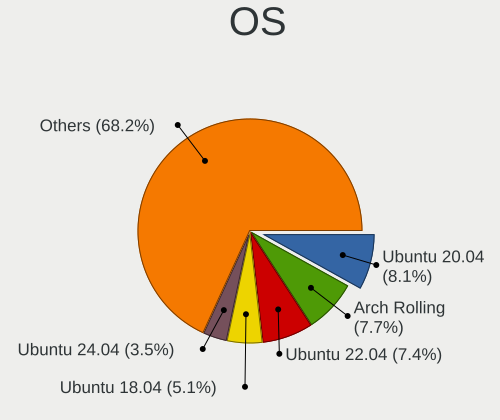

| Name                         | Notebooks | Percent |
|------------------------------|-----------|---------|
| Ubuntu 20.04                 | 118       | 8.08%   |
| Arch Rolling                 | 113       | 7.73%   |
| Ubuntu 22.04                 | 108       | 7.39%   |
| Ubuntu 18.04                 | 75        | 5.13%   |
| Ubuntu 24.04                 | 51        | 3.49%   |
| Debian 12                    | 45        | 3.08%   |
| Kylin V10                    | 37        | 2.53%   |
| Debian 11                    | 37        | 2.53%   |
| Arch                         | 29        | 1.98%   |
| openSUSE Tumbleweed-XXXXXXXX | 24        | 1.64%   |
| Manjaro                      | 23        | 1.57%   |
| ArcoLinux Rolling            | 20        | 1.37%   |
| Debian                       | 17        | 1.16%   |
| Gentoo 2.8                   | 15        | 1.03%   |
| Fedora 42                    | 15        | 1.03%   |
| OpenMandriva 4.2             | 14        | 0.96%   |
| UOS 20                       | 13        | 0.89%   |
| OpenMandriva 4.3             | 13        | 0.89%   |
| Deepin 23                    | 12        | 0.82%   |
| Debian 10                    | 12        | 0.82%   |
| Pop!_OS 22.04                | 11        | 0.75%   |
| KDE neon 20.04               | 11        | 0.75%   |
| Fedora 40                    | 11        | 0.75%   |
| Debian 13                    | 11        | 0.75%   |
| OpenMandriva 25.90           | 10        | 0.68%   |
| Gentoo 2.7                   | 10        | 0.68%   |
| Fedora 38                    | 10        | 0.68%   |
| Ubuntu 23.04                 | 9         | 0.62%   |
| Ubuntu 21.10                 | 9         | 0.62%   |
| Ubuntu 19.04                 | 9         | 0.62%   |
| Linux Mint 20.1              | 9         | 0.62%   |
| Fedora 39                    | 9         | 0.62%   |
| Fedora 33                    | 9         | 0.62%   |
| Xero Rolling                 | 8         | 0.55%   |
| Ubuntu 23.10                 | 8         | 0.55%   |
| Ubuntu 22.10                 | 8         | 0.55%   |
| OpenMandriva 24.12           | 8         | 0.55%   |
| EndeavourOS Rolling          | 8         | 0.55%   |
| Debian Testing               | 8         | 0.55%   |
| Linux Mint 21.3              | 7         | 0.48%   |

OS Family
---------

OS without a version

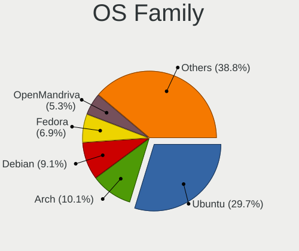

| Name         | Notebooks | Percent |
|--------------|-----------|---------|
| Ubuntu       | 413       | 29.71%  |
| Arch         | 141       | 10.14%  |
| Debian       | 126       | 9.06%   |
| Fedora       | 96        | 6.91%   |
| OpenMandriva | 74        | 5.32%   |
| Manjaro      | 70        | 5.04%   |
| Linux Mint   | 43        | 3.09%   |
| Gentoo       | 42        | 3.02%   |
| Kylin        | 39        | 2.81%   |
| Deepin       | 39        | 2.81%   |
| Kubuntu      | 32        | 2.3%    |
| openSUSE     | 28        | 2.01%   |
| SteamOS      | 24        | 1.73%   |
| Pop!_OS      | 21        | 1.51%   |
| ArcoLinux    | 20        | 1.44%   |
| Kali         | 17        | 1.22%   |
| Atz          | 15        | 1.08%   |
| KDE neon     | 13        | 0.94%   |
| CentOS       | 11        | 0.79%   |
| Zorin        | 9         | 0.65%   |
| Xubuntu      | 9         | 0.65%   |
| ROSA         | 9         | 0.65%   |
| Xero         | 8         | 0.58%   |
| EndeavourOS  | 8         | 0.58%   |
| Elementary   | 7         | 0.5%    |
| Ubuntu Unity | 4         | 0.29%   |
| Trisquel     | 4         | 0.29%   |
| NixOS        | 4         | 0.29%   |
| Clear Linux  | 4         | 0.29%   |
| Ubuntu MATE  | 3         | 0.22%   |
| MX           | 3         | 0.22%   |
| Lubuntu      | 3         | 0.22%   |
| LMDE         | 3         | 0.22%   |
| Guix         | 3         | 0.22%   |
| Garuda Linux | 3         | 0.22%   |
| ChimeraOS    | 3         | 0.22%   |
| CachyOS      | 3         | 0.22%   |
| BlackPanther | 3         | 0.22%   |
| AlmaLinux    | 3         | 0.22%   |
| Solus        | 2         | 0.14%   |

Kernel
------

Version of the Linux kernel

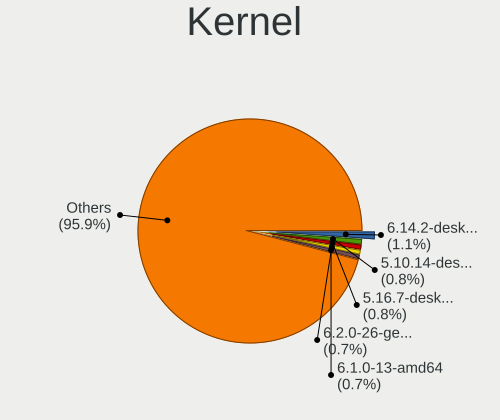

| Version                     | Notebooks | Percent |
|-----------------------------|-----------|---------|
| 6.14.2-desktop-3omv2590     | 18        | 1.13%   |
| 5.10.14-desktop-1omv4002    | 13        | 0.82%   |
| 5.16.7-desktop-1omv4003     | 12        | 0.75%   |
| 6.2.0-26-generic            | 11        | 0.69%   |
| 6.1.0-13-amd64              | 11        | 0.69%   |
| 5.4.0-42-generic            | 11        | 0.69%   |
| 6.8.0-31-generic            | 9         | 0.56%   |
| 5.10.0-8-amd64              | 9         | 0.56%   |
| 6.2.0-32-generic            | 8         | 0.5%    |
| 6.12.1-desktop-1omv2490     | 8         | 0.5%    |
| 6.8.0-45-generic            | 7         | 0.44%   |
| 6.14.0-15-generic           | 7         | 0.44%   |
| 6.1.52-valve16-1-neptune-61 | 7         | 0.44%   |
| 6.8.0-51-generic            | 6         | 0.38%   |
| 6.8.0-48-generic            | 6         | 0.38%   |
| 6.2.0-39-generic            | 6         | 0.38%   |
| 6.14.0-29-generic           | 6         | 0.38%   |
| 6.11.0-26-generic           | 6         | 0.38%   |
| 6.1.0-18-amd64              | 6         | 0.38%   |
| 5.19.0-46-generic           | 6         | 0.38%   |
| 5.19.0-41-generic           | 6         | 0.38%   |
| 5.19.0-35-generic           | 6         | 0.38%   |
| 5.15.0-67-generic           | 6         | 0.38%   |
| 5.15.0-43-generic           | 6         | 0.38%   |
| 5.13.0-30-generic           | 6         | 0.38%   |
| 4.18.0-25-generic           | 6         | 0.38%   |
| 6.9.3-76060903-generic      | 5         | 0.31%   |
| 6.8.0-40-generic            | 5         | 0.31%   |
| 6.6.2-desktop-1omv2390      | 5         | 0.31%   |
| 6.14.0-33-generic           | 5         | 0.31%   |
| 6.11.0-21-generic           | 5         | 0.31%   |
| 6.1.0-9-amd64               | 5         | 0.31%   |
| 5.19.0-26-generic           | 5         | 0.31%   |
| 5.19.0-23-generic           | 5         | 0.31%   |
| 5.15.0-53-generic           | 5         | 0.31%   |
| 5.15.0-46-generic           | 5         | 0.31%   |
| 5.15.0-25-generic           | 5         | 0.31%   |
| 5.13.0-valve36-1-neptune    | 5         | 0.31%   |
| 5.13.0-35-generic           | 5         | 0.31%   |
| 6.8.0-49-generic            | 4         | 0.25%   |

Kernel Family
-------------

Linux kernel without a distro release

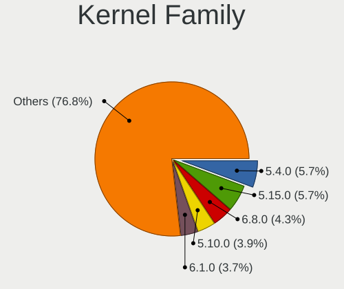

| Version | Notebooks | Percent |
|---------|-----------|---------|
| 5.4.0   | 87        | 5.69%   |
| 5.15.0  | 87        | 5.69%   |
| 6.8.0   | 66        | 4.31%   |
| 5.10.0  | 59        | 3.86%   |
| 6.1.0   | 56        | 3.66%   |
| 5.13.0  | 40        | 2.61%   |
| 6.2.0   | 37        | 2.42%   |
| 5.19.0  | 36        | 2.35%   |
| 6.5.0   | 35        | 2.29%   |
| 6.14.0  | 33        | 2.16%   |
| 5.11.0  | 33        | 2.16%   |
| 5.8.0   | 27        | 1.76%   |
| 4.15.0  | 27        | 1.76%   |
| 4.18.0  | 25        | 1.63%   |
| 5.3.0   | 23        | 1.5%    |
| 6.11.0  | 20        | 1.31%   |
| 6.14.2  | 18        | 1.18%   |
| 5.0.0   | 17        | 1.11%   |
| 4.19.0  | 15        | 0.98%   |
| 5.16.7  | 13        | 0.85%   |
| 5.10.14 | 13        | 0.85%   |
| 6.9.3   | 10        | 0.65%   |
| 6.1.52  | 10        | 0.65%   |
| 6.12.1  | 9         | 0.59%   |
| 6.4.11  | 8         | 0.52%   |
| 5.14.0  | 8         | 0.52%   |
| 6.12.38 | 7         | 0.46%   |
| 5.4.18  | 7         | 0.46%   |
| 6.6.9   | 6         | 0.39%   |
| 6.6.2   | 6         | 0.39%   |
| 6.17.0  | 6         | 0.39%   |
| 6.9.7   | 5         | 0.33%   |
| 6.5.3   | 5         | 0.33%   |
| 6.15.0  | 5         | 0.33%   |
| 6.13.6  | 5         | 0.33%   |
| 6.10.11 | 5         | 0.33%   |
| 6.10.0  | 5         | 0.33%   |
| 6.0.0   | 5         | 0.33%   |
| 5.6.14  | 5         | 0.33%   |
| 6.9.6   | 4         | 0.26%   |

Kernel Major Ver.
-----------------

Linux kernel major version

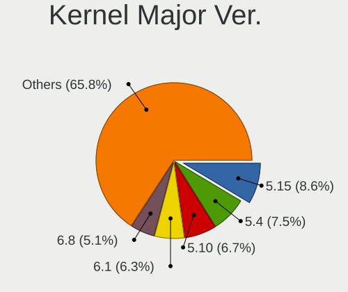

| Version | Notebooks | Percent |
|---------|-----------|---------|
| 5.15    | 129       | 8.58%   |
| 5.4     | 113       | 7.52%   |
| 5.10    | 101       | 6.72%   |
| 6.1     | 94        | 6.25%   |
| 6.8     | 77        | 5.12%   |
| 6.14    | 67        | 4.46%   |
| 6.5     | 56        | 3.73%   |
| 6.2     | 55        | 3.66%   |
| 6.12    | 53        | 3.53%   |
| 6.6     | 51        | 3.39%   |
| 5.19    | 46        | 3.06%   |
| 5.13    | 46        | 3.06%   |
| 5.11    | 46        | 3.06%   |
| 5.8     | 40        | 2.66%   |
| 6.11    | 35        | 2.33%   |
| 6.9     | 30        | 2%      |
| 5.3     | 30        | 2%      |
| 4.18    | 27        | 1.8%    |
| 4.15    | 27        | 1.8%    |
| 6.4     | 25        | 1.66%   |
| 6.17    | 24        | 1.6%    |
| 6.0     | 24        | 1.6%    |
| 5.16    | 24        | 1.6%    |
| 5.18    | 23        | 1.53%   |
| 5.14    | 22        | 1.46%   |
| 6.15    | 20        | 1.33%   |
| 4.19    | 20        | 1.33%   |
| 5.0     | 19        | 1.26%   |
| 6.7     | 18        | 1.2%    |
| 6.3     | 18        | 1.2%    |
| 6.10    | 18        | 1.2%    |
| 5.17    | 16        | 1.06%   |
| 6.16    | 15        | 1%      |
| 5.6     | 13        | 0.86%   |
| 6.13    | 12        | 0.8%    |
| 5.9     | 11        | 0.73%   |
| 5.12    | 11        | 0.73%   |
| 5.7     | 8         | 0.53%   |
| 5.5     | 6         | 0.4%    |
| 4.9     | 6         | 0.4%    |

Arch
----

OS architecture (x86_64, i586, etc.)

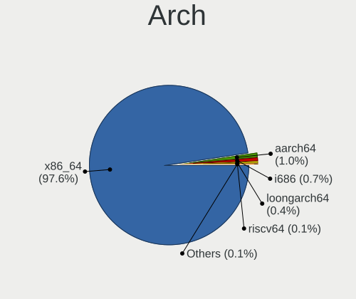

| Name        | Notebooks | Percent |
|-------------|-----------|---------|
| x86_64      | 1315      | 97.62%  |
| aarch64     | 13        | 0.97%   |
| i686        | 10        | 0.74%   |
| loongarch64 | 6         | 0.45%   |
| riscv64     | 1         | 0.07%   |
| armv7l      | 1         | 0.07%   |
| Unknown     | 1         | 0.07%   |

DE
--

Desktop Environment

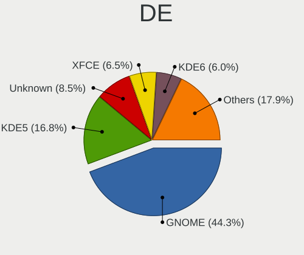

| Name            | Notebooks | Percent |
|-----------------|-----------|---------|
| GNOME           | 623       | 44.28%  |
| KDE5            | 236       | 16.77%  |
| Unknown         | 120       | 8.53%   |
| XFCE            | 91        | 6.47%   |
| KDE6            | 85        | 6.04%   |
| X-Cinnamon      | 42        | 2.99%   |
| KDE             | 40        | 2.84%   |
| Deepin          | 31        | 2.2%    |
| i3              | 21        | 1.49%   |
| MATE            | 18        | 1.28%   |
| UKUI            | 10        | 0.71%   |
| hyprland        | 10        | 0.71%   |
| LXQt            | 9         | 0.64%   |
| DDE             | 9         | 0.64%   |
| Pantheon        | 8         | 0.57%   |
| Cinnamon        | 7         | 0.5%    |
| Budgie          | 7         | 0.5%    |
| LXDE            | 6         | 0.43%   |
| KDE4            | 6         | 0.43%   |
| GNOME Flashback | 5         | 0.36%   |
| sway            | 4         | 0.28%   |
| Unity           | 3         | 0.21%   |
| xmonad          | 2         | 0.14%   |
| GNUstep         | 2         | 0.14%   |
| GNOME Classic   | 2         | 0.14%   |
| DWM             | 2         | 0.14%   |
| COSMIC          | 2         | 0.14%   |
| qtile           | 1         | 0.07%   |
| openbox         | 1         | 0.07%   |
| niri            | 1         | 0.07%   |
| labwc:wlroots   | 1         | 0.07%   |
| chadwm          | 1         | 0.07%   |
| bspwm           | 1         | 0.07%   |

Display Server
--------------

X11 or Wayland

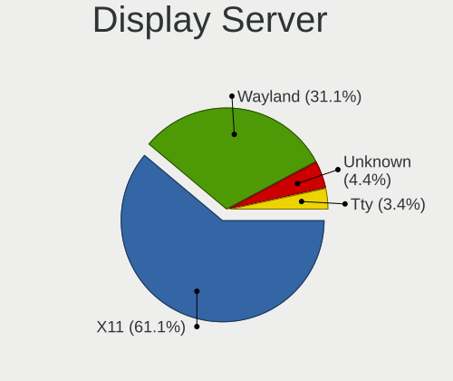

| Name    | Notebooks | Percent |
|---------|-----------|---------|
| X11     | 846       | 61.08%  |
| Wayland | 431       | 31.12%  |
| Unknown | 61        | 4.4%    |
| Tty     | 47        | 3.39%   |

Display Manager
---------------

SDDM, LightDM, etc.

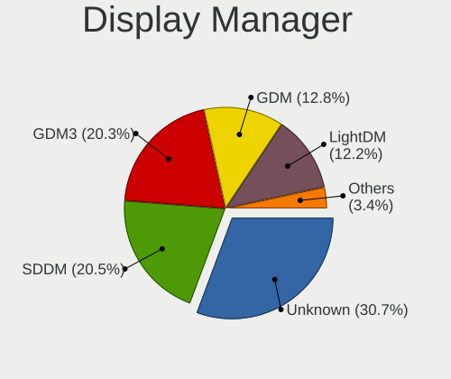

| Name           | Notebooks | Percent |
|----------------|-----------|---------|
| Unknown        | 424       | 30.68%  |
| SDDM           | 284       | 20.55%  |
| GDM3           | 281       | 20.33%  |
| GDM            | 177       | 12.81%  |
| LightDM        | 169       | 12.23%  |
| TDM            | 35        | 2.53%   |
| SLiM           | 3         | 0.22%   |
| XDM            | 2         | 0.14%   |
| LY-DM          | 2         | 0.14%   |
| KDM            | 2         | 0.14%   |
| LXDM           | 1         | 0.07%   |
| GREETD         | 1         | 0.07%   |
| COSMIC-GREETER | 1         | 0.07%   |

OS Lang
-------

Language

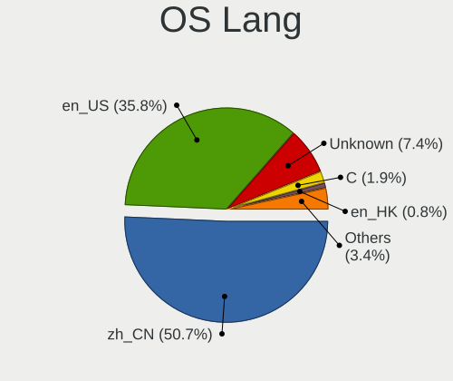

| Lang        | Notebooks | Percent |
|-------------|-----------|---------|
| zh_CN       | 694       | 50.69%  |
| en_US       | 490       | 35.79%  |
| Unknown     | 101       | 7.38%   |
| C           | 26        | 1.9%    |
| en_HK       | 11        | 0.8%    |
| en_GB       | 11        | 0.8%    |
| C.UTF8      | 5         | 0.37%   |
| mn_CN       | 4         | 0.29%   |
| zh_TW       | 3         | 0.22%   |
| fr_FR       | 3         | 0.22%   |
| en_AU       | 3         | 0.22%   |
| ru_RU       | 2         | 0.15%   |
| de_DE       | 2         | 0.15%   |
| zh_SG       | 1         | 0.07%   |
| zh_CN.utf-8 | 1         | 0.07%   |
| th_TH       | 1         | 0.07%   |
| pt_PT       | 1         | 0.07%   |
| pt_BR       | 1         | 0.07%   |
| POSIX       | 1         | 0.07%   |
| ja_JP       | 1         | 0.07%   |
| es_ES       | 1         | 0.07%   |
| en_ZA       | 1         | 0.07%   |
| en_US.UTF8  | 1         | 0.07%   |
| en_US,UTF-8 | 1         | 0.07%   |
| en_SG       | 1         | 0.07%   |
| en_DK       | 1         | 0.07%   |
| .en_US      | 1         | 0.07%   |

Boot Mode
---------

EFI or BIOS

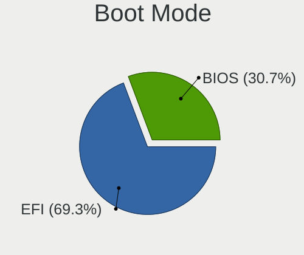

| Mode | Notebooks | Percent |
|------|-----------|---------|
| EFI  | 945       | 69.28%  |
| BIOS | 419       | 30.72%  |

Filesystem
----------

Type of filesystem

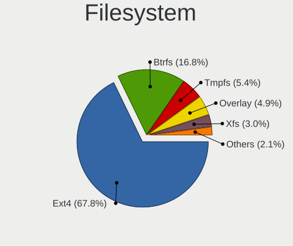

| Type    | Notebooks | Percent |
|---------|-----------|---------|
| Ext4    | 929       | 67.81%  |
| Btrfs   | 230       | 16.79%  |
| Tmpfs   | 74        | 5.4%    |
| Overlay | 67        | 4.89%   |
| Xfs     | 41        | 2.99%   |
| Unknown | 18        | 1.31%   |
| F2fs    | 5         | 0.36%   |
| Zfs     | 3         | 0.22%   |
| XXXXXXX | 1         | 0.07%   |
| XXXfs   | 1         | 0.07%   |
| Ext3    | 1         | 0.07%   |

Part. scheme
------------

Scheme of partitioning

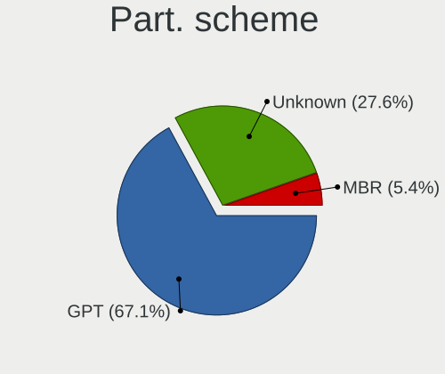

| Type    | Notebooks | Percent |
|---------|-----------|---------|
| GPT     | 915       | 67.08%  |
| Unknown | 376       | 27.57%  |
| MBR     | 73        | 5.35%   |

Dual Boot with Linux/BSD
------------------------

Hosting more than one Linux/BSD

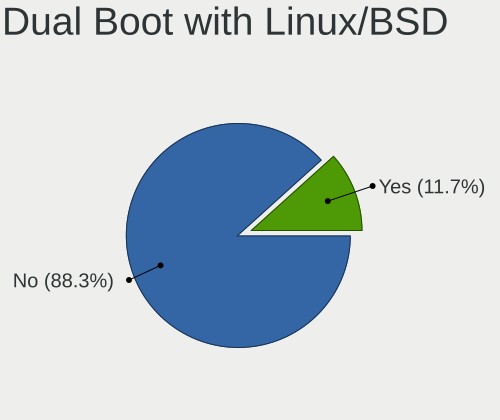

| Dual boot | Notebooks | Percent |
|-----------|-----------|---------|
| No        | 1210      | 88.32%  |
| Yes       | 160       | 11.68%  |

Dual Boot (Win)
---------------

Hosting Linux and Windows

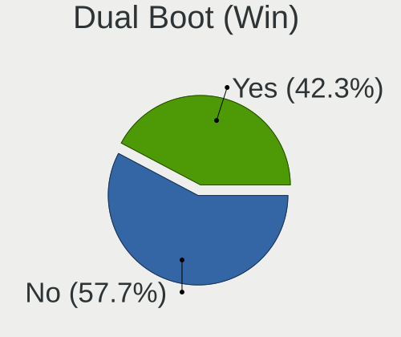

| Dual boot | Notebooks | Percent |
|-----------|-----------|---------|
| No        | 784       | 57.73%  |
| Yes       | 574       | 42.27%  |

Board
-----

Vendor
------

Motherboard manufacturer

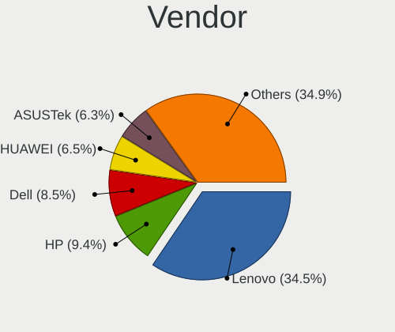

| Name                           | Notebooks | Percent |
|--------------------------------|-----------|---------|
| Lenovo                         | 464       | 34.47%  |
| Hewlett-Packard                | 126       | 9.36%   |
| Dell                           | 114       | 8.47%   |
| HUAWEI                         | 87        | 6.46%   |
| ASUSTek Computer               | 85        | 6.32%   |
| Timi                           | 59        | 4.38%   |
| MECHREVO                       | 46        | 3.42%   |
| Acer                           | 43        | 3.19%   |
| Apple                          | 28        | 2.08%   |
| HASEE Computer                 | 25        | 1.86%   |
| Valve                          | 22        | 1.63%   |
| Unknown                        | 19        | 1.41%   |
| HONOR                          | 17        | 1.26%   |
| MSI                            | 15        | 1.11%   |
| Google                         | 14        | 1.04%   |
| GPD                            | 13        | 0.97%   |
| Toshiba                        | 10        | 0.74%   |
| XIAOMI                         | 9         | 0.67%   |
| Sony                           | 9         | 0.67%   |
| Notebook                       | 8         | 0.59%   |
| Samsung Electronics            | 7         | 0.52%   |
| METAPHYUNI                     | 5         | 0.37%   |
| IPASON                         | 5         | 0.37%   |
| Intel Client Systems           | 5         | 0.37%   |
| Intel                          | 5         | 0.37%   |
| GreatWall                      | 5         | 0.37%   |
| Fujitsu                        | 5         | 0.37%   |
| Centerm                        | 5         | 0.37%   |
| KaiTian                        | 4         | 0.3%    |
| Alienware                      | 4         | 0.3%    |
| win element                    | 3         | 0.22%   |
| Shanghai Zhaoxin Semiconductor | 3         | 0.22%   |
| Razer                          | 3         | 0.22%   |
| ONE-NETBOOK                    | 3         | 0.22%   |
| LG Electronics                 | 3         | 0.22%   |
| Jumper                         | 3         | 0.22%   |
| Insyde                         | 3         | 0.22%   |
| COLORFUL                       | 3         | 0.22%   |
| THUNDEROBOT                    | 2         | 0.15%   |
| Terrans Force                  | 2         | 0.15%   |

Model
-----

Motherboard model

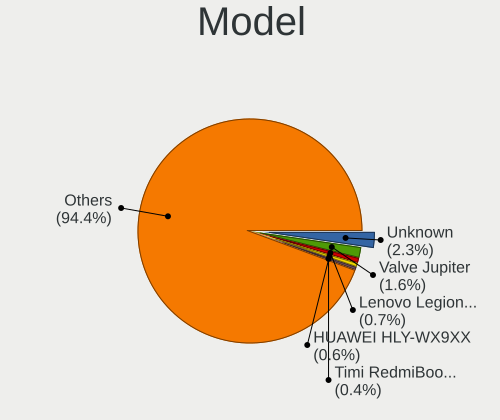

| Name                              | Notebooks | Percent |
|-----------------------------------|-----------|---------|
| Unknown                           | 31        | 2.3%    |
| Valve Jupiter                     | 21        | 1.56%   |
| Lenovo Legion R9000P2021H 82JQ    | 10        | 0.74%   |
| HUAWEI HLY-WX9XX                  | 8         | 0.59%   |
| Timi RedmiBook Pro 15S            | 6         | 0.45%   |
| MECHREVO WUJIE14XA                | 6         | 0.45%   |
| Lenovo Legion Y7000 81FW          | 6         | 0.45%   |
| Dell XPS 15 9570                  | 6         | 0.45%   |
| Timi TM1701                       | 5         | 0.37%   |
| Lenovo XiaoXinPro-13IML 2019 81XB | 5         | 0.37%   |
| Lenovo ThinkBook 14 G4+ IAP 21CX  | 5         | 0.37%   |
| Lenovo Legion R7000 2020 82B6     | 5         | 0.37%   |
| HUAWEI WRT-WX9                    | 5         | 0.37%   |
| HUAWEI KPRC-WX0                   | 5         | 0.37%   |
| Centerm C73N                      | 5         | 0.37%   |
| Acer Swift SF314-512              | 5         | 0.37%   |
| Timi TM1709                       | 4         | 0.3%    |
| Timi Redmi G 2022                 | 4         | 0.3%    |
| Timi Redmi Book Pro 15 2022       | 4         | 0.3%    |
| MECHREVO WUJIE14 PRO              | 4         | 0.3%    |
| Lenovo Yoga 14sITL 2021 82G2      | 4         | 0.3%    |
| Lenovo XiaoXinPro-13ARE 2020 82DM | 4         | 0.3%    |
| Lenovo XiaoXin-15ARE 2020 81YR    | 4         | 0.3%    |
| Lenovo ThinkBook 15p Gen 2 21B1   | 4         | 0.3%    |
| Lenovo ThinkBook 14 G2 ITL 20VD   | 4         | 0.3%    |
| Lenovo Legion Y9000P IAH7H 82RF   | 4         | 0.3%    |
| Lenovo Legion R9000P ARX8 82WM    | 4         | 0.3%    |
| Intel H81U                        | 4         | 0.3%    |
| HUAWEI NBLK-WAX9X                 | 4         | 0.3%    |
| HUAWEI BOHK-WAX9X                 | 4         | 0.3%    |
| Google Atlas                      | 4         | 0.3%    |
| Apple MacBookPro16,1              | 4         | 0.3%    |
| XIAOMI Redmi Book Pro 14 2024     | 3         | 0.22%   |
| win element MoreFine S500+        | 3         | 0.22%   |
| Timi TM1613                       | 3         | 0.22%   |
| Timi RedmiBook 14-APCS            | 3         | 0.22%   |
| Timi RedmiBook 14 II              | 3         | 0.22%   |
| Shanghai Zhaoxin ZXE CRB          | 3         | 0.22%   |
| MECHREVO Jiaolong Series MRID6    | 3         | 0.22%   |
| Lenovo ZHAOYANG K4e-ITL 82F8      | 3         | 0.22%   |

Model Family
------------

Motherboard model prefix

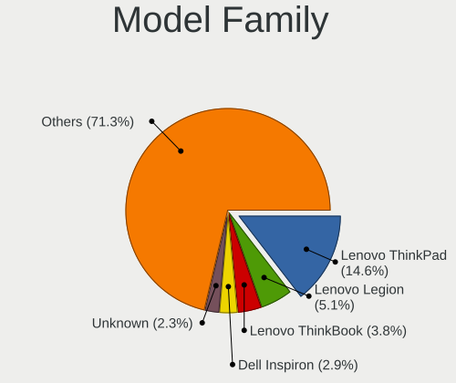

| Name                    | Notebooks | Percent |
|-------------------------|-----------|---------|
| Lenovo ThinkPad         | 196       | 14.56%  |
| Lenovo Legion           | 69        | 5.13%   |
| Lenovo ThinkBook        | 51        | 3.79%   |
| Dell Inspiron           | 39        | 2.9%    |
| Unknown                 | 31        | 2.3%    |
| HP EliteBook            | 30        | 2.23%   |
| Dell Latitude           | 28        | 2.08%   |
| HP OMEN                 | 25        | 1.86%   |
| Valve Jupiter           | 21        | 1.56%   |
| Lenovo IdeaPad          | 21        | 1.56%   |
| Lenovo ZHAOYANG         | 19        | 1.41%   |
| Timi RedmiBook          | 18        | 1.34%   |
| Acer Aspire             | 18        | 1.34%   |
| HP ZHAN                 | 17        | 1.26%   |
| HP ProBook              | 17        | 1.26%   |
| ASUS ROG                | 16        | 1.19%   |
| Lenovo XiaoXinPro       | 15        | 1.11%   |
| Dell XPS                | 15        | 1.11%   |
| Acer Swift              | 14        | 1.04%   |
| Lenovo Yoga             | 13        | 0.97%   |
| HP Pavilion             | 13        | 0.97%   |
| Dell Precision          | 13        | 0.97%   |
| Timi Redmi              | 11        | 0.82%   |
| Dell Vostro             | 10        | 0.74%   |
| ASUS ASUS               | 10        | 0.74%   |
| Lenovo XiaoXin          | 9         | 0.67%   |
| ASUS VivoBook           | 9         | 0.67%   |
| HUAWEI HLY-WX9XX        | 8         | 0.59%   |
| ASUS TUF                | 8         | 0.59%   |
| XIAOMI Redmi            | 7         | 0.52%   |
| Apple MacBookPro11      | 7         | 0.52%   |
| Toshiba Satellite       | 6         | 0.45%   |
| MECHREVO WUJIE14XA      | 6         | 0.45%   |
| ASUS ZenBook            | 6         | 0.45%   |
| Acer Nitro              | 6         | 0.45%   |
| Timi TM1701             | 5         | 0.37%   |
| MECHREVO Jiaolong       | 5         | 0.37%   |
| Lenovo XiaoXinPro-13IML | 5         | 0.37%   |
| HUAWEI WRT-WX9          | 5         | 0.37%   |
| HUAWEI KPRC-WX0         | 5         | 0.37%   |

MFG Year
--------

Motherboard manufacture year

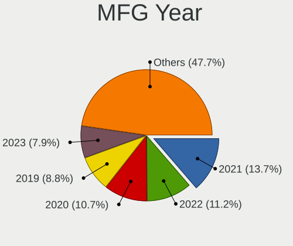

| Year    | Notebooks | Percent |
|---------|-----------|---------|
| 2021    | 184       | 13.67%  |
| 2022    | 151       | 11.22%  |
| 2020    | 144       | 10.7%   |
| 2019    | 119       | 8.84%   |
| 2023    | 106       | 7.88%   |
| 2018    | 95        | 7.06%   |
| 2024    | 85        | 6.32%   |
| 2014    | 60        | 4.46%   |
| 2017    | 59        | 4.38%   |
| 2011    | 53        | 3.94%   |
| 2016    | 52        | 3.86%   |
| 2013    | 51        | 3.79%   |
| 2012    | 49        | 3.64%   |
| 2015    | 44        | 3.27%   |
| 2025    | 30        | 2.23%   |
| 2008    | 24        | 1.78%   |
| 2010    | 13        | 0.97%   |
| 2009    | 13        | 0.97%   |
| 2007    | 5         | 0.37%   |
| 2006    | 5         | 0.37%   |
| Unknown | 4         | 0.3%    |

Form Factor
-----------

Physical design of the computer

| Name     | Notebooks | Percent |
|----------|-----------|---------|
| Notebook | 1346      | 100%    |

Secure Boot
-----------

Enabled or disabled

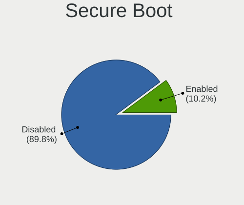

| State    | Notebooks | Percent |
|----------|-----------|---------|
| Disabled | 1220      | 89.84%  |
| Enabled  | 138       | 10.16%  |

Coreboot
--------

Have coreboot on board

| Used | Notebooks | Percent |
|------|-----------|---------|
| No   | 1329      | 98.74%  |
| Yes  | 17        | 1.26%   |

RAM Size
--------

Total RAM memory

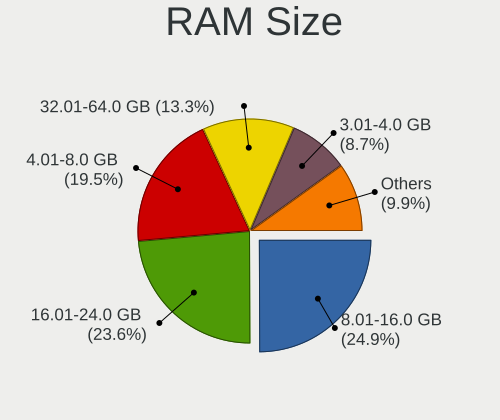

| Size in GB  | Notebooks | Percent |
|-------------|-----------|---------|
| 8.01-16.0   | 342       | 24.95%  |
| 16.01-24.0  | 324       | 23.63%  |
| 4.01-8.0    | 268       | 19.55%  |
| 32.01-64.0  | 182       | 13.27%  |
| 3.01-4.0    | 119       | 8.68%   |
| 24.01-32.0  | 61        | 4.45%   |
| 64.01-256.0 | 39        | 2.84%   |
| 1.01-2.0    | 27        | 1.97%   |
| 0.51-1.0    | 6         | 0.44%   |
| 2.01-3.0    | 1         | 0.07%   |
| 0.01-0.5    | 1         | 0.07%   |
| Unknown     | 1         | 0.07%   |

RAM Used
--------

Used RAM memory

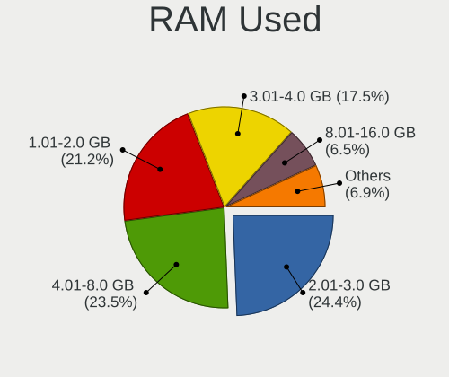

| Used GB    | Notebooks | Percent |
|------------|-----------|---------|
| 2.01-3.0   | 362       | 24.38%  |
| 4.01-8.0   | 349       | 23.5%   |
| 1.01-2.0   | 315       | 21.21%  |
| 3.01-4.0   | 260       | 17.51%  |
| 8.01-16.0  | 97        | 6.53%   |
| 0.51-1.0   | 65        | 4.38%   |
| 0.01-0.5   | 18        | 1.21%   |
| 16.01-24.0 | 13        | 0.88%   |
| Unknown    | 3         | 0.2%    |
| 24.01-32.0 | 2         | 0.13%   |
| 32.01-64.0 | 1         | 0.07%   |

Total Drives
------------

Number of drives on board

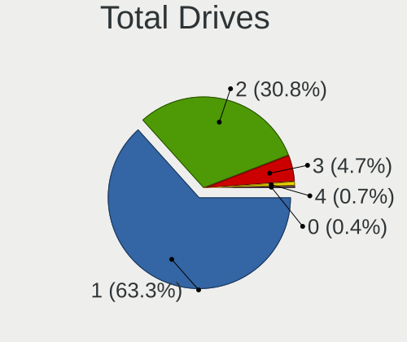

| Drives | Notebooks | Percent |
|--------|-----------|---------|
| 1      | 864       | 63.34%  |
| 2      | 420       | 30.79%  |
| 3      | 64        | 4.69%   |
| 4      | 10        | 0.73%   |
| 0      | 6         | 0.44%   |

Has CD-ROM
----------

Has CD-ROM on board

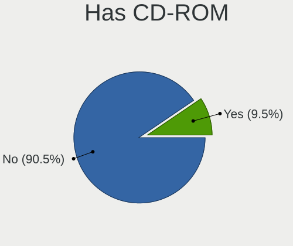

| Presented | Notebooks | Percent |
|-----------|-----------|---------|
| No        | 1221      | 90.51%  |
| Yes       | 128       | 9.49%   |

Has Ethernet
------------

Has Ethernet on board

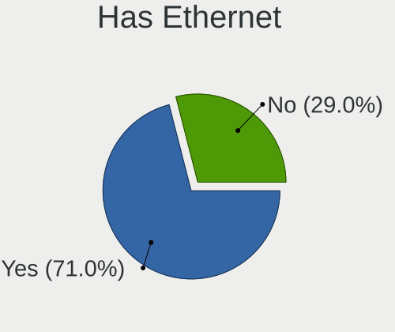

| Presented | Notebooks | Percent |
|-----------|-----------|---------|
| Yes       | 960       | 71.01%  |
| No        | 392       | 28.99%  |

Has WiFi
--------

Has WiFi module

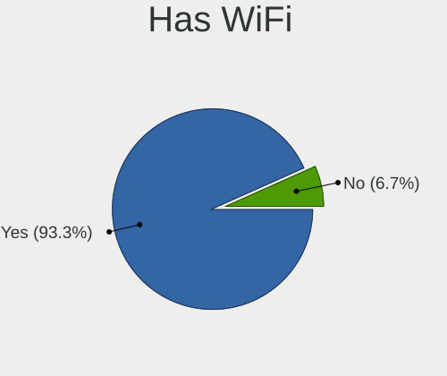

| Presented | Notebooks | Percent |
|-----------|-----------|---------|
| Yes       | 1259      | 93.33%  |
| No        | 90        | 6.67%   |

Has Bluetooth
-------------

Has Bluetooth module

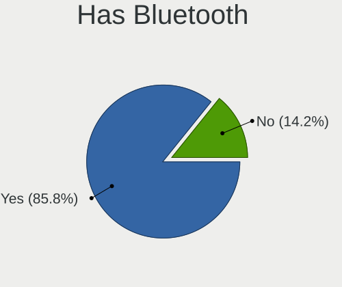

| Presented | Notebooks | Percent |
|-----------|-----------|---------|
| Yes       | 1159      | 85.79%  |
| No        | 192       | 14.21%  |

Location
--------

Country
-------

Geographic location (country)

| Country | Notebooks | Percent |
|---------|-----------|---------|
| China   | 1346      | 100%    |

City
----

Geographic location (city)

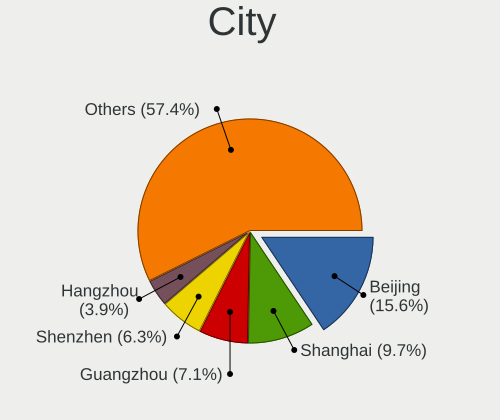

| City         | Notebooks | Percent |
|--------------|-----------|---------|
| Beijing      | 224       | 15.61%  |
| Shanghai     | 139       | 9.69%   |
| Guangzhou    | 102       | 7.11%   |
| Shenzhen     | 91        | 6.34%   |
| Hangzhou     | 56        | 3.9%    |
| Chengdu      | 49        | 3.41%   |
| Wuhan        | 44        | 3.07%   |
| Jinrongjie   | 37        | 2.58%   |
| Nanjing      | 36        | 2.51%   |
| Xi'an        | 27        | 1.88%   |
| Kunming      | 27        | 1.88%   |
| Changsha     | 25        | 1.74%   |
| Zhengzhou    | 22        | 1.53%   |
| Dongguan     | 20        | 1.39%   |
| Tianjin      | 19        | 1.32%   |
| Chongqing    | 19        | 1.32%   |
| Shenyang     | 14        | 0.98%   |
| Hefei        | 14        | 0.98%   |
| Fuzhou       | 14        | 0.98%   |
| Suzhou       | 13        | 0.91%   |
| Nanning      | 13        | 0.91%   |
| Jinan        | 13        | 0.91%   |
| Qingdao      | 12        | 0.84%   |
| Foshan       | 12        | 0.84%   |
| Harbin       | 11        | 0.77%   |
| Dalian       | 11        | 0.77%   |
| Haidian      | 10        | 0.7%    |
| Huangpu      | 9         | 0.63%   |
| Xuhui        | 8         | 0.56%   |
| Shijiazhuang | 8         | 0.56%   |
| Hohhot       | 8         | 0.56%   |
| Xiamen       | 7         | 0.49%   |
| Taiyuan      | 7         | 0.49%   |
| Changchun    | 7         | 0.49%   |
| Pudong       | 6         | 0.42%   |
| Ningbo       | 5         | 0.35%   |
| Jilin City   | 5         | 0.35%   |
| Jianshui     | 5         | 0.35%   |
| Guiyang      | 5         | 0.35%   |
| Changzhou    | 5         | 0.35%   |

Drives
------

Drive Vendor
------------

Hard drive vendors

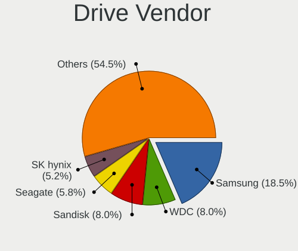

| Vendor                       | Notebooks | Drives | Percent |
|------------------------------|-----------|--------|---------|
| Samsung Electronics          | 343       | 458    | 18.51%  |
| WDC                          | 149       | 176    | 8.04%   |
| Sandisk                      | 148       | 172    | 7.99%   |
| Seagate                      | 107       | 131    | 5.77%   |
| SK hynix                     | 97        | 119    | 5.23%   |
| Toshiba                      | 78        | 88     | 4.21%   |
| Unknown                      | 74        | 83     | 3.99%   |
| Micron Technology            | 55        | 64     | 2.97%   |
| Yangtze Memory Technologies  | 46        | 68     | 2.48%   |
| KIOXIA                       | 44        | 64     | 2.37%   |
| Kingston                     | 40        | 46     | 2.16%   |
| Intel                        | 39        | 52     | 2.1%    |
| HGST                         | 33        | 37     | 1.78%   |
| MAXIO Technology (Hangzhou)  | 26        | 32     | 1.4%    |
| Crucial                      | 25        | 30     | 1.35%   |
| Phison                       | 24        | 27     | 1.3%    |
| Apple                        | 21        | 25     | 1.13%   |
| Plextor                      | 20        | 24     | 1.08%   |
| ZHITAI                       | 18        | 27     | 0.97%   |
| Lenovo                       | 18        | 23     | 0.97%   |
| Phison Electronics           | 17        | 20     | 0.92%   |
| LITEON                       | 17        | 19     | 0.92%   |
| Hitachi                      | 17        | 23     | 0.92%   |
| Unknown                      | 16        | 17     | 0.86%   |
| YMTC                         | 14        | 20     | 0.76%   |
| Fanxiang                     | 13        | 15     | 0.7%    |
| China                        | 13        | 23     | 0.7%    |
| A-DATA Technology            | 13        | 16     | 0.7%    |
| Union Memory (Shenzhen)      | 12        | 15     | 0.65%   |
| Hewlett-Packard              | 12        | 13     | 0.65%   |
| Silicon Motion               | 11        | 11     | 0.59%   |
| Kingston Technology Company  | 11        | 12     | 0.59%   |
| BIWIN                        | 11        | 18     | 0.59%   |
| JMicron Technology           | 10        | 8      | 0.54%   |
| KIOXIA-EXCERIA               | 9         | 12     | 0.49%   |
| UMIS                         | 8         | 8      | 0.43%   |
| Shenzhen Longsys Electronics | 8         | 9      | 0.43%   |
| Transcend                    | 7         | 8      | 0.38%   |
| Teclast                      | 7         | 7      | 0.38%   |
| KingSpec                     | 7         | 8      | 0.38%   |

Drive Model
-----------

Hard drive models

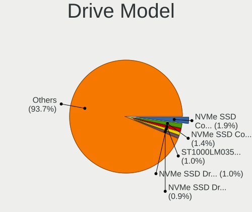

| Model                                                | Notebooks | Percent |
|------------------------------------------------------|-----------|---------|
| Samsung NVMe SSD Controller PM9A1/PM9A3/980PRO 1TB   | 37        | 1.91%   |
| Samsung NVMe SSD Controller SM981/PM981/PM983 1TB    | 27        | 1.4%    |
| Seagate ST1000LM035-1RK172 1TB                       | 20        | 1.03%   |
| Samsung NVMe SSD Drive 512GB                         | 20        | 1.03%   |
| SanDisk NVMe SSD Drive 512GB                         | 18        | 0.93%   |
| Sandisk WD Black SN750 / PC SN730 NVMe SSD 500GB     | 16        | 0.83%   |
| HGST HTS721010A9E630 1TB                             | 16        | 0.83%   |
| Unknown                                              | 16        | 0.83%   |
| SanDisk NVMe SSD Drive 1TB                           | 15        | 0.78%   |
| Seagate ST500LT012-1DG142 500GB                      | 14        | 0.72%   |
| Samsung SSD 980 1TB                                  | 14        | 0.72%   |
| Samsung MZVLB512HBJQ-000L2 512GB                     | 14        | 0.72%   |
| Seagate ST1000LM048-2E7172 1TB                       | 13        | 0.67%   |
| SK hynix SKHynix_HFS512GDE9X084N 512GB               | 11        | 0.57%   |
| Unknown MMC Card  128GB                              | 10        | 0.52%   |
| SK hynix NVMe SSD Drive 512GB                        | 10        | 0.52%   |
| Sandisk WD PC SN740 SDDPTQD-1T00 1024GB              | 10        | 0.52%   |
| Samsung MZVLB512HAJQ-00000 512GB                     | 10        | 0.52%   |
| Samsung NVMe SSD Drive 1024GB                        | 9         | 0.47%   |
| Samsung MZVLB512HBJQ-000L7 512GB                     | 9         | 0.47%   |
| Micron 2450_MTFDKBA512TFK 512GB                      | 9         | 0.47%   |
| HGST HTS725050A7E630 500GB                           | 9         | 0.47%   |
| Yangtze Memory ZHITAI TiPlus7100 2TB                 | 8         | 0.41%   |
| WDC PC SN730 SDBPNTY-512G-1027 512GB                 | 8         | 0.41%   |
| Toshiba MQ01ABD100 1TB                               | 8         | 0.41%   |
| SK hynix SKHynix_HFS512GD9TNI-L2A0B 512GB            | 8         | 0.41%   |
| Seagate ST2000LM007-1R8174 2TB                       | 8         | 0.41%   |
| Samsung NVMe SSD Drive 256GB                         | 8         | 0.41%   |
| KIOXIA KBG50ZNV512G 512GB                            | 8         | 0.41%   |
| KIOXIA KBG40ZNV512G 512GB                            | 8         | 0.41%   |
| Yangtze Memory ZHITAI TiPlus5000 1TB                 | 7         | 0.36%   |
| Unknown MMC Card  64GB                               | 7         | 0.36%   |
| Unknown MMC Card  512GB                              | 7         | 0.36%   |
| Union Memory (Shenzhen) UMIS RPEYJ1T24MKN2QWY 1024GB | 7         | 0.36%   |
| Seagate ST500LM021-1KJ152 500GB                      | 7         | 0.36%   |
| Sandisk WD Blue SN550 NVMe SSD 1024GB                | 7         | 0.36%   |
| Sandisk WD Black SN850 1TB                           | 7         | 0.36%   |
| Samsung SSD 860 EVO 500GB                            | 7         | 0.36%   |
| Samsung MZALQ512HALU-000L2 512GB                     | 7         | 0.36%   |
| Plextor PX-128M6S 128GB SSD                          | 7         | 0.36%   |

HDD Vendor
----------

Hard disk drive vendors

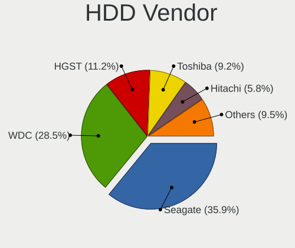

| Vendor              | Notebooks | Drives | Percent |
|---------------------|-----------|--------|---------|
| Seagate             | 106       | 129    | 35.93%  |
| WDC                 | 84        | 98     | 28.47%  |
| HGST                | 33        | 37     | 11.19%  |
| Toshiba             | 27        | 34     | 9.15%   |
| Hitachi             | 17        | 23     | 5.76%   |
| Fujitsu             | 7         | 8      | 2.37%   |
| JMicron Technology  | 6         | 6      | 2.03%   |
| Samsung Electronics | 5         | 6      | 1.69%   |
| External            | 5         | 7      | 1.69%   |
| TO Exter            | 1         | 1      | 0.34%   |
| TDAS                | 1         | 1      | 0.34%   |
| HGST HTS            | 1         | 1      | 0.34%   |
| ASMT                | 1         | 1      | 0.34%   |
| ACASIS              | 1         | 1      | 0.34%   |

SSD Vendor
----------

Solid state drive vendors

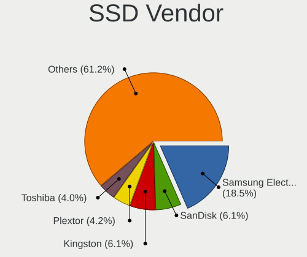

| Vendor              | Notebooks | Drives | Percent |
|---------------------|-----------|--------|---------|
| Samsung Electronics | 79        | 110    | 18.46%  |
| SanDisk             | 26        | 28     | 6.07%   |
| Kingston            | 26        | 31     | 6.07%   |
| Plextor             | 18        | 22     | 4.21%   |
| Toshiba             | 17        | 18     | 3.97%   |
| LITEON              | 16        | 18     | 3.74%   |
| Crucial             | 15        | 20     | 3.5%    |
| Lenovo              | 14        | 17     | 3.27%   |
| Micron Technology   | 12        | 13     | 2.8%    |
| China               | 12        | 22     | 2.8%    |
| WDC                 | 11        | 11     | 2.57%   |
| Apple               | 10        | 11     | 2.34%   |
| A-DATA Technology   | 9         | 12     | 2.1%    |
| SK hynix            | 8         | 8      | 1.87%   |
| Unknown             | 8         | 8      | 1.87%   |
| Teclast             | 7         | 7      | 1.64%   |
| Phison              | 7         | 9      | 1.64%   |
| Transcend           | 6         | 7      | 1.4%    |
| Kingchuxing         | 6         | 11     | 1.4%    |
| Intel               | 6         | 6      | 1.4%    |
| Hewlett-Packard     | 6         | 6      | 1.4%    |
| Colorful            | 6         | 7      | 1.4%    |
| ZHITAI              | 5         | 11     | 1.17%   |
| Netac               | 5         | 5      | 1.17%   |
| LITEONIT            | 5         | 5      | 1.17%   |
| KingSpec            | 5         | 6      | 1.17%   |
| GLOWAY              | 5         | 6      | 1.17%   |
| GALAX               | 5         | 5      | 1.17%   |
| KIOXIA-EXCERIA      | 4         | 4      | 0.93%   |
| Lexar               | 3         | 3      | 0.7%    |
| HIKSEMI             | 3         | 3      | 0.7%    |
| FORESEE             | 3         | 3      | 0.7%    |
| Fanxiang            | 3         | 3      | 0.7%    |
| Unknown             | 2         | 2      | 0.47%   |
| UNIC2               | 2         | 2      | 0.47%   |
| Soyo                | 2         | 2      | 0.47%   |
| MaiChai             | 2         | 3      | 0.47%   |
| HEORIADY            | 2         | 2      | 0.47%   |
| Galaxy              | 2         | 2      | 0.47%   |
| XSJ-X100-256GB      | 1         | 1      | 0.23%   |

Drive Kind
----------

HDD or SSD

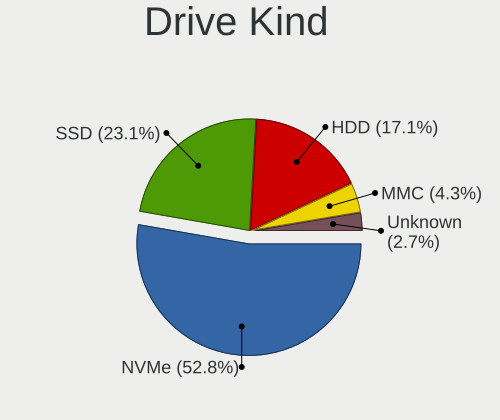

| Kind    | Notebooks | Drives | Percent |
|---------|-----------|--------|---------|
| NVMe    | 871       | 1286   | 52.76%  |
| SSD     | 382       | 526    | 23.14%  |
| HDD     | 283       | 353    | 17.14%  |
| MMC     | 71        | 80     | 4.3%    |
| Unknown | 44        | 48     | 2.67%   |

Drive Connector
---------------

SATA, SAS, NVMe, etc.

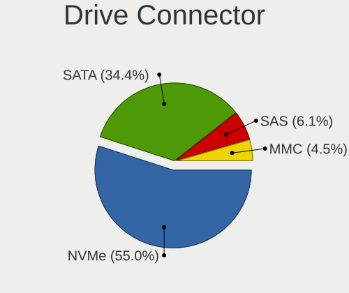

| Type | Notebooks | Drives | Percent |
|------|-----------|--------|---------|
| NVMe | 871       | 1270   | 54.99%  |
| SATA | 545       | 826    | 34.41%  |
| SAS  | 97        | 117    | 6.12%   |
| MMC  | 71        | 80     | 4.48%   |

Drive Size
----------

Size of hard drive

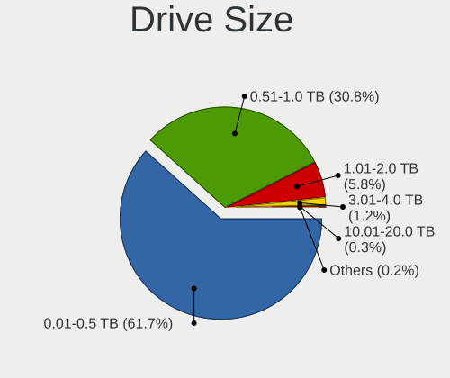

| Size in TB | Notebooks | Drives | Percent |
|------------|-----------|--------|---------|
| 0.01-0.5   | 404       | 558    | 61.68%  |
| 0.51-1.0   | 202       | 255    | 30.84%  |
| 1.01-2.0   | 38        | 48     | 5.8%    |
| 3.01-4.0   | 8         | 10     | 1.22%   |
| 10.01-20.0 | 2         | 7      | 0.31%   |
| 4.01-10.0  | 1         | 1      | 0.15%   |

Space Total
-----------

Amount of disk space available on the file system

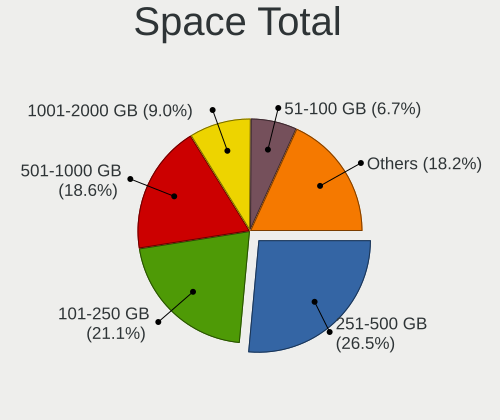

| Size in GB     | Notebooks | Percent |
|----------------|-----------|---------|
| 251-500        | 372       | 26.46%  |
| 101-250        | 296       | 21.05%  |
| 501-1000       | 262       | 18.63%  |
| 1001-2000      | 126       | 8.96%   |
| 51-100         | 94        | 6.69%   |
| 1-20           | 76        | 5.41%   |
| More than 3000 | 66        | 4.69%   |
| 21-50          | 44        | 3.13%   |
| 2001-3000      | 42        | 2.99%   |
| Unknown        | 28        | 1.99%   |

Space Used
----------

Amount of used disk space

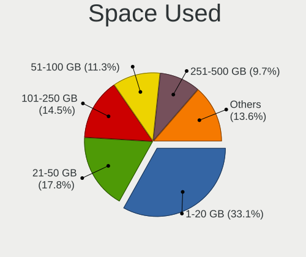

| Used GB        | Notebooks | Percent |
|----------------|-----------|---------|
| 1-20           | 481       | 33.1%   |
| 21-50          | 259       | 17.83%  |
| 101-250        | 210       | 14.45%  |
| 51-100         | 164       | 11.29%  |
| 251-500        | 141       | 9.7%    |
| 501-1000       | 89        | 6.13%   |
| 1001-2000      | 48        | 3.3%    |
| Unknown        | 28        | 1.93%   |
| More than 3000 | 18        | 1.24%   |
| 2001-3000      | 13        | 0.89%   |
| 0              | 2         | 0.14%   |

Malfunc. Drives
---------------

Drive models with a malfunction

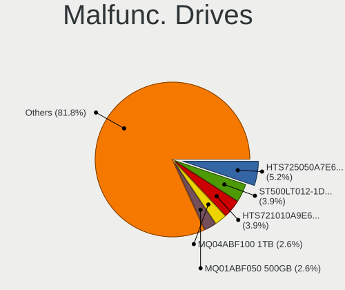

| Model                                                          | Notebooks | Drives | Percent |
|----------------------------------------------------------------|-----------|--------|---------|
| HGST HTS725050A7E630 500GB                                     | 4         | 4      | 5.19%   |
| Seagate ST500LT012-1DG142 500GB                                | 3         | 6      | 3.9%    |
| HGST HTS721010A9E630 1TB                                       | 3         | 3      | 3.9%    |
| Toshiba MQ04ABF100 1TB                                         | 2         | 2      | 2.6%    |
| Toshiba MQ01ABF050 500GB                                       | 2         | 2      | 2.6%    |
| Seagate ST500LM021-1KJ152 500GB                                | 2         | 2      | 2.6%    |
| Seagate ST1000LM048-2E7172 1TB                                 | 2         | 2      | 2.6%    |
| Seagate ST1000LM024 HN-M101MBB 1TB                             | 2         | 2      | 2.6%    |
| WDC WD5000LPLX-08ZNTT0 500GB                                   | 1         | 1      | 1.3%    |
| WDC WD5000LPCX-24C6HT0 500GB                                   | 1         | 1      | 1.3%    |
| WDC WD3200BVVT-63A26Y0 320GB                                   | 1         | 1      | 1.3%    |
| WDC WD10SPZX-60Z10T0 1TB                                       | 1         | 1      | 1.3%    |
| WDC WD10 JPVX-75JC3T0 1TB                                      | 1         | 1      | 1.3%    |
| Unknown RTHMB256VBM4MWDL 256GB SSD                             | 1         | 1      | 1.3%    |
| Union Memory UMIS RPITJ512PED2OWX 512GB                        | 1         | 1      | 1.3%    |
| Toshiba MK5059GSXP 500GB                                       | 1         | 1      | 1.3%    |
| Toshiba MK3259GSXP 320GB                                       | 1         | 1      | 1.3%    |
| Toshiba MK2561GSYN 250GB                                       | 1         | 1      | 1.3%    |
| Toshiba MK2555GSX 250GB                                        | 1         | 1      | 1.3%    |
| Teclast 256GB NA850-2280 SSD                                   | 1         | 1      | 1.3%    |
| Teclast 120GB S500 SSD                                         | 1         | 1      | 1.3%    |
| SK hynix BC711 HFM512GD3JX013N 512GB                           | 1         | 1      | 1.3%    |
| Seagate ST9500420AS 500GB                                      | 1         | 1      | 1.3%    |
| Seagate ST9500325AS 500GB                                      | 1         | 1      | 1.3%    |
| Seagate ST9320325AS 320GB                                      | 1         | 1      | 1.3%    |
| Seagate ST750LM028-1KK162 752GB                                | 1         | 1      | 1.3%    |
| Seagate ST500LT012-9WS142 500GB                                | 1         | 2      | 1.3%    |
| Seagate ST320LT009-9WC142 320GB                                | 1         | 1      | 1.3%    |
| Seagate ST1000LM 035-1RK172 1TB                                | 1         | 1      | 1.3%    |
| SanDisk SSD U100 128GB                                         | 1         | 1      | 1.3%    |
| SanDisk SD9SN8W-256G-1006 256GB SSD                            | 1         | 1      | 1.3%    |
| Samsung Electronics NVMe SSD Controller PM9A1/PM9A3/980PRO 1TB | 1         | 1      | 1.3%    |
| Samsung Electronics MZVLW512HMJP-00000 512GB                   | 1         | 1      | 1.3%    |
| Samsung Electronics MZ7WD960HMHP-00003 960GB SSD               | 1         | 1      | 1.3%    |
| Plextor PX-128M6S 128GB SSD                                    | 1         | 1      | 1.3%    |
| NT-512 2280 512GB SSD                                          | 1         | 1      | 1.3%    |
| Netac SSD 120GB                                                | 1         | 1      | 1.3%    |
| Micron Technology 1100_MTFDDAK2T0TBN 2TB SSD                   | 1         | 1      | 1.3%    |
| Lenovo SSD SL700 120G                                          | 1         | 1      | 1.3%    |
| Kingston RBUSNS8180S3256GJ 256GB SSD                           | 1         | 1      | 1.3%    |

Malfunc. Drive Vendor
---------------------

Vendors of faulty drives

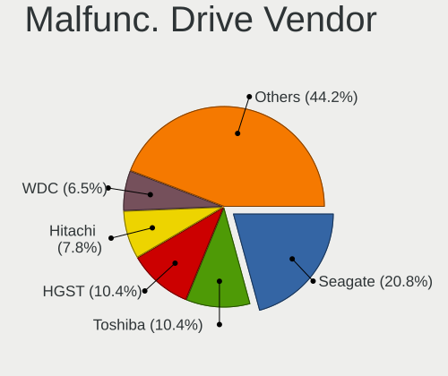

| Vendor              | Notebooks | Drives | Percent |
|---------------------|-----------|--------|---------|
| Seagate             | 16        | 20     | 20.78%  |
| Toshiba             | 8         | 8      | 10.39%  |
| HGST                | 8         | 8      | 10.39%  |
| Hitachi             | 6         | 7      | 7.79%   |
| WDC                 | 5         | 5      | 6.49%   |
| Samsung Electronics | 3         | 3      | 3.9%    |
| A-DATA Technology   | 3         | 4      | 3.9%    |
| Teclast             | 2         | 2      | 2.6%    |
| SanDisk             | 2         | 2      | 2.6%    |
| Hewlett-Packard     | 2         | 2      | 2.6%    |
| GLOWAY              | 2         | 2      | 2.6%    |
| Fujitsu             | 2         | 2      | 2.6%    |
| Crucial             | 2         | 2      | 2.6%    |
| Unknown             | 1         | 1      | 1.3%    |
| Union Memory        | 1         | 1      | 1.3%    |
| SK hynix            | 1         | 1      | 1.3%    |
| Plextor             | 1         | 1      | 1.3%    |
| NT-512              | 1         | 1      | 1.3%    |
| Netac               | 1         | 1      | 1.3%    |
| Micron Technology   | 1         | 1      | 1.3%    |
| Lenovo              | 1         | 1      | 1.3%    |
| Kingston            | 1         | 1      | 1.3%    |
| KingSpec            | 1         | 1      | 1.3%    |
| KingFast            | 1         | 1      | 1.3%    |
| Intel               | 1         | 1      | 1.3%    |
| HS-SSD-C160         | 1         | 1      | 1.3%    |
| HIKSEMI             | 1         | 1      | 1.3%    |
| ADATA Technology    | 1         | 1      | 1.3%    |
| Acer                | 1         | 1      | 1.3%    |

Malfunc. HDD Vendor
-------------------

Vendors of faulty HDD drives

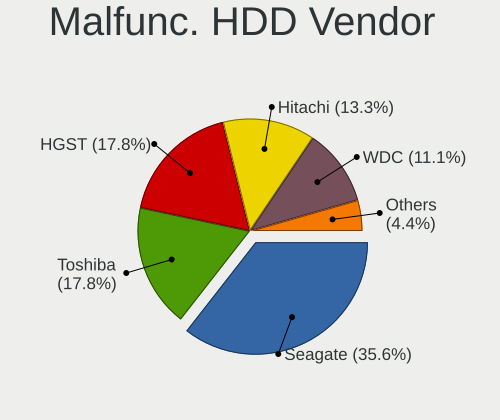

| Vendor  | Notebooks | Drives | Percent |
|---------|-----------|--------|---------|
| Seagate | 16        | 20     | 35.56%  |
| Toshiba | 8         | 8      | 17.78%  |
| HGST    | 8         | 8      | 17.78%  |
| Hitachi | 6         | 7      | 13.33%  |
| WDC     | 5         | 5      | 11.11%  |
| Fujitsu | 2         | 2      | 4.44%   |

Malfunc. Drive Kind
-------------------

Kinds of faulty drives

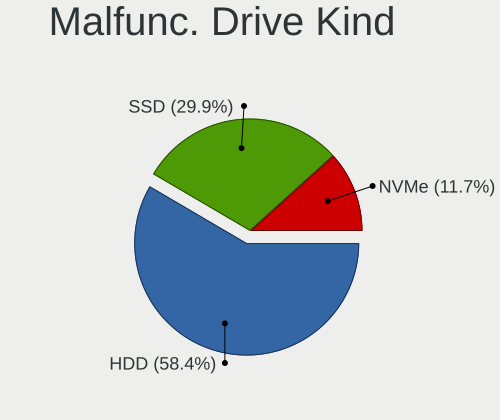

| Kind | Notebooks | Drives | Percent |
|------|-----------|--------|---------|
| HDD  | 45        | 50     | 58.44%  |
| SSD  | 23        | 24     | 29.87%  |
| NVMe | 9         | 9      | 11.69%  |

Failed Drives
-------------

Failed drive models

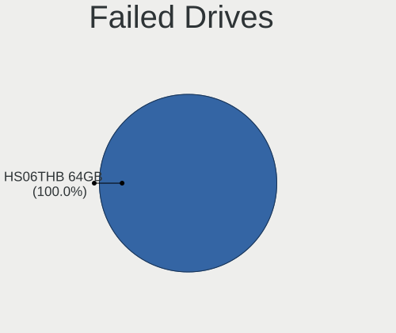

| Model                            | Notebooks | Drives | Percent |
|----------------------------------|-----------|--------|---------|
| Samsung Electronics SSD 980 1TB  | 1         | 1      | 33.33%  |
| Samsung Electronics HS06THB 64GB | 1         | 1      | 33.33%  |
| Phison ESO128GTLC9-E8C-2 128GB   | 1         | 1      | 33.33%  |

Failed Drive Vendor
-------------------

Failed drive vendors

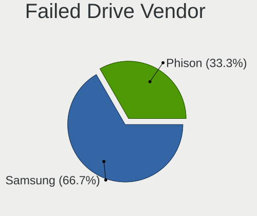

| Vendor              | Notebooks | Drives | Percent |
|---------------------|-----------|--------|---------|
| Samsung Electronics | 2         | 2      | 66.67%  |
| Phison              | 1         | 1      | 33.33%  |

Drive Status
------------

Number of failed and malfunc. drives

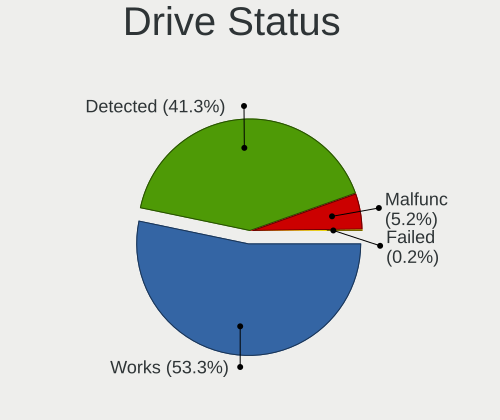

| Status   | Notebooks | Drives | Percent |
|----------|-----------|--------|---------|
| Works    | 775       | 1270   | 53.26%  |
| Detected | 601       | 937    | 41.31%  |
| Malfunc  | 76        | 83     | 5.22%   |
| Failed   | 3         | 3      | 0.21%   |

Storage controller
------------------

Storage Vendor
--------------

Storage controller vendors

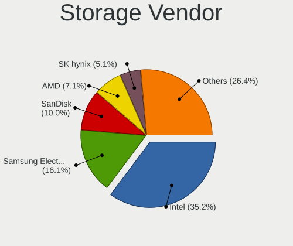

| Vendor                                  | Notebooks | Percent |
|-----------------------------------------|-----------|---------|
| Intel                                   | 614       | 35.23%  |
| Samsung Electronics                     | 280       | 16.06%  |
| SanDisk                                 | 175       | 10.04%  |
| AMD                                     | 124       | 7.11%   |
| SK hynix                                | 89        | 5.11%   |
| Yangtze Memory Technologies             | 69        | 3.96%   |
| KIOXIA                                  | 51        | 2.93%   |
| Micron Technology                       | 47        | 2.7%    |
| MAXIO Technology (Hangzhou)             | 43        | 2.47%   |
| Phison Electronics                      | 35        | 2.01%   |
| Toshiba America Info Systems            | 33        | 1.89%   |
| Kingston Technology Company             | 23        | 1.32%   |
| Silicon Motion                          | 21        | 1.2%    |
| Shenzhen Unionmemory Information System | 21        | 1.2%    |
| Biwin Storage Technology                | 19        | 1.09%   |
| Shenzhen Longsys Electronics            | 13        | 0.75%   |
| Micron/Crucial Technology               | 10        | 0.57%   |
| Apple                                   | 9         | 0.52%   |
| Solid State Storage Technology          | 8         | 0.46%   |
| INNOGRIT                                | 6         | 0.34%   |
| ADATA Technology                        | 6         | 0.34%   |
| Zhaoxin                                 | 5         | 0.29%   |
| Solidigm                                | 5         | 0.29%   |
| Marvell Technology Group                | 5         | 0.29%   |
| Loongson Technology                     | 4         | 0.23%   |
| Union Memory (Shenzhen)                 | 3         | 0.17%   |
| Seagate Technology                      | 3         | 0.17%   |
| O2 Micro                                | 3         | 0.17%   |
| Unknown                                 | 3         | 0.17%   |
| Silicon Integrated Systems [SiS]        | 2         | 0.11%   |
| Realtek Semiconductor                   | 2         | 0.11%   |
| Nvidia                                  | 2         | 0.11%   |
| Lite-On Technology                      | 2         | 0.11%   |
| Hefei DATANG Storage Technology         | 2         | 0.11%   |
| ASMedia Technology                      | 2         | 0.11%   |
| ShenZhen TIGO Semiconductor             | 1         | 0.06%   |
| Netac Technology                        | 1         | 0.06%   |
| Lenovo                                  | 1         | 0.06%   |
| JMicron Technology                      | 1         | 0.06%   |

Storage Model
-------------

Storage controller models

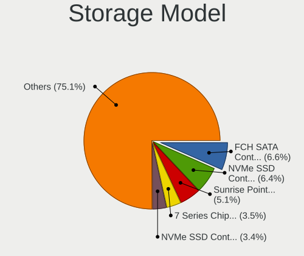

| Model                                                                          | Notebooks | Percent |
|--------------------------------------------------------------------------------|-----------|---------|
| AMD FCH SATA Controller [AHCI mode]                                            | 120       | 6.59%   |
| Samsung NVMe SSD Controller SM981/PM981/PM983                                  | 116       | 6.37%   |
| Intel Sunrise Point-LP SATA Controller [AHCI mode]                             | 92        | 5.05%   |
| Intel 7 Series Chipset Family 6-port SATA Controller [AHCI mode]               | 64        | 3.52%   |
| Samsung NVMe SSD Controller PM9A1/PM9A3/980PRO                                 | 62        | 3.41%   |
| SanDisk Extreme Pro / WD Black SN750 / PC SN730 / Red SN700 NVMe SSD           | 49        | 2.69%   |
| Intel Volume Management Device NVMe RAID Controller                            | 43        | 2.36%   |
| Intel 6 Series/C200 Series Chipset Family 6 port Mobile SATA AHCI Controller   | 42        | 2.31%   |
| Samsung NVMe SSD Controller 980 (DRAM-less)                                    | 41        | 2.25%   |
| Intel Cannon Lake Mobile PCH SATA AHCI Controller                              | 40        | 2.2%    |
| Intel 8 Series SATA Controller 1 [AHCI mode]                                   | 37        | 2.03%   |
| SK hynix Gold P31/BC711/PC711 NVMe Solid State Drive                           | 32        | 1.76%   |
| Intel 82801 Mobile SATA Controller [RAID mode]                                 | 32        | 1.76%   |
| SanDisk Ultra 3D / WD PC SN530, IX SN530, Blue SN550 NVMe SSD (DRAM-less)      | 27        | 1.48%   |
| Intel 8 Series/C220 Series Chipset Family 6-port SATA Controller 1 [AHCI mode] | 27        | 1.48%   |
| Intel HM170/QM170 Chipset SATA Controller [AHCI Mode]                          | 26        | 1.43%   |
| SanDisk WD SN560/SN740/SN770/SN5000 NVMe SSD                                   | 25        | 1.37%   |
| Samsung NVMe SSD Controller SM961/PM961/SM963                                  | 25        | 1.37%   |
| MAXIO (Hangzhou) NVMe SSD Controller MAP1602 (DRAM-less)                       | 24        | 1.32%   |
| Intel Wildcat Point-LP SATA Controller [AHCI Mode]                             | 22        | 1.21%   |
| Yangtze Memory ZHITAI TiPlus7100                                               | 21        | 1.15%   |
| KIOXIA NVMe SSD Controller BG5 (DRAM-less)                                     | 20        | 1.1%    |
| SanDisk Extreme Pro / WD Black 2018/SN750/PC SN720 NVMe SSD                    | 19        | 1.04%   |
| MAXIO (Hangzhou) NVMe SSD Controller MAP1202 (DRAM-less)                       | 18        | 0.99%   |
| Intel Comet Lake SATA AHCI Controller                                          | 17        | 0.93%   |
| Intel 82801IBM/IEM (ICH9M/ICH9M-E) 4 port SATA Controller [AHCI mode]          | 17        | 0.93%   |
| SK hynix PC611 NVMe Solid State Drive                                          | 16        | 0.88%   |
| Micron 3400 NVMe SSD [Hendrix]                                                 | 16        | 0.88%   |
| Toshiba America Info Systems XG6 NVMe SSD Controller                           | 14        | 0.77%   |
| SK hynix Platinum P41/PC801 NVMe Solid State Drive                             | 14        | 0.77%   |
| Silicon Motion SM2263EN/SM2263XT (DRAM-less) NVMe SSD Controllers              | 14        | 0.77%   |
| KIOXIA NVMe SSD Controller BG4 (DRAM-less)                                     | 14        | 0.77%   |
| Intel Cannon Point-LP SATA Controller [AHCI Mode]                              | 14        | 0.77%   |
| Yangtze Memory ZHITAI TiPro5000 NVMe SSD                                       | 13        | 0.71%   |
| Sandisk PC SN740 NVMe SSD (DRAM-less)                                          | 13        | 0.71%   |
| Micron 2450 NVMe SSD [HendrixV] (DRAM-less)                                    | 13        | 0.71%   |
| Intel Tiger Lake SATA AHCI Controller                                          | 13        | 0.71%   |
| Intel SSD 660P Series                                                          | 13        | 0.71%   |
| Intel Alder Lake-P SATA AHCI Controller                                        | 13        | 0.71%   |
| SanDisk WD PC SN810 / Black SN850 NVMe SSD                                     | 12        | 0.66%   |

Storage Kind
------------

Kind of storage controller (IDE, SATA, NVMe, SAS, ...)

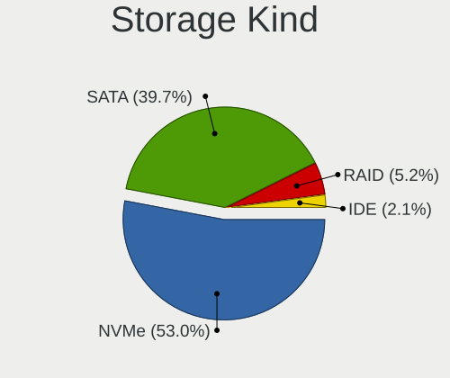

| Kind | Notebooks | Percent |
|------|-----------|---------|
| NVMe | 872       | 52.98%  |
| SATA | 653       | 39.67%  |
| RAID | 86        | 5.22%   |
| IDE  | 35        | 2.13%   |

Processor
---------

CPU Vendor
----------

Processor vendors

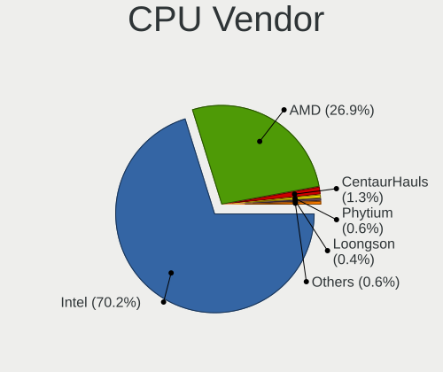

| Vendor       | Notebooks | Percent |
|--------------|-----------|---------|
| Intel        | 945       | 70.21%  |
| AMD          | 362       | 26.89%  |
| CentaurHauls | 17        | 1.26%   |
| Phytium      | 8         | 0.59%   |
| Loongson     | 6         | 0.45%   |
| ARM          | 3         | 0.22%   |
| Qualcomm     | 2         | 0.15%   |
| Unknown      | 2         | 0.15%   |
| HygonGenuine | 1         | 0.07%   |

CPU Model
---------

Processor models

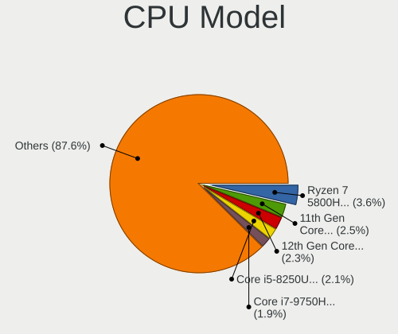

| Model                                         | Notebooks | Percent |
|-----------------------------------------------|-----------|---------|
| AMD Ryzen 7 5800H with Radeon Graphics        | 49        | 3.64%   |
| Intel 11th Gen Core i5-1135G7 @ 2.40GHz       | 34        | 2.53%   |
| Intel 12th Gen Core i7-12700H                 | 31        | 2.3%    |
| Intel Core i5-8250U CPU @ 1.60GHz             | 28        | 2.08%   |
| Intel Core i7-9750H CPU @ 2.60GHz             | 25        | 1.86%   |
| AMD Ryzen 5 3500U with Radeon Vega Mobile Gfx | 24        | 1.78%   |
| Intel 11th Gen Core i7-1165G7 @ 2.80GHz       | 23        | 1.71%   |
| Intel Core i5-7200U CPU @ 2.50GHz             | 21        | 1.56%   |
| AMD Custom APU 0405                           | 21        | 1.56%   |
| AMD Ryzen 7 6800H with Radeon Graphics        | 20        | 1.49%   |
| Intel Core i5-8265U CPU @ 1.60GHz             | 18        | 1.34%   |
| Intel Core i5-6200U CPU @ 2.30GHz             | 17        | 1.26%   |
| AMD Ryzen 7 4800H with Radeon Graphics        | 17        | 1.26%   |
| Intel Core i7-8550U CPU @ 1.80GHz             | 16        | 1.19%   |
| Intel Core i5-10210U CPU @ 1.60GHz            | 16        | 1.19%   |
| AMD Ryzen 7 8845HS w/ Radeon 780M Graphics    | 15        | 1.11%   |
| Intel Core i7-8750H CPU @ 2.20GHz             | 14        | 1.04%   |
| Intel 12th Gen Core i5-1240P                  | 14        | 1.04%   |
| Intel 11th Gen Core i7-11800H @ 2.30GHz       | 14        | 1.04%   |
| Intel Core i7-10510U CPU @ 1.80GHz            | 13        | 0.97%   |
| Intel Core i5-8300H CPU @ 2.30GHz             | 13        | 0.97%   |
| Intel Core i5-3320M CPU @ 2.60GHz             | 11        | 0.82%   |
| Intel Core i7-7700HQ CPU @ 2.80GHz            | 10        | 0.74%   |
| Intel Core i7-10750H CPU @ 2.60GHz            | 10        | 0.74%   |
| Intel 12th Gen Core i5-12500H                 | 10        | 0.74%   |
| AMD Ryzen 9 7945HX with Radeon Graphics       | 10        | 0.74%   |
| AMD Ryzen 7 7840HS w/ Radeon 780M Graphics    | 10        | 0.74%   |
| Intel Core Ultra 7 155H                       | 9         | 0.67%   |
| Intel Core i7-8565U CPU @ 1.80GHz             | 9         | 0.67%   |
| Intel Core i7-6700HQ CPU @ 2.60GHz            | 9         | 0.67%   |
| Intel Core i5-5200U CPU @ 2.20GHz             | 9         | 0.67%   |
| Intel Core i5-4200U CPU @ 1.60GHz             | 9         | 0.67%   |
| Intel Core i5-3210M CPU @ 2.50GHz             | 9         | 0.67%   |
| Intel Core i5-2520M CPU @ 2.50GHz             | 9         | 0.67%   |
| AMD Ryzen 5 4600U with Radeon Graphics        | 9         | 0.67%   |
| AMD Ryzen 5 3550H with Radeon Vega Mobile Gfx | 9         | 0.67%   |
| Intel Core i9-14900HX                         | 8         | 0.59%   |
| Intel Core i3-2350M CPU @ 2.30GHz             | 8         | 0.59%   |
| Intel 13th Gen Core i9-13900H                 | 8         | 0.59%   |
| AMD Ryzen 7 8845H w/ Radeon 780M Graphics     | 8         | 0.59%   |

CPU Model Family
----------------

Processor model prefix

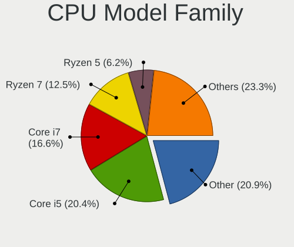

| Model                   | Notebooks | Percent |
|-------------------------|-----------|---------|
| Other                   | 281       | 20.88%  |
| Intel Core i5           | 275       | 20.43%  |
| Intel Core i7           | 224       | 16.64%  |
| AMD Ryzen 7             | 168       | 12.48%  |
| AMD Ryzen 5             | 84        | 6.24%   |
| Intel Core i3           | 57        | 4.23%   |
| Intel Core              | 37        | 2.75%   |
| Intel Celeron           | 29        | 2.15%   |
| Intel Core 2 Duo        | 26        | 1.93%   |
| AMD Ryzen 9             | 24        | 1.78%   |
| Intel Atom              | 23        | 1.71%   |
| AMD Ryzen 7 PRO         | 20        | 1.49%   |
| Intel Core i9           | 14        | 1.04%   |
| Intel Pentium           | 9         | 0.67%   |
| Intel Core m3           | 8         | 0.59%   |
| AMD Ryzen 5 PRO         | 8         | 0.59%   |
| AMD A6                  | 8         | 0.59%   |
| Intel Xeon              | 7         | 0.52%   |
| AMD A10                 | 5         | 0.37%   |
| AMD A8                  | 4         | 0.3%    |
| Intel Pentium Dual      | 3         | 0.22%   |
| Intel Genuine           | 3         | 0.22%   |
| Intel Core M            | 3         | 0.22%   |
| AMD E2                  | 3         | 0.22%   |
| AMD A4                  | 3         | 0.22%   |
| Intel Pentium Silver    | 2         | 0.15%   |
| Intel Core m5           | 2         | 0.15%   |
| Intel Core 2            | 2         | 0.15%   |
| AMD Ryzen 3             | 2         | 0.15%   |
| AMD E                   | 2         | 0.15%   |
| AMD Athlon              | 2         | 0.15%   |
| Intel Pentium M         | 1         | 0.07%   |
| Intel Pentium Dual-Core | 1         | 0.07%   |
| Intel Core Duo          | 1         | 0.07%   |
| Intel Celeron Dual-Core | 1         | 0.07%   |
| ARM ARMv7               | 1         | 0.07%   |
| AMD Quad-Core           | 1         | 0.07%   |
| AMD E1                  | 1         | 0.07%   |
| AMD C-50                | 1         | 0.07%   |

CPU Cores
---------

Number of processor cores

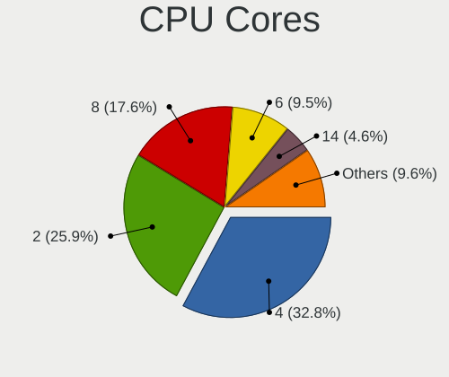

| Number  | Notebooks | Percent |
|---------|-----------|---------|
| 4       | 443       | 32.84%  |
| 2       | 349       | 25.87%  |
| 8       | 237       | 17.57%  |
| 6       | 128       | 9.49%   |
| 14      | 62        | 4.6%    |
| 12      | 47        | 3.48%   |
| 16      | 44        | 3.26%   |
| 10      | 15        | 1.11%   |
| 24      | 10        | 0.74%   |
| 1       | 9         | 0.67%   |
| 20      | 2         | 0.15%   |
| Unknown | 2         | 0.15%   |
| 11      | 1         | 0.07%   |

CPU Sockets
-----------

Number of sockets

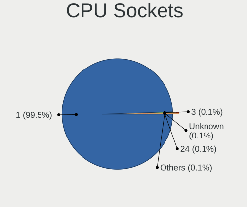

| Number  | Notebooks | Percent |
|---------|-----------|---------|
| 1       | 1340      | 99.48%  |
| 3       | 2         | 0.15%   |
| Unknown | 2         | 0.15%   |
| 24      | 1         | 0.07%   |
| 11      | 1         | 0.07%   |
| 2       | 1         | 0.07%   |

CPU Threads
-----------

Threads per core (Hyper-Threading)

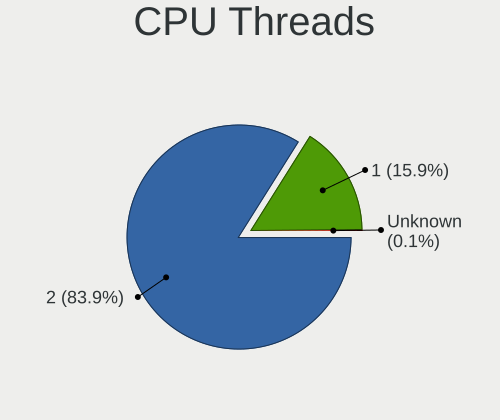

| Number  | Notebooks | Percent |
|---------|-----------|---------|
| 2       | 1133      | 83.93%  |
| 1       | 215       | 15.93%  |
| Unknown | 2         | 0.15%   |

CPU Op-Modes
------------

CPU Operation Modes (32-bit, 64-bit)

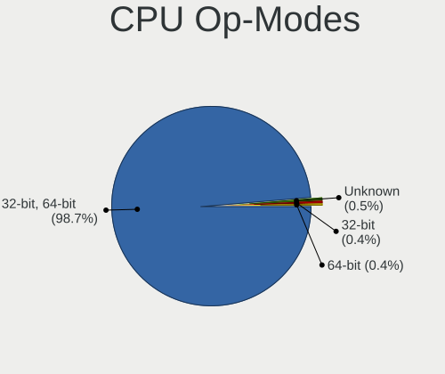

| Op mode        | Notebooks | Percent |
|----------------|-----------|---------|
| 32-bit, 64-bit | 1330      | 98.66%  |
| Unknown        | 7         | 0.52%   |
| 32-bit         | 6         | 0.45%   |
| 64-bit         | 5         | 0.37%   |

CPU Microcode
-------------

Microcode number

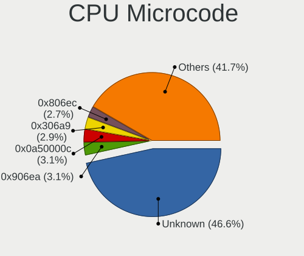

| Number     | Notebooks | Percent |
|------------|-----------|---------|
| Unknown    | 647       | 46.58%  |
| 0x906ea    | 43        | 3.1%    |
| 0x0a50000c | 43        | 3.1%    |
| 0x306a9    | 40        | 2.88%   |
| 0x806ec    | 37        | 2.66%   |
| 0x806ea    | 34        | 2.45%   |
| 0x806c1    | 32        | 2.3%    |
| 0x08600106 | 30        | 2.16%   |
| 0x906a3    | 27        | 1.94%   |
| 0x806e9    | 27        | 1.94%   |
| 0x40651    | 27        | 1.94%   |
| 0x206a7    | 26        | 1.87%   |
| 0x406e3    | 21        | 1.51%   |
| 0x306d4    | 20        | 1.44%   |
| 0x08108102 | 19        | 1.37%   |
| 0x0a404102 | 16        | 1.15%   |
| 0x506e3    | 15        | 1.08%   |
| 0xa0652    | 14        | 1.01%   |
| 0x306c3    | 14        | 1.01%   |
| 0x08108109 | 14        | 1.01%   |
| 0x08600104 | 13        | 0.94%   |
| 0x906e9    | 12        | 0.86%   |
| 0x806d1    | 12        | 0.86%   |
| 0x30678    | 11        | 0.79%   |
| 0x1067a    | 10        | 0.72%   |
| 0x0a704103 | 9         | 0.65%   |
| 0xb06a2    | 7         | 0.5%    |
| 0x0a404101 | 7         | 0.5%    |
| 0x08600103 | 7         | 0.5%    |
| 0x806eb    | 6         | 0.43%   |
| 0x706e5    | 6         | 0.43%   |
| 0x0a601203 | 6         | 0.43%   |
| 0xa0660    | 5         | 0.36%   |
| 0x906ed    | 5         | 0.36%   |
| 0x706a1    | 5         | 0.36%   |
| 0x0a50000b | 5         | 0.36%   |
| 0x08608103 | 5         | 0.36%   |
| 0xb0671    | 4         | 0.29%   |
| 0xa06a4    | 4         | 0.29%   |
| 0x806c2    | 4         | 0.29%   |

CPU Microarch
-------------

Microarchitecture

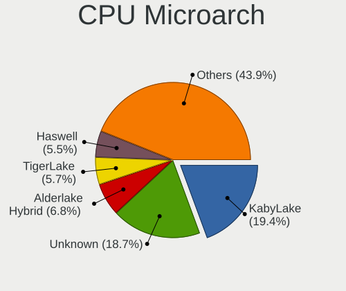

| Name               | Notebooks | Percent |
|--------------------|-----------|---------|
| KabyLake           | 262       | 19.38%  |
| Unknown            | 253       | 18.71%  |
| Alderlake Hybrid   | 92        | 6.8%    |
| TigerLake          | 77        | 5.7%    |
| Haswell            | 74        | 5.47%   |
| Zen 3              | 71        | 5.25%   |
| Zen 2              | 70        | 5.18%   |
| IvyBridge          | 68        | 5.03%   |
| Skylake            | 53        | 3.92%   |
| SandyBridge        | 49        | 3.62%   |
| Zen+               | 44        | 3.25%   |
| CometLake          | 32        | 2.37%   |
| Broadwell          | 30        | 2.22%   |
| IceLake            | 27        | 2%      |
| Silvermont         | 25        | 1.85%   |
| Penryn             | 25        | 1.85%   |
| Goldmont plus      | 10        | 0.74%   |
| Zen                | 9         | 0.67%   |
| Westmere           | 9         | 0.67%   |
| Meteorlake Hybrid  | 8         | 0.59%   |
| Core               | 8         | 0.59%   |
| Puma               | 6         | 0.44%   |
| Bonnell            | 6         | 0.44%   |
| Piledriver         | 5         | 0.37%   |
| Goldmont           | 5         | 0.37%   |
| Excavator          | 5         | 0.37%   |
| Lunarlake Hybrid   | 4         | 0.3%    |
| ArrowLake-H Hybrid | 4         | 0.3%    |
| Tremont            | 3         | 0.22%   |
| Steamroller        | 3         | 0.22%   |
| P6                 | 3         | 0.22%   |
| Jaguar             | 3         | 0.22%   |
| Bobcat             | 3         | 0.22%   |
| Nehalem            | 2         | 0.15%   |
| K10 Llano          | 2         | 0.15%   |
| Gracemont          | 2         | 0.15%   |

Graphics
--------

GPU Vendor
----------

Vendors of graphics cards

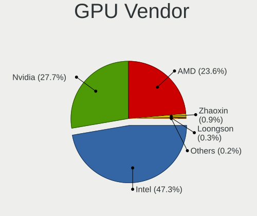

| Vendor                           | Notebooks | Percent |
|----------------------------------|-----------|---------|
| Intel                            | 862       | 47.31%  |
| Nvidia                           | 504       | 27.66%  |
| AMD                              | 430       | 23.6%   |
| Zhaoxin                          | 17        | 0.93%   |
| Loongson Technology              | 6         | 0.33%   |
| Silicon Integrated Systems [SiS] | 1         | 0.05%   |
| Nanjing Ruixinview Technology    | 1         | 0.05%   |
| Innosilicon                      | 1         | 0.05%   |

GPU Model
---------

Graphics card models

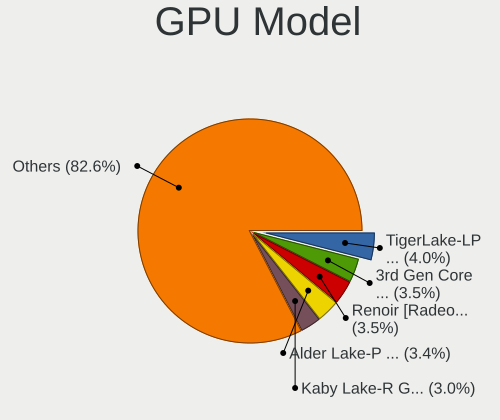

| Model                                                                                 | Notebooks | Percent |
|---------------------------------------------------------------------------------------|-----------|---------|
| Intel TigerLake-LP GT2 [Iris Xe Graphics]                                             | 74        | 3.99%   |
| Intel 3rd Gen Core processor Graphics Controller                                      | 65        | 3.5%    |
| AMD Renoir [Radeon Vega Series / Radeon Vega Mobile Series]                           | 65        | 3.5%    |
| Intel Alder Lake-P GT2 [Iris Xe Graphics]                                             | 63        | 3.39%   |
| Intel Kaby Lake-R GT2 [UHD Graphics 620]                                              | 56        | 3.02%   |
| AMD Cezanne [Radeon Vega Series / Radeon Vega Mobile Series]                          | 54        | 2.91%   |
| Nvidia GA106M [GeForce RTX 3060 Mobile / Max-Q]                                       | 49        | 2.64%   |
| Intel CoffeeLake-H GT2 [UHD Graphics 630]                                             | 49        | 2.64%   |
| AMD Picasso/Raven 2 [Radeon Vega Series / Radeon Vega Mobile Series]                  | 45        | 2.42%   |
| Intel 2nd Generation Core Processor Family Integrated Graphics Controller             | 43        | 2.32%   |
| Intel Haswell-ULT Integrated Graphics Controller                                      | 40        | 2.16%   |
| AMD Rembrandt [Radeon 680M]                                                           | 40        | 2.16%   |
| Intel WhiskeyLake-U GT2 [UHD Graphics 620]                                            | 32        | 1.72%   |
| Intel Kaby Lake-U GT2 [HD Graphics 620]                                               | 32        | 1.72%   |
| Intel CometLake-U GT2 [UHD Graphics]                                                  | 31        | 1.67%   |
| Nvidia AD107M [GeForce RTX 4060 Max-Q / Mobile]                                       | 29        | 1.56%   |
| Intel 4th Gen Core Processor Integrated Graphics Controller                           | 27        | 1.45%   |
| Nvidia TU117M [GeForce GTX 1650 Mobile / Max-Q]                                       | 26        | 1.4%    |
| Intel Skylake-U GT2 [HD Graphics 520]                                                 | 26        | 1.4%    |
| AMD Phoenix1                                                                          | 26        | 1.4%    |
| AMD HawkPoint1                                                                        | 25        | 1.35%   |
| Nvidia GP108M [GeForce MX150]                                                         | 23        | 1.24%   |
| Nvidia GP108M [GeForce MX250]                                                         | 22        | 1.19%   |
| AMD VanGogh [AMD Custom GPU 0405]                                                     | 21        | 1.13%   |
| Intel Broadwell-U GT2 [HD Graphics 5500]                                              | 20        | 1.08%   |
| Nvidia TU117M [GeForce MX450]                                                         | 19        | 1.02%   |
| Intel Meteor Lake-P [Intel Arc Graphics]                                              | 19        | 1.02%   |
| Intel TigerLake-H GT1 [UHD Graphics]                                                  | 18        | 0.97%   |
| Nvidia GP107M [GeForce GTX 1050 Ti Mobile]                                            | 17        | 0.92%   |
| Intel Raptor Lake-P [Iris Xe Graphics]                                                | 17        | 0.92%   |
| Intel Kaby Lake-H GT2 [HD Graphics 630]                                               | 16        | 0.86%   |
| AMD Sun XT [Radeon HD 8670A/8670M/8690M / R5 M330 / M430 / Radeon 520 Mobile]         | 16        | 0.86%   |
| Nvidia TU106M [GeForce RTX 2060 Mobile]                                               | 15        | 0.81%   |
| Intel Raptor Lake-S UHD Graphics                                                      | 15        | 0.81%   |
| Intel CometLake-H GT2 [UHD Graphics]                                                  | 15        | 0.81%   |
| Intel Atom Processor Z36xxx/Z37xxx Series Graphics & Display                          | 15        | 0.81%   |
| AMD Topaz XT [Radeon R7 M260/M265 / M340/M360 / M440/M445 / 530/535 / 620/625 Mobile] | 15        | 0.81%   |
| Zhaoxin KX-6000 C-960 GPU                                                             | 14        | 0.75%   |
| Nvidia GF117M [GeForce 610M/710M/810M/820M / GT 620M/625M/630M/720M]                  | 14        | 0.75%   |
| Nvidia AD106M [GeForce RTX 4070 Max-Q / Mobile]                                       | 14        | 0.75%   |

GPU Combo
---------

Combinations of graphics cards

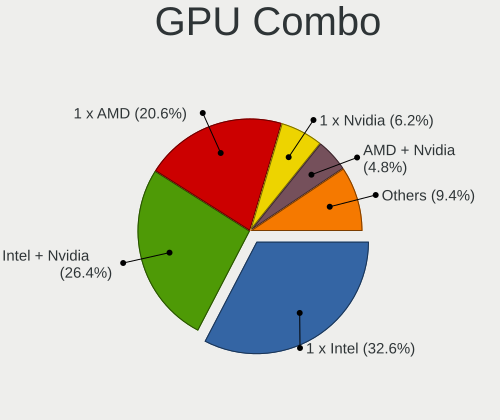

| Name                              | Notebooks | Percent |
|-----------------------------------|-----------|---------|
| 1 x Intel                         | 441       | 32.64%  |
| Intel + Nvidia                    | 356       | 26.35%  |
| 1 x AMD                           | 278       | 20.58%  |
| 1 x Nvidia                        | 84        | 6.22%   |
| AMD + Nvidia                      | 65        | 4.81%   |
| Intel + AMD                       | 64        | 4.74%   |
| 2 x AMD                           | 22        | 1.63%   |
| 1 x Zhaoxin                       | 17        | 1.26%   |
| 2 x Intel                         | 8         | 0.59%   |
| Other                             | 7         | 0.52%   |
| 1 x Loongson Technology           | 6         | 0.44%   |
| 1 x SiS                           | 1         | 0.07%   |
| 1 x Nanjing Ruixinview Technology | 1         | 0.07%   |
| 1 x Innosilicon                   | 1         | 0.07%   |

GPU Driver
----------

Free vs proprietary

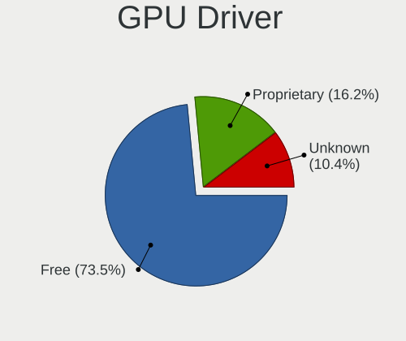

| Driver      | Notebooks | Percent |
|-------------|-----------|---------|
| Free        | 1001      | 73.49%  |
| Proprietary | 220       | 16.15%  |
| Unknown     | 141       | 10.35%  |

GPU Memory
----------

Total video memory

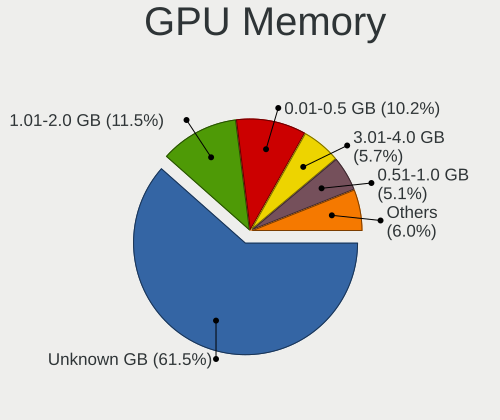

| Size in GB | Notebooks | Percent |
|------------|-----------|---------|
| Unknown    | 848       | 61.54%  |
| 1.01-2.0   | 158       | 11.47%  |
| 0.01-0.5   | 140       | 10.16%  |
| 3.01-4.0   | 79        | 5.73%   |
| 0.51-1.0   | 70        | 5.08%   |
| 5.01-6.0   | 39        | 2.83%   |
| 7.01-8.0   | 36        | 2.61%   |
| 8.01-16.0  | 5         | 0.36%   |
| 2.01-3.0   | 2         | 0.15%   |
| 16.01-24.0 | 1         | 0.07%   |

Monitor
-------

Monitor Vendor
--------------

Monitor vendors

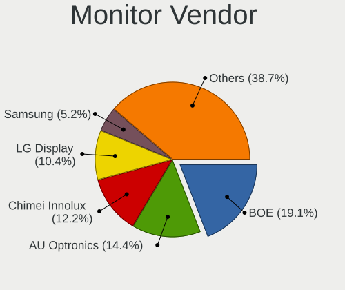

| Vendor                  | Notebooks | Percent |
|-------------------------|-----------|---------|
| BOE                     | 274       | 19.11%  |
| AU Optronics            | 207       | 14.44%  |
| Chimei Innolux          | 175       | 12.2%   |
| LG Display              | 149       | 10.39%  |
| Samsung Electronics     | 74        | 5.16%   |
| CSO                     | 66        | 4.6%    |
| Lenovo                  | 43        | 3%      |
| Sharp                   | 42        | 2.93%   |
| Dell                    | 32        | 2.23%   |
| TMX                     | 29        | 2.02%   |
| Apple                   | 27        | 1.88%   |
| AOC                     | 26        | 1.81%   |
| PANDA                   | 23        | 1.6%    |
| Valve                   | 20        | 1.39%   |
| Philips                 | 20        | 1.39%   |
| InfoVision              | 17        | 1.19%   |
| TMA                     | 15        | 1.05%   |
| RTK                     | 11        | 0.77%   |
| Goldstar                | 11        | 0.77%   |
| CSOT                    | 11        | 0.77%   |
| Chi Mei Optoelectronics | 10        | 0.7%    |
| Mi                      | 9         | 0.63%   |
| Hewlett-Packard         | 9         | 0.63%   |
| CSW                     | 8         | 0.56%   |
| JDI                     | 7         | 0.49%   |
| SGT                     | 6         | 0.42%   |
| BenQ                    | 6         | 0.42%   |
| Panasonic               | 4         | 0.28%   |
| IPS                     | 4         | 0.28%   |
| HUAWEI                  | 4         | 0.28%   |
| HKC                     | 4         | 0.28%   |
| VXN                     | 3         | 0.21%   |
| ViewSonic               | 3         | 0.21%   |
| SKG                     | 3         | 0.21%   |
| SAC                     | 3         | 0.21%   |
| LGD                     | 3         | 0.21%   |
| INNOCN                  | 3         | 0.21%   |
| EDO                     | 3         | 0.21%   |
| BOE Technology Group    | 3         | 0.21%   |
| Xiaomi                  | 2         | 0.14%   |

Monitor Model
-------------

Monitor models

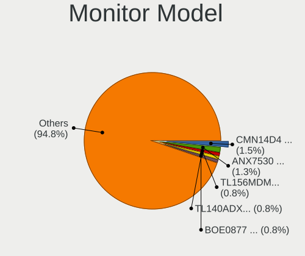

| Model                                                            | Notebooks | Percent |
|------------------------------------------------------------------|-----------|---------|
| Chimei Innolux LCD Monitor CMN14D4 1920x1080 309x173mm 13.9-inch | 21        | 1.46%   |
| Valve ANX7530 U VLV3001 800x1280 100x150mm 7.1-inch              | 19        | 1.32%   |
| TMX TL156MDMP11-0 TMX1560 3200x2000 336x210mm 15.6-inch          | 12        | 0.83%   |
| TMA TL140ADXP24-0 TMA2004 2880x1800 300x190mm 14.0-inch          | 12        | 0.83%   |
| BOE LCD Monitor BOE0877 1920x1080 309x173mm 13.9-inch            | 11        | 0.76%   |
| CSO LCD Monitor CSO1402 2880x1800 302x188mm 14.0-inch            | 10        | 0.69%   |
| Chimei Innolux LCD Monitor CMN14A7 1920x1080 308x173mm 13.9-inch | 9         | 0.62%   |
| BOE LCD Monitor BOE0893 2160x1440 296x197mm 14.0-inch            | 9         | 0.62%   |
| CSO LCD Monitor CSO076D 2560x1600 286x179mm 13.3-inch            | 8         | 0.55%   |
| Chimei Innolux LCD Monitor CMN15E8 1920x1080 344x193mm 15.5-inch | 8         | 0.55%   |
| AU Optronics LCD Monitor AUO683D 1920x1080 309x174mm 14.0-inch   | 8         | 0.55%   |
| AU Optronics LCD Monitor AUO2E3C 1366x768 309x173mm 13.9-inch    | 8         | 0.55%   |
| Sharp LCD Monitor SHP1447 1920x1080 294x165mm 13.3-inch          | 7         | 0.49%   |
| Chimei Innolux LCD Monitor CMN1602 1920x1080 355x199mm 16.0-inch | 7         | 0.49%   |
| Chimei Innolux LCD Monitor CMN14D5 1920x1080 309x173mm 13.9-inch | 7         | 0.49%   |
| BOE LCD Monitor BOE07DB 1920x1080 309x174mm 14.0-inch            | 7         | 0.49%   |
| AU Optronics LCD Monitor AUOC391 2880x1800 301x188mm 14.0-inch   | 7         | 0.49%   |
| AU Optronics LCD Monitor AUO403D 1920x1080 309x174mm 14.0-inch   | 7         | 0.49%   |
| Sharp LCD Monitor SHP149A 1920x1080 344x194mm 15.5-inch          | 6         | 0.42%   |
| PANDA LCD Monitor NCP004D 1920x1080 344x194mm 15.5-inch          | 6         | 0.42%   |
| Chimei Innolux P130ZFA-BA1 CMN8201 2160x1440 275x183mm 13.0-inch | 6         | 0.42%   |
| Chimei Innolux LCD Monitor CMN1604 1920x1080 355x199mm 16.0-inch | 6         | 0.42%   |
| Chimei Innolux LCD Monitor CMN1540 2560x1440 344x193mm 15.5-inch | 6         | 0.42%   |
| BOE LCD Monitor BOE098E 1920x1080 344x194mm 15.5-inch            | 6         | 0.42%   |
| BOE LCD Monitor BOE092E 1920x1080 310x173mm 14.0-inch            | 6         | 0.42%   |
| BOE LCD Monitor BOE0747 1920x1080 344x194mm 15.5-inch            | 6         | 0.42%   |
| AU Optronics LCD Monitor AUOA08B 1920x1080 344x193mm 15.5-inch   | 6         | 0.42%   |
| LG Display LCD Monitor LGD40BA 1920x1080 340x190mm 15.3-inch     | 5         | 0.35%   |
| LG Display LCD Monitor LGD0619 1920x1080 309x174mm 14.0-inch     | 5         | 0.35%   |
| LG Display LCD Monitor LGD0618 1920x1080 344x194mm 15.5-inch     | 5         | 0.35%   |
| LG Display LCD Monitor LGD0521 1920x1080 309x174mm 14.0-inch     | 5         | 0.35%   |
| LG Display LCD Monitor LGD02D8 1366x768 277x156mm 12.5-inch      | 5         | 0.35%   |
| LG Display LCD Monitor LGD02D3 1366x768 277x156mm 12.5-inch      | 5         | 0.35%   |
| Lenovo LCD Monitor LEN8AB1 3072x1920 312x195mm 14.5-inch         | 5         | 0.35%   |
| InfoVision LCD Monitor IVO8C45 2240x1400 302x188mm 14.0-inch     | 5         | 0.35%   |
| Goldstar HDR 4K GSM7706 3840x2160 600x340mm 27.2-inch            | 5         | 0.35%   |
| Chimei Innolux P140ZKA-BZ1 CMN8C02 2160x1440 296x197mm 14.0-inch | 5         | 0.35%   |
| Chimei Innolux LCD Monitor CMN1490 1366x768 309x174mm 14.0-inch  | 5         | 0.35%   |
| BOE LCD Monitor BOE0AC1 2560x1600 344x215mm 16.0-inch            | 5         | 0.35%   |
| BOE LCD Monitor BOE0A1F 2560x1600 344x215mm 16.0-inch            | 5         | 0.35%   |

Monitor Resolution
------------------

Monitor screen resolution

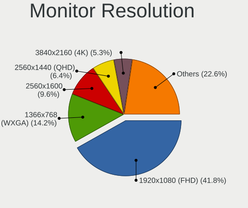

| Resolution         | Notebooks | Percent |
|--------------------|-----------|---------|
| 1920x1080 (FHD)    | 572       | 41.84%  |
| 1366x768 (WXGA)    | 194       | 14.19%  |
| 2560x1600          | 131       | 9.58%   |
| 2560x1440 (QHD)    | 88        | 6.44%   |
| 3840x2160 (4K)     | 73        | 5.34%   |
| 2880x1800          | 63        | 4.61%   |
| 1920x1200 (WUXGA)  | 32        | 2.34%   |
| 2160x1440          | 26        | 1.9%    |
| 800x1280           | 22        | 1.61%   |
| 3072x1920          | 21        | 1.54%   |
| 3200x2000          | 19        | 1.39%   |
| 1280x800 (WXGA)    | 18        | 1.32%   |
| 1600x900 (HD+)     | 15        | 1.1%    |
| 2240x1400          | 13        | 0.95%   |
| 1440x900 (WXGA+)   | 11        | 0.8%    |
| 2520x1680          | 10        | 0.73%   |
| Unknown            | 8         | 0.59%   |
| 3840x2400          | 6         | 0.44%   |
| 3000x2000          | 5         | 0.37%   |
| 1680x1050 (WSXGA+) | 5         | 0.37%   |
| 1600x2560          | 4         | 0.29%   |
| 3440x1440          | 3         | 0.22%   |
| 2880x1620          | 3         | 0.22%   |
| 2560x1080          | 3         | 0.22%   |
| 3200x1800 (QHD+)   | 2         | 0.15%   |
| 2880x1920          | 2         | 0.15%   |
| 2256x1504          | 2         | 0.15%   |
| 2160x1350          | 2         | 0.15%   |
| 1024x600           | 2         | 0.15%   |
| 3840x2560          | 1         | 0.07%   |
| 3840x1080          | 1         | 0.07%   |
| 2880x864           | 1         | 0.07%   |
| 2304x1440          | 1         | 0.07%   |
| 1920x540           | 1         | 0.07%   |
| 1920x1280          | 1         | 0.07%   |
| 1792x768           | 1         | 0.07%   |
| 1400x1050          | 1         | 0.07%   |
| 1280x720 (HD)      | 1         | 0.07%   |
| 1280x1024 (SXGA)   | 1         | 0.07%   |
| 1080x1920          | 1         | 0.07%   |

Monitor Diagonal
----------------

Diagonal size in inches

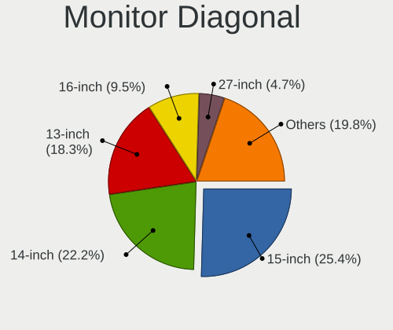

| Inches  | Notebooks | Percent |
|---------|-----------|---------|
| 15      | 363       | 25.44%  |
| 14      | 317       | 22.21%  |
| 13      | 261       | 18.29%  |
| 16      | 136       | 9.53%   |
| 27      | 67        | 4.7%    |
| 24      | 50        | 3.5%    |
| 12      | 39        | 2.73%   |
| 23      | 37        | 2.59%   |
| 17      | 30        | 2.1%    |
| Unknown | 23        | 1.61%   |
| 7       | 21        | 1.47%   |
| 21      | 13        | 0.91%   |
| 11      | 10        | 0.7%    |
| 40      | 9         | 0.63%   |
| 31      | 7         | 0.49%   |
| 34      | 4         | 0.28%   |
| 22      | 4         | 0.28%   |
| 19      | 4         | 0.28%   |
| 8       | 4         | 0.28%   |
| 63      | 3         | 0.21%   |
| 49      | 3         | 0.21%   |
| 18      | 3         | 0.21%   |
| 65      | 2         | 0.14%   |
| 28      | 2         | 0.14%   |
| 26      | 2         | 0.14%   |
| 25      | 2         | 0.14%   |
| 20      | 2         | 0.14%   |
| 10      | 2         | 0.14%   |
| 3       | 2         | 0.14%   |
| 57      | 1         | 0.07%   |
| 52      | 1         | 0.07%   |
| 43      | 1         | 0.07%   |
| 36      | 1         | 0.07%   |
| 32      | 1         | 0.07%   |

Monitor Width
-------------

Physical width

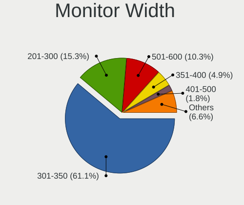

| Width in mm | Notebooks | Percent |
|-------------|-----------|---------|
| 301-350     | 868       | 61.08%  |
| 201-300     | 217       | 15.27%  |
| 501-600     | 147       | 10.34%  |
| 351-400     | 69        | 4.86%   |
| 401-500     | 26        | 1.83%   |
| Unknown     | 23        | 1.62%   |
| 1-100       | 22        | 1.55%   |
| 601-700     | 18        | 1.27%   |
| 801-900     | 9         | 0.63%   |
| 1001-1500   | 9         | 0.63%   |
| 701-800     | 7         | 0.49%   |
| 101-200     | 5         | 0.35%   |
| 901-1000    | 1         | 0.07%   |

Aspect Ratio
------------

Proportional relationship between the width and the height

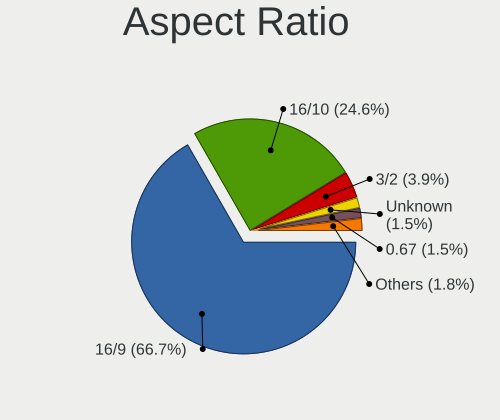

| Ratio   | Notebooks | Percent |
|---------|-----------|---------|
| 16/9    | 866       | 66.72%  |
| 16/10   | 319       | 24.58%  |
| 3/2     | 50        | 3.85%   |
| Unknown | 20        | 1.54%   |
| 0.67    | 19        | 1.46%   |
| 4/3     | 5         | 0.39%   |
| 21/9    | 5         | 0.39%   |
| 32/9    | 3         | 0.23%   |
| 0.62    | 3         | 0.23%   |
| 6/5     | 2         | 0.15%   |
| 0.63    | 2         | 0.15%   |
| 0.56    | 2         | 0.15%   |
| 5/4     | 1         | 0.08%   |
| 3.33    | 1         | 0.08%   |

Monitor Area
------------

Area in inch²

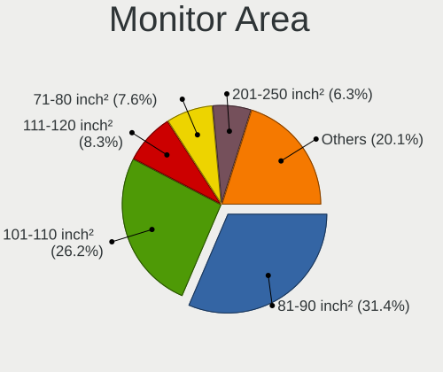

| Area in inch² | Notebooks | Percent |
|----------------|-----------|---------|
| 81-90          | 448       | 31.44%  |
| 101-110        | 373       | 26.18%  |
| 111-120        | 118       | 8.28%   |
| 71-80          | 109       | 7.65%   |
| 201-250        | 90        | 6.32%   |
| 301-350        | 69        | 4.84%   |
| 61-70          | 36        | 2.53%   |
| 91-100         | 29        | 2.04%   |
| 121-130        | 28        | 1.96%   |
| 1-40           | 27        | 1.89%   |
| Unknown        | 23        | 1.61%   |
| 351-500        | 14        | 0.98%   |
| 501-1000       | 14        | 0.98%   |
| 151-200        | 13        | 0.91%   |
| 251-300        | 11        | 0.77%   |
| 51-60          | 10        | 0.7%    |
| More than 1000 | 7         | 0.49%   |
| 141-150        | 3         | 0.21%   |
| 41-50          | 2         | 0.14%   |
| 131-140        | 1         | 0.07%   |

Pixel Density
-------------

Pixels per inch

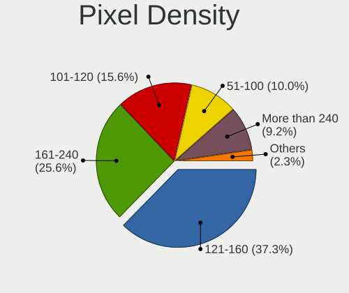

| Density       | Notebooks | Percent |
|---------------|-----------|---------|
| 121-160       | 525       | 37.31%  |
| 161-240       | 360       | 25.59%  |
| 101-120       | 220       | 15.64%  |
| 51-100        | 140       | 9.95%   |
| More than 240 | 129       | 9.17%   |
| Unknown       | 23        | 1.63%   |
| 1-50          | 10        | 0.71%   |

Multiple Monitors
-----------------

Total monitors connected

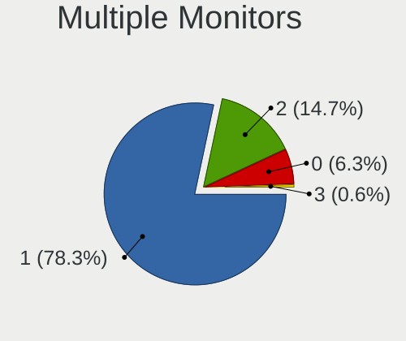

| Total | Notebooks | Percent |
|-------|-----------|---------|
| 1     | 1074      | 78.34%  |
| 2     | 202       | 14.73%  |
| 0     | 87        | 6.35%   |
| 3     | 8         | 0.58%   |

Network
-------

Net Controller Vendor
---------------------

Controller vendors

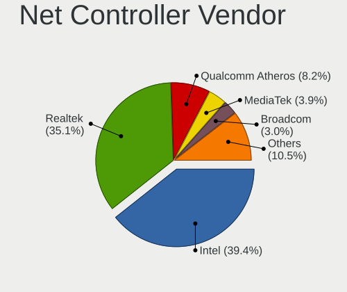

| Vendor                                 | Notebooks | Percent |
|----------------------------------------|-----------|---------|
| Intel                                  | 808       | 39.36%  |
| Realtek Semiconductor                  | 721       | 35.12%  |
| Qualcomm Atheros                       | 168       | 8.18%   |
| MediaTek                               | 80        | 3.9%    |
| Broadcom                               | 61        | 2.97%   |
| ASIX Electronics                       | 35        | 1.7%    |
| Broadcom Limited                       | 28        | 1.36%   |
| Qualcomm                               | 21        | 1.02%   |
| Huawei Technologies                    | 17        | 0.83%   |
| Xiaomi                                 | 15        | 0.73%   |
| Suzhou Motorcomm Electronic Technology | 13        | 0.63%   |
| Quectel Wireless Solutions             | 10        | 0.49%   |
| Shenzhen Goodix Technology             | 8         | 0.39%   |
| OPPO Electronics                       | 8         | 0.39%   |
| Ralink                                 | 7         | 0.34%   |
| Ralink Technology                      | 4         | 0.19%   |
| Marvell Technology Group               | 4         | 0.19%   |
| TP-Link                                | 3         | 0.15%   |
| Motorcomm Microelectronics.            | 3         | 0.15%   |
| Microsoft                              | 3         | 0.15%   |
| Lenovo                                 | 3         | 0.15%   |
| ICS Advent                             | 3         | 0.15%   |
| ZTE WCDMA Technologies MSM             | 2         | 0.1%    |
| Silicon Integrated Systems [SiS]       | 2         | 0.1%    |
| Sierra Wireless                        | 2         | 0.1%    |
| Nvidia                                 | 2         | 0.1%    |
| DisplayLink                            | 2         | 0.1%    |
| Dell                                   | 2         | 0.1%    |
| Unknown                                | 2         | 0.1%    |
| Wilocity                               | 1         | 0.05%   |
| vivo                                   | 1         | 0.05%   |
| Tenda                                  | 1         | 0.05%   |
| ST-Ericsson                            | 1         | 0.05%   |
| Samsung Electronics                    | 1         | 0.05%   |
| Qualcomm Technologies                  | 1         | 0.05%   |
| Qualcomm Atheros Communications        | 1         | 0.05%   |
| QinHeng Electronics                    | 1         | 0.05%   |
| OpenMoko                               | 1         | 0.05%   |
| OnePlus Technology (Shenzhen)          | 1         | 0.05%   |
| Meizu                                  | 1         | 0.05%   |

Net Controller Model
--------------------

Controller models

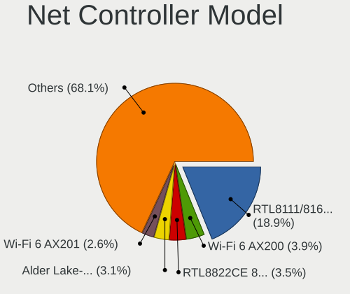

| Model                                                                  | Notebooks | Percent |
|------------------------------------------------------------------------|-----------|---------|
| Realtek RTL8111/8168/8211/8411 PCI Express Gigabit Ethernet Controller | 450       | 18.86%  |
| Intel Wi-Fi 6 AX200                                                    | 92        | 3.86%   |
| Realtek RTL8822CE 802.11ac PCIe Wireless Network Adapter               | 83        | 3.48%   |
| Intel Alder Lake-P PCH CNVi WiFi                                       | 75        | 3.14%   |
| Intel Wi-Fi 6 AX201                                                    | 61        | 2.56%   |
| Intel Wireless 8265 / 8275                                             | 54        | 2.26%   |
| Intel Wi-Fi 6E(802.11ax) AX210/AX1675* 2x2 [Typhoon Peak]              | 53        | 2.22%   |
| Realtek RTL8153 Gigabit Ethernet Adapter                               | 51        | 2.14%   |
| Realtek RTL810xE PCI Express Fast Ethernet controller                  | 46        | 1.93%   |
| Qualcomm Atheros QCA9377 802.11ac Wireless Network Adapter             | 38        | 1.59%   |
| Intel 82579LM Gigabit Network Connection (Lewisville)                  | 36        | 1.51%   |
| Intel Wireless 7265                                                    | 34        | 1.42%   |
| Realtek RTL8852BE PCIe 802.11ax Wireless Network Controller            | 33        | 1.38%   |
| Intel Comet Lake PCH-LP CNVi WiFi                                      | 32        | 1.34%   |
| Intel Cannon Lake PCH CNVi WiFi                                        | 32        | 1.34%   |
| Realtek RTL8125 2.5GbE Controller                                      | 31        | 1.3%    |
| MediaTek MT7922 802.11ax PCI Express Wireless Network Adapter          | 29        | 1.22%   |
| MediaTek MT7921 802.11ax PCIe Wireless Network Adapter [Filogic 330]   | 28        | 1.17%   |
| Qualcomm Atheros QCA6174 802.11ac Wireless Network Adapter             | 27        | 1.13%   |
| ASIX AX88179 Gigabit Ethernet                                          | 27        | 1.13%   |
| Realtek RTL8821CE 802.11ac PCIe Wireless Network Adapter               | 26        | 1.09%   |
| Intel Cannon Point-LP CNVi [Wireless-AC]                               | 25        | 1.05%   |
| Intel Raptor Lake PCH CNVi WiFi                                        | 23        | 0.96%   |
| Intel Wireless 7260                                                    | 22        | 0.92%   |
| Intel Wireless 3165                                                    | 22        | 0.92%   |
| Intel Comet Lake PCH CNVi WiFi                                         | 22        | 0.92%   |
| Intel Centrino Advanced-N 6205 [Taylor Peak]                           | 21        | 0.88%   |
| Intel Meteor Lake PCH CNVi WiFi                                        | 20        | 0.84%   |
| Intel 700 Series Chipset CNVi WiFi                                     | 20        | 0.84%   |
| Realtek RTL8852AE 802.11ax PCIe Wireless Network Adapter               | 19        | 0.8%    |
| Qualcomm QCNFA765 Wireless Network Adapter                             | 18        | 0.75%   |
| Intel Tiger Lake PCH CNVi WiFi                                         | 18        | 0.75%   |
| Qualcomm Atheros QCA9565 / AR9565 Wireless Network Adapter             | 17        | 0.71%   |
| Qualcomm Atheros AR9485 Wireless Network Adapter                       | 17        | 0.71%   |
| Intel Wireless 8260                                                    | 17        | 0.71%   |
| Realtek RTL8723BE PCIe Wireless Network Adapter                        | 16        | 0.67%   |
| Intel Wi-Fi 5(802.11ac) Wireless-AC 9x6x [Thunder Peak]                | 16        | 0.67%   |
| Intel Ethernet Connection (16) I219-V                                  | 15        | 0.63%   |
| Realtek RTL8822BE 802.11a/b/g/n/ac WiFi adapter                        | 14        | 0.59%   |
| Qualcomm Atheros AR9285 Wireless Network Adapter (PCI-Express)         | 14        | 0.59%   |

Wireless Vendor
---------------

Wireless vendors

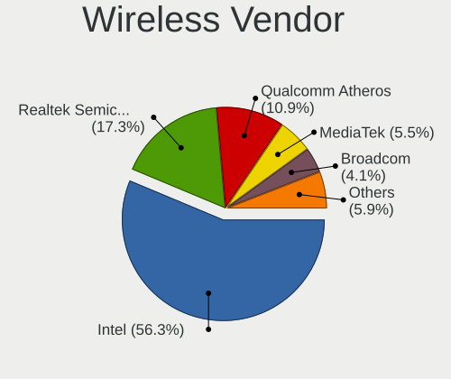

| Vendor                          | Notebooks | Percent |
|---------------------------------|-----------|---------|
| Intel                           | 733       | 56.3%   |
| Realtek Semiconductor           | 225       | 17.28%  |
| Qualcomm Atheros                | 142       | 10.91%  |
| MediaTek                        | 72        | 5.53%   |
| Broadcom                        | 53        | 4.07%   |
| Broadcom Limited                | 19        | 1.46%   |
| Qualcomm                        | 18        | 1.38%   |
| Quectel Wireless Solutions      | 10        | 0.77%   |
| Ralink                          | 7         | 0.54%   |
| Ralink Technology               | 4         | 0.31%   |
| Xiaomi                          | 3         | 0.23%   |
| TP-Link                         | 3         | 0.23%   |
| Microsoft                       | 3         | 0.23%   |
| Sierra Wireless                 | 2         | 0.15%   |
| Dell                            | 2         | 0.15%   |
| Unknown                         | 2         | 0.15%   |
| Wilocity                        | 1         | 0.08%   |
| Tenda                           | 1         | 0.08%   |
| Qualcomm Atheros Communications | 1         | 0.08%   |
| Hewlett-Packard                 | 1         | 0.08%   |

Wireless Model
--------------

Wireless models

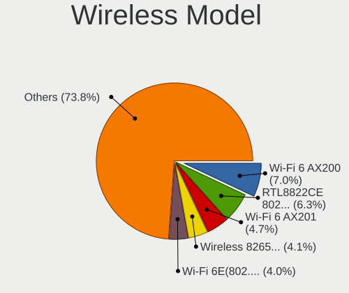

| Model                                                                | Notebooks | Percent |
|----------------------------------------------------------------------|-----------|---------|
| Intel Wi-Fi 6 AX200                                                  | 92        | 7.02%   |
| Realtek RTL8822CE 802.11ac PCIe Wireless Network Adapter             | 83        | 6.34%   |
| Intel Wi-Fi 6 AX201                                                  | 61        | 4.66%   |
| Intel Wireless 8265 / 8275                                           | 54        | 4.12%   |
| Intel Wi-Fi 6E(802.11ax) AX210/AX1675* 2x2 [Typhoon Peak]            | 53        | 4.05%   |
| Intel Alder Lake-P PCH CNVi WiFi                                     | 47        | 3.59%   |
| Qualcomm Atheros QCA9377 802.11ac Wireless Network Adapter           | 38        | 2.9%    |
| Intel Wireless 7265                                                  | 34        | 2.6%    |
| Intel Comet Lake PCH-LP CNVi WiFi                                    | 32        | 2.44%   |
| Intel Cannon Lake PCH CNVi WiFi                                      | 32        | 2.44%   |
| MediaTek MT7921 802.11ax PCIe Wireless Network Adapter [Filogic 330] | 28        | 2.14%   |
| Qualcomm Atheros QCA6174 802.11ac Wireless Network Adapter           | 27        | 2.06%   |
| Realtek RTL8852BE PCIe 802.11ax Wireless Network Controller          | 26        | 1.98%   |
| Realtek RTL8821CE 802.11ac PCIe Wireless Network Adapter             | 26        | 1.98%   |
| Intel Cannon Point-LP CNVi [Wireless-AC]                             | 25        | 1.91%   |
| Intel Raptor Lake PCH CNVi WiFi                                      | 23        | 1.76%   |
| Intel Wireless 7260                                                  | 22        | 1.68%   |
| Intel Wireless 3165                                                  | 22        | 1.68%   |
| Intel Comet Lake PCH CNVi WiFi                                       | 22        | 1.68%   |
| Intel Centrino Advanced-N 6205 [Taylor Peak]                         | 21        | 1.6%    |
| MediaTek MT7922 802.11ax PCI Express Wireless Network Adapter        | 20        | 1.53%   |
| Intel Meteor Lake PCH CNVi WiFi                                      | 20        | 1.53%   |
| Intel 700 Series Chipset CNVi WiFi                                   | 20        | 1.53%   |
| Realtek RTL8852AE 802.11ax PCIe Wireless Network Adapter             | 19        | 1.45%   |
| Qualcomm QCNFA765 Wireless Network Adapter                           | 18        | 1.37%   |
| Intel Tiger Lake PCH CNVi WiFi                                       | 18        | 1.37%   |
| Qualcomm Atheros QCA9565 / AR9565 Wireless Network Adapter           | 17        | 1.3%    |
| Qualcomm Atheros AR9485 Wireless Network Adapter                     | 17        | 1.3%    |
| Intel Wireless 8260                                                  | 17        | 1.3%    |
| Realtek RTL8723BE PCIe Wireless Network Adapter                      | 16        | 1.22%   |
| Intel Wi-Fi 5(802.11ac) Wireless-AC 9x6x [Thunder Peak]              | 16        | 1.22%   |
| Realtek RTL8822BE 802.11a/b/g/n/ac WiFi adapter                      | 14        | 1.07%   |
| Qualcomm Atheros AR9285 Wireless Network Adapter (PCI-Express)       | 14        | 1.07%   |
| Intel Wireless 3160                                                  | 13        | 0.99%   |
| MediaTek MT7921K (RZ608) Wi-Fi 6E 80MHz                              | 11        | 0.84%   |
| Realtek RTL8188CE 802.11b/g/n WiFi Adapter                           | 10        | 0.76%   |
| Qualcomm Atheros AR9462 Wireless Network Adapter                     | 10        | 0.76%   |
| Intel Dual Band Wireless-AC 3165 Plus Bluetooth                      | 10        | 0.76%   |
| Broadcom BCM43142 802.11b/g/n                                        | 10        | 0.76%   |
| Realtek RTL8188EUS 802.11n Wireless Network Adapter                  | 8         | 0.61%   |

Ethernet Vendor
---------------

Ethernet vendors

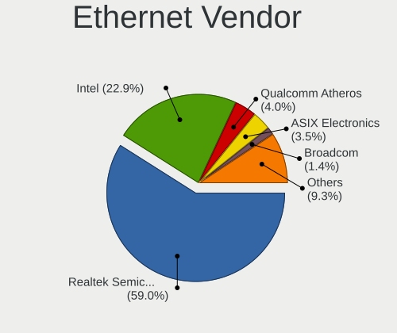

| Vendor                                 | Notebooks | Percent |
|----------------------------------------|-----------|---------|
| Realtek Semiconductor                  | 597       | 58.99%  |
| Intel                                  | 232       | 22.92%  |
| Qualcomm Atheros                       | 40        | 3.95%   |
| ASIX Electronics                       | 35        | 3.46%   |
| Broadcom                               | 14        | 1.38%   |
| Suzhou Motorcomm Electronic Technology | 13        | 1.28%   |
| Huawei Technologies                    | 13        | 1.28%   |
| Xiaomi                                 | 12        | 1.19%   |
| MediaTek                               | 9         | 0.89%   |
| Broadcom Limited                       | 9         | 0.89%   |
| OPPO Electronics                       | 8         | 0.79%   |
| Marvell Technology Group               | 4         | 0.4%    |
| Motorcomm Microelectronics.            | 3         | 0.3%    |
| Lenovo                                 | 3         | 0.3%    |
| ICS Advent                             | 3         | 0.3%    |
| Silicon Integrated Systems [SiS]       | 2         | 0.2%    |
| Qualcomm                               | 2         | 0.2%    |
| Nvidia                                 | 2         | 0.2%    |
| DisplayLink                            | 2         | 0.2%    |
| vivo                                   | 1         | 0.1%    |
| Samsung Electronics                    | 1         | 0.1%    |
| Qualcomm Technologies                  | 1         | 0.1%    |
| QinHeng Electronics                    | 1         | 0.1%    |
| OnePlus Technology (Shenzhen)          | 1         | 0.1%    |
| JMicron Technology                     | 1         | 0.1%    |
| Attansic Technology                    | 1         | 0.1%    |
| Apple                                  | 1         | 0.1%    |
| Android                                | 1         | 0.1%    |

Ethernet Model
--------------

Ethernet models

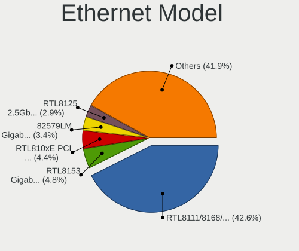

| Model                                                                  | Notebooks | Percent |
|------------------------------------------------------------------------|-----------|---------|
| Realtek RTL8111/8168/8211/8411 PCI Express Gigabit Ethernet Controller | 450       | 42.61%  |
| Realtek RTL8153 Gigabit Ethernet Adapter                               | 51        | 4.83%   |
| Realtek RTL810xE PCI Express Fast Ethernet controller                  | 46        | 4.36%   |
| Intel 82579LM Gigabit Network Connection (Lewisville)                  | 36        | 3.41%   |
| Realtek RTL8125 2.5GbE Controller                                      | 31        | 2.94%   |
| Intel Alder Lake-P PCH CNVi WiFi                                       | 28        | 2.65%   |
| ASIX AX88179 Gigabit Ethernet                                          | 27        | 2.56%   |
| Intel Ethernet Connection (16) I219-V                                  | 15        | 1.42%   |
| Intel Ethernet Connection (4) I219-V                                   | 14        | 1.33%   |
| Suzhou Motorcomm Electronic YT6801 Gigabit Ethernet Controller         | 13        | 1.23%   |
| Realtek RTL8152 Fast Ethernet Adapter                                  | 13        | 1.23%   |
| Huawei FOA-LX9                                                         | 13        | 1.23%   |
| Intel 82567LM Gigabit Network Connection                               | 11        | 1.04%   |
| Intel Ethernet Connection (4) I219-LM                                  | 10        | 0.95%   |
| Intel Ethernet Connection (18) I219-LM                                 | 10        | 0.95%   |
| Intel Ethernet Connection (13) I219-V                                  | 10        | 0.95%   |
| Qualcomm Atheros AR8161 Gigabit Ethernet                               | 9         | 0.85%   |
| MediaTek MT7922 802.11ax PCI Express Wireless Network Adapter          | 9         | 0.85%   |
| Realtek Killer E2600 GbE Controller                                    | 8         | 0.76%   |
| Xiaomi Mi/Redmi series (RNDIS)                                         | 7         | 0.66%   |
| Realtek USB 10/100/1G/2.5 LAN                                          | 7         | 0.66%   |
| Realtek RTL8852BE PCIe 802.11ax Wireless Network Controller            | 7         | 0.66%   |
| Intel Ethernet Connection I218-LM                                      | 7         | 0.66%   |
| Intel Ethernet Connection (10) I219-V                                  | 7         | 0.66%   |
| ASIX AX88772B                                                          | 7         | 0.66%   |
| Intel Ethernet Connection I217-LM                                      | 6         | 0.57%   |
| Intel Ethernet Connection (3) I218-LM                                  | 6         | 0.57%   |
| Xiaomi Mi/Redmi series (RNDIS + ADB)                                   | 5         | 0.47%   |
| Qualcomm Atheros Killer E2500 Gigabit Ethernet Controller              | 5         | 0.47%   |
| Qualcomm Atheros AR8151 v2.0 Gigabit Ethernet                          | 5         | 0.47%   |
| OPPO Ace 3V                                                            | 5         | 0.47%   |
| Intel Ethernet Controller I225-V                                       | 5         | 0.47%   |
| Intel Ethernet Connection (7) I219-LM                                  | 5         | 0.47%   |
| Intel Ethernet Connection (6) I219-V                                   | 5         | 0.47%   |
| Intel Ethernet Connection (24) I219-V                                  | 5         | 0.47%   |
| Realtek RTL8852CE PCIe 802.11ax Wireless Network Controller            | 4         | 0.38%   |
| Qualcomm Atheros QCA8171 Gigabit Ethernet                              | 4         | 0.38%   |
| Qualcomm Atheros Killer E2400 Gigabit Ethernet Controller              | 4         | 0.38%   |
| Qualcomm Atheros AR8152 v2.0 Fast Ethernet                             | 4         | 0.38%   |
| Intel Ethernet Connection I219-V                                       | 4         | 0.38%   |

Net Controller Kind
-------------------

Ethernet, WiFi or modem

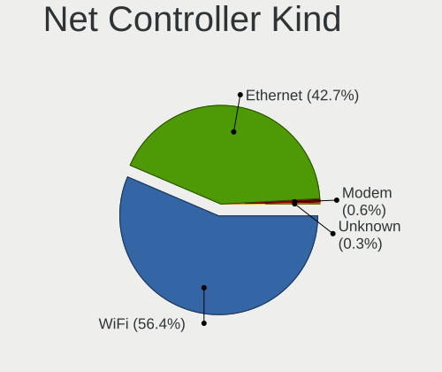

| Kind     | Notebooks | Percent |
|----------|-----------|---------|
| WiFi     | 1256      | 56.42%  |
| Ethernet | 950       | 42.68%  |
| Modem    | 13        | 0.58%   |
| Unknown  | 7         | 0.31%   |

Used Controller
---------------

Currently used network controller

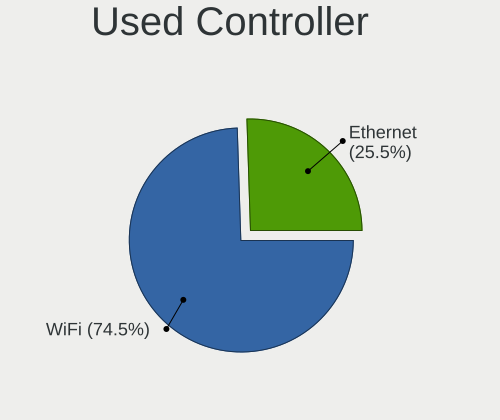

| Kind     | Notebooks | Percent |
|----------|-----------|---------|
| WiFi     | 1028      | 74.49%  |
| Ethernet | 352       | 25.51%  |

NICs
----

Total network controllers on board

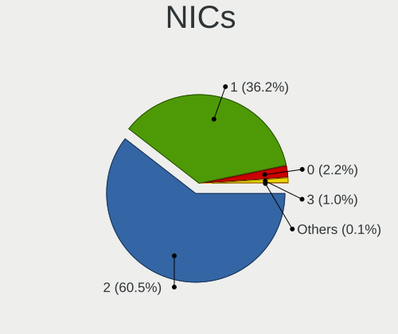

| Total | Notebooks | Percent |
|-------|-----------|---------|
| 2     | 815       | 60.5%   |
| 1     | 488       | 36.23%  |
| 0     | 29        | 2.15%   |
| 3     | 13        | 0.97%   |
| 6     | 1         | 0.07%   |
| 4     | 1         | 0.07%   |

IPv6
----

IPv6 vs IPv4

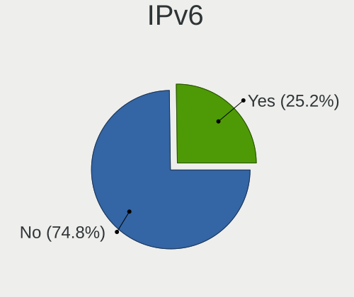

| Used | Notebooks | Percent |
|------|-----------|---------|
| No   | 1035      | 74.78%  |
| Yes  | 349       | 25.22%  |

Bluetooth
---------

Bluetooth Vendor
----------------

Controller vendors

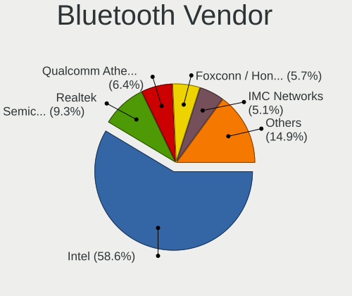

| Vendor                          | Notebooks | Percent |
|---------------------------------|-----------|---------|
| Intel                           | 683       | 58.58%  |
| Realtek Semiconductor           | 108       | 9.26%   |
| Qualcomm Atheros Communications | 75        | 6.43%   |
| Foxconn / Hon Hai               | 66        | 5.66%   |
| IMC Networks                    | 60        | 5.15%   |
| Broadcom                        | 38        | 3.26%   |
| Realtek                         | 32        | 2.74%   |
| Apple                           | 20        | 1.72%   |
| MediaTek                        | 18        | 1.54%   |
| Lite-On Technology              | 16        | 1.37%   |
| Opticis                         | 10        | 0.86%   |
| Foxconn International           | 7         | 0.6%    |
| Dell                            | 7         | 0.6%    |
| Cambridge Silicon Radio         | 7         | 0.6%    |
| Hewlett-Packard                 | 5         | 0.43%   |
| Ralink                          | 4         | 0.34%   |
| USI                             | 2         | 0.17%   |
| Taiyo Yuden                     | 2         | 0.17%   |
| Alps Electric                   | 2         | 0.17%   |
| Toshiba                         | 1         | 0.09%   |
| SINO WEALTH                     | 1         | 0.09%   |
| ASUSTek Computer                | 1         | 0.09%   |
| Unknown                         | 1         | 0.09%   |

Bluetooth Model
---------------

Controller models

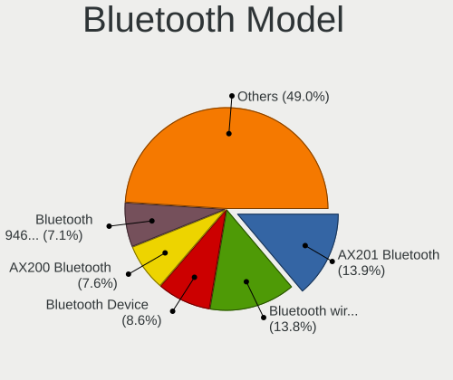

| Model                                               | Notebooks | Percent |
|-----------------------------------------------------|-----------|---------|
| Intel AX201 Bluetooth                               | 162       | 13.87%  |
| Intel Bluetooth wireless interface                  | 161       | 13.78%  |
| Intel Bluetooth Device                              | 101       | 8.65%   |
| Intel AX200 Bluetooth                               | 89        | 7.62%   |
| Intel Bluetooth 9460/9560 Jefferson Peak (JfP)      | 83        | 7.11%   |
| Realtek Bluetooth Radio                             | 79        | 6.76%   |
| Intel AX210 Bluetooth                               | 50        | 4.28%   |
| Qualcomm Atheros  Bluetooth Device                  | 46        | 3.94%   |
| IMC Networks Bluetooth Radio                        | 39        | 3.34%   |
| Realtek Bluetooth Radio                             | 32        | 2.74%   |
| Foxconn / Hon Hai Wireless_Device                   | 21        | 1.8%    |
| Foxconn / Hon Hai Bluetooth Device                  | 20        | 1.71%   |
| MediaTek Wireless_Device                            | 18        | 1.54%   |
| Foxconn / Hon Hai MediaTek Bluetooth Adapter        | 17        | 1.46%   |
| Intel Wireless-AC 9260 Bluetooth Adapter            | 15        | 1.28%   |
| IMC Networks Wireless_Device                        | 15        | 1.28%   |
| Apple Bluetooth Host Controller                     | 15        | 1.28%   |
| Qualcomm Atheros QCA61x4 Bluetooth 4.0              | 13        | 1.11%   |
| Broadcom BCM2045B (BDC-2.1)                         | 13        | 1.11%   |
| Realtek RTL8723B Bluetooth                          | 12        | 1.03%   |
| Qualcomm Atheros AR3012 Bluetooth 4.0               | 12        | 1.03%   |
| Opticis Bluetooth Radio                             | 10        | 0.86%   |
| Intel Centrino Bluetooth Wireless Transceiver       | 10        | 0.86%   |
| Realtek RTL8822BE Bluetooth 4.2 Adapter             | 8         | 0.68%   |
| Realtek  Bluetooth 4.2 Adapter                      | 8         | 0.68%   |
| Lite-On Bluetooth Device                            | 7         | 0.6%    |
| Foxconn International BCM43142A0 Bluetooth module   | 7         | 0.6%    |
| Cambridge Silicon Radio Bluetooth Dongle (HCI mode) | 7         | 0.6%    |
| Intel Centrino Advanced-N 6230 Bluetooth adapter    | 6         | 0.51%   |
| Broadcom BCM20702 Bluetooth 4.0 [ThinkPad]          | 6         | 0.51%   |
| Broadcom BCM2045B (BDC-2.1) [Bluetooth Controller]  | 6         | 0.51%   |
| IMC Networks Bluetooth Device                       | 5         | 0.43%   |
| Ralink RT3290 Bluetooth                             | 4         | 0.34%   |
| Intel Wireless-AC 3168 Bluetooth                    | 4         | 0.34%   |
| Apple Bluetooth USB Host Controller                 | 4         | 0.34%   |
| Intel Bluetooth                                     | 3         | 0.26%   |
| HP Broadcom 2070 Bluetooth Combo                    | 3         | 0.26%   |
| Foxconn / Hon Hai Broadcom BCM20702A1 Bluetooth     | 3         | 0.26%   |
| Dell BCM20702A0 Bluetooth Module                    | 3         | 0.26%   |
| USI Bluetooth Device                                | 2         | 0.17%   |

Sound
-----

Sound Vendor
------------

Sound card vendors

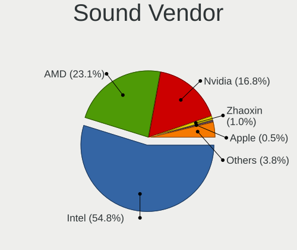

| Vendor                                       | Notebooks | Percent |
|----------------------------------------------|-----------|---------|
| Intel                                        | 917       | 54.78%  |
| AMD                                          | 387       | 23.12%  |
| Nvidia                                       | 282       | 16.85%  |
| Zhaoxin                                      | 17        | 1.02%   |
| Apple                                        | 8         | 0.48%   |
| Loongson Technology                          | 6         | 0.36%   |
| Huawei Technologies                          | 5         | 0.3%    |
| C-Media Electronics                          | 4         | 0.24%   |
| Yamaha                                       | 3         | 0.18%   |
| Walmart                                      | 3         | 0.18%   |
| Generalplus Technology                       | 3         | 0.18%   |
| Zoran Co. Personal Media Division (Nogatech) | 2         | 0.12%   |
| Thesycon Systemsoftware & Consulting         | 2         | 0.12%   |
| Silicon Integrated Systems [SiS]             | 2         | 0.12%   |
| Realtek Semiconductor                        | 2         | 0.12%   |
| HECATE G4 TE GAMING HEADSET                  | 2         | 0.12%   |
| ASUSTek Computer                             | 2         | 0.12%   |
| XMOS                                         | 1         | 0.06%   |
| USB2.0                                       | 1         | 0.06%   |
| TTGK Technology                              | 1         | 0.06%   |
| Texas Instruments                            | 1         | 0.06%   |
| Synaptics                                    | 1         | 0.06%   |
| Specialix                                    | 1         | 0.06%   |
| SoundPlus Technology                         | 1         | 0.06%   |
| Sony                                         | 1         | 0.06%   |
| SonicakeAudio                                | 1         | 0.06%   |
| Shenzhen Rapoo Technology                    | 1         | 0.06%   |
| Samsung Electronics                          | 1         | 0.06%   |
| Razer USA                                    | 1         | 0.06%   |
| OPPO Electronics                             | 1         | 0.06%   |
| MOONDROP                                     | 1         | 0.06%   |
| Logitech                                     | 1         | 0.06%   |
| Lenovo                                       | 1         | 0.06%   |
| KTMicro                                      | 1         | 0.06%   |
| JMTek                                        | 1         | 0.06%   |
| Jieli Technology                             | 1         | 0.06%   |
| Focusrite-Novation                           | 1         | 0.06%   |
| EDIFIER                                      | 1         | 0.06%   |
| Conexant Systems                             | 1         | 0.06%   |
| Chengdu Haiguang IC Design                   | 1         | 0.06%   |

Sound Model
-----------

Sound card models

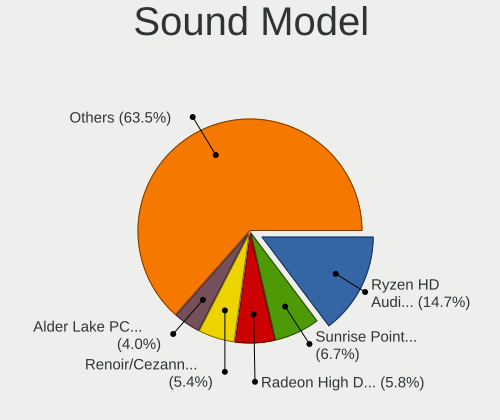

| Model                                                                                     | Notebooks | Percent |
|-------------------------------------------------------------------------------------------|-----------|---------|
| AMD Ryzen HD Audio Controller                                                             | 308       | 14.74%  |
| Intel Sunrise Point-LP HD Audio                                                           | 139       | 6.65%   |
| AMD Radeon High Definition Audio Controller                                               | 121       | 5.79%   |
| AMD Renoir/Cezanne HDMI/DP Audio Controller                                               | 112       | 5.36%   |
| Intel Alder Lake PCH-P High Definition Audio Controller                                   | 83        | 3.97%   |
| Intel Tiger Lake-LP Smart Sound Technology Audio Controller                               | 77        | 3.69%   |
| Intel 7 Series/C216 Chipset Family High Definition Audio Controller                       | 70        | 3.35%   |
| Intel Cannon Lake PCH cAVS                                                                | 60        | 2.87%   |
| AMD Raven/Raven2/Fenghuang HDMI/DP Audio Controller                                       | 52        | 2.49%   |
| Nvidia GA106 High Definition Audio Controller                                             | 48        | 2.3%    |
| Intel 6 Series/C200 Series Chipset Family High Definition Audio Controller                | 47        | 2.25%   |
| Intel 8 Series HD Audio Controller                                                        | 41        | 1.96%   |
| Intel Haswell-ULT HD Audio Controller                                                     | 40        | 1.91%   |
| Intel Comet Lake PCH-LP cAVS                                                              | 37        | 1.77%   |
| Intel Cannon Point-LP High Definition Audio Controller                                    | 35        | 1.68%   |
| Nvidia AD107 High Definition Audio Controller                                             | 34        | 1.63%   |
| Intel 8 Series/C220 Series Chipset High Definition Audio Controller                       | 34        | 1.63%   |
| Intel Broadwell-U Audio Controller                                                        | 30        | 1.44%   |
| Nvidia TU107 GeForce GTX 1650 High Definition Audio Controller                            | 29        | 1.39%   |
| Intel Wildcat Point-LP High Definition Audio Controller                                   | 29        | 1.39%   |
| Intel Xeon E3-1200 v3/4th Gen Core Processor HD Audio Controller                          | 27        | 1.29%   |
| Nvidia TU106 High Definition Audio Controller                                             | 26        | 1.24%   |
| Intel Raptor Lake-P/U/H cAVS                                                              | 26        | 1.24%   |
| Intel Comet Lake PCH cAVS                                                                 | 26        | 1.24%   |
| Intel Raptor Lake High Definition Audio Controller                                        | 23        | 1.1%    |
| Intel Tiger Lake-H HD Audio Controller                                                    | 21        | 1.01%   |
| Intel 82801I (ICH9 Family) HD Audio Controller                                            | 21        | 1.01%   |
| Nvidia GA107 High Definition Audio Controller                                             | 20        | 0.96%   |
| Intel Meteor Lake-P HD Audio Controller                                                   | 20        | 0.96%   |
| AMD FCH Azalia Controller                                                                 | 20        | 0.96%   |
| Intel 100 Series/C230 Series Chipset Family HD Audio Controller                           | 19        | 0.91%   |
| Intel CM238 HD Audio Controller                                                           | 18        | 0.86%   |
| Zhaoxin ZX-100/KX-5000/KX-6000/KX-6000G/KH-40000/KX-7000 High Definition Audio Controller | 17        | 0.81%   |
| Nvidia GP107GL High Definition Audio Controller                                           | 16        | 0.77%   |
| Zhaoxin ZX-E High Definition Audio Controller                                             | 14        | 0.67%   |
| Nvidia AD106M High Definition Audio Controller                                            | 14        | 0.67%   |
| Nvidia GA104 High Definition Audio Controller                                             | 13        | 0.62%   |
| Nvidia GF108 High Definition Audio Controller                                             | 12        | 0.57%   |
| Intel 5 Series/3400 Series Chipset High Definition Audio                                  | 11        | 0.53%   |
| AMD Kabini HDMI/DP Audio                                                                  | 11        | 0.53%   |

Memory
------

Memory Vendor
-------------

Memory module vendors

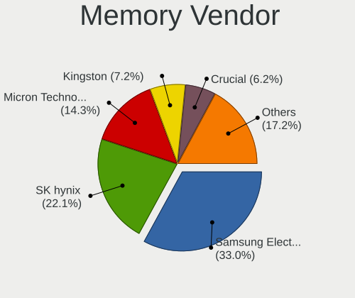

| Vendor                     | Notebooks | Percent |
|----------------------------|-----------|---------|
| Samsung Electronics        | 355       | 32.96%  |
| SK hynix                   | 238       | 22.1%   |
| Micron Technology          | 154       | 14.3%   |
| Kingston                   | 78        | 7.24%   |
| Crucial                    | 67        | 6.22%   |
| Unknown                    | 45        | 4.18%   |
| Ramaxel Technology         | 28        | 2.6%    |
| Unknown                    | 17        | 1.58%   |
| Elpida                     | 14        | 1.3%    |
| A-DATA Technology          | 14        | 1.3%    |
| Unknown (ABCD)             | 9         | 0.84%   |
| Nanya Technology           | 6         | 0.56%   |
| Transcend                  | 5         | 0.46%   |
| Lenovo                     | 5         | 0.46%   |
| Unknown (08C8)             | 4         | 0.37%   |
| Unknown (08B5)             | 3         | 0.28%   |
| SK_Hynix                   | 3         | 0.28%   |
| Shenzhen WODPOSIT          | 3         | 0.28%   |
| KINGBANK                   | 3         | 0.28%   |
| UnilC                      | 2         | 0.19%   |
| Team                       | 2         | 0.19%   |
| Corsair                    | 2         | 0.19%   |
| Apacer                     | 2         | 0.19%   |
| <Unknown>                  | 2         | 0.19%   |
| Xi'an UniIC Semiconductors | 1         | 0.09%   |
| Unknown (0x0B15)           | 1         | 0.09%   |
| Unknown (0BD0)             | 1         | 0.09%   |
| UniIC                      | 1         | 0.09%   |
| SHARETRONIC                | 1         | 0.09%   |
| MTASE                      | 1         | 0.09%   |
| Lexar Co Limited           | 1         | 0.09%   |
| KLEVV                      | 1         | 0.09%   |
| Kimtigo                    | 1         | 0.09%   |
| Juhor                      | 1         | 0.09%   |
| Goldkey                    | 1         | 0.09%   |
| Gold Key                   | 1         | 0.09%   |
| G.Skill                    | 1         | 0.09%   |
| Foresee                    | 1         | 0.09%   |
| Essencore                  | 1         | 0.09%   |
| Asgard                     | 1         | 0.09%   |

Memory Model
------------

Memory module models

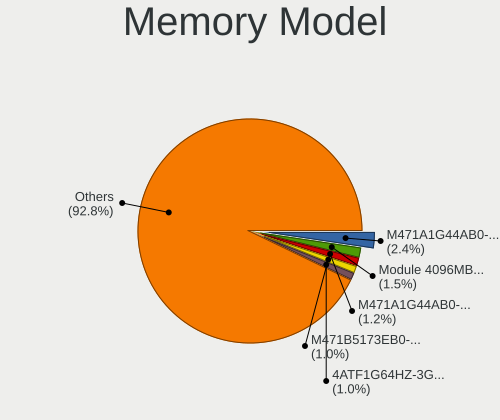

| Model                                                            | Notebooks | Percent |
|------------------------------------------------------------------|-----------|---------|
| Samsung RAM M471A1G44AB0-CWE 8GB Row Of Chips DDR4 3200MT/s      | 27        | 2.36%   |
| Unknown                                                          | 17        | 1.48%   |
| Samsung RAM M471A1G44AB0-CWE 8GiB SODIMM DDR4 3200MT/s           | 14        | 1.22%   |
| Samsung RAM M471B5173EB0-YK0 4GB SODIMM DDR3 1600MT/s            | 12        | 1.05%   |
| Micron RAM 4ATF1G64HZ-3G2E1 8GB Row Of Chips DDR4 3200MT/s       | 12        | 1.05%   |
| SK hynix RAM HMT451S6BFR8A-PB 4GB SODIMM DDR3 1600MT/s           | 11        | 0.96%   |
| SK hynix RAM HMAA1GS6CMR6N-VK 8GB Row Of Chips DDR4 2667MT/s     | 11        | 0.96%   |
| Samsung RAM M471A1G44AB0-CTD 8GB SODIMM DDR4 2667MT/s            | 11        | 0.96%   |
| Samsung RAM M471A1K43EB1-CWE 8GB SODIMM DDR4 3200MT/s            | 10        | 0.87%   |
| Samsung RAM M471A1K43DB1-CTD 8GB SODIMM DDR4 2667MT/s            | 10        | 0.87%   |
| SK hynix RAM HMT351S6CFR8C-PB 4GB SODIMM DDR3 1600MT/s           | 9         | 0.79%   |
| Samsung RAM M471A1K43DB1-CWE 8GB SODIMM DDR4 3200MT/s            | 9         | 0.79%   |
| Samsung RAM M425R1GB4BB0-CQKOL 8GB SODIMM DDR5 4800MT/s          | 9         | 0.79%   |
| Micron RAM MTC4C10163S1SC48BA1 8GB SODIMM DDR5 4800MT/s          | 9         | 0.79%   |
| Unknown (ABCD) RAM 123456789012345678 2GB SODIMM LPDDR4 2400MT/s | 8         | 0.7%    |
| SK hynix RAM HMA81GS6AFR8N-UH 8GB SODIMM DDR4 2667MT/s           | 8         | 0.7%    |
| Samsung RAM M471A1K43CB1-CRC 8GB SODIMM DDR4 8400MT/s            | 8         | 0.7%    |
| Samsung RAM M425R1GB4BB0-CQKOD 8GB SODIMM DDR5 4800MT/s          | 8         | 0.7%    |
| Unknown RAM Module 2GB SODIMM DDR3 1333MT/s                      | 7         | 0.61%   |
| SK hynix RAM HMA81GS6DJR8N-XN 8GB SODIMM DDR4 3200MT/s           | 7         | 0.61%   |
| SK hynix RAM H9JCNNNCP3MLYR-N6E 2GB Row Of Chips LPDDR5 6400MT/s | 7         | 0.61%   |
| SK hynix RAM H58G66BK7BX067 8GB Row Of Chips LPDDR5 7500MT/s     | 7         | 0.61%   |
| Samsung RAM K4UBE3D4AA-MGCR 2GB Row Of Chips LPDDR4 4267MT/s     | 7         | 0.61%   |
| Micron RAM 53E1G32D2NP-046 2GB Row Of Chips LPDDR4 4267MT/s      | 7         | 0.61%   |
| SK hynix RAM HMAA1GS6CMR6N-XN 8GB Row Of Chips DDR4 3200MT/s     | 6         | 0.52%   |
| SK hynix RAM HMAA1GS6CJR6N-XN 8GB SODIMM DDR4 3200MT/s           | 6         | 0.52%   |
| SK hynix RAM HMAA1GS6CJR6N-XN 8GB Row Of Chips DDR4 3200MT/s     | 6         | 0.52%   |
| SK hynix RAM HMA851S6CJR6N-VK 4GB SODIMM DDR4 2667MT/s           | 6         | 0.52%   |
| SK hynix RAM HMA851S6CJR6N-VK 4GB Row Of Chips DDR4 2667MT/s     | 6         | 0.52%   |
| SK hynix RAM HMA41GS6AFR8N-TF 8GB SODIMM DDR4 2667MT/s           | 6         | 0.52%   |
| Samsung RAM M471B5173DB0-YK0 4GB SODIMM DDR3 1600MT/s            | 6         | 0.52%   |
| Samsung RAM M471A5244CB0-CRC 4GB SODIMM DDR4 2667MT/s            | 6         | 0.52%   |
| Samsung RAM M471A1K43BB1-CRC 8GB SODIMM DDR4 2667MT/s            | 6         | 0.52%   |
| Samsung RAM M471A1G44AB0-CTD 8GB Row Of Chips DDR4 2667MT/s      | 6         | 0.52%   |
| Micron RAM 4ATF1G64HZ-3G2E1 8GB SODIMM DDR4 3200MT/s             | 6         | 0.52%   |
| Kingston RAM LV32D4S2S8HD-8 8GB SODIMM DDR4 3200MT/s             | 6         | 0.52%   |
| Unknown RAM Module 2GB SODIMM DDR2 667MT/s                       | 5         | 0.44%   |
| SK hynix RAM HMCG78AGBSA095N 16GB SODIMM DDR5 5600MT/s           | 5         | 0.44%   |
| SK hynix RAM HMCG66AGBSA092N 8GB SODIMM DDR5 5600MT/s            | 5         | 0.44%   |
| SK hynix RAM HMAB2GS6AMR6N-XN 16GB SODIMM DDR4 3200MT/s          | 5         | 0.44%   |

Memory Kind
-----------

Memory module kinds

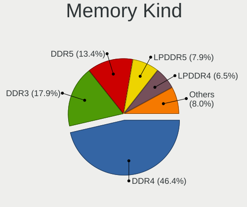

| Kind    | Notebooks | Percent |
|---------|-----------|---------|
| DDR4    | 437       | 46.39%  |
| DDR3    | 169       | 17.94%  |
| DDR5    | 126       | 13.38%  |
| LPDDR5  | 74        | 7.86%   |
| LPDDR4  | 61        | 6.48%   |
| LPDDR3  | 48        | 5.1%    |
| DDR2    | 11        | 1.17%   |
| SDRAM   | 10        | 1.06%   |
| Unknown | 5         | 0.53%   |
| DDR     | 1         | 0.11%   |

Memory Form Factor
------------------

Physical design of the memory module

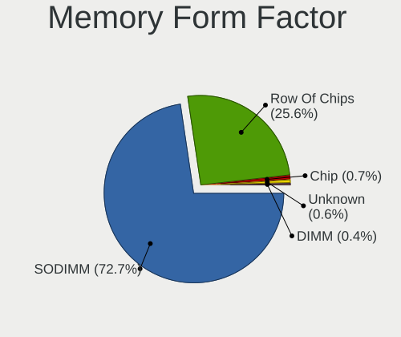

| Name         | Notebooks | Percent |
|--------------|-----------|---------|
| SODIMM       | 688       | 72.65%  |
| Row Of Chips | 242       | 25.55%  |
| Chip         | 7         | 0.74%   |
| Unknown      | 6         | 0.63%   |
| DIMM         | 4         | 0.42%   |

Memory Size
-----------

Memory module size

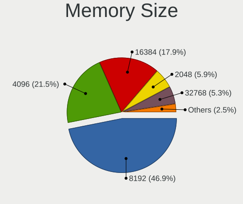

| Size  | Notebooks | Percent |
|-------|-----------|---------|
| 8192  | 473       | 46.88%  |
| 4096  | 217       | 21.51%  |
| 16384 | 181       | 17.94%  |
| 2048  | 60        | 5.95%   |
| 32768 | 53        | 5.25%   |
| 1024  | 10        | 0.99%   |
| 49152 | 6         | 0.59%   |
| 12288 | 5         | 0.5%    |
| 3072  | 2         | 0.2%    |
| 24576 | 1         | 0.1%    |
| 512   | 1         | 0.1%    |

Memory Speed
------------

Memory module speed

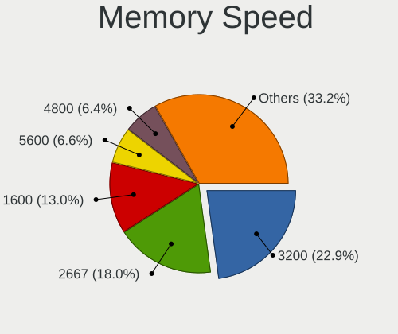

| Speed   | Notebooks | Percent |
|---------|-----------|---------|
| 3200    | 226       | 22.87%  |
| 2667    | 178       | 18.02%  |
| 1600    | 128       | 12.96%  |
| 5600    | 65        | 6.58%   |
| 4800    | 63        | 6.38%   |
| 6400    | 44        | 4.45%   |
| 2400    | 44        | 4.45%   |
| 2133    | 43        | 4.35%   |
| 4267    | 39        | 3.95%   |
| 1867    | 22        | 2.23%   |
| 1333    | 21        | 2.13%   |
| 7500    | 19        | 1.92%   |
| 8533    | 11        | 1.11%   |
| 8400    | 11        | 1.11%   |
| 1067    | 10        | 1.01%   |
| 1334    | 9         | 0.91%   |
| 2666    | 8         | 0.81%   |
| 667     | 6         | 0.61%   |
| 4266    | 5         | 0.51%   |
| 4199    | 5         | 0.51%   |
| 3266    | 5         | 0.51%   |
| 3733    | 4         | 0.4%    |
| 2048    | 4         | 0.4%    |
| 1066    | 4         | 0.4%    |
| Unknown | 3         | 0.3%    |
| 7467    | 2         | 0.2%    |
| 400     | 2         | 0.2%    |
| 266     | 2         | 0.2%    |
| 6000    | 1         | 0.1%    |
| 5200    | 1         | 0.1%    |
| 3000    | 1         | 0.1%    |
| 2933    | 1         | 0.1%    |
| 800     | 1         | 0.1%    |

Printers & scanners
-------------------

Printer Vendor
--------------

Printer device vendors

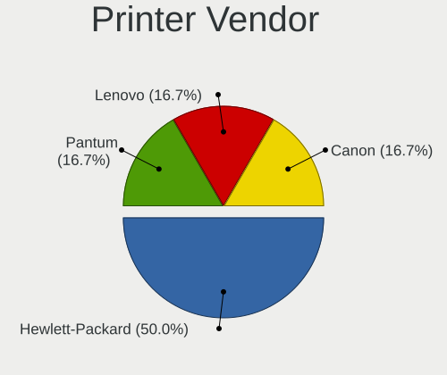

| Vendor          | Notebooks | Percent |
|-----------------|-----------|---------|
| Hewlett-Packard | 3         | 50%     |
| Pantum          | 1         | 16.67%  |
| Lenovo          | 1         | 16.67%  |
| Canon           | 1         | 16.67%  |

Printer Model
-------------

Printer device models

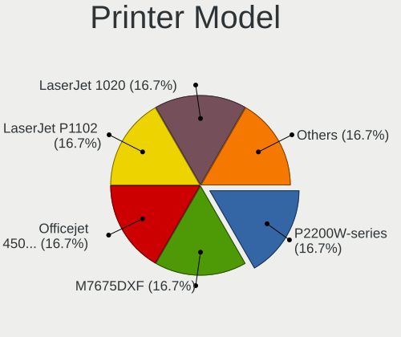

| Model                     | Notebooks | Percent |
|---------------------------|-----------|---------|
| Pantum P2200W-series      | 1         | 16.67%  |
| Lenovo M7675DXF           | 1         | 16.67%  |
| HP Officejet 4500 G510g-m | 1         | 16.67%  |
| HP LaserJet P1102         | 1         | 16.67%  |
| HP LaserJet 1020          | 1         | 16.67%  |
| Canon iP1100 series       | 1         | 16.67%  |

Scanner Vendor
--------------

Scanner device vendors

Zero info for selected period =(

Scanner Model
-------------

Scanner device models

Zero info for selected period =(

Camera
------

Camera Vendor
-------------

Camera device vendors

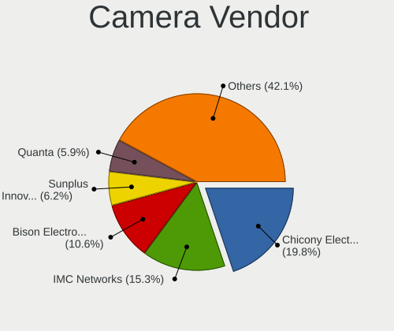

| Vendor                                 | Notebooks | Percent |
|----------------------------------------|-----------|---------|
| Chicony Electronics                    | 227       | 19.84%  |
| IMC Networks                           | 175       | 15.3%   |
| Bison Electronics                      | 121       | 10.58%  |
| Sunplus Innovation Technology          | 71        | 6.21%   |
| Quanta                                 | 68        | 5.94%   |
| Microdia                               | 68        | 5.94%   |
| Luxvisions Innotech Limited            | 68        | 5.94%   |
| Realtek Semiconductor                  | 58        | 5.07%   |
| Cheng Uei Precision Industry (Foxlink) | 41        | 3.58%   |
| Syntek                                 | 39        | 3.41%   |
| SunplusIT                              | 34        | 2.97%   |
| Lite-On Technology                     | 22        | 1.92%   |
| Suyin                                  | 20        | 1.75%   |
| Apple                                  | 16        | 1.4%    |
| Alcor Micro                            | 13        | 1.14%   |
| Sonix Technology                       | 9         | 0.79%   |
| Silicon Motion                         | 9         | 0.79%   |
| Lenovo                                 | 9         | 0.79%   |
| Acer                                   | 9         | 0.79%   |
| Shinetech                              | 7         | 0.61%   |
| Ricoh                                  | 5         | 0.44%   |
| icSpring                               | 5         | 0.44%   |
| ShineOptics                            | 4         | 0.35%   |
| Tripath Technology                     | 3         | 0.26%   |
| Logitech                               | 3         | 0.26%   |
| Importek                               | 3         | 0.26%   |
| Z-Star Microelectronics                | 2         | 0.17%   |
| Unknown (0000066029)                   | 2         | 0.17%   |
| Samsung Electronics                    | 2         | 0.17%   |
| Primax Electronics                     | 2         | 0.17%   |
| Nebraska Furniture Mart                | 2         | 0.17%   |
| GEMBIRD                                | 2         | 0.17%   |
| Unknown                                | 2         | 0.17%   |
| Y Media                                | 1         | 0.09%   |
| Unknown (3730304231393831325530)       | 1         | 0.09%   |
| Unknown                                | 1         | 0.09%   |
| Technologies                           | 1         | 0.09%   |
| SN0002                                 | 1         | 0.09%   |
| SenseTek                               | 1         | 0.09%   |
| Orbbec                                 | 1         | 0.09%   |

Camera Model
------------

Camera device models

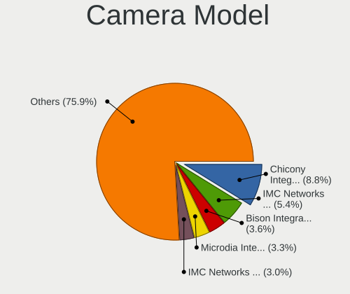

| Model                                                        | Notebooks | Percent |
|--------------------------------------------------------------|-----------|---------|
| Chicony Integrated Camera                                    | 101       | 8.78%   |
| IMC Networks Integrated Camera                               | 62        | 5.39%   |
| Bison Integrated Camera                                      | 41        | 3.57%   |
| Microdia Integrated_Webcam_HD                                | 38        | 3.3%    |
| IMC Networks HD Camera                                       | 35        | 3.04%   |
| Syntek Integrated Camera                                     | 30        | 2.61%   |
| IMC Networks USB2.0 HD UVC WebCam                            | 30        | 2.61%   |
| Luxvisions Innotech Limited Integrated Camera                | 25        | 2.17%   |
| Chicony HD Webcam                                            | 21        | 1.83%   |
| Luxvisions Innotech Limited Integrated RGB Camera            | 18        | 1.57%   |
| Sunplus XiaoMi USB 2.0 Webcam                                | 17        | 1.48%   |
| SunplusIT HD Webcam                                          | 16        | 1.39%   |
| Realtek Integrated_Webcam_HD                                 | 16        | 1.39%   |
| Bison BisonCam,NB Pro                                        | 16        | 1.39%   |
| Cheng Uei Precision Industry (Foxlink) XiaoMi USB 2.0 Webcam | 14        | 1.22%   |
| Bison SunplusIT Integrated Camera                            | 14        | 1.22%   |
| IMC Networks ov9734_azurewave_camera                         | 13        | 1.13%   |
| Sunplus Integrated_Webcam_HD                                 | 12        | 1.04%   |
| Bison Integrated RGB Camera                                  | 12        | 1.04%   |
| IMC Networks XHC Camera                                      | 11        | 0.96%   |
| Quanta ov9734_techfront_camera                               | 10        | 0.87%   |
| Lite-On Integrated Camera                                    | 10        | 0.87%   |
| Apple iPhone 5/5C/5S/6/SE/7/8/X                              | 10        | 0.87%   |
| Quanta HP HD Camera                                          | 9         | 0.78%   |
| Chicony Lenovo Integrated Camera (0.3MP)                     | 9         | 0.78%   |
| Quanta hm1091_techfront                                      | 8         | 0.7%    |
| Quanta HD User Facing                                        | 8         | 0.7%    |
| Luxvisions Innotech Limited HP Wide Vision HD Camera         | 8         | 0.7%    |
| Bison Lenovo EasyCamera                                      | 8         | 0.7%    |
| Realtek Integrated Webcam                                    | 7         | 0.61%   |
| Lite-On HP HD Camera                                         | 7         | 0.61%   |
| Chicony XiaoMi USB 2.0 Webcam                                | 7         | 0.61%   |
| Chicony Integrated Camera (1280x720@30)                      | 7         | 0.61%   |
| Chicony HP Wide Vision HD Camera                             | 7         | 0.61%   |
| Syntek Lenovo EasyCamera                                     | 6         | 0.52%   |
| SunplusIT XiaoMi WebCam                                      | 6         | 0.52%   |
| SunplusIT XiaoMi USB 2.0 Webcam                              | 6         | 0.52%   |
| Sunplus Integrated Camera                                    | 6         | 0.52%   |
| Sunplus HD WebCam                                            | 6         | 0.52%   |
| Sonix USB2.0 HD UVC WebCam                                   | 6         | 0.52%   |

Security
--------

Fingerprint Vendor
------------------

Fingerprint sensor vendors

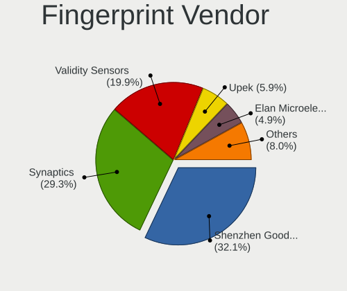

| Vendor                             | Notebooks | Percent |
|------------------------------------|-----------|---------|
| Shenzhen Goodix Technology         | 92        | 32.06%  |
| Synaptics                          | 84        | 29.27%  |
| Validity Sensors                   | 57        | 19.86%  |
| Upek                               | 17        | 5.92%   |
| Elan Microelectronics              | 14        | 4.88%   |
| AuthenTec                          | 6         | 2.09%   |
| HOLTEK                             | 5         | 1.74%   |
| Focal-systems.Corp                 | 3         | 1.05%   |
| STMicroelectronics                 | 2         | 0.7%    |
| Realtek USB2.0 Finger Print Bridge | 2         | 0.7%    |
| LighTuning Technology              | 2         | 0.7%    |
| FocalTech                          | 2         | 0.7%    |
| GDMicroelectronics                 | 1         | 0.35%   |

Fingerprint Model
-----------------

Fingerprint sensor models

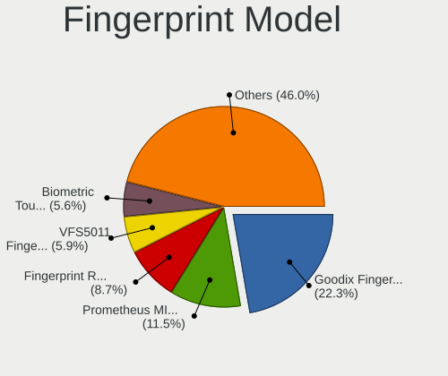

| Model                                                                      | Notebooks | Percent |
|----------------------------------------------------------------------------|-----------|---------|
| Shenzhen Goodix  Fingerprint Device                                        | 64        | 22.3%   |
| Synaptics Prometheus MIS Touch Fingerprint Reader                          | 33        | 11.5%   |
| Shenzhen Goodix Fingerprint Reader                                         | 25        | 8.71%   |
| Validity Sensors VFS5011 Fingerprint Reader                                | 17        | 5.92%   |
| Upek Biometric Touchchip/Touchstrip Fingerprint Sensor                     | 16        | 5.57%   |
| Elan ELAN:Fingerprint                                                      | 12        | 4.18%   |
| Synaptics Metallica MIS Touch Fingerprint Reader                           | 10        | 3.48%   |
| Validity Sensors VFS 5011 fingerprint sensor                               | 8         | 2.79%   |
| Validity Sensors Synaptics VFS7552 Touch Fingerprint Sensor with PurePrint | 8         | 2.79%   |
| Synaptics UWP WBDI Device                                                  | 8         | 2.79%   |
| Synaptics FS7604 Touch Fingerprint Sensor with PurePrint                   | 8         | 2.79%   |
| Validity Sensors Synaptics WBDI                                            | 6         | 2.09%   |
| Synaptics  FS7604 Touch Fingerprint Sensor with PurePrint                  | 6         | 2.09%   |
| Synaptics Fingerprint reader [HP G6]                                       | 6         | 2.09%   |
| Validity Sensors VFS7500 Touch Fingerprint Sensor                          | 5         | 1.74%   |
| Synaptics WBDI Device                                                      | 5         | 1.74%   |
| Synaptics Prometheus Fingerprint Reader                                    | 5         | 1.74%   |
| HOLTEK FocalTech Fingerprint Device                                        | 5         | 1.74%   |
| Validity Sensors VFS495 Fingerprint Reader                                 | 4         | 1.39%   |
| Validity Sensors VFS491                                                    | 4         | 1.39%   |
| AuthenTec AES2810                                                          | 4         | 1.39%   |
| Validity Sensors VFS471 Fingerprint Reader                                 | 3         | 1.05%   |
| Shenzhen Goodix FingerPrint                                                | 3         | 1.05%   |
| Focal-systems.Corp FT9201Fingerprint.                                      | 3         | 1.05%   |
| STMicroelectronics Fingerprint Reader                                      | 2         | 0.7%    |
| Realtek USB2.0 Finger Print Bridge FocalTech Fingerprint Device            | 2         | 0.7%    |
| Elan ELAN:ARM-M4                                                           | 2         | 0.7%    |
| Unknown                                                                    | 2         | 0.7%    |
| Validity Sensors VFS Fingerprint sensor                                    | 1         | 0.35%   |
| Validity Sensors Fingerprint scanner                                       | 1         | 0.35%   |
| Upek TCS5B Fingerprint sensor                                              | 1         | 0.35%   |
| Synaptics WBDI                                                             | 1         | 0.35%   |
| LighTuning ES603 Swipe Fingerprint Sensor                                  | 1         | 0.35%   |
| LighTuning EgisTec Touch Fingerprint Sensor                                | 1         | 0.35%   |
| GDMicroelectronics Touch Fingerprint Sensor                                | 1         | 0.35%   |
| FocalTech FocalTech Fingerprint Device                                     | 1         | 0.35%   |
| FocalTech Fingerprint Device                                               | 1         | 0.35%   |
| AuthenTec Fingerprint Sensor                                               | 1         | 0.35%   |
| AuthenTec AES2550 Fingerprint Sensor                                       | 1         | 0.35%   |

Chipcard Vendor
---------------

Chipcard module vendors

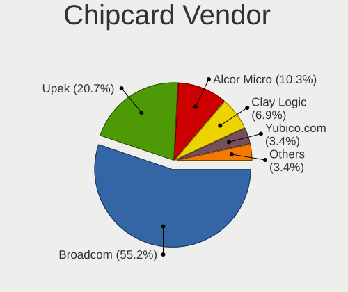

| Vendor                | Notebooks | Percent |
|-----------------------|-----------|---------|
| Broadcom              | 16        | 55.17%  |
| Upek                  | 6         | 20.69%  |
| Alcor Micro           | 3         | 10.34%  |
| Clay Logic            | 2         | 6.9%    |
| Yubico.com            | 1         | 3.45%   |
| Advanced Card Systems | 1         | 3.45%   |

Chipcard Model
--------------

Chipcard module models

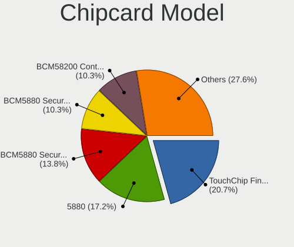

| Model                                                                        | Notebooks | Percent |
|------------------------------------------------------------------------------|-----------|---------|
| Upek TouchChip Fingerprint Coprocessor (WBF advanced mode)                   | 6         | 20.69%  |
| Broadcom 5880                                                                | 5         | 17.24%  |
| Broadcom BCM5880 Secure Applications Processor                               | 4         | 13.79%  |
| Broadcom BCM5880 Secure Applications Processor with fingerprint swipe sensor | 3         | 10.34%  |
| Broadcom BCM58200 ControlVault 3 (FingerPrint sensor + Contacted SmartCard)  | 3         | 10.34%  |
| Alcor Micro AU9540 Smartcard Reader                                          | 3         | 10.34%  |
| Clay Logic CanoKey Canary                                                    | 2         | 6.9%    |
| Yubico.com Yubikey 4/5 U2F+CCID                                              | 1         | 3.45%   |
| Broadcom 58200                                                               | 1         | 3.45%   |
| Advanced Card Systems ACR1581                                                | 1         | 3.45%   |

Unsupported
-----------

Unsupported Devices
-------------------

Total unsupported devices on board

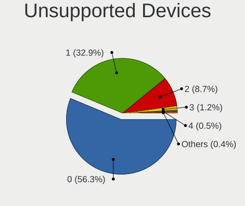

| Total | Notebooks | Percent |
|-------|-----------|---------|
| 0     | 781       | 56.27%  |
| 1     | 456       | 32.85%  |
| 2     | 121       | 8.72%   |
| 3     | 17        | 1.22%   |
| 4     | 7         | 0.5%    |
| 5     | 4         | 0.29%   |
| 10    | 1         | 0.07%   |
| 8     | 1         | 0.07%   |

Unsupported Device Types
------------------------

Types of unsupported devices

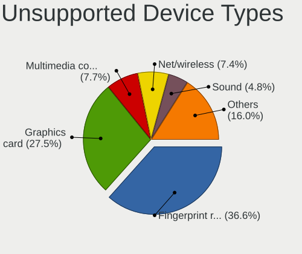

| Type                     | Notebooks | Percent |
|--------------------------|-----------|---------|
| Fingerprint reader       | 282       | 36.62%  |
| Graphics card            | 212       | 27.53%  |
| Multimedia controller    | 59        | 7.66%   |
| Net/wireless             | 57        | 7.4%    |
| Sound                    | 37        | 4.81%   |
| Camera                   | 30        | 3.9%    |
| Chipcard                 | 25        | 3.25%   |
| Communication controller | 23        | 2.99%   |
| Bluetooth                | 16        | 2.08%   |
| Net/ethernet             | 14        | 1.82%   |
| Storage                  | 4         | 0.52%   |
| Card reader              | 4         | 0.52%   |
| Network                  | 2         | 0.26%   |
| Unassigned class         | 1         | 0.13%   |
| Storage/nvme             | 1         | 0.13%   |
| Storage/ata              | 1         | 0.13%   |
| Modem                    | 1         | 0.13%   |
| Dvb card                 | 1         | 0.13%   |

