Linux in China - Tested Hardware & Statistics (Notebooks)
---------------------------------------------------------

A project to collect tested hardware configurations for Linux in China.

Anyone can contribute to this report by the [hw-probe](https://github.com/linuxhw/hw-probe) tool:

    sudo -E hw-probe -all -upload

Please contribute! Especially if your hardware is rare.

Contents
--------

* [ Test Cases ](#test-cases)

* [ System ](#system)
  - [ OS                       ](#os)
  - [ OS Family                ](#os-family)
  - [ Kernel                   ](#kernel)
  - [ Kernel Family            ](#kernel-family)
  - [ Kernel Major Ver.        ](#kernel-major-ver)
  - [ Arch                     ](#arch)
  - [ DE                       ](#de)
  - [ Display Server           ](#display-server)
  - [ Display Manager          ](#display-manager)
  - [ OS Lang                  ](#os-lang)
  - [ Boot Mode                ](#boot-mode)
  - [ Filesystem               ](#filesystem)
  - [ Part. scheme             ](#part-scheme)
  - [ Dual Boot with Linux/BSD ](#dual-boot-with-linuxbsd)
  - [ Dual Boot (Win)          ](#dual-boot-win)

* [ Board ](#board)
  - [ Vendor                   ](#vendor)
  - [ Model                    ](#model)
  - [ Model Family             ](#model-family)
  - [ MFG Year                 ](#mfg-year)
  - [ Form Factor              ](#form-factor)
  - [ Secure Boot              ](#secure-boot)
  - [ Coreboot                 ](#coreboot)
  - [ RAM Size                 ](#ram-size)
  - [ RAM Used                 ](#ram-used)
  - [ Total Drives             ](#total-drives)
  - [ Has CD-ROM               ](#has-cd-rom)
  - [ Has Ethernet             ](#has-ethernet)
  - [ Has WiFi                 ](#has-wifi)
  - [ Has Bluetooth            ](#has-bluetooth)

* [ Location ](#location)
  - [ Country                  ](#country)
  - [ City                     ](#city)

* [ Drives ](#drives)
  - [ Drive Vendor             ](#drive-vendor)
  - [ Drive Model              ](#drive-model)
  - [ HDD Vendor               ](#hdd-vendor)
  - [ SSD Vendor               ](#ssd-vendor)
  - [ Drive Kind               ](#drive-kind)
  - [ Drive Connector          ](#drive-connector)
  - [ Drive Size               ](#drive-size)
  - [ Space Total              ](#space-total)
  - [ Space Used               ](#space-used)
  - [ Malfunc. Drives          ](#malfunc-drives)
  - [ Malfunc. Drive Vendor    ](#malfunc-drive-vendor)
  - [ Malfunc. HDD Vendor      ](#malfunc-hdd-vendor)
  - [ Malfunc. Drive Kind      ](#malfunc-drive-kind)
  - [ Failed Drives            ](#failed-drives)
  - [ Failed Drive Vendor      ](#failed-drive-vendor)
  - [ Drive Status             ](#drive-status)

* [ Storage controller ](#storage-controller)
  - [ Storage Vendor           ](#storage-vendor)
  - [ Storage Model            ](#storage-model)
  - [ Storage Kind             ](#storage-kind)

* [ Processor ](#processor)
  - [ CPU Vendor               ](#cpu-vendor)
  - [ CPU Model                ](#cpu-model)
  - [ CPU Model Family         ](#cpu-model-family)
  - [ CPU Cores                ](#cpu-cores)
  - [ CPU Sockets              ](#cpu-sockets)
  - [ CPU Threads              ](#cpu-threads)
  - [ CPU Op-Modes             ](#cpu-op-modes)
  - [ CPU Microcode            ](#cpu-microcode)
  - [ CPU Microarch            ](#cpu-microarch)

* [ Graphics ](#graphics)
  - [ GPU Vendor               ](#gpu-vendor)
  - [ GPU Model                ](#gpu-model)
  - [ GPU Combo                ](#gpu-combo)
  - [ GPU Driver               ](#gpu-driver)
  - [ GPU Memory               ](#gpu-memory)

* [ Monitor ](#monitor)
  - [ Monitor Vendor           ](#monitor-vendor)
  - [ Monitor Model            ](#monitor-model)
  - [ Monitor Resolution       ](#monitor-resolution)
  - [ Monitor Diagonal         ](#monitor-diagonal)
  - [ Monitor Width            ](#monitor-width)
  - [ Aspect Ratio             ](#aspect-ratio)
  - [ Monitor Area             ](#monitor-area)
  - [ Pixel Density            ](#pixel-density)
  - [ Multiple Monitors        ](#multiple-monitors)

* [ Network ](#network)
  - [ Net Controller Vendor    ](#net-controller-vendor)
  - [ Net Controller Model     ](#net-controller-model)
  - [ Wireless Vendor          ](#wireless-vendor)
  - [ Wireless Model           ](#wireless-model)
  - [ Ethernet Vendor          ](#ethernet-vendor)
  - [ Ethernet Model           ](#ethernet-model)
  - [ Net Controller Kind      ](#net-controller-kind)
  - [ Used Controller          ](#used-controller)
  - [ NICs                     ](#nics)
  - [ IPv6                     ](#ipv6)

* [ Bluetooth ](#bluetooth)
  - [ Bluetooth Vendor         ](#bluetooth-vendor)
  - [ Bluetooth Model          ](#bluetooth-model)

* [ Sound ](#sound)
  - [ Sound Vendor             ](#sound-vendor)
  - [ Sound Model              ](#sound-model)

* [ Memory ](#memory)
  - [ Memory Vendor            ](#memory-vendor)
  - [ Memory Model             ](#memory-model)
  - [ Memory Kind              ](#memory-kind)
  - [ Memory Form Factor       ](#memory-form-factor)
  - [ Memory Size              ](#memory-size)
  - [ Memory Speed             ](#memory-speed)

* [ Printers & scanners ](#printers--scanners)
  - [ Printer Vendor           ](#printer-vendor)
  - [ Printer Model            ](#printer-model)
  - [ Scanner Vendor           ](#scanner-vendor)
  - [ Scanner Model            ](#scanner-model)

* [ Camera ](#camera)
  - [ Camera Vendor            ](#camera-vendor)
  - [ Camera Model             ](#camera-model)

* [ Security ](#security)
  - [ Fingerprint Vendor       ](#fingerprint-vendor)
  - [ Fingerprint Model        ](#fingerprint-model)
  - [ Chipcard Vendor          ](#chipcard-vendor)
  - [ Chipcard Model           ](#chipcard-model)

* [ Unsupported ](#unsupported)
  - [ Unsupported Devices      ](#unsupported-devices)
  - [ Unsupported Device Types ](#unsupported-device-types)

Test Cases
----------

Total: 1620

| Vendor        | Model                       | Probe                                                      | Date         |
|---------------|-----------------------------|------------------------------------------------------------|--------------|
| ASUSTek       | K55VD                       | [d0bc9affdb](https://linux-hardware.org/?probe=d0bc9affdb) | Jan 06, 2025 |
| GITSTAR       | GDC-1461                    | [08243d6a0b](https://linux-hardware.org/?probe=08243d6a0b) | Jan 05, 2025 |
| Valve         | Jupiter                     | [d8901f7e5b](https://linux-hardware.org/?probe=d8901f7e5b) | Jan 02, 2025 |
| GITSTAR       | GDC-1461                    | [e2fee21ed2](https://linux-hardware.org/?probe=e2fee21ed2) | Jan 01, 2025 |
| Lenovo        | ThinkPad SL410 2842EVC      | [344aabb4c4](https://linux-hardware.org/?probe=344aabb4c4) | Jan 01, 2025 |
| Lenovo        | ThinkPad E480 20KNA04RCD    | [d64710669e](https://linux-hardware.org/?probe=d64710669e) | Dec 27, 2024 |
| GITSTAR       | GDC-1461                    | [5d52d6cbb3](https://linux-hardware.org/?probe=5d52d6cbb3) | Dec 27, 2024 |
| Shanghai Z... | ZXE CRB                     | [b1723d54f1](https://linux-hardware.org/?probe=b1723d54f1) | Dec 27, 2024 |
| Shanghai Z... | ZXE CRB                     | [b991e63212](https://linux-hardware.org/?probe=b991e63212) | Dec 27, 2024 |
| Shanghai Z... | ZXE CRB                     | [6d28566eaf](https://linux-hardware.org/?probe=6d28566eaf) | Dec 27, 2024 |
| Shanghai Z... | ZXE CRB                     | [af6004637f](https://linux-hardware.org/?probe=af6004637f) | Dec 27, 2024 |
| GITSTAR       | GDC-1461                    | [d3d0e4ef66](https://linux-hardware.org/?probe=d3d0e4ef66) | Dec 27, 2024 |
| HP            | 255 15.6 inch G9 Noteboo... | [1c64d7883e](https://linux-hardware.org/?probe=1c64d7883e) | Dec 26, 2024 |
| Fujitsu       | FMVA08008                   | [fc76839db5](https://linux-hardware.org/?probe=fc76839db5) | Dec 23, 2024 |
| Lenovo        | ThinkPad S2 Gen 6 20VMA0... | [df6fdd6e8a](https://linux-hardware.org/?probe=df6fdd6e8a) | Dec 22, 2024 |
| HP            | Pavilion Laptop 14-ce1xx... | [8b6523038d](https://linux-hardware.org/?probe=8b6523038d) | Dec 22, 2024 |
| Lenovo        | ThinkPad S2 Gen 6 20VMA0... | [17282fe4c7](https://linux-hardware.org/?probe=17282fe4c7) | Dec 21, 2024 |
| HUAWEI        | MDG-XX                      | [1f5ee29f02](https://linux-hardware.org/?probe=1f5ee29f02) | Dec 21, 2024 |
| Lenovo        | Yoga 14sARH 2021 82LB       | [f7b8a3e850](https://linux-hardware.org/?probe=f7b8a3e850) | Dec 20, 2024 |
| Lenovo        | Yoga 14sARH 2021 82LB       | [df7c4252e6](https://linux-hardware.org/?probe=df7c4252e6) | Dec 17, 2024 |
| Lenovo        | Legion Y7000 81FW           | [b74286b627](https://linux-hardware.org/?probe=b74286b627) | Dec 16, 2024 |
| ASUSTek       | K42JY                       | [35095b2b4c](https://linux-hardware.org/?probe=35095b2b4c) | Dec 16, 2024 |
| Lenovo        | Legion R9000P2021H 82JQ     | [a0c8f35a1b](https://linux-hardware.org/?probe=a0c8f35a1b) | Dec 13, 2024 |
| Lenovo        | Legion Y9000P IRX9 83DF     | [35b1e770a7](https://linux-hardware.org/?probe=35b1e770a7) | Dec 11, 2024 |
| Lenovo        | ThinkPad X13 Gen 1 20UF0... | [0c5a8d044d](https://linux-hardware.org/?probe=0c5a8d044d) | Dec 11, 2024 |
| Lenovo        | XiaoXinAir-14API 2019 81... | [5804fcefee](https://linux-hardware.org/?probe=5804fcefee) | Dec 05, 2024 |
| Lenovo        | ThinkPad X220 4286AC9       | [d19e70af90](https://linux-hardware.org/?probe=d19e70af90) | Dec 02, 2024 |
| MECHREVO      | WUJIE14 PRO                 | [06cabfde10](https://linux-hardware.org/?probe=06cabfde10) | Dec 01, 2024 |
| Lenovo        | ThinkPad X220 4286AC9       | [c4bb97c903](https://linux-hardware.org/?probe=c4bb97c903) | Nov 30, 2024 |
| Lenovo        | RESCUER R720-15IKBN 80WW    | [0e9a9bef8d](https://linux-hardware.org/?probe=0e9a9bef8d) | Nov 28, 2024 |
| Valve         | Jupiter                     | [6597b78dae](https://linux-hardware.org/?probe=6597b78dae) | Nov 27, 2024 |
| KaiTian       | 2OBEA002KX                  | [516bb56dce](https://linux-hardware.org/?probe=516bb56dce) | Nov 22, 2024 |
| HONOR         | BRI-XX                      | [fee72d5d1f](https://linux-hardware.org/?probe=fee72d5d1f) | Nov 21, 2024 |
| Lenovo        | ThinkPad T480 20L5A023HK    | [c52db1921e](https://linux-hardware.org/?probe=c52db1921e) | Nov 21, 2024 |
| Lenovo        | Legion Y7000P2021 82JK      | [db50a44dfb](https://linux-hardware.org/?probe=db50a44dfb) | Nov 17, 2024 |
| Lenovo        | ThinkBook 14 G7+ ASP 21Q... | [9e752bc702](https://linux-hardware.org/?probe=9e752bc702) | Nov 16, 2024 |
| Lenovo        | ThinkPad T14 Gen 4 21HD0... | [f38d8fa44e](https://linux-hardware.org/?probe=f38d8fa44e) | Nov 16, 2024 |
| Apple         | MacBookPro6,2               | [f0eae2187b](https://linux-hardware.org/?probe=f0eae2187b) | Nov 15, 2024 |
| HUAWEI        | KLVD-WXX9                   | [f27eff2279](https://linux-hardware.org/?probe=f27eff2279) | Nov 15, 2024 |
| HUAWEI        | KLVD-WXX9                   | [07e19f11fd](https://linux-hardware.org/?probe=07e19f11fd) | Nov 15, 2024 |
| Lenovo        | B41-35 80LD                 | [f1ad7d31a0](https://linux-hardware.org/?probe=f1ad7d31a0) | Nov 14, 2024 |
| THUNDEROBO... | 911M                        | [79f6af2768](https://linux-hardware.org/?probe=79f6af2768) | Nov 13, 2024 |
| MECHREVO      | WUJIE14XA                   | [96ed82ccbf](https://linux-hardware.org/?probe=96ed82ccbf) | Nov 12, 2024 |
| MECHREVO      | WUJIE14XA                   | [f67868b6d1](https://linux-hardware.org/?probe=f67868b6d1) | Nov 12, 2024 |
| HP            | Victus by Laptop 16-d1xx... | [8589373272](https://linux-hardware.org/?probe=8589373272) | Nov 11, 2024 |
| MECHREVO      | Kuangshi16Pro Series GM6... | [e0254a7e9a](https://linux-hardware.org/?probe=e0254a7e9a) | Nov 10, 2024 |
| Lenovo        | ThinkPad X230 2324BN2       | [2040b5fccb](https://linux-hardware.org/?probe=2040b5fccb) | Nov 08, 2024 |
| HP            | Victus by Laptop 16-d1xx... | [d37b1e618c](https://linux-hardware.org/?probe=d37b1e618c) | Nov 08, 2024 |
| Lenovo        | ThinkPad P53 20QQS38314     | [c04225f7b2](https://linux-hardware.org/?probe=c04225f7b2) | Nov 06, 2024 |
| Timi          | Xiaomi Book Pro 14 2022     | [cee54323a9](https://linux-hardware.org/?probe=cee54323a9) | Nov 06, 2024 |
| HP            | ProBook 6570b               | [4aa25d1213](https://linux-hardware.org/?probe=4aa25d1213) | Nov 02, 2024 |
| Lenovo        | Legion Y7000P IRH8 82YA     | [6e69005df8](https://linux-hardware.org/?probe=6e69005df8) | Nov 01, 2024 |
| Lenovo        | ThinkPad T460 20FNA06ACD    | [f74faac599](https://linux-hardware.org/?probe=f74faac599) | Oct 31, 2024 |
| Dell          | Vostro 5470                 | [2f038c197f](https://linux-hardware.org/?probe=2f038c197f) | Oct 31, 2024 |
| HUAWEI        | KPRC-WX0                    | [3b8dd1a9b7](https://linux-hardware.org/?probe=3b8dd1a9b7) | Oct 29, 2024 |
| HP            | EliteBook 830 G5            | [8934de3762](https://linux-hardware.org/?probe=8934de3762) | Oct 27, 2024 |
| Dell          | Vostro 5470                 | [545581e660](https://linux-hardware.org/?probe=545581e660) | Oct 24, 2024 |
| HP            | EliteBook Folio 9470m       | [8348d88897](https://linux-hardware.org/?probe=8348d88897) | Oct 22, 2024 |
| HP            | EliteBook Folio 9470m       | [248d1d4fac](https://linux-hardware.org/?probe=248d1d4fac) | Oct 22, 2024 |
| Lenovo        | ThinkPad neo 14 21DN0018... | [6eaa5db5ab](https://linux-hardware.org/?probe=6eaa5db5ab) | Oct 21, 2024 |
| MSI           | Alpha 17 C7VG               | [dbcee0fcec](https://linux-hardware.org/?probe=dbcee0fcec) | Oct 20, 2024 |
| Lenovo        | ThinkPad T14 Gen 1 20UES... | [db6240abe4](https://linux-hardware.org/?probe=db6240abe4) | Oct 18, 2024 |
| Valve         | Jupiter                     | [d69953f1a7](https://linux-hardware.org/?probe=d69953f1a7) | Oct 13, 2024 |
| Lenovo        | Yoga 14sITL 2021 82G2       | [e87b219656](https://linux-hardware.org/?probe=e87b219656) | Oct 13, 2024 |
| Dell          | Inspiron 7447               | [73c997aee9](https://linux-hardware.org/?probe=73c997aee9) | Oct 11, 2024 |
| Lenovo        | V330-14IKB 81B0             | [6feeb04bd6](https://linux-hardware.org/?probe=6feeb04bd6) | Oct 09, 2024 |
| AYANEO        | AB05-AMD                    | [a9f0ebcf7c](https://linux-hardware.org/?probe=a9f0ebcf7c) | Oct 07, 2024 |
| Lenovo        | ThinkBook 14 G6+ IMH 21L... | [3e569110fc](https://linux-hardware.org/?probe=3e569110fc) | Oct 07, 2024 |
| Lenovo        | ThinkPad E450c 20EHA003C... | [05857518a1](https://linux-hardware.org/?probe=05857518a1) | Oct 07, 2024 |
| HUAWEI        | WRTD-WXX9                   | [b0429b8af0](https://linux-hardware.org/?probe=b0429b8af0) | Oct 06, 2024 |
| Synology      | DS216+                      | [af10f30c79](https://linux-hardware.org/?probe=af10f30c79) | Oct 06, 2024 |
| Lenovo        | ThinkPad T14 Gen 4 21HD0... | [201204cf6c](https://linux-hardware.org/?probe=201204cf6c) | Oct 06, 2024 |
| Dell          | Inspiron 3543               | [b675409877](https://linux-hardware.org/?probe=b675409877) | Oct 04, 2024 |
| Apple         | MacBookPro11,4              | [b373b972bf](https://linux-hardware.org/?probe=b373b972bf) | Oct 03, 2024 |
| Lenovo        | Legion Y9000P IAH7H 82RF    | [797a2c8fd3](https://linux-hardware.org/?probe=797a2c8fd3) | Oct 02, 2024 |
| HP            | OMEN by Gaming Laptop 16... | [48137752ca](https://linux-hardware.org/?probe=48137752ca) | Oct 01, 2024 |
| MECHREVO      | Yilong15Pro Series GM5HG... | [f72e327582](https://linux-hardware.org/?probe=f72e327582) | Oct 01, 2024 |
| HP            | OMEN by Gaming Laptop 16... | [fb89302a2c](https://linux-hardware.org/?probe=fb89302a2c) | Sep 30, 2024 |
| Timi          | Redmi G 2022                | [115c01ddd7](https://linux-hardware.org/?probe=115c01ddd7) | Sep 29, 2024 |
| HP            | OMEN by Gaming Laptop 16... | [b2b12658a9](https://linux-hardware.org/?probe=b2b12658a9) | Sep 29, 2024 |
| Lenovo        | ThinkPad T14 Gen 4 21HD0... | [28057f9ed2](https://linux-hardware.org/?probe=28057f9ed2) | Sep 23, 2024 |
| Panasonic     | CF-SX3JDHCS                 | [cd02ae3c91](https://linux-hardware.org/?probe=cd02ae3c91) | Sep 22, 2024 |
| MECHREVO      | WUJIE14XA                   | [7c2e3b925b](https://linux-hardware.org/?probe=7c2e3b925b) | Sep 21, 2024 |
| Lenovo        | K4450 20229                 | [1a2a5fe2de](https://linux-hardware.org/?probe=1a2a5fe2de) | Sep 20, 2024 |
| Google        | Lindar rev2                 | [5ece0457a9](https://linux-hardware.org/?probe=5ece0457a9) | Sep 20, 2024 |
| Unknown       | Unknown                     | [33f5563605](https://linux-hardware.org/?probe=33f5563605) | Sep 20, 2024 |
| HUAWEI        | WRTD-WXX9                   | [ffef25ebe6](https://linux-hardware.org/?probe=ffef25ebe6) | Sep 20, 2024 |
| HP            | EliteBook 845 14 inch G1... | [3135d9039d](https://linux-hardware.org/?probe=3135d9039d) | Sep 19, 2024 |
| HUAWEI        | WRTD-WXX9                   | [0e0a845726](https://linux-hardware.org/?probe=0e0a845726) | Sep 19, 2024 |
| Apple         | MacBookPro15,2              | [3351846d95](https://linux-hardware.org/?probe=3351846d95) | Sep 18, 2024 |
| PC            | Unknown                     | [b2809aeee4](https://linux-hardware.org/?probe=b2809aeee4) | Sep 16, 2024 |
| PC            | Unknown                     | [96871207d2](https://linux-hardware.org/?probe=96871207d2) | Sep 16, 2024 |
| Lenovo        | ThinkPad E450c 20EHA003C... | [221cf509e7](https://linux-hardware.org/?probe=221cf509e7) | Sep 14, 2024 |
| Notebook      | N9x0TC                      | [04ca3f6994](https://linux-hardware.org/?probe=04ca3f6994) | Sep 14, 2024 |
| Lenovo        | Legion R9000P ARX8 82WM     | [c16aaf7f55](https://linux-hardware.org/?probe=c16aaf7f55) | Sep 12, 2024 |
| HONOR         | MRA-XXX                     | [90ed7d8b2e](https://linux-hardware.org/?probe=90ed7d8b2e) | Sep 12, 2024 |
| ASUSTek       | ASUS EXPERTBOOK B5404CMA... | [90d94858c9](https://linux-hardware.org/?probe=90d94858c9) | Sep 11, 2024 |
| Lenovo        | Legion Y9000P IRX9 83DF     | [fbab806d43](https://linux-hardware.org/?probe=fbab806d43) | Sep 11, 2024 |
| HUAWEI        | MCLG-XX                     | [48e833a318](https://linux-hardware.org/?probe=48e833a318) | Sep 08, 2024 |
| MECHREVO      | Yilong15Pro Series GM5HG... | [2f07b320a4](https://linux-hardware.org/?probe=2f07b320a4) | Sep 08, 2024 |
| Dell          | Latitude 3570               | [3e681d572e](https://linux-hardware.org/?probe=3e681d572e) | Sep 08, 2024 |
| Lenovo        | ThinkPad E450c 20EHA003C... | [c3005e1e45](https://linux-hardware.org/?probe=c3005e1e45) | Sep 07, 2024 |
| Lenovo        | ThinkPad E450c 20EHA003C... | [5946bf2573](https://linux-hardware.org/?probe=5946bf2573) | Sep 05, 2024 |
| MECHREVO      | Yilong15Pro Series GM5HG... | [1df882bd82](https://linux-hardware.org/?probe=1df882bd82) | Sep 04, 2024 |
| Timi          | TM1612                      | [f5aa0c155f](https://linux-hardware.org/?probe=f5aa0c155f) | Sep 03, 2024 |
| Timi          | TM1612                      | [c58c79c0c3](https://linux-hardware.org/?probe=c58c79c0c3) | Sep 02, 2024 |
| Lenovo        | ThinkBook 14 G2 ARE 20VF    | [edb6fa41a1](https://linux-hardware.org/?probe=edb6fa41a1) | Sep 02, 2024 |
| Lenovo        | ThinkBook 14 G2 ARE 20VF    | [99088eb4a0](https://linux-hardware.org/?probe=99088eb4a0) | Sep 02, 2024 |
| Xiaomi        | Pad 5                       | [6351e40a47](https://linux-hardware.org/?probe=6351e40a47) | Aug 30, 2024 |
| Dell          | Inspiron 3541               | [7a48a71719](https://linux-hardware.org/?probe=7a48a71719) | Aug 29, 2024 |
| LZ            | LZ1004_3                    | [8ad0eef591](https://linux-hardware.org/?probe=8ad0eef591) | Aug 28, 2024 |
| ASUSTek       | TUF Gaming FX505GE_FX86F... | [f8a5fac34e](https://linux-hardware.org/?probe=f8a5fac34e) | Aug 28, 2024 |
| Lenovo        | ThinkBook 16p Gen 4 21J8    | [66abd812b2](https://linux-hardware.org/?probe=66abd812b2) | Aug 28, 2024 |
| Timi          | TM1703                      | [b8b26286ce](https://linux-hardware.org/?probe=b8b26286ce) | Aug 27, 2024 |
| Dell          | Studio 1749                 | [caff4fc4c0](https://linux-hardware.org/?probe=caff4fc4c0) | Aug 26, 2024 |
| Dell          | Inspiron 3541               | [a327460bc3](https://linux-hardware.org/?probe=a327460bc3) | Aug 26, 2024 |
| Apple         | MacBookPro11,5              | [b31f952991](https://linux-hardware.org/?probe=b31f952991) | Aug 19, 2024 |
| Lenovo        | XiaoXinPro-13IML 2019 81... | [9d4ed4f113](https://linux-hardware.org/?probe=9d4ed4f113) | Aug 17, 2024 |
| Lenovo        | XiaoXinPro 14 APH8 83AM     | [1b73b99a29](https://linux-hardware.org/?probe=1b73b99a29) | Aug 17, 2024 |
| Lenovo        | ThinkPad E485 20KU000CCD    | [86d2276d54](https://linux-hardware.org/?probe=86d2276d54) | Aug 16, 2024 |
| Lenovo        | ThinkBook 16p Gen 4 21J8    | [a9333f8734](https://linux-hardware.org/?probe=a9333f8734) | Aug 14, 2024 |
| Lenovo        | ThinkBook 16p Gen 4 21J8    | [4cb408849b](https://linux-hardware.org/?probe=4cb408849b) | Aug 14, 2024 |
| ASUSTek       | ASUS TUF Gaming F15 FX50... | [523a8c5b1b](https://linux-hardware.org/?probe=523a8c5b1b) | Aug 12, 2024 |
| Unknown       | Unknown                     | [42c6e5ad9f](https://linux-hardware.org/?probe=42c6e5ad9f) | Aug 11, 2024 |
| Lenovo        | Unknown                     | [8911c70f7c](https://linux-hardware.org/?probe=8911c70f7c) | Aug 11, 2024 |
| Valve         | Jupiter                     | [12921125a4](https://linux-hardware.org/?probe=12921125a4) | Aug 10, 2024 |
| HP            | Mini China Mobile Editio... | [573e118166](https://linux-hardware.org/?probe=573e118166) | Aug 09, 2024 |
| HP            | Mini China Mobile Editio... | [f1700dec96](https://linux-hardware.org/?probe=f1700dec96) | Aug 09, 2024 |
| Valve         | Jupiter                     | [c7b59219b7](https://linux-hardware.org/?probe=c7b59219b7) | Aug 08, 2024 |
| Valve         | Jupiter                     | [b9e860d80b](https://linux-hardware.org/?probe=b9e860d80b) | Aug 06, 2024 |
| Timi          | Redmi G 2022                | [bd14ac1c75](https://linux-hardware.org/?probe=bd14ac1c75) | Aug 05, 2024 |
| Lenovo        | XiaoXinPro 14ACH 2021 82... | [c9c8110625](https://linux-hardware.org/?probe=c9c8110625) | Aug 03, 2024 |
| HUAWEI        | CREFG-XX                    | [84f4c4c132](https://linux-hardware.org/?probe=84f4c4c132) | Aug 01, 2024 |
| HP            | Pavilion Plus Laptop 14-... | [e1fbcd82c0](https://linux-hardware.org/?probe=e1fbcd82c0) | Aug 01, 2024 |
| Acer          | Swift SF314-512             | [a316199737](https://linux-hardware.org/?probe=a316199737) | Jul 28, 2024 |
| HASEE Comp... | K590P                       | [6bae6674d2](https://linux-hardware.org/?probe=6bae6674d2) | Jul 27, 2024 |
| Lenovo        | YogaPro 14s APH8 82Y8       | [2b41283766](https://linux-hardware.org/?probe=2b41283766) | Jul 23, 2024 |
| Lenovo        | YogaPro 14s APH8 82Y8       | [3d7bb2e0f5](https://linux-hardware.org/?probe=3d7bb2e0f5) | Jul 23, 2024 |
| HP            | ProBook 6560b               | [8492f0d6a2](https://linux-hardware.org/?probe=8492f0d6a2) | Jul 22, 2024 |
| HP            | ProBook 6560b               | [cb6317449c](https://linux-hardware.org/?probe=cb6317449c) | Jul 22, 2024 |
| Alienware     | m15 R6                      | [12574a3dbf](https://linux-hardware.org/?probe=12574a3dbf) | Jul 21, 2024 |
| Lenovo        | ThinkPad Edge E430c 3365... | [ed4ee723bc](https://linux-hardware.org/?probe=ed4ee723bc) | Jul 21, 2024 |
| Lenovo        | XiaoXinPro 14ACH 2021 82... | [5ef18ce115](https://linux-hardware.org/?probe=5ef18ce115) | Jul 20, 2024 |
| Timi          | A7S                         | [731b981fc4](https://linux-hardware.org/?probe=731b981fc4) | Jul 19, 2024 |
| Lenovo        | ThinkPad T14 Gen 4 21HD0... | [d57f4d29a8](https://linux-hardware.org/?probe=d57f4d29a8) | Jul 18, 2024 |
| Lenovo        | ThinkBook 16 G4+ IAP 21C... | [2bd5211193](https://linux-hardware.org/?probe=2bd5211193) | Jul 17, 2024 |
| Lenovo        | ThinkPad T14 Gen 4 21HD0... | [0a947b6f0e](https://linux-hardware.org/?probe=0a947b6f0e) | Jul 17, 2024 |
| HUAWEI        | FRD-WX9                     | [460787d14f](https://linux-hardware.org/?probe=460787d14f) | Jul 16, 2024 |
| MECHREVO      | Jiaolong Series MRID6       | [69f258c315](https://linux-hardware.org/?probe=69f258c315) | Jul 15, 2024 |
| Dell          | XPS 15 9570                 | [e8745337a2](https://linux-hardware.org/?probe=e8745337a2) | Jul 13, 2024 |
| GPD           | G1619-04                    | [14e178aeea](https://linux-hardware.org/?probe=14e178aeea) | Jul 13, 2024 |
| Lenovo        | ThinkBook 16 G6+ AHP 21L... | [6c1e32ad5d](https://linux-hardware.org/?probe=6c1e32ad5d) | Jul 13, 2024 |
| Lenovo        | ThinkBook 14 G4+ IAP 21C... | [abca4ba4dc](https://linux-hardware.org/?probe=abca4ba4dc) | Jul 10, 2024 |
| Lenovo        | ThinkPad E450 20DCA073CD    | [8c1d664955](https://linux-hardware.org/?probe=8c1d664955) | Jul 10, 2024 |
| HUAWEI        | MACHD-WXX9                  | [300afe7700](https://linux-hardware.org/?probe=300afe7700) | Jul 08, 2024 |
| Lenovo        | ThinkPad E470c 20H3A013C... | [3a0eb6920e](https://linux-hardware.org/?probe=3a0eb6920e) | Jul 08, 2024 |
| Lenovo        | XiaoXinAir 15ITL 2021 82... | [fc62f48a28](https://linux-hardware.org/?probe=fc62f48a28) | Jul 07, 2024 |
| HASEE Comp... | CV15S                       | [19fc3d7f8e](https://linux-hardware.org/?probe=19fc3d7f8e) | Jul 06, 2024 |
| Xiaomi        | Pad 5                       | [c7ef51b5ed](https://linux-hardware.org/?probe=c7ef51b5ed) | Jul 06, 2024 |
| Unknown       | Unknown                     | [1b5e39cb12](https://linux-hardware.org/?probe=1b5e39cb12) | Jul 06, 2024 |
| Lenovo        | ThinkPad T14 Gen 4 21HD0... | [33faa63099](https://linux-hardware.org/?probe=33faa63099) | Jul 06, 2024 |
| Lenovo        | ThinkPad Edge E531 68851... | [07fd16528a](https://linux-hardware.org/?probe=07fd16528a) | Jul 03, 2024 |
| Lenovo        | Legion Y7000P IRH8 82YA     | [56c8cbcf5d](https://linux-hardware.org/?probe=56c8cbcf5d) | Jul 03, 2024 |
| Lenovo        | ThinkPad E470 20H1A0A3CD    | [d75b55652e](https://linux-hardware.org/?probe=d75b55652e) | Jul 03, 2024 |
| Lenovo        | IdeaPad Y450                | [31f2b508f0](https://linux-hardware.org/?probe=31f2b508f0) | Jul 03, 2024 |
| Lenovo        | ThinkPad Edge E531 68851... | [ccbb2df5c2](https://linux-hardware.org/?probe=ccbb2df5c2) | Jul 02, 2024 |
| Lenovo        | XiaoXin-14API 2019 81QQ     | [85c5b22d7e](https://linux-hardware.org/?probe=85c5b22d7e) | Jul 01, 2024 |
| Timi          | TM1612                      | [0192c78e4a](https://linux-hardware.org/?probe=0192c78e4a) | Jul 01, 2024 |
| Lenovo        | ThinkPad X1 Carbon Gen 1... | [2c74ddfd04](https://linux-hardware.org/?probe=2c74ddfd04) | Jun 30, 2024 |
| Lenovo        | ThinkPad X1 Carbon Gen 1... | [281b059224](https://linux-hardware.org/?probe=281b059224) | Jun 30, 2024 |
| American M... | X133JR610                   | [5d89edbc74](https://linux-hardware.org/?probe=5d89edbc74) | Jun 27, 2024 |
| Lenovo        | ThinkPad E450 20DCA002CD    | [e829cbb140](https://linux-hardware.org/?probe=e829cbb140) | Jun 26, 2024 |
| Lenovo        | ThinkPad X13 Gen 1 20UF0... | [777cc73936](https://linux-hardware.org/?probe=777cc73936) | Jun 23, 2024 |
| Lenovo        | RESCUER R720-15IKBN 80WW    | [5f12698f4b](https://linux-hardware.org/?probe=5f12698f4b) | Jun 21, 2024 |
| Lenovo        | Legion R70002021 82JW       | [30d9883905](https://linux-hardware.org/?probe=30d9883905) | Jun 21, 2024 |
| Lenovo        | ThinkBook 14 G7 IML 21MR    | [3d0aef654d](https://linux-hardware.org/?probe=3d0aef654d) | Jun 21, 2024 |
| MECHREVO      | WUJIE14 PRO                 | [3cee894989](https://linux-hardware.org/?probe=3cee894989) | Jun 21, 2024 |
| Unknown       | Unknown                     | [1f68436287](https://linux-hardware.org/?probe=1f68436287) | Jun 20, 2024 |
| Lenovo        | ThinkPad X390 20Q00039CD    | [1a88d526f1](https://linux-hardware.org/?probe=1a88d526f1) | Jun 16, 2024 |
| METAPHYUNI    | MetawillBook03              | [c73de233b1](https://linux-hardware.org/?probe=c73de233b1) | Jun 15, 2024 |
| ASUSTek       | Zenbook UX8402ZE_UX8402Z... | [5541061e08](https://linux-hardware.org/?probe=5541061e08) | Jun 12, 2024 |
| Timi          | RedmiBook Pro 14            | [85660f4fa7](https://linux-hardware.org/?probe=85660f4fa7) | Jun 12, 2024 |
| MECHREVO      | WUJIE14 PRO                 | [a55886c1f8](https://linux-hardware.org/?probe=a55886c1f8) | Jun 10, 2024 |
| ONE-NETBOO... | ONEXPLAYER 2 PRO ARP23P     | [326ee7fd03](https://linux-hardware.org/?probe=326ee7fd03) | Jun 08, 2024 |
| Lenovo        | ThinkBook 16 G7 AHP 21MU    | [05495f57c5](https://linux-hardware.org/?probe=05495f57c5) | Jun 08, 2024 |
| Lenovo        | ThinkBook 16 G7 AHP 21MU    | [bb09bb36cd](https://linux-hardware.org/?probe=bb09bb36cd) | Jun 08, 2024 |
| ASUSTek       | Zenbook UX3402VA_UX3402V... | [91141580f8](https://linux-hardware.org/?probe=91141580f8) | Jun 07, 2024 |
| Lenovo        | Legion Y9000X IAH7 82TF     | [75d409796a](https://linux-hardware.org/?probe=75d409796a) | Jun 07, 2024 |
| Apple         | MacBookPro11,1              | [b59155251c](https://linux-hardware.org/?probe=b59155251c) | Jun 06, 2024 |
| Lenovo        | XiaoXinAir 15ITL 2021 82... | [769af1d021](https://linux-hardware.org/?probe=769af1d021) | Jun 05, 2024 |
| MECHREVO      | Jiaolong Series GM5ZG0O     | [83173e6eff](https://linux-hardware.org/?probe=83173e6eff) | Jun 05, 2024 |
| Acer          | Swift SF314-512             | [9ebeaeab3a](https://linux-hardware.org/?probe=9ebeaeab3a) | Jun 03, 2024 |
| Acer          | Swift SF314-512             | [7a8c98e525](https://linux-hardware.org/?probe=7a8c98e525) | Jun 03, 2024 |
| HP            | Pavilion Plus Laptop 14-... | [8a322dcdaf](https://linux-hardware.org/?probe=8a322dcdaf) | Jun 02, 2024 |
| Lenovo        | XiaoXinPro-13API 2019 81... | [3a906f8bdc](https://linux-hardware.org/?probe=3a906f8bdc) | Jun 02, 2024 |
| HP            | ZBook Power 15.6 inch G9... | [2aef3e835d](https://linux-hardware.org/?probe=2aef3e835d) | Jun 01, 2024 |
| Shanghai Z... | ZXE CRB                     | [7d07bf9f58](https://linux-hardware.org/?probe=7d07bf9f58) | May 29, 2024 |
| Lenovo        | ThinkPad X1 Carbon Gen 1... | [660f49d108](https://linux-hardware.org/?probe=660f49d108) | May 29, 2024 |
| HP            | EliteBook 2560p             | [53781364b3](https://linux-hardware.org/?probe=53781364b3) | May 28, 2024 |
| Lenovo        | Legion Y9000P IAH7H 82RF    | [a68fac89ac](https://linux-hardware.org/?probe=a68fac89ac) | May 27, 2024 |
| Dell          | Precision 3490              | [b400ee7f76](https://linux-hardware.org/?probe=b400ee7f76) | May 27, 2024 |
| ASUSTek       | K43SJ                       | [024cdb1c18](https://linux-hardware.org/?probe=024cdb1c18) | May 27, 2024 |
| Lenovo        | IdeaPad S410 20301          | [c29dffbfae](https://linux-hardware.org/?probe=c29dffbfae) | May 27, 2024 |
| Lenovo        | Legion Y9000P IAH7H 82RF    | [2b78b64bb5](https://linux-hardware.org/?probe=2b78b64bb5) | May 27, 2024 |
| MECHREVO      | Jiaolong Series MRID6       | [8ee84f3f91](https://linux-hardware.org/?probe=8ee84f3f91) | May 26, 2024 |
| MECHREVO      | Jiaolong Series MRID6       | [4f1a07100e](https://linux-hardware.org/?probe=4f1a07100e) | May 26, 2024 |
| Lenovo        | ZHAOYANG E43-80 81CJ        | [1aa1f43251](https://linux-hardware.org/?probe=1aa1f43251) | May 26, 2024 |
| HUAWEI        | VGHH-XX                     | [43d5bcfa6c](https://linux-hardware.org/?probe=43d5bcfa6c) | May 24, 2024 |
| HASEE Comp... | GI5CN54                     | [c0c280376b](https://linux-hardware.org/?probe=c0c280376b) | May 22, 2024 |
| Timi          | A7S                         | [0a4512b760](https://linux-hardware.org/?probe=0a4512b760) | May 20, 2024 |
| Lenovo        | Legion Y9000P IAH7H 82RF    | [c9c13f9aca](https://linux-hardware.org/?probe=c9c13f9aca) | May 18, 2024 |
| Lenovo        | Legion Y9000P IAH7H 82RF    | [c3cac230e5](https://linux-hardware.org/?probe=c3cac230e5) | May 18, 2024 |
| HUAWEI        | NbDE-WXX9                   | [42e1a31841](https://linux-hardware.org/?probe=42e1a31841) | May 18, 2024 |
| Lenovo        | ThinkPad T14 Gen 4 21HD0... | [85f843311f](https://linux-hardware.org/?probe=85f843311f) | May 18, 2024 |
| Valve         | Jupiter                     | [cab7d8548c](https://linux-hardware.org/?probe=cab7d8548c) | May 18, 2024 |
| Valve         | Jupiter                     | [617b6ab231](https://linux-hardware.org/?probe=617b6ab231) | May 17, 2024 |
| Timi          | TM1612                      | [b2a95327e3](https://linux-hardware.org/?probe=b2a95327e3) | May 17, 2024 |
| HP            | ProBook 455 G8 Notebook ... | [d7154c76ef](https://linux-hardware.org/?probe=d7154c76ef) | May 17, 2024 |
| Shanghai Z... | ZXE CRB                     | [f773f20191](https://linux-hardware.org/?probe=f773f20191) | May 17, 2024 |
| Lenovo        | Yoga 14sITL 2021 82G2       | [2ad81c7620](https://linux-hardware.org/?probe=2ad81c7620) | May 17, 2024 |
| GPD           | G1618-03                    | [9e3bd9bdf5](https://linux-hardware.org/?probe=9e3bd9bdf5) | May 16, 2024 |
| HUAWEI        | CREFG-XX                    | [be83f51b8f](https://linux-hardware.org/?probe=be83f51b8f) | May 15, 2024 |
| HONOR         | NMH-WCX9                    | [5b1922a2ea](https://linux-hardware.org/?probe=5b1922a2ea) | May 14, 2024 |
| Valve         | Jupiter                     | [ba91321fa0](https://linux-hardware.org/?probe=ba91321fa0) | May 14, 2024 |
| Valve         | Jupiter                     | [08f916fd15](https://linux-hardware.org/?probe=08f916fd15) | May 14, 2024 |
| Valve         | Jupiter                     | [073c85e73d](https://linux-hardware.org/?probe=073c85e73d) | May 14, 2024 |
| HP            | OMEN by Laptop 16-c0xxx     | [f57a5df74b](https://linux-hardware.org/?probe=f57a5df74b) | May 12, 2024 |
| Lenovo        | ThinkPad T14 Gen 2i 20W0... | [18dae17cbe](https://linux-hardware.org/?probe=18dae17cbe) | May 11, 2024 |
| Lenovo        | Legion R9000P ARX8 82WM     | [5c9388af66](https://linux-hardware.org/?probe=5c9388af66) | May 10, 2024 |
| Dell          | Inspiron 5557               | [8bd131f659](https://linux-hardware.org/?probe=8bd131f659) | May 10, 2024 |
| Lenovo        | ThinkPad T480 20L5A023HK    | [ff78bb7112](https://linux-hardware.org/?probe=ff78bb7112) | May 07, 2024 |
| Lenovo        | XiaoXin-15IIL 2020 81YL     | [b95cda619a](https://linux-hardware.org/?probe=b95cda619a) | May 06, 2024 |
| Apple         | MacBookPro8,1               | [2487a975e8](https://linux-hardware.org/?probe=2487a975e8) | May 06, 2024 |
| ASUSTek       | X450CC                      | [1085d5cad5](https://linux-hardware.org/?probe=1085d5cad5) | May 05, 2024 |
| Unknown       | Unknown                     | [ce0eb6aa57](https://linux-hardware.org/?probe=ce0eb6aa57) | May 05, 2024 |
| Lenovo        | ThinkPad T14 Gen 4 21HD0... | [db370ffb35](https://linux-hardware.org/?probe=db370ffb35) | May 05, 2024 |
| Apple         | MacBookPro8,1               | [54ecba24d6](https://linux-hardware.org/?probe=54ecba24d6) | May 04, 2024 |
| METAPHYUNI    | MetawillBook03              | [d5af716feb](https://linux-hardware.org/?probe=d5af716feb) | May 04, 2024 |
| Apple         | MacBookPro5,5               | [2ddfed1c8a](https://linux-hardware.org/?probe=2ddfed1c8a) | May 01, 2024 |
| Timi          | RedmiBook Pro 14S           | [a330c6b15e](https://linux-hardware.org/?probe=a330c6b15e) | Apr 28, 2024 |
| Haier         | N1406W                      | [1c70c3d8b2](https://linux-hardware.org/?probe=1c70c3d8b2) | Apr 26, 2024 |
| XIAOMI        | Redmi Book Pro 14 2024      | [5e4ee36b4a](https://linux-hardware.org/?probe=5e4ee36b4a) | Apr 25, 2024 |
| MECHREVO      | WUJIE14XA                   | [c43bb34bc6](https://linux-hardware.org/?probe=c43bb34bc6) | Apr 23, 2024 |
| MECHREVO      | WUJIE14XA                   | [2b34ae91ef](https://linux-hardware.org/?probe=2b34ae91ef) | Apr 22, 2024 |
| Ruijie        | RG-Rain305E                 | [48f650b68e](https://linux-hardware.org/?probe=48f650b68e) | Apr 19, 2024 |
| Unknown       | X133                        | [b12f5e7b59](https://linux-hardware.org/?probe=b12f5e7b59) | Apr 18, 2024 |
| Lenovo        | ZHAOYANG E43                | [1192eac8f1](https://linux-hardware.org/?probe=1192eac8f1) | Apr 17, 2024 |
| HUAWEI        | NbDE-WXX9                   | [ae3aece643](https://linux-hardware.org/?probe=ae3aece643) | Apr 16, 2024 |
| Dell          | Inspiron 14 5420            | [6ae28bdf30](https://linux-hardware.org/?probe=6ae28bdf30) | Apr 14, 2024 |
| HUAWEI        | KLVL-WXX9                   | [cbeae24a2b](https://linux-hardware.org/?probe=cbeae24a2b) | Apr 12, 2024 |
| Lenovo        | ThinkBook 16 G6+ AHP 21L... | [52de364ea7](https://linux-hardware.org/?probe=52de364ea7) | Apr 11, 2024 |
| Dell          | Latitude E6440              | [727e37c03c](https://linux-hardware.org/?probe=727e37c03c) | Apr 10, 2024 |
| GITSTAR       | GDC-1461                    | [fcb625bfff](https://linux-hardware.org/?probe=fcb625bfff) | Apr 10, 2024 |
| Acer          | Swift SFX14-41G             | [47966edb56](https://linux-hardware.org/?probe=47966edb56) | Apr 09, 2024 |
| HUAWEI        | KLVL-WXX9                   | [d1451542a0](https://linux-hardware.org/?probe=d1451542a0) | Apr 08, 2024 |
| HUAWEI        | HKD-WXX                     | [a1e39d45ea](https://linux-hardware.org/?probe=a1e39d45ea) | Apr 07, 2024 |
| Lenovo        | ThinkPad X390 20Q00039CD    | [9e8475784d](https://linux-hardware.org/?probe=9e8475784d) | Apr 05, 2024 |
| Lenovo        | G40-80 80E4                 | [76642434b9](https://linux-hardware.org/?probe=76642434b9) | Apr 05, 2024 |
| HP            | EliteBook 8730w             | [342f90f8c1](https://linux-hardware.org/?probe=342f90f8c1) | Apr 05, 2024 |
| HP            | EliteBook 8730w             | [b4c4b71cdb](https://linux-hardware.org/?probe=b4c4b71cdb) | Apr 05, 2024 |
| Lenovo        | ThinkBook 15 G2 ARE 20VG    | [e759ee33bf](https://linux-hardware.org/?probe=e759ee33bf) | Apr 04, 2024 |
| Lenovo        | ThinkPad X1 Carbon 4th 2... | [d0c6efef85](https://linux-hardware.org/?probe=d0c6efef85) | Apr 03, 2024 |
| Dell          | Vostro 5590                 | [9046f24617](https://linux-hardware.org/?probe=9046f24617) | Apr 03, 2024 |
| MECHREVO      | Code01 Ver2.0               | [559e9886b1](https://linux-hardware.org/?probe=559e9886b1) | Mar 31, 2024 |
| Lenovo        | ThinkPad X1 Carbon 5th 2... | [5eccb2015c](https://linux-hardware.org/?probe=5eccb2015c) | Mar 29, 2024 |
| ASUSTek       | ASUS TUF Gaming F15 FX50... | [5ae20a11dc](https://linux-hardware.org/?probe=5ae20a11dc) | Mar 29, 2024 |
| Toshiba       | Satellite L700              | [d2073d2786](https://linux-hardware.org/?probe=d2073d2786) | Mar 29, 2024 |
| ASUSTek       | VivoBook_ASUSLaptop X515... | [aeb6dba24f](https://linux-hardware.org/?probe=aeb6dba24f) | Mar 28, 2024 |
| ASUSTek       | VivoBook_ASUSLaptop X515... | [9641d580da](https://linux-hardware.org/?probe=9641d580da) | Mar 28, 2024 |
| Unknown       | sun8i                       | [ffd31fc8c2](https://linux-hardware.org/?probe=ffd31fc8c2) | Mar 28, 2024 |
| Lenovo        | V14-ARE 82DQ                | [f7e010a048](https://linux-hardware.org/?probe=f7e010a048) | Mar 27, 2024 |
| Lenovo        | IdeaPad Y410P 20216         | [40a6b1e81c](https://linux-hardware.org/?probe=40a6b1e81c) | Mar 23, 2024 |
| Lenovo        | IdeaPad Y410P 20216         | [75974a7deb](https://linux-hardware.org/?probe=75974a7deb) | Mar 23, 2024 |
| Shanghai Z... | ZXE CRB                     | [9046eff55a](https://linux-hardware.org/?probe=9046eff55a) | Mar 22, 2024 |
| HONOR         | HYM-WXX                     | [2d11f15773](https://linux-hardware.org/?probe=2d11f15773) | Mar 22, 2024 |
| Lenovo        | ThinkPad E14 Gen 2 20TAA... | [de970e3adc](https://linux-hardware.org/?probe=de970e3adc) | Mar 21, 2024 |
| HONOR         | GLO-GXXX                    | [aa0a3c2273](https://linux-hardware.org/?probe=aa0a3c2273) | Mar 19, 2024 |
| HONOR         | GLO-GXXX                    | [e6fbe7ffad](https://linux-hardware.org/?probe=e6fbe7ffad) | Mar 19, 2024 |
| Lenovo        | YangTian S550-14-API 82B... | [d91083aa5c](https://linux-hardware.org/?probe=d91083aa5c) | Mar 19, 2024 |
| Lenovo        | ThinkPad L490 20Q6A2MYCD    | [171ff29e85](https://linux-hardware.org/?probe=171ff29e85) | Mar 19, 2024 |
| Lenovo        | ThinkPad L490 20Q6A2MYCD    | [1fe1956a79](https://linux-hardware.org/?probe=1fe1956a79) | Mar 19, 2024 |
| Lenovo        | ThinkPad L14 Gen 3 21C11... | [043dcda6e9](https://linux-hardware.org/?probe=043dcda6e9) | Mar 18, 2024 |
| Lenovo        | ZHAOYANG K4e-ITL 82F8       | [1df66c1a5d](https://linux-hardware.org/?probe=1df66c1a5d) | Mar 18, 2024 |
| Lenovo        | ZHAOYANG K4e-ITL 82F8       | [4b3021b1db](https://linux-hardware.org/?probe=4b3021b1db) | Mar 17, 2024 |
| Valve         | Galileo                     | [94545cd73f](https://linux-hardware.org/?probe=94545cd73f) | Mar 16, 2024 |
| Shanghai Z... | ZXE CRB                     | [18b2050901](https://linux-hardware.org/?probe=18b2050901) | Mar 14, 2024 |
| XIAOMI        | Redmi Book Pro 14 2024      | [91890298e9](https://linux-hardware.org/?probe=91890298e9) | Mar 14, 2024 |
| Insyde        | BayTrail                    | [89d859d241](https://linux-hardware.org/?probe=89d859d241) | Mar 14, 2024 |
| Acer          | S50-54                      | [9fcc7996c7](https://linux-hardware.org/?probe=9fcc7996c7) | Mar 12, 2024 |
| Lenovo        | KaiTian N80z G1d            | [cf81d4918a](https://linux-hardware.org/?probe=cf81d4918a) | Mar 12, 2024 |
| Lenovo        | ThinkPad T14 Gen 4 21HD0... | [9d9bbf3378](https://linux-hardware.org/?probe=9d9bbf3378) | Mar 11, 2024 |
| Lenovo        | XiaoXinPro 14 AHP9 83D3     | [fe15e50e85](https://linux-hardware.org/?probe=fe15e50e85) | Mar 09, 2024 |
| Lenovo        | ZHAOYANG K4e-IML 81VQ       | [748726f682](https://linux-hardware.org/?probe=748726f682) | Mar 09, 2024 |
| Lenovo        | ThinkPad T14 Gen 4 21HD0... | [201df141f4](https://linux-hardware.org/?probe=201df141f4) | Mar 07, 2024 |
| Acer          | S50-54                      | [70296abf24](https://linux-hardware.org/?probe=70296abf24) | Mar 07, 2024 |
| Lenovo        | Unknown                     | [32588f809f](https://linux-hardware.org/?probe=32588f809f) | Mar 07, 2024 |
| Timi          | RedmiBook Pro 15S           | [402f19be59](https://linux-hardware.org/?probe=402f19be59) | Mar 02, 2024 |
| HONOR         | NMH-WCX9                    | [80f1759519](https://linux-hardware.org/?probe=80f1759519) | Mar 02, 2024 |
| HONOR         | NMH-WCX9                    | [bd909cfa51](https://linux-hardware.org/?probe=bd909cfa51) | Mar 02, 2024 |
| Lenovo        | IdeaPad Yoga 11S 20246      | [56d3aefd4b](https://linux-hardware.org/?probe=56d3aefd4b) | Mar 01, 2024 |
| Timi          | TM1612                      | [8805cb7e87](https://linux-hardware.org/?probe=8805cb7e87) | Mar 01, 2024 |
| HP            | Laptop 15g-dr0xxx           | [8ac7be2322](https://linux-hardware.org/?probe=8ac7be2322) | Feb 29, 2024 |
| HP            | Laptop 15g-dr0xxx           | [c57a0747d5](https://linux-hardware.org/?probe=c57a0747d5) | Feb 29, 2024 |
| MECHREVO      | JiguangPro Series GM6PQ7... | [3d3ce46c84](https://linux-hardware.org/?probe=3d3ce46c84) | Feb 29, 2024 |
| Lenovo        | ThinkPad E14 20RA003CCD     | [c8cbfa128f](https://linux-hardware.org/?probe=c8cbfa128f) | Feb 29, 2024 |
| Anbernic      | Win600                      | [309a79c0c5](https://linux-hardware.org/?probe=309a79c0c5) | Feb 28, 2024 |
| Intel         | H81U                        | [80fbd74068](https://linux-hardware.org/?probe=80fbd74068) | Feb 25, 2024 |
| Acer          | TravelMate P249-G2-M        | [09fc7e1bb9](https://linux-hardware.org/?probe=09fc7e1bb9) | Feb 24, 2024 |
| Lenovo        | ThinkPad E450c 20EH0001C... | [75c5905fab](https://linux-hardware.org/?probe=75c5905fab) | Feb 21, 2024 |
| XIAOMI        | Redmi Book 16 2024 (Gen1... | [aa280685df](https://linux-hardware.org/?probe=aa280685df) | Feb 21, 2024 |
| Dell          | Inspiron 16 Plus 7630       | [a98e400993](https://linux-hardware.org/?probe=a98e400993) | Feb 19, 2024 |
| Acer          | Swift SF314-512             | [8bc80a2f94](https://linux-hardware.org/?probe=8bc80a2f94) | Feb 18, 2024 |
| XIAOMI        | Redmi Book 16 2024 (Gen1... | [48959e4424](https://linux-hardware.org/?probe=48959e4424) | Feb 17, 2024 |
| MECHREVO      | WUJIE14 PRO                 | [343f712c04](https://linux-hardware.org/?probe=343f712c04) | Feb 17, 2024 |
| Acer          | Predator PH317-56           | [dc130d91e8](https://linux-hardware.org/?probe=dc130d91e8) | Feb 17, 2024 |
| MSI           | Alpha 17 C7VG               | [c6580a01b8](https://linux-hardware.org/?probe=c6580a01b8) | Feb 13, 2024 |
| ONE-NETBOO... | ONEXPLAYER 2 ARP23 Ver.1... | [6f6961026c](https://linux-hardware.org/?probe=6f6961026c) | Feb 13, 2024 |
| Lenovo        | ThinkPad E550 20DFA06NCD    | [7858b1e150](https://linux-hardware.org/?probe=7858b1e150) | Feb 12, 2024 |
| ASUSTek       | ASUS TUF Gaming A15 FA50... | [41dcbdad69](https://linux-hardware.org/?probe=41dcbdad69) | Feb 09, 2024 |
| Lenovo        | Reserver for OEM 2OAVZ08... | [19855922a9](https://linux-hardware.org/?probe=19855922a9) | Feb 09, 2024 |
| HP            | Victus by Gaming Laptop ... | [3b920b7ddd](https://linux-hardware.org/?probe=3b920b7ddd) | Feb 08, 2024 |
| Lenovo        | ThinkBook 15 G3 ACL 21A4    | [cd4c156951](https://linux-hardware.org/?probe=cd4c156951) | Feb 08, 2024 |
| Valve         | Jupiter                     | [85375b8312](https://linux-hardware.org/?probe=85375b8312) | Feb 07, 2024 |
| Lenovo        | XiaoXinPro-13IML 2019 81... | [66c0cc51e3](https://linux-hardware.org/?probe=66c0cc51e3) | Feb 06, 2024 |
| Unknown       | Unknown                     | [7f23752859](https://linux-hardware.org/?probe=7f23752859) | Feb 06, 2024 |
| Lenovo        | Legion R70002021 82JW       | [292593aa58](https://linux-hardware.org/?probe=292593aa58) | Feb 05, 2024 |
| Lenovo        | ThinkPad E480 20KN001ACD    | [43827bde86](https://linux-hardware.org/?probe=43827bde86) | Feb 05, 2024 |
| Apple         | MacBookPro11,2              | [1466cd2d4f](https://linux-hardware.org/?probe=1466cd2d4f) | Feb 04, 2024 |
| XIAOMI        | Redmi Book 16 2024 (Gen1... | [517ddc9a76](https://linux-hardware.org/?probe=517ddc9a76) | Feb 03, 2024 |
| MECHREVO      | S1 Pro Series               | [ba68410f96](https://linux-hardware.org/?probe=ba68410f96) | Feb 02, 2024 |
| MECHREVO      | WUJIE14 PRO                 | [5e58868dbf](https://linux-hardware.org/?probe=5e58868dbf) | Jan 30, 2024 |
| Lenovo        | G40-45 80E1                 | [1e01df8e73](https://linux-hardware.org/?probe=1e01df8e73) | Jan 27, 2024 |
| Lenovo        | ThinkPad E15 Gen 2 20TDA... | [6456dc0020](https://linux-hardware.org/?probe=6456dc0020) | Jan 26, 2024 |
| Dell          | Inspiron 5557               | [e331563298](https://linux-hardware.org/?probe=e331563298) | Jan 22, 2024 |
| HP            | ProBook 455R G6             | [59026d385f](https://linux-hardware.org/?probe=59026d385f) | Jan 21, 2024 |
| Lenovo        | ThinkPad P15v Gen 3 21D8... | [bfbba978c3](https://linux-hardware.org/?probe=bfbba978c3) | Jan 16, 2024 |
| Dell          | Inspiron 5557               | [938a3ee950](https://linux-hardware.org/?probe=938a3ee950) | Jan 16, 2024 |
| Dell          | Vostro 5470                 | [21f78f0847](https://linux-hardware.org/?probe=21f78f0847) | Jan 16, 2024 |
| HP            | ProBook 450 15.6 inch G1... | [54ed51acbb](https://linux-hardware.org/?probe=54ed51acbb) | Jan 15, 2024 |
| Acer          | Swift SFX14-41G             | [947678b939](https://linux-hardware.org/?probe=947678b939) | Jan 15, 2024 |
| Timi          | TM1612                      | [89ef61c3ee](https://linux-hardware.org/?probe=89ef61c3ee) | Jan 14, 2024 |
| MECHREVO      | S1 Pro Series               | [419dfc25b2](https://linux-hardware.org/?probe=419dfc25b2) | Jan 08, 2024 |
| Lenovo        | ZHAOYANG K4e-ITL 82F8       | [1188890272](https://linux-hardware.org/?probe=1188890272) | Jan 07, 2024 |
| Lenovo        | ZHAOYANG K4e-ITL 82F8       | [cb8f846b0f](https://linux-hardware.org/?probe=cb8f846b0f) | Jan 07, 2024 |
| Dell          | Inspiron 5493               | [eb9b8edc2c](https://linux-hardware.org/?probe=eb9b8edc2c) | Jan 07, 2024 |
| ASUSTek       | VivoBook_ASUSLaptop M650... | [98da18a6c0](https://linux-hardware.org/?probe=98da18a6c0) | Jan 06, 2024 |
| ASUSTek       | VivoBook_ASUSLaptop M650... | [2602d65d52](https://linux-hardware.org/?probe=2602d65d52) | Jan 06, 2024 |
| MECHREVO      | S1 Pro Series               | [da21c08192](https://linux-hardware.org/?probe=da21c08192) | Jan 06, 2024 |
| KUU           | Andes II                    | [512394ef85](https://linux-hardware.org/?probe=512394ef85) | Jan 04, 2024 |
| Timi          | TM1709                      | [79d0628d57](https://linux-hardware.org/?probe=79d0628d57) | Jan 03, 2024 |
| Timi          | TM1709                      | [b934e033e4](https://linux-hardware.org/?probe=b934e033e4) | Jan 03, 2024 |
| MECHREVO      | S2 Air Series PF4NU1F       | [08703baf6e](https://linux-hardware.org/?probe=08703baf6e) | Jan 03, 2024 |
| Valve         | Jupiter                     | [b3ada6c407](https://linux-hardware.org/?probe=b3ada6c407) | Jan 02, 2024 |
| Lenovo        | Legion Y7000P2020H 82AX     | [59d5eb147b](https://linux-hardware.org/?probe=59d5eb147b) | Jan 01, 2024 |
| Timi          | A34R                        | [d72018ec19](https://linux-hardware.org/?probe=d72018ec19) | Dec 29, 2023 |
| Google        | Dratini                     | [a81971bf37](https://linux-hardware.org/?probe=a81971bf37) | Dec 28, 2023 |
| Dell          | Vostro 5470                 | [25e05316e9](https://linux-hardware.org/?probe=25e05316e9) | Dec 28, 2023 |
| Lenovo        | ThinkBook 14 G4+ IAP 21C... | [151f072ac9](https://linux-hardware.org/?probe=151f072ac9) | Dec 27, 2023 |
| GITSTAR       | GDC-1461                    | [398e4f42e4](https://linux-hardware.org/?probe=398e4f42e4) | Dec 26, 2023 |
| Dell          | Vostro 5470                 | [76b6b08744](https://linux-hardware.org/?probe=76b6b08744) | Dec 26, 2023 |
| MECHREVO      | S2 Air Series PF4NU1F       | [edb1d110e2](https://linux-hardware.org/?probe=edb1d110e2) | Dec 25, 2023 |
| HP            | Pavilion Gaming Laptop 1... | [f47caaa0e1](https://linux-hardware.org/?probe=f47caaa0e1) | Dec 25, 2023 |
| Lenovo        | ThinkPad W530 2436CT0       | [7f8be52856](https://linux-hardware.org/?probe=7f8be52856) | Dec 24, 2023 |
| Lenovo        | Legion R9000P2021H 82JQ     | [2394204218](https://linux-hardware.org/?probe=2394204218) | Dec 24, 2023 |
| GITSTAR       | GDC-1461                    | [5412cf0f39](https://linux-hardware.org/?probe=5412cf0f39) | Dec 23, 2023 |
| Timi          | TM1612                      | [cf4f859193](https://linux-hardware.org/?probe=cf4f859193) | Dec 23, 2023 |
| Lenovo        | ThinkPad Edge E431 62771... | [e6f38cb85e](https://linux-hardware.org/?probe=e6f38cb85e) | Dec 22, 2023 |
| Razer         | Blade 15 (2022) - RZ09-0... | [4e4e1e2329](https://linux-hardware.org/?probe=4e4e1e2329) | Dec 21, 2023 |
| Timi          | TM1612                      | [38a41877ef](https://linux-hardware.org/?probe=38a41877ef) | Dec 19, 2023 |
| Sony          | SVD1321L2EW                 | [b753425d70](https://linux-hardware.org/?probe=b753425d70) | Dec 17, 2023 |
| Apple         | MacBookPro16,1              | [f04605f94c](https://linux-hardware.org/?probe=f04605f94c) | Dec 17, 2023 |
| HUAWEI        | RLEFG-XX                    | [d47423dd6f](https://linux-hardware.org/?probe=d47423dd6f) | Dec 11, 2023 |
| MECHREVO      | Kuangshi16Pro Series GM6... | [e551d0d31e](https://linux-hardware.org/?probe=e551d0d31e) | Dec 11, 2023 |
| ASUSTek       | K55DR                       | [a869089d9a](https://linux-hardware.org/?probe=a869089d9a) | Dec 09, 2023 |
| Lenovo        | Legion R9000P2021H 82JQ     | [e9ddadffad](https://linux-hardware.org/?probe=e9ddadffad) | Dec 07, 2023 |
| HUAWEI        | CREM-WXX9                   | [cf753bfc89](https://linux-hardware.org/?probe=cf753bfc89) | Dec 05, 2023 |
| ASUSTek       | K55DR                       | [a13beb506c](https://linux-hardware.org/?probe=a13beb506c) | Dec 05, 2023 |
| Lenovo        | Legion R9000P ARX8 82WM     | [0964d78171](https://linux-hardware.org/?probe=0964d78171) | Dec 04, 2023 |
| Timi          | RedmiBook 14-APCS           | [468a017a07](https://linux-hardware.org/?probe=468a017a07) | Dec 04, 2023 |
| Lenovo        | ThinkPad X220 4291OL3       | [d07f89fdd6](https://linux-hardware.org/?probe=d07f89fdd6) | Dec 02, 2023 |
| Dell          | Precision 7750              | [1edebf75b2](https://linux-hardware.org/?probe=1edebf75b2) | Nov 30, 2023 |
| Notebook      | P7xxTM                      | [d1a0cf0f45](https://linux-hardware.org/?probe=d1a0cf0f45) | Nov 28, 2023 |
| GITSTAR       | GDC-1461                    | [26a9582fb3](https://linux-hardware.org/?probe=26a9582fb3) | Nov 28, 2023 |
| Shanghai Z... | ZXE CRB                     | [db0496034a](https://linux-hardware.org/?probe=db0496034a) | Nov 28, 2023 |
| Valve         | Jupiter                     | [d2e56a6b92](https://linux-hardware.org/?probe=d2e56a6b92) | Nov 27, 2023 |
| Google        | Terra                       | [b21072bf0e](https://linux-hardware.org/?probe=b21072bf0e) | Nov 27, 2023 |
| HP            | Pavilion Gaming Laptop 1... | [97e207d679](https://linux-hardware.org/?probe=97e207d679) | Nov 27, 2023 |
| Lenovo        | ThinkPad X200 7458PN6       | [e37f4ef1d4](https://linux-hardware.org/?probe=e37f4ef1d4) | Nov 27, 2023 |
| Lenovo        | ThinkBook 16p Gen 4 21J8    | [4ce52b15f5](https://linux-hardware.org/?probe=4ce52b15f5) | Nov 24, 2023 |
| HP            | EliteBook 845 14 inch G9... | [c45c9df0f9](https://linux-hardware.org/?probe=c45c9df0f9) | Nov 24, 2023 |
| Lenovo        | Legion Y7000P IAH7 82RC     | [4065934176](https://linux-hardware.org/?probe=4065934176) | Nov 22, 2023 |
| Lenovo        | Legion R7000P ARH7 82RE     | [0ae39d9390](https://linux-hardware.org/?probe=0ae39d9390) | Nov 20, 2023 |
| MACHENIKE     | L16W                        | [7c881a79a6](https://linux-hardware.org/?probe=7c881a79a6) | Nov 19, 2023 |
| ASUSTek       | S300CA                      | [0d1a79b878](https://linux-hardware.org/?probe=0d1a79b878) | Nov 18, 2023 |
| Timi          | RedmiBook 14-APCS           | [8337bc9061](https://linux-hardware.org/?probe=8337bc9061) | Nov 17, 2023 |
| HONOR         | HYM-WXX                     | [8fd3066986](https://linux-hardware.org/?probe=8fd3066986) | Nov 16, 2023 |
| Lenovo        | Legion R9000P2021H 82JQ     | [6de33389c6](https://linux-hardware.org/?probe=6de33389c6) | Nov 16, 2023 |
| Lenovo        | XiaoXinPro 16 IRH8 83AQ     | [1eb15d0477](https://linux-hardware.org/?probe=1eb15d0477) | Nov 15, 2023 |
| ASUSTek       | VivoBook_ASUSLaptop M160... | [5d3a796122](https://linux-hardware.org/?probe=5d3a796122) | Nov 14, 2023 |
| HP            | ZHAN 66 Pro G2 Notebook ... | [f93402c5f5](https://linux-hardware.org/?probe=f93402c5f5) | Nov 14, 2023 |
| Timi          | TM1612                      | [3f53f3ed81](https://linux-hardware.org/?probe=3f53f3ed81) | Nov 13, 2023 |
| Timi          | TM1612                      | [e8b2659a5f](https://linux-hardware.org/?probe=e8b2659a5f) | Nov 11, 2023 |
| ASUSTek       | ROG Zephyrus G15 GA503RM... | [671a836d23](https://linux-hardware.org/?probe=671a836d23) | Nov 10, 2023 |
| ASUSTek       | TX300CA                     | [b6176e4138](https://linux-hardware.org/?probe=b6176e4138) | Nov 09, 2023 |
| Lenovo        | ThinkPad X1 Carbon Gen 1... | [54b91fa265](https://linux-hardware.org/?probe=54b91fa265) | Nov 08, 2023 |
| XIAOMI        | Redmi Book Pro 15 2023      | [ec440eff42](https://linux-hardware.org/?probe=ec440eff42) | Nov 08, 2023 |
| GITSTAR       | GDC-1461                    | [4139b9476a](https://linux-hardware.org/?probe=4139b9476a) | Nov 07, 2023 |
| ASUSTek       | TUF Gaming FX505DT_FX95D... | [050ecd56d1](https://linux-hardware.org/?probe=050ecd56d1) | Nov 06, 2023 |
| MECHREVO      | Code 01 Series PF5NU1G      | [767c3ff7fa](https://linux-hardware.org/?probe=767c3ff7fa) | Nov 05, 2023 |
| Lenovo        | XiaoXinPro 14 IRH8 83AL     | [de5461c78b](https://linux-hardware.org/?probe=de5461c78b) | Nov 05, 2023 |
| ASUSTek       | ROG Zephyrus G14 GA401QM... | [b0487db7bf](https://linux-hardware.org/?probe=b0487db7bf) | Nov 04, 2023 |
| Timi          | TM1612                      | [f4284a928a](https://linux-hardware.org/?probe=f4284a928a) | Nov 04, 2023 |
| ASUSTek       | X205TA                      | [b29e9ebfbe](https://linux-hardware.org/?probe=b29e9ebfbe) | Nov 03, 2023 |
| HP            | ZHAN 66 Pro A 14 G3         | [249f2a954a](https://linux-hardware.org/?probe=249f2a954a) | Nov 02, 2023 |
| Dell          | Vostro 5590                 | [300630cf8c](https://linux-hardware.org/?probe=300630cf8c) | Nov 01, 2023 |
| HUAWEI        | KLVL-WXXW                   | [672304cacd](https://linux-hardware.org/?probe=672304cacd) | Oct 29, 2023 |
| GITSTAR       | GDC-1461                    | [ece71c7e63](https://linux-hardware.org/?probe=ece71c7e63) | Oct 29, 2023 |
| HUAWEI        | KLVDZ-WXX9                  | [d6486c4e50](https://linux-hardware.org/?probe=d6486c4e50) | Oct 27, 2023 |
| Timi          | TM1612                      | [067b75cd11](https://linux-hardware.org/?probe=067b75cd11) | Oct 27, 2023 |
| HUAWEI        | NBM-WXX9                    | [9444fd16a7](https://linux-hardware.org/?probe=9444fd16a7) | Oct 26, 2023 |
| GITSTAR       | GDC-1461                    | [dbde4628a1](https://linux-hardware.org/?probe=dbde4628a1) | Oct 25, 2023 |
| Shanghai Z... | ZXE CRB                     | [35b07b6e34](https://linux-hardware.org/?probe=35b07b6e34) | Oct 25, 2023 |
| WUYING        | NS01-4BGXG                  | [5c999216df](https://linux-hardware.org/?probe=5c999216df) | Oct 25, 2023 |
| ASUSTek       | TUF Gaming FX505GT          | [a5fde2a0ed](https://linux-hardware.org/?probe=a5fde2a0ed) | Oct 24, 2023 |
| Timi          | A34S                        | [56c5c23ce9](https://linux-hardware.org/?probe=56c5c23ce9) | Oct 23, 2023 |
| Lenovo        | Unknown                     | [8681ebe19c](https://linux-hardware.org/?probe=8681ebe19c) | Oct 22, 2023 |
| Lenovo        | ThinkBook 16p Gen 3 21EK    | [f96d0ccdef](https://linux-hardware.org/?probe=f96d0ccdef) | Oct 21, 2023 |
| Dell          | Precision 7680              | [70f6453d4c](https://linux-hardware.org/?probe=70f6453d4c) | Oct 18, 2023 |
| GITSTAR       | GDC-1461                    | [120e7ba365](https://linux-hardware.org/?probe=120e7ba365) | Oct 15, 2023 |
| Lenovo        | ThinkBook 14 G2 ITL 20VD    | [a55a8998ea](https://linux-hardware.org/?probe=a55a8998ea) | Oct 15, 2023 |
| ASUSTek       | VivoBook 15_ASUS Laptop ... | [a9438a93a7](https://linux-hardware.org/?probe=a9438a93a7) | Oct 15, 2023 |
| HP            | OMEN by Gaming Laptop 16... | [5584acb2f0](https://linux-hardware.org/?probe=5584acb2f0) | Oct 14, 2023 |
| MSI           | GE60 0NC/GE60 0ND           | [14103b4b6a](https://linux-hardware.org/?probe=14103b4b6a) | Oct 14, 2023 |
| HASEE Comp... | CV15S                       | [3bb0d698b5](https://linux-hardware.org/?probe=3bb0d698b5) | Oct 14, 2023 |
| HP            | OMEN by Laptop 16-c0xxx     | [8be373f42f](https://linux-hardware.org/?probe=8be373f42f) | Oct 14, 2023 |
| Lenovo        | ThinkBook 14 G3 ACL 21A2    | [c221b8e1e6](https://linux-hardware.org/?probe=c221b8e1e6) | Oct 12, 2023 |
| Lenovo        | Legion Y7000 2019 PG0 81... | [39e3632f1f](https://linux-hardware.org/?probe=39e3632f1f) | Oct 11, 2023 |
| Timi          | TM1612                      | [e8c807e4c6](https://linux-hardware.org/?probe=e8c807e4c6) | Oct 11, 2023 |
| Lenovo        | Legion Y7000 2019 PG0 81... | [b1b0f03790](https://linux-hardware.org/?probe=b1b0f03790) | Oct 11, 2023 |
| Timi          | TM1612                      | [e853046494](https://linux-hardware.org/?probe=e853046494) | Oct 10, 2023 |
| HP            | OMEN by Laptop 16-b0xxx     | [6e8b2311e4](https://linux-hardware.org/?probe=6e8b2311e4) | Oct 09, 2023 |
| Timi          | RedmiBook Air 13            | [63ea7be36f](https://linux-hardware.org/?probe=63ea7be36f) | Oct 07, 2023 |
| HONOR         | FRI-HXX                     | [fd2a01c055](https://linux-hardware.org/?probe=fd2a01c055) | Oct 06, 2023 |
| Dell          | Vostro 3350                 | [1034a53a9d](https://linux-hardware.org/?probe=1034a53a9d) | Sep 30, 2023 |
| HP            | OMEN by Laptop 15-dc1xxx    | [2d31a3d858](https://linux-hardware.org/?probe=2d31a3d858) | Sep 29, 2023 |
| Lenovo        | ThinkPad X13 Gen 2i 20WK... | [49090587ce](https://linux-hardware.org/?probe=49090587ce) | Sep 28, 2023 |
| Lenovo        | ThinkPad P15 Gen 1 20STS... | [124f7a0f29](https://linux-hardware.org/?probe=124f7a0f29) | Sep 26, 2023 |
| Dell          | Vostro 3350                 | [8bb6c19a73](https://linux-hardware.org/?probe=8bb6c19a73) | Sep 24, 2023 |
| ASUSTek       | ROG Zephyrus G14 GA401IV... | [1af364233f](https://linux-hardware.org/?probe=1af364233f) | Sep 23, 2023 |
| ASUSTek       | ASUS TUF Gaming A15 FA50... | [3bb5a0e5a0](https://linux-hardware.org/?probe=3bb5a0e5a0) | Sep 22, 2023 |
| Lenovo        | XiaoXin Chao7000-14IKBR ... | [454afdd117](https://linux-hardware.org/?probe=454afdd117) | Sep 21, 2023 |
| Lenovo        | XiaoXin Chao7000-14IKBR ... | [a020038e27](https://linux-hardware.org/?probe=a020038e27) | Sep 21, 2023 |
| Timi          | Xiaomi Book Pro 16 2022     | [94e8c710d5](https://linux-hardware.org/?probe=94e8c710d5) | Sep 20, 2023 |
| HP            | EliteBook 865 16 inch G9... | [5cab8957eb](https://linux-hardware.org/?probe=5cab8957eb) | Sep 18, 2023 |
| Timi          | Xiaomi Book Pro 16 2022     | [290f6c66d1](https://linux-hardware.org/?probe=290f6c66d1) | Sep 17, 2023 |
| Lenovo        | ThinkPad L440 20ASEB3       | [20d35c7482](https://linux-hardware.org/?probe=20d35c7482) | Sep 17, 2023 |
| Timi          | RedmiBook Pro 15S           | [3306655fb2](https://linux-hardware.org/?probe=3306655fb2) | Sep 17, 2023 |
| Timi          | RedmiBook Pro 15S           | [75a8af42cd](https://linux-hardware.org/?probe=75a8af42cd) | Sep 17, 2023 |
| HP            | ZBook Fury 16 G9 Mobile ... | [f74d2ae164](https://linux-hardware.org/?probe=f74d2ae164) | Sep 16, 2023 |
| Lenovo        | Legion R9000X2021R 82K8     | [de832cd47a](https://linux-hardware.org/?probe=de832cd47a) | Sep 16, 2023 |
| Lenovo        | ThinkPad T530 235927C       | [85c9a93599](https://linux-hardware.org/?probe=85c9a93599) | Sep 15, 2023 |
| Lenovo        | ThinkPad E470 20H1A0A3CD    | [f71a427eaf](https://linux-hardware.org/?probe=f71a427eaf) | Sep 13, 2023 |
| Lenovo        | ThinkPad E470 20H1A0A3CD    | [1f5e019771](https://linux-hardware.org/?probe=1f5e019771) | Sep 13, 2023 |
| Lenovo        | Yoga Pro 14s IAH7 82TK      | [53961bd222](https://linux-hardware.org/?probe=53961bd222) | Sep 12, 2023 |
| HP            | EliteBook 845 14 inch G1... | [b409947c26](https://linux-hardware.org/?probe=b409947c26) | Sep 11, 2023 |
| Timi          | Redmi G 2022                | [320bbb4e83](https://linux-hardware.org/?probe=320bbb4e83) | Sep 10, 2023 |
| Timi          | Redmi G 2022                | [534003f1ab](https://linux-hardware.org/?probe=534003f1ab) | Sep 10, 2023 |
| HP            | EliteBook 845 14 inch G1... | [f7f7964c03](https://linux-hardware.org/?probe=f7f7964c03) | Sep 09, 2023 |
| ASUSTek       | ROG Strix G733PY_G733PY     | [d5c5247f67](https://linux-hardware.org/?probe=d5c5247f67) | Sep 09, 2023 |
| ASUSTek       | ROG Strix G713PV_G713PV     | [0d1c562190](https://linux-hardware.org/?probe=0d1c562190) | Sep 08, 2023 |
| Lenovo        | ZhaoYangN4620Z 20A0Z037K... | [1a6a64e046](https://linux-hardware.org/?probe=1a6a64e046) | Sep 08, 2023 |
| HP            | EliteBook 865 16 inch G9... | [872f12f24c](https://linux-hardware.org/?probe=872f12f24c) | Sep 08, 2023 |
| Acer          | Swift SF514-55T             | [35816546f8](https://linux-hardware.org/?probe=35816546f8) | Sep 08, 2023 |
| Lenovo        | Legion Y7000P IRH8 82YA     | [9ebc45f613](https://linux-hardware.org/?probe=9ebc45f613) | Sep 07, 2023 |
| HP            | EliteBook 845 14 inch G1... | [6459a498c5](https://linux-hardware.org/?probe=6459a498c5) | Sep 07, 2023 |
| HP            | EliteBook 845 14 inch G1... | [c57f9232a2](https://linux-hardware.org/?probe=c57f9232a2) | Sep 05, 2023 |
| ASUSTek       | S400CA                      | [453335f199](https://linux-hardware.org/?probe=453335f199) | Sep 04, 2023 |
| Lenovo        | IdeaPad 510-15IKB 80SV      | [b3e23f1718](https://linux-hardware.org/?probe=b3e23f1718) | Sep 04, 2023 |
| HP            | EliteBook 845 14 inch G1... | [8b11ecfd36](https://linux-hardware.org/?probe=8b11ecfd36) | Sep 04, 2023 |
| Notebook      | NK50S5_SZ                   | [f0718be353](https://linux-hardware.org/?probe=f0718be353) | Sep 03, 2023 |
| Apple         | MacBookPro11,1              | [edca0e0264](https://linux-hardware.org/?probe=edca0e0264) | Sep 02, 2023 |
| Lenovo        | IdeaPad Z370                | [5c21431c9d](https://linux-hardware.org/?probe=5c21431c9d) | Sep 01, 2023 |
| Lenovo        | ThinkBook 14 G4+ IAP 21C... | [0eeb1276f0](https://linux-hardware.org/?probe=0eeb1276f0) | Aug 29, 2023 |
| Lenovo        | Legion 5 15ACH6H 82JU       | [dfb8d0f76b](https://linux-hardware.org/?probe=dfb8d0f76b) | Aug 28, 2023 |
| ASUSTek       | X542BP                      | [58cc535a58](https://linux-hardware.org/?probe=58cc535a58) | Aug 26, 2023 |
| HP            | EliteBook 845 14 inch G1... | [ac607e5597](https://linux-hardware.org/?probe=ac607e5597) | Aug 25, 2023 |
| MECHREVO      | Code01 Ver2.0               | [f5f6d366a1](https://linux-hardware.org/?probe=f5f6d366a1) | Aug 24, 2023 |
| Lenovo        | Legion Y7000P IRH8 82YA     | [4b21c7c00f](https://linux-hardware.org/?probe=4b21c7c00f) | Aug 24, 2023 |
| Lenovo        | IdeaPad Z485 20151          | [599346f806](https://linux-hardware.org/?probe=599346f806) | Aug 23, 2023 |
| Dell          | Latitude E6400              | [d3bc465020](https://linux-hardware.org/?probe=d3bc465020) | Aug 23, 2023 |
| Google        | Nami                        | [db2c6bfb0a](https://linux-hardware.org/?probe=db2c6bfb0a) | Aug 23, 2023 |
| Dell          | Latitude E6400              | [a1b816015e](https://linux-hardware.org/?probe=a1b816015e) | Aug 23, 2023 |
| Google        | Nami                        | [69d8c7bfb8](https://linux-hardware.org/?probe=69d8c7bfb8) | Aug 22, 2023 |
| Samsung       | 905S3G/906S3G/915S3G        | [ae599c9d4b](https://linux-hardware.org/?probe=ae599c9d4b) | Aug 22, 2023 |
| ASUSTek       | ROG Zephyrus G16 GU603VV... | [b156da40ac](https://linux-hardware.org/?probe=b156da40ac) | Aug 20, 2023 |
| ASUSTek       | ROG Zephyrus G16 GU603VV... | [8b4709e684](https://linux-hardware.org/?probe=8b4709e684) | Aug 20, 2023 |
| Dell          | XPS 15 9500                 | [006d138f62](https://linux-hardware.org/?probe=006d138f62) | Aug 19, 2023 |
| Timi          | RedmiBook Pro 15S           | [3223b9a4bb](https://linux-hardware.org/?probe=3223b9a4bb) | Aug 19, 2023 |
| HUAWEI        | FRD-WX9                     | [678a3a9328](https://linux-hardware.org/?probe=678a3a9328) | Aug 19, 2023 |
| Lenovo        | ThinkPad X1 Carbon 4th 2... | [b8ceea98b8](https://linux-hardware.org/?probe=b8ceea98b8) | Aug 18, 2023 |
| Lenovo        | G40-30 80FY                 | [d14c477dc9](https://linux-hardware.org/?probe=d14c477dc9) | Aug 18, 2023 |
| Dell          | Latitude 5420               | [4656cc9656](https://linux-hardware.org/?probe=4656cc9656) | Aug 17, 2023 |
| ASUSTek       | K54HR                       | [14ea4148dc](https://linux-hardware.org/?probe=14ea4148dc) | Aug 17, 2023 |
| HUAWEI        | WRT-WX9                     | [39a98650a3](https://linux-hardware.org/?probe=39a98650a3) | Aug 16, 2023 |
| HP            | OMEN by Gaming Laptop 16... | [253750d7f8](https://linux-hardware.org/?probe=253750d7f8) | Aug 15, 2023 |
| MSI           | Z790 GAMING WIFI            | [95e340d91b](https://linux-hardware.org/?probe=95e340d91b) | Aug 14, 2023 |
| Acer          | Nitro AN515-58              | [871c589fb9](https://linux-hardware.org/?probe=871c589fb9) | Aug 13, 2023 |
| Dell          | Inspiron 5537               | [d978d063e8](https://linux-hardware.org/?probe=d978d063e8) | Aug 13, 2023 |
| Lenovo        | Legion R9000P2021H 82JQ     | [777c4f7fb8](https://linux-hardware.org/?probe=777c4f7fb8) | Aug 13, 2023 |
| HP            | EliteBook 845 G7 Noteboo... | [a6212b25ea](https://linux-hardware.org/?probe=a6212b25ea) | Aug 13, 2023 |
| Jumper        | EZpad                       | [5fa2e934c3](https://linux-hardware.org/?probe=5fa2e934c3) | Aug 11, 2023 |
| Unknown       | Unknown                     | [a064a2d5fd](https://linux-hardware.org/?probe=a064a2d5fd) | Aug 11, 2023 |
| HUAWEI        | KLVD-WXX9                   | [19cadaab1b](https://linux-hardware.org/?probe=19cadaab1b) | Aug 10, 2023 |
| Lenovo        | ThinkBook 16p Gen 2 20YM    | [f4dd9cbbbd](https://linux-hardware.org/?probe=f4dd9cbbbd) | Aug 10, 2023 |
| HP            | Pavilion Laptop 14-dv1xx... | [385c88301b](https://linux-hardware.org/?probe=385c88301b) | Aug 10, 2023 |
| Apple         | MacBookPro12,1              | [4a1def29d3](https://linux-hardware.org/?probe=4a1def29d3) | Aug 09, 2023 |
| Timi          | RedmiBook 14-APCS           | [d8939be040](https://linux-hardware.org/?probe=d8939be040) | Aug 06, 2023 |
| Timi          | RedmiBook 14-APCS           | [a0a289f4ee](https://linux-hardware.org/?probe=a0a289f4ee) | Aug 06, 2023 |
| Acer          | Swift SF314-512             | [ca109297da](https://linux-hardware.org/?probe=ca109297da) | Aug 05, 2023 |
| HP            | ZHAN 99 Mobile Workstati... | [b3422c4e37](https://linux-hardware.org/?probe=b3422c4e37) | Aug 04, 2023 |
| Shanghai Z... | ZXE CRB                     | [2d4fc6f4ce](https://linux-hardware.org/?probe=2d4fc6f4ce) | Aug 03, 2023 |
| HUAWEI        | KPR-WX9                     | [8918c544fe](https://linux-hardware.org/?probe=8918c544fe) | Aug 01, 2023 |
| MECHREVO      | WUJIE 14                    | [e6c48375f0](https://linux-hardware.org/?probe=e6c48375f0) | Jul 28, 2023 |
| ASUSTek       | ROG Zephyrus G15 GA503RM... | [216622d3d0](https://linux-hardware.org/?probe=216622d3d0) | Jul 28, 2023 |
| ASUSTek       | ROG Zephyrus G15 GA503RM... | [96f70f73b1](https://linux-hardware.org/?probe=96f70f73b1) | Jul 28, 2023 |
| MECHREVO      | WUJIE 14                    | [89b0f29570](https://linux-hardware.org/?probe=89b0f29570) | Jul 28, 2023 |
| Google        | Atlas                       | [c3f0326575](https://linux-hardware.org/?probe=c3f0326575) | Jul 28, 2023 |
| HUAWEI        | KPR-WX9                     | [2231e66b3d](https://linux-hardware.org/?probe=2231e66b3d) | Jul 26, 2023 |
| Dell          | Latitude E6400              | [a9333607eb](https://linux-hardware.org/?probe=a9333607eb) | Jul 26, 2023 |
| HONOR         | NBLK-WAX9X                  | [1081b2e480](https://linux-hardware.org/?probe=1081b2e480) | Jul 26, 2023 |
| HONOR         | NBLK-WAX9X                  | [9919413d6e](https://linux-hardware.org/?probe=9919413d6e) | Jul 25, 2023 |
| HUAWEI        | KPRC-WX0                    | [b8c39bfcff](https://linux-hardware.org/?probe=b8c39bfcff) | Jul 23, 2023 |
| Lenovo        | ThinkPad X1 Carbon 7th 2... | [d957d5efe0](https://linux-hardware.org/?probe=d957d5efe0) | Jul 22, 2023 |
| XIAOMI        | Redmi Book Pro 15 2023      | [45065697ac](https://linux-hardware.org/?probe=45065697ac) | Jul 22, 2023 |
| Lenovo        | B50-45 20388                | [54b4137669](https://linux-hardware.org/?probe=54b4137669) | Jul 18, 2023 |
| ASUSTek       | VivoBook_ASUSLaptop X421... | [50e78d6df5](https://linux-hardware.org/?probe=50e78d6df5) | Jul 18, 2023 |
| Shenzhen P... | MOMO8W_P806                 | [fef8b63a34](https://linux-hardware.org/?probe=fef8b63a34) | Jul 17, 2023 |
| Lenovo        | Yoga 14sITL 2021 82G2       | [899c1452e4](https://linux-hardware.org/?probe=899c1452e4) | Jul 16, 2023 |
| HP            | ZBook Power 15.6 inch G1... | [c2042a2e0e](https://linux-hardware.org/?probe=c2042a2e0e) | Jul 15, 2023 |
| Lenovo        | ThinkPad T61 6465CTO        | [fcf6ce5b9e](https://linux-hardware.org/?probe=fcf6ce5b9e) | Jul 13, 2023 |
| HUAWEI        | QingYun L420 KLVV-W5821     | [e3227788f6](https://linux-hardware.org/?probe=e3227788f6) | Jul 08, 2023 |
| Lenovo        | ThinkPad T480 20L5000UUS    | [733b12f6a4](https://linux-hardware.org/?probe=733b12f6a4) | Jul 07, 2023 |
| Lenovo        | Legion R9000P2021 82JS      | [0376dd3cbd](https://linux-hardware.org/?probe=0376dd3cbd) | Jul 07, 2023 |
| MECHREVO      | Jiaolong Series MRID6       | [c9ee671981](https://linux-hardware.org/?probe=c9ee671981) | Jul 06, 2023 |
| Lenovo        | B590 20208                  | [4ce9143c78](https://linux-hardware.org/?probe=4ce9143c78) | Jul 05, 2023 |
| ASUSTek       | ROG Strix G733PZ_G733PZ     | [d990795943](https://linux-hardware.org/?probe=d990795943) | Jul 05, 2023 |
| ASUSTek       | ROG Strix G733PZ_G733PZ     | [0ba3c7bad7](https://linux-hardware.org/?probe=0ba3c7bad7) | Jul 05, 2023 |
| ASUSTek       | ROG Strix G733PZ_G733PZ     | [6e2dff39cc](https://linux-hardware.org/?probe=6e2dff39cc) | Jul 05, 2023 |
| Lenovo        | ThinkPad E16 Gen 1 21JT0... | [fc1c7254b3](https://linux-hardware.org/?probe=fc1c7254b3) | Jul 04, 2023 |
| Acer          | Aspire E1-470G              | [db4125a1c5](https://linux-hardware.org/?probe=db4125a1c5) | Jul 04, 2023 |
| Timi          | Redmi Book Pro 15 2022      | [7fee63007e](https://linux-hardware.org/?probe=7fee63007e) | Jul 02, 2023 |
| Lenovo        | ThinkBook 16 G5+ ARP 21J... | [211f5e5cf1](https://linux-hardware.org/?probe=211f5e5cf1) | Jul 02, 2023 |
| Dell          | G3 3590                     | [5c7312fed9](https://linux-hardware.org/?probe=5c7312fed9) | Jun 30, 2023 |
| HP            | ProBook 440 G3              | [98a588f9ff](https://linux-hardware.org/?probe=98a588f9ff) | Jun 29, 2023 |
| Lenovo        | Yoga 14sITL 2021 82G2       | [9814b54843](https://linux-hardware.org/?probe=9814b54843) | Jun 29, 2023 |
| Lenovo        | Yoga 14sITL 2021 82G2       | [5b82e1dd39](https://linux-hardware.org/?probe=5b82e1dd39) | Jun 29, 2023 |
| Lenovo        | ThinkPad X1 Extreme Gen ... | [80b6536a46](https://linux-hardware.org/?probe=80b6536a46) | Jun 28, 2023 |
| Lenovo        | Legion Y7000 81FW           | [6615a04065](https://linux-hardware.org/?probe=6615a04065) | Jun 28, 2023 |
| HP            | EliteBook 835 13 inch G1... | [e43818af40](https://linux-hardware.org/?probe=e43818af40) | Jun 26, 2023 |
| Valve         | Jupiter                     | [5115b6e139](https://linux-hardware.org/?probe=5115b6e139) | Jun 26, 2023 |
| ASUSTek       | ROG Strix G713PI_G713PI     | [9dbf9f98a6](https://linux-hardware.org/?probe=9dbf9f98a6) | Jun 26, 2023 |
| Lenovo        | XiaoXinPro 16 ARP8 83AS     | [ebfe7d469a](https://linux-hardware.org/?probe=ebfe7d469a) | Jun 24, 2023 |
| HONOR         | GLO-GXXX                    | [0e22fb1d65](https://linux-hardware.org/?probe=0e22fb1d65) | Jun 24, 2023 |
| Valve         | Jupiter                     | [a373e679ae](https://linux-hardware.org/?probe=a373e679ae) | Jun 23, 2023 |
| HASEE Comp... | NH5x_NH7x_HHx_HJx_HKx       | [2c0be5d314](https://linux-hardware.org/?probe=2c0be5d314) | Jun 19, 2023 |
| Timi          | A34R                        | [da4d787d75](https://linux-hardware.org/?probe=da4d787d75) | Jun 19, 2023 |
| HP            | EliteBook 845 G7 Noteboo... | [c454cb2cf0](https://linux-hardware.org/?probe=c454cb2cf0) | Jun 18, 2023 |
| MECHREVO      | Jiaolong16K Series GM6BG... | [bfa70344e3](https://linux-hardware.org/?probe=bfa70344e3) | Jun 16, 2023 |
| HONOR         | NMH-WCX9                    | [ec1b8c4ef4](https://linux-hardware.org/?probe=ec1b8c4ef4) | Jun 16, 2023 |
| Timi          | TM1612                      | [7ec35d1268](https://linux-hardware.org/?probe=7ec35d1268) | Jun 16, 2023 |
| ASUSTek       | S400CA                      | [d512f1865e](https://linux-hardware.org/?probe=d512f1865e) | Jun 15, 2023 |
| Lenovo        | ThinkPad P15v Gen 1 20TQ... | [675f082570](https://linux-hardware.org/?probe=675f082570) | Jun 12, 2023 |
| ASUSTek       | ROG G703GI_G7BI             | [fc0318992c](https://linux-hardware.org/?probe=fc0318992c) | Jun 12, 2023 |
| ASUSTek       | ROG G703GI_G7BI             | [272de7ad6b](https://linux-hardware.org/?probe=272de7ad6b) | Jun 11, 2023 |
| MECHREVO      | Jiaolong16K Series GM6BG... | [a165849009](https://linux-hardware.org/?probe=a165849009) | Jun 09, 2023 |
| MECHREVO      | Jiaolong16K Series GM6BG... | [05c07442a3](https://linux-hardware.org/?probe=05c07442a3) | Jun 09, 2023 |
| WOOKING       | X16                         | [aa543651fc](https://linux-hardware.org/?probe=aa543651fc) | Jun 08, 2023 |
| HONOR         | HYM-WXX                     | [964cd10c8e](https://linux-hardware.org/?probe=964cd10c8e) | Jun 05, 2023 |
| HP            | OMEN by Laptop 16-b0xxx     | [f8f07099c7](https://linux-hardware.org/?probe=f8f07099c7) | Jun 05, 2023 |
| Lenovo        | Legion R70002021 82JW       | [f4e7c7034f](https://linux-hardware.org/?probe=f4e7c7034f) | Jun 05, 2023 |
| Toshiba       | WT8-A                       | [01e8918ef6](https://linux-hardware.org/?probe=01e8918ef6) | Jun 04, 2023 |
| Toshiba       | WT8-A                       | [4dc30f1c10](https://linux-hardware.org/?probe=4dc30f1c10) | Jun 04, 2023 |
| GPD           | G1619-04                    | [fcc919c1c2](https://linux-hardware.org/?probe=fcc919c1c2) | Jun 03, 2023 |
| HP            | OMEN Laptop 15-en0xxx       | [ab7c62da47](https://linux-hardware.org/?probe=ab7c62da47) | Jun 02, 2023 |
| Dell          | Inspiron 5468               | [b16aeda09e](https://linux-hardware.org/?probe=b16aeda09e) | Jun 02, 2023 |
| IPASON        | P3                          | [bd9e0660a4](https://linux-hardware.org/?probe=bd9e0660a4) | Jun 02, 2023 |
| Lenovo        | Yoga 14sITL 2021 82G2       | [d21f59bea5](https://linux-hardware.org/?probe=d21f59bea5) | May 31, 2023 |
| Lenovo        | ZhaoYangN4620Z 20A0Z037K... | [7e07cca977](https://linux-hardware.org/?probe=7e07cca977) | May 31, 2023 |
| Lenovo        | ThinkBook 16p Gen 4 21J8    | [202bf4f657](https://linux-hardware.org/?probe=202bf4f657) | May 29, 2023 |
| Lenovo        | ThinkBook 16p Gen 4 21J8    | [bb60c42e07](https://linux-hardware.org/?probe=bb60c42e07) | May 29, 2023 |
| HP            | OMEN Laptop 15-ek0xxx       | [f4de9c8a5f](https://linux-hardware.org/?probe=f4de9c8a5f) | May 26, 2023 |
| Lenovo        | ThinkPad X200 74574AC       | [e770387a34](https://linux-hardware.org/?probe=e770387a34) | May 25, 2023 |
| Acer          | Swift SF314-71              | [00979b3baa](https://linux-hardware.org/?probe=00979b3baa) | May 24, 2023 |
| Acer          | Swift SF314-71              | [84d9f5a2cc](https://linux-hardware.org/?probe=84d9f5a2cc) | May 24, 2023 |
| HUAWEI        | KLVD-WXX9                   | [4c3c861f80](https://linux-hardware.org/?probe=4c3c861f80) | May 23, 2023 |
| HP            | ProBook 450 G8 Notebook ... | [a2986e9b7a](https://linux-hardware.org/?probe=a2986e9b7a) | May 23, 2023 |
| Lenovo        | Legion Y7000P IAH7 82RC     | [c4040a0905](https://linux-hardware.org/?probe=c4040a0905) | May 23, 2023 |
| Timi          | RedmiBook 14-APCS           | [04d3c59d2c](https://linux-hardware.org/?probe=04d3c59d2c) | May 22, 2023 |
| Lenovo        | ThinkPad T480 20L5000UUS    | [cf1d4ac757](https://linux-hardware.org/?probe=cf1d4ac757) | May 18, 2023 |
| HP            | EliteBook 845 G7 Noteboo... | [4d1cd4ec12](https://linux-hardware.org/?probe=4d1cd4ec12) | May 17, 2023 |
| Toshiba       | Satellite C805D             | [21ee852978](https://linux-hardware.org/?probe=21ee852978) | May 16, 2023 |
| ASUSTek       | K55DR                       | [e4f7010e78](https://linux-hardware.org/?probe=e4f7010e78) | May 13, 2023 |
| ASUSTek       | K55DR                       | [0d4d8571bf](https://linux-hardware.org/?probe=0d4d8571bf) | May 13, 2023 |
| Lenovo        | ThinkPad X1 Nano Gen 1 2... | [d615a9b90f](https://linux-hardware.org/?probe=d615a9b90f) | May 08, 2023 |
| Quanta        | TWH                         | [724b4d7343](https://linux-hardware.org/?probe=724b4d7343) | May 06, 2023 |
| Lenovo        | IdeaPad Y480 20131          | [d625664bee](https://linux-hardware.org/?probe=d625664bee) | May 06, 2023 |
| Shanghai Z... | ZXE CRB                     | [d63ef842c1](https://linux-hardware.org/?probe=d63ef842c1) | May 05, 2023 |
| ASUSTek       | ASUS TUF Gaming F15 FX50... | [5f4447aa45](https://linux-hardware.org/?probe=5f4447aa45) | May 05, 2023 |
| Lenovo        | ThinkPad T480 20L5000UUS    | [1dacd7233b](https://linux-hardware.org/?probe=1dacd7233b) | May 05, 2023 |
| ASUSTek       | ASUS TUF Gaming A15 FA50... | [ab21408c4c](https://linux-hardware.org/?probe=ab21408c4c) | May 03, 2023 |
| HP            | EliteBook 845 14 inch G9... | [528ba302c0](https://linux-hardware.org/?probe=528ba302c0) | May 02, 2023 |
| Quanta        | TWH                         | [e760482286](https://linux-hardware.org/?probe=e760482286) | May 02, 2023 |
| MECHREVO      | WUJIE16 Pro                 | [c19e8370e5](https://linux-hardware.org/?probe=c19e8370e5) | May 02, 2023 |
| Timi          | TM1612                      | [3c06f7495e](https://linux-hardware.org/?probe=3c06f7495e) | May 01, 2023 |
| Dell          | Vostro 5468                 | [93eb16d30d](https://linux-hardware.org/?probe=93eb16d30d) | Apr 30, 2023 |
| Lenovo        | Legion Y7000 81FW           | [b1e6130b77](https://linux-hardware.org/?probe=b1e6130b77) | Apr 28, 2023 |
| ASUSTek       | ROG Flow X13 GV301QH_GV3... | [4fb9a937f3](https://linux-hardware.org/?probe=4fb9a937f3) | Apr 27, 2023 |
| Timi          | TM1612                      | [f3127f0186](https://linux-hardware.org/?probe=f3127f0186) | Apr 27, 2023 |
| Shanghai Z... | ZXE CRB                     | [298d51ae78](https://linux-hardware.org/?probe=298d51ae78) | Apr 24, 2023 |
| Lenovo        | ThinkBook 14 G4 IAP 21DH    | [aa23589794](https://linux-hardware.org/?probe=aa23589794) | Apr 23, 2023 |
| Unknown       | BXTH265BC                   | [37293a672b](https://linux-hardware.org/?probe=37293a672b) | Apr 21, 2023 |
| Timi          | A34R                        | [310e4d7b63](https://linux-hardware.org/?probe=310e4d7b63) | Apr 20, 2023 |
| MECHREVO      | Code10-7CC6U                | [0964cd2b26](https://linux-hardware.org/?probe=0964cd2b26) | Apr 20, 2023 |
| MECHREVO      | Code10-7CC6U                | [5ddc83a95c](https://linux-hardware.org/?probe=5ddc83a95c) | Apr 20, 2023 |
| HONOR         | HYM-WXX                     | [49d7cdd068](https://linux-hardware.org/?probe=49d7cdd068) | Apr 18, 2023 |
| Timi          | TM1612                      | [7be723d412](https://linux-hardware.org/?probe=7be723d412) | Apr 16, 2023 |
| HP            | ZHAN 99 Mobile Workstati... | [3dcc7ab043](https://linux-hardware.org/?probe=3dcc7ab043) | Apr 12, 2023 |
| HP            | OMEN by Laptop 15-dc0xxx    | [6bec4cb4a8](https://linux-hardware.org/?probe=6bec4cb4a8) | Apr 12, 2023 |
| Lenovo        | ThinkPad P15v Gen 3 21D8... | [8d4288ca33](https://linux-hardware.org/?probe=8d4288ca33) | Apr 09, 2023 |
| ASUSTek       | ROG Zephyrus G14 GA401QM... | [3358152092](https://linux-hardware.org/?probe=3358152092) | Apr 06, 2023 |
| Timi          | RedmiBook Pro 15            | [4eb4d46bfc](https://linux-hardware.org/?probe=4eb4d46bfc) | Apr 05, 2023 |
| HP            | OMEN by Gaming Laptop 16... | [a85a9274d5](https://linux-hardware.org/?probe=a85a9274d5) | Apr 03, 2023 |
| HASEE Comp... | CV15S                       | [6c31986832](https://linux-hardware.org/?probe=6c31986832) | Apr 03, 2023 |
| HASEE Comp... | CV15S                       | [47c3d8f7b6](https://linux-hardware.org/?probe=47c3d8f7b6) | Apr 03, 2023 |
| Intel         | H81U                        | [43d7179dc3](https://linux-hardware.org/?probe=43d7179dc3) | Mar 30, 2023 |
| ASUSTek       | ASUS TUF Gaming F17 FX70... | [da1e07f122](https://linux-hardware.org/?probe=da1e07f122) | Mar 30, 2023 |
| Lenovo        | XiaoXinPro-13ARE 2020 82... | [eb153b5f5d](https://linux-hardware.org/?probe=eb153b5f5d) | Mar 29, 2023 |
| HUAWEI        | KLVDZ-WXX9                  | [369363c3a9](https://linux-hardware.org/?probe=369363c3a9) | Mar 26, 2023 |
| Shanghai Z... | ZXE CRB                     | [aafbb2815f](https://linux-hardware.org/?probe=aafbb2815f) | Mar 25, 2023 |
| HP            | EliteBook 6930p             | [da0d90d69f](https://linux-hardware.org/?probe=da0d90d69f) | Mar 25, 2023 |
| Lenovo        | Legion R9000P ARH7H 82RG    | [300fe5d1b2](https://linux-hardware.org/?probe=300fe5d1b2) | Mar 24, 2023 |
| Lenovo        | Legion R9000P ARH7H 82RG    | [8291e7598a](https://linux-hardware.org/?probe=8291e7598a) | Mar 24, 2023 |
| Shanghai Z... | ZXE CRB                     | [7f98044a04](https://linux-hardware.org/?probe=7f98044a04) | Mar 24, 2023 |
| Timi          | TM1613                      | [3016a40df3](https://linux-hardware.org/?probe=3016a40df3) | Mar 23, 2023 |
| Timi          | TM1613                      | [ddbc83a8d3](https://linux-hardware.org/?probe=ddbc83a8d3) | Mar 23, 2023 |
| Lenovo        | ThinkPad X230s 20AHS0070... | [9d86eaf558](https://linux-hardware.org/?probe=9d86eaf558) | Mar 21, 2023 |
| Timi          | Xiaomi Book Pro 16 2022     | [f980742ab8](https://linux-hardware.org/?probe=f980742ab8) | Mar 16, 2023 |
| ASUSTek       | TUF Gaming FX504GD_FX80G... | [eac2f2ae40](https://linux-hardware.org/?probe=eac2f2ae40) | Mar 14, 2023 |
| Lenovo        | ThinkPad X1 Carbon Gen 1... | [d9d4f5649a](https://linux-hardware.org/?probe=d9d4f5649a) | Mar 14, 2023 |
| ASUSTek       | TUF Gaming FX504GD_FX80G... | [70de894994](https://linux-hardware.org/?probe=70de894994) | Mar 13, 2023 |
| GPD           | G1621-02                    | [21394d0975](https://linux-hardware.org/?probe=21394d0975) | Mar 12, 2023 |
| Lenovo        | XiaoXin-15ARE 2020 81YR     | [bcbf6544cd](https://linux-hardware.org/?probe=bcbf6544cd) | Mar 11, 2023 |
| Timi          | Xiaomi Book Pro 16 2022     | [4ffe64e472](https://linux-hardware.org/?probe=4ffe64e472) | Mar 11, 2023 |
| Shanghai Z... | ZXE CRB                     | [49130084c4](https://linux-hardware.org/?probe=49130084c4) | Mar 11, 2023 |
| Shanghai Z... | ZXE CRB                     | [a6091bc2e2](https://linux-hardware.org/?probe=a6091bc2e2) | Mar 11, 2023 |
| Lenovo        | ThinkPad X13 Gen 3 21CMA... | [f15426402c](https://linux-hardware.org/?probe=f15426402c) | Mar 09, 2023 |
| Lenovo        | Legion Y9000P IAH7H 82RF    | [30d91acf27](https://linux-hardware.org/?probe=30d91acf27) | Mar 07, 2023 |
| GPD           | P2 MAX                      | [d73c7b9146](https://linux-hardware.org/?probe=d73c7b9146) | Mar 07, 2023 |
| Lenovo        | Unknown                     | [2ae9263125](https://linux-hardware.org/?probe=2ae9263125) | Mar 06, 2023 |
| Shanghai Z... | ZXE CRB                     | [bb68a61939](https://linux-hardware.org/?probe=bb68a61939) | Mar 05, 2023 |
| Lenovo        | ThinkPad 11e 20D9S00C00     | [dbae54f9d4](https://linux-hardware.org/?probe=dbae54f9d4) | Mar 04, 2023 |
| SmbiosType... | SmbiosType1_SystemProduc... | [ccac327e17](https://linux-hardware.org/?probe=ccac327e17) | Feb 27, 2023 |
| Lenovo        | Yoga Pro 14s IAH7 82TK      | [ade006d016](https://linux-hardware.org/?probe=ade006d016) | Feb 24, 2023 |
| Lenovo        | KaiTian N70z G1d            | [cbc8e4e008](https://linux-hardware.org/?probe=cbc8e4e008) | Feb 24, 2023 |
| Lenovo        | ThinkBook 14 G4+ IAP 21C... | [028814b990](https://linux-hardware.org/?probe=028814b990) | Feb 24, 2023 |
| Lenovo        | ThinkPad X1 Carbon Gen 1... | [cc10e54ab9](https://linux-hardware.org/?probe=cc10e54ab9) | Feb 20, 2023 |
| Lenovo        | ThinkBook 14 G4+ IAP 21C... | [c4ec00ef99](https://linux-hardware.org/?probe=c4ec00ef99) | Feb 17, 2023 |
| Acer          | Aspire 5540                 | [ce25cbe4f9](https://linux-hardware.org/?probe=ce25cbe4f9) | Feb 17, 2023 |
| Lenovo        | ThinkPad E460 20ETA00CCD    | [cb29661ee9](https://linux-hardware.org/?probe=cb29661ee9) | Feb 16, 2023 |
| Lenovo        | ThinkPad E460 20ETA00CCD    | [158769574f](https://linux-hardware.org/?probe=158769574f) | Feb 16, 2023 |
| HP            | 1000                        | [57de0f3103](https://linux-hardware.org/?probe=57de0f3103) | Feb 15, 2023 |
| Timi          | RedmiBook Pro 15S           | [991db4f096](https://linux-hardware.org/?probe=991db4f096) | Feb 14, 2023 |
| Timi          | RedmiBook Pro 15S           | [6a952f7024](https://linux-hardware.org/?probe=6a952f7024) | Feb 13, 2023 |
| Lenovo        | ThinkPad X220 4290CTO       | [1e9debee03](https://linux-hardware.org/?probe=1e9debee03) | Feb 13, 2023 |
| Timi          | RedmiBook Pro 15S           | [e8ba753fae](https://linux-hardware.org/?probe=e8ba753fae) | Feb 13, 2023 |
| Lenovo        | ZHAOYANG K4e-ITL 82Q1       | [4ab5181634](https://linux-hardware.org/?probe=4ab5181634) | Feb 11, 2023 |
| Lenovo        | XiaoXinPro 14ACH 2021 82... | [29326a6340](https://linux-hardware.org/?probe=29326a6340) | Feb 11, 2023 |
| Unknown       | Unknown                     | [770938dc90](https://linux-hardware.org/?probe=770938dc90) | Feb 10, 2023 |
| Lenovo        | ThinkBook 14 G4+ IAP 21C... | [a127a79277](https://linux-hardware.org/?probe=a127a79277) | Feb 07, 2023 |
| Lenovo        | ZHAOYANG K4e-ITL 82F8       | [af8a076192](https://linux-hardware.org/?probe=af8a076192) | Feb 03, 2023 |
| Alienware     | x17 R2                      | [474a70c148](https://linux-hardware.org/?probe=474a70c148) | Feb 03, 2023 |
| Valve         | Jupiter                     | [13077754a1](https://linux-hardware.org/?probe=13077754a1) | Feb 02, 2023 |
| Timi          | A34R                        | [18ab422614](https://linux-hardware.org/?probe=18ab422614) | Jan 31, 2023 |
| Lenovo        | ZHAOYANG K4e-ITL 82F8       | [dd9e1146ff](https://linux-hardware.org/?probe=dd9e1146ff) | Jan 31, 2023 |
| MSI           | GE60 0NC/GE60 0ND           | [a7ef98ea02](https://linux-hardware.org/?probe=a7ef98ea02) | Jan 30, 2023 |
| Apple         | MacBookPro16,1              | [06f297243d](https://linux-hardware.org/?probe=06f297243d) | Jan 28, 2023 |
| MECHREVO      | Code10-7CC6U                | [86e769b2a3](https://linux-hardware.org/?probe=86e769b2a3) | Jan 27, 2023 |
| Lenovo        | ThinkPad E495 20NEA00ACD    | [70dad952b2](https://linux-hardware.org/?probe=70dad952b2) | Jan 26, 2023 |
| Valve         | Jupiter                     | [68dcd57886](https://linux-hardware.org/?probe=68dcd57886) | Jan 19, 2023 |
| Valve         | Jupiter                     | [e9ac3c25b8](https://linux-hardware.org/?probe=e9ac3c25b8) | Jan 19, 2023 |
| Lenovo        | Legion R70002021 82JW       | [5e5628739f](https://linux-hardware.org/?probe=5e5628739f) | Jan 16, 2023 |
| Apple         | MacBookPro15,1              | [8382d0f8eb](https://linux-hardware.org/?probe=8382d0f8eb) | Jan 16, 2023 |
| Apple         | MacBookPro15,1              | [314c5ba951](https://linux-hardware.org/?probe=314c5ba951) | Jan 16, 2023 |
| Valve         | Jupiter                     | [53b2d510d6](https://linux-hardware.org/?probe=53b2d510d6) | Jan 14, 2023 |
| Acer          | Aspire 4750                 | [c05f45c326](https://linux-hardware.org/?probe=c05f45c326) | Jan 14, 2023 |
| Lenovo        | Unknown                     | [9bfcd0f555](https://linux-hardware.org/?probe=9bfcd0f555) | Jan 14, 2023 |
| ASUSTek       | TUF Gaming FX505GM_FX86F... | [5ab0bf0018](https://linux-hardware.org/?probe=5ab0bf0018) | Jan 10, 2023 |
| Lenovo        | ThinkPad E15 Gen 4 21E60... | [cef6a9db45](https://linux-hardware.org/?probe=cef6a9db45) | Jan 05, 2023 |
| Lenovo        | ThinkPad E15 Gen 4 21E60... | [8defa5d641](https://linux-hardware.org/?probe=8defa5d641) | Jan 05, 2023 |
| Lenovo        | Legion Y7000P 2019 81Q5     | [b54f312c7d](https://linux-hardware.org/?probe=b54f312c7d) | Jan 05, 2023 |
| Lenovo        | ThinkPad T430u 33519LC      | [87af3fa7f0](https://linux-hardware.org/?probe=87af3fa7f0) | Jan 02, 2023 |
| Lenovo        | ThinkPad T480s 20L7A00HH... | [801c1bad94](https://linux-hardware.org/?probe=801c1bad94) | Jan 02, 2023 |
| Lenovo        | ThinkPad L440 20ASEB3       | [a22f1e75b3](https://linux-hardware.org/?probe=a22f1e75b3) | Jan 01, 2023 |
| Lenovo        | ThinkPad Edge E545 20B2S... | [c83f51d7d9](https://linux-hardware.org/?probe=c83f51d7d9) | Dec 31, 2022 |
| Lenovo        | ThinkPad T440p 20AWS3980... | [43783d2dda](https://linux-hardware.org/?probe=43783d2dda) | Dec 29, 2022 |
| Timi          | TM1612                      | [3e7f998f8d](https://linux-hardware.org/?probe=3e7f998f8d) | Dec 21, 2022 |
| Lenovo        | ThinkPad T460s 20F9A02PC... | [da548ee1cb](https://linux-hardware.org/?probe=da548ee1cb) | Dec 21, 2022 |
| Timi          | TM1612                      | [0400dd08c6](https://linux-hardware.org/?probe=0400dd08c6) | Dec 20, 2022 |
| Lenovo        | ThinkBook 14 G4+ ARA 21D... | [c4170b9ea3](https://linux-hardware.org/?probe=c4170b9ea3) | Dec 20, 2022 |
| Timi          | TM1612                      | [12efe96e3b](https://linux-hardware.org/?probe=12efe96e3b) | Dec 20, 2022 |
| Timi          | TM1612                      | [428430456f](https://linux-hardware.org/?probe=428430456f) | Dec 20, 2022 |
| ASUSTek       | X555LD                      | [d1d5c6a19e](https://linux-hardware.org/?probe=d1d5c6a19e) | Dec 19, 2022 |
| MECHREVO      | Code01 Ver2.0               | [e4ba0262b4](https://linux-hardware.org/?probe=e4ba0262b4) | Dec 16, 2022 |
| MECHREVO      | Code01 Ver2.0               | [1a9c49eb4f](https://linux-hardware.org/?probe=1a9c49eb4f) | Dec 16, 2022 |
| HP            | OMEN by Gaming Laptop 16... | [559c3f32f8](https://linux-hardware.org/?probe=559c3f32f8) | Dec 12, 2022 |
| HP            | OMEN by Gaming Laptop 16... | [eb0d410f64](https://linux-hardware.org/?probe=eb0d410f64) | Dec 12, 2022 |
| HUAWEI        | NBLB-WAX9N                  | [7541ce9ac6](https://linux-hardware.org/?probe=7541ce9ac6) | Dec 11, 2022 |
| HUAWEI        | BOHB-WAX9                   | [ebdb63b56f](https://linux-hardware.org/?probe=ebdb63b56f) | Dec 10, 2022 |
| Lenovo        | XiaoXinPro 16ACH 2021 82... | [247beb66fb](https://linux-hardware.org/?probe=247beb66fb) | Dec 10, 2022 |
| Lenovo        | XiaoXinPro 16ACH 2021 82... | [2534d396c6](https://linux-hardware.org/?probe=2534d396c6) | Dec 10, 2022 |
| HUAWEI        | BOHB-WAX9                   | [573736f441](https://linux-hardware.org/?probe=573736f441) | Dec 10, 2022 |
| Lenovo        | ThinkPad Z61t 9441MY4       | [9ddc30d9b9](https://linux-hardware.org/?probe=9ddc30d9b9) | Dec 07, 2022 |
| Acer          | Swift SF314-512             | [b2aac5194c](https://linux-hardware.org/?probe=b2aac5194c) | Dec 06, 2022 |
| Unknown       | Unknown                     | [8032977c84](https://linux-hardware.org/?probe=8032977c84) | Dec 05, 2022 |
| Lenovo        | ThinkPad neo 14 21DN0009... | [80c8d84387](https://linux-hardware.org/?probe=80c8d84387) | Dec 05, 2022 |
| HP            | ZHAN 66 Pro 14 inch G5 N... | [b2b5c92aeb](https://linux-hardware.org/?probe=b2b5c92aeb) | Dec 04, 2022 |
| HUAWEI        | NBLB-WAX9N                  | [9fec7bdfdc](https://linux-hardware.org/?probe=9fec7bdfdc) | Dec 04, 2022 |
| MECHREVO      | X3 Series GK7CP6R           | [7990b26bbf](https://linux-hardware.org/?probe=7990b26bbf) | Dec 04, 2022 |
| ASUSTek       | VivoBook_ASUSLaptop M340... | [f93dd5ad2d](https://linux-hardware.org/?probe=f93dd5ad2d) | Dec 03, 2022 |
| Shanghai Z... | ZXE CRB                     | [85e1d9b8bc](https://linux-hardware.org/?probe=85e1d9b8bc) | Dec 03, 2022 |
| Shanghai Z... | ZXE CRB                     | [2cef9980e6](https://linux-hardware.org/?probe=2cef9980e6) | Dec 03, 2022 |
| Valve         | Jupiter                     | [1fdf6ffce7](https://linux-hardware.org/?probe=1fdf6ffce7) | Dec 01, 2022 |
| THUNDEROBO... | 911MT                       | [40111c09eb](https://linux-hardware.org/?probe=40111c09eb) | Dec 01, 2022 |
| Dell          | Vostro 3480                 | [bf353a87c5](https://linux-hardware.org/?probe=bf353a87c5) | Dec 01, 2022 |
| Intel         | H81U                        | [87a1cceaae](https://linux-hardware.org/?probe=87a1cceaae) | Nov 29, 2022 |
| Valve         | Jupiter                     | [f0d9943604](https://linux-hardware.org/?probe=f0d9943604) | Nov 28, 2022 |
| SmbiosType... | SmbiosType1_SystemProduc... | [fc54a7e10e](https://linux-hardware.org/?probe=fc54a7e10e) | Nov 27, 2022 |
| Lenovo        | ThinkPad Z61t 9441MY4       | [e24f9d12e5](https://linux-hardware.org/?probe=e24f9d12e5) | Nov 25, 2022 |
| Dell          | Inspiron 5488               | [32b350c3f6](https://linux-hardware.org/?probe=32b350c3f6) | Nov 25, 2022 |
| Shanghai Z... | ZXE CRB                     | [8a27b5d8b3](https://linux-hardware.org/?probe=8a27b5d8b3) | Nov 24, 2022 |
| Razer         | Blade 15 Advanced Model ... | [60732590be](https://linux-hardware.org/?probe=60732590be) | Nov 24, 2022 |
| Sony          | SVD1321L2EW                 | [2fcc5aa10a](https://linux-hardware.org/?probe=2fcc5aa10a) | Nov 23, 2022 |
| Lenovo        | G470 20078                  | [55f47f2c19](https://linux-hardware.org/?probe=55f47f2c19) | Nov 16, 2022 |
| Lenovo        | ThinkBook 14 G4+ IAP 21C... | [1104a26017](https://linux-hardware.org/?probe=1104a26017) | Nov 16, 2022 |
| ASUSTek       | ROG Zephyrus M16 GU603ZM... | [346303c711](https://linux-hardware.org/?probe=346303c711) | Nov 14, 2022 |
| Lenovo        | ThinkPad S2 3rd Gen 20L1... | [2e29461f3b](https://linux-hardware.org/?probe=2e29461f3b) | Nov 13, 2022 |
| Lenovo        | XiaoXinPro 14ACH 2021 82... | [d74b37eebb](https://linux-hardware.org/?probe=d74b37eebb) | Nov 13, 2022 |
| Lenovo        | ThinkPad T14 Gen 1 20S0A... | [016d7c275d](https://linux-hardware.org/?probe=016d7c275d) | Nov 13, 2022 |
| Timi          | Redmi G 2022                | [86f8128511](https://linux-hardware.org/?probe=86f8128511) | Nov 12, 2022 |
| GreatWall     | TN140A2                     | [4bc596cd45](https://linux-hardware.org/?probe=4bc596cd45) | Nov 10, 2022 |
| Acer          | Nitro AN515-58              | [9f4cb2a547](https://linux-hardware.org/?probe=9f4cb2a547) | Nov 09, 2022 |
| Lenovo        | Legion R9000P2021H 82JQ     | [e5abd4f928](https://linux-hardware.org/?probe=e5abd4f928) | Nov 06, 2022 |
| Acer          | Aspire V3-572G              | [77f939bab4](https://linux-hardware.org/?probe=77f939bab4) | Nov 05, 2022 |
| Clevo         | Modified by dsanke          | [b0c6c10d48](https://linux-hardware.org/?probe=b0c6c10d48) | Nov 05, 2022 |
| COLORFUL      | X15 XS 22                   | [38bc70c9b2](https://linux-hardware.org/?probe=38bc70c9b2) | Nov 04, 2022 |
| COLORFUL      | X15 XS 22                   | [342a90f101](https://linux-hardware.org/?probe=342a90f101) | Nov 04, 2022 |
| Lenovo        | Legion Y9000X IAH7 82TF     | [73ba8f75b7](https://linux-hardware.org/?probe=73ba8f75b7) | Nov 04, 2022 |
| Lenovo        | ThinkPad S2 3rd Gen 20L1... | [dda5d2dd10](https://linux-hardware.org/?probe=dda5d2dd10) | Nov 03, 2022 |
| Lenovo        | ThinkPad S2 3rd Gen 20L1... | [c0f68304d1](https://linux-hardware.org/?probe=c0f68304d1) | Nov 03, 2022 |
| GPD           | P3 MAX                      | [8b198da775](https://linux-hardware.org/?probe=8b198da775) | Nov 02, 2022 |
| GPD           | P3 MAX                      | [aea8f8bb50](https://linux-hardware.org/?probe=aea8f8bb50) | Nov 02, 2022 |
| Lenovo        | IdeaPad 710S-13IKB 80VQ     | [dbacfbd3b0](https://linux-hardware.org/?probe=dbacfbd3b0) | Nov 02, 2022 |
| Shanghai Z... | ZXE CRB                     | [a0029fb797](https://linux-hardware.org/?probe=a0029fb797) | Nov 02, 2022 |
| Notebook      | P65xHP                      | [68d40fd2c7](https://linux-hardware.org/?probe=68d40fd2c7) | Nov 02, 2022 |
| Lenovo        | ThinkPad S2 3rd Gen 20L1... | [48c0ef6251](https://linux-hardware.org/?probe=48c0ef6251) | Nov 02, 2022 |
| Acer          | Swift SF314-512             | [4c80b212c6](https://linux-hardware.org/?probe=4c80b212c6) | Nov 01, 2022 |
| Acer          | Swift SF314-512             | [4e92800709](https://linux-hardware.org/?probe=4e92800709) | Nov 01, 2022 |
| Lenovo        | ThinkPad S2 3rd Gen 20L1... | [1cc623c804](https://linux-hardware.org/?probe=1cc623c804) | Nov 01, 2022 |
| Lenovo        | ThinkBook 16 G4+ ARA 21D... | [0dde1fbb38](https://linux-hardware.org/?probe=0dde1fbb38) | Oct 28, 2022 |
| Lenovo        | ThinkBook 16 G4+ ARA 21D... | [8cf64e81cd](https://linux-hardware.org/?probe=8cf64e81cd) | Oct 28, 2022 |
| Lenovo        | ThinkBook 14p Gen 2 20YN    | [806e4d754d](https://linux-hardware.org/?probe=806e4d754d) | Oct 28, 2022 |
| Lenovo        | ThinkBook 14p Gen 2 20YN    | [d6ccf0a2d8](https://linux-hardware.org/?probe=d6ccf0a2d8) | Oct 28, 2022 |
| THTF          | CR F860-T1                  | [9f0a52783f](https://linux-hardware.org/?probe=9f0a52783f) | Oct 27, 2022 |
| THTF          | CR F860-T1                  | [0e20f4f61a](https://linux-hardware.org/?probe=0e20f4f61a) | Oct 27, 2022 |
| Lenovo        | ThinkBook 14 G3 ACL 21A2    | [a66d2944a8](https://linux-hardware.org/?probe=a66d2944a8) | Oct 18, 2022 |
| Valve         | Jupiter                     | [0a198cb541](https://linux-hardware.org/?probe=0a198cb541) | Oct 18, 2022 |
| Lenovo        | ThinkPad T14 Gen 2a 20XK... | [f5eec71426](https://linux-hardware.org/?probe=f5eec71426) | Oct 18, 2022 |
| Shanghai Z... | ZXE CRB                     | [8ce5134a88](https://linux-hardware.org/?probe=8ce5134a88) | Oct 17, 2022 |
| MECHREVO      | Code01 Ver2.0               | [5fbae9cfcf](https://linux-hardware.org/?probe=5fbae9cfcf) | Oct 17, 2022 |
| Lenovo        | ThinkPad T14s Gen 1 20UH... | [d49a7e728d](https://linux-hardware.org/?probe=d49a7e728d) | Oct 17, 2022 |
| Dell          | Vostro 3400                 | [156e3942e5](https://linux-hardware.org/?probe=156e3942e5) | Oct 16, 2022 |
| Dell          | Vostro 3400                 | [f9c2c298c4](https://linux-hardware.org/?probe=f9c2c298c4) | Oct 14, 2022 |
| Dell          | XPS 15 9570                 | [07b0072cfb](https://linux-hardware.org/?probe=07b0072cfb) | Oct 14, 2022 |
| Unknown       | Unknown                     | [2fa12ac832](https://linux-hardware.org/?probe=2fa12ac832) | Oct 13, 2022 |
| HP            | EliteBook 865 16 inch G9... | [b4a34edd03](https://linux-hardware.org/?probe=b4a34edd03) | Oct 11, 2022 |
| HUAWEI        | NBLB-WAX9N                  | [04cb107be2](https://linux-hardware.org/?probe=04cb107be2) | Oct 11, 2022 |
| HUAWEI        | KLVC-WXX9                   | [bf283ab356](https://linux-hardware.org/?probe=bf283ab356) | Oct 11, 2022 |
| Intel Clie... | LAPBC710                    | [42b7bc6ee4](https://linux-hardware.org/?probe=42b7bc6ee4) | Oct 10, 2022 |
| Intel Clie... | LAPBC710                    | [bacb30816f](https://linux-hardware.org/?probe=bacb30816f) | Oct 07, 2022 |
| ASUSTek       | ProArt Studiobook H7600Z... | [5db7aac5d3](https://linux-hardware.org/?probe=5db7aac5d3) | Oct 07, 2022 |
| Timi          | RedmiBook Pro 15S           | [108ff1fbdd](https://linux-hardware.org/?probe=108ff1fbdd) | Oct 07, 2022 |
| HUAWEI        | L410 KLVU-WDU0              | [00edb23106](https://linux-hardware.org/?probe=00edb23106) | Oct 07, 2022 |
| HP            | ZHAN 99 Mobile Workstati... | [8a49ad19f4](https://linux-hardware.org/?probe=8a49ad19f4) | Oct 06, 2022 |
| HP            | ZHAN 99 Mobile Workstati... | [27d780177e](https://linux-hardware.org/?probe=27d780177e) | Oct 05, 2022 |
| Acer          | S50-54                      | [7680195105](https://linux-hardware.org/?probe=7680195105) | Oct 04, 2022 |
| GPD           | G1621-02                    | [1f88eb2bec](https://linux-hardware.org/?probe=1f88eb2bec) | Oct 03, 2022 |
| Acer          | S50-54                      | [a7ff4f9792](https://linux-hardware.org/?probe=a7ff4f9792) | Oct 02, 2022 |
| Timi          | Xiaomi Book Pro 16 2022     | [703687bcd7](https://linux-hardware.org/?probe=703687bcd7) | Sep 30, 2022 |
| Lenovo        | Legion R70002021 82JW       | [b12e5d06a3](https://linux-hardware.org/?probe=b12e5d06a3) | Sep 28, 2022 |
| Timi          | TM1612                      | [ad37b74e1e](https://linux-hardware.org/?probe=ad37b74e1e) | Sep 27, 2022 |
| Lenovo        | ThinkPad L14 Gen 2 20X2A... | [ce132fc63e](https://linux-hardware.org/?probe=ce132fc63e) | Sep 27, 2022 |
| Timi          | TM1612                      | [a7c23ad10b](https://linux-hardware.org/?probe=a7c23ad10b) | Sep 26, 2022 |
| HP            | ZHAN 99 Mobile Workstati... | [5cff3798b0](https://linux-hardware.org/?probe=5cff3798b0) | Sep 25, 2022 |
| Lenovo        | ThinkPad P73 20QRS0G700     | [b32a413aa9](https://linux-hardware.org/?probe=b32a413aa9) | Sep 25, 2022 |
| MECHREVO      | Code01 Ver2.0               | [18246c5a9e](https://linux-hardware.org/?probe=18246c5a9e) | Sep 25, 2022 |
| NEC Comput... | PC-VK25LCZDM                | [97ab1f723e](https://linux-hardware.org/?probe=97ab1f723e) | Sep 23, 2022 |
| Mbenben       | Mai II                      | [2cfb10385b](https://linux-hardware.org/?probe=2cfb10385b) | Sep 22, 2022 |
| Lenovo        | XiaoXinPro-13ARE 2020 82... | [c1edc96aa7](https://linux-hardware.org/?probe=c1edc96aa7) | Sep 21, 2022 |
| Timi          | TM1612                      | [3d9866e9ff](https://linux-hardware.org/?probe=3d9866e9ff) | Sep 20, 2022 |
| Lenovo        | Legion R70002021 82JW       | [b84e8d2682](https://linux-hardware.org/?probe=b84e8d2682) | Sep 20, 2022 |
| Lenovo        | Legion R70002021 82JW       | [4779dfc2b0](https://linux-hardware.org/?probe=4779dfc2b0) | Sep 20, 2022 |
| GreatWall     | Unknown                     | [12ee24a7c7](https://linux-hardware.org/?probe=12ee24a7c7) | Sep 20, 2022 |
| GreatWall     | TN140A2                     | [2c4ddb8e4b](https://linux-hardware.org/?probe=2c4ddb8e4b) | Sep 20, 2022 |
| Lenovo        | ThinkPad SL400 2743AQC      | [beb74c65cc](https://linux-hardware.org/?probe=beb74c65cc) | Sep 19, 2022 |
| Lenovo        | ThinkPad E480 20KNA040CD    | [8cd233ffbb](https://linux-hardware.org/?probe=8cd233ffbb) | Sep 19, 2022 |
| Unknown       | Unknown                     | [fab82ec455](https://linux-hardware.org/?probe=fab82ec455) | Sep 18, 2022 |
| Lenovo        | Legion Y9000X IAH7 82TF     | [3b63a75571](https://linux-hardware.org/?probe=3b63a75571) | Sep 16, 2022 |
| Dell          | XPS 13 9360                 | [750bf03293](https://linux-hardware.org/?probe=750bf03293) | Sep 14, 2022 |
| Timi          | TM1604                      | [80f52c9545](https://linux-hardware.org/?probe=80f52c9545) | Sep 14, 2022 |
| Timi          | Mi Laptop Air 12.5          | [d666daaeb2](https://linux-hardware.org/?probe=d666daaeb2) | Sep 13, 2022 |
| Samsung       | 800G5M/800G5W               | [ad3cd5381f](https://linux-hardware.org/?probe=ad3cd5381f) | Sep 13, 2022 |
| Shanghai Z... | ZXE CRB                     | [9f244f4236](https://linux-hardware.org/?probe=9f244f4236) | Sep 12, 2022 |
| MECHREVO      | Code01 Ver2.0               | [c55fd8d477](https://linux-hardware.org/?probe=c55fd8d477) | Sep 11, 2022 |
| HP            | EliteBook 830 G6            | [697d152bcc](https://linux-hardware.org/?probe=697d152bcc) | Sep 11, 2022 |
| Dell          | Precision 3571              | [d9939fbfd4](https://linux-hardware.org/?probe=d9939fbfd4) | Sep 05, 2022 |
| Timi          | TM1709                      | [2fb5436031](https://linux-hardware.org/?probe=2fb5436031) | Sep 04, 2022 |
| win elemen... | MoreFine S500+              | [d02a951b89](https://linux-hardware.org/?probe=d02a951b89) | Sep 04, 2022 |
| Lenovo        | ThinkPad E450 20DCA087CD    | [26928f83da](https://linux-hardware.org/?probe=26928f83da) | Sep 04, 2022 |
| MECHREVO      | Code01 Ver2.0               | [6456a1b04f](https://linux-hardware.org/?probe=6456a1b04f) | Sep 02, 2022 |
| win elemen... | MoreFine S500+              | [5a51c31ac9](https://linux-hardware.org/?probe=5a51c31ac9) | Aug 29, 2022 |
| BBEN          | G16                         | [6b0b170e1c](https://linux-hardware.org/?probe=6b0b170e1c) | Aug 28, 2022 |
| BBEN          | G16                         | [66fc9bd46b](https://linux-hardware.org/?probe=66fc9bd46b) | Aug 28, 2022 |
| Lenovo        | ThinkPad T440s 20ARS2KU0... | [6500c142f5](https://linux-hardware.org/?probe=6500c142f5) | Aug 27, 2022 |
| Dell          | Precision 7720              | [7fafc0e50b](https://linux-hardware.org/?probe=7fafc0e50b) | Aug 26, 2022 |
| Apple         | MacBookPro16,2              | [3c6266b13d](https://linux-hardware.org/?probe=3c6266b13d) | Aug 23, 2022 |
| Acer          | Nitro AN515-45              | [c0372aaa91](https://linux-hardware.org/?probe=c0372aaa91) | Aug 22, 2022 |
| Acer          | Nitro AN515-45              | [be6beefb03](https://linux-hardware.org/?probe=be6beefb03) | Aug 22, 2022 |
| BBEN          | G16                         | [f9768aedb9](https://linux-hardware.org/?probe=f9768aedb9) | Aug 21, 2022 |
| BBEN          | G16                         | [d491f08ce0](https://linux-hardware.org/?probe=d491f08ce0) | Aug 21, 2022 |
| HP            | EliteBook 845 14 inch G9... | [ee6f495403](https://linux-hardware.org/?probe=ee6f495403) | Aug 13, 2022 |
| HP            | EliteBook 845 14 inch G9... | [289850f128](https://linux-hardware.org/?probe=289850f128) | Aug 13, 2022 |
| Lenovo        | ThinkBook 16p Gen 2 20YM    | [b1498c810e](https://linux-hardware.org/?probe=b1498c810e) | Aug 12, 2022 |
| Timi          | TM1709                      | [26b592f734](https://linux-hardware.org/?probe=26b592f734) | Aug 11, 2022 |
| Shanghai Z... | ZXE CRB                     | [9ac3c0b157](https://linux-hardware.org/?probe=9ac3c0b157) | Aug 09, 2022 |
| Lenovo        | Legion R70002021 82JW       | [949598482f](https://linux-hardware.org/?probe=949598482f) | Aug 07, 2022 |
| Lenovo        | ThinkBook 16p Gen 2 20YM    | [054c0beb4f](https://linux-hardware.org/?probe=054c0beb4f) | Aug 07, 2022 |
| Lenovo        | Legion R70002021 82JW       | [7a3c7a2886](https://linux-hardware.org/?probe=7a3c7a2886) | Aug 04, 2022 |
| Lenovo        | ThinkBook 16 G4+ ARA 21D... | [28eaeed6dd](https://linux-hardware.org/?probe=28eaeed6dd) | Aug 04, 2022 |
| Lenovo        | ThinkPad E470c 20H3A000C... | [047888752c](https://linux-hardware.org/?probe=047888752c) | Aug 04, 2022 |
| Google        | Dratini                     | [e61c92a95b](https://linux-hardware.org/?probe=e61c92a95b) | Aug 04, 2022 |
| Notebook      | NH5xAx                      | [7716e60398](https://linux-hardware.org/?probe=7716e60398) | Aug 03, 2022 |
| Lenovo        | ThinkPad Edge E431 62771... | [563bd9cecd](https://linux-hardware.org/?probe=563bd9cecd) | Aug 02, 2022 |
| ASUSTek       | ROG G703GI_G7BI             | [88a326be83](https://linux-hardware.org/?probe=88a326be83) | Jul 28, 2022 |
| Lenovo        | Legion R9000P2021H 82JQ     | [2ed7d049e7](https://linux-hardware.org/?probe=2ed7d049e7) | Jul 27, 2022 |
| Lenovo        | Legion R9000P2021H 82JQ     | [4f2ba69c49](https://linux-hardware.org/?probe=4f2ba69c49) | Jul 27, 2022 |
| Timi          | Mi Laptop Air 12.5          | [52764ae22f](https://linux-hardware.org/?probe=52764ae22f) | Jul 26, 2022 |
| Intel Clie... | LAPKC71F                    | [baf09f6525](https://linux-hardware.org/?probe=baf09f6525) | Jul 24, 2022 |
| HUAWEI        | CREM-WXX9                   | [5e4ca4abd6](https://linux-hardware.org/?probe=5e4ca4abd6) | Jul 23, 2022 |
| Timi          | Redmi Book Pro 15 2022      | [3428364c49](https://linux-hardware.org/?probe=3428364c49) | Jul 22, 2022 |
| Dell          | Latitude E7440              | [d5ca3d7f7e](https://linux-hardware.org/?probe=d5ca3d7f7e) | Jul 22, 2022 |
| HP            | OMEN by Gaming Laptop 16... | [1a0ea0050f](https://linux-hardware.org/?probe=1a0ea0050f) | Jul 22, 2022 |
| METAPHYUNI    | MetamechBook                | [169a9a0636](https://linux-hardware.org/?probe=169a9a0636) | Jul 21, 2022 |
| Lenovo        | Legion Y7000P 2019 81Q5     | [d101f95ac2](https://linux-hardware.org/?probe=d101f95ac2) | Jul 20, 2022 |
| HP            | ZHAN 99 Mobile Workstati... | [cafc6119f3](https://linux-hardware.org/?probe=cafc6119f3) | Jul 18, 2022 |
| Intel Clie... | LAPKC71F                    | [f2bfdb1f13](https://linux-hardware.org/?probe=f2bfdb1f13) | Jul 17, 2022 |
| HUAWEI        | NBLK-WAX9X                  | [321c1a6e7a](https://linux-hardware.org/?probe=321c1a6e7a) | Jul 17, 2022 |
| Dell          | Vostro 5620                 | [92c267f273](https://linux-hardware.org/?probe=92c267f273) | Jul 15, 2022 |
| Dell          | Vostro 5620                 | [845432a1d3](https://linux-hardware.org/?probe=845432a1d3) | Jul 15, 2022 |
| Lenovo        | V470 HuronRiver Platform    | [021fb24a0a](https://linux-hardware.org/?probe=021fb24a0a) | Jul 14, 2022 |
| Lenovo        | V470 HuronRiver Platform    | [f3b112e72a](https://linux-hardware.org/?probe=f3b112e72a) | Jul 14, 2022 |
| ASUSTek       | ROG G703GI_G7BI             | [4d636c74d3](https://linux-hardware.org/?probe=4d636c74d3) | Jul 14, 2022 |
| Intel Clie... | LAPKC71F                    | [3ae3afeece](https://linux-hardware.org/?probe=3ae3afeece) | Jul 13, 2022 |
| Fujitsu       | FMVNP7HER                   | [e87161bce7](https://linux-hardware.org/?probe=e87161bce7) | Jul 10, 2022 |
| Lenovo        | ThinkPad P15v Gen 3 21D8... | [179ad71f6a](https://linux-hardware.org/?probe=179ad71f6a) | Jul 10, 2022 |
| Lenovo        | ThinkPad P15v Gen 3 21D8... | [7cfc308ed6](https://linux-hardware.org/?probe=7cfc308ed6) | Jul 10, 2022 |
| Lenovo        | G510 20238                  | [f67a64f833](https://linux-hardware.org/?probe=f67a64f833) | Jul 10, 2022 |
| Lenovo        | G510 20238                  | [5bdfb575ae](https://linux-hardware.org/?probe=5bdfb575ae) | Jul 07, 2022 |
| Apple         | MacBookPro12,1              | [62fb099dfd](https://linux-hardware.org/?probe=62fb099dfd) | Jul 07, 2022 |
| Lenovo        | ThinkBook 14 G4 IAP 21DH    | [ad60f0abf2](https://linux-hardware.org/?probe=ad60f0abf2) | Jul 04, 2022 |
| Dell          | Vostro 3549                 | [d23ff685fc](https://linux-hardware.org/?probe=d23ff685fc) | Jul 03, 2022 |
| HP            | EliteBook 2560p             | [c1e5d91a40](https://linux-hardware.org/?probe=c1e5d91a40) | Jul 02, 2022 |
| Lenovo        | ThinkPad P1 20MDCTO1WW      | [4b2106c800](https://linux-hardware.org/?probe=4b2106c800) | Jun 29, 2022 |
| Intel Clie... | LAPKC71F                    | [1a50f7c080](https://linux-hardware.org/?probe=1a50f7c080) | Jun 27, 2022 |
| Dell          | Precision 3541              | [816c91b81b](https://linux-hardware.org/?probe=816c91b81b) | Jun 25, 2022 |
| Lenovo        | XiaoXinPro-13ARE 2020 82... | [eaf51fc79f](https://linux-hardware.org/?probe=eaf51fc79f) | Jun 24, 2022 |
| IPASON        | SMN86A                      | [834382148b](https://linux-hardware.org/?probe=834382148b) | Jun 21, 2022 |
| Lenovo        | ThinkPad W541 20EFCTO1WW    | [8b520f803c](https://linux-hardware.org/?probe=8b520f803c) | Jun 21, 2022 |
| ASUSTek       | Zenbook UM5302TA_UM5302T... | [385b65c320](https://linux-hardware.org/?probe=385b65c320) | Jun 19, 2022 |
| Lenovo        | ZHAOYANG K4e-ITL 82F8       | [fb120ddb6d](https://linux-hardware.org/?probe=fb120ddb6d) | Jun 19, 2022 |
| HUAWEI        | KPR-WX9                     | [4c08060155](https://linux-hardware.org/?probe=4c08060155) | Jun 18, 2022 |
| ASUSTek       | S550CM                      | [43ddcf21fb](https://linux-hardware.org/?probe=43ddcf21fb) | Jun 17, 2022 |
| Lenovo        | XiaoXinPro-13ARE 2020 82... | [8d56f09226](https://linux-hardware.org/?probe=8d56f09226) | Jun 17, 2022 |
| HP            | EliteBook 2170p             | [6c7391f201](https://linux-hardware.org/?probe=6c7391f201) | Jun 17, 2022 |
| Clevo         | P7xxTM(1)                   | [48afb16c13](https://linux-hardware.org/?probe=48afb16c13) | Jun 16, 2022 |
| Timi          | TM1701                      | [e57d1ac956](https://linux-hardware.org/?probe=e57d1ac956) | Jun 14, 2022 |
| Lenovo        | ThinkPad T14s Gen 1 20T1... | [d77ce7a3f7](https://linux-hardware.org/?probe=d77ce7a3f7) | Jun 13, 2022 |
| Timi          | A7S                         | [a43809f0a8](https://linux-hardware.org/?probe=a43809f0a8) | Jun 12, 2022 |
| Acer          | Aspire T5000                | [38e164657d](https://linux-hardware.org/?probe=38e164657d) | Jun 11, 2022 |
| HP            | OMEN by Laptop              | [7b531e1607](https://linux-hardware.org/?probe=7b531e1607) | Jun 09, 2022 |
| Lenovo        | ThinkBook 14p Gen 2 20YN    | [6d46a6107c](https://linux-hardware.org/?probe=6d46a6107c) | Jun 06, 2022 |
| Acer          | Nitro AN515-57              | [ecef8fb98e](https://linux-hardware.org/?probe=ecef8fb98e) | Jun 04, 2022 |
| Lenovo        | ThinkBook 15p Gen 2 21B1    | [5f55de3d8e](https://linux-hardware.org/?probe=5f55de3d8e) | Jun 04, 2022 |
| Lenovo        | ThinkBook 15p Gen 2 21B1    | [db08be8e6c](https://linux-hardware.org/?probe=db08be8e6c) | Jun 04, 2022 |
| Lenovo        | ThinkPad T14s Gen 1 20UH... | [818930c012](https://linux-hardware.org/?probe=818930c012) | Jun 04, 2022 |
| Lenovo        | ThinkPad S2 3rd Gen 20L1... | [ee8d9751b0](https://linux-hardware.org/?probe=ee8d9751b0) | Jun 01, 2022 |
| HP            | ProBook 455 15.6 inch G9... | [d4698d909e](https://linux-hardware.org/?probe=d4698d909e) | May 31, 2022 |
| Acer          | Aspire T5000                | [7bdeb5fb3b](https://linux-hardware.org/?probe=7bdeb5fb3b) | May 31, 2022 |
| Lenovo        | ThinkPad T14 Gen 2i 20W0... | [5e77f9d2f9](https://linux-hardware.org/?probe=5e77f9d2f9) | May 29, 2022 |
| ASUSTek       | ROG Zephyrus G14 GA401QM... | [114a036605](https://linux-hardware.org/?probe=114a036605) | May 28, 2022 |
| Apple         | MacBookPro15,2              | [c0fe1740e0](https://linux-hardware.org/?probe=c0fe1740e0) | May 25, 2022 |
| Dell          | Latitude 5300               | [b2e8f91f15](https://linux-hardware.org/?probe=b2e8f91f15) | May 24, 2022 |
| Lenovo        | ThinkBook 16p Gen 2 20YM    | [f2c3a907b7](https://linux-hardware.org/?probe=f2c3a907b7) | May 24, 2022 |
| Dell          | Latitude 3490               | [36a2ce11ef](https://linux-hardware.org/?probe=36a2ce11ef) | May 22, 2022 |
| Google        | Atlas                       | [d9406ed20d](https://linux-hardware.org/?probe=d9406ed20d) | May 21, 2022 |
| Apple         | MacBookPro16,1              | [a60048a58a](https://linux-hardware.org/?probe=a60048a58a) | May 19, 2022 |
| Lenovo        | IdeaPad U430p 20269         | [bcf848458f](https://linux-hardware.org/?probe=bcf848458f) | May 18, 2022 |
| Apple         | MacBookPro16,1              | [e5c6c46d14](https://linux-hardware.org/?probe=e5c6c46d14) | May 18, 2022 |
| MECHREVO      | X10Ti-S Series GM7MPHS      | [3af043f369](https://linux-hardware.org/?probe=3af043f369) | May 17, 2022 |
| Lenovo        | Legion Y7000P 2019 81Q5     | [2b7a0725f0](https://linux-hardware.org/?probe=2b7a0725f0) | May 14, 2022 |
| Lenovo        | ThinkPad S2 5th Gen 20R7... | [a4ba7cbcfa](https://linux-hardware.org/?probe=a4ba7cbcfa) | May 13, 2022 |
| Google        | Atlas                       | [ae85df2f65](https://linux-hardware.org/?probe=ae85df2f65) | May 12, 2022 |
| Lenovo        | ZHAOYANG K4e-ITL 82F8       | [b0db2e2b60](https://linux-hardware.org/?probe=b0db2e2b60) | May 11, 2022 |
| Lenovo        | ZHAOYANG K4e-ITL 82F8       | [f62715aee5](https://linux-hardware.org/?probe=f62715aee5) | May 11, 2022 |
| Clevo         | P7xxTM(1)                   | [fdebb20557](https://linux-hardware.org/?probe=fdebb20557) | May 10, 2022 |
| Schenker      | XMG_APEX15_XAP15E20         | [428f653301](https://linux-hardware.org/?probe=428f653301) | May 05, 2022 |
| Timi          | Redmi G                     | [a2738a4d6e](https://linux-hardware.org/?probe=a2738a4d6e) | May 05, 2022 |
| Dell          | Latitude 7420               | [7fd2239abb](https://linux-hardware.org/?probe=7fd2239abb) | May 05, 2022 |
| Google        | Atlas                       | [dce87f3691](https://linux-hardware.org/?probe=dce87f3691) | May 05, 2022 |
| Lenovo        | ZHAOYANG K4e-ITL 82F8       | [6103e540b9](https://linux-hardware.org/?probe=6103e540b9) | May 04, 2022 |
| Dell          | Latitude 5300               | [fa0246b764](https://linux-hardware.org/?probe=fa0246b764) | May 04, 2022 |
| Dell          | Precision 3541              | [feaee0b7ff](https://linux-hardware.org/?probe=feaee0b7ff) | May 04, 2022 |
| Lenovo        | ThinkPad W541 20EFCTO1WW    | [b812cd9eb1](https://linux-hardware.org/?probe=b812cd9eb1) | May 04, 2022 |
| Lenovo        | IdeaPad Y470 20090          | [690c12e995](https://linux-hardware.org/?probe=690c12e995) | May 03, 2022 |
| HP            | G42                         | [6ee2b19fc7](https://linux-hardware.org/?probe=6ee2b19fc7) | May 01, 2022 |
| HP            | G42                         | [731ba8d968](https://linux-hardware.org/?probe=731ba8d968) | May 01, 2022 |
| HP            | G42                         | [e23740df6e](https://linux-hardware.org/?probe=e23740df6e) | Apr 30, 2022 |
| HP            | G42                         | [f6ca4559f5](https://linux-hardware.org/?probe=f6ca4559f5) | Apr 30, 2022 |
| Dell          | Inspiron 7400               | [0c0af6919d](https://linux-hardware.org/?probe=0c0af6919d) | Apr 29, 2022 |
| Dell          | Inspiron 7400               | [8e5289a5e7](https://linux-hardware.org/?probe=8e5289a5e7) | Apr 28, 2022 |
| HUAWEI        | NBM-WXX9                    | [4f15ab06cc](https://linux-hardware.org/?probe=4f15ab06cc) | Apr 28, 2022 |
| Lenovo        | AILZx                       | [efa15d667f](https://linux-hardware.org/?probe=efa15d667f) | Apr 26, 2022 |
| Timi          | RedmiBook Pro 15S           | [07ccc93cd4](https://linux-hardware.org/?probe=07ccc93cd4) | Apr 25, 2022 |
| Timi          | TM1612                      | [9e6b6f4737](https://linux-hardware.org/?probe=9e6b6f4737) | Apr 24, 2022 |
| GreatWall     | TN140A2                     | [69043361cf](https://linux-hardware.org/?probe=69043361cf) | Apr 24, 2022 |
| Dell          | Latitude 5290               | [e373cb6fa1](https://linux-hardware.org/?probe=e373cb6fa1) | Apr 23, 2022 |
| Lenovo        | Legion Y7000 81FW           | [c56c469d4f](https://linux-hardware.org/?probe=c56c469d4f) | Apr 21, 2022 |
| Acer          | Swift SF314-512             | [d7e77fd856](https://linux-hardware.org/?probe=d7e77fd856) | Apr 21, 2022 |
| ASUSTek       | ASUS TUF Gaming F15 FX50... | [5f78518f42](https://linux-hardware.org/?probe=5f78518f42) | Apr 21, 2022 |
| Lenovo        | ThinkBook 14 G3 ACL 21A2    | [3faf048414](https://linux-hardware.org/?probe=3faf048414) | Apr 18, 2022 |
| Shanghai Z... | ZXE CRB                     | [fe284f4173](https://linux-hardware.org/?probe=fe284f4173) | Apr 17, 2022 |
| Apple         | MacBookPro12,1              | [3c5f232016](https://linux-hardware.org/?probe=3c5f232016) | Apr 17, 2022 |
| Timi          | RedmiBook Pro 15S           | [e29970db9c](https://linux-hardware.org/?probe=e29970db9c) | Apr 16, 2022 |
| Lenovo        | Legion Y7000P 2019 81Q5     | [7e346154a5](https://linux-hardware.org/?probe=7e346154a5) | Apr 16, 2022 |
| Timi          | A34                         | [ff24fc7e19](https://linux-hardware.org/?probe=ff24fc7e19) | Apr 15, 2022 |
| Lenovo        | XiaoXin Chao7000-14IKBR ... | [2394088db1](https://linux-hardware.org/?probe=2394088db1) | Apr 14, 2022 |
| HONOR         | NBD-WXX9                    | [090560f0c5](https://linux-hardware.org/?probe=090560f0c5) | Apr 12, 2022 |
| Lenovo        | ThinkBook 15-IIL 20SM       | [a86b688768](https://linux-hardware.org/?probe=a86b688768) | Apr 11, 2022 |
| Lenovo        | XiaoXin Air 13IML 81WV      | [c5ae7c810d](https://linux-hardware.org/?probe=c5ae7c810d) | Apr 09, 2022 |
| Lenovo        | Legion Y7000P 2019 81Q5     | [e8e6eefea7](https://linux-hardware.org/?probe=e8e6eefea7) | Apr 09, 2022 |
| HP            | OMEN by Laptop 17-ck1xxx    | [10654de5c8](https://linux-hardware.org/?probe=10654de5c8) | Apr 08, 2022 |
| HP            | OMEN by Laptop 17-ck1xxx    | [60cd34cb85](https://linux-hardware.org/?probe=60cd34cb85) | Apr 07, 2022 |
| Lenovo        | ThinkPad S2 5th Gen 20R7... | [4e1cbba139](https://linux-hardware.org/?probe=4e1cbba139) | Apr 07, 2022 |
| Timi          | TM1701                      | [e2930f3884](https://linux-hardware.org/?probe=e2930f3884) | Apr 06, 2022 |
| IPASON        | MaxBook P1                  | [d66d062f54](https://linux-hardware.org/?probe=d66d062f54) | Apr 05, 2022 |
| Lenovo        | ThinkPad L470 20J5A240CD    | [2c7d1c1f02](https://linux-hardware.org/?probe=2c7d1c1f02) | Apr 04, 2022 |
| Timi          | RedmiBook Pro 15S           | [9c1fd6c304](https://linux-hardware.org/?probe=9c1fd6c304) | Apr 04, 2022 |
| Razer         | Blade 14 - RZ09-0370        | [f1f8a33de1](https://linux-hardware.org/?probe=f1f8a33de1) | Apr 03, 2022 |
| Gigabyte      | P65                         | [28a10c32cf](https://linux-hardware.org/?probe=28a10c32cf) | Apr 02, 2022 |
| MECHREVO      | X10 Pro Series GM7TG8S      | [eceb9b69ed](https://linux-hardware.org/?probe=eceb9b69ed) | Apr 01, 2022 |
| HP            | ProBook 440 G8 Notebook ... | [802940c8ef](https://linux-hardware.org/?probe=802940c8ef) | Mar 30, 2022 |
| HP            | ProBook 440 G8 Notebook ... | [51f7153768](https://linux-hardware.org/?probe=51f7153768) | Mar 30, 2022 |
| Gigabyte      | AERO 15WV8                  | [8fdae867c0](https://linux-hardware.org/?probe=8fdae867c0) | Mar 30, 2022 |
| Unknown       | X133                        | [996dfaa50f](https://linux-hardware.org/?probe=996dfaa50f) | Mar 28, 2022 |
| Lenovo        | ThinkPad R400 2784A48       | [f760bbcc2f](https://linux-hardware.org/?probe=f760bbcc2f) | Mar 27, 2022 |
| Lenovo        | ThinkPad R400 2784A48       | [b7093f8912](https://linux-hardware.org/?probe=b7093f8912) | Mar 27, 2022 |
| Acer          | Swift SF314-510G            | [a105ea5158](https://linux-hardware.org/?probe=a105ea5158) | Mar 27, 2022 |
| Lenovo        | ThinkPad A485 20MU0007CD    | [1e231d6b08](https://linux-hardware.org/?probe=1e231d6b08) | Mar 26, 2022 |
| Timi          | A7S                         | [c39211692e](https://linux-hardware.org/?probe=c39211692e) | Mar 25, 2022 |
| Timi          | Mi Laptop Pro 15            | [33f98f8274](https://linux-hardware.org/?probe=33f98f8274) | Mar 23, 2022 |
| Lenovo        | ThinkPad L15 Gen 1 20U4A... | [a257719dcf](https://linux-hardware.org/?probe=a257719dcf) | Mar 23, 2022 |
| HUAWEI        | FRD-WX9                     | [e027a60ac6](https://linux-hardware.org/?probe=e027a60ac6) | Mar 23, 2022 |
| IBM           | Unknown                     | [2bcbb8a946](https://linux-hardware.org/?probe=2bcbb8a946) | Mar 21, 2022 |
| Lenovo        | ThinkPad P53 20QQA004CD     | [c99fae499f](https://linux-hardware.org/?probe=c99fae499f) | Mar 20, 2022 |
| Lenovo        | ThinkPad X13 Gen 2i 20WK... | [ee813d0051](https://linux-hardware.org/?probe=ee813d0051) | Mar 19, 2022 |
| Lenovo        | ThinkPad X13 Gen 2i 20WK... | [6adea9d280](https://linux-hardware.org/?probe=6adea9d280) | Mar 19, 2022 |
| Timi          | RedmiBook Pro 15S           | [c06992ac2b](https://linux-hardware.org/?probe=c06992ac2b) | Mar 18, 2022 |
| Notebook      | NH5xAx                      | [cddad9e5c8](https://linux-hardware.org/?probe=cddad9e5c8) | Mar 17, 2022 |
| HP            | OMEN by Laptop 16-b1xxx     | [7e92a522e9](https://linux-hardware.org/?probe=7e92a522e9) | Mar 16, 2022 |
| Dell          | Vostro 3401                 | [225095b10b](https://linux-hardware.org/?probe=225095b10b) | Mar 12, 2022 |
| IPASON        | MaxBook P1                  | [70a5dc4f94](https://linux-hardware.org/?probe=70a5dc4f94) | Mar 12, 2022 |
| IPASON        | MaxBook P1                  | [8fdeae3b33](https://linux-hardware.org/?probe=8fdeae3b33) | Mar 12, 2022 |
| HP            | OMEN by Laptop 15-dh0xxx    | [9c61029e1f](https://linux-hardware.org/?probe=9c61029e1f) | Mar 11, 2022 |
| Lenovo        | G580 20150                  | [1f84b1e42d](https://linux-hardware.org/?probe=1f84b1e42d) | Mar 11, 2022 |
| Samsung       | 500R5L/501R5L/500R5P/550... | [8d792e6db0](https://linux-hardware.org/?probe=8d792e6db0) | Mar 09, 2022 |
| Timi          | RedmiBook Air 13            | [cb1fd6a511](https://linux-hardware.org/?probe=cb1fd6a511) | Mar 08, 2022 |
| Toshiba       | Satellite C850-C008         | [d18b844729](https://linux-hardware.org/?probe=d18b844729) | Mar 07, 2022 |
| Lenovo        | Legion Y7000P 2019 81Q5     | [e1da80ec6f](https://linux-hardware.org/?probe=e1da80ec6f) | Mar 05, 2022 |
| ASUSTek       | ROG Flow X13 GV301QH_GV3... | [c697a91a8e](https://linux-hardware.org/?probe=c697a91a8e) | Mar 02, 2022 |
| Dell          | Latitude 7285               | [8d3fe46d72](https://linux-hardware.org/?probe=8d3fe46d72) | Mar 01, 2022 |
| Lenovo        | ThinkBook 15p Gen 2 21B1    | [f2fb3da876](https://linux-hardware.org/?probe=f2fb3da876) | Mar 01, 2022 |
| Shanghai Z... | ZXE CRB                     | [7fe4a3390b](https://linux-hardware.org/?probe=7fe4a3390b) | Feb 25, 2022 |

...

See full list of test cases in the file [Test_Cases.md](</Location/China/Notebook/Test_Cases.md>).

System
------

OS
--

Installed operating systems

| Name                         | Notebooks | Percent |
|------------------------------|-----------|---------|
| Ubuntu 20.04                 | 110       | 9.22%   |
| Ubuntu 22.04                 | 100       | 8.38%   |
| Arch Rolling                 | 81        | 6.79%   |
| Ubuntu 18.04                 | 75        | 6.29%   |
| Debian 11                    | 37        | 3.1%    |
| Debian 12                    | 34        | 2.85%   |
| Kylin V10                    | 31        | 2.6%    |
| Arch                         | 29        | 2.43%   |
| Ubuntu 24.04                 | 25        | 2.1%    |
| Manjaro                      | 23        | 1.93%   |
| openSUSE Tumbleweed-XXXXXXXX | 19        | 1.59%   |
| ArcoLinux Rolling            | 18        | 1.51%   |
| Gentoo 2.8                   | 15        | 1.26%   |
| OpenMandriva 4.2             | 14        | 1.17%   |
| OpenMandriva 4.3             | 13        | 1.09%   |
| UOS 20                       | 12        | 1.01%   |
| Deepin 23                    | 12        | 1.01%   |
| Debian 10                    | 12        | 1.01%   |
| KDE neon 20.04               | 11        | 0.92%   |
| Fedora 40                    | 11        | 0.92%   |
| Gentoo 2.7                   | 10        | 0.84%   |
| Fedora 38                    | 10        | 0.84%   |
| Ubuntu 23.04                 | 9         | 0.75%   |
| Ubuntu 21.10                 | 9         | 0.75%   |
| Ubuntu 19.04                 | 9         | 0.75%   |
| Linux Mint 20.1              | 9         | 0.75%   |
| Fedora 39                    | 9         | 0.75%   |
| Fedora 33                    | 9         | 0.75%   |
| Xero Rolling                 | 8         | 0.67%   |
| Ubuntu 23.10                 | 8         | 0.67%   |
| Ubuntu 22.10                 | 8         | 0.67%   |
| Pop!_OS 22.04                | 8         | 0.67%   |
| Debian Testing               | 8         | 0.67%   |
| Linux Mint 20                | 7         | 0.59%   |
| Kubuntu 22.04                | 7         | 0.59%   |
| Gentoo 2.6                   | 7         | 0.59%   |
| Fedora 35                    | 7         | 0.59%   |
| Ubuntu 19.10                 | 6         | 0.5%    |
| SteamOS 3.5.19               | 6         | 0.5%    |
| ROSA R10                     | 6         | 0.5%    |

OS Family
---------

OS without a version

| Name         | Notebooks | Percent |
|--------------|-----------|---------|
| Ubuntu       | 359       | 31.38%  |
| Arch         | 109       | 9.53%   |
| Debian       | 97        | 8.48%   |
| Fedora       | 69        | 6.03%   |
| Manjaro      | 68        | 5.94%   |
| OpenMandriva | 47        | 4.11%   |
| Gentoo       | 40        | 3.5%    |
| Linux Mint   | 37        | 3.23%   |
| Deepin       | 34        | 2.97%   |
| Kylin        | 33        | 2.88%   |
| openSUSE     | 23        | 2.01%   |
| Kubuntu      | 22        | 1.92%   |
| SteamOS      | 19        | 1.66%   |
| ArcoLinux    | 18        | 1.57%   |
| Pop!_OS      | 16        | 1.4%    |
| Atz          | 14        | 1.22%   |
| Kali         | 13        | 1.14%   |
| KDE neon     | 12        | 1.05%   |
| CentOS       | 11        | 0.96%   |
| Xubuntu      | 8         | 0.7%    |
| Xero         | 8         | 0.7%    |
| ROSA         | 8         | 0.7%    |
| Zorin        | 6         | 0.52%   |
| Elementary   | 6         | 0.52%   |
| EndeavourOS  | 5         | 0.44%   |
| Ubuntu Unity | 4         | 0.35%   |
| Clear Linux  | 4         | 0.35%   |
| Ubuntu MATE  | 3         | 0.26%   |
| Trisquel     | 3         | 0.26%   |
| NixOS        | 3         | 0.26%   |
| MX           | 3         | 0.26%   |
| LMDE         | 3         | 0.26%   |
| Guix         | 3         | 0.26%   |
| ChimeraOS    | 3         | 0.26%   |
| BlackPanther | 3         | 0.26%   |
| AlmaLinux    | 3         | 0.26%   |
| Solus        | 2         | 0.17%   |
| Lubuntu      | 2         | 0.17%   |
| Garuda Linux | 2         | 0.17%   |
| Arch ARM     | 2         | 0.17%   |

Kernel
------

Version of the Linux kernel

| Version                     | Notebooks | Percent |
|-----------------------------|-----------|---------|
| 5.10.14-desktop-1omv4002    | 13        | 1%      |
| 5.16.7-desktop-1omv4003     | 12        | 0.92%   |
| 6.2.0-26-generic            | 11        | 0.85%   |
| 6.1.0-13-amd64              | 11        | 0.85%   |
| 5.4.0-42-generic            | 11        | 0.85%   |
| 6.8.0-31-generic            | 9         | 0.69%   |
| 5.10.0-8-amd64              | 9         | 0.69%   |
| 6.2.0-32-generic            | 8         | 0.62%   |
| 6.8.0-45-generic            | 7         | 0.54%   |
| 6.1.52-valve16-1-neptune-61 | 7         | 0.54%   |
| 6.2.0-39-generic            | 6         | 0.46%   |
| 6.1.0-18-amd64              | 6         | 0.46%   |
| 5.19.0-46-generic           | 6         | 0.46%   |
| 5.19.0-41-generic           | 6         | 0.46%   |
| 5.19.0-35-generic           | 6         | 0.46%   |
| 5.13.0-30-generic           | 6         | 0.46%   |
| 4.18.0-25-generic           | 6         | 0.46%   |
| 6.8.0-48-generic            | 5         | 0.39%   |
| 6.1.0-9-amd64               | 5         | 0.39%   |
| 5.19.0-26-generic           | 5         | 0.39%   |
| 5.19.0-23-generic           | 5         | 0.39%   |
| 5.15.0-53-generic           | 5         | 0.39%   |
| 5.15.0-46-generic           | 5         | 0.39%   |
| 5.15.0-43-generic           | 5         | 0.39%   |
| 5.15.0-25-generic           | 5         | 0.39%   |
| 5.13.0-valve36-1-neptune    | 5         | 0.39%   |
| 5.13.0-35-generic           | 5         | 0.39%   |
| 6.8.0-49-generic            | 4         | 0.31%   |
| 6.8.0-41-generic            | 4         | 0.31%   |
| 6.8.0-40-generic            | 4         | 0.31%   |
| 6.6.2-desktop-1omv2390      | 4         | 0.31%   |
| 6.5.0-26-generic            | 4         | 0.31%   |
| 6.5.0-25-generic            | 4         | 0.31%   |
| 6.5.0-14-generic            | 4         | 0.31%   |
| 6.4.11-desktop-1omv2390     | 4         | 0.31%   |
| 6.1.32-amd64-desktop-hwe    | 4         | 0.31%   |
| 5.8.0-55-generic            | 4         | 0.31%   |
| 5.4.0-53-generic            | 4         | 0.31%   |
| 5.4.0-48-generic            | 4         | 0.31%   |
| 5.4.0-33-generic            | 4         | 0.31%   |

Kernel Family
-------------

Linux kernel without a distro release

| Version | Notebooks | Percent |
|---------|-----------|---------|
| 5.4.0   | 87        | 7.02%   |
| 5.15.0  | 76        | 6.13%   |
| 5.10.0  | 57        | 4.6%    |
| 6.8.0   | 46        | 3.71%   |
| 6.1.0   | 43        | 3.47%   |
| 5.13.0  | 40        | 3.23%   |
| 6.2.0   | 37        | 2.99%   |
| 5.19.0  | 36        | 2.91%   |
| 5.11.0  | 33        | 2.66%   |
| 6.5.0   | 32        | 2.58%   |
| 5.8.0   | 27        | 2.18%   |
| 4.15.0  | 27        | 2.18%   |
| 4.18.0  | 25        | 2.02%   |
| 5.3.0   | 23        | 1.86%   |
| 5.0.0   | 17        | 1.37%   |
| 4.19.0  | 14        | 1.13%   |
| 5.16.7  | 13        | 1.05%   |
| 5.10.14 | 13        | 1.05%   |
| 6.1.52  | 10        | 0.81%   |
| 6.9.3   | 8         | 0.65%   |
| 6.4.11  | 8         | 0.65%   |
| 5.14.0  | 8         | 0.65%   |
| 6.6.9   | 6         | 0.48%   |
| 6.9.7   | 5         | 0.4%    |
| 6.6.2   | 5         | 0.4%    |
| 6.5.3   | 5         | 0.4%    |
| 6.10.11 | 5         | 0.4%    |
| 6.0.0   | 5         | 0.4%    |
| 5.6.14  | 5         | 0.4%    |
| 5.4.18  | 5         | 0.4%    |
| 6.9.6   | 4         | 0.32%   |
| 6.7.9   | 4         | 0.32%   |
| 6.6.40  | 4         | 0.32%   |
| 6.3.5   | 4         | 0.32%   |
| 6.3.3   | 4         | 0.32%   |
| 6.2.9   | 4         | 0.32%   |
| 6.2.6   | 4         | 0.32%   |
| 6.10.0  | 4         | 0.32%   |
| 6.1.32  | 4         | 0.32%   |
| 6.0.7   | 4         | 0.32%   |

Kernel Major Ver.
-----------------

Linux kernel major version

| Version | Notebooks | Percent |
|---------|-----------|---------|
| 5.15    | 118       | 9.62%   |
| 5.4     | 111       | 9.05%   |
| 5.10    | 99        | 8.08%   |
| 6.1     | 81        | 6.61%   |
| 6.8     | 57        | 4.65%   |
| 6.2     | 55        | 4.49%   |
| 6.5     | 52        | 4.24%   |
| 5.13    | 46        | 3.75%   |
| 5.11    | 46        | 3.75%   |
| 6.6     | 45        | 3.67%   |
| 5.19    | 45        | 3.67%   |
| 5.8     | 40        | 3.26%   |
| 5.3     | 30        | 2.45%   |
| 6.9     | 28        | 2.28%   |
| 4.18    | 27        | 2.2%    |
| 4.15    | 27        | 2.2%    |
| 6.4     | 25        | 2.04%   |
| 6.0     | 24        | 1.96%   |
| 5.16    | 24        | 1.96%   |
| 5.18    | 23        | 1.88%   |
| 5.14    | 22        | 1.79%   |
| 5.0     | 19        | 1.55%   |
| 4.19    | 19        | 1.55%   |
| 6.7     | 18        | 1.47%   |
| 6.3     | 18        | 1.47%   |
| 6.10    | 17        | 1.39%   |
| 5.17    | 16        | 1.31%   |
| 6.11    | 13        | 1.06%   |
| 5.6     | 13        | 1.06%   |
| 5.9     | 11        | 0.9%    |
| 5.12    | 10        | 0.82%   |
| 5.7     | 8         | 0.65%   |
| 6.12    | 6         | 0.49%   |
| 5.5     | 6         | 0.49%   |
| 4.9     | 6         | 0.49%   |
| 3.10    | 5         | 0.41%   |
| 5.1     | 3         | 0.24%   |
| 4.14    | 2         | 0.16%   |
| 6       | 1         | 0.08%   |
| 5.2     | 1         | 0.08%   |

Arch
----

OS architecture (x86_64, i586, etc.)

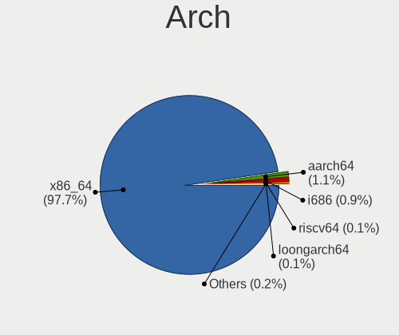

| Name        | Notebooks | Percent |
|-------------|-----------|---------|
| x86_64      | 1082      | 97.65%  |
| aarch64     | 12        | 1.08%   |
| i686        | 10        | 0.9%    |
| riscv64     | 1         | 0.09%   |
| loongarch64 | 1         | 0.09%   |
| armv7l      | 1         | 0.09%   |
| Unknown     | 1         | 0.09%   |

DE
--

Desktop Environment

| Name            | Notebooks | Percent |
|-----------------|-----------|---------|
| GNOME           | 516       | 44.79%  |
| KDE5            | 222       | 19.27%  |
| Unknown         | 111       | 9.64%   |
| XFCE            | 80        | 6.94%   |
| X-Cinnamon      | 38        | 3.3%    |
| KDE             | 30        | 2.6%    |
| Deepin          | 28        | 2.43%   |
| KDE6            | 19        | 1.65%   |
| i3              | 18        | 1.56%   |
| MATE            | 16        | 1.39%   |
| Hyprland        | 9         | 0.78%   |
| UKUI            | 7         | 0.61%   |
| DDE             | 7         | 0.61%   |
| Pantheon        | 6         | 0.52%   |
| LXDE            | 6         | 0.52%   |
| Budgie          | 6         | 0.52%   |
| LXQt            | 5         | 0.43%   |
| KDE4            | 5         | 0.43%   |
| Cinnamon        | 5         | 0.43%   |
| GNOME Flashback | 4         | 0.35%   |
| Unity           | 3         | 0.26%   |
| GNUstep         | 2         | 0.17%   |
| GNOME Classic   | 2         | 0.17%   |
| DWM             | 2         | 0.17%   |
| xmonad          | 1         | 0.09%   |
| sway            | 1         | 0.09%   |
| qtile           | 1         | 0.09%   |
| chadwm          | 1         | 0.09%   |
| bspwm           | 1         | 0.09%   |

Display Server
--------------

X11 or Wayland

| Name    | Notebooks | Percent |
|---------|-----------|---------|
| X11     | 746       | 65.32%  |
| Wayland | 301       | 26.36%  |
| Unknown | 58        | 5.08%   |
| Tty     | 37        | 3.24%   |

Display Manager
---------------

SDDM, LightDM, etc.

| Name    | Notebooks | Percent |
|---------|-----------|---------|
| Unknown | 375       | 33.01%  |
| GDM3    | 214       | 18.84%  |
| SDDM    | 208       | 18.31%  |
| GDM     | 151       | 13.29%  |
| LightDM | 144       | 12.68%  |
| TDM     | 35        | 3.08%   |
| XDM     | 2         | 0.18%   |
| SLiM    | 2         | 0.18%   |
| LY-DM   | 2         | 0.18%   |
| KDM     | 2         | 0.18%   |
| LXDM    | 1         | 0.09%   |

OS Lang
-------

Language

| Lang        | Notebooks | Percent |
|-------------|-----------|---------|
| zh_CN       | 556       | 49.42%  |
| en_US       | 406       | 36.09%  |
| Unknown     | 98        | 8.71%   |
| C           | 19        | 1.69%   |
| en_HK       | 10        | 0.89%   |
| en_GB       | 9         | 0.8%    |
| C.UTF8      | 5         | 0.44%   |
| mn_CN       | 4         | 0.36%   |
| fr_FR       | 2         | 0.18%   |
| en_AU       | 2         | 0.18%   |
| de_DE       | 2         | 0.18%   |
| zh_TW       | 1         | 0.09%   |
| zh_SG       | 1         | 0.09%   |
| th_TH       | 1         | 0.09%   |
| ru_RU       | 1         | 0.09%   |
| pt_PT       | 1         | 0.09%   |
| POSIX       | 1         | 0.09%   |
| ja_JP       | 1         | 0.09%   |
| en_ZA       | 1         | 0.09%   |
| en_US.UTF8  | 1         | 0.09%   |
| en_US,UTF-8 | 1         | 0.09%   |
| en_SG       | 1         | 0.09%   |
| .en_US      | 1         | 0.09%   |

Boot Mode
---------

EFI or BIOS

| Mode | Notebooks | Percent |
|------|-----------|---------|
| EFI  | 771       | 68.66%  |
| BIOS | 352       | 31.34%  |

Filesystem
----------

Type of filesystem

| Type    | Notebooks | Percent |
|---------|-----------|---------|
| Ext4    | 790       | 70.22%  |
| Btrfs   | 171       | 15.2%   |
| Tmpfs   | 53        | 4.71%   |
| Overlay | 46        | 4.09%   |
| Xfs     | 37        | 3.29%   |
| Unknown | 18        | 1.6%    |
| F2fs    | 5         | 0.44%   |
| Zfs     | 3         | 0.27%   |
| XXXXXXX | 1         | 0.09%   |
| Ext3    | 1         | 0.09%   |

Part. scheme
------------

Scheme of partitioning

| Type    | Notebooks | Percent |
|---------|-----------|---------|
| GPT     | 717       | 63.96%  |
| Unknown | 340       | 30.33%  |
| MBR     | 64        | 5.71%   |

Dual Boot with Linux/BSD
------------------------

Hosting more than one Linux/BSD

| Dual boot | Notebooks | Percent |
|-----------|-----------|---------|
| No        | 996       | 88.38%  |
| Yes       | 131       | 11.62%  |

Dual Boot (Win)
---------------

Hosting Linux and Windows

| Dual boot | Notebooks | Percent |
|-----------|-----------|---------|
| No        | 636       | 56.94%  |
| Yes       | 481       | 43.06%  |

Board
-----

Vendor
------

Motherboard manufacturer

| Name                           | Notebooks | Percent |
|--------------------------------|-----------|---------|
| Lenovo                         | 386       | 34.87%  |
| Hewlett-Packard                | 112       | 10.12%  |
| Dell                           | 106       | 9.58%   |
| HUAWEI                         | 71        | 6.41%   |
| ASUSTek Computer               | 67        | 6.05%   |
| Timi                           | 54        | 4.88%   |
| Acer                           | 39        | 3.52%   |
| MECHREVO                       | 30        | 2.71%   |
| Apple                          | 23        | 2.08%   |
| Valve                          | 18        | 1.63%   |
| HASEE Computer                 | 18        | 1.63%   |
| Unknown                        | 18        | 1.63%   |
| MSI                            | 14        | 1.26%   |
| HONOR                          | 11        | 0.99%   |
| Toshiba                        | 10        | 0.9%    |
| GPD                            | 10        | 0.9%    |
| Google                         | 9         | 0.81%   |
| Sony                           | 8         | 0.72%   |
| XIAOMI                         | 7         | 0.63%   |
| Notebook                       | 7         | 0.63%   |
| Samsung Electronics            | 5         | 0.45%   |
| Fujitsu                        | 5         | 0.45%   |
| Intel Client Systems           | 4         | 0.36%   |
| Intel                          | 4         | 0.36%   |
| GreatWall                      | 4         | 0.36%   |
| Alienware                      | 4         | 0.36%   |
| Shanghai Zhaoxin Semiconductor | 3         | 0.27%   |
| Razer                          | 3         | 0.27%   |
| Jumper                         | 3         | 0.27%   |
| IPASON                         | 3         | 0.27%   |
| Insyde                         | 3         | 0.27%   |
| win element                    | 2         | 0.18%   |
| Terrans Force                  | 2         | 0.18%   |
| SmbiosType1_SystemManufacturer | 2         | 0.18%   |
| ONE-NETBOOK                    | 2         | 0.18%   |
| METAPHYUNI                     | 2         | 0.18%   |
| LG Electronics                 | 2         | 0.18%   |
| Gigabyte Technology            | 2         | 0.18%   |
| Clevo                          | 2         | 0.18%   |
| WUYING                         | 1         | 0.09%   |

Model
-----

Motherboard model

| Name                              | Notebooks | Percent |
|-----------------------------------|-----------|---------|
| Unknown                           | 29        | 2.62%   |
| Valve Jupiter                     | 17        | 1.54%   |
| Lenovo Legion R9000P2021H 82JQ    | 10        | 0.9%    |
| HUAWEI HLY-WX9XX                  | 8         | 0.72%   |
| Timi RedmiBook Pro 15S            | 6         | 0.54%   |
| Lenovo Legion Y7000 81FW          | 6         | 0.54%   |
| Timi TM1701                       | 5         | 0.45%   |
| Lenovo XiaoXinPro-13IML 2019 81XB | 5         | 0.45%   |
| Lenovo Legion R7000 2020 82B6     | 5         | 0.45%   |
| HUAWEI KPRC-WX0                   | 5         | 0.45%   |
| Dell XPS 15 9570                  | 5         | 0.45%   |
| Acer Swift SF314-512              | 5         | 0.45%   |
| Timi TM1709                       | 4         | 0.36%   |
| Timi Redmi G 2022                 | 4         | 0.36%   |
| Lenovo Yoga 14sITL 2021 82G2      | 4         | 0.36%   |
| Lenovo XiaoXinPro-13ARE 2020 82DM | 4         | 0.36%   |
| Lenovo XiaoXin-15ARE 2020 81YR    | 4         | 0.36%   |
| Lenovo ThinkBook 15p Gen 2 21B1   | 4         | 0.36%   |
| Lenovo ThinkBook 14 G4+ IAP 21CX  | 4         | 0.36%   |
| Lenovo ThinkBook 14 G2 ITL 20VD   | 4         | 0.36%   |
| HUAWEI NBLK-WAX9X                 | 4         | 0.36%   |
| HUAWEI BOHK-WAX9X                 | 4         | 0.36%   |
| Apple MacBookPro16,1              | 4         | 0.36%   |
| Timi TM1613                       | 3         | 0.27%   |
| Timi RedmiBook 14-APCS            | 3         | 0.27%   |
| Timi RedmiBook 14 II              | 3         | 0.27%   |
| Shanghai Zhaoxin ZXE CRB          | 3         | 0.27%   |
| MECHREVO WUJIE14XA                | 3         | 0.27%   |
| MECHREVO Jiaolong Series MRID6    | 3         | 0.27%   |
| Lenovo ZHAOYANG K4e-ITL 82F8      | 3         | 0.27%   |
| Lenovo Yoga 14sARH 2021 82LB      | 3         | 0.27%   |
| Lenovo XiaoXinAir-14ARE 2020 81YN | 3         | 0.27%   |
| Lenovo ThinkBook 16p Gen 4 21J8   | 3         | 0.27%   |
| Lenovo ThinkBook 14p Gen 2 20YN   | 3         | 0.27%   |
| Lenovo ThinkBook 14 G3 ACL 21A2   | 3         | 0.27%   |
| Lenovo RESCUER R720-15IKBN 80WW   | 3         | 0.27%   |
| Lenovo Legion Y9000P IAH7H 82RF   | 3         | 0.27%   |
| Lenovo Legion R9000P ARX8 82WM    | 3         | 0.27%   |
| Intel H81U                        | 3         | 0.27%   |
| Intel Client Systems LAPKC71F     | 3         | 0.27%   |

Model Family
------------

Motherboard model prefix

| Name                    | Notebooks | Percent |
|-------------------------|-----------|---------|
| Lenovo ThinkPad         | 162       | 14.63%  |
| Lenovo Legion           | 58        | 5.24%   |
| Lenovo ThinkBook        | 38        | 3.43%   |
| Dell Inspiron           | 37        | 3.34%   |
| Unknown                 | 29        | 2.62%   |
| HP EliteBook            | 28        | 2.53%   |
| Dell Latitude           | 23        | 2.08%   |
| HP OMEN                 | 22        | 1.99%   |
| Lenovo IdeaPad          | 19        | 1.72%   |
| Valve Jupiter           | 17        | 1.54%   |
| Timi RedmiBook          | 17        | 1.54%   |
| HP ZHAN                 | 17        | 1.54%   |
| Lenovo ZHAOYANG         | 16        | 1.45%   |
| Acer Aspire             | 15        | 1.36%   |
| HP ProBook              | 14        | 1.26%   |
| Dell XPS                | 14        | 1.26%   |
| Acer Swift              | 14        | 1.26%   |
| Dell Precision          | 13        | 1.17%   |
| ASUS ROG                | 13        | 1.17%   |
| Lenovo XiaoXinPro       | 11        | 0.99%   |
| Lenovo Yoga             | 10        | 0.9%    |
| HP Pavilion             | 10        | 0.9%    |
| Dell Vostro             | 10        | 0.9%    |
| HUAWEI HLY-WX9XX        | 8         | 0.72%   |
| ASUS ASUS               | 8         | 0.72%   |
| Timi Redmi              | 7         | 0.63%   |
| ASUS VivoBook           | 7         | 0.63%   |
| Apple MacBookPro11      | 7         | 0.63%   |
| Toshiba Satellite       | 6         | 0.54%   |
| Lenovo XiaoXin          | 6         | 0.54%   |
| ASUS TUF                | 6         | 0.54%   |
| Acer Nitro              | 6         | 0.54%   |
| XIAOMI Redmi            | 5         | 0.45%   |
| Timi TM1701             | 5         | 0.45%   |
| Lenovo XiaoXinPro-13IML | 5         | 0.45%   |
| HUAWEI KPRC-WX0         | 5         | 0.45%   |
| HP ENVY                 | 5         | 0.45%   |
| Apple MacBookPro16      | 5         | 0.45%   |
| Timi TM1709             | 4         | 0.36%   |
| MECHREVO Jiaolong       | 4         | 0.36%   |

MFG Year
--------

Motherboard manufacture year

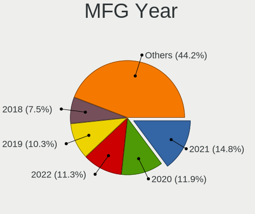

| Year    | Notebooks | Percent |
|---------|-----------|---------|
| 2021    | 164       | 14.81%  |
| 2020    | 132       | 11.92%  |
| 2022    | 125       | 11.29%  |
| 2019    | 114       | 10.3%   |
| 2018    | 83        | 7.5%    |
| 2023    | 78        | 7.05%   |
| 2017    | 58        | 5.24%   |
| 2014    | 52        | 4.7%    |
| 2013    | 47        | 4.25%   |
| 2012    | 43        | 3.88%   |
| 2016    | 42        | 3.79%   |
| 2011    | 42        | 3.79%   |
| 2015    | 37        | 3.34%   |
| 2024    | 32        | 2.89%   |
| 2008    | 21        | 1.9%    |
| 2010    | 12        | 1.08%   |
| 2009    | 10        | 0.9%    |
| 2007    | 7         | 0.63%   |
| Unknown | 5         | 0.45%   |
| 2006    | 3         | 0.27%   |

Form Factor
-----------

Physical design of the computer

| Name     | Notebooks | Percent |
|----------|-----------|---------|
| Notebook | 1107      | 100%    |

Secure Boot
-----------

Enabled or disabled

| State    | Notebooks | Percent |
|----------|-----------|---------|
| Disabled | 1001      | 89.62%  |
| Enabled  | 116       | 10.38%  |

Coreboot
--------

Have coreboot on board

| Used | Notebooks | Percent |
|------|-----------|---------|
| No   | 1096      | 99.01%  |
| Yes  | 11        | 0.99%   |

RAM Size
--------

Total RAM memory

| Size in GB  | Notebooks | Percent |
|-------------|-----------|---------|
| 8.01-16.0   | 288       | 25.53%  |
| 16.01-24.0  | 281       | 24.91%  |
| 4.01-8.0    | 227       | 20.12%  |
| 32.01-64.0  | 126       | 11.17%  |
| 3.01-4.0    | 106       | 9.4%    |
| 24.01-32.0  | 45        | 3.99%   |
| 64.01-256.0 | 25        | 2.22%   |
| 1.01-2.0    | 22        | 1.95%   |
| 0.51-1.0    | 6         | 0.53%   |
| 0.01-0.5    | 1         | 0.09%   |
| Unknown     | 1         | 0.09%   |

RAM Used
--------

Used RAM memory

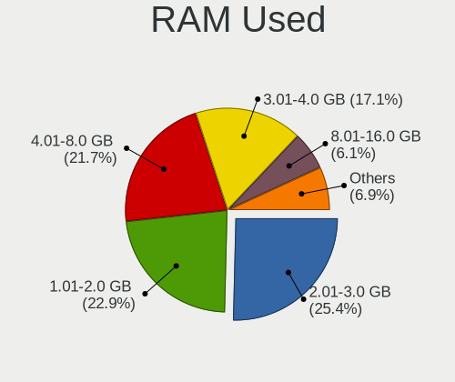

| Used GB    | Notebooks | Percent |
|------------|-----------|---------|
| 2.01-3.0   | 310       | 25.39%  |
| 1.01-2.0   | 279       | 22.85%  |
| 4.01-8.0   | 265       | 21.7%   |
| 3.01-4.0   | 209       | 17.12%  |
| 8.01-16.0  | 74        | 6.06%   |
| 0.51-1.0   | 55        | 4.5%    |
| 0.01-0.5   | 16        | 1.31%   |
| 16.01-24.0 | 7         | 0.57%   |
| Unknown    | 3         | 0.25%   |
| 24.01-32.0 | 2         | 0.16%   |
| 32.01-64.0 | 1         | 0.08%   |

Total Drives
------------

Number of drives on board

| Drives | Notebooks | Percent |
|--------|-----------|---------|
| 1      | 704       | 62.8%   |
| 2      | 348       | 31.04%  |
| 3      | 55        | 4.91%   |
| 4      | 9         | 0.8%    |
| 0      | 5         | 0.45%   |

Has CD-ROM
----------

Has CD-ROM on board

| Presented | Notebooks | Percent |
|-----------|-----------|---------|
| No        | 1004      | 90.37%  |
| Yes       | 107       | 9.63%   |

Has Ethernet
------------

Has Ethernet on board

| Presented | Notebooks | Percent |
|-----------|-----------|---------|
| Yes       | 794       | 71.34%  |
| No        | 319       | 28.66%  |

Has WiFi
--------

Has WiFi module

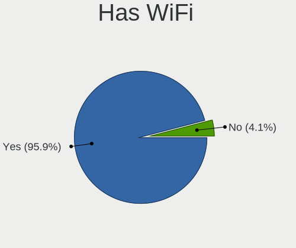

| Presented | Notebooks | Percent |
|-----------|-----------|---------|
| Yes       | 1062      | 95.93%  |
| No        | 45        | 4.07%   |

Has Bluetooth
-------------

Has Bluetooth module

| Presented | Notebooks | Percent |
|-----------|-----------|---------|
| Yes       | 948       | 85.41%  |
| No        | 162       | 14.59%  |

Location
--------

Country
-------

Geographic location (country)

| Country | Notebooks | Percent |
|---------|-----------|---------|
| China   | 1107      | 100%    |

City
----

Geographic location (city)

| City         | Notebooks | Percent |
|--------------|-----------|---------|
| Beijing      | 193       | 16.37%  |
| Shanghai     | 114       | 9.67%   |
| Shenzhen     | 82        | 6.96%   |
| Guangzhou    | 81        | 6.87%   |
| Chengdu      | 41        | 3.48%   |
| Hangzhou     | 40        | 3.39%   |
| Wuhan        | 34        | 2.88%   |
| Nanjing      | 29        | 2.46%   |
| Jinrongjie   | 28        | 2.37%   |
| Xi'an        | 23        | 1.95%   |
| Changsha     | 19        | 1.61%   |
| Zhengzhou    | 18        | 1.53%   |
| Tianjin      | 18        | 1.53%   |
| Dongguan     | 17        | 1.44%   |
| Chongqing    | 16        | 1.36%   |
| Shenyang     | 13        | 1.1%    |
| Kunming      | 13        | 1.1%    |
| Hefei        | 13        | 1.1%    |
| Suzhou       | 12        | 1.02%   |
| Nanning      | 12        | 1.02%   |
| Jinan        | 11        | 0.93%   |
| Fuzhou       | 11        | 0.93%   |
| Dalian       | 11        | 0.93%   |
| Qingdao      | 9         | 0.76%   |
| Huangpu      | 9         | 0.76%   |
| Haidian      | 9         | 0.76%   |
| Foshan       | 9         | 0.76%   |
| Xuhui        | 8         | 0.68%   |
| Harbin       | 8         | 0.68%   |
| Shijiazhuang | 7         | 0.59%   |
| Changchun    | 7         | 0.59%   |
| Xiamen       | 6         | 0.51%   |
| Taiyuan      | 6         | 0.51%   |
| Pudong       | 6         | 0.51%   |
| Ningbo       | 5         | 0.42%   |
| Jianshui     | 5         | 0.42%   |
| Hohhot       | 5         | 0.42%   |
| Guiyang      | 5         | 0.42%   |
| Yangzhou     | 4         | 0.34%   |
| Xining       | 4         | 0.34%   |

Drives
------

Drive Vendor
------------

Hard drive vendors

| Vendor                       | Notebooks | Drives | Percent |
|------------------------------|-----------|--------|---------|
| Samsung Electronics          | 300       | 399    | 19.58%  |
| WDC                          | 135       | 161    | 8.81%   |
| SanDisk                      | 120       | 141    | 7.83%   |
| Seagate                      | 97        | 113    | 6.33%   |
| SK hynix                     | 85        | 106    | 5.55%   |
| Toshiba                      | 73        | 83     | 4.77%   |
| Unknown                      | 60        | 69     | 3.92%   |
| Micron Technology            | 40        | 48     | 2.61%   |
| Intel                        | 38        | 51     | 2.48%   |
| HGST                         | 33        | 37     | 2.15%   |
| Kingston                     | 32        | 37     | 2.09%   |
| KIOXIA                       | 31        | 43     | 2.02%   |
| Yangtze Memory Technologies  | 28        | 40     | 1.83%   |
| Crucial                      | 20        | 25     | 1.31%   |
| Plextor                      | 19        | 22     | 1.24%   |
| MAXIO Technology (Hangzhou)  | 19        | 21     | 1.24%   |
| Phison                       | 18        | 20     | 1.17%   |
| Lenovo                       | 18        | 23     | 1.17%   |
| Apple                        | 18        | 20     | 1.17%   |
| LITEON                       | 17        | 19     | 1.11%   |
| Phison Electronics           | 16        | 18     | 1.04%   |
| Hitachi                      | 14        | 20     | 0.91%   |
| Unknown                      | 14        | 15     | 0.91%   |
| Silicon Motion               | 11        | 11     | 0.72%   |
| Fanxiang                     | 11        | 13     | 0.72%   |
| A-DATA Technology            | 11        | 14     | 0.72%   |
| JMicron Technology           | 10        | 8      | 0.65%   |
| China                        | 9         | 19     | 0.59%   |
| ZHITAI                       | 8         | 13     | 0.52%   |
| Union Memory (Shenzhen)      | 8         | 10     | 0.52%   |
| Hewlett-Packard              | 8         | 9      | 0.52%   |
| Kingston Technology Company  | 7         | 8      | 0.46%   |
| Kingchuxing                  | 7         | 9      | 0.46%   |
| Colorful                     | 7         | 8      | 0.46%   |
| YMTC                         | 6         | 6      | 0.39%   |
| Transcend                    | 6         | 7      | 0.39%   |
| Teclast                      | 6         | 6      | 0.39%   |
| Shenzhen Longsys Electronics | 6         | 7      | 0.39%   |
| KIOXIA-EXCERIA               | 6         | 9      | 0.39%   |
| GLOWAY                       | 6         | 7      | 0.39%   |

Drive Model
-----------

Hard drive models

| Model                                                | Notebooks | Percent |
|------------------------------------------------------|-----------|---------|
| Samsung NVMe SSD Controller PM9A1/PM9A3/980PRO 512GB | 32        | 2%      |
| Samsung NVMe SSD Controller SM981/PM981/PM983 512GB  | 21        | 1.31%   |
| Samsung NVMe SSD Drive 512GB                         | 20        | 1.25%   |
| Seagate ST1000LM035-1RK172 1TB                       | 18        | 1.12%   |
| SanDisk NVMe SSD Drive 512GB                         | 17        | 1.06%   |
| HGST HTS721010A9E630 1TB                             | 16        | 1%      |
| Sandisk WD Black SN750 / PC SN730 NVMe SSD 512GB     | 15        | 0.94%   |
| Samsung MZVLB512HBJQ-000L2 512GB                     | 14        | 0.87%   |
| Unknown                                              | 14        | 0.87%   |
| Seagate ST500LT012-1DG142 500GB                      | 13        | 0.81%   |
| Seagate ST1000LM048-2E7172 1TB                       | 12        | 0.75%   |
| SK hynix SKHynix_HFS512GDE9X084N 512GB               | 11        | 0.69%   |
| SanDisk NVMe SSD Drive 1TB                           | 11        | 0.69%   |
| Samsung SSD 980 1TB                                  | 11        | 0.69%   |
| SK hynix NVMe SSD Drive 512GB                        | 10        | 0.62%   |
| Samsung MZVLB512HAJQ-00000 512GB                     | 10        | 0.62%   |
| Samsung NVMe SSD Drive 1024GB                        | 9         | 0.56%   |
| Samsung MZVLB512HBJQ-000L7 512GB                     | 9         | 0.56%   |
| HGST HTS725050A7E630 500GB                           | 9         | 0.56%   |
| WDC PC SN730 SDBPNTY-512G-1027 512GB                 | 8         | 0.5%    |
| Toshiba MQ01ABD100 1TB                               | 8         | 0.5%    |
| SK hynix SKHynix_HFS512GD9TNI-L2A0B 512GB            | 8         | 0.5%    |
| Seagate ST2000LM007-1R8174 2TB                       | 8         | 0.5%    |
| Sandisk WD PC SN740 SDDPTQD-1T00 1024GB              | 8         | 0.5%    |
| Samsung NVMe SSD Drive 256GB                         | 8         | 0.5%    |
| Yangtze Memory ZHITAI TiPlus5000 1TB                 | 7         | 0.44%   |
| Unknown MMC Card  64GB                               | 7         | 0.44%   |
| Unknown MMC Card  128GB                              | 7         | 0.44%   |
| Seagate ST500LM021-1KJ152 500GB                      | 7         | 0.44%   |
| Sandisk WD Black SN850 2TB                           | 7         | 0.44%   |
| Samsung SSD 860 EVO 500GB                            | 7         | 0.44%   |
| Samsung MZALQ512HALU-000L2 512GB                     | 7         | 0.44%   |
| Plextor PX-128M6S 128GB SSD                          | 7         | 0.44%   |
| KIOXIA KBG40ZNV512G 512GB                            | 7         | 0.44%   |
| Yangtze Memory YMTC PC300-1TB-B                      | 6         | 0.37%   |
| WDC WD10SPZX-22Z10T1 1TB                             | 6         | 0.37%   |
| Phison PS5013 E13 NVMe Controller 512GB              | 6         | 0.37%   |
| Micron 2450_MTFDKBA512TFK 512GB                      | 6         | 0.37%   |
| MAXIO (Hangzhou) NVMe SSD Controller MAP1202 512GB   | 6         | 0.37%   |
| JMicron Generic 500GB                                | 6         | 0.37%   |

HDD Vendor
----------

Hard disk drive vendors

| Vendor              | Notebooks | Drives | Percent |
|---------------------|-----------|--------|---------|
| Seagate             | 96        | 111    | 36.09%  |
| WDC                 | 74        | 87     | 27.82%  |
| HGST                | 33        | 37     | 12.41%  |
| Toshiba             | 23        | 30     | 8.65%   |
| Hitachi             | 14        | 20     | 5.26%   |
| JMicron Technology  | 6         | 6      | 2.26%   |
| Samsung Electronics | 5         | 6      | 1.88%   |
| Fujitsu             | 5         | 5      | 1.88%   |
| External            | 5         | 7      | 1.88%   |
| ASMT                | 2         | 2      | 0.75%   |
| TO Exter            | 1         | 1      | 0.38%   |
| HGST HTS            | 1         | 1      | 0.38%   |
| ACASIS              | 1         | 1      | 0.38%   |

SSD Vendor
----------

Solid state drive vendors

| Vendor              | Notebooks | Drives | Percent |
|---------------------|-----------|--------|---------|
| Samsung Electronics | 69        | 94     | 18.9%   |
| SanDisk             | 24        | 26     | 6.58%   |
| Kingston            | 20        | 24     | 5.48%   |
| Toshiba             | 17        | 18     | 4.66%   |
| Plextor             | 17        | 20     | 4.66%   |
| LITEON              | 16        | 18     | 4.38%   |
| Lenovo              | 14        | 17     | 3.84%   |
| Crucial             | 13        | 18     | 3.56%   |
| WDC                 | 10        | 10     | 2.74%   |
| China               | 9         | 19     | 2.47%   |
| Apple               | 9         | 9      | 2.47%   |
| SK hynix            | 8         | 8      | 2.19%   |
| Micron Technology   | 8         | 9      | 2.19%   |
| A-DATA Technology   | 8         | 11     | 2.19%   |
| Unknown             | 7         | 7      | 1.92%   |
| Teclast             | 6         | 6      | 1.64%   |
| Kingchuxing         | 6         | 8      | 1.64%   |
| Intel               | 6         | 6      | 1.64%   |
| Transcend           | 5         | 6      | 1.37%   |
| Phison              | 5         | 6      | 1.37%   |
| LITEONIT            | 5         | 5      | 1.37%   |
| GLOWAY              | 5         | 6      | 1.37%   |
| Colorful            | 5         | 5      | 1.37%   |
| ZHITAI              | 4         | 7      | 1.1%    |
| Netac               | 4         | 4      | 1.1%    |
| KingSpec            | 4         | 5      | 1.1%    |
| GALAX               | 4         | 4      | 1.1%    |
| Lexar               | 3         | 3      | 0.82%   |
| KIOXIA-EXCERIA      | 3         | 3      | 0.82%   |
| Fanxiang            | 3         | 3      | 0.82%   |
| Soyo                | 2         | 2      | 0.55%   |
| MaiChai             | 2         | 3      | 0.55%   |
| HIKSEMI             | 2         | 2      | 0.55%   |
| Hewlett-Packard     | 2         | 2      | 0.55%   |
| Galaxy              | 2         | 2      | 0.55%   |
| FORESEE             | 2         | 2      | 0.55%   |
| XSJ-X100-256GB      | 1         | 1      | 0.27%   |
| Xinsujie            | 1         | 1      | 0.27%   |
| XBR-681-512GB       | 1         | 1      | 0.27%   |
| WDC WDS1            | 1         | 1      | 0.27%   |

Drive Kind
----------

HDD or SSD

| Kind    | Notebooks | Drives | Percent |
|---------|-----------|--------|---------|
| NVMe    | 697       | 1014   | 50.76%  |
| SSD     | 326       | 442    | 23.74%  |
| HDD     | 254       | 314    | 18.5%   |
| MMC     | 58        | 66     | 4.22%   |
| Unknown | 38        | 42     | 2.77%   |

Drive Connector
---------------

SATA, SAS, NVMe, etc.

| Type | Notebooks | Drives | Percent |
|------|-----------|--------|---------|
| NVMe | 697       | 1002   | 53.13%  |
| SATA | 479       | 717    | 36.51%  |
| SAS  | 78        | 93     | 5.95%   |
| MMC  | 58        | 66     | 4.42%   |

Drive Size
----------

Size of hard drive

| Size in TB | Notebooks | Drives | Percent |
|------------|-----------|--------|---------|
| 0.01-0.5   | 351       | 475    | 61.26%  |
| 0.51-1.0   | 185       | 231    | 32.29%  |
| 1.01-2.0   | 31        | 39     | 5.41%   |
| 3.01-4.0   | 4         | 5      | 0.7%    |
| 10.01-20.0 | 1         | 4      | 0.17%   |
| 4.01-10.0  | 1         | 2      | 0.17%   |

Space Total
-----------

Amount of disk space available on the file system

| Size in GB     | Notebooks | Percent |
|----------------|-----------|---------|
| 251-500        | 321       | 27.77%  |
| 101-250        | 255       | 22.06%  |
| 501-1000       | 203       | 17.56%  |
| 1001-2000      | 99        | 8.56%   |
| 51-100         | 89        | 7.7%    |
| 1-20           | 62        | 5.36%   |
| More than 3000 | 46        | 3.98%   |
| 21-50          | 35        | 3.03%   |
| 2001-3000      | 30        | 2.6%    |
| Unknown        | 16        | 1.38%   |

Space Used
----------

Amount of used disk space

| Used GB        | Notebooks | Percent |
|----------------|-----------|---------|
| 1-20           | 414       | 34.64%  |
| 21-50          | 212       | 17.74%  |
| 101-250        | 171       | 14.31%  |
| 51-100         | 137       | 11.46%  |
| 251-500        | 118       | 9.87%   |
| 501-1000       | 68        | 5.69%   |
| 1001-2000      | 36        | 3.01%   |
| Unknown        | 16        | 1.34%   |
| More than 3000 | 12        | 1%      |
| 2001-3000      | 10        | 0.84%   |
| 0              | 1         | 0.08%   |

Malfunc. Drives
---------------

Drive models with a malfunction

| Model                                                            | Notebooks | Drives | Percent |
|------------------------------------------------------------------|-----------|--------|---------|
| HGST HTS725050A7E630 500GB                                       | 4         | 4      | 6.25%   |
| Seagate ST500LT012-1DG142 500GB                                  | 3         | 3      | 4.69%   |
| HGST HTS721010A9E630 1TB                                         | 3         | 3      | 4.69%   |
| Toshiba MQ04ABF100 1TB                                           | 2         | 2      | 3.13%   |
| Toshiba MQ01ABF050 500GB                                         | 2         | 2      | 3.13%   |
| Seagate ST500LM021-1KJ152 500GB                                  | 2         | 2      | 3.13%   |
| Seagate ST1000LM048-2E7172 1TB                                   | 2         | 2      | 3.13%   |
| Seagate ST1000LM024 HN-M101MBB 1TB                               | 2         | 2      | 3.13%   |
| WDC WD5000LPCX-24C6HT0 500GB                                     | 1         | 1      | 1.56%   |
| WDC WD3200BVVT-63A26Y0 320GB                                     | 1         | 1      | 1.56%   |
| WDC WD10SPZX-60Z10T0 1TB                                         | 1         | 1      | 1.56%   |
| WDC WD10 JPVX-75JC3T0 1TB                                        | 1         | 1      | 1.56%   |
| Union Memory UMIS RPITJ512PED2OWX 512GB                          | 1         | 1      | 1.56%   |
| Toshiba MK3259GSXP 320GB                                         | 1         | 1      | 1.56%   |
| Toshiba MK2555GSX 250GB                                          | 1         | 1      | 1.56%   |
| Teclast 120GB S500 SSD                                           | 1         | 1      | 1.56%   |
| SK hynix BC711 HFM512GD3JX013N 512GB                             | 1         | 1      | 1.56%   |
| Seagate ST9500325AS 500GB                                        | 1         | 1      | 1.56%   |
| Seagate ST750LM028-1KK162 752GB                                  | 1         | 1      | 1.56%   |
| Seagate ST500LT012-9WS142 500GB                                  | 1         | 2      | 1.56%   |
| Seagate ST320LT009-9WC142 320GB                                  | 1         | 1      | 1.56%   |
| Seagate ST1000LM 035-1RK172 1TB                                  | 1         | 1      | 1.56%   |
| SanDisk SSD U100 128GB                                           | 1         | 1      | 1.56%   |
| SanDisk SD9SN8W-256G-1006 256GB SSD                              | 1         | 1      | 1.56%   |
| Samsung Electronics NVMe SSD Controller PM9A1/PM9A3/980PRO 512GB | 1         | 1      | 1.56%   |
| Samsung Electronics MZVLW512HMJP-00000 512GB                     | 1         | 1      | 1.56%   |
| Plextor PX-128M6S 128GB SSD                                      | 1         | 1      | 1.56%   |
| NT-512 2280 512GB SSD                                            | 1         | 1      | 1.56%   |
| Netac SSD 120GB                                                  | 1         | 1      | 1.56%   |
| Lenovo SSD SL700 120G                                            | 1         | 1      | 1.56%   |
| Kingston RBUSNS8180S3256GJ 256GB SSD                             | 1         | 1      | 1.56%   |
| Intel SSDPEKKF256G7H 256GB                                       | 1         | 1      | 1.56%   |
| HS-SSD-C160 SSD 1024G                                            | 1         | 1      | 1.56%   |
| Hitachi HTS547575A9E384 752GB                                    | 1         | 1      | 1.56%   |
| Hitachi HTS545050B9A300 500GB                                    | 1         | 1      | 1.56%   |
| Hitachi HTS545032B9A300 320GB                                    | 1         | 2      | 1.56%   |
| Hitachi HTS541060G9SA00 64GB                                     | 1         | 1      | 1.56%   |
| Hitachi HTS541040G9AT00 40GB                                     | 1         | 1      | 1.56%   |
| HIKSEMI MS201 1TB                                                | 1         | 1      | 1.56%   |
| HGST HTS545050A7E680 500GB                                       | 1         | 1      | 1.56%   |

Malfunc. Drive Vendor
---------------------

Vendors of faulty drives

| Vendor              | Notebooks | Drives | Percent |
|---------------------|-----------|--------|---------|
| Seagate             | 14        | 15     | 21.88%  |
| HGST                | 8         | 8      | 12.5%   |
| Toshiba             | 6         | 6      | 9.38%   |
| Hitachi             | 5         | 6      | 7.81%   |
| WDC                 | 4         | 4      | 6.25%   |
| A-DATA Technology   | 3         | 4      | 4.69%   |
| SanDisk             | 2         | 2      | 3.13%   |
| Samsung Electronics | 2         | 2      | 3.13%   |
| GLOWAY              | 2         | 2      | 3.13%   |
| Fujitsu             | 2         | 2      | 3.13%   |
| Crucial             | 2         | 2      | 3.13%   |
| Union Memory        | 1         | 1      | 1.56%   |
| Teclast             | 1         | 1      | 1.56%   |
| SK hynix            | 1         | 1      | 1.56%   |
| Plextor             | 1         | 1      | 1.56%   |
| NT-512              | 1         | 1      | 1.56%   |
| Netac               | 1         | 1      | 1.56%   |
| Lenovo              | 1         | 1      | 1.56%   |
| Kingston            | 1         | 1      | 1.56%   |
| Intel               | 1         | 1      | 1.56%   |
| HS-SSD-C160         | 1         | 1      | 1.56%   |
| HIKSEMI             | 1         | 1      | 1.56%   |
| Hewlett-Packard     | 1         | 1      | 1.56%   |
| ADATA Technology    | 1         | 1      | 1.56%   |
| Acer                | 1         | 1      | 1.56%   |

Malfunc. HDD Vendor
-------------------

Vendors of faulty HDD drives

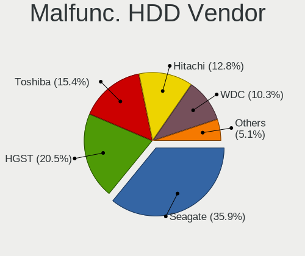

| Vendor  | Notebooks | Drives | Percent |
|---------|-----------|--------|---------|
| Seagate | 14        | 15     | 35.9%   |
| HGST    | 8         | 8      | 20.51%  |
| Toshiba | 6         | 6      | 15.38%  |
| Hitachi | 5         | 6      | 12.82%  |
| WDC     | 4         | 4      | 10.26%  |
| Fujitsu | 2         | 2      | 5.13%   |

Malfunc. Drive Kind
-------------------

Kinds of faulty drives

| Kind | Notebooks | Drives | Percent |
|------|-----------|--------|---------|
| HDD  | 39        | 41     | 60.94%  |
| SSD  | 17        | 18     | 26.56%  |
| NVMe | 8         | 8      | 12.5%   |

Failed Drives
-------------

Failed drive models

| Model                            | Notebooks | Drives | Percent |
|----------------------------------|-----------|--------|---------|
| Samsung Electronics SSD 980 1TB  | 1         | 1      | 33.33%  |
| Samsung Electronics HS06THB 64GB | 1         | 1      | 33.33%  |
| Phison ESO128GTLC9-E8C-2 128GB   | 1         | 1      | 33.33%  |

Failed Drive Vendor
-------------------

Failed drive vendors

| Vendor              | Notebooks | Drives | Percent |
|---------------------|-----------|--------|---------|
| Samsung Electronics | 2         | 2      | 66.67%  |
| Phison              | 1         | 1      | 33.33%  |

Drive Status
------------

Number of failed and malfunc. drives

| Status   | Notebooks | Drives | Percent |
|----------|-----------|--------|---------|
| Works    | 610       | 998    | 50.96%  |
| Detected | 521       | 810    | 43.53%  |
| Malfunc  | 63        | 67     | 5.26%   |
| Failed   | 3         | 3      | 0.25%   |

Storage controller
------------------

Storage Vendor
--------------

Storage controller vendors

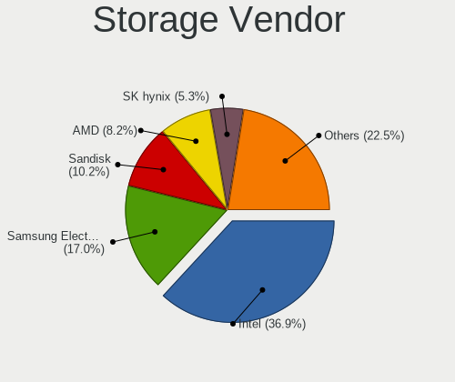

| Vendor                                  | Notebooks | Percent |
|-----------------------------------------|-----------|---------|
| Intel                                   | 533       | 36.86%  |
| Samsung Electronics                     | 246       | 17.01%  |
| Sandisk                                 | 147       | 10.17%  |
| AMD                                     | 119       | 8.23%   |
| SK hynix                                | 76        | 5.26%   |
| Yangtze Memory Technologies             | 37        | 2.56%   |
| KIOXIA                                  | 36        | 2.49%   |
| Micron Technology                       | 33        | 2.28%   |
| Toshiba America Info Systems            | 32        | 2.21%   |
| Phison Electronics                      | 30        | 2.07%   |
| MAXIO Technology (Hangzhou)             | 28        | 1.94%   |
| Silicon Motion                          | 21        | 1.45%   |
| Kingston Technology Company             | 18        | 1.24%   |
| Biwin Storage Technology                | 10        | 0.69%   |
| Shenzhen Longsys Electronics            | 9         | 0.62%   |
| Shenzhen Unionmemory Information System | 8         | 0.55%   |
| Micron/Crucial Technology               | 8         | 0.55%   |
| Apple                                   | 8         | 0.55%   |
| Solid State Storage Technology          | 7         | 0.48%   |
| Marvell Technology Group                | 5         | 0.35%   |
| INNOGRIT                                | 5         | 0.35%   |
| ADATA Technology                        | 5         | 0.35%   |
| Zhaoxin                                 | 4         | 0.28%   |
| Union Memory (Shenzhen)                 | 3         | 0.21%   |
| O2 Micro                                | 3         | 0.21%   |
| Silicon Integrated Systems [SiS]        | 2         | 0.14%   |
| Realtek Semiconductor                   | 2         | 0.14%   |
| Lite-On Technology                      | 2         | 0.14%   |
| Hefei DATANG Storage Technology         | 2         | 0.14%   |
| Solidigm                                | 1         | 0.07%   |
| Seagate Technology                      | 1         | 0.07%   |
| Nvidia                                  | 1         | 0.07%   |
| Lenovo                                  | 1         | 0.07%   |
| JMicron Technology                      | 1         | 0.07%   |
| ASMedia Technology                      | 1         | 0.07%   |
| Unknown                                 | 1         | 0.07%   |

Storage Model
-------------

Storage controller models

| Model                                                                          | Notebooks | Percent |
|--------------------------------------------------------------------------------|-----------|---------|
| AMD FCH SATA Controller [AHCI mode]                                            | 115       | 7.6%    |
| Samsung NVMe SSD Controller SM981/PM981/PM983                                  | 110       | 7.27%   |
| Intel Sunrise Point-LP SATA Controller [AHCI mode]                             | 80        | 5.29%   |
| Samsung NVMe SSD Controller PM9A1/PM9A3/980PRO                                 | 55        | 3.64%   |
| Intel 7 Series Chipset Family 6-port SATA Controller [AHCI mode]               | 55        | 3.64%   |
| SanDisk Extreme Pro / WD Black SN750 / PC SN730 / Red SN700 NVMe SSD           | 46        | 3.04%   |
| Intel Cannon Lake Mobile PCH SATA AHCI Controller                              | 37        | 2.45%   |
| Samsung NVMe SSD Controller 980 (DRAM-less)                                    | 36        | 2.38%   |
| Intel Volume Management Device NVMe RAID Controller                            | 35        | 2.31%   |
| Intel 6 Series/C200 Series Chipset Family 6 port Mobile SATA AHCI Controller   | 34        | 2.25%   |
| SK hynix Gold P31/BC711/PC711 NVMe Solid State Drive                           | 32        | 2.12%   |
| Intel 8 Series SATA Controller 1 [AHCI mode]                                   | 32        | 2.12%   |
| Intel 82801 Mobile SATA Controller [RAID mode]                                 | 30        | 1.98%   |
| Intel HM170/QM170 Chipset SATA Controller [AHCI Mode]                          | 24        | 1.59%   |
| SanDisk Ultra 3D / WD PC SN530, IX SN530, Blue SN550 NVMe SSD (DRAM-less)      | 22        | 1.45%   |
| Samsung NVMe SSD Controller SM961/PM961/SM963                                  | 22        | 1.45%   |
| Intel 8 Series/C220 Series Chipset Family 6-port SATA Controller 1 [AHCI mode] | 21        | 1.39%   |
| Intel Wildcat Point-LP SATA Controller [AHCI Mode]                             | 20        | 1.32%   |
| SanDisk WD Black SN770 / PC SN740 256GB / PC SN560 (DRAM-less) NVMe SSD        | 17        | 1.12%   |
| SK hynix PC611 NVMe Solid State Drive                                          | 16        | 1.06%   |
| SanDisk Extreme Pro / WD Black 2018/SN750/PC SN720 NVMe SSD                    | 16        | 1.06%   |
| MAXIO (Hangzhou) NVMe SSD Controller MAP1602 (DRAM-less)                       | 16        | 1.06%   |
| Intel Comet Lake SATA AHCI Controller                                          | 16        | 1.06%   |
| Silicon Motion SM2263EN/SM2263XT (DRAM-less) NVMe SSD Controllers              | 14        | 0.93%   |
| Intel Cannon Point-LP SATA Controller [AHCI Mode]                              | 14        | 0.93%   |
| Intel 82801IBM/IEM (ICH9M/ICH9M-E) 4 port SATA Controller [AHCI mode]          | 14        | 0.93%   |
| Toshiba America Info Systems XG6 NVMe SSD Controller                           | 13        | 0.86%   |
| Micron 3400 NVMe SSD [Hendrix]                                                 | 13        | 0.86%   |
| KIOXIA NVMe SSD Controller BG5 (DRAM-less)                                     | 13        | 0.86%   |
| KIOXIA NVMe SSD Controller BG4 (DRAM-less)                                     | 13        | 0.86%   |
| Intel SSD 660P Series                                                          | 13        | 0.86%   |
| SanDisk WD PC SN810 / Black SN850 NVMe SSD                                     | 12        | 0.79%   |
| Intel Tiger Lake SATA AHCI Controller                                          | 12        | 0.79%   |
| Yangtze Memory ZHITAI TiPro5000 NVMe SSD                                       | 11        | 0.73%   |
| MAXIO (Hangzhou) NVMe SSD Controller MAP1202 (DRAM-less)                       | 11        | 0.73%   |
| Intel Tiger Lake-LP SATA Controller                                            | 11        | 0.73%   |
| Intel SSD DC P4101/Pro 7600p/760p/E 6100p Series                               | 11        | 0.73%   |
| Intel Alder Lake-P SATA AHCI Controller                                        | 11        | 0.73%   |
| Toshiba America Info Systems BG3 x2 NVMe SSD Controller (DRAM-less)            | 10        | 0.66%   |
| Sandisk PC SN740 NVMe SSD (DRAM-less)                                          | 10        | 0.66%   |

Storage Kind
------------

Kind of storage controller (IDE, SATA, NVMe, SAS, ...)

| Kind | Notebooks | Percent |
|------|-----------|---------|
| NVMe | 698       | 50.73%  |
| SATA | 575       | 41.79%  |
| RAID | 73        | 5.31%   |
| IDE  | 30        | 2.18%   |

Processor
---------

CPU Vendor
----------

Processor vendors

| Vendor       | Notebooks | Percent |
|--------------|-----------|---------|
| Intel        | 779       | 70.37%  |
| AMD          | 304       | 27.46%  |
| CentaurHauls | 9         | 0.81%   |
| Phytium      | 7         | 0.63%   |
| ARM          | 3         | 0.27%   |
| Qualcomm     | 2         | 0.18%   |
| Unknown      | 2         | 0.18%   |
| Loongson     | 1         | 0.09%   |

CPU Model
---------

Processor models

| Model                                          | Notebooks | Percent |
|------------------------------------------------|-----------|---------|
| AMD Ryzen 7 5800H with Radeon Graphics         | 45        | 4.07%   |
| Intel 11th Gen Core i5-1135G7 @ 2.40GHz        | 32        | 2.89%   |
| Intel 12th Gen Core i7-12700H                  | 28        | 2.53%   |
| Intel Core i5-8250U CPU @ 1.60GHz              | 26        | 2.35%   |
| Intel Core i7-9750H CPU @ 2.60GHz              | 23        | 2.08%   |
| AMD Ryzen 5 3500U with Radeon Vega Mobile Gfx  | 23        | 2.08%   |
| Intel 11th Gen Core i7-1165G7 @ 2.80GHz        | 20        | 1.81%   |
| Intel Core i5-7200U CPU @ 2.50GHz              | 19        | 1.72%   |
| AMD Custom APU 0405                            | 17        | 1.54%   |
| Intel Core i5-6200U CPU @ 2.30GHz              | 16        | 1.45%   |
| Intel Core i5-10210U CPU @ 1.60GHz             | 16        | 1.45%   |
| Intel Core i7-8550U CPU @ 1.80GHz              | 15        | 1.36%   |
| Intel Core i5-8265U CPU @ 1.60GHz              | 15        | 1.36%   |
| AMD Ryzen 7 6800H with Radeon Graphics         | 15        | 1.36%   |
| AMD Ryzen 7 4800H with Radeon Graphics         | 15        | 1.36%   |
| Intel Core i7-8750H CPU @ 2.20GHz              | 14        | 1.26%   |
| Intel 11th Gen Core i7-11800H @ 2.30GHz        | 14        | 1.26%   |
| Intel Core i7-10510U CPU @ 1.80GHz             | 12        | 1.08%   |
| Intel 12th Gen Core i5-1240P                   | 11        | 0.99%   |
| Intel Core i7-7700HQ CPU @ 2.80GHz             | 10        | 0.9%    |
| Intel Core i5-8300H CPU @ 2.30GHz              | 10        | 0.9%    |
| Intel Core i7-8565U CPU @ 1.80GHz              | 9         | 0.81%   |
| Intel Core i7-10750H CPU @ 2.60GHz             | 9         | 0.81%   |
| Intel Core i5-5200U CPU @ 2.20GHz              | 9         | 0.81%   |
| AMD Ryzen 9 7945HX with Radeon Graphics        | 9         | 0.81%   |
| AMD Ryzen 5 3550H with Radeon Vega Mobile Gfx  | 9         | 0.81%   |
| Intel Core i7-6700HQ CPU @ 2.60GHz             | 8         | 0.72%   |
| Intel Core i5-4200U CPU @ 1.60GHz              | 8         | 0.72%   |
| Intel Core i5-3210M CPU @ 2.50GHz              | 8         | 0.72%   |
| AMD Ryzen 5 4600U with Radeon Graphics         | 8         | 0.72%   |
| Intel Core i5-4210U CPU @ 1.70GHz              | 7         | 0.63%   |
| Intel Core i5-3320M CPU @ 2.60GHz              | 7         | 0.63%   |
| Intel Core i5-2520M CPU @ 2.50GHz              | 7         | 0.63%   |
| Intel Core i3-2350M CPU @ 2.30GHz              | 7         | 0.63%   |
| Intel 13th Gen Core i9-13900H                  | 7         | 0.63%   |
| CentaurHauls ZHAOXIN KaiXian KX-6640MA@2.2+GHz | 7         | 0.63%   |
| AMD Ryzen 7 PRO 4750U with Radeon Graphics     | 7         | 0.63%   |
| AMD Ryzen 7 7840HS w/ Radeon 780M Graphics     | 7         | 0.63%   |
| AMD Ryzen 7 4800U with Radeon Graphics         | 7         | 0.63%   |
| AMD Ryzen 5 4600H with Radeon Graphics         | 7         | 0.63%   |

CPU Model Family
----------------

Processor model prefix

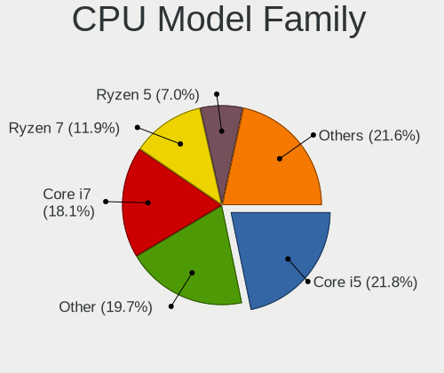

| Model                   | Notebooks | Percent |
|-------------------------|-----------|---------|
| Intel Core i5           | 241       | 21.77%  |
| Other                   | 218       | 19.69%  |
| Intel Core i7           | 200       | 18.07%  |
| AMD Ryzen 7             | 132       | 11.92%  |
| AMD Ryzen 5             | 77        | 6.96%   |
| Intel Core i3           | 48        | 4.34%   |
| Intel Core 2 Duo        | 22        | 1.99%   |
| Intel Celeron           | 22        | 1.99%   |
| AMD Ryzen 9             | 21        | 1.9%    |
| Intel Atom              | 20        | 1.81%   |
| AMD Ryzen 7 PRO         | 18        | 1.63%   |
| Intel Core              | 9         | 0.81%   |
| Intel Core i9           | 8         | 0.72%   |
| AMD A6                  | 8         | 0.72%   |
| Intel Xeon              | 7         | 0.63%   |
| Intel Pentium           | 7         | 0.63%   |
| AMD Ryzen 5 PRO         | 6         | 0.54%   |
| Intel Core m3           | 5         | 0.45%   |
| AMD A10                 | 5         | 0.45%   |
| AMD A8                  | 4         | 0.36%   |
| Intel Pentium Dual      | 3         | 0.27%   |
| AMD E2                  | 3         | 0.27%   |
| Intel Pentium Silver    | 2         | 0.18%   |
| Intel Genuine           | 2         | 0.18%   |
| Intel Core M            | 2         | 0.18%   |
| Intel Core 2            | 2         | 0.18%   |
| AMD Ryzen 3             | 2         | 0.18%   |
| AMD E                   | 2         | 0.18%   |
| AMD Athlon              | 2         | 0.18%   |
| AMD A4                  | 2         | 0.18%   |
| Intel Pentium M         | 1         | 0.09%   |
| Intel Core Duo          | 1         | 0.09%   |
| Intel Celeron Dual-Core | 1         | 0.09%   |
| ARM ARMv7               | 1         | 0.09%   |
| AMD Quad-Core           | 1         | 0.09%   |
| AMD E1                  | 1         | 0.09%   |
| AMD C-50                | 1         | 0.09%   |

CPU Cores
---------

Number of processor cores

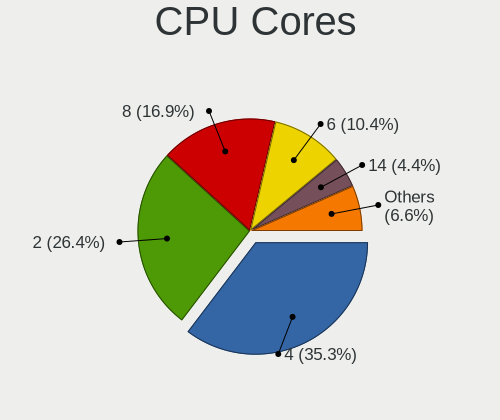

| Number  | Notebooks | Percent |
|---------|-----------|---------|
| 4       | 392       | 35.35%  |
| 2       | 293       | 26.42%  |
| 8       | 187       | 16.86%  |
| 6       | 115       | 10.37%  |
| 14      | 49        | 4.42%   |
| 12      | 31        | 2.8%    |
| 16      | 18        | 1.62%   |
| 10      | 10        | 0.9%    |
| 1       | 8         | 0.72%   |
| 24      | 3         | 0.27%   |
| Unknown | 2         | 0.18%   |
| 20      | 1         | 0.09%   |

CPU Sockets
-----------

Number of sockets

| Number  | Notebooks | Percent |
|---------|-----------|---------|
| 1       | 1104      | 99.64%  |
| 3       | 2         | 0.18%   |
| Unknown | 2         | 0.18%   |

CPU Threads
-----------

Threads per core (Hyper-Threading)

| Number  | Notebooks | Percent |
|---------|-----------|---------|
| 2       | 951       | 85.68%  |
| 1       | 157       | 14.14%  |
| Unknown | 2         | 0.18%   |

CPU Op-Modes
------------

CPU Operation Modes (32-bit, 64-bit)

| Op mode        | Notebooks | Percent |
|----------------|-----------|---------|
| 32-bit, 64-bit | 1091      | 98.47%  |
| Unknown        | 7         | 0.63%   |
| 32-bit         | 6         | 0.54%   |
| 64-bit         | 4         | 0.36%   |

CPU Microcode
-------------

Microcode number

| Number     | Notebooks | Percent |
|------------|-----------|---------|
| Unknown    | 429       | 37.57%  |
| 0x906ea    | 43        | 3.77%   |
| 0x0a50000c | 42        | 3.68%   |
| 0x806ec    | 36        | 3.15%   |
| 0x306a9    | 36        | 3.15%   |
| 0x806ea    | 33        | 2.89%   |
| 0x806c1    | 31        | 2.71%   |
| 0x08600106 | 30        | 2.63%   |
| 0x806e9    | 26        | 2.28%   |
| 0x206a7    | 26        | 2.28%   |
| 0x40651    | 25        | 2.19%   |
| 0x906a3    | 23        | 2.01%   |
| 0x406e3    | 21        | 1.84%   |
| 0x306d4    | 20        | 1.75%   |
| 0x08108102 | 19        | 1.66%   |
| 0x0a404102 | 16        | 1.4%    |
| 0x506e3    | 15        | 1.31%   |
| 0xa0652    | 14        | 1.23%   |
| 0x306c3    | 14        | 1.23%   |
| 0x08108109 | 14        | 1.23%   |
| 0x08600104 | 13        | 1.14%   |
| 0x906e9    | 12        | 1.05%   |
| 0x806d1    | 12        | 1.05%   |
| 0x1067a    | 10        | 0.88%   |
| 0x30678    | 9         | 0.79%   |
| 0x0a704103 | 9         | 0.79%   |
| 0x0a404101 | 7         | 0.61%   |
| 0x08600103 | 7         | 0.61%   |
| 0x806eb    | 6         | 0.53%   |
| 0x706e5    | 6         | 0.53%   |
| 0x0a601203 | 6         | 0.53%   |
| 0xb06a2    | 5         | 0.44%   |
| 0xa0660    | 5         | 0.44%   |
| 0x906ed    | 5         | 0.44%   |
| 0x706a1    | 5         | 0.44%   |
| 0x0a50000b | 5         | 0.44%   |
| 0x08608103 | 5         | 0.44%   |
| 0x806c2    | 4         | 0.35%   |
| 0x6fd      | 4         | 0.35%   |
| 0x406c3    | 4         | 0.35%   |

CPU Microarch
-------------

Microarchitecture

| Name              | Notebooks | Percent |
|-------------------|-----------|---------|
| KabyLake          | 235       | 21.15%  |
| Unknown           | 166       | 14.94%  |
| TigerLake         | 68        | 6.12%   |
| Zen 3             | 66        | 5.94%   |
| Zen 2             | 65        | 5.85%   |
| Haswell           | 64        | 5.76%   |
| Alderlake Hybrid  | 63        | 5.67%   |
| IvyBridge         | 58        | 5.22%   |
| Skylake           | 45        | 4.05%   |
| Zen+              | 40        | 3.6%    |
| SandyBridge       | 40        | 3.6%    |
| CometLake         | 30        | 2.7%    |
| Broadwell         | 26        | 2.34%   |
| Icelake           | 24        | 2.16%   |
| Silvermont        | 21        | 1.89%   |
| Penryn            | 21        | 1.89%   |
| Zen               | 9         | 0.81%   |
| Westmere          | 8         | 0.72%   |
| Goldmont plus     | 7         | 0.63%   |
| Core              | 7         | 0.63%   |
| Puma              | 6         | 0.54%   |
| Piledriver        | 5         | 0.45%   |
| Goldmont          | 5         | 0.45%   |
| Bonnell           | 5         | 0.45%   |
| Meteorlake Hybrid | 4         | 0.36%   |
| Excavator         | 4         | 0.36%   |
| Tremont           | 3         | 0.27%   |
| Steamroller       | 3         | 0.27%   |
| P6                | 3         | 0.27%   |
| Jaguar            | 3         | 0.27%   |
| Bobcat            | 3         | 0.27%   |
| Nehalem           | 2         | 0.18%   |
| K10 Llano         | 2         | 0.18%   |

Graphics
--------

GPU Vendor
----------

Vendors of graphics cards

| Vendor                           | Notebooks | Percent |
|----------------------------------|-----------|---------|
| Intel                            | 705       | 46.88%  |
| Nvidia                           | 425       | 28.26%  |
| AMD                              | 362       | 24.07%  |
| Zhaoxin                          | 9         | 0.6%    |
| Silicon Integrated Systems [SiS] | 1         | 0.07%   |
| Nanjing Ruixinview Technology    | 1         | 0.07%   |
| Loongson Technology              | 1         | 0.07%   |

GPU Model
---------

Graphics card models

| Model                                                                                 | Notebooks | Percent |
|---------------------------------------------------------------------------------------|-----------|---------|
| Intel TigerLake-LP GT2 [Iris Xe Graphics]                                             | 66        | 4.3%    |
| AMD Renoir [Radeon Vega Series / Radeon Vega Mobile Series]                           | 59        | 3.84%   |
| Intel 3rd Gen Core processor Graphics Controller                                      | 55        | 3.58%   |
| Intel UHD Graphics 620                                                                | 51        | 3.32%   |
| AMD Cezanne [Radeon Vega Series / Radeon Vega Mobile Series]                          | 50        | 3.26%   |
| Intel Alder Lake-P GT2 [Iris Xe Graphics]                                             | 48        | 3.13%   |
| Intel CoffeeLake-H GT2 [UHD Graphics 630]                                             | 44        | 2.87%   |
| Nvidia GA106M [GeForce RTX 3060 Mobile / Max-Q]                                       | 43        | 2.8%    |
| AMD Picasso/Raven 2 [Radeon Vega Series / Radeon Vega Mobile Series]                  | 41        | 2.67%   |
| Intel Haswell-ULT Integrated Graphics Controller                                      | 35        | 2.28%   |
| Intel 2nd Generation Core Processor Family Integrated Graphics Controller             | 35        | 2.28%   |
| AMD Rembrandt [Radeon 680M]                                                           | 32        | 2.08%   |
| Intel CometLake-U GT2 [UHD Graphics]                                                  | 30        | 1.95%   |
| Intel HD Graphics 620                                                                 | 29        | 1.89%   |
| Intel WhiskeyLake-U GT2 [UHD Graphics 620]                                            | 27        | 1.76%   |
| Nvidia TU117M [GeForce GTX 1650 Mobile / Max-Q]                                       | 25        | 1.63%   |
| Intel Skylake GT2 [HD Graphics 520]                                                   | 23        | 1.5%    |
| Intel 4th Gen Core Processor Integrated Graphics Controller                           | 22        | 1.43%   |
| Nvidia GP108M [GeForce MX250]                                                         | 21        | 1.37%   |
| Nvidia GP108M [GeForce MX150]                                                         | 20        | 1.3%    |
| Nvidia AD107M [GeForce RTX 4060 Max-Q / Mobile]                                       | 19        | 1.24%   |
| Intel HD Graphics 5500                                                                | 19        | 1.24%   |
| AMD Phoenix1                                                                          | 19        | 1.24%   |
| Nvidia TU117M [GeForce MX450]                                                         | 17        | 1.11%   |
| AMD VanGogh [AMD Custom GPU 0405]                                                     | 17        | 1.11%   |
| Intel TigerLake-H GT1 [UHD Graphics]                                                  | 16        | 1.04%   |
| AMD Topaz XT [Radeon R7 M260/M265 / M340/M360 / M440/M445 / 530/535 / 620/625 Mobile] | 15        | 0.98%   |
| Nvidia GP107M [GeForce GTX 1050 Ti Mobile]                                            | 14        | 0.91%   |
| Nvidia GF117M [GeForce 610M/710M/810M/820M / GT 620M/625M/630M/720M]                  | 14        | 0.91%   |
| Intel HD Graphics 630                                                                 | 14        | 0.91%   |
| Intel CometLake-H GT2 [UHD Graphics]                                                  | 14        | 0.91%   |
| Intel Raptor Lake-P [Iris Xe Graphics]                                                | 12        | 0.78%   |
| Intel HD Graphics 530                                                                 | 12        | 0.78%   |
| Intel Atom Processor Z36xxx/Z37xxx Series Graphics & Display                          | 12        | 0.78%   |
| AMD Sun XT [Radeon HD 8670A/8670M/8690M / R5 M330 / M430 / Radeon 520 Mobile]         | 12        | 0.78%   |
| Nvidia TU106M [GeForce RTX 2060 Mobile]                                               | 11        | 0.72%   |
| Nvidia GP107M [GeForce GTX 1050 Mobile]                                               | 10        | 0.65%   |
| Nvidia GM108M [GeForce 940MX]                                                         | 10        | 0.65%   |
| AMD Phoenix3                                                                          | 10        | 0.65%   |
| Nvidia GP106M [GeForce GTX 1060 Mobile]                                               | 9         | 0.59%   |

GPU Combo
---------

Combinations of graphics cards

| Name                              | Notebooks | Percent |
|-----------------------------------|-----------|---------|
| 1 x Intel                         | 353       | 31.74%  |
| Intel + Nvidia                    | 300       | 26.98%  |
| 1 x AMD                           | 232       | 20.86%  |
| 1 x Nvidia                        | 74        | 6.65%   |
| AMD + Nvidia                      | 55        | 4.95%   |
| Intel + AMD                       | 54        | 4.86%   |
| 2 x AMD                           | 20        | 1.8%    |
| 1 x Zhaoxin                       | 9         | 0.81%   |
| Other                             | 7         | 0.63%   |
| 2 x Intel                         | 5         | 0.45%   |
| 1 x SiS                           | 1         | 0.09%   |
| 1 x Nanjing Ruixinview Technology | 1         | 0.09%   |
| 1 x Loongson Technology           | 1         | 0.09%   |

GPU Driver
----------

Free vs proprietary

| Driver      | Notebooks | Percent |
|-------------|-----------|---------|
| Free        | 816       | 72.66%  |
| Proprietary | 227       | 20.21%  |
| Unknown     | 80        | 7.12%   |

GPU Memory
----------

Total video memory

| Size in GB | Notebooks | Percent |
|------------|-----------|---------|
| Unknown    | 654       | 57.67%  |
| 1.01-2.0   | 147       | 12.96%  |
| 0.01-0.5   | 122       | 10.76%  |
| 3.01-4.0   | 73        | 6.44%   |
| 0.51-1.0   | 67        | 5.91%   |
| 5.01-6.0   | 38        | 3.35%   |
| 7.01-8.0   | 27        | 2.38%   |
| 8.01-16.0  | 3         | 0.26%   |
| 2.01-3.0   | 2         | 0.18%   |
| 16.01-24.0 | 1         | 0.09%   |

Monitor
-------

Monitor Vendor
--------------

Monitor vendors

| Vendor                  | Notebooks | Percent |
|-------------------------|-----------|---------|
| BOE                     | 219       | 18.59%  |
| AU Optronics            | 177       | 15.03%  |
| Chimei Innolux          | 146       | 12.39%  |
| LG Display              | 132       | 11.21%  |
| CSO                     | 66        | 5.6%    |
| Samsung Electronics     | 56        | 4.75%   |
| Sharp                   | 40        | 3.4%    |
| Lenovo                  | 33        | 2.8%    |
| Dell                    | 29        | 2.46%   |
| AOC                     | 25        | 2.12%   |
| TMX                     | 22        | 1.87%   |
| Apple                   | 22        | 1.87%   |
| PANDA                   | 21        | 1.78%   |
| Valve                   | 16        | 1.36%   |
| Philips                 | 16        | 1.36%   |
| InfoVision              | 14        | 1.19%   |
| RTK                     | 10        | 0.85%   |
| Goldstar                | 10        | 0.85%   |
| Hewlett-Packard         | 8         | 0.68%   |
| Chi Mei Optoelectronics | 8         | 0.68%   |
| Mi                      | 7         | 0.59%   |
| TMA                     | 6         | 0.51%   |
| SGT                     | 5         | 0.42%   |
| JDI                     | 5         | 0.42%   |
| BenQ                    | 5         | 0.42%   |
| Panasonic               | 4         | 0.34%   |
| IPS                     | 4         | 0.34%   |
| LGD                     | 3         | 0.25%   |
| HUAWEI                  | 3         | 0.25%   |
| BOE Technology Group    | 3         | 0.25%   |
| Xiaomi                  | 2         | 0.17%   |
| ViewSonic               | 2         | 0.17%   |
| Sony                    | 2         | 0.17%   |
| MSI                     | 2         | 0.17%   |
| LG Philips              | 2         | 0.17%   |
| InnoLux Display         | 2         | 0.17%   |
| HKC                     | 2         | 0.17%   |
| Denver                  | 2         | 0.17%   |
| ASUSTek Computer        | 2         | 0.17%   |
| Analogix                | 2         | 0.17%   |

Monitor Model
-------------

Monitor models

| Model                                                            | Notebooks | Percent |
|------------------------------------------------------------------|-----------|---------|
| Chimei Innolux LCD Monitor CMN14D4 1920x1080 309x173mm 13.9-inch | 20        | 1.69%   |
| Valve ANX7530 U VLV3001 800x1280 100x150mm 7.1-inch              | 15        | 1.26%   |
| CSO LCD Monitor CSO1402 2880x1800 302x188mm 14.0-inch            | 10        | 0.84%   |
| TMX TL156VDXP01 TMX1560 1920x1080 344x194mm 15.5-inch            | 9         | 0.76%   |
| Chimei Innolux LCD Monitor CMN14A7 1920x1080 308x173mm 13.9-inch | 9         | 0.76%   |
| BOE LCD Monitor BOE0877 1920x1080 309x173mm 13.9-inch            | 9         | 0.76%   |
| CSO LCD Monitor CSO076D 2560x1600 286x179mm 13.3-inch            | 8         | 0.67%   |
| BOE LCD Monitor BOE0893 2160x1440 296x197mm 14.0-inch            | 8         | 0.67%   |
| Sharp LCD Monitor SHP1447 1920x1080 294x165mm 13.3-inch          | 7         | 0.59%   |
| Chimei Innolux LCD Monitor CMN15E8 1920x1080 344x193mm 15.5-inch | 7         | 0.59%   |
| Chimei Innolux LCD Monitor CMN14D5 1920x1080 309x173mm 13.9-inch | 7         | 0.59%   |
| BOE LCD Monitor BOE07DB 1920x1080 309x174mm 14.0-inch            | 7         | 0.59%   |
| AU Optronics LCD Monitor AUO683D 1920x1080 309x174mm 14.0-inch   | 7         | 0.59%   |
| AU Optronics LCD Monitor AUO403D 1920x1080 309x174mm 14.0-inch   | 7         | 0.59%   |
| AU Optronics LCD Monitor AUO2E3C 1366x768 309x173mm 13.9-inch    | 7         | 0.59%   |
| TMA TL140ADXP24-0 TMA2004 2880x1800 300x190mm 14.0-inch          | 6         | 0.51%   |
| PANDA LCD Monitor NCP004D 1920x1080 344x194mm 15.5-inch          | 6         | 0.51%   |
| Chimei Innolux LCD Monitor CMN1604 1920x1080 355x199mm 16.0-inch | 6         | 0.51%   |
| Chimei Innolux LCD Monitor CMN1602 1920x1080 355x199mm 16.0-inch | 6         | 0.51%   |
| BOE LCD Monitor BOE0747 1920x1080 344x194mm 15.5-inch            | 6         | 0.51%   |
| Sharp LCD Monitor SHP149A 1920x1080 344x194mm 15.5-inch          | 5         | 0.42%   |
| LG Display LCD Monitor LGD40BA 1920x1080 344x194mm 15.5-inch     | 5         | 0.42%   |
| LG Display LCD Monitor LGD0521 1920x1080 309x174mm 14.0-inch     | 5         | 0.42%   |
| LG Display LCD Monitor LGD02D8 1366x768 277x156mm 12.5-inch      | 5         | 0.42%   |
| BOE LCD Monitor BOE098E 1920x1080 344x194mm 15.5-inch            | 5         | 0.42%   |
| BOE LCD Monitor BOE0900 1920x1080 344x194mm 15.5-inch            | 5         | 0.42%   |
| AU Optronics LCD Monitor AUOC391 2880x1800 301x188mm 14.0-inch   | 5         | 0.42%   |
| AU Optronics LCD Monitor AUOA08B 1920x1080 344x193mm 15.5-inch   | 5         | 0.42%   |
| AU Optronics LCD Monitor AUO106C 1366x768 277x156mm 12.5-inch    | 5         | 0.42%   |
| Sharp LCD Monitor SHP1453 1920x1080 346x194mm 15.6-inch          | 4         | 0.34%   |
| Panasonic LCD Monitor MEI96A2 2560x1440 309x173mm 13.9-inch      | 4         | 0.34%   |
| LG Display LCD Monitor LGD0619 1920x1080 309x174mm 14.0-inch     | 4         | 0.34%   |
| LG Display LCD Monitor LGD0618 1920x1080 344x194mm 15.5-inch     | 4         | 0.34%   |
| LG Display LCD Monitor LGD02F8 1366x768 309x174mm 14.0-inch      | 4         | 0.34%   |
| LG Display LCD Monitor LGD02D3 1366x768 277x156mm 12.5-inch      | 4         | 0.34%   |
| InfoVision LCD Monitor IVO8C45 2240x1400 302x188mm 14.0-inch     | 4         | 0.34%   |
| InfoVision LCD Monitor IVO061F 1920x1080 309x174mm 14.0-inch     | 4         | 0.34%   |
| Goldstar HDR 4K GSM7706 3840x2160 600x340mm 27.2-inch            | 4         | 0.34%   |
| Chimei Innolux P130ZFA-BA1 CMN8201 2160x1440 275x183mm 13.0-inch | 4         | 0.34%   |
| Chimei Innolux LCD Monitor CMN1490 1366x768 309x173mm 13.9-inch  | 4         | 0.34%   |

Monitor Resolution
------------------

Monitor screen resolution

| Resolution         | Notebooks | Percent |
|--------------------|-----------|---------|
| 1920x1080 (FHD)    | 499       | 44.67%  |
| 1366x768 (WXGA)    | 169       | 15.13%  |
| 2560x1600          | 99        | 8.86%   |
| 2560x1440 (QHD)    | 72        | 6.45%   |
| 3840x2160 (4K)     | 59        | 5.28%   |
| 2880x1800          | 42        | 3.76%   |
| 1920x1200 (WUXGA)  | 24        | 2.15%   |
| 800x1280           | 18        | 1.61%   |
| 2160x1440          | 18        | 1.61%   |
| 3200x2000          | 14        | 1.25%   |
| 1280x800 (WXGA)    | 14        | 1.25%   |
| 1600x900 (HD+)     | 13        | 1.16%   |
| 1440x900 (WXGA+)   | 10        | 0.9%    |
| 3072x1920          | 9         | 0.81%   |
| 2240x1400          | 9         | 0.81%   |
| 2520x1680          | 6         | 0.54%   |
| 3840x2400          | 5         | 0.45%   |
| 1680x1050 (WSXGA+) | 5         | 0.45%   |
| 3000x2000          | 4         | 0.36%   |
| 3440x1440          | 3         | 0.27%   |
| 2560x1080          | 3         | 0.27%   |
| Unknown            | 3         | 0.27%   |
| 2256x1504          | 2         | 0.18%   |
| 1600x2560          | 2         | 0.18%   |
| 1024x600           | 2         | 0.18%   |
| 3840x1080          | 1         | 0.09%   |
| 3200x1800 (QHD+)   | 1         | 0.09%   |
| 2880x864           | 1         | 0.09%   |
| 2880x1920          | 1         | 0.09%   |
| 2880x1620          | 1         | 0.09%   |
| 2160x1350          | 1         | 0.09%   |
| 1920x540           | 1         | 0.09%   |
| 1920x1280          | 1         | 0.09%   |
| 1792x768           | 1         | 0.09%   |
| 1400x1050          | 1         | 0.09%   |
| 1280x1024 (SXGA)   | 1         | 0.09%   |
| 1080x1920          | 1         | 0.09%   |
| 1024x768 (XGA)     | 1         | 0.09%   |

Monitor Diagonal
----------------

Diagonal size in inches

| Inches  | Notebooks | Percent |
|---------|-----------|---------|
| 15      | 309       | 26.32%  |
| 14      | 245       | 20.87%  |
| 13      | 226       | 19.25%  |
| 16      | 105       | 8.94%   |
| 27      | 51        | 4.34%   |
| 24      | 43        | 3.66%   |
| 23      | 33        | 2.81%   |
| 12      | 33        | 2.81%   |
| 17      | 29        | 2.47%   |
| Unknown | 18        | 1.53%   |
| 7       | 17        | 1.45%   |
| 21      | 10        | 0.85%   |
| 40      | 7         | 0.6%    |
| 31      | 7         | 0.6%    |
| 11      | 7         | 0.6%    |
| 34      | 5         | 0.43%   |
| 22      | 4         | 0.34%   |
| 19      | 3         | 0.26%   |
| 18      | 3         | 0.26%   |
| 65      | 2         | 0.17%   |
| 26      | 2         | 0.17%   |
| 10      | 2         | 0.17%   |
| 8       | 2         | 0.17%   |
| 3       | 2         | 0.17%   |
| 63      | 1         | 0.09%   |
| 57      | 1         | 0.09%   |
| 52      | 1         | 0.09%   |
| 43      | 1         | 0.09%   |
| 36      | 1         | 0.09%   |
| 32      | 1         | 0.09%   |
| 28      | 1         | 0.09%   |
| 25      | 1         | 0.09%   |
| 20      | 1         | 0.09%   |

Monitor Width
-------------

Physical width

| Width in mm | Notebooks | Percent |
|-------------|-----------|---------|
| 301-350     | 718       | 61.32%  |
| 201-300     | 174       | 14.86%  |
| 501-600     | 121       | 10.33%  |
| 351-400     | 62        | 5.29%   |
| 401-500     | 21        | 1.79%   |
| 1-100       | 18        | 1.54%   |
| Unknown     | 18        | 1.54%   |
| 601-700     | 16        | 1.37%   |
| 701-800     | 8         | 0.68%   |
| 801-900     | 7         | 0.6%    |
| 1001-1500   | 4         | 0.34%   |
| 101-200     | 3         | 0.26%   |
| 901-1000    | 1         | 0.09%   |

Aspect Ratio
------------

Proportional relationship between the width and the height

| Ratio   | Notebooks | Percent |
|---------|-----------|---------|
| 16/9    | 744       | 70.45%  |
| 16/10   | 227       | 21.5%   |
| 3/2     | 36        | 3.41%   |
| 0.67    | 15        | 1.42%   |
| Unknown | 15        | 1.42%   |
| 21/9    | 6         | 0.57%   |
| 4/3     | 4         | 0.38%   |
| 0.62    | 3         | 0.28%   |
| 6/5     | 2         | 0.19%   |
| 0.56    | 2         | 0.19%   |
| 5/4     | 1         | 0.09%   |
| 3.33    | 1         | 0.09%   |

Monitor Area
------------

Area in inch

| Area in inch | Notebooks | Percent |
|----------------|-----------|---------|
| 81-90          | 370       | 31.57%  |
| 101-110        | 318       | 27.13%  |
| 71-80          | 93        | 7.94%   |
| 111-120        | 89        | 7.59%   |
| 201-250        | 78        | 6.66%   |
| 301-350        | 53        | 4.52%   |
| 61-70          | 30        | 2.56%   |
| 121-130        | 27        | 2.3%    |
| 1-40           | 21        | 1.79%   |
| Unknown        | 18        | 1.54%   |
| 91-100         | 15        | 1.28%   |
| 351-500        | 14        | 1.19%   |
| 151-200        | 11        | 0.94%   |
| 501-1000       | 9         | 0.77%   |
| 251-300        | 8         | 0.68%   |
| 51-60          | 7         | 0.6%    |
| More than 1000 | 5         | 0.43%   |
| 141-150        | 3         | 0.26%   |
| 41-50          | 2         | 0.17%   |
| 131-140        | 1         | 0.09%   |

Pixel Density
-------------

Pixels per inch

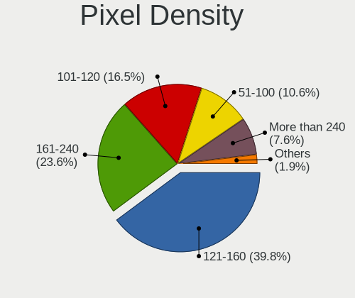

| Density       | Notebooks | Percent |
|---------------|-----------|---------|
| 121-160       | 460       | 39.83%  |
| 161-240       | 273       | 23.64%  |
| 101-120       | 190       | 16.45%  |
| 51-100        | 122       | 10.56%  |
| More than 240 | 88        | 7.62%   |
| Unknown       | 18        | 1.56%   |
| 1-50          | 4         | 0.35%   |

Multiple Monitors
-----------------

Total monitors connected

| Total | Notebooks | Percent |
|-------|-----------|---------|
| 1     | 881       | 78.1%   |
| 2     | 170       | 15.07%  |
| 0     | 71        | 6.29%   |
| 3     | 6         | 0.53%   |

Network
-------

Net Controller Vendor
---------------------

Controller vendors

| Vendor                                 | Notebooks | Percent |
|----------------------------------------|-----------|---------|
| Intel                                  | 657       | 38.83%  |
| Realtek Semiconductor                  | 608       | 35.93%  |
| Qualcomm Atheros                       | 152       | 8.98%   |
| MediaTek                               | 61        | 3.61%   |
| Broadcom                               | 50        | 2.96%   |
| ASIX Electronics                       | 26        | 1.54%   |
| Broadcom Limited                       | 25        | 1.48%   |
| Qualcomm                               | 17        | 1%      |
| Huawei Technologies                    | 16        | 0.95%   |
| Xiaomi                                 | 13        | 0.77%   |
| Quectel Wireless Solutions             | 7         | 0.41%   |
| OPPO Electronics                       | 7         | 0.41%   |
| Ralink                                 | 6         | 0.35%   |
| Ralink Technology                      | 4         | 0.24%   |
| Marvell Technology Group               | 4         | 0.24%   |
| TP-Link                                | 3         | 0.18%   |
| Suzhou Motorcomm Electronic Technology | 3         | 0.18%   |
| ICS Advent                             | 3         | 0.18%   |
| ZTE WCDMA Technologies MSM             | 2         | 0.12%   |
| Silicon Integrated Systems [SiS]       | 2         | 0.12%   |
| Sierra Wireless                        | 2         | 0.12%   |
| Microsoft                              | 2         | 0.12%   |
| Lenovo                                 | 2         | 0.12%   |
| DisplayLink                            | 2         | 0.12%   |
| Dell                                   | 2         | 0.12%   |
| Unknown                                | 2         | 0.12%   |
| Wilocity                               | 1         | 0.06%   |
| ST-Ericsson                            | 1         | 0.06%   |
| Shenzhen Goodix Technology             | 1         | 0.06%   |
| Samsung Electronics                    | 1         | 0.06%   |
| Qualcomm Technologies                  | 1         | 0.06%   |
| Qualcomm Atheros Communications        | 1         | 0.06%   |
| OnePlus Technology (Shenzhen)          | 1         | 0.06%   |
| Nvidia                                 | 1         | 0.06%   |
| Meizu                                  | 1         | 0.06%   |
| JMicron Technology                     | 1         | 0.06%   |
| Hewlett-Packard                        | 1         | 0.06%   |
| Attansic Technology                    | 1         | 0.06%   |
| Apple                                  | 1         | 0.06%   |
| Android                                | 1         | 0.06%   |

Net Controller Model
--------------------

Controller models

| Model                                                                  | Notebooks | Percent |
|------------------------------------------------------------------------|-----------|---------|
| Realtek RTL8111/8168/8211/8411 PCI Express Gigabit Ethernet Controller | 373       | 19.06%  |
| Intel Wi-Fi 6 AX200                                                    | 84        | 4.29%   |
| Realtek RTL8822CE 802.11ac PCIe Wireless Network Adapter               | 71        | 3.63%   |
| Intel Alder Lake-P PCH CNVi WiFi                                       | 58        | 2.96%   |
| Intel Wi-Fi 6 AX201                                                    | 53        | 2.71%   |
| Intel Wireless 8265 / 8275                                             | 49        | 2.5%    |
| Realtek RTL8153 Gigabit Ethernet Adapter                               | 47        | 2.4%    |
| Realtek RTL810xE PCI Express Fast Ethernet controller                  | 41        | 2.1%    |
| Intel Wi-Fi 6E(802.11ax) AX210/AX1675* 2x2 [Typhoon Peak]              | 41        | 2.1%    |
| Qualcomm Atheros QCA9377 802.11ac Wireless Network Adapter             | 34        | 1.74%   |
| Intel Wireless 7265                                                    | 31        | 1.58%   |
| Intel Comet Lake PCH-LP CNVi WiFi                                      | 31        | 1.58%   |
| Intel Cannon Lake PCH CNVi WiFi                                        | 30        | 1.53%   |
| Intel 82579LM Gigabit Network Connection (Lewisville)                  | 27        | 1.38%   |
| Qualcomm Atheros QCA6174 802.11ac Wireless Network Adapter             | 25        | 1.28%   |
| MediaTek MT7921 802.11ax PCI Express Wireless Network Adapter          | 25        | 1.28%   |
| Realtek RTL8821CE 802.11ac PCIe Wireless Network Adapter               | 24        | 1.23%   |
| Realtek RTL8125 2.5GbE Controller                                      | 23        | 1.18%   |
| MediaTek MT7922 802.11ax PCI Express Wireless Network Adapter          | 22        | 1.12%   |
| Intel Wireless 7260                                                    | 21        | 1.07%   |
| Intel Cannon Point-LP CNVi [Wireless-AC]                               | 21        | 1.07%   |
| Intel Comet Lake PCH CNVi WiFi                                         | 20        | 1.02%   |
| Realtek RTL8852AE 802.11ax PCIe Wireless Network Adapter               | 19        | 0.97%   |
| Intel Wireless 3165                                                    | 18        | 0.92%   |
| ASIX AX88179 Gigabit Ethernet                                          | 18        | 0.92%   |
| Realtek RTL8852BE PCIe 802.11ax Wireless Network Controller            | 17        | 0.87%   |
| Intel Wireless 8260                                                    | 16        | 0.82%   |
| Intel Tiger Lake PCH CNVi WiFi                                         | 16        | 0.82%   |
| Intel Raptor Lake PCH CNVi WiFi                                        | 16        | 0.82%   |
| Qualcomm Atheros AR9485 Wireless Network Adapter                       | 15        | 0.77%   |
| Intel Centrino Advanced-N 6205 [Taylor Peak]                           | 15        | 0.77%   |
| Realtek RTL8723BE PCIe Wireless Network Adapter                        | 14        | 0.72%   |
| Qualcomm QCNFA765 Wireless Network Adapter                             | 14        | 0.72%   |
| Qualcomm Atheros QCA9565 / AR9565 Wireless Network Adapter             | 14        | 0.72%   |
| Qualcomm Atheros AR9285 Wireless Network Adapter (PCI-Express)         | 13        | 0.66%   |
| Intel Ethernet Connection (4) I219-V                                   | 13        | 0.66%   |
| Realtek RTL8152 Fast Ethernet Adapter                                  | 12        | 0.61%   |
| Huawei FOA-LX9                                                         | 12        | 0.61%   |
| Realtek RTL8822BE 802.11a/b/g/n/ac WiFi adapter                        | 11        | 0.56%   |
| Intel Wireless 3160                                                    | 11        | 0.56%   |

Wireless Vendor
---------------

Wireless vendors

| Vendor                          | Notebooks | Percent |
|---------------------------------|-----------|---------|
| Intel                           | 626       | 56.96%  |
| Realtek Semiconductor           | 185       | 16.83%  |
| Qualcomm Atheros                | 126       | 11.46%  |
| MediaTek                        | 55        | 5%      |
| Broadcom                        | 42        | 3.82%   |
| Broadcom Limited                | 18        | 1.64%   |
| Qualcomm                        | 14        | 1.27%   |
| Quectel Wireless Solutions      | 7         | 0.64%   |
| Ralink                          | 6         | 0.55%   |
| Ralink Technology               | 4         | 0.36%   |
| Xiaomi                          | 3         | 0.27%   |
| TP-Link                         | 3         | 0.27%   |
| Sierra Wireless                 | 2         | 0.18%   |
| Microsoft                       | 2         | 0.18%   |
| Dell                            | 2         | 0.18%   |
| Wilocity                        | 1         | 0.09%   |
| Qualcomm Technologies           | 1         | 0.09%   |
| Qualcomm Atheros Communications | 1         | 0.09%   |
| Hewlett-Packard                 | 1         | 0.09%   |

Wireless Model
--------------

Wireless models

| Model                                                          | Notebooks | Percent |
|----------------------------------------------------------------|-----------|---------|
| Intel Wi-Fi 6 AX200                                            | 84        | 7.59%   |
| Realtek RTL8822CE 802.11ac PCIe Wireless Network Adapter       | 71        | 6.42%   |
| Intel Alder Lake-P PCH CNVi WiFi                               | 58        | 5.24%   |
| Intel Wi-Fi 6 AX201                                            | 53        | 4.79%   |
| Intel Wireless 8265 / 8275                                     | 49        | 4.43%   |
| Intel Wi-Fi 6E(802.11ax) AX210/AX1675* 2x2 [Typhoon Peak]      | 41        | 3.71%   |
| Qualcomm Atheros QCA9377 802.11ac Wireless Network Adapter     | 34        | 3.07%   |
| Intel Wireless 7265                                            | 31        | 2.8%    |
| Intel Comet Lake PCH-LP CNVi WiFi                              | 31        | 2.8%    |
| Intel Cannon Lake PCH CNVi WiFi                                | 30        | 2.71%   |
| Qualcomm Atheros QCA6174 802.11ac Wireless Network Adapter     | 25        | 2.26%   |
| MediaTek MT7921 802.11ax PCI Express Wireless Network Adapter  | 25        | 2.26%   |
| Realtek RTL8821CE 802.11ac PCIe Wireless Network Adapter       | 24        | 2.17%   |
| Intel Wireless 7260                                            | 21        | 1.9%    |
| Intel Cannon Point-LP CNVi [Wireless-AC]                       | 21        | 1.9%    |
| Intel Comet Lake PCH CNVi WiFi                                 | 20        | 1.81%   |
| Realtek RTL8852AE 802.11ax PCIe Wireless Network Adapter       | 19        | 1.72%   |
| Intel Wireless 3165                                            | 18        | 1.63%   |
| Realtek RTL8852BE PCIe 802.11ax Wireless Network Controller    | 16        | 1.45%   |
| MediaTek MT7922 802.11ax PCI Express Wireless Network Adapter  | 16        | 1.45%   |
| Intel Wireless 8260                                            | 16        | 1.45%   |
| Intel Tiger Lake PCH CNVi WiFi                                 | 16        | 1.45%   |
| Intel Raptor Lake PCH CNVi WiFi                                | 16        | 1.45%   |
| Qualcomm Atheros AR9485 Wireless Network Adapter               | 15        | 1.36%   |
| Intel Centrino Advanced-N 6205 [Taylor Peak]                   | 15        | 1.36%   |
| Realtek RTL8723BE PCIe Wireless Network Adapter                | 14        | 1.27%   |
| Qualcomm QCNFA765 Wireless Network Adapter                     | 14        | 1.27%   |
| Qualcomm Atheros QCA9565 / AR9565 Wireless Network Adapter     | 14        | 1.27%   |
| Qualcomm Atheros AR9285 Wireless Network Adapter (PCI-Express) | 13        | 1.18%   |
| Realtek RTL8822BE 802.11a/b/g/n/ac WiFi adapter                | 11        | 0.99%   |
| Intel Wireless 3160                                            | 11        | 0.99%   |
| Intel Wi-Fi 5(802.11ac) Wireless-AC 9x6x [Thunder Peak]        | 10        | 0.9%    |
| Realtek RTL8188CE 802.11b/g/n WiFi Adapter                     | 9         | 0.81%   |
| MediaTek MT7921K (RZ608) Wi-Fi 6E 80MHz                        | 9         | 0.81%   |
| Intel Raptor Lake-S PCH CNVi WiFi                              | 9         | 0.81%   |
| Broadcom BCM43142 802.11b/g/n                                  | 9         | 0.81%   |
| Realtek RTL8188EUS 802.11n Wireless Network Adapter            | 8         | 0.72%   |
| Qualcomm Atheros AR9462 Wireless Network Adapter               | 8         | 0.72%   |
| Intel PRO/Wireless 5100 AGN [Shiloh] Network Connection        | 8         | 0.72%   |
| Intel Meteor Lake PCH CNVi WiFi                                | 8         | 0.72%   |

Ethernet Vendor
---------------

Ethernet vendors

| Vendor                                 | Notebooks | Percent |
|----------------------------------------|-----------|---------|
| Realtek Semiconductor                  | 499       | 60.63%  |
| Intel                                  | 178       | 21.63%  |
| Qualcomm Atheros                       | 39        | 4.74%   |
| ASIX Electronics                       | 26        | 3.16%   |
| Huawei Technologies                    | 12        | 1.46%   |
| Broadcom                               | 12        | 1.46%   |
| Xiaomi                                 | 10        | 1.22%   |
| OPPO Electronics                       | 7         | 0.85%   |
| Broadcom Limited                       | 7         | 0.85%   |
| MediaTek                               | 6         | 0.73%   |
| Marvell Technology Group               | 4         | 0.49%   |
| Suzhou Motorcomm Electronic Technology | 3         | 0.36%   |
| ICS Advent                             | 3         | 0.36%   |
| Silicon Integrated Systems [SiS]       | 2         | 0.24%   |
| Qualcomm                               | 2         | 0.24%   |
| Lenovo                                 | 2         | 0.24%   |
| DisplayLink                            | 2         | 0.24%   |
| Unknown                                | 2         | 0.24%   |
| Samsung Electronics                    | 1         | 0.12%   |
| OnePlus Technology (Shenzhen)          | 1         | 0.12%   |
| Nvidia                                 | 1         | 0.12%   |
| JMicron Technology                     | 1         | 0.12%   |
| Attansic Technology                    | 1         | 0.12%   |
| Apple                                  | 1         | 0.12%   |
| Android                                | 1         | 0.12%   |

Ethernet Model
--------------

Ethernet models

| Model                                                                  | Notebooks | Percent |
|------------------------------------------------------------------------|-----------|---------|
| Realtek RTL8111/8168/8211/8411 PCI Express Gigabit Ethernet Controller | 373       | 44.46%  |
| Realtek RTL8153 Gigabit Ethernet Adapter                               | 47        | 5.6%    |
| Realtek RTL810xE PCI Express Fast Ethernet controller                  | 41        | 4.89%   |
| Intel 82579LM Gigabit Network Connection (Lewisville)                  | 27        | 3.22%   |
| Realtek RTL8125 2.5GbE Controller                                      | 23        | 2.74%   |
| ASIX AX88179 Gigabit Ethernet                                          | 18        | 2.15%   |
| Intel Ethernet Connection (4) I219-V                                   | 13        | 1.55%   |
| Realtek RTL8152 Fast Ethernet Adapter                                  | 12        | 1.43%   |
| Huawei FOA-LX9                                                         | 12        | 1.43%   |
| Intel Ethernet Connection (16) I219-V                                  | 11        | 1.31%   |
| Intel Ethernet Connection (13) I219-V                                  | 10        | 1.19%   |
| Intel 82567LM Gigabit Network Connection                               | 10        | 1.19%   |
| Qualcomm Atheros AR8161 Gigabit Ethernet                               | 9         | 1.07%   |
| Intel Ethernet Connection (4) I219-LM                                  | 8         | 0.95%   |
| Realtek Killer E2600 GbE Controller                                    | 7         | 0.83%   |
| Intel Ethernet Connection I218-LM                                      | 7         | 0.83%   |
| Intel Ethernet Connection (10) I219-V                                  | 7         | 0.83%   |
| ASIX AX88772B                                                          | 7         | 0.83%   |
| MediaTek MT7922 802.11ax PCI Express Wireless Network Adapter          | 6         | 0.72%   |
| Intel Ethernet Connection (3) I218-LM                                  | 6         | 0.72%   |
| Xiaomi Mi/Redmi series (RNDIS)                                         | 5         | 0.6%    |
| Xiaomi Mi/Redmi series (RNDIS + ADB)                                   | 5         | 0.6%    |
| Qualcomm Atheros Killer E2500 Gigabit Ethernet Controller              | 5         | 0.6%    |
| Intel Ethernet Controller I225-V                                       | 5         | 0.6%    |
| Intel Ethernet Connection I217-LM                                      | 5         | 0.6%    |
| Intel Ethernet Connection (7) I219-LM                                  | 5         | 0.6%    |
| Intel Ethernet Connection (6) I219-V                                   | 5         | 0.6%    |
| Realtek USB 10/100/1G/2.5G LAN                                         | 4         | 0.48%   |
| Qualcomm Atheros QCA8171 Gigabit Ethernet                              | 4         | 0.48%   |
| Qualcomm Atheros Killer E2400 Gigabit Ethernet Controller              | 4         | 0.48%   |
| Qualcomm Atheros AR8152 v2.0 Fast Ethernet                             | 4         | 0.48%   |
| Qualcomm Atheros AR8151 v2.0 Gigabit Ethernet                          | 4         | 0.48%   |
| OPPO OnePlus Nord 4                                                    | 4         | 0.48%   |
| Intel Ethernet Connection I218-V                                       | 4         | 0.48%   |
| Intel Ethernet Connection (7) I219-V                                   | 4         | 0.48%   |
| Intel Ethernet Connection (3) I218-V                                   | 4         | 0.48%   |
| Intel 82579V Gigabit Network Connection                                | 4         | 0.48%   |
| Broadcom NetLink BCM57785 Gigabit Ethernet PCIe                        | 4         | 0.48%   |
| Suzhou Motorcomm Electronic YT6801 Gigabit Ethernet Controller         | 3         | 0.36%   |
| Qualcomm Atheros Killer E220x Gigabit Ethernet Controller              | 3         | 0.36%   |

Net Controller Kind
-------------------

Ethernet, WiFi or modem

| Kind     | Notebooks | Percent |
|----------|-----------|---------|
| WiFi     | 1059      | 57.09%  |
| Ethernet | 784       | 42.26%  |
| Unknown  | 7         | 0.38%   |
| Modem    | 5         | 0.27%   |

Used Controller
---------------

Currently used network controller

| Kind     | Notebooks | Percent |
|----------|-----------|---------|
| WiFi     | 861       | 76.13%  |
| Ethernet | 270       | 23.87%  |

NICs
----

Total network controllers on board

| Total | Notebooks | Percent |
|-------|-----------|---------|
| 2     | 676       | 61.01%  |
| 1     | 393       | 35.47%  |
| 0     | 25        | 2.26%   |
| 3     | 13        | 1.17%   |
| 6     | 1         | 0.09%   |

IPv6
----

IPv6 vs IPv4

| Used | Notebooks | Percent |
|------|-----------|---------|
| No   | 886       | 77.99%  |
| Yes  | 250       | 22.01%  |

Bluetooth
---------

Bluetooth Vendor
----------------

Controller vendors

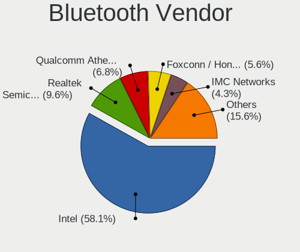

| Vendor                          | Notebooks | Percent |
|---------------------------------|-----------|---------|
| Intel                           | 552       | 58.11%  |
| Realtek Semiconductor           | 91        | 9.58%   |
| Qualcomm Atheros Communications | 65        | 6.84%   |
| Foxconn / Hon Hai               | 53        | 5.58%   |
| IMC Networks                    | 41        | 4.32%   |
| Realtek                         | 30        | 3.16%   |
| Broadcom                        | 30        | 3.16%   |
| Apple                           | 18        | 1.89%   |
| Lite-On Technology              | 16        | 1.68%   |
| MediaTek                        | 14        | 1.47%   |
| Opticis                         | 8         | 0.84%   |
| Hewlett-Packard                 | 5         | 0.53%   |
| Foxconn International           | 5         | 0.53%   |
| Dell                            | 5         | 0.53%   |
| Cambridge Silicon Radio         | 5         | 0.53%   |
| Ralink                          | 4         | 0.42%   |
| Taiyo Yuden                     | 2         | 0.21%   |
| Alps Electric                   | 2         | 0.21%   |
| USI                             | 1         | 0.11%   |
| Toshiba                         | 1         | 0.11%   |
| SINO WEALTH                     | 1         | 0.11%   |
| ASUSTek Computer                | 1         | 0.11%   |

Bluetooth Model
---------------

Controller models

| Model                                               | Notebooks | Percent |
|-----------------------------------------------------|-----------|---------|
| Intel Bluetooth wireless interface                  | 142       | 14.92%  |
| Intel AX201 Bluetooth                               | 130       | 13.66%  |
| Intel AX200 Bluetooth                               | 81        | 8.51%   |
| Intel Bluetooth 9460/9560 Jefferson Peak (JfP)      | 74        | 7.77%   |
| Intel AX211 Bluetooth                               | 62        | 6.51%   |
| Realtek Bluetooth Radio                             | 51        | 5.36%   |
| Qualcomm Atheros  Bluetooth Device                  | 40        | 4.2%    |
| Intel AX210 Bluetooth                               | 38        | 3.99%   |
| Realtek Bluetooth Radio                             | 30        | 3.15%   |
| IMC Networks Bluetooth Radio                        | 25        | 2.63%   |
| Foxconn / Hon Hai Wireless_Device                   | 18        | 1.89%   |
| Realtek 802.11ac WLAN Adapter                       | 16        | 1.68%   |
| Foxconn / Hon Hai Bluetooth Device                  | 16        | 1.68%   |
| MediaTek Wireless_Device                            | 14        | 1.47%   |
| Foxconn / Hon Hai MediaTek Bluetooth Adapter        | 14        | 1.47%   |
| Apple Bluetooth Host Controller                     | 13        | 1.37%   |
| Qualcomm Atheros QCA61x4 Bluetooth 4.0              | 11        | 1.16%   |
| Realtek RTL8723B Bluetooth                          | 10        | 1.05%   |
| Qualcomm Atheros AR3012 Bluetooth 4.0               | 10        | 1.05%   |
| IMC Networks Wireless_Device                        | 10        | 1.05%   |
| Intel Wireless-AC 9260 Bluetooth Adapter            | 9         | 0.95%   |
| Intel Centrino Bluetooth Wireless Transceiver       | 9         | 0.95%   |
| Opticis Bluetooth Radio                             | 8         | 0.84%   |
| Broadcom BCM2045B (BDC-2.1)                         | 8         | 0.84%   |
| Realtek  Bluetooth 4.2 Adapter                      | 7         | 0.74%   |
| Lite-On Bluetooth Device                            | 7         | 0.74%   |
| Realtek RTL8822BE Bluetooth 4.2 Adapter             | 6         | 0.63%   |
| Intel Centrino Advanced-N 6230 Bluetooth adapter    | 6         | 0.63%   |
| Broadcom BCM2045B (BDC-2.1) [Bluetooth Controller]  | 6         | 0.63%   |
| IMC Networks Bluetooth Device                       | 5         | 0.53%   |
| Foxconn International BCM43142A0 Bluetooth module   | 5         | 0.53%   |
| Cambridge Silicon Radio Bluetooth Dongle (HCI mode) | 5         | 0.53%   |
| Broadcom BCM20702 Bluetooth 4.0 [ThinkPad]          | 5         | 0.53%   |
| Ralink RT3290 Bluetooth                             | 4         | 0.42%   |
| Apple Bluetooth USB Host Controller                 | 4         | 0.42%   |
| HP Broadcom 2070 Bluetooth Combo                    | 3         | 0.32%   |
| Taiyo Yuden Bluetooth Device                        | 2         | 0.21%   |
| Qualcomm Atheros AR9462 Bluetooth                   | 2         | 0.21%   |
| Qualcomm Atheros AR3011 Bluetooth                   | 2         | 0.21%   |
| Lite-On Wireless_Device                             | 2         | 0.21%   |

Sound
-----

Sound Vendor
------------

Sound card vendors

| Vendor                                       | Notebooks | Percent |
|----------------------------------------------|-----------|---------|
| Intel                                        | 753       | 55%     |
| AMD                                          | 326       | 23.81%  |
| Nvidia                                       | 231       | 16.87%  |
| Zhaoxin                                      | 9         | 0.66%   |
| Apple                                        | 8         | 0.58%   |
| Huawei Technologies                          | 5         | 0.37%   |
| C-Media Electronics                          | 4         | 0.29%   |
| Generalplus Technology                       | 3         | 0.22%   |
| Zoran Co. Personal Media Division (Nogatech) | 2         | 0.15%   |
| Yamaha                                       | 2         | 0.15%   |
| Silicon Integrated Systems [SiS]             | 2         | 0.15%   |
| Realtek Semiconductor                        | 2         | 0.15%   |
| BY EDIFIER                                   | 2         | 0.15%   |
| XMOS                                         | 1         | 0.07%   |
| Walmart                                      | 1         | 0.07%   |
| TTGK Technology                              | 1         | 0.07%   |
| Synaptics                                    | 1         | 0.07%   |
| Specialix                                    | 1         | 0.07%   |
| SoundPlus Technology                         | 1         | 0.07%   |
| SonicakeAudio                                | 1         | 0.07%   |
| Samsung Electronics                          | 1         | 0.07%   |
| Razer USA                                    | 1         | 0.07%   |
| OPPO Electronics                             | 1         | 0.07%   |
| Loongson Technology                          | 1         | 0.07%   |
| Logitech                                     | 1         | 0.07%   |
| JMTek                                        | 1         | 0.07%   |
| Jieli Technology                             | 1         | 0.07%   |
| Focusrite-Novation                           | 1         | 0.07%   |
| EDIFIER                                      | 1         | 0.07%   |
| Conexant Systems                             | 1         | 0.07%   |
| Cambridge Silicon Radio                      | 1         | 0.07%   |
| ASUSTek Computer                             | 1         | 0.07%   |
| ACTIONS                                      | 1         | 0.07%   |

Sound Model
-----------

Sound card models

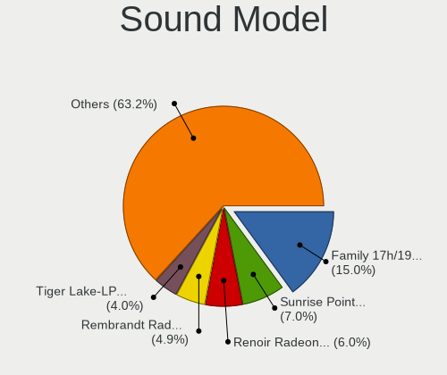

| Model                                                                                     | Notebooks | Percent |
|-------------------------------------------------------------------------------------------|-----------|---------|
| AMD Family 17h/19h/1ah HD Audio Controller                                                | 256       | 14.97%  |
| Intel Sunrise Point-LP HD Audio                                                           | 119       | 6.96%   |
| AMD Renoir Radeon High Definition Audio Controller                                        | 103       | 6.02%   |
| AMD Rembrandt Radeon High Definition Audio Controller                                     | 83        | 4.85%   |
| Intel Tiger Lake-LP Smart Sound Technology Audio Controller                               | 68        | 3.98%   |
| Intel Alder Lake PCH-P High Definition Audio Controller                                   | 64        | 3.74%   |
| Intel 7 Series/C216 Chipset Family High Definition Audio Controller                       | 60        | 3.51%   |
| Intel Cannon Lake PCH cAVS                                                                | 55        | 3.22%   |
| AMD Raven/Raven2/Fenghuang HDMI/DP Audio Controller                                       | 48        | 2.81%   |
| Nvidia GA106 High Definition Audio Controller                                             | 42        | 2.46%   |
| Intel 6 Series/C200 Series Chipset Family High Definition Audio Controller                | 38        | 2.22%   |
| Intel Haswell-ULT HD Audio Controller                                                     | 36        | 2.11%   |
| Intel Comet Lake PCH-LP cAVS                                                              | 36        | 2.11%   |
| Intel 8 Series HD Audio Controller                                                        | 36        | 2.11%   |
| Intel Cannon Point-LP High Definition Audio Controller                                    | 30        | 1.75%   |
| Nvidia TU107 GeForce GTX 1650 High Definition Audio Controller                            | 29        | 1.7%    |
| Intel 8 Series/C220 Series Chipset High Definition Audio Controller                       | 28        | 1.64%   |
| Intel Wildcat Point-LP High Definition Audio Controller                                   | 26        | 1.52%   |
| Intel Broadwell-U Audio Controller                                                        | 26        | 1.52%   |
| Intel Comet Lake PCH cAVS                                                                 | 24        | 1.4%    |
| Nvidia AD107 High Definition Audio Controller                                             | 23        | 1.35%   |
| Nvidia TU106 High Definition Audio Controller                                             | 22        | 1.29%   |
| Intel Xeon E3-1200 v3/4th Gen Core Processor HD Audio Controller                          | 22        | 1.29%   |
| AMD FCH Azalia Controller                                                                 | 20        | 1.17%   |
| Nvidia GA107 High Definition Audio Controller                                             | 19        | 1.11%   |
| Intel Tiger Lake-H HD Audio Controller                                                    | 18        | 1.05%   |
| Intel Raptor Lake-P/U/H cAVS                                                              | 18        | 1.05%   |
| Intel 82801I (ICH9 Family) HD Audio Controller                                            | 18        | 1.05%   |
| Intel CM238 HD Audio Controller                                                           | 17        | 0.99%   |
| Intel 100 Series/C230 Series Chipset Family HD Audio Controller                           | 17        | 0.99%   |
| Nvidia GP107GL High Definition Audio Controller                                           | 14        | 0.82%   |
| Nvidia GA104 High Definition Audio Controller                                             | 12        | 0.7%    |
| Nvidia GF108 High Definition Audio Controller                                             | 11        | 0.64%   |
| AMD Kabini HDMI/DP Audio                                                                  | 11        | 0.64%   |
| Nvidia GP106 High Definition Audio Controller                                             | 10        | 0.58%   |
| Intel 5 Series/3400 Series Chipset High Definition Audio                                  | 10        | 0.58%   |
| Zhaoxin ZX-100/KX-5000/KX-6000/KX-6000G/KH-40000/KX-7000 High Definition Audio Controller | 9         | 0.53%   |
| Intel Raptor Lake High Definition Audio Controller                                        | 9         | 0.53%   |
| Zhaoxin ZX-E High Definition Audio Controller                                             | 8         | 0.47%   |
| Nvidia TU116 High Definition Audio Controller                                             | 8         | 0.47%   |

Memory
------

Memory Vendor
-------------

Memory module vendors

| Vendor                     | Notebooks | Percent |
|----------------------------|-----------|---------|
| Samsung Electronics        | 288       | 33.1%   |
| SK hynix                   | 196       | 22.53%  |
| Micron Technology          | 125       | 14.37%  |
| Kingston                   | 73        | 8.39%   |
| Crucial                    | 46        | 5.29%   |
| Unknown                    | 37        | 4.25%   |
| Ramaxel Technology         | 22        | 2.53%   |
| Elpida                     | 10        | 1.15%   |
| A-DATA Technology          | 9         | 1.03%   |
| Unknown                    | 9         | 1.03%   |
| Unknown (ABCD)             | 7         | 0.8%    |
| Nanya Technology           | 6         | 0.69%   |
| Lenovo                     | 5         | 0.57%   |
| Unknown (08C8)             | 4         | 0.46%   |
| Transcend                  | 4         | 0.46%   |
| Shenzhen WODPOSIT          | 3         | 0.34%   |
| KINGBANK                   | 3         | 0.34%   |
| UnilC                      | 2         | 0.23%   |
| Team                       | 2         | 0.23%   |
| Corsair                    | 2         | 0.23%   |
| Apacer                     | 2         | 0.23%   |
| Xi'an UniIC Semiconductors | 1         | 0.11%   |
| Unknown (08B5)             | 1         | 0.11%   |
| SK_Hynix                   | 1         | 0.11%   |
| SHARETRONIC                | 1         | 0.11%   |
| MTASE                      | 1         | 0.11%   |
| Lexar Co Limited           | 1         | 0.11%   |
| KLEVV                      | 1         | 0.11%   |
| Kimtigo                    | 1         | 0.11%   |
| Juhor                      | 1         | 0.11%   |
| Goldkey                    | 1         | 0.11%   |
| G.Skill                    | 1         | 0.11%   |
| Foresee                    | 1         | 0.11%   |
| Essencore                  | 1         | 0.11%   |
| Asgard                     | 1         | 0.11%   |
| <Unknown>                  | 1         | 0.11%   |

Memory Model
------------

Memory module models

| Model                                                            | Notebooks | Percent |
|------------------------------------------------------------------|-----------|---------|
| Samsung RAM M471A1G44AB0-CWE 8GB Row Of Chips DDR4 3200MT/s      | 26        | 2.81%   |
| Samsung RAM M471A1G44AB0-CWE 8GB SODIMM DDR4 3200MT/s            | 12        | 1.3%    |
| Samsung RAM M471B5173EB0-YK0 4GB SODIMM DDR3 1600MT/s            | 11        | 1.19%   |
| Micron RAM 4ATF1G64HZ-3G2E1 8GB Row Of Chips DDR4 3200MT/s       | 11        | 1.19%   |
| Samsung RAM M471A1K43DB1-CTD 8GB SODIMM DDR4 2667MT/s            | 10        | 1.08%   |
| Samsung RAM M471A1G44AB0-CTD 8GB SODIMM DDR4 2667MT/s            | 10        | 1.08%   |
| SK hynix RAM HMT351S6CFR8C-PB 4GB SODIMM DDR3 1600MT/s           | 9         | 0.97%   |
| SK hynix RAM HMAA1GS6CMR6N-VK 8GB Row Of Chips DDR4 2667MT/s     | 9         | 0.97%   |
| Samsung RAM M471A1K43EB1-CWE 8GB SODIMM DDR4 3200MT/s            | 9         | 0.97%   |
| Unknown                                                          | 9         | 0.97%   |
| Samsung RAM M471A1K43DB1-CWE 8GB SODIMM DDR4 3200MT/s            | 8         | 0.86%   |
| Samsung RAM M425R1GB4BB0-CQKOL 8GB SODIMM DDR5 4800MT/s          | 8         | 0.86%   |
| Micron RAM MTC4C10163S1SC48BA1 8GB SODIMM DDR5 4800MT/s          | 8         | 0.86%   |
| SK hynix RAM HMT451S6BFR8A-PB 4GB SODIMM DDR3 1600MT/s           | 7         | 0.76%   |
| SK hynix RAM HMA81GS6DJR8N-XN 8GB SODIMM DDR4 3200MT/s           | 7         | 0.76%   |
| Samsung RAM M425R1GB4BB0-CQKOD 8GB SODIMM DDR5 4800MT/s          | 7         | 0.76%   |
| Micron RAM 53E1G32D2NP-046 2GB Row Of Chips LPDDR4 4267MT/s      | 7         | 0.76%   |
| Unknown (ABCD) RAM 123456789012345678 2GB SODIMM LPDDR3 2400MT/s | 6         | 0.65%   |
| SK hynix RAM HMAA1GS6CMR6N-XN 8GB Row Of Chips DDR4 3200MT/s     | 6         | 0.65%   |
| SK hynix RAM HMAA1GS6CJR6N-XN 8GB Row Of Chips DDR4 3200MT/s     | 6         | 0.65%   |
| SK hynix RAM HMA851S6CJR6N-VK 4GB SODIMM DDR4 2667MT/s           | 6         | 0.65%   |
| SK hynix RAM HMA851S6CJR6N-VK 4GB Row Of Chips DDR4 2667MT/s     | 6         | 0.65%   |
| SK hynix RAM HMA81GS6AFR8N-UH 8GB SODIMM DDR4 2667MT/s           | 6         | 0.65%   |
| SK hynix RAM HMA41GS6AFR8N-TF 8GB SODIMM DDR4 2667MT/s           | 6         | 0.65%   |
| Samsung RAM M471A5244CB0-CRC 4GB SODIMM DDR4 2667MT/s            | 6         | 0.65%   |
| Samsung RAM M471A1G44AB0-CTD 8GB Row Of Chips DDR4 2667MT/s      | 6         | 0.65%   |
| Micron RAM 4ATF1G64HZ-3G2E1 8GB SODIMM DDR4 3200MT/s             | 6         | 0.65%   |
| Kingston RAM LV32D4S2S8HD-8 8GB SODIMM DDR4 3200MT/s             | 6         | 0.65%   |
| Unknown RAM Module 2GB SODIMM DDR3 1333MT/s                      | 5         | 0.54%   |
| Unknown RAM Module 2GB SODIMM DDR2 667MT/s                       | 5         | 0.54%   |
| SK hynix RAM HMT41GS6BFR8A-PB 8GB SODIMM DDR3 1600MT/s           | 5         | 0.54%   |
| SK hynix RAM HMAB2GS6AMR6N-XN 16GB SODIMM DDR4 3200MT/s          | 5         | 0.54%   |
| SK hynix RAM HMAA1GS6CJR6N-XN 8GB SODIMM DDR4 3200MT/s           | 5         | 0.54%   |
| SK hynix RAM HMA81GS6JJR8N-VK 8GB SODIMM DDR4 2667MT/s           | 5         | 0.54%   |
| SK hynix RAM H9JCNNNCP3MLYR-N6E 2GB Row Of Chips LPDDR5 6400MT/s | 5         | 0.54%   |
| Samsung RAM M471A5244CB0-CTD 4GB Row Of Chips DDR4 2667MT/s      | 5         | 0.54%   |
| Samsung RAM M471A1K43CB1-CTD 8GB SODIMM DDR4 2667MT/s            | 5         | 0.54%   |
| Samsung RAM M471A1K43CB1-CRC 8GB SODIMM DDR4 2667MT/s            | 5         | 0.54%   |
| Samsung RAM M471A1K43BB1-CRC 8GB SODIMM DDR4 2667MT/s            | 5         | 0.54%   |
| Samsung RAM K4UBE3D4AA-MGCR 2GB Row Of Chips LPDDR4 4267MT/s     | 5         | 0.54%   |

Memory Kind
-----------

Memory module kinds

| Kind    | Notebooks | Percent |
|---------|-----------|---------|
| DDR4    | 388       | 51.25%  |
| DDR3    | 142       | 18.76%  |
| DDR5    | 77        | 10.17%  |
| LPDDR4  | 50        | 6.61%   |
| LPDDR5  | 40        | 5.28%   |
| LPDDR3  | 36        | 4.76%   |
| DDR2    | 10        | 1.32%   |
| SDRAM   | 8         | 1.06%   |
| Unknown | 5         | 0.66%   |
| DDR     | 1         | 0.13%   |

Memory Form Factor
------------------

Physical design of the memory module

| Name         | Notebooks | Percent |
|--------------|-----------|---------|
| SODIMM       | 561       | 73.53%  |
| Row Of Chips | 190       | 24.9%   |
| Chip         | 6         | 0.79%   |
| DIMM         | 3         | 0.39%   |
| Unknown      | 3         | 0.39%   |

Memory Size
-----------

Memory module size

| Size  | Notebooks | Percent |
|-------|-----------|---------|
| 8192  | 408       | 50.12%  |
| 4096  | 171       | 21.01%  |
| 16384 | 138       | 16.95%  |
| 2048  | 47        | 5.77%   |
| 32768 | 35        | 4.3%    |
| 1024  | 10        | 1.23%   |
| 49152 | 2         | 0.25%   |
| 24576 | 1         | 0.12%   |
| 12288 | 1         | 0.12%   |
| 512   | 1         | 0.12%   |

Memory Speed
------------

Memory module speed

| Speed   | Notebooks | Percent |
|---------|-----------|---------|
| 3200    | 193       | 24.49%  |
| 2667    | 164       | 20.81%  |
| 1600    | 108       | 13.71%  |
| 4800    | 52        | 6.6%    |
| 2400    | 40        | 5.08%   |
| 2133    | 34        | 4.31%   |
| 4267    | 30        | 3.81%   |
| 6400    | 28        | 3.55%   |
| 5600    | 27        | 3.43%   |
| 1867    | 17        | 2.16%   |
| 1333    | 14        | 1.78%   |
| 1334    | 12        | 1.52%   |
| 7500    | 9         | 1.14%   |
| 1067    | 8         | 1.02%   |
| 667     | 6         | 0.76%   |
| 4266    | 5         | 0.63%   |
| 2666    | 5         | 0.63%   |
| 3733    | 4         | 0.51%   |
| 3266    | 4         | 0.51%   |
| 2048    | 4         | 0.51%   |
| 1066    | 4         | 0.51%   |
| 8533    | 3         | 0.38%   |
| 8400    | 3         | 0.38%   |
| 4199    | 3         | 0.38%   |
| Unknown | 3         | 0.38%   |
| 266     | 2         | 0.25%   |
| 7467    | 1         | 0.13%   |
| 5200    | 1         | 0.13%   |
| 3000    | 1         | 0.13%   |
| 2933    | 1         | 0.13%   |
| 800     | 1         | 0.13%   |
| 400     | 1         | 0.13%   |

Printers & scanners
-------------------

Printer Vendor
--------------

Printer device vendors

| Vendor          | Notebooks | Percent |
|-----------------|-----------|---------|
| Hewlett-Packard | 3         | 60%     |
| Pantum          | 1         | 20%     |
| Canon           | 1         | 20%     |

Printer Model
-------------

Printer device models

| Model                     | Notebooks | Percent |
|---------------------------|-----------|---------|
| Pantum P2200W-series      | 1         | 20%     |
| HP Officejet 4500 G510g-m | 1         | 20%     |
| HP LaserJet P1102         | 1         | 20%     |
| HP LaserJet 1020          | 1         | 20%     |
| Canon iP1100 series       | 1         | 20%     |

Scanner Vendor
--------------

Scanner device vendors

Zero info for selected period =(

Scanner Model
-------------

Scanner device models

Zero info for selected period =(

Camera
------

Camera Vendor
-------------

Camera device vendors

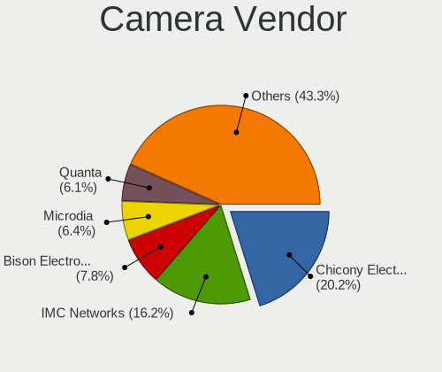

| Vendor                                 | Notebooks | Percent |
|----------------------------------------|-----------|---------|
| Chicony Electronics                    | 189       | 20.17%  |
| IMC Networks                           | 152       | 16.22%  |
| Bison Electronics                      | 73        | 7.79%   |
| Microdia                               | 60        | 6.4%    |
| Quanta                                 | 57        | 6.08%   |
| Sunplus Innovation Technology          | 55        | 5.87%   |
| Realtek Semiconductor                  | 52        | 5.55%   |
| Luxvisions Innotech Limited            | 49        | 5.23%   |
| Cheng Uei Precision Industry (Foxlink) | 40        | 4.27%   |
| Acer                                   | 33        | 3.52%   |
| Syntek                                 | 31        | 3.31%   |
| Suyin                                  | 18        | 1.92%   |
| SunplusIT                              | 18        | 1.92%   |
| Lite-On Technology                     | 18        | 1.92%   |
| Apple                                  | 14        | 1.49%   |
| Alcor Micro                            | 11        | 1.17%   |
| Silicon Motion                         | 7         | 0.75%   |
| Lenovo                                 | 7         | 0.75%   |
| Sonix Technology                       | 6         | 0.64%   |
| icSpring                               | 5         | 0.53%   |
| Ricoh                                  | 4         | 0.43%   |
| Logitech                               | 3         | 0.32%   |
| Importek                               | 3         | 0.32%   |
| Z-Star Microelectronics                | 2         | 0.21%   |
| Unknown (0000066029)                   | 2         | 0.21%   |
| Tripath Technology                     | 2         | 0.21%   |
| ShineTech                              | 2         | 0.21%   |
| ShineOptics                            | 2         | 0.21%   |
| Primax Electronics                     | 2         | 0.21%   |
| Nebraska Furniture Mart                | 2         | 0.21%   |
| GEMBIRD                                | 2         | 0.21%   |
| Y Media                                | 1         | 0.11%   |
| Unknown                                | 1         | 0.11%   |
| SN0002                                 | 1         | 0.11%   |
| Samsung Electronics                    | 1         | 0.11%   |
| Mitsumi                                | 1         | 0.11%   |
| kingcome                               | 1         | 0.11%   |
| Google                                 | 1         | 0.11%   |
| Goodong Industry                       | 1         | 0.11%   |
| Genesys Logic                          | 1         | 0.11%   |

Camera Model
------------

Camera device models

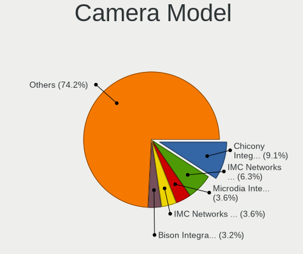

| Model                                                        | Notebooks | Percent |
|--------------------------------------------------------------|-----------|---------|
| Chicony Integrated Camera                                    | 86        | 9.14%   |
| IMC Networks Integrated Camera                               | 59        | 6.27%   |
| Microdia Integrated_Webcam_HD                                | 34        | 3.61%   |
| IMC Networks HD Camera                                       | 34        | 3.61%   |
| Bison Integrated Camera                                      | 30        | 3.19%   |
| IMC Networks USB2.0 HD UVC WebCam                            | 23        | 2.44%   |
| Syntek Integrated Camera                                     | 22        | 2.34%   |
| Luxvisions Innotech Limited Integrated Camera                | 19        | 2.02%   |
| Realtek Integrated_Webcam_HD                                 | 16        | 1.7%    |
| Chicony HD Webcam                                            | 15        | 1.59%   |
| Sunplus XiaoMi USB 2.0 Webcam                                | 14        | 1.49%   |
| Cheng Uei Precision Industry (Foxlink) XiaoMi USB 2.0 Webcam | 14        | 1.49%   |
| Sunplus Integrated_Webcam_HD                                 | 12        | 1.28%   |
| IMC Networks ov9734_azurewave_camera                         | 12        | 1.28%   |
| Bison SunplusIT Integrated Camera                            | 12        | 1.28%   |
| Luxvisions Innotech Limited Integrated RGB Camera            | 11        | 1.17%   |
| Quanta HP HD Camera                                          | 9         | 0.96%   |
| Apple iPhone 5/5C/5S/6/SE/7/8/X/XR                           | 9         | 0.96%   |
| Acer BisonCam,NB Pro                                         | 9         | 0.96%   |
| Quanta hm1091_techfront                                      | 8         | 0.85%   |
| Quanta HD User Facing                                        | 8         | 0.85%   |
| Realtek Integrated Webcam                                    | 7         | 0.74%   |
| Quanta ov9734_techfront_camera                               | 7         | 0.74%   |
| Luxvisions Innotech Limited HP Wide Vision HD Camera         | 7         | 0.74%   |
| Lite-On Integrated Camera                                    | 7         | 0.74%   |
| Chicony XiaoMi USB 2.0 Webcam                                | 7         | 0.74%   |
| Chicony Lenovo Integrated Camera (0.3MP)                     | 7         | 0.74%   |
| Chicony HP Wide Vision HD Camera                             | 7         | 0.74%   |
| Acer Integrated Camera                                       | 7         | 0.74%   |
| Syntek Lenovo EasyCamera                                     | 6         | 0.64%   |
| SunplusIT HD Webcam                                          | 6         | 0.64%   |
| Sunplus HD WebCam                                            | 6         | 0.64%   |
| Lite-On HP HD Camera                                         | 6         | 0.64%   |
| IMC Networks Lenovo EasyCamera                               | 6         | 0.64%   |
| Chicony Integrated Camera (1280x720@30)                      | 6         | 0.64%   |
| Realtek HP Wide Vision HD Camera                             | 5         | 0.53%   |
| Quanta HP Wide Vision HD Camera                              | 5         | 0.53%   |
| Microdia Webcam Vitade AF                                    | 5         | 0.53%   |
| Luxvisions Innotech Limited HP 5MP Camera                    | 5         | 0.53%   |
| icSpring camera                                              | 5         | 0.53%   |

Security
--------

Fingerprint Vendor
------------------

Fingerprint sensor vendors

| Vendor                             | Notebooks | Percent |
|------------------------------------|-----------|---------|
| Shenzhen Goodix Technology         | 84        | 33.2%   |
| Synaptics                          | 73        | 28.85%  |
| Validity Sensors                   | 54        | 21.34%  |
| Elan Microelectronics              | 14        | 5.53%   |
| Upek                               | 12        | 4.74%   |
| AuthenTec                          | 6         | 2.37%   |
| Focal-systems.Corp                 | 3         | 1.19%   |
| STMicroelectronics                 | 2         | 0.79%   |
| LighTuning Technology              | 2         | 0.79%   |
| FocalTech                          | 2         | 0.79%   |
| Realtek USB2.0 Finger Print Bridge | 1         | 0.4%    |

Fingerprint Model
-----------------

Fingerprint sensor models

| Model                                                                      | Notebooks | Percent |
|----------------------------------------------------------------------------|-----------|---------|
| Shenzhen Goodix  Fingerprint Device                                        | 58        | 22.92%  |
| Synaptics Prometheus MIS Touch Fingerprint Reader                          | 32        | 12.65%  |
| Shenzhen Goodix Fingerprint Reader                                         | 23        | 9.09%   |
| Validity Sensors VFS5011 Fingerprint Reader                                | 15        | 5.93%   |
| Elan ELAN:Fingerprint                                                      | 12        | 4.74%   |
| Upek Biometric Touchchip/Touchstrip Fingerprint Sensor                     | 11        | 4.35%   |
| Validity Sensors VFS 5011 fingerprint sensor                               | 8         | 3.16%   |
| Validity Sensors Synaptics VFS7552 Touch Fingerprint Sensor with PurePrint | 8         | 3.16%   |
| Synaptics FS7604 Touch Fingerprint Sensor with PurePrint                   | 8         | 3.16%   |
| Synaptics Metallica MIS Touch Fingerprint Reader                           | 7         | 2.77%   |
| Validity Sensors Synaptics WBDI                                            | 6         | 2.37%   |
| Synaptics  FS7604 Touch Fingerprint Sensor with PurePrint                  | 6         | 2.37%   |
| Validity Sensors VFS7500 Touch Fingerprint Sensor                          | 5         | 1.98%   |
| Synaptics WBDI Device                                                      | 5         | 1.98%   |
| Validity Sensors VFS491                                                    | 4         | 1.58%   |
| Synaptics UWP WBDI Device                                                  | 4         | 1.58%   |
| Synaptics Prometheus Fingerprint Reader                                    | 4         | 1.58%   |
| Synaptics Fingerprint reader [HP G6]                                       | 4         | 1.58%   |
| AuthenTec AES2810                                                          | 4         | 1.58%   |
| Validity Sensors VFS495 Fingerprint Reader                                 | 3         | 1.19%   |
| Validity Sensors VFS471 Fingerprint Reader                                 | 3         | 1.19%   |
| Shenzhen Goodix FingerPrint                                                | 3         | 1.19%   |
| Focal-systems.Corp FT9201Fingerprint.                                  | 3         | 1.19%   |
| STMicroelectronics Fingerprint Reader                                      | 2         | 0.79%   |
| Elan ELAN:ARM-M4                                                           | 2         | 0.79%   |
| Unknown                                                                    | 2         | 0.79%   |
| Validity Sensors VFS Fingerprint sensor                                    | 1         | 0.4%    |
| Validity Sensors Fingerprint scanner                                       | 1         | 0.4%    |
| Upek TCS5B Fingerprint sensor                                              | 1         | 0.4%    |
| Synaptics WBDI                                                             | 1         | 0.4%    |
| Realtek USB2.0 Finger Print Bridge FocalTech Fingerprint Device            | 1         | 0.4%    |
| LighTuning ES603 Swipe Fingerprint Sensor                                  | 1         | 0.4%    |
| LighTuning EgisTec Touch Fingerprint Sensor                                | 1         | 0.4%    |
| FocalTech FocalTech Fingerprint Device                                     | 1         | 0.4%    |
| FocalTech Fingerprint Device                                               | 1         | 0.4%    |
| AuthenTec Fingerprint Sensor                                               | 1         | 0.4%    |
| AuthenTec AES2550 Fingerprint Sensor                                       | 1         | 0.4%    |

Chipcard Vendor
---------------

Chipcard module vendors

| Vendor                | Notebooks | Percent |
|-----------------------|-----------|---------|
| Broadcom              | 14        | 58.33%  |
| Upek                  | 4         | 16.67%  |
| Clay Logic            | 2         | 8.33%   |
| Alcor Micro           | 2         | 8.33%   |
| Yubico.com            | 1         | 4.17%   |
| Advanced Card Systems | 1         | 4.17%   |

Chipcard Model
--------------

Chipcard module models

| Model                                                                        | Notebooks | Percent |
|------------------------------------------------------------------------------|-----------|---------|
| Broadcom 5880                                                                | 5         | 20.83%  |
| Upek TouchChip Fingerprint Coprocessor (WBF advanced mode)                   | 4         | 16.67%  |
| Broadcom BCM5880 Secure Applications Processor with fingerprint swipe sensor | 3         | 12.5%   |
| Broadcom BCM5880 Secure Applications Processor                               | 3         | 12.5%   |
| Broadcom 58200                                                               | 3         | 12.5%   |
| Clay Logic CanoKey Pigeon                                                    | 2         | 8.33%   |
| Alcor Micro AU9540 Smartcard Reader                                          | 2         | 8.33%   |
| Yubico.com Yubikey 4/5 U2F+CCID                                              | 1         | 4.17%   |
| Advanced Card Systems ACR1581                                                | 1         | 4.17%   |

Unsupported
-----------

Unsupported Devices
-------------------

Total unsupported devices on board

| Total | Notebooks | Percent |
|-------|-----------|---------|
| 0     | 631       | 55.5%   |
| 1     | 378       | 33.25%  |
| 2     | 102       | 8.97%   |
| 3     | 14        | 1.23%   |
| 4     | 7         | 0.62%   |
| 5     | 3         | 0.26%   |
| 10    | 1         | 0.09%   |
| 8     | 1         | 0.09%   |

Unsupported Device Types
------------------------

Types of unsupported devices

| Type                     | Notebooks | Percent |
|--------------------------|-----------|---------|
| Fingerprint reader       | 248       | 37.92%  |
| Graphics card            | 175       | 26.76%  |
| Multimedia controller    | 53        | 8.1%    |
| Net/wireless             | 52        | 7.95%   |
| Sound                    | 27        | 4.13%   |
| Camera                   | 27        | 4.13%   |
| Chipcard                 | 20        | 3.06%   |
| Bluetooth                | 16        | 2.45%   |
| Communication controller | 15        | 2.29%   |
| Net/ethernet             | 6         | 0.92%   |
| Storage                  | 4         | 0.61%   |
| Card reader              | 4         | 0.61%   |
| Network                  | 2         | 0.31%   |
| Unassigned class         | 1         | 0.15%   |
| Storage/nvme             | 1         | 0.15%   |
| Storage/ata              | 1         | 0.15%   |
| Modem                    | 1         | 0.15%   |
| Dvb card                 | 1         | 0.15%   |

