Linux in China - Tested Hardware & Statistics (Notebooks)
---------------------------------------------------------

A project to collect tested hardware configurations for Linux in China.

Anyone can contribute to this report by the [hw-probe](https://github.com/linuxhw/hw-probe) tool:

    sudo -E hw-probe -all -upload

Please contribute! Especially if your hardware is rare.

Contents
--------

* [ Test Cases ](#test-cases)

* [ System ](#system)
  - [ OS                       ](#os)
  - [ OS Family                ](#os-family)
  - [ Kernel                   ](#kernel)
  - [ Kernel Family            ](#kernel-family)
  - [ Kernel Major Ver.        ](#kernel-major-ver)
  - [ Arch                     ](#arch)
  - [ DE                       ](#de)
  - [ Display Server           ](#display-server)
  - [ Display Manager          ](#display-manager)
  - [ OS Lang                  ](#os-lang)
  - [ Boot Mode                ](#boot-mode)
  - [ Filesystem               ](#filesystem)
  - [ Part. scheme             ](#part-scheme)
  - [ Dual Boot with Linux/BSD ](#dual-boot-with-linuxbsd)
  - [ Dual Boot (Win)          ](#dual-boot-win)

* [ Board ](#board)
  - [ Vendor                   ](#vendor)
  - [ Model                    ](#model)
  - [ Model Family             ](#model-family)
  - [ MFG Year                 ](#mfg-year)
  - [ Form Factor              ](#form-factor)
  - [ Secure Boot              ](#secure-boot)
  - [ Coreboot                 ](#coreboot)
  - [ RAM Size                 ](#ram-size)
  - [ RAM Used                 ](#ram-used)
  - [ Total Drives             ](#total-drives)
  - [ Has CD-ROM               ](#has-cd-rom)
  - [ Has Ethernet             ](#has-ethernet)
  - [ Has WiFi                 ](#has-wifi)
  - [ Has Bluetooth            ](#has-bluetooth)

* [ Location ](#location)
  - [ Country                  ](#country)
  - [ City                     ](#city)

* [ Drives ](#drives)
  - [ Drive Vendor             ](#drive-vendor)
  - [ Drive Model              ](#drive-model)
  - [ HDD Vendor               ](#hdd-vendor)
  - [ SSD Vendor               ](#ssd-vendor)
  - [ Drive Kind               ](#drive-kind)
  - [ Drive Connector          ](#drive-connector)
  - [ Drive Size               ](#drive-size)
  - [ Space Total              ](#space-total)
  - [ Space Used               ](#space-used)
  - [ Malfunc. Drives          ](#malfunc-drives)
  - [ Malfunc. Drive Vendor    ](#malfunc-drive-vendor)
  - [ Malfunc. HDD Vendor      ](#malfunc-hdd-vendor)
  - [ Malfunc. Drive Kind      ](#malfunc-drive-kind)
  - [ Failed Drives            ](#failed-drives)
  - [ Failed Drive Vendor      ](#failed-drive-vendor)
  - [ Drive Status             ](#drive-status)

* [ Storage controller ](#storage-controller)
  - [ Storage Vendor           ](#storage-vendor)
  - [ Storage Model            ](#storage-model)
  - [ Storage Kind             ](#storage-kind)

* [ Processor ](#processor)
  - [ CPU Vendor               ](#cpu-vendor)
  - [ CPU Model                ](#cpu-model)
  - [ CPU Model Family         ](#cpu-model-family)
  - [ CPU Cores                ](#cpu-cores)
  - [ CPU Sockets              ](#cpu-sockets)
  - [ CPU Threads              ](#cpu-threads)
  - [ CPU Op-Modes             ](#cpu-op-modes)
  - [ CPU Microcode            ](#cpu-microcode)
  - [ CPU Microarch            ](#cpu-microarch)

* [ Graphics ](#graphics)
  - [ GPU Vendor               ](#gpu-vendor)
  - [ GPU Model                ](#gpu-model)
  - [ GPU Combo                ](#gpu-combo)
  - [ GPU Driver               ](#gpu-driver)
  - [ GPU Memory               ](#gpu-memory)

* [ Monitor ](#monitor)
  - [ Monitor Vendor           ](#monitor-vendor)
  - [ Monitor Model            ](#monitor-model)
  - [ Monitor Resolution       ](#monitor-resolution)
  - [ Monitor Diagonal         ](#monitor-diagonal)
  - [ Monitor Width            ](#monitor-width)
  - [ Aspect Ratio             ](#aspect-ratio)
  - [ Monitor Area             ](#monitor-area)
  - [ Pixel Density            ](#pixel-density)
  - [ Multiple Monitors        ](#multiple-monitors)

* [ Network ](#network)
  - [ Net Controller Vendor    ](#net-controller-vendor)
  - [ Net Controller Model     ](#net-controller-model)
  - [ Wireless Vendor          ](#wireless-vendor)
  - [ Wireless Model           ](#wireless-model)
  - [ Ethernet Vendor          ](#ethernet-vendor)
  - [ Ethernet Model           ](#ethernet-model)
  - [ Net Controller Kind      ](#net-controller-kind)
  - [ Used Controller          ](#used-controller)
  - [ NICs                     ](#nics)
  - [ IPv6                     ](#ipv6)

* [ Bluetooth ](#bluetooth)
  - [ Bluetooth Vendor         ](#bluetooth-vendor)
  - [ Bluetooth Model          ](#bluetooth-model)

* [ Sound ](#sound)
  - [ Sound Vendor             ](#sound-vendor)
  - [ Sound Model              ](#sound-model)

* [ Memory ](#memory)
  - [ Memory Vendor            ](#memory-vendor)
  - [ Memory Model             ](#memory-model)
  - [ Memory Kind              ](#memory-kind)
  - [ Memory Form Factor       ](#memory-form-factor)
  - [ Memory Size              ](#memory-size)
  - [ Memory Speed             ](#memory-speed)

* [ Printers & scanners ](#printers--scanners)
  - [ Printer Vendor           ](#printer-vendor)
  - [ Printer Model            ](#printer-model)
  - [ Scanner Vendor           ](#scanner-vendor)
  - [ Scanner Model            ](#scanner-model)

* [ Camera ](#camera)
  - [ Camera Vendor            ](#camera-vendor)
  - [ Camera Model             ](#camera-model)

* [ Security ](#security)
  - [ Fingerprint Vendor       ](#fingerprint-vendor)
  - [ Fingerprint Model        ](#fingerprint-model)
  - [ Chipcard Vendor          ](#chipcard-vendor)
  - [ Chipcard Model           ](#chipcard-model)

* [ Unsupported ](#unsupported)
  - [ Unsupported Devices      ](#unsupported-devices)
  - [ Unsupported Device Types ](#unsupported-device-types)

Test Cases
----------

Total: 1110

| Vendor        | Model                       | Probe                                                      | Date         |
|---------------|-----------------------------|------------------------------------------------------------|--------------|
| Jumper        | EZpad                       | [5fa2e934c3](https://linux-hardware.org/?probe=5fa2e934c3) | Aug 11, 2023 |
| Unknown       | Unknown                     | [a064a2d5fd](https://linux-hardware.org/?probe=a064a2d5fd) | Aug 11, 2023 |
| HUAWEI        | KLVD-WXX9                   | [19cadaab1b](https://linux-hardware.org/?probe=19cadaab1b) | Aug 10, 2023 |
| Lenovo        | ThinkBook 16p Gen 2 20YM    | [f4dd9cbbbd](https://linux-hardware.org/?probe=f4dd9cbbbd) | Aug 10, 2023 |
| HP            | Pavilion Laptop 14-dv1xx... | [385c88301b](https://linux-hardware.org/?probe=385c88301b) | Aug 10, 2023 |
| Apple         | MacBookPro12,1              | [4a1def29d3](https://linux-hardware.org/?probe=4a1def29d3) | Aug 09, 2023 |
| Timi          | RedmiBook 14-APCS           | [d8939be040](https://linux-hardware.org/?probe=d8939be040) | Aug 06, 2023 |
| Timi          | RedmiBook 14-APCS           | [a0a289f4ee](https://linux-hardware.org/?probe=a0a289f4ee) | Aug 06, 2023 |
| Acer          | Swift SF314-512             | [ca109297da](https://linux-hardware.org/?probe=ca109297da) | Aug 05, 2023 |
| HP            | ZHAN 99 Mobile Workstati... | [b3422c4e37](https://linux-hardware.org/?probe=b3422c4e37) | Aug 04, 2023 |
| Shanghai Z... | ZXE CRB                     | [2d4fc6f4ce](https://linux-hardware.org/?probe=2d4fc6f4ce) | Aug 03, 2023 |
| HUAWEI        | KPR-WX9                     | [8918c544fe](https://linux-hardware.org/?probe=8918c544fe) | Aug 01, 2023 |
| MECHREVO      | WUJIE 14                    | [e6c48375f0](https://linux-hardware.org/?probe=e6c48375f0) | Jul 28, 2023 |
| ASUSTek       | ROG Zephyrus G15 GA503RM... | [216622d3d0](https://linux-hardware.org/?probe=216622d3d0) | Jul 28, 2023 |
| ASUSTek       | ROG Zephyrus G15 GA503RM... | [96f70f73b1](https://linux-hardware.org/?probe=96f70f73b1) | Jul 28, 2023 |
| MECHREVO      | WUJIE 14                    | [89b0f29570](https://linux-hardware.org/?probe=89b0f29570) | Jul 28, 2023 |
| Google        | Atlas                       | [c3f0326575](https://linux-hardware.org/?probe=c3f0326575) | Jul 28, 2023 |
| HUAWEI        | KPR-WX9                     | [2231e66b3d](https://linux-hardware.org/?probe=2231e66b3d) | Jul 26, 2023 |
| Dell          | Latitude E6400              | [a9333607eb](https://linux-hardware.org/?probe=a9333607eb) | Jul 26, 2023 |
| HONOR         | NBLK-WAX9X                  | [1081b2e480](https://linux-hardware.org/?probe=1081b2e480) | Jul 26, 2023 |
| HONOR         | NBLK-WAX9X                  | [9919413d6e](https://linux-hardware.org/?probe=9919413d6e) | Jul 25, 2023 |
| HUAWEI        | KPRC-WX0                    | [b8c39bfcff](https://linux-hardware.org/?probe=b8c39bfcff) | Jul 23, 2023 |
| Lenovo        | ThinkPad X1 Carbon 7th 2... | [d957d5efe0](https://linux-hardware.org/?probe=d957d5efe0) | Jul 22, 2023 |
| XIAOMI        | Redmi Book Pro 15 2023      | [45065697ac](https://linux-hardware.org/?probe=45065697ac) | Jul 22, 2023 |
| Lenovo        | B50-45 20388                | [54b4137669](https://linux-hardware.org/?probe=54b4137669) | Jul 18, 2023 |
| ASUSTek       | VivoBook_ASUSLaptop X421... | [50e78d6df5](https://linux-hardware.org/?probe=50e78d6df5) | Jul 18, 2023 |
| Shenzhen P... | MOMO8W_P806                 | [fef8b63a34](https://linux-hardware.org/?probe=fef8b63a34) | Jul 17, 2023 |
| Lenovo        | Yoga 14sITL 2021 82G2       | [899c1452e4](https://linux-hardware.org/?probe=899c1452e4) | Jul 16, 2023 |
| HP            | ZBook Power 15.6 inch G1... | [c2042a2e0e](https://linux-hardware.org/?probe=c2042a2e0e) | Jul 15, 2023 |
| Lenovo        | ThinkPad T61 6465CTO        | [fcf6ce5b9e](https://linux-hardware.org/?probe=fcf6ce5b9e) | Jul 13, 2023 |
| HUAWEI        | QingYun L420 KLVV-W5821     | [e3227788f6](https://linux-hardware.org/?probe=e3227788f6) | Jul 08, 2023 |
| Lenovo        | ThinkPad T480 20L5000UUS    | [733b12f6a4](https://linux-hardware.org/?probe=733b12f6a4) | Jul 07, 2023 |
| Lenovo        | Legion R9000P2021 82JS      | [0376dd3cbd](https://linux-hardware.org/?probe=0376dd3cbd) | Jul 07, 2023 |
| MECHREVO      | Jiaolong Series MRID6       | [c9ee671981](https://linux-hardware.org/?probe=c9ee671981) | Jul 06, 2023 |
| Lenovo        | B590 20208                  | [4ce9143c78](https://linux-hardware.org/?probe=4ce9143c78) | Jul 05, 2023 |
| ASUSTek       | ROG Strix G733PZ_G733PZ     | [d990795943](https://linux-hardware.org/?probe=d990795943) | Jul 05, 2023 |
| ASUSTek       | ROG Strix G733PZ_G733PZ     | [0ba3c7bad7](https://linux-hardware.org/?probe=0ba3c7bad7) | Jul 05, 2023 |
| ASUSTek       | ROG Strix G733PZ_G733PZ     | [6e2dff39cc](https://linux-hardware.org/?probe=6e2dff39cc) | Jul 05, 2023 |
| Lenovo        | ThinkPad E16 Gen 1 21JT0... | [fc1c7254b3](https://linux-hardware.org/?probe=fc1c7254b3) | Jul 04, 2023 |
| Acer          | Aspire E1-470G              | [db4125a1c5](https://linux-hardware.org/?probe=db4125a1c5) | Jul 04, 2023 |
| Timi          | Redmi Book Pro 15 2022      | [7fee63007e](https://linux-hardware.org/?probe=7fee63007e) | Jul 02, 2023 |
| Lenovo        | ThinkBook 16 G5+ ARP 21J... | [211f5e5cf1](https://linux-hardware.org/?probe=211f5e5cf1) | Jul 02, 2023 |
| Dell          | G3 3590                     | [5c7312fed9](https://linux-hardware.org/?probe=5c7312fed9) | Jun 30, 2023 |
| HP            | ProBook 440 G3              | [98a588f9ff](https://linux-hardware.org/?probe=98a588f9ff) | Jun 29, 2023 |
| Lenovo        | Yoga 14sITL 2021 82G2       | [9814b54843](https://linux-hardware.org/?probe=9814b54843) | Jun 29, 2023 |
| Lenovo        | Yoga 14sITL 2021 82G2       | [5b82e1dd39](https://linux-hardware.org/?probe=5b82e1dd39) | Jun 29, 2023 |
| Lenovo        | ThinkPad X1 Extreme Gen ... | [80b6536a46](https://linux-hardware.org/?probe=80b6536a46) | Jun 28, 2023 |
| Lenovo        | Legion Y7000 81FW           | [6615a04065](https://linux-hardware.org/?probe=6615a04065) | Jun 28, 2023 |
| HP            | EliteBook 835 13 inch G1... | [e43818af40](https://linux-hardware.org/?probe=e43818af40) | Jun 26, 2023 |
| Valve         | Jupiter                     | [5115b6e139](https://linux-hardware.org/?probe=5115b6e139) | Jun 26, 2023 |
| ASUSTek       | ROG Strix G713PI_G713PI     | [9dbf9f98a6](https://linux-hardware.org/?probe=9dbf9f98a6) | Jun 26, 2023 |
| Lenovo        | XiaoXinPro 16 ARP8 83AS     | [ebfe7d469a](https://linux-hardware.org/?probe=ebfe7d469a) | Jun 24, 2023 |
| HONOR         | GLO-GXXX                    | [0e22fb1d65](https://linux-hardware.org/?probe=0e22fb1d65) | Jun 24, 2023 |
| Valve         | Jupiter                     | [a373e679ae](https://linux-hardware.org/?probe=a373e679ae) | Jun 23, 2023 |
| HASEE Comp... | NH5x_NH7x_HHx_HJx_HKx       | [2c0be5d314](https://linux-hardware.org/?probe=2c0be5d314) | Jun 19, 2023 |
| Timi          | A34R                        | [da4d787d75](https://linux-hardware.org/?probe=da4d787d75) | Jun 19, 2023 |
| HP            | EliteBook 845 G7 Noteboo... | [c454cb2cf0](https://linux-hardware.org/?probe=c454cb2cf0) | Jun 18, 2023 |
| MECHREVO      | Jiaolong16K Series GM6BG... | [bfa70344e3](https://linux-hardware.org/?probe=bfa70344e3) | Jun 16, 2023 |
| HONOR         | NMH-WCX9                    | [ec1b8c4ef4](https://linux-hardware.org/?probe=ec1b8c4ef4) | Jun 16, 2023 |
| Timi          | TM1612                      | [7ec35d1268](https://linux-hardware.org/?probe=7ec35d1268) | Jun 16, 2023 |
| ASUSTek       | S400CA                      | [d512f1865e](https://linux-hardware.org/?probe=d512f1865e) | Jun 15, 2023 |
| Lenovo        | ThinkPad P15v Gen 1 20TQ... | [675f082570](https://linux-hardware.org/?probe=675f082570) | Jun 12, 2023 |
| ASUSTek       | ROG G703GI_G7BI             | [fc0318992c](https://linux-hardware.org/?probe=fc0318992c) | Jun 12, 2023 |
| ASUSTek       | ROG G703GI_G7BI             | [272de7ad6b](https://linux-hardware.org/?probe=272de7ad6b) | Jun 11, 2023 |
| MECHREVO      | Jiaolong16K Series GM6BG... | [a165849009](https://linux-hardware.org/?probe=a165849009) | Jun 09, 2023 |
| MECHREVO      | Jiaolong16K Series GM6BG... | [05c07442a3](https://linux-hardware.org/?probe=05c07442a3) | Jun 09, 2023 |
| WOOKING       | X16                         | [aa543651fc](https://linux-hardware.org/?probe=aa543651fc) | Jun 08, 2023 |
| HONOR         | HYM-WXX                     | [964cd10c8e](https://linux-hardware.org/?probe=964cd10c8e) | Jun 05, 2023 |
| HP            | OMEN by Laptop 16-b0xxx     | [f8f07099c7](https://linux-hardware.org/?probe=f8f07099c7) | Jun 05, 2023 |
| Lenovo        | Legion R70002021 82JW       | [f4e7c7034f](https://linux-hardware.org/?probe=f4e7c7034f) | Jun 05, 2023 |
| Toshiba       | WT8-A                       | [01e8918ef6](https://linux-hardware.org/?probe=01e8918ef6) | Jun 04, 2023 |
| Toshiba       | WT8-A                       | [4dc30f1c10](https://linux-hardware.org/?probe=4dc30f1c10) | Jun 04, 2023 |
| GPD           | G1619-04                    | [fcc919c1c2](https://linux-hardware.org/?probe=fcc919c1c2) | Jun 03, 2023 |
| HP            | OMEN Laptop 15-en0xxx       | [ab7c62da47](https://linux-hardware.org/?probe=ab7c62da47) | Jun 02, 2023 |
| Dell          | Inspiron 5468               | [b16aeda09e](https://linux-hardware.org/?probe=b16aeda09e) | Jun 02, 2023 |
| IPASON        | P3                          | [bd9e0660a4](https://linux-hardware.org/?probe=bd9e0660a4) | Jun 02, 2023 |
| Lenovo        | Yoga 14sITL 2021 82G2       | [d21f59bea5](https://linux-hardware.org/?probe=d21f59bea5) | May 31, 2023 |
| Lenovo        | ZhaoYangN4620Z 20A0Z037K... | [7e07cca977](https://linux-hardware.org/?probe=7e07cca977) | May 31, 2023 |
| Lenovo        | ThinkBook 16p Gen 4 21J8    | [202bf4f657](https://linux-hardware.org/?probe=202bf4f657) | May 29, 2023 |
| Lenovo        | ThinkBook 16p Gen 4 21J8    | [bb60c42e07](https://linux-hardware.org/?probe=bb60c42e07) | May 29, 2023 |
| HP            | OMEN Laptop 15-ek0xxx       | [f4de9c8a5f](https://linux-hardware.org/?probe=f4de9c8a5f) | May 26, 2023 |
| Lenovo        | ThinkPad X200 74574AC       | [e770387a34](https://linux-hardware.org/?probe=e770387a34) | May 25, 2023 |
| Acer          | Swift SF314-71              | [00979b3baa](https://linux-hardware.org/?probe=00979b3baa) | May 24, 2023 |
| Acer          | Swift SF314-71              | [84d9f5a2cc](https://linux-hardware.org/?probe=84d9f5a2cc) | May 24, 2023 |
| HUAWEI        | KLVD-WXX9                   | [4c3c861f80](https://linux-hardware.org/?probe=4c3c861f80) | May 23, 2023 |
| HP            | ProBook 450 G8 Notebook ... | [a2986e9b7a](https://linux-hardware.org/?probe=a2986e9b7a) | May 23, 2023 |
| Lenovo        | Legion Y7000P IAH7 82RC     | [c4040a0905](https://linux-hardware.org/?probe=c4040a0905) | May 23, 2023 |
| Timi          | RedmiBook 14-APCS           | [04d3c59d2c](https://linux-hardware.org/?probe=04d3c59d2c) | May 22, 2023 |
| Lenovo        | ThinkPad T480 20L5000UUS    | [cf1d4ac757](https://linux-hardware.org/?probe=cf1d4ac757) | May 18, 2023 |
| HP            | EliteBook 845 G7 Noteboo... | [4d1cd4ec12](https://linux-hardware.org/?probe=4d1cd4ec12) | May 17, 2023 |
| Toshiba       | Satellite C805D             | [21ee852978](https://linux-hardware.org/?probe=21ee852978) | May 16, 2023 |
| ASUSTek       | K55DR                       | [e4f7010e78](https://linux-hardware.org/?probe=e4f7010e78) | May 13, 2023 |
| ASUSTek       | K55DR                       | [0d4d8571bf](https://linux-hardware.org/?probe=0d4d8571bf) | May 13, 2023 |
| Lenovo        | ThinkPad X1 Nano Gen 1 2... | [d615a9b90f](https://linux-hardware.org/?probe=d615a9b90f) | May 08, 2023 |
| Quanta        | TWH                         | [724b4d7343](https://linux-hardware.org/?probe=724b4d7343) | May 06, 2023 |
| Lenovo        | IdeaPad Y480 20131          | [d625664bee](https://linux-hardware.org/?probe=d625664bee) | May 06, 2023 |
| Shanghai Z... | ZXE CRB                     | [d63ef842c1](https://linux-hardware.org/?probe=d63ef842c1) | May 05, 2023 |
| ASUSTek       | ASUS TUF Gaming F15 FX50... | [5f4447aa45](https://linux-hardware.org/?probe=5f4447aa45) | May 05, 2023 |
| Lenovo        | ThinkPad T480 20L5000UUS    | [1dacd7233b](https://linux-hardware.org/?probe=1dacd7233b) | May 05, 2023 |
| ASUSTek       | ASUS TUF Gaming A15 FA50... | [ab21408c4c](https://linux-hardware.org/?probe=ab21408c4c) | May 03, 2023 |
| HP            | EliteBook 845 14 inch G9... | [528ba302c0](https://linux-hardware.org/?probe=528ba302c0) | May 02, 2023 |
| Quanta        | TWH                         | [e760482286](https://linux-hardware.org/?probe=e760482286) | May 02, 2023 |
| MECHREVO      | WUJIE16 Pro                 | [c19e8370e5](https://linux-hardware.org/?probe=c19e8370e5) | May 02, 2023 |
| Timi          | TM1612                      | [3c06f7495e](https://linux-hardware.org/?probe=3c06f7495e) | May 01, 2023 |
| Dell          | Vostro 5468                 | [93eb16d30d](https://linux-hardware.org/?probe=93eb16d30d) | Apr 30, 2023 |
| Lenovo        | Legion Y7000 81FW           | [b1e6130b77](https://linux-hardware.org/?probe=b1e6130b77) | Apr 28, 2023 |
| ASUSTek       | ROG Flow X13 GV301QH_GV3... | [4fb9a937f3](https://linux-hardware.org/?probe=4fb9a937f3) | Apr 27, 2023 |
| Timi          | TM1612                      | [f3127f0186](https://linux-hardware.org/?probe=f3127f0186) | Apr 27, 2023 |
| Shanghai Z... | ZXE CRB                     | [298d51ae78](https://linux-hardware.org/?probe=298d51ae78) | Apr 24, 2023 |
| Lenovo        | ThinkBook 14 G4 IAP 21DH    | [aa23589794](https://linux-hardware.org/?probe=aa23589794) | Apr 23, 2023 |
| Unknown       | BXTH265BC                   | [37293a672b](https://linux-hardware.org/?probe=37293a672b) | Apr 21, 2023 |
| Timi          | A34R                        | [310e4d7b63](https://linux-hardware.org/?probe=310e4d7b63) | Apr 20, 2023 |
| MECHREVO      | Code10-7CC6U                | [0964cd2b26](https://linux-hardware.org/?probe=0964cd2b26) | Apr 20, 2023 |
| MECHREVO      | Code10-7CC6U                | [5ddc83a95c](https://linux-hardware.org/?probe=5ddc83a95c) | Apr 20, 2023 |
| HONOR         | HYM-WXX                     | [49d7cdd068](https://linux-hardware.org/?probe=49d7cdd068) | Apr 18, 2023 |
| Timi          | TM1612                      | [7be723d412](https://linux-hardware.org/?probe=7be723d412) | Apr 16, 2023 |
| HP            | ZHAN 99 Mobile Workstati... | [3dcc7ab043](https://linux-hardware.org/?probe=3dcc7ab043) | Apr 12, 2023 |
| HP            | OMEN by Laptop 15-dc0xxx    | [6bec4cb4a8](https://linux-hardware.org/?probe=6bec4cb4a8) | Apr 12, 2023 |
| Lenovo        | ThinkPad P15v Gen 3 21D8... | [8d4288ca33](https://linux-hardware.org/?probe=8d4288ca33) | Apr 09, 2023 |
| ASUSTek       | ROG Zephyrus G14 GA401QM... | [3358152092](https://linux-hardware.org/?probe=3358152092) | Apr 06, 2023 |
| Timi          | RedmiBook Pro 15            | [4eb4d46bfc](https://linux-hardware.org/?probe=4eb4d46bfc) | Apr 05, 2023 |
| HP            | OMEN by Gaming Laptop 16... | [a85a9274d5](https://linux-hardware.org/?probe=a85a9274d5) | Apr 03, 2023 |
| HASEE Comp... | CV15S                       | [6c31986832](https://linux-hardware.org/?probe=6c31986832) | Apr 03, 2023 |
| HASEE Comp... | CV15S                       | [47c3d8f7b6](https://linux-hardware.org/?probe=47c3d8f7b6) | Apr 03, 2023 |
| Intel         | H81U                        | [43d7179dc3](https://linux-hardware.org/?probe=43d7179dc3) | Mar 30, 2023 |
| ASUSTek       | ASUS TUF Gaming F17 FX70... | [da1e07f122](https://linux-hardware.org/?probe=da1e07f122) | Mar 30, 2023 |
| Lenovo        | XiaoXinPro-13ARE 2020 82... | [eb153b5f5d](https://linux-hardware.org/?probe=eb153b5f5d) | Mar 29, 2023 |
| HUAWEI        | KLVDZ-WXX9                  | [369363c3a9](https://linux-hardware.org/?probe=369363c3a9) | Mar 26, 2023 |
| Shanghai Z... | ZXE CRB                     | [aafbb2815f](https://linux-hardware.org/?probe=aafbb2815f) | Mar 25, 2023 |
| HP            | EliteBook 6930p             | [da0d90d69f](https://linux-hardware.org/?probe=da0d90d69f) | Mar 25, 2023 |
| Lenovo        | Legion R9000P ARH7H 82RG    | [300fe5d1b2](https://linux-hardware.org/?probe=300fe5d1b2) | Mar 24, 2023 |
| Lenovo        | Legion R9000P ARH7H 82RG    | [8291e7598a](https://linux-hardware.org/?probe=8291e7598a) | Mar 24, 2023 |
| Shanghai Z... | ZXE CRB                     | [7f98044a04](https://linux-hardware.org/?probe=7f98044a04) | Mar 24, 2023 |
| Timi          | TM1613                      | [3016a40df3](https://linux-hardware.org/?probe=3016a40df3) | Mar 23, 2023 |
| Timi          | TM1613                      | [ddbc83a8d3](https://linux-hardware.org/?probe=ddbc83a8d3) | Mar 23, 2023 |
| Lenovo        | ThinkPad X230s 20AHS0070... | [9d86eaf558](https://linux-hardware.org/?probe=9d86eaf558) | Mar 21, 2023 |
| Timi          | Xiaomi Book Pro 16 2022     | [f980742ab8](https://linux-hardware.org/?probe=f980742ab8) | Mar 16, 2023 |
| ASUSTek       | TUF Gaming FX504GD_FX80G... | [eac2f2ae40](https://linux-hardware.org/?probe=eac2f2ae40) | Mar 14, 2023 |
| Lenovo        | ThinkPad X1 Carbon Gen 1... | [d9d4f5649a](https://linux-hardware.org/?probe=d9d4f5649a) | Mar 14, 2023 |
| ASUSTek       | TUF Gaming FX504GD_FX80G... | [70de894994](https://linux-hardware.org/?probe=70de894994) | Mar 13, 2023 |
| GPD           | G1621-02                    | [21394d0975](https://linux-hardware.org/?probe=21394d0975) | Mar 12, 2023 |
| Lenovo        | XiaoXin-15ARE 2020 81YR     | [bcbf6544cd](https://linux-hardware.org/?probe=bcbf6544cd) | Mar 11, 2023 |
| Timi          | Xiaomi Book Pro 16 2022     | [4ffe64e472](https://linux-hardware.org/?probe=4ffe64e472) | Mar 11, 2023 |
| Shanghai Z... | ZXE CRB                     | [49130084c4](https://linux-hardware.org/?probe=49130084c4) | Mar 11, 2023 |
| Shanghai Z... | ZXE CRB                     | [a6091bc2e2](https://linux-hardware.org/?probe=a6091bc2e2) | Mar 11, 2023 |
| Lenovo        | ThinkPad X13 Gen 3 21CMA... | [f15426402c](https://linux-hardware.org/?probe=f15426402c) | Mar 09, 2023 |
| Lenovo        | Legion Y9000P IAH7H 82RF    | [30d91acf27](https://linux-hardware.org/?probe=30d91acf27) | Mar 07, 2023 |
| GPD           | P2 MAX                      | [d73c7b9146](https://linux-hardware.org/?probe=d73c7b9146) | Mar 07, 2023 |
| Lenovo        | Unknown                     | [2ae9263125](https://linux-hardware.org/?probe=2ae9263125) | Mar 06, 2023 |
| Shanghai Z... | ZXE CRB                     | [bb68a61939](https://linux-hardware.org/?probe=bb68a61939) | Mar 05, 2023 |
| Lenovo        | ThinkPad 11e 20D9S00C00     | [dbae54f9d4](https://linux-hardware.org/?probe=dbae54f9d4) | Mar 04, 2023 |
| SmbiosType... | SmbiosType1_SystemProduc... | [ccac327e17](https://linux-hardware.org/?probe=ccac327e17) | Feb 27, 2023 |
| Lenovo        | Yoga Pro 14s IAH7 82TK      | [ade006d016](https://linux-hardware.org/?probe=ade006d016) | Feb 24, 2023 |
| Lenovo        | KaiTian N70z G1d            | [cbc8e4e008](https://linux-hardware.org/?probe=cbc8e4e008) | Feb 24, 2023 |
| Lenovo        | ThinkBook 14 G4+ IAP 21C... | [028814b990](https://linux-hardware.org/?probe=028814b990) | Feb 24, 2023 |
| Lenovo        | ThinkPad X1 Carbon Gen 1... | [cc10e54ab9](https://linux-hardware.org/?probe=cc10e54ab9) | Feb 20, 2023 |
| Lenovo        | ThinkBook 14 G4+ IAP 21C... | [c4ec00ef99](https://linux-hardware.org/?probe=c4ec00ef99) | Feb 17, 2023 |
| Acer          | Aspire 5540                 | [ce25cbe4f9](https://linux-hardware.org/?probe=ce25cbe4f9) | Feb 17, 2023 |
| Lenovo        | ThinkPad E460 20ETA00CCD    | [cb29661ee9](https://linux-hardware.org/?probe=cb29661ee9) | Feb 16, 2023 |
| Lenovo        | ThinkPad E460 20ETA00CCD    | [158769574f](https://linux-hardware.org/?probe=158769574f) | Feb 16, 2023 |
| HP            | 1000                        | [57de0f3103](https://linux-hardware.org/?probe=57de0f3103) | Feb 15, 2023 |
| Timi          | RedmiBook Pro 15S           | [991db4f096](https://linux-hardware.org/?probe=991db4f096) | Feb 14, 2023 |
| Timi          | RedmiBook Pro 15S           | [6a952f7024](https://linux-hardware.org/?probe=6a952f7024) | Feb 13, 2023 |
| Lenovo        | ThinkPad X220 4290CTO       | [1e9debee03](https://linux-hardware.org/?probe=1e9debee03) | Feb 13, 2023 |
| Timi          | RedmiBook Pro 15S           | [e8ba753fae](https://linux-hardware.org/?probe=e8ba753fae) | Feb 13, 2023 |
| Lenovo        | ZHAOYANG K4e-ITL 82Q1       | [4ab5181634](https://linux-hardware.org/?probe=4ab5181634) | Feb 11, 2023 |
| Lenovo        | XiaoXinPro 14ACH 2021 82... | [29326a6340](https://linux-hardware.org/?probe=29326a6340) | Feb 11, 2023 |
| Unknown       | Unknown                     | [770938dc90](https://linux-hardware.org/?probe=770938dc90) | Feb 10, 2023 |
| Lenovo        | ThinkBook 14 G4+ IAP 21C... | [a127a79277](https://linux-hardware.org/?probe=a127a79277) | Feb 07, 2023 |
| Lenovo        | ZHAOYANG K4e-ITL 82F8       | [af8a076192](https://linux-hardware.org/?probe=af8a076192) | Feb 03, 2023 |
| Alienware     | x17 R2                      | [474a70c148](https://linux-hardware.org/?probe=474a70c148) | Feb 03, 2023 |
| Valve         | Jupiter                     | [13077754a1](https://linux-hardware.org/?probe=13077754a1) | Feb 02, 2023 |
| Timi          | A34R                        | [18ab422614](https://linux-hardware.org/?probe=18ab422614) | Jan 31, 2023 |
| Lenovo        | ZHAOYANG K4e-ITL 82F8       | [dd9e1146ff](https://linux-hardware.org/?probe=dd9e1146ff) | Jan 31, 2023 |
| MSI           | GE60 0NC/GE60 0ND           | [a7ef98ea02](https://linux-hardware.org/?probe=a7ef98ea02) | Jan 30, 2023 |
| Apple         | MacBookPro16,1              | [06f297243d](https://linux-hardware.org/?probe=06f297243d) | Jan 28, 2023 |
| MECHREVO      | Code10-7CC6U                | [86e769b2a3](https://linux-hardware.org/?probe=86e769b2a3) | Jan 27, 2023 |
| Lenovo        | ThinkPad E495 20NEA00ACD    | [70dad952b2](https://linux-hardware.org/?probe=70dad952b2) | Jan 26, 2023 |
| Valve         | Jupiter                     | [68dcd57886](https://linux-hardware.org/?probe=68dcd57886) | Jan 19, 2023 |
| Valve         | Jupiter                     | [e9ac3c25b8](https://linux-hardware.org/?probe=e9ac3c25b8) | Jan 19, 2023 |
| Lenovo        | Legion R70002021 82JW       | [5e5628739f](https://linux-hardware.org/?probe=5e5628739f) | Jan 16, 2023 |
| Apple         | MacBookPro15,1              | [8382d0f8eb](https://linux-hardware.org/?probe=8382d0f8eb) | Jan 16, 2023 |
| Apple         | MacBookPro15,1              | [314c5ba951](https://linux-hardware.org/?probe=314c5ba951) | Jan 16, 2023 |
| Valve         | Jupiter                     | [53b2d510d6](https://linux-hardware.org/?probe=53b2d510d6) | Jan 14, 2023 |
| Acer          | Aspire 4750                 | [c05f45c326](https://linux-hardware.org/?probe=c05f45c326) | Jan 14, 2023 |
| Lenovo        | ThinkBook 14 G4+ ARA 21D... | [9bfcd0f555](https://linux-hardware.org/?probe=9bfcd0f555) | Jan 14, 2023 |
| ASUSTek       | TUF Gaming FX505GM_FX86F... | [5ab0bf0018](https://linux-hardware.org/?probe=5ab0bf0018) | Jan 10, 2023 |
| Lenovo        | ThinkPad E15 Gen 4 21E60... | [cef6a9db45](https://linux-hardware.org/?probe=cef6a9db45) | Jan 05, 2023 |
| Lenovo        | ThinkPad E15 Gen 4 21E60... | [8defa5d641](https://linux-hardware.org/?probe=8defa5d641) | Jan 05, 2023 |
| Lenovo        | Legion Y7000P 2019 81Q5     | [b54f312c7d](https://linux-hardware.org/?probe=b54f312c7d) | Jan 05, 2023 |
| Lenovo        | ThinkPad T430u 33519LC      | [87af3fa7f0](https://linux-hardware.org/?probe=87af3fa7f0) | Jan 02, 2023 |
| Lenovo        | ThinkPad T480s 20L7A00HH... | [801c1bad94](https://linux-hardware.org/?probe=801c1bad94) | Jan 02, 2023 |
| Lenovo        | ThinkPad L440 20ASEB3       | [a22f1e75b3](https://linux-hardware.org/?probe=a22f1e75b3) | Jan 01, 2023 |
| Lenovo        | ThinkPad Edge E545 20B2S... | [c83f51d7d9](https://linux-hardware.org/?probe=c83f51d7d9) | Dec 31, 2022 |
| Lenovo        | ThinkPad T440p 20AWS3980... | [43783d2dda](https://linux-hardware.org/?probe=43783d2dda) | Dec 29, 2022 |
| Timi          | TM1612                      | [3e7f998f8d](https://linux-hardware.org/?probe=3e7f998f8d) | Dec 21, 2022 |
| Lenovo        | ThinkPad T460s 20F9A02PC... | [da548ee1cb](https://linux-hardware.org/?probe=da548ee1cb) | Dec 21, 2022 |
| Timi          | TM1612                      | [0400dd08c6](https://linux-hardware.org/?probe=0400dd08c6) | Dec 20, 2022 |
| Lenovo        | ThinkBook 14 G4+ ARA 21D... | [c4170b9ea3](https://linux-hardware.org/?probe=c4170b9ea3) | Dec 20, 2022 |
| Timi          | TM1612                      | [12efe96e3b](https://linux-hardware.org/?probe=12efe96e3b) | Dec 20, 2022 |
| Timi          | TM1612                      | [428430456f](https://linux-hardware.org/?probe=428430456f) | Dec 20, 2022 |
| ASUSTek       | X555LD                      | [d1d5c6a19e](https://linux-hardware.org/?probe=d1d5c6a19e) | Dec 19, 2022 |
| MECHREVO      | Code01 Ver2.0               | [e4ba0262b4](https://linux-hardware.org/?probe=e4ba0262b4) | Dec 16, 2022 |
| MECHREVO      | Code01 Ver2.0               | [1a9c49eb4f](https://linux-hardware.org/?probe=1a9c49eb4f) | Dec 16, 2022 |
| HP            | OMEN by Gaming Laptop 16... | [559c3f32f8](https://linux-hardware.org/?probe=559c3f32f8) | Dec 12, 2022 |
| HP            | OMEN by Gaming Laptop 16... | [eb0d410f64](https://linux-hardware.org/?probe=eb0d410f64) | Dec 12, 2022 |
| HUAWEI        | NBLB-WAX9N                  | [7541ce9ac6](https://linux-hardware.org/?probe=7541ce9ac6) | Dec 11, 2022 |
| HUAWEI        | BOHB-WAX9                   | [ebdb63b56f](https://linux-hardware.org/?probe=ebdb63b56f) | Dec 10, 2022 |
| Lenovo        | XiaoXinPro 16ACH 2021 82... | [247beb66fb](https://linux-hardware.org/?probe=247beb66fb) | Dec 10, 2022 |
| Lenovo        | XiaoXinPro 16ACH 2021 82... | [2534d396c6](https://linux-hardware.org/?probe=2534d396c6) | Dec 10, 2022 |
| HUAWEI        | BOHB-WAX9                   | [573736f441](https://linux-hardware.org/?probe=573736f441) | Dec 10, 2022 |
| Lenovo        | ThinkPad Z61t 9441MY4       | [9ddc30d9b9](https://linux-hardware.org/?probe=9ddc30d9b9) | Dec 07, 2022 |
| Acer          | Swift SF314-512             | [b2aac5194c](https://linux-hardware.org/?probe=b2aac5194c) | Dec 06, 2022 |
| Unknown       | Unknown                     | [8032977c84](https://linux-hardware.org/?probe=8032977c84) | Dec 05, 2022 |
| Lenovo        | ThinkPad neo 14 21DN0009... | [80c8d84387](https://linux-hardware.org/?probe=80c8d84387) | Dec 05, 2022 |
| HP            | ZHAN 66 Pro 14 inch G5 N... | [b2b5c92aeb](https://linux-hardware.org/?probe=b2b5c92aeb) | Dec 04, 2022 |
| HUAWEI        | NBLB-WAX9N                  | [9fec7bdfdc](https://linux-hardware.org/?probe=9fec7bdfdc) | Dec 04, 2022 |
| MECHREVO      | X3 Series GK7CP6R           | [7990b26bbf](https://linux-hardware.org/?probe=7990b26bbf) | Dec 04, 2022 |
| ASUSTek       | VivoBook_ASUSLaptop M340... | [f93dd5ad2d](https://linux-hardware.org/?probe=f93dd5ad2d) | Dec 03, 2022 |
| Shanghai Z... | ZXE CRB                     | [85e1d9b8bc](https://linux-hardware.org/?probe=85e1d9b8bc) | Dec 03, 2022 |
| Shanghai Z... | ZXE CRB                     | [2cef9980e6](https://linux-hardware.org/?probe=2cef9980e6) | Dec 03, 2022 |
| Valve         | Jupiter                     | [1fdf6ffce7](https://linux-hardware.org/?probe=1fdf6ffce7) | Dec 01, 2022 |
| THUNDEROBO... | 911MT                       | [40111c09eb](https://linux-hardware.org/?probe=40111c09eb) | Dec 01, 2022 |
| Dell          | Vostro 3480                 | [bf353a87c5](https://linux-hardware.org/?probe=bf353a87c5) | Dec 01, 2022 |
| Intel         | H81U                        | [87a1cceaae](https://linux-hardware.org/?probe=87a1cceaae) | Nov 29, 2022 |
| Valve         | Jupiter                     | [f0d9943604](https://linux-hardware.org/?probe=f0d9943604) | Nov 28, 2022 |
| SmbiosType... | SmbiosType1_SystemProduc... | [fc54a7e10e](https://linux-hardware.org/?probe=fc54a7e10e) | Nov 27, 2022 |
| Lenovo        | ThinkPad Z61t 9441MY4       | [e24f9d12e5](https://linux-hardware.org/?probe=e24f9d12e5) | Nov 25, 2022 |
| Dell          | Inspiron 5488               | [32b350c3f6](https://linux-hardware.org/?probe=32b350c3f6) | Nov 25, 2022 |
| Shanghai Z... | ZXE CRB                     | [8a27b5d8b3](https://linux-hardware.org/?probe=8a27b5d8b3) | Nov 24, 2022 |
| Razer         | Blade 15 Advanced Model ... | [60732590be](https://linux-hardware.org/?probe=60732590be) | Nov 24, 2022 |
| Sony          | SVD1321L2EW                 | [2fcc5aa10a](https://linux-hardware.org/?probe=2fcc5aa10a) | Nov 23, 2022 |
| Lenovo        | G470 20078                  | [55f47f2c19](https://linux-hardware.org/?probe=55f47f2c19) | Nov 16, 2022 |
| Lenovo        | ThinkBook 14 G4+ IAP 21C... | [1104a26017](https://linux-hardware.org/?probe=1104a26017) | Nov 16, 2022 |
| ASUSTek       | ROG Zephyrus M16 GU603ZM... | [346303c711](https://linux-hardware.org/?probe=346303c711) | Nov 14, 2022 |
| Lenovo        | ThinkPad S2 3rd Gen 20L1... | [2e29461f3b](https://linux-hardware.org/?probe=2e29461f3b) | Nov 13, 2022 |
| Lenovo        | XiaoXinPro 14ACH 2021 82... | [d74b37eebb](https://linux-hardware.org/?probe=d74b37eebb) | Nov 13, 2022 |
| Lenovo        | ThinkPad T14 Gen 1 20S0A... | [016d7c275d](https://linux-hardware.org/?probe=016d7c275d) | Nov 13, 2022 |
| Timi          | Redmi G 2022                | [86f8128511](https://linux-hardware.org/?probe=86f8128511) | Nov 12, 2022 |
| GreatWall     | TN140A2                     | [4bc596cd45](https://linux-hardware.org/?probe=4bc596cd45) | Nov 10, 2022 |
| Acer          | Nitro AN515-58              | [9f4cb2a547](https://linux-hardware.org/?probe=9f4cb2a547) | Nov 09, 2022 |
| Lenovo        | Legion R9000P2021H 82JQ     | [e5abd4f928](https://linux-hardware.org/?probe=e5abd4f928) | Nov 06, 2022 |
| Acer          | Aspire V3-572G              | [77f939bab4](https://linux-hardware.org/?probe=77f939bab4) | Nov 05, 2022 |
| Clevo         | Modified by dsanke          | [b0c6c10d48](https://linux-hardware.org/?probe=b0c6c10d48) | Nov 05, 2022 |
| COLORFUL      | X15 XS 22                   | [38bc70c9b2](https://linux-hardware.org/?probe=38bc70c9b2) | Nov 04, 2022 |
| COLORFUL      | X15 XS 22                   | [342a90f101](https://linux-hardware.org/?probe=342a90f101) | Nov 04, 2022 |
| Lenovo        | Legion Y9000X IAH7 82TF     | [73ba8f75b7](https://linux-hardware.org/?probe=73ba8f75b7) | Nov 04, 2022 |
| Lenovo        | ThinkPad S2 3rd Gen 20L1... | [dda5d2dd10](https://linux-hardware.org/?probe=dda5d2dd10) | Nov 03, 2022 |
| Lenovo        | ThinkPad S2 3rd Gen 20L1... | [c0f68304d1](https://linux-hardware.org/?probe=c0f68304d1) | Nov 03, 2022 |
| GPD           | P3 MAX                      | [8b198da775](https://linux-hardware.org/?probe=8b198da775) | Nov 02, 2022 |
| GPD           | P3 MAX                      | [aea8f8bb50](https://linux-hardware.org/?probe=aea8f8bb50) | Nov 02, 2022 |
| Lenovo        | IdeaPad 710S-13IKB 80VQ     | [dbacfbd3b0](https://linux-hardware.org/?probe=dbacfbd3b0) | Nov 02, 2022 |
| Shanghai Z... | ZXE CRB                     | [a0029fb797](https://linux-hardware.org/?probe=a0029fb797) | Nov 02, 2022 |
| Notebook      | P65xHP                      | [68d40fd2c7](https://linux-hardware.org/?probe=68d40fd2c7) | Nov 02, 2022 |
| Lenovo        | ThinkPad S2 3rd Gen 20L1... | [48c0ef6251](https://linux-hardware.org/?probe=48c0ef6251) | Nov 02, 2022 |
| Acer          | Swift SF314-512             | [4c80b212c6](https://linux-hardware.org/?probe=4c80b212c6) | Nov 01, 2022 |
| Acer          | Swift SF314-512             | [4e92800709](https://linux-hardware.org/?probe=4e92800709) | Nov 01, 2022 |
| Lenovo        | ThinkPad S2 3rd Gen 20L1... | [1cc623c804](https://linux-hardware.org/?probe=1cc623c804) | Nov 01, 2022 |
| Lenovo        | ThinkBook 16 G4+ ARA 21D... | [0dde1fbb38](https://linux-hardware.org/?probe=0dde1fbb38) | Oct 28, 2022 |
| Lenovo        | ThinkBook 16 G4+ ARA 21D... | [8cf64e81cd](https://linux-hardware.org/?probe=8cf64e81cd) | Oct 28, 2022 |
| Lenovo        | ThinkBook 14p Gen 2 20YN    | [806e4d754d](https://linux-hardware.org/?probe=806e4d754d) | Oct 28, 2022 |
| Lenovo        | ThinkBook 14p Gen 2 20YN    | [d6ccf0a2d8](https://linux-hardware.org/?probe=d6ccf0a2d8) | Oct 28, 2022 |
| THTF          | CR F860-T1                  | [9f0a52783f](https://linux-hardware.org/?probe=9f0a52783f) | Oct 27, 2022 |
| THTF          | CR F860-T1                  | [0e20f4f61a](https://linux-hardware.org/?probe=0e20f4f61a) | Oct 27, 2022 |
| Lenovo        | ThinkBook 14 G3 ACL 21A2    | [a66d2944a8](https://linux-hardware.org/?probe=a66d2944a8) | Oct 18, 2022 |
| Valve         | Jupiter                     | [0a198cb541](https://linux-hardware.org/?probe=0a198cb541) | Oct 18, 2022 |
| Lenovo        | ThinkPad T14 Gen 2a 20XK... | [f5eec71426](https://linux-hardware.org/?probe=f5eec71426) | Oct 18, 2022 |
| Shanghai Z... | ZXE CRB                     | [8ce5134a88](https://linux-hardware.org/?probe=8ce5134a88) | Oct 17, 2022 |
| MECHREVO      | Code01 Ver2.0               | [5fbae9cfcf](https://linux-hardware.org/?probe=5fbae9cfcf) | Oct 17, 2022 |
| Lenovo        | ThinkPad T14s Gen 1 20UH... | [d49a7e728d](https://linux-hardware.org/?probe=d49a7e728d) | Oct 17, 2022 |
| Dell          | Vostro 3400                 | [156e3942e5](https://linux-hardware.org/?probe=156e3942e5) | Oct 16, 2022 |
| Dell          | Vostro 3400                 | [f9c2c298c4](https://linux-hardware.org/?probe=f9c2c298c4) | Oct 14, 2022 |
| Dell          | XPS 15 9570                 | [07b0072cfb](https://linux-hardware.org/?probe=07b0072cfb) | Oct 14, 2022 |
| Unknown       | Unknown                     | [2fa12ac832](https://linux-hardware.org/?probe=2fa12ac832) | Oct 13, 2022 |
| HP            | EliteBook 865 16 inch G9... | [b4a34edd03](https://linux-hardware.org/?probe=b4a34edd03) | Oct 11, 2022 |
| HUAWEI        | NBLB-WAX9N                  | [04cb107be2](https://linux-hardware.org/?probe=04cb107be2) | Oct 11, 2022 |
| HUAWEI        | KLVC-WXX9                   | [bf283ab356](https://linux-hardware.org/?probe=bf283ab356) | Oct 11, 2022 |
| Intel Clie... | LAPBC710                    | [42b7bc6ee4](https://linux-hardware.org/?probe=42b7bc6ee4) | Oct 10, 2022 |
| Intel Clie... | LAPBC710                    | [bacb30816f](https://linux-hardware.org/?probe=bacb30816f) | Oct 07, 2022 |
| ASUSTek       | ProArt Studiobook H7600Z... | [5db7aac5d3](https://linux-hardware.org/?probe=5db7aac5d3) | Oct 07, 2022 |
| Timi          | RedmiBook Pro 15S           | [108ff1fbdd](https://linux-hardware.org/?probe=108ff1fbdd) | Oct 07, 2022 |
| HUAWEI        | L410 KLVU-WDU0              | [00edb23106](https://linux-hardware.org/?probe=00edb23106) | Oct 07, 2022 |
| HP            | ZHAN 99 Mobile Workstati... | [8a49ad19f4](https://linux-hardware.org/?probe=8a49ad19f4) | Oct 06, 2022 |
| HP            | ZHAN 99 Mobile Workstati... | [27d780177e](https://linux-hardware.org/?probe=27d780177e) | Oct 05, 2022 |
| Acer          | S50-54                      | [7680195105](https://linux-hardware.org/?probe=7680195105) | Oct 04, 2022 |
| GPD           | G1621-02                    | [1f88eb2bec](https://linux-hardware.org/?probe=1f88eb2bec) | Oct 03, 2022 |
| Acer          | S50-54                      | [a7ff4f9792](https://linux-hardware.org/?probe=a7ff4f9792) | Oct 02, 2022 |
| Timi          | Xiaomi Book Pro 16 2022     | [703687bcd7](https://linux-hardware.org/?probe=703687bcd7) | Sep 30, 2022 |
| Lenovo        | Legion R70002021 82JW       | [b12e5d06a3](https://linux-hardware.org/?probe=b12e5d06a3) | Sep 28, 2022 |
| Timi          | TM1612                      | [ad37b74e1e](https://linux-hardware.org/?probe=ad37b74e1e) | Sep 27, 2022 |
| Lenovo        | ThinkPad L14 Gen 2 20X2A... | [ce132fc63e](https://linux-hardware.org/?probe=ce132fc63e) | Sep 27, 2022 |
| Timi          | TM1612                      | [a7c23ad10b](https://linux-hardware.org/?probe=a7c23ad10b) | Sep 26, 2022 |
| HP            | ZHAN 99 Mobile Workstati... | [5cff3798b0](https://linux-hardware.org/?probe=5cff3798b0) | Sep 25, 2022 |
| Lenovo        | ThinkPad P73 20QRS0G700     | [b32a413aa9](https://linux-hardware.org/?probe=b32a413aa9) | Sep 25, 2022 |
| MECHREVO      | Code01 Ver2.0               | [18246c5a9e](https://linux-hardware.org/?probe=18246c5a9e) | Sep 25, 2022 |
| NEC Comput... | PC-VK25LCZDM                | [97ab1f723e](https://linux-hardware.org/?probe=97ab1f723e) | Sep 23, 2022 |
| Mbenben       | Mai II                      | [2cfb10385b](https://linux-hardware.org/?probe=2cfb10385b) | Sep 22, 2022 |
| Lenovo        | XiaoXinPro-13ARE 2020 82... | [c1edc96aa7](https://linux-hardware.org/?probe=c1edc96aa7) | Sep 21, 2022 |
| Timi          | TM1612                      | [3d9866e9ff](https://linux-hardware.org/?probe=3d9866e9ff) | Sep 20, 2022 |
| Lenovo        | Legion R70002021 82JW       | [b84e8d2682](https://linux-hardware.org/?probe=b84e8d2682) | Sep 20, 2022 |
| Lenovo        | Legion R70002021 82JW       | [4779dfc2b0](https://linux-hardware.org/?probe=4779dfc2b0) | Sep 20, 2022 |
| GreatWall     | Unknown                     | [12ee24a7c7](https://linux-hardware.org/?probe=12ee24a7c7) | Sep 20, 2022 |
| GreatWall     | TN140A2                     | [2c4ddb8e4b](https://linux-hardware.org/?probe=2c4ddb8e4b) | Sep 20, 2022 |
| Lenovo        | ThinkPad SL400 2743AQC      | [beb74c65cc](https://linux-hardware.org/?probe=beb74c65cc) | Sep 19, 2022 |
| Lenovo        | ThinkPad E480 20KNA040CD    | [8cd233ffbb](https://linux-hardware.org/?probe=8cd233ffbb) | Sep 19, 2022 |
| Unknown       | Unknown                     | [fab82ec455](https://linux-hardware.org/?probe=fab82ec455) | Sep 18, 2022 |
| Lenovo        | Legion Y9000X IAH7 82TF     | [3b63a75571](https://linux-hardware.org/?probe=3b63a75571) | Sep 16, 2022 |
| Dell          | XPS 13 9360                 | [750bf03293](https://linux-hardware.org/?probe=750bf03293) | Sep 14, 2022 |
| Timi          | TM1604                      | [80f52c9545](https://linux-hardware.org/?probe=80f52c9545) | Sep 14, 2022 |
| Timi          | Mi Laptop Air 12.5          | [d666daaeb2](https://linux-hardware.org/?probe=d666daaeb2) | Sep 13, 2022 |
| Samsung       | 800G5M/800G5W               | [ad3cd5381f](https://linux-hardware.org/?probe=ad3cd5381f) | Sep 13, 2022 |
| Shanghai Z... | ZXE CRB                     | [9f244f4236](https://linux-hardware.org/?probe=9f244f4236) | Sep 12, 2022 |
| MECHREVO      | Code01 Ver2.0               | [c55fd8d477](https://linux-hardware.org/?probe=c55fd8d477) | Sep 11, 2022 |
| HP            | EliteBook 830 G6            | [697d152bcc](https://linux-hardware.org/?probe=697d152bcc) | Sep 11, 2022 |
| Dell          | Precision 3571              | [d9939fbfd4](https://linux-hardware.org/?probe=d9939fbfd4) | Sep 05, 2022 |
| Timi          | TM1709                      | [2fb5436031](https://linux-hardware.org/?probe=2fb5436031) | Sep 04, 2022 |
| win elemen... | MoreFine S500+              | [d02a951b89](https://linux-hardware.org/?probe=d02a951b89) | Sep 04, 2022 |
| Lenovo        | ThinkPad E450 20DCA087CD    | [26928f83da](https://linux-hardware.org/?probe=26928f83da) | Sep 04, 2022 |
| MECHREVO      | Code01 Ver2.0               | [6456a1b04f](https://linux-hardware.org/?probe=6456a1b04f) | Sep 02, 2022 |
| win elemen... | MoreFine S500+              | [5a51c31ac9](https://linux-hardware.org/?probe=5a51c31ac9) | Aug 29, 2022 |
| BBEN          | G16                         | [6b0b170e1c](https://linux-hardware.org/?probe=6b0b170e1c) | Aug 28, 2022 |
| BBEN          | G16                         | [66fc9bd46b](https://linux-hardware.org/?probe=66fc9bd46b) | Aug 28, 2022 |
| Lenovo        | ThinkPad T440s 20ARS2KU0... | [6500c142f5](https://linux-hardware.org/?probe=6500c142f5) | Aug 27, 2022 |
| Dell          | Precision 7720              | [7fafc0e50b](https://linux-hardware.org/?probe=7fafc0e50b) | Aug 26, 2022 |
| Apple         | MacBookPro16,2              | [3c6266b13d](https://linux-hardware.org/?probe=3c6266b13d) | Aug 23, 2022 |
| Acer          | Nitro AN515-45              | [c0372aaa91](https://linux-hardware.org/?probe=c0372aaa91) | Aug 22, 2022 |
| Acer          | Nitro AN515-45              | [be6beefb03](https://linux-hardware.org/?probe=be6beefb03) | Aug 22, 2022 |
| BBEN          | G16                         | [f9768aedb9](https://linux-hardware.org/?probe=f9768aedb9) | Aug 21, 2022 |
| BBEN          | G16                         | [d491f08ce0](https://linux-hardware.org/?probe=d491f08ce0) | Aug 21, 2022 |
| HP            | EliteBook 845 14 inch G9... | [ee6f495403](https://linux-hardware.org/?probe=ee6f495403) | Aug 13, 2022 |
| HP            | EliteBook 845 14 inch G9... | [289850f128](https://linux-hardware.org/?probe=289850f128) | Aug 13, 2022 |
| Lenovo        | ThinkBook 16p Gen 2 20YM    | [b1498c810e](https://linux-hardware.org/?probe=b1498c810e) | Aug 12, 2022 |
| Timi          | TM1709                      | [26b592f734](https://linux-hardware.org/?probe=26b592f734) | Aug 11, 2022 |
| Shanghai Z... | ZXE CRB                     | [9ac3c0b157](https://linux-hardware.org/?probe=9ac3c0b157) | Aug 09, 2022 |
| Lenovo        | Legion R70002021 82JW       | [949598482f](https://linux-hardware.org/?probe=949598482f) | Aug 07, 2022 |
| Lenovo        | ThinkBook 16p Gen 2 20YM    | [054c0beb4f](https://linux-hardware.org/?probe=054c0beb4f) | Aug 07, 2022 |
| Lenovo        | Legion R70002021 82JW       | [7a3c7a2886](https://linux-hardware.org/?probe=7a3c7a2886) | Aug 04, 2022 |
| Lenovo        | ThinkBook 16 G4+ ARA 21D... | [28eaeed6dd](https://linux-hardware.org/?probe=28eaeed6dd) | Aug 04, 2022 |
| Lenovo        | ThinkPad E470c 20H3A000C... | [047888752c](https://linux-hardware.org/?probe=047888752c) | Aug 04, 2022 |
| Google        | Dratini                     | [e61c92a95b](https://linux-hardware.org/?probe=e61c92a95b) | Aug 04, 2022 |
| Notebook      | NH5xAx                      | [7716e60398](https://linux-hardware.org/?probe=7716e60398) | Aug 03, 2022 |
| Lenovo        | ThinkPad Edge E431 62771... | [563bd9cecd](https://linux-hardware.org/?probe=563bd9cecd) | Aug 02, 2022 |
| ASUSTek       | ROG G703GI_G7BI             | [88a326be83](https://linux-hardware.org/?probe=88a326be83) | Jul 28, 2022 |
| Lenovo        | Legion R9000P2021H 82JQ     | [2ed7d049e7](https://linux-hardware.org/?probe=2ed7d049e7) | Jul 27, 2022 |
| Lenovo        | Legion R9000P2021H 82JQ     | [4f2ba69c49](https://linux-hardware.org/?probe=4f2ba69c49) | Jul 27, 2022 |
| Timi          | Mi Laptop Air 12.5          | [52764ae22f](https://linux-hardware.org/?probe=52764ae22f) | Jul 26, 2022 |
| Intel Clie... | LAPKC71F                    | [baf09f6525](https://linux-hardware.org/?probe=baf09f6525) | Jul 24, 2022 |
| HUAWEI        | CREM-WXX9                   | [5e4ca4abd6](https://linux-hardware.org/?probe=5e4ca4abd6) | Jul 23, 2022 |
| Timi          | Redmi Book Pro 15 2022      | [3428364c49](https://linux-hardware.org/?probe=3428364c49) | Jul 22, 2022 |
| Dell          | Latitude E7440              | [d5ca3d7f7e](https://linux-hardware.org/?probe=d5ca3d7f7e) | Jul 22, 2022 |
| HP            | OMEN by Gaming Laptop 16... | [1a0ea0050f](https://linux-hardware.org/?probe=1a0ea0050f) | Jul 22, 2022 |
| METAPHYUNI    | MetamechBook                | [169a9a0636](https://linux-hardware.org/?probe=169a9a0636) | Jul 21, 2022 |
| Lenovo        | Legion Y7000P 2019 81Q5     | [d101f95ac2](https://linux-hardware.org/?probe=d101f95ac2) | Jul 20, 2022 |
| HP            | ZHAN 99 Mobile Workstati... | [cafc6119f3](https://linux-hardware.org/?probe=cafc6119f3) | Jul 18, 2022 |
| Intel Clie... | LAPKC71F                    | [f2bfdb1f13](https://linux-hardware.org/?probe=f2bfdb1f13) | Jul 17, 2022 |
| HUAWEI        | NBLK-WAX9X                  | [321c1a6e7a](https://linux-hardware.org/?probe=321c1a6e7a) | Jul 17, 2022 |
| Dell          | Vostro 5620                 | [92c267f273](https://linux-hardware.org/?probe=92c267f273) | Jul 15, 2022 |
| Dell          | Vostro 5620                 | [845432a1d3](https://linux-hardware.org/?probe=845432a1d3) | Jul 15, 2022 |
| Lenovo        | V470 HuronRiver Platform    | [021fb24a0a](https://linux-hardware.org/?probe=021fb24a0a) | Jul 14, 2022 |
| Lenovo        | V470 HuronRiver Platform    | [f3b112e72a](https://linux-hardware.org/?probe=f3b112e72a) | Jul 14, 2022 |
| ASUSTek       | ROG G703GI_G7BI             | [4d636c74d3](https://linux-hardware.org/?probe=4d636c74d3) | Jul 14, 2022 |
| Intel Clie... | LAPKC71F                    | [3ae3afeece](https://linux-hardware.org/?probe=3ae3afeece) | Jul 13, 2022 |
| Fujitsu       | FMVNP7HER                   | [e87161bce7](https://linux-hardware.org/?probe=e87161bce7) | Jul 10, 2022 |
| Lenovo        | ThinkPad P15v Gen 3 21D8... | [179ad71f6a](https://linux-hardware.org/?probe=179ad71f6a) | Jul 10, 2022 |
| Lenovo        | ThinkPad P15v Gen 3 21D8... | [7cfc308ed6](https://linux-hardware.org/?probe=7cfc308ed6) | Jul 10, 2022 |
| Lenovo        | G510 20238                  | [f67a64f833](https://linux-hardware.org/?probe=f67a64f833) | Jul 10, 2022 |
| Lenovo        | G510 20238                  | [5bdfb575ae](https://linux-hardware.org/?probe=5bdfb575ae) | Jul 07, 2022 |
| Apple         | MacBookPro12,1              | [62fb099dfd](https://linux-hardware.org/?probe=62fb099dfd) | Jul 07, 2022 |
| Lenovo        | ThinkBook 14 G4 IAP 21DH    | [ad60f0abf2](https://linux-hardware.org/?probe=ad60f0abf2) | Jul 04, 2022 |
| Dell          | Vostro 3549                 | [d23ff685fc](https://linux-hardware.org/?probe=d23ff685fc) | Jul 03, 2022 |
| HP            | EliteBook 2560p             | [c1e5d91a40](https://linux-hardware.org/?probe=c1e5d91a40) | Jul 02, 2022 |
| Lenovo        | ThinkPad P1 20MDCTO1WW      | [4b2106c800](https://linux-hardware.org/?probe=4b2106c800) | Jun 29, 2022 |
| Intel Clie... | LAPKC71F                    | [1a50f7c080](https://linux-hardware.org/?probe=1a50f7c080) | Jun 27, 2022 |
| Dell          | Precision 3541              | [816c91b81b](https://linux-hardware.org/?probe=816c91b81b) | Jun 25, 2022 |
| Lenovo        | XiaoXinPro-13ARE 2020 82... | [eaf51fc79f](https://linux-hardware.org/?probe=eaf51fc79f) | Jun 24, 2022 |
| IPASON        | SMN86A                      | [834382148b](https://linux-hardware.org/?probe=834382148b) | Jun 21, 2022 |
| Lenovo        | ThinkPad W541 20EFCTO1WW    | [8b520f803c](https://linux-hardware.org/?probe=8b520f803c) | Jun 21, 2022 |
| ASUSTek       | Zenbook UM5302TA_UM5302T... | [385b65c320](https://linux-hardware.org/?probe=385b65c320) | Jun 19, 2022 |
| Lenovo        | ZHAOYANG K4e-ITL 82F8       | [fb120ddb6d](https://linux-hardware.org/?probe=fb120ddb6d) | Jun 19, 2022 |
| HUAWEI        | KPR-WX9                     | [4c08060155](https://linux-hardware.org/?probe=4c08060155) | Jun 18, 2022 |
| ASUSTek       | S550CM                      | [43ddcf21fb](https://linux-hardware.org/?probe=43ddcf21fb) | Jun 17, 2022 |
| Lenovo        | XiaoXinPro-13ARE 2020 82... | [8d56f09226](https://linux-hardware.org/?probe=8d56f09226) | Jun 17, 2022 |
| HP            | EliteBook 2170p             | [6c7391f201](https://linux-hardware.org/?probe=6c7391f201) | Jun 17, 2022 |
| Clevo         | P7xxTM(1)                   | [48afb16c13](https://linux-hardware.org/?probe=48afb16c13) | Jun 16, 2022 |
| Timi          | TM1701                      | [e57d1ac956](https://linux-hardware.org/?probe=e57d1ac956) | Jun 14, 2022 |
| Lenovo        | ThinkPad T14s Gen 1 20T1... | [d77ce7a3f7](https://linux-hardware.org/?probe=d77ce7a3f7) | Jun 13, 2022 |
| Timi          | A7S                         | [a43809f0a8](https://linux-hardware.org/?probe=a43809f0a8) | Jun 12, 2022 |
| Acer          | Aspire T5000                | [38e164657d](https://linux-hardware.org/?probe=38e164657d) | Jun 11, 2022 |
| HP            | OMEN by Laptop              | [7b531e1607](https://linux-hardware.org/?probe=7b531e1607) | Jun 09, 2022 |
| Lenovo        | ThinkBook 14p Gen 2 20YN    | [6d46a6107c](https://linux-hardware.org/?probe=6d46a6107c) | Jun 06, 2022 |
| Acer          | Nitro AN515-57              | [ecef8fb98e](https://linux-hardware.org/?probe=ecef8fb98e) | Jun 04, 2022 |
| Lenovo        | ThinkBook 15p Gen 2 21B1    | [5f55de3d8e](https://linux-hardware.org/?probe=5f55de3d8e) | Jun 04, 2022 |
| Lenovo        | ThinkBook 15p Gen 2 21B1    | [db08be8e6c](https://linux-hardware.org/?probe=db08be8e6c) | Jun 04, 2022 |
| Lenovo        | ThinkPad T14s Gen 1 20UH... | [818930c012](https://linux-hardware.org/?probe=818930c012) | Jun 04, 2022 |
| Lenovo        | ThinkPad S2 3rd Gen 20L1... | [ee8d9751b0](https://linux-hardware.org/?probe=ee8d9751b0) | Jun 01, 2022 |
| HP            | ProBook 455 15.6 inch G9... | [d4698d909e](https://linux-hardware.org/?probe=d4698d909e) | May 31, 2022 |
| Acer          | Aspire T5000                | [7bdeb5fb3b](https://linux-hardware.org/?probe=7bdeb5fb3b) | May 31, 2022 |
| Lenovo        | ThinkPad T14 Gen 2i 20W0... | [5e77f9d2f9](https://linux-hardware.org/?probe=5e77f9d2f9) | May 29, 2022 |
| ASUSTek       | ROG Zephyrus G14 GA401QM... | [114a036605](https://linux-hardware.org/?probe=114a036605) | May 28, 2022 |
| Apple         | MacBookPro15,2              | [c0fe1740e0](https://linux-hardware.org/?probe=c0fe1740e0) | May 25, 2022 |
| Dell          | Latitude 5300               | [b2e8f91f15](https://linux-hardware.org/?probe=b2e8f91f15) | May 24, 2022 |
| Lenovo        | ThinkBook 16p Gen 2 20YM    | [f2c3a907b7](https://linux-hardware.org/?probe=f2c3a907b7) | May 24, 2022 |
| Dell          | Latitude 3490               | [36a2ce11ef](https://linux-hardware.org/?probe=36a2ce11ef) | May 22, 2022 |
| Google        | Atlas                       | [d9406ed20d](https://linux-hardware.org/?probe=d9406ed20d) | May 21, 2022 |
| Apple         | MacBookPro16,1              | [a60048a58a](https://linux-hardware.org/?probe=a60048a58a) | May 19, 2022 |
| Lenovo        | IdeaPad U430p 20269         | [bcf848458f](https://linux-hardware.org/?probe=bcf848458f) | May 18, 2022 |
| Apple         | MacBookPro16,1              | [e5c6c46d14](https://linux-hardware.org/?probe=e5c6c46d14) | May 18, 2022 |
| MECHREVO      | X10Ti-S Series GM7MPHS      | [3af043f369](https://linux-hardware.org/?probe=3af043f369) | May 17, 2022 |
| Lenovo        | Legion Y7000P 2019 81Q5     | [2b7a0725f0](https://linux-hardware.org/?probe=2b7a0725f0) | May 14, 2022 |
| Lenovo        | ThinkPad S2 5th Gen 20R7... | [a4ba7cbcfa](https://linux-hardware.org/?probe=a4ba7cbcfa) | May 13, 2022 |
| Google        | Atlas                       | [ae85df2f65](https://linux-hardware.org/?probe=ae85df2f65) | May 12, 2022 |
| Lenovo        | ZHAOYANG K4e-ITL 82F8       | [b0db2e2b60](https://linux-hardware.org/?probe=b0db2e2b60) | May 11, 2022 |
| Lenovo        | ZHAOYANG K4e-ITL 82F8       | [f62715aee5](https://linux-hardware.org/?probe=f62715aee5) | May 11, 2022 |
| Clevo         | P7xxTM(1)                   | [fdebb20557](https://linux-hardware.org/?probe=fdebb20557) | May 10, 2022 |
| Schenker      | XMG_APEX15_XAP15E20         | [428f653301](https://linux-hardware.org/?probe=428f653301) | May 05, 2022 |
| Timi          | Redmi G                     | [a2738a4d6e](https://linux-hardware.org/?probe=a2738a4d6e) | May 05, 2022 |
| Dell          | Latitude 7420               | [7fd2239abb](https://linux-hardware.org/?probe=7fd2239abb) | May 05, 2022 |
| Google        | Atlas                       | [dce87f3691](https://linux-hardware.org/?probe=dce87f3691) | May 05, 2022 |
| Lenovo        | ZHAOYANG K4e-ITL 82F8       | [6103e540b9](https://linux-hardware.org/?probe=6103e540b9) | May 04, 2022 |
| Dell          | Latitude 5300               | [fa0246b764](https://linux-hardware.org/?probe=fa0246b764) | May 04, 2022 |
| Dell          | Precision 3541              | [feaee0b7ff](https://linux-hardware.org/?probe=feaee0b7ff) | May 04, 2022 |
| Lenovo        | ThinkPad W541 20EFCTO1WW    | [b812cd9eb1](https://linux-hardware.org/?probe=b812cd9eb1) | May 04, 2022 |
| Lenovo        | IdeaPad Y470 20090          | [690c12e995](https://linux-hardware.org/?probe=690c12e995) | May 03, 2022 |
| HP            | G42                         | [6ee2b19fc7](https://linux-hardware.org/?probe=6ee2b19fc7) | May 01, 2022 |
| HP            | G42                         | [731ba8d968](https://linux-hardware.org/?probe=731ba8d968) | May 01, 2022 |
| HP            | G42                         | [e23740df6e](https://linux-hardware.org/?probe=e23740df6e) | Apr 30, 2022 |
| HP            | G42                         | [f6ca4559f5](https://linux-hardware.org/?probe=f6ca4559f5) | Apr 30, 2022 |
| Dell          | Inspiron 7400               | [0c0af6919d](https://linux-hardware.org/?probe=0c0af6919d) | Apr 29, 2022 |
| Dell          | Inspiron 7400               | [8e5289a5e7](https://linux-hardware.org/?probe=8e5289a5e7) | Apr 28, 2022 |
| HUAWEI        | NBM-WXX9                    | [4f15ab06cc](https://linux-hardware.org/?probe=4f15ab06cc) | Apr 28, 2022 |
| Lenovo        | AILZx                       | [efa15d667f](https://linux-hardware.org/?probe=efa15d667f) | Apr 26, 2022 |
| Timi          | RedmiBook Pro 15S           | [07ccc93cd4](https://linux-hardware.org/?probe=07ccc93cd4) | Apr 25, 2022 |
| Timi          | TM1612                      | [9e6b6f4737](https://linux-hardware.org/?probe=9e6b6f4737) | Apr 24, 2022 |
| GreatWall     | TN140A2                     | [69043361cf](https://linux-hardware.org/?probe=69043361cf) | Apr 24, 2022 |
| Dell          | Latitude 5290               | [e373cb6fa1](https://linux-hardware.org/?probe=e373cb6fa1) | Apr 23, 2022 |
| Lenovo        | Legion Y7000 81FW           | [c56c469d4f](https://linux-hardware.org/?probe=c56c469d4f) | Apr 21, 2022 |
| Acer          | Swift SF314-512             | [d7e77fd856](https://linux-hardware.org/?probe=d7e77fd856) | Apr 21, 2022 |
| ASUSTek       | ASUS TUF Gaming F15 FX50... | [5f78518f42](https://linux-hardware.org/?probe=5f78518f42) | Apr 21, 2022 |
| Lenovo        | ThinkBook 14 G3 ACL 21A2    | [3faf048414](https://linux-hardware.org/?probe=3faf048414) | Apr 18, 2022 |
| Shanghai Z... | ZXE CRB                     | [fe284f4173](https://linux-hardware.org/?probe=fe284f4173) | Apr 17, 2022 |
| Apple         | MacBookPro12,1              | [3c5f232016](https://linux-hardware.org/?probe=3c5f232016) | Apr 17, 2022 |
| Timi          | RedmiBook Pro 15S           | [e29970db9c](https://linux-hardware.org/?probe=e29970db9c) | Apr 16, 2022 |
| Lenovo        | Legion Y7000P 2019 81Q5     | [7e346154a5](https://linux-hardware.org/?probe=7e346154a5) | Apr 16, 2022 |
| Timi          | A34                         | [ff24fc7e19](https://linux-hardware.org/?probe=ff24fc7e19) | Apr 15, 2022 |
| Lenovo        | XiaoXin Chao7000-14IKBR ... | [2394088db1](https://linux-hardware.org/?probe=2394088db1) | Apr 14, 2022 |
| HONOR         | NBD-WXX9                    | [090560f0c5](https://linux-hardware.org/?probe=090560f0c5) | Apr 12, 2022 |
| Lenovo        | ThinkBook 15-IIL 20SM       | [a86b688768](https://linux-hardware.org/?probe=a86b688768) | Apr 11, 2022 |
| Lenovo        | XiaoXin Air 13IML 81WV      | [c5ae7c810d](https://linux-hardware.org/?probe=c5ae7c810d) | Apr 09, 2022 |
| Lenovo        | Legion Y7000P 2019 81Q5     | [e8e6eefea7](https://linux-hardware.org/?probe=e8e6eefea7) | Apr 09, 2022 |
| HP            | OMEN by Laptop 17-ck1xxx    | [10654de5c8](https://linux-hardware.org/?probe=10654de5c8) | Apr 08, 2022 |
| HP            | OMEN by Laptop 17-ck1xxx    | [60cd34cb85](https://linux-hardware.org/?probe=60cd34cb85) | Apr 07, 2022 |
| Lenovo        | ThinkPad S2 5th Gen 20R7... | [4e1cbba139](https://linux-hardware.org/?probe=4e1cbba139) | Apr 07, 2022 |
| Timi          | TM1701                      | [e2930f3884](https://linux-hardware.org/?probe=e2930f3884) | Apr 06, 2022 |
| IPASON        | MaxBook P1                  | [d66d062f54](https://linux-hardware.org/?probe=d66d062f54) | Apr 05, 2022 |
| Lenovo        | ThinkPad L470 20J5A240CD    | [2c7d1c1f02](https://linux-hardware.org/?probe=2c7d1c1f02) | Apr 04, 2022 |
| Timi          | RedmiBook Pro 15S           | [9c1fd6c304](https://linux-hardware.org/?probe=9c1fd6c304) | Apr 04, 2022 |
| Razer         | Blade 14 - RZ09-0370        | [f1f8a33de1](https://linux-hardware.org/?probe=f1f8a33de1) | Apr 03, 2022 |
| Gigabyte      | P65                         | [28a10c32cf](https://linux-hardware.org/?probe=28a10c32cf) | Apr 02, 2022 |
| MECHREVO      | X10 Pro Series GM7TG8S      | [eceb9b69ed](https://linux-hardware.org/?probe=eceb9b69ed) | Apr 01, 2022 |
| HP            | ProBook 440 G8 Notebook ... | [802940c8ef](https://linux-hardware.org/?probe=802940c8ef) | Mar 30, 2022 |
| HP            | ProBook 440 G8 Notebook ... | [51f7153768](https://linux-hardware.org/?probe=51f7153768) | Mar 30, 2022 |
| Gigabyte      | AERO 15WV8                  | [8fdae867c0](https://linux-hardware.org/?probe=8fdae867c0) | Mar 30, 2022 |
| Unknown       | X133                        | [996dfaa50f](https://linux-hardware.org/?probe=996dfaa50f) | Mar 28, 2022 |
| Lenovo        | ThinkPad R400 2784A48       | [f760bbcc2f](https://linux-hardware.org/?probe=f760bbcc2f) | Mar 27, 2022 |
| Lenovo        | ThinkPad R400 2784A48       | [b7093f8912](https://linux-hardware.org/?probe=b7093f8912) | Mar 27, 2022 |
| Acer          | Swift SF314-510G            | [a105ea5158](https://linux-hardware.org/?probe=a105ea5158) | Mar 27, 2022 |
| Lenovo        | ThinkPad A485 20MU0007CD    | [1e231d6b08](https://linux-hardware.org/?probe=1e231d6b08) | Mar 26, 2022 |
| Timi          | A7S                         | [c39211692e](https://linux-hardware.org/?probe=c39211692e) | Mar 25, 2022 |
| Timi          | Mi Laptop Pro 15            | [33f98f8274](https://linux-hardware.org/?probe=33f98f8274) | Mar 23, 2022 |
| Lenovo        | ThinkPad L15 Gen 1 20U4A... | [a257719dcf](https://linux-hardware.org/?probe=a257719dcf) | Mar 23, 2022 |
| HUAWEI        | FRD-WX9                     | [e027a60ac6](https://linux-hardware.org/?probe=e027a60ac6) | Mar 23, 2022 |
| IBM           | Unknown                     | [2bcbb8a946](https://linux-hardware.org/?probe=2bcbb8a946) | Mar 21, 2022 |
| Lenovo        | ThinkPad P53 20QQA004CD     | [c99fae499f](https://linux-hardware.org/?probe=c99fae499f) | Mar 20, 2022 |
| Lenovo        | ThinkPad X13 Gen 2i 20WK... | [ee813d0051](https://linux-hardware.org/?probe=ee813d0051) | Mar 19, 2022 |
| Lenovo        | ThinkPad X13 Gen 2i 20WK... | [6adea9d280](https://linux-hardware.org/?probe=6adea9d280) | Mar 19, 2022 |
| Timi          | RedmiBook Pro 15S           | [c06992ac2b](https://linux-hardware.org/?probe=c06992ac2b) | Mar 18, 2022 |
| Notebook      | NH5xAx                      | [cddad9e5c8](https://linux-hardware.org/?probe=cddad9e5c8) | Mar 17, 2022 |
| HP            | OMEN by Laptop 16-b1xxx     | [7e92a522e9](https://linux-hardware.org/?probe=7e92a522e9) | Mar 16, 2022 |
| Dell          | Vostro 3401                 | [225095b10b](https://linux-hardware.org/?probe=225095b10b) | Mar 12, 2022 |
| IPASON        | MaxBook P1                  | [70a5dc4f94](https://linux-hardware.org/?probe=70a5dc4f94) | Mar 12, 2022 |
| IPASON        | MaxBook P1                  | [8fdeae3b33](https://linux-hardware.org/?probe=8fdeae3b33) | Mar 12, 2022 |
| HP            | OMEN by Laptop 15-dh0xxx    | [9c61029e1f](https://linux-hardware.org/?probe=9c61029e1f) | Mar 11, 2022 |
| Lenovo        | G580 20150                  | [1f84b1e42d](https://linux-hardware.org/?probe=1f84b1e42d) | Mar 11, 2022 |
| Samsung       | 500R5L/501R5L/500R5P/550... | [8d792e6db0](https://linux-hardware.org/?probe=8d792e6db0) | Mar 09, 2022 |
| Timi          | RedmiBook Air 13            | [cb1fd6a511](https://linux-hardware.org/?probe=cb1fd6a511) | Mar 08, 2022 |
| Toshiba       | Satellite C850-C008         | [d18b844729](https://linux-hardware.org/?probe=d18b844729) | Mar 07, 2022 |
| Lenovo        | Legion Y7000P 2019 81Q5     | [e1da80ec6f](https://linux-hardware.org/?probe=e1da80ec6f) | Mar 05, 2022 |
| ASUSTek       | ROG Flow X13 GV301QH_GV3... | [c697a91a8e](https://linux-hardware.org/?probe=c697a91a8e) | Mar 02, 2022 |
| Dell          | Latitude 7285               | [8d3fe46d72](https://linux-hardware.org/?probe=8d3fe46d72) | Mar 01, 2022 |
| Lenovo        | ThinkBook 15p Gen 2 21B1    | [f2fb3da876](https://linux-hardware.org/?probe=f2fb3da876) | Mar 01, 2022 |
| Shanghai Z... | ZXE CRB                     | [7fe4a3390b](https://linux-hardware.org/?probe=7fe4a3390b) | Feb 25, 2022 |
| Timi          | Mi Laptop Air 12.5          | [7aa852e941](https://linux-hardware.org/?probe=7aa852e941) | Feb 25, 2022 |
| Timi          | TM1709                      | [16e699bea8](https://linux-hardware.org/?probe=16e699bea8) | Feb 25, 2022 |
| Timi          | Mi Laptop Air 12.5          | [67297aad2c](https://linux-hardware.org/?probe=67297aad2c) | Feb 25, 2022 |
| LG Electro... | 16Z90P-G.AA56C              | [f4b91cfb92](https://linux-hardware.org/?probe=f4b91cfb92) | Feb 22, 2022 |
| Lenovo        | Legion R9000P2021H 82JQ     | [5c3eba73d5](https://linux-hardware.org/?probe=5c3eba73d5) | Feb 20, 2022 |
| Lenovo        | XiaoXinPro 16ACH 2021 82... | [215889b22b](https://linux-hardware.org/?probe=215889b22b) | Feb 19, 2022 |
| Lenovo        | Legion R9000P2021H 82JQ     | [b91f497b74](https://linux-hardware.org/?probe=b91f497b74) | Feb 19, 2022 |
| Lenovo        | XiaoXinPro 14IHU 2021 82... | [d994752dc6](https://linux-hardware.org/?probe=d994752dc6) | Feb 15, 2022 |
| MSI           | WT72 2OM                    | [e266645b4a](https://linux-hardware.org/?probe=e266645b4a) | Feb 14, 2022 |
| Dell          | System Inspiron N4110       | [695b7bb3dd](https://linux-hardware.org/?probe=695b7bb3dd) | Feb 14, 2022 |
| Unknown       | Unknown                     | [fa14786b94](https://linux-hardware.org/?probe=fa14786b94) | Feb 13, 2022 |
| Acer          | Swift SF314-510G            | [6c4dbc81d8](https://linux-hardware.org/?probe=6c4dbc81d8) | Feb 12, 2022 |
| Dell          | Inspiron 7472               | [62bdd11635](https://linux-hardware.org/?probe=62bdd11635) | Feb 11, 2022 |
| Dell          | G7 7500                     | [61f4625e4c](https://linux-hardware.org/?probe=61f4625e4c) | Feb 11, 2022 |
| Lenovo        | ThinkPad T61p 64608VU       | [73fddf3dcc](https://linux-hardware.org/?probe=73fddf3dcc) | Feb 10, 2022 |
| Lenovo        | ThinkPad X230 2324A14       | [502457cef5](https://linux-hardware.org/?probe=502457cef5) | Feb 09, 2022 |
| Lenovo        | ThinkPad X61 76733NJ        | [42dec79e1d](https://linux-hardware.org/?probe=42dec79e1d) | Feb 08, 2022 |
| MSI           | GS66 Stealth 10UH           | [a154ac8369](https://linux-hardware.org/?probe=a154ac8369) | Feb 08, 2022 |
| Lenovo        | Unknown                     | [8f315e1abe](https://linux-hardware.org/?probe=8f315e1abe) | Feb 07, 2022 |
| HUAWEI        | KLV-WX9                     | [80eec7db33](https://linux-hardware.org/?probe=80eec7db33) | Feb 07, 2022 |
| Lenovo        | Unknown                     | [bf281646d9](https://linux-hardware.org/?probe=bf281646d9) | Feb 07, 2022 |
| Dell          | Inspiron 3476               | [468adecdcc](https://linux-hardware.org/?probe=468adecdcc) | Feb 05, 2022 |
| Lenovo        | ThinkPad E450 20DCA07JCD    | [ce693a499b](https://linux-hardware.org/?probe=ce693a499b) | Feb 05, 2022 |
| Timi          | TM1612                      | [fe85c2d733](https://linux-hardware.org/?probe=fe85c2d733) | Feb 05, 2022 |
| Synology      | DS216+                      | [f4d851d128](https://linux-hardware.org/?probe=f4d851d128) | Feb 04, 2022 |
| HUAWEI        | NBLBZ-WAX9N                 | [5802ec7cbc](https://linux-hardware.org/?probe=5802ec7cbc) | Jan 30, 2022 |
| HUAWEI        | NBLBZ-WAX9N                 | [d2d9c64d63](https://linux-hardware.org/?probe=d2d9c64d63) | Jan 30, 2022 |
| Lenovo        | Legion Y7000 2020H 81Y7     | [2ab4cacc1e](https://linux-hardware.org/?probe=2ab4cacc1e) | Jan 26, 2022 |
| Lenovo        | Legion Y7000 2020H 81Y7     | [787aec5f1c](https://linux-hardware.org/?probe=787aec5f1c) | Jan 26, 2022 |
| HUAWEI        | KLVL-WXX9                   | [fb18e68215](https://linux-hardware.org/?probe=fb18e68215) | Jan 22, 2022 |
| Timi          | A7S                         | [9c419e0bab](https://linux-hardware.org/?probe=9c419e0bab) | Jan 20, 2022 |
| Acer          | Aspire V5-471G              | [7c07d2e27d](https://linux-hardware.org/?probe=7c07d2e27d) | Jan 19, 2022 |
| Timi          | Mi Laptop Pro 15            | [65ce2eb070](https://linux-hardware.org/?probe=65ce2eb070) | Jan 19, 2022 |
| Lenovo        | Legion R9000P2021H 82JQ     | [51d6b35ddf](https://linux-hardware.org/?probe=51d6b35ddf) | Jan 17, 2022 |
| Lenovo        | ThinkPad T470 20HDA022CD    | [3b3eeaa6b7](https://linux-hardware.org/?probe=3b3eeaa6b7) | Jan 14, 2022 |
| Synology      | DS216+                      | [8650ca59f1](https://linux-hardware.org/?probe=8650ca59f1) | Jan 10, 2022 |
| Dell          | Latitude E6400              | [ba6b82b98b](https://linux-hardware.org/?probe=ba6b82b98b) | Jan 01, 2022 |
| Lenovo        | ThinkPad T14 Gen 2a 20XK... | [45d678095f](https://linux-hardware.org/?probe=45d678095f) | Jan 01, 2022 |
| HP            | ENVY Laptop 13-ad1xx        | [666b0b18f5](https://linux-hardware.org/?probe=666b0b18f5) | Dec 30, 2021 |
| Lenovo        | V310-14ISK 80SX             | [ad94c90825](https://linux-hardware.org/?probe=ad94c90825) | Dec 29, 2021 |
| Samsung       | 500R5L/501R5L/500R5P/550... | [1f24ba261b](https://linux-hardware.org/?probe=1f24ba261b) | Dec 27, 2021 |
| Google        | Akemi                       | [295fd594af](https://linux-hardware.org/?probe=295fd594af) | Dec 27, 2021 |
| HP            | EliteBook 8470w             | [87c1cb1da7](https://linux-hardware.org/?probe=87c1cb1da7) | Dec 23, 2021 |
| Lenovo        | Legion Y7000 81FW           | [a7cc31a69f](https://linux-hardware.org/?probe=a7cc31a69f) | Dec 22, 2021 |
| Lenovo        | XiaoXin-15ARE 2020 81YR     | [fabd656de1](https://linux-hardware.org/?probe=fabd656de1) | Dec 21, 2021 |
| Acer          | Aspire 4752                 | [e3c15cfedb](https://linux-hardware.org/?probe=e3c15cfedb) | Dec 14, 2021 |
| Acer          | Aspire 4752                 | [5559a99303](https://linux-hardware.org/?probe=5559a99303) | Dec 14, 2021 |
| ASUSTek       | ROG Flow X13 GV301QH_GV3... | [c029d9c42b](https://linux-hardware.org/?probe=c029d9c42b) | Dec 14, 2021 |
| HP            | ProBook 440 G6              | [bf19b30902](https://linux-hardware.org/?probe=bf19b30902) | Dec 13, 2021 |
| Lenovo        | ThinkPad Edge E430 3254A... | [bd4021ec3d](https://linux-hardware.org/?probe=bd4021ec3d) | Dec 11, 2021 |
| Insyde        | CherryTrail                 | [1525831810](https://linux-hardware.org/?probe=1525831810) | Dec 11, 2021 |
| Lenovo        | Legion Y9000X 2020 81YY     | [acd0b9c831](https://linux-hardware.org/?probe=acd0b9c831) | Dec 11, 2021 |
| HASEE Comp... | E400                        | [32bee165ba](https://linux-hardware.org/?probe=32bee165ba) | Dec 11, 2021 |
| HP            | ProBook 440 G6              | [8c952bfc3d](https://linux-hardware.org/?probe=8c952bfc3d) | Dec 11, 2021 |
| Fujitsu       | FMVNQ8P9                    | [fe3a7ec790](https://linux-hardware.org/?probe=fe3a7ec790) | Dec 10, 2021 |
| Fujitsu       | FMVNQ8P9                    | [c6f3827cb1](https://linux-hardware.org/?probe=c6f3827cb1) | Dec 09, 2021 |
| Fujitsu       | FMVNQ8P9                    | [04ca55ea2b](https://linux-hardware.org/?probe=04ca55ea2b) | Dec 09, 2021 |
| Schenker      | XMG_APEX15_XAP15E20         | [801df46937](https://linux-hardware.org/?probe=801df46937) | Dec 07, 2021 |
| Lenovo        | B41-80 80LG                 | [96e84134f0](https://linux-hardware.org/?probe=96e84134f0) | Dec 03, 2021 |
| Lenovo        | ThinkPad X1 Carbon Gen 8... | [63dade9d7b](https://linux-hardware.org/?probe=63dade9d7b) | Dec 01, 2021 |
| Lenovo        | Yoga 14sARH 2021 82LB       | [8e84498214](https://linux-hardware.org/?probe=8e84498214) | Nov 30, 2021 |
| Lenovo        | Unknown                     | [5b1b00738d](https://linux-hardware.org/?probe=5b1b00738d) | Nov 28, 2021 |
| Timi          | A7S                         | [625bafd45f](https://linux-hardware.org/?probe=625bafd45f) | Nov 27, 2021 |
| Lenovo        | ThinkBook 15p Gen 2 21B1    | [109d14527f](https://linux-hardware.org/?probe=109d14527f) | Nov 27, 2021 |
| Lenovo        | Yoga 14sARH 2021 82LB       | [27a4935e65](https://linux-hardware.org/?probe=27a4935e65) | Nov 26, 2021 |
| Jemper        | EZPAD WS_reserve            | [de173db361](https://linux-hardware.org/?probe=de173db361) | Nov 25, 2021 |
| Lenovo        | Legion R9000P2021H 82JQ     | [7734a8d28c](https://linux-hardware.org/?probe=7734a8d28c) | Nov 18, 2021 |
| Lenovo        | Yoga 14sACH 2021 82MS       | [69c06885de](https://linux-hardware.org/?probe=69c06885de) | Nov 18, 2021 |
| Lenovo        | ThinkPad T14 Gen 2i 20W0... | [6da7601574](https://linux-hardware.org/?probe=6da7601574) | Nov 18, 2021 |
| Lenovo        | ThinkPad T430 2347G61       | [12ee1cee2b](https://linux-hardware.org/?probe=12ee1cee2b) | Nov 16, 2021 |
| Lenovo        | ThinkPad T14 Gen 2i 20W0... | [8c23aaf339](https://linux-hardware.org/?probe=8c23aaf339) | Nov 15, 2021 |
| MSI           | Delta 15 A5EFK              | [bc348014b5](https://linux-hardware.org/?probe=bc348014b5) | Nov 13, 2021 |
| Lenovo        | Legion R7000P2021H 82JU     | [19ffbfb846](https://linux-hardware.org/?probe=19ffbfb846) | Nov 13, 2021 |
| Dell          | Inspiron 7447               | [4ca16063da](https://linux-hardware.org/?probe=4ca16063da) | Nov 12, 2021 |
| Lenovo        | ThinkPad T14 Gen 2i 20W0... | [00e34bc46e](https://linux-hardware.org/?probe=00e34bc46e) | Nov 11, 2021 |
| Jumper        | EZbook                      | [f1391c1f4b](https://linux-hardware.org/?probe=f1391c1f4b) | Nov 10, 2021 |
| Dell          | Inspiron 7472               | [2508fadf63](https://linux-hardware.org/?probe=2508fadf63) | Nov 10, 2021 |
| Dell          | XPS 15 9570                 | [67670eea60](https://linux-hardware.org/?probe=67670eea60) | Nov 07, 2021 |
| Dell          | G15 5515                    | [1e5e0ab274](https://linux-hardware.org/?probe=1e5e0ab274) | Nov 06, 2021 |
| Google        | Akemi                       | [7408ab9056](https://linux-hardware.org/?probe=7408ab9056) | Nov 06, 2021 |
| Google        | Akemi                       | [dc4808bd56](https://linux-hardware.org/?probe=dc4808bd56) | Nov 06, 2021 |
| HP            | ZHAN 66 Pro A 14 G3         | [17339fe912](https://linux-hardware.org/?probe=17339fe912) | Nov 03, 2021 |
| Notebook      | NH5xAx                      | [7aa37239c1](https://linux-hardware.org/?probe=7aa37239c1) | Nov 03, 2021 |
| Dell          | XPS 13 9343                 | [0d89b6423c](https://linux-hardware.org/?probe=0d89b6423c) | Oct 31, 2021 |
| Timi          | A34R                        | [f5385d6b10](https://linux-hardware.org/?probe=f5385d6b10) | Oct 31, 2021 |
| Acer          | Aspire 4752                 | [8a74691ba9](https://linux-hardware.org/?probe=8a74691ba9) | Oct 30, 2021 |
| Dell          | G3 3500                     | [a2d09beb8d](https://linux-hardware.org/?probe=a2d09beb8d) | Oct 25, 2021 |
| Toshiba       | dynabook Satellite T772/... | [070723f36c](https://linux-hardware.org/?probe=070723f36c) | Oct 24, 2021 |
| HP            | ZHAN 66 Pro A 14 G3         | [2815629b34](https://linux-hardware.org/?probe=2815629b34) | Oct 21, 2021 |
| HUAWEI        | HLYL-WXX9                   | [9f2d69e4c4](https://linux-hardware.org/?probe=9f2d69e4c4) | Oct 20, 2021 |
| Dell          | G3 3500                     | [ec734562a6](https://linux-hardware.org/?probe=ec734562a6) | Oct 19, 2021 |
| Timi          | A34                         | [e2fbec93e6](https://linux-hardware.org/?probe=e2fbec93e6) | Oct 17, 2021 |
| Lenovo        | ThinkPad X13 Gen 1 20T2A... | [0c261084db](https://linux-hardware.org/?probe=0c261084db) | Oct 16, 2021 |
| HP            | ZHAN 66 Pro A 14 G3         | [00196d9727](https://linux-hardware.org/?probe=00196d9727) | Oct 15, 2021 |
| Lenovo        | ThinkPad X1 Carbon Gen 9... | [4aa5287a00](https://linux-hardware.org/?probe=4aa5287a00) | Oct 15, 2021 |
| Lenovo        | ThinkPad S3 Yoga 14 20DM... | [050314f62a](https://linux-hardware.org/?probe=050314f62a) | Oct 13, 2021 |
| Lenovo        | ThinkBook 14p Gen 2 20YN    | [d2b877508b](https://linux-hardware.org/?probe=d2b877508b) | Oct 13, 2021 |
| HP            | ZHAN 66 Pro A 14 G3         | [d3fdfb0745](https://linux-hardware.org/?probe=d3fdfb0745) | Oct 13, 2021 |
| Acer          | Swift SF314-42              | [bce3e39f4c](https://linux-hardware.org/?probe=bce3e39f4c) | Oct 10, 2021 |
| Acer          | Swift SF314-42              | [1c4fbe0fa4](https://linux-hardware.org/?probe=1c4fbe0fa4) | Oct 10, 2021 |
| HP            | 520                         | [4aea2d24b1](https://linux-hardware.org/?probe=4aea2d24b1) | Oct 10, 2021 |
| HP            | ZHAN 66 Pro G1              | [a1a1c41c6a](https://linux-hardware.org/?probe=a1a1c41c6a) | Oct 09, 2021 |
| Notebook      | NH5xAx                      | [d63fd746be](https://linux-hardware.org/?probe=d63fd746be) | Oct 09, 2021 |
| HP            | ZHAN 66 Pro G1              | [fcc291e2f1](https://linux-hardware.org/?probe=fcc291e2f1) | Oct 08, 2021 |
| Lenovo        | ThinkPad T14 Gen 2i 20W0... | [cbb2ea622b](https://linux-hardware.org/?probe=cbb2ea622b) | Oct 07, 2021 |
| HP            | ZHAN 66 Pro 15 G3           | [0f58e969f6](https://linux-hardware.org/?probe=0f58e969f6) | Oct 03, 2021 |
| Timi          | Mi Laptop Pro 15            | [e2057e68dd](https://linux-hardware.org/?probe=e2057e68dd) | Oct 03, 2021 |
| Timi          | TM1613                      | [f6bb688e77](https://linux-hardware.org/?probe=f6bb688e77) | Sep 29, 2021 |
| Lenovo        | Legion Y7000 2020 82AV      | [64d71e1177](https://linux-hardware.org/?probe=64d71e1177) | Sep 29, 2021 |
| Timi          | Mi Laptop Pro 15            | [de13c8f3fa](https://linux-hardware.org/?probe=de13c8f3fa) | Sep 29, 2021 |
| Lenovo        | ThinkBook 14 G2 ITL 20VD    | [1b471b415d](https://linux-hardware.org/?probe=1b471b415d) | Sep 29, 2021 |
| Lenovo        | G510 20238                  | [5f5ae3035b](https://linux-hardware.org/?probe=5f5ae3035b) | Sep 29, 2021 |
| Lenovo        | XiaoXinAir 14ALC 2021 82... | [df352fba0f](https://linux-hardware.org/?probe=df352fba0f) | Sep 27, 2021 |
| Acer          | Nitro AN515-52              | [bb17541aae](https://linux-hardware.org/?probe=bb17541aae) | Sep 26, 2021 |
| Terrans Fo... | AMD                         | [db4b9e36ab](https://linux-hardware.org/?probe=db4b9e36ab) | Sep 26, 2021 |
| Lenovo        | ThinkPad T14s Gen 1 20UH... | [01362b36bf](https://linux-hardware.org/?probe=01362b36bf) | Sep 24, 2021 |
| Lenovo        | ThinkPad X200 74574AC       | [be9156bd20](https://linux-hardware.org/?probe=be9156bd20) | Sep 24, 2021 |
| Lenovo        | XiaoXin-15IWL 2019 81QS     | [f726b13948](https://linux-hardware.org/?probe=f726b13948) | Sep 22, 2021 |
| Lenovo        | ThinkPad E555 20DHA01MCD    | [0a99b9ac87](https://linux-hardware.org/?probe=0a99b9ac87) | Sep 22, 2021 |
| Lenovo        | ThinkPad E555 20DHA01MCD    | [ea86578390](https://linux-hardware.org/?probe=ea86578390) | Sep 22, 2021 |
| Lenovo        | ThinkPad P1 Gen 2 20QTA0... | [9a59e3a4f1](https://linux-hardware.org/?probe=9a59e3a4f1) | Sep 20, 2021 |
| Lenovo        | ThinkPad P53 20QQA004CD     | [50b6533131](https://linux-hardware.org/?probe=50b6533131) | Sep 20, 2021 |
| Lenovo        | ThinkPad X200 74574AC       | [18cbc8a35f](https://linux-hardware.org/?probe=18cbc8a35f) | Sep 18, 2021 |
| Lenovo        | ThinkPad X200 74574AC       | [5debd35710](https://linux-hardware.org/?probe=5debd35710) | Sep 18, 2021 |
| GXNOVA Com... | GX2                         | [ab148b2b4e](https://linux-hardware.org/?probe=ab148b2b4e) | Sep 14, 2021 |
| Notebook      | P65xHP                      | [12a7ec2b86](https://linux-hardware.org/?probe=12a7ec2b86) | Sep 14, 2021 |
| Lenovo        | ThinkPad E14 Gen 2 20TAA... | [ebcb7d7982](https://linux-hardware.org/?probe=ebcb7d7982) | Sep 14, 2021 |
| HP            | 431                         | [c2510d05b4](https://linux-hardware.org/?probe=c2510d05b4) | Sep 12, 2021 |
| HP            | 431                         | [d19b47e4d8](https://linux-hardware.org/?probe=d19b47e4d8) | Sep 12, 2021 |
| Sony          | SVT11215CGW                 | [0e12747ab1](https://linux-hardware.org/?probe=0e12747ab1) | Sep 12, 2021 |
| HP            | EliteBook 840 G5            | [35ee0ea8e4](https://linux-hardware.org/?probe=35ee0ea8e4) | Sep 06, 2021 |
| Lenovo        | ThinkPad X1 Carbon 5th 2... | [2a4adea555](https://linux-hardware.org/?probe=2a4adea555) | Sep 05, 2021 |
| Lenovo        | ThinkPad T14s Gen 1 20UH... | [025d2a8ddb](https://linux-hardware.org/?probe=025d2a8ddb) | Sep 05, 2021 |
| Lenovo        | ThinkPad T14s Gen 1 20UH... | [9bbf3f2d82](https://linux-hardware.org/?probe=9bbf3f2d82) | Sep 05, 2021 |
| HP            | ZHAN 66 Pro 14 G4 Notebo... | [3758bf5026](https://linux-hardware.org/?probe=3758bf5026) | Sep 01, 2021 |
| Timi          | TM1613                      | [f25eeca060](https://linux-hardware.org/?probe=f25eeca060) | Sep 01, 2021 |
| Dell          | Latitude E6530              | [5996acf813](https://linux-hardware.org/?probe=5996acf813) | Aug 31, 2021 |
| GPD           | G1618-03                    | [d680dd4360](https://linux-hardware.org/?probe=d680dd4360) | Aug 31, 2021 |
| HP            | Pavilion Aero Laptop 13-... | [48c720456a](https://linux-hardware.org/?probe=48c720456a) | Aug 30, 2021 |
| HUAWEI        | KPL-W0X                     | [27b23ba02b](https://linux-hardware.org/?probe=27b23ba02b) | Aug 29, 2021 |
| HP            | EliteBook 840 G3            | [8625d6f2f1](https://linux-hardware.org/?probe=8625d6f2f1) | Aug 28, 2021 |
| ASUSTek       | ASUS TUF Gaming A15 FA50... | [b9a6b71efc](https://linux-hardware.org/?probe=b9a6b71efc) | Aug 28, 2021 |
| Lenovo        | ThinkPad X220 429044C       | [20057996af](https://linux-hardware.org/?probe=20057996af) | Aug 27, 2021 |
| Dell          | XPS 13 9305                 | [08b5160307](https://linux-hardware.org/?probe=08b5160307) | Aug 27, 2021 |
| Lenovo        | K4450 20229                 | [70e7af9fae](https://linux-hardware.org/?probe=70e7af9fae) | Aug 26, 2021 |
| Lenovo        | ThinkBook 14 G2 ITL 20VD    | [4563619600](https://linux-hardware.org/?probe=4563619600) | Aug 25, 2021 |
| Lenovo        | K4450 20229                 | [e1c019df72](https://linux-hardware.org/?probe=e1c019df72) | Aug 24, 2021 |
| Lenovo        | ThinkPad E455 20DEA027CD    | [8edb3642cb](https://linux-hardware.org/?probe=8edb3642cb) | Aug 22, 2021 |
| Timi          | TM1612                      | [485caf5846](https://linux-hardware.org/?probe=485caf5846) | Aug 20, 2021 |
| Lenovo        | IdeaPad 500-15ACZ 80K4      | [321cf3c58f](https://linux-hardware.org/?probe=321cf3c58f) | Aug 18, 2021 |
| Acer          | Nitro AN515-57              | [3c18d3a700](https://linux-hardware.org/?probe=3c18d3a700) | Aug 17, 2021 |
| Alienware     | m17                         | [5fdd4a64a3](https://linux-hardware.org/?probe=5fdd4a64a3) | Aug 17, 2021 |
| Lenovo        | Legion R9000K2021H 82N6     | [048b8332cc](https://linux-hardware.org/?probe=048b8332cc) | Aug 13, 2021 |
| Lenovo        | ThinkPad L430 2466EY7       | [b93128f327](https://linux-hardware.org/?probe=b93128f327) | Aug 12, 2021 |
| HP            | ENVY Laptop 13-ad1xx        | [4d023d9be2](https://linux-hardware.org/?probe=4d023d9be2) | Aug 11, 2021 |
| HP            | ENVY Laptop 13-ad1xx        | [927a3673b9](https://linux-hardware.org/?probe=927a3673b9) | Aug 11, 2021 |
| ASUSTek       | ASUS TUF Gaming A15 FA50... | [5e1cc5b229](https://linux-hardware.org/?probe=5e1cc5b229) | Aug 11, 2021 |
| MSI           | GP66 Leopard 11UG           | [98a65d0b3b](https://linux-hardware.org/?probe=98a65d0b3b) | Aug 10, 2021 |
| ASUSTek       | FX503VD                     | [7c2b153867](https://linux-hardware.org/?probe=7c2b153867) | Aug 08, 2021 |
| Fujitsu       | LIFEBOOK V1020              | [8eff816347](https://linux-hardware.org/?probe=8eff816347) | Aug 08, 2021 |
| Dell          | Latitude 5290 2-in-1        | [293b45eded](https://linux-hardware.org/?probe=293b45eded) | Aug 07, 2021 |
| GPD           | G1618-03                    | [25a0b540aa](https://linux-hardware.org/?probe=25a0b540aa) | Aug 07, 2021 |
| Dell          | Inspiron 11-3168            | [67552d79ac](https://linux-hardware.org/?probe=67552d79ac) | Aug 05, 2021 |
| Lenovo        | ZHAOYANG K3-ITL 82E3        | [ee2be4cea9](https://linux-hardware.org/?probe=ee2be4cea9) | Aug 03, 2021 |
| Apple         | MacBookPro16,1              | [124425a1ed](https://linux-hardware.org/?probe=124425a1ed) | Jul 28, 2021 |
| MSI           | GT62VR 7RE                  | [5f02658195](https://linux-hardware.org/?probe=5f02658195) | Jul 27, 2021 |
| Dell          | Latitude 7390 2-in-1        | [e411a84d3c](https://linux-hardware.org/?probe=e411a84d3c) | Jul 26, 2021 |
| Lenovo        | Legion Y7000 2019 81NS      | [1722982c29](https://linux-hardware.org/?probe=1722982c29) | Jul 26, 2021 |
| Apple         | MacBookPro11,1              | [e4d71ee9a8](https://linux-hardware.org/?probe=e4d71ee9a8) | Jul 24, 2021 |
| Intel         | Corbett Park CRB Revisio... | [17f1a1e73e](https://linux-hardware.org/?probe=17f1a1e73e) | Jul 21, 2021 |
| Lenovo        | Legion R70002020 82B6       | [d620ec97eb](https://linux-hardware.org/?probe=d620ec97eb) | Jul 21, 2021 |
| Lenovo        | G50-70m 20423               | [0b1a40c724](https://linux-hardware.org/?probe=0b1a40c724) | Jul 21, 2021 |
| Lenovo        | ThinkPad X230 23257Y1       | [f282cf1244](https://linux-hardware.org/?probe=f282cf1244) | Jul 18, 2021 |
| Toshiba       | NB300                       | [03b62f85cb](https://linux-hardware.org/?probe=03b62f85cb) | Jul 15, 2021 |
| Lenovo        | XiaoXinPro 14ITL 2021 82... | [dd73dac900](https://linux-hardware.org/?probe=dd73dac900) | Jul 15, 2021 |
| Lenovo        | XiaoXinAir-14ARE 2020 81... | [d563d62b5f](https://linux-hardware.org/?probe=d563d62b5f) | Jul 14, 2021 |
| Dell          | XPS 13 9305                 | [60c8b3011a](https://linux-hardware.org/?probe=60c8b3011a) | Jul 12, 2021 |
| HASEE Comp... | Computer                    | [641cab4c92](https://linux-hardware.org/?probe=641cab4c92) | Jul 11, 2021 |
| Clevo         | P7xxTM(1)                   | [98eeef735f](https://linux-hardware.org/?probe=98eeef735f) | Jul 07, 2021 |
| Lenovo        | ThinkBook 14 G2 ITL 20VD    | [9d18d07e36](https://linux-hardware.org/?probe=9d18d07e36) | Jul 06, 2021 |
| HUAWEI        | HLYL-WXX9                   | [26b5b9e3d3](https://linux-hardware.org/?probe=26b5b9e3d3) | Jul 06, 2021 |
| ASUSTek       | VivoBook S14 X411UF         | [f5a3e8f307](https://linux-hardware.org/?probe=f5a3e8f307) | Jul 06, 2021 |
| Acer          | Swift SF314-42              | [d90c6cbf04](https://linux-hardware.org/?probe=d90c6cbf04) | Jul 04, 2021 |
| Lenovo        | ZHAOYANG CF4620Z-A123 59... | [6f716961de](https://linux-hardware.org/?probe=6f716961de) | Jun 29, 2021 |
| Lenovo        | XiaoXin-15ARE 2020 81YR     | [279dea011e](https://linux-hardware.org/?probe=279dea011e) | Jun 28, 2021 |
| Terrans Fo... | X511                        | [7c131d9b3c](https://linux-hardware.org/?probe=7c131d9b3c) | Jun 27, 2021 |
| HUAWEI        | HN-WX9X                     | [c9180096a8](https://linux-hardware.org/?probe=c9180096a8) | Jun 26, 2021 |
| Toshiba       | Satellite C600              | [2be9935e22](https://linux-hardware.org/?probe=2be9935e22) | Jun 25, 2021 |
| Dell          | G7 7500                     | [fc4a38d0b1](https://linux-hardware.org/?probe=fc4a38d0b1) | Jun 23, 2021 |
| Apple         | MacBookAir5,2               | [6c83856ca5](https://linux-hardware.org/?probe=6c83856ca5) | Jun 22, 2021 |
| Toshiba       | Satellite C850-C008         | [91fc03f063](https://linux-hardware.org/?probe=91fc03f063) | Jun 21, 2021 |
| Timi          | TM1612                      | [c4fb55cbfd](https://linux-hardware.org/?probe=c4fb55cbfd) | Jun 21, 2021 |
| Lenovo        | ThinkPad X1 Carbon 5th 2... | [f1200f8ad1](https://linux-hardware.org/?probe=f1200f8ad1) | Jun 20, 2021 |
| Timi          | TM1612                      | [dcb999a722](https://linux-hardware.org/?probe=dcb999a722) | Jun 20, 2021 |
| Lenovo        | Legion Y7000 2019 PG0 81... | [4373344c26](https://linux-hardware.org/?probe=4373344c26) | Jun 20, 2021 |
| HUAWEI        | KLVL-WXX9                   | [43ef80b625](https://linux-hardware.org/?probe=43ef80b625) | Jun 19, 2021 |
| Lenovo        | ThinkBook 15-IIL 20SM       | [439593d28e](https://linux-hardware.org/?probe=439593d28e) | Jun 19, 2021 |
| Lenovo        | Legion Y7000 2019 PG0 81... | [45b203fa1d](https://linux-hardware.org/?probe=45b203fa1d) | Jun 19, 2021 |
| MSI           | GS66 Stealth 10SFS          | [7535868db2](https://linux-hardware.org/?probe=7535868db2) | Jun 18, 2021 |
| Dell          | Inspiron 3576               | [c9a19ce57f](https://linux-hardware.org/?probe=c9a19ce57f) | Jun 18, 2021 |
| MSI           | GS66 Stealth 10SFS          | [c095a4437c](https://linux-hardware.org/?probe=c095a4437c) | Jun 17, 2021 |
| Hampoo        | Cherry Trail CR V300        | [344ff5676f](https://linux-hardware.org/?probe=344ff5676f) | Jun 16, 2021 |
| Lenovo        | Legion Y9000K 2019 SE 81... | [374ace3f30](https://linux-hardware.org/?probe=374ace3f30) | Jun 15, 2021 |
| Lenovo        | Yoga 14sARH 2021 82LB       | [54128eb7cf](https://linux-hardware.org/?probe=54128eb7cf) | Jun 13, 2021 |
| HP            | Pavilion 15                 | [9e0e3015c3](https://linux-hardware.org/?probe=9e0e3015c3) | Jun 13, 2021 |
| Lenovo        | Yoga 14sARH 2021 82LB       | [c178189191](https://linux-hardware.org/?probe=c178189191) | Jun 12, 2021 |
| Lenovo        | ThinkPad T14s Gen 1 20UH... | [8834a1f44c](https://linux-hardware.org/?probe=8834a1f44c) | Jun 11, 2021 |
| Acer          | Swift SF314-42              | [41d143b254](https://linux-hardware.org/?probe=41d143b254) | Jun 09, 2021 |
| Dell          | XPS 13 9370                 | [c8937f439d](https://linux-hardware.org/?probe=c8937f439d) | Jun 09, 2021 |
| HUAWEI        | HLY-WX9XX                   | [72f511586b](https://linux-hardware.org/?probe=72f511586b) | Jun 09, 2021 |
| HASEE Comp... | CW67S                       | [3012373a54](https://linux-hardware.org/?probe=3012373a54) | Jun 08, 2021 |
| Lenovo        | XiaoXin-15ARE 2020 81YR     | [efb0b681f0](https://linux-hardware.org/?probe=efb0b681f0) | Jun 05, 2021 |
| Timi          | TM1612                      | [40318f2d95](https://linux-hardware.org/?probe=40318f2d95) | Jun 05, 2021 |
| Lenovo        | ThinkPad T14s Gen 1 20UH... | [173f1c74f4](https://linux-hardware.org/?probe=173f1c74f4) | Jun 04, 2021 |
| Lenovo        | ThinkPad X230 23257Y1       | [d507dfaef3](https://linux-hardware.org/?probe=d507dfaef3) | Jun 02, 2021 |
| HP            | ProBook 430 G3              | [7a11677611](https://linux-hardware.org/?probe=7a11677611) | Jun 01, 2021 |
| Lenovo        | ZHAOYANG K29 20186          | [f02d15e805](https://linux-hardware.org/?probe=f02d15e805) | May 31, 2021 |
| HP            | ProBook 450 G8 Notebook ... | [b6047b1557](https://linux-hardware.org/?probe=b6047b1557) | May 31, 2021 |
| Toshiba       | Satellite U800W             | [ac79b35dfd](https://linux-hardware.org/?probe=ac79b35dfd) | May 30, 2021 |
| HUAWEI        | KPR-WX9                     | [9c73a8d7d6](https://linux-hardware.org/?probe=9c73a8d7d6) | May 29, 2021 |
| HUAWEI        | BOHK-WAX9X                  | [83d261308f](https://linux-hardware.org/?probe=83d261308f) | May 26, 2021 |
| Dell          | Latitude E6440              | [c4842eda94](https://linux-hardware.org/?probe=c4842eda94) | May 24, 2021 |
| Acer          | Swift SF314-42              | [5dca660f7e](https://linux-hardware.org/?probe=5dca660f7e) | May 22, 2021 |
| Lenovo        | Legion R9000P2021H 82JQ     | [c9e7ae41ba](https://linux-hardware.org/?probe=c9e7ae41ba) | May 21, 2021 |
| Lenovo        | ThinkPad X220 4290BB8       | [e147d7b57e](https://linux-hardware.org/?probe=e147d7b57e) | May 21, 2021 |
| HUAWEI        | BOHK-WAX9X                  | [72904aba23](https://linux-hardware.org/?probe=72904aba23) | May 20, 2021 |
| HUAWEI        | MACH-WX9                    | [6331748487](https://linux-hardware.org/?probe=6331748487) | May 20, 2021 |
| ASUSTek       | UX302LA                     | [c04c98c26f](https://linux-hardware.org/?probe=c04c98c26f) | May 19, 2021 |
| HP            | Laptop 14s-fr0xxx           | [ee4105df76](https://linux-hardware.org/?probe=ee4105df76) | May 18, 2021 |
| MSI           | GS60 6QE                    | [93c6fd8911](https://linux-hardware.org/?probe=93c6fd8911) | May 18, 2021 |
| MSI           | GS60 6QE                    | [41fe777475](https://linux-hardware.org/?probe=41fe777475) | May 18, 2021 |
| Dell          | Vostro 13 5310              | [ed812af95a](https://linux-hardware.org/?probe=ed812af95a) | May 17, 2021 |
| Dell          | Inspiron 7370               | [ee3ff1a75d](https://linux-hardware.org/?probe=ee3ff1a75d) | May 15, 2021 |
| HUAWEI        | HLY-WX9XX                   | [96c74bb052](https://linux-hardware.org/?probe=96c74bb052) | May 14, 2021 |
| Jumper        | EZbook                      | [8a28589e34](https://linux-hardware.org/?probe=8a28589e34) | May 13, 2021 |
| Lenovo        | ThinkPad P14s Gen 1 20S4... | [049f443199](https://linux-hardware.org/?probe=049f443199) | May 11, 2021 |
| Jumper        | EZbook                      | [9c48c2d8c5](https://linux-hardware.org/?probe=9c48c2d8c5) | May 07, 2021 |
| HP            | EliteBook 745 G5            | [21422647b7](https://linux-hardware.org/?probe=21422647b7) | May 06, 2021 |
| Jumper        | EZbook                      | [741a5fbc51](https://linux-hardware.org/?probe=741a5fbc51) | May 06, 2021 |
| HP            | EliteBook 830 G5            | [b3ffc8d1cb](https://linux-hardware.org/?probe=b3ffc8d1cb) | May 04, 2021 |
| Lenovo        | ThinkPad E480 20KN000UCD    | [f665cfa22e](https://linux-hardware.org/?probe=f665cfa22e) | May 04, 2021 |
| Lenovo        | ThinkPad E14 20RA002JCD     | [ca3b61c51a](https://linux-hardware.org/?probe=ca3b61c51a) | May 04, 2021 |
| ASUSTek       | X455LJ                      | [e769a18f8a](https://linux-hardware.org/?probe=e769a18f8a) | May 04, 2021 |
| HP            | EliteBook 840 G7 Noteboo... | [ebe2901cc8](https://linux-hardware.org/?probe=ebe2901cc8) | Apr 30, 2021 |
| HP            | ZHAN 99 G2 Mobile Workst... | [8647f6f8fb](https://linux-hardware.org/?probe=8647f6f8fb) | Apr 29, 2021 |
| Dell          | XPS 15 9560                 | [6ee00932dc](https://linux-hardware.org/?probe=6ee00932dc) | Apr 29, 2021 |
| HASEE Comp... | QTC6                        | [7f1f85fd8c](https://linux-hardware.org/?probe=7f1f85fd8c) | Apr 28, 2021 |
| Dell          | Inspiron 3482               | [a8ab0451de](https://linux-hardware.org/?probe=a8ab0451de) | Apr 27, 2021 |
| Lenovo        | ZHAOYANG K43c-80 81HX       | [de6628af88](https://linux-hardware.org/?probe=de6628af88) | Apr 27, 2021 |
| HP            | ZHAN 66 Pro 14 G4 Notebo... | [5f7bac315c](https://linux-hardware.org/?probe=5f7bac315c) | Apr 19, 2021 |
| Acer          | Swift SF313-52              | [0f4028c401](https://linux-hardware.org/?probe=0f4028c401) | Apr 19, 2021 |
| Samsung       | 535U4C                      | [1bdb581e3d](https://linux-hardware.org/?probe=1bdb581e3d) | Apr 17, 2021 |
| Dell          | XPS 15 9570                 | [ee1c82a186](https://linux-hardware.org/?probe=ee1c82a186) | Apr 15, 2021 |
| Samsung       | 535U4C                      | [1f61906add](https://linux-hardware.org/?probe=1f61906add) | Apr 15, 2021 |
| HASEE Comp... | Unknown                     | [5abcc341b3](https://linux-hardware.org/?probe=5abcc341b3) | Apr 14, 2021 |
| HASEE Comp... | Unknown                     | [76f3519f3f](https://linux-hardware.org/?probe=76f3519f3f) | Apr 14, 2021 |
| Lenovo        | ThinkPad T410s 2912B99      | [cce75356c4](https://linux-hardware.org/?probe=cce75356c4) | Apr 11, 2021 |
| HP            | EliteBook 8770w             | [4b01a44998](https://linux-hardware.org/?probe=4b01a44998) | Apr 10, 2021 |
| HP            | OMEN by Laptop 15-dc1xxx    | [7c883d58c6](https://linux-hardware.org/?probe=7c883d58c6) | Apr 10, 2021 |
| Lenovo        | V10 ThinkPad X63            | [60ee0c7112](https://linux-hardware.org/?probe=60ee0c7112) | Apr 08, 2021 |
| Lenovo        | V10 ThinkPad X63            | [dfa1081980](https://linux-hardware.org/?probe=dfa1081980) | Apr 08, 2021 |
| Lenovo        | ThinkPad X1 Carbon 3rd 2... | [e03bf9d1a9](https://linux-hardware.org/?probe=e03bf9d1a9) | Apr 07, 2021 |
| MECHREVO      | S3 Pro                      | [a8656190d7](https://linux-hardware.org/?probe=a8656190d7) | Apr 04, 2021 |
| Dell          | System XPS L702X            | [e15be45763](https://linux-hardware.org/?probe=e15be45763) | Apr 04, 2021 |
| HP            | OMEN by Laptop 15-dc1xxx    | [66d76dda01](https://linux-hardware.org/?probe=66d76dda01) | Apr 03, 2021 |
| GPD           | P2 MAX                      | [b07bc1f694](https://linux-hardware.org/?probe=b07bc1f694) | Apr 02, 2021 |
| HP            | OMEN by Laptop 15-dc1xxx    | [aa8f00686c](https://linux-hardware.org/?probe=aa8f00686c) | Apr 01, 2021 |
| HP            | ZHAN 66 Pro 14 G4 Notebo... | [7ffd62b3fa](https://linux-hardware.org/?probe=7ffd62b3fa) | Mar 31, 2021 |
| Lenovo        | Unknown                     | [98ed905fb1](https://linux-hardware.org/?probe=98ed905fb1) | Mar 28, 2021 |
| Lenovo        | ThinkPad X230 2324DM2       | [2cf882da9e](https://linux-hardware.org/?probe=2cf882da9e) | Mar 28, 2021 |
| Dell          | Latitude E6400              | [ac6d60eaa9](https://linux-hardware.org/?probe=ac6d60eaa9) | Mar 26, 2021 |
| Dell          | Latitude E6400              | [7b97516ad8](https://linux-hardware.org/?probe=7b97516ad8) | Mar 26, 2021 |
| Acer          | Swift SF314-42              | [4ff6ff15fc](https://linux-hardware.org/?probe=4ff6ff15fc) | Mar 26, 2021 |
| HP            | OMEN by Laptop 15-ce0xx     | [16f1d9e647](https://linux-hardware.org/?probe=16f1d9e647) | Mar 18, 2021 |
| HP            | ZHAN 99 G2 Mobile Workst... | [d16fc044eb](https://linux-hardware.org/?probe=d16fc044eb) | Mar 18, 2021 |
| Acer          | Swift SF314-42              | [a95086c30b](https://linux-hardware.org/?probe=a95086c30b) | Mar 18, 2021 |
| Acer          | Swift SF314-42              | [d98e2dea30](https://linux-hardware.org/?probe=d98e2dea30) | Mar 17, 2021 |
| Acer          | Swift SF314-42              | [e10243fa5c](https://linux-hardware.org/?probe=e10243fa5c) | Mar 17, 2021 |
| HP            | OMEN by Laptop 15-dc1xxx    | [b96252ab8f](https://linux-hardware.org/?probe=b96252ab8f) | Mar 15, 2021 |
| Timi          | Mi Laptop Pro 15            | [d73ebe56eb](https://linux-hardware.org/?probe=d73ebe56eb) | Mar 11, 2021 |
| Lenovo        | Legion R7000 2020 82B6      | [4202717644](https://linux-hardware.org/?probe=4202717644) | Mar 05, 2021 |
| Lenovo        | Legion R7000 2020 82B6      | [3b64f161c0](https://linux-hardware.org/?probe=3b64f161c0) | Mar 05, 2021 |
| Lenovo        | Legion R7000 2020 82B6      | [f3cfea77ac](https://linux-hardware.org/?probe=f3cfea77ac) | Mar 04, 2021 |
| Lenovo        | ThinkPad X220 4291HL8       | [f8dd5d3807](https://linux-hardware.org/?probe=f8dd5d3807) | Mar 02, 2021 |
| HP            | OMEN by Laptop 15-dc1xxx    | [96a3577708](https://linux-hardware.org/?probe=96a3577708) | Feb 24, 2021 |
| HP            | 1000                        | [2ab8891f42](https://linux-hardware.org/?probe=2ab8891f42) | Feb 23, 2021 |
| Lenovo        | IdeaPad 710S-13ISK 80SW     | [44013b0bb4](https://linux-hardware.org/?probe=44013b0bb4) | Feb 23, 2021 |
| HP            | ZHAN 66 Pro 14 G4 Notebo... | [93e1220042](https://linux-hardware.org/?probe=93e1220042) | Feb 22, 2021 |
| HP            | ZHAN 66 Pro 14 G4 Notebo... | [78ec6d58ba](https://linux-hardware.org/?probe=78ec6d58ba) | Feb 22, 2021 |
| Lenovo        | ThinkPad T440p 20ANCTO1W... | [bbace409ed](https://linux-hardware.org/?probe=bbace409ed) | Feb 18, 2021 |
| Lenovo        | ThinkPad X13 Gen 1 20UF0... | [df1e1e308b](https://linux-hardware.org/?probe=df1e1e308b) | Feb 18, 2021 |
| Lenovo        | ThinkPad T440p 20ANCTO1W... | [94362e140c](https://linux-hardware.org/?probe=94362e140c) | Feb 18, 2021 |
| Lenovo        | IdeaPad 300-15ISK 80Q7      | [6e1c4be9d8](https://linux-hardware.org/?probe=6e1c4be9d8) | Feb 17, 2021 |
| HASEE Comp... | E460                        | [5af90fef31](https://linux-hardware.org/?probe=5af90fef31) | Feb 17, 2021 |
| Timi          | TM1703                      | [53183984c3](https://linux-hardware.org/?probe=53183984c3) | Feb 14, 2021 |
| Timi          | Mi Laptop Pro 15            | [5b5df6dbfc](https://linux-hardware.org/?probe=5b5df6dbfc) | Feb 13, 2021 |
| Lenovo        | ThinkPad T14 Gen 1 20UD0... | [3792a88564](https://linux-hardware.org/?probe=3792a88564) | Feb 08, 2021 |
| Lenovo        | ThinkPad T14 Gen 1 20UD0... | [797c58c227](https://linux-hardware.org/?probe=797c58c227) | Feb 08, 2021 |
| Lenovo        | ThinkPad X1 Carbon 6th 2... | [d538017b75](https://linux-hardware.org/?probe=d538017b75) | Feb 04, 2021 |
| Timi          | RedmiBook 14 II             | [1ed34422ce](https://linux-hardware.org/?probe=1ed34422ce) | Feb 02, 2021 |
| HUAWEI        | NBLL-WXX9                   | [b8558ad233](https://linux-hardware.org/?probe=b8558ad233) | Feb 02, 2021 |
| Lenovo        | ThinkPad T14 Gen 1 20UD0... | [c0cd6afd03](https://linux-hardware.org/?probe=c0cd6afd03) | Feb 02, 2021 |
| Lenovo        | ThinkPad T14 Gen 1 20UD0... | [2135ddb8dd](https://linux-hardware.org/?probe=2135ddb8dd) | Feb 02, 2021 |
| Lenovo        | XiaoXinAir-14ARE 2020 81... | [8db56c19da](https://linux-hardware.org/?probe=8db56c19da) | Feb 02, 2021 |
| Lenovo        | ThinkPad X1 Carbon 6th 2... | [39c3dd1edd](https://linux-hardware.org/?probe=39c3dd1edd) | Feb 02, 2021 |
| HP            | ENVY Laptop 13-ad0xx        | [32ba9cc321](https://linux-hardware.org/?probe=32ba9cc321) | Jan 29, 2021 |
| HP            | EliteBook 840 G1            | [11db0c5d50](https://linux-hardware.org/?probe=11db0c5d50) | Jan 27, 2021 |
| Lenovo        | Legion Y7000 81FW           | [a7106e3642](https://linux-hardware.org/?probe=a7106e3642) | Jan 27, 2021 |
| Timi          | RedmiBook 14 II             | [f888388942](https://linux-hardware.org/?probe=f888388942) | Jan 23, 2021 |
| Lenovo        | RESCUER R720-15IKBN 80WW    | [583f0d9ea2](https://linux-hardware.org/?probe=583f0d9ea2) | Jan 22, 2021 |
| Dell          | Precision 5750              | [11a4cc2ef1](https://linux-hardware.org/?probe=11a4cc2ef1) | Jan 19, 2021 |
| HP            | Pavilion Notebook           | [66efbfed55](https://linux-hardware.org/?probe=66efbfed55) | Jan 19, 2021 |
| Lenovo        | IdeaPad 320C-15IKB 81FU     | [32af8085e3](https://linux-hardware.org/?probe=32af8085e3) | Jan 15, 2021 |
| HP            | ZHAN 66 Pro A 14 G3         | [1e5e57866d](https://linux-hardware.org/?probe=1e5e57866d) | Jan 14, 2021 |
| HP            | ZHAN 66 Pro A 14 G3         | [4149fbf824](https://linux-hardware.org/?probe=4149fbf824) | Jan 14, 2021 |
| Lenovo        | Unknown                     | [38c41d5178](https://linux-hardware.org/?probe=38c41d5178) | Jan 13, 2021 |
| Lenovo        | Legion Y7000 81FW           | [ca1391c20d](https://linux-hardware.org/?probe=ca1391c20d) | Jan 13, 2021 |
| Lenovo        | Legion Y7000 81FW           | [1a4ee1ce22](https://linux-hardware.org/?probe=1a4ee1ce22) | Jan 13, 2021 |
| HP            | ZHAN 66 Pro 15 G3           | [309b0b4383](https://linux-hardware.org/?probe=309b0b4383) | Jan 12, 2021 |
| HP            | ProBook 6565b               | [517e898344](https://linux-hardware.org/?probe=517e898344) | Jan 12, 2021 |
| Lenovo        | Legion Y7000 81FW           | [8b678d540d](https://linux-hardware.org/?probe=8b678d540d) | Jan 06, 2021 |
| Lenovo        | Legion Y7000 81FW           | [95eb2199fd](https://linux-hardware.org/?probe=95eb2199fd) | Jan 06, 2021 |
| Dell          | G3 3500                     | [584259b642](https://linux-hardware.org/?probe=584259b642) | Jan 02, 2021 |
| Lenovo        | Unknown                     | [bfa46b3e89](https://linux-hardware.org/?probe=bfa46b3e89) | Jan 01, 2021 |
| Dell          | G3 3579                     | [200c758b4b](https://linux-hardware.org/?probe=200c758b4b) | Jan 01, 2021 |
| ASUSTek       | F81Se                       | [78420c272f](https://linux-hardware.org/?probe=78420c272f) | Dec 30, 2020 |
| ASUSTek       | F81Se                       | [f88933df38](https://linux-hardware.org/?probe=f88933df38) | Dec 30, 2020 |
| Lenovo        | G580 20150                  | [3e777432b1](https://linux-hardware.org/?probe=3e777432b1) | Dec 29, 2020 |
| Lenovo        | Unknown                     | [d789a34be2](https://linux-hardware.org/?probe=d789a34be2) | Dec 29, 2020 |
| Lenovo        | Unknown                     | [9ea48b71d6](https://linux-hardware.org/?probe=9ea48b71d6) | Dec 29, 2020 |
| Lenovo        | ThinkPad T14 Gen 1 20UD0... | [258a4745bf](https://linux-hardware.org/?probe=258a4745bf) | Dec 29, 2020 |
| Timi          | RedmiBook 14 II             | [6d6ce6a47a](https://linux-hardware.org/?probe=6d6ce6a47a) | Dec 29, 2020 |
| Lenovo        | XiaoXinAir-14ARE 2020 81... | [c9a2d0d9e0](https://linux-hardware.org/?probe=c9a2d0d9e0) | Dec 28, 2020 |
| Lenovo        | Legion R7000 2020 82B6      | [dc8521e74c](https://linux-hardware.org/?probe=dc8521e74c) | Dec 28, 2020 |
| ASUSTek       | F81Se                       | [f33f999200](https://linux-hardware.org/?probe=f33f999200) | Dec 26, 2020 |
| Dell          | Inspiron 1010               | [0b958b270d](https://linux-hardware.org/?probe=0b958b270d) | Dec 22, 2020 |
| Dell          | Inspiron 1010               | [94d64e448f](https://linux-hardware.org/?probe=94d64e448f) | Dec 21, 2020 |
| HASEE Comp... | PF4WN2F                     | [9855617493](https://linux-hardware.org/?probe=9855617493) | Dec 15, 2020 |
| Lenovo        | ThinkPad X230 2325DV4       | [03eaed4dcb](https://linux-hardware.org/?probe=03eaed4dcb) | Dec 11, 2020 |
| GPD           | P2 MAX                      | [f6249e6387](https://linux-hardware.org/?probe=f6249e6387) | Dec 11, 2020 |
| HUAWEI        | HLY-WX9XX                   | [87cfa2982d](https://linux-hardware.org/?probe=87cfa2982d) | Dec 09, 2020 |
| Unknown       | Unknown                     | [8b7c746735](https://linux-hardware.org/?probe=8b7c746735) | Dec 08, 2020 |
| HUAWEI        | HLY-WX9XX                   | [290c53b26c](https://linux-hardware.org/?probe=290c53b26c) | Dec 08, 2020 |
| Lenovo        | ThinkPad P53 20QQA004CD     | [a9e2438f51](https://linux-hardware.org/?probe=a9e2438f51) | Nov 28, 2020 |
| Lenovo        | Legion Y9000X 2020 81TH     | [2aa8c29fb4](https://linux-hardware.org/?probe=2aa8c29fb4) | Nov 21, 2020 |
| HUAWEI        | BOHK-WAX9X                  | [73c5a8bd67](https://linux-hardware.org/?probe=73c5a8bd67) | Nov 19, 2020 |
| HUAWEI        | BOHK-WAX9X                  | [23418fe6cc](https://linux-hardware.org/?probe=23418fe6cc) | Nov 19, 2020 |
| Apple         | MacBookPro11,3              | [a01b45c371](https://linux-hardware.org/?probe=a01b45c371) | Nov 17, 2020 |
| Lenovo        | ThinkPad X270 20HNA00RAD    | [37dbdd4b85](https://linux-hardware.org/?probe=37dbdd4b85) | Nov 16, 2020 |
| Lenovo        | ThinkPad X270 20HNA00RAD    | [5182cf15a5](https://linux-hardware.org/?probe=5182cf15a5) | Nov 16, 2020 |
| Acer          | Aspire V5-571G              | [49707be15c](https://linux-hardware.org/?probe=49707be15c) | Nov 16, 2020 |
| Lenovo        | Y430P 20435                 | [2ee9b87c44](https://linux-hardware.org/?probe=2ee9b87c44) | Nov 15, 2020 |
| HASEE Comp... | QTH6                        | [a2a60413b1](https://linux-hardware.org/?probe=a2a60413b1) | Nov 13, 2020 |
| HASEE Comp... | QL9S                        | [a1bd3a60dc](https://linux-hardware.org/?probe=a1bd3a60dc) | Nov 13, 2020 |
| HASEE Comp... | QL9S                        | [799ba586bd](https://linux-hardware.org/?probe=799ba586bd) | Nov 13, 2020 |
| Dell          | Inspiron 3576               | [d68d6cdf18](https://linux-hardware.org/?probe=d68d6cdf18) | Nov 13, 2020 |
| HP            | EliteBook 855 G7 Noteboo... | [069182cff6](https://linux-hardware.org/?probe=069182cff6) | Nov 12, 2020 |
| Dell          | Latitude 5490               | [894bd38b38](https://linux-hardware.org/?probe=894bd38b38) | Nov 11, 2020 |
| Timi          | Mi Laptop Pro 15            | [28c7cf4458](https://linux-hardware.org/?probe=28c7cf4458) | Nov 11, 2020 |
| Timi          | Mi Laptop Pro 15            | [b4fbf1f2e6](https://linux-hardware.org/?probe=b4fbf1f2e6) | Nov 11, 2020 |
| Dell          | Precision 7510              | [5cb1751259](https://linux-hardware.org/?probe=5cb1751259) | Nov 11, 2020 |
| Sony          | VPCZ115FC                   | [7e886b81d0](https://linux-hardware.org/?probe=7e886b81d0) | Nov 09, 2020 |
| Lenovo        | Unknown                     | [d689908218](https://linux-hardware.org/?probe=d689908218) | Nov 08, 2020 |
| Lenovo        | ThinkPad X250 20CLA272CD    | [a9075402e1](https://linux-hardware.org/?probe=a9075402e1) | Nov 08, 2020 |
| Lenovo        | Legion R7000P2020H 82GR     | [907de62181](https://linux-hardware.org/?probe=907de62181) | Oct 31, 2020 |
| Lenovo        | Legion R7000 2020 82B6      | [1affea93fd](https://linux-hardware.org/?probe=1affea93fd) | Oct 27, 2020 |
| HUAWEI        | HLY-WX9XX                   | [e930aac9b6](https://linux-hardware.org/?probe=e930aac9b6) | Oct 27, 2020 |
| HUAWEI        | KPL-W0X                     | [cf48a4f7b0](https://linux-hardware.org/?probe=cf48a4f7b0) | Oct 26, 2020 |
| Lenovo        | M5400 20281                 | [08fa33ca8e](https://linux-hardware.org/?probe=08fa33ca8e) | Oct 22, 2020 |
| HP            | ZHAN 66 Pro 15 G2           | [adb6a00cd2](https://linux-hardware.org/?probe=adb6a00cd2) | Oct 22, 2020 |
| Lenovo        | Legion R7000 2020 82B6      | [f101c9246f](https://linux-hardware.org/?probe=f101c9246f) | Oct 17, 2020 |
| Dell          | G3 3500                     | [5cb1ce307e](https://linux-hardware.org/?probe=5cb1ce307e) | Oct 16, 2020 |
| Lenovo        | ThinkPad X1 Carbon 4th 2... | [5af00a6f4a](https://linux-hardware.org/?probe=5af00a6f4a) | Oct 13, 2020 |
| Unknown       | Unknown                     | [b4ead91a12](https://linux-hardware.org/?probe=b4ead91a12) | Oct 05, 2020 |
| HP            | ZHAN 66 Pro 14 G2           | [b690ea4e11](https://linux-hardware.org/?probe=b690ea4e11) | Oct 03, 2020 |
| HUAWEI        | NBLK-WAX9X                  | [88e5775f0f](https://linux-hardware.org/?probe=88e5775f0f) | Oct 02, 2020 |
| HUAWEI        | NBLK-WAX9X                  | [2972557e3e](https://linux-hardware.org/?probe=2972557e3e) | Oct 02, 2020 |
| Lenovo        | ThinkPad E580 20KS002BCD    | [e89a66365d](https://linux-hardware.org/?probe=e89a66365d) | Sep 29, 2020 |
| Lenovo        | M5400 20281                 | [839f6b0ddc](https://linux-hardware.org/?probe=839f6b0ddc) | Sep 28, 2020 |
| Dell          | Inspiron 7720               | [cafa640700](https://linux-hardware.org/?probe=cafa640700) | Sep 27, 2020 |
| HUAWEI        | KPL-W0X                     | [b53090f7ec](https://linux-hardware.org/?probe=b53090f7ec) | Sep 20, 2020 |
| HUAWEI        | NBLK-WAX9X                  | [814cb96243](https://linux-hardware.org/?probe=814cb96243) | Sep 19, 2020 |
| HP            | ProBook 6565b               | [92c570e1f9](https://linux-hardware.org/?probe=92c570e1f9) | Sep 18, 2020 |
| Lenovo        | ThinkPad T450s 20BX002GH... | [2e10a094c7](https://linux-hardware.org/?probe=2e10a094c7) | Sep 17, 2020 |
| Lenovo        | Legion R7000P2020H 82GR     | [dae1221cfd](https://linux-hardware.org/?probe=dae1221cfd) | Sep 16, 2020 |
| HUAWEI        | HLY-WX9XX                   | [55bf2ea24a](https://linux-hardware.org/?probe=55bf2ea24a) | Sep 16, 2020 |
| Dell          | Precision 5510              | [f4f4ec51bf](https://linux-hardware.org/?probe=f4f4ec51bf) | Sep 09, 2020 |
| Lenovo        | IdeaPad S410 20301          | [b4410055a6](https://linux-hardware.org/?probe=b4410055a6) | Aug 31, 2020 |
| Lenovo        | Unknown                     | [7dad252a0d](https://linux-hardware.org/?probe=7dad252a0d) | Aug 31, 2020 |
| Intel         | H81U                        | [9dfe47a2b3](https://linux-hardware.org/?probe=9dfe47a2b3) | Aug 26, 2020 |
| Intel         | H81U                        | [65f88785ff](https://linux-hardware.org/?probe=65f88785ff) | Aug 26, 2020 |
| Lenovo        | ThinkPad X1 Carbon 7th 2... | [f0150526b6](https://linux-hardware.org/?probe=f0150526b6) | Aug 24, 2020 |
| HUAWEI        | HLY-WX9XX                   | [d53a271c2a](https://linux-hardware.org/?probe=d53a271c2a) | Aug 23, 2020 |
| Lenovo        | Unknown                     | [7ba1cf5064](https://linux-hardware.org/?probe=7ba1cf5064) | Aug 19, 2020 |
| HUAWEI        | HLY-WX9XX                   | [fb2ef05779](https://linux-hardware.org/?probe=fb2ef05779) | Aug 17, 2020 |
| Dell          | Inspiron N4050              | [c51c0d5538](https://linux-hardware.org/?probe=c51c0d5538) | Aug 15, 2020 |
| HASEE Comp... | GJ5CN64                     | [629359f065](https://linux-hardware.org/?probe=629359f065) | Aug 07, 2020 |
| Sony          | VPCYB35JC                   | [7872a30f96](https://linux-hardware.org/?probe=7872a30f96) | Aug 06, 2020 |
| Lenovo        | Legion R7000 2020 82B6      | [b948b0ffe7](https://linux-hardware.org/?probe=b948b0ffe7) | Aug 03, 2020 |
| Lenovo        | Legion R7000 2020 82B6      | [0f826bb295](https://linux-hardware.org/?probe=0f826bb295) | Aug 03, 2020 |
| Lenovo        | Unknown                     | [570aec33e6](https://linux-hardware.org/?probe=570aec33e6) | Aug 02, 2020 |
| Lenovo        | Unknown                     | [cdabfce7b7](https://linux-hardware.org/?probe=cdabfce7b7) | Aug 02, 2020 |
| TR            | ThundeRobot                 | [c22560abf3](https://linux-hardware.org/?probe=c22560abf3) | Aug 02, 2020 |
| Acer          | Aspire 4560                 | [aacc9842e1](https://linux-hardware.org/?probe=aacc9842e1) | Aug 01, 2020 |
| HP            | EliteBook 820 G2            | [0defe9b34c](https://linux-hardware.org/?probe=0defe9b34c) | Aug 01, 2020 |
| HP            | EliteBook 820 G2            | [44e1ce47dc](https://linux-hardware.org/?probe=44e1ce47dc) | Aug 01, 2020 |
| Lenovo        | ThinkPad W550s 20E2000CM... | [fae2775795](https://linux-hardware.org/?probe=fae2775795) | Jul 30, 2020 |
| Teclast       | tPAD                        | [2fdb26f348](https://linux-hardware.org/?probe=2fdb26f348) | Jul 29, 2020 |
| Lenovo        | XiaoXinPro-13ARE 2020 82... | [cb12b1101c](https://linux-hardware.org/?probe=cb12b1101c) | Jul 20, 2020 |
| HUAWEI        | NBLK-WAX9X                  | [a577a84015](https://linux-hardware.org/?probe=a577a84015) | Jul 12, 2020 |
| Dell          | XPS 15 7590                 | [cc4958e2d1](https://linux-hardware.org/?probe=cc4958e2d1) | Jul 12, 2020 |
| HP            | ZHAN 66 Pro G1              | [a2da22d929](https://linux-hardware.org/?probe=a2da22d929) | Jul 11, 2020 |
| Lenovo        | ThinkPad P53 20QQA01JCD     | [38faa849ff](https://linux-hardware.org/?probe=38faa849ff) | Jul 08, 2020 |
| Lenovo        | ThinkPad X395 20NL000YCD    | [8ce881d65e](https://linux-hardware.org/?probe=8ce881d65e) | Jul 06, 2020 |
| Dell          | Inspiron N4050              | [2a05830be5](https://linux-hardware.org/?probe=2a05830be5) | Jul 05, 2020 |
| Lenovo        | IdeaPad Y460                | [eec296f86e](https://linux-hardware.org/?probe=eec296f86e) | Jul 04, 2020 |
| HP            | Laptop 14s-dk0xxx           | [6d2e4339ac](https://linux-hardware.org/?probe=6d2e4339ac) | Jul 02, 2020 |
| HP            | ProBook 6565b               | [19bad7a13f](https://linux-hardware.org/?probe=19bad7a13f) | Jun 30, 2020 |
| HP            | ProBook 6565b               | [3a81652253](https://linux-hardware.org/?probe=3a81652253) | Jun 30, 2020 |
| Dell          | Precision 5520              | [c2407629ef](https://linux-hardware.org/?probe=c2407629ef) | Jun 30, 2020 |
| Dell          | XPS 15 9500                 | [b0029da795](https://linux-hardware.org/?probe=b0029da795) | Jun 27, 2020 |
| Dell          | XPS 15 9570                 | [2a82160500](https://linux-hardware.org/?probe=2a82160500) | Jun 19, 2020 |
| HUAWEI        | HLY-WX9XX                   | [f532f4f740](https://linux-hardware.org/?probe=f532f4f740) | Jun 17, 2020 |
| HP            | ENVY Laptop 13-ah1xxx       | [b9c34fddc7](https://linux-hardware.org/?probe=b9c34fddc7) | Jun 15, 2020 |
| AVITA         | NS14A8                      | [6148b267ec](https://linux-hardware.org/?probe=6148b267ec) | Jun 13, 2020 |
| HP            | ENVY Laptop 13-ah1xxx       | [3fa545e765](https://linux-hardware.org/?probe=3fa545e765) | Jun 12, 2020 |
| HUAWEI        | HLY-WX9XX                   | [443ec260d7](https://linux-hardware.org/?probe=443ec260d7) | Jun 12, 2020 |
| HP            | ENVY Laptop 13-ah1xxx       | [ed5af09293](https://linux-hardware.org/?probe=ed5af09293) | Jun 09, 2020 |
| Lenovo        | Y430P 20435                 | [1a02a65fe2](https://linux-hardware.org/?probe=1a02a65fe2) | Jun 07, 2020 |
| HUAWEI        | KPR-WX9                     | [383ede6256](https://linux-hardware.org/?probe=383ede6256) | Jun 06, 2020 |
| Lenovo        | XiaoXinAir-14IIL 2020 81... | [761aaee925](https://linux-hardware.org/?probe=761aaee925) | Jun 06, 2020 |
| Lenovo        | ThinkPad W500 4063RT3       | [1263b95cf5](https://linux-hardware.org/?probe=1263b95cf5) | Jun 01, 2020 |
| HUAWEI        | HLY-WX9XX                   | [e4105f6fc1](https://linux-hardware.org/?probe=e4105f6fc1) | May 31, 2020 |
| Lenovo        | ThinkPad T470 20HDA01MCD    | [bd45efa3fb](https://linux-hardware.org/?probe=bd45efa3fb) | May 29, 2020 |
| Acer          | Aspire E5-553G              | [334a330b2b](https://linux-hardware.org/?probe=334a330b2b) | May 29, 2020 |
| HUAWEI        | BOHK-WAX9X                  | [1ef79c4312](https://linux-hardware.org/?probe=1ef79c4312) | May 27, 2020 |
| HUAWEI        | BOHK-WAX9X                  | [49337f4321](https://linux-hardware.org/?probe=49337f4321) | May 27, 2020 |
| ASUSTek       | T100TAF                     | [6d2999ebb1](https://linux-hardware.org/?probe=6d2999ebb1) | May 26, 2020 |
| Sony          | SVF15N17DJS                 | [da222707b2](https://linux-hardware.org/?probe=da222707b2) | May 26, 2020 |
| LG Electro... | 13Z990-V.AA53C              | [2674ee06bd](https://linux-hardware.org/?probe=2674ee06bd) | May 24, 2020 |
| Lenovo        | Legion Y9000X 2020 81TH     | [bd60f2ac06](https://linux-hardware.org/?probe=bd60f2ac06) | May 22, 2020 |
| Lenovo        | ThinkPad X220 4287A11       | [ac9926d32d](https://linux-hardware.org/?probe=ac9926d32d) | May 19, 2020 |
| Dell          | Inspiron 7537               | [5e800e551c](https://linux-hardware.org/?probe=5e800e551c) | May 18, 2020 |
| Unknown       | Unknown                     | [e70916ddfb](https://linux-hardware.org/?probe=e70916ddfb) | May 18, 2020 |
| HUAWEI        | HLY-WX9XX                   | [ffd9df1914](https://linux-hardware.org/?probe=ffd9df1914) | May 14, 2020 |
| ASUSTek       | X541UJ                      | [d02c3d787d](https://linux-hardware.org/?probe=d02c3d787d) | May 11, 2020 |
| ASUSTek       | X541UJ                      | [7f3ef9343e](https://linux-hardware.org/?probe=7f3ef9343e) | May 11, 2020 |
| ASUSTek       | X541UJ                      | [b9be90e66e](https://linux-hardware.org/?probe=b9be90e66e) | May 11, 2020 |
| ASUSTek       | TUF Gaming FA506IV_FA506... | [8d8b69ef00](https://linux-hardware.org/?probe=8d8b69ef00) | May 10, 2020 |
| Dell          | Latitude E6220              | [a4db1d31a5](https://linux-hardware.org/?probe=a4db1d31a5) | May 05, 2020 |
| Dell          | Latitude E6220              | [c0152a3b02](https://linux-hardware.org/?probe=c0152a3b02) | May 05, 2020 |
| Lenovo        | ThinkPad X201s 5397G4C      | [e37ac78744](https://linux-hardware.org/?probe=e37ac78744) | May 05, 2020 |
| Acer          | Aspire E1-471G              | [6ebcffa76b](https://linux-hardware.org/?probe=6ebcffa76b) | May 04, 2020 |
| Lenovo        | ZHAOYANG E42-80 80T8        | [58d0c0c1af](https://linux-hardware.org/?probe=58d0c0c1af) | May 03, 2020 |
| HUAWEI        | BOHK-WAX9X                  | [729a079629](https://linux-hardware.org/?probe=729a079629) | Apr 28, 2020 |
| HUAWEI        | BOHK-WAX9X                  | [6e5f544240](https://linux-hardware.org/?probe=6e5f544240) | Apr 28, 2020 |
| Samsung       | R440                        | [2b527c692e](https://linux-hardware.org/?probe=2b527c692e) | Apr 21, 2020 |
| Samsung       | R440                        | [7c20fb1986](https://linux-hardware.org/?probe=7c20fb1986) | Apr 21, 2020 |
| HUAWEI        | WRT-WX9                     | [38be8071f2](https://linux-hardware.org/?probe=38be8071f2) | Apr 19, 2020 |
| Lenovo        | Legion Y9000X 2020 81TH     | [bc52c2ff9a](https://linux-hardware.org/?probe=bc52c2ff9a) | Apr 12, 2020 |
| Lenovo        | ThinkPad X220 4287A11       | [97e8cae9bb](https://linux-hardware.org/?probe=97e8cae9bb) | Apr 11, 2020 |
| HP            | Laptop 14-bw0xx             | [50cfedd24a](https://linux-hardware.org/?probe=50cfedd24a) | Apr 11, 2020 |
| Lenovo        | XiaoXinPro-13IML 2019 81... | [ca529580d5](https://linux-hardware.org/?probe=ca529580d5) | Apr 10, 2020 |
| Lenovo        | ThinkPad X1 Carbon 7th 2... | [2e5075d2e8](https://linux-hardware.org/?probe=2e5075d2e8) | Apr 10, 2020 |
| HUAWEI        | MACHC-WAX9                  | [4d780e5077](https://linux-hardware.org/?probe=4d780e5077) | Apr 09, 2020 |
| Insyde        | Braswell                    | [ad8f4d2408](https://linux-hardware.org/?probe=ad8f4d2408) | Apr 07, 2020 |
| Lenovo        | XiaoXinPro-13IML 2019 81... | [e6963791cb](https://linux-hardware.org/?probe=e6963791cb) | Apr 07, 2020 |
| HP            | EliteBook 8770w             | [c8c1149b77](https://linux-hardware.org/?probe=c8c1149b77) | Apr 04, 2020 |
| NEC Comput... | PC-VY24GXZ7A                | [a602b4a98e](https://linux-hardware.org/?probe=a602b4a98e) | Apr 02, 2020 |
| HUAWEI        | KLVC-WXX9                   | [dc892ce89f](https://linux-hardware.org/?probe=dc892ce89f) | Mar 22, 2020 |
| Lenovo        | ThinkPad X220 4290FP2       | [46bf7f136a](https://linux-hardware.org/?probe=46bf7f136a) | Mar 22, 2020 |
| Dell          | Latitude E7250              | [db8f980af7](https://linux-hardware.org/?probe=db8f980af7) | Mar 21, 2020 |
| Lenovo        | XiaoXin V4000 80MY          | [f84cb81dba](https://linux-hardware.org/?probe=f84cb81dba) | Mar 18, 2020 |
| MECHREVO      | X9Ti-R Series GK7CP0S       | [ee88c9e543](https://linux-hardware.org/?probe=ee88c9e543) | Mar 13, 2020 |
| MECHREVO      | X9Ti-R Series GK7CP0S       | [f65b70dee5](https://linux-hardware.org/?probe=f65b70dee5) | Mar 12, 2020 |
| Acer          | Aspire V5-552G              | [1e7e0572b2](https://linux-hardware.org/?probe=1e7e0572b2) | Mar 12, 2020 |
| Lenovo        | XiaoXinPro-13IML 2019 81... | [005dfa63d7](https://linux-hardware.org/?probe=005dfa63d7) | Mar 07, 2020 |
| HP            | Pavilion dv6                | [f125c0e156](https://linux-hardware.org/?probe=f125c0e156) | Mar 05, 2020 |
| Acer          | Aspire VN7-792G             | [3924df2c92](https://linux-hardware.org/?probe=3924df2c92) | Feb 28, 2020 |
| Dell          | Inspiron 15-3567            | [676d073b68](https://linux-hardware.org/?probe=676d073b68) | Feb 24, 2020 |
| Dell          | Inspiron 15-3567            | [426bc40176](https://linux-hardware.org/?probe=426bc40176) | Feb 24, 2020 |
| ASUSTek       | 1015B                       | [04ff15312c](https://linux-hardware.org/?probe=04ff15312c) | Feb 24, 2020 |
| ASUSTek       | 1015B                       | [63d24474a4](https://linux-hardware.org/?probe=63d24474a4) | Feb 24, 2020 |
| Dell          | Inspiron 7559               | [6f0a1ae634](https://linux-hardware.org/?probe=6f0a1ae634) | Feb 22, 2020 |
| ASUSTek       | N82JQ                       | [f03777a2b9](https://linux-hardware.org/?probe=f03777a2b9) | Feb 20, 2020 |
| Lenovo        | XiaoXin Air 13IWL 81J8      | [4d3479c7df](https://linux-hardware.org/?probe=4d3479c7df) | Feb 19, 2020 |
| Unknown       | p6                          | [235b076f4f](https://linux-hardware.org/?probe=235b076f4f) | Feb 19, 2020 |
| HUAWEI        | KPRC-WX0                    | [8cfec181a0](https://linux-hardware.org/?probe=8cfec181a0) | Feb 18, 2020 |
| Acer          | Aspire 4736Z                | [2b6edf8d9a](https://linux-hardware.org/?probe=2b6edf8d9a) | Feb 15, 2020 |
| Lenovo        | ThinkPad T440s 20ARS2H40... | [0f32bfa665](https://linux-hardware.org/?probe=0f32bfa665) | Feb 11, 2020 |
| Dell          | Precision 5510              | [bab9a0d0c8](https://linux-hardware.org/?probe=bab9a0d0c8) | Feb 11, 2020 |
| Dell          | Precision 5510              | [4c17778c81](https://linux-hardware.org/?probe=4c17778c81) | Feb 05, 2020 |
| Lenovo        | ZHAOYANG E40-80 80HR        | [78f39c1935](https://linux-hardware.org/?probe=78f39c1935) | Feb 05, 2020 |
| Timi          | TM1709                      | [ffc5e87668](https://linux-hardware.org/?probe=ffc5e87668) | Feb 03, 2020 |
| HP            | Laptop 15-db0xxx            | [03731a6e89](https://linux-hardware.org/?probe=03731a6e89) | Jan 28, 2020 |
| Toshiba       | Satellite L55-B             | [cbf62518f7](https://linux-hardware.org/?probe=cbf62518f7) | Jan 25, 2020 |
| ASUSTek       | ZenBook UX433FN_U4300FN     | [cb91151a43](https://linux-hardware.org/?probe=cb91151a43) | Jan 22, 2020 |
| ASUSTek       | ZenBook UX433FN_U4300FN     | [f3558727ea](https://linux-hardware.org/?probe=f3558727ea) | Jan 22, 2020 |
| HUAWEI        | HLY-WX9XX                   | [9f6e79326e](https://linux-hardware.org/?probe=9f6e79326e) | Jan 14, 2020 |
| Sony          | VGN-CR322H_P                | [459dd43900](https://linux-hardware.org/?probe=459dd43900) | Jan 11, 2020 |
| Sony          | VGN-CR322H_P                | [a131f14c28](https://linux-hardware.org/?probe=a131f14c28) | Jan 11, 2020 |
| MSI           | GF72 8RE                    | [ff9ee83e94](https://linux-hardware.org/?probe=ff9ee83e94) | Jan 09, 2020 |
| Dell          | Inspiron 7560               | [262434461f](https://linux-hardware.org/?probe=262434461f) | Jan 08, 2020 |
| Lenovo        | ThinkPad X1 Carbon 2nd 2... | [95488c6be1](https://linux-hardware.org/?probe=95488c6be1) | Jan 02, 2020 |
| Lenovo        | ThinkPad X1 Carbon 2nd 2... | [925412ddcd](https://linux-hardware.org/?probe=925412ddcd) | Jan 02, 2020 |
| Lenovo        | ThinkPad T530 2429C54       | [e100864771](https://linux-hardware.org/?probe=e100864771) | Jan 02, 2020 |
| Timi          | TM1709                      | [3914d93846](https://linux-hardware.org/?probe=3914d93846) | Dec 29, 2019 |
| HUAWEI        | WRT-WX9                     | [895ba48236](https://linux-hardware.org/?probe=895ba48236) | Dec 29, 2019 |
| Lenovo        | ThinkPad X1 Carbon 7th 2... | [79fd5db054](https://linux-hardware.org/?probe=79fd5db054) | Dec 28, 2019 |
| MECHREVO      | Z2 Air Series GK5CP5X       | [9959b07810](https://linux-hardware.org/?probe=9959b07810) | Dec 28, 2019 |

...

See full list of test cases in the file [Test_Cases.md](</Location/China/Notebook/Test_Cases.md>).

System
------

OS
--

Installed operating systems

| Name                         | Notebooks | Percent |
|------------------------------|-----------|---------|
| Ubuntu 20.04                 | 99        | 12.13%  |
| Ubuntu 18.04                 | 72        | 8.82%   |
| Ubuntu 22.04                 | 54        | 6.62%   |
| Arch Rolling                 | 46        | 5.64%   |
| Debian 11                    | 34        | 4.17%   |
| Arch                         | 29        | 3.55%   |
| openSUSE Tumbleweed-XXXXXXXX | 16        | 1.96%   |
| Manjaro                      | 16        | 1.96%   |
| Kylin V10                    | 15        | 1.84%   |
| OpenMandriva 4.2             | 14        | 1.72%   |
| Gentoo 2.8                   | 14        | 1.72%   |
| OpenMandriva 4.3             | 12        | 1.47%   |
| Debian 10                    | 12        | 1.47%   |
| KDE neon 20.04               | 11        | 1.35%   |
| UOS 20                       | 10        | 1.23%   |
| Gentoo 2.7                   | 10        | 1.23%   |
| Ubuntu 21.10                 | 9         | 1.1%    |
| Ubuntu 19.04                 | 9         | 1.1%    |
| Linux Mint 20.1              | 9         | 1.1%    |
| Fedora 33                    | 9         | 1.1%    |
| Ubuntu 22.10                 | 8         | 0.98%   |
| Debian Testing               | 8         | 0.98%   |
| Debian 12                    | 8         | 0.98%   |
| ArcoLinux Rolling            | 8         | 0.98%   |
| Linux Mint 20                | 7         | 0.86%   |
| Gentoo 2.6                   | 7         | 0.86%   |
| Fedora 35                    | 7         | 0.86%   |
| Ubuntu 19.10                 | 6         | 0.74%   |
| ROSA R10                     | 6         | 0.74%   |
| Linux Mint 20.3              | 6         | 0.74%   |
| Fedora 37                    | 6         | 0.74%   |
| Ubuntu 23.04                 | 5         | 0.61%   |
| Ubuntu 21.04                 | 5         | 0.61%   |
| Ubuntu 16.04                 | 5         | 0.61%   |
| OpenMandriva 4.50            | 5         | 0.61%   |
| Manjaro 18.1.4               | 5         | 0.61%   |
| Fedora 38                    | 5         | 0.61%   |
| Fedora 34                    | 5         | 0.61%   |
| Ubuntu 20.10                 | 4         | 0.49%   |
| Manjaro 22.0.0               | 4         | 0.49%   |

OS Family
---------

OS without a version

| Name         | Notebooks | Percent |
|--------------|-----------|---------|
| Ubuntu       | 268       | 33.8%   |
| Arch         | 74        | 9.33%   |
| Debian       | 65        | 8.2%    |
| Manjaro      | 54        | 6.81%   |
| Fedora       | 44        | 5.55%   |
| OpenMandriva | 34        | 4.29%   |
| Gentoo       | 32        | 4.04%   |
| Linux Mint   | 28        | 3.53%   |
| openSUSE     | 20        | 2.52%   |
| Deepin       | 20        | 2.52%   |
| Kylin        | 17        | 2.14%   |
| Kubuntu      | 13        | 1.64%   |
| KDE neon     | 12        | 1.51%   |
| Pop!_OS      | 11        | 1.39%   |
| Kali         | 10        | 1.26%   |
| SteamOS      | 9         | 1.13%   |
| CentOS       | 9         | 1.13%   |
| ROSA         | 8         | 1.01%   |
| ArcoLinux    | 8         | 1.01%   |
| Xubuntu      | 5         | 0.63%   |
| Elementary   | 5         | 0.63%   |
| Atz          | 4         | 0.5%    |
| Ubuntu Unity | 3         | 0.38%   |
| Ubuntu MATE  | 3         | 0.38%   |
| LMDE         | 3         | 0.38%   |
| Guix         | 3         | 0.38%   |
| Clear Linux  | 3         | 0.38%   |
| BlackPanther | 3         | 0.38%   |
| Zorin        | 2         | 0.25%   |
| Trisquel     | 2         | 0.25%   |
| MX           | 2         | 0.25%   |
| Garuda Linux | 2         | 0.25%   |
| Xero         | 1         | 0.13%   |
| Ubuntu Kylin | 1         | 0.13%   |
| Solus        | 1         | 0.13%   |
| Rocky Linux  | 1         | 0.13%   |
| RHEL         | 1         | 0.13%   |
| PureOS       | 1         | 0.13%   |
| Parabola     | 1         | 0.13%   |
| OpenEuler    | 1         | 0.13%   |

Kernel
------

Version of the Linux kernel

| Version                  | Notebooks | Percent |
|--------------------------|-----------|---------|
| 5.10.14-desktop-1omv4002 | 13        | 1.47%   |
| 5.4.0-42-generic         | 11        | 1.24%   |
| 5.16.7-desktop-1omv4003  | 11        | 1.24%   |
| 5.10.0-8-amd64           | 9         | 1.02%   |
| 5.19.0-41-generic        | 6         | 0.68%   |
| 5.13.0-30-generic        | 6         | 0.68%   |
| 4.18.0-25-generic        | 6         | 0.68%   |
| 5.19.0-26-generic        | 5         | 0.57%   |
| 5.19.0-23-generic        | 5         | 0.57%   |
| 5.15.0-53-generic        | 5         | 0.57%   |
| 5.15.0-46-generic        | 5         | 0.57%   |
| 5.15.0-43-generic        | 5         | 0.57%   |
| 5.13.0-valve36-1-neptune | 5         | 0.57%   |
| 5.13.0-35-generic        | 5         | 0.57%   |
| 6.2.0-26-generic         | 4         | 0.45%   |
| 6.1.0-9-amd64            | 4         | 0.45%   |
| 5.8.0-55-generic         | 4         | 0.45%   |
| 5.4.0-53-generic         | 4         | 0.45%   |
| 5.4.0-48-generic         | 4         | 0.45%   |
| 5.4.0-33-generic         | 4         | 0.45%   |
| 5.4.0-29-generic         | 4         | 0.45%   |
| 5.4.0-107-generic        | 4         | 0.45%   |
| 5.3.0-46-generic         | 4         | 0.45%   |
| 5.19.0-46-generic        | 4         | 0.45%   |
| 5.19.0-35-generic        | 4         | 0.45%   |
| 5.15.0-41-generic        | 4         | 0.45%   |
| 5.15.0-25-generic        | 4         | 0.45%   |
| 5.15.0-2-amd64           | 4         | 0.45%   |
| 5.13.0-28-generic        | 4         | 0.45%   |
| 5.11.0-36-generic        | 4         | 0.45%   |
| 5.11.0-34-generic        | 4         | 0.45%   |
| 5.11.0-25-generic        | 4         | 0.45%   |
| 5.10.41-amd64-desktop    | 4         | 0.45%   |
| 5.10.0-9-amd64           | 4         | 0.45%   |
| 5.10.0-1011-oem          | 4         | 0.45%   |
| 5.0.0-23-generic         | 4         | 0.45%   |
| 5.0.0-13-generic         | 4         | 0.45%   |
| 6.2.6-desktop-1omv2390   | 3         | 0.34%   |
| 6.2.0-20-generic         | 3         | 0.34%   |
| 6.1.0-10-amd64           | 3         | 0.34%   |

Kernel Family
-------------

Linux kernel without a distro release

| Version | Notebooks | Percent |
|---------|-----------|---------|
| 5.4.0   | 85        | 10.04%  |
| 5.15.0  | 58        | 6.85%   |
| 5.10.0  | 51        | 6.02%   |
| 5.13.0  | 40        | 4.72%   |
| 5.19.0  | 32        | 3.78%   |
| 5.11.0  | 32        | 3.78%   |
| 5.8.0   | 27        | 3.19%   |
| 4.15.0  | 26        | 3.07%   |
| 4.18.0  | 25        | 2.95%   |
| 5.3.0   | 23        | 2.72%   |
| 5.0.0   | 17        | 2.01%   |
| 5.10.14 | 13        | 1.53%   |
| 4.19.0  | 13        | 1.53%   |
| 5.16.7  | 12        | 1.42%   |
| 6.1.0   | 10        | 1.18%   |
| 6.2.0   | 7         | 0.83%   |
| 5.14.0  | 6         | 0.71%   |
| 6.0.0   | 5         | 0.59%   |
| 5.6.14  | 5         | 0.59%   |
| 5.4.18  | 5         | 0.59%   |
| 6.3.5   | 4         | 0.47%   |
| 6.3.3   | 4         | 0.47%   |
| 6.2.6   | 4         | 0.47%   |
| 6.0.7   | 4         | 0.47%   |
| 6.0.6   | 4         | 0.47%   |
| 5.9.16  | 4         | 0.47%   |
| 5.6.0   | 4         | 0.47%   |
| 5.18.12 | 4         | 0.47%   |
| 5.17.5  | 4         | 0.47%   |
| 5.16.0  | 4         | 0.47%   |
| 5.10.41 | 4         | 0.47%   |
| 5.10.27 | 4         | 0.47%   |
| 4.9.60  | 4         | 0.47%   |
| 6.2.9   | 3         | 0.35%   |
| 6.2.12  | 3         | 0.35%   |
| 6.0.8   | 3         | 0.35%   |
| 6.0.10  | 3         | 0.35%   |
| 5.9.11  | 3         | 0.35%   |
| 5.4.2   | 3         | 0.35%   |
| 5.19.5  | 3         | 0.35%   |

Kernel Major Ver.
-----------------

Linux kernel major version

| Version | Notebooks | Percent |
|---------|-----------|---------|
| 5.4     | 109       | 12.99%  |
| 5.15    | 98        | 11.68%  |
| 5.10    | 89        | 10.61%  |
| 5.13    | 46        | 5.48%   |
| 5.11    | 45        | 5.36%   |
| 5.19    | 41        | 4.89%   |
| 5.8     | 40        | 4.77%   |
| 5.3     | 30        | 3.58%   |
| 6.1     | 27        | 3.22%   |
| 4.18    | 27        | 3.22%   |
| 4.15    | 26        | 3.1%    |
| 6.0     | 24        | 2.86%   |
| 5.16    | 23        | 2.74%   |
| 6.2     | 22        | 2.62%   |
| 5.18    | 22        | 2.62%   |
| 5.14    | 20        | 2.38%   |
| 5.0     | 19        | 2.26%   |
| 4.19    | 17        | 2.03%   |
| 6.3     | 16        | 1.91%   |
| 5.17    | 16        | 1.91%   |
| 5.6     | 13        | 1.55%   |
| 5.9     | 10        | 1.19%   |
| 5.12    | 10        | 1.19%   |
| 6.4     | 8         | 0.95%   |
| 5.7     | 8         | 0.95%   |
| 5.5     | 6         | 0.72%   |
| 4.9     | 6         | 0.72%   |
| 3.10    | 4         | 0.48%   |
| 5.1     | 3         | 0.36%   |
| 6.5     | 2         | 0.24%   |
| 4.14    | 2         | 0.24%   |
| 5.2     | 1         | 0.12%   |
| 4.6     | 1         | 0.12%   |
| 4.4     | 1         | 0.12%   |
| 4.20    | 1         | 0.12%   |
| 4.17    | 1         | 0.12%   |
| 4.13    | 1         | 0.12%   |
| 4.12    | 1         | 0.12%   |
| 4.10    | 1         | 0.12%   |
| 4.1     | 1         | 0.12%   |

Arch
----

OS architecture (x86_64, i586, etc.)

| Name    | Notebooks | Percent |
|---------|-----------|---------|
| x86_64  | 756       | 97.67%  |
| i686    | 9         | 1.16%   |
| aarch64 | 8         | 1.03%   |
| Unknown | 1         | 0.13%   |

DE
--

Desktop Environment

| Name            | Notebooks | Percent |
|-----------------|-----------|---------|
| GNOME           | 352       | 44.17%  |
| KDE5            | 162       | 20.33%  |
| Unknown         | 97        | 12.17%  |
| XFCE            | 46        | 5.77%   |
| X-Cinnamon      | 28        | 3.51%   |
| KDE             | 25        | 3.14%   |
| Deepin          | 20        | 2.51%   |
| i3              | 12        | 1.51%   |
| MATE            | 10        | 1.25%   |
| UKUI            | 7         | 0.88%   |
| Pantheon        | 5         | 0.63%   |
| Cinnamon        | 5         | 0.63%   |
| LXDE            | 4         | 0.5%    |
| Budgie          | 4         | 0.5%    |
| KDE4            | 3         | 0.38%   |
| GNOME Flashback | 3         | 0.38%   |
| Unity           | 2         | 0.25%   |
| LXQt            | 2         | 0.25%   |
| Hyprland        | 2         | 0.25%   |
| GNUstep         | 2         | 0.25%   |
| GNOME Classic   | 2         | 0.25%   |
| xmonad          | 1         | 0.13%   |
| sway            | 1         | 0.13%   |
| qtile           | 1         | 0.13%   |
| bspwm           | 1         | 0.13%   |

Display Server
--------------

X11 or Wayland

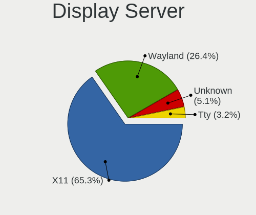

| Name    | Notebooks | Percent |
|---------|-----------|---------|
| X11     | 567       | 71.41%  |
| Wayland | 151       | 19.02%  |
| Unknown | 54        | 6.8%    |
| Tty     | 22        | 2.77%   |

Display Manager
---------------

SDDM, LightDM, etc.

| Name    | Notebooks | Percent |
|---------|-----------|---------|
| Unknown | 297       | 37.5%   |
| SDDM    | 131       | 16.54%  |
| GDM     | 121       | 15.28%  |
| GDM3    | 118       | 14.9%   |
| LightDM | 85        | 10.73%  |
| TDM     | 35        | 4.42%   |
| KDM     | 2         | 0.25%   |
| XDM     | 1         | 0.13%   |
| SLiM    | 1         | 0.13%   |
| LXDM    | 1         | 0.13%   |

OS Lang
-------

Language

| Lang        | Notebooks | Percent |
|-------------|-----------|---------|
| zh_CN       | 366       | 46.62%  |
| en_US       | 283       | 36.05%  |
| Unknown     | 90        | 11.46%  |
| en_HK       | 10        | 1.27%   |
| C           | 8         | 1.02%   |
| en_GB       | 6         | 0.76%   |
| C.UTF8      | 6         | 0.76%   |
| mn_CN       | 4         | 0.51%   |
| fr_FR       | 2         | 0.25%   |
| en_AU       | 2         | 0.25%   |
| th_TH       | 1         | 0.13%   |
| ru_RU       | 1         | 0.13%   |
| POSIX       | 1         | 0.13%   |
| ja_JP       | 1         | 0.13%   |
| en_ZA       | 1         | 0.13%   |
| en_US,UTF-8 | 1         | 0.13%   |
| de_DE       | 1         | 0.13%   |
| .en_US      | 1         | 0.13%   |

Boot Mode
---------

EFI or BIOS

| Mode | Notebooks | Percent |
|------|-----------|---------|
| EFI  | 544       | 69.39%  |
| BIOS | 240       | 30.61%  |

Filesystem
----------

Type of filesystem

| Type    | Notebooks | Percent |
|---------|-----------|---------|
| Ext4    | 591       | 75.48%  |
| Btrfs   | 100       | 12.77%  |
| Overlay | 29        | 3.7%    |
| Xfs     | 26        | 3.32%   |
| Unknown | 17        | 2.17%   |
| Tmpfs   | 13        | 1.66%   |
| Zfs     | 3         | 0.38%   |
| F2fs    | 3         | 0.38%   |
| XXXXXXX | 1         | 0.13%   |

Part. scheme
------------

Scheme of partitioning

| Type    | Notebooks | Percent |
|---------|-----------|---------|
| GPT     | 458       | 58.49%  |
| Unknown | 279       | 35.63%  |
| MBR     | 46        | 5.87%   |

Dual Boot with Linux/BSD
------------------------

Hosting more than one Linux/BSD

| Dual boot | Notebooks | Percent |
|-----------|-----------|---------|
| No        | 693       | 88.06%  |
| Yes       | 94        | 11.94%  |

Dual Boot (Win)
---------------

Hosting Linux and Windows

| Dual boot | Notebooks | Percent |
|-----------|-----------|---------|
| No        | 438       | 56.37%  |
| Yes       | 339       | 43.63%  |

Board
-----

Vendor
------

Motherboard manufacturer

| Name                           | Notebooks | Percent |
|--------------------------------|-----------|---------|
| Lenovo                         | 265       | 34.28%  |
| Dell                           | 86        | 11.13%  |
| Hewlett-Packard                | 78        | 10.09%  |
| HUAWEI                         | 51        | 6.6%    |
| Timi                           | 40        | 5.17%   |
| ASUSTek Computer               | 40        | 5.17%   |
| Acer                           | 32        | 4.14%   |
| MECHREVO                       | 15        | 1.94%   |
| HASEE Computer                 | 14        | 1.81%   |
| Apple                          | 13        | 1.68%   |
| MSI                            | 12        | 1.55%   |
| Unknown                        | 12        | 1.55%   |
| Toshiba                        | 9         | 1.16%   |
| Valve                          | 8         | 1.03%   |
| GPD                            | 8         | 1.03%   |
| Sony                           | 7         | 0.91%   |
| HONOR                          | 5         | 0.65%   |
| Google                         | 5         | 0.65%   |
| Samsung Electronics            | 4         | 0.52%   |
| Notebook                       | 4         | 0.52%   |
| Intel Client Systems           | 4         | 0.52%   |
| Intel                          | 4         | 0.52%   |
| GreatWall                      | 4         | 0.52%   |
| Fujitsu                        | 4         | 0.52%   |
| Shanghai Zhaoxin Semiconductor | 3         | 0.39%   |
| Jumper                         | 3         | 0.39%   |
| IPASON                         | 3         | 0.39%   |
| Alienware                      | 3         | 0.39%   |
| win element                    | 2         | 0.26%   |
| Terrans Force                  | 2         | 0.26%   |
| SmbiosType1_SystemManufacturer | 2         | 0.26%   |
| Razer                          | 2         | 0.26%   |
| LG Electronics                 | 2         | 0.26%   |
| Insyde                         | 2         | 0.26%   |
| Gigabyte Technology            | 2         | 0.26%   |
| Clevo                          | 2         | 0.26%   |
| XIAOMI                         | 1         | 0.13%   |
| WOOKING                        | 1         | 0.13%   |
| TR                             | 1         | 0.13%   |
| THTF                           | 1         | 0.13%   |

Model
-----

Motherboard model

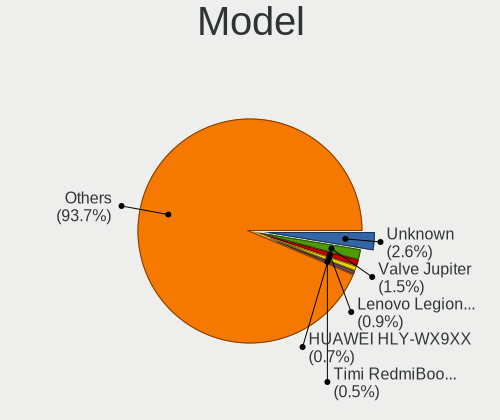

| Name                              | Notebooks | Percent |
|-----------------------------------|-----------|---------|
| Unknown                           | 20        | 2.59%   |
| Valve Jupiter                     | 8         | 1.03%   |
| HUAWEI HLY-WX9XX                  | 8         | 1.03%   |
| Lenovo Legion R9000P2021H 82JQ    | 7         | 0.91%   |
| Timi TM1701                       | 5         | 0.65%   |
| Timi RedmiBook Pro 15S            | 5         | 0.65%   |
| Lenovo Legion R7000 2020 82B6     | 5         | 0.65%   |
| Lenovo XiaoXinPro-13ARE 2020 82DM | 4         | 0.52%   |
| Lenovo XiaoXin-15ARE 2020 81YR    | 4         | 0.52%   |
| Lenovo ThinkBook 15p Gen 2 21B1   | 4         | 0.52%   |
| Lenovo Legion Y7000 81FW          | 4         | 0.52%   |
| HUAWEI NBLK-WAX9X                 | 4         | 0.52%   |
| HUAWEI KPRC-WX0                   | 4         | 0.52%   |
| HUAWEI BOHK-WAX9X                 | 4         | 0.52%   |
| Dell XPS 15 9570                  | 4         | 0.52%   |
| Acer Swift SF314-512              | 4         | 0.52%   |
| Timi TM1709                       | 3         | 0.39%   |
| Timi TM1613                       | 3         | 0.39%   |
| Timi RedmiBook 14 II              | 3         | 0.39%   |
| Shanghai Zhaoxin ZXE CRB          | 3         | 0.39%   |
| Lenovo ZHAOYANG K4e-ITL 82F8      | 3         | 0.39%   |
| Lenovo XiaoXinPro-13IML 2019 81XB | 3         | 0.39%   |
| Lenovo XiaoXinAir-14ARE 2020 81YN | 3         | 0.39%   |
| Lenovo ThinkBook 14p Gen 2 20YN   | 3         | 0.39%   |
| Lenovo ThinkBook 14 G2 ITL 20VD   | 3         | 0.39%   |
| Intel H81U                        | 3         | 0.39%   |
| Intel Client Systems LAPKC71F     | 3         | 0.39%   |
| HUAWEI KPR-WX9                    | 3         | 0.39%   |
| HUAWEI KPL-W0X                    | 3         | 0.39%   |
| HP ENVY Laptop 13-ad1xx           | 3         | 0.39%   |
| GreatWall TN140A2                 | 3         | 0.39%   |
| GPD P2 MAX                        | 3         | 0.39%   |
| Apple MacBookPro16,1              | 3         | 0.39%   |
| Acer Swift SF314-42               | 3         | 0.39%   |
| win element MoreFine S500+        | 2         | 0.26%   |
| Toshiba WT8-A                     | 2         | 0.26%   |
| Timi TM1604                       | 2         | 0.26%   |
| Timi RedmiBook 14-APCS            | 2         | 0.26%   |
| Timi Redmi Book Pro 15 2022       | 2         | 0.26%   |
| Timi Mi Laptop Pro 15             | 2         | 0.26%   |

Model Family
------------

Motherboard model prefix

| Name                    | Notebooks | Percent |
|-------------------------|-----------|---------|
| Lenovo ThinkPad         | 119       | 15.39%  |
| Lenovo Legion           | 36        | 4.66%   |
| Dell Inspiron           | 29        | 3.75%   |
| Lenovo ThinkBook        | 24        | 3.1%    |
| Dell Latitude           | 20        | 2.59%   |
| Unknown                 | 20        | 2.59%   |
| HP EliteBook            | 19        | 2.46%   |
| HP OMEN                 | 16        | 2.07%   |
| HP ZHAN                 | 15        | 1.94%   |
| Acer Aspire             | 15        | 1.94%   |
| Lenovo ZHAOYANG         | 13        | 1.68%   |
| Timi RedmiBook          | 12        | 1.55%   |
| Lenovo IdeaPad          | 12        | 1.55%   |
| Dell XPS                | 12        | 1.55%   |
| Acer Swift              | 11        | 1.42%   |
| Dell Precision          | 10        | 1.29%   |
| HP ProBook              | 9         | 1.16%   |
| Valve Jupiter           | 8         | 1.03%   |
| HUAWEI HLY-WX9XX        | 8         | 1.03%   |
| ASUS ROG                | 8         | 1.03%   |
| Lenovo XiaoXinPro       | 7         | 0.91%   |
| Dell Vostro             | 7         | 0.91%   |
| Lenovo Yoga             | 6         | 0.78%   |
| Toshiba Satellite       | 5         | 0.65%   |
| Timi TM1701             | 5         | 0.65%   |
| Lenovo XiaoXin          | 5         | 0.65%   |
| HP Pavilion             | 5         | 0.65%   |
| HP ENVY                 | 5         | 0.65%   |
| ASUS ASUS               | 5         | 0.65%   |
| Acer Nitro              | 5         | 0.65%   |
| Timi Redmi              | 4         | 0.52%   |
| Lenovo XiaoXinPro-13ARE | 4         | 0.52%   |
| Lenovo XiaoXin-15ARE    | 4         | 0.52%   |
| HUAWEI NBLK-WAX9X       | 4         | 0.52%   |
| HUAWEI KPRC-WX0         | 4         | 0.52%   |
| HUAWEI BOHK-WAX9X       | 4         | 0.52%   |
| Dell G3                 | 4         | 0.52%   |
| Apple MacBookPro16      | 4         | 0.52%   |
| Timi TM1709             | 3         | 0.39%   |
| Timi TM1613             | 3         | 0.39%   |

MFG Year
--------

Motherboard manufacture year

| Year    | Notebooks | Percent |
|---------|-----------|---------|
| 2021    | 126       | 16.3%   |
| 2020    | 106       | 13.71%  |
| 2019    | 93        | 12.03%  |
| 2022    | 75        | 9.7%    |
| 2018    | 69        | 8.93%   |
| 2017    | 46        | 5.95%   |
| 2012    | 38        | 4.92%   |
| 2016    | 35        | 4.53%   |
| 2014    | 35        | 4.53%   |
| 2015    | 34        | 4.4%    |
| 2011    | 32        | 4.14%   |
| 2013    | 31        | 4.01%   |
| 2023    | 16        | 2.07%   |
| 2008    | 13        | 1.68%   |
| 2010    | 8         | 1.03%   |
| 2009    | 7         | 0.91%   |
| 2007    | 5         | 0.65%   |
| 2006    | 3         | 0.39%   |
| Unknown | 1         | 0.13%   |

Form Factor
-----------

Physical design of the computer

| Name     | Notebooks | Percent |
|----------|-----------|---------|
| Notebook | 773       | 100%    |

Secure Boot
-----------

Enabled or disabled

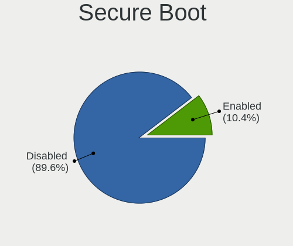

| State    | Notebooks | Percent |
|----------|-----------|---------|
| Disabled | 696       | 89.12%  |
| Enabled  | 85        | 10.88%  |

Coreboot
--------

Have coreboot on board

| Used | Notebooks | Percent |
|------|-----------|---------|
| No   | 768       | 99.35%  |
| Yes  | 5         | 0.65%   |

RAM Size
--------

Total RAM memory

| Size in GB  | Notebooks | Percent |
|-------------|-----------|---------|
| 8.01-16.0   | 204       | 26.05%  |
| 16.01-24.0  | 194       | 24.78%  |
| 4.01-8.0    | 177       | 22.61%  |
| 3.01-4.0    | 78        | 9.96%   |
| 32.01-64.0  | 71        | 9.07%   |
| 24.01-32.0  | 27        | 3.45%   |
| 1.01-2.0    | 16        | 2.04%   |
| 64.01-256.0 | 10        | 1.28%   |
| 0.51-1.0    | 5         | 0.64%   |
| Unknown     | 1         | 0.13%   |

RAM Used
--------

Used RAM memory

| Used GB    | Notebooks | Percent |
|------------|-----------|---------|
| 2.01-3.0   | 219       | 26.16%  |
| 1.01-2.0   | 210       | 25.09%  |
| 4.01-8.0   | 168       | 20.07%  |
| 3.01-4.0   | 138       | 16.49%  |
| 0.51-1.0   | 43        | 5.14%   |
| 8.01-16.0  | 42        | 5.02%   |
| 0.01-0.5   | 12        | 1.43%   |
| 16.01-24.0 | 2         | 0.24%   |
| Unknown    | 2         | 0.24%   |
| 24.01-32.0 | 1         | 0.12%   |

Total Drives
------------

Number of drives on board

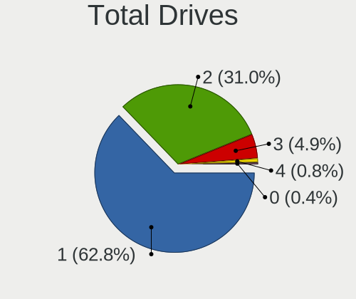

| Drives | Notebooks | Percent |
|--------|-----------|---------|
| 1      | 497       | 63.64%  |
| 2      | 241       | 30.86%  |
| 3      | 35        | 4.48%   |
| 4      | 5         | 0.64%   |
| 0      | 3         | 0.38%   |

Has CD-ROM
----------

Has CD-ROM on board

| Presented | Notebooks | Percent |
|-----------|-----------|---------|
| No        | 690       | 88.8%   |
| Yes       | 87        | 11.2%   |

Has Ethernet
------------

Has Ethernet on board

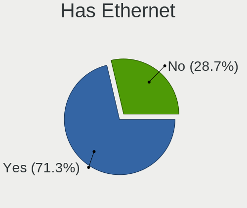

| Presented | Notebooks | Percent |
|-----------|-----------|---------|
| Yes       | 555       | 71.34%  |
| No        | 223       | 28.66%  |

Has WiFi
--------

Has WiFi module

| Presented | Notebooks | Percent |
|-----------|-----------|---------|
| Yes       | 751       | 97.15%  |
| No        | 22        | 2.85%   |

Has Bluetooth
-------------

Has Bluetooth module

| Presented | Notebooks | Percent |
|-----------|-----------|---------|
| Yes       | 658       | 84.79%  |
| No        | 118       | 15.21%  |

Location
--------

Country
-------

Geographic location (country)

| Country | Notebooks | Percent |
|---------|-----------|---------|
| China   | 773       | 100%    |

City
----

Geographic location (city)

| City             | Notebooks | Percent |
|------------------|-----------|---------|
| Beijing          | 131       | 15.98%  |
| Shanghai         | 68        | 8.29%   |
| Shenzhen         | 62        | 7.56%   |
| Guangzhou        | 59        | 7.2%    |
| Hangzhou         | 32        | 3.9%    |
| Chengdu          | 28        | 3.41%   |
| Wuhan            | 19        | 2.32%   |
| Nanjing          | 18        | 2.2%    |
| Xi'an            | 16        | 1.95%   |
| Tianjin          | 13        | 1.59%   |
| Jinrongjie       | 13        | 1.59%   |
| Changsha         | 12        | 1.46%   |
| Zhengzhou        | 11        | 1.34%   |
| Chongqing        | 11        | 1.34%   |
| Nanning          | 10        | 1.22%   |
| Dongguan         | 10        | 1.22%   |
| Huangpu          | 9         | 1.1%    |
| Hefei            | 9         | 1.1%    |
| Fuzhou           | 9         | 1.1%    |
| Xuhui            | 8         | 0.98%   |
| Suzhou           | 8         | 0.98%   |
| Shenyang         | 8         | 0.98%   |
| Qingdao          | 8         | 0.98%   |
| Foshan           | 8         | 0.98%   |
| Dalian           | 8         | 0.98%   |
| Kunming          | 7         | 0.85%   |
| Pudong           | 6         | 0.73%   |
| Jinan            | 6         | 0.73%   |
| Changchun        | 6         | 0.73%   |
| Xiamen           | 5         | 0.61%   |
| Haidian          | 5         | 0.61%   |
| Guiyang          | 5         | 0.61%   |
| Xining           | 4         | 0.49%   |
| Xicheng District | 4         | 0.49%   |
| Taiyuan          | 4         | 0.49%   |
| Shijiazhuang     | 4         | 0.49%   |
| Ningbo           | 4         | 0.49%   |
| Hohhot           | 4         | 0.49%   |
| Harbin           | 4         | 0.49%   |
| Zhongba          | 3         | 0.37%   |

Drives
------

Drive Vendor
------------

Hard drive vendors

| Vendor                      | Notebooks | Drives | Percent |
|-----------------------------|-----------|--------|---------|
| Samsung Electronics         | 226       | 288    | 21.34%  |
| WDC                         | 104       | 125    | 9.82%   |
| Seagate                     | 81        | 94     | 7.65%   |
| Sandisk                     | 68        | 80     | 6.42%   |
| Toshiba                     | 62        | 70     | 5.85%   |
| SK hynix                    | 54        | 69     | 5.1%    |
| Unknown                     | 41        | 47     | 3.87%   |
| Micron Technology           | 34        | 35     | 3.21%   |
| Intel                       | 31        | 43     | 2.93%   |
| HGST                        | 24        | 28     | 2.27%   |
| Kingston                    | 23        | 27     | 2.17%   |
| Plextor                     | 17        | 19     | 1.61%   |
| KIOXIA                      | 17        | 21     | 1.61%   |
| LITEON                      | 14        | 16     | 1.32%   |
| Lenovo                      | 14        | 19     | 1.32%   |
| Crucial                     | 14        | 18     | 1.32%   |
| Hitachi                     | 12        | 16     | 1.13%   |
| Apple                       | 11        | 11     | 1.04%   |
| Yangtze Memory Technologies | 10        | 11     | 0.94%   |
| Phison                      | 9         | 11     | 0.85%   |
| JMicron Technology          | 9         | 7      | 0.85%   |
| A-DATA Technology           | 9         | 12     | 0.85%   |
| Unknown                     | 9         | 9      | 0.85%   |
| China                       | 8         | 18     | 0.76%   |
| Silicon Motion              | 7         | 7      | 0.66%   |
| Phison Electronics          | 6         | 6      | 0.57%   |
| MAXIO Technology (Hangzhou) | 6         | 7      | 0.57%   |
| Hewlett-Packard             | 6         | 6      | 0.57%   |
| Transcend                   | 5         | 6      | 0.47%   |
| Kingston Technology Company | 5         | 5      | 0.47%   |
| Colorful                    | 5         | 6      | 0.47%   |
| Teclast                     | 4         | 4      | 0.38%   |
| Netac                       | 4         | 4      | 0.38%   |
| LITEONIT                    | 4         | 4      | 0.38%   |
| KIOXIA-EXCERIA              | 4         | 7      | 0.38%   |
| Kingchuxing                 | 4         | 4      | 0.38%   |
| GALAX                       | 4         | 4      | 0.38%   |
| Fujitsu                     | 4         | 4      | 0.38%   |
| FORESEE                     | 4         | 6      | 0.38%   |
| External                    | 4         | 6      | 0.38%   |

Drive Model
-----------

Hard drive models

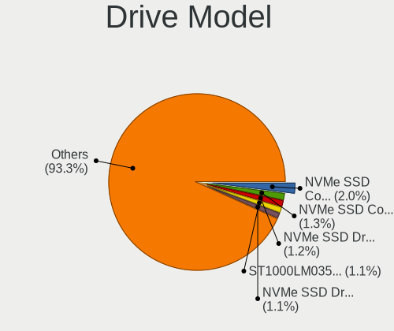

| Model                                               | Notebooks | Percent |
|-----------------------------------------------------|-----------|---------|
| Samsung NVMe SSD Drive 512GB                        | 20        | 1.81%   |
| Seagate ST1000LM035-1RK172 1TB                      | 15        | 1.35%   |
| SanDisk NVMe SSD Drive 512GB                        | 15        | 1.35%   |
| Samsung NVMe SSD Controller PM9A1/PM9A3/980PRO 1TB  | 15        | 1.35%   |
| Samsung MZVLB512HBJQ-000L2 512GB                    | 14        | 1.26%   |
| HGST HTS721010A9E630 1TB                            | 14        | 1.26%   |
| Seagate ST1000LM048-2E7172 1TB                      | 11        | 0.99%   |
| SK hynix NVMe SSD Drive 512GB                       | 10        | 0.9%    |
| Samsung NVMe SSD Controller SM981/PM981/PM983 500GB | 10        | 0.9%    |
| Samsung MZVLB512HAJQ-00000 512GB                    | 10        | 0.9%    |
| SK hynix SKHynix_HFS512GDE9X084N 512GB              | 9         | 0.81%   |
| Seagate ST500LT012-1DG142 500GB                     | 9         | 0.81%   |
| Samsung SSD 980 1TB                                 | 9         | 0.81%   |
| Samsung NVMe SSD Drive 1024GB                       | 9         | 0.81%   |
| Unknown                                             | 9         | 0.81%   |
| Samsung NVMe SSD Drive 256GB                        | 8         | 0.72%   |
| Samsung MZVLB512HBJQ-000L7 512GB                    | 8         | 0.72%   |
| Toshiba MQ01ABD100 1TB                              | 7         | 0.63%   |
| Seagate ST500LM021-1KJ152 500GB                     | 7         | 0.63%   |
| Seagate ST2000LM007-1R8174 2TB                      | 7         | 0.63%   |
| HGST HTS725050A7E630 500GB                          | 7         | 0.63%   |
| WDC PC SN730 SDBPNTY-512G-1027 512GB                | 6         | 0.54%   |
| Plextor PX-128M6S 128GB SSD                         | 6         | 0.54%   |
| JMicron Generic 512GB                               | 6         | 0.54%   |
| WDC WDS100T2B0C-00PXH0 1TB                          | 5         | 0.45%   |
| SK hynix SKHynix_HFS512GD9TNI-L2A0B 512GB           | 5         | 0.45%   |
| Sandisk WD Black SN850 1TB                          | 5         | 0.45%   |
| Sandisk Ultra 3D NVMe 500GB                         | 5         | 0.45%   |
| SanDisk NVMe SSD Drive 1TB                          | 5         | 0.45%   |
| Samsung SSD 860 EVO 500GB                           | 5         | 0.45%   |
| Samsung NVMe SSD Drive 1TB                          | 5         | 0.45%   |
| Samsung MZVLB1T0HBLR-000L2 1TB                      | 5         | 0.45%   |
| Micron MTFDKBA512TFH 512GB                          | 5         | 0.45%   |
| Micron MTFDHBA512TDV 512GB                          | 5         | 0.45%   |
| Micron 2450_MTFDKBA512TFK 512GB                     | 5         | 0.45%   |
| KIOXIA KBG40ZNV512G 512GB                           | 5         | 0.45%   |
| Intel SSDPEKNW010T8 1TB                             | 5         | 0.45%   |
| WDC WD10SPZX-22Z10T1 1TB                            | 4         | 0.36%   |
| WDC PC SN730 SDBPNTY-512G-1101 512GB                | 4         | 0.36%   |
| Unknown MMC Card  64GB                              | 4         | 0.36%   |

HDD Vendor
----------

Hard disk drive vendors

| Vendor              | Notebooks | Drives | Percent |
|---------------------|-----------|--------|---------|
| Seagate             | 81        | 93     | 38.39%  |
| WDC                 | 54        | 64     | 25.59%  |
| HGST                | 24        | 28     | 11.37%  |
| Toshiba             | 17        | 22     | 8.06%   |
| Hitachi             | 12        | 16     | 5.69%   |
| JMicron Technology  | 6         | 6      | 2.84%   |
| Samsung Electronics | 5         | 6      | 2.37%   |
| Fujitsu             | 4         | 4      | 1.9%    |
| External            | 4         | 6      | 1.9%    |
| ASMT                | 2         | 2      | 0.95%   |
| HGST HTS            | 1         | 1      | 0.47%   |
| ACASIS              | 1         | 1      | 0.47%   |

SSD Vendor
----------

Solid state drive vendors

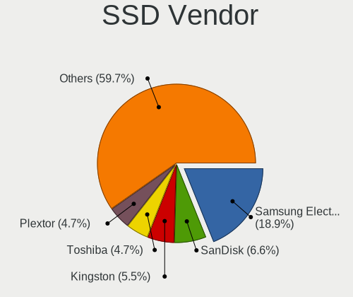

| Vendor              | Notebooks | Drives | Percent |
|---------------------|-----------|--------|---------|
| Samsung Electronics | 56        | 73     | 20.74%  |
| SanDisk             | 20        | 22     | 7.41%   |
| Plextor             | 15        | 17     | 5.56%   |
| Kingston            | 15        | 18     | 5.56%   |
| Toshiba             | 14        | 15     | 5.19%   |
| LITEON              | 13        | 15     | 4.81%   |
| Lenovo              | 11        | 14     | 4.07%   |
| WDC                 | 9         | 9      | 3.33%   |
| Crucial             | 9         | 13     | 3.33%   |
| China               | 8         | 18     | 2.96%   |
| Micron Technology   | 7         | 7      | 2.59%   |
| A-DATA Technology   | 7         | 10     | 2.59%   |
| SK hynix            | 5         | 5      | 1.85%   |
| Intel               | 5         | 5      | 1.85%   |
| Apple               | 5         | 5      | 1.85%   |
| Transcend           | 4         | 5      | 1.48%   |
| Teclast             | 4         | 4      | 1.48%   |
| Netac               | 4         | 4      | 1.48%   |
| LITEONIT            | 4         | 4      | 1.48%   |
| Kingchuxing         | 4         | 4      | 1.48%   |
| GALAX               | 4         | 4      | 1.48%   |
| Unknown             | 4         | 4      | 1.48%   |
| Phison              | 3         | 4      | 1.11%   |
| Colorful            | 3         | 3      | 1.11%   |
| Lexar               | 2         | 2      | 0.74%   |
| KingSpec            | 2         | 2      | 0.74%   |
| FORESEE             | 2         | 2      | 0.74%   |
| ZHITAI              | 1         | 1      | 0.37%   |
| Xinsujie            | 1         | 1      | 0.37%   |
| WDC WDS1            | 1         | 1      | 0.37%   |
| Unknown             | 1         | 1      | 0.37%   |
| UNIC2               | 1         | 1      | 0.37%   |
| TurXun              | 1         | 1      | 0.37%   |
| TOPMORE             | 1         | 1      | 0.37%   |
| TO Exter            | 1         | 1      | 0.37%   |
| Thinkplus           | 1         | 1      | 0.37%   |
| ShiJi               | 1         | 1      | 0.37%   |
| Q200                | 1         | 1      | 0.37%   |
| NT-512              | 1         | 1      | 0.37%   |
| MR                  | 1         | 3      | 0.37%   |

Drive Kind
----------

HDD or SSD

| Kind    | Notebooks | Drives | Percent |
|---------|-----------|--------|---------|
| NVMe    | 465       | 627    | 47.79%  |
| SSD     | 241       | 325    | 24.77%  |
| HDD     | 200       | 249    | 20.55%  |
| MMC     | 38        | 43     | 3.91%   |
| Unknown | 29        | 31     | 2.98%   |

Drive Connector
---------------

SATA, SAS, NVMe, etc.

| Type | Notebooks | Drives | Percent |
|------|-----------|--------|---------|
| NVMe | 465       | 625    | 50.43%  |
| SATA | 367       | 548    | 39.8%   |
| SAS  | 52        | 59     | 5.64%   |
| MMC  | 38        | 43     | 4.12%   |

Drive Size
----------

Size of hard drive

| Size in TB | Notebooks | Drives | Percent |
|------------|-----------|--------|---------|
| 0.01-0.5   | 260       | 359    | 60.05%  |
| 0.51-1.0   | 143       | 174    | 33.03%  |
| 1.01-2.0   | 25        | 33     | 5.77%   |
| 3.01-4.0   | 3         | 4      | 0.69%   |
| 10.01-20.0 | 1         | 2      | 0.23%   |
| 4.01-10.0  | 1         | 2      | 0.23%   |

Space Total
-----------

Amount of disk space available on the file system

| Size in GB     | Notebooks | Percent |
|----------------|-----------|---------|
| 251-500        | 232       | 28.96%  |
| 101-250        | 191       | 23.85%  |
| 501-1000       | 122       | 15.23%  |
| 51-100         | 65        | 8.11%   |
| 1001-2000      | 62        | 7.74%   |
| 1-20           | 45        | 5.62%   |
| 21-50          | 30        | 3.75%   |
| More than 3000 | 25        | 3.12%   |
| 2001-3000      | 16        | 2%      |
| Unknown        | 13        | 1.62%   |

Space Used
----------

Amount of used disk space

| Used GB        | Notebooks | Percent |
|----------------|-----------|---------|
| 1-20           | 308       | 37.33%  |
| 21-50          | 143       | 17.33%  |
| 101-250        | 116       | 14.06%  |
| 51-100         | 98        | 11.88%  |
| 251-500        | 74        | 8.97%   |
| 501-1000       | 41        | 4.97%   |
| 1001-2000      | 19        | 2.3%    |
| Unknown        | 13        | 1.58%   |
| More than 3000 | 9         | 1.09%   |
| 2001-3000      | 4         | 0.48%   |

Malfunc. Drives
---------------

Drive models with a malfunction

| Model                                        | Notebooks | Drives | Percent |
|----------------------------------------------|-----------|--------|---------|
| Toshiba MQ04ABF100 1TB                       | 2         | 2      | 5.41%   |
| Seagate ST500LM021-1KJ152 500GB              | 2         | 2      | 5.41%   |
| Seagate ST1000LM048-2E7172 1TB               | 2         | 2      | 5.41%   |
| Seagate ST1000LM024 HN-M101MBB 1TB           | 2         | 2      | 5.41%   |
| HGST HTS725050A7E630 500GB                   | 2         | 2      | 5.41%   |
| HGST HTS721010A9E630 1TB                     | 2         | 2      | 5.41%   |
| WDC WD10SPZX-60Z10T0 1TB                     | 1         | 1      | 2.7%    |
| WDC WD10 JPVX-75JC3T0 1TB                    | 1         | 1      | 2.7%    |
| Toshiba MQ01ABF050 500GB                     | 1         | 1      | 2.7%    |
| Toshiba MK3259GSXP 320GB                     | 1         | 1      | 2.7%    |
| Toshiba MK2555GSX 250GB                      | 1         | 1      | 2.7%    |
| Seagate ST750LM028-1KK162 752GB              | 1         | 1      | 2.7%    |
| Seagate ST500LT012-9WS142 500GB              | 1         | 2      | 2.7%    |
| Seagate ST500LT012-1DG142 500GB              | 1         | 1      | 2.7%    |
| SanDisk SSD U100 128GB                       | 1         | 1      | 2.7%    |
| SanDisk SD9SN8W-256G-1006 256GB SSD          | 1         | 1      | 2.7%    |
| Samsung Electronics MZVLW512HMJP-00000 512GB | 1         | 1      | 2.7%    |
| Plextor PX-128M6S 128GB SSD                  | 1         | 1      | 2.7%    |
| Netac SSD 120GB                              | 1         | 1      | 2.7%    |
| Lenovo SSD SL700 120G                        | 1         | 1      | 2.7%    |
| Intel SSDPEKKF256G7H 256GB                   | 1         | 1      | 2.7%    |
| Hitachi HTS547575A9E384 752GB                | 1         | 1      | 2.7%    |
| Hitachi HTS545050B9A300 500GB                | 1         | 1      | 2.7%    |
| Hitachi HTS541060G9SA00 64GB                 | 1         | 1      | 2.7%    |
| Hitachi HTS541040G9AT00 40GB                 | 1         | 1      | 2.7%    |
| Fujitsu MHZ2250BH G2 250GB                   | 1         | 1      | 2.7%    |
| Fujitsu MHV2100BH PL 100GB                   | 1         | 1      | 2.7%    |
| Crucial M4-CT128M4SSD1 128GB                 | 1         | 1      | 2.7%    |
| Crucial CT240M500SSD1 240GB                  | 1         | 1      | 2.7%    |
| A-DATA Technology SP900 128GB SSD            | 1         | 2      | 2.7%    |
| A-DATA Technology AXNS381E-256GM-B 256GB SSD | 1         | 1      | 2.7%    |

Malfunc. Drive Vendor
---------------------

Vendors of faulty drives

| Vendor              | Notebooks | Drives | Percent |
|---------------------|-----------|--------|---------|
| Seagate             | 9         | 10     | 24.32%  |
| Toshiba             | 5         | 5      | 13.51%  |
| Hitachi             | 4         | 4      | 10.81%  |
| HGST                | 4         | 4      | 10.81%  |
| WDC                 | 2         | 2      | 5.41%   |
| SanDisk             | 2         | 2      | 5.41%   |
| Fujitsu             | 2         | 2      | 5.41%   |
| Crucial             | 2         | 2      | 5.41%   |
| A-DATA Technology   | 2         | 3      | 5.41%   |
| Samsung Electronics | 1         | 1      | 2.7%    |
| Plextor             | 1         | 1      | 2.7%    |
| Netac               | 1         | 1      | 2.7%    |
| Lenovo              | 1         | 1      | 2.7%    |
| Intel               | 1         | 1      | 2.7%    |

Malfunc. HDD Vendor
-------------------

Vendors of faulty HDD drives

| Vendor  | Notebooks | Drives | Percent |
|---------|-----------|--------|---------|
| Seagate | 9         | 10     | 34.62%  |
| Toshiba | 5         | 5      | 19.23%  |
| Hitachi | 4         | 4      | 15.38%  |
| HGST    | 4         | 4      | 15.38%  |
| WDC     | 2         | 2      | 7.69%   |
| Fujitsu | 2         | 2      | 7.69%   |

Malfunc. Drive Kind
-------------------

Kinds of faulty drives

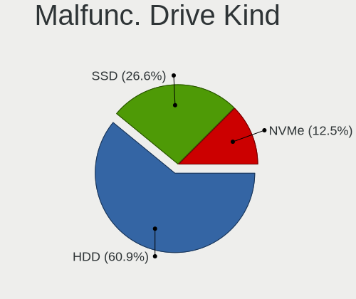

| Kind | Notebooks | Drives | Percent |
|------|-----------|--------|---------|
| HDD  | 26        | 27     | 70.27%  |
| SSD  | 9         | 10     | 24.32%  |
| NVMe | 2         | 2      | 5.41%   |

Failed Drives
-------------

Failed drive models

| Model                            | Notebooks | Drives | Percent |
|----------------------------------|-----------|--------|---------|
| Samsung Electronics SSD 980 1TB  | 1         | 1      | 33.33%  |
| Samsung Electronics HS06THB 64GB | 1         | 1      | 33.33%  |
| Phison ESO128GTLC9-E8C-2 128GB   | 1         | 1      | 33.33%  |

Failed Drive Vendor
-------------------

Failed drive vendors

| Vendor              | Notebooks | Drives | Percent |
|---------------------|-----------|--------|---------|
| Samsung Electronics | 2         | 2      | 66.67%  |
| Phison              | 1         | 1      | 33.33%  |

Drive Status
------------

Number of failed and malfunc. drives

| Status   | Notebooks | Drives | Percent |
|----------|-----------|--------|---------|
| Works    | 411       | 637    | 49.64%  |
| Detected | 377       | 596    | 45.53%  |
| Malfunc  | 37        | 39     | 4.47%   |
| Failed   | 3         | 3      | 0.36%   |

Storage controller
------------------

Storage Vendor
--------------

Storage controller vendors

| Vendor                                  | Notebooks | Percent |
|-----------------------------------------|-----------|---------|
| Intel                                   | 413       | 41.05%  |
| Samsung Electronics                     | 177       | 17.59%  |
| SanDisk                                 | 89        | 8.85%   |
| AMD                                     | 86        | 8.55%   |
| SK hynix                                | 48        | 4.77%   |
| Toshiba America Info Systems            | 30        | 2.98%   |
| Micron Technology                       | 27        | 2.68%   |
| KIOXIA                                  | 22        | 2.19%   |
| Silicon Motion                          | 16        | 1.59%   |
| Phison Electronics                      | 14        | 1.39%   |
| Yangtze Memory Technologies             | 13        | 1.29%   |
| Kingston Technology Company             | 13        | 1.29%   |
| MAXIO Technology (Hangzhou)             | 7         | 0.7%    |
| Biwin Storage Technology                | 6         | 0.6%    |
| Apple                                   | 6         | 0.6%    |
| Shenzhen Longsys Electronics            | 5         | 0.5%    |
| Micron/Crucial Technology               | 5         | 0.5%    |
| Zhaoxin                                 | 4         | 0.4%    |
| ADATA Technology                        | 4         | 0.4%    |
| Solid State Storage Technology          | 3         | 0.3%    |
| O2 Micro                                | 3         | 0.3%    |
| Marvell Technology Group                | 3         | 0.3%    |
| Silicon Integrated Systems [SiS]        | 2         | 0.2%    |
| Lite-On Technology                      | 2         | 0.2%    |
| INNOGRIT                                | 2         | 0.2%    |
| Union Memory (Shenzhen)                 | 1         | 0.1%    |
| Shenzhen Unionmemory Information System | 1         | 0.1%    |
| Lenovo                                  | 1         | 0.1%    |
| JMicron Technology                      | 1         | 0.1%    |
| Hefei DATANG Storage Technology         | 1         | 0.1%    |
| Unknown                                 | 1         | 0.1%    |

Storage Model
-------------

Storage controller models

| Model                                                                          | Notebooks | Percent |
|--------------------------------------------------------------------------------|-----------|---------|
| Samsung NVMe SSD Controller SM981/PM981/PM983                                  | 93        | 8.82%   |
| AMD FCH SATA Controller [AHCI mode]                                            | 83        | 7.87%   |
| Intel Sunrise Point-LP SATA Controller [AHCI mode]                             | 64        | 6.07%   |
| Intel 7 Series Chipset Family 6-port SATA Controller [AHCI mode]               | 41        | 3.89%   |
| Samsung NVMe SSD Controller PM9A1/PM9A3/980PRO                                 | 30        | 2.84%   |
| Intel Cannon Lake Mobile PCH SATA AHCI Controller                              | 30        | 2.84%   |
| SanDisk WD Black SN750 / PC SN730 NVMe SSD                                     | 28        | 2.65%   |
| Intel Volume Management Device NVMe RAID Controller                            | 27        | 2.56%   |
| Samsung NVMe SSD Controller 980                                                | 26        | 2.46%   |
| Intel 6 Series/C200 Series Chipset Family 6 port Mobile SATA AHCI Controller   | 25        | 2.37%   |
| SK hynix Gold P31/BC711/PC711 NVMe Solid State Drive                           | 24        | 2.27%   |
| Intel HM170/QM170 Chipset SATA Controller [AHCI Mode]                          | 23        | 2.18%   |
| Intel 82801 Mobile SATA Controller [RAID mode]                                 | 23        | 2.18%   |
| Intel 8 Series SATA Controller 1 [AHCI mode]                                   | 23        | 2.18%   |
| Samsung NVMe SSD Controller SM961/PM961/SM963                                  | 19        | 1.8%    |
| SanDisk WD Blue SN550 NVMe SSD                                                 | 17        | 1.61%   |
| Intel 8 Series/C220 Series Chipset Family 6-port SATA Controller 1 [AHCI mode] | 17        | 1.61%   |
| Intel Wildcat Point-LP SATA Controller [AHCI Mode]                             | 16        | 1.52%   |
| SanDisk WD Black 2018/SN750 / PC SN720 NVMe SSD                                | 15        | 1.42%   |
| Toshiba America Info Systems XG6 NVMe SSD Controller                           | 13        | 1.23%   |
| Intel Comet Lake SATA AHCI Controller                                          | 13        | 1.23%   |
| KIOXIA NVMe SSD Controller BG4 (DRAM-less)                                     | 11        | 1.04%   |
| Intel SSD 660P Series                                                          | 11        | 1.04%   |
| Intel Cannon Point-LP SATA Controller [AHCI Mode]                              | 11        | 1.04%   |
| SK hynix PC611 NVMe Solid State Drive                                          | 10        | 0.95%   |
| Silicon Motion SM2263EN/SM2263XT (DRAM-less) NVMe SSD Controllers              | 10        | 0.95%   |
| Micron 3400 NVMe SSD [Hendrix]                                                 | 10        | 0.95%   |
| Intel Tiger Lake SATA AHCI Controller                                          | 10        | 0.95%   |
| Intel Tiger Lake-LP SATA Controller                                            | 9         | 0.85%   |
| Intel SSD DC P4101/Pro 7600p/760p/E 6100p Series                               | 9         | 0.85%   |
| Intel 82801IBM/IEM (ICH9M/ICH9M-E) 4 port SATA Controller [AHCI mode]          | 9         | 0.85%   |
| Toshiba America Info Systems BG3 NVMe SSD Controller                           | 8         | 0.76%   |
| SanDisk WD PC SN810 / Black SN850 NVMe SSD                                     | 8         | 0.76%   |
| KIOXIA NVMe SSD Controller BG5 (DRAM-less)                                     | 7         | 0.66%   |
| Yangtze Memory ZHITAI PC005 NVMe SSD                                           | 6         | 0.57%   |
| SK hynix BC511 NVMe SSD                                                        | 6         | 0.57%   |
| Silicon Motion SM2262/SM2262EN SSD Controller                                  | 6         | 0.57%   |
| Phison E12 NVMe Controller                                                     | 6         | 0.57%   |
| Micron 2450 NVMe SSD [HendrixV] (DRAM-less)                                    | 6         | 0.57%   |
| Micron 2300 NVMe SSD [Santana]                                                 | 6         | 0.57%   |

Storage Kind
------------

Kind of storage controller (IDE, SATA, NVMe, SAS, ...)

| Kind | Notebooks | Percent |
|------|-----------|---------|
| NVMe | 467       | 47.51%  |
| SATA | 438       | 44.56%  |
| RAID | 53        | 5.39%   |
| IDE  | 25        | 2.54%   |

Processor
---------

CPU Vendor
----------

Processor vendors

| Vendor       | Notebooks | Percent |
|--------------|-----------|---------|
| Intel        | 560       | 72.45%  |
| AMD          | 199       | 25.74%  |
| Phytium      | 6         | 0.78%   |
| CentaurHauls | 6         | 0.78%   |
| ARM          | 2         | 0.26%   |

CPU Model
---------

Processor models

| Model                                          | Notebooks | Percent |
|------------------------------------------------|-----------|---------|
| AMD Ryzen 7 5800H with Radeon Graphics         | 34        | 4.4%    |
| Intel 11th Gen Core i5-1135G7 @ 2.40GHz        | 21        | 2.72%   |
| Intel Core i7-9750H CPU @ 2.60GHz              | 20        | 2.59%   |
| Intel Core i5-8250U CPU @ 1.60GHz              | 19        | 2.46%   |
| AMD Ryzen 5 3500U with Radeon Vega Mobile Gfx  | 18        | 2.33%   |
| Intel Core i5-7200U CPU @ 2.50GHz              | 15        | 1.94%   |
| Intel 11th Gen Core i7-1165G7 @ 2.80GHz        | 15        | 1.94%   |
| Intel Core i5-6200U CPU @ 2.30GHz              | 14        | 1.81%   |
| Intel Core i5-10210U CPU @ 1.60GHz             | 14        | 1.81%   |
| Intel 12th Gen Core i7-12700H                  | 14        | 1.81%   |
| Intel Core i7-8550U CPU @ 1.80GHz              | 13        | 1.68%   |
| Intel 11th Gen Core i7-11800H @ 2.30GHz        | 13        | 1.68%   |
| AMD Ryzen 7 6800H with Radeon Graphics         | 12        | 1.55%   |
| Intel Core i5-8265U CPU @ 1.60GHz              | 11        | 1.42%   |
| Intel Core i7-8750H CPU @ 2.20GHz              | 10        | 1.29%   |
| Intel Core i7-7700HQ CPU @ 2.80GHz             | 10        | 1.29%   |
| Intel Core i7-10510U CPU @ 1.80GHz             | 10        | 1.29%   |
| Intel 12th Gen Core i5-1240P                   | 10        | 1.29%   |
| AMD Ryzen 7 4800H with Radeon Graphics         | 10        | 1.29%   |
| Intel Core i5-8300H CPU @ 2.30GHz              | 9         | 1.16%   |
| Intel Core i7-6700HQ CPU @ 2.60GHz             | 8         | 1.03%   |
| AMD Custom APU 0405                            | 8         | 1.03%   |
| Intel Core i7-8565U CPU @ 1.80GHz              | 7         | 0.91%   |
| Intel Core i5-5200U CPU @ 2.20GHz              | 7         | 0.91%   |
| AMD Ryzen 5 4600U with Radeon Graphics         | 7         | 0.91%   |
| AMD Ryzen 5 4600H with Radeon Graphics         | 7         | 0.91%   |
| AMD Ryzen 5 3550H with Radeon Vega Mobile Gfx  | 7         | 0.91%   |
| Intel Core i7-7500U CPU @ 2.70GHz              | 6         | 0.78%   |
| Intel Core i7-10750H CPU @ 2.60GHz             | 6         | 0.78%   |
| Intel Core i5-3320M CPU @ 2.60GHz              | 6         | 0.78%   |
| Intel Core i3-2350M CPU @ 2.30GHz              | 6         | 0.78%   |
| CentaurHauls ZHAOXIN KaiXian KX-6640MA@2.2+GHz | 6         | 0.78%   |
| AMD Ryzen 5 4500U with Radeon Graphics         | 6         | 0.78%   |
| Intel Core i7-3630QM CPU @ 2.40GHz             | 5         | 0.65%   |
| Intel Core i5-4200U CPU @ 1.60GHz              | 5         | 0.65%   |
| Intel Core i5-2520M CPU @ 2.50GHz              | 5         | 0.65%   |
| AMD Ryzen 7 PRO 4750U with Radeon Graphics     | 5         | 0.65%   |
| AMD Ryzen 7 4800U with Radeon Graphics         | 5         | 0.65%   |
| AMD Ryzen 5 2500U with Radeon Vega Mobile Gfx  | 5         | 0.65%   |
| Phytium D2000/8 E8C                            | 4         | 0.52%   |

CPU Model Family
----------------

Processor model prefix

| Model                   | Notebooks | Percent |
|-------------------------|-----------|---------|
| Intel Core i5           | 182       | 23.54%  |
| Intel Core i7           | 162       | 20.96%  |
| Other                   | 122       | 15.78%  |
| AMD Ryzen 7             | 83        | 10.74%  |
| AMD Ryzen 5             | 60        | 7.76%   |
| Intel Core i3           | 35        | 4.53%   |
| Intel Core 2 Duo        | 16        | 2.07%   |
| Intel Celeron           | 16        | 2.07%   |
| Intel Atom              | 15        | 1.94%   |
| AMD Ryzen 7 PRO         | 12        | 1.55%   |
| AMD Ryzen 9             | 10        | 1.29%   |
| Intel Pentium           | 6         | 0.78%   |
| Intel Xeon              | 5         | 0.65%   |
| Intel Core m3           | 5         | 0.65%   |
| AMD A6                  | 5         | 0.65%   |
| AMD A10                 | 5         | 0.65%   |
| Intel Core i9           | 4         | 0.52%   |
| AMD Ryzen 5 PRO         | 4         | 0.52%   |
| AMD A8                  | 4         | 0.52%   |
| Intel Pentium Dual      | 3         | 0.39%   |
| Intel Pentium Silver    | 2         | 0.26%   |
| Intel Core M            | 2         | 0.26%   |
| Intel Core 2            | 2         | 0.26%   |
| AMD E2                  | 2         | 0.26%   |
| AMD A4                  | 2         | 0.26%   |
| Intel Pentium M         | 1         | 0.13%   |
| Intel Genuine           | 1         | 0.13%   |
| Intel Core Duo          | 1         | 0.13%   |
| Intel Core              | 1         | 0.13%   |
| Intel Celeron Dual-Core | 1         | 0.13%   |
| AMD Ryzen 3             | 1         | 0.13%   |
| AMD E                   | 1         | 0.13%   |
| AMD C-50                | 1         | 0.13%   |
| AMD Athlon              | 1         | 0.13%   |

CPU Cores
---------

Number of processor cores

| Number  | Notebooks | Percent |
|---------|-----------|---------|
| 4       | 298       | 38.5%   |
| 2       | 223       | 28.81%  |
| 8       | 120       | 15.5%   |
| 6       | 86        | 11.11%  |
| 14      | 18        | 2.33%   |
| 12      | 17        | 2.2%    |
| 1       | 6         | 0.78%   |
| 10      | 3         | 0.39%   |
| 16      | 2         | 0.26%   |
| Unknown | 1         | 0.13%   |

CPU Sockets
-----------

Number of sockets

| Number  | Notebooks | Percent |
|---------|-----------|---------|
| 1       | 771       | 99.61%  |
| 3       | 2         | 0.26%   |
| Unknown | 1         | 0.13%   |

CPU Threads
-----------

Threads per core (Hyper-Threading)

| Number  | Notebooks | Percent |
|---------|-----------|---------|
| 2       | 659       | 85.03%  |
| 1       | 115       | 14.84%  |
| Unknown | 1         | 0.13%   |

CPU Op-Modes
------------

CPU Operation Modes (32-bit, 64-bit)

| Op mode        | Notebooks | Percent |
|----------------|-----------|---------|
| 32-bit, 64-bit | 764       | 98.71%  |
| 32-bit         | 5         | 0.65%   |
| Unknown        | 5         | 0.65%   |

CPU Microcode
-------------

Microcode number

| Number     | Notebooks | Percent |
|------------|-----------|---------|
| Unknown    | 187       | 23.64%  |
| 0x906ea    | 39        | 4.93%   |
| 0x306a9    | 34        | 4.3%    |
| 0x806ec    | 33        | 4.17%   |
| 0x0a50000c | 32        | 4.05%   |
| 0x806ea    | 31        | 3.92%   |
| 0x806c1    | 26        | 3.29%   |
| 0x08600106 | 26        | 3.29%   |
| 0x806e9    | 25        | 3.16%   |
| 0x206a7    | 24        | 3.03%   |
| 0x906a3    | 22        | 2.78%   |
| 0x40651    | 22        | 2.78%   |
| 0x306d4    | 19        | 2.4%    |
| 0x406e3    | 18        | 2.28%   |
| 0x08108102 | 17        | 2.15%   |
| 0x506e3    | 15        | 1.9%    |
| 0x306c3    | 14        | 1.77%   |
| 0xa0652    | 13        | 1.64%   |
| 0x906e9    | 12        | 1.52%   |
| 0x806d1    | 12        | 1.52%   |
| 0x08600104 | 12        | 1.52%   |
| 0x08108109 | 12        | 1.52%   |
| 0x0a404102 | 11        | 1.39%   |
| 0x1067a    | 8         | 1.01%   |
| 0x806eb    | 6         | 0.76%   |
| 0x706e5    | 6         | 0.76%   |
| 0x0a404101 | 6         | 0.76%   |
| 0x0a50000b | 5         | 0.63%   |
| 0x08600103 | 5         | 0.63%   |
| 0xa0660    | 4         | 0.51%   |
| 0x806c2    | 4         | 0.51%   |
| 0x706a1    | 4         | 0.51%   |
| 0x6fd      | 4         | 0.51%   |
| 0x406c3    | 4         | 0.51%   |
| 0x30678    | 4         | 0.51%   |
| 0x0a704103 | 4         | 0.51%   |
| 0x08608103 | 4         | 0.51%   |
| 0x08101007 | 4         | 0.51%   |
| 0x20655    | 3         | 0.38%   |
| 0x10676    | 3         | 0.38%   |

CPU Microarch
-------------

Microarchitecture

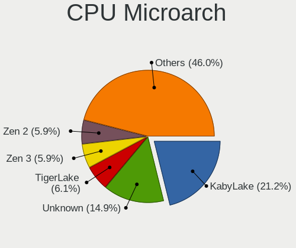

| Name             | Notebooks | Percent |
|------------------|-----------|---------|
| KabyLake         | 189       | 24.42%  |
| Unknown          | 72        | 9.3%    |
| Zen 2            | 50        | 6.46%   |
| Zen 3            | 49        | 6.33%   |
| TigerLake        | 47        | 6.07%   |
| Haswell          | 45        | 5.81%   |
| IvyBridge        | 44        | 5.68%   |
| Skylake          | 39        | 5.04%   |
| Zen+             | 31        | 4.01%   |
| SandyBridge      | 29        | 3.75%   |
| Alderlake Hybrid | 24        | 3.1%    |
| CometLake        | 22        | 2.84%   |
| Broadwell        | 22        | 2.84%   |
| Icelake          | 21        | 2.71%   |
| Silvermont       | 15        | 1.94%   |
| Penryn           | 15        | 1.94%   |
| Zen              | 7         | 0.9%    |
| Core             | 7         | 0.9%    |
| Goldmont plus    | 6         | 0.78%   |
| Westmere         | 5         | 0.65%   |
| Piledriver       | 4         | 0.52%   |
| Goldmont         | 4         | 0.52%   |
| Bonnell          | 4         | 0.52%   |
| Steamroller      | 3         | 0.39%   |
| Puma             | 3         | 0.39%   |
| P6               | 3         | 0.39%   |
| Excavator        | 3         | 0.39%   |
| Bobcat           | 3         | 0.39%   |
| Tremont          | 2         | 0.26%   |
| Nehalem          | 2         | 0.26%   |
| K10 Llano        | 2         | 0.26%   |
| Jaguar           | 2         | 0.26%   |

Graphics
--------

GPU Vendor
----------

Vendors of graphics cards

| Vendor                           | Notebooks | Percent |
|----------------------------------|-----------|---------|
| Intel                            | 515       | 48.36%  |
| Nvidia                           | 301       | 28.26%  |
| AMD                              | 241       | 22.63%  |
| Zhaoxin                          | 6         | 0.56%   |
| Silicon Integrated Systems [SiS] | 1         | 0.09%   |
| Nanjing Ruixinview Technology    | 1         | 0.09%   |

GPU Model
---------

Graphics card models

| Model                                                                                    | Notebooks | Percent |
|------------------------------------------------------------------------------------------|-----------|---------|
| Intel TigerLake-LP GT2 [Iris Xe Graphics]                                                | 46        | 4.22%   |
| AMD Renoir                                                                               | 44        | 4.04%   |
| Intel 3rd Gen Core processor Graphics Controller                                         | 41        | 3.76%   |
| Intel UHD Graphics 620                                                                   | 40        | 3.67%   |
| AMD Cezanne [Radeon Vega Series / Radeon Vega Mobile Series]                             | 39        | 3.58%   |
| Intel CoffeeLake-H GT2 [UHD Graphics 630]                                                | 34        | 3.12%   |
| Intel Alder Lake-P Integrated Graphics Controller                                        | 31        | 2.85%   |
| AMD Picasso/Raven 2 [Radeon Vega Series / Radeon Vega Mobile Series]                     | 31        | 2.85%   |
| Intel 2nd Generation Core Processor Family Integrated Graphics Controller                | 27        | 2.48%   |
| Nvidia GA106M [GeForce RTX 3060 Mobile / Max-Q]                                          | 26        | 2.39%   |
| Intel CometLake-U GT2 [UHD Graphics]                                                     | 25        | 2.3%    |
| Intel HD Graphics 620                                                                    | 24        | 2.2%    |
| Intel Haswell-ULT Integrated Graphics Controller                                         | 24        | 2.2%    |
| AMD Rembrandt [Radeon 680M]                                                              | 22        | 2.02%   |
| Intel WhiskeyLake-U GT2 [UHD Graphics 620]                                               | 21        | 1.93%   |
| Intel Skylake GT2 [HD Graphics 520]                                                      | 18        | 1.65%   |
| Nvidia GP108M [GeForce MX150]                                                            | 17        | 1.56%   |
| Intel 4th Gen Core Processor Integrated Graphics Controller                              | 17        | 1.56%   |
| Nvidia GP108M [GeForce MX250]                                                            | 16        | 1.47%   |
| Intel TigerLake-H GT1 [UHD Graphics]                                                     | 15        | 1.38%   |
| Intel HD Graphics 5500                                                                   | 15        | 1.38%   |
| Nvidia TU117M [GeForce MX450]                                                            | 13        | 1.19%   |
| Intel CometLake-H GT2 [UHD Graphics]                                                     | 13        | 1.19%   |
| Intel HD Graphics 630                                                                    | 12        | 1.1%    |
| Intel HD Graphics 530                                                                    | 12        | 1.1%    |
| Nvidia TU117M                                                                            | 10        | 0.92%   |
| Nvidia TU106M [GeForce RTX 2060 Mobile]                                                  | 10        | 0.92%   |
| Nvidia GP107M [GeForce GTX 1050 Mobile]                                                  | 10        | 0.92%   |
| Nvidia GF117M [GeForce 610M/710M/810M/820M / GT 620M/625M/630M/720M]                     | 10        | 0.92%   |
| Nvidia GP107M [GeForce GTX 1050 Ti Mobile]                                               | 9         | 0.83%   |
| Nvidia GP106M [GeForce GTX 1060 Mobile]                                                  | 9         | 0.83%   |
| Nvidia GM108M [GeForce 940MX]                                                            | 9         | 0.83%   |
| AMD Sun XT [Radeon HD 8670A/8670M/8690M / R5 M330 / M430 / Radeon 520 Mobile]            | 9         | 0.83%   |
| Nvidia TU117M [GeForce GTX 1650 Mobile / Max-Q]                                          | 8         | 0.73%   |
| Intel Mobile 4 Series Chipset Integrated Graphics Controller                             | 8         | 0.73%   |
| Intel Atom/Celeron/Pentium Processor x5-E8000/J3xxx/N3xxx Integrated Graphics Controller | 8         | 0.73%   |
| AMD VanGogh [AMD Custom GPU 0405]                                                        | 8         | 0.73%   |
| AMD Topaz XT [Radeon R7 M260/M265 / M340/M360 / M440/M445 / 530/535 / 620/625 Mobile]    | 8         | 0.73%   |
| Nvidia GM107M [GeForce GTX 960M]                                                         | 7         | 0.64%   |
| Intel Atom Processor Z36xxx/Z37xxx Series Graphics & Display                             | 7         | 0.64%   |

GPU Combo
---------

Combinations of graphics cards

| Name                              | Notebooks | Percent |
|-----------------------------------|-----------|---------|
| 1 x Intel                         | 256       | 32.99%  |
| Intel + Nvidia                    | 220       | 28.35%  |
| 1 x AMD                           | 152       | 19.59%  |
| 1 x Nvidia                        | 46        | 5.93%   |
| Intel + AMD                       | 39        | 5.03%   |
| AMD + Nvidia                      | 35        | 4.51%   |
| 2 x AMD                           | 15        | 1.93%   |
| 1 x Zhaoxin                       | 6         | 0.77%   |
| 2 x Intel                         | 3         | 0.39%   |
| Other                             | 2         | 0.26%   |
| 1 x SiS                           | 1         | 0.13%   |
| 1 x Nanjing Ruixinview Technology | 1         | 0.13%   |

GPU Driver
----------

Free vs proprietary

| Driver      | Notebooks | Percent |
|-------------|-----------|---------|
| Free        | 589       | 75.32%  |
| Proprietary | 151       | 19.31%  |
| Unknown     | 42        | 5.37%   |

GPU Memory
----------

Total video memory

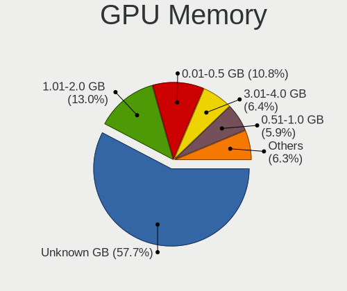

| Size in GB | Notebooks | Percent |
|------------|-----------|---------|
| Unknown    | 437       | 55.53%  |
| 1.01-2.0   | 110       | 13.98%  |
| 0.01-0.5   | 79        | 10.04%  |
| 0.51-1.0   | 57        | 7.24%   |
| 3.01-4.0   | 54        | 6.86%   |
| 5.01-6.0   | 29        | 3.68%   |
| 7.01-8.0   | 16        | 2.03%   |
| 8.01-16.0  | 3         | 0.38%   |
| 2.01-3.0   | 2         | 0.25%   |

Monitor
-------

Monitor Vendor
--------------

Monitor vendors

| Vendor                  | Notebooks | Percent |
|-------------------------|-----------|---------|
| BOE                     | 145       | 17.53%  |
| AU Optronics            | 126       | 15.24%  |
| Chimei Innolux          | 109       | 13.18%  |
| LG Display              | 106       | 12.82%  |
| CSO                     | 40        | 4.84%   |
| Samsung Electronics     | 39        | 4.72%   |
| Sharp                   | 35        | 4.23%   |
| Lenovo                  | 24        | 2.9%    |
| Dell                    | 19        | 2.3%    |
| AOC                     | 18        | 2.18%   |
| PANDA                   | 15        | 1.81%   |
| TMX                     | 14        | 1.69%   |
| Philips                 | 12        | 1.45%   |
| InfoVision              | 12        | 1.45%   |
| Apple                   | 12        | 1.45%   |
| Goldstar                | 8         | 0.97%   |
| Valve                   | 6         | 0.73%   |
| Hewlett-Packard         | 6         | 0.73%   |
| RTK                     | 5         | 0.6%    |
| Chi Mei Optoelectronics | 5         | 0.6%    |
| SGT                     | 4         | 0.48%   |
| Mi                      | 4         | 0.48%   |
| JDI                     | 4         | 0.48%   |
| IPS                     | 4         | 0.48%   |
| BenQ                    | 4         | 0.48%   |
| Panasonic               | 3         | 0.36%   |
| LGD                     | 3         | 0.36%   |
| BOE Technology Group    | 3         | 0.36%   |
| Xiaomi                  | 2         | 0.24%   |
| ViewSonic               | 2         | 0.24%   |
| Sony                    | 2         | 0.24%   |
| LG Philips              | 2         | 0.24%   |
| InnoLux Display         | 2         | 0.24%   |
| Analogix                | 2         | 0.24%   |
| Acer                    | 2         | 0.24%   |
| Unknown                 | 1         | 0.12%   |
| SKY                     | 1         | 0.12%   |
| QSM                     | 1         | 0.12%   |
| Pixio                   | 1         | 0.12%   |
| MStar                   | 1         | 0.12%   |

Monitor Model
-------------

Monitor models

| Model                                                                | Notebooks | Percent |
|----------------------------------------------------------------------|-----------|---------|
| Chimei Innolux LCD Monitor CMN14D4 1920x1080 309x173mm 13.9-inch     | 14        | 1.68%   |
| TMX TL156MDMP01-0 TMX1560 3200x2000 336x210mm 15.6-inch              | 8         | 0.96%   |
| Chimei Innolux LCD Monitor CMN14A7 1920x1080 308x173mm 13.9-inch     | 8         | 0.96%   |
| BOE LCD Monitor BOE0877 1920x1080 309x173mm 13.9-inch                | 8         | 0.96%   |
| CSO LCD Monitor CSO1402 2880x1800 302x188mm 14.0-inch                | 7         | 0.84%   |
| AU Optronics LCD Monitor AUO403D 1920x1080 309x174mm 14.0-inch       | 7         | 0.84%   |
| Valve ANX7530 U VLV3001 800x1280 100x150mm 7.1-inch                  | 6         | 0.72%   |
| Sharp LCD Monitor SHP1447 1920x1080 294x165mm 13.3-inch              | 6         | 0.72%   |
| Chimei Innolux LCD Monitor CMN1604 1920x1080 355x199mm 16.0-inch     | 6         | 0.72%   |
| BOE LCD Monitor BOE07DB 1920x1080 309x174mm 14.0-inch                | 6         | 0.72%   |
| BOE LCD Monitor BOE0747 1920x1080 344x194mm 15.5-inch                | 6         | 0.72%   |
| AU Optronics LCD Monitor AUO2E3C 1366x768 309x173mm 13.9-inch        | 6         | 0.72%   |
| PANDA LCD Monitor NCP004D 1920x1080 344x194mm 15.5-inch              | 5         | 0.6%    |
| LG Display LCD Monitor LGD02D8 1366x768 277x156mm 12.5-inch          | 5         | 0.6%    |
| Chimei Innolux LCD Monitor CMN15E8 1920x1080 344x193mm 15.5-inch     | 5         | 0.6%    |
| Chimei Innolux LCD Monitor CMN14D5 1920x1080 309x173mm 13.9-inch     | 5         | 0.6%    |
| BOE LCD Monitor BOE0893 2160x1440 296x197mm 14.0-inch                | 5         | 0.6%    |
| AU Optronics LCD Monitor AUO683D 1920x1080 309x174mm 14.0-inch       | 5         | 0.6%    |
| AU Optronics LCD Monitor AUO106C 1366x768 277x156mm 12.5-inch        | 5         | 0.6%    |
| Sharp LCD Monitor SHP149A 1920x1080 344x194mm 15.5-inch              | 4         | 0.48%   |
| Sharp LCD Monitor SHP1453 1920x1080 346x194mm 15.6-inch              | 4         | 0.48%   |
| LG Display LCD Monitor LGD40BA 1920x1080 344x194mm 15.5-inch         | 4         | 0.48%   |
| LG Display LCD Monitor LGD0521 1920x1080 309x174mm 14.0-inch         | 4         | 0.48%   |
| LG Display LCD Monitor LGD02F8 1366x768 309x174mm 14.0-inch          | 4         | 0.48%   |
| InfoVision LCD Monitor IVO061F 1920x1080 344x194mm 15.5-inch         | 4         | 0.48%   |
| Goldstar HDR 4K GSM7706 3840x2160 600x340mm 27.2-inch                | 4         | 0.48%   |
| CSO LCD Monitor CSO076D 2560x1600 286x179mm 13.3-inch                | 4         | 0.48%   |
| BOE LCD Monitor BOE098E 1920x1080 344x194mm 15.5-inch                | 4         | 0.48%   |
| BOE LCD Monitor BOE0872 1920x1080 344x194mm 15.5-inch                | 4         | 0.48%   |
| AU Optronics LCD Monitor AUO45ED 1920x1080 344x193mm 15.5-inch       | 4         | 0.48%   |
| AU Optronics LCD Monitor AUO133D 1920x1080 309x173mm 13.9-inch       | 4         | 0.48%   |
| Samsung Electronics LCD Monitor SEC414C 1366x768 309x174mm 14.0-inch | 3         | 0.36%   |
| Panasonic LCD Monitor MEI96A2 2560x1440 309x173mm 13.9-inch          | 3         | 0.36%   |
| LG Display LCD Monitor LGD0619 1920x1080 309x174mm 14.0-inch         | 3         | 0.36%   |
| LG Display LCD Monitor LGD0618 1920x1080 344x194mm 15.5-inch         | 3         | 0.36%   |
| LG Display LCD Monitor LGD05FA 1920x1080 309x174mm 14.0-inch         | 3         | 0.36%   |
| LG Display LCD Monitor LGD05F1 1920x1080 309x174mm 14.0-inch         | 3         | 0.36%   |
| LG Display LCD Monitor LGD05E5 1920x1080 344x194mm 15.5-inch         | 3         | 0.36%   |
| Lenovo LCD Monitor LEN4035 1280x800 303x189mm 14.1-inch              | 3         | 0.36%   |
| JDI LCD Monitor JDI422A 3000x2000 293x196mm 13.9-inch                | 3         | 0.36%   |

Monitor Resolution
------------------

Monitor screen resolution

| Resolution         | Notebooks | Percent |
|--------------------|-----------|---------|
| 1920x1080 (FHD)    | 392       | 50.19%  |
| 1366x768 (WXGA)    | 125       | 16.01%  |
| 2560x1600          | 53        | 6.79%   |
| 3840x2160 (4K)     | 43        | 5.51%   |
| 2560x1440 (QHD)    | 41        | 5.25%   |
| 2880x1800          | 17        | 2.18%   |
| 2160x1440          | 11        | 1.41%   |
| 1920x1200 (WUXGA)  | 11        | 1.41%   |
| 3200x2000          | 10        | 1.28%   |
| 1600x900 (HD+)     | 10        | 1.28%   |
| 1280x800 (WXGA)    | 10        | 1.28%   |
| 800x1280           | 8         | 1.02%   |
| 1440x900 (WXGA+)   | 8         | 1.02%   |
| 2240x1400          | 6         | 0.77%   |
| 1680x1050 (WSXGA+) | 5         | 0.64%   |
| 3840x2400          | 4         | 0.51%   |
| 3072x1920          | 4         | 0.51%   |
| 3440x1440          | 3         | 0.38%   |
| 3000x2000          | 3         | 0.38%   |
| 2520x1680          | 2         | 0.26%   |
| 1024x600           | 2         | 0.26%   |
| 3840x1080          | 1         | 0.13%   |
| 3200x1800 (QHD+)   | 1         | 0.13%   |
| 2880x1920          | 1         | 0.13%   |
| 2560x1080          | 1         | 0.13%   |
| 2256x1504          | 1         | 0.13%   |
| 2160x1350          | 1         | 0.13%   |
| 1920x540           | 1         | 0.13%   |
| 1920x1280          | 1         | 0.13%   |
| 1792x768           | 1         | 0.13%   |
| 1400x1050          | 1         | 0.13%   |
| 1280x1024 (SXGA)   | 1         | 0.13%   |
| 1024x768 (XGA)     | 1         | 0.13%   |
| Unknown            | 1         | 0.13%   |

Monitor Diagonal
----------------

Diagonal size in inches

| Inches  | Notebooks | Percent |
|---------|-----------|---------|
| 15      | 234       | 28.4%   |
| 13      | 170       | 20.63%  |
| 14      | 164       | 19.9%   |
| 16      | 53        | 6.43%   |
| 27      | 34        | 4.13%   |
| 24      | 28        | 3.4%    |
| 12      | 28        | 3.4%    |
| 17      | 26        | 3.16%   |
| 23      | 25        | 3.03%   |
| Unknown | 13        | 1.58%   |
| 21      | 7         | 0.85%   |
| 40      | 6         | 0.73%   |
| 7       | 6         | 0.73%   |
| 22      | 4         | 0.49%   |
| 11      | 4         | 0.49%   |
| 34      | 3         | 0.36%   |
| 18      | 3         | 0.36%   |
| 65      | 2         | 0.24%   |
| 31      | 2         | 0.24%   |
| 19      | 2         | 0.24%   |
| 10      | 2         | 0.24%   |
| 3       | 2         | 0.24%   |
| 63      | 1         | 0.12%   |
| 43      | 1         | 0.12%   |
| 32      | 1         | 0.12%   |
| 26      | 1         | 0.12%   |
| 25      | 1         | 0.12%   |
| 20      | 1         | 0.12%   |

Monitor Width
-------------

Physical width

| Width in mm | Notebooks | Percent |
|-------------|-----------|---------|
| 301-350     | 510       | 62.04%  |
| 201-300     | 125       | 15.21%  |
| 501-600     | 83        | 10.1%   |
| 351-400     | 45        | 5.47%   |
| 401-500     | 17        | 2.07%   |
| Unknown     | 13        | 1.58%   |
| 1-100       | 8         | 0.97%   |
| 601-700     | 7         | 0.85%   |
| 801-900     | 6         | 0.73%   |
| 701-800     | 4         | 0.49%   |
| 1001-1500   | 3         | 0.36%   |
| 901-1000    | 1         | 0.12%   |

Aspect Ratio
------------

Proportional relationship between the width and the height

| Ratio   | Notebooks | Percent |
|---------|-----------|---------|
| 16/9    | 558       | 75.92%  |
| 16/10   | 127       | 17.28%  |
| 3/2     | 22        | 2.99%   |
| Unknown | 12        | 1.63%   |
| 0.67    | 6         | 0.82%   |
| 21/9    | 4         | 0.54%   |
| 4/3     | 3         | 0.41%   |
| 6/5     | 2         | 0.27%   |
| 5/4     | 1         | 0.14%   |

Monitor Area
------------

Area in inch

| Area in inch | Notebooks | Percent |
|----------------|-----------|---------|
| 81-90          | 263       | 31.88%  |
| 101-110        | 240       | 29.09%  |
| 71-80          | 70        | 8.48%   |
| 201-250        | 56        | 6.79%   |
| 111-120        | 43        | 5.21%   |
| 301-350        | 35        | 4.24%   |
| 61-70          | 26        | 3.15%   |
| 121-130        | 25        | 3.03%   |
| Unknown        | 13        | 1.58%   |
| 151-200        | 9         | 1.09%   |
| 1-40           | 8         | 0.97%   |
| 501-1000       | 7         | 0.85%   |
| 91-100         | 7         | 0.85%   |
| 351-500        | 6         | 0.73%   |
| 251-300        | 5         | 0.61%   |
| 51-60          | 4         | 0.48%   |
| More than 1000 | 3         | 0.36%   |
| 141-150        | 3         | 0.36%   |
| 41-50          | 2         | 0.24%   |

Pixel Density
-------------

Pixels per inch

| Density       | Notebooks | Percent |
|---------------|-----------|---------|
| 121-160       | 359       | 44.32%  |
| 161-240       | 161       | 19.88%  |
| 101-120       | 135       | 16.67%  |
| 51-100        | 83        | 10.25%  |
| More than 240 | 57        | 7.04%   |
| Unknown       | 13        | 1.6%    |
| 1-50          | 2         | 0.25%   |

Multiple Monitors
-----------------

Total monitors connected

| Total | Notebooks | Percent |
|-------|-----------|---------|
| 1     | 615       | 78.24%  |
| 2     | 121       | 15.39%  |
| 0     | 46        | 5.85%   |
| 3     | 4         | 0.51%   |

Network
-------

Net Controller Vendor
---------------------

Controller vendors

| Vendor                           | Notebooks | Percent |
|----------------------------------|-----------|---------|
| Intel                            | 470       | 39.46%  |
| Realtek Semiconductor            | 425       | 35.68%  |
| Qualcomm Atheros                 | 117       | 9.82%   |
| Broadcom                         | 35        | 2.94%   |
| MediaTek                         | 34        | 2.85%   |
| Broadcom Limited                 | 20        | 1.68%   |
| ASIX Electronics                 | 18        | 1.51%   |
| Huawei Technologies              | 12        | 1.01%   |
| Qualcomm                         | 9         | 0.76%   |
| Xiaomi                           | 8         | 0.67%   |
| Ralink                           | 5         | 0.42%   |
| Quectel Wireless Solutions       | 5         | 0.42%   |
| Ralink Technology                | 4         | 0.34%   |
| OPPO Electronics                 | 3         | 0.25%   |
| Marvell Technology Group         | 3         | 0.25%   |
| ZTE WCDMA Technologies MSM       | 2         | 0.17%   |
| TP-Link                          | 2         | 0.17%   |
| Silicon Integrated Systems [SiS] | 2         | 0.17%   |
| Sierra Wireless                  | 2         | 0.17%   |
| Dell                             | 2         | 0.17%   |
| Wilocity                         | 1         | 0.08%   |
| ST-Ericsson                      | 1         | 0.08%   |
| Shenzhen Goodix Technology       | 1         | 0.08%   |
| Qualcomm Atheros Communications  | 1         | 0.08%   |
| OnePlus Technology (Shenzhen)    | 1         | 0.08%   |
| Microsoft                        | 1         | 0.08%   |
| Meizu                            | 1         | 0.08%   |
| ICS Advent                       | 1         | 0.08%   |
| Hewlett-Packard                  | 1         | 0.08%   |
| DisplayLink                      | 1         | 0.08%   |
| Attansic Technology              | 1         | 0.08%   |
| Apple                            | 1         | 0.08%   |
| Unknown                          | 1         | 0.08%   |

Net Controller Model
--------------------

Controller models

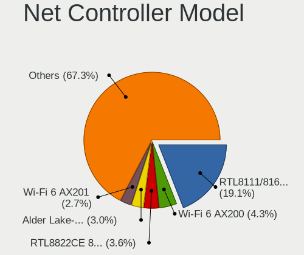

| Model                                                             | Notebooks | Percent |
|-------------------------------------------------------------------|-----------|---------|
| Realtek RTL8111/8168/8411 PCI Express Gigabit Ethernet Controller | 255       | 18.56%  |
| Intel Wi-Fi 6 AX200                                               | 61        | 4.44%   |
| Realtek RTL8822CE 802.11ac PCIe Wireless Network Adapter          | 56        | 4.08%   |
| Intel Wireless 8265 / 8275                                        | 46        | 3.35%   |
| Realtek RTL8153 Gigabit Ethernet Adapter                          | 37        | 2.69%   |
| Realtek RTL810xE PCI Express Fast Ethernet controller             | 33        | 2.4%    |
| Intel Wi-Fi 6 AX201                                               | 33        | 2.4%    |
| Intel Alder Lake-P PCH CNVi WiFi                                  | 31        | 2.26%   |
| Intel Comet Lake PCH-LP CNVi WiFi                                 | 27        | 1.97%   |
| Qualcomm Atheros QCA9377 802.11ac Wireless Network Adapter        | 26        | 1.89%   |
| Intel Wi-Fi 6 AX210/AX211/AX411 160MHz                            | 26        | 1.89%   |
| Intel Wireless 7265                                               | 24        | 1.75%   |
| Intel Cannon Lake PCH CNVi WiFi                                   | 23        | 1.67%   |
| Qualcomm Atheros QCA6174 802.11ac Wireless Network Adapter        | 21        | 1.53%   |
| Intel 82579LM Gigabit Network Connection (Lewisville)             | 20        | 1.46%   |
| MediaTek MT7921 802.11ax PCI Express Wireless Network Adapter     | 18        | 1.31%   |
| Intel Wireless 7260                                               | 17        | 1.24%   |
| Intel Cannon Point-LP CNVi [Wireless-AC]                          | 16        | 1.16%   |
| Intel Wireless 8260                                               | 15        | 1.09%   |
| Intel Wireless 3165                                               | 15        | 1.09%   |
| Intel Comet Lake PCH CNVi WiFi                                    | 15        | 1.09%   |
| Realtek RTL8852AE 802.11ax PCIe Wireless Network Adapter          | 14        | 1.02%   |
| Realtek RTL8821CE 802.11ac PCIe Wireless Network Adapter          | 14        | 1.02%   |
| Intel Tiger Lake PCH CNVi WiFi                                    | 14        | 1.02%   |
| Realtek RTL8125 2.5GbE Controller                                 | 13        | 0.95%   |
| Intel Ethernet Connection (4) I219-V                              | 12        | 0.87%   |
| ASIX AX88179 Gigabit Ethernet                                     | 12        | 0.87%   |
| Intel Centrino Advanced-N 6205 [Taylor Peak]                      | 11        | 0.8%    |
| Qualcomm Atheros AR9485 Wireless Network Adapter                  | 10        | 0.73%   |
| Realtek RTL8723BE PCIe Wireless Network Adapter                   | 9         | 0.66%   |
| Qualcomm Atheros AR9285 Wireless Network Adapter (PCI-Express)    | 9         | 0.66%   |
| Intel Wireless 3160                                               | 9         | 0.66%   |
| Huawei WLZ-AN00                                                   | 9         | 0.66%   |
| Qualcomm Atheros QCA9565 / AR9565 Wireless Network Adapter        | 8         | 0.58%   |
| Intel 82567LM Gigabit Network Connection                          | 8         | 0.58%   |
| Realtek RTL8852BE PCIe 802.11ax Wireless Network Controller       | 7         | 0.51%   |
| Realtek RTL8822BE 802.11a/b/g/n/ac WiFi adapter                   | 7         | 0.51%   |
| Realtek RTL8188EUS 802.11n Wireless Network Adapter               | 7         | 0.51%   |
| Realtek RTL8188CE 802.11b/g/n WiFi Adapter                        | 7         | 0.51%   |
| Qualcomm QCNFA765 Wireless Network Adapter                        | 7         | 0.51%   |

Wireless Vendor
---------------

Wireless vendors

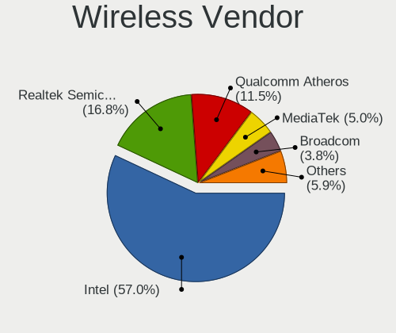

| Vendor                          | Notebooks | Percent |
|---------------------------------|-----------|---------|
| Intel                           | 447       | 57.16%  |
| Realtek Semiconductor           | 130       | 16.62%  |
| Qualcomm Atheros                | 95        | 12.15%  |
| MediaTek                        | 34        | 4.35%   |
| Broadcom                        | 29        | 3.71%   |
| Broadcom Limited                | 14        | 1.79%   |
| Qualcomm                        | 7         | 0.9%    |
| Ralink                          | 5         | 0.64%   |
| Quectel Wireless Solutions      | 5         | 0.64%   |
| Ralink Technology               | 4         | 0.51%   |
| Xiaomi                          | 2         | 0.26%   |
| TP-Link                         | 2         | 0.26%   |
| Sierra Wireless                 | 2         | 0.26%   |
| Dell                            | 2         | 0.26%   |
| Wilocity                        | 1         | 0.13%   |
| Qualcomm Atheros Communications | 1         | 0.13%   |
| Microsoft                       | 1         | 0.13%   |
| Hewlett-Packard                 | 1         | 0.13%   |

Wireless Model
--------------

Wireless models

| Model                                                                   | Notebooks | Percent |
|-------------------------------------------------------------------------|-----------|---------|
| Intel Wi-Fi 6 AX200                                                     | 61        | 7.76%   |
| Realtek RTL8822CE 802.11ac PCIe Wireless Network Adapter                | 56        | 7.12%   |
| Intel Wireless 8265 / 8275                                              | 46        | 5.85%   |
| Intel Wi-Fi 6 AX201                                                     | 33        | 4.2%    |
| Intel Alder Lake-P PCH CNVi WiFi                                        | 31        | 3.94%   |
| Intel Comet Lake PCH-LP CNVi WiFi                                       | 27        | 3.44%   |
| Qualcomm Atheros QCA9377 802.11ac Wireless Network Adapter              | 26        | 3.31%   |
| Intel Wi-Fi 6 AX210/AX211/AX411 160MHz                                  | 26        | 3.31%   |
| Intel Wireless 7265                                                     | 24        | 3.05%   |
| Intel Cannon Lake PCH CNVi WiFi                                         | 23        | 2.93%   |
| Qualcomm Atheros QCA6174 802.11ac Wireless Network Adapter              | 21        | 2.67%   |
| MediaTek MT7921 802.11ax PCI Express Wireless Network Adapter           | 18        | 2.29%   |
| Intel Wireless 7260                                                     | 17        | 2.16%   |
| Intel Cannon Point-LP CNVi [Wireless-AC]                                | 16        | 2.04%   |
| Intel Wireless 8260                                                     | 15        | 1.91%   |
| Intel Wireless 3165                                                     | 15        | 1.91%   |
| Intel Comet Lake PCH CNVi WiFi                                          | 15        | 1.91%   |
| Realtek RTL8852AE 802.11ax PCIe Wireless Network Adapter                | 14        | 1.78%   |
| Realtek RTL8821CE 802.11ac PCIe Wireless Network Adapter                | 14        | 1.78%   |
| Intel Tiger Lake PCH CNVi WiFi                                          | 14        | 1.78%   |
| Intel Centrino Advanced-N 6205 [Taylor Peak]                            | 11        | 1.4%    |
| Qualcomm Atheros AR9485 Wireless Network Adapter                        | 10        | 1.27%   |
| Realtek RTL8723BE PCIe Wireless Network Adapter                         | 9         | 1.15%   |
| Qualcomm Atheros AR9285 Wireless Network Adapter (PCI-Express)          | 9         | 1.15%   |
| Intel Wireless 3160                                                     | 9         | 1.15%   |
| Qualcomm Atheros QCA9565 / AR9565 Wireless Network Adapter              | 8         | 1.02%   |
| Realtek RTL8852BE PCIe 802.11ax Wireless Network Controller             | 7         | 0.89%   |
| Realtek RTL8822BE 802.11a/b/g/n/ac WiFi adapter                         | 7         | 0.89%   |
| Realtek RTL8188EUS 802.11n Wireless Network Adapter                     | 7         | 0.89%   |
| Realtek RTL8188CE 802.11b/g/n WiFi Adapter                              | 7         | 0.89%   |
| Qualcomm QCNFA765 Wireless Network Adapter                              | 7         | 0.89%   |
| MediaTek MT7922 802.11ax PCI Express Wireless Network Adapter           | 7         | 0.89%   |
| Intel Wireless-AC 9260                                                  | 7         | 0.89%   |
| Intel PRO/Wireless 5100 AGN [Shiloh] Network Connection                 | 7         | 0.89%   |
| Intel Dual Band Wireless-AC 3165 Plus Bluetooth                         | 7         | 0.89%   |
| Qualcomm Atheros AR9462 Wireless Network Adapter                        | 6         | 0.76%   |
| MediaTek MT7921K (RZ608) Wi-Fi 6E 80MHz                                 | 6         | 0.76%   |
| Broadcom BCM4364 802.11ac Wireless Network Adapter                      | 6         | 0.76%   |
| Quectel Wireless Solutions Quectel EM05-CE                              | 5         | 0.64%   |
| Qualcomm Atheros AR242x / AR542x Wireless Network Adapter (PCI-Express) | 5         | 0.64%   |

Ethernet Vendor
---------------

Ethernet vendors

| Vendor                           | Notebooks | Percent |
|----------------------------------|-----------|---------|
| Realtek Semiconductor            | 345       | 60.63%  |
| Intel                            | 131       | 23.02%  |
| Qualcomm Atheros                 | 32        | 5.62%   |
| ASIX Electronics                 | 18        | 3.16%   |
| Huawei Technologies              | 9         | 1.58%   |
| Broadcom                         | 7         | 1.23%   |
| Xiaomi                           | 6         | 1.05%   |
| Broadcom Limited                 | 6         | 1.05%   |
| OPPO Electronics                 | 3         | 0.53%   |
| Marvell Technology Group         | 3         | 0.53%   |
| Silicon Integrated Systems [SiS] | 2         | 0.35%   |
| ZTE WCDMA Technologies MSM       | 1         | 0.18%   |
| Qualcomm                         | 1         | 0.18%   |
| OnePlus Technology (Shenzhen)    | 1         | 0.18%   |
| ICS Advent                       | 1         | 0.18%   |
| DisplayLink                      | 1         | 0.18%   |
| Attansic Technology              | 1         | 0.18%   |
| Apple                            | 1         | 0.18%   |

Ethernet Model
--------------

Ethernet models

| Model                                                             | Notebooks | Percent |
|-------------------------------------------------------------------|-----------|---------|
| Realtek RTL8111/8168/8411 PCI Express Gigabit Ethernet Controller | 255       | 44.12%  |
| Realtek RTL8153 Gigabit Ethernet Adapter                          | 37        | 6.4%    |
| Realtek RTL810xE PCI Express Fast Ethernet controller             | 33        | 5.71%   |
| Intel 82579LM Gigabit Network Connection (Lewisville)             | 20        | 3.46%   |
| Realtek RTL8125 2.5GbE Controller                                 | 13        | 2.25%   |
| Intel Ethernet Connection (4) I219-V                              | 12        | 2.08%   |
| ASIX AX88179 Gigabit Ethernet                                     | 12        | 2.08%   |
| Huawei WLZ-AN00                                                   | 9         | 1.56%   |
| Intel 82567LM Gigabit Network Connection                          | 8         | 1.38%   |
| Intel Ethernet Connection (4) I219-LM                             | 7         | 1.21%   |
| Intel Ethernet Connection (16) I219-V                             | 7         | 1.21%   |
| Intel Ethernet Connection (10) I219-V                             | 7         | 1.21%   |
| Qualcomm Atheros AR8161 Gigabit Ethernet                          | 6         | 1.04%   |
| Intel Ethernet Connection I218-LM                                 | 6         | 1.04%   |
| Intel Ethernet Connection (3) I218-LM                             | 6         | 1.04%   |
| Realtek RTL8152 Fast Ethernet Adapter                             | 5         | 0.87%   |
| Intel Ethernet Controller I225-V                                  | 5         | 0.87%   |
| Intel Ethernet Connection (13) I219-V                             | 5         | 0.87%   |
| ASIX AX88772B                                                     | 5         | 0.87%   |
| Xiaomi Mi/Redmi series (RNDIS + ADB)                              | 4         | 0.69%   |
| Realtek Killer E2600 Gigabit Ethernet Controller                  | 4         | 0.69%   |
| Qualcomm Atheros Killer E2500 Gigabit Ethernet Controller         | 4         | 0.69%   |
| Qualcomm Atheros Killer E2400 Gigabit Ethernet Controller         | 4         | 0.69%   |
| Qualcomm Atheros AR8152 v2.0 Fast Ethernet                        | 4         | 0.69%   |
| Intel Ethernet Connection I217-LM                                 | 4         | 0.69%   |
| Intel Ethernet Connection (7) I219-V                              | 4         | 0.69%   |
| Intel Ethernet Connection (7) I219-LM                             | 4         | 0.69%   |
| Broadcom NetLink BCM57785 Gigabit Ethernet PCIe                   | 4         | 0.69%   |
| Qualcomm Atheros QCA8171 Gigabit Ethernet                         | 3         | 0.52%   |
| Qualcomm Atheros Killer E220x Gigabit Ethernet Controller         | 3         | 0.52%   |
| Intel Ethernet Connection I219-V                                  | 3         | 0.52%   |
| Intel Ethernet Connection (6) I219-V                              | 3         | 0.52%   |
| Intel Ethernet Connection (2) I219-LM                             | 3         | 0.52%   |
| Intel 82566MM Gigabit Network Connection                          | 3         | 0.52%   |
| Xiaomi Mi/Redmi series (RNDIS)                                    | 2         | 0.35%   |
| Silicon Integrated Systems [SiS] 191 Gigabit Ethernet Adapter     | 2         | 0.35%   |
| Realtek USB 10/100/1G/2.5G LAN                                    | 2         | 0.35%   |
| Qualcomm Atheros AR8162 Fast Ethernet                             | 2         | 0.35%   |
| Qualcomm Atheros AR8151 v2.0 Gigabit Ethernet                     | 2         | 0.35%   |
| Qualcomm Atheros AR8131 Gigabit Ethernet                          | 2         | 0.35%   |

Net Controller Kind
-------------------

Ethernet, WiFi or modem

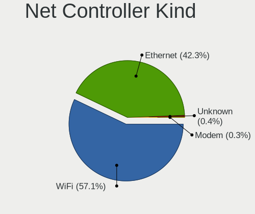

| Kind     | Notebooks | Percent |
|----------|-----------|---------|
| WiFi     | 751       | 57.33%  |
| Ethernet | 549       | 41.91%  |
| Unknown  | 7         | 0.53%   |
| Modem    | 3         | 0.23%   |

Used Controller
---------------

Currently used network controller

| Kind     | Notebooks | Percent |
|----------|-----------|---------|
| WiFi     | 601       | 75.79%  |
| Ethernet | 192       | 24.21%  |

NICs
----

Total network controllers on board

| Total | Notebooks | Percent |
|-------|-----------|---------|
| 2     | 472       | 61.06%  |
| 1     | 274       | 35.45%  |
| 0     | 14        | 1.81%   |
| 3     | 12        | 1.55%   |
| 6     | 1         | 0.13%   |

IPv6
----

IPv6 vs IPv4

| Used | Notebooks | Percent |
|------|-----------|---------|
| No   | 647       | 82.11%  |
| Yes  | 141       | 17.89%  |

Bluetooth
---------

Bluetooth Vendor
----------------

Controller vendors

| Vendor                          | Notebooks | Percent |
|---------------------------------|-----------|---------|
| Intel                           | 387       | 58.73%  |
| Realtek Semiconductor           | 62        | 9.41%   |
| Qualcomm Atheros Communications | 47        | 7.13%   |
| Foxconn / Hon Hai               | 32        | 4.86%   |
| Realtek                         | 26        | 3.95%   |
| Broadcom                        | 24        | 3.64%   |
| IMC Networks                    | 23        | 3.49%   |
| Lite-On Technology              | 12        | 1.82%   |
| Apple                           | 8         | 1.21%   |
| MediaTek                        | 7         | 1.06%   |
| Opticis                         | 5         | 0.76%   |
| Dell                            | 5         | 0.76%   |
| Foxconn International           | 4         | 0.61%   |
| Cambridge Silicon Radio         | 4         | 0.61%   |
| Ralink                          | 3         | 0.46%   |
| Hewlett-Packard                 | 3         | 0.46%   |
| Taiyo Yuden                     | 2         | 0.3%    |
| Alps Electric                   | 2         | 0.3%    |
| USI                             | 1         | 0.15%   |
| Toshiba                         | 1         | 0.15%   |
| ASUSTek Computer                | 1         | 0.15%   |

Bluetooth Model
---------------

Controller models

| Model                                               | Notebooks | Percent |
|-----------------------------------------------------|-----------|---------|
| Intel Bluetooth wireless interface                  | 121       | 18.36%  |
| Intel AX201 Bluetooth                               | 82        | 12.44%  |
| Intel Bluetooth 9460/9560 Jefferson Peak (JfP)      | 60        | 9.1%    |
| Intel AX200 Bluetooth                               | 58        | 8.8%    |
| Realtek Bluetooth Radio                             | 45        | 6.83%   |
| Qualcomm Atheros  Bluetooth Device                  | 32        | 4.86%   |
| Realtek 802.11ac WLAN Adapter                       | 25        | 3.79%   |
| Intel AX210 Bluetooth                               | 24        | 3.64%   |
| Intel Bluetooth Device                              | 22        | 3.34%   |
| IMC Networks Bluetooth Radio                        | 14        | 2.12%   |
| Foxconn / Hon Hai MediaTek Bluetooth Adapter        | 10        | 1.52%   |
| Foxconn / Hon Hai Bluetooth Device                  | 9         | 1.37%   |
| Realtek RTL8723B Bluetooth                          | 7         | 1.06%   |
| Qualcomm Atheros QCA61x4 Bluetooth 4.0              | 7         | 1.06%   |
| MediaTek Wireless_Device                            | 7         | 1.06%   |
| Intel Wireless-AC 9260 Bluetooth Adapter            | 7         | 1.06%   |
| Intel Centrino Bluetooth Wireless Transceiver       | 7         | 1.06%   |
| Foxconn / Hon Hai Wireless_Device                   | 7         | 1.06%   |
| Qualcomm Atheros AR3012 Bluetooth 4.0               | 6         | 0.91%   |
| Lite-On Bluetooth Device                            | 6         | 0.91%   |
| Broadcom BCM2045B (BDC-2.1)                         | 6         | 0.91%   |
| Realtek  Bluetooth 4.2 Adapter                      | 5         | 0.76%   |
| Opticis Bluetooth Radio                             | 5         | 0.76%   |
| Intel Centrino Advanced-N 6230 Bluetooth adapter    | 5         | 0.76%   |
| IMC Networks Wireless_Device                        | 5         | 0.76%   |
| Broadcom BCM2045B (BDC-2.1) [Bluetooth Controller]  | 5         | 0.76%   |
| Realtek RTL8822BE Bluetooth 4.2 Adapter             | 4         | 0.61%   |
| IMC Networks Bluetooth Device                       | 4         | 0.61%   |
| Foxconn International BCM43142A0 Bluetooth module   | 4         | 0.61%   |
| Cambridge Silicon Radio Bluetooth Dongle (HCI mode) | 4         | 0.61%   |
| Apple Bluetooth Host Controller                     | 4         | 0.61%   |
| Ralink RT3290 Bluetooth                             | 3         | 0.46%   |
| Broadcom BCM20702 Bluetooth 4.0 [ThinkPad]          | 3         | 0.46%   |
| Apple Bluetooth USB Host Controller                 | 3         | 0.46%   |
| Taiyo Yuden Bluetooth Device                        | 2         | 0.3%    |
| Lite-On Bluetooth 4.0 [Broadcom BCM20702A0]         | 2         | 0.3%    |
| HP Broadcom 2070 Bluetooth Combo                    | 2         | 0.3%    |
| Foxconn / Hon Hai Broadcom BCM20702A1 Bluetooth     | 2         | 0.3%    |
| Dell Wireless 370 Bluetooth Mini-card               | 2         | 0.3%    |
| Dell DW375 Bluetooth Module                         | 2         | 0.3%    |

Sound
-----

Sound Vendor
------------

Sound card vendors

| Vendor                                       | Notebooks | Percent |
|----------------------------------------------|-----------|---------|
| Intel                                        | 543       | 57.58%  |
| AMD                                          | 214       | 22.69%  |
| Nvidia                                       | 150       | 15.91%  |
| Zhaoxin                                      | 6         | 0.64%   |
| Apple                                        | 6         | 0.64%   |
| Huawei Technologies                          | 3         | 0.32%   |
| Generalplus Technology                       | 3         | 0.32%   |
| Zoran Co. Personal Media Division (Nogatech) | 2         | 0.21%   |
| Silicon Integrated Systems [SiS]             | 2         | 0.21%   |
| C-Media Electronics                          | 2         | 0.21%   |
| Yamaha                                       | 1         | 0.11%   |
| XMOS                                         | 1         | 0.11%   |
| Specialix                                    | 1         | 0.11%   |
| Samsung Electronics                          | 1         | 0.11%   |
| Realtek Semiconductor                        | 1         | 0.11%   |
| JMTek                                        | 1         | 0.11%   |
| Jieli Technology                             | 1         | 0.11%   |
| EDIFIER                                      | 1         | 0.11%   |
| Conexant Systems                             | 1         | 0.11%   |
| Cambridge Silicon Radio                      | 1         | 0.11%   |
| BY EDIFIER                                   | 1         | 0.11%   |
| ACTIONS                                      | 1         | 0.11%   |

Sound Model
-----------

Sound card models

| Model                                                                      | Notebooks | Percent |
|----------------------------------------------------------------------------|-----------|---------|
| AMD Family 17h/19h HD Audio Controller                                     | 168       | 14.3%   |
| Intel Sunrise Point-LP HD Audio                                            | 96        | 8.17%   |
| AMD Renoir Radeon High Definition Audio Controller                         | 74        | 6.3%    |
| Intel Tiger Lake-LP Smart Sound Technology Audio Controller                | 47        | 4%      |
| Intel 7 Series/C216 Chipset Family High Definition Audio Controller        | 45        | 3.83%   |
| Intel Cannon Lake PCH cAVS                                                 | 44        | 3.74%   |
| AMD Raven/Raven2/Fenghuang HDMI/DP Audio Controller                        | 38        | 3.23%   |
| AMD Rembrandt Radeon High Definition Audio Controller                      | 35        | 2.98%   |
| Intel Alder Lake PCH-P High Definition Audio Controller                    | 34        | 2.89%   |
| Intel Comet Lake PCH-LP cAVS                                               | 30        | 2.55%   |
| Intel 6 Series/C200 Series Chipset Family High Definition Audio Controller | 28        | 2.38%   |
| Nvidia GA106 High Definition Audio Controller                              | 25        | 2.13%   |
| Intel Haswell-ULT HD Audio Controller                                      | 25        | 2.13%   |
| Intel 8 Series HD Audio Controller                                         | 25        | 2.13%   |
| Intel Cannon Point-LP High Definition Audio Controller                     | 23        | 1.96%   |
| Intel Wildcat Point-LP High Definition Audio Controller                    | 22        | 1.87%   |
| Intel Broadwell-U Audio Controller                                         | 22        | 1.87%   |
| Nvidia TU107 GeForce GTX 1650 High Definition Audio Controller             | 20        | 1.7%    |
| Intel 8 Series/C220 Series Chipset High Definition Audio Controller        | 20        | 1.7%    |
| Nvidia TU106 High Definition Audio Controller                              | 19        | 1.62%   |
| Nvidia Audio device                                                        | 19        | 1.62%   |
| Intel Comet Lake PCH cAVS                                                  | 18        | 1.53%   |
| Intel Xeon E3-1200 v3/4th Gen Core Processor HD Audio Controller           | 17        | 1.45%   |
| Intel 100 Series/C230 Series Chipset Family HD Audio Controller            | 17        | 1.45%   |
| Intel Tiger Lake-H HD Audio Controller                                     | 16        | 1.36%   |
| Intel CM238 HD Audio Controller                                            | 15        | 1.28%   |
| AMD FCH Azalia Controller                                                  | 15        | 1.28%   |
| Intel 82801I (ICH9 Family) HD Audio Controller                             | 13        | 1.11%   |
| Nvidia GP107GL High Definition Audio Controller                            | 12        | 1.02%   |
| Nvidia GP106 High Definition Audio Controller                              | 9         | 0.77%   |
| Nvidia GF108 High Definition Audio Controller                              | 9         | 0.77%   |
| Nvidia GA104 High Definition Audio Controller                              | 7         | 0.6%    |
| Intel 5 Series/3400 Series Chipset High Definition Audio                   | 7         | 0.6%    |
| AMD Kabini HDMI/DP Audio                                                   | 7         | 0.6%    |
| Zhaoxin ZX-E High Definition Audio Controller                              | 6         | 0.51%   |
| Zhaoxin ZX-100/KX-5000/KX-6000/KX-6000G High Definition Audio Controller   | 6         | 0.51%   |
| Nvidia GP104 High Definition Audio Controller                              | 6         | 0.51%   |
| Intel NM10/ICH7 Family High Definition Audio Controller                    | 6         | 0.51%   |
| Intel Celeron/Pentium Silver Processor High Definition Audio               | 6         | 0.51%   |
| Apple Audio Device                                                         | 6         | 0.51%   |

Memory
------

Memory Vendor
-------------

Memory module vendors

| Vendor              | Notebooks | Percent |
|---------------------|-----------|---------|
| Samsung Electronics | 196       | 33.45%  |
| SK hynix            | 125       | 21.33%  |
| Micron Technology   | 84        | 14.33%  |
| Kingston            | 58        | 9.9%    |
| Unknown             | 28        | 4.78%   |
| Crucial             | 25        | 4.27%   |
| Ramaxel Technology  | 18        | 3.07%   |
| Elpida              | 6         | 1.02%   |
| A-DATA Technology   | 6         | 1.02%   |
| Unknown (ABCD)      | 5         | 0.85%   |
| Nanya Technology    | 5         | 0.85%   |
| Transcend           | 4         | 0.68%   |
| Shenzhen WODPOSIT   | 3         | 0.51%   |
| Unknown (08C8)      | 2         | 0.34%   |
| Team                | 2         | 0.34%   |
| Lenovo              | 2         | 0.34%   |
| Corsair             | 2         | 0.34%   |
| Apacer              | 2         | 0.34%   |
| Unknown             | 2         | 0.34%   |
| Unknown (08B5)      | 1         | 0.17%   |
| UNILC               | 1         | 0.17%   |
| SK_Hynix            | 1         | 0.17%   |
| SHARETRONIC         | 1         | 0.17%   |
| MTASE               | 1         | 0.17%   |
| Lexar Co Limited    | 1         | 0.17%   |
| KLEVV               | 1         | 0.17%   |
| KINGBANK            | 1         | 0.17%   |
| Goldkey             | 1         | 0.17%   |
| G.Skill             | 1         | 0.17%   |
| Essencore           | 1         | 0.17%   |

Memory Model
------------

Memory module models

| Model                                                            | Notebooks | Percent |
|------------------------------------------------------------------|-----------|---------|
| Samsung RAM M471A1G44AB0-CWE 8GB Row Of Chips DDR4 3200MT/s      | 17        | 2.72%   |
| Samsung RAM M471B5173EB0-YK0 4GB SODIMM DDR3 1600MT/s            | 10        | 1.6%    |
| SK hynix RAM HMAA1GS6CMR6N-VK 8GB Row Of Chips DDR4 2667MT/s     | 9         | 1.44%   |
| Samsung RAM M471A1G44AB0-CTD 8GB SODIMM DDR4 2667MT/s            | 9         | 1.44%   |
| Micron RAM 4ATF1G64HZ-3G2E1 8GB Row Of Chips DDR4 3200MT/s       | 9         | 1.44%   |
| Samsung RAM M471A1K43EB1-CWE 8GB SODIMM DDR4 3200MT/s            | 7         | 1.12%   |
| Samsung RAM M471A1G44AB0-CWE 8GB SODIMM DDR4 3200MT/s            | 7         | 1.12%   |
| Micron RAM 53E1G32D2NP-046 2GB Row Of Chips LPDDR4 4267MT/s      | 6         | 0.96%   |
| SK hynix RAM HMT351S6CFR8C-PB 4GB SODIMM DDR3 1600MT/s           | 5         | 0.8%    |
| SK hynix RAM HMAB2GS6AMR6N-XN 16GB SODIMM DDR4 3200MT/s          | 5         | 0.8%    |
| SK hynix RAM HMAA1GS6CJR6N-XN 8GB Row Of Chips DDR4 3200MT/s     | 5         | 0.8%    |
| SK hynix RAM HMA851S6CJR6N-VK 4GB SODIMM DDR4 2667MT/s           | 5         | 0.8%    |
| SK hynix RAM HMA851S6CJR6N-VK 4GB Row Of Chips DDR4 2667MT/s     | 5         | 0.8%    |
| SK hynix RAM HMA81GS6DJR8N-XN 8GB SODIMM DDR4 3200MT/s           | 5         | 0.8%    |
| SK hynix RAM HMA81GS6AFR8N-UH 8GB SODIMM DDR4 2667MT/s           | 5         | 0.8%    |
| SK hynix RAM HMA41GS6AFR8N-TF 8GB SODIMM DDR4 2667MT/s           | 5         | 0.8%    |
| Samsung RAM M471A5244CB0-CTD 4GB Row Of Chips DDR4 2667MT/s      | 5         | 0.8%    |
| Samsung RAM M471A1K43DB1-CWE 8192MB SODIMM DDR4 3200MT/s         | 5         | 0.8%    |
| Samsung RAM M471A1K43DB1-CTD 8GB SODIMM DDR4 2667MT/s            | 5         | 0.8%    |
| Samsung RAM M471A1K43CB1-CRC 8GB SODIMM DDR4 2667MT/s            | 5         | 0.8%    |
| Micron RAM 8ATF1G64HZ-2G6E1 8GB SODIMM DDR4 2667MT/s             | 5         | 0.8%    |
| Micron RAM 4ATF1G64HZ-3G2E1 8GB SODIMM DDR4 3200MT/s             | 5         | 0.8%    |
| Kingston RAM LV32D4S2S8HD-8 8GB SODIMM DDR4 3200MT/s             | 5         | 0.8%    |
| Unknown RAM Module 2GB SODIMM DDR2 667MT/s                       | 4         | 0.64%   |
| Unknown (ABCD) RAM 123456789012345678 2GB SODIMM LPDDR4 2400MT/s | 4         | 0.64%   |
| SK hynix RAM HMT451S6BFR8A-PB 4GB SODIMM DDR3 1600MT/s           | 4         | 0.64%   |
| Samsung RAM M471A1K43CB1-CTD 8GB SODIMM DDR4 2667MT/s            | 4         | 0.64%   |
| Samsung RAM M471A1K43BB1-CRC 8GB SODIMM DDR4 2667MT/s            | 4         | 0.64%   |
| Samsung RAM M471A1K43BB0-CPB 8GB SODIMM DDR4 2133MT/s            | 4         | 0.64%   |
| Samsung RAM M471A1G44AB0-CTD 8GB Row Of Chips DDR4 2667MT/s      | 4         | 0.64%   |
| Ramaxel RAM RMSA3320MJ78HAF-3200 8GB SODIMM DDR4 3200MT/s        | 4         | 0.64%   |
| Micron RAM MTC4C10163S1SC48BA1 8GB SODIMM DDR5 4800MT/s          | 4         | 0.64%   |
| Micron RAM 8KTF51264HZ-1G6E1 4GB SODIMM DDR3 1600MT/s            | 4         | 0.64%   |
| Kingston RAM 99U5469-045.A00LF 4GB SODIMM DDR3 1600MT/s          | 4         | 0.64%   |
| SK hynix RAM HMT41GS6BFR8A-PB 8GB SODIMM DDR3 1600MT/s           | 3         | 0.48%   |
| SK hynix RAM HMT41GS6AFR8A-PB 8192MB SODIMM DDR3 1600MT/s        | 3         | 0.48%   |
| SK hynix RAM HMAB2GS6AMR6N-XN 16GB Row Of Chips DDR4 3200MT/s    | 3         | 0.48%   |
| SK hynix RAM HMAA1GS6CMR8N-VK 8GB SODIMM DDR4 2667MT/s           | 3         | 0.48%   |
| SK hynix RAM HMAA1GS6CMR6N-XN 8GB Row Of Chips DDR4 3200MT/s     | 3         | 0.48%   |
| SK hynix RAM HMA81GS6CJR8N-VK 8GB SODIMM DDR4 2667MT/s           | 3         | 0.48%   |

Memory Kind
-----------

Memory module kinds

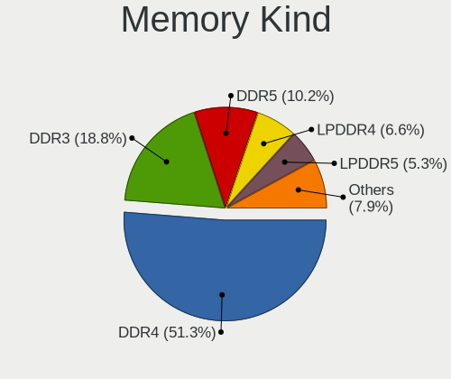

| Kind    | Notebooks | Percent |
|---------|-----------|---------|
| DDR4    | 290       | 56.09%  |
| DDR3    | 101       | 19.54%  |
| LPDDR4  | 35        | 6.77%   |
| LPDDR3  | 31        | 6%      |
| DDR5    | 26        | 5.03%   |
| LPDDR5  | 17        | 3.29%   |
| DDR2    | 8         | 1.55%   |
| SDRAM   | 5         | 0.97%   |
| Unknown | 3         | 0.58%   |
| DDR     | 1         | 0.19%   |

Memory Form Factor
------------------

Physical design of the memory module

| Name         | Notebooks | Percent |
|--------------|-----------|---------|
| SODIMM       | 382       | 73.32%  |
| Row Of Chips | 131       | 25.14%  |
| Chip         | 4         | 0.77%   |
| DIMM         | 2         | 0.38%   |
| Unknown      | 2         | 0.38%   |

Memory Size
-----------

Memory module size

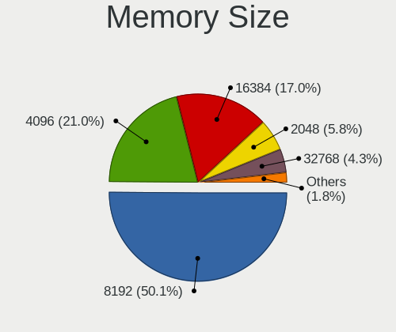

| Size  | Notebooks | Percent |
|-------|-----------|---------|
| 8192  | 276       | 50.18%  |
| 4096  | 124       | 22.55%  |
| 16384 | 91        | 16.55%  |
| 2048  | 33        | 6%      |
| 32768 | 17        | 3.09%   |
| 1024  | 8         | 1.45%   |
| 512   | 1         | 0.18%   |

Memory Speed
------------

Memory module speed

| Speed   | Notebooks | Percent |
|---------|-----------|---------|
| 3200    | 135       | 25.05%  |
| 2667    | 126       | 23.38%  |
| 1600    | 74        | 13.73%  |
| 2133    | 31        | 5.75%   |
| 2400    | 30        | 5.57%   |
| 4800    | 24        | 4.45%   |
| 4267    | 21        | 3.9%    |
| 6400    | 16        | 2.97%   |
| 1867    | 15        | 2.78%   |
| 1333    | 10        | 1.86%   |
| 1334    | 9         | 1.67%   |
| 2666    | 5         | 0.93%   |
| 1067    | 5         | 0.93%   |
| 667     | 5         | 0.93%   |
| 4266    | 4         | 0.74%   |
| 3733    | 4         | 0.74%   |
| 1066    | 4         | 0.74%   |
| 8400    | 3         | 0.56%   |
| 3266    | 3         | 0.56%   |
| 2048    | 3         | 0.56%   |
| 5600    | 2         | 0.37%   |
| 4199    | 2         | 0.37%   |
| 266     | 2         | 0.37%   |
| Unknown | 2         | 0.37%   |
| 7500    | 1         | 0.19%   |
| 3000    | 1         | 0.19%   |
| 2933    | 1         | 0.19%   |
| 800     | 1         | 0.19%   |

Printers & scanners
-------------------

Printer Vendor
--------------

Printer device vendors

| Vendor          | Notebooks | Percent |
|-----------------|-----------|---------|
| Hewlett-Packard | 3         | 75%     |
| Canon           | 1         | 25%     |

Printer Model
-------------

Printer device models

| Model                     | Notebooks | Percent |
|---------------------------|-----------|---------|
| HP Officejet 4500 G510g-m | 1         | 25%     |
| HP LaserJet P1102         | 1         | 25%     |
| HP LaserJet 1020          | 1         | 25%     |
| Canon iP1100 series       | 1         | 25%     |

Scanner Vendor
--------------

Scanner device vendors

Zero info for selected period =(

Scanner Model
-------------

Scanner device models

Zero info for selected period =(

Camera
------

Camera Vendor
-------------

Camera device vendors

| Vendor                                 | Notebooks | Percent |
|----------------------------------------|-----------|---------|
| Chicony Electronics                    | 139       | 21.06%  |
| IMC Networks                           | 109       | 16.52%  |
| Microdia                               | 46        | 6.97%   |
| Realtek Semiconductor                  | 42        | 6.36%   |
| Quanta                                 | 41        | 6.21%   |
| Sunplus Innovation Technology          | 39        | 5.91%   |
| Bison Electronics                      | 36        | 5.45%   |
| Acer                                   | 35        | 5.3%    |
| Cheng Uei Precision Industry (Foxlink) | 29        | 4.39%   |
| Syntek                                 | 21        | 3.18%   |
| Luxvisions Innotech Limited            | 21        | 3.18%   |
| Suyin                                  | 16        | 2.42%   |
| Lite-On Technology                     | 15        | 2.27%   |
| Apple                                  | 9         | 1.36%   |
| Alcor Micro                            | 9         | 1.36%   |
| Silicon Motion                         | 6         | 0.91%   |
| Lenovo                                 | 5         | 0.76%   |
| SunplusIT                              | 4         | 0.61%   |
| Ricoh                                  | 4         | 0.61%   |
| Logitech                               | 3         | 0.45%   |
| Importek                               | 3         | 0.45%   |
| icSpring                               | 3         | 0.45%   |
| Z-Star Microelectronics                | 2         | 0.3%    |
| Unknown (0000066029)                   | 2         | 0.3%    |
| Nebraska Furniture Mart                | 2         | 0.3%    |
| GEMBIRD                                | 2         | 0.3%    |
| Y Media                                | 1         | 0.15%   |
| Unknown                                | 1         | 0.15%   |
| Tripath Technology                     | 1         | 0.15%   |
| Sonix Technology                       | 1         | 0.15%   |
| SN0002                                 | 1         | 0.15%   |
| ShineOptics                            | 1         | 0.15%   |
| Primax Electronics                     | 1         | 0.15%   |
| Mitsumi                                | 1         | 0.15%   |
| kingcome                               | 1         | 0.15%   |
| Google                                 | 1         | 0.15%   |
| Goodong Industry                       | 1         | 0.15%   |
| Genesys Logic                          | 1         | 0.15%   |
| ELMCU                                  | 1         | 0.15%   |
| Cypress Semiconductor                  | 1         | 0.15%   |

Camera Model
------------

Camera device models

| Model                                                        | Notebooks | Percent |
|--------------------------------------------------------------|-----------|---------|
| Chicony Integrated Camera                                    | 64        | 9.65%   |
| IMC Networks Integrated Camera                               | 39        | 5.88%   |
| Microdia Integrated_Webcam_HD                                | 29        | 4.37%   |
| IMC Networks HD Camera                                       | 22        | 3.32%   |
| IMC Networks USB2.0 HD UVC WebCam                            | 15        | 2.26%   |
| Acer Integrated Camera                                       | 15        | 2.26%   |
| Syntek Integrated Camera                                     | 14        | 2.11%   |
| Realtek Integrated_Webcam_HD                                 | 13        | 1.96%   |
| Cheng Uei Precision Industry (Foxlink) XiaoMi USB 2.0 Webcam | 13        | 1.96%   |
| Bison Integrated Camera                                      | 13        | 1.96%   |
| Sunplus XiaoMi USB 2.0 Webcam                                | 11        | 1.66%   |
| IMC Networks ov9734_azurewave_camera                         | 11        | 1.66%   |
| Chicony HD Webcam                                            | 11        | 1.66%   |
| Sunplus Integrated_Webcam_HD                                 | 10        | 1.51%   |
| Quanta HP HD Camera                                          | 8         | 1.21%   |
| Quanta hm1091_techfront                                      | 8         | 1.21%   |
| Luxvisions Innotech Limited Integrated Camera                | 8         | 1.21%   |
| Bison SunplusIT Integrated Camera                            | 8         | 1.21%   |
| Realtek Integrated Webcam                                    | 7         | 1.06%   |
| Lite-On Integrated Camera                                    | 7         | 1.06%   |
| Chicony XiaoMi USB 2.0 Webcam                                | 7         | 1.06%   |
| Apple iPhone 5/5C/5S/6/SE/7/8/X                              | 7         | 1.06%   |
| Sunplus HD WebCam                                            | 6         | 0.9%    |
| Quanta HD User Facing                                        | 6         | 0.9%    |
| Realtek HP Wide Vision HD Camera                             | 5         | 0.75%   |
| Quanta HP Wide Vision HD Camera                              | 5         | 0.75%   |
| Luxvisions Innotech Limited HP Wide Vision HD Camera         | 5         | 0.75%   |
| IMC Networks Lenovo EasyCamera                               | 5         | 0.75%   |
| Chicony Lenovo Integrated Camera (0.3MP)                     | 5         | 0.75%   |
| Chicony Integrated Camera (1280x720@30)                      | 5         | 0.75%   |
| Syntek Lenovo EasyCamera                                     | 4         | 0.6%    |
| Silicon Motion 300k Pixel Camera                             | 4         | 0.6%    |
| Quanta ov9734_techfront_camera                               | 4         | 0.6%    |
| Microdia Webcam Vitade AF                                    | 4         | 0.6%    |
| Lite-On HP HD Camera                                         | 4         | 0.6%    |
| IMC Networks XHC Camera                                      | 4         | 0.6%    |
| Chicony USB 2.0 Camera                                       | 4         | 0.6%    |
| Chicony Integrated IR Camera                                 | 4         | 0.6%    |
| Chicony HP Wide Vision HD Camera                             | 4         | 0.6%    |
| Chicony HP HD Camera                                         | 4         | 0.6%    |

Security
--------

Fingerprint Vendor
------------------

Fingerprint sensor vendors

| Vendor                     | Notebooks | Percent |
|----------------------------|-----------|---------|
| Shenzhen Goodix Technology | 61        | 32.28%  |
| Synaptics                  | 51        | 26.98%  |
| Validity Sensors           | 44        | 23.28%  |
| Elan Microelectronics      | 13        | 6.88%   |
| Upek                       | 10        | 5.29%   |
| AuthenTec                  | 4         | 2.12%   |
| STMicroelectronics         | 2         | 1.06%   |
| LighTuning Technology      | 2         | 1.06%   |
| Focal-systems.Corp         | 2         | 1.06%   |

Fingerprint Model
-----------------

Fingerprint sensor models

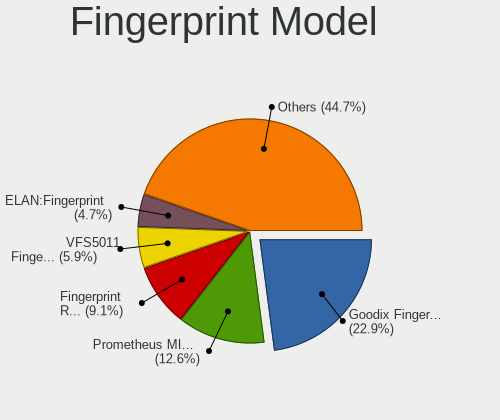

| Model                                                                      | Notebooks | Percent |
|----------------------------------------------------------------------------|-----------|---------|
| Shenzhen Goodix  Fingerprint Device                                        | 37        | 19.58%  |
| Synaptics Prometheus MIS Touch Fingerprint Reader                          | 25        | 13.23%  |
| Shenzhen Goodix Fingerprint Reader                                         | 22        | 11.64%  |
| Validity Sensors VFS5011 Fingerprint Reader                                | 11        | 5.82%   |
| Elan ELAN:Fingerprint                                                      | 11        | 5.82%   |
| Upek Biometric Touchchip/Touchstrip Fingerprint Sensor                     | 9         | 4.76%   |
| Validity Sensors VFS 5011 fingerprint sensor                               | 8         | 4.23%   |
| Validity Sensors Synaptics WBDI                                            | 6         | 3.17%   |
| Validity Sensors Synaptics VFS7552 Touch Fingerprint Sensor with PurePrint | 6         | 3.17%   |
| Synaptics Metallica MIS Touch Fingerprint Reader                           | 6         | 3.17%   |
| Synaptics WBDI Device                                                      | 4         | 2.12%   |
| Synaptics  FS7604 Touch Fingerprint Sensor with PurePrint                  | 4         | 2.12%   |
| Synaptics FS7604 Touch Fingerprint Sensor with PurePrint                   | 4         | 2.12%   |
| Validity Sensors VFS7500 Touch Fingerprint Sensor                          | 3         | 1.59%   |
| Validity Sensors VFS495 Fingerprint Reader                                 | 3         | 1.59%   |
| Validity Sensors VFS491                                                    | 3         | 1.59%   |
| Synaptics UWP WBDI Device                                                  | 3         | 1.59%   |
| Synaptics Fingerprint reader [HP G6]                                       | 3         | 1.59%   |
| Validity Sensors VFS471 Fingerprint Reader                                 | 2         | 1.06%   |
| STMicroelectronics Fingerprint Reader                                      | 2         | 1.06%   |
| Shenzhen Goodix FingerPrint                                                | 2         | 1.06%   |
| Focal-systems.Corp FT9201Fingerprint.                                      | 2         | 1.06%   |
| Elan ELAN:ARM-M4                                                           | 2         | 1.06%   |
| AuthenTec AES2810                                                          | 2         | 1.06%   |
| Unknown                                                                    | 2         | 1.06%   |
| Validity Sensors VFS Fingerprint sensor                                    | 1         | 0.53%   |
| Validity Sensors Fingerprint scanner                                       | 1         | 0.53%   |
| Upek TCS5B Fingerprint sensor                                              | 1         | 0.53%   |
| LighTuning ES603 Swipe Fingerprint Sensor                                  | 1         | 0.53%   |
| LighTuning EgisTec Touch Fingerprint Sensor                                | 1         | 0.53%   |
| AuthenTec Fingerprint Sensor                                               | 1         | 0.53%   |
| AuthenTec AES2550 Fingerprint Sensor                                       | 1         | 0.53%   |

Chipcard Vendor
---------------

Chipcard module vendors

| Vendor      | Notebooks | Percent |
|-------------|-----------|---------|
| Broadcom    | 13        | 68.42%  |
| Upek        | 2         | 10.53%  |
| Clay Logic  | 2         | 10.53%  |
| Yubico.com  | 1         | 5.26%   |
| Alcor Micro | 1         | 5.26%   |

Chipcard Model
--------------

Chipcard module models

| Model                                                                        | Notebooks | Percent |
|------------------------------------------------------------------------------|-----------|---------|
| Broadcom 5880                                                                | 5         | 26.32%  |
| Broadcom BCM5880 Secure Applications Processor with fingerprint swipe sensor | 3         | 15.79%  |
| Broadcom BCM5880 Secure Applications Processor                               | 3         | 15.79%  |
| Upek TouchChip Fingerprint Coprocessor (WBF advanced mode)                   | 2         | 10.53%  |
| Clay Logic CanoKey Pigeon                                                    | 2         | 10.53%  |
| Broadcom 58200                                                               | 2         | 10.53%  |
| Yubico.com Yubikey 4/5 U2F+CCID                                              | 1         | 5.26%   |
| Alcor Micro AU9540 Smartcard Reader                                          | 1         | 5.26%   |

Unsupported
-----------

Unsupported Devices
-------------------

Total unsupported devices on board

| Total | Notebooks | Percent |
|-------|-----------|---------|
| 0     | 417       | 52.59%  |
| 1     | 290       | 36.57%  |
| 2     | 67        | 8.45%   |
| 3     | 8         | 1.01%   |
| 4     | 7         | 0.88%   |
| 5     | 2         | 0.25%   |
| 10    | 1         | 0.13%   |
| 8     | 1         | 0.13%   |

Unsupported Device Types
------------------------

Types of unsupported devices

| Type                     | Notebooks | Percent |
|--------------------------|-----------|---------|
| Fingerprint reader       | 186       | 38.59%  |
| Graphics card            | 118       | 24.48%  |
| Net/wireless             | 37        | 7.68%   |
| Multimedia controller    | 36        | 7.47%   |
| Sound                    | 21        | 4.36%   |
| Camera                   | 20        | 4.15%   |
| Chipcard                 | 16        | 3.32%   |
| Communication controller | 15        | 3.11%   |
| Bluetooth                | 14        | 2.9%    |
| Net/ethernet             | 4         | 0.83%   |
| Card reader              | 4         | 0.83%   |
| Storage                  | 3         | 0.62%   |
| Network                  | 3         | 0.62%   |
| Unassigned class         | 1         | 0.21%   |
| Storage/nvme             | 1         | 0.21%   |
| Storage/ata              | 1         | 0.21%   |
| Modem                    | 1         | 0.21%   |
| Dvb card                 | 1         | 0.21%   |

