Linux in China - Tested Hardware & Statistics
---------------------------------------------

A project to collect tested hardware configurations for Linux in China.

Anyone can contribute to this report by the [hw-probe](https://github.com/linuxhw/hw-probe) tool:

    sudo -E hw-probe -all -upload

Please contribute! Especially if your hardware is rare.

This is a report for all computer types. See also reports for [desktops](/Location/China/Desktop/README.md) and [notebooks](/Location/China/Notebook/README.md).

Contents
--------

* [ Test Cases ](#test-cases)

* [ System ](#system)
  - [ OS                       ](#os)
  - [ OS Family                ](#os-family)
  - [ Kernel                   ](#kernel)
  - [ Kernel Family            ](#kernel-family)
  - [ Kernel Major Ver.        ](#kernel-major-ver)
  - [ Arch                     ](#arch)
  - [ DE                       ](#de)
  - [ Display Server           ](#display-server)
  - [ Display Manager          ](#display-manager)
  - [ OS Lang                  ](#os-lang)
  - [ Boot Mode                ](#boot-mode)
  - [ Filesystem               ](#filesystem)
  - [ Part. scheme             ](#part-scheme)
  - [ Dual Boot with Linux/BSD ](#dual-boot-with-linuxbsd)
  - [ Dual Boot (Win)          ](#dual-boot-win)

* [ Board ](#board)
  - [ Vendor                   ](#vendor)
  - [ Model                    ](#model)
  - [ Model Family             ](#model-family)
  - [ MFG Year                 ](#mfg-year)
  - [ Form Factor              ](#form-factor)
  - [ Secure Boot              ](#secure-boot)
  - [ Coreboot                 ](#coreboot)
  - [ RAM Size                 ](#ram-size)
  - [ RAM Used                 ](#ram-used)
  - [ Total Drives             ](#total-drives)
  - [ Has CD-ROM               ](#has-cd-rom)
  - [ Has Ethernet             ](#has-ethernet)
  - [ Has WiFi                 ](#has-wifi)
  - [ Has Bluetooth            ](#has-bluetooth)

* [ Location ](#location)
  - [ Country                  ](#country)
  - [ City                     ](#city)

* [ Drives ](#drives)
  - [ Drive Vendor             ](#drive-vendor)
  - [ Drive Model              ](#drive-model)
  - [ HDD Vendor               ](#hdd-vendor)
  - [ SSD Vendor               ](#ssd-vendor)
  - [ Drive Kind               ](#drive-kind)
  - [ Drive Connector          ](#drive-connector)
  - [ Drive Size               ](#drive-size)
  - [ Space Total              ](#space-total)
  - [ Space Used               ](#space-used)
  - [ Malfunc. Drives          ](#malfunc-drives)
  - [ Malfunc. Drive Vendor    ](#malfunc-drive-vendor)
  - [ Malfunc. HDD Vendor      ](#malfunc-hdd-vendor)
  - [ Malfunc. Drive Kind      ](#malfunc-drive-kind)
  - [ Failed Drives            ](#failed-drives)
  - [ Failed Drive Vendor      ](#failed-drive-vendor)
  - [ Drive Status             ](#drive-status)

* [ Storage controller ](#storage-controller)
  - [ Storage Vendor           ](#storage-vendor)
  - [ Storage Model            ](#storage-model)
  - [ Storage Kind             ](#storage-kind)

* [ Processor ](#processor)
  - [ CPU Vendor               ](#cpu-vendor)
  - [ CPU Model                ](#cpu-model)
  - [ CPU Model Family         ](#cpu-model-family)
  - [ CPU Cores                ](#cpu-cores)
  - [ CPU Sockets              ](#cpu-sockets)
  - [ CPU Threads              ](#cpu-threads)
  - [ CPU Op-Modes             ](#cpu-op-modes)
  - [ CPU Microcode            ](#cpu-microcode)
  - [ CPU Microarch            ](#cpu-microarch)

* [ Graphics ](#graphics)
  - [ GPU Vendor               ](#gpu-vendor)
  - [ GPU Model                ](#gpu-model)
  - [ GPU Combo                ](#gpu-combo)
  - [ GPU Driver               ](#gpu-driver)
  - [ GPU Memory               ](#gpu-memory)

* [ Monitor ](#monitor)
  - [ Monitor Vendor           ](#monitor-vendor)
  - [ Monitor Model            ](#monitor-model)
  - [ Monitor Resolution       ](#monitor-resolution)
  - [ Monitor Diagonal         ](#monitor-diagonal)
  - [ Monitor Width            ](#monitor-width)
  - [ Aspect Ratio             ](#aspect-ratio)
  - [ Monitor Area             ](#monitor-area)
  - [ Pixel Density            ](#pixel-density)
  - [ Multiple Monitors        ](#multiple-monitors)

* [ Network ](#network)
  - [ Net Controller Vendor    ](#net-controller-vendor)
  - [ Net Controller Model     ](#net-controller-model)
  - [ Wireless Vendor          ](#wireless-vendor)
  - [ Wireless Model           ](#wireless-model)
  - [ Ethernet Vendor          ](#ethernet-vendor)
  - [ Ethernet Model           ](#ethernet-model)
  - [ Net Controller Kind      ](#net-controller-kind)
  - [ Used Controller          ](#used-controller)
  - [ NICs                     ](#nics)
  - [ IPv6                     ](#ipv6)

* [ Bluetooth ](#bluetooth)
  - [ Bluetooth Vendor         ](#bluetooth-vendor)
  - [ Bluetooth Model          ](#bluetooth-model)

* [ Sound ](#sound)
  - [ Sound Vendor             ](#sound-vendor)
  - [ Sound Model              ](#sound-model)

* [ Memory ](#memory)
  - [ Memory Vendor            ](#memory-vendor)
  - [ Memory Model             ](#memory-model)
  - [ Memory Kind              ](#memory-kind)
  - [ Memory Form Factor       ](#memory-form-factor)
  - [ Memory Size              ](#memory-size)
  - [ Memory Speed             ](#memory-speed)

* [ Printers & scanners ](#printers--scanners)
  - [ Printer Vendor           ](#printer-vendor)
  - [ Printer Model            ](#printer-model)
  - [ Scanner Vendor           ](#scanner-vendor)
  - [ Scanner Model            ](#scanner-model)

* [ Camera ](#camera)
  - [ Camera Vendor            ](#camera-vendor)
  - [ Camera Model             ](#camera-model)

* [ Security ](#security)
  - [ Fingerprint Vendor       ](#fingerprint-vendor)
  - [ Fingerprint Model        ](#fingerprint-model)
  - [ Chipcard Vendor          ](#chipcard-vendor)
  - [ Chipcard Model           ](#chipcard-model)

* [ Unsupported ](#unsupported)
  - [ Unsupported Devices      ](#unsupported-devices)
  - [ Unsupported Device Types ](#unsupported-device-types)

Test Cases
----------

Total: 2557

| Vendor        | Model                       | Form-Factor | Probe                                                      | Date         |
|---------------|-----------------------------|-------------|------------------------------------------------------------|--------------|
| TianBei       | GEM12                       | Desktop     | [d7b4f33b27](https://linux-hardware.org/?probe=d7b4f33b27) | May 09, 2024 |
| TianBei       | GEM12                       | Desktop     | [5e850d92f6](https://linux-hardware.org/?probe=5e850d92f6) | May 08, 2024 |
| GEDU          | YourLand                    | Soc         | [e400f0c9b6](https://linux-hardware.org/?probe=e400f0c9b6) | May 07, 2024 |
| Lenovo        | ThinkPad T480 20L5A023HK    | Notebook    | [ff78bb7112](https://linux-hardware.org/?probe=ff78bb7112) | May 07, 2024 |
| Lenovo        | XiaoXin-15IIL 2020 81YL     | Notebook    | [b95cda619a](https://linux-hardware.org/?probe=b95cda619a) | May 06, 2024 |
| Apple         | MacBookPro8,1               | Notebook    | [2487a975e8](https://linux-hardware.org/?probe=2487a975e8) | May 06, 2024 |
| GEDU          | YourLand                    | Soc         | [5bfcf863da](https://linux-hardware.org/?probe=5bfcf863da) | May 06, 2024 |
| ASUSTek       | X450CC                      | Notebook    | [1085d5cad5](https://linux-hardware.org/?probe=1085d5cad5) | May 05, 2024 |
| Unknown       | Unknown                     | Notebook    | [ce0eb6aa57](https://linux-hardware.org/?probe=ce0eb6aa57) | May 05, 2024 |
| Lenovo        | ThinkPad T14 Gen 4 21HD0... | Notebook    | [db370ffb35](https://linux-hardware.org/?probe=db370ffb35) | May 05, 2024 |
| Apple         | MacBookPro8,1               | Notebook    | [54ecba24d6](https://linux-hardware.org/?probe=54ecba24d6) | May 04, 2024 |
| Centerm       | C92                         | Desktop     | [beaeac18bc](https://linux-hardware.org/?probe=beaeac18bc) | May 04, 2024 |
| METAPHYUNI    | MetawillBook03              | Notebook    | [d5af716feb](https://linux-hardware.org/?probe=d5af716feb) | May 04, 2024 |
| ONDA          | A320IPC                     | Desktop     | [da543bfbd2](https://linux-hardware.org/?probe=da543bfbd2) | May 01, 2024 |
| Apple         | MacBookPro5,5               | Notebook    | [2ddfed1c8a](https://linux-hardware.org/?probe=2ddfed1c8a) | May 01, 2024 |
| Lenovo        | MAHOBAY                     | Desktop     | [ff63252cfb](https://linux-hardware.org/?probe=ff63252cfb) | May 01, 2024 |
| MAXSUN        | MS-TZZ H81ITX               | Desktop     | [59394b9090](https://linux-hardware.org/?probe=59394b9090) | Apr 30, 2024 |
| AMI           | Aptio CRB                   | Mini pc     | [92e3a6d0ec](https://linux-hardware.org/?probe=92e3a6d0ec) | Apr 30, 2024 |
| BCM Advanc... | MX87QD                      | Desktop     | [5f5deeae12](https://linux-hardware.org/?probe=5f5deeae12) | Apr 30, 2024 |
| Lenovo        | Kabini CRB NOK              | Desktop     | [dfa3d8f2cd](https://linux-hardware.org/?probe=dfa3d8f2cd) | Apr 29, 2024 |
| Timi          | RedmiBook Pro 14S           | Notebook    | [a330c6b15e](https://linux-hardware.org/?probe=a330c6b15e) | Apr 28, 2024 |
| Haier         | N1406W                      | Notebook    | [1c70c3d8b2](https://linux-hardware.org/?probe=1c70c3d8b2) | Apr 26, 2024 |
| XIAOMI        | Redmi Book Pro 14 2024      | Notebook    | [5e4ee36b4a](https://linux-hardware.org/?probe=5e4ee36b4a) | Apr 25, 2024 |
| MECHREVO      | WUJIE14XA                   | Notebook    | [c43bb34bc6](https://linux-hardware.org/?probe=c43bb34bc6) | Apr 23, 2024 |
| Haier         | TIGD2-CI                    | Desktop     | [dc4f526a80](https://linux-hardware.org/?probe=dc4f526a80) | Apr 23, 2024 |
| Unknown       | LS1046A PSCB                | Soc         | [37707a34e6](https://linux-hardware.org/?probe=37707a34e6) | Apr 22, 2024 |
| MECHREVO      | WUJIE14XA                   | Notebook    | [2b34ae91ef](https://linux-hardware.org/?probe=2b34ae91ef) | Apr 22, 2024 |
| Ruijie        | RG-Rain305E                 | Notebook    | [48f650b68e](https://linux-hardware.org/?probe=48f650b68e) | Apr 19, 2024 |
| Raspberry ... | Raspberry Pi 4 Model B R... | Soc         | [d9119d4702](https://linux-hardware.org/?probe=d9119d4702) | Apr 18, 2024 |
| Unknown       | X133                        | Notebook    | [b12f5e7b59](https://linux-hardware.org/?probe=b12f5e7b59) | Apr 18, 2024 |
| Lenovo        | ZHAOYANG E43                | Notebook    | [1192eac8f1](https://linux-hardware.org/?probe=1192eac8f1) | Apr 17, 2024 |
| Unknown       | Unknown                     | All in one  | [fadcc61645](https://linux-hardware.org/?probe=fadcc61645) | Apr 17, 2024 |
| Intel         | H61                         | Desktop     | [e0bacf6b01](https://linux-hardware.org/?probe=e0bacf6b01) | Apr 17, 2024 |
| HUAWEI        | NbDE-WXX9                   | Notebook    | [ae3aece643](https://linux-hardware.org/?probe=ae3aece643) | Apr 16, 2024 |
| Unknown       | Unknown                     | Desktop     | [b8c681a7fb](https://linux-hardware.org/?probe=b8c681a7fb) | Apr 15, 2024 |
| Dell          | Inspiron 14 5420            | Notebook    | [6ae28bdf30](https://linux-hardware.org/?probe=6ae28bdf30) | Apr 14, 2024 |
| MSI           | B360M MORTAR                | Desktop     | [e915eb334e](https://linux-hardware.org/?probe=e915eb334e) | Apr 14, 2024 |
| MAXSUN        | MS-Terminator B760M D4 V... | Desktop     | [5a0687cb6d](https://linux-hardware.org/?probe=5a0687cb6d) | Apr 13, 2024 |
| ASUSTek       | CUSL2-C                     | Desktop     | [0d7e468cb8](https://linux-hardware.org/?probe=0d7e468cb8) | Apr 13, 2024 |
| ASUSTek       | CUSL2-C                     | Desktop     | [c64a5747f2](https://linux-hardware.org/?probe=c64a5747f2) | Apr 12, 2024 |
| Unknown       | Unknown                     | Desktop     | [ae3aeb1c14](https://linux-hardware.org/?probe=ae3aeb1c14) | Apr 12, 2024 |
| HUAWEI        | KLVL-WXX9                   | Notebook    | [cbeae24a2b](https://linux-hardware.org/?probe=cbeae24a2b) | Apr 12, 2024 |
| Supermicro    | X10SRL-FB                   | Server      | [10b2f6ed9d](https://linux-hardware.org/?probe=10b2f6ed9d) | Apr 11, 2024 |
| Lenovo        | ThinkBook 16 G6+ AHP 21L... | Notebook    | [52de364ea7](https://linux-hardware.org/?probe=52de364ea7) | Apr 11, 2024 |
| Dell          | Latitude E6440              | Notebook    | [727e37c03c](https://linux-hardware.org/?probe=727e37c03c) | Apr 10, 2024 |
| GITSTAR       | GDC-1461                    | Notebook    | [fcb625bfff](https://linux-hardware.org/?probe=fcb625bfff) | Apr 10, 2024 |
| Acer          | Swift SFX14-41G             | Notebook    | [47966edb56](https://linux-hardware.org/?probe=47966edb56) | Apr 09, 2024 |
| HUAWEI        | KLVL-WXX9                   | Notebook    | [d1451542a0](https://linux-hardware.org/?probe=d1451542a0) | Apr 08, 2024 |
| ASUSTek       | STRIX X99 GAMING            | Desktop     | [12dec4280c](https://linux-hardware.org/?probe=12dec4280c) | Apr 07, 2024 |
| HUAWEI        | HKD-WXX                     | Notebook    | [a1e39d45ea](https://linux-hardware.org/?probe=a1e39d45ea) | Apr 07, 2024 |
| Lenovo        | ThinkPad X390 20Q00039CD    | Notebook    | [9e8475784d](https://linux-hardware.org/?probe=9e8475784d) | Apr 05, 2024 |
| Lenovo        | G40-80 80E4                 | Notebook    | [76642434b9](https://linux-hardware.org/?probe=76642434b9) | Apr 05, 2024 |
| HP            | EliteBook 8730w             | Notebook    | [342f90f8c1](https://linux-hardware.org/?probe=342f90f8c1) | Apr 05, 2024 |
| HP            | EliteBook 8730w             | Notebook    | [b4c4b71cdb](https://linux-hardware.org/?probe=b4c4b71cdb) | Apr 05, 2024 |
| Lenovo        | ThinkBook 15 G2 ARE 20VG    | Notebook    | [e759ee33bf](https://linux-hardware.org/?probe=e759ee33bf) | Apr 04, 2024 |
| Intel         | NUC13SBBi9 M58736-303       | Mini pc     | [63776eb61e](https://linux-hardware.org/?probe=63776eb61e) | Apr 04, 2024 |
| Lenovo        | ThinkPad X1 Carbon 4th 2... | Notebook    | [d0c6efef85](https://linux-hardware.org/?probe=d0c6efef85) | Apr 03, 2024 |
| Dell          | Vostro 5590                 | Notebook    | [9046f24617](https://linux-hardware.org/?probe=9046f24617) | Apr 03, 2024 |
| Dinson        | Unknown                     | Desktop     | [2aff8e107a](https://linux-hardware.org/?probe=2aff8e107a) | Apr 01, 2024 |
| Gigabyte      | B85M-HD3                    | Desktop     | [c8a96b857d](https://linux-hardware.org/?probe=c8a96b857d) | Apr 01, 2024 |
| ASRock        | Z170 Gaming K4              | Desktop     | [aaa5775b1a](https://linux-hardware.org/?probe=aaa5775b1a) | Mar 31, 2024 |
| MECHREVO      | Code01 Ver2.0               | Notebook    | [559e9886b1](https://linux-hardware.org/?probe=559e9886b1) | Mar 31, 2024 |
| Lenovo        | ThinkPad X1 Carbon 5th 2... | Notebook    | [5eccb2015c](https://linux-hardware.org/?probe=5eccb2015c) | Mar 29, 2024 |
| ASUSTek       | ASUS TUF Gaming F15 FX50... | Notebook    | [5ae20a11dc](https://linux-hardware.org/?probe=5ae20a11dc) | Mar 29, 2024 |
| Toshiba       | Satellite L700              | Notebook    | [d2073d2786](https://linux-hardware.org/?probe=d2073d2786) | Mar 29, 2024 |
| ASUSTek       | VivoBook_ASUSLaptop X515... | Notebook    | [aeb6dba24f](https://linux-hardware.org/?probe=aeb6dba24f) | Mar 28, 2024 |
| ASUSTek       | VivoBook_ASUSLaptop X515... | Notebook    | [9641d580da](https://linux-hardware.org/?probe=9641d580da) | Mar 28, 2024 |
| Shenzhen M... | F6BFC                       | Desktop     | [0ffa86437e](https://linux-hardware.org/?probe=0ffa86437e) | Mar 28, 2024 |
| Unknown       | sun8i                       | Notebook    | [ffd31fc8c2](https://linux-hardware.org/?probe=ffd31fc8c2) | Mar 28, 2024 |
| Lenovo        | 3328 SDK0T76479 WIN 3423... | Desktop     | [b46252cbb8](https://linux-hardware.org/?probe=b46252cbb8) | Mar 27, 2024 |
| MSI           | B250M PRO-V                 | Desktop     | [8327c9e66a](https://linux-hardware.org/?probe=8327c9e66a) | Mar 27, 2024 |
| Dell          | 02F83K A00                  | Desktop     | [0ef2e9355a](https://linux-hardware.org/?probe=0ef2e9355a) | Mar 27, 2024 |
| Lenovo        | V14-ARE 82DQ                | Notebook    | [f7e010a048](https://linux-hardware.org/?probe=f7e010a048) | Mar 27, 2024 |
| Lenovo        | IdeaPad Y410P 20216         | Notebook    | [40a6b1e81c](https://linux-hardware.org/?probe=40a6b1e81c) | Mar 23, 2024 |
| Lenovo        | IdeaPad Y410P 20216         | Notebook    | [75974a7deb](https://linux-hardware.org/?probe=75974a7deb) | Mar 23, 2024 |
| Shanghai Z... | ZXE CRB                     | Notebook    | [9046eff55a](https://linux-hardware.org/?probe=9046eff55a) | Mar 22, 2024 |
| ASRock        | A320M-HDV                   | Desktop     | [69bd8b3475](https://linux-hardware.org/?probe=69bd8b3475) | Mar 22, 2024 |
| HONOR         | HYM-WXX                     | Notebook    | [2d11f15773](https://linux-hardware.org/?probe=2d11f15773) | Mar 22, 2024 |
| Lenovo        | ThinkPad E14 Gen 2 20TAA... | Notebook    | [de970e3adc](https://linux-hardware.org/?probe=de970e3adc) | Mar 21, 2024 |
| HONOR         | GLO-GXXX                    | Notebook    | [aa0a3c2273](https://linux-hardware.org/?probe=aa0a3c2273) | Mar 19, 2024 |
| HONOR         | GLO-GXXX                    | Notebook    | [e6fbe7ffad](https://linux-hardware.org/?probe=e6fbe7ffad) | Mar 19, 2024 |
| Lenovo        | YangTian S550-14-API 82B... | Notebook    | [d91083aa5c](https://linux-hardware.org/?probe=d91083aa5c) | Mar 19, 2024 |
| Lenovo        | ThinkPad L490 20Q6A2MYCD    | Notebook    | [171ff29e85](https://linux-hardware.org/?probe=171ff29e85) | Mar 19, 2024 |
| Lenovo        | ThinkPad L490 20Q6A2MYCD    | Notebook    | [1fe1956a79](https://linux-hardware.org/?probe=1fe1956a79) | Mar 19, 2024 |
| Lenovo        | ThinkPad L14 Gen 3 21C11... | Notebook    | [043dcda6e9](https://linux-hardware.org/?probe=043dcda6e9) | Mar 18, 2024 |
| Lenovo        | ZHAOYANG K4e-ITL 82F8       | Notebook    | [1df66c1a5d](https://linux-hardware.org/?probe=1df66c1a5d) | Mar 18, 2024 |
| ASUSTek       | TUF Gaming B550M-E          | Desktop     | [561b64300b](https://linux-hardware.org/?probe=561b64300b) | Mar 17, 2024 |
| Lenovo        | ZHAOYANG K4e-ITL 82F8       | Notebook    | [4b3021b1db](https://linux-hardware.org/?probe=4b3021b1db) | Mar 17, 2024 |
| Colorful T... | CVN Z790M FROZEN D5 V20     | Desktop     | [05f6953852](https://linux-hardware.org/?probe=05f6953852) | Mar 17, 2024 |
| Unknown       | ADL-N Prod                  | Desktop     | [12da5385de](https://linux-hardware.org/?probe=12da5385de) | Mar 17, 2024 |
| ASUSTek       | TUF Gaming A620M-PLUS WI... | Desktop     | [aa2afae5e1](https://linux-hardware.org/?probe=aa2afae5e1) | Mar 17, 2024 |
| ASUSTek       | PRIME B760-PLUS             | Desktop     | [f17fbd7f2f](https://linux-hardware.org/?probe=f17fbd7f2f) | Mar 16, 2024 |
| ONE-NETBOO... | ONEXPLAYER F1               | Tablet      | [2b4990129d](https://linux-hardware.org/?probe=2b4990129d) | Mar 16, 2024 |
| Gigabyte      | B450M AORUS ELITE           | Desktop     | [d54d058ff4](https://linux-hardware.org/?probe=d54d058ff4) | Mar 16, 2024 |
| Valve         | Galileo                     | Notebook    | [94545cd73f](https://linux-hardware.org/?probe=94545cd73f) | Mar 16, 2024 |
| Lenovo        | 333B SDK0T76479 WIN 3423... | Desktop     | [278e2453eb](https://linux-hardware.org/?probe=278e2453eb) | Mar 15, 2024 |
| Loongson      | LS3A5000-7A2000-1w-EVB-V... | Desktop     | [46b1ca62b1](https://linux-hardware.org/?probe=46b1ca62b1) | Mar 15, 2024 |
| Colorful T... | CVN Z790M FROZEN D5 V20     | Desktop     | [d43454b637](https://linux-hardware.org/?probe=d43454b637) | Mar 15, 2024 |
| Shanghai Z... | ZXE CRB                     | Notebook    | [18b2050901](https://linux-hardware.org/?probe=18b2050901) | Mar 14, 2024 |
| XIAOMI        | Redmi Book Pro 14 2024      | Notebook    | [91890298e9](https://linux-hardware.org/?probe=91890298e9) | Mar 14, 2024 |
| Insyde        | BayTrail                    | Notebook    | [89d859d241](https://linux-hardware.org/?probe=89d859d241) | Mar 14, 2024 |
| ASUSTek       | TUF Gaming B550M-PLUS WI... | Desktop     | [da89580342](https://linux-hardware.org/?probe=da89580342) | Mar 13, 2024 |
| Gigabyte      | X470 AORUS GAMING 5 WIFI... | Desktop     | [21b5121219](https://linux-hardware.org/?probe=21b5121219) | Mar 13, 2024 |
| Unknown       | Unknown                     | Desktop     | [43cc7195bf](https://linux-hardware.org/?probe=43cc7195bf) | Mar 13, 2024 |
| Rockchip      | RK3566 OPi 3B               | Soc         | [4f9b43f852](https://linux-hardware.org/?probe=4f9b43f852) | Mar 13, 2024 |
| Unknown       | Unknown                     | Desktop     | [857000f5f1](https://linux-hardware.org/?probe=857000f5f1) | Mar 13, 2024 |
| Acer          | S50-54                      | Notebook    | [9fcc7996c7](https://linux-hardware.org/?probe=9fcc7996c7) | Mar 12, 2024 |
| Lenovo        | KaiTian N80z G1d            | Notebook    | [cf81d4918a](https://linux-hardware.org/?probe=cf81d4918a) | Mar 12, 2024 |
| Lenovo        | ThinkPad T14 Gen 4 21HD0... | Notebook    | [9d9bbf3378](https://linux-hardware.org/?probe=9d9bbf3378) | Mar 11, 2024 |
| ASUSTek       | ROG STRIX Z690-A GAMING ... | Desktop     | [07f79129c6](https://linux-hardware.org/?probe=07f79129c6) | Mar 11, 2024 |
| Lenovo        | XiaoXinPro 14 AHP9 83D3     | Notebook    | [fe15e50e85](https://linux-hardware.org/?probe=fe15e50e85) | Mar 09, 2024 |
| Lenovo        | ZHAOYANG K4e-IML 81VQ       | Notebook    | [748726f682](https://linux-hardware.org/?probe=748726f682) | Mar 09, 2024 |
| HP            | 8876 11                     | Desktop     | [0024f849b9](https://linux-hardware.org/?probe=0024f849b9) | Mar 08, 2024 |
| HP            | 8876 11                     | Desktop     | [d9125b61ad](https://linux-hardware.org/?probe=d9125b61ad) | Mar 08, 2024 |
| Lenovo        | ThinkPad T14 Gen 4 21HD0... | Notebook    | [201df141f4](https://linux-hardware.org/?probe=201df141f4) | Mar 07, 2024 |
| Acer          | S50-54                      | Notebook    | [70296abf24](https://linux-hardware.org/?probe=70296abf24) | Mar 07, 2024 |
| Lenovo        | Unknown                     | Notebook    | [32588f809f](https://linux-hardware.org/?probe=32588f809f) | Mar 07, 2024 |
| Gigabyte      | B450 I AORUS PRO WIFI-CF    | Desktop     | [ac24b8ae8b](https://linux-hardware.org/?probe=ac24b8ae8b) | Mar 06, 2024 |
| Unknown       | Unknown                     | Soc         | [52fda62c9f](https://linux-hardware.org/?probe=52fda62c9f) | Mar 06, 2024 |
| HP            | 212B                        | Desktop     | [858156c918](https://linux-hardware.org/?probe=858156c918) | Mar 05, 2024 |
| AZW           | LZX TBD                     | Desktop     | [25f3849b23](https://linux-hardware.org/?probe=25f3849b23) | Mar 03, 2024 |
| Timi          | RedmiBook Pro 15S           | Notebook    | [402f19be59](https://linux-hardware.org/?probe=402f19be59) | Mar 02, 2024 |
| HONOR         | NMH-WCX9                    | Notebook    | [80f1759519](https://linux-hardware.org/?probe=80f1759519) | Mar 02, 2024 |
| HONOR         | NMH-WCX9                    | Notebook    | [bd909cfa51](https://linux-hardware.org/?probe=bd909cfa51) | Mar 02, 2024 |
| ONDA          | M3 miniPC VER               | Desktop     | [7a1fc049eb](https://linux-hardware.org/?probe=7a1fc049eb) | Mar 02, 2024 |
| ONDA          | M3 miniPC VER               | Desktop     | [bb1926351a](https://linux-hardware.org/?probe=bb1926351a) | Mar 02, 2024 |
| Lenovo        | IdeaPad Yoga 11S 20246      | Notebook    | [56d3aefd4b](https://linux-hardware.org/?probe=56d3aefd4b) | Mar 01, 2024 |
| AZW           | LZX TBD                     | Desktop     | [41557cc57d](https://linux-hardware.org/?probe=41557cc57d) | Mar 01, 2024 |
| Timi          | TM1612                      | Notebook    | [8805cb7e87](https://linux-hardware.org/?probe=8805cb7e87) | Mar 01, 2024 |
| AZW           | LZX TBD                     | Desktop     | [2036ce8e24](https://linux-hardware.org/?probe=2036ce8e24) | Feb 29, 2024 |
| HP            | Laptop 15g-dr0xxx           | Notebook    | [8ac7be2322](https://linux-hardware.org/?probe=8ac7be2322) | Feb 29, 2024 |
| HP            | Laptop 15g-dr0xxx           | Notebook    | [c57a0747d5](https://linux-hardware.org/?probe=c57a0747d5) | Feb 29, 2024 |
| Gigabyte      | F2A88XM-D3H                 | Desktop     | [1954346289](https://linux-hardware.org/?probe=1954346289) | Feb 29, 2024 |
| MECHREVO      | JiguangPro Series GM6PQ7... | Notebook    | [3d3ce46c84](https://linux-hardware.org/?probe=3d3ce46c84) | Feb 29, 2024 |
| Lenovo        | ThinkPad E14 20RA003CCD     | Notebook    | [c8cbfa128f](https://linux-hardware.org/?probe=c8cbfa128f) | Feb 29, 2024 |
| Anbernic      | Win600                      | Notebook    | [309a79c0c5](https://linux-hardware.org/?probe=309a79c0c5) | Feb 28, 2024 |
| Raspberry ... | Raspberry Pi 2 Model B R... | Soc         | [45391daf35](https://linux-hardware.org/?probe=45391daf35) | Feb 26, 2024 |
| Intel         | H81U                        | Notebook    | [80fbd74068](https://linux-hardware.org/?probe=80fbd74068) | Feb 25, 2024 |
| Acer          | TravelMate P249-G2-M        | Notebook    | [09fc7e1bb9](https://linux-hardware.org/?probe=09fc7e1bb9) | Feb 24, 2024 |
| Lenovo        | ThinkPad E450c 20EH0001C... | Notebook    | [75c5905fab](https://linux-hardware.org/?probe=75c5905fab) | Feb 21, 2024 |
| XIAOMI        | Redmi Book 16 2024 (Gen1... | Notebook    | [aa280685df](https://linux-hardware.org/?probe=aa280685df) | Feb 21, 2024 |
| Unknown       | Unknown                     | Desktop     | [88a934f458](https://linux-hardware.org/?probe=88a934f458) | Feb 21, 2024 |
| Loongson      | 3A6000-HV-7A2000-1w-EVB-... | Desktop     | [0dd2083acb](https://linux-hardware.org/?probe=0dd2083acb) | Feb 20, 2024 |
| ASUSTek       | STRIX X99 GAMING            | Desktop     | [b1b7feb57c](https://linux-hardware.org/?probe=b1b7feb57c) | Feb 19, 2024 |
| Dell          | Inspiron 16 Plus 7630       | Notebook    | [a98e400993](https://linux-hardware.org/?probe=a98e400993) | Feb 19, 2024 |
| Acer          | Swift SF314-512             | Notebook    | [8bc80a2f94](https://linux-hardware.org/?probe=8bc80a2f94) | Feb 18, 2024 |
| ASUSTek       | STRIX X99 GAMING            | Desktop     | [ad3b333c11](https://linux-hardware.org/?probe=ad3b333c11) | Feb 18, 2024 |
| ASUSTek       | STRIX X99 GAMING            | Desktop     | [8e57dc67fb](https://linux-hardware.org/?probe=8e57dc67fb) | Feb 18, 2024 |
| XIAOMI        | Redmi Book 16 2024 (Gen1... | Notebook    | [48959e4424](https://linux-hardware.org/?probe=48959e4424) | Feb 17, 2024 |
| MECHREVO      | WUJIE14 PRO                 | Notebook    | [343f712c04](https://linux-hardware.org/?probe=343f712c04) | Feb 17, 2024 |
| Acer          | Predator PH317-56           | Notebook    | [dc130d91e8](https://linux-hardware.org/?probe=dc130d91e8) | Feb 17, 2024 |
| MSI           | B450M PRO-VDH MAX           | Desktop     | [288572728a](https://linux-hardware.org/?probe=288572728a) | Feb 17, 2024 |
| HP            | 2129                        | Desktop     | [48a12967dd](https://linux-hardware.org/?probe=48a12967dd) | Feb 16, 2024 |
| Unknown       | Unknown                     | Desktop     | [0df8d427ea](https://linux-hardware.org/?probe=0df8d427ea) | Feb 14, 2024 |
| Unknown       | Unknown                     | Desktop     | [a1010c1dc5](https://linux-hardware.org/?probe=a1010c1dc5) | Feb 14, 2024 |
| Inspur        | CE520F                      | Soc         | [908f43a2c1](https://linux-hardware.org/?probe=908f43a2c1) | Feb 14, 2024 |
| Unknown       | Unknown                     | Desktop     | [5be4fcf8fd](https://linux-hardware.org/?probe=5be4fcf8fd) | Feb 14, 2024 |
| Unknown       | Unknown                     | Desktop     | [4d5af450c4](https://linux-hardware.org/?probe=4d5af450c4) | Feb 14, 2024 |
| MSI           | Alpha 17 C7VG               | Notebook    | [c6580a01b8](https://linux-hardware.org/?probe=c6580a01b8) | Feb 13, 2024 |
| ONE-NETBOO... | ONEXPLAYER 2 ARP23 Ver.1... | Notebook    | [6f6961026c](https://linux-hardware.org/?probe=6f6961026c) | Feb 13, 2024 |
| Lenovo        | ThinkPad E550 20DFA06NCD    | Notebook    | [7858b1e150](https://linux-hardware.org/?probe=7858b1e150) | Feb 12, 2024 |
| Unknown       | Unknown                     | Desktop     | [f897496a27](https://linux-hardware.org/?probe=f897496a27) | Feb 09, 2024 |
| ASUSTek       | ASUS TUF Gaming A15 FA50... | Notebook    | [41dcbdad69](https://linux-hardware.org/?probe=41dcbdad69) | Feb 09, 2024 |
| Unknown       | Orange Pi Ai Pro            | Soc         | [aaa498b5e4](https://linux-hardware.org/?probe=aaa498b5e4) | Feb 09, 2024 |
| Lenovo        | Reserver for OEM 2OAVZ08... | Notebook    | [19855922a9](https://linux-hardware.org/?probe=19855922a9) | Feb 09, 2024 |
| HP            | Victus by Gaming Laptop ... | Notebook    | [3b920b7ddd](https://linux-hardware.org/?probe=3b920b7ddd) | Feb 08, 2024 |
| Lenovo        | ThinkBook 15 G3 ACL 21A4    | Notebook    | [cd4c156951](https://linux-hardware.org/?probe=cd4c156951) | Feb 08, 2024 |
| Valve         | Jupiter                     | Notebook    | [85375b8312](https://linux-hardware.org/?probe=85375b8312) | Feb 07, 2024 |
| Lenovo        | XiaoXinPro-13IML 2019 81... | Notebook    | [66c0cc51e3](https://linux-hardware.org/?probe=66c0cc51e3) | Feb 06, 2024 |
| Unknown       | Unknown                     | Notebook    | [7f23752859](https://linux-hardware.org/?probe=7f23752859) | Feb 06, 2024 |
| Lenovo        | Legion R70002021 82JW       | Notebook    | [292593aa58](https://linux-hardware.org/?probe=292593aa58) | Feb 05, 2024 |
| Lenovo        | ThinkPad E480 20KN001ACD    | Notebook    | [43827bde86](https://linux-hardware.org/?probe=43827bde86) | Feb 05, 2024 |
| MSI           | MAG B650M MORTAR WIFI       | Desktop     | [3f9bd89ac1](https://linux-hardware.org/?probe=3f9bd89ac1) | Feb 04, 2024 |
| Apple         | MacBookPro11,2              | Notebook    | [1466cd2d4f](https://linux-hardware.org/?probe=1466cd2d4f) | Feb 04, 2024 |
| Unknown       | Unknown                     | Desktop     | [cd21b7a3b5](https://linux-hardware.org/?probe=cd21b7a3b5) | Feb 04, 2024 |
| Huanan        | X99-4MF V1.0                | Desktop     | [ea01d597b3](https://linux-hardware.org/?probe=ea01d597b3) | Feb 04, 2024 |
| XIAOMI        | Redmi Book 16 2024 (Gen1... | Notebook    | [517ddc9a76](https://linux-hardware.org/?probe=517ddc9a76) | Feb 03, 2024 |
| ASUSTek       | B85M-K                      | Desktop     | [dc3ec9e412](https://linux-hardware.org/?probe=dc3ec9e412) | Feb 03, 2024 |
| MSI           | MAG B650M MORTAR WIFI       | Desktop     | [441817b442](https://linux-hardware.org/?probe=441817b442) | Feb 03, 2024 |
| MECHREVO      | S1 Pro Series               | Notebook    | [ba68410f96](https://linux-hardware.org/?probe=ba68410f96) | Feb 02, 2024 |
| Lenovo        | NO DPK                      | Desktop     | [ce1ff05aed](https://linux-hardware.org/?probe=ce1ff05aed) | Feb 02, 2024 |
| MSI           | MAG B550M MORTAR            | Desktop     | [7ad6a0ecce](https://linux-hardware.org/?probe=7ad6a0ecce) | Jan 31, 2024 |
| Lenovo        | NO DPK                      | Desktop     | [fd4b4dd902](https://linux-hardware.org/?probe=fd4b4dd902) | Jan 31, 2024 |
| MECHREVO      | WUJIE14 PRO                 | Notebook    | [5e58868dbf](https://linux-hardware.org/?probe=5e58868dbf) | Jan 30, 2024 |
| Huanan        | X99-4MF V1.0                | Desktop     | [63f228ae04](https://linux-hardware.org/?probe=63f228ae04) | Jan 29, 2024 |
| AZW           | SER V1.0                    | Mini pc     | [385d8d4782](https://linux-hardware.org/?probe=385d8d4782) | Jan 29, 2024 |
| Lenovo        | G40-45 80E1                 | Notebook    | [1e01df8e73](https://linux-hardware.org/?probe=1e01df8e73) | Jan 27, 2024 |
| ASUSTek       | B85M-K                      | Desktop     | [78e893cbdb](https://linux-hardware.org/?probe=78e893cbdb) | Jan 26, 2024 |
| Lenovo        | ThinkPad E15 Gen 2 20TDA... | Notebook    | [6456dc0020](https://linux-hardware.org/?probe=6456dc0020) | Jan 26, 2024 |
| ASUSTek       | B85M-K                      | Desktop     | [42c598a7c2](https://linux-hardware.org/?probe=42c598a7c2) | Jan 23, 2024 |
| Dell          | Inspiron 5557               | Notebook    | [e331563298](https://linux-hardware.org/?probe=e331563298) | Jan 22, 2024 |
| Colorful T... | CVN B550M GAMING FROZEN ... | Desktop     | [1d6e70910a](https://linux-hardware.org/?probe=1d6e70910a) | Jan 21, 2024 |
| HP            | ProBook 455R G6             | Notebook    | [59026d385f](https://linux-hardware.org/?probe=59026d385f) | Jan 21, 2024 |
| Dell          | 0WCJNT A06                  | Server      | [f98fce82ef](https://linux-hardware.org/?probe=f98fce82ef) | Jan 21, 2024 |
| ASUSTek       | P8Z77-V PRO                 | Desktop     | [5c7cfc2209](https://linux-hardware.org/?probe=5c7cfc2209) | Jan 20, 2024 |
| ASUSTek       | H81M-K                      | Desktop     | [5b51e88413](https://linux-hardware.org/?probe=5b51e88413) | Jan 20, 2024 |
| Great Wall    | MBX-Z60AR110 TBD            | Desktop     | [fdfa81d344](https://linux-hardware.org/?probe=fdfa81d344) | Jan 18, 2024 |
| ASUSTek       | P8Z77-V PRO                 | Desktop     | [53e10082bf](https://linux-hardware.org/?probe=53e10082bf) | Jan 17, 2024 |
| ASUSTek       | ROG CROSSHAIR X670E HERO    | Desktop     | [fe24385194](https://linux-hardware.org/?probe=fe24385194) | Jan 16, 2024 |
| Lenovo        | ThinkPad P15v Gen 3 21D8... | Notebook    | [bfbba978c3](https://linux-hardware.org/?probe=bfbba978c3) | Jan 16, 2024 |
| Dell          | Inspiron 5557               | Notebook    | [938a3ee950](https://linux-hardware.org/?probe=938a3ee950) | Jan 16, 2024 |
| Dell          | Vostro 5470                 | Notebook    | [21f78f0847](https://linux-hardware.org/?probe=21f78f0847) | Jan 16, 2024 |
| HP            | ProBook 450 15.6 inch G1... | Notebook    | [54ed51acbb](https://linux-hardware.org/?probe=54ed51acbb) | Jan 15, 2024 |
| Acer          | Swift SFX14-41G             | Notebook    | [947678b939](https://linux-hardware.org/?probe=947678b939) | Jan 15, 2024 |
| MSI           | Z370-OC PRO                 | Desktop     | [4ffb04a6df](https://linux-hardware.org/?probe=4ffb04a6df) | Jan 15, 2024 |
| ASUSTek       | STRIX X99 GAMING            | Desktop     | [a77f0d6a70](https://linux-hardware.org/?probe=a77f0d6a70) | Jan 15, 2024 |
| Timi          | TM1612                      | Notebook    | [89ef61c3ee](https://linux-hardware.org/?probe=89ef61c3ee) | Jan 14, 2024 |
| Unknown       | Unknown                     | Soc         | [951b07d2a5](https://linux-hardware.org/?probe=951b07d2a5) | Jan 13, 2024 |
| SPESTECH      | IB.IELK.CW01                | Desktop     | [3a97c43bcc](https://linux-hardware.org/?probe=3a97c43bcc) | Jan 11, 2024 |
| YanRay Tec... | B1904                       | Desktop     | [a9c8ebfbbd](https://linux-hardware.org/?probe=a9c8ebfbbd) | Jan 09, 2024 |
| Phytium       | FT2000/4                    | Server      | [a7c0849de0](https://linux-hardware.org/?probe=a7c0849de0) | Jan 08, 2024 |
| MECHREVO      | S1 Pro Series               | Notebook    | [419dfc25b2](https://linux-hardware.org/?probe=419dfc25b2) | Jan 08, 2024 |
| Lenovo        | ZHAOYANG K4e-ITL 82F8       | Notebook    | [1188890272](https://linux-hardware.org/?probe=1188890272) | Jan 07, 2024 |
| Lenovo        | ZHAOYANG K4e-ITL 82F8       | Notebook    | [cb8f846b0f](https://linux-hardware.org/?probe=cb8f846b0f) | Jan 07, 2024 |
| Dell          | Inspiron 5493               | Notebook    | [eb9b8edc2c](https://linux-hardware.org/?probe=eb9b8edc2c) | Jan 07, 2024 |
| ASUSTek       | VivoBook_ASUSLaptop M650... | Notebook    | [98da18a6c0](https://linux-hardware.org/?probe=98da18a6c0) | Jan 06, 2024 |
| ASUSTek       | VivoBook_ASUSLaptop M650... | Notebook    | [2602d65d52](https://linux-hardware.org/?probe=2602d65d52) | Jan 06, 2024 |
| MECHREVO      | S1 Pro Series               | Notebook    | [da21c08192](https://linux-hardware.org/?probe=da21c08192) | Jan 06, 2024 |
| AZW           | SER                         | Mini pc     | [f4be01e0c9](https://linux-hardware.org/?probe=f4be01e0c9) | Jan 05, 2024 |
| Intel         | X99                         | Desktop     | [ed34568c2b](https://linux-hardware.org/?probe=ed34568c2b) | Jan 05, 2024 |
| ASUSTek       | B760M-AYW WIFI              | Desktop     | [6a471fb5e8](https://linux-hardware.org/?probe=6a471fb5e8) | Jan 05, 2024 |
| KUU           | Andes II                    | Notebook    | [512394ef85](https://linux-hardware.org/?probe=512394ef85) | Jan 04, 2024 |
| Timi          | TM1709                      | Notebook    | [79d0628d57](https://linux-hardware.org/?probe=79d0628d57) | Jan 03, 2024 |
| TYAN Compu... | S8030GM2NE 5411T6180004     | Desktop     | [b8716bfb8f](https://linux-hardware.org/?probe=b8716bfb8f) | Jan 03, 2024 |
| Timi          | TM1709                      | Notebook    | [b934e033e4](https://linux-hardware.org/?probe=b934e033e4) | Jan 03, 2024 |
| ASUSTek       | M5A78L-M LX3 PLUS           | Desktop     | [d53af9a54d](https://linux-hardware.org/?probe=d53af9a54d) | Jan 03, 2024 |
| ASUSTek       | H610A-IM-A                  | Desktop     | [a3d7b469e5](https://linux-hardware.org/?probe=a3d7b469e5) | Jan 03, 2024 |
| MECHREVO      | S2 Air Series PF4NU1F       | Notebook    | [08703baf6e](https://linux-hardware.org/?probe=08703baf6e) | Jan 03, 2024 |
| TYAN Compu... | S8030GM2NE 5411T6180004     | Desktop     | [a7f5e10167](https://linux-hardware.org/?probe=a7f5e10167) | Jan 03, 2024 |
| Valve         | Jupiter                     | Notebook    | [b3ada6c407](https://linux-hardware.org/?probe=b3ada6c407) | Jan 02, 2024 |
| Lenovo        | Legion Y7000P2020H 82AX     | Notebook    | [59d5eb147b](https://linux-hardware.org/?probe=59d5eb147b) | Jan 01, 2024 |
| Centerm       | C92                         | Desktop     | [5ede09f987](https://linux-hardware.org/?probe=5ede09f987) | Jan 01, 2024 |
| Centerm       | C92                         | Desktop     | [0201370bf4](https://linux-hardware.org/?probe=0201370bf4) | Jan 01, 2024 |
| Win Elemen... | M9                          | Desktop     | [33b3133a1c](https://linux-hardware.org/?probe=33b3133a1c) | Jan 01, 2024 |
| Win Elemen... | M9                          | Desktop     | [93f17e23c2](https://linux-hardware.org/?probe=93f17e23c2) | Jan 01, 2024 |
| Timi          | A34R                        | Notebook    | [d72018ec19](https://linux-hardware.org/?probe=d72018ec19) | Dec 29, 2023 |
| Google        | Dratini                     | Notebook    | [a81971bf37](https://linux-hardware.org/?probe=a81971bf37) | Dec 28, 2023 |
| Dell          | Vostro 5470                 | Notebook    | [25e05316e9](https://linux-hardware.org/?probe=25e05316e9) | Dec 28, 2023 |
| Lenovo        | ThinkBook 14 G4+ IAP 21C... | Notebook    | [151f072ac9](https://linux-hardware.org/?probe=151f072ac9) | Dec 27, 2023 |
| ASUSTek       | ROG STRIX B360-G GAMING     | Desktop     | [136b8b5f83](https://linux-hardware.org/?probe=136b8b5f83) | Dec 27, 2023 |
| GITSTAR       | GDC-1461                    | Notebook    | [398e4f42e4](https://linux-hardware.org/?probe=398e4f42e4) | Dec 26, 2023 |
| Dell          | Vostro 5470                 | Notebook    | [76b6b08744](https://linux-hardware.org/?probe=76b6b08744) | Dec 26, 2023 |
| Gigabyte      | Z790 D DDR4                 | Desktop     | [68f5cfe720](https://linux-hardware.org/?probe=68f5cfe720) | Dec 25, 2023 |
| MECHREVO      | S2 Air Series PF4NU1F       | Notebook    | [edb1d110e2](https://linux-hardware.org/?probe=edb1d110e2) | Dec 25, 2023 |
| HP            | Pavilion Gaming Laptop 1... | Notebook    | [f47caaa0e1](https://linux-hardware.org/?probe=f47caaa0e1) | Dec 25, 2023 |
| Lenovo        | ThinkPad W530 2436CT0       | Notebook    | [7f8be52856](https://linux-hardware.org/?probe=7f8be52856) | Dec 24, 2023 |
| Lenovo        | Legion R9000P2021H 82JQ     | Notebook    | [2394204218](https://linux-hardware.org/?probe=2394204218) | Dec 24, 2023 |
| Unknown       | Unknown                     | Desktop     | [74c274a303](https://linux-hardware.org/?probe=74c274a303) | Dec 24, 2023 |
| Unknown       | Unknown                     | Desktop     | [123aa39382](https://linux-hardware.org/?probe=123aa39382) | Dec 24, 2023 |
| Unknown       | Unknown                     | Desktop     | [9549fcd83e](https://linux-hardware.org/?probe=9549fcd83e) | Dec 23, 2023 |
| GITSTAR       | GDC-1461                    | Notebook    | [5412cf0f39](https://linux-hardware.org/?probe=5412cf0f39) | Dec 23, 2023 |
| Timi          | TM1612                      | Notebook    | [cf4f859193](https://linux-hardware.org/?probe=cf4f859193) | Dec 23, 2023 |
| ASUSTek       | M4A785-M                    | Desktop     | [f6f10099c2](https://linux-hardware.org/?probe=f6f10099c2) | Dec 22, 2023 |
| Lenovo        | ThinkPad Edge E431 62771... | Notebook    | [e6f38cb85e](https://linux-hardware.org/?probe=e6f38cb85e) | Dec 22, 2023 |
| Dell          | 0D4MD1 A00                  | Desktop     | [858b84769f](https://linux-hardware.org/?probe=858b84769f) | Dec 22, 2023 |
| ASUSTek       | STRIX X99 GAMING            | Desktop     | [2af66f541d](https://linux-hardware.org/?probe=2af66f541d) | Dec 22, 2023 |
| ASUSTek       | M4A785-M                    | Desktop     | [271869a253](https://linux-hardware.org/?probe=271869a253) | Dec 21, 2023 |
| Razer         | Blade 15 (2022) - RZ09-0... | Notebook    | [4e4e1e2329](https://linux-hardware.org/?probe=4e4e1e2329) | Dec 21, 2023 |
| Gigabyte      | F2A88XM-D3H                 | Desktop     | [d111002a9c](https://linux-hardware.org/?probe=d111002a9c) | Dec 20, 2023 |
| Unknown       | Unknown                     | Desktop     | [32f0587c3f](https://linux-hardware.org/?probe=32f0587c3f) | Dec 20, 2023 |
| HUAWEI        | W515 PGUV-WBY0              | Soc         | [b3d022d177](https://linux-hardware.org/?probe=b3d022d177) | Dec 19, 2023 |
| Timi          | TM1612                      | Notebook    | [38a41877ef](https://linux-hardware.org/?probe=38a41877ef) | Dec 19, 2023 |
| Win elemen... | M600                        | Desktop     | [0d0f7a6719](https://linux-hardware.org/?probe=0d0f7a6719) | Dec 19, 2023 |
| MSI           | B450M MORTAR                | Desktop     | [5de00ab671](https://linux-hardware.org/?probe=5de00ab671) | Dec 18, 2023 |
| MSI           | B450M MORTAR                | Desktop     | [b6e59d6e3e](https://linux-hardware.org/?probe=b6e59d6e3e) | Dec 18, 2023 |
| Unknown       | Unknown                     | Desktop     | [3764b249f4](https://linux-hardware.org/?probe=3764b249f4) | Dec 18, 2023 |
| Sony          | SVD1321L2EW                 | Notebook    | [b753425d70](https://linux-hardware.org/?probe=b753425d70) | Dec 17, 2023 |
| Unknown       | Unknown                     | Desktop     | [c88b531754](https://linux-hardware.org/?probe=c88b531754) | Dec 17, 2023 |
| Unknown       | Unknown                     | Desktop     | [e3d9d4d8a7](https://linux-hardware.org/?probe=e3d9d4d8a7) | Dec 17, 2023 |
| Apple         | MacBookPro16,1              | Notebook    | [f04605f94c](https://linux-hardware.org/?probe=f04605f94c) | Dec 17, 2023 |
| Lenovo        | XiaoXinDuoduet IAU7 82TQ    | Tablet      | [93610bc88d](https://linux-hardware.org/?probe=93610bc88d) | Dec 15, 2023 |
| Lenovo        | XiaoXinDuoduet IAU7 82TQ    | Tablet      | [f662912ecd](https://linux-hardware.org/?probe=f662912ecd) | Dec 15, 2023 |
| Dell          | 09PR9H A03                  | Desktop     | [25d5c9ce02](https://linux-hardware.org/?probe=25d5c9ce02) | Dec 13, 2023 |
| Dell          | 0101XX A00                  | Desktop     | [87b101a810](https://linux-hardware.org/?probe=87b101a810) | Dec 13, 2023 |
| Unknown       | Unknown                     | Soc         | [9c60527586](https://linux-hardware.org/?probe=9c60527586) | Dec 13, 2023 |
| Unknown       | Unknown                     | Soc         | [50c635dba3](https://linux-hardware.org/?probe=50c635dba3) | Dec 13, 2023 |
| Lenovo        | Tilapia CRB                 | Desktop     | [1527115ecf](https://linux-hardware.org/?probe=1527115ecf) | Dec 12, 2023 |
| Unknown       | Unknown                     | Desktop     | [4fd70c36f8](https://linux-hardware.org/?probe=4fd70c36f8) | Dec 12, 2023 |
| MSI           | H610M BOMBER DDR4           | Desktop     | [7ea9e34c4c](https://linux-hardware.org/?probe=7ea9e34c4c) | Dec 11, 2023 |
| ASUSTek       | PRIME B250M-A               | Desktop     | [74c10ca70c](https://linux-hardware.org/?probe=74c10ca70c) | Dec 11, 2023 |
| HUAWEI        | RLEFG-XX                    | Notebook    | [d47423dd6f](https://linux-hardware.org/?probe=d47423dd6f) | Dec 11, 2023 |
| ASUSTek       | PRIME B250M-A               | Desktop     | [40cbcb37ea](https://linux-hardware.org/?probe=40cbcb37ea) | Dec 11, 2023 |
| MECHREVO      | Kuangshi16Pro Series GM6... | Notebook    | [e551d0d31e](https://linux-hardware.org/?probe=e551d0d31e) | Dec 11, 2023 |
| ASUSTek       | K55DR                       | Notebook    | [a869089d9a](https://linux-hardware.org/?probe=a869089d9a) | Dec 09, 2023 |
| Pegatron      | 3580                        | Desktop     | [580355d3da](https://linux-hardware.org/?probe=580355d3da) | Dec 08, 2023 |
| Unknown       | Unknown                     | Desktop     | [dd97dbccbd](https://linux-hardware.org/?probe=dd97dbccbd) | Dec 08, 2023 |
| Lenovo        | MAHOBAY NOK                 | Desktop     | [1d8b3c85a3](https://linux-hardware.org/?probe=1d8b3c85a3) | Dec 07, 2023 |
| Lenovo        | Legion R9000P2021H 82JQ     | Notebook    | [e9ddadffad](https://linux-hardware.org/?probe=e9ddadffad) | Dec 07, 2023 |
| Unknown       | Unknown                     | Desktop     | [13c1812169](https://linux-hardware.org/?probe=13c1812169) | Dec 06, 2023 |
| Unknown       | Unknown                     | Desktop     | [d59a49d5b5](https://linux-hardware.org/?probe=d59a49d5b5) | Dec 06, 2023 |
| HUAWEI        | CREM-WXX9                   | Notebook    | [cf753bfc89](https://linux-hardware.org/?probe=cf753bfc89) | Dec 05, 2023 |
| ASUSTek       | K55DR                       | Notebook    | [a13beb506c](https://linux-hardware.org/?probe=a13beb506c) | Dec 05, 2023 |
| Lenovo        | Legion R9000P ARX8 82WM     | Notebook    | [0964d78171](https://linux-hardware.org/?probe=0964d78171) | Dec 04, 2023 |
| Timi          | RedmiBook 14-APCS           | Notebook    | [468a017a07](https://linux-hardware.org/?probe=468a017a07) | Dec 04, 2023 |
| Lenovo        | 30BD NOK                    | Desktop     | [0bc5f46c93](https://linux-hardware.org/?probe=0bc5f46c93) | Dec 02, 2023 |
| ONDA          | H81M                        | Desktop     | [76c44af7fc](https://linux-hardware.org/?probe=76c44af7fc) | Dec 02, 2023 |
| ASUSTek       | H81M-K                      | Desktop     | [8f5c7fb36e](https://linux-hardware.org/?probe=8f5c7fb36e) | Dec 02, 2023 |
| Lenovo        | ThinkPad X220 4291OL3       | Notebook    | [d07f89fdd6](https://linux-hardware.org/?probe=d07f89fdd6) | Dec 02, 2023 |
| Dell          | Latitude 5290 2-in-1        | Tablet      | [797de8d000](https://linux-hardware.org/?probe=797de8d000) | Dec 01, 2023 |
| Gigabyte      | B250-D3A-CF                 | Desktop     | [5d3de45ec6](https://linux-hardware.org/?probe=5d3de45ec6) | Dec 01, 2023 |
| ASUSTek       | M4A88T-M LE                 | Desktop     | [a2f1655886](https://linux-hardware.org/?probe=a2f1655886) | Dec 01, 2023 |
| ASUSTek       | TUF Gaming X570-PRO         | Desktop     | [96a30d5a91](https://linux-hardware.org/?probe=96a30d5a91) | Nov 30, 2023 |
| ASUSTek       | PRIME Z790-P WIFI           | Desktop     | [6169504543](https://linux-hardware.org/?probe=6169504543) | Nov 30, 2023 |
| ASUSTek       | STRIX Z270I GAMING          | Desktop     | [67f4d1ef37](https://linux-hardware.org/?probe=67f4d1ef37) | Nov 30, 2023 |
| Dell          | Precision 7750              | Notebook    | [1edebf75b2](https://linux-hardware.org/?probe=1edebf75b2) | Nov 30, 2023 |
| ASUSTek       | PRIME Z790-P WIFI           | Desktop     | [a28950ea38](https://linux-hardware.org/?probe=a28950ea38) | Nov 30, 2023 |
| ASUSTek       | M4A88T-M LE                 | Desktop     | [1e982d5ac9](https://linux-hardware.org/?probe=1e982d5ac9) | Nov 30, 2023 |
| AZW           | LZX TBD                     | Desktop     | [11f35f4369](https://linux-hardware.org/?probe=11f35f4369) | Nov 30, 2023 |
| Loongson      | 3A6000-HV-7A2000-1w-EVB-... | Desktop     | [f16bc78368](https://linux-hardware.org/?probe=f16bc78368) | Nov 29, 2023 |
| Loongson      | 3A6000-HV-7A2000-1w-EVB-... | Desktop     | [879c59cf41](https://linux-hardware.org/?probe=879c59cf41) | Nov 29, 2023 |
| Gigabyte      | H310M S2                    | Desktop     | [4cd53ef516](https://linux-hardware.org/?probe=4cd53ef516) | Nov 29, 2023 |
| HP            | 8053                        | Desktop     | [6d6877e008](https://linux-hardware.org/?probe=6d6877e008) | Nov 29, 2023 |
| Founder       | Q87H3-AM V:1.0              | Desktop     | [56a7ef0f8a](https://linux-hardware.org/?probe=56a7ef0f8a) | Nov 29, 2023 |
| Notebook      | P7xxTM                      | Notebook    | [d1a0cf0f45](https://linux-hardware.org/?probe=d1a0cf0f45) | Nov 28, 2023 |
| GITSTAR       | GDC-1461                    | Notebook    | [26a9582fb3](https://linux-hardware.org/?probe=26a9582fb3) | Nov 28, 2023 |
| Shanghai Z... | ZXE CRB                     | Notebook    | [db0496034a](https://linux-hardware.org/?probe=db0496034a) | Nov 28, 2023 |
| ASUSTek       | TUF Gaming B650M-PLUS WI... | Desktop     | [12a35cc75d](https://linux-hardware.org/?probe=12a35cc75d) | Nov 28, 2023 |
| Valve         | Jupiter                     | Notebook    | [d2e56a6b92](https://linux-hardware.org/?probe=d2e56a6b92) | Nov 27, 2023 |
| Google        | Terra                       | Notebook    | [b21072bf0e](https://linux-hardware.org/?probe=b21072bf0e) | Nov 27, 2023 |
| HP            | Pavilion Gaming Laptop 1... | Notebook    | [97e207d679](https://linux-hardware.org/?probe=97e207d679) | Nov 27, 2023 |
| Dell          | 0VNM11 A01                  | Desktop     | [63c8ac9339](https://linux-hardware.org/?probe=63c8ac9339) | Nov 27, 2023 |
| Lenovo        | ThinkPad X200 7458PN6       | Notebook    | [e37f4ef1d4](https://linux-hardware.org/?probe=e37f4ef1d4) | Nov 27, 2023 |
| MSI           | MPG B650 CARBON WIFI        | Desktop     | [eda83a98f2](https://linux-hardware.org/?probe=eda83a98f2) | Nov 27, 2023 |
| ASUSTek       | PRIME B660M-K D4            | Desktop     | [a6ab0954e0](https://linux-hardware.org/?probe=a6ab0954e0) | Nov 25, 2023 |
| Lenovo        | ThinkBook 16p Gen 4 21J8    | Notebook    | [4ce52b15f5](https://linux-hardware.org/?probe=4ce52b15f5) | Nov 24, 2023 |
| HP            | EliteBook 845 14 inch G9... | Notebook    | [c45c9df0f9](https://linux-hardware.org/?probe=c45c9df0f9) | Nov 24, 2023 |
| Lenovo        | Legion Y7000P IAH7 82RC     | Notebook    | [4065934176](https://linux-hardware.org/?probe=4065934176) | Nov 22, 2023 |
| Loongson      | LS3A6000-7A2000-1w-V0.1-... | Desktop     | [7930532d04](https://linux-hardware.org/?probe=7930532d04) | Nov 21, 2023 |
| Lenovo        | Legion R7000P ARH7 82RE     | Notebook    | [0ae39d9390](https://linux-hardware.org/?probe=0ae39d9390) | Nov 20, 2023 |
| MACHENIKE     | L16W                        | Notebook    | [7c881a79a6](https://linux-hardware.org/?probe=7c881a79a6) | Nov 19, 2023 |
| ASUSTek       | PRIME H610M-K D4            | Desktop     | [da00d0b6ca](https://linux-hardware.org/?probe=da00d0b6ca) | Nov 18, 2023 |
| ASUSTek       | S300CA                      | Notebook    | [0d1a79b878](https://linux-hardware.org/?probe=0d1a79b878) | Nov 18, 2023 |
| Timi          | RedmiBook 14-APCS           | Notebook    | [8337bc9061](https://linux-hardware.org/?probe=8337bc9061) | Nov 17, 2023 |
| BananaPi      | RK3568-BPI-R2PRO-PC HDMI... | Soc         | [9395029e63](https://linux-hardware.org/?probe=9395029e63) | Nov 17, 2023 |
| HONOR         | HYM-WXX                     | Notebook    | [8fd3066986](https://linux-hardware.org/?probe=8fd3066986) | Nov 16, 2023 |
| Lenovo        | Legion R9000P2021H 82JQ     | Notebook    | [6de33389c6](https://linux-hardware.org/?probe=6de33389c6) | Nov 16, 2023 |
| MSI           | MPG B650 CARBON WIFI        | Desktop     | [6ca61734e4](https://linux-hardware.org/?probe=6ca61734e4) | Nov 16, 2023 |
| Lenovo        | XiaoXinPro 16 IRH8 83AQ     | Notebook    | [1eb15d0477](https://linux-hardware.org/?probe=1eb15d0477) | Nov 15, 2023 |
| ASUSTek       | VivoBook_ASUSLaptop M160... | Notebook    | [5d3a796122](https://linux-hardware.org/?probe=5d3a796122) | Nov 14, 2023 |
| HP            | ZHAN 66 Pro G2 Notebook ... | Notebook    | [f93402c5f5](https://linux-hardware.org/?probe=f93402c5f5) | Nov 14, 2023 |
| WanYou        | WanYouChunXiao              | Desktop     | [82c62804fc](https://linux-hardware.org/?probe=82c62804fc) | Nov 13, 2023 |
| Timi          | TM1612                      | Notebook    | [3f53f3ed81](https://linux-hardware.org/?probe=3f53f3ed81) | Nov 13, 2023 |
| MSI           | Z97S SLI Krait Edition      | Desktop     | [090f08ef48](https://linux-hardware.org/?probe=090f08ef48) | Nov 12, 2023 |
| Lenovo        | XINYUANMENGF2895            | Desktop     | [14d0895e0f](https://linux-hardware.org/?probe=14d0895e0f) | Nov 12, 2023 |
| Timi          | TM1612                      | Notebook    | [e8b2659a5f](https://linux-hardware.org/?probe=e8b2659a5f) | Nov 11, 2023 |
| Gigabyte      | F2A88XM-D3H                 | Desktop     | [cf0781bb38](https://linux-hardware.org/?probe=cf0781bb38) | Nov 11, 2023 |
| ASUSTek       | M4A785-M                    | Desktop     | [7235010ee8](https://linux-hardware.org/?probe=7235010ee8) | Nov 11, 2023 |
| ASUSTek       | ROG Zephyrus G15 GA503RM... | Notebook    | [671a836d23](https://linux-hardware.org/?probe=671a836d23) | Nov 10, 2023 |
| Loongson      | LS3A6000-7A2000-1w-V0.1-... | Desktop     | [ea4b644bef](https://linux-hardware.org/?probe=ea4b644bef) | Nov 10, 2023 |
| Lenovo        | NOK                         | Desktop     | [6964dd3654](https://linux-hardware.org/?probe=6964dd3654) | Nov 10, 2023 |
| TYAN Compu... | S8030GM2NE 5411T6180004     | Desktop     | [8d9e3d8367](https://linux-hardware.org/?probe=8d9e3d8367) | Nov 10, 2023 |
| ASUSTek       | M4A785-M                    | Desktop     | [38694893da](https://linux-hardware.org/?probe=38694893da) | Nov 10, 2023 |
| MSI           | B450M MORTAR                | Desktop     | [838e2f455b](https://linux-hardware.org/?probe=838e2f455b) | Nov 09, 2023 |
| ASUSTek       | TX300CA                     | Notebook    | [b6176e4138](https://linux-hardware.org/?probe=b6176e4138) | Nov 09, 2023 |
| Dell          | 0101XX A00                  | Desktop     | [da57698f7d](https://linux-hardware.org/?probe=da57698f7d) | Nov 09, 2023 |
| ASUSTek       | PRIME Z270-P                | Desktop     | [1de1299edf](https://linux-hardware.org/?probe=1de1299edf) | Nov 08, 2023 |
| Raspberry ... | Raspberry Pi 4 Model B R... | Soc         | [a5b74f84c4](https://linux-hardware.org/?probe=a5b74f84c4) | Nov 08, 2023 |
| Raspberry ... | Raspberry Pi 4 Model B R... | Soc         | [9010e8e3d3](https://linux-hardware.org/?probe=9010e8e3d3) | Nov 08, 2023 |
| ASUSTek       | TUF Gaming B660M-PLUS D4    | Desktop     | [715aee0ee7](https://linux-hardware.org/?probe=715aee0ee7) | Nov 08, 2023 |
| Lenovo        | ThinkPad X1 Carbon Gen 1... | Notebook    | [54b91fa265](https://linux-hardware.org/?probe=54b91fa265) | Nov 08, 2023 |
| XIAOMI        | Redmi Book Pro 15 2023      | Notebook    | [ec440eff42](https://linux-hardware.org/?probe=ec440eff42) | Nov 08, 2023 |
| ASUSTek       | ROG CROSSHAIR X670E GENE    | Desktop     | [655da69777](https://linux-hardware.org/?probe=655da69777) | Nov 07, 2023 |
| Dell          | Latitude 5290 2-in-1        | Tablet      | [ec05870944](https://linux-hardware.org/?probe=ec05870944) | Nov 07, 2023 |
| GITSTAR       | GDC-1461                    | Notebook    | [4139b9476a](https://linux-hardware.org/?probe=4139b9476a) | Nov 07, 2023 |
| Gigabyte      | F2A88XM-D3H                 | Desktop     | [c9a30d1e0b](https://linux-hardware.org/?probe=c9a30d1e0b) | Nov 07, 2023 |
| ASUSTek       | TUF Gaming FX505DT_FX95D... | Notebook    | [050ecd56d1](https://linux-hardware.org/?probe=050ecd56d1) | Nov 06, 2023 |
| Gigabyte      | F2A88XM-D3H                 | Desktop     | [ea2142174c](https://linux-hardware.org/?probe=ea2142174c) | Nov 06, 2023 |
| MSI           | MPG B650 CARBON WIFI        | Desktop     | [fcd42a2056](https://linux-hardware.org/?probe=fcd42a2056) | Nov 06, 2023 |
| MECHREVO      | Code 01 Series PF5NU1G      | Notebook    | [767c3ff7fa](https://linux-hardware.org/?probe=767c3ff7fa) | Nov 05, 2023 |
| Lenovo        | XiaoXinPro 14 IRH8 83AL     | Notebook    | [de5461c78b](https://linux-hardware.org/?probe=de5461c78b) | Nov 05, 2023 |
| ASUSTek       | ROG Zephyrus G14 GA401QM... | Notebook    | [b0487db7bf](https://linux-hardware.org/?probe=b0487db7bf) | Nov 04, 2023 |
| Timi          | TM1612                      | Notebook    | [f4284a928a](https://linux-hardware.org/?probe=f4284a928a) | Nov 04, 2023 |
| ASUSTek       | X205TA                      | Notebook    | [b29e9ebfbe](https://linux-hardware.org/?probe=b29e9ebfbe) | Nov 03, 2023 |
| MSI           | B450M-A PRO MAX             | Desktop     | [3618f2a4b5](https://linux-hardware.org/?probe=3618f2a4b5) | Nov 03, 2023 |
| HP            | ZHAN 66 Pro A 14 G3         | Notebook    | [249f2a954a](https://linux-hardware.org/?probe=249f2a954a) | Nov 02, 2023 |
| ASUSTek       | ROG Flow X13 GV301RE_GV3... | Convertible | [6b3d70f496](https://linux-hardware.org/?probe=6b3d70f496) | Nov 01, 2023 |
| Dell          | Vostro 5590                 | Notebook    | [300630cf8c](https://linux-hardware.org/?probe=300630cf8c) | Nov 01, 2023 |
| MSI           | MPG B650 CARBON WIFI        | Desktop     | [fdc23b8b95](https://linux-hardware.org/?probe=fdc23b8b95) | Oct 31, 2023 |
| Gigabyte      | F2A88XM-D3H                 | Desktop     | [99ca6d62d6](https://linux-hardware.org/?probe=99ca6d62d6) | Oct 31, 2023 |
| Intel         | NUC11PABi7 K90104-302       | Mini pc     | [1472813490](https://linux-hardware.org/?probe=1472813490) | Oct 31, 2023 |
| Gigabyte      | X299 AORUS Gaming 3 Pro-... | Desktop     | [ed34df5e34](https://linux-hardware.org/?probe=ed34df5e34) | Oct 30, 2023 |
| Intel         | NUC11PABi7 K90104-302       | Mini pc     | [75cde64adb](https://linux-hardware.org/?probe=75cde64adb) | Oct 30, 2023 |
| Gigabyte      | X299 AORUS Gaming 3 Pro-... | Desktop     | [6e367fa914](https://linux-hardware.org/?probe=6e367fa914) | Oct 30, 2023 |
| HUAWEI        | KLVL-WXXW                   | Notebook    | [672304cacd](https://linux-hardware.org/?probe=672304cacd) | Oct 29, 2023 |
| GITSTAR       | GDC-1461                    | Notebook    | [ece71c7e63](https://linux-hardware.org/?probe=ece71c7e63) | Oct 29, 2023 |
| Win elemen... | M600                        | Desktop     | [6a027c490c](https://linux-hardware.org/?probe=6a027c490c) | Oct 28, 2023 |
| HUAWEI        | KLVDZ-WXX9                  | Notebook    | [d6486c4e50](https://linux-hardware.org/?probe=d6486c4e50) | Oct 27, 2023 |
| Timi          | TM1612                      | Notebook    | [067b75cd11](https://linux-hardware.org/?probe=067b75cd11) | Oct 27, 2023 |
| HUAWEI        | NBM-WXX9                    | Notebook    | [9444fd16a7](https://linux-hardware.org/?probe=9444fd16a7) | Oct 26, 2023 |
| Gigabyte      | X570 GAMING X               | Desktop     | [b65f692868](https://linux-hardware.org/?probe=b65f692868) | Oct 26, 2023 |
| Lemote        | LS3B4000-7A1000-2w-V01-s... | Server      | [bb997db6d6](https://linux-hardware.org/?probe=bb997db6d6) | Oct 25, 2023 |
| Lemote        | LS3B4000-7A1000-2w-V01-s... | Server      | [52a1551f31](https://linux-hardware.org/?probe=52a1551f31) | Oct 25, 2023 |
| GITSTAR       | GDC-1461                    | Notebook    | [dbde4628a1](https://linux-hardware.org/?probe=dbde4628a1) | Oct 25, 2023 |
| Shanghai Z... | ZXE CRB                     | Notebook    | [35b07b6e34](https://linux-hardware.org/?probe=35b07b6e34) | Oct 25, 2023 |
| WUYING        | NS01-4BGXG                  | Notebook    | [5c999216df](https://linux-hardware.org/?probe=5c999216df) | Oct 25, 2023 |
| ASUSTek       | TUF Gaming FX505GT          | Notebook    | [a5fde2a0ed](https://linux-hardware.org/?probe=a5fde2a0ed) | Oct 24, 2023 |
| Timi          | A34S                        | Notebook    | [56c5c23ce9](https://linux-hardware.org/?probe=56c5c23ce9) | Oct 23, 2023 |
| Lenovo        | Unknown                     | Notebook    | [8681ebe19c](https://linux-hardware.org/?probe=8681ebe19c) | Oct 22, 2023 |
| Lenovo        | ThinkBook 16p Gen 3 21EK    | Notebook    | [f96d0ccdef](https://linux-hardware.org/?probe=f96d0ccdef) | Oct 21, 2023 |
| MSI           | B85M-E45                    | Desktop     | [faedd980e0](https://linux-hardware.org/?probe=faedd980e0) | Oct 20, 2023 |
| Dell          | Precision 7680              | Notebook    | [70f6453d4c](https://linux-hardware.org/?probe=70f6453d4c) | Oct 18, 2023 |
| Dell          | 0MWYPT A02                  | Desktop     | [c0e68da51a](https://linux-hardware.org/?probe=c0e68da51a) | Oct 18, 2023 |
| Unknown       | Unknown                     | Desktop     | [626c7e1591](https://linux-hardware.org/?probe=626c7e1591) | Oct 16, 2023 |
| GITSTAR       | GDC-1461                    | Notebook    | [120e7ba365](https://linux-hardware.org/?probe=120e7ba365) | Oct 15, 2023 |
| HP            | Spectre x360 2-in-1 Lapt... | Convertible | [059145d98c](https://linux-hardware.org/?probe=059145d98c) | Oct 15, 2023 |
| Lenovo        | ThinkBook 14 G2 ITL 20VD    | Notebook    | [a55a8998ea](https://linux-hardware.org/?probe=a55a8998ea) | Oct 15, 2023 |
| ASUSTek       | VivoBook 15_ASUS Laptop ... | Notebook    | [a9438a93a7](https://linux-hardware.org/?probe=a9438a93a7) | Oct 15, 2023 |
| Intel         | X79 V3.0                    | Desktop     | [525be51dcd](https://linux-hardware.org/?probe=525be51dcd) | Oct 15, 2023 |
| HP            | OMEN by Gaming Laptop 16... | Notebook    | [5584acb2f0](https://linux-hardware.org/?probe=5584acb2f0) | Oct 14, 2023 |
| MSI           | GE60 0NC/GE60 0ND           | Notebook    | [14103b4b6a](https://linux-hardware.org/?probe=14103b4b6a) | Oct 14, 2023 |
| HASEE Comp... | CV15S                       | Notebook    | [3bb0d698b5](https://linux-hardware.org/?probe=3bb0d698b5) | Oct 14, 2023 |
| HP            | OMEN by Laptop 16-c0xxx     | Notebook    | [8be373f42f](https://linux-hardware.org/?probe=8be373f42f) | Oct 14, 2023 |
| Microsoft     | Surface Pro 3               | Tablet      | [a5124741f5](https://linux-hardware.org/?probe=a5124741f5) | Oct 12, 2023 |
| Gigabyte      | F2A88XM-D3H                 | Desktop     | [25cc758735](https://linux-hardware.org/?probe=25cc758735) | Oct 12, 2023 |
| Lenovo        | ThinkBook 14 G3 ACL 21A2    | Notebook    | [c221b8e1e6](https://linux-hardware.org/?probe=c221b8e1e6) | Oct 12, 2023 |
| Lenovo        | Legion Y7000 2019 PG0 81... | Notebook    | [39e3632f1f](https://linux-hardware.org/?probe=39e3632f1f) | Oct 11, 2023 |
| Timi          | TM1612                      | Notebook    | [e8c807e4c6](https://linux-hardware.org/?probe=e8c807e4c6) | Oct 11, 2023 |
| Lenovo        | Legion Y7000 2019 PG0 81... | Notebook    | [b1b0f03790](https://linux-hardware.org/?probe=b1b0f03790) | Oct 11, 2023 |
| TYAN Compu... | S8030GM2NE 5411T6180004     | Desktop     | [b0ed209424](https://linux-hardware.org/?probe=b0ed209424) | Oct 10, 2023 |
| Timi          | TM1612                      | Notebook    | [e853046494](https://linux-hardware.org/?probe=e853046494) | Oct 10, 2023 |
| Unknown       | Unknown                     | Soc         | [35b752ce47](https://linux-hardware.org/?probe=35b752ce47) | Oct 10, 2023 |
| HP            | OMEN by Laptop 16-b0xxx     | Notebook    | [6e8b2311e4](https://linux-hardware.org/?probe=6e8b2311e4) | Oct 09, 2023 |
| Gigabyte      | F2A88XM-D3H                 | Desktop     | [406f3baace](https://linux-hardware.org/?probe=406f3baace) | Oct 09, 2023 |
| Samsung       | DT1234567890 SAMSUNG_SW_... | Desktop     | [38e3f527a6](https://linux-hardware.org/?probe=38e3f527a6) | Oct 07, 2023 |
| Dell          | 0WG860                      | Desktop     | [122cbed188](https://linux-hardware.org/?probe=122cbed188) | Oct 07, 2023 |
| Timi          | RedmiBook Air 13            | Notebook    | [63ea7be36f](https://linux-hardware.org/?probe=63ea7be36f) | Oct 07, 2023 |
| HONOR         | FRI-HXX                     | Notebook    | [fd2a01c055](https://linux-hardware.org/?probe=fd2a01c055) | Oct 06, 2023 |
| Dell          | 0R790T A00                  | Desktop     | [06e6c33346](https://linux-hardware.org/?probe=06e6c33346) | Oct 05, 2023 |
| TYAN Compu... | S8030GM2NE 5411T6180004     | Desktop     | [389a1e8c4e](https://linux-hardware.org/?probe=389a1e8c4e) | Oct 03, 2023 |
| TH510         | D4 v2.3                     | All in one  | [36210c2a9c](https://linux-hardware.org/?probe=36210c2a9c) | Oct 02, 2023 |
| Colorful T... | BATTLE-AX B365M-D V20       | Desktop     | [0beb9e9e28](https://linux-hardware.org/?probe=0beb9e9e28) | Oct 01, 2023 |
| Colorful T... | BATTLE-AX B365M-D V20       | Desktop     | [f8c7c20100](https://linux-hardware.org/?probe=f8c7c20100) | Oct 01, 2023 |
| Colorful T... | BATTLE-AX B365M-D V20       | Desktop     | [c118982282](https://linux-hardware.org/?probe=c118982282) | Oct 01, 2023 |
| Colorful T... | BATTLE-AX B365M-D V20       | Desktop     | [e212af9208](https://linux-hardware.org/?probe=e212af9208) | Sep 30, 2023 |
| Dell          | Vostro 3350                 | Notebook    | [1034a53a9d](https://linux-hardware.org/?probe=1034a53a9d) | Sep 30, 2023 |
| HP            | OMEN by Laptop 15-dc1xxx    | Notebook    | [2d31a3d858](https://linux-hardware.org/?probe=2d31a3d858) | Sep 29, 2023 |
| ASUSTek       | ROG STRIX Z790-A GAMING ... | Desktop     | [a5467c367d](https://linux-hardware.org/?probe=a5467c367d) | Sep 29, 2023 |
| Lenovo        | ThinkPad X13 Gen 2i 20WK... | Notebook    | [49090587ce](https://linux-hardware.org/?probe=49090587ce) | Sep 28, 2023 |
| MSI           | B450 TOMAHAWK               | Desktop     | [e7b135256f](https://linux-hardware.org/?probe=e7b135256f) | Sep 28, 2023 |
| GreatWall     | GW-001Y1B-FTF               | All in one  | [7a7a16fc50](https://linux-hardware.org/?probe=7a7a16fc50) | Sep 28, 2023 |
| Loongson      | 3A6000-HV-7A2000-1w-EVB-... | Desktop     | [89d08f5ea8](https://linux-hardware.org/?probe=89d08f5ea8) | Sep 28, 2023 |
| Loongson      | 3A6000-HV-7A2000-1w-EVB-... | Desktop     | [576c14796a](https://linux-hardware.org/?probe=576c14796a) | Sep 28, 2023 |
| Colorful T... | BATTLE-AX B365M-D V20       | Desktop     | [dfdb4a33bd](https://linux-hardware.org/?probe=dfdb4a33bd) | Sep 26, 2023 |
| Lenovo        | ThinkPad P15 Gen 1 20STS... | Notebook    | [124f7a0f29](https://linux-hardware.org/?probe=124f7a0f29) | Sep 26, 2023 |
| Intel         | NUC12WSBi5 M46425-302       | Mini pc     | [cb9b76af08](https://linux-hardware.org/?probe=cb9b76af08) | Sep 25, 2023 |
| Dell          | Vostro 3350                 | Notebook    | [8bb6c19a73](https://linux-hardware.org/?probe=8bb6c19a73) | Sep 24, 2023 |
| ASUSTek       | ROG Zephyrus G14 GA401IV... | Notebook    | [1af364233f](https://linux-hardware.org/?probe=1af364233f) | Sep 23, 2023 |
| ASUSTek       | ASUS TUF Gaming A15 FA50... | Notebook    | [3bb5a0e5a0](https://linux-hardware.org/?probe=3bb5a0e5a0) | Sep 22, 2023 |
| Biostar       | B85MG                       | Desktop     | [f71d8a75fc](https://linux-hardware.org/?probe=f71d8a75fc) | Sep 22, 2023 |
| Lenovo        | XiaoXin Chao7000-14IKBR ... | Notebook    | [454afdd117](https://linux-hardware.org/?probe=454afdd117) | Sep 21, 2023 |
| Lenovo        | XiaoXin Chao7000-14IKBR ... | Notebook    | [a020038e27](https://linux-hardware.org/?probe=a020038e27) | Sep 21, 2023 |
| Timi          | Xiaomi Book Pro 16 2022     | Notebook    | [94e8c710d5](https://linux-hardware.org/?probe=94e8c710d5) | Sep 20, 2023 |
| HP            | EliteBook 865 16 inch G9... | Notebook    | [5cab8957eb](https://linux-hardware.org/?probe=5cab8957eb) | Sep 18, 2023 |
| GreatWall     | Unknown                     | Soc         | [9b283b5931](https://linux-hardware.org/?probe=9b283b5931) | Sep 18, 2023 |
| HP            | 8062                        | Desktop     | [248710765a](https://linux-hardware.org/?probe=248710765a) | Sep 18, 2023 |
| Timi          | Xiaomi Book Pro 16 2022     | Notebook    | [290f6c66d1](https://linux-hardware.org/?probe=290f6c66d1) | Sep 17, 2023 |
| Lenovo        | ThinkPad L440 20ASEB3       | Notebook    | [20d35c7482](https://linux-hardware.org/?probe=20d35c7482) | Sep 17, 2023 |
| Timi          | RedmiBook Pro 15S           | Notebook    | [3306655fb2](https://linux-hardware.org/?probe=3306655fb2) | Sep 17, 2023 |
| Timi          | RedmiBook Pro 15S           | Notebook    | [75a8af42cd](https://linux-hardware.org/?probe=75a8af42cd) | Sep 17, 2023 |
| ASUSTek       | PN41                        | Mini pc     | [4b250084f8](https://linux-hardware.org/?probe=4b250084f8) | Sep 17, 2023 |
| HP            | ZBook Fury 16 G9 Mobile ... | Notebook    | [f74d2ae164](https://linux-hardware.org/?probe=f74d2ae164) | Sep 16, 2023 |
| Lenovo        | Legion R9000X2021R 82K8     | Notebook    | [de832cd47a](https://linux-hardware.org/?probe=de832cd47a) | Sep 16, 2023 |
| Lenovo        | ThinkPad T530 235927C       | Notebook    | [85c9a93599](https://linux-hardware.org/?probe=85c9a93599) | Sep 15, 2023 |
| Lenovo        | ThinkPad E470 20H1A0A3CD    | Notebook    | [f71a427eaf](https://linux-hardware.org/?probe=f71a427eaf) | Sep 13, 2023 |
| HP            | 8062                        | Desktop     | [21d9cabd77](https://linux-hardware.org/?probe=21d9cabd77) | Sep 13, 2023 |
| Lenovo        | ThinkPad E470 20H1A0A3CD    | Notebook    | [1f5e019771](https://linux-hardware.org/?probe=1f5e019771) | Sep 13, 2023 |
| AZW           | SER                         | Mini pc     | [f811aed169](https://linux-hardware.org/?probe=f811aed169) | Sep 12, 2023 |
| Google        | Tricky                      | Desktop     | [369d9cc69f](https://linux-hardware.org/?probe=369d9cc69f) | Sep 12, 2023 |
| HP            | 82A1                        | Desktop     | [8a68160c22](https://linux-hardware.org/?probe=8a68160c22) | Sep 12, 2023 |
| Lenovo        | Yoga Pro 14s IAH7 82TK      | Notebook    | [53961bd222](https://linux-hardware.org/?probe=53961bd222) | Sep 12, 2023 |
| AZW           | SER                         | Mini pc     | [b21cbfa2d7](https://linux-hardware.org/?probe=b21cbfa2d7) | Sep 11, 2023 |
| Loongson      | 3A6000-HV-7A2000-1w-EVB-... | Desktop     | [0dabf67d5f](https://linux-hardware.org/?probe=0dabf67d5f) | Sep 11, 2023 |
| HP            | EliteBook 845 14 inch G1... | Notebook    | [b409947c26](https://linux-hardware.org/?probe=b409947c26) | Sep 11, 2023 |
| Timi          | Redmi G 2022                | Notebook    | [320bbb4e83](https://linux-hardware.org/?probe=320bbb4e83) | Sep 10, 2023 |
| Timi          | Redmi G 2022                | Notebook    | [534003f1ab](https://linux-hardware.org/?probe=534003f1ab) | Sep 10, 2023 |
| HP            | EliteBook 845 14 inch G1... | Notebook    | [f7f7964c03](https://linux-hardware.org/?probe=f7f7964c03) | Sep 09, 2023 |
| ASUSTek       | ROG Strix G733PY_G733PY     | Notebook    | [d5c5247f67](https://linux-hardware.org/?probe=d5c5247f67) | Sep 09, 2023 |
| ASUSTek       | ROG Strix G713PV_G713PV     | Notebook    | [0d1c562190](https://linux-hardware.org/?probe=0d1c562190) | Sep 08, 2023 |
| Lenovo        | ZhaoYangN4620Z 20A0Z037K... | Notebook    | [1a6a64e046](https://linux-hardware.org/?probe=1a6a64e046) | Sep 08, 2023 |
| HP            | EliteBook 865 16 inch G9... | Notebook    | [872f12f24c](https://linux-hardware.org/?probe=872f12f24c) | Sep 08, 2023 |
| Acer          | Swift SF514-55T             | Notebook    | [35816546f8](https://linux-hardware.org/?probe=35816546f8) | Sep 08, 2023 |
| Lenovo        | Legion Y7000P IRH8 82YA     | Notebook    | [9ebc45f613](https://linux-hardware.org/?probe=9ebc45f613) | Sep 07, 2023 |
| Dell          | 0NDYHG A01                  | Desktop     | [250bc7b8ea](https://linux-hardware.org/?probe=250bc7b8ea) | Sep 07, 2023 |
| HP            | EliteBook 845 14 inch G1... | Notebook    | [6459a498c5](https://linux-hardware.org/?probe=6459a498c5) | Sep 07, 2023 |
| Intel         | NUC8BEB J72692-310          | Mini pc     | [46729805b3](https://linux-hardware.org/?probe=46729805b3) | Sep 07, 2023 |
| Intel         | NUC8BEB J72692-310          | Mini pc     | [4ffdbcca94](https://linux-hardware.org/?probe=4ffdbcca94) | Sep 07, 2023 |
| HP            | EliteBook 845 14 inch G1... | Notebook    | [c57f9232a2](https://linux-hardware.org/?probe=c57f9232a2) | Sep 05, 2023 |
| Loongson      | 3A6000-HV-7A2000-1w-EVB-... | Desktop     | [48e1f16931](https://linux-hardware.org/?probe=48e1f16931) | Sep 05, 2023 |
| Unknown       | Unknown                     | Soc         | [ac8b7f6a77](https://linux-hardware.org/?probe=ac8b7f6a77) | Sep 05, 2023 |
| ASUSTek       | S400CA                      | Notebook    | [453335f199](https://linux-hardware.org/?probe=453335f199) | Sep 04, 2023 |
| Lenovo        | IdeaPad 510-15IKB 80SV      | Notebook    | [b3e23f1718](https://linux-hardware.org/?probe=b3e23f1718) | Sep 04, 2023 |
| Unknown       | Unknown                     | Desktop     | [0c53c2df55](https://linux-hardware.org/?probe=0c53c2df55) | Sep 04, 2023 |
| HP            | EliteBook 845 14 inch G1... | Notebook    | [8b11ecfd36](https://linux-hardware.org/?probe=8b11ecfd36) | Sep 04, 2023 |
| Notebook      | NK50S5_SZ                   | Notebook    | [f0718be353](https://linux-hardware.org/?probe=f0718be353) | Sep 03, 2023 |
| Broadcom      | platform                    | Soc         | [7b330403ca](https://linux-hardware.org/?probe=7b330403ca) | Sep 02, 2023 |
| Apple         | MacBookPro11,1              | Notebook    | [edca0e0264](https://linux-hardware.org/?probe=edca0e0264) | Sep 02, 2023 |
| Lenovo        | IdeaPad Z370                | Notebook    | [5c21431c9d](https://linux-hardware.org/?probe=5c21431c9d) | Sep 01, 2023 |
| TYAN Compu... | S8030GM2NE 5411T6180004     | Desktop     | [f20796c492](https://linux-hardware.org/?probe=f20796c492) | Aug 31, 2023 |
| TYAN Compu... | S8030GM2NE 5411T6180004     | Desktop     | [434c880abf](https://linux-hardware.org/?probe=434c880abf) | Aug 31, 2023 |
| Loongson      | 3A6000-HV-7A2000-1w-EVB-... | Desktop     | [a99a5ccc55](https://linux-hardware.org/?probe=a99a5ccc55) | Aug 30, 2023 |
| TSINGHUA T... | B460M-HDV                   | Desktop     | [f82a030bce](https://linux-hardware.org/?probe=f82a030bce) | Aug 30, 2023 |
| Lenovo        | ThinkBook 14 G4+ IAP 21C... | Notebook    | [0eeb1276f0](https://linux-hardware.org/?probe=0eeb1276f0) | Aug 29, 2023 |
| Lenovo        | Legion 5 15ACH6H 82JU       | Notebook    | [dfb8d0f76b](https://linux-hardware.org/?probe=dfb8d0f76b) | Aug 28, 2023 |
| ASUSTek       | X542BP                      | Notebook    | [58cc535a58](https://linux-hardware.org/?probe=58cc535a58) | Aug 26, 2023 |
| HP            | EliteBook 845 14 inch G1... | Notebook    | [ac607e5597](https://linux-hardware.org/?probe=ac607e5597) | Aug 25, 2023 |
| MECHREVO      | Code01 Ver2.0               | Notebook    | [f5f6d366a1](https://linux-hardware.org/?probe=f5f6d366a1) | Aug 24, 2023 |
| Lenovo        | Legion Y7000P IRH8 82YA     | Notebook    | [4b21c7c00f](https://linux-hardware.org/?probe=4b21c7c00f) | Aug 24, 2023 |
| Lenovo        | IdeaPad Z485 20151          | Notebook    | [599346f806](https://linux-hardware.org/?probe=599346f806) | Aug 23, 2023 |
| Dell          | Latitude E6400              | Notebook    | [d3bc465020](https://linux-hardware.org/?probe=d3bc465020) | Aug 23, 2023 |
| Google        | Nami                        | Notebook    | [db2c6bfb0a](https://linux-hardware.org/?probe=db2c6bfb0a) | Aug 23, 2023 |
| ASUSTek       | PRIME X570-PRO              | Desktop     | [bbae205fe2](https://linux-hardware.org/?probe=bbae205fe2) | Aug 23, 2023 |
| Dell          | Latitude E6400              | Notebook    | [a1b816015e](https://linux-hardware.org/?probe=a1b816015e) | Aug 23, 2023 |
| ASUSTek       | PRIME X299-DELUXE           | Desktop     | [266edae3d0](https://linux-hardware.org/?probe=266edae3d0) | Aug 23, 2023 |
| FriendlyEl... | NanoPi R2S                  | Soc         | [9777892665](https://linux-hardware.org/?probe=9777892665) | Aug 23, 2023 |
| MSI           | Z370-OC PRO                 | Desktop     | [4ee0bb1c63](https://linux-hardware.org/?probe=4ee0bb1c63) | Aug 23, 2023 |
| Google        | Nami                        | Notebook    | [69d8c7bfb8](https://linux-hardware.org/?probe=69d8c7bfb8) | Aug 22, 2023 |
| ASUSTek       | Pro WS X570-ACE             | Desktop     | [236b200fd8](https://linux-hardware.org/?probe=236b200fd8) | Aug 22, 2023 |
| Samsung       | 905S3G/906S3G/915S3G        | Notebook    | [ae599c9d4b](https://linux-hardware.org/?probe=ae599c9d4b) | Aug 22, 2023 |
| ASUSTek       | Pro WS X570-ACE             | Desktop     | [16d770ddb1](https://linux-hardware.org/?probe=16d770ddb1) | Aug 22, 2023 |
| MSI           | Z370-OC PRO                 | Desktop     | [bbd85c94d6](https://linux-hardware.org/?probe=bbd85c94d6) | Aug 22, 2023 |
| Dell          | Latitude 5290 2-in-1        | Tablet      | [c0e0a27946](https://linux-hardware.org/?probe=c0e0a27946) | Aug 22, 2023 |
| Lenovo        | xxxx IdeaCentre A300        | All in one  | [988ed124ee](https://linux-hardware.org/?probe=988ed124ee) | Aug 21, 2023 |
| Unknown       | Orange Pi 5 Plus            | Soc         | [d2d0a35161](https://linux-hardware.org/?probe=d2d0a35161) | Aug 20, 2023 |
| Unknown       | Orange Pi 5 Plus            | Soc         | [09b4672dc1](https://linux-hardware.org/?probe=09b4672dc1) | Aug 20, 2023 |
| ASUSTek       | ROG Zephyrus G16 GU603VV... | Notebook    | [b156da40ac](https://linux-hardware.org/?probe=b156da40ac) | Aug 20, 2023 |
| ASUSTek       | ROG Zephyrus G16 GU603VV... | Notebook    | [8b4709e684](https://linux-hardware.org/?probe=8b4709e684) | Aug 20, 2023 |
| Lenovo        | xxxx IdeaCentre A300        | All in one  | [402e225e25](https://linux-hardware.org/?probe=402e225e25) | Aug 19, 2023 |
| Dell          | XPS 15 9500                 | Notebook    | [006d138f62](https://linux-hardware.org/?probe=006d138f62) | Aug 19, 2023 |
| Timi          | RedmiBook Pro 15S           | Notebook    | [3223b9a4bb](https://linux-hardware.org/?probe=3223b9a4bb) | Aug 19, 2023 |
| Loongson      | LS3A6000-7A2000-1w-EVB-V... | Desktop     | [cc09706b5f](https://linux-hardware.org/?probe=cc09706b5f) | Aug 19, 2023 |
| HUAWEI        | FRD-WX9                     | Notebook    | [678a3a9328](https://linux-hardware.org/?probe=678a3a9328) | Aug 19, 2023 |
| AZW           | EQ                          | Desktop     | [6fda99ad46](https://linux-hardware.org/?probe=6fda99ad46) | Aug 18, 2023 |
| Lenovo        | ThinkPad X1 Carbon 4th 2... | Notebook    | [b8ceea98b8](https://linux-hardware.org/?probe=b8ceea98b8) | Aug 18, 2023 |
| Lenovo        | G40-30 80FY                 | Notebook    | [d14c477dc9](https://linux-hardware.org/?probe=d14c477dc9) | Aug 18, 2023 |
| Dell          | Latitude 5420               | Notebook    | [4656cc9656](https://linux-hardware.org/?probe=4656cc9656) | Aug 17, 2023 |
| ASUSTek       | K54HR                       | Notebook    | [14ea4148dc](https://linux-hardware.org/?probe=14ea4148dc) | Aug 17, 2023 |
| CWWK          | N3050 P1                    | Desktop     | [dd3dfb0c02](https://linux-hardware.org/?probe=dd3dfb0c02) | Aug 17, 2023 |
| Shenzhen M... | F7BSC                       | Desktop     | [bfe3223b92](https://linux-hardware.org/?probe=bfe3223b92) | Aug 17, 2023 |
| TSINGHUA T... | B460M-HDV                   | Desktop     | [815cb59889](https://linux-hardware.org/?probe=815cb59889) | Aug 16, 2023 |
| HUAWEI        | WRT-WX9                     | Notebook    | [39a98650a3](https://linux-hardware.org/?probe=39a98650a3) | Aug 16, 2023 |
| TSINGHUA T... | B460-N2                     | Desktop     | [f7f87f7a07](https://linux-hardware.org/?probe=f7f87f7a07) | Aug 16, 2023 |
| HP            | OMEN by Gaming Laptop 16... | Notebook    | [253750d7f8](https://linux-hardware.org/?probe=253750d7f8) | Aug 15, 2023 |
| MSI           | Z790 GAMING WIFI            | Notebook    | [95e340d91b](https://linux-hardware.org/?probe=95e340d91b) | Aug 14, 2023 |
| Acer          | Nitro AN515-58              | Notebook    | [871c589fb9](https://linux-hardware.org/?probe=871c589fb9) | Aug 13, 2023 |
| Dell          | Inspiron 5537               | Notebook    | [d978d063e8](https://linux-hardware.org/?probe=d978d063e8) | Aug 13, 2023 |
| Lenovo        | Legion R9000P2021H 82JQ     | Notebook    | [777c4f7fb8](https://linux-hardware.org/?probe=777c4f7fb8) | Aug 13, 2023 |
| HP            | EliteBook 845 G7 Noteboo... | Notebook    | [a6212b25ea](https://linux-hardware.org/?probe=a6212b25ea) | Aug 13, 2023 |
| Dell          | 0GNVHC A00                  | Desktop     | [27e3be4942](https://linux-hardware.org/?probe=27e3be4942) | Aug 12, 2023 |
| ASUSTek       | PRIME B660M-K D4            | Desktop     | [dad31fab00](https://linux-hardware.org/?probe=dad31fab00) | Aug 12, 2023 |
| Unknown       | Unknown                     | Desktop     | [a28cd220cd](https://linux-hardware.org/?probe=a28cd220cd) | Aug 12, 2023 |
| Unknown       | Unknown                     | Desktop     | [f62d9a8a9a](https://linux-hardware.org/?probe=f62d9a8a9a) | Aug 12, 2023 |
| Jumper        | EZpad                       | Notebook    | [5fa2e934c3](https://linux-hardware.org/?probe=5fa2e934c3) | Aug 11, 2023 |
| Unknown       | Unknown                     | Notebook    | [a064a2d5fd](https://linux-hardware.org/?probe=a064a2d5fd) | Aug 11, 2023 |
| TYAN Compu... | S8030GM2NE 5411T6180004     | Desktop     | [bc9cacebe8](https://linux-hardware.org/?probe=bc9cacebe8) | Aug 11, 2023 |
| TYAN Compu... | S8030GM2NE 5411T6180004     | Desktop     | [99458c04da](https://linux-hardware.org/?probe=99458c04da) | Aug 10, 2023 |
| HUAWEI        | KLVD-WXX9                   | Notebook    | [19cadaab1b](https://linux-hardware.org/?probe=19cadaab1b) | Aug 10, 2023 |
| YANYU         | EPIC-C57                    | Desktop     | [6d42c0f9af](https://linux-hardware.org/?probe=6d42c0f9af) | Aug 10, 2023 |
| Lenovo        | ThinkBook 16p Gen 2 20YM    | Notebook    | [f4dd9cbbbd](https://linux-hardware.org/?probe=f4dd9cbbbd) | Aug 10, 2023 |
| HP            | Pavilion Laptop 14-dv1xx... | Notebook    | [385c88301b](https://linux-hardware.org/?probe=385c88301b) | Aug 10, 2023 |
| Apple         | MacBookPro12,1              | Notebook    | [4a1def29d3](https://linux-hardware.org/?probe=4a1def29d3) | Aug 09, 2023 |
| Timi          | RedmiBook 14-APCS           | Notebook    | [d8939be040](https://linux-hardware.org/?probe=d8939be040) | Aug 06, 2023 |
| Timi          | RedmiBook 14-APCS           | Notebook    | [a0a289f4ee](https://linux-hardware.org/?probe=a0a289f4ee) | Aug 06, 2023 |
| GMKtec        | NucBox K4                   | Desktop     | [64b27a1390](https://linux-hardware.org/?probe=64b27a1390) | Aug 05, 2023 |
| Acer          | Swift SF314-512             | Notebook    | [ca109297da](https://linux-hardware.org/?probe=ca109297da) | Aug 05, 2023 |
| HP            | ZHAN 99 Mobile Workstati... | Notebook    | [b3422c4e37](https://linux-hardware.org/?probe=b3422c4e37) | Aug 04, 2023 |
| Shanghai Z... | ZXE CRB                     | Notebook    | [2d4fc6f4ce](https://linux-hardware.org/?probe=2d4fc6f4ce) | Aug 03, 2023 |
| Gigabyte      | H510M H                     | Desktop     | [d74aab937a](https://linux-hardware.org/?probe=d74aab937a) | Aug 02, 2023 |
| HUAWEI        | KPR-WX9                     | Notebook    | [8918c544fe](https://linux-hardware.org/?probe=8918c544fe) | Aug 01, 2023 |
| MECHREVO      | WUJIE 14                    | Notebook    | [e6c48375f0](https://linux-hardware.org/?probe=e6c48375f0) | Jul 28, 2023 |
| ASUSTek       | ROG Zephyrus G15 GA503RM... | Notebook    | [216622d3d0](https://linux-hardware.org/?probe=216622d3d0) | Jul 28, 2023 |
| ASUSTek       | ROG Zephyrus G15 GA503RM... | Notebook    | [96f70f73b1](https://linux-hardware.org/?probe=96f70f73b1) | Jul 28, 2023 |
| MECHREVO      | WUJIE 14                    | Notebook    | [89b0f29570](https://linux-hardware.org/?probe=89b0f29570) | Jul 28, 2023 |
| Google        | Atlas                       | Notebook    | [c3f0326575](https://linux-hardware.org/?probe=c3f0326575) | Jul 28, 2023 |
| GreatWall     | GW-XXXXXX-XXX               | Soc         | [8709162441](https://linux-hardware.org/?probe=8709162441) | Jul 27, 2023 |
| HUAWEI        | KPR-WX9                     | Notebook    | [2231e66b3d](https://linux-hardware.org/?probe=2231e66b3d) | Jul 26, 2023 |
| Dell          | Latitude E6400              | Notebook    | [a9333607eb](https://linux-hardware.org/?probe=a9333607eb) | Jul 26, 2023 |
| Lenovo        | No DPK                      | All in one  | [1b1fa8ccec](https://linux-hardware.org/?probe=1b1fa8ccec) | Jul 26, 2023 |
| HONOR         | NBLK-WAX9X                  | Notebook    | [1081b2e480](https://linux-hardware.org/?probe=1081b2e480) | Jul 26, 2023 |
| HONOR         | NBLK-WAX9X                  | Notebook    | [9919413d6e](https://linux-hardware.org/?probe=9919413d6e) | Jul 25, 2023 |
| HUAWEI        | PAK-AL09                    | Tablet      | [367318c8f5](https://linux-hardware.org/?probe=367318c8f5) | Jul 24, 2023 |
| MSI           | Z97S SLI Krait Edition      | Desktop     | [136d063ffc](https://linux-hardware.org/?probe=136d063ffc) | Jul 23, 2023 |
| THTF          | ChaoXiangQ620-T1            | Soc         | [45e36895f0](https://linux-hardware.org/?probe=45e36895f0) | Jul 23, 2023 |
| HUAWEI        | KPRC-WX0                    | Notebook    | [b8c39bfcff](https://linux-hardware.org/?probe=b8c39bfcff) | Jul 23, 2023 |
| Lenovo        | ThinkPad X1 Carbon 7th 2... | Notebook    | [d957d5efe0](https://linux-hardware.org/?probe=d957d5efe0) | Jul 22, 2023 |
| XIAOMI        | Redmi Book Pro 15 2023      | Notebook    | [45065697ac](https://linux-hardware.org/?probe=45065697ac) | Jul 22, 2023 |
| ASUSTek       | P8Z77-V PRO                 | Desktop     | [ef3c6c941e](https://linux-hardware.org/?probe=ef3c6c941e) | Jul 18, 2023 |
| ONDA          | A320SD4-ITX Ver:2.00        | Desktop     | [ffe435deca](https://linux-hardware.org/?probe=ffe435deca) | Jul 18, 2023 |
| ASRock        | X470 Gaming K4              | Desktop     | [7217058966](https://linux-hardware.org/?probe=7217058966) | Jul 18, 2023 |
| Microsoft     | Surface Pro                 | Tablet      | [e68c02f317](https://linux-hardware.org/?probe=e68c02f317) | Jul 18, 2023 |
| Lenovo        | B50-45 20388                | Notebook    | [54b4137669](https://linux-hardware.org/?probe=54b4137669) | Jul 18, 2023 |
| ASUSTek       | VivoBook_ASUSLaptop X421... | Notebook    | [50e78d6df5](https://linux-hardware.org/?probe=50e78d6df5) | Jul 18, 2023 |
| Shenzhen P... | MOMO8W_P806                 | Notebook    | [fef8b63a34](https://linux-hardware.org/?probe=fef8b63a34) | Jul 17, 2023 |
| Supermicro    | X10SRL-FB                   | Server      | [9ff74b63c7](https://linux-hardware.org/?probe=9ff74b63c7) | Jul 17, 2023 |
| Lenovo        | Yoga 14sITL 2021 82G2       | Notebook    | [899c1452e4](https://linux-hardware.org/?probe=899c1452e4) | Jul 16, 2023 |
| MSI           | MAG Z690 TORPEDO            | Desktop     | [8f4a9f7202](https://linux-hardware.org/?probe=8f4a9f7202) | Jul 16, 2023 |
| HP            | ZBook Power 15.6 inch G1... | Notebook    | [c2042a2e0e](https://linux-hardware.org/?probe=c2042a2e0e) | Jul 15, 2023 |
| Lenovo        | MAHOBAY NO DPK              | Desktop     | [538375bd43](https://linux-hardware.org/?probe=538375bd43) | Jul 14, 2023 |
| Lenovo        | ThinkPad T61 6465CTO        | Notebook    | [fcf6ce5b9e](https://linux-hardware.org/?probe=fcf6ce5b9e) | Jul 13, 2023 |
| Unknown       | Unknown                     | Desktop     | [beea313884](https://linux-hardware.org/?probe=beea313884) | Jul 13, 2023 |
| Radxa         | ROCK 5B                     | Soc         | [6e8dd65f63](https://linux-hardware.org/?probe=6e8dd65f63) | Jul 12, 2023 |
| Intel         | NUC11ATBC4 M53051-303       | Mini pc     | [ea706db679](https://linux-hardware.org/?probe=ea706db679) | Jul 12, 2023 |
| Supermicro    | H11DSi                      | Server      | [b52c1f494c](https://linux-hardware.org/?probe=b52c1f494c) | Jul 11, 2023 |
| ASUSTek       | P8Z77-V PRO                 | Desktop     | [3924343595](https://linux-hardware.org/?probe=3924343595) | Jul 10, 2023 |
| Loongson      | LS3A5000-7A2000-1w-EVB-V... | Desktop     | [97348ef480](https://linux-hardware.org/?probe=97348ef480) | Jul 10, 2023 |
| WeiBu         | ADL-N Prod                  | Desktop     | [23746411d7](https://linux-hardware.org/?probe=23746411d7) | Jul 10, 2023 |
| HUAWEI        | QingYun L420 KLVV-W5821     | Notebook    | [e3227788f6](https://linux-hardware.org/?probe=e3227788f6) | Jul 08, 2023 |
| Supermicro    | X9DAi                       | Desktop     | [952f122742](https://linux-hardware.org/?probe=952f122742) | Jul 07, 2023 |
| Lenovo        | ThinkPad T480 20L5000UUS    | Notebook    | [733b12f6a4](https://linux-hardware.org/?probe=733b12f6a4) | Jul 07, 2023 |
| Lenovo        | Legion R9000P2021 82JS      | Notebook    | [0376dd3cbd](https://linux-hardware.org/?probe=0376dd3cbd) | Jul 07, 2023 |
| HP            | 8860 A                      | Desktop     | [5bc7810c4b](https://linux-hardware.org/?probe=5bc7810c4b) | Jul 06, 2023 |
| MECHREVO      | Jiaolong Series MRID6       | Notebook    | [c9ee671981](https://linux-hardware.org/?probe=c9ee671981) | Jul 06, 2023 |
| Lenovo        | B590 20208                  | Notebook    | [4ce9143c78](https://linux-hardware.org/?probe=4ce9143c78) | Jul 05, 2023 |
| Lenovo        | ThinkCentre M6300T          | Desktop     | [d70e22a967](https://linux-hardware.org/?probe=d70e22a967) | Jul 05, 2023 |
| ASUSTek       | ROG Strix G733PZ_G733PZ     | Notebook    | [d990795943](https://linux-hardware.org/?probe=d990795943) | Jul 05, 2023 |
| ASUSTek       | ROG Strix G733PZ_G733PZ     | Notebook    | [0ba3c7bad7](https://linux-hardware.org/?probe=0ba3c7bad7) | Jul 05, 2023 |
| ASUSTek       | ROG Strix G733PZ_G733PZ     | Notebook    | [6e2dff39cc](https://linux-hardware.org/?probe=6e2dff39cc) | Jul 05, 2023 |
| Intel         | NUC8BEB J72692-310          | Mini pc     | [0abe31a850](https://linux-hardware.org/?probe=0abe31a850) | Jul 05, 2023 |
| Lenovo        | ThinkPad E16 Gen 1 21JT0... | Notebook    | [fc1c7254b3](https://linux-hardware.org/?probe=fc1c7254b3) | Jul 04, 2023 |
| Acer          | Aspire E1-470G              | Notebook    | [db4125a1c5](https://linux-hardware.org/?probe=db4125a1c5) | Jul 04, 2023 |
| Loongson      | LS3A5000-7A2000-1w-EVB-V... | Desktop     | [10aeee3539](https://linux-hardware.org/?probe=10aeee3539) | Jul 03, 2023 |
| Timi          | Redmi Book Pro 15 2022      | Notebook    | [7fee63007e](https://linux-hardware.org/?probe=7fee63007e) | Jul 02, 2023 |
| Supermicro    | H11DSi                      | Server      | [39710a4809](https://linux-hardware.org/?probe=39710a4809) | Jul 02, 2023 |
| Lenovo        | ThinkBook 16 G5+ ARP 21J... | Notebook    | [211f5e5cf1](https://linux-hardware.org/?probe=211f5e5cf1) | Jul 02, 2023 |
| Supermicro    | H11DSi                      | Server      | [04bac4b25f](https://linux-hardware.org/?probe=04bac4b25f) | Jul 01, 2023 |
| Intel         | NUC8BEB J72692-310          | Mini pc     | [0c2a7393bc](https://linux-hardware.org/?probe=0c2a7393bc) | Jul 01, 2023 |
| Dell          | 0H21J3 A07                  | Server      | [621e96507a](https://linux-hardware.org/?probe=621e96507a) | Jun 30, 2023 |
| Dell          | G3 3590                     | Notebook    | [5c7312fed9](https://linux-hardware.org/?probe=5c7312fed9) | Jun 30, 2023 |
| Phytium       | FT2000/4                    | Server      | [5f78f7d216](https://linux-hardware.org/?probe=5f78f7d216) | Jun 30, 2023 |
| Apple         | Mac-BE088AF8C5EB4FA2 iMa... | All in one  | [e21f5d35bb](https://linux-hardware.org/?probe=e21f5d35bb) | Jun 29, 2023 |
| ASUSTek       | TUF Gaming X570-PLUS        | Desktop     | [d6cb722f64](https://linux-hardware.org/?probe=d6cb722f64) | Jun 29, 2023 |
| Loongson      | LS3A5000-7A2000-1w-EVB-V... | Desktop     | [7baa260d16](https://linux-hardware.org/?probe=7baa260d16) | Jun 29, 2023 |
| HP            | ProBook 440 G3              | Notebook    | [98a588f9ff](https://linux-hardware.org/?probe=98a588f9ff) | Jun 29, 2023 |
| Lenovo        | Yoga 14sITL 2021 82G2       | Notebook    | [9814b54843](https://linux-hardware.org/?probe=9814b54843) | Jun 29, 2023 |
| Lenovo        | Yoga 14sITL 2021 82G2       | Notebook    | [5b82e1dd39](https://linux-hardware.org/?probe=5b82e1dd39) | Jun 29, 2023 |
| Lenovo        | ThinkPad X1 Extreme Gen ... | Notebook    | [80b6536a46](https://linux-hardware.org/?probe=80b6536a46) | Jun 28, 2023 |
| Lenovo        | Legion Y7000 81FW           | Notebook    | [6615a04065](https://linux-hardware.org/?probe=6615a04065) | Jun 28, 2023 |
| AMI           | Aptio CRB                   | Mini pc     | [8c2e9b8870](https://linux-hardware.org/?probe=8c2e9b8870) | Jun 27, 2023 |
| ASUSTek       | EX-B250M-V3                 | Desktop     | [0746c8e92b](https://linux-hardware.org/?probe=0746c8e92b) | Jun 27, 2023 |
| HP            | EliteBook 835 13 inch G1... | Notebook    | [e43818af40](https://linux-hardware.org/?probe=e43818af40) | Jun 26, 2023 |
| Gigabyte      | B450M GAMING                | Desktop     | [bc4e778aa5](https://linux-hardware.org/?probe=bc4e778aa5) | Jun 26, 2023 |
| Valve         | Jupiter                     | Notebook    | [5115b6e139](https://linux-hardware.org/?probe=5115b6e139) | Jun 26, 2023 |
| ASUSTek       | ROG Strix G713PI_G713PI     | Notebook    | [9dbf9f98a6](https://linux-hardware.org/?probe=9dbf9f98a6) | Jun 26, 2023 |
| Lenovo        | XiaoXinPro 16 ARP8 83AS     | Notebook    | [ebfe7d469a](https://linux-hardware.org/?probe=ebfe7d469a) | Jun 24, 2023 |
| HONOR         | GLO-GXXX                    | Notebook    | [0e22fb1d65](https://linux-hardware.org/?probe=0e22fb1d65) | Jun 24, 2023 |
| Valve         | Jupiter                     | Notebook    | [a373e679ae](https://linux-hardware.org/?probe=a373e679ae) | Jun 23, 2023 |
| HASEE Comp... | NH5x_NH7x_HHx_HJx_HKx       | Notebook    | [2c0be5d314](https://linux-hardware.org/?probe=2c0be5d314) | Jun 19, 2023 |
| Timi          | A34R                        | Notebook    | [da4d787d75](https://linux-hardware.org/?probe=da4d787d75) | Jun 19, 2023 |
| HP            | EliteBook 845 G7 Noteboo... | Notebook    | [c454cb2cf0](https://linux-hardware.org/?probe=c454cb2cf0) | Jun 18, 2023 |
| MSI           | B660M BOMBER DDR4           | Desktop     | [bebc7de8d4](https://linux-hardware.org/?probe=bebc7de8d4) | Jun 17, 2023 |
| MSI           | B660M BOMBER DDR4           | Desktop     | [0a02c36bd6](https://linux-hardware.org/?probe=0a02c36bd6) | Jun 17, 2023 |
| Lenovo        | MAHOBAY 31900005 STD        | All in one  | [dfe01fa6dd](https://linux-hardware.org/?probe=dfe01fa6dd) | Jun 17, 2023 |
| MECHREVO      | Jiaolong16K Series GM6BG... | Notebook    | [bfa70344e3](https://linux-hardware.org/?probe=bfa70344e3) | Jun 16, 2023 |
| HONOR         | NMH-WCX9                    | Notebook    | [ec1b8c4ef4](https://linux-hardware.org/?probe=ec1b8c4ef4) | Jun 16, 2023 |
| Timi          | TM1612                      | Notebook    | [7ec35d1268](https://linux-hardware.org/?probe=7ec35d1268) | Jun 16, 2023 |
| Colorful T... | CVN B550M GAMING FROZEN ... | Desktop     | [53a0b2f173](https://linux-hardware.org/?probe=53a0b2f173) | Jun 15, 2023 |
| ASUSTek       | S400CA                      | Notebook    | [d512f1865e](https://linux-hardware.org/?probe=d512f1865e) | Jun 15, 2023 |
| Apple         | Mac-8ED6AF5B48C039E1 Mac... | Mini pc     | [b559c07f2d](https://linux-hardware.org/?probe=b559c07f2d) | Jun 13, 2023 |
| Radxa         | ROCK 5B                     | Soc         | [9c70c12c1f](https://linux-hardware.org/?probe=9c70c12c1f) | Jun 13, 2023 |
| Radxa         | ROCK 5B                     | Soc         | [99f7eebfd4](https://linux-hardware.org/?probe=99f7eebfd4) | Jun 13, 2023 |
| Lenovo        | ThinkPad P15v Gen 1 20TQ... | Notebook    | [675f082570](https://linux-hardware.org/?probe=675f082570) | Jun 12, 2023 |
| ASUSTek       | ROG G703GI_G7BI             | Notebook    | [fc0318992c](https://linux-hardware.org/?probe=fc0318992c) | Jun 12, 2023 |
| ASUSTek       | ROG G703GI_G7BI             | Notebook    | [272de7ad6b](https://linux-hardware.org/?probe=272de7ad6b) | Jun 11, 2023 |
| MECHREVO      | Jiaolong16K Series GM6BG... | Notebook    | [a165849009](https://linux-hardware.org/?probe=a165849009) | Jun 09, 2023 |
| MECHREVO      | Jiaolong16K Series GM6BG... | Notebook    | [05c07442a3](https://linux-hardware.org/?probe=05c07442a3) | Jun 09, 2023 |
| WOOKING       | X16                         | Notebook    | [aa543651fc](https://linux-hardware.org/?probe=aa543651fc) | Jun 08, 2023 |
| Win elemen... | M600                        | Desktop     | [360ab80d9b](https://linux-hardware.org/?probe=360ab80d9b) | Jun 06, 2023 |
| Gigabyte      | F2A88XM-D3H                 | Desktop     | [6640281a3b](https://linux-hardware.org/?probe=6640281a3b) | Jun 06, 2023 |
| Gigabyte      | B560M AORUS ELITE           | Desktop     | [f06cb8954c](https://linux-hardware.org/?probe=f06cb8954c) | Jun 06, 2023 |
| ASUSTek       | ROG Ally RC71L_RC71L        | Tablet      | [a71d7442d7](https://linux-hardware.org/?probe=a71d7442d7) | Jun 05, 2023 |
| HONOR         | HYM-WXX                     | Notebook    | [964cd10c8e](https://linux-hardware.org/?probe=964cd10c8e) | Jun 05, 2023 |
| HP            | 8768 A                      | Desktop     | [17d0560a85](https://linux-hardware.org/?probe=17d0560a85) | Jun 05, 2023 |
| HP            | OMEN by Laptop 16-b0xxx     | Notebook    | [f8f07099c7](https://linux-hardware.org/?probe=f8f07099c7) | Jun 05, 2023 |
| Lenovo        | Legion R70002021 82JW       | Notebook    | [f4e7c7034f](https://linux-hardware.org/?probe=f4e7c7034f) | Jun 05, 2023 |
| ASUSTek       | TUF Gaming B550M-E WIFI     | Desktop     | [54e2e07ac6](https://linux-hardware.org/?probe=54e2e07ac6) | Jun 05, 2023 |
| ASUSTek       | PRIME Z790-P WIFI           | Desktop     | [4ba1a29c23](https://linux-hardware.org/?probe=4ba1a29c23) | Jun 05, 2023 |
| Unknown       | Unknown                     | Tablet      | [33c4d481d9](https://linux-hardware.org/?probe=33c4d481d9) | Jun 05, 2023 |
| Unknown       | Unknown                     | Desktop     | [9cb76f0184](https://linux-hardware.org/?probe=9cb76f0184) | Jun 04, 2023 |
| Unknown       | Unknown                     | Desktop     | [7e2052896c](https://linux-hardware.org/?probe=7e2052896c) | Jun 04, 2023 |
| Shanghai Z... | ZEB20 TBD                   | Mini pc     | [b6411e69f3](https://linux-hardware.org/?probe=b6411e69f3) | Jun 04, 2023 |
| Gigabyte      | F2A88XM-D3H                 | Desktop     | [f88c53fd11](https://linux-hardware.org/?probe=f88c53fd11) | Jun 04, 2023 |
| Toshiba       | WT8-A                       | Notebook    | [01e8918ef6](https://linux-hardware.org/?probe=01e8918ef6) | Jun 04, 2023 |
| Toshiba       | WT8-A                       | Notebook    | [4dc30f1c10](https://linux-hardware.org/?probe=4dc30f1c10) | Jun 04, 2023 |
| GPD           | G1619-04                    | Notebook    | [fcc919c1c2](https://linux-hardware.org/?probe=fcc919c1c2) | Jun 03, 2023 |
| Gigabyte      | F2A88XM-D3H                 | Desktop     | [c142ea01cd](https://linux-hardware.org/?probe=c142ea01cd) | Jun 03, 2023 |
| ASUSTek       | ROG CROSSHAIR VIII DARK ... | Desktop     | [0523005c68](https://linux-hardware.org/?probe=0523005c68) | Jun 03, 2023 |
| GPD           | G1618-04                    | All in one  | [63ca853c36](https://linux-hardware.org/?probe=63ca853c36) | Jun 03, 2023 |
| HP            | OMEN Laptop 15-en0xxx       | Notebook    | [ab7c62da47](https://linux-hardware.org/?probe=ab7c62da47) | Jun 02, 2023 |
| Dell          | Inspiron 5468               | Notebook    | [b16aeda09e](https://linux-hardware.org/?probe=b16aeda09e) | Jun 02, 2023 |
| IPASON        | P3                          | Notebook    | [bd9e0660a4](https://linux-hardware.org/?probe=bd9e0660a4) | Jun 02, 2023 |
| ChangWang     | CW56-58                     | Desktop     | [e00e626ea6](https://linux-hardware.org/?probe=e00e626ea6) | Jun 01, 2023 |
| Unknown       | Unknown                     | Tablet      | [40aebbf364](https://linux-hardware.org/?probe=40aebbf364) | Jun 01, 2023 |
| Lenovo        | Yoga 14sITL 2021 82G2       | Notebook    | [d21f59bea5](https://linux-hardware.org/?probe=d21f59bea5) | May 31, 2023 |
| Lenovo        | ZhaoYangN4620Z 20A0Z037K... | Notebook    | [7e07cca977](https://linux-hardware.org/?probe=7e07cca977) | May 31, 2023 |
| Lenovo        | ThinkBook 16p Gen 4 21J8    | Notebook    | [202bf4f657](https://linux-hardware.org/?probe=202bf4f657) | May 29, 2023 |
| Lenovo        | ThinkBook 16p Gen 4 21J8    | Notebook    | [bb60c42e07](https://linux-hardware.org/?probe=bb60c42e07) | May 29, 2023 |
| Unknown       | Unknown                     | Desktop     | [0f85a652ad](https://linux-hardware.org/?probe=0f85a652ad) | May 28, 2023 |
| Shanghai Z... | ZEB20 TBD                   | Mini pc     | [1375d36b0f](https://linux-hardware.org/?probe=1375d36b0f) | May 28, 2023 |
| ONDA          | M3 miniPC VER               | Desktop     | [1a6a6ab3e6](https://linux-hardware.org/?probe=1a6a6ab3e6) | May 27, 2023 |
| Dell          | 0WCJNT A06                  | Server      | [b3215bf901](https://linux-hardware.org/?probe=b3215bf901) | May 27, 2023 |
| Unknown       | Xiaobao Nas I               | Soc         | [bc71966f2f](https://linux-hardware.org/?probe=bc71966f2f) | May 26, 2023 |
| Shanghai Z... | ZEB20 TBD                   | Mini pc     | [84953a504d](https://linux-hardware.org/?probe=84953a504d) | May 26, 2023 |
| HP            | OMEN Laptop 15-ek0xxx       | Notebook    | [f4de9c8a5f](https://linux-hardware.org/?probe=f4de9c8a5f) | May 26, 2023 |
| Lenovo        | ThinkPad X200 74574AC       | Notebook    | [e770387a34](https://linux-hardware.org/?probe=e770387a34) | May 25, 2023 |
| Acer          | Swift SF314-71              | Notebook    | [00979b3baa](https://linux-hardware.org/?probe=00979b3baa) | May 24, 2023 |
| Acer          | Swift SF314-71              | Notebook    | [84d9f5a2cc](https://linux-hardware.org/?probe=84d9f5a2cc) | May 24, 2023 |
| ONDA          | M3 miniPC VER               | Desktop     | [c4c78fe843](https://linux-hardware.org/?probe=c4c78fe843) | May 24, 2023 |
| Unknown       | Unknown                     | Tablet      | [8a83b799d5](https://linux-hardware.org/?probe=8a83b799d5) | May 24, 2023 |
| HUAWEI        | KLVD-WXX9                   | Notebook    | [4c3c861f80](https://linux-hardware.org/?probe=4c3c861f80) | May 23, 2023 |
| Unknown       | Unknown                     | Soc         | [39ae5b4339](https://linux-hardware.org/?probe=39ae5b4339) | May 23, 2023 |
| HP            | ProBook 450 G8 Notebook ... | Notebook    | [a2986e9b7a](https://linux-hardware.org/?probe=a2986e9b7a) | May 23, 2023 |
| Lenovo        | Legion Y7000P IAH7 82RC     | Notebook    | [c4040a0905](https://linux-hardware.org/?probe=c4040a0905) | May 23, 2023 |
| Timi          | RedmiBook 14-APCS           | Notebook    | [04d3c59d2c](https://linux-hardware.org/?probe=04d3c59d2c) | May 22, 2023 |
| Dell          | 0J1C3P A00                  | Desktop     | [5f3d8a94e6](https://linux-hardware.org/?probe=5f3d8a94e6) | May 22, 2023 |
| Unknown       | Unknown                     | Soc         | [48690c2413](https://linux-hardware.org/?probe=48690c2413) | May 21, 2023 |
| Unknown       | Unknown                     | Soc         | [84bd3a247e](https://linux-hardware.org/?probe=84bd3a247e) | May 21, 2023 |
| AZW           | SER V01                     | Mini pc     | [e0c2283aa1](https://linux-hardware.org/?probe=e0c2283aa1) | May 20, 2023 |
| Lenovo        | ThinkPad T480 20L5000UUS    | Notebook    | [cf1d4ac757](https://linux-hardware.org/?probe=cf1d4ac757) | May 18, 2023 |
| HP            | EliteBook 845 G7 Noteboo... | Notebook    | [4d1cd4ec12](https://linux-hardware.org/?probe=4d1cd4ec12) | May 17, 2023 |
| Toshiba       | Satellite C805D             | Notebook    | [21ee852978](https://linux-hardware.org/?probe=21ee852978) | May 16, 2023 |
| Dell          | 0FDY5C A00                  | Desktop     | [3d9b02954b](https://linux-hardware.org/?probe=3d9b02954b) | May 16, 2023 |
| MSI           | MAG B560M MORTAR            | Desktop     | [2323128fd2](https://linux-hardware.org/?probe=2323128fd2) | May 16, 2023 |
| Unknown       | Unknown                     | Soc         | [8fa49f6af8](https://linux-hardware.org/?probe=8fa49f6af8) | May 14, 2023 |
| ASUSTek       | K55DR                       | Notebook    | [e4f7010e78](https://linux-hardware.org/?probe=e4f7010e78) | May 13, 2023 |
| ASUSTek       | K55DR                       | Notebook    | [0d4d8571bf](https://linux-hardware.org/?probe=0d4d8571bf) | May 13, 2023 |
| Phytium       | FT2000/4                    | Server      | [ef9af7edf3](https://linux-hardware.org/?probe=ef9af7edf3) | May 09, 2023 |
| Koloe         | X58                         | Desktop     | [7c1acc3b84](https://linux-hardware.org/?probe=7c1acc3b84) | May 08, 2023 |
| Lenovo        | ThinkPad X1 Nano Gen 1 2... | Notebook    | [d615a9b90f](https://linux-hardware.org/?probe=d615a9b90f) | May 08, 2023 |
| Quanta        | TWH                         | Notebook    | [724b4d7343](https://linux-hardware.org/?probe=724b4d7343) | May 06, 2023 |
| Lenovo        | IdeaPad Y480 20131          | Notebook    | [d625664bee](https://linux-hardware.org/?probe=d625664bee) | May 06, 2023 |
| Gigabyte      | F2A88XM-D3H                 | Desktop     | [850ea7c843](https://linux-hardware.org/?probe=850ea7c843) | May 06, 2023 |
| MSI           | Z97S SLI Krait Edition      | Desktop     | [eb289c3d5f](https://linux-hardware.org/?probe=eb289c3d5f) | May 06, 2023 |
| Unknown       | Unknown                     | Desktop     | [043c078caf](https://linux-hardware.org/?probe=043c078caf) | May 05, 2023 |
| Shanghai Z... | ZXE CRB                     | Notebook    | [d63ef842c1](https://linux-hardware.org/?probe=d63ef842c1) | May 05, 2023 |
| ASUSTek       | ASUS TUF Gaming F15 FX50... | Notebook    | [5f4447aa45](https://linux-hardware.org/?probe=5f4447aa45) | May 05, 2023 |
| Lenovo        | ThinkPad T480 20L5000UUS    | Notebook    | [1dacd7233b](https://linux-hardware.org/?probe=1dacd7233b) | May 05, 2023 |
| Raspberry ... | Raspberry Pi 3 Model A P... | Soc         | [d0c2c987fc](https://linux-hardware.org/?probe=d0c2c987fc) | May 03, 2023 |
| Microsoft     | Surface with Windows RT     | Tablet      | [7d6459d367](https://linux-hardware.org/?probe=7d6459d367) | May 03, 2023 |
| ASUSTek       | ASUS TUF Gaming A15 FA50... | Notebook    | [ab21408c4c](https://linux-hardware.org/?probe=ab21408c4c) | May 03, 2023 |
| HP            | 83C3 A01                    | Mini pc     | [bb29a94285](https://linux-hardware.org/?probe=bb29a94285) | May 03, 2023 |
| GreatWall     | DF                          | Soc         | [5a3cb266db](https://linux-hardware.org/?probe=5a3cb266db) | May 03, 2023 |
| Huanan        | B75                         | Desktop     | [597233d5d2](https://linux-hardware.org/?probe=597233d5d2) | May 02, 2023 |
| HP            | EliteBook 845 14 inch G9... | Notebook    | [528ba302c0](https://linux-hardware.org/?probe=528ba302c0) | May 02, 2023 |
| Quanta        | TWH                         | Notebook    | [e760482286](https://linux-hardware.org/?probe=e760482286) | May 02, 2023 |
| Google        | Homestar (rev4+)            | Soc         | [9184b7f306](https://linux-hardware.org/?probe=9184b7f306) | May 02, 2023 |
| MECHREVO      | WUJIE16 Pro                 | Notebook    | [c19e8370e5](https://linux-hardware.org/?probe=c19e8370e5) | May 02, 2023 |
| Huanan        | B75                         | Desktop     | [1f988e5101](https://linux-hardware.org/?probe=1f988e5101) | May 02, 2023 |
| MAXSUN        | MS-A86FX FS M.3             | Desktop     | [3ce20d3b05](https://linux-hardware.org/?probe=3ce20d3b05) | May 01, 2023 |
| Gigabyte      | F2A88XM-D3H                 | Desktop     | [b37927b9d4](https://linux-hardware.org/?probe=b37927b9d4) | May 01, 2023 |
| Timi          | TM1612                      | Notebook    | [3c06f7495e](https://linux-hardware.org/?probe=3c06f7495e) | May 01, 2023 |
| Gigabyte      | F2A88XM-D3H                 | Desktop     | [a188684584](https://linux-hardware.org/?probe=a188684584) | Apr 30, 2023 |
| Colorful T... | CVN B550M GAMING FROZEN ... | Desktop     | [233ea7cdd8](https://linux-hardware.org/?probe=233ea7cdd8) | Apr 30, 2023 |
| Colorful T... | CVN B550M GAMING FROZEN ... | Desktop     | [177fe2fc00](https://linux-hardware.org/?probe=177fe2fc00) | Apr 30, 2023 |
| HEDYCOMPUT... | IH81MF-Q3                   | Desktop     | [3444236ed4](https://linux-hardware.org/?probe=3444236ed4) | Apr 30, 2023 |
| Gigabyte      | H77-DS3H                    | Desktop     | [6750e5f83d](https://linux-hardware.org/?probe=6750e5f83d) | Apr 30, 2023 |
| Dell          | Vostro 5468                 | Notebook    | [93eb16d30d](https://linux-hardware.org/?probe=93eb16d30d) | Apr 30, 2023 |
| Colorful T... | CVN Z590 GAMING PRO V20     | Desktop     | [209ec5e477](https://linux-hardware.org/?probe=209ec5e477) | Apr 28, 2023 |
| Lenovo        | Legion Y7000 81FW           | Notebook    | [b1e6130b77](https://linux-hardware.org/?probe=b1e6130b77) | Apr 28, 2023 |
| Unknown       | iKoolCore R1 iKoolCore R... | Desktop     | [429d6f994a](https://linux-hardware.org/?probe=429d6f994a) | Apr 28, 2023 |
| Lenovo        | SHARKBAY NO DPK             | Desktop     | [9a22f330c4](https://linux-hardware.org/?probe=9a22f330c4) | Apr 28, 2023 |
| ASUSTek       | ROG Flow X13 GV301QH_GV3... | Notebook    | [4fb9a937f3](https://linux-hardware.org/?probe=4fb9a937f3) | Apr 27, 2023 |
| Gigabyte      | F2A88XM-D3H                 | Desktop     | [97a3b73c44](https://linux-hardware.org/?probe=97a3b73c44) | Apr 27, 2023 |
| Timi          | TM1612                      | Notebook    | [f3127f0186](https://linux-hardware.org/?probe=f3127f0186) | Apr 27, 2023 |
| Phytium       | FT2000/4                    | Server      | [d59b9ff270](https://linux-hardware.org/?probe=d59b9ff270) | Apr 26, 2023 |
| Unknown       | Unknown                     | Desktop     | [c5824f9cae](https://linux-hardware.org/?probe=c5824f9cae) | Apr 25, 2023 |
| Shanghai Z... | ZXE CRB                     | Notebook    | [298d51ae78](https://linux-hardware.org/?probe=298d51ae78) | Apr 24, 2023 |
| Lenovo        | ThinkBook 14 G4 IAP 21DH    | Notebook    | [aa23589794](https://linux-hardware.org/?probe=aa23589794) | Apr 23, 2023 |
| Lenovo        | 1036 NO DPK                 | Desktop     | [f5b9a50e56](https://linux-hardware.org/?probe=f5b9a50e56) | Apr 23, 2023 |
| Lenovo        | 1036 NO DPK                 | Desktop     | [edcf4e959d](https://linux-hardware.org/?probe=edcf4e959d) | Apr 23, 2023 |
| Lenovo        | 1036 NO DPK                 | Desktop     | [d1ca2bb309](https://linux-hardware.org/?probe=d1ca2bb309) | Apr 23, 2023 |
| ASRock        | Z170 Gaming K4              | Desktop     | [8209f53171](https://linux-hardware.org/?probe=8209f53171) | Apr 22, 2023 |
| HP            | Pavilion x360 Convertibl... | Convertible | [c5b0278699](https://linux-hardware.org/?probe=c5b0278699) | Apr 22, 2023 |
| Unknown       | BXTH265BC                   | Notebook    | [37293a672b](https://linux-hardware.org/?probe=37293a672b) | Apr 21, 2023 |
| Timi          | A34R                        | Notebook    | [310e4d7b63](https://linux-hardware.org/?probe=310e4d7b63) | Apr 20, 2023 |
| Dell          | 0FDY5C A00                  | Desktop     | [ddf678b11a](https://linux-hardware.org/?probe=ddf678b11a) | Apr 20, 2023 |
| MECHREVO      | Code10-7CC6U                | Notebook    | [0964cd2b26](https://linux-hardware.org/?probe=0964cd2b26) | Apr 20, 2023 |
| MECHREVO      | Code10-7CC6U                | Notebook    | [5ddc83a95c](https://linux-hardware.org/?probe=5ddc83a95c) | Apr 20, 2023 |
| HP            | Pavilion x360 Convertibl... | Convertible | [905e23cca7](https://linux-hardware.org/?probe=905e23cca7) | Apr 20, 2023 |
| UGREEN        | DX4600                      | Desktop     | [cbe70de89c](https://linux-hardware.org/?probe=cbe70de89c) | Apr 19, 2023 |
| HONOR         | HYM-WXX                     | Notebook    | [49d7cdd068](https://linux-hardware.org/?probe=49d7cdd068) | Apr 18, 2023 |
| Timi          | TM1612                      | Notebook    | [7be723d412](https://linux-hardware.org/?probe=7be723d412) | Apr 16, 2023 |
| Unknown       | Unknown                     | Desktop     | [018daf402b](https://linux-hardware.org/?probe=018daf402b) | Apr 15, 2023 |
| Unknown       | Unknown                     | Desktop     | [d45af08c99](https://linux-hardware.org/?probe=d45af08c99) | Apr 14, 2023 |
| Unknown       | Unknown                     | Desktop     | [6925c48705](https://linux-hardware.org/?probe=6925c48705) | Apr 14, 2023 |
| Unknown       | Unknown                     | Desktop     | [158dacc1ce](https://linux-hardware.org/?probe=158dacc1ce) | Apr 13, 2023 |
| Unknown       | Unknown                     | Desktop     | [52aeca6f98](https://linux-hardware.org/?probe=52aeca6f98) | Apr 13, 2023 |
| HP            | ZHAN 99 Mobile Workstati... | Notebook    | [3dcc7ab043](https://linux-hardware.org/?probe=3dcc7ab043) | Apr 12, 2023 |
| HP            | OMEN by Laptop 15-dc0xxx    | Notebook    | [6bec4cb4a8](https://linux-hardware.org/?probe=6bec4cb4a8) | Apr 12, 2023 |
| Apple         | Mac-35C5E08120C7EEAF Mac... | Mini pc     | [6182cca953](https://linux-hardware.org/?probe=6182cca953) | Apr 12, 2023 |
| Lenovo        | ThinkPad P15v Gen 3 21D8... | Notebook    | [8d4288ca33](https://linux-hardware.org/?probe=8d4288ca33) | Apr 09, 2023 |
| ASRock        | B150 Combo                  | Desktop     | [c4acc08020](https://linux-hardware.org/?probe=c4acc08020) | Apr 09, 2023 |
| ASUSTek       | ROG Zephyrus G14 GA401QM... | Notebook    | [3358152092](https://linux-hardware.org/?probe=3358152092) | Apr 06, 2023 |
| ASUSTek       | A68HM-E                     | Desktop     | [0c9ae9bcd7](https://linux-hardware.org/?probe=0c9ae9bcd7) | Apr 06, 2023 |
| Timi          | RedmiBook Pro 15            | Notebook    | [4eb4d46bfc](https://linux-hardware.org/?probe=4eb4d46bfc) | Apr 05, 2023 |
| HP            | 1790                        | Desktop     | [55e3d423e0](https://linux-hardware.org/?probe=55e3d423e0) | Apr 05, 2023 |
| Dell          | 0PVVD2 A01                  | Server      | [465c40dd0f](https://linux-hardware.org/?probe=465c40dd0f) | Apr 04, 2023 |
| Dell          | 0RN4PJ A01                  | Server      | [93dbb217b4](https://linux-hardware.org/?probe=93dbb217b4) | Apr 04, 2023 |
| Unknown       | Unknown                     | Desktop     | [cdd67e12ca](https://linux-hardware.org/?probe=cdd67e12ca) | Apr 03, 2023 |
| HP            | OMEN by Gaming Laptop 16... | Notebook    | [a85a9274d5](https://linux-hardware.org/?probe=a85a9274d5) | Apr 03, 2023 |
| HASEE Comp... | CV15S                       | Notebook    | [6c31986832](https://linux-hardware.org/?probe=6c31986832) | Apr 03, 2023 |
| HASEE Comp... | CV15S                       | Notebook    | [47c3d8f7b6](https://linux-hardware.org/?probe=47c3d8f7b6) | Apr 03, 2023 |
| Lenovo        | SHARKBAY NOK                | Desktop     | [091d2eda88](https://linux-hardware.org/?probe=091d2eda88) | Apr 01, 2023 |
| Intel         | H81U                        | Notebook    | [43d7179dc3](https://linux-hardware.org/?probe=43d7179dc3) | Mar 30, 2023 |
| ASUSTek       | ASUS TUF Gaming F17 FX70... | Notebook    | [da1e07f122](https://linux-hardware.org/?probe=da1e07f122) | Mar 30, 2023 |
| Gigabyte      | B650I AORUS ULTRA           | Desktop     | [a33a768662](https://linux-hardware.org/?probe=a33a768662) | Mar 29, 2023 |
| Lenovo        | XiaoXinPro-13ARE 2020 82... | Notebook    | [eb153b5f5d](https://linux-hardware.org/?probe=eb153b5f5d) | Mar 29, 2023 |
| Dell          | 0R5KF8 A03                  | Desktop     | [decf0f5193](https://linux-hardware.org/?probe=decf0f5193) | Mar 28, 2023 |
| Pine Micro... | Pine64 PinePhone (1.2)      | Phone       | [caf2461355](https://linux-hardware.org/?probe=caf2461355) | Mar 28, 2023 |
| Unknown       | FT2000plus Generic Borad... | Desktop     | [43ec5396f3](https://linux-hardware.org/?probe=43ec5396f3) | Mar 28, 2023 |
| Unknown       | FT2000plus Generic Borad... | Desktop     | [c305aa7562](https://linux-hardware.org/?probe=c305aa7562) | Mar 28, 2023 |
| ASRock        | A320M-HDV                   | Desktop     | [9685e81600](https://linux-hardware.org/?probe=9685e81600) | Mar 27, 2023 |
| ASUSTek       | Z97-K R2.0                  | Desktop     | [b1e1f4d711](https://linux-hardware.org/?probe=b1e1f4d711) | Mar 27, 2023 |
| HUAWEI        | KLVDZ-WXX9                  | Notebook    | [369363c3a9](https://linux-hardware.org/?probe=369363c3a9) | Mar 26, 2023 |
| Shanghai Z... | ZXE CRB                     | Notebook    | [aafbb2815f](https://linux-hardware.org/?probe=aafbb2815f) | Mar 25, 2023 |
| HP            | EliteBook 6930p             | Notebook    | [da0d90d69f](https://linux-hardware.org/?probe=da0d90d69f) | Mar 25, 2023 |
| Lenovo        | Legion R9000P ARH7H 82RG    | Notebook    | [300fe5d1b2](https://linux-hardware.org/?probe=300fe5d1b2) | Mar 24, 2023 |
| Lenovo        | Legion R9000P ARH7H 82RG    | Notebook    | [8291e7598a](https://linux-hardware.org/?probe=8291e7598a) | Mar 24, 2023 |
| Shanghai Z... | ZXE CRB                     | Notebook    | [7f98044a04](https://linux-hardware.org/?probe=7f98044a04) | Mar 24, 2023 |
| ASUSTek       | ROG STRIX X570-E GAMING     | Desktop     | [4731c6e59f](https://linux-hardware.org/?probe=4731c6e59f) | Mar 23, 2023 |
| ASUSTek       | ROG STRIX X570-E GAMING     | Desktop     | [127173d60b](https://linux-hardware.org/?probe=127173d60b) | Mar 23, 2023 |
| Timi          | TM1613                      | Notebook    | [3016a40df3](https://linux-hardware.org/?probe=3016a40df3) | Mar 23, 2023 |
| Timi          | TM1613                      | Notebook    | [ddbc83a8d3](https://linux-hardware.org/?probe=ddbc83a8d3) | Mar 23, 2023 |
| Lenovo        | ThinkPad X230s 20AHS0070... | Notebook    | [9d86eaf558](https://linux-hardware.org/?probe=9d86eaf558) | Mar 21, 2023 |
| Dell          | 0NDYHG A00                  | Desktop     | [f007ab3692](https://linux-hardware.org/?probe=f007ab3692) | Mar 20, 2023 |
| Intel         | NUC12SNKi72 M45201-500      | Mini pc     | [67985889b2](https://linux-hardware.org/?probe=67985889b2) | Mar 17, 2023 |
| Timi          | Xiaomi Book Pro 16 2022     | Notebook    | [f980742ab8](https://linux-hardware.org/?probe=f980742ab8) | Mar 16, 2023 |
| Lenovo        | 1036 NO DPK                 | Desktop     | [3b6514e9c4](https://linux-hardware.org/?probe=3b6514e9c4) | Mar 16, 2023 |
| Unknown       | Unknown                     | Desktop     | [0eb13c3117](https://linux-hardware.org/?probe=0eb13c3117) | Mar 15, 2023 |
| Unknown       | Unknown                     | Desktop     | [6e24f7a3c1](https://linux-hardware.org/?probe=6e24f7a3c1) | Mar 15, 2023 |
| sunxi         | LeMaker Banana Pi           | Soc         | [d27d307085](https://linux-hardware.org/?probe=d27d307085) | Mar 14, 2023 |
| ASUSTek       | TUF Gaming FX504GD_FX80G... | Notebook    | [eac2f2ae40](https://linux-hardware.org/?probe=eac2f2ae40) | Mar 14, 2023 |
| Lenovo        | ThinkPad X1 Carbon Gen 1... | Notebook    | [d9d4f5649a](https://linux-hardware.org/?probe=d9d4f5649a) | Mar 14, 2023 |
| ASUSTek       | TUF Gaming FX504GD_FX80G... | Notebook    | [70de894994](https://linux-hardware.org/?probe=70de894994) | Mar 13, 2023 |
| GPD           | G1621-02                    | Notebook    | [21394d0975](https://linux-hardware.org/?probe=21394d0975) | Mar 12, 2023 |
| Lenovo        | XiaoXin-15ARE 2020 81YR     | Notebook    | [bcbf6544cd](https://linux-hardware.org/?probe=bcbf6544cd) | Mar 11, 2023 |
| Timi          | Xiaomi Book Pro 16 2022     | Notebook    | [4ffe64e472](https://linux-hardware.org/?probe=4ffe64e472) | Mar 11, 2023 |
| Shanghai Z... | ZXE CRB                     | Notebook    | [49130084c4](https://linux-hardware.org/?probe=49130084c4) | Mar 11, 2023 |
| Shanghai Z... | ZXE CRB                     | Notebook    | [a6091bc2e2](https://linux-hardware.org/?probe=a6091bc2e2) | Mar 11, 2023 |
| Lenovo        | 313A SDK0L77767 WIN 3423... | Desktop     | [869582f7a7](https://linux-hardware.org/?probe=869582f7a7) | Mar 10, 2023 |
| ASUSTek       | TUF Gaming B460M-PLUS       | Desktop     | [a5a874dac0](https://linux-hardware.org/?probe=a5a874dac0) | Mar 10, 2023 |
| AZW           | GTR V02                     | Desktop     | [06b17c5206](https://linux-hardware.org/?probe=06b17c5206) | Mar 09, 2023 |
| Lenovo        | ThinkPad X13 Gen 3 21CMA... | Notebook    | [f15426402c](https://linux-hardware.org/?probe=f15426402c) | Mar 09, 2023 |
| Lenovo        | Legion Y9000P IAH7H 82RF    | Notebook    | [30d91acf27](https://linux-hardware.org/?probe=30d91acf27) | Mar 07, 2023 |
| GPD           | P2 MAX                      | Notebook    | [d73c7b9146](https://linux-hardware.org/?probe=d73c7b9146) | Mar 07, 2023 |
| Lenovo        | 313A SDK0L77767 WIN 3423... | Desktop     | [828ae3c8fd](https://linux-hardware.org/?probe=828ae3c8fd) | Mar 07, 2023 |
| Gigabyte      | Z690 UD DDR4 V2             | Desktop     | [fa84567d3f](https://linux-hardware.org/?probe=fa84567d3f) | Mar 06, 2023 |
| Gigabyte      | Z690 UD DDR4 V2             | Desktop     | [b58f671799](https://linux-hardware.org/?probe=b58f671799) | Mar 06, 2023 |
| Lenovo        | Unknown                     | Notebook    | [2ae9263125](https://linux-hardware.org/?probe=2ae9263125) | Mar 06, 2023 |
| Shanghai Z... | ZXE CRB                     | Notebook    | [bb68a61939](https://linux-hardware.org/?probe=bb68a61939) | Mar 05, 2023 |
| Lenovo        | ThinkPad 11e 20D9S00C00     | Notebook    | [dbae54f9d4](https://linux-hardware.org/?probe=dbae54f9d4) | Mar 04, 2023 |
| Unknown       | Unknown                     | Desktop     | [89822406cc](https://linux-hardware.org/?probe=89822406cc) | Feb 28, 2023 |
| SmbiosType... | SmbiosType1_SystemProduc... | Notebook    | [ccac327e17](https://linux-hardware.org/?probe=ccac327e17) | Feb 27, 2023 |
| Intel         | NUC11PABi5 K90634-302       | Mini pc     | [dd2f99b3ca](https://linux-hardware.org/?probe=dd2f99b3ca) | Feb 27, 2023 |
| Intel         | NUC11PABi5 K90634-302       | Mini pc     | [3c4718f66e](https://linux-hardware.org/?probe=3c4718f66e) | Feb 26, 2023 |
| Supermicro    | X11SDV-8C-TP8F              | Server      | [ffa58f1702](https://linux-hardware.org/?probe=ffa58f1702) | Feb 26, 2023 |
| ASUSTek       | H87-PLUS                    | Desktop     | [f56bb767fd](https://linux-hardware.org/?probe=f56bb767fd) | Feb 26, 2023 |
| ASUSTek       | H87-PLUS                    | Desktop     | [98e70b4028](https://linux-hardware.org/?probe=98e70b4028) | Feb 26, 2023 |
| Unknown       | Unknown                     | Desktop     | [65a35ffeea](https://linux-hardware.org/?probe=65a35ffeea) | Feb 24, 2023 |
| Unknown       | Unknown                     | Desktop     | [3d8e9cb31b](https://linux-hardware.org/?probe=3d8e9cb31b) | Feb 24, 2023 |
| Lenovo        | Yoga Pro 14s IAH7 82TK      | Notebook    | [ade006d016](https://linux-hardware.org/?probe=ade006d016) | Feb 24, 2023 |
| Lenovo        | KaiTian N70z G1d            | Notebook    | [cbc8e4e008](https://linux-hardware.org/?probe=cbc8e4e008) | Feb 24, 2023 |
| Dell          | 0CNWVK A02                  | Desktop     | [1fd825c3df](https://linux-hardware.org/?probe=1fd825c3df) | Feb 24, 2023 |
| Lenovo        | ThinkBook 14 G4+ IAP 21C... | Notebook    | [028814b990](https://linux-hardware.org/?probe=028814b990) | Feb 24, 2023 |
| Dell          | 0V7K5Y A00                  | Desktop     | [831a493e15](https://linux-hardware.org/?probe=831a493e15) | Feb 24, 2023 |
| Lenovo        | ThinkPad X1 Carbon Gen 1... | Notebook    | [cc10e54ab9](https://linux-hardware.org/?probe=cc10e54ab9) | Feb 20, 2023 |
| ASUSTek       | X99-M WS                    | Desktop     | [69eb540783](https://linux-hardware.org/?probe=69eb540783) | Feb 20, 2023 |
| Lenovo        | ThinkBook 14 G4+ IAP 21C... | Notebook    | [c4ec00ef99](https://linux-hardware.org/?probe=c4ec00ef99) | Feb 17, 2023 |
| Acer          | Aspire 5540                 | Notebook    | [ce25cbe4f9](https://linux-hardware.org/?probe=ce25cbe4f9) | Feb 17, 2023 |
| Gigabyte      | X299 AORUS Gaming 7         | Desktop     | [cd5fcc7d4c](https://linux-hardware.org/?probe=cd5fcc7d4c) | Feb 17, 2023 |
| Gigabyte      | X299 AORUS Gaming 7         | Desktop     | [8ef4a011f7](https://linux-hardware.org/?probe=8ef4a011f7) | Feb 17, 2023 |
| ASUSTek       | ROG STRIX X299-E GAMING     | Desktop     | [5160909d57](https://linux-hardware.org/?probe=5160909d57) | Feb 17, 2023 |
| Gigabyte      | X299 UD4 Pro-CF             | Desktop     | [2c3699dc3c](https://linux-hardware.org/?probe=2c3699dc3c) | Feb 17, 2023 |
| ASUSTek       | ROG STRIX X299-E GAMING     | Desktop     | [21ef26978d](https://linux-hardware.org/?probe=21ef26978d) | Feb 17, 2023 |
| ASUSTek       | ROG STRIX X299-E GAMING     | Desktop     | [ba50ff27b1](https://linux-hardware.org/?probe=ba50ff27b1) | Feb 17, 2023 |
| Gigabyte      | X299 AORUS Gaming 7         | Desktop     | [ad9381188b](https://linux-hardware.org/?probe=ad9381188b) | Feb 17, 2023 |
| Gigabyte      | X299 UD4 Pro-CF             | Desktop     | [96e79838f4](https://linux-hardware.org/?probe=96e79838f4) | Feb 17, 2023 |
| Dell          | 06WXJT A01                  | Server      | [0737c1856c](https://linux-hardware.org/?probe=0737c1856c) | Feb 17, 2023 |
| Inspur        | NF5280M6 YZMB-01642-103     | Server      | [87802011ec](https://linux-hardware.org/?probe=87802011ec) | Feb 17, 2023 |
| ASUSTek       | TUF X299 MARK 2             | Desktop     | [ddafe146cc](https://linux-hardware.org/?probe=ddafe146cc) | Feb 17, 2023 |
| Gigabyte      | X299 AORUS Gaming 7         | Desktop     | [386273f2fc](https://linux-hardware.org/?probe=386273f2fc) | Feb 17, 2023 |
| Gigabyte      | X299 AORUS Gaming 7         | Desktop     | [1a9e50653b](https://linux-hardware.org/?probe=1a9e50653b) | Feb 17, 2023 |
| ASUSTek       | ROG STRIX X299-E GAMING     | Desktop     | [d97f8e5a87](https://linux-hardware.org/?probe=d97f8e5a87) | Feb 17, 2023 |
| Gigabyte      | X299 UD4 Pro-CF             | Desktop     | [a8816819e2](https://linux-hardware.org/?probe=a8816819e2) | Feb 17, 2023 |
| ASUSTek       | ROG STRIX X299-E GAMING     | Desktop     | [38223114be](https://linux-hardware.org/?probe=38223114be) | Feb 17, 2023 |
| ASUSTek       | ROG STRIX X299-E GAMING     | Desktop     | [afe7d688f2](https://linux-hardware.org/?probe=afe7d688f2) | Feb 17, 2023 |
| Gigabyte      | X299 UD4 Pro-CF             | Desktop     | [cbc7919c26](https://linux-hardware.org/?probe=cbc7919c26) | Feb 17, 2023 |
| Gigabyte      | X299 AORUS Gaming 7         | Desktop     | [4a97ea8e7a](https://linux-hardware.org/?probe=4a97ea8e7a) | Feb 17, 2023 |
| Dell          | 06WXJT A01                  | Server      | [431e2ccfa8](https://linux-hardware.org/?probe=431e2ccfa8) | Feb 17, 2023 |
| Inspur        | NF5280M6 YZMB-01642-103     | Server      | [0b2730526f](https://linux-hardware.org/?probe=0b2730526f) | Feb 17, 2023 |
| ASUSTek       | TUF X299 MARK 2             | Desktop     | [976a71dfac](https://linux-hardware.org/?probe=976a71dfac) | Feb 17, 2023 |
| MSI           | A520M-A PRO                 | Desktop     | [fd678baa9f](https://linux-hardware.org/?probe=fd678baa9f) | Feb 16, 2023 |
| Lenovo        | ThinkPad E460 20ETA00CCD    | Notebook    | [cb29661ee9](https://linux-hardware.org/?probe=cb29661ee9) | Feb 16, 2023 |
| Lenovo        | ThinkPad E460 20ETA00CCD    | Notebook    | [158769574f](https://linux-hardware.org/?probe=158769574f) | Feb 16, 2023 |
| HP            | 1000                        | Notebook    | [57de0f3103](https://linux-hardware.org/?probe=57de0f3103) | Feb 15, 2023 |
| Unknown       | Unknown                     | Desktop     | [fe12f077df](https://linux-hardware.org/?probe=fe12f077df) | Feb 15, 2023 |
| Timi          | RedmiBook Pro 15S           | Notebook    | [991db4f096](https://linux-hardware.org/?probe=991db4f096) | Feb 14, 2023 |
| Gigabyte      | X299 AORUS Gaming 7         | Desktop     | [63a1a75985](https://linux-hardware.org/?probe=63a1a75985) | Feb 14, 2023 |
| Gigabyte      | X299 AORUS Gaming 7         | Desktop     | [b1d0b59ec2](https://linux-hardware.org/?probe=b1d0b59ec2) | Feb 14, 2023 |
| ASUSTek       | ROG STRIX X299-E GAMING     | Desktop     | [7c15b6acdf](https://linux-hardware.org/?probe=7c15b6acdf) | Feb 14, 2023 |
| ASUSTek       | ROG STRIX X299-E GAMING     | Desktop     | [9e6adb8535](https://linux-hardware.org/?probe=9e6adb8535) | Feb 14, 2023 |
| Gigabyte      | X299 AORUS Gaming 7         | Desktop     | [df0ce521b3](https://linux-hardware.org/?probe=df0ce521b3) | Feb 14, 2023 |
| ASUSTek       | ROG STRIX X299-E GAMING     | Desktop     | [f427323448](https://linux-hardware.org/?probe=f427323448) | Feb 14, 2023 |
| Gigabyte      | X299 UD4 Pro-CF             | Desktop     | [c62c075365](https://linux-hardware.org/?probe=c62c075365) | Feb 14, 2023 |
| Gigabyte      | X299 UD4 Pro-CF             | Desktop     | [2bde59c923](https://linux-hardware.org/?probe=2bde59c923) | Feb 14, 2023 |
| Inspur        | NF5280M6 YZMB-01642-103     | Server      | [7f890dfbbf](https://linux-hardware.org/?probe=7f890dfbbf) | Feb 14, 2023 |
| Dell          | 06WXJT A01                  | Server      | [39cdba86e5](https://linux-hardware.org/?probe=39cdba86e5) | Feb 14, 2023 |
| ASUSTek       | TUF X299 MARK 2             | Desktop     | [745ac39390](https://linux-hardware.org/?probe=745ac39390) | Feb 14, 2023 |
| Timi          | RedmiBook Pro 15S           | Notebook    | [6a952f7024](https://linux-hardware.org/?probe=6a952f7024) | Feb 13, 2023 |
| Dell          | 0Y7WYT A00                  | Desktop     | [e289b5bb8d](https://linux-hardware.org/?probe=e289b5bb8d) | Feb 13, 2023 |
| Unknown       | Unknown                     | Desktop     | [c49317ce12](https://linux-hardware.org/?probe=c49317ce12) | Feb 13, 2023 |
| Lenovo        | ThinkPad X220 4290CTO       | Notebook    | [1e9debee03](https://linux-hardware.org/?probe=1e9debee03) | Feb 13, 2023 |
| Unknown       | Unknown                     | Desktop     | [b1d1f36f51](https://linux-hardware.org/?probe=b1d1f36f51) | Feb 13, 2023 |
| Timi          | RedmiBook Pro 15S           | Notebook    | [e8ba753fae](https://linux-hardware.org/?probe=e8ba753fae) | Feb 13, 2023 |
| Rockchip      | Orange Pi 5                 | Soc         | [59a015c31d](https://linux-hardware.org/?probe=59a015c31d) | Feb 11, 2023 |
| Lenovo        | ZHAOYANG K4e-ITL 82Q1       | Notebook    | [4ab5181634](https://linux-hardware.org/?probe=4ab5181634) | Feb 11, 2023 |
| Lenovo        | XiaoXinPro 14ACH 2021 82... | Notebook    | [29326a6340](https://linux-hardware.org/?probe=29326a6340) | Feb 11, 2023 |
| Unknown       | Unknown                     | Notebook    | [770938dc90](https://linux-hardware.org/?probe=770938dc90) | Feb 10, 2023 |
| ASUSTek       | ROG STRIX Z690-G GAMING ... | Desktop     | [1423d5ac1b](https://linux-hardware.org/?probe=1423d5ac1b) | Feb 10, 2023 |
| ASUSTek       | ROG STRIX Z690-G GAMING ... | Desktop     | [bb589c5e58](https://linux-hardware.org/?probe=bb589c5e58) | Feb 10, 2023 |
| Unknown       | Unknown                     | Soc         | [2ba7af4017](https://linux-hardware.org/?probe=2ba7af4017) | Feb 09, 2023 |
| Loongson      | LS3A5000-7A1000-1w-EVB-V... | Desktop     | [cbf5d56cfc](https://linux-hardware.org/?probe=cbf5d56cfc) | Feb 09, 2023 |
| Lenovo        | ThinkBook 14 G4+ IAP 21C... | Notebook    | [a127a79277](https://linux-hardware.org/?probe=a127a79277) | Feb 07, 2023 |
| Inspur        | Shuyu                       | Server      | [37c2630b8f](https://linux-hardware.org/?probe=37c2630b8f) | Feb 07, 2023 |
| Lenovo        | 3328 SDK0T76479 WIN 3423... | Desktop     | [8667299d04](https://linux-hardware.org/?probe=8667299d04) | Feb 04, 2023 |
| Lenovo        | 3328 SDK0T76479 WIN 3423... | Desktop     | [7862a9afc7](https://linux-hardware.org/?probe=7862a9afc7) | Feb 04, 2023 |
| Lenovo        | ZHAOYANG K4e-ITL 82F8       | Notebook    | [af8a076192](https://linux-hardware.org/?probe=af8a076192) | Feb 03, 2023 |
| Alienware     | x17 R2                      | Notebook    | [474a70c148](https://linux-hardware.org/?probe=474a70c148) | Feb 03, 2023 |
| Valve         | Jupiter                     | Notebook    | [13077754a1](https://linux-hardware.org/?probe=13077754a1) | Feb 02, 2023 |
| Timi          | A34R                        | Notebook    | [18ab422614](https://linux-hardware.org/?probe=18ab422614) | Jan 31, 2023 |
| Lenovo        | ZHAOYANG K4e-ITL 82F8       | Notebook    | [dd9e1146ff](https://linux-hardware.org/?probe=dd9e1146ff) | Jan 31, 2023 |
| Lenovo        | 3148 NOK                    | Desktop     | [72815c2ab8](https://linux-hardware.org/?probe=72815c2ab8) | Jan 30, 2023 |
| MSI           | GE60 0NC/GE60 0ND           | Notebook    | [a7ef98ea02](https://linux-hardware.org/?probe=a7ef98ea02) | Jan 30, 2023 |
| Apple         | MacBookPro16,1              | Notebook    | [06f297243d](https://linux-hardware.org/?probe=06f297243d) | Jan 28, 2023 |
| OEM           | KX-01 V1.0                  | Desktop     | [75d9dc396c](https://linux-hardware.org/?probe=75d9dc396c) | Jan 28, 2023 |
| MECHREVO      | Code10-7CC6U                | Notebook    | [86e769b2a3](https://linux-hardware.org/?probe=86e769b2a3) | Jan 27, 2023 |
| Lenovo        | ThinkPad E495 20NEA00ACD    | Notebook    | [70dad952b2](https://linux-hardware.org/?probe=70dad952b2) | Jan 26, 2023 |
| ASUSTek       | TUF Gaming B550M-PLUS       | Desktop     | [510b879339](https://linux-hardware.org/?probe=510b879339) | Jan 26, 2023 |
| Valve         | Jupiter                     | Notebook    | [68dcd57886](https://linux-hardware.org/?probe=68dcd57886) | Jan 19, 2023 |
| Valve         | Jupiter                     | Notebook    | [e9ac3c25b8](https://linux-hardware.org/?probe=e9ac3c25b8) | Jan 19, 2023 |
| Lenovo        | Legion R70002021 82JW       | Notebook    | [5e5628739f](https://linux-hardware.org/?probe=5e5628739f) | Jan 16, 2023 |
| Apple         | MacBookPro15,1              | Notebook    | [8382d0f8eb](https://linux-hardware.org/?probe=8382d0f8eb) | Jan 16, 2023 |
| Apple         | MacBookPro15,1              | Notebook    | [314c5ba951](https://linux-hardware.org/?probe=314c5ba951) | Jan 16, 2023 |
| ASUSTek       | A88XM-PLUS                  | Desktop     | [68fcb008b1](https://linux-hardware.org/?probe=68fcb008b1) | Jan 15, 2023 |
| Valve         | Jupiter                     | Notebook    | [53b2d510d6](https://linux-hardware.org/?probe=53b2d510d6) | Jan 14, 2023 |
| Acer          | Aspire 4750                 | Notebook    | [c05f45c326](https://linux-hardware.org/?probe=c05f45c326) | Jan 14, 2023 |
| Lenovo        | Unknown                     | Notebook    | [9bfcd0f555](https://linux-hardware.org/?probe=9bfcd0f555) | Jan 14, 2023 |
| ASUSTek       | PRIME Z790-P                | Desktop     | [a4fb531cc9](https://linux-hardware.org/?probe=a4fb531cc9) | Jan 13, 2023 |
| Gigabyte      | F2A88XM-D3H                 | Desktop     | [eab87def73](https://linux-hardware.org/?probe=eab87def73) | Jan 12, 2023 |
| ASUSTek       | A88XM-PLUS                  | Desktop     | [a595895c7e](https://linux-hardware.org/?probe=a595895c7e) | Jan 11, 2023 |
| ASUSTek       | PRIME H310I-PLUS R2.0       | Desktop     | [56544d809f](https://linux-hardware.org/?probe=56544d809f) | Jan 11, 2023 |
| ASUSTek       | TUF Gaming FX505GM_FX86F... | Notebook    | [5ab0bf0018](https://linux-hardware.org/?probe=5ab0bf0018) | Jan 10, 2023 |
| Inspur        | NF5280M6 YZMB-01642-101     | Server      | [22275687f9](https://linux-hardware.org/?probe=22275687f9) | Jan 10, 2023 |
| AZW           | EQ59                        | Desktop     | [3eb85d9ee5](https://linux-hardware.org/?probe=3eb85d9ee5) | Jan 10, 2023 |
| HP            | ENVY x360 Convertible 13... | Convertible | [02c6515f49](https://linux-hardware.org/?probe=02c6515f49) | Jan 09, 2023 |
| Lenovo        | ThinkPad E15 Gen 4 21E60... | Notebook    | [cef6a9db45](https://linux-hardware.org/?probe=cef6a9db45) | Jan 05, 2023 |
| Lenovo        | ThinkPad E15 Gen 4 21E60... | Notebook    | [8defa5d641](https://linux-hardware.org/?probe=8defa5d641) | Jan 05, 2023 |
| Lenovo        | Legion Y7000P 2019 81Q5     | Notebook    | [b54f312c7d](https://linux-hardware.org/?probe=b54f312c7d) | Jan 05, 2023 |
| Unknown       | Unknown                     | Soc         | [6a3439a8e1](https://linux-hardware.org/?probe=6a3439a8e1) | Jan 04, 2023 |
| Lenovo        | ThinkPad T430u 33519LC      | Notebook    | [87af3fa7f0](https://linux-hardware.org/?probe=87af3fa7f0) | Jan 02, 2023 |
| Lenovo        | ThinkPad T480s 20L7A00HH... | Notebook    | [801c1bad94](https://linux-hardware.org/?probe=801c1bad94) | Jan 02, 2023 |
| Lenovo        | ThinkPad L440 20ASEB3       | Notebook    | [a22f1e75b3](https://linux-hardware.org/?probe=a22f1e75b3) | Jan 01, 2023 |
| Lenovo        | ThinkPad Edge E545 20B2S... | Notebook    | [c83f51d7d9](https://linux-hardware.org/?probe=c83f51d7d9) | Dec 31, 2022 |
| Phytium       | D2000                       | Server      | [497220c5dd](https://linux-hardware.org/?probe=497220c5dd) | Dec 30, 2022 |
| Lenovo        | ThinkPad T440p 20AWS3980... | Notebook    | [43783d2dda](https://linux-hardware.org/?probe=43783d2dda) | Dec 29, 2022 |
| Intel         | JSL MRD                     | Desktop     | [f567ba0a06](https://linux-hardware.org/?probe=f567ba0a06) | Dec 24, 2022 |
| MSI           | H510M BOMBER                | Desktop     | [bb7a4c8457](https://linux-hardware.org/?probe=bb7a4c8457) | Dec 23, 2022 |
| Phytium       | D2000                       | Server      | [cafd5716ad](https://linux-hardware.org/?probe=cafd5716ad) | Dec 22, 2022 |
| Supermicro    | X10SRL-FB                   | Server      | [5fd1a2d6e1](https://linux-hardware.org/?probe=5fd1a2d6e1) | Dec 21, 2022 |
| Timi          | TM1612                      | Notebook    | [3e7f998f8d](https://linux-hardware.org/?probe=3e7f998f8d) | Dec 21, 2022 |
| Gigabyte      | F2A88XM-D3H                 | Desktop     | [37de981132](https://linux-hardware.org/?probe=37de981132) | Dec 21, 2022 |
| Lenovo        | ThinkPad T460s 20F9A02PC... | Notebook    | [da548ee1cb](https://linux-hardware.org/?probe=da548ee1cb) | Dec 21, 2022 |
| Gigabyte      | F2A88XM-D3H                 | Desktop     | [b270e219ba](https://linux-hardware.org/?probe=b270e219ba) | Dec 20, 2022 |
| Timi          | TM1612                      | Notebook    | [0400dd08c6](https://linux-hardware.org/?probe=0400dd08c6) | Dec 20, 2022 |
| Lenovo        | ThinkBook 14 G4+ ARA 21D... | Notebook    | [c4170b9ea3](https://linux-hardware.org/?probe=c4170b9ea3) | Dec 20, 2022 |
| Gigabyte      | F2A88XM-D3H                 | Desktop     | [525bdfe9c0](https://linux-hardware.org/?probe=525bdfe9c0) | Dec 20, 2022 |
| Timi          | TM1612                      | Notebook    | [12efe96e3b](https://linux-hardware.org/?probe=12efe96e3b) | Dec 20, 2022 |
| Timi          | TM1612                      | Notebook    | [428430456f](https://linux-hardware.org/?probe=428430456f) | Dec 20, 2022 |
| ASUSTek       | X555LD                      | Notebook    | [d1d5c6a19e](https://linux-hardware.org/?probe=d1d5c6a19e) | Dec 19, 2022 |
| Unknown       | Unknown                     | Soc         | [4a4114c957](https://linux-hardware.org/?probe=4a4114c957) | Dec 18, 2022 |
| Unknown       | Unknown                     | Soc         | [78a211835b](https://linux-hardware.org/?probe=78a211835b) | Dec 18, 2022 |
| Dell          | 0J1C3P A00                  | Desktop     | [1bd9b328b2](https://linux-hardware.org/?probe=1bd9b328b2) | Dec 17, 2022 |
| MECHREVO      | Code01 Ver2.0               | Notebook    | [e4ba0262b4](https://linux-hardware.org/?probe=e4ba0262b4) | Dec 16, 2022 |
| MECHREVO      | Code01 Ver2.0               | Notebook    | [1a9c49eb4f](https://linux-hardware.org/?probe=1a9c49eb4f) | Dec 16, 2022 |
| ASUSTek       | TUF Gaming X570-PLUS        | Desktop     | [d872d58e4c](https://linux-hardware.org/?probe=d872d58e4c) | Dec 15, 2022 |
| Phytium       | FT2000/4                    | Server      | [11e15101d3](https://linux-hardware.org/?probe=11e15101d3) | Dec 14, 2022 |
| Dell          | 06WXJT A01                  | Server      | [452bad8c1f](https://linux-hardware.org/?probe=452bad8c1f) | Dec 13, 2022 |
| ASUSTek       | Z10PH-D16 Series            | Desktop     | [18911cf243](https://linux-hardware.org/?probe=18911cf243) | Dec 13, 2022 |
| HP            | OMEN by Gaming Laptop 16... | Notebook    | [559c3f32f8](https://linux-hardware.org/?probe=559c3f32f8) | Dec 12, 2022 |
| HP            | OMEN by Gaming Laptop 16... | Notebook    | [eb0d410f64](https://linux-hardware.org/?probe=eb0d410f64) | Dec 12, 2022 |
| Dell          | 0NK5PH A00                  | Desktop     | [08b0ff8839](https://linux-hardware.org/?probe=08b0ff8839) | Dec 12, 2022 |
| Gigabyte      | X299 UD4 Pro-CF             | Desktop     | [89da872b13](https://linux-hardware.org/?probe=89da872b13) | Dec 12, 2022 |
| HUAWEI        | NBLB-WAX9N                  | Notebook    | [7541ce9ac6](https://linux-hardware.org/?probe=7541ce9ac6) | Dec 11, 2022 |
| HUAWEI        | BOHB-WAX9                   | Notebook    | [ebdb63b56f](https://linux-hardware.org/?probe=ebdb63b56f) | Dec 10, 2022 |
| Lenovo        | XiaoXinPro 16ACH 2021 82... | Notebook    | [247beb66fb](https://linux-hardware.org/?probe=247beb66fb) | Dec 10, 2022 |
| Lenovo        | XiaoXinPro 16ACH 2021 82... | Notebook    | [2534d396c6](https://linux-hardware.org/?probe=2534d396c6) | Dec 10, 2022 |
| HUAWEI        | BOHB-WAX9                   | Notebook    | [573736f441](https://linux-hardware.org/?probe=573736f441) | Dec 10, 2022 |
| Huanan        | X99-T8D V1.0                | Desktop     | [e4bd42a26b](https://linux-hardware.org/?probe=e4bd42a26b) | Dec 09, 2022 |
| Dell          | 06WXJT A01                  | Server      | [e2eb41854d](https://linux-hardware.org/?probe=e2eb41854d) | Dec 09, 2022 |
| Dell          | 06WXJT A01                  | Server      | [2f52fdbb5b](https://linux-hardware.org/?probe=2f52fdbb5b) | Dec 08, 2022 |
| Dell          | 06WXJT A01                  | Server      | [219cc5461b](https://linux-hardware.org/?probe=219cc5461b) | Dec 08, 2022 |
| Jumper        | EZpad                       | Tablet      | [68b8181601](https://linux-hardware.org/?probe=68b8181601) | Dec 07, 2022 |
| Lenovo        | ThinkPad Z61t 9441MY4       | Notebook    | [9ddc30d9b9](https://linux-hardware.org/?probe=9ddc30d9b9) | Dec 07, 2022 |

...

See full list of test cases in the file [Test_Cases.md](</Location/China/All/Test_Cases.md>).

System
------

OS
--

Installed operating systems

| Name                         | Computers | Percent |
|------------------------------|-----------|---------|
| Ubuntu 20.04                 | 195       | 10.53%  |
| Ubuntu 22.04                 | 153       | 8.26%   |
| Ubuntu 18.04                 | 139       | 7.51%   |
| Arch Rolling                 | 99        | 5.35%   |
| Debian 11                    | 82        | 4.43%   |
| Arch                         | 50        | 2.7%    |
| Debian 12                    | 47        | 2.54%   |
| Kylin V10                    | 32        | 1.73%   |
| Debian 10                    | 29        | 1.57%   |
| UOS 20                       | 28        | 1.51%   |
| Manjaro                      | 26        | 1.4%    |
| openSUSE Tumbleweed-XXXXXXXX | 24        | 1.3%    |
| OpenMandriva 4.3             | 24        | 1.3%    |
| Ubuntu 19.04                 | 21        | 1.13%   |
| OpenMandriva 4.2             | 20        | 1.08%   |
| Gentoo 2.8                   | 20        | 1.08%   |
| Ubuntu 16.04                 | 19        | 1.03%   |
| Fedora 38                    | 18        | 0.97%   |
| KDE neon 20.04               | 17        | 0.92%   |
| ArcoLinux Rolling            | 17        | 0.92%   |
| Ubuntu 23.04                 | 16        | 0.86%   |
| Ubuntu 21.10                 | 16        | 0.86%   |
| Gentoo 2.7                   | 16        | 0.86%   |
| Ubuntu 23.10                 | 15        | 0.81%   |
| Fedora 39                    | 15        | 0.81%   |
| Ubuntu 21.04                 | 14        | 0.76%   |
| Ubuntu 19.10                 | 14        | 0.76%   |
| CentOS 7                     | 14        | 0.76%   |
| Ubuntu 22.10                 | 13        | 0.7%    |
| Fedora 33                    | 13        | 0.7%    |
| OpenMandriva 23.08           | 12        | 0.65%   |
| Linux Mint 20.3              | 12        | 0.65%   |
| Linux Mint 20.1              | 12        | 0.65%   |
| Gentoo 2.14                  | 11        | 0.59%   |
| CentOS 8                     | 11        | 0.59%   |
| OpenMandriva 23.03           | 10        | 0.54%   |
| Fedora 35                    | 10        | 0.54%   |
| Xero Rolling                 | 9         | 0.49%   |
| OpenMandriva 4.50            | 9         | 0.49%   |
| Gentoo 2.6                   | 9         | 0.49%   |

OS Family
---------

OS without a version

| Name         | Computers | Percent |
|--------------|-----------|---------|
| Ubuntu       | 611       | 34.72%  |
| Debian       | 188       | 10.68%  |
| Arch         | 146       | 8.3%    |
| Fedora       | 92        | 5.23%   |
| OpenMandriva | 85        | 4.83%   |
| Manjaro      | 80        | 4.55%   |
| Gentoo       | 57        | 3.24%   |
| Linux Mint   | 53        | 3.01%   |
| Deepin       | 51        | 2.9%    |
| Kylin        | 34        | 1.93%   |
| Kubuntu      | 30        | 1.7%    |
| Atz          | 30        | 1.7%    |
| openSUSE     | 29        | 1.65%   |
| CentOS       | 28        | 1.59%   |
| KDE neon     | 20        | 1.14%   |
| SteamOS      | 18        | 1.02%   |
| ArcoLinux    | 18        | 1.02%   |
| Pop!_OS      | 17        | 0.97%   |
| Kali         | 17        | 0.97%   |
| Xubuntu      | 14        | 0.8%    |
| Ubuntu Unity | 13        | 0.74%   |
| ROSA         | 12        | 0.68%   |
| Elementary   | 10        | 0.57%   |
| Xero         | 9         | 0.51%   |
| Zorin        | 8         | 0.45%   |
| Clear Linux  | 8         | 0.45%   |
| OpenEuler    | 6         | 0.34%   |
| NixOS        | 4         | 0.23%   |
| BlackPanther | 4         | 0.23%   |
| Android      | 4         | 0.23%   |
| AlmaLinux    | 4         | 0.23%   |
| Ubuntu MATE  | 3         | 0.17%   |
| Trisquel     | 3         | 0.17%   |
| NFS Desktop  | 3         | 0.17%   |
| Lubuntu      | 3         | 0.17%   |
| LMDE         | 3         | 0.17%   |
| Guix         | 3         | 0.17%   |
| Alpine       | 3         | 0.17%   |
| Ubuntu Kylin | 2         | 0.11%   |
| Solus        | 2         | 0.11%   |

Kernel
------

Version of the Linux kernel

| Version                  | Computers | Percent |
|--------------------------|-----------|---------|
| 5.16.7-desktop-1omv4003  | 22        | 1.11%   |
| 5.10.14-desktop-1omv4002 | 19        | 0.96%   |
| 6.2.0-26-generic         | 17        | 0.86%   |
| 5.4.0-42-generic         | 15        | 0.76%   |
| 6.1.0-13-amd64           | 12        | 0.61%   |
| 6.6.2-desktop-1omv2390   | 10        | 0.51%   |
| 6.5.0-14-generic         | 10        | 0.51%   |
| 6.4.11-desktop-1omv2390  | 10        | 0.51%   |
| 6.2.6-desktop-1omv2390   | 10        | 0.51%   |
| 5.19.0-46-generic        | 10        | 0.51%   |
| 5.15.0-56-generic        | 10        | 0.51%   |
| 5.13.0-30-generic        | 10        | 0.51%   |
| 5.10.0-8-amd64           | 10        | 0.51%   |
| 5.0.0-23-generic         | 10        | 0.51%   |
| 6.2.0-32-generic         | 9         | 0.46%   |
| 5.15.0-67-generic        | 9         | 0.46%   |
| 5.15.0-46-generic        | 9         | 0.46%   |
| 5.10.0-21-amd64          | 9         | 0.46%   |
| 6.5.0-26-generic         | 8         | 0.4%    |
| 6.2.0-39-generic         | 8         | 0.4%    |
| 6.2.0-20-generic         | 8         | 0.4%    |
| 5.11.0-43-generic        | 8         | 0.4%    |
| 4.18.0-25-generic        | 8         | 0.4%    |
| 6.1.0-9-amd64            | 7         | 0.35%   |
| 5.4.0-58-generic         | 7         | 0.35%   |
| 5.19.0-35-generic        | 7         | 0.35%   |
| 5.19.0-26-generic        | 7         | 0.35%   |
| 5.19.0-23-generic        | 7         | 0.35%   |
| 5.15.0-52-generic        | 7         | 0.35%   |
| 5.12.4-desktop-1omv4050  | 7         | 0.35%   |
| 5.11.0-27-generic        | 7         | 0.35%   |
| 5.10.0-amd64-desktop     | 7         | 0.35%   |
| 5.0.0-13-generic         | 7         | 0.35%   |
| 4.19.147-rivoreo-amd64   | 7         | 0.35%   |
| 4.18.0-16-generic        | 7         | 0.35%   |
| 6.5.0-25-generic         | 6         | 0.3%    |
| 5.8.0-50-generic         | 6         | 0.3%    |
| 5.4.0-74-generic         | 6         | 0.3%    |
| 5.4.0-73-generic         | 6         | 0.3%    |
| 5.4.0-48-generic         | 6         | 0.3%    |

Kernel Family
-------------

Linux kernel without a distro release

| Version  | Computers | Percent |
|----------|-----------|---------|
| 5.4.0    | 154       | 8.14%   |
| 5.15.0   | 135       | 7.14%   |
| 5.10.0   | 102       | 5.39%   |
| 4.15.0   | 66        | 3.49%   |
| 5.13.0   | 62        | 3.28%   |
| 6.2.0    | 61        | 3.22%   |
| 5.11.0   | 60        | 3.17%   |
| 6.5.0    | 53        | 2.8%    |
| 6.1.0    | 49        | 2.59%   |
| 5.19.0   | 49        | 2.59%   |
| 5.8.0    | 45        | 2.38%   |
| 4.18.0   | 45        | 2.38%   |
| 5.0.0    | 44        | 2.33%   |
| 5.3.0    | 35        | 1.85%   |
| 4.19.0   | 32        | 1.69%   |
| 5.16.7   | 23        | 1.22%   |
| 5.10.14  | 19        | 1%      |
| 6.4.11   | 14        | 0.74%   |
| 5.14.0   | 13        | 0.69%   |
| 3.10.0   | 12        | 0.63%   |
| 6.6.2    | 11        | 0.58%   |
| 6.2.6    | 11        | 0.58%   |
| 5.4.18   | 10        | 0.53%   |
| 6.8.0    | 8         | 0.42%   |
| 6.6.9    | 8         | 0.42%   |
| 5.18.0   | 8         | 0.42%   |
| 5.16.0   | 8         | 0.42%   |
| 6.5.3    | 7         | 0.37%   |
| 6.0.0    | 7         | 0.37%   |
| 5.6.14   | 7         | 0.37%   |
| 5.17.0   | 7         | 0.37%   |
| 5.12.4   | 7         | 0.37%   |
| 4.19.147 | 7         | 0.37%   |
| 4.1.42   | 7         | 0.37%   |
| 6.3.5    | 6         | 0.32%   |
| 5.18.12  | 6         | 0.32%   |
| 5.17.5   | 6         | 0.32%   |
| 5.10.113 | 6         | 0.32%   |
| 6.7.9    | 5         | 0.26%   |
| 6.6.0    | 5         | 0.26%   |

Kernel Major Ver.
-----------------

Linux kernel major version

| Version | Computers | Percent |
|---------|-----------|---------|
| 5.15    | 203       | 10.86%  |
| 5.4     | 195       | 10.43%  |
| 5.10    | 189       | 10.11%  |
| 6.1     | 98        | 5.24%   |
| 6.2     | 88        | 4.71%   |
| 6.5     | 81        | 4.33%   |
| 5.11    | 77        | 4.12%   |
| 5.13    | 73        | 3.9%    |
| 4.15    | 66        | 3.53%   |
| 5.8     | 61        | 3.26%   |
| 5.19    | 60        | 3.21%   |
| 6.6     | 54        | 2.89%   |
| 4.19    | 52        | 2.78%   |
| 5.0     | 48        | 2.57%   |
| 4.18    | 47        | 2.51%   |
| 5.16    | 46        | 2.46%   |
| 6.4     | 42        | 2.25%   |
| 5.3     | 42        | 2.25%   |
| 5.18    | 38        | 2.03%   |
| 5.14    | 32        | 1.71%   |
| 6.0     | 28        | 1.5%    |
| 5.17    | 28        | 1.5%    |
| 6.3     | 26        | 1.39%   |
| 5.12    | 24        | 1.28%   |
| 6.7     | 23        | 1.23%   |
| 5.9     | 21        | 1.12%   |
| 6.8     | 19        | 1.02%   |
| 5.6     | 19        | 1.02%   |
| 4.9     | 14        | 0.75%   |
| 3.10    | 14        | 0.75%   |
| 5.7     | 12        | 0.64%   |
| 4.1     | 9         | 0.48%   |
| 5.5     | 8         | 0.43%   |
| 5.1     | 5         | 0.27%   |
| 4.14    | 5         | 0.27%   |
| 4.4     | 3         | 0.16%   |
| 4.13    | 3         | 0.16%   |
| 3.4     | 3         | 0.16%   |
| 2.6     | 3         | 0.16%   |
| 5.2     | 2         | 0.11%   |

Arch
----

OS architecture (x86_64, i586, etc.)

| Name        | Computers | Percent |
|-------------|-----------|---------|
| x86_64      | 1586      | 92.69%  |
| aarch64     | 64        | 3.74%   |
| riscv64     | 17        | 0.99%   |
| i686        | 12        | 0.7%    |
| armv7l      | 8         | 0.47%   |
| ppc64       | 7         | 0.41%   |
| loongarch64 | 6         | 0.35%   |
| ppc64le     | 2         | 0.12%   |
| mips64      | 2         | 0.12%   |
| sparc64     | 1         | 0.06%   |
| sh4a        | 1         | 0.06%   |
| ppc         | 1         | 0.06%   |
| i586        | 1         | 0.06%   |
| i486        | 1         | 0.06%   |
| armv8l      | 1         | 0.06%   |
| Unknown     | 1         | 0.06%   |

DE
--

Desktop Environment

| Name            | Computers | Percent |
|-----------------|-----------|---------|
| GNOME           | 738       | 41.51%  |
| KDE5            | 307       | 17.27%  |
| Unknown         | 299       | 16.82%  |
| XFCE            | 137       | 7.71%   |
| X-Cinnamon      | 45        | 2.53%   |
| Deepin          | 45        | 2.53%   |
| KDE             | 37        | 2.08%   |
| MATE            | 29        | 1.63%   |
| i3              | 21        | 1.18%   |
| UKUI            | 17        | 0.96%   |
| Unity           | 12        | 0.67%   |
| Pantheon        | 10        | 0.56%   |
| Cinnamon        | 9         | 0.51%   |
| LXDE            | 8         | 0.45%   |
| LXQt            | 7         | 0.39%   |
| KDE4            | 6         | 0.34%   |
| Hyprland        | 6         | 0.34%   |
| GNOME Flashback | 6         | 0.34%   |
| Budgie          | 6         | 0.34%   |
| KDE6            | 5         | 0.28%   |
| DDE             | 5         | 0.28%   |
| sway            | 4         | 0.22%   |
| Openbox         | 4         | 0.22%   |
| GNOME Classic   | 4         | 0.22%   |
| GNUstep         | 2         | 0.11%   |
| DWM             | 2         | 0.11%   |
| xmonad          | 1         | 0.06%   |
| Wayfire         | 1         | 0.06%   |
| qtile           | 1         | 0.06%   |
| default         | 1         | 0.06%   |
| chadwm          | 1         | 0.06%   |
| bspwm           | 1         | 0.06%   |
| awesome         | 1         | 0.06%   |

Display Server
--------------

X11 or Wayland

| Name    | Computers | Percent |
|---------|-----------|---------|
| X11     | 1118      | 63.34%  |
| Wayland | 346       | 19.6%   |
| Tty     | 153       | 8.67%   |
| Unknown | 148       | 8.39%   |

Display Manager
---------------

SDDM, LightDM, etc.

| Name    | Computers | Percent |
|---------|-----------|---------|
| Unknown | 678       | 38.61%  |
| GDM3    | 289       | 16.46%  |
| SDDM    | 267       | 15.21%  |
| LightDM | 237       | 13.5%   |
| GDM     | 228       | 12.98%  |
| TDM     | 43        | 2.45%   |
| KDM     | 4         | 0.23%   |
| XDM     | 3         | 0.17%   |
| LXDM    | 3         | 0.17%   |
| SLiM    | 2         | 0.11%   |
| LY-DM   | 2         | 0.11%   |

OS Lang
-------

Language

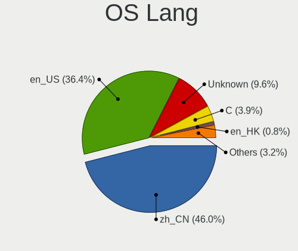

| Lang        | Computers | Percent |
|-------------|-----------|---------|
| zh_CN       | 793       | 45.42%  |
| en_US       | 626       | 35.85%  |
| Unknown     | 194       | 11.11%  |
| C           | 62        | 3.55%   |
| en_HK       | 17        | 0.97%   |
| en_GB       | 16        | 0.92%   |
| zh_TW       | 5         | 0.29%   |
| C.UTF8      | 5         | 0.29%   |
| mn_CN       | 4         | 0.23%   |
| ru_RU       | 3         | 0.17%   |
| en_AU       | 3         | 0.17%   |
| ja_JP       | 2         | 0.11%   |
| fr_FR       | 2         | 0.11%   |
| en_US.UTF8  | 2         | 0.11%   |
| de_DE       | 2         | 0.11%   |
| zh_SG       | 1         | 0.06%   |
| zh_HK       | 1         | 0.06%   |
| th_TH       | 1         | 0.06%   |
| pt_PT       | 1         | 0.06%   |
| POSIX       | 1         | 0.06%   |
| en_ZA       | 1         | 0.06%   |
| en_US.utf-8 | 1         | 0.06%   |
| en_US,UTF-8 | 1         | 0.06%   |
| en_SG       | 1         | 0.06%   |
| .en_US      | 1         | 0.06%   |

Boot Mode
---------

EFI or BIOS

| Mode | Computers | Percent |
|------|-----------|---------|
| EFI  | 1156      | 66.82%  |
| BIOS | 574       | 33.18%  |

Filesystem
----------

Type of filesystem

| Type       | Computers | Percent |
|------------|-----------|---------|
| Ext4       | 1263      | 72.5%   |
| Btrfs      | 207       | 11.88%  |
| Overlay    | 77        | 4.42%   |
| Xfs        | 72        | 4.13%   |
| Tmpfs      | 65        | 3.73%   |
| Unknown    | 32        | 1.84%   |
| Zfs        | 13        | 0.75%   |
| Rootfs     | 5         | 0.29%   |
| F2fs       | 5         | 0.29%   |
| XXXXXXX    | 1         | 0.06%   |
| Reiserfs   | 1         | 0.06%   |
| Fuse.sshfs | 1         | 0.06%   |

Part. scheme
------------

Scheme of partitioning

| Type    | Computers | Percent |
|---------|-----------|---------|
| GPT     | 1036      | 59.78%  |
| Unknown | 548       | 31.62%  |
| MBR     | 149       | 8.6%    |

Dual Boot with Linux/BSD
------------------------

Hosting more than one Linux/BSD

| Dual boot | Computers | Percent |
|-----------|-----------|---------|
| No        | 1460      | 83.52%  |
| Yes       | 288       | 16.48%  |

Dual Boot (Win)
---------------

Hosting Linux and Windows

| Dual boot | Computers | Percent |
|-----------|-----------|---------|
| No        | 1063      | 61.52%  |
| Yes       | 665       | 38.48%  |

Board
-----

Vendor
------

Motherboard manufacturer

| Name                           | Computers | Percent |
|--------------------------------|-----------|---------|
| Lenovo                         | 415       | 24.27%  |
| ASUSTek Computer               | 188       | 10.99%  |
| Dell                           | 158       | 9.24%   |
| Hewlett-Packard                | 129       | 7.54%   |
| Unknown                        | 76        | 4.44%   |
| HUAWEI                         | 67        | 3.92%   |
| Gigabyte Technology            | 65        | 3.8%    |
| MSI                            | 62        | 3.63%   |
| Timi                           | 48        | 2.81%   |
| Intel                          | 44        | 2.57%   |
| Acer                           | 40        | 2.34%   |
| MECHREVO                       | 22        | 1.29%   |
| Apple                          | 22        | 1.29%   |
| ASRock                         | 16        | 0.94%   |
| HASEE Computer                 | 15        | 0.88%   |
| Valve                          | 12        | 0.7%    |
| Raspberry Pi Foundation        | 12        | 0.7%    |
| AZW                            | 12        | 0.7%    |
| Google                         | 11        | 0.64%   |
| Toshiba                        | 10        | 0.58%   |
| Supermicro                     | 10        | 0.58%   |
| Phytium                        | 10        | 0.58%   |
| Microsoft                      | 10        | 0.58%   |
| HONOR                          | 9         | 0.53%   |
| GPD                            | 9         | 0.53%   |
| TSINGHUA TONGFANG COMPUTER     | 8         | 0.47%   |
| Sony                           | 8         | 0.47%   |
| GreatWall                      | 8         | 0.47%   |
| Colorful Technology            | 8         | 0.47%   |
| AMI                            | 8         | 0.47%   |
| Loongson                       | 7         | 0.41%   |
| Huanan                         | 7         | 0.41%   |
| Samsung Electronics            | 6         | 0.35%   |
| Notebook                       | 6         | 0.35%   |
| Inspur                         | 6         | 0.35%   |
| XIAOMI                         | 5         | 0.29%   |
| Shanghai Zhaoxin Semiconductor | 5         | 0.29%   |
| ONDA                           | 5         | 0.29%   |
| OEM                            | 5         | 0.29%   |
| Win element                    | 4         | 0.23%   |

Model
-----

Motherboard model

| Name                                | Computers | Percent |
|-------------------------------------|-----------|---------|
| Unknown                             | 93        | 5.44%   |
| ASUS All Series                     | 18        | 1.05%   |
| Valve Jupiter                       | 11        | 0.64%   |
| Lenovo Legion R9000P2021H 82JQ      | 10        | 0.58%   |
| TSINGHUA TONGFANG COMPUTER E500     | 8         | 0.47%   |
| HUAWEI HLY-WX9XX                    | 8         | 0.47%   |
| MSI MS-7B89                         | 7         | 0.41%   |
| Timi RedmiBook Pro 15S              | 6         | 0.35%   |
| AZW SER                             | 6         | 0.35%   |
| AMI Aptio CRB                       | 6         | 0.35%   |
| Timi TM1701                         | 5         | 0.29%   |
| Supermicro Super Server             | 5         | 0.29%   |
| MSI MS-7C94                         | 5         | 0.29%   |
| Lenovo Legion Y7000 81FW            | 5         | 0.29%   |
| Lenovo Legion R7000 2020 82B6       | 5         | 0.29%   |
| ASUS TUF Gaming B550M-PLUS          | 5         | 0.29%   |
| Timi TM1709                         | 4         | 0.23%   |
| Shanghai Zhaoxin ZXE CRB            | 4         | 0.23%   |
| Phytium FT-2000/4                   | 4         | 0.23%   |
| Lenovo XiaoXinPro-13IML 2019 81XB   | 4         | 0.23%   |
| Lenovo XiaoXinPro-13ARE 2020 82DM   | 4         | 0.23%   |
| Lenovo XiaoXin-15ARE 2020 81YR      | 4         | 0.23%   |
| Lenovo ThinkStation P520 30BFSG3Y00 | 4         | 0.23%   |
| Lenovo ThinkBook 15p Gen 2 21B1     | 4         | 0.23%   |
| Lenovo ThinkBook 14 G2 ITL 20VD     | 4         | 0.23%   |
| HUAWEI NBLK-WAX9X                   | 4         | 0.23%   |
| HUAWEI KPRC-WX0                     | 4         | 0.23%   |
| HUAWEI BOHK-WAX9X                   | 4         | 0.23%   |
| Dell XPS 15 9570                    | 4         | 0.23%   |
| Dell PowerEdge R730xd               | 4         | 0.23%   |
| ASUS M5A78L-M LX3 PLUS              | 4         | 0.23%   |
| Apple MacBookPro16,1                | 4         | 0.23%   |
| Acer Swift SF314-512                | 4         | 0.23%   |
| Timi TM1613                         | 3         | 0.18%   |
| Timi RedmiBook 14-APCS              | 3         | 0.18%   |
| Timi RedmiBook 14 II                | 3         | 0.18%   |
| RPi Raspberry Pi 4 Model B Rev 1.5  | 3         | 0.18%   |
| RPi Raspberry Pi                    | 3         | 0.18%   |
| Phytium FT2000/4                    | 3         | 0.18%   |
| Phytium D2000                       | 3         | 0.18%   |

Model Family
------------

Motherboard model prefix

| Name                            | Computers | Percent |
|---------------------------------|-----------|---------|
| Lenovo ThinkPad                 | 145       | 8.48%   |
| Unknown                         | 93        | 5.44%   |
| Lenovo Legion                   | 47        | 2.75%   |
| Dell Inspiron                   | 37        | 2.16%   |
| ASUS ROG                        | 33        | 1.93%   |
| Lenovo ThinkBook                | 31        | 1.81%   |
| ASUS TUF                        | 30        | 1.75%   |
| ASUS PRIME                      | 25        | 1.46%   |
| HP EliteBook                    | 24        | 1.4%    |
| Dell Precision                  | 24        | 1.4%    |
| Dell Latitude                   | 23        | 1.35%   |
| Dell OptiPlex                   | 22        | 1.29%   |
| HP OMEN                         | 21        | 1.23%   |
| Lenovo IdeaPad                  | 18        | 1.05%   |
| HP ZHAN                         | 18        | 1.05%   |
| ASUS All                        | 18        | 1.05%   |
| Acer Aspire                     | 17        | 0.99%   |
| Timi RedmiBook                  | 16        | 0.94%   |
| Lenovo ZHAOYANG                 | 15        | 0.88%   |
| Lenovo Yoga                     | 15        | 0.88%   |
| Lenovo ThinkCentre              | 15        | 0.88%   |
| Dell XPS                        | 15        | 0.88%   |
| Dell PowerEdge                  | 13        | 0.76%   |
| Acer Swift                      | 13        | 0.76%   |
| RPi Raspberry                   | 12        | 0.7%    |
| Dell Vostro                     | 12        | 0.7%    |
| Valve Jupiter                   | 11        | 0.64%   |
| Lenovo ThinkStation             | 11        | 0.64%   |
| HP ProBook                      | 11        | 0.64%   |
| Microsoft Surface               | 10        | 0.58%   |
| Lenovo XiaoXinPro               | 10        | 0.58%   |
| HP ENVY                         | 9         | 0.53%   |
| TSINGHUA TONGFANG COMPUTER E500 | 8         | 0.47%   |
| HUAWEI HLY-WX9XX                | 8         | 0.47%   |
| HP Pavilion                     | 8         | 0.47%   |
| MSI MS-7B89                     | 7         | 0.41%   |
| ASUS VivoBook                   | 7         | 0.41%   |
| Toshiba Satellite               | 6         | 0.35%   |
| Lenovo XiaoXin                  | 6         | 0.35%   |
| HP ProDesk                      | 6         | 0.35%   |

MFG Year
--------

Motherboard manufacture year

| Year    | Computers | Percent |
|---------|-----------|---------|
| 2021    | 219       | 12.81%  |
| 2020    | 203       | 11.87%  |
| 2019    | 177       | 10.35%  |
| 2022    | 161       | 9.42%   |
| 2018    | 161       | 9.42%   |
| 2017    | 114       | 6.67%   |
| 2023    | 87        | 5.09%   |
| 2015    | 81        | 4.74%   |
| 2013    | 79        | 4.62%   |
| 2012    | 75        | 4.39%   |
| 2014    | 74        | 4.33%   |
| Unknown | 72        | 4.21%   |
| 2016    | 68        | 3.98%   |
| 2011    | 52        | 3.04%   |
| 2008    | 24        | 1.4%    |
| 2010    | 20        | 1.17%   |
| 2009    | 15        | 0.88%   |
| 2024    | 13        | 0.76%   |
| 2007    | 11        | 0.64%   |
| 2006    | 3         | 0.18%   |
| 2000    | 1         | 0.06%   |

Form Factor
-----------

Physical design of the computer

| Name           | Computers | Percent |
|----------------|-----------|---------|
| Notebook       | 958       | 56.02%  |
| Desktop        | 537       | 31.4%   |
| Server         | 53        | 3.1%    |
| System on chip | 48        | 2.81%   |
| Mini pc        | 46        | 2.69%   |
| Tablet         | 30        | 1.75%   |
| Convertible    | 21        | 1.23%   |
| All in one     | 13        | 0.76%   |
| Phone          | 4         | 0.23%   |

Secure Boot
-----------

Enabled or disabled

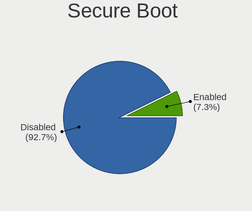

| State    | Computers | Percent |
|----------|-----------|---------|
| Disabled | 1595      | 92.62%  |
| Enabled  | 127       | 7.38%   |

Coreboot
--------

Have coreboot on board

| Used | Computers | Percent |
|------|-----------|---------|
| No   | 1698      | 99.3%   |
| Yes  | 12        | 0.7%    |

RAM Size
--------

Total RAM memory

| Size in GB      | Computers | Percent |
|-----------------|-----------|---------|
| 16.01-24.0      | 389       | 22.38%  |
| 8.01-16.0       | 383       | 22.04%  |
| 4.01-8.0        | 329       | 18.93%  |
| 32.01-64.0      | 234       | 13.46%  |
| 3.01-4.0        | 163       | 9.38%   |
| 64.01-256.0     | 100       | 5.75%   |
| 24.01-32.0      | 52        | 2.99%   |
| 1.01-2.0        | 34        | 1.96%   |
| Unknown         | 17        | 0.98%   |
| More than 256.0 | 14        | 0.81%   |
| 0.51-1.0        | 14        | 0.81%   |
| 0.01-0.5        | 5         | 0.29%   |
| 2.01-3.0        | 2         | 0.12%   |
| 0               | 2         | 0.12%   |

RAM Used
--------

Used RAM memory

| Used GB     | Computers | Percent |
|-------------|-----------|---------|
| 1.01-2.0    | 474       | 25.36%  |
| 2.01-3.0    | 454       | 24.29%  |
| 4.01-8.0    | 320       | 17.12%  |
| 3.01-4.0    | 277       | 14.82%  |
| 0.51-1.0    | 109       | 5.83%   |
| 8.01-16.0   | 107       | 5.72%   |
| 0.01-0.5    | 58        | 3.1%    |
| Unknown     | 26        | 1.39%   |
| 16.01-24.0  | 21        | 1.12%   |
| 24.01-32.0  | 9         | 0.48%   |
| 32.01-64.0  | 8         | 0.43%   |
| 64.01-256.0 | 6         | 0.32%   |

Total Drives
------------

Number of drives on board

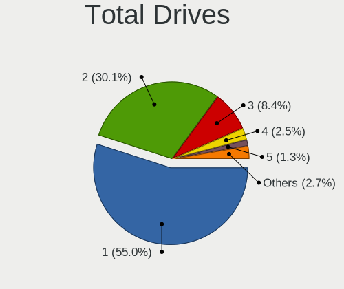

| Drives  | Computers | Percent |
|---------|-----------|---------|
| 1       | 950       | 54.54%  |
| 2       | 541       | 31.06%  |
| 3       | 141       | 8.09%   |
| 4       | 46        | 2.64%   |
| 5       | 23        | 1.32%   |
| 0       | 13        | 0.75%   |
| 6       | 9         | 0.52%   |
| 10      | 5         | 0.29%   |
| 9       | 3         | 0.17%   |
| 8       | 2         | 0.11%   |
| 7       | 2         | 0.11%   |
| 46      | 1         | 0.06%   |
| 36      | 1         | 0.06%   |
| 32      | 1         | 0.06%   |
| 27      | 1         | 0.06%   |
| 21      | 1         | 0.06%   |
| 11      | 1         | 0.06%   |
| Unknown | 1         | 0.06%   |

Has CD-ROM
----------

Has CD-ROM on board

| Presented | Computers | Percent |
|-----------|-----------|---------|
| No        | 1504      | 87.59%  |
| Yes       | 213       | 12.41%  |

Has Ethernet
------------

Has Ethernet on board

| Presented | Computers | Percent |
|-----------|-----------|---------|
| Yes       | 1349      | 78.48%  |
| No        | 370       | 21.52%  |

Has WiFi
--------

Has WiFi module

| Presented | Computers | Percent |
|-----------|-----------|---------|
| Yes       | 1312      | 76.37%  |
| No        | 406       | 23.63%  |

Has Bluetooth
-------------

Has Bluetooth module

| Presented | Computers | Percent |
|-----------|-----------|---------|
| Yes       | 1118      | 64.77%  |
| No        | 608       | 35.23%  |

Location
--------

Country
-------

Geographic location (country)

| Country | Computers | Percent |
|---------|-----------|---------|
| China   | 1710      | 100%    |

City
----

Geographic location (city)

| City         | Computers | Percent |
|--------------|-----------|---------|
| Beijing      | 323       | 17.78%  |
| Shanghai     | 157       | 8.64%   |
| Shenzhen     | 141       | 7.76%   |
| Guangzhou    | 118       | 6.49%   |
| Hangzhou     | 69        | 3.8%    |
| Chengdu      | 58        | 3.19%   |
| Wuhan        | 53        | 2.92%   |
| Nanjing      | 40        | 2.2%    |
| Jinrongjie   | 32        | 1.76%   |
| Xi'an        | 29        | 1.6%    |
| Zhengzhou    | 27        | 1.49%   |
| Chongqing    | 25        | 1.38%   |
| Tianjin      | 23        | 1.27%   |
| Changsha     | 22        | 1.21%   |
| Kunming      | 21        | 1.16%   |
| Haidian      | 21        | 1.16%   |
| Suzhou       | 19        | 1.05%   |
| Xuhui        | 18        | 0.99%   |
| Shenyang     | 18        | 0.99%   |
| Hefei        | 18        | 0.99%   |
| Foshan       | 18        | 0.99%   |
| Dongguan     | 18        | 0.99%   |
| Qingdao      | 17        | 0.94%   |
| Jinan        | 17        | 0.94%   |
| Nanning      | 14        | 0.77%   |
| Xiamen       | 13        | 0.72%   |
| Jianshui     | 12        | 0.66%   |
| Huangpu      | 12        | 0.66%   |
| Fuzhou       | 12        | 0.66%   |
| Dalian       | 12        | 0.66%   |
| Bieligutai   | 12        | 0.66%   |
| Nanhao       | 9         | 0.5%    |
| Hohhot       | 9         | 0.5%    |
| Shijiazhuang | 8         | 0.44%   |
| Pudong       | 8         | 0.44%   |
| Putuo        | 7         | 0.39%   |
| Ningbo       | 7         | 0.39%   |
| Guiyang      | 7         | 0.39%   |
| Changchun    | 7         | 0.39%   |
| Zhangzhou    | 6         | 0.33%   |

Drives
------

Drive Vendor
------------

Hard drive vendors

| Vendor                      | Computers | Drives | Percent |
|-----------------------------|-----------|--------|---------|
| Samsung Electronics         | 426       | 578    | 16.29%  |
| WDC                         | 313       | 438    | 11.97%  |
| Seagate                     | 275       | 492    | 10.52%  |
| SanDisk                     | 145       | 171    | 5.54%   |
| Toshiba                     | 138       | 199    | 5.28%   |
| Unknown                     | 135       | 174    | 5.16%   |
| SK hynix                    | 84        | 103    | 3.21%   |
| Intel                       | 78        | 121    | 2.98%   |
| Kingston                    | 77        | 94     | 2.94%   |
| HGST                        | 54        | 87     | 2.07%   |
| Micron Technology           | 51        | 58     | 1.95%   |
| Silicon Motion              | 38        | 52     | 1.45%   |
| Unknown                     | 36        | 42     | 1.38%   |
| Yangtze Memory Technologies | 33        | 41     | 1.26%   |
| KIOXIA                      | 32        | 40     | 1.22%   |
| Hitachi                     | 31        | 46     | 1.19%   |
| Plextor                     | 30        | 36     | 1.15%   |
| MAXIO Technology (Hangzhou) | 26        | 31     | 0.99%   |
| Crucial                     | 26        | 31     | 0.99%   |
| Lenovo                      | 25        | 35     | 0.96%   |
| ZHITAI                      | 22        | 25     | 0.84%   |
| Phison                      | 22        | 26     | 0.84%   |
| LITEON                      | 20        | 26     | 0.76%   |
| Hewlett-Packard             | 17        | 22     | 0.65%   |
| China                       | 17        | 29     | 0.65%   |
| FORESEE                     | 16        | 19     | 0.61%   |
| A-DATA Technology           | 16        | 23     | 0.61%   |
| Phison Electronics          | 15        | 15     | 0.57%   |
| Apple                       | 15        | 15     | 0.57%   |
| Teclast                     | 14        | 14     | 0.54%   |
| Colorful                    | 14        | 18     | 0.54%   |
| Netac                       | 12        | 14     | 0.46%   |
| KIOXIA-EXCERIA              | 12        | 15     | 0.46%   |
| Kingston Technology Company | 12        | 16     | 0.46%   |
| JMicron Technology          | 12        | 14     | 0.46%   |
| GLOWAY                      | 11        | 15     | 0.42%   |
| Fanxiang                    | 11        | 11     | 0.42%   |
| Hikvision                   | 10        | 18     | 0.38%   |
| GALAX                       | 10        | 10     | 0.38%   |
| Kingchuxing                 | 9         | 11     | 0.34%   |

Drive Model
-----------

Hard drive models

| Model                                                 | Computers | Percent |
|-------------------------------------------------------|-----------|---------|
| Unknown                                               | 36        | 1.26%   |
| Samsung NVMe SSD Controller PM9A1/PM9A3/980PRO 1TB    | 31        | 1.09%   |
| WDC WD10EZEX-08WN4A0 1TB                              | 27        | 0.95%   |
| Samsung NVMe SSD Controller SM981/PM981/PM983 1TB     | 25        | 0.88%   |
| Samsung NVMe SSD Drive 512GB                          | 23        | 0.81%   |
| SanDisk NVMe SSD Drive 512GB                          | 22        | 0.77%   |
| Seagate ST1000LM035-1RK172 1TB                        | 18        | 0.63%   |
| Samsung SSD 860 EVO 500GB                             | 18        | 0.63%   |
| Seagate ST1000DM010-2EP102 1TB                        | 17        | 0.6%    |
| SanDisk NVMe SSD Drive 1TB                            | 17        | 0.6%    |
| HGST HTS721010A9E630 1TB                              | 16        | 0.56%   |
| Seagate ST1000DM003-1SB102 1TB                        | 15        | 0.53%   |
| Seagate ST500DM002-1BD142 500GB                       | 14        | 0.49%   |
| Seagate ST1000LM048-2E7172 1TB                        | 14        | 0.49%   |
| Samsung MZVLB512HBJQ-000L2 512GB                      | 14        | 0.49%   |
| Seagate ST500LT012-1DG142 500GB                       | 13        | 0.46%   |
| Sandisk WD Black SN750 / PC SN730 NVMe SSD 512GB      | 13        | 0.46%   |
| Samsung SSD 980 1TB                                   | 13        | 0.46%   |
| Samsung PM963 2.5" NVMe PCIe SSD 256GB                | 12        | 0.42%   |
| Samsung NVMe SSD Drive 1024GB                         | 12        | 0.42%   |
| Yangtze Memory ZHITAI TiPlus5000 1TB                  | 11        | 0.39%   |
| WDC WDS100T2B0C-00PXH0 1TB                            | 11        | 0.39%   |
| Unknown MMC Card  64GB                                | 11        | 0.39%   |
| Toshiba MQ01ABD100 1TB                                | 11        | 0.39%   |
| SK hynix SKHynix_HFS512GDE9X084N 512GB                | 11        | 0.39%   |
| Silicon Motion SM2263EN/SM2263XT SSD Controller 256GB | 11        | 0.39%   |
| HGST HTS725050A7E630 500GB                            | 11        | 0.39%   |
| Unknown MMC Card  128GB                               | 10        | 0.35%   |
| Toshiba DT01ACA200 2TB                                | 10        | 0.35%   |
| SK hynix NVMe SSD Drive 512GB                         | 10        | 0.35%   |
| Seagate ST500LM021-1KJ152 500GB                       | 10        | 0.35%   |
| Seagate ST2000LM007-1R8174 2TB                        | 10        | 0.35%   |
| Samsung MZVLB512HAJQ-00000 512GB                      | 10        | 0.35%   |
| MAXIO (Hangzhou) NVMe SSD Controller MAP1202 256GB    | 10        | 0.35%   |
| Kingston SA400S37480G 480GB SSD                       | 10        | 0.35%   |
| Unknown NVMe SSD Drive 512GB                          | 9         | 0.32%   |
| Seagate ST6000NM0115-1YZ110 6TB                       | 9         | 0.32%   |
| Plextor PX-128M6S 128GB SSD                           | 9         | 0.32%   |
| WDC WD10EZEX-08M2NA0 1TB                              | 8         | 0.28%   |
| Toshiba NVMe SSD Drive 128GB                          | 8         | 0.28%   |

HDD Vendor
----------

Hard disk drive vendors

| Vendor              | Computers | Drives | Percent |
|---------------------|-----------|--------|---------|
| Seagate             | 273       | 489    | 38.72%  |
| WDC                 | 228       | 319    | 32.34%  |
| Toshiba             | 69        | 113    | 9.79%   |
| HGST                | 54        | 87     | 7.66%   |
| Hitachi             | 31        | 46     | 4.4%    |
| Samsung Electronics | 12        | 13     | 1.7%    |
| JMicron Technology  | 8         | 11     | 1.13%   |
| Fujitsu             | 8         | 8      | 1.13%   |
| Pear 2TB            | 5         | 5      | 0.71%   |
| TO Exter            | 2         | 2      | 0.28%   |
| Hewlett-Packard     | 2         | 2      | 0.28%   |
| ACASIS              | 2         | 2      | 0.28%   |
| Unknown             | 2         | 3      | 0.28%   |
| QUANTUM             | 1         | 1      | 0.14%   |
| LIO-ORG             | 1         | 9      | 0.14%   |
| IBM H0              | 1         | 1      | 0.14%   |
| HGST HTS            | 1         | 1      | 0.14%   |
| GOKE                | 1         | 1      | 0.14%   |
| FORESEE             | 1         | 1      | 0.14%   |
| ExcelStor           | 1         | 1      | 0.14%   |
| DELLBOSS            | 1         | 1      | 0.14%   |
| Apple               | 1         | 1      | 0.14%   |

SSD Vendor
----------

Solid state drive vendors

| Vendor              | Computers | Drives | Percent |
|---------------------|-----------|--------|---------|
| Samsung Electronics | 132       | 187    | 19.76%  |
| Kingston            | 48        | 59     | 7.19%   |
| SanDisk             | 37        | 40     | 5.54%   |
| Toshiba             | 31        | 38     | 4.64%   |
| Intel               | 28        | 45     | 4.19%   |
| Plextor             | 27        | 32     | 4.04%   |
| WDC                 | 20        | 29     | 2.99%   |
| LITEON              | 19        | 25     | 2.84%   |
| Crucial             | 19        | 24     | 2.84%   |
| Lenovo              | 18        | 23     | 2.69%   |
| China               | 17        | 29     | 2.54%   |
| Teclast             | 14        | 14     | 2.1%    |
| Micron Technology   | 14        | 16     | 2.1%    |
| A-DATA Technology   | 13        | 19     | 1.95%   |
| Unknown             | 13        | 17     | 1.95%   |
| Netac               | 11        | 13     | 1.65%   |
| GALAX               | 10        | 10     | 1.5%    |
| GLOWAY              | 9         | 13     | 1.35%   |
| ZHITAI              | 8         | 9      | 1.2%    |
| SK hynix            | 8         | 8      | 1.2%    |
| Kingchuxing         | 8         | 10     | 1.2%    |
| FORESEE             | 8         | 9      | 1.2%    |
| Colorful            | 7         | 7      | 1.05%   |
| Apple               | 7         | 7      | 1.05%   |
| Transcend           | 6         | 7      | 0.9%    |
| External            | 6         | 9      | 0.9%    |
| Unknown             | 5         | 6      | 0.75%   |
| KIOXIA-EXCERIA      | 5         | 5      | 0.75%   |
| Hewlett-Packard     | 5         | 8      | 0.75%   |
| Q200                | 4         | 7      | 0.6%    |
| Phison              | 4         | 5      | 0.6%    |
| LITEONIT            | 4         | 4      | 0.6%    |
| tigo                | 3         | 3      | 0.45%   |
| Pear                | 3         | 12     | 0.45%   |
| MaiChai             | 3         | 5      | 0.45%   |
| Lexar               | 3         | 3      | 0.45%   |
| KingSpec            | 3         | 3      | 0.45%   |
| KINGBANK            | 3         | 3      | 0.45%   |
| Galaxy              | 3         | 3      | 0.45%   |
| faspeed             | 3         | 3      | 0.45%   |

Drive Kind
----------

HDD or SSD

| Kind    | Computers | Drives | Percent |
|---------|-----------|--------|---------|
| NVMe    | 929       | 1344   | 40.08%  |
| HDD     | 610       | 1117   | 26.32%  |
| SSD     | 588       | 886    | 25.37%  |
| MMC     | 121       | 155    | 5.22%   |
| Unknown | 70        | 87     | 3.02%   |

Drive Connector
---------------

SATA, SAS, NVMe, etc.

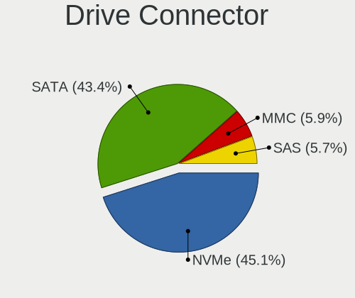

| Type | Computers | Drives | Percent |
|------|-----------|--------|---------|
| SATA | 949       | 1928   | 44.76%  |
| NVMe | 927       | 1334   | 43.73%  |
| SAS  | 123       | 172    | 5.8%    |
| MMC  | 121       | 155    | 5.71%   |

Drive Size
----------

Size of hard drive

| Size in TB | Computers | Drives | Percent |
|------------|-----------|--------|---------|
| 0.01-0.5   | 653       | 1054   | 53%     |
| 0.51-1.0   | 374       | 481    | 30.36%  |
| 1.01-2.0   | 96        | 155    | 7.79%   |
| 3.01-4.0   | 34        | 52     | 2.76%   |
| 4.01-10.0  | 33        | 185    | 2.68%   |
| 2.01-3.0   | 24        | 47     | 1.95%   |
| 10.01-20.0 | 18        | 29     | 1.46%   |

Space Total
-----------

Amount of disk space available on the file system

| Size in GB     | Computers | Percent |
|----------------|-----------|---------|
| 251-500        | 430       | 24.02%  |
| 101-250        | 392       | 21.9%   |
| 501-1000       | 277       | 15.47%  |
| 1001-2000      | 156       | 8.72%   |
| 51-100         | 151       | 8.44%   |
| More than 3000 | 106       | 5.92%   |
| 1-20           | 101       | 5.64%   |
| 21-50          | 70        | 3.91%   |
| 2001-3000      | 56        | 3.13%   |
| Unknown        | 51        | 2.85%   |

Space Used
----------

Amount of used disk space

| Used GB        | Computers | Percent |
|----------------|-----------|---------|
| 1-20           | 663       | 36.09%  |
| 21-50          | 299       | 16.28%  |
| 101-250        | 256       | 13.94%  |
| 51-100         | 194       | 10.56%  |
| 251-500        | 161       | 8.76%   |
| 501-1000       | 97        | 5.28%   |
| 1001-2000      | 59        | 3.21%   |
| Unknown        | 51        | 2.78%   |
| More than 3000 | 34        | 1.85%   |
| 2001-3000      | 21        | 1.14%   |
| 0              | 2         | 0.11%   |

Malfunc. Drives
---------------

Drive models with a malfunction

| Model                                   | Computers | Drives | Percent |
|-----------------------------------------|-----------|--------|---------|
| HGST HTS725050A7E630 500GB              | 4         | 4      | 3.54%   |
| Seagate ST500LT012-1DG142 500GB         | 3         | 3      | 2.65%   |
| WDC WD5000AAKX-00ERMA0 500GB            | 2         | 2      | 1.77%   |
| Toshiba MQ04ABF100 1TB                  | 2         | 2      | 1.77%   |
| Toshiba MQ01ABF050 500GB                | 2         | 2      | 1.77%   |
| Seagate ST500LM021-1KJ152 500GB         | 2         | 2      | 1.77%   |
| Seagate ST500DM002-1BD142 500GB         | 2         | 2      | 1.77%   |
| Seagate ST31000524AS 1TB                | 2         | 2      | 1.77%   |
| Seagate ST1000LM048-2E7172 1TB          | 2         | 2      | 1.77%   |
| Seagate ST1000LM024 HN-M101MBB 1TB      | 2         | 2      | 1.77%   |
| Netac SSD 120GB                         | 2         | 2      | 1.77%   |
| Hitachi HUS724030ALE641 3TB             | 2         | 2      | 1.77%   |
| HGST HTS721010A9E630 1TB                | 2         | 2      | 1.77%   |
| Crucial CT240M500SSD1 240GB             | 2         | 2      | 1.77%   |
| A-DATA Technology SP900 128GB SSD       | 2         | 3      | 1.77%   |
| WDC WDS240G2G0B-00EPW0 240GB SSD        | 1         | 1      | 0.88%   |
| WDC WD5003ABYZ-011FA0 500GB             | 1         | 1      | 0.88%   |
| WDC WD5003ABYX-01WERA1 500GB            | 1         | 1      | 0.88%   |
| WDC WD5000LPCX-24C6HT0 500GB            | 1         | 1      | 0.88%   |
| WDC WD5000AZLX-60K2TA0 500GB            | 1         | 1      | 0.88%   |
| WDC WD5000AAKX-60U6AA0 500GB            | 1         | 1      | 0.88%   |
| WDC WD5000AAKX-08U6AA0 500GB            | 1         | 1      | 0.88%   |
| WDC WD5000AAKX-08ERMA0 500GB            | 1         | 1      | 0.88%   |
| WDC WD5000AAKX-083CA1 500GB             | 1         | 2      | 0.88%   |
| WDC WD5000AAKX-00PWEA0 500GB            | 1         | 1      | 0.88%   |
| WDC WD5000AAKX-001CA0 500GB             | 1         | 1      | 0.88%   |
| WDC WD5000AAKX-0 500GB                  | 1         | 1      | 0.88%   |
| WDC WD40EJRX-89AKWY0 4TB                | 1         | 3      | 0.88%   |
| WDC WD20EARX-00PASB0 2TB                | 1         | 1      | 0.88%   |
| WDC WD10SPZX-60Z10T0 1TB                | 1         | 1      | 0.88%   |
| WDC WD10JPVX-22JC3T0 1TB                | 1         | 1      | 0.88%   |
| WDC WD10JPLX-00MBPT1 1TB                | 1         | 2      | 0.88%   |
| WDC WD10EZEX-08WN4A1 1TB                | 1         | 1      | 0.88%   |
| WDC WD10EZEX-00BN5A0 1TB                | 1         | 1      | 0.88%   |
| WDC WD100EZAZ-11TDBA0 10TB              | 1         | 2      | 0.88%   |
| WDC WD1003FBYX-01Y7B0 1TB               | 1         | 1      | 0.88%   |
| WDC WD10 JPVX-75JC3T0 1TB               | 1         | 1      | 0.88%   |
| Union Memory UMIS RPITJ512PED2OWX 512GB | 1         | 1      | 0.88%   |
| Toshiba MK3259GSXP 320GB                | 1         | 1      | 0.88%   |
| Toshiba MK2555GSX 250GB                 | 1         | 1      | 0.88%   |

Malfunc. Drive Vendor
---------------------

Vendors of faulty drives

| Vendor              | Computers | Drives | Percent |
|---------------------|-----------|--------|---------|
| WDC                 | 23        | 29     | 20.91%  |
| Seagate             | 23        | 27     | 20.91%  |
| Toshiba             | 9         | 9      | 8.18%   |
| HGST                | 7         | 7      | 6.36%   |
| Hitachi             | 6         | 6      | 5.45%   |
| Samsung Electronics | 5         | 16     | 4.55%   |
| Intel               | 4         | 4      | 3.64%   |
| GLOWAY              | 3         | 7      | 2.73%   |
| Fujitsu             | 3         | 3      | 2.73%   |
| Crucial             | 3         | 3      | 2.73%   |
| A-DATA Technology   | 3         | 4      | 2.73%   |
| SanDisk             | 2         | 2      | 1.82%   |
| Plextor             | 2         | 2      | 1.82%   |
| Netac               | 2         | 2      | 1.82%   |
| Lenovo              | 2         | 2      | 1.82%   |
| Kingston            | 2         | 2      | 1.82%   |
| Colorful            | 2         | 2      | 1.82%   |
| Union Memory        | 1         | 1      | 0.91%   |
| Teclast             | 1         | 1      | 0.91%   |
| Ramsta              | 1         | 1      | 0.91%   |
| NT-512              | 1         | 1      | 0.91%   |
| HS-SSD-C160         | 1         | 1      | 0.91%   |
| Hewlett-Packard     | 1         | 2      | 0.91%   |
| HANCHU              | 1         | 1      | 0.91%   |
| Flashwar            | 1         | 1      | 0.91%   |
| ExcelStor           | 1         | 1      | 0.91%   |

Malfunc. HDD Vendor
-------------------

Vendors of faulty HDD drives

| Vendor    | Computers | Drives | Percent |
|-----------|-----------|--------|---------|
| Seagate   | 23        | 27     | 32.39%  |
| WDC       | 22        | 28     | 30.99%  |
| Toshiba   | 9         | 9      | 12.68%  |
| HGST      | 7         | 7      | 9.86%   |
| Hitachi   | 6         | 6      | 8.45%   |
| Fujitsu   | 3         | 3      | 4.23%   |
| ExcelStor | 1         | 1      | 1.41%   |

Malfunc. Drive Kind
-------------------

Kinds of faulty drives

| Kind | Computers | Drives | Percent |
|------|-----------|--------|---------|
| HDD  | 70        | 81     | 65.42%  |
| SSD  | 31        | 49     | 28.97%  |
| NVMe | 6         | 7      | 5.61%   |

Failed Drives
-------------

Failed drive models

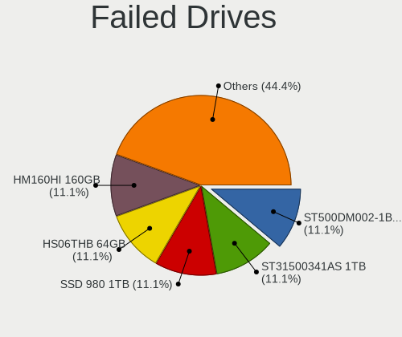

| Model                             | Computers | Drives | Percent |
|-----------------------------------|-----------|--------|---------|
| Seagate ST500DM002-1BD142 500GB   | 1         | 1      | 11.11%  |
| Seagate ST31500341AS 1TB          | 1         | 1      | 11.11%  |
| Samsung Electronics SSD 980 1TB   | 1         | 1      | 11.11%  |
| Samsung Electronics HS06THB 64GB  | 1         | 1      | 11.11%  |
| Samsung Electronics HM160HI 160GB | 1         | 1      | 11.11%  |
| Phison ESO128GTLC9-E8C-2 128GB    | 1         | 1      | 11.11%  |
| HGST HUH728080ALN600 8TB          | 1         | 1      | 11.11%  |
| HGST HTS725050A7E630 500GB        | 1         | 2      | 11.11%  |
| Hewlett-Packard SSD S700 500GB    | 1         | 2      | 11.11%  |

Failed Drive Vendor
-------------------

Failed drive vendors

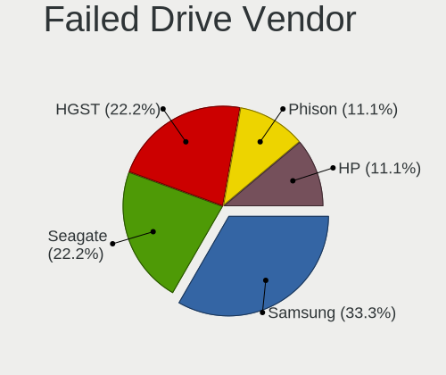

| Vendor              | Computers | Drives | Percent |
|---------------------|-----------|--------|---------|
| Samsung Electronics | 3         | 3      | 33.33%  |
| Seagate             | 2         | 2      | 22.22%  |
| HGST                | 2         | 3      | 22.22%  |
| Phison              | 1         | 1      | 11.11%  |
| Hewlett-Packard     | 1         | 2      | 11.11%  |

Drive Status
------------

Number of failed and malfunc. drives

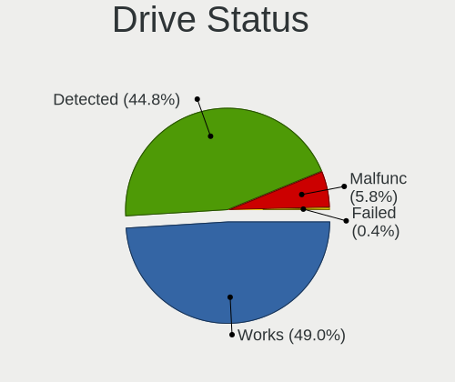

| Status   | Computers | Drives | Percent |
|----------|-----------|--------|---------|
| Works    | 911       | 1856   | 48.74%  |
| Detected | 846       | 1585   | 45.26%  |
| Malfunc  | 103       | 137    | 5.51%   |
| Failed   | 9         | 11     | 0.48%   |

Storage controller
------------------

Storage Vendor
--------------

Storage controller vendors

| Vendor                                  | Computers | Percent |
|-----------------------------------------|-----------|---------|
| Intel                                   | 931       | 39.84%  |
| Samsung Electronics                     | 301       | 12.88%  |
| AMD                                     | 258       | 11.04%  |
| SanDisk                                 | 177       | 7.57%   |
| SK hynix                                | 75        | 3.21%   |
| Silicon Motion                          | 57        | 2.44%   |
| Yangtze Memory Technologies             | 50        | 2.14%   |
| Toshiba America Info Systems            | 43        | 1.84%   |
| MAXIO Technology (Hangzhou)             | 43        | 1.84%   |
| Phison Electronics                      | 41        | 1.75%   |
| KIOXIA                                  | 41        | 1.75%   |
| Kingston Technology Company             | 39        | 1.67%   |
| Micron Technology                       | 37        | 1.58%   |
| Marvell Technology Group                | 31        | 1.33%   |
| ASMedia Technology                      | 26        | 1.11%   |
| Broadcom / LSI                          | 18        | 0.77%   |
| Shenzhen Longsys Electronics            | 14        | 0.6%    |
| Biwin Storage Technology                | 11        | 0.47%   |
| Zhaoxin                                 | 10        | 0.43%   |
| Micron/Crucial Technology               | 10        | 0.43%   |
| LSI Logic / Symbios Logic               | 9         | 0.39%   |
| JMicron Technology                      | 9         | 0.39%   |
| Solid State Storage Technology          | 8         | 0.34%   |
| Loongson Technology                     | 8         | 0.34%   |
| Lite-On Technology                      | 8         | 0.34%   |
| Apple                                   | 7         | 0.3%    |
| Union Memory (Shenzhen)                 | 6         | 0.26%   |
| ADATA Technology                        | 6         | 0.26%   |
| Shenzhen Unionmemory Information System | 5         | 0.21%   |
| Realtek Semiconductor                   | 5         | 0.21%   |
| INNOGRIT                                | 5         | 0.21%   |
| IBM                                     | 5         | 0.21%   |
| Huawei Technologies                     | 5         | 0.21%   |
| Solidigm                                | 3         | 0.13%   |
| Silicon Integrated Systems [SiS]        | 3         | 0.13%   |
| Shenzhen Shichuangyi Electronics        | 3         | 0.13%   |
| O2 Micro                                | 3         | 0.13%   |
| Hefei DATANG Storage Technology         | 3         | 0.13%   |
| Beijing Starblaze Technology            | 3         | 0.13%   |
| Silicon Image                           | 2         | 0.09%   |

Storage Model
-------------

Storage controller models

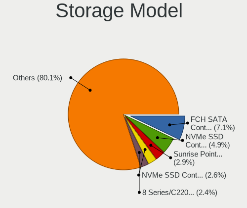

| Model                                                                          | Computers | Percent |
|--------------------------------------------------------------------------------|-----------|---------|
| AMD FCH SATA Controller [AHCI mode]                                            | 197       | 7.67%   |
| Samsung NVMe SSD Controller SM981/PM981/PM983                                  | 139       | 5.41%   |
| Intel Sunrise Point-LP SATA Controller [AHCI mode]                             | 82        | 3.19%   |
| Samsung NVMe SSD Controller PM9A1/PM9A3/980PRO                                 | 65        | 2.53%   |
| Intel 8 Series/C220 Series Chipset Family 6-port SATA Controller 1 [AHCI mode] | 64        | 2.49%   |
| Intel 200 Series PCH SATA controller [AHCI mode]                               | 54        | 2.1%    |
| Intel 7 Series Chipset Family 6-port SATA Controller [AHCI mode]               | 52        | 2.02%   |
| SanDisk Extreme Pro / WD Black SN750 / PC SN730 / Red SN700 NVMe SSD           | 48        | 1.87%   |
| Intel Volume Management Device NVMe RAID Controller                            | 45        | 1.75%   |
| Samsung NVMe SSD Controller 980 (DRAM-less)                                    | 42        | 1.63%   |
| Silicon Motion SM2263EN/SM2263XT (DRAM-less) NVMe SSD Controllers              | 41        | 1.6%    |
| Samsung NVMe SSD Controller SM961/PM961/SM963                                  | 39        | 1.52%   |
| SK hynix Gold P31/BC711/PC711 NVMe Solid State Drive                           | 38        | 1.48%   |
| AMD 400 Series Chipset SATA Controller                                         | 38        | 1.48%   |
| SanDisk Ultra 3D / WD Blue SN550 NVMe SSD                                      | 34        | 1.32%   |
| Intel 8 Series SATA Controller 1 [AHCI mode]                                   | 34        | 1.32%   |
| Intel Cannon Lake Mobile PCH SATA AHCI Controller                              | 33        | 1.28%   |
| Intel 6 Series/C200 Series Chipset Family 6 port Mobile SATA AHCI Controller   | 33        | 1.28%   |
| Intel Q170/Q150/B150/H170/H110/Z170/CM236 Chipset SATA Controller [AHCI Mode]  | 32        | 1.25%   |
| Intel 82801 Mobile SATA Controller [RAID mode]                                 | 27        | 1.05%   |
| Intel 400 Series Chipset Family SATA AHCI Controller                           | 27        | 1.05%   |
| Intel Cannon Lake PCH SATA AHCI Controller                                     | 25        | 0.97%   |
| Intel SATA Controller [RAID Mode]                                              | 24        | 0.93%   |
| SanDisk Extreme Pro / WD Black 2018/SN750/PC SN720 NVMe SSD                    | 23        | 0.89%   |
| Intel HM170/QM170 Chipset SATA Controller [AHCI Mode]                          | 23        | 0.89%   |
| Intel Comet Lake SATA AHCI Controller                                          | 23        | 0.89%   |
| AMD 500 Series Chipset SATA Controller                                         | 23        | 0.89%   |
| MAXIO (Hangzhou) NVMe SSD Controller MAP1202 (DRAM-less)                       | 22        | 0.86%   |
| Phison PS5013-E13 PCIe3 NVMe Controller (DRAM-less)                            | 21        | 0.82%   |
| Intel Wildcat Point-LP SATA Controller [AHCI Mode]                             | 20        | 0.78%   |
| Intel Alder Lake-S PCH SATA Controller [AHCI Mode]                             | 20        | 0.78%   |
| ASMedia ASM1061/ASM1062 Serial ATA Controller                                  | 20        | 0.78%   |
| Yangtze Memory ZHITAI TiPro5000 NVMe SSD                                       | 19        | 0.74%   |
| MAXIO (Hangzhou) NVMe SSD Controller MAP1602 (DRAM-less)                       | 19        | 0.74%   |
| Toshiba America Info Systems XG6 NVMe SSD Controller                           | 17        | 0.66%   |
| Marvell Group 88SE9215 PCIe 2.0 x1 4-port SATA 6 Gb/s Controller               | 17        | 0.66%   |
| Intel Atom Processor E3800 Series SATA AHCI Controller                         | 17        | 0.66%   |
| Silicon Motion SM2262/SM2262EN SSD Controller                                  | 16        | 0.62%   |
| Intel SSD DC P4101/Pro 7600p/760p/E 6100p Series                               | 16        | 0.62%   |
| Intel SSD 660P Series                                                          | 16        | 0.62%   |

Storage Kind
------------

Kind of storage controller (IDE, SATA, NVMe, SAS, ...)

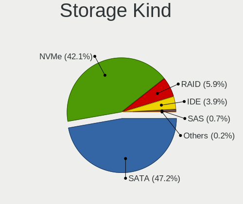

| Kind | Computers | Percent |
|------|-----------|---------|
| SATA | 1096      | 48.07%  |
| NVMe | 932       | 40.88%  |
| RAID | 137       | 6.01%   |
| IDE  | 94        | 4.12%   |
| SAS  | 16        | 0.7%    |
| SCSI | 5         | 0.22%   |

Processor
---------

CPU Vendor
----------

Processor vendors

| Vendor            | Computers | Percent |
|-------------------|-----------|---------|
| Intel             | 1164      | 68.07%  |
| AMD               | 421       | 24.62%  |
| ARM               | 37        | 2.16%   |
| Phytium           | 24        | 1.4%    |
| Unknown           | 19        | 1.11%   |
| CentaurHauls      | 15        | 0.88%   |
| sifive,u74-mc     | 5         | 0.29%   |
| Loongson          | 5         | 0.29%   |
| CHRP IBM,8233-E8B | 5         | 0.29%   |
| Qualcomm          | 4         | 0.23%   |
| sifive,bullet0    | 3         | 0.18%   |
| CHRP IBM,9131-52A | 2         | 0.12%   |
| thead,c906        | 1         | 0.06%   |
| PowerNV FP5466G2  | 1         | 0.06%   |
| PowerNV C829UAG3  | 1         | 0.06%   |
| HUAWEI            | 1         | 0.06%   |
| HISILICON         | 1         | 0.06%   |
| FSP-1             | 1         | 0.06%   |

CPU Model
---------

Processor models

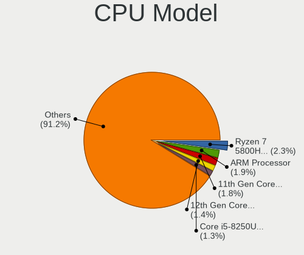

| Model                                          | Computers | Percent |
|------------------------------------------------|-----------|---------|
| AMD Ryzen 7 5800H with Radeon Graphics         | 45        | 2.62%   |
| Intel 11th Gen Core i5-1135G7 @ 2.40GHz        | 31        | 1.8%    |
| ARM Processor                                  | 27        | 1.57%   |
| Intel Core i7-9750H CPU @ 2.60GHz              | 23        | 1.34%   |
| Intel Core i5-8250U CPU @ 1.60GHz              | 23        | 1.34%   |
| Intel 11th Gen Core i7-1165G7 @ 2.80GHz        | 22        | 1.28%   |
| Intel 12th Gen Core i7-12700H                  | 21        | 1.22%   |
| AMD Ryzen 5 3500U with Radeon Vega Mobile Gfx  | 21        | 1.22%   |
| Intel Core i5-7200U CPU @ 2.50GHz              | 19        | 1.11%   |
|                                                | 19        | 1.11%   |
| Intel Core i7-8550U CPU @ 1.80GHz              | 17        | 0.99%   |
| Intel Core i5-10210U CPU @ 1.60GHz             | 16        | 0.93%   |
| Intel Core i5-6200U CPU @ 2.30GHz              | 15        | 0.87%   |
| AMD Ryzen 7 4800H with Radeon Graphics         | 15        | 0.87%   |
| Intel Core i7-10510U CPU @ 1.80GHz             | 14        | 0.81%   |
| Intel Core i5-8265U CPU @ 1.60GHz              | 14        | 0.81%   |
| AMD Ryzen 7 6800H with Radeon Graphics         | 14        | 0.81%   |
| Intel 11th Gen Core i7-11800H @ 2.30GHz        | 13        | 0.76%   |
| Intel Core i7-8750H CPU @ 2.20GHz              | 11        | 0.64%   |
| Intel Core i5-4590 CPU @ 3.30GHz               | 11        | 0.64%   |
| Intel Celeron CPU J1900 @ 1.99GHz              | 11        | 0.64%   |
| Intel 12th Gen Core i5-1240P                   | 11        | 0.64%   |
| AMD Custom APU 0405                            | 11        | 0.64%   |
| Intel Core i7-7700HQ CPU @ 2.80GHz             | 10        | 0.58%   |
| CentaurHauls ZHAOXIN KaiXian KX-6640MA@2.2+GHz | 10        | 0.58%   |
| Intel Core i7-8700 CPU @ 3.20GHz               | 9         | 0.52%   |
| Intel Core i7-8565U CPU @ 1.80GHz              | 9         | 0.52%   |
| Intel Core i7-7700 CPU @ 3.60GHz               | 9         | 0.52%   |
| Intel Core i7-10700 CPU @ 2.90GHz              | 9         | 0.52%   |
| Intel Core i5-8300H CPU @ 2.30GHz              | 9         | 0.52%   |
| Intel Core i5-6500 CPU @ 3.20GHz               | 9         | 0.52%   |
| Intel Core i5-5200U CPU @ 2.20GHz              | 9         | 0.52%   |
| Intel Celeron N5105 @ 2.00GHz                  | 9         | 0.52%   |
| Phytium D2000/8 E8C                            | 8         | 0.47%   |
| Intel Core i7-7800X CPU @ 3.50GHz              | 8         | 0.47%   |
| Intel Core i7-6700HQ CPU @ 2.60GHz             | 8         | 0.47%   |
| Intel Core i7-4790 CPU @ 3.60GHz               | 8         | 0.47%   |
| Intel Core i7-10750H CPU @ 2.60GHz             | 8         | 0.47%   |
| Intel Core i7-10710U CPU @ 1.10GHz             | 8         | 0.47%   |
| AMD Ryzen 5 3600 6-Core Processor              | 8         | 0.47%   |

CPU Model Family
----------------

Processor model prefix

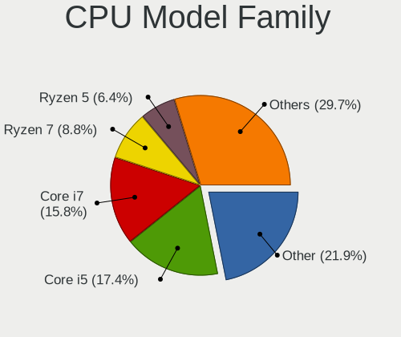

| Model                   | Computers | Percent |
|-------------------------|-----------|---------|
| Other                   | 331       | 19.33%  |
| Intel Core i5           | 313       | 18.28%  |
| Intel Core i7           | 289       | 16.88%  |
| AMD Ryzen 7             | 150       | 8.76%   |
| AMD Ryzen 5             | 113       | 6.6%    |
| Intel Xeon              | 76        | 4.44%   |
| Intel Core i3           | 76        | 4.44%   |
| Intel Celeron           | 64        | 3.74%   |
| AMD Ryzen 9             | 40        | 2.34%   |
| Intel Pentium           | 28        | 1.64%   |
| Intel Atom              | 26        | 1.52%   |
| Intel Core 2 Duo        | 24        | 1.4%    |
| AMD Ryzen 7 PRO         | 19        | 1.11%   |
| Intel Core i9           | 14        | 0.82%   |
| AMD A8                  | 9         | 0.53%   |
| AMD A6                  | 8         | 0.47%   |
| Intel Genuine           | 7         | 0.41%   |
| Intel Core m3           | 7         | 0.41%   |
| AMD Ryzen 5 PRO         | 7         | 0.41%   |
| AMD FX                  | 7         | 0.41%   |
| AMD Athlon II X2        | 7         | 0.41%   |
| Intel Xeon Silver       | 6         | 0.35%   |
| Intel Pentium Silver    | 6         | 0.35%   |
| AMD A10                 | 6         | 0.35%   |
| Intel Xeon Gold         | 5         | 0.29%   |
| AMD Athlon II X4        | 5         | 0.29%   |
| AMD Athlon              | 5         | 0.29%   |
| Intel Pentium Dual-Core | 4         | 0.23%   |
| Intel Pentium Dual      | 4         | 0.23%   |
| Intel Core 2            | 4         | 0.23%   |
| AMD Ryzen 3             | 4         | 0.23%   |
| AMD EPYC                | 4         | 0.23%   |
| AMD E2                  | 4         | 0.23%   |
| AMD Athlon X4           | 4         | 0.23%   |
| Intel Core              | 3         | 0.18%   |
| ARM BCM                 | 3         | 0.18%   |
| AMD E                   | 3         | 0.18%   |
| Intel Xeon Platinum     | 2         | 0.12%   |
| Intel Core M            | 2         | 0.12%   |
| Intel Core 2 Quad       | 2         | 0.12%   |

CPU Cores
---------

Number of processor cores

| Number  | Computers | Percent |
|---------|-----------|---------|
| 4       | 620       | 36.11%  |
| 2       | 386       | 22.48%  |
| 8       | 263       | 15.32%  |
| 6       | 207       | 12.06%  |
| 12      | 52        | 3.03%   |
| 16      | 37        | 2.15%   |
| 14      | 36        | 2.1%    |
| Unknown | 28        | 1.63%   |
| 10      | 25        | 1.46%   |
| 1       | 20        | 1.16%   |
| 24      | 15        | 0.87%   |
| 32      | 5         | 0.29%   |
| 20      | 5         | 0.29%   |
| 64      | 4         | 0.23%   |
| 96      | 2         | 0.12%   |
| 48      | 2         | 0.12%   |
| 40      | 2         | 0.12%   |
| 36      | 2         | 0.12%   |
| 28      | 2         | 0.12%   |
| 26      | 1         | 0.06%   |
| 22      | 1         | 0.06%   |
| 18      | 1         | 0.06%   |
| 3       | 1         | 0.06%   |

CPU Sockets
-----------

Number of sockets

| Number  | Computers | Percent |
|---------|-----------|---------|
| 1       | 1620      | 94.68%  |
| 2       | 55        | 3.21%   |
| Unknown | 27        | 1.58%   |
| 3       | 5         | 0.29%   |
| 4       | 2         | 0.12%   |
| 16      | 1         | 0.06%   |
| 6       | 1         | 0.06%   |

CPU Threads
-----------

Threads per core (Hyper-Threading)

| Number  | Computers | Percent |
|---------|-----------|---------|
| 2       | 1243      | 72.52%  |
| 1       | 436       | 25.44%  |
| Unknown | 28        | 1.63%   |
| 4       | 6         | 0.35%   |
| 8       | 1         | 0.06%   |

CPU Op-Modes
------------

CPU Operation Modes (32-bit, 64-bit)

| Op mode        | Computers | Percent |
|----------------|-----------|---------|
| 32-bit, 64-bit | 1642      | 95.91%  |
| Unknown        | 61        | 3.56%   |
| 32-bit         | 5         | 0.29%   |
| 64-bit         | 4         | 0.23%   |

CPU Microcode
-------------

Microcode number

| Number     | Computers | Percent |
|------------|-----------|---------|
| Unknown    | 606       | 34.47%  |
| 0x906ea    | 61        | 3.47%   |
| 0x306a9    | 55        | 3.13%   |
| 0x306c3    | 51        | 2.9%    |
| 0x0a50000c | 51        | 2.9%    |
| 0x806ec    | 39        | 2.22%   |
| 0x206a7    | 39        | 2.22%   |
| 0x806ea    | 38        | 2.16%   |
| 0x806c1    | 37        | 2.1%    |
| 0x906e9    | 35        | 1.99%   |
| 0x506e3    | 35        | 1.99%   |
| 0x806e9    | 34        | 1.93%   |
| 0x08600106 | 33        | 1.88%   |
| 0x40651    | 26        | 1.48%   |
| 0x906a3    | 24        | 1.37%   |
| 0x0a404102 | 23        | 1.31%   |
| 0x406e3    | 21        | 1.19%   |
| 0x306d4    | 21        | 1.19%   |
| 0x08108102 | 18        | 1.02%   |
| 0x30678    | 17        | 0.97%   |
| 0x08108109 | 17        | 0.97%   |
| 0x1067a    | 16        | 0.91%   |
| 0x50654    | 15        | 0.85%   |
| 0xa0655    | 14        | 0.8%    |
| 0xa0652    | 14        | 0.8%    |
| 0x08600104 | 13        | 0.74%   |
| 0x906c0    | 12        | 0.68%   |
| 0x806d1    | 12        | 0.68%   |
| 0x0a50000d | 12        | 0.68%   |
| 0x0a704103 | 11        | 0.63%   |
| 0x08701013 | 11        | 0.63%   |
| 0x50657    | 10        | 0.57%   |
| 0x306f2    | 10        | 0.57%   |
| 0x90672    | 9         | 0.51%   |
| 0x706a1    | 9         | 0.51%   |
| 0xa0660    | 8         | 0.46%   |
| 0x706e5    | 8         | 0.46%   |
| 0x0a601203 | 8         | 0.46%   |
| 0x08600103 | 8         | 0.46%   |
| 0x906ed    | 7         | 0.4%    |

CPU Microarch
-------------

Microarchitecture

| Name             | Computers | Percent |
|------------------|-----------|---------|
| KabyLake         | 309       | 18.01%  |
| Unknown          | 275       | 16.03%  |
| Haswell          | 136       | 7.93%   |
| Skylake          | 102       | 5.94%   |
| Zen 3            | 99        | 5.77%   |
| Zen 2            | 94        | 5.48%   |
| IvyBridge        | 90        | 5.24%   |
| TigerLake        | 67        | 3.9%    |
| CometLake        | 64        | 3.73%   |
| Alderlake Hybrid | 64        | 3.73%   |
| SandyBridge      | 57        | 3.32%   |
| Zen+             | 48        | 2.8%    |
| Silvermont       | 44        | 2.56%   |
| Broadwell        | 35        | 2.04%   |
| Icelake          | 34        | 1.98%   |
| Penryn           | 31        | 1.81%   |
| Zen              | 25        | 1.46%   |
| K10              | 15        | 0.87%   |
| Goldmont plus    | 15        | 0.87%   |
| Tremont          | 13        | 0.76%   |
| Piledriver       | 13        | 0.76%   |
| Westmere         | 11        | 0.64%   |
| Core             | 11        | 0.64%   |
| Steamroller      | 10        | 0.58%   |
| Goldmont         | 7         | 0.41%   |
| Bonnell          | 7         | 0.41%   |
| Gracemont        | 6         | 0.35%   |
| Puma             | 5         | 0.29%   |
| Excavator        | 5         | 0.29%   |
| P6               | 4         | 0.23%   |
| Nehalem          | 4         | 0.23%   |
| Jaguar           | 4         | 0.23%   |
| Bobcat           | 4         | 0.23%   |
| Sapphire Rapids  | 2         | 0.12%   |
| K10 Llano        | 2         | 0.12%   |
| Bulldozer        | 2         | 0.12%   |
| NetBurst         | 1         | 0.06%   |
| K8 Hammer        | 1         | 0.06%   |

Graphics
--------

GPU Vendor
----------

Vendors of graphics cards

| Vendor                           | Computers | Percent |
|----------------------------------|-----------|---------|
| Intel                            | 919       | 43.8%   |
| Nvidia                           | 576       | 27.45%  |
| AMD                              | 523       | 24.93%  |
| ASPEED Technology                | 24        | 1.14%   |
| Matrox Electronics Systems       | 22        | 1.05%   |
| Zhaoxin                          | 15        | 0.71%   |
| Loongson Technology              | 6         | 0.29%   |
| Phytium Technology               | 3         | 0.14%   |
| Silicon Integrated Systems [SiS] | 2         | 0.1%    |
| Jingjia Microelectronics         | 2         | 0.1%    |
| Silicon Motion                   | 1         | 0.05%   |
| Nanjing Ruixinview Technology    | 1         | 0.05%   |
| Moore Threads Technology         | 1         | 0.05%   |
| Huawei Technologies              | 1         | 0.05%   |
| Cirrus Logic                     | 1         | 0.05%   |
| 3DLabs                           | 1         | 0.05%   |

GPU Model
---------

Graphics card models

| Model                                                                                    | Computers | Percent |
|------------------------------------------------------------------------------------------|-----------|---------|
| Intel TigerLake-LP GT2 [Iris Xe Graphics]                                                | 66        | 3.08%   |
| AMD Cezanne [Radeon Vega Series / Radeon Vega Mobile Series]                             | 66        | 3.08%   |
| AMD Renoir [Radeon RX Vega 6 (Ryzen 4000/5000 Mobile Series)]                            | 59        | 2.75%   |
| Intel UHD Graphics 620                                                                   | 51        | 2.38%   |
| Intel 3rd Gen Core processor Graphics Controller                                         | 51        | 2.38%   |
| Intel 2nd Generation Core Processor Family Integrated Graphics Controller                | 45        | 2.1%    |
| Intel Alder Lake-P GT2 [Iris Xe Graphics]                                                | 41        | 1.91%   |
| AMD Picasso/Raven 2 [Radeon Vega Series / Radeon Vega Mobile Series]                     | 41        | 1.91%   |
| Intel CoffeeLake-H GT2 [UHD Graphics 630]                                                | 40        | 1.86%   |
| AMD Rembrandt [Radeon 680M]                                                              | 38        | 1.77%   |
| Nvidia GA106M [GeForce RTX 3060 Mobile / Max-Q]                                          | 36        | 1.68%   |
| Intel Haswell-ULT Integrated Graphics Controller                                         | 36        | 1.68%   |
| Intel HD Graphics 530                                                                    | 32        | 1.49%   |
| Intel CometLake-U GT2 [UHD Graphics]                                                     | 32        | 1.49%   |
| Intel HD Graphics 630                                                                    | 31        | 1.44%   |
| Intel HD Graphics 620                                                                    | 30        | 1.4%    |
| Intel Atom Processor Z36xxx/Z37xxx Series Graphics & Display                             | 30        | 1.4%    |
| Intel Xeon E3-1200 v3/4th Gen Core Processor Integrated Graphics Controller              | 29        | 1.35%   |
| Intel WhiskeyLake-U GT2 [UHD Graphics 620]                                               | 26        | 1.21%   |
| Nvidia TU117M [GeForce GTX 1650 Mobile / Max-Q]                                          | 25        | 1.16%   |
| ASPEED Technology ASPEED Graphics Family                                                 | 24        | 1.12%   |
| Intel Skylake GT2 [HD Graphics 520]                                                      | 22        | 1.03%   |
| Intel CoffeeLake-S GT2 [UHD Graphics 630]                                                | 22        | 1.03%   |
| Nvidia GP108M [GeForce MX250]                                                            | 21        | 0.98%   |
| Intel 4th Gen Core Processor Integrated Graphics Controller                              | 21        | 0.98%   |
| AMD Raven Ridge [Radeon Vega Series / Radeon Vega Mobile Series]                         | 19        | 0.89%   |
| Nvidia GP108M [GeForce MX150]                                                            | 18        | 0.84%   |
| Intel CometLake-S GT2 [UHD Graphics 630]                                                 | 18        | 0.84%   |
| Intel HD Graphics 5500                                                                   | 17        | 0.79%   |
| AMD Oland [Radeon HD 8570 / R5 430 OEM / R7 240/340 / Radeon 520 OEM]                    | 17        | 0.79%   |
| Intel JasperLake [UHD Graphics]                                                          | 16        | 0.75%   |
| Nvidia TU117M [GeForce MX450]                                                            | 15        | 0.7%    |
| Intel TigerLake-H GT1 [UHD Graphics]                                                     | 15        | 0.7%    |
| AMD Phoenix1                                                                             | 15        | 0.7%    |
| AMD Lexa PRO [Radeon 540/540X/550/550X / RX 540X/550/550X]                               | 15        | 0.7%    |
| Zhaoxin KX-6000 C-960 GPU                                                                | 14        | 0.65%   |
| Nvidia GF117M [GeForce 610M/710M/810M/820M / GT 620M/625M/630M/720M]                     | 14        | 0.65%   |
| Intel CometLake-H GT2 [UHD Graphics]                                                     | 14        | 0.65%   |
| Intel Atom/Celeron/Pentium Processor x5-E8000/J3xxx/N3xxx Integrated Graphics Controller | 14        | 0.65%   |
| Nvidia TU106M [GeForce RTX 2060 Mobile]                                                  | 13        | 0.61%   |

GPU Combo
---------

Combinations of graphics cards

| Name                              | Computers | Percent |
|-----------------------------------|-----------|---------|
| 1 x Intel                         | 551       | 31.94%  |
| 1 x AMD                           | 371       | 21.51%  |
| Intel + Nvidia                    | 288       | 16.7%   |
| 1 x Nvidia                        | 217       | 12.58%  |
| Other                             | 60        | 3.48%   |
| AMD + Nvidia                      | 60        | 3.48%   |
| Intel + AMD                       | 57        | 3.3%    |
| 2 x AMD                           | 22        | 1.28%   |
| 1 x Matrox                        | 19        | 1.1%    |
| 1 x Zhaoxin                       | 15        | 0.87%   |
| 1 x ASPEED                        | 14        | 0.81%   |
| 2 x Nvidia                        | 7         | 0.41%   |
| 2 x Intel                         | 7         | 0.41%   |
| Nvidia + ASPEED                   | 6         | 0.35%   |
| 1 x Loongson Technology           | 4         | 0.23%   |
| AMD + Matrox                      | 4         | 0.23%   |
| AMD + ASPEED                      | 4         | 0.23%   |
| 1 x Phytium Technology            | 3         | 0.17%   |
| 1 x SiS                           | 2         | 0.12%   |
| 1 x Jingjia Microelectronics      | 2         | 0.12%   |
| AMD + Loongson Technology         | 2         | 0.12%   |
| 1 x Silicon Motion                | 1         | 0.06%   |
| Nvidia + Matrox                   | 1         | 0.06%   |
| Nvidia + Huawei Technologies      | 1         | 0.06%   |
| 1 x Nanjing Ruixinview Technology | 1         | 0.06%   |
| 1 x Moore Threads Technology      | 1         | 0.06%   |
| 1 x Intel + 3 x Nvidia            | 1         | 0.06%   |
| Intel + 2 x Nvidia                | 1         | 0.06%   |
| Intel + Matrox                    | 1         | 0.06%   |
| 1 x Cirrus Logic                  | 1         | 0.06%   |
| AMD + 3DLabs                      | 1         | 0.06%   |

GPU Driver
----------

Free vs proprietary

| Driver      | Computers | Percent |
|-------------|-----------|---------|
| Free        | 1223      | 70.49%  |
| Proprietary | 306       | 17.64%  |
| Unknown     | 206       | 11.87%  |

GPU Memory
----------

Total video memory

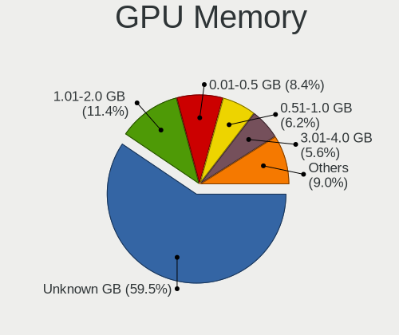

| Size in GB | Computers | Percent |
|------------|-----------|---------|
| Unknown    | 1015      | 57.9%   |
| 1.01-2.0   | 211       | 12.04%  |
| 0.01-0.5   | 154       | 8.78%   |
| 0.51-1.0   | 118       | 6.73%   |
| 3.01-4.0   | 104       | 5.93%   |
| 5.01-6.0   | 54        | 3.08%   |
| 7.01-8.0   | 53        | 3.02%   |
| 8.01-16.0  | 18        | 1.03%   |
| 2.01-3.0   | 9         | 0.51%   |
| 16.01-24.0 | 9         | 0.51%   |
| 4.01-5.0   | 6         | 0.34%   |
| 24.01-32.0 | 2         | 0.11%   |

Monitor
-------

Monitor Vendor
--------------

Monitor vendors

| Vendor                  | Computers | Percent |
|-------------------------|-----------|---------|
| BOE                     | 202       | 12.29%  |
| AU Optronics            | 167       | 10.16%  |
| Dell                    | 138       | 8.4%    |
| Chimei Innolux          | 133       | 8.09%   |
| LG Display              | 128       | 7.79%   |
| AOC                     | 89        | 5.42%   |
| Samsung Electronics     | 82        | 4.99%   |
| Lenovo                  | 80        | 4.87%   |
| CSO                     | 55        | 3.35%   |
| Philips                 | 53        | 3.23%   |
| Sharp                   | 47        | 2.86%   |
| Hewlett-Packard         | 31        | 1.89%   |
| Goldstar                | 30        | 1.83%   |
| ViewSonic               | 24        | 1.46%   |
| PANDA                   | 21        | 1.28%   |
| TMX                     | 20        | 1.22%   |
| Apple                   | 18        | 1.1%    |
| BenQ                    | 17        | 1.03%   |
| Acer                    | 17        | 1.03%   |
| RTK                     | 15        | 0.91%   |
| InfoVision              | 14        | 0.85%   |
| HKC                     | 13        | 0.79%   |
| Xiaomi                  | 12        | 0.73%   |
| Mi                      | 12        | 0.73%   |
| Valve                   | 10        | 0.61%   |
| SGT                     | 8         | 0.49%   |
| IPS                     | 7         | 0.43%   |
| Chi Mei Optoelectronics | 7         | 0.43%   |
| Unknown                 | 7         | 0.43%   |
| Sony                    | 6         | 0.37%   |
| Unknown                 | 5         | 0.3%    |
| Panasonic               | 5         | 0.3%    |
| SKY                     | 4         | 0.24%   |
| Lenovo Group Limited    | 4         | 0.24%   |
| JDI                     | 4         | 0.24%   |
| HUAWEI                  | 4         | 0.24%   |
| CHD                     | 4         | 0.24%   |
| ASUSTek Computer        | 4         | 0.24%   |
| Ancor Communications    | 4         | 0.24%   |
| TMA                     | 3         | 0.18%   |

Monitor Model
-------------

Monitor models

| Model                                                            | Computers | Percent |
|------------------------------------------------------------------|-----------|---------|
| Chimei Innolux LCD Monitor CMN14D4 1920x1080 309x173mm 13.9-inch | 18        | 1.07%   |
| Dell P2422H DELA1C5 1920x1080 527x296mm 23.8-inch                | 10        | 0.59%   |
| Xiaomi Mi TV XMD004A 1440x900 708x398mm 32.0-inch                | 9         | 0.53%   |
| Valve ANX7530 U VLV3001 800x1280 100x150mm 7.1-inch              | 9         | 0.53%   |
| TMX TL156VDXP01 TMX1560 1920x1080 344x194mm 15.5-inch            | 9         | 0.53%   |
| BOE LCD Monitor BOE0877 1920x1080 309x173mm 13.9-inch            | 9         | 0.53%   |
| Chimei Innolux LCD Monitor CMN14A7 1920x1080 308x173mm 13.9-inch | 8         | 0.47%   |
| CSO LCD Monitor CSO1402 2880x1800 302x188mm 14.0-inch            | 7         | 0.41%   |
| BOE LCD Monitor BOE0893 2160x1440 296x197mm 14.0-inch            | 7         | 0.41%   |
| BOE LCD Monitor BOE07DB 1920x1080 309x174mm 14.0-inch            | 7         | 0.41%   |
| AU Optronics LCD Monitor AUO683D 1920x1080 309x174mm 14.0-inch   | 7         | 0.41%   |
| AU Optronics LCD Monitor AUO403D 1920x1080 309x174mm 14.0-inch   | 7         | 0.41%   |
| AU Optronics LCD Monitor AUO2E3C 1366x768 309x173mm 13.9-inch    | 7         | 0.41%   |
| AOC 2790WG5 AOC2790 1920x1080 598x336mm 27.0-inch                | 7         | 0.41%   |
| AOC 24B1W1G5 AOC2401 1920x1080 527x296mm 23.8-inch               | 7         | 0.41%   |
| Unknown                                                          | 7         | 0.41%   |
| Sharp LCD Monitor SHP1447 1920x1080 294x165mm 13.3-inch          | 6         | 0.36%   |
| PANDA LCD Monitor NCP004D 1920x1080 344x194mm 15.5-inch          | 6         | 0.36%   |
| Chimei Innolux LCD Monitor CMN1604 1920x1080 355x199mm 16.0-inch | 6         | 0.36%   |
| Chimei Innolux LCD Monitor CMN15E8 1920x1080 344x193mm 15.5-inch | 6         | 0.36%   |
| Chimei Innolux LCD Monitor CMN14D5 1920x1080 309x173mm 13.9-inch | 6         | 0.36%   |
| BOE LCD Monitor BOE0747 1920x1080 344x194mm 15.5-inch            | 6         | 0.36%   |
| AOC 24B2W1 AOC2402 1920x1080 527x296mm 23.8-inch                 | 6         | 0.36%   |
| Panasonic VVX13F009G00 MEI96A2 1920x1080 344x193mm 15.5-inch     | 5         | 0.3%    |
| LG Display LCD Monitor LGD40BA 1920x1080 344x194mm 15.5-inch     | 5         | 0.3%    |
| LG Display LCD Monitor LGD0521 1920x1080 309x174mm 14.0-inch     | 5         | 0.3%    |
| LG Display LCD Monitor LGD02D8 1366x768 277x156mm 12.5-inch      | 5         | 0.3%    |
| Lenovo L197 Wide LEN1152 1440x900 410x257mm 19.1-inch            | 5         | 0.3%    |
| Goldstar HDR 4K GSM7706 3840x2160 600x340mm 27.2-inch            | 5         | 0.3%    |
| Dell P2422H DELA1C3 1920x1080 527x296mm 23.8-inch                | 5         | 0.3%    |
| CSO LCD Monitor CSO076D 2560x1600 286x179mm 13.3-inch            | 5         | 0.3%    |
| Chimei Innolux LCD Monitor CMN1602 1920x1080 355x199mm 16.0-inch | 5         | 0.3%    |
| BOE LCD Monitor BOE098E 1920x1080 344x194mm 15.5-inch            | 5         | 0.3%    |
| BOE LCD Monitor BOE0900 1920x1080 344x194mm 15.5-inch            | 5         | 0.3%    |
| AU Optronics LCD Monitor AUO106C 1366x768 277x156mm 12.5-inch    | 5         | 0.3%    |
| AOC Q27P1B AOC2701 2560x1440 597x336mm 27.0-inch                 | 5         | 0.3%    |
| Sharp LCD Monitor SHP149A 1920x1080 344x194mm 15.5-inch          | 4         | 0.24%   |
| Sharp LCD Monitor SHP1453 1920x1080 346x194mm 15.6-inch          | 4         | 0.24%   |
| Philips PHL 243V7 PHLC155 1920x1080 527x296mm 23.8-inch          | 4         | 0.24%   |
| Mi Redmi Monitor XMI23C3 1920x1080 527x293mm 23.7-inch           | 4         | 0.24%   |

Monitor Resolution
------------------

Monitor screen resolution

| Resolution         | Computers | Percent |
|--------------------|-----------|---------|
| 1920x1080 (FHD)    | 759       | 47.83%  |
| 1366x768 (WXGA)    | 157       | 9.89%   |
| 3840x2160 (4K)     | 139       | 8.76%   |
| 2560x1440 (QHD)    | 122       | 7.69%   |
| 2560x1600          | 75        | 4.73%   |
| 1920x1200 (WUXGA)  | 36        | 2.27%   |
| 1440x900 (WXGA+)   | 36        | 2.27%   |
| 2880x1800          | 26        | 1.64%   |
| 1600x900 (HD+)     | 23        | 1.45%   |
| 2160x1440          | 20        | 1.26%   |
| 1280x1024 (SXGA)   | 20        | 1.26%   |
| 1680x1050 (WSXGA+) | 18        | 1.13%   |
| 1280x800 (WXGA)    | 15        | 0.95%   |
| 800x1280           | 13        | 0.82%   |
| 3200x2000          | 13        | 0.82%   |
| Unknown            | 13        | 0.82%   |
| 3440x1440          | 12        | 0.76%   |
| 2560x1080          | 7         | 0.44%   |
| 2240x1400          | 7         | 0.44%   |
| 3840x2400          | 6         | 0.38%   |
| 3072x1920          | 6         | 0.38%   |
| 2520x1680          | 5         | 0.32%   |
| 3000x2000          | 4         | 0.25%   |
| 2288x1287          | 4         | 0.25%   |
| 2736x1824          | 3         | 0.19%   |
| 2256x1504          | 3         | 0.19%   |
| 2160x1350          | 3         | 0.19%   |
| 1920x540           | 3         | 0.19%   |
| 1920x1280          | 3         | 0.19%   |
| 1800x1200          | 3         | 0.19%   |
| 1400x1050          | 3         | 0.19%   |
| 3360x1080          | 2         | 0.13%   |
| 3286x1080          | 2         | 0.13%   |
| 2880x1920          | 2         | 0.13%   |
| 2200x1650          | 2         | 0.13%   |
| 1024x768 (XGA)     | 2         | 0.13%   |
| 1024x600           | 2         | 0.13%   |
| 6400x2160          | 1         | 0.06%   |
| 5206x1080          | 1         | 0.06%   |
| 4480x1440          | 1         | 0.06%   |

Monitor Diagonal
----------------

Diagonal size in inches

| Inches  | Computers | Percent |
|---------|-----------|---------|
| 15      | 284       | 17.31%  |
| 13      | 222       | 13.53%  |
| 14      | 220       | 13.41%  |
| 24      | 134       | 8.17%   |
| 23      | 133       | 8.1%    |
| 27      | 122       | 7.43%   |
| 16      | 81        | 4.94%   |
| 21      | 73        | 4.45%   |
| Unknown | 56        | 3.41%   |
| 17      | 47        | 2.86%   |
| 12      | 43        | 2.62%   |
| 19      | 31        | 1.89%   |
| 31      | 19        | 1.16%   |
| 22      | 18        | 1.1%    |
| 18      | 18        | 1.1%    |
| 34      | 12        | 0.73%   |
| 7       | 12        | 0.73%   |
| 65      | 11        | 0.67%   |
| 40      | 11        | 0.67%   |
| 20      | 11        | 0.67%   |
| 11      | 11        | 0.67%   |
| 25      | 10        | 0.61%   |
| 32      | 7         | 0.43%   |
| 10      | 7         | 0.43%   |
| 26      | 6         | 0.37%   |
| 63      | 4         | 0.24%   |
| 142     | 3         | 0.18%   |
| 57      | 3         | 0.18%   |
| 54      | 3         | 0.18%   |
| 52      | 3         | 0.18%   |
| 43      | 3         | 0.18%   |
| 36      | 3         | 0.18%   |
| 28      | 3         | 0.18%   |
| 84      | 2         | 0.12%   |
| 72      | 2         | 0.12%   |
| 3       | 2         | 0.12%   |
| 80      | 1         | 0.06%   |
| 67      | 1         | 0.06%   |
| 55      | 1         | 0.06%   |
| 49      | 1         | 0.06%   |

Monitor Width
-------------

Physical width

| Width in mm    | Computers | Percent |
|----------------|-----------|---------|
| 301-350        | 659       | 40.6%   |
| 501-600        | 378       | 23.29%  |
| 201-300        | 191       | 11.77%  |
| 401-500        | 140       | 8.63%   |
| 351-400        | 71        | 4.37%   |
| Unknown        | 56        | 3.45%   |
| 601-700        | 37        | 2.28%   |
| 701-800        | 25        | 1.54%   |
| 1001-1500      | 24        | 1.48%   |
| 801-900        | 14        | 0.86%   |
| 1-100          | 12        | 0.74%   |
| 1501-2000      | 5         | 0.31%   |
| 101-200        | 4         | 0.25%   |
| 901-1000       | 4         | 0.25%   |
| More than 2000 | 3         | 0.18%   |

Aspect Ratio
------------

Proportional relationship between the width and the height

| Ratio   | Computers | Percent |
|---------|-----------|---------|
| 16/9    | 1081      | 72.31%  |
| 16/10   | 247       | 16.52%  |
| Unknown | 51        | 3.41%   |
| 3/2     | 46        | 3.08%   |
| 5/4     | 21        | 1.4%    |
| 21/9    | 14        | 0.94%   |
| 4/3     | 11        | 0.74%   |
| 0.67    | 9         | 0.6%    |
| 1.00    | 4         | 0.27%   |
| 0.56    | 4         | 0.27%   |
| 6/5     | 2         | 0.13%   |
| 0.62    | 2         | 0.13%   |
| 32/9    | 1         | 0.07%   |
| 2.00    | 1         | 0.07%   |
| 0.45    | 1         | 0.07%   |

Monitor Area
------------

Area in inch

| Area in inch | Computers | Percent |
|----------------|-----------|---------|
| 81-90          | 341       | 20.87%  |
| 101-110        | 292       | 17.87%  |
| 201-250        | 278       | 17.01%  |
| 301-350        | 129       | 7.89%   |
| 71-80          | 102       | 6.24%   |
| 151-200        | 97        | 5.94%   |
| 111-120        | 68        | 4.16%   |
| Unknown        | 56        | 3.43%   |
| 251-300        | 44        | 2.69%   |
| 351-500        | 40        | 2.45%   |
| 61-70          | 35        | 2.14%   |
| More than 1000 | 34        | 2.08%   |
| 121-130        | 34        | 2.08%   |
| 501-1000       | 21        | 1.29%   |
| 141-150        | 19        | 1.16%   |
| 1-40           | 16        | 0.98%   |
| 91-100         | 11        | 0.67%   |
| 51-60          | 10        | 0.61%   |
| 41-50          | 6         | 0.37%   |
| 131-140        | 1         | 0.06%   |

Pixel Density
-------------

Pixels per inch

| Density       | Computers | Percent |
|---------------|-----------|---------|
| 121-160       | 472       | 29.28%  |
| 51-100        | 434       | 26.92%  |
| 101-120       | 273       | 16.94%  |
| 161-240       | 270       | 16.75%  |
| More than 240 | 82        | 5.09%   |
| Unknown       | 56        | 3.47%   |
| 1-50          | 25        | 1.55%   |

Multiple Monitors
-----------------

Total monitors connected

| Total | Computers | Percent |
|-------|-----------|---------|
| 1     | 1282      | 73.47%  |
| 0     | 234       | 13.41%  |
| 2     | 217       | 12.44%  |
| 3     | 12        | 0.69%   |

Network
-------

Net Controller Vendor
---------------------

Controller vendors

| Vendor                           | Computers | Percent |
|----------------------------------|-----------|---------|
| Realtek Semiconductor            | 934       | 37.54%  |
| Intel                            | 932       | 37.46%  |
| Qualcomm Atheros                 | 177       | 7.11%   |
| MediaTek                         | 77        | 3.09%   |
| Broadcom                         | 71        | 2.85%   |
| ASIX Electronics                 | 41        | 1.65%   |
| Broadcom Limited                 | 29        | 1.17%   |
| Ralink Technology                | 28        | 1.13%   |
| Huawei Technologies              | 25        | 1%      |
| Xiaomi                           | 16        | 0.64%   |
| Qualcomm                         | 16        | 0.64%   |
| Microsoft                        | 11        | 0.44%   |
| Marvell Technology Group         | 10        | 0.4%    |
| Ralink                           | 7         | 0.28%   |
| TP-Link                          | 6         | 0.24%   |
| Quectel Wireless Solutions       | 6         | 0.24%   |
| OPPO Electronics                 | 6         | 0.24%   |
| IBM                              | 6         | 0.24%   |
| Qualcomm Atheros Communications  | 5         | 0.2%    |
| NetGear                          | 5         | 0.2%    |
| Loongson Technology              | 5         | 0.2%    |
| Dell                             | 5         | 0.2%    |
| ZTE WCDMA Technologies MSM       | 4         | 0.16%   |
| Tenda                            | 4         | 0.16%   |
| Samsung Electronics              | 4         | 0.16%   |
| Mellanox Technologies            | 4         | 0.16%   |
| DisplayLink                      | 4         | 0.16%   |
| Aquantia                         | 4         | 0.16%   |
| Mercucys                         | 3         | 0.12%   |
| ICS Advent                       | 3         | 0.12%   |
| D-Link                           | 3         | 0.12%   |
| Wilocity                         | 2         | 0.08%   |
| vivo                             | 2         | 0.08%   |
| Silicon Integrated Systems [SiS] | 2         | 0.08%   |
| Sierra Wireless                  | 2         | 0.08%   |
| OnePlus Technology (Shenzhen)    | 2         | 0.08%   |
| Oculus VR                        | 2         | 0.08%   |
| Nvidia                           | 2         | 0.08%   |
| Microchip Technology             | 2         | 0.08%   |
| Unknown                          | 2         | 0.08%   |

Net Controller Model
--------------------

Controller models

| Model                                                                  | Computers | Percent |
|------------------------------------------------------------------------|-----------|---------|
| Realtek RTL8111/8168/8211/8411 PCI Express Gigabit Ethernet Controller | 582       | 20.13%  |
| Intel Wi-Fi 6 AX200                                                    | 114       | 3.94%   |
| Realtek RTL8822CE 802.11ac PCIe Wireless Network Adapter               | 68        | 2.35%   |
| Realtek RTL8125 2.5GbE Controller                                      | 68        | 2.35%   |
| Realtek RTL810xE PCI Express Fast Ethernet controller                  | 62        | 2.14%   |
| Realtek RTL8153 Gigabit Ethernet Adapter                               | 56        | 1.94%   |
| Intel Wireless 8265 / 8275                                             | 55        | 1.9%    |
| Intel Wi-Fi 6E(802.11ax) AX210/AX1675* 2x2 [Typhoon Peak]              | 49        | 1.69%   |
| Intel Wi-Fi 6 AX201                                                    | 49        | 1.69%   |
| Intel Alder Lake-P PCH CNVi WiFi                                       | 48        | 1.66%   |
| Intel Wireless 7265                                                    | 38        | 1.31%   |
| Qualcomm Atheros QCA6174 802.11ac Wireless Network Adapter             | 37        | 1.28%   |
| Intel Comet Lake PCH-LP CNVi WiFi                                      | 37        | 1.28%   |
| Intel 82579LM Gigabit Network Connection (Lewisville)                  | 34        | 1.18%   |
| Qualcomm Atheros QCA9377 802.11ac Wireless Network Adapter             | 32        | 1.11%   |
| Intel I211 Gigabit Network Connection                                  | 32        | 1.11%   |
| ASIX AX88179 Gigabit Ethernet                                          | 31        | 1.07%   |
| Intel Wireless 7260                                                    | 30        | 1.04%   |
| Intel Ethernet Controller I225-V                                       | 30        | 1.04%   |
| Intel Cannon Lake PCH CNVi WiFi                                        | 29        | 1%      |
| MediaTek MT7921 802.11ax PCI Express Wireless Network Adapter          | 28        | 0.97%   |
| Intel Ethernet Connection (2) I219-V                                   | 28        | 0.97%   |
| Realtek RTL8821CE 802.11ac PCIe Wireless Network Adapter               | 27        | 0.93%   |
| Intel Wireless 8260                                                    | 23        | 0.8%    |
| Intel Wireless 3165                                                    | 23        | 0.8%    |
| Realtek 802.11ac NIC                                                   | 22        | 0.76%   |
| Intel Comet Lake PCH CNVi WiFi                                         | 22        | 0.76%   |
| Intel Cannon Point-LP CNVi [Wireless-AC]                               | 22        | 0.76%   |
| Realtek RTL8188EUS 802.11n Wireless Network Adapter                    | 21        | 0.73%   |
| Intel Ethernet Connection (2) I219-LM                                  | 21        | 0.73%   |
| Realtek RTL8852AE 802.11ax PCIe Wireless Network Adapter               | 20        | 0.69%   |
| Intel I210 Gigabit Network Connection                                  | 20        | 0.69%   |
| Ralink MT7601U Wireless Adapter                                        | 19        | 0.66%   |
| MediaTek MT7922 802.11ax PCI Express Wireless Network Adapter          | 19        | 0.66%   |
| Realtek RTL8852BE PCIe 802.11ax Wireless Network Controller            | 18        | 0.62%   |
| Qualcomm Atheros AR9485 Wireless Network Adapter                       | 18        | 0.62%   |
| Intel I350 Gigabit Network Connection                                  | 18        | 0.62%   |
| Intel Ethernet Connection I217-LM                                      | 18        | 0.62%   |
| Intel Wi-Fi 5(802.11ac) Wireless-AC 9x6x [Thunder Peak]                | 17        | 0.59%   |
| Intel Tiger Lake PCH CNVi WiFi                                         | 17        | 0.59%   |

Wireless Vendor
---------------

Wireless vendors

| Vendor                          | Computers | Percent |
|---------------------------------|-----------|---------|
| Intel                           | 715       | 52.11%  |
| Realtek Semiconductor           | 268       | 19.53%  |
| Qualcomm Atheros                | 139       | 10.13%  |
| MediaTek                        | 77        | 5.61%   |
| Broadcom                        | 44        | 3.21%   |
| Ralink Technology               | 28        | 2.04%   |
| Broadcom Limited                | 22        | 1.6%    |
| Qualcomm                        | 12        | 0.87%   |
| Ralink                          | 7         | 0.51%   |
| TP-Link                         | 6         | 0.44%   |
| Quectel Wireless Solutions      | 6         | 0.44%   |
| Microsoft                       | 6         | 0.44%   |
| Qualcomm Atheros Communications | 5         | 0.36%   |
| NetGear                         | 5         | 0.36%   |
| Xiaomi                          | 4         | 0.29%   |
| Tenda                           | 4         | 0.29%   |
| Marvell Technology Group        | 4         | 0.29%   |
| Mercucys                        | 3         | 0.22%   |
| D-Link                          | 3         | 0.22%   |
| Wilocity                        | 2         | 0.15%   |
| Sierra Wireless                 | 2         | 0.15%   |
| Dell                            | 2         | 0.15%   |
| Unknown                         | 2         | 0.15%   |
| Sagem                           | 1         | 0.07%   |
| Qualcomm Technologies           | 1         | 0.07%   |
| IMC Networks                    | 1         | 0.07%   |
| Hewlett-Packard                 | 1         | 0.07%   |
| FIBOCOM                         | 1         | 0.07%   |
| D-Link System                   | 1         | 0.07%   |

Wireless Model
--------------

Wireless models

| Model                                                                | Computers | Percent |
|----------------------------------------------------------------------|-----------|---------|
| Intel Wi-Fi 6 AX200                                                  | 114       | 8.24%   |
| Realtek RTL8822CE 802.11ac PCIe Wireless Network Adapter             | 68        | 4.92%   |
| Intel Wireless 8265 / 8275                                           | 55        | 3.98%   |
| Intel Wi-Fi 6E(802.11ax) AX210/AX1675* 2x2 [Typhoon Peak]            | 49        | 3.54%   |
| Intel Wi-Fi 6 AX201                                                  | 49        | 3.54%   |
| Intel Alder Lake-P PCH CNVi WiFi                                     | 48        | 3.47%   |
| Intel Wireless 7265                                                  | 38        | 2.75%   |
| Qualcomm Atheros QCA6174 802.11ac Wireless Network Adapter           | 37        | 2.68%   |
| Intel Comet Lake PCH-LP CNVi WiFi                                    | 37        | 2.68%   |
| Qualcomm Atheros QCA9377 802.11ac Wireless Network Adapter           | 32        | 2.31%   |
| Intel Wireless 7260                                                  | 30        | 2.17%   |
| Intel Cannon Lake PCH CNVi WiFi                                      | 29        | 2.1%    |
| MediaTek MT7921 802.11ax PCI Express Wireless Network Adapter        | 28        | 2.02%   |
| Realtek RTL8821CE 802.11ac PCIe Wireless Network Adapter             | 27        | 1.95%   |
| Intel Wireless 8260                                                  | 23        | 1.66%   |
| Intel Wireless 3165                                                  | 23        | 1.66%   |
| Realtek 802.11ac NIC                                                 | 22        | 1.59%   |
| Intel Comet Lake PCH CNVi WiFi                                       | 22        | 1.59%   |
| Intel Cannon Point-LP CNVi [Wireless-AC]                             | 22        | 1.59%   |
| Realtek RTL8188EUS 802.11n Wireless Network Adapter                  | 21        | 1.52%   |
| Realtek RTL8852AE 802.11ax PCIe Wireless Network Adapter             | 20        | 1.45%   |
| Ralink MT7601U Wireless Adapter                                      | 19        | 1.37%   |
| MediaTek MT7922 802.11ax PCI Express Wireless Network Adapter        | 19        | 1.37%   |
| Realtek RTL8852BE PCIe 802.11ax Wireless Network Controller          | 18        | 1.3%    |
| Qualcomm Atheros AR9485 Wireless Network Adapter                     | 18        | 1.3%    |
| Intel Wi-Fi 5(802.11ac) Wireless-AC 9x6x [Thunder Peak]              | 17        | 1.23%   |
| Intel Tiger Lake PCH CNVi WiFi                                       | 17        | 1.23%   |
| Realtek RTL8822BE 802.11a/b/g/n/ac WiFi adapter                      | 15        | 1.08%   |
| MediaTek MT7921K (RZ608) Wi-Fi 6E 80MHz                              | 15        | 1.08%   |
| Intel Dual Band Wireless-AC 3165 Plus Bluetooth                      | 15        | 1.08%   |
| Realtek RTL8723BE PCIe Wireless Network Adapter                      | 13        | 0.94%   |
| Qualcomm Atheros QCA9565 / AR9565 Wireless Network Adapter           | 13        | 0.94%   |
| Qualcomm QCNFA765 Wireless Network Adapter                           | 12        | 0.87%   |
| Intel Raptor Lake PCH CNVi WiFi                                      | 12        | 0.87%   |
| Intel Centrino Advanced-N 6205 [Taylor Peak]                         | 12        | 0.87%   |
| Intel Alder Lake-S PCH CNVi WiFi                                     | 11        | 0.8%    |
| Realtek RTL8188CE 802.11b/g/n WiFi Adapter                           | 10        | 0.72%   |
| Qualcomm Atheros AR9285 Wireless Network Adapter (PCI-Express)       | 10        | 0.72%   |
| Intel Wireless 3160                                                  | 10        | 0.72%   |
| Broadcom Limited BCM4360 802.11ac Dual Band Wireless Network Adapter | 10        | 0.72%   |

Ethernet Vendor
---------------

Ethernet vendors

| Vendor                                 | Computers | Percent |
|----------------------------------------|-----------|---------|
| Realtek Semiconductor                  | 782       | 54.65%  |
| Intel                                  | 414       | 28.93%  |
| Qualcomm Atheros                       | 53        | 3.7%    |
| ASIX Electronics                       | 41        | 2.87%   |
| Broadcom                               | 31        | 2.17%   |
| Huawei Technologies                    | 20        | 1.4%    |
| Xiaomi                                 | 12        | 0.84%   |
| Broadcom Limited                       | 7         | 0.49%   |
| OPPO Electronics                       | 6         | 0.42%   |
| Marvell Technology Group               | 6         | 0.42%   |
| IBM                                    | 6         | 0.42%   |
| Loongson Technology                    | 5         | 0.35%   |
| Samsung Electronics                    | 4         | 0.28%   |
| Microsoft                              | 4         | 0.28%   |
| Mellanox Technologies                  | 4         | 0.28%   |
| DisplayLink                            | 4         | 0.28%   |
| Aquantia                               | 4         | 0.28%   |
| Qualcomm                               | 3         | 0.21%   |
| ICS Advent                             | 3         | 0.21%   |
| Dell                                   | 3         | 0.21%   |
| vivo                                   | 2         | 0.14%   |
| Silicon Integrated Systems [SiS]       | 2         | 0.14%   |
| Nvidia                                 | 2         | 0.14%   |
| Microchip Technology                   | 2         | 0.14%   |
| ZTE WCDMA Technologies MSM             | 1         | 0.07%   |
| Suzhou Motorcomm Electronic Technology | 1         | 0.07%   |
| Picocom Technology                     | 1         | 0.07%   |
| OnePlus Technology (Shenzhen)          | 1         | 0.07%   |
| NetXen Incorporated                    | 1         | 0.07%   |
| Lenovo                                 | 1         | 0.07%   |
| Google                                 | 1         | 0.07%   |
| Attansic Technology                    | 1         | 0.07%   |
| Apple                                  | 1         | 0.07%   |
| Android                                | 1         | 0.07%   |
| American Megatrends                    | 1         | 0.07%   |

Ethernet Model
--------------

Ethernet models

| Model                                                                  | Computers | Percent |
|------------------------------------------------------------------------|-----------|---------|
| Realtek RTL8111/8168/8211/8411 PCI Express Gigabit Ethernet Controller | 582       | 39.06%  |
| Realtek RTL8125 2.5GbE Controller                                      | 68        | 4.56%   |
| Realtek RTL810xE PCI Express Fast Ethernet controller                  | 62        | 4.16%   |
| Realtek RTL8153 Gigabit Ethernet Adapter                               | 56        | 3.76%   |
| Intel 82579LM Gigabit Network Connection (Lewisville)                  | 34        | 2.28%   |
| Intel I211 Gigabit Network Connection                                  | 32        | 2.15%   |
| ASIX AX88179 Gigabit Ethernet                                          | 31        | 2.08%   |
| Intel Ethernet Controller I225-V                                       | 30        | 2.01%   |
| Intel Ethernet Connection (2) I219-V                                   | 28        | 1.88%   |
| Intel Ethernet Connection (2) I219-LM                                  | 21        | 1.41%   |
| Intel I210 Gigabit Network Connection                                  | 20        | 1.34%   |
| Intel I350 Gigabit Network Connection                                  | 18        | 1.21%   |
| Intel Ethernet Connection I217-LM                                      | 18        | 1.21%   |
| Intel Ethernet Connection (4) I219-V                                   | 14        | 0.94%   |
| Huawei VTR-L09                                                         | 14        | 0.94%   |
| Realtek RTL8152 Fast Ethernet Adapter                                  | 12        | 0.81%   |
| Intel Ethernet Connection (7) I219-V                                   | 12        | 0.81%   |
| Intel Ethernet Controller I226-V                                       | 11        | 0.74%   |
| Intel Ethernet Connection (10) I219-V                                  | 11        | 0.74%   |
| Intel Ethernet Connection (16) I219-V                                  | 10        | 0.67%   |
| Intel Ethernet Connection (12) I219-V                                  | 10        | 0.67%   |
| Intel 82567LM Gigabit Network Connection                               | 10        | 0.67%   |
| Qualcomm Atheros AR8161 Gigabit Ethernet                               | 9         | 0.6%    |
| Intel Ethernet Connection (13) I219-V                                  | 9         | 0.6%    |
| Qualcomm Atheros QCA8171 Gigabit Ethernet                              | 8         | 0.54%   |
| Qualcomm Atheros Killer E2500 Gigabit Ethernet Controller              | 8         | 0.54%   |
| Intel Ethernet Connection (7) I219-LM                                  | 8         | 0.54%   |
| Broadcom NetXtreme BCM5720 Gigabit Ethernet PCIe                       | 8         | 0.54%   |
| ASIX AX88772B                                                          | 8         | 0.54%   |
| Qualcomm Atheros Killer E2400 Gigabit Ethernet Controller              | 7         | 0.47%   |
| Intel Ethernet Connection (6) I219-V                                   | 7         | 0.47%   |
| Intel Ethernet Connection (4) I219-LM                                  | 7         | 0.47%   |
| Intel Ethernet Connection (2) I218-V                                   | 7         | 0.47%   |
| Intel 82574L Gigabit Network Connection                                | 7         | 0.47%   |
| Xiaomi Mi/Redmi series (RNDIS)                                         | 6         | 0.4%    |
| Xiaomi Mi/Redmi series (RNDIS + ADB)                                   | 6         | 0.4%    |
| Realtek RTL-8100/8101L/8139 PCI Fast Ethernet Adapter                  | 6         | 0.4%    |
| Realtek Killer E2600 GbE Controller                                    | 6         | 0.4%    |
| Intel Ethernet Connection I218-LM                                      | 6         | 0.4%    |
| Intel Ethernet Connection (3) I219-LM                                  | 6         | 0.4%    |

Net Controller Kind
-------------------

Ethernet, WiFi or modem

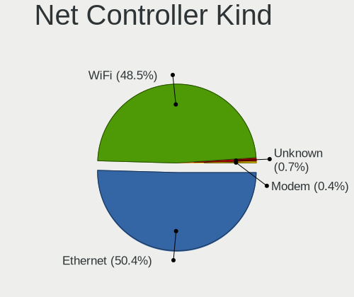

| Kind     | Computers | Percent |
|----------|-----------|---------|
| Ethernet | 1340      | 50.21%  |
| WiFi     | 1311      | 49.12%  |
| Unknown  | 10        | 0.37%   |
| Modem    | 8         | 0.3%    |

Used Controller
---------------

Currently used network controller

| Kind     | Computers | Percent |
|----------|-----------|---------|
| WiFi     | 966       | 57.81%  |
| Ethernet | 705       | 42.19%  |

NICs
----

Total network controllers on board

| Total | Computers | Percent |
|-------|-----------|---------|
| 2     | 824       | 47.96%  |
| 1     | 694       | 40.4%   |
| 0     | 95        | 5.53%   |
| 3     | 59        | 3.43%   |
| 4     | 29        | 1.69%   |
| 6     | 9         | 0.52%   |
| 5     | 3         | 0.17%   |
| 8     | 2         | 0.12%   |
| 7     | 2         | 0.12%   |
| 42    | 1         | 0.06%   |

IPv6
----

IPv6 vs IPv4

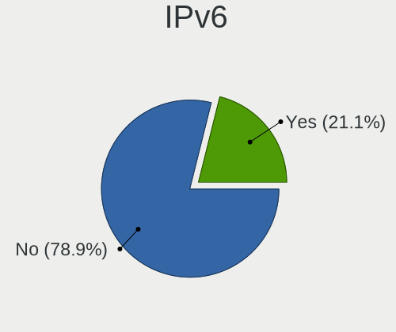

| Used | Computers | Percent |
|------|-----------|---------|
| No   | 1419      | 81.04%  |
| Yes  | 332       | 18.96%  |

Bluetooth
---------

Bluetooth Vendor
----------------

Controller vendors

| Vendor                          | Computers | Percent |
|---------------------------------|-----------|---------|
| Intel                           | 639       | 56.65%  |
| Realtek Semiconductor           | 104       | 9.22%   |
| Qualcomm Atheros Communications | 68        | 6.03%   |
| Cambridge Silicon Radio         | 58        | 5.14%   |
| Foxconn / Hon Hai               | 49        | 4.34%   |
| IMC Networks                    | 45        | 3.99%   |
| Realtek                         | 32        | 2.84%   |
| Broadcom                        | 31        | 2.75%   |
| MediaTek                        | 21        | 1.86%   |
| Apple                           | 19        | 1.68%   |
| Lite-On Technology              | 15        | 1.33%   |
| ASUSTek Computer                | 12        | 1.06%   |
| Opticis                         | 6         | 0.53%   |
| Dell                            | 5         | 0.44%   |
| Ralink                          | 4         | 0.35%   |
| Hewlett-Packard                 | 4         | 0.35%   |
| Foxconn International           | 4         | 0.35%   |
| Marvell Semiconductor           | 3         | 0.27%   |
| Toshiba                         | 2         | 0.18%   |
| Taiyo Yuden                     | 2         | 0.18%   |
| Alps Electric                   | 2         | 0.18%   |
| USI                             | 1         | 0.09%   |
| SINO WEALTH                     | 1         | 0.09%   |
| Actions                         | 1         | 0.09%   |

Bluetooth Model
---------------

Controller models

| Model                                               | Computers | Percent |
|-----------------------------------------------------|-----------|---------|
| Intel AX201 Bluetooth                               | 139       | 12.32%  |
| Intel Bluetooth wireless interface                  | 107       | 9.49%   |
| Intel AX200 Bluetooth                               | 106       | 9.4%    |
| Intel Bluetooth 9460/9560 Jefferson Peak (JfP)      | 81        | 7.18%   |
| Realtek Bluetooth Radio                             | 80        | 7.09%   |
| Intel Bluetooth Device                              | 74        | 6.56%   |
| Cambridge Silicon Radio Bluetooth Dongle (HCI mode) | 58        | 5.14%   |
| Intel AX211 Bluetooth                               | 50        | 4.43%   |
| Intel AX210 Bluetooth                               | 46        | 4.08%   |
| Qualcomm Atheros  Bluetooth Device                  | 43        | 3.81%   |
| Realtek Bluetooth Radio                             | 32        | 2.84%   |
| IMC Networks Bluetooth Radio                        | 23        | 2.04%   |
| MediaTek Wireless_Device                            | 21        | 1.86%   |
| Intel Wireless-AC 9260 Bluetooth Adapter            | 16        | 1.42%   |
| IMC Networks Wireless_Device                        | 15        | 1.33%   |
| Foxconn / Hon Hai Bluetooth Device                  | 15        | 1.33%   |
| Qualcomm Atheros QCA61x4 Bluetooth 4.0              | 14        | 1.24%   |
| Foxconn / Hon Hai MediaTek Bluetooth Adapter        | 14        | 1.24%   |
| Apple Bluetooth Host Controller                     | 14        | 1.24%   |
| Foxconn / Hon Hai Wireless_Device                   | 13        | 1.15%   |
| Realtek RTL8723B Bluetooth                          | 9         | 0.8%    |
| Qualcomm Atheros AR3012 Bluetooth 4.0               | 8         | 0.71%   |
| Intel Centrino Bluetooth Wireless Transceiver       | 8         | 0.71%   |
| Lite-On Bluetooth Device                            | 7         | 0.62%   |
| Broadcom BCM2045B (BDC-2.1)                         | 7         | 0.62%   |
| Opticis Bluetooth Radio                             | 6         | 0.53%   |
| Intel Wireless-AC 3168 Bluetooth                    | 6         | 0.53%   |
| Intel Centrino Advanced-N 6230 Bluetooth adapter    | 6         | 0.53%   |
| IMC Networks Bluetooth Device                       | 6         | 0.53%   |
| Broadcom BCM2045B (BDC-2.1) [Bluetooth Controller]  | 6         | 0.53%   |
| Realtek RTL8822BE Bluetooth 4.2 Adapter             | 5         | 0.44%   |
| Realtek  Bluetooth 4.2 Adapter                      | 5         | 0.44%   |
| Broadcom BCM20702 Bluetooth 4.0 [ThinkPad]          | 5         | 0.44%   |
| Ralink RT3290 Bluetooth                             | 4         | 0.35%   |
| Foxconn International BCM43142A0 Bluetooth module   | 4         | 0.35%   |
| ASUS Bluetooth Radio                                | 4         | 0.35%   |
| Apple Bluetooth USB Host Controller                 | 4         | 0.35%   |
| Realtek 802.11ac WLAN Adapter                       | 3         | 0.27%   |
| Marvell Bluetooth and Wireless LAN Composite        | 3         | 0.27%   |
| ASUS Qualcomm Bluetooth 4.1                         | 3         | 0.27%   |

Sound
-----

Sound Vendor
------------

Sound card vendors

| Vendor                                       | Computers | Percent |
|----------------------------------------------|-----------|---------|
| Intel                                        | 1092      | 50.79%  |
| AMD                                          | 519       | 24.14%  |
| Nvidia                                       | 382       | 17.77%  |
| C-Media Electronics                          | 16        | 0.74%   |
| Zhaoxin                                      | 15        | 0.7%    |
| Zoran Co. Personal Media Division (Nogatech) | 9         | 0.42%   |
| Realtek Semiconductor                        | 9         | 0.42%   |
| Loongson Technology                          | 8         | 0.37%   |
| Apple                                        | 7         | 0.33%   |
| Generalplus Technology                       | 6         | 0.28%   |
| Creative Labs                                | 6         | 0.28%   |
| XMOS                                         | 5         | 0.23%   |
| BY EDIFIER                                   | 4         | 0.19%   |
| BR25                                         | 4         | 0.19%   |
| ASUSTek Computer                             | 4         | 0.19%   |
| Silicon Integrated Systems [SiS]             | 3         | 0.14%   |
| Phytium Technology                           | 3         | 0.14%   |
| Micro Star International                     | 3         | 0.14%   |
| Huawei Technologies                          | 3         | 0.14%   |
| Yamaha                                       | 2         | 0.09%   |
| VIA Technologies                             | 2         | 0.09%   |
| TX                                           | 2         | 0.09%   |
| Texas Instruments                            | 2         | 0.09%   |
| Sony                                         | 2         | 0.09%   |
| JMTek                                        | 2         | 0.09%   |
| Giga-Byte Technology                         | 2         | 0.09%   |
| Focusrite-Novation                           | 2         | 0.09%   |
| Dell                                         | 2         | 0.09%   |
| USB-Speaker                                  | 1         | 0.05%   |
| ULi Electronics                              | 1         | 0.05%   |
| TerraTec Electronic                          | 1         | 0.05%   |
| SteelSeries ApS                              | 1         | 0.05%   |
| Specialix                                    | 1         | 0.05%   |
| SoundPlus Technology                         | 1         | 0.05%   |
| Samsung Electronics                          | 1         | 0.05%   |
| Razer USA                                    | 1         | 0.05%   |
| Polycom                                      | 1         | 0.05%   |
| OPPO Electronics                             | 1         | 0.05%   |
| NXP Semiconductors                           | 1         | 0.05%   |
| Moore Threads Technology                     | 1         | 0.05%   |

Sound Model
-----------

Sound card models

| Model                                                                             | Computers | Percent |
|-----------------------------------------------------------------------------------|-----------|---------|
| AMD Family 17h/19h HD Audio Controller                                            | 284       | 10.87%  |
| Intel Sunrise Point-LP HD Audio                                                   | 128       | 4.9%    |
| AMD Renoir Radeon High Definition Audio Controller                                | 121       | 4.63%   |
| Intel 8 Series/C220 Series Chipset High Definition Audio Controller               | 76        | 2.91%   |
| AMD Rembrandt Radeon High Definition Audio Controller                             | 75        | 2.87%   |
| Intel Cannon Lake PCH cAVS                                                        | 73        | 2.79%   |
| Intel 7 Series/C216 Chipset Family High Definition Audio Controller               | 72        | 2.76%   |
| Intel Tiger Lake-LP Smart Sound Technology Audio Controller                       | 66        | 2.53%   |
| Intel 6 Series/C200 Series Chipset Family High Definition Audio Controller        | 60        | 2.3%    |
| Intel 200 Series PCH HD Audio                                                     | 59        | 2.26%   |
| AMD Raven/Raven2/Fenghuang HDMI/DP Audio Controller                               | 59        | 2.26%   |
| Intel Alder Lake PCH-P High Definition Audio Controller                           | 53        | 2.03%   |
| Intel Xeon E3-1200 v3/4th Gen Core Processor HD Audio Controller                  | 48        | 1.84%   |
| Intel 100 Series/C230 Series Chipset Family HD Audio Controller                   | 47        | 1.8%    |
| Nvidia GA106 High Definition Audio Controller                                     | 42        | 1.61%   |
| Intel Comet Lake PCH-LP cAVS                                                      | 41        | 1.57%   |
| AMD Starship/Matisse HD Audio Controller                                          | 41        | 1.57%   |
| Nvidia Audio device                                                               | 37        | 1.42%   |
| Intel Haswell-ULT HD Audio Controller                                             | 37        | 1.42%   |
| Intel 8 Series HD Audio Controller                                                | 37        | 1.42%   |
| AMD FCH Azalia Controller                                                         | 33        | 1.26%   |
| Nvidia GP106 High Definition Audio Controller                                     | 32        | 1.22%   |
| AMD Baffin HDMI/DP Audio [Radeon RX 550 640SP / RX 560/560X]                      | 31        | 1.19%   |
| Nvidia TU106 High Definition Audio Controller                                     | 30        | 1.15%   |
| Intel Cannon Point-LP High Definition Audio Controller                            | 30        | 1.15%   |
| Nvidia TU107 GeForce GTX 1650 High Definition Audio Controller                    | 29        | 1.11%   |
| Intel Comet Lake PCH cAVS                                                         | 28        | 1.07%   |
| Intel Broadwell-U Audio Controller                                                | 27        | 1.03%   |
| Intel Wildcat Point-LP High Definition Audio Controller                           | 26        | 1%      |
| Intel Tiger Lake-H HD Audio Controller                                            | 26        | 1%      |
| Nvidia GK208 HDMI/DP Audio Controller                                             | 24        | 0.92%   |
| AMD Oland/Hainan/Cape Verde/Pitcairn HDMI Audio [Radeon HD 7000 Series]           | 24        | 0.92%   |
| Nvidia GP107GL High Definition Audio Controller                                   | 22        | 0.84%   |
| Nvidia GP104 High Definition Audio Controller                                     | 22        | 0.84%   |
| Intel Alder Lake-S HD Audio Controller                                            | 22        | 0.84%   |
| AMD SBx00 Azalia (Intel HDA)                                                      | 22        | 0.84%   |
| AMD Caicos HDMI Audio [Radeon HD 6450 / 7450/8450/8490 OEM / R5 230/235/235X OEM] | 22        | 0.84%   |
| Intel Comet Lake PCH-V cAVS                                                       | 21        | 0.8%    |
| Nvidia TU116 High Definition Audio Controller                                     | 20        | 0.77%   |
| AMD Navi 21/23 HDMI/DP Audio Controller                                           | 19        | 0.73%   |

Memory
------

Memory Vendor
-------------

Memory module vendors

| Vendor                     | Computers | Percent |
|----------------------------|-----------|---------|
| Samsung Electronics        | 339       | 27.16%  |
| SK hynix                   | 218       | 17.47%  |
| Kingston                   | 175       | 14.02%  |
| Micron Technology          | 147       | 11.78%  |
| Unknown                    | 68        | 5.45%   |
| Crucial                    | 52        | 4.17%   |
| A-DATA Technology          | 37        | 2.96%   |
| Ramaxel Technology         | 27        | 2.16%   |
| Unknown                    | 27        | 2.16%   |
| Corsair                    | 22        | 1.76%   |
| KINGBANK                   | 10        | 0.8%    |
| Elpida                     | 10        | 0.8%    |
| Unknown (ABCD)             | 8         | 0.64%   |
| G.Skill                    | 7         | 0.56%   |
| Transcend                  | 6         | 0.48%   |
| Team                       | 6         | 0.48%   |
| Nanya Technology           | 6         | 0.48%   |
| Lenovo                     | 6         | 0.48%   |
| Juhor                      | 5         | 0.4%    |
| UniIC                      | 4         | 0.32%   |
| Kingmax                    | 4         | 0.32%   |
| Asgard                     | 4         | 0.32%   |
| Unknown (0x0B92)           | 3         | 0.24%   |
| Unknown (08C8)             | 3         | 0.24%   |
| tigo                       | 3         | 0.24%   |
| Shenzhen WODPOSIT          | 3         | 0.24%   |
| Ramsta                     | 3         | 0.24%   |
| GLOWAY                     | 3         | 0.24%   |
| Apacer                     | 3         | 0.24%   |
| Xi'an UniIC Semiconductors | 2         | 0.16%   |
| Unknown (08B5)             | 2         | 0.16%   |
| UnilC                      | 2         | 0.16%   |
| KLEVV                      | 2         | 0.16%   |
| Kimtigo                    | 2         | 0.16%   |
| GeIL                       | 2         | 0.16%   |
| Colorful                   | 2         | 0.16%   |
| Unknown (8AF1)             | 1         | 0.08%   |
| Unknown (88BC)             | 1         | 0.08%   |
| Thermaltake                | 1         | 0.08%   |
| Teikon                     | 1         | 0.08%   |

Memory Model
------------

Memory module models

| Model                                                            | Computers | Percent |
|------------------------------------------------------------------|-----------|---------|
| Unknown                                                          | 27        | 2%      |
| Samsung RAM M471A1G44AB0-CWE 8GB Row Of Chips DDR4 3200MT/s      | 25        | 1.85%   |
| Samsung RAM M471B5173EB0-YK0 4GB SODIMM DDR3 1600MT/s            | 11        | 0.81%   |
| Micron RAM 4ATF1G64HZ-3G2E1 8GB Row Of Chips DDR4 3200MT/s       | 11        | 0.81%   |
| Samsung RAM M471A1K43DB1-CTD 8GB SODIMM DDR4 2667MT/s            | 10        | 0.74%   |
| Samsung RAM M471A1G44AB0-CWE 8192MB SODIMM DDR4 3200MT/s         | 10        | 0.74%   |
| Samsung RAM M471A1G44AB0-CTD 8GB SODIMM DDR4 2667MT/s            | 10        | 0.74%   |
| SK hynix RAM HMT351S6CFR8C-PB 4GB SODIMM DDR3 1600MT/s           | 9         | 0.67%   |
| SK hynix RAM HMAA1GS6CMR6N-VK 8GB Row Of Chips DDR4 2667MT/s     | 9         | 0.67%   |
| Samsung RAM M471A1K43EB1-CWE 8GB SODIMM DDR4 3200MT/s            | 9         | 0.67%   |
| Samsung RAM M471A1K43DB1-CWE 8GB SODIMM DDR4 3200MT/s            | 8         | 0.59%   |
| SK hynix RAM HMT451S6BFR8A-PB 4GB SODIMM DDR3 1600MT/s           | 7         | 0.52%   |
| Samsung RAM M471A5244CB0-CTD 4GB SODIMM DDR4 3266MT/s            | 7         | 0.52%   |
| Micron RAM MTC4C10163S1SC48BA1 8GB SODIMM DDR5 4800MT/s          | 7         | 0.52%   |
| Kingston RAM KHX3200C16D4/16GX 16GB DIMM DDR4 3600MT/s           | 7         | 0.52%   |
| Unknown (ABCD) RAM 123456789012345678 2GB SODIMM LPDDR4 2400MT/s | 6         | 0.44%   |
| SK hynix RAM HMAA1GS6CJR6N-XN 8GB Row Of Chips DDR4 3200MT/s     | 6         | 0.44%   |
| SK hynix RAM HMA81GS6AFR8N-UH 8GB SODIMM DDR4 2667MT/s           | 6         | 0.44%   |
| SK hynix RAM HMA41GS6AFR8N-TF 8GB SODIMM DDR4 2667MT/s           | 6         | 0.44%   |
| Samsung RAM M471A1K43CB1-CRC 8GB SODIMM DDR4 2667MT/s            | 6         | 0.44%   |
| Samsung RAM M471A1G44AB0-CTD 8GB Row Of Chips DDR4 2667MT/s      | 6         | 0.44%   |
| Samsung RAM M425R1GB4BB0-CQKOL 8GB SODIMM 4800MT/s               | 6         | 0.44%   |
| Micron RAM 53E1G32D2NP-046 2GB Row Of Chips LPDDR4 4267MT/s      | 6         | 0.44%   |
| Micron RAM 4ATF1G64HZ-3G2E1 8GB SODIMM DDR4 3200MT/s             | 6         | 0.44%   |
| Kingston RAM LV32D4S2S8HD-8 8GB SODIMM DDR4 3200MT/s             | 6         | 0.44%   |
| Kingston RAM KHX2666C16/8G 8GB DIMM DDR4 3466MT/s                | 6         | 0.44%   |
| Unknown RAM Module 2GB SODIMM DDR2 667MT/s                       | 5         | 0.37%   |
| Unknown RAM Module 16GB DIMM DDR4 2133MT/s                       | 5         | 0.37%   |
| SK hynix RAM HMAB2GS6AMR6N-XN 16GB SODIMM DDR4 3200MT/s          | 5         | 0.37%   |
| SK hynix RAM HMA851S6CJR6N-VK 4GB Row Of Chips DDR4 2667MT/s     | 5         | 0.37%   |
| SK hynix RAM HMA81GS6JJR8N-VK 8GB SODIMM DDR4 2667MT/s           | 5         | 0.37%   |
| Samsung RAM M471A5244CB0-CTD 4GB Row Of Chips DDR4 2667MT/s      | 5         | 0.37%   |
| Samsung RAM M471A1K43CB1-CTD 8GB SODIMM DDR4 2667MT/s            | 5         | 0.37%   |
| Samsung RAM M471A1K43BB1-CRC 8192MB SODIMM DDR4 2667MT/s         | 5         | 0.37%   |
| Samsung RAM M425R1GB4BB0-CQKOD 8GB SODIMM DDR5 4800MT/s          | 5         | 0.37%   |
| Micron RAM 8ATF1G64HZ-2G6E1 8GB SODIMM DDR4 2667MT/s             | 5         | 0.37%   |
| Micron RAM 16KTF1G64HZ-1G6E1 8GB SODIMM DDR3 1600MT/s            | 5         | 0.37%   |
| Unknown RAM Module 2GB SODIMM DDR3 1333MT/s                      | 4         | 0.3%    |
| SK hynix RAM HMCG66MEBSA092N 8GB SODIMM DDR5 4800MT/s            | 4         | 0.3%    |
| SK hynix RAM HMAA1GS6CMR6N-XN 8GB Row Of Chips DDR4 3200MT/s     | 4         | 0.3%    |

Memory Kind
-----------

Memory module kinds

| Kind    | Computers | Percent |
|---------|-----------|---------|
| DDR4    | 598       | 53.87%  |
| DDR3    | 240       | 21.62%  |
| DDR5    | 76        | 6.85%   |
| LPDDR4  | 62        | 5.59%   |
| LPDDR3  | 43        | 3.87%   |
| LPDDR5  | 33        | 2.97%   |
| Unknown | 19        | 1.71%   |
| SDRAM   | 15        | 1.35%   |
| DDR2    | 14        | 1.26%   |
| DRAM    | 8         | 0.72%   |
| DDR     | 2         | 0.18%   |

Memory Form Factor
------------------

Physical design of the memory module

| Name         | Computers | Percent |
|--------------|-----------|---------|
| SODIMM       | 576       | 51.47%  |
| DIMM         | 339       | 30.29%  |
| Row Of Chips | 188       | 16.8%   |
| Chip         | 11        | 0.98%   |
| Unknown      | 4         | 0.36%   |
| RIMM         | 1         | 0.09%   |

Memory Size
-----------

Memory module size

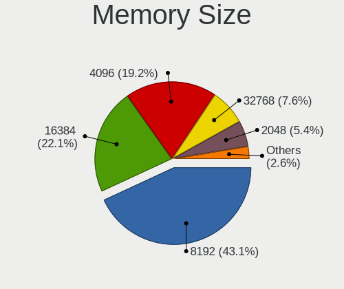

| Size  | Computers | Percent |
|-------|-----------|---------|
| 8192  | 528       | 44.41%  |
| 16384 | 250       | 21.03%  |
| 4096  | 239       | 20.1%   |
| 32768 | 80        | 6.73%   |
| 2048  | 69        | 5.8%    |
| 1024  | 11        | 0.93%   |
| 65536 | 5         | 0.42%   |
| 49152 | 2         | 0.17%   |
| 512   | 2         | 0.17%   |
| 16315 | 1         | 0.08%   |
| 12288 | 1         | 0.08%   |
| 256   | 1         | 0.08%   |

Memory Speed
------------

Memory module speed

| Speed   | Computers | Percent |
|---------|-----------|---------|
| 3200    | 239       | 20.27%  |
| 2667    | 192       | 16.28%  |
| 1600    | 176       | 14.93%  |
| 2400    | 79        | 6.7%    |
| 2133    | 68        | 5.77%   |
| 4800    | 59        | 5%      |
| 1333    | 35        | 2.97%   |
| 2666    | 33        | 2.8%    |
| 6400    | 32        | 2.71%   |
| 4267    | 32        | 2.71%   |
| 1867    | 25        | 2.12%   |
| 3600    | 18        | 1.53%   |
| 800     | 13        | 1.1%    |
| 5600    | 12        | 1.02%   |
| 1066    | 12        | 1.02%   |
| Unknown | 12        | 1.02%   |
| 3733    | 11        | 0.93%   |
| 4266    | 10        | 0.85%   |
| 1334    | 10        | 0.85%   |
| 3266    | 8         | 0.68%   |
| 1866    | 8         | 0.68%   |
| 667     | 8         | 0.68%   |
| 3466    | 7         | 0.59%   |
| 3000    | 7         | 0.59%   |
| 2668    | 7         | 0.59%   |
| 1067    | 7         | 0.59%   |
| 2933    | 6         | 0.51%   |
| 1800    | 5         | 0.42%   |
| 4199    | 4         | 0.34%   |
| 2048    | 4         | 0.34%   |
| 8400    | 3         | 0.25%   |
| 7500    | 3         | 0.25%   |
| 3400    | 3         | 0.25%   |
| 6000    | 2         | 0.17%   |
| 5808    | 2         | 0.17%   |
| 3933    | 2         | 0.17%   |
| 3800    | 2         | 0.17%   |
| 3500    | 2         | 0.17%   |
| 3066    | 2         | 0.17%   |
| 2448    | 2         | 0.17%   |

Printers & scanners
-------------------

Printer Vendor
--------------

Printer device vendors

| Vendor                             | Computers | Percent |
|------------------------------------|-----------|---------|
| Hewlett-Packard                    | 5         | 35.71%  |
| Brother Industries                 | 3         | 21.43%  |
| Seiko Epson                        | 2         | 14.29%  |
| Canon                              | 2         | 14.29%  |
| Pantum                             | 1         | 7.14%   |
| BeiJing LanXum Computer Technology | 1         | 7.14%   |

Printer Model
-------------

Printer device models

| Model                                                   | Computers | Percent |
|---------------------------------------------------------|-----------|---------|
| HP LaserJet 1020                                        | 2         | 14.29%  |
| Seiko Epson M105 Series                                 | 1         | 7.14%   |
| Seiko Epson ET-2710 Series                              | 1         | 7.14%   |
| Pantum P2200W-series                                    | 1         | 7.14%   |
| HP Officejet 4500 G510g-m                               | 1         | 7.14%   |
| HP LaserJet P1102                                       | 1         | 7.14%   |
| HP DeskJet 2130 series                                  | 1         | 7.14%   |
| Canon PIXMA MP280                                       | 1         | 7.14%   |
| Canon iP1100 series                                     | 1         | 7.14%   |
| Brother HL-L8260CDN series                              | 1         | 7.14%   |
| Brother HL-L2350DW series                               | 1         | 7.14%   |
| Brother HL-5440D series                                 | 1         | 7.14%   |
| BeiJing LanXum Technology Black and White Laser Printer | 1         | 7.14%   |

Scanner Vendor
--------------

Scanner device vendors

| Vendor | Computers | Percent |
|--------|-----------|---------|
| Canon  | 1         | 100%    |

Scanner Model
-------------

Scanner device models

| Model                   | Computers | Percent |
|-------------------------|-----------|---------|
| Canon CanoScan LiDE 120 | 1         | 100%    |

Camera
------

Camera Vendor
-------------

Camera device vendors

| Vendor                                 | Computers | Percent |
|----------------------------------------|-----------|---------|
| Chicony Electronics                    | 168       | 18.77%  |
| IMC Networks                           | 147       | 16.42%  |
| Bison Electronics                      | 65        | 7.26%   |
| Microdia                               | 60        | 6.7%    |
| Realtek Semiconductor                  | 58        | 6.48%   |
| Sunplus Innovation Technology          | 54        | 6.03%   |
| Quanta                                 | 52        | 5.81%   |
| Luxvisions Innotech Limited            | 41        | 4.58%   |
| Cheng Uei Precision Industry (Foxlink) | 35        | 3.91%   |
| Syntek                                 | 29        | 3.24%   |
| Acer                                   | 22        | 2.46%   |
| Lite-On Technology                     | 20        | 2.23%   |
| Suyin                                  | 17        | 1.9%    |
| Apple                                  | 14        | 1.56%   |
| SunplusIT                              | 13        | 1.45%   |
| Alcor Micro                            | 12        | 1.34%   |
| Logitech                               | 9         | 1.01%   |
| Z-Star Microelectronics                | 8         | 0.89%   |
| Silicon Motion                         | 8         | 0.89%   |
| Lenovo                                 | 6         | 0.67%   |
| Sonix Technology                       | 5         | 0.56%   |
| icSpring                               | 5         | 0.56%   |
| Ricoh                                  | 4         | 0.45%   |
| SN0002                                 | 3         | 0.34%   |
| Importek                               | 3         | 0.34%   |
| GEMBIRD                                | 3         | 0.34%   |
| Unknown (0000066029)                   | 2         | 0.22%   |
| ShineTech                              | 2         | 0.22%   |
| OPPO Electronics                       | 2         | 0.22%   |
| Nebraska Furniture Mart                | 2         | 0.22%   |
| Microsoft                              | 2         | 0.22%   |
| Google                                 | 2         | 0.22%   |
| Genesys Logic                          | 2         | 0.22%   |
| Y Media                                | 1         | 0.11%   |
| Vimicro                                | 1         | 0.11%   |
| Unknown                                | 1         | 0.11%   |
| Tripath Technology                     | 1         | 0.11%   |
| ShineOptics                            | 1         | 0.11%   |
| Samsung Electronics                    | 1         | 0.11%   |
| Primax Electronics                     | 1         | 0.11%   |

Camera Model
------------

Camera device models

| Model                                                        | Computers | Percent |
|--------------------------------------------------------------|-----------|---------|
| Chicony Integrated Camera                                    | 75        | 8.3%    |
| IMC Networks Integrated Camera                               | 55        | 6.08%   |
| Microdia Integrated_Webcam_HD                                | 32        | 3.54%   |
| IMC Networks HD Camera                                       | 27        | 2.99%   |
| Bison Integrated Camera                                      | 25        | 2.77%   |
| IMC Networks USB2.0 HD UVC WebCam                            | 23        | 2.54%   |
| Syntek Integrated Camera                                     | 21        | 2.32%   |
| Realtek Integrated_Webcam_HD                                 | 16        | 1.77%   |
| Cheng Uei Precision Industry (Foxlink) XiaoMi USB 2.0 Webcam | 14        | 1.55%   |
| Luxvisions Innotech Limited Integrated Camera                | 13        | 1.44%   |
| Chicony HD Webcam                                            | 13        | 1.44%   |
| Sunplus XiaoMi USB 2.0 Webcam                                | 12        | 1.33%   |
| Sunplus Integrated_Webcam_HD                                 | 12        | 1.33%   |
| IMC Networks ov9734_azurewave_camera                         | 12        | 1.33%   |
| Luxvisions Innotech Limited Integrated RGB Camera            | 10        | 1.11%   |
| Bison SunplusIT Integrated Camera                            | 10        | 1.11%   |
| Apple iPhone 5/5C/5S/6/SE/7/8/X                              | 9         | 1%      |
| Realtek USB Camera                                           | 8         | 0.88%   |
| Quanta HP HD Camera                                          | 8         | 0.88%   |
| Quanta hm1091_techfront                                      | 8         | 0.88%   |
| Quanta HD User Facing                                        | 8         | 0.88%   |
| Realtek Integrated Webcam                                    | 7         | 0.77%   |
| Luxvisions Innotech Limited HP Wide Vision HD Camera         | 7         | 0.77%   |
| Lite-On Integrated Camera                                    | 7         | 0.77%   |
| Chicony XiaoMi USB 2.0 Webcam                                | 7         | 0.77%   |
| Acer Integrated Camera                                       | 7         | 0.77%   |
| Sunplus HD WebCam                                            | 6         | 0.66%   |
| Quanta ov9734_techfront_camera                               | 6         | 0.66%   |
| Microdia Webcam Vitade AF                                    | 6         | 0.66%   |
| IMC Networks XHC Camera                                      | 6         | 0.66%   |
| IMC Networks Lenovo EasyCamera                               | 6         | 0.66%   |
| Chicony Lenovo Integrated Camera (0.3MP)                     | 6         | 0.66%   |
| Bison BisonCam,NB Pro                                        | 6         | 0.66%   |
| Syntek Lenovo EasyCamera                                     | 5         | 0.55%   |
| Silicon Motion 300k Pixel Camera                             | 5         | 0.55%   |
| Realtek HP Wide Vision HD Camera                             | 5         | 0.55%   |
| Quanta HP Wide Vision HD Camera                              | 5         | 0.55%   |
| Luxvisions Innotech Limited HP 5MP Camera                    | 5         | 0.55%   |
| Lite-On HP Wide Vision HD Camera                             | 5         | 0.55%   |
| Lite-On HP HD Camera                                         | 5         | 0.55%   |

Security
--------

Fingerprint Vendor
------------------

Fingerprint sensor vendors

| Vendor                             | Computers | Percent |
|------------------------------------|-----------|---------|
| Shenzhen Goodix Technology         | 83        | 33.74%  |
| Synaptics                          | 70        | 28.46%  |
| Validity Sensors                   | 51        | 20.73%  |
| Elan Microelectronics              | 14        | 5.69%   |
| Upek                               | 11        | 4.47%   |
| AuthenTec                          | 6         | 2.44%   |
| Focal-systems.Corp                 | 4         | 1.63%   |
| LighTuning Technology              | 3         | 1.22%   |
| STMicroelectronics                 | 2         | 0.81%   |
| Realtek USB2.0 Finger Print Bridge | 1         | 0.41%   |
| FocalTech                          | 1         | 0.41%   |

Fingerprint Model
-----------------

Fingerprint sensor models

| Model                                                                      | Computers | Percent |
|----------------------------------------------------------------------------|-----------|---------|
| Shenzhen Goodix  FingerPrint Device                                        | 54        | 21.95%  |
| Synaptics Prometheus MIS Touch Fingerprint Reader                          | 27        | 10.98%  |
| Shenzhen Goodix Fingerprint Reader                                         | 26        | 10.57%  |
| Validity Sensors VFS5011 Fingerprint Reader                                | 14        | 5.69%   |
| Elan ELAN:Fingerprint                                                      | 12        | 4.88%   |
| Upek Biometric Touchchip/Touchstrip Fingerprint Sensor                     | 10        | 4.07%   |
| Validity Sensors VFS 5011 fingerprint sensor                               | 8         | 3.25%   |
| Validity Sensors Synaptics VFS7552 Touch Fingerprint Sensor with PurePrint | 7         | 2.85%   |
| Synaptics  FS7604 Touch Fingerprint Sensor with PurePrint                  | 7         | 2.85%   |
| Synaptics Metallica MIS Touch Fingerprint Reader                           | 7         | 2.85%   |
| Synaptics FS7604 Touch Fingerprint Sensor with PurePrint                   | 7         | 2.85%   |
| Validity Sensors Synaptics WBDI                                            | 6         | 2.44%   |
| Validity Sensors VFS7500 Touch Fingerprint Sensor                          | 5         | 2.03%   |
| Synaptics WBDI Device                                                      | 5         | 2.03%   |
| Synaptics WBDI                                                             | 4         | 1.63%   |
| Synaptics UWP WBDI Device                                                  | 4         | 1.63%   |
| Synaptics Fingerprint reader [HP G6]                                       | 4         | 1.63%   |
| Focal-systems.Corp FT9201Fingerprint.                                      | 4         | 1.63%   |
| AuthenTec AES2810                                                          | 4         | 1.63%   |
| Validity Sensors VFS495 Fingerprint Reader                                 | 3         | 1.22%   |
| Validity Sensors VFS491                                                    | 3         | 1.22%   |
| Synaptics UWP WBDI                                                         | 3         | 1.22%   |
| Shenzhen Goodix FingerPrint                                                | 3         | 1.22%   |
| Validity Sensors VFS471 Fingerprint Reader                                 | 2         | 0.81%   |
| STMicroelectronics Fingerprint Reader                                      | 2         | 0.81%   |
| Elan ELAN:ARM-M4                                                           | 2         | 0.81%   |
| Unknown                                                                    | 2         | 0.81%   |
| Validity Sensors VFS7552 Touch Fingerprint Sensor                          | 1         | 0.41%   |
| Validity Sensors VFS Fingerprint sensor                                    | 1         | 0.41%   |
| Validity Sensors Fingerprint scanner                                       | 1         | 0.41%   |
| Upek TCS5B Fingerprint sensor                                              | 1         | 0.41%   |
| Realtek USB2.0 Finger Print Bridge FocalTech Fingerprint Device            | 1         | 0.41%   |
| LighTuning Fingerprint Sensor                                              | 1         | 0.41%   |
| LighTuning ES603 Swipe Fingerprint Sensor                                  | 1         | 0.41%   |
| LighTuning EgisTec Touch Fingerprint Sensor                                | 1         | 0.41%   |
| FocalTech Fingerprint Device                                               | 1         | 0.41%   |
| AuthenTec Fingerprint Sensor                                               | 1         | 0.41%   |
| AuthenTec AES2550 Fingerprint Sensor                                       | 1         | 0.41%   |

Chipcard Vendor
---------------

Chipcard module vendors

| Vendor                | Computers | Percent |
|-----------------------|-----------|---------|
| Broadcom              | 15        | 57.69%  |
| Upek                  | 4         | 15.38%  |
| Alcor Micro           | 3         | 11.54%  |
| Clay Logic            | 2         | 7.69%   |
| Yubico.com            | 1         | 3.85%   |
| Advanced Card Systems | 1         | 3.85%   |

Chipcard Model
--------------

Chipcard module models

| Model                                                                        | Computers | Percent |
|------------------------------------------------------------------------------|-----------|---------|
| Broadcom 5880                                                                | 6         | 23.08%  |
| Upek TouchChip Fingerprint Coprocessor (WBF advanced mode)                   | 4         | 15.38%  |
| Broadcom BCM5880 Secure Applications Processor with fingerprint swipe sensor | 3         | 11.54%  |
| Broadcom BCM5880 Secure Applications Processor                               | 3         | 11.54%  |
| Broadcom 58200                                                               | 3         | 11.54%  |
| Alcor Micro AU9540 Smartcard Reader                                          | 3         | 11.54%  |
| Clay Logic CanoKey Pigeon                                                    | 2         | 7.69%   |
| Yubico.com Yubikey 4/5 U2F+CCID                                              | 1         | 3.85%   |
| Advanced Card Systems ACR1581                                                | 1         | 3.85%   |

Unsupported
-----------

Unsupported Devices
-------------------

Total unsupported devices on board

| Total | Computers | Percent |
|-------|-----------|---------|
| 0     | 1053      | 59.9%   |
| 1     | 509       | 28.95%  |
| 2     | 133       | 7.57%   |
| 3     | 30        | 1.71%   |
| 4     | 20        | 1.14%   |
| 5     | 7         | 0.4%    |
| 8     | 2         | 0.11%   |
| 6     | 2         | 0.11%   |
| 10    | 1         | 0.06%   |
| 7     | 1         | 0.06%   |

Unsupported Device Types
------------------------

Types of unsupported devices

| Type                     | Computers | Percent |
|--------------------------|-----------|---------|
| Graphics card            | 254       | 26.85%  |
| Fingerprint reader       | 242       | 25.58%  |
| Net/wireless             | 105       | 11.1%   |
| Communication controller | 68        | 7.19%   |
| Multimedia controller    | 59        | 6.24%   |
| Sound                    | 49        | 5.18%   |
| Unassigned class         | 45        | 4.76%   |
| Bluetooth                | 31        | 3.28%   |
| Camera                   | 26        | 2.75%   |
| Chipcard                 | 21        | 2.22%   |
| Net/ethernet             | 14        | 1.48%   |
| Network                  | 9         | 0.95%   |
| Storage/raid             | 7         | 0.74%   |
| Card reader              | 5         | 0.53%   |
| Storage                  | 4         | 0.42%   |
| Storage/nvme             | 2         | 0.21%   |
| Storage/ata              | 2         | 0.21%   |
| Wireless                 | 1         | 0.11%   |
| Modem                    | 1         | 0.11%   |
| Dvb card                 | 1         | 0.11%   |

